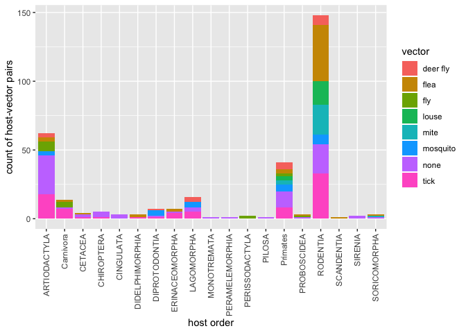
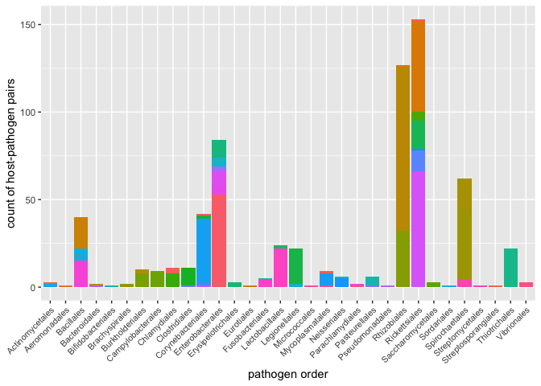
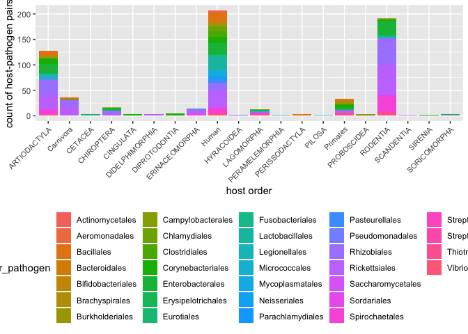
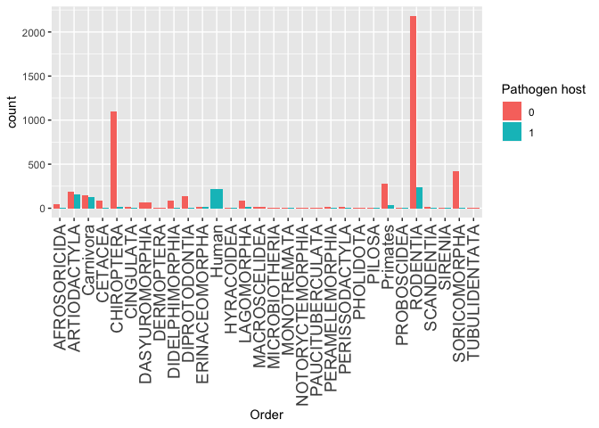
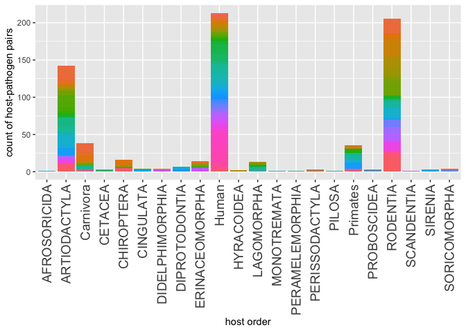
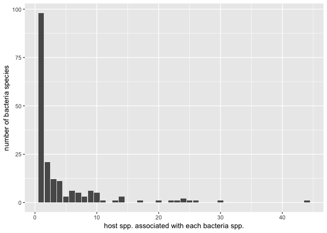
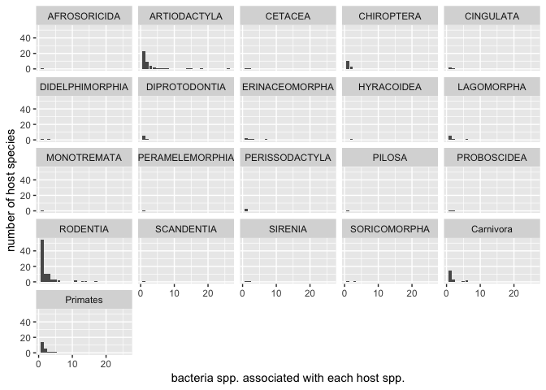

Bacterial traits and human disease outcomes
================
Ilya
12/7/2018

### To do

Scrape GIDEON database for more up-to-date dataset of mammal hosts and diseases.

Strategy
--------

Integrate data on host species, bacterial species and traits, and human disease outcomes. Visually summarize bacteria causing disease in mammals.
Apply generalized boosted models (GBM) to predict transmissibility and human disease outcomes based on bacterial traits.

### 1. Get bacteria-caused dx in GIDEON

### 2. Match dx to pathogen spp. names

### 3. Match spp. names (from GIDEON zdx and GMPD) to traits (in GMPD & other)

### 4. Compile master list of bacteria spp & traits

### 5. Feature construction with bacterial traits

### 6. Data visualization: summary “state of knowledge” on bacteria causing disease in mammals or humans

### 7. Use traits to predict transmissibility and human disease outcomes

Data sources
------------

1.  GIDEON dataset of bacterial zoonotic diseases and their mammalian hosts
2.  Dataset relating mammals to pathogens (GMPD)
3.  Dataset matching diseases to pathogens (to be collected)
4.  Bacterial trait datasets (Brbic et al. 2016; Barberan et al. 2017; EID2; GMPD)
5.  Human disease outcomes (GIDEON) and transmissibility (Han)
6.  Mammalian host ranges (IUCN)

Study design
------------

#### install and load required packages

    ## Removing package from 'C:/Users/fischhoffi/Documents/R/win-library/3.5'
    ## (as 'lib' is unspecified)
    ## Removing package from 'C:/Users/fischhoffi/Documents/R/win-library/3.5'
    ## (as 'lib' is unspecified)

    ## 
    ## Attaching package: 'rlang'

    ## The following object is masked from 'package:data.table':
    ## 
    ##     :=

    ## Installing package into 'C:/Users/fischhoffi/Documents/R/win-library/3.5'
    ## (as 'lib' is unspecified)

    ## package 'tibble' successfully unpacked and MD5 sums checked
    ## 
    ## The downloaded binary packages are in
    ##  C:\Users\fischhoffi\AppData\Local\Temp\RtmpaEyhFq\downloaded_packages

    ## Installing package into 'C:/Users/fischhoffi/Documents/R/win-library/3.5'
    ## (as 'lib' is unspecified)

    ## package 'tidyselect' successfully unpacked and MD5 sums checked
    ## 
    ## The downloaded binary packages are in
    ##  C:\Users\fischhoffi\AppData\Local\Temp\RtmpaEyhFq\downloaded_packages

    ## 
    ## Attaching package: 'dplyr'

    ## The following object is masked from 'package:glue':
    ## 
    ##     collapse

    ## The following objects are masked from 'package:data.table':
    ## 
    ##     between, first, last

    ## The following objects are masked from 'package:stats':
    ## 
    ##     filter, lag

    ## The following objects are masked from 'package:base':
    ## 
    ##     intersect, setdiff, setequal, union

    ## 
    ## Attaching package: 'reshape2'

    ## The following objects are masked from 'package:data.table':
    ## 
    ##     dcast, melt

    ## corrplot 0.84 loaded

    ## Loading required package: lattice

    ## Loading required package: survival

    ## Loading required package: Formula

    ## Loading required package: ggplot2

    ## 
    ## Attaching package: 'Hmisc'

    ## The following objects are masked from 'package:dplyr':
    ## 
    ##     src, summarize

    ## The following objects are masked from 'package:base':
    ## 
    ##     format.pval, units

    ## CHNOSZ version 1.1.3 (2017-11-13)

    ## Please run data(thermo) to create the "thermo" object

    ## 
    ## Attaching package: 'CHNOSZ'

    ## The following objects are masked from 'package:Hmisc':
    ## 
    ##     mtitle, spearman

    ## The following object is masked from 'package:dplyr':
    ## 
    ##     slice

    ## Skipping install of 'BacDiveR' from a github remote, the SHA1 (71082209) has not changed since last install.
    ##   Use `force = TRUE` to force installation

    ## Skipping install of 'taxizedb' from a github remote, the SHA1 (7ee9741a) has not changed since last install.
    ##   Use `force = TRUE` to force installation

    ## 
    ## Attaching package: 'taxizedb'

    ## The following objects are masked from 'package:taxize':
    ## 
    ##     children, classification, downstream

### 1. Get bacteria-caused dx in GIDEON

#### Read in GIDEON data from scrape

Save as GIDEON.Rdata, including unique diseases associated with each mammal taxon

``` r
source("GIDEON_read.R")
```

### 2. Match bacterial dx to pathogen spp names

#### GIDEON data: subset to include only non-carnivores and non-primates

Subset GIDEON data (on mammalian hosts and diseases) to then match up diseases with pathogens. This zdx-pathogen matching has already been done for carnivores and primates (in part), so exclude carnivores and primates. This saves animal\_dx\_parasites.Rdata and outputs animal-dx-parasites.csv

``` r
#Do this with Mammal Species of the World (
#http://www.departments.bucknell.edu/biology/resources/msw3/

#Note that this outputs animal-dx-parasites.csv, which includes only those mammal hosts that have been associated with a bacterial disease (Label = 1) 
source("GIDEON_subset_exclude_carnivores_primates.R")
```

    ## [1] "number of species / zoonosis pairs in GIDEON including all orders"
    ## [1] 2256    2
    ## [1] "number of non-carnivore mammal species without records in GIDEON"
    ## [1] 7638
    ## [1] "number of species / zoonosis pairs in GIDEON (all orders) after merge with mammals of the world checklist"
    ## [1] 15687     3
    ## [1] "number of *unique* species / zoonosis pairs in GIDEON (all orders) after merge with mammals of the world checklist"
    ## [1] 2246    3
    ## [1] 2246    3
    ## [1] "number of species / zoonosis records in GIDEON excluding primates and carnivores"
    ## [1] 1452
    ## [1] "records of non-carnivore mammals, with zdx and including one row for each mammal w/o a recorded zdx"
    ## [1] 9090
    ## [1] "check that size of animal-dx-parasites matches number GIDEON records plus number of other mammals"
    ## [1] TRUE

``` r
#comment out this version that excludes carnivores
# source("GIDEON_subset_non_carnivores.R")

#Commenting out this subset that only includes ungulates
#source("GIDEON_subset_ungulates.R")

#This next way of doing the subset is wrong because it assumes ungulates must be in GMPD; however, there could be records in GIDEON for ungulate / disease for which associated pathogen has not been recorded in GMPD. 
# source("GIDEON_subset.R")
```

Construct dataset animal-dx-parasites (google sheet) matching bacteria to zdx. Follow protocol in mammal-zdx-parasites instructions (google doc).

#### Bacterial diseases and bacteria: clean data in GIDEON\_bacterium\_dx.

This includes data on bacterial dx that affect people but not other animals. Make separate row for each bacteria species Output = human\_bacteria.Rdata

``` r
source("parse_species_bacteria.R")
```

Parse vectors

``` r
source("parse_vector.R")
```

    ## Warning: Ignoring unknown parameters: binwidth, bins, pad

    ## Saving 7 x 5 in image
    ## Saving 7 x 5 in image

    ## `stat_bin()` using `bins = 30`. Pick better value with `binwidth`.

#### Assemble data on primates (prim-zdx-parasites.xls, google sheet), carnivores (carnivore-zdx-parasites.csv, dropbox), other mammals ("animal-dx-parasites - animal-dx-parasites.csv", exported from google sheet).

Output list of parasites for checking in NCBI, parasiteGMPD\_tax\_report.txt. Output df\_parasite.Rdata (mammals with parasites), df\_no\_parasite.Rdata (no parasite), and df\_all (mammals w/ and w/o parasite)

``` r
source("mammal_zdx_assemble.R")
```

    ## [1] 9181    9
    ## [1] 666   5
    ## [1] 499  11

#### Get bacterial diseases in GIDEON

In GIDEON, filter: Disease --&gt; Agent --&gt; bacterium. Copy diseases into google sheet GIDEON\_bacterium\_dx. Add bacteria there. Subset df\_all.Rdata with GIDEON\_bacterium\_dx so that GIDEON contains only bacterial diseases

``` r
source("GIDEON_subset_bacterial.R")
```

    ## [1] "rows including all types of diseases"
    ## [1] 10346
    ## [1] "number of bacterial diseases  in df_all"
    ## [1] 129
    ## [1] "rows in df_all -- only bacterial diseases"
    ## [1] 676
    ## [1] "rows in df_all -- including mammals with Label = 0"
    ## [1] 9772

#### Assemble mammal (df\_all) and human data (human\_bacteria). Save as df\_all. Note that human\_bacteria also includes bacteria found in other mammals.

``` r
source("human_mammal.R")
```

    ## [1] "rows in df_all"
    ## [1] 10004

Graph vectors associated with each host order. This assigns vectors from human data to non-human, but does not resaves this as new dataframe

``` r
source("host_vector.R")
```

    ## Saving 7 x 5 in image

``` r
plot
```



#### Get id and children of bacteria.

Version using taxizedb. This works. If this doesn't work, try restarting R.

``` r
source("taxizedb_children.R")
```

    ##    user  system elapsed 
    ##       0       0       0

Version using Catalog of Life. Works but comment out because returns only ~9000 species, which seems like small number, and because not NCBI

``` r
# source("taxize_children_col.R")
```

Version using taxize and NCBI with downstream\_ncbi. Comment out because returns an error.

``` r
#source("taxize_children.R")
```

Version using dev version of taxize. Need to restart R before doing this versiom if CRAN version of taxize is installed. This runs into errors.

``` r
# source("taxize_dev.R")
```

Read in NCBI taxonomy This uses parent and child relationships to build up species list. This code is incomplete, would need to use "while" instead to be comprehensive with respect to parent-child relationships.

``` r
# source("ncbi_taxonomy_read.R")
```

Fix taxonomy in df\_all.Rdata using ncbi\_taxonomy.Rdata. Commenting out because ncbi\_taxonomy\_read.R didn't work.

``` r
#source("taxonomy_correct.Rdata")
```

Get all species and classify Get species in NCBI; then use "classification" in package "taxize" to get full classification of species. Add classification of each species to dataframe. This solution is not practical because it would take 44 hours even with API key.

``` r
#create list of species
#source("species_classify.R")
#classify each species 
#source("R_species_classify1.R")
```

Upload "parasiteGMPD.csv" to NCBI website (<https://www.ncbi.nlm.nih.gov/Taxonomy/TaxIdentifier/tax_identifier.cgi>). Choose option to save to file from website. Save file to working directory as "parasiteGMPD\_tax\_report.txt" Use "parasiteGMPD\_tax\_report.txt" to correct pathogen species names by merging with df\_parasite, with new field "preferred.name". Note that some of the preferred.names (e.g. Borelliela) do not match GMPD names (Borrelia). Save df\_parasite.Rdata that includes records for mammals without any parasites. Comment out, use instead full taxonomy from NCBI

``` r
# source("parasite_zdx_ncbi.R")
```

Subset df\_all by bacterial diseases (excluding mammals with no diseases). Save df\_all.Rdata. This is repeated here from up above, comment out.

``` r
# source("GIDEON_subset_bacterial.R")
```

#### Compare pathogenic bacteria to bacteria in NCBI

outputs: bacteria\_species.Rdata (master list of bacteria); out\_synonym.Rdata (synonyms of species that were not found in master list but are in NCBI); df\_all.Rdata (mammals with and without bacteria, with bacteria names corrected and assigned to taxonomic level); not\_found.csv, bacteria not found in NCBI. This uses stri\_detect\_fixed, from stringi

``` r
source("R_bacteria_lists_compare.R")
```

    ## [1] 99443     3
    ## [1] 99355     3

#### Classify bacteria

Use classification in taxize to classify to order all bacteria in df\_all. Input: df\_all.Rdata. Output: df\_all.Rdata

``` r
#add taxonomy id from ncbi
source("R_name2taxid.R")
```

    ## [1] 755

``` r
#use tax_id to get pathogen order, family, genus
source("R_classify_bacteria_observed.R")
```

    ##      user    system   elapsed 
    ## 0.3201667 0.0445000 0.3648333

Make graph of pathogenic bacteria by bacteria order, with different colors by bacteria family

``` r
source("R_graph_pathogen_order_family.R")
plot
```


Make graph of pathogenic bacteria by bacteria order, with different colors by bacteria genus (no legend for genus)

``` r
source("R_graph_pathogen_order_genus.R")
plot
```



Make graph of pathogenic bacteria by bacteria order, with different colors by host order

``` r
source("R_graph_pathogen_order_host_order.R")
plot
```


Make graph of host order, with different colors by bacteria order

``` r
source("R_graph_host_order_pathogen_order.R")
plot
```



Use classification in taxize to classify to order all bacteria in master list. Note this takes ~8 hours to do all. Input: bacteria\_species.Rdata. Output: bacteria\_species\_out.Rdata Commenting this out for now, plan to run on workstation

``` r
source("R_classify_bacteria.R")
```

    ##      user    system   elapsed 
    ## 204.17400  27.98417 232.39683

Graph counts across mammalian orders. Use df\_all.Rdata. Includes humans among primates

``` r
source("mammal_orders_graph.R")
```

    ## Saving 7 x 5 in image

``` r
plot
```



Graph counts across mammalian orders, with different colors for different bacterial orders.

``` r
source("mammal_orders_graph_stacked.R")
```

    ## Saving 7 x 5 in image

``` r
plot
```



Graph counts across bacterial species of how many mammals they associate with. Use df\_all.Rdata

``` r
source("bacteria_host_species_hist_graph.R")
```

    ## Warning: Ignoring unknown parameters: binwidth, bins, pad

    ## Saving 7 x 5 in image

``` r
plot
```



Graph histogram of number of pathogens associated with each host species

``` r
source("host_pathogen_histogram.R")
```

    ## Warning: Ignoring unknown parameters: binwidth, bins, pad

    ## Saving 7 x 5 in image

``` r
plot
```



### 3. Match spp. names (from GIDEON zdx and GMPD) to traits (in GMPD & other)

#### Get info in BacDive for all bacteria, including those with and without zdx associated

#### GMPD: assign GMPD traits to bacteria associated with zdx

Read in GMPD taxonomy and subset bacteria. Save gmpd\_taxonomy\_bacteria.Rdata

``` r
source("GMPD_bacteria.R")
```

Merge gmpd\_taxonomy\_bacteria.Rdata with GMPD parasite traits. Save gmpd.Rdata

``` r
source("GMPD_traits.R")
```

Assign GMPD traits to bacteria associated with zdx. Save df\_parasite\_gmpd.Rdata. Note: this version could be updated to use df\_all, but better to integrate with traits in BacDive

``` r
source("bacteria_zdx_gmpd_traits.R")
```

### 6. Data visualization: summary “state of knowledge” on bacteria causing disease in mammals or humans

#### Graph counts of host-bacteria pairs by bacterial order

Note: this is imperfect because only GMPD-represented species are present. Comment out

``` r
# source("bacteria_order.R")
# plot
```

#### Graph counts of host-bacteria pairs by traits in GMPD

``` r
source("bacteria_traits_gmpd_graph.R")
```

    ## Saving 7 x 5 in image

``` r
plot
```


### SCRATCH below here

#### Visualize data on number of bacterial disease per host species, facet wrap by host order

Assemble all GMPD datasets

### Data: Global Mammal Parasite Database

### Data: bacterial traits

#### Bacterial traits: read in and save Brbic et al. 2016

Source: ProTraits: <http://protraits.irb.hr/data.html>. We are using version of data in which traits have been binarized. Read in data and save as p1.Rdata.

``` r
#source("read_data_pathogen_traits1.R")
```

#### Bacterial traits: correct taxonomy in Brbic et al. 2016 data

Output data to file (species.csv) to upload to NCBI website (<https://www.ncbi.nlm.nih.gov/Taxonomy/TaxIdentifier/tax_identifier.cgi>). After running taxonomy\_ncbi.R, go to NCBI website, upload species.csv, and choose option to save to file from website. Save file to working directory.

``` r
#source("taxonomy_ncbi.R")
```

Read back in file outputted from NCBI website ("tax\_report.txt"). Merge tax\_report.txt with p1 (original Brbic et al. data), with new field "preferred.name"

``` r
#source("taxonomy_ncbi_out.R")
```

Also attempted, didn't work: Attempted with R package taxize fxn synonyms and "col" (Catalog of Life). Note: taxize does not include NCBI. This requires a lot of interaction for species with multiple matches.

``` r
# source("taxonomy1.R")
```

Also attempted, didn't work: Attempted with R package myTAI. This option requires interaction while code is looping through species, for species with more than one entry in NCBI.

``` r
# source("taxonomy_p1_myTAI.R")
```

#### Bacterial traits: determine correlations among variables in Brbic et al. 2016.

Note: commenting out corrplot for now because it throws an error.

``` r
# source("corrplot_bacteria.R")
```

#### Bacterial traits: Read in data in Barberan et al. 2017 and save as p2.Rdata

Source: <https://figshare.com/articles/International_Journal_of_Systematic_and_Evolutionary_Microbiology_IJSEM_phenotypic_database/4272392>

``` r
#source("read_data_pathogen_traits2.R")
```

#### Bacterial traits: correct taxonomy in Barberan et al. 2017 data

output file as species2.csv. make field Organism\_name. Some species have multiple entries. There is no explanation about this (<https://figshare.com/articles/International_Journal_of_Systematic_and_Evolutionary_Microbiology_IJSEM_phenotypic_database/4272392>). Executive decision: filter data so that there are only records for species with one line of data, because these are data in which we have most confidence.
After running taxonomy\_ncbi\_2.R, go to NCBI website, upload species.csv, and choose option to save to file from website. Save file to working directory.

``` r
#source("taxonomy_ncbi_2.R")
```

Read back in file outputted from NCBI website ("tax\_report2.txt"). Merge tax\_report.txt with p2 (original Barberan et al. data), with new field "preferred.name"

``` r
#source("taxonomy_ncbi_out2.R")
```

#### Bacterial traits: determine overlap between species in GMPD and each trait database

``` r
#source("GMPD_pathogen.R")
```

#### find species in common between Brbic et al. (p1) and Barberan et al.

``` r
#source("common_p.R")
```
