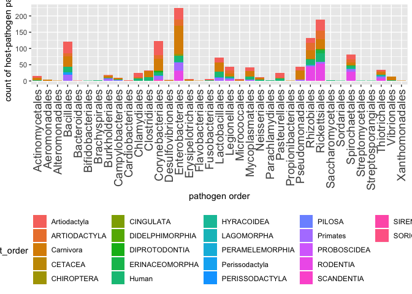
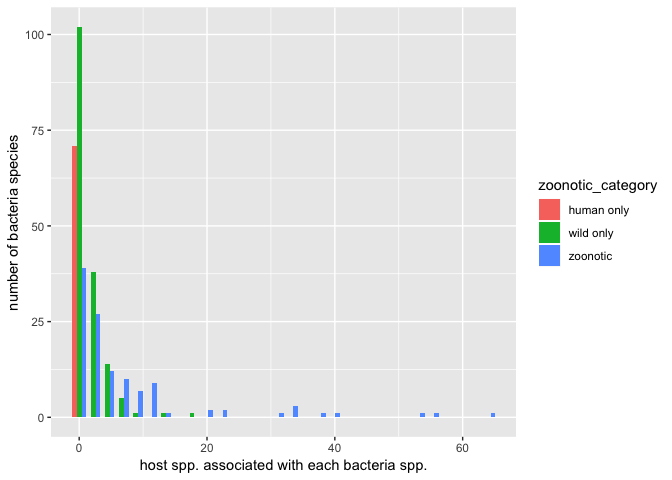

bacteria\_graph\_1
================
Ilya
1/30/2019

#### install and load required packages

    ## Removing package from '/Library/Frameworks/R.framework/Versions/3.4/Resources/library'
    ## (as 'lib' is unspecified)
    ## Removing package from '/Library/Frameworks/R.framework/Versions/3.4/Resources/library'
    ## (as 'lib' is unspecified)

    ## 
    ## Attaching package: 'rlang'

    ## The following object is masked from 'package:data.table':
    ## 
    ##     :=

    ## 
    ## The downloaded binary packages are in
    ##  /var/folders/0d/qm_pqljx11s_ddc42g1_yscr0000gn/T//RtmpKi8gz9/downloaded_packages
    ## 
    ## The downloaded binary packages are in
    ##  /var/folders/0d/qm_pqljx11s_ddc42g1_yscr0000gn/T//RtmpKi8gz9/downloaded_packages

    ## 
    ## Attaching package: 'dplyr'

    ## The following object is masked from 'package:glue':
    ## 
    ##     collapse

    ## The following objects are masked from 'package:data.table':
    ## 
    ##     between, first, last

    ## The following objects are masked from 'package:stats':
    ## 
    ##     filter, lag

    ## The following objects are masked from 'package:base':
    ## 
    ##     intersect, setdiff, setequal, union

    ## 
    ## Attaching package: 'reshape2'

    ## The following objects are masked from 'package:data.table':
    ## 
    ##     dcast, melt

    ## corrplot 0.84 loaded

    ## Loading required package: lattice

    ## Loading required package: survival

    ## Loading required package: Formula

    ## Loading required package: ggplot2

    ## 
    ## Attaching package: 'Hmisc'

    ## The following objects are masked from 'package:dplyr':
    ## 
    ##     src, summarize

    ## The following objects are masked from 'package:base':
    ## 
    ##     format.pval, units

    ## CHNOSZ version 1.1.3 (2017-11-13)

    ## Please run data(thermo) to create the "thermo" object

    ## 
    ## Attaching package: 'CHNOSZ'

    ## The following objects are masked from 'package:Hmisc':
    ## 
    ##     mtitle, spearman

    ## The following object is masked from 'package:dplyr':
    ## 
    ##     slice

### 1. Get bacteria-caused dx in GIDEON

### 2. Match dx to pathogen spp. names

### 3. Match spp. names (from GIDEON zdx and GMPD) to traits (in GMPD & other)

### 4. Compile master list of bacteria spp & traits

### 5. Feature construction with bacterial traits

### 6. Data visualization: summary “state of knowledge” on bacteria causing disease in mammals or humans

### 7. Use traits to predict transmissibility and human disease outcomes

6. Data visualization: summary “state of knowledge” on bacteria causing disease in mammals or humans
----------------------------------------------------------------------------------------------------

### Processing data

#### load bacteria\_pathogenic\_mammals.Rdata and make graph of bacteria order vs. host order

``` r
source("R_graph_pathogen_order_host_order1.R")
plot
```



#### make graph of histogram of number of hosts per bacteria, across zoonotic categories (human only, zoonotic, wild only)

``` r
source("R_bacteria_host_species_hist_graph1.R")
```

    ## Saving 7 x 5 in image

    ## `stat_bin()` using `bins = 30`. Pick better value with `binwidth`.

``` r
plot
```

    ## `stat_bin()` using `bins = 30`. Pick better value with `binwidth`.


