bacteria\_processing\_3
================
Ilya
6/24/2019

\#\#\#\#install and load required
    packages

    ## Loading required package: lattice

    ## Loading required package: ggplot2

    ## Install package "strengejacke" from GitHub (`devtools::install_github("strengejacke/strengejacke")`) to load all sj-packages at once!

    ## Loaded gbm 2.1.5

    ## Loading required package: gplots

    ## 
    ## Attaching package: 'gplots'

    ## The following object is masked from 'package:stats':
    ## 
    ##     lowess

    ## randomForest 4.6-14

    ## Type rfNews() to see new features/changes/bug fixes.

    ## 
    ## Attaching package: 'randomForest'

    ## The following object is masked from 'package:ggplot2':
    ## 
    ##     margin

    ## 
    ## ********************************************************

    ## Note: As of version 1.0.0, cowplot does not change the

    ##   default ggplot2 theme anymore. To recover the previous

    ##   behavior, execute:
    ##   theme_set(theme_cowplot())

    ## ********************************************************

    ## 
    ## Attaching package: 'cowplot'

    ## The following objects are masked from 'package:sjPlot':
    ## 
    ##     plot_grid, save_plot

    ## 
    ## Attaching package: 'dplyr'

    ## The following object is masked from 'package:randomForest':
    ## 
    ##     combine

    ## The following objects are masked from 'package:stats':
    ## 
    ##     filter, lag

    ## The following objects are masked from 'package:base':
    ## 
    ##     intersect, setdiff, setequal, union

    ## 
    ## Attaching package: 'gridExtra'

    ## The following object is masked from 'package:dplyr':
    ## 
    ##     combine

    ## The following object is masked from 'package:randomForest':
    ## 
    ##     combine

\#\#\#read in BacDive data \#\#\#find out fields with at least threshold
% coverage

``` r
load("../DATA/PROCESSED/Data from Backdive-2.RData")
dim(merge)
```

    ## [1] 5619670       6

``` r
merge_test = unique(merge)
dim(merge_test)
```

    ## [1] 5337978       6

``` r
#11752  taxonomy_name   strains_tax_PNU species_epithet actinomycetemcomitans
test = subset(merge, bacdive_id == 11752 &
                section == "taxonomy_name" &
                subsection == "strains_tax_PNU" &
                field == "species_epithet")
threshold = 0.01
D = merge
dim(D)
```

    ## [1] 5619670       6

``` r
D = unique(D)
dim(D)
```

    ## [1] 5337978       6

``` r
#rm(merge)
#remove NA values
inds.na = which(!is.na(D$value))
D = D[inds.na,]
id_len=length(unique(D$bacdive_id))
D$new_field = paste(D$section, D$subsection, D$field)
save(D, file = "../DATA/PROCESSED/D.Rdata")
count=as.data.frame(table(D$new_field))#combination of subsection and field
var1=count$Var1
freq=count$Freq
var<-list()
freqs<-list()
for (i in 1:length(freq)) {
     if (freq[i]>=threshold*id_len) {#this will get fields greater than 1%
         var[[i]]=var1[i]
         freqs[[i]]=freq[i]
     }
}

df=do.call(rbind, Map(data.frame, Feature_name=var, Frequency=freqs))

df$Fraction = df$Frequency/id_len

###get those seen at least 1% of time
df01 = subset(df, Fraction >= 0.01)
save(df01, file = "../DATA/PROCESSED/df01.Rdata")
```

\#use df01 to subset all data for those variables

``` r
load("../DATA/PROCESSED/D.RData")

merge01 = subset(D, new_field %in% df01$Feature_name)
save(merge01, file = "../DATA/PROCESSED/merge01.Rdata")
```

``` r
##this part is from data_processing.R 
load("../DATA/PROCESSED/merge01.Rdata")

df <- merge01

df <- unique(df)

df$feature_name <- paste(df$section, df$subsection, df$field)

a <- df[is.element(df$feature_name, df01$Feature_name),]#df01 for 1% threshold

q_all <- dcast(a, bacdive_id~feature_name)
dim(q_all)
```

    ## [1] 31040  1925

``` r
q = q_all
q <- q[order(q$bacdive_id),]

dim(q)
```

    ## [1] 31040  1925

``` r
##test with merge10
# df10 <- merge10
# 
# df10 <- unique(df10)
# 
# df10$feature_name <- paste(df10$section, df10$subsection, df10$field)
# 
# a10 <- df10[is.element(df10$feature_name, df20$Feature_name),]

# q <- dcast(a, bacdive_id~feature_name)
# q <- q[order(q$bacdive_id),]


write.csv(q, file = "df.csv", row.names = F)
temp = read.csv("df.csv")
col_names_list = names(temp)
write.csv(col_names_list, file = "bacteria_fields.csv",
          row.names=FALSE)

dim(temp)
```

    ## [1] 31040  1925

``` r
# # remove columns with near zero variance Global
# nzv <- nearZeroVar(q,saveMetrics=TRUE,freqCut = 95/5)
# nzv <- row.names(nzv[which(nzv$nzv==TRUE),])
# dropnzv<-names(q[ , which(names(q) %in% nzv)])
# q <- q[ , -which(names(q) %in% nzv)]
# write.csv(q, file = "dropnzvdata.csv", row.names = F)
```

``` r
##this part corresponds to Zach's one_hot_encoding.R
#one-hot encode categorical variables
q_all <- read.csv(file = "df.csv")

q = q_all
dim(q)
```

    ## [1] 31040  1925

``` r
str(q)
```

    ## 'data.frame':    31040 obs. of  1925 variables:
    ##  $ bacdive_id                                                      : int  1 10 100 1000 10000 100000 100001 100002 100003 100004 ...
    ##  $ application_interaction.risk_assessment.biosafety_level         : Factor w/ 4 levels "1","2","3**",..: 1 1 1 1 1 NA NA NA NA NA ...
    ##  $ application_interaction.risk_assessment.biosafety_level_comment : Factor w/ 3 levels "German classification",..: 3 3 3 3 3 NA NA NA NA NA ...
    ##  $ application_interaction.risk_assessment.biosafety_level_comment1: Factor w/ 4 levels "German classification",..: NA NA NA NA NA NA NA NA NA NA ...
    ##  $ application_interaction.risk_assessment.biosafety_level_comment2: Factor w/ 18 levels "German classification",..: NA NA NA NA NA NA NA NA NA NA ...
    ##  $ application_interaction.risk_assessment.biosafety_level1        : Factor w/ 4 levels "1","1+","2","L1": NA NA NA NA NA NA NA NA NA NA ...
    ##  $ application_interaction.risk_assessment.biosafety_level2        : Factor w/ 3 levels "1","2","L1": NA NA NA NA NA NA NA NA NA NA ...
    ##  $ application_interaction.risk_assessment.ID_reference            : int  950 1705 5523 17084 14065 NA NA NA NA NA ...
    ##  $ application_interaction.risk_assessment.ID_reference1           : int  NA NA NA NA NA NA NA NA NA NA ...
    ##  $ application_interaction.risk_assessment.ID_reference2           : int  NA NA NA NA NA NA NA NA NA NA ...
    ##  $ application_interaction.risk_assessment.pathogenicity_animal    : logi  NA NA NA NA NA NA ...
    ##  $ application_interaction.risk_assessment.pathogenicity_human     : logi  NA NA NA TRUE NA NA ...
    ##  $ application_interaction.risk_assessment.pathogenicity_plant     : logi  NA NA NA NA NA NA ...
    ##  $ culture_growth_condition.culture_medium.ID_reference            : int  950 NA 5523 17084 14065 NA NA NA NA NA ...
    ##  $ culture_growth_condition.culture_medium.ID_reference1           : int  NA 1705 NA NA NA NA NA NA NA NA ...
    ##  $ culture_growth_condition.culture_medium.ID_reference2           : int  NA 1705 NA NA NA NA NA NA NA NA ...
    ##  $ culture_growth_condition.culture_medium.ID_reference3           : int  NA NA NA NA NA NA NA NA NA NA ...
    ##  $ culture_growth_condition.culture_medium.ID_reference4           : int  NA NA NA NA NA NA NA NA NA NA ...
    ##  $ culture_growth_condition.culture_medium.ID_reference5           : int  NA NA NA NA NA NA NA NA NA NA ...
    ##  $ culture_growth_condition.culture_medium.ID_reference6           : int  NA NA NA NA NA NA NA NA NA NA ...
    ##  $ culture_growth_condition.culture_medium.ID_reference7           : int  NA NA NA NA NA NA NA NA NA NA ...
    ##  $ culture_growth_condition.culture_medium.ID_reference8           : int  NA NA NA NA NA NA NA NA NA NA ...
    ##  $ culture_growth_condition.culture_medium.ID_reference9           : int  NA NA NA NA NA NA NA NA NA NA ...
    ##  $ culture_growth_condition.culture_medium.media_link              : Factor w/ 980 levels "https://www.dsmz.de/microorganisms/medium/pdf/DSMZ_Medium1.pdf",..: 45 NA 42 474 906 NA NA NA NA NA ...
    ##  $ culture_growth_condition.culture_medium.media_link1             : Factor w/ 432 levels "https://www.dsmz.de/microorganisms/medium/pdf/DSMZ_Medium1.pdf",..: NA 25 NA NA NA NA NA NA NA NA ...
    ##  $ culture_growth_condition.culture_medium.media_link2             : Factor w/ 207 levels "https://www.dsmz.de/microorganisms/medium/pdf/DSMZ_Medium1.pdf",..: NA 72 NA NA NA NA NA NA NA NA ...
    ##  $ culture_growth_condition.culture_medium.medium_composition      : Factor w/ 148 levels "(all g l-1 in distilled water): sea salts (Sigma), 40; NaCl, 50; yeast extract, 1; peptone, 5; ferric citrate, "| __truncated__,..: NA NA NA NA NA NA NA NA NA NA ...
    ##  $ culture_growth_condition.culture_medium.medium_composition1     : Factor w/ 55 levels " 4.0 g yeast extract, 4.0 g glucose, 5.0 g malt extract, 1 ml vitamin B solution (containing 0.5 mg each of thi"| __truncated__,..: NA NA NA NA NA NA NA NA NA NA ...
    ##  $ culture_growth_condition.culture_medium.medium_composition2     : Factor w/ 274 levels " 1g/L Yeast extract, 5g/L xylan, 1g/L NH4Cl, 0.1g/L NaCl, 0.1 g/L MgCl*6 H2O, 0.05g/L CaCl2*2 H2O, 0.4 g/L K2HP"| __truncated__,..: NA NA NA NA NA NA NA NA NA NA ...
    ##  $ culture_growth_condition.culture_medium.medium_composition3     : Factor w/ 151 levels "0.1 % (w/v) yeast extract, peptone and glucose, 15 g agar per litre, pH 6.8",..: NA NA NA NA NA NA NA NA NA NA ...
    ##  $ culture_growth_condition.culture_medium.medium_composition4     : Factor w/ 85 levels "0,5 % (w/v) baker's yeast (fresh weight), 0.1 % (w/v) CaCl2.2H2O, 1.5 % (w/v) agar (pH 7.2); supplemented with "| __truncated__,..: NA NA NA NA NA NA NA NA NA NA ...
    ##  $ culture_growth_condition.culture_medium.medium_composition5     : Factor w/ 60 levels "0.3 % (w/v) yeast extract and 0.3 % (w/v) casein peptone, respectively, 15 g agar per litre, pH 7.2",..: NA NA NA NA NA NA NA NA NA NA ...
    ##  $ culture_growth_condition.culture_medium.medium_composition6     : Factor w/ 50 levels "5 % NaCl","80 % VY/2, 10 % CY, 10 % S-medium, vitamin solution and additional vitamin B 12",..: NA NA NA NA NA NA NA NA NA NA ...
    ##  $ culture_growth_condition.culture_medium.medium_composition7     : Factor w/ 39 levels "Columbia agar (39.000 g);distilled water (1000.000 ml)",..: NA NA NA NA NA NA NA NA NA NA ...
    ##  $ culture_growth_condition.culture_medium.medium_composition8     : Factor w/ 54 levels "Agar (15.000 g);Glucose (4.000 g);Yeast extract (4.000 g);Malt extract (10.000 g);Calcium carbonate (2.000 g);S"| __truncated__,..: NA NA NA NA NA NA NA NA NA NA ...
    ##  $ culture_growth_condition.culture_medium.medium_composition9     : Factor w/ 40 levels "30g Saccharose, 2g Sodium Nitrate, 1g Dipotassium Phosphate, 0.5g Magnesium Sulfate, 0.5g Potassium Chloride, 0"| __truncated__,..: NA NA NA NA NA NA NA NA NA NA ...
    ##  $ culture_growth_condition.culture_medium.medium_growth           : logi  TRUE NA TRUE TRUE TRUE NA ...
    ##  $ culture_growth_condition.culture_medium.medium_growth1          : logi  NA TRUE NA NA NA NA ...
    ##  $ culture_growth_condition.culture_medium.medium_growth2          : logi  NA TRUE NA NA NA NA ...
    ##  $ culture_growth_condition.culture_medium.medium_growth3          : logi  NA NA NA NA NA NA ...
    ##  $ culture_growth_condition.culture_medium.medium_growth4          : logi  NA NA NA NA NA NA ...
    ##  $ culture_growth_condition.culture_medium.medium_growth5          : logi  NA NA NA NA NA NA ...
    ##  $ culture_growth_condition.culture_medium.medium_growth6          : logi  NA NA NA NA NA NA ...
    ##  $ culture_growth_condition.culture_medium.medium_growth7          : logi  NA NA NA NA NA NA ...
    ##  $ culture_growth_condition.culture_medium.medium_growth8          : logi  NA NA NA NA NA NA ...
    ##  $ culture_growth_condition.culture_medium.medium_growth9          : logi  NA NA NA NA NA NA ...
    ##  $ culture_growth_condition.culture_medium.medium_name             : Factor w/ 2531 levels "0.1xTSB","0.3 MB agar",..: 927 NA 1780 422 2465 NA NA NA NA NA ...
    ##  $ culture_growth_condition.culture_medium.medium_name1            : Factor w/ 1578 levels "1/10 NUTRIENT AGAR NO.2 (DSMZ Medium 952), 28°C",..: NA 536 NA NA NA NA NA NA NA NA ...
    ##  $ culture_growth_condition.culture_medium.medium_name2            : Factor w/ 1190 levels "0.1 x TSB agar",..: NA 1188 NA NA NA NA NA NA NA NA ...
    ##  $ culture_growth_condition.culture_medium.medium_name3            : Factor w/ 418 levels "0.1 x TSB agar",..: NA NA NA NA NA NA NA NA NA NA ...
    ##  $ culture_growth_condition.culture_medium.medium_name4            : Factor w/ 217 levels " Mueller - Hinton agar",..: NA NA NA NA NA NA NA NA NA NA ...
    ##  $ culture_growth_condition.culture_medium.medium_name5            : Factor w/ 161 levels "0,35% acetic acid agar",..: NA NA NA NA NA NA NA NA NA NA ...
    ##  $ culture_growth_condition.culture_medium.medium_name6            : Factor w/ 120 levels "3.3xPYE agar",..: NA NA NA NA NA NA NA NA NA NA ...
    ##  $ culture_growth_condition.culture_medium.medium_name7            : Factor w/ 83 levels "5428","5530",..: NA NA NA NA NA NA NA NA NA NA ...
    ##  $ culture_growth_condition.culture_medium.medium_name8            : Factor w/ 83 levels "0.1  x marine broth 2216 agar",..: NA NA NA NA NA NA NA NA NA NA ...
    ##  $ culture_growth_condition.culture_medium.medium_name9            : Factor w/ 69 levels "Bennett's agar",..: NA NA NA NA NA NA NA NA NA NA ...
    ##  $ culture_growth_condition.culture_medium.text_mined              : logi  NA NA NA NA NA NA ...
    ##  $ culture_growth_condition.culture_medium.text_mined1             : logi  NA NA NA NA NA NA ...
    ##  $ culture_growth_condition.culture_medium.text_mined2             : logi  NA NA NA NA NA NA ...
    ##  $ culture_growth_condition.culture_medium.text_mined3             : logi  NA NA NA NA NA NA ...
    ##  $ culture_growth_condition.culture_medium.text_mined4             : logi  NA NA NA NA NA NA ...
    ##  $ culture_growth_condition.culture_medium.text_mined5             : logi  NA NA NA NA NA NA ...
    ##  $ culture_growth_condition.culture_medium.text_mined6             : logi  NA NA NA NA NA NA ...
    ##  $ culture_growth_condition.culture_medium.text_mined7             : logi  NA NA NA NA NA NA ...
    ##  $ culture_growth_condition.culture_medium.text_mined8             : logi  NA NA NA NA NA NA ...
    ##  $ culture_growth_condition.culture_medium.text_mined9             : logi  NA NA NA NA NA NA ...
    ##  $ culture_growth_condition.culture_pH.ability                     : Factor w/ 2 levels "no","positive": NA NA NA NA NA NA NA NA NA NA ...
    ##  $ culture_growth_condition.culture_pH.ability1                    : Factor w/ 3 levels "inconsistent",..: NA NA NA NA NA NA NA NA NA NA ...
    ##  $ culture_growth_condition.culture_pH.ability2                    : Factor w/ 3 levels "inconsistent",..: NA NA NA NA NA NA NA NA NA NA ...
    ##  $ culture_growth_condition.culture_pH.ID_reference                : int  NA NA NA NA NA NA NA NA NA NA ...
    ##  $ culture_growth_condition.culture_pH.ID_reference1               : int  NA NA NA NA NA NA NA NA NA NA ...
    ##  $ culture_growth_condition.culture_pH.ID_reference2               : int  NA NA NA NA NA NA NA NA NA NA ...
    ##  $ culture_growth_condition.culture_pH.pH                          : Factor w/ 178 levels "<4.3",">4.5",..: NA NA NA NA NA NA NA NA NA NA ...
    ##  $ culture_growth_condition.culture_pH.pH1                         : Factor w/ 568 levels "<5.0","<6",">5.5",..: NA NA NA NA NA NA NA NA NA NA ...
    ##  $ culture_growth_condition.culture_pH.pH2                         : Factor w/ 297 levels "<10.5","<5","<5.0",..: NA NA NA NA NA NA NA NA NA NA ...
    ##  $ culture_growth_condition.culture_pH.test_type                   : Factor w/ 4 levels "growth","maximum",..: NA NA NA NA NA NA NA NA NA NA ...
    ##  $ culture_growth_condition.culture_pH.test_type1                  : Factor w/ 4 levels "growth","maximum",..: NA NA NA NA NA NA NA NA NA NA ...
    ##  $ culture_growth_condition.culture_pH.test_type2                  : Factor w/ 4 levels "growth","maximum",..: NA NA NA NA NA NA NA NA NA NA ...
    ##  $ culture_growth_condition.culture_temp.ability                   : Factor w/ 2 levels "no","positive": 2 2 2 2 2 NA NA NA NA NA ...
    ##  $ culture_growth_condition.culture_temp.ability1                  : Factor w/ 2 levels "no","positive": NA NA NA NA NA NA NA NA NA NA ...
    ##  $ culture_growth_condition.culture_temp.ability2                  : Factor w/ 3 levels "inconsistent",..: NA NA NA NA NA NA NA NA NA NA ...
    ##  $ culture_growth_condition.culture_temp.ability3                  : Factor w/ 3 levels "inconsistent",..: NA NA NA NA NA NA NA NA NA NA ...
    ##  $ culture_growth_condition.culture_temp.ability4                  : Factor w/ 3 levels "inconsistent",..: NA NA NA NA NA NA NA NA NA NA ...
    ##  $ culture_growth_condition.culture_temp.ID_reference              : int  950 1705 5523 17084 14065 NA NA NA NA NA ...
    ##  $ culture_growth_condition.culture_temp.ID_reference1             : int  NA NA NA NA NA NA NA NA NA NA ...
    ##  $ culture_growth_condition.culture_temp.ID_reference2             : int  NA NA NA NA NA NA NA NA NA NA ...
    ##  $ culture_growth_condition.culture_temp.ID_reference3             : int  NA NA NA NA NA NA NA NA NA NA ...
    ##  $ culture_growth_condition.culture_temp.ID_reference4             : int  NA NA NA NA NA NA NA NA NA NA ...
    ##  $ culture_growth_condition.culture_temp.temp                      : Factor w/ 124 levels ">34.0","0","0-34",..: 63 67 88 67 67 NA NA NA NA NA ...
    ##  $ culture_growth_condition.culture_temp.temp1                     : Factor w/ 366 levels "(-2)-(-1)","0-20",..: NA NA NA NA NA NA NA NA NA NA ...
    ##  $ culture_growth_condition.culture_temp.temp2                     : Factor w/ 727 levels "-1.8-10","-1.8-16",..: NA NA NA NA NA NA NA NA NA NA ...
    ##  $ culture_growth_condition.culture_temp.temp3                     : Factor w/ 376 levels "-2-25","-5.0",..: NA NA NA NA NA NA NA NA NA NA ...
    ##  $ culture_growth_condition.culture_temp.temp4                     : Factor w/ 160 levels "-2",">45",">49.0",..: NA NA NA NA NA NA NA NA NA NA ...
    ##  $ culture_growth_condition.culture_temp.temperature_range         : Factor w/ 4 levels "hyperthermophilic",..: 2 2 2 2 2 NA NA NA NA NA ...
    ##  $ culture_growth_condition.culture_temp.temperature_range1        : Factor w/ 4 levels "hyperthermophilic",..: NA NA NA NA NA NA NA NA NA NA ...
    ##  $ culture_growth_condition.culture_temp.temperature_range2        : Factor w/ 4 levels "hyperthermophilic",..: NA NA NA NA NA NA NA NA NA NA ...
    ##  $ culture_growth_condition.culture_temp.temperature_range3        : Factor w/ 3 levels "mesophilic","psychrophilic",..: NA NA NA NA NA NA NA NA NA NA ...
    ##  $ culture_growth_condition.culture_temp.test_type                 : Factor w/ 2 levels "growth","optimum": 1 1 1 1 1 NA NA NA NA NA ...
    ##  $ culture_growth_condition.culture_temp.test_type1                : Factor w/ 4 levels "growth","maximum",..: NA NA NA NA NA NA NA NA NA NA ...
    ##   [list output truncated]

``` r
str(q, list.len=ncol(q))
```

    ## 'data.frame':    31040 obs. of  1925 variables:
    ##  $ bacdive_id                                                      : int  1 10 100 1000 10000 100000 100001 100002 100003 100004 ...
    ##  $ application_interaction.risk_assessment.biosafety_level         : Factor w/ 4 levels "1","2","3**",..: 1 1 1 1 1 NA NA NA NA NA ...
    ##  $ application_interaction.risk_assessment.biosafety_level_comment : Factor w/ 3 levels "German classification",..: 3 3 3 3 3 NA NA NA NA NA ...
    ##  $ application_interaction.risk_assessment.biosafety_level_comment1: Factor w/ 4 levels "German classification",..: NA NA NA NA NA NA NA NA NA NA ...
    ##  $ application_interaction.risk_assessment.biosafety_level_comment2: Factor w/ 18 levels "German classification",..: NA NA NA NA NA NA NA NA NA NA ...
    ##  $ application_interaction.risk_assessment.biosafety_level1        : Factor w/ 4 levels "1","1+","2","L1": NA NA NA NA NA NA NA NA NA NA ...
    ##  $ application_interaction.risk_assessment.biosafety_level2        : Factor w/ 3 levels "1","2","L1": NA NA NA NA NA NA NA NA NA NA ...
    ##  $ application_interaction.risk_assessment.ID_reference            : int  950 1705 5523 17084 14065 NA NA NA NA NA ...
    ##  $ application_interaction.risk_assessment.ID_reference1           : int  NA NA NA NA NA NA NA NA NA NA ...
    ##  $ application_interaction.risk_assessment.ID_reference2           : int  NA NA NA NA NA NA NA NA NA NA ...
    ##  $ application_interaction.risk_assessment.pathogenicity_animal    : logi  NA NA NA NA NA NA ...
    ##  $ application_interaction.risk_assessment.pathogenicity_human     : logi  NA NA NA TRUE NA NA ...
    ##  $ application_interaction.risk_assessment.pathogenicity_plant     : logi  NA NA NA NA NA NA ...
    ##  $ culture_growth_condition.culture_medium.ID_reference            : int  950 NA 5523 17084 14065 NA NA NA NA NA ...
    ##  $ culture_growth_condition.culture_medium.ID_reference1           : int  NA 1705 NA NA NA NA NA NA NA NA ...
    ##  $ culture_growth_condition.culture_medium.ID_reference2           : int  NA 1705 NA NA NA NA NA NA NA NA ...
    ##  $ culture_growth_condition.culture_medium.ID_reference3           : int  NA NA NA NA NA NA NA NA NA NA ...
    ##  $ culture_growth_condition.culture_medium.ID_reference4           : int  NA NA NA NA NA NA NA NA NA NA ...
    ##  $ culture_growth_condition.culture_medium.ID_reference5           : int  NA NA NA NA NA NA NA NA NA NA ...
    ##  $ culture_growth_condition.culture_medium.ID_reference6           : int  NA NA NA NA NA NA NA NA NA NA ...
    ##  $ culture_growth_condition.culture_medium.ID_reference7           : int  NA NA NA NA NA NA NA NA NA NA ...
    ##  $ culture_growth_condition.culture_medium.ID_reference8           : int  NA NA NA NA NA NA NA NA NA NA ...
    ##  $ culture_growth_condition.culture_medium.ID_reference9           : int  NA NA NA NA NA NA NA NA NA NA ...
    ##  $ culture_growth_condition.culture_medium.media_link              : Factor w/ 980 levels "https://www.dsmz.de/microorganisms/medium/pdf/DSMZ_Medium1.pdf",..: 45 NA 42 474 906 NA NA NA NA NA ...
    ##  $ culture_growth_condition.culture_medium.media_link1             : Factor w/ 432 levels "https://www.dsmz.de/microorganisms/medium/pdf/DSMZ_Medium1.pdf",..: NA 25 NA NA NA NA NA NA NA NA ...
    ##  $ culture_growth_condition.culture_medium.media_link2             : Factor w/ 207 levels "https://www.dsmz.de/microorganisms/medium/pdf/DSMZ_Medium1.pdf",..: NA 72 NA NA NA NA NA NA NA NA ...
    ##  $ culture_growth_condition.culture_medium.medium_composition      : Factor w/ 148 levels "(all g l-1 in distilled water): sea salts (Sigma), 40; NaCl, 50; yeast extract, 1; peptone, 5; ferric citrate, "| __truncated__,..: NA NA NA NA NA NA NA NA NA NA ...
    ##  $ culture_growth_condition.culture_medium.medium_composition1     : Factor w/ 55 levels " 4.0 g yeast extract, 4.0 g glucose, 5.0 g malt extract, 1 ml vitamin B solution (containing 0.5 mg each of thi"| __truncated__,..: NA NA NA NA NA NA NA NA NA NA ...
    ##  $ culture_growth_condition.culture_medium.medium_composition2     : Factor w/ 274 levels " 1g/L Yeast extract, 5g/L xylan, 1g/L NH4Cl, 0.1g/L NaCl, 0.1 g/L MgCl*6 H2O, 0.05g/L CaCl2*2 H2O, 0.4 g/L K2HP"| __truncated__,..: NA NA NA NA NA NA NA NA NA NA ...
    ##  $ culture_growth_condition.culture_medium.medium_composition3     : Factor w/ 151 levels "0.1 % (w/v) yeast extract, peptone and glucose, 15 g agar per litre, pH 6.8",..: NA NA NA NA NA NA NA NA NA NA ...
    ##  $ culture_growth_condition.culture_medium.medium_composition4     : Factor w/ 85 levels "0,5 % (w/v) baker's yeast (fresh weight), 0.1 % (w/v) CaCl2.2H2O, 1.5 % (w/v) agar (pH 7.2); supplemented with "| __truncated__,..: NA NA NA NA NA NA NA NA NA NA ...
    ##  $ culture_growth_condition.culture_medium.medium_composition5     : Factor w/ 60 levels "0.3 % (w/v) yeast extract and 0.3 % (w/v) casein peptone, respectively, 15 g agar per litre, pH 7.2",..: NA NA NA NA NA NA NA NA NA NA ...
    ##  $ culture_growth_condition.culture_medium.medium_composition6     : Factor w/ 50 levels "5 % NaCl","80 % VY/2, 10 % CY, 10 % S-medium, vitamin solution and additional vitamin B 12",..: NA NA NA NA NA NA NA NA NA NA ...
    ##  $ culture_growth_condition.culture_medium.medium_composition7     : Factor w/ 39 levels "Columbia agar (39.000 g);distilled water (1000.000 ml)",..: NA NA NA NA NA NA NA NA NA NA ...
    ##  $ culture_growth_condition.culture_medium.medium_composition8     : Factor w/ 54 levels "Agar (15.000 g);Glucose (4.000 g);Yeast extract (4.000 g);Malt extract (10.000 g);Calcium carbonate (2.000 g);S"| __truncated__,..: NA NA NA NA NA NA NA NA NA NA ...
    ##  $ culture_growth_condition.culture_medium.medium_composition9     : Factor w/ 40 levels "30g Saccharose, 2g Sodium Nitrate, 1g Dipotassium Phosphate, 0.5g Magnesium Sulfate, 0.5g Potassium Chloride, 0"| __truncated__,..: NA NA NA NA NA NA NA NA NA NA ...
    ##  $ culture_growth_condition.culture_medium.medium_growth           : logi  TRUE NA TRUE TRUE TRUE NA ...
    ##  $ culture_growth_condition.culture_medium.medium_growth1          : logi  NA TRUE NA NA NA NA ...
    ##  $ culture_growth_condition.culture_medium.medium_growth2          : logi  NA TRUE NA NA NA NA ...
    ##  $ culture_growth_condition.culture_medium.medium_growth3          : logi  NA NA NA NA NA NA ...
    ##  $ culture_growth_condition.culture_medium.medium_growth4          : logi  NA NA NA NA NA NA ...
    ##  $ culture_growth_condition.culture_medium.medium_growth5          : logi  NA NA NA NA NA NA ...
    ##  $ culture_growth_condition.culture_medium.medium_growth6          : logi  NA NA NA NA NA NA ...
    ##  $ culture_growth_condition.culture_medium.medium_growth7          : logi  NA NA NA NA NA NA ...
    ##  $ culture_growth_condition.culture_medium.medium_growth8          : logi  NA NA NA NA NA NA ...
    ##  $ culture_growth_condition.culture_medium.medium_growth9          : logi  NA NA NA NA NA NA ...
    ##  $ culture_growth_condition.culture_medium.medium_name             : Factor w/ 2531 levels "0.1xTSB","0.3 MB agar",..: 927 NA 1780 422 2465 NA NA NA NA NA ...
    ##  $ culture_growth_condition.culture_medium.medium_name1            : Factor w/ 1578 levels "1/10 NUTRIENT AGAR NO.2 (DSMZ Medium 952), 28°C",..: NA 536 NA NA NA NA NA NA NA NA ...
    ##  $ culture_growth_condition.culture_medium.medium_name2            : Factor w/ 1190 levels "0.1 x TSB agar",..: NA 1188 NA NA NA NA NA NA NA NA ...
    ##  $ culture_growth_condition.culture_medium.medium_name3            : Factor w/ 418 levels "0.1 x TSB agar",..: NA NA NA NA NA NA NA NA NA NA ...
    ##  $ culture_growth_condition.culture_medium.medium_name4            : Factor w/ 217 levels " Mueller - Hinton agar",..: NA NA NA NA NA NA NA NA NA NA ...
    ##  $ culture_growth_condition.culture_medium.medium_name5            : Factor w/ 161 levels "0,35% acetic acid agar",..: NA NA NA NA NA NA NA NA NA NA ...
    ##  $ culture_growth_condition.culture_medium.medium_name6            : Factor w/ 120 levels "3.3xPYE agar",..: NA NA NA NA NA NA NA NA NA NA ...
    ##  $ culture_growth_condition.culture_medium.medium_name7            : Factor w/ 83 levels "5428","5530",..: NA NA NA NA NA NA NA NA NA NA ...
    ##  $ culture_growth_condition.culture_medium.medium_name8            : Factor w/ 83 levels "0.1  x marine broth 2216 agar",..: NA NA NA NA NA NA NA NA NA NA ...
    ##  $ culture_growth_condition.culture_medium.medium_name9            : Factor w/ 69 levels "Bennett's agar",..: NA NA NA NA NA NA NA NA NA NA ...
    ##  $ culture_growth_condition.culture_medium.text_mined              : logi  NA NA NA NA NA NA ...
    ##  $ culture_growth_condition.culture_medium.text_mined1             : logi  NA NA NA NA NA NA ...
    ##  $ culture_growth_condition.culture_medium.text_mined2             : logi  NA NA NA NA NA NA ...
    ##  $ culture_growth_condition.culture_medium.text_mined3             : logi  NA NA NA NA NA NA ...
    ##  $ culture_growth_condition.culture_medium.text_mined4             : logi  NA NA NA NA NA NA ...
    ##  $ culture_growth_condition.culture_medium.text_mined5             : logi  NA NA NA NA NA NA ...
    ##  $ culture_growth_condition.culture_medium.text_mined6             : logi  NA NA NA NA NA NA ...
    ##  $ culture_growth_condition.culture_medium.text_mined7             : logi  NA NA NA NA NA NA ...
    ##  $ culture_growth_condition.culture_medium.text_mined8             : logi  NA NA NA NA NA NA ...
    ##  $ culture_growth_condition.culture_medium.text_mined9             : logi  NA NA NA NA NA NA ...
    ##  $ culture_growth_condition.culture_pH.ability                     : Factor w/ 2 levels "no","positive": NA NA NA NA NA NA NA NA NA NA ...
    ##  $ culture_growth_condition.culture_pH.ability1                    : Factor w/ 3 levels "inconsistent",..: NA NA NA NA NA NA NA NA NA NA ...
    ##  $ culture_growth_condition.culture_pH.ability2                    : Factor w/ 3 levels "inconsistent",..: NA NA NA NA NA NA NA NA NA NA ...
    ##  $ culture_growth_condition.culture_pH.ID_reference                : int  NA NA NA NA NA NA NA NA NA NA ...
    ##  $ culture_growth_condition.culture_pH.ID_reference1               : int  NA NA NA NA NA NA NA NA NA NA ...
    ##  $ culture_growth_condition.culture_pH.ID_reference2               : int  NA NA NA NA NA NA NA NA NA NA ...
    ##  $ culture_growth_condition.culture_pH.pH                          : Factor w/ 178 levels "<4.3",">4.5",..: NA NA NA NA NA NA NA NA NA NA ...
    ##  $ culture_growth_condition.culture_pH.pH1                         : Factor w/ 568 levels "<5.0","<6",">5.5",..: NA NA NA NA NA NA NA NA NA NA ...
    ##  $ culture_growth_condition.culture_pH.pH2                         : Factor w/ 297 levels "<10.5","<5","<5.0",..: NA NA NA NA NA NA NA NA NA NA ...
    ##  $ culture_growth_condition.culture_pH.test_type                   : Factor w/ 4 levels "growth","maximum",..: NA NA NA NA NA NA NA NA NA NA ...
    ##  $ culture_growth_condition.culture_pH.test_type1                  : Factor w/ 4 levels "growth","maximum",..: NA NA NA NA NA NA NA NA NA NA ...
    ##  $ culture_growth_condition.culture_pH.test_type2                  : Factor w/ 4 levels "growth","maximum",..: NA NA NA NA NA NA NA NA NA NA ...
    ##  $ culture_growth_condition.culture_temp.ability                   : Factor w/ 2 levels "no","positive": 2 2 2 2 2 NA NA NA NA NA ...
    ##  $ culture_growth_condition.culture_temp.ability1                  : Factor w/ 2 levels "no","positive": NA NA NA NA NA NA NA NA NA NA ...
    ##  $ culture_growth_condition.culture_temp.ability2                  : Factor w/ 3 levels "inconsistent",..: NA NA NA NA NA NA NA NA NA NA ...
    ##  $ culture_growth_condition.culture_temp.ability3                  : Factor w/ 3 levels "inconsistent",..: NA NA NA NA NA NA NA NA NA NA ...
    ##  $ culture_growth_condition.culture_temp.ability4                  : Factor w/ 3 levels "inconsistent",..: NA NA NA NA NA NA NA NA NA NA ...
    ##  $ culture_growth_condition.culture_temp.ID_reference              : int  950 1705 5523 17084 14065 NA NA NA NA NA ...
    ##  $ culture_growth_condition.culture_temp.ID_reference1             : int  NA NA NA NA NA NA NA NA NA NA ...
    ##  $ culture_growth_condition.culture_temp.ID_reference2             : int  NA NA NA NA NA NA NA NA NA NA ...
    ##  $ culture_growth_condition.culture_temp.ID_reference3             : int  NA NA NA NA NA NA NA NA NA NA ...
    ##  $ culture_growth_condition.culture_temp.ID_reference4             : int  NA NA NA NA NA NA NA NA NA NA ...
    ##  $ culture_growth_condition.culture_temp.temp                      : Factor w/ 124 levels ">34.0","0","0-34",..: 63 67 88 67 67 NA NA NA NA NA ...
    ##  $ culture_growth_condition.culture_temp.temp1                     : Factor w/ 366 levels "(-2)-(-1)","0-20",..: NA NA NA NA NA NA NA NA NA NA ...
    ##  $ culture_growth_condition.culture_temp.temp2                     : Factor w/ 727 levels "-1.8-10","-1.8-16",..: NA NA NA NA NA NA NA NA NA NA ...
    ##  $ culture_growth_condition.culture_temp.temp3                     : Factor w/ 376 levels "-2-25","-5.0",..: NA NA NA NA NA NA NA NA NA NA ...
    ##  $ culture_growth_condition.culture_temp.temp4                     : Factor w/ 160 levels "-2",">45",">49.0",..: NA NA NA NA NA NA NA NA NA NA ...
    ##  $ culture_growth_condition.culture_temp.temperature_range         : Factor w/ 4 levels "hyperthermophilic",..: 2 2 2 2 2 NA NA NA NA NA ...
    ##  $ culture_growth_condition.culture_temp.temperature_range1        : Factor w/ 4 levels "hyperthermophilic",..: NA NA NA NA NA NA NA NA NA NA ...
    ##  $ culture_growth_condition.culture_temp.temperature_range2        : Factor w/ 4 levels "hyperthermophilic",..: NA NA NA NA NA NA NA NA NA NA ...
    ##  $ culture_growth_condition.culture_temp.temperature_range3        : Factor w/ 3 levels "mesophilic","psychrophilic",..: NA NA NA NA NA NA NA NA NA NA ...
    ##  $ culture_growth_condition.culture_temp.test_type                 : Factor w/ 2 levels "growth","optimum": 1 1 1 1 1 NA NA NA NA NA ...
    ##  $ culture_growth_condition.culture_temp.test_type1                : Factor w/ 4 levels "growth","maximum",..: NA NA NA NA NA NA NA NA NA NA ...
    ##  $ culture_growth_condition.culture_temp.test_type2                : Factor w/ 4 levels "growth","maximum",..: NA NA NA NA NA NA NA NA NA NA ...
    ##  $ culture_growth_condition.culture_temp.test_type3                : Factor w/ 5 levels "growth","maximum",..: NA NA NA NA NA NA NA NA NA NA ...
    ##  $ culture_growth_condition.culture_temp.test_type4                : Factor w/ 4 levels "growth","maximum",..: NA NA NA NA NA NA NA NA NA NA ...
    ##  $ environment_sampling_isolation_source.origin.continent          : Factor w/ 8 levels "Africa","Antarctica",..: NA NA 5 6 6 NA NA NA NA NA ...
    ##  $ environment_sampling_isolation_source.origin.continent1         : Factor w/ 6 levels "Africa","Asia",..: NA NA NA NA NA NA NA NA NA NA ...
    ##  $ environment_sampling_isolation_source.origin.country            : Factor w/ 209 levels "Afghanistan",..: NA NA 14 74 74 NA NA NA NA NA ...
    ##  $ environment_sampling_isolation_source.origin.country1           : Factor w/ 65 levels "Algeria","Antarctica",..: NA NA NA NA NA NA NA NA NA NA ...
    ##  $ environment_sampling_isolation_source.origin.geo_loc_name       : Factor w/ 6957 levels "\t\t\t\tKavango region, near Mashare",..: NA NA NA 1660 5569 NA NA NA NA NA ...
    ##  $ environment_sampling_isolation_source.origin.geo_loc_name1      : Factor w/ 383 levels "(60° 30' 53.77'' N 4° 54' 14.75'' W)",..: NA NA NA NA NA NA NA NA NA NA ...
    ##  $ environment_sampling_isolation_source.origin.ID_reference       : int  NA 1705 5523 17084 14065 NA NA NA NA NA ...
    ##  $ environment_sampling_isolation_source.origin.ID_reference1      : int  NA NA NA NA NA NA NA NA NA NA ...
    ##  $ environment_sampling_isolation_source.origin.ID_reference2      : int  NA NA NA NA NA NA NA NA NA NA ...
    ##  $ environment_sampling_isolation_source.origin.latitude           : num  NA NA NA NA NA NA NA NA NA NA ...
    ##  $ environment_sampling_isolation_source.origin.longitude          : num  NA NA NA NA NA NA NA NA NA NA ...
    ##  $ environment_sampling_isolation_source.origin.sample_date        : Factor w/ 224 levels "1908-05-01","1908-06-01",..: NA NA NA NA NA NA NA NA NA NA ...
    ##  $ environment_sampling_isolation_source.origin.sample_type        : Factor w/ 8334 levels "\tIndustrial hygiene control, Rodac medium",..: NA 1333 3801 7165 2293 NA NA NA NA NA ...
    ##  $ environment_sampling_isolation_source.origin.sample_type1       : Factor w/ 436 levels "","<i>Casuarina cunninghamiana</i> root nodules",..: NA NA NA NA NA NA NA NA NA NA ...
    ##  $ environment_sampling_isolation_source.origin.sample_type2       : Factor w/ 366 levels "","(polycyclic aromatic hydrocarbon) PAH-contaminated soil",..: NA NA NA NA NA NA NA NA NA NA ...
    ##  $ molecular_biology.GC_content.GC_content                         : Factor w/ 876 levels "22-23","23.0",..: 499 NA 239 NA NA NA NA NA NA NA ...
    ##  $ molecular_biology.GC_content.GC_content1                        : Factor w/ 632 levels "24","24.6","25.6",..: NA NA NA NA NA NA NA NA NA NA ...
    ##  $ molecular_biology.GC_content.GC_content2                        : Factor w/ 680 levels "24","24.6","25.6",..: NA NA NA NA NA NA NA NA NA NA ...
    ##  $ molecular_biology.GC_content.GC_method                          : Factor w/ 8 levels "Buoyant density centrifugation (BD)",..: NA NA NA NA NA NA NA NA NA NA ...
    ##  $ molecular_biology.GC_content.GC_method1                         : Factor w/ 9 levels "Buoyant density centrifugation (BD)",..: NA NA NA NA NA NA NA NA NA NA ...
    ##  $ molecular_biology.GC_content.GC_method2                         : Factor w/ 10 levels "","Buoyant density centrifugation (BD)",..: NA NA NA NA NA NA NA NA NA NA ...
    ##  $ molecular_biology.GC_content.ID_reference                       : int  950 NA 5523 NA NA NA NA NA NA NA ...
    ##  $ molecular_biology.GC_content.ID_reference1                      : int  NA NA NA NA NA NA NA NA NA NA ...
    ##  $ molecular_biology.GC_content.ID_reference2                      : int  NA NA NA NA NA NA NA NA NA NA ...
    ##  $ molecular_biology.sequence.DB_sequence                          : Factor w/ 37 levels "16S rRNA gene, EMBL Genome project data",..: NA NA 11 15 NA NA NA NA NA NA ...
    ##  $ molecular_biology.sequence.DB_sequence1                         : Factor w/ 41 levels "<i>gyrB</i> gene, Marker Gene (DDBJ Direct submission)",..: 36 36 NA NA NA NA NA NA NA NA ...
    ##  $ molecular_biology.sequence.DB_sequence10                        : Factor w/ 16 levels "DDBJ EMBL Direct submission",..: NA 14 NA NA NA NA NA NA NA NA ...
    ##  $ molecular_biology.sequence.DB_sequence100                       : Factor w/ 9 levels "EMBL Genome project data",..: NA NA NA NA NA NA NA NA NA NA ...
    ##  $ molecular_biology.sequence.DB_sequence101                       : Factor w/ 9 levels "EMBL Direct submission",..: NA NA NA NA NA NA NA NA NA NA ...
    ##  $ molecular_biology.sequence.DB_sequence102                       : Factor w/ 12 levels "DDBJ EMBL Direct submission",..: NA NA NA NA NA NA NA NA NA NA ...
    ##  $ molecular_biology.sequence.DB_sequence103                       : Factor w/ 7 levels "EMBL Genome project data",..: NA NA NA NA NA NA NA NA NA NA ...
    ##  $ molecular_biology.sequence.DB_sequence104                       : Factor w/ 8 levels "EMBL Genome project data",..: NA NA NA NA NA NA NA NA NA NA ...
    ##  $ molecular_biology.sequence.DB_sequence105                       : Factor w/ 10 levels "DDBJ EMBL Direct submission",..: NA NA NA NA NA NA NA NA NA NA ...
    ##  $ molecular_biology.sequence.DB_sequence106                       : Factor w/ 8 levels "DDBJ Genome project data",..: NA NA NA NA NA NA NA NA NA NA ...
    ##  $ molecular_biology.sequence.DB_sequence107                       : Factor w/ 9 levels "DDBJ Genome project data",..: NA NA NA NA NA NA NA NA NA NA ...
    ##  $ molecular_biology.sequence.DB_sequence108                       : Factor w/ 8 levels "EMBL Direct submission",..: NA NA NA NA NA NA NA NA NA NA ...
    ##  $ molecular_biology.sequence.DB_sequence109                       : Factor w/ 8 levels "EMBL Genome project data",..: NA NA NA NA NA NA NA NA NA NA ...
    ##  $ molecular_biology.sequence.DB_sequence11                        : Factor w/ 15 levels "DDBJ EMBL Direct submission",..: NA 13 NA NA NA NA NA NA NA NA ...
    ##  $ molecular_biology.sequence.DB_sequence110                       : Factor w/ 8 levels "EMBL Direct submission",..: NA NA NA NA NA NA NA NA NA NA ...
    ##  $ molecular_biology.sequence.DB_sequence111                       : Factor w/ 9 levels "DDBJ EMBL Direct submission",..: NA NA NA NA NA NA NA NA NA NA ...
    ##  $ molecular_biology.sequence.DB_sequence112                       : Factor w/ 8 levels "DDBJ EMBL Direct submission",..: NA NA NA NA NA NA NA NA NA NA ...
    ##  $ molecular_biology.sequence.DB_sequence113                       : Factor w/ 8 levels "EMBL Direct submission",..: NA NA NA NA NA NA NA NA NA NA ...
    ##  $ molecular_biology.sequence.DB_sequence114                       : Factor w/ 8 levels "EMBL Genome project data",..: NA NA NA NA NA NA NA NA NA NA ...
    ##  $ molecular_biology.sequence.DB_sequence115                       : Factor w/ 10 levels "DDBJ EMBL Direct submission",..: NA NA NA NA NA NA NA NA NA NA ...
    ##  $ molecular_biology.sequence.DB_sequence116                       : Factor w/ 8 levels "EMBL Direct submission",..: NA NA NA NA NA NA NA NA NA NA ...
    ##  $ molecular_biology.sequence.DB_sequence117                       : Factor w/ 6 levels "EMBL Genome project data",..: NA NA NA NA NA NA NA NA NA NA ...
    ##  $ molecular_biology.sequence.DB_sequence118                       : Factor w/ 7 levels "EMBL Genome project data",..: NA NA NA NA NA NA NA NA NA NA ...
    ##  $ molecular_biology.sequence.DB_sequence119                       : Factor w/ 9 levels "EMBL Genome project data",..: NA NA NA NA NA NA NA NA NA NA ...
    ##  $ molecular_biology.sequence.DB_sequence12                        : Factor w/ 15 levels "DDBJ EMBL Direct submission",..: NA 13 NA NA NA NA NA NA NA NA ...
    ##  $ molecular_biology.sequence.DB_sequence120                       : Factor w/ 8 levels "EMBL Direct submission",..: NA NA NA NA NA NA NA NA NA NA ...
    ##  $ molecular_biology.sequence.DB_sequence121                       : Factor w/ 7 levels "DDBJ EMBL Direct submission",..: NA NA NA NA NA NA NA NA NA NA ...
    ##  $ molecular_biology.sequence.DB_sequence122                       : Factor w/ 8 levels "EMBL Genome project data",..: NA NA NA NA NA NA NA NA NA NA ...
    ##  $ molecular_biology.sequence.DB_sequence123                       : Factor w/ 9 levels "DDBJ EMBL Direct submission",..: NA NA NA NA NA NA NA NA NA NA ...
    ##  $ molecular_biology.sequence.DB_sequence124                       : Factor w/ 9 levels "DDBJ EMBL Direct submission",..: NA NA NA NA NA NA NA NA NA NA ...
    ##  $ molecular_biology.sequence.DB_sequence125                       : Factor w/ 9 levels "EMBL Direct submission",..: NA NA NA NA NA NA NA NA NA NA ...
    ##  $ molecular_biology.sequence.DB_sequence126                       : Factor w/ 12 levels "EMBL Direct submission",..: NA NA NA NA NA NA NA NA NA NA ...
    ##  $ molecular_biology.sequence.DB_sequence127                       : Factor w/ 11 levels "EMBL Direct submission",..: NA NA NA NA NA NA NA NA NA NA ...
    ##  $ molecular_biology.sequence.DB_sequence128                       : Factor w/ 11 levels "EMBL Direct submission",..: NA NA NA NA NA NA NA NA NA NA ...
    ##  $ molecular_biology.sequence.DB_sequence129                       : Factor w/ 9 levels "DDBJ EMBL Direct submission",..: NA NA NA NA NA NA NA NA NA NA ...
    ##  $ molecular_biology.sequence.DB_sequence13                        : Factor w/ 14 levels "DDBJ EMBL Direct submission",..: NA 11 NA NA NA NA NA NA NA NA ...
    ##  $ molecular_biology.sequence.DB_sequence130                       : Factor w/ 9 levels "EMBL Direct submission",..: NA NA NA NA NA NA NA NA NA NA ...
    ##  $ molecular_biology.sequence.DB_sequence131                       : Factor w/ 8 levels "EMBL Direct submission",..: NA NA NA NA NA NA NA NA NA NA ...
    ##  $ molecular_biology.sequence.DB_sequence132                       : Factor w/ 8 levels "EMBL Direct submission",..: NA NA NA NA NA NA NA NA NA NA ...
    ##  $ molecular_biology.sequence.DB_sequence133                       : Factor w/ 6 levels "EMBL Genome project data",..: NA NA NA NA NA NA NA NA NA NA ...
    ##  $ molecular_biology.sequence.DB_sequence134                       : Factor w/ 7 levels "EMBL Genome project data",..: NA NA NA NA NA NA NA NA NA NA ...
    ##  $ molecular_biology.sequence.DB_sequence135                       : Factor w/ 7 levels "EMBL Genome project data",..: NA NA NA NA NA NA NA NA NA NA ...
    ##  $ molecular_biology.sequence.DB_sequence136                       : Factor w/ 10 levels "DDBJ EMBL Direct submission",..: NA NA NA NA NA NA NA NA NA NA ...
    ##  $ molecular_biology.sequence.DB_sequence14                        : Factor w/ 14 levels "DDBJ EMBL Direct submission",..: NA 2 NA NA NA NA NA NA NA NA ...
    ##  $ molecular_biology.sequence.DB_sequence15                        : Factor w/ 15 levels "DDBJ EMBL Direct submission",..: NA NA NA NA NA NA NA NA NA NA ...
    ##  $ molecular_biology.sequence.DB_sequence16                        : Factor w/ 17 levels "DDBJ EMBL Direct submission",..: NA NA NA NA NA NA NA NA NA NA ...
    ##  $ molecular_biology.sequence.DB_sequence17                        : Factor w/ 14 levels "DDBJ EMBL Direct submission",..: NA NA NA NA NA NA NA NA NA NA ...
    ##  $ molecular_biology.sequence.DB_sequence18                        : Factor w/ 14 levels "DDBJ EMBL Direct submission",..: NA NA NA NA NA NA NA NA NA NA ...
    ##  $ molecular_biology.sequence.DB_sequence19                        : Factor w/ 12 levels "DDBJ EMBL Direct submission",..: NA NA NA NA NA NA NA NA NA NA ...
    ##  $ molecular_biology.sequence.DB_sequence2                         : Factor w/ 42 levels "<i>groEL</i>gene, Marker Gene (DDBJ Direct submission)",..: 35 35 NA NA NA NA NA NA NA NA ...
    ##  $ molecular_biology.sequence.DB_sequence20                        : Factor w/ 15 levels "DDBJ EMBL Direct submission",..: NA NA NA NA NA NA NA NA NA NA ...
    ##  $ molecular_biology.sequence.DB_sequence21                        : Factor w/ 13 levels "DDBJ EMBL Direct submission",..: NA NA NA NA NA NA NA NA NA NA ...
    ##  $ molecular_biology.sequence.DB_sequence22                        : Factor w/ 11 levels "EMBL Direct submission",..: NA NA NA NA NA NA NA NA NA NA ...
    ##  $ molecular_biology.sequence.DB_sequence23                        : Factor w/ 12 levels "EMBL Direct submission",..: NA NA NA NA NA NA NA NA NA NA ...
    ##  $ molecular_biology.sequence.DB_sequence24                        : Factor w/ 13 levels "DDBJ EMBL Direct submission",..: NA NA NA NA NA NA NA NA NA NA ...
    ##  $ molecular_biology.sequence.DB_sequence25                        : Factor w/ 13 levels "DDBJ EMBL Direct submission",..: NA NA NA NA NA NA NA NA NA NA ...
    ##  $ molecular_biology.sequence.DB_sequence26                        : Factor w/ 12 levels "DDBJ EMBL Direct submission",..: NA NA NA NA NA NA NA NA NA NA ...
    ##  $ molecular_biology.sequence.DB_sequence27                        : Factor w/ 12 levels "EMBL Direct submission",..: NA NA NA NA NA NA NA NA NA NA ...
    ##  $ molecular_biology.sequence.DB_sequence28                        : Factor w/ 13 levels "DDBJ EMBL Direct submission",..: NA NA NA NA NA NA NA NA NA NA ...
    ##  $ molecular_biology.sequence.DB_sequence29                        : Factor w/ 13 levels "DDBJ EMBL Direct submission",..: NA NA NA NA NA NA NA NA NA NA ...
    ##  $ molecular_biology.sequence.DB_sequence3                         : Factor w/ 30 levels "<i>mxa</i> gene, Marker Gene (GenBank Direct submission)",..: 25 24 NA NA NA NA NA NA NA NA ...
    ##  $ molecular_biology.sequence.DB_sequence30                        : Factor w/ 12 levels "EMBL Direct submission",..: NA NA NA NA NA NA NA NA NA NA ...
    ##  $ molecular_biology.sequence.DB_sequence31                        : Factor w/ 12 levels "DDBJ EMBL Direct submission",..: NA NA NA NA NA NA NA NA NA NA ...
    ##  $ molecular_biology.sequence.DB_sequence32                        : Factor w/ 12 levels "EMBL Direct submission",..: NA NA NA NA NA NA NA NA NA NA ...
    ##  $ molecular_biology.sequence.DB_sequence33                        : Factor w/ 12 levels "DDBJ EMBL Direct submission",..: NA NA NA NA NA NA NA NA NA NA ...
    ##  $ molecular_biology.sequence.DB_sequence34                        : Factor w/ 11 levels "EMBL Direct submission",..: NA NA NA NA NA NA NA NA NA NA ...
    ##  $ molecular_biology.sequence.DB_sequence35                        : Factor w/ 11 levels "EMBL Direct submission",..: NA NA NA NA NA NA NA NA NA NA ...
    ##  $ molecular_biology.sequence.DB_sequence36                        : Factor w/ 13 levels "DDBJ Genome project data",..: NA NA NA NA NA NA NA NA NA NA ...
    ##  $ molecular_biology.sequence.DB_sequence37                        : Factor w/ 13 levels "DDBJ Genome project data",..: NA NA NA NA NA NA NA NA NA NA ...
    ##  $ molecular_biology.sequence.DB_sequence38                        : Factor w/ 12 levels "DDBJ Genome project data",..: NA NA NA NA NA NA NA NA NA NA ...
    ##  $ molecular_biology.sequence.DB_sequence39                        : Factor w/ 13 levels "DDBJ EMBL Direct submission",..: NA NA NA NA NA NA NA NA NA NA ...
    ##  $ molecular_biology.sequence.DB_sequence4                         : Factor w/ 24 levels "<i>gapA</i> gene, Marker Gene (GenBank Direct submission)",..: 19 18 NA NA NA NA NA NA NA NA ...
    ##  $ molecular_biology.sequence.DB_sequence40                        : Factor w/ 12 levels "EMBL Direct submission",..: NA NA NA NA NA NA NA NA NA NA ...
    ##  $ molecular_biology.sequence.DB_sequence41                        : Factor w/ 12 levels "DDBJ EMBL Direct submission",..: NA NA NA NA NA NA NA NA NA NA ...
    ##  $ molecular_biology.sequence.DB_sequence42                        : Factor w/ 13 levels "DDBJ EMBL Direct submission",..: NA NA NA NA NA NA NA NA NA NA ...
    ##  $ molecular_biology.sequence.DB_sequence43                        : Factor w/ 12 levels "EMBL Direct submission",..: NA NA NA NA NA NA NA NA NA NA ...
    ##  $ molecular_biology.sequence.DB_sequence44                        : Factor w/ 14 levels "DDBJ EMBL Direct submission",..: NA NA NA NA NA NA NA NA NA NA ...
    ##  $ molecular_biology.sequence.DB_sequence45                        : Factor w/ 12 levels "DDBJ EMBL Direct submission",..: NA NA NA NA NA NA NA NA NA NA ...
    ##  $ molecular_biology.sequence.DB_sequence46                        : Factor w/ 11 levels "DDBJ EMBL Direct submission",..: NA NA NA NA NA NA NA NA NA NA ...
    ##  $ molecular_biology.sequence.DB_sequence47                        : Factor w/ 10 levels "EMBL Genome project data",..: NA NA NA NA NA NA NA NA NA NA ...
    ##  $ molecular_biology.sequence.DB_sequence48                        : Factor w/ 10 levels "EMBL Direct submission",..: NA NA NA NA NA NA NA NA NA NA ...
    ##  $ molecular_biology.sequence.DB_sequence49                        : Factor w/ 11 levels "DDBJ EMBL Direct submission",..: NA NA NA NA NA NA NA NA NA NA ...
    ##  $ molecular_biology.sequence.DB_sequence5                         : Factor w/ 20 levels "<i>recA</i> gene, Marker Gene (GenBank Direct submission)",..: NA 14 NA NA NA NA NA NA NA NA ...
    ##  $ molecular_biology.sequence.DB_sequence50                        : Factor w/ 14 levels "DDBJ EMBL Direct submission",..: NA NA NA NA NA NA NA NA NA NA ...
    ##  $ molecular_biology.sequence.DB_sequence51                        : Factor w/ 10 levels "EMBL Direct submission",..: NA NA NA NA NA NA NA NA NA NA ...
    ##  $ molecular_biology.sequence.DB_sequence52                        : Factor w/ 11 levels "EMBL Direct submission",..: NA NA NA NA NA NA NA NA NA NA ...
    ##  $ molecular_biology.sequence.DB_sequence53                        : Factor w/ 11 levels "EMBL Direct submission",..: NA NA NA NA NA NA NA NA NA NA ...
    ##  $ molecular_biology.sequence.DB_sequence54                        : Factor w/ 12 levels "DDBJ EMBL Direct submission",..: NA NA NA NA NA NA NA NA NA NA ...
    ##  $ molecular_biology.sequence.DB_sequence55                        : Factor w/ 10 levels "EMBL Genome project data",..: NA NA NA NA NA NA NA NA NA NA ...
    ##  $ molecular_biology.sequence.DB_sequence56                        : Factor w/ 10 levels "EMBL Direct submission",..: NA NA NA NA NA NA NA NA NA NA ...
    ##  $ molecular_biology.sequence.DB_sequence57                        : Factor w/ 12 levels "EMBL Direct submission",..: NA NA NA NA NA NA NA NA NA NA ...
    ##  $ molecular_biology.sequence.DB_sequence58                        : Factor w/ 12 levels "EMBL Direct submission",..: NA NA NA NA NA NA NA NA NA NA ...
    ##  $ molecular_biology.sequence.DB_sequence59                        : Factor w/ 15 levels "DDBJ EMBL Direct submission",..: NA NA NA NA NA NA NA NA NA NA ...
    ##  $ molecular_biology.sequence.DB_sequence6                         : Factor w/ 20 levels "<i>gyrB</i> gene, Marker Gene (GenBank Direct submission)",..: NA 15 NA NA NA NA NA NA NA NA ...
    ##  $ molecular_biology.sequence.DB_sequence60                        : Factor w/ 12 levels "DDBJ EMBL Direct submission",..: NA NA NA NA NA NA NA NA NA NA ...
    ##  $ molecular_biology.sequence.DB_sequence61                        : Factor w/ 11 levels "EMBL Direct submission",..: NA NA NA NA NA NA NA NA NA NA ...
    ##  $ molecular_biology.sequence.DB_sequence62                        : Factor w/ 11 levels "DDBJ EMBL Direct submission",..: NA NA NA NA NA NA NA NA NA NA ...
    ##  $ molecular_biology.sequence.DB_sequence63                        : Factor w/ 10 levels "DDBJ Genome project data",..: NA NA NA NA NA NA NA NA NA NA ...
    ##  $ molecular_biology.sequence.DB_sequence64                        : Factor w/ 7 levels "EMBL Genome project data",..: NA NA NA NA NA NA NA NA NA NA ...
    ##  $ molecular_biology.sequence.DB_sequence65                        : Factor w/ 10 levels "EMBL Direct submission",..: NA NA NA NA NA NA NA NA NA NA ...
    ##  $ molecular_biology.sequence.DB_sequence66                        : Factor w/ 10 levels "DDBJ EMBL Direct submission",..: NA NA NA NA NA NA NA NA NA NA ...
    ##  $ molecular_biology.sequence.DB_sequence67                        : Factor w/ 9 levels "DDBJ EMBL Direct submission",..: NA NA NA NA NA NA NA NA NA NA ...
    ##  $ molecular_biology.sequence.DB_sequence68                        : Factor w/ 11 levels "EMBL Direct submission",..: NA NA NA NA NA NA NA NA NA NA ...
    ##  $ molecular_biology.sequence.DB_sequence69                        : Factor w/ 9 levels "EMBL Genome project data",..: NA NA NA NA NA NA NA NA NA NA ...
    ##  $ molecular_biology.sequence.DB_sequence7                         : Factor w/ 21 levels "16S rRNA gene, Marker Gene (GenBank Direct submission)",..: NA 17 NA NA NA NA NA NA NA NA ...
    ##  $ molecular_biology.sequence.DB_sequence70                        : Factor w/ 9 levels "EMBL Direct submission",..: NA NA NA NA NA NA NA NA NA NA ...
    ##  $ molecular_biology.sequence.DB_sequence71                        : Factor w/ 11 levels "DDBJ EMBL Direct submission",..: NA NA NA NA NA NA NA NA NA NA ...
    ##  $ molecular_biology.sequence.DB_sequence72                        : Factor w/ 9 levels "EMBL Direct submission",..: NA NA NA NA NA NA NA NA NA NA ...
    ##  $ molecular_biology.sequence.DB_sequence73                        : Factor w/ 10 levels "DDBJ EMBL Direct submission",..: NA NA NA NA NA NA NA NA NA NA ...
    ##  $ molecular_biology.sequence.DB_sequence74                        : Factor w/ 10 levels "EMBL Direct submission",..: NA NA NA NA NA NA NA NA NA NA ...
    ##  $ molecular_biology.sequence.DB_sequence75                        : Factor w/ 10 levels "EMBL Genome project data",..: NA NA NA NA NA NA NA NA NA NA ...
    ##  $ molecular_biology.sequence.DB_sequence76                        : Factor w/ 11 levels "DDBJ EMBL Direct submission",..: NA NA NA NA NA NA NA NA NA NA ...
    ##  $ molecular_biology.sequence.DB_sequence77                        : Factor w/ 10 levels "DDBJ EMBL Direct submission",..: NA NA NA NA NA NA NA NA NA NA ...
    ##  $ molecular_biology.sequence.DB_sequence78                        : Factor w/ 12 levels "DDBJ EMBL Direct submission",..: NA NA NA NA NA NA NA NA NA NA ...
    ##  $ molecular_biology.sequence.DB_sequence79                        : Factor w/ 10 levels "EMBL Direct submission",..: NA NA NA NA NA NA NA NA NA NA ...
    ##  $ molecular_biology.sequence.DB_sequence8                         : Factor w/ 19 levels "DDBJ EMBL Direct submission",..: NA 15 NA NA NA NA NA NA NA NA ...
    ##  $ molecular_biology.sequence.DB_sequence80                        : Factor w/ 10 levels "EMBL Direct submission",..: NA NA NA NA NA NA NA NA NA NA ...
    ##  $ molecular_biology.sequence.DB_sequence81                        : Factor w/ 11 levels "EMBL Direct submission",..: NA NA NA NA NA NA NA NA NA NA ...
    ##  $ molecular_biology.sequence.DB_sequence82                        : Factor w/ 10 levels "EMBL Direct submission",..: NA NA NA NA NA NA NA NA NA NA ...
    ##  $ molecular_biology.sequence.DB_sequence83                        : Factor w/ 10 levels "EMBL Direct submission",..: NA NA NA NA NA NA NA NA NA NA ...
    ##  $ molecular_biology.sequence.DB_sequence84                        : Factor w/ 10 levels "EMBL Genome project data",..: NA NA NA NA NA NA NA NA NA NA ...
    ##  $ molecular_biology.sequence.DB_sequence85                        : Factor w/ 7 levels "EMBL Genome project data",..: NA NA NA NA NA NA NA NA NA NA ...
    ##  $ molecular_biology.sequence.DB_sequence86                        : Factor w/ 7 levels "EMBL Genome project data",..: NA NA NA NA NA NA NA NA NA NA ...
    ##  $ molecular_biology.sequence.DB_sequence87                        : Factor w/ 8 levels "EMBL Genome project data",..: NA NA NA NA NA NA NA NA NA NA ...
    ##  $ molecular_biology.sequence.DB_sequence88                        : Factor w/ 10 levels "EMBL Direct submission",..: NA NA NA NA NA NA NA NA NA NA ...
    ##  $ molecular_biology.sequence.DB_sequence89                        : Factor w/ 9 levels "EMBL Direct submission",..: NA NA NA NA NA NA NA NA NA NA ...
    ##  $ molecular_biology.sequence.DB_sequence9                         : Factor w/ 17 levels "DDBJ EMBL Direct submission",..: NA 15 NA NA NA NA NA NA NA NA ...
    ##  $ molecular_biology.sequence.DB_sequence90                        : Factor w/ 9 levels "EMBL Direct submission",..: NA NA NA NA NA NA NA NA NA NA ...
    ##  $ molecular_biology.sequence.DB_sequence91                        : Factor w/ 8 levels "DDBJ EMBL Direct submission",..: NA NA NA NA NA NA NA NA NA NA ...
    ##  $ molecular_biology.sequence.DB_sequence92                        : Factor w/ 9 levels "EMBL Direct submission",..: NA NA NA NA NA NA NA NA NA NA ...
    ##  $ molecular_biology.sequence.DB_sequence93                        : Factor w/ 9 levels "EMBL Direct submission",..: NA NA NA NA NA NA NA NA NA NA ...
    ##  $ molecular_biology.sequence.DB_sequence94                        : Factor w/ 9 levels "EMBL Direct submission",..: NA NA NA NA NA NA NA NA NA NA ...
    ##  $ molecular_biology.sequence.DB_sequence95                        : Factor w/ 8 levels "EMBL Genome project data",..: NA NA NA NA NA NA NA NA NA NA ...
    ##  $ molecular_biology.sequence.DB_sequence96                        : Factor w/ 10 levels "EMBL Direct submission",..: NA NA NA NA NA NA NA NA NA NA ...
    ##  $ molecular_biology.sequence.DB_sequence97                        : Factor w/ 10 levels "DDBJ EMBL Direct submission",..: NA NA NA NA NA NA NA NA NA NA ...
    ##  $ molecular_biology.sequence.DB_sequence98                        : Factor w/ 10 levels "DDBJ EMBL Direct submission",..: NA NA NA NA NA NA NA NA NA NA ...
    ##  $ molecular_biology.sequence.DB_sequence99                        : Factor w/ 9 levels "EMBL Direct submission",..: NA NA NA NA NA NA NA NA NA NA ...
    ##  $ molecular_biology.sequence.ID_reference                         : int  NA NA 5523 17084 NA NA NA NA NA NA ...
    ##  $ molecular_biology.sequence.ID_reference1                        : int  20218 20218 NA NA NA NA NA NA NA NA ...
    ##  $ molecular_biology.sequence.ID_reference10                       : int  NA 20218 NA NA NA NA NA NA NA NA ...
    ##  $ molecular_biology.sequence.ID_reference100                      : int  NA NA NA NA NA NA NA NA NA NA ...
    ##  $ molecular_biology.sequence.ID_reference101                      : int  NA NA NA NA NA NA NA NA NA NA ...
    ##  $ molecular_biology.sequence.ID_reference102                      : int  NA NA NA NA NA NA NA NA NA NA ...
    ##  $ molecular_biology.sequence.ID_reference103                      : int  NA NA NA NA NA NA NA NA NA NA ...
    ##  $ molecular_biology.sequence.ID_reference104                      : int  NA NA NA NA NA NA NA NA NA NA ...
    ##  $ molecular_biology.sequence.ID_reference105                      : int  NA NA NA NA NA NA NA NA NA NA ...
    ##  $ molecular_biology.sequence.ID_reference106                      : int  NA NA NA NA NA NA NA NA NA NA ...
    ##  $ molecular_biology.sequence.ID_reference107                      : int  NA NA NA NA NA NA NA NA NA NA ...
    ##  $ molecular_biology.sequence.ID_reference108                      : int  NA NA NA NA NA NA NA NA NA NA ...
    ##  $ molecular_biology.sequence.ID_reference109                      : int  NA NA NA NA NA NA NA NA NA NA ...
    ##  $ molecular_biology.sequence.ID_reference11                       : int  NA 20218 NA NA NA NA NA NA NA NA ...
    ##  $ molecular_biology.sequence.ID_reference110                      : int  NA NA NA NA NA NA NA NA NA NA ...
    ##  $ molecular_biology.sequence.ID_reference111                      : int  NA NA NA NA NA NA NA NA NA NA ...
    ##  $ molecular_biology.sequence.ID_reference112                      : int  NA NA NA NA NA NA NA NA NA NA ...
    ##  $ molecular_biology.sequence.ID_reference113                      : int  NA NA NA NA NA NA NA NA NA NA ...
    ##  $ molecular_biology.sequence.ID_reference114                      : int  NA NA NA NA NA NA NA NA NA NA ...
    ##  $ molecular_biology.sequence.ID_reference115                      : int  NA NA NA NA NA NA NA NA NA NA ...
    ##  $ molecular_biology.sequence.ID_reference116                      : int  NA NA NA NA NA NA NA NA NA NA ...
    ##  $ molecular_biology.sequence.ID_reference117                      : int  NA NA NA NA NA NA NA NA NA NA ...
    ##  $ molecular_biology.sequence.ID_reference118                      : int  NA NA NA NA NA NA NA NA NA NA ...
    ##  $ molecular_biology.sequence.ID_reference119                      : int  NA NA NA NA NA NA NA NA NA NA ...
    ##  $ molecular_biology.sequence.ID_reference12                       : int  NA 20218 NA NA NA NA NA NA NA NA ...
    ##  $ molecular_biology.sequence.ID_reference120                      : int  NA NA NA NA NA NA NA NA NA NA ...
    ##  $ molecular_biology.sequence.ID_reference121                      : int  NA NA NA NA NA NA NA NA NA NA ...
    ##  $ molecular_biology.sequence.ID_reference122                      : int  NA NA NA NA NA NA NA NA NA NA ...
    ##  $ molecular_biology.sequence.ID_reference123                      : int  NA NA NA NA NA NA NA NA NA NA ...
    ##  $ molecular_biology.sequence.ID_reference124                      : int  NA NA NA NA NA NA NA NA NA NA ...
    ##  $ molecular_biology.sequence.ID_reference125                      : int  NA NA NA NA NA NA NA NA NA NA ...
    ##  $ molecular_biology.sequence.ID_reference126                      : int  NA NA NA NA NA NA NA NA NA NA ...
    ##  $ molecular_biology.sequence.ID_reference127                      : int  NA NA NA NA NA NA NA NA NA NA ...
    ##  $ molecular_biology.sequence.ID_reference128                      : int  NA NA NA NA NA NA NA NA NA NA ...
    ##  $ molecular_biology.sequence.ID_reference129                      : int  NA NA NA NA NA NA NA NA NA NA ...
    ##  $ molecular_biology.sequence.ID_reference13                       : int  NA 20218 NA NA NA NA NA NA NA NA ...
    ##  $ molecular_biology.sequence.ID_reference130                      : int  NA NA NA NA NA NA NA NA NA NA ...
    ##  $ molecular_biology.sequence.ID_reference131                      : int  NA NA NA NA NA NA NA NA NA NA ...
    ##  $ molecular_biology.sequence.ID_reference132                      : int  NA NA NA NA NA NA NA NA NA NA ...
    ##  $ molecular_biology.sequence.ID_reference133                      : int  NA NA NA NA NA NA NA NA NA NA ...
    ##  $ molecular_biology.sequence.ID_reference134                      : int  NA NA NA NA NA NA NA NA NA NA ...
    ##  $ molecular_biology.sequence.ID_reference135                      : int  NA NA NA NA NA NA NA NA NA NA ...
    ##  $ molecular_biology.sequence.ID_reference136                      : int  NA NA NA NA NA NA NA NA NA NA ...
    ##  $ molecular_biology.sequence.ID_reference14                       : int  NA 1705 NA NA NA NA NA NA NA NA ...
    ##  $ molecular_biology.sequence.ID_reference15                       : int  NA NA NA NA NA NA NA NA NA NA ...
    ##  $ molecular_biology.sequence.ID_reference16                       : int  NA NA NA NA NA NA NA NA NA NA ...
    ##  $ molecular_biology.sequence.ID_reference17                       : int  NA NA NA NA NA NA NA NA NA NA ...
    ##  $ molecular_biology.sequence.ID_reference18                       : int  NA NA NA NA NA NA NA NA NA NA ...
    ##  $ molecular_biology.sequence.ID_reference19                       : int  NA NA NA NA NA NA NA NA NA NA ...
    ##  $ molecular_biology.sequence.ID_reference2                        : int  20218 20218 NA NA NA NA NA NA NA NA ...
    ##  $ molecular_biology.sequence.ID_reference20                       : int  NA NA NA NA NA NA NA NA NA NA ...
    ##  $ molecular_biology.sequence.ID_reference21                       : int  NA NA NA NA NA NA NA NA NA NA ...
    ##  $ molecular_biology.sequence.ID_reference22                       : int  NA NA NA NA NA NA NA NA NA NA ...
    ##  $ molecular_biology.sequence.ID_reference23                       : int  NA NA NA NA NA NA NA NA NA NA ...
    ##  $ molecular_biology.sequence.ID_reference24                       : int  NA NA NA NA NA NA NA NA NA NA ...
    ##  $ molecular_biology.sequence.ID_reference25                       : int  NA NA NA NA NA NA NA NA NA NA ...
    ##  $ molecular_biology.sequence.ID_reference26                       : int  NA NA NA NA NA NA NA NA NA NA ...
    ##  $ molecular_biology.sequence.ID_reference27                       : int  NA NA NA NA NA NA NA NA NA NA ...
    ##  $ molecular_biology.sequence.ID_reference28                       : int  NA NA NA NA NA NA NA NA NA NA ...
    ##  $ molecular_biology.sequence.ID_reference29                       : int  NA NA NA NA NA NA NA NA NA NA ...
    ##  $ molecular_biology.sequence.ID_reference3                        : int  20218 20218 NA NA NA NA NA NA NA NA ...
    ##  $ molecular_biology.sequence.ID_reference30                       : int  NA NA NA NA NA NA NA NA NA NA ...
    ##  $ molecular_biology.sequence.ID_reference31                       : int  NA NA NA NA NA NA NA NA NA NA ...
    ##  $ molecular_biology.sequence.ID_reference32                       : int  NA NA NA NA NA NA NA NA NA NA ...
    ##  $ molecular_biology.sequence.ID_reference33                       : int  NA NA NA NA NA NA NA NA NA NA ...
    ##  $ molecular_biology.sequence.ID_reference34                       : int  NA NA NA NA NA NA NA NA NA NA ...
    ##  $ molecular_biology.sequence.ID_reference35                       : int  NA NA NA NA NA NA NA NA NA NA ...
    ##  $ molecular_biology.sequence.ID_reference36                       : int  NA NA NA NA NA NA NA NA NA NA ...
    ##  $ molecular_biology.sequence.ID_reference37                       : int  NA NA NA NA NA NA NA NA NA NA ...
    ##  $ molecular_biology.sequence.ID_reference38                       : int  NA NA NA NA NA NA NA NA NA NA ...
    ##  $ molecular_biology.sequence.ID_reference39                       : int  NA NA NA NA NA NA NA NA NA NA ...
    ##  $ molecular_biology.sequence.ID_reference4                        : int  20218 20218 NA NA NA NA NA NA NA NA ...
    ##  $ molecular_biology.sequence.ID_reference40                       : int  NA NA NA NA NA NA NA NA NA NA ...
    ##  $ molecular_biology.sequence.ID_reference41                       : int  NA NA NA NA NA NA NA NA NA NA ...
    ##  $ molecular_biology.sequence.ID_reference42                       : int  NA NA NA NA NA NA NA NA NA NA ...
    ##  $ molecular_biology.sequence.ID_reference43                       : int  NA NA NA NA NA NA NA NA NA NA ...
    ##  $ molecular_biology.sequence.ID_reference44                       : int  NA NA NA NA NA NA NA NA NA NA ...
    ##  $ molecular_biology.sequence.ID_reference45                       : int  NA NA NA NA NA NA NA NA NA NA ...
    ##  $ molecular_biology.sequence.ID_reference46                       : int  NA NA NA NA NA NA NA NA NA NA ...
    ##  $ molecular_biology.sequence.ID_reference47                       : int  NA NA NA NA NA NA NA NA NA NA ...
    ##  $ molecular_biology.sequence.ID_reference48                       : int  NA NA NA NA NA NA NA NA NA NA ...
    ##  $ molecular_biology.sequence.ID_reference49                       : int  NA NA NA NA NA NA NA NA NA NA ...
    ##  $ molecular_biology.sequence.ID_reference5                        : int  NA 20218 NA NA NA NA NA NA NA NA ...
    ##  $ molecular_biology.sequence.ID_reference50                       : int  NA NA NA NA NA NA NA NA NA NA ...
    ##  $ molecular_biology.sequence.ID_reference51                       : int  NA NA NA NA NA NA NA NA NA NA ...
    ##  $ molecular_biology.sequence.ID_reference52                       : int  NA NA NA NA NA NA NA NA NA NA ...
    ##  $ molecular_biology.sequence.ID_reference53                       : int  NA NA NA NA NA NA NA NA NA NA ...
    ##  $ molecular_biology.sequence.ID_reference54                       : int  NA NA NA NA NA NA NA NA NA NA ...
    ##  $ molecular_biology.sequence.ID_reference55                       : int  NA NA NA NA NA NA NA NA NA NA ...
    ##  $ molecular_biology.sequence.ID_reference56                       : int  NA NA NA NA NA NA NA NA NA NA ...
    ##  $ molecular_biology.sequence.ID_reference57                       : int  NA NA NA NA NA NA NA NA NA NA ...
    ##  $ molecular_biology.sequence.ID_reference58                       : int  NA NA NA NA NA NA NA NA NA NA ...
    ##  $ molecular_biology.sequence.ID_reference59                       : int  NA NA NA NA NA NA NA NA NA NA ...
    ##  $ molecular_biology.sequence.ID_reference6                        : int  NA 20218 NA NA NA NA NA NA NA NA ...
    ##  $ molecular_biology.sequence.ID_reference60                       : int  NA NA NA NA NA NA NA NA NA NA ...
    ##  $ molecular_biology.sequence.ID_reference61                       : int  NA NA NA NA NA NA NA NA NA NA ...
    ##  $ molecular_biology.sequence.ID_reference62                       : int  NA NA NA NA NA NA NA NA NA NA ...
    ##  $ molecular_biology.sequence.ID_reference63                       : int  NA NA NA NA NA NA NA NA NA NA ...
    ##  $ molecular_biology.sequence.ID_reference64                       : int  NA NA NA NA NA NA NA NA NA NA ...
    ##  $ molecular_biology.sequence.ID_reference65                       : int  NA NA NA NA NA NA NA NA NA NA ...
    ##  $ molecular_biology.sequence.ID_reference66                       : int  NA NA NA NA NA NA NA NA NA NA ...
    ##  $ molecular_biology.sequence.ID_reference67                       : int  NA NA NA NA NA NA NA NA NA NA ...
    ##  $ molecular_biology.sequence.ID_reference68                       : int  NA NA NA NA NA NA NA NA NA NA ...
    ##  $ molecular_biology.sequence.ID_reference69                       : int  NA NA NA NA NA NA NA NA NA NA ...
    ##  $ molecular_biology.sequence.ID_reference7                        : int  NA 20218 NA NA NA NA NA NA NA NA ...
    ##  $ molecular_biology.sequence.ID_reference70                       : int  NA NA NA NA NA NA NA NA NA NA ...
    ##  $ molecular_biology.sequence.ID_reference71                       : int  NA NA NA NA NA NA NA NA NA NA ...
    ##  $ molecular_biology.sequence.ID_reference72                       : int  NA NA NA NA NA NA NA NA NA NA ...
    ##  $ molecular_biology.sequence.ID_reference73                       : int  NA NA NA NA NA NA NA NA NA NA ...
    ##  $ molecular_biology.sequence.ID_reference74                       : int  NA NA NA NA NA NA NA NA NA NA ...
    ##  $ molecular_biology.sequence.ID_reference75                       : int  NA NA NA NA NA NA NA NA NA NA ...
    ##  $ molecular_biology.sequence.ID_reference76                       : int  NA NA NA NA NA NA NA NA NA NA ...
    ##  $ molecular_biology.sequence.ID_reference77                       : int  NA NA NA NA NA NA NA NA NA NA ...
    ##  $ molecular_biology.sequence.ID_reference78                       : int  NA NA NA NA NA NA NA NA NA NA ...
    ##  $ molecular_biology.sequence.ID_reference79                       : int  NA NA NA NA NA NA NA NA NA NA ...
    ##  $ molecular_biology.sequence.ID_reference8                        : int  NA 20218 NA NA NA NA NA NA NA NA ...
    ##  $ molecular_biology.sequence.ID_reference80                       : int  NA NA NA NA NA NA NA NA NA NA ...
    ##  $ molecular_biology.sequence.ID_reference81                       : int  NA NA NA NA NA NA NA NA NA NA ...
    ##  $ molecular_biology.sequence.ID_reference82                       : int  NA NA NA NA NA NA NA NA NA NA ...
    ##  $ molecular_biology.sequence.ID_reference83                       : int  NA NA NA NA NA NA NA NA NA NA ...
    ##  $ molecular_biology.sequence.ID_reference84                       : int  NA NA NA NA NA NA NA NA NA NA ...
    ##  $ molecular_biology.sequence.ID_reference85                       : int  NA NA NA NA NA NA NA NA NA NA ...
    ##  $ molecular_biology.sequence.ID_reference86                       : int  NA NA NA NA NA NA NA NA NA NA ...
    ##  $ molecular_biology.sequence.ID_reference87                       : int  NA NA NA NA NA NA NA NA NA NA ...
    ##  $ molecular_biology.sequence.ID_reference88                       : int  NA NA NA NA NA NA NA NA NA NA ...
    ##  $ molecular_biology.sequence.ID_reference89                       : int  NA NA NA NA NA NA NA NA NA NA ...
    ##  $ molecular_biology.sequence.ID_reference9                        : int  NA 20218 NA NA NA NA NA NA NA NA ...
    ##  $ molecular_biology.sequence.ID_reference90                       : int  NA NA NA NA NA NA NA NA NA NA ...
    ##  $ molecular_biology.sequence.ID_reference91                       : int  NA NA NA NA NA NA NA NA NA NA ...
    ##  $ molecular_biology.sequence.ID_reference92                       : int  NA NA NA NA NA NA NA NA NA NA ...
    ##  $ molecular_biology.sequence.ID_reference93                       : int  NA NA NA NA NA NA NA NA NA NA ...
    ##  $ molecular_biology.sequence.ID_reference94                       : int  NA NA NA NA NA NA NA NA NA NA ...
    ##  $ molecular_biology.sequence.ID_reference95                       : int  NA NA NA NA NA NA NA NA NA NA ...
    ##  $ molecular_biology.sequence.ID_reference96                       : int  NA NA NA NA NA NA NA NA NA NA ...
    ##  $ molecular_biology.sequence.ID_reference97                       : int  NA NA NA NA NA NA NA NA NA NA ...
    ##  $ molecular_biology.sequence.ID_reference98                       : int  NA NA NA NA NA NA NA NA NA NA ...
    ##  $ molecular_biology.sequence.ID_reference99                       : int  NA NA NA NA NA NA NA NA NA NA ...
    ##  $ molecular_biology.sequence.NCBI_Gi                              : int  NA NA 453433 170716285 NA NA NA NA NA NA ...
    ##  $ molecular_biology.sequence.NCBI_Gi1                             : int  27464916 440548174 NA NA NA NA NA NA NA NA ...
    ##  $ molecular_biology.sequence.NCBI_Gi10                            : int  NA 589060515 NA NA NA NA NA NA NA NA ...
    ##  $ molecular_biology.sequence.NCBI_Gi100                           : int  NA NA NA NA NA NA NA NA NA NA ...
    ##  $ molecular_biology.sequence.NCBI_Gi101                           : int  NA NA NA NA NA NA NA NA NA NA ...
    ##  $ molecular_biology.sequence.NCBI_Gi102                           : int  NA NA NA NA NA NA NA NA NA NA ...
    ##  $ molecular_biology.sequence.NCBI_Gi103                           : int  NA NA NA NA NA NA NA NA NA NA ...
    ##  $ molecular_biology.sequence.NCBI_Gi104                           : int  NA NA NA NA NA NA NA NA NA NA ...
    ##  $ molecular_biology.sequence.NCBI_Gi105                           : int  NA NA NA NA NA NA NA NA NA NA ...
    ##  $ molecular_biology.sequence.NCBI_Gi106                           : int  NA NA NA NA NA NA NA NA NA NA ...
    ##  $ molecular_biology.sequence.NCBI_Gi107                           : int  NA NA NA NA NA NA NA NA NA NA ...
    ##  $ molecular_biology.sequence.NCBI_Gi108                           : int  NA NA NA NA NA NA NA NA NA NA ...
    ##  $ molecular_biology.sequence.NCBI_Gi109                           : int  NA NA NA NA NA NA NA NA NA NA ...
    ##  $ molecular_biology.sequence.NCBI_Gi11                            : int  NA 589060601 NA NA NA NA NA NA NA NA ...
    ##  $ molecular_biology.sequence.NCBI_Gi110                           : int  NA NA NA NA NA NA NA NA NA NA ...
    ##  $ molecular_biology.sequence.NCBI_Gi111                           : int  NA NA NA NA NA NA NA NA NA NA ...
    ##  $ molecular_biology.sequence.NCBI_Gi112                           : int  NA NA NA NA NA NA NA NA NA NA ...
    ##  $ molecular_biology.sequence.NCBI_Gi113                           : int  NA NA NA NA NA NA NA NA NA NA ...
    ##  $ molecular_biology.sequence.NCBI_Gi114                           : int  NA NA NA NA NA NA NA NA NA NA ...
    ##  $ molecular_biology.sequence.NCBI_Gi115                           : int  NA NA NA NA NA NA NA NA NA NA ...
    ##  $ molecular_biology.sequence.NCBI_Gi116                           : int  NA NA NA NA NA NA NA NA NA NA ...
    ##  $ molecular_biology.sequence.NCBI_Gi117                           : int  NA NA NA NA NA NA NA NA NA NA ...
    ##  $ molecular_biology.sequence.NCBI_Gi118                           : int  NA NA NA NA NA NA NA NA NA NA ...
    ##  $ molecular_biology.sequence.NCBI_Gi119                           : int  NA NA NA NA NA NA NA NA NA NA ...
    ##  $ molecular_biology.sequence.NCBI_Gi12                            : int  NA 589060723 NA NA NA NA NA NA NA NA ...
    ##  $ molecular_biology.sequence.NCBI_Gi120                           : int  NA NA NA NA NA NA NA NA NA NA ...
    ##  $ molecular_biology.sequence.NCBI_Gi121                           : int  NA NA NA NA NA NA NA NA NA NA ...
    ##  $ molecular_biology.sequence.NCBI_Gi122                           : int  NA NA NA NA NA NA NA NA NA NA ...
    ##  $ molecular_biology.sequence.NCBI_Gi123                           : int  NA NA NA NA NA NA NA NA NA NA ...
    ##  $ molecular_biology.sequence.NCBI_Gi124                           : int  NA NA NA NA NA NA NA NA NA NA ...
    ##  $ molecular_biology.sequence.NCBI_Gi125                           : int  NA NA NA NA NA NA NA NA NA NA ...
    ##  $ molecular_biology.sequence.NCBI_Gi126                           : int  NA NA NA NA NA NA NA NA NA NA ...
    ##  $ molecular_biology.sequence.NCBI_Gi127                           : int  NA NA NA NA NA NA NA NA NA NA ...
    ##  $ molecular_biology.sequence.NCBI_Gi128                           : int  NA NA NA NA NA NA NA NA NA NA ...
    ##  $ molecular_biology.sequence.NCBI_Gi129                           : int  NA NA NA NA NA NA NA NA NA NA ...
    ##  $ molecular_biology.sequence.NCBI_Gi13                            : int  NA 359803357 NA NA NA NA NA NA NA NA ...
    ##  $ molecular_biology.sequence.NCBI_Gi130                           : int  NA NA NA NA NA NA NA NA NA NA ...
    ##  $ molecular_biology.sequence.NCBI_Gi131                           : int  NA NA NA NA NA NA NA NA NA NA ...
    ##  $ molecular_biology.sequence.NCBI_Gi132                           : int  NA NA NA NA NA NA NA NA NA NA ...
    ##  $ molecular_biology.sequence.NCBI_Gi133                           : int  NA NA NA NA NA NA NA NA NA NA ...
    ##  $ molecular_biology.sequence.NCBI_Gi134                           : int  NA NA NA NA NA NA NA NA NA NA ...
    ##  $ molecular_biology.sequence.NCBI_Gi135                           : int  NA NA NA NA NA NA NA NA NA NA ...
    ##  $ molecular_biology.sequence.NCBI_Gi14                            : int  NA NA NA NA NA NA NA NA NA NA ...
    ##  $ molecular_biology.sequence.NCBI_Gi15                            : int  NA NA NA NA NA NA NA NA NA NA ...
    ##  $ molecular_biology.sequence.NCBI_Gi16                            : int  NA NA NA NA NA NA NA NA NA NA ...
    ##  $ molecular_biology.sequence.NCBI_Gi17                            : int  NA NA NA NA NA NA NA NA NA NA ...
    ##  $ molecular_biology.sequence.NCBI_Gi18                            : int  NA NA NA NA NA NA NA NA NA NA ...
    ##  $ molecular_biology.sequence.NCBI_Gi19                            : int  NA NA NA NA NA NA NA NA NA NA ...
    ##  $ molecular_biology.sequence.NCBI_Gi2                             : int  37547466 481044759 NA NA NA NA NA NA NA NA ...
    ##  $ molecular_biology.sequence.NCBI_Gi20                            : int  NA NA NA NA NA NA NA NA NA NA ...
    ##  $ molecular_biology.sequence.NCBI_Gi21                            : int  NA NA NA NA NA NA NA NA NA NA ...
    ##  $ molecular_biology.sequence.NCBI_Gi22                            : int  NA NA NA NA NA NA NA NA NA NA ...
    ##  $ molecular_biology.sequence.NCBI_Gi23                            : int  NA NA NA NA NA NA NA NA NA NA ...
    ##  $ molecular_biology.sequence.NCBI_Gi24                            : int  NA NA NA NA NA NA NA NA NA NA ...
    ##  $ molecular_biology.sequence.NCBI_Gi25                            : int  NA NA NA NA NA NA NA NA NA NA ...
    ##  $ molecular_biology.sequence.NCBI_Gi26                            : int  NA NA NA NA NA NA NA NA NA NA ...
    ##  $ molecular_biology.sequence.NCBI_Gi27                            : int  NA NA NA NA NA NA NA NA NA NA ...
    ##  $ molecular_biology.sequence.NCBI_Gi28                            : int  NA NA NA NA NA NA NA NA NA NA ...
    ##  $ molecular_biology.sequence.NCBI_Gi29                            : int  NA NA NA NA NA NA NA NA NA NA ...
    ##  $ molecular_biology.sequence.NCBI_Gi3                             : int  37547474 86439654 NA NA NA NA NA NA NA NA ...
    ##  $ molecular_biology.sequence.NCBI_Gi30                            : int  NA NA NA NA NA NA NA NA NA NA ...
    ##  $ molecular_biology.sequence.NCBI_Gi31                            : int  NA NA NA NA NA NA NA NA NA NA ...
    ##  $ molecular_biology.sequence.NCBI_Gi32                            : int  NA NA NA NA NA NA NA NA NA NA ...
    ##  $ molecular_biology.sequence.NCBI_Gi33                            : int  NA NA NA NA NA NA NA NA NA NA ...
    ##  $ molecular_biology.sequence.NCBI_Gi34                            : int  NA NA NA NA NA NA NA NA NA NA ...
    ##  $ molecular_biology.sequence.NCBI_Gi35                            : int  NA NA NA NA NA NA NA NA NA NA ...
    ##  $ molecular_biology.sequence.NCBI_Gi36                            : int  NA NA NA NA NA NA NA NA NA NA ...
    ##  $ molecular_biology.sequence.NCBI_Gi37                            : int  NA NA NA NA NA NA NA NA NA NA ...
    ##  $ molecular_biology.sequence.NCBI_Gi38                            : int  NA NA NA NA NA NA NA NA NA NA ...
    ##  $ molecular_biology.sequence.NCBI_Gi39                            : int  NA NA NA NA NA NA NA NA NA NA ...
    ##  $ molecular_biology.sequence.NCBI_Gi4                             : int  27542560 42414562 NA NA NA NA NA NA NA NA ...
    ##  $ molecular_biology.sequence.NCBI_Gi40                            : int  NA NA NA NA NA NA NA NA NA NA ...
    ##  $ molecular_biology.sequence.NCBI_Gi41                            : int  NA NA NA NA NA NA NA NA NA NA ...
    ##  $ molecular_biology.sequence.NCBI_Gi42                            : int  NA NA NA NA NA NA NA NA NA NA ...
    ##  $ molecular_biology.sequence.NCBI_Gi43                            : int  NA NA NA NA NA NA NA NA NA NA ...
    ##  $ molecular_biology.sequence.NCBI_Gi44                            : int  NA NA NA NA NA NA NA NA NA NA ...
    ##  $ molecular_biology.sequence.NCBI_Gi45                            : int  NA NA NA NA NA NA NA NA NA NA ...
    ##  $ molecular_biology.sequence.NCBI_Gi46                            : int  NA NA NA NA NA NA NA NA NA NA ...
    ##  $ molecular_biology.sequence.NCBI_Gi47                            : int  NA NA NA NA NA NA NA NA NA NA ...
    ##  $ molecular_biology.sequence.NCBI_Gi48                            : int  NA NA NA NA NA NA NA NA NA NA ...
    ##  $ molecular_biology.sequence.NCBI_Gi49                            : int  NA NA NA NA NA NA NA NA NA NA ...
    ##  $ molecular_biology.sequence.NCBI_Gi5                             : int  NA 194032780 NA NA NA NA NA NA NA NA ...
    ##  $ molecular_biology.sequence.NCBI_Gi50                            : int  NA NA NA NA NA NA NA NA NA NA ...
    ##  $ molecular_biology.sequence.NCBI_Gi51                            : int  NA NA NA NA NA NA NA NA NA NA ...
    ##  $ molecular_biology.sequence.NCBI_Gi52                            : int  NA NA NA NA NA NA NA NA NA NA ...
    ##  $ molecular_biology.sequence.NCBI_Gi53                            : int  NA NA NA NA NA NA NA NA NA NA ...
    ##  $ molecular_biology.sequence.NCBI_Gi54                            : int  NA NA NA NA NA NA NA NA NA NA ...
    ##  $ molecular_biology.sequence.NCBI_Gi55                            : int  NA NA NA NA NA NA NA NA NA NA ...
    ##  $ molecular_biology.sequence.NCBI_Gi56                            : int  NA NA NA NA NA NA NA NA NA NA ...
    ##  $ molecular_biology.sequence.NCBI_Gi57                            : int  NA NA NA NA NA NA NA NA NA NA ...
    ##  $ molecular_biology.sequence.NCBI_Gi58                            : int  NA NA NA NA NA NA NA NA NA NA ...
    ##  $ molecular_biology.sequence.NCBI_Gi59                            : int  NA NA NA NA NA NA NA NA NA NA ...
    ##  $ molecular_biology.sequence.NCBI_Gi6                             : int  NA 2385428 NA NA NA NA NA NA NA NA ...
    ##  $ molecular_biology.sequence.NCBI_Gi60                            : int  NA NA NA NA NA NA NA NA NA NA ...
    ##  $ molecular_biology.sequence.NCBI_Gi61                            : int  NA NA NA NA NA NA NA NA NA NA ...
    ##  $ molecular_biology.sequence.NCBI_Gi62                            : int  NA NA NA NA NA NA NA NA NA NA ...
    ##  $ molecular_biology.sequence.NCBI_Gi63                            : int  NA NA NA NA NA NA NA NA NA NA ...
    ##  $ molecular_biology.sequence.NCBI_Gi64                            : int  NA NA NA NA NA NA NA NA NA NA ...
    ##  $ molecular_biology.sequence.NCBI_Gi65                            : int  NA NA NA NA NA NA NA NA NA NA ...
    ##  $ molecular_biology.sequence.NCBI_Gi66                            : int  NA NA NA NA NA NA NA NA NA NA ...
    ##  $ molecular_biology.sequence.NCBI_Gi67                            : int  NA NA NA NA NA NA NA NA NA NA ...
    ##  $ molecular_biology.sequence.NCBI_Gi68                            : int  NA NA NA NA NA NA NA NA NA NA ...
    ##  $ molecular_biology.sequence.NCBI_Gi69                            : int  NA NA NA NA NA NA NA NA NA NA ...
    ##  $ molecular_biology.sequence.NCBI_Gi7                             : int  NA 9971302 NA NA NA NA NA NA NA NA ...
    ##  $ molecular_biology.sequence.NCBI_Gi70                            : int  NA NA NA NA NA NA NA NA NA NA ...
    ##  $ molecular_biology.sequence.NCBI_Gi71                            : int  NA NA NA NA NA NA NA NA NA NA ...
    ##  $ molecular_biology.sequence.NCBI_Gi72                            : int  NA NA NA NA NA NA NA NA NA NA ...
    ##  $ molecular_biology.sequence.NCBI_Gi73                            : int  NA NA NA NA NA NA NA NA NA NA ...
    ##  $ molecular_biology.sequence.NCBI_Gi74                            : int  NA NA NA NA NA NA NA NA NA NA ...
    ##  $ molecular_biology.sequence.NCBI_Gi75                            : int  NA NA NA NA NA NA NA NA NA NA ...
    ##  $ molecular_biology.sequence.NCBI_Gi76                            : int  NA NA NA NA NA NA NA NA NA NA ...
    ##  $ molecular_biology.sequence.NCBI_Gi77                            : int  NA NA NA NA NA NA NA NA NA NA ...
    ##  $ molecular_biology.sequence.NCBI_Gi78                            : int  NA NA NA NA NA NA NA NA NA NA ...
    ##  $ molecular_biology.sequence.NCBI_Gi79                            : int  NA NA NA NA NA NA NA NA NA NA ...
    ##  $ molecular_biology.sequence.NCBI_Gi8                             : int  NA 38602330 NA NA NA NA NA NA NA NA ...
    ##  $ molecular_biology.sequence.NCBI_Gi80                            : int  NA NA NA NA NA NA NA NA NA NA ...
    ##  $ molecular_biology.sequence.NCBI_Gi81                            : int  NA NA NA NA NA NA NA NA NA NA ...
    ##  $ molecular_biology.sequence.NCBI_Gi82                            : int  NA NA NA NA NA NA NA NA NA NA ...
    ##  $ molecular_biology.sequence.NCBI_Gi83                            : int  NA NA NA NA NA NA NA NA NA NA ...
    ##  $ molecular_biology.sequence.NCBI_Gi84                            : int  NA NA NA NA NA NA NA NA NA NA ...
    ##  $ molecular_biology.sequence.NCBI_Gi85                            : int  NA NA NA NA NA NA NA NA NA NA ...
    ##  $ molecular_biology.sequence.NCBI_Gi86                            : int  NA NA NA NA NA NA NA NA NA NA ...
    ##  $ molecular_biology.sequence.NCBI_Gi87                            : int  NA NA NA NA NA NA NA NA NA NA ...
    ##  $ molecular_biology.sequence.NCBI_Gi88                            : int  NA NA NA NA NA NA NA NA NA NA ...
    ##  $ molecular_biology.sequence.NCBI_Gi89                            : int  NA NA NA NA NA NA NA NA NA NA ...
    ##  $ molecular_biology.sequence.NCBI_Gi9                             : int  NA 330423340 NA NA NA NA NA NA NA NA ...
    ##  $ molecular_biology.sequence.NCBI_Gi90                            : int  NA NA NA NA NA NA NA NA NA NA ...
    ##  $ molecular_biology.sequence.NCBI_Gi91                            : int  NA NA NA NA NA NA NA NA NA NA ...
    ##  $ molecular_biology.sequence.NCBI_Gi92                            : int  NA NA NA NA NA NA NA NA NA NA ...
    ##  $ molecular_biology.sequence.NCBI_Gi93                            : int  NA NA NA NA NA NA NA NA NA NA ...
    ##  $ molecular_biology.sequence.NCBI_Gi94                            : int  NA NA NA NA NA NA NA NA NA NA ...
    ##  $ molecular_biology.sequence.NCBI_Gi95                            : int  NA NA NA NA NA NA NA NA NA NA ...
    ##  $ molecular_biology.sequence.NCBI_Gi96                            : int  NA NA NA NA NA NA NA NA NA NA ...
    ##  $ molecular_biology.sequence.NCBI_Gi97                            : int  NA NA NA NA NA NA NA NA NA NA ...
    ##  $ molecular_biology.sequence.NCBI_Gi98                            : int  NA NA NA NA NA NA NA NA NA NA ...
    ##  $ molecular_biology.sequence.NCBI_Gi99                            : int  NA NA NA NA NA NA NA NA NA NA ...
    ##  $ molecular_biology.sequence.NCBI_tax_ID                          : int  NA NA 33025 1423 NA NA NA NA NA NA ...
    ##  $ molecular_biology.sequence.NCBI_tax_ID1                         : int  435 104097 NA NA NA NA NA NA NA NA ...
    ##  $ molecular_biology.sequence.NCBI_tax_ID10                        : int  NA 104097 NA NA NA NA NA NA NA NA ...
    ##  $ molecular_biology.sequence.NCBI_tax_ID100                       : int  NA NA NA NA NA NA NA NA NA NA ...
    ##  $ molecular_biology.sequence.NCBI_tax_ID101                       : int  NA NA NA NA NA NA NA NA NA NA ...
    ##  $ molecular_biology.sequence.NCBI_tax_ID102                       : int  NA NA NA NA NA NA NA NA NA NA ...
    ##  $ molecular_biology.sequence.NCBI_tax_ID103                       : int  NA NA NA NA NA NA NA NA NA NA ...
    ##  $ molecular_biology.sequence.NCBI_tax_ID104                       : int  NA NA NA NA NA NA NA NA NA NA ...
    ##  $ molecular_biology.sequence.NCBI_tax_ID105                       : int  NA NA NA NA NA NA NA NA NA NA ...
    ##  $ molecular_biology.sequence.NCBI_tax_ID106                       : int  NA NA NA NA NA NA NA NA NA NA ...
    ##  $ molecular_biology.sequence.NCBI_tax_ID107                       : int  NA NA NA NA NA NA NA NA NA NA ...
    ##  $ molecular_biology.sequence.NCBI_tax_ID108                       : int  NA NA NA NA NA NA NA NA NA NA ...
    ##  $ molecular_biology.sequence.NCBI_tax_ID109                       : int  NA NA NA NA NA NA NA NA NA NA ...
    ##  $ molecular_biology.sequence.NCBI_tax_ID11                        : int  NA 104097 NA NA NA NA NA NA NA NA ...
    ##  $ molecular_biology.sequence.NCBI_tax_ID110                       : int  NA NA NA NA NA NA NA NA NA NA ...
    ##  $ molecular_biology.sequence.NCBI_tax_ID111                       : int  NA NA NA NA NA NA NA NA NA NA ...
    ##  $ molecular_biology.sequence.NCBI_tax_ID112                       : int  NA NA NA NA NA NA NA NA NA NA ...
    ##  $ molecular_biology.sequence.NCBI_tax_ID113                       : int  NA NA NA NA NA NA NA NA NA NA ...
    ##  $ molecular_biology.sequence.NCBI_tax_ID114                       : int  NA NA NA NA NA NA NA NA NA NA ...
    ##  $ molecular_biology.sequence.NCBI_tax_ID115                       : int  NA NA NA NA NA NA NA NA NA NA ...
    ##  $ molecular_biology.sequence.NCBI_tax_ID116                       : int  NA NA NA NA NA NA NA NA NA NA ...
    ##  $ molecular_biology.sequence.NCBI_tax_ID117                       : int  NA NA NA NA NA NA NA NA NA NA ...
    ##  $ molecular_biology.sequence.NCBI_tax_ID118                       : int  NA NA NA NA NA NA NA NA NA NA ...
    ##  $ molecular_biology.sequence.NCBI_tax_ID119                       : int  NA NA NA NA NA NA NA NA NA NA ...
    ##  $ molecular_biology.sequence.NCBI_tax_ID12                        : int  NA 104097 NA NA NA NA NA NA NA NA ...
    ##  $ molecular_biology.sequence.NCBI_tax_ID120                       : int  NA NA NA NA NA NA NA NA NA NA ...
    ##  $ molecular_biology.sequence.NCBI_tax_ID121                       : int  NA NA NA NA NA NA NA NA NA NA ...
    ##  $ molecular_biology.sequence.NCBI_tax_ID122                       : int  NA NA NA NA NA NA NA NA NA NA ...
    ##  $ molecular_biology.sequence.NCBI_tax_ID123                       : int  NA NA NA NA NA NA NA NA NA NA ...
    ##  $ molecular_biology.sequence.NCBI_tax_ID124                       : int  NA NA NA NA NA NA NA NA NA NA ...
    ##  $ molecular_biology.sequence.NCBI_tax_ID125                       : int  NA NA NA NA NA NA NA NA NA NA ...
    ##  $ molecular_biology.sequence.NCBI_tax_ID126                       : int  NA NA NA NA NA NA NA NA NA NA ...
    ##  $ molecular_biology.sequence.NCBI_tax_ID127                       : int  NA NA NA NA NA NA NA NA NA NA ...
    ##  $ molecular_biology.sequence.NCBI_tax_ID128                       : int  NA NA NA NA NA NA NA NA NA NA ...
    ##  $ molecular_biology.sequence.NCBI_tax_ID129                       : int  NA NA NA NA NA NA NA NA NA NA ...
    ##  $ molecular_biology.sequence.NCBI_tax_ID13                        : int  NA 104097 NA NA NA NA NA NA NA NA ...
    ##  $ molecular_biology.sequence.NCBI_tax_ID130                       : int  NA NA NA NA NA NA NA NA NA NA ...
    ##  $ molecular_biology.sequence.NCBI_tax_ID131                       : int  NA NA NA NA NA NA NA NA NA NA ...
    ##  $ molecular_biology.sequence.NCBI_tax_ID132                       : int  NA NA NA NA NA NA NA NA NA NA ...
    ##  $ molecular_biology.sequence.NCBI_tax_ID133                       : int  NA NA NA NA NA NA NA NA NA NA ...
    ##  $ molecular_biology.sequence.NCBI_tax_ID134                       : int  NA NA NA NA NA NA NA NA NA NA ...
    ##  $ molecular_biology.sequence.NCBI_tax_ID135                       : int  NA NA NA NA NA NA NA NA NA NA ...
    ##  $ molecular_biology.sequence.NCBI_tax_ID14                        : int  NA NA NA NA NA NA NA NA NA NA ...
    ##  $ molecular_biology.sequence.NCBI_tax_ID15                        : int  NA NA NA NA NA NA NA NA NA NA ...
    ##  $ molecular_biology.sequence.NCBI_tax_ID16                        : int  NA NA NA NA NA NA NA NA NA NA ...
    ##  $ molecular_biology.sequence.NCBI_tax_ID17                        : int  NA NA NA NA NA NA NA NA NA NA ...
    ##  $ molecular_biology.sequence.NCBI_tax_ID18                        : int  NA NA NA NA NA NA NA NA NA NA ...
    ##  $ molecular_biology.sequence.NCBI_tax_ID19                        : int  NA NA NA NA NA NA NA NA NA NA ...
    ##  $ molecular_biology.sequence.NCBI_tax_ID2                         : int  435 104097 NA NA NA NA NA NA NA NA ...
    ##  $ molecular_biology.sequence.NCBI_tax_ID20                        : int  NA NA NA NA NA NA NA NA NA NA ...
    ##  $ molecular_biology.sequence.NCBI_tax_ID21                        : int  NA NA NA NA NA NA NA NA NA NA ...
    ##  $ molecular_biology.sequence.NCBI_tax_ID22                        : int  NA NA NA NA NA NA NA NA NA NA ...
    ##  $ molecular_biology.sequence.NCBI_tax_ID23                        : int  NA NA NA NA NA NA NA NA NA NA ...
    ##  $ molecular_biology.sequence.NCBI_tax_ID24                        : int  NA NA NA NA NA NA NA NA NA NA ...
    ##  $ molecular_biology.sequence.NCBI_tax_ID25                        : int  NA NA NA NA NA NA NA NA NA NA ...
    ##  $ molecular_biology.sequence.NCBI_tax_ID26                        : int  NA NA NA NA NA NA NA NA NA NA ...
    ##  $ molecular_biology.sequence.NCBI_tax_ID27                        : int  NA NA NA NA NA NA NA NA NA NA ...
    ##  $ molecular_biology.sequence.NCBI_tax_ID28                        : int  NA NA NA NA NA NA NA NA NA NA ...
    ##  $ molecular_biology.sequence.NCBI_tax_ID29                        : int  NA NA NA NA NA NA NA NA NA NA ...
    ##  $ molecular_biology.sequence.NCBI_tax_ID3                         : int  435 104097 NA NA NA NA NA NA NA NA ...
    ##  $ molecular_biology.sequence.NCBI_tax_ID30                        : int  NA NA NA NA NA NA NA NA NA NA ...
    ##  $ molecular_biology.sequence.NCBI_tax_ID31                        : int  NA NA NA NA NA NA NA NA NA NA ...
    ##  $ molecular_biology.sequence.NCBI_tax_ID32                        : int  NA NA NA NA NA NA NA NA NA NA ...
    ##  $ molecular_biology.sequence.NCBI_tax_ID33                        : int  NA NA NA NA NA NA NA NA NA NA ...
    ##  $ molecular_biology.sequence.NCBI_tax_ID34                        : int  NA NA NA NA NA NA NA NA NA NA ...
    ##  $ molecular_biology.sequence.NCBI_tax_ID35                        : int  NA NA NA NA NA NA NA NA NA NA ...
    ##  $ molecular_biology.sequence.NCBI_tax_ID36                        : int  NA NA NA NA NA NA NA NA NA NA ...
    ##  $ molecular_biology.sequence.NCBI_tax_ID37                        : int  NA NA NA NA NA NA NA NA NA NA ...
    ##  $ molecular_biology.sequence.NCBI_tax_ID38                        : int  NA NA NA NA NA NA NA NA NA NA ...
    ##  $ molecular_biology.sequence.NCBI_tax_ID39                        : int  NA NA NA NA NA NA NA NA NA NA ...
    ##  $ molecular_biology.sequence.NCBI_tax_ID4                         : int  435 104097 NA NA NA NA NA NA NA NA ...
    ##  $ molecular_biology.sequence.NCBI_tax_ID40                        : int  NA NA NA NA NA NA NA NA NA NA ...
    ##  $ molecular_biology.sequence.NCBI_tax_ID41                        : int  NA NA NA NA NA NA NA NA NA NA ...
    ##  $ molecular_biology.sequence.NCBI_tax_ID42                        : int  NA NA NA NA NA NA NA NA NA NA ...
    ##  $ molecular_biology.sequence.NCBI_tax_ID43                        : int  NA NA NA NA NA NA NA NA NA NA ...
    ##  $ molecular_biology.sequence.NCBI_tax_ID44                        : int  NA NA NA NA NA NA NA NA NA NA ...
    ##  $ molecular_biology.sequence.NCBI_tax_ID45                        : int  NA NA NA NA NA NA NA NA NA NA ...
    ##  $ molecular_biology.sequence.NCBI_tax_ID46                        : int  NA NA NA NA NA NA NA NA NA NA ...
    ##  $ molecular_biology.sequence.NCBI_tax_ID47                        : int  NA NA NA NA NA NA NA NA NA NA ...
    ##  $ molecular_biology.sequence.NCBI_tax_ID48                        : int  NA NA NA NA NA NA NA NA NA NA ...
    ##  $ molecular_biology.sequence.NCBI_tax_ID49                        : int  NA NA NA NA NA NA NA NA NA NA ...
    ##  $ molecular_biology.sequence.NCBI_tax_ID5                         : int  NA 104097 NA NA NA NA NA NA NA NA ...
    ##  $ molecular_biology.sequence.NCBI_tax_ID50                        : int  NA NA NA NA NA NA NA NA NA NA ...
    ##  $ molecular_biology.sequence.NCBI_tax_ID51                        : int  NA NA NA NA NA NA NA NA NA NA ...
    ##  $ molecular_biology.sequence.NCBI_tax_ID52                        : int  NA NA NA NA NA NA NA NA NA NA ...
    ##  $ molecular_biology.sequence.NCBI_tax_ID53                        : int  NA NA NA NA NA NA NA NA NA NA ...
    ##  $ molecular_biology.sequence.NCBI_tax_ID54                        : int  NA NA NA NA NA NA NA NA NA NA ...
    ##  $ molecular_biology.sequence.NCBI_tax_ID55                        : int  NA NA NA NA NA NA NA NA NA NA ...
    ##  $ molecular_biology.sequence.NCBI_tax_ID56                        : int  NA NA NA NA NA NA NA NA NA NA ...
    ##  $ molecular_biology.sequence.NCBI_tax_ID57                        : int  NA NA NA NA NA NA NA NA NA NA ...
    ##  $ molecular_biology.sequence.NCBI_tax_ID58                        : int  NA NA NA NA NA NA NA NA NA NA ...
    ##  $ molecular_biology.sequence.NCBI_tax_ID59                        : int  NA NA NA NA NA NA NA NA NA NA ...
    ##  $ molecular_biology.sequence.NCBI_tax_ID6                         : int  NA 438 NA NA NA NA NA NA NA NA ...
    ##  $ molecular_biology.sequence.NCBI_tax_ID60                        : int  NA NA NA NA NA NA NA NA NA NA ...
    ##  $ molecular_biology.sequence.NCBI_tax_ID61                        : int  NA NA NA NA NA NA NA NA NA NA ...
    ##  $ molecular_biology.sequence.NCBI_tax_ID62                        : int  NA NA NA NA NA NA NA NA NA NA ...
    ##  $ molecular_biology.sequence.NCBI_tax_ID63                        : int  NA NA NA NA NA NA NA NA NA NA ...
    ##  $ molecular_biology.sequence.NCBI_tax_ID64                        : int  NA NA NA NA NA NA NA NA NA NA ...
    ##  $ molecular_biology.sequence.NCBI_tax_ID65                        : int  NA NA NA NA NA NA NA NA NA NA ...
    ##  $ molecular_biology.sequence.NCBI_tax_ID66                        : int  NA NA NA NA NA NA NA NA NA NA ...
    ##  $ molecular_biology.sequence.NCBI_tax_ID67                        : int  NA NA NA NA NA NA NA NA NA NA ...
    ##  $ molecular_biology.sequence.NCBI_tax_ID68                        : int  NA NA NA NA NA NA NA NA NA NA ...
    ##  $ molecular_biology.sequence.NCBI_tax_ID69                        : int  NA NA NA NA NA NA NA NA NA NA ...
    ##  $ molecular_biology.sequence.NCBI_tax_ID7                         : int  NA 104097 NA NA NA NA NA NA NA NA ...
    ##  $ molecular_biology.sequence.NCBI_tax_ID70                        : int  NA NA NA NA NA NA NA NA NA NA ...
    ##  $ molecular_biology.sequence.NCBI_tax_ID71                        : int  NA NA NA NA NA NA NA NA NA NA ...
    ##  $ molecular_biology.sequence.NCBI_tax_ID72                        : int  NA NA NA NA NA NA NA NA NA NA ...
    ##  $ molecular_biology.sequence.NCBI_tax_ID73                        : int  NA NA NA NA NA NA NA NA NA NA ...
    ##  $ molecular_biology.sequence.NCBI_tax_ID74                        : int  NA NA NA NA NA NA NA NA NA NA ...
    ##  $ molecular_biology.sequence.NCBI_tax_ID75                        : int  NA NA NA NA NA NA NA NA NA NA ...
    ##  $ molecular_biology.sequence.NCBI_tax_ID76                        : int  NA NA NA NA NA NA NA NA NA NA ...
    ##  $ molecular_biology.sequence.NCBI_tax_ID77                        : int  NA NA NA NA NA NA NA NA NA NA ...
    ##  $ molecular_biology.sequence.NCBI_tax_ID78                        : int  NA NA NA NA NA NA NA NA NA NA ...
    ##  $ molecular_biology.sequence.NCBI_tax_ID79                        : int  NA NA NA NA NA NA NA NA NA NA ...
    ##  $ molecular_biology.sequence.NCBI_tax_ID8                         : int  NA 104097 NA NA NA NA NA NA NA NA ...
    ##  $ molecular_biology.sequence.NCBI_tax_ID80                        : int  NA NA NA NA NA NA NA NA NA NA ...
    ##  $ molecular_biology.sequence.NCBI_tax_ID81                        : int  NA NA NA NA NA NA NA NA NA NA ...
    ##  $ molecular_biology.sequence.NCBI_tax_ID82                        : int  NA NA NA NA NA NA NA NA NA NA ...
    ##  $ molecular_biology.sequence.NCBI_tax_ID83                        : int  NA NA NA NA NA NA NA NA NA NA ...
    ##  $ molecular_biology.sequence.NCBI_tax_ID84                        : int  NA NA NA NA NA NA NA NA NA NA ...
    ##  $ molecular_biology.sequence.NCBI_tax_ID85                        : int  NA NA NA NA NA NA NA NA NA NA ...
    ##  $ molecular_biology.sequence.NCBI_tax_ID86                        : int  NA NA NA NA NA NA NA NA NA NA ...
    ##  $ molecular_biology.sequence.NCBI_tax_ID87                        : int  NA NA NA NA NA NA NA NA NA NA ...
    ##  $ molecular_biology.sequence.NCBI_tax_ID88                        : int  NA NA NA NA NA NA NA NA NA NA ...
    ##  $ molecular_biology.sequence.NCBI_tax_ID89                        : int  NA NA NA NA NA NA NA NA NA NA ...
    ##  $ molecular_biology.sequence.NCBI_tax_ID9                         : int  NA 104097 NA NA NA NA NA NA NA NA ...
    ##  $ molecular_biology.sequence.NCBI_tax_ID90                        : int  NA NA NA NA NA NA NA NA NA NA ...
    ##  $ molecular_biology.sequence.NCBI_tax_ID91                        : int  NA NA NA NA NA NA NA NA NA NA ...
    ##  $ molecular_biology.sequence.NCBI_tax_ID92                        : int  NA NA NA NA NA NA NA NA NA NA ...
    ##  $ molecular_biology.sequence.NCBI_tax_ID93                        : int  NA NA NA NA NA NA NA NA NA NA ...
    ##  $ molecular_biology.sequence.NCBI_tax_ID94                        : int  NA NA NA NA NA NA NA NA NA NA ...
    ##  $ molecular_biology.sequence.NCBI_tax_ID95                        : int  NA NA NA NA NA NA NA NA NA NA ...
    ##  $ molecular_biology.sequence.NCBI_tax_ID96                        : int  NA NA NA NA NA NA NA NA NA NA ...
    ##  $ molecular_biology.sequence.NCBI_tax_ID97                        : int  NA NA NA NA NA NA NA NA NA NA ...
    ##  $ molecular_biology.sequence.NCBI_tax_ID98                        : int  NA NA NA NA NA NA NA NA NA NA ...
    ##  $ molecular_biology.sequence.NCBI_tax_ID99                        : int  NA NA NA NA NA NA NA NA NA NA ...
    ##  $ molecular_biology.sequence.seq_acc_num                          : Factor w/ 6849 levels "AAJ871471","AALM00000000",..: NA NA 6649 3073 NA NA NA NA NA NA ...
    ##  $ molecular_biology.sequence.seq_acc_num1                         : Factor w/ 6760 levels "A05242","A30643",..: 2278 5968 NA NA NA NA NA NA NA NA ...
    ##  $ molecular_biology.sequence.seq_acc_num10                        : Factor w/ 2025 levels "A63175","AAAI02000008",..: NA 1898 NA NA NA NA NA NA NA NA ...
    ##  $ molecular_biology.sequence.seq_acc_num100                       : Factor w/ 414 levels "AABF01000100",..: NA NA NA NA NA NA NA NA NA NA ...
    ##  $ molecular_biology.sequence.seq_acc_num101                       : Factor w/ 410 levels "AABF01000101",..: NA NA NA NA NA NA NA NA NA NA ...
    ##  $ molecular_biology.sequence.seq_acc_num102                       : Factor w/ 408 levels "AABF01000102",..: NA NA NA NA NA NA NA NA NA NA ...
    ##  $ molecular_biology.sequence.seq_acc_num103                       : Factor w/ 400 levels "AABF01000103",..: NA NA NA NA NA NA NA NA NA NA ...
    ##  $ molecular_biology.sequence.seq_acc_num104                       : Factor w/ 397 levels "AABF01000104",..: NA NA NA NA NA NA NA NA NA NA ...
    ##  $ molecular_biology.sequence.seq_acc_num105                       : Factor w/ 396 levels "AABF01000105",..: NA NA NA NA NA NA NA NA NA NA ...
    ##  $ molecular_biology.sequence.seq_acc_num106                       : Factor w/ 390 levels "AABF01000106",..: NA NA NA NA NA NA NA NA NA NA ...
    ##  $ molecular_biology.sequence.seq_acc_num107                       : Factor w/ 388 levels "AABF01000107",..: NA NA NA NA NA NA NA NA NA NA ...
    ##  $ molecular_biology.sequence.seq_acc_num108                       : Factor w/ 383 levels "AABF01000108",..: NA NA NA NA NA NA NA NA NA NA ...
    ##  $ molecular_biology.sequence.seq_acc_num109                       : Factor w/ 378 levels "AABF01000109",..: NA NA NA NA NA NA NA NA NA NA ...
    ##  $ molecular_biology.sequence.seq_acc_num11                        : Factor w/ 1890 levels "A63176","AAAI02000009",..: NA 1770 NA NA NA NA NA NA NA NA ...
    ##  $ molecular_biology.sequence.seq_acc_num110                       : Factor w/ 373 levels "AABF01000110",..: NA NA NA NA NA NA NA NA NA NA ...
    ##  $ molecular_biology.sequence.seq_acc_num111                       : Factor w/ 372 levels "AABF01000111",..: NA NA NA NA NA NA NA NA NA NA ...
    ##  $ molecular_biology.sequence.seq_acc_num112                       : Factor w/ 368 levels "AABF01000112",..: NA NA NA NA NA NA NA NA NA NA ...
    ##  $ molecular_biology.sequence.seq_acc_num113                       : Factor w/ 364 levels "AABF01000113",..: NA NA NA NA NA NA NA NA NA NA ...
    ##  $ molecular_biology.sequence.seq_acc_num114                       : Factor w/ 361 levels "AABF01000114",..: NA NA NA NA NA NA NA NA NA NA ...
    ##  $ molecular_biology.sequence.seq_acc_num115                       : Factor w/ 360 levels "AABF01000115",..: NA NA NA NA NA NA NA NA NA NA ...
    ##  $ molecular_biology.sequence.seq_acc_num116                       : Factor w/ 358 levels "AABF01000116",..: NA NA NA NA NA NA NA NA NA NA ...
    ##  $ molecular_biology.sequence.seq_acc_num117                       : Factor w/ 355 levels "AABF01000117",..: NA NA NA NA NA NA NA NA NA NA ...
    ##  $ molecular_biology.sequence.seq_acc_num118                       : Factor w/ 354 levels "AABF01000118",..: NA NA NA NA NA NA NA NA NA NA ...
    ##  $ molecular_biology.sequence.seq_acc_num119                       : Factor w/ 352 levels "AABF01000119",..: NA NA NA NA NA NA NA NA NA NA ...
    ##  $ molecular_biology.sequence.seq_acc_num12                        : Factor w/ 1762 levels "A63177","AAAI02000010",..: NA 1653 NA NA NA NA NA NA NA NA ...
    ##  $ molecular_biology.sequence.seq_acc_num120                       : Factor w/ 350 levels "AABF01000120",..: NA NA NA NA NA NA NA NA NA NA ...
    ##  $ molecular_biology.sequence.seq_acc_num121                       : Factor w/ 348 levels "AABF01000121",..: NA NA NA NA NA NA NA NA NA NA ...
    ##  $ molecular_biology.sequence.seq_acc_num122                       : Factor w/ 345 levels "AABF01000122",..: NA NA NA NA NA NA NA NA NA NA ...
    ##  $ molecular_biology.sequence.seq_acc_num123                       : Factor w/ 343 levels "AABF01000123",..: NA NA NA NA NA NA NA NA NA NA ...
    ##  $ molecular_biology.sequence.seq_acc_num124                       : Factor w/ 340 levels "AABF01000124",..: NA NA NA NA NA NA NA NA NA NA ...
    ##  $ molecular_biology.sequence.seq_acc_num125                       : Factor w/ 338 levels "AABF01000125",..: NA NA NA NA NA NA NA NA NA NA ...
    ##  $ molecular_biology.sequence.seq_acc_num126                       : Factor w/ 336 levels "AABF01000126",..: NA NA NA NA NA NA NA NA NA NA ...
    ##  $ molecular_biology.sequence.seq_acc_num127                       : Factor w/ 333 levels "AABF01000127",..: NA NA NA NA NA NA NA NA NA NA ...
    ##  $ molecular_biology.sequence.seq_acc_num128                       : Factor w/ 331 levels "AABF01000128",..: NA NA NA NA NA NA NA NA NA NA ...
    ##  $ molecular_biology.sequence.seq_acc_num129                       : Factor w/ 327 levels "AABF01000129",..: NA NA NA NA NA NA NA NA NA NA ...
    ##  $ molecular_biology.sequence.seq_acc_num13                        : Factor w/ 1640 levels "A63178","AAAI02000011",..: NA 105 NA NA NA NA NA NA NA NA ...
    ##  $ molecular_biology.sequence.seq_acc_num130                       : Factor w/ 326 levels "AABF01000130",..: NA NA NA NA NA NA NA NA NA NA ...
    ##  $ molecular_biology.sequence.seq_acc_num131                       : Factor w/ 320 levels "AABF01000131",..: NA NA NA NA NA NA NA NA NA NA ...
    ##  $ molecular_biology.sequence.seq_acc_num132                       : Factor w/ 317 levels "AABF01000132",..: NA NA NA NA NA NA NA NA NA NA ...
    ##  $ molecular_biology.sequence.seq_acc_num133                       : Factor w/ 316 levels "AABF01000133",..: NA NA NA NA NA NA NA NA NA NA ...
    ##  $ molecular_biology.sequence.seq_acc_num134                       : Factor w/ 315 levels "AABF01000134",..: NA NA NA NA NA NA NA NA NA NA ...
    ##  $ molecular_biology.sequence.seq_acc_num135                       : Factor w/ 313 levels "AABF01000135",..: NA NA NA NA NA NA NA NA NA NA ...
    ##  $ molecular_biology.sequence.seq_acc_num136                       : Factor w/ 312 levels "AABF01000136",..: NA NA NA NA NA NA NA NA NA NA ...
    ##  $ molecular_biology.sequence.seq_acc_num14                        : Factor w/ 1552 levels "A63179","AAAI02000012",..: NA 494 NA NA NA NA NA NA NA NA ...
    ##  $ molecular_biology.sequence.seq_acc_num15                        : Factor w/ 1467 levels "A63180","AAAI02000013",..: NA NA NA NA NA NA NA NA NA NA ...
    ##  $ molecular_biology.sequence.seq_acc_num16                        : Factor w/ 1395 levels "A63181","AAAI02000014",..: NA NA NA NA NA NA NA NA NA NA ...
    ##  $ molecular_biology.sequence.seq_acc_num17                        : Factor w/ 1349 levels "A63182","AAAI02000015",..: NA NA NA NA NA NA NA NA NA NA ...
    ##  $ molecular_biology.sequence.seq_acc_num18                        : Factor w/ 1291 levels "A63183","AAAI02000016",..: NA NA NA NA NA NA NA NA NA NA ...
    ##  $ molecular_biology.sequence.seq_acc_num19                        : Factor w/ 1252 levels "A63184","AAAI02000017",..: NA NA NA NA NA NA NA NA NA NA ...
    ##  $ molecular_biology.sequence.seq_acc_num2                         : Factor w/ 6756 levels "A05244","A38251",..: 3147 5918 NA NA NA NA NA NA NA NA ...
    ##  $ molecular_biology.sequence.seq_acc_num20                        : Factor w/ 1212 levels "A63185","AAAI02000018",..: NA NA NA NA NA NA NA NA NA NA ...
    ##  $ molecular_biology.sequence.seq_acc_num21                        : Factor w/ 1179 levels "A63186","AAAI02000019",..: NA NA NA NA NA NA NA NA NA NA ...
    ##  $ molecular_biology.sequence.seq_acc_num22                        : Factor w/ 1144 levels "AAAI02000020",..: NA NA NA NA NA NA NA NA NA NA ...
    ##  $ molecular_biology.sequence.seq_acc_num23                        : Factor w/ 1115 levels "AAAI02000021",..: NA NA NA NA NA NA NA NA NA NA ...
    ##  $ molecular_biology.sequence.seq_acc_num24                        : Factor w/ 1095 levels "AAAI02000022",..: NA NA NA NA NA NA NA NA NA NA ...
    ##  $ molecular_biology.sequence.seq_acc_num25                        : Factor w/ 1075 levels "AAAI02000023",..: NA NA NA NA NA NA NA NA NA NA ...
    ##  $ molecular_biology.sequence.seq_acc_num26                        : Factor w/ 1056 levels "AAAI02000024",..: NA NA NA NA NA NA NA NA NA NA ...
    ##  $ molecular_biology.sequence.seq_acc_num27                        : Factor w/ 1037 levels "AAAI02000025",..: NA NA NA NA NA NA NA NA NA NA ...
    ##  $ molecular_biology.sequence.seq_acc_num28                        : Factor w/ 1023 levels "AAAI02000026",..: NA NA NA NA NA NA NA NA NA NA ...
    ##  $ molecular_biology.sequence.seq_acc_num29                        : Factor w/ 1005 levels "AAAI02000027",..: NA NA NA NA NA NA NA NA NA NA ...
    ##  $ molecular_biology.sequence.seq_acc_num3                         : Factor w/ 4925 levels "A41816","A42941",..: 2365 1620 NA NA NA NA NA NA NA NA ...
    ##  $ molecular_biology.sequence.seq_acc_num30                        : Factor w/ 989 levels "A56668","AAAI02000028",..: NA NA NA NA NA NA NA NA NA NA ...
    ##  $ molecular_biology.sequence.seq_acc_num31                        : Factor w/ 971 levels "AAAI02000029",..: NA NA NA NA NA NA NA NA NA NA ...
    ##  $ molecular_biology.sequence.seq_acc_num32                        : Factor w/ 950 levels "A42844","AAAI02000030",..: NA NA NA NA NA NA NA NA NA NA ...
    ##  $ molecular_biology.sequence.seq_acc_num33                        : Factor w/ 932 levels "AAAI02000031",..: NA NA NA NA NA NA NA NA NA NA ...
    ##  $ molecular_biology.sequence.seq_acc_num34                        : Factor w/ 912 levels "AAAI02000032",..: NA NA NA NA NA NA NA NA NA NA ...
    ##  $ molecular_biology.sequence.seq_acc_num35                        : Factor w/ 899 levels "AAAI02000033",..: NA NA NA NA NA NA NA NA NA NA ...
    ##  $ molecular_biology.sequence.seq_acc_num36                        : Factor w/ 883 levels "AAAI02000034",..: NA NA NA NA NA NA NA NA NA NA ...
    ##  $ molecular_biology.sequence.seq_acc_num37                        : Factor w/ 869 levels "AAAI02000035",..: NA NA NA NA NA NA NA NA NA NA ...
    ##  $ molecular_biology.sequence.seq_acc_num38                        : Factor w/ 855 levels "AAAI02000036",..: NA NA NA NA NA NA NA NA NA NA ...
    ##  $ molecular_biology.sequence.seq_acc_num39                        : Factor w/ 842 levels "AAAI02000037",..: NA NA NA NA NA NA NA NA NA NA ...
    ##  $ molecular_biology.sequence.seq_acc_num4                         : Factor w/ 4088 levels "A41817","A4268080",..: 1901 1196 NA NA NA NA NA NA NA NA ...
    ##  $ molecular_biology.sequence.seq_acc_num40                        : Factor w/ 828 levels "AAAI02000038",..: NA NA NA NA NA NA NA NA NA NA ...
    ##  $ molecular_biology.sequence.seq_acc_num41                        : Factor w/ 814 levels "AAAI02000039",..: NA NA NA NA NA NA NA NA NA NA ...
    ##  $ molecular_biology.sequence.seq_acc_num42                        : Factor w/ 804 levels "AAAI02000040",..: NA NA NA NA NA NA NA NA NA NA ...
    ##  $ molecular_biology.sequence.seq_acc_num43                        : Factor w/ 785 levels "AAAI02000041",..: NA NA NA NA NA NA NA NA NA NA ...
    ##  $ molecular_biology.sequence.seq_acc_num44                        : Factor w/ 774 levels "AAAI02000042",..: NA NA NA NA NA NA NA NA NA NA ...
    ##  $ molecular_biology.sequence.seq_acc_num45                        : Factor w/ 760 levels "AAAI02000043",..: NA NA NA NA NA NA NA NA NA NA ...
    ##  $ molecular_biology.sequence.seq_acc_num46                        : Factor w/ 749 levels "AAAI02000044",..: NA NA NA NA NA NA NA NA NA NA ...
    ##  $ molecular_biology.sequence.seq_acc_num47                        : Factor w/ 740 levels "AAAI02000045",..: NA NA NA NA NA NA NA NA NA NA ...
    ##  $ molecular_biology.sequence.seq_acc_num48                        : Factor w/ 732 levels "AABF01000048",..: NA NA NA NA NA NA NA NA NA NA ...
    ##  $ molecular_biology.sequence.seq_acc_num49                        : Factor w/ 723 levels "AABF01000049",..: NA NA NA NA NA NA NA NA NA NA ...
    ##  $ molecular_biology.sequence.seq_acc_num5                         : Factor w/ 3487 levels "A41818","A63170",..: NA 2444 NA NA NA NA NA NA NA NA ...
    ##  $ molecular_biology.sequence.seq_acc_num50                        : Factor w/ 711 levels "AABF01000050",..: NA NA NA NA NA NA NA NA NA NA ...
    ##  $ molecular_biology.sequence.seq_acc_num51                        : Factor w/ 700 levels "AABF01000051",..: NA NA NA NA NA NA NA NA NA NA ...
    ##  $ molecular_biology.sequence.seq_acc_num52                        : Factor w/ 693 levels "AABF01000052",..: NA NA NA NA NA NA NA NA NA NA ...
    ##  $ molecular_biology.sequence.seq_acc_num53                        : Factor w/ 685 levels "AABF01000053",..: NA NA NA NA NA NA NA NA NA NA ...
    ##  $ molecular_biology.sequence.seq_acc_num54                        : Factor w/ 677 levels "AABF01000054",..: NA NA NA NA NA NA NA NA NA NA ...
    ##  $ molecular_biology.sequence.seq_acc_num55                        : Factor w/ 670 levels "AABF01000055",..: NA NA NA NA NA NA NA NA NA NA ...
    ##  $ molecular_biology.sequence.seq_acc_num56                        : Factor w/ 661 levels "AABF01000056",..: NA NA NA NA NA NA NA NA NA NA ...
    ##  $ molecular_biology.sequence.seq_acc_num57                        : Factor w/ 657 levels "AABF01000057",..: NA NA NA NA NA NA NA NA NA NA ...
    ##  $ molecular_biology.sequence.seq_acc_num58                        : Factor w/ 647 levels "AABF01000058",..: NA NA NA NA NA NA NA NA NA NA ...
    ##  $ molecular_biology.sequence.seq_acc_num59                        : Factor w/ 639 levels "AABF01000059",..: NA NA NA NA NA NA NA NA NA NA ...
    ##  $ molecular_biology.sequence.seq_acc_num6                         : Factor w/ 3051 levels "A63171","AAAI02000004",..: NA 35 NA NA NA NA NA NA NA NA ...
    ##  $ molecular_biology.sequence.seq_acc_num60                        : Factor w/ 628 levels "AABF01000060",..: NA NA NA NA NA NA NA NA NA NA ...
    ##  $ molecular_biology.sequence.seq_acc_num61                        : Factor w/ 621 levels "AABF01000061",..: NA NA NA NA NA NA NA NA NA NA ...
    ##  $ molecular_biology.sequence.seq_acc_num62                        : Factor w/ 612 levels "AABF01000062",..: NA NA NA NA NA NA NA NA NA NA ...
    ##  $ molecular_biology.sequence.seq_acc_num63                        : Factor w/ 606 levels "AABF01000063",..: NA NA NA NA NA NA NA NA NA NA ...
    ##  $ molecular_biology.sequence.seq_acc_num64                        : Factor w/ 602 levels "AABF01000064",..: NA NA NA NA NA NA NA NA NA NA ...
    ##  $ molecular_biology.sequence.seq_acc_num65                        : Factor w/ 600 levels "AABF01000065",..: NA NA NA NA NA NA NA NA NA NA ...
    ##  $ molecular_biology.sequence.seq_acc_num66                        : Factor w/ 593 levels "AABF01000066",..: NA NA NA NA NA NA NA NA NA NA ...
    ##  $ molecular_biology.sequence.seq_acc_num67                        : Factor w/ 584 levels "AABF01000067",..: NA NA NA NA NA NA NA NA NA NA ...
    ##  $ molecular_biology.sequence.seq_acc_num68                        : Factor w/ 577 levels "AABF01000068",..: NA NA NA NA NA NA NA NA NA NA ...
    ##  $ molecular_biology.sequence.seq_acc_num69                        : Factor w/ 568 levels "AABF01000069",..: NA NA NA NA NA NA NA NA NA NA ...
    ##  $ molecular_biology.sequence.seq_acc_num7                         : Factor w/ 2687 levels "A63172","AAAI02000005",..: NA 49 NA NA NA NA NA NA NA NA ...
    ##  $ molecular_biology.sequence.seq_acc_num70                        : Factor w/ 562 levels "AABF01000070",..: NA NA NA NA NA NA NA NA NA NA ...
    ##  $ molecular_biology.sequence.seq_acc_num71                        : Factor w/ 558 levels "AABF01000071",..: NA NA NA NA NA NA NA NA NA NA ...
    ##  $ molecular_biology.sequence.seq_acc_num72                        : Factor w/ 551 levels "AABF01000072",..: NA NA NA NA NA NA NA NA NA NA ...
    ##  $ molecular_biology.sequence.seq_acc_num73                        : Factor w/ 546 levels "AABF01000073",..: NA NA NA NA NA NA NA NA NA NA ...
    ##  $ molecular_biology.sequence.seq_acc_num74                        : Factor w/ 538 levels "AABF01000074",..: NA NA NA NA NA NA NA NA NA NA ...
    ##  $ molecular_biology.sequence.seq_acc_num75                        : Factor w/ 532 levels "AABF01000075",..: NA NA NA NA NA NA NA NA NA NA ...
    ##  $ molecular_biology.sequence.seq_acc_num76                        : Factor w/ 527 levels "AABF01000076",..: NA NA NA NA NA NA NA NA NA NA ...
    ##  $ molecular_biology.sequence.seq_acc_num77                        : Factor w/ 517 levels "AABF01000077",..: NA NA NA NA NA NA NA NA NA NA ...
    ##  $ molecular_biology.sequence.seq_acc_num78                        : Factor w/ 511 levels "AABF01000078",..: NA NA NA NA NA NA NA NA NA NA ...
    ##  $ molecular_biology.sequence.seq_acc_num79                        : Factor w/ 506 levels "AABF01000079",..: NA NA NA NA NA NA NA NA NA NA ...
    ##  $ molecular_biology.sequence.seq_acc_num8                         : Factor w/ 2402 levels "A63173","AAAI02000006",..: NA 674 NA NA NA NA NA NA NA NA ...
    ##  $ molecular_biology.sequence.seq_acc_num80                        : Factor w/ 496 levels "AABF01000080",..: NA NA NA NA NA NA NA NA NA NA ...
    ##  $ molecular_biology.sequence.seq_acc_num81                        : Factor w/ 491 levels "AABF01000081",..: NA NA NA NA NA NA NA NA NA NA ...
    ##  $ molecular_biology.sequence.seq_acc_num82                        : Factor w/ 487 levels "AABF01000082",..: NA NA NA NA NA NA NA NA NA NA ...
    ##  $ molecular_biology.sequence.seq_acc_num83                        : Factor w/ 482 levels "AABF01000083",..: NA NA NA NA NA NA NA NA NA NA ...
    ##  $ molecular_biology.sequence.seq_acc_num84                        : Factor w/ 476 levels "AABF01000084",..: NA NA NA NA NA NA NA NA NA NA ...
    ##  $ molecular_biology.sequence.seq_acc_num85                        : Factor w/ 469 levels "AABF01000085",..: NA NA NA NA NA NA NA NA NA NA ...
    ##  $ molecular_biology.sequence.seq_acc_num86                        : Factor w/ 468 levels "AABF01000086",..: NA NA NA NA NA NA NA NA NA NA ...
    ##  $ molecular_biology.sequence.seq_acc_num87                        : Factor w/ 463 levels "AABF01000087",..: NA NA NA NA NA NA NA NA NA NA ...
    ##  $ molecular_biology.sequence.seq_acc_num88                        : Factor w/ 459 levels "AABF01000088",..: NA NA NA NA NA NA NA NA NA NA ...
    ##  $ molecular_biology.sequence.seq_acc_num89                        : Factor w/ 455 levels "AABF01000089",..: NA NA NA NA NA NA NA NA NA NA ...
    ##  $ molecular_biology.sequence.seq_acc_num9                         : Factor w/ 2194 levels "A63174","AAAI02000007",..: NA 1869 NA NA NA NA NA NA NA NA ...
    ##  $ molecular_biology.sequence.seq_acc_num90                        : Factor w/ 453 levels "AABF01000090",..: NA NA NA NA NA NA NA NA NA NA ...
    ##  $ molecular_biology.sequence.seq_acc_num91                        : Factor w/ 450 levels "AABF01000091",..: NA NA NA NA NA NA NA NA NA NA ...
    ##  $ molecular_biology.sequence.seq_acc_num92                        : Factor w/ 449 levels "AABF01000092",..: NA NA NA NA NA NA NA NA NA NA ...
    ##  $ molecular_biology.sequence.seq_acc_num93                        : Factor w/ 445 levels "AABF01000093",..: NA NA NA NA NA NA NA NA NA NA ...
    ##  $ molecular_biology.sequence.seq_acc_num94                        : Factor w/ 440 levels "AABF01000094",..: NA NA NA NA NA NA NA NA NA NA ...
    ##  $ molecular_biology.sequence.seq_acc_num95                        : Factor w/ 437 levels "AABF01000095",..: NA NA NA NA NA NA NA NA NA NA ...
    ##  $ molecular_biology.sequence.seq_acc_num96                        : Factor w/ 436 levels "AABF01000096",..: NA NA NA NA NA NA NA NA NA NA ...
    ##  $ molecular_biology.sequence.seq_acc_num97                        : Factor w/ 429 levels "AABF01000097",..: NA NA NA NA NA NA NA NA NA NA ...
    ##  $ molecular_biology.sequence.seq_acc_num98                        : Factor w/ 424 levels "AABF01000098",..: NA NA NA NA NA NA NA NA NA NA ...
    ##  $ molecular_biology.sequence.seq_acc_num99                        : Factor w/ 420 levels "AABF01000099",..: NA NA NA NA NA NA NA NA NA NA ...
    ##  $ molecular_biology.sequence.Sequence_accession_title             : Factor w/ 4833 levels "[Pseudomonas] geniculata gene for 16S rRNA, strain: ATCC 19374",..: NA NA 3024 619 NA NA NA NA NA NA ...
    ##  $ molecular_biology.sequence.Sequence_accession_title1            : Factor w/ 5997 levels "'Sphingomonas' sp. 16S rRNA gene, strain SS3 DSM6432",..: 46 50 NA NA NA NA NA NA NA NA ...
    ##  $ molecular_biology.sequence.Sequence_accession_title10           : Factor w/ 1983 levels "[Clostridium] bifermentans ATCC 638 gcdATCC638.contig.5, whole genome shotgun sequence",..: NA 30 NA NA NA NA NA NA NA NA ...
    ##  $ molecular_biology.sequence.Sequence_accession_title100          : Factor w/ 412 levels "[Clostridium] hiranonis DSM 13275 C_hiranonis-1.0_Cont92.1, whole genome shotgun sequence",..: NA NA NA NA NA NA NA NA NA NA ...
    ##  $ molecular_biology.sequence.Sequence_accession_title101          : Factor w/ 409 levels "[Clostridium] hiranonis DSM 13275 C_hiranonis-1.0_Cont100.1, whole genome shotgun sequence",..: NA NA NA NA NA NA NA NA NA NA ...
    ##  $ molecular_biology.sequence.Sequence_accession_title102          : Factor w/ 404 levels "[Clostridium] sordellii ATCC 9714 gcs9714.contig.100, whole genome shotgun sequence",..: NA NA NA NA NA NA NA NA NA NA ...
    ##  $ molecular_biology.sequence.Sequence_accession_title103          : Factor w/ 399 levels "[Clostridium] sordellii ATCC 9714 gcs9714.contig.101, whole genome shotgun sequence",..: NA NA NA NA NA NA NA NA NA NA ...
    ##  $ molecular_biology.sequence.Sequence_accession_title104          : Factor w/ 395 levels "[Clostridium] sordellii ATCC 9714 gcs9714.contig.102, whole genome shotgun sequence",..: NA NA NA NA NA NA NA NA NA NA ...
    ##  $ molecular_biology.sequence.Sequence_accession_title105          : Factor w/ 393 levels "[Clostridium] sordellii ATCC 9714 gcs9714.contig.103, whole genome shotgun sequence",..: NA NA NA NA NA NA NA NA NA NA ...
    ##  $ molecular_biology.sequence.Sequence_accession_title106          : Factor w/ 389 levels "[strain=DSM 18919], whole genome shotgun sequence",..: NA NA NA NA NA NA NA NA NA NA ...
    ##  $ molecular_biology.sequence.Sequence_accession_title107          : Factor w/ 385 levels "[strain=DSM 18919], whole genome shotgun sequence",..: NA NA NA NA NA NA NA NA NA NA ...
    ##  $ molecular_biology.sequence.Sequence_accession_title108          : Factor w/ 381 levels "[strain=DSM 18919], whole genome shotgun sequence",..: NA NA NA NA NA NA NA NA NA NA ...
    ##  $ molecular_biology.sequence.Sequence_accession_title109          : Factor w/ 375 levels "[strain=DSM 18919], whole genome shotgun sequence",..: NA NA NA NA NA NA NA NA NA NA ...
    ##  $ molecular_biology.sequence.Sequence_accession_title11           : Factor w/ 1850 levels "[Clostridium] bifermentans ATCC 638 gcdATCC638.contig.6, whole genome shotgun sequence",..: NA 26 NA NA NA NA NA NA NA NA ...
    ##  $ molecular_biology.sequence.Sequence_accession_title110          : Factor w/ 370 levels "[strain=DSM 18919], whole genome shotgun sequence",..: NA NA NA NA NA NA NA NA NA NA ...
    ##  $ molecular_biology.sequence.Sequence_accession_title111          : Factor w/ 369 levels "[strain=DSM 18919], whole genome shotgun sequence",..: NA NA NA NA NA NA NA NA NA NA ...
    ##  $ molecular_biology.sequence.Sequence_accession_title112          : Factor w/ 364 levels "[strain=DSM 18919], whole genome shotgun sequence",..: NA NA NA NA NA NA NA NA NA NA ...
    ##  $ molecular_biology.sequence.Sequence_accession_title113          : Factor w/ 363 levels "[strain=DSM 18919], whole genome shotgun sequence",..: NA NA NA NA NA NA NA NA NA NA ...
    ##  $ molecular_biology.sequence.Sequence_accession_title114          : Factor w/ 361 levels "[strain=DSM 18919], whole genome shotgun sequence",..: NA NA NA NA NA NA NA NA NA NA ...
    ##  $ molecular_biology.sequence.Sequence_accession_title115          : Factor w/ 359 levels "[strain=DSM 18919], whole genome shotgun sequence",..: NA NA NA NA NA NA NA NA NA NA ...
    ##  $ molecular_biology.sequence.Sequence_accession_title116          : Factor w/ 357 levels "[strain=DSM 18919], whole genome shotgun sequence",..: NA NA NA NA NA NA NA NA NA NA ...
    ##  $ molecular_biology.sequence.Sequence_accession_title117          : Factor w/ 355 levels "[strain=DSM 18919], whole genome shotgun sequence",..: NA NA NA NA NA NA NA NA NA NA ...
    ##  $ molecular_biology.sequence.Sequence_accession_title118          : Factor w/ 354 levels "[strain=DSM 18919], whole genome shotgun sequence",..: NA NA NA NA NA NA NA NA NA NA ...
    ##  $ molecular_biology.sequence.Sequence_accession_title119          : Factor w/ 352 levels "[strain=DSM 19096], whole genome shotgun sequence",..: NA NA NA NA NA NA NA NA NA NA ...
    ##  $ molecular_biology.sequence.Sequence_accession_title12           : Factor w/ 1726 levels "[Clostridium] bifermentans ATCC 638 gcdATCC638.contig.7, whole genome shotgun sequence",..: NA 28 NA NA NA NA NA NA NA NA ...
    ##  $ molecular_biology.sequence.Sequence_accession_title120          : Factor w/ 349 levels "[strain=DSM 19096], whole genome shotgun sequence",..: NA NA NA NA NA NA NA NA NA NA ...
    ##  $ molecular_biology.sequence.Sequence_accession_title121          : Factor w/ 347 levels "[strain=DSM 19096], whole genome shotgun sequence",..: NA NA NA NA NA NA NA NA NA NA ...
    ##  $ molecular_biology.sequence.Sequence_accession_title122          : Factor w/ 344 levels "[strain=DSM 19096], whole genome shotgun sequence",..: NA NA NA NA NA NA NA NA NA NA ...
    ##  $ molecular_biology.sequence.Sequence_accession_title123          : Factor w/ 341 levels "[strain=DSM 19096], whole genome shotgun sequence",..: NA NA NA NA NA NA NA NA NA NA ...
    ##  $ molecular_biology.sequence.Sequence_accession_title124          : Factor w/ 339 levels "[strain=DSM 19096], whole genome shotgun sequence",..: NA NA NA NA NA NA NA NA NA NA ...
    ##  $ molecular_biology.sequence.Sequence_accession_title125          : Factor w/ 338 levels "[strain=DSM 19096], whole genome shotgun sequence",..: NA NA NA NA NA NA NA NA NA NA ...
    ##  $ molecular_biology.sequence.Sequence_accession_title126          : Factor w/ 334 levels "[strain=DSM 19096], whole genome shotgun sequence",..: NA NA NA NA NA NA NA NA NA NA ...
    ##  $ molecular_biology.sequence.Sequence_accession_title127          : Factor w/ 330 levels "[strain=DSM 19096], whole genome shotgun sequence",..: NA NA NA NA NA NA NA NA NA NA ...
    ##  $ molecular_biology.sequence.Sequence_accession_title128          : Factor w/ 331 levels "[strain=DSM 19096], whole genome shotgun sequence",..: NA NA NA NA NA NA NA NA NA NA ...
    ##  $ molecular_biology.sequence.Sequence_accession_title129          : Factor w/ 325 levels "[strain=DSM 19096], whole genome shotgun sequence",..: NA NA NA NA NA NA NA NA NA NA ...
    ##  $ molecular_biology.sequence.Sequence_accession_title13           : Factor w/ 1617 levels "[Clostridium] bifermentans ATCC 638 gcdATCC638.contig.8, whole genome shotgun sequence",..: NA 24 NA NA NA NA NA NA NA NA ...
    ##  $ molecular_biology.sequence.Sequence_accession_title130          : Factor w/ 324 levels "[strain=DSM 19096], whole genome shotgun sequence",..: NA NA NA NA NA NA NA NA NA NA ...
    ##  $ molecular_biology.sequence.Sequence_accession_title131          : Factor w/ 319 levels "[strain=DSM 19096], whole genome shotgun sequence",..: NA NA NA NA NA NA NA NA NA NA ...
    ##  $ molecular_biology.sequence.Sequence_accession_title132          : Factor w/ 317 levels "[strain=DSM 19096], whole genome shotgun sequence",..: NA NA NA NA NA NA NA NA NA NA ...
    ##  $ molecular_biology.sequence.Sequence_accession_title133          : Factor w/ 316 levels "[strain=DSM 19096], whole genome shotgun sequence",..: NA NA NA NA NA NA NA NA NA NA ...
    ##  $ molecular_biology.sequence.Sequence_accession_title134          : Factor w/ 314 levels "[strain=DSM 19096], whole genome shotgun sequence",..: NA NA NA NA NA NA NA NA NA NA ...
    ##  $ molecular_biology.sequence.Sequence_accession_title135          : Factor w/ 312 levels "[strain=DSM 19096], whole genome shotgun sequence",..: NA NA NA NA NA NA NA NA NA NA ...
    ##  $ molecular_biology.sequence.Sequence_accession_title14           : Factor w/ 1529 levels "[Clostridium] bifermentans ATCC 638 gcdATCC638.contig.9, whole genome shotgun sequence",..: NA NA NA NA NA NA NA NA NA NA ...
    ##  $ molecular_biology.sequence.Sequence_accession_title15           : Factor w/ 1446 levels "[Clostridium] bifermentans ATCC 638 gcdATCC638.contig.10, whole genome shotgun sequence",..: NA NA NA NA NA NA NA NA NA NA ...
    ##  $ molecular_biology.sequence.Sequence_accession_title16           : Factor w/ 1383 levels "[Clostridium] bifermentans ATCC 638 gcdATCC638.contig.11, whole genome shotgun sequence",..: NA NA NA NA NA NA NA NA NA NA ...
    ##  $ molecular_biology.sequence.Sequence_accession_title17           : Factor w/ 1335 levels "[Clostridium] bifermentans ATCC 638 gcdATCC638.contig.12, whole genome shotgun sequence",..: NA NA NA NA NA NA NA NA NA NA ...
    ##  $ molecular_biology.sequence.Sequence_accession_title18           : Factor w/ 1283 levels "[Clostridium] bifermentans ATCC 638 gcdATCC638.contig.13, whole genome shotgun sequence",..: NA NA NA NA NA NA NA NA NA NA ...
    ##  $ molecular_biology.sequence.Sequence_accession_title19           : Factor w/ 1241 levels "[Clostridium] bifermentans ATCC 638 gcdATCC638.contig.14, whole genome shotgun sequence",..: NA NA NA NA NA NA NA NA NA NA ...
    ##  $ molecular_biology.sequence.Sequence_accession_title2            : Factor w/ 6089 levels "[Clostridium] hiranonis DSM 13275 C_hiranonis-1.0_Cont0.2, whole genome shotgun sequence",..: 48 52 NA NA NA NA NA NA NA NA ...
    ##  $ molecular_biology.sequence.Sequence_accession_title20           : Factor w/ 1207 levels "[Clostridium] bifermentans ATCC 638 gcdATCC638.contig.16, whole genome shotgun sequence",..: NA NA NA NA NA NA NA NA NA NA ...
    ##  $ molecular_biology.sequence.Sequence_accession_title21           : Factor w/ 1165 levels "[Clostridium] bifermentans ATCC 638 gcdATCC638.contig.17, whole genome shotgun sequence",..: NA NA NA NA NA NA NA NA NA NA ...
    ##  $ molecular_biology.sequence.Sequence_accession_title22           : Factor w/ 1133 levels "[Clostridium] bifermentans ATCC 638 gcdATCC638.contig.18, whole genome shotgun sequence",..: NA NA NA NA NA NA NA NA NA NA ...
    ##  $ molecular_biology.sequence.Sequence_accession_title23           : Factor w/ 1112 levels "[Clostridium] bifermentans ATCC 638 gcdATCC638.contig.19, whole genome shotgun sequence",..: NA NA NA NA NA NA NA NA NA NA ...
    ##  $ molecular_biology.sequence.Sequence_accession_title24           : Factor w/ 1090 levels "[Clostridium] bifermentans ATCC 638 gcdATCC638.contig.20, whole genome shotgun sequence",..: NA NA NA NA NA NA NA NA NA NA ...
    ##  $ molecular_biology.sequence.Sequence_accession_title25           : Factor w/ 1070 levels "[Clostridium] bifermentans ATCC 638 gcdATCC638.contig.21, whole genome shotgun sequence",..: NA NA NA NA NA NA NA NA NA NA ...
    ##  $ molecular_biology.sequence.Sequence_accession_title26           : Factor w/ 1050 levels "[Clostridium] bifermentans ATCC 638 gcdATCC638.contig.22, whole genome shotgun sequence",..: NA NA NA NA NA NA NA NA NA NA ...
    ##  $ molecular_biology.sequence.Sequence_accession_title27           : Factor w/ 1031 levels "[Clostridium] hiranonis DSM 13275 C_hiranonis-1.0_Cont3.2, whole genome shotgun sequence",..: NA NA NA NA NA NA NA NA NA NA ...
    ##  $ molecular_biology.sequence.Sequence_accession_title28           : Factor w/ 1017 levels "[Clostridium] hiranonis DSM 13275 C_hiranonis-1.0_Cont3.3, whole genome shotgun sequence",..: NA NA NA NA NA NA NA NA NA NA ...
    ##  $ molecular_biology.sequence.Sequence_accession_title29           : Factor w/ 999 levels "[Clostridium] hiranonis DSM 13275 C_hiranonis-1.0_Cont3.4, whole genome shotgun sequence",..: NA NA NA NA NA NA NA NA NA NA ...
    ##  $ molecular_biology.sequence.Sequence_accession_title3            : Factor w/ 4636 levels "[Clostridium] bifermentans gene for 16S ribosomal RNA, partial cds, strain: JCM 1386",..: 44 47 NA NA NA NA NA NA NA NA ...
    ##  $ molecular_biology.sequence.Sequence_accession_title30           : Factor w/ 982 levels "[Clostridium] hiranonis DSM 13275 C_hiranonis-1.0_Cont3.5, whole genome shotgun sequence",..: NA NA NA NA NA NA NA NA NA NA ...
    ##  $ molecular_biology.sequence.Sequence_accession_title31           : Factor w/ 968 levels "[Clostridium] hiranonis DSM 13275 C_hiranonis-1.0_Cont3.6, whole genome shotgun sequence",..: NA NA NA NA NA NA NA NA NA NA ...
    ##  $ molecular_biology.sequence.Sequence_accession_title32           : Factor w/ 945 levels "[Clostridium] hiranonis DSM 13275 C_hiranonis-1.0_Cont3.7, whole genome shotgun sequence",..: NA NA NA NA NA NA NA NA NA NA ...
    ##  $ molecular_biology.sequence.Sequence_accession_title33           : Factor w/ 923 levels "[Clostridium] hiranonis DSM 13275 C_hiranonis-1.0_Cont3.8, whole genome shotgun sequence",..: NA NA NA NA NA NA NA NA NA NA ...
    ##  $ molecular_biology.sequence.Sequence_accession_title34           : Factor w/ 906 levels "[Clostridium] hiranonis DSM 13275 C_hiranonis-1.0_Cont3.9, whole genome shotgun sequence",..: NA NA NA NA NA NA NA NA NA NA ...
    ##  $ molecular_biology.sequence.Sequence_accession_title35           : Factor w/ 893 levels "[Clostridium] hiranonis DSM 13275 C_hiranonis-1.0_Cont3.10, whole genome shotgun sequence",..: NA NA NA NA NA NA NA NA NA NA ...
    ##  $ molecular_biology.sequence.Sequence_accession_title36           : Factor w/ 879 levels "[Clostridium] hiranonis DSM 13275 C_hiranonis-1.0_Cont3.11, whole genome shotgun sequence",..: NA NA NA NA NA NA NA NA NA NA ...
    ##  $ molecular_biology.sequence.Sequence_accession_title37           : Factor w/ 863 levels "[Clostridium] hiranonis DSM 13275 C_hiranonis-1.0_Cont3.12, whole genome shotgun sequence",..: NA NA NA NA NA NA NA NA NA NA ...
    ##  $ molecular_biology.sequence.Sequence_accession_title38           : Factor w/ 850 levels "[Clostridium] hiranonis DSM 13275 C_hiranonis-1.0_Cont3.13, whole genome shotgun sequence",..: NA NA NA NA NA NA NA NA NA NA ...
    ##  $ molecular_biology.sequence.Sequence_accession_title39           : Factor w/ 833 levels "[Clostridium] hiranonis DSM 13275 C_hiranonis-1.0_Cont3.14, whole genome shotgun sequence",..: NA NA NA NA NA NA NA NA NA NA ...
    ##  $ molecular_biology.sequence.Sequence_accession_title4            : Factor w/ 3917 levels "[Clostridium] hiranonis DSM 13275 C_hiranonis-1.0_Cont0.4, whole genome shotgun sequence",..: 36 40 NA NA NA NA NA NA NA NA ...
    ##  $ molecular_biology.sequence.Sequence_accession_title40           : Factor w/ 826 levels "[Clostridium] hiranonis DSM 13275 C_hiranonis-1.0_Cont3.15, whole genome shotgun sequence",..: NA NA NA NA NA NA NA NA NA NA ...
    ##  $ molecular_biology.sequence.Sequence_accession_title41           : Factor w/ 809 levels "[Clostridium] hiranonis DSM 13275 C_hiranonis-1.0_Cont3.16, whole genome shotgun sequence",..: NA NA NA NA NA NA NA NA NA NA ...
    ##  $ molecular_biology.sequence.Sequence_accession_title42           : Factor w/ 793 levels "[Clostridium] hiranonis DSM 13275 C_hiranonis-1.0_Cont3.17, whole genome shotgun sequence",..: NA NA NA NA NA NA NA NA NA NA ...
    ##  $ molecular_biology.sequence.Sequence_accession_title43           : Factor w/ 779 levels "[Clostridium] hiranonis DSM 13275 C_hiranonis-1.0_Cont3.18, whole genome shotgun sequence",..: NA NA NA NA NA NA NA NA NA NA ...
    ##  $ molecular_biology.sequence.Sequence_accession_title44           : Factor w/ 769 levels "[Clostridium] hiranonis DSM 13275 C_hiranonis-1.0_Cont3.19, whole genome shotgun sequence",..: NA NA NA NA NA NA NA NA NA NA ...
    ##  $ molecular_biology.sequence.Sequence_accession_title45           : Factor w/ 755 levels "[Clostridium] hiranonis DSM 13275 C_hiranonis-1.0_Cont3.20, whole genome shotgun sequence",..: NA NA NA NA NA NA NA NA NA NA ...
    ##  $ molecular_biology.sequence.Sequence_accession_title46           : Factor w/ 745 levels "[Clostridium] hiranonis DSM 13275 C_hiranonis-1.0_Cont3.21, whole genome shotgun sequence",..: NA NA NA NA NA NA NA NA NA NA ...
    ##  $ molecular_biology.sequence.Sequence_accession_title47           : Factor w/ 735 levels "[Clostridium] hiranonis DSM 13275 C_hiranonis-1.0_Cont3.22, whole genome shotgun sequence",..: NA NA NA NA NA NA NA NA NA NA ...
    ##  $ molecular_biology.sequence.Sequence_accession_title48           : Factor w/ 727 levels "[Clostridium] hiranonis DSM 13275 C_hiranonis-1.0_Cont3.23, whole genome shotgun sequence",..: NA NA NA NA NA NA NA NA NA NA ...
    ##  $ molecular_biology.sequence.Sequence_accession_title49           : Factor w/ 716 levels "[Clostridium] hiranonis DSM 13275 C_hiranonis-1.0_Cont3.24, whole genome shotgun sequence",..: NA NA NA NA NA NA NA NA NA NA ...
    ##  $ molecular_biology.sequence.Sequence_accession_title5            : Factor w/ 3368 levels "[Clostridium] bifermentans ATCC 638 gcdATCC638.contig.0, whole genome shotgun sequence",..: NA 43 NA NA NA NA NA NA NA NA ...
    ##  $ molecular_biology.sequence.Sequence_accession_title50           : Factor w/ 705 levels "[Clostridium] hiranonis DSM 13275 C_hiranonis-1.0_Cont3.25, whole genome shotgun sequence",..: NA NA NA NA NA NA NA NA NA NA ...
    ##  $ molecular_biology.sequence.Sequence_accession_title51           : Factor w/ 696 levels "[Clostridium] hiranonis DSM 13275 C_hiranonis-1.0_Cont3.26, whole genome shotgun sequence",..: NA NA NA NA NA NA NA NA NA NA ...
    ##  $ molecular_biology.sequence.Sequence_accession_title52           : Factor w/ 689 levels "[Clostridium] hiranonis DSM 13275 C_hiranonis-1.0_Cont3.27, whole genome shotgun sequence",..: NA NA NA NA NA NA NA NA NA NA ...
    ##  $ molecular_biology.sequence.Sequence_accession_title53           : Factor w/ 680 levels "[Clostridium] hiranonis DSM 13275 C_hiranonis-1.0_Cont3.28, whole genome shotgun sequence",..: NA NA NA NA NA NA NA NA NA NA ...
    ##  $ molecular_biology.sequence.Sequence_accession_title54           : Factor w/ 671 levels "[Clostridium] hiranonis DSM 13275 C_hiranonis-1.0_Cont3.29, whole genome shotgun sequence",..: NA NA NA NA NA NA NA NA NA NA ...
    ##  $ molecular_biology.sequence.Sequence_accession_title55           : Factor w/ 668 levels "[Clostridium] hiranonis DSM 13275 C_hiranonis-1.0_Cont3.30, whole genome shotgun sequence",..: NA NA NA NA NA NA NA NA NA NA ...
    ##  $ molecular_biology.sequence.Sequence_accession_title56           : Factor w/ 658 levels "[Clostridium] hiranonis DSM 13275 C_hiranonis-1.0_Cont3.31, whole genome shotgun sequence",..: NA NA NA NA NA NA NA NA NA NA ...
    ##  $ molecular_biology.sequence.Sequence_accession_title57           : Factor w/ 652 levels "[Clostridium] hiranonis DSM 13275 C_hiranonis-1.0_Cont3.32, whole genome shotgun sequence",..: NA NA NA NA NA NA NA NA NA NA ...
    ##  $ molecular_biology.sequence.Sequence_accession_title58           : Factor w/ 643 levels "[Clostridium] hiranonis DSM 13275 C_hiranonis-1.0_Cont3.33, whole genome shotgun sequence",..: NA NA NA NA NA NA NA NA NA NA ...
    ##  $ molecular_biology.sequence.Sequence_accession_title59           : Factor w/ 634 levels "[Clostridium] hiranonis DSM 13275 C_hiranonis-1.0_Cont3.34, whole genome shotgun sequence",..: NA NA NA NA NA NA NA NA NA NA ...
    ##  $ molecular_biology.sequence.Sequence_accession_title6            : Factor w/ 2955 levels "[Clostridium] bifermentans ATCC 638 gcdATCC638.contig.1, whole genome shotgun sequence",..: NA 50 NA NA NA NA NA NA NA NA ...
    ##  $ molecular_biology.sequence.Sequence_accession_title60           : Factor w/ 623 levels "[Clostridium] hiranonis DSM 13275 C_hiranonis-1.0_Cont3.35, whole genome shotgun sequence",..: NA NA NA NA NA NA NA NA NA NA ...
    ##  $ molecular_biology.sequence.Sequence_accession_title61           : Factor w/ 619 levels "[Clostridium] hiranonis DSM 13275 C_hiranonis-1.0_Cont4.1, whole genome shotgun sequence",..: NA NA NA NA NA NA NA NA NA NA ...
    ##  $ molecular_biology.sequence.Sequence_accession_title62           : Factor w/ 608 levels "[Clostridium] hiranonis DSM 13275 C_hiranonis-1.0_Cont4.2, whole genome shotgun sequence",..: NA NA NA NA NA NA NA NA NA NA ...
    ##  $ molecular_biology.sequence.Sequence_accession_title63           : Factor w/ 603 levels "[Clostridium] hiranonis DSM 13275 C_hiranonis-1.0_Cont4.3, whole genome shotgun sequence",..: NA NA NA NA NA NA NA NA NA NA ...
    ##  $ molecular_biology.sequence.Sequence_accession_title64           : Factor w/ 600 levels "[Clostridium] hiranonis DSM 13275 C_hiranonis-1.0_Cont4.4, whole genome shotgun sequence",..: NA NA NA NA NA NA NA NA NA NA ...
    ##  $ molecular_biology.sequence.Sequence_accession_title65           : Factor w/ 595 levels "[Clostridium] hiranonis DSM 13275 C_hiranonis-1.0_Cont4.5, whole genome shotgun sequence",..: NA NA NA NA NA NA NA NA NA NA ...
    ##  $ molecular_biology.sequence.Sequence_accession_title66           : Factor w/ 587 levels "[Clostridium] hiranonis DSM 13275 C_hiranonis-1.0_Cont5.1, whole genome shotgun sequence",..: NA NA NA NA NA NA NA NA NA NA ...
    ##  $ molecular_biology.sequence.Sequence_accession_title67           : Factor w/ 579 levels "[Clostridium] hiranonis DSM 13275 C_hiranonis-1.0_Cont6.1, whole genome shotgun sequence",..: NA NA NA NA NA NA NA NA NA NA ...
    ##  $ molecular_biology.sequence.Sequence_accession_title68           : Factor w/ 572 levels "[Clostridium] hiranonis DSM 13275 C_hiranonis-1.0_Cont6.2, whole genome shotgun sequence",..: NA NA NA NA NA NA NA NA NA NA ...
    ##  $ molecular_biology.sequence.Sequence_accession_title69           : Factor w/ 564 levels "[Clostridium] hiranonis DSM 13275 C_hiranonis-1.0_Cont6.3, whole genome shotgun sequence",..: NA NA NA NA NA NA NA NA NA NA ...
    ##  $ molecular_biology.sequence.Sequence_accession_title7            : Factor w/ 2609 levels "[Clostridium] bifermentans ATCC 638 gcdATCC638.contig.2, whole genome shotgun sequence",..: NA 38 NA NA NA NA NA NA NA NA ...
    ##  $ molecular_biology.sequence.Sequence_accession_title70           : Factor w/ 559 levels "[Clostridium] hiranonis DSM 13275 C_hiranonis-1.0_Cont6.4, whole genome shotgun sequence",..: NA NA NA NA NA NA NA NA NA NA ...
    ##  $ molecular_biology.sequence.Sequence_accession_title71           : Factor w/ 554 levels "[Clostridium] hiranonis DSM 13275 C_hiranonis-1.0_Cont6.5, whole genome shotgun sequence",..: NA NA NA NA NA NA NA NA NA NA ...
    ##  $ molecular_biology.sequence.Sequence_accession_title72           : Factor w/ 547 levels "[Clostridium] hiranonis DSM 13275 C_hiranonis-1.0_Cont7.1, whole genome shotgun sequence",..: NA NA NA NA NA NA NA NA NA NA ...
    ##  $ molecular_biology.sequence.Sequence_accession_title73           : Factor w/ 541 levels "[Clostridium] hiranonis DSM 13275 C_hiranonis-1.0_Cont7.2, whole genome shotgun sequence",..: NA NA NA NA NA NA NA NA NA NA ...
    ##  $ molecular_biology.sequence.Sequence_accession_title74           : Factor w/ 535 levels "[Clostridium] hiranonis DSM 13275 C_hiranonis-1.0_Cont7.3, whole genome shotgun sequence",..: NA NA NA NA NA NA NA NA NA NA ...
    ##  $ molecular_biology.sequence.Sequence_accession_title75           : Factor w/ 529 levels "[Clostridium] hiranonis DSM 13275 C_hiranonis-1.0_Cont7.4, whole genome shotgun sequence",..: NA NA NA NA NA NA NA NA NA NA ...
    ##  $ molecular_biology.sequence.Sequence_accession_title76           : Factor w/ 523 levels "[Clostridium] hiranonis DSM 13275 C_hiranonis-1.0_Cont7.5, whole genome shotgun sequence",..: NA NA NA NA NA NA NA NA NA NA ...
    ##  $ molecular_biology.sequence.Sequence_accession_title77           : Factor w/ 514 levels "[Clostridium] hiranonis DSM 13275 C_hiranonis-1.0_Cont8.1, whole genome shotgun sequence",..: NA NA NA NA NA NA NA NA NA NA ...
    ##  $ molecular_biology.sequence.Sequence_accession_title78           : Factor w/ 507 levels "[Clostridium] hiranonis DSM 13275 C_hiranonis-1.0_Cont9.1, whole genome shotgun sequence",..: NA NA NA NA NA NA NA NA NA NA ...
    ##  $ molecular_biology.sequence.Sequence_accession_title79           : Factor w/ 496 levels "[Clostridium] hiranonis DSM 13275 C_hiranonis-1.0_Cont10.1, whole genome shotgun sequence",..: NA NA NA NA NA NA NA NA NA NA ...
    ##  $ molecular_biology.sequence.Sequence_accession_title8            : Factor w/ 2352 levels "[Clostridium] bifermentans ATCC 638 gcdATCC638.contig.3, whole genome shotgun sequence",..: NA 34 NA NA NA NA NA NA NA NA ...
    ##  $ molecular_biology.sequence.Sequence_accession_title80           : Factor w/ 494 levels "[Clostridium] hiranonis DSM 13275 C_hiranonis-1.0_Cont10.2, whole genome shotgun sequence",..: NA NA NA NA NA NA NA NA NA NA ...
    ##  $ molecular_biology.sequence.Sequence_accession_title81           : Factor w/ 489 levels "[Clostridium] hiranonis DSM 13275 C_hiranonis-1.0_Cont11.1, whole genome shotgun sequence",..: NA NA NA NA NA NA NA NA NA NA ...
    ##  $ molecular_biology.sequence.Sequence_accession_title82           : Factor w/ 484 levels "[Clostridium] hiranonis DSM 13275 C_hiranonis-1.0_Cont12.1, whole genome shotgun sequence",..: NA NA NA NA NA NA NA NA NA NA ...
    ##  $ molecular_biology.sequence.Sequence_accession_title83           : Factor w/ 481 levels "[Clostridium] hiranonis DSM 13275 C_hiranonis-1.0_Cont13.1, whole genome shotgun sequence",..: NA NA NA NA NA NA NA NA NA NA ...
    ##  $ molecular_biology.sequence.Sequence_accession_title84           : Factor w/ 473 levels "[Clostridium] hiranonis DSM 13275 C_hiranonis-1.0_Cont13.2, whole genome shotgun sequence",..: NA NA NA NA NA NA NA NA NA NA ...
    ##  $ molecular_biology.sequence.Sequence_accession_title85           : Factor w/ 468 levels "[Clostridium] hiranonis DSM 13275 C_hiranonis-1.0_Cont13.3, whole genome shotgun sequence",..: NA NA NA NA NA NA NA NA NA NA ...
    ##  $ molecular_biology.sequence.Sequence_accession_title86           : Factor w/ 465 levels "[Clostridium] hiranonis DSM 13275 C_hiranonis-1.0_Cont13.4, whole genome shotgun sequence",..: NA NA NA NA NA NA NA NA NA NA ...
    ##  $ molecular_biology.sequence.Sequence_accession_title87           : Factor w/ 461 levels "[Clostridium] hiranonis DSM 13275 C_hiranonis-1.0_Cont13.5, whole genome shotgun sequence",..: NA NA NA NA NA NA NA NA NA NA ...
    ##  $ molecular_biology.sequence.Sequence_accession_title88           : Factor w/ 457 levels "[Clostridium] hiranonis DSM 13275 C_hiranonis-1.0_Cont14.1, whole genome shotgun sequence",..: NA NA NA NA NA NA NA NA NA NA ...
    ##  $ molecular_biology.sequence.Sequence_accession_title89           : Factor w/ 454 levels "[Clostridium] hiranonis DSM 13275 C_hiranonis-1.0_Cont14.2, whole genome shotgun sequence",..: NA NA NA NA NA NA NA NA NA NA ...
    ##  $ molecular_biology.sequence.Sequence_accession_title9            : Factor w/ 2149 levels "[Clostridium] bifermentans ATCC 638 gcdATCC638.contig.4, whole genome shotgun sequence",..: NA 31 NA NA NA NA NA NA NA NA ...
    ##  $ molecular_biology.sequence.Sequence_accession_title90           : Factor w/ 450 levels "[Clostridium] hiranonis DSM 13275 C_hiranonis-1.0_Cont14.3, whole genome shotgun sequence",..: NA NA NA NA NA NA NA NA NA NA ...
    ##  $ molecular_biology.sequence.Sequence_accession_title91           : Factor w/ 448 levels "[Clostridium] hiranonis DSM 13275 C_hiranonis-1.0_Cont19.1, whole genome shotgun sequence",..: NA NA NA NA NA NA NA NA NA NA ...
    ##  $ molecular_biology.sequence.Sequence_accession_title92           : Factor w/ 448 levels "[Clostridium] hiranonis DSM 13275 C_hiranonis-1.0_Cont61.1, whole genome shotgun sequence",..: NA NA NA NA NA NA NA NA NA NA ...
    ##  $ molecular_biology.sequence.Sequence_accession_title93           : Factor w/ 442 levels "[Clostridium] hiranonis DSM 13275 C_hiranonis-1.0_Cont64.1, whole genome shotgun sequence",..: NA NA NA NA NA NA NA NA NA NA ...
    ##  $ molecular_biology.sequence.Sequence_accession_title94           : Factor w/ 438 levels "[Clostridium] hiranonis DSM 13275 C_hiranonis-1.0_Cont71.1, whole genome shotgun sequence",..: NA NA NA NA NA NA NA NA NA NA ...
    ##  $ molecular_biology.sequence.Sequence_accession_title95           : Factor w/ 435 levels "[Clostridium] hiranonis DSM 13275 C_hiranonis-1.0_Cont72.1, whole genome shotgun sequence",..: NA NA NA NA NA NA NA NA NA NA ...
    ##  $ molecular_biology.sequence.Sequence_accession_title96           : Factor w/ 432 levels "[Clostridium] hiranonis DSM 13275 C_hiranonis-1.0_Cont77.1, whole genome shotgun sequence",..: NA NA NA NA NA NA NA NA NA NA ...
    ##  $ molecular_biology.sequence.Sequence_accession_title97           : Factor w/ 426 levels "[Clostridium] hiranonis DSM 13275 C_hiranonis-1.0_Cont78.1, whole genome shotgun sequence",..: NA NA NA NA NA NA NA NA NA NA ...
    ##  $ molecular_biology.sequence.Sequence_accession_title98           : Factor w/ 422 levels "[Clostridium] hiranonis DSM 13275 C_hiranonis-1.0_Cont80.1, whole genome shotgun sequence",..: NA NA NA NA NA NA NA NA NA NA ...
    ##  $ molecular_biology.sequence.Sequence_accession_title99           : Factor w/ 417 levels "[Clostridium] hiranonis DSM 13275 C_hiranonis-1.0_Cont86.1, whole genome shotgun sequence",..: NA NA NA NA NA NA NA NA NA NA ...
    ##  $ molecular_biology.sequence.sequence_length                      : int  NA NA 1511 1298 NA NA NA NA NA NA ...
    ##  $ molecular_biology.sequence.sequence_length1                     : int  3273 479 NA NA NA NA NA NA NA NA ...
    ##  $ molecular_biology.sequence.sequence_length10                    : int  NA 660 NA NA NA NA NA NA NA NA ...
    ##  $ molecular_biology.sequence.sequence_length100                   : int  NA NA NA NA NA NA NA NA NA NA ...
    ##  $ molecular_biology.sequence.sequence_length101                   : int  NA NA NA NA NA NA NA NA NA NA ...
    ##  $ molecular_biology.sequence.sequence_length102                   : int  NA NA NA NA NA NA NA NA NA NA ...
    ##  $ molecular_biology.sequence.sequence_length103                   : int  NA NA NA NA NA NA NA NA NA NA ...
    ##  $ molecular_biology.sequence.sequence_length104                   : int  NA NA NA NA NA NA NA NA NA NA ...
    ##  $ molecular_biology.sequence.sequence_length105                   : int  NA NA NA NA NA NA NA NA NA NA ...
    ##  $ molecular_biology.sequence.sequence_length106                   : int  NA NA NA NA NA NA NA NA NA NA ...
    ##  $ molecular_biology.sequence.sequence_length107                   : int  NA NA NA NA NA NA NA NA NA NA ...
    ##  $ molecular_biology.sequence.sequence_length108                   : int  NA NA NA NA NA NA NA NA NA NA ...
    ##  $ molecular_biology.sequence.sequence_length109                   : int  NA NA NA NA NA NA NA NA NA NA ...
    ##  $ molecular_biology.sequence.sequence_length11                    : int  NA 905 NA NA NA NA NA NA NA NA ...
    ##  $ molecular_biology.sequence.sequence_length110                   : int  NA NA NA NA NA NA NA NA NA NA ...
    ##  $ molecular_biology.sequence.sequence_length111                   : int  NA NA NA NA NA NA NA NA NA NA ...
    ##  $ molecular_biology.sequence.sequence_length112                   : int  NA NA NA NA NA NA NA NA NA NA ...
    ##  $ molecular_biology.sequence.sequence_length113                   : int  NA NA NA NA NA NA NA NA NA NA ...
    ##  $ molecular_biology.sequence.sequence_length114                   : int  NA NA NA NA NA NA NA NA NA NA ...
    ##  $ molecular_biology.sequence.sequence_length115                   : int  NA NA NA NA NA NA NA NA NA NA ...
    ##  $ molecular_biology.sequence.sequence_length116                   : int  NA NA NA NA NA NA NA NA NA NA ...
    ##  $ molecular_biology.sequence.sequence_length117                   : int  NA NA NA NA NA NA NA NA NA NA ...
    ##  $ molecular_biology.sequence.sequence_length118                   : int  NA NA NA NA NA NA NA NA NA NA ...
    ##  $ molecular_biology.sequence.sequence_length119                   : int  NA NA NA NA NA NA NA NA NA NA ...
    ##  $ molecular_biology.sequence.sequence_length12                    : int  NA 933 NA NA NA NA NA NA NA NA ...
    ##  $ molecular_biology.sequence.sequence_length120                   : int  NA NA NA NA NA NA NA NA NA NA ...
    ##  $ molecular_biology.sequence.sequence_length121                   : int  NA NA NA NA NA NA NA NA NA NA ...
    ##  $ molecular_biology.sequence.sequence_length122                   : int  NA NA NA NA NA NA NA NA NA NA ...
    ##  $ molecular_biology.sequence.sequence_length123                   : int  NA NA NA NA NA NA NA NA NA NA ...
    ##  $ molecular_biology.sequence.sequence_length124                   : int  NA NA NA NA NA NA NA NA NA NA ...
    ##  $ molecular_biology.sequence.sequence_length125                   : int  NA NA NA NA NA NA NA NA NA NA ...
    ##  $ molecular_biology.sequence.sequence_length126                   : int  NA NA NA NA NA NA NA NA NA NA ...
    ##  $ molecular_biology.sequence.sequence_length127                   : int  NA NA NA NA NA NA NA NA NA NA ...
    ##  $ molecular_biology.sequence.sequence_length128                   : int  NA NA NA NA NA NA NA NA NA NA ...
    ##  $ molecular_biology.sequence.sequence_length129                   : int  NA NA NA NA NA NA NA NA NA NA ...
    ##  $ molecular_biology.sequence.sequence_length13                    : int  NA 1413 NA NA NA NA NA NA NA NA ...
    ##  $ molecular_biology.sequence.sequence_length130                   : int  NA NA NA NA NA NA NA NA NA NA ...
    ##  $ molecular_biology.sequence.sequence_length131                   : int  NA NA NA NA NA NA NA NA NA NA ...
    ##  $ molecular_biology.sequence.sequence_length132                   : int  NA NA NA NA NA NA NA NA NA NA ...
    ##  $ molecular_biology.sequence.sequence_length133                   : int  NA NA NA NA NA NA NA NA NA NA ...
    ##  $ molecular_biology.sequence.sequence_length134                   : int  NA NA NA NA NA NA NA NA NA NA ...
    ##  $ molecular_biology.sequence.sequence_length135                   : int  NA NA NA NA NA NA NA NA NA NA ...
    ##  $ molecular_biology.sequence.sequence_length14                    : int  NA NA NA NA NA NA NA NA NA NA ...
    ##  $ molecular_biology.sequence.sequence_length15                    : int  NA NA NA NA NA NA NA NA NA NA ...
    ##  $ molecular_biology.sequence.sequence_length16                    : int  NA NA NA NA NA NA NA NA NA NA ...
    ##  $ molecular_biology.sequence.sequence_length17                    : int  NA NA NA NA NA NA NA NA NA NA ...
    ##  $ molecular_biology.sequence.sequence_length18                    : int  NA NA NA NA NA NA NA NA NA NA ...
    ##  $ molecular_biology.sequence.sequence_length19                    : int  NA NA NA NA NA NA NA NA NA NA ...
    ##  $ molecular_biology.sequence.sequence_length2                     : int  1303 611 NA NA NA NA NA NA NA NA ...
    ##  $ molecular_biology.sequence.sequence_length20                    : int  NA NA NA NA NA NA NA NA NA NA ...
    ##  $ molecular_biology.sequence.sequence_length21                    : int  NA NA NA NA NA NA NA NA NA NA ...
    ##  $ molecular_biology.sequence.sequence_length22                    : int  NA NA NA NA NA NA NA NA NA NA ...
    ##  $ molecular_biology.sequence.sequence_length23                    : int  NA NA NA NA NA NA NA NA NA NA ...
    ##  $ molecular_biology.sequence.sequence_length24                    : int  NA NA NA NA NA NA NA NA NA NA ...
    ##  $ molecular_biology.sequence.sequence_length25                    : int  NA NA NA NA NA NA NA NA NA NA ...
    ##  $ molecular_biology.sequence.sequence_length26                    : int  NA NA NA NA NA NA NA NA NA NA ...
    ##  $ molecular_biology.sequence.sequence_length27                    : int  NA NA NA NA NA NA NA NA NA NA ...
    ##  $ molecular_biology.sequence.sequence_length28                    : int  NA NA NA NA NA NA NA NA NA NA ...
    ##  $ molecular_biology.sequence.sequence_length29                    : int  NA NA NA NA NA NA NA NA NA NA ...
    ##  $ molecular_biology.sequence.sequence_length3                     : int  2926 862 NA NA NA NA NA NA NA NA ...
    ##  $ molecular_biology.sequence.sequence_length30                    : int  NA NA NA NA NA NA NA NA NA NA ...
    ##  $ molecular_biology.sequence.sequence_length31                    : int  NA NA NA NA NA NA NA NA NA NA ...
    ##  $ molecular_biology.sequence.sequence_length32                    : int  NA NA NA NA NA NA NA NA NA NA ...
    ##  $ molecular_biology.sequence.sequence_length33                    : int  NA NA NA NA NA NA NA NA NA NA ...
    ##  $ molecular_biology.sequence.sequence_length34                    : int  NA NA NA NA NA NA NA NA NA NA ...
    ##  $ molecular_biology.sequence.sequence_length35                    : int  NA NA NA NA NA NA NA NA NA NA ...
    ##  $ molecular_biology.sequence.sequence_length36                    : int  NA NA NA NA NA NA NA NA NA NA ...
    ##  $ molecular_biology.sequence.sequence_length37                    : int  NA NA NA NA NA NA NA NA NA NA ...
    ##  $ molecular_biology.sequence.sequence_length38                    : int  NA NA NA NA NA NA NA NA NA NA ...
    ##  $ molecular_biology.sequence.sequence_length39                    : int  NA NA NA NA NA NA NA NA NA NA ...
    ##  $ molecular_biology.sequence.sequence_length4                     : int  3298 812 NA NA NA NA NA NA NA NA ...
    ##  $ molecular_biology.sequence.sequence_length40                    : int  NA NA NA NA NA NA NA NA NA NA ...
    ##  $ molecular_biology.sequence.sequence_length41                    : int  NA NA NA NA NA NA NA NA NA NA ...
    ##  $ molecular_biology.sequence.sequence_length42                    : int  NA NA NA NA NA NA NA NA NA NA ...
    ##  $ molecular_biology.sequence.sequence_length43                    : int  NA NA NA NA NA NA NA NA NA NA ...
    ##  $ molecular_biology.sequence.sequence_length44                    : int  NA NA NA NA NA NA NA NA NA NA ...
    ##  $ molecular_biology.sequence.sequence_length45                    : int  NA NA NA NA NA NA NA NA NA NA ...
    ##  $ molecular_biology.sequence.sequence_length46                    : int  NA NA NA NA NA NA NA NA NA NA ...
    ##  $ molecular_biology.sequence.sequence_length47                    : int  NA NA NA NA NA NA NA NA NA NA ...
    ##  $ molecular_biology.sequence.sequence_length48                    : int  NA NA NA NA NA NA NA NA NA NA ...
    ##  $ molecular_biology.sequence.sequence_length49                    : int  NA NA NA NA NA NA NA NA NA NA ...
    ##  $ molecular_biology.sequence.sequence_length5                     : int  NA 1518 NA NA NA NA NA NA NA NA ...
    ##  $ molecular_biology.sequence.sequence_length50                    : int  NA NA NA NA NA NA NA NA NA NA ...
    ##  $ molecular_biology.sequence.sequence_length51                    : int  NA NA NA NA NA NA NA NA NA NA ...
    ##  $ molecular_biology.sequence.sequence_length52                    : int  NA NA NA NA NA NA NA NA NA NA ...
    ##  $ molecular_biology.sequence.sequence_length53                    : int  NA NA NA NA NA NA NA NA NA NA ...
    ##  $ molecular_biology.sequence.sequence_length54                    : int  NA NA NA NA NA NA NA NA NA NA ...
    ##  $ molecular_biology.sequence.sequence_length55                    : int  NA NA NA NA NA NA NA NA NA NA ...
    ##  $ molecular_biology.sequence.sequence_length56                    : int  NA NA NA NA NA NA NA NA NA NA ...
    ##  $ molecular_biology.sequence.sequence_length57                    : int  NA NA NA NA NA NA NA NA NA NA ...
    ##  $ molecular_biology.sequence.sequence_length58                    : int  NA NA NA NA NA NA NA NA NA NA ...
    ##  $ molecular_biology.sequence.sequence_length59                    : int  NA NA NA NA NA NA NA NA NA NA ...
    ##  $ molecular_biology.sequence.sequence_length6                     : int  NA 155 NA NA NA NA NA NA NA NA ...
    ##  $ molecular_biology.sequence.sequence_length60                    : int  NA NA NA NA NA NA NA NA NA NA ...
    ##  $ molecular_biology.sequence.sequence_length61                    : int  NA NA NA NA NA NA NA NA NA NA ...
    ##  $ molecular_biology.sequence.sequence_length62                    : int  NA NA NA NA NA NA NA NA NA NA ...
    ##  $ molecular_biology.sequence.sequence_length63                    : int  NA NA NA NA NA NA NA NA NA NA ...
    ##  $ molecular_biology.sequence.sequence_length64                    : int  NA NA NA NA NA NA NA NA NA NA ...
    ##  $ molecular_biology.sequence.sequence_length65                    : int  NA NA NA NA NA NA NA NA NA NA ...
    ##  $ molecular_biology.sequence.sequence_length66                    : int  NA NA NA NA NA NA NA NA NA NA ...
    ##  $ molecular_biology.sequence.sequence_length67                    : int  NA NA NA NA NA NA NA NA NA NA ...
    ##  $ molecular_biology.sequence.sequence_length68                    : int  NA NA NA NA NA NA NA NA NA NA ...
    ##  $ molecular_biology.sequence.sequence_length69                    : int  NA NA NA NA NA NA NA NA NA NA ...
    ##  $ molecular_biology.sequence.sequence_length7                     : int  NA 1446 NA NA NA NA NA NA NA NA ...
    ##  $ molecular_biology.sequence.sequence_length70                    : int  NA NA NA NA NA NA NA NA NA NA ...
    ##  $ molecular_biology.sequence.sequence_length71                    : int  NA NA NA NA NA NA NA NA NA NA ...
    ##  $ molecular_biology.sequence.sequence_length72                    : int  NA NA NA NA NA NA NA NA NA NA ...
    ##  $ molecular_biology.sequence.sequence_length73                    : int  NA NA NA NA NA NA NA NA NA NA ...
    ##  $ molecular_biology.sequence.sequence_length74                    : int  NA NA NA NA NA NA NA NA NA NA ...
    ##  $ molecular_biology.sequence.sequence_length75                    : int  NA NA NA NA NA NA NA NA NA NA ...
    ##  $ molecular_biology.sequence.sequence_length76                    : int  NA NA NA NA NA NA NA NA NA NA ...
    ##  $ molecular_biology.sequence.sequence_length77                    : int  NA NA NA NA NA NA NA NA NA NA ...
    ##  $ molecular_biology.sequence.sequence_length78                    : int  NA NA NA NA NA NA NA NA NA NA ...
    ##  $ molecular_biology.sequence.sequence_length79                    : int  NA NA NA NA NA NA NA NA NA NA ...
    ##  $ molecular_biology.sequence.sequence_length8                     : int  NA 458 NA NA NA NA NA NA NA NA ...
    ##  $ molecular_biology.sequence.sequence_length80                    : int  NA NA NA NA NA NA NA NA NA NA ...
    ##  $ molecular_biology.sequence.sequence_length81                    : int  NA NA NA NA NA NA NA NA NA NA ...
    ##  $ molecular_biology.sequence.sequence_length82                    : int  NA NA NA NA NA NA NA NA NA NA ...
    ##  $ molecular_biology.sequence.sequence_length83                    : int  NA NA NA NA NA NA NA NA NA NA ...
    ##  $ molecular_biology.sequence.sequence_length84                    : int  NA NA NA NA NA NA NA NA NA NA ...
    ##  $ molecular_biology.sequence.sequence_length85                    : int  NA NA NA NA NA NA NA NA NA NA ...
    ##  $ molecular_biology.sequence.sequence_length86                    : int  NA NA NA NA NA NA NA NA NA NA ...
    ##  $ molecular_biology.sequence.sequence_length87                    : int  NA NA NA NA NA NA NA NA NA NA ...
    ##  $ molecular_biology.sequence.sequence_length88                    : int  NA NA NA NA NA NA NA NA NA NA ...
    ##  $ molecular_biology.sequence.sequence_length89                    : int  NA NA NA NA NA NA NA NA NA NA ...
    ##  $ molecular_biology.sequence.sequence_length9                     : int  NA 1350 NA NA NA NA NA NA NA NA ...
    ##  $ molecular_biology.sequence.sequence_length90                    : int  NA NA NA NA NA NA NA NA NA NA ...
    ##  $ molecular_biology.sequence.sequence_length91                    : int  NA NA NA NA NA NA NA NA NA NA ...
    ##  $ molecular_biology.sequence.sequence_length92                    : int  NA NA NA NA NA NA NA NA NA NA ...
    ##  $ molecular_biology.sequence.sequence_length93                    : int  NA NA NA NA NA NA NA NA NA NA ...
    ##  $ molecular_biology.sequence.sequence_length94                    : int  NA NA NA NA NA NA NA NA NA NA ...
    ##  $ molecular_biology.sequence.sequence_length95                    : int  NA NA NA NA NA NA NA NA NA NA ...
    ##  $ molecular_biology.sequence.sequence_length96                    : int  NA NA NA NA NA NA NA NA NA NA ...
    ##  $ molecular_biology.sequence.sequence_length97                    : int  NA NA NA NA NA NA NA NA NA NA ...
    ##  $ molecular_biology.sequence.sequence_length98                    : int  NA NA NA NA NA NA NA NA NA NA ...
    ##  $ molecular_biology.sequence.sequence_length99                    : int  NA NA NA NA NA NA NA NA NA NA ...
    ##  $ molecular_biology.sequence.text_mined                           : logi  NA NA NA NA NA NA ...
    ##  $ molecular_biology.sequence.text_mined1                          : logi  TRUE TRUE NA NA NA NA ...
    ##  $ molecular_biology.sequence.text_mined10                         : logi  NA TRUE NA NA NA NA ...
    ##  $ molecular_biology.sequence.text_mined100                        : logi  NA NA NA NA NA NA ...
    ##  $ molecular_biology.sequence.text_mined101                        : logi  NA NA NA NA NA NA ...
    ##  $ molecular_biology.sequence.text_mined102                        : logi  NA NA NA NA NA NA ...
    ##  $ molecular_biology.sequence.text_mined103                        : logi  NA NA NA NA NA NA ...
    ##  $ molecular_biology.sequence.text_mined104                        : logi  NA NA NA NA NA NA ...
    ##  $ molecular_biology.sequence.text_mined105                        : logi  NA NA NA NA NA NA ...
    ##  $ molecular_biology.sequence.text_mined106                        : logi  NA NA NA NA NA NA ...
    ##  $ molecular_biology.sequence.text_mined107                        : logi  NA NA NA NA NA NA ...
    ##  $ molecular_biology.sequence.text_mined108                        : logi  NA NA NA NA NA NA ...
    ##  $ molecular_biology.sequence.text_mined109                        : logi  NA NA NA NA NA NA ...
    ##  $ molecular_biology.sequence.text_mined11                         : logi  NA TRUE NA NA NA NA ...
    ##  $ molecular_biology.sequence.text_mined110                        : logi  NA NA NA NA NA NA ...
    ##  $ molecular_biology.sequence.text_mined111                        : logi  NA NA NA NA NA NA ...
    ##  $ molecular_biology.sequence.text_mined112                        : logi  NA NA NA NA NA NA ...
    ##  $ molecular_biology.sequence.text_mined113                        : logi  NA NA NA NA NA NA ...
    ##  $ molecular_biology.sequence.text_mined114                        : logi  NA NA NA NA NA NA ...
    ##  $ molecular_biology.sequence.text_mined115                        : logi  NA NA NA NA NA NA ...
    ##  $ molecular_biology.sequence.text_mined116                        : logi  NA NA NA NA NA NA ...
    ##  $ molecular_biology.sequence.text_mined117                        : logi  NA NA NA NA NA NA ...
    ##  $ molecular_biology.sequence.text_mined118                        : logi  NA NA NA NA NA NA ...
    ##  $ molecular_biology.sequence.text_mined119                        : logi  NA NA NA NA NA NA ...
    ##  $ molecular_biology.sequence.text_mined12                         : logi  NA TRUE NA NA NA NA ...
    ##  $ molecular_biology.sequence.text_mined120                        : logi  NA NA NA NA NA NA ...
    ##  $ molecular_biology.sequence.text_mined121                        : logi  NA NA NA NA NA NA ...
    ##  $ molecular_biology.sequence.text_mined122                        : logi  NA NA NA NA NA NA ...
    ##  $ molecular_biology.sequence.text_mined123                        : logi  NA NA NA NA NA NA ...
    ##  $ molecular_biology.sequence.text_mined124                        : logi  NA NA NA NA NA NA ...
    ##  $ molecular_biology.sequence.text_mined125                        : logi  NA NA NA NA NA NA ...
    ##  $ molecular_biology.sequence.text_mined126                        : logi  NA NA NA NA NA NA ...
    ##  $ molecular_biology.sequence.text_mined127                        : logi  NA NA NA NA NA NA ...
    ##  $ molecular_biology.sequence.text_mined128                        : logi  NA NA NA NA NA NA ...
    ##  $ molecular_biology.sequence.text_mined129                        : logi  NA NA NA NA NA NA ...
    ##  $ molecular_biology.sequence.text_mined13                         : logi  NA TRUE NA NA NA NA ...
    ##  $ molecular_biology.sequence.text_mined130                        : logi  NA NA NA NA NA NA ...
    ##  $ molecular_biology.sequence.text_mined131                        : logi  NA NA NA NA NA NA ...
    ##  $ molecular_biology.sequence.text_mined132                        : logi  NA NA NA NA NA NA ...
    ##  $ molecular_biology.sequence.text_mined133                        : logi  NA NA NA NA NA NA ...
    ##  $ molecular_biology.sequence.text_mined134                        : logi  NA NA NA NA NA NA ...
    ##  $ molecular_biology.sequence.text_mined135                        : logi  NA NA NA NA NA NA ...
    ##  $ molecular_biology.sequence.text_mined14                         : logi  NA NA NA NA NA NA ...
    ##  $ molecular_biology.sequence.text_mined15                         : logi  NA NA NA NA NA NA ...
    ##  $ molecular_biology.sequence.text_mined16                         : logi  NA NA NA NA NA NA ...
    ##  $ molecular_biology.sequence.text_mined17                         : logi  NA NA NA NA NA NA ...
    ##  $ molecular_biology.sequence.text_mined18                         : logi  NA NA NA NA NA NA ...
    ##  $ molecular_biology.sequence.text_mined19                         : logi  NA NA NA NA NA NA ...
    ##  $ molecular_biology.sequence.text_mined2                          : logi  TRUE TRUE NA NA NA NA ...
    ##  $ molecular_biology.sequence.text_mined20                         : logi  NA NA NA NA NA NA ...
    ##  $ molecular_biology.sequence.text_mined21                         : logi  NA NA NA NA NA NA ...
    ##  $ molecular_biology.sequence.text_mined22                         : logi  NA NA NA NA NA NA ...
    ##  $ molecular_biology.sequence.text_mined23                         : logi  NA NA NA NA NA NA ...
    ##  $ molecular_biology.sequence.text_mined24                         : logi  NA NA NA NA NA NA ...
    ##  $ molecular_biology.sequence.text_mined25                         : logi  NA NA NA NA NA NA ...
    ##  $ molecular_biology.sequence.text_mined26                         : logi  NA NA NA NA NA NA ...
    ##  $ molecular_biology.sequence.text_mined27                         : logi  NA NA NA NA NA NA ...
    ##  $ molecular_biology.sequence.text_mined28                         : logi  NA NA NA NA NA NA ...
    ##  $ molecular_biology.sequence.text_mined29                         : logi  NA NA NA NA NA NA ...
    ##  $ molecular_biology.sequence.text_mined3                          : logi  TRUE TRUE NA NA NA NA ...
    ##  $ molecular_biology.sequence.text_mined30                         : logi  NA NA NA NA NA NA ...
    ##  $ molecular_biology.sequence.text_mined31                         : logi  NA NA NA NA NA NA ...
    ##  $ molecular_biology.sequence.text_mined32                         : logi  NA NA NA NA NA NA ...
    ##  $ molecular_biology.sequence.text_mined33                         : logi  NA NA NA NA NA NA ...
    ##  $ molecular_biology.sequence.text_mined34                         : logi  NA NA NA NA NA NA ...
    ##  $ molecular_biology.sequence.text_mined35                         : logi  NA NA NA NA NA NA ...
    ##  $ molecular_biology.sequence.text_mined36                         : logi  NA NA NA NA NA NA ...
    ##  $ molecular_biology.sequence.text_mined37                         : logi  NA NA NA NA NA NA ...
    ##  $ molecular_biology.sequence.text_mined38                         : logi  NA NA NA NA NA NA ...
    ##  $ molecular_biology.sequence.text_mined39                         : logi  NA NA NA NA NA NA ...
    ##  $ molecular_biology.sequence.text_mined4                          : logi  TRUE TRUE NA NA NA NA ...
    ##  $ molecular_biology.sequence.text_mined40                         : logi  NA NA NA NA NA NA ...
    ##  $ molecular_biology.sequence.text_mined41                         : logi  NA NA NA NA NA NA ...
    ##  $ molecular_biology.sequence.text_mined42                         : logi  NA NA NA NA NA NA ...
    ##  $ molecular_biology.sequence.text_mined43                         : logi  NA NA NA NA NA NA ...
    ##  $ molecular_biology.sequence.text_mined44                         : logi  NA NA NA NA NA NA ...
    ##  $ molecular_biology.sequence.text_mined45                         : logi  NA NA NA NA NA NA ...
    ##  $ molecular_biology.sequence.text_mined46                         : logi  NA NA NA NA NA NA ...
    ##  $ molecular_biology.sequence.text_mined47                         : logi  NA NA NA NA NA NA ...
    ##  $ molecular_biology.sequence.text_mined48                         : logi  NA NA NA NA NA NA ...
    ##  $ molecular_biology.sequence.text_mined49                         : logi  NA NA NA NA NA NA ...
    ##  $ molecular_biology.sequence.text_mined5                          : logi  NA TRUE NA NA NA NA ...
    ##  $ molecular_biology.sequence.text_mined50                         : logi  NA NA NA NA NA NA ...
    ##  $ molecular_biology.sequence.text_mined51                         : logi  NA NA NA NA NA NA ...
    ##  $ molecular_biology.sequence.text_mined52                         : logi  NA NA NA NA NA NA ...
    ##  $ molecular_biology.sequence.text_mined53                         : logi  NA NA NA NA NA NA ...
    ##  $ molecular_biology.sequence.text_mined54                         : logi  NA NA NA NA NA NA ...
    ##  $ molecular_biology.sequence.text_mined55                         : logi  NA NA NA NA NA NA ...
    ##  $ molecular_biology.sequence.text_mined56                         : logi  NA NA NA NA NA NA ...
    ##  $ molecular_biology.sequence.text_mined57                         : logi  NA NA NA NA NA NA ...
    ##  $ molecular_biology.sequence.text_mined58                         : logi  NA NA NA NA NA NA ...
    ##  $ molecular_biology.sequence.text_mined59                         : logi  NA NA NA NA NA NA ...
    ##  $ molecular_biology.sequence.text_mined6                          : logi  NA TRUE NA NA NA NA ...
    ##  $ molecular_biology.sequence.text_mined60                         : logi  NA NA NA NA NA NA ...
    ##  $ molecular_biology.sequence.text_mined61                         : logi  NA NA NA NA NA NA ...
    ##  $ molecular_biology.sequence.text_mined62                         : logi  NA NA NA NA NA NA ...
    ##  $ molecular_biology.sequence.text_mined63                         : logi  NA NA NA NA NA NA ...
    ##  $ molecular_biology.sequence.text_mined64                         : logi  NA NA NA NA NA NA ...
    ##  $ molecular_biology.sequence.text_mined65                         : logi  NA NA NA NA NA NA ...
    ##  $ molecular_biology.sequence.text_mined66                         : logi  NA NA NA NA NA NA ...
    ##  $ molecular_biology.sequence.text_mined67                         : logi  NA NA NA NA NA NA ...
    ##  $ molecular_biology.sequence.text_mined68                         : logi  NA NA NA NA NA NA ...
    ##  $ molecular_biology.sequence.text_mined69                         : logi  NA NA NA NA NA NA ...
    ##  $ molecular_biology.sequence.text_mined7                          : logi  NA TRUE NA NA NA NA ...
    ##  $ molecular_biology.sequence.text_mined70                         : logi  NA NA NA NA NA NA ...
    ##  $ molecular_biology.sequence.text_mined71                         : logi  NA NA NA NA NA NA ...
    ##  $ molecular_biology.sequence.text_mined72                         : logi  NA NA NA NA NA NA ...
    ##  $ molecular_biology.sequence.text_mined73                         : logi  NA NA NA NA NA NA ...
    ##  $ molecular_biology.sequence.text_mined74                         : logi  NA NA NA NA NA NA ...
    ##  $ molecular_biology.sequence.text_mined75                         : logi  NA NA NA NA NA NA ...
    ##  $ molecular_biology.sequence.text_mined76                         : logi  NA NA NA NA NA NA ...
    ##  $ molecular_biology.sequence.text_mined77                         : logi  NA NA NA NA NA NA ...
    ##  $ molecular_biology.sequence.text_mined78                         : logi  NA NA NA NA NA NA ...
    ##  $ molecular_biology.sequence.text_mined79                         : logi  NA NA NA NA NA NA ...
    ##  $ molecular_biology.sequence.text_mined8                          : logi  NA TRUE NA NA NA NA ...
    ##  $ molecular_biology.sequence.text_mined80                         : logi  NA NA NA NA NA NA ...
    ##  $ molecular_biology.sequence.text_mined81                         : logi  NA NA NA NA NA NA ...
    ##  $ molecular_biology.sequence.text_mined82                         : logi  NA NA NA NA NA NA ...
    ##  $ molecular_biology.sequence.text_mined83                         : logi  NA NA NA NA NA NA ...
    ##  $ molecular_biology.sequence.text_mined84                         : logi  NA NA NA NA NA NA ...
    ##  $ molecular_biology.sequence.text_mined85                         : logi  NA NA NA NA NA NA ...
    ##  $ molecular_biology.sequence.text_mined86                         : logi  NA NA NA NA NA NA ...
    ##  $ molecular_biology.sequence.text_mined87                         : logi  NA NA NA NA NA NA ...
    ##  $ molecular_biology.sequence.text_mined88                         : logi  NA NA NA NA NA NA ...
    ##  $ molecular_biology.sequence.text_mined89                         : logi  NA NA NA NA NA NA ...
    ##  $ molecular_biology.sequence.text_mined9                          : logi  NA TRUE NA NA NA NA ...
    ##  $ molecular_biology.sequence.text_mined90                         : logi  NA NA NA NA NA NA ...
    ##  $ molecular_biology.sequence.text_mined91                         : logi  NA NA NA NA NA NA ...
    ##  $ molecular_biology.sequence.text_mined92                         : logi  NA NA NA NA NA NA ...
    ##  $ molecular_biology.sequence.text_mined93                         : logi  NA NA NA NA NA NA ...
    ##  $ molecular_biology.sequence.text_mined94                         : logi  NA NA NA NA NA NA ...
    ##  $ molecular_biology.sequence.text_mined95                         : logi  NA NA NA NA NA NA ...
    ##  $ molecular_biology.sequence.text_mined96                         : logi  NA NA NA NA NA NA ...
    ##  $ molecular_biology.sequence.text_mined97                         : logi  NA NA NA NA NA NA ...
    ##  $ molecular_biology.sequence.text_mined98                         : logi  NA NA NA NA NA NA ...
    ##  $ molecular_biology.sequence.text_mined99                         : logi  NA NA NA NA NA NA ...
    ##  $ morphology_physiology.cell_morphology.cell_len                  : Factor w/ 866 levels "<1.8",">0.1",..: NA NA NA NA NA NA NA NA NA NA ...
    ##  $ morphology_physiology.cell_morphology.cell_len_unit             : Factor w/ 2 levels "mm","µm": NA NA NA NA NA NA NA NA NA NA ...
    ##  $ morphology_physiology.cell_morphology.cell_shape                : Factor w/ 19 levels "","coccus-shaped",..: NA NA NA NA NA NA NA NA NA NA ...
    ##  $ morphology_physiology.cell_morphology.cell_width                : Factor w/ 342 levels "<0.2","<0.5",..: NA NA NA NA NA NA NA NA NA NA ...
    ##  $ morphology_physiology.cell_morphology.cell_width_unit           : Factor w/ 2 levels "mm","µm": NA NA NA NA NA NA NA NA NA NA ...
    ##  $ morphology_physiology.cell_morphology.flagellum_arrangement     : Factor w/ 8 levels "","amphitrichous",..: NA NA NA NA NA NA NA NA NA NA ...
    ##  $ morphology_physiology.cell_morphology.gram_stain                : Factor w/ 3 levels "negative","positive",..: NA NA NA NA NA NA NA NA NA NA ...
    ##  $ morphology_physiology.cell_morphology.ID_reference              : int  NA NA NA NA NA NA NA NA NA NA ...
    ##  $ morphology_physiology.cell_morphology.motility                  : logi  NA NA NA NA NA NA ...
    ##  $ morphology_physiology.colony_morphology.colony_color            : Factor w/ 293 levels "apricot","apricot-pink",..: NA NA NA NA NA NA NA NA NA NA ...
    ##  $ morphology_physiology.colony_morphology.colony_color1           : Factor w/ 237 levels "Achate grey (7038)",..: NA NA NA NA NA NA NA NA NA NA ...
    ##  $ morphology_physiology.colony_morphology.colony_color2           : Factor w/ 253 levels "Antique pink",..: NA NA NA NA NA NA NA NA NA NA ...
    ##  $ morphology_physiology.colony_morphology.colony_color3           : Factor w/ 206 levels "Antique pink",..: NA NA NA NA NA NA NA NA NA NA ...
    ##  $ morphology_physiology.colony_morphology.colony_color4           : Factor w/ 185 levels "Antique pink",..: NA NA NA NA NA NA NA NA NA NA ...
    ##  $ morphology_physiology.colony_morphology.colony_color5           : Factor w/ 162 levels "Antique pink",..: NA NA NA NA NA NA NA NA NA NA ...
    ##  $ morphology_physiology.colony_morphology.colony_color6           : Factor w/ 169 levels "Antique pink",..: NA NA NA NA NA NA NA NA NA NA ...
    ##  $ morphology_physiology.colony_morphology.colony_len              : Factor w/ 129 levels "<0.5","<1","<1.0",..: NA NA NA NA NA NA NA NA NA NA ...
    ##  $ morphology_physiology.colony_morphology.colony_len_unit         : Factor w/ 2 levels "cm","mm": NA NA NA NA NA NA NA NA NA NA ...
    ##  $ morphology_physiology.colony_morphology.colony_shape            : Factor w/ 9 levels "circular","filamentous",..: NA NA NA NA NA NA NA NA NA NA ...
    ##  $ morphology_physiology.colony_morphology.hemolysis_type          : Factor w/ 5 levels "alpha","alpha/beta",..: NA NA NA NA NA NA NA NA NA NA ...
    ##  $ morphology_physiology.colony_morphology.ID_reference            : int  NA NA NA NA NA NA NA NA NA NA ...
    ##  $ morphology_physiology.colony_morphology.ID_reference1           : int  NA NA NA NA NA NA NA NA NA NA ...
    ##  $ morphology_physiology.colony_morphology.ID_reference2           : int  NA NA NA NA NA NA NA NA NA NA ...
    ##  $ morphology_physiology.colony_morphology.ID_reference3           : int  NA NA NA NA NA NA NA NA NA NA ...
    ##  $ morphology_physiology.colony_morphology.ID_reference4           : int  NA NA NA NA NA NA NA NA NA NA ...
    ##  $ morphology_physiology.colony_morphology.ID_reference5           : int  NA NA NA NA NA NA NA NA NA NA ...
    ##  $ morphology_physiology.colony_morphology.ID_reference6           : int  NA NA NA NA NA NA NA NA NA NA ...
    ##  $ morphology_physiology.colony_morphology.incubation_period       : Factor w/ 43 levels "> 14 days",">14 days",..: NA NA NA NA NA NA NA NA NA NA ...
    ##  $ morphology_physiology.colony_morphology.incubation_period1      : Factor w/ 18 levels ">14 days","0-14 days",..: NA NA NA NA NA NA NA NA NA NA ...
    ##  $ morphology_physiology.colony_morphology.incubation_period2      : Factor w/ 20 levels ">14 days",">2 days",..: NA NA NA NA NA NA NA NA NA NA ...
    ##  $ morphology_physiology.colony_morphology.incubation_period3      : Factor w/ 4 levels "10-14 days","2 days",..: NA NA NA NA NA NA NA NA NA NA ...
    ##  $ morphology_physiology.colony_morphology.incubation_period4      : Factor w/ 2 levels "10-14 days","2 days": NA NA NA NA NA NA NA NA NA NA ...
    ##  $ morphology_physiology.colony_morphology.incubation_period5      : Factor w/ 2 levels "10-14 days","6 days": NA NA NA NA NA NA NA NA NA NA ...
    ##  $ morphology_physiology.colony_morphology.incubation_period6      : Factor w/ 1 level "10-14 days": NA NA NA NA NA NA NA NA NA NA ...
    ##  $ morphology_physiology.colony_morphology.medium_composition1     : Factor w/ 8 levels "4 g yeast extract, 4 g tryptone, 50 g glucose, 0.55 g K2HPO4, 0.425 g KCl, 0.125 g CaCl2, 0.125 g MgSO4, 0.0025"| __truncated__,..: NA NA NA NA NA NA NA NA NA NA ...
    ##  $ morphology_physiology.colony_morphology.medium_composition2     : Factor w/ 15 levels "50 g glucose, 10 g yeast extract, 0 g calcium carbonate and 25 g agar per 1l distilled water",..: NA NA NA NA NA NA NA NA NA NA ...
    ##  $ morphology_physiology.colony_morphology.medium_composition3     : Factor w/ 9 levels "Name: ISP 3; 5315\nComposition \nDog oat flakes 20.0 g/l\nTrace element solution (5314) 2.5 ml/l \nAgar 18.0 g/"| __truncated__,..: NA NA NA NA NA NA NA NA NA NA ...
    ##  $ morphology_physiology.colony_morphology.medium_composition4     : Factor w/ 8 levels "Name: DSM 776; MICROLUNATUS MEDIUM\nGlucose\t0.5\tg\nPeptone\t0.5\tg\nYeast extract\t0.5\tg\nNa glutamate\t0.5\"| __truncated__,..: NA NA NA NA NA NA NA NA NA NA ...
    ##  $ morphology_physiology.colony_morphology.medium_composition5     : Factor w/ 5 levels "Name: ISP 2 / Yeast Malt Agar (5265); 5265\nComposition \nMalt extract 10.0 g/l\nYeast extract 4.0 g/l\nGlucose"| __truncated__,..: NA NA NA NA NA NA NA NA NA NA ...
    ##  $ morphology_physiology.colony_morphology.medium_composition6     : Factor w/ 4 levels "Name: ISP 4; DSM 547\n\nSolution I:\nDifco soluble starch, 10.0 g. \nMake a paste of the starch with a small am"| __truncated__,..: NA NA NA NA NA NA NA NA NA NA ...
    ##  $ morphology_physiology.colony_morphology.medium_name             : Factor w/ 354 levels " MA supplemented with 3 % (w/v) NaCl",..: NA NA NA NA NA NA NA NA NA NA ...
    ##  $ morphology_physiology.colony_morphology.medium_name1            : Factor w/ 51 levels "1/10 TSA (Trypticase soy agar)",..: NA NA NA NA NA NA NA NA NA NA ...
    ##  $ morphology_physiology.colony_morphology.medium_name2            : Factor w/ 77 levels "1/2 marine agar (Difco)",..: NA NA NA NA NA NA NA NA NA NA ...
    ##  $ morphology_physiology.colony_morphology.medium_name3            : Factor w/ 32 levels "5428","5428+6% NaCl",..: NA NA NA NA NA NA NA NA NA NA ...
    ##  $ morphology_physiology.colony_morphology.medium_name4            : Factor w/ 18 levels "5530","DSM 776",..: NA NA NA NA NA NA NA NA NA NA ...
    ##  $ morphology_physiology.colony_morphology.medium_name5            : Factor w/ 16 levels "ASW agar","ISP 2",..: NA NA NA NA NA NA NA NA NA NA ...
    ##  $ morphology_physiology.colony_morphology.medium_name6            : Factor w/ 10 levels "Czapek’s agar",..: NA NA NA NA NA NA NA NA NA NA ...
    ##  $ morphology_physiology.compound_production.compound_name         : Factor w/ 678 levels "\"<I>Streptomyces albus</I> lysine\" ",..: NA NA NA NA NA NA NA NA NA NA ...
    ##  $ morphology_physiology.compound_production.compound_name1        : Factor w/ 475 levels "(R) citrate synthase ",..: NA NA NA NA NA NA NA NA NA NA ...
    ##  $ morphology_physiology.compound_production.compound_name2        : Factor w/ 500 levels " (-)-Terpestacin",..: NA NA NA NA NA NA NA NA NA NA ...
    ##  $ morphology_physiology.compound_production.ID_reference          : int  NA NA NA NA NA NA NA NA NA NA ...
    ##  $ morphology_physiology.compound_production.ID_reference1         : int  NA NA NA NA NA NA NA NA NA NA ...
    ##  $ morphology_physiology.compound_production.ID_reference2         : int  NA NA NA NA NA NA NA NA NA NA ...
    ##  $ morphology_physiology.enzymes.activity                          : Factor w/ 3 levels "-","+","+/-": NA NA NA NA NA NA NA NA NA NA ...
    ##  $ morphology_physiology.enzymes.activity1                         : Factor w/ 3 levels "-","+","+/-": NA NA NA NA NA NA NA NA NA NA ...
    ##  $ morphology_physiology.enzymes.activity10                        : Factor w/ 3 levels "-","+","+/-": NA NA NA NA NA NA NA NA NA NA ...
    ##  $ morphology_physiology.enzymes.activity11                        : Factor w/ 3 levels "-","+","+/-": NA NA NA NA NA NA NA NA NA NA ...
    ##  $ morphology_physiology.enzymes.activity12                        : Factor w/ 4 levels "","-","+","+/-": NA NA NA NA NA NA NA NA NA NA ...
    ##  $ morphology_physiology.enzymes.activity13                        : Factor w/ 3 levels "-","+","+/-": NA NA NA NA NA NA NA NA NA NA ...
    ##  $ morphology_physiology.enzymes.activity14                        : Factor w/ 3 levels "-","+","+/-": NA NA NA NA NA NA NA NA NA NA ...
    ##  $ morphology_physiology.enzymes.activity15                        : Factor w/ 3 levels "-","+","+/-": NA NA NA NA NA NA NA NA NA NA ...
    ##  $ morphology_physiology.enzymes.activity16                        : Factor w/ 3 levels "-","+","+/-": NA NA NA NA NA NA NA NA NA NA ...
    ##  $ morphology_physiology.enzymes.activity17                        : Factor w/ 3 levels "-","+","+/-": NA NA NA NA NA NA NA NA NA NA ...
    ##  $ morphology_physiology.enzymes.activity18                        : Factor w/ 3 levels "-","+","+/-": NA NA NA NA NA NA NA NA NA NA ...
    ##  $ morphology_physiology.enzymes.activity19                        : Factor w/ 3 levels "-","+","+/-": NA NA NA NA NA NA NA NA NA NA ...
    ##  $ morphology_physiology.enzymes.activity2                         : Factor w/ 3 levels "-","+","+/-": NA NA NA NA NA NA NA NA NA NA ...
    ##  $ morphology_physiology.enzymes.activity20                        : Factor w/ 3 levels "-","+","+/-": NA NA NA NA NA NA NA NA NA NA ...
    ##  $ morphology_physiology.enzymes.activity21                        : Factor w/ 3 levels "-","+","+/-": NA NA NA NA NA NA NA NA NA NA ...
    ##  $ morphology_physiology.enzymes.activity22                        : Factor w/ 3 levels "-","+","+/-": NA NA NA NA NA NA NA NA NA NA ...
    ##  $ morphology_physiology.enzymes.activity3                         : Factor w/ 3 levels "-","+","+/-": NA NA NA NA NA NA NA NA NA NA ...
    ##  $ morphology_physiology.enzymes.activity4                         : Factor w/ 3 levels "-","+","+/-": NA NA NA NA NA NA NA NA NA NA ...
    ##  $ morphology_physiology.enzymes.activity5                         : Factor w/ 3 levels "-","+","+/-": NA NA NA NA NA NA NA NA NA NA ...
    ##  $ morphology_physiology.enzymes.activity6                         : Factor w/ 3 levels "-","+","+/-": NA NA NA NA NA NA NA NA NA NA ...
    ##  $ morphology_physiology.enzymes.activity7                         : Factor w/ 3 levels "-","+","+/-": NA NA NA NA NA NA NA NA NA NA ...
    ##  $ morphology_physiology.enzymes.activity8                         : Factor w/ 3 levels "-","+","+/-": NA NA NA NA NA NA NA NA NA NA ...
    ##  $ morphology_physiology.enzymes.activity9                         : Factor w/ 3 levels "-","+","+/-": NA NA NA NA NA NA NA NA NA NA ...
    ##  $ morphology_physiology.enzymes.ec_number                         : Factor w/ 12 levels "1.11.1.6","1.12.99.6",..: NA NA NA NA NA NA NA NA NA NA ...
    ##  $ morphology_physiology.enzymes.ec_number1                        : Factor w/ 30 levels "1.11.1.6","1.18.6.1",..: NA NA NA NA NA NA NA NA NA NA ...
    ##  $ morphology_physiology.enzymes.ec_number10                       : Factor w/ 33 levels "1.11.1.6","1.7.1.4",..: NA NA NA NA NA NA NA NA NA NA ...
    ##  $ morphology_physiology.enzymes.ec_number11                       : Factor w/ 35 levels "1.11.1.6","1.7.99.4",..: NA NA NA NA NA NA NA NA NA NA ...
    ##  $ morphology_physiology.enzymes.ec_number12                       : Factor w/ 32 levels "1.11.1.6","1.7.99.4",..: NA NA NA NA NA NA NA NA NA NA ...
    ##  $ morphology_physiology.enzymes.ec_number13                       : Factor w/ 37 levels "1.11.1.6","1.7.99.4",..: NA NA NA NA NA NA NA NA NA NA ...
    ##  $ morphology_physiology.enzymes.ec_number14                       : Factor w/ 35 levels "1.11.1.6","1.9.3.1",..: NA NA NA NA NA NA NA NA NA NA ...
    ##  $ morphology_physiology.enzymes.ec_number16                       : Factor w/ 31 levels "1.11.1.6","1.9.3.1",..: NA NA NA NA NA NA NA NA NA NA ...
    ##  $ morphology_physiology.enzymes.ec_number17                       : Factor w/ 33 levels "1.11.1.6","1.9.3.1",..: NA NA NA NA NA NA NA NA NA NA ...
    ##  $ morphology_physiology.enzymes.ec_number18                       : Factor w/ 29 levels "1.11.1.6","1.7.99.4",..: NA NA NA NA NA NA NA NA NA NA ...
    ##  $ morphology_physiology.enzymes.ec_number19                       : Factor w/ 30 levels "1.11.1.6","1.9.3.1",..: NA NA NA NA NA NA NA NA NA NA ...
    ##  $ morphology_physiology.enzymes.ec_number2                        : Factor w/ 33 levels "1.11.1.6","1.12.99.6",..: NA NA NA NA NA NA NA NA NA NA ...
    ##  $ morphology_physiology.enzymes.ec_number20                       : Factor w/ 35 levels "1.11.1.6","1.7.99.4",..: NA NA NA NA NA NA NA NA NA NA ...
    ##  $ morphology_physiology.enzymes.ec_number21                       : Factor w/ 33 levels "1.11.1.6","1.7.99.4",..: NA NA NA NA NA NA NA NA NA NA ...
    ##  $ morphology_physiology.enzymes.ec_number3                        : Factor w/ 40 levels "1.11.1.6","1.4.1.4",..: NA NA NA NA NA NA NA NA NA NA ...
    ##  $ morphology_physiology.enzymes.ec_number4                        : Factor w/ 37 levels "1.1.1.244","1.11.1.6",..: NA NA NA NA NA NA NA NA NA NA ...
    ##  $ morphology_physiology.enzymes.ec_number5                        : Factor w/ 35 levels "1.11.1.6","1.2.4.2",..: NA NA NA NA NA NA NA NA NA NA ...
    ##  $ morphology_physiology.enzymes.ec_number6                        : Factor w/ 41 levels "1.11.1.6","1.7.99.4",..: NA NA NA NA NA NA NA NA NA NA ...
    ##  $ morphology_physiology.enzymes.ec_number7                        : Factor w/ 38 levels "1.11.1.6","1.7.99.4",..: NA NA NA NA NA NA NA NA NA NA ...
    ##  $ morphology_physiology.enzymes.ec_number8                        : Factor w/ 37 levels "1.11.1.6","1.7.99.4",..: NA NA NA NA NA NA NA NA NA NA ...
    ##  $ morphology_physiology.enzymes.ec_number9                        : Factor w/ 34 levels "1.11.1.6","1.7.99.4",..: NA NA NA NA NA NA NA NA NA NA ...
    ##  $ morphology_physiology.enzymes.enzyme                            : Factor w/ 15 levels "acid phosphatase",..: NA NA NA NA NA NA NA NA NA NA ...
    ##  $ morphology_physiology.enzymes.enzyme1                           : Factor w/ 42 levels "6-phospho-beta-galactosidase",..: NA NA NA NA NA NA NA NA NA NA ...
    ##  $ morphology_physiology.enzymes.enzyme10                          : Factor w/ 54 levels "6-phospho-beta-galactosidase",..: NA NA NA NA NA NA NA NA NA NA ...
    ##  $ morphology_physiology.enzymes.enzyme11                          : Factor w/ 53 levels "6-phospho-beta-galactosidase",..: NA NA NA NA NA NA NA NA NA NA ...
    ##  $ morphology_physiology.enzymes.enzyme12                          : Factor w/ 54 levels "6-phospho-beta-galactosidase",..: NA NA NA NA NA NA NA NA NA NA ...
    ##  $ morphology_physiology.enzymes.enzyme13                          : Factor w/ 54 levels "6-phospho-beta-galactosidase",..: NA NA NA NA NA NA NA NA NA NA ...
    ##  $ morphology_physiology.enzymes.enzyme14                          : Factor w/ 53 levels "acid phosphatase",..: NA NA NA NA NA NA NA NA NA NA ...
    ##  $ morphology_physiology.enzymes.enzyme15                          : Factor w/ 59 levels "6-phospho-beta-galactosidase",..: NA NA NA NA NA NA NA NA NA NA ...
    ##  $ morphology_physiology.enzymes.enzyme16                          : Factor w/ 57 levels "6-phospho-beta-galactosidase",..: NA NA NA NA NA NA NA NA NA NA ...
    ##  $ morphology_physiology.enzymes.enzyme17                          : Factor w/ 52 levels "6-phospho-beta-galactosidase",..: NA NA NA NA NA NA NA NA NA NA ...
    ##  $ morphology_physiology.enzymes.enzyme18                          : Factor w/ 51 levels "acid phosphatase",..: NA NA NA NA NA NA NA NA NA NA ...
    ##  $ morphology_physiology.enzymes.enzyme19                          : Factor w/ 53 levels "acid phosphatase",..: NA NA NA NA NA NA NA NA NA NA ...
    ##  $ morphology_physiology.enzymes.enzyme2                           : Factor w/ 50 levels "6-phospho-beta-galactosidase",..: NA NA NA NA NA NA NA NA NA NA ...
    ##  $ morphology_physiology.enzymes.enzyme20                          : Factor w/ 54 levels "6-phospho-beta-galactosidase",..: NA NA NA NA NA NA NA NA NA NA ...
    ##  $ morphology_physiology.enzymes.enzyme21                          : Factor w/ 52 levels "6-phospho-beta-galactosidase",..: NA NA NA NA NA NA NA NA NA NA ...
    ##  $ morphology_physiology.enzymes.enzyme22                          : Factor w/ 50 levels "6-phospho-beta-galactosidase",..: NA NA NA NA NA NA NA NA NA NA ...
    ##  $ morphology_physiology.enzymes.enzyme3                           : Factor w/ 58 levels "acid phosphatase",..: NA NA NA NA NA NA NA NA NA NA ...
    ##  $ morphology_physiology.enzymes.enzyme4                           : Factor w/ 53 levels "6-phospho-beta-galactosidase",..: NA NA NA NA NA NA NA NA NA NA ...
    ##  $ morphology_physiology.enzymes.enzyme5                           : Factor w/ 57 levels "acid phosphatase",..: NA NA NA NA NA NA NA NA NA NA ...
    ##  $ morphology_physiology.enzymes.enzyme6                           : Factor w/ 56 levels "acid phosphatase",..: NA NA NA NA NA NA NA NA NA NA ...
    ##  $ morphology_physiology.enzymes.enzyme7                           : Factor w/ 59 levels "6-phospho-beta-galactosidase",..: NA NA NA NA NA NA NA NA NA NA ...
    ##  $ morphology_physiology.enzymes.enzyme8                           : Factor w/ 59 levels "6-phospho-beta-galactosidase",..: NA NA NA NA NA NA NA NA NA NA ...
    ##  $ morphology_physiology.enzymes.enzyme9                           : Factor w/ 59 levels "acid phosphatase",..: NA NA NA NA NA NA NA NA NA NA ...
    ##  $ morphology_physiology.enzymes.ID_reference                      : int  NA NA NA NA NA NA NA NA NA NA ...
    ##  $ morphology_physiology.enzymes.ID_reference1                     : int  NA NA NA NA NA NA NA NA NA NA ...
    ##  $ morphology_physiology.enzymes.ID_reference10                    : int  NA NA NA NA NA NA NA NA NA NA ...
    ##  $ morphology_physiology.enzymes.ID_reference11                    : int  NA NA NA NA NA NA NA NA NA NA ...
    ##  $ morphology_physiology.enzymes.ID_reference12                    : int  NA NA NA NA NA NA NA NA NA NA ...
    ##  $ morphology_physiology.enzymes.ID_reference13                    : int  NA NA NA NA NA NA NA NA NA NA ...
    ##  $ morphology_physiology.enzymes.ID_reference14                    : int  NA NA NA NA NA NA NA NA NA NA ...
    ##  $ morphology_physiology.enzymes.ID_reference15                    : int  NA NA NA NA NA NA NA NA NA NA ...
    ##  $ morphology_physiology.enzymes.ID_reference16                    : int  NA NA NA NA NA NA NA NA NA NA ...
    ##  $ morphology_physiology.enzymes.ID_reference17                    : int  NA NA NA NA NA NA NA NA NA NA ...
    ##  $ morphology_physiology.enzymes.ID_reference18                    : int  NA NA NA NA NA NA NA NA NA NA ...
    ##  $ morphology_physiology.enzymes.ID_reference19                    : int  NA NA NA NA NA NA NA NA NA NA ...
    ##  $ morphology_physiology.enzymes.ID_reference2                     : int  NA NA NA NA NA NA NA NA NA NA ...
    ##  $ morphology_physiology.enzymes.ID_reference20                    : int  NA NA NA NA NA NA NA NA NA NA ...
    ##  $ morphology_physiology.enzymes.ID_reference21                    : int  NA NA NA NA NA NA NA NA NA NA ...
    ##  $ morphology_physiology.enzymes.ID_reference22                    : int  NA NA NA NA NA NA NA NA NA NA ...
    ##  $ morphology_physiology.enzymes.ID_reference3                     : int  NA NA NA NA NA NA NA NA NA NA ...
    ##  $ morphology_physiology.enzymes.ID_reference4                     : int  NA NA NA NA NA NA NA NA NA NA ...
    ##  $ morphology_physiology.enzymes.ID_reference5                     : int  NA NA NA NA NA NA NA NA NA NA ...
    ##  $ morphology_physiology.enzymes.ID_reference6                     : int  NA NA NA NA NA NA NA NA NA NA ...
    ##  $ morphology_physiology.enzymes.ID_reference7                     : int  NA NA NA NA NA NA NA NA NA NA ...
    ##  $ morphology_physiology.enzymes.ID_reference8                     : int  NA NA NA NA NA NA NA NA NA NA ...
    ##  $ morphology_physiology.enzymes.ID_reference9                     : int  NA NA NA NA NA NA NA NA NA NA ...
    ##  $ morphology_physiology.FA_profile.FA_name1                       : Factor w/ 62 levels "10-Methyl C16:0",..: NA NA NA NA NA NA NA NA NA NA ...
    ##  $ morphology_physiology.FA_profile.FA_name2                       : Factor w/ 84 levels "10-Methyl C17:0",..: NA NA NA NA NA NA NA NA NA NA ...
    ##  $ morphology_physiology.FA_profile.FA_name3                       : Factor w/ 93 levels "10-Methyl C18:0",..: NA NA NA NA NA NA NA NA NA NA ...
    ##  $ morphology_physiology.FA_profile.FA_name4                       : Factor w/ 90 levels "10-methyl C16:0 / iso-C17:1w9c",..: NA NA NA NA NA NA NA NA NA NA ...
    ##  $ morphology_physiology.FA_profile.FA_name5                       : Factor w/ 95 levels "10-methyl C17:0",..: NA NA NA NA NA NA NA NA NA NA ...
    ##  $ morphology_physiology.FA_profile.FA_percent1                    : num  NA NA NA NA NA NA NA NA NA NA ...
    ##  $ morphology_physiology.FA_profile.FA_percent2                    : num  NA NA NA NA NA NA NA NA NA NA ...
    ##  $ morphology_physiology.FA_profile.FA_percent3                    : num  NA NA NA NA NA NA NA NA NA NA ...
    ##  $ morphology_physiology.FA_profile.FA_percent4                    : num  NA NA NA NA NA NA NA NA NA NA ...
    ##  $ morphology_physiology.FA_profile.FA_percent5                    : num  NA NA NA NA NA NA NA NA NA NA ...
    ##  $ morphology_physiology.FA_profile.ID_reference1                  : int  NA NA NA NA NA NA NA NA NA NA ...
    ##  $ morphology_physiology.FA_profile.ID_reference2                  : int  NA NA NA NA NA NA NA NA NA NA ...
    ##  $ morphology_physiology.FA_profile.ID_reference3                  : int  NA NA NA NA NA NA NA NA NA NA ...
    ##  $ morphology_physiology.FA_profile.ID_reference4                  : int  NA NA NA NA NA NA NA NA NA NA ...
    ##  $ morphology_physiology.FA_profile.ID_reference5                  : int  NA NA NA NA NA NA NA NA NA NA ...
    ##  $ morphology_physiology.halophily.ability                         : Factor w/ 3 levels "inconsistent",..: NA NA NA NA NA NA NA NA NA NA ...
    ##  $ morphology_physiology.halophily.ability1                        : Factor w/ 2 levels "no","positive": NA NA NA NA NA NA NA NA NA NA ...
    ##  $ morphology_physiology.halophily.ability2                        : Factor w/ 3 levels "inconsistent",..: NA NA NA NA NA NA NA NA NA NA ...
    ##  $ morphology_physiology.halophily.ID_reference                    : int  NA NA NA NA NA NA NA NA NA NA ...
    ##  $ morphology_physiology.halophily.ID_reference1                   : int  NA NA NA NA NA NA NA NA NA NA ...
    ##  $ morphology_physiology.halophily.ID_reference2                   : int  NA NA NA NA NA NA NA NA NA NA ...
    ##  $ morphology_physiology.halophily.salt                            : Factor w/ 1 level "NaCl": NA NA NA NA NA NA NA NA NA NA ...
    ##  $ morphology_physiology.halophily.salt_concentration              : Factor w/ 226 levels "<0.1","<0.2",..: NA NA NA NA NA NA NA NA NA NA ...
    ##  $ morphology_physiology.halophily.salt_concentration_unit         : Factor w/ 5 levels "","%","%(w/v)",..: NA NA NA NA NA NA NA NA NA NA ...
    ##  $ morphology_physiology.halophily.salt_concentration_unit1        : Factor w/ 5 levels "","%","%(w/v)",..: NA NA NA NA NA NA NA NA NA NA ...
    ##  $ morphology_physiology.halophily.salt_concentration_unit2        : Factor w/ 5 levels "","%","%(w/v)",..: NA NA NA NA NA NA NA NA NA NA ...
    ##  $ morphology_physiology.halophily.salt_concentration1             : Factor w/ 547 levels "<0.5","<0.58",..: NA NA NA NA NA NA NA NA NA NA ...
    ##  $ morphology_physiology.halophily.salt_concentration2             : Factor w/ 375 levels " 0.0-11.0","<0.06",..: NA NA NA NA NA NA NA NA NA NA ...
    ##  $ morphology_physiology.halophily.salt1                           : Factor w/ 5 levels "KCl","Marine salts",..: NA NA NA NA NA NA NA NA NA NA ...
    ##  $ morphology_physiology.halophily.salt2                           : Factor w/ 6 levels "KCl","Marine salts",..: NA NA NA NA NA NA NA NA NA NA ...
    ##  $ morphology_physiology.halophily.test_type                       : Factor w/ 4 levels "growth","maximum",..: NA NA NA NA NA NA NA NA NA NA ...
    ##  $ morphology_physiology.halophily.test_type1                      : Factor w/ 5 levels "growth","maximum",..: NA NA NA NA NA NA NA NA NA NA ...
    ##  $ morphology_physiology.halophily.test_type2                      : Factor w/ 5 levels "growth","maximum",..: NA NA NA NA NA NA NA NA NA NA ...
    ##  $ morphology_physiology.met_antibiotica.ab_resistance_conc        : int  NA NA NA NA NA NA NA NA NA NA ...
    ##  $ morphology_physiology.met_antibiotica.ab_resistance_conc1       : int  NA NA NA NA NA NA NA NA NA NA ...
    ##  $ morphology_physiology.met_antibiotica.ab_resistance_conc2       : Factor w/ 15 levels "0.04","1","10",..: NA NA NA NA NA NA NA NA NA NA ...
    ##  $ morphology_physiology.met_antibiotica.ab_resistance_conc3       : num  NA NA NA NA NA NA NA NA NA NA ...
    ##  $ morphology_physiology.met_antibiotica.ab_resistance_unit        : Factor w/ 3 levels "µg","µg (disc)",..: NA NA NA NA NA NA NA NA NA NA ...
    ##  $ morphology_physiology.met_antibiotica.ab_resistance_unit1       : Factor w/ 5 levels "Unit","Unit (disc)",..: NA NA NA NA NA NA NA NA NA NA ...
    ##  $ morphology_physiology.met_antibiotica.ab_resistance_unit2       : Factor w/ 5 levels "Unit","Unit (disc)",..: NA NA NA NA NA NA NA NA NA NA ...
    ##  $ morphology_physiology.met_antibiotica.ab_resistance_unit3       : Factor w/ 5 levels "Unit","Unit (disc)",..: NA NA NA NA NA NA NA NA NA NA ...
    ##  $ morphology_physiology.met_antibiotica.ab_resistant              : logi  NA NA NA NA NA NA ...
    ##  $ morphology_physiology.met_antibiotica.ab_resistant1             : logi  NA NA NA NA NA NA ...
    ##  $ morphology_physiology.met_antibiotica.ab_resistant2             : logi  NA NA NA NA NA NA ...
    ##  $ morphology_physiology.met_antibiotica.ab_resistant3             : logi  NA NA NA NA NA NA ...
    ##  $ morphology_physiology.met_antibiotica.chebi_ID                  : int  NA NA NA NA NA NA NA NA NA NA ...
    ##  $ morphology_physiology.met_antibiotica.chebi_ID1                 : int  NA NA NA NA NA NA NA NA NA NA ...
    ##  $ morphology_physiology.met_antibiotica.chebi_ID2                 : int  NA NA NA NA NA NA NA NA NA NA ...
    ##  $ morphology_physiology.met_antibiotica.chebi_ID3                 : int  NA NA NA NA NA NA NA NA NA NA ...
    ##  $ morphology_physiology.met_antibiotica.chebi_ID4                 : int  NA NA NA NA NA NA NA NA NA NA ...
    ##  $ morphology_physiology.met_antibiotica.chebi_ID5                 : int  NA NA NA NA NA NA NA NA NA NA ...
    ##  $ morphology_physiology.met_antibiotica.chebi_ID6                 : int  NA NA NA NA NA NA NA NA NA NA ...
    ##  $ morphology_physiology.met_antibiotica.chebi_ID7                 : int  NA NA NA NA NA NA NA NA NA NA ...
    ##  $ morphology_physiology.met_antibiotica.ID_reference              : int  NA NA NA NA NA NA NA NA NA NA ...
    ##  $ morphology_physiology.met_antibiotica.ID_reference1             : int  NA NA NA NA NA NA NA NA NA NA ...
    ##  $ morphology_physiology.met_antibiotica.ID_reference2             : int  NA NA NA NA NA NA NA NA NA NA ...
    ##  $ morphology_physiology.met_antibiotica.ID_reference3             : int  NA NA NA NA NA NA NA NA NA NA ...
    ##  $ morphology_physiology.met_antibiotica.ID_reference4             : int  NA NA NA NA NA NA NA NA NA NA ...
    ##  $ morphology_physiology.met_antibiotica.ID_reference5             : int  NA NA NA NA NA NA NA NA NA NA ...
    ##  $ morphology_physiology.met_antibiotica.ID_reference6             : int  NA NA NA NA NA NA NA NA NA NA ...
    ##  $ morphology_physiology.met_antibiotica.ID_reference7             : int  NA NA NA NA NA NA NA NA NA NA ...
    ##  $ morphology_physiology.met_antibiotica.is_antibiotic             : logi  NA NA NA NA NA NA ...
    ##  $ morphology_physiology.met_antibiotica.is_antibiotic1            : logi  NA NA NA NA NA NA ...
    ##  $ morphology_physiology.met_antibiotica.is_antibiotic2            : logi  NA NA NA NA NA NA ...
    ##  $ morphology_physiology.met_antibiotica.is_antibiotic3            : logi  NA NA NA NA NA NA ...
    ##  $ morphology_physiology.met_antibiotica.is_antibiotic4            : logi  NA NA NA NA NA NA ...
    ##  $ morphology_physiology.met_antibiotica.is_antibiotic5            : logi  NA NA NA NA NA NA ...
    ##  $ morphology_physiology.met_antibiotica.is_antibiotic6            : logi  NA NA NA NA NA NA ...
    ##  $ morphology_physiology.met_antibiotica.is_antibiotic7            : logi  NA NA NA NA NA NA ...
    ##  $ morphology_physiology.met_antibiotica.MET_group_ID              : int  NA NA NA NA NA NA NA NA NA NA ...
    ##  $ morphology_physiology.met_antibiotica.MET_group_ID1             : int  NA NA NA NA NA NA NA NA NA NA ...
    ##  $ morphology_physiology.met_antibiotica.MET_group_ID2             : int  NA NA NA NA NA NA NA NA NA NA ...
    ##  $ morphology_physiology.met_antibiotica.MET_group_ID3             : int  NA NA NA NA NA NA NA NA NA NA ...
    ##  $ morphology_physiology.met_antibiotica.metabolite_antib          : Factor w/ 14 levels "Ampicillin","Bacitracin",..: NA NA NA NA NA NA NA NA NA NA ...
    ##  $ morphology_physiology.met_antibiotica.metabolite_antib1         : Factor w/ 42 levels "(-)-Anisomycin",..: NA NA NA NA NA NA NA NA NA NA ...
    ##  $ morphology_physiology.met_antibiotica.metabolite_antib2         : Factor w/ 56 levels "Amikacin","Amoxicillin",..: NA NA NA NA NA NA NA NA NA NA ...
    ##  $ morphology_physiology.met_antibiotica.metabolite_antib3         : Factor w/ 65 levels "Amoxicillin",..: NA NA NA NA NA NA NA NA NA NA ...
    ##  $ morphology_physiology.met_antibiotica.metabolite_antib4         : Factor w/ 59 levels "Ampicillin","Apramycin",..: NA NA NA NA NA NA NA NA NA NA ...
    ##  $ morphology_physiology.met_antibiotica.metabolite_antib5         : Factor w/ 60 levels "Bacitracin","Carbenicillin",..: NA NA NA NA NA NA NA NA NA NA ...
    ##  $ morphology_physiology.met_antibiotica.metabolite_antib6         : Factor w/ 56 levels "Capreomycin",..: NA NA NA NA NA NA NA NA NA NA ...
    ##  $ morphology_physiology.met_antibiotica.metabolite_antib7         : Factor w/ 54 levels "Cefoperazone",..: NA NA NA NA NA NA NA NA NA NA ...
    ##  $ morphology_physiology.met_antibiotica.text_mined                : logi  NA NA NA NA NA NA ...
    ##  $ morphology_physiology.met_antibiotica.text_mined1               : logi  NA NA NA NA NA NA ...
    ##  $ morphology_physiology.met_antibiotica.text_mined2               : logi  NA NA NA NA NA NA ...
    ##  $ morphology_physiology.met_antibiotica.text_mined3               : logi  NA NA NA NA NA NA ...
    ##  $ morphology_physiology.met_production.chebi_ID                   : int  NA NA NA NA NA NA NA NA NA NA ...
    ##  $ morphology_physiology.met_production.chebi_ID1                  : int  NA NA NA NA NA NA NA NA NA NA ...
    ##  $ morphology_physiology.met_production.chebi_ID2                  : int  NA NA NA NA NA NA NA NA NA NA ...
    ##  $ morphology_physiology.met_production.ID_reference               : int  NA NA NA NA NA NA NA NA NA NA ...
    ##  $ morphology_physiology.met_production.ID_reference1              : int  NA NA NA NA NA NA NA NA NA NA ...
    ##  $ morphology_physiology.met_production.ID_reference2              : int  NA NA NA NA NA NA NA NA NA NA ...
    ##  $ morphology_physiology.met_production.metabolite_prod            : Factor w/ 14 levels "Acetoin","Bacteriochlorophyll alpha",..: NA NA NA NA NA NA NA NA NA NA ...
    ##  $ morphology_physiology.met_production.metabolite_prod1           : Factor w/ 21 levels "(R)-Lactic acid",..: NA NA NA NA NA NA NA NA NA NA ...
    ##  $ morphology_physiology.met_production.metabolite_prod2           : Factor w/ 37 levels "2-Dehydro-D-gluconate",..: NA NA NA NA NA NA NA NA NA NA ...
    ##  $ morphology_physiology.met_production.production                 : logi  NA NA NA NA NA NA ...
    ##  $ morphology_physiology.met_production.production1                : logi  NA NA NA NA NA NA ...
    ##  $ morphology_physiology.met_production.production2                : logi  NA NA NA NA NA NA ...
    ##  $ morphology_physiology.met_test.chebi_ID                         : int  NA NA NA NA NA NA NA NA NA NA ...
    ##  $ morphology_physiology.met_test.ID_reference                     : int  NA NA NA NA NA NA NA NA NA NA ...
    ##  $ morphology_physiology.met_test.metabolite_test                  : Factor w/ 4 levels "Acetoin","Citric acid",..: NA NA NA NA NA NA NA NA NA NA ...
    ##  $ morphology_physiology.met_util.ability1                         : Factor w/ 3 levels "-","+","+/-": NA NA NA NA NA NA NA NA NA NA ...
    ##  $ morphology_physiology.met_util.ability10                        : Factor w/ 3 levels "-","+","+/-": NA NA NA NA NA NA NA NA NA NA ...
    ##  $ morphology_physiology.met_util.ability11                        : Factor w/ 3 levels "-","+","+/-": NA NA NA NA NA NA NA NA NA NA ...
    ##  $ morphology_physiology.met_util.ability12                        : Factor w/ 3 levels "-","+","+/-": NA NA NA NA NA NA NA NA NA NA ...
    ##  $ morphology_physiology.met_util.ability13                        : Factor w/ 3 levels "-","+","+/-": NA NA NA NA NA NA NA NA NA NA ...
    ##  $ morphology_physiology.met_util.ability14                        : Factor w/ 3 levels "-","+","+/-": NA NA NA NA NA NA NA NA NA NA ...
    ##  $ morphology_physiology.met_util.ability15                        : Factor w/ 3 levels "-","+","+/-": NA NA NA NA NA NA NA NA NA NA ...
    ##  $ morphology_physiology.met_util.ability16                        : Factor w/ 3 levels "-","+","+/-": NA NA NA NA NA NA NA NA NA NA ...
    ##  $ morphology_physiology.met_util.ability17                        : Factor w/ 3 levels "-","+","+/-": NA NA NA NA NA NA NA NA NA NA ...
    ##  $ morphology_physiology.met_util.ability18                        : Factor w/ 3 levels "-","+","+/-": NA NA NA NA NA NA NA NA NA NA ...
    ##  $ morphology_physiology.met_util.ability19                        : Factor w/ 3 levels "-","+","+/-": NA NA NA NA NA NA NA NA NA NA ...
    ##  $ morphology_physiology.met_util.ability2                         : Factor w/ 3 levels "-","+","+/-": NA NA NA NA NA NA NA NA NA NA ...
    ##  $ morphology_physiology.met_util.ability20                        : Factor w/ 3 levels "-","+","+/-": NA NA NA NA NA NA NA NA NA NA ...
    ##  $ morphology_physiology.met_util.ability21                        : Factor w/ 3 levels "-","+","+/-": NA NA NA NA NA NA NA NA NA NA ...
    ##  $ morphology_physiology.met_util.ability22                        : Factor w/ 3 levels "-","+","+/-": NA NA NA NA NA NA NA NA NA NA ...
    ##  $ morphology_physiology.met_util.ability23                        : Factor w/ 3 levels "-","+","+/-": NA NA NA NA NA NA NA NA NA NA ...
    ##  $ morphology_physiology.met_util.ability24                        : Factor w/ 3 levels "-","+","+/-": NA NA NA NA NA NA NA NA NA NA ...
    ##  $ morphology_physiology.met_util.ability25                        : Factor w/ 3 levels "-","+","+/-": NA NA NA NA NA NA NA NA NA NA ...
    ##  $ morphology_physiology.met_util.ability26                        : Factor w/ 3 levels "-","+","+/-": NA NA NA NA NA NA NA NA NA NA ...
    ##  $ morphology_physiology.met_util.ability27                        : Factor w/ 3 levels "-","+","+/-": NA NA NA NA NA NA NA NA NA NA ...
    ##  $ morphology_physiology.met_util.ability28                        : Factor w/ 3 levels "-","+","+/-": NA NA NA NA NA NA NA NA NA NA ...
    ##  $ morphology_physiology.met_util.ability29                        : Factor w/ 3 levels "-","+","+/-": NA NA NA NA NA NA NA NA NA NA ...
    ##  $ morphology_physiology.met_util.ability3                         : Factor w/ 3 levels "-","+","+/-": NA NA NA NA NA NA NA NA NA NA ...
    ##  $ morphology_physiology.met_util.ability30                        : Factor w/ 3 levels "-","+","+/-": NA NA NA NA NA NA NA NA NA NA ...
    ##  $ morphology_physiology.met_util.ability31                        : Factor w/ 3 levels "-","+","+/-": NA NA NA NA NA NA NA NA NA NA ...
    ##  $ morphology_physiology.met_util.ability32                        : Factor w/ 3 levels "-","+","+/-": NA NA NA NA NA NA NA NA NA NA ...
    ##  $ morphology_physiology.met_util.ability33                        : Factor w/ 3 levels "-","+","+/-": NA NA NA NA NA NA NA NA NA NA ...
    ##  $ morphology_physiology.met_util.ability34                        : Factor w/ 3 levels "-","+","+/-": NA NA NA NA NA NA NA NA NA NA ...
    ##  $ morphology_physiology.met_util.ability35                        : Factor w/ 3 levels "-","+","+/-": NA NA NA NA NA NA NA NA NA NA ...
    ##  $ morphology_physiology.met_util.ability36                        : Factor w/ 3 levels "-","+","+/-": NA NA NA NA NA NA NA NA NA NA ...
    ##  $ morphology_physiology.met_util.ability37                        : Factor w/ 3 levels "-","+","+/-": NA NA NA NA NA NA NA NA NA NA ...
    ##  $ morphology_physiology.met_util.ability38                        : Factor w/ 3 levels "-","+","+/-": NA NA NA NA NA NA NA NA NA NA ...
    ##  $ morphology_physiology.met_util.ability39                        : Factor w/ 3 levels "-","+","+/-": NA NA NA NA NA NA NA NA NA NA ...
    ##  $ morphology_physiology.met_util.ability4                         : Factor w/ 3 levels "-","+","+/-": NA NA NA NA NA NA NA NA NA NA ...
    ##  $ morphology_physiology.met_util.ability40                        : Factor w/ 3 levels "-","+","+/-": NA NA NA NA NA NA NA NA NA NA ...
    ##  $ morphology_physiology.met_util.ability41                        : Factor w/ 3 levels "-","+","+/-": NA NA NA NA NA NA NA NA NA NA ...
    ##  $ morphology_physiology.met_util.ability42                        : Factor w/ 3 levels "-","+","+/-": NA NA NA NA NA NA NA NA NA NA ...
    ##  $ morphology_physiology.met_util.ability43                        : Factor w/ 3 levels "-","+","+/-": NA NA NA NA NA NA NA NA NA NA ...
    ##  $ morphology_physiology.met_util.ability44                        : Factor w/ 3 levels "-","+","+/-": NA NA NA NA NA NA NA NA NA NA ...
    ##  $ morphology_physiology.met_util.ability45                        : Factor w/ 3 levels "-","+","+/-": NA NA NA NA NA NA NA NA NA NA ...
    ##  $ morphology_physiology.met_util.ability46                        : Factor w/ 3 levels "-","+","+/-": NA NA NA NA NA NA NA NA NA NA ...
    ##  $ morphology_physiology.met_util.ability47                        : Factor w/ 3 levels "-","+","+/-": NA NA NA NA NA NA NA NA NA NA ...
    ##  $ morphology_physiology.met_util.ability48                        : Factor w/ 3 levels "-","+","+/-": NA NA NA NA NA NA NA NA NA NA ...
    ##  $ morphology_physiology.met_util.ability49                        : Factor w/ 3 levels "-","+","+/-": NA NA NA NA NA NA NA NA NA NA ...
    ##  $ morphology_physiology.met_util.ability5                         : Factor w/ 3 levels "-","+","+/-": NA NA NA NA NA NA NA NA NA NA ...
    ##  $ morphology_physiology.met_util.ability50                        : Factor w/ 3 levels "-","+","+/-": NA NA NA NA NA NA NA NA NA NA ...
    ##  $ morphology_physiology.met_util.ability51                        : Factor w/ 3 levels "-","+","+/-": NA NA NA NA NA NA NA NA NA NA ...
    ##  $ morphology_physiology.met_util.ability52                        : Factor w/ 3 levels "-","+","+/-": NA NA NA NA NA NA NA NA NA NA ...
    ##  $ morphology_physiology.met_util.ability53                        : Factor w/ 3 levels "-","+","+/-": NA NA NA NA NA NA NA NA NA NA ...
    ##  $ morphology_physiology.met_util.ability54                        : Factor w/ 3 levels "-","+","+/-": NA NA NA NA NA NA NA NA NA NA ...
    ##  $ morphology_physiology.met_util.ability55                        : Factor w/ 3 levels "-","+","+/-": NA NA NA NA NA NA NA NA NA NA ...
    ##  $ morphology_physiology.met_util.ability56                        : Factor w/ 3 levels "-","+","+/-": NA NA NA NA NA NA NA NA NA NA ...
    ##  $ morphology_physiology.met_util.ability57                        : Factor w/ 3 levels "-","+","+/-": NA NA NA NA NA NA NA NA NA NA ...
    ##  $ morphology_physiology.met_util.ability58                        : Factor w/ 3 levels "-","+","+/-": NA NA NA NA NA NA NA NA NA NA ...
    ##  $ morphology_physiology.met_util.ability59                        : Factor w/ 3 levels "-","+","+/-": NA NA NA NA NA NA NA NA NA NA ...
    ##  $ morphology_physiology.met_util.ability6                         : Factor w/ 3 levels "-","+","+/-": NA NA NA NA NA NA NA NA NA NA ...
    ##  $ morphology_physiology.met_util.ability60                        : Factor w/ 3 levels "-","+","+/-": NA NA NA NA NA NA NA NA NA NA ...
    ##  $ morphology_physiology.met_util.ability7                         : Factor w/ 3 levels "-","+","+/-": NA NA NA NA NA NA NA NA NA NA ...
    ##  $ morphology_physiology.met_util.ability8                         : Factor w/ 3 levels "-","+","+/-": NA NA NA NA NA NA NA NA NA NA ...
    ##  $ morphology_physiology.met_util.ability9                         : Factor w/ 3 levels "-","+","+/-": NA NA NA NA NA NA NA NA NA NA ...
    ##  $ morphology_physiology.met_util.chebi_ID1                        : int  NA NA NA NA NA NA NA NA NA NA ...
    ##  $ morphology_physiology.met_util.chebi_ID10                       : int  NA NA NA NA NA NA NA NA NA NA ...
    ##  $ morphology_physiology.met_util.chebi_ID11                       : int  NA NA NA NA NA NA NA NA NA NA ...
    ##  $ morphology_physiology.met_util.chebi_ID12                       : int  NA NA NA NA NA NA NA NA NA NA ...
    ##  $ morphology_physiology.met_util.chebi_ID13                       : int  NA NA NA NA NA NA NA NA NA NA ...
    ##  $ morphology_physiology.met_util.chebi_ID14                       : int  NA NA NA NA NA NA NA NA NA NA ...
    ##  $ morphology_physiology.met_util.chebi_ID15                       : int  NA NA NA NA NA NA NA NA NA NA ...
    ##  $ morphology_physiology.met_util.chebi_ID16                       : int  NA NA NA NA NA NA NA NA NA NA ...
    ##  $ morphology_physiology.met_util.chebi_ID17                       : int  NA NA NA NA NA NA NA NA NA NA ...
    ##  $ morphology_physiology.met_util.chebi_ID18                       : int  NA NA NA NA NA NA NA NA NA NA ...
    ##  $ morphology_physiology.met_util.chebi_ID19                       : int  NA NA NA NA NA NA NA NA NA NA ...
    ##  $ morphology_physiology.met_util.chebi_ID2                        : int  NA NA NA NA NA NA NA NA NA NA ...
    ##  $ morphology_physiology.met_util.chebi_ID20                       : int  NA NA NA NA NA NA NA NA NA NA ...
    ##  $ morphology_physiology.met_util.chebi_ID21                       : int  NA NA NA NA NA NA NA NA NA NA ...
    ##  $ morphology_physiology.met_util.chebi_ID22                       : int  NA NA NA NA NA NA NA NA NA NA ...
    ##  $ morphology_physiology.met_util.chebi_ID23                       : int  NA NA NA NA NA NA NA NA NA NA ...
    ##  $ morphology_physiology.met_util.chebi_ID24                       : int  NA NA NA NA NA NA NA NA NA NA ...
    ##  $ morphology_physiology.met_util.chebi_ID25                       : int  NA NA NA NA NA NA NA NA NA NA ...
    ##  $ morphology_physiology.met_util.chebi_ID26                       : int  NA NA NA NA NA NA NA NA NA NA ...
    ##  $ morphology_physiology.met_util.chebi_ID27                       : int  NA NA NA NA NA NA NA NA NA NA ...
    ##  $ morphology_physiology.met_util.chebi_ID28                       : int  NA NA NA NA NA NA NA NA NA NA ...
    ##  $ morphology_physiology.met_util.chebi_ID29                       : int  NA NA NA NA NA NA NA NA NA NA ...
    ##  $ morphology_physiology.met_util.chebi_ID3                        : int  NA NA NA NA NA NA NA NA NA NA ...
    ##  $ morphology_physiology.met_util.chebi_ID30                       : int  NA NA NA NA NA NA NA NA NA NA ...
    ##  $ morphology_physiology.met_util.chebi_ID31                       : int  NA NA NA NA NA NA NA NA NA NA ...
    ##  $ morphology_physiology.met_util.chebi_ID32                       : int  NA NA NA NA NA NA NA NA NA NA ...
    ##  $ morphology_physiology.met_util.chebi_ID33                       : int  NA NA NA NA NA NA NA NA NA NA ...
    ##  $ morphology_physiology.met_util.chebi_ID34                       : int  NA NA NA NA NA NA NA NA NA NA ...
    ##  $ morphology_physiology.met_util.chebi_ID35                       : int  NA NA NA NA NA NA NA NA NA NA ...
    ##  $ morphology_physiology.met_util.chebi_ID36                       : int  NA NA NA NA NA NA NA NA NA NA ...
    ##  $ morphology_physiology.met_util.chebi_ID37                       : int  NA NA NA NA NA NA NA NA NA NA ...
    ##  $ morphology_physiology.met_util.chebi_ID38                       : int  NA NA NA NA NA NA NA NA NA NA ...
    ##  $ morphology_physiology.met_util.chebi_ID39                       : int  NA NA NA NA NA NA NA NA NA NA ...
    ##  $ morphology_physiology.met_util.chebi_ID4                        : int  NA NA NA NA NA NA NA NA NA NA ...
    ##  $ morphology_physiology.met_util.chebi_ID40                       : int  NA NA NA NA NA NA NA NA NA NA ...
    ##  $ morphology_physiology.met_util.chebi_ID41                       : int  NA NA NA NA NA NA NA NA NA NA ...
    ##  $ morphology_physiology.met_util.chebi_ID42                       : int  NA NA NA NA NA NA NA NA NA NA ...
    ##  $ morphology_physiology.met_util.chebi_ID43                       : int  NA NA NA NA NA NA NA NA NA NA ...
    ##  $ morphology_physiology.met_util.chebi_ID44                       : int  NA NA NA NA NA NA NA NA NA NA ...
    ##  $ morphology_physiology.met_util.chebi_ID45                       : int  NA NA NA NA NA NA NA NA NA NA ...
    ##  $ morphology_physiology.met_util.chebi_ID46                       : int  NA NA NA NA NA NA NA NA NA NA ...
    ##  $ morphology_physiology.met_util.chebi_ID47                       : int  NA NA NA NA NA NA NA NA NA NA ...
    ##  $ morphology_physiology.met_util.chebi_ID48                       : int  NA NA NA NA NA NA NA NA NA NA ...
    ##  $ morphology_physiology.met_util.chebi_ID49                       : int  NA NA NA NA NA NA NA NA NA NA ...
    ##  $ morphology_physiology.met_util.chebi_ID5                        : int  NA NA NA NA NA NA NA NA NA NA ...
    ##  $ morphology_physiology.met_util.chebi_ID50                       : int  NA NA NA NA NA NA NA NA NA NA ...
    ##  $ morphology_physiology.met_util.chebi_ID51                       : int  NA NA NA NA NA NA NA NA NA NA ...
    ##  $ morphology_physiology.met_util.chebi_ID52                       : int  NA NA NA NA NA NA NA NA NA NA ...
    ##  $ morphology_physiology.met_util.chebi_ID53                       : int  NA NA NA NA NA NA NA NA NA NA ...
    ##  $ morphology_physiology.met_util.chebi_ID54                       : int  NA NA NA NA NA NA NA NA NA NA ...
    ##  $ morphology_physiology.met_util.chebi_ID55                       : int  NA NA NA NA NA NA NA NA NA NA ...
    ##  $ morphology_physiology.met_util.chebi_ID56                       : int  NA NA NA NA NA NA NA NA NA NA ...
    ##  $ morphology_physiology.met_util.chebi_ID57                       : int  NA NA NA NA NA NA NA NA NA NA ...
    ##  $ morphology_physiology.met_util.chebi_ID58                       : int  NA NA NA NA NA NA NA NA NA NA ...
    ##  $ morphology_physiology.met_util.chebi_ID59                       : int  NA NA NA NA NA NA NA NA NA NA ...
    ##  $ morphology_physiology.met_util.chebi_ID6                        : int  NA NA NA NA NA NA NA NA NA NA ...
    ##  $ morphology_physiology.met_util.chebi_ID60                       : int  NA NA NA NA NA NA NA NA NA NA ...
    ##  $ morphology_physiology.met_util.chebi_ID7                        : int  NA NA NA NA NA NA NA NA NA NA ...
    ##  $ morphology_physiology.met_util.chebi_ID8                        : int  NA NA NA NA NA NA NA NA NA NA ...
    ##  $ morphology_physiology.met_util.chebi_ID9                        : int  NA NA NA NA NA NA NA NA NA NA ...
    ##  $ morphology_physiology.met_util.ID_reference1                    : int  NA NA NA NA NA NA NA NA NA NA ...
    ##  $ morphology_physiology.met_util.ID_reference10                   : int  NA NA NA NA NA NA NA NA NA NA ...
    ##  $ morphology_physiology.met_util.ID_reference11                   : int  NA NA NA NA NA NA NA NA NA NA ...
    ##  $ morphology_physiology.met_util.ID_reference12                   : int  NA NA NA NA NA NA NA NA NA NA ...
    ##  $ morphology_physiology.met_util.ID_reference13                   : int  NA NA NA NA NA NA NA NA NA NA ...
    ##  $ morphology_physiology.met_util.ID_reference14                   : int  NA NA NA NA NA NA NA NA NA NA ...
    ##  $ morphology_physiology.met_util.ID_reference15                   : int  NA NA NA NA NA NA NA NA NA NA ...
    ##  $ morphology_physiology.met_util.ID_reference16                   : int  NA NA NA NA NA NA NA NA NA NA ...
    ##  $ morphology_physiology.met_util.ID_reference17                   : int  NA NA NA NA NA NA NA NA NA NA ...
    ##  $ morphology_physiology.met_util.ID_reference18                   : int  NA NA NA NA NA NA NA NA NA NA ...
    ##  $ morphology_physiology.met_util.ID_reference19                   : int  NA NA NA NA NA NA NA NA NA NA ...
    ##  $ morphology_physiology.met_util.ID_reference2                    : int  NA NA NA NA NA NA NA NA NA NA ...
    ##  $ morphology_physiology.met_util.ID_reference20                   : int  NA NA NA NA NA NA NA NA NA NA ...
    ##  $ morphology_physiology.met_util.ID_reference21                   : int  NA NA NA NA NA NA NA NA NA NA ...
    ##  $ morphology_physiology.met_util.ID_reference22                   : int  NA NA NA NA NA NA NA NA NA NA ...
    ##  $ morphology_physiology.met_util.ID_reference23                   : int  NA NA NA NA NA NA NA NA NA NA ...
    ##  $ morphology_physiology.met_util.ID_reference24                   : int  NA NA NA NA NA NA NA NA NA NA ...
    ##  $ morphology_physiology.met_util.ID_reference25                   : int  NA NA NA NA NA NA NA NA NA NA ...
    ##  $ morphology_physiology.met_util.ID_reference26                   : int  NA NA NA NA NA NA NA NA NA NA ...
    ##  $ morphology_physiology.met_util.ID_reference27                   : int  NA NA NA NA NA NA NA NA NA NA ...
    ##  $ morphology_physiology.met_util.ID_reference28                   : int  NA NA NA NA NA NA NA NA NA NA ...
    ##  $ morphology_physiology.met_util.ID_reference29                   : int  NA NA NA NA NA NA NA NA NA NA ...
    ##  $ morphology_physiology.met_util.ID_reference3                    : int  NA NA NA NA NA NA NA NA NA NA ...
    ##  $ morphology_physiology.met_util.ID_reference30                   : int  NA NA NA NA NA NA NA NA NA NA ...
    ##  $ morphology_physiology.met_util.ID_reference31                   : int  NA NA NA NA NA NA NA NA NA NA ...
    ##  $ morphology_physiology.met_util.ID_reference32                   : int  NA NA NA NA NA NA NA NA NA NA ...
    ##  $ morphology_physiology.met_util.ID_reference33                   : int  NA NA NA NA NA NA NA NA NA NA ...
    ##  $ morphology_physiology.met_util.ID_reference34                   : int  NA NA NA NA NA NA NA NA NA NA ...
    ##  $ morphology_physiology.met_util.ID_reference35                   : int  NA NA NA NA NA NA NA NA NA NA ...
    ##  $ morphology_physiology.met_util.ID_reference36                   : int  NA NA NA NA NA NA NA NA NA NA ...
    ##  $ morphology_physiology.met_util.ID_reference37                   : int  NA NA NA NA NA NA NA NA NA NA ...
    ##  $ morphology_physiology.met_util.ID_reference38                   : int  NA NA NA NA NA NA NA NA NA NA ...
    ##  $ morphology_physiology.met_util.ID_reference39                   : int  NA NA NA NA NA NA NA NA NA NA ...
    ##  $ morphology_physiology.met_util.ID_reference4                    : int  NA NA NA NA NA NA NA NA NA NA ...
    ##  $ morphology_physiology.met_util.ID_reference40                   : int  NA NA NA NA NA NA NA NA NA NA ...
    ##  $ morphology_physiology.met_util.ID_reference41                   : int  NA NA NA NA NA NA NA NA NA NA ...
    ##  $ morphology_physiology.met_util.ID_reference42                   : int  NA NA NA NA NA NA NA NA NA NA ...
    ##  $ morphology_physiology.met_util.ID_reference43                   : int  NA NA NA NA NA NA NA NA NA NA ...
    ##  $ morphology_physiology.met_util.ID_reference44                   : int  NA NA NA NA NA NA NA NA NA NA ...
    ##  $ morphology_physiology.met_util.ID_reference45                   : int  NA NA NA NA NA NA NA NA NA NA ...
    ##  $ morphology_physiology.met_util.ID_reference46                   : int  NA NA NA NA NA NA NA NA NA NA ...
    ##  $ morphology_physiology.met_util.ID_reference47                   : int  NA NA NA NA NA NA NA NA NA NA ...
    ##  $ morphology_physiology.met_util.ID_reference48                   : int  NA NA NA NA NA NA NA NA NA NA ...
    ##  $ morphology_physiology.met_util.ID_reference49                   : int  NA NA NA NA NA NA NA NA NA NA ...
    ##  $ morphology_physiology.met_util.ID_reference5                    : int  NA NA NA NA NA NA NA NA NA NA ...
    ##  $ morphology_physiology.met_util.ID_reference50                   : int  NA NA NA NA NA NA NA NA NA NA ...
    ##  $ morphology_physiology.met_util.ID_reference51                   : int  NA NA NA NA NA NA NA NA NA NA ...
    ##  $ morphology_physiology.met_util.ID_reference52                   : int  NA NA NA NA NA NA NA NA NA NA ...
    ##  $ morphology_physiology.met_util.ID_reference53                   : int  NA NA NA NA NA NA NA NA NA NA ...
    ##  $ morphology_physiology.met_util.ID_reference54                   : int  NA NA NA NA NA NA NA NA NA NA ...
    ##  $ morphology_physiology.met_util.ID_reference55                   : int  NA NA NA NA NA NA NA NA NA NA ...
    ##  $ morphology_physiology.met_util.ID_reference56                   : int  NA NA NA NA NA NA NA NA NA NA ...
    ##  $ morphology_physiology.met_util.ID_reference57                   : int  NA NA NA NA NA NA NA NA NA NA ...
    ##  $ morphology_physiology.met_util.ID_reference58                   : int  NA NA NA NA NA NA NA NA NA NA ...
    ##  $ morphology_physiology.met_util.ID_reference59                   : int  NA NA NA NA NA NA NA NA NA NA ...
    ##  $ morphology_physiology.met_util.ID_reference6                    : int  NA NA NA NA NA NA NA NA NA NA ...
    ##  $ morphology_physiology.met_util.ID_reference60                   : int  NA NA NA NA NA NA NA NA NA NA ...
    ##  $ morphology_physiology.met_util.ID_reference7                    : int  NA NA NA NA NA NA NA NA NA NA ...
    ##  $ morphology_physiology.met_util.ID_reference8                    : int  NA NA NA NA NA NA NA NA NA NA ...
    ##  $ morphology_physiology.met_util.ID_reference9                    : int  NA NA NA NA NA NA NA NA NA NA ...
    ##  $ morphology_physiology.met_util.metabolite_util1                 : Factor w/ 192 levels "(-)-D-Mannitol",..: NA NA NA NA NA NA NA NA NA NA ...
    ##  $ morphology_physiology.met_util.metabolite_util10                : Factor w/ 229 levels "(-)-D-Rhamnose",..: NA NA NA NA NA NA NA NA NA NA ...
    ##  $ morphology_physiology.met_util.metabolite_util11                : Factor w/ 244 levels "(+)-L-Rhamnose",..: NA NA NA NA NA NA NA NA NA NA ...
    ##  $ morphology_physiology.met_util.metabolite_util12                : Factor w/ 244 levels "(+)-Lactose",..: NA NA NA NA NA NA NA NA NA NA ...
    ##  $ morphology_physiology.met_util.metabolite_util13                : Factor w/ 238 levels "(+)-Turanose",..: NA NA NA NA NA NA NA NA NA NA ...
    ##  $ morphology_physiology.met_util.metabolite_util14                : Factor w/ 235 levels "(-)-D-Arabinose",..: NA NA NA NA NA NA NA NA NA NA ...
    ##  $ morphology_physiology.met_util.metabolite_util15                : Factor w/ 225 levels "(-)-D-Fructose",..: NA NA NA NA NA NA NA NA NA NA ...
    ##  $ morphology_physiology.met_util.metabolite_util16                : Factor w/ 242 levels "(-)-D-Fructose",..: NA NA NA NA NA NA NA NA NA NA ...
    ##  $ morphology_physiology.met_util.metabolite_util17                : Factor w/ 232 levels "(-)-D-Glucose",..: NA NA NA NA NA NA NA NA NA NA ...
    ##  $ morphology_physiology.met_util.metabolite_util18                : Factor w/ 242 levels "(-)-D-Mannitol",..: NA NA NA NA NA NA NA NA NA NA ...
    ##  $ morphology_physiology.met_util.metabolite_util19                : Factor w/ 220 levels "(-)-D-Ribose",..: NA NA NA NA NA NA NA NA NA NA ...
    ##  $ morphology_physiology.met_util.metabolite_util2                 : Factor w/ 225 levels "(-)-D-Mannitol",..: NA NA NA NA NA NA NA NA NA NA ...
    ##  $ morphology_physiology.met_util.metabolite_util20                : Factor w/ 230 levels "(-)-D-Sorbitol",..: NA NA NA NA NA NA NA NA NA NA ...
    ##  $ morphology_physiology.met_util.metabolite_util21                : Factor w/ 240 levels "(-)-L-Fucose",..: NA NA NA NA NA NA NA NA NA NA ...
    ##  $ morphology_physiology.met_util.metabolite_util22                : Factor w/ 236 levels "(-)-L-Sorbose",..: NA NA NA NA NA NA NA NA NA NA ...
    ##  $ morphology_physiology.met_util.metabolite_util23                : Factor w/ 229 levels "(-)-L-Xylose",..: NA NA NA NA NA NA NA NA NA NA ...
    ##  $ morphology_physiology.met_util.metabolite_util24                : Factor w/ 216 levels "(-)-Melezitose",..: NA NA NA NA NA NA NA NA NA NA ...
    ##  $ morphology_physiology.met_util.metabolite_util25                : Factor w/ 215 levels "Adipic acid",..: NA NA NA NA NA NA NA NA NA NA ...
    ##  $ morphology_physiology.met_util.metabolite_util26                : Factor w/ 209 levels "Adonitol","Amygdalin",..: NA NA NA NA NA NA NA NA NA NA ...
    ##  $ morphology_physiology.met_util.metabolite_util27                : Factor w/ 198 levels "Amygdalin","Arbutin",..: NA NA NA NA NA NA NA NA NA NA ...
    ##  $ morphology_physiology.met_util.metabolite_util28                : Factor w/ 213 levels "Arbutin","Azelaic acid",..: NA NA NA NA NA NA NA NA NA NA ...
    ##  $ morphology_physiology.met_util.metabolite_util29                : Factor w/ 203 levels "Azelaic acid",..: NA NA NA NA NA NA NA NA NA NA ...
    ##  $ morphology_physiology.met_util.metabolite_util3                 : Factor w/ 234 levels "(-)-D-Mannitol",..: NA NA NA NA NA NA NA NA NA NA ...
    ##  $ morphology_physiology.met_util.metabolite_util30                : Factor w/ 208 levels "Azelaic acid",..: NA NA NA NA NA NA NA NA NA NA ...
    ##  $ morphology_physiology.met_util.metabolite_util31                : Factor w/ 210 levels "Benzoate","Benzylamine",..: NA NA NA NA NA NA NA NA NA NA ...
    ##  $ morphology_physiology.met_util.metabolite_util32                : Factor w/ 214 levels "Benzylamine",..: NA NA NA NA NA NA NA NA NA NA ...
    ##  $ morphology_physiology.met_util.metabolite_util33                : Factor w/ 202 levels "beta-Alanine",..: NA NA NA NA NA NA NA NA NA NA ...
    ##  $ morphology_physiology.met_util.metabolite_util34                : Factor w/ 203 levels "Betaine","Butan-1-amine",..: NA NA NA NA NA NA NA NA NA NA ...
    ##  $ morphology_physiology.met_util.metabolite_util35                : Factor w/ 209 levels "Butan-1-amine",..: NA NA NA NA NA NA NA NA NA NA ...
    ##  $ morphology_physiology.met_util.metabolite_util36                : Factor w/ 206 levels "Butan-1-amine",..: NA NA NA NA NA NA NA NA NA NA ...
    ##  $ morphology_physiology.met_util.metabolite_util37                : Factor w/ 198 levels "Butyrate","Caprate",..: NA NA NA NA NA NA NA NA NA NA ...
    ##  $ morphology_physiology.met_util.metabolite_util38                : Factor w/ 173 levels "Caprate","Caproate",..: NA NA NA NA NA NA NA NA NA NA ...
    ##  $ morphology_physiology.met_util.metabolite_util39                : Factor w/ 188 levels "Caproate","Caprylate",..: NA NA NA NA NA NA NA NA NA NA ...
    ##  $ morphology_physiology.met_util.metabolite_util4                 : Factor w/ 239 levels "(+)-D-Galactose",..: NA NA NA NA NA NA NA NA NA NA ...
    ##  $ morphology_physiology.met_util.metabolite_util40                : Factor w/ 195 levels "Caprylate","Cetrimide",..: NA NA NA NA NA NA NA NA NA NA ...
    ##  $ morphology_physiology.met_util.metabolite_util41                : Factor w/ 175 levels "Cetrimide","Citraconic acid",..: NA NA NA NA NA NA NA NA NA NA ...
    ##  $ morphology_physiology.met_util.metabolite_util42                : Factor w/ 192 levels "Citraconic acid",..: NA NA NA NA NA NA NA NA NA NA ...
    ##  $ morphology_physiology.met_util.metabolite_util43                : Factor w/ 181 levels "Citric acid",..: NA NA NA NA NA NA NA NA NA NA ...
    ##  $ morphology_physiology.met_util.metabolite_util44                : Factor w/ 178 levels "Creatine","D-Arabinose",..: NA NA NA NA NA NA NA NA NA NA ...
    ##  $ morphology_physiology.met_util.metabolite_util45                : Factor w/ 180 levels "D-Alanine","D-Arabitol",..: NA NA NA NA NA NA NA NA NA NA ...
    ##  $ morphology_physiology.met_util.metabolite_util46                : Factor w/ 167 levels "D-Arabinose",..: NA NA NA NA NA NA NA NA NA NA ...
    ##  $ morphology_physiology.met_util.metabolite_util47                : Factor w/ 171 levels "D-Arabitol","D-Cellobiose",..: NA NA NA NA NA NA NA NA NA NA ...
    ##  $ morphology_physiology.met_util.metabolite_util48                : Factor w/ 158 levels "D-Arabitol","D-Cellobiose",..: NA NA NA NA NA NA NA NA NA NA ...
    ##  $ morphology_physiology.met_util.metabolite_util49                : Factor w/ 161 levels "D-Cellobiose",..: NA NA NA NA NA NA NA NA NA NA ...
    ##  $ morphology_physiology.met_util.metabolite_util5                 : Factor w/ 243 levels "(-)-D-Fructose",..: NA NA NA NA NA NA NA NA NA NA ...
    ##  $ morphology_physiology.met_util.metabolite_util50                : Factor w/ 169 levels "D-Cellobiose",..: NA NA NA NA NA NA NA NA NA NA ...
    ##  $ morphology_physiology.met_util.metabolite_util51                : Factor w/ 153 levels "D-Fructose","D-Fucose",..: NA NA NA NA NA NA NA NA NA NA ...
    ##  $ morphology_physiology.met_util.metabolite_util52                : Factor w/ 152 levels "D-Fructose","D-Galactose",..: NA NA NA NA NA NA NA NA NA NA ...
    ##  $ morphology_physiology.met_util.metabolite_util53                : Factor w/ 140 levels "D-Fucose","D-Galactose",..: NA NA NA NA NA NA NA NA NA NA ...
    ##  $ morphology_physiology.met_util.metabolite_util54                : Factor w/ 144 levels "D-Galactose",..: NA NA NA NA NA NA NA NA NA NA ...
    ##  $ morphology_physiology.met_util.metabolite_util55                : Factor w/ 142 levels "D-Galactose",..: NA NA NA NA NA NA NA NA NA NA ...
    ##  $ morphology_physiology.met_util.metabolite_util56                : Factor w/ 136 levels "D-Glucose","D-Mannose",..: NA NA NA NA NA NA NA NA NA NA ...
    ##  $ morphology_physiology.met_util.metabolite_util57                : Factor w/ 132 levels "D-Lyxose","D-Mannose",..: NA NA NA NA NA NA NA NA NA NA ...
    ##  $ morphology_physiology.met_util.metabolite_util58                : Factor w/ 124 levels "D-Malate","D-Melezitose",..: NA NA NA NA NA NA NA NA NA NA ...
    ##  $ morphology_physiology.met_util.metabolite_util59                : Factor w/ 134 levels "D-Mannose","D-Melibiose",..: NA NA NA NA NA NA NA NA NA NA ...
    ##  $ morphology_physiology.met_util.metabolite_util6                 : Factor w/ 244 levels "(-)-D-Fructose",..: NA NA NA NA NA NA NA NA NA NA ...
    ##  $ morphology_physiology.met_util.metabolite_util60                : Factor w/ 134 levels "D-Mannose","D-Psicose",..: NA NA NA NA NA NA NA NA NA NA ...
    ##  $ morphology_physiology.met_util.metabolite_util7                 : Factor w/ 243 levels "(-)-D-Fructose",..: NA NA NA NA NA NA NA NA NA NA ...
    ##  $ morphology_physiology.met_util.metabolite_util8                 : Factor w/ 243 levels "(-)-D-Fructose",..: NA NA NA NA NA NA NA NA NA NA ...
    ##  $ morphology_physiology.met_util.metabolite_util9                 : Factor w/ 246 levels "(-)-D-Rhamnose",..: NA NA NA NA NA NA NA NA NA NA ...
    ##  $ morphology_physiology.met_util.test_type1                       : Factor w/ 22 levels "aerobic catabolization",..: NA NA NA NA NA NA NA NA NA NA ...
    ##  $ morphology_physiology.met_util.test_type10                      : Factor w/ 20 levels "aerobic catabolization",..: NA NA NA NA NA NA NA NA NA NA ...
    ##  $ morphology_physiology.met_util.test_type11                      : Factor w/ 21 levels "","aerobic growth",..: NA NA NA NA NA NA NA NA NA NA ...
    ##  $ morphology_physiology.met_util.test_type12                      : Factor w/ 21 levels "aerobic catabolization",..: NA NA NA NA NA NA NA NA NA NA ...
    ##  $ morphology_physiology.met_util.test_type13                      : Factor w/ 21 levels "aerobic catabolization",..: NA NA NA NA NA NA NA NA NA NA ...
    ##  $ morphology_physiology.met_util.test_type14                      : Factor w/ 22 levels "aerobic catabolization",..: NA NA NA NA NA NA NA NA NA NA ...
    ##  $ morphology_physiology.met_util.test_type15                      : Factor w/ 21 levels "aerobic catabolization",..: NA NA NA NA NA NA NA NA NA NA ...
    ##  $ morphology_physiology.met_util.test_type16                      : Factor w/ 23 levels "","aerobic catabolization",..: NA NA NA NA NA NA NA NA NA NA ...
    ##  $ morphology_physiology.met_util.test_type17                      : Factor w/ 22 levels "aerobic catabolization",..: NA NA NA NA NA NA NA NA NA NA ...
    ##  $ morphology_physiology.met_util.test_type18                      : Factor w/ 23 levels "aerobic catabolization",..: NA NA NA NA NA NA NA NA NA NA ...
    ##  $ morphology_physiology.met_util.test_type19                      : Factor w/ 23 levels "aerobic catabolization",..: NA NA NA NA NA NA NA NA NA NA ...
    ##  $ morphology_physiology.met_util.test_type2                       : Factor w/ 22 levels "aerobic catabolization",..: NA NA NA NA NA NA NA NA NA NA ...
    ##  $ morphology_physiology.met_util.test_type20                      : Factor w/ 20 levels "anaerobic catabolization",..: NA NA NA NA NA NA NA NA NA NA ...
    ##  $ morphology_physiology.met_util.test_type21                      : Factor w/ 22 levels "","anaerobic catabolization",..: NA NA NA NA NA NA NA NA NA NA ...
    ##  $ morphology_physiology.met_util.test_type22                      : Factor w/ 22 levels "","aerobic growth",..: NA NA NA NA NA NA NA NA NA NA ...
    ##  $ morphology_physiology.met_util.test_type23                      : Factor w/ 22 levels "","anaerobic catabolization",..: NA NA NA NA NA NA NA NA NA NA ...
    ##  $ morphology_physiology.met_util.test_type24                      : Factor w/ 20 levels "aerobic growth",..: NA NA NA NA NA NA NA NA NA NA ...
    ##  $ morphology_physiology.met_util.test_type25                      : Factor w/ 20 levels "aerobic growth",..: NA NA NA NA NA NA NA NA NA NA ...
    ##  $ morphology_physiology.met_util.test_type26                      : Factor w/ 19 levels "aerobic growth",..: NA NA NA NA NA NA NA NA NA NA ...
    ##  $ morphology_physiology.met_util.test_type27                      : Factor w/ 19 levels "aerobic catabolization",..: NA NA NA NA NA NA NA NA NA NA ...
    ##  $ morphology_physiology.met_util.test_type28                      : Factor w/ 20 levels "aerobic catabolization",..: NA NA NA NA NA NA NA NA NA NA ...
    ##  $ morphology_physiology.met_util.test_type29                      : Factor w/ 20 levels "","anaerobic growth",..: NA NA NA NA NA NA NA NA NA NA ...
    ##  $ morphology_physiology.met_util.test_type3                       : Factor w/ 21 levels "aerobic catabolization",..: NA NA NA NA NA NA NA NA NA NA ...
    ##  $ morphology_physiology.met_util.test_type30                      : Factor w/ 21 levels "anaerobic catabolization",..: NA NA NA NA NA NA NA NA NA NA ...
    ##  $ morphology_physiology.met_util.test_type31                      : Factor w/ 19 levels "aerobic growth",..: NA NA NA NA NA NA NA NA NA NA ...
    ##  $ morphology_physiology.met_util.test_type32                      : Factor w/ 21 levels "aerobic catabolization",..: NA NA NA NA NA NA NA NA NA NA ...
    ##  $ morphology_physiology.met_util.test_type33                      : Factor w/ 22 levels "aerobic growth",..: NA NA NA NA NA NA NA NA NA NA ...
    ##  $ morphology_physiology.met_util.test_type34                      : Factor w/ 21 levels "aerobic catabolization",..: NA NA NA NA NA NA NA NA NA NA ...
    ##  $ morphology_physiology.met_util.test_type35                      : Factor w/ 21 levels "aerobic catabolization",..: NA NA NA NA NA NA NA NA NA NA ...
    ##  $ morphology_physiology.met_util.test_type36                      : Factor w/ 22 levels "aerobic catabolization",..: NA NA NA NA NA NA NA NA NA NA ...
    ##  $ morphology_physiology.met_util.test_type37                      : Factor w/ 21 levels "aerobic catabolization",..: NA NA NA NA NA NA NA NA NA NA ...
    ##  $ morphology_physiology.met_util.test_type38                      : Factor w/ 19 levels "aerobic catabolization",..: NA NA NA NA NA NA NA NA NA NA ...
    ##  $ morphology_physiology.met_util.test_type39                      : Factor w/ 21 levels "aerobic catabolization",..: NA NA NA NA NA NA NA NA NA NA ...
    ##  $ morphology_physiology.met_util.test_type4                       : Factor w/ 22 levels "aerobic catabolization",..: NA NA NA NA NA NA NA NA NA NA ...
    ##  $ morphology_physiology.met_util.test_type40                      : Factor w/ 20 levels "aerobic catabolization",..: NA NA NA NA NA NA NA NA NA NA ...
    ##  $ morphology_physiology.met_util.test_type41                      : Factor w/ 19 levels "","anaerobic catabolization",..: NA NA NA NA NA NA NA NA NA NA ...
    ##  $ morphology_physiology.met_util.test_type42                      : Factor w/ 21 levels "aerobic catabolization",..: NA NA NA NA NA NA NA NA NA NA ...
    ##  $ morphology_physiology.met_util.test_type43                      : Factor w/ 19 levels "","aerobic catabolization",..: NA NA NA NA NA NA NA NA NA NA ...
    ##  $ morphology_physiology.met_util.test_type44                      : Factor w/ 19 levels "aerobic catabolization",..: NA NA NA NA NA NA NA NA NA NA ...
    ##  $ morphology_physiology.met_util.test_type45                      : Factor w/ 20 levels "aerobic growth",..: NA NA NA NA NA NA NA NA NA NA ...
    ##  $ morphology_physiology.met_util.test_type46                      : Factor w/ 19 levels "aerobic catabolization",..: NA NA NA NA NA NA NA NA NA NA ...
    ##  $ morphology_physiology.met_util.test_type47                      : Factor w/ 18 levels "anaerobic growth",..: NA NA NA NA NA NA NA NA NA NA ...
    ##  $ morphology_physiology.met_util.test_type48                      : Factor w/ 19 levels "anaerobic catabolization",..: NA NA NA NA NA NA NA NA NA NA ...
    ##  $ morphology_physiology.met_util.test_type49                      : Factor w/ 19 levels "aerobic catabolization",..: NA NA NA NA NA NA NA NA NA NA ...
    ##  $ morphology_physiology.met_util.test_type5                       : Factor w/ 21 levels "anaerobic growth",..: NA NA NA NA NA NA NA NA NA NA ...
    ##  $ morphology_physiology.met_util.test_type50                      : Factor w/ 20 levels "aerobic catabolization",..: NA NA NA NA NA NA NA NA NA NA ...
    ##  $ morphology_physiology.met_util.test_type51                      : Factor w/ 16 levels "aerobic growth",..: NA NA NA NA NA NA NA NA NA NA ...
    ##  $ morphology_physiology.met_util.test_type52                      : Factor w/ 19 levels "anaerobic catabolization",..: NA NA NA NA NA NA NA NA NA NA ...
    ##  $ morphology_physiology.met_util.test_type53                      : Factor w/ 19 levels "aerobic catabolization",..: NA NA NA NA NA NA NA NA NA NA ...
    ##  $ morphology_physiology.met_util.test_type54                      : Factor w/ 20 levels "aerobic catabolization",..: NA NA NA NA NA NA NA NA NA NA ...
    ##  $ morphology_physiology.met_util.test_type55                      : Factor w/ 17 levels "anaerobic catabolization",..: NA NA NA NA NA NA NA NA NA NA ...
    ##  $ morphology_physiology.met_util.test_type56                      : Factor w/ 16 levels "anaerobic growth",..: NA NA NA NA NA NA NA NA NA NA ...
    ##  $ morphology_physiology.met_util.test_type57                      : Factor w/ 19 levels "aerobic catabolization",..: NA NA NA NA NA NA NA NA NA NA ...
    ##  $ morphology_physiology.met_util.test_type58                      : Factor w/ 19 levels "aerobic catabolization",..: NA NA NA NA NA NA NA NA NA NA ...
    ##  $ morphology_physiology.met_util.test_type59                      : Factor w/ 18 levels "aerobic catabolization",..: NA NA NA NA NA NA NA NA NA NA ...
    ##  $ morphology_physiology.met_util.test_type6                       : Factor w/ 20 levels "aerobic growth",..: NA NA NA NA NA NA NA NA NA NA ...
    ##  $ morphology_physiology.met_util.test_type60                      : Factor w/ 16 levels "anaerobic growth",..: NA NA NA NA NA NA NA NA NA NA ...
    ##  $ morphology_physiology.met_util.test_type7                       : Factor w/ 22 levels "aerobic catabolization",..: NA NA NA NA NA NA NA NA NA NA ...
    ##  $ morphology_physiology.met_util.test_type8                       : Factor w/ 22 levels "","aerobic growth",..: NA NA NA NA NA NA NA NA NA NA ...
    ##  $ morphology_physiology.met_util.test_type9                       : Factor w/ 23 levels "","aerobic growth",..: NA NA NA NA NA NA NA NA NA NA ...
    ##  $ morphology_physiology.multicellular_morphology.ability          : logi  NA NA NA NA TRUE NA ...
    ##  $ morphology_physiology.multicellular_morphology.ability1         : logi  NA NA NA NA NA NA ...
    ##  $ morphology_physiology.multicellular_morphology.ability2         : logi  NA NA NA NA NA NA ...
    ##  $ morphology_physiology.multicellular_morphology.ability3         : logi  NA NA NA NA NA NA ...
    ##  $ morphology_physiology.multicellular_morphology.ability4         : logi  NA NA NA NA NA NA ...
    ##  $ morphology_physiology.multicellular_morphology.ability5         : logi  NA NA NA NA NA NA ...
    ##  $ morphology_physiology.multicellular_morphology.ability6         : logi  NA NA NA NA NA NA ...
    ##  $ morphology_physiology.multicellular_morphology.ID_reference     : int  NA NA NA NA 18281 NA NA NA NA NA ...
    ##  $ morphology_physiology.multicellular_morphology.ID_reference1    : int  NA NA NA NA NA NA NA NA NA NA ...
    ##  $ morphology_physiology.multicellular_morphology.ID_reference2    : int  NA NA NA NA NA NA NA NA NA NA ...
    ##  $ morphology_physiology.multicellular_morphology.ID_reference3    : int  NA NA NA NA NA NA NA NA NA NA ...
    ##  $ morphology_physiology.multicellular_morphology.ID_reference4    : int  NA NA NA NA NA NA NA NA NA NA ...
    ##  $ morphology_physiology.multicellular_morphology.ID_reference5    : int  NA NA NA NA NA NA NA NA NA NA ...
    ##  $ morphology_physiology.multicellular_morphology.ID_reference6    : int  NA NA NA NA NA NA NA NA NA NA ...
    ##  $ morphology_physiology.multicellular_morphology.medium_name1     : Factor w/ 10 levels "5006","ISP  2",..: NA NA NA NA NA NA NA NA NA NA ...
    ##  $ morphology_physiology.multicellular_morphology.medium_name2     : Factor w/ 11 levels "5006","ISP 2",..: NA NA NA NA NA NA NA NA NA NA ...
    ##  $ morphology_physiology.multicellular_morphology.medium_name3     : Factor w/ 15 levels "5006","5245",..: NA NA NA NA NA NA NA NA NA NA ...
    ##  $ morphology_physiology.multicellular_morphology.medium_name4     : Factor w/ 12 levels "5006","5425",..: NA NA NA NA NA NA NA NA NA NA ...
    ##  $ morphology_physiology.multicellular_morphology.medium_name5     : Factor w/ 12 levels "5425","5530",..: NA NA NA NA NA NA NA NA NA NA ...
    ##  $ morphology_physiology.multicellular_morphology.medium_name6     : Factor w/ 10 levels "5428","IPS 7",..: NA NA NA NA NA NA NA NA NA NA ...
    ##  $ morphology_physiology.multicellular_morphology.multicell_color1 : Factor w/ 105 levels "Azure blue (5009)",..: NA NA NA NA NA NA NA NA NA NA ...
    ##  $ morphology_physiology.multicellular_morphology.multicell_color2 : Factor w/ 106 levels "Agate grey","Azure blue (5009)",..: NA NA NA NA NA NA NA NA NA NA ...
    ##  $ morphology_physiology.multicellular_morphology.multicell_color3 : Factor w/ 92 levels "Agate grey","Azure blue (5009)",..: NA NA NA NA NA NA NA NA NA NA ...
    ##  $ morphology_physiology.multicellular_morphology.multicell_name   : Factor w/ 15 levels "aerial hyphae",..: NA NA NA NA 5 NA NA NA NA NA ...
    ##  $ morphology_physiology.multicellular_morphology.multicell_name1  : Factor w/ 5 levels "aerial mycelium",..: NA NA NA NA NA NA NA NA NA NA ...
    ##  $ morphology_physiology.multicellular_morphology.multicell_name2  : Factor w/ 11 levels "aerial hyphae",..: NA NA NA NA NA NA NA NA NA NA ...
    ##  $ morphology_physiology.multicellular_morphology.multicell_name3  : Factor w/ 4 levels "Aerial mass",..: NA NA NA NA NA NA NA NA NA NA ...
    ##  $ morphology_physiology.multicellular_morphology.text_mined       : logi  NA NA NA NA TRUE NA ...
    ##  $ morphology_physiology.murein.ID_reference                       : int  NA NA NA NA NA NA NA NA NA NA ...
    ##  $ morphology_physiology.murein.murein_short_index                 : Factor w/ 104 levels "A11","A11. gly",..: NA NA NA NA NA NA NA NA NA NA ...
    ##  $ morphology_physiology.murein.murein_types                       : Factor w/ 103 levels "A1alpha L-Lys-direct",..: NA NA NA NA NA NA NA NA NA NA ...
    ##  $ morphology_physiology.observation.attribute                     : Factor w/ 100 levels "Ability for <i>E. coli</i> lysis",..: NA NA NA NA NA NA NA NA NA NA ...
    ##  $ morphology_physiology.observation.attribute1                    : Factor w/ 32 levels "Ability for casein degradation",..: NA NA NA NA NA NA NA NA NA NA ...
    ##  $ morphology_physiology.observation.attribute2                    : Factor w/ 38 levels "Ability for <i>E. coli</i> lysis",..: NA NA NA NA NA NA NA NA NA NA ...
    ##  $ morphology_physiology.observation.attribute3                    : Factor w/ 14 levels "Ability for <i>E. coli</i> lysis",..: NA NA NA NA NA NA NA NA NA NA ...
    ##  $ morphology_physiology.observation.attribute4                    : Factor w/ 8 levels "Ability for <i>E. coli</i> lysis",..: NA NA NA NA NA NA NA NA NA NA ...
    ##  $ morphology_physiology.observation.ID_reference                  : int  NA NA NA NA NA NA NA NA NA NA ...
    ##  $ morphology_physiology.observation.ID_reference1                 : int  NA NA NA NA NA NA NA NA NA NA ...
    ##  $ morphology_physiology.observation.ID_reference2                 : int  NA NA NA NA NA NA NA NA NA NA ...
    ##  $ morphology_physiology.observation.ID_reference3                 : int  NA NA NA NA NA NA NA NA NA NA ...
    ##  $ morphology_physiology.observation.ID_reference4                 : int  NA NA NA NA NA NA NA NA NA NA ...
    ##  $ morphology_physiology.observation.text_mined                    : logi  NA NA NA NA NA NA ...
    ##  $ morphology_physiology.observation.text_mined1                   : logi  NA NA NA NA NA NA ...
    ##  $ morphology_physiology.observation.text_mined2                   : logi  NA NA NA NA NA NA ...
    ##  $ morphology_physiology.observation.text_mined3                   : logi  NA NA NA NA NA NA ...
    ##  $ morphology_physiology.observation.text_mined4                   : logi  NA NA NA NA NA NA ...
    ##  $ morphology_physiology.oxygen_tolerance.ID_reference             : int  NA NA 5523 NA NA NA NA NA NA NA ...
    ##  $ morphology_physiology.oxygen_tolerance.ID_reference1            : int  NA NA NA NA NA NA NA NA NA NA ...
    ##  $ morphology_physiology.oxygen_tolerance.ID_reference2            : int  NA NA NA NA NA NA NA NA NA NA ...
    ##  $ morphology_physiology.oxygen_tolerance.oxygen_tol               : Factor w/ 10 levels "","aerobe","aerotolerant",..: NA NA 4 NA NA NA NA NA NA NA ...
    ##  $ morphology_physiology.oxygen_tolerance.oxygen_tol1              : Factor w/ 9 levels "aerobe","aerotolerant",..: NA NA NA NA NA NA NA NA NA NA ...
    ##  $ morphology_physiology.oxygen_tolerance.oxygen_tol2              : Factor w/ 8 levels "aerobe","aerotolerant",..: NA NA NA NA NA NA NA NA NA NA ...
    ##  $ morphology_physiology.pigmentation.ID_reference                 : int  NA NA NA NA NA NA NA NA NA NA ...
    ##  $ morphology_physiology.spore_formation.ability                   : logi  NA NA NA NA NA NA ...
    ##  $ morphology_physiology.spore_formation.description               : Factor w/ 250 levels " ellipsoidal,terminal or subterminal",..: NA NA NA NA NA NA NA NA NA NA ...
    ##  $ morphology_physiology.spore_formation.ID_reference              : int  NA NA NA NA NA NA NA NA NA NA ...
    ##  $ morphology_physiology.spore_formation.type                      : Factor w/ 6 levels "arthrospore",..: NA NA NA NA NA NA NA NA NA NA ...
    ##  $ references.ID_reference1.NA                                     : int  950 1705 5523 17084 14065 20215 20215 20215 20215 20215 ...
    ##  $ references.ID_reference2.NA                                     : int  20215 20215 20215 20215 18281 20216 20216 20216 20216 20216 ...
    ##  $ references.ID_reference3.NA                                     : int  20218 20218 20218 NA 20215 NA NA NA NA NA ...
    ##  $ references.ID_reference4.NA                                     : int  NA NA NA NA 20218 NA NA NA NA NA ...
    ##  $ references.ID_reference5.NA                                     : int  NA NA NA NA NA NA NA NA NA NA ...
    ##  $ references.reference1.NA                                        : Factor w/ 15669 levels "Curators of the HKI: Collection Description Leibniz-Institut für Naturstoff-Forschung und Infektionsbiologie e."| __truncated__,..: 4416 10514 1579 7681 12913 2 2 2 2 2 ...
    ##  $ references.reference2.NA                                        : Factor w/ 2302 levels "A. B. P. Harbison, L. E.,Flythe, M. D.,Bräuer, S. L. Micropepsis pineolensis gen. nov., sp. nov., a mildly acid"| __truncated__,..: 68 68 68 68 2133 52 52 52 52 52 ...
    ##  $ references.reference3.NA                                        : Factor w/ 1461 levels "A. C. Veyisoglu, Demet,Inan Bektas, Kadriye,Guven, Kiymet,Sahin, Nevzat Streptomyces ovatisporus sp. nov., isol"| __truncated__,..: 1427 1427 1427 NA 43 NA NA NA NA NA ...
    ##  $ references.reference4.NA                                        : Factor w/ 511 levels "A Hiraishi, Y Matsuzawa, T Kanbe, N Wakao Acidisphaera rubrifaciens gen. nov., sp. nov., an aerobic bacteriochl"| __truncated__,..: NA NA NA NA 470 NA NA NA NA NA ...
    ##  $ references.reference5.NA                                        : Factor w/ 99 levels "A F Yassin, U Steiner, W Ludwig Corynebacterium appendicis sp. nov.. IJSEM 52: 1165-1169 2002 (10.1099/00207713"| __truncated__,..: NA NA NA NA NA NA NA NA NA NA ...
    ##  $ strain_availability.strain_history.history                      : Factor w/ 18937 levels "<- <- M. Cai, Institute of Microbiology, Chinese Academy of Sciences, Beijing, China; SSR2A-4-2",..: 11414 13342 14801 4307 7238 NA NA NA NA NA ...
    ##  $ strain_availability.strain_history.history1                     : Factor w/ 594 levels "<- A. Aiken, Montana State Univ., Bozeman, USA; 4A <- M. R. Mormile, Univ. Missouri, USA",..: NA NA NA NA NA NA NA NA NA NA ...
    ##  $ strain_availability.strain_history.history2                     : Factor w/ 544 levels "<- CIP <- J. S. Daly; F9251",..: NA NA NA NA NA NA NA NA NA NA ...
    ##  $ strain_availability.strain_history.ID_reference                 : int  950 1705 5523 17084 14065 NA NA NA NA NA ...
    ##  $ strain_availability.strain_history.ID_reference1                : int  NA NA NA NA NA NA NA NA NA NA ...
    ##  $ strain_availability.strain_history.ID_reference2                : int  NA NA NA NA NA NA NA NA NA NA ...
    ##  $ strain_availability.straininfo_link.ID_reference                : int  NA NA NA NA 20218 NA NA NA NA NA ...
    ##  $ strain_availability.straininfo_link.ID_reference1               : int  20218 20218 20218 NA NA NA NA NA NA NA ...
    ##  $ strain_availability.straininfo_link.ID_reference2               : int  20218 20218 20218 NA NA NA NA NA NA NA ...
    ##  $ strain_availability.straininfo_link.ID_reference3               : int  NA 20218 20218 NA NA NA NA NA NA NA ...
    ##  $ strain_availability.straininfo_link.ID_reference4               : int  NA 20218 NA NA NA NA NA NA NA NA ...
    ##  $ strain_availability.straininfo_link.ID_reference5               : int  NA 20218 NA NA NA NA NA NA NA NA ...
    ##  $ strain_availability.straininfo_link.ID_reference6               : int  NA 20218 NA NA NA NA NA NA NA NA ...
    ##  $ strain_availability.straininfo_link.ID_reference7               : int  NA NA NA NA NA NA NA NA NA NA ...
    ##  $ strain_availability.straininfo_link.ID_reference8               : int  NA NA NA NA NA NA NA NA NA NA ...
    ##  $ strain_availability.straininfo_link.ID_reference9               : int  NA NA NA NA NA NA NA NA NA NA ...
    ##  $ strain_availability.straininfo_link.straininfo_strainnumber     : int  NA NA NA NA 402965 NA NA NA NA NA ...
    ##  $ strain_availability.straininfo_link.straininfo_strainnumber1    : int  35 158810 303425 NA NA NA NA NA NA NA ...
    ##  $ strain_availability.straininfo_link.straininfo_strainnumber2    : int  41 376 278050 NA NA NA NA NA NA NA ...
    ##  $ strain_availability.straininfo_link.straininfo_strainnumber3    : int  NA 377 340510 NA NA NA NA NA NA NA ...
    ##  $ strain_availability.straininfo_link.straininfo_strainnumber4    : int  NA 158811 NA NA NA NA NA NA NA NA ...
    ##  $ strain_availability.straininfo_link.straininfo_strainnumber5    : int  NA 375 NA NA NA NA NA NA NA NA ...
    ##  $ strain_availability.straininfo_link.straininfo_strainnumber6    : int  NA 158812 NA NA NA NA NA NA NA NA ...
    ##  $ strain_availability.straininfo_link.straininfo_strainnumber7    : int  NA NA NA NA NA NA NA NA NA NA ...
    ##  $ strain_availability.straininfo_link.straininfo_strainnumber8    : int  NA NA NA NA NA NA NA NA NA NA ...
    ##  $ strain_availability.straininfo_link.straininfo_strainnumber9    : int  NA NA NA NA NA NA NA NA NA NA ...
    ##  $ strain_availability.straininfo_link.URL                         : Factor w/ 8904 levels "http://www.straininfo.net/strains/100188",..: NA NA NA NA 6114 NA NA NA NA NA ...
    ##  $ strain_availability.straininfo_link.URL1                        : Factor w/ 12956 levels "http://www.straininfo.net/strains/100003",..: 5784 2047 5254 NA NA NA NA NA NA NA ...
    ##  $ strain_availability.straininfo_link.URL2                        : Factor w/ 12916 levels "http://www.straininfo.net/strains/100001",..: 6423 5740 4504 NA NA NA NA NA NA NA ...
    ##  $ strain_availability.straininfo_link.URL3                        : Factor w/ 6171 levels "http://www.straininfo.net/strains/1000",..: NA 3391 3207 NA NA NA NA NA NA NA ...
    ##  $ strain_availability.straininfo_link.URL4                        : Factor w/ 2941 levels "http://www.straininfo.net/strains/100033",..: NA 760 NA NA NA NA NA NA NA NA ...
    ##  $ strain_availability.straininfo_link.URL5                        : Factor w/ 1643 levels "http://www.straininfo.net/strains/100007",..: NA 1111 NA NA NA NA NA NA NA NA ...
    ##  $ strain_availability.straininfo_link.URL6                        : Factor w/ 1059 levels "http://www.straininfo.net/strains/100012",..: NA 250 NA NA NA NA NA NA NA NA ...
    ##  $ strain_availability.straininfo_link.URL7                        : Factor w/ 750 levels "http://www.straininfo.net/strains/100388",..: NA NA NA NA NA NA NA NA NA NA ...
    ##  $ strain_availability.straininfo_link.URL8                        : Factor w/ 571 levels "http://www.straininfo.net/strains/100379",..: NA NA NA NA NA NA NA NA NA NA ...
    ##  $ strain_availability.straininfo_link.URL9                        : Factor w/ 396 levels "http://www.straininfo.net/strains/100086",..: NA NA NA NA NA NA NA NA NA NA ...
    ##  $ strain_availability.strains.ID_reference                        : int  950 1705 5523 17084 14065 20216 20216 20216 20216 20216 ...
    ##  $ strain_availability.strains.strain_number                       : Factor w/ 25345 levels "","100921-2, CFCC 14287, KCTC 42844",..: 11113 19012 8138 16064 21643 NA NA NA NA NA ...
    ##  $ taxonomy_name.strains.class                                     : Factor w/ 78 levels "Acidithiobacillia",..: 5 5 54 10 34 NA NA NA NA NA ...
    ##  $ taxonomy_name.strains.designation                               : Factor w/ 22189 levels "","\"Wee Tee\" 1999",..: 3229 NA 15132 8054 12573 20022 20024 20025 20027 20021 ...
    ##  $ taxonomy_name.strains.domain                                    : Factor w/ 1 level "Bacteria": 1 1 1 1 1 1 1 1 1 1 ...
    ##  $ taxonomy_name.strains.family                                    : Factor w/ 384 levels "Acanthopleuribacteraceae",..: 2 2 4 38 236 NA NA NA NA NA ...
    ##  $ taxonomy_name.strains.full_scientific_name                      : Factor w/ 10222 levels "Abiotrophia defectiva (Bouvet et al. 1989) Kawamura et al. 1995",..: 10 13 6721 1346 5731 NA NA NA NA NA ...
    ##  $ taxonomy_name.strains.genus                                     : Factor w/ 2424 levels "Abiotrophia",..: 11 11 1638 299 1411 1133 1133 1133 1133 1133 ...
    ##  $ taxonomy_name.strains.ID_reference                              : int  950 1705 5523 17084 14065 20216 20216 20216 20216 20216 ...
    ##  $ taxonomy_name.strains.is_type_strain                            : logi  FALSE TRUE TRUE FALSE FALSE NA ...
    ##  $ taxonomy_name.strains.ordo                                      : Factor w/ 154 levels "","Acanthopleuribacterales",..: 120 120 127 21 100 NA NA NA NA NA ...
    ##  $ taxonomy_name.strains.phylum                                    : Factor w/ 36 levels "Acidobacteria",..: 29 29 20 20 29 NA NA NA NA NA ...
    ##  $ taxonomy_name.strains.species                                   : Factor w/ 11847 levels "Abiotrophia defectiva",..: 12 15 7865 1516 6625 5068 5068 5068 5068 5068 ...
    ##  $ taxonomy_name.strains.species_epithet                           : Factor w/ 6950 levels "abaci","abdelmalekii",..: 24 1958 2024 5979 6807 1694 1694 1694 1694 1694 ...
    ##  $ taxonomy_name.strains.subspecies_epithet                        : Factor w/ 400 levels "aabomyceticus",..: NA NA NA NA NA NA NA NA NA NA ...
    ##  $ taxonomy_name.strains_synonyms_PNU.ID_reference                 : int  20215 20215 NA NA NA NA NA NA NA NA ...
    ##  $ taxonomy_name.strains_synonyms_PNU.ID_reference1                : int  NA NA NA NA NA NA NA NA NA NA ...
    ##  $ taxonomy_name.strains_synonyms_PNU.ID_reference10               : int  NA NA NA NA NA NA NA NA NA NA ...
    ##  $ taxonomy_name.strains_synonyms_PNU.ID_reference11               : int  NA NA NA NA NA NA NA NA NA NA ...
    ##  $ taxonomy_name.strains_synonyms_PNU.ID_reference12               : int  NA NA NA NA NA NA NA NA NA NA ...
    ##  $ taxonomy_name.strains_synonyms_PNU.ID_reference13               : int  NA NA NA NA NA NA NA NA NA NA ...
    ##  $ taxonomy_name.strains_synonyms_PNU.ID_reference14               : int  NA NA NA NA NA NA NA NA NA NA ...
    ##  $ taxonomy_name.strains_synonyms_PNU.ID_reference15               : int  NA NA NA NA NA NA NA NA NA NA ...
    ##  $ taxonomy_name.strains_synonyms_PNU.ID_reference16               : int  NA NA NA NA NA NA NA NA NA NA ...
    ##  $ taxonomy_name.strains_synonyms_PNU.ID_reference2                : int  NA NA NA NA NA NA NA NA NA NA ...
    ##  $ taxonomy_name.strains_synonyms_PNU.ID_reference3                : int  NA NA NA NA NA NA NA NA NA NA ...
    ##  $ taxonomy_name.strains_synonyms_PNU.ID_reference4                : int  NA NA NA NA NA NA NA NA NA NA ...
    ##  $ taxonomy_name.strains_synonyms_PNU.ID_reference5                : int  NA NA NA NA NA NA NA NA NA NA ...
    ##  $ taxonomy_name.strains_synonyms_PNU.ID_reference6                : int  NA NA NA NA NA NA NA NA NA NA ...
    ##  $ taxonomy_name.strains_synonyms_PNU.ID_reference7                : int  NA NA NA NA NA NA NA NA NA NA ...
    ##  $ taxonomy_name.strains_synonyms_PNU.ID_reference8                : int  NA NA NA NA NA NA NA NA NA NA ...
    ##  $ taxonomy_name.strains_synonyms_PNU.ID_reference9                : int  NA NA NA NA NA NA NA NA NA NA ...
    ##  $ taxonomy_name.strains_synonyms_PNU.pnu_synonym                  : Factor w/ 1471 levels "Abiotrophia balaenopterae",..: 4 8 NA NA NA NA NA NA NA NA ...
    ##  $ taxonomy_name.strains_synonyms_PNU.pnu_synonym1                 : Factor w/ 433 levels "Abiotrophia adiacens",..: NA NA NA NA NA NA NA NA NA NA ...
    ##  $ taxonomy_name.strains_synonyms_PNU.pnu_synonym10                : Factor w/ 4 levels "Pseudomonas syringae subsp. syringae",..: NA NA NA NA NA NA NA NA NA NA ...
    ##  $ taxonomy_name.strains_synonyms_PNU.pnu_synonym11                : Factor w/ 4 levels "Pseudomonas tabaci",..: NA NA NA NA NA NA NA NA NA NA ...
    ##  $ taxonomy_name.strains_synonyms_PNU.pnu_synonym12                : Factor w/ 4 levels "Pseudomonas tomato",..: NA NA NA NA NA NA NA NA NA NA ...
    ##  $ taxonomy_name.strains_synonyms_PNU.pnu_synonym13                : Factor w/ 3 levels "Streptomyces sapporonensis",..: NA NA NA NA NA NA NA NA NA NA ...
    ##  $ taxonomy_name.strains_synonyms_PNU.pnu_synonym14                : Factor w/ 3 levels "Streptoverticillium baldaccii",..: NA NA NA NA NA NA NA NA NA NA ...
    ##  $ taxonomy_name.strains_synonyms_PNU.pnu_synonym15                : Factor w/ 3 levels "Streptoverticillium biverticillatum",..: NA NA NA NA NA NA NA NA NA NA ...
    ##  $ taxonomy_name.strains_synonyms_PNU.pnu_synonym16                : Factor w/ 2 levels "Streptoverticillium hiroshimense",..: NA NA NA NA NA NA NA NA NA NA ...
    ##  $ taxonomy_name.strains_synonyms_PNU.pnu_synonym2                 : Factor w/ 433 levels "Acetobacter aurantium",..: NA NA NA NA NA NA NA NA NA NA ...
    ##  $ taxonomy_name.strains_synonyms_PNU.pnu_synonym3                 : Factor w/ 150 levels "Acetobacter pasteurianus subsp. ascendens",..: NA NA NA NA NA NA NA NA NA NA ...
    ##  $ taxonomy_name.strains_synonyms_PNU.pnu_synonym4                 : Factor w/ 63 levels "Acetobacter pasteurianus subsp. paradoxus",..: NA NA NA NA NA NA NA NA NA NA ...
    ##  $ taxonomy_name.strains_synonyms_PNU.pnu_synonym5                 : Factor w/ 28 levels "Acetobacter aceti subsp. xylinum",..: NA NA NA NA NA NA NA NA NA NA ...
    ##  $ taxonomy_name.strains_synonyms_PNU.pnu_synonym6                 : Factor w/ 18 levels "Acetobacter xylinum",..: NA NA NA NA NA NA NA NA NA NA ...
    ##  $ taxonomy_name.strains_synonyms_PNU.pnu_synonym7                 : Factor w/ 10 levels "Acetobacter xylinum subsp. xylinum",..: NA NA NA NA NA NA NA NA NA NA ...
    ##  $ taxonomy_name.strains_synonyms_PNU.pnu_synonym8                 : Factor w/ 7 levels "Komagatabacter xylinus",..: NA NA NA NA NA NA NA NA NA NA ...
    ##  $ taxonomy_name.strains_synonyms_PNU.pnu_synonym9                 : Factor w/ 6 levels "Pseudomonas primulae",..: NA NA NA NA NA NA NA NA NA NA ...
    ##  $ taxonomy_name.strains_tax_PNU.class                             : Factor w/ 69 levels "Acidithiobacillia",..: 4 4 48 9 30 9 9 9 9 9 ...
    ##  $ taxonomy_name.strains_tax_PNU.domain                            : Factor w/ 1 level "Bacteria": 1 1 1 1 1 1 1 1 1 1 ...
    ##  $ taxonomy_name.strains_tax_PNU.family                            : Factor w/ 353 levels "Acanthopleuribacteraceae",..: 2 2 4 36 218 186 186 186 186 186 ...
    ##  $ taxonomy_name.strains_tax_PNU.full_scientific_name              : Factor w/ 11473 levels "Abiotrophia defectiva (Bouvet et al. 1989) Kawamura et al. 1995",..: 12 15 7627 1471 6432 4911 4911 4911 4911 4911 ...
    ##  $ taxonomy_name.strains_tax_PNU.genus                             : Factor w/ 2357 levels "Abiotrophia",..: 11 11 1595 293 1377 1103 1103 1103 1103 1103 ...
    ##  $ taxonomy_name.strains_tax_PNU.ID_reference                      : int  20215 20215 20215 20215 20215 20215 20215 20215 20215 20215 ...
    ##  $ taxonomy_name.strains_tax_PNU.is_type_strain                    : logi  FALSE TRUE TRUE FALSE FALSE NA ...
    ##  $ taxonomy_name.strains_tax_PNU.phylum                            : Factor w/ 30 levels "Acidobacteria",..: 24 24 16 16 24 16 16 16 16 16 ...
    ##  $ taxonomy_name.strains_tax_PNU.species                           : Factor w/ 11473 levels "Abiotrophia defectiva",..: 12 15 7627 1471 6432 4911 4911 4911 4911 4911 ...
    ##  $ taxonomy_name.strains_tax_PNU.species_epithet                   : Factor w/ 6787 levels "abaci","abdelmalekii",..: 23 1915 1981 5844 6653 1657 1657 1657 1657 1657 ...
    ##  $ taxonomy_name.strains_tax_PNU.status_gen                        : Factor w/ 7 levels "gen. nov. (VL) ",..: 6 6 1 6 6 6 6 6 6 6 ...
    ##  $ taxonomy_name.strains_tax_PNU.status_spec                       : Factor w/ 24 levels " (VP)","comb. nov. (AL)",..: 16 3 10 16 16 16 16 16 16 16 ...
    ##  $ taxonomy_name.strains_tax_PNU.subspecies_epithet                : Factor w/ 338 levels "acetamidolyticum",..: NA NA NA NA NA NA NA NA NA NA ...

``` r
q$molecular_biology.GC_content.GC_content=as.character(q$molecular_biology.GC_content.GC_content)
q$culture_growth_condition.culture_temp.temp1=as.character(q$culture_growth_condition.culture_temp.temp1)
q$culture_growth_condition.culture_temp.temp2=as.character(q$culture_growth_condition.culture_temp.temp2)
q$culture_growth_condition.culture_temp.temp = as.character(q$culture_growth_condition.culture_temp.temp)

#remove some fields we checked out
rm = c("culture_growth_condition.culture_medium.medium_name",
       "culture_growth_condition.culture_medium.medium_name1",
       "culture_growth_condition.culture_medium.medium_name2",
       "culture_growth_condition.culture_temp.temp2","culture_growth_condition.culture_temp.test_type2",
       "environment_sampling_isolation_source.origin.geo_loc_name",
       "environment_sampling_isolation_source.origin.sample_type",
       "molecular_biology.sequence.DB_sequence",
       "molecular_biology.sequence.DB_sequence2",
       "molecular_biology.sequence.seq_acc_num",
       "molecular_biology.sequence.seq_acc_num1",
       "molecular_biology.sequence.seq_acc_num2",
       "references.reference1.NA",
       "references.reference2.NA",
       "references.reference3.NA",
       "references.reference4.NA",
       "strain_availability.strain_history.history",
       "strain_availability.straininfo_link.URL",
       "strain_availability.straininfo_link.URL1",
       "strain_availability.straininfo_link.URL2",
       "strain_availability.strains.strain_number",
       "taxonomy_name.strains.designation",
       "taxonomy_name.strains.full_scientific_name",
       "taxonomy_name.strains.genus",
       "taxonomy_name.strains.species",
       "taxonomy_name.strains.species_epithet",
       "taxonomy_name.strains_synonyms_PNU.pnu_synonym",
       "taxonomy_name.strains_tax_PNU.status_gen",
       "taxonomy_name.strains_tax_PNU.status_spec",
       "environment_sampling_isolation_source.origin.country",
      # "taxonomy_name.strains_tax_PNU.phylum",
       "molecular_biology.sequence.DB_sequence1",
       "taxonomy_name.strains.class",
       "taxonomy_name.strains.family",
       "taxonomy_name.strains.ordo",
       "taxonomy_name.strains.phylum",
       "taxonomy_name.strains_tax_PNU.class",
       "taxonomy_name.strains_tax_PNU.family",
       "taxonomy_name.strains_tax_PNU.genus",
       "taxonomy_name.strains_tax_PNU.full_scientific_name",
       #"taxonomy_name.strains_tax_PNU.species",#use species as identifier
       "taxonomy_name.strains_tax_PNU.species_epithet")#30
keep = setdiff(names(q), rm)
q = q[,keep]

q$molecular_biology.GC_content.GC_content= as.character(q$molecular_biology.GC_content.GC_content)

a = 904
#fix GC content
for (a in 1:dim(q)[1]){
  if(!is.na(q$molecular_biology.GC_content.GC_content[a])){
    if (grepl("±", q$molecular_biology.GC_content.GC_content[a])==TRUE){
        split = strsplit(q$molecular_biology.GC_content.GC_content[a], "±")
        q$molecular_biology.GC_content.GC_content[a] =as.numeric(split[[1]][1])
    }
    length_char = str_length(q$molecular_biology.GC_content.GC_content[a])
    if (length_char > 4){
        split = strsplit(q$molecular_biology.GC_content.GC_content[a], "-")
        q$molecular_biology.GC_content.GC_content[a] =(as.numeric(split[[1]][2])+as.numeric(split[[1]][1]))/2
    }
      
  }
}


#fix morphology_physiology.colony_morphology.colony_len
q$morphology_physiology.colony_morphology.colony_len=as.character(q$morphology_physiology.colony_morphology.colony_len)
for (a in 1:dim(q)[1]){
  if(!is.na(q$morphology_physiology.colony_morphology.colony_len[a])){
    q$morphology_physiology.colony_morphology.colony_len[a]=str_replace(q$morphology_physiology.colony_morphology.colony_len[a],
                                                                        pattern = ">",
                                                                        replacement = "")
    q$morphology_physiology.colony_morphology.colony_len[a]=str_replace(q$morphology_physiology.colony_morphology.colony_len[a],
                                                                        pattern = "<",
                                                                        replacement = "")
    grep_test = grepl("-", q$morphology_physiology.colony_morphology.colony_len[a])
    if (grep_test == TRUE){
        split = strsplit(q$morphology_physiology.colony_morphology.colony_len[a], "-")
        q$morphology_physiology.colony_morphology.colony_len[a] =(as.numeric(split[[1]][2])+as.numeric(split[[1]][1]))/2
    }
  }
}
q$morphology_physiology.colony_morphology.colony_len=as.numeric(q$morphology_physiology.colony_morphology.colony_len)

#fix morphology_physiology.cell_morphology.cell_len
q$morphology_physiology.cell_morphology.cell_len=as.character(q$morphology_physiology.cell_morphology.cell_len)
for (a in 1:dim(q)[1]){
  if(!is.na(q$morphology_physiology.cell_morphology.cell_len[a])){
    q$morphology_physiology.cell_morphology.cell_len[a]=str_replace(q$morphology_physiology.cell_morphology.cell_len[a],
                                                                        pattern = ">",
                                                                        replacement = "")
    q$morphology_physiology.cell_morphology.cell_len[a]=str_replace(q$morphology_physiology.cell_morphology.cell_len[a],
                                                                        pattern = "<",
                                                                        replacement = "")
    grep_test = grepl("-", q$morphology_physiology.cell_morphology.cell_len[a])
    if (grep_test == TRUE){
      split = strsplit(q$morphology_physiology.cell_morphology.cell_len[a], "-")
      q$morphology_physiology.cell_morphology.cell_len[a] =(as.numeric(split[[1]][2])+as.numeric(split[[1]][1]))/2
    }
  }
}
q$morphology_physiology.cell_morphology.cell_len=as.numeric(q$morphology_physiology.cell_morphology.cell_len)


#fix morphology_physiology.cell_morphology.cell_width
q$morphology_physiology.cell_morphology.cell_width=as.character(q$morphology_physiology.cell_morphology.cell_width)
for (a in 1:dim(q)[1]){
  if(!is.na(q$morphology_physiology.cell_morphology.cell_width[a])){
    q$morphology_physiology.cell_morphology.cell_width[a]=str_replace(q$morphology_physiology.cell_morphology.cell_width[a],
                                                                    pattern = ">",
                                                                    replacement = "")
    q$morphology_physiology.cell_morphology.cell_width[a]=str_replace(q$morphology_physiology.cell_morphology.cell_width[a],
                                                                    pattern = "<",
                                                                    replacement = "")
    grep_test = grepl("-", q$morphology_physiology.cell_morphology.cell_width[a])
    if (grep_test == TRUE){
      split = strsplit(q$morphology_physiology.cell_morphology.cell_width[a], "-")
      q$morphology_physiology.cell_morphology.cell_width[a] =(as.numeric(split[[1]][2])+as.numeric(split[[1]][1]))/2
    }
  }
}
q$morphology_physiology.cell_morphology.cell_width=as.numeric(q$morphology_physiology.cell_morphology.cell_width)


q$molecular_biology.GC_content.GC_content= as.numeric(q$molecular_biology.GC_content.GC_content)

keep = c(#"application_interaction.risk_assessment.biosafety_level",
         "molecular_biology.GC_content.GC_content",
         "taxonomy_name.strains_tax_PNU.species",
         "culture_growth_condition.culture_temp.temperature_range",
         "environment_sampling_isolation_source.origin.continent",
         # "taxonomy_name.strains_tax_PNU.phylum",
         "taxonomy_name.strains_tax_PNU.species",
         "environment_sampling_isolation_source.origin.latitude",
         "environment_sampling_isolation_source.origin.longitude",
         "morphology_physiology.spore_formation.type",
         "morphology_physiology.oxygen_tolerance.oxygen_tol",
         #"morphology_physiology.met_test.metabolite_test",#don't know what this means
         #"morphology_physiology.met_production.metabolite_prod",#don't know what this means
         #"morphology_physiology.met_antibiotica.metabolite_antib",#don't know what this means
         #"morphology_physiology.halophily.salt_concentration",#FIXED to make numeric. Includes >, <. This is relative to multiple possible measures -- growth, optimum. discard. 
         #"morphology_physiology.met_antibiotica.ab_resistance_conc",#don't know what this means. Seems to refer to concentration of antibiotic in test. Exclude. 
         "morphology_physiology.colony_morphology.colony_len",#FIXED to make numeric. Includes >, <
         "morphology_physiology.colony_morphology.hemolysis_type",#don't know what this means
         "morphology_physiology.cell_morphology.motility",#factor
         "morphology_physiology.cell_morphology.gram_stain",#factor
         "morphology_physiology.cell_morphology.flagellum_arrangement",#factor
          "morphology_physiology.cell_morphology.cell_len",#FIXED to make numeric. assumning all in same units
         "morphology_physiology.cell_morphology.cell_shape",#factor
         "morphology_physiology.cell_morphology.cell_width",#need to FIX to make numeric 
         # "culture_growth_condition.culture_temp.temp",#need to FIX to make numeric; refers to growth vs. optimum; exclude
         # "culture_growth_condition.culture_pH.pH",
         "bacdive_id")#need to FIX to make numeric; refers to growth vs. optimum; exclude

q = q[,keep]

save(q, file = "q.Rdata")
load("q.Rdata")
bacteria_traits_fields_subset = q
write.csv(bacteria_traits_fields_subset, file = "bacteria_traits_fields_subset.csv", 
          row.names = FALSE)
```

\#\#\#one hot encode

``` r
# load("q.Rdata")
# names(q)
# dmy <- dummyVars(" ~ .", data = q,fullRank = T, sep=".")
# df_transformed <- data.frame(predict(dmy, newdata = q))
# 
# write.csv(df_transformed, file = "onehotdata.csv", row.names = F)
```

\#\#\#visualize features

``` r
load("q.Rdata")

#biosafety
# plot <- ggplot(data = q, aes(x = application_interaction.risk_assessment.biosafety_level))+
#   geom_histogram(stat = "count")
# plot
# 
# ggsave(filename = "biosafety.jpeg", plot = plot)

#temperature range
plot <- ggplot(data = q, aes(x = culture_growth_condition.culture_temp.temperature_range))+
  geom_histogram(stat = "count")
```

    ## Warning: Ignoring unknown parameters: binwidth, bins, pad

``` r
plot
```

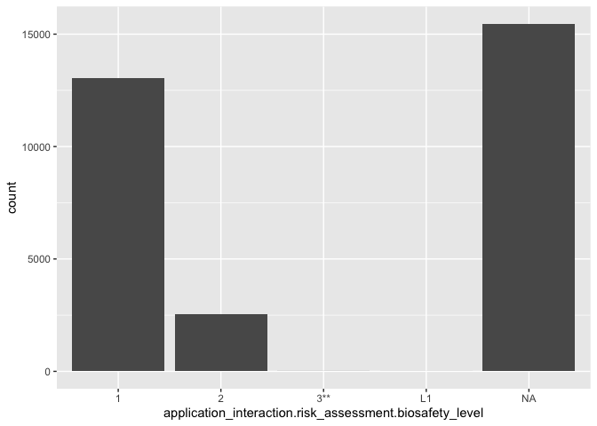<!-- -->

``` r
ggsave(filename = "temp.jpeg", plot = plot)
```

    ## Saving 7 x 5 in image

``` r
#continent
plot <- ggplot(data = q, aes(x = environment_sampling_isolation_source.origin.continent))+
  geom_histogram(stat = "count")+
  theme(axis.text.x = element_text(angle = 90, hjust = 1))
```

    ## Warning: Ignoring unknown parameters: binwidth, bins, pad

``` r
plot
```

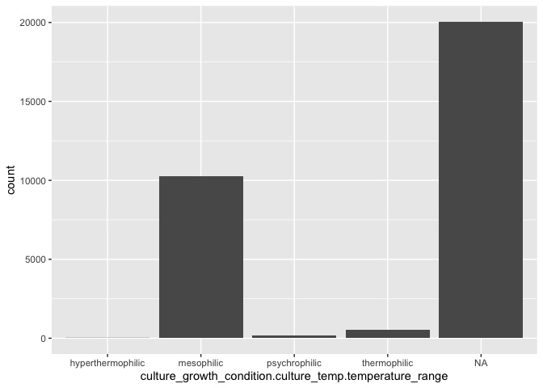<!-- -->

``` r
ggsave(filename = "continent.jpeg", plot = plot)
```

    ## Saving 7 x 5 in image

``` r
#phylum
# plot <- ggplot(data = q, aes(x = taxonomy_name.strains_tax_PNU.phylum))+
#   geom_histogram(stat = "count")+
#   theme(axis.text.x = element_text(angle = 90, hjust = 1, vjust = 0.5))
# plot
# 
# ggsave(filename = "phylum.jpeg", plot = plot)


#GC content
plot <- ggplot(data = q, aes(x = molecular_biology.GC_content.GC_content))+
  geom_histogram()+
  theme(axis.text.x = element_text(angle = 90, hjust = 1, vjust = 0.5))
plot
```

    ## `stat_bin()` using `bins = 30`. Pick better value with `binwidth`.

    ## Warning: Removed 24752 rows containing non-finite values (stat_bin).

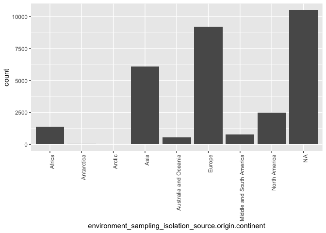<!-- -->

``` r
ggsave(filename = "GC.jpeg", plot = plot)
```

    ## Saving 7 x 5 in image

    ## `stat_bin()` using `bins = 30`. Pick better value with `binwidth`.

    ## Warning: Removed 24752 rows containing non-finite values (stat_bin).

``` r
#morphology_physiology.spore_formation.type
plot <- ggplot(data = q, aes(x = morphology_physiology.spore_formation.type))+
  geom_histogram(stat = "count")+
  theme(axis.text.x = element_text(angle = 90, hjust = 1, vjust = 0.5))+
  scale_y_log10()
```

    ## Warning: Ignoring unknown parameters: binwidth, bins, pad

``` r
plot
```

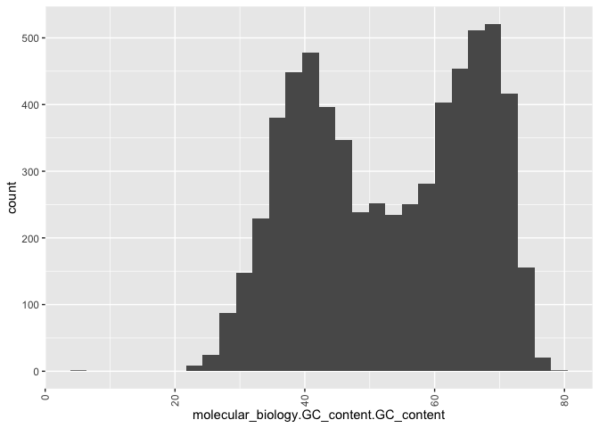<!-- -->

``` r
ggsave(filename = "formation-type.jpeg", plot = plot)
```

    ## Saving 7 x 5 in image

``` r
length(which(!is.na(q$morphology_physiology.spore_formation.type)))/dim(q)[1]#1%
```

    ## [1] 0.01272552

``` r
#morphology_physiology.oxygen_tolerance.oxygen_tol
# plot <- ggplot(data = q, aes(x = morphology_physiology.oxygen_tolerance.oxygen_tol))+
#   geom_histogram(stat = "count")+
#   theme(axis.text.x = element_text(angle = 90, hjust = 1, vjust = 0.5))
#   scale_y_log10()
# 
# plot

ggsave(filename = "morphology_physiology.oxygen_tolerance.oxygen_tol.jpeg", plot = plot)
```

    ## Saving 7 x 5 in image

``` r
#morphology_physiology.cell_morphology.motility
plot <- ggplot(data = q, aes(x = morphology_physiology.cell_morphology.motility))+
  geom_histogram(stat = "count")+
  theme(axis.text.x = element_text(angle = 90, hjust = 1, vjust = 0.5))
```

    ## Warning: Ignoring unknown parameters: binwidth, bins, pad

``` r
  scale_y_log10()
```

    ## <ScaleContinuousPosition>
    ##  Range:  
    ##  Limits:    0 --    1

``` r
plot
```

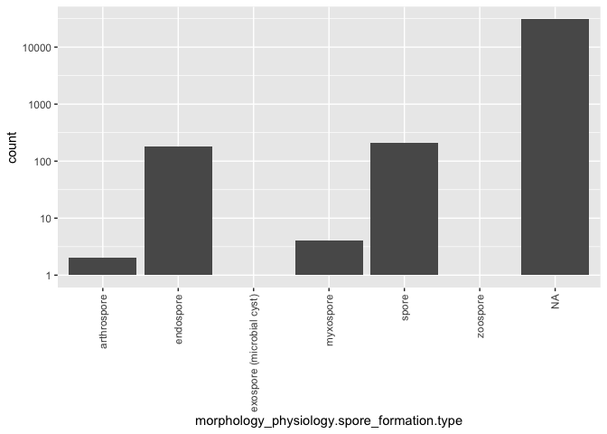<!-- -->

``` r
ggsave(filename = "morphology_physiology.cell_morphology.motility.jpeg", plot = plot)
```

    ## Saving 7 x 5 in image

``` r
#morphology_physiology.cell_morphology.gram_stain
plot <- ggplot(data = q, aes(x = morphology_physiology.cell_morphology.gram_stain))+
  geom_histogram(stat = "count")+
  theme(axis.text.x = element_text(angle = 90, hjust = 1, vjust = 0.5))
```

    ## Warning: Ignoring unknown parameters: binwidth, bins, pad

``` r
  scale_y_log10()
```

    ## <ScaleContinuousPosition>
    ##  Range:  
    ##  Limits:    0 --    1

``` r
plot
```

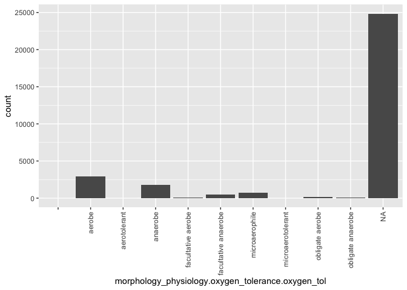<!-- -->

``` r
ggsave(filename = "morphology_physiology.cell_morphology.gram_stain.jpeg", plot = plot)
```

    ## Saving 7 x 5 in image

``` r
#morphology_physiology.cell_morphology.flagellum_arrangement
# plot <- ggplot(data = q, aes(x = morphology_physiology.cell_morphology.flagellum_arrangement))+
#   geom_histogram(stat = "count")+
#   theme(axis.text.x = element_text(angle = 90, hjust = 1, vjust = 0.5))
#   scale_y_log10()
# 
# plot

ggsave(filename = "morphology_physiology.cell_morphology.flagellum_arrangement.jpeg", plot = plot)
```

    ## Saving 7 x 5 in image

``` r
#morphology_physiology.cell_morphology.cell_shape
plot <- ggplot(data = q, aes(x = morphology_physiology.cell_morphology.cell_shape))+
  geom_histogram(stat = "count")+
  theme(axis.text.x = element_text(angle = 90, hjust = 1, vjust = 0.5))
```

    ## Warning: Ignoring unknown parameters: binwidth, bins, pad

``` r
  scale_y_log10()
```

    ## <ScaleContinuousPosition>
    ##  Range:  
    ##  Limits:    0 --    1

``` r
plot
```

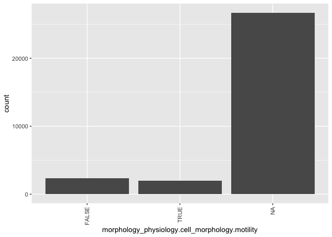<!-- -->

``` r
ggsave(filename = "morphology_physiology.cell_morphology.cell_shape.jpeg", plot = plot)
```

    ## Saving 7 x 5 in image

``` r
#morphology_physiology.colony_morphology.hemolysis_type
# plot <- ggplot(data = q, aes(x = morphology_physiology.colony_morphology.hemolysis_type))+
#   geom_histogram(stat = "count")+
#   theme(axis.text.x = element_text(angle = 90, hjust = 1, vjust = 0.5))
#   scale_y_log10()
# 
# plot

ggsave(filename = "morphology_physiology.colony_morphology.hemolysis_type.jpeg", plot = plot)
```

    ## Saving 7 x 5 in image

``` r
#morphology_physiology.colony_morphology.colony_len
plot <- ggplot(data = q, aes(x = morphology_physiology.colony_morphology.colony_len))+
  geom_histogram()+
  theme(axis.text.x = element_text(angle = 90, hjust = 1, vjust = 0.5))
plot
```

    ## `stat_bin()` using `bins = 30`. Pick better value with `binwidth`.

    ## Warning: Removed 30468 rows containing non-finite values (stat_bin).

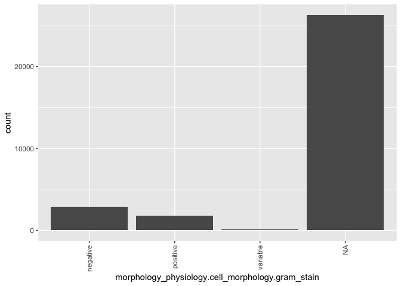<!-- -->

``` r
ggsave(filename = "morphology_physiology.colony_morphology.colony_len.jpeg", plot = plot)
```

    ## Saving 7 x 5 in image
    ## `stat_bin()` using `bins = 30`. Pick better value with `binwidth`.

    ## Warning: Removed 30468 rows containing non-finite values (stat_bin).

``` r
#morphology_physiology.cell_morphology.cell_len
plot <- ggplot(data = q, aes(x = morphology_physiology.cell_morphology.cell_len))+
  geom_histogram()+
  theme(axis.text.x = element_text(angle = 90, hjust = 1, vjust = 0.5))+
  scale_y_log10()+
  scale_x_log10()
plot
```

    ## `stat_bin()` using `bins = 30`. Pick better value with `binwidth`.

    ## Warning: Removed 27319 rows containing non-finite values (stat_bin).

    ## Warning: Transformation introduced infinite values in continuous y-axis

    ## Warning: Removed 5 rows containing missing values (geom_bar).

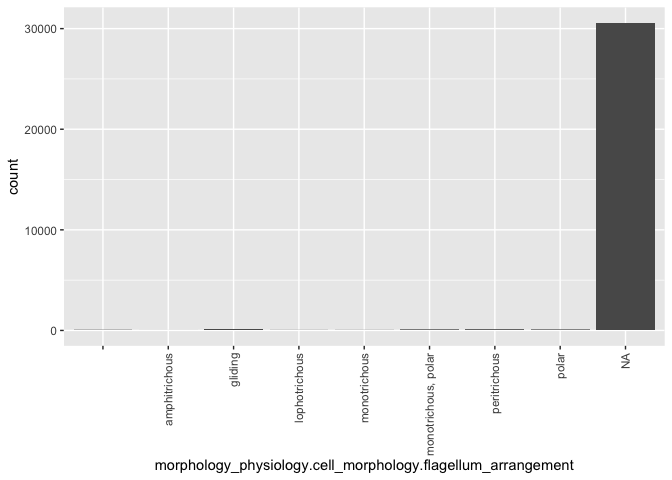<!-- -->

``` r
ggsave(filename = "morphology_physiology.cell_morphology.cell_len.jpeg", plot = plot)
```

    ## Saving 7 x 5 in image
    ## `stat_bin()` using `bins = 30`. Pick better value with `binwidth`.

    ## Warning: Removed 27319 rows containing non-finite values (stat_bin).

    ## Warning: Transformation introduced infinite values in continuous y-axis

    ## Warning: Removed 5 rows containing missing values (geom_bar).

``` r
#morphology_physiology.cell_morphology.cell_width
plot <- ggplot(data = q, aes(x = morphology_physiology.cell_morphology.cell_width))+
  geom_histogram()+
  theme(axis.text.x = element_text(angle = 90, hjust = 1, vjust = 0.5))+
  scale_y_log10()
plot
```

    ## `stat_bin()` using `bins = 30`. Pick better value with `binwidth`.

    ## Warning: Removed 27294 rows containing non-finite values (stat_bin).

    ## Warning: Transformation introduced infinite values in continuous y-axis

    ## Warning: Removed 26 rows containing missing values (geom_bar).

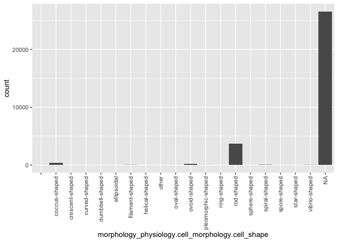<!-- -->

``` r
ggsave(filename = "morphology_physiology.cell_morphology.cell_width.jpeg", plot = plot)
```

    ## Saving 7 x 5 in image
    ## `stat_bin()` using `bins = 30`. Pick better value with `binwidth`.

    ## Warning: Removed 27294 rows containing non-finite values (stat_bin).

    ## Warning: Transformation introduced infinite values in continuous y-axis

    ## Warning: Removed 26 rows containing missing values (geom_bar).

``` r
#morphology_physiology.cell_morphology.cell_width log
plot <- ggplot(data = q, aes(x = morphology_physiology.cell_morphology.cell_width))+
  geom_histogram()+
  theme(axis.text.x = element_text(angle = 90, hjust = 1, vjust = 0.5))+
  scale_y_log10()+
  scale_x_log10()
plot
```

    ## `stat_bin()` using `bins = 30`. Pick better value with `binwidth`.

    ## Warning: Removed 27294 rows containing non-finite values (stat_bin).

    ## Warning: Transformation introduced infinite values in continuous y-axis

    ## Warning: Removed 11 rows containing missing values (geom_bar).

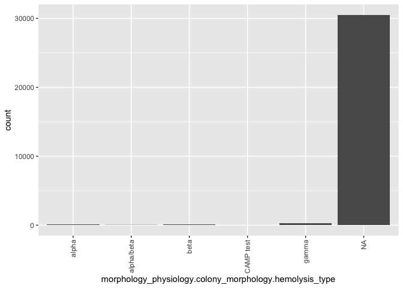<!-- -->

``` r
ggsave(filename = "morphology_physiology.cell_morphology.cell_width_log10.jpeg", plot = plot)
```

    ## Saving 7 x 5 in image
    ## `stat_bin()` using `bins = 30`. Pick better value with `binwidth`.

    ## Warning: Removed 27294 rows containing non-finite values (stat_bin).

    ## Warning: Transformation introduced infinite values in continuous y-axis

    ## Warning: Removed 11 rows containing missing values (geom_bar).

``` r
#legnth_to_width
q$length_to_width = q$morphology_physiology.cell_morphology.cell_len/q$morphology_physiology.cell_morphology.cell_width
plot <- ggplot(data = q, aes(x = length_to_width))+
  geom_histogram()+
  theme(axis.text.x = element_text(angle = 90, hjust = 1, vjust = 0.5))+
  scale_y_log10()+
  scale_x_log10()
plot
```

    ## `stat_bin()` using `bins = 30`. Pick better value with `binwidth`.

    ## Warning: Removed 27443 rows containing non-finite values (stat_bin).

    ## Warning: Transformation introduced infinite values in continuous y-axis

    ## Warning: Removed 2 rows containing missing values (geom_bar).

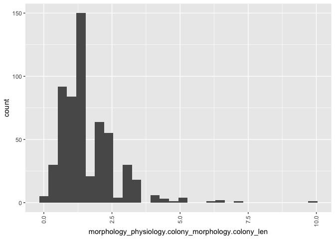<!-- -->

``` r
ggsave(filename = "length_to_width.jpeg", plot = plot)
```

    ## Saving 7 x 5 in image
    ## `stat_bin()` using `bins = 30`. Pick better value with `binwidth`.

    ## Warning: Removed 27443 rows containing non-finite values (stat_bin).

    ## Warning: Transformation introduced infinite values in continuous y-axis

    ## Warning: Removed 2 rows containing missing values (geom_bar).

\#\#find coverage by phylum for interesting field – pathogenicity to
humans

``` r
load("../DATA/PROCESSED/D.Rdata")
phylum_all = subset(D, field == "phylum")
P_all = data.frame(table(phylum_all$value))
names(P_all)=c("phylum", "count_total")
path_hum = subset(D, field == "pathogenicity_human")

#get the species for which we have pathogenicity info
path_spp = path_hum$species

path_hum_spp = subset(D, species %in% path_spp)

phylum = subset(path_hum_spp, field == "phylum")
P_path_hum = data.frame(table(phylum$value))
names(P_path_hum)=c("phylum", "count_pathogenicity_human")
 
P_comb = merge(P_all, P_path_hum, by = "phylum") 

P_comb$fraction_pathogenic = P_comb$count_pathogenicity_human/P_comb$count_total

plot <- ggplot(data = P_comb, aes(x = phylum, y = fraction_pathogenic))+
  geom_bar(stat = "identity")+
  theme(axis.text.x = element_text(angle = 90, hjust = 1, vjust = 0.5))
plot
```

<!-- -->

``` r
ggsave(plot=plot, filename = "fraction_pathogenic.jpeg")
```

    ## Saving 7 x 5 in image

``` r
path_anim = subset(D, field == "pathogenicity_animal")

#get the species for which we have pathogenicity info
path_spp_anim = path_anim$species

path_anim_spp = subset(D, species %in% path_spp_anim)

phylum_anim = subset(path_anim_spp, field == "phylum")
table(phylum_anim$value)
```

    ## 
    ## Actinobacteria  Bacteroidetes     Chlamydiae     Firmicutes   Fusobacteria 
    ##            836            224              4           1317             24 
    ## Proteobacteria   Spirochaetes    Tenericutes 
    ##           3368             13             69

``` r
risk = subset(D, subsection == "risk_assessment")
risk_check = subset(risk, field == "pathogenicity_human1")

origin = subset(D, subsection == "origin")
unique(origin$field)
```

    ##  [1] "sample_type"                  "country"                     
    ##  [3] "continent"                    "ID_reference"                
    ##  [5] "geo_loc_name"                 "sample_type1"                
    ##  [7] "sample_type2"                 "geo_loc_name1"               
    ##  [9] "country1"                     "continent1"                  
    ## [11] "ID_reference1"                "ID_reference2"               
    ## [13] "latitude"                     "longitude"                   
    ## [15] "enrichment_cult_name"         "enrichment_cult_duration"    
    ## [17] "enrichment_cult_temp"         "enrichment_cult_name2"       
    ## [19] "enrichment_cult_duration2"    "enrichment_cult_temp2"       
    ## [21] "procedure_origin2"            "sample_date2"                
    ## [23] "geo_loc_name2"                "country2"                    
    ## [25] "continent2"                   "latitude1"                   
    ## [27] "latitude2"                    "longitude1"                  
    ## [29] "longitude2"                   "procedure_origin"            
    ## [31] "sample_date"                  "enrichment_cult_composition" 
    ## [33] "isolation_date2"              "enrichment_cult_composition2"
    ## [35] "isolation_date"               "sample_type3"                
    ## [37] "enrichment_cult_name3"        "enrichment_cult_duration3"   
    ## [39] "enrichment_cult_temp3"        "ID_reference3"               
    ## [41] "enrichment_cult_name1"        "enrichment_cult_duration1"   
    ## [43] "enrichment_cult_temp1"        "procedure_origin1"           
    ## [45] "procedure_origin3"            "enrichment_cult_composition3"

``` r
origin_human_abscess = subset(origin, value == "human abscess")
origin_human_abscess$field
```

    ## [1] "sample_type" "sample_type"

``` r
origin_human_abscess$value
```

    ## [1] "human abscess" "human abscess"

``` r
sample_type = subset(origin, field == "sample_type")
str_detect(sample_type$value, "human")
```

    ##     [1] FALSE FALSE FALSE FALSE FALSE FALSE FALSE FALSE FALSE FALSE FALSE
    ##    [12] FALSE  TRUE FALSE FALSE FALSE  TRUE FALSE FALSE FALSE FALSE FALSE
    ##    [23] FALSE FALSE  TRUE FALSE FALSE FALSE FALSE FALSE FALSE FALSE FALSE
    ##    [34] FALSE FALSE FALSE FALSE FALSE FALSE FALSE FALSE FALSE FALSE FALSE
    ##    [45] FALSE FALSE FALSE FALSE FALSE  TRUE  TRUE FALSE FALSE  TRUE FALSE
    ##    [56] FALSE FALSE FALSE  TRUE FALSE FALSE  TRUE FALSE FALSE  TRUE FALSE
    ##    [67] FALSE  TRUE FALSE FALSE FALSE FALSE FALSE FALSE FALSE FALSE FALSE
    ##    [78] FALSE FALSE FALSE FALSE FALSE FALSE FALSE FALSE FALSE FALSE FALSE
    ##    [89] FALSE FALSE FALSE FALSE FALSE FALSE FALSE FALSE FALSE FALSE FALSE
    ##   [100] FALSE FALSE FALSE FALSE FALSE FALSE FALSE FALSE FALSE FALSE FALSE
    ##   [111] FALSE FALSE FALSE FALSE FALSE FALSE FALSE FALSE FALSE FALSE FALSE
    ##   [122] FALSE FALSE FALSE FALSE FALSE FALSE FALSE FALSE FALSE FALSE FALSE
    ##   [133] FALSE FALSE FALSE FALSE FALSE FALSE FALSE FALSE FALSE FALSE FALSE
    ##   [144] FALSE FALSE FALSE FALSE FALSE FALSE FALSE FALSE FALSE FALSE FALSE
    ##   [155]  TRUE  TRUE FALSE FALSE  TRUE  TRUE FALSE FALSE FALSE FALSE FALSE
    ##   [166] FALSE FALSE FALSE FALSE FALSE FALSE FALSE FALSE FALSE FALSE FALSE
    ##   [177] FALSE FALSE FALSE FALSE FALSE FALSE FALSE FALSE FALSE FALSE FALSE
    ##   [188] FALSE FALSE FALSE FALSE FALSE FALSE FALSE FALSE FALSE FALSE FALSE
    ##   [199] FALSE FALSE FALSE FALSE FALSE FALSE FALSE  TRUE FALSE FALSE FALSE
    ##   [210] FALSE FALSE FALSE  TRUE FALSE FALSE FALSE FALSE  TRUE FALSE FALSE
    ##   [221] FALSE FALSE FALSE FALSE  TRUE FALSE FALSE  TRUE FALSE FALSE  TRUE
    ##   [232] FALSE FALSE FALSE FALSE FALSE FALSE FALSE FALSE FALSE FALSE FALSE
    ##   [243]  TRUE  TRUE  TRUE  TRUE  TRUE  TRUE  TRUE  TRUE  TRUE  TRUE  TRUE
    ##   [254]  TRUE FALSE FALSE FALSE FALSE  TRUE FALSE FALSE FALSE FALSE FALSE
    ##   [265] FALSE  TRUE FALSE FALSE FALSE FALSE FALSE  TRUE FALSE FALSE FALSE
    ##   [276] FALSE FALSE FALSE FALSE FALSE FALSE FALSE FALSE FALSE  TRUE FALSE
    ##   [287]  TRUE FALSE  TRUE  TRUE FALSE  TRUE FALSE  TRUE  TRUE FALSE  TRUE
    ##   [298] FALSE FALSE FALSE  TRUE  TRUE  TRUE FALSE FALSE FALSE FALSE FALSE
    ##   [309] FALSE  TRUE  TRUE FALSE FALSE FALSE FALSE  TRUE  TRUE FALSE FALSE
    ##   [320]  TRUE  TRUE  TRUE  TRUE FALSE FALSE FALSE  TRUE FALSE FALSE FALSE
    ##   [331] FALSE FALSE FALSE FALSE FALSE FALSE  TRUE FALSE FALSE FALSE FALSE
    ##   [342] FALSE FALSE FALSE FALSE FALSE FALSE FALSE FALSE FALSE FALSE  TRUE
    ##   [353] FALSE  TRUE FALSE FALSE FALSE FALSE FALSE FALSE  TRUE FALSE FALSE
    ##   [364] FALSE FALSE  TRUE FALSE FALSE FALSE FALSE FALSE FALSE FALSE FALSE
    ##   [375] FALSE FALSE  TRUE FALSE FALSE FALSE  TRUE FALSE FALSE FALSE FALSE
    ##   [386] FALSE FALSE FALSE FALSE FALSE FALSE  TRUE FALSE FALSE FALSE FALSE
    ##   [397] FALSE FALSE FALSE FALSE FALSE FALSE FALSE FALSE FALSE FALSE FALSE
    ##   [408] FALSE FALSE FALSE FALSE FALSE FALSE FALSE FALSE FALSE FALSE FALSE
    ##   [419] FALSE  TRUE FALSE FALSE  TRUE FALSE  TRUE FALSE FALSE  TRUE FALSE
    ##   [430]  TRUE FALSE FALSE FALSE  TRUE FALSE FALSE FALSE FALSE FALSE FALSE
    ##   [441] FALSE FALSE  TRUE FALSE FALSE  TRUE  TRUE FALSE FALSE FALSE FALSE
    ##   [452]  TRUE FALSE  TRUE  TRUE FALSE  TRUE  TRUE  TRUE  TRUE  TRUE FALSE
    ##   [463]  TRUE FALSE  TRUE  TRUE FALSE FALSE FALSE  TRUE  TRUE FALSE FALSE
    ##   [474] FALSE FALSE FALSE FALSE  TRUE  TRUE  TRUE FALSE  TRUE  TRUE  TRUE
    ##   [485]  TRUE  TRUE FALSE FALSE FALSE  TRUE  TRUE  TRUE  TRUE  TRUE  TRUE
    ##   [496] FALSE  TRUE FALSE FALSE FALSE FALSE  TRUE FALSE  TRUE FALSE FALSE
    ##   [507] FALSE FALSE FALSE FALSE FALSE FALSE  TRUE FALSE FALSE FALSE FALSE
    ##   [518] FALSE FALSE FALSE FALSE  TRUE FALSE FALSE FALSE FALSE FALSE FALSE
    ##   [529] FALSE FALSE FALSE FALSE FALSE  TRUE FALSE  TRUE  TRUE FALSE FALSE
    ##   [540] FALSE FALSE FALSE FALSE FALSE FALSE FALSE FALSE  TRUE FALSE FALSE
    ##   [551] FALSE FALSE FALSE FALSE FALSE FALSE FALSE FALSE FALSE  TRUE  TRUE
    ##   [562]  TRUE FALSE FALSE  TRUE  TRUE  TRUE  TRUE FALSE  TRUE  TRUE  TRUE
    ##   [573] FALSE FALSE  TRUE FALSE FALSE FALSE FALSE FALSE FALSE FALSE FALSE
    ##   [584] FALSE FALSE FALSE FALSE FALSE FALSE  TRUE  TRUE  TRUE  TRUE FALSE
    ##   [595] FALSE FALSE FALSE FALSE FALSE FALSE FALSE FALSE FALSE FALSE FALSE
    ##   [606] FALSE FALSE FALSE FALSE FALSE FALSE FALSE FALSE FALSE FALSE FALSE
    ##   [617] FALSE FALSE FALSE FALSE FALSE FALSE FALSE FALSE FALSE FALSE FALSE
    ##   [628] FALSE FALSE FALSE FALSE FALSE FALSE FALSE FALSE FALSE  TRUE FALSE
    ##   [639]  TRUE FALSE FALSE FALSE FALSE FALSE  TRUE  TRUE  TRUE FALSE FALSE
    ##   [650] FALSE FALSE FALSE FALSE FALSE FALSE FALSE FALSE FALSE  TRUE  TRUE
    ##   [661] FALSE FALSE FALSE FALSE  TRUE  TRUE  TRUE FALSE FALSE FALSE FALSE
    ##   [672]  TRUE FALSE FALSE FALSE FALSE FALSE FALSE FALSE FALSE FALSE FALSE
    ##   [683] FALSE FALSE FALSE FALSE FALSE FALSE FALSE FALSE FALSE FALSE FALSE
    ##   [694] FALSE FALSE FALSE FALSE FALSE FALSE FALSE FALSE FALSE FALSE FALSE
    ##   [705] FALSE FALSE FALSE FALSE FALSE FALSE FALSE FALSE FALSE FALSE FALSE
    ##   [716] FALSE FALSE FALSE FALSE FALSE FALSE FALSE FALSE FALSE FALSE FALSE
    ##   [727] FALSE FALSE FALSE FALSE FALSE FALSE FALSE FALSE FALSE FALSE FALSE
    ##   [738] FALSE  TRUE FALSE FALSE FALSE FALSE FALSE FALSE FALSE FALSE FALSE
    ##   [749] FALSE FALSE FALSE FALSE FALSE FALSE FALSE FALSE FALSE FALSE FALSE
    ##   [760] FALSE FALSE FALSE FALSE FALSE FALSE FALSE FALSE  TRUE FALSE FALSE
    ##   [771] FALSE FALSE FALSE FALSE FALSE FALSE FALSE FALSE FALSE FALSE FALSE
    ##   [782] FALSE FALSE FALSE FALSE FALSE FALSE FALSE FALSE FALSE FALSE FALSE
    ##   [793] FALSE FALSE FALSE FALSE FALSE FALSE FALSE FALSE FALSE FALSE FALSE
    ##   [804] FALSE FALSE FALSE FALSE FALSE FALSE FALSE FALSE FALSE FALSE FALSE
    ##   [815] FALSE FALSE FALSE FALSE FALSE FALSE FALSE FALSE FALSE FALSE FALSE
    ##   [826] FALSE FALSE FALSE FALSE FALSE FALSE FALSE FALSE FALSE FALSE FALSE
    ##   [837] FALSE FALSE FALSE FALSE FALSE FALSE FALSE FALSE FALSE FALSE FALSE
    ##   [848] FALSE FALSE FALSE FALSE FALSE FALSE FALSE FALSE FALSE  TRUE FALSE
    ##   [859] FALSE FALSE FALSE FALSE FALSE FALSE FALSE FALSE FALSE FALSE FALSE
    ##   [870] FALSE FALSE FALSE FALSE FALSE FALSE FALSE FALSE FALSE FALSE FALSE
    ##   [881] FALSE FALSE FALSE FALSE FALSE FALSE FALSE FALSE FALSE FALSE FALSE
    ##   [892] FALSE FALSE FALSE FALSE FALSE FALSE FALSE FALSE FALSE FALSE FALSE
    ##   [903] FALSE FALSE FALSE FALSE FALSE FALSE FALSE FALSE FALSE FALSE FALSE
    ##   [914] FALSE FALSE FALSE FALSE FALSE FALSE FALSE FALSE FALSE FALSE  TRUE
    ##   [925] FALSE FALSE FALSE FALSE FALSE FALSE FALSE FALSE FALSE FALSE FALSE
    ##   [936] FALSE FALSE FALSE FALSE FALSE FALSE FALSE FALSE FALSE FALSE FALSE
    ##   [947] FALSE FALSE FALSE FALSE FALSE FALSE  TRUE FALSE FALSE FALSE FALSE
    ##   [958] FALSE FALSE FALSE FALSE FALSE FALSE FALSE FALSE FALSE FALSE FALSE
    ##   [969] FALSE FALSE FALSE FALSE FALSE FALSE FALSE FALSE FALSE FALSE FALSE
    ##   [980] FALSE FALSE FALSE FALSE FALSE FALSE FALSE FALSE FALSE FALSE FALSE
    ##   [991] FALSE FALSE FALSE FALSE FALSE FALSE FALSE FALSE FALSE FALSE FALSE
    ##  [1002] FALSE FALSE FALSE FALSE FALSE FALSE FALSE FALSE FALSE FALSE FALSE
    ##  [1013] FALSE FALSE FALSE FALSE FALSE FALSE FALSE FALSE FALSE FALSE FALSE
    ##  [1024] FALSE FALSE FALSE FALSE FALSE FALSE FALSE FALSE FALSE FALSE FALSE
    ##  [1035]  TRUE FALSE  TRUE FALSE FALSE FALSE FALSE FALSE FALSE FALSE FALSE
    ##  [1046] FALSE FALSE FALSE FALSE FALSE FALSE FALSE FALSE FALSE FALSE FALSE
    ##  [1057] FALSE FALSE FALSE FALSE FALSE FALSE FALSE FALSE FALSE FALSE FALSE
    ##  [1068] FALSE FALSE FALSE FALSE FALSE FALSE FALSE FALSE FALSE FALSE FALSE
    ##  [1079] FALSE FALSE FALSE FALSE FALSE FALSE FALSE FALSE FALSE FALSE  TRUE
    ##  [1090] FALSE FALSE FALSE FALSE FALSE FALSE FALSE FALSE FALSE FALSE FALSE
    ##  [1101] FALSE FALSE FALSE FALSE FALSE FALSE FALSE FALSE FALSE  TRUE FALSE
    ##  [1112] FALSE FALSE FALSE FALSE FALSE FALSE FALSE FALSE FALSE FALSE FALSE
    ##  [1123] FALSE FALSE FALSE FALSE FALSE FALSE FALSE FALSE FALSE FALSE FALSE
    ##  [1134] FALSE FALSE FALSE FALSE FALSE FALSE FALSE FALSE FALSE FALSE FALSE
    ##  [1145] FALSE FALSE FALSE FALSE FALSE FALSE FALSE FALSE FALSE  TRUE FALSE
    ##  [1156] FALSE FALSE FALSE FALSE FALSE FALSE FALSE FALSE FALSE  TRUE  TRUE
    ##  [1167] FALSE FALSE FALSE FALSE FALSE FALSE FALSE FALSE FALSE FALSE FALSE
    ##  [1178] FALSE FALSE FALSE FALSE FALSE FALSE FALSE FALSE FALSE FALSE FALSE
    ##  [1189] FALSE FALSE FALSE FALSE FALSE FALSE FALSE FALSE FALSE FALSE FALSE
    ##  [1200] FALSE FALSE FALSE FALSE FALSE FALSE FALSE FALSE FALSE FALSE FALSE
    ##  [1211] FALSE FALSE FALSE FALSE FALSE FALSE FALSE FALSE FALSE FALSE FALSE
    ##  [1222] FALSE FALSE FALSE FALSE FALSE  TRUE FALSE FALSE FALSE  TRUE  TRUE
    ##  [1233]  TRUE FALSE FALSE FALSE FALSE FALSE FALSE FALSE FALSE  TRUE FALSE
    ##  [1244] FALSE FALSE FALSE FALSE FALSE FALSE FALSE FALSE FALSE FALSE FALSE
    ##  [1255] FALSE FALSE FALSE FALSE FALSE FALSE FALSE FALSE FALSE FALSE FALSE
    ##  [1266] FALSE FALSE FALSE FALSE FALSE FALSE  TRUE FALSE FALSE FALSE FALSE
    ##  [1277] FALSE FALSE FALSE FALSE FALSE FALSE FALSE FALSE FALSE FALSE FALSE
    ##  [1288] FALSE FALSE FALSE FALSE FALSE FALSE FALSE FALSE FALSE FALSE FALSE
    ##  [1299] FALSE FALSE FALSE FALSE FALSE FALSE FALSE FALSE FALSE FALSE FALSE
    ##  [1310]  TRUE FALSE  TRUE FALSE FALSE FALSE FALSE FALSE FALSE FALSE FALSE
    ##  [1321] FALSE FALSE FALSE FALSE FALSE  TRUE FALSE FALSE FALSE FALSE FALSE
    ##  [1332] FALSE FALSE FALSE FALSE FALSE FALSE FALSE FALSE FALSE FALSE FALSE
    ##  [1343] FALSE FALSE FALSE FALSE FALSE FALSE FALSE FALSE FALSE FALSE FALSE
    ##  [1354] FALSE FALSE FALSE FALSE FALSE FALSE FALSE FALSE FALSE FALSE FALSE
    ##  [1365] FALSE FALSE FALSE FALSE FALSE FALSE FALSE FALSE FALSE FALSE FALSE
    ##  [1376] FALSE FALSE FALSE FALSE FALSE FALSE FALSE FALSE FALSE FALSE FALSE
    ##  [1387] FALSE FALSE FALSE FALSE FALSE FALSE FALSE FALSE FALSE FALSE FALSE
    ##  [1398] FALSE FALSE FALSE FALSE FALSE FALSE FALSE FALSE FALSE FALSE FALSE
    ##  [1409] FALSE FALSE FALSE FALSE FALSE FALSE FALSE FALSE FALSE FALSE FALSE
    ##  [1420] FALSE FALSE FALSE FALSE FALSE FALSE FALSE FALSE FALSE FALSE FALSE
    ##  [1431] FALSE FALSE FALSE FALSE FALSE FALSE FALSE FALSE FALSE FALSE FALSE
    ##  [1442] FALSE FALSE FALSE FALSE FALSE FALSE FALSE FALSE  TRUE FALSE FALSE
    ##  [1453] FALSE FALSE FALSE FALSE FALSE FALSE FALSE FALSE FALSE FALSE FALSE
    ##  [1464] FALSE FALSE FALSE FALSE FALSE FALSE FALSE FALSE FALSE FALSE FALSE
    ##  [1475] FALSE FALSE FALSE FALSE FALSE  TRUE FALSE FALSE FALSE FALSE FALSE
    ##  [1486] FALSE FALSE FALSE FALSE  TRUE FALSE FALSE FALSE FALSE  TRUE  TRUE
    ##  [1497] FALSE FALSE FALSE FALSE FALSE FALSE FALSE FALSE FALSE FALSE FALSE
    ##  [1508] FALSE FALSE FALSE FALSE FALSE FALSE FALSE FALSE FALSE FALSE FALSE
    ##  [1519] FALSE FALSE FALSE FALSE FALSE FALSE FALSE  TRUE FALSE FALSE FALSE
    ##  [1530] FALSE FALSE FALSE FALSE FALSE FALSE FALSE FALSE FALSE FALSE FALSE
    ##  [1541] FALSE FALSE FALSE FALSE FALSE FALSE  TRUE  TRUE FALSE FALSE FALSE
    ##  [1552] FALSE FALSE FALSE FALSE FALSE FALSE FALSE FALSE FALSE FALSE FALSE
    ##  [1563] FALSE FALSE FALSE FALSE FALSE FALSE FALSE FALSE FALSE FALSE FALSE
    ##  [1574] FALSE FALSE FALSE FALSE FALSE FALSE FALSE FALSE FALSE FALSE FALSE
    ##  [1585] FALSE FALSE FALSE FALSE FALSE FALSE FALSE FALSE FALSE FALSE FALSE
    ##  [1596] FALSE FALSE FALSE FALSE FALSE FALSE FALSE FALSE FALSE FALSE FALSE
    ##  [1607] FALSE FALSE FALSE FALSE FALSE FALSE FALSE  TRUE  TRUE FALSE FALSE
    ##  [1618] FALSE FALSE FALSE FALSE FALSE FALSE FALSE  TRUE FALSE FALSE FALSE
    ##  [1629] FALSE FALSE FALSE FALSE FALSE FALSE FALSE FALSE FALSE FALSE FALSE
    ##  [1640] FALSE FALSE FALSE FALSE FALSE FALSE FALSE FALSE FALSE FALSE FALSE
    ##  [1651] FALSE FALSE FALSE FALSE FALSE FALSE FALSE FALSE FALSE FALSE FALSE
    ##  [1662] FALSE FALSE FALSE FALSE FALSE FALSE FALSE FALSE FALSE FALSE FALSE
    ##  [1673] FALSE FALSE FALSE FALSE FALSE FALSE FALSE FALSE FALSE FALSE FALSE
    ##  [1684] FALSE FALSE FALSE FALSE FALSE FALSE FALSE FALSE FALSE  TRUE FALSE
    ##  [1695] FALSE  TRUE  TRUE FALSE FALSE FALSE  TRUE  TRUE FALSE FALSE FALSE
    ##  [1706] FALSE FALSE FALSE FALSE FALSE FALSE  TRUE FALSE FALSE FALSE FALSE
    ##  [1717] FALSE FALSE FALSE FALSE FALSE FALSE FALSE FALSE  TRUE FALSE FALSE
    ##  [1728] FALSE  TRUE  TRUE FALSE FALSE  TRUE  TRUE  TRUE FALSE FALSE FALSE
    ##  [1739] FALSE FALSE  TRUE  TRUE FALSE FALSE  TRUE  TRUE FALSE FALSE FALSE
    ##  [1750] FALSE FALSE FALSE FALSE FALSE  TRUE  TRUE FALSE FALSE FALSE FALSE
    ##  [1761] FALSE FALSE FALSE FALSE FALSE FALSE FALSE FALSE FALSE FALSE FALSE
    ##  [1772] FALSE FALSE FALSE FALSE FALSE FALSE FALSE FALSE FALSE FALSE FALSE
    ##  [1783] FALSE FALSE FALSE FALSE FALSE FALSE FALSE FALSE FALSE FALSE FALSE
    ##  [1794] FALSE  TRUE FALSE FALSE FALSE FALSE FALSE FALSE FALSE FALSE FALSE
    ##  [1805] FALSE FALSE FALSE FALSE FALSE FALSE FALSE FALSE FALSE FALSE FALSE
    ##  [1816] FALSE FALSE FALSE FALSE FALSE FALSE FALSE FALSE FALSE FALSE FALSE
    ##  [1827] FALSE FALSE FALSE FALSE FALSE FALSE FALSE FALSE FALSE FALSE FALSE
    ##  [1838] FALSE FALSE FALSE FALSE FALSE FALSE FALSE FALSE FALSE FALSE FALSE
    ##  [1849] FALSE FALSE FALSE FALSE FALSE FALSE FALSE FALSE FALSE FALSE FALSE
    ##  [1860] FALSE FALSE FALSE FALSE FALSE FALSE FALSE FALSE FALSE FALSE FALSE
    ##  [1871] FALSE FALSE FALSE FALSE FALSE FALSE FALSE FALSE FALSE FALSE FALSE
    ##  [1882]  TRUE FALSE  TRUE FALSE FALSE FALSE FALSE FALSE FALSE FALSE FALSE
    ##  [1893] FALSE FALSE FALSE FALSE FALSE FALSE FALSE FALSE FALSE FALSE FALSE
    ##  [1904] FALSE FALSE FALSE FALSE FALSE FALSE FALSE FALSE FALSE FALSE FALSE
    ##  [1915] FALSE FALSE FALSE FALSE FALSE FALSE FALSE FALSE FALSE FALSE FALSE
    ##  [1926] FALSE FALSE FALSE FALSE FALSE FALSE FALSE FALSE FALSE FALSE FALSE
    ##  [1937] FALSE FALSE FALSE  TRUE FALSE FALSE FALSE FALSE FALSE FALSE FALSE
    ##  [1948] FALSE FALSE FALSE FALSE FALSE FALSE FALSE FALSE FALSE FALSE FALSE
    ##  [1959] FALSE FALSE FALSE FALSE FALSE FALSE FALSE FALSE FALSE FALSE FALSE
    ##  [1970] FALSE FALSE FALSE FALSE FALSE  TRUE FALSE FALSE FALSE FALSE FALSE
    ##  [1981] FALSE FALSE FALSE FALSE FALSE FALSE FALSE FALSE FALSE FALSE FALSE
    ##  [1992] FALSE  TRUE FALSE FALSE FALSE FALSE FALSE FALSE FALSE FALSE FALSE
    ##  [2003] FALSE FALSE FALSE FALSE FALSE FALSE FALSE FALSE FALSE FALSE FALSE
    ##  [2014] FALSE FALSE FALSE FALSE FALSE FALSE FALSE FALSE FALSE FALSE FALSE
    ##  [2025] FALSE FALSE FALSE FALSE FALSE FALSE FALSE FALSE FALSE  TRUE  TRUE
    ##  [2036]  TRUE FALSE FALSE FALSE FALSE FALSE FALSE FALSE FALSE FALSE FALSE
    ##  [2047] FALSE FALSE FALSE FALSE FALSE FALSE  TRUE FALSE FALSE FALSE FALSE
    ##  [2058] FALSE FALSE FALSE FALSE FALSE FALSE FALSE FALSE FALSE FALSE FALSE
    ##  [2069] FALSE FALSE FALSE FALSE FALSE FALSE  TRUE FALSE FALSE FALSE FALSE
    ##  [2080] FALSE FALSE FALSE FALSE FALSE FALSE FALSE FALSE FALSE FALSE FALSE
    ##  [2091] FALSE FALSE FALSE FALSE FALSE FALSE FALSE FALSE FALSE FALSE FALSE
    ##  [2102] FALSE FALSE FALSE FALSE FALSE FALSE  TRUE  TRUE  TRUE FALSE FALSE
    ##  [2113] FALSE FALSE FALSE FALSE FALSE FALSE FALSE FALSE FALSE FALSE FALSE
    ##  [2124] FALSE FALSE FALSE FALSE FALSE FALSE FALSE FALSE FALSE FALSE FALSE
    ##  [2135] FALSE FALSE FALSE FALSE FALSE FALSE FALSE FALSE FALSE FALSE FALSE
    ##  [2146] FALSE FALSE FALSE FALSE FALSE FALSE FALSE FALSE FALSE FALSE FALSE
    ##  [2157] FALSE FALSE FALSE FALSE FALSE FALSE FALSE FALSE FALSE FALSE FALSE
    ##  [2168] FALSE FALSE FALSE FALSE FALSE FALSE FALSE FALSE FALSE FALSE FALSE
    ##  [2179] FALSE FALSE FALSE FALSE FALSE FALSE  TRUE FALSE FALSE FALSE FALSE
    ##  [2190] FALSE FALSE FALSE FALSE FALSE FALSE FALSE FALSE FALSE FALSE FALSE
    ##  [2201] FALSE FALSE FALSE FALSE FALSE FALSE FALSE FALSE FALSE FALSE FALSE
    ##  [2212] FALSE FALSE FALSE FALSE FALSE  TRUE FALSE FALSE FALSE  TRUE FALSE
    ##  [2223] FALSE FALSE FALSE  TRUE FALSE FALSE FALSE FALSE FALSE FALSE FALSE
    ##  [2234] FALSE FALSE FALSE FALSE FALSE FALSE FALSE FALSE FALSE FALSE FALSE
    ##  [2245] FALSE FALSE FALSE FALSE FALSE FALSE FALSE FALSE FALSE FALSE FALSE
    ##  [2256] FALSE FALSE FALSE FALSE FALSE FALSE FALSE  TRUE FALSE FALSE FALSE
    ##  [2267] FALSE FALSE FALSE  TRUE FALSE FALSE FALSE FALSE FALSE FALSE FALSE
    ##  [2278]  TRUE FALSE FALSE FALSE FALSE FALSE FALSE FALSE FALSE FALSE FALSE
    ##  [2289] FALSE FALSE FALSE FALSE FALSE FALSE FALSE FALSE FALSE FALSE FALSE
    ##  [2300] FALSE FALSE FALSE FALSE FALSE FALSE FALSE FALSE FALSE FALSE FALSE
    ##  [2311] FALSE FALSE FALSE FALSE FALSE FALSE FALSE FALSE FALSE FALSE FALSE
    ##  [2322] FALSE FALSE FALSE FALSE FALSE FALSE FALSE FALSE FALSE FALSE FALSE
    ##  [2333] FALSE FALSE FALSE FALSE FALSE FALSE FALSE FALSE FALSE FALSE FALSE
    ##  [2344] FALSE FALSE FALSE FALSE FALSE FALSE FALSE FALSE FALSE FALSE FALSE
    ##  [2355] FALSE  TRUE FALSE  TRUE FALSE FALSE FALSE FALSE FALSE  TRUE FALSE
    ##  [2366] FALSE FALSE FALSE FALSE FALSE FALSE FALSE FALSE  TRUE FALSE FALSE
    ##  [2377] FALSE FALSE FALSE FALSE FALSE  TRUE  TRUE  TRUE  TRUE FALSE FALSE
    ##  [2388] FALSE FALSE FALSE FALSE FALSE FALSE FALSE FALSE FALSE FALSE FALSE
    ##  [2399] FALSE FALSE FALSE FALSE FALSE FALSE FALSE FALSE FALSE FALSE FALSE
    ##  [2410] FALSE FALSE FALSE FALSE FALSE FALSE FALSE FALSE FALSE FALSE FALSE
    ##  [2421] FALSE FALSE FALSE FALSE FALSE FALSE FALSE FALSE FALSE FALSE FALSE
    ##  [2432] FALSE FALSE FALSE FALSE FALSE FALSE FALSE FALSE FALSE FALSE FALSE
    ##  [2443] FALSE FALSE FALSE FALSE FALSE  TRUE FALSE FALSE FALSE FALSE FALSE
    ##  [2454] FALSE FALSE FALSE FALSE FALSE FALSE FALSE FALSE FALSE FALSE FALSE
    ##  [2465] FALSE FALSE FALSE FALSE FALSE FALSE FALSE FALSE FALSE  TRUE FALSE
    ##  [2476] FALSE FALSE FALSE FALSE FALSE FALSE FALSE FALSE FALSE FALSE FALSE
    ##  [2487] FALSE  TRUE FALSE FALSE FALSE FALSE FALSE FALSE FALSE FALSE FALSE
    ##  [2498] FALSE FALSE FALSE FALSE FALSE FALSE FALSE FALSE FALSE FALSE FALSE
    ##  [2509] FALSE FALSE FALSE FALSE FALSE FALSE FALSE FALSE FALSE FALSE FALSE
    ##  [2520] FALSE FALSE FALSE FALSE FALSE FALSE FALSE FALSE FALSE FALSE FALSE
    ##  [2531] FALSE FALSE FALSE FALSE FALSE FALSE FALSE FALSE FALSE FALSE FALSE
    ##  [2542] FALSE FALSE FALSE FALSE FALSE FALSE FALSE FALSE FALSE FALSE FALSE
    ##  [2553] FALSE FALSE FALSE FALSE  TRUE FALSE FALSE FALSE  TRUE FALSE FALSE
    ##  [2564]  TRUE FALSE FALSE FALSE FALSE FALSE FALSE FALSE FALSE FALSE FALSE
    ##  [2575] FALSE FALSE FALSE FALSE FALSE FALSE FALSE FALSE FALSE FALSE FALSE
    ##  [2586] FALSE FALSE FALSE FALSE FALSE FALSE FALSE FALSE FALSE FALSE FALSE
    ##  [2597] FALSE FALSE FALSE FALSE FALSE FALSE FALSE FALSE FALSE FALSE FALSE
    ##  [2608] FALSE FALSE FALSE FALSE FALSE FALSE FALSE FALSE FALSE FALSE FALSE
    ##  [2619] FALSE FALSE FALSE FALSE FALSE FALSE FALSE FALSE FALSE FALSE FALSE
    ##  [2630] FALSE FALSE FALSE FALSE FALSE FALSE FALSE FALSE FALSE FALSE FALSE
    ##  [2641] FALSE FALSE FALSE FALSE FALSE FALSE FALSE FALSE FALSE FALSE FALSE
    ##  [2652] FALSE FALSE FALSE FALSE FALSE FALSE FALSE FALSE FALSE FALSE FALSE
    ##  [2663] FALSE FALSE FALSE FALSE FALSE FALSE FALSE FALSE FALSE FALSE FALSE
    ##  [2674] FALSE FALSE FALSE FALSE FALSE FALSE FALSE FALSE FALSE FALSE FALSE
    ##  [2685] FALSE FALSE FALSE FALSE FALSE FALSE FALSE FALSE FALSE FALSE FALSE
    ##  [2696] FALSE FALSE FALSE FALSE FALSE FALSE FALSE  TRUE FALSE FALSE FALSE
    ##  [2707] FALSE FALSE  TRUE FALSE FALSE FALSE FALSE FALSE FALSE FALSE FALSE
    ##  [2718] FALSE FALSE FALSE FALSE FALSE FALSE FALSE FALSE FALSE FALSE FALSE
    ##  [2729] FALSE FALSE FALSE FALSE FALSE FALSE FALSE FALSE FALSE FALSE FALSE
    ##  [2740] FALSE FALSE FALSE FALSE FALSE FALSE FALSE FALSE FALSE FALSE FALSE
    ##  [2751] FALSE FALSE FALSE FALSE FALSE FALSE FALSE FALSE FALSE FALSE FALSE
    ##  [2762] FALSE FALSE FALSE FALSE FALSE FALSE FALSE FALSE FALSE FALSE FALSE
    ##  [2773] FALSE FALSE FALSE FALSE FALSE FALSE FALSE FALSE FALSE FALSE FALSE
    ##  [2784] FALSE FALSE FALSE FALSE FALSE FALSE FALSE FALSE FALSE FALSE FALSE
    ##  [2795] FALSE FALSE FALSE FALSE FALSE FALSE FALSE FALSE FALSE FALSE FALSE
    ##  [2806] FALSE FALSE FALSE FALSE FALSE FALSE FALSE FALSE FALSE FALSE FALSE
    ##  [2817] FALSE FALSE FALSE FALSE FALSE FALSE FALSE FALSE FALSE FALSE FALSE
    ##  [2828] FALSE FALSE FALSE FALSE FALSE FALSE FALSE  TRUE FALSE FALSE FALSE
    ##  [2839] FALSE FALSE FALSE FALSE FALSE  TRUE FALSE FALSE FALSE FALSE FALSE
    ##  [2850] FALSE FALSE FALSE FALSE FALSE  TRUE FALSE FALSE FALSE FALSE FALSE
    ##  [2861] FALSE FALSE FALSE  TRUE  TRUE FALSE FALSE FALSE FALSE FALSE FALSE
    ##  [2872] FALSE FALSE FALSE FALSE FALSE FALSE FALSE FALSE FALSE FALSE FALSE
    ##  [2883] FALSE FALSE FALSE FALSE FALSE FALSE FALSE FALSE FALSE FALSE FALSE
    ##  [2894] FALSE FALSE FALSE FALSE FALSE FALSE FALSE FALSE FALSE FALSE FALSE
    ##  [2905] FALSE FALSE FALSE FALSE FALSE FALSE FALSE FALSE FALSE FALSE FALSE
    ##  [2916] FALSE FALSE FALSE FALSE FALSE FALSE FALSE FALSE FALSE FALSE FALSE
    ##  [2927] FALSE  TRUE FALSE FALSE FALSE FALSE FALSE FALSE FALSE FALSE FALSE
    ##  [2938] FALSE FALSE FALSE FALSE FALSE FALSE FALSE FALSE FALSE FALSE FALSE
    ##  [2949] FALSE FALSE FALSE FALSE FALSE FALSE FALSE FALSE FALSE FALSE FALSE
    ##  [2960] FALSE FALSE FALSE FALSE FALSE FALSE FALSE FALSE FALSE  TRUE FALSE
    ##  [2971] FALSE FALSE FALSE FALSE FALSE FALSE FALSE FALSE FALSE FALSE FALSE
    ##  [2982] FALSE FALSE FALSE FALSE FALSE FALSE FALSE FALSE FALSE FALSE FALSE
    ##  [2993] FALSE FALSE FALSE FALSE FALSE FALSE FALSE FALSE  TRUE FALSE FALSE
    ##  [3004] FALSE FALSE FALSE FALSE FALSE FALSE FALSE FALSE FALSE FALSE FALSE
    ##  [3015] FALSE FALSE  TRUE FALSE FALSE FALSE FALSE FALSE FALSE FALSE FALSE
    ##  [3026] FALSE FALSE FALSE FALSE FALSE FALSE FALSE FALSE FALSE FALSE FALSE
    ##  [3037] FALSE FALSE FALSE FALSE FALSE FALSE FALSE FALSE FALSE FALSE FALSE
    ##  [3048] FALSE FALSE FALSE FALSE FALSE FALSE FALSE FALSE FALSE FALSE FALSE
    ##  [3059] FALSE FALSE FALSE FALSE FALSE FALSE FALSE FALSE FALSE FALSE FALSE
    ##  [3070] FALSE FALSE FALSE FALSE FALSE FALSE FALSE FALSE FALSE FALSE FALSE
    ##  [3081] FALSE FALSE  TRUE FALSE FALSE  TRUE  TRUE  TRUE  TRUE  TRUE FALSE
    ##  [3092]  TRUE FALSE FALSE FALSE FALSE FALSE FALSE FALSE FALSE FALSE FALSE
    ##  [3103] FALSE FALSE FALSE FALSE FALSE FALSE FALSE FALSE FALSE FALSE FALSE
    ##  [3114] FALSE FALSE FALSE FALSE FALSE FALSE FALSE FALSE FALSE FALSE FALSE
    ##  [3125] FALSE FALSE FALSE FALSE FALSE FALSE FALSE FALSE FALSE FALSE FALSE
    ##  [3136] FALSE FALSE FALSE FALSE FALSE FALSE FALSE FALSE FALSE FALSE FALSE
    ##  [3147] FALSE FALSE FALSE FALSE FALSE FALSE FALSE FALSE FALSE FALSE FALSE
    ##  [3158] FALSE FALSE FALSE FALSE FALSE FALSE FALSE FALSE FALSE FALSE FALSE
    ##  [3169] FALSE FALSE FALSE FALSE FALSE FALSE FALSE FALSE FALSE FALSE FALSE
    ##  [3180] FALSE FALSE FALSE FALSE FALSE FALSE FALSE FALSE FALSE FALSE FALSE
    ##  [3191] FALSE FALSE FALSE FALSE FALSE FALSE FALSE FALSE FALSE FALSE FALSE
    ##  [3202] FALSE FALSE FALSE FALSE FALSE FALSE FALSE FALSE FALSE FALSE FALSE
    ##  [3213] FALSE FALSE FALSE FALSE FALSE FALSE FALSE FALSE FALSE FALSE FALSE
    ##  [3224] FALSE FALSE FALSE FALSE FALSE FALSE FALSE FALSE FALSE FALSE FALSE
    ##  [3235] FALSE FALSE FALSE FALSE FALSE FALSE FALSE FALSE FALSE FALSE FALSE
    ##  [3246] FALSE FALSE FALSE FALSE FALSE FALSE FALSE FALSE FALSE FALSE FALSE
    ##  [3257] FALSE FALSE FALSE FALSE FALSE FALSE FALSE FALSE FALSE FALSE FALSE
    ##  [3268] FALSE FALSE FALSE FALSE FALSE FALSE FALSE FALSE FALSE FALSE FALSE
    ##  [3279] FALSE FALSE FALSE  TRUE FALSE FALSE FALSE FALSE FALSE FALSE FALSE
    ##  [3290] FALSE FALSE FALSE FALSE FALSE FALSE FALSE FALSE FALSE FALSE FALSE
    ##  [3301] FALSE FALSE FALSE FALSE FALSE FALSE FALSE FALSE FALSE FALSE FALSE
    ##  [3312] FALSE FALSE FALSE FALSE FALSE FALSE FALSE FALSE FALSE FALSE FALSE
    ##  [3323] FALSE FALSE FALSE FALSE FALSE FALSE FALSE FALSE FALSE FALSE FALSE
    ##  [3334] FALSE FALSE FALSE FALSE FALSE FALSE FALSE FALSE FALSE FALSE FALSE
    ##  [3345] FALSE FALSE FALSE FALSE FALSE FALSE FALSE FALSE FALSE FALSE FALSE
    ##  [3356] FALSE FALSE FALSE FALSE FALSE FALSE FALSE FALSE FALSE FALSE FALSE
    ##  [3367] FALSE FALSE FALSE FALSE FALSE FALSE FALSE FALSE FALSE FALSE FALSE
    ##  [3378] FALSE FALSE FALSE FALSE FALSE FALSE FALSE FALSE FALSE FALSE FALSE
    ##  [3389] FALSE FALSE FALSE FALSE FALSE FALSE FALSE FALSE FALSE FALSE FALSE
    ##  [3400] FALSE FALSE FALSE FALSE FALSE FALSE FALSE FALSE FALSE FALSE FALSE
    ##  [3411] FALSE FALSE FALSE FALSE FALSE FALSE FALSE FALSE FALSE FALSE FALSE
    ##  [3422] FALSE FALSE FALSE FALSE FALSE FALSE FALSE FALSE FALSE FALSE FALSE
    ##  [3433] FALSE FALSE FALSE FALSE FALSE FALSE FALSE FALSE FALSE FALSE FALSE
    ##  [3444] FALSE FALSE FALSE FALSE FALSE FALSE FALSE FALSE FALSE FALSE FALSE
    ##  [3455] FALSE FALSE FALSE FALSE FALSE FALSE FALSE FALSE FALSE FALSE FALSE
    ##  [3466] FALSE FALSE FALSE FALSE FALSE FALSE FALSE FALSE FALSE FALSE FALSE
    ##  [3477] FALSE FALSE FALSE FALSE FALSE FALSE FALSE FALSE FALSE FALSE FALSE
    ##  [3488] FALSE FALSE FALSE FALSE FALSE FALSE FALSE FALSE FALSE FALSE FALSE
    ##  [3499] FALSE FALSE FALSE FALSE FALSE FALSE FALSE FALSE FALSE FALSE FALSE
    ##  [3510] FALSE FALSE FALSE FALSE FALSE FALSE FALSE FALSE FALSE FALSE FALSE
    ##  [3521] FALSE FALSE FALSE FALSE FALSE FALSE FALSE FALSE FALSE FALSE FALSE
    ##  [3532] FALSE FALSE FALSE FALSE FALSE FALSE FALSE FALSE FALSE FALSE FALSE
    ##  [3543] FALSE FALSE FALSE FALSE FALSE FALSE FALSE FALSE FALSE FALSE FALSE
    ##  [3554] FALSE FALSE FALSE FALSE FALSE FALSE FALSE FALSE FALSE FALSE FALSE
    ##  [3565] FALSE FALSE FALSE FALSE FALSE FALSE  TRUE FALSE FALSE FALSE FALSE
    ##  [3576] FALSE FALSE FALSE FALSE FALSE FALSE FALSE FALSE FALSE FALSE FALSE
    ##  [3587] FALSE FALSE FALSE FALSE FALSE FALSE FALSE FALSE FALSE FALSE FALSE
    ##  [3598] FALSE FALSE FALSE FALSE FALSE FALSE FALSE FALSE FALSE FALSE FALSE
    ##  [3609] FALSE FALSE FALSE FALSE FALSE FALSE FALSE FALSE FALSE FALSE FALSE
    ##  [3620] FALSE FALSE FALSE FALSE FALSE FALSE FALSE  TRUE  TRUE FALSE FALSE
    ##  [3631] FALSE FALSE FALSE FALSE FALSE FALSE FALSE FALSE FALSE FALSE FALSE
    ##  [3642] FALSE FALSE FALSE FALSE FALSE FALSE FALSE FALSE FALSE FALSE FALSE
    ##  [3653] FALSE FALSE FALSE FALSE FALSE FALSE FALSE FALSE FALSE FALSE FALSE
    ##  [3664] FALSE FALSE FALSE FALSE FALSE FALSE FALSE FALSE FALSE  TRUE FALSE
    ##  [3675] FALSE  TRUE  TRUE  TRUE  TRUE FALSE FALSE FALSE FALSE FALSE FALSE
    ##  [3686] FALSE FALSE FALSE FALSE FALSE FALSE FALSE FALSE FALSE FALSE FALSE
    ##  [3697] FALSE FALSE FALSE FALSE FALSE FALSE FALSE FALSE FALSE FALSE FALSE
    ##  [3708] FALSE FALSE FALSE FALSE FALSE FALSE  TRUE  TRUE  TRUE  TRUE  TRUE
    ##  [3719] FALSE FALSE FALSE FALSE FALSE FALSE FALSE FALSE FALSE FALSE FALSE
    ##  [3730] FALSE FALSE FALSE FALSE FALSE FALSE FALSE FALSE FALSE FALSE FALSE
    ##  [3741] FALSE FALSE FALSE FALSE FALSE FALSE FALSE FALSE FALSE FALSE FALSE
    ##  [3752] FALSE FALSE FALSE FALSE FALSE FALSE FALSE FALSE FALSE FALSE FALSE
    ##  [3763] FALSE FALSE FALSE FALSE FALSE FALSE FALSE FALSE FALSE FALSE FALSE
    ##  [3774] FALSE FALSE FALSE FALSE FALSE FALSE FALSE FALSE FALSE FALSE FALSE
    ##  [3785] FALSE FALSE  TRUE FALSE FALSE FALSE FALSE FALSE FALSE FALSE FALSE
    ##  [3796] FALSE FALSE FALSE FALSE FALSE FALSE FALSE FALSE FALSE FALSE FALSE
    ##  [3807] FALSE FALSE FALSE FALSE FALSE FALSE FALSE FALSE FALSE FALSE FALSE
    ##  [3818] FALSE FALSE FALSE FALSE FALSE FALSE FALSE FALSE FALSE FALSE FALSE
    ##  [3829] FALSE FALSE FALSE FALSE FALSE FALSE FALSE FALSE FALSE FALSE FALSE
    ##  [3840] FALSE FALSE FALSE FALSE FALSE FALSE FALSE FALSE FALSE FALSE FALSE
    ##  [3851] FALSE FALSE FALSE FALSE FALSE FALSE FALSE FALSE FALSE FALSE FALSE
    ##  [3862] FALSE FALSE FALSE FALSE FALSE FALSE FALSE FALSE FALSE FALSE FALSE
    ##  [3873] FALSE FALSE FALSE FALSE FALSE FALSE FALSE FALSE FALSE FALSE FALSE
    ##  [3884] FALSE FALSE FALSE FALSE FALSE FALSE FALSE FALSE FALSE FALSE FALSE
    ##  [3895] FALSE FALSE FALSE FALSE FALSE FALSE FALSE FALSE FALSE FALSE FALSE
    ##  [3906] FALSE FALSE FALSE FALSE FALSE FALSE FALSE FALSE  TRUE  TRUE FALSE
    ##  [3917] FALSE FALSE FALSE FALSE FALSE FALSE FALSE FALSE FALSE FALSE FALSE
    ##  [3928] FALSE FALSE FALSE FALSE FALSE FALSE FALSE FALSE FALSE FALSE FALSE
    ##  [3939] FALSE FALSE FALSE FALSE FALSE FALSE FALSE FALSE FALSE FALSE FALSE
    ##  [3950] FALSE FALSE FALSE FALSE FALSE FALSE FALSE FALSE FALSE FALSE  TRUE
    ##  [3961] FALSE FALSE FALSE FALSE FALSE FALSE FALSE FALSE  TRUE FALSE FALSE
    ##  [3972] FALSE FALSE FALSE FALSE FALSE FALSE FALSE FALSE FALSE FALSE FALSE
    ##  [3983] FALSE FALSE FALSE FALSE FALSE FALSE FALSE FALSE FALSE FALSE FALSE
    ##  [3994] FALSE FALSE FALSE FALSE FALSE FALSE FALSE FALSE FALSE FALSE FALSE
    ##  [4005] FALSE FALSE FALSE FALSE FALSE FALSE FALSE FALSE FALSE FALSE FALSE
    ##  [4016] FALSE FALSE FALSE FALSE FALSE FALSE FALSE FALSE FALSE FALSE FALSE
    ##  [4027] FALSE FALSE FALSE FALSE FALSE FALSE FALSE FALSE FALSE FALSE FALSE
    ##  [4038] FALSE FALSE FALSE  TRUE FALSE FALSE FALSE FALSE FALSE FALSE FALSE
    ##  [4049] FALSE FALSE FALSE FALSE FALSE FALSE FALSE FALSE FALSE  TRUE  TRUE
    ##  [4060] FALSE FALSE FALSE FALSE FALSE FALSE FALSE FALSE FALSE FALSE FALSE
    ##  [4071] FALSE FALSE FALSE FALSE FALSE FALSE FALSE FALSE FALSE FALSE FALSE
    ##  [4082] FALSE FALSE FALSE FALSE FALSE FALSE FALSE FALSE FALSE FALSE FALSE
    ##  [4093] FALSE FALSE FALSE FALSE FALSE FALSE FALSE FALSE FALSE FALSE FALSE
    ##  [4104] FALSE FALSE FALSE FALSE FALSE FALSE FALSE FALSE FALSE FALSE FALSE
    ##  [4115] FALSE FALSE FALSE FALSE FALSE FALSE FALSE FALSE FALSE FALSE FALSE
    ##  [4126] FALSE FALSE FALSE FALSE FALSE FALSE FALSE FALSE FALSE FALSE FALSE
    ##  [4137] FALSE FALSE FALSE FALSE FALSE FALSE FALSE FALSE FALSE FALSE FALSE
    ##  [4148] FALSE FALSE FALSE FALSE FALSE FALSE FALSE FALSE FALSE FALSE FALSE
    ##  [4159] FALSE FALSE FALSE FALSE FALSE FALSE FALSE FALSE FALSE FALSE FALSE
    ##  [4170] FALSE FALSE FALSE FALSE FALSE FALSE FALSE FALSE FALSE FALSE FALSE
    ##  [4181] FALSE FALSE FALSE FALSE FALSE FALSE  TRUE FALSE FALSE FALSE FALSE
    ##  [4192] FALSE FALSE FALSE FALSE FALSE FALSE FALSE FALSE FALSE FALSE FALSE
    ##  [4203] FALSE FALSE  TRUE FALSE FALSE FALSE FALSE FALSE FALSE FALSE FALSE
    ##  [4214] FALSE FALSE FALSE FALSE FALSE FALSE FALSE FALSE FALSE FALSE FALSE
    ##  [4225] FALSE FALSE FALSE FALSE FALSE FALSE FALSE FALSE FALSE FALSE FALSE
    ##  [4236] FALSE FALSE FALSE FALSE FALSE FALSE FALSE FALSE FALSE FALSE FALSE
    ##  [4247]  TRUE FALSE FALSE FALSE FALSE FALSE FALSE FALSE FALSE FALSE FALSE
    ##  [4258] FALSE FALSE FALSE FALSE FALSE FALSE FALSE FALSE FALSE FALSE FALSE
    ##  [4269] FALSE FALSE FALSE FALSE FALSE FALSE FALSE FALSE FALSE FALSE FALSE
    ##  [4280] FALSE FALSE FALSE FALSE FALSE FALSE FALSE FALSE FALSE FALSE  TRUE
    ##  [4291] FALSE FALSE FALSE FALSE FALSE FALSE FALSE FALSE FALSE FALSE FALSE
    ##  [4302] FALSE FALSE FALSE FALSE FALSE FALSE  TRUE FALSE FALSE FALSE  TRUE
    ##  [4313] FALSE FALSE FALSE FALSE FALSE FALSE FALSE  TRUE FALSE FALSE FALSE
    ##  [4324] FALSE FALSE FALSE FALSE FALSE FALSE FALSE FALSE FALSE FALSE FALSE
    ##  [4335] FALSE FALSE FALSE FALSE FALSE  TRUE FALSE FALSE  TRUE  TRUE  TRUE
    ##  [4346]  TRUE  TRUE  TRUE  TRUE FALSE FALSE FALSE FALSE FALSE FALSE FALSE
    ##  [4357] FALSE FALSE FALSE FALSE FALSE FALSE FALSE FALSE FALSE FALSE FALSE
    ##  [4368] FALSE  TRUE FALSE FALSE FALSE FALSE FALSE FALSE FALSE FALSE FALSE
    ##  [4379] FALSE FALSE FALSE FALSE FALSE FALSE FALSE FALSE FALSE FALSE FALSE
    ##  [4390] FALSE FALSE FALSE FALSE FALSE FALSE FALSE FALSE FALSE FALSE FALSE
    ##  [4401] FALSE FALSE FALSE FALSE FALSE FALSE FALSE FALSE FALSE FALSE FALSE
    ##  [4412]  TRUE FALSE FALSE FALSE FALSE FALSE FALSE FALSE FALSE  TRUE FALSE
    ##  [4423] FALSE FALSE FALSE FALSE FALSE FALSE FALSE FALSE FALSE FALSE FALSE
    ##  [4434] FALSE FALSE FALSE FALSE FALSE FALSE FALSE FALSE FALSE FALSE FALSE
    ##  [4445] FALSE FALSE FALSE FALSE FALSE FALSE FALSE FALSE FALSE FALSE FALSE
    ##  [4456] FALSE FALSE FALSE FALSE  TRUE FALSE FALSE FALSE FALSE FALSE FALSE
    ##  [4467] FALSE FALSE FALSE FALSE FALSE FALSE FALSE FALSE FALSE FALSE FALSE
    ##  [4478] FALSE FALSE FALSE FALSE FALSE FALSE FALSE FALSE FALSE FALSE FALSE
    ##  [4489] FALSE FALSE FALSE FALSE FALSE FALSE FALSE FALSE FALSE FALSE FALSE
    ##  [4500] FALSE FALSE FALSE FALSE FALSE FALSE FALSE FALSE FALSE FALSE FALSE
    ##  [4511] FALSE FALSE FALSE FALSE FALSE FALSE FALSE FALSE FALSE FALSE FALSE
    ##  [4522] FALSE FALSE FALSE FALSE FALSE FALSE FALSE FALSE FALSE FALSE FALSE
    ##  [4533] FALSE FALSE FALSE FALSE FALSE FALSE FALSE FALSE FALSE FALSE FALSE
    ##  [4544] FALSE FALSE FALSE FALSE FALSE FALSE FALSE FALSE FALSE FALSE FALSE
    ##  [4555] FALSE  TRUE FALSE FALSE FALSE FALSE FALSE FALSE FALSE FALSE FALSE
    ##  [4566] FALSE FALSE FALSE FALSE FALSE FALSE FALSE FALSE FALSE FALSE FALSE
    ##  [4577] FALSE FALSE FALSE FALSE FALSE FALSE FALSE FALSE FALSE FALSE FALSE
    ##  [4588] FALSE FALSE FALSE FALSE  TRUE FALSE FALSE FALSE FALSE FALSE FALSE
    ##  [4599] FALSE FALSE FALSE FALSE FALSE FALSE FALSE FALSE FALSE FALSE FALSE
    ##  [4610] FALSE FALSE FALSE FALSE FALSE FALSE FALSE FALSE FALSE FALSE FALSE
    ##  [4621] FALSE FALSE FALSE FALSE FALSE FALSE FALSE FALSE FALSE FALSE FALSE
    ##  [4632] FALSE FALSE FALSE FALSE FALSE FALSE FALSE FALSE FALSE FALSE FALSE
    ##  [4643] FALSE FALSE FALSE FALSE FALSE FALSE FALSE FALSE FALSE FALSE FALSE
    ##  [4654] FALSE FALSE FALSE FALSE FALSE FALSE FALSE FALSE FALSE FALSE FALSE
    ##  [4665] FALSE FALSE FALSE FALSE FALSE FALSE FALSE FALSE FALSE FALSE FALSE
    ##  [4676] FALSE FALSE FALSE FALSE FALSE FALSE FALSE FALSE FALSE FALSE FALSE
    ##  [4687] FALSE FALSE FALSE FALSE FALSE FALSE FALSE FALSE FALSE FALSE FALSE
    ##  [4698] FALSE FALSE FALSE FALSE FALSE FALSE FALSE FALSE FALSE FALSE FALSE
    ##  [4709] FALSE FALSE FALSE FALSE FALSE FALSE FALSE FALSE FALSE  TRUE FALSE
    ##  [4720] FALSE FALSE FALSE  TRUE FALSE FALSE FALSE FALSE FALSE FALSE FALSE
    ##  [4731]  TRUE FALSE FALSE FALSE FALSE  TRUE FALSE FALSE FALSE FALSE FALSE
    ##  [4742] FALSE FALSE FALSE FALSE FALSE FALSE FALSE FALSE FALSE FALSE FALSE
    ##  [4753] FALSE FALSE FALSE FALSE FALSE FALSE FALSE FALSE FALSE FALSE FALSE
    ##  [4764] FALSE FALSE FALSE FALSE FALSE FALSE FALSE FALSE FALSE FALSE FALSE
    ##  [4775] FALSE FALSE FALSE FALSE FALSE FALSE FALSE FALSE FALSE FALSE FALSE
    ##  [4786] FALSE FALSE FALSE FALSE FALSE FALSE FALSE FALSE FALSE FALSE FALSE
    ##  [4797] FALSE FALSE FALSE FALSE FALSE FALSE  TRUE FALSE FALSE FALSE FALSE
    ##  [4808] FALSE FALSE FALSE FALSE FALSE FALSE FALSE FALSE FALSE FALSE FALSE
    ##  [4819] FALSE FALSE FALSE FALSE FALSE FALSE FALSE FALSE FALSE FALSE FALSE
    ##  [4830] FALSE FALSE FALSE FALSE FALSE FALSE FALSE FALSE FALSE  TRUE FALSE
    ##  [4841] FALSE FALSE FALSE FALSE FALSE FALSE FALSE FALSE FALSE FALSE FALSE
    ##  [4852] FALSE FALSE FALSE FALSE FALSE FALSE FALSE FALSE FALSE FALSE FALSE
    ##  [4863] FALSE FALSE FALSE FALSE FALSE FALSE FALSE FALSE FALSE FALSE FALSE
    ##  [4874] FALSE FALSE FALSE FALSE FALSE FALSE FALSE FALSE FALSE FALSE FALSE
    ##  [4885] FALSE FALSE FALSE FALSE FALSE FALSE FALSE FALSE FALSE FALSE FALSE
    ##  [4896] FALSE FALSE FALSE FALSE FALSE FALSE FALSE FALSE FALSE FALSE FALSE
    ##  [4907] FALSE FALSE FALSE FALSE FALSE FALSE FALSE FALSE FALSE FALSE FALSE
    ##  [4918] FALSE FALSE FALSE FALSE FALSE FALSE FALSE FALSE FALSE FALSE FALSE
    ##  [4929] FALSE FALSE FALSE FALSE FALSE FALSE FALSE FALSE FALSE FALSE FALSE
    ##  [4940]  TRUE FALSE FALSE FALSE FALSE FALSE FALSE FALSE FALSE FALSE FALSE
    ##  [4951] FALSE FALSE FALSE FALSE FALSE FALSE FALSE FALSE FALSE FALSE FALSE
    ##  [4962] FALSE FALSE FALSE FALSE FALSE FALSE FALSE FALSE FALSE FALSE FALSE
    ##  [4973] FALSE FALSE FALSE FALSE FALSE FALSE FALSE FALSE FALSE FALSE FALSE
    ##  [4984] FALSE FALSE FALSE FALSE FALSE FALSE FALSE FALSE FALSE FALSE FALSE
    ##  [4995] FALSE FALSE FALSE FALSE FALSE FALSE FALSE FALSE FALSE FALSE FALSE
    ##  [5006] FALSE FALSE FALSE FALSE FALSE FALSE FALSE FALSE FALSE  TRUE FALSE
    ##  [5017] FALSE FALSE FALSE FALSE FALSE  TRUE FALSE FALSE FALSE FALSE FALSE
    ##  [5028] FALSE FALSE FALSE FALSE FALSE FALSE FALSE FALSE FALSE FALSE FALSE
    ##  [5039] FALSE FALSE FALSE FALSE FALSE FALSE FALSE FALSE FALSE FALSE FALSE
    ##  [5050] FALSE FALSE FALSE FALSE FALSE FALSE  TRUE FALSE FALSE FALSE FALSE
    ##  [5061] FALSE FALSE FALSE FALSE FALSE FALSE FALSE FALSE FALSE FALSE FALSE
    ##  [5072] FALSE  TRUE FALSE FALSE FALSE FALSE FALSE FALSE FALSE FALSE FALSE
    ##  [5083] FALSE FALSE FALSE FALSE FALSE FALSE FALSE FALSE FALSE FALSE FALSE
    ##  [5094]  TRUE FALSE FALSE FALSE FALSE FALSE FALSE FALSE FALSE FALSE FALSE
    ##  [5105] FALSE FALSE FALSE FALSE FALSE FALSE FALSE FALSE FALSE FALSE FALSE
    ##  [5116] FALSE FALSE FALSE FALSE FALSE FALSE FALSE FALSE FALSE FALSE FALSE
    ##  [5127] FALSE FALSE FALSE FALSE FALSE FALSE FALSE FALSE FALSE FALSE FALSE
    ##  [5138] FALSE FALSE FALSE FALSE FALSE FALSE FALSE FALSE FALSE FALSE FALSE
    ##  [5149] FALSE FALSE FALSE FALSE FALSE FALSE FALSE FALSE FALSE FALSE FALSE
    ##  [5160] FALSE FALSE FALSE FALSE FALSE FALSE FALSE FALSE FALSE FALSE FALSE
    ##  [5171] FALSE FALSE FALSE FALSE FALSE FALSE FALSE FALSE FALSE FALSE FALSE
    ##  [5182] FALSE FALSE FALSE  TRUE  TRUE  TRUE FALSE FALSE FALSE FALSE FALSE
    ##  [5193] FALSE FALSE FALSE FALSE FALSE FALSE FALSE FALSE FALSE FALSE FALSE
    ##  [5204] FALSE FALSE FALSE FALSE FALSE FALSE FALSE FALSE FALSE FALSE FALSE
    ##  [5215] FALSE FALSE FALSE FALSE FALSE FALSE FALSE FALSE FALSE FALSE FALSE
    ##  [5226] FALSE FALSE FALSE FALSE FALSE FALSE FALSE FALSE FALSE FALSE FALSE
    ##  [5237] FALSE  TRUE FALSE  TRUE FALSE FALSE FALSE FALSE FALSE  TRUE  TRUE
    ##  [5248] FALSE FALSE FALSE FALSE FALSE FALSE FALSE FALSE FALSE FALSE FALSE
    ##  [5259] FALSE FALSE FALSE FALSE FALSE FALSE FALSE FALSE FALSE FALSE FALSE
    ##  [5270] FALSE FALSE FALSE FALSE FALSE FALSE FALSE FALSE FALSE FALSE FALSE
    ##  [5281] FALSE FALSE FALSE FALSE FALSE FALSE FALSE FALSE FALSE FALSE FALSE
    ##  [5292] FALSE FALSE FALSE  TRUE  TRUE  TRUE  TRUE FALSE FALSE FALSE FALSE
    ##  [5303] FALSE FALSE FALSE FALSE FALSE FALSE FALSE FALSE FALSE FALSE FALSE
    ##  [5314] FALSE FALSE FALSE FALSE FALSE FALSE FALSE FALSE FALSE FALSE FALSE
    ##  [5325] FALSE FALSE FALSE  TRUE  TRUE FALSE FALSE FALSE FALSE FALSE FALSE
    ##  [5336] FALSE FALSE FALSE FALSE FALSE FALSE FALSE FALSE FALSE FALSE FALSE
    ##  [5347] FALSE FALSE FALSE FALSE FALSE  TRUE FALSE FALSE FALSE FALSE FALSE
    ##  [5358] FALSE FALSE FALSE FALSE FALSE FALSE FALSE FALSE FALSE FALSE FALSE
    ##  [5369] FALSE FALSE FALSE FALSE FALSE FALSE  TRUE FALSE FALSE FALSE FALSE
    ##  [5380]  TRUE FALSE FALSE FALSE FALSE FALSE FALSE FALSE FALSE FALSE FALSE
    ##  [5391] FALSE FALSE FALSE FALSE FALSE FALSE FALSE FALSE FALSE FALSE FALSE
    ##  [5402] FALSE FALSE FALSE FALSE  TRUE  TRUE FALSE FALSE FALSE FALSE FALSE
    ##  [5413] FALSE FALSE FALSE FALSE FALSE FALSE  TRUE FALSE FALSE FALSE FALSE
    ##  [5424] FALSE FALSE FALSE FALSE FALSE FALSE FALSE FALSE FALSE FALSE FALSE
    ##  [5435] FALSE FALSE FALSE FALSE FALSE FALSE FALSE FALSE FALSE FALSE FALSE
    ##  [5446] FALSE FALSE FALSE FALSE FALSE FALSE FALSE FALSE FALSE FALSE FALSE
    ##  [5457] FALSE FALSE FALSE FALSE FALSE FALSE FALSE FALSE FALSE FALSE FALSE
    ##  [5468] FALSE FALSE FALSE FALSE FALSE FALSE FALSE FALSE FALSE FALSE FALSE
    ##  [5479] FALSE FALSE FALSE FALSE FALSE FALSE FALSE FALSE FALSE FALSE FALSE
    ##  [5490] FALSE FALSE FALSE FALSE FALSE FALSE FALSE FALSE FALSE FALSE FALSE
    ##  [5501] FALSE FALSE FALSE FALSE FALSE FALSE FALSE FALSE FALSE FALSE FALSE
    ##  [5512] FALSE FALSE FALSE FALSE FALSE FALSE FALSE FALSE FALSE FALSE FALSE
    ##  [5523] FALSE FALSE FALSE FALSE FALSE FALSE FALSE FALSE FALSE FALSE FALSE
    ##  [5534] FALSE FALSE FALSE FALSE FALSE  TRUE FALSE FALSE FALSE FALSE FALSE
    ##  [5545] FALSE FALSE FALSE FALSE FALSE FALSE FALSE FALSE FALSE FALSE FALSE
    ##  [5556] FALSE FALSE FALSE FALSE FALSE FALSE FALSE FALSE FALSE FALSE FALSE
    ##  [5567] FALSE FALSE FALSE FALSE FALSE FALSE FALSE FALSE FALSE FALSE FALSE
    ##  [5578] FALSE FALSE FALSE FALSE FALSE FALSE FALSE FALSE FALSE FALSE FALSE
    ##  [5589]  TRUE  TRUE FALSE FALSE FALSE FALSE FALSE FALSE FALSE FALSE FALSE
    ##  [5600] FALSE FALSE  TRUE FALSE FALSE FALSE FALSE FALSE FALSE FALSE FALSE
    ##  [5611] FALSE FALSE FALSE FALSE FALSE  TRUE FALSE  TRUE  TRUE FALSE FALSE
    ##  [5622] FALSE FALSE FALSE FALSE FALSE FALSE FALSE FALSE FALSE FALSE FALSE
    ##  [5633] FALSE FALSE FALSE FALSE FALSE FALSE FALSE FALSE FALSE FALSE FALSE
    ##  [5644] FALSE FALSE FALSE FALSE FALSE FALSE FALSE FALSE FALSE FALSE FALSE
    ##  [5655] FALSE FALSE FALSE FALSE FALSE FALSE FALSE FALSE FALSE FALSE FALSE
    ##  [5666] FALSE FALSE FALSE FALSE FALSE FALSE FALSE FALSE FALSE FALSE FALSE
    ##  [5677] FALSE FALSE FALSE FALSE FALSE FALSE FALSE FALSE FALSE FALSE FALSE
    ##  [5688] FALSE FALSE FALSE FALSE FALSE FALSE FALSE FALSE FALSE FALSE FALSE
    ##  [5699] FALSE FALSE FALSE FALSE FALSE FALSE FALSE FALSE FALSE FALSE FALSE
    ##  [5710]  TRUE FALSE FALSE FALSE FALSE FALSE FALSE FALSE FALSE FALSE FALSE
    ##  [5721] FALSE FALSE FALSE FALSE FALSE FALSE FALSE FALSE FALSE FALSE FALSE
    ##  [5732] FALSE FALSE FALSE FALSE FALSE FALSE FALSE FALSE FALSE  TRUE FALSE
    ##  [5743] FALSE FALSE FALSE FALSE FALSE FALSE FALSE FALSE FALSE FALSE FALSE
    ##  [5754] FALSE FALSE FALSE FALSE FALSE FALSE FALSE FALSE FALSE FALSE FALSE
    ##  [5765] FALSE FALSE FALSE FALSE FALSE FALSE FALSE FALSE FALSE FALSE FALSE
    ##  [5776] FALSE FALSE FALSE FALSE FALSE FALSE FALSE FALSE FALSE FALSE FALSE
    ##  [5787] FALSE FALSE FALSE FALSE FALSE FALSE FALSE FALSE FALSE FALSE FALSE
    ##  [5798] FALSE FALSE FALSE FALSE FALSE FALSE FALSE FALSE FALSE FALSE FALSE
    ##  [5809] FALSE FALSE FALSE FALSE  TRUE  TRUE  TRUE FALSE FALSE FALSE FALSE
    ##  [5820] FALSE FALSE FALSE FALSE FALSE FALSE FALSE FALSE FALSE FALSE FALSE
    ##  [5831] FALSE FALSE FALSE FALSE FALSE FALSE  TRUE  TRUE FALSE FALSE FALSE
    ##  [5842] FALSE FALSE FALSE FALSE FALSE FALSE FALSE FALSE FALSE FALSE FALSE
    ##  [5853] FALSE FALSE FALSE FALSE FALSE FALSE FALSE FALSE FALSE FALSE FALSE
    ##  [5864] FALSE FALSE FALSE FALSE FALSE FALSE FALSE FALSE FALSE FALSE FALSE
    ##  [5875] FALSE FALSE FALSE FALSE FALSE FALSE FALSE FALSE FALSE FALSE FALSE
    ##  [5886] FALSE FALSE FALSE FALSE FALSE FALSE FALSE FALSE FALSE FALSE FALSE
    ##  [5897] FALSE FALSE FALSE FALSE FALSE FALSE FALSE FALSE FALSE FALSE FALSE
    ##  [5908] FALSE FALSE FALSE FALSE FALSE FALSE FALSE FALSE FALSE FALSE FALSE
    ##  [5919] FALSE FALSE FALSE FALSE FALSE FALSE FALSE FALSE FALSE FALSE FALSE
    ##  [5930] FALSE FALSE FALSE FALSE FALSE FALSE FALSE FALSE FALSE FALSE FALSE
    ##  [5941] FALSE FALSE FALSE  TRUE  TRUE  TRUE FALSE FALSE FALSE FALSE FALSE
    ##  [5952] FALSE FALSE FALSE FALSE FALSE FALSE FALSE FALSE FALSE FALSE FALSE
    ##  [5963] FALSE FALSE FALSE FALSE FALSE FALSE FALSE FALSE  TRUE FALSE FALSE
    ##  [5974] FALSE FALSE FALSE FALSE FALSE FALSE FALSE FALSE FALSE FALSE FALSE
    ##  [5985] FALSE FALSE FALSE FALSE FALSE FALSE FALSE FALSE FALSE FALSE FALSE
    ##  [5996] FALSE FALSE FALSE FALSE FALSE FALSE FALSE FALSE FALSE FALSE FALSE
    ##  [6007] FALSE FALSE FALSE FALSE FALSE FALSE FALSE FALSE FALSE FALSE FALSE
    ##  [6018] FALSE FALSE FALSE FALSE FALSE FALSE FALSE FALSE FALSE FALSE FALSE
    ##  [6029] FALSE FALSE FALSE FALSE FALSE FALSE FALSE FALSE FALSE FALSE FALSE
    ##  [6040] FALSE FALSE FALSE FALSE FALSE FALSE FALSE FALSE FALSE FALSE FALSE
    ##  [6051] FALSE FALSE FALSE FALSE FALSE FALSE  TRUE FALSE FALSE FALSE FALSE
    ##  [6062] FALSE FALSE FALSE FALSE FALSE FALSE FALSE FALSE FALSE FALSE FALSE
    ##  [6073] FALSE FALSE FALSE FALSE FALSE FALSE FALSE FALSE FALSE FALSE FALSE
    ##  [6084] FALSE FALSE FALSE FALSE FALSE FALSE FALSE FALSE FALSE FALSE FALSE
    ##  [6095] FALSE FALSE FALSE FALSE FALSE FALSE FALSE FALSE FALSE FALSE FALSE
    ##  [6106] FALSE FALSE FALSE FALSE FALSE FALSE FALSE FALSE FALSE FALSE FALSE
    ##  [6117] FALSE FALSE FALSE FALSE FALSE FALSE FALSE  TRUE FALSE FALSE FALSE
    ##  [6128] FALSE FALSE FALSE FALSE FALSE FALSE FALSE FALSE FALSE FALSE FALSE
    ##  [6139] FALSE FALSE FALSE FALSE FALSE FALSE FALSE FALSE FALSE FALSE FALSE
    ##  [6150] FALSE FALSE FALSE FALSE FALSE FALSE FALSE FALSE FALSE FALSE FALSE
    ##  [6161] FALSE FALSE FALSE FALSE FALSE FALSE FALSE FALSE FALSE FALSE FALSE
    ##  [6172] FALSE FALSE FALSE FALSE FALSE FALSE FALSE FALSE FALSE FALSE FALSE
    ##  [6183] FALSE FALSE FALSE FALSE FALSE FALSE FALSE FALSE FALSE FALSE FALSE
    ##  [6194] FALSE FALSE FALSE FALSE FALSE FALSE FALSE FALSE FALSE FALSE FALSE
    ##  [6205] FALSE FALSE FALSE FALSE FALSE FALSE FALSE FALSE FALSE FALSE FALSE
    ##  [6216] FALSE FALSE FALSE FALSE FALSE FALSE FALSE FALSE FALSE FALSE FALSE
    ##  [6227] FALSE FALSE FALSE FALSE FALSE FALSE FALSE FALSE FALSE FALSE FALSE
    ##  [6238] FALSE FALSE FALSE FALSE FALSE FALSE FALSE FALSE FALSE FALSE FALSE
    ##  [6249] FALSE FALSE FALSE FALSE FALSE FALSE FALSE FALSE FALSE FALSE FALSE
    ##  [6260] FALSE FALSE FALSE FALSE FALSE FALSE FALSE FALSE FALSE FALSE FALSE
    ##  [6271] FALSE FALSE FALSE FALSE FALSE FALSE FALSE FALSE FALSE FALSE FALSE
    ##  [6282] FALSE FALSE FALSE FALSE FALSE FALSE FALSE FALSE FALSE FALSE FALSE
    ##  [6293] FALSE FALSE FALSE FALSE FALSE FALSE FALSE FALSE FALSE FALSE FALSE
    ##  [6304] FALSE FALSE FALSE FALSE FALSE FALSE FALSE FALSE FALSE FALSE FALSE
    ##  [6315] FALSE FALSE FALSE FALSE FALSE FALSE FALSE FALSE FALSE FALSE FALSE
    ##  [6326]  TRUE FALSE FALSE FALSE FALSE FALSE FALSE FALSE FALSE FALSE FALSE
    ##  [6337] FALSE FALSE FALSE FALSE FALSE FALSE FALSE FALSE FALSE FALSE FALSE
    ##  [6348] FALSE FALSE FALSE FALSE FALSE FALSE FALSE FALSE FALSE FALSE FALSE
    ##  [6359] FALSE FALSE FALSE FALSE FALSE FALSE FALSE FALSE FALSE FALSE FALSE
    ##  [6370] FALSE FALSE FALSE FALSE FALSE FALSE FALSE FALSE FALSE FALSE FALSE
    ##  [6381] FALSE FALSE FALSE FALSE FALSE FALSE FALSE FALSE FALSE  TRUE FALSE
    ##  [6392] FALSE FALSE  TRUE FALSE FALSE FALSE FALSE FALSE  TRUE FALSE FALSE
    ##  [6403] FALSE FALSE FALSE FALSE FALSE FALSE  TRUE FALSE FALSE FALSE FALSE
    ##  [6414] FALSE FALSE FALSE FALSE FALSE FALSE FALSE FALSE FALSE FALSE FALSE
    ##  [6425] FALSE FALSE FALSE FALSE FALSE FALSE FALSE FALSE FALSE FALSE FALSE
    ##  [6436] FALSE FALSE FALSE FALSE FALSE FALSE FALSE FALSE FALSE FALSE FALSE
    ##  [6447] FALSE FALSE FALSE FALSE FALSE FALSE FALSE FALSE FALSE FALSE FALSE
    ##  [6458] FALSE FALSE FALSE FALSE FALSE FALSE FALSE FALSE FALSE FALSE FALSE
    ##  [6469] FALSE FALSE FALSE FALSE FALSE FALSE FALSE FALSE FALSE FALSE FALSE
    ##  [6480] FALSE FALSE FALSE FALSE FALSE FALSE FALSE FALSE FALSE FALSE FALSE
    ##  [6491] FALSE FALSE FALSE FALSE FALSE FALSE FALSE FALSE FALSE FALSE FALSE
    ##  [6502] FALSE FALSE FALSE FALSE FALSE FALSE FALSE FALSE FALSE FALSE FALSE
    ##  [6513] FALSE FALSE FALSE FALSE FALSE FALSE FALSE FALSE FALSE FALSE FALSE
    ##  [6524] FALSE FALSE FALSE FALSE FALSE FALSE FALSE FALSE FALSE FALSE FALSE
    ##  [6535] FALSE FALSE FALSE FALSE FALSE FALSE FALSE FALSE FALSE FALSE FALSE
    ##  [6546] FALSE FALSE FALSE FALSE FALSE FALSE FALSE FALSE FALSE FALSE FALSE
    ##  [6557] FALSE FALSE FALSE FALSE FALSE FALSE FALSE FALSE FALSE FALSE FALSE
    ##  [6568] FALSE FALSE FALSE FALSE FALSE FALSE FALSE FALSE FALSE FALSE FALSE
    ##  [6579] FALSE FALSE FALSE FALSE FALSE FALSE FALSE FALSE FALSE FALSE FALSE
    ##  [6590] FALSE FALSE FALSE FALSE FALSE FALSE FALSE FALSE FALSE FALSE FALSE
    ##  [6601] FALSE FALSE FALSE FALSE FALSE FALSE FALSE FALSE FALSE FALSE FALSE
    ##  [6612] FALSE FALSE FALSE FALSE FALSE FALSE FALSE FALSE FALSE FALSE FALSE
    ##  [6623] FALSE FALSE FALSE FALSE FALSE FALSE FALSE FALSE FALSE FALSE FALSE
    ##  [6634] FALSE FALSE FALSE FALSE FALSE FALSE FALSE FALSE FALSE FALSE FALSE
    ##  [6645] FALSE FALSE FALSE FALSE FALSE  TRUE FALSE FALSE FALSE FALSE FALSE
    ##  [6656] FALSE FALSE FALSE FALSE FALSE FALSE FALSE FALSE FALSE FALSE FALSE
    ##  [6667] FALSE FALSE FALSE FALSE FALSE FALSE FALSE FALSE  TRUE FALSE FALSE
    ##  [6678] FALSE FALSE FALSE FALSE FALSE FALSE FALSE FALSE FALSE FALSE FALSE
    ##  [6689] FALSE FALSE FALSE FALSE FALSE FALSE FALSE FALSE FALSE FALSE FALSE
    ##  [6700] FALSE FALSE FALSE FALSE  TRUE FALSE FALSE FALSE FALSE FALSE FALSE
    ##  [6711] FALSE FALSE FALSE FALSE FALSE FALSE FALSE FALSE FALSE FALSE FALSE
    ##  [6722] FALSE FALSE FALSE FALSE FALSE FALSE FALSE FALSE FALSE FALSE FALSE
    ##  [6733] FALSE FALSE FALSE FALSE FALSE FALSE FALSE FALSE FALSE FALSE FALSE
    ##  [6744] FALSE FALSE FALSE FALSE FALSE FALSE FALSE FALSE FALSE FALSE FALSE
    ##  [6755] FALSE FALSE FALSE FALSE FALSE FALSE FALSE FALSE FALSE FALSE FALSE
    ##  [6766] FALSE FALSE FALSE FALSE FALSE FALSE FALSE FALSE FALSE FALSE FALSE
    ##  [6777] FALSE FALSE FALSE FALSE FALSE FALSE FALSE FALSE FALSE FALSE FALSE
    ##  [6788] FALSE FALSE FALSE FALSE FALSE FALSE FALSE FALSE FALSE FALSE FALSE
    ##  [6799] FALSE FALSE FALSE FALSE FALSE FALSE FALSE FALSE FALSE FALSE FALSE
    ##  [6810] FALSE FALSE FALSE FALSE FALSE FALSE FALSE FALSE FALSE FALSE FALSE
    ##  [6821] FALSE FALSE FALSE FALSE FALSE FALSE FALSE FALSE FALSE FALSE FALSE
    ##  [6832] FALSE FALSE FALSE FALSE FALSE FALSE FALSE FALSE FALSE FALSE FALSE
    ##  [6843] FALSE FALSE FALSE FALSE FALSE FALSE FALSE FALSE FALSE FALSE FALSE
    ##  [6854] FALSE FALSE FALSE  TRUE FALSE FALSE FALSE FALSE FALSE FALSE FALSE
    ##  [6865] FALSE FALSE FALSE FALSE FALSE FALSE FALSE FALSE FALSE FALSE FALSE
    ##  [6876] FALSE FALSE FALSE FALSE FALSE FALSE FALSE FALSE FALSE FALSE FALSE
    ##  [6887] FALSE FALSE FALSE FALSE FALSE FALSE FALSE FALSE FALSE FALSE FALSE
    ##  [6898] FALSE FALSE FALSE FALSE FALSE FALSE FALSE FALSE FALSE FALSE FALSE
    ##  [6909] FALSE FALSE FALSE FALSE FALSE FALSE FALSE FALSE FALSE FALSE FALSE
    ##  [6920] FALSE FALSE FALSE FALSE FALSE FALSE FALSE FALSE FALSE FALSE FALSE
    ##  [6931] FALSE FALSE FALSE FALSE FALSE FALSE FALSE FALSE FALSE FALSE FALSE
    ##  [6942] FALSE FALSE FALSE FALSE FALSE FALSE FALSE FALSE FALSE FALSE FALSE
    ##  [6953] FALSE FALSE FALSE FALSE FALSE  TRUE FALSE FALSE FALSE FALSE FALSE
    ##  [6964] FALSE  TRUE  TRUE  TRUE FALSE FALSE FALSE FALSE FALSE FALSE FALSE
    ##  [6975] FALSE FALSE FALSE FALSE FALSE FALSE FALSE FALSE  TRUE FALSE FALSE
    ##  [6986] FALSE FALSE FALSE FALSE FALSE FALSE FALSE FALSE FALSE FALSE FALSE
    ##  [6997] FALSE FALSE FALSE FALSE FALSE FALSE FALSE FALSE FALSE FALSE FALSE
    ##  [7008] FALSE FALSE FALSE FALSE FALSE FALSE FALSE FALSE FALSE FALSE FALSE
    ##  [7019] FALSE FALSE FALSE FALSE FALSE FALSE FALSE  TRUE FALSE FALSE FALSE
    ##  [7030] FALSE FALSE FALSE FALSE FALSE FALSE FALSE  TRUE  TRUE FALSE FALSE
    ##  [7041] FALSE FALSE FALSE FALSE FALSE FALSE FALSE FALSE FALSE FALSE FALSE
    ##  [7052] FALSE FALSE FALSE FALSE FALSE FALSE FALSE FALSE FALSE FALSE FALSE
    ##  [7063] FALSE FALSE FALSE FALSE  TRUE FALSE FALSE FALSE FALSE FALSE FALSE
    ##  [7074] FALSE FALSE FALSE FALSE FALSE FALSE FALSE FALSE FALSE FALSE  TRUE
    ##  [7085] FALSE FALSE FALSE FALSE FALSE FALSE FALSE FALSE FALSE FALSE FALSE
    ##  [7096] FALSE FALSE FALSE FALSE FALSE FALSE FALSE FALSE FALSE FALSE FALSE
    ##  [7107] FALSE FALSE FALSE FALSE FALSE FALSE FALSE FALSE FALSE FALSE FALSE
    ##  [7118] FALSE FALSE FALSE FALSE FALSE FALSE FALSE FALSE FALSE FALSE FALSE
    ##  [7129] FALSE FALSE FALSE FALSE FALSE FALSE FALSE FALSE FALSE FALSE FALSE
    ##  [7140] FALSE FALSE FALSE FALSE FALSE FALSE FALSE FALSE FALSE FALSE FALSE
    ##  [7151] FALSE FALSE  TRUE  TRUE FALSE FALSE FALSE FALSE FALSE FALSE FALSE
    ##  [7162] FALSE FALSE FALSE FALSE FALSE FALSE FALSE FALSE  TRUE FALSE FALSE
    ##  [7173] FALSE FALSE FALSE FALSE FALSE FALSE FALSE FALSE FALSE FALSE FALSE
    ##  [7184] FALSE FALSE FALSE FALSE FALSE FALSE FALSE FALSE FALSE FALSE FALSE
    ##  [7195] FALSE FALSE FALSE FALSE FALSE FALSE FALSE FALSE FALSE FALSE FALSE
    ##  [7206] FALSE FALSE FALSE FALSE FALSE FALSE FALSE FALSE FALSE FALSE FALSE
    ##  [7217] FALSE FALSE FALSE FALSE FALSE  TRUE FALSE FALSE FALSE FALSE FALSE
    ##  [7228] FALSE FALSE  TRUE FALSE  TRUE  TRUE FALSE FALSE FALSE FALSE FALSE
    ##  [7239] FALSE FALSE FALSE FALSE FALSE FALSE FALSE FALSE FALSE FALSE FALSE
    ##  [7250] FALSE FALSE FALSE FALSE FALSE FALSE FALSE FALSE FALSE FALSE FALSE
    ##  [7261] FALSE FALSE FALSE FALSE FALSE FALSE FALSE FALSE FALSE FALSE FALSE
    ##  [7272] FALSE FALSE FALSE FALSE FALSE FALSE FALSE FALSE FALSE FALSE FALSE
    ##  [7283] FALSE FALSE FALSE FALSE FALSE FALSE FALSE FALSE FALSE FALSE FALSE
    ##  [7294] FALSE FALSE FALSE FALSE FALSE FALSE FALSE FALSE FALSE FALSE FALSE
    ##  [7305] FALSE FALSE FALSE FALSE FALSE FALSE FALSE FALSE FALSE FALSE FALSE
    ##  [7316]  TRUE FALSE FALSE FALSE FALSE FALSE FALSE FALSE FALSE FALSE FALSE
    ##  [7327] FALSE FALSE FALSE FALSE FALSE  TRUE  TRUE FALSE FALSE FALSE FALSE
    ##  [7338] FALSE FALSE FALSE  TRUE FALSE FALSE FALSE FALSE FALSE FALSE FALSE
    ##  [7349] FALSE FALSE FALSE FALSE FALSE FALSE FALSE FALSE FALSE FALSE FALSE
    ##  [7360] FALSE FALSE FALSE FALSE FALSE FALSE FALSE FALSE FALSE FALSE FALSE
    ##  [7371] FALSE FALSE FALSE FALSE FALSE FALSE FALSE FALSE FALSE FALSE FALSE
    ##  [7382] FALSE FALSE FALSE FALSE FALSE FALSE FALSE FALSE FALSE FALSE FALSE
    ##  [7393]  TRUE FALSE FALSE FALSE FALSE FALSE FALSE FALSE FALSE FALSE FALSE
    ##  [7404] FALSE FALSE FALSE FALSE FALSE FALSE FALSE FALSE FALSE FALSE FALSE
    ##  [7415] FALSE FALSE FALSE FALSE FALSE FALSE FALSE FALSE FALSE FALSE FALSE
    ##  [7426] FALSE FALSE FALSE FALSE FALSE FALSE FALSE FALSE FALSE FALSE FALSE
    ##  [7437]  TRUE FALSE FALSE FALSE FALSE FALSE FALSE FALSE FALSE FALSE FALSE
    ##  [7448] FALSE FALSE FALSE FALSE FALSE FALSE FALSE FALSE FALSE FALSE FALSE
    ##  [7459] FALSE FALSE FALSE FALSE  TRUE FALSE FALSE FALSE FALSE FALSE FALSE
    ##  [7470] FALSE FALSE FALSE FALSE FALSE FALSE FALSE FALSE FALSE FALSE FALSE
    ##  [7481] FALSE FALSE FALSE FALSE FALSE FALSE FALSE FALSE FALSE FALSE FALSE
    ##  [7492] FALSE FALSE FALSE FALSE FALSE FALSE FALSE FALSE FALSE FALSE FALSE
    ##  [7503] FALSE FALSE FALSE FALSE FALSE FALSE FALSE FALSE FALSE FALSE FALSE
    ##  [7514] FALSE FALSE FALSE FALSE FALSE FALSE FALSE FALSE FALSE FALSE FALSE
    ##  [7525] FALSE FALSE FALSE  TRUE FALSE FALSE FALSE FALSE FALSE FALSE FALSE
    ##  [7536] FALSE FALSE FALSE FALSE FALSE FALSE FALSE FALSE FALSE FALSE FALSE
    ##  [7547] FALSE FALSE FALSE FALSE FALSE FALSE FALSE FALSE FALSE FALSE FALSE
    ##  [7558] FALSE FALSE FALSE FALSE FALSE FALSE FALSE FALSE FALSE FALSE FALSE
    ##  [7569] FALSE FALSE FALSE FALSE FALSE FALSE FALSE FALSE FALSE FALSE FALSE
    ##  [7580] FALSE FALSE FALSE FALSE FALSE FALSE FALSE FALSE FALSE FALSE FALSE
    ##  [7591] FALSE FALSE FALSE FALSE FALSE FALSE FALSE FALSE FALSE FALSE FALSE
    ##  [7602] FALSE FALSE FALSE FALSE FALSE FALSE FALSE FALSE FALSE FALSE FALSE
    ##  [7613] FALSE FALSE FALSE FALSE FALSE FALSE FALSE FALSE FALSE FALSE FALSE
    ##  [7624] FALSE FALSE FALSE FALSE FALSE FALSE FALSE FALSE FALSE FALSE FALSE
    ##  [7635] FALSE FALSE FALSE FALSE FALSE FALSE FALSE FALSE FALSE  TRUE FALSE
    ##  [7646] FALSE FALSE FALSE FALSE FALSE FALSE FALSE FALSE FALSE FALSE FALSE
    ##  [7657]  TRUE  TRUE  TRUE FALSE FALSE  TRUE FALSE FALSE FALSE FALSE FALSE
    ##  [7668] FALSE FALSE FALSE FALSE FALSE FALSE FALSE FALSE  TRUE FALSE FALSE
    ##  [7679] FALSE FALSE FALSE FALSE FALSE FALSE FALSE FALSE FALSE FALSE FALSE
    ##  [7690] FALSE FALSE FALSE FALSE FALSE FALSE FALSE FALSE FALSE FALSE FALSE
    ##  [7701] FALSE FALSE FALSE FALSE FALSE FALSE FALSE FALSE FALSE FALSE FALSE
    ##  [7712] FALSE FALSE FALSE FALSE FALSE  TRUE FALSE FALSE FALSE FALSE FALSE
    ##  [7723] FALSE FALSE  TRUE FALSE FALSE FALSE FALSE FALSE FALSE  TRUE  TRUE
    ##  [7734]  TRUE  TRUE FALSE FALSE FALSE FALSE FALSE FALSE  TRUE FALSE FALSE
    ##  [7745] FALSE FALSE FALSE FALSE FALSE FALSE FALSE FALSE FALSE FALSE FALSE
    ##  [7756] FALSE FALSE FALSE FALSE FALSE FALSE FALSE FALSE FALSE FALSE FALSE
    ##  [7767] FALSE FALSE FALSE FALSE FALSE FALSE FALSE FALSE FALSE FALSE FALSE
    ##  [7778] FALSE FALSE FALSE FALSE FALSE FALSE FALSE FALSE FALSE FALSE FALSE
    ##  [7789] FALSE FALSE FALSE FALSE FALSE FALSE FALSE FALSE FALSE FALSE FALSE
    ##  [7800] FALSE FALSE FALSE FALSE FALSE FALSE  TRUE  TRUE  TRUE FALSE  TRUE
    ##  [7811]  TRUE FALSE FALSE FALSE FALSE FALSE FALSE FALSE FALSE FALSE FALSE
    ##  [7822] FALSE FALSE FALSE FALSE FALSE FALSE FALSE FALSE FALSE FALSE FALSE
    ##  [7833] FALSE FALSE FALSE FALSE FALSE FALSE FALSE FALSE FALSE FALSE FALSE
    ##  [7844] FALSE  TRUE FALSE FALSE FALSE FALSE FALSE FALSE FALSE FALSE FALSE
    ##  [7855] FALSE FALSE FALSE FALSE FALSE FALSE FALSE FALSE FALSE FALSE FALSE
    ##  [7866] FALSE FALSE FALSE  TRUE  TRUE FALSE FALSE FALSE  TRUE FALSE FALSE
    ##  [7877] FALSE FALSE FALSE FALSE FALSE FALSE FALSE FALSE FALSE FALSE FALSE
    ##  [7888] FALSE FALSE FALSE FALSE FALSE FALSE FALSE FALSE FALSE FALSE FALSE
    ##  [7899] FALSE  TRUE FALSE FALSE FALSE FALSE FALSE FALSE FALSE FALSE FALSE
    ##  [7910] FALSE FALSE FALSE FALSE FALSE FALSE FALSE FALSE FALSE FALSE FALSE
    ##  [7921] FALSE  TRUE FALSE FALSE FALSE FALSE FALSE FALSE FALSE FALSE FALSE
    ##  [7932] FALSE  TRUE FALSE FALSE FALSE FALSE FALSE FALSE FALSE FALSE FALSE
    ##  [7943] FALSE FALSE FALSE FALSE FALSE FALSE FALSE FALSE FALSE FALSE FALSE
    ##  [7954] FALSE FALSE FALSE  TRUE  TRUE  TRUE FALSE FALSE FALSE FALSE FALSE
    ##  [7965] FALSE FALSE FALSE FALSE FALSE FALSE FALSE FALSE FALSE FALSE FALSE
    ##  [7976] FALSE FALSE FALSE FALSE  TRUE FALSE FALSE FALSE FALSE FALSE FALSE
    ##  [7987] FALSE FALSE FALSE FALSE FALSE FALSE FALSE FALSE FALSE FALSE FALSE
    ##  [7998] FALSE FALSE FALSE FALSE FALSE FALSE FALSE FALSE FALSE FALSE FALSE
    ##  [8009]  TRUE  TRUE  TRUE  TRUE  TRUE  TRUE FALSE FALSE FALSE FALSE FALSE
    ##  [8020] FALSE FALSE FALSE  TRUE  TRUE  TRUE  TRUE  TRUE  TRUE  TRUE  TRUE
    ##  [8031] FALSE FALSE FALSE FALSE FALSE FALSE FALSE FALSE FALSE FALSE FALSE
    ##  [8042] FALSE FALSE  TRUE FALSE FALSE FALSE FALSE FALSE FALSE FALSE FALSE
    ##  [8053] FALSE FALSE FALSE FALSE FALSE FALSE FALSE FALSE FALSE FALSE FALSE
    ##  [8064] FALSE FALSE FALSE FALSE FALSE FALSE FALSE FALSE FALSE FALSE FALSE
    ##  [8075] FALSE FALSE FALSE FALSE FALSE FALSE FALSE FALSE FALSE FALSE FALSE
    ##  [8086] FALSE FALSE FALSE FALSE FALSE  TRUE FALSE FALSE FALSE FALSE FALSE
    ##  [8097] FALSE FALSE FALSE FALSE FALSE FALSE FALSE FALSE FALSE FALSE FALSE
    ##  [8108] FALSE FALSE FALSE FALSE FALSE FALSE FALSE FALSE FALSE FALSE FALSE
    ##  [8119] FALSE FALSE FALSE  TRUE FALSE FALSE FALSE FALSE FALSE FALSE FALSE
    ##  [8130] FALSE FALSE FALSE FALSE FALSE FALSE FALSE FALSE FALSE FALSE FALSE
    ##  [8141] FALSE FALSE FALSE FALSE FALSE FALSE FALSE FALSE FALSE FALSE FALSE
    ##  [8152] FALSE FALSE FALSE FALSE  TRUE FALSE FALSE FALSE FALSE FALSE FALSE
    ##  [8163] FALSE FALSE FALSE FALSE  TRUE  TRUE FALSE FALSE FALSE FALSE FALSE
    ##  [8174] FALSE FALSE FALSE FALSE FALSE FALSE FALSE FALSE FALSE FALSE FALSE
    ##  [8185] FALSE FALSE FALSE FALSE FALSE FALSE FALSE FALSE FALSE FALSE FALSE
    ##  [8196] FALSE FALSE FALSE FALSE FALSE FALSE FALSE FALSE FALSE FALSE FALSE
    ##  [8207] FALSE FALSE FALSE FALSE FALSE FALSE FALSE FALSE FALSE FALSE FALSE
    ##  [8218] FALSE  TRUE  TRUE FALSE  TRUE FALSE FALSE FALSE FALSE FALSE FALSE
    ##  [8229] FALSE FALSE FALSE FALSE FALSE FALSE FALSE FALSE FALSE FALSE FALSE
    ##  [8240] FALSE FALSE FALSE FALSE FALSE FALSE FALSE FALSE FALSE FALSE FALSE
    ##  [8251] FALSE FALSE FALSE FALSE FALSE FALSE FALSE FALSE FALSE FALSE  TRUE
    ##  [8262]  TRUE  TRUE  TRUE  TRUE FALSE FALSE FALSE FALSE  TRUE  TRUE FALSE
    ##  [8273] FALSE FALSE FALSE FALSE FALSE FALSE FALSE FALSE FALSE FALSE FALSE
    ##  [8284] FALSE FALSE FALSE FALSE FALSE FALSE FALSE FALSE FALSE FALSE FALSE
    ##  [8295] FALSE FALSE FALSE FALSE FALSE FALSE FALSE FALSE FALSE FALSE FALSE
    ##  [8306] FALSE FALSE FALSE FALSE FALSE FALSE FALSE FALSE FALSE FALSE FALSE
    ##  [8317] FALSE FALSE FALSE FALSE FALSE FALSE FALSE FALSE FALSE FALSE FALSE
    ##  [8328] FALSE FALSE FALSE FALSE FALSE FALSE FALSE FALSE FALSE FALSE FALSE
    ##  [8339] FALSE FALSE FALSE FALSE FALSE FALSE FALSE FALSE FALSE FALSE FALSE
    ##  [8350] FALSE FALSE FALSE FALSE FALSE FALSE FALSE FALSE FALSE FALSE FALSE
    ##  [8361] FALSE FALSE FALSE FALSE FALSE FALSE FALSE  TRUE  TRUE FALSE FALSE
    ##  [8372]  TRUE  TRUE FALSE FALSE FALSE FALSE FALSE FALSE FALSE FALSE FALSE
    ##  [8383] FALSE FALSE FALSE FALSE FALSE FALSE FALSE FALSE FALSE FALSE FALSE
    ##  [8394] FALSE  TRUE FALSE FALSE FALSE FALSE FALSE FALSE FALSE FALSE FALSE
    ##  [8405] FALSE FALSE FALSE FALSE FALSE FALSE FALSE FALSE FALSE FALSE FALSE
    ##  [8416] FALSE FALSE FALSE FALSE FALSE FALSE FALSE FALSE FALSE FALSE FALSE
    ##  [8427] FALSE FALSE FALSE FALSE FALSE FALSE FALSE FALSE FALSE FALSE FALSE
    ##  [8438] FALSE FALSE FALSE FALSE FALSE FALSE FALSE FALSE FALSE FALSE FALSE
    ##  [8449] FALSE FALSE FALSE FALSE FALSE FALSE FALSE FALSE  TRUE FALSE FALSE
    ##  [8460] FALSE FALSE FALSE FALSE FALSE FALSE FALSE FALSE FALSE FALSE FALSE
    ##  [8471] FALSE FALSE FALSE FALSE  TRUE FALSE FALSE FALSE FALSE FALSE FALSE
    ##  [8482] FALSE  TRUE FALSE FALSE FALSE FALSE  TRUE FALSE FALSE FALSE FALSE
    ##  [8493] FALSE FALSE FALSE FALSE FALSE  TRUE FALSE FALSE FALSE FALSE FALSE
    ##  [8504] FALSE FALSE FALSE FALSE FALSE FALSE FALSE FALSE  TRUE  TRUE FALSE
    ##  [8515] FALSE FALSE FALSE FALSE FALSE FALSE FALSE FALSE FALSE FALSE FALSE
    ##  [8526] FALSE FALSE FALSE FALSE FALSE FALSE FALSE FALSE FALSE FALSE FALSE
    ##  [8537] FALSE FALSE FALSE FALSE FALSE FALSE FALSE FALSE FALSE FALSE FALSE
    ##  [8548] FALSE FALSE FALSE FALSE FALSE FALSE FALSE FALSE FALSE FALSE FALSE
    ##  [8559] FALSE FALSE FALSE FALSE FALSE FALSE FALSE FALSE FALSE FALSE FALSE
    ##  [8570] FALSE FALSE FALSE FALSE FALSE FALSE FALSE FALSE FALSE FALSE FALSE
    ##  [8581] FALSE FALSE FALSE FALSE FALSE FALSE FALSE FALSE FALSE FALSE FALSE
    ##  [8592] FALSE FALSE FALSE FALSE FALSE FALSE FALSE FALSE FALSE FALSE FALSE
    ##  [8603] FALSE FALSE FALSE FALSE FALSE FALSE FALSE FALSE FALSE FALSE FALSE
    ##  [8614] FALSE FALSE FALSE FALSE FALSE FALSE FALSE FALSE FALSE FALSE FALSE
    ##  [8625] FALSE FALSE FALSE FALSE FALSE FALSE FALSE FALSE FALSE FALSE FALSE
    ##  [8636] FALSE FALSE FALSE FALSE FALSE FALSE FALSE FALSE FALSE FALSE FALSE
    ##  [8647] FALSE FALSE FALSE FALSE FALSE FALSE FALSE FALSE FALSE FALSE FALSE
    ##  [8658] FALSE FALSE FALSE FALSE FALSE FALSE FALSE FALSE FALSE FALSE FALSE
    ##  [8669] FALSE FALSE FALSE FALSE FALSE FALSE FALSE FALSE FALSE FALSE FALSE
    ##  [8680] FALSE FALSE FALSE FALSE FALSE FALSE FALSE FALSE FALSE FALSE FALSE
    ##  [8691] FALSE FALSE FALSE FALSE FALSE FALSE FALSE FALSE FALSE FALSE FALSE
    ##  [8702] FALSE FALSE FALSE FALSE FALSE FALSE FALSE FALSE FALSE FALSE FALSE
    ##  [8713] FALSE FALSE FALSE FALSE FALSE FALSE FALSE FALSE FALSE FALSE FALSE
    ##  [8724] FALSE FALSE FALSE FALSE FALSE FALSE FALSE FALSE FALSE FALSE FALSE
    ##  [8735] FALSE FALSE FALSE FALSE FALSE FALSE FALSE FALSE FALSE FALSE FALSE
    ##  [8746] FALSE FALSE FALSE FALSE FALSE FALSE FALSE FALSE FALSE FALSE FALSE
    ##  [8757] FALSE FALSE FALSE FALSE FALSE FALSE FALSE FALSE FALSE FALSE FALSE
    ##  [8768] FALSE FALSE FALSE FALSE FALSE FALSE FALSE FALSE FALSE FALSE FALSE
    ##  [8779] FALSE FALSE FALSE FALSE FALSE FALSE FALSE FALSE FALSE FALSE FALSE
    ##  [8790] FALSE FALSE FALSE FALSE FALSE FALSE FALSE FALSE FALSE FALSE FALSE
    ##  [8801] FALSE FALSE FALSE FALSE FALSE FALSE FALSE FALSE FALSE FALSE FALSE
    ##  [8812] FALSE FALSE FALSE FALSE FALSE FALSE FALSE FALSE FALSE FALSE FALSE
    ##  [8823] FALSE FALSE FALSE FALSE FALSE FALSE FALSE FALSE FALSE FALSE FALSE
    ##  [8834] FALSE FALSE FALSE FALSE FALSE FALSE FALSE FALSE FALSE FALSE FALSE
    ##  [8845] FALSE FALSE FALSE FALSE FALSE FALSE FALSE FALSE FALSE FALSE FALSE
    ##  [8856] FALSE FALSE FALSE FALSE FALSE FALSE FALSE FALSE FALSE FALSE FALSE
    ##  [8867] FALSE FALSE FALSE FALSE FALSE FALSE FALSE FALSE FALSE FALSE FALSE
    ##  [8878] FALSE FALSE FALSE FALSE FALSE FALSE FALSE FALSE FALSE FALSE FALSE
    ##  [8889] FALSE FALSE FALSE FALSE FALSE FALSE FALSE FALSE FALSE FALSE FALSE
    ##  [8900] FALSE FALSE FALSE FALSE FALSE FALSE FALSE FALSE FALSE FALSE FALSE
    ##  [8911] FALSE FALSE FALSE FALSE FALSE FALSE FALSE FALSE FALSE FALSE FALSE
    ##  [8922] FALSE FALSE FALSE FALSE FALSE FALSE FALSE FALSE FALSE FALSE FALSE
    ##  [8933] FALSE FALSE FALSE FALSE FALSE FALSE FALSE FALSE FALSE FALSE FALSE
    ##  [8944] FALSE FALSE FALSE FALSE FALSE FALSE FALSE FALSE FALSE FALSE FALSE
    ##  [8955] FALSE FALSE FALSE FALSE FALSE FALSE FALSE FALSE FALSE FALSE FALSE
    ##  [8966] FALSE FALSE FALSE FALSE FALSE FALSE FALSE FALSE FALSE FALSE FALSE
    ##  [8977] FALSE FALSE FALSE FALSE FALSE FALSE FALSE FALSE FALSE FALSE FALSE
    ##  [8988] FALSE FALSE FALSE FALSE FALSE FALSE FALSE FALSE FALSE FALSE FALSE
    ##  [8999] FALSE FALSE FALSE FALSE FALSE FALSE FALSE FALSE FALSE FALSE FALSE
    ##  [9010] FALSE FALSE FALSE FALSE FALSE FALSE FALSE FALSE FALSE FALSE FALSE
    ##  [9021] FALSE FALSE FALSE FALSE FALSE FALSE FALSE FALSE FALSE FALSE FALSE
    ##  [9032] FALSE FALSE FALSE FALSE FALSE FALSE FALSE FALSE FALSE FALSE FALSE
    ##  [9043] FALSE FALSE FALSE FALSE FALSE FALSE FALSE FALSE FALSE FALSE FALSE
    ##  [9054] FALSE FALSE FALSE FALSE FALSE FALSE FALSE FALSE FALSE FALSE FALSE
    ##  [9065] FALSE FALSE FALSE FALSE FALSE FALSE FALSE FALSE FALSE FALSE FALSE
    ##  [9076] FALSE FALSE FALSE FALSE FALSE FALSE FALSE FALSE FALSE FALSE FALSE
    ##  [9087] FALSE FALSE FALSE FALSE FALSE FALSE FALSE FALSE FALSE FALSE FALSE
    ##  [9098] FALSE FALSE FALSE FALSE FALSE FALSE FALSE FALSE FALSE FALSE FALSE
    ##  [9109] FALSE FALSE FALSE FALSE FALSE FALSE FALSE FALSE FALSE FALSE FALSE
    ##  [9120] FALSE FALSE FALSE FALSE FALSE FALSE FALSE FALSE FALSE FALSE FALSE
    ##  [9131] FALSE FALSE FALSE FALSE FALSE FALSE FALSE FALSE FALSE FALSE FALSE
    ##  [9142] FALSE FALSE FALSE FALSE FALSE FALSE FALSE FALSE FALSE FALSE FALSE
    ##  [9153] FALSE FALSE FALSE FALSE FALSE FALSE FALSE FALSE FALSE FALSE FALSE
    ##  [9164] FALSE FALSE FALSE FALSE FALSE FALSE FALSE FALSE FALSE FALSE FALSE
    ##  [9175] FALSE FALSE FALSE FALSE FALSE FALSE FALSE FALSE FALSE FALSE FALSE
    ##  [9186] FALSE FALSE FALSE FALSE FALSE FALSE FALSE FALSE FALSE FALSE FALSE
    ##  [9197] FALSE FALSE FALSE FALSE FALSE FALSE FALSE FALSE FALSE FALSE FALSE
    ##  [9208] FALSE FALSE FALSE FALSE FALSE FALSE FALSE FALSE FALSE FALSE FALSE
    ##  [9219] FALSE FALSE FALSE FALSE FALSE FALSE FALSE FALSE FALSE FALSE FALSE
    ##  [9230] FALSE FALSE FALSE FALSE FALSE FALSE FALSE FALSE FALSE FALSE FALSE
    ##  [9241] FALSE FALSE FALSE FALSE FALSE FALSE FALSE FALSE FALSE FALSE FALSE
    ##  [9252] FALSE FALSE FALSE FALSE FALSE FALSE FALSE FALSE FALSE FALSE FALSE
    ##  [9263] FALSE FALSE FALSE FALSE FALSE FALSE FALSE FALSE FALSE FALSE FALSE
    ##  [9274] FALSE FALSE FALSE FALSE FALSE FALSE FALSE FALSE FALSE FALSE FALSE
    ##  [9285] FALSE FALSE FALSE FALSE FALSE FALSE FALSE FALSE FALSE FALSE FALSE
    ##  [9296] FALSE FALSE FALSE FALSE FALSE FALSE FALSE FALSE FALSE FALSE FALSE
    ##  [9307] FALSE FALSE FALSE FALSE FALSE FALSE FALSE FALSE FALSE FALSE FALSE
    ##  [9318] FALSE FALSE FALSE FALSE FALSE FALSE FALSE FALSE FALSE FALSE FALSE
    ##  [9329] FALSE FALSE FALSE FALSE FALSE FALSE FALSE FALSE FALSE FALSE FALSE
    ##  [9340] FALSE FALSE FALSE FALSE FALSE FALSE FALSE FALSE FALSE FALSE FALSE
    ##  [9351] FALSE FALSE FALSE FALSE FALSE FALSE FALSE FALSE FALSE FALSE FALSE
    ##  [9362] FALSE FALSE FALSE FALSE FALSE FALSE FALSE FALSE FALSE FALSE FALSE
    ##  [9373] FALSE FALSE FALSE FALSE FALSE FALSE FALSE FALSE FALSE FALSE FALSE
    ##  [9384] FALSE FALSE FALSE FALSE FALSE FALSE FALSE FALSE FALSE FALSE FALSE
    ##  [9395] FALSE FALSE FALSE FALSE FALSE FALSE FALSE FALSE FALSE FALSE FALSE
    ##  [9406] FALSE FALSE FALSE FALSE FALSE FALSE FALSE FALSE FALSE FALSE FALSE
    ##  [9417] FALSE FALSE FALSE FALSE FALSE FALSE FALSE FALSE FALSE FALSE FALSE
    ##  [9428] FALSE FALSE FALSE FALSE FALSE FALSE FALSE FALSE FALSE FALSE FALSE
    ##  [9439] FALSE FALSE FALSE FALSE FALSE FALSE FALSE FALSE FALSE FALSE FALSE
    ##  [9450] FALSE FALSE FALSE FALSE FALSE FALSE FALSE FALSE FALSE FALSE FALSE
    ##  [9461] FALSE FALSE FALSE FALSE FALSE FALSE FALSE FALSE FALSE FALSE FALSE
    ##  [9472] FALSE FALSE FALSE FALSE FALSE FALSE FALSE FALSE FALSE FALSE FALSE
    ##  [9483] FALSE FALSE FALSE FALSE FALSE FALSE FALSE FALSE FALSE FALSE FALSE
    ##  [9494] FALSE FALSE FALSE FALSE FALSE FALSE FALSE FALSE FALSE FALSE FALSE
    ##  [9505] FALSE FALSE FALSE FALSE FALSE FALSE FALSE FALSE FALSE FALSE FALSE
    ##  [9516] FALSE FALSE FALSE FALSE FALSE FALSE FALSE FALSE FALSE FALSE FALSE
    ##  [9527] FALSE FALSE FALSE FALSE FALSE FALSE FALSE FALSE FALSE FALSE FALSE
    ##  [9538] FALSE FALSE FALSE FALSE FALSE FALSE FALSE FALSE FALSE FALSE FALSE
    ##  [9549] FALSE FALSE FALSE FALSE FALSE FALSE FALSE FALSE FALSE FALSE FALSE
    ##  [9560] FALSE FALSE FALSE FALSE FALSE FALSE FALSE FALSE FALSE FALSE FALSE
    ##  [9571] FALSE FALSE FALSE FALSE FALSE FALSE FALSE FALSE FALSE FALSE FALSE
    ##  [9582] FALSE FALSE FALSE FALSE FALSE FALSE FALSE FALSE FALSE FALSE FALSE
    ##  [9593] FALSE FALSE FALSE FALSE FALSE FALSE FALSE FALSE FALSE FALSE FALSE
    ##  [9604] FALSE FALSE FALSE FALSE FALSE FALSE FALSE FALSE FALSE FALSE FALSE
    ##  [9615] FALSE FALSE FALSE FALSE FALSE FALSE FALSE FALSE FALSE FALSE FALSE
    ##  [9626] FALSE FALSE FALSE FALSE FALSE FALSE FALSE FALSE FALSE FALSE FALSE
    ##  [9637] FALSE FALSE FALSE FALSE FALSE FALSE FALSE FALSE FALSE FALSE FALSE
    ##  [9648] FALSE FALSE FALSE FALSE FALSE FALSE FALSE FALSE FALSE FALSE FALSE
    ##  [9659] FALSE FALSE FALSE FALSE FALSE FALSE FALSE FALSE FALSE FALSE FALSE
    ##  [9670] FALSE FALSE FALSE FALSE FALSE FALSE FALSE FALSE FALSE FALSE FALSE
    ##  [9681] FALSE FALSE FALSE FALSE FALSE FALSE FALSE FALSE FALSE FALSE FALSE
    ##  [9692] FALSE FALSE FALSE FALSE FALSE FALSE FALSE FALSE FALSE FALSE FALSE
    ##  [9703] FALSE FALSE FALSE FALSE FALSE FALSE FALSE FALSE FALSE FALSE FALSE
    ##  [9714] FALSE FALSE FALSE FALSE FALSE FALSE FALSE FALSE FALSE FALSE FALSE
    ##  [9725] FALSE FALSE FALSE FALSE FALSE FALSE FALSE FALSE FALSE FALSE FALSE
    ##  [9736] FALSE FALSE FALSE FALSE FALSE FALSE FALSE FALSE FALSE FALSE FALSE
    ##  [9747] FALSE FALSE FALSE FALSE FALSE FALSE FALSE FALSE FALSE FALSE FALSE
    ##  [9758] FALSE FALSE FALSE FALSE FALSE FALSE FALSE FALSE FALSE FALSE FALSE
    ##  [9769] FALSE FALSE FALSE FALSE FALSE FALSE FALSE FALSE FALSE FALSE FALSE
    ##  [9780] FALSE FALSE FALSE FALSE FALSE FALSE FALSE FALSE FALSE FALSE FALSE
    ##  [9791] FALSE FALSE FALSE FALSE FALSE FALSE FALSE FALSE FALSE FALSE FALSE
    ##  [9802] FALSE FALSE FALSE FALSE FALSE FALSE FALSE FALSE FALSE FALSE FALSE
    ##  [9813] FALSE FALSE FALSE FALSE FALSE FALSE FALSE FALSE FALSE FALSE FALSE
    ##  [9824] FALSE FALSE FALSE FALSE FALSE FALSE FALSE FALSE FALSE FALSE FALSE
    ##  [9835] FALSE FALSE FALSE FALSE FALSE FALSE FALSE FALSE FALSE FALSE FALSE
    ##  [9846] FALSE FALSE FALSE FALSE FALSE FALSE FALSE FALSE FALSE FALSE FALSE
    ##  [9857] FALSE FALSE FALSE FALSE FALSE FALSE FALSE FALSE FALSE FALSE FALSE
    ##  [9868] FALSE FALSE FALSE FALSE FALSE FALSE FALSE FALSE FALSE FALSE FALSE
    ##  [9879] FALSE FALSE FALSE FALSE FALSE FALSE FALSE FALSE FALSE FALSE FALSE
    ##  [9890] FALSE FALSE FALSE FALSE FALSE FALSE FALSE FALSE FALSE FALSE FALSE
    ##  [9901] FALSE FALSE FALSE FALSE FALSE FALSE FALSE FALSE FALSE FALSE FALSE
    ##  [9912] FALSE FALSE FALSE FALSE FALSE FALSE FALSE FALSE FALSE FALSE FALSE
    ##  [9923] FALSE FALSE FALSE FALSE FALSE FALSE FALSE FALSE FALSE FALSE FALSE
    ##  [9934] FALSE FALSE FALSE FALSE FALSE FALSE FALSE FALSE FALSE FALSE FALSE
    ##  [9945] FALSE FALSE FALSE FALSE FALSE FALSE FALSE FALSE FALSE FALSE FALSE
    ##  [9956] FALSE FALSE FALSE FALSE FALSE FALSE FALSE FALSE FALSE FALSE FALSE
    ##  [9967] FALSE FALSE FALSE FALSE FALSE FALSE FALSE FALSE FALSE FALSE FALSE
    ##  [9978] FALSE FALSE FALSE FALSE FALSE FALSE FALSE FALSE FALSE FALSE FALSE
    ##  [9989] FALSE FALSE FALSE FALSE FALSE FALSE FALSE FALSE FALSE FALSE FALSE
    ## [10000] FALSE FALSE FALSE FALSE FALSE FALSE FALSE FALSE FALSE FALSE FALSE
    ## [10011] FALSE FALSE FALSE FALSE FALSE FALSE FALSE FALSE FALSE FALSE FALSE
    ## [10022] FALSE FALSE FALSE FALSE FALSE FALSE FALSE FALSE FALSE FALSE FALSE
    ## [10033] FALSE FALSE FALSE FALSE FALSE FALSE FALSE FALSE FALSE FALSE FALSE
    ## [10044] FALSE FALSE FALSE FALSE FALSE FALSE FALSE FALSE FALSE  TRUE FALSE
    ## [10055] FALSE FALSE FALSE FALSE FALSE FALSE FALSE FALSE FALSE FALSE FALSE
    ## [10066] FALSE FALSE FALSE  TRUE FALSE FALSE FALSE FALSE FALSE FALSE FALSE
    ## [10077] FALSE FALSE FALSE FALSE FALSE FALSE FALSE FALSE FALSE FALSE FALSE
    ## [10088] FALSE FALSE  TRUE FALSE FALSE FALSE FALSE FALSE FALSE FALSE FALSE
    ## [10099] FALSE FALSE FALSE FALSE FALSE FALSE FALSE FALSE FALSE FALSE FALSE
    ## [10110] FALSE FALSE FALSE FALSE FALSE  TRUE FALSE FALSE FALSE FALSE FALSE
    ## [10121] FALSE FALSE FALSE FALSE FALSE FALSE FALSE FALSE FALSE FALSE FALSE
    ## [10132] FALSE FALSE FALSE FALSE  TRUE  TRUE FALSE  TRUE FALSE FALSE FALSE
    ## [10143] FALSE FALSE FALSE FALSE FALSE FALSE FALSE FALSE FALSE FALSE FALSE
    ## [10154] FALSE FALSE FALSE FALSE FALSE FALSE  TRUE FALSE FALSE FALSE FALSE
    ## [10165] FALSE FALSE FALSE FALSE FALSE FALSE FALSE FALSE FALSE FALSE FALSE
    ## [10176] FALSE FALSE FALSE FALSE FALSE FALSE FALSE FALSE FALSE FALSE FALSE
    ## [10187] FALSE FALSE FALSE FALSE FALSE FALSE FALSE FALSE FALSE FALSE FALSE
    ## [10198] FALSE FALSE FALSE FALSE FALSE FALSE FALSE FALSE FALSE FALSE FALSE
    ## [10209] FALSE FALSE FALSE FALSE FALSE FALSE  TRUE FALSE FALSE FALSE FALSE
    ## [10220] FALSE FALSE FALSE FALSE FALSE FALSE FALSE FALSE FALSE  TRUE FALSE
    ## [10231] FALSE FALSE FALSE FALSE FALSE FALSE FALSE FALSE FALSE FALSE FALSE
    ## [10242] FALSE FALSE FALSE FALSE  TRUE FALSE FALSE FALSE FALSE FALSE FALSE
    ## [10253] FALSE FALSE FALSE FALSE FALSE FALSE FALSE FALSE  TRUE FALSE FALSE
    ## [10264] FALSE FALSE FALSE FALSE FALSE FALSE FALSE FALSE FALSE FALSE FALSE
    ## [10275] FALSE FALSE FALSE FALSE FALSE FALSE FALSE  TRUE FALSE FALSE FALSE
    ## [10286] FALSE FALSE FALSE FALSE FALSE FALSE FALSE FALSE FALSE FALSE FALSE
    ## [10297] FALSE  TRUE  TRUE FALSE FALSE FALSE FALSE FALSE FALSE FALSE FALSE
    ## [10308] FALSE FALSE FALSE  TRUE FALSE FALSE FALSE FALSE FALSE FALSE FALSE
    ## [10319] FALSE FALSE FALSE FALSE FALSE FALSE  TRUE FALSE FALSE FALSE FALSE
    ## [10330] FALSE  TRUE FALSE FALSE FALSE FALSE FALSE FALSE FALSE FALSE FALSE
    ## [10341] FALSE FALSE FALSE FALSE FALSE FALSE FALSE FALSE FALSE FALSE FALSE
    ## [10352] FALSE FALSE FALSE FALSE FALSE FALSE FALSE FALSE FALSE FALSE FALSE
    ## [10363] FALSE FALSE FALSE  TRUE  TRUE FALSE FALSE FALSE FALSE FALSE FALSE
    ## [10374] FALSE FALSE FALSE FALSE FALSE FALSE FALSE FALSE FALSE  TRUE FALSE
    ## [10385]  TRUE FALSE FALSE FALSE  TRUE FALSE FALSE FALSE FALSE FALSE  TRUE
    ## [10396]  TRUE  TRUE FALSE FALSE FALSE FALSE FALSE FALSE FALSE FALSE FALSE
    ## [10407] FALSE FALSE FALSE FALSE FALSE FALSE FALSE FALSE FALSE FALSE FALSE
    ## [10418]  TRUE  TRUE  TRUE FALSE FALSE FALSE FALSE FALSE FALSE FALSE FALSE
    ## [10429] FALSE FALSE FALSE FALSE FALSE FALSE FALSE FALSE  TRUE FALSE FALSE
    ## [10440] FALSE FALSE FALSE FALSE FALSE FALSE FALSE FALSE FALSE FALSE FALSE
    ## [10451] FALSE FALSE FALSE FALSE FALSE FALSE FALSE FALSE FALSE FALSE FALSE
    ## [10462] FALSE FALSE FALSE  TRUE FALSE FALSE FALSE  TRUE  TRUE FALSE FALSE
    ## [10473] FALSE FALSE FALSE FALSE FALSE FALSE FALSE FALSE FALSE FALSE FALSE
    ## [10484] FALSE FALSE FALSE FALSE FALSE FALSE FALSE FALSE FALSE FALSE FALSE
    ## [10495] FALSE FALSE FALSE FALSE FALSE FALSE FALSE FALSE FALSE FALSE FALSE
    ## [10506] FALSE FALSE FALSE FALSE FALSE FALSE FALSE FALSE FALSE FALSE FALSE
    ## [10517] FALSE FALSE FALSE FALSE FALSE FALSE FALSE FALSE FALSE FALSE FALSE
    ## [10528] FALSE FALSE FALSE FALSE FALSE FALSE FALSE FALSE FALSE FALSE FALSE
    ## [10539] FALSE FALSE FALSE FALSE FALSE FALSE FALSE FALSE FALSE FALSE FALSE
    ## [10550] FALSE FALSE FALSE FALSE FALSE FALSE FALSE FALSE FALSE FALSE FALSE
    ## [10561] FALSE FALSE FALSE FALSE FALSE FALSE FALSE FALSE FALSE FALSE FALSE
    ## [10572] FALSE FALSE FALSE FALSE FALSE FALSE FALSE FALSE FALSE FALSE FALSE
    ## [10583] FALSE FALSE FALSE FALSE FALSE FALSE FALSE FALSE FALSE FALSE FALSE
    ## [10594] FALSE FALSE FALSE FALSE FALSE FALSE FALSE FALSE FALSE FALSE FALSE
    ## [10605] FALSE FALSE FALSE FALSE FALSE FALSE FALSE FALSE FALSE  TRUE FALSE
    ## [10616] FALSE FALSE FALSE FALSE FALSE FALSE FALSE FALSE FALSE FALSE FALSE
    ## [10627] FALSE FALSE FALSE FALSE FALSE FALSE FALSE FALSE FALSE FALSE FALSE
    ## [10638] FALSE FALSE FALSE FALSE FALSE FALSE FALSE FALSE FALSE FALSE FALSE
    ## [10649]  TRUE FALSE FALSE FALSE FALSE FALSE FALSE  TRUE FALSE FALSE FALSE
    ## [10660] FALSE FALSE FALSE FALSE FALSE FALSE FALSE  TRUE  TRUE FALSE FALSE
    ## [10671] FALSE FALSE FALSE FALSE FALSE FALSE FALSE FALSE FALSE FALSE FALSE
    ## [10682] FALSE FALSE  TRUE FALSE FALSE  TRUE FALSE FALSE FALSE FALSE FALSE
    ## [10693] FALSE FALSE FALSE FALSE FALSE FALSE FALSE  TRUE FALSE FALSE FALSE
    ## [10704] FALSE FALSE FALSE FALSE FALSE FALSE FALSE FALSE FALSE FALSE FALSE
    ## [10715] FALSE FALSE FALSE FALSE FALSE FALSE FALSE FALSE FALSE FALSE FALSE
    ## [10726] FALSE FALSE FALSE FALSE FALSE FALSE FALSE FALSE FALSE FALSE FALSE
    ## [10737] FALSE FALSE FALSE FALSE FALSE FALSE FALSE FALSE FALSE FALSE FALSE
    ## [10748]  TRUE FALSE FALSE FALSE FALSE FALSE FALSE FALSE FALSE FALSE FALSE
    ## [10759] FALSE FALSE FALSE FALSE FALSE FALSE FALSE FALSE FALSE FALSE FALSE
    ## [10770] FALSE FALSE FALSE FALSE FALSE FALSE FALSE FALSE FALSE FALSE FALSE
    ## [10781] FALSE FALSE FALSE FALSE FALSE FALSE FALSE FALSE FALSE FALSE FALSE
    ## [10792] FALSE FALSE FALSE FALSE FALSE  TRUE  TRUE  TRUE  TRUE FALSE FALSE
    ## [10803] FALSE FALSE FALSE FALSE FALSE FALSE FALSE FALSE FALSE FALSE FALSE
    ## [10814]  TRUE  TRUE FALSE FALSE FALSE FALSE FALSE FALSE FALSE  TRUE FALSE
    ## [10825] FALSE FALSE FALSE FALSE FALSE FALSE FALSE FALSE FALSE FALSE FALSE
    ## [10836] FALSE FALSE FALSE FALSE FALSE  TRUE FALSE FALSE FALSE FALSE FALSE
    ## [10847] FALSE FALSE FALSE FALSE FALSE FALSE FALSE FALSE FALSE FALSE FALSE
    ## [10858] FALSE FALSE FALSE FALSE FALSE FALSE FALSE FALSE FALSE FALSE FALSE
    ## [10869] FALSE FALSE FALSE FALSE  TRUE FALSE FALSE FALSE FALSE FALSE FALSE
    ## [10880] FALSE FALSE FALSE FALSE FALSE FALSE FALSE FALSE FALSE FALSE FALSE
    ## [10891] FALSE FALSE FALSE FALSE FALSE FALSE FALSE FALSE FALSE FALSE FALSE
    ## [10902] FALSE FALSE FALSE FALSE FALSE FALSE FALSE FALSE FALSE FALSE FALSE
    ## [10913] FALSE FALSE FALSE FALSE FALSE FALSE FALSE FALSE FALSE  TRUE FALSE
    ## [10924] FALSE FALSE FALSE FALSE FALSE FALSE FALSE FALSE FALSE FALSE FALSE
    ## [10935] FALSE FALSE FALSE FALSE FALSE FALSE FALSE FALSE FALSE FALSE FALSE
    ## [10946] FALSE FALSE FALSE FALSE FALSE  TRUE  TRUE FALSE FALSE FALSE FALSE
    ## [10957] FALSE FALSE FALSE FALSE FALSE FALSE FALSE FALSE FALSE FALSE FALSE
    ## [10968] FALSE FALSE FALSE FALSE FALSE FALSE FALSE FALSE FALSE FALSE FALSE
    ## [10979] FALSE FALSE FALSE FALSE FALSE FALSE FALSE FALSE FALSE FALSE FALSE
    ## [10990] FALSE FALSE FALSE FALSE FALSE FALSE FALSE FALSE FALSE FALSE FALSE
    ## [11001] FALSE FALSE FALSE FALSE FALSE FALSE FALSE FALSE FALSE FALSE FALSE
    ## [11012] FALSE FALSE FALSE FALSE FALSE FALSE FALSE FALSE FALSE FALSE FALSE
    ## [11023] FALSE FALSE FALSE FALSE FALSE FALSE FALSE FALSE FALSE FALSE FALSE
    ## [11034] FALSE FALSE FALSE FALSE FALSE  TRUE FALSE FALSE FALSE FALSE FALSE
    ## [11045] FALSE FALSE  TRUE  TRUE FALSE FALSE FALSE FALSE  TRUE FALSE FALSE
    ## [11056] FALSE FALSE FALSE FALSE FALSE FALSE FALSE FALSE FALSE FALSE FALSE
    ## [11067] FALSE FALSE FALSE FALSE FALSE FALSE FALSE FALSE FALSE FALSE FALSE
    ## [11078] FALSE FALSE FALSE  TRUE FALSE  TRUE FALSE FALSE FALSE FALSE FALSE
    ## [11089] FALSE FALSE FALSE FALSE FALSE FALSE FALSE FALSE FALSE FALSE FALSE
    ## [11100] FALSE  TRUE FALSE FALSE FALSE FALSE FALSE FALSE FALSE  TRUE FALSE
    ## [11111] FALSE FALSE FALSE FALSE FALSE FALSE FALSE FALSE FALSE FALSE FALSE
    ## [11122] FALSE FALSE FALSE FALSE FALSE FALSE FALSE FALSE FALSE FALSE FALSE
    ## [11133] FALSE FALSE FALSE FALSE FALSE FALSE FALSE FALSE FALSE FALSE FALSE
    ## [11144] FALSE FALSE FALSE FALSE FALSE FALSE FALSE FALSE FALSE FALSE FALSE
    ## [11155] FALSE FALSE FALSE FALSE FALSE FALSE FALSE FALSE FALSE FALSE FALSE
    ## [11166] FALSE FALSE FALSE FALSE FALSE FALSE FALSE FALSE FALSE FALSE FALSE
    ## [11177]  TRUE FALSE FALSE FALSE  TRUE FALSE FALSE FALSE FALSE FALSE FALSE
    ## [11188] FALSE FALSE FALSE FALSE  TRUE  TRUE FALSE FALSE FALSE FALSE FALSE
    ## [11199] FALSE FALSE FALSE FALSE FALSE FALSE FALSE FALSE FALSE FALSE FALSE
    ## [11210] FALSE FALSE FALSE FALSE FALSE FALSE  TRUE  TRUE  TRUE  TRUE FALSE
    ## [11221] FALSE FALSE FALSE FALSE FALSE FALSE FALSE FALSE FALSE FALSE FALSE
    ## [11232] FALSE FALSE FALSE FALSE FALSE FALSE FALSE FALSE FALSE FALSE FALSE
    ## [11243] FALSE FALSE FALSE FALSE FALSE FALSE FALSE FALSE FALSE FALSE FALSE
    ## [11254] FALSE FALSE  TRUE FALSE FALSE FALSE FALSE FALSE FALSE FALSE FALSE
    ## [11265] FALSE FALSE FALSE FALSE FALSE FALSE FALSE FALSE FALSE FALSE FALSE
    ## [11276] FALSE FALSE FALSE FALSE FALSE FALSE FALSE FALSE  TRUE FALSE FALSE
    ## [11287] FALSE FALSE FALSE FALSE FALSE FALSE FALSE FALSE FALSE FALSE FALSE
    ## [11298] FALSE FALSE FALSE FALSE FALSE FALSE FALSE FALSE FALSE FALSE FALSE
    ## [11309] FALSE FALSE FALSE FALSE FALSE FALSE FALSE FALSE FALSE FALSE FALSE
    ## [11320] FALSE FALSE  TRUE  TRUE  TRUE FALSE FALSE FALSE FALSE FALSE FALSE
    ## [11331] FALSE FALSE FALSE FALSE FALSE FALSE FALSE FALSE FALSE FALSE  TRUE
    ## [11342] FALSE FALSE FALSE FALSE FALSE FALSE FALSE FALSE FALSE  TRUE FALSE
    ## [11353]  TRUE FALSE FALSE FALSE FALSE FALSE FALSE FALSE FALSE FALSE FALSE
    ## [11364] FALSE FALSE FALSE FALSE FALSE FALSE FALSE FALSE FALSE FALSE  TRUE
    ## [11375] FALSE FALSE FALSE FALSE FALSE FALSE FALSE FALSE FALSE FALSE FALSE
    ## [11386] FALSE FALSE FALSE FALSE FALSE FALSE FALSE FALSE FALSE FALSE FALSE
    ## [11397] FALSE FALSE FALSE FALSE FALSE FALSE FALSE FALSE FALSE FALSE FALSE
    ## [11408] FALSE FALSE FALSE FALSE FALSE FALSE FALSE FALSE FALSE FALSE FALSE
    ## [11419] FALSE FALSE FALSE FALSE FALSE FALSE FALSE FALSE FALSE FALSE FALSE
    ## [11430] FALSE FALSE FALSE FALSE FALSE FALSE FALSE FALSE FALSE FALSE FALSE
    ## [11441] FALSE FALSE FALSE  TRUE  TRUE  TRUE  TRUE  TRUE  TRUE  TRUE  TRUE
    ## [11452]  TRUE FALSE FALSE FALSE FALSE FALSE FALSE FALSE FALSE FALSE FALSE
    ## [11463] FALSE FALSE FALSE FALSE FALSE FALSE FALSE FALSE FALSE FALSE FALSE
    ## [11474] FALSE FALSE FALSE FALSE FALSE FALSE FALSE FALSE FALSE FALSE FALSE
    ## [11485] FALSE FALSE FALSE FALSE FALSE  TRUE FALSE FALSE FALSE FALSE FALSE
    ## [11496] FALSE FALSE FALSE FALSE FALSE FALSE FALSE FALSE FALSE  TRUE FALSE
    ## [11507] FALSE FALSE FALSE FALSE FALSE FALSE FALSE FALSE FALSE FALSE FALSE
    ## [11518] FALSE FALSE FALSE FALSE FALSE FALSE FALSE FALSE FALSE FALSE FALSE
    ## [11529] FALSE FALSE FALSE FALSE FALSE FALSE FALSE FALSE FALSE FALSE FALSE
    ## [11540] FALSE FALSE FALSE FALSE FALSE FALSE FALSE FALSE FALSE FALSE FALSE
    ## [11551] FALSE FALSE FALSE FALSE FALSE FALSE FALSE FALSE FALSE FALSE FALSE
    ## [11562] FALSE FALSE FALSE FALSE FALSE FALSE FALSE FALSE FALSE FALSE FALSE
    ## [11573] FALSE FALSE FALSE FALSE FALSE FALSE FALSE FALSE FALSE FALSE FALSE
    ## [11584] FALSE FALSE FALSE FALSE FALSE FALSE FALSE FALSE FALSE FALSE FALSE
    ## [11595] FALSE FALSE FALSE FALSE FALSE FALSE FALSE FALSE FALSE FALSE FALSE
    ## [11606] FALSE FALSE FALSE FALSE FALSE FALSE FALSE FALSE FALSE FALSE FALSE
    ## [11617] FALSE FALSE FALSE FALSE FALSE FALSE FALSE FALSE FALSE FALSE FALSE
    ## [11628] FALSE FALSE FALSE FALSE FALSE FALSE FALSE FALSE FALSE FALSE FALSE
    ## [11639] FALSE FALSE FALSE FALSE FALSE FALSE FALSE FALSE FALSE FALSE FALSE
    ## [11650] FALSE FALSE FALSE FALSE FALSE FALSE FALSE FALSE FALSE FALSE FALSE
    ## [11661] FALSE FALSE FALSE FALSE FALSE FALSE FALSE FALSE FALSE FALSE FALSE
    ## [11672] FALSE FALSE FALSE FALSE FALSE FALSE FALSE FALSE FALSE FALSE FALSE
    ## [11683] FALSE FALSE FALSE FALSE FALSE FALSE FALSE FALSE FALSE FALSE FALSE
    ## [11694] FALSE FALSE FALSE FALSE FALSE FALSE FALSE FALSE FALSE FALSE FALSE
    ## [11705] FALSE FALSE FALSE FALSE FALSE FALSE FALSE FALSE FALSE FALSE FALSE
    ## [11716] FALSE FALSE FALSE FALSE FALSE FALSE FALSE FALSE FALSE FALSE FALSE
    ## [11727] FALSE FALSE FALSE FALSE FALSE FALSE FALSE FALSE FALSE FALSE FALSE
    ## [11738] FALSE FALSE FALSE FALSE FALSE FALSE FALSE FALSE FALSE FALSE FALSE
    ## [11749] FALSE FALSE FALSE FALSE FALSE FALSE FALSE FALSE FALSE FALSE FALSE
    ## [11760] FALSE FALSE FALSE FALSE FALSE FALSE FALSE FALSE FALSE FALSE FALSE
    ## [11771] FALSE FALSE FALSE FALSE FALSE FALSE FALSE FALSE FALSE FALSE FALSE
    ## [11782] FALSE FALSE FALSE FALSE FALSE FALSE FALSE FALSE FALSE FALSE FALSE
    ## [11793] FALSE FALSE FALSE FALSE FALSE FALSE FALSE FALSE FALSE FALSE FALSE
    ## [11804] FALSE FALSE FALSE FALSE FALSE FALSE FALSE FALSE FALSE FALSE FALSE
    ## [11815] FALSE FALSE FALSE FALSE FALSE FALSE FALSE FALSE FALSE FALSE FALSE
    ## [11826] FALSE FALSE FALSE FALSE FALSE FALSE FALSE FALSE FALSE FALSE FALSE
    ## [11837] FALSE FALSE FALSE FALSE FALSE FALSE FALSE FALSE FALSE FALSE FALSE
    ## [11848] FALSE FALSE FALSE FALSE FALSE FALSE FALSE FALSE FALSE FALSE FALSE
    ## [11859] FALSE FALSE FALSE FALSE FALSE FALSE FALSE FALSE FALSE FALSE FALSE
    ## [11870] FALSE FALSE FALSE FALSE FALSE FALSE FALSE FALSE FALSE FALSE FALSE
    ## [11881] FALSE FALSE FALSE FALSE FALSE FALSE FALSE FALSE FALSE FALSE FALSE
    ## [11892] FALSE FALSE FALSE FALSE FALSE FALSE FALSE FALSE FALSE FALSE FALSE
    ## [11903] FALSE FALSE FALSE FALSE FALSE FALSE FALSE FALSE FALSE FALSE FALSE
    ## [11914] FALSE FALSE FALSE FALSE FALSE FALSE FALSE FALSE FALSE FALSE FALSE
    ## [11925] FALSE FALSE FALSE FALSE FALSE FALSE FALSE FALSE FALSE FALSE FALSE
    ## [11936] FALSE FALSE FALSE FALSE FALSE FALSE FALSE FALSE FALSE FALSE FALSE
    ## [11947] FALSE FALSE FALSE FALSE FALSE FALSE FALSE FALSE FALSE FALSE FALSE
    ## [11958] FALSE FALSE FALSE FALSE FALSE FALSE FALSE FALSE FALSE FALSE FALSE
    ## [11969] FALSE FALSE FALSE FALSE FALSE FALSE FALSE FALSE FALSE FALSE FALSE
    ## [11980] FALSE FALSE FALSE FALSE FALSE FALSE FALSE FALSE FALSE FALSE FALSE
    ## [11991] FALSE FALSE FALSE FALSE FALSE FALSE FALSE FALSE FALSE FALSE FALSE
    ## [12002] FALSE FALSE FALSE FALSE FALSE FALSE FALSE FALSE FALSE FALSE FALSE
    ## [12013] FALSE FALSE FALSE FALSE FALSE FALSE FALSE FALSE FALSE FALSE FALSE
    ## [12024] FALSE FALSE FALSE FALSE FALSE FALSE FALSE FALSE FALSE FALSE FALSE
    ## [12035] FALSE FALSE FALSE FALSE FALSE FALSE FALSE FALSE FALSE FALSE FALSE
    ## [12046] FALSE FALSE FALSE FALSE FALSE FALSE FALSE FALSE FALSE FALSE FALSE
    ## [12057] FALSE FALSE FALSE FALSE FALSE FALSE FALSE FALSE FALSE FALSE FALSE
    ## [12068] FALSE FALSE FALSE FALSE FALSE FALSE FALSE FALSE FALSE FALSE FALSE
    ## [12079] FALSE FALSE FALSE FALSE FALSE FALSE FALSE FALSE FALSE FALSE FALSE
    ## [12090] FALSE FALSE FALSE FALSE FALSE FALSE FALSE FALSE FALSE FALSE FALSE
    ## [12101] FALSE FALSE FALSE FALSE FALSE FALSE FALSE FALSE FALSE FALSE FALSE
    ## [12112] FALSE FALSE FALSE FALSE FALSE FALSE FALSE FALSE FALSE FALSE FALSE
    ## [12123] FALSE FALSE FALSE FALSE FALSE FALSE FALSE FALSE FALSE FALSE FALSE
    ## [12134] FALSE FALSE FALSE FALSE FALSE FALSE FALSE FALSE FALSE FALSE FALSE
    ## [12145] FALSE FALSE FALSE FALSE FALSE FALSE FALSE FALSE FALSE FALSE FALSE
    ## [12156] FALSE FALSE FALSE FALSE FALSE FALSE FALSE FALSE FALSE FALSE FALSE
    ## [12167] FALSE FALSE FALSE FALSE FALSE FALSE FALSE FALSE FALSE FALSE FALSE
    ## [12178] FALSE FALSE FALSE FALSE FALSE FALSE FALSE FALSE FALSE FALSE FALSE
    ## [12189] FALSE FALSE FALSE FALSE FALSE FALSE FALSE FALSE FALSE FALSE FALSE
    ## [12200] FALSE FALSE FALSE FALSE FALSE FALSE FALSE FALSE FALSE FALSE FALSE
    ## [12211] FALSE FALSE FALSE FALSE FALSE FALSE FALSE FALSE FALSE FALSE FALSE
    ## [12222] FALSE FALSE FALSE FALSE FALSE FALSE  TRUE FALSE FALSE FALSE FALSE
    ## [12233] FALSE FALSE FALSE FALSE FALSE FALSE FALSE FALSE FALSE FALSE FALSE
    ## [12244] FALSE FALSE FALSE FALSE FALSE FALSE FALSE FALSE FALSE FALSE FALSE
    ## [12255] FALSE  TRUE FALSE FALSE FALSE FALSE FALSE FALSE FALSE FALSE FALSE
    ## [12266] FALSE FALSE FALSE FALSE FALSE FALSE FALSE FALSE  TRUE  TRUE FALSE
    ## [12277]  TRUE FALSE FALSE FALSE FALSE FALSE FALSE FALSE FALSE FALSE FALSE
    ## [12288] FALSE FALSE FALSE FALSE FALSE FALSE FALSE FALSE FALSE FALSE FALSE
    ## [12299] FALSE FALSE FALSE FALSE FALSE FALSE FALSE FALSE FALSE FALSE FALSE
    ## [12310] FALSE  TRUE FALSE FALSE FALSE FALSE FALSE FALSE FALSE FALSE FALSE
    ## [12321] FALSE FALSE FALSE FALSE FALSE FALSE FALSE FALSE FALSE FALSE FALSE
    ## [12332] FALSE FALSE FALSE FALSE FALSE FALSE FALSE FALSE FALSE FALSE FALSE
    ## [12343] FALSE FALSE FALSE FALSE FALSE FALSE FALSE FALSE FALSE FALSE FALSE
    ## [12354] FALSE FALSE FALSE FALSE FALSE FALSE FALSE FALSE FALSE FALSE FALSE
    ## [12365] FALSE FALSE FALSE FALSE FALSE FALSE FALSE FALSE FALSE FALSE FALSE
    ## [12376] FALSE FALSE FALSE FALSE FALSE FALSE FALSE FALSE FALSE FALSE FALSE
    ## [12387] FALSE FALSE FALSE FALSE FALSE FALSE FALSE  TRUE  TRUE  TRUE  TRUE
    ## [12398] FALSE FALSE FALSE FALSE FALSE FALSE FALSE FALSE FALSE FALSE FALSE
    ## [12409] FALSE FALSE FALSE FALSE FALSE FALSE FALSE FALSE FALSE FALSE FALSE
    ## [12420] FALSE FALSE FALSE FALSE FALSE FALSE FALSE FALSE FALSE FALSE  TRUE
    ## [12431]  TRUE FALSE FALSE FALSE FALSE  TRUE  TRUE  TRUE FALSE FALSE FALSE
    ## [12442] FALSE FALSE FALSE FALSE FALSE FALSE  TRUE  TRUE FALSE FALSE FALSE
    ## [12453] FALSE FALSE FALSE FALSE FALSE FALSE  TRUE FALSE  TRUE  TRUE  TRUE
    ## [12464] FALSE FALSE  TRUE  TRUE  TRUE  TRUE  TRUE  TRUE  TRUE  TRUE FALSE
    ## [12475] FALSE FALSE FALSE FALSE FALSE FALSE FALSE FALSE FALSE FALSE FALSE
    ## [12486]  TRUE FALSE FALSE FALSE FALSE FALSE FALSE FALSE FALSE FALSE FALSE
    ## [12497] FALSE FALSE  TRUE FALSE FALSE FALSE FALSE FALSE FALSE FALSE FALSE
    ## [12508] FALSE FALSE FALSE FALSE FALSE FALSE FALSE FALSE FALSE FALSE FALSE
    ## [12519] FALSE FALSE FALSE FALSE FALSE FALSE FALSE FALSE FALSE FALSE FALSE
    ## [12530] FALSE FALSE FALSE FALSE FALSE FALSE FALSE FALSE FALSE  TRUE FALSE
    ## [12541] FALSE FALSE FALSE FALSE FALSE FALSE  TRUE  TRUE FALSE FALSE FALSE
    ## [12552] FALSE FALSE FALSE FALSE FALSE FALSE FALSE FALSE FALSE FALSE FALSE
    ## [12563] FALSE  TRUE  TRUE FALSE FALSE FALSE FALSE FALSE FALSE FALSE FALSE
    ## [12574] FALSE FALSE FALSE FALSE FALSE FALSE FALSE FALSE FALSE FALSE FALSE
    ## [12585] FALSE FALSE FALSE FALSE FALSE  TRUE  TRUE FALSE FALSE FALSE FALSE
    ## [12596] FALSE FALSE FALSE FALSE FALSE FALSE FALSE FALSE FALSE FALSE FALSE
    ## [12607]  TRUE FALSE  TRUE  TRUE FALSE FALSE FALSE FALSE FALSE FALSE FALSE
    ## [12618] FALSE FALSE FALSE FALSE FALSE FALSE  TRUE FALSE FALSE FALSE FALSE
    ## [12629] FALSE FALSE FALSE FALSE FALSE FALSE FALSE FALSE FALSE FALSE FALSE
    ## [12640] FALSE FALSE FALSE FALSE FALSE FALSE FALSE FALSE FALSE FALSE FALSE
    ## [12651] FALSE FALSE FALSE FALSE FALSE FALSE FALSE FALSE FALSE FALSE FALSE
    ## [12662] FALSE FALSE FALSE FALSE FALSE FALSE FALSE FALSE FALSE FALSE FALSE
    ## [12673] FALSE FALSE FALSE FALSE FALSE FALSE FALSE FALSE FALSE FALSE FALSE
    ## [12684] FALSE FALSE FALSE  TRUE  TRUE FALSE FALSE FALSE FALSE FALSE FALSE
    ## [12695] FALSE FALSE FALSE FALSE FALSE FALSE FALSE FALSE FALSE FALSE FALSE
    ## [12706] FALSE FALSE FALSE FALSE FALSE FALSE FALSE FALSE FALSE FALSE FALSE
    ## [12717] FALSE FALSE FALSE FALSE FALSE FALSE FALSE FALSE FALSE FALSE FALSE
    ## [12728] FALSE FALSE FALSE FALSE FALSE FALSE FALSE FALSE FALSE FALSE FALSE
    ## [12739] FALSE FALSE FALSE FALSE FALSE FALSE FALSE FALSE FALSE FALSE FALSE
    ## [12750] FALSE FALSE FALSE FALSE  TRUE  TRUE  TRUE FALSE  TRUE FALSE FALSE
    ## [12761] FALSE FALSE FALSE FALSE FALSE FALSE FALSE FALSE FALSE FALSE FALSE
    ## [12772] FALSE FALSE FALSE FALSE FALSE FALSE FALSE FALSE FALSE FALSE FALSE
    ## [12783] FALSE FALSE FALSE FALSE FALSE FALSE FALSE FALSE FALSE FALSE FALSE
    ## [12794] FALSE FALSE FALSE FALSE FALSE FALSE FALSE FALSE FALSE FALSE FALSE
    ## [12805] FALSE FALSE FALSE FALSE FALSE FALSE FALSE FALSE FALSE FALSE FALSE
    ## [12816] FALSE FALSE FALSE FALSE FALSE FALSE FALSE FALSE FALSE FALSE FALSE
    ## [12827] FALSE FALSE FALSE FALSE FALSE FALSE FALSE FALSE FALSE FALSE FALSE
    ## [12838] FALSE FALSE FALSE FALSE FALSE FALSE FALSE FALSE FALSE FALSE FALSE
    ## [12849] FALSE FALSE FALSE FALSE FALSE FALSE FALSE FALSE FALSE FALSE FALSE
    ## [12860] FALSE FALSE FALSE FALSE FALSE FALSE FALSE FALSE FALSE FALSE FALSE
    ## [12871] FALSE FALSE FALSE FALSE FALSE FALSE FALSE FALSE FALSE FALSE FALSE
    ## [12882] FALSE FALSE FALSE FALSE FALSE FALSE FALSE FALSE FALSE FALSE FALSE
    ## [12893] FALSE FALSE FALSE FALSE FALSE FALSE FALSE FALSE FALSE FALSE FALSE
    ## [12904] FALSE FALSE FALSE FALSE FALSE FALSE FALSE FALSE FALSE FALSE FALSE
    ## [12915] FALSE FALSE FALSE FALSE FALSE FALSE FALSE FALSE FALSE FALSE FALSE
    ## [12926] FALSE FALSE FALSE FALSE FALSE FALSE FALSE  TRUE FALSE FALSE FALSE
    ## [12937] FALSE FALSE FALSE FALSE FALSE FALSE FALSE FALSE FALSE FALSE FALSE
    ## [12948] FALSE FALSE FALSE FALSE FALSE FALSE FALSE FALSE FALSE FALSE FALSE
    ## [12959] FALSE FALSE FALSE FALSE FALSE FALSE FALSE FALSE  TRUE FALSE FALSE
    ## [12970]  TRUE FALSE FALSE FALSE FALSE FALSE FALSE FALSE FALSE FALSE FALSE
    ## [12981] FALSE FALSE FALSE FALSE FALSE FALSE FALSE FALSE FALSE FALSE FALSE
    ## [12992] FALSE FALSE FALSE FALSE FALSE FALSE FALSE FALSE FALSE FALSE FALSE
    ## [13003] FALSE FALSE  TRUE FALSE FALSE FALSE FALSE FALSE FALSE FALSE FALSE
    ## [13014] FALSE FALSE FALSE FALSE FALSE FALSE FALSE FALSE FALSE FALSE FALSE
    ## [13025] FALSE FALSE FALSE  TRUE  TRUE FALSE FALSE FALSE FALSE FALSE FALSE
    ## [13036] FALSE FALSE FALSE FALSE FALSE FALSE FALSE FALSE FALSE FALSE FALSE
    ## [13047] FALSE FALSE FALSE FALSE FALSE FALSE FALSE FALSE FALSE FALSE FALSE
    ## [13058] FALSE FALSE FALSE FALSE FALSE FALSE FALSE FALSE FALSE FALSE FALSE
    ## [13069] FALSE FALSE FALSE FALSE FALSE FALSE FALSE FALSE FALSE FALSE FALSE
    ## [13080] FALSE FALSE FALSE FALSE FALSE FALSE FALSE FALSE FALSE FALSE FALSE
    ## [13091] FALSE FALSE FALSE FALSE FALSE FALSE FALSE FALSE FALSE FALSE FALSE
    ## [13102] FALSE FALSE FALSE FALSE FALSE FALSE FALSE FALSE FALSE FALSE FALSE
    ## [13113] FALSE FALSE FALSE FALSE FALSE FALSE FALSE FALSE FALSE FALSE FALSE
    ## [13124] FALSE FALSE FALSE FALSE FALSE FALSE FALSE FALSE FALSE FALSE FALSE
    ## [13135] FALSE FALSE FALSE FALSE FALSE FALSE FALSE FALSE FALSE FALSE  TRUE
    ## [13146] FALSE FALSE FALSE FALSE FALSE FALSE FALSE FALSE FALSE FALSE FALSE
    ## [13157] FALSE FALSE FALSE FALSE FALSE FALSE FALSE FALSE FALSE FALSE FALSE
    ## [13168] FALSE FALSE FALSE FALSE FALSE FALSE FALSE FALSE FALSE FALSE FALSE
    ## [13179] FALSE FALSE FALSE FALSE FALSE FALSE FALSE FALSE FALSE FALSE FALSE
    ## [13190] FALSE FALSE FALSE FALSE FALSE FALSE FALSE FALSE FALSE FALSE FALSE
    ## [13201] FALSE FALSE FALSE FALSE FALSE FALSE FALSE FALSE FALSE FALSE FALSE
    ## [13212] FALSE FALSE FALSE FALSE FALSE FALSE FALSE FALSE FALSE FALSE FALSE
    ## [13223]  TRUE FALSE FALSE  TRUE FALSE FALSE FALSE FALSE FALSE FALSE FALSE
    ## [13234] FALSE FALSE FALSE FALSE FALSE FALSE FALSE FALSE FALSE FALSE FALSE
    ## [13245] FALSE FALSE FALSE FALSE FALSE FALSE FALSE FALSE FALSE FALSE FALSE
    ## [13256] FALSE FALSE FALSE  TRUE FALSE FALSE FALSE FALSE FALSE  TRUE FALSE
    ## [13267] FALSE FALSE FALSE FALSE FALSE FALSE FALSE FALSE FALSE FALSE FALSE
    ## [13278] FALSE FALSE FALSE FALSE FALSE FALSE FALSE FALSE FALSE FALSE FALSE
    ## [13289] FALSE FALSE FALSE FALSE FALSE  TRUE  TRUE FALSE FALSE FALSE FALSE
    ## [13300] FALSE FALSE FALSE FALSE FALSE FALSE FALSE FALSE FALSE FALSE FALSE
    ## [13311] FALSE FALSE FALSE FALSE FALSE FALSE FALSE FALSE FALSE FALSE FALSE
    ## [13322]  TRUE  TRUE FALSE FALSE FALSE FALSE FALSE FALSE FALSE FALSE FALSE
    ## [13333] FALSE FALSE FALSE FALSE FALSE FALSE FALSE FALSE FALSE FALSE FALSE
    ## [13344] FALSE FALSE FALSE FALSE  TRUE FALSE FALSE FALSE FALSE FALSE FALSE
    ## [13355] FALSE FALSE  TRUE FALSE FALSE FALSE FALSE FALSE FALSE FALSE FALSE
    ## [13366] FALSE FALSE FALSE FALSE FALSE FALSE FALSE FALSE  TRUE FALSE FALSE
    ## [13377]  TRUE FALSE FALSE FALSE FALSE FALSE FALSE FALSE FALSE FALSE FALSE
    ## [13388] FALSE FALSE FALSE FALSE FALSE FALSE FALSE  TRUE FALSE FALSE FALSE
    ## [13399] FALSE FALSE FALSE FALSE FALSE FALSE FALSE FALSE FALSE FALSE FALSE
    ## [13410]  TRUE FALSE FALSE FALSE FALSE FALSE FALSE FALSE FALSE FALSE FALSE
    ## [13421] FALSE FALSE FALSE FALSE FALSE FALSE FALSE FALSE FALSE FALSE FALSE
    ## [13432] FALSE FALSE FALSE FALSE FALSE FALSE FALSE FALSE FALSE FALSE FALSE
    ## [13443] FALSE FALSE FALSE FALSE FALSE FALSE FALSE FALSE FALSE FALSE FALSE
    ## [13454] FALSE FALSE FALSE FALSE FALSE FALSE FALSE FALSE FALSE FALSE FALSE
    ## [13465] FALSE FALSE FALSE FALSE FALSE FALSE FALSE FALSE FALSE  TRUE FALSE
    ## [13476] FALSE FALSE FALSE FALSE FALSE FALSE FALSE FALSE FALSE FALSE FALSE
    ## [13487] FALSE  TRUE FALSE FALSE FALSE FALSE FALSE FALSE FALSE FALSE FALSE
    ## [13498] FALSE FALSE FALSE FALSE FALSE FALSE FALSE FALSE  TRUE  TRUE FALSE
    ## [13509] FALSE FALSE FALSE FALSE FALSE FALSE FALSE FALSE FALSE FALSE FALSE
    ## [13520] FALSE FALSE FALSE FALSE FALSE FALSE FALSE FALSE FALSE FALSE FALSE
    ## [13531] FALSE FALSE FALSE FALSE FALSE FALSE FALSE FALSE FALSE FALSE FALSE
    ## [13542] FALSE FALSE FALSE FALSE FALSE FALSE FALSE FALSE FALSE FALSE FALSE
    ## [13553] FALSE FALSE FALSE FALSE FALSE FALSE FALSE FALSE FALSE FALSE FALSE
    ## [13564]  TRUE FALSE FALSE FALSE FALSE FALSE FALSE FALSE  TRUE FALSE FALSE
    ## [13575] FALSE FALSE FALSE FALSE FALSE FALSE FALSE FALSE FALSE FALSE FALSE
    ## [13586] FALSE FALSE FALSE FALSE FALSE FALSE FALSE  TRUE FALSE FALSE FALSE
    ## [13597] FALSE FALSE FALSE FALSE FALSE FALSE FALSE FALSE FALSE FALSE FALSE
    ## [13608] FALSE FALSE FALSE FALSE FALSE FALSE FALSE FALSE FALSE FALSE FALSE
    ## [13619] FALSE FALSE FALSE FALSE FALSE FALSE FALSE FALSE FALSE FALSE FALSE
    ## [13630] FALSE FALSE FALSE FALSE FALSE FALSE FALSE FALSE FALSE FALSE FALSE
    ## [13641] FALSE FALSE FALSE FALSE FALSE  TRUE FALSE FALSE FALSE FALSE FALSE
    ## [13652] FALSE FALSE FALSE FALSE FALSE FALSE FALSE FALSE FALSE FALSE FALSE
    ## [13663] FALSE FALSE FALSE FALSE  TRUE FALSE  TRUE FALSE FALSE FALSE FALSE
    ## [13674] FALSE FALSE FALSE FALSE FALSE FALSE FALSE FALSE FALSE FALSE FALSE
    ## [13685] FALSE FALSE FALSE FALSE FALSE FALSE FALSE FALSE FALSE FALSE FALSE
    ## [13696] FALSE FALSE FALSE FALSE FALSE FALSE FALSE FALSE FALSE FALSE FALSE
    ## [13707] FALSE FALSE FALSE FALSE  TRUE FALSE FALSE FALSE FALSE FALSE FALSE
    ## [13718] FALSE FALSE FALSE FALSE FALSE FALSE FALSE FALSE FALSE FALSE FALSE
    ## [13729] FALSE FALSE FALSE FALSE FALSE FALSE FALSE FALSE FALSE FALSE FALSE
    ## [13740] FALSE FALSE FALSE FALSE FALSE FALSE FALSE FALSE FALSE FALSE FALSE
    ## [13751] FALSE FALSE FALSE FALSE FALSE FALSE FALSE FALSE FALSE FALSE  TRUE
    ## [13762] FALSE FALSE FALSE FALSE FALSE FALSE FALSE FALSE FALSE FALSE FALSE
    ## [13773] FALSE FALSE FALSE FALSE FALSE FALSE FALSE FALSE FALSE FALSE FALSE
    ## [13784] FALSE FALSE FALSE FALSE FALSE FALSE  TRUE FALSE  TRUE FALSE FALSE
    ## [13795]  TRUE FALSE FALSE FALSE FALSE FALSE FALSE FALSE FALSE FALSE FALSE
    ## [13806] FALSE FALSE FALSE FALSE FALSE FALSE FALSE FALSE FALSE FALSE FALSE
    ## [13817] FALSE FALSE FALSE FALSE FALSE FALSE FALSE FALSE FALSE FALSE FALSE
    ## [13828] FALSE  TRUE FALSE  TRUE FALSE FALSE FALSE FALSE  TRUE FALSE FALSE
    ## [13839]  TRUE FALSE FALSE FALSE FALSE  TRUE FALSE  TRUE FALSE  TRUE FALSE
    ## [13850] FALSE FALSE FALSE FALSE FALSE FALSE FALSE  TRUE  TRUE FALSE  TRUE
    ## [13861]  TRUE FALSE FALSE FALSE FALSE FALSE FALSE FALSE FALSE FALSE FALSE
    ## [13872] FALSE FALSE FALSE FALSE FALSE FALSE FALSE FALSE FALSE FALSE FALSE
    ## [13883] FALSE FALSE FALSE FALSE FALSE FALSE FALSE FALSE FALSE FALSE FALSE
    ## [13894] FALSE  TRUE  TRUE FALSE FALSE FALSE FALSE FALSE FALSE  TRUE  TRUE
    ## [13905]  TRUE FALSE FALSE FALSE FALSE FALSE FALSE FALSE FALSE FALSE FALSE
    ## [13916] FALSE  TRUE  TRUE FALSE FALSE FALSE FALSE FALSE FALSE FALSE FALSE
    ## [13927] FALSE FALSE FALSE FALSE FALSE FALSE FALSE FALSE FALSE FALSE FALSE
    ## [13938] FALSE FALSE FALSE FALSE FALSE FALSE  TRUE FALSE FALSE FALSE  TRUE
    ## [13949]  TRUE  TRUE FALSE FALSE  TRUE FALSE  TRUE FALSE FALSE FALSE FALSE
    ## [13960] FALSE FALSE FALSE FALSE FALSE FALSE FALSE FALSE FALSE FALSE FALSE
    ## [13971] FALSE FALSE FALSE FALSE FALSE FALSE FALSE FALSE FALSE FALSE FALSE
    ## [13982] FALSE FALSE FALSE FALSE FALSE FALSE FALSE FALSE FALSE FALSE FALSE
    ## [13993] FALSE FALSE FALSE FALSE FALSE FALSE  TRUE FALSE FALSE FALSE FALSE
    ## [14004] FALSE FALSE FALSE FALSE FALSE FALSE FALSE FALSE FALSE  TRUE FALSE
    ## [14015] FALSE  TRUE  TRUE FALSE FALSE FALSE FALSE FALSE FALSE FALSE FALSE
    ## [14026] FALSE FALSE FALSE FALSE FALSE FALSE FALSE FALSE FALSE FALSE FALSE
    ## [14037]  TRUE FALSE FALSE FALSE FALSE FALSE FALSE FALSE FALSE FALSE FALSE
    ## [14048] FALSE FALSE FALSE FALSE FALSE FALSE FALSE  TRUE FALSE FALSE FALSE
    ## [14059] FALSE FALSE FALSE FALSE FALSE FALSE FALSE FALSE FALSE FALSE FALSE
    ## [14070] FALSE FALSE FALSE FALSE FALSE FALSE FALSE FALSE FALSE FALSE FALSE
    ## [14081] FALSE FALSE FALSE FALSE FALSE FALSE FALSE FALSE FALSE FALSE FALSE
    ## [14092] FALSE FALSE FALSE FALSE FALSE FALSE FALSE FALSE FALSE FALSE FALSE
    ## [14103] FALSE FALSE FALSE FALSE FALSE FALSE FALSE FALSE FALSE FALSE FALSE
    ## [14114] FALSE FALSE FALSE FALSE FALSE FALSE FALSE FALSE FALSE FALSE FALSE
    ## [14125] FALSE FALSE FALSE FALSE FALSE FALSE FALSE FALSE FALSE FALSE FALSE
    ## [14136] FALSE FALSE FALSE FALSE FALSE FALSE FALSE FALSE FALSE FALSE FALSE
    ## [14147] FALSE FALSE FALSE FALSE FALSE FALSE FALSE FALSE  TRUE FALSE FALSE
    ## [14158] FALSE FALSE FALSE FALSE FALSE FALSE FALSE  TRUE FALSE FALSE FALSE
    ## [14169] FALSE FALSE FALSE FALSE FALSE FALSE FALSE FALSE FALSE FALSE FALSE
    ## [14180] FALSE FALSE FALSE FALSE FALSE FALSE FALSE FALSE FALSE FALSE FALSE
    ## [14191] FALSE FALSE FALSE FALSE FALSE FALSE FALSE FALSE FALSE FALSE FALSE
    ## [14202] FALSE FALSE FALSE FALSE FALSE FALSE FALSE FALSE FALSE FALSE FALSE
    ## [14213] FALSE FALSE FALSE FALSE FALSE FALSE FALSE FALSE FALSE FALSE FALSE
    ## [14224] FALSE FALSE FALSE FALSE FALSE FALSE FALSE FALSE FALSE FALSE FALSE
    ## [14235] FALSE FALSE FALSE FALSE FALSE FALSE FALSE FALSE FALSE FALSE FALSE
    ## [14246] FALSE FALSE FALSE FALSE FALSE FALSE FALSE  TRUE FALSE  TRUE  TRUE
    ## [14257] FALSE  TRUE  TRUE  TRUE FALSE FALSE FALSE  TRUE FALSE FALSE FALSE
    ## [14268] FALSE FALSE FALSE FALSE FALSE FALSE FALSE FALSE FALSE FALSE FALSE
    ## [14279] FALSE FALSE FALSE FALSE FALSE FALSE FALSE FALSE FALSE FALSE FALSE
    ## [14290] FALSE FALSE FALSE FALSE FALSE FALSE FALSE FALSE FALSE FALSE FALSE
    ## [14301] FALSE FALSE FALSE FALSE FALSE FALSE FALSE FALSE FALSE FALSE FALSE
    ## [14312] FALSE FALSE FALSE FALSE FALSE FALSE FALSE FALSE FALSE FALSE FALSE
    ## [14323] FALSE FALSE FALSE FALSE FALSE FALSE FALSE FALSE FALSE FALSE FALSE
    ## [14334] FALSE FALSE  TRUE FALSE FALSE FALSE FALSE FALSE FALSE FALSE FALSE
    ## [14345]  TRUE  TRUE  TRUE  TRUE  TRUE  TRUE FALSE FALSE FALSE FALSE FALSE
    ## [14356] FALSE FALSE FALSE FALSE FALSE FALSE FALSE FALSE FALSE FALSE FALSE
    ## [14367] FALSE FALSE FALSE FALSE FALSE  TRUE FALSE FALSE FALSE FALSE FALSE
    ## [14378] FALSE FALSE FALSE FALSE FALSE FALSE FALSE FALSE FALSE FALSE FALSE
    ## [14389]  TRUE FALSE FALSE FALSE FALSE FALSE FALSE FALSE FALSE FALSE FALSE
    ## [14400] FALSE  TRUE  TRUE  TRUE FALSE  TRUE FALSE FALSE FALSE FALSE FALSE
    ## [14411] FALSE FALSE FALSE FALSE FALSE FALSE FALSE FALSE FALSE FALSE FALSE
    ## [14422] FALSE FALSE FALSE FALSE FALSE  TRUE  TRUE  TRUE  TRUE  TRUE FALSE
    ## [14433] FALSE FALSE FALSE  TRUE FALSE FALSE FALSE FALSE FALSE FALSE FALSE
    ## [14444] FALSE FALSE FALSE  TRUE FALSE FALSE FALSE FALSE FALSE FALSE FALSE
    ## [14455] FALSE FALSE FALSE FALSE FALSE FALSE FALSE FALSE FALSE FALSE FALSE
    ## [14466] FALSE FALSE FALSE FALSE FALSE FALSE FALSE FALSE FALSE FALSE FALSE
    ## [14477] FALSE FALSE FALSE FALSE FALSE FALSE FALSE FALSE FALSE FALSE FALSE
    ## [14488] FALSE FALSE FALSE FALSE FALSE FALSE FALSE FALSE FALSE FALSE FALSE
    ## [14499] FALSE FALSE FALSE FALSE FALSE FALSE FALSE FALSE FALSE FALSE FALSE
    ## [14510] FALSE FALSE FALSE  TRUE  TRUE FALSE FALSE FALSE FALSE  TRUE FALSE
    ## [14521] FALSE FALSE FALSE FALSE FALSE FALSE FALSE FALSE FALSE FALSE FALSE
    ## [14532]  TRUE FALSE  TRUE FALSE FALSE FALSE FALSE FALSE FALSE FALSE FALSE
    ## [14543] FALSE FALSE FALSE FALSE FALSE FALSE FALSE FALSE FALSE FALSE FALSE
    ## [14554] FALSE  TRUE FALSE FALSE FALSE FALSE FALSE FALSE FALSE FALSE FALSE
    ## [14565] FALSE FALSE FALSE FALSE FALSE FALSE FALSE FALSE FALSE FALSE FALSE
    ## [14576] FALSE FALSE FALSE FALSE FALSE  TRUE FALSE FALSE FALSE FALSE FALSE
    ## [14587] FALSE FALSE FALSE FALSE FALSE FALSE FALSE FALSE  TRUE  TRUE FALSE
    ## [14598]  TRUE FALSE FALSE FALSE FALSE FALSE FALSE FALSE FALSE FALSE FALSE
    ## [14609] FALSE FALSE FALSE FALSE FALSE FALSE FALSE FALSE FALSE FALSE FALSE
    ## [14620] FALSE FALSE FALSE FALSE  TRUE FALSE FALSE FALSE FALSE FALSE FALSE
    ## [14631] FALSE FALSE FALSE FALSE FALSE FALSE FALSE FALSE FALSE FALSE FALSE
    ## [14642] FALSE FALSE FALSE FALSE FALSE FALSE FALSE FALSE FALSE FALSE FALSE
    ## [14653] FALSE FALSE FALSE FALSE FALSE FALSE FALSE FALSE FALSE FALSE FALSE
    ## [14664] FALSE FALSE FALSE FALSE FALSE FALSE FALSE FALSE FALSE FALSE FALSE
    ## [14675] FALSE FALSE FALSE FALSE FALSE FALSE FALSE FALSE FALSE FALSE FALSE
    ## [14686] FALSE FALSE FALSE FALSE FALSE FALSE FALSE FALSE FALSE FALSE FALSE
    ## [14697] FALSE FALSE  TRUE FALSE FALSE FALSE FALSE FALSE FALSE FALSE FALSE
    ## [14708] FALSE FALSE FALSE FALSE FALSE FALSE FALSE FALSE FALSE FALSE FALSE
    ## [14719] FALSE FALSE FALSE FALSE FALSE FALSE FALSE FALSE FALSE FALSE FALSE
    ## [14730] FALSE FALSE FALSE FALSE FALSE FALSE FALSE FALSE FALSE FALSE FALSE
    ## [14741] FALSE  TRUE FALSE FALSE FALSE FALSE FALSE FALSE FALSE FALSE FALSE
    ## [14752] FALSE  TRUE FALSE FALSE FALSE FALSE FALSE FALSE FALSE  TRUE FALSE
    ## [14763] FALSE  TRUE FALSE FALSE FALSE FALSE FALSE FALSE FALSE FALSE FALSE
    ## [14774] FALSE FALSE FALSE FALSE FALSE FALSE FALSE FALSE FALSE FALSE  TRUE
    ## [14785] FALSE FALSE FALSE FALSE FALSE  TRUE  TRUE FALSE FALSE FALSE FALSE
    ## [14796] FALSE FALSE FALSE FALSE FALSE FALSE FALSE FALSE FALSE FALSE FALSE
    ## [14807] FALSE FALSE FALSE FALSE FALSE FALSE FALSE FALSE FALSE FALSE FALSE
    ## [14818] FALSE FALSE FALSE FALSE FALSE FALSE FALSE FALSE FALSE FALSE FALSE
    ## [14829] FALSE FALSE FALSE FALSE FALSE FALSE FALSE FALSE FALSE FALSE FALSE
    ## [14840] FALSE FALSE FALSE FALSE FALSE FALSE FALSE FALSE FALSE FALSE FALSE
    ## [14851] FALSE FALSE FALSE FALSE FALSE FALSE FALSE FALSE FALSE FALSE FALSE
    ## [14862] FALSE FALSE FALSE FALSE FALSE FALSE FALSE FALSE FALSE FALSE FALSE
    ## [14873] FALSE FALSE FALSE FALSE FALSE FALSE FALSE FALSE FALSE FALSE FALSE
    ## [14884] FALSE FALSE FALSE FALSE FALSE FALSE FALSE FALSE FALSE FALSE FALSE
    ## [14895] FALSE FALSE FALSE FALSE FALSE FALSE FALSE FALSE FALSE FALSE FALSE
    ## [14906] FALSE FALSE FALSE FALSE FALSE FALSE FALSE FALSE FALSE FALSE FALSE
    ## [14917] FALSE FALSE FALSE FALSE FALSE FALSE FALSE FALSE FALSE FALSE FALSE
    ## [14928] FALSE FALSE FALSE FALSE FALSE FALSE FALSE FALSE FALSE FALSE FALSE
    ## [14939] FALSE FALSE FALSE FALSE FALSE FALSE FALSE FALSE FALSE FALSE FALSE
    ## [14950] FALSE FALSE FALSE FALSE FALSE FALSE FALSE FALSE FALSE FALSE FALSE
    ## [14961] FALSE FALSE FALSE FALSE FALSE FALSE FALSE FALSE FALSE FALSE FALSE
    ## [14972] FALSE FALSE FALSE FALSE FALSE FALSE FALSE FALSE FALSE FALSE FALSE
    ## [14983] FALSE FALSE FALSE FALSE FALSE FALSE FALSE FALSE FALSE FALSE FALSE
    ## [14994] FALSE FALSE FALSE FALSE FALSE FALSE FALSE FALSE FALSE FALSE FALSE
    ## [15005] FALSE FALSE FALSE FALSE FALSE FALSE FALSE FALSE FALSE FALSE FALSE
    ## [15016] FALSE FALSE FALSE FALSE FALSE FALSE FALSE FALSE FALSE FALSE FALSE
    ## [15027] FALSE FALSE FALSE FALSE FALSE FALSE FALSE FALSE FALSE FALSE FALSE
    ## [15038] FALSE FALSE FALSE FALSE FALSE FALSE FALSE FALSE FALSE FALSE FALSE
    ## [15049] FALSE FALSE FALSE FALSE FALSE FALSE FALSE FALSE FALSE FALSE FALSE
    ## [15060] FALSE FALSE FALSE FALSE FALSE FALSE FALSE FALSE FALSE FALSE FALSE
    ## [15071] FALSE FALSE FALSE FALSE FALSE FALSE FALSE FALSE FALSE FALSE FALSE
    ## [15082]  TRUE FALSE FALSE FALSE FALSE FALSE FALSE FALSE FALSE FALSE FALSE
    ## [15093] FALSE FALSE FALSE FALSE FALSE FALSE FALSE FALSE FALSE FALSE FALSE
    ## [15104] FALSE FALSE FALSE FALSE FALSE FALSE FALSE FALSE FALSE FALSE FALSE
    ## [15115] FALSE FALSE FALSE FALSE FALSE FALSE FALSE FALSE FALSE FALSE FALSE
    ## [15126] FALSE FALSE FALSE FALSE FALSE FALSE FALSE FALSE FALSE FALSE FALSE
    ## [15137] FALSE FALSE FALSE FALSE FALSE FALSE FALSE FALSE FALSE FALSE FALSE
    ## [15148] FALSE FALSE FALSE FALSE FALSE FALSE FALSE FALSE FALSE FALSE FALSE
    ## [15159] FALSE FALSE FALSE FALSE FALSE FALSE FALSE FALSE FALSE FALSE FALSE
    ## [15170] FALSE FALSE FALSE FALSE FALSE FALSE FALSE FALSE FALSE FALSE FALSE
    ## [15181] FALSE FALSE FALSE FALSE FALSE FALSE FALSE FALSE FALSE FALSE FALSE
    ## [15192] FALSE FALSE FALSE FALSE FALSE FALSE FALSE FALSE FALSE FALSE FALSE
    ## [15203] FALSE FALSE FALSE FALSE FALSE FALSE FALSE FALSE FALSE FALSE FALSE
    ## [15214] FALSE FALSE FALSE FALSE FALSE FALSE FALSE FALSE FALSE FALSE FALSE
    ## [15225] FALSE FALSE FALSE FALSE FALSE FALSE FALSE FALSE FALSE  TRUE FALSE
    ## [15236] FALSE FALSE FALSE FALSE FALSE FALSE FALSE FALSE FALSE FALSE FALSE
    ## [15247] FALSE FALSE  TRUE FALSE FALSE FALSE FALSE FALSE FALSE FALSE FALSE
    ## [15258]  TRUE FALSE FALSE  TRUE FALSE FALSE FALSE FALSE FALSE FALSE FALSE
    ## [15269] FALSE FALSE FALSE FALSE FALSE FALSE FALSE FALSE  TRUE FALSE FALSE
    ## [15280] FALSE FALSE FALSE FALSE FALSE  TRUE FALSE FALSE FALSE FALSE FALSE
    ## [15291] FALSE FALSE FALSE FALSE FALSE FALSE FALSE FALSE FALSE FALSE FALSE
    ## [15302] FALSE FALSE FALSE FALSE FALSE FALSE FALSE FALSE FALSE FALSE FALSE
    ## [15313] FALSE FALSE FALSE FALSE FALSE FALSE FALSE  TRUE  TRUE  TRUE FALSE
    ## [15324] FALSE FALSE FALSE FALSE FALSE FALSE FALSE FALSE FALSE FALSE FALSE
    ## [15335] FALSE FALSE  TRUE FALSE FALSE FALSE FALSE FALSE  TRUE FALSE FALSE
    ## [15346] FALSE FALSE FALSE FALSE FALSE FALSE FALSE FALSE FALSE FALSE  TRUE
    ## [15357]  TRUE FALSE FALSE FALSE  TRUE FALSE  TRUE  TRUE FALSE FALSE  TRUE
    ## [15368]  TRUE  TRUE FALSE FALSE FALSE FALSE FALSE FALSE FALSE FALSE FALSE
    ## [15379] FALSE  TRUE  TRUE  TRUE FALSE FALSE FALSE FALSE FALSE FALSE FALSE
    ## [15390] FALSE FALSE FALSE  TRUE FALSE FALSE FALSE FALSE FALSE FALSE FALSE
    ## [15401] FALSE FALSE FALSE FALSE FALSE FALSE FALSE FALSE FALSE FALSE FALSE
    ## [15412] FALSE FALSE FALSE FALSE FALSE FALSE FALSE FALSE FALSE FALSE FALSE
    ## [15423] FALSE FALSE FALSE FALSE FALSE FALSE FALSE FALSE FALSE FALSE FALSE
    ## [15434] FALSE FALSE FALSE FALSE FALSE FALSE FALSE FALSE FALSE FALSE FALSE
    ## [15445] FALSE FALSE FALSE FALSE FALSE FALSE FALSE FALSE  TRUE FALSE FALSE
    ## [15456] FALSE FALSE FALSE FALSE FALSE FALSE FALSE  TRUE FALSE FALSE FALSE
    ## [15467] FALSE FALSE FALSE FALSE FALSE FALSE  TRUE  TRUE FALSE FALSE FALSE
    ## [15478] FALSE FALSE FALSE FALSE FALSE FALSE FALSE FALSE FALSE FALSE FALSE
    ## [15489] FALSE FALSE FALSE FALSE FALSE FALSE FALSE FALSE FALSE FALSE FALSE
    ## [15500] FALSE FALSE FALSE FALSE FALSE FALSE FALSE FALSE FALSE FALSE FALSE
    ## [15511] FALSE FALSE FALSE FALSE  TRUE FALSE FALSE FALSE FALSE FALSE FALSE
    ## [15522] FALSE FALSE FALSE FALSE FALSE FALSE FALSE FALSE FALSE FALSE FALSE
    ## [15533] FALSE FALSE FALSE FALSE FALSE FALSE FALSE FALSE FALSE FALSE FALSE
    ## [15544] FALSE FALSE FALSE  TRUE FALSE FALSE FALSE FALSE FALSE FALSE FALSE
    ## [15555] FALSE FALSE FALSE FALSE FALSE FALSE FALSE FALSE FALSE FALSE FALSE
    ## [15566] FALSE FALSE FALSE FALSE FALSE FALSE FALSE FALSE FALSE FALSE FALSE
    ## [15577] FALSE FALSE FALSE FALSE FALSE FALSE FALSE FALSE FALSE FALSE FALSE
    ## [15588] FALSE FALSE FALSE FALSE FALSE FALSE FALSE FALSE FALSE FALSE FALSE
    ## [15599] FALSE FALSE FALSE FALSE FALSE FALSE FALSE FALSE FALSE FALSE FALSE
    ## [15610] FALSE FALSE FALSE FALSE FALSE FALSE FALSE FALSE FALSE FALSE FALSE
    ## [15621] FALSE FALSE FALSE FALSE FALSE FALSE FALSE FALSE FALSE FALSE FALSE
    ## [15632] FALSE FALSE FALSE FALSE FALSE FALSE FALSE FALSE FALSE FALSE FALSE
    ## [15643] FALSE FALSE FALSE FALSE FALSE FALSE FALSE FALSE FALSE FALSE FALSE
    ## [15654] FALSE FALSE FALSE FALSE FALSE FALSE FALSE FALSE FALSE FALSE FALSE
    ## [15665] FALSE FALSE FALSE FALSE FALSE FALSE FALSE FALSE FALSE FALSE FALSE
    ## [15676] FALSE FALSE FALSE FALSE FALSE FALSE FALSE FALSE FALSE FALSE FALSE
    ## [15687] FALSE FALSE FALSE FALSE FALSE FALSE FALSE FALSE FALSE FALSE FALSE
    ## [15698] FALSE FALSE FALSE FALSE FALSE FALSE FALSE FALSE FALSE FALSE FALSE
    ## [15709] FALSE FALSE FALSE FALSE FALSE FALSE FALSE  TRUE  TRUE FALSE FALSE
    ## [15720] FALSE FALSE FALSE FALSE FALSE FALSE FALSE FALSE FALSE FALSE FALSE
    ## [15731] FALSE FALSE FALSE FALSE FALSE FALSE FALSE FALSE FALSE FALSE FALSE
    ## [15742] FALSE FALSE FALSE FALSE FALSE FALSE FALSE FALSE FALSE FALSE FALSE
    ## [15753] FALSE FALSE FALSE FALSE FALSE FALSE FALSE FALSE FALSE FALSE FALSE
    ## [15764] FALSE FALSE FALSE FALSE FALSE FALSE FALSE FALSE FALSE FALSE FALSE
    ## [15775] FALSE FALSE FALSE FALSE FALSE FALSE FALSE FALSE FALSE FALSE FALSE
    ## [15786] FALSE FALSE FALSE FALSE FALSE FALSE FALSE FALSE FALSE FALSE FALSE
    ## [15797] FALSE FALSE FALSE FALSE FALSE FALSE FALSE FALSE FALSE FALSE FALSE
    ## [15808] FALSE FALSE FALSE FALSE FALSE FALSE FALSE FALSE FALSE FALSE FALSE
    ## [15819] FALSE FALSE FALSE FALSE FALSE FALSE FALSE FALSE FALSE FALSE FALSE
    ## [15830] FALSE FALSE FALSE FALSE FALSE FALSE FALSE FALSE FALSE FALSE FALSE
    ## [15841] FALSE FALSE FALSE FALSE FALSE FALSE FALSE FALSE FALSE FALSE FALSE
    ## [15852] FALSE FALSE FALSE FALSE FALSE FALSE FALSE FALSE FALSE FALSE FALSE
    ## [15863] FALSE FALSE FALSE FALSE FALSE FALSE FALSE FALSE FALSE FALSE FALSE
    ## [15874] FALSE FALSE FALSE FALSE FALSE FALSE FALSE FALSE FALSE FALSE FALSE
    ## [15885] FALSE FALSE FALSE FALSE FALSE FALSE FALSE FALSE FALSE FALSE FALSE
    ## [15896] FALSE FALSE FALSE FALSE FALSE FALSE FALSE FALSE FALSE FALSE FALSE
    ## [15907] FALSE FALSE FALSE FALSE FALSE FALSE FALSE FALSE FALSE FALSE FALSE
    ## [15918] FALSE FALSE FALSE FALSE FALSE FALSE FALSE FALSE FALSE FALSE FALSE
    ## [15929] FALSE FALSE FALSE FALSE FALSE FALSE FALSE FALSE FALSE FALSE FALSE
    ## [15940] FALSE FALSE FALSE FALSE FALSE FALSE FALSE  TRUE FALSE FALSE FALSE
    ## [15951] FALSE FALSE FALSE FALSE FALSE FALSE FALSE FALSE FALSE FALSE FALSE
    ## [15962] FALSE FALSE FALSE FALSE FALSE FALSE FALSE FALSE FALSE FALSE FALSE
    ## [15973] FALSE  TRUE FALSE FALSE FALSE FALSE FALSE  TRUE FALSE FALSE FALSE
    ## [15984] FALSE  TRUE  TRUE FALSE  TRUE FALSE  TRUE  TRUE  TRUE  TRUE  TRUE
    ## [15995] FALSE FALSE FALSE FALSE FALSE FALSE  TRUE FALSE FALSE FALSE FALSE
    ## [16006] FALSE FALSE FALSE FALSE FALSE FALSE FALSE FALSE FALSE  TRUE FALSE
    ## [16017] FALSE FALSE FALSE FALSE FALSE FALSE FALSE  TRUE FALSE FALSE FALSE
    ## [16028]  TRUE  TRUE FALSE FALSE  TRUE FALSE FALSE FALSE FALSE  TRUE FALSE
    ## [16039] FALSE FALSE FALSE FALSE FALSE FALSE  TRUE  TRUE  TRUE  TRUE  TRUE
    ## [16050] FALSE FALSE FALSE FALSE FALSE FALSE FALSE FALSE FALSE FALSE FALSE
    ## [16061] FALSE  TRUE FALSE FALSE FALSE FALSE FALSE FALSE FALSE FALSE FALSE
    ## [16072] FALSE FALSE FALSE FALSE FALSE FALSE FALSE FALSE FALSE  TRUE  TRUE
    ## [16083]  TRUE FALSE FALSE FALSE FALSE FALSE FALSE FALSE FALSE FALSE  TRUE
    ## [16094] FALSE FALSE FALSE FALSE FALSE FALSE  TRUE  TRUE FALSE FALSE  TRUE
    ## [16105]  TRUE  TRUE FALSE FALSE FALSE FALSE  TRUE  TRUE  TRUE FALSE FALSE
    ## [16116] FALSE FALSE FALSE FALSE FALSE FALSE FALSE  TRUE FALSE FALSE FALSE
    ## [16127] FALSE FALSE FALSE FALSE FALSE FALSE FALSE FALSE FALSE FALSE FALSE
    ## [16138] FALSE FALSE FALSE FALSE FALSE FALSE  TRUE  TRUE FALSE FALSE FALSE
    ## [16149] FALSE FALSE FALSE  TRUE FALSE FALSE FALSE FALSE  TRUE  TRUE FALSE
    ## [16160] FALSE FALSE FALSE FALSE FALSE FALSE FALSE FALSE FALSE FALSE FALSE
    ## [16171] FALSE FALSE FALSE FALSE FALSE FALSE FALSE FALSE FALSE FALSE FALSE
    ## [16182] FALSE FALSE FALSE FALSE FALSE FALSE FALSE FALSE FALSE FALSE FALSE
    ## [16193] FALSE FALSE FALSE FALSE FALSE FALSE FALSE FALSE FALSE FALSE FALSE
    ## [16204] FALSE FALSE FALSE FALSE FALSE FALSE FALSE FALSE FALSE FALSE FALSE
    ## [16215] FALSE FALSE FALSE FALSE FALSE FALSE FALSE FALSE FALSE FALSE FALSE
    ## [16226] FALSE FALSE FALSE FALSE FALSE FALSE FALSE FALSE FALSE FALSE FALSE
    ## [16237] FALSE FALSE FALSE FALSE FALSE FALSE FALSE FALSE FALSE FALSE FALSE
    ## [16248] FALSE FALSE FALSE FALSE  TRUE  TRUE  TRUE FALSE FALSE FALSE FALSE
    ## [16259] FALSE FALSE FALSE FALSE FALSE FALSE FALSE FALSE FALSE FALSE FALSE
    ## [16270] FALSE FALSE  TRUE FALSE FALSE FALSE FALSE FALSE FALSE FALSE FALSE
    ## [16281] FALSE FALSE FALSE FALSE FALSE FALSE FALSE FALSE FALSE FALSE FALSE
    ## [16292] FALSE FALSE FALSE FALSE FALSE FALSE FALSE FALSE FALSE FALSE FALSE
    ## [16303] FALSE FALSE FALSE FALSE FALSE FALSE FALSE FALSE FALSE FALSE FALSE
    ## [16314] FALSE FALSE FALSE FALSE FALSE FALSE FALSE FALSE FALSE FALSE FALSE
    ## [16325] FALSE FALSE FALSE FALSE FALSE FALSE FALSE FALSE FALSE FALSE FALSE
    ## [16336] FALSE FALSE FALSE FALSE FALSE FALSE FALSE FALSE FALSE FALSE FALSE
    ## [16347] FALSE FALSE FALSE FALSE FALSE FALSE FALSE FALSE FALSE FALSE FALSE
    ## [16358] FALSE FALSE FALSE FALSE FALSE FALSE FALSE FALSE FALSE  TRUE FALSE
    ## [16369] FALSE FALSE FALSE FALSE  TRUE FALSE FALSE FALSE  TRUE FALSE FALSE
    ## [16380] FALSE FALSE FALSE FALSE FALSE FALSE FALSE FALSE FALSE FALSE FALSE
    ## [16391] FALSE FALSE FALSE FALSE FALSE FALSE FALSE FALSE FALSE FALSE FALSE
    ## [16402] FALSE FALSE FALSE FALSE FALSE FALSE FALSE FALSE FALSE FALSE FALSE
    ## [16413] FALSE FALSE FALSE FALSE FALSE FALSE FALSE FALSE FALSE FALSE FALSE
    ## [16424] FALSE FALSE FALSE FALSE FALSE FALSE FALSE FALSE FALSE FALSE FALSE
    ## [16435] FALSE FALSE FALSE  TRUE FALSE FALSE FALSE FALSE FALSE FALSE FALSE
    ## [16446] FALSE FALSE FALSE FALSE FALSE FALSE FALSE FALSE FALSE FALSE FALSE
    ## [16457] FALSE FALSE FALSE FALSE FALSE FALSE FALSE FALSE FALSE FALSE FALSE
    ## [16468] FALSE FALSE FALSE FALSE FALSE FALSE FALSE FALSE FALSE FALSE FALSE
    ## [16479] FALSE FALSE FALSE FALSE FALSE FALSE FALSE FALSE FALSE FALSE FALSE
    ## [16490] FALSE  TRUE FALSE  TRUE FALSE FALSE FALSE FALSE  TRUE  TRUE  TRUE
    ## [16501] FALSE FALSE  TRUE FALSE FALSE FALSE FALSE  TRUE FALSE  TRUE FALSE
    ## [16512] FALSE  TRUE FALSE  TRUE FALSE FALSE FALSE FALSE FALSE FALSE FALSE
    ## [16523] FALSE FALSE FALSE FALSE FALSE  TRUE FALSE  TRUE FALSE FALSE FALSE
    ## [16534] FALSE  TRUE FALSE FALSE FALSE FALSE FALSE FALSE FALSE FALSE FALSE
    ## [16545] FALSE FALSE FALSE FALSE FALSE FALSE FALSE FALSE FALSE FALSE FALSE
    ## [16556] FALSE FALSE FALSE FALSE FALSE FALSE  TRUE FALSE FALSE  TRUE FALSE
    ## [16567] FALSE FALSE FALSE FALSE FALSE FALSE FALSE FALSE FALSE FALSE FALSE
    ## [16578] FALSE FALSE FALSE FALSE FALSE  TRUE FALSE FALSE FALSE FALSE FALSE
    ## [16589] FALSE FALSE FALSE FALSE FALSE FALSE FALSE FALSE FALSE  TRUE  TRUE
    ## [16600] FALSE FALSE FALSE FALSE FALSE FALSE FALSE FALSE FALSE FALSE FALSE
    ## [16611] FALSE FALSE FALSE FALSE FALSE FALSE FALSE FALSE FALSE FALSE FALSE
    ## [16622] FALSE FALSE FALSE FALSE FALSE  TRUE  TRUE FALSE FALSE FALSE FALSE
    ## [16633] FALSE FALSE FALSE FALSE FALSE FALSE FALSE FALSE FALSE FALSE FALSE
    ## [16644] FALSE FALSE FALSE FALSE FALSE FALSE FALSE FALSE FALSE FALSE FALSE
    ## [16655] FALSE FALSE FALSE FALSE FALSE FALSE FALSE FALSE FALSE FALSE FALSE
    ## [16666]  TRUE FALSE FALSE FALSE FALSE FALSE FALSE FALSE FALSE FALSE FALSE
    ## [16677] FALSE FALSE FALSE FALSE FALSE FALSE FALSE FALSE FALSE FALSE FALSE
    ## [16688] FALSE FALSE  TRUE FALSE FALSE FALSE FALSE FALSE FALSE FALSE FALSE
    ## [16699] FALSE FALSE FALSE FALSE FALSE FALSE FALSE FALSE FALSE FALSE FALSE
    ## [16710] FALSE  TRUE FALSE  TRUE FALSE FALSE FALSE FALSE FALSE FALSE  TRUE
    ## [16721] FALSE FALSE FALSE FALSE  TRUE FALSE FALSE FALSE FALSE FALSE FALSE
    ## [16732] FALSE FALSE  TRUE  TRUE FALSE FALSE FALSE FALSE FALSE  TRUE FALSE
    ## [16743] FALSE FALSE FALSE FALSE  TRUE FALSE  TRUE FALSE FALSE  TRUE  TRUE
    ## [16754]  TRUE  TRUE FALSE  TRUE FALSE FALSE FALSE FALSE FALSE FALSE FALSE
    ## [16765] FALSE FALSE FALSE FALSE FALSE FALSE FALSE FALSE FALSE FALSE FALSE
    ## [16776] FALSE FALSE FALSE FALSE FALSE FALSE FALSE FALSE FALSE FALSE FALSE
    ## [16787] FALSE FALSE FALSE FALSE FALSE FALSE FALSE FALSE FALSE FALSE FALSE
    ## [16798] FALSE FALSE FALSE FALSE FALSE FALSE FALSE FALSE FALSE FALSE FALSE
    ## [16809] FALSE FALSE FALSE FALSE FALSE FALSE FALSE FALSE FALSE FALSE FALSE
    ## [16820] FALSE FALSE FALSE FALSE FALSE FALSE FALSE FALSE FALSE FALSE FALSE
    ## [16831] FALSE FALSE FALSE FALSE FALSE FALSE FALSE FALSE FALSE FALSE FALSE
    ## [16842] FALSE FALSE FALSE FALSE FALSE FALSE FALSE FALSE FALSE FALSE FALSE
    ## [16853] FALSE FALSE FALSE FALSE FALSE FALSE FALSE FALSE FALSE FALSE FALSE
    ## [16864] FALSE FALSE FALSE FALSE FALSE FALSE FALSE FALSE FALSE FALSE FALSE
    ## [16875] FALSE FALSE FALSE FALSE FALSE FALSE FALSE FALSE FALSE FALSE FALSE
    ## [16886] FALSE FALSE FALSE FALSE FALSE FALSE FALSE FALSE FALSE FALSE FALSE
    ## [16897] FALSE FALSE FALSE FALSE FALSE FALSE FALSE FALSE FALSE FALSE FALSE
    ## [16908] FALSE FALSE FALSE FALSE FALSE FALSE FALSE FALSE FALSE FALSE FALSE
    ## [16919] FALSE FALSE FALSE FALSE FALSE FALSE FALSE FALSE FALSE FALSE FALSE
    ## [16930] FALSE FALSE FALSE FALSE FALSE FALSE FALSE FALSE FALSE FALSE FALSE
    ## [16941] FALSE FALSE FALSE FALSE FALSE FALSE FALSE FALSE FALSE FALSE FALSE
    ## [16952] FALSE FALSE FALSE  TRUE  TRUE FALSE  TRUE  TRUE FALSE  TRUE FALSE
    ## [16963] FALSE FALSE FALSE  TRUE  TRUE FALSE FALSE  TRUE FALSE  TRUE FALSE
    ## [16974] FALSE  TRUE FALSE FALSE FALSE FALSE FALSE FALSE  TRUE FALSE FALSE
    ## [16985] FALSE  TRUE  TRUE FALSE  TRUE  TRUE FALSE FALSE  TRUE  TRUE FALSE
    ## [16996] FALSE  TRUE FALSE FALSE FALSE FALSE FALSE FALSE FALSE FALSE FALSE
    ## [17007] FALSE FALSE FALSE FALSE FALSE FALSE FALSE FALSE FALSE FALSE FALSE
    ## [17018] FALSE FALSE FALSE FALSE FALSE FALSE FALSE  TRUE FALSE FALSE FALSE
    ## [17029] FALSE FALSE FALSE FALSE FALSE FALSE FALSE FALSE FALSE FALSE FALSE
    ## [17040] FALSE FALSE FALSE FALSE FALSE FALSE FALSE FALSE FALSE FALSE FALSE
    ## [17051] FALSE FALSE  TRUE FALSE FALSE FALSE FALSE FALSE FALSE FALSE FALSE
    ## [17062] FALSE FALSE FALSE FALSE FALSE FALSE FALSE FALSE FALSE FALSE FALSE
    ## [17073] FALSE FALSE FALSE FALSE FALSE FALSE FALSE FALSE FALSE FALSE FALSE
    ## [17084] FALSE FALSE FALSE FALSE FALSE FALSE FALSE FALSE FALSE FALSE FALSE
    ## [17095] FALSE FALSE FALSE FALSE FALSE FALSE FALSE FALSE FALSE FALSE FALSE
    ## [17106] FALSE FALSE FALSE FALSE FALSE FALSE FALSE FALSE FALSE FALSE FALSE
    ## [17117] FALSE FALSE FALSE FALSE FALSE FALSE FALSE FALSE FALSE FALSE FALSE
    ## [17128] FALSE FALSE FALSE FALSE FALSE FALSE FALSE FALSE FALSE FALSE FALSE
    ## [17139] FALSE FALSE FALSE FALSE FALSE FALSE FALSE FALSE FALSE FALSE FALSE
    ## [17150] FALSE FALSE FALSE FALSE FALSE FALSE FALSE FALSE FALSE FALSE FALSE
    ## [17161] FALSE FALSE FALSE FALSE FALSE FALSE FALSE FALSE FALSE FALSE FALSE
    ## [17172] FALSE FALSE FALSE FALSE FALSE FALSE FALSE FALSE FALSE FALSE FALSE
    ## [17183] FALSE FALSE FALSE FALSE FALSE FALSE FALSE FALSE FALSE FALSE FALSE
    ## [17194] FALSE FALSE FALSE FALSE FALSE FALSE FALSE FALSE FALSE FALSE FALSE
    ## [17205] FALSE FALSE FALSE FALSE FALSE FALSE FALSE FALSE FALSE FALSE FALSE
    ## [17216] FALSE FALSE FALSE FALSE FALSE FALSE FALSE FALSE FALSE FALSE FALSE
    ## [17227] FALSE FALSE FALSE FALSE FALSE FALSE FALSE FALSE FALSE FALSE FALSE
    ## [17238] FALSE FALSE FALSE FALSE FALSE FALSE FALSE FALSE FALSE FALSE FALSE
    ## [17249] FALSE FALSE FALSE FALSE FALSE FALSE FALSE FALSE FALSE FALSE FALSE
    ## [17260] FALSE FALSE FALSE FALSE FALSE FALSE FALSE FALSE FALSE FALSE FALSE
    ## [17271] FALSE FALSE FALSE FALSE FALSE FALSE FALSE FALSE FALSE FALSE FALSE
    ## [17282] FALSE FALSE FALSE FALSE FALSE FALSE FALSE FALSE FALSE FALSE FALSE
    ## [17293] FALSE FALSE FALSE FALSE FALSE FALSE FALSE FALSE FALSE FALSE FALSE
    ## [17304] FALSE FALSE FALSE FALSE FALSE FALSE FALSE FALSE FALSE FALSE FALSE
    ## [17315] FALSE FALSE FALSE FALSE FALSE FALSE FALSE FALSE FALSE FALSE FALSE
    ## [17326] FALSE FALSE FALSE FALSE FALSE FALSE FALSE FALSE FALSE FALSE FALSE
    ## [17337] FALSE FALSE FALSE FALSE FALSE FALSE FALSE FALSE FALSE FALSE FALSE
    ## [17348] FALSE FALSE FALSE FALSE FALSE FALSE FALSE FALSE FALSE FALSE FALSE
    ## [17359] FALSE FALSE FALSE FALSE FALSE FALSE FALSE FALSE FALSE FALSE FALSE
    ## [17370] FALSE FALSE FALSE FALSE FALSE FALSE FALSE FALSE FALSE FALSE FALSE
    ## [17381] FALSE FALSE FALSE FALSE FALSE FALSE FALSE FALSE FALSE FALSE FALSE
    ## [17392] FALSE FALSE FALSE FALSE FALSE FALSE FALSE FALSE FALSE FALSE FALSE
    ## [17403] FALSE FALSE FALSE FALSE FALSE FALSE FALSE FALSE FALSE FALSE FALSE
    ## [17414] FALSE FALSE FALSE FALSE FALSE FALSE FALSE FALSE FALSE FALSE FALSE
    ## [17425] FALSE FALSE FALSE FALSE FALSE FALSE FALSE FALSE FALSE FALSE FALSE
    ## [17436] FALSE FALSE FALSE FALSE FALSE FALSE FALSE FALSE FALSE FALSE FALSE
    ## [17447] FALSE FALSE FALSE FALSE FALSE FALSE FALSE FALSE FALSE FALSE FALSE
    ## [17458] FALSE FALSE FALSE FALSE FALSE FALSE FALSE FALSE FALSE FALSE FALSE
    ## [17469] FALSE FALSE FALSE FALSE FALSE FALSE FALSE FALSE FALSE FALSE FALSE
    ## [17480] FALSE FALSE FALSE FALSE FALSE FALSE FALSE FALSE FALSE FALSE FALSE
    ## [17491] FALSE FALSE FALSE FALSE FALSE FALSE FALSE FALSE FALSE FALSE FALSE
    ## [17502] FALSE FALSE FALSE FALSE FALSE FALSE FALSE FALSE FALSE FALSE FALSE
    ## [17513] FALSE FALSE FALSE FALSE FALSE FALSE FALSE FALSE FALSE FALSE FALSE
    ## [17524] FALSE FALSE FALSE FALSE FALSE FALSE FALSE FALSE FALSE FALSE FALSE
    ## [17535] FALSE FALSE FALSE FALSE FALSE FALSE FALSE FALSE FALSE FALSE FALSE
    ## [17546] FALSE FALSE FALSE FALSE FALSE FALSE FALSE FALSE FALSE FALSE FALSE
    ## [17557] FALSE FALSE FALSE FALSE FALSE FALSE FALSE FALSE FALSE FALSE FALSE
    ## [17568] FALSE FALSE FALSE FALSE FALSE FALSE FALSE FALSE FALSE FALSE FALSE
    ## [17579] FALSE FALSE FALSE FALSE FALSE FALSE FALSE FALSE FALSE FALSE FALSE
    ## [17590] FALSE FALSE FALSE FALSE FALSE FALSE FALSE FALSE FALSE FALSE FALSE
    ## [17601] FALSE FALSE FALSE FALSE FALSE FALSE FALSE FALSE FALSE FALSE FALSE
    ## [17612] FALSE FALSE FALSE FALSE FALSE FALSE FALSE FALSE FALSE FALSE FALSE
    ## [17623] FALSE FALSE FALSE FALSE FALSE FALSE FALSE FALSE FALSE FALSE FALSE
    ## [17634] FALSE FALSE FALSE FALSE FALSE FALSE FALSE FALSE FALSE FALSE FALSE
    ## [17645] FALSE FALSE FALSE FALSE FALSE FALSE FALSE FALSE FALSE FALSE FALSE
    ## [17656] FALSE FALSE FALSE FALSE FALSE FALSE FALSE FALSE FALSE FALSE FALSE
    ## [17667] FALSE FALSE FALSE FALSE FALSE FALSE FALSE FALSE FALSE FALSE FALSE
    ## [17678] FALSE FALSE FALSE FALSE FALSE FALSE FALSE FALSE FALSE FALSE FALSE
    ## [17689] FALSE FALSE FALSE FALSE FALSE FALSE FALSE FALSE FALSE FALSE FALSE
    ## [17700] FALSE FALSE FALSE FALSE FALSE FALSE FALSE FALSE FALSE FALSE FALSE
    ## [17711] FALSE FALSE FALSE FALSE FALSE FALSE FALSE FALSE FALSE FALSE FALSE
    ## [17722] FALSE FALSE FALSE FALSE FALSE FALSE FALSE FALSE FALSE FALSE FALSE
    ## [17733] FALSE FALSE FALSE FALSE FALSE FALSE FALSE FALSE FALSE FALSE FALSE
    ## [17744] FALSE FALSE FALSE FALSE FALSE FALSE FALSE FALSE FALSE FALSE FALSE
    ## [17755] FALSE FALSE FALSE FALSE FALSE FALSE FALSE FALSE FALSE FALSE FALSE
    ## [17766] FALSE FALSE FALSE FALSE FALSE FALSE FALSE FALSE FALSE FALSE FALSE
    ## [17777] FALSE FALSE FALSE FALSE FALSE FALSE FALSE FALSE FALSE FALSE FALSE
    ## [17788] FALSE FALSE FALSE FALSE FALSE FALSE FALSE FALSE FALSE FALSE FALSE
    ## [17799] FALSE FALSE FALSE FALSE FALSE FALSE FALSE FALSE FALSE FALSE FALSE
    ## [17810] FALSE FALSE FALSE FALSE FALSE FALSE FALSE FALSE FALSE FALSE FALSE
    ## [17821] FALSE FALSE FALSE FALSE FALSE FALSE FALSE FALSE FALSE FALSE FALSE
    ## [17832] FALSE FALSE FALSE FALSE FALSE FALSE FALSE FALSE FALSE FALSE FALSE
    ## [17843] FALSE FALSE FALSE FALSE FALSE FALSE FALSE FALSE FALSE FALSE FALSE
    ## [17854] FALSE FALSE FALSE FALSE FALSE FALSE FALSE FALSE FALSE FALSE FALSE
    ## [17865] FALSE FALSE FALSE FALSE FALSE FALSE FALSE FALSE FALSE FALSE FALSE
    ## [17876] FALSE FALSE FALSE FALSE FALSE FALSE FALSE FALSE FALSE FALSE FALSE
    ## [17887] FALSE FALSE FALSE FALSE FALSE FALSE FALSE FALSE FALSE FALSE FALSE
    ## [17898] FALSE FALSE FALSE FALSE FALSE FALSE FALSE FALSE FALSE FALSE FALSE
    ## [17909] FALSE FALSE FALSE FALSE FALSE FALSE FALSE FALSE FALSE FALSE FALSE
    ## [17920] FALSE FALSE FALSE FALSE FALSE FALSE FALSE FALSE FALSE FALSE FALSE
    ## [17931] FALSE FALSE FALSE FALSE FALSE FALSE FALSE FALSE FALSE FALSE FALSE
    ## [17942] FALSE FALSE FALSE FALSE FALSE FALSE FALSE FALSE FALSE FALSE FALSE
    ## [17953] FALSE FALSE FALSE FALSE FALSE FALSE FALSE FALSE FALSE FALSE FALSE
    ## [17964] FALSE FALSE FALSE FALSE FALSE FALSE FALSE FALSE FALSE FALSE FALSE
    ## [17975] FALSE FALSE FALSE FALSE FALSE FALSE FALSE FALSE FALSE FALSE FALSE
    ## [17986] FALSE FALSE FALSE FALSE FALSE FALSE FALSE FALSE FALSE FALSE FALSE
    ## [17997] FALSE FALSE FALSE FALSE FALSE FALSE FALSE FALSE FALSE FALSE FALSE
    ## [18008] FALSE FALSE FALSE FALSE FALSE FALSE FALSE FALSE FALSE FALSE FALSE
    ## [18019] FALSE FALSE FALSE FALSE FALSE FALSE FALSE FALSE FALSE FALSE FALSE
    ## [18030] FALSE FALSE FALSE FALSE FALSE FALSE FALSE FALSE FALSE FALSE FALSE
    ## [18041] FALSE FALSE FALSE FALSE FALSE FALSE FALSE FALSE FALSE FALSE FALSE
    ## [18052] FALSE FALSE FALSE FALSE FALSE FALSE FALSE FALSE FALSE FALSE FALSE
    ## [18063] FALSE FALSE FALSE FALSE FALSE FALSE FALSE FALSE FALSE FALSE FALSE
    ## [18074] FALSE FALSE FALSE FALSE FALSE FALSE FALSE FALSE FALSE FALSE FALSE
    ## [18085] FALSE FALSE FALSE FALSE FALSE FALSE FALSE FALSE FALSE FALSE FALSE
    ## [18096] FALSE FALSE FALSE FALSE FALSE FALSE FALSE FALSE FALSE FALSE FALSE
    ## [18107] FALSE FALSE FALSE FALSE FALSE FALSE FALSE FALSE FALSE FALSE FALSE
    ## [18118] FALSE FALSE FALSE FALSE FALSE FALSE FALSE FALSE FALSE FALSE FALSE
    ## [18129] FALSE FALSE FALSE FALSE FALSE FALSE FALSE FALSE FALSE FALSE FALSE
    ## [18140] FALSE FALSE FALSE FALSE FALSE FALSE FALSE FALSE FALSE FALSE FALSE
    ## [18151] FALSE FALSE FALSE FALSE FALSE FALSE FALSE FALSE FALSE FALSE FALSE
    ## [18162] FALSE FALSE FALSE FALSE FALSE FALSE FALSE FALSE FALSE FALSE FALSE
    ## [18173] FALSE FALSE FALSE FALSE FALSE FALSE FALSE FALSE FALSE FALSE FALSE
    ## [18184] FALSE FALSE FALSE FALSE FALSE FALSE FALSE FALSE FALSE FALSE FALSE
    ## [18195] FALSE FALSE FALSE FALSE FALSE FALSE FALSE FALSE FALSE FALSE FALSE
    ## [18206] FALSE FALSE FALSE FALSE FALSE FALSE FALSE FALSE FALSE FALSE FALSE
    ## [18217] FALSE FALSE FALSE FALSE FALSE FALSE FALSE FALSE FALSE FALSE FALSE
    ## [18228] FALSE FALSE FALSE FALSE FALSE FALSE FALSE FALSE FALSE FALSE FALSE
    ## [18239] FALSE FALSE FALSE FALSE FALSE FALSE FALSE FALSE FALSE FALSE FALSE
    ## [18250] FALSE FALSE FALSE FALSE FALSE FALSE FALSE FALSE FALSE FALSE FALSE
    ## [18261] FALSE FALSE FALSE FALSE FALSE FALSE FALSE FALSE FALSE FALSE FALSE
    ## [18272] FALSE FALSE FALSE FALSE FALSE FALSE FALSE FALSE FALSE FALSE FALSE
    ## [18283] FALSE FALSE FALSE FALSE FALSE FALSE FALSE FALSE FALSE FALSE FALSE
    ## [18294] FALSE FALSE FALSE FALSE FALSE FALSE FALSE FALSE FALSE FALSE FALSE
    ## [18305] FALSE FALSE FALSE FALSE FALSE FALSE FALSE FALSE FALSE FALSE FALSE
    ## [18316] FALSE FALSE FALSE FALSE FALSE FALSE FALSE FALSE FALSE FALSE FALSE
    ## [18327] FALSE FALSE FALSE FALSE FALSE FALSE FALSE FALSE FALSE FALSE FALSE
    ## [18338] FALSE FALSE FALSE FALSE FALSE FALSE FALSE FALSE FALSE FALSE FALSE
    ## [18349] FALSE FALSE FALSE FALSE FALSE FALSE FALSE FALSE FALSE FALSE FALSE
    ## [18360] FALSE FALSE FALSE FALSE FALSE FALSE FALSE FALSE FALSE FALSE FALSE
    ## [18371] FALSE FALSE FALSE FALSE FALSE FALSE FALSE FALSE FALSE FALSE FALSE
    ## [18382] FALSE FALSE FALSE FALSE FALSE FALSE FALSE FALSE FALSE FALSE FALSE
    ## [18393] FALSE FALSE FALSE FALSE FALSE FALSE FALSE FALSE FALSE FALSE FALSE
    ## [18404] FALSE FALSE FALSE FALSE FALSE FALSE FALSE FALSE FALSE FALSE FALSE
    ## [18415] FALSE FALSE FALSE FALSE FALSE FALSE FALSE FALSE FALSE FALSE FALSE
    ## [18426] FALSE FALSE FALSE FALSE FALSE FALSE FALSE FALSE FALSE FALSE FALSE
    ## [18437] FALSE FALSE FALSE FALSE FALSE FALSE FALSE FALSE FALSE FALSE FALSE
    ## [18448] FALSE FALSE FALSE FALSE FALSE FALSE FALSE FALSE FALSE FALSE FALSE
    ## [18459] FALSE FALSE FALSE FALSE FALSE FALSE FALSE FALSE FALSE FALSE FALSE
    ## [18470] FALSE FALSE FALSE FALSE FALSE FALSE FALSE FALSE FALSE FALSE FALSE
    ## [18481] FALSE FALSE FALSE FALSE FALSE FALSE FALSE FALSE FALSE FALSE FALSE
    ## [18492] FALSE FALSE FALSE FALSE FALSE FALSE FALSE FALSE FALSE FALSE FALSE
    ## [18503] FALSE FALSE FALSE FALSE FALSE FALSE FALSE FALSE FALSE FALSE FALSE
    ## [18514] FALSE FALSE FALSE FALSE FALSE FALSE FALSE FALSE FALSE FALSE FALSE
    ## [18525] FALSE FALSE FALSE FALSE FALSE FALSE FALSE FALSE FALSE FALSE FALSE
    ## [18536] FALSE FALSE FALSE FALSE FALSE FALSE FALSE FALSE FALSE FALSE FALSE
    ## [18547] FALSE FALSE FALSE FALSE FALSE FALSE FALSE FALSE FALSE FALSE FALSE
    ## [18558] FALSE FALSE FALSE FALSE FALSE FALSE FALSE FALSE FALSE FALSE FALSE
    ## [18569] FALSE FALSE FALSE FALSE FALSE FALSE FALSE FALSE FALSE FALSE FALSE
    ## [18580] FALSE FALSE FALSE FALSE FALSE FALSE FALSE FALSE FALSE FALSE FALSE
    ## [18591] FALSE FALSE FALSE FALSE FALSE FALSE FALSE FALSE FALSE FALSE FALSE
    ## [18602] FALSE FALSE FALSE FALSE FALSE FALSE FALSE FALSE FALSE FALSE FALSE
    ## [18613] FALSE FALSE FALSE FALSE FALSE FALSE FALSE FALSE FALSE FALSE FALSE
    ## [18624] FALSE FALSE FALSE FALSE FALSE FALSE FALSE FALSE FALSE FALSE FALSE
    ## [18635] FALSE FALSE FALSE FALSE FALSE FALSE FALSE FALSE FALSE FALSE FALSE
    ## [18646] FALSE FALSE FALSE FALSE FALSE FALSE FALSE FALSE FALSE FALSE FALSE
    ## [18657] FALSE FALSE FALSE FALSE FALSE FALSE FALSE FALSE FALSE FALSE FALSE
    ## [18668] FALSE FALSE FALSE FALSE FALSE FALSE FALSE FALSE FALSE FALSE FALSE
    ## [18679] FALSE FALSE FALSE FALSE FALSE FALSE FALSE FALSE FALSE FALSE FALSE
    ## [18690] FALSE FALSE FALSE FALSE FALSE FALSE FALSE FALSE FALSE FALSE FALSE
    ## [18701] FALSE FALSE FALSE FALSE FALSE FALSE FALSE FALSE FALSE FALSE FALSE
    ## [18712] FALSE FALSE FALSE FALSE FALSE FALSE FALSE FALSE FALSE FALSE FALSE
    ## [18723] FALSE FALSE FALSE FALSE FALSE FALSE FALSE FALSE FALSE FALSE FALSE
    ## [18734] FALSE FALSE FALSE FALSE FALSE FALSE FALSE FALSE FALSE FALSE FALSE
    ## [18745] FALSE FALSE FALSE FALSE FALSE FALSE FALSE FALSE FALSE FALSE FALSE
    ## [18756] FALSE FALSE FALSE FALSE FALSE FALSE FALSE FALSE FALSE FALSE FALSE
    ## [18767] FALSE FALSE FALSE FALSE FALSE FALSE FALSE FALSE FALSE FALSE FALSE
    ## [18778] FALSE FALSE FALSE FALSE FALSE FALSE FALSE FALSE FALSE FALSE FALSE
    ## [18789] FALSE FALSE FALSE FALSE FALSE FALSE FALSE FALSE FALSE FALSE FALSE
    ## [18800] FALSE FALSE FALSE FALSE FALSE FALSE FALSE FALSE FALSE FALSE FALSE
    ## [18811] FALSE FALSE FALSE FALSE FALSE FALSE FALSE FALSE FALSE FALSE FALSE
    ## [18822] FALSE FALSE FALSE FALSE FALSE FALSE FALSE FALSE FALSE FALSE FALSE
    ## [18833] FALSE FALSE FALSE FALSE FALSE FALSE FALSE FALSE FALSE FALSE FALSE
    ## [18844] FALSE FALSE FALSE FALSE FALSE FALSE FALSE FALSE FALSE FALSE FALSE
    ## [18855] FALSE FALSE FALSE FALSE FALSE FALSE FALSE FALSE FALSE FALSE FALSE
    ## [18866] FALSE FALSE FALSE FALSE FALSE FALSE FALSE FALSE FALSE FALSE FALSE
    ## [18877] FALSE FALSE FALSE FALSE FALSE FALSE FALSE FALSE FALSE FALSE FALSE
    ## [18888] FALSE FALSE FALSE FALSE FALSE FALSE FALSE FALSE FALSE FALSE FALSE
    ## [18899] FALSE FALSE FALSE FALSE FALSE FALSE FALSE FALSE FALSE FALSE FALSE
    ## [18910] FALSE FALSE FALSE FALSE FALSE FALSE FALSE FALSE FALSE FALSE FALSE
    ## [18921] FALSE FALSE FALSE FALSE FALSE FALSE FALSE FALSE FALSE FALSE FALSE
    ## [18932] FALSE FALSE FALSE FALSE FALSE FALSE FALSE FALSE FALSE FALSE FALSE
    ## [18943] FALSE FALSE FALSE FALSE FALSE FALSE FALSE FALSE FALSE FALSE FALSE
    ## [18954] FALSE FALSE FALSE FALSE FALSE FALSE FALSE FALSE FALSE FALSE FALSE
    ## [18965] FALSE FALSE FALSE FALSE FALSE FALSE FALSE FALSE FALSE FALSE FALSE
    ## [18976] FALSE FALSE FALSE FALSE FALSE FALSE FALSE FALSE FALSE FALSE FALSE
    ## [18987] FALSE FALSE FALSE FALSE FALSE FALSE FALSE FALSE FALSE FALSE FALSE
    ## [18998] FALSE FALSE FALSE FALSE FALSE FALSE FALSE FALSE FALSE FALSE FALSE
    ## [19009] FALSE FALSE FALSE FALSE FALSE FALSE FALSE FALSE FALSE FALSE FALSE
    ## [19020] FALSE FALSE FALSE FALSE FALSE FALSE FALSE FALSE FALSE FALSE FALSE
    ## [19031] FALSE FALSE FALSE FALSE FALSE FALSE FALSE FALSE FALSE FALSE FALSE
    ## [19042] FALSE FALSE FALSE FALSE FALSE FALSE FALSE FALSE FALSE FALSE FALSE
    ## [19053] FALSE FALSE FALSE FALSE FALSE FALSE FALSE FALSE FALSE FALSE FALSE
    ## [19064] FALSE FALSE FALSE FALSE FALSE FALSE FALSE FALSE FALSE FALSE FALSE
    ## [19075] FALSE FALSE FALSE FALSE FALSE FALSE FALSE FALSE FALSE FALSE FALSE
    ## [19086] FALSE FALSE FALSE FALSE FALSE FALSE FALSE FALSE FALSE FALSE FALSE
    ## [19097] FALSE FALSE FALSE FALSE FALSE FALSE FALSE FALSE FALSE FALSE FALSE
    ## [19108] FALSE FALSE FALSE FALSE FALSE FALSE FALSE FALSE FALSE FALSE FALSE
    ## [19119] FALSE FALSE FALSE FALSE FALSE FALSE FALSE FALSE FALSE FALSE FALSE
    ## [19130] FALSE FALSE FALSE FALSE FALSE FALSE FALSE FALSE FALSE FALSE FALSE
    ## [19141] FALSE FALSE FALSE FALSE FALSE FALSE FALSE FALSE FALSE FALSE FALSE
    ## [19152] FALSE FALSE FALSE FALSE FALSE FALSE FALSE FALSE FALSE FALSE FALSE
    ## [19163] FALSE FALSE FALSE FALSE FALSE FALSE FALSE FALSE FALSE FALSE FALSE
    ## [19174] FALSE FALSE FALSE FALSE FALSE FALSE FALSE FALSE FALSE FALSE FALSE
    ## [19185] FALSE FALSE FALSE FALSE FALSE FALSE FALSE FALSE FALSE FALSE FALSE
    ## [19196] FALSE FALSE FALSE FALSE FALSE FALSE FALSE FALSE FALSE FALSE FALSE
    ## [19207] FALSE FALSE FALSE FALSE FALSE FALSE FALSE FALSE FALSE FALSE FALSE
    ## [19218] FALSE FALSE FALSE FALSE FALSE FALSE FALSE FALSE FALSE FALSE FALSE
    ## [19229] FALSE FALSE FALSE FALSE FALSE FALSE FALSE FALSE FALSE FALSE FALSE
    ## [19240] FALSE FALSE FALSE FALSE FALSE FALSE FALSE FALSE FALSE FALSE FALSE
    ## [19251] FALSE FALSE FALSE FALSE FALSE FALSE FALSE FALSE FALSE FALSE FALSE
    ## [19262] FALSE FALSE FALSE FALSE FALSE FALSE FALSE FALSE FALSE FALSE FALSE
    ## [19273] FALSE FALSE FALSE FALSE FALSE FALSE FALSE FALSE FALSE FALSE FALSE
    ## [19284] FALSE FALSE FALSE FALSE FALSE FALSE FALSE FALSE FALSE FALSE FALSE
    ## [19295] FALSE FALSE FALSE FALSE FALSE FALSE FALSE FALSE FALSE FALSE FALSE
    ## [19306] FALSE FALSE FALSE FALSE FALSE FALSE FALSE FALSE FALSE FALSE FALSE
    ## [19317] FALSE FALSE FALSE FALSE FALSE FALSE FALSE FALSE FALSE FALSE FALSE
    ## [19328] FALSE FALSE FALSE FALSE FALSE FALSE FALSE FALSE FALSE FALSE FALSE
    ## [19339] FALSE FALSE FALSE FALSE FALSE FALSE FALSE FALSE FALSE FALSE FALSE
    ## [19350] FALSE FALSE FALSE FALSE FALSE FALSE FALSE FALSE FALSE FALSE FALSE
    ## [19361] FALSE FALSE FALSE FALSE FALSE FALSE FALSE FALSE FALSE FALSE FALSE
    ## [19372] FALSE FALSE FALSE FALSE FALSE FALSE FALSE FALSE FALSE FALSE FALSE
    ## [19383] FALSE FALSE FALSE FALSE FALSE FALSE FALSE FALSE FALSE FALSE FALSE
    ## [19394] FALSE FALSE FALSE FALSE FALSE FALSE FALSE FALSE FALSE FALSE FALSE
    ## [19405] FALSE FALSE FALSE FALSE FALSE FALSE FALSE FALSE FALSE FALSE FALSE
    ## [19416] FALSE FALSE FALSE FALSE FALSE FALSE FALSE FALSE FALSE FALSE FALSE
    ## [19427] FALSE FALSE FALSE FALSE FALSE FALSE FALSE FALSE FALSE FALSE FALSE
    ## [19438] FALSE FALSE FALSE FALSE FALSE FALSE FALSE FALSE FALSE FALSE FALSE
    ## [19449] FALSE FALSE FALSE FALSE FALSE FALSE FALSE FALSE FALSE FALSE FALSE
    ## [19460] FALSE FALSE FALSE FALSE FALSE FALSE FALSE FALSE FALSE FALSE FALSE
    ## [19471] FALSE FALSE FALSE FALSE FALSE FALSE FALSE FALSE FALSE FALSE FALSE
    ## [19482] FALSE FALSE FALSE FALSE FALSE FALSE FALSE FALSE FALSE FALSE FALSE
    ## [19493] FALSE FALSE FALSE FALSE FALSE FALSE FALSE FALSE FALSE FALSE FALSE
    ## [19504] FALSE FALSE FALSE FALSE FALSE FALSE FALSE FALSE FALSE FALSE FALSE
    ## [19515] FALSE FALSE FALSE FALSE FALSE FALSE FALSE FALSE FALSE FALSE FALSE
    ## [19526] FALSE FALSE FALSE FALSE FALSE FALSE FALSE FALSE FALSE FALSE FALSE
    ## [19537] FALSE FALSE FALSE FALSE FALSE FALSE FALSE FALSE FALSE FALSE FALSE
    ## [19548] FALSE FALSE FALSE FALSE FALSE FALSE FALSE FALSE FALSE FALSE FALSE
    ## [19559] FALSE FALSE FALSE FALSE FALSE FALSE FALSE FALSE FALSE FALSE FALSE
    ## [19570] FALSE FALSE FALSE FALSE FALSE FALSE FALSE FALSE FALSE FALSE FALSE
    ## [19581] FALSE FALSE FALSE FALSE FALSE FALSE FALSE FALSE FALSE FALSE FALSE
    ## [19592] FALSE FALSE FALSE FALSE FALSE FALSE FALSE FALSE FALSE FALSE FALSE
    ## [19603] FALSE FALSE FALSE FALSE FALSE FALSE FALSE FALSE FALSE FALSE FALSE
    ## [19614] FALSE FALSE FALSE FALSE FALSE FALSE FALSE FALSE FALSE FALSE FALSE
    ## [19625] FALSE FALSE FALSE FALSE FALSE FALSE FALSE FALSE FALSE FALSE FALSE
    ## [19636] FALSE FALSE FALSE FALSE FALSE FALSE FALSE FALSE FALSE FALSE FALSE
    ## [19647] FALSE FALSE FALSE FALSE FALSE FALSE FALSE FALSE FALSE FALSE FALSE
    ## [19658] FALSE FALSE FALSE FALSE FALSE FALSE FALSE FALSE FALSE FALSE FALSE
    ## [19669] FALSE FALSE FALSE FALSE FALSE FALSE FALSE FALSE FALSE FALSE FALSE
    ## [19680] FALSE FALSE FALSE FALSE FALSE FALSE FALSE FALSE FALSE FALSE FALSE
    ## [19691] FALSE FALSE FALSE FALSE FALSE FALSE FALSE FALSE FALSE FALSE FALSE
    ## [19702] FALSE FALSE FALSE FALSE FALSE FALSE FALSE FALSE FALSE FALSE FALSE
    ## [19713] FALSE FALSE FALSE FALSE FALSE FALSE FALSE FALSE FALSE FALSE FALSE
    ## [19724] FALSE FALSE FALSE FALSE FALSE FALSE FALSE FALSE FALSE FALSE FALSE
    ## [19735] FALSE FALSE FALSE FALSE FALSE FALSE FALSE FALSE FALSE FALSE FALSE
    ## [19746] FALSE FALSE FALSE FALSE FALSE FALSE FALSE FALSE FALSE FALSE FALSE
    ## [19757] FALSE FALSE FALSE FALSE FALSE FALSE FALSE FALSE FALSE FALSE FALSE
    ## [19768] FALSE FALSE FALSE FALSE FALSE FALSE FALSE FALSE FALSE FALSE FALSE
    ## [19779] FALSE FALSE FALSE FALSE FALSE FALSE FALSE FALSE FALSE FALSE FALSE
    ## [19790] FALSE FALSE FALSE FALSE FALSE FALSE FALSE FALSE FALSE FALSE FALSE
    ## [19801] FALSE FALSE FALSE FALSE FALSE FALSE FALSE FALSE FALSE FALSE FALSE
    ## [19812] FALSE FALSE FALSE FALSE FALSE FALSE FALSE FALSE FALSE FALSE FALSE
    ## [19823] FALSE FALSE FALSE FALSE FALSE FALSE FALSE FALSE FALSE FALSE FALSE
    ## [19834] FALSE FALSE FALSE FALSE FALSE FALSE FALSE FALSE FALSE FALSE FALSE
    ## [19845] FALSE FALSE FALSE FALSE FALSE FALSE FALSE FALSE FALSE FALSE FALSE
    ## [19856] FALSE FALSE FALSE FALSE FALSE FALSE FALSE FALSE FALSE FALSE FALSE
    ## [19867] FALSE FALSE FALSE FALSE FALSE FALSE FALSE FALSE FALSE FALSE FALSE
    ## [19878] FALSE FALSE FALSE FALSE FALSE FALSE FALSE FALSE FALSE FALSE FALSE
    ## [19889] FALSE FALSE FALSE FALSE FALSE FALSE FALSE FALSE FALSE FALSE FALSE
    ## [19900] FALSE FALSE FALSE FALSE FALSE FALSE FALSE FALSE FALSE FALSE FALSE
    ## [19911] FALSE FALSE FALSE FALSE FALSE FALSE FALSE FALSE FALSE FALSE FALSE
    ## [19922] FALSE FALSE FALSE FALSE FALSE FALSE FALSE FALSE FALSE FALSE FALSE
    ## [19933] FALSE FALSE FALSE FALSE FALSE FALSE FALSE FALSE FALSE FALSE FALSE
    ## [19944] FALSE FALSE FALSE FALSE FALSE FALSE FALSE FALSE FALSE FALSE FALSE
    ## [19955] FALSE FALSE FALSE FALSE FALSE FALSE FALSE FALSE FALSE FALSE FALSE
    ## [19966] FALSE FALSE FALSE FALSE FALSE FALSE FALSE FALSE FALSE FALSE FALSE
    ## [19977] FALSE FALSE FALSE FALSE FALSE FALSE FALSE FALSE FALSE FALSE FALSE
    ## [19988] FALSE FALSE FALSE FALSE FALSE FALSE FALSE FALSE FALSE FALSE FALSE
    ## [19999] FALSE FALSE FALSE FALSE FALSE FALSE FALSE FALSE FALSE FALSE FALSE
    ## [20010] FALSE FALSE FALSE FALSE FALSE FALSE FALSE FALSE FALSE FALSE FALSE
    ## [20021] FALSE FALSE FALSE FALSE FALSE FALSE FALSE FALSE FALSE FALSE FALSE
    ## [20032] FALSE FALSE FALSE FALSE FALSE FALSE FALSE FALSE FALSE FALSE FALSE
    ## [20043] FALSE FALSE FALSE FALSE FALSE FALSE FALSE FALSE FALSE FALSE FALSE
    ## [20054] FALSE FALSE FALSE FALSE FALSE FALSE FALSE FALSE FALSE FALSE FALSE
    ## [20065] FALSE FALSE FALSE FALSE FALSE FALSE FALSE FALSE FALSE FALSE FALSE
    ## [20076] FALSE FALSE FALSE FALSE FALSE FALSE FALSE FALSE FALSE FALSE FALSE
    ## [20087] FALSE FALSE FALSE FALSE FALSE FALSE FALSE FALSE FALSE FALSE FALSE
    ## [20098] FALSE FALSE FALSE FALSE FALSE FALSE FALSE FALSE FALSE FALSE FALSE
    ## [20109] FALSE FALSE FALSE FALSE FALSE FALSE FALSE FALSE FALSE FALSE FALSE
    ## [20120] FALSE FALSE FALSE FALSE FALSE FALSE FALSE FALSE FALSE FALSE FALSE
    ## [20131] FALSE FALSE FALSE FALSE FALSE FALSE FALSE FALSE FALSE FALSE FALSE
    ## [20142] FALSE FALSE FALSE FALSE FALSE FALSE FALSE FALSE FALSE FALSE FALSE
    ## [20153] FALSE FALSE FALSE FALSE FALSE FALSE FALSE FALSE FALSE FALSE FALSE
    ## [20164] FALSE FALSE FALSE FALSE FALSE FALSE FALSE FALSE FALSE FALSE FALSE
    ## [20175] FALSE FALSE FALSE FALSE FALSE FALSE FALSE FALSE FALSE FALSE FALSE
    ## [20186] FALSE FALSE FALSE FALSE FALSE FALSE FALSE FALSE FALSE FALSE FALSE
    ## [20197] FALSE FALSE FALSE FALSE FALSE FALSE FALSE FALSE FALSE FALSE FALSE
    ## [20208] FALSE FALSE FALSE FALSE FALSE FALSE FALSE FALSE FALSE FALSE FALSE
    ## [20219] FALSE FALSE FALSE FALSE FALSE FALSE FALSE FALSE FALSE FALSE FALSE
    ## [20230] FALSE FALSE FALSE FALSE FALSE FALSE FALSE FALSE FALSE FALSE FALSE
    ## [20241] FALSE FALSE FALSE FALSE FALSE FALSE FALSE FALSE FALSE FALSE FALSE
    ## [20252] FALSE FALSE FALSE FALSE FALSE FALSE FALSE FALSE FALSE FALSE FALSE
    ## [20263] FALSE FALSE FALSE FALSE FALSE FALSE FALSE FALSE FALSE FALSE FALSE
    ## [20274] FALSE FALSE FALSE FALSE FALSE FALSE FALSE FALSE FALSE FALSE FALSE
    ## [20285] FALSE FALSE FALSE FALSE FALSE FALSE FALSE FALSE FALSE FALSE FALSE
    ## [20296] FALSE FALSE FALSE FALSE FALSE FALSE FALSE FALSE FALSE FALSE FALSE
    ## [20307] FALSE FALSE FALSE FALSE FALSE FALSE FALSE FALSE FALSE FALSE FALSE
    ## [20318] FALSE FALSE FALSE FALSE FALSE FALSE FALSE FALSE FALSE FALSE FALSE
    ## [20329] FALSE FALSE FALSE FALSE FALSE FALSE FALSE FALSE FALSE FALSE FALSE
    ## [20340] FALSE FALSE FALSE FALSE FALSE FALSE FALSE FALSE FALSE FALSE FALSE
    ## [20351] FALSE FALSE FALSE FALSE FALSE FALSE FALSE FALSE FALSE FALSE FALSE
    ## [20362] FALSE FALSE FALSE FALSE FALSE FALSE FALSE FALSE FALSE FALSE FALSE
    ## [20373] FALSE FALSE FALSE FALSE FALSE FALSE FALSE FALSE FALSE FALSE FALSE
    ## [20384] FALSE FALSE FALSE FALSE FALSE FALSE FALSE FALSE FALSE FALSE FALSE
    ## [20395] FALSE FALSE FALSE FALSE FALSE FALSE FALSE FALSE FALSE FALSE FALSE
    ## [20406] FALSE FALSE FALSE FALSE FALSE FALSE FALSE FALSE FALSE FALSE FALSE
    ## [20417] FALSE FALSE FALSE FALSE FALSE FALSE FALSE FALSE FALSE FALSE FALSE
    ## [20428] FALSE FALSE FALSE FALSE FALSE FALSE FALSE FALSE FALSE FALSE FALSE
    ## [20439] FALSE FALSE FALSE FALSE FALSE FALSE FALSE FALSE FALSE FALSE FALSE
    ## [20450] FALSE FALSE FALSE FALSE FALSE FALSE FALSE FALSE FALSE FALSE FALSE
    ## [20461] FALSE FALSE FALSE FALSE FALSE FALSE FALSE FALSE FALSE FALSE FALSE
    ## [20472] FALSE FALSE FALSE FALSE FALSE FALSE FALSE FALSE FALSE FALSE FALSE
    ## [20483] FALSE FALSE FALSE FALSE FALSE FALSE FALSE FALSE FALSE FALSE FALSE
    ## [20494] FALSE FALSE FALSE FALSE FALSE FALSE FALSE FALSE FALSE FALSE FALSE
    ## [20505] FALSE FALSE FALSE FALSE FALSE FALSE FALSE FALSE FALSE FALSE FALSE
    ## [20516] FALSE FALSE FALSE FALSE FALSE FALSE FALSE FALSE FALSE FALSE FALSE
    ## [20527] FALSE FALSE FALSE FALSE FALSE FALSE FALSE FALSE FALSE FALSE FALSE
    ## [20538] FALSE FALSE FALSE FALSE FALSE FALSE FALSE FALSE FALSE FALSE FALSE
    ## [20549] FALSE FALSE FALSE FALSE FALSE FALSE FALSE FALSE FALSE FALSE FALSE
    ## [20560] FALSE FALSE FALSE FALSE FALSE FALSE FALSE FALSE FALSE FALSE FALSE
    ## [20571] FALSE FALSE FALSE FALSE FALSE FALSE FALSE FALSE FALSE FALSE FALSE
    ## [20582] FALSE FALSE FALSE FALSE FALSE FALSE FALSE FALSE FALSE FALSE FALSE
    ## [20593] FALSE FALSE FALSE FALSE FALSE FALSE FALSE FALSE FALSE FALSE FALSE
    ## [20604] FALSE FALSE FALSE FALSE FALSE FALSE FALSE FALSE FALSE FALSE FALSE
    ## [20615] FALSE FALSE FALSE

\#\#\#get data for well-covered fields for one phylum, Firmicutes

``` r
load("../DATA/PROCESSED/Data from Backdive-2.RData")
threshold = 0.01
D = merge
D = unique(D)
#rm(merge)
#remove NA values
inds.na = which(!is.na(D$value))
D = D[inds.na,]
id_len=length(unique(D$bacdive_id))

D_phylum = subset(D, field == "phylum")
D_sub = subset(D_phylum, value == "Firmicutes")

bacdive_tmp = D_sub$bacdive_id

D_sub_all = subset(D, bacdive_id %in% bacdive_tmp)#get all in this phylum based on bacdive_ids

D = D_sub_all
D$new_field = paste(D$section, D$subsection, D$field)
save(D, file = "../DATA/PROCESSED/D_Firmicutes.Rdata")
count=as.data.frame(table(D$new_field))#combination of subsection and field
var1=count$Var1
freq=count$Freq
var<-list()
freqs<-list()
for (i in 1:length(freq)) {
     if (freq[i]>=threshold*id_len) {#this will get fields greater than 1%
         var[[i]]=var1[i]
         freqs[[i]]=freq[i]
     }
}

df=do.call(rbind, Map(data.frame, Feature_name=var, Frequency=freqs))

df$Fraction = df$Frequency/id_len

###get those seen at least 1% of time
df01 = subset(df, Fraction >= 0.01)
save(df01, file = "../DATA/PROCESSED/df01_Firmicutes.Rdata")

merge01 = subset(D, new_field %in% df01$Feature_name)
save(merge01, file = "../DATA/PROCESSED/merge01_Firmicutes.Rdata")

##this part is data_processing.R @
df <- merge01

df <- unique(df)

df$feature_name <- paste(df$section, df$subsection, df$field)

a <- df[is.element(df$feature_name, df01$Feature_name),]#df01 for 1% threshold

q <- dcast(a, bacdive_id~feature_name)
q <- q[order(q$bacdive_id),]

write.csv(q, file = "df_Firmicutes.csv", row.names = F)
temp = read.csv("df_Firmicutes.csv")
dim(temp)
```

    ## [1] 5499  442

``` r
# remove columns with near zero variance Global. Not doing this because it removes interesting variables like pathogenicity.animal
# nzv <- nearZeroVar(q,saveMetrics=TRUE,freqCut = 99/1)
# nzv <- row.names(nzv[which(nzv$nzv==TRUE),])
# dropnzv<-names(q[ , which(names(q) %in% nzv)])
# q <- q[ , -which(names(q) %in% nzv)]
# write.csv(q, file = "dropnzvdata_Firmicutes.csv", row.names = F)
# 
# #######
# q <- read.csv(file = "dropnzvdata_Firmicutes.csv")
dim(q)
```

    ## [1] 5499  442

``` r
str(q)
```

    ## 'data.frame':    5499 obs. of  442 variables:
    ##  $ bacdive_id                                                     : chr  "100" "1000" "100000" "100001" ...
    ##  $ application_interaction risk_assessment biosafety_level        : chr  "1" "1" NA NA ...
    ##  $ application_interaction risk_assessment biosafety_level_comment: chr  "Risk group (German classification)" "Risk group (German classification)" NA NA ...
    ##  $ application_interaction risk_assessment ID_reference           : chr  "5523" "17084" NA NA ...
    ##  $ application_interaction risk_assessment pathogenicity_animal   : chr  NA NA NA NA ...
    ##  $ application_interaction risk_assessment pathogenicity_human    : chr  NA "TRUE" NA NA ...
    ##  $ culture_growth_condition culture_medium ID_reference           : chr  "5523" "17084" NA NA ...
    ##  $ culture_growth_condition culture_medium ID_reference1          : chr  NA NA NA NA ...
    ##  $ culture_growth_condition culture_medium ID_reference2          : chr  NA NA NA NA ...
    ##  $ culture_growth_condition culture_medium ID_reference3          : chr  NA NA NA NA ...
    ##  $ culture_growth_condition culture_medium media_link             : chr  "https://www.dsmz.de/microorganisms/medium/pdf/DSMZ_Medium104b.pdf" "https://www.dsmz.de/microorganisms/medium/pdf/DSMZ_Medium220.pdf" NA NA ...
    ##  $ culture_growth_condition culture_medium media_link1            : chr  NA NA NA NA ...
    ##  $ culture_growth_condition culture_medium media_link2            : chr  NA NA NA NA ...
    ##  $ culture_growth_condition culture_medium medium_composition     : chr  NA NA NA NA ...
    ##  $ culture_growth_condition culture_medium medium_composition2    : chr  NA NA NA NA ...
    ##  $ culture_growth_condition culture_medium medium_growth          : chr  "TRUE" "TRUE" NA NA ...
    ##  $ culture_growth_condition culture_medium medium_growth1         : chr  NA NA NA NA ...
    ##  $ culture_growth_condition culture_medium medium_growth2         : chr  NA NA NA NA ...
    ##  $ culture_growth_condition culture_medium medium_growth3         : chr  NA NA NA NA ...
    ##  $ culture_growth_condition culture_medium medium_name            : chr  "PY + X MEDIUM (DSMZ Medium 104b), 37°C, with strain-specific modifications, anaerobic" "CASO AGAR (MERCK 105458) (DSMZ Medium 220), 28°C" NA NA ...
    ##  $ culture_growth_condition culture_medium medium_name1           : chr  NA NA NA NA ...
    ##  $ culture_growth_condition culture_medium medium_name2           : chr  NA NA NA NA ...
    ##  $ culture_growth_condition culture_medium medium_name3           : chr  NA NA NA NA ...
    ##  $ culture_growth_condition culture_pH ability1                   : chr  NA NA NA NA ...
    ##  $ culture_growth_condition culture_pH ability2                   : chr  NA NA NA NA ...
    ##  $ culture_growth_condition culture_pH ID_reference1              : chr  NA NA NA NA ...
    ##  $ culture_growth_condition culture_pH ID_reference2              : chr  NA NA NA NA ...
    ##  $ culture_growth_condition culture_pH pH1                        : chr  NA NA NA NA ...
    ##  $ culture_growth_condition culture_pH pH2                        : chr  NA NA NA NA ...
    ##  $ culture_growth_condition culture_pH test_type1                 : chr  NA NA NA NA ...
    ##  $ culture_growth_condition culture_pH test_type2                 : chr  NA NA NA NA ...
    ##  $ culture_growth_condition culture_temp ability                  : chr  "positive" "positive" NA NA ...
    ##  $ culture_growth_condition culture_temp ability1                 : chr  NA NA NA NA ...
    ##  $ culture_growth_condition culture_temp ability2                 : chr  NA NA NA NA ...
    ##  $ culture_growth_condition culture_temp ability3                 : chr  NA NA NA NA ...
    ##  $ culture_growth_condition culture_temp ID_reference             : chr  "5523" "17084" NA NA ...
    ##  $ culture_growth_condition culture_temp ID_reference1            : chr  NA NA NA NA ...
    ##  $ culture_growth_condition culture_temp ID_reference2            : chr  NA NA NA NA ...
    ##  $ culture_growth_condition culture_temp ID_reference3            : chr  NA NA NA NA ...
    ##  $ culture_growth_condition culture_temp temp                     : chr  "37" "28" NA NA ...
    ##  $ culture_growth_condition culture_temp temp1                    : chr  NA NA NA NA ...
    ##  $ culture_growth_condition culture_temp temp2                    : chr  NA NA NA NA ...
    ##  $ culture_growth_condition culture_temp temp3                    : chr  NA NA NA NA ...
    ##  $ culture_growth_condition culture_temp temperature_range        : chr  "mesophilic" "mesophilic" NA NA ...
    ##  $ culture_growth_condition culture_temp temperature_range1       : chr  NA NA NA NA ...
    ##  $ culture_growth_condition culture_temp test_type                : chr  "growth" "growth" NA NA ...
    ##  $ culture_growth_condition culture_temp test_type1               : chr  NA NA NA NA ...
    ##  $ culture_growth_condition culture_temp test_type2               : chr  NA NA NA NA ...
    ##  $ culture_growth_condition culture_temp test_type3               : chr  NA NA NA NA ...
    ##  $ environment_sampling_isolation_source origin continent         : chr  "Australia and Oceania" "Europe" NA NA ...
    ##  $ environment_sampling_isolation_source origin country           : chr  "Australia" "Germany" NA NA ...
    ##  $ environment_sampling_isolation_source origin geo_loc_name      : chr  NA "Friedrichshafen, European Aeronautic Defense and Space Company" NA NA ...
    ##  $ environment_sampling_isolation_source origin ID_reference      : chr  "5523" "17084" NA NA ...
    ##  $ environment_sampling_isolation_source origin sample_type       : chr  "koala faeces" "spacecraft-associated clean room class ISO 5,  Herschel Space Observatory" NA NA ...
    ##  $ molecular_biology GC_content GC_content                        : chr  "41-42" NA NA NA ...
    ##  $ molecular_biology GC_content GC_content1                       : chr  NA NA NA NA ...
    ##  $ molecular_biology GC_content GC_content2                       : chr  NA NA NA NA ...
    ##  $ molecular_biology GC_content GC_method                         : chr  NA NA NA NA ...
    ##  $ molecular_biology GC_content GC_method1                        : chr  NA NA NA NA ...
    ##  $ molecular_biology GC_content ID_reference                      : chr  "5523" NA NA NA ...
    ##  $ molecular_biology GC_content ID_reference1                     : chr  NA NA NA NA ...
    ##  $ molecular_biology GC_content ID_reference2                     : chr  NA NA NA NA ...
    ##  $ molecular_biology sequence DB_sequence                         : chr  "EMBL Direct submission" "GenBank Direct submission" NA NA ...
    ##  $ molecular_biology sequence DB_sequence1                        : chr  NA NA NA NA ...
    ##  $ molecular_biology sequence DB_sequence10                       : chr  NA NA NA NA ...
    ##  $ molecular_biology sequence DB_sequence11                       : chr  NA NA NA NA ...
    ##  $ molecular_biology sequence DB_sequence12                       : chr  NA NA NA NA ...
    ##  $ molecular_biology sequence DB_sequence13                       : chr  NA NA NA NA ...
    ##  $ molecular_biology sequence DB_sequence14                       : chr  NA NA NA NA ...
    ##  $ molecular_biology sequence DB_sequence15                       : chr  NA NA NA NA ...
    ##  $ molecular_biology sequence DB_sequence16                       : chr  NA NA NA NA ...
    ##  $ molecular_biology sequence DB_sequence17                       : chr  NA NA NA NA ...
    ##  $ molecular_biology sequence DB_sequence18                       : chr  NA NA NA NA ...
    ##  $ molecular_biology sequence DB_sequence19                       : chr  NA NA NA NA ...
    ##  $ molecular_biology sequence DB_sequence2                        : chr  NA NA NA NA ...
    ##  $ molecular_biology sequence DB_sequence20                       : chr  NA NA NA NA ...
    ##  $ molecular_biology sequence DB_sequence21                       : chr  NA NA NA NA ...
    ##  $ molecular_biology sequence DB_sequence22                       : chr  NA NA NA NA ...
    ##  $ molecular_biology sequence DB_sequence3                        : chr  NA NA NA NA ...
    ##  $ molecular_biology sequence DB_sequence4                        : chr  NA NA NA NA ...
    ##  $ molecular_biology sequence DB_sequence5                        : chr  NA NA NA NA ...
    ##  $ molecular_biology sequence DB_sequence6                        : chr  NA NA NA NA ...
    ##  $ molecular_biology sequence DB_sequence7                        : chr  NA NA NA NA ...
    ##  $ molecular_biology sequence DB_sequence8                        : chr  NA NA NA NA ...
    ##  $ molecular_biology sequence DB_sequence9                        : chr  NA NA NA NA ...
    ##  $ molecular_biology sequence ID_reference                        : chr  "5523" "17084" NA NA ...
    ##  $ molecular_biology sequence ID_reference1                       : chr  NA NA NA NA ...
    ##  $ molecular_biology sequence ID_reference10                      : chr  NA NA NA NA ...
    ##  $ molecular_biology sequence ID_reference11                      : chr  NA NA NA NA ...
    ##  $ molecular_biology sequence ID_reference12                      : chr  NA NA NA NA ...
    ##  $ molecular_biology sequence ID_reference13                      : chr  NA NA NA NA ...
    ##  $ molecular_biology sequence ID_reference14                      : chr  NA NA NA NA ...
    ##  $ molecular_biology sequence ID_reference15                      : chr  NA NA NA NA ...
    ##  $ molecular_biology sequence ID_reference16                      : chr  NA NA NA NA ...
    ##  $ molecular_biology sequence ID_reference17                      : chr  NA NA NA NA ...
    ##  $ molecular_biology sequence ID_reference18                      : chr  NA NA NA NA ...
    ##  $ molecular_biology sequence ID_reference19                      : chr  NA NA NA NA ...
    ##  $ molecular_biology sequence ID_reference2                       : chr  NA NA NA NA ...
    ##  $ molecular_biology sequence ID_reference20                      : chr  NA NA NA NA ...
    ##   [list output truncated]

``` r
str(q, list.len=ncol(q))
```

    ## 'data.frame':    5499 obs. of  442 variables:
    ##  $ bacdive_id                                                     : chr  "100" "1000" "100000" "100001" ...
    ##  $ application_interaction risk_assessment biosafety_level        : chr  "1" "1" NA NA ...
    ##  $ application_interaction risk_assessment biosafety_level_comment: chr  "Risk group (German classification)" "Risk group (German classification)" NA NA ...
    ##  $ application_interaction risk_assessment ID_reference           : chr  "5523" "17084" NA NA ...
    ##  $ application_interaction risk_assessment pathogenicity_animal   : chr  NA NA NA NA ...
    ##  $ application_interaction risk_assessment pathogenicity_human    : chr  NA "TRUE" NA NA ...
    ##  $ culture_growth_condition culture_medium ID_reference           : chr  "5523" "17084" NA NA ...
    ##  $ culture_growth_condition culture_medium ID_reference1          : chr  NA NA NA NA ...
    ##  $ culture_growth_condition culture_medium ID_reference2          : chr  NA NA NA NA ...
    ##  $ culture_growth_condition culture_medium ID_reference3          : chr  NA NA NA NA ...
    ##  $ culture_growth_condition culture_medium media_link             : chr  "https://www.dsmz.de/microorganisms/medium/pdf/DSMZ_Medium104b.pdf" "https://www.dsmz.de/microorganisms/medium/pdf/DSMZ_Medium220.pdf" NA NA ...
    ##  $ culture_growth_condition culture_medium media_link1            : chr  NA NA NA NA ...
    ##  $ culture_growth_condition culture_medium media_link2            : chr  NA NA NA NA ...
    ##  $ culture_growth_condition culture_medium medium_composition     : chr  NA NA NA NA ...
    ##  $ culture_growth_condition culture_medium medium_composition2    : chr  NA NA NA NA ...
    ##  $ culture_growth_condition culture_medium medium_growth          : chr  "TRUE" "TRUE" NA NA ...
    ##  $ culture_growth_condition culture_medium medium_growth1         : chr  NA NA NA NA ...
    ##  $ culture_growth_condition culture_medium medium_growth2         : chr  NA NA NA NA ...
    ##  $ culture_growth_condition culture_medium medium_growth3         : chr  NA NA NA NA ...
    ##  $ culture_growth_condition culture_medium medium_name            : chr  "PY + X MEDIUM (DSMZ Medium 104b), 37°C, with strain-specific modifications, anaerobic" "CASO AGAR (MERCK 105458) (DSMZ Medium 220), 28°C" NA NA ...
    ##  $ culture_growth_condition culture_medium medium_name1           : chr  NA NA NA NA ...
    ##  $ culture_growth_condition culture_medium medium_name2           : chr  NA NA NA NA ...
    ##  $ culture_growth_condition culture_medium medium_name3           : chr  NA NA NA NA ...
    ##  $ culture_growth_condition culture_pH ability1                   : chr  NA NA NA NA ...
    ##  $ culture_growth_condition culture_pH ability2                   : chr  NA NA NA NA ...
    ##  $ culture_growth_condition culture_pH ID_reference1              : chr  NA NA NA NA ...
    ##  $ culture_growth_condition culture_pH ID_reference2              : chr  NA NA NA NA ...
    ##  $ culture_growth_condition culture_pH pH1                        : chr  NA NA NA NA ...
    ##  $ culture_growth_condition culture_pH pH2                        : chr  NA NA NA NA ...
    ##  $ culture_growth_condition culture_pH test_type1                 : chr  NA NA NA NA ...
    ##  $ culture_growth_condition culture_pH test_type2                 : chr  NA NA NA NA ...
    ##  $ culture_growth_condition culture_temp ability                  : chr  "positive" "positive" NA NA ...
    ##  $ culture_growth_condition culture_temp ability1                 : chr  NA NA NA NA ...
    ##  $ culture_growth_condition culture_temp ability2                 : chr  NA NA NA NA ...
    ##  $ culture_growth_condition culture_temp ability3                 : chr  NA NA NA NA ...
    ##  $ culture_growth_condition culture_temp ID_reference             : chr  "5523" "17084" NA NA ...
    ##  $ culture_growth_condition culture_temp ID_reference1            : chr  NA NA NA NA ...
    ##  $ culture_growth_condition culture_temp ID_reference2            : chr  NA NA NA NA ...
    ##  $ culture_growth_condition culture_temp ID_reference3            : chr  NA NA NA NA ...
    ##  $ culture_growth_condition culture_temp temp                     : chr  "37" "28" NA NA ...
    ##  $ culture_growth_condition culture_temp temp1                    : chr  NA NA NA NA ...
    ##  $ culture_growth_condition culture_temp temp2                    : chr  NA NA NA NA ...
    ##  $ culture_growth_condition culture_temp temp3                    : chr  NA NA NA NA ...
    ##  $ culture_growth_condition culture_temp temperature_range        : chr  "mesophilic" "mesophilic" NA NA ...
    ##  $ culture_growth_condition culture_temp temperature_range1       : chr  NA NA NA NA ...
    ##  $ culture_growth_condition culture_temp test_type                : chr  "growth" "growth" NA NA ...
    ##  $ culture_growth_condition culture_temp test_type1               : chr  NA NA NA NA ...
    ##  $ culture_growth_condition culture_temp test_type2               : chr  NA NA NA NA ...
    ##  $ culture_growth_condition culture_temp test_type3               : chr  NA NA NA NA ...
    ##  $ environment_sampling_isolation_source origin continent         : chr  "Australia and Oceania" "Europe" NA NA ...
    ##  $ environment_sampling_isolation_source origin country           : chr  "Australia" "Germany" NA NA ...
    ##  $ environment_sampling_isolation_source origin geo_loc_name      : chr  NA "Friedrichshafen, European Aeronautic Defense and Space Company" NA NA ...
    ##  $ environment_sampling_isolation_source origin ID_reference      : chr  "5523" "17084" NA NA ...
    ##  $ environment_sampling_isolation_source origin sample_type       : chr  "koala faeces" "spacecraft-associated clean room class ISO 5,  Herschel Space Observatory" NA NA ...
    ##  $ molecular_biology GC_content GC_content                        : chr  "41-42" NA NA NA ...
    ##  $ molecular_biology GC_content GC_content1                       : chr  NA NA NA NA ...
    ##  $ molecular_biology GC_content GC_content2                       : chr  NA NA NA NA ...
    ##  $ molecular_biology GC_content GC_method                         : chr  NA NA NA NA ...
    ##  $ molecular_biology GC_content GC_method1                        : chr  NA NA NA NA ...
    ##  $ molecular_biology GC_content ID_reference                      : chr  "5523" NA NA NA ...
    ##  $ molecular_biology GC_content ID_reference1                     : chr  NA NA NA NA ...
    ##  $ molecular_biology GC_content ID_reference2                     : chr  NA NA NA NA ...
    ##  $ molecular_biology sequence DB_sequence                         : chr  "EMBL Direct submission" "GenBank Direct submission" NA NA ...
    ##  $ molecular_biology sequence DB_sequence1                        : chr  NA NA NA NA ...
    ##  $ molecular_biology sequence DB_sequence10                       : chr  NA NA NA NA ...
    ##  $ molecular_biology sequence DB_sequence11                       : chr  NA NA NA NA ...
    ##  $ molecular_biology sequence DB_sequence12                       : chr  NA NA NA NA ...
    ##  $ molecular_biology sequence DB_sequence13                       : chr  NA NA NA NA ...
    ##  $ molecular_biology sequence DB_sequence14                       : chr  NA NA NA NA ...
    ##  $ molecular_biology sequence DB_sequence15                       : chr  NA NA NA NA ...
    ##  $ molecular_biology sequence DB_sequence16                       : chr  NA NA NA NA ...
    ##  $ molecular_biology sequence DB_sequence17                       : chr  NA NA NA NA ...
    ##  $ molecular_biology sequence DB_sequence18                       : chr  NA NA NA NA ...
    ##  $ molecular_biology sequence DB_sequence19                       : chr  NA NA NA NA ...
    ##  $ molecular_biology sequence DB_sequence2                        : chr  NA NA NA NA ...
    ##  $ molecular_biology sequence DB_sequence20                       : chr  NA NA NA NA ...
    ##  $ molecular_biology sequence DB_sequence21                       : chr  NA NA NA NA ...
    ##  $ molecular_biology sequence DB_sequence22                       : chr  NA NA NA NA ...
    ##  $ molecular_biology sequence DB_sequence3                        : chr  NA NA NA NA ...
    ##  $ molecular_biology sequence DB_sequence4                        : chr  NA NA NA NA ...
    ##  $ molecular_biology sequence DB_sequence5                        : chr  NA NA NA NA ...
    ##  $ molecular_biology sequence DB_sequence6                        : chr  NA NA NA NA ...
    ##  $ molecular_biology sequence DB_sequence7                        : chr  NA NA NA NA ...
    ##  $ molecular_biology sequence DB_sequence8                        : chr  NA NA NA NA ...
    ##  $ molecular_biology sequence DB_sequence9                        : chr  NA NA NA NA ...
    ##  $ molecular_biology sequence ID_reference                        : chr  "5523" "17084" NA NA ...
    ##  $ molecular_biology sequence ID_reference1                       : chr  NA NA NA NA ...
    ##  $ molecular_biology sequence ID_reference10                      : chr  NA NA NA NA ...
    ##  $ molecular_biology sequence ID_reference11                      : chr  NA NA NA NA ...
    ##  $ molecular_biology sequence ID_reference12                      : chr  NA NA NA NA ...
    ##  $ molecular_biology sequence ID_reference13                      : chr  NA NA NA NA ...
    ##  $ molecular_biology sequence ID_reference14                      : chr  NA NA NA NA ...
    ##  $ molecular_biology sequence ID_reference15                      : chr  NA NA NA NA ...
    ##  $ molecular_biology sequence ID_reference16                      : chr  NA NA NA NA ...
    ##  $ molecular_biology sequence ID_reference17                      : chr  NA NA NA NA ...
    ##  $ molecular_biology sequence ID_reference18                      : chr  NA NA NA NA ...
    ##  $ molecular_biology sequence ID_reference19                      : chr  NA NA NA NA ...
    ##  $ molecular_biology sequence ID_reference2                       : chr  NA NA NA NA ...
    ##  $ molecular_biology sequence ID_reference20                      : chr  NA NA NA NA ...
    ##  $ molecular_biology sequence ID_reference21                      : chr  NA NA NA NA ...
    ##  $ molecular_biology sequence ID_reference22                      : chr  NA NA NA NA ...
    ##  $ molecular_biology sequence ID_reference3                       : chr  NA NA NA NA ...
    ##  $ molecular_biology sequence ID_reference4                       : chr  NA NA NA NA ...
    ##  $ molecular_biology sequence ID_reference5                       : chr  NA NA NA NA ...
    ##  $ molecular_biology sequence ID_reference6                       : chr  NA NA NA NA ...
    ##  $ molecular_biology sequence ID_reference7                       : chr  NA NA NA NA ...
    ##  $ molecular_biology sequence ID_reference8                       : chr  NA NA NA NA ...
    ##  $ molecular_biology sequence ID_reference9                       : chr  NA NA NA NA ...
    ##  $ molecular_biology sequence NCBI_Gi                             : chr  "453433" "170716285" NA NA ...
    ##  $ molecular_biology sequence NCBI_Gi1                            : chr  NA NA NA NA ...
    ##  $ molecular_biology sequence NCBI_Gi10                           : chr  NA NA NA NA ...
    ##  $ molecular_biology sequence NCBI_Gi11                           : chr  NA NA NA NA ...
    ##  $ molecular_biology sequence NCBI_Gi12                           : chr  NA NA NA NA ...
    ##  $ molecular_biology sequence NCBI_Gi13                           : chr  NA NA NA NA ...
    ##  $ molecular_biology sequence NCBI_Gi14                           : chr  NA NA NA NA ...
    ##  $ molecular_biology sequence NCBI_Gi15                           : chr  NA NA NA NA ...
    ##  $ molecular_biology sequence NCBI_Gi16                           : chr  NA NA NA NA ...
    ##  $ molecular_biology sequence NCBI_Gi17                           : chr  NA NA NA NA ...
    ##  $ molecular_biology sequence NCBI_Gi18                           : chr  NA NA NA NA ...
    ##  $ molecular_biology sequence NCBI_Gi19                           : chr  NA NA NA NA ...
    ##  $ molecular_biology sequence NCBI_Gi2                            : chr  NA NA NA NA ...
    ##  $ molecular_biology sequence NCBI_Gi20                           : chr  NA NA NA NA ...
    ##  $ molecular_biology sequence NCBI_Gi21                           : chr  NA NA NA NA ...
    ##  $ molecular_biology sequence NCBI_Gi22                           : chr  NA NA NA NA ...
    ##  $ molecular_biology sequence NCBI_Gi3                            : chr  NA NA NA NA ...
    ##  $ molecular_biology sequence NCBI_Gi4                            : chr  NA NA NA NA ...
    ##  $ molecular_biology sequence NCBI_Gi5                            : chr  NA NA NA NA ...
    ##  $ molecular_biology sequence NCBI_Gi6                            : chr  NA NA NA NA ...
    ##  $ molecular_biology sequence NCBI_Gi7                            : chr  NA NA NA NA ...
    ##  $ molecular_biology sequence NCBI_Gi8                            : chr  NA NA NA NA ...
    ##  $ molecular_biology sequence NCBI_Gi9                            : chr  NA NA NA NA ...
    ##  $ molecular_biology sequence NCBI_tax_ID                         : chr  "33025" "1423" NA NA ...
    ##  $ molecular_biology sequence NCBI_tax_ID1                        : chr  NA NA NA NA ...
    ##  $ molecular_biology sequence NCBI_tax_ID10                       : chr  NA NA NA NA ...
    ##  $ molecular_biology sequence NCBI_tax_ID11                       : chr  NA NA NA NA ...
    ##  $ molecular_biology sequence NCBI_tax_ID12                       : chr  NA NA NA NA ...
    ##  $ molecular_biology sequence NCBI_tax_ID13                       : chr  NA NA NA NA ...
    ##  $ molecular_biology sequence NCBI_tax_ID14                       : chr  NA NA NA NA ...
    ##  $ molecular_biology sequence NCBI_tax_ID15                       : chr  NA NA NA NA ...
    ##  $ molecular_biology sequence NCBI_tax_ID16                       : chr  NA NA NA NA ...
    ##  $ molecular_biology sequence NCBI_tax_ID17                       : chr  NA NA NA NA ...
    ##  $ molecular_biology sequence NCBI_tax_ID18                       : chr  NA NA NA NA ...
    ##  $ molecular_biology sequence NCBI_tax_ID19                       : chr  NA NA NA NA ...
    ##  $ molecular_biology sequence NCBI_tax_ID2                        : chr  NA NA NA NA ...
    ##  $ molecular_biology sequence NCBI_tax_ID20                       : chr  NA NA NA NA ...
    ##  $ molecular_biology sequence NCBI_tax_ID21                       : chr  NA NA NA NA ...
    ##  $ molecular_biology sequence NCBI_tax_ID22                       : chr  NA NA NA NA ...
    ##  $ molecular_biology sequence NCBI_tax_ID3                        : chr  NA NA NA NA ...
    ##  $ molecular_biology sequence NCBI_tax_ID4                        : chr  NA NA NA NA ...
    ##  $ molecular_biology sequence NCBI_tax_ID5                        : chr  NA NA NA NA ...
    ##  $ molecular_biology sequence NCBI_tax_ID6                        : chr  NA NA NA NA ...
    ##  $ molecular_biology sequence NCBI_tax_ID7                        : chr  NA NA NA NA ...
    ##  $ molecular_biology sequence NCBI_tax_ID8                        : chr  NA NA NA NA ...
    ##  $ molecular_biology sequence NCBI_tax_ID9                        : chr  NA NA NA NA ...
    ##  $ molecular_biology sequence seq_acc_num                         : chr  "X72865" "EU373519" NA NA ...
    ##  $ molecular_biology sequence seq_acc_num1                        : chr  NA NA NA NA ...
    ##  $ molecular_biology sequence seq_acc_num10                       : chr  NA NA NA NA ...
    ##  $ molecular_biology sequence seq_acc_num11                       : chr  NA NA NA NA ...
    ##  $ molecular_biology sequence seq_acc_num12                       : chr  NA NA NA NA ...
    ##  $ molecular_biology sequence seq_acc_num13                       : chr  NA NA NA NA ...
    ##  $ molecular_biology sequence seq_acc_num14                       : chr  NA NA NA NA ...
    ##  $ molecular_biology sequence seq_acc_num15                       : chr  NA NA NA NA ...
    ##  $ molecular_biology sequence seq_acc_num16                       : chr  NA NA NA NA ...
    ##  $ molecular_biology sequence seq_acc_num17                       : chr  NA NA NA NA ...
    ##  $ molecular_biology sequence seq_acc_num18                       : chr  NA NA NA NA ...
    ##  $ molecular_biology sequence seq_acc_num19                       : chr  NA NA NA NA ...
    ##  $ molecular_biology sequence seq_acc_num2                        : chr  NA NA NA NA ...
    ##  $ molecular_biology sequence seq_acc_num20                       : chr  NA NA NA NA ...
    ##  $ molecular_biology sequence seq_acc_num21                       : chr  NA NA NA NA ...
    ##  $ molecular_biology sequence seq_acc_num22                       : chr  NA NA NA NA ...
    ##  $ molecular_biology sequence seq_acc_num3                        : chr  NA NA NA NA ...
    ##  $ molecular_biology sequence seq_acc_num4                        : chr  NA NA NA NA ...
    ##  $ molecular_biology sequence seq_acc_num5                        : chr  NA NA NA NA ...
    ##  $ molecular_biology sequence seq_acc_num6                        : chr  NA NA NA NA ...
    ##  $ molecular_biology sequence seq_acc_num7                        : chr  NA NA NA NA ...
    ##  $ molecular_biology sequence seq_acc_num8                        : chr  NA NA NA NA ...
    ##  $ molecular_biology sequence seq_acc_num9                        : chr  NA NA NA NA ...
    ##  $ molecular_biology sequence Sequence_accession_title            : chr  "P.faecium (ACM3679) gene for 16S rRNA" "Bacillus subtilis strain FR1_49 16S ribosomal RNA gene, partial sequence" NA NA ...
    ##  $ molecular_biology sequence Sequence_accession_title1           : chr  NA NA NA NA ...
    ##  $ molecular_biology sequence Sequence_accession_title10          : chr  NA NA NA NA ...
    ##  $ molecular_biology sequence Sequence_accession_title11          : chr  NA NA NA NA ...
    ##  $ molecular_biology sequence Sequence_accession_title12          : chr  NA NA NA NA ...
    ##  $ molecular_biology sequence Sequence_accession_title13          : chr  NA NA NA NA ...
    ##  $ molecular_biology sequence Sequence_accession_title14          : chr  NA NA NA NA ...
    ##  $ molecular_biology sequence Sequence_accession_title15          : chr  NA NA NA NA ...
    ##  $ molecular_biology sequence Sequence_accession_title16          : chr  NA NA NA NA ...
    ##  $ molecular_biology sequence Sequence_accession_title17          : chr  NA NA NA NA ...
    ##  $ molecular_biology sequence Sequence_accession_title18          : chr  NA NA NA NA ...
    ##  $ molecular_biology sequence Sequence_accession_title19          : chr  NA NA NA NA ...
    ##  $ molecular_biology sequence Sequence_accession_title2           : chr  NA NA NA NA ...
    ##  $ molecular_biology sequence Sequence_accession_title20          : chr  NA NA NA NA ...
    ##  $ molecular_biology sequence Sequence_accession_title21          : chr  NA NA NA NA ...
    ##  $ molecular_biology sequence Sequence_accession_title22          : chr  NA NA NA NA ...
    ##  $ molecular_biology sequence Sequence_accession_title3           : chr  NA NA NA NA ...
    ##  $ molecular_biology sequence Sequence_accession_title4           : chr  NA NA NA NA ...
    ##  $ molecular_biology sequence Sequence_accession_title5           : chr  NA NA NA NA ...
    ##  $ molecular_biology sequence Sequence_accession_title6           : chr  NA NA NA NA ...
    ##  $ molecular_biology sequence Sequence_accession_title7           : chr  NA NA NA NA ...
    ##  $ molecular_biology sequence Sequence_accession_title8           : chr  NA NA NA NA ...
    ##  $ molecular_biology sequence Sequence_accession_title9           : chr  NA NA NA NA ...
    ##  $ molecular_biology sequence sequence_length                     : chr  "1511" "1298" NA NA ...
    ##  $ molecular_biology sequence sequence_length1                    : chr  NA NA NA NA ...
    ##  $ molecular_biology sequence sequence_length10                   : chr  NA NA NA NA ...
    ##  $ molecular_biology sequence sequence_length11                   : chr  NA NA NA NA ...
    ##  $ molecular_biology sequence sequence_length12                   : chr  NA NA NA NA ...
    ##  $ molecular_biology sequence sequence_length13                   : chr  NA NA NA NA ...
    ##  $ molecular_biology sequence sequence_length14                   : chr  NA NA NA NA ...
    ##  $ molecular_biology sequence sequence_length15                   : chr  NA NA NA NA ...
    ##  $ molecular_biology sequence sequence_length16                   : chr  NA NA NA NA ...
    ##  $ molecular_biology sequence sequence_length17                   : chr  NA NA NA NA ...
    ##  $ molecular_biology sequence sequence_length18                   : chr  NA NA NA NA ...
    ##  $ molecular_biology sequence sequence_length19                   : chr  NA NA NA NA ...
    ##  $ molecular_biology sequence sequence_length2                    : chr  NA NA NA NA ...
    ##  $ molecular_biology sequence sequence_length20                   : chr  NA NA NA NA ...
    ##  $ molecular_biology sequence sequence_length21                   : chr  NA NA NA NA ...
    ##  $ molecular_biology sequence sequence_length22                   : chr  NA NA NA NA ...
    ##  $ molecular_biology sequence sequence_length3                    : chr  NA NA NA NA ...
    ##  $ molecular_biology sequence sequence_length4                    : chr  NA NA NA NA ...
    ##  $ molecular_biology sequence sequence_length5                    : chr  NA NA NA NA ...
    ##  $ molecular_biology sequence sequence_length6                    : chr  NA NA NA NA ...
    ##  $ molecular_biology sequence sequence_length7                    : chr  NA NA NA NA ...
    ##  $ molecular_biology sequence sequence_length8                    : chr  NA NA NA NA ...
    ##  $ molecular_biology sequence sequence_length9                    : chr  NA NA NA NA ...
    ##  $ molecular_biology sequence text_mined1                         : chr  NA NA NA NA ...
    ##  $ molecular_biology sequence text_mined10                        : chr  NA NA NA NA ...
    ##  $ molecular_biology sequence text_mined11                        : chr  NA NA NA NA ...
    ##  $ molecular_biology sequence text_mined12                        : chr  NA NA NA NA ...
    ##  $ molecular_biology sequence text_mined13                        : chr  NA NA NA NA ...
    ##  $ molecular_biology sequence text_mined14                        : chr  NA NA NA NA ...
    ##  $ molecular_biology sequence text_mined15                        : chr  NA NA NA NA ...
    ##  $ molecular_biology sequence text_mined16                        : chr  NA NA NA NA ...
    ##  $ molecular_biology sequence text_mined17                        : chr  NA NA NA NA ...
    ##  $ molecular_biology sequence text_mined18                        : chr  NA NA NA NA ...
    ##  $ molecular_biology sequence text_mined19                        : chr  NA NA NA NA ...
    ##  $ molecular_biology sequence text_mined2                         : chr  NA NA NA NA ...
    ##  $ molecular_biology sequence text_mined20                        : chr  NA NA NA NA ...
    ##  $ molecular_biology sequence text_mined21                        : chr  NA NA NA NA ...
    ##  $ molecular_biology sequence text_mined3                         : chr  NA NA NA NA ...
    ##  $ molecular_biology sequence text_mined4                         : chr  NA NA NA NA ...
    ##  $ molecular_biology sequence text_mined5                         : chr  NA NA NA NA ...
    ##  $ molecular_biology sequence text_mined6                         : chr  NA NA NA NA ...
    ##  $ molecular_biology sequence text_mined7                         : chr  NA NA NA NA ...
    ##  $ molecular_biology sequence text_mined8                         : chr  NA NA NA NA ...
    ##  $ molecular_biology sequence text_mined9                         : chr  NA NA NA NA ...
    ##  $ morphology_physiology cell_morphology cell_len                 : chr  NA NA NA NA ...
    ##  $ morphology_physiology cell_morphology cell_len_unit            : chr  NA NA NA NA ...
    ##  $ morphology_physiology cell_morphology cell_shape               : chr  NA NA NA NA ...
    ##  $ morphology_physiology cell_morphology cell_width               : chr  NA NA NA NA ...
    ##  $ morphology_physiology cell_morphology cell_width_unit          : chr  NA NA NA NA ...
    ##  $ morphology_physiology cell_morphology gram_stain               : chr  NA NA NA NA ...
    ##  $ morphology_physiology cell_morphology ID_reference             : chr  NA NA NA NA ...
    ##  $ morphology_physiology cell_morphology motility                 : chr  NA NA NA NA ...
    ##  $ morphology_physiology colony_morphology ID_reference           : chr  NA NA NA NA ...
    ##  $ morphology_physiology colony_morphology incubation_period      : chr  NA NA NA NA ...
    ##  $ morphology_physiology enzymes activity1                        : chr  NA NA NA NA ...
    ##  $ morphology_physiology enzymes activity2                        : chr  NA NA NA NA ...
    ##  $ morphology_physiology enzymes activity3                        : chr  NA NA NA NA ...
    ##  $ morphology_physiology enzymes ec_number1                       : chr  NA NA NA NA ...
    ##  $ morphology_physiology enzymes ec_number2                       : chr  NA NA NA NA ...
    ##  $ morphology_physiology enzymes enzyme1                          : chr  NA NA NA NA ...
    ##  $ morphology_physiology enzymes enzyme2                          : chr  NA NA NA NA ...
    ##  $ morphology_physiology enzymes enzyme3                          : chr  NA NA NA NA ...
    ##  $ morphology_physiology enzymes ID_reference1                    : chr  NA NA NA NA ...
    ##  $ morphology_physiology enzymes ID_reference2                    : chr  NA NA NA NA ...
    ##  $ morphology_physiology enzymes ID_reference3                    : chr  NA NA NA NA ...
    ##  $ morphology_physiology halophily ability1                       : chr  NA NA NA NA ...
    ##  $ morphology_physiology halophily ability2                       : chr  NA NA NA NA ...
    ##  $ morphology_physiology halophily ID_reference1                  : chr  NA NA NA NA ...
    ##  $ morphology_physiology halophily ID_reference2                  : chr  NA NA NA NA ...
    ##  $ morphology_physiology halophily salt_concentration_unit1       : chr  NA NA NA NA ...
    ##  $ morphology_physiology halophily salt_concentration_unit2       : chr  NA NA NA NA ...
    ##  $ morphology_physiology halophily salt_concentration1            : chr  NA NA NA NA ...
    ##  $ morphology_physiology halophily salt_concentration2            : chr  NA NA NA NA ...
    ##  $ morphology_physiology halophily salt1                          : chr  NA NA NA NA ...
    ##  $ morphology_physiology halophily salt2                          : chr  NA NA NA NA ...
    ##  $ morphology_physiology halophily test_type1                     : chr  NA NA NA NA ...
    ##  $ morphology_physiology halophily test_type2                     : chr  NA NA NA NA ...
    ##  $ morphology_physiology met_util ability1                        : chr  NA NA NA NA ...
    ##  $ morphology_physiology met_util ability10                       : chr  NA NA NA NA ...
    ##  $ morphology_physiology met_util ability11                       : chr  NA NA NA NA ...
    ##  $ morphology_physiology met_util ability12                       : chr  NA NA NA NA ...
    ##  $ morphology_physiology met_util ability13                       : chr  NA NA NA NA ...
    ##  $ morphology_physiology met_util ability14                       : chr  NA NA NA NA ...
    ##  $ morphology_physiology met_util ability15                       : chr  NA NA NA NA ...
    ##  $ morphology_physiology met_util ability16                       : chr  NA NA NA NA ...
    ##  $ morphology_physiology met_util ability17                       : chr  NA NA NA NA ...
    ##  $ morphology_physiology met_util ability18                       : chr  NA NA NA NA ...
    ##  $ morphology_physiology met_util ability2                        : chr  NA NA NA NA ...
    ##  $ morphology_physiology met_util ability3                        : chr  NA NA NA NA ...
    ##  $ morphology_physiology met_util ability4                        : chr  NA NA NA NA ...
    ##  $ morphology_physiology met_util ability5                        : chr  NA NA NA NA ...
    ##  $ morphology_physiology met_util ability6                        : chr  NA NA NA NA ...
    ##  $ morphology_physiology met_util ability7                        : chr  NA NA NA NA ...
    ##  $ morphology_physiology met_util ability8                        : chr  NA NA NA NA ...
    ##  $ morphology_physiology met_util ability9                        : chr  NA NA NA NA ...
    ##  $ morphology_physiology met_util chebi_ID1                       : chr  NA NA NA NA ...
    ##  $ morphology_physiology met_util chebi_ID10                      : chr  NA NA NA NA ...
    ##  $ morphology_physiology met_util chebi_ID11                      : chr  NA NA NA NA ...
    ##  $ morphology_physiology met_util chebi_ID12                      : chr  NA NA NA NA ...
    ##  $ morphology_physiology met_util chebi_ID13                      : chr  NA NA NA NA ...
    ##  $ morphology_physiology met_util chebi_ID14                      : chr  NA NA NA NA ...
    ##  $ morphology_physiology met_util chebi_ID15                      : chr  NA NA NA NA ...
    ##  $ morphology_physiology met_util chebi_ID16                      : chr  NA NA NA NA ...
    ##  $ morphology_physiology met_util chebi_ID17                      : chr  NA NA NA NA ...
    ##  $ morphology_physiology met_util chebi_ID18                      : chr  NA NA NA NA ...
    ##  $ morphology_physiology met_util chebi_ID2                       : chr  NA NA NA NA ...
    ##  $ morphology_physiology met_util chebi_ID3                       : chr  NA NA NA NA ...
    ##  $ morphology_physiology met_util chebi_ID4                       : chr  NA NA NA NA ...
    ##  $ morphology_physiology met_util chebi_ID5                       : chr  NA NA NA NA ...
    ##  $ morphology_physiology met_util chebi_ID6                       : chr  NA NA NA NA ...
    ##  $ morphology_physiology met_util chebi_ID7                       : chr  NA NA NA NA ...
    ##  $ morphology_physiology met_util chebi_ID8                       : chr  NA NA NA NA ...
    ##  $ morphology_physiology met_util chebi_ID9                       : chr  NA NA NA NA ...
    ##  $ morphology_physiology met_util ID_reference1                   : chr  NA NA NA NA ...
    ##  $ morphology_physiology met_util ID_reference10                  : chr  NA NA NA NA ...
    ##  $ morphology_physiology met_util ID_reference11                  : chr  NA NA NA NA ...
    ##  $ morphology_physiology met_util ID_reference12                  : chr  NA NA NA NA ...
    ##  $ morphology_physiology met_util ID_reference13                  : chr  NA NA NA NA ...
    ##  $ morphology_physiology met_util ID_reference14                  : chr  NA NA NA NA ...
    ##  $ morphology_physiology met_util ID_reference15                  : chr  NA NA NA NA ...
    ##  $ morphology_physiology met_util ID_reference16                  : chr  NA NA NA NA ...
    ##  $ morphology_physiology met_util ID_reference17                  : chr  NA NA NA NA ...
    ##  $ morphology_physiology met_util ID_reference18                  : chr  NA NA NA NA ...
    ##  $ morphology_physiology met_util ID_reference2                   : chr  NA NA NA NA ...
    ##  $ morphology_physiology met_util ID_reference3                   : chr  NA NA NA NA ...
    ##  $ morphology_physiology met_util ID_reference4                   : chr  NA NA NA NA ...
    ##  $ morphology_physiology met_util ID_reference5                   : chr  NA NA NA NA ...
    ##  $ morphology_physiology met_util ID_reference6                   : chr  NA NA NA NA ...
    ##  $ morphology_physiology met_util ID_reference7                   : chr  NA NA NA NA ...
    ##  $ morphology_physiology met_util ID_reference8                   : chr  NA NA NA NA ...
    ##  $ morphology_physiology met_util ID_reference9                   : chr  NA NA NA NA ...
    ##  $ morphology_physiology met_util metabolite_util1                : chr  NA NA NA NA ...
    ##  $ morphology_physiology met_util metabolite_util10               : chr  NA NA NA NA ...
    ##  $ morphology_physiology met_util metabolite_util11               : chr  NA NA NA NA ...
    ##  $ morphology_physiology met_util metabolite_util12               : chr  NA NA NA NA ...
    ##  $ morphology_physiology met_util metabolite_util13               : chr  NA NA NA NA ...
    ##  $ morphology_physiology met_util metabolite_util14               : chr  NA NA NA NA ...
    ##  $ morphology_physiology met_util metabolite_util15               : chr  NA NA NA NA ...
    ##  $ morphology_physiology met_util metabolite_util16               : chr  NA NA NA NA ...
    ##  $ morphology_physiology met_util metabolite_util17               : chr  NA NA NA NA ...
    ##  $ morphology_physiology met_util metabolite_util18               : chr  NA NA NA NA ...
    ##  $ morphology_physiology met_util metabolite_util2                : chr  NA NA NA NA ...
    ##  $ morphology_physiology met_util metabolite_util3                : chr  NA NA NA NA ...
    ##  $ morphology_physiology met_util metabolite_util4                : chr  NA NA NA NA ...
    ##  $ morphology_physiology met_util metabolite_util5                : chr  NA NA NA NA ...
    ##  $ morphology_physiology met_util metabolite_util6                : chr  NA NA NA NA ...
    ##  $ morphology_physiology met_util metabolite_util7                : chr  NA NA NA NA ...
    ##  $ morphology_physiology met_util metabolite_util8                : chr  NA NA NA NA ...
    ##  $ morphology_physiology met_util metabolite_util9                : chr  NA NA NA NA ...
    ##  $ morphology_physiology met_util test_type1                      : chr  NA NA NA NA ...
    ##  $ morphology_physiology met_util test_type10                     : chr  NA NA NA NA ...
    ##  $ morphology_physiology met_util test_type11                     : chr  NA NA NA NA ...
    ##  $ morphology_physiology met_util test_type12                     : chr  NA NA NA NA ...
    ##  $ morphology_physiology met_util test_type13                     : chr  NA NA NA NA ...
    ##  $ morphology_physiology met_util test_type14                     : chr  NA NA NA NA ...
    ##  $ morphology_physiology met_util test_type15                     : chr  NA NA NA NA ...
    ##  $ morphology_physiology met_util test_type16                     : chr  NA NA NA NA ...
    ##  $ morphology_physiology met_util test_type17                     : chr  NA NA NA NA ...
    ##  $ morphology_physiology met_util test_type18                     : chr  NA NA NA NA ...
    ##  $ morphology_physiology met_util test_type2                      : chr  NA NA NA NA ...
    ##  $ morphology_physiology met_util test_type3                      : chr  NA NA NA NA ...
    ##  $ morphology_physiology met_util test_type4                      : chr  NA NA NA NA ...
    ##  $ morphology_physiology met_util test_type5                      : chr  NA NA NA NA ...
    ##  $ morphology_physiology met_util test_type6                      : chr  NA NA NA NA ...
    ##  $ morphology_physiology met_util test_type7                      : chr  NA NA NA NA ...
    ##  $ morphology_physiology met_util test_type8                      : chr  NA NA NA NA ...
    ##  $ morphology_physiology met_util test_type9                      : chr  NA NA NA NA ...
    ##  $ morphology_physiology murein ID_reference                      : chr  NA NA NA NA ...
    ##  $ morphology_physiology murein murein_short_index                : chr  NA NA NA NA ...
    ##  $ morphology_physiology murein murein_types                      : chr  NA NA NA NA ...
    ##  $ morphology_physiology observation attribute                    : chr  NA NA NA NA ...
    ##  $ morphology_physiology observation ID_reference                 : chr  NA NA NA NA ...
    ##  $ morphology_physiology oxygen_tolerance ID_reference            : chr  "5523" NA NA NA ...
    ##  $ morphology_physiology oxygen_tolerance ID_reference1           : chr  NA NA NA NA ...
    ##  $ morphology_physiology oxygen_tolerance ID_reference2           : chr  NA NA NA NA ...
    ##  $ morphology_physiology oxygen_tolerance oxygen_tol              : chr  "anaerobe" NA NA NA ...
    ##  $ morphology_physiology oxygen_tolerance oxygen_tol1             : chr  NA NA NA NA ...
    ##  $ morphology_physiology oxygen_tolerance oxygen_tol2             : chr  NA NA NA NA ...
    ##  $ morphology_physiology pigmentation ID_reference                : chr  NA NA NA NA ...
    ##  $ morphology_physiology spore_formation ability                  : chr  NA NA NA NA ...
    ##  $ morphology_physiology spore_formation ID_reference             : chr  NA NA NA NA ...
    ##  $ references ID_reference1 NA                                    : chr  "5523" "17084" "20215" "20215" ...
    ##  $ references ID_reference2 NA                                    : chr  "20215" "20215" "20216" "20216" ...
    ##  $ references ID_reference3 NA                                    : chr  "20218" NA NA NA ...
    ##  $ references ID_reference4 NA                                    : chr  NA NA NA NA ...
    ##  $ references ID_reference5 NA                                    : chr  NA NA NA NA ...
    ##  $ references reference1 NA                                       : chr  "Leibniz Institut DSMZ-Deutsche Sammlung von Mikroorganismen und Zellkulturen GmbH; Curators of the DSMZ; DSM 14760" "Leibniz Institut DSMZ-Deutsche Sammlung von Mikroorganismen und Zellkulturen GmbH; Curators of the DSMZ; DSM 30723" "D.Gleim, M.Kracht, N.Weiss et. al.: Prokaryotic Nomenclature Up-to-date - compilation of all names of Bacteria "| __truncated__ "D.Gleim, M.Kracht, N.Weiss et. al.: Prokaryotic Nomenclature Up-to-date - compilation of all names of Bacteria "| __truncated__ ...
    ##  $ references reference2 NA                                       : chr  "D.Gleim, M.Kracht, N.Weiss et. al.: Prokaryotic Nomenclature Up-to-date - compilation of all names of Bacteria "| __truncated__ "D.Gleim, M.Kracht, N.Weiss et. al.: Prokaryotic Nomenclature Up-to-date - compilation of all names of Bacteria "| __truncated__ "Curators of the HKI: Collection Description Leibniz-Institut für Naturstoff-Forschung und Infektionsbiologie e."| __truncated__ "Curators of the HKI: Collection Description Leibniz-Institut für Naturstoff-Forschung und Infektionsbiologie e."| __truncated__ ...
    ##  $ references reference3 NA                                       : chr  "Verslyppe, B., De Smet, W., De Baets, B., De Vos, P., Dawyndt P. StrainInfo introduces electronic passports for"| __truncated__ NA NA NA ...
    ##  $ references reference4 NA                                       : chr  NA NA NA NA ...
    ##  $ references reference5 NA                                       : chr  NA NA NA NA ...
    ##  $ strain_availability strain_history history                     : chr  "<- R. Osawa, Kobe University, Graduate School of Science and Technology, Kobe, Japan; ACM 3679 <- ACM <- R. Osa"| __truncated__ "<- European Space Agency, Noordwijk, Netherlands; FR1-49con <- C. Moissl-Eichinger, Univ. Regensburg, Germany" NA NA ...
    ##  $ strain_availability strain_history ID_reference                : chr  "5523" "17084" NA NA ...
    ##  $ strain_availability straininfo_link ID_reference               : chr  NA NA NA NA ...
    ##  $ strain_availability straininfo_link ID_reference1              : chr  "20218" NA NA NA ...
    ##  $ strain_availability straininfo_link ID_reference2              : chr  "20218" NA NA NA ...
    ##  $ strain_availability straininfo_link ID_reference3              : chr  "20218" NA NA NA ...
    ##  $ strain_availability straininfo_link ID_reference4              : chr  NA NA NA NA ...
    ##  $ strain_availability straininfo_link straininfo_strainnumber    : chr  NA NA NA NA ...
    ##  $ strain_availability straininfo_link straininfo_strainnumber1   : chr  "303425" NA NA NA ...
    ##  $ strain_availability straininfo_link straininfo_strainnumber2   : chr  "278050" NA NA NA ...
    ##  $ strain_availability straininfo_link straininfo_strainnumber3   : chr  "340510" NA NA NA ...
    ##  $ strain_availability straininfo_link straininfo_strainnumber4   : chr  NA NA NA NA ...
    ##  $ strain_availability straininfo_link URL                        : chr  NA NA NA NA ...
    ##  $ strain_availability straininfo_link URL1                       : chr  "http://www.straininfo.net/strains/303425" NA NA NA ...
    ##  $ strain_availability straininfo_link URL2                       : chr  "http://www.straininfo.net/strains/278050" NA NA NA ...
    ##  $ strain_availability straininfo_link URL3                       : chr  "http://www.straininfo.net/strains/340510" NA NA NA ...
    ##  $ strain_availability straininfo_link URL4                       : chr  NA NA NA NA ...
    ##  $ strain_availability strains ID_reference                       : chr  "5523" "17084" "20216" "20216" ...
    ##  $ strain_availability strains strain_number                      : chr  "DSM 14760, ACM 3679, QUM 3679" "DSM 30723" NA NA ...
    ##  $ taxonomy_name strains class                                    : chr  "Negativicutes" "Bacilli" NA NA ...
    ##  $ taxonomy_name strains designation                              : chr  "QUM 3679" "FR1-49con" "STI07161(IMET); IMET7161; Hirsch377" "STI07168(IMET); Hirsch211; IMET7168" ...
    ##  $ taxonomy_name strains domain                                   : chr  "Bacteria" "Bacteria" "Bacteria" "Bacteria" ...
    ##  $ taxonomy_name strains family                                   : chr  "Acidaminococcaceae" "Bacillaceae" NA NA ...
    ##  $ taxonomy_name strains full_scientific_name                     : chr  "Phascolarctobacterium faecium Del Dot et al. 1994" "Bacillus subtilis (Ehrenberg 1835) Cohn 1872" NA NA ...
    ##  $ taxonomy_name strains genus                                    : chr  "Phascolarctobacterium" "Bacillus" "Lactobacillus" "Lactobacillus" ...
    ##  $ taxonomy_name strains ID_reference                             : chr  "5523" "17084" "20216" "20216" ...
    ##  $ taxonomy_name strains is_type_strain                           : chr  "TRUE" "FALSE" NA NA ...
    ##  $ taxonomy_name strains ordo                                     : chr  "Selenomonadales" "Bacillales" NA NA ...
    ##  $ taxonomy_name strains phylum                                   : chr  "Firmicutes" "Firmicutes" NA NA ...
    ##  $ taxonomy_name strains species                                  : chr  "Phascolarctobacterium faecium" "Bacillus subtilis" "Lactobacillus delbrueckii" "Lactobacillus delbrueckii" ...
    ##  $ taxonomy_name strains species_epithet                          : chr  "faecium" "subtilis" "delbrueckii" "delbrueckii" ...
    ##  $ taxonomy_name strains subspecies_epithet                       : chr  NA NA NA NA ...
    ##  $ taxonomy_name strains_synonyms_PNU ID_reference                : chr  NA NA NA NA ...
    ##  $ taxonomy_name strains_synonyms_PNU ID_reference1               : chr  NA NA NA NA ...
    ##  $ taxonomy_name strains_synonyms_PNU ID_reference2               : chr  NA NA NA NA ...
    ##  $ taxonomy_name strains_synonyms_PNU pnu_synonym                 : chr  NA NA NA NA ...
    ##  $ taxonomy_name strains_synonyms_PNU pnu_synonym1                : chr  NA NA NA NA ...
    ##  $ taxonomy_name strains_synonyms_PNU pnu_synonym2                : chr  NA NA NA NA ...
    ##  $ taxonomy_name strains_tax_PNU class                            : chr  "Negativicutes" "Bacilli" "Bacilli" "Bacilli" ...
    ##  $ taxonomy_name strains_tax_PNU domain                           : chr  "Bacteria" "Bacteria" "Bacteria" "Bacteria" ...
    ##  $ taxonomy_name strains_tax_PNU family                           : chr  "Acidaminococcaceae" "Bacillaceae" "Lactobacillaceae" "Lactobacillaceae" ...
    ##  $ taxonomy_name strains_tax_PNU full_scientific_name             : chr  "Phascolarctobacterium faecium Del Dot et al. 1994" "Bacillus subtilis (Ehrenberg 1835) Cohn 1872" "Lactobacillus delbrueckii (Leichmann 1896) Beijerinck 1901" "Lactobacillus delbrueckii (Leichmann 1896) Beijerinck 1901" ...
    ##  $ taxonomy_name strains_tax_PNU genus                            : chr  "Phascolarctobacterium" "Bacillus" "Lactobacillus" "Lactobacillus" ...
    ##  $ taxonomy_name strains_tax_PNU ID_reference                     : chr  "20215" "20215" "20215" "20215" ...
    ##  $ taxonomy_name strains_tax_PNU is_type_strain                   : chr  "TRUE" "FALSE" NA NA ...
    ##  $ taxonomy_name strains_tax_PNU phylum                           : chr  "Firmicutes" "Firmicutes" "Firmicutes" "Firmicutes" ...
    ##  $ taxonomy_name strains_tax_PNU species                          : chr  "Phascolarctobacterium faecium" "Bacillus subtilis" "Lactobacillus delbrueckii" "Lactobacillus delbrueckii" ...
    ##  $ taxonomy_name strains_tax_PNU species_epithet                  : chr  "faecium" "subtilis" "delbrueckii" "delbrueckii" ...
    ##  $ taxonomy_name strains_tax_PNU status_gen                       : chr  "gen. nov. (VL) " "genus (AL) " "genus (AL) " "genus (AL) " ...
    ##  $ taxonomy_name strains_tax_PNU status_spec                      : chr  "sp. nov. (VL)" "species (AL)" "species (AL)" "species (AL)" ...
    ##  $ taxonomy_name strains_tax_PNU subspecies_epithet               : chr  NA NA NA NA ...

``` r
q$`molecular_biology GC_content GC_content`=as.character(q$`molecular_biology GC_content GC_content`)
# q$`culture_growth_condition culture_temp temp1`=as.character(q$`culture_growth_condition culture_temp temp1`)
# q$culture_growth_condition culture_temp temp2=as character(q$culture_growth_condition culture_temp temp2)
# q$culture_growth_condition culture_temp temp = as character(q$culture_growth_condition culture_temp temp)
#split = strsplit(as character(q$molecular_biology GC_content GC_content[905]), "-")
rm = c("culture_growth_condition culture_medium media_link",
       "culture_growth_condition culture_medium media_link1",
       "culture_growth_condition culture_medium medium_name",
       "culture_growth_condition culture_medium medium_name1",
       "culture_growth_condition culture_medium medium_name2",
       "culture_growth_condition culture_temp temp2","culture_growth_condition culture_temp test_type2",
       "environment_sampling_isolation_source origin geo_loc_name",
      # "environment_sampling_isolation_source origin sample_type",
       "molecular_biology sequence DB_sequence",
       "molecular_biology sequence DB_sequence2",
       "molecular_biology sequence seq_acc_num",
       "molecular_biology sequence seq_acc_num1",
       "molecular_biology sequence seq_acc_num2",
       "references reference1 NA",
       "references reference2 NA",
       "references reference3 NA",
       "references reference4 NA",
       "strain_availability strain_history history",
       "strain_availability straininfo_link URL",
       "strain_availability straininfo_link URL1",
       "strain_availability straininfo_link URL2",
       "strain_availability strains strain_number",
       "taxonomy_name strains designation",
       "taxonomy_name strains full_scientific_name",
       "taxonomy_name strains genus",
       "taxonomy_name strains species",
       "taxonomy_name strains species_epithet",
       "taxonomy_name strains_synonyms_PNU pnu_synonym",
       "taxonomy_name strains_tax_PNU status_gen",
       "taxonomy_name strains_tax_PNU status_spec",
       "environment_sampling_isolation_source origin country",
       # "taxonomy_name strains_tax_PNU phylum",
       "molecular_biology sequence DB_sequence1",
       "taxonomy_name strains class",
       "taxonomy_name strains family",
       #       "taxonomy_name strains ordo",
       "taxonomy_name strains phylum",
       # "taxonomy_name strains_tax_PNU class",
       "taxonomy_name strains_tax_PNU family",
       "taxonomy_name strains_tax_PNU genus",
       "taxonomy_name strains_tax_PNU full_scientific_name",
       #"taxonomy_name strains_tax_PNU species",#use species as identifier
       "taxonomy_name strains_tax_PNU species_epithet")#30
keep = setdiff(names(q), rm)
q = q[,keep]

q$`molecular_biology GC_content GC_content`= as.character(q$`molecular_biology GC_content GC_content`)

#fix GC content
for (a in 1:dim(q)[1]){
  if(!is.na(q$`molecular_biology GC_content GC_content`[a])){
    if (grepl("±", q$`molecular_biology GC_content GC_content`[a])==TRUE){
      split = strsplit(q$`molecular_biology GC_content GC_content`[a], "±")
      q$`molecular_biology GC_content GC_content`[a] =as.numeric(split[[1]][1])
    }
    length_char = str_length(q$`molecular_biology GC_content GC_content`[a])
    if (length_char > 4){
      split = strsplit(q$`molecular_biology GC_content GC_content`[a], "-")
      q$`molecular_biology GC_content GC_content`[a] =(as.numeric(split[[1]][2])+as.numeric(split[[1]][1]))/2
    }
    
  }
}

#fix morphology_physiology cell_morphology cell_len
q$`morphology_physiology cell_morphology cell_len`=as.character(q$`morphology_physiology cell_morphology cell_len`)
for (a in 1:dim(q)[1]){
  if(!is.na(q$`morphology_physiology cell_morphology cell_len`[a])){
    q$`morphology_physiology cell_morphology cell_len`[a]=str_replace(q$`morphology_physiology cell_morphology cell_len`[a],
                                                                    pattern = ">",
                                                                    replacement = "")
    q$`morphology_physiology cell_morphology cell_len`[a]=str_replace(q$`morphology_physiology cell_morphology cell_len`[a],
                                                                    pattern = "<",
                                                                    replacement = "")
    grep_test = grepl("-", q$`morphology_physiology cell_morphology cell_len`[a])
    if (grep_test == TRUE){
      split = strsplit(q$`morphology_physiology cell_morphology cell_len`[a], "-")
      q$`morphology_physiology cell_morphology cell_len`[a] =(as.numeric(split[[1]][2])+as.numeric(split[[1]][1]))/2
    }
  }
}
q$`morphology_physiology cell_morphology cell_len`=as.numeric(q$`morphology_physiology cell_morphology cell_len`)
inds = which(q$`morphology_physiology cell_morphology cell_len_unit` == "mm")
q$`morphology_physiology cell_morphology cell_len`[inds]=q$`morphology_physiology cell_morphology cell_len`[inds]*1000

#fix morphology_physiology cell_morphology cell_width
q$`morphology_physiology cell_morphology cell_width`=as.character(q$`morphology_physiology cell_morphology cell_width`)
for (a in 1:dim(q)[1]){
  if(!is.na(q$`morphology_physiology cell_morphology cell_width`[a])){
    q$`morphology_physiology cell_morphology cell_width`[a]=str_replace(q$`morphology_physiology cell_morphology cell_width`[a],
                                                                      pattern = ">",
                                                                      replacement = "")
    q$`morphology_physiology cell_morphology cell_width`[a]=str_replace(q$`morphology_physiology cell_morphology cell_width`[a],
                                                                      pattern = "<",
                                                                      replacement = "")
    grep_test = grepl("-", q$`morphology_physiology cell_morphology cell_width`[a])
    if (grep_test == TRUE){
      split = strsplit(q$`morphology_physiology cell_morphology cell_width`[a], "-")
      q$`morphology_physiology cell_morphology cell_width`[a] =(as.numeric(split[[1]][2])+as.numeric(split[[1]][1]))/2
    }
  }
}
q$`morphology_physiology cell_morphology cell_width`=as.numeric(q$`morphology_physiology cell_morphology cell_width`)
inds = which(q$`morphology_physiology cell_morphology cell_width_unit` == "mm")
q$`morphology_physiology cell_morphology cell_width`[inds] = 1000*q$`morphology_physiology cell_morphology cell_width`[inds]
#unique(q$morphology_physiology colony_morphology incubation_period)
q$`morphology_physiology colony_morphology incubation_period`=as.character(q$`morphology_physiology colony_morphology incubation_period`)
for (a in 1:dim(q)[1]){
  if(!is.na(q$`morphology_physiology colony_morphology incubation_period`[a])){
    q$`morphology_physiology colony_morphology incubation_period`[a]=str_replace(q$`morphology_physiology colony_morphology incubation_period`[a],
                                                                               pattern = ">",
                                                                               replacement = "")
    q$`morphology_physiology colony_morphology incubation_period`[a]=str_replace(q$`morphology_physiology colony_morphology incubation_period`[a],
                                                                               pattern = "<",
                                                                               replacement = "")
    
    q$`morphology_physiology colony_morphology incubation_period`[a]=str_replace(q$`morphology_physiology colony_morphology incubation_period`[a],
                                                                               pattern = "days",
                                                                               replacement = "")
    
    grep_test = grepl("-", q$`morphology_physiology colony_morphology incubation_period`[a])
    if (grep_test == TRUE){
      split = strsplit(q$`morphology_physiology colony_morphology incubation_period`[a], "-")
      q$`morphology_physiology colony_morphology incubation_period`[a] =(as.numeric(split[[1]][2])+as.numeric(split[[1]][1]))/2
    }
  }
}
q$`morphology_physiology colony_morphology incubation_period`=as.numeric(q$`morphology_physiology colony_morphology incubation_period`)
```

    ## Warning: NAs introduced by coercion

``` r
q$`molecular_biology GC_content GC_content`= as.numeric(q$`molecular_biology GC_content GC_content`)

keep = c(
        #"application_interaction risk_assessment biosafety_level",
         "molecular_biology GC_content GC_content",
         "taxonomy_name strains_tax_PNU species",
         "culture_growth_condition culture_temp temperature_range",
         "environment_sampling_isolation_source origin continent",
         # "taxonomy_name strains_tax_PNU phylum",
         "environment_sampling_isolation_source origin latitude",
         "environment_sampling_isolation_source origin longitude",
         "morphology_physiology spore_formation type",
         # "morphology_physiology oxygen_tolerance oxygen_tol",#this has multiple entries, tol1, tol2. 
         #"morphology_physiology met_test metabolite_test",#don't know what this means
         #"morphology_physiology met_production metabolite_prod",#don't know what this means
         #"morphology_physiology met_antibiotica metabolite_antib",#don't know what this means
         #"morphology_physiology halophily salt_concentration",#FIXED to make numeric  Includes >, <  This is relative to multiple possible measures -- growth, optimum  discard  
         #"morphology_physiology met_antibiotica ab_resistance_conc",#don't know what this means  Seems to refer to concentration of antibiotic in test  Exclude  
         "morphology_physiology colony_morphology colony_len",#FIXED to make numeric  Includes >, <
         # "morphology_physiology colony_morphology hemolysis_type",#don't know what this means. doesn't seem to exist for Firmicutes
         "morphology_physiology cell_morphology motility",#factor
         "morphology_physiology cell_morphology gram_stain",#factor
         "morphology_physiology cell_morphology flagellum_arrangement",#factor; does not seem to be present for Firmicutes
         "morphology_physiology cell_morphology cell_len",#FIXED to make numeric  assumning all in same units
         "morphology_physiology cell_morphology cell_shape",#factor
         "morphology_physiology cell_morphology cell_width",#need to FIX to make numeric 
         # "culture_growth_condition culture_temp temp",#need to FIX to make numeric; refers to growth vs  optimum; exclude
         # "culture_growth_condition culture_pH pH",
         "morphology_physiology spore_formation ability",
         "taxonomy_name strains ordo",
         "application_interaction risk_assessment pathogenicity_animal",
         "application_interaction risk_assessment pathogenicity_human",
         "bacdive_id",
         "environment_sampling_isolation_source origin sample_type",
         "morphology_physiology cell_morphology gram_stain",
         "taxonomy_name strains_tax_PNU class")
keep = intersect(names(q), keep)
q = q[,keep]

save(q, file = "q_Firmicutes Rdata")
load("q_Firmicutes Rdata")
bacteria_traits_fields_subset = q
write.csv(bacteria_traits_fields_subset, file = "bacteria_traits_fields_subset_Firmicutes.csv", 
          row.names = FALSE)
#fix animal pathogenic
inds = which(!is.na(q$`application_interaction risk_assessment pathogenicity_animal`))
q$`application_interaction risk_assessment pathogenicity_animal`[inds]="1"

inds.na = which(is.na(q$`application_interaction risk_assessment pathogenicity_animal`))
q$`application_interaction risk_assessment pathogenicity_animal`[inds.na]="0"
q$`application_interaction risk_assessment pathogenicity_animal`=as.numeric(q$`application_interaction risk_assessment pathogenicity_animal`)

# q$`application_interaction risk_assessment pathogenicity_animal`[is.na(q$`application_interaction risk_assessment pathogenicity_animal`)]=0
# q$`application_interaction risk_assessment pathogenicity_animal`[!is.na(q$`application_interaction risk_assessment pathogenicity_animal`)]=1

#fix human pathogenic
inds = which(!is.na(q$`application_interaction risk_assessment pathogenicity_human`))
q$`application_interaction risk_assessment pathogenicity_human`[inds]="1"

inds.na = which(is.na(q$`application_interaction risk_assessment pathogenicity_human`))
q$`application_interaction risk_assessment pathogenicity_human`[inds.na]="0"
q$`application_interaction risk_assessment pathogenicity_human`=as.numeric(q$`application_interaction risk_assessment pathogenicity_human`)

# q$`application_interaction risk_assessment pathogenicity_human`[is.na(q$`application_interaction risk_assessment pathogenicity_human`)]=0
# q$`application_interaction risk_assessment pathogenicity_human`[!is.na(q$`application_interaction risk_assessment pathogenicity_human`)]=1
summary(q$`application_interaction risk_assessment pathogenicity_human`)
```

    ##    Min. 1st Qu.  Median    Mean 3rd Qu.    Max. 
    ##  0.0000  0.0000  0.0000  0.1428  0.0000  1.0000

``` r
q$human_origin = grepl("human", q$`environment_sampling_isolation_source origin sample_type`)
q$human_origin[q$human_origin==FALSE]=0
q$human_origin[q$human_origin==TRUE]=1
rm = c("bacdive_id",
       "taxonomy_name strains_tax_PNU species",
       "environment_sampling_isolation_source origin sample_type")
keep = setdiff(names(q), rm)
q = q[,keep]

# q$`application_interaction risk_assessment biosafety_level`=factor(q$`application_interaction risk_assessment biosafety_level`)
q$`application_interaction risk_assessment pathogenicity_animal`=as.numeric(q$`application_interaction risk_assessment pathogenicity_animal`)
# q$`culture_growth_condition culture_temp temp`=as.numeric(q$`culture_growth_condition culture_temp temp`)
q$`environment_sampling_isolation_source origin continent`=factor(q$`environment_sampling_isolation_source origin continent`)
q$`morphology_physiology cell_morphology cell_shape`=factor(q$`morphology_physiology cell_morphology cell_shape`)
q$`morphology_physiology cell_morphology gram_stain`=factor(q$`morphology_physiology cell_morphology gram_stain`)
q$`morphology_physiology cell_morphology motility`=factor(q$`morphology_physiology cell_morphology motility`)
# q$`morphology_physiology oxygen_tolerance oxygen_tol`=factor(q$`morphology_physiology oxygen_tolerance oxygen_tol`)
q$`morphology_physiology spore_formation ability`=factor(q$`morphology_physiology spore_formation ability`)
q$`taxonomy_name strains ordo`=factor(q$`taxonomy_name strains ordo`)

dmy <- dummyVars(" ~ .", data = q,fullRank = T, sep=".")

df_transformed <- data.frame(predict(dmy, newdata = q))
save(df_transformed, file = "df_transformed.Rdata")
write.csv(df_transformed, file = "onehotdata_Firmicutes.csv", row.names = F)
```

\#\#make model

``` r
load("df_transformed.Rdata")

y_col = 2
x_col = c(1, 3:dim(df_transformed)[2])

model<-as.formula(paste(colnames(df_transformed)[y_col], "~",
                        paste(colnames(df_transformed)[x_col],collapse = "+"),
                        sep = ""))
```

\#\#get train and test

``` r
load("df_transformed.Rdata")
df = df_transformed

DP =createDataPartition(y = df$X.application_interaction.risk_assessment.pathogenicity_human., 
                        p = 0.8,
                        list = FALSE)
Train = df[DP,]
Test = df[-DP,]

save(Train, file = "Train.Rdata")
save(Test, file = "Test.Rdata")
```

\#\#fit gbm

``` r
load("Train.Rdata")
load("Test.Rdata")
attach(Train)
#Start the clock
ptm<-proc.time()

n.trees = 100000
shrinkage = 0.001#final version should be 0.001
cv.folds = 10#final version should be 10
gbmtest<- gbm(model,
              data=Train,
              distribution="bernoulli",
              n.trees=n.trees,
              shrinkage=shrinkage,
              interaction.depth=3,
              bag.fraction=0.50,
              train.fraction=1,
              n.minobsinnode=5,
              cv.folds=cv.folds,
              keep.data=TRUE,
              verbose=TRUE,
              n.cores=NULL)
```

    ## Warning in gbm.fit(x = x, y = y, offset = offset, distribution =
    ## distribution, : variable 22: X.taxonomy_name.strains.ordo.Actinomycetales
    ## has no variation.

    ## Warning in gbm.fit(x = x, y = y, offset = offset,
    ## distribution = distribution, : variable 39:
    ## X.taxonomy_name.strains.ordo.Thermolithobacterales has no variation.

    ## Warning in gbm.fit(x = x, y = y, offset = offset, distribution =
    ## distribution, : variable 40: X.taxonomy_name.strains.ordo.Veillonellales
    ## has no variation.

    ## Warning in gbm.fit(x = x, y = y, offset = offset,
    ## distribution = distribution, : variable 48:
    ## X.taxonomy_name.strains_tax_PNU.class.Thermolithobacteria has no variation.

    ## Iter   TrainDeviance   ValidDeviance   StepSize   Improve
    ##      1        0.8192             nan     0.0010    0.0003
    ##      2        0.8186             nan     0.0010    0.0003
    ##      3        0.8180             nan     0.0010    0.0003
    ##      4        0.8174             nan     0.0010    0.0003
    ##      5        0.8168             nan     0.0010    0.0003
    ##      6        0.8162             nan     0.0010    0.0003
    ##      7        0.8156             nan     0.0010    0.0003
    ##      8        0.8150             nan     0.0010    0.0003
    ##      9        0.8144             nan     0.0010    0.0003
    ##     10        0.8138             nan     0.0010    0.0003
    ##     20        0.8081             nan     0.0010    0.0003
    ##     40        0.7975             nan     0.0010    0.0003
    ##     60        0.7876             nan     0.0010    0.0002
    ##     80        0.7782             nan     0.0010    0.0002
    ##    100        0.7695             nan     0.0010    0.0002
    ##    120        0.7614             nan     0.0010    0.0002
    ##    140        0.7536             nan     0.0010    0.0002
    ##    160        0.7463             nan     0.0010    0.0002
    ##    180        0.7394             nan     0.0010    0.0002
    ##    200        0.7329             nan     0.0010    0.0002
    ##    220        0.7266             nan     0.0010    0.0001
    ##    240        0.7206             nan     0.0010    0.0001
    ##    260        0.7148             nan     0.0010    0.0001
    ##    280        0.7093             nan     0.0010    0.0001
    ##    300        0.7040             nan     0.0010    0.0001
    ##    320        0.6989             nan     0.0010    0.0001
    ##    340        0.6940             nan     0.0010    0.0001
    ##    360        0.6893             nan     0.0010    0.0001
    ##    380        0.6847             nan     0.0010    0.0001
    ##    400        0.6803             nan     0.0010    0.0001
    ##    420        0.6760             nan     0.0010    0.0001
    ##    440        0.6719             nan     0.0010    0.0001
    ##    460        0.6679             nan     0.0010    0.0001
    ##    480        0.6641             nan     0.0010    0.0001
    ##    500        0.6603             nan     0.0010    0.0001
    ##    520        0.6568             nan     0.0010    0.0001
    ##    540        0.6532             nan     0.0010    0.0001
    ##    560        0.6499             nan     0.0010    0.0001
    ##    580        0.6466             nan     0.0010    0.0001
    ##    600        0.6434             nan     0.0010    0.0001
    ##    620        0.6403             nan     0.0010    0.0001
    ##    640        0.6373             nan     0.0010    0.0001
    ##    660        0.6343             nan     0.0010    0.0001
    ##    680        0.6315             nan     0.0010    0.0001
    ##    700        0.6287             nan     0.0010    0.0001
    ##    720        0.6260             nan     0.0010    0.0001
    ##    740        0.6233             nan     0.0010    0.0001
    ##    760        0.6207             nan     0.0010    0.0001
    ##    780        0.6182             nan     0.0010    0.0001
    ##    800        0.6158             nan     0.0010    0.0000
    ##    820        0.6134             nan     0.0010    0.0001
    ##    840        0.6111             nan     0.0010    0.0000
    ##    860        0.6088             nan     0.0010    0.0001
    ##    880        0.6066             nan     0.0010    0.0000
    ##    900        0.6045             nan     0.0010    0.0000
    ##    920        0.6024             nan     0.0010    0.0001
    ##    940        0.6004             nan     0.0010    0.0000
    ##    960        0.5985             nan     0.0010    0.0000
    ##    980        0.5965             nan     0.0010    0.0001
    ##   1000        0.5946             nan     0.0010    0.0001
    ##   1020        0.5928             nan     0.0010    0.0000
    ##   1040        0.5909             nan     0.0010    0.0000
    ##   1060        0.5892             nan     0.0010    0.0000
    ##   1080        0.5875             nan     0.0010    0.0000
    ##   1100        0.5859             nan     0.0010    0.0000
    ##   1120        0.5843             nan     0.0010    0.0000
    ##   1140        0.5828             nan     0.0010    0.0000
    ##   1160        0.5813             nan     0.0010    0.0000
    ##   1180        0.5797             nan     0.0010    0.0000
    ##   1200        0.5782             nan     0.0010    0.0000
    ##   1220        0.5768             nan     0.0010    0.0000
    ##   1240        0.5755             nan     0.0010    0.0000
    ##   1260        0.5740             nan     0.0010    0.0000
    ##   1280        0.5727             nan     0.0010    0.0000
    ##   1300        0.5713             nan     0.0010    0.0000
    ##   1320        0.5700             nan     0.0010    0.0000
    ##   1340        0.5687             nan     0.0010    0.0000
    ##   1360        0.5675             nan     0.0010    0.0000
    ##   1380        0.5663             nan     0.0010    0.0000
    ##   1400        0.5650             nan     0.0010    0.0000
    ##   1420        0.5638             nan     0.0010    0.0000
    ##   1440        0.5626             nan     0.0010    0.0000
    ##   1460        0.5613             nan     0.0010    0.0000
    ##   1480        0.5602             nan     0.0010    0.0000
    ##   1500        0.5591             nan     0.0010    0.0000
    ##   1520        0.5580             nan     0.0010    0.0000
    ##   1540        0.5569             nan     0.0010    0.0000
    ##   1560        0.5559             nan     0.0010    0.0000
    ##   1580        0.5548             nan     0.0010    0.0000
    ##   1600        0.5537             nan     0.0010    0.0000
    ##   1620        0.5527             nan     0.0010    0.0000
    ##   1640        0.5517             nan     0.0010    0.0000
    ##   1660        0.5508             nan     0.0010    0.0000
    ##   1680        0.5499             nan     0.0010    0.0000
    ##   1700        0.5489             nan     0.0010    0.0000
    ##   1720        0.5479             nan     0.0010    0.0000
    ##   1740        0.5468             nan     0.0010    0.0000
    ##   1760        0.5458             nan     0.0010    0.0000
    ##   1780        0.5448             nan     0.0010    0.0000
    ##   1800        0.5440             nan     0.0010    0.0000
    ##   1820        0.5430             nan     0.0010    0.0000
    ##   1840        0.5420             nan     0.0010    0.0000
    ##   1860        0.5412             nan     0.0010    0.0000
    ##   1880        0.5404             nan     0.0010    0.0000
    ##   1900        0.5396             nan     0.0010    0.0000
    ##   1920        0.5387             nan     0.0010    0.0000
    ##   1940        0.5379             nan     0.0010    0.0000
    ##   1960        0.5371             nan     0.0010    0.0000
    ##   1980        0.5363             nan     0.0010    0.0000
    ##   2000        0.5353             nan     0.0010    0.0000
    ##   2020        0.5345             nan     0.0010    0.0000
    ##   2040        0.5337             nan     0.0010    0.0000
    ##   2060        0.5329             nan     0.0010    0.0000
    ##   2080        0.5321             nan     0.0010    0.0000
    ##   2100        0.5314             nan     0.0010    0.0000
    ##   2120        0.5306             nan     0.0010    0.0000
    ##   2140        0.5299             nan     0.0010    0.0000
    ##   2160        0.5292             nan     0.0010    0.0000
    ##   2180        0.5285             nan     0.0010    0.0000
    ##   2200        0.5279             nan     0.0010    0.0000
    ##   2220        0.5273             nan     0.0010    0.0000
    ##   2240        0.5266             nan     0.0010    0.0000
    ##   2260        0.5259             nan     0.0010    0.0000
    ##   2280        0.5252             nan     0.0010    0.0000
    ##   2300        0.5245             nan     0.0010    0.0000
    ##   2320        0.5239             nan     0.0010    0.0000
    ##   2340        0.5232             nan     0.0010    0.0000
    ##   2360        0.5225             nan     0.0010    0.0000
    ##   2380        0.5218             nan     0.0010    0.0000
    ##   2400        0.5213             nan     0.0010    0.0000
    ##   2420        0.5205             nan     0.0010    0.0000
    ##   2440        0.5199             nan     0.0010    0.0000
    ##   2460        0.5193             nan     0.0010    0.0000
    ##   2480        0.5187             nan     0.0010    0.0000
    ##   2500        0.5181             nan     0.0010    0.0000
    ##   2520        0.5176             nan     0.0010    0.0000
    ##   2540        0.5170             nan     0.0010    0.0000
    ##   2560        0.5165             nan     0.0010    0.0000
    ##   2580        0.5159             nan     0.0010    0.0000
    ##   2600        0.5153             nan     0.0010    0.0000
    ##   2620        0.5148             nan     0.0010    0.0000
    ##   2640        0.5143             nan     0.0010    0.0000
    ##   2660        0.5137             nan     0.0010    0.0000
    ##   2680        0.5132             nan     0.0010    0.0000
    ##   2700        0.5126             nan     0.0010    0.0000
    ##   2720        0.5120             nan     0.0010    0.0000
    ##   2740        0.5115             nan     0.0010    0.0000
    ##   2760        0.5109             nan     0.0010    0.0000
    ##   2780        0.5104             nan     0.0010    0.0000
    ##   2800        0.5099             nan     0.0010    0.0000
    ##   2820        0.5094             nan     0.0010    0.0000
    ##   2840        0.5089             nan     0.0010    0.0000
    ##   2860        0.5084             nan     0.0010    0.0000
    ##   2880        0.5079             nan     0.0010    0.0000
    ##   2900        0.5074             nan     0.0010    0.0000
    ##   2920        0.5070             nan     0.0010    0.0000
    ##   2940        0.5065             nan     0.0010    0.0000
    ##   2960        0.5061             nan     0.0010    0.0000
    ##   2980        0.5056             nan     0.0010    0.0000
    ##   3000        0.5051             nan     0.0010    0.0000
    ##   3020        0.5047             nan     0.0010    0.0000
    ##   3040        0.5042             nan     0.0010    0.0000
    ##   3060        0.5038             nan     0.0010    0.0000
    ##   3080        0.5034             nan     0.0010    0.0000
    ##   3100        0.5030             nan     0.0010   -0.0000
    ##   3120        0.5025             nan     0.0010    0.0000
    ##   3140        0.5021             nan     0.0010    0.0000
    ##   3160        0.5017             nan     0.0010    0.0000
    ##   3180        0.5012             nan     0.0010    0.0000
    ##   3200        0.5008             nan     0.0010    0.0000
    ##   3220        0.5004             nan     0.0010    0.0000
    ##   3240        0.5000             nan     0.0010    0.0000
    ##   3260        0.4995             nan     0.0010    0.0000
    ##   3280        0.4991             nan     0.0010   -0.0000
    ##   3300        0.4987             nan     0.0010    0.0000
    ##   3320        0.4983             nan     0.0010    0.0000
    ##   3340        0.4980             nan     0.0010    0.0000
    ##   3360        0.4976             nan     0.0010    0.0000
    ##   3380        0.4972             nan     0.0010    0.0000
    ##   3400        0.4968             nan     0.0010    0.0000
    ##   3420        0.4965             nan     0.0010    0.0000
    ##   3440        0.4961             nan     0.0010    0.0000
    ##   3460        0.4958             nan     0.0010    0.0000
    ##   3480        0.4954             nan     0.0010    0.0000
    ##   3500        0.4950             nan     0.0010    0.0000
    ##   3520        0.4946             nan     0.0010    0.0000
    ##   3540        0.4943             nan     0.0010    0.0000
    ##   3560        0.4939             nan     0.0010    0.0000
    ##   3580        0.4935             nan     0.0010    0.0000
    ##   3600        0.4931             nan     0.0010    0.0000
    ##   3620        0.4928             nan     0.0010    0.0000
    ##   3640        0.4925             nan     0.0010    0.0000
    ##   3660        0.4921             nan     0.0010    0.0000
    ##   3680        0.4918             nan     0.0010    0.0000
    ##   3700        0.4914             nan     0.0010    0.0000
    ##   3720        0.4910             nan     0.0010    0.0000
    ##   3740        0.4907             nan     0.0010    0.0000
    ##   3760        0.4904             nan     0.0010    0.0000
    ##   3780        0.4900             nan     0.0010    0.0000
    ##   3800        0.4897             nan     0.0010    0.0000
    ##   3820        0.4894             nan     0.0010    0.0000
    ##   3840        0.4890             nan     0.0010    0.0000
    ##   3860        0.4887             nan     0.0010    0.0000
    ##   3880        0.4884             nan     0.0010   -0.0000
    ##   3900        0.4881             nan     0.0010    0.0000
    ##   3920        0.4878             nan     0.0010    0.0000
    ##   3940        0.4875             nan     0.0010   -0.0000
    ##   3960        0.4871             nan     0.0010    0.0000
    ##   3980        0.4868             nan     0.0010    0.0000
    ##   4000        0.4865             nan     0.0010    0.0000
    ##   4020        0.4862             nan     0.0010    0.0000
    ##   4040        0.4859             nan     0.0010    0.0000
    ##   4060        0.4856             nan     0.0010    0.0000
    ##   4080        0.4853             nan     0.0010    0.0000
    ##   4100        0.4850             nan     0.0010    0.0000
    ##   4120        0.4847             nan     0.0010    0.0000
    ##   4140        0.4844             nan     0.0010    0.0000
    ##   4160        0.4841             nan     0.0010    0.0000
    ##   4180        0.4838             nan     0.0010    0.0000
    ##   4200        0.4835             nan     0.0010    0.0000
    ##   4220        0.4832             nan     0.0010    0.0000
    ##   4240        0.4829             nan     0.0010    0.0000
    ##   4260        0.4827             nan     0.0010    0.0000
    ##   4280        0.4824             nan     0.0010    0.0000
    ##   4300        0.4822             nan     0.0010    0.0000
    ##   4320        0.4819             nan     0.0010   -0.0000
    ##   4340        0.4816             nan     0.0010   -0.0000
    ##   4360        0.4813             nan     0.0010   -0.0000
    ##   4380        0.4811             nan     0.0010    0.0000
    ##   4400        0.4808             nan     0.0010    0.0000
    ##   4420        0.4806             nan     0.0010    0.0000
    ##   4440        0.4803             nan     0.0010    0.0000
    ##   4460        0.4800             nan     0.0010   -0.0000
    ##   4480        0.4798             nan     0.0010    0.0000
    ##   4500        0.4795             nan     0.0010    0.0000
    ##   4520        0.4792             nan     0.0010    0.0000
    ##   4540        0.4790             nan     0.0010    0.0000
    ##   4560        0.4787             nan     0.0010    0.0000
    ##   4580        0.4784             nan     0.0010    0.0000
    ##   4600        0.4782             nan     0.0010    0.0000
    ##   4620        0.4780             nan     0.0010    0.0000
    ##   4640        0.4778             nan     0.0010   -0.0000
    ##   4660        0.4775             nan     0.0010    0.0000
    ##   4680        0.4772             nan     0.0010    0.0000
    ##   4700        0.4770             nan     0.0010    0.0000
    ##   4720        0.4767             nan     0.0010    0.0000
    ##   4740        0.4765             nan     0.0010    0.0000
    ##   4760        0.4763             nan     0.0010    0.0000
    ##   4780        0.4760             nan     0.0010    0.0000
    ##   4800        0.4758             nan     0.0010    0.0000
    ##   4820        0.4755             nan     0.0010   -0.0000
    ##   4840        0.4753             nan     0.0010    0.0000
    ##   4860        0.4751             nan     0.0010    0.0000
    ##   4880        0.4748             nan     0.0010    0.0000
    ##   4900        0.4745             nan     0.0010    0.0000
    ##   4920        0.4743             nan     0.0010   -0.0000
    ##   4940        0.4741             nan     0.0010   -0.0000
    ##   4960        0.4739             nan     0.0010    0.0000
    ##   4980        0.4736             nan     0.0010    0.0000
    ##   5000        0.4734             nan     0.0010    0.0000
    ##   5020        0.4732             nan     0.0010   -0.0000
    ##   5040        0.4729             nan     0.0010    0.0000
    ##   5060        0.4727             nan     0.0010    0.0000
    ##   5080        0.4725             nan     0.0010    0.0000
    ##   5100        0.4722             nan     0.0010    0.0000
    ##   5120        0.4720             nan     0.0010    0.0000
    ##   5140        0.4718             nan     0.0010    0.0000
    ##   5160        0.4716             nan     0.0010    0.0000
    ##   5180        0.4714             nan     0.0010    0.0000
    ##   5200        0.4711             nan     0.0010    0.0000
    ##   5220        0.4709             nan     0.0010    0.0000
    ##   5240        0.4708             nan     0.0010    0.0000
    ##   5260        0.4706             nan     0.0010    0.0000
    ##   5280        0.4703             nan     0.0010    0.0000
    ##   5300        0.4701             nan     0.0010    0.0000
    ##   5320        0.4699             nan     0.0010    0.0000
    ##   5340        0.4697             nan     0.0010   -0.0000
    ##   5360        0.4695             nan     0.0010    0.0000
    ##   5380        0.4693             nan     0.0010   -0.0000
    ##   5400        0.4691             nan     0.0010    0.0000
    ##   5420        0.4689             nan     0.0010    0.0000
    ##   5440        0.4687             nan     0.0010    0.0000
    ##   5460        0.4684             nan     0.0010    0.0000
    ##   5480        0.4682             nan     0.0010    0.0000
    ##   5500        0.4680             nan     0.0010    0.0000
    ##   5520        0.4678             nan     0.0010    0.0000
    ##   5540        0.4676             nan     0.0010    0.0000
    ##   5560        0.4675             nan     0.0010    0.0000
    ##   5580        0.4673             nan     0.0010    0.0000
    ##   5600        0.4671             nan     0.0010    0.0000
    ##   5620        0.4669             nan     0.0010   -0.0000
    ##   5640        0.4667             nan     0.0010    0.0000
    ##   5660        0.4666             nan     0.0010    0.0000
    ##   5680        0.4664             nan     0.0010    0.0000
    ##   5700        0.4662             nan     0.0010    0.0000
    ##   5720        0.4660             nan     0.0010    0.0000
    ##   5740        0.4658             nan     0.0010    0.0000
    ##   5760        0.4656             nan     0.0010   -0.0000
    ##   5780        0.4654             nan     0.0010    0.0000
    ##   5800        0.4652             nan     0.0010    0.0000
    ##   5820        0.4650             nan     0.0010   -0.0000
    ##   5840        0.4648             nan     0.0010    0.0000
    ##   5860        0.4646             nan     0.0010   -0.0000
    ##   5880        0.4644             nan     0.0010   -0.0000
    ##   5900        0.4642             nan     0.0010   -0.0000
    ##   5920        0.4641             nan     0.0010    0.0000
    ##   5940        0.4639             nan     0.0010    0.0000
    ##   5960        0.4637             nan     0.0010   -0.0000
    ##   5980        0.4636             nan     0.0010    0.0000
    ##   6000        0.4634             nan     0.0010    0.0000
    ##   6020        0.4632             nan     0.0010   -0.0000
    ##   6040        0.4630             nan     0.0010    0.0000
    ##   6060        0.4629             nan     0.0010    0.0000
    ##   6080        0.4627             nan     0.0010    0.0000
    ##   6100        0.4625             nan     0.0010    0.0000
    ##   6120        0.4623             nan     0.0010    0.0000
    ##   6140        0.4621             nan     0.0010    0.0000
    ##   6160        0.4620             nan     0.0010   -0.0000
    ##   6180        0.4618             nan     0.0010   -0.0000
    ##   6200        0.4616             nan     0.0010   -0.0000
    ##   6220        0.4615             nan     0.0010    0.0000
    ##   6240        0.4613             nan     0.0010    0.0000
    ##   6260        0.4611             nan     0.0010    0.0000
    ##   6280        0.4610             nan     0.0010    0.0000
    ##   6300        0.4608             nan     0.0010    0.0000
    ##   6320        0.4607             nan     0.0010   -0.0000
    ##   6340        0.4605             nan     0.0010   -0.0000
    ##   6360        0.4603             nan     0.0010   -0.0000
    ##   6380        0.4602             nan     0.0010    0.0000
    ##   6400        0.4600             nan     0.0010    0.0000
    ##   6420        0.4598             nan     0.0010    0.0000
    ##   6440        0.4597             nan     0.0010   -0.0000
    ##   6460        0.4595             nan     0.0010   -0.0000
    ##   6480        0.4594             nan     0.0010   -0.0000
    ##   6500        0.4592             nan     0.0010   -0.0000
    ##   6520        0.4590             nan     0.0010    0.0000
    ##   6540        0.4589             nan     0.0010    0.0000
    ##   6560        0.4587             nan     0.0010    0.0000
    ##   6580        0.4586             nan     0.0010   -0.0000
    ##   6600        0.4584             nan     0.0010    0.0000
    ##   6620        0.4583             nan     0.0010   -0.0000
    ##   6640        0.4581             nan     0.0010    0.0000
    ##   6660        0.4580             nan     0.0010   -0.0000
    ##   6680        0.4578             nan     0.0010    0.0000
    ##   6700        0.4577             nan     0.0010    0.0000
    ##   6720        0.4575             nan     0.0010    0.0000
    ##   6740        0.4574             nan     0.0010   -0.0000
    ##   6760        0.4573             nan     0.0010   -0.0000
    ##   6780        0.4571             nan     0.0010   -0.0000
    ##   6800        0.4569             nan     0.0010    0.0000
    ##   6820        0.4568             nan     0.0010    0.0000
    ##   6840        0.4566             nan     0.0010    0.0000
    ##   6860        0.4565             nan     0.0010    0.0000
    ##   6880        0.4564             nan     0.0010   -0.0000
    ##   6900        0.4562             nan     0.0010   -0.0000
    ##   6920        0.4561             nan     0.0010   -0.0000
    ##   6940        0.4559             nan     0.0010    0.0000
    ##   6960        0.4558             nan     0.0010    0.0000
    ##   6980        0.4556             nan     0.0010   -0.0000
    ##   7000        0.4555             nan     0.0010   -0.0000
    ##   7020        0.4554             nan     0.0010    0.0000
    ##   7040        0.4552             nan     0.0010   -0.0000
    ##   7060        0.4551             nan     0.0010   -0.0000
    ##   7080        0.4549             nan     0.0010   -0.0000
    ##   7100        0.4548             nan     0.0010   -0.0000
    ##   7120        0.4547             nan     0.0010   -0.0000
    ##   7140        0.4545             nan     0.0010   -0.0000
    ##   7160        0.4544             nan     0.0010   -0.0000
    ##   7180        0.4543             nan     0.0010    0.0000
    ##   7200        0.4541             nan     0.0010   -0.0000
    ##   7220        0.4540             nan     0.0010   -0.0000
    ##   7240        0.4539             nan     0.0010   -0.0000
    ##   7260        0.4537             nan     0.0010   -0.0000
    ##   7280        0.4536             nan     0.0010    0.0000
    ##   7300        0.4534             nan     0.0010    0.0000
    ##   7320        0.4533             nan     0.0010   -0.0000
    ##   7340        0.4532             nan     0.0010   -0.0000
    ##   7360        0.4531             nan     0.0010   -0.0000
    ##   7380        0.4529             nan     0.0010    0.0000
    ##   7400        0.4528             nan     0.0010    0.0000
    ##   7420        0.4527             nan     0.0010   -0.0000
    ##   7440        0.4525             nan     0.0010    0.0000
    ##   7460        0.4524             nan     0.0010   -0.0000
    ##   7480        0.4523             nan     0.0010   -0.0000
    ##   7500        0.4522             nan     0.0010   -0.0000
    ##   7520        0.4520             nan     0.0010    0.0000
    ##   7540        0.4519             nan     0.0010   -0.0000
    ##   7560        0.4518             nan     0.0010   -0.0000
    ##   7580        0.4516             nan     0.0010   -0.0000
    ##   7600        0.4515             nan     0.0010    0.0000
    ##   7620        0.4514             nan     0.0010   -0.0000
    ##   7640        0.4513             nan     0.0010   -0.0000
    ##   7660        0.4511             nan     0.0010    0.0000
    ##   7680        0.4510             nan     0.0010   -0.0000
    ##   7700        0.4509             nan     0.0010    0.0000
    ##   7720        0.4508             nan     0.0010    0.0000
    ##   7740        0.4507             nan     0.0010   -0.0000
    ##   7760        0.4505             nan     0.0010   -0.0000
    ##   7780        0.4504             nan     0.0010    0.0000
    ##   7800        0.4503             nan     0.0010   -0.0000
    ##   7820        0.4502             nan     0.0010    0.0000
    ##   7840        0.4500             nan     0.0010   -0.0000
    ##   7860        0.4499             nan     0.0010    0.0000
    ##   7880        0.4498             nan     0.0010    0.0000
    ##   7900        0.4497             nan     0.0010   -0.0000
    ##   7920        0.4495             nan     0.0010   -0.0000
    ##   7940        0.4494             nan     0.0010   -0.0000
    ##   7960        0.4493             nan     0.0010   -0.0000
    ##   7980        0.4492             nan     0.0010   -0.0000
    ##   8000        0.4491             nan     0.0010   -0.0000
    ##   8020        0.4490             nan     0.0010   -0.0000
    ##   8040        0.4488             nan     0.0010   -0.0000
    ##   8060        0.4487             nan     0.0010   -0.0000
    ##   8080        0.4486             nan     0.0010   -0.0000
    ##   8100        0.4485             nan     0.0010   -0.0000
    ##   8120        0.4484             nan     0.0010   -0.0000
    ##   8140        0.4483             nan     0.0010   -0.0000
    ##   8160        0.4482             nan     0.0010   -0.0000
    ##   8180        0.4480             nan     0.0010   -0.0000
    ##   8200        0.4479             nan     0.0010   -0.0000
    ##   8220        0.4478             nan     0.0010    0.0000
    ##   8240        0.4477             nan     0.0010   -0.0000
    ##   8260        0.4476             nan     0.0010   -0.0000
    ##   8280        0.4475             nan     0.0010    0.0000
    ##   8300        0.4474             nan     0.0010    0.0000
    ##   8320        0.4473             nan     0.0010    0.0000
    ##   8340        0.4472             nan     0.0010    0.0000
    ##   8360        0.4471             nan     0.0010    0.0000
    ##   8380        0.4470             nan     0.0010    0.0000
    ##   8400        0.4468             nan     0.0010   -0.0000
    ##   8420        0.4467             nan     0.0010   -0.0000
    ##   8440        0.4466             nan     0.0010    0.0000
    ##   8460        0.4465             nan     0.0010   -0.0000
    ##   8480        0.4464             nan     0.0010   -0.0000
    ##   8500        0.4463             nan     0.0010   -0.0000
    ##   8520        0.4462             nan     0.0010   -0.0000
    ##   8540        0.4461             nan     0.0010   -0.0000
    ##   8560        0.4460             nan     0.0010   -0.0000
    ##   8580        0.4459             nan     0.0010   -0.0000
    ##   8600        0.4458             nan     0.0010    0.0000
    ##   8620        0.4456             nan     0.0010   -0.0000
    ##   8640        0.4455             nan     0.0010   -0.0000
    ##   8660        0.4454             nan     0.0010   -0.0000
    ##   8680        0.4453             nan     0.0010   -0.0000
    ##   8700        0.4452             nan     0.0010   -0.0000
    ##   8720        0.4451             nan     0.0010   -0.0000
    ##   8740        0.4450             nan     0.0010   -0.0000
    ##   8760        0.4449             nan     0.0010   -0.0000
    ##   8780        0.4448             nan     0.0010   -0.0000
    ##   8800        0.4447             nan     0.0010   -0.0000
    ##   8820        0.4446             nan     0.0010    0.0000
    ##   8840        0.4445             nan     0.0010   -0.0000
    ##   8860        0.4444             nan     0.0010   -0.0000
    ##   8880        0.4443             nan     0.0010   -0.0000
    ##   8900        0.4442             nan     0.0010   -0.0000
    ##   8920        0.4441             nan     0.0010    0.0000
    ##   8940        0.4440             nan     0.0010   -0.0000
    ##   8960        0.4439             nan     0.0010    0.0000
    ##   8980        0.4438             nan     0.0010   -0.0000
    ##   9000        0.4437             nan     0.0010   -0.0000
    ##   9020        0.4436             nan     0.0010   -0.0000
    ##   9040        0.4435             nan     0.0010   -0.0000
    ##   9060        0.4434             nan     0.0010   -0.0000
    ##   9080        0.4433             nan     0.0010   -0.0000
    ##   9100        0.4432             nan     0.0010   -0.0000
    ##   9120        0.4431             nan     0.0010   -0.0000
    ##   9140        0.4430             nan     0.0010    0.0000
    ##   9160        0.4429             nan     0.0010   -0.0000
    ##   9180        0.4428             nan     0.0010   -0.0000
    ##   9200        0.4427             nan     0.0010   -0.0000
    ##   9220        0.4426             nan     0.0010    0.0000
    ##   9240        0.4425             nan     0.0010   -0.0000
    ##   9260        0.4423             nan     0.0010   -0.0000
    ##   9280        0.4423             nan     0.0010   -0.0000
    ##   9300        0.4422             nan     0.0010    0.0000
    ##   9320        0.4421             nan     0.0010   -0.0000
    ##   9340        0.4420             nan     0.0010   -0.0000
    ##   9360        0.4419             nan     0.0010   -0.0000
    ##   9380        0.4418             nan     0.0010   -0.0000
    ##   9400        0.4417             nan     0.0010   -0.0000
    ##   9420        0.4416             nan     0.0010   -0.0000
    ##   9440        0.4415             nan     0.0010   -0.0000
    ##   9460        0.4414             nan     0.0010   -0.0000
    ##   9480        0.4413             nan     0.0010   -0.0000
    ##   9500        0.4412             nan     0.0010   -0.0000
    ##   9520        0.4411             nan     0.0010   -0.0000
    ##   9540        0.4410             nan     0.0010    0.0000
    ##   9560        0.4410             nan     0.0010    0.0000
    ##   9580        0.4409             nan     0.0010   -0.0000
    ##   9600        0.4408             nan     0.0010   -0.0000
    ##   9620        0.4407             nan     0.0010   -0.0000
    ##   9640        0.4406             nan     0.0010   -0.0000
    ##   9660        0.4405             nan     0.0010   -0.0000
    ##   9680        0.4404             nan     0.0010    0.0000
    ##   9700        0.4404             nan     0.0010   -0.0000
    ##   9720        0.4403             nan     0.0010   -0.0000
    ##   9740        0.4402             nan     0.0010   -0.0000
    ##   9760        0.4401             nan     0.0010   -0.0000
    ##   9780        0.4400             nan     0.0010   -0.0000
    ##   9800        0.4399             nan     0.0010   -0.0000
    ##   9820        0.4398             nan     0.0010   -0.0000
    ##   9840        0.4397             nan     0.0010   -0.0000
    ##   9860        0.4396             nan     0.0010   -0.0000
    ##   9880        0.4395             nan     0.0010   -0.0000
    ##   9900        0.4395             nan     0.0010   -0.0000
    ##   9920        0.4394             nan     0.0010   -0.0000
    ##   9940        0.4393             nan     0.0010   -0.0000
    ##   9960        0.4392             nan     0.0010   -0.0000
    ##   9980        0.4391             nan     0.0010   -0.0000
    ##  10000        0.4390             nan     0.0010   -0.0000
    ##  10020        0.4389             nan     0.0010   -0.0000
    ##  10040        0.4388             nan     0.0010   -0.0000
    ##  10060        0.4387             nan     0.0010   -0.0000
    ##  10080        0.4386             nan     0.0010   -0.0000
    ##  10100        0.4386             nan     0.0010   -0.0000
    ##  10120        0.4385             nan     0.0010    0.0000
    ##  10140        0.4384             nan     0.0010   -0.0000
    ##  10160        0.4383             nan     0.0010    0.0000
    ##  10180        0.4382             nan     0.0010   -0.0000
    ##  10200        0.4381             nan     0.0010   -0.0000
    ##  10220        0.4381             nan     0.0010   -0.0000
    ##  10240        0.4380             nan     0.0010   -0.0000
    ##  10260        0.4379             nan     0.0010   -0.0000
    ##  10280        0.4378             nan     0.0010   -0.0000
    ##  10300        0.4377             nan     0.0010   -0.0000
    ##  10320        0.4376             nan     0.0010   -0.0000
    ##  10340        0.4375             nan     0.0010   -0.0000
    ##  10360        0.4375             nan     0.0010   -0.0000
    ##  10380        0.4374             nan     0.0010    0.0000
    ##  10400        0.4373             nan     0.0010   -0.0000
    ##  10420        0.4372             nan     0.0010   -0.0000
    ##  10440        0.4371             nan     0.0010   -0.0000
    ##  10460        0.4370             nan     0.0010   -0.0000
    ##  10480        0.4369             nan     0.0010   -0.0000
    ##  10500        0.4369             nan     0.0010    0.0000
    ##  10520        0.4368             nan     0.0010   -0.0000
    ##  10540        0.4367             nan     0.0010   -0.0000
    ##  10560        0.4366             nan     0.0010   -0.0000
    ##  10580        0.4365             nan     0.0010   -0.0000
    ##  10600        0.4365             nan     0.0010   -0.0000
    ##  10620        0.4364             nan     0.0010   -0.0000
    ##  10640        0.4363             nan     0.0010   -0.0000
    ##  10660        0.4362             nan     0.0010   -0.0000
    ##  10680        0.4361             nan     0.0010    0.0000
    ##  10700        0.4361             nan     0.0010   -0.0000
    ##  10720        0.4360             nan     0.0010   -0.0000
    ##  10740        0.4359             nan     0.0010   -0.0000
    ##  10760        0.4358             nan     0.0010   -0.0000
    ##  10780        0.4357             nan     0.0010   -0.0000
    ##  10800        0.4356             nan     0.0010   -0.0000
    ##  10820        0.4356             nan     0.0010   -0.0000
    ##  10840        0.4355             nan     0.0010   -0.0000
    ##  10860        0.4354             nan     0.0010   -0.0000
    ##  10880        0.4354             nan     0.0010   -0.0000
    ##  10900        0.4353             nan     0.0010   -0.0000
    ##  10920        0.4352             nan     0.0010   -0.0000
    ##  10940        0.4351             nan     0.0010   -0.0000
    ##  10960        0.4350             nan     0.0010   -0.0000
    ##  10980        0.4350             nan     0.0010   -0.0000
    ##  11000        0.4349             nan     0.0010   -0.0000
    ##  11020        0.4348             nan     0.0010   -0.0000
    ##  11040        0.4347             nan     0.0010   -0.0000
    ##  11060        0.4347             nan     0.0010   -0.0000
    ##  11080        0.4346             nan     0.0010   -0.0000
    ##  11100        0.4345             nan     0.0010   -0.0000
    ##  11120        0.4344             nan     0.0010   -0.0000
    ##  11140        0.4344             nan     0.0010   -0.0000
    ##  11160        0.4343             nan     0.0010   -0.0000
    ##  11180        0.4342             nan     0.0010   -0.0000
    ##  11200        0.4341             nan     0.0010   -0.0000
    ##  11220        0.4341             nan     0.0010   -0.0000
    ##  11240        0.4340             nan     0.0010   -0.0000
    ##  11260        0.4339             nan     0.0010   -0.0000
    ##  11280        0.4339             nan     0.0010   -0.0000
    ##  11300        0.4338             nan     0.0010   -0.0000
    ##  11320        0.4337             nan     0.0010   -0.0000
    ##  11340        0.4336             nan     0.0010   -0.0000
    ##  11360        0.4336             nan     0.0010   -0.0000
    ##  11380        0.4335             nan     0.0010   -0.0000
    ##  11400        0.4334             nan     0.0010   -0.0000
    ##  11420        0.4333             nan     0.0010    0.0000
    ##  11440        0.4333             nan     0.0010    0.0000
    ##  11460        0.4332             nan     0.0010   -0.0000
    ##  11480        0.4331             nan     0.0010   -0.0000
    ##  11500        0.4331             nan     0.0010    0.0000
    ##  11520        0.4330             nan     0.0010   -0.0000
    ##  11540        0.4329             nan     0.0010   -0.0000
    ##  11560        0.4329             nan     0.0010   -0.0000
    ##  11580        0.4328             nan     0.0010   -0.0000
    ##  11600        0.4327             nan     0.0010   -0.0000
    ##  11620        0.4326             nan     0.0010   -0.0000
    ##  11640        0.4326             nan     0.0010   -0.0000
    ##  11660        0.4325             nan     0.0010   -0.0000
    ##  11680        0.4324             nan     0.0010   -0.0000
    ##  11700        0.4324             nan     0.0010   -0.0000
    ##  11720        0.4323             nan     0.0010   -0.0000
    ##  11740        0.4322             nan     0.0010   -0.0000
    ##  11760        0.4322             nan     0.0010   -0.0000
    ##  11780        0.4321             nan     0.0010   -0.0000
    ##  11800        0.4320             nan     0.0010   -0.0000
    ##  11820        0.4320             nan     0.0010   -0.0000
    ##  11840        0.4319             nan     0.0010   -0.0000
    ##  11860        0.4318             nan     0.0010    0.0000
    ##  11880        0.4318             nan     0.0010   -0.0000
    ##  11900        0.4317             nan     0.0010   -0.0000
    ##  11920        0.4316             nan     0.0010   -0.0000
    ##  11940        0.4315             nan     0.0010   -0.0000
    ##  11960        0.4315             nan     0.0010    0.0000
    ##  11980        0.4314             nan     0.0010   -0.0000
    ##  12000        0.4313             nan     0.0010   -0.0000
    ##  12020        0.4313             nan     0.0010   -0.0000
    ##  12040        0.4312             nan     0.0010   -0.0000
    ##  12060        0.4311             nan     0.0010   -0.0000
    ##  12080        0.4311             nan     0.0010   -0.0000
    ##  12100        0.4310             nan     0.0010   -0.0000
    ##  12120        0.4309             nan     0.0010   -0.0000
    ##  12140        0.4309             nan     0.0010   -0.0000
    ##  12160        0.4308             nan     0.0010   -0.0000
    ##  12180        0.4307             nan     0.0010   -0.0000
    ##  12200        0.4307             nan     0.0010   -0.0000
    ##  12220        0.4306             nan     0.0010   -0.0000
    ##  12240        0.4305             nan     0.0010   -0.0000
    ##  12260        0.4305             nan     0.0010   -0.0000
    ##  12280        0.4304             nan     0.0010   -0.0000
    ##  12300        0.4303             nan     0.0010   -0.0000
    ##  12320        0.4303             nan     0.0010   -0.0000
    ##  12340        0.4302             nan     0.0010   -0.0000
    ##  12360        0.4302             nan     0.0010   -0.0000
    ##  12380        0.4301             nan     0.0010   -0.0000
    ##  12400        0.4300             nan     0.0010   -0.0000
    ##  12420        0.4300             nan     0.0010   -0.0000
    ##  12440        0.4299             nan     0.0010   -0.0000
    ##  12460        0.4298             nan     0.0010   -0.0000
    ##  12480        0.4298             nan     0.0010   -0.0000
    ##  12500        0.4297             nan     0.0010   -0.0000
    ##  12520        0.4296             nan     0.0010   -0.0000
    ##  12540        0.4296             nan     0.0010   -0.0000
    ##  12560        0.4295             nan     0.0010   -0.0000
    ##  12580        0.4294             nan     0.0010   -0.0000
    ##  12600        0.4294             nan     0.0010   -0.0000
    ##  12620        0.4293             nan     0.0010   -0.0000
    ##  12640        0.4292             nan     0.0010   -0.0000
    ##  12660        0.4292             nan     0.0010   -0.0000
    ##  12680        0.4291             nan     0.0010   -0.0000
    ##  12700        0.4290             nan     0.0010   -0.0000
    ##  12720        0.4290             nan     0.0010    0.0000
    ##  12740        0.4289             nan     0.0010   -0.0000
    ##  12760        0.4289             nan     0.0010   -0.0000
    ##  12780        0.4288             nan     0.0010   -0.0000
    ##  12800        0.4287             nan     0.0010   -0.0000
    ##  12820        0.4287             nan     0.0010   -0.0000
    ##  12840        0.4286             nan     0.0010   -0.0000
    ##  12860        0.4285             nan     0.0010   -0.0000
    ##  12880        0.4285             nan     0.0010   -0.0000
    ##  12900        0.4284             nan     0.0010   -0.0000
    ##  12920        0.4284             nan     0.0010   -0.0000
    ##  12940        0.4283             nan     0.0010   -0.0000
    ##  12960        0.4282             nan     0.0010   -0.0000
    ##  12980        0.4282             nan     0.0010   -0.0000
    ##  13000        0.4281             nan     0.0010   -0.0000
    ##  13020        0.4280             nan     0.0010   -0.0000
    ##  13040        0.4280             nan     0.0010   -0.0000
    ##  13060        0.4279             nan     0.0010   -0.0000
    ##  13080        0.4278             nan     0.0010   -0.0000
    ##  13100        0.4278             nan     0.0010   -0.0000
    ##  13120        0.4277             nan     0.0010   -0.0000
    ##  13140        0.4277             nan     0.0010   -0.0000
    ##  13160        0.4276             nan     0.0010   -0.0000
    ##  13180        0.4276             nan     0.0010   -0.0000
    ##  13200        0.4275             nan     0.0010   -0.0000
    ##  13220        0.4274             nan     0.0010   -0.0000
    ##  13240        0.4274             nan     0.0010   -0.0000
    ##  13260        0.4273             nan     0.0010   -0.0000
    ##  13280        0.4272             nan     0.0010   -0.0000
    ##  13300        0.4272             nan     0.0010   -0.0000
    ##  13320        0.4271             nan     0.0010   -0.0000
    ##  13340        0.4271             nan     0.0010   -0.0000
    ##  13360        0.4270             nan     0.0010   -0.0000
    ##  13380        0.4269             nan     0.0010   -0.0000
    ##  13400        0.4269             nan     0.0010   -0.0000
    ##  13420        0.4268             nan     0.0010   -0.0000
    ##  13440        0.4268             nan     0.0010   -0.0000
    ##  13460        0.4267             nan     0.0010   -0.0000
    ##  13480        0.4266             nan     0.0010   -0.0000
    ##  13500        0.4266             nan     0.0010   -0.0000
    ##  13520        0.4265             nan     0.0010   -0.0000
    ##  13540        0.4265             nan     0.0010   -0.0000
    ##  13560        0.4264             nan     0.0010   -0.0000
    ##  13580        0.4263             nan     0.0010   -0.0000
    ##  13600        0.4263             nan     0.0010   -0.0000
    ##  13620        0.4262             nan     0.0010   -0.0000
    ##  13640        0.4262             nan     0.0010   -0.0000
    ##  13660        0.4261             nan     0.0010   -0.0000
    ##  13680        0.4260             nan     0.0010   -0.0000
    ##  13700        0.4260             nan     0.0010   -0.0000
    ##  13720        0.4259             nan     0.0010   -0.0000
    ##  13740        0.4259             nan     0.0010   -0.0000
    ##  13760        0.4258             nan     0.0010   -0.0000
    ##  13780        0.4258             nan     0.0010   -0.0000
    ##  13800        0.4257             nan     0.0010   -0.0000
    ##  13820        0.4256             nan     0.0010   -0.0000
    ##  13840        0.4256             nan     0.0010   -0.0000
    ##  13860        0.4255             nan     0.0010   -0.0000
    ##  13880        0.4255             nan     0.0010   -0.0000
    ##  13900        0.4254             nan     0.0010    0.0000
    ##  13920        0.4253             nan     0.0010   -0.0000
    ##  13940        0.4253             nan     0.0010   -0.0000
    ##  13960        0.4252             nan     0.0010    0.0000
    ##  13980        0.4252             nan     0.0010   -0.0000
    ##  14000        0.4251             nan     0.0010   -0.0000
    ##  14020        0.4250             nan     0.0010   -0.0000
    ##  14040        0.4250             nan     0.0010   -0.0000
    ##  14060        0.4249             nan     0.0010   -0.0000
    ##  14080        0.4249             nan     0.0010   -0.0000
    ##  14100        0.4248             nan     0.0010   -0.0000
    ##  14120        0.4248             nan     0.0010   -0.0000
    ##  14140        0.4247             nan     0.0010   -0.0000
    ##  14160        0.4247             nan     0.0010   -0.0000
    ##  14180        0.4246             nan     0.0010    0.0000
    ##  14200        0.4246             nan     0.0010   -0.0000
    ##  14220        0.4245             nan     0.0010   -0.0000
    ##  14240        0.4244             nan     0.0010   -0.0000
    ##  14260        0.4244             nan     0.0010   -0.0000
    ##  14280        0.4243             nan     0.0010   -0.0000
    ##  14300        0.4243             nan     0.0010   -0.0000
    ##  14320        0.4242             nan     0.0010   -0.0000
    ##  14340        0.4242             nan     0.0010   -0.0000
    ##  14360        0.4241             nan     0.0010   -0.0000
    ##  14380        0.4241             nan     0.0010   -0.0000
    ##  14400        0.4240             nan     0.0010   -0.0000
    ##  14420        0.4240             nan     0.0010   -0.0000
    ##  14440        0.4239             nan     0.0010   -0.0000
    ##  14460        0.4239             nan     0.0010   -0.0000
    ##  14480        0.4238             nan     0.0010   -0.0000
    ##  14500        0.4237             nan     0.0010   -0.0000
    ##  14520        0.4237             nan     0.0010   -0.0000
    ##  14540        0.4236             nan     0.0010   -0.0000
    ##  14560        0.4236             nan     0.0010   -0.0000
    ##  14580        0.4235             nan     0.0010   -0.0000
    ##  14600        0.4235             nan     0.0010    0.0000
    ##  14620        0.4234             nan     0.0010   -0.0000
    ##  14640        0.4234             nan     0.0010   -0.0000
    ##  14660        0.4233             nan     0.0010   -0.0000
    ##  14680        0.4233             nan     0.0010    0.0000
    ##  14700        0.4232             nan     0.0010   -0.0000
    ##  14720        0.4232             nan     0.0010   -0.0000
    ##  14740        0.4231             nan     0.0010   -0.0000
    ##  14760        0.4230             nan     0.0010   -0.0000
    ##  14780        0.4230             nan     0.0010   -0.0000
    ##  14800        0.4229             nan     0.0010   -0.0000
    ##  14820        0.4229             nan     0.0010   -0.0000
    ##  14840        0.4229             nan     0.0010   -0.0000
    ##  14860        0.4228             nan     0.0010   -0.0000
    ##  14880        0.4228             nan     0.0010   -0.0000
    ##  14900        0.4227             nan     0.0010   -0.0000
    ##  14920        0.4226             nan     0.0010   -0.0000
    ##  14940        0.4226             nan     0.0010   -0.0000
    ##  14960        0.4225             nan     0.0010   -0.0000
    ##  14980        0.4225             nan     0.0010   -0.0000
    ##  15000        0.4225             nan     0.0010   -0.0000
    ##  15020        0.4224             nan     0.0010   -0.0000
    ##  15040        0.4224             nan     0.0010   -0.0000
    ##  15060        0.4223             nan     0.0010   -0.0000
    ##  15080        0.4222             nan     0.0010   -0.0000
    ##  15100        0.4222             nan     0.0010   -0.0000
    ##  15120        0.4222             nan     0.0010   -0.0000
    ##  15140        0.4221             nan     0.0010   -0.0000
    ##  15160        0.4221             nan     0.0010   -0.0000
    ##  15180        0.4220             nan     0.0010   -0.0000
    ##  15200        0.4220             nan     0.0010   -0.0000
    ##  15220        0.4219             nan     0.0010   -0.0000
    ##  15240        0.4219             nan     0.0010   -0.0000
    ##  15260        0.4218             nan     0.0010   -0.0000
    ##  15280        0.4217             nan     0.0010   -0.0000
    ##  15300        0.4217             nan     0.0010   -0.0000
    ##  15320        0.4216             nan     0.0010   -0.0000
    ##  15340        0.4216             nan     0.0010   -0.0000
    ##  15360        0.4215             nan     0.0010   -0.0000
    ##  15380        0.4215             nan     0.0010   -0.0000
    ##  15400        0.4214             nan     0.0010   -0.0000
    ##  15420        0.4214             nan     0.0010    0.0000
    ##  15440        0.4213             nan     0.0010   -0.0000
    ##  15460        0.4213             nan     0.0010   -0.0000
    ##  15480        0.4212             nan     0.0010   -0.0000
    ##  15500        0.4212             nan     0.0010   -0.0000
    ##  15520        0.4211             nan     0.0010   -0.0000
    ##  15540        0.4211             nan     0.0010   -0.0000
    ##  15560        0.4210             nan     0.0010   -0.0000
    ##  15580        0.4210             nan     0.0010   -0.0000
    ##  15600        0.4209             nan     0.0010   -0.0000
    ##  15620        0.4209             nan     0.0010   -0.0000
    ##  15640        0.4208             nan     0.0010   -0.0000
    ##  15660        0.4208             nan     0.0010   -0.0000
    ##  15680        0.4207             nan     0.0010   -0.0000
    ##  15700        0.4207             nan     0.0010   -0.0000
    ##  15720        0.4206             nan     0.0010   -0.0000
    ##  15740        0.4206             nan     0.0010   -0.0000
    ##  15760        0.4205             nan     0.0010   -0.0000
    ##  15780        0.4205             nan     0.0010    0.0000
    ##  15800        0.4204             nan     0.0010   -0.0000
    ##  15820        0.4204             nan     0.0010   -0.0000
    ##  15840        0.4203             nan     0.0010   -0.0000
    ##  15860        0.4203             nan     0.0010   -0.0000
    ##  15880        0.4202             nan     0.0010   -0.0000
    ##  15900        0.4202             nan     0.0010   -0.0000
    ##  15920        0.4201             nan     0.0010    0.0000
    ##  15940        0.4201             nan     0.0010   -0.0000
    ##  15960        0.4200             nan     0.0010   -0.0000
    ##  15980        0.4200             nan     0.0010   -0.0000
    ##  16000        0.4199             nan     0.0010   -0.0000
    ##  16020        0.4199             nan     0.0010   -0.0000
    ##  16040        0.4199             nan     0.0010   -0.0000
    ##  16060        0.4198             nan     0.0010   -0.0000
    ##  16080        0.4197             nan     0.0010   -0.0000
    ##  16100        0.4197             nan     0.0010   -0.0000
    ##  16120        0.4196             nan     0.0010   -0.0000
    ##  16140        0.4195             nan     0.0010   -0.0000
    ##  16160        0.4195             nan     0.0010   -0.0000
    ##  16180        0.4194             nan     0.0010   -0.0000
    ##  16200        0.4194             nan     0.0010   -0.0000
    ##  16220        0.4194             nan     0.0010   -0.0000
    ##  16240        0.4193             nan     0.0010   -0.0000
    ##  16260        0.4193             nan     0.0010   -0.0000
    ##  16280        0.4192             nan     0.0010   -0.0000
    ##  16300        0.4192             nan     0.0010   -0.0000
    ##  16320        0.4191             nan     0.0010    0.0000
    ##  16340        0.4191             nan     0.0010   -0.0000
    ##  16360        0.4190             nan     0.0010   -0.0000
    ##  16380        0.4190             nan     0.0010   -0.0000
    ##  16400        0.4189             nan     0.0010   -0.0000
    ##  16420        0.4189             nan     0.0010   -0.0000
    ##  16440        0.4188             nan     0.0010   -0.0000
    ##  16460        0.4188             nan     0.0010   -0.0000
    ##  16480        0.4187             nan     0.0010   -0.0000
    ##  16500        0.4187             nan     0.0010   -0.0000
    ##  16520        0.4186             nan     0.0010   -0.0000
    ##  16540        0.4186             nan     0.0010   -0.0000
    ##  16560        0.4185             nan     0.0010   -0.0000
    ##  16580        0.4185             nan     0.0010   -0.0000
    ##  16600        0.4185             nan     0.0010   -0.0000
    ##  16620        0.4184             nan     0.0010   -0.0000
    ##  16640        0.4184             nan     0.0010   -0.0000
    ##  16660        0.4183             nan     0.0010   -0.0000
    ##  16680        0.4183             nan     0.0010   -0.0000
    ##  16700        0.4182             nan     0.0010   -0.0000
    ##  16720        0.4182             nan     0.0010   -0.0000
    ##  16740        0.4181             nan     0.0010   -0.0000
    ##  16760        0.4181             nan     0.0010   -0.0000
    ##  16780        0.4181             nan     0.0010   -0.0000
    ##  16800        0.4180             nan     0.0010   -0.0000
    ##  16820        0.4180             nan     0.0010   -0.0000
    ##  16840        0.4179             nan     0.0010   -0.0000
    ##  16860        0.4179             nan     0.0010   -0.0000
    ##  16880        0.4178             nan     0.0010   -0.0000
    ##  16900        0.4178             nan     0.0010   -0.0000
    ##  16920        0.4177             nan     0.0010   -0.0000
    ##  16940        0.4177             nan     0.0010   -0.0000
    ##  16960        0.4176             nan     0.0010   -0.0000
    ##  16980        0.4176             nan     0.0010   -0.0000
    ##  17000        0.4175             nan     0.0010   -0.0000
    ##  17020        0.4175             nan     0.0010   -0.0000
    ##  17040        0.4175             nan     0.0010   -0.0000
    ##  17060        0.4174             nan     0.0010   -0.0000
    ##  17080        0.4174             nan     0.0010   -0.0000
    ##  17100        0.4173             nan     0.0010   -0.0000
    ##  17120        0.4173             nan     0.0010   -0.0000
    ##  17140        0.4173             nan     0.0010   -0.0000
    ##  17160        0.4172             nan     0.0010   -0.0000
    ##  17180        0.4172             nan     0.0010   -0.0000
    ##  17200        0.4171             nan     0.0010   -0.0000
    ##  17220        0.4171             nan     0.0010   -0.0000
    ##  17240        0.4170             nan     0.0010   -0.0000
    ##  17260        0.4170             nan     0.0010   -0.0000
    ##  17280        0.4169             nan     0.0010   -0.0000
    ##  17300        0.4169             nan     0.0010   -0.0000
    ##  17320        0.4168             nan     0.0010   -0.0000
    ##  17340        0.4168             nan     0.0010   -0.0000
    ##  17360        0.4167             nan     0.0010   -0.0000
    ##  17380        0.4167             nan     0.0010   -0.0000
    ##  17400        0.4167             nan     0.0010   -0.0000
    ##  17420        0.4166             nan     0.0010   -0.0000
    ##  17440        0.4166             nan     0.0010   -0.0000
    ##  17460        0.4165             nan     0.0010   -0.0000
    ##  17480        0.4165             nan     0.0010   -0.0000
    ##  17500        0.4164             nan     0.0010   -0.0000
    ##  17520        0.4164             nan     0.0010   -0.0000
    ##  17540        0.4164             nan     0.0010   -0.0000
    ##  17560        0.4163             nan     0.0010   -0.0000
    ##  17580        0.4163             nan     0.0010   -0.0000
    ##  17600        0.4163             nan     0.0010   -0.0000
    ##  17620        0.4162             nan     0.0010   -0.0000
    ##  17640        0.4162             nan     0.0010   -0.0000
    ##  17660        0.4161             nan     0.0010   -0.0000
    ##  17680        0.4161             nan     0.0010   -0.0000
    ##  17700        0.4161             nan     0.0010   -0.0000
    ##  17720        0.4160             nan     0.0010   -0.0000
    ##  17740        0.4160             nan     0.0010   -0.0000
    ##  17760        0.4159             nan     0.0010   -0.0000
    ##  17780        0.4159             nan     0.0010   -0.0000
    ##  17800        0.4159             nan     0.0010   -0.0000
    ##  17820        0.4158             nan     0.0010   -0.0000
    ##  17840        0.4158             nan     0.0010   -0.0000
    ##  17860        0.4157             nan     0.0010   -0.0000
    ##  17880        0.4157             nan     0.0010   -0.0000
    ##  17900        0.4156             nan     0.0010   -0.0000
    ##  17920        0.4156             nan     0.0010   -0.0000
    ##  17940        0.4156             nan     0.0010   -0.0000
    ##  17960        0.4155             nan     0.0010   -0.0000
    ##  17980        0.4155             nan     0.0010   -0.0000
    ##  18000        0.4154             nan     0.0010   -0.0000
    ##  18020        0.4154             nan     0.0010   -0.0000
    ##  18040        0.4154             nan     0.0010    0.0000
    ##  18060        0.4153             nan     0.0010   -0.0000
    ##  18080        0.4153             nan     0.0010   -0.0000
    ##  18100        0.4152             nan     0.0010   -0.0000
    ##  18120        0.4152             nan     0.0010   -0.0000
    ##  18140        0.4152             nan     0.0010   -0.0000
    ##  18160        0.4151             nan     0.0010   -0.0000
    ##  18180        0.4151             nan     0.0010   -0.0000
    ##  18200        0.4150             nan     0.0010   -0.0000
    ##  18220        0.4150             nan     0.0010   -0.0000
    ##  18240        0.4149             nan     0.0010   -0.0000
    ##  18260        0.4149             nan     0.0010   -0.0000
    ##  18280        0.4149             nan     0.0010   -0.0000
    ##  18300        0.4148             nan     0.0010   -0.0000
    ##  18320        0.4148             nan     0.0010   -0.0000
    ##  18340        0.4148             nan     0.0010   -0.0000
    ##  18360        0.4147             nan     0.0010   -0.0000
    ##  18380        0.4147             nan     0.0010   -0.0000
    ##  18400        0.4146             nan     0.0010   -0.0000
    ##  18420        0.4146             nan     0.0010   -0.0000
    ##  18440        0.4145             nan     0.0010   -0.0000
    ##  18460        0.4145             nan     0.0010   -0.0000
    ##  18480        0.4145             nan     0.0010   -0.0000
    ##  18500        0.4144             nan     0.0010   -0.0000
    ##  18520        0.4144             nan     0.0010   -0.0000
    ##  18540        0.4143             nan     0.0010   -0.0000
    ##  18560        0.4143             nan     0.0010   -0.0000
    ##  18580        0.4143             nan     0.0010   -0.0000
    ##  18600        0.4142             nan     0.0010   -0.0000
    ##  18620        0.4142             nan     0.0010   -0.0000
    ##  18640        0.4141             nan     0.0010   -0.0000
    ##  18660        0.4141             nan     0.0010   -0.0000
    ##  18680        0.4141             nan     0.0010   -0.0000
    ##  18700        0.4140             nan     0.0010   -0.0000
    ##  18720        0.4140             nan     0.0010   -0.0000
    ##  18740        0.4140             nan     0.0010   -0.0000
    ##  18760        0.4139             nan     0.0010   -0.0000
    ##  18780        0.4139             nan     0.0010   -0.0000
    ##  18800        0.4139             nan     0.0010   -0.0000
    ##  18820        0.4138             nan     0.0010   -0.0000
    ##  18840        0.4138             nan     0.0010   -0.0000
    ##  18860        0.4137             nan     0.0010   -0.0000
    ##  18880        0.4137             nan     0.0010   -0.0000
    ##  18900        0.4137             nan     0.0010   -0.0000
    ##  18920        0.4136             nan     0.0010   -0.0000
    ##  18940        0.4136             nan     0.0010   -0.0000
    ##  18960        0.4135             nan     0.0010   -0.0000
    ##  18980        0.4135             nan     0.0010   -0.0000
    ##  19000        0.4135             nan     0.0010   -0.0000
    ##  19020        0.4134             nan     0.0010   -0.0000
    ##  19040        0.4134             nan     0.0010   -0.0000
    ##  19060        0.4134             nan     0.0010   -0.0000
    ##  19080        0.4133             nan     0.0010   -0.0000
    ##  19100        0.4133             nan     0.0010   -0.0000
    ##  19120        0.4133             nan     0.0010   -0.0000
    ##  19140        0.4132             nan     0.0010   -0.0000
    ##  19160        0.4132             nan     0.0010   -0.0000
    ##  19180        0.4131             nan     0.0010   -0.0000
    ##  19200        0.4131             nan     0.0010   -0.0000
    ##  19220        0.4131             nan     0.0010   -0.0000
    ##  19240        0.4130             nan     0.0010   -0.0000
    ##  19260        0.4130             nan     0.0010   -0.0000
    ##  19280        0.4129             nan     0.0010   -0.0000
    ##  19300        0.4129             nan     0.0010   -0.0000
    ##  19320        0.4129             nan     0.0010   -0.0000
    ##  19340        0.4128             nan     0.0010   -0.0000
    ##  19360        0.4128             nan     0.0010   -0.0000
    ##  19380        0.4127             nan     0.0010   -0.0000
    ##  19400        0.4127             nan     0.0010   -0.0000
    ##  19420        0.4127             nan     0.0010   -0.0000
    ##  19440        0.4126             nan     0.0010   -0.0000
    ##  19460        0.4126             nan     0.0010   -0.0000
    ##  19480        0.4126             nan     0.0010   -0.0000
    ##  19500        0.4125             nan     0.0010   -0.0000
    ##  19520        0.4125             nan     0.0010   -0.0000
    ##  19540        0.4125             nan     0.0010   -0.0000
    ##  19560        0.4124             nan     0.0010   -0.0000
    ##  19580        0.4124             nan     0.0010   -0.0000
    ##  19600        0.4124             nan     0.0010   -0.0000
    ##  19620        0.4123             nan     0.0010   -0.0000
    ##  19640        0.4123             nan     0.0010   -0.0000
    ##  19660        0.4123             nan     0.0010   -0.0000
    ##  19680        0.4122             nan     0.0010   -0.0000
    ##  19700        0.4122             nan     0.0010   -0.0000
    ##  19720        0.4121             nan     0.0010   -0.0000
    ##  19740        0.4121             nan     0.0010   -0.0000
    ##  19760        0.4121             nan     0.0010   -0.0000
    ##  19780        0.4120             nan     0.0010   -0.0000
    ##  19800        0.4120             nan     0.0010   -0.0000
    ##  19820        0.4119             nan     0.0010   -0.0000
    ##  19840        0.4119             nan     0.0010   -0.0000
    ##  19860        0.4119             nan     0.0010   -0.0000
    ##  19880        0.4118             nan     0.0010   -0.0000
    ##  19900        0.4118             nan     0.0010   -0.0000
    ##  19920        0.4118             nan     0.0010   -0.0000
    ##  19940        0.4117             nan     0.0010   -0.0000
    ##  19960        0.4117             nan     0.0010   -0.0000
    ##  19980        0.4116             nan     0.0010   -0.0000
    ##  20000        0.4116             nan     0.0010   -0.0000
    ##  20020        0.4116             nan     0.0010   -0.0000
    ##  20040        0.4115             nan     0.0010   -0.0000
    ##  20060        0.4115             nan     0.0010   -0.0000
    ##  20080        0.4115             nan     0.0010   -0.0000
    ##  20100        0.4114             nan     0.0010   -0.0000
    ##  20120        0.4114             nan     0.0010   -0.0000
    ##  20140        0.4114             nan     0.0010   -0.0000
    ##  20160        0.4113             nan     0.0010   -0.0000
    ##  20180        0.4113             nan     0.0010   -0.0000
    ##  20200        0.4113             nan     0.0010   -0.0000
    ##  20220        0.4112             nan     0.0010   -0.0000
    ##  20240        0.4112             nan     0.0010   -0.0000
    ##  20260        0.4112             nan     0.0010   -0.0000
    ##  20280        0.4111             nan     0.0010   -0.0000
    ##  20300        0.4111             nan     0.0010   -0.0000
    ##  20320        0.4110             nan     0.0010   -0.0000
    ##  20340        0.4110             nan     0.0010   -0.0000
    ##  20360        0.4110             nan     0.0010   -0.0000
    ##  20380        0.4109             nan     0.0010   -0.0000
    ##  20400        0.4109             nan     0.0010   -0.0000
    ##  20420        0.4109             nan     0.0010   -0.0000
    ##  20440        0.4108             nan     0.0010   -0.0000
    ##  20460        0.4108             nan     0.0010   -0.0000
    ##  20480        0.4108             nan     0.0010   -0.0000
    ##  20500        0.4107             nan     0.0010   -0.0000
    ##  20520        0.4107             nan     0.0010   -0.0000
    ##  20540        0.4106             nan     0.0010   -0.0000
    ##  20560        0.4106             nan     0.0010   -0.0000
    ##  20580        0.4106             nan     0.0010   -0.0000
    ##  20600        0.4105             nan     0.0010   -0.0000
    ##  20620        0.4105             nan     0.0010   -0.0000
    ##  20640        0.4105             nan     0.0010   -0.0000
    ##  20660        0.4104             nan     0.0010   -0.0000
    ##  20680        0.4104             nan     0.0010   -0.0000
    ##  20700        0.4104             nan     0.0010   -0.0000
    ##  20720        0.4103             nan     0.0010   -0.0000
    ##  20740        0.4103             nan     0.0010   -0.0000
    ##  20760        0.4102             nan     0.0010   -0.0000
    ##  20780        0.4102             nan     0.0010   -0.0000
    ##  20800        0.4102             nan     0.0010   -0.0000
    ##  20820        0.4102             nan     0.0010   -0.0000
    ##  20840        0.4101             nan     0.0010   -0.0000
    ##  20860        0.4101             nan     0.0010   -0.0000
    ##  20880        0.4100             nan     0.0010   -0.0000
    ##  20900        0.4100             nan     0.0010   -0.0000
    ##  20920        0.4100             nan     0.0010   -0.0000
    ##  20940        0.4099             nan     0.0010   -0.0000
    ##  20960        0.4099             nan     0.0010   -0.0000
    ##  20980        0.4099             nan     0.0010   -0.0000
    ##  21000        0.4098             nan     0.0010   -0.0000
    ##  21020        0.4098             nan     0.0010   -0.0000
    ##  21040        0.4098             nan     0.0010   -0.0000
    ##  21060        0.4097             nan     0.0010   -0.0000
    ##  21080        0.4097             nan     0.0010   -0.0000
    ##  21100        0.4097             nan     0.0010   -0.0000
    ##  21120        0.4096             nan     0.0010   -0.0000
    ##  21140        0.4096             nan     0.0010   -0.0000
    ##  21160        0.4096             nan     0.0010   -0.0000
    ##  21180        0.4095             nan     0.0010   -0.0000
    ##  21200        0.4095             nan     0.0010   -0.0000
    ##  21220        0.4094             nan     0.0010   -0.0000
    ##  21240        0.4094             nan     0.0010   -0.0000
    ##  21260        0.4093             nan     0.0010   -0.0000
    ##  21280        0.4093             nan     0.0010   -0.0000
    ##  21300        0.4093             nan     0.0010   -0.0000
    ##  21320        0.4093             nan     0.0010   -0.0000
    ##  21340        0.4092             nan     0.0010   -0.0000
    ##  21360        0.4092             nan     0.0010   -0.0000
    ##  21380        0.4091             nan     0.0010   -0.0000
    ##  21400        0.4091             nan     0.0010   -0.0000
    ##  21420        0.4091             nan     0.0010   -0.0000
    ##  21440        0.4090             nan     0.0010   -0.0000
    ##  21460        0.4090             nan     0.0010   -0.0000
    ##  21480        0.4090             nan     0.0010   -0.0000
    ##  21500        0.4089             nan     0.0010   -0.0000
    ##  21520        0.4089             nan     0.0010   -0.0000
    ##  21540        0.4089             nan     0.0010   -0.0000
    ##  21560        0.4089             nan     0.0010   -0.0000
    ##  21580        0.4088             nan     0.0010   -0.0000
    ##  21600        0.4088             nan     0.0010   -0.0000
    ##  21620        0.4087             nan     0.0010   -0.0000
    ##  21640        0.4087             nan     0.0010   -0.0000
    ##  21660        0.4087             nan     0.0010   -0.0000
    ##  21680        0.4087             nan     0.0010   -0.0000
    ##  21700        0.4086             nan     0.0010   -0.0000
    ##  21720        0.4086             nan     0.0010   -0.0000
    ##  21740        0.4086             nan     0.0010    0.0000
    ##  21760        0.4085             nan     0.0010   -0.0000
    ##  21780        0.4085             nan     0.0010   -0.0000
    ##  21800        0.4085             nan     0.0010   -0.0000
    ##  21820        0.4084             nan     0.0010   -0.0000
    ##  21840        0.4084             nan     0.0010   -0.0000
    ##  21860        0.4084             nan     0.0010   -0.0000
    ##  21880        0.4083             nan     0.0010   -0.0000
    ##  21900        0.4083             nan     0.0010   -0.0000
    ##  21920        0.4083             nan     0.0010   -0.0000
    ##  21940        0.4082             nan     0.0010   -0.0000
    ##  21960        0.4082             nan     0.0010   -0.0000
    ##  21980        0.4082             nan     0.0010   -0.0000
    ##  22000        0.4081             nan     0.0010   -0.0000
    ##  22020        0.4081             nan     0.0010   -0.0000
    ##  22040        0.4081             nan     0.0010   -0.0000
    ##  22060        0.4080             nan     0.0010   -0.0000
    ##  22080        0.4080             nan     0.0010   -0.0000
    ##  22100        0.4080             nan     0.0010   -0.0000
    ##  22120        0.4079             nan     0.0010   -0.0000
    ##  22140        0.4079             nan     0.0010   -0.0000
    ##  22160        0.4079             nan     0.0010   -0.0000
    ##  22180        0.4078             nan     0.0010   -0.0000
    ##  22200        0.4078             nan     0.0010   -0.0000
    ##  22220        0.4077             nan     0.0010   -0.0000
    ##  22240        0.4077             nan     0.0010   -0.0000
    ##  22260        0.4077             nan     0.0010   -0.0000
    ##  22280        0.4077             nan     0.0010   -0.0000
    ##  22300        0.4076             nan     0.0010   -0.0000
    ##  22320        0.4076             nan     0.0010   -0.0000
    ##  22340        0.4076             nan     0.0010   -0.0000
    ##  22360        0.4075             nan     0.0010   -0.0000
    ##  22380        0.4075             nan     0.0010   -0.0000
    ##  22400        0.4074             nan     0.0010   -0.0000
    ##  22420        0.4074             nan     0.0010   -0.0000
    ##  22440        0.4074             nan     0.0010   -0.0000
    ##  22460        0.4073             nan     0.0010   -0.0000
    ##  22480        0.4073             nan     0.0010   -0.0000
    ##  22500        0.4073             nan     0.0010   -0.0000
    ##  22520        0.4072             nan     0.0010   -0.0000
    ##  22540        0.4072             nan     0.0010   -0.0000
    ##  22560        0.4072             nan     0.0010   -0.0000
    ##  22580        0.4071             nan     0.0010   -0.0000
    ##  22600        0.4071             nan     0.0010   -0.0000
    ##  22620        0.4071             nan     0.0010   -0.0000
    ##  22640        0.4070             nan     0.0010   -0.0000
    ##  22660        0.4070             nan     0.0010   -0.0000
    ##  22680        0.4070             nan     0.0010   -0.0000
    ##  22700        0.4070             nan     0.0010   -0.0000
    ##  22720        0.4069             nan     0.0010   -0.0000
    ##  22740        0.4069             nan     0.0010   -0.0000
    ##  22760        0.4069             nan     0.0010   -0.0000
    ##  22780        0.4068             nan     0.0010   -0.0000
    ##  22800        0.4068             nan     0.0010   -0.0000
    ##  22820        0.4068             nan     0.0010   -0.0000
    ##  22840        0.4068             nan     0.0010   -0.0000
    ##  22860        0.4067             nan     0.0010   -0.0000
    ##  22880        0.4067             nan     0.0010   -0.0000
    ##  22900        0.4067             nan     0.0010    0.0000
    ##  22920        0.4066             nan     0.0010   -0.0000
    ##  22940        0.4066             nan     0.0010   -0.0000
    ##  22960        0.4066             nan     0.0010   -0.0000
    ##  22980        0.4065             nan     0.0010    0.0000
    ##  23000        0.4065             nan     0.0010   -0.0000
    ##  23020        0.4065             nan     0.0010   -0.0000
    ##  23040        0.4064             nan     0.0010   -0.0000
    ##  23060        0.4064             nan     0.0010   -0.0000
    ##  23080        0.4064             nan     0.0010   -0.0000
    ##  23100        0.4063             nan     0.0010   -0.0000
    ##  23120        0.4063             nan     0.0010   -0.0000
    ##  23140        0.4063             nan     0.0010   -0.0000
    ##  23160        0.4062             nan     0.0010   -0.0000
    ##  23180        0.4062             nan     0.0010   -0.0000
    ##  23200        0.4062             nan     0.0010   -0.0000
    ##  23220        0.4062             nan     0.0010   -0.0000
    ##  23240        0.4061             nan     0.0010   -0.0000
    ##  23260        0.4061             nan     0.0010   -0.0000
    ##  23280        0.4061             nan     0.0010   -0.0000
    ##  23300        0.4061             nan     0.0010   -0.0000
    ##  23320        0.4060             nan     0.0010   -0.0000
    ##  23340        0.4060             nan     0.0010   -0.0000
    ##  23360        0.4060             nan     0.0010   -0.0000
    ##  23380        0.4059             nan     0.0010   -0.0000
    ##  23400        0.4059             nan     0.0010   -0.0000
    ##  23420        0.4059             nan     0.0010   -0.0000
    ##  23440        0.4059             nan     0.0010   -0.0000
    ##  23460        0.4058             nan     0.0010   -0.0000
    ##  23480        0.4058             nan     0.0010   -0.0000
    ##  23500        0.4058             nan     0.0010   -0.0000
    ##  23520        0.4057             nan     0.0010   -0.0000
    ##  23540        0.4057             nan     0.0010   -0.0000
    ##  23560        0.4057             nan     0.0010   -0.0000
    ##  23580        0.4056             nan     0.0010   -0.0000
    ##  23600        0.4056             nan     0.0010   -0.0000
    ##  23620        0.4056             nan     0.0010   -0.0000
    ##  23640        0.4055             nan     0.0010   -0.0000
    ##  23660        0.4055             nan     0.0010   -0.0000
    ##  23680        0.4055             nan     0.0010   -0.0000
    ##  23700        0.4054             nan     0.0010   -0.0000
    ##  23720        0.4054             nan     0.0010   -0.0000
    ##  23740        0.4054             nan     0.0010   -0.0000
    ##  23760        0.4054             nan     0.0010   -0.0000
    ##  23780        0.4053             nan     0.0010   -0.0000
    ##  23800        0.4053             nan     0.0010   -0.0000
    ##  23820        0.4053             nan     0.0010   -0.0000
    ##  23840        0.4052             nan     0.0010   -0.0000
    ##  23860        0.4052             nan     0.0010   -0.0000
    ##  23880        0.4052             nan     0.0010   -0.0000
    ##  23900        0.4052             nan     0.0010   -0.0000
    ##  23920        0.4051             nan     0.0010   -0.0000
    ##  23940        0.4051             nan     0.0010   -0.0000
    ##  23960        0.4051             nan     0.0010   -0.0000
    ##  23980        0.4051             nan     0.0010   -0.0000
    ##  24000        0.4050             nan     0.0010   -0.0000
    ##  24020        0.4050             nan     0.0010   -0.0000
    ##  24040        0.4050             nan     0.0010   -0.0000
    ##  24060        0.4049             nan     0.0010   -0.0000
    ##  24080        0.4049             nan     0.0010   -0.0000
    ##  24100        0.4049             nan     0.0010   -0.0000
    ##  24120        0.4049             nan     0.0010   -0.0000
    ##  24140        0.4048             nan     0.0010   -0.0000
    ##  24160        0.4048             nan     0.0010   -0.0000
    ##  24180        0.4048             nan     0.0010   -0.0000
    ##  24200        0.4047             nan     0.0010   -0.0000
    ##  24220        0.4047             nan     0.0010   -0.0000
    ##  24240        0.4047             nan     0.0010   -0.0000
    ##  24260        0.4047             nan     0.0010   -0.0000
    ##  24280        0.4046             nan     0.0010   -0.0000
    ##  24300        0.4046             nan     0.0010   -0.0000
    ##  24320        0.4046             nan     0.0010   -0.0000
    ##  24340        0.4045             nan     0.0010   -0.0000
    ##  24360        0.4045             nan     0.0010   -0.0000
    ##  24380        0.4045             nan     0.0010   -0.0000
    ##  24400        0.4045             nan     0.0010   -0.0000
    ##  24420        0.4044             nan     0.0010   -0.0000
    ##  24440        0.4044             nan     0.0010   -0.0000
    ##  24460        0.4044             nan     0.0010   -0.0000
    ##  24480        0.4043             nan     0.0010   -0.0000
    ##  24500        0.4043             nan     0.0010   -0.0000
    ##  24520        0.4043             nan     0.0010   -0.0000
    ##  24540        0.4043             nan     0.0010   -0.0000
    ##  24560        0.4042             nan     0.0010   -0.0000
    ##  24580        0.4042             nan     0.0010   -0.0000
    ##  24600        0.4042             nan     0.0010   -0.0000
    ##  24620        0.4041             nan     0.0010   -0.0000
    ##  24640        0.4041             nan     0.0010   -0.0000
    ##  24660        0.4041             nan     0.0010   -0.0000
    ##  24680        0.4041             nan     0.0010   -0.0000
    ##  24700        0.4040             nan     0.0010   -0.0000
    ##  24720        0.4040             nan     0.0010   -0.0000
    ##  24740        0.4040             nan     0.0010   -0.0000
    ##  24760        0.4040             nan     0.0010   -0.0000
    ##  24780        0.4039             nan     0.0010   -0.0000
    ##  24800        0.4039             nan     0.0010   -0.0000
    ##  24820        0.4039             nan     0.0010   -0.0000
    ##  24840        0.4039             nan     0.0010   -0.0000
    ##  24860        0.4038             nan     0.0010   -0.0000
    ##  24880        0.4038             nan     0.0010   -0.0000
    ##  24900        0.4038             nan     0.0010   -0.0000
    ##  24920        0.4037             nan     0.0010   -0.0000
    ##  24940        0.4037             nan     0.0010   -0.0000
    ##  24960        0.4037             nan     0.0010   -0.0000
    ##  24980        0.4037             nan     0.0010   -0.0000
    ##  25000        0.4036             nan     0.0010   -0.0000
    ##  25020        0.4036             nan     0.0010   -0.0000
    ##  25040        0.4036             nan     0.0010   -0.0000
    ##  25060        0.4036             nan     0.0010   -0.0000
    ##  25080        0.4035             nan     0.0010   -0.0000
    ##  25100        0.4035             nan     0.0010   -0.0000
    ##  25120        0.4035             nan     0.0010   -0.0000
    ##  25140        0.4034             nan     0.0010   -0.0000
    ##  25160        0.4034             nan     0.0010   -0.0000
    ##  25180        0.4034             nan     0.0010   -0.0000
    ##  25200        0.4034             nan     0.0010   -0.0000
    ##  25220        0.4033             nan     0.0010   -0.0000
    ##  25240        0.4033             nan     0.0010   -0.0000
    ##  25260        0.4032             nan     0.0010   -0.0000
    ##  25280        0.4032             nan     0.0010   -0.0000
    ##  25300        0.4032             nan     0.0010   -0.0000
    ##  25320        0.4031             nan     0.0010   -0.0000
    ##  25340        0.4031             nan     0.0010   -0.0000
    ##  25360        0.4031             nan     0.0010   -0.0000
    ##  25380        0.4031             nan     0.0010   -0.0000
    ##  25400        0.4030             nan     0.0010   -0.0000
    ##  25420        0.4030             nan     0.0010   -0.0000
    ##  25440        0.4030             nan     0.0010   -0.0000
    ##  25460        0.4029             nan     0.0010   -0.0000
    ##  25480        0.4029             nan     0.0010   -0.0000
    ##  25500        0.4029             nan     0.0010   -0.0000
    ##  25520        0.4028             nan     0.0010   -0.0000
    ##  25540        0.4028             nan     0.0010   -0.0000
    ##  25560        0.4028             nan     0.0010   -0.0000
    ##  25580        0.4028             nan     0.0010   -0.0000
    ##  25600        0.4028             nan     0.0010   -0.0000
    ##  25620        0.4027             nan     0.0010   -0.0000
    ##  25640        0.4027             nan     0.0010   -0.0000
    ##  25660        0.4027             nan     0.0010   -0.0000
    ##  25680        0.4026             nan     0.0010    0.0000
    ##  25700        0.4026             nan     0.0010   -0.0000
    ##  25720        0.4026             nan     0.0010   -0.0000
    ##  25740        0.4026             nan     0.0010   -0.0000
    ##  25760        0.4025             nan     0.0010   -0.0000
    ##  25780        0.4025             nan     0.0010   -0.0000
    ##  25800        0.4025             nan     0.0010   -0.0000
    ##  25820        0.4024             nan     0.0010   -0.0000
    ##  25840        0.4024             nan     0.0010   -0.0000
    ##  25860        0.4024             nan     0.0010   -0.0000
    ##  25880        0.4023             nan     0.0010   -0.0000
    ##  25900        0.4023             nan     0.0010   -0.0000
    ##  25920        0.4023             nan     0.0010   -0.0000
    ##  25940        0.4023             nan     0.0010   -0.0000
    ##  25960        0.4023             nan     0.0010   -0.0000
    ##  25980        0.4022             nan     0.0010   -0.0000
    ##  26000        0.4022             nan     0.0010   -0.0000
    ##  26020        0.4022             nan     0.0010   -0.0000
    ##  26040        0.4022             nan     0.0010   -0.0000
    ##  26060        0.4021             nan     0.0010   -0.0000
    ##  26080        0.4021             nan     0.0010   -0.0000
    ##  26100        0.4021             nan     0.0010   -0.0000
    ##  26120        0.4021             nan     0.0010   -0.0000
    ##  26140        0.4020             nan     0.0010   -0.0000
    ##  26160        0.4020             nan     0.0010   -0.0000
    ##  26180        0.4020             nan     0.0010   -0.0000
    ##  26200        0.4020             nan     0.0010   -0.0000
    ##  26220        0.4020             nan     0.0010   -0.0000
    ##  26240        0.4019             nan     0.0010   -0.0000
    ##  26260        0.4019             nan     0.0010   -0.0000
    ##  26280        0.4019             nan     0.0010   -0.0000
    ##  26300        0.4018             nan     0.0010   -0.0000
    ##  26320        0.4018             nan     0.0010   -0.0000
    ##  26340        0.4018             nan     0.0010   -0.0000
    ##  26360        0.4018             nan     0.0010   -0.0000
    ##  26380        0.4017             nan     0.0010   -0.0000
    ##  26400        0.4017             nan     0.0010   -0.0000
    ##  26420        0.4017             nan     0.0010   -0.0000
    ##  26440        0.4017             nan     0.0010   -0.0000
    ##  26460        0.4017             nan     0.0010   -0.0000
    ##  26480        0.4016             nan     0.0010   -0.0000
    ##  26500        0.4016             nan     0.0010   -0.0000
    ##  26520        0.4016             nan     0.0010   -0.0000
    ##  26540        0.4015             nan     0.0010   -0.0000
    ##  26560        0.4015             nan     0.0010   -0.0000
    ##  26580        0.4015             nan     0.0010   -0.0000
    ##  26600        0.4015             nan     0.0010   -0.0000
    ##  26620        0.4014             nan     0.0010   -0.0000
    ##  26640        0.4014             nan     0.0010   -0.0000
    ##  26660        0.4014             nan     0.0010   -0.0000
    ##  26680        0.4014             nan     0.0010   -0.0000
    ##  26700        0.4013             nan     0.0010   -0.0000
    ##  26720        0.4013             nan     0.0010   -0.0000
    ##  26740        0.4013             nan     0.0010   -0.0000
    ##  26760        0.4013             nan     0.0010   -0.0000
    ##  26780        0.4012             nan     0.0010   -0.0000
    ##  26800        0.4012             nan     0.0010   -0.0000
    ##  26820        0.4012             nan     0.0010   -0.0000
    ##  26840        0.4012             nan     0.0010   -0.0000
    ##  26860        0.4011             nan     0.0010   -0.0000
    ##  26880        0.4011             nan     0.0010   -0.0000
    ##  26900        0.4011             nan     0.0010   -0.0000
    ##  26920        0.4011             nan     0.0010   -0.0000
    ##  26940        0.4010             nan     0.0010   -0.0000
    ##  26960        0.4010             nan     0.0010   -0.0000
    ##  26980        0.4010             nan     0.0010   -0.0000
    ##  27000        0.4010             nan     0.0010   -0.0000
    ##  27020        0.4009             nan     0.0010   -0.0000
    ##  27040        0.4009             nan     0.0010   -0.0000
    ##  27060        0.4009             nan     0.0010   -0.0000
    ##  27080        0.4009             nan     0.0010   -0.0000
    ##  27100        0.4008             nan     0.0010   -0.0000
    ##  27120        0.4008             nan     0.0010   -0.0000
    ##  27140        0.4008             nan     0.0010   -0.0000
    ##  27160        0.4008             nan     0.0010   -0.0000
    ##  27180        0.4007             nan     0.0010   -0.0000
    ##  27200        0.4007             nan     0.0010   -0.0000
    ##  27220        0.4007             nan     0.0010   -0.0000
    ##  27240        0.4007             nan     0.0010   -0.0000
    ##  27260        0.4006             nan     0.0010   -0.0000
    ##  27280        0.4006             nan     0.0010   -0.0000
    ##  27300        0.4006             nan     0.0010   -0.0000
    ##  27320        0.4005             nan     0.0010   -0.0000
    ##  27340        0.4005             nan     0.0010   -0.0000
    ##  27360        0.4005             nan     0.0010   -0.0000
    ##  27380        0.4005             nan     0.0010   -0.0000
    ##  27400        0.4004             nan     0.0010   -0.0000
    ##  27420        0.4004             nan     0.0010   -0.0000
    ##  27440        0.4004             nan     0.0010   -0.0000
    ##  27460        0.4004             nan     0.0010   -0.0000
    ##  27480        0.4004             nan     0.0010   -0.0000
    ##  27500        0.4003             nan     0.0010   -0.0000
    ##  27520        0.4003             nan     0.0010   -0.0000
    ##  27540        0.4003             nan     0.0010   -0.0000
    ##  27560        0.4002             nan     0.0010   -0.0000
    ##  27580        0.4002             nan     0.0010   -0.0000
    ##  27600        0.4002             nan     0.0010   -0.0000
    ##  27620        0.4002             nan     0.0010   -0.0000
    ##  27640        0.4001             nan     0.0010   -0.0000
    ##  27660        0.4001             nan     0.0010   -0.0000
    ##  27680        0.4001             nan     0.0010   -0.0000
    ##  27700        0.4001             nan     0.0010   -0.0000
    ##  27720        0.4000             nan     0.0010   -0.0000
    ##  27740        0.4000             nan     0.0010   -0.0000
    ##  27760        0.4000             nan     0.0010   -0.0000
    ##  27780        0.4000             nan     0.0010   -0.0000
    ##  27800        0.3999             nan     0.0010   -0.0000
    ##  27820        0.3999             nan     0.0010   -0.0000
    ##  27840        0.3999             nan     0.0010   -0.0000
    ##  27860        0.3999             nan     0.0010   -0.0000
    ##  27880        0.3999             nan     0.0010   -0.0000
    ##  27900        0.3998             nan     0.0010   -0.0000
    ##  27920        0.3998             nan     0.0010   -0.0000
    ##  27940        0.3998             nan     0.0010   -0.0000
    ##  27960        0.3998             nan     0.0010   -0.0000
    ##  27980        0.3997             nan     0.0010   -0.0000
    ##  28000        0.3997             nan     0.0010   -0.0000
    ##  28020        0.3997             nan     0.0010   -0.0000
    ##  28040        0.3996             nan     0.0010   -0.0000
    ##  28060        0.3996             nan     0.0010   -0.0000
    ##  28080        0.3996             nan     0.0010   -0.0000
    ##  28100        0.3996             nan     0.0010   -0.0000
    ##  28120        0.3995             nan     0.0010   -0.0000
    ##  28140        0.3995             nan     0.0010   -0.0000
    ##  28160        0.3995             nan     0.0010   -0.0000
    ##  28180        0.3995             nan     0.0010   -0.0000
    ##  28200        0.3995             nan     0.0010   -0.0000
    ##  28220        0.3994             nan     0.0010   -0.0000
    ##  28240        0.3994             nan     0.0010   -0.0000
    ##  28260        0.3994             nan     0.0010   -0.0000
    ##  28280        0.3994             nan     0.0010   -0.0000
    ##  28300        0.3993             nan     0.0010   -0.0000
    ##  28320        0.3993             nan     0.0010   -0.0000
    ##  28340        0.3993             nan     0.0010   -0.0000
    ##  28360        0.3992             nan     0.0010   -0.0000
    ##  28380        0.3992             nan     0.0010   -0.0000
    ##  28400        0.3992             nan     0.0010   -0.0000
    ##  28420        0.3992             nan     0.0010   -0.0000
    ##  28440        0.3991             nan     0.0010   -0.0000
    ##  28460        0.3991             nan     0.0010   -0.0000
    ##  28480        0.3991             nan     0.0010   -0.0000
    ##  28500        0.3991             nan     0.0010   -0.0000
    ##  28520        0.3990             nan     0.0010   -0.0000
    ##  28540        0.3990             nan     0.0010   -0.0000
    ##  28560        0.3990             nan     0.0010   -0.0000
    ##  28580        0.3990             nan     0.0010   -0.0000
    ##  28600        0.3989             nan     0.0010   -0.0000
    ##  28620        0.3989             nan     0.0010   -0.0000
    ##  28640        0.3989             nan     0.0010   -0.0000
    ##  28660        0.3989             nan     0.0010   -0.0000
    ##  28680        0.3989             nan     0.0010   -0.0000
    ##  28700        0.3988             nan     0.0010   -0.0000
    ##  28720        0.3988             nan     0.0010   -0.0000
    ##  28740        0.3988             nan     0.0010   -0.0000
    ##  28760        0.3987             nan     0.0010   -0.0000
    ##  28780        0.3987             nan     0.0010   -0.0000
    ##  28800        0.3987             nan     0.0010   -0.0000
    ##  28820        0.3987             nan     0.0010   -0.0000
    ##  28840        0.3987             nan     0.0010   -0.0000
    ##  28860        0.3986             nan     0.0010   -0.0000
    ##  28880        0.3986             nan     0.0010   -0.0000
    ##  28900        0.3986             nan     0.0010   -0.0000
    ##  28920        0.3986             nan     0.0010   -0.0000
    ##  28940        0.3985             nan     0.0010   -0.0000
    ##  28960        0.3985             nan     0.0010   -0.0000
    ##  28980        0.3985             nan     0.0010   -0.0000
    ##  29000        0.3985             nan     0.0010   -0.0000
    ##  29020        0.3984             nan     0.0010   -0.0000
    ##  29040        0.3984             nan     0.0010   -0.0000
    ##  29060        0.3984             nan     0.0010   -0.0000
    ##  29080        0.3984             nan     0.0010   -0.0000
    ##  29100        0.3983             nan     0.0010   -0.0000
    ##  29120        0.3983             nan     0.0010   -0.0000
    ##  29140        0.3983             nan     0.0010   -0.0000
    ##  29160        0.3983             nan     0.0010   -0.0000
    ##  29180        0.3982             nan     0.0010   -0.0000
    ##  29200        0.3982             nan     0.0010   -0.0000
    ##  29220        0.3982             nan     0.0010   -0.0000
    ##  29240        0.3982             nan     0.0010   -0.0000
    ##  29260        0.3982             nan     0.0010   -0.0000
    ##  29280        0.3981             nan     0.0010   -0.0000
    ##  29300        0.3981             nan     0.0010   -0.0000
    ##  29320        0.3981             nan     0.0010   -0.0000
    ##  29340        0.3981             nan     0.0010   -0.0000
    ##  29360        0.3980             nan     0.0010   -0.0000
    ##  29380        0.3980             nan     0.0010   -0.0000
    ##  29400        0.3980             nan     0.0010   -0.0000
    ##  29420        0.3980             nan     0.0010   -0.0000
    ##  29440        0.3979             nan     0.0010   -0.0000
    ##  29460        0.3979             nan     0.0010   -0.0000
    ##  29480        0.3979             nan     0.0010   -0.0000
    ##  29500        0.3979             nan     0.0010   -0.0000
    ##  29520        0.3979             nan     0.0010   -0.0000
    ##  29540        0.3978             nan     0.0010   -0.0000
    ##  29560        0.3978             nan     0.0010   -0.0000
    ##  29580        0.3978             nan     0.0010   -0.0000
    ##  29600        0.3977             nan     0.0010   -0.0000
    ##  29620        0.3977             nan     0.0010   -0.0000
    ##  29640        0.3977             nan     0.0010   -0.0000
    ##  29660        0.3977             nan     0.0010   -0.0000
    ##  29680        0.3976             nan     0.0010   -0.0000
    ##  29700        0.3976             nan     0.0010   -0.0000
    ##  29720        0.3976             nan     0.0010   -0.0000
    ##  29740        0.3976             nan     0.0010   -0.0000
    ##  29760        0.3976             nan     0.0010   -0.0000
    ##  29780        0.3975             nan     0.0010   -0.0000
    ##  29800        0.3975             nan     0.0010   -0.0000
    ##  29820        0.3975             nan     0.0010   -0.0000
    ##  29840        0.3975             nan     0.0010   -0.0000
    ##  29860        0.3974             nan     0.0010   -0.0000
    ##  29880        0.3974             nan     0.0010   -0.0000
    ##  29900        0.3974             nan     0.0010   -0.0000
    ##  29920        0.3974             nan     0.0010   -0.0000
    ##  29940        0.3974             nan     0.0010   -0.0000
    ##  29960        0.3973             nan     0.0010   -0.0000
    ##  29980        0.3973             nan     0.0010   -0.0000
    ##  30000        0.3973             nan     0.0010   -0.0000
    ##  30020        0.3973             nan     0.0010   -0.0000
    ##  30040        0.3973             nan     0.0010   -0.0000
    ##  30060        0.3972             nan     0.0010   -0.0000
    ##  30080        0.3972             nan     0.0010   -0.0000
    ##  30100        0.3972             nan     0.0010   -0.0000
    ##  30120        0.3971             nan     0.0010   -0.0000
    ##  30140        0.3971             nan     0.0010   -0.0000
    ##  30160        0.3971             nan     0.0010   -0.0000
    ##  30180        0.3971             nan     0.0010   -0.0000
    ##  30200        0.3971             nan     0.0010   -0.0000
    ##  30220        0.3970             nan     0.0010   -0.0000
    ##  30240        0.3970             nan     0.0010   -0.0000
    ##  30260        0.3970             nan     0.0010   -0.0000
    ##  30280        0.3970             nan     0.0010   -0.0000
    ##  30300        0.3970             nan     0.0010   -0.0000
    ##  30320        0.3969             nan     0.0010   -0.0000
    ##  30340        0.3969             nan     0.0010   -0.0000
    ##  30360        0.3969             nan     0.0010   -0.0000
    ##  30380        0.3969             nan     0.0010   -0.0000
    ##  30400        0.3969             nan     0.0010   -0.0000
    ##  30420        0.3968             nan     0.0010   -0.0000
    ##  30440        0.3968             nan     0.0010   -0.0000
    ##  30460        0.3968             nan     0.0010   -0.0000
    ##  30480        0.3968             nan     0.0010   -0.0000
    ##  30500        0.3967             nan     0.0010   -0.0000
    ##  30520        0.3967             nan     0.0010   -0.0000
    ##  30540        0.3967             nan     0.0010   -0.0000
    ##  30560        0.3967             nan     0.0010   -0.0000
    ##  30580        0.3967             nan     0.0010   -0.0000
    ##  30600        0.3966             nan     0.0010   -0.0000
    ##  30620        0.3966             nan     0.0010   -0.0000
    ##  30640        0.3966             nan     0.0010   -0.0000
    ##  30660        0.3966             nan     0.0010   -0.0000
    ##  30680        0.3966             nan     0.0010   -0.0000
    ##  30700        0.3965             nan     0.0010   -0.0000
    ##  30720        0.3965             nan     0.0010   -0.0000
    ##  30740        0.3965             nan     0.0010   -0.0000
    ##  30760        0.3965             nan     0.0010   -0.0000
    ##  30780        0.3964             nan     0.0010   -0.0000
    ##  30800        0.3964             nan     0.0010   -0.0000
    ##  30820        0.3964             nan     0.0010   -0.0000
    ##  30840        0.3964             nan     0.0010   -0.0000
    ##  30860        0.3964             nan     0.0010   -0.0000
    ##  30880        0.3963             nan     0.0010   -0.0000
    ##  30900        0.3963             nan     0.0010   -0.0000
    ##  30920        0.3963             nan     0.0010   -0.0000
    ##  30940        0.3963             nan     0.0010   -0.0000
    ##  30960        0.3962             nan     0.0010   -0.0000
    ##  30980        0.3962             nan     0.0010   -0.0000
    ##  31000        0.3962             nan     0.0010   -0.0000
    ##  31020        0.3961             nan     0.0010   -0.0000
    ##  31040        0.3961             nan     0.0010   -0.0000
    ##  31060        0.3961             nan     0.0010   -0.0000
    ##  31080        0.3961             nan     0.0010   -0.0000
    ##  31100        0.3961             nan     0.0010   -0.0000
    ##  31120        0.3960             nan     0.0010   -0.0000
    ##  31140        0.3960             nan     0.0010   -0.0000
    ##  31160        0.3960             nan     0.0010   -0.0000
    ##  31180        0.3960             nan     0.0010   -0.0000
    ##  31200        0.3960             nan     0.0010   -0.0000
    ##  31220        0.3959             nan     0.0010   -0.0000
    ##  31240        0.3959             nan     0.0010   -0.0000
    ##  31260        0.3959             nan     0.0010   -0.0000
    ##  31280        0.3959             nan     0.0010   -0.0000
    ##  31300        0.3959             nan     0.0010   -0.0000
    ##  31320        0.3958             nan     0.0010   -0.0000
    ##  31340        0.3958             nan     0.0010   -0.0000
    ##  31360        0.3958             nan     0.0010   -0.0000
    ##  31380        0.3958             nan     0.0010   -0.0000
    ##  31400        0.3958             nan     0.0010   -0.0000
    ##  31420        0.3957             nan     0.0010   -0.0000
    ##  31440        0.3957             nan     0.0010   -0.0000
    ##  31460        0.3957             nan     0.0010   -0.0000
    ##  31480        0.3957             nan     0.0010   -0.0000
    ##  31500        0.3956             nan     0.0010   -0.0000
    ##  31520        0.3956             nan     0.0010   -0.0000
    ##  31540        0.3956             nan     0.0010   -0.0000
    ##  31560        0.3956             nan     0.0010   -0.0000
    ##  31580        0.3956             nan     0.0010   -0.0000
    ##  31600        0.3955             nan     0.0010   -0.0000
    ##  31620        0.3955             nan     0.0010   -0.0000
    ##  31640        0.3955             nan     0.0010   -0.0000
    ##  31660        0.3955             nan     0.0010   -0.0000
    ##  31680        0.3955             nan     0.0010   -0.0000
    ##  31700        0.3955             nan     0.0010   -0.0000
    ##  31720        0.3954             nan     0.0010   -0.0000
    ##  31740        0.3954             nan     0.0010   -0.0000
    ##  31760        0.3954             nan     0.0010   -0.0000
    ##  31780        0.3954             nan     0.0010   -0.0000
    ##  31800        0.3954             nan     0.0010   -0.0000
    ##  31820        0.3953             nan     0.0010   -0.0000
    ##  31840        0.3953             nan     0.0010   -0.0000
    ##  31860        0.3953             nan     0.0010   -0.0000
    ##  31880        0.3953             nan     0.0010   -0.0000
    ##  31900        0.3953             nan     0.0010   -0.0000
    ##  31920        0.3952             nan     0.0010   -0.0000
    ##  31940        0.3952             nan     0.0010   -0.0000
    ##  31960        0.3952             nan     0.0010   -0.0000
    ##  31980        0.3952             nan     0.0010   -0.0000
    ##  32000        0.3952             nan     0.0010   -0.0000
    ##  32020        0.3951             nan     0.0010   -0.0000
    ##  32040        0.3951             nan     0.0010   -0.0000
    ##  32060        0.3951             nan     0.0010   -0.0000
    ##  32080        0.3951             nan     0.0010   -0.0000
    ##  32100        0.3951             nan     0.0010   -0.0000
    ##  32120        0.3950             nan     0.0010   -0.0000
    ##  32140        0.3950             nan     0.0010   -0.0000
    ##  32160        0.3950             nan     0.0010   -0.0000
    ##  32180        0.3950             nan     0.0010   -0.0000
    ##  32200        0.3949             nan     0.0010   -0.0000
    ##  32220        0.3949             nan     0.0010   -0.0000
    ##  32240        0.3949             nan     0.0010   -0.0000
    ##  32260        0.3949             nan     0.0010   -0.0000
    ##  32280        0.3949             nan     0.0010   -0.0000
    ##  32300        0.3948             nan     0.0010   -0.0000
    ##  32320        0.3948             nan     0.0010   -0.0000
    ##  32340        0.3948             nan     0.0010   -0.0000
    ##  32360        0.3948             nan     0.0010   -0.0000
    ##  32380        0.3948             nan     0.0010   -0.0000
    ##  32400        0.3947             nan     0.0010   -0.0000
    ##  32420        0.3947             nan     0.0010   -0.0000
    ##  32440        0.3947             nan     0.0010   -0.0000
    ##  32460        0.3947             nan     0.0010   -0.0000
    ##  32480        0.3946             nan     0.0010   -0.0000
    ##  32500        0.3946             nan     0.0010   -0.0000
    ##  32520        0.3946             nan     0.0010   -0.0000
    ##  32540        0.3946             nan     0.0010   -0.0000
    ##  32560        0.3946             nan     0.0010   -0.0000
    ##  32580        0.3945             nan     0.0010   -0.0000
    ##  32600        0.3945             nan     0.0010   -0.0000
    ##  32620        0.3945             nan     0.0010   -0.0000
    ##  32640        0.3945             nan     0.0010   -0.0000
    ##  32660        0.3945             nan     0.0010   -0.0000
    ##  32680        0.3945             nan     0.0010   -0.0000
    ##  32700        0.3944             nan     0.0010   -0.0000
    ##  32720        0.3944             nan     0.0010   -0.0000
    ##  32740        0.3944             nan     0.0010   -0.0000
    ##  32760        0.3944             nan     0.0010   -0.0000
    ##  32780        0.3944             nan     0.0010   -0.0000
    ##  32800        0.3943             nan     0.0010   -0.0000
    ##  32820        0.3943             nan     0.0010   -0.0000
    ##  32840        0.3943             nan     0.0010   -0.0000
    ##  32860        0.3943             nan     0.0010   -0.0000
    ##  32880        0.3942             nan     0.0010   -0.0000
    ##  32900        0.3942             nan     0.0010   -0.0000
    ##  32920        0.3942             nan     0.0010   -0.0000
    ##  32940        0.3942             nan     0.0010   -0.0000
    ##  32960        0.3942             nan     0.0010   -0.0000
    ##  32980        0.3941             nan     0.0010   -0.0000
    ##  33000        0.3941             nan     0.0010   -0.0000
    ##  33020        0.3941             nan     0.0010   -0.0000
    ##  33040        0.3941             nan     0.0010   -0.0000
    ##  33060        0.3941             nan     0.0010   -0.0000
    ##  33080        0.3940             nan     0.0010   -0.0000
    ##  33100        0.3940             nan     0.0010   -0.0000
    ##  33120        0.3940             nan     0.0010   -0.0000
    ##  33140        0.3940             nan     0.0010   -0.0000
    ##  33160        0.3940             nan     0.0010   -0.0000
    ##  33180        0.3939             nan     0.0010   -0.0000
    ##  33200        0.3939             nan     0.0010   -0.0000
    ##  33220        0.3939             nan     0.0010   -0.0000
    ##  33240        0.3939             nan     0.0010   -0.0000
    ##  33260        0.3939             nan     0.0010   -0.0000
    ##  33280        0.3938             nan     0.0010   -0.0000
    ##  33300        0.3938             nan     0.0010   -0.0000
    ##  33320        0.3938             nan     0.0010   -0.0000
    ##  33340        0.3938             nan     0.0010   -0.0000
    ##  33360        0.3938             nan     0.0010   -0.0000
    ##  33380        0.3938             nan     0.0010   -0.0000
    ##  33400        0.3937             nan     0.0010   -0.0000
    ##  33420        0.3937             nan     0.0010   -0.0000
    ##  33440        0.3937             nan     0.0010   -0.0000
    ##  33460        0.3937             nan     0.0010   -0.0000
    ##  33480        0.3937             nan     0.0010   -0.0000
    ##  33500        0.3936             nan     0.0010   -0.0000
    ##  33520        0.3936             nan     0.0010   -0.0000
    ##  33540        0.3936             nan     0.0010   -0.0000
    ##  33560        0.3936             nan     0.0010   -0.0000
    ##  33580        0.3936             nan     0.0010   -0.0000
    ##  33600        0.3935             nan     0.0010   -0.0000
    ##  33620        0.3935             nan     0.0010   -0.0000
    ##  33640        0.3935             nan     0.0010   -0.0000
    ##  33660        0.3935             nan     0.0010   -0.0000
    ##  33680        0.3934             nan     0.0010   -0.0000
    ##  33700        0.3934             nan     0.0010   -0.0000
    ##  33720        0.3934             nan     0.0010   -0.0000
    ##  33740        0.3934             nan     0.0010   -0.0000
    ##  33760        0.3934             nan     0.0010   -0.0000
    ##  33780        0.3933             nan     0.0010   -0.0000
    ##  33800        0.3933             nan     0.0010   -0.0000
    ##  33820        0.3933             nan     0.0010   -0.0000
    ##  33840        0.3933             nan     0.0010   -0.0000
    ##  33860        0.3933             nan     0.0010   -0.0000
    ##  33880        0.3933             nan     0.0010   -0.0000
    ##  33900        0.3932             nan     0.0010   -0.0000
    ##  33920        0.3932             nan     0.0010   -0.0000
    ##  33940        0.3932             nan     0.0010   -0.0000
    ##  33960        0.3932             nan     0.0010   -0.0000
    ##  33980        0.3932             nan     0.0010   -0.0000
    ##  34000        0.3931             nan     0.0010   -0.0000
    ##  34020        0.3931             nan     0.0010   -0.0000
    ##  34040        0.3931             nan     0.0010   -0.0000
    ##  34060        0.3931             nan     0.0010   -0.0000
    ##  34080        0.3930             nan     0.0010   -0.0000
    ##  34100        0.3930             nan     0.0010   -0.0000
    ##  34120        0.3930             nan     0.0010   -0.0000
    ##  34140        0.3930             nan     0.0010   -0.0000
    ##  34160        0.3930             nan     0.0010   -0.0000
    ##  34180        0.3930             nan     0.0010   -0.0000
    ##  34200        0.3929             nan     0.0010   -0.0000
    ##  34220        0.3929             nan     0.0010   -0.0000
    ##  34240        0.3929             nan     0.0010   -0.0000
    ##  34260        0.3929             nan     0.0010   -0.0000
    ##  34280        0.3929             nan     0.0010   -0.0000
    ##  34300        0.3928             nan     0.0010   -0.0000
    ##  34320        0.3928             nan     0.0010   -0.0000
    ##  34340        0.3928             nan     0.0010   -0.0000
    ##  34360        0.3928             nan     0.0010   -0.0000
    ##  34380        0.3928             nan     0.0010   -0.0000
    ##  34400        0.3927             nan     0.0010   -0.0000
    ##  34420        0.3927             nan     0.0010   -0.0000
    ##  34440        0.3927             nan     0.0010   -0.0000
    ##  34460        0.3927             nan     0.0010   -0.0000
    ##  34480        0.3927             nan     0.0010   -0.0000
    ##  34500        0.3926             nan     0.0010   -0.0000
    ##  34520        0.3926             nan     0.0010   -0.0000
    ##  34540        0.3926             nan     0.0010   -0.0000
    ##  34560        0.3926             nan     0.0010   -0.0000
    ##  34580        0.3925             nan     0.0010   -0.0000
    ##  34600        0.3925             nan     0.0010   -0.0000
    ##  34620        0.3925             nan     0.0010   -0.0000
    ##  34640        0.3925             nan     0.0010   -0.0000
    ##  34660        0.3925             nan     0.0010   -0.0000
    ##  34680        0.3924             nan     0.0010   -0.0000
    ##  34700        0.3924             nan     0.0010   -0.0000
    ##  34720        0.3924             nan     0.0010   -0.0000
    ##  34740        0.3924             nan     0.0010   -0.0000
    ##  34760        0.3924             nan     0.0010   -0.0000
    ##  34780        0.3923             nan     0.0010   -0.0000
    ##  34800        0.3923             nan     0.0010   -0.0000
    ##  34820        0.3923             nan     0.0010   -0.0000
    ##  34840        0.3923             nan     0.0010   -0.0000
    ##  34860        0.3923             nan     0.0010   -0.0000
    ##  34880        0.3923             nan     0.0010   -0.0000
    ##  34900        0.3922             nan     0.0010   -0.0000
    ##  34920        0.3922             nan     0.0010   -0.0000
    ##  34940        0.3922             nan     0.0010   -0.0000
    ##  34960        0.3922             nan     0.0010   -0.0000
    ##  34980        0.3922             nan     0.0010   -0.0000
    ##  35000        0.3921             nan     0.0010   -0.0000
    ##  35020        0.3921             nan     0.0010   -0.0000
    ##  35040        0.3921             nan     0.0010   -0.0000
    ##  35060        0.3921             nan     0.0010   -0.0000
    ##  35080        0.3921             nan     0.0010   -0.0000
    ##  35100        0.3921             nan     0.0010   -0.0000
    ##  35120        0.3920             nan     0.0010   -0.0000
    ##  35140        0.3920             nan     0.0010   -0.0000
    ##  35160        0.3920             nan     0.0010   -0.0000
    ##  35180        0.3920             nan     0.0010   -0.0000
    ##  35200        0.3919             nan     0.0010   -0.0000
    ##  35220        0.3919             nan     0.0010   -0.0000
    ##  35240        0.3919             nan     0.0010   -0.0000
    ##  35260        0.3919             nan     0.0010   -0.0000
    ##  35280        0.3919             nan     0.0010   -0.0000
    ##  35300        0.3919             nan     0.0010   -0.0000
    ##  35320        0.3918             nan     0.0010   -0.0000
    ##  35340        0.3918             nan     0.0010   -0.0000
    ##  35360        0.3918             nan     0.0010   -0.0000
    ##  35380        0.3918             nan     0.0010   -0.0000
    ##  35400        0.3918             nan     0.0010   -0.0000
    ##  35420        0.3917             nan     0.0010   -0.0000
    ##  35440        0.3917             nan     0.0010   -0.0000
    ##  35460        0.3917             nan     0.0010   -0.0000
    ##  35480        0.3917             nan     0.0010   -0.0000
    ##  35500        0.3917             nan     0.0010   -0.0000
    ##  35520        0.3916             nan     0.0010   -0.0000
    ##  35540        0.3916             nan     0.0010   -0.0000
    ##  35560        0.3916             nan     0.0010   -0.0000
    ##  35580        0.3916             nan     0.0010   -0.0000
    ##  35600        0.3915             nan     0.0010   -0.0000
    ##  35620        0.3915             nan     0.0010   -0.0000
    ##  35640        0.3915             nan     0.0010   -0.0000
    ##  35660        0.3915             nan     0.0010   -0.0000
    ##  35680        0.3915             nan     0.0010   -0.0000
    ##  35700        0.3915             nan     0.0010   -0.0000
    ##  35720        0.3914             nan     0.0010   -0.0000
    ##  35740        0.3914             nan     0.0010   -0.0000
    ##  35760        0.3914             nan     0.0010   -0.0000
    ##  35780        0.3914             nan     0.0010   -0.0000
    ##  35800        0.3914             nan     0.0010   -0.0000
    ##  35820        0.3913             nan     0.0010   -0.0000
    ##  35840        0.3913             nan     0.0010   -0.0000
    ##  35860        0.3913             nan     0.0010   -0.0000
    ##  35880        0.3913             nan     0.0010   -0.0000
    ##  35900        0.3913             nan     0.0010   -0.0000
    ##  35920        0.3912             nan     0.0010   -0.0000
    ##  35940        0.3912             nan     0.0010   -0.0000
    ##  35960        0.3912             nan     0.0010   -0.0000
    ##  35980        0.3912             nan     0.0010   -0.0000
    ##  36000        0.3912             nan     0.0010   -0.0000
    ##  36020        0.3911             nan     0.0010   -0.0000
    ##  36040        0.3911             nan     0.0010   -0.0000
    ##  36060        0.3911             nan     0.0010   -0.0000
    ##  36080        0.3911             nan     0.0010   -0.0000
    ##  36100        0.3911             nan     0.0010   -0.0000
    ##  36120        0.3910             nan     0.0010   -0.0000
    ##  36140        0.3910             nan     0.0010   -0.0000
    ##  36160        0.3910             nan     0.0010   -0.0000
    ##  36180        0.3910             nan     0.0010   -0.0000
    ##  36200        0.3910             nan     0.0010   -0.0000
    ##  36220        0.3909             nan     0.0010   -0.0000
    ##  36240        0.3909             nan     0.0010   -0.0000
    ##  36260        0.3909             nan     0.0010   -0.0000
    ##  36280        0.3909             nan     0.0010   -0.0000
    ##  36300        0.3909             nan     0.0010   -0.0000
    ##  36320        0.3909             nan     0.0010   -0.0000
    ##  36340        0.3908             nan     0.0010   -0.0000
    ##  36360        0.3908             nan     0.0010   -0.0000
    ##  36380        0.3908             nan     0.0010   -0.0000
    ##  36400        0.3908             nan     0.0010   -0.0000
    ##  36420        0.3907             nan     0.0010   -0.0000
    ##  36440        0.3907             nan     0.0010   -0.0000
    ##  36460        0.3907             nan     0.0010   -0.0000
    ##  36480        0.3907             nan     0.0010   -0.0000
    ##  36500        0.3907             nan     0.0010   -0.0000
    ##  36520        0.3907             nan     0.0010   -0.0000
    ##  36540        0.3906             nan     0.0010   -0.0000
    ##  36560        0.3906             nan     0.0010   -0.0000
    ##  36580        0.3906             nan     0.0010   -0.0000
    ##  36600        0.3906             nan     0.0010   -0.0000
    ##  36620        0.3906             nan     0.0010   -0.0000
    ##  36640        0.3905             nan     0.0010   -0.0000
    ##  36660        0.3905             nan     0.0010   -0.0000
    ##  36680        0.3905             nan     0.0010   -0.0000
    ##  36700        0.3905             nan     0.0010   -0.0000
    ##  36720        0.3904             nan     0.0010   -0.0000
    ##  36740        0.3904             nan     0.0010    0.0000
    ##  36760        0.3904             nan     0.0010   -0.0000
    ##  36780        0.3904             nan     0.0010   -0.0000
    ##  36800        0.3904             nan     0.0010   -0.0000
    ##  36820        0.3904             nan     0.0010   -0.0000
    ##  36840        0.3903             nan     0.0010   -0.0000
    ##  36860        0.3903             nan     0.0010   -0.0000
    ##  36880        0.3903             nan     0.0010   -0.0000
    ##  36900        0.3903             nan     0.0010   -0.0000
    ##  36920        0.3903             nan     0.0010   -0.0000
    ##  36940        0.3903             nan     0.0010   -0.0000
    ##  36960        0.3902             nan     0.0010   -0.0000
    ##  36980        0.3902             nan     0.0010   -0.0000
    ##  37000        0.3902             nan     0.0010   -0.0000
    ##  37020        0.3902             nan     0.0010   -0.0000
    ##  37040        0.3902             nan     0.0010   -0.0000
    ##  37060        0.3902             nan     0.0010   -0.0000
    ##  37080        0.3901             nan     0.0010   -0.0000
    ##  37100        0.3901             nan     0.0010   -0.0000
    ##  37120        0.3901             nan     0.0010   -0.0000
    ##  37140        0.3901             nan     0.0010   -0.0000
    ##  37160        0.3901             nan     0.0010   -0.0000
    ##  37180        0.3900             nan     0.0010   -0.0000
    ##  37200        0.3900             nan     0.0010   -0.0000
    ##  37220        0.3900             nan     0.0010   -0.0000
    ##  37240        0.3900             nan     0.0010   -0.0000
    ##  37260        0.3900             nan     0.0010   -0.0000
    ##  37280        0.3900             nan     0.0010   -0.0000
    ##  37300        0.3899             nan     0.0010   -0.0000
    ##  37320        0.3899             nan     0.0010   -0.0000
    ##  37340        0.3899             nan     0.0010   -0.0000
    ##  37360        0.3899             nan     0.0010   -0.0000
    ##  37380        0.3899             nan     0.0010   -0.0000
    ##  37400        0.3899             nan     0.0010   -0.0000
    ##  37420        0.3898             nan     0.0010   -0.0000
    ##  37440        0.3898             nan     0.0010   -0.0000
    ##  37460        0.3898             nan     0.0010   -0.0000
    ##  37480        0.3898             nan     0.0010   -0.0000
    ##  37500        0.3898             nan     0.0010   -0.0000
    ##  37520        0.3898             nan     0.0010   -0.0000
    ##  37540        0.3897             nan     0.0010   -0.0000
    ##  37560        0.3897             nan     0.0010   -0.0000
    ##  37580        0.3897             nan     0.0010   -0.0000
    ##  37600        0.3897             nan     0.0010   -0.0000
    ##  37620        0.3897             nan     0.0010   -0.0000
    ##  37640        0.3896             nan     0.0010   -0.0000
    ##  37660        0.3896             nan     0.0010   -0.0000
    ##  37680        0.3896             nan     0.0010   -0.0000
    ##  37700        0.3896             nan     0.0010   -0.0000
    ##  37720        0.3896             nan     0.0010   -0.0000
    ##  37740        0.3896             nan     0.0010   -0.0000
    ##  37760        0.3895             nan     0.0010   -0.0000
    ##  37780        0.3895             nan     0.0010   -0.0000
    ##  37800        0.3895             nan     0.0010   -0.0000
    ##  37820        0.3895             nan     0.0010   -0.0000
    ##  37840        0.3895             nan     0.0010   -0.0000
    ##  37860        0.3895             nan     0.0010   -0.0000
    ##  37880        0.3894             nan     0.0010   -0.0000
    ##  37900        0.3894             nan     0.0010   -0.0000
    ##  37920        0.3894             nan     0.0010   -0.0000
    ##  37940        0.3894             nan     0.0010   -0.0000
    ##  37960        0.3894             nan     0.0010   -0.0000
    ##  37980        0.3894             nan     0.0010   -0.0000
    ##  38000        0.3893             nan     0.0010   -0.0000
    ##  38020        0.3893             nan     0.0010   -0.0000
    ##  38040        0.3893             nan     0.0010   -0.0000
    ##  38060        0.3893             nan     0.0010   -0.0000
    ##  38080        0.3893             nan     0.0010   -0.0000
    ##  38100        0.3892             nan     0.0010   -0.0000
    ##  38120        0.3892             nan     0.0010   -0.0000
    ##  38140        0.3892             nan     0.0010   -0.0000
    ##  38160        0.3892             nan     0.0010   -0.0000
    ##  38180        0.3892             nan     0.0010   -0.0000
    ##  38200        0.3892             nan     0.0010   -0.0000
    ##  38220        0.3891             nan     0.0010   -0.0000
    ##  38240        0.3891             nan     0.0010   -0.0000
    ##  38260        0.3891             nan     0.0010   -0.0000
    ##  38280        0.3891             nan     0.0010   -0.0000
    ##  38300        0.3891             nan     0.0010   -0.0000
    ##  38320        0.3891             nan     0.0010   -0.0000
    ##  38340        0.3890             nan     0.0010   -0.0000
    ##  38360        0.3890             nan     0.0010   -0.0000
    ##  38380        0.3890             nan     0.0010   -0.0000
    ##  38400        0.3890             nan     0.0010   -0.0000
    ##  38420        0.3890             nan     0.0010   -0.0000
    ##  38440        0.3890             nan     0.0010   -0.0000
    ##  38460        0.3889             nan     0.0010   -0.0000
    ##  38480        0.3889             nan     0.0010   -0.0000
    ##  38500        0.3889             nan     0.0010   -0.0000
    ##  38520        0.3889             nan     0.0010   -0.0000
    ##  38540        0.3889             nan     0.0010   -0.0000
    ##  38560        0.3889             nan     0.0010   -0.0000
    ##  38580        0.3888             nan     0.0010   -0.0000
    ##  38600        0.3888             nan     0.0010   -0.0000
    ##  38620        0.3888             nan     0.0010   -0.0000
    ##  38640        0.3888             nan     0.0010   -0.0000
    ##  38660        0.3888             nan     0.0010   -0.0000
    ##  38680        0.3888             nan     0.0010   -0.0000
    ##  38700        0.3887             nan     0.0010   -0.0000
    ##  38720        0.3887             nan     0.0010   -0.0000
    ##  38740        0.3887             nan     0.0010   -0.0000
    ##  38760        0.3887             nan     0.0010   -0.0000
    ##  38780        0.3887             nan     0.0010   -0.0000
    ##  38800        0.3886             nan     0.0010   -0.0000
    ##  38820        0.3886             nan     0.0010   -0.0000
    ##  38840        0.3886             nan     0.0010   -0.0000
    ##  38860        0.3886             nan     0.0010   -0.0000
    ##  38880        0.3886             nan     0.0010   -0.0000
    ##  38900        0.3886             nan     0.0010   -0.0000
    ##  38920        0.3885             nan     0.0010   -0.0000
    ##  38940        0.3885             nan     0.0010   -0.0000
    ##  38960        0.3885             nan     0.0010   -0.0000
    ##  38980        0.3885             nan     0.0010   -0.0000
    ##  39000        0.3885             nan     0.0010   -0.0000
    ##  39020        0.3885             nan     0.0010   -0.0000
    ##  39040        0.3884             nan     0.0010   -0.0000
    ##  39060        0.3884             nan     0.0010   -0.0000
    ##  39080        0.3884             nan     0.0010   -0.0000
    ##  39100        0.3884             nan     0.0010   -0.0000
    ##  39120        0.3884             nan     0.0010   -0.0000
    ##  39140        0.3883             nan     0.0010   -0.0000
    ##  39160        0.3883             nan     0.0010   -0.0000
    ##  39180        0.3883             nan     0.0010   -0.0000
    ##  39200        0.3883             nan     0.0010   -0.0000
    ##  39220        0.3883             nan     0.0010   -0.0000
    ##  39240        0.3883             nan     0.0010   -0.0000
    ##  39260        0.3882             nan     0.0010   -0.0000
    ##  39280        0.3882             nan     0.0010   -0.0000
    ##  39300        0.3882             nan     0.0010   -0.0000
    ##  39320        0.3882             nan     0.0010   -0.0000
    ##  39340        0.3882             nan     0.0010   -0.0000
    ##  39360        0.3882             nan     0.0010   -0.0000
    ##  39380        0.3881             nan     0.0010   -0.0000
    ##  39400        0.3881             nan     0.0010   -0.0000
    ##  39420        0.3881             nan     0.0010   -0.0000
    ##  39440        0.3881             nan     0.0010   -0.0000
    ##  39460        0.3881             nan     0.0010   -0.0000
    ##  39480        0.3881             nan     0.0010   -0.0000
    ##  39500        0.3881             nan     0.0010   -0.0000
    ##  39520        0.3880             nan     0.0010   -0.0000
    ##  39540        0.3880             nan     0.0010   -0.0000
    ##  39560        0.3880             nan     0.0010   -0.0000
    ##  39580        0.3880             nan     0.0010   -0.0000
    ##  39600        0.3880             nan     0.0010   -0.0000
    ##  39620        0.3880             nan     0.0010   -0.0000
    ##  39640        0.3879             nan     0.0010   -0.0000
    ##  39660        0.3879             nan     0.0010   -0.0000
    ##  39680        0.3879             nan     0.0010   -0.0000
    ##  39700        0.3879             nan     0.0010   -0.0000
    ##  39720        0.3879             nan     0.0010   -0.0000
    ##  39740        0.3879             nan     0.0010   -0.0000
    ##  39760        0.3879             nan     0.0010   -0.0000
    ##  39780        0.3878             nan     0.0010   -0.0000
    ##  39800        0.3878             nan     0.0010   -0.0000
    ##  39820        0.3878             nan     0.0010   -0.0000
    ##  39840        0.3878             nan     0.0010   -0.0000
    ##  39860        0.3878             nan     0.0010   -0.0000
    ##  39880        0.3878             nan     0.0010   -0.0000
    ##  39900        0.3877             nan     0.0010   -0.0000
    ##  39920        0.3877             nan     0.0010   -0.0000
    ##  39940        0.3877             nan     0.0010   -0.0000
    ##  39960        0.3877             nan     0.0010   -0.0000
    ##  39980        0.3877             nan     0.0010   -0.0000
    ##  40000        0.3877             nan     0.0010   -0.0000
    ##  40020        0.3876             nan     0.0010   -0.0000
    ##  40040        0.3876             nan     0.0010   -0.0000
    ##  40060        0.3876             nan     0.0010   -0.0000
    ##  40080        0.3876             nan     0.0010   -0.0000
    ##  40100        0.3876             nan     0.0010   -0.0000
    ##  40120        0.3876             nan     0.0010   -0.0000
    ##  40140        0.3876             nan     0.0010   -0.0000
    ##  40160        0.3876             nan     0.0010   -0.0000
    ##  40180        0.3875             nan     0.0010   -0.0000
    ##  40200        0.3875             nan     0.0010   -0.0000
    ##  40220        0.3875             nan     0.0010   -0.0000
    ##  40240        0.3875             nan     0.0010   -0.0000
    ##  40260        0.3875             nan     0.0010   -0.0000
    ##  40280        0.3875             nan     0.0010   -0.0000
    ##  40300        0.3874             nan     0.0010   -0.0000
    ##  40320        0.3874             nan     0.0010   -0.0000
    ##  40340        0.3874             nan     0.0010   -0.0000
    ##  40360        0.3874             nan     0.0010   -0.0000
    ##  40380        0.3874             nan     0.0010   -0.0000
    ##  40400        0.3874             nan     0.0010   -0.0000
    ##  40420        0.3873             nan     0.0010   -0.0000
    ##  40440        0.3873             nan     0.0010   -0.0000
    ##  40460        0.3873             nan     0.0010   -0.0000
    ##  40480        0.3873             nan     0.0010   -0.0000
    ##  40500        0.3873             nan     0.0010   -0.0000
    ##  40520        0.3873             nan     0.0010   -0.0000
    ##  40540        0.3873             nan     0.0010   -0.0000
    ##  40560        0.3872             nan     0.0010   -0.0000
    ##  40580        0.3872             nan     0.0010   -0.0000
    ##  40600        0.3872             nan     0.0010   -0.0000
    ##  40620        0.3872             nan     0.0010   -0.0000
    ##  40640        0.3872             nan     0.0010   -0.0000
    ##  40660        0.3872             nan     0.0010   -0.0000
    ##  40680        0.3871             nan     0.0010   -0.0000
    ##  40700        0.3871             nan     0.0010   -0.0000
    ##  40720        0.3871             nan     0.0010   -0.0000
    ##  40740        0.3871             nan     0.0010   -0.0000
    ##  40760        0.3871             nan     0.0010   -0.0000
    ##  40780        0.3871             nan     0.0010   -0.0000
    ##  40800        0.3870             nan     0.0010   -0.0000
    ##  40820        0.3870             nan     0.0010   -0.0000
    ##  40840        0.3870             nan     0.0010   -0.0000
    ##  40860        0.3870             nan     0.0010   -0.0000
    ##  40880        0.3870             nan     0.0010   -0.0000
    ##  40900        0.3870             nan     0.0010   -0.0000
    ##  40920        0.3870             nan     0.0010   -0.0000
    ##  40940        0.3869             nan     0.0010   -0.0000
    ##  40960        0.3869             nan     0.0010   -0.0000
    ##  40980        0.3869             nan     0.0010   -0.0000
    ##  41000        0.3869             nan     0.0010   -0.0000
    ##  41020        0.3869             nan     0.0010   -0.0000
    ##  41040        0.3868             nan     0.0010   -0.0000
    ##  41060        0.3868             nan     0.0010   -0.0000
    ##  41080        0.3868             nan     0.0010   -0.0000
    ##  41100        0.3868             nan     0.0010   -0.0000
    ##  41120        0.3868             nan     0.0010   -0.0000
    ##  41140        0.3867             nan     0.0010   -0.0000
    ##  41160        0.3867             nan     0.0010   -0.0000
    ##  41180        0.3867             nan     0.0010   -0.0000
    ##  41200        0.3867             nan     0.0010   -0.0000
    ##  41220        0.3867             nan     0.0010   -0.0000
    ##  41240        0.3867             nan     0.0010   -0.0000
    ##  41260        0.3866             nan     0.0010   -0.0000
    ##  41280        0.3866             nan     0.0010   -0.0000
    ##  41300        0.3866             nan     0.0010   -0.0000
    ##  41320        0.3866             nan     0.0010   -0.0000
    ##  41340        0.3866             nan     0.0010   -0.0000
    ##  41360        0.3866             nan     0.0010   -0.0000
    ##  41380        0.3865             nan     0.0010   -0.0000
    ##  41400        0.3865             nan     0.0010   -0.0000
    ##  41420        0.3865             nan     0.0010   -0.0000
    ##  41440        0.3865             nan     0.0010   -0.0000
    ##  41460        0.3865             nan     0.0010   -0.0000
    ##  41480        0.3865             nan     0.0010   -0.0000
    ##  41500        0.3864             nan     0.0010   -0.0000
    ##  41520        0.3864             nan     0.0010   -0.0000
    ##  41540        0.3864             nan     0.0010   -0.0000
    ##  41560        0.3864             nan     0.0010   -0.0000
    ##  41580        0.3864             nan     0.0010   -0.0000
    ##  41600        0.3864             nan     0.0010   -0.0000
    ##  41620        0.3864             nan     0.0010   -0.0000
    ##  41640        0.3863             nan     0.0010   -0.0000
    ##  41660        0.3863             nan     0.0010   -0.0000
    ##  41680        0.3863             nan     0.0010   -0.0000
    ##  41700        0.3863             nan     0.0010   -0.0000
    ##  41720        0.3863             nan     0.0010   -0.0000
    ##  41740        0.3863             nan     0.0010   -0.0000
    ##  41760        0.3862             nan     0.0010   -0.0000
    ##  41780        0.3862             nan     0.0010   -0.0000
    ##  41800        0.3862             nan     0.0010   -0.0000
    ##  41820        0.3862             nan     0.0010   -0.0000
    ##  41840        0.3862             nan     0.0010   -0.0000
    ##  41860        0.3862             nan     0.0010   -0.0000
    ##  41880        0.3861             nan     0.0010   -0.0000
    ##  41900        0.3861             nan     0.0010   -0.0000
    ##  41920        0.3861             nan     0.0010   -0.0000
    ##  41940        0.3861             nan     0.0010   -0.0000
    ##  41960        0.3861             nan     0.0010   -0.0000
    ##  41980        0.3860             nan     0.0010   -0.0000
    ##  42000        0.3860             nan     0.0010   -0.0000
    ##  42020        0.3860             nan     0.0010   -0.0000
    ##  42040        0.3860             nan     0.0010   -0.0000
    ##  42060        0.3860             nan     0.0010   -0.0000
    ##  42080        0.3860             nan     0.0010   -0.0000
    ##  42100        0.3860             nan     0.0010   -0.0000
    ##  42120        0.3859             nan     0.0010   -0.0000
    ##  42140        0.3859             nan     0.0010   -0.0000
    ##  42160        0.3859             nan     0.0010   -0.0000
    ##  42180        0.3859             nan     0.0010   -0.0000
    ##  42200        0.3859             nan     0.0010   -0.0000
    ##  42220        0.3859             nan     0.0010   -0.0000
    ##  42240        0.3858             nan     0.0010   -0.0000
    ##  42260        0.3858             nan     0.0010   -0.0000
    ##  42280        0.3858             nan     0.0010   -0.0000
    ##  42300        0.3858             nan     0.0010   -0.0000
    ##  42320        0.3858             nan     0.0010   -0.0000
    ##  42340        0.3858             nan     0.0010   -0.0000
    ##  42360        0.3857             nan     0.0010   -0.0000
    ##  42380        0.3857             nan     0.0010   -0.0000
    ##  42400        0.3857             nan     0.0010   -0.0000
    ##  42420        0.3857             nan     0.0010   -0.0000
    ##  42440        0.3857             nan     0.0010   -0.0000
    ##  42460        0.3857             nan     0.0010   -0.0000
    ##  42480        0.3856             nan     0.0010   -0.0000
    ##  42500        0.3856             nan     0.0010   -0.0000
    ##  42520        0.3856             nan     0.0010   -0.0000
    ##  42540        0.3856             nan     0.0010   -0.0000
    ##  42560        0.3856             nan     0.0010   -0.0000
    ##  42580        0.3856             nan     0.0010   -0.0000
    ##  42600        0.3856             nan     0.0010   -0.0000
    ##  42620        0.3855             nan     0.0010   -0.0000
    ##  42640        0.3855             nan     0.0010   -0.0000
    ##  42660        0.3855             nan     0.0010   -0.0000
    ##  42680        0.3855             nan     0.0010   -0.0000
    ##  42700        0.3855             nan     0.0010   -0.0000
    ##  42720        0.3855             nan     0.0010   -0.0000
    ##  42740        0.3855             nan     0.0010   -0.0000
    ##  42760        0.3854             nan     0.0010   -0.0000
    ##  42780        0.3854             nan     0.0010   -0.0000
    ##  42800        0.3854             nan     0.0010   -0.0000
    ##  42820        0.3854             nan     0.0010   -0.0000
    ##  42840        0.3854             nan     0.0010   -0.0000
    ##  42860        0.3854             nan     0.0010   -0.0000
    ##  42880        0.3853             nan     0.0010   -0.0000
    ##  42900        0.3853             nan     0.0010   -0.0000
    ##  42920        0.3853             nan     0.0010   -0.0000
    ##  42940        0.3853             nan     0.0010   -0.0000
    ##  42960        0.3853             nan     0.0010   -0.0000
    ##  42980        0.3853             nan     0.0010   -0.0000
    ##  43000        0.3852             nan     0.0010   -0.0000
    ##  43020        0.3852             nan     0.0010   -0.0000
    ##  43040        0.3852             nan     0.0010   -0.0000
    ##  43060        0.3852             nan     0.0010   -0.0000
    ##  43080        0.3852             nan     0.0010   -0.0000
    ##  43100        0.3852             nan     0.0010   -0.0000
    ##  43120        0.3852             nan     0.0010   -0.0000
    ##  43140        0.3852             nan     0.0010   -0.0000
    ##  43160        0.3851             nan     0.0010   -0.0000
    ##  43180        0.3851             nan     0.0010   -0.0000
    ##  43200        0.3851             nan     0.0010   -0.0000
    ##  43220        0.3851             nan     0.0010   -0.0000
    ##  43240        0.3851             nan     0.0010   -0.0000
    ##  43260        0.3851             nan     0.0010   -0.0000
    ##  43280        0.3851             nan     0.0010   -0.0000
    ##  43300        0.3850             nan     0.0010   -0.0000
    ##  43320        0.3850             nan     0.0010   -0.0000
    ##  43340        0.3850             nan     0.0010   -0.0000
    ##  43360        0.3850             nan     0.0010   -0.0000
    ##  43380        0.3850             nan     0.0010   -0.0000
    ##  43400        0.3850             nan     0.0010   -0.0000
    ##  43420        0.3850             nan     0.0010   -0.0000
    ##  43440        0.3849             nan     0.0010   -0.0000
    ##  43460        0.3849             nan     0.0010   -0.0000
    ##  43480        0.3849             nan     0.0010   -0.0000
    ##  43500        0.3849             nan     0.0010   -0.0000
    ##  43520        0.3849             nan     0.0010   -0.0000
    ##  43540        0.3849             nan     0.0010   -0.0000
    ##  43560        0.3849             nan     0.0010   -0.0000
    ##  43580        0.3848             nan     0.0010   -0.0000
    ##  43600        0.3848             nan     0.0010   -0.0000
    ##  43620        0.3848             nan     0.0010   -0.0000
    ##  43640        0.3848             nan     0.0010   -0.0000
    ##  43660        0.3848             nan     0.0010   -0.0000
    ##  43680        0.3848             nan     0.0010   -0.0000
    ##  43700        0.3847             nan     0.0010   -0.0000
    ##  43720        0.3847             nan     0.0010   -0.0000
    ##  43740        0.3847             nan     0.0010   -0.0000
    ##  43760        0.3847             nan     0.0010   -0.0000
    ##  43780        0.3847             nan     0.0010   -0.0000
    ##  43800        0.3847             nan     0.0010   -0.0000
    ##  43820        0.3847             nan     0.0010   -0.0000
    ##  43840        0.3847             nan     0.0010   -0.0000
    ##  43860        0.3846             nan     0.0010   -0.0000
    ##  43880        0.3846             nan     0.0010   -0.0000
    ##  43900        0.3846             nan     0.0010   -0.0000
    ##  43920        0.3846             nan     0.0010   -0.0000
    ##  43940        0.3846             nan     0.0010   -0.0000
    ##  43960        0.3846             nan     0.0010   -0.0000
    ##  43980        0.3846             nan     0.0010   -0.0000
    ##  44000        0.3846             nan     0.0010   -0.0000
    ##  44020        0.3845             nan     0.0010   -0.0000
    ##  44040        0.3845             nan     0.0010   -0.0000
    ##  44060        0.3845             nan     0.0010   -0.0000
    ##  44080        0.3845             nan     0.0010   -0.0000
    ##  44100        0.3845             nan     0.0010   -0.0000
    ##  44120        0.3844             nan     0.0010   -0.0000
    ##  44140        0.3844             nan     0.0010   -0.0000
    ##  44160        0.3844             nan     0.0010   -0.0000
    ##  44180        0.3844             nan     0.0010   -0.0000
    ##  44200        0.3844             nan     0.0010   -0.0000
    ##  44220        0.3844             nan     0.0010   -0.0000
    ##  44240        0.3843             nan     0.0010   -0.0000
    ##  44260        0.3843             nan     0.0010   -0.0000
    ##  44280        0.3843             nan     0.0010   -0.0000
    ##  44300        0.3843             nan     0.0010   -0.0000
    ##  44320        0.3843             nan     0.0010   -0.0000
    ##  44340        0.3843             nan     0.0010   -0.0000
    ##  44360        0.3843             nan     0.0010   -0.0000
    ##  44380        0.3843             nan     0.0010   -0.0000
    ##  44400        0.3842             nan     0.0010   -0.0000
    ##  44420        0.3842             nan     0.0010   -0.0000
    ##  44440        0.3842             nan     0.0010   -0.0000
    ##  44460        0.3842             nan     0.0010   -0.0000
    ##  44480        0.3842             nan     0.0010   -0.0000
    ##  44500        0.3842             nan     0.0010   -0.0000
    ##  44520        0.3841             nan     0.0010   -0.0000
    ##  44540        0.3841             nan     0.0010   -0.0000
    ##  44560        0.3841             nan     0.0010   -0.0000
    ##  44580        0.3841             nan     0.0010   -0.0000
    ##  44600        0.3841             nan     0.0010   -0.0000
    ##  44620        0.3841             nan     0.0010   -0.0000
    ##  44640        0.3841             nan     0.0010   -0.0000
    ##  44660        0.3840             nan     0.0010   -0.0000
    ##  44680        0.3840             nan     0.0010   -0.0000
    ##  44700        0.3840             nan     0.0010   -0.0000
    ##  44720        0.3840             nan     0.0010   -0.0000
    ##  44740        0.3840             nan     0.0010   -0.0000
    ##  44760        0.3840             nan     0.0010   -0.0000
    ##  44780        0.3839             nan     0.0010   -0.0000
    ##  44800        0.3839             nan     0.0010   -0.0000
    ##  44820        0.3839             nan     0.0010   -0.0000
    ##  44840        0.3839             nan     0.0010   -0.0000
    ##  44860        0.3839             nan     0.0010   -0.0000
    ##  44880        0.3839             nan     0.0010   -0.0000
    ##  44900        0.3838             nan     0.0010   -0.0000
    ##  44920        0.3838             nan     0.0010   -0.0000
    ##  44940        0.3838             nan     0.0010   -0.0000
    ##  44960        0.3838             nan     0.0010   -0.0000
    ##  44980        0.3838             nan     0.0010   -0.0000
    ##  45000        0.3838             nan     0.0010   -0.0000
    ##  45020        0.3838             nan     0.0010   -0.0000
    ##  45040        0.3837             nan     0.0010   -0.0000
    ##  45060        0.3837             nan     0.0010   -0.0000
    ##  45080        0.3837             nan     0.0010   -0.0000
    ##  45100        0.3837             nan     0.0010   -0.0000
    ##  45120        0.3837             nan     0.0010   -0.0000
    ##  45140        0.3836             nan     0.0010   -0.0000
    ##  45160        0.3836             nan     0.0010   -0.0000
    ##  45180        0.3836             nan     0.0010   -0.0000
    ##  45200        0.3836             nan     0.0010   -0.0000
    ##  45220        0.3836             nan     0.0010   -0.0000
    ##  45240        0.3836             nan     0.0010   -0.0000
    ##  45260        0.3836             nan     0.0010   -0.0000
    ##  45280        0.3835             nan     0.0010   -0.0000
    ##  45300        0.3835             nan     0.0010   -0.0000
    ##  45320        0.3835             nan     0.0010   -0.0000
    ##  45340        0.3835             nan     0.0010   -0.0000
    ##  45360        0.3835             nan     0.0010   -0.0000
    ##  45380        0.3835             nan     0.0010   -0.0000
    ##  45400        0.3834             nan     0.0010   -0.0000
    ##  45420        0.3834             nan     0.0010   -0.0000
    ##  45440        0.3834             nan     0.0010   -0.0000
    ##  45460        0.3834             nan     0.0010   -0.0000
    ##  45480        0.3834             nan     0.0010   -0.0000
    ##  45500        0.3834             nan     0.0010   -0.0000
    ##  45520        0.3834             nan     0.0010   -0.0000
    ##  45540        0.3833             nan     0.0010   -0.0000
    ##  45560        0.3833             nan     0.0010   -0.0000
    ##  45580        0.3833             nan     0.0010   -0.0000
    ##  45600        0.3833             nan     0.0010   -0.0000
    ##  45620        0.3833             nan     0.0010   -0.0000
    ##  45640        0.3833             nan     0.0010   -0.0000
    ##  45660        0.3832             nan     0.0010   -0.0000
    ##  45680        0.3832             nan     0.0010   -0.0000
    ##  45700        0.3832             nan     0.0010   -0.0000
    ##  45720        0.3832             nan     0.0010   -0.0000
    ##  45740        0.3832             nan     0.0010   -0.0000
    ##  45760        0.3832             nan     0.0010   -0.0000
    ##  45780        0.3831             nan     0.0010   -0.0000
    ##  45800        0.3831             nan     0.0010   -0.0000
    ##  45820        0.3831             nan     0.0010   -0.0000
    ##  45840        0.3831             nan     0.0010   -0.0000
    ##  45860        0.3831             nan     0.0010   -0.0000
    ##  45880        0.3831             nan     0.0010   -0.0000
    ##  45900        0.3831             nan     0.0010   -0.0000
    ##  45920        0.3830             nan     0.0010   -0.0000
    ##  45940        0.3830             nan     0.0010   -0.0000
    ##  45960        0.3830             nan     0.0010   -0.0000
    ##  45980        0.3830             nan     0.0010   -0.0000
    ##  46000        0.3830             nan     0.0010   -0.0000
    ##  46020        0.3830             nan     0.0010   -0.0000
    ##  46040        0.3830             nan     0.0010   -0.0000
    ##  46060        0.3829             nan     0.0010   -0.0000
    ##  46080        0.3829             nan     0.0010   -0.0000
    ##  46100        0.3829             nan     0.0010   -0.0000
    ##  46120        0.3829             nan     0.0010   -0.0000
    ##  46140        0.3829             nan     0.0010   -0.0000
    ##  46160        0.3829             nan     0.0010   -0.0000
    ##  46180        0.3829             nan     0.0010   -0.0000
    ##  46200        0.3828             nan     0.0010   -0.0000
    ##  46220        0.3828             nan     0.0010   -0.0000
    ##  46240        0.3828             nan     0.0010   -0.0000
    ##  46260        0.3828             nan     0.0010   -0.0000
    ##  46280        0.3828             nan     0.0010   -0.0000
    ##  46300        0.3828             nan     0.0010   -0.0000
    ##  46320        0.3828             nan     0.0010   -0.0000
    ##  46340        0.3828             nan     0.0010   -0.0000
    ##  46360        0.3827             nan     0.0010   -0.0000
    ##  46380        0.3827             nan     0.0010   -0.0000
    ##  46400        0.3827             nan     0.0010   -0.0000
    ##  46420        0.3827             nan     0.0010   -0.0000
    ##  46440        0.3827             nan     0.0010   -0.0000
    ##  46460        0.3827             nan     0.0010   -0.0000
    ##  46480        0.3827             nan     0.0010   -0.0000
    ##  46500        0.3826             nan     0.0010   -0.0000
    ##  46520        0.3826             nan     0.0010   -0.0000
    ##  46540        0.3826             nan     0.0010   -0.0000
    ##  46560        0.3826             nan     0.0010   -0.0000
    ##  46580        0.3826             nan     0.0010   -0.0000
    ##  46600        0.3826             nan     0.0010   -0.0000
    ##  46620        0.3826             nan     0.0010   -0.0000
    ##  46640        0.3825             nan     0.0010   -0.0000
    ##  46660        0.3825             nan     0.0010   -0.0000
    ##  46680        0.3825             nan     0.0010   -0.0000
    ##  46700        0.3825             nan     0.0010   -0.0000
    ##  46720        0.3825             nan     0.0010   -0.0000
    ##  46740        0.3825             nan     0.0010   -0.0000
    ##  46760        0.3825             nan     0.0010   -0.0000
    ##  46780        0.3824             nan     0.0010   -0.0000
    ##  46800        0.3824             nan     0.0010   -0.0000
    ##  46820        0.3824             nan     0.0010   -0.0000
    ##  46840        0.3824             nan     0.0010   -0.0000
    ##  46860        0.3824             nan     0.0010   -0.0000
    ##  46880        0.3824             nan     0.0010   -0.0000
    ##  46900        0.3824             nan     0.0010    0.0000
    ##  46920        0.3823             nan     0.0010   -0.0000
    ##  46940        0.3823             nan     0.0010   -0.0000
    ##  46960        0.3823             nan     0.0010   -0.0000
    ##  46980        0.3823             nan     0.0010   -0.0000
    ##  47000        0.3823             nan     0.0010   -0.0000
    ##  47020        0.3823             nan     0.0010   -0.0000
    ##  47040        0.3823             nan     0.0010   -0.0000
    ##  47060        0.3822             nan     0.0010   -0.0000
    ##  47080        0.3822             nan     0.0010   -0.0000
    ##  47100        0.3822             nan     0.0010   -0.0000
    ##  47120        0.3822             nan     0.0010   -0.0000
    ##  47140        0.3822             nan     0.0010   -0.0000
    ##  47160        0.3822             nan     0.0010   -0.0000
    ##  47180        0.3822             nan     0.0010   -0.0000
    ##  47200        0.3821             nan     0.0010   -0.0000
    ##  47220        0.3821             nan     0.0010   -0.0000
    ##  47240        0.3821             nan     0.0010   -0.0000
    ##  47260        0.3821             nan     0.0010   -0.0000
    ##  47280        0.3821             nan     0.0010   -0.0000
    ##  47300        0.3821             nan     0.0010   -0.0000
    ##  47320        0.3821             nan     0.0010   -0.0000
    ##  47340        0.3820             nan     0.0010   -0.0000
    ##  47360        0.3820             nan     0.0010   -0.0000
    ##  47380        0.3820             nan     0.0010   -0.0000
    ##  47400        0.3820             nan     0.0010   -0.0000
    ##  47420        0.3820             nan     0.0010   -0.0000
    ##  47440        0.3820             nan     0.0010   -0.0000
    ##  47460        0.3819             nan     0.0010   -0.0000
    ##  47480        0.3819             nan     0.0010   -0.0000
    ##  47500        0.3819             nan     0.0010   -0.0000
    ##  47520        0.3819             nan     0.0010   -0.0000
    ##  47540        0.3819             nan     0.0010   -0.0000
    ##  47560        0.3819             nan     0.0010   -0.0000
    ##  47580        0.3819             nan     0.0010   -0.0000
    ##  47600        0.3818             nan     0.0010   -0.0000
    ##  47620        0.3818             nan     0.0010   -0.0000
    ##  47640        0.3818             nan     0.0010   -0.0000
    ##  47660        0.3818             nan     0.0010   -0.0000
    ##  47680        0.3818             nan     0.0010   -0.0000
    ##  47700        0.3818             nan     0.0010   -0.0000
    ##  47720        0.3818             nan     0.0010   -0.0000
    ##  47740        0.3818             nan     0.0010   -0.0000
    ##  47760        0.3818             nan     0.0010   -0.0000
    ##  47780        0.3817             nan     0.0010   -0.0000
    ##  47800        0.3817             nan     0.0010   -0.0000
    ##  47820        0.3817             nan     0.0010   -0.0000
    ##  47840        0.3817             nan     0.0010   -0.0000
    ##  47860        0.3817             nan     0.0010   -0.0000
    ##  47880        0.3817             nan     0.0010   -0.0000
    ##  47900        0.3817             nan     0.0010   -0.0000
    ##  47920        0.3816             nan     0.0010   -0.0000
    ##  47940        0.3816             nan     0.0010   -0.0000
    ##  47960        0.3816             nan     0.0010   -0.0000
    ##  47980        0.3816             nan     0.0010   -0.0000
    ##  48000        0.3816             nan     0.0010   -0.0000
    ##  48020        0.3816             nan     0.0010   -0.0000
    ##  48040        0.3816             nan     0.0010   -0.0000
    ##  48060        0.3816             nan     0.0010   -0.0000
    ##  48080        0.3815             nan     0.0010   -0.0000
    ##  48100        0.3815             nan     0.0010   -0.0000
    ##  48120        0.3815             nan     0.0010   -0.0000
    ##  48140        0.3815             nan     0.0010   -0.0000
    ##  48160        0.3815             nan     0.0010   -0.0000
    ##  48180        0.3815             nan     0.0010   -0.0000
    ##  48200        0.3815             nan     0.0010   -0.0000
    ##  48220        0.3814             nan     0.0010   -0.0000
    ##  48240        0.3814             nan     0.0010   -0.0000
    ##  48260        0.3814             nan     0.0010   -0.0000
    ##  48280        0.3814             nan     0.0010   -0.0000
    ##  48300        0.3814             nan     0.0010   -0.0000
    ##  48320        0.3814             nan     0.0010   -0.0000
    ##  48340        0.3814             nan     0.0010   -0.0000
    ##  48360        0.3814             nan     0.0010   -0.0000
    ##  48380        0.3813             nan     0.0010   -0.0000
    ##  48400        0.3813             nan     0.0010   -0.0000
    ##  48420        0.3813             nan     0.0010   -0.0000
    ##  48440        0.3813             nan     0.0010   -0.0000
    ##  48460        0.3813             nan     0.0010   -0.0000
    ##  48480        0.3813             nan     0.0010   -0.0000
    ##  48500        0.3813             nan     0.0010   -0.0000
    ##  48520        0.3813             nan     0.0010   -0.0000
    ##  48540        0.3812             nan     0.0010   -0.0000
    ##  48560        0.3812             nan     0.0010   -0.0000
    ##  48580        0.3812             nan     0.0010   -0.0000
    ##  48600        0.3812             nan     0.0010   -0.0000
    ##  48620        0.3812             nan     0.0010   -0.0000
    ##  48640        0.3812             nan     0.0010   -0.0000
    ##  48660        0.3812             nan     0.0010   -0.0000
    ##  48680        0.3811             nan     0.0010   -0.0000
    ##  48700        0.3811             nan     0.0010   -0.0000
    ##  48720        0.3811             nan     0.0010   -0.0000
    ##  48740        0.3811             nan     0.0010   -0.0000
    ##  48760        0.3811             nan     0.0010   -0.0000
    ##  48780        0.3811             nan     0.0010   -0.0000
    ##  48800        0.3811             nan     0.0010   -0.0000
    ##  48820        0.3810             nan     0.0010   -0.0000
    ##  48840        0.3810             nan     0.0010   -0.0000
    ##  48860        0.3810             nan     0.0010   -0.0000
    ##  48880        0.3810             nan     0.0010   -0.0000
    ##  48900        0.3810             nan     0.0010   -0.0000
    ##  48920        0.3810             nan     0.0010   -0.0000
    ##  48940        0.3810             nan     0.0010   -0.0000
    ##  48960        0.3810             nan     0.0010   -0.0000
    ##  48980        0.3809             nan     0.0010   -0.0000
    ##  49000        0.3809             nan     0.0010   -0.0000
    ##  49020        0.3809             nan     0.0010   -0.0000
    ##  49040        0.3809             nan     0.0010   -0.0000
    ##  49060        0.3809             nan     0.0010   -0.0000
    ##  49080        0.3809             nan     0.0010   -0.0000
    ##  49100        0.3809             nan     0.0010   -0.0000
    ##  49120        0.3809             nan     0.0010   -0.0000
    ##  49140        0.3808             nan     0.0010   -0.0000
    ##  49160        0.3808             nan     0.0010   -0.0000
    ##  49180        0.3808             nan     0.0010   -0.0000
    ##  49200        0.3808             nan     0.0010   -0.0000
    ##  49220        0.3808             nan     0.0010   -0.0000
    ##  49240        0.3808             nan     0.0010   -0.0000
    ##  49260        0.3808             nan     0.0010   -0.0000
    ##  49280        0.3808             nan     0.0010   -0.0000
    ##  49300        0.3808             nan     0.0010   -0.0000
    ##  49320        0.3807             nan     0.0010   -0.0000
    ##  49340        0.3807             nan     0.0010   -0.0000
    ##  49360        0.3807             nan     0.0010   -0.0000
    ##  49380        0.3807             nan     0.0010   -0.0000
    ##  49400        0.3807             nan     0.0010   -0.0000
    ##  49420        0.3807             nan     0.0010   -0.0000
    ##  49440        0.3807             nan     0.0010   -0.0000
    ##  49460        0.3807             nan     0.0010   -0.0000
    ##  49480        0.3806             nan     0.0010   -0.0000
    ##  49500        0.3806             nan     0.0010   -0.0000
    ##  49520        0.3806             nan     0.0010   -0.0000
    ##  49540        0.3806             nan     0.0010   -0.0000
    ##  49560        0.3806             nan     0.0010   -0.0000
    ##  49580        0.3806             nan     0.0010   -0.0000
    ##  49600        0.3806             nan     0.0010   -0.0000
    ##  49620        0.3805             nan     0.0010   -0.0000
    ##  49640        0.3805             nan     0.0010   -0.0000
    ##  49660        0.3805             nan     0.0010   -0.0000
    ##  49680        0.3805             nan     0.0010   -0.0000
    ##  49700        0.3805             nan     0.0010   -0.0000
    ##  49720        0.3805             nan     0.0010   -0.0000
    ##  49740        0.3804             nan     0.0010   -0.0000
    ##  49760        0.3804             nan     0.0010   -0.0000
    ##  49780        0.3804             nan     0.0010   -0.0000
    ##  49800        0.3804             nan     0.0010   -0.0000
    ##  49820        0.3804             nan     0.0010   -0.0000
    ##  49840        0.3804             nan     0.0010   -0.0000
    ##  49860        0.3803             nan     0.0010   -0.0000
    ##  49880        0.3803             nan     0.0010   -0.0000
    ##  49900        0.3803             nan     0.0010   -0.0000
    ##  49920        0.3803             nan     0.0010   -0.0000
    ##  49940        0.3803             nan     0.0010   -0.0000
    ##  49960        0.3803             nan     0.0010   -0.0000
    ##  49980        0.3803             nan     0.0010   -0.0000
    ##  50000        0.3802             nan     0.0010   -0.0000
    ##  50020        0.3802             nan     0.0010   -0.0000
    ##  50040        0.3802             nan     0.0010   -0.0000
    ##  50060        0.3802             nan     0.0010   -0.0000
    ##  50080        0.3802             nan     0.0010   -0.0000
    ##  50100        0.3802             nan     0.0010   -0.0000
    ##  50120        0.3802             nan     0.0010   -0.0000
    ##  50140        0.3802             nan     0.0010   -0.0000
    ##  50160        0.3801             nan     0.0010   -0.0000
    ##  50180        0.3801             nan     0.0010   -0.0000
    ##  50200        0.3801             nan     0.0010   -0.0000
    ##  50220        0.3801             nan     0.0010   -0.0000
    ##  50240        0.3801             nan     0.0010   -0.0000
    ##  50260        0.3801             nan     0.0010   -0.0000
    ##  50280        0.3801             nan     0.0010   -0.0000
    ##  50300        0.3800             nan     0.0010   -0.0000
    ##  50320        0.3800             nan     0.0010   -0.0000
    ##  50340        0.3800             nan     0.0010   -0.0000
    ##  50360        0.3800             nan     0.0010   -0.0000
    ##  50380        0.3800             nan     0.0010   -0.0000
    ##  50400        0.3800             nan     0.0010   -0.0000
    ##  50420        0.3800             nan     0.0010   -0.0000
    ##  50440        0.3800             nan     0.0010   -0.0000
    ##  50460        0.3799             nan     0.0010   -0.0000
    ##  50480        0.3799             nan     0.0010   -0.0000
    ##  50500        0.3799             nan     0.0010   -0.0000
    ##  50520        0.3799             nan     0.0010   -0.0000
    ##  50540        0.3799             nan     0.0010   -0.0000
    ##  50560        0.3799             nan     0.0010   -0.0000
    ##  50580        0.3799             nan     0.0010   -0.0000
    ##  50600        0.3799             nan     0.0010   -0.0000
    ##  50620        0.3799             nan     0.0010   -0.0000
    ##  50640        0.3798             nan     0.0010   -0.0000
    ##  50660        0.3798             nan     0.0010   -0.0000
    ##  50680        0.3798             nan     0.0010   -0.0000
    ##  50700        0.3798             nan     0.0010   -0.0000
    ##  50720        0.3798             nan     0.0010   -0.0000
    ##  50740        0.3798             nan     0.0010   -0.0000
    ##  50760        0.3798             nan     0.0010   -0.0000
    ##  50780        0.3798             nan     0.0010   -0.0000
    ##  50800        0.3797             nan     0.0010   -0.0000
    ##  50820        0.3797             nan     0.0010   -0.0000
    ##  50840        0.3797             nan     0.0010   -0.0000
    ##  50860        0.3797             nan     0.0010   -0.0000
    ##  50880        0.3797             nan     0.0010   -0.0000
    ##  50900        0.3797             nan     0.0010   -0.0000
    ##  50920        0.3797             nan     0.0010   -0.0000
    ##  50940        0.3797             nan     0.0010   -0.0000
    ##  50960        0.3796             nan     0.0010   -0.0000
    ##  50980        0.3796             nan     0.0010   -0.0000
    ##  51000        0.3796             nan     0.0010   -0.0000
    ##  51020        0.3796             nan     0.0010   -0.0000
    ##  51040        0.3796             nan     0.0010   -0.0000
    ##  51060        0.3796             nan     0.0010   -0.0000
    ##  51080        0.3796             nan     0.0010   -0.0000
    ##  51100        0.3796             nan     0.0010   -0.0000
    ##  51120        0.3795             nan     0.0010   -0.0000
    ##  51140        0.3795             nan     0.0010   -0.0000
    ##  51160        0.3795             nan     0.0010   -0.0000
    ##  51180        0.3795             nan     0.0010   -0.0000
    ##  51200        0.3795             nan     0.0010   -0.0000
    ##  51220        0.3795             nan     0.0010   -0.0000
    ##  51240        0.3795             nan     0.0010   -0.0000
    ##  51260        0.3794             nan     0.0010   -0.0000
    ##  51280        0.3794             nan     0.0010   -0.0000
    ##  51300        0.3794             nan     0.0010   -0.0000
    ##  51320        0.3794             nan     0.0010   -0.0000
    ##  51340        0.3794             nan     0.0010   -0.0000
    ##  51360        0.3794             nan     0.0010   -0.0000
    ##  51380        0.3794             nan     0.0010   -0.0000
    ##  51400        0.3794             nan     0.0010   -0.0000
    ##  51420        0.3793             nan     0.0010   -0.0000
    ##  51440        0.3793             nan     0.0010   -0.0000
    ##  51460        0.3793             nan     0.0010   -0.0000
    ##  51480        0.3793             nan     0.0010   -0.0000
    ##  51500        0.3793             nan     0.0010   -0.0000
    ##  51520        0.3793             nan     0.0010   -0.0000
    ##  51540        0.3793             nan     0.0010   -0.0000
    ##  51560        0.3793             nan     0.0010   -0.0000
    ##  51580        0.3792             nan     0.0010   -0.0000
    ##  51600        0.3792             nan     0.0010   -0.0000
    ##  51620        0.3792             nan     0.0010   -0.0000
    ##  51640        0.3792             nan     0.0010   -0.0000
    ##  51660        0.3792             nan     0.0010   -0.0000
    ##  51680        0.3792             nan     0.0010   -0.0000
    ##  51700        0.3792             nan     0.0010   -0.0000
    ##  51720        0.3792             nan     0.0010   -0.0000
    ##  51740        0.3791             nan     0.0010   -0.0000
    ##  51760        0.3791             nan     0.0010   -0.0000
    ##  51780        0.3791             nan     0.0010   -0.0000
    ##  51800        0.3791             nan     0.0010   -0.0000
    ##  51820        0.3791             nan     0.0010   -0.0000
    ##  51840        0.3791             nan     0.0010   -0.0000
    ##  51860        0.3791             nan     0.0010   -0.0000
    ##  51880        0.3790             nan     0.0010   -0.0000
    ##  51900        0.3790             nan     0.0010   -0.0000
    ##  51920        0.3790             nan     0.0010   -0.0000
    ##  51940        0.3790             nan     0.0010   -0.0000
    ##  51960        0.3790             nan     0.0010   -0.0000
    ##  51980        0.3790             nan     0.0010   -0.0000
    ##  52000        0.3790             nan     0.0010   -0.0000
    ##  52020        0.3790             nan     0.0010   -0.0000
    ##  52040        0.3790             nan     0.0010   -0.0000
    ##  52060        0.3789             nan     0.0010   -0.0000
    ##  52080        0.3789             nan     0.0010   -0.0000
    ##  52100        0.3789             nan     0.0010   -0.0000
    ##  52120        0.3789             nan     0.0010   -0.0000
    ##  52140        0.3789             nan     0.0010   -0.0000
    ##  52160        0.3789             nan     0.0010   -0.0000
    ##  52180        0.3789             nan     0.0010   -0.0000
    ##  52200        0.3789             nan     0.0010   -0.0000
    ##  52220        0.3789             nan     0.0010   -0.0000
    ##  52240        0.3788             nan     0.0010   -0.0000
    ##  52260        0.3788             nan     0.0010   -0.0000
    ##  52280        0.3788             nan     0.0010   -0.0000
    ##  52300        0.3788             nan     0.0010   -0.0000
    ##  52320        0.3788             nan     0.0010   -0.0000
    ##  52340        0.3788             nan     0.0010   -0.0000
    ##  52360        0.3788             nan     0.0010   -0.0000
    ##  52380        0.3788             nan     0.0010   -0.0000
    ##  52400        0.3787             nan     0.0010   -0.0000
    ##  52420        0.3787             nan     0.0010   -0.0000
    ##  52440        0.3787             nan     0.0010   -0.0000
    ##  52460        0.3787             nan     0.0010   -0.0000
    ##  52480        0.3787             nan     0.0010   -0.0000
    ##  52500        0.3787             nan     0.0010   -0.0000
    ##  52520        0.3787             nan     0.0010   -0.0000
    ##  52540        0.3786             nan     0.0010   -0.0000
    ##  52560        0.3786             nan     0.0010   -0.0000
    ##  52580        0.3786             nan     0.0010   -0.0000
    ##  52600        0.3786             nan     0.0010   -0.0000
    ##  52620        0.3786             nan     0.0010   -0.0000
    ##  52640        0.3786             nan     0.0010   -0.0000
    ##  52660        0.3786             nan     0.0010   -0.0000
    ##  52680        0.3786             nan     0.0010   -0.0000
    ##  52700        0.3785             nan     0.0010   -0.0000
    ##  52720        0.3785             nan     0.0010   -0.0000
    ##  52740        0.3785             nan     0.0010   -0.0000
    ##  52760        0.3785             nan     0.0010   -0.0000
    ##  52780        0.3785             nan     0.0010   -0.0000
    ##  52800        0.3785             nan     0.0010   -0.0000
    ##  52820        0.3785             nan     0.0010   -0.0000
    ##  52840        0.3785             nan     0.0010   -0.0000
    ##  52860        0.3784             nan     0.0010   -0.0000
    ##  52880        0.3784             nan     0.0010   -0.0000
    ##  52900        0.3784             nan     0.0010   -0.0000
    ##  52920        0.3784             nan     0.0010   -0.0000
    ##  52940        0.3784             nan     0.0010   -0.0000
    ##  52960        0.3784             nan     0.0010   -0.0000
    ##  52980        0.3784             nan     0.0010   -0.0000
    ##  53000        0.3784             nan     0.0010   -0.0000
    ##  53020        0.3783             nan     0.0010   -0.0000
    ##  53040        0.3783             nan     0.0010   -0.0000
    ##  53060        0.3783             nan     0.0010   -0.0000
    ##  53080        0.3783             nan     0.0010   -0.0000
    ##  53100        0.3783             nan     0.0010   -0.0000
    ##  53120        0.3783             nan     0.0010   -0.0000
    ##  53140        0.3783             nan     0.0010   -0.0000
    ##  53160        0.3782             nan     0.0010   -0.0000
    ##  53180        0.3782             nan     0.0010   -0.0000
    ##  53200        0.3782             nan     0.0010   -0.0000
    ##  53220        0.3782             nan     0.0010   -0.0000
    ##  53240        0.3782             nan     0.0010   -0.0000
    ##  53260        0.3782             nan     0.0010   -0.0000
    ##  53280        0.3782             nan     0.0010   -0.0000
    ##  53300        0.3782             nan     0.0010   -0.0000
    ##  53320        0.3782             nan     0.0010   -0.0000
    ##  53340        0.3781             nan     0.0010   -0.0000
    ##  53360        0.3781             nan     0.0010   -0.0000
    ##  53380        0.3781             nan     0.0010   -0.0000
    ##  53400        0.3781             nan     0.0010   -0.0000
    ##  53420        0.3781             nan     0.0010   -0.0000
    ##  53440        0.3781             nan     0.0010   -0.0000
    ##  53460        0.3781             nan     0.0010   -0.0000
    ##  53480        0.3780             nan     0.0010   -0.0000
    ##  53500        0.3780             nan     0.0010   -0.0000
    ##  53520        0.3780             nan     0.0010   -0.0000
    ##  53540        0.3780             nan     0.0010   -0.0000
    ##  53560        0.3780             nan     0.0010   -0.0000
    ##  53580        0.3780             nan     0.0010   -0.0000
    ##  53600        0.3780             nan     0.0010   -0.0000
    ##  53620        0.3780             nan     0.0010   -0.0000
    ##  53640        0.3779             nan     0.0010   -0.0000
    ##  53660        0.3779             nan     0.0010   -0.0000
    ##  53680        0.3779             nan     0.0010   -0.0000
    ##  53700        0.3779             nan     0.0010   -0.0000
    ##  53720        0.3779             nan     0.0010   -0.0000
    ##  53740        0.3779             nan     0.0010   -0.0000
    ##  53760        0.3779             nan     0.0010   -0.0000
    ##  53780        0.3778             nan     0.0010   -0.0000
    ##  53800        0.3778             nan     0.0010   -0.0000
    ##  53820        0.3778             nan     0.0010   -0.0000
    ##  53840        0.3778             nan     0.0010   -0.0000
    ##  53860        0.3778             nan     0.0010   -0.0000
    ##  53880        0.3778             nan     0.0010   -0.0000
    ##  53900        0.3778             nan     0.0010   -0.0000
    ##  53920        0.3778             nan     0.0010   -0.0000
    ##  53940        0.3777             nan     0.0010   -0.0000
    ##  53960        0.3777             nan     0.0010   -0.0000
    ##  53980        0.3777             nan     0.0010   -0.0000
    ##  54000        0.3777             nan     0.0010   -0.0000
    ##  54020        0.3777             nan     0.0010   -0.0000
    ##  54040        0.3777             nan     0.0010   -0.0000
    ##  54060        0.3777             nan     0.0010   -0.0000
    ##  54080        0.3777             nan     0.0010   -0.0000
    ##  54100        0.3776             nan     0.0010   -0.0000
    ##  54120        0.3776             nan     0.0010   -0.0000
    ##  54140        0.3776             nan     0.0010   -0.0000
    ##  54160        0.3776             nan     0.0010   -0.0000
    ##  54180        0.3776             nan     0.0010   -0.0000
    ##  54200        0.3776             nan     0.0010   -0.0000
    ##  54220        0.3776             nan     0.0010   -0.0000
    ##  54240        0.3776             nan     0.0010   -0.0000
    ##  54260        0.3776             nan     0.0010   -0.0000
    ##  54280        0.3775             nan     0.0010   -0.0000
    ##  54300        0.3775             nan     0.0010   -0.0000
    ##  54320        0.3775             nan     0.0010   -0.0000
    ##  54340        0.3775             nan     0.0010   -0.0000
    ##  54360        0.3775             nan     0.0010   -0.0000
    ##  54380        0.3775             nan     0.0010   -0.0000
    ##  54400        0.3775             nan     0.0010   -0.0000
    ##  54420        0.3775             nan     0.0010   -0.0000
    ##  54440        0.3774             nan     0.0010   -0.0000
    ##  54460        0.3774             nan     0.0010   -0.0000
    ##  54480        0.3774             nan     0.0010   -0.0000
    ##  54500        0.3774             nan     0.0010   -0.0000
    ##  54520        0.3774             nan     0.0010   -0.0000
    ##  54540        0.3774             nan     0.0010   -0.0000
    ##  54560        0.3774             nan     0.0010   -0.0000
    ##  54580        0.3774             nan     0.0010   -0.0000
    ##  54600        0.3773             nan     0.0010   -0.0000
    ##  54620        0.3773             nan     0.0010   -0.0000
    ##  54640        0.3773             nan     0.0010   -0.0000
    ##  54660        0.3773             nan     0.0010   -0.0000
    ##  54680        0.3773             nan     0.0010   -0.0000
    ##  54700        0.3773             nan     0.0010   -0.0000
    ##  54720        0.3773             nan     0.0010   -0.0000
    ##  54740        0.3773             nan     0.0010   -0.0000
    ##  54760        0.3772             nan     0.0010   -0.0000
    ##  54780        0.3772             nan     0.0010   -0.0000
    ##  54800        0.3772             nan     0.0010   -0.0000
    ##  54820        0.3772             nan     0.0010   -0.0000
    ##  54840        0.3772             nan     0.0010   -0.0000
    ##  54860        0.3772             nan     0.0010   -0.0000
    ##  54880        0.3772             nan     0.0010   -0.0000
    ##  54900        0.3772             nan     0.0010   -0.0000
    ##  54920        0.3772             nan     0.0010   -0.0000
    ##  54940        0.3771             nan     0.0010   -0.0000
    ##  54960        0.3771             nan     0.0010   -0.0000
    ##  54980        0.3771             nan     0.0010   -0.0000
    ##  55000        0.3771             nan     0.0010   -0.0000
    ##  55020        0.3771             nan     0.0010   -0.0000
    ##  55040        0.3771             nan     0.0010   -0.0000
    ##  55060        0.3771             nan     0.0010   -0.0000
    ##  55080        0.3771             nan     0.0010   -0.0000
    ##  55100        0.3770             nan     0.0010   -0.0000
    ##  55120        0.3770             nan     0.0010   -0.0000
    ##  55140        0.3770             nan     0.0010   -0.0000
    ##  55160        0.3770             nan     0.0010   -0.0000
    ##  55180        0.3770             nan     0.0010   -0.0000
    ##  55200        0.3770             nan     0.0010   -0.0000
    ##  55220        0.3770             nan     0.0010   -0.0000
    ##  55240        0.3770             nan     0.0010   -0.0000
    ##  55260        0.3769             nan     0.0010   -0.0000
    ##  55280        0.3769             nan     0.0010   -0.0000
    ##  55300        0.3769             nan     0.0010   -0.0000
    ##  55320        0.3769             nan     0.0010   -0.0000
    ##  55340        0.3769             nan     0.0010   -0.0000
    ##  55360        0.3769             nan     0.0010   -0.0000
    ##  55380        0.3769             nan     0.0010   -0.0000
    ##  55400        0.3769             nan     0.0010   -0.0000
    ##  55420        0.3769             nan     0.0010   -0.0000
    ##  55440        0.3768             nan     0.0010   -0.0000
    ##  55460        0.3768             nan     0.0010   -0.0000
    ##  55480        0.3768             nan     0.0010   -0.0000
    ##  55500        0.3768             nan     0.0010   -0.0000
    ##  55520        0.3768             nan     0.0010   -0.0000
    ##  55540        0.3768             nan     0.0010   -0.0000
    ##  55560        0.3768             nan     0.0010   -0.0000
    ##  55580        0.3768             nan     0.0010   -0.0000
    ##  55600        0.3768             nan     0.0010   -0.0000
    ##  55620        0.3767             nan     0.0010   -0.0000
    ##  55640        0.3767             nan     0.0010   -0.0000
    ##  55660        0.3767             nan     0.0010   -0.0000
    ##  55680        0.3767             nan     0.0010   -0.0000
    ##  55700        0.3767             nan     0.0010   -0.0000
    ##  55720        0.3767             nan     0.0010   -0.0000
    ##  55740        0.3767             nan     0.0010   -0.0000
    ##  55760        0.3767             nan     0.0010   -0.0000
    ##  55780        0.3767             nan     0.0010   -0.0000
    ##  55800        0.3766             nan     0.0010   -0.0000
    ##  55820        0.3766             nan     0.0010   -0.0000
    ##  55840        0.3766             nan     0.0010   -0.0000
    ##  55860        0.3766             nan     0.0010   -0.0000
    ##  55880        0.3766             nan     0.0010   -0.0000
    ##  55900        0.3766             nan     0.0010   -0.0000
    ##  55920        0.3766             nan     0.0010   -0.0000
    ##  55940        0.3766             nan     0.0010   -0.0000
    ##  55960        0.3765             nan     0.0010   -0.0000
    ##  55980        0.3765             nan     0.0010    0.0000
    ##  56000        0.3765             nan     0.0010   -0.0000
    ##  56020        0.3765             nan     0.0010   -0.0000
    ##  56040        0.3765             nan     0.0010   -0.0000
    ##  56060        0.3765             nan     0.0010   -0.0000
    ##  56080        0.3765             nan     0.0010   -0.0000
    ##  56100        0.3765             nan     0.0010   -0.0000
    ##  56120        0.3765             nan     0.0010   -0.0000
    ##  56140        0.3764             nan     0.0010   -0.0000
    ##  56160        0.3764             nan     0.0010   -0.0000
    ##  56180        0.3764             nan     0.0010   -0.0000
    ##  56200        0.3764             nan     0.0010   -0.0000
    ##  56220        0.3764             nan     0.0010   -0.0000
    ##  56240        0.3764             nan     0.0010   -0.0000
    ##  56260        0.3764             nan     0.0010   -0.0000
    ##  56280        0.3764             nan     0.0010   -0.0000
    ##  56300        0.3763             nan     0.0010   -0.0000
    ##  56320        0.3763             nan     0.0010   -0.0000
    ##  56340        0.3763             nan     0.0010   -0.0000
    ##  56360        0.3763             nan     0.0010   -0.0000
    ##  56380        0.3763             nan     0.0010   -0.0000
    ##  56400        0.3763             nan     0.0010   -0.0000
    ##  56420        0.3763             nan     0.0010   -0.0000
    ##  56440        0.3763             nan     0.0010   -0.0000
    ##  56460        0.3763             nan     0.0010   -0.0000
    ##  56480        0.3762             nan     0.0010   -0.0000
    ##  56500        0.3762             nan     0.0010   -0.0000
    ##  56520        0.3762             nan     0.0010   -0.0000
    ##  56540        0.3762             nan     0.0010   -0.0000
    ##  56560        0.3762             nan     0.0010   -0.0000
    ##  56580        0.3762             nan     0.0010   -0.0000
    ##  56600        0.3762             nan     0.0010   -0.0000
    ##  56620        0.3762             nan     0.0010   -0.0000
    ##  56640        0.3762             nan     0.0010   -0.0000
    ##  56660        0.3762             nan     0.0010   -0.0000
    ##  56680        0.3761             nan     0.0010   -0.0000
    ##  56700        0.3761             nan     0.0010   -0.0000
    ##  56720        0.3761             nan     0.0010   -0.0000
    ##  56740        0.3761             nan     0.0010   -0.0000
    ##  56760        0.3761             nan     0.0010   -0.0000
    ##  56780        0.3761             nan     0.0010   -0.0000
    ##  56800        0.3761             nan     0.0010   -0.0000
    ##  56820        0.3761             nan     0.0010   -0.0000
    ##  56840        0.3761             nan     0.0010   -0.0000
    ##  56860        0.3760             nan     0.0010   -0.0000
    ##  56880        0.3760             nan     0.0010   -0.0000
    ##  56900        0.3760             nan     0.0010   -0.0000
    ##  56920        0.3760             nan     0.0010   -0.0000
    ##  56940        0.3760             nan     0.0010   -0.0000
    ##  56960        0.3760             nan     0.0010   -0.0000
    ##  56980        0.3760             nan     0.0010   -0.0000
    ##  57000        0.3760             nan     0.0010   -0.0000
    ##  57020        0.3760             nan     0.0010   -0.0000
    ##  57040        0.3759             nan     0.0010   -0.0000
    ##  57060        0.3759             nan     0.0010   -0.0000
    ##  57080        0.3759             nan     0.0010   -0.0000
    ##  57100        0.3759             nan     0.0010   -0.0000
    ##  57120        0.3759             nan     0.0010   -0.0000
    ##  57140        0.3759             nan     0.0010   -0.0000
    ##  57160        0.3759             nan     0.0010   -0.0000
    ##  57180        0.3759             nan     0.0010   -0.0000
    ##  57200        0.3758             nan     0.0010   -0.0000
    ##  57220        0.3758             nan     0.0010   -0.0000
    ##  57240        0.3758             nan     0.0010   -0.0000
    ##  57260        0.3758             nan     0.0010   -0.0000
    ##  57280        0.3758             nan     0.0010   -0.0000
    ##  57300        0.3758             nan     0.0010   -0.0000
    ##  57320        0.3758             nan     0.0010   -0.0000
    ##  57340        0.3758             nan     0.0010   -0.0000
    ##  57360        0.3758             nan     0.0010   -0.0000
    ##  57380        0.3757             nan     0.0010   -0.0000
    ##  57400        0.3757             nan     0.0010   -0.0000
    ##  57420        0.3757             nan     0.0010   -0.0000
    ##  57440        0.3757             nan     0.0010   -0.0000
    ##  57460        0.3757             nan     0.0010   -0.0000
    ##  57480        0.3757             nan     0.0010   -0.0000
    ##  57500        0.3757             nan     0.0010   -0.0000
    ##  57520        0.3757             nan     0.0010   -0.0000
    ##  57540        0.3756             nan     0.0010   -0.0000
    ##  57560        0.3756             nan     0.0010   -0.0000
    ##  57580        0.3756             nan     0.0010   -0.0000
    ##  57600        0.3756             nan     0.0010   -0.0000
    ##  57620        0.3756             nan     0.0010   -0.0000
    ##  57640        0.3756             nan     0.0010   -0.0000
    ##  57660        0.3756             nan     0.0010   -0.0000
    ##  57680        0.3756             nan     0.0010   -0.0000
    ##  57700        0.3756             nan     0.0010   -0.0000
    ##  57720        0.3755             nan     0.0010   -0.0000
    ##  57740        0.3755             nan     0.0010   -0.0000
    ##  57760        0.3755             nan     0.0010   -0.0000
    ##  57780        0.3755             nan     0.0010   -0.0000
    ##  57800        0.3755             nan     0.0010   -0.0000
    ##  57820        0.3755             nan     0.0010   -0.0000
    ##  57840        0.3755             nan     0.0010   -0.0000
    ##  57860        0.3755             nan     0.0010   -0.0000
    ##  57880        0.3755             nan     0.0010   -0.0000
    ##  57900        0.3754             nan     0.0010   -0.0000
    ##  57920        0.3754             nan     0.0010   -0.0000
    ##  57940        0.3754             nan     0.0010   -0.0000
    ##  57960        0.3754             nan     0.0010   -0.0000
    ##  57980        0.3754             nan     0.0010   -0.0000
    ##  58000        0.3754             nan     0.0010   -0.0000
    ##  58020        0.3754             nan     0.0010   -0.0000
    ##  58040        0.3754             nan     0.0010   -0.0000
    ##  58060        0.3753             nan     0.0010   -0.0000
    ##  58080        0.3753             nan     0.0010   -0.0000
    ##  58100        0.3753             nan     0.0010   -0.0000
    ##  58120        0.3753             nan     0.0010   -0.0000
    ##  58140        0.3753             nan     0.0010   -0.0000
    ##  58160        0.3753             nan     0.0010   -0.0000
    ##  58180        0.3753             nan     0.0010   -0.0000
    ##  58200        0.3753             nan     0.0010   -0.0000
    ##  58220        0.3753             nan     0.0010   -0.0000
    ##  58240        0.3752             nan     0.0010   -0.0000
    ##  58260        0.3752             nan     0.0010   -0.0000
    ##  58280        0.3752             nan     0.0010   -0.0000
    ##  58300        0.3752             nan     0.0010   -0.0000
    ##  58320        0.3752             nan     0.0010   -0.0000
    ##  58340        0.3752             nan     0.0010   -0.0000
    ##  58360        0.3752             nan     0.0010   -0.0000
    ##  58380        0.3752             nan     0.0010   -0.0000
    ##  58400        0.3752             nan     0.0010   -0.0000
    ##  58420        0.3751             nan     0.0010   -0.0000
    ##  58440        0.3751             nan     0.0010   -0.0000
    ##  58460        0.3751             nan     0.0010   -0.0000
    ##  58480        0.3751             nan     0.0010   -0.0000
    ##  58500        0.3751             nan     0.0010   -0.0000
    ##  58520        0.3751             nan     0.0010   -0.0000
    ##  58540        0.3751             nan     0.0010   -0.0000
    ##  58560        0.3751             nan     0.0010   -0.0000
    ##  58580        0.3751             nan     0.0010   -0.0000
    ##  58600        0.3751             nan     0.0010   -0.0000
    ##  58620        0.3750             nan     0.0010   -0.0000
    ##  58640        0.3750             nan     0.0010   -0.0000
    ##  58660        0.3750             nan     0.0010   -0.0000
    ##  58680        0.3750             nan     0.0010   -0.0000
    ##  58700        0.3750             nan     0.0010   -0.0000
    ##  58720        0.3750             nan     0.0010   -0.0000
    ##  58740        0.3750             nan     0.0010   -0.0000
    ##  58760        0.3750             nan     0.0010   -0.0000
    ##  58780        0.3750             nan     0.0010   -0.0000
    ##  58800        0.3749             nan     0.0010   -0.0000
    ##  58820        0.3749             nan     0.0010   -0.0000
    ##  58840        0.3749             nan     0.0010   -0.0000
    ##  58860        0.3749             nan     0.0010   -0.0000
    ##  58880        0.3749             nan     0.0010   -0.0000
    ##  58900        0.3749             nan     0.0010   -0.0000
    ##  58920        0.3749             nan     0.0010   -0.0000
    ##  58940        0.3749             nan     0.0010   -0.0000
    ##  58960        0.3748             nan     0.0010   -0.0000
    ##  58980        0.3748             nan     0.0010   -0.0000
    ##  59000        0.3748             nan     0.0010   -0.0000
    ##  59020        0.3748             nan     0.0010   -0.0000
    ##  59040        0.3748             nan     0.0010   -0.0000
    ##  59060        0.3748             nan     0.0010   -0.0000
    ##  59080        0.3748             nan     0.0010   -0.0000
    ##  59100        0.3748             nan     0.0010   -0.0000
    ##  59120        0.3747             nan     0.0010   -0.0000
    ##  59140        0.3747             nan     0.0010   -0.0000
    ##  59160        0.3747             nan     0.0010   -0.0000
    ##  59180        0.3747             nan     0.0010   -0.0000
    ##  59200        0.3747             nan     0.0010   -0.0000
    ##  59220        0.3747             nan     0.0010   -0.0000
    ##  59240        0.3747             nan     0.0010   -0.0000
    ##  59260        0.3747             nan     0.0010   -0.0000
    ##  59280        0.3747             nan     0.0010   -0.0000
    ##  59300        0.3746             nan     0.0010   -0.0000
    ##  59320        0.3746             nan     0.0010   -0.0000
    ##  59340        0.3746             nan     0.0010   -0.0000
    ##  59360        0.3746             nan     0.0010   -0.0000
    ##  59380        0.3746             nan     0.0010   -0.0000
    ##  59400        0.3746             nan     0.0010   -0.0000
    ##  59420        0.3746             nan     0.0010   -0.0000
    ##  59440        0.3746             nan     0.0010   -0.0000
    ##  59460        0.3746             nan     0.0010   -0.0000
    ##  59480        0.3746             nan     0.0010   -0.0000
    ##  59500        0.3746             nan     0.0010   -0.0000
    ##  59520        0.3746             nan     0.0010   -0.0000
    ##  59540        0.3745             nan     0.0010   -0.0000
    ##  59560        0.3745             nan     0.0010   -0.0000
    ##  59580        0.3745             nan     0.0010   -0.0000
    ##  59600        0.3745             nan     0.0010   -0.0000
    ##  59620        0.3745             nan     0.0010   -0.0000
    ##  59640        0.3745             nan     0.0010   -0.0000
    ##  59660        0.3745             nan     0.0010   -0.0000
    ##  59680        0.3745             nan     0.0010   -0.0000
    ##  59700        0.3745             nan     0.0010   -0.0000
    ##  59720        0.3745             nan     0.0010   -0.0000
    ##  59740        0.3744             nan     0.0010   -0.0000
    ##  59760        0.3744             nan     0.0010   -0.0000
    ##  59780        0.3744             nan     0.0010   -0.0000
    ##  59800        0.3744             nan     0.0010   -0.0000
    ##  59820        0.3744             nan     0.0010   -0.0000
    ##  59840        0.3744             nan     0.0010   -0.0000
    ##  59860        0.3744             nan     0.0010   -0.0000
    ##  59880        0.3744             nan     0.0010   -0.0000
    ##  59900        0.3743             nan     0.0010   -0.0000
    ##  59920        0.3743             nan     0.0010   -0.0000
    ##  59940        0.3743             nan     0.0010   -0.0000
    ##  59960        0.3743             nan     0.0010   -0.0000
    ##  59980        0.3743             nan     0.0010   -0.0000
    ##  60000        0.3743             nan     0.0010   -0.0000
    ##  60020        0.3743             nan     0.0010   -0.0000
    ##  60040        0.3743             nan     0.0010   -0.0000
    ##  60060        0.3743             nan     0.0010   -0.0000
    ##  60080        0.3743             nan     0.0010   -0.0000
    ##  60100        0.3743             nan     0.0010   -0.0000
    ##  60120        0.3742             nan     0.0010   -0.0000
    ##  60140        0.3742             nan     0.0010   -0.0000
    ##  60160        0.3742             nan     0.0010   -0.0000
    ##  60180        0.3742             nan     0.0010   -0.0000
    ##  60200        0.3742             nan     0.0010   -0.0000
    ##  60220        0.3742             nan     0.0010   -0.0000
    ##  60240        0.3742             nan     0.0010   -0.0000
    ##  60260        0.3742             nan     0.0010   -0.0000
    ##  60280        0.3742             nan     0.0010   -0.0000
    ##  60300        0.3741             nan     0.0010   -0.0000
    ##  60320        0.3741             nan     0.0010   -0.0000
    ##  60340        0.3741             nan     0.0010   -0.0000
    ##  60360        0.3741             nan     0.0010   -0.0000
    ##  60380        0.3741             nan     0.0010   -0.0000
    ##  60400        0.3741             nan     0.0010   -0.0000
    ##  60420        0.3741             nan     0.0010   -0.0000
    ##  60440        0.3741             nan     0.0010   -0.0000
    ##  60460        0.3741             nan     0.0010   -0.0000
    ##  60480        0.3740             nan     0.0010   -0.0000
    ##  60500        0.3740             nan     0.0010   -0.0000
    ##  60520        0.3740             nan     0.0010   -0.0000
    ##  60540        0.3740             nan     0.0010   -0.0000
    ##  60560        0.3740             nan     0.0010   -0.0000
    ##  60580        0.3740             nan     0.0010   -0.0000
    ##  60600        0.3740             nan     0.0010   -0.0000
    ##  60620        0.3740             nan     0.0010   -0.0000
    ##  60640        0.3739             nan     0.0010   -0.0000
    ##  60660        0.3739             nan     0.0010   -0.0000
    ##  60680        0.3739             nan     0.0010   -0.0000
    ##  60700        0.3739             nan     0.0010   -0.0000
    ##  60720        0.3739             nan     0.0010   -0.0000
    ##  60740        0.3739             nan     0.0010   -0.0000
    ##  60760        0.3739             nan     0.0010   -0.0000
    ##  60780        0.3739             nan     0.0010   -0.0000
    ##  60800        0.3739             nan     0.0010   -0.0000
    ##  60820        0.3739             nan     0.0010   -0.0000
    ##  60840        0.3739             nan     0.0010   -0.0000
    ##  60860        0.3738             nan     0.0010   -0.0000
    ##  60880        0.3738             nan     0.0010   -0.0000
    ##  60900        0.3738             nan     0.0010   -0.0000
    ##  60920        0.3738             nan     0.0010   -0.0000
    ##  60940        0.3738             nan     0.0010   -0.0000
    ##  60960        0.3738             nan     0.0010   -0.0000
    ##  60980        0.3738             nan     0.0010   -0.0000
    ##  61000        0.3738             nan     0.0010   -0.0000
    ##  61020        0.3738             nan     0.0010   -0.0000
    ##  61040        0.3738             nan     0.0010   -0.0000
    ##  61060        0.3737             nan     0.0010   -0.0000
    ##  61080        0.3737             nan     0.0010   -0.0000
    ##  61100        0.3737             nan     0.0010   -0.0000
    ##  61120        0.3737             nan     0.0010   -0.0000
    ##  61140        0.3737             nan     0.0010   -0.0000
    ##  61160        0.3737             nan     0.0010   -0.0000
    ##  61180        0.3737             nan     0.0010   -0.0000
    ##  61200        0.3737             nan     0.0010   -0.0000
    ##  61220        0.3736             nan     0.0010   -0.0000
    ##  61240        0.3736             nan     0.0010   -0.0000
    ##  61260        0.3736             nan     0.0010   -0.0000
    ##  61280        0.3736             nan     0.0010   -0.0000
    ##  61300        0.3736             nan     0.0010   -0.0000
    ##  61320        0.3736             nan     0.0010   -0.0000
    ##  61340        0.3736             nan     0.0010   -0.0000
    ##  61360        0.3736             nan     0.0010   -0.0000
    ##  61380        0.3736             nan     0.0010   -0.0000
    ##  61400        0.3735             nan     0.0010   -0.0000
    ##  61420        0.3735             nan     0.0010   -0.0000
    ##  61440        0.3735             nan     0.0010   -0.0000
    ##  61460        0.3735             nan     0.0010   -0.0000
    ##  61480        0.3735             nan     0.0010   -0.0000
    ##  61500        0.3735             nan     0.0010   -0.0000
    ##  61520        0.3735             nan     0.0010   -0.0000
    ##  61540        0.3735             nan     0.0010   -0.0000
    ##  61560        0.3735             nan     0.0010   -0.0000
    ##  61580        0.3735             nan     0.0010   -0.0000
    ##  61600        0.3734             nan     0.0010   -0.0000
    ##  61620        0.3734             nan     0.0010   -0.0000
    ##  61640        0.3734             nan     0.0010   -0.0000
    ##  61660        0.3734             nan     0.0010   -0.0000
    ##  61680        0.3734             nan     0.0010   -0.0000
    ##  61700        0.3734             nan     0.0010   -0.0000
    ##  61720        0.3734             nan     0.0010   -0.0000
    ##  61740        0.3734             nan     0.0010   -0.0000
    ##  61760        0.3734             nan     0.0010   -0.0000
    ##  61780        0.3733             nan     0.0010   -0.0000
    ##  61800        0.3733             nan     0.0010   -0.0000
    ##  61820        0.3733             nan     0.0010   -0.0000
    ##  61840        0.3733             nan     0.0010   -0.0000
    ##  61860        0.3733             nan     0.0010   -0.0000
    ##  61880        0.3733             nan     0.0010   -0.0000
    ##  61900        0.3733             nan     0.0010   -0.0000
    ##  61920        0.3733             nan     0.0010   -0.0000
    ##  61940        0.3733             nan     0.0010   -0.0000
    ##  61960        0.3732             nan     0.0010   -0.0000
    ##  61980        0.3732             nan     0.0010   -0.0000
    ##  62000        0.3732             nan     0.0010   -0.0000
    ##  62020        0.3732             nan     0.0010   -0.0000
    ##  62040        0.3732             nan     0.0010   -0.0000
    ##  62060        0.3732             nan     0.0010   -0.0000
    ##  62080        0.3732             nan     0.0010   -0.0000
    ##  62100        0.3732             nan     0.0010   -0.0000
    ##  62120        0.3732             nan     0.0010   -0.0000
    ##  62140        0.3732             nan     0.0010   -0.0000
    ##  62160        0.3731             nan     0.0010   -0.0000
    ##  62180        0.3731             nan     0.0010   -0.0000
    ##  62200        0.3731             nan     0.0010   -0.0000
    ##  62220        0.3731             nan     0.0010   -0.0000
    ##  62240        0.3731             nan     0.0010   -0.0000
    ##  62260        0.3731             nan     0.0010   -0.0000
    ##  62280        0.3731             nan     0.0010   -0.0000
    ##  62300        0.3731             nan     0.0010   -0.0000
    ##  62320        0.3731             nan     0.0010   -0.0000
    ##  62340        0.3730             nan     0.0010   -0.0000
    ##  62360        0.3730             nan     0.0010   -0.0000
    ##  62380        0.3730             nan     0.0010   -0.0000
    ##  62400        0.3730             nan     0.0010   -0.0000
    ##  62420        0.3730             nan     0.0010   -0.0000
    ##  62440        0.3730             nan     0.0010   -0.0000
    ##  62460        0.3730             nan     0.0010   -0.0000
    ##  62480        0.3730             nan     0.0010   -0.0000
    ##  62500        0.3730             nan     0.0010   -0.0000
    ##  62520        0.3730             nan     0.0010   -0.0000
    ##  62540        0.3729             nan     0.0010   -0.0000
    ##  62560        0.3729             nan     0.0010   -0.0000
    ##  62580        0.3729             nan     0.0010   -0.0000
    ##  62600        0.3729             nan     0.0010   -0.0000
    ##  62620        0.3729             nan     0.0010   -0.0000
    ##  62640        0.3729             nan     0.0010   -0.0000
    ##  62660        0.3729             nan     0.0010   -0.0000
    ##  62680        0.3729             nan     0.0010   -0.0000
    ##  62700        0.3729             nan     0.0010   -0.0000
    ##  62720        0.3728             nan     0.0010   -0.0000
    ##  62740        0.3728             nan     0.0010   -0.0000
    ##  62760        0.3728             nan     0.0010   -0.0000
    ##  62780        0.3728             nan     0.0010   -0.0000
    ##  62800        0.3728             nan     0.0010   -0.0000
    ##  62820        0.3728             nan     0.0010   -0.0000
    ##  62840        0.3728             nan     0.0010   -0.0000
    ##  62860        0.3728             nan     0.0010   -0.0000
    ##  62880        0.3728             nan     0.0010   -0.0000
    ##  62900        0.3727             nan     0.0010   -0.0000
    ##  62920        0.3727             nan     0.0010   -0.0000
    ##  62940        0.3727             nan     0.0010   -0.0000
    ##  62960        0.3727             nan     0.0010   -0.0000
    ##  62980        0.3727             nan     0.0010   -0.0000
    ##  63000        0.3727             nan     0.0010   -0.0000
    ##  63020        0.3727             nan     0.0010   -0.0000
    ##  63040        0.3727             nan     0.0010   -0.0000
    ##  63060        0.3727             nan     0.0010   -0.0000
    ##  63080        0.3726             nan     0.0010   -0.0000
    ##  63100        0.3726             nan     0.0010   -0.0000
    ##  63120        0.3726             nan     0.0010   -0.0000
    ##  63140        0.3726             nan     0.0010   -0.0000
    ##  63160        0.3726             nan     0.0010   -0.0000
    ##  63180        0.3726             nan     0.0010   -0.0000
    ##  63200        0.3726             nan     0.0010   -0.0000
    ##  63220        0.3726             nan     0.0010   -0.0000
    ##  63240        0.3726             nan     0.0010   -0.0000
    ##  63260        0.3726             nan     0.0010   -0.0000
    ##  63280        0.3725             nan     0.0010   -0.0000
    ##  63300        0.3725             nan     0.0010   -0.0000
    ##  63320        0.3725             nan     0.0010   -0.0000
    ##  63340        0.3725             nan     0.0010   -0.0000
    ##  63360        0.3725             nan     0.0010   -0.0000
    ##  63380        0.3725             nan     0.0010   -0.0000
    ##  63400        0.3725             nan     0.0010   -0.0000
    ##  63420        0.3725             nan     0.0010   -0.0000
    ##  63440        0.3725             nan     0.0010   -0.0000
    ##  63460        0.3725             nan     0.0010   -0.0000
    ##  63480        0.3724             nan     0.0010   -0.0000
    ##  63500        0.3724             nan     0.0010   -0.0000
    ##  63520        0.3724             nan     0.0010   -0.0000
    ##  63540        0.3724             nan     0.0010   -0.0000
    ##  63560        0.3724             nan     0.0010   -0.0000
    ##  63580        0.3724             nan     0.0010   -0.0000
    ##  63600        0.3724             nan     0.0010   -0.0000
    ##  63620        0.3724             nan     0.0010   -0.0000
    ##  63640        0.3724             nan     0.0010   -0.0000
    ##  63660        0.3724             nan     0.0010   -0.0000
    ##  63680        0.3723             nan     0.0010   -0.0000
    ##  63700        0.3723             nan     0.0010   -0.0000
    ##  63720        0.3723             nan     0.0010   -0.0000
    ##  63740        0.3723             nan     0.0010   -0.0000
    ##  63760        0.3723             nan     0.0010   -0.0000
    ##  63780        0.3723             nan     0.0010   -0.0000
    ##  63800        0.3723             nan     0.0010   -0.0000
    ##  63820        0.3723             nan     0.0010   -0.0000
    ##  63840        0.3723             nan     0.0010   -0.0000
    ##  63860        0.3723             nan     0.0010   -0.0000
    ##  63880        0.3723             nan     0.0010   -0.0000
    ##  63900        0.3722             nan     0.0010   -0.0000
    ##  63920        0.3722             nan     0.0010   -0.0000
    ##  63940        0.3722             nan     0.0010   -0.0000
    ##  63960        0.3722             nan     0.0010   -0.0000
    ##  63980        0.3722             nan     0.0010   -0.0000
    ##  64000        0.3722             nan     0.0010   -0.0000
    ##  64020        0.3722             nan     0.0010   -0.0000
    ##  64040        0.3722             nan     0.0010   -0.0000
    ##  64060        0.3722             nan     0.0010   -0.0000
    ##  64080        0.3722             nan     0.0010   -0.0000
    ##  64100        0.3721             nan     0.0010   -0.0000
    ##  64120        0.3721             nan     0.0010   -0.0000
    ##  64140        0.3721             nan     0.0010   -0.0000
    ##  64160        0.3721             nan     0.0010   -0.0000
    ##  64180        0.3721             nan     0.0010   -0.0000
    ##  64200        0.3721             nan     0.0010   -0.0000
    ##  64220        0.3721             nan     0.0010   -0.0000
    ##  64240        0.3721             nan     0.0010   -0.0000
    ##  64260        0.3721             nan     0.0010   -0.0000
    ##  64280        0.3721             nan     0.0010   -0.0000
    ##  64300        0.3720             nan     0.0010   -0.0000
    ##  64320        0.3720             nan     0.0010   -0.0000
    ##  64340        0.3720             nan     0.0010   -0.0000
    ##  64360        0.3720             nan     0.0010   -0.0000
    ##  64380        0.3720             nan     0.0010   -0.0000
    ##  64400        0.3720             nan     0.0010   -0.0000
    ##  64420        0.3720             nan     0.0010   -0.0000
    ##  64440        0.3720             nan     0.0010   -0.0000
    ##  64460        0.3720             nan     0.0010   -0.0000
    ##  64480        0.3719             nan     0.0010   -0.0000
    ##  64500        0.3719             nan     0.0010   -0.0000
    ##  64520        0.3719             nan     0.0010   -0.0000
    ##  64540        0.3719             nan     0.0010   -0.0000
    ##  64560        0.3719             nan     0.0010   -0.0000
    ##  64580        0.3719             nan     0.0010   -0.0000
    ##  64600        0.3719             nan     0.0010   -0.0000
    ##  64620        0.3719             nan     0.0010   -0.0000
    ##  64640        0.3719             nan     0.0010   -0.0000
    ##  64660        0.3719             nan     0.0010   -0.0000
    ##  64680        0.3719             nan     0.0010   -0.0000
    ##  64700        0.3718             nan     0.0010   -0.0000
    ##  64720        0.3718             nan     0.0010   -0.0000
    ##  64740        0.3718             nan     0.0010   -0.0000
    ##  64760        0.3718             nan     0.0010   -0.0000
    ##  64780        0.3718             nan     0.0010   -0.0000
    ##  64800        0.3718             nan     0.0010   -0.0000
    ##  64820        0.3718             nan     0.0010   -0.0000
    ##  64840        0.3718             nan     0.0010   -0.0000
    ##  64860        0.3718             nan     0.0010   -0.0000
    ##  64880        0.3718             nan     0.0010   -0.0000
    ##  64900        0.3718             nan     0.0010   -0.0000
    ##  64920        0.3717             nan     0.0010   -0.0000
    ##  64940        0.3717             nan     0.0010   -0.0000
    ##  64960        0.3717             nan     0.0010   -0.0000
    ##  64980        0.3717             nan     0.0010   -0.0000
    ##  65000        0.3717             nan     0.0010   -0.0000
    ##  65020        0.3717             nan     0.0010   -0.0000
    ##  65040        0.3717             nan     0.0010   -0.0000
    ##  65060        0.3717             nan     0.0010   -0.0000
    ##  65080        0.3717             nan     0.0010   -0.0000
    ##  65100        0.3717             nan     0.0010   -0.0000
    ##  65120        0.3717             nan     0.0010   -0.0000
    ##  65140        0.3716             nan     0.0010   -0.0000
    ##  65160        0.3716             nan     0.0010   -0.0000
    ##  65180        0.3716             nan     0.0010   -0.0000
    ##  65200        0.3716             nan     0.0010   -0.0000
    ##  65220        0.3716             nan     0.0010   -0.0000
    ##  65240        0.3716             nan     0.0010   -0.0000
    ##  65260        0.3716             nan     0.0010   -0.0000
    ##  65280        0.3716             nan     0.0010   -0.0000
    ##  65300        0.3716             nan     0.0010   -0.0000
    ##  65320        0.3716             nan     0.0010   -0.0000
    ##  65340        0.3715             nan     0.0010   -0.0000
    ##  65360        0.3715             nan     0.0010   -0.0000
    ##  65380        0.3715             nan     0.0010   -0.0000
    ##  65400        0.3715             nan     0.0010   -0.0000
    ##  65420        0.3715             nan     0.0010   -0.0000
    ##  65440        0.3715             nan     0.0010   -0.0000
    ##  65460        0.3715             nan     0.0010   -0.0000
    ##  65480        0.3715             nan     0.0010   -0.0000
    ##  65500        0.3715             nan     0.0010   -0.0000
    ##  65520        0.3715             nan     0.0010   -0.0000
    ##  65540        0.3715             nan     0.0010   -0.0000
    ##  65560        0.3714             nan     0.0010   -0.0000
    ##  65580        0.3714             nan     0.0010   -0.0000
    ##  65600        0.3714             nan     0.0010   -0.0000
    ##  65620        0.3714             nan     0.0010   -0.0000
    ##  65640        0.3714             nan     0.0010   -0.0000
    ##  65660        0.3714             nan     0.0010   -0.0000
    ##  65680        0.3714             nan     0.0010   -0.0000
    ##  65700        0.3714             nan     0.0010   -0.0000
    ##  65720        0.3714             nan     0.0010   -0.0000
    ##  65740        0.3714             nan     0.0010   -0.0000
    ##  65760        0.3713             nan     0.0010   -0.0000
    ##  65780        0.3713             nan     0.0010   -0.0000
    ##  65800        0.3713             nan     0.0010   -0.0000
    ##  65820        0.3713             nan     0.0010   -0.0000
    ##  65840        0.3713             nan     0.0010   -0.0000
    ##  65860        0.3713             nan     0.0010   -0.0000
    ##  65880        0.3713             nan     0.0010   -0.0000
    ##  65900        0.3713             nan     0.0010   -0.0000
    ##  65920        0.3713             nan     0.0010   -0.0000
    ##  65940        0.3713             nan     0.0010   -0.0000
    ##  65960        0.3712             nan     0.0010   -0.0000
    ##  65980        0.3712             nan     0.0010   -0.0000
    ##  66000        0.3712             nan     0.0010   -0.0000
    ##  66020        0.3712             nan     0.0010   -0.0000
    ##  66040        0.3712             nan     0.0010   -0.0000
    ##  66060        0.3712             nan     0.0010   -0.0000
    ##  66080        0.3712             nan     0.0010   -0.0000
    ##  66100        0.3712             nan     0.0010   -0.0000
    ##  66120        0.3712             nan     0.0010   -0.0000
    ##  66140        0.3711             nan     0.0010   -0.0000
    ##  66160        0.3711             nan     0.0010   -0.0000
    ##  66180        0.3711             nan     0.0010   -0.0000
    ##  66200        0.3711             nan     0.0010   -0.0000
    ##  66220        0.3711             nan     0.0010   -0.0000
    ##  66240        0.3711             nan     0.0010   -0.0000
    ##  66260        0.3711             nan     0.0010   -0.0000
    ##  66280        0.3711             nan     0.0010   -0.0000
    ##  66300        0.3711             nan     0.0010   -0.0000
    ##  66320        0.3710             nan     0.0010   -0.0000
    ##  66340        0.3710             nan     0.0010   -0.0000
    ##  66360        0.3710             nan     0.0010   -0.0000
    ##  66380        0.3710             nan     0.0010   -0.0000
    ##  66400        0.3710             nan     0.0010   -0.0000
    ##  66420        0.3710             nan     0.0010   -0.0000
    ##  66440        0.3710             nan     0.0010   -0.0000
    ##  66460        0.3710             nan     0.0010   -0.0000
    ##  66480        0.3710             nan     0.0010   -0.0000
    ##  66500        0.3710             nan     0.0010   -0.0000
    ##  66520        0.3709             nan     0.0010   -0.0000
    ##  66540        0.3709             nan     0.0010   -0.0000
    ##  66560        0.3709             nan     0.0010   -0.0000
    ##  66580        0.3709             nan     0.0010   -0.0000
    ##  66600        0.3709             nan     0.0010   -0.0000
    ##  66620        0.3709             nan     0.0010   -0.0000
    ##  66640        0.3709             nan     0.0010   -0.0000
    ##  66660        0.3709             nan     0.0010   -0.0000
    ##  66680        0.3709             nan     0.0010   -0.0000
    ##  66700        0.3709             nan     0.0010   -0.0000
    ##  66720        0.3708             nan     0.0010   -0.0000
    ##  66740        0.3708             nan     0.0010   -0.0000
    ##  66760        0.3708             nan     0.0010   -0.0000
    ##  66780        0.3708             nan     0.0010   -0.0000
    ##  66800        0.3708             nan     0.0010   -0.0000
    ##  66820        0.3708             nan     0.0010   -0.0000
    ##  66840        0.3708             nan     0.0010   -0.0000
    ##  66860        0.3708             nan     0.0010   -0.0000
    ##  66880        0.3708             nan     0.0010   -0.0000
    ##  66900        0.3708             nan     0.0010   -0.0000
    ##  66920        0.3707             nan     0.0010   -0.0000
    ##  66940        0.3707             nan     0.0010   -0.0000
    ##  66960        0.3707             nan     0.0010   -0.0000
    ##  66980        0.3707             nan     0.0010   -0.0000
    ##  67000        0.3707             nan     0.0010   -0.0000
    ##  67020        0.3707             nan     0.0010   -0.0000
    ##  67040        0.3707             nan     0.0010   -0.0000
    ##  67060        0.3707             nan     0.0010   -0.0000
    ##  67080        0.3707             nan     0.0010   -0.0000
    ##  67100        0.3707             nan     0.0010   -0.0000
    ##  67120        0.3707             nan     0.0010   -0.0000
    ##  67140        0.3706             nan     0.0010   -0.0000
    ##  67160        0.3706             nan     0.0010   -0.0000
    ##  67180        0.3706             nan     0.0010   -0.0000
    ##  67200        0.3706             nan     0.0010   -0.0000
    ##  67220        0.3706             nan     0.0010   -0.0000
    ##  67240        0.3706             nan     0.0010   -0.0000
    ##  67260        0.3706             nan     0.0010   -0.0000
    ##  67280        0.3706             nan     0.0010   -0.0000
    ##  67300        0.3706             nan     0.0010   -0.0000
    ##  67320        0.3706             nan     0.0010   -0.0000
    ##  67340        0.3706             nan     0.0010   -0.0000
    ##  67360        0.3705             nan     0.0010   -0.0000
    ##  67380        0.3705             nan     0.0010   -0.0000
    ##  67400        0.3705             nan     0.0010   -0.0000
    ##  67420        0.3705             nan     0.0010   -0.0000
    ##  67440        0.3705             nan     0.0010   -0.0000
    ##  67460        0.3705             nan     0.0010   -0.0000
    ##  67480        0.3705             nan     0.0010   -0.0000
    ##  67500        0.3705             nan     0.0010   -0.0000
    ##  67520        0.3705             nan     0.0010   -0.0000
    ##  67540        0.3705             nan     0.0010   -0.0000
    ##  67560        0.3704             nan     0.0010   -0.0000
    ##  67580        0.3704             nan     0.0010   -0.0000
    ##  67600        0.3704             nan     0.0010   -0.0000
    ##  67620        0.3704             nan     0.0010   -0.0000
    ##  67640        0.3704             nan     0.0010   -0.0000
    ##  67660        0.3704             nan     0.0010   -0.0000
    ##  67680        0.3704             nan     0.0010   -0.0000
    ##  67700        0.3704             nan     0.0010   -0.0000
    ##  67720        0.3704             nan     0.0010   -0.0000
    ##  67740        0.3704             nan     0.0010   -0.0000
    ##  67760        0.3704             nan     0.0010   -0.0000
    ##  67780        0.3703             nan     0.0010   -0.0000
    ##  67800        0.3703             nan     0.0010   -0.0000
    ##  67820        0.3703             nan     0.0010   -0.0000
    ##  67840        0.3703             nan     0.0010   -0.0000
    ##  67860        0.3703             nan     0.0010   -0.0000
    ##  67880        0.3703             nan     0.0010   -0.0000
    ##  67900        0.3703             nan     0.0010   -0.0000
    ##  67920        0.3703             nan     0.0010   -0.0000
    ##  67940        0.3703             nan     0.0010   -0.0000
    ##  67960        0.3703             nan     0.0010   -0.0000
    ##  67980        0.3703             nan     0.0010   -0.0000
    ##  68000        0.3702             nan     0.0010   -0.0000
    ##  68020        0.3702             nan     0.0010   -0.0000
    ##  68040        0.3702             nan     0.0010   -0.0000
    ##  68060        0.3702             nan     0.0010   -0.0000
    ##  68080        0.3702             nan     0.0010   -0.0000
    ##  68100        0.3702             nan     0.0010   -0.0000
    ##  68120        0.3702             nan     0.0010   -0.0000
    ##  68140        0.3702             nan     0.0010   -0.0000
    ##  68160        0.3702             nan     0.0010   -0.0000
    ##  68180        0.3702             nan     0.0010   -0.0000
    ##  68200        0.3702             nan     0.0010   -0.0000
    ##  68220        0.3701             nan     0.0010   -0.0000
    ##  68240        0.3701             nan     0.0010   -0.0000
    ##  68260        0.3701             nan     0.0010   -0.0000
    ##  68280        0.3701             nan     0.0010   -0.0000
    ##  68300        0.3701             nan     0.0010   -0.0000
    ##  68320        0.3701             nan     0.0010   -0.0000
    ##  68340        0.3701             nan     0.0010   -0.0000
    ##  68360        0.3701             nan     0.0010   -0.0000
    ##  68380        0.3701             nan     0.0010   -0.0000
    ##  68400        0.3701             nan     0.0010   -0.0000
    ##  68420        0.3700             nan     0.0010   -0.0000
    ##  68440        0.3700             nan     0.0010   -0.0000
    ##  68460        0.3700             nan     0.0010   -0.0000
    ##  68480        0.3700             nan     0.0010   -0.0000
    ##  68500        0.3700             nan     0.0010   -0.0000
    ##  68520        0.3700             nan     0.0010   -0.0000
    ##  68540        0.3700             nan     0.0010   -0.0000
    ##  68560        0.3700             nan     0.0010   -0.0000
    ##  68580        0.3700             nan     0.0010   -0.0000
    ##  68600        0.3700             nan     0.0010   -0.0000
    ##  68620        0.3700             nan     0.0010   -0.0000
    ##  68640        0.3699             nan     0.0010   -0.0000
    ##  68660        0.3699             nan     0.0010   -0.0000
    ##  68680        0.3699             nan     0.0010   -0.0000
    ##  68700        0.3699             nan     0.0010   -0.0000
    ##  68720        0.3699             nan     0.0010   -0.0000
    ##  68740        0.3699             nan     0.0010   -0.0000
    ##  68760        0.3699             nan     0.0010   -0.0000
    ##  68780        0.3699             nan     0.0010   -0.0000
    ##  68800        0.3699             nan     0.0010   -0.0000
    ##  68820        0.3699             nan     0.0010   -0.0000
    ##  68840        0.3699             nan     0.0010   -0.0000
    ##  68860        0.3699             nan     0.0010   -0.0000
    ##  68880        0.3698             nan     0.0010   -0.0000
    ##  68900        0.3698             nan     0.0010   -0.0000
    ##  68920        0.3698             nan     0.0010   -0.0000
    ##  68940        0.3698             nan     0.0010   -0.0000
    ##  68960        0.3698             nan     0.0010   -0.0000
    ##  68980        0.3698             nan     0.0010   -0.0000
    ##  69000        0.3698             nan     0.0010   -0.0000
    ##  69020        0.3698             nan     0.0010   -0.0000
    ##  69040        0.3698             nan     0.0010   -0.0000
    ##  69060        0.3698             nan     0.0010   -0.0000
    ##  69080        0.3698             nan     0.0010   -0.0000
    ##  69100        0.3698             nan     0.0010   -0.0000
    ##  69120        0.3697             nan     0.0010   -0.0000
    ##  69140        0.3697             nan     0.0010   -0.0000
    ##  69160        0.3697             nan     0.0010   -0.0000
    ##  69180        0.3697             nan     0.0010   -0.0000
    ##  69200        0.3697             nan     0.0010   -0.0000
    ##  69220        0.3697             nan     0.0010   -0.0000
    ##  69240        0.3697             nan     0.0010   -0.0000
    ##  69260        0.3697             nan     0.0010   -0.0000
    ##  69280        0.3697             nan     0.0010   -0.0000
    ##  69300        0.3697             nan     0.0010   -0.0000
    ##  69320        0.3697             nan     0.0010   -0.0000
    ##  69340        0.3697             nan     0.0010   -0.0000
    ##  69360        0.3696             nan     0.0010   -0.0000
    ##  69380        0.3696             nan     0.0010   -0.0000
    ##  69400        0.3696             nan     0.0010   -0.0000
    ##  69420        0.3696             nan     0.0010   -0.0000
    ##  69440        0.3696             nan     0.0010   -0.0000
    ##  69460        0.3696             nan     0.0010   -0.0000
    ##  69480        0.3696             nan     0.0010   -0.0000
    ##  69500        0.3696             nan     0.0010   -0.0000
    ##  69520        0.3696             nan     0.0010   -0.0000
    ##  69540        0.3696             nan     0.0010   -0.0000
    ##  69560        0.3695             nan     0.0010   -0.0000
    ##  69580        0.3695             nan     0.0010   -0.0000
    ##  69600        0.3695             nan     0.0010   -0.0000
    ##  69620        0.3695             nan     0.0010   -0.0000
    ##  69640        0.3695             nan     0.0010   -0.0000
    ##  69660        0.3695             nan     0.0010   -0.0000
    ##  69680        0.3695             nan     0.0010   -0.0000
    ##  69700        0.3695             nan     0.0010   -0.0000
    ##  69720        0.3695             nan     0.0010   -0.0000
    ##  69740        0.3695             nan     0.0010   -0.0000
    ##  69760        0.3695             nan     0.0010   -0.0000
    ##  69780        0.3695             nan     0.0010   -0.0000
    ##  69800        0.3695             nan     0.0010   -0.0000
    ##  69820        0.3694             nan     0.0010   -0.0000
    ##  69840        0.3694             nan     0.0010   -0.0000
    ##  69860        0.3694             nan     0.0010   -0.0000
    ##  69880        0.3694             nan     0.0010   -0.0000
    ##  69900        0.3694             nan     0.0010   -0.0000
    ##  69920        0.3694             nan     0.0010   -0.0000
    ##  69940        0.3694             nan     0.0010   -0.0000
    ##  69960        0.3694             nan     0.0010   -0.0000
    ##  69980        0.3694             nan     0.0010   -0.0000
    ##  70000        0.3694             nan     0.0010   -0.0000
    ##  70020        0.3694             nan     0.0010   -0.0000
    ##  70040        0.3693             nan     0.0010   -0.0000
    ##  70060        0.3693             nan     0.0010   -0.0000
    ##  70080        0.3693             nan     0.0010   -0.0000
    ##  70100        0.3693             nan     0.0010   -0.0000
    ##  70120        0.3693             nan     0.0010   -0.0000
    ##  70140        0.3693             nan     0.0010   -0.0000
    ##  70160        0.3693             nan     0.0010   -0.0000
    ##  70180        0.3693             nan     0.0010   -0.0000
    ##  70200        0.3693             nan     0.0010   -0.0000
    ##  70220        0.3693             nan     0.0010   -0.0000
    ##  70240        0.3693             nan     0.0010   -0.0000
    ##  70260        0.3692             nan     0.0010   -0.0000
    ##  70280        0.3692             nan     0.0010   -0.0000
    ##  70300        0.3692             nan     0.0010   -0.0000
    ##  70320        0.3692             nan     0.0010   -0.0000
    ##  70340        0.3692             nan     0.0010   -0.0000
    ##  70360        0.3692             nan     0.0010   -0.0000
    ##  70380        0.3692             nan     0.0010   -0.0000
    ##  70400        0.3692             nan     0.0010   -0.0000
    ##  70420        0.3692             nan     0.0010   -0.0000
    ##  70440        0.3692             nan     0.0010   -0.0000
    ##  70460        0.3692             nan     0.0010   -0.0000
    ##  70480        0.3692             nan     0.0010   -0.0000
    ##  70500        0.3691             nan     0.0010   -0.0000
    ##  70520        0.3691             nan     0.0010   -0.0000
    ##  70540        0.3691             nan     0.0010   -0.0000
    ##  70560        0.3691             nan     0.0010   -0.0000
    ##  70580        0.3691             nan     0.0010   -0.0000
    ##  70600        0.3691             nan     0.0010   -0.0000
    ##  70620        0.3691             nan     0.0010   -0.0000
    ##  70640        0.3691             nan     0.0010   -0.0000
    ##  70660        0.3691             nan     0.0010   -0.0000
    ##  70680        0.3691             nan     0.0010   -0.0000
    ##  70700        0.3691             nan     0.0010   -0.0000
    ##  70720        0.3690             nan     0.0010   -0.0000
    ##  70740        0.3690             nan     0.0010   -0.0000
    ##  70760        0.3690             nan     0.0010   -0.0000
    ##  70780        0.3690             nan     0.0010   -0.0000
    ##  70800        0.3690             nan     0.0010   -0.0000
    ##  70820        0.3690             nan     0.0010   -0.0000
    ##  70840        0.3690             nan     0.0010   -0.0000
    ##  70860        0.3690             nan     0.0010   -0.0000
    ##  70880        0.3690             nan     0.0010   -0.0000
    ##  70900        0.3690             nan     0.0010   -0.0000
    ##  70920        0.3690             nan     0.0010   -0.0000
    ##  70940        0.3690             nan     0.0010   -0.0000
    ##  70960        0.3690             nan     0.0010   -0.0000
    ##  70980        0.3689             nan     0.0010   -0.0000
    ##  71000        0.3689             nan     0.0010   -0.0000
    ##  71020        0.3689             nan     0.0010   -0.0000
    ##  71040        0.3689             nan     0.0010   -0.0000
    ##  71060        0.3689             nan     0.0010   -0.0000
    ##  71080        0.3689             nan     0.0010   -0.0000
    ##  71100        0.3689             nan     0.0010   -0.0000
    ##  71120        0.3689             nan     0.0010   -0.0000
    ##  71140        0.3689             nan     0.0010   -0.0000
    ##  71160        0.3689             nan     0.0010   -0.0000
    ##  71180        0.3689             nan     0.0010   -0.0000
    ##  71200        0.3689             nan     0.0010   -0.0000
    ##  71220        0.3688             nan     0.0010   -0.0000
    ##  71240        0.3688             nan     0.0010   -0.0000
    ##  71260        0.3688             nan     0.0010   -0.0000
    ##  71280        0.3688             nan     0.0010   -0.0000
    ##  71300        0.3688             nan     0.0010   -0.0000
    ##  71320        0.3688             nan     0.0010   -0.0000
    ##  71340        0.3688             nan     0.0010   -0.0000
    ##  71360        0.3688             nan     0.0010   -0.0000
    ##  71380        0.3688             nan     0.0010   -0.0000
    ##  71400        0.3688             nan     0.0010   -0.0000
    ##  71420        0.3687             nan     0.0010   -0.0000
    ##  71440        0.3687             nan     0.0010   -0.0000
    ##  71460        0.3687             nan     0.0010   -0.0000
    ##  71480        0.3687             nan     0.0010   -0.0000
    ##  71500        0.3687             nan     0.0010   -0.0000
    ##  71520        0.3687             nan     0.0010   -0.0000
    ##  71540        0.3687             nan     0.0010   -0.0000
    ##  71560        0.3687             nan     0.0010   -0.0000
    ##  71580        0.3687             nan     0.0010   -0.0000
    ##  71600        0.3687             nan     0.0010   -0.0000
    ##  71620        0.3687             nan     0.0010   -0.0000
    ##  71640        0.3687             nan     0.0010   -0.0000
    ##  71660        0.3686             nan     0.0010   -0.0000
    ##  71680        0.3686             nan     0.0010   -0.0000
    ##  71700        0.3686             nan     0.0010   -0.0000
    ##  71720        0.3686             nan     0.0010   -0.0000
    ##  71740        0.3686             nan     0.0010   -0.0000
    ##  71760        0.3686             nan     0.0010   -0.0000
    ##  71780        0.3686             nan     0.0010   -0.0000
    ##  71800        0.3686             nan     0.0010   -0.0000
    ##  71820        0.3686             nan     0.0010   -0.0000
    ##  71840        0.3686             nan     0.0010   -0.0000
    ##  71860        0.3686             nan     0.0010   -0.0000
    ##  71880        0.3686             nan     0.0010   -0.0000
    ##  71900        0.3685             nan     0.0010   -0.0000
    ##  71920        0.3685             nan     0.0010   -0.0000
    ##  71940        0.3685             nan     0.0010   -0.0000
    ##  71960        0.3685             nan     0.0010   -0.0000
    ##  71980        0.3685             nan     0.0010   -0.0000
    ##  72000        0.3685             nan     0.0010   -0.0000
    ##  72020        0.3685             nan     0.0010   -0.0000
    ##  72040        0.3685             nan     0.0010   -0.0000
    ##  72060        0.3685             nan     0.0010   -0.0000
    ##  72080        0.3685             nan     0.0010   -0.0000
    ##  72100        0.3685             nan     0.0010   -0.0000
    ##  72120        0.3684             nan     0.0010   -0.0000
    ##  72140        0.3684             nan     0.0010   -0.0000
    ##  72160        0.3684             nan     0.0010   -0.0000
    ##  72180        0.3684             nan     0.0010   -0.0000
    ##  72200        0.3684             nan     0.0010   -0.0000
    ##  72220        0.3684             nan     0.0010   -0.0000
    ##  72240        0.3684             nan     0.0010   -0.0000
    ##  72260        0.3684             nan     0.0010   -0.0000
    ##  72280        0.3684             nan     0.0010   -0.0000
    ##  72300        0.3684             nan     0.0010   -0.0000
    ##  72320        0.3684             nan     0.0010   -0.0000
    ##  72340        0.3684             nan     0.0010   -0.0000
    ##  72360        0.3683             nan     0.0010   -0.0000
    ##  72380        0.3683             nan     0.0010   -0.0000
    ##  72400        0.3683             nan     0.0010   -0.0000
    ##  72420        0.3683             nan     0.0010   -0.0000
    ##  72440        0.3683             nan     0.0010   -0.0000
    ##  72460        0.3683             nan     0.0010   -0.0000
    ##  72480        0.3683             nan     0.0010   -0.0000
    ##  72500        0.3683             nan     0.0010   -0.0000
    ##  72520        0.3683             nan     0.0010   -0.0000
    ##  72540        0.3683             nan     0.0010   -0.0000
    ##  72560        0.3683             nan     0.0010   -0.0000
    ##  72580        0.3682             nan     0.0010   -0.0000
    ##  72600        0.3682             nan     0.0010   -0.0000
    ##  72620        0.3682             nan     0.0010   -0.0000
    ##  72640        0.3682             nan     0.0010   -0.0000
    ##  72660        0.3682             nan     0.0010   -0.0000
    ##  72680        0.3682             nan     0.0010   -0.0000
    ##  72700        0.3682             nan     0.0010   -0.0000
    ##  72720        0.3682             nan     0.0010   -0.0000
    ##  72740        0.3682             nan     0.0010   -0.0000
    ##  72760        0.3682             nan     0.0010   -0.0000
    ##  72780        0.3682             nan     0.0010   -0.0000
    ##  72800        0.3682             nan     0.0010   -0.0000
    ##  72820        0.3682             nan     0.0010   -0.0000
    ##  72840        0.3681             nan     0.0010   -0.0000
    ##  72860        0.3681             nan     0.0010   -0.0000
    ##  72880        0.3681             nan     0.0010   -0.0000
    ##  72900        0.3681             nan     0.0010   -0.0000
    ##  72920        0.3681             nan     0.0010   -0.0000
    ##  72940        0.3681             nan     0.0010   -0.0000
    ##  72960        0.3681             nan     0.0010   -0.0000
    ##  72980        0.3681             nan     0.0010   -0.0000
    ##  73000        0.3681             nan     0.0010   -0.0000
    ##  73020        0.3681             nan     0.0010   -0.0000
    ##  73040        0.3681             nan     0.0010   -0.0000
    ##  73060        0.3680             nan     0.0010   -0.0000
    ##  73080        0.3680             nan     0.0010   -0.0000
    ##  73100        0.3680             nan     0.0010   -0.0000
    ##  73120        0.3680             nan     0.0010   -0.0000
    ##  73140        0.3680             nan     0.0010   -0.0000
    ##  73160        0.3680             nan     0.0010   -0.0000
    ##  73180        0.3680             nan     0.0010   -0.0000
    ##  73200        0.3680             nan     0.0010   -0.0000
    ##  73220        0.3680             nan     0.0010   -0.0000
    ##  73240        0.3680             nan     0.0010   -0.0000
    ##  73260        0.3680             nan     0.0010   -0.0000
    ##  73280        0.3679             nan     0.0010   -0.0000
    ##  73300        0.3679             nan     0.0010   -0.0000
    ##  73320        0.3679             nan     0.0010   -0.0000
    ##  73340        0.3679             nan     0.0010   -0.0000
    ##  73360        0.3679             nan     0.0010   -0.0000
    ##  73380        0.3679             nan     0.0010   -0.0000
    ##  73400        0.3679             nan     0.0010   -0.0000
    ##  73420        0.3679             nan     0.0010   -0.0000
    ##  73440        0.3679             nan     0.0010   -0.0000
    ##  73460        0.3679             nan     0.0010   -0.0000
    ##  73480        0.3679             nan     0.0010   -0.0000
    ##  73500        0.3679             nan     0.0010   -0.0000
    ##  73520        0.3679             nan     0.0010   -0.0000
    ##  73540        0.3678             nan     0.0010   -0.0000
    ##  73560        0.3678             nan     0.0010   -0.0000
    ##  73580        0.3678             nan     0.0010   -0.0000
    ##  73600        0.3678             nan     0.0010   -0.0000
    ##  73620        0.3678             nan     0.0010   -0.0000
    ##  73640        0.3678             nan     0.0010   -0.0000
    ##  73660        0.3678             nan     0.0010   -0.0000
    ##  73680        0.3678             nan     0.0010   -0.0000
    ##  73700        0.3678             nan     0.0010   -0.0000
    ##  73720        0.3678             nan     0.0010   -0.0000
    ##  73740        0.3678             nan     0.0010   -0.0000
    ##  73760        0.3678             nan     0.0010   -0.0000
    ##  73780        0.3677             nan     0.0010   -0.0000
    ##  73800        0.3677             nan     0.0010   -0.0000
    ##  73820        0.3677             nan     0.0010   -0.0000
    ##  73840        0.3677             nan     0.0010   -0.0000
    ##  73860        0.3677             nan     0.0010   -0.0000
    ##  73880        0.3677             nan     0.0010   -0.0000
    ##  73900        0.3677             nan     0.0010   -0.0000
    ##  73920        0.3677             nan     0.0010   -0.0000
    ##  73940        0.3677             nan     0.0010   -0.0000
    ##  73960        0.3677             nan     0.0010   -0.0000
    ##  73980        0.3677             nan     0.0010   -0.0000
    ##  74000        0.3677             nan     0.0010   -0.0000
    ##  74020        0.3676             nan     0.0010   -0.0000
    ##  74040        0.3676             nan     0.0010   -0.0000
    ##  74060        0.3676             nan     0.0010   -0.0000
    ##  74080        0.3676             nan     0.0010   -0.0000
    ##  74100        0.3676             nan     0.0010   -0.0000
    ##  74120        0.3676             nan     0.0010   -0.0000
    ##  74140        0.3676             nan     0.0010   -0.0000
    ##  74160        0.3676             nan     0.0010   -0.0000
    ##  74180        0.3676             nan     0.0010   -0.0000
    ##  74200        0.3676             nan     0.0010   -0.0000
    ##  74220        0.3676             nan     0.0010   -0.0000
    ##  74240        0.3676             nan     0.0010   -0.0000
    ##  74260        0.3676             nan     0.0010   -0.0000
    ##  74280        0.3675             nan     0.0010   -0.0000
    ##  74300        0.3675             nan     0.0010   -0.0000
    ##  74320        0.3675             nan     0.0010   -0.0000
    ##  74340        0.3675             nan     0.0010   -0.0000
    ##  74360        0.3675             nan     0.0010   -0.0000
    ##  74380        0.3675             nan     0.0010   -0.0000
    ##  74400        0.3675             nan     0.0010   -0.0000
    ##  74420        0.3675             nan     0.0010   -0.0000
    ##  74440        0.3675             nan     0.0010   -0.0000
    ##  74460        0.3675             nan     0.0010   -0.0000
    ##  74480        0.3675             nan     0.0010   -0.0000
    ##  74500        0.3675             nan     0.0010   -0.0000
    ##  74520        0.3674             nan     0.0010   -0.0000
    ##  74540        0.3674             nan     0.0010   -0.0000
    ##  74560        0.3674             nan     0.0010   -0.0000
    ##  74580        0.3674             nan     0.0010   -0.0000
    ##  74600        0.3674             nan     0.0010   -0.0000
    ##  74620        0.3674             nan     0.0010   -0.0000
    ##  74640        0.3674             nan     0.0010   -0.0000
    ##  74660        0.3674             nan     0.0010   -0.0000
    ##  74680        0.3674             nan     0.0010   -0.0000
    ##  74700        0.3674             nan     0.0010   -0.0000
    ##  74720        0.3674             nan     0.0010   -0.0000
    ##  74740        0.3673             nan     0.0010   -0.0000
    ##  74760        0.3673             nan     0.0010   -0.0000
    ##  74780        0.3673             nan     0.0010   -0.0000
    ##  74800        0.3673             nan     0.0010   -0.0000
    ##  74820        0.3673             nan     0.0010   -0.0000
    ##  74840        0.3673             nan     0.0010   -0.0000
    ##  74860        0.3673             nan     0.0010   -0.0000
    ##  74880        0.3673             nan     0.0010   -0.0000
    ##  74900        0.3673             nan     0.0010   -0.0000
    ##  74920        0.3673             nan     0.0010   -0.0000
    ##  74940        0.3673             nan     0.0010   -0.0000
    ##  74960        0.3672             nan     0.0010   -0.0000
    ##  74980        0.3672             nan     0.0010   -0.0000
    ##  75000        0.3672             nan     0.0010   -0.0000
    ##  75020        0.3672             nan     0.0010   -0.0000
    ##  75040        0.3672             nan     0.0010   -0.0000
    ##  75060        0.3672             nan     0.0010   -0.0000
    ##  75080        0.3672             nan     0.0010   -0.0000
    ##  75100        0.3672             nan     0.0010   -0.0000
    ##  75120        0.3672             nan     0.0010   -0.0000
    ##  75140        0.3672             nan     0.0010   -0.0000
    ##  75160        0.3672             nan     0.0010   -0.0000
    ##  75180        0.3672             nan     0.0010   -0.0000
    ##  75200        0.3671             nan     0.0010   -0.0000
    ##  75220        0.3671             nan     0.0010   -0.0000
    ##  75240        0.3671             nan     0.0010   -0.0000
    ##  75260        0.3671             nan     0.0010   -0.0000
    ##  75280        0.3671             nan     0.0010   -0.0000
    ##  75300        0.3671             nan     0.0010   -0.0000
    ##  75320        0.3671             nan     0.0010   -0.0000
    ##  75340        0.3671             nan     0.0010   -0.0000
    ##  75360        0.3671             nan     0.0010   -0.0000
    ##  75380        0.3671             nan     0.0010   -0.0000
    ##  75400        0.3671             nan     0.0010   -0.0000
    ##  75420        0.3670             nan     0.0010   -0.0000
    ##  75440        0.3670             nan     0.0010   -0.0000
    ##  75460        0.3670             nan     0.0010   -0.0000
    ##  75480        0.3670             nan     0.0010   -0.0000
    ##  75500        0.3670             nan     0.0010   -0.0000
    ##  75520        0.3670             nan     0.0010   -0.0000
    ##  75540        0.3670             nan     0.0010   -0.0000
    ##  75560        0.3670             nan     0.0010   -0.0000
    ##  75580        0.3670             nan     0.0010   -0.0000
    ##  75600        0.3670             nan     0.0010   -0.0000
    ##  75620        0.3670             nan     0.0010   -0.0000
    ##  75640        0.3670             nan     0.0010   -0.0000
    ##  75660        0.3669             nan     0.0010   -0.0000
    ##  75680        0.3669             nan     0.0010   -0.0000
    ##  75700        0.3669             nan     0.0010   -0.0000
    ##  75720        0.3669             nan     0.0010   -0.0000
    ##  75740        0.3669             nan     0.0010   -0.0000
    ##  75760        0.3669             nan     0.0010   -0.0000
    ##  75780        0.3669             nan     0.0010   -0.0000
    ##  75800        0.3669             nan     0.0010   -0.0000
    ##  75820        0.3669             nan     0.0010   -0.0000
    ##  75840        0.3669             nan     0.0010   -0.0000
    ##  75860        0.3669             nan     0.0010   -0.0000
    ##  75880        0.3669             nan     0.0010   -0.0000
    ##  75900        0.3668             nan     0.0010   -0.0000
    ##  75920        0.3668             nan     0.0010   -0.0000
    ##  75940        0.3668             nan     0.0010   -0.0000
    ##  75960        0.3668             nan     0.0010   -0.0000
    ##  75980        0.3668             nan     0.0010   -0.0000
    ##  76000        0.3668             nan     0.0010   -0.0000
    ##  76020        0.3668             nan     0.0010   -0.0000
    ##  76040        0.3668             nan     0.0010   -0.0000
    ##  76060        0.3668             nan     0.0010   -0.0000
    ##  76080        0.3668             nan     0.0010   -0.0000
    ##  76100        0.3668             nan     0.0010   -0.0000
    ##  76120        0.3668             nan     0.0010   -0.0000
    ##  76140        0.3667             nan     0.0010   -0.0000
    ##  76160        0.3667             nan     0.0010   -0.0000
    ##  76180        0.3667             nan     0.0010   -0.0000
    ##  76200        0.3667             nan     0.0010   -0.0000
    ##  76220        0.3667             nan     0.0010   -0.0000
    ##  76240        0.3667             nan     0.0010   -0.0000
    ##  76260        0.3667             nan     0.0010   -0.0000
    ##  76280        0.3667             nan     0.0010   -0.0000
    ##  76300        0.3667             nan     0.0010   -0.0000
    ##  76320        0.3667             nan     0.0010   -0.0000
    ##  76340        0.3667             nan     0.0010   -0.0000
    ##  76360        0.3666             nan     0.0010   -0.0000
    ##  76380        0.3666             nan     0.0010   -0.0000
    ##  76400        0.3666             nan     0.0010   -0.0000
    ##  76420        0.3666             nan     0.0010   -0.0000
    ##  76440        0.3666             nan     0.0010   -0.0000
    ##  76460        0.3666             nan     0.0010   -0.0000
    ##  76480        0.3666             nan     0.0010   -0.0000
    ##  76500        0.3666             nan     0.0010   -0.0000
    ##  76520        0.3666             nan     0.0010   -0.0000
    ##  76540        0.3666             nan     0.0010   -0.0000
    ##  76560        0.3666             nan     0.0010   -0.0000
    ##  76580        0.3666             nan     0.0010   -0.0000
    ##  76600        0.3666             nan     0.0010   -0.0000
    ##  76620        0.3666             nan     0.0010   -0.0000
    ##  76640        0.3665             nan     0.0010   -0.0000
    ##  76660        0.3665             nan     0.0010   -0.0000
    ##  76680        0.3665             nan     0.0010   -0.0000
    ##  76700        0.3665             nan     0.0010   -0.0000
    ##  76720        0.3665             nan     0.0010   -0.0000
    ##  76740        0.3665             nan     0.0010   -0.0000
    ##  76760        0.3665             nan     0.0010   -0.0000
    ##  76780        0.3665             nan     0.0010   -0.0000
    ##  76800        0.3665             nan     0.0010   -0.0000
    ##  76820        0.3665             nan     0.0010   -0.0000
    ##  76840        0.3665             nan     0.0010   -0.0000
    ##  76860        0.3665             nan     0.0010   -0.0000
    ##  76880        0.3664             nan     0.0010   -0.0000
    ##  76900        0.3664             nan     0.0010   -0.0000
    ##  76920        0.3664             nan     0.0010   -0.0000
    ##  76940        0.3664             nan     0.0010   -0.0000
    ##  76960        0.3664             nan     0.0010   -0.0000
    ##  76980        0.3664             nan     0.0010   -0.0000
    ##  77000        0.3664             nan     0.0010   -0.0000
    ##  77020        0.3664             nan     0.0010   -0.0000
    ##  77040        0.3664             nan     0.0010   -0.0000
    ##  77060        0.3664             nan     0.0010   -0.0000
    ##  77080        0.3664             nan     0.0010   -0.0000
    ##  77100        0.3664             nan     0.0010   -0.0000
    ##  77120        0.3664             nan     0.0010   -0.0000
    ##  77140        0.3664             nan     0.0010   -0.0000
    ##  77160        0.3663             nan     0.0010   -0.0000
    ##  77180        0.3663             nan     0.0010   -0.0000
    ##  77200        0.3663             nan     0.0010   -0.0000
    ##  77220        0.3663             nan     0.0010   -0.0000
    ##  77240        0.3663             nan     0.0010   -0.0000
    ##  77260        0.3663             nan     0.0010   -0.0000
    ##  77280        0.3663             nan     0.0010   -0.0000
    ##  77300        0.3663             nan     0.0010   -0.0000
    ##  77320        0.3663             nan     0.0010   -0.0000
    ##  77340        0.3663             nan     0.0010   -0.0000
    ##  77360        0.3663             nan     0.0010   -0.0000
    ##  77380        0.3663             nan     0.0010   -0.0000
    ##  77400        0.3663             nan     0.0010   -0.0000
    ##  77420        0.3662             nan     0.0010   -0.0000
    ##  77440        0.3662             nan     0.0010   -0.0000
    ##  77460        0.3662             nan     0.0010   -0.0000
    ##  77480        0.3662             nan     0.0010   -0.0000
    ##  77500        0.3662             nan     0.0010   -0.0000
    ##  77520        0.3662             nan     0.0010   -0.0000
    ##  77540        0.3662             nan     0.0010   -0.0000
    ##  77560        0.3662             nan     0.0010   -0.0000
    ##  77580        0.3662             nan     0.0010   -0.0000
    ##  77600        0.3662             nan     0.0010   -0.0000
    ##  77620        0.3662             nan     0.0010   -0.0000
    ##  77640        0.3661             nan     0.0010   -0.0000
    ##  77660        0.3661             nan     0.0010   -0.0000
    ##  77680        0.3661             nan     0.0010   -0.0000
    ##  77700        0.3661             nan     0.0010   -0.0000
    ##  77720        0.3661             nan     0.0010   -0.0000
    ##  77740        0.3661             nan     0.0010   -0.0000
    ##  77760        0.3661             nan     0.0010   -0.0000
    ##  77780        0.3661             nan     0.0010   -0.0000
    ##  77800        0.3661             nan     0.0010   -0.0000
    ##  77820        0.3661             nan     0.0010   -0.0000
    ##  77840        0.3661             nan     0.0010   -0.0000
    ##  77860        0.3661             nan     0.0010   -0.0000
    ##  77880        0.3660             nan     0.0010   -0.0000
    ##  77900        0.3660             nan     0.0010   -0.0000
    ##  77920        0.3660             nan     0.0010   -0.0000
    ##  77940        0.3660             nan     0.0010   -0.0000
    ##  77960        0.3660             nan     0.0010   -0.0000
    ##  77980        0.3660             nan     0.0010   -0.0000
    ##  78000        0.3660             nan     0.0010   -0.0000
    ##  78020        0.3660             nan     0.0010   -0.0000
    ##  78040        0.3660             nan     0.0010   -0.0000
    ##  78060        0.3660             nan     0.0010   -0.0000
    ##  78080        0.3660             nan     0.0010   -0.0000
    ##  78100        0.3659             nan     0.0010   -0.0000
    ##  78120        0.3659             nan     0.0010   -0.0000
    ##  78140        0.3659             nan     0.0010   -0.0000
    ##  78160        0.3659             nan     0.0010   -0.0000
    ##  78180        0.3659             nan     0.0010   -0.0000
    ##  78200        0.3659             nan     0.0010   -0.0000
    ##  78220        0.3659             nan     0.0010   -0.0000
    ##  78240        0.3659             nan     0.0010   -0.0000
    ##  78260        0.3659             nan     0.0010   -0.0000
    ##  78280        0.3659             nan     0.0010   -0.0000
    ##  78300        0.3658             nan     0.0010   -0.0000
    ##  78320        0.3658             nan     0.0010   -0.0000
    ##  78340        0.3658             nan     0.0010   -0.0000
    ##  78360        0.3658             nan     0.0010   -0.0000
    ##  78380        0.3658             nan     0.0010   -0.0000
    ##  78400        0.3658             nan     0.0010   -0.0000
    ##  78420        0.3658             nan     0.0010   -0.0000
    ##  78440        0.3658             nan     0.0010   -0.0000
    ##  78460        0.3658             nan     0.0010   -0.0000
    ##  78480        0.3658             nan     0.0010   -0.0000
    ##  78500        0.3658             nan     0.0010   -0.0000
    ##  78520        0.3658             nan     0.0010   -0.0000
    ##  78540        0.3657             nan     0.0010   -0.0000
    ##  78560        0.3657             nan     0.0010   -0.0000
    ##  78580        0.3657             nan     0.0010   -0.0000
    ##  78600        0.3657             nan     0.0010   -0.0000
    ##  78620        0.3657             nan     0.0010   -0.0000
    ##  78640        0.3657             nan     0.0010   -0.0000
    ##  78660        0.3657             nan     0.0010   -0.0000
    ##  78680        0.3657             nan     0.0010   -0.0000
    ##  78700        0.3657             nan     0.0010   -0.0000
    ##  78720        0.3657             nan     0.0010   -0.0000
    ##  78740        0.3657             nan     0.0010   -0.0000
    ##  78760        0.3657             nan     0.0010   -0.0000
    ##  78780        0.3657             nan     0.0010   -0.0000
    ##  78800        0.3656             nan     0.0010   -0.0000
    ##  78820        0.3656             nan     0.0010   -0.0000
    ##  78840        0.3656             nan     0.0010   -0.0000
    ##  78860        0.3656             nan     0.0010   -0.0000
    ##  78880        0.3656             nan     0.0010   -0.0000
    ##  78900        0.3656             nan     0.0010   -0.0000
    ##  78920        0.3656             nan     0.0010   -0.0000
    ##  78940        0.3656             nan     0.0010   -0.0000
    ##  78960        0.3656             nan     0.0010   -0.0000
    ##  78980        0.3656             nan     0.0010   -0.0000
    ##  79000        0.3656             nan     0.0010   -0.0000
    ##  79020        0.3656             nan     0.0010   -0.0000
    ##  79040        0.3655             nan     0.0010   -0.0000
    ##  79060        0.3655             nan     0.0010   -0.0000
    ##  79080        0.3655             nan     0.0010   -0.0000
    ##  79100        0.3655             nan     0.0010   -0.0000
    ##  79120        0.3655             nan     0.0010   -0.0000
    ##  79140        0.3655             nan     0.0010   -0.0000
    ##  79160        0.3655             nan     0.0010   -0.0000
    ##  79180        0.3655             nan     0.0010   -0.0000
    ##  79200        0.3655             nan     0.0010   -0.0000
    ##  79220        0.3655             nan     0.0010   -0.0000
    ##  79240        0.3655             nan     0.0010   -0.0000
    ##  79260        0.3655             nan     0.0010   -0.0000
    ##  79280        0.3655             nan     0.0010   -0.0000
    ##  79300        0.3655             nan     0.0010   -0.0000
    ##  79320        0.3654             nan     0.0010   -0.0000
    ##  79340        0.3654             nan     0.0010   -0.0000
    ##  79360        0.3654             nan     0.0010   -0.0000
    ##  79380        0.3654             nan     0.0010   -0.0000
    ##  79400        0.3654             nan     0.0010   -0.0000
    ##  79420        0.3654             nan     0.0010   -0.0000
    ##  79440        0.3654             nan     0.0010   -0.0000
    ##  79460        0.3654             nan     0.0010   -0.0000
    ##  79480        0.3654             nan     0.0010   -0.0000
    ##  79500        0.3654             nan     0.0010   -0.0000
    ##  79520        0.3653             nan     0.0010   -0.0000
    ##  79540        0.3653             nan     0.0010   -0.0000
    ##  79560        0.3653             nan     0.0010   -0.0000
    ##  79580        0.3653             nan     0.0010   -0.0000
    ##  79600        0.3653             nan     0.0010   -0.0000
    ##  79620        0.3653             nan     0.0010   -0.0000
    ##  79640        0.3653             nan     0.0010   -0.0000
    ##  79660        0.3653             nan     0.0010   -0.0000
    ##  79680        0.3653             nan     0.0010   -0.0000
    ##  79700        0.3653             nan     0.0010   -0.0000
    ##  79720        0.3653             nan     0.0010   -0.0000
    ##  79740        0.3653             nan     0.0010   -0.0000
    ##  79760        0.3653             nan     0.0010   -0.0000
    ##  79780        0.3653             nan     0.0010   -0.0000
    ##  79800        0.3652             nan     0.0010   -0.0000
    ##  79820        0.3652             nan     0.0010   -0.0000
    ##  79840        0.3652             nan     0.0010   -0.0000
    ##  79860        0.3652             nan     0.0010   -0.0000
    ##  79880        0.3652             nan     0.0010   -0.0000
    ##  79900        0.3652             nan     0.0010   -0.0000
    ##  79920        0.3652             nan     0.0010   -0.0000
    ##  79940        0.3652             nan     0.0010   -0.0000
    ##  79960        0.3652             nan     0.0010   -0.0000
    ##  79980        0.3652             nan     0.0010   -0.0000
    ##  80000        0.3652             nan     0.0010   -0.0000
    ##  80020        0.3651             nan     0.0010   -0.0000
    ##  80040        0.3651             nan     0.0010   -0.0000
    ##  80060        0.3651             nan     0.0010   -0.0000
    ##  80080        0.3651             nan     0.0010   -0.0000
    ##  80100        0.3651             nan     0.0010   -0.0000
    ##  80120        0.3651             nan     0.0010   -0.0000
    ##  80140        0.3651             nan     0.0010   -0.0000
    ##  80160        0.3651             nan     0.0010   -0.0000
    ##  80180        0.3651             nan     0.0010   -0.0000
    ##  80200        0.3651             nan     0.0010   -0.0000
    ##  80220        0.3651             nan     0.0010   -0.0000
    ##  80240        0.3651             nan     0.0010   -0.0000
    ##  80260        0.3650             nan     0.0010   -0.0000
    ##  80280        0.3650             nan     0.0010   -0.0000
    ##  80300        0.3650             nan     0.0010   -0.0000
    ##  80320        0.3650             nan     0.0010   -0.0000
    ##  80340        0.3650             nan     0.0010   -0.0000
    ##  80360        0.3650             nan     0.0010   -0.0000
    ##  80380        0.3650             nan     0.0010   -0.0000
    ##  80400        0.3650             nan     0.0010   -0.0000
    ##  80420        0.3650             nan     0.0010   -0.0000
    ##  80440        0.3650             nan     0.0010   -0.0000
    ##  80460        0.3650             nan     0.0010   -0.0000
    ##  80480        0.3650             nan     0.0010   -0.0000
    ##  80500        0.3650             nan     0.0010   -0.0000
    ##  80520        0.3649             nan     0.0010   -0.0000
    ##  80540        0.3649             nan     0.0010   -0.0000
    ##  80560        0.3649             nan     0.0010   -0.0000
    ##  80580        0.3649             nan     0.0010   -0.0000
    ##  80600        0.3649             nan     0.0010   -0.0000
    ##  80620        0.3649             nan     0.0010   -0.0000
    ##  80640        0.3649             nan     0.0010   -0.0000
    ##  80660        0.3649             nan     0.0010   -0.0000
    ##  80680        0.3649             nan     0.0010   -0.0000
    ##  80700        0.3649             nan     0.0010   -0.0000
    ##  80720        0.3649             nan     0.0010   -0.0000
    ##  80740        0.3649             nan     0.0010   -0.0000
    ##  80760        0.3648             nan     0.0010   -0.0000
    ##  80780        0.3648             nan     0.0010   -0.0000
    ##  80800        0.3648             nan     0.0010   -0.0000
    ##  80820        0.3648             nan     0.0010   -0.0000
    ##  80840        0.3648             nan     0.0010   -0.0000
    ##  80860        0.3648             nan     0.0010   -0.0000
    ##  80880        0.3648             nan     0.0010   -0.0000
    ##  80900        0.3648             nan     0.0010   -0.0000
    ##  80920        0.3648             nan     0.0010   -0.0000
    ##  80940        0.3648             nan     0.0010   -0.0000
    ##  80960        0.3648             nan     0.0010   -0.0000
    ##  80980        0.3648             nan     0.0010   -0.0000
    ##  81000        0.3648             nan     0.0010   -0.0000
    ##  81020        0.3648             nan     0.0010   -0.0000
    ##  81040        0.3647             nan     0.0010   -0.0000
    ##  81060        0.3647             nan     0.0010   -0.0000
    ##  81080        0.3647             nan     0.0010   -0.0000
    ##  81100        0.3647             nan     0.0010   -0.0000
    ##  81120        0.3647             nan     0.0010   -0.0000
    ##  81140        0.3647             nan     0.0010   -0.0000
    ##  81160        0.3647             nan     0.0010   -0.0000
    ##  81180        0.3647             nan     0.0010   -0.0000
    ##  81200        0.3647             nan     0.0010   -0.0000
    ##  81220        0.3647             nan     0.0010   -0.0000
    ##  81240        0.3647             nan     0.0010   -0.0000
    ##  81260        0.3647             nan     0.0010   -0.0000
    ##  81280        0.3647             nan     0.0010   -0.0000
    ##  81300        0.3646             nan     0.0010   -0.0000
    ##  81320        0.3646             nan     0.0010   -0.0000
    ##  81340        0.3646             nan     0.0010   -0.0000
    ##  81360        0.3646             nan     0.0010   -0.0000
    ##  81380        0.3646             nan     0.0010   -0.0000
    ##  81400        0.3646             nan     0.0010   -0.0000
    ##  81420        0.3646             nan     0.0010   -0.0000
    ##  81440        0.3646             nan     0.0010   -0.0000
    ##  81460        0.3646             nan     0.0010   -0.0000
    ##  81480        0.3646             nan     0.0010   -0.0000
    ##  81500        0.3646             nan     0.0010   -0.0000
    ##  81520        0.3646             nan     0.0010   -0.0000
    ##  81540        0.3646             nan     0.0010   -0.0000
    ##  81560        0.3645             nan     0.0010   -0.0000
    ##  81580        0.3645             nan     0.0010   -0.0000
    ##  81600        0.3645             nan     0.0010   -0.0000
    ##  81620        0.3645             nan     0.0010   -0.0000
    ##  81640        0.3645             nan     0.0010   -0.0000
    ##  81660        0.3645             nan     0.0010   -0.0000
    ##  81680        0.3645             nan     0.0010   -0.0000
    ##  81700        0.3645             nan     0.0010   -0.0000
    ##  81720        0.3645             nan     0.0010   -0.0000
    ##  81740        0.3645             nan     0.0010   -0.0000
    ##  81760        0.3645             nan     0.0010   -0.0000
    ##  81780        0.3645             nan     0.0010   -0.0000
    ##  81800        0.3645             nan     0.0010   -0.0000
    ##  81820        0.3644             nan     0.0010   -0.0000
    ##  81840        0.3644             nan     0.0010   -0.0000
    ##  81860        0.3644             nan     0.0010   -0.0000
    ##  81880        0.3644             nan     0.0010   -0.0000
    ##  81900        0.3644             nan     0.0010   -0.0000
    ##  81920        0.3644             nan     0.0010   -0.0000
    ##  81940        0.3644             nan     0.0010   -0.0000
    ##  81960        0.3644             nan     0.0010   -0.0000
    ##  81980        0.3644             nan     0.0010   -0.0000
    ##  82000        0.3644             nan     0.0010   -0.0000
    ##  82020        0.3644             nan     0.0010   -0.0000
    ##  82040        0.3644             nan     0.0010   -0.0000
    ##  82060        0.3643             nan     0.0010   -0.0000
    ##  82080        0.3643             nan     0.0010   -0.0000
    ##  82100        0.3643             nan     0.0010   -0.0000
    ##  82120        0.3643             nan     0.0010   -0.0000
    ##  82140        0.3643             nan     0.0010   -0.0000
    ##  82160        0.3643             nan     0.0010   -0.0000
    ##  82180        0.3643             nan     0.0010   -0.0000
    ##  82200        0.3643             nan     0.0010   -0.0000
    ##  82220        0.3643             nan     0.0010   -0.0000
    ##  82240        0.3643             nan     0.0010   -0.0000
    ##  82260        0.3643             nan     0.0010   -0.0000
    ##  82280        0.3643             nan     0.0010   -0.0000
    ##  82300        0.3643             nan     0.0010   -0.0000
    ##  82320        0.3642             nan     0.0010   -0.0000
    ##  82340        0.3642             nan     0.0010   -0.0000
    ##  82360        0.3642             nan     0.0010   -0.0000
    ##  82380        0.3642             nan     0.0010   -0.0000
    ##  82400        0.3642             nan     0.0010   -0.0000
    ##  82420        0.3642             nan     0.0010   -0.0000
    ##  82440        0.3642             nan     0.0010   -0.0000
    ##  82460        0.3642             nan     0.0010   -0.0000
    ##  82480        0.3642             nan     0.0010   -0.0000
    ##  82500        0.3642             nan     0.0010   -0.0000
    ##  82520        0.3642             nan     0.0010   -0.0000
    ##  82540        0.3642             nan     0.0010   -0.0000
    ##  82560        0.3642             nan     0.0010   -0.0000
    ##  82580        0.3641             nan     0.0010   -0.0000
    ##  82600        0.3641             nan     0.0010   -0.0000
    ##  82620        0.3641             nan     0.0010   -0.0000
    ##  82640        0.3641             nan     0.0010   -0.0000
    ##  82660        0.3641             nan     0.0010   -0.0000
    ##  82680        0.3641             nan     0.0010   -0.0000
    ##  82700        0.3641             nan     0.0010   -0.0000
    ##  82720        0.3641             nan     0.0010   -0.0000
    ##  82740        0.3641             nan     0.0010   -0.0000
    ##  82760        0.3641             nan     0.0010   -0.0000
    ##  82780        0.3641             nan     0.0010   -0.0000
    ##  82800        0.3641             nan     0.0010   -0.0000
    ##  82820        0.3641             nan     0.0010   -0.0000
    ##  82840        0.3640             nan     0.0010   -0.0000
    ##  82860        0.3640             nan     0.0010   -0.0000
    ##  82880        0.3640             nan     0.0010   -0.0000
    ##  82900        0.3640             nan     0.0010   -0.0000
    ##  82920        0.3640             nan     0.0010   -0.0000
    ##  82940        0.3640             nan     0.0010   -0.0000
    ##  82960        0.3640             nan     0.0010   -0.0000
    ##  82980        0.3640             nan     0.0010   -0.0000
    ##  83000        0.3640             nan     0.0010   -0.0000
    ##  83020        0.3640             nan     0.0010   -0.0000
    ##  83040        0.3640             nan     0.0010   -0.0000
    ##  83060        0.3640             nan     0.0010   -0.0000
    ##  83080        0.3640             nan     0.0010   -0.0000
    ##  83100        0.3639             nan     0.0010   -0.0000
    ##  83120        0.3639             nan     0.0010   -0.0000
    ##  83140        0.3639             nan     0.0010   -0.0000
    ##  83160        0.3639             nan     0.0010   -0.0000
    ##  83180        0.3639             nan     0.0010   -0.0000
    ##  83200        0.3639             nan     0.0010   -0.0000
    ##  83220        0.3639             nan     0.0010   -0.0000
    ##  83240        0.3639             nan     0.0010   -0.0000
    ##  83260        0.3639             nan     0.0010   -0.0000
    ##  83280        0.3639             nan     0.0010   -0.0000
    ##  83300        0.3639             nan     0.0010   -0.0000
    ##  83320        0.3639             nan     0.0010   -0.0000
    ##  83340        0.3638             nan     0.0010   -0.0000
    ##  83360        0.3638             nan     0.0010   -0.0000
    ##  83380        0.3638             nan     0.0010   -0.0000
    ##  83400        0.3638             nan     0.0010   -0.0000
    ##  83420        0.3638             nan     0.0010   -0.0000
    ##  83440        0.3638             nan     0.0010   -0.0000
    ##  83460        0.3638             nan     0.0010   -0.0000
    ##  83480        0.3638             nan     0.0010   -0.0000
    ##  83500        0.3638             nan     0.0010   -0.0000
    ##  83520        0.3638             nan     0.0010   -0.0000
    ##  83540        0.3638             nan     0.0010   -0.0000
    ##  83560        0.3638             nan     0.0010   -0.0000
    ##  83580        0.3638             nan     0.0010   -0.0000
    ##  83600        0.3637             nan     0.0010   -0.0000
    ##  83620        0.3637             nan     0.0010   -0.0000
    ##  83640        0.3637             nan     0.0010   -0.0000
    ##  83660        0.3637             nan     0.0010   -0.0000
    ##  83680        0.3637             nan     0.0010   -0.0000
    ##  83700        0.3637             nan     0.0010   -0.0000
    ##  83720        0.3637             nan     0.0010   -0.0000
    ##  83740        0.3637             nan     0.0010   -0.0000
    ##  83760        0.3637             nan     0.0010   -0.0000
    ##  83780        0.3637             nan     0.0010   -0.0000
    ##  83800        0.3637             nan     0.0010   -0.0000
    ##  83820        0.3637             nan     0.0010   -0.0000
    ##  83840        0.3637             nan     0.0010   -0.0000
    ##  83860        0.3636             nan     0.0010   -0.0000
    ##  83880        0.3636             nan     0.0010   -0.0000
    ##  83900        0.3636             nan     0.0010   -0.0000
    ##  83920        0.3636             nan     0.0010   -0.0000
    ##  83940        0.3636             nan     0.0010   -0.0000
    ##  83960        0.3636             nan     0.0010   -0.0000
    ##  83980        0.3636             nan     0.0010   -0.0000
    ##  84000        0.3636             nan     0.0010   -0.0000
    ##  84020        0.3636             nan     0.0010   -0.0000
    ##  84040        0.3636             nan     0.0010   -0.0000
    ##  84060        0.3636             nan     0.0010   -0.0000
    ##  84080        0.3636             nan     0.0010   -0.0000
    ##  84100        0.3636             nan     0.0010   -0.0000
    ##  84120        0.3636             nan     0.0010   -0.0000
    ##  84140        0.3636             nan     0.0010   -0.0000
    ##  84160        0.3636             nan     0.0010   -0.0000
    ##  84180        0.3635             nan     0.0010   -0.0000
    ##  84200        0.3635             nan     0.0010   -0.0000
    ##  84220        0.3635             nan     0.0010   -0.0000
    ##  84240        0.3635             nan     0.0010   -0.0000
    ##  84260        0.3635             nan     0.0010   -0.0000
    ##  84280        0.3635             nan     0.0010   -0.0000
    ##  84300        0.3635             nan     0.0010   -0.0000
    ##  84320        0.3635             nan     0.0010   -0.0000
    ##  84340        0.3635             nan     0.0010   -0.0000
    ##  84360        0.3635             nan     0.0010   -0.0000
    ##  84380        0.3635             nan     0.0010   -0.0000
    ##  84400        0.3635             nan     0.0010   -0.0000
    ##  84420        0.3635             nan     0.0010   -0.0000
    ##  84440        0.3635             nan     0.0010   -0.0000
    ##  84460        0.3634             nan     0.0010   -0.0000
    ##  84480        0.3634             nan     0.0010   -0.0000
    ##  84500        0.3634             nan     0.0010   -0.0000
    ##  84520        0.3634             nan     0.0010   -0.0000
    ##  84540        0.3634             nan     0.0010   -0.0000
    ##  84560        0.3634             nan     0.0010   -0.0000
    ##  84580        0.3634             nan     0.0010   -0.0000
    ##  84600        0.3634             nan     0.0010   -0.0000
    ##  84620        0.3634             nan     0.0010   -0.0000
    ##  84640        0.3634             nan     0.0010   -0.0000
    ##  84660        0.3634             nan     0.0010   -0.0000
    ##  84680        0.3634             nan     0.0010   -0.0000
    ##  84700        0.3633             nan     0.0010   -0.0000
    ##  84720        0.3633             nan     0.0010   -0.0000
    ##  84740        0.3633             nan     0.0010   -0.0000
    ##  84760        0.3633             nan     0.0010   -0.0000
    ##  84780        0.3633             nan     0.0010   -0.0000
    ##  84800        0.3633             nan     0.0010   -0.0000
    ##  84820        0.3633             nan     0.0010   -0.0000
    ##  84840        0.3633             nan     0.0010   -0.0000
    ##  84860        0.3633             nan     0.0010   -0.0000
    ##  84880        0.3633             nan     0.0010   -0.0000
    ##  84900        0.3633             nan     0.0010   -0.0000
    ##  84920        0.3633             nan     0.0010   -0.0000
    ##  84940        0.3633             nan     0.0010   -0.0000
    ##  84960        0.3632             nan     0.0010   -0.0000
    ##  84980        0.3632             nan     0.0010   -0.0000
    ##  85000        0.3632             nan     0.0010   -0.0000
    ##  85020        0.3632             nan     0.0010   -0.0000
    ##  85040        0.3632             nan     0.0010   -0.0000
    ##  85060        0.3632             nan     0.0010   -0.0000
    ##  85080        0.3632             nan     0.0010   -0.0000
    ##  85100        0.3632             nan     0.0010   -0.0000
    ##  85120        0.3632             nan     0.0010   -0.0000
    ##  85140        0.3632             nan     0.0010   -0.0000
    ##  85160        0.3632             nan     0.0010   -0.0000
    ##  85180        0.3632             nan     0.0010   -0.0000
    ##  85200        0.3632             nan     0.0010   -0.0000
    ##  85220        0.3632             nan     0.0010   -0.0000
    ##  85240        0.3631             nan     0.0010   -0.0000
    ##  85260        0.3631             nan     0.0010   -0.0000
    ##  85280        0.3631             nan     0.0010   -0.0000
    ##  85300        0.3631             nan     0.0010   -0.0000
    ##  85320        0.3631             nan     0.0010   -0.0000
    ##  85340        0.3631             nan     0.0010   -0.0000
    ##  85360        0.3631             nan     0.0010   -0.0000
    ##  85380        0.3631             nan     0.0010   -0.0000
    ##  85400        0.3631             nan     0.0010   -0.0000
    ##  85420        0.3631             nan     0.0010   -0.0000
    ##  85440        0.3631             nan     0.0010   -0.0000
    ##  85460        0.3631             nan     0.0010   -0.0000
    ##  85480        0.3631             nan     0.0010   -0.0000
    ##  85500        0.3631             nan     0.0010   -0.0000
    ##  85520        0.3631             nan     0.0010   -0.0000
    ##  85540        0.3630             nan     0.0010   -0.0000
    ##  85560        0.3630             nan     0.0010   -0.0000
    ##  85580        0.3630             nan     0.0010   -0.0000
    ##  85600        0.3630             nan     0.0010   -0.0000
    ##  85620        0.3630             nan     0.0010   -0.0000
    ##  85640        0.3630             nan     0.0010   -0.0000
    ##  85660        0.3630             nan     0.0010   -0.0000
    ##  85680        0.3630             nan     0.0010   -0.0000
    ##  85700        0.3630             nan     0.0010   -0.0000
    ##  85720        0.3630             nan     0.0010   -0.0000
    ##  85740        0.3630             nan     0.0010   -0.0000
    ##  85760        0.3630             nan     0.0010   -0.0000
    ##  85780        0.3630             nan     0.0010   -0.0000
    ##  85800        0.3630             nan     0.0010   -0.0000
    ##  85820        0.3630             nan     0.0010   -0.0000
    ##  85840        0.3630             nan     0.0010   -0.0000
    ##  85860        0.3630             nan     0.0010   -0.0000
    ##  85880        0.3629             nan     0.0010   -0.0000
    ##  85900        0.3629             nan     0.0010   -0.0000
    ##  85920        0.3629             nan     0.0010   -0.0000
    ##  85940        0.3629             nan     0.0010   -0.0000
    ##  85960        0.3629             nan     0.0010   -0.0000
    ##  85980        0.3629             nan     0.0010   -0.0000
    ##  86000        0.3629             nan     0.0010   -0.0000
    ##  86020        0.3629             nan     0.0010   -0.0000
    ##  86040        0.3629             nan     0.0010   -0.0000
    ##  86060        0.3629             nan     0.0010   -0.0000
    ##  86080        0.3629             nan     0.0010   -0.0000
    ##  86100        0.3629             nan     0.0010   -0.0000
    ##  86120        0.3629             nan     0.0010   -0.0000
    ##  86140        0.3628             nan     0.0010   -0.0000
    ##  86160        0.3628             nan     0.0010   -0.0000
    ##  86180        0.3628             nan     0.0010   -0.0000
    ##  86200        0.3628             nan     0.0010   -0.0000
    ##  86220        0.3628             nan     0.0010   -0.0000
    ##  86240        0.3628             nan     0.0010   -0.0000
    ##  86260        0.3628             nan     0.0010   -0.0000
    ##  86280        0.3628             nan     0.0010   -0.0000
    ##  86300        0.3628             nan     0.0010   -0.0000
    ##  86320        0.3628             nan     0.0010   -0.0000
    ##  86340        0.3628             nan     0.0010   -0.0000
    ##  86360        0.3628             nan     0.0010   -0.0000
    ##  86380        0.3628             nan     0.0010   -0.0000
    ##  86400        0.3628             nan     0.0010   -0.0000
    ##  86420        0.3627             nan     0.0010   -0.0000
    ##  86440        0.3627             nan     0.0010   -0.0000
    ##  86460        0.3627             nan     0.0010   -0.0000
    ##  86480        0.3627             nan     0.0010   -0.0000
    ##  86500        0.3627             nan     0.0010   -0.0000
    ##  86520        0.3627             nan     0.0010   -0.0000
    ##  86540        0.3627             nan     0.0010   -0.0000
    ##  86560        0.3627             nan     0.0010   -0.0000
    ##  86580        0.3627             nan     0.0010   -0.0000
    ##  86600        0.3627             nan     0.0010   -0.0000
    ##  86620        0.3627             nan     0.0010   -0.0000
    ##  86640        0.3627             nan     0.0010   -0.0000
    ##  86660        0.3627             nan     0.0010   -0.0000
    ##  86680        0.3627             nan     0.0010   -0.0000
    ##  86700        0.3627             nan     0.0010   -0.0000
    ##  86720        0.3626             nan     0.0010   -0.0000
    ##  86740        0.3626             nan     0.0010   -0.0000
    ##  86760        0.3626             nan     0.0010   -0.0000
    ##  86780        0.3626             nan     0.0010   -0.0000
    ##  86800        0.3626             nan     0.0010   -0.0000
    ##  86820        0.3626             nan     0.0010   -0.0000
    ##  86840        0.3626             nan     0.0010   -0.0000
    ##  86860        0.3626             nan     0.0010   -0.0000
    ##  86880        0.3626             nan     0.0010   -0.0000
    ##  86900        0.3626             nan     0.0010   -0.0000
    ##  86920        0.3626             nan     0.0010   -0.0000
    ##  86940        0.3626             nan     0.0010   -0.0000
    ##  86960        0.3626             nan     0.0010   -0.0000
    ##  86980        0.3626             nan     0.0010   -0.0000
    ##  87000        0.3625             nan     0.0010   -0.0000
    ##  87020        0.3625             nan     0.0010   -0.0000
    ##  87040        0.3625             nan     0.0010   -0.0000
    ##  87060        0.3625             nan     0.0010   -0.0000
    ##  87080        0.3625             nan     0.0010   -0.0000
    ##  87100        0.3625             nan     0.0010   -0.0000
    ##  87120        0.3625             nan     0.0010   -0.0000
    ##  87140        0.3625             nan     0.0010   -0.0000
    ##  87160        0.3625             nan     0.0010   -0.0000
    ##  87180        0.3625             nan     0.0010   -0.0000
    ##  87200        0.3625             nan     0.0010   -0.0000
    ##  87220        0.3625             nan     0.0010   -0.0000
    ##  87240        0.3625             nan     0.0010   -0.0000
    ##  87260        0.3624             nan     0.0010   -0.0000
    ##  87280        0.3624             nan     0.0010   -0.0000
    ##  87300        0.3624             nan     0.0010   -0.0000
    ##  87320        0.3624             nan     0.0010   -0.0000
    ##  87340        0.3624             nan     0.0010   -0.0000
    ##  87360        0.3624             nan     0.0010   -0.0000
    ##  87380        0.3624             nan     0.0010   -0.0000
    ##  87400        0.3624             nan     0.0010   -0.0000
    ##  87420        0.3624             nan     0.0010   -0.0000
    ##  87440        0.3624             nan     0.0010   -0.0000
    ##  87460        0.3624             nan     0.0010   -0.0000
    ##  87480        0.3624             nan     0.0010   -0.0000
    ##  87500        0.3624             nan     0.0010   -0.0000
    ##  87520        0.3624             nan     0.0010   -0.0000
    ##  87540        0.3623             nan     0.0010   -0.0000
    ##  87560        0.3623             nan     0.0010   -0.0000
    ##  87580        0.3623             nan     0.0010   -0.0000
    ##  87600        0.3623             nan     0.0010   -0.0000
    ##  87620        0.3623             nan     0.0010   -0.0000
    ##  87640        0.3623             nan     0.0010   -0.0000
    ##  87660        0.3623             nan     0.0010   -0.0000
    ##  87680        0.3623             nan     0.0010   -0.0000
    ##  87700        0.3623             nan     0.0010   -0.0000
    ##  87720        0.3623             nan     0.0010   -0.0000
    ##  87740        0.3623             nan     0.0010   -0.0000
    ##  87760        0.3623             nan     0.0010   -0.0000
    ##  87780        0.3623             nan     0.0010   -0.0000
    ##  87800        0.3622             nan     0.0010   -0.0000
    ##  87820        0.3622             nan     0.0010   -0.0000
    ##  87840        0.3622             nan     0.0010   -0.0000
    ##  87860        0.3622             nan     0.0010   -0.0000
    ##  87880        0.3622             nan     0.0010   -0.0000
    ##  87900        0.3622             nan     0.0010   -0.0000
    ##  87920        0.3622             nan     0.0010   -0.0000
    ##  87940        0.3622             nan     0.0010   -0.0000
    ##  87960        0.3622             nan     0.0010   -0.0000
    ##  87980        0.3622             nan     0.0010   -0.0000
    ##  88000        0.3622             nan     0.0010   -0.0000
    ##  88020        0.3622             nan     0.0010   -0.0000
    ##  88040        0.3622             nan     0.0010   -0.0000
    ##  88060        0.3622             nan     0.0010   -0.0000
    ##  88080        0.3621             nan     0.0010   -0.0000
    ##  88100        0.3621             nan     0.0010   -0.0000
    ##  88120        0.3621             nan     0.0010   -0.0000
    ##  88140        0.3621             nan     0.0010   -0.0000
    ##  88160        0.3621             nan     0.0010   -0.0000
    ##  88180        0.3621             nan     0.0010   -0.0000
    ##  88200        0.3621             nan     0.0010   -0.0000
    ##  88220        0.3621             nan     0.0010   -0.0000
    ##  88240        0.3621             nan     0.0010   -0.0000
    ##  88260        0.3621             nan     0.0010   -0.0000
    ##  88280        0.3621             nan     0.0010   -0.0000
    ##  88300        0.3621             nan     0.0010   -0.0000
    ##  88320        0.3621             nan     0.0010   -0.0000
    ##  88340        0.3621             nan     0.0010   -0.0000
    ##  88360        0.3620             nan     0.0010   -0.0000
    ##  88380        0.3620             nan     0.0010   -0.0000
    ##  88400        0.3620             nan     0.0010   -0.0000
    ##  88420        0.3620             nan     0.0010   -0.0000
    ##  88440        0.3620             nan     0.0010   -0.0000
    ##  88460        0.3620             nan     0.0010   -0.0000
    ##  88480        0.3620             nan     0.0010   -0.0000
    ##  88500        0.3620             nan     0.0010   -0.0000
    ##  88520        0.3620             nan     0.0010   -0.0000
    ##  88540        0.3620             nan     0.0010   -0.0000
    ##  88560        0.3620             nan     0.0010   -0.0000
    ##  88580        0.3620             nan     0.0010   -0.0000
    ##  88600        0.3620             nan     0.0010   -0.0000
    ##  88620        0.3620             nan     0.0010   -0.0000
    ##  88640        0.3620             nan     0.0010   -0.0000
    ##  88660        0.3620             nan     0.0010   -0.0000
    ##  88680        0.3620             nan     0.0010   -0.0000
    ##  88700        0.3619             nan     0.0010   -0.0000
    ##  88720        0.3619             nan     0.0010   -0.0000
    ##  88740        0.3619             nan     0.0010   -0.0000
    ##  88760        0.3619             nan     0.0010   -0.0000
    ##  88780        0.3619             nan     0.0010   -0.0000
    ##  88800        0.3619             nan     0.0010   -0.0000
    ##  88820        0.3619             nan     0.0010   -0.0000
    ##  88840        0.3619             nan     0.0010   -0.0000
    ##  88860        0.3619             nan     0.0010   -0.0000
    ##  88880        0.3619             nan     0.0010   -0.0000
    ##  88900        0.3619             nan     0.0010   -0.0000
    ##  88920        0.3619             nan     0.0010   -0.0000
    ##  88940        0.3619             nan     0.0010   -0.0000
    ##  88960        0.3618             nan     0.0010   -0.0000
    ##  88980        0.3618             nan     0.0010   -0.0000
    ##  89000        0.3618             nan     0.0010   -0.0000
    ##  89020        0.3618             nan     0.0010   -0.0000
    ##  89040        0.3618             nan     0.0010   -0.0000
    ##  89060        0.3618             nan     0.0010   -0.0000
    ##  89080        0.3618             nan     0.0010   -0.0000
    ##  89100        0.3618             nan     0.0010   -0.0000
    ##  89120        0.3618             nan     0.0010   -0.0000
    ##  89140        0.3618             nan     0.0010   -0.0000
    ##  89160        0.3618             nan     0.0010   -0.0000
    ##  89180        0.3618             nan     0.0010   -0.0000
    ##  89200        0.3618             nan     0.0010   -0.0000
    ##  89220        0.3618             nan     0.0010   -0.0000
    ##  89240        0.3618             nan     0.0010   -0.0000
    ##  89260        0.3618             nan     0.0010   -0.0000
    ##  89280        0.3617             nan     0.0010   -0.0000
    ##  89300        0.3617             nan     0.0010   -0.0000
    ##  89320        0.3617             nan     0.0010   -0.0000
    ##  89340        0.3617             nan     0.0010   -0.0000
    ##  89360        0.3617             nan     0.0010   -0.0000
    ##  89380        0.3617             nan     0.0010   -0.0000
    ##  89400        0.3617             nan     0.0010   -0.0000
    ##  89420        0.3617             nan     0.0010   -0.0000
    ##  89440        0.3617             nan     0.0010   -0.0000
    ##  89460        0.3617             nan     0.0010   -0.0000
    ##  89480        0.3617             nan     0.0010   -0.0000
    ##  89500        0.3617             nan     0.0010   -0.0000
    ##  89520        0.3617             nan     0.0010   -0.0000
    ##  89540        0.3617             nan     0.0010   -0.0000
    ##  89560        0.3617             nan     0.0010   -0.0000
    ##  89580        0.3616             nan     0.0010   -0.0000
    ##  89600        0.3616             nan     0.0010   -0.0000
    ##  89620        0.3616             nan     0.0010   -0.0000
    ##  89640        0.3616             nan     0.0010   -0.0000
    ##  89660        0.3616             nan     0.0010   -0.0000
    ##  89680        0.3616             nan     0.0010   -0.0000
    ##  89700        0.3616             nan     0.0010   -0.0000
    ##  89720        0.3616             nan     0.0010   -0.0000
    ##  89740        0.3616             nan     0.0010   -0.0000
    ##  89760        0.3616             nan     0.0010   -0.0000
    ##  89780        0.3616             nan     0.0010   -0.0000
    ##  89800        0.3616             nan     0.0010   -0.0000
    ##  89820        0.3616             nan     0.0010   -0.0000
    ##  89840        0.3616             nan     0.0010   -0.0000
    ##  89860        0.3616             nan     0.0010   -0.0000
    ##  89880        0.3616             nan     0.0010   -0.0000
    ##  89900        0.3615             nan     0.0010   -0.0000
    ##  89920        0.3615             nan     0.0010   -0.0000
    ##  89940        0.3615             nan     0.0010   -0.0000
    ##  89960        0.3615             nan     0.0010   -0.0000
    ##  89980        0.3615             nan     0.0010   -0.0000
    ##  90000        0.3615             nan     0.0010   -0.0000
    ##  90020        0.3615             nan     0.0010   -0.0000
    ##  90040        0.3615             nan     0.0010   -0.0000
    ##  90060        0.3615             nan     0.0010   -0.0000
    ##  90080        0.3615             nan     0.0010   -0.0000
    ##  90100        0.3615             nan     0.0010   -0.0000
    ##  90120        0.3615             nan     0.0010   -0.0000
    ##  90140        0.3615             nan     0.0010   -0.0000
    ##  90160        0.3614             nan     0.0010   -0.0000
    ##  90180        0.3614             nan     0.0010   -0.0000
    ##  90200        0.3614             nan     0.0010   -0.0000
    ##  90220        0.3614             nan     0.0010   -0.0000
    ##  90240        0.3614             nan     0.0010   -0.0000
    ##  90260        0.3614             nan     0.0010   -0.0000
    ##  90280        0.3614             nan     0.0010   -0.0000
    ##  90300        0.3614             nan     0.0010   -0.0000
    ##  90320        0.3614             nan     0.0010   -0.0000
    ##  90340        0.3614             nan     0.0010   -0.0000
    ##  90360        0.3614             nan     0.0010   -0.0000
    ##  90380        0.3614             nan     0.0010   -0.0000
    ##  90400        0.3614             nan     0.0010   -0.0000
    ##  90420        0.3614             nan     0.0010   -0.0000
    ##  90440        0.3614             nan     0.0010   -0.0000
    ##  90460        0.3613             nan     0.0010   -0.0000
    ##  90480        0.3613             nan     0.0010   -0.0000
    ##  90500        0.3613             nan     0.0010   -0.0000
    ##  90520        0.3613             nan     0.0010   -0.0000
    ##  90540        0.3613             nan     0.0010   -0.0000
    ##  90560        0.3613             nan     0.0010   -0.0000
    ##  90580        0.3613             nan     0.0010   -0.0000
    ##  90600        0.3613             nan     0.0010   -0.0000
    ##  90620        0.3613             nan     0.0010   -0.0000
    ##  90640        0.3613             nan     0.0010   -0.0000
    ##  90660        0.3613             nan     0.0010   -0.0000
    ##  90680        0.3613             nan     0.0010   -0.0000
    ##  90700        0.3613             nan     0.0010   -0.0000
    ##  90720        0.3613             nan     0.0010   -0.0000
    ##  90740        0.3613             nan     0.0010   -0.0000
    ##  90760        0.3612             nan     0.0010   -0.0000
    ##  90780        0.3612             nan     0.0010   -0.0000
    ##  90800        0.3612             nan     0.0010   -0.0000
    ##  90820        0.3612             nan     0.0010   -0.0000
    ##  90840        0.3612             nan     0.0010   -0.0000
    ##  90860        0.3612             nan     0.0010   -0.0000
    ##  90880        0.3612             nan     0.0010   -0.0000
    ##  90900        0.3612             nan     0.0010   -0.0000
    ##  90920        0.3612             nan     0.0010   -0.0000
    ##  90940        0.3612             nan     0.0010   -0.0000
    ##  90960        0.3612             nan     0.0010   -0.0000
    ##  90980        0.3612             nan     0.0010   -0.0000
    ##  91000        0.3612             nan     0.0010   -0.0000
    ##  91020        0.3612             nan     0.0010   -0.0000
    ##  91040        0.3612             nan     0.0010   -0.0000
    ##  91060        0.3611             nan     0.0010   -0.0000
    ##  91080        0.3611             nan     0.0010   -0.0000
    ##  91100        0.3611             nan     0.0010   -0.0000
    ##  91120        0.3611             nan     0.0010   -0.0000
    ##  91140        0.3611             nan     0.0010   -0.0000
    ##  91160        0.3611             nan     0.0010   -0.0000
    ##  91180        0.3611             nan     0.0010   -0.0000
    ##  91200        0.3611             nan     0.0010   -0.0000
    ##  91220        0.3611             nan     0.0010   -0.0000
    ##  91240        0.3611             nan     0.0010   -0.0000
    ##  91260        0.3611             nan     0.0010   -0.0000
    ##  91280        0.3611             nan     0.0010   -0.0000
    ##  91300        0.3611             nan     0.0010   -0.0000
    ##  91320        0.3611             nan     0.0010   -0.0000
    ##  91340        0.3611             nan     0.0010   -0.0000
    ##  91360        0.3610             nan     0.0010   -0.0000
    ##  91380        0.3610             nan     0.0010   -0.0000
    ##  91400        0.3610             nan     0.0010   -0.0000
    ##  91420        0.3610             nan     0.0010   -0.0000
    ##  91440        0.3610             nan     0.0010   -0.0000
    ##  91460        0.3610             nan     0.0010   -0.0000
    ##  91480        0.3610             nan     0.0010   -0.0000
    ##  91500        0.3610             nan     0.0010   -0.0000
    ##  91520        0.3610             nan     0.0010   -0.0000
    ##  91540        0.3610             nan     0.0010   -0.0000
    ##  91560        0.3610             nan     0.0010   -0.0000
    ##  91580        0.3610             nan     0.0010   -0.0000
    ##  91600        0.3610             nan     0.0010   -0.0000
    ##  91620        0.3610             nan     0.0010   -0.0000
    ##  91640        0.3610             nan     0.0010   -0.0000
    ##  91660        0.3610             nan     0.0010   -0.0000
    ##  91680        0.3609             nan     0.0010   -0.0000
    ##  91700        0.3609             nan     0.0010   -0.0000
    ##  91720        0.3609             nan     0.0010   -0.0000
    ##  91740        0.3609             nan     0.0010   -0.0000
    ##  91760        0.3609             nan     0.0010   -0.0000
    ##  91780        0.3609             nan     0.0010   -0.0000
    ##  91800        0.3609             nan     0.0010   -0.0000
    ##  91820        0.3609             nan     0.0010   -0.0000
    ##  91840        0.3609             nan     0.0010   -0.0000
    ##  91860        0.3609             nan     0.0010   -0.0000
    ##  91880        0.3609             nan     0.0010   -0.0000
    ##  91900        0.3609             nan     0.0010   -0.0000
    ##  91920        0.3609             nan     0.0010   -0.0000
    ##  91940        0.3609             nan     0.0010   -0.0000
    ##  91960        0.3609             nan     0.0010   -0.0000
    ##  91980        0.3608             nan     0.0010   -0.0000
    ##  92000        0.3608             nan     0.0010   -0.0000
    ##  92020        0.3608             nan     0.0010   -0.0000
    ##  92040        0.3608             nan     0.0010   -0.0000
    ##  92060        0.3608             nan     0.0010   -0.0000
    ##  92080        0.3608             nan     0.0010   -0.0000
    ##  92100        0.3608             nan     0.0010   -0.0000
    ##  92120        0.3608             nan     0.0010   -0.0000
    ##  92140        0.3608             nan     0.0010   -0.0000
    ##  92160        0.3608             nan     0.0010   -0.0000
    ##  92180        0.3608             nan     0.0010   -0.0000
    ##  92200        0.3608             nan     0.0010   -0.0000
    ##  92220        0.3608             nan     0.0010   -0.0000
    ##  92240        0.3607             nan     0.0010   -0.0000
    ##  92260        0.3607             nan     0.0010   -0.0000
    ##  92280        0.3607             nan     0.0010   -0.0000
    ##  92300        0.3607             nan     0.0010   -0.0000
    ##  92320        0.3607             nan     0.0010   -0.0000
    ##  92340        0.3607             nan     0.0010   -0.0000
    ##  92360        0.3607             nan     0.0010   -0.0000
    ##  92380        0.3607             nan     0.0010   -0.0000
    ##  92400        0.3607             nan     0.0010   -0.0000
    ##  92420        0.3607             nan     0.0010   -0.0000
    ##  92440        0.3607             nan     0.0010   -0.0000
    ##  92460        0.3607             nan     0.0010   -0.0000
    ##  92480        0.3607             nan     0.0010   -0.0000
    ##  92500        0.3607             nan     0.0010   -0.0000
    ##  92520        0.3606             nan     0.0010   -0.0000
    ##  92540        0.3606             nan     0.0010   -0.0000
    ##  92560        0.3606             nan     0.0010   -0.0000
    ##  92580        0.3606             nan     0.0010   -0.0000
    ##  92600        0.3606             nan     0.0010   -0.0000
    ##  92620        0.3606             nan     0.0010   -0.0000
    ##  92640        0.3606             nan     0.0010   -0.0000
    ##  92660        0.3606             nan     0.0010   -0.0000
    ##  92680        0.3606             nan     0.0010   -0.0000
    ##  92700        0.3606             nan     0.0010   -0.0000
    ##  92720        0.3606             nan     0.0010   -0.0000
    ##  92740        0.3606             nan     0.0010   -0.0000
    ##  92760        0.3606             nan     0.0010   -0.0000
    ##  92780        0.3605             nan     0.0010   -0.0000
    ##  92800        0.3605             nan     0.0010   -0.0000
    ##  92820        0.3605             nan     0.0010   -0.0000
    ##  92840        0.3605             nan     0.0010   -0.0000
    ##  92860        0.3605             nan     0.0010   -0.0000
    ##  92880        0.3605             nan     0.0010   -0.0000
    ##  92900        0.3605             nan     0.0010   -0.0000
    ##  92920        0.3605             nan     0.0010   -0.0000
    ##  92940        0.3605             nan     0.0010   -0.0000
    ##  92960        0.3605             nan     0.0010   -0.0000
    ##  92980        0.3605             nan     0.0010   -0.0000
    ##  93000        0.3605             nan     0.0010   -0.0000
    ##  93020        0.3605             nan     0.0010   -0.0000
    ##  93040        0.3605             nan     0.0010   -0.0000
    ##  93060        0.3605             nan     0.0010   -0.0000
    ##  93080        0.3604             nan     0.0010   -0.0000
    ##  93100        0.3604             nan     0.0010   -0.0000
    ##  93120        0.3604             nan     0.0010   -0.0000
    ##  93140        0.3604             nan     0.0010   -0.0000
    ##  93160        0.3604             nan     0.0010   -0.0000
    ##  93180        0.3604             nan     0.0010   -0.0000
    ##  93200        0.3604             nan     0.0010   -0.0000
    ##  93220        0.3604             nan     0.0010   -0.0000
    ##  93240        0.3604             nan     0.0010   -0.0000
    ##  93260        0.3604             nan     0.0010   -0.0000
    ##  93280        0.3604             nan     0.0010   -0.0000
    ##  93300        0.3604             nan     0.0010   -0.0000
    ##  93320        0.3604             nan     0.0010   -0.0000
    ##  93340        0.3604             nan     0.0010   -0.0000
    ##  93360        0.3603             nan     0.0010   -0.0000
    ##  93380        0.3603             nan     0.0010   -0.0000
    ##  93400        0.3603             nan     0.0010   -0.0000
    ##  93420        0.3603             nan     0.0010   -0.0000
    ##  93440        0.3603             nan     0.0010   -0.0000
    ##  93460        0.3603             nan     0.0010   -0.0000
    ##  93480        0.3603             nan     0.0010   -0.0000
    ##  93500        0.3603             nan     0.0010   -0.0000
    ##  93520        0.3603             nan     0.0010   -0.0000
    ##  93540        0.3603             nan     0.0010   -0.0000
    ##  93560        0.3603             nan     0.0010   -0.0000
    ##  93580        0.3603             nan     0.0010   -0.0000
    ##  93600        0.3603             nan     0.0010   -0.0000
    ##  93620        0.3603             nan     0.0010   -0.0000
    ##  93640        0.3603             nan     0.0010   -0.0000
    ##  93660        0.3603             nan     0.0010   -0.0000
    ##  93680        0.3603             nan     0.0010   -0.0000
    ##  93700        0.3602             nan     0.0010   -0.0000
    ##  93720        0.3602             nan     0.0010   -0.0000
    ##  93740        0.3602             nan     0.0010   -0.0000
    ##  93760        0.3602             nan     0.0010   -0.0000
    ##  93780        0.3602             nan     0.0010   -0.0000
    ##  93800        0.3602             nan     0.0010   -0.0000
    ##  93820        0.3602             nan     0.0010   -0.0000
    ##  93840        0.3602             nan     0.0010   -0.0000
    ##  93860        0.3602             nan     0.0010   -0.0000
    ##  93880        0.3602             nan     0.0010   -0.0000
    ##  93900        0.3602             nan     0.0010   -0.0000
    ##  93920        0.3602             nan     0.0010   -0.0000
    ##  93940        0.3602             nan     0.0010   -0.0000
    ##  93960        0.3602             nan     0.0010   -0.0000
    ##  93980        0.3602             nan     0.0010   -0.0000
    ##  94000        0.3601             nan     0.0010   -0.0000
    ##  94020        0.3601             nan     0.0010   -0.0000
    ##  94040        0.3601             nan     0.0010   -0.0000
    ##  94060        0.3601             nan     0.0010   -0.0000
    ##  94080        0.3601             nan     0.0010   -0.0000
    ##  94100        0.3601             nan     0.0010   -0.0000
    ##  94120        0.3601             nan     0.0010   -0.0000
    ##  94140        0.3601             nan     0.0010   -0.0000
    ##  94160        0.3601             nan     0.0010   -0.0000
    ##  94180        0.3601             nan     0.0010   -0.0000
    ##  94200        0.3601             nan     0.0010   -0.0000
    ##  94220        0.3601             nan     0.0010   -0.0000
    ##  94240        0.3601             nan     0.0010   -0.0000
    ##  94260        0.3601             nan     0.0010   -0.0000
    ##  94280        0.3600             nan     0.0010   -0.0000
    ##  94300        0.3600             nan     0.0010   -0.0000
    ##  94320        0.3600             nan     0.0010   -0.0000
    ##  94340        0.3600             nan     0.0010   -0.0000
    ##  94360        0.3600             nan     0.0010   -0.0000
    ##  94380        0.3600             nan     0.0010   -0.0000
    ##  94400        0.3600             nan     0.0010   -0.0000
    ##  94420        0.3600             nan     0.0010   -0.0000
    ##  94440        0.3600             nan     0.0010   -0.0000
    ##  94460        0.3600             nan     0.0010   -0.0000
    ##  94480        0.3600             nan     0.0010   -0.0000
    ##  94500        0.3600             nan     0.0010   -0.0000
    ##  94520        0.3600             nan     0.0010   -0.0000
    ##  94540        0.3600             nan     0.0010   -0.0000
    ##  94560        0.3600             nan     0.0010   -0.0000
    ##  94580        0.3600             nan     0.0010   -0.0000
    ##  94600        0.3600             nan     0.0010   -0.0000
    ##  94620        0.3599             nan     0.0010   -0.0000
    ##  94640        0.3599             nan     0.0010   -0.0000
    ##  94660        0.3599             nan     0.0010   -0.0000
    ##  94680        0.3599             nan     0.0010   -0.0000
    ##  94700        0.3599             nan     0.0010   -0.0000
    ##  94720        0.3599             nan     0.0010   -0.0000
    ##  94740        0.3599             nan     0.0010   -0.0000
    ##  94760        0.3599             nan     0.0010   -0.0000
    ##  94780        0.3599             nan     0.0010   -0.0000
    ##  94800        0.3599             nan     0.0010   -0.0000
    ##  94820        0.3599             nan     0.0010   -0.0000
    ##  94840        0.3599             nan     0.0010   -0.0000
    ##  94860        0.3599             nan     0.0010   -0.0000
    ##  94880        0.3599             nan     0.0010   -0.0000
    ##  94900        0.3599             nan     0.0010   -0.0000
    ##  94920        0.3599             nan     0.0010   -0.0000
    ##  94940        0.3598             nan     0.0010   -0.0000
    ##  94960        0.3598             nan     0.0010   -0.0000
    ##  94980        0.3598             nan     0.0010   -0.0000
    ##  95000        0.3598             nan     0.0010   -0.0000
    ##  95020        0.3598             nan     0.0010   -0.0000
    ##  95040        0.3598             nan     0.0010   -0.0000
    ##  95060        0.3598             nan     0.0010   -0.0000
    ##  95080        0.3598             nan     0.0010   -0.0000
    ##  95100        0.3598             nan     0.0010   -0.0000
    ##  95120        0.3598             nan     0.0010   -0.0000
    ##  95140        0.3598             nan     0.0010   -0.0000
    ##  95160        0.3598             nan     0.0010   -0.0000
    ##  95180        0.3598             nan     0.0010   -0.0000
    ##  95200        0.3598             nan     0.0010   -0.0000
    ##  95220        0.3598             nan     0.0010   -0.0000
    ##  95240        0.3597             nan     0.0010   -0.0000
    ##  95260        0.3597             nan     0.0010   -0.0000
    ##  95280        0.3597             nan     0.0010   -0.0000
    ##  95300        0.3597             nan     0.0010   -0.0000
    ##  95320        0.3597             nan     0.0010   -0.0000
    ##  95340        0.3597             nan     0.0010   -0.0000
    ##  95360        0.3597             nan     0.0010   -0.0000
    ##  95380        0.3597             nan     0.0010   -0.0000
    ##  95400        0.3597             nan     0.0010   -0.0000
    ##  95420        0.3597             nan     0.0010   -0.0000
    ##  95440        0.3597             nan     0.0010   -0.0000
    ##  95460        0.3597             nan     0.0010   -0.0000
    ##  95480        0.3597             nan     0.0010   -0.0000
    ##  95500        0.3597             nan     0.0010   -0.0000
    ##  95520        0.3596             nan     0.0010   -0.0000
    ##  95540        0.3596             nan     0.0010   -0.0000
    ##  95560        0.3596             nan     0.0010   -0.0000
    ##  95580        0.3596             nan     0.0010   -0.0000
    ##  95600        0.3596             nan     0.0010   -0.0000
    ##  95620        0.3596             nan     0.0010   -0.0000
    ##  95640        0.3596             nan     0.0010   -0.0000
    ##  95660        0.3596             nan     0.0010   -0.0000
    ##  95680        0.3596             nan     0.0010   -0.0000
    ##  95700        0.3596             nan     0.0010   -0.0000
    ##  95720        0.3596             nan     0.0010   -0.0000
    ##  95740        0.3596             nan     0.0010   -0.0000
    ##  95760        0.3596             nan     0.0010   -0.0000
    ##  95780        0.3596             nan     0.0010   -0.0000
    ##  95800        0.3596             nan     0.0010   -0.0000
    ##  95820        0.3596             nan     0.0010   -0.0000
    ##  95840        0.3595             nan     0.0010   -0.0000
    ##  95860        0.3595             nan     0.0010   -0.0000
    ##  95880        0.3595             nan     0.0010   -0.0000
    ##  95900        0.3595             nan     0.0010   -0.0000
    ##  95920        0.3595             nan     0.0010   -0.0000
    ##  95940        0.3595             nan     0.0010   -0.0000
    ##  95960        0.3595             nan     0.0010   -0.0000
    ##  95980        0.3595             nan     0.0010   -0.0000
    ##  96000        0.3595             nan     0.0010   -0.0000
    ##  96020        0.3595             nan     0.0010   -0.0000
    ##  96040        0.3595             nan     0.0010   -0.0000
    ##  96060        0.3595             nan     0.0010   -0.0000
    ##  96080        0.3595             nan     0.0010   -0.0000
    ##  96100        0.3595             nan     0.0010   -0.0000
    ##  96120        0.3595             nan     0.0010   -0.0000
    ##  96140        0.3594             nan     0.0010   -0.0000
    ##  96160        0.3594             nan     0.0010   -0.0000
    ##  96180        0.3594             nan     0.0010   -0.0000
    ##  96200        0.3594             nan     0.0010   -0.0000
    ##  96220        0.3594             nan     0.0010   -0.0000
    ##  96240        0.3594             nan     0.0010   -0.0000
    ##  96260        0.3594             nan     0.0010   -0.0000
    ##  96280        0.3594             nan     0.0010   -0.0000
    ##  96300        0.3594             nan     0.0010   -0.0000
    ##  96320        0.3594             nan     0.0010   -0.0000
    ##  96340        0.3594             nan     0.0010   -0.0000
    ##  96360        0.3594             nan     0.0010   -0.0000
    ##  96380        0.3594             nan     0.0010   -0.0000
    ##  96400        0.3594             nan     0.0010   -0.0000
    ##  96420        0.3594             nan     0.0010   -0.0000
    ##  96440        0.3594             nan     0.0010   -0.0000
    ##  96460        0.3594             nan     0.0010   -0.0000
    ##  96480        0.3593             nan     0.0010   -0.0000
    ##  96500        0.3593             nan     0.0010   -0.0000
    ##  96520        0.3593             nan     0.0010   -0.0000
    ##  96540        0.3593             nan     0.0010   -0.0000
    ##  96560        0.3593             nan     0.0010   -0.0000
    ##  96580        0.3593             nan     0.0010   -0.0000
    ##  96600        0.3593             nan     0.0010   -0.0000
    ##  96620        0.3593             nan     0.0010   -0.0000
    ##  96640        0.3593             nan     0.0010   -0.0000
    ##  96660        0.3593             nan     0.0010   -0.0000
    ##  96680        0.3593             nan     0.0010   -0.0000
    ##  96700        0.3593             nan     0.0010   -0.0000
    ##  96720        0.3593             nan     0.0010   -0.0000
    ##  96740        0.3593             nan     0.0010   -0.0000
    ##  96760        0.3593             nan     0.0010   -0.0000
    ##  96780        0.3592             nan     0.0010   -0.0000
    ##  96800        0.3592             nan     0.0010   -0.0000
    ##  96820        0.3592             nan     0.0010   -0.0000
    ##  96840        0.3592             nan     0.0010   -0.0000
    ##  96860        0.3592             nan     0.0010   -0.0000
    ##  96880        0.3592             nan     0.0010   -0.0000
    ##  96900        0.3592             nan     0.0010   -0.0000
    ##  96920        0.3592             nan     0.0010   -0.0000
    ##  96940        0.3592             nan     0.0010   -0.0000
    ##  96960        0.3592             nan     0.0010   -0.0000
    ##  96980        0.3592             nan     0.0010   -0.0000
    ##  97000        0.3592             nan     0.0010   -0.0000
    ##  97020        0.3592             nan     0.0010   -0.0000
    ##  97040        0.3592             nan     0.0010   -0.0000
    ##  97060        0.3592             nan     0.0010   -0.0000
    ##  97080        0.3592             nan     0.0010   -0.0000
    ##  97100        0.3591             nan     0.0010   -0.0000
    ##  97120        0.3591             nan     0.0010   -0.0000
    ##  97140        0.3591             nan     0.0010   -0.0000
    ##  97160        0.3591             nan     0.0010   -0.0000
    ##  97180        0.3591             nan     0.0010   -0.0000
    ##  97200        0.3591             nan     0.0010   -0.0000
    ##  97220        0.3591             nan     0.0010   -0.0000
    ##  97240        0.3591             nan     0.0010   -0.0000
    ##  97260        0.3591             nan     0.0010   -0.0000
    ##  97280        0.3591             nan     0.0010   -0.0000
    ##  97300        0.3591             nan     0.0010   -0.0000
    ##  97320        0.3591             nan     0.0010   -0.0000
    ##  97340        0.3591             nan     0.0010   -0.0000
    ##  97360        0.3591             nan     0.0010   -0.0000
    ##  97380        0.3591             nan     0.0010   -0.0000
    ##  97400        0.3591             nan     0.0010   -0.0000
    ##  97420        0.3590             nan     0.0010   -0.0000
    ##  97440        0.3590             nan     0.0010   -0.0000
    ##  97460        0.3590             nan     0.0010   -0.0000
    ##  97480        0.3590             nan     0.0010   -0.0000
    ##  97500        0.3590             nan     0.0010   -0.0000
    ##  97520        0.3590             nan     0.0010   -0.0000
    ##  97540        0.3590             nan     0.0010   -0.0000
    ##  97560        0.3590             nan     0.0010   -0.0000
    ##  97580        0.3590             nan     0.0010   -0.0000
    ##  97600        0.3590             nan     0.0010   -0.0000
    ##  97620        0.3590             nan     0.0010   -0.0000
    ##  97640        0.3590             nan     0.0010   -0.0000
    ##  97660        0.3590             nan     0.0010   -0.0000
    ##  97680        0.3590             nan     0.0010   -0.0000
    ##  97700        0.3589             nan     0.0010   -0.0000
    ##  97720        0.3589             nan     0.0010   -0.0000
    ##  97740        0.3589             nan     0.0010   -0.0000
    ##  97760        0.3589             nan     0.0010   -0.0000
    ##  97780        0.3589             nan     0.0010   -0.0000
    ##  97800        0.3589             nan     0.0010   -0.0000
    ##  97820        0.3589             nan     0.0010   -0.0000
    ##  97840        0.3589             nan     0.0010   -0.0000
    ##  97860        0.3589             nan     0.0010   -0.0000
    ##  97880        0.3589             nan     0.0010   -0.0000
    ##  97900        0.3589             nan     0.0010   -0.0000
    ##  97920        0.3589             nan     0.0010   -0.0000
    ##  97940        0.3589             nan     0.0010   -0.0000
    ##  97960        0.3589             nan     0.0010   -0.0000
    ##  97980        0.3589             nan     0.0010   -0.0000
    ##  98000        0.3589             nan     0.0010   -0.0000
    ##  98020        0.3589             nan     0.0010   -0.0000
    ##  98040        0.3589             nan     0.0010   -0.0000
    ##  98060        0.3588             nan     0.0010   -0.0000
    ##  98080        0.3588             nan     0.0010   -0.0000
    ##  98100        0.3588             nan     0.0010   -0.0000
    ##  98120        0.3588             nan     0.0010   -0.0000
    ##  98140        0.3588             nan     0.0010   -0.0000
    ##  98160        0.3588             nan     0.0010   -0.0000
    ##  98180        0.3588             nan     0.0010   -0.0000
    ##  98200        0.3588             nan     0.0010   -0.0000
    ##  98220        0.3588             nan     0.0010   -0.0000
    ##  98240        0.3588             nan     0.0010   -0.0000
    ##  98260        0.3588             nan     0.0010   -0.0000
    ##  98280        0.3588             nan     0.0010   -0.0000
    ##  98300        0.3588             nan     0.0010   -0.0000
    ##  98320        0.3588             nan     0.0010   -0.0000
    ##  98340        0.3588             nan     0.0010   -0.0000
    ##  98360        0.3588             nan     0.0010   -0.0000
    ##  98380        0.3587             nan     0.0010   -0.0000
    ##  98400        0.3587             nan     0.0010   -0.0000
    ##  98420        0.3587             nan     0.0010   -0.0000
    ##  98440        0.3587             nan     0.0010   -0.0000
    ##  98460        0.3587             nan     0.0010   -0.0000
    ##  98480        0.3587             nan     0.0010   -0.0000
    ##  98500        0.3587             nan     0.0010   -0.0000
    ##  98520        0.3587             nan     0.0010   -0.0000
    ##  98540        0.3587             nan     0.0010   -0.0000
    ##  98560        0.3587             nan     0.0010   -0.0000
    ##  98580        0.3587             nan     0.0010   -0.0000
    ##  98600        0.3587             nan     0.0010   -0.0000
    ##  98620        0.3587             nan     0.0010   -0.0000
    ##  98640        0.3587             nan     0.0010   -0.0000
    ##  98660        0.3587             nan     0.0010   -0.0000
    ##  98680        0.3586             nan     0.0010   -0.0000
    ##  98700        0.3586             nan     0.0010   -0.0000
    ##  98720        0.3586             nan     0.0010   -0.0000
    ##  98740        0.3586             nan     0.0010   -0.0000
    ##  98760        0.3586             nan     0.0010   -0.0000
    ##  98780        0.3586             nan     0.0010   -0.0000
    ##  98800        0.3586             nan     0.0010   -0.0000
    ##  98820        0.3586             nan     0.0010   -0.0000
    ##  98840        0.3586             nan     0.0010   -0.0000
    ##  98860        0.3586             nan     0.0010   -0.0000
    ##  98880        0.3586             nan     0.0010   -0.0000
    ##  98900        0.3586             nan     0.0010   -0.0000
    ##  98920        0.3586             nan     0.0010   -0.0000
    ##  98940        0.3586             nan     0.0010   -0.0000
    ##  98960        0.3586             nan     0.0010   -0.0000
    ##  98980        0.3586             nan     0.0010   -0.0000
    ##  99000        0.3585             nan     0.0010   -0.0000
    ##  99020        0.3585             nan     0.0010   -0.0000
    ##  99040        0.3585             nan     0.0010   -0.0000
    ##  99060        0.3585             nan     0.0010   -0.0000
    ##  99080        0.3585             nan     0.0010   -0.0000
    ##  99100        0.3585             nan     0.0010   -0.0000
    ##  99120        0.3585             nan     0.0010   -0.0000
    ##  99140        0.3585             nan     0.0010   -0.0000
    ##  99160        0.3585             nan     0.0010   -0.0000
    ##  99180        0.3585             nan     0.0010   -0.0000
    ##  99200        0.3585             nan     0.0010   -0.0000
    ##  99220        0.3585             nan     0.0010   -0.0000
    ##  99240        0.3585             nan     0.0010   -0.0000
    ##  99260        0.3585             nan     0.0010   -0.0000
    ##  99280        0.3585             nan     0.0010   -0.0000
    ##  99300        0.3585             nan     0.0010   -0.0000
    ##  99320        0.3585             nan     0.0010   -0.0000
    ##  99340        0.3584             nan     0.0010   -0.0000
    ##  99360        0.3584             nan     0.0010   -0.0000
    ##  99380        0.3584             nan     0.0010   -0.0000
    ##  99400        0.3584             nan     0.0010   -0.0000
    ##  99420        0.3584             nan     0.0010   -0.0000
    ##  99440        0.3584             nan     0.0010   -0.0000
    ##  99460        0.3584             nan     0.0010   -0.0000
    ##  99480        0.3584             nan     0.0010   -0.0000
    ##  99500        0.3584             nan     0.0010   -0.0000
    ##  99520        0.3584             nan     0.0010   -0.0000
    ##  99540        0.3584             nan     0.0010   -0.0000
    ##  99560        0.3584             nan     0.0010   -0.0000
    ##  99580        0.3584             nan     0.0010   -0.0000
    ##  99600        0.3584             nan     0.0010   -0.0000
    ##  99620        0.3583             nan     0.0010   -0.0000
    ##  99640        0.3583             nan     0.0010   -0.0000
    ##  99660        0.3583             nan     0.0010   -0.0000
    ##  99680        0.3583             nan     0.0010   -0.0000
    ##  99700        0.3583             nan     0.0010   -0.0000
    ##  99720        0.3583             nan     0.0010   -0.0000
    ##  99740        0.3583             nan     0.0010   -0.0000
    ##  99760        0.3583             nan     0.0010   -0.0000
    ##  99780        0.3583             nan     0.0010   -0.0000
    ##  99800        0.3583             nan     0.0010   -0.0000
    ##  99820        0.3583             nan     0.0010   -0.0000
    ##  99840        0.3583             nan     0.0010   -0.0000
    ##  99860        0.3583             nan     0.0010   -0.0000
    ##  99880        0.3583             nan     0.0010   -0.0000
    ##  99900        0.3583             nan     0.0010   -0.0000
    ##  99920        0.3583             nan     0.0010   -0.0000
    ##  99940        0.3583             nan     0.0010   -0.0000
    ##  99960        0.3582             nan     0.0010   -0.0000
    ##  99980        0.3582             nan     0.0010   -0.0000
    ## 100000        0.3582             nan     0.0010   -0.0000

``` r
save(gbmtest, file = "gbmtest.Rdata")
#check performance using 5-fold cross-validation
best.iter <- gbm.perf(gbmtest,method="cv",plot.it=FALSE) #this gives you the optimal number of trees based on cv performance, other methods will over or under predict
print(best.iter)
```

    ## [1] 24358

``` r
gbm_error = data.frame(train.error = gbmtest$train.error,
                       trees = seq(1,n.trees))
plot <- ggplot(gbm_error, aes(x = trees, y = train.error))+
  geom_line()
plot
```

<!-- -->

``` r
ggsave(filename = "deviance_human_pathogenic_Firmicutes.jpg",
       plot = plot)
```

    ## Saving 7 x 5 in image

``` r
#Stop the clock
(proc.time()-ptm)/60
```

    ##        user      system     elapsed 
    ## 11.18590000  0.03103333 39.50545000

``` r
load("gbmtest.Rdata")
best.iter <- gbm.perf(gbmtest,method="cv",plot.it=FALSE) #this gives you the optimal number of trees based on cv performance, other methods 
# output predictions on the TRAINING SET
output<-predict(gbmtest, 
                newdata=Train, 
                n.trees=best.iter, 
                type="response") 

output<-cbind(output,Train$X.application_interaction.risk_assessment.pathogenicity_human.)
colnames(output)<-c("output","data")
rownames(output)<-rownames(Train)
output<-output[order(-output[,1]),]

# # AUC for Bernoulli distributed responses
par(mar = c(1,1,1,1))
auc=colAUC(output[,1],output[,2],
           plotROC = TRUE)
```

<!-- -->

``` r
print(auc)
```

    ##              [,1]
    ## 0 vs. 1 0.9426431

``` r
pred<-prediction(output[,1],output[,2])
perf<-performance(pred,"tpr","fpr")

par(mar = c(1,1,1,1))
plot(perf,colorize=TRUE,main="ROC full model")
abline(a=0, b= 1)
```

<!-- -->

``` r
# output predictions on the Test SET
output<-predict(gbmtest,
                newdata=Test,
                n.trees=best.iter,
                type="response")


output<-cbind(output,Test$X.application_interaction.risk_assessment.pathogenicity_human.)
colnames(output)<-c("output","data")
rownames(output)<-rownames(Test)
output<-output[order(-output[,1]),]

# # AUC for Bernoulli distributed responses
par(mar = c(1,1,1,1))
auc=colAUC(output[,1],output[,2],
           plotROC = TRUE)
```

<!-- -->

``` r
print(auc)
```

    ##             [,1]
    ## 0 vs. 1 0.929108

``` r
pred<-prediction(output[,1],output[,2])
perf<-performance(pred,"tpr","fpr")

par(mar = c(1,1,1,1))
plot(perf,colorize=TRUE,main="ROC full model test data")
abline(a=0, b= 1)
```

<!-- -->

\#\#\#plot relative influence

``` r
#format relative influence for figure
load("gbmtest.Rdata")
x = summary(gbmtest)
```

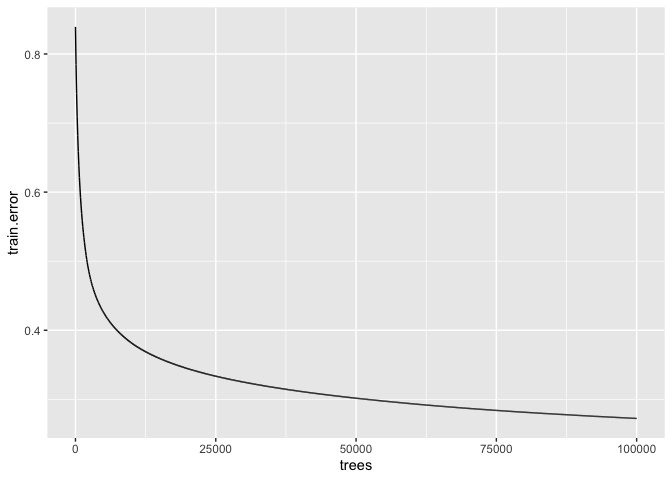<!-- -->

``` r
# 
x.df= data.frame(variable = x$var,
                 relative.influence = x$rel.inf)

write.csv(x.df, file = "x.df.csv")
x.df = subset(x.df, relative.influence>=1)#take only interesting variables

x.df$variable = factor(x.df$variable, levels = x.df$variable[order(x.df$relative.influence)])
save(x.df, file = "x.df.Rdata")
ggplot(data = x.df, aes(x = variable, y =relative.influence))+
  ylab("relative influence (%)")+
  xlab("variable")+
  geom_bar(stat="identity")+
  coord_flip()
```

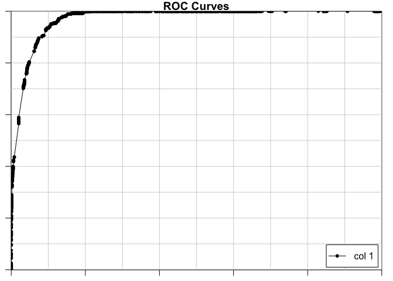<!-- -->

``` r
# 
ggsave("Figure.relative.influence.jpg")
```

    ## Saving 7 x 5 in image

\#\#\#partial dependency plot – intermediate step Get data needed for
partial dependency plot. Makes “out\_partial\_log.Rdata”. Input
TrainLog.Rdata, gbmtestLog.Rdata

``` r
load("gbmtest.Rdata")
load("Train.Rdata")

# Data
out = NULL
x = summary(gbmtest)
```

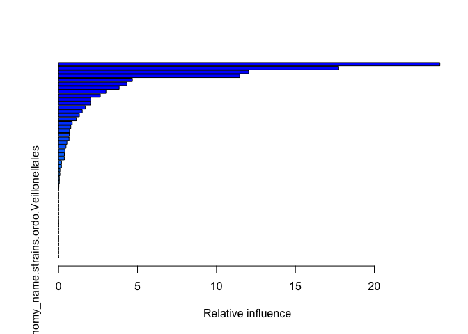<!-- -->

``` r
varlist = x$var
for (i in 1:length(varlist)){#begin for loop
  i.var = which(gbmtest$var.names==varlist[i])
  plot.out = plot.gbm(gbmtest, i.var = i.var, return.grid = TRUE)
  names(plot.out)[1]="variable.value"
  names(plot.out)[2]="value"
  plot.out$variable.name=varlist[i]
  plot.out$var = "marginal.effect"#for plotting
  out = rbind(out, plot.out)
}#end for loop

Train1=subset(Train, X.application_interaction.risk_assessment.pathogenicity_human. == 1)

i =1
i = 3
for (i in 1:length(varlist)){#begin for loop through variables
  print(i)
  i.var = which(names(Train1)==varlist[i])
  h = hist(Train1[,i.var], plot = TRUE)
  tmp = data.frame(variable.value = h$mids,
                   value=h$counts/sum(h$counts),#normalize
                   variable.name=varlist[i],
                   var = "frequency")
  out = rbind(out, tmp)
}#end for loop
```

    ## [1] 1

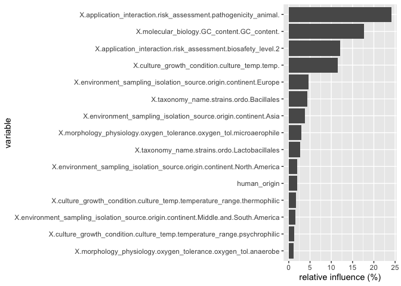<!-- -->

    ## [1] 2

<!-- -->

    ## [1] 3

<!-- -->

    ## [1] 4

<!-- -->

    ## [1] 5

<!-- -->

    ## [1] 6

<!-- -->

    ## [1] 7

<!-- -->

    ## [1] 8

<!-- -->

    ## [1] 9

<!-- -->

    ## [1] 10

<!-- -->

    ## [1] 11

<!-- -->

    ## [1] 12

<!-- -->

    ## [1] 13

<!-- -->

    ## [1] 14

<!-- -->

    ## [1] 15

<!-- -->

    ## [1] 16

<!-- -->

    ## [1] 17

<!-- -->

    ## [1] 18

<!-- -->

    ## [1] 19

<!-- -->

    ## [1] 20

<!-- -->

    ## [1] 21

<!-- -->

    ## [1] 22

<!-- -->

    ## [1] 23

<!-- -->

    ## [1] 24

<!-- -->

    ## [1] 25

<!-- -->

    ## [1] 26

<!-- -->

    ## [1] 27

<!-- -->

    ## [1] 28

<!-- -->

    ## [1] 29

    ## [1] 30

<!-- -->

    ## [1] 31

    ## [1] 32

    ## [1] 33

<!-- -->

    ## [1] 34

    ## [1] 35

    ## [1] 36

    ## [1] 37

<!-- -->

    ## [1] 38

    ## [1] 39

    ## [1] 40

    ## [1] 41

    ## [1] 42

    ## [1] 43

    ## [1] 44

    ## [1] 45

    ## [1] 46

    ## [1] 47

    ## [1] 48

    ## [1] 49

    ## [1] 50

<!-- -->

``` r
out_partial_log = out
save(out_partial_log, file = "out_partial_log.Rdata")
```

\#\#\#Make partial dependency plots

``` r
library(latticeExtra)
```

    ## Loading required package: RColorBrewer

    ## 
    ## Attaching package: 'latticeExtra'

    ## The following object is masked from 'package:ggplot2':
    ## 
    ##     layer

``` r
#use latticeExtra to make two plots
load("x.df.Rdata")
load("out_partial_log.Rdata")
out_partial = out_partial_log
jpeg(filename = "Figure.partial.dependency.jpeg",
     width = 960, height = 960)

# tiff(filename = "Figure.partial.dependency.tiff", compression = "none",
#      width = 960, height = 960)
out = out_partial
x.df.sorted = sort(x.df$relative.influence, decreasing = FALSE, index.return= TRUE)
x.df$sort_index_decreasing = x.df.sorted$ix
x.df = subset(x.df, relative.influence>0)

var.plot = x.df$variable

out$variable.name=as.character(out$variable.name)

neworder <- x.df$variable#var.plot
library(plyr)  ## or dplyr (transform -> mutate)
```

    ## -------------------------------------------------------------------------

    ## You have loaded plyr after dplyr - this is likely to cause problems.
    ## If you need functions from both plyr and dplyr, please load plyr first, then dplyr:
    ## library(plyr); library(dplyr)

    ## -------------------------------------------------------------------------

    ## 
    ## Attaching package: 'plyr'

    ## The following objects are masked from 'package:dplyr':
    ## 
    ##     arrange, count, desc, failwith, id, mutate, rename, summarise,
    ##     summarize

``` r
dat <- arrange(transform(out,
                         variable.name=factor(variable.name,levels=neworder)),variable.name)
out = dat

## a variant of Figure 5.13 from Sarkar (2008)
## http://lmdvr.r-forge.r-project.org/figures/figures.html?chapter=05;figure=05_1

x_between = 5#not sure what this does, seems to affect size of subplot
x_axis_cex = 1
names(out)
```

    ## [1] "variable.value" "value"          "variable.name"  "var"

``` r
head(out)
```

    ##   variable.value     value
    ## 1     0.00000000 -6.712753
    ## 2     0.01010101 -6.712753
    ## 3     0.02020202 -6.712753
    ## 4     0.03030303 -6.712753
    ## 5     0.04040404 -6.712753
    ## 6     0.05050505 -6.712753
    ##                                                     variable.name
    ## 1 X.application_interaction.risk_assessment.pathogenicity_animal.
    ## 2 X.application_interaction.risk_assessment.pathogenicity_animal.
    ## 3 X.application_interaction.risk_assessment.pathogenicity_animal.
    ## 4 X.application_interaction.risk_assessment.pathogenicity_animal.
    ## 5 X.application_interaction.risk_assessment.pathogenicity_animal.
    ## 6 X.application_interaction.risk_assessment.pathogenicity_animal.
    ##               var
    ## 1 marginal.effect
    ## 2 marginal.effect
    ## 3 marginal.effect
    ## 4 marginal.effect
    ## 5 marginal.effect
    ## 6 marginal.effect

``` r
out$value = round(out$value, digits = 1)
out_marg_eff = subset(out, var == "marginal.effect")
out_marg_eff$value=round(out_marg_eff$value, digits = 1)
marg_eff <- xyplot(value ~ variable.value | variable.name,
                   data = out_marg_eff, type = "l", 
                   #layout = c(4, 3),
                   scales = list(relation = "free", x=list(cex=x_axis_cex)),
                   between = list(x = x_between),
                   ylab = "Marginal effect",
                   xlab = "Predictor value",
                   auto.key = FALSE,#legend,
                   par.settings = list(strip.background=list(col="lightgrey")),
                   par.strip.text=list(cex=1),
                   as.table = TRUE
)

out_count = subset(out, var == "frequency")
count_plot <- xyplot(value ~ variable.value | variable.name, data = out_count, type = "h",
                     between = list(x = x_between),
                     scales = list(relation = "free", x=list(cex=x_axis_cex)),
                     ylab = "frequency",
                     xlab = "predictor value",
                     #lattice.options = ggplot2like.opts(),
                     #list(superpose.symbol = list(col = c("blue")))
                     # par.settings = ggplot2like(),
                     auto.key=FALSE,
                     as.table = TRUE
                     
)
#count_plot

# doubleYScale(marg_eff, count_plot, style1 = 0, style2 = 3, add.ylab2 = TRUE,
#    text = c("marginal effect", "frequency"), columns = 2)

plot <- doubleYScale(marg_eff, count_plot, style1 = 0, style2 = 3, add.ylab2 = TRUE, columns = 2)
plot
dev.off()
```

    ## quartz_off_screen 
    ##                 2

\#\#use method JP sent with adjustments

``` r
# Create plots of marginal effects
load("gbmtest.Rdata")
load("Train.Rdata")
library(dplyr)
library(ggplot2)
library(cowplot)
library(gridExtra)
library(grid)
scale = 1
best.iter <- gbm.perf(gbmtest,method="cv",plot.it=FALSE) #this gives you the optimal number of trees based on cv performance, other methods will over or under predict

ls<-partial(gbmtest,n.trees=best.iter, "X.application_interaction.risk_assessment.pathogenicity_animal.",prob=TRUE)

plot1 <- ls %>%
  select(X.application_interaction.risk_assessment.pathogenicity_animal., yhat) %>%
  na.omit() %>%
  ggplot() +
  geom_line(aes(x = X.application_interaction.risk_assessment.pathogenicity_animal., y = yhat),color="red") +
  ylim(0.,1) +
  ylab(" ") +
  theme_minimal() +
  theme(axis.title.x = element_blank())+ theme(panel.grid.major = element_blank(), panel.grid.minor = element_blank())+
  theme(axis.text.x=element_blank(),
        axis.ticks.x=element_blank())

plot2 <- Train %>%
  select(X.application_interaction.risk_assessment.pathogenicity_animal.) %>%
  na.omit() %>%
  ggplot(aes(X.application_interaction.risk_assessment.pathogenicity_animal.)) +
  geom_histogram(fill="lightblue") +
  scale_y_continuous(position="right",breaks = function(x) unique(floor(pretty(seq(0, (max(x) + 1) * 1.1)))))+
  ylab(" ") +
  theme_minimal() +
  theme(axis.title.x = element_blank())+
  theme(plot.margin=unit(c(0,0,0,1.25),"cm"))

p1 <- add_sub(plot1," ")
p2 <- add_sub(plot2,"Pathogenicity to animal",size=12)
```

    ## `stat_bin()` using `bins = 30`. Pick better value with `binwidth`.

``` r
aligned <- align_plots(p1, p2, align = "v")
pls <- ggdraw()+
  draw_plot(aligned[[2]])+
  draw_plot(aligned[[1]],
            scale = scale)

# ###
ls<-partial(gbmtest,n.trees=best.iter, "X.molecular_biology.GC_content.GC_content.",prob=TRUE)

plot1 <- ls %>%
  select(X.molecular_biology.GC_content.GC_content., yhat) %>%
  na.omit() %>%
  ggplot() +
  geom_line(aes(x = X.molecular_biology.GC_content.GC_content., y = yhat),color="red") +
  # ylim(0.,1) +
  ylab(" ") +
  theme_minimal() +
  theme(axis.title.x = element_blank())+ theme(panel.grid.major = element_blank(), panel.grid.minor = element_blank())+
  theme(axis.text.x=element_blank(),
        axis.ticks.x=element_blank())

plot2 <- Train %>%
  select(X.molecular_biology.GC_content.GC_content.) %>%
  na.omit() %>%
  ggplot(aes(X.molecular_biology.GC_content.GC_content.)) +
  geom_histogram(fill="lightblue") +
  scale_y_continuous(position="right",breaks = function(x) unique(floor(pretty(seq(0, (max(x) + 1) * 1.1)))))+
  ylab(" ") +
  theme_minimal() +
  theme(axis.title.x = element_blank())+
  theme(plot.margin=unit(c(0,0,0,1.25),"cm"))
# 
p1 <- add_sub(plot1," ")
p2 <- add_sub(plot2,"GC content",size=12)
```

    ## `stat_bin()` using `bins = 30`. Pick better value with `binwidth`.

``` r
aligned <- align_plots(p1, p2, align = "v")
gc <- ggdraw()+
  draw_plot(aligned[[2]])+
  draw_plot(aligned[[1]],
            scale = scale)


# # combine plots
grid.arrange(pls, gc, ncol=2
             ,left = textGrob("Model output probabilities", rot = 90, vjust = 1),right = textGrob("Frequency", rot = 270, vjust = 1))
```

<!-- -->

\#\#use method JP sent with adjustments – small example

``` r
# Create plots of marginal effects
load("gbmtest.Rdata")
load("Train.Rdata")
library(dplyr)
library(ggplot2)
library(cowplot)
library(gridExtra)
library(grid)
scale = 1
best.iter <- gbm.perf(gbmtest,method="cv",plot.it=FALSE) #this gives you the optimal number of trees based on cv performance, other methods will over or under predict

ls<-partial(gbmtest,n.trees=best.iter, "X.application_interaction.risk_assessment.pathogenicity_animal.",prob=TRUE)

plot1 <- ls %>%
  select(X.application_interaction.risk_assessment.pathogenicity_animal., yhat) %>%
  na.omit() %>%
  ggplot() +
  geom_line(aes(x = X.application_interaction.risk_assessment.pathogenicity_animal., y = yhat),color="red") +
  ylim(0.,1) +
  ylab(" ") +
  theme_minimal() +
  theme(axis.title.x = element_blank())+ theme(panel.grid.major = element_blank(), panel.grid.minor = element_blank())+
  theme(axis.text.x=element_blank(),
        axis.ticks.x=element_blank())

plot2 <- Train %>%
  select(X.application_interaction.risk_assessment.pathogenicity_animal.) %>%
  na.omit() %>%
  ggplot(aes(X.application_interaction.risk_assessment.pathogenicity_animal.)) +
  geom_histogram(fill="lightblue") +
  scale_y_continuous(position="right",breaks = function(x) unique(floor(pretty(seq(0, (max(x) + 1) * 1.1)))))+
  ylab(" ") +
  theme_minimal() +
  theme(axis.title.x = element_blank())+
  theme(plot.margin=unit(c(0,0,0,1.25),"cm"))

p1 <- add_sub(plot1," ")
p2 <- add_sub(plot2,"Pathogenicity to animal",size=12)
```

    ## `stat_bin()` using `bins = 30`. Pick better value with `binwidth`.

``` r
aligned <- align_plots(p1, p2, align = "v")
pls <- ggdraw()+
  draw_plot(aligned[[2]])+
  draw_plot(aligned[[1]],
            scale = scale)


# # combine plots
grid.arrange(pls, ncol=2
             ,left = textGrob("Model output probabilities", rot = 90, vjust = 1),right = textGrob("Frequency", rot = 270, vjust = 1))
```

<!-- -->

plotPartial example

``` r
# Load required packages
library(ggplot2)  # required to use autoplot
library(randomForest)

# Fit a random forest to the Boston housing data
data (boston)  # load the boston housing data
set.seed(101)  # for reproducibility
boston.rf <- randomForest(cmedv ~ ., data = boston)

# Partial dependence of cmedv on lstat
boston.rf %>%
  partial(pred.var = "lstat") %>%
  plotPartial(rug = TRUE, train = boston)
```

<!-- -->

\#\#use method JP sent, but with partial rug

``` r
# Create plots of marginal effects
load("gbmtest.Rdata")
load("Train.Rdata")
library("gbm")
library("pdp")

best.iter <- gbm.perf(gbmtest,method="cv",plot.it=FALSE) #this gives you the optimal number of trees based on cv performance, other methods will over or under predict

ls<-partial(gbmtest,n.trees=best.iter, "X.application_interaction.risk_assessment.pathogenicity_animal.",prob=TRUE,
            rug=TRUE)
plot1 <- plotPartial(ls, rug=TRUE, 
            train=Train,
            xlab = "pathogenicity to animals")

ls1<-partial(gbmtest,n.trees=best.iter, "X.molecular_biology.GC_content.GC_content.",prob=TRUE,
            rug=TRUE)
plot2 <- plotPartial(ls1, rug=TRUE, 
            train=Train,
            xlab = "GC content")

# combine plots
grid.arrange(plot1, plot2, ncol=2)#,left = textGrob("Model output probabilities", rot = 90, vjust = 1),right = textGrob("Frequency", rot = 270, vjust = 1))
```

<!-- -->

``` r
library(gbm)
load("gbmtest.Rdata")
load("Train.Rdata")

best.iter <- gbm.perf(gbmtest,method="cv",plot.it=FALSE) #this gives you the optimal number of trees based on cv performance, other methods will over or under predict
print(best.iter)
```

    ## [1] 24358

``` r
par(mfrow=c(2,3))

# 1. aridity
par(mar=c(4.2,4.2,1,4.5))
histGR<-hist(Train$X.application_interaction.risk_assessment.pathogenicity_animal.,xlab="Pathogenic to animal",
             breaks=20,
             main="",axes=FALSE,xaxs="i",border="white",col="light blue")
axis(2,histGR$y)
par(new=TRUE,ann=FALSE,yaxt="n")
margGR<-plot(gbmtest,i.var="X.application_interaction.risk_assessment.pathogenicity_animal.",best.iter,lwd=1.5)
par(yaxt="s")
axis(4,margGR$y)

###this generates two separate plots
# histGR<-hist(Train$X.application_interaction.risk_assessment.pathogenicity_animal.)
# par(new=TRUE, ann =FALSE, yaxt="n")
# margGR<-plot(gbmtest,i.var="X.application_interaction.risk_assessment.pathogenicity_animal.",best.iter,lwd=1.5)
# par(yaxt="s")
# axis(4,margGR$y)
```

<!-- -->

\#\#\#iml example

``` r
data("Boston", package  = "MASS")
head(Boston)
```

    ##      crim zn indus chas   nox    rm  age    dis rad tax ptratio  black
    ## 1 0.00632 18  2.31    0 0.538 6.575 65.2 4.0900   1 296    15.3 396.90
    ## 2 0.02731  0  7.07    0 0.469 6.421 78.9 4.9671   2 242    17.8 396.90
    ## 3 0.02729  0  7.07    0 0.469 7.185 61.1 4.9671   2 242    17.8 392.83
    ## 4 0.03237  0  2.18    0 0.458 6.998 45.8 6.0622   3 222    18.7 394.63
    ## 5 0.06905  0  2.18    0 0.458 7.147 54.2 6.0622   3 222    18.7 396.90
    ## 6 0.02985  0  2.18    0 0.458 6.430 58.7 6.0622   3 222    18.7 394.12
    ##   lstat medv
    ## 1  4.98 24.0
    ## 2  9.14 21.6
    ## 3  4.03 34.7
    ## 4  2.94 33.4
    ## 5  5.33 36.2
    ## 6  5.21 28.7

\#\#\#5. Feature construction with bacterial traits

``` r
# library(sjPlot)
# 
# q <- read.csv(file = "dropnzvdata.csv")
# num <- read.csv(file = "numeric_variables.csv")
# 
# cat_vars <- data.frame(
# q$culture_growth_condition.culture_medium.medium_name,
# q$culture_growth_condition.culture_medium.medium_name1,
# q$culture_growth_condition.culture_medium.medium_name2,
# q$culture_growth_condition.culture_temp.temperature_range,
# q$environment_sampling_isolation_source.origin.continent,
# q$environment_sampling_isolation_source.origin.country,
# q$environment_sampling_isolation_source.origin.geo_loc_name,
# q$environment_sampling_isolation_source.origin.sample_type,
# q$molecular_biology.GC_content.GC_content,
# q$molecular_biology.sequence.DB_sequence,
# q$molecular_biology.sequence.DB_sequence1,
# q$molecular_biology.sequence.DB_sequence2,
# q$molecular_biology.sequence.seq_acc_num,
# q$molecular_biology.sequence.seq_acc_num1,
# q$molecular_biology.sequence.seq_acc_num2,
# q$references.reference1.NA,
# q$references.reference2.NA,
# q$references.reference3.NA,
# q$references.reference4.NA,
# q$strain_availability.strain_history.history,
# q$strain_availability.strains.strain_number,
# q$taxonomy_name.strains.class,
# q$taxonomy_name.strains.designation,
# q$taxonomy_name.strains.family,
# q$taxonomy_name.strains.full_scientific_name,
# q$taxonomy_name.strains.genus,
# q$taxonomy_name.strains.is_type_strain,
# q$taxonomy_name.strains.ordo,
# q$taxonomy_name.strains.phylum,
# q$taxonomy_name.strains.species,
# q$taxonomy_name.strains.species_epithet,
# q$taxonomy_name.strains_synonyms_PNU.pnu_synonym,
# q$taxonomy_name.strains_tax_PNU.class,
# q$taxonomy_name.strains_tax_PNU.family,
# q$taxonomy_name.strains_tax_PNU.full_scientific_name,
# q$taxonomy_name.strains_tax_PNU.genus,
# q$taxonomy_name.strains_tax_PNU.is_type_strain,
# q$taxonomy_name.strains_tax_PNU.phylum,
# q$taxonomy_name.strains_tax_PNU.species,
# q$taxonomy_name.strains_tax_PNU.species_epithet,
# q$taxonomy_name.strains_tax_PNU.status_gen,
# q$taxonomy_name.strains_tax_PNU.status_spec)
# 
# df[] <- lapply(cat_vars,as.integer)
# sjp.corr(df)
# sjt.corr(df)
# 
# cmatrix <- matrix()
# i = 1
# j = 2
# 
# q <- cat_vars
# while (i <= length(q) - 1) {
#   while (j <= length(q)) {
#     row1 <- colnames(q)[i]
#     row2 <- colnames(q)[j]
#     df <- q[!is.na(q[row1,]) & !is.na(q[row2],),]
#     t <- table(df[row1,], df[row2],)
#     cmatrix[i][j] <- chisq.test(t, correct = F)$p.value
#     j = j+1
#     print(i,j)
#   }
#   i = i+1
# }
# 
# q <- read.csv(file = "dropnzvdata.csv", header=TRUE, sep=",", stringsAsFactors=FALSE)
# 
# num_vars <- data.frame(
# q$application_interaction.risk_assessment.ID_reference,
# q$culture_growth_condition.culture_medium.ID_reference,
# q$culture_growth_condition.culture_medium.ID_reference1,
# q$culture_growth_condition.culture_medium.ID_reference2,
# q$culture_growth_condition.culture_temp.ID_reference,
# q$culture_growth_condition.culture_temp.ID_reference1,
# q$culture_growth_condition.culture_temp.ID_reference2,
# q$environment_sampling_isolation_source.origin.ID_reference,
# q$molecular_biology.GC_content.ID_reference,
# q$molecular_biology.sequence.ID_reference,
# q$references.ID_reference1.NA,
# q$references.ID_reference2.NA,
# q$references.ID_reference3.NA,
# q$references.ID_reference4.NA,
# q$strain_availability.strain_history.ID_reference,
# q$strain_availability.straininfo_link.straininfo_strainnumber,
# q$strain_availability.straininfo_link.straininfo_strainnumber1,
# q$strain_availability.straininfo_link.straininfo_strainnumber2,
# q$strain_availability.strains.ID_reference,
# q$taxonomy_name.strains.ID_reference)
# 
# cor(num_vars)
```

\#\#\#6. Data visualization: summary “state of knowledge” on bacteria
causing disease in mammals or humans

\#\#\#7. Use traits to predict transmissibility and human disease
outcomes
