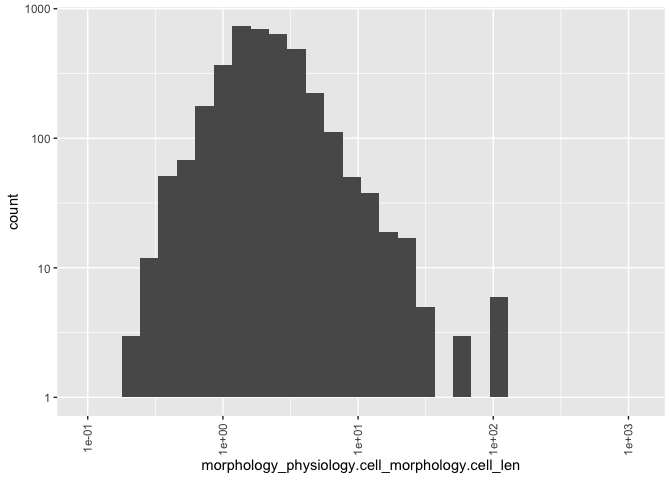
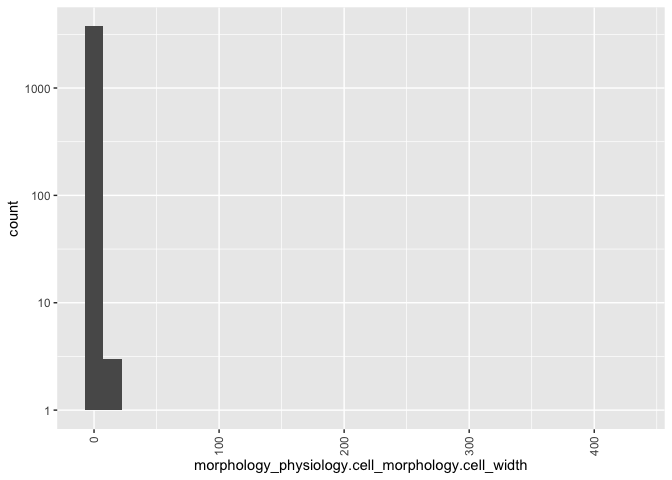
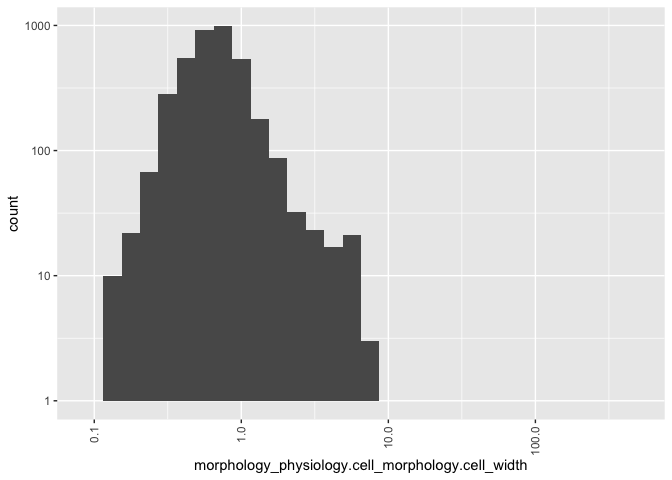
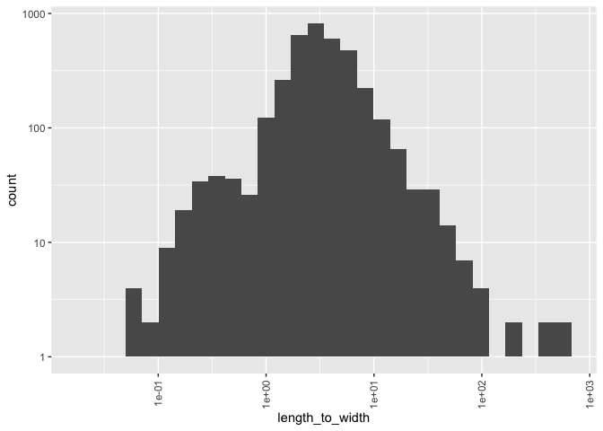

bacteria\_processing\_3
================
Ilya
6/24/2019

\#\#\#\#install and load required packages

    ## Loading required package: lattice

    ## Loading required package: ggplot2

    ## #refugeeswelcome

\#\#\#1. Get bacteria-caused dx in GIDEON  
\#\#\#2. Match dx to pathogen spp. names \#\#\#3. Match spp. names (from
GIDEON zdx and GMPD) to traits (in GMPD & other) \#\#\#4. Compile master
list of bacteria spp & traits

\#\#\#\#Check what fields are in bacteria\_species\_out2.Rdata
bacteria\_species\_out2 includes pathogenic and non-pathogenic bacteria

``` r
#commenting this out for now because it doesn't do anything new
#source("R_graph_bacteria_order_pathogen_status3.R")
```

\#\#\#read in BacDive data accessed by Wanjia Song

\#\#\#find out fields with at least threshold % coverage

``` r
load("../DATA/PROCESSED/Data from Backdive-2.RData")
dim(merge)
```

    ## [1] 5619670       6

``` r
merge_test = unique(merge)
dim(merge_test)
```

    ## [1] 5337978       6

``` r
#11752  taxonomy_name   strains_tax_PNU species_epithet actinomycetemcomitans
test = subset(merge, bacdive_id == 11752 &
                section == "taxonomy_name" &
                subsection == "strains_tax_PNU" &
                field == "species_epithet")
threshold = 0.01
D = merge
dim(D)
```

    ## [1] 5619670       6

``` r
D = unique(D)
dim(D)
```

    ## [1] 5337978       6

``` r
#rm(merge)
#remove NA values
inds.na = which(!is.na(D$value))
D = D[inds.na,]
id_len=length(unique(D$bacdive_id))
D$new_field = paste(D$section, D$subsection, D$field)
save(D, file = "../DATA/PROCESSED/D.Rdata")
count=as.data.frame(table(D$new_field))#combination of subsection and field
var1=count$Var1
freq=count$Freq
var<-list()
freqs<-list()
for (i in 1:length(freq)) {
     if (freq[i]>=threshold*id_len) {#this will get fields greater than 1%
         var[[i]]=var1[i]
         freqs[[i]]=freq[i]
     }
}

df=do.call(rbind, Map(data.frame, Feature_name=var, Frequency=freqs))

df$Fraction = df$Frequency/id_len
###get those seen at least 20% of time
df20 = subset(df, Fraction >= 0.2)
write.csv(df20, file ="variables_20_percent_coverage.csv")

###get those seen at least 10% of time
df10 = subset(df, Fraction >= 0.1)
write.csv(df10, file ="variables_10_percent_coverage.csv")

###get those seen at least 5% of time
df05 = subset(df, Fraction >= 0.05)
write.csv(df05, file ="variables_5_percent_coverage.csv")

###get those seen at least 1% of time
df01 = subset(df, Fraction >= 0.01)
save(df01, file = "../DATA/PROCESSED/df01.Rdata")
```

\#use df01 to subset all data for those variables

``` r
load("../DATA/PROCESSED/D.RData")

merge01 = subset(D, new_field %in% df01$Feature_name)
save(merge01, file = "../DATA/PROCESSED/merge01.Rdata")

merge20 = subset(D, new_field %in% df20$Feature_name)
save(merge20, file = "../DATA/PROCESSED/merge20.Rdata")

merge10 = subset(D, new_field %in% df10$Feature_name)
save(merge10, file = "../DATA/PROCESSED/merge10.Rdata")
```

``` r
##this part is data_processing.R @
df <- merge01

df <- unique(df)

df$feature_name <- paste(df$section, df$subsection, df$field)

a <- df[is.element(df$feature_name, df01$Feature_name),]#df01 for 1% threshold

q <- dcast(a, bacdive_id~feature_name)
q <- q[order(q$bacdive_id),]

##test with merge10
# df10 <- merge10
# 
# df10 <- unique(df10)
# 
# df10$feature_name <- paste(df10$section, df10$subsection, df10$field)
# 
# a10 <- df10[is.element(df10$feature_name, df20$Feature_name),]

# q <- dcast(a, bacdive_id~feature_name)
# q <- q[order(q$bacdive_id),]


write.csv(q, file = "df.csv", row.names = F)
temp = read.csv("df.csv")
dim(temp)
```

    ## [1] 31040  1925

``` r
# remove columns with near zero variance Global
nzv <- nearZeroVar(q,saveMetrics=TRUE,freqCut = 95/5)
nzv <- row.names(nzv[which(nzv$nzv==TRUE),])
dropnzv<-names(q[ , which(names(q) %in% nzv)])
q <- q[ , -which(names(q) %in% nzv)]
write.csv(q, file = "dropnzvdata.csv", row.names = F)
```

``` r
##this part corresponds to Zach's one_hot_encoding.R
#one-hot encode categorical variables
q <- read.csv(file = "dropnzvdata.csv")
dim(q)
```

    ## [1] 31040  1499

``` r
str(q)
```

    ## 'data.frame':    31040 obs. of  1499 variables:
    ##  $ bacdive_id                                                      : int  1 10 100 1000 10000 100000 100001 100002 100003 100004 ...
    ##  $ application_interaction.risk_assessment.biosafety_level         : Factor w/ 4 levels "1","2","3**",..: 1 1 1 1 1 NA NA NA NA NA ...
    ##  $ application_interaction.risk_assessment.biosafety_level_comment1: Factor w/ 4 levels "German classification",..: NA NA NA NA NA NA NA NA NA NA ...
    ##  $ application_interaction.risk_assessment.biosafety_level_comment2: Factor w/ 18 levels "German classification",..: NA NA NA NA NA NA NA NA NA NA ...
    ##  $ application_interaction.risk_assessment.biosafety_level1        : Factor w/ 4 levels "1","1+","2","L1": NA NA NA NA NA NA NA NA NA NA ...
    ##  $ application_interaction.risk_assessment.biosafety_level2        : Factor w/ 3 levels "1","2","L1": NA NA NA NA NA NA NA NA NA NA ...
    ##  $ application_interaction.risk_assessment.ID_reference            : int  950 1705 5523 17084 14065 NA NA NA NA NA ...
    ##  $ application_interaction.risk_assessment.ID_reference1           : int  NA NA NA NA NA NA NA NA NA NA ...
    ##  $ application_interaction.risk_assessment.ID_reference2           : int  NA NA NA NA NA NA NA NA NA NA ...
    ##  $ culture_growth_condition.culture_medium.ID_reference            : int  950 NA 5523 17084 14065 NA NA NA NA NA ...
    ##  $ culture_growth_condition.culture_medium.ID_reference1           : int  NA 1705 NA NA NA NA NA NA NA NA ...
    ##  $ culture_growth_condition.culture_medium.ID_reference2           : int  NA 1705 NA NA NA NA NA NA NA NA ...
    ##  $ culture_growth_condition.culture_medium.media_link              : Factor w/ 980 levels "https://www.dsmz.de/microorganisms/medium/pdf/DSMZ_Medium1.pdf",..: 45 NA 42 474 906 NA NA NA NA NA ...
    ##  $ culture_growth_condition.culture_medium.media_link1             : Factor w/ 432 levels "https://www.dsmz.de/microorganisms/medium/pdf/DSMZ_Medium1.pdf",..: NA 25 NA NA NA NA NA NA NA NA ...
    ##  $ culture_growth_condition.culture_medium.media_link2             : Factor w/ 207 levels "https://www.dsmz.de/microorganisms/medium/pdf/DSMZ_Medium1.pdf",..: NA 72 NA NA NA NA NA NA NA NA ...
    ##  $ culture_growth_condition.culture_medium.medium_composition      : Factor w/ 148 levels "(all g l-1 in distilled water): sea salts (Sigma), 40; NaCl, 50; yeast extract, 1; peptone, 5; ferric citrate, "| __truncated__,..: NA NA NA NA NA NA NA NA NA NA ...
    ##  $ culture_growth_condition.culture_medium.medium_composition1     : Factor w/ 55 levels " 4.0 g yeast extract, 4.0 g glucose, 5.0 g malt extract, 1 ml vitamin B solution (containing 0.5 mg each of thi"| __truncated__,..: NA NA NA NA NA NA NA NA NA NA ...
    ##  $ culture_growth_condition.culture_medium.medium_composition2     : Factor w/ 274 levels " 1g/L Yeast extract, 5g/L xylan, 1g/L NH4Cl, 0.1g/L NaCl, 0.1 g/L MgCl*6 H2O, 0.05g/L CaCl2*2 H2O, 0.4 g/L K2HP"| __truncated__,..: NA NA NA NA NA NA NA NA NA NA ...
    ##  $ culture_growth_condition.culture_medium.medium_composition3     : Factor w/ 151 levels "0.1 % (w/v) yeast extract, peptone and glucose, 15 g agar per litre, pH 6.8",..: NA NA NA NA NA NA NA NA NA NA ...
    ##  $ culture_growth_condition.culture_medium.medium_composition4     : Factor w/ 85 levels "0,5 % (w/v) baker's yeast (fresh weight), 0.1 % (w/v) CaCl2.2H2O, 1.5 % (w/v) agar (pH 7.2); supplemented with "| __truncated__,..: NA NA NA NA NA NA NA NA NA NA ...
    ##  $ culture_growth_condition.culture_medium.medium_composition5     : Factor w/ 60 levels "0.3 % (w/v) yeast extract and 0.3 % (w/v) casein peptone, respectively, 15 g agar per litre, pH 7.2",..: NA NA NA NA NA NA NA NA NA NA ...
    ##  $ culture_growth_condition.culture_medium.medium_composition6     : Factor w/ 50 levels "5 % NaCl","80 % VY/2, 10 % CY, 10 % S-medium, vitamin solution and additional vitamin B 12",..: NA NA NA NA NA NA NA NA NA NA ...
    ##  $ culture_growth_condition.culture_medium.medium_composition7     : Factor w/ 39 levels "Columbia agar (39.000 g);distilled water (1000.000 ml)",..: NA NA NA NA NA NA NA NA NA NA ...
    ##  $ culture_growth_condition.culture_medium.medium_composition8     : Factor w/ 54 levels "Agar (15.000 g);Glucose (4.000 g);Yeast extract (4.000 g);Malt extract (10.000 g);Calcium carbonate (2.000 g);S"| __truncated__,..: NA NA NA NA NA NA NA NA NA NA ...
    ##  $ culture_growth_condition.culture_medium.medium_composition9     : Factor w/ 40 levels "30g Saccharose, 2g Sodium Nitrate, 1g Dipotassium Phosphate, 0.5g Magnesium Sulfate, 0.5g Potassium Chloride, 0"| __truncated__,..: NA NA NA NA NA NA NA NA NA NA ...
    ##  $ culture_growth_condition.culture_medium.medium_name             : Factor w/ 2531 levels "0.1xTSB","0.3 MB agar",..: 927 NA 1780 422 2465 NA NA NA NA NA ...
    ##  $ culture_growth_condition.culture_medium.medium_name1            : Factor w/ 1578 levels "1/10 NUTRIENT AGAR NO.2 (DSMZ Medium 952), 28°C",..: NA 536 NA NA NA NA NA NA NA NA ...
    ##  $ culture_growth_condition.culture_medium.medium_name2            : Factor w/ 1190 levels "0.1 x TSB agar",..: NA 1188 NA NA NA NA NA NA NA NA ...
    ##  $ culture_growth_condition.culture_medium.medium_name3            : Factor w/ 418 levels "0.1 x TSB agar",..: NA NA NA NA NA NA NA NA NA NA ...
    ##  $ culture_growth_condition.culture_medium.medium_name4            : Factor w/ 217 levels " Mueller - Hinton agar",..: NA NA NA NA NA NA NA NA NA NA ...
    ##  $ culture_growth_condition.culture_medium.medium_name5            : Factor w/ 161 levels "0,35% acetic acid agar",..: NA NA NA NA NA NA NA NA NA NA ...
    ##  $ culture_growth_condition.culture_medium.medium_name6            : Factor w/ 120 levels "3.3xPYE agar",..: NA NA NA NA NA NA NA NA NA NA ...
    ##  $ culture_growth_condition.culture_medium.medium_name7            : Factor w/ 83 levels "5428","5530",..: NA NA NA NA NA NA NA NA NA NA ...
    ##  $ culture_growth_condition.culture_medium.medium_name8            : Factor w/ 83 levels "0.1  x marine broth 2216 agar",..: NA NA NA NA NA NA NA NA NA NA ...
    ##  $ culture_growth_condition.culture_medium.medium_name9            : Factor w/ 69 levels "Bennett's agar",..: NA NA NA NA NA NA NA NA NA NA ...
    ##  $ culture_growth_condition.culture_pH.ID_reference                : int  NA NA NA NA NA NA NA NA NA NA ...
    ##  $ culture_growth_condition.culture_pH.ID_reference1               : int  NA NA NA NA NA NA NA NA NA NA ...
    ##  $ culture_growth_condition.culture_pH.ID_reference2               : int  NA NA NA NA NA NA NA NA NA NA ...
    ##  $ culture_growth_condition.culture_pH.pH                          : Factor w/ 178 levels "<4.3",">4.5",..: NA NA NA NA NA NA NA NA NA NA ...
    ##  $ culture_growth_condition.culture_pH.pH1                         : Factor w/ 568 levels "<5.0","<6",">5.5",..: NA NA NA NA NA NA NA NA NA NA ...
    ##  $ culture_growth_condition.culture_pH.pH2                         : Factor w/ 297 levels "<10.5","<5","<5.0",..: NA NA NA NA NA NA NA NA NA NA ...
    ##  $ culture_growth_condition.culture_pH.test_type                   : Factor w/ 4 levels "growth","maximum",..: NA NA NA NA NA NA NA NA NA NA ...
    ##  $ culture_growth_condition.culture_pH.test_type2                  : Factor w/ 4 levels "growth","maximum",..: NA NA NA NA NA NA NA NA NA NA ...
    ##  $ culture_growth_condition.culture_temp.ability4                  : Factor w/ 3 levels "inconsistent",..: NA NA NA NA NA NA NA NA NA NA ...
    ##  $ culture_growth_condition.culture_temp.ID_reference              : int  950 1705 5523 17084 14065 NA NA NA NA NA ...
    ##  $ culture_growth_condition.culture_temp.ID_reference1             : int  NA NA NA NA NA NA NA NA NA NA ...
    ##  $ culture_growth_condition.culture_temp.ID_reference2             : int  NA NA NA NA NA NA NA NA NA NA ...
    ##  $ culture_growth_condition.culture_temp.ID_reference3             : int  NA NA NA NA NA NA NA NA NA NA ...
    ##  $ culture_growth_condition.culture_temp.ID_reference4             : int  NA NA NA NA NA NA NA NA NA NA ...
    ##  $ culture_growth_condition.culture_temp.temp                      : Factor w/ 124 levels ">34.0","0","0-34",..: 63 67 88 67 67 NA NA NA NA NA ...
    ##  $ culture_growth_condition.culture_temp.temp1                     : Factor w/ 366 levels "(-2)-(-1)","0-20",..: NA NA NA NA NA NA NA NA NA NA ...
    ##  $ culture_growth_condition.culture_temp.temp2                     : Factor w/ 727 levels "-1.8-10","-1.8-16",..: NA NA NA NA NA NA NA NA NA NA ...
    ##  $ culture_growth_condition.culture_temp.temp3                     : Factor w/ 376 levels "-2-25","-5.0",..: NA NA NA NA NA NA NA NA NA NA ...
    ##  $ culture_growth_condition.culture_temp.temp4                     : Factor w/ 160 levels "-2",">45",">49.0",..: NA NA NA NA NA NA NA NA NA NA ...
    ##  $ culture_growth_condition.culture_temp.temperature_range         : Factor w/ 4 levels "hyperthermophilic",..: 2 2 2 2 2 NA NA NA NA NA ...
    ##  $ culture_growth_condition.culture_temp.temperature_range3        : Factor w/ 3 levels "mesophilic","psychrophilic",..: NA NA NA NA NA NA NA NA NA NA ...
    ##  $ culture_growth_condition.culture_temp.test_type2                : Factor w/ 4 levels "growth","maximum",..: NA NA NA NA NA NA NA NA NA NA ...
    ##  $ culture_growth_condition.culture_temp.test_type3                : Factor w/ 5 levels "growth","maximum",..: NA NA NA NA NA NA NA NA NA NA ...
    ##  $ culture_growth_condition.culture_temp.test_type4                : Factor w/ 4 levels "growth","maximum",..: NA NA NA NA NA NA NA NA NA NA ...
    ##  $ environment_sampling_isolation_source.origin.continent          : Factor w/ 8 levels "Africa","Antarctica",..: NA NA 5 6 6 NA NA NA NA NA ...
    ##  $ environment_sampling_isolation_source.origin.continent1         : Factor w/ 6 levels "Africa","Asia",..: NA NA NA NA NA NA NA NA NA NA ...
    ##  $ environment_sampling_isolation_source.origin.country            : Factor w/ 209 levels "Afghanistan",..: NA NA 14 74 74 NA NA NA NA NA ...
    ##  $ environment_sampling_isolation_source.origin.country1           : Factor w/ 65 levels "Algeria","Antarctica",..: NA NA NA NA NA NA NA NA NA NA ...
    ##  $ environment_sampling_isolation_source.origin.geo_loc_name       : Factor w/ 6957 levels "\t\t\t\tKavango region, near Mashare",..: NA NA NA 1660 5569 NA NA NA NA NA ...
    ##  $ environment_sampling_isolation_source.origin.geo_loc_name1      : Factor w/ 383 levels "(60° 30' 53.77'' N 4° 54' 14.75'' W)",..: NA NA NA NA NA NA NA NA NA NA ...
    ##  $ environment_sampling_isolation_source.origin.ID_reference       : int  NA 1705 5523 17084 14065 NA NA NA NA NA ...
    ##  $ environment_sampling_isolation_source.origin.ID_reference1      : int  NA NA NA NA NA NA NA NA NA NA ...
    ##  $ environment_sampling_isolation_source.origin.ID_reference2      : int  NA NA NA NA NA NA NA NA NA NA ...
    ##  $ environment_sampling_isolation_source.origin.latitude           : num  NA NA NA NA NA NA NA NA NA NA ...
    ##  $ environment_sampling_isolation_source.origin.longitude          : num  NA NA NA NA NA NA NA NA NA NA ...
    ##  $ environment_sampling_isolation_source.origin.sample_date        : Factor w/ 224 levels "1908-05-01","1908-06-01",..: NA NA NA NA NA NA NA NA NA NA ...
    ##  $ environment_sampling_isolation_source.origin.sample_type        : Factor w/ 8334 levels "\tIndustrial hygiene control, Rodac medium",..: NA 1333 3801 7165 2293 NA NA NA NA NA ...
    ##  $ environment_sampling_isolation_source.origin.sample_type1       : Factor w/ 436 levels "","<i>Casuarina cunninghamiana</i> root nodules",..: NA NA NA NA NA NA NA NA NA NA ...
    ##  $ molecular_biology.GC_content.GC_content                         : Factor w/ 876 levels "22-23","23.0",..: 499 NA 239 NA NA NA NA NA NA NA ...
    ##  $ molecular_biology.GC_content.GC_content1                        : Factor w/ 632 levels "24","24.6","25.6",..: NA NA NA NA NA NA NA NA NA NA ...
    ##  $ molecular_biology.GC_content.GC_content2                        : Factor w/ 680 levels "24","24.6","25.6",..: NA NA NA NA NA NA NA NA NA NA ...
    ##  $ molecular_biology.GC_content.GC_method                          : Factor w/ 8 levels "Buoyant density centrifugation (BD)",..: NA NA NA NA NA NA NA NA NA NA ...
    ##  $ molecular_biology.GC_content.GC_method1                         : Factor w/ 9 levels "Buoyant density centrifugation (BD)",..: NA NA NA NA NA NA NA NA NA NA ...
    ##  $ molecular_biology.GC_content.GC_method2                         : Factor w/ 10 levels "","Buoyant density centrifugation (BD)",..: NA NA NA NA NA NA NA NA NA NA ...
    ##  $ molecular_biology.GC_content.ID_reference                       : int  950 NA 5523 NA NA NA NA NA NA NA ...
    ##  $ molecular_biology.GC_content.ID_reference1                      : int  NA NA NA NA NA NA NA NA NA NA ...
    ##  $ molecular_biology.GC_content.ID_reference2                      : int  NA NA NA NA NA NA NA NA NA NA ...
    ##  $ molecular_biology.sequence.DB_sequence                          : Factor w/ 37 levels "16S rRNA gene, EMBL Genome project data",..: NA NA 11 15 NA NA NA NA NA NA ...
    ##  $ molecular_biology.sequence.DB_sequence1                         : Factor w/ 41 levels "<i>gyrB</i> gene, Marker Gene (DDBJ Direct submission)",..: 36 36 NA NA NA NA NA NA NA NA ...
    ##  $ molecular_biology.sequence.DB_sequence10                        : Factor w/ 16 levels "DDBJ EMBL Direct submission",..: NA 14 NA NA NA NA NA NA NA NA ...
    ##  $ molecular_biology.sequence.DB_sequence100                       : Factor w/ 9 levels "EMBL Genome project data",..: NA NA NA NA NA NA NA NA NA NA ...
    ##  $ molecular_biology.sequence.DB_sequence101                       : Factor w/ 9 levels "EMBL Direct submission",..: NA NA NA NA NA NA NA NA NA NA ...
    ##  $ molecular_biology.sequence.DB_sequence102                       : Factor w/ 12 levels "DDBJ EMBL Direct submission",..: NA NA NA NA NA NA NA NA NA NA ...
    ##  $ molecular_biology.sequence.DB_sequence103                       : Factor w/ 7 levels "EMBL Genome project data",..: NA NA NA NA NA NA NA NA NA NA ...
    ##  $ molecular_biology.sequence.DB_sequence104                       : Factor w/ 8 levels "EMBL Genome project data",..: NA NA NA NA NA NA NA NA NA NA ...
    ##  $ molecular_biology.sequence.DB_sequence105                       : Factor w/ 10 levels "DDBJ EMBL Direct submission",..: NA NA NA NA NA NA NA NA NA NA ...
    ##  $ molecular_biology.sequence.DB_sequence106                       : Factor w/ 8 levels "DDBJ Genome project data",..: NA NA NA NA NA NA NA NA NA NA ...
    ##  $ molecular_biology.sequence.DB_sequence107                       : Factor w/ 9 levels "DDBJ Genome project data",..: NA NA NA NA NA NA NA NA NA NA ...
    ##  $ molecular_biology.sequence.DB_sequence108                       : Factor w/ 8 levels "EMBL Direct submission",..: NA NA NA NA NA NA NA NA NA NA ...
    ##  $ molecular_biology.sequence.DB_sequence109                       : Factor w/ 8 levels "EMBL Genome project data",..: NA NA NA NA NA NA NA NA NA NA ...
    ##  $ molecular_biology.sequence.DB_sequence11                        : Factor w/ 15 levels "DDBJ EMBL Direct submission",..: NA 13 NA NA NA NA NA NA NA NA ...
    ##  $ molecular_biology.sequence.DB_sequence110                       : Factor w/ 8 levels "EMBL Direct submission",..: NA NA NA NA NA NA NA NA NA NA ...
    ##  $ molecular_biology.sequence.DB_sequence111                       : Factor w/ 9 levels "DDBJ EMBL Direct submission",..: NA NA NA NA NA NA NA NA NA NA ...
    ##  $ molecular_biology.sequence.DB_sequence112                       : Factor w/ 8 levels "DDBJ EMBL Direct submission",..: NA NA NA NA NA NA NA NA NA NA ...
    ##   [list output truncated]

``` r
str(q, list.len=ncol(q))
```

    ## 'data.frame':    31040 obs. of  1499 variables:
    ##  $ bacdive_id                                                      : int  1 10 100 1000 10000 100000 100001 100002 100003 100004 ...
    ##  $ application_interaction.risk_assessment.biosafety_level         : Factor w/ 4 levels "1","2","3**",..: 1 1 1 1 1 NA NA NA NA NA ...
    ##  $ application_interaction.risk_assessment.biosafety_level_comment1: Factor w/ 4 levels "German classification",..: NA NA NA NA NA NA NA NA NA NA ...
    ##  $ application_interaction.risk_assessment.biosafety_level_comment2: Factor w/ 18 levels "German classification",..: NA NA NA NA NA NA NA NA NA NA ...
    ##  $ application_interaction.risk_assessment.biosafety_level1        : Factor w/ 4 levels "1","1+","2","L1": NA NA NA NA NA NA NA NA NA NA ...
    ##  $ application_interaction.risk_assessment.biosafety_level2        : Factor w/ 3 levels "1","2","L1": NA NA NA NA NA NA NA NA NA NA ...
    ##  $ application_interaction.risk_assessment.ID_reference            : int  950 1705 5523 17084 14065 NA NA NA NA NA ...
    ##  $ application_interaction.risk_assessment.ID_reference1           : int  NA NA NA NA NA NA NA NA NA NA ...
    ##  $ application_interaction.risk_assessment.ID_reference2           : int  NA NA NA NA NA NA NA NA NA NA ...
    ##  $ culture_growth_condition.culture_medium.ID_reference            : int  950 NA 5523 17084 14065 NA NA NA NA NA ...
    ##  $ culture_growth_condition.culture_medium.ID_reference1           : int  NA 1705 NA NA NA NA NA NA NA NA ...
    ##  $ culture_growth_condition.culture_medium.ID_reference2           : int  NA 1705 NA NA NA NA NA NA NA NA ...
    ##  $ culture_growth_condition.culture_medium.media_link              : Factor w/ 980 levels "https://www.dsmz.de/microorganisms/medium/pdf/DSMZ_Medium1.pdf",..: 45 NA 42 474 906 NA NA NA NA NA ...
    ##  $ culture_growth_condition.culture_medium.media_link1             : Factor w/ 432 levels "https://www.dsmz.de/microorganisms/medium/pdf/DSMZ_Medium1.pdf",..: NA 25 NA NA NA NA NA NA NA NA ...
    ##  $ culture_growth_condition.culture_medium.media_link2             : Factor w/ 207 levels "https://www.dsmz.de/microorganisms/medium/pdf/DSMZ_Medium1.pdf",..: NA 72 NA NA NA NA NA NA NA NA ...
    ##  $ culture_growth_condition.culture_medium.medium_composition      : Factor w/ 148 levels "(all g l-1 in distilled water): sea salts (Sigma), 40; NaCl, 50; yeast extract, 1; peptone, 5; ferric citrate, "| __truncated__,..: NA NA NA NA NA NA NA NA NA NA ...
    ##  $ culture_growth_condition.culture_medium.medium_composition1     : Factor w/ 55 levels " 4.0 g yeast extract, 4.0 g glucose, 5.0 g malt extract, 1 ml vitamin B solution (containing 0.5 mg each of thi"| __truncated__,..: NA NA NA NA NA NA NA NA NA NA ...
    ##  $ culture_growth_condition.culture_medium.medium_composition2     : Factor w/ 274 levels " 1g/L Yeast extract, 5g/L xylan, 1g/L NH4Cl, 0.1g/L NaCl, 0.1 g/L MgCl*6 H2O, 0.05g/L CaCl2*2 H2O, 0.4 g/L K2HP"| __truncated__,..: NA NA NA NA NA NA NA NA NA NA ...
    ##  $ culture_growth_condition.culture_medium.medium_composition3     : Factor w/ 151 levels "0.1 % (w/v) yeast extract, peptone and glucose, 15 g agar per litre, pH 6.8",..: NA NA NA NA NA NA NA NA NA NA ...
    ##  $ culture_growth_condition.culture_medium.medium_composition4     : Factor w/ 85 levels "0,5 % (w/v) baker's yeast (fresh weight), 0.1 % (w/v) CaCl2.2H2O, 1.5 % (w/v) agar (pH 7.2); supplemented with "| __truncated__,..: NA NA NA NA NA NA NA NA NA NA ...
    ##  $ culture_growth_condition.culture_medium.medium_composition5     : Factor w/ 60 levels "0.3 % (w/v) yeast extract and 0.3 % (w/v) casein peptone, respectively, 15 g agar per litre, pH 7.2",..: NA NA NA NA NA NA NA NA NA NA ...
    ##  $ culture_growth_condition.culture_medium.medium_composition6     : Factor w/ 50 levels "5 % NaCl","80 % VY/2, 10 % CY, 10 % S-medium, vitamin solution and additional vitamin B 12",..: NA NA NA NA NA NA NA NA NA NA ...
    ##  $ culture_growth_condition.culture_medium.medium_composition7     : Factor w/ 39 levels "Columbia agar (39.000 g);distilled water (1000.000 ml)",..: NA NA NA NA NA NA NA NA NA NA ...
    ##  $ culture_growth_condition.culture_medium.medium_composition8     : Factor w/ 54 levels "Agar (15.000 g);Glucose (4.000 g);Yeast extract (4.000 g);Malt extract (10.000 g);Calcium carbonate (2.000 g);S"| __truncated__,..: NA NA NA NA NA NA NA NA NA NA ...
    ##  $ culture_growth_condition.culture_medium.medium_composition9     : Factor w/ 40 levels "30g Saccharose, 2g Sodium Nitrate, 1g Dipotassium Phosphate, 0.5g Magnesium Sulfate, 0.5g Potassium Chloride, 0"| __truncated__,..: NA NA NA NA NA NA NA NA NA NA ...
    ##  $ culture_growth_condition.culture_medium.medium_name             : Factor w/ 2531 levels "0.1xTSB","0.3 MB agar",..: 927 NA 1780 422 2465 NA NA NA NA NA ...
    ##  $ culture_growth_condition.culture_medium.medium_name1            : Factor w/ 1578 levels "1/10 NUTRIENT AGAR NO.2 (DSMZ Medium 952), 28°C",..: NA 536 NA NA NA NA NA NA NA NA ...
    ##  $ culture_growth_condition.culture_medium.medium_name2            : Factor w/ 1190 levels "0.1 x TSB agar",..: NA 1188 NA NA NA NA NA NA NA NA ...
    ##  $ culture_growth_condition.culture_medium.medium_name3            : Factor w/ 418 levels "0.1 x TSB agar",..: NA NA NA NA NA NA NA NA NA NA ...
    ##  $ culture_growth_condition.culture_medium.medium_name4            : Factor w/ 217 levels " Mueller - Hinton agar",..: NA NA NA NA NA NA NA NA NA NA ...
    ##  $ culture_growth_condition.culture_medium.medium_name5            : Factor w/ 161 levels "0,35% acetic acid agar",..: NA NA NA NA NA NA NA NA NA NA ...
    ##  $ culture_growth_condition.culture_medium.medium_name6            : Factor w/ 120 levels "3.3xPYE agar",..: NA NA NA NA NA NA NA NA NA NA ...
    ##  $ culture_growth_condition.culture_medium.medium_name7            : Factor w/ 83 levels "5428","5530",..: NA NA NA NA NA NA NA NA NA NA ...
    ##  $ culture_growth_condition.culture_medium.medium_name8            : Factor w/ 83 levels "0.1  x marine broth 2216 agar",..: NA NA NA NA NA NA NA NA NA NA ...
    ##  $ culture_growth_condition.culture_medium.medium_name9            : Factor w/ 69 levels "Bennett's agar",..: NA NA NA NA NA NA NA NA NA NA ...
    ##  $ culture_growth_condition.culture_pH.ID_reference                : int  NA NA NA NA NA NA NA NA NA NA ...
    ##  $ culture_growth_condition.culture_pH.ID_reference1               : int  NA NA NA NA NA NA NA NA NA NA ...
    ##  $ culture_growth_condition.culture_pH.ID_reference2               : int  NA NA NA NA NA NA NA NA NA NA ...
    ##  $ culture_growth_condition.culture_pH.pH                          : Factor w/ 178 levels "<4.3",">4.5",..: NA NA NA NA NA NA NA NA NA NA ...
    ##  $ culture_growth_condition.culture_pH.pH1                         : Factor w/ 568 levels "<5.0","<6",">5.5",..: NA NA NA NA NA NA NA NA NA NA ...
    ##  $ culture_growth_condition.culture_pH.pH2                         : Factor w/ 297 levels "<10.5","<5","<5.0",..: NA NA NA NA NA NA NA NA NA NA ...
    ##  $ culture_growth_condition.culture_pH.test_type                   : Factor w/ 4 levels "growth","maximum",..: NA NA NA NA NA NA NA NA NA NA ...
    ##  $ culture_growth_condition.culture_pH.test_type2                  : Factor w/ 4 levels "growth","maximum",..: NA NA NA NA NA NA NA NA NA NA ...
    ##  $ culture_growth_condition.culture_temp.ability4                  : Factor w/ 3 levels "inconsistent",..: NA NA NA NA NA NA NA NA NA NA ...
    ##  $ culture_growth_condition.culture_temp.ID_reference              : int  950 1705 5523 17084 14065 NA NA NA NA NA ...
    ##  $ culture_growth_condition.culture_temp.ID_reference1             : int  NA NA NA NA NA NA NA NA NA NA ...
    ##  $ culture_growth_condition.culture_temp.ID_reference2             : int  NA NA NA NA NA NA NA NA NA NA ...
    ##  $ culture_growth_condition.culture_temp.ID_reference3             : int  NA NA NA NA NA NA NA NA NA NA ...
    ##  $ culture_growth_condition.culture_temp.ID_reference4             : int  NA NA NA NA NA NA NA NA NA NA ...
    ##  $ culture_growth_condition.culture_temp.temp                      : Factor w/ 124 levels ">34.0","0","0-34",..: 63 67 88 67 67 NA NA NA NA NA ...
    ##  $ culture_growth_condition.culture_temp.temp1                     : Factor w/ 366 levels "(-2)-(-1)","0-20",..: NA NA NA NA NA NA NA NA NA NA ...
    ##  $ culture_growth_condition.culture_temp.temp2                     : Factor w/ 727 levels "-1.8-10","-1.8-16",..: NA NA NA NA NA NA NA NA NA NA ...
    ##  $ culture_growth_condition.culture_temp.temp3                     : Factor w/ 376 levels "-2-25","-5.0",..: NA NA NA NA NA NA NA NA NA NA ...
    ##  $ culture_growth_condition.culture_temp.temp4                     : Factor w/ 160 levels "-2",">45",">49.0",..: NA NA NA NA NA NA NA NA NA NA ...
    ##  $ culture_growth_condition.culture_temp.temperature_range         : Factor w/ 4 levels "hyperthermophilic",..: 2 2 2 2 2 NA NA NA NA NA ...
    ##  $ culture_growth_condition.culture_temp.temperature_range3        : Factor w/ 3 levels "mesophilic","psychrophilic",..: NA NA NA NA NA NA NA NA NA NA ...
    ##  $ culture_growth_condition.culture_temp.test_type2                : Factor w/ 4 levels "growth","maximum",..: NA NA NA NA NA NA NA NA NA NA ...
    ##  $ culture_growth_condition.culture_temp.test_type3                : Factor w/ 5 levels "growth","maximum",..: NA NA NA NA NA NA NA NA NA NA ...
    ##  $ culture_growth_condition.culture_temp.test_type4                : Factor w/ 4 levels "growth","maximum",..: NA NA NA NA NA NA NA NA NA NA ...
    ##  $ environment_sampling_isolation_source.origin.continent          : Factor w/ 8 levels "Africa","Antarctica",..: NA NA 5 6 6 NA NA NA NA NA ...
    ##  $ environment_sampling_isolation_source.origin.continent1         : Factor w/ 6 levels "Africa","Asia",..: NA NA NA NA NA NA NA NA NA NA ...
    ##  $ environment_sampling_isolation_source.origin.country            : Factor w/ 209 levels "Afghanistan",..: NA NA 14 74 74 NA NA NA NA NA ...
    ##  $ environment_sampling_isolation_source.origin.country1           : Factor w/ 65 levels "Algeria","Antarctica",..: NA NA NA NA NA NA NA NA NA NA ...
    ##  $ environment_sampling_isolation_source.origin.geo_loc_name       : Factor w/ 6957 levels "\t\t\t\tKavango region, near Mashare",..: NA NA NA 1660 5569 NA NA NA NA NA ...
    ##  $ environment_sampling_isolation_source.origin.geo_loc_name1      : Factor w/ 383 levels "(60° 30' 53.77'' N 4° 54' 14.75'' W)",..: NA NA NA NA NA NA NA NA NA NA ...
    ##  $ environment_sampling_isolation_source.origin.ID_reference       : int  NA 1705 5523 17084 14065 NA NA NA NA NA ...
    ##  $ environment_sampling_isolation_source.origin.ID_reference1      : int  NA NA NA NA NA NA NA NA NA NA ...
    ##  $ environment_sampling_isolation_source.origin.ID_reference2      : int  NA NA NA NA NA NA NA NA NA NA ...
    ##  $ environment_sampling_isolation_source.origin.latitude           : num  NA NA NA NA NA NA NA NA NA NA ...
    ##  $ environment_sampling_isolation_source.origin.longitude          : num  NA NA NA NA NA NA NA NA NA NA ...
    ##  $ environment_sampling_isolation_source.origin.sample_date        : Factor w/ 224 levels "1908-05-01","1908-06-01",..: NA NA NA NA NA NA NA NA NA NA ...
    ##  $ environment_sampling_isolation_source.origin.sample_type        : Factor w/ 8334 levels "\tIndustrial hygiene control, Rodac medium",..: NA 1333 3801 7165 2293 NA NA NA NA NA ...
    ##  $ environment_sampling_isolation_source.origin.sample_type1       : Factor w/ 436 levels "","<i>Casuarina cunninghamiana</i> root nodules",..: NA NA NA NA NA NA NA NA NA NA ...
    ##  $ molecular_biology.GC_content.GC_content                         : Factor w/ 876 levels "22-23","23.0",..: 499 NA 239 NA NA NA NA NA NA NA ...
    ##  $ molecular_biology.GC_content.GC_content1                        : Factor w/ 632 levels "24","24.6","25.6",..: NA NA NA NA NA NA NA NA NA NA ...
    ##  $ molecular_biology.GC_content.GC_content2                        : Factor w/ 680 levels "24","24.6","25.6",..: NA NA NA NA NA NA NA NA NA NA ...
    ##  $ molecular_biology.GC_content.GC_method                          : Factor w/ 8 levels "Buoyant density centrifugation (BD)",..: NA NA NA NA NA NA NA NA NA NA ...
    ##  $ molecular_biology.GC_content.GC_method1                         : Factor w/ 9 levels "Buoyant density centrifugation (BD)",..: NA NA NA NA NA NA NA NA NA NA ...
    ##  $ molecular_biology.GC_content.GC_method2                         : Factor w/ 10 levels "","Buoyant density centrifugation (BD)",..: NA NA NA NA NA NA NA NA NA NA ...
    ##  $ molecular_biology.GC_content.ID_reference                       : int  950 NA 5523 NA NA NA NA NA NA NA ...
    ##  $ molecular_biology.GC_content.ID_reference1                      : int  NA NA NA NA NA NA NA NA NA NA ...
    ##  $ molecular_biology.GC_content.ID_reference2                      : int  NA NA NA NA NA NA NA NA NA NA ...
    ##  $ molecular_biology.sequence.DB_sequence                          : Factor w/ 37 levels "16S rRNA gene, EMBL Genome project data",..: NA NA 11 15 NA NA NA NA NA NA ...
    ##  $ molecular_biology.sequence.DB_sequence1                         : Factor w/ 41 levels "<i>gyrB</i> gene, Marker Gene (DDBJ Direct submission)",..: 36 36 NA NA NA NA NA NA NA NA ...
    ##  $ molecular_biology.sequence.DB_sequence10                        : Factor w/ 16 levels "DDBJ EMBL Direct submission",..: NA 14 NA NA NA NA NA NA NA NA ...
    ##  $ molecular_biology.sequence.DB_sequence100                       : Factor w/ 9 levels "EMBL Genome project data",..: NA NA NA NA NA NA NA NA NA NA ...
    ##  $ molecular_biology.sequence.DB_sequence101                       : Factor w/ 9 levels "EMBL Direct submission",..: NA NA NA NA NA NA NA NA NA NA ...
    ##  $ molecular_biology.sequence.DB_sequence102                       : Factor w/ 12 levels "DDBJ EMBL Direct submission",..: NA NA NA NA NA NA NA NA NA NA ...
    ##  $ molecular_biology.sequence.DB_sequence103                       : Factor w/ 7 levels "EMBL Genome project data",..: NA NA NA NA NA NA NA NA NA NA ...
    ##  $ molecular_biology.sequence.DB_sequence104                       : Factor w/ 8 levels "EMBL Genome project data",..: NA NA NA NA NA NA NA NA NA NA ...
    ##  $ molecular_biology.sequence.DB_sequence105                       : Factor w/ 10 levels "DDBJ EMBL Direct submission",..: NA NA NA NA NA NA NA NA NA NA ...
    ##  $ molecular_biology.sequence.DB_sequence106                       : Factor w/ 8 levels "DDBJ Genome project data",..: NA NA NA NA NA NA NA NA NA NA ...
    ##  $ molecular_biology.sequence.DB_sequence107                       : Factor w/ 9 levels "DDBJ Genome project data",..: NA NA NA NA NA NA NA NA NA NA ...
    ##  $ molecular_biology.sequence.DB_sequence108                       : Factor w/ 8 levels "EMBL Direct submission",..: NA NA NA NA NA NA NA NA NA NA ...
    ##  $ molecular_biology.sequence.DB_sequence109                       : Factor w/ 8 levels "EMBL Genome project data",..: NA NA NA NA NA NA NA NA NA NA ...
    ##  $ molecular_biology.sequence.DB_sequence11                        : Factor w/ 15 levels "DDBJ EMBL Direct submission",..: NA 13 NA NA NA NA NA NA NA NA ...
    ##  $ molecular_biology.sequence.DB_sequence110                       : Factor w/ 8 levels "EMBL Direct submission",..: NA NA NA NA NA NA NA NA NA NA ...
    ##  $ molecular_biology.sequence.DB_sequence111                       : Factor w/ 9 levels "DDBJ EMBL Direct submission",..: NA NA NA NA NA NA NA NA NA NA ...
    ##  $ molecular_biology.sequence.DB_sequence112                       : Factor w/ 8 levels "DDBJ EMBL Direct submission",..: NA NA NA NA NA NA NA NA NA NA ...
    ##  $ molecular_biology.sequence.DB_sequence113                       : Factor w/ 8 levels "EMBL Direct submission",..: NA NA NA NA NA NA NA NA NA NA ...
    ##  $ molecular_biology.sequence.DB_sequence114                       : Factor w/ 8 levels "EMBL Genome project data",..: NA NA NA NA NA NA NA NA NA NA ...
    ##  $ molecular_biology.sequence.DB_sequence115                       : Factor w/ 10 levels "DDBJ EMBL Direct submission",..: NA NA NA NA NA NA NA NA NA NA ...
    ##  $ molecular_biology.sequence.DB_sequence116                       : Factor w/ 8 levels "EMBL Direct submission",..: NA NA NA NA NA NA NA NA NA NA ...
    ##  $ molecular_biology.sequence.DB_sequence117                       : Factor w/ 6 levels "EMBL Genome project data",..: NA NA NA NA NA NA NA NA NA NA ...
    ##  $ molecular_biology.sequence.DB_sequence118                       : Factor w/ 7 levels "EMBL Genome project data",..: NA NA NA NA NA NA NA NA NA NA ...
    ##  $ molecular_biology.sequence.DB_sequence119                       : Factor w/ 9 levels "EMBL Genome project data",..: NA NA NA NA NA NA NA NA NA NA ...
    ##  $ molecular_biology.sequence.DB_sequence12                        : Factor w/ 15 levels "DDBJ EMBL Direct submission",..: NA 13 NA NA NA NA NA NA NA NA ...
    ##  $ molecular_biology.sequence.DB_sequence120                       : Factor w/ 8 levels "EMBL Direct submission",..: NA NA NA NA NA NA NA NA NA NA ...
    ##  $ molecular_biology.sequence.DB_sequence121                       : Factor w/ 7 levels "DDBJ EMBL Direct submission",..: NA NA NA NA NA NA NA NA NA NA ...
    ##  $ molecular_biology.sequence.DB_sequence122                       : Factor w/ 8 levels "EMBL Genome project data",..: NA NA NA NA NA NA NA NA NA NA ...
    ##  $ molecular_biology.sequence.DB_sequence123                       : Factor w/ 9 levels "DDBJ EMBL Direct submission",..: NA NA NA NA NA NA NA NA NA NA ...
    ##  $ molecular_biology.sequence.DB_sequence124                       : Factor w/ 9 levels "DDBJ EMBL Direct submission",..: NA NA NA NA NA NA NA NA NA NA ...
    ##  $ molecular_biology.sequence.DB_sequence125                       : Factor w/ 9 levels "EMBL Direct submission",..: NA NA NA NA NA NA NA NA NA NA ...
    ##  $ molecular_biology.sequence.DB_sequence126                       : Factor w/ 12 levels "EMBL Direct submission",..: NA NA NA NA NA NA NA NA NA NA ...
    ##  $ molecular_biology.sequence.DB_sequence127                       : Factor w/ 11 levels "EMBL Direct submission",..: NA NA NA NA NA NA NA NA NA NA ...
    ##  $ molecular_biology.sequence.DB_sequence128                       : Factor w/ 11 levels "EMBL Direct submission",..: NA NA NA NA NA NA NA NA NA NA ...
    ##  $ molecular_biology.sequence.DB_sequence129                       : Factor w/ 9 levels "DDBJ EMBL Direct submission",..: NA NA NA NA NA NA NA NA NA NA ...
    ##  $ molecular_biology.sequence.DB_sequence13                        : Factor w/ 14 levels "DDBJ EMBL Direct submission",..: NA 11 NA NA NA NA NA NA NA NA ...
    ##  $ molecular_biology.sequence.DB_sequence130                       : Factor w/ 9 levels "EMBL Direct submission",..: NA NA NA NA NA NA NA NA NA NA ...
    ##  $ molecular_biology.sequence.DB_sequence131                       : Factor w/ 8 levels "EMBL Direct submission",..: NA NA NA NA NA NA NA NA NA NA ...
    ##  $ molecular_biology.sequence.DB_sequence132                       : Factor w/ 8 levels "EMBL Direct submission",..: NA NA NA NA NA NA NA NA NA NA ...
    ##  $ molecular_biology.sequence.DB_sequence133                       : Factor w/ 6 levels "EMBL Genome project data",..: NA NA NA NA NA NA NA NA NA NA ...
    ##  $ molecular_biology.sequence.DB_sequence134                       : Factor w/ 7 levels "EMBL Genome project data",..: NA NA NA NA NA NA NA NA NA NA ...
    ##  $ molecular_biology.sequence.DB_sequence135                       : Factor w/ 7 levels "EMBL Genome project data",..: NA NA NA NA NA NA NA NA NA NA ...
    ##  $ molecular_biology.sequence.DB_sequence136                       : Factor w/ 10 levels "DDBJ EMBL Direct submission",..: NA NA NA NA NA NA NA NA NA NA ...
    ##  $ molecular_biology.sequence.DB_sequence14                        : Factor w/ 14 levels "DDBJ EMBL Direct submission",..: NA 2 NA NA NA NA NA NA NA NA ...
    ##  $ molecular_biology.sequence.DB_sequence15                        : Factor w/ 15 levels "DDBJ EMBL Direct submission",..: NA NA NA NA NA NA NA NA NA NA ...
    ##  $ molecular_biology.sequence.DB_sequence16                        : Factor w/ 17 levels "DDBJ EMBL Direct submission",..: NA NA NA NA NA NA NA NA NA NA ...
    ##  $ molecular_biology.sequence.DB_sequence17                        : Factor w/ 14 levels "DDBJ EMBL Direct submission",..: NA NA NA NA NA NA NA NA NA NA ...
    ##  $ molecular_biology.sequence.DB_sequence18                        : Factor w/ 14 levels "DDBJ EMBL Direct submission",..: NA NA NA NA NA NA NA NA NA NA ...
    ##  $ molecular_biology.sequence.DB_sequence19                        : Factor w/ 12 levels "DDBJ EMBL Direct submission",..: NA NA NA NA NA NA NA NA NA NA ...
    ##  $ molecular_biology.sequence.DB_sequence2                         : Factor w/ 42 levels "<i>groEL</i>gene, Marker Gene (DDBJ Direct submission)",..: 35 35 NA NA NA NA NA NA NA NA ...
    ##  $ molecular_biology.sequence.DB_sequence20                        : Factor w/ 15 levels "DDBJ EMBL Direct submission",..: NA NA NA NA NA NA NA NA NA NA ...
    ##  $ molecular_biology.sequence.DB_sequence21                        : Factor w/ 13 levels "DDBJ EMBL Direct submission",..: NA NA NA NA NA NA NA NA NA NA ...
    ##  $ molecular_biology.sequence.DB_sequence22                        : Factor w/ 11 levels "EMBL Direct submission",..: NA NA NA NA NA NA NA NA NA NA ...
    ##  $ molecular_biology.sequence.DB_sequence23                        : Factor w/ 12 levels "EMBL Direct submission",..: NA NA NA NA NA NA NA NA NA NA ...
    ##  $ molecular_biology.sequence.DB_sequence24                        : Factor w/ 13 levels "DDBJ EMBL Direct submission",..: NA NA NA NA NA NA NA NA NA NA ...
    ##  $ molecular_biology.sequence.DB_sequence25                        : Factor w/ 13 levels "DDBJ EMBL Direct submission",..: NA NA NA NA NA NA NA NA NA NA ...
    ##  $ molecular_biology.sequence.DB_sequence26                        : Factor w/ 12 levels "DDBJ EMBL Direct submission",..: NA NA NA NA NA NA NA NA NA NA ...
    ##  $ molecular_biology.sequence.DB_sequence27                        : Factor w/ 12 levels "EMBL Direct submission",..: NA NA NA NA NA NA NA NA NA NA ...
    ##  $ molecular_biology.sequence.DB_sequence28                        : Factor w/ 13 levels "DDBJ EMBL Direct submission",..: NA NA NA NA NA NA NA NA NA NA ...
    ##  $ molecular_biology.sequence.DB_sequence29                        : Factor w/ 13 levels "DDBJ EMBL Direct submission",..: NA NA NA NA NA NA NA NA NA NA ...
    ##  $ molecular_biology.sequence.DB_sequence3                         : Factor w/ 30 levels "<i>mxa</i> gene, Marker Gene (GenBank Direct submission)",..: 25 24 NA NA NA NA NA NA NA NA ...
    ##  $ molecular_biology.sequence.DB_sequence30                        : Factor w/ 12 levels "EMBL Direct submission",..: NA NA NA NA NA NA NA NA NA NA ...
    ##  $ molecular_biology.sequence.DB_sequence31                        : Factor w/ 12 levels "DDBJ EMBL Direct submission",..: NA NA NA NA NA NA NA NA NA NA ...
    ##  $ molecular_biology.sequence.DB_sequence32                        : Factor w/ 12 levels "EMBL Direct submission",..: NA NA NA NA NA NA NA NA NA NA ...
    ##  $ molecular_biology.sequence.DB_sequence33                        : Factor w/ 12 levels "DDBJ EMBL Direct submission",..: NA NA NA NA NA NA NA NA NA NA ...
    ##  $ molecular_biology.sequence.DB_sequence34                        : Factor w/ 11 levels "EMBL Direct submission",..: NA NA NA NA NA NA NA NA NA NA ...
    ##  $ molecular_biology.sequence.DB_sequence35                        : Factor w/ 11 levels "EMBL Direct submission",..: NA NA NA NA NA NA NA NA NA NA ...
    ##  $ molecular_biology.sequence.DB_sequence36                        : Factor w/ 13 levels "DDBJ Genome project data",..: NA NA NA NA NA NA NA NA NA NA ...
    ##  $ molecular_biology.sequence.DB_sequence37                        : Factor w/ 13 levels "DDBJ Genome project data",..: NA NA NA NA NA NA NA NA NA NA ...
    ##  $ molecular_biology.sequence.DB_sequence38                        : Factor w/ 12 levels "DDBJ Genome project data",..: NA NA NA NA NA NA NA NA NA NA ...
    ##  $ molecular_biology.sequence.DB_sequence39                        : Factor w/ 13 levels "DDBJ EMBL Direct submission",..: NA NA NA NA NA NA NA NA NA NA ...
    ##  $ molecular_biology.sequence.DB_sequence4                         : Factor w/ 24 levels "<i>gapA</i> gene, Marker Gene (GenBank Direct submission)",..: 19 18 NA NA NA NA NA NA NA NA ...
    ##  $ molecular_biology.sequence.DB_sequence40                        : Factor w/ 12 levels "EMBL Direct submission",..: NA NA NA NA NA NA NA NA NA NA ...
    ##  $ molecular_biology.sequence.DB_sequence41                        : Factor w/ 12 levels "DDBJ EMBL Direct submission",..: NA NA NA NA NA NA NA NA NA NA ...
    ##  $ molecular_biology.sequence.DB_sequence42                        : Factor w/ 13 levels "DDBJ EMBL Direct submission",..: NA NA NA NA NA NA NA NA NA NA ...
    ##  $ molecular_biology.sequence.DB_sequence43                        : Factor w/ 12 levels "EMBL Direct submission",..: NA NA NA NA NA NA NA NA NA NA ...
    ##  $ molecular_biology.sequence.DB_sequence44                        : Factor w/ 14 levels "DDBJ EMBL Direct submission",..: NA NA NA NA NA NA NA NA NA NA ...
    ##  $ molecular_biology.sequence.DB_sequence45                        : Factor w/ 12 levels "DDBJ EMBL Direct submission",..: NA NA NA NA NA NA NA NA NA NA ...
    ##  $ molecular_biology.sequence.DB_sequence46                        : Factor w/ 11 levels "DDBJ EMBL Direct submission",..: NA NA NA NA NA NA NA NA NA NA ...
    ##  $ molecular_biology.sequence.DB_sequence47                        : Factor w/ 10 levels "EMBL Genome project data",..: NA NA NA NA NA NA NA NA NA NA ...
    ##  $ molecular_biology.sequence.DB_sequence48                        : Factor w/ 10 levels "EMBL Direct submission",..: NA NA NA NA NA NA NA NA NA NA ...
    ##  $ molecular_biology.sequence.DB_sequence49                        : Factor w/ 11 levels "DDBJ EMBL Direct submission",..: NA NA NA NA NA NA NA NA NA NA ...
    ##  $ molecular_biology.sequence.DB_sequence5                         : Factor w/ 20 levels "<i>recA</i> gene, Marker Gene (GenBank Direct submission)",..: NA 14 NA NA NA NA NA NA NA NA ...
    ##  $ molecular_biology.sequence.DB_sequence50                        : Factor w/ 14 levels "DDBJ EMBL Direct submission",..: NA NA NA NA NA NA NA NA NA NA ...
    ##  $ molecular_biology.sequence.DB_sequence51                        : Factor w/ 10 levels "EMBL Direct submission",..: NA NA NA NA NA NA NA NA NA NA ...
    ##  $ molecular_biology.sequence.DB_sequence52                        : Factor w/ 11 levels "EMBL Direct submission",..: NA NA NA NA NA NA NA NA NA NA ...
    ##  $ molecular_biology.sequence.DB_sequence53                        : Factor w/ 11 levels "EMBL Direct submission",..: NA NA NA NA NA NA NA NA NA NA ...
    ##  $ molecular_biology.sequence.DB_sequence54                        : Factor w/ 12 levels "DDBJ EMBL Direct submission",..: NA NA NA NA NA NA NA NA NA NA ...
    ##  $ molecular_biology.sequence.DB_sequence55                        : Factor w/ 10 levels "EMBL Genome project data",..: NA NA NA NA NA NA NA NA NA NA ...
    ##  $ molecular_biology.sequence.DB_sequence56                        : Factor w/ 10 levels "EMBL Direct submission",..: NA NA NA NA NA NA NA NA NA NA ...
    ##  $ molecular_biology.sequence.DB_sequence57                        : Factor w/ 12 levels "EMBL Direct submission",..: NA NA NA NA NA NA NA NA NA NA ...
    ##  $ molecular_biology.sequence.DB_sequence58                        : Factor w/ 12 levels "EMBL Direct submission",..: NA NA NA NA NA NA NA NA NA NA ...
    ##  $ molecular_biology.sequence.DB_sequence59                        : Factor w/ 15 levels "DDBJ EMBL Direct submission",..: NA NA NA NA NA NA NA NA NA NA ...
    ##  $ molecular_biology.sequence.DB_sequence6                         : Factor w/ 20 levels "<i>gyrB</i> gene, Marker Gene (GenBank Direct submission)",..: NA 15 NA NA NA NA NA NA NA NA ...
    ##  $ molecular_biology.sequence.DB_sequence60                        : Factor w/ 12 levels "DDBJ EMBL Direct submission",..: NA NA NA NA NA NA NA NA NA NA ...
    ##  $ molecular_biology.sequence.DB_sequence61                        : Factor w/ 11 levels "EMBL Direct submission",..: NA NA NA NA NA NA NA NA NA NA ...
    ##  $ molecular_biology.sequence.DB_sequence62                        : Factor w/ 11 levels "DDBJ EMBL Direct submission",..: NA NA NA NA NA NA NA NA NA NA ...
    ##  $ molecular_biology.sequence.DB_sequence63                        : Factor w/ 10 levels "DDBJ Genome project data",..: NA NA NA NA NA NA NA NA NA NA ...
    ##  $ molecular_biology.sequence.DB_sequence64                        : Factor w/ 7 levels "EMBL Genome project data",..: NA NA NA NA NA NA NA NA NA NA ...
    ##  $ molecular_biology.sequence.DB_sequence65                        : Factor w/ 10 levels "EMBL Direct submission",..: NA NA NA NA NA NA NA NA NA NA ...
    ##  $ molecular_biology.sequence.DB_sequence66                        : Factor w/ 10 levels "DDBJ EMBL Direct submission",..: NA NA NA NA NA NA NA NA NA NA ...
    ##  $ molecular_biology.sequence.DB_sequence67                        : Factor w/ 9 levels "DDBJ EMBL Direct submission",..: NA NA NA NA NA NA NA NA NA NA ...
    ##  $ molecular_biology.sequence.DB_sequence68                        : Factor w/ 11 levels "EMBL Direct submission",..: NA NA NA NA NA NA NA NA NA NA ...
    ##  $ molecular_biology.sequence.DB_sequence69                        : Factor w/ 9 levels "EMBL Genome project data",..: NA NA NA NA NA NA NA NA NA NA ...
    ##  $ molecular_biology.sequence.DB_sequence7                         : Factor w/ 21 levels "16S rRNA gene, Marker Gene (GenBank Direct submission)",..: NA 17 NA NA NA NA NA NA NA NA ...
    ##  $ molecular_biology.sequence.DB_sequence70                        : Factor w/ 9 levels "EMBL Direct submission",..: NA NA NA NA NA NA NA NA NA NA ...
    ##  $ molecular_biology.sequence.DB_sequence71                        : Factor w/ 11 levels "DDBJ EMBL Direct submission",..: NA NA NA NA NA NA NA NA NA NA ...
    ##  $ molecular_biology.sequence.DB_sequence72                        : Factor w/ 9 levels "EMBL Direct submission",..: NA NA NA NA NA NA NA NA NA NA ...
    ##  $ molecular_biology.sequence.DB_sequence73                        : Factor w/ 10 levels "DDBJ EMBL Direct submission",..: NA NA NA NA NA NA NA NA NA NA ...
    ##  $ molecular_biology.sequence.DB_sequence74                        : Factor w/ 10 levels "EMBL Direct submission",..: NA NA NA NA NA NA NA NA NA NA ...
    ##  $ molecular_biology.sequence.DB_sequence75                        : Factor w/ 10 levels "EMBL Genome project data",..: NA NA NA NA NA NA NA NA NA NA ...
    ##  $ molecular_biology.sequence.DB_sequence76                        : Factor w/ 11 levels "DDBJ EMBL Direct submission",..: NA NA NA NA NA NA NA NA NA NA ...
    ##  $ molecular_biology.sequence.DB_sequence77                        : Factor w/ 10 levels "DDBJ EMBL Direct submission",..: NA NA NA NA NA NA NA NA NA NA ...
    ##  $ molecular_biology.sequence.DB_sequence78                        : Factor w/ 12 levels "DDBJ EMBL Direct submission",..: NA NA NA NA NA NA NA NA NA NA ...
    ##  $ molecular_biology.sequence.DB_sequence79                        : Factor w/ 10 levels "EMBL Direct submission",..: NA NA NA NA NA NA NA NA NA NA ...
    ##  $ molecular_biology.sequence.DB_sequence8                         : Factor w/ 19 levels "DDBJ EMBL Direct submission",..: NA 15 NA NA NA NA NA NA NA NA ...
    ##  $ molecular_biology.sequence.DB_sequence80                        : Factor w/ 10 levels "EMBL Direct submission",..: NA NA NA NA NA NA NA NA NA NA ...
    ##  $ molecular_biology.sequence.DB_sequence81                        : Factor w/ 11 levels "EMBL Direct submission",..: NA NA NA NA NA NA NA NA NA NA ...
    ##  $ molecular_biology.sequence.DB_sequence82                        : Factor w/ 10 levels "EMBL Direct submission",..: NA NA NA NA NA NA NA NA NA NA ...
    ##  $ molecular_biology.sequence.DB_sequence83                        : Factor w/ 10 levels "EMBL Direct submission",..: NA NA NA NA NA NA NA NA NA NA ...
    ##  $ molecular_biology.sequence.DB_sequence84                        : Factor w/ 10 levels "EMBL Genome project data",..: NA NA NA NA NA NA NA NA NA NA ...
    ##  $ molecular_biology.sequence.DB_sequence85                        : Factor w/ 7 levels "EMBL Genome project data",..: NA NA NA NA NA NA NA NA NA NA ...
    ##  $ molecular_biology.sequence.DB_sequence86                        : Factor w/ 7 levels "EMBL Genome project data",..: NA NA NA NA NA NA NA NA NA NA ...
    ##  $ molecular_biology.sequence.DB_sequence87                        : Factor w/ 8 levels "EMBL Genome project data",..: NA NA NA NA NA NA NA NA NA NA ...
    ##  $ molecular_biology.sequence.DB_sequence88                        : Factor w/ 10 levels "EMBL Direct submission",..: NA NA NA NA NA NA NA NA NA NA ...
    ##  $ molecular_biology.sequence.DB_sequence89                        : Factor w/ 9 levels "EMBL Direct submission",..: NA NA NA NA NA NA NA NA NA NA ...
    ##  $ molecular_biology.sequence.DB_sequence9                         : Factor w/ 17 levels "DDBJ EMBL Direct submission",..: NA 15 NA NA NA NA NA NA NA NA ...
    ##  $ molecular_biology.sequence.DB_sequence90                        : Factor w/ 9 levels "EMBL Direct submission",..: NA NA NA NA NA NA NA NA NA NA ...
    ##  $ molecular_biology.sequence.DB_sequence91                        : Factor w/ 8 levels "DDBJ EMBL Direct submission",..: NA NA NA NA NA NA NA NA NA NA ...
    ##  $ molecular_biology.sequence.DB_sequence92                        : Factor w/ 9 levels "EMBL Direct submission",..: NA NA NA NA NA NA NA NA NA NA ...
    ##  $ molecular_biology.sequence.DB_sequence93                        : Factor w/ 9 levels "EMBL Direct submission",..: NA NA NA NA NA NA NA NA NA NA ...
    ##  $ molecular_biology.sequence.DB_sequence94                        : Factor w/ 9 levels "EMBL Direct submission",..: NA NA NA NA NA NA NA NA NA NA ...
    ##  $ molecular_biology.sequence.DB_sequence95                        : Factor w/ 8 levels "EMBL Genome project data",..: NA NA NA NA NA NA NA NA NA NA ...
    ##  $ molecular_biology.sequence.DB_sequence96                        : Factor w/ 10 levels "EMBL Direct submission",..: NA NA NA NA NA NA NA NA NA NA ...
    ##  $ molecular_biology.sequence.DB_sequence97                        : Factor w/ 10 levels "DDBJ EMBL Direct submission",..: NA NA NA NA NA NA NA NA NA NA ...
    ##  $ molecular_biology.sequence.DB_sequence98                        : Factor w/ 10 levels "DDBJ EMBL Direct submission",..: NA NA NA NA NA NA NA NA NA NA ...
    ##  $ molecular_biology.sequence.DB_sequence99                        : Factor w/ 9 levels "EMBL Direct submission",..: NA NA NA NA NA NA NA NA NA NA ...
    ##  $ molecular_biology.sequence.ID_reference                         : int  NA NA 5523 17084 NA NA NA NA NA NA ...
    ##  $ molecular_biology.sequence.NCBI_Gi                              : int  NA NA 453433 170716285 NA NA NA NA NA NA ...
    ##  $ molecular_biology.sequence.NCBI_Gi1                             : int  27464916 440548174 NA NA NA NA NA NA NA NA ...
    ##  $ molecular_biology.sequence.NCBI_Gi10                            : int  NA 589060515 NA NA NA NA NA NA NA NA ...
    ##  $ molecular_biology.sequence.NCBI_Gi100                           : int  NA NA NA NA NA NA NA NA NA NA ...
    ##  $ molecular_biology.sequence.NCBI_Gi101                           : int  NA NA NA NA NA NA NA NA NA NA ...
    ##  $ molecular_biology.sequence.NCBI_Gi102                           : int  NA NA NA NA NA NA NA NA NA NA ...
    ##  $ molecular_biology.sequence.NCBI_Gi103                           : int  NA NA NA NA NA NA NA NA NA NA ...
    ##  $ molecular_biology.sequence.NCBI_Gi104                           : int  NA NA NA NA NA NA NA NA NA NA ...
    ##  $ molecular_biology.sequence.NCBI_Gi105                           : int  NA NA NA NA NA NA NA NA NA NA ...
    ##  $ molecular_biology.sequence.NCBI_Gi106                           : int  NA NA NA NA NA NA NA NA NA NA ...
    ##  $ molecular_biology.sequence.NCBI_Gi107                           : int  NA NA NA NA NA NA NA NA NA NA ...
    ##  $ molecular_biology.sequence.NCBI_Gi108                           : int  NA NA NA NA NA NA NA NA NA NA ...
    ##  $ molecular_biology.sequence.NCBI_Gi109                           : int  NA NA NA NA NA NA NA NA NA NA ...
    ##  $ molecular_biology.sequence.NCBI_Gi11                            : int  NA 589060601 NA NA NA NA NA NA NA NA ...
    ##  $ molecular_biology.sequence.NCBI_Gi110                           : int  NA NA NA NA NA NA NA NA NA NA ...
    ##  $ molecular_biology.sequence.NCBI_Gi111                           : int  NA NA NA NA NA NA NA NA NA NA ...
    ##  $ molecular_biology.sequence.NCBI_Gi112                           : int  NA NA NA NA NA NA NA NA NA NA ...
    ##  $ molecular_biology.sequence.NCBI_Gi113                           : int  NA NA NA NA NA NA NA NA NA NA ...
    ##  $ molecular_biology.sequence.NCBI_Gi114                           : int  NA NA NA NA NA NA NA NA NA NA ...
    ##  $ molecular_biology.sequence.NCBI_Gi115                           : int  NA NA NA NA NA NA NA NA NA NA ...
    ##  $ molecular_biology.sequence.NCBI_Gi116                           : int  NA NA NA NA NA NA NA NA NA NA ...
    ##  $ molecular_biology.sequence.NCBI_Gi117                           : int  NA NA NA NA NA NA NA NA NA NA ...
    ##  $ molecular_biology.sequence.NCBI_Gi118                           : int  NA NA NA NA NA NA NA NA NA NA ...
    ##  $ molecular_biology.sequence.NCBI_Gi119                           : int  NA NA NA NA NA NA NA NA NA NA ...
    ##  $ molecular_biology.sequence.NCBI_Gi12                            : int  NA 589060723 NA NA NA NA NA NA NA NA ...
    ##  $ molecular_biology.sequence.NCBI_Gi120                           : int  NA NA NA NA NA NA NA NA NA NA ...
    ##  $ molecular_biology.sequence.NCBI_Gi121                           : int  NA NA NA NA NA NA NA NA NA NA ...
    ##  $ molecular_biology.sequence.NCBI_Gi122                           : int  NA NA NA NA NA NA NA NA NA NA ...
    ##  $ molecular_biology.sequence.NCBI_Gi123                           : int  NA NA NA NA NA NA NA NA NA NA ...
    ##  $ molecular_biology.sequence.NCBI_Gi124                           : int  NA NA NA NA NA NA NA NA NA NA ...
    ##  $ molecular_biology.sequence.NCBI_Gi125                           : int  NA NA NA NA NA NA NA NA NA NA ...
    ##  $ molecular_biology.sequence.NCBI_Gi126                           : int  NA NA NA NA NA NA NA NA NA NA ...
    ##  $ molecular_biology.sequence.NCBI_Gi127                           : int  NA NA NA NA NA NA NA NA NA NA ...
    ##  $ molecular_biology.sequence.NCBI_Gi128                           : int  NA NA NA NA NA NA NA NA NA NA ...
    ##  $ molecular_biology.sequence.NCBI_Gi129                           : int  NA NA NA NA NA NA NA NA NA NA ...
    ##  $ molecular_biology.sequence.NCBI_Gi13                            : int  NA 359803357 NA NA NA NA NA NA NA NA ...
    ##  $ molecular_biology.sequence.NCBI_Gi130                           : int  NA NA NA NA NA NA NA NA NA NA ...
    ##  $ molecular_biology.sequence.NCBI_Gi131                           : int  NA NA NA NA NA NA NA NA NA NA ...
    ##  $ molecular_biology.sequence.NCBI_Gi132                           : int  NA NA NA NA NA NA NA NA NA NA ...
    ##  $ molecular_biology.sequence.NCBI_Gi133                           : int  NA NA NA NA NA NA NA NA NA NA ...
    ##  $ molecular_biology.sequence.NCBI_Gi134                           : int  NA NA NA NA NA NA NA NA NA NA ...
    ##  $ molecular_biology.sequence.NCBI_Gi135                           : int  NA NA NA NA NA NA NA NA NA NA ...
    ##  $ molecular_biology.sequence.NCBI_Gi14                            : int  NA NA NA NA NA NA NA NA NA NA ...
    ##  $ molecular_biology.sequence.NCBI_Gi15                            : int  NA NA NA NA NA NA NA NA NA NA ...
    ##  $ molecular_biology.sequence.NCBI_Gi16                            : int  NA NA NA NA NA NA NA NA NA NA ...
    ##  $ molecular_biology.sequence.NCBI_Gi17                            : int  NA NA NA NA NA NA NA NA NA NA ...
    ##  $ molecular_biology.sequence.NCBI_Gi18                            : int  NA NA NA NA NA NA NA NA NA NA ...
    ##  $ molecular_biology.sequence.NCBI_Gi19                            : int  NA NA NA NA NA NA NA NA NA NA ...
    ##  $ molecular_biology.sequence.NCBI_Gi2                             : int  37547466 481044759 NA NA NA NA NA NA NA NA ...
    ##  $ molecular_biology.sequence.NCBI_Gi20                            : int  NA NA NA NA NA NA NA NA NA NA ...
    ##  $ molecular_biology.sequence.NCBI_Gi21                            : int  NA NA NA NA NA NA NA NA NA NA ...
    ##  $ molecular_biology.sequence.NCBI_Gi22                            : int  NA NA NA NA NA NA NA NA NA NA ...
    ##  $ molecular_biology.sequence.NCBI_Gi23                            : int  NA NA NA NA NA NA NA NA NA NA ...
    ##  $ molecular_biology.sequence.NCBI_Gi24                            : int  NA NA NA NA NA NA NA NA NA NA ...
    ##  $ molecular_biology.sequence.NCBI_Gi25                            : int  NA NA NA NA NA NA NA NA NA NA ...
    ##  $ molecular_biology.sequence.NCBI_Gi26                            : int  NA NA NA NA NA NA NA NA NA NA ...
    ##  $ molecular_biology.sequence.NCBI_Gi27                            : int  NA NA NA NA NA NA NA NA NA NA ...
    ##  $ molecular_biology.sequence.NCBI_Gi28                            : int  NA NA NA NA NA NA NA NA NA NA ...
    ##  $ molecular_biology.sequence.NCBI_Gi29                            : int  NA NA NA NA NA NA NA NA NA NA ...
    ##  $ molecular_biology.sequence.NCBI_Gi3                             : int  37547474 86439654 NA NA NA NA NA NA NA NA ...
    ##  $ molecular_biology.sequence.NCBI_Gi30                            : int  NA NA NA NA NA NA NA NA NA NA ...
    ##  $ molecular_biology.sequence.NCBI_Gi31                            : int  NA NA NA NA NA NA NA NA NA NA ...
    ##  $ molecular_biology.sequence.NCBI_Gi32                            : int  NA NA NA NA NA NA NA NA NA NA ...
    ##  $ molecular_biology.sequence.NCBI_Gi33                            : int  NA NA NA NA NA NA NA NA NA NA ...
    ##  $ molecular_biology.sequence.NCBI_Gi34                            : int  NA NA NA NA NA NA NA NA NA NA ...
    ##  $ molecular_biology.sequence.NCBI_Gi35                            : int  NA NA NA NA NA NA NA NA NA NA ...
    ##  $ molecular_biology.sequence.NCBI_Gi36                            : int  NA NA NA NA NA NA NA NA NA NA ...
    ##  $ molecular_biology.sequence.NCBI_Gi37                            : int  NA NA NA NA NA NA NA NA NA NA ...
    ##  $ molecular_biology.sequence.NCBI_Gi38                            : int  NA NA NA NA NA NA NA NA NA NA ...
    ##  $ molecular_biology.sequence.NCBI_Gi39                            : int  NA NA NA NA NA NA NA NA NA NA ...
    ##  $ molecular_biology.sequence.NCBI_Gi4                             : int  27542560 42414562 NA NA NA NA NA NA NA NA ...
    ##  $ molecular_biology.sequence.NCBI_Gi40                            : int  NA NA NA NA NA NA NA NA NA NA ...
    ##  $ molecular_biology.sequence.NCBI_Gi41                            : int  NA NA NA NA NA NA NA NA NA NA ...
    ##  $ molecular_biology.sequence.NCBI_Gi42                            : int  NA NA NA NA NA NA NA NA NA NA ...
    ##  $ molecular_biology.sequence.NCBI_Gi43                            : int  NA NA NA NA NA NA NA NA NA NA ...
    ##  $ molecular_biology.sequence.NCBI_Gi44                            : int  NA NA NA NA NA NA NA NA NA NA ...
    ##  $ molecular_biology.sequence.NCBI_Gi45                            : int  NA NA NA NA NA NA NA NA NA NA ...
    ##  $ molecular_biology.sequence.NCBI_Gi46                            : int  NA NA NA NA NA NA NA NA NA NA ...
    ##  $ molecular_biology.sequence.NCBI_Gi47                            : int  NA NA NA NA NA NA NA NA NA NA ...
    ##  $ molecular_biology.sequence.NCBI_Gi48                            : int  NA NA NA NA NA NA NA NA NA NA ...
    ##  $ molecular_biology.sequence.NCBI_Gi49                            : int  NA NA NA NA NA NA NA NA NA NA ...
    ##  $ molecular_biology.sequence.NCBI_Gi5                             : int  NA 194032780 NA NA NA NA NA NA NA NA ...
    ##  $ molecular_biology.sequence.NCBI_Gi50                            : int  NA NA NA NA NA NA NA NA NA NA ...
    ##  $ molecular_biology.sequence.NCBI_Gi51                            : int  NA NA NA NA NA NA NA NA NA NA ...
    ##  $ molecular_biology.sequence.NCBI_Gi52                            : int  NA NA NA NA NA NA NA NA NA NA ...
    ##  $ molecular_biology.sequence.NCBI_Gi53                            : int  NA NA NA NA NA NA NA NA NA NA ...
    ##  $ molecular_biology.sequence.NCBI_Gi54                            : int  NA NA NA NA NA NA NA NA NA NA ...
    ##  $ molecular_biology.sequence.NCBI_Gi55                            : int  NA NA NA NA NA NA NA NA NA NA ...
    ##  $ molecular_biology.sequence.NCBI_Gi56                            : int  NA NA NA NA NA NA NA NA NA NA ...
    ##  $ molecular_biology.sequence.NCBI_Gi57                            : int  NA NA NA NA NA NA NA NA NA NA ...
    ##  $ molecular_biology.sequence.NCBI_Gi58                            : int  NA NA NA NA NA NA NA NA NA NA ...
    ##  $ molecular_biology.sequence.NCBI_Gi59                            : int  NA NA NA NA NA NA NA NA NA NA ...
    ##  $ molecular_biology.sequence.NCBI_Gi6                             : int  NA 2385428 NA NA NA NA NA NA NA NA ...
    ##  $ molecular_biology.sequence.NCBI_Gi60                            : int  NA NA NA NA NA NA NA NA NA NA ...
    ##  $ molecular_biology.sequence.NCBI_Gi61                            : int  NA NA NA NA NA NA NA NA NA NA ...
    ##  $ molecular_biology.sequence.NCBI_Gi62                            : int  NA NA NA NA NA NA NA NA NA NA ...
    ##  $ molecular_biology.sequence.NCBI_Gi63                            : int  NA NA NA NA NA NA NA NA NA NA ...
    ##  $ molecular_biology.sequence.NCBI_Gi64                            : int  NA NA NA NA NA NA NA NA NA NA ...
    ##  $ molecular_biology.sequence.NCBI_Gi65                            : int  NA NA NA NA NA NA NA NA NA NA ...
    ##  $ molecular_biology.sequence.NCBI_Gi66                            : int  NA NA NA NA NA NA NA NA NA NA ...
    ##  $ molecular_biology.sequence.NCBI_Gi67                            : int  NA NA NA NA NA NA NA NA NA NA ...
    ##  $ molecular_biology.sequence.NCBI_Gi68                            : int  NA NA NA NA NA NA NA NA NA NA ...
    ##  $ molecular_biology.sequence.NCBI_Gi69                            : int  NA NA NA NA NA NA NA NA NA NA ...
    ##  $ molecular_biology.sequence.NCBI_Gi7                             : int  NA 9971302 NA NA NA NA NA NA NA NA ...
    ##  $ molecular_biology.sequence.NCBI_Gi70                            : int  NA NA NA NA NA NA NA NA NA NA ...
    ##  $ molecular_biology.sequence.NCBI_Gi71                            : int  NA NA NA NA NA NA NA NA NA NA ...
    ##  $ molecular_biology.sequence.NCBI_Gi72                            : int  NA NA NA NA NA NA NA NA NA NA ...
    ##  $ molecular_biology.sequence.NCBI_Gi73                            : int  NA NA NA NA NA NA NA NA NA NA ...
    ##  $ molecular_biology.sequence.NCBI_Gi74                            : int  NA NA NA NA NA NA NA NA NA NA ...
    ##  $ molecular_biology.sequence.NCBI_Gi75                            : int  NA NA NA NA NA NA NA NA NA NA ...
    ##  $ molecular_biology.sequence.NCBI_Gi76                            : int  NA NA NA NA NA NA NA NA NA NA ...
    ##  $ molecular_biology.sequence.NCBI_Gi77                            : int  NA NA NA NA NA NA NA NA NA NA ...
    ##  $ molecular_biology.sequence.NCBI_Gi78                            : int  NA NA NA NA NA NA NA NA NA NA ...
    ##  $ molecular_biology.sequence.NCBI_Gi79                            : int  NA NA NA NA NA NA NA NA NA NA ...
    ##  $ molecular_biology.sequence.NCBI_Gi8                             : int  NA 38602330 NA NA NA NA NA NA NA NA ...
    ##  $ molecular_biology.sequence.NCBI_Gi80                            : int  NA NA NA NA NA NA NA NA NA NA ...
    ##  $ molecular_biology.sequence.NCBI_Gi81                            : int  NA NA NA NA NA NA NA NA NA NA ...
    ##  $ molecular_biology.sequence.NCBI_Gi82                            : int  NA NA NA NA NA NA NA NA NA NA ...
    ##  $ molecular_biology.sequence.NCBI_Gi83                            : int  NA NA NA NA NA NA NA NA NA NA ...
    ##  $ molecular_biology.sequence.NCBI_Gi84                            : int  NA NA NA NA NA NA NA NA NA NA ...
    ##  $ molecular_biology.sequence.NCBI_Gi85                            : int  NA NA NA NA NA NA NA NA NA NA ...
    ##  $ molecular_biology.sequence.NCBI_Gi86                            : int  NA NA NA NA NA NA NA NA NA NA ...
    ##  $ molecular_biology.sequence.NCBI_Gi87                            : int  NA NA NA NA NA NA NA NA NA NA ...
    ##  $ molecular_biology.sequence.NCBI_Gi88                            : int  NA NA NA NA NA NA NA NA NA NA ...
    ##  $ molecular_biology.sequence.NCBI_Gi89                            : int  NA NA NA NA NA NA NA NA NA NA ...
    ##  $ molecular_biology.sequence.NCBI_Gi9                             : int  NA 330423340 NA NA NA NA NA NA NA NA ...
    ##  $ molecular_biology.sequence.NCBI_Gi90                            : int  NA NA NA NA NA NA NA NA NA NA ...
    ##  $ molecular_biology.sequence.NCBI_Gi91                            : int  NA NA NA NA NA NA NA NA NA NA ...
    ##  $ molecular_biology.sequence.NCBI_Gi92                            : int  NA NA NA NA NA NA NA NA NA NA ...
    ##  $ molecular_biology.sequence.NCBI_Gi93                            : int  NA NA NA NA NA NA NA NA NA NA ...
    ##  $ molecular_biology.sequence.NCBI_Gi94                            : int  NA NA NA NA NA NA NA NA NA NA ...
    ##  $ molecular_biology.sequence.NCBI_Gi95                            : int  NA NA NA NA NA NA NA NA NA NA ...
    ##  $ molecular_biology.sequence.NCBI_Gi96                            : int  NA NA NA NA NA NA NA NA NA NA ...
    ##  $ molecular_biology.sequence.NCBI_Gi97                            : int  NA NA NA NA NA NA NA NA NA NA ...
    ##  $ molecular_biology.sequence.NCBI_Gi98                            : int  NA NA NA NA NA NA NA NA NA NA ...
    ##  $ molecular_biology.sequence.NCBI_Gi99                            : int  NA NA NA NA NA NA NA NA NA NA ...
    ##  $ molecular_biology.sequence.NCBI_tax_ID                          : int  NA NA 33025 1423 NA NA NA NA NA NA ...
    ##  $ molecular_biology.sequence.NCBI_tax_ID1                         : int  435 104097 NA NA NA NA NA NA NA NA ...
    ##  $ molecular_biology.sequence.NCBI_tax_ID10                        : int  NA 104097 NA NA NA NA NA NA NA NA ...
    ##  $ molecular_biology.sequence.NCBI_tax_ID100                       : int  NA NA NA NA NA NA NA NA NA NA ...
    ##  $ molecular_biology.sequence.NCBI_tax_ID101                       : int  NA NA NA NA NA NA NA NA NA NA ...
    ##  $ molecular_biology.sequence.NCBI_tax_ID102                       : int  NA NA NA NA NA NA NA NA NA NA ...
    ##  $ molecular_biology.sequence.NCBI_tax_ID103                       : int  NA NA NA NA NA NA NA NA NA NA ...
    ##  $ molecular_biology.sequence.NCBI_tax_ID104                       : int  NA NA NA NA NA NA NA NA NA NA ...
    ##  $ molecular_biology.sequence.NCBI_tax_ID105                       : int  NA NA NA NA NA NA NA NA NA NA ...
    ##  $ molecular_biology.sequence.NCBI_tax_ID106                       : int  NA NA NA NA NA NA NA NA NA NA ...
    ##  $ molecular_biology.sequence.NCBI_tax_ID107                       : int  NA NA NA NA NA NA NA NA NA NA ...
    ##  $ molecular_biology.sequence.NCBI_tax_ID108                       : int  NA NA NA NA NA NA NA NA NA NA ...
    ##  $ molecular_biology.sequence.NCBI_tax_ID109                       : int  NA NA NA NA NA NA NA NA NA NA ...
    ##  $ molecular_biology.sequence.NCBI_tax_ID11                        : int  NA 104097 NA NA NA NA NA NA NA NA ...
    ##  $ molecular_biology.sequence.NCBI_tax_ID110                       : int  NA NA NA NA NA NA NA NA NA NA ...
    ##  $ molecular_biology.sequence.NCBI_tax_ID111                       : int  NA NA NA NA NA NA NA NA NA NA ...
    ##  $ molecular_biology.sequence.NCBI_tax_ID112                       : int  NA NA NA NA NA NA NA NA NA NA ...
    ##  $ molecular_biology.sequence.NCBI_tax_ID113                       : int  NA NA NA NA NA NA NA NA NA NA ...
    ##  $ molecular_biology.sequence.NCBI_tax_ID114                       : int  NA NA NA NA NA NA NA NA NA NA ...
    ##  $ molecular_biology.sequence.NCBI_tax_ID115                       : int  NA NA NA NA NA NA NA NA NA NA ...
    ##  $ molecular_biology.sequence.NCBI_tax_ID116                       : int  NA NA NA NA NA NA NA NA NA NA ...
    ##  $ molecular_biology.sequence.NCBI_tax_ID117                       : int  NA NA NA NA NA NA NA NA NA NA ...
    ##  $ molecular_biology.sequence.NCBI_tax_ID118                       : int  NA NA NA NA NA NA NA NA NA NA ...
    ##  $ molecular_biology.sequence.NCBI_tax_ID119                       : int  NA NA NA NA NA NA NA NA NA NA ...
    ##  $ molecular_biology.sequence.NCBI_tax_ID12                        : int  NA 104097 NA NA NA NA NA NA NA NA ...
    ##  $ molecular_biology.sequence.NCBI_tax_ID120                       : int  NA NA NA NA NA NA NA NA NA NA ...
    ##  $ molecular_biology.sequence.NCBI_tax_ID121                       : int  NA NA NA NA NA NA NA NA NA NA ...
    ##  $ molecular_biology.sequence.NCBI_tax_ID122                       : int  NA NA NA NA NA NA NA NA NA NA ...
    ##  $ molecular_biology.sequence.NCBI_tax_ID123                       : int  NA NA NA NA NA NA NA NA NA NA ...
    ##  $ molecular_biology.sequence.NCBI_tax_ID124                       : int  NA NA NA NA NA NA NA NA NA NA ...
    ##  $ molecular_biology.sequence.NCBI_tax_ID125                       : int  NA NA NA NA NA NA NA NA NA NA ...
    ##  $ molecular_biology.sequence.NCBI_tax_ID126                       : int  NA NA NA NA NA NA NA NA NA NA ...
    ##  $ molecular_biology.sequence.NCBI_tax_ID127                       : int  NA NA NA NA NA NA NA NA NA NA ...
    ##  $ molecular_biology.sequence.NCBI_tax_ID128                       : int  NA NA NA NA NA NA NA NA NA NA ...
    ##  $ molecular_biology.sequence.NCBI_tax_ID129                       : int  NA NA NA NA NA NA NA NA NA NA ...
    ##  $ molecular_biology.sequence.NCBI_tax_ID13                        : int  NA 104097 NA NA NA NA NA NA NA NA ...
    ##  $ molecular_biology.sequence.NCBI_tax_ID130                       : int  NA NA NA NA NA NA NA NA NA NA ...
    ##  $ molecular_biology.sequence.NCBI_tax_ID131                       : int  NA NA NA NA NA NA NA NA NA NA ...
    ##  $ molecular_biology.sequence.NCBI_tax_ID132                       : int  NA NA NA NA NA NA NA NA NA NA ...
    ##  $ molecular_biology.sequence.NCBI_tax_ID133                       : int  NA NA NA NA NA NA NA NA NA NA ...
    ##  $ molecular_biology.sequence.NCBI_tax_ID134                       : int  NA NA NA NA NA NA NA NA NA NA ...
    ##  $ molecular_biology.sequence.NCBI_tax_ID135                       : int  NA NA NA NA NA NA NA NA NA NA ...
    ##  $ molecular_biology.sequence.NCBI_tax_ID14                        : int  NA NA NA NA NA NA NA NA NA NA ...
    ##  $ molecular_biology.sequence.NCBI_tax_ID15                        : int  NA NA NA NA NA NA NA NA NA NA ...
    ##  $ molecular_biology.sequence.NCBI_tax_ID16                        : int  NA NA NA NA NA NA NA NA NA NA ...
    ##  $ molecular_biology.sequence.NCBI_tax_ID17                        : int  NA NA NA NA NA NA NA NA NA NA ...
    ##  $ molecular_biology.sequence.NCBI_tax_ID18                        : int  NA NA NA NA NA NA NA NA NA NA ...
    ##  $ molecular_biology.sequence.NCBI_tax_ID19                        : int  NA NA NA NA NA NA NA NA NA NA ...
    ##  $ molecular_biology.sequence.NCBI_tax_ID2                         : int  435 104097 NA NA NA NA NA NA NA NA ...
    ##  $ molecular_biology.sequence.NCBI_tax_ID20                        : int  NA NA NA NA NA NA NA NA NA NA ...
    ##  $ molecular_biology.sequence.NCBI_tax_ID21                        : int  NA NA NA NA NA NA NA NA NA NA ...
    ##  $ molecular_biology.sequence.NCBI_tax_ID22                        : int  NA NA NA NA NA NA NA NA NA NA ...
    ##  $ molecular_biology.sequence.NCBI_tax_ID23                        : int  NA NA NA NA NA NA NA NA NA NA ...
    ##  $ molecular_biology.sequence.NCBI_tax_ID24                        : int  NA NA NA NA NA NA NA NA NA NA ...
    ##  $ molecular_biology.sequence.NCBI_tax_ID25                        : int  NA NA NA NA NA NA NA NA NA NA ...
    ##  $ molecular_biology.sequence.NCBI_tax_ID26                        : int  NA NA NA NA NA NA NA NA NA NA ...
    ##  $ molecular_biology.sequence.NCBI_tax_ID27                        : int  NA NA NA NA NA NA NA NA NA NA ...
    ##  $ molecular_biology.sequence.NCBI_tax_ID28                        : int  NA NA NA NA NA NA NA NA NA NA ...
    ##  $ molecular_biology.sequence.NCBI_tax_ID29                        : int  NA NA NA NA NA NA NA NA NA NA ...
    ##  $ molecular_biology.sequence.NCBI_tax_ID3                         : int  435 104097 NA NA NA NA NA NA NA NA ...
    ##  $ molecular_biology.sequence.NCBI_tax_ID30                        : int  NA NA NA NA NA NA NA NA NA NA ...
    ##  $ molecular_biology.sequence.NCBI_tax_ID31                        : int  NA NA NA NA NA NA NA NA NA NA ...
    ##  $ molecular_biology.sequence.NCBI_tax_ID32                        : int  NA NA NA NA NA NA NA NA NA NA ...
    ##  $ molecular_biology.sequence.NCBI_tax_ID33                        : int  NA NA NA NA NA NA NA NA NA NA ...
    ##  $ molecular_biology.sequence.NCBI_tax_ID34                        : int  NA NA NA NA NA NA NA NA NA NA ...
    ##  $ molecular_biology.sequence.NCBI_tax_ID35                        : int  NA NA NA NA NA NA NA NA NA NA ...
    ##  $ molecular_biology.sequence.NCBI_tax_ID36                        : int  NA NA NA NA NA NA NA NA NA NA ...
    ##  $ molecular_biology.sequence.NCBI_tax_ID37                        : int  NA NA NA NA NA NA NA NA NA NA ...
    ##  $ molecular_biology.sequence.NCBI_tax_ID38                        : int  NA NA NA NA NA NA NA NA NA NA ...
    ##  $ molecular_biology.sequence.NCBI_tax_ID39                        : int  NA NA NA NA NA NA NA NA NA NA ...
    ##  $ molecular_biology.sequence.NCBI_tax_ID4                         : int  435 104097 NA NA NA NA NA NA NA NA ...
    ##  $ molecular_biology.sequence.NCBI_tax_ID40                        : int  NA NA NA NA NA NA NA NA NA NA ...
    ##  $ molecular_biology.sequence.NCBI_tax_ID41                        : int  NA NA NA NA NA NA NA NA NA NA ...
    ##  $ molecular_biology.sequence.NCBI_tax_ID42                        : int  NA NA NA NA NA NA NA NA NA NA ...
    ##  $ molecular_biology.sequence.NCBI_tax_ID43                        : int  NA NA NA NA NA NA NA NA NA NA ...
    ##  $ molecular_biology.sequence.NCBI_tax_ID44                        : int  NA NA NA NA NA NA NA NA NA NA ...
    ##  $ molecular_biology.sequence.NCBI_tax_ID45                        : int  NA NA NA NA NA NA NA NA NA NA ...
    ##  $ molecular_biology.sequence.NCBI_tax_ID46                        : int  NA NA NA NA NA NA NA NA NA NA ...
    ##  $ molecular_biology.sequence.NCBI_tax_ID47                        : int  NA NA NA NA NA NA NA NA NA NA ...
    ##  $ molecular_biology.sequence.NCBI_tax_ID48                        : int  NA NA NA NA NA NA NA NA NA NA ...
    ##  $ molecular_biology.sequence.NCBI_tax_ID49                        : int  NA NA NA NA NA NA NA NA NA NA ...
    ##  $ molecular_biology.sequence.NCBI_tax_ID5                         : int  NA 104097 NA NA NA NA NA NA NA NA ...
    ##  $ molecular_biology.sequence.NCBI_tax_ID50                        : int  NA NA NA NA NA NA NA NA NA NA ...
    ##  $ molecular_biology.sequence.NCBI_tax_ID51                        : int  NA NA NA NA NA NA NA NA NA NA ...
    ##  $ molecular_biology.sequence.NCBI_tax_ID52                        : int  NA NA NA NA NA NA NA NA NA NA ...
    ##  $ molecular_biology.sequence.NCBI_tax_ID53                        : int  NA NA NA NA NA NA NA NA NA NA ...
    ##  $ molecular_biology.sequence.NCBI_tax_ID54                        : int  NA NA NA NA NA NA NA NA NA NA ...
    ##  $ molecular_biology.sequence.NCBI_tax_ID55                        : int  NA NA NA NA NA NA NA NA NA NA ...
    ##  $ molecular_biology.sequence.NCBI_tax_ID56                        : int  NA NA NA NA NA NA NA NA NA NA ...
    ##  $ molecular_biology.sequence.NCBI_tax_ID57                        : int  NA NA NA NA NA NA NA NA NA NA ...
    ##  $ molecular_biology.sequence.NCBI_tax_ID58                        : int  NA NA NA NA NA NA NA NA NA NA ...
    ##  $ molecular_biology.sequence.NCBI_tax_ID59                        : int  NA NA NA NA NA NA NA NA NA NA ...
    ##  $ molecular_biology.sequence.NCBI_tax_ID6                         : int  NA 438 NA NA NA NA NA NA NA NA ...
    ##  $ molecular_biology.sequence.NCBI_tax_ID60                        : int  NA NA NA NA NA NA NA NA NA NA ...
    ##  $ molecular_biology.sequence.NCBI_tax_ID61                        : int  NA NA NA NA NA NA NA NA NA NA ...
    ##  $ molecular_biology.sequence.NCBI_tax_ID62                        : int  NA NA NA NA NA NA NA NA NA NA ...
    ##  $ molecular_biology.sequence.NCBI_tax_ID63                        : int  NA NA NA NA NA NA NA NA NA NA ...
    ##  $ molecular_biology.sequence.NCBI_tax_ID64                        : int  NA NA NA NA NA NA NA NA NA NA ...
    ##  $ molecular_biology.sequence.NCBI_tax_ID65                        : int  NA NA NA NA NA NA NA NA NA NA ...
    ##  $ molecular_biology.sequence.NCBI_tax_ID66                        : int  NA NA NA NA NA NA NA NA NA NA ...
    ##  $ molecular_biology.sequence.NCBI_tax_ID67                        : int  NA NA NA NA NA NA NA NA NA NA ...
    ##  $ molecular_biology.sequence.NCBI_tax_ID68                        : int  NA NA NA NA NA NA NA NA NA NA ...
    ##  $ molecular_biology.sequence.NCBI_tax_ID69                        : int  NA NA NA NA NA NA NA NA NA NA ...
    ##  $ molecular_biology.sequence.NCBI_tax_ID7                         : int  NA 104097 NA NA NA NA NA NA NA NA ...
    ##  $ molecular_biology.sequence.NCBI_tax_ID70                        : int  NA NA NA NA NA NA NA NA NA NA ...
    ##  $ molecular_biology.sequence.NCBI_tax_ID71                        : int  NA NA NA NA NA NA NA NA NA NA ...
    ##  $ molecular_biology.sequence.NCBI_tax_ID72                        : int  NA NA NA NA NA NA NA NA NA NA ...
    ##  $ molecular_biology.sequence.NCBI_tax_ID73                        : int  NA NA NA NA NA NA NA NA NA NA ...
    ##  $ molecular_biology.sequence.NCBI_tax_ID74                        : int  NA NA NA NA NA NA NA NA NA NA ...
    ##  $ molecular_biology.sequence.NCBI_tax_ID75                        : int  NA NA NA NA NA NA NA NA NA NA ...
    ##  $ molecular_biology.sequence.NCBI_tax_ID76                        : int  NA NA NA NA NA NA NA NA NA NA ...
    ##  $ molecular_biology.sequence.NCBI_tax_ID77                        : int  NA NA NA NA NA NA NA NA NA NA ...
    ##  $ molecular_biology.sequence.NCBI_tax_ID78                        : int  NA NA NA NA NA NA NA NA NA NA ...
    ##  $ molecular_biology.sequence.NCBI_tax_ID79                        : int  NA NA NA NA NA NA NA NA NA NA ...
    ##  $ molecular_biology.sequence.NCBI_tax_ID8                         : int  NA 104097 NA NA NA NA NA NA NA NA ...
    ##  $ molecular_biology.sequence.NCBI_tax_ID80                        : int  NA NA NA NA NA NA NA NA NA NA ...
    ##  $ molecular_biology.sequence.NCBI_tax_ID81                        : int  NA NA NA NA NA NA NA NA NA NA ...
    ##  $ molecular_biology.sequence.NCBI_tax_ID82                        : int  NA NA NA NA NA NA NA NA NA NA ...
    ##  $ molecular_biology.sequence.NCBI_tax_ID83                        : int  NA NA NA NA NA NA NA NA NA NA ...
    ##  $ molecular_biology.sequence.NCBI_tax_ID84                        : int  NA NA NA NA NA NA NA NA NA NA ...
    ##  $ molecular_biology.sequence.NCBI_tax_ID85                        : int  NA NA NA NA NA NA NA NA NA NA ...
    ##  $ molecular_biology.sequence.NCBI_tax_ID86                        : int  NA NA NA NA NA NA NA NA NA NA ...
    ##  $ molecular_biology.sequence.NCBI_tax_ID87                        : int  NA NA NA NA NA NA NA NA NA NA ...
    ##  $ molecular_biology.sequence.NCBI_tax_ID88                        : int  NA NA NA NA NA NA NA NA NA NA ...
    ##  $ molecular_biology.sequence.NCBI_tax_ID89                        : int  NA NA NA NA NA NA NA NA NA NA ...
    ##  $ molecular_biology.sequence.NCBI_tax_ID9                         : int  NA 104097 NA NA NA NA NA NA NA NA ...
    ##  $ molecular_biology.sequence.NCBI_tax_ID90                        : int  NA NA NA NA NA NA NA NA NA NA ...
    ##  $ molecular_biology.sequence.NCBI_tax_ID91                        : int  NA NA NA NA NA NA NA NA NA NA ...
    ##  $ molecular_biology.sequence.NCBI_tax_ID92                        : int  NA NA NA NA NA NA NA NA NA NA ...
    ##  $ molecular_biology.sequence.NCBI_tax_ID93                        : int  NA NA NA NA NA NA NA NA NA NA ...
    ##  $ molecular_biology.sequence.NCBI_tax_ID94                        : int  NA NA NA NA NA NA NA NA NA NA ...
    ##  $ molecular_biology.sequence.NCBI_tax_ID95                        : int  NA NA NA NA NA NA NA NA NA NA ...
    ##  $ molecular_biology.sequence.NCBI_tax_ID96                        : int  NA NA NA NA NA NA NA NA NA NA ...
    ##  $ molecular_biology.sequence.NCBI_tax_ID97                        : int  NA NA NA NA NA NA NA NA NA NA ...
    ##  $ molecular_biology.sequence.NCBI_tax_ID98                        : int  NA NA NA NA NA NA NA NA NA NA ...
    ##  $ molecular_biology.sequence.NCBI_tax_ID99                        : int  NA NA NA NA NA NA NA NA NA NA ...
    ##  $ molecular_biology.sequence.seq_acc_num                          : Factor w/ 6849 levels "AAJ871471","AALM00000000",..: NA NA 6649 3073 NA NA NA NA NA NA ...
    ##  $ molecular_biology.sequence.seq_acc_num1                         : Factor w/ 6760 levels "A05242","A30643",..: 2278 5968 NA NA NA NA NA NA NA NA ...
    ##  $ molecular_biology.sequence.seq_acc_num10                        : Factor w/ 2025 levels "A63175","AAAI02000008",..: NA 1898 NA NA NA NA NA NA NA NA ...
    ##  $ molecular_biology.sequence.seq_acc_num100                       : Factor w/ 414 levels "AABF01000100",..: NA NA NA NA NA NA NA NA NA NA ...
    ##  $ molecular_biology.sequence.seq_acc_num101                       : Factor w/ 410 levels "AABF01000101",..: NA NA NA NA NA NA NA NA NA NA ...
    ##  $ molecular_biology.sequence.seq_acc_num102                       : Factor w/ 408 levels "AABF01000102",..: NA NA NA NA NA NA NA NA NA NA ...
    ##  $ molecular_biology.sequence.seq_acc_num103                       : Factor w/ 400 levels "AABF01000103",..: NA NA NA NA NA NA NA NA NA NA ...
    ##  $ molecular_biology.sequence.seq_acc_num104                       : Factor w/ 397 levels "AABF01000104",..: NA NA NA NA NA NA NA NA NA NA ...
    ##  $ molecular_biology.sequence.seq_acc_num105                       : Factor w/ 396 levels "AABF01000105",..: NA NA NA NA NA NA NA NA NA NA ...
    ##  $ molecular_biology.sequence.seq_acc_num106                       : Factor w/ 390 levels "AABF01000106",..: NA NA NA NA NA NA NA NA NA NA ...
    ##  $ molecular_biology.sequence.seq_acc_num107                       : Factor w/ 388 levels "AABF01000107",..: NA NA NA NA NA NA NA NA NA NA ...
    ##  $ molecular_biology.sequence.seq_acc_num108                       : Factor w/ 383 levels "AABF01000108",..: NA NA NA NA NA NA NA NA NA NA ...
    ##  $ molecular_biology.sequence.seq_acc_num109                       : Factor w/ 378 levels "AABF01000109",..: NA NA NA NA NA NA NA NA NA NA ...
    ##  $ molecular_biology.sequence.seq_acc_num11                        : Factor w/ 1890 levels "A63176","AAAI02000009",..: NA 1770 NA NA NA NA NA NA NA NA ...
    ##  $ molecular_biology.sequence.seq_acc_num110                       : Factor w/ 373 levels "AABF01000110",..: NA NA NA NA NA NA NA NA NA NA ...
    ##  $ molecular_biology.sequence.seq_acc_num111                       : Factor w/ 372 levels "AABF01000111",..: NA NA NA NA NA NA NA NA NA NA ...
    ##  $ molecular_biology.sequence.seq_acc_num112                       : Factor w/ 368 levels "AABF01000112",..: NA NA NA NA NA NA NA NA NA NA ...
    ##  $ molecular_biology.sequence.seq_acc_num113                       : Factor w/ 364 levels "AABF01000113",..: NA NA NA NA NA NA NA NA NA NA ...
    ##  $ molecular_biology.sequence.seq_acc_num114                       : Factor w/ 361 levels "AABF01000114",..: NA NA NA NA NA NA NA NA NA NA ...
    ##  $ molecular_biology.sequence.seq_acc_num115                       : Factor w/ 360 levels "AABF01000115",..: NA NA NA NA NA NA NA NA NA NA ...
    ##  $ molecular_biology.sequence.seq_acc_num116                       : Factor w/ 358 levels "AABF01000116",..: NA NA NA NA NA NA NA NA NA NA ...
    ##  $ molecular_biology.sequence.seq_acc_num117                       : Factor w/ 355 levels "AABF01000117",..: NA NA NA NA NA NA NA NA NA NA ...
    ##  $ molecular_biology.sequence.seq_acc_num118                       : Factor w/ 354 levels "AABF01000118",..: NA NA NA NA NA NA NA NA NA NA ...
    ##  $ molecular_biology.sequence.seq_acc_num119                       : Factor w/ 352 levels "AABF01000119",..: NA NA NA NA NA NA NA NA NA NA ...
    ##  $ molecular_biology.sequence.seq_acc_num12                        : Factor w/ 1762 levels "A63177","AAAI02000010",..: NA 1653 NA NA NA NA NA NA NA NA ...
    ##  $ molecular_biology.sequence.seq_acc_num120                       : Factor w/ 350 levels "AABF01000120",..: NA NA NA NA NA NA NA NA NA NA ...
    ##  $ molecular_biology.sequence.seq_acc_num121                       : Factor w/ 348 levels "AABF01000121",..: NA NA NA NA NA NA NA NA NA NA ...
    ##  $ molecular_biology.sequence.seq_acc_num122                       : Factor w/ 345 levels "AABF01000122",..: NA NA NA NA NA NA NA NA NA NA ...
    ##  $ molecular_biology.sequence.seq_acc_num123                       : Factor w/ 343 levels "AABF01000123",..: NA NA NA NA NA NA NA NA NA NA ...
    ##  $ molecular_biology.sequence.seq_acc_num124                       : Factor w/ 340 levels "AABF01000124",..: NA NA NA NA NA NA NA NA NA NA ...
    ##  $ molecular_biology.sequence.seq_acc_num125                       : Factor w/ 338 levels "AABF01000125",..: NA NA NA NA NA NA NA NA NA NA ...
    ##  $ molecular_biology.sequence.seq_acc_num126                       : Factor w/ 336 levels "AABF01000126",..: NA NA NA NA NA NA NA NA NA NA ...
    ##  $ molecular_biology.sequence.seq_acc_num127                       : Factor w/ 333 levels "AABF01000127",..: NA NA NA NA NA NA NA NA NA NA ...
    ##  $ molecular_biology.sequence.seq_acc_num128                       : Factor w/ 331 levels "AABF01000128",..: NA NA NA NA NA NA NA NA NA NA ...
    ##  $ molecular_biology.sequence.seq_acc_num129                       : Factor w/ 327 levels "AABF01000129",..: NA NA NA NA NA NA NA NA NA NA ...
    ##  $ molecular_biology.sequence.seq_acc_num13                        : Factor w/ 1640 levels "A63178","AAAI02000011",..: NA 105 NA NA NA NA NA NA NA NA ...
    ##  $ molecular_biology.sequence.seq_acc_num130                       : Factor w/ 326 levels "AABF01000130",..: NA NA NA NA NA NA NA NA NA NA ...
    ##  $ molecular_biology.sequence.seq_acc_num131                       : Factor w/ 320 levels "AABF01000131",..: NA NA NA NA NA NA NA NA NA NA ...
    ##  $ molecular_biology.sequence.seq_acc_num132                       : Factor w/ 317 levels "AABF01000132",..: NA NA NA NA NA NA NA NA NA NA ...
    ##  $ molecular_biology.sequence.seq_acc_num133                       : Factor w/ 316 levels "AABF01000133",..: NA NA NA NA NA NA NA NA NA NA ...
    ##  $ molecular_biology.sequence.seq_acc_num134                       : Factor w/ 315 levels "AABF01000134",..: NA NA NA NA NA NA NA NA NA NA ...
    ##  $ molecular_biology.sequence.seq_acc_num135                       : Factor w/ 313 levels "AABF01000135",..: NA NA NA NA NA NA NA NA NA NA ...
    ##  $ molecular_biology.sequence.seq_acc_num136                       : Factor w/ 312 levels "AABF01000136",..: NA NA NA NA NA NA NA NA NA NA ...
    ##  $ molecular_biology.sequence.seq_acc_num14                        : Factor w/ 1552 levels "A63179","AAAI02000012",..: NA 494 NA NA NA NA NA NA NA NA ...
    ##  $ molecular_biology.sequence.seq_acc_num15                        : Factor w/ 1467 levels "A63180","AAAI02000013",..: NA NA NA NA NA NA NA NA NA NA ...
    ##  $ molecular_biology.sequence.seq_acc_num16                        : Factor w/ 1395 levels "A63181","AAAI02000014",..: NA NA NA NA NA NA NA NA NA NA ...
    ##  $ molecular_biology.sequence.seq_acc_num17                        : Factor w/ 1349 levels "A63182","AAAI02000015",..: NA NA NA NA NA NA NA NA NA NA ...
    ##  $ molecular_biology.sequence.seq_acc_num18                        : Factor w/ 1291 levels "A63183","AAAI02000016",..: NA NA NA NA NA NA NA NA NA NA ...
    ##  $ molecular_biology.sequence.seq_acc_num19                        : Factor w/ 1252 levels "A63184","AAAI02000017",..: NA NA NA NA NA NA NA NA NA NA ...
    ##  $ molecular_biology.sequence.seq_acc_num2                         : Factor w/ 6756 levels "A05244","A38251",..: 3147 5918 NA NA NA NA NA NA NA NA ...
    ##  $ molecular_biology.sequence.seq_acc_num20                        : Factor w/ 1212 levels "A63185","AAAI02000018",..: NA NA NA NA NA NA NA NA NA NA ...
    ##  $ molecular_biology.sequence.seq_acc_num21                        : Factor w/ 1179 levels "A63186","AAAI02000019",..: NA NA NA NA NA NA NA NA NA NA ...
    ##  $ molecular_biology.sequence.seq_acc_num22                        : Factor w/ 1144 levels "AAAI02000020",..: NA NA NA NA NA NA NA NA NA NA ...
    ##  $ molecular_biology.sequence.seq_acc_num23                        : Factor w/ 1115 levels "AAAI02000021",..: NA NA NA NA NA NA NA NA NA NA ...
    ##  $ molecular_biology.sequence.seq_acc_num24                        : Factor w/ 1095 levels "AAAI02000022",..: NA NA NA NA NA NA NA NA NA NA ...
    ##  $ molecular_biology.sequence.seq_acc_num25                        : Factor w/ 1075 levels "AAAI02000023",..: NA NA NA NA NA NA NA NA NA NA ...
    ##  $ molecular_biology.sequence.seq_acc_num26                        : Factor w/ 1056 levels "AAAI02000024",..: NA NA NA NA NA NA NA NA NA NA ...
    ##  $ molecular_biology.sequence.seq_acc_num27                        : Factor w/ 1037 levels "AAAI02000025",..: NA NA NA NA NA NA NA NA NA NA ...
    ##  $ molecular_biology.sequence.seq_acc_num28                        : Factor w/ 1023 levels "AAAI02000026",..: NA NA NA NA NA NA NA NA NA NA ...
    ##  $ molecular_biology.sequence.seq_acc_num29                        : Factor w/ 1005 levels "AAAI02000027",..: NA NA NA NA NA NA NA NA NA NA ...
    ##  $ molecular_biology.sequence.seq_acc_num3                         : Factor w/ 4925 levels "A41816","A42941",..: 2365 1620 NA NA NA NA NA NA NA NA ...
    ##  $ molecular_biology.sequence.seq_acc_num30                        : Factor w/ 989 levels "A56668","AAAI02000028",..: NA NA NA NA NA NA NA NA NA NA ...
    ##  $ molecular_biology.sequence.seq_acc_num31                        : Factor w/ 971 levels "AAAI02000029",..: NA NA NA NA NA NA NA NA NA NA ...
    ##  $ molecular_biology.sequence.seq_acc_num32                        : Factor w/ 950 levels "A42844","AAAI02000030",..: NA NA NA NA NA NA NA NA NA NA ...
    ##  $ molecular_biology.sequence.seq_acc_num33                        : Factor w/ 932 levels "AAAI02000031",..: NA NA NA NA NA NA NA NA NA NA ...
    ##  $ molecular_biology.sequence.seq_acc_num34                        : Factor w/ 912 levels "AAAI02000032",..: NA NA NA NA NA NA NA NA NA NA ...
    ##  $ molecular_biology.sequence.seq_acc_num35                        : Factor w/ 899 levels "AAAI02000033",..: NA NA NA NA NA NA NA NA NA NA ...
    ##  $ molecular_biology.sequence.seq_acc_num36                        : Factor w/ 883 levels "AAAI02000034",..: NA NA NA NA NA NA NA NA NA NA ...
    ##  $ molecular_biology.sequence.seq_acc_num37                        : Factor w/ 869 levels "AAAI02000035",..: NA NA NA NA NA NA NA NA NA NA ...
    ##  $ molecular_biology.sequence.seq_acc_num38                        : Factor w/ 855 levels "AAAI02000036",..: NA NA NA NA NA NA NA NA NA NA ...
    ##  $ molecular_biology.sequence.seq_acc_num39                        : Factor w/ 842 levels "AAAI02000037",..: NA NA NA NA NA NA NA NA NA NA ...
    ##  $ molecular_biology.sequence.seq_acc_num4                         : Factor w/ 4088 levels "A41817","A4268080",..: 1901 1196 NA NA NA NA NA NA NA NA ...
    ##  $ molecular_biology.sequence.seq_acc_num40                        : Factor w/ 828 levels "AAAI02000038",..: NA NA NA NA NA NA NA NA NA NA ...
    ##  $ molecular_biology.sequence.seq_acc_num41                        : Factor w/ 814 levels "AAAI02000039",..: NA NA NA NA NA NA NA NA NA NA ...
    ##  $ molecular_biology.sequence.seq_acc_num42                        : Factor w/ 804 levels "AAAI02000040",..: NA NA NA NA NA NA NA NA NA NA ...
    ##  $ molecular_biology.sequence.seq_acc_num43                        : Factor w/ 785 levels "AAAI02000041",..: NA NA NA NA NA NA NA NA NA NA ...
    ##  $ molecular_biology.sequence.seq_acc_num44                        : Factor w/ 774 levels "AAAI02000042",..: NA NA NA NA NA NA NA NA NA NA ...
    ##  $ molecular_biology.sequence.seq_acc_num45                        : Factor w/ 760 levels "AAAI02000043",..: NA NA NA NA NA NA NA NA NA NA ...
    ##  $ molecular_biology.sequence.seq_acc_num46                        : Factor w/ 749 levels "AAAI02000044",..: NA NA NA NA NA NA NA NA NA NA ...
    ##  $ molecular_biology.sequence.seq_acc_num47                        : Factor w/ 740 levels "AAAI02000045",..: NA NA NA NA NA NA NA NA NA NA ...
    ##  $ molecular_biology.sequence.seq_acc_num48                        : Factor w/ 732 levels "AABF01000048",..: NA NA NA NA NA NA NA NA NA NA ...
    ##  $ molecular_biology.sequence.seq_acc_num49                        : Factor w/ 723 levels "AABF01000049",..: NA NA NA NA NA NA NA NA NA NA ...
    ##  $ molecular_biology.sequence.seq_acc_num5                         : Factor w/ 3487 levels "A41818","A63170",..: NA 2444 NA NA NA NA NA NA NA NA ...
    ##  $ molecular_biology.sequence.seq_acc_num50                        : Factor w/ 711 levels "AABF01000050",..: NA NA NA NA NA NA NA NA NA NA ...
    ##  $ molecular_biology.sequence.seq_acc_num51                        : Factor w/ 700 levels "AABF01000051",..: NA NA NA NA NA NA NA NA NA NA ...
    ##  $ molecular_biology.sequence.seq_acc_num52                        : Factor w/ 693 levels "AABF01000052",..: NA NA NA NA NA NA NA NA NA NA ...
    ##  $ molecular_biology.sequence.seq_acc_num53                        : Factor w/ 685 levels "AABF01000053",..: NA NA NA NA NA NA NA NA NA NA ...
    ##  $ molecular_biology.sequence.seq_acc_num54                        : Factor w/ 677 levels "AABF01000054",..: NA NA NA NA NA NA NA NA NA NA ...
    ##  $ molecular_biology.sequence.seq_acc_num55                        : Factor w/ 670 levels "AABF01000055",..: NA NA NA NA NA NA NA NA NA NA ...
    ##  $ molecular_biology.sequence.seq_acc_num56                        : Factor w/ 661 levels "AABF01000056",..: NA NA NA NA NA NA NA NA NA NA ...
    ##  $ molecular_biology.sequence.seq_acc_num57                        : Factor w/ 657 levels "AABF01000057",..: NA NA NA NA NA NA NA NA NA NA ...
    ##  $ molecular_biology.sequence.seq_acc_num58                        : Factor w/ 647 levels "AABF01000058",..: NA NA NA NA NA NA NA NA NA NA ...
    ##  $ molecular_biology.sequence.seq_acc_num59                        : Factor w/ 639 levels "AABF01000059",..: NA NA NA NA NA NA NA NA NA NA ...
    ##  $ molecular_biology.sequence.seq_acc_num6                         : Factor w/ 3051 levels "A63171","AAAI02000004",..: NA 35 NA NA NA NA NA NA NA NA ...
    ##  $ molecular_biology.sequence.seq_acc_num60                        : Factor w/ 628 levels "AABF01000060",..: NA NA NA NA NA NA NA NA NA NA ...
    ##  $ molecular_biology.sequence.seq_acc_num61                        : Factor w/ 621 levels "AABF01000061",..: NA NA NA NA NA NA NA NA NA NA ...
    ##  $ molecular_biology.sequence.seq_acc_num62                        : Factor w/ 612 levels "AABF01000062",..: NA NA NA NA NA NA NA NA NA NA ...
    ##  $ molecular_biology.sequence.seq_acc_num63                        : Factor w/ 606 levels "AABF01000063",..: NA NA NA NA NA NA NA NA NA NA ...
    ##  $ molecular_biology.sequence.seq_acc_num64                        : Factor w/ 602 levels "AABF01000064",..: NA NA NA NA NA NA NA NA NA NA ...
    ##  $ molecular_biology.sequence.seq_acc_num65                        : Factor w/ 600 levels "AABF01000065",..: NA NA NA NA NA NA NA NA NA NA ...
    ##  $ molecular_biology.sequence.seq_acc_num66                        : Factor w/ 593 levels "AABF01000066",..: NA NA NA NA NA NA NA NA NA NA ...
    ##  $ molecular_biology.sequence.seq_acc_num67                        : Factor w/ 584 levels "AABF01000067",..: NA NA NA NA NA NA NA NA NA NA ...
    ##  $ molecular_biology.sequence.seq_acc_num68                        : Factor w/ 577 levels "AABF01000068",..: NA NA NA NA NA NA NA NA NA NA ...
    ##  $ molecular_biology.sequence.seq_acc_num69                        : Factor w/ 568 levels "AABF01000069",..: NA NA NA NA NA NA NA NA NA NA ...
    ##  $ molecular_biology.sequence.seq_acc_num7                         : Factor w/ 2687 levels "A63172","AAAI02000005",..: NA 49 NA NA NA NA NA NA NA NA ...
    ##  $ molecular_biology.sequence.seq_acc_num70                        : Factor w/ 562 levels "AABF01000070",..: NA NA NA NA NA NA NA NA NA NA ...
    ##  $ molecular_biology.sequence.seq_acc_num71                        : Factor w/ 558 levels "AABF01000071",..: NA NA NA NA NA NA NA NA NA NA ...
    ##  $ molecular_biology.sequence.seq_acc_num72                        : Factor w/ 551 levels "AABF01000072",..: NA NA NA NA NA NA NA NA NA NA ...
    ##  $ molecular_biology.sequence.seq_acc_num73                        : Factor w/ 546 levels "AABF01000073",..: NA NA NA NA NA NA NA NA NA NA ...
    ##  $ molecular_biology.sequence.seq_acc_num74                        : Factor w/ 538 levels "AABF01000074",..: NA NA NA NA NA NA NA NA NA NA ...
    ##  $ molecular_biology.sequence.seq_acc_num75                        : Factor w/ 532 levels "AABF01000075",..: NA NA NA NA NA NA NA NA NA NA ...
    ##  $ molecular_biology.sequence.seq_acc_num76                        : Factor w/ 527 levels "AABF01000076",..: NA NA NA NA NA NA NA NA NA NA ...
    ##  $ molecular_biology.sequence.seq_acc_num77                        : Factor w/ 517 levels "AABF01000077",..: NA NA NA NA NA NA NA NA NA NA ...
    ##  $ molecular_biology.sequence.seq_acc_num78                        : Factor w/ 511 levels "AABF01000078",..: NA NA NA NA NA NA NA NA NA NA ...
    ##  $ molecular_biology.sequence.seq_acc_num79                        : Factor w/ 506 levels "AABF01000079",..: NA NA NA NA NA NA NA NA NA NA ...
    ##  $ molecular_biology.sequence.seq_acc_num8                         : Factor w/ 2402 levels "A63173","AAAI02000006",..: NA 674 NA NA NA NA NA NA NA NA ...
    ##  $ molecular_biology.sequence.seq_acc_num80                        : Factor w/ 496 levels "AABF01000080",..: NA NA NA NA NA NA NA NA NA NA ...
    ##  $ molecular_biology.sequence.seq_acc_num81                        : Factor w/ 491 levels "AABF01000081",..: NA NA NA NA NA NA NA NA NA NA ...
    ##  $ molecular_biology.sequence.seq_acc_num82                        : Factor w/ 487 levels "AABF01000082",..: NA NA NA NA NA NA NA NA NA NA ...
    ##  $ molecular_biology.sequence.seq_acc_num83                        : Factor w/ 482 levels "AABF01000083",..: NA NA NA NA NA NA NA NA NA NA ...
    ##  $ molecular_biology.sequence.seq_acc_num84                        : Factor w/ 476 levels "AABF01000084",..: NA NA NA NA NA NA NA NA NA NA ...
    ##  $ molecular_biology.sequence.seq_acc_num85                        : Factor w/ 469 levels "AABF01000085",..: NA NA NA NA NA NA NA NA NA NA ...
    ##  $ molecular_biology.sequence.seq_acc_num86                        : Factor w/ 468 levels "AABF01000086",..: NA NA NA NA NA NA NA NA NA NA ...
    ##  $ molecular_biology.sequence.seq_acc_num87                        : Factor w/ 463 levels "AABF01000087",..: NA NA NA NA NA NA NA NA NA NA ...
    ##  $ molecular_biology.sequence.seq_acc_num88                        : Factor w/ 459 levels "AABF01000088",..: NA NA NA NA NA NA NA NA NA NA ...
    ##  $ molecular_biology.sequence.seq_acc_num89                        : Factor w/ 455 levels "AABF01000089",..: NA NA NA NA NA NA NA NA NA NA ...
    ##  $ molecular_biology.sequence.seq_acc_num9                         : Factor w/ 2194 levels "A63174","AAAI02000007",..: NA 1869 NA NA NA NA NA NA NA NA ...
    ##  $ molecular_biology.sequence.seq_acc_num90                        : Factor w/ 453 levels "AABF01000090",..: NA NA NA NA NA NA NA NA NA NA ...
    ##  $ molecular_biology.sequence.seq_acc_num91                        : Factor w/ 450 levels "AABF01000091",..: NA NA NA NA NA NA NA NA NA NA ...
    ##  $ molecular_biology.sequence.seq_acc_num92                        : Factor w/ 449 levels "AABF01000092",..: NA NA NA NA NA NA NA NA NA NA ...
    ##  $ molecular_biology.sequence.seq_acc_num93                        : Factor w/ 445 levels "AABF01000093",..: NA NA NA NA NA NA NA NA NA NA ...
    ##  $ molecular_biology.sequence.seq_acc_num94                        : Factor w/ 440 levels "AABF01000094",..: NA NA NA NA NA NA NA NA NA NA ...
    ##  $ molecular_biology.sequence.seq_acc_num95                        : Factor w/ 437 levels "AABF01000095",..: NA NA NA NA NA NA NA NA NA NA ...
    ##  $ molecular_biology.sequence.seq_acc_num96                        : Factor w/ 436 levels "AABF01000096",..: NA NA NA NA NA NA NA NA NA NA ...
    ##  $ molecular_biology.sequence.seq_acc_num97                        : Factor w/ 429 levels "AABF01000097",..: NA NA NA NA NA NA NA NA NA NA ...
    ##  $ molecular_biology.sequence.seq_acc_num98                        : Factor w/ 424 levels "AABF01000098",..: NA NA NA NA NA NA NA NA NA NA ...
    ##  $ molecular_biology.sequence.seq_acc_num99                        : Factor w/ 420 levels "AABF01000099",..: NA NA NA NA NA NA NA NA NA NA ...
    ##  $ molecular_biology.sequence.Sequence_accession_title             : Factor w/ 4833 levels "[Pseudomonas] geniculata gene for 16S rRNA, strain: ATCC 19374",..: NA NA 3024 619 NA NA NA NA NA NA ...
    ##  $ molecular_biology.sequence.Sequence_accession_title1            : Factor w/ 5997 levels "'Sphingomonas' sp. 16S rRNA gene, strain SS3 DSM6432",..: 46 50 NA NA NA NA NA NA NA NA ...
    ##  $ molecular_biology.sequence.Sequence_accession_title10           : Factor w/ 1983 levels "[Clostridium] bifermentans ATCC 638 gcdATCC638.contig.5, whole genome shotgun sequence",..: NA 30 NA NA NA NA NA NA NA NA ...
    ##  $ molecular_biology.sequence.Sequence_accession_title100          : Factor w/ 412 levels "[Clostridium] hiranonis DSM 13275 C_hiranonis-1.0_Cont92.1, whole genome shotgun sequence",..: NA NA NA NA NA NA NA NA NA NA ...
    ##  $ molecular_biology.sequence.Sequence_accession_title101          : Factor w/ 409 levels "[Clostridium] hiranonis DSM 13275 C_hiranonis-1.0_Cont100.1, whole genome shotgun sequence",..: NA NA NA NA NA NA NA NA NA NA ...
    ##  $ molecular_biology.sequence.Sequence_accession_title102          : Factor w/ 404 levels "[Clostridium] sordellii ATCC 9714 gcs9714.contig.100, whole genome shotgun sequence",..: NA NA NA NA NA NA NA NA NA NA ...
    ##  $ molecular_biology.sequence.Sequence_accession_title103          : Factor w/ 399 levels "[Clostridium] sordellii ATCC 9714 gcs9714.contig.101, whole genome shotgun sequence",..: NA NA NA NA NA NA NA NA NA NA ...
    ##  $ molecular_biology.sequence.Sequence_accession_title104          : Factor w/ 395 levels "[Clostridium] sordellii ATCC 9714 gcs9714.contig.102, whole genome shotgun sequence",..: NA NA NA NA NA NA NA NA NA NA ...
    ##  $ molecular_biology.sequence.Sequence_accession_title105          : Factor w/ 393 levels "[Clostridium] sordellii ATCC 9714 gcs9714.contig.103, whole genome shotgun sequence",..: NA NA NA NA NA NA NA NA NA NA ...
    ##  $ molecular_biology.sequence.Sequence_accession_title106          : Factor w/ 389 levels "[strain=DSM 18919], whole genome shotgun sequence",..: NA NA NA NA NA NA NA NA NA NA ...
    ##  $ molecular_biology.sequence.Sequence_accession_title107          : Factor w/ 385 levels "[strain=DSM 18919], whole genome shotgun sequence",..: NA NA NA NA NA NA NA NA NA NA ...
    ##  $ molecular_biology.sequence.Sequence_accession_title108          : Factor w/ 381 levels "[strain=DSM 18919], whole genome shotgun sequence",..: NA NA NA NA NA NA NA NA NA NA ...
    ##  $ molecular_biology.sequence.Sequence_accession_title109          : Factor w/ 375 levels "[strain=DSM 18919], whole genome shotgun sequence",..: NA NA NA NA NA NA NA NA NA NA ...
    ##  $ molecular_biology.sequence.Sequence_accession_title11           : Factor w/ 1850 levels "[Clostridium] bifermentans ATCC 638 gcdATCC638.contig.6, whole genome shotgun sequence",..: NA 26 NA NA NA NA NA NA NA NA ...
    ##  $ molecular_biology.sequence.Sequence_accession_title110          : Factor w/ 370 levels "[strain=DSM 18919], whole genome shotgun sequence",..: NA NA NA NA NA NA NA NA NA NA ...
    ##  $ molecular_biology.sequence.Sequence_accession_title111          : Factor w/ 369 levels "[strain=DSM 18919], whole genome shotgun sequence",..: NA NA NA NA NA NA NA NA NA NA ...
    ##  $ molecular_biology.sequence.Sequence_accession_title112          : Factor w/ 364 levels "[strain=DSM 18919], whole genome shotgun sequence",..: NA NA NA NA NA NA NA NA NA NA ...
    ##  $ molecular_biology.sequence.Sequence_accession_title113          : Factor w/ 363 levels "[strain=DSM 18919], whole genome shotgun sequence",..: NA NA NA NA NA NA NA NA NA NA ...
    ##  $ molecular_biology.sequence.Sequence_accession_title114          : Factor w/ 361 levels "[strain=DSM 18919], whole genome shotgun sequence",..: NA NA NA NA NA NA NA NA NA NA ...
    ##  $ molecular_biology.sequence.Sequence_accession_title115          : Factor w/ 359 levels "[strain=DSM 18919], whole genome shotgun sequence",..: NA NA NA NA NA NA NA NA NA NA ...
    ##  $ molecular_biology.sequence.Sequence_accession_title116          : Factor w/ 357 levels "[strain=DSM 18919], whole genome shotgun sequence",..: NA NA NA NA NA NA NA NA NA NA ...
    ##  $ molecular_biology.sequence.Sequence_accession_title117          : Factor w/ 355 levels "[strain=DSM 18919], whole genome shotgun sequence",..: NA NA NA NA NA NA NA NA NA NA ...
    ##  $ molecular_biology.sequence.Sequence_accession_title118          : Factor w/ 354 levels "[strain=DSM 18919], whole genome shotgun sequence",..: NA NA NA NA NA NA NA NA NA NA ...
    ##  $ molecular_biology.sequence.Sequence_accession_title119          : Factor w/ 352 levels "[strain=DSM 19096], whole genome shotgun sequence",..: NA NA NA NA NA NA NA NA NA NA ...
    ##  $ molecular_biology.sequence.Sequence_accession_title12           : Factor w/ 1726 levels "[Clostridium] bifermentans ATCC 638 gcdATCC638.contig.7, whole genome shotgun sequence",..: NA 28 NA NA NA NA NA NA NA NA ...
    ##  $ molecular_biology.sequence.Sequence_accession_title120          : Factor w/ 349 levels "[strain=DSM 19096], whole genome shotgun sequence",..: NA NA NA NA NA NA NA NA NA NA ...
    ##  $ molecular_biology.sequence.Sequence_accession_title121          : Factor w/ 347 levels "[strain=DSM 19096], whole genome shotgun sequence",..: NA NA NA NA NA NA NA NA NA NA ...
    ##  $ molecular_biology.sequence.Sequence_accession_title122          : Factor w/ 344 levels "[strain=DSM 19096], whole genome shotgun sequence",..: NA NA NA NA NA NA NA NA NA NA ...
    ##  $ molecular_biology.sequence.Sequence_accession_title123          : Factor w/ 341 levels "[strain=DSM 19096], whole genome shotgun sequence",..: NA NA NA NA NA NA NA NA NA NA ...
    ##  $ molecular_biology.sequence.Sequence_accession_title124          : Factor w/ 339 levels "[strain=DSM 19096], whole genome shotgun sequence",..: NA NA NA NA NA NA NA NA NA NA ...
    ##  $ molecular_biology.sequence.Sequence_accession_title125          : Factor w/ 338 levels "[strain=DSM 19096], whole genome shotgun sequence",..: NA NA NA NA NA NA NA NA NA NA ...
    ##  $ molecular_biology.sequence.Sequence_accession_title126          : Factor w/ 334 levels "[strain=DSM 19096], whole genome shotgun sequence",..: NA NA NA NA NA NA NA NA NA NA ...
    ##  $ molecular_biology.sequence.Sequence_accession_title127          : Factor w/ 330 levels "[strain=DSM 19096], whole genome shotgun sequence",..: NA NA NA NA NA NA NA NA NA NA ...
    ##  $ molecular_biology.sequence.Sequence_accession_title128          : Factor w/ 331 levels "[strain=DSM 19096], whole genome shotgun sequence",..: NA NA NA NA NA NA NA NA NA NA ...
    ##  $ molecular_biology.sequence.Sequence_accession_title129          : Factor w/ 325 levels "[strain=DSM 19096], whole genome shotgun sequence",..: NA NA NA NA NA NA NA NA NA NA ...
    ##  $ molecular_biology.sequence.Sequence_accession_title13           : Factor w/ 1617 levels "[Clostridium] bifermentans ATCC 638 gcdATCC638.contig.8, whole genome shotgun sequence",..: NA 24 NA NA NA NA NA NA NA NA ...
    ##  $ molecular_biology.sequence.Sequence_accession_title130          : Factor w/ 324 levels "[strain=DSM 19096], whole genome shotgun sequence",..: NA NA NA NA NA NA NA NA NA NA ...
    ##  $ molecular_biology.sequence.Sequence_accession_title131          : Factor w/ 319 levels "[strain=DSM 19096], whole genome shotgun sequence",..: NA NA NA NA NA NA NA NA NA NA ...
    ##  $ molecular_biology.sequence.Sequence_accession_title132          : Factor w/ 317 levels "[strain=DSM 19096], whole genome shotgun sequence",..: NA NA NA NA NA NA NA NA NA NA ...
    ##  $ molecular_biology.sequence.Sequence_accession_title133          : Factor w/ 316 levels "[strain=DSM 19096], whole genome shotgun sequence",..: NA NA NA NA NA NA NA NA NA NA ...
    ##  $ molecular_biology.sequence.Sequence_accession_title134          : Factor w/ 314 levels "[strain=DSM 19096], whole genome shotgun sequence",..: NA NA NA NA NA NA NA NA NA NA ...
    ##  $ molecular_biology.sequence.Sequence_accession_title135          : Factor w/ 312 levels "[strain=DSM 19096], whole genome shotgun sequence",..: NA NA NA NA NA NA NA NA NA NA ...
    ##  $ molecular_biology.sequence.Sequence_accession_title14           : Factor w/ 1529 levels "[Clostridium] bifermentans ATCC 638 gcdATCC638.contig.9, whole genome shotgun sequence",..: NA NA NA NA NA NA NA NA NA NA ...
    ##  $ molecular_biology.sequence.Sequence_accession_title15           : Factor w/ 1446 levels "[Clostridium] bifermentans ATCC 638 gcdATCC638.contig.10, whole genome shotgun sequence",..: NA NA NA NA NA NA NA NA NA NA ...
    ##  $ molecular_biology.sequence.Sequence_accession_title16           : Factor w/ 1383 levels "[Clostridium] bifermentans ATCC 638 gcdATCC638.contig.11, whole genome shotgun sequence",..: NA NA NA NA NA NA NA NA NA NA ...
    ##  $ molecular_biology.sequence.Sequence_accession_title17           : Factor w/ 1335 levels "[Clostridium] bifermentans ATCC 638 gcdATCC638.contig.12, whole genome shotgun sequence",..: NA NA NA NA NA NA NA NA NA NA ...
    ##  $ molecular_biology.sequence.Sequence_accession_title18           : Factor w/ 1283 levels "[Clostridium] bifermentans ATCC 638 gcdATCC638.contig.13, whole genome shotgun sequence",..: NA NA NA NA NA NA NA NA NA NA ...
    ##  $ molecular_biology.sequence.Sequence_accession_title19           : Factor w/ 1241 levels "[Clostridium] bifermentans ATCC 638 gcdATCC638.contig.14, whole genome shotgun sequence",..: NA NA NA NA NA NA NA NA NA NA ...
    ##  $ molecular_biology.sequence.Sequence_accession_title2            : Factor w/ 6089 levels "[Clostridium] hiranonis DSM 13275 C_hiranonis-1.0_Cont0.2, whole genome shotgun sequence",..: 48 52 NA NA NA NA NA NA NA NA ...
    ##  $ molecular_biology.sequence.Sequence_accession_title20           : Factor w/ 1207 levels "[Clostridium] bifermentans ATCC 638 gcdATCC638.contig.16, whole genome shotgun sequence",..: NA NA NA NA NA NA NA NA NA NA ...
    ##  $ molecular_biology.sequence.Sequence_accession_title21           : Factor w/ 1165 levels "[Clostridium] bifermentans ATCC 638 gcdATCC638.contig.17, whole genome shotgun sequence",..: NA NA NA NA NA NA NA NA NA NA ...
    ##  $ molecular_biology.sequence.Sequence_accession_title22           : Factor w/ 1133 levels "[Clostridium] bifermentans ATCC 638 gcdATCC638.contig.18, whole genome shotgun sequence",..: NA NA NA NA NA NA NA NA NA NA ...
    ##  $ molecular_biology.sequence.Sequence_accession_title23           : Factor w/ 1112 levels "[Clostridium] bifermentans ATCC 638 gcdATCC638.contig.19, whole genome shotgun sequence",..: NA NA NA NA NA NA NA NA NA NA ...
    ##  $ molecular_biology.sequence.Sequence_accession_title24           : Factor w/ 1090 levels "[Clostridium] bifermentans ATCC 638 gcdATCC638.contig.20, whole genome shotgun sequence",..: NA NA NA NA NA NA NA NA NA NA ...
    ##  $ molecular_biology.sequence.Sequence_accession_title25           : Factor w/ 1070 levels "[Clostridium] bifermentans ATCC 638 gcdATCC638.contig.21, whole genome shotgun sequence",..: NA NA NA NA NA NA NA NA NA NA ...
    ##  $ molecular_biology.sequence.Sequence_accession_title26           : Factor w/ 1050 levels "[Clostridium] bifermentans ATCC 638 gcdATCC638.contig.22, whole genome shotgun sequence",..: NA NA NA NA NA NA NA NA NA NA ...
    ##  $ molecular_biology.sequence.Sequence_accession_title27           : Factor w/ 1031 levels "[Clostridium] hiranonis DSM 13275 C_hiranonis-1.0_Cont3.2, whole genome shotgun sequence",..: NA NA NA NA NA NA NA NA NA NA ...
    ##  $ molecular_biology.sequence.Sequence_accession_title28           : Factor w/ 1017 levels "[Clostridium] hiranonis DSM 13275 C_hiranonis-1.0_Cont3.3, whole genome shotgun sequence",..: NA NA NA NA NA NA NA NA NA NA ...
    ##  $ molecular_biology.sequence.Sequence_accession_title29           : Factor w/ 999 levels "[Clostridium] hiranonis DSM 13275 C_hiranonis-1.0_Cont3.4, whole genome shotgun sequence",..: NA NA NA NA NA NA NA NA NA NA ...
    ##  $ molecular_biology.sequence.Sequence_accession_title3            : Factor w/ 4636 levels "[Clostridium] bifermentans gene for 16S ribosomal RNA, partial cds, strain: JCM 1386",..: 44 47 NA NA NA NA NA NA NA NA ...
    ##  $ molecular_biology.sequence.Sequence_accession_title30           : Factor w/ 982 levels "[Clostridium] hiranonis DSM 13275 C_hiranonis-1.0_Cont3.5, whole genome shotgun sequence",..: NA NA NA NA NA NA NA NA NA NA ...
    ##  $ molecular_biology.sequence.Sequence_accession_title31           : Factor w/ 968 levels "[Clostridium] hiranonis DSM 13275 C_hiranonis-1.0_Cont3.6, whole genome shotgun sequence",..: NA NA NA NA NA NA NA NA NA NA ...
    ##  $ molecular_biology.sequence.Sequence_accession_title32           : Factor w/ 945 levels "[Clostridium] hiranonis DSM 13275 C_hiranonis-1.0_Cont3.7, whole genome shotgun sequence",..: NA NA NA NA NA NA NA NA NA NA ...
    ##  $ molecular_biology.sequence.Sequence_accession_title33           : Factor w/ 923 levels "[Clostridium] hiranonis DSM 13275 C_hiranonis-1.0_Cont3.8, whole genome shotgun sequence",..: NA NA NA NA NA NA NA NA NA NA ...
    ##  $ molecular_biology.sequence.Sequence_accession_title34           : Factor w/ 906 levels "[Clostridium] hiranonis DSM 13275 C_hiranonis-1.0_Cont3.9, whole genome shotgun sequence",..: NA NA NA NA NA NA NA NA NA NA ...
    ##  $ molecular_biology.sequence.Sequence_accession_title35           : Factor w/ 893 levels "[Clostridium] hiranonis DSM 13275 C_hiranonis-1.0_Cont3.10, whole genome shotgun sequence",..: NA NA NA NA NA NA NA NA NA NA ...
    ##  $ molecular_biology.sequence.Sequence_accession_title36           : Factor w/ 879 levels "[Clostridium] hiranonis DSM 13275 C_hiranonis-1.0_Cont3.11, whole genome shotgun sequence",..: NA NA NA NA NA NA NA NA NA NA ...
    ##  $ molecular_biology.sequence.Sequence_accession_title37           : Factor w/ 863 levels "[Clostridium] hiranonis DSM 13275 C_hiranonis-1.0_Cont3.12, whole genome shotgun sequence",..: NA NA NA NA NA NA NA NA NA NA ...
    ##  $ molecular_biology.sequence.Sequence_accession_title38           : Factor w/ 850 levels "[Clostridium] hiranonis DSM 13275 C_hiranonis-1.0_Cont3.13, whole genome shotgun sequence",..: NA NA NA NA NA NA NA NA NA NA ...
    ##  $ molecular_biology.sequence.Sequence_accession_title39           : Factor w/ 833 levels "[Clostridium] hiranonis DSM 13275 C_hiranonis-1.0_Cont3.14, whole genome shotgun sequence",..: NA NA NA NA NA NA NA NA NA NA ...
    ##  $ molecular_biology.sequence.Sequence_accession_title4            : Factor w/ 3917 levels "[Clostridium] hiranonis DSM 13275 C_hiranonis-1.0_Cont0.4, whole genome shotgun sequence",..: 36 40 NA NA NA NA NA NA NA NA ...
    ##  $ molecular_biology.sequence.Sequence_accession_title40           : Factor w/ 826 levels "[Clostridium] hiranonis DSM 13275 C_hiranonis-1.0_Cont3.15, whole genome shotgun sequence",..: NA NA NA NA NA NA NA NA NA NA ...
    ##  $ molecular_biology.sequence.Sequence_accession_title41           : Factor w/ 809 levels "[Clostridium] hiranonis DSM 13275 C_hiranonis-1.0_Cont3.16, whole genome shotgun sequence",..: NA NA NA NA NA NA NA NA NA NA ...
    ##  $ molecular_biology.sequence.Sequence_accession_title42           : Factor w/ 793 levels "[Clostridium] hiranonis DSM 13275 C_hiranonis-1.0_Cont3.17, whole genome shotgun sequence",..: NA NA NA NA NA NA NA NA NA NA ...
    ##  $ molecular_biology.sequence.Sequence_accession_title43           : Factor w/ 779 levels "[Clostridium] hiranonis DSM 13275 C_hiranonis-1.0_Cont3.18, whole genome shotgun sequence",..: NA NA NA NA NA NA NA NA NA NA ...
    ##  $ molecular_biology.sequence.Sequence_accession_title44           : Factor w/ 769 levels "[Clostridium] hiranonis DSM 13275 C_hiranonis-1.0_Cont3.19, whole genome shotgun sequence",..: NA NA NA NA NA NA NA NA NA NA ...
    ##  $ molecular_biology.sequence.Sequence_accession_title45           : Factor w/ 755 levels "[Clostridium] hiranonis DSM 13275 C_hiranonis-1.0_Cont3.20, whole genome shotgun sequence",..: NA NA NA NA NA NA NA NA NA NA ...
    ##  $ molecular_biology.sequence.Sequence_accession_title46           : Factor w/ 745 levels "[Clostridium] hiranonis DSM 13275 C_hiranonis-1.0_Cont3.21, whole genome shotgun sequence",..: NA NA NA NA NA NA NA NA NA NA ...
    ##  $ molecular_biology.sequence.Sequence_accession_title47           : Factor w/ 735 levels "[Clostridium] hiranonis DSM 13275 C_hiranonis-1.0_Cont3.22, whole genome shotgun sequence",..: NA NA NA NA NA NA NA NA NA NA ...
    ##  $ molecular_biology.sequence.Sequence_accession_title48           : Factor w/ 727 levels "[Clostridium] hiranonis DSM 13275 C_hiranonis-1.0_Cont3.23, whole genome shotgun sequence",..: NA NA NA NA NA NA NA NA NA NA ...
    ##  $ molecular_biology.sequence.Sequence_accession_title49           : Factor w/ 716 levels "[Clostridium] hiranonis DSM 13275 C_hiranonis-1.0_Cont3.24, whole genome shotgun sequence",..: NA NA NA NA NA NA NA NA NA NA ...
    ##  $ molecular_biology.sequence.Sequence_accession_title5            : Factor w/ 3368 levels "[Clostridium] bifermentans ATCC 638 gcdATCC638.contig.0, whole genome shotgun sequence",..: NA 43 NA NA NA NA NA NA NA NA ...
    ##  $ molecular_biology.sequence.Sequence_accession_title50           : Factor w/ 705 levels "[Clostridium] hiranonis DSM 13275 C_hiranonis-1.0_Cont3.25, whole genome shotgun sequence",..: NA NA NA NA NA NA NA NA NA NA ...
    ##  $ molecular_biology.sequence.Sequence_accession_title51           : Factor w/ 696 levels "[Clostridium] hiranonis DSM 13275 C_hiranonis-1.0_Cont3.26, whole genome shotgun sequence",..: NA NA NA NA NA NA NA NA NA NA ...
    ##  $ molecular_biology.sequence.Sequence_accession_title52           : Factor w/ 689 levels "[Clostridium] hiranonis DSM 13275 C_hiranonis-1.0_Cont3.27, whole genome shotgun sequence",..: NA NA NA NA NA NA NA NA NA NA ...
    ##  $ molecular_biology.sequence.Sequence_accession_title53           : Factor w/ 680 levels "[Clostridium] hiranonis DSM 13275 C_hiranonis-1.0_Cont3.28, whole genome shotgun sequence",..: NA NA NA NA NA NA NA NA NA NA ...
    ##  $ molecular_biology.sequence.Sequence_accession_title54           : Factor w/ 671 levels "[Clostridium] hiranonis DSM 13275 C_hiranonis-1.0_Cont3.29, whole genome shotgun sequence",..: NA NA NA NA NA NA NA NA NA NA ...
    ##  $ molecular_biology.sequence.Sequence_accession_title55           : Factor w/ 668 levels "[Clostridium] hiranonis DSM 13275 C_hiranonis-1.0_Cont3.30, whole genome shotgun sequence",..: NA NA NA NA NA NA NA NA NA NA ...
    ##  $ molecular_biology.sequence.Sequence_accession_title56           : Factor w/ 658 levels "[Clostridium] hiranonis DSM 13275 C_hiranonis-1.0_Cont3.31, whole genome shotgun sequence",..: NA NA NA NA NA NA NA NA NA NA ...
    ##  $ molecular_biology.sequence.Sequence_accession_title57           : Factor w/ 652 levels "[Clostridium] hiranonis DSM 13275 C_hiranonis-1.0_Cont3.32, whole genome shotgun sequence",..: NA NA NA NA NA NA NA NA NA NA ...
    ##  $ molecular_biology.sequence.Sequence_accession_title58           : Factor w/ 643 levels "[Clostridium] hiranonis DSM 13275 C_hiranonis-1.0_Cont3.33, whole genome shotgun sequence",..: NA NA NA NA NA NA NA NA NA NA ...
    ##  $ molecular_biology.sequence.Sequence_accession_title59           : Factor w/ 634 levels "[Clostridium] hiranonis DSM 13275 C_hiranonis-1.0_Cont3.34, whole genome shotgun sequence",..: NA NA NA NA NA NA NA NA NA NA ...
    ##  $ molecular_biology.sequence.Sequence_accession_title6            : Factor w/ 2955 levels "[Clostridium] bifermentans ATCC 638 gcdATCC638.contig.1, whole genome shotgun sequence",..: NA 50 NA NA NA NA NA NA NA NA ...
    ##  $ molecular_biology.sequence.Sequence_accession_title60           : Factor w/ 623 levels "[Clostridium] hiranonis DSM 13275 C_hiranonis-1.0_Cont3.35, whole genome shotgun sequence",..: NA NA NA NA NA NA NA NA NA NA ...
    ##  $ molecular_biology.sequence.Sequence_accession_title61           : Factor w/ 619 levels "[Clostridium] hiranonis DSM 13275 C_hiranonis-1.0_Cont4.1, whole genome shotgun sequence",..: NA NA NA NA NA NA NA NA NA NA ...
    ##  $ molecular_biology.sequence.Sequence_accession_title62           : Factor w/ 608 levels "[Clostridium] hiranonis DSM 13275 C_hiranonis-1.0_Cont4.2, whole genome shotgun sequence",..: NA NA NA NA NA NA NA NA NA NA ...
    ##  $ molecular_biology.sequence.Sequence_accession_title63           : Factor w/ 603 levels "[Clostridium] hiranonis DSM 13275 C_hiranonis-1.0_Cont4.3, whole genome shotgun sequence",..: NA NA NA NA NA NA NA NA NA NA ...
    ##  $ molecular_biology.sequence.Sequence_accession_title64           : Factor w/ 600 levels "[Clostridium] hiranonis DSM 13275 C_hiranonis-1.0_Cont4.4, whole genome shotgun sequence",..: NA NA NA NA NA NA NA NA NA NA ...
    ##  $ molecular_biology.sequence.Sequence_accession_title65           : Factor w/ 595 levels "[Clostridium] hiranonis DSM 13275 C_hiranonis-1.0_Cont4.5, whole genome shotgun sequence",..: NA NA NA NA NA NA NA NA NA NA ...
    ##  $ molecular_biology.sequence.Sequence_accession_title66           : Factor w/ 587 levels "[Clostridium] hiranonis DSM 13275 C_hiranonis-1.0_Cont5.1, whole genome shotgun sequence",..: NA NA NA NA NA NA NA NA NA NA ...
    ##  $ molecular_biology.sequence.Sequence_accession_title67           : Factor w/ 579 levels "[Clostridium] hiranonis DSM 13275 C_hiranonis-1.0_Cont6.1, whole genome shotgun sequence",..: NA NA NA NA NA NA NA NA NA NA ...
    ##  $ molecular_biology.sequence.Sequence_accession_title68           : Factor w/ 572 levels "[Clostridium] hiranonis DSM 13275 C_hiranonis-1.0_Cont6.2, whole genome shotgun sequence",..: NA NA NA NA NA NA NA NA NA NA ...
    ##  $ molecular_biology.sequence.Sequence_accession_title69           : Factor w/ 564 levels "[Clostridium] hiranonis DSM 13275 C_hiranonis-1.0_Cont6.3, whole genome shotgun sequence",..: NA NA NA NA NA NA NA NA NA NA ...
    ##  $ molecular_biology.sequence.Sequence_accession_title7            : Factor w/ 2609 levels "[Clostridium] bifermentans ATCC 638 gcdATCC638.contig.2, whole genome shotgun sequence",..: NA 38 NA NA NA NA NA NA NA NA ...
    ##  $ molecular_biology.sequence.Sequence_accession_title70           : Factor w/ 559 levels "[Clostridium] hiranonis DSM 13275 C_hiranonis-1.0_Cont6.4, whole genome shotgun sequence",..: NA NA NA NA NA NA NA NA NA NA ...
    ##  $ molecular_biology.sequence.Sequence_accession_title71           : Factor w/ 554 levels "[Clostridium] hiranonis DSM 13275 C_hiranonis-1.0_Cont6.5, whole genome shotgun sequence",..: NA NA NA NA NA NA NA NA NA NA ...
    ##  $ molecular_biology.sequence.Sequence_accession_title72           : Factor w/ 547 levels "[Clostridium] hiranonis DSM 13275 C_hiranonis-1.0_Cont7.1, whole genome shotgun sequence",..: NA NA NA NA NA NA NA NA NA NA ...
    ##  $ molecular_biology.sequence.Sequence_accession_title73           : Factor w/ 541 levels "[Clostridium] hiranonis DSM 13275 C_hiranonis-1.0_Cont7.2, whole genome shotgun sequence",..: NA NA NA NA NA NA NA NA NA NA ...
    ##  $ molecular_biology.sequence.Sequence_accession_title74           : Factor w/ 535 levels "[Clostridium] hiranonis DSM 13275 C_hiranonis-1.0_Cont7.3, whole genome shotgun sequence",..: NA NA NA NA NA NA NA NA NA NA ...
    ##  $ molecular_biology.sequence.Sequence_accession_title75           : Factor w/ 529 levels "[Clostridium] hiranonis DSM 13275 C_hiranonis-1.0_Cont7.4, whole genome shotgun sequence",..: NA NA NA NA NA NA NA NA NA NA ...
    ##  $ molecular_biology.sequence.Sequence_accession_title76           : Factor w/ 523 levels "[Clostridium] hiranonis DSM 13275 C_hiranonis-1.0_Cont7.5, whole genome shotgun sequence",..: NA NA NA NA NA NA NA NA NA NA ...
    ##  $ molecular_biology.sequence.Sequence_accession_title77           : Factor w/ 514 levels "[Clostridium] hiranonis DSM 13275 C_hiranonis-1.0_Cont8.1, whole genome shotgun sequence",..: NA NA NA NA NA NA NA NA NA NA ...
    ##  $ molecular_biology.sequence.Sequence_accession_title78           : Factor w/ 507 levels "[Clostridium] hiranonis DSM 13275 C_hiranonis-1.0_Cont9.1, whole genome shotgun sequence",..: NA NA NA NA NA NA NA NA NA NA ...
    ##  $ molecular_biology.sequence.Sequence_accession_title79           : Factor w/ 496 levels "[Clostridium] hiranonis DSM 13275 C_hiranonis-1.0_Cont10.1, whole genome shotgun sequence",..: NA NA NA NA NA NA NA NA NA NA ...
    ##  $ molecular_biology.sequence.Sequence_accession_title8            : Factor w/ 2352 levels "[Clostridium] bifermentans ATCC 638 gcdATCC638.contig.3, whole genome shotgun sequence",..: NA 34 NA NA NA NA NA NA NA NA ...
    ##  $ molecular_biology.sequence.Sequence_accession_title80           : Factor w/ 494 levels "[Clostridium] hiranonis DSM 13275 C_hiranonis-1.0_Cont10.2, whole genome shotgun sequence",..: NA NA NA NA NA NA NA NA NA NA ...
    ##  $ molecular_biology.sequence.Sequence_accession_title81           : Factor w/ 489 levels "[Clostridium] hiranonis DSM 13275 C_hiranonis-1.0_Cont11.1, whole genome shotgun sequence",..: NA NA NA NA NA NA NA NA NA NA ...
    ##  $ molecular_biology.sequence.Sequence_accession_title82           : Factor w/ 484 levels "[Clostridium] hiranonis DSM 13275 C_hiranonis-1.0_Cont12.1, whole genome shotgun sequence",..: NA NA NA NA NA NA NA NA NA NA ...
    ##  $ molecular_biology.sequence.Sequence_accession_title83           : Factor w/ 481 levels "[Clostridium] hiranonis DSM 13275 C_hiranonis-1.0_Cont13.1, whole genome shotgun sequence",..: NA NA NA NA NA NA NA NA NA NA ...
    ##  $ molecular_biology.sequence.Sequence_accession_title84           : Factor w/ 473 levels "[Clostridium] hiranonis DSM 13275 C_hiranonis-1.0_Cont13.2, whole genome shotgun sequence",..: NA NA NA NA NA NA NA NA NA NA ...
    ##  $ molecular_biology.sequence.Sequence_accession_title85           : Factor w/ 468 levels "[Clostridium] hiranonis DSM 13275 C_hiranonis-1.0_Cont13.3, whole genome shotgun sequence",..: NA NA NA NA NA NA NA NA NA NA ...
    ##  $ molecular_biology.sequence.Sequence_accession_title86           : Factor w/ 465 levels "[Clostridium] hiranonis DSM 13275 C_hiranonis-1.0_Cont13.4, whole genome shotgun sequence",..: NA NA NA NA NA NA NA NA NA NA ...
    ##  $ molecular_biology.sequence.Sequence_accession_title87           : Factor w/ 461 levels "[Clostridium] hiranonis DSM 13275 C_hiranonis-1.0_Cont13.5, whole genome shotgun sequence",..: NA NA NA NA NA NA NA NA NA NA ...
    ##  $ molecular_biology.sequence.Sequence_accession_title88           : Factor w/ 457 levels "[Clostridium] hiranonis DSM 13275 C_hiranonis-1.0_Cont14.1, whole genome shotgun sequence",..: NA NA NA NA NA NA NA NA NA NA ...
    ##  $ molecular_biology.sequence.Sequence_accession_title89           : Factor w/ 454 levels "[Clostridium] hiranonis DSM 13275 C_hiranonis-1.0_Cont14.2, whole genome shotgun sequence",..: NA NA NA NA NA NA NA NA NA NA ...
    ##  $ molecular_biology.sequence.Sequence_accession_title9            : Factor w/ 2149 levels "[Clostridium] bifermentans ATCC 638 gcdATCC638.contig.4, whole genome shotgun sequence",..: NA 31 NA NA NA NA NA NA NA NA ...
    ##  $ molecular_biology.sequence.Sequence_accession_title90           : Factor w/ 450 levels "[Clostridium] hiranonis DSM 13275 C_hiranonis-1.0_Cont14.3, whole genome shotgun sequence",..: NA NA NA NA NA NA NA NA NA NA ...
    ##  $ molecular_biology.sequence.Sequence_accession_title91           : Factor w/ 448 levels "[Clostridium] hiranonis DSM 13275 C_hiranonis-1.0_Cont19.1, whole genome shotgun sequence",..: NA NA NA NA NA NA NA NA NA NA ...
    ##  $ molecular_biology.sequence.Sequence_accession_title92           : Factor w/ 448 levels "[Clostridium] hiranonis DSM 13275 C_hiranonis-1.0_Cont61.1, whole genome shotgun sequence",..: NA NA NA NA NA NA NA NA NA NA ...
    ##  $ molecular_biology.sequence.Sequence_accession_title93           : Factor w/ 442 levels "[Clostridium] hiranonis DSM 13275 C_hiranonis-1.0_Cont64.1, whole genome shotgun sequence",..: NA NA NA NA NA NA NA NA NA NA ...
    ##  $ molecular_biology.sequence.Sequence_accession_title94           : Factor w/ 438 levels "[Clostridium] hiranonis DSM 13275 C_hiranonis-1.0_Cont71.1, whole genome shotgun sequence",..: NA NA NA NA NA NA NA NA NA NA ...
    ##  $ molecular_biology.sequence.Sequence_accession_title95           : Factor w/ 435 levels "[Clostridium] hiranonis DSM 13275 C_hiranonis-1.0_Cont72.1, whole genome shotgun sequence",..: NA NA NA NA NA NA NA NA NA NA ...
    ##  $ molecular_biology.sequence.Sequence_accession_title96           : Factor w/ 432 levels "[Clostridium] hiranonis DSM 13275 C_hiranonis-1.0_Cont77.1, whole genome shotgun sequence",..: NA NA NA NA NA NA NA NA NA NA ...
    ##  $ molecular_biology.sequence.Sequence_accession_title97           : Factor w/ 426 levels "[Clostridium] hiranonis DSM 13275 C_hiranonis-1.0_Cont78.1, whole genome shotgun sequence",..: NA NA NA NA NA NA NA NA NA NA ...
    ##  $ molecular_biology.sequence.Sequence_accession_title98           : Factor w/ 422 levels "[Clostridium] hiranonis DSM 13275 C_hiranonis-1.0_Cont80.1, whole genome shotgun sequence",..: NA NA NA NA NA NA NA NA NA NA ...
    ##  $ molecular_biology.sequence.Sequence_accession_title99           : Factor w/ 417 levels "[Clostridium] hiranonis DSM 13275 C_hiranonis-1.0_Cont86.1, whole genome shotgun sequence",..: NA NA NA NA NA NA NA NA NA NA ...
    ##  $ molecular_biology.sequence.sequence_length                      : int  NA NA 1511 1298 NA NA NA NA NA NA ...
    ##  $ molecular_biology.sequence.sequence_length1                     : int  3273 479 NA NA NA NA NA NA NA NA ...
    ##  $ molecular_biology.sequence.sequence_length10                    : int  NA 660 NA NA NA NA NA NA NA NA ...
    ##  $ molecular_biology.sequence.sequence_length100                   : int  NA NA NA NA NA NA NA NA NA NA ...
    ##  $ molecular_biology.sequence.sequence_length101                   : int  NA NA NA NA NA NA NA NA NA NA ...
    ##  $ molecular_biology.sequence.sequence_length102                   : int  NA NA NA NA NA NA NA NA NA NA ...
    ##  $ molecular_biology.sequence.sequence_length103                   : int  NA NA NA NA NA NA NA NA NA NA ...
    ##  $ molecular_biology.sequence.sequence_length104                   : int  NA NA NA NA NA NA NA NA NA NA ...
    ##  $ molecular_biology.sequence.sequence_length105                   : int  NA NA NA NA NA NA NA NA NA NA ...
    ##  $ molecular_biology.sequence.sequence_length106                   : int  NA NA NA NA NA NA NA NA NA NA ...
    ##  $ molecular_biology.sequence.sequence_length107                   : int  NA NA NA NA NA NA NA NA NA NA ...
    ##  $ molecular_biology.sequence.sequence_length108                   : int  NA NA NA NA NA NA NA NA NA NA ...
    ##  $ molecular_biology.sequence.sequence_length109                   : int  NA NA NA NA NA NA NA NA NA NA ...
    ##  $ molecular_biology.sequence.sequence_length11                    : int  NA 905 NA NA NA NA NA NA NA NA ...
    ##  $ molecular_biology.sequence.sequence_length110                   : int  NA NA NA NA NA NA NA NA NA NA ...
    ##  $ molecular_biology.sequence.sequence_length111                   : int  NA NA NA NA NA NA NA NA NA NA ...
    ##  $ molecular_biology.sequence.sequence_length112                   : int  NA NA NA NA NA NA NA NA NA NA ...
    ##  $ molecular_biology.sequence.sequence_length113                   : int  NA NA NA NA NA NA NA NA NA NA ...
    ##  $ molecular_biology.sequence.sequence_length114                   : int  NA NA NA NA NA NA NA NA NA NA ...
    ##  $ molecular_biology.sequence.sequence_length115                   : int  NA NA NA NA NA NA NA NA NA NA ...
    ##  $ molecular_biology.sequence.sequence_length116                   : int  NA NA NA NA NA NA NA NA NA NA ...
    ##  $ molecular_biology.sequence.sequence_length117                   : int  NA NA NA NA NA NA NA NA NA NA ...
    ##  $ molecular_biology.sequence.sequence_length118                   : int  NA NA NA NA NA NA NA NA NA NA ...
    ##  $ molecular_biology.sequence.sequence_length119                   : int  NA NA NA NA NA NA NA NA NA NA ...
    ##  $ molecular_biology.sequence.sequence_length12                    : int  NA 933 NA NA NA NA NA NA NA NA ...
    ##  $ molecular_biology.sequence.sequence_length120                   : int  NA NA NA NA NA NA NA NA NA NA ...
    ##  $ molecular_biology.sequence.sequence_length121                   : int  NA NA NA NA NA NA NA NA NA NA ...
    ##  $ molecular_biology.sequence.sequence_length122                   : int  NA NA NA NA NA NA NA NA NA NA ...
    ##  $ molecular_biology.sequence.sequence_length123                   : int  NA NA NA NA NA NA NA NA NA NA ...
    ##  $ molecular_biology.sequence.sequence_length124                   : int  NA NA NA NA NA NA NA NA NA NA ...
    ##  $ molecular_biology.sequence.sequence_length125                   : int  NA NA NA NA NA NA NA NA NA NA ...
    ##  $ molecular_biology.sequence.sequence_length126                   : int  NA NA NA NA NA NA NA NA NA NA ...
    ##  $ molecular_biology.sequence.sequence_length127                   : int  NA NA NA NA NA NA NA NA NA NA ...
    ##  $ molecular_biology.sequence.sequence_length128                   : int  NA NA NA NA NA NA NA NA NA NA ...
    ##  $ molecular_biology.sequence.sequence_length129                   : int  NA NA NA NA NA NA NA NA NA NA ...
    ##  $ molecular_biology.sequence.sequence_length13                    : int  NA 1413 NA NA NA NA NA NA NA NA ...
    ##  $ molecular_biology.sequence.sequence_length130                   : int  NA NA NA NA NA NA NA NA NA NA ...
    ##  $ molecular_biology.sequence.sequence_length131                   : int  NA NA NA NA NA NA NA NA NA NA ...
    ##  $ molecular_biology.sequence.sequence_length132                   : int  NA NA NA NA NA NA NA NA NA NA ...
    ##  $ molecular_biology.sequence.sequence_length133                   : int  NA NA NA NA NA NA NA NA NA NA ...
    ##  $ molecular_biology.sequence.sequence_length134                   : int  NA NA NA NA NA NA NA NA NA NA ...
    ##  $ molecular_biology.sequence.sequence_length135                   : int  NA NA NA NA NA NA NA NA NA NA ...
    ##  $ molecular_biology.sequence.sequence_length14                    : int  NA NA NA NA NA NA NA NA NA NA ...
    ##  $ molecular_biology.sequence.sequence_length15                    : int  NA NA NA NA NA NA NA NA NA NA ...
    ##  $ molecular_biology.sequence.sequence_length16                    : int  NA NA NA NA NA NA NA NA NA NA ...
    ##  $ molecular_biology.sequence.sequence_length17                    : int  NA NA NA NA NA NA NA NA NA NA ...
    ##  $ molecular_biology.sequence.sequence_length18                    : int  NA NA NA NA NA NA NA NA NA NA ...
    ##  $ molecular_biology.sequence.sequence_length19                    : int  NA NA NA NA NA NA NA NA NA NA ...
    ##  $ molecular_biology.sequence.sequence_length2                     : int  1303 611 NA NA NA NA NA NA NA NA ...
    ##  $ molecular_biology.sequence.sequence_length20                    : int  NA NA NA NA NA NA NA NA NA NA ...
    ##  $ molecular_biology.sequence.sequence_length21                    : int  NA NA NA NA NA NA NA NA NA NA ...
    ##  $ molecular_biology.sequence.sequence_length22                    : int  NA NA NA NA NA NA NA NA NA NA ...
    ##  $ molecular_biology.sequence.sequence_length23                    : int  NA NA NA NA NA NA NA NA NA NA ...
    ##  $ molecular_biology.sequence.sequence_length24                    : int  NA NA NA NA NA NA NA NA NA NA ...
    ##  $ molecular_biology.sequence.sequence_length25                    : int  NA NA NA NA NA NA NA NA NA NA ...
    ##  $ molecular_biology.sequence.sequence_length26                    : int  NA NA NA NA NA NA NA NA NA NA ...
    ##  $ molecular_biology.sequence.sequence_length27                    : int  NA NA NA NA NA NA NA NA NA NA ...
    ##  $ molecular_biology.sequence.sequence_length28                    : int  NA NA NA NA NA NA NA NA NA NA ...
    ##  $ molecular_biology.sequence.sequence_length29                    : int  NA NA NA NA NA NA NA NA NA NA ...
    ##  $ molecular_biology.sequence.sequence_length3                     : int  2926 862 NA NA NA NA NA NA NA NA ...
    ##  $ molecular_biology.sequence.sequence_length30                    : int  NA NA NA NA NA NA NA NA NA NA ...
    ##  $ molecular_biology.sequence.sequence_length31                    : int  NA NA NA NA NA NA NA NA NA NA ...
    ##  $ molecular_biology.sequence.sequence_length32                    : int  NA NA NA NA NA NA NA NA NA NA ...
    ##  $ molecular_biology.sequence.sequence_length33                    : int  NA NA NA NA NA NA NA NA NA NA ...
    ##  $ molecular_biology.sequence.sequence_length34                    : int  NA NA NA NA NA NA NA NA NA NA ...
    ##  $ molecular_biology.sequence.sequence_length35                    : int  NA NA NA NA NA NA NA NA NA NA ...
    ##  $ molecular_biology.sequence.sequence_length36                    : int  NA NA NA NA NA NA NA NA NA NA ...
    ##  $ molecular_biology.sequence.sequence_length37                    : int  NA NA NA NA NA NA NA NA NA NA ...
    ##  $ molecular_biology.sequence.sequence_length38                    : int  NA NA NA NA NA NA NA NA NA NA ...
    ##  $ molecular_biology.sequence.sequence_length39                    : int  NA NA NA NA NA NA NA NA NA NA ...
    ##  $ molecular_biology.sequence.sequence_length4                     : int  3298 812 NA NA NA NA NA NA NA NA ...
    ##  $ molecular_biology.sequence.sequence_length40                    : int  NA NA NA NA NA NA NA NA NA NA ...
    ##  $ molecular_biology.sequence.sequence_length41                    : int  NA NA NA NA NA NA NA NA NA NA ...
    ##  $ molecular_biology.sequence.sequence_length42                    : int  NA NA NA NA NA NA NA NA NA NA ...
    ##  $ molecular_biology.sequence.sequence_length43                    : int  NA NA NA NA NA NA NA NA NA NA ...
    ##  $ molecular_biology.sequence.sequence_length44                    : int  NA NA NA NA NA NA NA NA NA NA ...
    ##  $ molecular_biology.sequence.sequence_length45                    : int  NA NA NA NA NA NA NA NA NA NA ...
    ##  $ molecular_biology.sequence.sequence_length46                    : int  NA NA NA NA NA NA NA NA NA NA ...
    ##  $ molecular_biology.sequence.sequence_length47                    : int  NA NA NA NA NA NA NA NA NA NA ...
    ##  $ molecular_biology.sequence.sequence_length48                    : int  NA NA NA NA NA NA NA NA NA NA ...
    ##  $ molecular_biology.sequence.sequence_length49                    : int  NA NA NA NA NA NA NA NA NA NA ...
    ##  $ molecular_biology.sequence.sequence_length5                     : int  NA 1518 NA NA NA NA NA NA NA NA ...
    ##  $ molecular_biology.sequence.sequence_length50                    : int  NA NA NA NA NA NA NA NA NA NA ...
    ##  $ molecular_biology.sequence.sequence_length51                    : int  NA NA NA NA NA NA NA NA NA NA ...
    ##  $ molecular_biology.sequence.sequence_length52                    : int  NA NA NA NA NA NA NA NA NA NA ...
    ##  $ molecular_biology.sequence.sequence_length53                    : int  NA NA NA NA NA NA NA NA NA NA ...
    ##  $ molecular_biology.sequence.sequence_length54                    : int  NA NA NA NA NA NA NA NA NA NA ...
    ##  $ molecular_biology.sequence.sequence_length55                    : int  NA NA NA NA NA NA NA NA NA NA ...
    ##  $ molecular_biology.sequence.sequence_length56                    : int  NA NA NA NA NA NA NA NA NA NA ...
    ##  $ molecular_biology.sequence.sequence_length57                    : int  NA NA NA NA NA NA NA NA NA NA ...
    ##  $ molecular_biology.sequence.sequence_length58                    : int  NA NA NA NA NA NA NA NA NA NA ...
    ##  $ molecular_biology.sequence.sequence_length59                    : int  NA NA NA NA NA NA NA NA NA NA ...
    ##  $ molecular_biology.sequence.sequence_length6                     : int  NA 155 NA NA NA NA NA NA NA NA ...
    ##  $ molecular_biology.sequence.sequence_length60                    : int  NA NA NA NA NA NA NA NA NA NA ...
    ##  $ molecular_biology.sequence.sequence_length61                    : int  NA NA NA NA NA NA NA NA NA NA ...
    ##  $ molecular_biology.sequence.sequence_length62                    : int  NA NA NA NA NA NA NA NA NA NA ...
    ##  $ molecular_biology.sequence.sequence_length63                    : int  NA NA NA NA NA NA NA NA NA NA ...
    ##  $ molecular_biology.sequence.sequence_length64                    : int  NA NA NA NA NA NA NA NA NA NA ...
    ##  $ molecular_biology.sequence.sequence_length65                    : int  NA NA NA NA NA NA NA NA NA NA ...
    ##  $ molecular_biology.sequence.sequence_length66                    : int  NA NA NA NA NA NA NA NA NA NA ...
    ##  $ molecular_biology.sequence.sequence_length67                    : int  NA NA NA NA NA NA NA NA NA NA ...
    ##  $ molecular_biology.sequence.sequence_length68                    : int  NA NA NA NA NA NA NA NA NA NA ...
    ##  $ molecular_biology.sequence.sequence_length69                    : int  NA NA NA NA NA NA NA NA NA NA ...
    ##  $ molecular_biology.sequence.sequence_length7                     : int  NA 1446 NA NA NA NA NA NA NA NA ...
    ##  $ molecular_biology.sequence.sequence_length70                    : int  NA NA NA NA NA NA NA NA NA NA ...
    ##  $ molecular_biology.sequence.sequence_length71                    : int  NA NA NA NA NA NA NA NA NA NA ...
    ##  $ molecular_biology.sequence.sequence_length72                    : int  NA NA NA NA NA NA NA NA NA NA ...
    ##  $ molecular_biology.sequence.sequence_length73                    : int  NA NA NA NA NA NA NA NA NA NA ...
    ##  $ molecular_biology.sequence.sequence_length74                    : int  NA NA NA NA NA NA NA NA NA NA ...
    ##  $ molecular_biology.sequence.sequence_length75                    : int  NA NA NA NA NA NA NA NA NA NA ...
    ##  $ molecular_biology.sequence.sequence_length76                    : int  NA NA NA NA NA NA NA NA NA NA ...
    ##  $ molecular_biology.sequence.sequence_length77                    : int  NA NA NA NA NA NA NA NA NA NA ...
    ##  $ molecular_biology.sequence.sequence_length78                    : int  NA NA NA NA NA NA NA NA NA NA ...
    ##  $ molecular_biology.sequence.sequence_length79                    : int  NA NA NA NA NA NA NA NA NA NA ...
    ##  $ molecular_biology.sequence.sequence_length8                     : int  NA 458 NA NA NA NA NA NA NA NA ...
    ##  $ molecular_biology.sequence.sequence_length80                    : int  NA NA NA NA NA NA NA NA NA NA ...
    ##  $ molecular_biology.sequence.sequence_length81                    : int  NA NA NA NA NA NA NA NA NA NA ...
    ##  $ molecular_biology.sequence.sequence_length82                    : int  NA NA NA NA NA NA NA NA NA NA ...
    ##  $ molecular_biology.sequence.sequence_length83                    : int  NA NA NA NA NA NA NA NA NA NA ...
    ##  $ molecular_biology.sequence.sequence_length84                    : int  NA NA NA NA NA NA NA NA NA NA ...
    ##  $ molecular_biology.sequence.sequence_length85                    : int  NA NA NA NA NA NA NA NA NA NA ...
    ##  $ molecular_biology.sequence.sequence_length86                    : int  NA NA NA NA NA NA NA NA NA NA ...
    ##  $ molecular_biology.sequence.sequence_length87                    : int  NA NA NA NA NA NA NA NA NA NA ...
    ##  $ molecular_biology.sequence.sequence_length88                    : int  NA NA NA NA NA NA NA NA NA NA ...
    ##  $ molecular_biology.sequence.sequence_length89                    : int  NA NA NA NA NA NA NA NA NA NA ...
    ##  $ molecular_biology.sequence.sequence_length9                     : int  NA 1350 NA NA NA NA NA NA NA NA ...
    ##  $ molecular_biology.sequence.sequence_length90                    : int  NA NA NA NA NA NA NA NA NA NA ...
    ##  $ molecular_biology.sequence.sequence_length91                    : int  NA NA NA NA NA NA NA NA NA NA ...
    ##  $ molecular_biology.sequence.sequence_length92                    : int  NA NA NA NA NA NA NA NA NA NA ...
    ##  $ molecular_biology.sequence.sequence_length93                    : int  NA NA NA NA NA NA NA NA NA NA ...
    ##  $ molecular_biology.sequence.sequence_length94                    : int  NA NA NA NA NA NA NA NA NA NA ...
    ##  $ molecular_biology.sequence.sequence_length95                    : int  NA NA NA NA NA NA NA NA NA NA ...
    ##  $ molecular_biology.sequence.sequence_length96                    : int  NA NA NA NA NA NA NA NA NA NA ...
    ##  $ molecular_biology.sequence.sequence_length97                    : int  NA NA NA NA NA NA NA NA NA NA ...
    ##  $ molecular_biology.sequence.sequence_length98                    : int  NA NA NA NA NA NA NA NA NA NA ...
    ##  $ molecular_biology.sequence.sequence_length99                    : int  NA NA NA NA NA NA NA NA NA NA ...
    ##  $ morphology_physiology.cell_morphology.cell_len                  : Factor w/ 866 levels "<1.8",">0.1",..: NA NA NA NA NA NA NA NA NA NA ...
    ##  $ morphology_physiology.cell_morphology.cell_shape                : Factor w/ 19 levels "","coccus-shaped",..: NA NA NA NA NA NA NA NA NA NA ...
    ##  $ morphology_physiology.cell_morphology.cell_width                : Factor w/ 342 levels "<0.2","<0.5",..: NA NA NA NA NA NA NA NA NA NA ...
    ##  $ morphology_physiology.cell_morphology.flagellum_arrangement     : Factor w/ 8 levels "","amphitrichous",..: NA NA NA NA NA NA NA NA NA NA ...
    ##  $ morphology_physiology.cell_morphology.gram_stain                : Factor w/ 3 levels "negative","positive",..: NA NA NA NA NA NA NA NA NA NA ...
    ##  $ morphology_physiology.cell_morphology.ID_reference              : int  NA NA NA NA NA NA NA NA NA NA ...
    ##  $ morphology_physiology.cell_morphology.motility                  : logi  NA NA NA NA NA NA ...
    ##  $ morphology_physiology.colony_morphology.colony_color            : Factor w/ 293 levels "apricot","apricot-pink",..: NA NA NA NA NA NA NA NA NA NA ...
    ##  $ morphology_physiology.colony_morphology.colony_color1           : Factor w/ 237 levels "Achate grey (7038)",..: NA NA NA NA NA NA NA NA NA NA ...
    ##  $ morphology_physiology.colony_morphology.colony_color2           : Factor w/ 253 levels "Antique pink",..: NA NA NA NA NA NA NA NA NA NA ...
    ##  $ morphology_physiology.colony_morphology.colony_color3           : Factor w/ 206 levels "Antique pink",..: NA NA NA NA NA NA NA NA NA NA ...
    ##  $ morphology_physiology.colony_morphology.colony_color4           : Factor w/ 185 levels "Antique pink",..: NA NA NA NA NA NA NA NA NA NA ...
    ##  $ morphology_physiology.colony_morphology.colony_color5           : Factor w/ 162 levels "Antique pink",..: NA NA NA NA NA NA NA NA NA NA ...
    ##  $ morphology_physiology.colony_morphology.colony_color6           : Factor w/ 169 levels "Antique pink",..: NA NA NA NA NA NA NA NA NA NA ...
    ##  $ morphology_physiology.colony_morphology.colony_len              : Factor w/ 129 levels "<0.5","<1","<1.0",..: NA NA NA NA NA NA NA NA NA NA ...
    ##  $ morphology_physiology.colony_morphology.hemolysis_type          : Factor w/ 5 levels "alpha","alpha/beta",..: NA NA NA NA NA NA NA NA NA NA ...
    ##  $ morphology_physiology.colony_morphology.ID_reference            : int  NA NA NA NA NA NA NA NA NA NA ...
    ##  $ morphology_physiology.colony_morphology.ID_reference1           : int  NA NA NA NA NA NA NA NA NA NA ...
    ##  $ morphology_physiology.colony_morphology.ID_reference2           : int  NA NA NA NA NA NA NA NA NA NA ...
    ##  $ morphology_physiology.colony_morphology.ID_reference3           : int  NA NA NA NA NA NA NA NA NA NA ...
    ##  $ morphology_physiology.colony_morphology.ID_reference4           : int  NA NA NA NA NA NA NA NA NA NA ...
    ##  $ morphology_physiology.colony_morphology.ID_reference5           : int  NA NA NA NA NA NA NA NA NA NA ...
    ##  $ morphology_physiology.colony_morphology.ID_reference6           : int  NA NA NA NA NA NA NA NA NA NA ...
    ##  $ morphology_physiology.colony_morphology.incubation_period       : Factor w/ 43 levels "> 14 days",">14 days",..: NA NA NA NA NA NA NA NA NA NA ...
    ##  $ morphology_physiology.colony_morphology.medium_composition5     : Factor w/ 5 levels "Name: ISP 2 / Yeast Malt Agar (5265); 5265\nComposition \nMalt extract 10.0 g/l\nYeast extract 4.0 g/l\nGlucose"| __truncated__,..: NA NA NA NA NA NA NA NA NA NA ...
    ##  $ morphology_physiology.colony_morphology.medium_composition6     : Factor w/ 4 levels "Name: ISP 4; DSM 547\n\nSolution I:\nDifco soluble starch, 10.0 g. \nMake a paste of the starch with a small am"| __truncated__,..: NA NA NA NA NA NA NA NA NA NA ...
    ##  $ morphology_physiology.colony_morphology.medium_name             : Factor w/ 354 levels " MA supplemented with 3 % (w/v) NaCl",..: NA NA NA NA NA NA NA NA NA NA ...
    ##  $ morphology_physiology.colony_morphology.medium_name5            : Factor w/ 16 levels "ASW agar","ISP 2",..: NA NA NA NA NA NA NA NA NA NA ...
    ##  $ morphology_physiology.compound_production.compound_name         : Factor w/ 678 levels "\"<I>Streptomyces albus</I> lysine\" ",..: NA NA NA NA NA NA NA NA NA NA ...
    ##  $ morphology_physiology.compound_production.compound_name1        : Factor w/ 475 levels "(R) citrate synthase ",..: NA NA NA NA NA NA NA NA NA NA ...
    ##  $ morphology_physiology.compound_production.compound_name2        : Factor w/ 500 levels " (-)-Terpestacin",..: NA NA NA NA NA NA NA NA NA NA ...
    ##  $ morphology_physiology.enzymes.activity                          : Factor w/ 3 levels "-","+","+/-": NA NA NA NA NA NA NA NA NA NA ...
    ##  $ morphology_physiology.enzymes.activity1                         : Factor w/ 3 levels "-","+","+/-": NA NA NA NA NA NA NA NA NA NA ...
    ##  $ morphology_physiology.enzymes.activity10                        : Factor w/ 3 levels "-","+","+/-": NA NA NA NA NA NA NA NA NA NA ...
    ##  $ morphology_physiology.enzymes.activity11                        : Factor w/ 3 levels "-","+","+/-": NA NA NA NA NA NA NA NA NA NA ...
    ##  $ morphology_physiology.enzymes.activity12                        : Factor w/ 4 levels "","-","+","+/-": NA NA NA NA NA NA NA NA NA NA ...
    ##  $ morphology_physiology.enzymes.activity13                        : Factor w/ 3 levels "-","+","+/-": NA NA NA NA NA NA NA NA NA NA ...
    ##  $ morphology_physiology.enzymes.activity14                        : Factor w/ 3 levels "-","+","+/-": NA NA NA NA NA NA NA NA NA NA ...
    ##  $ morphology_physiology.enzymes.activity15                        : Factor w/ 3 levels "-","+","+/-": NA NA NA NA NA NA NA NA NA NA ...
    ##  $ morphology_physiology.enzymes.activity16                        : Factor w/ 3 levels "-","+","+/-": NA NA NA NA NA NA NA NA NA NA ...
    ##  $ morphology_physiology.enzymes.activity17                        : Factor w/ 3 levels "-","+","+/-": NA NA NA NA NA NA NA NA NA NA ...
    ##  $ morphology_physiology.enzymes.activity18                        : Factor w/ 3 levels "-","+","+/-": NA NA NA NA NA NA NA NA NA NA ...
    ##  $ morphology_physiology.enzymes.activity19                        : Factor w/ 3 levels "-","+","+/-": NA NA NA NA NA NA NA NA NA NA ...
    ##  $ morphology_physiology.enzymes.activity2                         : Factor w/ 3 levels "-","+","+/-": NA NA NA NA NA NA NA NA NA NA ...
    ##  $ morphology_physiology.enzymes.activity20                        : Factor w/ 3 levels "-","+","+/-": NA NA NA NA NA NA NA NA NA NA ...
    ##  $ morphology_physiology.enzymes.activity21                        : Factor w/ 3 levels "-","+","+/-": NA NA NA NA NA NA NA NA NA NA ...
    ##  $ morphology_physiology.enzymes.activity22                        : Factor w/ 3 levels "-","+","+/-": NA NA NA NA NA NA NA NA NA NA ...
    ##  $ morphology_physiology.enzymes.activity3                         : Factor w/ 3 levels "-","+","+/-": NA NA NA NA NA NA NA NA NA NA ...
    ##  $ morphology_physiology.enzymes.activity4                         : Factor w/ 3 levels "-","+","+/-": NA NA NA NA NA NA NA NA NA NA ...
    ##  $ morphology_physiology.enzymes.activity5                         : Factor w/ 3 levels "-","+","+/-": NA NA NA NA NA NA NA NA NA NA ...
    ##  $ morphology_physiology.enzymes.activity6                         : Factor w/ 3 levels "-","+","+/-": NA NA NA NA NA NA NA NA NA NA ...
    ##  $ morphology_physiology.enzymes.activity7                         : Factor w/ 3 levels "-","+","+/-": NA NA NA NA NA NA NA NA NA NA ...
    ##  $ morphology_physiology.enzymes.activity8                         : Factor w/ 3 levels "-","+","+/-": NA NA NA NA NA NA NA NA NA NA ...
    ##  $ morphology_physiology.enzymes.activity9                         : Factor w/ 3 levels "-","+","+/-": NA NA NA NA NA NA NA NA NA NA ...
    ##  $ morphology_physiology.enzymes.ec_number                         : Factor w/ 12 levels "1.11.1.6","1.12.99.6",..: NA NA NA NA NA NA NA NA NA NA ...
    ##  $ morphology_physiology.enzymes.ec_number1                        : Factor w/ 30 levels "1.11.1.6","1.18.6.1",..: NA NA NA NA NA NA NA NA NA NA ...
    ##  $ morphology_physiology.enzymes.ec_number10                       : Factor w/ 33 levels "1.11.1.6","1.7.1.4",..: NA NA NA NA NA NA NA NA NA NA ...
    ##  $ morphology_physiology.enzymes.ec_number11                       : Factor w/ 35 levels "1.11.1.6","1.7.99.4",..: NA NA NA NA NA NA NA NA NA NA ...
    ##  $ morphology_physiology.enzymes.ec_number12                       : Factor w/ 32 levels "1.11.1.6","1.7.99.4",..: NA NA NA NA NA NA NA NA NA NA ...
    ##  $ morphology_physiology.enzymes.ec_number13                       : Factor w/ 37 levels "1.11.1.6","1.7.99.4",..: NA NA NA NA NA NA NA NA NA NA ...
    ##  $ morphology_physiology.enzymes.ec_number14                       : Factor w/ 35 levels "1.11.1.6","1.9.3.1",..: NA NA NA NA NA NA NA NA NA NA ...
    ##  $ morphology_physiology.enzymes.ec_number16                       : Factor w/ 31 levels "1.11.1.6","1.9.3.1",..: NA NA NA NA NA NA NA NA NA NA ...
    ##  $ morphology_physiology.enzymes.ec_number17                       : Factor w/ 33 levels "1.11.1.6","1.9.3.1",..: NA NA NA NA NA NA NA NA NA NA ...
    ##  $ morphology_physiology.enzymes.ec_number18                       : Factor w/ 29 levels "1.11.1.6","1.7.99.4",..: NA NA NA NA NA NA NA NA NA NA ...
    ##  $ morphology_physiology.enzymes.ec_number19                       : Factor w/ 30 levels "1.11.1.6","1.9.3.1",..: NA NA NA NA NA NA NA NA NA NA ...
    ##  $ morphology_physiology.enzymes.ec_number2                        : Factor w/ 33 levels "1.11.1.6","1.12.99.6",..: NA NA NA NA NA NA NA NA NA NA ...
    ##  $ morphology_physiology.enzymes.ec_number20                       : Factor w/ 35 levels "1.11.1.6","1.7.99.4",..: NA NA NA NA NA NA NA NA NA NA ...
    ##  $ morphology_physiology.enzymes.ec_number21                       : Factor w/ 33 levels "1.11.1.6","1.7.99.4",..: NA NA NA NA NA NA NA NA NA NA ...
    ##  $ morphology_physiology.enzymes.ec_number3                        : Factor w/ 40 levels "1.11.1.6","1.4.1.4",..: NA NA NA NA NA NA NA NA NA NA ...
    ##  $ morphology_physiology.enzymes.ec_number4                        : Factor w/ 37 levels "1.1.1.244","1.11.1.6",..: NA NA NA NA NA NA NA NA NA NA ...
    ##  $ morphology_physiology.enzymes.ec_number5                        : Factor w/ 35 levels "1.11.1.6","1.2.4.2",..: NA NA NA NA NA NA NA NA NA NA ...
    ##  $ morphology_physiology.enzymes.ec_number6                        : Factor w/ 41 levels "1.11.1.6","1.7.99.4",..: NA NA NA NA NA NA NA NA NA NA ...
    ##  $ morphology_physiology.enzymes.ec_number7                        : Factor w/ 38 levels "1.11.1.6","1.7.99.4",..: NA NA NA NA NA NA NA NA NA NA ...
    ##  $ morphology_physiology.enzymes.ec_number8                        : Factor w/ 37 levels "1.11.1.6","1.7.99.4",..: NA NA NA NA NA NA NA NA NA NA ...
    ##  $ morphology_physiology.enzymes.ec_number9                        : Factor w/ 34 levels "1.11.1.6","1.7.99.4",..: NA NA NA NA NA NA NA NA NA NA ...
    ##  $ morphology_physiology.enzymes.enzyme                            : Factor w/ 15 levels "acid phosphatase",..: NA NA NA NA NA NA NA NA NA NA ...
    ##  $ morphology_physiology.enzymes.enzyme1                           : Factor w/ 42 levels "6-phospho-beta-galactosidase",..: NA NA NA NA NA NA NA NA NA NA ...
    ##  $ morphology_physiology.enzymes.enzyme10                          : Factor w/ 54 levels "6-phospho-beta-galactosidase",..: NA NA NA NA NA NA NA NA NA NA ...
    ##  $ morphology_physiology.enzymes.enzyme11                          : Factor w/ 53 levels "6-phospho-beta-galactosidase",..: NA NA NA NA NA NA NA NA NA NA ...
    ##  $ morphology_physiology.enzymes.enzyme12                          : Factor w/ 54 levels "6-phospho-beta-galactosidase",..: NA NA NA NA NA NA NA NA NA NA ...
    ##  $ morphology_physiology.enzymes.enzyme13                          : Factor w/ 54 levels "6-phospho-beta-galactosidase",..: NA NA NA NA NA NA NA NA NA NA ...
    ##  $ morphology_physiology.enzymes.enzyme14                          : Factor w/ 53 levels "acid phosphatase",..: NA NA NA NA NA NA NA NA NA NA ...
    ##  $ morphology_physiology.enzymes.enzyme15                          : Factor w/ 59 levels "6-phospho-beta-galactosidase",..: NA NA NA NA NA NA NA NA NA NA ...
    ##  $ morphology_physiology.enzymes.enzyme16                          : Factor w/ 57 levels "6-phospho-beta-galactosidase",..: NA NA NA NA NA NA NA NA NA NA ...
    ##  $ morphology_physiology.enzymes.enzyme17                          : Factor w/ 52 levels "6-phospho-beta-galactosidase",..: NA NA NA NA NA NA NA NA NA NA ...
    ##  $ morphology_physiology.enzymes.enzyme18                          : Factor w/ 51 levels "acid phosphatase",..: NA NA NA NA NA NA NA NA NA NA ...
    ##  $ morphology_physiology.enzymes.enzyme19                          : Factor w/ 53 levels "acid phosphatase",..: NA NA NA NA NA NA NA NA NA NA ...
    ##  $ morphology_physiology.enzymes.enzyme2                           : Factor w/ 50 levels "6-phospho-beta-galactosidase",..: NA NA NA NA NA NA NA NA NA NA ...
    ##  $ morphology_physiology.enzymes.enzyme20                          : Factor w/ 54 levels "6-phospho-beta-galactosidase",..: NA NA NA NA NA NA NA NA NA NA ...
    ##  $ morphology_physiology.enzymes.enzyme21                          : Factor w/ 52 levels "6-phospho-beta-galactosidase",..: NA NA NA NA NA NA NA NA NA NA ...
    ##  $ morphology_physiology.enzymes.enzyme22                          : Factor w/ 50 levels "6-phospho-beta-galactosidase",..: NA NA NA NA NA NA NA NA NA NA ...
    ##  $ morphology_physiology.enzymes.enzyme3                           : Factor w/ 58 levels "acid phosphatase",..: NA NA NA NA NA NA NA NA NA NA ...
    ##  $ morphology_physiology.enzymes.enzyme4                           : Factor w/ 53 levels "6-phospho-beta-galactosidase",..: NA NA NA NA NA NA NA NA NA NA ...
    ##  $ morphology_physiology.enzymes.enzyme5                           : Factor w/ 57 levels "acid phosphatase",..: NA NA NA NA NA NA NA NA NA NA ...
    ##  $ morphology_physiology.enzymes.enzyme6                           : Factor w/ 56 levels "acid phosphatase",..: NA NA NA NA NA NA NA NA NA NA ...
    ##  $ morphology_physiology.enzymes.enzyme7                           : Factor w/ 59 levels "6-phospho-beta-galactosidase",..: NA NA NA NA NA NA NA NA NA NA ...
    ##  $ morphology_physiology.enzymes.enzyme8                           : Factor w/ 59 levels "6-phospho-beta-galactosidase",..: NA NA NA NA NA NA NA NA NA NA ...
    ##  $ morphology_physiology.enzymes.enzyme9                           : Factor w/ 59 levels "acid phosphatase",..: NA NA NA NA NA NA NA NA NA NA ...
    ##  $ morphology_physiology.enzymes.ID_reference                      : int  NA NA NA NA NA NA NA NA NA NA ...
    ##  $ morphology_physiology.enzymes.ID_reference1                     : int  NA NA NA NA NA NA NA NA NA NA ...
    ##  $ morphology_physiology.enzymes.ID_reference10                    : int  NA NA NA NA NA NA NA NA NA NA ...
    ##  $ morphology_physiology.enzymes.ID_reference11                    : int  NA NA NA NA NA NA NA NA NA NA ...
    ##  $ morphology_physiology.enzymes.ID_reference12                    : int  NA NA NA NA NA NA NA NA NA NA ...
    ##  $ morphology_physiology.enzymes.ID_reference13                    : int  NA NA NA NA NA NA NA NA NA NA ...
    ##  $ morphology_physiology.enzymes.ID_reference14                    : int  NA NA NA NA NA NA NA NA NA NA ...
    ##  $ morphology_physiology.enzymes.ID_reference15                    : int  NA NA NA NA NA NA NA NA NA NA ...
    ##  $ morphology_physiology.enzymes.ID_reference16                    : int  NA NA NA NA NA NA NA NA NA NA ...
    ##  $ morphology_physiology.enzymes.ID_reference17                    : int  NA NA NA NA NA NA NA NA NA NA ...
    ##  $ morphology_physiology.enzymes.ID_reference18                    : int  NA NA NA NA NA NA NA NA NA NA ...
    ##  $ morphology_physiology.enzymes.ID_reference19                    : int  NA NA NA NA NA NA NA NA NA NA ...
    ##  $ morphology_physiology.enzymes.ID_reference2                     : int  NA NA NA NA NA NA NA NA NA NA ...
    ##  $ morphology_physiology.enzymes.ID_reference20                    : int  NA NA NA NA NA NA NA NA NA NA ...
    ##  $ morphology_physiology.enzymes.ID_reference21                    : int  NA NA NA NA NA NA NA NA NA NA ...
    ##  $ morphology_physiology.enzymes.ID_reference22                    : int  NA NA NA NA NA NA NA NA NA NA ...
    ##  $ morphology_physiology.enzymes.ID_reference3                     : int  NA NA NA NA NA NA NA NA NA NA ...
    ##  $ morphology_physiology.enzymes.ID_reference4                     : int  NA NA NA NA NA NA NA NA NA NA ...
    ##  $ morphology_physiology.enzymes.ID_reference5                     : int  NA NA NA NA NA NA NA NA NA NA ...
    ##  $ morphology_physiology.enzymes.ID_reference6                     : int  NA NA NA NA NA NA NA NA NA NA ...
    ##  $ morphology_physiology.enzymes.ID_reference7                     : int  NA NA NA NA NA NA NA NA NA NA ...
    ##  $ morphology_physiology.enzymes.ID_reference8                     : int  NA NA NA NA NA NA NA NA NA NA ...
    ##  $ morphology_physiology.enzymes.ID_reference9                     : int  NA NA NA NA NA NA NA NA NA NA ...
    ##  $ morphology_physiology.FA_profile.FA_name1                       : Factor w/ 62 levels "10-Methyl C16:0",..: NA NA NA NA NA NA NA NA NA NA ...
    ##  $ morphology_physiology.FA_profile.FA_name2                       : Factor w/ 84 levels "10-Methyl C17:0",..: NA NA NA NA NA NA NA NA NA NA ...
    ##  $ morphology_physiology.FA_profile.FA_name3                       : Factor w/ 93 levels "10-Methyl C18:0",..: NA NA NA NA NA NA NA NA NA NA ...
    ##  $ morphology_physiology.FA_profile.FA_name4                       : Factor w/ 90 levels "10-methyl C16:0 / iso-C17:1w9c",..: NA NA NA NA NA NA NA NA NA NA ...
    ##  $ morphology_physiology.FA_profile.FA_name5                       : Factor w/ 95 levels "10-methyl C17:0",..: NA NA NA NA NA NA NA NA NA NA ...
    ##  $ morphology_physiology.FA_profile.FA_percent1                    : num  NA NA NA NA NA NA NA NA NA NA ...
    ##  $ morphology_physiology.FA_profile.FA_percent2                    : num  NA NA NA NA NA NA NA NA NA NA ...
    ##  $ morphology_physiology.FA_profile.FA_percent3                    : num  NA NA NA NA NA NA NA NA NA NA ...
    ##  $ morphology_physiology.FA_profile.FA_percent4                    : num  NA NA NA NA NA NA NA NA NA NA ...
    ##  $ morphology_physiology.FA_profile.FA_percent5                    : num  NA NA NA NA NA NA NA NA NA NA ...
    ##  $ morphology_physiology.FA_profile.ID_reference1                  : int  NA NA NA NA NA NA NA NA NA NA ...
    ##  $ morphology_physiology.FA_profile.ID_reference2                  : int  NA NA NA NA NA NA NA NA NA NA ...
    ##  $ morphology_physiology.FA_profile.ID_reference3                  : int  NA NA NA NA NA NA NA NA NA NA ...
    ##  $ morphology_physiology.FA_profile.ID_reference4                  : int  NA NA NA NA NA NA NA NA NA NA ...
    ##  $ morphology_physiology.FA_profile.ID_reference5                  : int  NA NA NA NA NA NA NA NA NA NA ...
    ##  $ morphology_physiology.halophily.ID_reference                    : int  NA NA NA NA NA NA NA NA NA NA ...
    ##  $ morphology_physiology.halophily.ID_reference1                   : int  NA NA NA NA NA NA NA NA NA NA ...
    ##  $ morphology_physiology.halophily.ID_reference2                   : int  NA NA NA NA NA NA NA NA NA NA ...
    ##  $ morphology_physiology.halophily.salt_concentration              : Factor w/ 226 levels "<0.1","<0.2",..: NA NA NA NA NA NA NA NA NA NA ...
    ##  $ morphology_physiology.halophily.salt_concentration_unit         : Factor w/ 5 levels "","%","%(w/v)",..: NA NA NA NA NA NA NA NA NA NA ...
    ##  $ morphology_physiology.halophily.salt_concentration_unit1        : Factor w/ 5 levels "","%","%(w/v)",..: NA NA NA NA NA NA NA NA NA NA ...
    ##  $ morphology_physiology.halophily.salt_concentration_unit2        : Factor w/ 5 levels "","%","%(w/v)",..: NA NA NA NA NA NA NA NA NA NA ...
    ##  $ morphology_physiology.halophily.salt_concentration1             : Factor w/ 547 levels "<0.5","<0.58",..: NA NA NA NA NA NA NA NA NA NA ...
    ##  $ morphology_physiology.halophily.salt_concentration2             : Factor w/ 375 levels " 0.0-11.0","<0.06",..: NA NA NA NA NA NA NA NA NA NA ...
    ##  $ morphology_physiology.halophily.test_type                       : Factor w/ 4 levels "growth","maximum",..: NA NA NA NA NA NA NA NA NA NA ...
    ##  $ morphology_physiology.halophily.test_type1                      : Factor w/ 5 levels "growth","maximum",..: NA NA NA NA NA NA NA NA NA NA ...
    ##  $ morphology_physiology.halophily.test_type2                      : Factor w/ 5 levels "growth","maximum",..: NA NA NA NA NA NA NA NA NA NA ...
    ##  $ morphology_physiology.met_antibiotica.ab_resistance_conc        : int  NA NA NA NA NA NA NA NA NA NA ...
    ##  $ morphology_physiology.met_antibiotica.ab_resistance_conc1       : int  NA NA NA NA NA NA NA NA NA NA ...
    ##  $ morphology_physiology.met_antibiotica.ab_resistance_conc2       : Factor w/ 15 levels "0.04","1","10",..: NA NA NA NA NA NA NA NA NA NA ...
    ##  $ morphology_physiology.met_antibiotica.ab_resistance_conc3       : num  NA NA NA NA NA NA NA NA NA NA ...
    ##  $ morphology_physiology.met_antibiotica.ab_resistance_unit1       : Factor w/ 5 levels "Unit","Unit (disc)",..: NA NA NA NA NA NA NA NA NA NA ...
    ##  $ morphology_physiology.met_antibiotica.ab_resistance_unit3       : Factor w/ 5 levels "Unit","Unit (disc)",..: NA NA NA NA NA NA NA NA NA NA ...
    ##  $ morphology_physiology.met_antibiotica.chebi_ID                  : int  NA NA NA NA NA NA NA NA NA NA ...
    ##  $ morphology_physiology.met_antibiotica.chebi_ID1                 : int  NA NA NA NA NA NA NA NA NA NA ...
    ##  $ morphology_physiology.met_antibiotica.chebi_ID2                 : int  NA NA NA NA NA NA NA NA NA NA ...
    ##  $ morphology_physiology.met_antibiotica.chebi_ID3                 : int  NA NA NA NA NA NA NA NA NA NA ...
    ##  $ morphology_physiology.met_antibiotica.chebi_ID4                 : int  NA NA NA NA NA NA NA NA NA NA ...
    ##  $ morphology_physiology.met_antibiotica.chebi_ID5                 : int  NA NA NA NA NA NA NA NA NA NA ...
    ##  $ morphology_physiology.met_antibiotica.chebi_ID6                 : int  NA NA NA NA NA NA NA NA NA NA ...
    ##  $ morphology_physiology.met_antibiotica.chebi_ID7                 : int  NA NA NA NA NA NA NA NA NA NA ...
    ##  $ morphology_physiology.met_antibiotica.ID_reference4             : int  NA NA NA NA NA NA NA NA NA NA ...
    ##  $ morphology_physiology.met_antibiotica.ID_reference5             : int  NA NA NA NA NA NA NA NA NA NA ...
    ##  $ morphology_physiology.met_antibiotica.ID_reference6             : int  NA NA NA NA NA NA NA NA NA NA ...
    ##  $ morphology_physiology.met_antibiotica.ID_reference7             : int  NA NA NA NA NA NA NA NA NA NA ...
    ##  $ morphology_physiology.met_antibiotica.MET_group_ID1             : int  NA NA NA NA NA NA NA NA NA NA ...
    ##  $ morphology_physiology.met_antibiotica.MET_group_ID2             : int  NA NA NA NA NA NA NA NA NA NA ...
    ##  $ morphology_physiology.met_antibiotica.MET_group_ID3             : int  NA NA NA NA NA NA NA NA NA NA ...
    ##  $ morphology_physiology.met_antibiotica.metabolite_antib          : Factor w/ 14 levels "Ampicillin","Bacitracin",..: NA NA NA NA NA NA NA NA NA NA ...
    ##  $ morphology_physiology.met_antibiotica.metabolite_antib1         : Factor w/ 42 levels "(-)-Anisomycin",..: NA NA NA NA NA NA NA NA NA NA ...
    ##  $ morphology_physiology.met_antibiotica.metabolite_antib2         : Factor w/ 56 levels "Amikacin","Amoxicillin",..: NA NA NA NA NA NA NA NA NA NA ...
    ##  $ morphology_physiology.met_antibiotica.metabolite_antib3         : Factor w/ 65 levels "Amoxicillin",..: NA NA NA NA NA NA NA NA NA NA ...
    ##  $ morphology_physiology.met_antibiotica.metabolite_antib4         : Factor w/ 59 levels "Ampicillin","Apramycin",..: NA NA NA NA NA NA NA NA NA NA ...
    ##  $ morphology_physiology.met_antibiotica.metabolite_antib5         : Factor w/ 60 levels "Bacitracin","Carbenicillin",..: NA NA NA NA NA NA NA NA NA NA ...
    ##  $ morphology_physiology.met_antibiotica.metabolite_antib6         : Factor w/ 56 levels "Capreomycin",..: NA NA NA NA NA NA NA NA NA NA ...
    ##  $ morphology_physiology.met_antibiotica.metabolite_antib7         : Factor w/ 54 levels "Cefoperazone",..: NA NA NA NA NA NA NA NA NA NA ...
    ##  $ morphology_physiology.met_production.chebi_ID                   : int  NA NA NA NA NA NA NA NA NA NA ...
    ##  $ morphology_physiology.met_production.chebi_ID1                  : int  NA NA NA NA NA NA NA NA NA NA ...
    ##  $ morphology_physiology.met_production.chebi_ID2                  : int  NA NA NA NA NA NA NA NA NA NA ...
    ##  $ morphology_physiology.met_production.ID_reference               : int  NA NA NA NA NA NA NA NA NA NA ...
    ##  $ morphology_physiology.met_production.ID_reference1              : int  NA NA NA NA NA NA NA NA NA NA ...
    ##  $ morphology_physiology.met_production.ID_reference2              : int  NA NA NA NA NA NA NA NA NA NA ...
    ##  $ morphology_physiology.met_production.metabolite_prod            : Factor w/ 14 levels "Acetoin","Bacteriochlorophyll alpha",..: NA NA NA NA NA NA NA NA NA NA ...
    ##  $ morphology_physiology.met_production.metabolite_prod1           : Factor w/ 21 levels "(R)-Lactic acid",..: NA NA NA NA NA NA NA NA NA NA ...
    ##  $ morphology_physiology.met_production.metabolite_prod2           : Factor w/ 37 levels "2-Dehydro-D-gluconate",..: NA NA NA NA NA NA NA NA NA NA ...
    ##  $ morphology_physiology.met_production.production                 : logi  NA NA NA NA NA NA ...
    ##  $ morphology_physiology.met_production.production1                : logi  NA NA NA NA NA NA ...
    ##  $ morphology_physiology.met_production.production2                : logi  NA NA NA NA NA NA ...
    ##  $ morphology_physiology.met_test.chebi_ID                         : int  NA NA NA NA NA NA NA NA NA NA ...
    ##  $ morphology_physiology.met_test.ID_reference                     : int  NA NA NA NA NA NA NA NA NA NA ...
    ##  $ morphology_physiology.met_test.metabolite_test                  : Factor w/ 4 levels "Acetoin","Citric acid",..: NA NA NA NA NA NA NA NA NA NA ...
    ##  $ morphology_physiology.met_util.ability1                         : Factor w/ 3 levels "-","+","+/-": NA NA NA NA NA NA NA NA NA NA ...
    ##  $ morphology_physiology.met_util.ability10                        : Factor w/ 3 levels "-","+","+/-": NA NA NA NA NA NA NA NA NA NA ...
    ##  $ morphology_physiology.met_util.ability11                        : Factor w/ 3 levels "-","+","+/-": NA NA NA NA NA NA NA NA NA NA ...
    ##  $ morphology_physiology.met_util.ability12                        : Factor w/ 3 levels "-","+","+/-": NA NA NA NA NA NA NA NA NA NA ...
    ##  $ morphology_physiology.met_util.ability13                        : Factor w/ 3 levels "-","+","+/-": NA NA NA NA NA NA NA NA NA NA ...
    ##  $ morphology_physiology.met_util.ability14                        : Factor w/ 3 levels "-","+","+/-": NA NA NA NA NA NA NA NA NA NA ...
    ##  $ morphology_physiology.met_util.ability15                        : Factor w/ 3 levels "-","+","+/-": NA NA NA NA NA NA NA NA NA NA ...
    ##  $ morphology_physiology.met_util.ability16                        : Factor w/ 3 levels "-","+","+/-": NA NA NA NA NA NA NA NA NA NA ...
    ##  $ morphology_physiology.met_util.ability17                        : Factor w/ 3 levels "-","+","+/-": NA NA NA NA NA NA NA NA NA NA ...
    ##  $ morphology_physiology.met_util.ability18                        : Factor w/ 3 levels "-","+","+/-": NA NA NA NA NA NA NA NA NA NA ...
    ##  $ morphology_physiology.met_util.ability19                        : Factor w/ 3 levels "-","+","+/-": NA NA NA NA NA NA NA NA NA NA ...
    ##  $ morphology_physiology.met_util.ability2                         : Factor w/ 3 levels "-","+","+/-": NA NA NA NA NA NA NA NA NA NA ...
    ##  $ morphology_physiology.met_util.ability20                        : Factor w/ 3 levels "-","+","+/-": NA NA NA NA NA NA NA NA NA NA ...
    ##  $ morphology_physiology.met_util.ability21                        : Factor w/ 3 levels "-","+","+/-": NA NA NA NA NA NA NA NA NA NA ...
    ##  $ morphology_physiology.met_util.ability22                        : Factor w/ 3 levels "-","+","+/-": NA NA NA NA NA NA NA NA NA NA ...
    ##  $ morphology_physiology.met_util.ability23                        : Factor w/ 3 levels "-","+","+/-": NA NA NA NA NA NA NA NA NA NA ...
    ##  $ morphology_physiology.met_util.ability24                        : Factor w/ 3 levels "-","+","+/-": NA NA NA NA NA NA NA NA NA NA ...
    ##  $ morphology_physiology.met_util.ability25                        : Factor w/ 3 levels "-","+","+/-": NA NA NA NA NA NA NA NA NA NA ...
    ##  $ morphology_physiology.met_util.ability26                        : Factor w/ 3 levels "-","+","+/-": NA NA NA NA NA NA NA NA NA NA ...
    ##  $ morphology_physiology.met_util.ability27                        : Factor w/ 3 levels "-","+","+/-": NA NA NA NA NA NA NA NA NA NA ...
    ##  $ morphology_physiology.met_util.ability28                        : Factor w/ 3 levels "-","+","+/-": NA NA NA NA NA NA NA NA NA NA ...
    ##  $ morphology_physiology.met_util.ability29                        : Factor w/ 3 levels "-","+","+/-": NA NA NA NA NA NA NA NA NA NA ...
    ##  $ morphology_physiology.met_util.ability3                         : Factor w/ 3 levels "-","+","+/-": NA NA NA NA NA NA NA NA NA NA ...
    ##  $ morphology_physiology.met_util.ability30                        : Factor w/ 3 levels "-","+","+/-": NA NA NA NA NA NA NA NA NA NA ...
    ##  $ morphology_physiology.met_util.ability31                        : Factor w/ 3 levels "-","+","+/-": NA NA NA NA NA NA NA NA NA NA ...
    ##  $ morphology_physiology.met_util.ability32                        : Factor w/ 3 levels "-","+","+/-": NA NA NA NA NA NA NA NA NA NA ...
    ##  $ morphology_physiology.met_util.ability33                        : Factor w/ 3 levels "-","+","+/-": NA NA NA NA NA NA NA NA NA NA ...
    ##  $ morphology_physiology.met_util.ability34                        : Factor w/ 3 levels "-","+","+/-": NA NA NA NA NA NA NA NA NA NA ...
    ##  $ morphology_physiology.met_util.ability35                        : Factor w/ 3 levels "-","+","+/-": NA NA NA NA NA NA NA NA NA NA ...
    ##  $ morphology_physiology.met_util.ability36                        : Factor w/ 3 levels "-","+","+/-": NA NA NA NA NA NA NA NA NA NA ...
    ##  $ morphology_physiology.met_util.ability37                        : Factor w/ 3 levels "-","+","+/-": NA NA NA NA NA NA NA NA NA NA ...
    ##  $ morphology_physiology.met_util.ability38                        : Factor w/ 3 levels "-","+","+/-": NA NA NA NA NA NA NA NA NA NA ...
    ##  $ morphology_physiology.met_util.ability39                        : Factor w/ 3 levels "-","+","+/-": NA NA NA NA NA NA NA NA NA NA ...
    ##  $ morphology_physiology.met_util.ability4                         : Factor w/ 3 levels "-","+","+/-": NA NA NA NA NA NA NA NA NA NA ...
    ##  $ morphology_physiology.met_util.ability40                        : Factor w/ 3 levels "-","+","+/-": NA NA NA NA NA NA NA NA NA NA ...
    ##  $ morphology_physiology.met_util.ability41                        : Factor w/ 3 levels "-","+","+/-": NA NA NA NA NA NA NA NA NA NA ...
    ##  $ morphology_physiology.met_util.ability42                        : Factor w/ 3 levels "-","+","+/-": NA NA NA NA NA NA NA NA NA NA ...
    ##  $ morphology_physiology.met_util.ability43                        : Factor w/ 3 levels "-","+","+/-": NA NA NA NA NA NA NA NA NA NA ...
    ##  $ morphology_physiology.met_util.ability44                        : Factor w/ 3 levels "-","+","+/-": NA NA NA NA NA NA NA NA NA NA ...
    ##  $ morphology_physiology.met_util.ability45                        : Factor w/ 3 levels "-","+","+/-": NA NA NA NA NA NA NA NA NA NA ...
    ##  $ morphology_physiology.met_util.ability46                        : Factor w/ 3 levels "-","+","+/-": NA NA NA NA NA NA NA NA NA NA ...
    ##  $ morphology_physiology.met_util.ability47                        : Factor w/ 3 levels "-","+","+/-": NA NA NA NA NA NA NA NA NA NA ...
    ##  $ morphology_physiology.met_util.ability48                        : Factor w/ 3 levels "-","+","+/-": NA NA NA NA NA NA NA NA NA NA ...
    ##  $ morphology_physiology.met_util.ability49                        : Factor w/ 3 levels "-","+","+/-": NA NA NA NA NA NA NA NA NA NA ...
    ##  $ morphology_physiology.met_util.ability5                         : Factor w/ 3 levels "-","+","+/-": NA NA NA NA NA NA NA NA NA NA ...
    ##  $ morphology_physiology.met_util.ability50                        : Factor w/ 3 levels "-","+","+/-": NA NA NA NA NA NA NA NA NA NA ...
    ##  $ morphology_physiology.met_util.ability51                        : Factor w/ 3 levels "-","+","+/-": NA NA NA NA NA NA NA NA NA NA ...
    ##  $ morphology_physiology.met_util.ability52                        : Factor w/ 3 levels "-","+","+/-": NA NA NA NA NA NA NA NA NA NA ...
    ##  $ morphology_physiology.met_util.ability53                        : Factor w/ 3 levels "-","+","+/-": NA NA NA NA NA NA NA NA NA NA ...
    ##  $ morphology_physiology.met_util.ability54                        : Factor w/ 3 levels "-","+","+/-": NA NA NA NA NA NA NA NA NA NA ...
    ##  $ morphology_physiology.met_util.ability55                        : Factor w/ 3 levels "-","+","+/-": NA NA NA NA NA NA NA NA NA NA ...
    ##  $ morphology_physiology.met_util.ability56                        : Factor w/ 3 levels "-","+","+/-": NA NA NA NA NA NA NA NA NA NA ...
    ##  $ morphology_physiology.met_util.ability57                        : Factor w/ 3 levels "-","+","+/-": NA NA NA NA NA NA NA NA NA NA ...
    ##  $ morphology_physiology.met_util.ability58                        : Factor w/ 3 levels "-","+","+/-": NA NA NA NA NA NA NA NA NA NA ...
    ##  $ morphology_physiology.met_util.ability59                        : Factor w/ 3 levels "-","+","+/-": NA NA NA NA NA NA NA NA NA NA ...
    ##  $ morphology_physiology.met_util.ability6                         : Factor w/ 3 levels "-","+","+/-": NA NA NA NA NA NA NA NA NA NA ...
    ##  $ morphology_physiology.met_util.ability60                        : Factor w/ 3 levels "-","+","+/-": NA NA NA NA NA NA NA NA NA NA ...
    ##  $ morphology_physiology.met_util.ability7                         : Factor w/ 3 levels "-","+","+/-": NA NA NA NA NA NA NA NA NA NA ...
    ##  $ morphology_physiology.met_util.ability8                         : Factor w/ 3 levels "-","+","+/-": NA NA NA NA NA NA NA NA NA NA ...
    ##  $ morphology_physiology.met_util.ability9                         : Factor w/ 3 levels "-","+","+/-": NA NA NA NA NA NA NA NA NA NA ...
    ##  $ morphology_physiology.met_util.chebi_ID1                        : int  NA NA NA NA NA NA NA NA NA NA ...
    ##  $ morphology_physiology.met_util.chebi_ID10                       : int  NA NA NA NA NA NA NA NA NA NA ...
    ##  $ morphology_physiology.met_util.chebi_ID11                       : int  NA NA NA NA NA NA NA NA NA NA ...
    ##  $ morphology_physiology.met_util.chebi_ID12                       : int  NA NA NA NA NA NA NA NA NA NA ...
    ##  $ morphology_physiology.met_util.chebi_ID13                       : int  NA NA NA NA NA NA NA NA NA NA ...
    ##  $ morphology_physiology.met_util.chebi_ID14                       : int  NA NA NA NA NA NA NA NA NA NA ...
    ##  $ morphology_physiology.met_util.chebi_ID15                       : int  NA NA NA NA NA NA NA NA NA NA ...
    ##  $ morphology_physiology.met_util.chebi_ID16                       : int  NA NA NA NA NA NA NA NA NA NA ...
    ##  $ morphology_physiology.met_util.chebi_ID17                       : int  NA NA NA NA NA NA NA NA NA NA ...
    ##  $ morphology_physiology.met_util.chebi_ID18                       : int  NA NA NA NA NA NA NA NA NA NA ...
    ##  $ morphology_physiology.met_util.chebi_ID19                       : int  NA NA NA NA NA NA NA NA NA NA ...
    ##  $ morphology_physiology.met_util.chebi_ID2                        : int  NA NA NA NA NA NA NA NA NA NA ...
    ##  $ morphology_physiology.met_util.chebi_ID20                       : int  NA NA NA NA NA NA NA NA NA NA ...
    ##  $ morphology_physiology.met_util.chebi_ID21                       : int  NA NA NA NA NA NA NA NA NA NA ...
    ##  $ morphology_physiology.met_util.chebi_ID22                       : int  NA NA NA NA NA NA NA NA NA NA ...
    ##  $ morphology_physiology.met_util.chebi_ID23                       : int  NA NA NA NA NA NA NA NA NA NA ...
    ##  $ morphology_physiology.met_util.chebi_ID24                       : int  NA NA NA NA NA NA NA NA NA NA ...
    ##  $ morphology_physiology.met_util.chebi_ID25                       : int  NA NA NA NA NA NA NA NA NA NA ...
    ##  $ morphology_physiology.met_util.chebi_ID26                       : int  NA NA NA NA NA NA NA NA NA NA ...
    ##  $ morphology_physiology.met_util.chebi_ID27                       : int  NA NA NA NA NA NA NA NA NA NA ...
    ##  $ morphology_physiology.met_util.chebi_ID28                       : int  NA NA NA NA NA NA NA NA NA NA ...
    ##  $ morphology_physiology.met_util.chebi_ID29                       : int  NA NA NA NA NA NA NA NA NA NA ...
    ##  $ morphology_physiology.met_util.chebi_ID3                        : int  NA NA NA NA NA NA NA NA NA NA ...
    ##  $ morphology_physiology.met_util.chebi_ID30                       : int  NA NA NA NA NA NA NA NA NA NA ...
    ##  $ morphology_physiology.met_util.chebi_ID31                       : int  NA NA NA NA NA NA NA NA NA NA ...
    ##  $ morphology_physiology.met_util.chebi_ID32                       : int  NA NA NA NA NA NA NA NA NA NA ...
    ##  $ morphology_physiology.met_util.chebi_ID33                       : int  NA NA NA NA NA NA NA NA NA NA ...
    ##  $ morphology_physiology.met_util.chebi_ID34                       : int  NA NA NA NA NA NA NA NA NA NA ...
    ##  $ morphology_physiology.met_util.chebi_ID35                       : int  NA NA NA NA NA NA NA NA NA NA ...
    ##  $ morphology_physiology.met_util.chebi_ID36                       : int  NA NA NA NA NA NA NA NA NA NA ...
    ##  $ morphology_physiology.met_util.chebi_ID37                       : int  NA NA NA NA NA NA NA NA NA NA ...
    ##  $ morphology_physiology.met_util.chebi_ID38                       : int  NA NA NA NA NA NA NA NA NA NA ...
    ##  $ morphology_physiology.met_util.chebi_ID39                       : int  NA NA NA NA NA NA NA NA NA NA ...
    ##  $ morphology_physiology.met_util.chebi_ID4                        : int  NA NA NA NA NA NA NA NA NA NA ...
    ##  $ morphology_physiology.met_util.chebi_ID40                       : int  NA NA NA NA NA NA NA NA NA NA ...
    ##  $ morphology_physiology.met_util.chebi_ID41                       : int  NA NA NA NA NA NA NA NA NA NA ...
    ##  $ morphology_physiology.met_util.chebi_ID42                       : int  NA NA NA NA NA NA NA NA NA NA ...
    ##  $ morphology_physiology.met_util.chebi_ID43                       : int  NA NA NA NA NA NA NA NA NA NA ...
    ##  $ morphology_physiology.met_util.chebi_ID44                       : int  NA NA NA NA NA NA NA NA NA NA ...
    ##  $ morphology_physiology.met_util.chebi_ID45                       : int  NA NA NA NA NA NA NA NA NA NA ...
    ##  $ morphology_physiology.met_util.chebi_ID46                       : int  NA NA NA NA NA NA NA NA NA NA ...
    ##  $ morphology_physiology.met_util.chebi_ID47                       : int  NA NA NA NA NA NA NA NA NA NA ...
    ##  $ morphology_physiology.met_util.chebi_ID48                       : int  NA NA NA NA NA NA NA NA NA NA ...
    ##  $ morphology_physiology.met_util.chebi_ID49                       : int  NA NA NA NA NA NA NA NA NA NA ...
    ##  $ morphology_physiology.met_util.chebi_ID5                        : int  NA NA NA NA NA NA NA NA NA NA ...
    ##  $ morphology_physiology.met_util.chebi_ID50                       : int  NA NA NA NA NA NA NA NA NA NA ...
    ##  $ morphology_physiology.met_util.chebi_ID51                       : int  NA NA NA NA NA NA NA NA NA NA ...
    ##  $ morphology_physiology.met_util.chebi_ID52                       : int  NA NA NA NA NA NA NA NA NA NA ...
    ##  $ morphology_physiology.met_util.chebi_ID53                       : int  NA NA NA NA NA NA NA NA NA NA ...
    ##  $ morphology_physiology.met_util.chebi_ID54                       : int  NA NA NA NA NA NA NA NA NA NA ...
    ##  $ morphology_physiology.met_util.chebi_ID55                       : int  NA NA NA NA NA NA NA NA NA NA ...
    ##  $ morphology_physiology.met_util.chebi_ID56                       : int  NA NA NA NA NA NA NA NA NA NA ...
    ##  $ morphology_physiology.met_util.chebi_ID57                       : int  NA NA NA NA NA NA NA NA NA NA ...
    ##  $ morphology_physiology.met_util.chebi_ID58                       : int  NA NA NA NA NA NA NA NA NA NA ...
    ##  $ morphology_physiology.met_util.chebi_ID59                       : int  NA NA NA NA NA NA NA NA NA NA ...
    ##  $ morphology_physiology.met_util.chebi_ID6                        : int  NA NA NA NA NA NA NA NA NA NA ...
    ##  $ morphology_physiology.met_util.chebi_ID60                       : int  NA NA NA NA NA NA NA NA NA NA ...
    ##  $ morphology_physiology.met_util.chebi_ID7                        : int  NA NA NA NA NA NA NA NA NA NA ...
    ##  $ morphology_physiology.met_util.chebi_ID8                        : int  NA NA NA NA NA NA NA NA NA NA ...
    ##  $ morphology_physiology.met_util.chebi_ID9                        : int  NA NA NA NA NA NA NA NA NA NA ...
    ##  $ morphology_physiology.met_util.ID_reference1                    : int  NA NA NA NA NA NA NA NA NA NA ...
    ##  $ morphology_physiology.met_util.ID_reference10                   : int  NA NA NA NA NA NA NA NA NA NA ...
    ##  $ morphology_physiology.met_util.ID_reference11                   : int  NA NA NA NA NA NA NA NA NA NA ...
    ##  $ morphology_physiology.met_util.ID_reference12                   : int  NA NA NA NA NA NA NA NA NA NA ...
    ##  $ morphology_physiology.met_util.ID_reference13                   : int  NA NA NA NA NA NA NA NA NA NA ...
    ##  $ morphology_physiology.met_util.ID_reference14                   : int  NA NA NA NA NA NA NA NA NA NA ...
    ##  $ morphology_physiology.met_util.ID_reference15                   : int  NA NA NA NA NA NA NA NA NA NA ...
    ##  $ morphology_physiology.met_util.ID_reference16                   : int  NA NA NA NA NA NA NA NA NA NA ...
    ##  $ morphology_physiology.met_util.ID_reference17                   : int  NA NA NA NA NA NA NA NA NA NA ...
    ##  $ morphology_physiology.met_util.ID_reference18                   : int  NA NA NA NA NA NA NA NA NA NA ...
    ##  $ morphology_physiology.met_util.ID_reference19                   : int  NA NA NA NA NA NA NA NA NA NA ...
    ##  $ morphology_physiology.met_util.ID_reference2                    : int  NA NA NA NA NA NA NA NA NA NA ...
    ##  $ morphology_physiology.met_util.ID_reference20                   : int  NA NA NA NA NA NA NA NA NA NA ...
    ##  $ morphology_physiology.met_util.ID_reference21                   : int  NA NA NA NA NA NA NA NA NA NA ...
    ##  $ morphology_physiology.met_util.ID_reference22                   : int  NA NA NA NA NA NA NA NA NA NA ...
    ##  $ morphology_physiology.met_util.ID_reference23                   : int  NA NA NA NA NA NA NA NA NA NA ...
    ##  $ morphology_physiology.met_util.ID_reference24                   : int  NA NA NA NA NA NA NA NA NA NA ...
    ##  $ morphology_physiology.met_util.ID_reference25                   : int  NA NA NA NA NA NA NA NA NA NA ...
    ##  $ morphology_physiology.met_util.ID_reference26                   : int  NA NA NA NA NA NA NA NA NA NA ...
    ##  $ morphology_physiology.met_util.ID_reference27                   : int  NA NA NA NA NA NA NA NA NA NA ...
    ##  $ morphology_physiology.met_util.ID_reference28                   : int  NA NA NA NA NA NA NA NA NA NA ...
    ##  $ morphology_physiology.met_util.ID_reference29                   : int  NA NA NA NA NA NA NA NA NA NA ...
    ##  $ morphology_physiology.met_util.ID_reference3                    : int  NA NA NA NA NA NA NA NA NA NA ...
    ##  $ morphology_physiology.met_util.ID_reference30                   : int  NA NA NA NA NA NA NA NA NA NA ...
    ##  $ morphology_physiology.met_util.ID_reference31                   : int  NA NA NA NA NA NA NA NA NA NA ...
    ##  $ morphology_physiology.met_util.ID_reference32                   : int  NA NA NA NA NA NA NA NA NA NA ...
    ##  $ morphology_physiology.met_util.ID_reference33                   : int  NA NA NA NA NA NA NA NA NA NA ...
    ##  $ morphology_physiology.met_util.ID_reference34                   : int  NA NA NA NA NA NA NA NA NA NA ...
    ##  $ morphology_physiology.met_util.ID_reference35                   : int  NA NA NA NA NA NA NA NA NA NA ...
    ##  $ morphology_physiology.met_util.ID_reference36                   : int  NA NA NA NA NA NA NA NA NA NA ...
    ##  $ morphology_physiology.met_util.ID_reference37                   : int  NA NA NA NA NA NA NA NA NA NA ...
    ##  $ morphology_physiology.met_util.ID_reference38                   : int  NA NA NA NA NA NA NA NA NA NA ...
    ##  $ morphology_physiology.met_util.ID_reference39                   : int  NA NA NA NA NA NA NA NA NA NA ...
    ##  $ morphology_physiology.met_util.ID_reference4                    : int  NA NA NA NA NA NA NA NA NA NA ...
    ##  $ morphology_physiology.met_util.ID_reference40                   : int  NA NA NA NA NA NA NA NA NA NA ...
    ##  $ morphology_physiology.met_util.ID_reference41                   : int  NA NA NA NA NA NA NA NA NA NA ...
    ##  $ morphology_physiology.met_util.ID_reference42                   : int  NA NA NA NA NA NA NA NA NA NA ...
    ##  $ morphology_physiology.met_util.ID_reference43                   : int  NA NA NA NA NA NA NA NA NA NA ...
    ##  $ morphology_physiology.met_util.ID_reference44                   : int  NA NA NA NA NA NA NA NA NA NA ...
    ##  $ morphology_physiology.met_util.ID_reference45                   : int  NA NA NA NA NA NA NA NA NA NA ...
    ##  $ morphology_physiology.met_util.ID_reference46                   : int  NA NA NA NA NA NA NA NA NA NA ...
    ##  $ morphology_physiology.met_util.ID_reference47                   : int  NA NA NA NA NA NA NA NA NA NA ...
    ##  $ morphology_physiology.met_util.ID_reference48                   : int  NA NA NA NA NA NA NA NA NA NA ...
    ##  $ morphology_physiology.met_util.ID_reference49                   : int  NA NA NA NA NA NA NA NA NA NA ...
    ##  $ morphology_physiology.met_util.ID_reference5                    : int  NA NA NA NA NA NA NA NA NA NA ...
    ##  $ morphology_physiology.met_util.ID_reference50                   : int  NA NA NA NA NA NA NA NA NA NA ...
    ##  $ morphology_physiology.met_util.ID_reference51                   : int  NA NA NA NA NA NA NA NA NA NA ...
    ##  $ morphology_physiology.met_util.ID_reference52                   : int  NA NA NA NA NA NA NA NA NA NA ...
    ##  $ morphology_physiology.met_util.ID_reference53                   : int  NA NA NA NA NA NA NA NA NA NA ...
    ##  $ morphology_physiology.met_util.ID_reference54                   : int  NA NA NA NA NA NA NA NA NA NA ...
    ##  $ morphology_physiology.met_util.ID_reference55                   : int  NA NA NA NA NA NA NA NA NA NA ...
    ##  $ morphology_physiology.met_util.ID_reference56                   : int  NA NA NA NA NA NA NA NA NA NA ...
    ##  $ morphology_physiology.met_util.ID_reference57                   : int  NA NA NA NA NA NA NA NA NA NA ...
    ##  $ morphology_physiology.met_util.ID_reference58                   : int  NA NA NA NA NA NA NA NA NA NA ...
    ##  $ morphology_physiology.met_util.ID_reference59                   : int  NA NA NA NA NA NA NA NA NA NA ...
    ##  $ morphology_physiology.met_util.ID_reference6                    : int  NA NA NA NA NA NA NA NA NA NA ...
    ##  $ morphology_physiology.met_util.ID_reference60                   : int  NA NA NA NA NA NA NA NA NA NA ...
    ##  $ morphology_physiology.met_util.ID_reference7                    : int  NA NA NA NA NA NA NA NA NA NA ...
    ##  $ morphology_physiology.met_util.ID_reference8                    : int  NA NA NA NA NA NA NA NA NA NA ...
    ##  $ morphology_physiology.met_util.ID_reference9                    : int  NA NA NA NA NA NA NA NA NA NA ...
    ##  $ morphology_physiology.met_util.metabolite_util1                 : Factor w/ 192 levels "(-)-D-Mannitol",..: NA NA NA NA NA NA NA NA NA NA ...
    ##  $ morphology_physiology.met_util.metabolite_util10                : Factor w/ 229 levels "(-)-D-Rhamnose",..: NA NA NA NA NA NA NA NA NA NA ...
    ##  $ morphology_physiology.met_util.metabolite_util11                : Factor w/ 244 levels "(+)-L-Rhamnose",..: NA NA NA NA NA NA NA NA NA NA ...
    ##  $ morphology_physiology.met_util.metabolite_util12                : Factor w/ 244 levels "(+)-Lactose",..: NA NA NA NA NA NA NA NA NA NA ...
    ##  $ morphology_physiology.met_util.metabolite_util13                : Factor w/ 238 levels "(+)-Turanose",..: NA NA NA NA NA NA NA NA NA NA ...
    ##  $ morphology_physiology.met_util.metabolite_util14                : Factor w/ 235 levels "(-)-D-Arabinose",..: NA NA NA NA NA NA NA NA NA NA ...
    ##  $ morphology_physiology.met_util.metabolite_util15                : Factor w/ 225 levels "(-)-D-Fructose",..: NA NA NA NA NA NA NA NA NA NA ...
    ##  $ morphology_physiology.met_util.metabolite_util16                : Factor w/ 242 levels "(-)-D-Fructose",..: NA NA NA NA NA NA NA NA NA NA ...
    ##  $ morphology_physiology.met_util.metabolite_util17                : Factor w/ 232 levels "(-)-D-Glucose",..: NA NA NA NA NA NA NA NA NA NA ...
    ##  $ morphology_physiology.met_util.metabolite_util18                : Factor w/ 242 levels "(-)-D-Mannitol",..: NA NA NA NA NA NA NA NA NA NA ...
    ##  $ morphology_physiology.met_util.metabolite_util19                : Factor w/ 220 levels "(-)-D-Ribose",..: NA NA NA NA NA NA NA NA NA NA ...
    ##  $ morphology_physiology.met_util.metabolite_util2                 : Factor w/ 225 levels "(-)-D-Mannitol",..: NA NA NA NA NA NA NA NA NA NA ...
    ##  $ morphology_physiology.met_util.metabolite_util20                : Factor w/ 230 levels "(-)-D-Sorbitol",..: NA NA NA NA NA NA NA NA NA NA ...
    ##  $ morphology_physiology.met_util.metabolite_util21                : Factor w/ 240 levels "(-)-L-Fucose",..: NA NA NA NA NA NA NA NA NA NA ...
    ##  $ morphology_physiology.met_util.metabolite_util22                : Factor w/ 236 levels "(-)-L-Sorbose",..: NA NA NA NA NA NA NA NA NA NA ...
    ##  $ morphology_physiology.met_util.metabolite_util23                : Factor w/ 229 levels "(-)-L-Xylose",..: NA NA NA NA NA NA NA NA NA NA ...
    ##  $ morphology_physiology.met_util.metabolite_util24                : Factor w/ 216 levels "(-)-Melezitose",..: NA NA NA NA NA NA NA NA NA NA ...
    ##  $ morphology_physiology.met_util.metabolite_util25                : Factor w/ 215 levels "Adipic acid",..: NA NA NA NA NA NA NA NA NA NA ...
    ##  $ morphology_physiology.met_util.metabolite_util26                : Factor w/ 209 levels "Adonitol","Amygdalin",..: NA NA NA NA NA NA NA NA NA NA ...
    ##  $ morphology_physiology.met_util.metabolite_util27                : Factor w/ 198 levels "Amygdalin","Arbutin",..: NA NA NA NA NA NA NA NA NA NA ...
    ##  $ morphology_physiology.met_util.metabolite_util28                : Factor w/ 213 levels "Arbutin","Azelaic acid",..: NA NA NA NA NA NA NA NA NA NA ...
    ##  $ morphology_physiology.met_util.metabolite_util29                : Factor w/ 203 levels "Azelaic acid",..: NA NA NA NA NA NA NA NA NA NA ...
    ##  $ morphology_physiology.met_util.metabolite_util3                 : Factor w/ 234 levels "(-)-D-Mannitol",..: NA NA NA NA NA NA NA NA NA NA ...
    ##  $ morphology_physiology.met_util.metabolite_util30                : Factor w/ 208 levels "Azelaic acid",..: NA NA NA NA NA NA NA NA NA NA ...
    ##  $ morphology_physiology.met_util.metabolite_util31                : Factor w/ 210 levels "Benzoate","Benzylamine",..: NA NA NA NA NA NA NA NA NA NA ...
    ##  $ morphology_physiology.met_util.metabolite_util32                : Factor w/ 214 levels "Benzylamine",..: NA NA NA NA NA NA NA NA NA NA ...
    ##  $ morphology_physiology.met_util.metabolite_util33                : Factor w/ 202 levels "beta-Alanine",..: NA NA NA NA NA NA NA NA NA NA ...
    ##  $ morphology_physiology.met_util.metabolite_util34                : Factor w/ 203 levels "Betaine","Butan-1-amine",..: NA NA NA NA NA NA NA NA NA NA ...
    ##  $ morphology_physiology.met_util.metabolite_util35                : Factor w/ 209 levels "Butan-1-amine",..: NA NA NA NA NA NA NA NA NA NA ...
    ##  $ morphology_physiology.met_util.metabolite_util36                : Factor w/ 206 levels "Butan-1-amine",..: NA NA NA NA NA NA NA NA NA NA ...
    ##  $ morphology_physiology.met_util.metabolite_util37                : Factor w/ 198 levels "Butyrate","Caprate",..: NA NA NA NA NA NA NA NA NA NA ...
    ##  $ morphology_physiology.met_util.metabolite_util38                : Factor w/ 173 levels "Caprate","Caproate",..: NA NA NA NA NA NA NA NA NA NA ...
    ##  $ morphology_physiology.met_util.metabolite_util39                : Factor w/ 188 levels "Caproate","Caprylate",..: NA NA NA NA NA NA NA NA NA NA ...
    ##  $ morphology_physiology.met_util.metabolite_util4                 : Factor w/ 239 levels "(+)-D-Galactose",..: NA NA NA NA NA NA NA NA NA NA ...
    ##  $ morphology_physiology.met_util.metabolite_util40                : Factor w/ 195 levels "Caprylate","Cetrimide",..: NA NA NA NA NA NA NA NA NA NA ...
    ##  $ morphology_physiology.met_util.metabolite_util41                : Factor w/ 175 levels "Cetrimide","Citraconic acid",..: NA NA NA NA NA NA NA NA NA NA ...
    ##  $ morphology_physiology.met_util.metabolite_util42                : Factor w/ 192 levels "Citraconic acid",..: NA NA NA NA NA NA NA NA NA NA ...
    ##  $ morphology_physiology.met_util.metabolite_util43                : Factor w/ 181 levels "Citric acid",..: NA NA NA NA NA NA NA NA NA NA ...
    ##  $ morphology_physiology.met_util.metabolite_util44                : Factor w/ 178 levels "Creatine","D-Arabinose",..: NA NA NA NA NA NA NA NA NA NA ...
    ##  $ morphology_physiology.met_util.metabolite_util45                : Factor w/ 180 levels "D-Alanine","D-Arabitol",..: NA NA NA NA NA NA NA NA NA NA ...
    ##  $ morphology_physiology.met_util.metabolite_util46                : Factor w/ 167 levels "D-Arabinose",..: NA NA NA NA NA NA NA NA NA NA ...
    ##  $ morphology_physiology.met_util.metabolite_util47                : Factor w/ 171 levels "D-Arabitol","D-Cellobiose",..: NA NA NA NA NA NA NA NA NA NA ...
    ##  $ morphology_physiology.met_util.metabolite_util48                : Factor w/ 158 levels "D-Arabitol","D-Cellobiose",..: NA NA NA NA NA NA NA NA NA NA ...
    ##  $ morphology_physiology.met_util.metabolite_util49                : Factor w/ 161 levels "D-Cellobiose",..: NA NA NA NA NA NA NA NA NA NA ...
    ##  $ morphology_physiology.met_util.metabolite_util5                 : Factor w/ 243 levels "(-)-D-Fructose",..: NA NA NA NA NA NA NA NA NA NA ...
    ##  $ morphology_physiology.met_util.metabolite_util50                : Factor w/ 169 levels "D-Cellobiose",..: NA NA NA NA NA NA NA NA NA NA ...
    ##  $ morphology_physiology.met_util.metabolite_util51                : Factor w/ 153 levels "D-Fructose","D-Fucose",..: NA NA NA NA NA NA NA NA NA NA ...
    ##  $ morphology_physiology.met_util.metabolite_util52                : Factor w/ 152 levels "D-Fructose","D-Galactose",..: NA NA NA NA NA NA NA NA NA NA ...
    ##  $ morphology_physiology.met_util.metabolite_util53                : Factor w/ 140 levels "D-Fucose","D-Galactose",..: NA NA NA NA NA NA NA NA NA NA ...
    ##  $ morphology_physiology.met_util.metabolite_util54                : Factor w/ 144 levels "D-Galactose",..: NA NA NA NA NA NA NA NA NA NA ...
    ##  $ morphology_physiology.met_util.metabolite_util55                : Factor w/ 142 levels "D-Galactose",..: NA NA NA NA NA NA NA NA NA NA ...
    ##  $ morphology_physiology.met_util.metabolite_util56                : Factor w/ 136 levels "D-Glucose","D-Mannose",..: NA NA NA NA NA NA NA NA NA NA ...
    ##  $ morphology_physiology.met_util.metabolite_util57                : Factor w/ 132 levels "D-Lyxose","D-Mannose",..: NA NA NA NA NA NA NA NA NA NA ...
    ##  $ morphology_physiology.met_util.metabolite_util58                : Factor w/ 124 levels "D-Malate","D-Melezitose",..: NA NA NA NA NA NA NA NA NA NA ...
    ##  $ morphology_physiology.met_util.metabolite_util59                : Factor w/ 134 levels "D-Mannose","D-Melibiose",..: NA NA NA NA NA NA NA NA NA NA ...
    ##  $ morphology_physiology.met_util.metabolite_util6                 : Factor w/ 244 levels "(-)-D-Fructose",..: NA NA NA NA NA NA NA NA NA NA ...
    ##  $ morphology_physiology.met_util.metabolite_util60                : Factor w/ 134 levels "D-Mannose","D-Psicose",..: NA NA NA NA NA NA NA NA NA NA ...
    ##  $ morphology_physiology.met_util.metabolite_util7                 : Factor w/ 243 levels "(-)-D-Fructose",..: NA NA NA NA NA NA NA NA NA NA ...
    ##  $ morphology_physiology.met_util.metabolite_util8                 : Factor w/ 243 levels "(-)-D-Fructose",..: NA NA NA NA NA NA NA NA NA NA ...
    ##  $ morphology_physiology.met_util.metabolite_util9                 : Factor w/ 246 levels "(-)-D-Rhamnose",..: NA NA NA NA NA NA NA NA NA NA ...
    ##  $ morphology_physiology.met_util.test_type1                       : Factor w/ 22 levels "aerobic catabolization",..: NA NA NA NA NA NA NA NA NA NA ...
    ##  $ morphology_physiology.met_util.test_type10                      : Factor w/ 20 levels "aerobic catabolization",..: NA NA NA NA NA NA NA NA NA NA ...
    ##  $ morphology_physiology.met_util.test_type11                      : Factor w/ 21 levels "","aerobic growth",..: NA NA NA NA NA NA NA NA NA NA ...
    ##  $ morphology_physiology.met_util.test_type12                      : Factor w/ 21 levels "aerobic catabolization",..: NA NA NA NA NA NA NA NA NA NA ...
    ##  $ morphology_physiology.met_util.test_type13                      : Factor w/ 21 levels "aerobic catabolization",..: NA NA NA NA NA NA NA NA NA NA ...
    ##  $ morphology_physiology.met_util.test_type14                      : Factor w/ 22 levels "aerobic catabolization",..: NA NA NA NA NA NA NA NA NA NA ...
    ##  $ morphology_physiology.met_util.test_type15                      : Factor w/ 21 levels "aerobic catabolization",..: NA NA NA NA NA NA NA NA NA NA ...
    ##  $ morphology_physiology.met_util.test_type16                      : Factor w/ 23 levels "","aerobic catabolization",..: NA NA NA NA NA NA NA NA NA NA ...
    ##  $ morphology_physiology.met_util.test_type17                      : Factor w/ 22 levels "aerobic catabolization",..: NA NA NA NA NA NA NA NA NA NA ...
    ##  $ morphology_physiology.met_util.test_type18                      : Factor w/ 23 levels "aerobic catabolization",..: NA NA NA NA NA NA NA NA NA NA ...
    ##  $ morphology_physiology.met_util.test_type19                      : Factor w/ 23 levels "aerobic catabolization",..: NA NA NA NA NA NA NA NA NA NA ...
    ##  $ morphology_physiology.met_util.test_type2                       : Factor w/ 22 levels "aerobic catabolization",..: NA NA NA NA NA NA NA NA NA NA ...
    ##  $ morphology_physiology.met_util.test_type20                      : Factor w/ 20 levels "anaerobic catabolization",..: NA NA NA NA NA NA NA NA NA NA ...
    ##  $ morphology_physiology.met_util.test_type21                      : Factor w/ 22 levels "","anaerobic catabolization",..: NA NA NA NA NA NA NA NA NA NA ...
    ##  $ morphology_physiology.met_util.test_type22                      : Factor w/ 22 levels "","aerobic growth",..: NA NA NA NA NA NA NA NA NA NA ...
    ##  $ morphology_physiology.met_util.test_type23                      : Factor w/ 22 levels "","anaerobic catabolization",..: NA NA NA NA NA NA NA NA NA NA ...
    ##  $ morphology_physiology.met_util.test_type24                      : Factor w/ 20 levels "aerobic growth",..: NA NA NA NA NA NA NA NA NA NA ...
    ##  $ morphology_physiology.met_util.test_type25                      : Factor w/ 20 levels "aerobic growth",..: NA NA NA NA NA NA NA NA NA NA ...
    ##  $ morphology_physiology.met_util.test_type26                      : Factor w/ 19 levels "aerobic growth",..: NA NA NA NA NA NA NA NA NA NA ...
    ##  $ morphology_physiology.met_util.test_type27                      : Factor w/ 19 levels "aerobic catabolization",..: NA NA NA NA NA NA NA NA NA NA ...
    ##  $ morphology_physiology.met_util.test_type28                      : Factor w/ 20 levels "aerobic catabolization",..: NA NA NA NA NA NA NA NA NA NA ...
    ##  $ morphology_physiology.met_util.test_type29                      : Factor w/ 20 levels "","anaerobic growth",..: NA NA NA NA NA NA NA NA NA NA ...
    ##  $ morphology_physiology.met_util.test_type3                       : Factor w/ 21 levels "aerobic catabolization",..: NA NA NA NA NA NA NA NA NA NA ...
    ##  $ morphology_physiology.met_util.test_type30                      : Factor w/ 21 levels "anaerobic catabolization",..: NA NA NA NA NA NA NA NA NA NA ...
    ##  $ morphology_physiology.met_util.test_type31                      : Factor w/ 19 levels "aerobic growth",..: NA NA NA NA NA NA NA NA NA NA ...
    ##  $ morphology_physiology.met_util.test_type32                      : Factor w/ 21 levels "aerobic catabolization",..: NA NA NA NA NA NA NA NA NA NA ...
    ##  $ morphology_physiology.met_util.test_type33                      : Factor w/ 22 levels "aerobic growth",..: NA NA NA NA NA NA NA NA NA NA ...
    ##  $ morphology_physiology.met_util.test_type34                      : Factor w/ 21 levels "aerobic catabolization",..: NA NA NA NA NA NA NA NA NA NA ...
    ##  $ morphology_physiology.met_util.test_type35                      : Factor w/ 21 levels "aerobic catabolization",..: NA NA NA NA NA NA NA NA NA NA ...
    ##  $ morphology_physiology.met_util.test_type36                      : Factor w/ 22 levels "aerobic catabolization",..: NA NA NA NA NA NA NA NA NA NA ...
    ##  $ morphology_physiology.met_util.test_type37                      : Factor w/ 21 levels "aerobic catabolization",..: NA NA NA NA NA NA NA NA NA NA ...
    ##  $ morphology_physiology.met_util.test_type38                      : Factor w/ 19 levels "aerobic catabolization",..: NA NA NA NA NA NA NA NA NA NA ...
    ##  $ morphology_physiology.met_util.test_type39                      : Factor w/ 21 levels "aerobic catabolization",..: NA NA NA NA NA NA NA NA NA NA ...
    ##  $ morphology_physiology.met_util.test_type4                       : Factor w/ 22 levels "aerobic catabolization",..: NA NA NA NA NA NA NA NA NA NA ...
    ##  $ morphology_physiology.met_util.test_type40                      : Factor w/ 20 levels "aerobic catabolization",..: NA NA NA NA NA NA NA NA NA NA ...
    ##  $ morphology_physiology.met_util.test_type41                      : Factor w/ 19 levels "","anaerobic catabolization",..: NA NA NA NA NA NA NA NA NA NA ...
    ##  $ morphology_physiology.met_util.test_type42                      : Factor w/ 21 levels "aerobic catabolization",..: NA NA NA NA NA NA NA NA NA NA ...
    ##  $ morphology_physiology.met_util.test_type43                      : Factor w/ 19 levels "","aerobic catabolization",..: NA NA NA NA NA NA NA NA NA NA ...
    ##  $ morphology_physiology.met_util.test_type44                      : Factor w/ 19 levels "aerobic catabolization",..: NA NA NA NA NA NA NA NA NA NA ...
    ##  $ morphology_physiology.met_util.test_type45                      : Factor w/ 20 levels "aerobic growth",..: NA NA NA NA NA NA NA NA NA NA ...
    ##  $ morphology_physiology.met_util.test_type46                      : Factor w/ 19 levels "aerobic catabolization",..: NA NA NA NA NA NA NA NA NA NA ...
    ##  $ morphology_physiology.met_util.test_type47                      : Factor w/ 18 levels "anaerobic growth",..: NA NA NA NA NA NA NA NA NA NA ...
    ##  $ morphology_physiology.met_util.test_type48                      : Factor w/ 19 levels "anaerobic catabolization",..: NA NA NA NA NA NA NA NA NA NA ...
    ##  $ morphology_physiology.met_util.test_type49                      : Factor w/ 19 levels "aerobic catabolization",..: NA NA NA NA NA NA NA NA NA NA ...
    ##  $ morphology_physiology.met_util.test_type5                       : Factor w/ 21 levels "anaerobic growth",..: NA NA NA NA NA NA NA NA NA NA ...
    ##  $ morphology_physiology.met_util.test_type50                      : Factor w/ 20 levels "aerobic catabolization",..: NA NA NA NA NA NA NA NA NA NA ...
    ##  $ morphology_physiology.met_util.test_type51                      : Factor w/ 16 levels "aerobic growth",..: NA NA NA NA NA NA NA NA NA NA ...
    ##  $ morphology_physiology.met_util.test_type52                      : Factor w/ 19 levels "anaerobic catabolization",..: NA NA NA NA NA NA NA NA NA NA ...
    ##  $ morphology_physiology.met_util.test_type53                      : Factor w/ 19 levels "aerobic catabolization",..: NA NA NA NA NA NA NA NA NA NA ...
    ##  $ morphology_physiology.met_util.test_type54                      : Factor w/ 20 levels "aerobic catabolization",..: NA NA NA NA NA NA NA NA NA NA ...
    ##  $ morphology_physiology.met_util.test_type55                      : Factor w/ 17 levels "anaerobic catabolization",..: NA NA NA NA NA NA NA NA NA NA ...
    ##  $ morphology_physiology.met_util.test_type56                      : Factor w/ 16 levels "anaerobic growth",..: NA NA NA NA NA NA NA NA NA NA ...
    ##  $ morphology_physiology.met_util.test_type57                      : Factor w/ 19 levels "aerobic catabolization",..: NA NA NA NA NA NA NA NA NA NA ...
    ##  $ morphology_physiology.met_util.test_type58                      : Factor w/ 19 levels "aerobic catabolization",..: NA NA NA NA NA NA NA NA NA NA ...
    ##  $ morphology_physiology.met_util.test_type59                      : Factor w/ 18 levels "aerobic catabolization",..: NA NA NA NA NA NA NA NA NA NA ...
    ##  $ morphology_physiology.met_util.test_type6                       : Factor w/ 20 levels "aerobic growth",..: NA NA NA NA NA NA NA NA NA NA ...
    ##  $ morphology_physiology.met_util.test_type60                      : Factor w/ 16 levels "anaerobic growth",..: NA NA NA NA NA NA NA NA NA NA ...
    ##  $ morphology_physiology.met_util.test_type7                       : Factor w/ 22 levels "aerobic catabolization",..: NA NA NA NA NA NA NA NA NA NA ...
    ##  $ morphology_physiology.met_util.test_type8                       : Factor w/ 22 levels "","aerobic growth",..: NA NA NA NA NA NA NA NA NA NA ...
    ##  $ morphology_physiology.met_util.test_type9                       : Factor w/ 23 levels "","aerobic growth",..: NA NA NA NA NA NA NA NA NA NA ...
    ##  $ morphology_physiology.multicellular_morphology.ability1         : logi  NA NA NA NA NA NA ...
    ##  $ morphology_physiology.multicellular_morphology.ability2         : logi  NA NA NA NA NA NA ...
    ##  $ morphology_physiology.multicellular_morphology.ability3         : logi  NA NA NA NA NA NA ...
    ##  $ morphology_physiology.multicellular_morphology.ability4         : logi  NA NA NA NA NA NA ...
    ##  $ morphology_physiology.multicellular_morphology.ability5         : logi  NA NA NA NA NA NA ...
    ##  $ morphology_physiology.multicellular_morphology.ability6         : logi  NA NA NA NA NA NA ...
    ##  $ morphology_physiology.multicellular_morphology.ID_reference1    : int  NA NA NA NA NA NA NA NA NA NA ...
    ##  $ morphology_physiology.multicellular_morphology.ID_reference2    : int  NA NA NA NA NA NA NA NA NA NA ...
    ##  $ morphology_physiology.multicellular_morphology.ID_reference3    : int  NA NA NA NA NA NA NA NA NA NA ...
    ##  $ morphology_physiology.multicellular_morphology.ID_reference4    : int  NA NA NA NA NA NA NA NA NA NA ...
    ##  $ morphology_physiology.multicellular_morphology.ID_reference5    : int  NA NA NA NA NA NA NA NA NA NA ...
    ##  $ morphology_physiology.multicellular_morphology.ID_reference6    : int  NA NA NA NA NA NA NA NA NA NA ...
    ##  $ morphology_physiology.multicellular_morphology.medium_name5     : Factor w/ 12 levels "5425","5530",..: NA NA NA NA NA NA NA NA NA NA ...
    ##  $ morphology_physiology.multicellular_morphology.medium_name6     : Factor w/ 10 levels "5428","IPS 7",..: NA NA NA NA NA NA NA NA NA NA ...
    ##  $ morphology_physiology.multicellular_morphology.multicell_color1 : Factor w/ 105 levels "Azure blue (5009)",..: NA NA NA NA NA NA NA NA NA NA ...
    ##  $ morphology_physiology.multicellular_morphology.multicell_color2 : Factor w/ 106 levels "Agate grey","Azure blue (5009)",..: NA NA NA NA NA NA NA NA NA NA ...
    ##  $ morphology_physiology.multicellular_morphology.multicell_color3 : Factor w/ 92 levels "Agate grey","Azure blue (5009)",..: NA NA NA NA NA NA NA NA NA NA ...
    ##  $ morphology_physiology.murein.ID_reference                       : int  NA NA NA NA NA NA NA NA NA NA ...
    ##  $ morphology_physiology.murein.murein_short_index                 : Factor w/ 104 levels "A11","A11. gly",..: NA NA NA NA NA NA NA NA NA NA ...
    ##  $ morphology_physiology.murein.murein_types                       : Factor w/ 103 levels "A1alpha L-Lys-direct",..: NA NA NA NA NA NA NA NA NA NA ...
    ##  $ morphology_physiology.observation.attribute                     : Factor w/ 100 levels "Ability for <i>E. coli</i> lysis",..: NA NA NA NA NA NA NA NA NA NA ...
    ##  $ morphology_physiology.observation.attribute1                    : Factor w/ 32 levels "Ability for casein degradation",..: NA NA NA NA NA NA NA NA NA NA ...
    ##  $ morphology_physiology.observation.attribute2                    : Factor w/ 38 levels "Ability for <i>E. coli</i> lysis",..: NA NA NA NA NA NA NA NA NA NA ...
    ##  $ morphology_physiology.observation.attribute3                    : Factor w/ 14 levels "Ability for <i>E. coli</i> lysis",..: NA NA NA NA NA NA NA NA NA NA ...
    ##  $ morphology_physiology.observation.attribute4                    : Factor w/ 8 levels "Ability for <i>E. coli</i> lysis",..: NA NA NA NA NA NA NA NA NA NA ...
    ##  $ morphology_physiology.oxygen_tolerance.ID_reference             : int  NA NA 5523 NA NA NA NA NA NA NA ...
    ##  $ morphology_physiology.oxygen_tolerance.ID_reference1            : int  NA NA NA NA NA NA NA NA NA NA ...
    ##  $ morphology_physiology.oxygen_tolerance.ID_reference2            : int  NA NA NA NA NA NA NA NA NA NA ...
    ##  $ morphology_physiology.oxygen_tolerance.oxygen_tol               : Factor w/ 10 levels "","aerobe","aerotolerant",..: NA NA 4 NA NA NA NA NA NA NA ...
    ##  $ morphology_physiology.oxygen_tolerance.oxygen_tol1              : Factor w/ 9 levels "aerobe","aerotolerant",..: NA NA NA NA NA NA NA NA NA NA ...
    ##  $ morphology_physiology.oxygen_tolerance.oxygen_tol2              : Factor w/ 8 levels "aerobe","aerotolerant",..: NA NA NA NA NA NA NA NA NA NA ...
    ##  $ morphology_physiology.pigmentation.ID_reference                 : int  NA NA NA NA NA NA NA NA NA NA ...
    ##  $ morphology_physiology.spore_formation.ability                   : logi  NA NA NA NA NA NA ...
    ##  $ morphology_physiology.spore_formation.description               : Factor w/ 250 levels " ellipsoidal,terminal or subterminal",..: NA NA NA NA NA NA NA NA NA NA ...
    ##  $ morphology_physiology.spore_formation.ID_reference              : int  NA NA NA NA NA NA NA NA NA NA ...
    ##  $ morphology_physiology.spore_formation.type                      : Factor w/ 6 levels "arthrospore",..: NA NA NA NA NA NA NA NA NA NA ...
    ##  $ references.ID_reference1.NA                                     : int  950 1705 5523 17084 14065 20215 20215 20215 20215 20215 ...
    ##  $ references.ID_reference2.NA                                     : int  20215 20215 20215 20215 18281 20216 20216 20216 20216 20216 ...
    ##  $ references.ID_reference3.NA                                     : int  20218 20218 20218 NA 20215 NA NA NA NA NA ...
    ##  $ references.ID_reference4.NA                                     : int  NA NA NA NA 20218 NA NA NA NA NA ...
    ##  $ references.reference1.NA                                        : Factor w/ 15669 levels "Curators of the HKI: Collection Description Leibniz-Institut für Naturstoff-Forschung und Infektionsbiologie e."| __truncated__,..: 4416 10514 1579 7681 12913 2 2 2 2 2 ...
    ##  $ references.reference2.NA                                        : Factor w/ 2302 levels "A. B. P. Harbison, L. E.,Flythe, M. D.,Bräuer, S. L. Micropepsis pineolensis gen. nov., sp. nov., a mildly acid"| __truncated__,..: 68 68 68 68 2133 52 52 52 52 52 ...
    ##  $ references.reference3.NA                                        : Factor w/ 1461 levels "A. C. Veyisoglu, Demet,Inan Bektas, Kadriye,Guven, Kiymet,Sahin, Nevzat Streptomyces ovatisporus sp. nov., isol"| __truncated__,..: 1427 1427 1427 NA 43 NA NA NA NA NA ...
    ##  $ references.reference4.NA                                        : Factor w/ 511 levels "A Hiraishi, Y Matsuzawa, T Kanbe, N Wakao Acidisphaera rubrifaciens gen. nov., sp. nov., an aerobic bacteriochl"| __truncated__,..: NA NA NA NA 470 NA NA NA NA NA ...
    ##  $ references.reference5.NA                                        : Factor w/ 99 levels "A F Yassin, U Steiner, W Ludwig Corynebacterium appendicis sp. nov.. IJSEM 52: 1165-1169 2002 (10.1099/00207713"| __truncated__,..: NA NA NA NA NA NA NA NA NA NA ...
    ##  $ strain_availability.strain_history.history                      : Factor w/ 18937 levels "<- <- M. Cai, Institute of Microbiology, Chinese Academy of Sciences, Beijing, China; SSR2A-4-2",..: 11414 13342 14801 4307 7238 NA NA NA NA NA ...
    ##  $ strain_availability.strain_history.history1                     : Factor w/ 594 levels "<- A. Aiken, Montana State Univ., Bozeman, USA; 4A <- M. R. Mormile, Univ. Missouri, USA",..: NA NA NA NA NA NA NA NA NA NA ...
    ##  $ strain_availability.strain_history.history2                     : Factor w/ 544 levels "<- CIP <- J. S. Daly; F9251",..: NA NA NA NA NA NA NA NA NA NA ...
    ##  $ strain_availability.strain_history.ID_reference                 : int  950 1705 5523 17084 14065 NA NA NA NA NA ...
    ##  $ strain_availability.strain_history.ID_reference1                : int  NA NA NA NA NA NA NA NA NA NA ...
    ##  $ strain_availability.strain_history.ID_reference2                : int  NA NA NA NA NA NA NA NA NA NA ...
    ##  $ strain_availability.straininfo_link.straininfo_strainnumber     : int  NA NA NA NA 402965 NA NA NA NA NA ...
    ##  $ strain_availability.straininfo_link.straininfo_strainnumber1    : int  35 158810 303425 NA NA NA NA NA NA NA ...
    ##  $ strain_availability.straininfo_link.straininfo_strainnumber2    : int  41 376 278050 NA NA NA NA NA NA NA ...
    ##  $ strain_availability.straininfo_link.straininfo_strainnumber3    : int  NA 377 340510 NA NA NA NA NA NA NA ...
    ##  $ strain_availability.straininfo_link.straininfo_strainnumber4    : int  NA 158811 NA NA NA NA NA NA NA NA ...
    ##  $ strain_availability.straininfo_link.straininfo_strainnumber5    : int  NA 375 NA NA NA NA NA NA NA NA ...
    ##  $ strain_availability.straininfo_link.straininfo_strainnumber6    : int  NA 158812 NA NA NA NA NA NA NA NA ...
    ##  $ strain_availability.straininfo_link.straininfo_strainnumber7    : int  NA NA NA NA NA NA NA NA NA NA ...
    ##  $ strain_availability.straininfo_link.straininfo_strainnumber8    : int  NA NA NA NA NA NA NA NA NA NA ...
    ##  $ strain_availability.straininfo_link.straininfo_strainnumber9    : int  NA NA NA NA NA NA NA NA NA NA ...
    ##  $ strain_availability.straininfo_link.URL                         : Factor w/ 8904 levels "http://www.straininfo.net/strains/100188",..: NA NA NA NA 6114 NA NA NA NA NA ...
    ##  $ strain_availability.straininfo_link.URL1                        : Factor w/ 12956 levels "http://www.straininfo.net/strains/100003",..: 5784 2047 5254 NA NA NA NA NA NA NA ...
    ##  $ strain_availability.straininfo_link.URL2                        : Factor w/ 12916 levels "http://www.straininfo.net/strains/100001",..: 6423 5740 4504 NA NA NA NA NA NA NA ...
    ##  $ strain_availability.straininfo_link.URL3                        : Factor w/ 6171 levels "http://www.straininfo.net/strains/1000",..: NA 3391 3207 NA NA NA NA NA NA NA ...
    ##  $ strain_availability.straininfo_link.URL4                        : Factor w/ 2941 levels "http://www.straininfo.net/strains/100033",..: NA 760 NA NA NA NA NA NA NA NA ...
    ##  $ strain_availability.straininfo_link.URL5                        : Factor w/ 1643 levels "http://www.straininfo.net/strains/100007",..: NA 1111 NA NA NA NA NA NA NA NA ...
    ##  $ strain_availability.straininfo_link.URL6                        : Factor w/ 1059 levels "http://www.straininfo.net/strains/100012",..: NA 250 NA NA NA NA NA NA NA NA ...
    ##  $ strain_availability.straininfo_link.URL7                        : Factor w/ 750 levels "http://www.straininfo.net/strains/100388",..: NA NA NA NA NA NA NA NA NA NA ...
    ##  $ strain_availability.straininfo_link.URL8                        : Factor w/ 571 levels "http://www.straininfo.net/strains/100379",..: NA NA NA NA NA NA NA NA NA NA ...
    ##  $ strain_availability.straininfo_link.URL9                        : Factor w/ 396 levels "http://www.straininfo.net/strains/100086",..: NA NA NA NA NA NA NA NA NA NA ...
    ##  $ strain_availability.strains.ID_reference                        : int  950 1705 5523 17084 14065 20216 20216 20216 20216 20216 ...
    ##  $ strain_availability.strains.strain_number                       : Factor w/ 25345 levels "","100921-2, CFCC 14287, KCTC 42844",..: 11113 19012 8138 16064 21643 NA NA NA NA NA ...
    ##  $ taxonomy_name.strains.class                                     : Factor w/ 78 levels "Acidithiobacillia",..: 5 5 54 10 34 NA NA NA NA NA ...
    ##  $ taxonomy_name.strains.designation                               : Factor w/ 22189 levels "","\"Wee Tee\" 1999",..: 3229 NA 15132 8054 12573 20022 20024 20025 20027 20021 ...
    ##  $ taxonomy_name.strains.family                                    : Factor w/ 384 levels "Acanthopleuribacteraceae",..: 2 2 4 38 236 NA NA NA NA NA ...
    ##  $ taxonomy_name.strains.full_scientific_name                      : Factor w/ 10222 levels "Abiotrophia defectiva (Bouvet et al. 1989) Kawamura et al. 1995",..: 10 13 6721 1346 5731 NA NA NA NA NA ...
    ##  $ taxonomy_name.strains.genus                                     : Factor w/ 2424 levels "Abiotrophia",..: 11 11 1638 299 1411 1133 1133 1133 1133 1133 ...
    ##  $ taxonomy_name.strains.ID_reference                              : int  950 1705 5523 17084 14065 20216 20216 20216 20216 20216 ...
    ##  $ taxonomy_name.strains.is_type_strain                            : logi  FALSE TRUE TRUE FALSE FALSE NA ...
    ##  $ taxonomy_name.strains.ordo                                      : Factor w/ 154 levels "","Acanthopleuribacterales",..: 120 120 127 21 100 NA NA NA NA NA ...
    ##  $ taxonomy_name.strains.phylum                                    : Factor w/ 36 levels "Acidobacteria",..: 29 29 20 20 29 NA NA NA NA NA ...
    ##  $ taxonomy_name.strains.species                                   : Factor w/ 11847 levels "Abiotrophia defectiva",..: 12 15 7865 1516 6625 5068 5068 5068 5068 5068 ...
    ##  $ taxonomy_name.strains.species_epithet                           : Factor w/ 6950 levels "abaci","abdelmalekii",..: 24 1958 2024 5979 6807 1694 1694 1694 1694 1694 ...
    ##  $ taxonomy_name.strains.subspecies_epithet                        : Factor w/ 400 levels "aabomyceticus",..: NA NA NA NA NA NA NA NA NA NA ...
    ##  $ taxonomy_name.strains_synonyms_PNU.pnu_synonym                  : Factor w/ 1471 levels "Abiotrophia balaenopterae",..: 4 8 NA NA NA NA NA NA NA NA ...
    ##  $ taxonomy_name.strains_synonyms_PNU.pnu_synonym1                 : Factor w/ 433 levels "Abiotrophia adiacens",..: NA NA NA NA NA NA NA NA NA NA ...
    ##  $ taxonomy_name.strains_synonyms_PNU.pnu_synonym2                 : Factor w/ 433 levels "Acetobacter aurantium",..: NA NA NA NA NA NA NA NA NA NA ...
    ##  $ taxonomy_name.strains_synonyms_PNU.pnu_synonym3                 : Factor w/ 150 levels "Acetobacter pasteurianus subsp. ascendens",..: NA NA NA NA NA NA NA NA NA NA ...
    ##  $ taxonomy_name.strains_synonyms_PNU.pnu_synonym4                 : Factor w/ 63 levels "Acetobacter pasteurianus subsp. paradoxus",..: NA NA NA NA NA NA NA NA NA NA ...
    ##  $ taxonomy_name.strains_synonyms_PNU.pnu_synonym5                 : Factor w/ 28 levels "Acetobacter aceti subsp. xylinum",..: NA NA NA NA NA NA NA NA NA NA ...
    ##  $ taxonomy_name.strains_synonyms_PNU.pnu_synonym6                 : Factor w/ 18 levels "Acetobacter xylinum",..: NA NA NA NA NA NA NA NA NA NA ...
    ##  $ taxonomy_name.strains_synonyms_PNU.pnu_synonym7                 : Factor w/ 10 levels "Acetobacter xylinum subsp. xylinum",..: NA NA NA NA NA NA NA NA NA NA ...
    ##  $ taxonomy_name.strains_synonyms_PNU.pnu_synonym8                 : Factor w/ 7 levels "Komagatabacter xylinus",..: NA NA NA NA NA NA NA NA NA NA ...
    ##  $ taxonomy_name.strains_synonyms_PNU.pnu_synonym9                 : Factor w/ 6 levels "Pseudomonas primulae",..: NA NA NA NA NA NA NA NA NA NA ...
    ##  $ taxonomy_name.strains_tax_PNU.class                             : Factor w/ 69 levels "Acidithiobacillia",..: 4 4 48 9 30 9 9 9 9 9 ...
    ##  $ taxonomy_name.strains_tax_PNU.family                            : Factor w/ 353 levels "Acanthopleuribacteraceae",..: 2 2 4 36 218 186 186 186 186 186 ...
    ##  $ taxonomy_name.strains_tax_PNU.full_scientific_name              : Factor w/ 11473 levels "Abiotrophia defectiva (Bouvet et al. 1989) Kawamura et al. 1995",..: 12 15 7627 1471 6432 4911 4911 4911 4911 4911 ...
    ##  $ taxonomy_name.strains_tax_PNU.genus                             : Factor w/ 2357 levels "Abiotrophia",..: 11 11 1595 293 1377 1103 1103 1103 1103 1103 ...
    ##  $ taxonomy_name.strains_tax_PNU.is_type_strain                    : logi  FALSE TRUE TRUE FALSE FALSE NA ...
    ##  $ taxonomy_name.strains_tax_PNU.phylum                            : Factor w/ 30 levels "Acidobacteria",..: 24 24 16 16 24 16 16 16 16 16 ...
    ##  $ taxonomy_name.strains_tax_PNU.species                           : Factor w/ 11473 levels "Abiotrophia defectiva",..: 12 15 7627 1471 6432 4911 4911 4911 4911 4911 ...
    ##  $ taxonomy_name.strains_tax_PNU.species_epithet                   : Factor w/ 6787 levels "abaci","abdelmalekii",..: 23 1915 1981 5844 6653 1657 1657 1657 1657 1657 ...
    ##  $ taxonomy_name.strains_tax_PNU.status_gen                        : Factor w/ 7 levels "gen. nov. (VL) ",..: 6 6 1 6 6 6 6 6 6 6 ...
    ##  $ taxonomy_name.strains_tax_PNU.status_spec                       : Factor w/ 24 levels " (VP)","comb. nov. (AL)",..: 16 3 10 16 16 16 16 16 16 16 ...
    ##  $ taxonomy_name.strains_tax_PNU.subspecies_epithet                : Factor w/ 338 levels "acetamidolyticum",..: NA NA NA NA NA NA NA NA NA NA ...

``` r
q$molecular_biology.GC_content.GC_content=as.character(q$molecular_biology.GC_content.GC_content)
q$culture_growth_condition.culture_temp.temp1=as.character(q$culture_growth_condition.culture_temp.temp1)
q$culture_growth_condition.culture_temp.temp2=as.character(q$culture_growth_condition.culture_temp.temp2)
q$culture_growth_condition.culture_temp.temp = as.character(q$culture_growth_condition.culture_temp.temp)
#split = strsplit(as.character(q$molecular_biology.GC_content.GC_content[905]), "-")
rm = c("culture_growth_condition.culture_medium.media_link",
       "culture_growth_condition.culture_medium.media_link1",
       "culture_growth_condition.culture_medium.medium_name",
       "culture_growth_condition.culture_medium.medium_name1",
       "culture_growth_condition.culture_medium.medium_name2",
       "culture_growth_condition.culture_temp.temp2","culture_growth_condition.culture_temp.test_type2",
       "environment_sampling_isolation_source.origin.geo_loc_name",
       "environment_sampling_isolation_source.origin.sample_type",
       "molecular_biology.sequence.DB_sequence",
       "molecular_biology.sequence.DB_sequence2",
       "molecular_biology.sequence.seq_acc_num",
       "molecular_biology.sequence.seq_acc_num1",
       "molecular_biology.sequence.seq_acc_num2",
       "references.reference1.NA",
       "references.reference2.NA",
       "references.reference3.NA",
       "references.reference4.NA",
       "strain_availability.strain_history.history",
       "strain_availability.straininfo_link.URL",
       "strain_availability.straininfo_link.URL1",
       "strain_availability.straininfo_link.URL2",
       "strain_availability.strains.strain_number",
       "taxonomy_name.strains.designation",
       "taxonomy_name.strains.full_scientific_name",
       "taxonomy_name.strains.genus",
       "taxonomy_name.strains.species",
       "taxonomy_name.strains.species_epithet",
       "taxonomy_name.strains_synonyms_PNU.pnu_synonym",
       "taxonomy_name.strains_tax_PNU.status_gen",
       "taxonomy_name.strains_tax_PNU.status_spec",
       "environment_sampling_isolation_source.origin.country",
      # "taxonomy_name.strains_tax_PNU.phylum",
       "molecular_biology.sequence.DB_sequence1",
       "taxonomy_name.strains.class",
       "taxonomy_name.strains.family",
       "taxonomy_name.strains.ordo",
       "taxonomy_name.strains.phylum",
       "taxonomy_name.strains_tax_PNU.class",
       "taxonomy_name.strains_tax_PNU.family",
       "taxonomy_name.strains_tax_PNU.genus",
       "taxonomy_name.strains_tax_PNU.full_scientific_name",
       #"taxonomy_name.strains_tax_PNU.species",#use species as identifier
       "taxonomy_name.strains_tax_PNU.species_epithet")#30
keep = setdiff(names(q), rm)
q = q[,keep]

q$molecular_biology.GC_content.GC_content= as.character(q$molecular_biology.GC_content.GC_content)

a = 904
#fix GC content
for (a in 1:dim(q)[1]){
  if(!is.na(q$molecular_biology.GC_content.GC_content[a])){
    if (grepl("±", q$molecular_biology.GC_content.GC_content[a])==TRUE){
        split = strsplit(q$molecular_biology.GC_content.GC_content[a], "±")
        q$molecular_biology.GC_content.GC_content[a] =as.numeric(split[[1]][1])
    }
    length_char = str_length(q$molecular_biology.GC_content.GC_content[a])
    if (length_char > 4){
        split = strsplit(q$molecular_biology.GC_content.GC_content[a], "-")
        q$molecular_biology.GC_content.GC_content[a] =(as.numeric(split[[1]][2])+as.numeric(split[[1]][1]))/2
    }
      
  }
}

#fix morphology_physiology.halophily.salt_concentration
q$morphology_physiology.halophily.salt_concentration=as.character(q$morphology_physiology.halophily.salt_concentration)
for (a in 1:dim(q)[1]){
  if(!is.na(q$morphology_physiology.halophily.salt_concentration[a])){
    q$morphology_physiology.halophily.salt_concentration[a]=str_replace(q$morphology_physiology.halophily.salt_concentration[a],
                                                                        pattern = ">",
                                                                        replacement = "")
    q$morphology_physiology.halophily.salt_concentration[a]=str_replace(q$morphology_physiology.halophily.salt_concentration[a],
                                                                        pattern = "<",
                                                                        replacement = "")
    grep_test = grepl("-", q$morphology_physiology.halophily.salt_concentration[a])
    if (grep_test == TRUE){
        split = strsplit(q$morphology_physiology.halophily.salt_concentration[a], "-")
        q$morphology_physiology.halophily.salt_concentration[a] =(as.numeric(split[[1]][2])+as.numeric(split[[1]][1]))/2
    }
  }
}
q$morphology_physiology.halophily.salt_concentration=as.numeric(q$morphology_physiology.halophily.salt_concentration)
```

    ## Warning: NAs introduced by coercion

``` r
#fix morphology_physiology.colony_morphology.colony_len
q$morphology_physiology.colony_morphology.colony_len=as.character(q$morphology_physiology.colony_morphology.colony_len)
for (a in 1:dim(q)[1]){
  if(!is.na(q$morphology_physiology.colony_morphology.colony_len[a])){
    q$morphology_physiology.colony_morphology.colony_len[a]=str_replace(q$morphology_physiology.colony_morphology.colony_len[a],
                                                                        pattern = ">",
                                                                        replacement = "")
    q$morphology_physiology.colony_morphology.colony_len[a]=str_replace(q$morphology_physiology.colony_morphology.colony_len[a],
                                                                        pattern = "<",
                                                                        replacement = "")
    grep_test = grepl("-", q$morphology_physiology.colony_morphology.colony_len[a])
    if (grep_test == TRUE){
        split = strsplit(q$morphology_physiology.colony_morphology.colony_len[a], "-")
        q$morphology_physiology.colony_morphology.colony_len[a] =(as.numeric(split[[1]][2])+as.numeric(split[[1]][1]))/2
    }
  }
}
q$morphology_physiology.colony_morphology.colony_len=as.numeric(q$morphology_physiology.colony_morphology.colony_len)

#fix morphology_physiology.cell_morphology.cell_len
q$morphology_physiology.cell_morphology.cell_len=as.character(q$morphology_physiology.cell_morphology.cell_len)
for (a in 1:dim(q)[1]){
  if(!is.na(q$morphology_physiology.cell_morphology.cell_len[a])){
    q$morphology_physiology.cell_morphology.cell_len[a]=str_replace(q$morphology_physiology.cell_morphology.cell_len[a],
                                                                        pattern = ">",
                                                                        replacement = "")
    q$morphology_physiology.cell_morphology.cell_len[a]=str_replace(q$morphology_physiology.cell_morphology.cell_len[a],
                                                                        pattern = "<",
                                                                        replacement = "")
    grep_test = grepl("-", q$morphology_physiology.cell_morphology.cell_len[a])
    if (grep_test == TRUE){
      split = strsplit(q$morphology_physiology.cell_morphology.cell_len[a], "-")
      q$morphology_physiology.cell_morphology.cell_len[a] =(as.numeric(split[[1]][2])+as.numeric(split[[1]][1]))/2
    }
  }
}
q$morphology_physiology.cell_morphology.cell_len=as.numeric(q$morphology_physiology.cell_morphology.cell_len)


#fix morphology_physiology.cell_morphology.cell_width
q$morphology_physiology.cell_morphology.cell_width=as.character(q$morphology_physiology.cell_morphology.cell_width)
for (a in 1:dim(q)[1]){
  if(!is.na(q$morphology_physiology.cell_morphology.cell_width[a])){
    q$morphology_physiology.cell_morphology.cell_width[a]=str_replace(q$morphology_physiology.cell_morphology.cell_width[a],
                                                                    pattern = ">",
                                                                    replacement = "")
    q$morphology_physiology.cell_morphology.cell_width[a]=str_replace(q$morphology_physiology.cell_morphology.cell_width[a],
                                                                    pattern = "<",
                                                                    replacement = "")
    grep_test = grepl("-", q$morphology_physiology.cell_morphology.cell_width[a])
    if (grep_test == TRUE){
      split = strsplit(q$morphology_physiology.cell_morphology.cell_width[a], "-")
      q$morphology_physiology.cell_morphology.cell_width[a] =(as.numeric(split[[1]][2])+as.numeric(split[[1]][1]))/2
    }
  }
}
q$morphology_physiology.cell_morphology.cell_width=as.numeric(q$morphology_physiology.cell_morphology.cell_width)


q$molecular_biology.GC_content.GC_content= as.numeric(q$molecular_biology.GC_content.GC_content)

keep = c("application_interaction.risk_assessment.biosafety_level",
         "molecular_biology.GC_content.GC_content",
         "taxonomy_name.strains_tax_PNU.species",
         "culture_growth_condition.culture_temp.temperature_range",
         "environment_sampling_isolation_source.origin.continent",
         # "taxonomy_name.strains_tax_PNU.phylum",
         "taxonomy_name.strains_tax_PNU.species",
         "environment_sampling_isolation_source.origin.latitude",
         "environment_sampling_isolation_source.origin.longitude",
         "morphology_physiology.spore_formation.type",
         "morphology_physiology.oxygen_tolerance.oxygen_tol",
         #"morphology_physiology.met_test.metabolite_test",#don't know what this means
         #"morphology_physiology.met_production.metabolite_prod",#don't know what this means
         #"morphology_physiology.met_antibiotica.metabolite_antib",#don't know what this means
         #"morphology_physiology.halophily.salt_concentration",#FIXED to make numeric. Includes >, <. This is relative to multiple possible measures -- growth, optimum. discard. 
         #"morphology_physiology.met_antibiotica.ab_resistance_conc",#don't know what this means. Seems to refer to concentration of antibiotic in test. Exclude. 
         "morphology_physiology.colony_morphology.colony_len",#FIXED to make numeric. Includes >, <
         "morphology_physiology.colony_morphology.hemolysis_type",#don't know what this means
         "morphology_physiology.cell_morphology.motility",#factor
         "morphology_physiology.cell_morphology.gram_stain",#factor
         "morphology_physiology.cell_morphology.flagellum_arrangement",#factor
          "morphology_physiology.cell_morphology.cell_len",#FIXED to make numeric. assumning all in same units
         "morphology_physiology.cell_morphology.cell_shape",#factor
         "morphology_physiology.cell_morphology.cell_width",#need to FIX to make numeric 
         "culture_growth_condition.culture_temp.temp",#need to FIX to make numeric; refers to growth vs. optimum; exclude
         "culture_growth_condition.culture_pH.pH")#need to FIX to make numeric; refers to growth vs. optimum; exclude

q = q[,keep]

##check numeric fields
save(q, file = "q.Rdata")
```

\#\#\#one hot encode

``` r
load("q.Rdata")
names(q)
```

    ##  [1] "application_interaction.risk_assessment.biosafety_level"    
    ##  [2] "molecular_biology.GC_content.GC_content"                    
    ##  [3] "taxonomy_name.strains_tax_PNU.species"                      
    ##  [4] "culture_growth_condition.culture_temp.temperature_range"    
    ##  [5] "environment_sampling_isolation_source.origin.continent"     
    ##  [6] "taxonomy_name.strains_tax_PNU.species.1"                    
    ##  [7] "environment_sampling_isolation_source.origin.latitude"      
    ##  [8] "environment_sampling_isolation_source.origin.longitude"     
    ##  [9] "morphology_physiology.spore_formation.type"                 
    ## [10] "morphology_physiology.oxygen_tolerance.oxygen_tol"          
    ## [11] "morphology_physiology.colony_morphology.colony_len"         
    ## [12] "morphology_physiology.colony_morphology.hemolysis_type"     
    ## [13] "morphology_physiology.cell_morphology.motility"             
    ## [14] "morphology_physiology.cell_morphology.gram_stain"           
    ## [15] "morphology_physiology.cell_morphology.flagellum_arrangement"
    ## [16] "morphology_physiology.cell_morphology.cell_len"             
    ## [17] "morphology_physiology.cell_morphology.cell_shape"           
    ## [18] "morphology_physiology.cell_morphology.cell_width"           
    ## [19] "culture_growth_condition.culture_temp.temp"                 
    ## [20] "culture_growth_condition.culture_pH.pH"

``` r
dmy <- dummyVars(" ~ .", data = q,fullRank = T, sep=".")
df_transformed <- data.frame(predict(dmy, newdata = q))

write.csv(df_transformed, file = "onehotdata.csv", row.names = F)
```

\#\#\#visualize features

``` r
load("q.Rdata")

#biosafety
plot <- ggplot(data = q, aes(x = application_interaction.risk_assessment.biosafety_level))+
  geom_histogram(stat = "count")
```

    ## Warning: Ignoring unknown parameters: binwidth, bins, pad

``` r
plot
```

<!-- -->

``` r
ggsave(filename = "biosafety.jpeg", plot = plot)
```

    ## Saving 7 x 5 in image

``` r
#temperature range
plot <- ggplot(data = q, aes(x = culture_growth_condition.culture_temp.temperature_range))+
  geom_histogram(stat = "count")
```

    ## Warning: Ignoring unknown parameters: binwidth, bins, pad

``` r
plot
```

<!-- -->

``` r
ggsave(filename = "temp.jpeg", plot = plot)
```

    ## Saving 7 x 5 in image

``` r
#continent
plot <- ggplot(data = q, aes(x = environment_sampling_isolation_source.origin.continent))+
  geom_histogram(stat = "count")+
  theme(axis.text.x = element_text(angle = 90, hjust = 1))
```

    ## Warning: Ignoring unknown parameters: binwidth, bins, pad

``` r
plot
```

<!-- -->

``` r
ggsave(filename = "continent.jpeg", plot = plot)
```

    ## Saving 7 x 5 in image

``` r
#phylum
# plot <- ggplot(data = q, aes(x = taxonomy_name.strains_tax_PNU.phylum))+
#   geom_histogram(stat = "count")+
#   theme(axis.text.x = element_text(angle = 90, hjust = 1, vjust = 0.5))
# plot
# 
# ggsave(filename = "phylum.jpeg", plot = plot)


#GC content
plot <- ggplot(data = q, aes(x = molecular_biology.GC_content.GC_content))+
  geom_histogram()+
  theme(axis.text.x = element_text(angle = 90, hjust = 1, vjust = 0.5))
plot
```

    ## `stat_bin()` using `bins = 30`. Pick better value with `binwidth`.

    ## Warning: Removed 24752 rows containing non-finite values (stat_bin).

<!-- -->

``` r
ggsave(filename = "GC.jpeg", plot = plot)
```

    ## Saving 7 x 5 in image

    ## `stat_bin()` using `bins = 30`. Pick better value with `binwidth`.

    ## Warning: Removed 24752 rows containing non-finite values (stat_bin).

``` r
#morphology_physiology.spore_formation.type
plot <- ggplot(data = q, aes(x = morphology_physiology.spore_formation.type))+
  geom_histogram(stat = "count")+
  theme(axis.text.x = element_text(angle = 90, hjust = 1, vjust = 0.5))+
  scale_y_log10()
```

    ## Warning: Ignoring unknown parameters: binwidth, bins, pad

``` r
plot
```

<!-- -->

``` r
ggsave(filename = "formation-type.jpeg", plot = plot)
```

    ## Saving 7 x 5 in image

``` r
length(which(!is.na(q$morphology_physiology.spore_formation.type)))/dim(q)[1]#1%
```

    ## [1] 0.01272552

``` r
#morphology_physiology.oxygen_tolerance.oxygen_tol
plot <- ggplot(data = q, aes(x = morphology_physiology.oxygen_tolerance.oxygen_tol))+
  geom_histogram(stat = "count")+
  theme(axis.text.x = element_text(angle = 90, hjust = 1, vjust = 0.5))
```

    ## Warning: Ignoring unknown parameters: binwidth, bins, pad

``` r
  scale_y_log10()
```

    ## <ScaleContinuousPosition>
    ##  Range:  
    ##  Limits:    0 --    1

``` r
plot
```

<!-- -->

``` r
ggsave(filename = "morphology_physiology.oxygen_tolerance.oxygen_tol.jpeg", plot = plot)
```

    ## Saving 7 x 5 in image

``` r
#morphology_physiology.cell_morphology.motility
plot <- ggplot(data = q, aes(x = morphology_physiology.cell_morphology.motility))+
  geom_histogram(stat = "count")+
  theme(axis.text.x = element_text(angle = 90, hjust = 1, vjust = 0.5))
```

    ## Warning: Ignoring unknown parameters: binwidth, bins, pad

``` r
  scale_y_log10()
```

    ## <ScaleContinuousPosition>
    ##  Range:  
    ##  Limits:    0 --    1

``` r
plot
```

<!-- -->

``` r
ggsave(filename = "morphology_physiology.cell_morphology.motility.jpeg", plot = plot)
```

    ## Saving 7 x 5 in image

``` r
#morphology_physiology.cell_morphology.gram_stain
plot <- ggplot(data = q, aes(x = morphology_physiology.cell_morphology.gram_stain))+
  geom_histogram(stat = "count")+
  theme(axis.text.x = element_text(angle = 90, hjust = 1, vjust = 0.5))
```

    ## Warning: Ignoring unknown parameters: binwidth, bins, pad

``` r
  scale_y_log10()
```

    ## <ScaleContinuousPosition>
    ##  Range:  
    ##  Limits:    0 --    1

``` r
plot
```

<!-- -->

``` r
ggsave(filename = "morphology_physiology.cell_morphology.gram_stain.jpeg", plot = plot)
```

    ## Saving 7 x 5 in image

``` r
#morphology_physiology.cell_morphology.flagellum_arrangement
plot <- ggplot(data = q, aes(x = morphology_physiology.cell_morphology.flagellum_arrangement))+
  geom_histogram(stat = "count")+
  theme(axis.text.x = element_text(angle = 90, hjust = 1, vjust = 0.5))
```

    ## Warning: Ignoring unknown parameters: binwidth, bins, pad

``` r
  scale_y_log10()
```

    ## <ScaleContinuousPosition>
    ##  Range:  
    ##  Limits:    0 --    1

``` r
plot
```

<!-- -->

``` r
ggsave(filename = "morphology_physiology.cell_morphology.flagellum_arrangement.jpeg", plot = plot)
```

    ## Saving 7 x 5 in image

``` r
#morphology_physiology.cell_morphology.cell_shape
plot <- ggplot(data = q, aes(x = morphology_physiology.cell_morphology.cell_shape))+
  geom_histogram(stat = "count")+
  theme(axis.text.x = element_text(angle = 90, hjust = 1, vjust = 0.5))
```

    ## Warning: Ignoring unknown parameters: binwidth, bins, pad

``` r
  scale_y_log10()
```

    ## <ScaleContinuousPosition>
    ##  Range:  
    ##  Limits:    0 --    1

``` r
plot
```

<!-- -->

``` r
ggsave(filename = "morphology_physiology.cell_morphology.cell_shape.jpeg", plot = plot)
```

    ## Saving 7 x 5 in image

``` r
#morphology_physiology.colony_morphology.hemolysis_type
plot <- ggplot(data = q, aes(x = morphology_physiology.colony_morphology.hemolysis_type))+
  geom_histogram(stat = "count")+
  theme(axis.text.x = element_text(angle = 90, hjust = 1, vjust = 0.5))
```

    ## Warning: Ignoring unknown parameters: binwidth, bins, pad

``` r
  scale_y_log10()
```

    ## <ScaleContinuousPosition>
    ##  Range:  
    ##  Limits:    0 --    1

``` r
plot
```

<!-- -->

``` r
ggsave(filename = "morphology_physiology.colony_morphology.hemolysis_type.jpeg", plot = plot)
```

    ## Saving 7 x 5 in image

``` r
#morphology_physiology.colony_morphology.colony_len
plot <- ggplot(data = q, aes(x = morphology_physiology.colony_morphology.colony_len))+
  geom_histogram()+
  theme(axis.text.x = element_text(angle = 90, hjust = 1, vjust = 0.5))
plot
```

    ## `stat_bin()` using `bins = 30`. Pick better value with `binwidth`.

    ## Warning: Removed 30468 rows containing non-finite values (stat_bin).

<!-- -->

``` r
ggsave(filename = "morphology_physiology.colony_morphology.colony_len.jpeg", plot = plot)
```

    ## Saving 7 x 5 in image
    ## `stat_bin()` using `bins = 30`. Pick better value with `binwidth`.

    ## Warning: Removed 30468 rows containing non-finite values (stat_bin).

``` r
#morphology_physiology.cell_morphology.cell_len
plot <- ggplot(data = q, aes(x = morphology_physiology.cell_morphology.cell_len))+
  geom_histogram()+
  theme(axis.text.x = element_text(angle = 90, hjust = 1, vjust = 0.5))+
  scale_y_log10()+
  scale_x_log10()
plot
```

    ## `stat_bin()` using `bins = 30`. Pick better value with `binwidth`.

    ## Warning: Removed 27319 rows containing non-finite values (stat_bin).

    ## Warning: Transformation introduced infinite values in continuous y-axis

    ## Warning: Removed 5 rows containing missing values (geom_bar).

<!-- -->

``` r
ggsave(filename = "morphology_physiology.cell_morphology.cell_len.jpeg", plot = plot)
```

    ## Saving 7 x 5 in image
    ## `stat_bin()` using `bins = 30`. Pick better value with `binwidth`.

    ## Warning: Removed 27319 rows containing non-finite values (stat_bin).

    ## Warning: Transformation introduced infinite values in continuous y-axis

    ## Warning: Removed 5 rows containing missing values (geom_bar).

``` r
#morphology_physiology.cell_morphology.cell_width
plot <- ggplot(data = q, aes(x = morphology_physiology.cell_morphology.cell_width))+
  geom_histogram()+
  theme(axis.text.x = element_text(angle = 90, hjust = 1, vjust = 0.5))+
  scale_y_log10()
plot
```

    ## `stat_bin()` using `bins = 30`. Pick better value with `binwidth`.

    ## Warning: Removed 27294 rows containing non-finite values (stat_bin).

    ## Warning: Transformation introduced infinite values in continuous y-axis

    ## Warning: Removed 26 rows containing missing values (geom_bar).

<!-- -->

``` r
ggsave(filename = "morphology_physiology.cell_morphology.cell_width.jpeg", plot = plot)
```

    ## Saving 7 x 5 in image
    ## `stat_bin()` using `bins = 30`. Pick better value with `binwidth`.

    ## Warning: Removed 27294 rows containing non-finite values (stat_bin).

    ## Warning: Transformation introduced infinite values in continuous y-axis

    ## Warning: Removed 26 rows containing missing values (geom_bar).

``` r
#morphology_physiology.cell_morphology.cell_width log
plot <- ggplot(data = q, aes(x = morphology_physiology.cell_morphology.cell_width))+
  geom_histogram()+
  theme(axis.text.x = element_text(angle = 90, hjust = 1, vjust = 0.5))+
  scale_y_log10()+
  scale_x_log10()
plot
```

    ## `stat_bin()` using `bins = 30`. Pick better value with `binwidth`.

    ## Warning: Removed 27294 rows containing non-finite values (stat_bin).

    ## Warning: Transformation introduced infinite values in continuous y-axis

    ## Warning: Removed 11 rows containing missing values (geom_bar).

<!-- -->

``` r
ggsave(filename = "morphology_physiology.cell_morphology.cell_width_log10.jpeg", plot = plot)
```

    ## Saving 7 x 5 in image
    ## `stat_bin()` using `bins = 30`. Pick better value with `binwidth`.

    ## Warning: Removed 27294 rows containing non-finite values (stat_bin).

    ## Warning: Transformation introduced infinite values in continuous y-axis

    ## Warning: Removed 11 rows containing missing values (geom_bar).

``` r
#legnth_to_width
q$length_to_width = q$morphology_physiology.cell_morphology.cell_len/q$morphology_physiology.cell_morphology.cell_width
plot <- ggplot(data = q, aes(x = length_to_width))+
  geom_histogram()+
  theme(axis.text.x = element_text(angle = 90, hjust = 1, vjust = 0.5))+
  scale_y_log10()+
  scale_x_log10()
plot
```

    ## `stat_bin()` using `bins = 30`. Pick better value with `binwidth`.

    ## Warning: Removed 27443 rows containing non-finite values (stat_bin).

    ## Warning: Transformation introduced infinite values in continuous y-axis

    ## Warning: Removed 2 rows containing missing values (geom_bar).

<!-- -->

``` r
ggsave(filename = "length_to_width.jpeg", plot = plot)
```

    ## Saving 7 x 5 in image
    ## `stat_bin()` using `bins = 30`. Pick better value with `binwidth`.

    ## Warning: Removed 27443 rows containing non-finite values (stat_bin).

    ## Warning: Transformation introduced infinite values in continuous y-axis

    ## Warning: Removed 2 rows containing missing values (geom_bar).

\#\#\#5. Feature construction with bacterial traits

``` r
# library(sjPlot)
# 
# q <- read.csv(file = "dropnzvdata.csv")
# num <- read.csv(file = "numeric_variables.csv")
# 
# cat_vars <- data.frame(
# q$culture_growth_condition.culture_medium.medium_name,
# q$culture_growth_condition.culture_medium.medium_name1,
# q$culture_growth_condition.culture_medium.medium_name2,
# q$culture_growth_condition.culture_temp.temperature_range,
# q$environment_sampling_isolation_source.origin.continent,
# q$environment_sampling_isolation_source.origin.country,
# q$environment_sampling_isolation_source.origin.geo_loc_name,
# q$environment_sampling_isolation_source.origin.sample_type,
# q$molecular_biology.GC_content.GC_content,
# q$molecular_biology.sequence.DB_sequence,
# q$molecular_biology.sequence.DB_sequence1,
# q$molecular_biology.sequence.DB_sequence2,
# q$molecular_biology.sequence.seq_acc_num,
# q$molecular_biology.sequence.seq_acc_num1,
# q$molecular_biology.sequence.seq_acc_num2,
# q$references.reference1.NA,
# q$references.reference2.NA,
# q$references.reference3.NA,
# q$references.reference4.NA,
# q$strain_availability.strain_history.history,
# q$strain_availability.strains.strain_number,
# q$taxonomy_name.strains.class,
# q$taxonomy_name.strains.designation,
# q$taxonomy_name.strains.family,
# q$taxonomy_name.strains.full_scientific_name,
# q$taxonomy_name.strains.genus,
# q$taxonomy_name.strains.is_type_strain,
# q$taxonomy_name.strains.ordo,
# q$taxonomy_name.strains.phylum,
# q$taxonomy_name.strains.species,
# q$taxonomy_name.strains.species_epithet,
# q$taxonomy_name.strains_synonyms_PNU.pnu_synonym,
# q$taxonomy_name.strains_tax_PNU.class,
# q$taxonomy_name.strains_tax_PNU.family,
# q$taxonomy_name.strains_tax_PNU.full_scientific_name,
# q$taxonomy_name.strains_tax_PNU.genus,
# q$taxonomy_name.strains_tax_PNU.is_type_strain,
# q$taxonomy_name.strains_tax_PNU.phylum,
# q$taxonomy_name.strains_tax_PNU.species,
# q$taxonomy_name.strains_tax_PNU.species_epithet,
# q$taxonomy_name.strains_tax_PNU.status_gen,
# q$taxonomy_name.strains_tax_PNU.status_spec)
# 
# df[] <- lapply(cat_vars,as.integer)
# sjp.corr(df)
# sjt.corr(df)
# 
# cmatrix <- matrix()
# i = 1
# j = 2
# 
# q <- cat_vars
# while (i <= length(q) - 1) {
#   while (j <= length(q)) {
#     row1 <- colnames(q)[i]
#     row2 <- colnames(q)[j]
#     df <- q[!is.na(q[row1,]) & !is.na(q[row2],),]
#     t <- table(df[row1,], df[row2],)
#     cmatrix[i][j] <- chisq.test(t, correct = F)$p.value
#     j = j+1
#     print(i,j)
#   }
#   i = i+1
# }
# 
# q <- read.csv(file = "dropnzvdata.csv", header=TRUE, sep=",", stringsAsFactors=FALSE)
# 
# num_vars <- data.frame(
# q$application_interaction.risk_assessment.ID_reference,
# q$culture_growth_condition.culture_medium.ID_reference,
# q$culture_growth_condition.culture_medium.ID_reference1,
# q$culture_growth_condition.culture_medium.ID_reference2,
# q$culture_growth_condition.culture_temp.ID_reference,
# q$culture_growth_condition.culture_temp.ID_reference1,
# q$culture_growth_condition.culture_temp.ID_reference2,
# q$environment_sampling_isolation_source.origin.ID_reference,
# q$molecular_biology.GC_content.ID_reference,
# q$molecular_biology.sequence.ID_reference,
# q$references.ID_reference1.NA,
# q$references.ID_reference2.NA,
# q$references.ID_reference3.NA,
# q$references.ID_reference4.NA,
# q$strain_availability.strain_history.ID_reference,
# q$strain_availability.straininfo_link.straininfo_strainnumber,
# q$strain_availability.straininfo_link.straininfo_strainnumber1,
# q$strain_availability.straininfo_link.straininfo_strainnumber2,
# q$strain_availability.strains.ID_reference,
# q$taxonomy_name.strains.ID_reference)
# 
# cor(num_vars)
```

\#\#\#6. Data visualization: summary “state of knowledge” on bacteria
causing disease in mammals or humans

\#\#\#7. Use traits to predict transmissibility and human disease
outcomes
