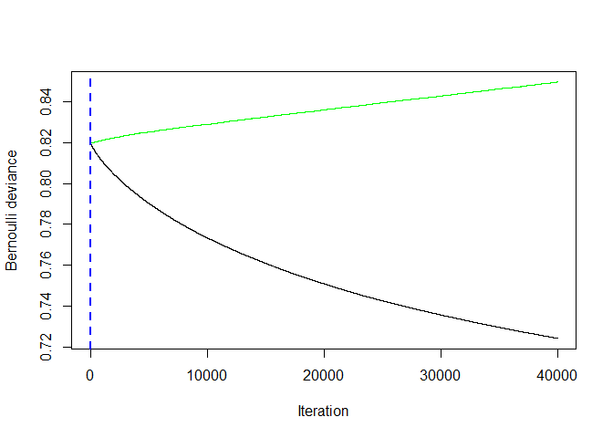
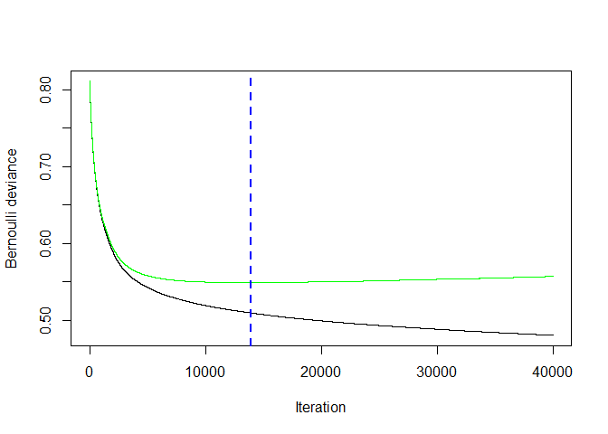
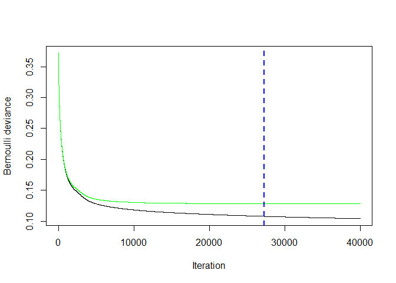
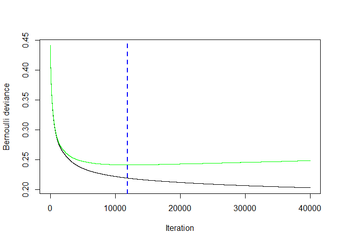

bacteria\_processing\_3
================
Ilya
6/24/2019

#### install and load required packages

    ## 
    ## Attaching package: 'dplyr'

    ## The following objects are masked from 'package:stats':
    ## 
    ##     filter, lag

    ## The following objects are masked from 'package:base':
    ## 
    ##     intersect, setdiff, setequal, union

    ## Loading required package: lattice

    ## Loading required package: ggplot2

    ## Learn more about sjPlot with 'browseVignettes("sjPlot")'.

    ## Loaded gbm 2.1.4

    ## Loading required package: gplots

    ## 
    ## Attaching package: 'gplots'

    ## The following object is masked from 'package:stats':
    ## 
    ##     lowess

    ## randomForest 4.6-14

    ## Type rfNews() to see new features/changes/bug fixes.

    ## 
    ## Attaching package: 'randomForest'

    ## The following object is masked from 'package:ggplot2':
    ## 
    ##     margin

    ## The following object is masked from 'package:dplyr':
    ## 
    ##     combine

    ## 
    ## ********************************************************

    ## Note: As of version 1.0.0, cowplot does not change the

    ##   default ggplot2 theme anymore. To recover the previous

    ##   behavior, execute:
    ##   theme_set(theme_cowplot())

    ## ********************************************************

    ## 
    ## Attaching package: 'cowplot'

    ## The following objects are masked from 'package:sjPlot':
    ## 
    ##     plot_grid, save_plot

    ## 
    ## Attaching package: 'gridExtra'

    ## The following object is masked from 'package:randomForest':
    ## 
    ##     combine

    ## The following object is masked from 'package:dplyr':
    ## 
    ##     combine

### read in BacDive data

### find out fields with at least threshold % coverage

``` r
# load("DATA/PROCESSED/Data from Backdive-2.RData")
load("Data from Backdive-2.RData")
# load("bacteria_species_out.Rdata")
dim(merge)
```

    ## [1] 5619670       6

``` r
merge_test = unique(merge)
dim(merge_test)
```

    ## [1] 5337978       6

``` r
#11752  taxonomy_name   strains_tax_PNU species_epithet actinomycetemcomitans
test = subset(merge, bacdive_id == 11752 &
                section == "taxonomy_name" &
                subsection == "strains_tax_PNU" &
                field == "species_epithet")
threshold = 0.01
D = merge
dim(D)
```

    ## [1] 5619670       6

``` r
D = unique(D)
dim(D)
```

    ## [1] 5337978       6

``` r
#rm(merge)
#remove NA values
inds.na = which(!is.na(D$value))
D = D[inds.na,]
id_len=length(unique(D$bacdive_id))
D$new_field = paste(D$section, D$subsection, D$field)
save(D, file = "DATA/PROCESSED/D.Rdata")
count=as.data.frame(table(D$new_field))#combination of subsection and field
var1=count$Var1
freq=count$Freq
var<-list()
freqs<-list()
for (i in 1:length(freq)) {
     if (freq[i]>=threshold*id_len) {#this will get fields greater than 1%
         var[[i]]=var1[i]
         freqs[[i]]=freq[i]
     }
}

df=do.call(rbind, Map(data.frame, Feature_name=var, Frequency=freqs))

df$Fraction = df$Frequency/id_len

###get those seen at least 1% of time
df01 = subset(df, Fraction >= 0.01)
save(df01, file = "DATA/PROCESSED/df01.Rdata")
```

use df01 to subset all data for those variables
===============================================

``` r
load("DATA/PROCESSED/D.RData")

merge01 = subset(D, new_field %in% df01$Feature_name)
save(merge01, file = "DATA/PROCESSED/merge01.Rdata")
```

``` r
##this part is from data_processing.R 
load("DATA/PROCESSED/merge01.Rdata")

df <- merge01

df <- unique(df)

df$feature_name <- paste(df$section, df$subsection, df$field)

a <- df[is.element(df$feature_name, df01$Feature_name),]#df01 for 1% threshold

q_all <- dcast(a, bacdive_id~feature_name)
dim(q_all)
```

    ## [1] 31040  1925

``` r
q = q_all
q <- q[order(q$bacdive_id),]

dim(q)
```

    ## [1] 31040  1925

``` r
##test with merge10
# df10 <- merge10
# 
# df10 <- unique(df10)
# 
# df10$feature_name <- paste(df10$section, df10$subsection, df10$field)
# 
# a10 <- df10[is.element(df10$feature_name, df20$Feature_name),]

# q <- dcast(a, bacdive_id~feature_name)
# q <- q[order(q$bacdive_id),]


write.csv(q, file = "df.csv", row.names = F)
temp = read.csv("df.csv")
col_names_list = names(temp)
write.csv(col_names_list, file = "bacteria_fields.csv",
          row.names=FALSE)

dim(temp)
```

    ## [1] 31040  1925

``` r
# # remove columns with near zero variance Global
# nzv <- nearZeroVar(q,saveMetrics=TRUE,freqCut = 95/5)
# nzv <- row.names(nzv[which(nzv$nzv==TRUE),])
# dropnzv<-names(q[ , which(names(q) %in% nzv)])
# q <- q[ , -which(names(q) %in% nzv)]
# write.csv(q, file = "dropnzvdata.csv", row.names = F)
```

``` r
##this part corresponds to Zach's one_hot_encoding.R
#one-hot encode categorical variables
q_all <- read.csv(file = "df.csv")

q = q_all
dim(q)
```

    ## [1] 31040  1925

``` r
str(q)
```

    ## 'data.frame':    31040 obs. of  1925 variables:
    ##  $ bacdive_id                                                      : int  1 10 100 1000 10000 100000 100001 100002 100003 100004 ...
    ##  $ application_interaction.risk_assessment.biosafety_level         : Factor w/ 4 levels "1","2","3**",..: 1 1 1 1 1 NA NA NA NA NA ...
    ##  $ application_interaction.risk_assessment.biosafety_level_comment : Factor w/ 3 levels "German classification",..: 3 3 3 3 3 NA NA NA NA NA ...
    ##  $ application_interaction.risk_assessment.biosafety_level_comment1: Factor w/ 4 levels "German classification",..: NA NA NA NA NA NA NA NA NA NA ...
    ##  $ application_interaction.risk_assessment.biosafety_level_comment2: Factor w/ 18 levels "German classification",..: NA NA NA NA NA NA NA NA NA NA ...
    ##  $ application_interaction.risk_assessment.biosafety_level1        : Factor w/ 4 levels "1","1+","2","L1": NA NA NA NA NA NA NA NA NA NA ...
    ##  $ application_interaction.risk_assessment.biosafety_level2        : Factor w/ 3 levels "1","2","L1": NA NA NA NA NA NA NA NA NA NA ...
    ##  $ application_interaction.risk_assessment.ID_reference            : int  950 1705 5523 17084 14065 NA NA NA NA NA ...
    ##  $ application_interaction.risk_assessment.ID_reference1           : int  NA NA NA NA NA NA NA NA NA NA ...
    ##  $ application_interaction.risk_assessment.ID_reference2           : int  NA NA NA NA NA NA NA NA NA NA ...
    ##  $ application_interaction.risk_assessment.pathogenicity_animal    : logi  NA NA NA NA NA NA ...
    ##  $ application_interaction.risk_assessment.pathogenicity_human     : logi  NA NA NA TRUE NA NA ...
    ##  $ application_interaction.risk_assessment.pathogenicity_plant     : logi  NA NA NA NA NA NA ...
    ##  $ culture_growth_condition.culture_medium.ID_reference            : int  950 NA 5523 17084 14065 NA NA NA NA NA ...
    ##  $ culture_growth_condition.culture_medium.ID_reference1           : int  NA 1705 NA NA NA NA NA NA NA NA ...
    ##  $ culture_growth_condition.culture_medium.ID_reference2           : int  NA 1705 NA NA NA NA NA NA NA NA ...
    ##  $ culture_growth_condition.culture_medium.ID_reference3           : int  NA NA NA NA NA NA NA NA NA NA ...
    ##  $ culture_growth_condition.culture_medium.ID_reference4           : int  NA NA NA NA NA NA NA NA NA NA ...
    ##  $ culture_growth_condition.culture_medium.ID_reference5           : int  NA NA NA NA NA NA NA NA NA NA ...
    ##  $ culture_growth_condition.culture_medium.ID_reference6           : int  NA NA NA NA NA NA NA NA NA NA ...
    ##  $ culture_growth_condition.culture_medium.ID_reference7           : int  NA NA NA NA NA NA NA NA NA NA ...
    ##  $ culture_growth_condition.culture_medium.ID_reference8           : int  NA NA NA NA NA NA NA NA NA NA ...
    ##  $ culture_growth_condition.culture_medium.ID_reference9           : int  NA NA NA NA NA NA NA NA NA NA ...
    ##  $ culture_growth_condition.culture_medium.media_link              : Factor w/ 980 levels "https://www.dsmz.de/microorganisms/medium/pdf/DSMZ_Medium1.pdf",..: 45 NA 42 474 906 NA NA NA NA NA ...
    ##  $ culture_growth_condition.culture_medium.media_link1             : Factor w/ 432 levels "https://www.dsmz.de/microorganisms/medium/pdf/DSMZ_Medium1.pdf",..: NA 25 NA NA NA NA NA NA NA NA ...
    ##  $ culture_growth_condition.culture_medium.media_link2             : Factor w/ 207 levels "https://www.dsmz.de/microorganisms/medium/pdf/DSMZ_Medium1.pdf",..: NA 72 NA NA NA NA NA NA NA NA ...
    ##  $ culture_growth_condition.culture_medium.medium_composition      : Factor w/ 148 levels "(all g l-1 in distilled water): sea salts (Sigma), 40; NaCl, 50; yeast extract, 1; peptone, 5; ferric citrate, "| __truncated__,..: NA NA NA NA NA NA NA NA NA NA ...
    ##  $ culture_growth_condition.culture_medium.medium_composition1     : Factor w/ 55 levels " 4.0 g yeast extract, 4.0 g glucose, 5.0 g malt extract, 1 ml vitamin B solution (containing 0.5 mg each of thi"| __truncated__,..: NA NA NA NA NA NA NA NA NA NA ...
    ##  $ culture_growth_condition.culture_medium.medium_composition2     : Factor w/ 274 levels " 1g/L Yeast extract, 5g/L xylan, 1g/L NH4Cl, 0.1g/L NaCl, 0.1 g/L MgCl*6 H2O, 0.05g/L CaCl2*2 H2O, 0.4 g/L K2HP"| __truncated__,..: NA NA NA NA NA NA NA NA NA NA ...
    ##  $ culture_growth_condition.culture_medium.medium_composition3     : Factor w/ 151 levels "0.1 % (w/v) yeast extract, peptone and glucose, 15 g agar per litre, pH 6.8",..: NA NA NA NA NA NA NA NA NA NA ...
    ##  $ culture_growth_condition.culture_medium.medium_composition4     : Factor w/ 85 levels "0,5 % (w/v) baker's yeast (fresh weight), 0.1 % (w/v) CaCl2.2H2O, 1.5 % (w/v) agar (pH 7.2); supplemented with "| __truncated__,..: NA NA NA NA NA NA NA NA NA NA ...
    ##  $ culture_growth_condition.culture_medium.medium_composition5     : Factor w/ 60 levels "0.3 % (w/v) yeast extract and 0.3 % (w/v) casein peptone, respectively, 15 g agar per litre, pH 7.2",..: NA NA NA NA NA NA NA NA NA NA ...
    ##  $ culture_growth_condition.culture_medium.medium_composition6     : Factor w/ 50 levels "5 % NaCl","80 % VY/2, 10 % CY, 10 % S-medium, vitamin solution and additional vitamin B 12",..: NA NA NA NA NA NA NA NA NA NA ...
    ##  $ culture_growth_condition.culture_medium.medium_composition7     : Factor w/ 39 levels "Columbia agar (39.000 g);distilled water (1000.000 ml)",..: NA NA NA NA NA NA NA NA NA NA ...
    ##  $ culture_growth_condition.culture_medium.medium_composition8     : Factor w/ 54 levels "Agar (15.000 g);Glucose (4.000 g);Yeast extract (4.000 g);Malt extract (10.000 g);Calcium carbonate (2.000 g);S"| __truncated__,..: NA NA NA NA NA NA NA NA NA NA ...
    ##  $ culture_growth_condition.culture_medium.medium_composition9     : Factor w/ 40 levels "30g Saccharose, 2g Sodium Nitrate, 1g Dipotassium Phosphate, 0.5g Magnesium Sulfate, 0.5g Potassium Chloride, 0"| __truncated__,..: NA NA NA NA NA NA NA NA NA NA ...
    ##  $ culture_growth_condition.culture_medium.medium_growth           : logi  TRUE NA TRUE TRUE TRUE NA ...
    ##  $ culture_growth_condition.culture_medium.medium_growth1          : logi  NA TRUE NA NA NA NA ...
    ##  $ culture_growth_condition.culture_medium.medium_growth2          : logi  NA TRUE NA NA NA NA ...
    ##  $ culture_growth_condition.culture_medium.medium_growth3          : logi  NA NA NA NA NA NA ...
    ##  $ culture_growth_condition.culture_medium.medium_growth4          : logi  NA NA NA NA NA NA ...
    ##  $ culture_growth_condition.culture_medium.medium_growth5          : logi  NA NA NA NA NA NA ...
    ##  $ culture_growth_condition.culture_medium.medium_growth6          : logi  NA NA NA NA NA NA ...
    ##  $ culture_growth_condition.culture_medium.medium_growth7          : logi  NA NA NA NA NA NA ...
    ##  $ culture_growth_condition.culture_medium.medium_growth8          : logi  NA NA NA NA NA NA ...
    ##  $ culture_growth_condition.culture_medium.medium_growth9          : logi  NA NA NA NA NA NA ...
    ##  $ culture_growth_condition.culture_medium.medium_name             : Factor w/ 2531 levels "0.1xTSB","0.3 MB agar",..: 927 NA 1780 422 2465 NA NA NA NA NA ...
    ##  $ culture_growth_condition.culture_medium.medium_name1            : Factor w/ 1578 levels "1/10 NUTRIENT AGAR NO.2 (DSMZ Medium 952), 28°C",..: NA 536 NA NA NA NA NA NA NA NA ...
    ##  $ culture_growth_condition.culture_medium.medium_name2            : Factor w/ 1190 levels "0.1 x TSB agar",..: NA 1188 NA NA NA NA NA NA NA NA ...
    ##  $ culture_growth_condition.culture_medium.medium_name3            : Factor w/ 418 levels "0.1 x TSB agar",..: NA NA NA NA NA NA NA NA NA NA ...
    ##  $ culture_growth_condition.culture_medium.medium_name4            : Factor w/ 217 levels " Mueller - Hinton agar",..: NA NA NA NA NA NA NA NA NA NA ...
    ##  $ culture_growth_condition.culture_medium.medium_name5            : Factor w/ 161 levels "0,35% acetic acid agar",..: NA NA NA NA NA NA NA NA NA NA ...
    ##  $ culture_growth_condition.culture_medium.medium_name6            : Factor w/ 120 levels "3.3xPYE agar",..: NA NA NA NA NA NA NA NA NA NA ...
    ##  $ culture_growth_condition.culture_medium.medium_name7            : Factor w/ 83 levels "5428","5530",..: NA NA NA NA NA NA NA NA NA NA ...
    ##  $ culture_growth_condition.culture_medium.medium_name8            : Factor w/ 83 levels "0.1  x marine broth 2216 agar",..: NA NA NA NA NA NA NA NA NA NA ...
    ##  $ culture_growth_condition.culture_medium.medium_name9            : Factor w/ 69 levels "Bennett's agar",..: NA NA NA NA NA NA NA NA NA NA ...
    ##  $ culture_growth_condition.culture_medium.text_mined              : logi  NA NA NA NA NA NA ...
    ##  $ culture_growth_condition.culture_medium.text_mined1             : logi  NA NA NA NA NA NA ...
    ##  $ culture_growth_condition.culture_medium.text_mined2             : logi  NA NA NA NA NA NA ...
    ##  $ culture_growth_condition.culture_medium.text_mined3             : logi  NA NA NA NA NA NA ...
    ##  $ culture_growth_condition.culture_medium.text_mined4             : logi  NA NA NA NA NA NA ...
    ##  $ culture_growth_condition.culture_medium.text_mined5             : logi  NA NA NA NA NA NA ...
    ##  $ culture_growth_condition.culture_medium.text_mined6             : logi  NA NA NA NA NA NA ...
    ##  $ culture_growth_condition.culture_medium.text_mined7             : logi  NA NA NA NA NA NA ...
    ##  $ culture_growth_condition.culture_medium.text_mined8             : logi  NA NA NA NA NA NA ...
    ##  $ culture_growth_condition.culture_medium.text_mined9             : logi  NA NA NA NA NA NA ...
    ##  $ culture_growth_condition.culture_pH.ability                     : Factor w/ 2 levels "no","positive": NA NA NA NA NA NA NA NA NA NA ...
    ##  $ culture_growth_condition.culture_pH.ability1                    : Factor w/ 3 levels "inconsistent",..: NA NA NA NA NA NA NA NA NA NA ...
    ##  $ culture_growth_condition.culture_pH.ability2                    : Factor w/ 3 levels "inconsistent",..: NA NA NA NA NA NA NA NA NA NA ...
    ##  $ culture_growth_condition.culture_pH.ID_reference                : int  NA NA NA NA NA NA NA NA NA NA ...
    ##  $ culture_growth_condition.culture_pH.ID_reference1               : int  NA NA NA NA NA NA NA NA NA NA ...
    ##  $ culture_growth_condition.culture_pH.ID_reference2               : int  NA NA NA NA NA NA NA NA NA NA ...
    ##  $ culture_growth_condition.culture_pH.pH                          : Factor w/ 178 levels "<4.3",">4.5",..: NA NA NA NA NA NA NA NA NA NA ...
    ##  $ culture_growth_condition.culture_pH.pH1                         : Factor w/ 568 levels "<5.0","<6",">5.5",..: NA NA NA NA NA NA NA NA NA NA ...
    ##  $ culture_growth_condition.culture_pH.pH2                         : Factor w/ 297 levels "<10.5","<5","<5.0",..: NA NA NA NA NA NA NA NA NA NA ...
    ##  $ culture_growth_condition.culture_pH.test_type                   : Factor w/ 4 levels "growth","maximum",..: NA NA NA NA NA NA NA NA NA NA ...
    ##  $ culture_growth_condition.culture_pH.test_type1                  : Factor w/ 4 levels "growth","maximum",..: NA NA NA NA NA NA NA NA NA NA ...
    ##  $ culture_growth_condition.culture_pH.test_type2                  : Factor w/ 4 levels "growth","maximum",..: NA NA NA NA NA NA NA NA NA NA ...
    ##  $ culture_growth_condition.culture_temp.ability                   : Factor w/ 2 levels "no","positive": 2 2 2 2 2 NA NA NA NA NA ...
    ##  $ culture_growth_condition.culture_temp.ability1                  : Factor w/ 2 levels "no","positive": NA NA NA NA NA NA NA NA NA NA ...
    ##  $ culture_growth_condition.culture_temp.ability2                  : Factor w/ 3 levels "inconsistent",..: NA NA NA NA NA NA NA NA NA NA ...
    ##  $ culture_growth_condition.culture_temp.ability3                  : Factor w/ 3 levels "inconsistent",..: NA NA NA NA NA NA NA NA NA NA ...
    ##  $ culture_growth_condition.culture_temp.ability4                  : Factor w/ 3 levels "inconsistent",..: NA NA NA NA NA NA NA NA NA NA ...
    ##  $ culture_growth_condition.culture_temp.ID_reference              : int  950 1705 5523 17084 14065 NA NA NA NA NA ...
    ##  $ culture_growth_condition.culture_temp.ID_reference1             : int  NA NA NA NA NA NA NA NA NA NA ...
    ##  $ culture_growth_condition.culture_temp.ID_reference2             : int  NA NA NA NA NA NA NA NA NA NA ...
    ##  $ culture_growth_condition.culture_temp.ID_reference3             : int  NA NA NA NA NA NA NA NA NA NA ...
    ##  $ culture_growth_condition.culture_temp.ID_reference4             : int  NA NA NA NA NA NA NA NA NA NA ...
    ##  $ culture_growth_condition.culture_temp.temp                      : Factor w/ 124 levels ">34.0","0","0-34",..: 63 67 88 67 67 NA NA NA NA NA ...
    ##  $ culture_growth_condition.culture_temp.temp1                     : Factor w/ 366 levels "(-2)-(-1)","0-20",..: NA NA NA NA NA NA NA NA NA NA ...
    ##  $ culture_growth_condition.culture_temp.temp2                     : Factor w/ 727 levels "-1.8-10","-1.8-16",..: NA NA NA NA NA NA NA NA NA NA ...
    ##  $ culture_growth_condition.culture_temp.temp3                     : Factor w/ 376 levels "-2-25","-5.0",..: NA NA NA NA NA NA NA NA NA NA ...
    ##  $ culture_growth_condition.culture_temp.temp4                     : Factor w/ 160 levels "-2",">45",">49.0",..: NA NA NA NA NA NA NA NA NA NA ...
    ##  $ culture_growth_condition.culture_temp.temperature_range         : Factor w/ 4 levels "hyperthermophilic",..: 2 2 2 2 2 NA NA NA NA NA ...
    ##  $ culture_growth_condition.culture_temp.temperature_range1        : Factor w/ 4 levels "hyperthermophilic",..: NA NA NA NA NA NA NA NA NA NA ...
    ##  $ culture_growth_condition.culture_temp.temperature_range2        : Factor w/ 4 levels "hyperthermophilic",..: NA NA NA NA NA NA NA NA NA NA ...
    ##  $ culture_growth_condition.culture_temp.temperature_range3        : Factor w/ 3 levels "mesophilic","psychrophilic",..: NA NA NA NA NA NA NA NA NA NA ...
    ##  $ culture_growth_condition.culture_temp.test_type                 : Factor w/ 2 levels "growth","optimum": 1 1 1 1 1 NA NA NA NA NA ...
    ##  $ culture_growth_condition.culture_temp.test_type1                : Factor w/ 4 levels "growth","maximum",..: NA NA NA NA NA NA NA NA NA NA ...
    ##   [list output truncated]

``` r
str(q, list.len=ncol(q))
```

    ## 'data.frame':    31040 obs. of  1925 variables:
    ##  $ bacdive_id                                                      : int  1 10 100 1000 10000 100000 100001 100002 100003 100004 ...
    ##  $ application_interaction.risk_assessment.biosafety_level         : Factor w/ 4 levels "1","2","3**",..: 1 1 1 1 1 NA NA NA NA NA ...
    ##  $ application_interaction.risk_assessment.biosafety_level_comment : Factor w/ 3 levels "German classification",..: 3 3 3 3 3 NA NA NA NA NA ...
    ##  $ application_interaction.risk_assessment.biosafety_level_comment1: Factor w/ 4 levels "German classification",..: NA NA NA NA NA NA NA NA NA NA ...
    ##  $ application_interaction.risk_assessment.biosafety_level_comment2: Factor w/ 18 levels "German classification",..: NA NA NA NA NA NA NA NA NA NA ...
    ##  $ application_interaction.risk_assessment.biosafety_level1        : Factor w/ 4 levels "1","1+","2","L1": NA NA NA NA NA NA NA NA NA NA ...
    ##  $ application_interaction.risk_assessment.biosafety_level2        : Factor w/ 3 levels "1","2","L1": NA NA NA NA NA NA NA NA NA NA ...
    ##  $ application_interaction.risk_assessment.ID_reference            : int  950 1705 5523 17084 14065 NA NA NA NA NA ...
    ##  $ application_interaction.risk_assessment.ID_reference1           : int  NA NA NA NA NA NA NA NA NA NA ...
    ##  $ application_interaction.risk_assessment.ID_reference2           : int  NA NA NA NA NA NA NA NA NA NA ...
    ##  $ application_interaction.risk_assessment.pathogenicity_animal    : logi  NA NA NA NA NA NA ...
    ##  $ application_interaction.risk_assessment.pathogenicity_human     : logi  NA NA NA TRUE NA NA ...
    ##  $ application_interaction.risk_assessment.pathogenicity_plant     : logi  NA NA NA NA NA NA ...
    ##  $ culture_growth_condition.culture_medium.ID_reference            : int  950 NA 5523 17084 14065 NA NA NA NA NA ...
    ##  $ culture_growth_condition.culture_medium.ID_reference1           : int  NA 1705 NA NA NA NA NA NA NA NA ...
    ##  $ culture_growth_condition.culture_medium.ID_reference2           : int  NA 1705 NA NA NA NA NA NA NA NA ...
    ##  $ culture_growth_condition.culture_medium.ID_reference3           : int  NA NA NA NA NA NA NA NA NA NA ...
    ##  $ culture_growth_condition.culture_medium.ID_reference4           : int  NA NA NA NA NA NA NA NA NA NA ...
    ##  $ culture_growth_condition.culture_medium.ID_reference5           : int  NA NA NA NA NA NA NA NA NA NA ...
    ##  $ culture_growth_condition.culture_medium.ID_reference6           : int  NA NA NA NA NA NA NA NA NA NA ...
    ##  $ culture_growth_condition.culture_medium.ID_reference7           : int  NA NA NA NA NA NA NA NA NA NA ...
    ##  $ culture_growth_condition.culture_medium.ID_reference8           : int  NA NA NA NA NA NA NA NA NA NA ...
    ##  $ culture_growth_condition.culture_medium.ID_reference9           : int  NA NA NA NA NA NA NA NA NA NA ...
    ##  $ culture_growth_condition.culture_medium.media_link              : Factor w/ 980 levels "https://www.dsmz.de/microorganisms/medium/pdf/DSMZ_Medium1.pdf",..: 45 NA 42 474 906 NA NA NA NA NA ...
    ##  $ culture_growth_condition.culture_medium.media_link1             : Factor w/ 432 levels "https://www.dsmz.de/microorganisms/medium/pdf/DSMZ_Medium1.pdf",..: NA 25 NA NA NA NA NA NA NA NA ...
    ##  $ culture_growth_condition.culture_medium.media_link2             : Factor w/ 207 levels "https://www.dsmz.de/microorganisms/medium/pdf/DSMZ_Medium1.pdf",..: NA 72 NA NA NA NA NA NA NA NA ...
    ##  $ culture_growth_condition.culture_medium.medium_composition      : Factor w/ 148 levels "(all g l-1 in distilled water): sea salts (Sigma), 40; NaCl, 50; yeast extract, 1; peptone, 5; ferric citrate, "| __truncated__,..: NA NA NA NA NA NA NA NA NA NA ...
    ##  $ culture_growth_condition.culture_medium.medium_composition1     : Factor w/ 55 levels " 4.0 g yeast extract, 4.0 g glucose, 5.0 g malt extract, 1 ml vitamin B solution (containing 0.5 mg each of thi"| __truncated__,..: NA NA NA NA NA NA NA NA NA NA ...
    ##  $ culture_growth_condition.culture_medium.medium_composition2     : Factor w/ 274 levels " 1g/L Yeast extract, 5g/L xylan, 1g/L NH4Cl, 0.1g/L NaCl, 0.1 g/L MgCl*6 H2O, 0.05g/L CaCl2*2 H2O, 0.4 g/L K2HP"| __truncated__,..: NA NA NA NA NA NA NA NA NA NA ...
    ##  $ culture_growth_condition.culture_medium.medium_composition3     : Factor w/ 151 levels "0.1 % (w/v) yeast extract, peptone and glucose, 15 g agar per litre, pH 6.8",..: NA NA NA NA NA NA NA NA NA NA ...
    ##  $ culture_growth_condition.culture_medium.medium_composition4     : Factor w/ 85 levels "0,5 % (w/v) baker's yeast (fresh weight), 0.1 % (w/v) CaCl2.2H2O, 1.5 % (w/v) agar (pH 7.2); supplemented with "| __truncated__,..: NA NA NA NA NA NA NA NA NA NA ...
    ##  $ culture_growth_condition.culture_medium.medium_composition5     : Factor w/ 60 levels "0.3 % (w/v) yeast extract and 0.3 % (w/v) casein peptone, respectively, 15 g agar per litre, pH 7.2",..: NA NA NA NA NA NA NA NA NA NA ...
    ##  $ culture_growth_condition.culture_medium.medium_composition6     : Factor w/ 50 levels "5 % NaCl","80 % VY/2, 10 % CY, 10 % S-medium, vitamin solution and additional vitamin B 12",..: NA NA NA NA NA NA NA NA NA NA ...
    ##  $ culture_growth_condition.culture_medium.medium_composition7     : Factor w/ 39 levels "Columbia agar (39.000 g);distilled water (1000.000 ml)",..: NA NA NA NA NA NA NA NA NA NA ...
    ##  $ culture_growth_condition.culture_medium.medium_composition8     : Factor w/ 54 levels "Agar (15.000 g);Glucose (4.000 g);Yeast extract (4.000 g);Malt extract (10.000 g);Calcium carbonate (2.000 g);S"| __truncated__,..: NA NA NA NA NA NA NA NA NA NA ...
    ##  $ culture_growth_condition.culture_medium.medium_composition9     : Factor w/ 40 levels "30g Saccharose, 2g Sodium Nitrate, 1g Dipotassium Phosphate, 0.5g Magnesium Sulfate, 0.5g Potassium Chloride, 0"| __truncated__,..: NA NA NA NA NA NA NA NA NA NA ...
    ##  $ culture_growth_condition.culture_medium.medium_growth           : logi  TRUE NA TRUE TRUE TRUE NA ...
    ##  $ culture_growth_condition.culture_medium.medium_growth1          : logi  NA TRUE NA NA NA NA ...
    ##  $ culture_growth_condition.culture_medium.medium_growth2          : logi  NA TRUE NA NA NA NA ...
    ##  $ culture_growth_condition.culture_medium.medium_growth3          : logi  NA NA NA NA NA NA ...
    ##  $ culture_growth_condition.culture_medium.medium_growth4          : logi  NA NA NA NA NA NA ...
    ##  $ culture_growth_condition.culture_medium.medium_growth5          : logi  NA NA NA NA NA NA ...
    ##  $ culture_growth_condition.culture_medium.medium_growth6          : logi  NA NA NA NA NA NA ...
    ##  $ culture_growth_condition.culture_medium.medium_growth7          : logi  NA NA NA NA NA NA ...
    ##  $ culture_growth_condition.culture_medium.medium_growth8          : logi  NA NA NA NA NA NA ...
    ##  $ culture_growth_condition.culture_medium.medium_growth9          : logi  NA NA NA NA NA NA ...
    ##  $ culture_growth_condition.culture_medium.medium_name             : Factor w/ 2531 levels "0.1xTSB","0.3 MB agar",..: 927 NA 1780 422 2465 NA NA NA NA NA ...
    ##  $ culture_growth_condition.culture_medium.medium_name1            : Factor w/ 1578 levels "1/10 NUTRIENT AGAR NO.2 (DSMZ Medium 952), 28°C",..: NA 536 NA NA NA NA NA NA NA NA ...
    ##  $ culture_growth_condition.culture_medium.medium_name2            : Factor w/ 1190 levels "0.1 x TSB agar",..: NA 1188 NA NA NA NA NA NA NA NA ...
    ##  $ culture_growth_condition.culture_medium.medium_name3            : Factor w/ 418 levels "0.1 x TSB agar",..: NA NA NA NA NA NA NA NA NA NA ...
    ##  $ culture_growth_condition.culture_medium.medium_name4            : Factor w/ 217 levels " Mueller - Hinton agar",..: NA NA NA NA NA NA NA NA NA NA ...
    ##  $ culture_growth_condition.culture_medium.medium_name5            : Factor w/ 161 levels "0,35% acetic acid agar",..: NA NA NA NA NA NA NA NA NA NA ...
    ##  $ culture_growth_condition.culture_medium.medium_name6            : Factor w/ 120 levels "3.3xPYE agar",..: NA NA NA NA NA NA NA NA NA NA ...
    ##  $ culture_growth_condition.culture_medium.medium_name7            : Factor w/ 83 levels "5428","5530",..: NA NA NA NA NA NA NA NA NA NA ...
    ##  $ culture_growth_condition.culture_medium.medium_name8            : Factor w/ 83 levels "0.1  x marine broth 2216 agar",..: NA NA NA NA NA NA NA NA NA NA ...
    ##  $ culture_growth_condition.culture_medium.medium_name9            : Factor w/ 69 levels "Bennett's agar",..: NA NA NA NA NA NA NA NA NA NA ...
    ##  $ culture_growth_condition.culture_medium.text_mined              : logi  NA NA NA NA NA NA ...
    ##  $ culture_growth_condition.culture_medium.text_mined1             : logi  NA NA NA NA NA NA ...
    ##  $ culture_growth_condition.culture_medium.text_mined2             : logi  NA NA NA NA NA NA ...
    ##  $ culture_growth_condition.culture_medium.text_mined3             : logi  NA NA NA NA NA NA ...
    ##  $ culture_growth_condition.culture_medium.text_mined4             : logi  NA NA NA NA NA NA ...
    ##  $ culture_growth_condition.culture_medium.text_mined5             : logi  NA NA NA NA NA NA ...
    ##  $ culture_growth_condition.culture_medium.text_mined6             : logi  NA NA NA NA NA NA ...
    ##  $ culture_growth_condition.culture_medium.text_mined7             : logi  NA NA NA NA NA NA ...
    ##  $ culture_growth_condition.culture_medium.text_mined8             : logi  NA NA NA NA NA NA ...
    ##  $ culture_growth_condition.culture_medium.text_mined9             : logi  NA NA NA NA NA NA ...
    ##  $ culture_growth_condition.culture_pH.ability                     : Factor w/ 2 levels "no","positive": NA NA NA NA NA NA NA NA NA NA ...
    ##  $ culture_growth_condition.culture_pH.ability1                    : Factor w/ 3 levels "inconsistent",..: NA NA NA NA NA NA NA NA NA NA ...
    ##  $ culture_growth_condition.culture_pH.ability2                    : Factor w/ 3 levels "inconsistent",..: NA NA NA NA NA NA NA NA NA NA ...
    ##  $ culture_growth_condition.culture_pH.ID_reference                : int  NA NA NA NA NA NA NA NA NA NA ...
    ##  $ culture_growth_condition.culture_pH.ID_reference1               : int  NA NA NA NA NA NA NA NA NA NA ...
    ##  $ culture_growth_condition.culture_pH.ID_reference2               : int  NA NA NA NA NA NA NA NA NA NA ...
    ##  $ culture_growth_condition.culture_pH.pH                          : Factor w/ 178 levels "<4.3",">4.5",..: NA NA NA NA NA NA NA NA NA NA ...
    ##  $ culture_growth_condition.culture_pH.pH1                         : Factor w/ 568 levels "<5.0","<6",">5.5",..: NA NA NA NA NA NA NA NA NA NA ...
    ##  $ culture_growth_condition.culture_pH.pH2                         : Factor w/ 297 levels "<10.5","<5","<5.0",..: NA NA NA NA NA NA NA NA NA NA ...
    ##  $ culture_growth_condition.culture_pH.test_type                   : Factor w/ 4 levels "growth","maximum",..: NA NA NA NA NA NA NA NA NA NA ...
    ##  $ culture_growth_condition.culture_pH.test_type1                  : Factor w/ 4 levels "growth","maximum",..: NA NA NA NA NA NA NA NA NA NA ...
    ##  $ culture_growth_condition.culture_pH.test_type2                  : Factor w/ 4 levels "growth","maximum",..: NA NA NA NA NA NA NA NA NA NA ...
    ##  $ culture_growth_condition.culture_temp.ability                   : Factor w/ 2 levels "no","positive": 2 2 2 2 2 NA NA NA NA NA ...
    ##  $ culture_growth_condition.culture_temp.ability1                  : Factor w/ 2 levels "no","positive": NA NA NA NA NA NA NA NA NA NA ...
    ##  $ culture_growth_condition.culture_temp.ability2                  : Factor w/ 3 levels "inconsistent",..: NA NA NA NA NA NA NA NA NA NA ...
    ##  $ culture_growth_condition.culture_temp.ability3                  : Factor w/ 3 levels "inconsistent",..: NA NA NA NA NA NA NA NA NA NA ...
    ##  $ culture_growth_condition.culture_temp.ability4                  : Factor w/ 3 levels "inconsistent",..: NA NA NA NA NA NA NA NA NA NA ...
    ##  $ culture_growth_condition.culture_temp.ID_reference              : int  950 1705 5523 17084 14065 NA NA NA NA NA ...
    ##  $ culture_growth_condition.culture_temp.ID_reference1             : int  NA NA NA NA NA NA NA NA NA NA ...
    ##  $ culture_growth_condition.culture_temp.ID_reference2             : int  NA NA NA NA NA NA NA NA NA NA ...
    ##  $ culture_growth_condition.culture_temp.ID_reference3             : int  NA NA NA NA NA NA NA NA NA NA ...
    ##  $ culture_growth_condition.culture_temp.ID_reference4             : int  NA NA NA NA NA NA NA NA NA NA ...
    ##  $ culture_growth_condition.culture_temp.temp                      : Factor w/ 124 levels ">34.0","0","0-34",..: 63 67 88 67 67 NA NA NA NA NA ...
    ##  $ culture_growth_condition.culture_temp.temp1                     : Factor w/ 366 levels "(-2)-(-1)","0-20",..: NA NA NA NA NA NA NA NA NA NA ...
    ##  $ culture_growth_condition.culture_temp.temp2                     : Factor w/ 727 levels "-1.8-10","-1.8-16",..: NA NA NA NA NA NA NA NA NA NA ...
    ##  $ culture_growth_condition.culture_temp.temp3                     : Factor w/ 376 levels "-2-25","-5.0",..: NA NA NA NA NA NA NA NA NA NA ...
    ##  $ culture_growth_condition.culture_temp.temp4                     : Factor w/ 160 levels "-2",">45",">49.0",..: NA NA NA NA NA NA NA NA NA NA ...
    ##  $ culture_growth_condition.culture_temp.temperature_range         : Factor w/ 4 levels "hyperthermophilic",..: 2 2 2 2 2 NA NA NA NA NA ...
    ##  $ culture_growth_condition.culture_temp.temperature_range1        : Factor w/ 4 levels "hyperthermophilic",..: NA NA NA NA NA NA NA NA NA NA ...
    ##  $ culture_growth_condition.culture_temp.temperature_range2        : Factor w/ 4 levels "hyperthermophilic",..: NA NA NA NA NA NA NA NA NA NA ...
    ##  $ culture_growth_condition.culture_temp.temperature_range3        : Factor w/ 3 levels "mesophilic","psychrophilic",..: NA NA NA NA NA NA NA NA NA NA ...
    ##  $ culture_growth_condition.culture_temp.test_type                 : Factor w/ 2 levels "growth","optimum": 1 1 1 1 1 NA NA NA NA NA ...
    ##  $ culture_growth_condition.culture_temp.test_type1                : Factor w/ 4 levels "growth","maximum",..: NA NA NA NA NA NA NA NA NA NA ...
    ##  $ culture_growth_condition.culture_temp.test_type2                : Factor w/ 4 levels "growth","maximum",..: NA NA NA NA NA NA NA NA NA NA ...
    ##  $ culture_growth_condition.culture_temp.test_type3                : Factor w/ 5 levels "growth","maximum",..: NA NA NA NA NA NA NA NA NA NA ...
    ##  $ culture_growth_condition.culture_temp.test_type4                : Factor w/ 4 levels "growth","maximum",..: NA NA NA NA NA NA NA NA NA NA ...
    ##  $ environment_sampling_isolation_source.origin.continent          : Factor w/ 8 levels "Africa","Antarctica",..: NA NA 5 6 6 NA NA NA NA NA ...
    ##  $ environment_sampling_isolation_source.origin.continent1         : Factor w/ 6 levels "Africa","Asia",..: NA NA NA NA NA NA NA NA NA NA ...
    ##  $ environment_sampling_isolation_source.origin.country            : Factor w/ 209 levels "Afghanistan",..: NA NA 14 74 74 NA NA NA NA NA ...
    ##  $ environment_sampling_isolation_source.origin.country1           : Factor w/ 65 levels "Algeria","Antarctica",..: NA NA NA NA NA NA NA NA NA NA ...
    ##  $ environment_sampling_isolation_source.origin.geo_loc_name       : Factor w/ 6957 levels "  Pyrénées-Atlantiques",..: NA NA NA 1660 5569 NA NA NA NA NA ...
    ##  $ environment_sampling_isolation_source.origin.geo_loc_name1      : Factor w/ 383 levels "(60° 30' 53.77'' N 4° 54' 14.75'' W)",..: NA NA NA NA NA NA NA NA NA NA ...
    ##  $ environment_sampling_isolation_source.origin.ID_reference       : int  NA 1705 5523 17084 14065 NA NA NA NA NA ...
    ##  $ environment_sampling_isolation_source.origin.ID_reference1      : int  NA NA NA NA NA NA NA NA NA NA ...
    ##  $ environment_sampling_isolation_source.origin.ID_reference2      : int  NA NA NA NA NA NA NA NA NA NA ...
    ##  $ environment_sampling_isolation_source.origin.latitude           : num  NA NA NA NA NA NA NA NA NA NA ...
    ##  $ environment_sampling_isolation_source.origin.longitude          : num  NA NA NA NA NA NA NA NA NA NA ...
    ##  $ environment_sampling_isolation_source.origin.sample_date        : Factor w/ 224 levels "1908-05-01","1908-06-01",..: NA NA NA NA NA NA NA NA NA NA ...
    ##  $ environment_sampling_isolation_source.origin.sample_type        : Factor w/ 8334 levels "'ka-pi, a salted and fermented shrimp paste",..: NA 1333 3801 7164 2293 NA NA NA NA NA ...
    ##  $ environment_sampling_isolation_source.origin.sample_type1       : Factor w/ 436 levels "","<i>Casuarina cunninghamiana</i> root nodules",..: NA NA NA NA NA NA NA NA NA NA ...
    ##  $ environment_sampling_isolation_source.origin.sample_type2       : Factor w/ 366 levels "","(polycyclic aromatic hydrocarbon) PAH-contaminated soil",..: NA NA NA NA NA NA NA NA NA NA ...
    ##  $ molecular_biology.GC_content.GC_content                         : Factor w/ 876 levels "22-23","23.0",..: 499 NA 239 NA NA NA NA NA NA NA ...
    ##  $ molecular_biology.GC_content.GC_content1                        : Factor w/ 632 levels "24","24.6","25.6",..: NA NA NA NA NA NA NA NA NA NA ...
    ##  $ molecular_biology.GC_content.GC_content2                        : Factor w/ 680 levels "24","24.6","25.6",..: NA NA NA NA NA NA NA NA NA NA ...
    ##  $ molecular_biology.GC_content.GC_method                          : Factor w/ 8 levels "Buoyant density centrifugation (BD)",..: NA NA NA NA NA NA NA NA NA NA ...
    ##  $ molecular_biology.GC_content.GC_method1                         : Factor w/ 9 levels "Buoyant density centrifugation (BD)",..: NA NA NA NA NA NA NA NA NA NA ...
    ##  $ molecular_biology.GC_content.GC_method2                         : Factor w/ 10 levels "","Buoyant density centrifugation (BD)",..: NA NA NA NA NA NA NA NA NA NA ...
    ##  $ molecular_biology.GC_content.ID_reference                       : int  950 NA 5523 NA NA NA NA NA NA NA ...
    ##  $ molecular_biology.GC_content.ID_reference1                      : int  NA NA NA NA NA NA NA NA NA NA ...
    ##  $ molecular_biology.GC_content.ID_reference2                      : int  NA NA NA NA NA NA NA NA NA NA ...
    ##  $ molecular_biology.sequence.DB_sequence                          : Factor w/ 37 levels "16S rRNA gene, EMBL Genome project data",..: NA NA 11 15 NA NA NA NA NA NA ...
    ##  $ molecular_biology.sequence.DB_sequence1                         : Factor w/ 41 levels "<i>gyrB</i> gene, Marker Gene (DDBJ Direct submission)",..: 36 36 NA NA NA NA NA NA NA NA ...
    ##  $ molecular_biology.sequence.DB_sequence10                        : Factor w/ 16 levels "DDBJ EMBL Direct submission",..: NA 14 NA NA NA NA NA NA NA NA ...
    ##  $ molecular_biology.sequence.DB_sequence100                       : Factor w/ 9 levels "EMBL Genome project data",..: NA NA NA NA NA NA NA NA NA NA ...
    ##  $ molecular_biology.sequence.DB_sequence101                       : Factor w/ 9 levels "EMBL Direct submission",..: NA NA NA NA NA NA NA NA NA NA ...
    ##  $ molecular_biology.sequence.DB_sequence102                       : Factor w/ 12 levels "DDBJ EMBL Direct submission",..: NA NA NA NA NA NA NA NA NA NA ...
    ##  $ molecular_biology.sequence.DB_sequence103                       : Factor w/ 7 levels "EMBL Genome project data",..: NA NA NA NA NA NA NA NA NA NA ...
    ##  $ molecular_biology.sequence.DB_sequence104                       : Factor w/ 8 levels "EMBL Genome project data",..: NA NA NA NA NA NA NA NA NA NA ...
    ##  $ molecular_biology.sequence.DB_sequence105                       : Factor w/ 10 levels "DDBJ EMBL Direct submission",..: NA NA NA NA NA NA NA NA NA NA ...
    ##  $ molecular_biology.sequence.DB_sequence106                       : Factor w/ 8 levels "DDBJ Genome project data",..: NA NA NA NA NA NA NA NA NA NA ...
    ##  $ molecular_biology.sequence.DB_sequence107                       : Factor w/ 9 levels "DDBJ Genome project data",..: NA NA NA NA NA NA NA NA NA NA ...
    ##  $ molecular_biology.sequence.DB_sequence108                       : Factor w/ 8 levels "EMBL Direct submission",..: NA NA NA NA NA NA NA NA NA NA ...
    ##  $ molecular_biology.sequence.DB_sequence109                       : Factor w/ 8 levels "EMBL Genome project data",..: NA NA NA NA NA NA NA NA NA NA ...
    ##  $ molecular_biology.sequence.DB_sequence11                        : Factor w/ 15 levels "DDBJ EMBL Direct submission",..: NA 13 NA NA NA NA NA NA NA NA ...
    ##  $ molecular_biology.sequence.DB_sequence110                       : Factor w/ 8 levels "EMBL Direct submission",..: NA NA NA NA NA NA NA NA NA NA ...
    ##  $ molecular_biology.sequence.DB_sequence111                       : Factor w/ 9 levels "DDBJ EMBL Direct submission",..: NA NA NA NA NA NA NA NA NA NA ...
    ##  $ molecular_biology.sequence.DB_sequence112                       : Factor w/ 8 levels "DDBJ EMBL Direct submission",..: NA NA NA NA NA NA NA NA NA NA ...
    ##  $ molecular_biology.sequence.DB_sequence113                       : Factor w/ 8 levels "EMBL Direct submission",..: NA NA NA NA NA NA NA NA NA NA ...
    ##  $ molecular_biology.sequence.DB_sequence114                       : Factor w/ 8 levels "EMBL Genome project data",..: NA NA NA NA NA NA NA NA NA NA ...
    ##  $ molecular_biology.sequence.DB_sequence115                       : Factor w/ 10 levels "DDBJ EMBL Direct submission",..: NA NA NA NA NA NA NA NA NA NA ...
    ##  $ molecular_biology.sequence.DB_sequence116                       : Factor w/ 8 levels "EMBL Direct submission",..: NA NA NA NA NA NA NA NA NA NA ...
    ##  $ molecular_biology.sequence.DB_sequence117                       : Factor w/ 6 levels "EMBL Genome project data",..: NA NA NA NA NA NA NA NA NA NA ...
    ##  $ molecular_biology.sequence.DB_sequence118                       : Factor w/ 7 levels "EMBL Genome project data",..: NA NA NA NA NA NA NA NA NA NA ...
    ##  $ molecular_biology.sequence.DB_sequence119                       : Factor w/ 9 levels "EMBL Genome project data",..: NA NA NA NA NA NA NA NA NA NA ...
    ##  $ molecular_biology.sequence.DB_sequence12                        : Factor w/ 15 levels "DDBJ EMBL Direct submission",..: NA 13 NA NA NA NA NA NA NA NA ...
    ##  $ molecular_biology.sequence.DB_sequence120                       : Factor w/ 8 levels "EMBL Direct submission",..: NA NA NA NA NA NA NA NA NA NA ...
    ##  $ molecular_biology.sequence.DB_sequence121                       : Factor w/ 7 levels "DDBJ EMBL Direct submission",..: NA NA NA NA NA NA NA NA NA NA ...
    ##  $ molecular_biology.sequence.DB_sequence122                       : Factor w/ 8 levels "EMBL Genome project data",..: NA NA NA NA NA NA NA NA NA NA ...
    ##  $ molecular_biology.sequence.DB_sequence123                       : Factor w/ 9 levels "DDBJ EMBL Direct submission",..: NA NA NA NA NA NA NA NA NA NA ...
    ##  $ molecular_biology.sequence.DB_sequence124                       : Factor w/ 9 levels "DDBJ EMBL Direct submission",..: NA NA NA NA NA NA NA NA NA NA ...
    ##  $ molecular_biology.sequence.DB_sequence125                       : Factor w/ 9 levels "EMBL Direct submission",..: NA NA NA NA NA NA NA NA NA NA ...
    ##  $ molecular_biology.sequence.DB_sequence126                       : Factor w/ 12 levels "EMBL Direct submission",..: NA NA NA NA NA NA NA NA NA NA ...
    ##  $ molecular_biology.sequence.DB_sequence127                       : Factor w/ 11 levels "EMBL Direct submission",..: NA NA NA NA NA NA NA NA NA NA ...
    ##  $ molecular_biology.sequence.DB_sequence128                       : Factor w/ 11 levels "EMBL Direct submission",..: NA NA NA NA NA NA NA NA NA NA ...
    ##  $ molecular_biology.sequence.DB_sequence129                       : Factor w/ 9 levels "DDBJ EMBL Direct submission",..: NA NA NA NA NA NA NA NA NA NA ...
    ##  $ molecular_biology.sequence.DB_sequence13                        : Factor w/ 14 levels "DDBJ EMBL Direct submission",..: NA 11 NA NA NA NA NA NA NA NA ...
    ##  $ molecular_biology.sequence.DB_sequence130                       : Factor w/ 9 levels "EMBL Direct submission",..: NA NA NA NA NA NA NA NA NA NA ...
    ##  $ molecular_biology.sequence.DB_sequence131                       : Factor w/ 8 levels "EMBL Direct submission",..: NA NA NA NA NA NA NA NA NA NA ...
    ##  $ molecular_biology.sequence.DB_sequence132                       : Factor w/ 8 levels "EMBL Direct submission",..: NA NA NA NA NA NA NA NA NA NA ...
    ##  $ molecular_biology.sequence.DB_sequence133                       : Factor w/ 6 levels "EMBL Genome project data",..: NA NA NA NA NA NA NA NA NA NA ...
    ##  $ molecular_biology.sequence.DB_sequence134                       : Factor w/ 7 levels "EMBL Genome project data",..: NA NA NA NA NA NA NA NA NA NA ...
    ##  $ molecular_biology.sequence.DB_sequence135                       : Factor w/ 7 levels "EMBL Genome project data",..: NA NA NA NA NA NA NA NA NA NA ...
    ##  $ molecular_biology.sequence.DB_sequence136                       : Factor w/ 10 levels "DDBJ EMBL Direct submission",..: NA NA NA NA NA NA NA NA NA NA ...
    ##  $ molecular_biology.sequence.DB_sequence14                        : Factor w/ 14 levels "DDBJ EMBL Direct submission",..: NA 2 NA NA NA NA NA NA NA NA ...
    ##  $ molecular_biology.sequence.DB_sequence15                        : Factor w/ 15 levels "DDBJ EMBL Direct submission",..: NA NA NA NA NA NA NA NA NA NA ...
    ##  $ molecular_biology.sequence.DB_sequence16                        : Factor w/ 17 levels "DDBJ EMBL Direct submission",..: NA NA NA NA NA NA NA NA NA NA ...
    ##  $ molecular_biology.sequence.DB_sequence17                        : Factor w/ 14 levels "DDBJ EMBL Direct submission",..: NA NA NA NA NA NA NA NA NA NA ...
    ##  $ molecular_biology.sequence.DB_sequence18                        : Factor w/ 14 levels "DDBJ EMBL Direct submission",..: NA NA NA NA NA NA NA NA NA NA ...
    ##  $ molecular_biology.sequence.DB_sequence19                        : Factor w/ 12 levels "DDBJ EMBL Direct submission",..: NA NA NA NA NA NA NA NA NA NA ...
    ##  $ molecular_biology.sequence.DB_sequence2                         : Factor w/ 42 levels "<i>groEL</i>gene, Marker Gene (DDBJ Direct submission)",..: 35 35 NA NA NA NA NA NA NA NA ...
    ##  $ molecular_biology.sequence.DB_sequence20                        : Factor w/ 15 levels "DDBJ EMBL Direct submission",..: NA NA NA NA NA NA NA NA NA NA ...
    ##  $ molecular_biology.sequence.DB_sequence21                        : Factor w/ 13 levels "DDBJ EMBL Direct submission",..: NA NA NA NA NA NA NA NA NA NA ...
    ##  $ molecular_biology.sequence.DB_sequence22                        : Factor w/ 11 levels "EMBL Direct submission",..: NA NA NA NA NA NA NA NA NA NA ...
    ##  $ molecular_biology.sequence.DB_sequence23                        : Factor w/ 12 levels "EMBL Direct submission",..: NA NA NA NA NA NA NA NA NA NA ...
    ##  $ molecular_biology.sequence.DB_sequence24                        : Factor w/ 13 levels "DDBJ EMBL Direct submission",..: NA NA NA NA NA NA NA NA NA NA ...
    ##  $ molecular_biology.sequence.DB_sequence25                        : Factor w/ 13 levels "DDBJ EMBL Direct submission",..: NA NA NA NA NA NA NA NA NA NA ...
    ##  $ molecular_biology.sequence.DB_sequence26                        : Factor w/ 12 levels "DDBJ EMBL Direct submission",..: NA NA NA NA NA NA NA NA NA NA ...
    ##  $ molecular_biology.sequence.DB_sequence27                        : Factor w/ 12 levels "EMBL Direct submission",..: NA NA NA NA NA NA NA NA NA NA ...
    ##  $ molecular_biology.sequence.DB_sequence28                        : Factor w/ 13 levels "DDBJ EMBL Direct submission",..: NA NA NA NA NA NA NA NA NA NA ...
    ##  $ molecular_biology.sequence.DB_sequence29                        : Factor w/ 13 levels "DDBJ EMBL Direct submission",..: NA NA NA NA NA NA NA NA NA NA ...
    ##  $ molecular_biology.sequence.DB_sequence3                         : Factor w/ 30 levels "<i>mxa</i> gene, Marker Gene (GenBank Direct submission)",..: 25 24 NA NA NA NA NA NA NA NA ...
    ##  $ molecular_biology.sequence.DB_sequence30                        : Factor w/ 12 levels "EMBL Direct submission",..: NA NA NA NA NA NA NA NA NA NA ...
    ##  $ molecular_biology.sequence.DB_sequence31                        : Factor w/ 12 levels "DDBJ EMBL Direct submission",..: NA NA NA NA NA NA NA NA NA NA ...
    ##  $ molecular_biology.sequence.DB_sequence32                        : Factor w/ 12 levels "EMBL Direct submission",..: NA NA NA NA NA NA NA NA NA NA ...
    ##  $ molecular_biology.sequence.DB_sequence33                        : Factor w/ 12 levels "DDBJ EMBL Direct submission",..: NA NA NA NA NA NA NA NA NA NA ...
    ##  $ molecular_biology.sequence.DB_sequence34                        : Factor w/ 11 levels "EMBL Direct submission",..: NA NA NA NA NA NA NA NA NA NA ...
    ##  $ molecular_biology.sequence.DB_sequence35                        : Factor w/ 11 levels "EMBL Direct submission",..: NA NA NA NA NA NA NA NA NA NA ...
    ##  $ molecular_biology.sequence.DB_sequence36                        : Factor w/ 13 levels "DDBJ Genome project data",..: NA NA NA NA NA NA NA NA NA NA ...
    ##  $ molecular_biology.sequence.DB_sequence37                        : Factor w/ 13 levels "DDBJ Genome project data",..: NA NA NA NA NA NA NA NA NA NA ...
    ##  $ molecular_biology.sequence.DB_sequence38                        : Factor w/ 12 levels "DDBJ Genome project data",..: NA NA NA NA NA NA NA NA NA NA ...
    ##  $ molecular_biology.sequence.DB_sequence39                        : Factor w/ 13 levels "DDBJ EMBL Direct submission",..: NA NA NA NA NA NA NA NA NA NA ...
    ##  $ molecular_biology.sequence.DB_sequence4                         : Factor w/ 24 levels "<i>gapA</i> gene, Marker Gene (GenBank Direct submission)",..: 19 18 NA NA NA NA NA NA NA NA ...
    ##  $ molecular_biology.sequence.DB_sequence40                        : Factor w/ 12 levels "EMBL Direct submission",..: NA NA NA NA NA NA NA NA NA NA ...
    ##  $ molecular_biology.sequence.DB_sequence41                        : Factor w/ 12 levels "DDBJ EMBL Direct submission",..: NA NA NA NA NA NA NA NA NA NA ...
    ##  $ molecular_biology.sequence.DB_sequence42                        : Factor w/ 13 levels "DDBJ EMBL Direct submission",..: NA NA NA NA NA NA NA NA NA NA ...
    ##  $ molecular_biology.sequence.DB_sequence43                        : Factor w/ 12 levels "EMBL Direct submission",..: NA NA NA NA NA NA NA NA NA NA ...
    ##  $ molecular_biology.sequence.DB_sequence44                        : Factor w/ 14 levels "DDBJ EMBL Direct submission",..: NA NA NA NA NA NA NA NA NA NA ...
    ##  $ molecular_biology.sequence.DB_sequence45                        : Factor w/ 12 levels "DDBJ EMBL Direct submission",..: NA NA NA NA NA NA NA NA NA NA ...
    ##  $ molecular_biology.sequence.DB_sequence46                        : Factor w/ 11 levels "DDBJ EMBL Direct submission",..: NA NA NA NA NA NA NA NA NA NA ...
    ##  $ molecular_biology.sequence.DB_sequence47                        : Factor w/ 10 levels "EMBL Genome project data",..: NA NA NA NA NA NA NA NA NA NA ...
    ##  $ molecular_biology.sequence.DB_sequence48                        : Factor w/ 10 levels "EMBL Direct submission",..: NA NA NA NA NA NA NA NA NA NA ...
    ##  $ molecular_biology.sequence.DB_sequence49                        : Factor w/ 11 levels "DDBJ EMBL Direct submission",..: NA NA NA NA NA NA NA NA NA NA ...
    ##  $ molecular_biology.sequence.DB_sequence5                         : Factor w/ 20 levels "<i>recA</i> gene, Marker Gene (GenBank Direct submission)",..: NA 14 NA NA NA NA NA NA NA NA ...
    ##  $ molecular_biology.sequence.DB_sequence50                        : Factor w/ 14 levels "DDBJ EMBL Direct submission",..: NA NA NA NA NA NA NA NA NA NA ...
    ##  $ molecular_biology.sequence.DB_sequence51                        : Factor w/ 10 levels "EMBL Direct submission",..: NA NA NA NA NA NA NA NA NA NA ...
    ##  $ molecular_biology.sequence.DB_sequence52                        : Factor w/ 11 levels "EMBL Direct submission",..: NA NA NA NA NA NA NA NA NA NA ...
    ##  $ molecular_biology.sequence.DB_sequence53                        : Factor w/ 11 levels "EMBL Direct submission",..: NA NA NA NA NA NA NA NA NA NA ...
    ##  $ molecular_biology.sequence.DB_sequence54                        : Factor w/ 12 levels "DDBJ EMBL Direct submission",..: NA NA NA NA NA NA NA NA NA NA ...
    ##  $ molecular_biology.sequence.DB_sequence55                        : Factor w/ 10 levels "EMBL Genome project data",..: NA NA NA NA NA NA NA NA NA NA ...
    ##  $ molecular_biology.sequence.DB_sequence56                        : Factor w/ 10 levels "EMBL Direct submission",..: NA NA NA NA NA NA NA NA NA NA ...
    ##  $ molecular_biology.sequence.DB_sequence57                        : Factor w/ 12 levels "EMBL Direct submission",..: NA NA NA NA NA NA NA NA NA NA ...
    ##  $ molecular_biology.sequence.DB_sequence58                        : Factor w/ 12 levels "EMBL Direct submission",..: NA NA NA NA NA NA NA NA NA NA ...
    ##  $ molecular_biology.sequence.DB_sequence59                        : Factor w/ 15 levels "DDBJ EMBL Direct submission",..: NA NA NA NA NA NA NA NA NA NA ...
    ##  $ molecular_biology.sequence.DB_sequence6                         : Factor w/ 20 levels "<i>gyrB</i> gene, Marker Gene (GenBank Direct submission)",..: NA 15 NA NA NA NA NA NA NA NA ...
    ##  $ molecular_biology.sequence.DB_sequence60                        : Factor w/ 12 levels "DDBJ EMBL Direct submission",..: NA NA NA NA NA NA NA NA NA NA ...
    ##  $ molecular_biology.sequence.DB_sequence61                        : Factor w/ 11 levels "EMBL Direct submission",..: NA NA NA NA NA NA NA NA NA NA ...
    ##  $ molecular_biology.sequence.DB_sequence62                        : Factor w/ 11 levels "DDBJ EMBL Direct submission",..: NA NA NA NA NA NA NA NA NA NA ...
    ##  $ molecular_biology.sequence.DB_sequence63                        : Factor w/ 10 levels "DDBJ Genome project data",..: NA NA NA NA NA NA NA NA NA NA ...
    ##  $ molecular_biology.sequence.DB_sequence64                        : Factor w/ 7 levels "EMBL Genome project data",..: NA NA NA NA NA NA NA NA NA NA ...
    ##  $ molecular_biology.sequence.DB_sequence65                        : Factor w/ 10 levels "EMBL Direct submission",..: NA NA NA NA NA NA NA NA NA NA ...
    ##  $ molecular_biology.sequence.DB_sequence66                        : Factor w/ 10 levels "DDBJ EMBL Direct submission",..: NA NA NA NA NA NA NA NA NA NA ...
    ##  $ molecular_biology.sequence.DB_sequence67                        : Factor w/ 9 levels "DDBJ EMBL Direct submission",..: NA NA NA NA NA NA NA NA NA NA ...
    ##  $ molecular_biology.sequence.DB_sequence68                        : Factor w/ 11 levels "EMBL Direct submission",..: NA NA NA NA NA NA NA NA NA NA ...
    ##  $ molecular_biology.sequence.DB_sequence69                        : Factor w/ 9 levels "EMBL Genome project data",..: NA NA NA NA NA NA NA NA NA NA ...
    ##  $ molecular_biology.sequence.DB_sequence7                         : Factor w/ 21 levels "16S rRNA gene, Marker Gene (GenBank Direct submission)",..: NA 17 NA NA NA NA NA NA NA NA ...
    ##  $ molecular_biology.sequence.DB_sequence70                        : Factor w/ 9 levels "EMBL Direct submission",..: NA NA NA NA NA NA NA NA NA NA ...
    ##  $ molecular_biology.sequence.DB_sequence71                        : Factor w/ 11 levels "DDBJ EMBL Direct submission",..: NA NA NA NA NA NA NA NA NA NA ...
    ##  $ molecular_biology.sequence.DB_sequence72                        : Factor w/ 9 levels "EMBL Direct submission",..: NA NA NA NA NA NA NA NA NA NA ...
    ##  $ molecular_biology.sequence.DB_sequence73                        : Factor w/ 10 levels "DDBJ EMBL Direct submission",..: NA NA NA NA NA NA NA NA NA NA ...
    ##  $ molecular_biology.sequence.DB_sequence74                        : Factor w/ 10 levels "EMBL Direct submission",..: NA NA NA NA NA NA NA NA NA NA ...
    ##  $ molecular_biology.sequence.DB_sequence75                        : Factor w/ 10 levels "EMBL Genome project data",..: NA NA NA NA NA NA NA NA NA NA ...
    ##  $ molecular_biology.sequence.DB_sequence76                        : Factor w/ 11 levels "DDBJ EMBL Direct submission",..: NA NA NA NA NA NA NA NA NA NA ...
    ##  $ molecular_biology.sequence.DB_sequence77                        : Factor w/ 10 levels "DDBJ EMBL Direct submission",..: NA NA NA NA NA NA NA NA NA NA ...
    ##  $ molecular_biology.sequence.DB_sequence78                        : Factor w/ 12 levels "DDBJ EMBL Direct submission",..: NA NA NA NA NA NA NA NA NA NA ...
    ##  $ molecular_biology.sequence.DB_sequence79                        : Factor w/ 10 levels "EMBL Direct submission",..: NA NA NA NA NA NA NA NA NA NA ...
    ##  $ molecular_biology.sequence.DB_sequence8                         : Factor w/ 19 levels "DDBJ EMBL Direct submission",..: NA 15 NA NA NA NA NA NA NA NA ...
    ##  $ molecular_biology.sequence.DB_sequence80                        : Factor w/ 10 levels "EMBL Direct submission",..: NA NA NA NA NA NA NA NA NA NA ...
    ##  $ molecular_biology.sequence.DB_sequence81                        : Factor w/ 11 levels "EMBL Direct submission",..: NA NA NA NA NA NA NA NA NA NA ...
    ##  $ molecular_biology.sequence.DB_sequence82                        : Factor w/ 10 levels "EMBL Direct submission",..: NA NA NA NA NA NA NA NA NA NA ...
    ##  $ molecular_biology.sequence.DB_sequence83                        : Factor w/ 10 levels "EMBL Direct submission",..: NA NA NA NA NA NA NA NA NA NA ...
    ##  $ molecular_biology.sequence.DB_sequence84                        : Factor w/ 10 levels "EMBL Genome project data",..: NA NA NA NA NA NA NA NA NA NA ...
    ##  $ molecular_biology.sequence.DB_sequence85                        : Factor w/ 7 levels "EMBL Genome project data",..: NA NA NA NA NA NA NA NA NA NA ...
    ##  $ molecular_biology.sequence.DB_sequence86                        : Factor w/ 7 levels "EMBL Genome project data",..: NA NA NA NA NA NA NA NA NA NA ...
    ##  $ molecular_biology.sequence.DB_sequence87                        : Factor w/ 8 levels "EMBL Genome project data",..: NA NA NA NA NA NA NA NA NA NA ...
    ##  $ molecular_biology.sequence.DB_sequence88                        : Factor w/ 10 levels "EMBL Direct submission",..: NA NA NA NA NA NA NA NA NA NA ...
    ##  $ molecular_biology.sequence.DB_sequence89                        : Factor w/ 9 levels "EMBL Direct submission",..: NA NA NA NA NA NA NA NA NA NA ...
    ##  $ molecular_biology.sequence.DB_sequence9                         : Factor w/ 17 levels "DDBJ EMBL Direct submission",..: NA 15 NA NA NA NA NA NA NA NA ...
    ##  $ molecular_biology.sequence.DB_sequence90                        : Factor w/ 9 levels "EMBL Direct submission",..: NA NA NA NA NA NA NA NA NA NA ...
    ##  $ molecular_biology.sequence.DB_sequence91                        : Factor w/ 8 levels "DDBJ EMBL Direct submission",..: NA NA NA NA NA NA NA NA NA NA ...
    ##  $ molecular_biology.sequence.DB_sequence92                        : Factor w/ 9 levels "EMBL Direct submission",..: NA NA NA NA NA NA NA NA NA NA ...
    ##  $ molecular_biology.sequence.DB_sequence93                        : Factor w/ 9 levels "EMBL Direct submission",..: NA NA NA NA NA NA NA NA NA NA ...
    ##  $ molecular_biology.sequence.DB_sequence94                        : Factor w/ 9 levels "EMBL Direct submission",..: NA NA NA NA NA NA NA NA NA NA ...
    ##  $ molecular_biology.sequence.DB_sequence95                        : Factor w/ 8 levels "EMBL Genome project data",..: NA NA NA NA NA NA NA NA NA NA ...
    ##  $ molecular_biology.sequence.DB_sequence96                        : Factor w/ 10 levels "EMBL Direct submission",..: NA NA NA NA NA NA NA NA NA NA ...
    ##  $ molecular_biology.sequence.DB_sequence97                        : Factor w/ 10 levels "DDBJ EMBL Direct submission",..: NA NA NA NA NA NA NA NA NA NA ...
    ##  $ molecular_biology.sequence.DB_sequence98                        : Factor w/ 10 levels "DDBJ EMBL Direct submission",..: NA NA NA NA NA NA NA NA NA NA ...
    ##  $ molecular_biology.sequence.DB_sequence99                        : Factor w/ 9 levels "EMBL Direct submission",..: NA NA NA NA NA NA NA NA NA NA ...
    ##  $ molecular_biology.sequence.ID_reference                         : int  NA NA 5523 17084 NA NA NA NA NA NA ...
    ##  $ molecular_biology.sequence.ID_reference1                        : int  20218 20218 NA NA NA NA NA NA NA NA ...
    ##  $ molecular_biology.sequence.ID_reference10                       : int  NA 20218 NA NA NA NA NA NA NA NA ...
    ##  $ molecular_biology.sequence.ID_reference100                      : int  NA NA NA NA NA NA NA NA NA NA ...
    ##  $ molecular_biology.sequence.ID_reference101                      : int  NA NA NA NA NA NA NA NA NA NA ...
    ##  $ molecular_biology.sequence.ID_reference102                      : int  NA NA NA NA NA NA NA NA NA NA ...
    ##  $ molecular_biology.sequence.ID_reference103                      : int  NA NA NA NA NA NA NA NA NA NA ...
    ##  $ molecular_biology.sequence.ID_reference104                      : int  NA NA NA NA NA NA NA NA NA NA ...
    ##  $ molecular_biology.sequence.ID_reference105                      : int  NA NA NA NA NA NA NA NA NA NA ...
    ##  $ molecular_biology.sequence.ID_reference106                      : int  NA NA NA NA NA NA NA NA NA NA ...
    ##  $ molecular_biology.sequence.ID_reference107                      : int  NA NA NA NA NA NA NA NA NA NA ...
    ##  $ molecular_biology.sequence.ID_reference108                      : int  NA NA NA NA NA NA NA NA NA NA ...
    ##  $ molecular_biology.sequence.ID_reference109                      : int  NA NA NA NA NA NA NA NA NA NA ...
    ##  $ molecular_biology.sequence.ID_reference11                       : int  NA 20218 NA NA NA NA NA NA NA NA ...
    ##  $ molecular_biology.sequence.ID_reference110                      : int  NA NA NA NA NA NA NA NA NA NA ...
    ##  $ molecular_biology.sequence.ID_reference111                      : int  NA NA NA NA NA NA NA NA NA NA ...
    ##  $ molecular_biology.sequence.ID_reference112                      : int  NA NA NA NA NA NA NA NA NA NA ...
    ##  $ molecular_biology.sequence.ID_reference113                      : int  NA NA NA NA NA NA NA NA NA NA ...
    ##  $ molecular_biology.sequence.ID_reference114                      : int  NA NA NA NA NA NA NA NA NA NA ...
    ##  $ molecular_biology.sequence.ID_reference115                      : int  NA NA NA NA NA NA NA NA NA NA ...
    ##  $ molecular_biology.sequence.ID_reference116                      : int  NA NA NA NA NA NA NA NA NA NA ...
    ##  $ molecular_biology.sequence.ID_reference117                      : int  NA NA NA NA NA NA NA NA NA NA ...
    ##  $ molecular_biology.sequence.ID_reference118                      : int  NA NA NA NA NA NA NA NA NA NA ...
    ##  $ molecular_biology.sequence.ID_reference119                      : int  NA NA NA NA NA NA NA NA NA NA ...
    ##  $ molecular_biology.sequence.ID_reference12                       : int  NA 20218 NA NA NA NA NA NA NA NA ...
    ##  $ molecular_biology.sequence.ID_reference120                      : int  NA NA NA NA NA NA NA NA NA NA ...
    ##  $ molecular_biology.sequence.ID_reference121                      : int  NA NA NA NA NA NA NA NA NA NA ...
    ##  $ molecular_biology.sequence.ID_reference122                      : int  NA NA NA NA NA NA NA NA NA NA ...
    ##  $ molecular_biology.sequence.ID_reference123                      : int  NA NA NA NA NA NA NA NA NA NA ...
    ##  $ molecular_biology.sequence.ID_reference124                      : int  NA NA NA NA NA NA NA NA NA NA ...
    ##  $ molecular_biology.sequence.ID_reference125                      : int  NA NA NA NA NA NA NA NA NA NA ...
    ##  $ molecular_biology.sequence.ID_reference126                      : int  NA NA NA NA NA NA NA NA NA NA ...
    ##  $ molecular_biology.sequence.ID_reference127                      : int  NA NA NA NA NA NA NA NA NA NA ...
    ##  $ molecular_biology.sequence.ID_reference128                      : int  NA NA NA NA NA NA NA NA NA NA ...
    ##  $ molecular_biology.sequence.ID_reference129                      : int  NA NA NA NA NA NA NA NA NA NA ...
    ##  $ molecular_biology.sequence.ID_reference13                       : int  NA 20218 NA NA NA NA NA NA NA NA ...
    ##  $ molecular_biology.sequence.ID_reference130                      : int  NA NA NA NA NA NA NA NA NA NA ...
    ##  $ molecular_biology.sequence.ID_reference131                      : int  NA NA NA NA NA NA NA NA NA NA ...
    ##  $ molecular_biology.sequence.ID_reference132                      : int  NA NA NA NA NA NA NA NA NA NA ...
    ##  $ molecular_biology.sequence.ID_reference133                      : int  NA NA NA NA NA NA NA NA NA NA ...
    ##  $ molecular_biology.sequence.ID_reference134                      : int  NA NA NA NA NA NA NA NA NA NA ...
    ##  $ molecular_biology.sequence.ID_reference135                      : int  NA NA NA NA NA NA NA NA NA NA ...
    ##  $ molecular_biology.sequence.ID_reference136                      : int  NA NA NA NA NA NA NA NA NA NA ...
    ##  $ molecular_biology.sequence.ID_reference14                       : int  NA 1705 NA NA NA NA NA NA NA NA ...
    ##  $ molecular_biology.sequence.ID_reference15                       : int  NA NA NA NA NA NA NA NA NA NA ...
    ##  $ molecular_biology.sequence.ID_reference16                       : int  NA NA NA NA NA NA NA NA NA NA ...
    ##  $ molecular_biology.sequence.ID_reference17                       : int  NA NA NA NA NA NA NA NA NA NA ...
    ##  $ molecular_biology.sequence.ID_reference18                       : int  NA NA NA NA NA NA NA NA NA NA ...
    ##  $ molecular_biology.sequence.ID_reference19                       : int  NA NA NA NA NA NA NA NA NA NA ...
    ##  $ molecular_biology.sequence.ID_reference2                        : int  20218 20218 NA NA NA NA NA NA NA NA ...
    ##  $ molecular_biology.sequence.ID_reference20                       : int  NA NA NA NA NA NA NA NA NA NA ...
    ##  $ molecular_biology.sequence.ID_reference21                       : int  NA NA NA NA NA NA NA NA NA NA ...
    ##  $ molecular_biology.sequence.ID_reference22                       : int  NA NA NA NA NA NA NA NA NA NA ...
    ##  $ molecular_biology.sequence.ID_reference23                       : int  NA NA NA NA NA NA NA NA NA NA ...
    ##  $ molecular_biology.sequence.ID_reference24                       : int  NA NA NA NA NA NA NA NA NA NA ...
    ##  $ molecular_biology.sequence.ID_reference25                       : int  NA NA NA NA NA NA NA NA NA NA ...
    ##  $ molecular_biology.sequence.ID_reference26                       : int  NA NA NA NA NA NA NA NA NA NA ...
    ##  $ molecular_biology.sequence.ID_reference27                       : int  NA NA NA NA NA NA NA NA NA NA ...
    ##  $ molecular_biology.sequence.ID_reference28                       : int  NA NA NA NA NA NA NA NA NA NA ...
    ##  $ molecular_biology.sequence.ID_reference29                       : int  NA NA NA NA NA NA NA NA NA NA ...
    ##  $ molecular_biology.sequence.ID_reference3                        : int  20218 20218 NA NA NA NA NA NA NA NA ...
    ##  $ molecular_biology.sequence.ID_reference30                       : int  NA NA NA NA NA NA NA NA NA NA ...
    ##  $ molecular_biology.sequence.ID_reference31                       : int  NA NA NA NA NA NA NA NA NA NA ...
    ##  $ molecular_biology.sequence.ID_reference32                       : int  NA NA NA NA NA NA NA NA NA NA ...
    ##  $ molecular_biology.sequence.ID_reference33                       : int  NA NA NA NA NA NA NA NA NA NA ...
    ##  $ molecular_biology.sequence.ID_reference34                       : int  NA NA NA NA NA NA NA NA NA NA ...
    ##  $ molecular_biology.sequence.ID_reference35                       : int  NA NA NA NA NA NA NA NA NA NA ...
    ##  $ molecular_biology.sequence.ID_reference36                       : int  NA NA NA NA NA NA NA NA NA NA ...
    ##  $ molecular_biology.sequence.ID_reference37                       : int  NA NA NA NA NA NA NA NA NA NA ...
    ##  $ molecular_biology.sequence.ID_reference38                       : int  NA NA NA NA NA NA NA NA NA NA ...
    ##  $ molecular_biology.sequence.ID_reference39                       : int  NA NA NA NA NA NA NA NA NA NA ...
    ##  $ molecular_biology.sequence.ID_reference4                        : int  20218 20218 NA NA NA NA NA NA NA NA ...
    ##  $ molecular_biology.sequence.ID_reference40                       : int  NA NA NA NA NA NA NA NA NA NA ...
    ##  $ molecular_biology.sequence.ID_reference41                       : int  NA NA NA NA NA NA NA NA NA NA ...
    ##  $ molecular_biology.sequence.ID_reference42                       : int  NA NA NA NA NA NA NA NA NA NA ...
    ##  $ molecular_biology.sequence.ID_reference43                       : int  NA NA NA NA NA NA NA NA NA NA ...
    ##  $ molecular_biology.sequence.ID_reference44                       : int  NA NA NA NA NA NA NA NA NA NA ...
    ##  $ molecular_biology.sequence.ID_reference45                       : int  NA NA NA NA NA NA NA NA NA NA ...
    ##  $ molecular_biology.sequence.ID_reference46                       : int  NA NA NA NA NA NA NA NA NA NA ...
    ##  $ molecular_biology.sequence.ID_reference47                       : int  NA NA NA NA NA NA NA NA NA NA ...
    ##  $ molecular_biology.sequence.ID_reference48                       : int  NA NA NA NA NA NA NA NA NA NA ...
    ##  $ molecular_biology.sequence.ID_reference49                       : int  NA NA NA NA NA NA NA NA NA NA ...
    ##  $ molecular_biology.sequence.ID_reference5                        : int  NA 20218 NA NA NA NA NA NA NA NA ...
    ##  $ molecular_biology.sequence.ID_reference50                       : int  NA NA NA NA NA NA NA NA NA NA ...
    ##  $ molecular_biology.sequence.ID_reference51                       : int  NA NA NA NA NA NA NA NA NA NA ...
    ##  $ molecular_biology.sequence.ID_reference52                       : int  NA NA NA NA NA NA NA NA NA NA ...
    ##  $ molecular_biology.sequence.ID_reference53                       : int  NA NA NA NA NA NA NA NA NA NA ...
    ##  $ molecular_biology.sequence.ID_reference54                       : int  NA NA NA NA NA NA NA NA NA NA ...
    ##  $ molecular_biology.sequence.ID_reference55                       : int  NA NA NA NA NA NA NA NA NA NA ...
    ##  $ molecular_biology.sequence.ID_reference56                       : int  NA NA NA NA NA NA NA NA NA NA ...
    ##  $ molecular_biology.sequence.ID_reference57                       : int  NA NA NA NA NA NA NA NA NA NA ...
    ##  $ molecular_biology.sequence.ID_reference58                       : int  NA NA NA NA NA NA NA NA NA NA ...
    ##  $ molecular_biology.sequence.ID_reference59                       : int  NA NA NA NA NA NA NA NA NA NA ...
    ##  $ molecular_biology.sequence.ID_reference6                        : int  NA 20218 NA NA NA NA NA NA NA NA ...
    ##  $ molecular_biology.sequence.ID_reference60                       : int  NA NA NA NA NA NA NA NA NA NA ...
    ##  $ molecular_biology.sequence.ID_reference61                       : int  NA NA NA NA NA NA NA NA NA NA ...
    ##  $ molecular_biology.sequence.ID_reference62                       : int  NA NA NA NA NA NA NA NA NA NA ...
    ##  $ molecular_biology.sequence.ID_reference63                       : int  NA NA NA NA NA NA NA NA NA NA ...
    ##  $ molecular_biology.sequence.ID_reference64                       : int  NA NA NA NA NA NA NA NA NA NA ...
    ##  $ molecular_biology.sequence.ID_reference65                       : int  NA NA NA NA NA NA NA NA NA NA ...
    ##  $ molecular_biology.sequence.ID_reference66                       : int  NA NA NA NA NA NA NA NA NA NA ...
    ##  $ molecular_biology.sequence.ID_reference67                       : int  NA NA NA NA NA NA NA NA NA NA ...
    ##  $ molecular_biology.sequence.ID_reference68                       : int  NA NA NA NA NA NA NA NA NA NA ...
    ##  $ molecular_biology.sequence.ID_reference69                       : int  NA NA NA NA NA NA NA NA NA NA ...
    ##  $ molecular_biology.sequence.ID_reference7                        : int  NA 20218 NA NA NA NA NA NA NA NA ...
    ##  $ molecular_biology.sequence.ID_reference70                       : int  NA NA NA NA NA NA NA NA NA NA ...
    ##  $ molecular_biology.sequence.ID_reference71                       : int  NA NA NA NA NA NA NA NA NA NA ...
    ##  $ molecular_biology.sequence.ID_reference72                       : int  NA NA NA NA NA NA NA NA NA NA ...
    ##  $ molecular_biology.sequence.ID_reference73                       : int  NA NA NA NA NA NA NA NA NA NA ...
    ##  $ molecular_biology.sequence.ID_reference74                       : int  NA NA NA NA NA NA NA NA NA NA ...
    ##  $ molecular_biology.sequence.ID_reference75                       : int  NA NA NA NA NA NA NA NA NA NA ...
    ##  $ molecular_biology.sequence.ID_reference76                       : int  NA NA NA NA NA NA NA NA NA NA ...
    ##  $ molecular_biology.sequence.ID_reference77                       : int  NA NA NA NA NA NA NA NA NA NA ...
    ##  $ molecular_biology.sequence.ID_reference78                       : int  NA NA NA NA NA NA NA NA NA NA ...
    ##  $ molecular_biology.sequence.ID_reference79                       : int  NA NA NA NA NA NA NA NA NA NA ...
    ##  $ molecular_biology.sequence.ID_reference8                        : int  NA 20218 NA NA NA NA NA NA NA NA ...
    ##  $ molecular_biology.sequence.ID_reference80                       : int  NA NA NA NA NA NA NA NA NA NA ...
    ##  $ molecular_biology.sequence.ID_reference81                       : int  NA NA NA NA NA NA NA NA NA NA ...
    ##  $ molecular_biology.sequence.ID_reference82                       : int  NA NA NA NA NA NA NA NA NA NA ...
    ##  $ molecular_biology.sequence.ID_reference83                       : int  NA NA NA NA NA NA NA NA NA NA ...
    ##  $ molecular_biology.sequence.ID_reference84                       : int  NA NA NA NA NA NA NA NA NA NA ...
    ##  $ molecular_biology.sequence.ID_reference85                       : int  NA NA NA NA NA NA NA NA NA NA ...
    ##  $ molecular_biology.sequence.ID_reference86                       : int  NA NA NA NA NA NA NA NA NA NA ...
    ##  $ molecular_biology.sequence.ID_reference87                       : int  NA NA NA NA NA NA NA NA NA NA ...
    ##  $ molecular_biology.sequence.ID_reference88                       : int  NA NA NA NA NA NA NA NA NA NA ...
    ##  $ molecular_biology.sequence.ID_reference89                       : int  NA NA NA NA NA NA NA NA NA NA ...
    ##  $ molecular_biology.sequence.ID_reference9                        : int  NA 20218 NA NA NA NA NA NA NA NA ...
    ##  $ molecular_biology.sequence.ID_reference90                       : int  NA NA NA NA NA NA NA NA NA NA ...
    ##  $ molecular_biology.sequence.ID_reference91                       : int  NA NA NA NA NA NA NA NA NA NA ...
    ##  $ molecular_biology.sequence.ID_reference92                       : int  NA NA NA NA NA NA NA NA NA NA ...
    ##  $ molecular_biology.sequence.ID_reference93                       : int  NA NA NA NA NA NA NA NA NA NA ...
    ##  $ molecular_biology.sequence.ID_reference94                       : int  NA NA NA NA NA NA NA NA NA NA ...
    ##  $ molecular_biology.sequence.ID_reference95                       : int  NA NA NA NA NA NA NA NA NA NA ...
    ##  $ molecular_biology.sequence.ID_reference96                       : int  NA NA NA NA NA NA NA NA NA NA ...
    ##  $ molecular_biology.sequence.ID_reference97                       : int  NA NA NA NA NA NA NA NA NA NA ...
    ##  $ molecular_biology.sequence.ID_reference98                       : int  NA NA NA NA NA NA NA NA NA NA ...
    ##  $ molecular_biology.sequence.ID_reference99                       : int  NA NA NA NA NA NA NA NA NA NA ...
    ##  $ molecular_biology.sequence.NCBI_Gi                              : int  NA NA 453433 170716285 NA NA NA NA NA NA ...
    ##  $ molecular_biology.sequence.NCBI_Gi1                             : int  27464916 440548174 NA NA NA NA NA NA NA NA ...
    ##  $ molecular_biology.sequence.NCBI_Gi10                            : int  NA 589060515 NA NA NA NA NA NA NA NA ...
    ##  $ molecular_biology.sequence.NCBI_Gi100                           : int  NA NA NA NA NA NA NA NA NA NA ...
    ##  $ molecular_biology.sequence.NCBI_Gi101                           : int  NA NA NA NA NA NA NA NA NA NA ...
    ##  $ molecular_biology.sequence.NCBI_Gi102                           : int  NA NA NA NA NA NA NA NA NA NA ...
    ##  $ molecular_biology.sequence.NCBI_Gi103                           : int  NA NA NA NA NA NA NA NA NA NA ...
    ##  $ molecular_biology.sequence.NCBI_Gi104                           : int  NA NA NA NA NA NA NA NA NA NA ...
    ##  $ molecular_biology.sequence.NCBI_Gi105                           : int  NA NA NA NA NA NA NA NA NA NA ...
    ##  $ molecular_biology.sequence.NCBI_Gi106                           : int  NA NA NA NA NA NA NA NA NA NA ...
    ##  $ molecular_biology.sequence.NCBI_Gi107                           : int  NA NA NA NA NA NA NA NA NA NA ...
    ##  $ molecular_biology.sequence.NCBI_Gi108                           : int  NA NA NA NA NA NA NA NA NA NA ...
    ##  $ molecular_biology.sequence.NCBI_Gi109                           : int  NA NA NA NA NA NA NA NA NA NA ...
    ##  $ molecular_biology.sequence.NCBI_Gi11                            : int  NA 589060601 NA NA NA NA NA NA NA NA ...
    ##  $ molecular_biology.sequence.NCBI_Gi110                           : int  NA NA NA NA NA NA NA NA NA NA ...
    ##  $ molecular_biology.sequence.NCBI_Gi111                           : int  NA NA NA NA NA NA NA NA NA NA ...
    ##  $ molecular_biology.sequence.NCBI_Gi112                           : int  NA NA NA NA NA NA NA NA NA NA ...
    ##  $ molecular_biology.sequence.NCBI_Gi113                           : int  NA NA NA NA NA NA NA NA NA NA ...
    ##  $ molecular_biology.sequence.NCBI_Gi114                           : int  NA NA NA NA NA NA NA NA NA NA ...
    ##  $ molecular_biology.sequence.NCBI_Gi115                           : int  NA NA NA NA NA NA NA NA NA NA ...
    ##  $ molecular_biology.sequence.NCBI_Gi116                           : int  NA NA NA NA NA NA NA NA NA NA ...
    ##  $ molecular_biology.sequence.NCBI_Gi117                           : int  NA NA NA NA NA NA NA NA NA NA ...
    ##  $ molecular_biology.sequence.NCBI_Gi118                           : int  NA NA NA NA NA NA NA NA NA NA ...
    ##  $ molecular_biology.sequence.NCBI_Gi119                           : int  NA NA NA NA NA NA NA NA NA NA ...
    ##  $ molecular_biology.sequence.NCBI_Gi12                            : int  NA 589060723 NA NA NA NA NA NA NA NA ...
    ##  $ molecular_biology.sequence.NCBI_Gi120                           : int  NA NA NA NA NA NA NA NA NA NA ...
    ##  $ molecular_biology.sequence.NCBI_Gi121                           : int  NA NA NA NA NA NA NA NA NA NA ...
    ##  $ molecular_biology.sequence.NCBI_Gi122                           : int  NA NA NA NA NA NA NA NA NA NA ...
    ##  $ molecular_biology.sequence.NCBI_Gi123                           : int  NA NA NA NA NA NA NA NA NA NA ...
    ##  $ molecular_biology.sequence.NCBI_Gi124                           : int  NA NA NA NA NA NA NA NA NA NA ...
    ##  $ molecular_biology.sequence.NCBI_Gi125                           : int  NA NA NA NA NA NA NA NA NA NA ...
    ##  $ molecular_biology.sequence.NCBI_Gi126                           : int  NA NA NA NA NA NA NA NA NA NA ...
    ##  $ molecular_biology.sequence.NCBI_Gi127                           : int  NA NA NA NA NA NA NA NA NA NA ...
    ##  $ molecular_biology.sequence.NCBI_Gi128                           : int  NA NA NA NA NA NA NA NA NA NA ...
    ##  $ molecular_biology.sequence.NCBI_Gi129                           : int  NA NA NA NA NA NA NA NA NA NA ...
    ##  $ molecular_biology.sequence.NCBI_Gi13                            : int  NA 359803357 NA NA NA NA NA NA NA NA ...
    ##  $ molecular_biology.sequence.NCBI_Gi130                           : int  NA NA NA NA NA NA NA NA NA NA ...
    ##  $ molecular_biology.sequence.NCBI_Gi131                           : int  NA NA NA NA NA NA NA NA NA NA ...
    ##  $ molecular_biology.sequence.NCBI_Gi132                           : int  NA NA NA NA NA NA NA NA NA NA ...
    ##  $ molecular_biology.sequence.NCBI_Gi133                           : int  NA NA NA NA NA NA NA NA NA NA ...
    ##  $ molecular_biology.sequence.NCBI_Gi134                           : int  NA NA NA NA NA NA NA NA NA NA ...
    ##  $ molecular_biology.sequence.NCBI_Gi135                           : int  NA NA NA NA NA NA NA NA NA NA ...
    ##  $ molecular_biology.sequence.NCBI_Gi14                            : int  NA NA NA NA NA NA NA NA NA NA ...
    ##  $ molecular_biology.sequence.NCBI_Gi15                            : int  NA NA NA NA NA NA NA NA NA NA ...
    ##  $ molecular_biology.sequence.NCBI_Gi16                            : int  NA NA NA NA NA NA NA NA NA NA ...
    ##  $ molecular_biology.sequence.NCBI_Gi17                            : int  NA NA NA NA NA NA NA NA NA NA ...
    ##  $ molecular_biology.sequence.NCBI_Gi18                            : int  NA NA NA NA NA NA NA NA NA NA ...
    ##  $ molecular_biology.sequence.NCBI_Gi19                            : int  NA NA NA NA NA NA NA NA NA NA ...
    ##  $ molecular_biology.sequence.NCBI_Gi2                             : int  37547466 481044759 NA NA NA NA NA NA NA NA ...
    ##  $ molecular_biology.sequence.NCBI_Gi20                            : int  NA NA NA NA NA NA NA NA NA NA ...
    ##  $ molecular_biology.sequence.NCBI_Gi21                            : int  NA NA NA NA NA NA NA NA NA NA ...
    ##  $ molecular_biology.sequence.NCBI_Gi22                            : int  NA NA NA NA NA NA NA NA NA NA ...
    ##  $ molecular_biology.sequence.NCBI_Gi23                            : int  NA NA NA NA NA NA NA NA NA NA ...
    ##  $ molecular_biology.sequence.NCBI_Gi24                            : int  NA NA NA NA NA NA NA NA NA NA ...
    ##  $ molecular_biology.sequence.NCBI_Gi25                            : int  NA NA NA NA NA NA NA NA NA NA ...
    ##  $ molecular_biology.sequence.NCBI_Gi26                            : int  NA NA NA NA NA NA NA NA NA NA ...
    ##  $ molecular_biology.sequence.NCBI_Gi27                            : int  NA NA NA NA NA NA NA NA NA NA ...
    ##  $ molecular_biology.sequence.NCBI_Gi28                            : int  NA NA NA NA NA NA NA NA NA NA ...
    ##  $ molecular_biology.sequence.NCBI_Gi29                            : int  NA NA NA NA NA NA NA NA NA NA ...
    ##  $ molecular_biology.sequence.NCBI_Gi3                             : int  37547474 86439654 NA NA NA NA NA NA NA NA ...
    ##  $ molecular_biology.sequence.NCBI_Gi30                            : int  NA NA NA NA NA NA NA NA NA NA ...
    ##  $ molecular_biology.sequence.NCBI_Gi31                            : int  NA NA NA NA NA NA NA NA NA NA ...
    ##  $ molecular_biology.sequence.NCBI_Gi32                            : int  NA NA NA NA NA NA NA NA NA NA ...
    ##  $ molecular_biology.sequence.NCBI_Gi33                            : int  NA NA NA NA NA NA NA NA NA NA ...
    ##  $ molecular_biology.sequence.NCBI_Gi34                            : int  NA NA NA NA NA NA NA NA NA NA ...
    ##  $ molecular_biology.sequence.NCBI_Gi35                            : int  NA NA NA NA NA NA NA NA NA NA ...
    ##  $ molecular_biology.sequence.NCBI_Gi36                            : int  NA NA NA NA NA NA NA NA NA NA ...
    ##  $ molecular_biology.sequence.NCBI_Gi37                            : int  NA NA NA NA NA NA NA NA NA NA ...
    ##  $ molecular_biology.sequence.NCBI_Gi38                            : int  NA NA NA NA NA NA NA NA NA NA ...
    ##  $ molecular_biology.sequence.NCBI_Gi39                            : int  NA NA NA NA NA NA NA NA NA NA ...
    ##  $ molecular_biology.sequence.NCBI_Gi4                             : int  27542560 42414562 NA NA NA NA NA NA NA NA ...
    ##  $ molecular_biology.sequence.NCBI_Gi40                            : int  NA NA NA NA NA NA NA NA NA NA ...
    ##  $ molecular_biology.sequence.NCBI_Gi41                            : int  NA NA NA NA NA NA NA NA NA NA ...
    ##  $ molecular_biology.sequence.NCBI_Gi42                            : int  NA NA NA NA NA NA NA NA NA NA ...
    ##  $ molecular_biology.sequence.NCBI_Gi43                            : int  NA NA NA NA NA NA NA NA NA NA ...
    ##  $ molecular_biology.sequence.NCBI_Gi44                            : int  NA NA NA NA NA NA NA NA NA NA ...
    ##  $ molecular_biology.sequence.NCBI_Gi45                            : int  NA NA NA NA NA NA NA NA NA NA ...
    ##  $ molecular_biology.sequence.NCBI_Gi46                            : int  NA NA NA NA NA NA NA NA NA NA ...
    ##  $ molecular_biology.sequence.NCBI_Gi47                            : int  NA NA NA NA NA NA NA NA NA NA ...
    ##  $ molecular_biology.sequence.NCBI_Gi48                            : int  NA NA NA NA NA NA NA NA NA NA ...
    ##  $ molecular_biology.sequence.NCBI_Gi49                            : int  NA NA NA NA NA NA NA NA NA NA ...
    ##  $ molecular_biology.sequence.NCBI_Gi5                             : int  NA 194032780 NA NA NA NA NA NA NA NA ...
    ##  $ molecular_biology.sequence.NCBI_Gi50                            : int  NA NA NA NA NA NA NA NA NA NA ...
    ##  $ molecular_biology.sequence.NCBI_Gi51                            : int  NA NA NA NA NA NA NA NA NA NA ...
    ##  $ molecular_biology.sequence.NCBI_Gi52                            : int  NA NA NA NA NA NA NA NA NA NA ...
    ##  $ molecular_biology.sequence.NCBI_Gi53                            : int  NA NA NA NA NA NA NA NA NA NA ...
    ##  $ molecular_biology.sequence.NCBI_Gi54                            : int  NA NA NA NA NA NA NA NA NA NA ...
    ##  $ molecular_biology.sequence.NCBI_Gi55                            : int  NA NA NA NA NA NA NA NA NA NA ...
    ##  $ molecular_biology.sequence.NCBI_Gi56                            : int  NA NA NA NA NA NA NA NA NA NA ...
    ##  $ molecular_biology.sequence.NCBI_Gi57                            : int  NA NA NA NA NA NA NA NA NA NA ...
    ##  $ molecular_biology.sequence.NCBI_Gi58                            : int  NA NA NA NA NA NA NA NA NA NA ...
    ##  $ molecular_biology.sequence.NCBI_Gi59                            : int  NA NA NA NA NA NA NA NA NA NA ...
    ##  $ molecular_biology.sequence.NCBI_Gi6                             : int  NA 2385428 NA NA NA NA NA NA NA NA ...
    ##  $ molecular_biology.sequence.NCBI_Gi60                            : int  NA NA NA NA NA NA NA NA NA NA ...
    ##  $ molecular_biology.sequence.NCBI_Gi61                            : int  NA NA NA NA NA NA NA NA NA NA ...
    ##  $ molecular_biology.sequence.NCBI_Gi62                            : int  NA NA NA NA NA NA NA NA NA NA ...
    ##  $ molecular_biology.sequence.NCBI_Gi63                            : int  NA NA NA NA NA NA NA NA NA NA ...
    ##  $ molecular_biology.sequence.NCBI_Gi64                            : int  NA NA NA NA NA NA NA NA NA NA ...
    ##  $ molecular_biology.sequence.NCBI_Gi65                            : int  NA NA NA NA NA NA NA NA NA NA ...
    ##  $ molecular_biology.sequence.NCBI_Gi66                            : int  NA NA NA NA NA NA NA NA NA NA ...
    ##  $ molecular_biology.sequence.NCBI_Gi67                            : int  NA NA NA NA NA NA NA NA NA NA ...
    ##  $ molecular_biology.sequence.NCBI_Gi68                            : int  NA NA NA NA NA NA NA NA NA NA ...
    ##  $ molecular_biology.sequence.NCBI_Gi69                            : int  NA NA NA NA NA NA NA NA NA NA ...
    ##  $ molecular_biology.sequence.NCBI_Gi7                             : int  NA 9971302 NA NA NA NA NA NA NA NA ...
    ##  $ molecular_biology.sequence.NCBI_Gi70                            : int  NA NA NA NA NA NA NA NA NA NA ...
    ##  $ molecular_biology.sequence.NCBI_Gi71                            : int  NA NA NA NA NA NA NA NA NA NA ...
    ##  $ molecular_biology.sequence.NCBI_Gi72                            : int  NA NA NA NA NA NA NA NA NA NA ...
    ##  $ molecular_biology.sequence.NCBI_Gi73                            : int  NA NA NA NA NA NA NA NA NA NA ...
    ##  $ molecular_biology.sequence.NCBI_Gi74                            : int  NA NA NA NA NA NA NA NA NA NA ...
    ##  $ molecular_biology.sequence.NCBI_Gi75                            : int  NA NA NA NA NA NA NA NA NA NA ...
    ##  $ molecular_biology.sequence.NCBI_Gi76                            : int  NA NA NA NA NA NA NA NA NA NA ...
    ##  $ molecular_biology.sequence.NCBI_Gi77                            : int  NA NA NA NA NA NA NA NA NA NA ...
    ##  $ molecular_biology.sequence.NCBI_Gi78                            : int  NA NA NA NA NA NA NA NA NA NA ...
    ##  $ molecular_biology.sequence.NCBI_Gi79                            : int  NA NA NA NA NA NA NA NA NA NA ...
    ##  $ molecular_biology.sequence.NCBI_Gi8                             : int  NA 38602330 NA NA NA NA NA NA NA NA ...
    ##  $ molecular_biology.sequence.NCBI_Gi80                            : int  NA NA NA NA NA NA NA NA NA NA ...
    ##  $ molecular_biology.sequence.NCBI_Gi81                            : int  NA NA NA NA NA NA NA NA NA NA ...
    ##  $ molecular_biology.sequence.NCBI_Gi82                            : int  NA NA NA NA NA NA NA NA NA NA ...
    ##  $ molecular_biology.sequence.NCBI_Gi83                            : int  NA NA NA NA NA NA NA NA NA NA ...
    ##  $ molecular_biology.sequence.NCBI_Gi84                            : int  NA NA NA NA NA NA NA NA NA NA ...
    ##  $ molecular_biology.sequence.NCBI_Gi85                            : int  NA NA NA NA NA NA NA NA NA NA ...
    ##  $ molecular_biology.sequence.NCBI_Gi86                            : int  NA NA NA NA NA NA NA NA NA NA ...
    ##  $ molecular_biology.sequence.NCBI_Gi87                            : int  NA NA NA NA NA NA NA NA NA NA ...
    ##  $ molecular_biology.sequence.NCBI_Gi88                            : int  NA NA NA NA NA NA NA NA NA NA ...
    ##  $ molecular_biology.sequence.NCBI_Gi89                            : int  NA NA NA NA NA NA NA NA NA NA ...
    ##  $ molecular_biology.sequence.NCBI_Gi9                             : int  NA 330423340 NA NA NA NA NA NA NA NA ...
    ##  $ molecular_biology.sequence.NCBI_Gi90                            : int  NA NA NA NA NA NA NA NA NA NA ...
    ##  $ molecular_biology.sequence.NCBI_Gi91                            : int  NA NA NA NA NA NA NA NA NA NA ...
    ##  $ molecular_biology.sequence.NCBI_Gi92                            : int  NA NA NA NA NA NA NA NA NA NA ...
    ##  $ molecular_biology.sequence.NCBI_Gi93                            : int  NA NA NA NA NA NA NA NA NA NA ...
    ##  $ molecular_biology.sequence.NCBI_Gi94                            : int  NA NA NA NA NA NA NA NA NA NA ...
    ##  $ molecular_biology.sequence.NCBI_Gi95                            : int  NA NA NA NA NA NA NA NA NA NA ...
    ##  $ molecular_biology.sequence.NCBI_Gi96                            : int  NA NA NA NA NA NA NA NA NA NA ...
    ##  $ molecular_biology.sequence.NCBI_Gi97                            : int  NA NA NA NA NA NA NA NA NA NA ...
    ##  $ molecular_biology.sequence.NCBI_Gi98                            : int  NA NA NA NA NA NA NA NA NA NA ...
    ##  $ molecular_biology.sequence.NCBI_Gi99                            : int  NA NA NA NA NA NA NA NA NA NA ...
    ##  $ molecular_biology.sequence.NCBI_tax_ID                          : int  NA NA 33025 1423 NA NA NA NA NA NA ...
    ##  $ molecular_biology.sequence.NCBI_tax_ID1                         : int  435 104097 NA NA NA NA NA NA NA NA ...
    ##  $ molecular_biology.sequence.NCBI_tax_ID10                        : int  NA 104097 NA NA NA NA NA NA NA NA ...
    ##  $ molecular_biology.sequence.NCBI_tax_ID100                       : int  NA NA NA NA NA NA NA NA NA NA ...
    ##  $ molecular_biology.sequence.NCBI_tax_ID101                       : int  NA NA NA NA NA NA NA NA NA NA ...
    ##  $ molecular_biology.sequence.NCBI_tax_ID102                       : int  NA NA NA NA NA NA NA NA NA NA ...
    ##  $ molecular_biology.sequence.NCBI_tax_ID103                       : int  NA NA NA NA NA NA NA NA NA NA ...
    ##  $ molecular_biology.sequence.NCBI_tax_ID104                       : int  NA NA NA NA NA NA NA NA NA NA ...
    ##  $ molecular_biology.sequence.NCBI_tax_ID105                       : int  NA NA NA NA NA NA NA NA NA NA ...
    ##  $ molecular_biology.sequence.NCBI_tax_ID106                       : int  NA NA NA NA NA NA NA NA NA NA ...
    ##  $ molecular_biology.sequence.NCBI_tax_ID107                       : int  NA NA NA NA NA NA NA NA NA NA ...
    ##  $ molecular_biology.sequence.NCBI_tax_ID108                       : int  NA NA NA NA NA NA NA NA NA NA ...
    ##  $ molecular_biology.sequence.NCBI_tax_ID109                       : int  NA NA NA NA NA NA NA NA NA NA ...
    ##  $ molecular_biology.sequence.NCBI_tax_ID11                        : int  NA 104097 NA NA NA NA NA NA NA NA ...
    ##  $ molecular_biology.sequence.NCBI_tax_ID110                       : int  NA NA NA NA NA NA NA NA NA NA ...
    ##  $ molecular_biology.sequence.NCBI_tax_ID111                       : int  NA NA NA NA NA NA NA NA NA NA ...
    ##  $ molecular_biology.sequence.NCBI_tax_ID112                       : int  NA NA NA NA NA NA NA NA NA NA ...
    ##  $ molecular_biology.sequence.NCBI_tax_ID113                       : int  NA NA NA NA NA NA NA NA NA NA ...
    ##  $ molecular_biology.sequence.NCBI_tax_ID114                       : int  NA NA NA NA NA NA NA NA NA NA ...
    ##  $ molecular_biology.sequence.NCBI_tax_ID115                       : int  NA NA NA NA NA NA NA NA NA NA ...
    ##  $ molecular_biology.sequence.NCBI_tax_ID116                       : int  NA NA NA NA NA NA NA NA NA NA ...
    ##  $ molecular_biology.sequence.NCBI_tax_ID117                       : int  NA NA NA NA NA NA NA NA NA NA ...
    ##  $ molecular_biology.sequence.NCBI_tax_ID118                       : int  NA NA NA NA NA NA NA NA NA NA ...
    ##  $ molecular_biology.sequence.NCBI_tax_ID119                       : int  NA NA NA NA NA NA NA NA NA NA ...
    ##  $ molecular_biology.sequence.NCBI_tax_ID12                        : int  NA 104097 NA NA NA NA NA NA NA NA ...
    ##  $ molecular_biology.sequence.NCBI_tax_ID120                       : int  NA NA NA NA NA NA NA NA NA NA ...
    ##  $ molecular_biology.sequence.NCBI_tax_ID121                       : int  NA NA NA NA NA NA NA NA NA NA ...
    ##  $ molecular_biology.sequence.NCBI_tax_ID122                       : int  NA NA NA NA NA NA NA NA NA NA ...
    ##  $ molecular_biology.sequence.NCBI_tax_ID123                       : int  NA NA NA NA NA NA NA NA NA NA ...
    ##  $ molecular_biology.sequence.NCBI_tax_ID124                       : int  NA NA NA NA NA NA NA NA NA NA ...
    ##  $ molecular_biology.sequence.NCBI_tax_ID125                       : int  NA NA NA NA NA NA NA NA NA NA ...
    ##  $ molecular_biology.sequence.NCBI_tax_ID126                       : int  NA NA NA NA NA NA NA NA NA NA ...
    ##  $ molecular_biology.sequence.NCBI_tax_ID127                       : int  NA NA NA NA NA NA NA NA NA NA ...
    ##  $ molecular_biology.sequence.NCBI_tax_ID128                       : int  NA NA NA NA NA NA NA NA NA NA ...
    ##  $ molecular_biology.sequence.NCBI_tax_ID129                       : int  NA NA NA NA NA NA NA NA NA NA ...
    ##  $ molecular_biology.sequence.NCBI_tax_ID13                        : int  NA 104097 NA NA NA NA NA NA NA NA ...
    ##  $ molecular_biology.sequence.NCBI_tax_ID130                       : int  NA NA NA NA NA NA NA NA NA NA ...
    ##  $ molecular_biology.sequence.NCBI_tax_ID131                       : int  NA NA NA NA NA NA NA NA NA NA ...
    ##  $ molecular_biology.sequence.NCBI_tax_ID132                       : int  NA NA NA NA NA NA NA NA NA NA ...
    ##  $ molecular_biology.sequence.NCBI_tax_ID133                       : int  NA NA NA NA NA NA NA NA NA NA ...
    ##  $ molecular_biology.sequence.NCBI_tax_ID134                       : int  NA NA NA NA NA NA NA NA NA NA ...
    ##  $ molecular_biology.sequence.NCBI_tax_ID135                       : int  NA NA NA NA NA NA NA NA NA NA ...
    ##  $ molecular_biology.sequence.NCBI_tax_ID14                        : int  NA NA NA NA NA NA NA NA NA NA ...
    ##  $ molecular_biology.sequence.NCBI_tax_ID15                        : int  NA NA NA NA NA NA NA NA NA NA ...
    ##  $ molecular_biology.sequence.NCBI_tax_ID16                        : int  NA NA NA NA NA NA NA NA NA NA ...
    ##  $ molecular_biology.sequence.NCBI_tax_ID17                        : int  NA NA NA NA NA NA NA NA NA NA ...
    ##  $ molecular_biology.sequence.NCBI_tax_ID18                        : int  NA NA NA NA NA NA NA NA NA NA ...
    ##  $ molecular_biology.sequence.NCBI_tax_ID19                        : int  NA NA NA NA NA NA NA NA NA NA ...
    ##  $ molecular_biology.sequence.NCBI_tax_ID2                         : int  435 104097 NA NA NA NA NA NA NA NA ...
    ##  $ molecular_biology.sequence.NCBI_tax_ID20                        : int  NA NA NA NA NA NA NA NA NA NA ...
    ##  $ molecular_biology.sequence.NCBI_tax_ID21                        : int  NA NA NA NA NA NA NA NA NA NA ...
    ##  $ molecular_biology.sequence.NCBI_tax_ID22                        : int  NA NA NA NA NA NA NA NA NA NA ...
    ##  $ molecular_biology.sequence.NCBI_tax_ID23                        : int  NA NA NA NA NA NA NA NA NA NA ...
    ##  $ molecular_biology.sequence.NCBI_tax_ID24                        : int  NA NA NA NA NA NA NA NA NA NA ...
    ##  $ molecular_biology.sequence.NCBI_tax_ID25                        : int  NA NA NA NA NA NA NA NA NA NA ...
    ##  $ molecular_biology.sequence.NCBI_tax_ID26                        : int  NA NA NA NA NA NA NA NA NA NA ...
    ##  $ molecular_biology.sequence.NCBI_tax_ID27                        : int  NA NA NA NA NA NA NA NA NA NA ...
    ##  $ molecular_biology.sequence.NCBI_tax_ID28                        : int  NA NA NA NA NA NA NA NA NA NA ...
    ##  $ molecular_biology.sequence.NCBI_tax_ID29                        : int  NA NA NA NA NA NA NA NA NA NA ...
    ##  $ molecular_biology.sequence.NCBI_tax_ID3                         : int  435 104097 NA NA NA NA NA NA NA NA ...
    ##  $ molecular_biology.sequence.NCBI_tax_ID30                        : int  NA NA NA NA NA NA NA NA NA NA ...
    ##  $ molecular_biology.sequence.NCBI_tax_ID31                        : int  NA NA NA NA NA NA NA NA NA NA ...
    ##  $ molecular_biology.sequence.NCBI_tax_ID32                        : int  NA NA NA NA NA NA NA NA NA NA ...
    ##  $ molecular_biology.sequence.NCBI_tax_ID33                        : int  NA NA NA NA NA NA NA NA NA NA ...
    ##  $ molecular_biology.sequence.NCBI_tax_ID34                        : int  NA NA NA NA NA NA NA NA NA NA ...
    ##  $ molecular_biology.sequence.NCBI_tax_ID35                        : int  NA NA NA NA NA NA NA NA NA NA ...
    ##  $ molecular_biology.sequence.NCBI_tax_ID36                        : int  NA NA NA NA NA NA NA NA NA NA ...
    ##  $ molecular_biology.sequence.NCBI_tax_ID37                        : int  NA NA NA NA NA NA NA NA NA NA ...
    ##  $ molecular_biology.sequence.NCBI_tax_ID38                        : int  NA NA NA NA NA NA NA NA NA NA ...
    ##  $ molecular_biology.sequence.NCBI_tax_ID39                        : int  NA NA NA NA NA NA NA NA NA NA ...
    ##  $ molecular_biology.sequence.NCBI_tax_ID4                         : int  435 104097 NA NA NA NA NA NA NA NA ...
    ##  $ molecular_biology.sequence.NCBI_tax_ID40                        : int  NA NA NA NA NA NA NA NA NA NA ...
    ##  $ molecular_biology.sequence.NCBI_tax_ID41                        : int  NA NA NA NA NA NA NA NA NA NA ...
    ##  $ molecular_biology.sequence.NCBI_tax_ID42                        : int  NA NA NA NA NA NA NA NA NA NA ...
    ##  $ molecular_biology.sequence.NCBI_tax_ID43                        : int  NA NA NA NA NA NA NA NA NA NA ...
    ##  $ molecular_biology.sequence.NCBI_tax_ID44                        : int  NA NA NA NA NA NA NA NA NA NA ...
    ##  $ molecular_biology.sequence.NCBI_tax_ID45                        : int  NA NA NA NA NA NA NA NA NA NA ...
    ##  $ molecular_biology.sequence.NCBI_tax_ID46                        : int  NA NA NA NA NA NA NA NA NA NA ...
    ##  $ molecular_biology.sequence.NCBI_tax_ID47                        : int  NA NA NA NA NA NA NA NA NA NA ...
    ##  $ molecular_biology.sequence.NCBI_tax_ID48                        : int  NA NA NA NA NA NA NA NA NA NA ...
    ##  $ molecular_biology.sequence.NCBI_tax_ID49                        : int  NA NA NA NA NA NA NA NA NA NA ...
    ##  $ molecular_biology.sequence.NCBI_tax_ID5                         : int  NA 104097 NA NA NA NA NA NA NA NA ...
    ##  $ molecular_biology.sequence.NCBI_tax_ID50                        : int  NA NA NA NA NA NA NA NA NA NA ...
    ##  $ molecular_biology.sequence.NCBI_tax_ID51                        : int  NA NA NA NA NA NA NA NA NA NA ...
    ##  $ molecular_biology.sequence.NCBI_tax_ID52                        : int  NA NA NA NA NA NA NA NA NA NA ...
    ##  $ molecular_biology.sequence.NCBI_tax_ID53                        : int  NA NA NA NA NA NA NA NA NA NA ...
    ##  $ molecular_biology.sequence.NCBI_tax_ID54                        : int  NA NA NA NA NA NA NA NA NA NA ...
    ##  $ molecular_biology.sequence.NCBI_tax_ID55                        : int  NA NA NA NA NA NA NA NA NA NA ...
    ##  $ molecular_biology.sequence.NCBI_tax_ID56                        : int  NA NA NA NA NA NA NA NA NA NA ...
    ##  $ molecular_biology.sequence.NCBI_tax_ID57                        : int  NA NA NA NA NA NA NA NA NA NA ...
    ##  $ molecular_biology.sequence.NCBI_tax_ID58                        : int  NA NA NA NA NA NA NA NA NA NA ...
    ##  $ molecular_biology.sequence.NCBI_tax_ID59                        : int  NA NA NA NA NA NA NA NA NA NA ...
    ##  $ molecular_biology.sequence.NCBI_tax_ID6                         : int  NA 438 NA NA NA NA NA NA NA NA ...
    ##  $ molecular_biology.sequence.NCBI_tax_ID60                        : int  NA NA NA NA NA NA NA NA NA NA ...
    ##  $ molecular_biology.sequence.NCBI_tax_ID61                        : int  NA NA NA NA NA NA NA NA NA NA ...
    ##  $ molecular_biology.sequence.NCBI_tax_ID62                        : int  NA NA NA NA NA NA NA NA NA NA ...
    ##  $ molecular_biology.sequence.NCBI_tax_ID63                        : int  NA NA NA NA NA NA NA NA NA NA ...
    ##  $ molecular_biology.sequence.NCBI_tax_ID64                        : int  NA NA NA NA NA NA NA NA NA NA ...
    ##  $ molecular_biology.sequence.NCBI_tax_ID65                        : int  NA NA NA NA NA NA NA NA NA NA ...
    ##  $ molecular_biology.sequence.NCBI_tax_ID66                        : int  NA NA NA NA NA NA NA NA NA NA ...
    ##  $ molecular_biology.sequence.NCBI_tax_ID67                        : int  NA NA NA NA NA NA NA NA NA NA ...
    ##  $ molecular_biology.sequence.NCBI_tax_ID68                        : int  NA NA NA NA NA NA NA NA NA NA ...
    ##  $ molecular_biology.sequence.NCBI_tax_ID69                        : int  NA NA NA NA NA NA NA NA NA NA ...
    ##  $ molecular_biology.sequence.NCBI_tax_ID7                         : int  NA 104097 NA NA NA NA NA NA NA NA ...
    ##  $ molecular_biology.sequence.NCBI_tax_ID70                        : int  NA NA NA NA NA NA NA NA NA NA ...
    ##  $ molecular_biology.sequence.NCBI_tax_ID71                        : int  NA NA NA NA NA NA NA NA NA NA ...
    ##  $ molecular_biology.sequence.NCBI_tax_ID72                        : int  NA NA NA NA NA NA NA NA NA NA ...
    ##  $ molecular_biology.sequence.NCBI_tax_ID73                        : int  NA NA NA NA NA NA NA NA NA NA ...
    ##  $ molecular_biology.sequence.NCBI_tax_ID74                        : int  NA NA NA NA NA NA NA NA NA NA ...
    ##  $ molecular_biology.sequence.NCBI_tax_ID75                        : int  NA NA NA NA NA NA NA NA NA NA ...
    ##  $ molecular_biology.sequence.NCBI_tax_ID76                        : int  NA NA NA NA NA NA NA NA NA NA ...
    ##  $ molecular_biology.sequence.NCBI_tax_ID77                        : int  NA NA NA NA NA NA NA NA NA NA ...
    ##  $ molecular_biology.sequence.NCBI_tax_ID78                        : int  NA NA NA NA NA NA NA NA NA NA ...
    ##  $ molecular_biology.sequence.NCBI_tax_ID79                        : int  NA NA NA NA NA NA NA NA NA NA ...
    ##  $ molecular_biology.sequence.NCBI_tax_ID8                         : int  NA 104097 NA NA NA NA NA NA NA NA ...
    ##  $ molecular_biology.sequence.NCBI_tax_ID80                        : int  NA NA NA NA NA NA NA NA NA NA ...
    ##  $ molecular_biology.sequence.NCBI_tax_ID81                        : int  NA NA NA NA NA NA NA NA NA NA ...
    ##  $ molecular_biology.sequence.NCBI_tax_ID82                        : int  NA NA NA NA NA NA NA NA NA NA ...
    ##  $ molecular_biology.sequence.NCBI_tax_ID83                        : int  NA NA NA NA NA NA NA NA NA NA ...
    ##  $ molecular_biology.sequence.NCBI_tax_ID84                        : int  NA NA NA NA NA NA NA NA NA NA ...
    ##  $ molecular_biology.sequence.NCBI_tax_ID85                        : int  NA NA NA NA NA NA NA NA NA NA ...
    ##  $ molecular_biology.sequence.NCBI_tax_ID86                        : int  NA NA NA NA NA NA NA NA NA NA ...
    ##  $ molecular_biology.sequence.NCBI_tax_ID87                        : int  NA NA NA NA NA NA NA NA NA NA ...
    ##  $ molecular_biology.sequence.NCBI_tax_ID88                        : int  NA NA NA NA NA NA NA NA NA NA ...
    ##  $ molecular_biology.sequence.NCBI_tax_ID89                        : int  NA NA NA NA NA NA NA NA NA NA ...
    ##  $ molecular_biology.sequence.NCBI_tax_ID9                         : int  NA 104097 NA NA NA NA NA NA NA NA ...
    ##  $ molecular_biology.sequence.NCBI_tax_ID90                        : int  NA NA NA NA NA NA NA NA NA NA ...
    ##  $ molecular_biology.sequence.NCBI_tax_ID91                        : int  NA NA NA NA NA NA NA NA NA NA ...
    ##  $ molecular_biology.sequence.NCBI_tax_ID92                        : int  NA NA NA NA NA NA NA NA NA NA ...
    ##  $ molecular_biology.sequence.NCBI_tax_ID93                        : int  NA NA NA NA NA NA NA NA NA NA ...
    ##  $ molecular_biology.sequence.NCBI_tax_ID94                        : int  NA NA NA NA NA NA NA NA NA NA ...
    ##  $ molecular_biology.sequence.NCBI_tax_ID95                        : int  NA NA NA NA NA NA NA NA NA NA ...
    ##  $ molecular_biology.sequence.NCBI_tax_ID96                        : int  NA NA NA NA NA NA NA NA NA NA ...
    ##  $ molecular_biology.sequence.NCBI_tax_ID97                        : int  NA NA NA NA NA NA NA NA NA NA ...
    ##  $ molecular_biology.sequence.NCBI_tax_ID98                        : int  NA NA NA NA NA NA NA NA NA NA ...
    ##  $ molecular_biology.sequence.NCBI_tax_ID99                        : int  NA NA NA NA NA NA NA NA NA NA ...
    ##  $ molecular_biology.sequence.seq_acc_num                          : Factor w/ 6849 levels "AAJ871471","AALM00000000",..: NA NA 6649 3073 NA NA NA NA NA NA ...
    ##  $ molecular_biology.sequence.seq_acc_num1                         : Factor w/ 6760 levels "A05242","A30643",..: 2278 5968 NA NA NA NA NA NA NA NA ...
    ##  $ molecular_biology.sequence.seq_acc_num10                        : Factor w/ 2025 levels "A63175","AAAI02000008",..: NA 1898 NA NA NA NA NA NA NA NA ...
    ##  $ molecular_biology.sequence.seq_acc_num100                       : Factor w/ 414 levels "AABF01000100",..: NA NA NA NA NA NA NA NA NA NA ...
    ##  $ molecular_biology.sequence.seq_acc_num101                       : Factor w/ 410 levels "AABF01000101",..: NA NA NA NA NA NA NA NA NA NA ...
    ##  $ molecular_biology.sequence.seq_acc_num102                       : Factor w/ 408 levels "AABF01000102",..: NA NA NA NA NA NA NA NA NA NA ...
    ##  $ molecular_biology.sequence.seq_acc_num103                       : Factor w/ 400 levels "AABF01000103",..: NA NA NA NA NA NA NA NA NA NA ...
    ##  $ molecular_biology.sequence.seq_acc_num104                       : Factor w/ 397 levels "AABF01000104",..: NA NA NA NA NA NA NA NA NA NA ...
    ##  $ molecular_biology.sequence.seq_acc_num105                       : Factor w/ 396 levels "AABF01000105",..: NA NA NA NA NA NA NA NA NA NA ...
    ##  $ molecular_biology.sequence.seq_acc_num106                       : Factor w/ 390 levels "AABF01000106",..: NA NA NA NA NA NA NA NA NA NA ...
    ##  $ molecular_biology.sequence.seq_acc_num107                       : Factor w/ 388 levels "AABF01000107",..: NA NA NA NA NA NA NA NA NA NA ...
    ##  $ molecular_biology.sequence.seq_acc_num108                       : Factor w/ 383 levels "AABF01000108",..: NA NA NA NA NA NA NA NA NA NA ...
    ##  $ molecular_biology.sequence.seq_acc_num109                       : Factor w/ 378 levels "AABF01000109",..: NA NA NA NA NA NA NA NA NA NA ...
    ##  $ molecular_biology.sequence.seq_acc_num11                        : Factor w/ 1890 levels "A63176","AAAI02000009",..: NA 1770 NA NA NA NA NA NA NA NA ...
    ##  $ molecular_biology.sequence.seq_acc_num110                       : Factor w/ 373 levels "AABF01000110",..: NA NA NA NA NA NA NA NA NA NA ...
    ##  $ molecular_biology.sequence.seq_acc_num111                       : Factor w/ 372 levels "AABF01000111",..: NA NA NA NA NA NA NA NA NA NA ...
    ##  $ molecular_biology.sequence.seq_acc_num112                       : Factor w/ 368 levels "AABF01000112",..: NA NA NA NA NA NA NA NA NA NA ...
    ##  $ molecular_biology.sequence.seq_acc_num113                       : Factor w/ 364 levels "AABF01000113",..: NA NA NA NA NA NA NA NA NA NA ...
    ##  $ molecular_biology.sequence.seq_acc_num114                       : Factor w/ 361 levels "AABF01000114",..: NA NA NA NA NA NA NA NA NA NA ...
    ##  $ molecular_biology.sequence.seq_acc_num115                       : Factor w/ 360 levels "AABF01000115",..: NA NA NA NA NA NA NA NA NA NA ...
    ##  $ molecular_biology.sequence.seq_acc_num116                       : Factor w/ 358 levels "AABF01000116",..: NA NA NA NA NA NA NA NA NA NA ...
    ##  $ molecular_biology.sequence.seq_acc_num117                       : Factor w/ 355 levels "AABF01000117",..: NA NA NA NA NA NA NA NA NA NA ...
    ##  $ molecular_biology.sequence.seq_acc_num118                       : Factor w/ 354 levels "AABF01000118",..: NA NA NA NA NA NA NA NA NA NA ...
    ##  $ molecular_biology.sequence.seq_acc_num119                       : Factor w/ 352 levels "AABF01000119",..: NA NA NA NA NA NA NA NA NA NA ...
    ##  $ molecular_biology.sequence.seq_acc_num12                        : Factor w/ 1762 levels "A63177","AAAI02000010",..: NA 1653 NA NA NA NA NA NA NA NA ...
    ##  $ molecular_biology.sequence.seq_acc_num120                       : Factor w/ 350 levels "AABF01000120",..: NA NA NA NA NA NA NA NA NA NA ...
    ##  $ molecular_biology.sequence.seq_acc_num121                       : Factor w/ 348 levels "AABF01000121",..: NA NA NA NA NA NA NA NA NA NA ...
    ##  $ molecular_biology.sequence.seq_acc_num122                       : Factor w/ 345 levels "AABF01000122",..: NA NA NA NA NA NA NA NA NA NA ...
    ##  $ molecular_biology.sequence.seq_acc_num123                       : Factor w/ 343 levels "AABF01000123",..: NA NA NA NA NA NA NA NA NA NA ...
    ##  $ molecular_biology.sequence.seq_acc_num124                       : Factor w/ 340 levels "AABF01000124",..: NA NA NA NA NA NA NA NA NA NA ...
    ##  $ molecular_biology.sequence.seq_acc_num125                       : Factor w/ 338 levels "AABF01000125",..: NA NA NA NA NA NA NA NA NA NA ...
    ##  $ molecular_biology.sequence.seq_acc_num126                       : Factor w/ 336 levels "AABF01000126",..: NA NA NA NA NA NA NA NA NA NA ...
    ##  $ molecular_biology.sequence.seq_acc_num127                       : Factor w/ 333 levels "AABF01000127",..: NA NA NA NA NA NA NA NA NA NA ...
    ##  $ molecular_biology.sequence.seq_acc_num128                       : Factor w/ 331 levels "AABF01000128",..: NA NA NA NA NA NA NA NA NA NA ...
    ##  $ molecular_biology.sequence.seq_acc_num129                       : Factor w/ 327 levels "AABF01000129",..: NA NA NA NA NA NA NA NA NA NA ...
    ##  $ molecular_biology.sequence.seq_acc_num13                        : Factor w/ 1640 levels "A63178","AAAI02000011",..: NA 105 NA NA NA NA NA NA NA NA ...
    ##  $ molecular_biology.sequence.seq_acc_num130                       : Factor w/ 326 levels "AABF01000130",..: NA NA NA NA NA NA NA NA NA NA ...
    ##  $ molecular_biology.sequence.seq_acc_num131                       : Factor w/ 320 levels "AABF01000131",..: NA NA NA NA NA NA NA NA NA NA ...
    ##  $ molecular_biology.sequence.seq_acc_num132                       : Factor w/ 317 levels "AABF01000132",..: NA NA NA NA NA NA NA NA NA NA ...
    ##  $ molecular_biology.sequence.seq_acc_num133                       : Factor w/ 316 levels "AABF01000133",..: NA NA NA NA NA NA NA NA NA NA ...
    ##  $ molecular_biology.sequence.seq_acc_num134                       : Factor w/ 315 levels "AABF01000134",..: NA NA NA NA NA NA NA NA NA NA ...
    ##  $ molecular_biology.sequence.seq_acc_num135                       : Factor w/ 313 levels "AABF01000135",..: NA NA NA NA NA NA NA NA NA NA ...
    ##  $ molecular_biology.sequence.seq_acc_num136                       : Factor w/ 312 levels "AABF01000136",..: NA NA NA NA NA NA NA NA NA NA ...
    ##  $ molecular_biology.sequence.seq_acc_num14                        : Factor w/ 1552 levels "A63179","AAAI02000012",..: NA 494 NA NA NA NA NA NA NA NA ...
    ##  $ molecular_biology.sequence.seq_acc_num15                        : Factor w/ 1467 levels "A63180","AAAI02000013",..: NA NA NA NA NA NA NA NA NA NA ...
    ##  $ molecular_biology.sequence.seq_acc_num16                        : Factor w/ 1395 levels "A63181","AAAI02000014",..: NA NA NA NA NA NA NA NA NA NA ...
    ##  $ molecular_biology.sequence.seq_acc_num17                        : Factor w/ 1349 levels "A63182","AAAI02000015",..: NA NA NA NA NA NA NA NA NA NA ...
    ##  $ molecular_biology.sequence.seq_acc_num18                        : Factor w/ 1291 levels "A63183","AAAI02000016",..: NA NA NA NA NA NA NA NA NA NA ...
    ##  $ molecular_biology.sequence.seq_acc_num19                        : Factor w/ 1252 levels "A63184","AAAI02000017",..: NA NA NA NA NA NA NA NA NA NA ...
    ##  $ molecular_biology.sequence.seq_acc_num2                         : Factor w/ 6756 levels "A05244","A38251",..: 3147 5918 NA NA NA NA NA NA NA NA ...
    ##  $ molecular_biology.sequence.seq_acc_num20                        : Factor w/ 1212 levels "A63185","AAAI02000018",..: NA NA NA NA NA NA NA NA NA NA ...
    ##  $ molecular_biology.sequence.seq_acc_num21                        : Factor w/ 1179 levels "A63186","AAAI02000019",..: NA NA NA NA NA NA NA NA NA NA ...
    ##  $ molecular_biology.sequence.seq_acc_num22                        : Factor w/ 1144 levels "AAAI02000020",..: NA NA NA NA NA NA NA NA NA NA ...
    ##  $ molecular_biology.sequence.seq_acc_num23                        : Factor w/ 1115 levels "AAAI02000021",..: NA NA NA NA NA NA NA NA NA NA ...
    ##  $ molecular_biology.sequence.seq_acc_num24                        : Factor w/ 1095 levels "AAAI02000022",..: NA NA NA NA NA NA NA NA NA NA ...
    ##  $ molecular_biology.sequence.seq_acc_num25                        : Factor w/ 1075 levels "AAAI02000023",..: NA NA NA NA NA NA NA NA NA NA ...
    ##  $ molecular_biology.sequence.seq_acc_num26                        : Factor w/ 1056 levels "AAAI02000024",..: NA NA NA NA NA NA NA NA NA NA ...
    ##  $ molecular_biology.sequence.seq_acc_num27                        : Factor w/ 1037 levels "AAAI02000025",..: NA NA NA NA NA NA NA NA NA NA ...
    ##  $ molecular_biology.sequence.seq_acc_num28                        : Factor w/ 1023 levels "AAAI02000026",..: NA NA NA NA NA NA NA NA NA NA ...
    ##  $ molecular_biology.sequence.seq_acc_num29                        : Factor w/ 1005 levels "AAAI02000027",..: NA NA NA NA NA NA NA NA NA NA ...
    ##  $ molecular_biology.sequence.seq_acc_num3                         : Factor w/ 4925 levels "A41816","A42941",..: 2365 1620 NA NA NA NA NA NA NA NA ...
    ##  $ molecular_biology.sequence.seq_acc_num30                        : Factor w/ 989 levels "A56668","AAAI02000028",..: NA NA NA NA NA NA NA NA NA NA ...
    ##  $ molecular_biology.sequence.seq_acc_num31                        : Factor w/ 971 levels "AAAI02000029",..: NA NA NA NA NA NA NA NA NA NA ...
    ##  $ molecular_biology.sequence.seq_acc_num32                        : Factor w/ 950 levels "A42844","AAAI02000030",..: NA NA NA NA NA NA NA NA NA NA ...
    ##  $ molecular_biology.sequence.seq_acc_num33                        : Factor w/ 932 levels "AAAI02000031",..: NA NA NA NA NA NA NA NA NA NA ...
    ##  $ molecular_biology.sequence.seq_acc_num34                        : Factor w/ 912 levels "AAAI02000032",..: NA NA NA NA NA NA NA NA NA NA ...
    ##  $ molecular_biology.sequence.seq_acc_num35                        : Factor w/ 899 levels "AAAI02000033",..: NA NA NA NA NA NA NA NA NA NA ...
    ##  $ molecular_biology.sequence.seq_acc_num36                        : Factor w/ 883 levels "AAAI02000034",..: NA NA NA NA NA NA NA NA NA NA ...
    ##  $ molecular_biology.sequence.seq_acc_num37                        : Factor w/ 869 levels "AAAI02000035",..: NA NA NA NA NA NA NA NA NA NA ...
    ##  $ molecular_biology.sequence.seq_acc_num38                        : Factor w/ 855 levels "AAAI02000036",..: NA NA NA NA NA NA NA NA NA NA ...
    ##  $ molecular_biology.sequence.seq_acc_num39                        : Factor w/ 842 levels "AAAI02000037",..: NA NA NA NA NA NA NA NA NA NA ...
    ##  $ molecular_biology.sequence.seq_acc_num4                         : Factor w/ 4088 levels "A41817","A4268080",..: 1901 1196 NA NA NA NA NA NA NA NA ...
    ##  $ molecular_biology.sequence.seq_acc_num40                        : Factor w/ 828 levels "AAAI02000038",..: NA NA NA NA NA NA NA NA NA NA ...
    ##  $ molecular_biology.sequence.seq_acc_num41                        : Factor w/ 814 levels "AAAI02000039",..: NA NA NA NA NA NA NA NA NA NA ...
    ##  $ molecular_biology.sequence.seq_acc_num42                        : Factor w/ 804 levels "AAAI02000040",..: NA NA NA NA NA NA NA NA NA NA ...
    ##  $ molecular_biology.sequence.seq_acc_num43                        : Factor w/ 785 levels "AAAI02000041",..: NA NA NA NA NA NA NA NA NA NA ...
    ##  $ molecular_biology.sequence.seq_acc_num44                        : Factor w/ 774 levels "AAAI02000042",..: NA NA NA NA NA NA NA NA NA NA ...
    ##  $ molecular_biology.sequence.seq_acc_num45                        : Factor w/ 760 levels "AAAI02000043",..: NA NA NA NA NA NA NA NA NA NA ...
    ##  $ molecular_biology.sequence.seq_acc_num46                        : Factor w/ 749 levels "AAAI02000044",..: NA NA NA NA NA NA NA NA NA NA ...
    ##  $ molecular_biology.sequence.seq_acc_num47                        : Factor w/ 740 levels "AAAI02000045",..: NA NA NA NA NA NA NA NA NA NA ...
    ##  $ molecular_biology.sequence.seq_acc_num48                        : Factor w/ 732 levels "AABF01000048",..: NA NA NA NA NA NA NA NA NA NA ...
    ##  $ molecular_biology.sequence.seq_acc_num49                        : Factor w/ 723 levels "AABF01000049",..: NA NA NA NA NA NA NA NA NA NA ...
    ##  $ molecular_biology.sequence.seq_acc_num5                         : Factor w/ 3487 levels "A41818","A63170",..: NA 2444 NA NA NA NA NA NA NA NA ...
    ##  $ molecular_biology.sequence.seq_acc_num50                        : Factor w/ 711 levels "AABF01000050",..: NA NA NA NA NA NA NA NA NA NA ...
    ##  $ molecular_biology.sequence.seq_acc_num51                        : Factor w/ 700 levels "AABF01000051",..: NA NA NA NA NA NA NA NA NA NA ...
    ##  $ molecular_biology.sequence.seq_acc_num52                        : Factor w/ 693 levels "AABF01000052",..: NA NA NA NA NA NA NA NA NA NA ...
    ##  $ molecular_biology.sequence.seq_acc_num53                        : Factor w/ 685 levels "AABF01000053",..: NA NA NA NA NA NA NA NA NA NA ...
    ##  $ molecular_biology.sequence.seq_acc_num54                        : Factor w/ 677 levels "AABF01000054",..: NA NA NA NA NA NA NA NA NA NA ...
    ##  $ molecular_biology.sequence.seq_acc_num55                        : Factor w/ 670 levels "AABF01000055",..: NA NA NA NA NA NA NA NA NA NA ...
    ##  $ molecular_biology.sequence.seq_acc_num56                        : Factor w/ 661 levels "AABF01000056",..: NA NA NA NA NA NA NA NA NA NA ...
    ##  $ molecular_biology.sequence.seq_acc_num57                        : Factor w/ 657 levels "AABF01000057",..: NA NA NA NA NA NA NA NA NA NA ...
    ##  $ molecular_biology.sequence.seq_acc_num58                        : Factor w/ 647 levels "AABF01000058",..: NA NA NA NA NA NA NA NA NA NA ...
    ##  $ molecular_biology.sequence.seq_acc_num59                        : Factor w/ 639 levels "AABF01000059",..: NA NA NA NA NA NA NA NA NA NA ...
    ##  $ molecular_biology.sequence.seq_acc_num6                         : Factor w/ 3051 levels "A63171","AAAI02000004",..: NA 35 NA NA NA NA NA NA NA NA ...
    ##  $ molecular_biology.sequence.seq_acc_num60                        : Factor w/ 628 levels "AABF01000060",..: NA NA NA NA NA NA NA NA NA NA ...
    ##  $ molecular_biology.sequence.seq_acc_num61                        : Factor w/ 621 levels "AABF01000061",..: NA NA NA NA NA NA NA NA NA NA ...
    ##  $ molecular_biology.sequence.seq_acc_num62                        : Factor w/ 612 levels "AABF01000062",..: NA NA NA NA NA NA NA NA NA NA ...
    ##  $ molecular_biology.sequence.seq_acc_num63                        : Factor w/ 606 levels "AABF01000063",..: NA NA NA NA NA NA NA NA NA NA ...
    ##  $ molecular_biology.sequence.seq_acc_num64                        : Factor w/ 602 levels "AABF01000064",..: NA NA NA NA NA NA NA NA NA NA ...
    ##  $ molecular_biology.sequence.seq_acc_num65                        : Factor w/ 600 levels "AABF01000065",..: NA NA NA NA NA NA NA NA NA NA ...
    ##  $ molecular_biology.sequence.seq_acc_num66                        : Factor w/ 593 levels "AABF01000066",..: NA NA NA NA NA NA NA NA NA NA ...
    ##  $ molecular_biology.sequence.seq_acc_num67                        : Factor w/ 584 levels "AABF01000067",..: NA NA NA NA NA NA NA NA NA NA ...
    ##  $ molecular_biology.sequence.seq_acc_num68                        : Factor w/ 577 levels "AABF01000068",..: NA NA NA NA NA NA NA NA NA NA ...
    ##  $ molecular_biology.sequence.seq_acc_num69                        : Factor w/ 568 levels "AABF01000069",..: NA NA NA NA NA NA NA NA NA NA ...
    ##  $ molecular_biology.sequence.seq_acc_num7                         : Factor w/ 2687 levels "A63172","AAAI02000005",..: NA 49 NA NA NA NA NA NA NA NA ...
    ##  $ molecular_biology.sequence.seq_acc_num70                        : Factor w/ 562 levels "AABF01000070",..: NA NA NA NA NA NA NA NA NA NA ...
    ##  $ molecular_biology.sequence.seq_acc_num71                        : Factor w/ 558 levels "AABF01000071",..: NA NA NA NA NA NA NA NA NA NA ...
    ##  $ molecular_biology.sequence.seq_acc_num72                        : Factor w/ 551 levels "AABF01000072",..: NA NA NA NA NA NA NA NA NA NA ...
    ##  $ molecular_biology.sequence.seq_acc_num73                        : Factor w/ 546 levels "AABF01000073",..: NA NA NA NA NA NA NA NA NA NA ...
    ##  $ molecular_biology.sequence.seq_acc_num74                        : Factor w/ 538 levels "AABF01000074",..: NA NA NA NA NA NA NA NA NA NA ...
    ##  $ molecular_biology.sequence.seq_acc_num75                        : Factor w/ 532 levels "AABF01000075",..: NA NA NA NA NA NA NA NA NA NA ...
    ##  $ molecular_biology.sequence.seq_acc_num76                        : Factor w/ 527 levels "AABF01000076",..: NA NA NA NA NA NA NA NA NA NA ...
    ##  $ molecular_biology.sequence.seq_acc_num77                        : Factor w/ 517 levels "AABF01000077",..: NA NA NA NA NA NA NA NA NA NA ...
    ##  $ molecular_biology.sequence.seq_acc_num78                        : Factor w/ 511 levels "AABF01000078",..: NA NA NA NA NA NA NA NA NA NA ...
    ##  $ molecular_biology.sequence.seq_acc_num79                        : Factor w/ 506 levels "AABF01000079",..: NA NA NA NA NA NA NA NA NA NA ...
    ##  $ molecular_biology.sequence.seq_acc_num8                         : Factor w/ 2402 levels "A63173","AAAI02000006",..: NA 674 NA NA NA NA NA NA NA NA ...
    ##  $ molecular_biology.sequence.seq_acc_num80                        : Factor w/ 496 levels "AABF01000080",..: NA NA NA NA NA NA NA NA NA NA ...
    ##  $ molecular_biology.sequence.seq_acc_num81                        : Factor w/ 491 levels "AABF01000081",..: NA NA NA NA NA NA NA NA NA NA ...
    ##  $ molecular_biology.sequence.seq_acc_num82                        : Factor w/ 487 levels "AABF01000082",..: NA NA NA NA NA NA NA NA NA NA ...
    ##  $ molecular_biology.sequence.seq_acc_num83                        : Factor w/ 482 levels "AABF01000083",..: NA NA NA NA NA NA NA NA NA NA ...
    ##  $ molecular_biology.sequence.seq_acc_num84                        : Factor w/ 476 levels "AABF01000084",..: NA NA NA NA NA NA NA NA NA NA ...
    ##  $ molecular_biology.sequence.seq_acc_num85                        : Factor w/ 469 levels "AABF01000085",..: NA NA NA NA NA NA NA NA NA NA ...
    ##  $ molecular_biology.sequence.seq_acc_num86                        : Factor w/ 468 levels "AABF01000086",..: NA NA NA NA NA NA NA NA NA NA ...
    ##  $ molecular_biology.sequence.seq_acc_num87                        : Factor w/ 463 levels "AABF01000087",..: NA NA NA NA NA NA NA NA NA NA ...
    ##  $ molecular_biology.sequence.seq_acc_num88                        : Factor w/ 459 levels "AABF01000088",..: NA NA NA NA NA NA NA NA NA NA ...
    ##  $ molecular_biology.sequence.seq_acc_num89                        : Factor w/ 455 levels "AABF01000089",..: NA NA NA NA NA NA NA NA NA NA ...
    ##  $ molecular_biology.sequence.seq_acc_num9                         : Factor w/ 2194 levels "A63174","AAAI02000007",..: NA 1869 NA NA NA NA NA NA NA NA ...
    ##  $ molecular_biology.sequence.seq_acc_num90                        : Factor w/ 453 levels "AABF01000090",..: NA NA NA NA NA NA NA NA NA NA ...
    ##  $ molecular_biology.sequence.seq_acc_num91                        : Factor w/ 450 levels "AABF01000091",..: NA NA NA NA NA NA NA NA NA NA ...
    ##  $ molecular_biology.sequence.seq_acc_num92                        : Factor w/ 449 levels "AABF01000092",..: NA NA NA NA NA NA NA NA NA NA ...
    ##  $ molecular_biology.sequence.seq_acc_num93                        : Factor w/ 445 levels "AABF01000093",..: NA NA NA NA NA NA NA NA NA NA ...
    ##  $ molecular_biology.sequence.seq_acc_num94                        : Factor w/ 440 levels "AABF01000094",..: NA NA NA NA NA NA NA NA NA NA ...
    ##  $ molecular_biology.sequence.seq_acc_num95                        : Factor w/ 437 levels "AABF01000095",..: NA NA NA NA NA NA NA NA NA NA ...
    ##  $ molecular_biology.sequence.seq_acc_num96                        : Factor w/ 436 levels "AABF01000096",..: NA NA NA NA NA NA NA NA NA NA ...
    ##  $ molecular_biology.sequence.seq_acc_num97                        : Factor w/ 429 levels "AABF01000097",..: NA NA NA NA NA NA NA NA NA NA ...
    ##  $ molecular_biology.sequence.seq_acc_num98                        : Factor w/ 424 levels "AABF01000098",..: NA NA NA NA NA NA NA NA NA NA ...
    ##  $ molecular_biology.sequence.seq_acc_num99                        : Factor w/ 420 levels "AABF01000099",..: NA NA NA NA NA NA NA NA NA NA ...
    ##  $ molecular_biology.sequence.Sequence_accession_title             : Factor w/ 4833 levels "[Pseudomonas] geniculata gene for 16S rRNA, strain: ATCC 19374",..: NA NA 3024 619 NA NA NA NA NA NA ...
    ##  $ molecular_biology.sequence.Sequence_accession_title1            : Factor w/ 5997 levels "'Sphingomonas' sp. 16S rRNA gene, strain SS3 DSM6432",..: 46 50 NA NA NA NA NA NA NA NA ...
    ##  $ molecular_biology.sequence.Sequence_accession_title10           : Factor w/ 1983 levels "[Clostridium] bifermentans ATCC 638 gcdATCC638.contig.5, whole genome shotgun sequence",..: NA 30 NA NA NA NA NA NA NA NA ...
    ##  $ molecular_biology.sequence.Sequence_accession_title100          : Factor w/ 412 levels "[Clostridium] hiranonis DSM 13275 C_hiranonis-1.0_Cont92.1, whole genome shotgun sequence",..: NA NA NA NA NA NA NA NA NA NA ...
    ##  $ molecular_biology.sequence.Sequence_accession_title101          : Factor w/ 409 levels "[Clostridium] hiranonis DSM 13275 C_hiranonis-1.0_Cont100.1, whole genome shotgun sequence",..: NA NA NA NA NA NA NA NA NA NA ...
    ##  $ molecular_biology.sequence.Sequence_accession_title102          : Factor w/ 404 levels "[Clostridium] sordellii ATCC 9714 gcs9714.contig.100, whole genome shotgun sequence",..: NA NA NA NA NA NA NA NA NA NA ...
    ##  $ molecular_biology.sequence.Sequence_accession_title103          : Factor w/ 399 levels "[Clostridium] sordellii ATCC 9714 gcs9714.contig.101, whole genome shotgun sequence",..: NA NA NA NA NA NA NA NA NA NA ...
    ##  $ molecular_biology.sequence.Sequence_accession_title104          : Factor w/ 395 levels "[Clostridium] sordellii ATCC 9714 gcs9714.contig.102, whole genome shotgun sequence",..: NA NA NA NA NA NA NA NA NA NA ...
    ##  $ molecular_biology.sequence.Sequence_accession_title105          : Factor w/ 393 levels "[Clostridium] sordellii ATCC 9714 gcs9714.contig.103, whole genome shotgun sequence",..: NA NA NA NA NA NA NA NA NA NA ...
    ##  $ molecular_biology.sequence.Sequence_accession_title106          : Factor w/ 389 levels "[strain=DSM 18919], whole genome shotgun sequence",..: NA NA NA NA NA NA NA NA NA NA ...
    ##  $ molecular_biology.sequence.Sequence_accession_title107          : Factor w/ 385 levels "[strain=DSM 18919], whole genome shotgun sequence",..: NA NA NA NA NA NA NA NA NA NA ...
    ##  $ molecular_biology.sequence.Sequence_accession_title108          : Factor w/ 381 levels "[strain=DSM 18919], whole genome shotgun sequence",..: NA NA NA NA NA NA NA NA NA NA ...
    ##  $ molecular_biology.sequence.Sequence_accession_title109          : Factor w/ 375 levels "[strain=DSM 18919], whole genome shotgun sequence",..: NA NA NA NA NA NA NA NA NA NA ...
    ##  $ molecular_biology.sequence.Sequence_accession_title11           : Factor w/ 1850 levels "[Clostridium] bifermentans ATCC 638 gcdATCC638.contig.6, whole genome shotgun sequence",..: NA 26 NA NA NA NA NA NA NA NA ...
    ##  $ molecular_biology.sequence.Sequence_accession_title110          : Factor w/ 370 levels "[strain=DSM 18919], whole genome shotgun sequence",..: NA NA NA NA NA NA NA NA NA NA ...
    ##  $ molecular_biology.sequence.Sequence_accession_title111          : Factor w/ 369 levels "[strain=DSM 18919], whole genome shotgun sequence",..: NA NA NA NA NA NA NA NA NA NA ...
    ##  $ molecular_biology.sequence.Sequence_accession_title112          : Factor w/ 364 levels "[strain=DSM 18919], whole genome shotgun sequence",..: NA NA NA NA NA NA NA NA NA NA ...
    ##  $ molecular_biology.sequence.Sequence_accession_title113          : Factor w/ 363 levels "[strain=DSM 18919], whole genome shotgun sequence",..: NA NA NA NA NA NA NA NA NA NA ...
    ##  $ molecular_biology.sequence.Sequence_accession_title114          : Factor w/ 361 levels "[strain=DSM 18919], whole genome shotgun sequence",..: NA NA NA NA NA NA NA NA NA NA ...
    ##  $ molecular_biology.sequence.Sequence_accession_title115          : Factor w/ 359 levels "[strain=DSM 18919], whole genome shotgun sequence",..: NA NA NA NA NA NA NA NA NA NA ...
    ##  $ molecular_biology.sequence.Sequence_accession_title116          : Factor w/ 357 levels "[strain=DSM 18919], whole genome shotgun sequence",..: NA NA NA NA NA NA NA NA NA NA ...
    ##  $ molecular_biology.sequence.Sequence_accession_title117          : Factor w/ 355 levels "[strain=DSM 18919], whole genome shotgun sequence",..: NA NA NA NA NA NA NA NA NA NA ...
    ##  $ molecular_biology.sequence.Sequence_accession_title118          : Factor w/ 354 levels "[strain=DSM 18919], whole genome shotgun sequence",..: NA NA NA NA NA NA NA NA NA NA ...
    ##  $ molecular_biology.sequence.Sequence_accession_title119          : Factor w/ 352 levels "[strain=DSM 19096], whole genome shotgun sequence",..: NA NA NA NA NA NA NA NA NA NA ...
    ##  $ molecular_biology.sequence.Sequence_accession_title12           : Factor w/ 1726 levels "[Clostridium] bifermentans ATCC 638 gcdATCC638.contig.7, whole genome shotgun sequence",..: NA 28 NA NA NA NA NA NA NA NA ...
    ##  $ molecular_biology.sequence.Sequence_accession_title120          : Factor w/ 349 levels "[strain=DSM 19096], whole genome shotgun sequence",..: NA NA NA NA NA NA NA NA NA NA ...
    ##  $ molecular_biology.sequence.Sequence_accession_title121          : Factor w/ 347 levels "[strain=DSM 19096], whole genome shotgun sequence",..: NA NA NA NA NA NA NA NA NA NA ...
    ##  $ molecular_biology.sequence.Sequence_accession_title122          : Factor w/ 344 levels "[strain=DSM 19096], whole genome shotgun sequence",..: NA NA NA NA NA NA NA NA NA NA ...
    ##  $ molecular_biology.sequence.Sequence_accession_title123          : Factor w/ 341 levels "[strain=DSM 19096], whole genome shotgun sequence",..: NA NA NA NA NA NA NA NA NA NA ...
    ##  $ molecular_biology.sequence.Sequence_accession_title124          : Factor w/ 339 levels "[strain=DSM 19096], whole genome shotgun sequence",..: NA NA NA NA NA NA NA NA NA NA ...
    ##  $ molecular_biology.sequence.Sequence_accession_title125          : Factor w/ 338 levels "[strain=DSM 19096], whole genome shotgun sequence",..: NA NA NA NA NA NA NA NA NA NA ...
    ##  $ molecular_biology.sequence.Sequence_accession_title126          : Factor w/ 334 levels "[strain=DSM 19096], whole genome shotgun sequence",..: NA NA NA NA NA NA NA NA NA NA ...
    ##  $ molecular_biology.sequence.Sequence_accession_title127          : Factor w/ 330 levels "[strain=DSM 19096], whole genome shotgun sequence",..: NA NA NA NA NA NA NA NA NA NA ...
    ##  $ molecular_biology.sequence.Sequence_accession_title128          : Factor w/ 331 levels "[strain=DSM 19096], whole genome shotgun sequence",..: NA NA NA NA NA NA NA NA NA NA ...
    ##  $ molecular_biology.sequence.Sequence_accession_title129          : Factor w/ 325 levels "[strain=DSM 19096], whole genome shotgun sequence",..: NA NA NA NA NA NA NA NA NA NA ...
    ##  $ molecular_biology.sequence.Sequence_accession_title13           : Factor w/ 1617 levels "[Clostridium] bifermentans ATCC 638 gcdATCC638.contig.8, whole genome shotgun sequence",..: NA 24 NA NA NA NA NA NA NA NA ...
    ##  $ molecular_biology.sequence.Sequence_accession_title130          : Factor w/ 324 levels "[strain=DSM 19096], whole genome shotgun sequence",..: NA NA NA NA NA NA NA NA NA NA ...
    ##  $ molecular_biology.sequence.Sequence_accession_title131          : Factor w/ 319 levels "[strain=DSM 19096], whole genome shotgun sequence",..: NA NA NA NA NA NA NA NA NA NA ...
    ##  $ molecular_biology.sequence.Sequence_accession_title132          : Factor w/ 317 levels "[strain=DSM 19096], whole genome shotgun sequence",..: NA NA NA NA NA NA NA NA NA NA ...
    ##  $ molecular_biology.sequence.Sequence_accession_title133          : Factor w/ 316 levels "[strain=DSM 19096], whole genome shotgun sequence",..: NA NA NA NA NA NA NA NA NA NA ...
    ##  $ molecular_biology.sequence.Sequence_accession_title134          : Factor w/ 314 levels "[strain=DSM 19096], whole genome shotgun sequence",..: NA NA NA NA NA NA NA NA NA NA ...
    ##  $ molecular_biology.sequence.Sequence_accession_title135          : Factor w/ 312 levels "[strain=DSM 19096], whole genome shotgun sequence",..: NA NA NA NA NA NA NA NA NA NA ...
    ##  $ molecular_biology.sequence.Sequence_accession_title14           : Factor w/ 1529 levels "[Clostridium] bifermentans ATCC 638 gcdATCC638.contig.9, whole genome shotgun sequence",..: NA NA NA NA NA NA NA NA NA NA ...
    ##  $ molecular_biology.sequence.Sequence_accession_title15           : Factor w/ 1446 levels "[Clostridium] bifermentans ATCC 638 gcdATCC638.contig.10, whole genome shotgun sequence",..: NA NA NA NA NA NA NA NA NA NA ...
    ##  $ molecular_biology.sequence.Sequence_accession_title16           : Factor w/ 1383 levels "[Clostridium] bifermentans ATCC 638 gcdATCC638.contig.11, whole genome shotgun sequence",..: NA NA NA NA NA NA NA NA NA NA ...
    ##  $ molecular_biology.sequence.Sequence_accession_title17           : Factor w/ 1335 levels "[Clostridium] bifermentans ATCC 638 gcdATCC638.contig.12, whole genome shotgun sequence",..: NA NA NA NA NA NA NA NA NA NA ...
    ##  $ molecular_biology.sequence.Sequence_accession_title18           : Factor w/ 1283 levels "[Clostridium] bifermentans ATCC 638 gcdATCC638.contig.13, whole genome shotgun sequence",..: NA NA NA NA NA NA NA NA NA NA ...
    ##  $ molecular_biology.sequence.Sequence_accession_title19           : Factor w/ 1241 levels "[Clostridium] bifermentans ATCC 638 gcdATCC638.contig.14, whole genome shotgun sequence",..: NA NA NA NA NA NA NA NA NA NA ...
    ##  $ molecular_biology.sequence.Sequence_accession_title2            : Factor w/ 6089 levels "[Clostridium] hiranonis DSM 13275 C_hiranonis-1.0_Cont0.2, whole genome shotgun sequence",..: 48 52 NA NA NA NA NA NA NA NA ...
    ##  $ molecular_biology.sequence.Sequence_accession_title20           : Factor w/ 1207 levels "[Clostridium] bifermentans ATCC 638 gcdATCC638.contig.16, whole genome shotgun sequence",..: NA NA NA NA NA NA NA NA NA NA ...
    ##  $ molecular_biology.sequence.Sequence_accession_title21           : Factor w/ 1165 levels "[Clostridium] bifermentans ATCC 638 gcdATCC638.contig.17, whole genome shotgun sequence",..: NA NA NA NA NA NA NA NA NA NA ...
    ##  $ molecular_biology.sequence.Sequence_accession_title22           : Factor w/ 1133 levels "[Clostridium] bifermentans ATCC 638 gcdATCC638.contig.18, whole genome shotgun sequence",..: NA NA NA NA NA NA NA NA NA NA ...
    ##  $ molecular_biology.sequence.Sequence_accession_title23           : Factor w/ 1112 levels "[Clostridium] bifermentans ATCC 638 gcdATCC638.contig.19, whole genome shotgun sequence",..: NA NA NA NA NA NA NA NA NA NA ...
    ##  $ molecular_biology.sequence.Sequence_accession_title24           : Factor w/ 1090 levels "[Clostridium] bifermentans ATCC 638 gcdATCC638.contig.20, whole genome shotgun sequence",..: NA NA NA NA NA NA NA NA NA NA ...
    ##  $ molecular_biology.sequence.Sequence_accession_title25           : Factor w/ 1070 levels "[Clostridium] bifermentans ATCC 638 gcdATCC638.contig.21, whole genome shotgun sequence",..: NA NA NA NA NA NA NA NA NA NA ...
    ##  $ molecular_biology.sequence.Sequence_accession_title26           : Factor w/ 1050 levels "[Clostridium] bifermentans ATCC 638 gcdATCC638.contig.22, whole genome shotgun sequence",..: NA NA NA NA NA NA NA NA NA NA ...
    ##  $ molecular_biology.sequence.Sequence_accession_title27           : Factor w/ 1031 levels "[Clostridium] hiranonis DSM 13275 C_hiranonis-1.0_Cont3.2, whole genome shotgun sequence",..: NA NA NA NA NA NA NA NA NA NA ...
    ##  $ molecular_biology.sequence.Sequence_accession_title28           : Factor w/ 1017 levels "[Clostridium] hiranonis DSM 13275 C_hiranonis-1.0_Cont3.3, whole genome shotgun sequence",..: NA NA NA NA NA NA NA NA NA NA ...
    ##  $ molecular_biology.sequence.Sequence_accession_title29           : Factor w/ 999 levels "[Clostridium] hiranonis DSM 13275 C_hiranonis-1.0_Cont3.4, whole genome shotgun sequence",..: NA NA NA NA NA NA NA NA NA NA ...
    ##  $ molecular_biology.sequence.Sequence_accession_title3            : Factor w/ 4636 levels "[Clostridium] bifermentans gene for 16S ribosomal RNA, partial cds, strain: JCM 1386",..: 44 47 NA NA NA NA NA NA NA NA ...
    ##  $ molecular_biology.sequence.Sequence_accession_title30           : Factor w/ 982 levels "[Clostridium] hiranonis DSM 13275 C_hiranonis-1.0_Cont3.5, whole genome shotgun sequence",..: NA NA NA NA NA NA NA NA NA NA ...
    ##  $ molecular_biology.sequence.Sequence_accession_title31           : Factor w/ 968 levels "[Clostridium] hiranonis DSM 13275 C_hiranonis-1.0_Cont3.6, whole genome shotgun sequence",..: NA NA NA NA NA NA NA NA NA NA ...
    ##  $ molecular_biology.sequence.Sequence_accession_title32           : Factor w/ 945 levels "[Clostridium] hiranonis DSM 13275 C_hiranonis-1.0_Cont3.7, whole genome shotgun sequence",..: NA NA NA NA NA NA NA NA NA NA ...
    ##  $ molecular_biology.sequence.Sequence_accession_title33           : Factor w/ 923 levels "[Clostridium] hiranonis DSM 13275 C_hiranonis-1.0_Cont3.8, whole genome shotgun sequence",..: NA NA NA NA NA NA NA NA NA NA ...
    ##  $ molecular_biology.sequence.Sequence_accession_title34           : Factor w/ 906 levels "[Clostridium] hiranonis DSM 13275 C_hiranonis-1.0_Cont3.9, whole genome shotgun sequence",..: NA NA NA NA NA NA NA NA NA NA ...
    ##  $ molecular_biology.sequence.Sequence_accession_title35           : Factor w/ 893 levels "[Clostridium] hiranonis DSM 13275 C_hiranonis-1.0_Cont3.10, whole genome shotgun sequence",..: NA NA NA NA NA NA NA NA NA NA ...
    ##  $ molecular_biology.sequence.Sequence_accession_title36           : Factor w/ 879 levels "[Clostridium] hiranonis DSM 13275 C_hiranonis-1.0_Cont3.11, whole genome shotgun sequence",..: NA NA NA NA NA NA NA NA NA NA ...
    ##  $ molecular_biology.sequence.Sequence_accession_title37           : Factor w/ 863 levels "[Clostridium] hiranonis DSM 13275 C_hiranonis-1.0_Cont3.12, whole genome shotgun sequence",..: NA NA NA NA NA NA NA NA NA NA ...
    ##  $ molecular_biology.sequence.Sequence_accession_title38           : Factor w/ 850 levels "[Clostridium] hiranonis DSM 13275 C_hiranonis-1.0_Cont3.13, whole genome shotgun sequence",..: NA NA NA NA NA NA NA NA NA NA ...
    ##  $ molecular_biology.sequence.Sequence_accession_title39           : Factor w/ 833 levels "[Clostridium] hiranonis DSM 13275 C_hiranonis-1.0_Cont3.14, whole genome shotgun sequence",..: NA NA NA NA NA NA NA NA NA NA ...
    ##  $ molecular_biology.sequence.Sequence_accession_title4            : Factor w/ 3917 levels "[Clostridium] hiranonis DSM 13275 C_hiranonis-1.0_Cont0.4, whole genome shotgun sequence",..: 36 40 NA NA NA NA NA NA NA NA ...
    ##  $ molecular_biology.sequence.Sequence_accession_title40           : Factor w/ 826 levels "[Clostridium] hiranonis DSM 13275 C_hiranonis-1.0_Cont3.15, whole genome shotgun sequence",..: NA NA NA NA NA NA NA NA NA NA ...
    ##  $ molecular_biology.sequence.Sequence_accession_title41           : Factor w/ 809 levels "[Clostridium] hiranonis DSM 13275 C_hiranonis-1.0_Cont3.16, whole genome shotgun sequence",..: NA NA NA NA NA NA NA NA NA NA ...
    ##  $ molecular_biology.sequence.Sequence_accession_title42           : Factor w/ 793 levels "[Clostridium] hiranonis DSM 13275 C_hiranonis-1.0_Cont3.17, whole genome shotgun sequence",..: NA NA NA NA NA NA NA NA NA NA ...
    ##  $ molecular_biology.sequence.Sequence_accession_title43           : Factor w/ 779 levels "[Clostridium] hiranonis DSM 13275 C_hiranonis-1.0_Cont3.18, whole genome shotgun sequence",..: NA NA NA NA NA NA NA NA NA NA ...
    ##  $ molecular_biology.sequence.Sequence_accession_title44           : Factor w/ 769 levels "[Clostridium] hiranonis DSM 13275 C_hiranonis-1.0_Cont3.19, whole genome shotgun sequence",..: NA NA NA NA NA NA NA NA NA NA ...
    ##  $ molecular_biology.sequence.Sequence_accession_title45           : Factor w/ 755 levels "[Clostridium] hiranonis DSM 13275 C_hiranonis-1.0_Cont3.20, whole genome shotgun sequence",..: NA NA NA NA NA NA NA NA NA NA ...
    ##  $ molecular_biology.sequence.Sequence_accession_title46           : Factor w/ 745 levels "[Clostridium] hiranonis DSM 13275 C_hiranonis-1.0_Cont3.21, whole genome shotgun sequence",..: NA NA NA NA NA NA NA NA NA NA ...
    ##  $ molecular_biology.sequence.Sequence_accession_title47           : Factor w/ 735 levels "[Clostridium] hiranonis DSM 13275 C_hiranonis-1.0_Cont3.22, whole genome shotgun sequence",..: NA NA NA NA NA NA NA NA NA NA ...
    ##  $ molecular_biology.sequence.Sequence_accession_title48           : Factor w/ 727 levels "[Clostridium] hiranonis DSM 13275 C_hiranonis-1.0_Cont3.23, whole genome shotgun sequence",..: NA NA NA NA NA NA NA NA NA NA ...
    ##  $ molecular_biology.sequence.Sequence_accession_title49           : Factor w/ 716 levels "[Clostridium] hiranonis DSM 13275 C_hiranonis-1.0_Cont3.24, whole genome shotgun sequence",..: NA NA NA NA NA NA NA NA NA NA ...
    ##  $ molecular_biology.sequence.Sequence_accession_title5            : Factor w/ 3368 levels "[Clostridium] bifermentans ATCC 638 gcdATCC638.contig.0, whole genome shotgun sequence",..: NA 43 NA NA NA NA NA NA NA NA ...
    ##  $ molecular_biology.sequence.Sequence_accession_title50           : Factor w/ 705 levels "[Clostridium] hiranonis DSM 13275 C_hiranonis-1.0_Cont3.25, whole genome shotgun sequence",..: NA NA NA NA NA NA NA NA NA NA ...
    ##  $ molecular_biology.sequence.Sequence_accession_title51           : Factor w/ 696 levels "[Clostridium] hiranonis DSM 13275 C_hiranonis-1.0_Cont3.26, whole genome shotgun sequence",..: NA NA NA NA NA NA NA NA NA NA ...
    ##  $ molecular_biology.sequence.Sequence_accession_title52           : Factor w/ 689 levels "[Clostridium] hiranonis DSM 13275 C_hiranonis-1.0_Cont3.27, whole genome shotgun sequence",..: NA NA NA NA NA NA NA NA NA NA ...
    ##  $ molecular_biology.sequence.Sequence_accession_title53           : Factor w/ 680 levels "[Clostridium] hiranonis DSM 13275 C_hiranonis-1.0_Cont3.28, whole genome shotgun sequence",..: NA NA NA NA NA NA NA NA NA NA ...
    ##  $ molecular_biology.sequence.Sequence_accession_title54           : Factor w/ 671 levels "[Clostridium] hiranonis DSM 13275 C_hiranonis-1.0_Cont3.29, whole genome shotgun sequence",..: NA NA NA NA NA NA NA NA NA NA ...
    ##  $ molecular_biology.sequence.Sequence_accession_title55           : Factor w/ 668 levels "[Clostridium] hiranonis DSM 13275 C_hiranonis-1.0_Cont3.30, whole genome shotgun sequence",..: NA NA NA NA NA NA NA NA NA NA ...
    ##  $ molecular_biology.sequence.Sequence_accession_title56           : Factor w/ 658 levels "[Clostridium] hiranonis DSM 13275 C_hiranonis-1.0_Cont3.31, whole genome shotgun sequence",..: NA NA NA NA NA NA NA NA NA NA ...
    ##  $ molecular_biology.sequence.Sequence_accession_title57           : Factor w/ 652 levels "[Clostridium] hiranonis DSM 13275 C_hiranonis-1.0_Cont3.32, whole genome shotgun sequence",..: NA NA NA NA NA NA NA NA NA NA ...
    ##  $ molecular_biology.sequence.Sequence_accession_title58           : Factor w/ 643 levels "[Clostridium] hiranonis DSM 13275 C_hiranonis-1.0_Cont3.33, whole genome shotgun sequence",..: NA NA NA NA NA NA NA NA NA NA ...
    ##  $ molecular_biology.sequence.Sequence_accession_title59           : Factor w/ 634 levels "[Clostridium] hiranonis DSM 13275 C_hiranonis-1.0_Cont3.34, whole genome shotgun sequence",..: NA NA NA NA NA NA NA NA NA NA ...
    ##  $ molecular_biology.sequence.Sequence_accession_title6            : Factor w/ 2955 levels "[Clostridium] bifermentans ATCC 638 gcdATCC638.contig.1, whole genome shotgun sequence",..: NA 50 NA NA NA NA NA NA NA NA ...
    ##  $ molecular_biology.sequence.Sequence_accession_title60           : Factor w/ 623 levels "[Clostridium] hiranonis DSM 13275 C_hiranonis-1.0_Cont3.35, whole genome shotgun sequence",..: NA NA NA NA NA NA NA NA NA NA ...
    ##  $ molecular_biology.sequence.Sequence_accession_title61           : Factor w/ 619 levels "[Clostridium] hiranonis DSM 13275 C_hiranonis-1.0_Cont4.1, whole genome shotgun sequence",..: NA NA NA NA NA NA NA NA NA NA ...
    ##  $ molecular_biology.sequence.Sequence_accession_title62           : Factor w/ 608 levels "[Clostridium] hiranonis DSM 13275 C_hiranonis-1.0_Cont4.2, whole genome shotgun sequence",..: NA NA NA NA NA NA NA NA NA NA ...
    ##  $ molecular_biology.sequence.Sequence_accession_title63           : Factor w/ 603 levels "[Clostridium] hiranonis DSM 13275 C_hiranonis-1.0_Cont4.3, whole genome shotgun sequence",..: NA NA NA NA NA NA NA NA NA NA ...
    ##  $ molecular_biology.sequence.Sequence_accession_title64           : Factor w/ 600 levels "[Clostridium] hiranonis DSM 13275 C_hiranonis-1.0_Cont4.4, whole genome shotgun sequence",..: NA NA NA NA NA NA NA NA NA NA ...
    ##  $ molecular_biology.sequence.Sequence_accession_title65           : Factor w/ 595 levels "[Clostridium] hiranonis DSM 13275 C_hiranonis-1.0_Cont4.5, whole genome shotgun sequence",..: NA NA NA NA NA NA NA NA NA NA ...
    ##  $ molecular_biology.sequence.Sequence_accession_title66           : Factor w/ 587 levels "[Clostridium] hiranonis DSM 13275 C_hiranonis-1.0_Cont5.1, whole genome shotgun sequence",..: NA NA NA NA NA NA NA NA NA NA ...
    ##  $ molecular_biology.sequence.Sequence_accession_title67           : Factor w/ 579 levels "[Clostridium] hiranonis DSM 13275 C_hiranonis-1.0_Cont6.1, whole genome shotgun sequence",..: NA NA NA NA NA NA NA NA NA NA ...
    ##  $ molecular_biology.sequence.Sequence_accession_title68           : Factor w/ 572 levels "[Clostridium] hiranonis DSM 13275 C_hiranonis-1.0_Cont6.2, whole genome shotgun sequence",..: NA NA NA NA NA NA NA NA NA NA ...
    ##  $ molecular_biology.sequence.Sequence_accession_title69           : Factor w/ 564 levels "[Clostridium] hiranonis DSM 13275 C_hiranonis-1.0_Cont6.3, whole genome shotgun sequence",..: NA NA NA NA NA NA NA NA NA NA ...
    ##  $ molecular_biology.sequence.Sequence_accession_title7            : Factor w/ 2609 levels "[Clostridium] bifermentans ATCC 638 gcdATCC638.contig.2, whole genome shotgun sequence",..: NA 38 NA NA NA NA NA NA NA NA ...
    ##  $ molecular_biology.sequence.Sequence_accession_title70           : Factor w/ 559 levels "[Clostridium] hiranonis DSM 13275 C_hiranonis-1.0_Cont6.4, whole genome shotgun sequence",..: NA NA NA NA NA NA NA NA NA NA ...
    ##  $ molecular_biology.sequence.Sequence_accession_title71           : Factor w/ 554 levels "[Clostridium] hiranonis DSM 13275 C_hiranonis-1.0_Cont6.5, whole genome shotgun sequence",..: NA NA NA NA NA NA NA NA NA NA ...
    ##  $ molecular_biology.sequence.Sequence_accession_title72           : Factor w/ 547 levels "[Clostridium] hiranonis DSM 13275 C_hiranonis-1.0_Cont7.1, whole genome shotgun sequence",..: NA NA NA NA NA NA NA NA NA NA ...
    ##  $ molecular_biology.sequence.Sequence_accession_title73           : Factor w/ 541 levels "[Clostridium] hiranonis DSM 13275 C_hiranonis-1.0_Cont7.2, whole genome shotgun sequence",..: NA NA NA NA NA NA NA NA NA NA ...
    ##  $ molecular_biology.sequence.Sequence_accession_title74           : Factor w/ 535 levels "[Clostridium] hiranonis DSM 13275 C_hiranonis-1.0_Cont7.3, whole genome shotgun sequence",..: NA NA NA NA NA NA NA NA NA NA ...
    ##  $ molecular_biology.sequence.Sequence_accession_title75           : Factor w/ 529 levels "[Clostridium] hiranonis DSM 13275 C_hiranonis-1.0_Cont7.4, whole genome shotgun sequence",..: NA NA NA NA NA NA NA NA NA NA ...
    ##  $ molecular_biology.sequence.Sequence_accession_title76           : Factor w/ 523 levels "[Clostridium] hiranonis DSM 13275 C_hiranonis-1.0_Cont7.5, whole genome shotgun sequence",..: NA NA NA NA NA NA NA NA NA NA ...
    ##  $ molecular_biology.sequence.Sequence_accession_title77           : Factor w/ 514 levels "[Clostridium] hiranonis DSM 13275 C_hiranonis-1.0_Cont8.1, whole genome shotgun sequence",..: NA NA NA NA NA NA NA NA NA NA ...
    ##  $ molecular_biology.sequence.Sequence_accession_title78           : Factor w/ 507 levels "[Clostridium] hiranonis DSM 13275 C_hiranonis-1.0_Cont9.1, whole genome shotgun sequence",..: NA NA NA NA NA NA NA NA NA NA ...
    ##  $ molecular_biology.sequence.Sequence_accession_title79           : Factor w/ 496 levels "[Clostridium] hiranonis DSM 13275 C_hiranonis-1.0_Cont10.1, whole genome shotgun sequence",..: NA NA NA NA NA NA NA NA NA NA ...
    ##  $ molecular_biology.sequence.Sequence_accession_title8            : Factor w/ 2352 levels "[Clostridium] bifermentans ATCC 638 gcdATCC638.contig.3, whole genome shotgun sequence",..: NA 34 NA NA NA NA NA NA NA NA ...
    ##  $ molecular_biology.sequence.Sequence_accession_title80           : Factor w/ 494 levels "[Clostridium] hiranonis DSM 13275 C_hiranonis-1.0_Cont10.2, whole genome shotgun sequence",..: NA NA NA NA NA NA NA NA NA NA ...
    ##  $ molecular_biology.sequence.Sequence_accession_title81           : Factor w/ 489 levels "[Clostridium] hiranonis DSM 13275 C_hiranonis-1.0_Cont11.1, whole genome shotgun sequence",..: NA NA NA NA NA NA NA NA NA NA ...
    ##  $ molecular_biology.sequence.Sequence_accession_title82           : Factor w/ 484 levels "[Clostridium] hiranonis DSM 13275 C_hiranonis-1.0_Cont12.1, whole genome shotgun sequence",..: NA NA NA NA NA NA NA NA NA NA ...
    ##  $ molecular_biology.sequence.Sequence_accession_title83           : Factor w/ 481 levels "[Clostridium] hiranonis DSM 13275 C_hiranonis-1.0_Cont13.1, whole genome shotgun sequence",..: NA NA NA NA NA NA NA NA NA NA ...
    ##  $ molecular_biology.sequence.Sequence_accession_title84           : Factor w/ 473 levels "[Clostridium] hiranonis DSM 13275 C_hiranonis-1.0_Cont13.2, whole genome shotgun sequence",..: NA NA NA NA NA NA NA NA NA NA ...
    ##  $ molecular_biology.sequence.Sequence_accession_title85           : Factor w/ 468 levels "[Clostridium] hiranonis DSM 13275 C_hiranonis-1.0_Cont13.3, whole genome shotgun sequence",..: NA NA NA NA NA NA NA NA NA NA ...
    ##  $ molecular_biology.sequence.Sequence_accession_title86           : Factor w/ 465 levels "[Clostridium] hiranonis DSM 13275 C_hiranonis-1.0_Cont13.4, whole genome shotgun sequence",..: NA NA NA NA NA NA NA NA NA NA ...
    ##  $ molecular_biology.sequence.Sequence_accession_title87           : Factor w/ 461 levels "[Clostridium] hiranonis DSM 13275 C_hiranonis-1.0_Cont13.5, whole genome shotgun sequence",..: NA NA NA NA NA NA NA NA NA NA ...
    ##  $ molecular_biology.sequence.Sequence_accession_title88           : Factor w/ 457 levels "[Clostridium] hiranonis DSM 13275 C_hiranonis-1.0_Cont14.1, whole genome shotgun sequence",..: NA NA NA NA NA NA NA NA NA NA ...
    ##  $ molecular_biology.sequence.Sequence_accession_title89           : Factor w/ 454 levels "[Clostridium] hiranonis DSM 13275 C_hiranonis-1.0_Cont14.2, whole genome shotgun sequence",..: NA NA NA NA NA NA NA NA NA NA ...
    ##  $ molecular_biology.sequence.Sequence_accession_title9            : Factor w/ 2149 levels "[Clostridium] bifermentans ATCC 638 gcdATCC638.contig.4, whole genome shotgun sequence",..: NA 31 NA NA NA NA NA NA NA NA ...
    ##  $ molecular_biology.sequence.Sequence_accession_title90           : Factor w/ 450 levels "[Clostridium] hiranonis DSM 13275 C_hiranonis-1.0_Cont14.3, whole genome shotgun sequence",..: NA NA NA NA NA NA NA NA NA NA ...
    ##  $ molecular_biology.sequence.Sequence_accession_title91           : Factor w/ 448 levels "[Clostridium] hiranonis DSM 13275 C_hiranonis-1.0_Cont19.1, whole genome shotgun sequence",..: NA NA NA NA NA NA NA NA NA NA ...
    ##  $ molecular_biology.sequence.Sequence_accession_title92           : Factor w/ 448 levels "[Clostridium] hiranonis DSM 13275 C_hiranonis-1.0_Cont61.1, whole genome shotgun sequence",..: NA NA NA NA NA NA NA NA NA NA ...
    ##  $ molecular_biology.sequence.Sequence_accession_title93           : Factor w/ 442 levels "[Clostridium] hiranonis DSM 13275 C_hiranonis-1.0_Cont64.1, whole genome shotgun sequence",..: NA NA NA NA NA NA NA NA NA NA ...
    ##  $ molecular_biology.sequence.Sequence_accession_title94           : Factor w/ 438 levels "[Clostridium] hiranonis DSM 13275 C_hiranonis-1.0_Cont71.1, whole genome shotgun sequence",..: NA NA NA NA NA NA NA NA NA NA ...
    ##  $ molecular_biology.sequence.Sequence_accession_title95           : Factor w/ 435 levels "[Clostridium] hiranonis DSM 13275 C_hiranonis-1.0_Cont72.1, whole genome shotgun sequence",..: NA NA NA NA NA NA NA NA NA NA ...
    ##  $ molecular_biology.sequence.Sequence_accession_title96           : Factor w/ 432 levels "[Clostridium] hiranonis DSM 13275 C_hiranonis-1.0_Cont77.1, whole genome shotgun sequence",..: NA NA NA NA NA NA NA NA NA NA ...
    ##  $ molecular_biology.sequence.Sequence_accession_title97           : Factor w/ 426 levels "[Clostridium] hiranonis DSM 13275 C_hiranonis-1.0_Cont78.1, whole genome shotgun sequence",..: NA NA NA NA NA NA NA NA NA NA ...
    ##  $ molecular_biology.sequence.Sequence_accession_title98           : Factor w/ 422 levels "[Clostridium] hiranonis DSM 13275 C_hiranonis-1.0_Cont80.1, whole genome shotgun sequence",..: NA NA NA NA NA NA NA NA NA NA ...
    ##  $ molecular_biology.sequence.Sequence_accession_title99           : Factor w/ 417 levels "[Clostridium] hiranonis DSM 13275 C_hiranonis-1.0_Cont86.1, whole genome shotgun sequence",..: NA NA NA NA NA NA NA NA NA NA ...
    ##  $ molecular_biology.sequence.sequence_length                      : int  NA NA 1511 1298 NA NA NA NA NA NA ...
    ##  $ molecular_biology.sequence.sequence_length1                     : int  3273 479 NA NA NA NA NA NA NA NA ...
    ##  $ molecular_biology.sequence.sequence_length10                    : int  NA 660 NA NA NA NA NA NA NA NA ...
    ##  $ molecular_biology.sequence.sequence_length100                   : int  NA NA NA NA NA NA NA NA NA NA ...
    ##  $ molecular_biology.sequence.sequence_length101                   : int  NA NA NA NA NA NA NA NA NA NA ...
    ##  $ molecular_biology.sequence.sequence_length102                   : int  NA NA NA NA NA NA NA NA NA NA ...
    ##  $ molecular_biology.sequence.sequence_length103                   : int  NA NA NA NA NA NA NA NA NA NA ...
    ##  $ molecular_biology.sequence.sequence_length104                   : int  NA NA NA NA NA NA NA NA NA NA ...
    ##  $ molecular_biology.sequence.sequence_length105                   : int  NA NA NA NA NA NA NA NA NA NA ...
    ##  $ molecular_biology.sequence.sequence_length106                   : int  NA NA NA NA NA NA NA NA NA NA ...
    ##  $ molecular_biology.sequence.sequence_length107                   : int  NA NA NA NA NA NA NA NA NA NA ...
    ##  $ molecular_biology.sequence.sequence_length108                   : int  NA NA NA NA NA NA NA NA NA NA ...
    ##  $ molecular_biology.sequence.sequence_length109                   : int  NA NA NA NA NA NA NA NA NA NA ...
    ##  $ molecular_biology.sequence.sequence_length11                    : int  NA 905 NA NA NA NA NA NA NA NA ...
    ##  $ molecular_biology.sequence.sequence_length110                   : int  NA NA NA NA NA NA NA NA NA NA ...
    ##  $ molecular_biology.sequence.sequence_length111                   : int  NA NA NA NA NA NA NA NA NA NA ...
    ##  $ molecular_biology.sequence.sequence_length112                   : int  NA NA NA NA NA NA NA NA NA NA ...
    ##  $ molecular_biology.sequence.sequence_length113                   : int  NA NA NA NA NA NA NA NA NA NA ...
    ##  $ molecular_biology.sequence.sequence_length114                   : int  NA NA NA NA NA NA NA NA NA NA ...
    ##  $ molecular_biology.sequence.sequence_length115                   : int  NA NA NA NA NA NA NA NA NA NA ...
    ##  $ molecular_biology.sequence.sequence_length116                   : int  NA NA NA NA NA NA NA NA NA NA ...
    ##  $ molecular_biology.sequence.sequence_length117                   : int  NA NA NA NA NA NA NA NA NA NA ...
    ##  $ molecular_biology.sequence.sequence_length118                   : int  NA NA NA NA NA NA NA NA NA NA ...
    ##  $ molecular_biology.sequence.sequence_length119                   : int  NA NA NA NA NA NA NA NA NA NA ...
    ##  $ molecular_biology.sequence.sequence_length12                    : int  NA 933 NA NA NA NA NA NA NA NA ...
    ##  $ molecular_biology.sequence.sequence_length120                   : int  NA NA NA NA NA NA NA NA NA NA ...
    ##  $ molecular_biology.sequence.sequence_length121                   : int  NA NA NA NA NA NA NA NA NA NA ...
    ##  $ molecular_biology.sequence.sequence_length122                   : int  NA NA NA NA NA NA NA NA NA NA ...
    ##  $ molecular_biology.sequence.sequence_length123                   : int  NA NA NA NA NA NA NA NA NA NA ...
    ##  $ molecular_biology.sequence.sequence_length124                   : int  NA NA NA NA NA NA NA NA NA NA ...
    ##  $ molecular_biology.sequence.sequence_length125                   : int  NA NA NA NA NA NA NA NA NA NA ...
    ##  $ molecular_biology.sequence.sequence_length126                   : int  NA NA NA NA NA NA NA NA NA NA ...
    ##  $ molecular_biology.sequence.sequence_length127                   : int  NA NA NA NA NA NA NA NA NA NA ...
    ##  $ molecular_biology.sequence.sequence_length128                   : int  NA NA NA NA NA NA NA NA NA NA ...
    ##  $ molecular_biology.sequence.sequence_length129                   : int  NA NA NA NA NA NA NA NA NA NA ...
    ##  $ molecular_biology.sequence.sequence_length13                    : int  NA 1413 NA NA NA NA NA NA NA NA ...
    ##  $ molecular_biology.sequence.sequence_length130                   : int  NA NA NA NA NA NA NA NA NA NA ...
    ##  $ molecular_biology.sequence.sequence_length131                   : int  NA NA NA NA NA NA NA NA NA NA ...
    ##  $ molecular_biology.sequence.sequence_length132                   : int  NA NA NA NA NA NA NA NA NA NA ...
    ##  $ molecular_biology.sequence.sequence_length133                   : int  NA NA NA NA NA NA NA NA NA NA ...
    ##  $ molecular_biology.sequence.sequence_length134                   : int  NA NA NA NA NA NA NA NA NA NA ...
    ##  $ molecular_biology.sequence.sequence_length135                   : int  NA NA NA NA NA NA NA NA NA NA ...
    ##  $ molecular_biology.sequence.sequence_length14                    : int  NA NA NA NA NA NA NA NA NA NA ...
    ##  $ molecular_biology.sequence.sequence_length15                    : int  NA NA NA NA NA NA NA NA NA NA ...
    ##  $ molecular_biology.sequence.sequence_length16                    : int  NA NA NA NA NA NA NA NA NA NA ...
    ##  $ molecular_biology.sequence.sequence_length17                    : int  NA NA NA NA NA NA NA NA NA NA ...
    ##  $ molecular_biology.sequence.sequence_length18                    : int  NA NA NA NA NA NA NA NA NA NA ...
    ##  $ molecular_biology.sequence.sequence_length19                    : int  NA NA NA NA NA NA NA NA NA NA ...
    ##  $ molecular_biology.sequence.sequence_length2                     : int  1303 611 NA NA NA NA NA NA NA NA ...
    ##  $ molecular_biology.sequence.sequence_length20                    : int  NA NA NA NA NA NA NA NA NA NA ...
    ##  $ molecular_biology.sequence.sequence_length21                    : int  NA NA NA NA NA NA NA NA NA NA ...
    ##  $ molecular_biology.sequence.sequence_length22                    : int  NA NA NA NA NA NA NA NA NA NA ...
    ##  $ molecular_biology.sequence.sequence_length23                    : int  NA NA NA NA NA NA NA NA NA NA ...
    ##  $ molecular_biology.sequence.sequence_length24                    : int  NA NA NA NA NA NA NA NA NA NA ...
    ##  $ molecular_biology.sequence.sequence_length25                    : int  NA NA NA NA NA NA NA NA NA NA ...
    ##  $ molecular_biology.sequence.sequence_length26                    : int  NA NA NA NA NA NA NA NA NA NA ...
    ##  $ molecular_biology.sequence.sequence_length27                    : int  NA NA NA NA NA NA NA NA NA NA ...
    ##  $ molecular_biology.sequence.sequence_length28                    : int  NA NA NA NA NA NA NA NA NA NA ...
    ##  $ molecular_biology.sequence.sequence_length29                    : int  NA NA NA NA NA NA NA NA NA NA ...
    ##  $ molecular_biology.sequence.sequence_length3                     : int  2926 862 NA NA NA NA NA NA NA NA ...
    ##  $ molecular_biology.sequence.sequence_length30                    : int  NA NA NA NA NA NA NA NA NA NA ...
    ##  $ molecular_biology.sequence.sequence_length31                    : int  NA NA NA NA NA NA NA NA NA NA ...
    ##  $ molecular_biology.sequence.sequence_length32                    : int  NA NA NA NA NA NA NA NA NA NA ...
    ##  $ molecular_biology.sequence.sequence_length33                    : int  NA NA NA NA NA NA NA NA NA NA ...
    ##  $ molecular_biology.sequence.sequence_length34                    : int  NA NA NA NA NA NA NA NA NA NA ...
    ##  $ molecular_biology.sequence.sequence_length35                    : int  NA NA NA NA NA NA NA NA NA NA ...
    ##  $ molecular_biology.sequence.sequence_length36                    : int  NA NA NA NA NA NA NA NA NA NA ...
    ##  $ molecular_biology.sequence.sequence_length37                    : int  NA NA NA NA NA NA NA NA NA NA ...
    ##  $ molecular_biology.sequence.sequence_length38                    : int  NA NA NA NA NA NA NA NA NA NA ...
    ##  $ molecular_biology.sequence.sequence_length39                    : int  NA NA NA NA NA NA NA NA NA NA ...
    ##  $ molecular_biology.sequence.sequence_length4                     : int  3298 812 NA NA NA NA NA NA NA NA ...
    ##  $ molecular_biology.sequence.sequence_length40                    : int  NA NA NA NA NA NA NA NA NA NA ...
    ##  $ molecular_biology.sequence.sequence_length41                    : int  NA NA NA NA NA NA NA NA NA NA ...
    ##  $ molecular_biology.sequence.sequence_length42                    : int  NA NA NA NA NA NA NA NA NA NA ...
    ##  $ molecular_biology.sequence.sequence_length43                    : int  NA NA NA NA NA NA NA NA NA NA ...
    ##  $ molecular_biology.sequence.sequence_length44                    : int  NA NA NA NA NA NA NA NA NA NA ...
    ##  $ molecular_biology.sequence.sequence_length45                    : int  NA NA NA NA NA NA NA NA NA NA ...
    ##  $ molecular_biology.sequence.sequence_length46                    : int  NA NA NA NA NA NA NA NA NA NA ...
    ##  $ molecular_biology.sequence.sequence_length47                    : int  NA NA NA NA NA NA NA NA NA NA ...
    ##  $ molecular_biology.sequence.sequence_length48                    : int  NA NA NA NA NA NA NA NA NA NA ...
    ##  $ molecular_biology.sequence.sequence_length49                    : int  NA NA NA NA NA NA NA NA NA NA ...
    ##  $ molecular_biology.sequence.sequence_length5                     : int  NA 1518 NA NA NA NA NA NA NA NA ...
    ##  $ molecular_biology.sequence.sequence_length50                    : int  NA NA NA NA NA NA NA NA NA NA ...
    ##  $ molecular_biology.sequence.sequence_length51                    : int  NA NA NA NA NA NA NA NA NA NA ...
    ##  $ molecular_biology.sequence.sequence_length52                    : int  NA NA NA NA NA NA NA NA NA NA ...
    ##  $ molecular_biology.sequence.sequence_length53                    : int  NA NA NA NA NA NA NA NA NA NA ...
    ##  $ molecular_biology.sequence.sequence_length54                    : int  NA NA NA NA NA NA NA NA NA NA ...
    ##  $ molecular_biology.sequence.sequence_length55                    : int  NA NA NA NA NA NA NA NA NA NA ...
    ##  $ molecular_biology.sequence.sequence_length56                    : int  NA NA NA NA NA NA NA NA NA NA ...
    ##  $ molecular_biology.sequence.sequence_length57                    : int  NA NA NA NA NA NA NA NA NA NA ...
    ##  $ molecular_biology.sequence.sequence_length58                    : int  NA NA NA NA NA NA NA NA NA NA ...
    ##  $ molecular_biology.sequence.sequence_length59                    : int  NA NA NA NA NA NA NA NA NA NA ...
    ##  $ molecular_biology.sequence.sequence_length6                     : int  NA 155 NA NA NA NA NA NA NA NA ...
    ##  $ molecular_biology.sequence.sequence_length60                    : int  NA NA NA NA NA NA NA NA NA NA ...
    ##  $ molecular_biology.sequence.sequence_length61                    : int  NA NA NA NA NA NA NA NA NA NA ...
    ##  $ molecular_biology.sequence.sequence_length62                    : int  NA NA NA NA NA NA NA NA NA NA ...
    ##  $ molecular_biology.sequence.sequence_length63                    : int  NA NA NA NA NA NA NA NA NA NA ...
    ##  $ molecular_biology.sequence.sequence_length64                    : int  NA NA NA NA NA NA NA NA NA NA ...
    ##  $ molecular_biology.sequence.sequence_length65                    : int  NA NA NA NA NA NA NA NA NA NA ...
    ##  $ molecular_biology.sequence.sequence_length66                    : int  NA NA NA NA NA NA NA NA NA NA ...
    ##  $ molecular_biology.sequence.sequence_length67                    : int  NA NA NA NA NA NA NA NA NA NA ...
    ##  $ molecular_biology.sequence.sequence_length68                    : int  NA NA NA NA NA NA NA NA NA NA ...
    ##  $ molecular_biology.sequence.sequence_length69                    : int  NA NA NA NA NA NA NA NA NA NA ...
    ##  $ molecular_biology.sequence.sequence_length7                     : int  NA 1446 NA NA NA NA NA NA NA NA ...
    ##  $ molecular_biology.sequence.sequence_length70                    : int  NA NA NA NA NA NA NA NA NA NA ...
    ##  $ molecular_biology.sequence.sequence_length71                    : int  NA NA NA NA NA NA NA NA NA NA ...
    ##  $ molecular_biology.sequence.sequence_length72                    : int  NA NA NA NA NA NA NA NA NA NA ...
    ##  $ molecular_biology.sequence.sequence_length73                    : int  NA NA NA NA NA NA NA NA NA NA ...
    ##  $ molecular_biology.sequence.sequence_length74                    : int  NA NA NA NA NA NA NA NA NA NA ...
    ##  $ molecular_biology.sequence.sequence_length75                    : int  NA NA NA NA NA NA NA NA NA NA ...
    ##  $ molecular_biology.sequence.sequence_length76                    : int  NA NA NA NA NA NA NA NA NA NA ...
    ##  $ molecular_biology.sequence.sequence_length77                    : int  NA NA NA NA NA NA NA NA NA NA ...
    ##  $ molecular_biology.sequence.sequence_length78                    : int  NA NA NA NA NA NA NA NA NA NA ...
    ##  $ molecular_biology.sequence.sequence_length79                    : int  NA NA NA NA NA NA NA NA NA NA ...
    ##  $ molecular_biology.sequence.sequence_length8                     : int  NA 458 NA NA NA NA NA NA NA NA ...
    ##  $ molecular_biology.sequence.sequence_length80                    : int  NA NA NA NA NA NA NA NA NA NA ...
    ##  $ molecular_biology.sequence.sequence_length81                    : int  NA NA NA NA NA NA NA NA NA NA ...
    ##  $ molecular_biology.sequence.sequence_length82                    : int  NA NA NA NA NA NA NA NA NA NA ...
    ##  $ molecular_biology.sequence.sequence_length83                    : int  NA NA NA NA NA NA NA NA NA NA ...
    ##  $ molecular_biology.sequence.sequence_length84                    : int  NA NA NA NA NA NA NA NA NA NA ...
    ##  $ molecular_biology.sequence.sequence_length85                    : int  NA NA NA NA NA NA NA NA NA NA ...
    ##  $ molecular_biology.sequence.sequence_length86                    : int  NA NA NA NA NA NA NA NA NA NA ...
    ##  $ molecular_biology.sequence.sequence_length87                    : int  NA NA NA NA NA NA NA NA NA NA ...
    ##  $ molecular_biology.sequence.sequence_length88                    : int  NA NA NA NA NA NA NA NA NA NA ...
    ##  $ molecular_biology.sequence.sequence_length89                    : int  NA NA NA NA NA NA NA NA NA NA ...
    ##  $ molecular_biology.sequence.sequence_length9                     : int  NA 1350 NA NA NA NA NA NA NA NA ...
    ##  $ molecular_biology.sequence.sequence_length90                    : int  NA NA NA NA NA NA NA NA NA NA ...
    ##  $ molecular_biology.sequence.sequence_length91                    : int  NA NA NA NA NA NA NA NA NA NA ...
    ##  $ molecular_biology.sequence.sequence_length92                    : int  NA NA NA NA NA NA NA NA NA NA ...
    ##  $ molecular_biology.sequence.sequence_length93                    : int  NA NA NA NA NA NA NA NA NA NA ...
    ##  $ molecular_biology.sequence.sequence_length94                    : int  NA NA NA NA NA NA NA NA NA NA ...
    ##  $ molecular_biology.sequence.sequence_length95                    : int  NA NA NA NA NA NA NA NA NA NA ...
    ##  $ molecular_biology.sequence.sequence_length96                    : int  NA NA NA NA NA NA NA NA NA NA ...
    ##  $ molecular_biology.sequence.sequence_length97                    : int  NA NA NA NA NA NA NA NA NA NA ...
    ##  $ molecular_biology.sequence.sequence_length98                    : int  NA NA NA NA NA NA NA NA NA NA ...
    ##  $ molecular_biology.sequence.sequence_length99                    : int  NA NA NA NA NA NA NA NA NA NA ...
    ##  $ molecular_biology.sequence.text_mined                           : logi  NA NA NA NA NA NA ...
    ##  $ molecular_biology.sequence.text_mined1                          : logi  TRUE TRUE NA NA NA NA ...
    ##  $ molecular_biology.sequence.text_mined10                         : logi  NA TRUE NA NA NA NA ...
    ##  $ molecular_biology.sequence.text_mined100                        : logi  NA NA NA NA NA NA ...
    ##  $ molecular_biology.sequence.text_mined101                        : logi  NA NA NA NA NA NA ...
    ##  $ molecular_biology.sequence.text_mined102                        : logi  NA NA NA NA NA NA ...
    ##  $ molecular_biology.sequence.text_mined103                        : logi  NA NA NA NA NA NA ...
    ##  $ molecular_biology.sequence.text_mined104                        : logi  NA NA NA NA NA NA ...
    ##  $ molecular_biology.sequence.text_mined105                        : logi  NA NA NA NA NA NA ...
    ##  $ molecular_biology.sequence.text_mined106                        : logi  NA NA NA NA NA NA ...
    ##  $ molecular_biology.sequence.text_mined107                        : logi  NA NA NA NA NA NA ...
    ##  $ molecular_biology.sequence.text_mined108                        : logi  NA NA NA NA NA NA ...
    ##  $ molecular_biology.sequence.text_mined109                        : logi  NA NA NA NA NA NA ...
    ##  $ molecular_biology.sequence.text_mined11                         : logi  NA TRUE NA NA NA NA ...
    ##  $ molecular_biology.sequence.text_mined110                        : logi  NA NA NA NA NA NA ...
    ##  $ molecular_biology.sequence.text_mined111                        : logi  NA NA NA NA NA NA ...
    ##  $ molecular_biology.sequence.text_mined112                        : logi  NA NA NA NA NA NA ...
    ##  $ molecular_biology.sequence.text_mined113                        : logi  NA NA NA NA NA NA ...
    ##  $ molecular_biology.sequence.text_mined114                        : logi  NA NA NA NA NA NA ...
    ##  $ molecular_biology.sequence.text_mined115                        : logi  NA NA NA NA NA NA ...
    ##  $ molecular_biology.sequence.text_mined116                        : logi  NA NA NA NA NA NA ...
    ##  $ molecular_biology.sequence.text_mined117                        : logi  NA NA NA NA NA NA ...
    ##  $ molecular_biology.sequence.text_mined118                        : logi  NA NA NA NA NA NA ...
    ##  $ molecular_biology.sequence.text_mined119                        : logi  NA NA NA NA NA NA ...
    ##  $ molecular_biology.sequence.text_mined12                         : logi  NA TRUE NA NA NA NA ...
    ##  $ molecular_biology.sequence.text_mined120                        : logi  NA NA NA NA NA NA ...
    ##  $ molecular_biology.sequence.text_mined121                        : logi  NA NA NA NA NA NA ...
    ##  $ molecular_biology.sequence.text_mined122                        : logi  NA NA NA NA NA NA ...
    ##  $ molecular_biology.sequence.text_mined123                        : logi  NA NA NA NA NA NA ...
    ##  $ molecular_biology.sequence.text_mined124                        : logi  NA NA NA NA NA NA ...
    ##  $ molecular_biology.sequence.text_mined125                        : logi  NA NA NA NA NA NA ...
    ##  $ molecular_biology.sequence.text_mined126                        : logi  NA NA NA NA NA NA ...
    ##  $ molecular_biology.sequence.text_mined127                        : logi  NA NA NA NA NA NA ...
    ##  $ molecular_biology.sequence.text_mined128                        : logi  NA NA NA NA NA NA ...
    ##  $ molecular_biology.sequence.text_mined129                        : logi  NA NA NA NA NA NA ...
    ##  $ molecular_biology.sequence.text_mined13                         : logi  NA TRUE NA NA NA NA ...
    ##  $ molecular_biology.sequence.text_mined130                        : logi  NA NA NA NA NA NA ...
    ##  $ molecular_biology.sequence.text_mined131                        : logi  NA NA NA NA NA NA ...
    ##  $ molecular_biology.sequence.text_mined132                        : logi  NA NA NA NA NA NA ...
    ##  $ molecular_biology.sequence.text_mined133                        : logi  NA NA NA NA NA NA ...
    ##  $ molecular_biology.sequence.text_mined134                        : logi  NA NA NA NA NA NA ...
    ##  $ molecular_biology.sequence.text_mined135                        : logi  NA NA NA NA NA NA ...
    ##  $ molecular_biology.sequence.text_mined14                         : logi  NA NA NA NA NA NA ...
    ##  $ molecular_biology.sequence.text_mined15                         : logi  NA NA NA NA NA NA ...
    ##  $ molecular_biology.sequence.text_mined16                         : logi  NA NA NA NA NA NA ...
    ##  $ molecular_biology.sequence.text_mined17                         : logi  NA NA NA NA NA NA ...
    ##  $ molecular_biology.sequence.text_mined18                         : logi  NA NA NA NA NA NA ...
    ##  $ molecular_biology.sequence.text_mined19                         : logi  NA NA NA NA NA NA ...
    ##  $ molecular_biology.sequence.text_mined2                          : logi  TRUE TRUE NA NA NA NA ...
    ##  $ molecular_biology.sequence.text_mined20                         : logi  NA NA NA NA NA NA ...
    ##  $ molecular_biology.sequence.text_mined21                         : logi  NA NA NA NA NA NA ...
    ##  $ molecular_biology.sequence.text_mined22                         : logi  NA NA NA NA NA NA ...
    ##  $ molecular_biology.sequence.text_mined23                         : logi  NA NA NA NA NA NA ...
    ##  $ molecular_biology.sequence.text_mined24                         : logi  NA NA NA NA NA NA ...
    ##  $ molecular_biology.sequence.text_mined25                         : logi  NA NA NA NA NA NA ...
    ##  $ molecular_biology.sequence.text_mined26                         : logi  NA NA NA NA NA NA ...
    ##  $ molecular_biology.sequence.text_mined27                         : logi  NA NA NA NA NA NA ...
    ##  $ molecular_biology.sequence.text_mined28                         : logi  NA NA NA NA NA NA ...
    ##  $ molecular_biology.sequence.text_mined29                         : logi  NA NA NA NA NA NA ...
    ##  $ molecular_biology.sequence.text_mined3                          : logi  TRUE TRUE NA NA NA NA ...
    ##  $ molecular_biology.sequence.text_mined30                         : logi  NA NA NA NA NA NA ...
    ##  $ molecular_biology.sequence.text_mined31                         : logi  NA NA NA NA NA NA ...
    ##  $ molecular_biology.sequence.text_mined32                         : logi  NA NA NA NA NA NA ...
    ##  $ molecular_biology.sequence.text_mined33                         : logi  NA NA NA NA NA NA ...
    ##  $ molecular_biology.sequence.text_mined34                         : logi  NA NA NA NA NA NA ...
    ##  $ molecular_biology.sequence.text_mined35                         : logi  NA NA NA NA NA NA ...
    ##  $ molecular_biology.sequence.text_mined36                         : logi  NA NA NA NA NA NA ...
    ##  $ molecular_biology.sequence.text_mined37                         : logi  NA NA NA NA NA NA ...
    ##  $ molecular_biology.sequence.text_mined38                         : logi  NA NA NA NA NA NA ...
    ##  $ molecular_biology.sequence.text_mined39                         : logi  NA NA NA NA NA NA ...
    ##  $ molecular_biology.sequence.text_mined4                          : logi  TRUE TRUE NA NA NA NA ...
    ##  $ molecular_biology.sequence.text_mined40                         : logi  NA NA NA NA NA NA ...
    ##  $ molecular_biology.sequence.text_mined41                         : logi  NA NA NA NA NA NA ...
    ##  $ molecular_biology.sequence.text_mined42                         : logi  NA NA NA NA NA NA ...
    ##  $ molecular_biology.sequence.text_mined43                         : logi  NA NA NA NA NA NA ...
    ##  $ molecular_biology.sequence.text_mined44                         : logi  NA NA NA NA NA NA ...
    ##  $ molecular_biology.sequence.text_mined45                         : logi  NA NA NA NA NA NA ...
    ##  $ molecular_biology.sequence.text_mined46                         : logi  NA NA NA NA NA NA ...
    ##  $ molecular_biology.sequence.text_mined47                         : logi  NA NA NA NA NA NA ...
    ##  $ molecular_biology.sequence.text_mined48                         : logi  NA NA NA NA NA NA ...
    ##  $ molecular_biology.sequence.text_mined49                         : logi  NA NA NA NA NA NA ...
    ##  $ molecular_biology.sequence.text_mined5                          : logi  NA TRUE NA NA NA NA ...
    ##  $ molecular_biology.sequence.text_mined50                         : logi  NA NA NA NA NA NA ...
    ##  $ molecular_biology.sequence.text_mined51                         : logi  NA NA NA NA NA NA ...
    ##  $ molecular_biology.sequence.text_mined52                         : logi  NA NA NA NA NA NA ...
    ##  $ molecular_biology.sequence.text_mined53                         : logi  NA NA NA NA NA NA ...
    ##  $ molecular_biology.sequence.text_mined54                         : logi  NA NA NA NA NA NA ...
    ##  $ molecular_biology.sequence.text_mined55                         : logi  NA NA NA NA NA NA ...
    ##  $ molecular_biology.sequence.text_mined56                         : logi  NA NA NA NA NA NA ...
    ##  $ molecular_biology.sequence.text_mined57                         : logi  NA NA NA NA NA NA ...
    ##  $ molecular_biology.sequence.text_mined58                         : logi  NA NA NA NA NA NA ...
    ##  $ molecular_biology.sequence.text_mined59                         : logi  NA NA NA NA NA NA ...
    ##  $ molecular_biology.sequence.text_mined6                          : logi  NA TRUE NA NA NA NA ...
    ##  $ molecular_biology.sequence.text_mined60                         : logi  NA NA NA NA NA NA ...
    ##  $ molecular_biology.sequence.text_mined61                         : logi  NA NA NA NA NA NA ...
    ##  $ molecular_biology.sequence.text_mined62                         : logi  NA NA NA NA NA NA ...
    ##  $ molecular_biology.sequence.text_mined63                         : logi  NA NA NA NA NA NA ...
    ##  $ molecular_biology.sequence.text_mined64                         : logi  NA NA NA NA NA NA ...
    ##  $ molecular_biology.sequence.text_mined65                         : logi  NA NA NA NA NA NA ...
    ##  $ molecular_biology.sequence.text_mined66                         : logi  NA NA NA NA NA NA ...
    ##  $ molecular_biology.sequence.text_mined67                         : logi  NA NA NA NA NA NA ...
    ##  $ molecular_biology.sequence.text_mined68                         : logi  NA NA NA NA NA NA ...
    ##  $ molecular_biology.sequence.text_mined69                         : logi  NA NA NA NA NA NA ...
    ##  $ molecular_biology.sequence.text_mined7                          : logi  NA TRUE NA NA NA NA ...
    ##  $ molecular_biology.sequence.text_mined70                         : logi  NA NA NA NA NA NA ...
    ##  $ molecular_biology.sequence.text_mined71                         : logi  NA NA NA NA NA NA ...
    ##  $ molecular_biology.sequence.text_mined72                         : logi  NA NA NA NA NA NA ...
    ##  $ molecular_biology.sequence.text_mined73                         : logi  NA NA NA NA NA NA ...
    ##  $ molecular_biology.sequence.text_mined74                         : logi  NA NA NA NA NA NA ...
    ##  $ molecular_biology.sequence.text_mined75                         : logi  NA NA NA NA NA NA ...
    ##  $ molecular_biology.sequence.text_mined76                         : logi  NA NA NA NA NA NA ...
    ##  $ molecular_biology.sequence.text_mined77                         : logi  NA NA NA NA NA NA ...
    ##  $ molecular_biology.sequence.text_mined78                         : logi  NA NA NA NA NA NA ...
    ##  $ molecular_biology.sequence.text_mined79                         : logi  NA NA NA NA NA NA ...
    ##  $ molecular_biology.sequence.text_mined8                          : logi  NA TRUE NA NA NA NA ...
    ##  $ molecular_biology.sequence.text_mined80                         : logi  NA NA NA NA NA NA ...
    ##  $ molecular_biology.sequence.text_mined81                         : logi  NA NA NA NA NA NA ...
    ##  $ molecular_biology.sequence.text_mined82                         : logi  NA NA NA NA NA NA ...
    ##  $ molecular_biology.sequence.text_mined83                         : logi  NA NA NA NA NA NA ...
    ##  $ molecular_biology.sequence.text_mined84                         : logi  NA NA NA NA NA NA ...
    ##  $ molecular_biology.sequence.text_mined85                         : logi  NA NA NA NA NA NA ...
    ##  $ molecular_biology.sequence.text_mined86                         : logi  NA NA NA NA NA NA ...
    ##  $ molecular_biology.sequence.text_mined87                         : logi  NA NA NA NA NA NA ...
    ##  $ molecular_biology.sequence.text_mined88                         : logi  NA NA NA NA NA NA ...
    ##  $ molecular_biology.sequence.text_mined89                         : logi  NA NA NA NA NA NA ...
    ##  $ molecular_biology.sequence.text_mined9                          : logi  NA TRUE NA NA NA NA ...
    ##  $ molecular_biology.sequence.text_mined90                         : logi  NA NA NA NA NA NA ...
    ##  $ molecular_biology.sequence.text_mined91                         : logi  NA NA NA NA NA NA ...
    ##  $ molecular_biology.sequence.text_mined92                         : logi  NA NA NA NA NA NA ...
    ##  $ molecular_biology.sequence.text_mined93                         : logi  NA NA NA NA NA NA ...
    ##  $ molecular_biology.sequence.text_mined94                         : logi  NA NA NA NA NA NA ...
    ##  $ molecular_biology.sequence.text_mined95                         : logi  NA NA NA NA NA NA ...
    ##  $ molecular_biology.sequence.text_mined96                         : logi  NA NA NA NA NA NA ...
    ##  $ molecular_biology.sequence.text_mined97                         : logi  NA NA NA NA NA NA ...
    ##  $ molecular_biology.sequence.text_mined98                         : logi  NA NA NA NA NA NA ...
    ##  $ molecular_biology.sequence.text_mined99                         : logi  NA NA NA NA NA NA ...
    ##  $ morphology_physiology.cell_morphology.cell_len                  : Factor w/ 866 levels "<1.8",">0.1",..: NA NA NA NA NA NA NA NA NA NA ...
    ##  $ morphology_physiology.cell_morphology.cell_len_unit             : Factor w/ 2 levels "µm","mm": NA NA NA NA NA NA NA NA NA NA ...
    ##  $ morphology_physiology.cell_morphology.cell_shape                : Factor w/ 19 levels "","coccus-shaped",..: NA NA NA NA NA NA NA NA NA NA ...
    ##  $ morphology_physiology.cell_morphology.cell_width                : Factor w/ 342 levels "<0.2","<0.5",..: NA NA NA NA NA NA NA NA NA NA ...
    ##  $ morphology_physiology.cell_morphology.cell_width_unit           : Factor w/ 2 levels "µm","mm": NA NA NA NA NA NA NA NA NA NA ...
    ##  $ morphology_physiology.cell_morphology.flagellum_arrangement     : Factor w/ 8 levels "","amphitrichous",..: NA NA NA NA NA NA NA NA NA NA ...
    ##  $ morphology_physiology.cell_morphology.gram_stain                : Factor w/ 3 levels "negative","positive",..: NA NA NA NA NA NA NA NA NA NA ...
    ##  $ morphology_physiology.cell_morphology.ID_reference              : int  NA NA NA NA NA NA NA NA NA NA ...
    ##  $ morphology_physiology.cell_morphology.motility                  : logi  NA NA NA NA NA NA ...
    ##  $ morphology_physiology.colony_morphology.colony_color            : Factor w/ 293 levels "apricot","apricot-pink",..: NA NA NA NA NA NA NA NA NA NA ...
    ##  $ morphology_physiology.colony_morphology.colony_color1           : Factor w/ 237 levels "Achate grey (7038)",..: NA NA NA NA NA NA NA NA NA NA ...
    ##  $ morphology_physiology.colony_morphology.colony_color2           : Factor w/ 253 levels "Antique pink",..: NA NA NA NA NA NA NA NA NA NA ...
    ##  $ morphology_physiology.colony_morphology.colony_color3           : Factor w/ 206 levels "Antique pink",..: NA NA NA NA NA NA NA NA NA NA ...
    ##  $ morphology_physiology.colony_morphology.colony_color4           : Factor w/ 185 levels "Antique pink",..: NA NA NA NA NA NA NA NA NA NA ...
    ##  $ morphology_physiology.colony_morphology.colony_color5           : Factor w/ 162 levels "Antique pink",..: NA NA NA NA NA NA NA NA NA NA ...
    ##  $ morphology_physiology.colony_morphology.colony_color6           : Factor w/ 169 levels "Antique pink",..: NA NA NA NA NA NA NA NA NA NA ...
    ##  $ morphology_physiology.colony_morphology.colony_len              : Factor w/ 129 levels "<0.5","<1","<1.0",..: NA NA NA NA NA NA NA NA NA NA ...
    ##  $ morphology_physiology.colony_morphology.colony_len_unit         : Factor w/ 2 levels "cm","mm": NA NA NA NA NA NA NA NA NA NA ...
    ##  $ morphology_physiology.colony_morphology.colony_shape            : Factor w/ 9 levels "circular","filamentous",..: NA NA NA NA NA NA NA NA NA NA ...
    ##  $ morphology_physiology.colony_morphology.hemolysis_type          : Factor w/ 5 levels "alpha","alpha/beta",..: NA NA NA NA NA NA NA NA NA NA ...
    ##  $ morphology_physiology.colony_morphology.ID_reference            : int  NA NA NA NA NA NA NA NA NA NA ...
    ##  $ morphology_physiology.colony_morphology.ID_reference1           : int  NA NA NA NA NA NA NA NA NA NA ...
    ##  $ morphology_physiology.colony_morphology.ID_reference2           : int  NA NA NA NA NA NA NA NA NA NA ...
    ##  $ morphology_physiology.colony_morphology.ID_reference3           : int  NA NA NA NA NA NA NA NA NA NA ...
    ##  $ morphology_physiology.colony_morphology.ID_reference4           : int  NA NA NA NA NA NA NA NA NA NA ...
    ##  $ morphology_physiology.colony_morphology.ID_reference5           : int  NA NA NA NA NA NA NA NA NA NA ...
    ##  $ morphology_physiology.colony_morphology.ID_reference6           : int  NA NA NA NA NA NA NA NA NA NA ...
    ##  $ morphology_physiology.colony_morphology.incubation_period       : Factor w/ 43 levels "> 14 days",">14 days",..: NA NA NA NA NA NA NA NA NA NA ...
    ##  $ morphology_physiology.colony_morphology.incubation_period1      : Factor w/ 18 levels ">14 days","0-14 days",..: NA NA NA NA NA NA NA NA NA NA ...
    ##  $ morphology_physiology.colony_morphology.incubation_period2      : Factor w/ 20 levels ">14 days",">2 days",..: NA NA NA NA NA NA NA NA NA NA ...
    ##  $ morphology_physiology.colony_morphology.incubation_period3      : Factor w/ 4 levels "10-14 days","2 days",..: NA NA NA NA NA NA NA NA NA NA ...
    ##  $ morphology_physiology.colony_morphology.incubation_period4      : Factor w/ 2 levels "10-14 days","2 days": NA NA NA NA NA NA NA NA NA NA ...
    ##  $ morphology_physiology.colony_morphology.incubation_period5      : Factor w/ 2 levels "10-14 days","6 days": NA NA NA NA NA NA NA NA NA NA ...
    ##  $ morphology_physiology.colony_morphology.incubation_period6      : Factor w/ 1 level "10-14 days": NA NA NA NA NA NA NA NA NA NA ...
    ##  $ morphology_physiology.colony_morphology.medium_composition1     : Factor w/ 8 levels "4 g yeast extract, 4 g tryptone, 50 g glucose, 0.55 g K2HPO4, 0.425 g KCl, 0.125 g CaCl2, 0.125 g MgSO4, 0.0025"| __truncated__,..: NA NA NA NA NA NA NA NA NA NA ...
    ##  $ morphology_physiology.colony_morphology.medium_composition2     : Factor w/ 15 levels "50 g glucose, 10 g yeast extract, 0 g calcium carbonate and 25 g agar per 1l distilled water",..: NA NA NA NA NA NA NA NA NA NA ...
    ##  $ morphology_physiology.colony_morphology.medium_composition3     : Factor w/ 9 levels "Name: ISP 3; 5315\nComposition \nDog oat flakes 20.0 g/l\nTrace element solution (5314) 2.5 ml/l \nAgar 18.0 g/"| __truncated__,..: NA NA NA NA NA NA NA NA NA NA ...
    ##  $ morphology_physiology.colony_morphology.medium_composition4     : Factor w/ 8 levels "Name: DSM 776; MICROLUNATUS MEDIUM\nGlucose\t0.5\tg\nPeptone\t0.5\tg\nYeast extract\t0.5\tg\nNa glutamate\t0.5\"| __truncated__,..: NA NA NA NA NA NA NA NA NA NA ...
    ##  $ morphology_physiology.colony_morphology.medium_composition5     : Factor w/ 5 levels "Name: ISP 2 / Yeast Malt Agar (5265); 5265\nComposition \nMalt extract 10.0 g/l\nYeast extract 4.0 g/l\nGlucose"| __truncated__,..: NA NA NA NA NA NA NA NA NA NA ...
    ##  $ morphology_physiology.colony_morphology.medium_composition6     : Factor w/ 4 levels "Name: ISP 4; DSM 547\n\nSolution I:\nDifco soluble starch, 10.0 g. \nMake a paste of the starch with a small am"| __truncated__,..: NA NA NA NA NA NA NA NA NA NA ...
    ##  $ morphology_physiology.colony_morphology.medium_name             : Factor w/ 354 levels " MA supplemented with 3 % (w/v) NaCl",..: NA NA NA NA NA NA NA NA NA NA ...
    ##  $ morphology_physiology.colony_morphology.medium_name1            : Factor w/ 51 levels "1/10 TSA (Trypticase soy agar)",..: NA NA NA NA NA NA NA NA NA NA ...
    ##  $ morphology_physiology.colony_morphology.medium_name2            : Factor w/ 77 levels "1/2 marine agar (Difco)",..: NA NA NA NA NA NA NA NA NA NA ...
    ##  $ morphology_physiology.colony_morphology.medium_name3            : Factor w/ 32 levels "5428","5428+6% NaCl",..: NA NA NA NA NA NA NA NA NA NA ...
    ##  $ morphology_physiology.colony_morphology.medium_name4            : Factor w/ 18 levels "5530","DSM 776",..: NA NA NA NA NA NA NA NA NA NA ...
    ##  $ morphology_physiology.colony_morphology.medium_name5            : Factor w/ 16 levels "ASW agar","ISP 2",..: NA NA NA NA NA NA NA NA NA NA ...
    ##  $ morphology_physiology.colony_morphology.medium_name6            : Factor w/ 10 levels "Czapek’s agar",..: NA NA NA NA NA NA NA NA NA NA ...
    ##  $ morphology_physiology.compound_production.compound_name         : Factor w/ 678 levels "\"<I>Streptomyces albus</I> lysine\" ",..: NA NA NA NA NA NA NA NA NA NA ...
    ##  $ morphology_physiology.compound_production.compound_name1        : Factor w/ 475 levels "(R) citrate synthase ",..: NA NA NA NA NA NA NA NA NA NA ...
    ##  $ morphology_physiology.compound_production.compound_name2        : Factor w/ 500 levels " (-)-Terpestacin",..: NA NA NA NA NA NA NA NA NA NA ...
    ##  $ morphology_physiology.compound_production.ID_reference          : int  NA NA NA NA NA NA NA NA NA NA ...
    ##  $ morphology_physiology.compound_production.ID_reference1         : int  NA NA NA NA NA NA NA NA NA NA ...
    ##  $ morphology_physiology.compound_production.ID_reference2         : int  NA NA NA NA NA NA NA NA NA NA ...
    ##  $ morphology_physiology.enzymes.activity                          : Factor w/ 3 levels "-","+","+/-": NA NA NA NA NA NA NA NA NA NA ...
    ##  $ morphology_physiology.enzymes.activity1                         : Factor w/ 3 levels "-","+","+/-": NA NA NA NA NA NA NA NA NA NA ...
    ##  $ morphology_physiology.enzymes.activity10                        : Factor w/ 3 levels "-","+","+/-": NA NA NA NA NA NA NA NA NA NA ...
    ##  $ morphology_physiology.enzymes.activity11                        : Factor w/ 3 levels "-","+","+/-": NA NA NA NA NA NA NA NA NA NA ...
    ##  $ morphology_physiology.enzymes.activity12                        : Factor w/ 4 levels "","-","+","+/-": NA NA NA NA NA NA NA NA NA NA ...
    ##  $ morphology_physiology.enzymes.activity13                        : Factor w/ 3 levels "-","+","+/-": NA NA NA NA NA NA NA NA NA NA ...
    ##  $ morphology_physiology.enzymes.activity14                        : Factor w/ 3 levels "-","+","+/-": NA NA NA NA NA NA NA NA NA NA ...
    ##  $ morphology_physiology.enzymes.activity15                        : Factor w/ 3 levels "-","+","+/-": NA NA NA NA NA NA NA NA NA NA ...
    ##  $ morphology_physiology.enzymes.activity16                        : Factor w/ 3 levels "-","+","+/-": NA NA NA NA NA NA NA NA NA NA ...
    ##  $ morphology_physiology.enzymes.activity17                        : Factor w/ 3 levels "-","+","+/-": NA NA NA NA NA NA NA NA NA NA ...
    ##  $ morphology_physiology.enzymes.activity18                        : Factor w/ 3 levels "-","+","+/-": NA NA NA NA NA NA NA NA NA NA ...
    ##  $ morphology_physiology.enzymes.activity19                        : Factor w/ 3 levels "-","+","+/-": NA NA NA NA NA NA NA NA NA NA ...
    ##  $ morphology_physiology.enzymes.activity2                         : Factor w/ 3 levels "-","+","+/-": NA NA NA NA NA NA NA NA NA NA ...
    ##  $ morphology_physiology.enzymes.activity20                        : Factor w/ 3 levels "-","+","+/-": NA NA NA NA NA NA NA NA NA NA ...
    ##  $ morphology_physiology.enzymes.activity21                        : Factor w/ 3 levels "-","+","+/-": NA NA NA NA NA NA NA NA NA NA ...
    ##  $ morphology_physiology.enzymes.activity22                        : Factor w/ 3 levels "-","+","+/-": NA NA NA NA NA NA NA NA NA NA ...
    ##  $ morphology_physiology.enzymes.activity3                         : Factor w/ 3 levels "-","+","+/-": NA NA NA NA NA NA NA NA NA NA ...
    ##  $ morphology_physiology.enzymes.activity4                         : Factor w/ 3 levels "-","+","+/-": NA NA NA NA NA NA NA NA NA NA ...
    ##  $ morphology_physiology.enzymes.activity5                         : Factor w/ 3 levels "-","+","+/-": NA NA NA NA NA NA NA NA NA NA ...
    ##  $ morphology_physiology.enzymes.activity6                         : Factor w/ 3 levels "-","+","+/-": NA NA NA NA NA NA NA NA NA NA ...
    ##  $ morphology_physiology.enzymes.activity7                         : Factor w/ 3 levels "-","+","+/-": NA NA NA NA NA NA NA NA NA NA ...
    ##  $ morphology_physiology.enzymes.activity8                         : Factor w/ 3 levels "-","+","+/-": NA NA NA NA NA NA NA NA NA NA ...
    ##  $ morphology_physiology.enzymes.activity9                         : Factor w/ 3 levels "-","+","+/-": NA NA NA NA NA NA NA NA NA NA ...
    ##  $ morphology_physiology.enzymes.ec_number                         : Factor w/ 12 levels "1.11.1.6","1.12.99.6",..: NA NA NA NA NA NA NA NA NA NA ...
    ##  $ morphology_physiology.enzymes.ec_number1                        : Factor w/ 30 levels "1.11.1.6","1.18.6.1",..: NA NA NA NA NA NA NA NA NA NA ...
    ##  $ morphology_physiology.enzymes.ec_number10                       : Factor w/ 33 levels "1.11.1.6","1.7.1.4",..: NA NA NA NA NA NA NA NA NA NA ...
    ##  $ morphology_physiology.enzymes.ec_number11                       : Factor w/ 35 levels "1.11.1.6","1.7.99.4",..: NA NA NA NA NA NA NA NA NA NA ...
    ##  $ morphology_physiology.enzymes.ec_number12                       : Factor w/ 32 levels "1.11.1.6","1.7.99.4",..: NA NA NA NA NA NA NA NA NA NA ...
    ##  $ morphology_physiology.enzymes.ec_number13                       : Factor w/ 37 levels "1.11.1.6","1.7.99.4",..: NA NA NA NA NA NA NA NA NA NA ...
    ##  $ morphology_physiology.enzymes.ec_number14                       : Factor w/ 35 levels "1.11.1.6","1.9.3.1",..: NA NA NA NA NA NA NA NA NA NA ...
    ##  $ morphology_physiology.enzymes.ec_number16                       : Factor w/ 31 levels "1.11.1.6","1.9.3.1",..: NA NA NA NA NA NA NA NA NA NA ...
    ##  $ morphology_physiology.enzymes.ec_number17                       : Factor w/ 33 levels "1.11.1.6","1.9.3.1",..: NA NA NA NA NA NA NA NA NA NA ...
    ##  $ morphology_physiology.enzymes.ec_number18                       : Factor w/ 29 levels "1.11.1.6","1.7.99.4",..: NA NA NA NA NA NA NA NA NA NA ...
    ##  $ morphology_physiology.enzymes.ec_number19                       : Factor w/ 30 levels "1.11.1.6","1.9.3.1",..: NA NA NA NA NA NA NA NA NA NA ...
    ##  $ morphology_physiology.enzymes.ec_number2                        : Factor w/ 33 levels "1.11.1.6","1.12.99.6",..: NA NA NA NA NA NA NA NA NA NA ...
    ##  $ morphology_physiology.enzymes.ec_number20                       : Factor w/ 35 levels "1.11.1.6","1.7.99.4",..: NA NA NA NA NA NA NA NA NA NA ...
    ##  $ morphology_physiology.enzymes.ec_number21                       : Factor w/ 33 levels "1.11.1.6","1.7.99.4",..: NA NA NA NA NA NA NA NA NA NA ...
    ##  $ morphology_physiology.enzymes.ec_number3                        : Factor w/ 40 levels "1.11.1.6","1.4.1.4",..: NA NA NA NA NA NA NA NA NA NA ...
    ##  $ morphology_physiology.enzymes.ec_number4                        : Factor w/ 37 levels "1.1.1.244","1.11.1.6",..: NA NA NA NA NA NA NA NA NA NA ...
    ##  $ morphology_physiology.enzymes.ec_number5                        : Factor w/ 35 levels "1.11.1.6","1.2.4.2",..: NA NA NA NA NA NA NA NA NA NA ...
    ##  $ morphology_physiology.enzymes.ec_number6                        : Factor w/ 41 levels "1.11.1.6","1.7.99.4",..: NA NA NA NA NA NA NA NA NA NA ...
    ##  $ morphology_physiology.enzymes.ec_number7                        : Factor w/ 38 levels "1.11.1.6","1.7.99.4",..: NA NA NA NA NA NA NA NA NA NA ...
    ##  $ morphology_physiology.enzymes.ec_number8                        : Factor w/ 37 levels "1.11.1.6","1.7.99.4",..: NA NA NA NA NA NA NA NA NA NA ...
    ##  $ morphology_physiology.enzymes.ec_number9                        : Factor w/ 34 levels "1.11.1.6","1.7.99.4",..: NA NA NA NA NA NA NA NA NA NA ...
    ##  $ morphology_physiology.enzymes.enzyme                            : Factor w/ 15 levels "acid phosphatase",..: NA NA NA NA NA NA NA NA NA NA ...
    ##  $ morphology_physiology.enzymes.enzyme1                           : Factor w/ 42 levels "6-phospho-beta-galactosidase",..: NA NA NA NA NA NA NA NA NA NA ...
    ##  $ morphology_physiology.enzymes.enzyme10                          : Factor w/ 54 levels "6-phospho-beta-galactosidase",..: NA NA NA NA NA NA NA NA NA NA ...
    ##  $ morphology_physiology.enzymes.enzyme11                          : Factor w/ 53 levels "6-phospho-beta-galactosidase",..: NA NA NA NA NA NA NA NA NA NA ...
    ##  $ morphology_physiology.enzymes.enzyme12                          : Factor w/ 54 levels "6-phospho-beta-galactosidase",..: NA NA NA NA NA NA NA NA NA NA ...
    ##  $ morphology_physiology.enzymes.enzyme13                          : Factor w/ 54 levels "6-phospho-beta-galactosidase",..: NA NA NA NA NA NA NA NA NA NA ...
    ##  $ morphology_physiology.enzymes.enzyme14                          : Factor w/ 53 levels "acid phosphatase",..: NA NA NA NA NA NA NA NA NA NA ...
    ##  $ morphology_physiology.enzymes.enzyme15                          : Factor w/ 59 levels "6-phospho-beta-galactosidase",..: NA NA NA NA NA NA NA NA NA NA ...
    ##  $ morphology_physiology.enzymes.enzyme16                          : Factor w/ 57 levels "6-phospho-beta-galactosidase",..: NA NA NA NA NA NA NA NA NA NA ...
    ##  $ morphology_physiology.enzymes.enzyme17                          : Factor w/ 52 levels "6-phospho-beta-galactosidase",..: NA NA NA NA NA NA NA NA NA NA ...
    ##  $ morphology_physiology.enzymes.enzyme18                          : Factor w/ 51 levels "acid phosphatase",..: NA NA NA NA NA NA NA NA NA NA ...
    ##  $ morphology_physiology.enzymes.enzyme19                          : Factor w/ 53 levels "acid phosphatase",..: NA NA NA NA NA NA NA NA NA NA ...
    ##  $ morphology_physiology.enzymes.enzyme2                           : Factor w/ 50 levels "6-phospho-beta-galactosidase",..: NA NA NA NA NA NA NA NA NA NA ...
    ##  $ morphology_physiology.enzymes.enzyme20                          : Factor w/ 54 levels "6-phospho-beta-galactosidase",..: NA NA NA NA NA NA NA NA NA NA ...
    ##  $ morphology_physiology.enzymes.enzyme21                          : Factor w/ 52 levels "6-phospho-beta-galactosidase",..: NA NA NA NA NA NA NA NA NA NA ...
    ##  $ morphology_physiology.enzymes.enzyme22                          : Factor w/ 50 levels "6-phospho-beta-galactosidase",..: NA NA NA NA NA NA NA NA NA NA ...
    ##  $ morphology_physiology.enzymes.enzyme3                           : Factor w/ 58 levels "acid phosphatase",..: NA NA NA NA NA NA NA NA NA NA ...
    ##  $ morphology_physiology.enzymes.enzyme4                           : Factor w/ 53 levels "6-phospho-beta-galactosidase",..: NA NA NA NA NA NA NA NA NA NA ...
    ##  $ morphology_physiology.enzymes.enzyme5                           : Factor w/ 57 levels "acid phosphatase",..: NA NA NA NA NA NA NA NA NA NA ...
    ##  $ morphology_physiology.enzymes.enzyme6                           : Factor w/ 56 levels "acid phosphatase",..: NA NA NA NA NA NA NA NA NA NA ...
    ##  $ morphology_physiology.enzymes.enzyme7                           : Factor w/ 59 levels "6-phospho-beta-galactosidase",..: NA NA NA NA NA NA NA NA NA NA ...
    ##  $ morphology_physiology.enzymes.enzyme8                           : Factor w/ 59 levels "6-phospho-beta-galactosidase",..: NA NA NA NA NA NA NA NA NA NA ...
    ##  $ morphology_physiology.enzymes.enzyme9                           : Factor w/ 59 levels "acid phosphatase",..: NA NA NA NA NA NA NA NA NA NA ...
    ##  $ morphology_physiology.enzymes.ID_reference                      : int  NA NA NA NA NA NA NA NA NA NA ...
    ##  $ morphology_physiology.enzymes.ID_reference1                     : int  NA NA NA NA NA NA NA NA NA NA ...
    ##  $ morphology_physiology.enzymes.ID_reference10                    : int  NA NA NA NA NA NA NA NA NA NA ...
    ##  $ morphology_physiology.enzymes.ID_reference11                    : int  NA NA NA NA NA NA NA NA NA NA ...
    ##  $ morphology_physiology.enzymes.ID_reference12                    : int  NA NA NA NA NA NA NA NA NA NA ...
    ##  $ morphology_physiology.enzymes.ID_reference13                    : int  NA NA NA NA NA NA NA NA NA NA ...
    ##  $ morphology_physiology.enzymes.ID_reference14                    : int  NA NA NA NA NA NA NA NA NA NA ...
    ##  $ morphology_physiology.enzymes.ID_reference15                    : int  NA NA NA NA NA NA NA NA NA NA ...
    ##  $ morphology_physiology.enzymes.ID_reference16                    : int  NA NA NA NA NA NA NA NA NA NA ...
    ##  $ morphology_physiology.enzymes.ID_reference17                    : int  NA NA NA NA NA NA NA NA NA NA ...
    ##  $ morphology_physiology.enzymes.ID_reference18                    : int  NA NA NA NA NA NA NA NA NA NA ...
    ##  $ morphology_physiology.enzymes.ID_reference19                    : int  NA NA NA NA NA NA NA NA NA NA ...
    ##  $ morphology_physiology.enzymes.ID_reference2                     : int  NA NA NA NA NA NA NA NA NA NA ...
    ##  $ morphology_physiology.enzymes.ID_reference20                    : int  NA NA NA NA NA NA NA NA NA NA ...
    ##  $ morphology_physiology.enzymes.ID_reference21                    : int  NA NA NA NA NA NA NA NA NA NA ...
    ##  $ morphology_physiology.enzymes.ID_reference22                    : int  NA NA NA NA NA NA NA NA NA NA ...
    ##  $ morphology_physiology.enzymes.ID_reference3                     : int  NA NA NA NA NA NA NA NA NA NA ...
    ##  $ morphology_physiology.enzymes.ID_reference4                     : int  NA NA NA NA NA NA NA NA NA NA ...
    ##  $ morphology_physiology.enzymes.ID_reference5                     : int  NA NA NA NA NA NA NA NA NA NA ...
    ##  $ morphology_physiology.enzymes.ID_reference6                     : int  NA NA NA NA NA NA NA NA NA NA ...
    ##  $ morphology_physiology.enzymes.ID_reference7                     : int  NA NA NA NA NA NA NA NA NA NA ...
    ##  $ morphology_physiology.enzymes.ID_reference8                     : int  NA NA NA NA NA NA NA NA NA NA ...
    ##  $ morphology_physiology.enzymes.ID_reference9                     : int  NA NA NA NA NA NA NA NA NA NA ...
    ##  $ morphology_physiology.FA_profile.FA_name1                       : Factor w/ 62 levels "10-Methyl-C16:0 / iso-C17:1&omega;9c",..: NA NA NA NA NA NA NA NA NA NA ...
    ##  $ morphology_physiology.FA_profile.FA_name2                       : Factor w/ 84 levels "10-Methyl-C17:0",..: NA NA NA NA NA NA NA NA NA NA ...
    ##  $ morphology_physiology.FA_profile.FA_name3                       : Factor w/ 93 levels "10-Methyl C18:0",..: NA NA NA NA NA NA NA NA NA NA ...
    ##  $ morphology_physiology.FA_profile.FA_name4                       : Factor w/ 90 levels "10-methyl C16:0 / iso-C17:1w9c",..: NA NA NA NA NA NA NA NA NA NA ...
    ##  $ morphology_physiology.FA_profile.FA_name5                       : Factor w/ 95 levels "10-methyl C17:0",..: NA NA NA NA NA NA NA NA NA NA ...
    ##  $ morphology_physiology.FA_profile.FA_percent1                    : num  NA NA NA NA NA NA NA NA NA NA ...
    ##  $ morphology_physiology.FA_profile.FA_percent2                    : num  NA NA NA NA NA NA NA NA NA NA ...
    ##  $ morphology_physiology.FA_profile.FA_percent3                    : num  NA NA NA NA NA NA NA NA NA NA ...
    ##  $ morphology_physiology.FA_profile.FA_percent4                    : num  NA NA NA NA NA NA NA NA NA NA ...
    ##  $ morphology_physiology.FA_profile.FA_percent5                    : num  NA NA NA NA NA NA NA NA NA NA ...
    ##  $ morphology_physiology.FA_profile.ID_reference1                  : int  NA NA NA NA NA NA NA NA NA NA ...
    ##  $ morphology_physiology.FA_profile.ID_reference2                  : int  NA NA NA NA NA NA NA NA NA NA ...
    ##  $ morphology_physiology.FA_profile.ID_reference3                  : int  NA NA NA NA NA NA NA NA NA NA ...
    ##  $ morphology_physiology.FA_profile.ID_reference4                  : int  NA NA NA NA NA NA NA NA NA NA ...
    ##  $ morphology_physiology.FA_profile.ID_reference5                  : int  NA NA NA NA NA NA NA NA NA NA ...
    ##  $ morphology_physiology.halophily.ability                         : Factor w/ 3 levels "inconsistent",..: NA NA NA NA NA NA NA NA NA NA ...
    ##  $ morphology_physiology.halophily.ability1                        : Factor w/ 2 levels "no","positive": NA NA NA NA NA NA NA NA NA NA ...
    ##  $ morphology_physiology.halophily.ability2                        : Factor w/ 3 levels "inconsistent",..: NA NA NA NA NA NA NA NA NA NA ...
    ##  $ morphology_physiology.halophily.ID_reference                    : int  NA NA NA NA NA NA NA NA NA NA ...
    ##  $ morphology_physiology.halophily.ID_reference1                   : int  NA NA NA NA NA NA NA NA NA NA ...
    ##  $ morphology_physiology.halophily.ID_reference2                   : int  NA NA NA NA NA NA NA NA NA NA ...
    ##  $ morphology_physiology.halophily.salt                            : Factor w/ 1 level "NaCl": NA NA NA NA NA NA NA NA NA NA ...
    ##  $ morphology_physiology.halophily.salt_concentration              : Factor w/ 226 levels "<0.1","<0.2",..: NA NA NA NA NA NA NA NA NA NA ...
    ##  $ morphology_physiology.halophily.salt_concentration_unit         : Factor w/ 5 levels "","%","%(w/v)",..: NA NA NA NA NA NA NA NA NA NA ...
    ##  $ morphology_physiology.halophily.salt_concentration_unit1        : Factor w/ 5 levels "","%","%(w/v)",..: NA NA NA NA NA NA NA NA NA NA ...
    ##  $ morphology_physiology.halophily.salt_concentration_unit2        : Factor w/ 5 levels "","%","%(w/v)",..: NA NA NA NA NA NA NA NA NA NA ...
    ##  $ morphology_physiology.halophily.salt_concentration1             : Factor w/ 547 levels "<0.5","<0.58",..: NA NA NA NA NA NA NA NA NA NA ...
    ##  $ morphology_physiology.halophily.salt_concentration2             : Factor w/ 375 levels " 0.0-11.0","<0.06",..: NA NA NA NA NA NA NA NA NA NA ...
    ##  $ morphology_physiology.halophily.salt1                           : Factor w/ 5 levels "KCl","Marine salts",..: NA NA NA NA NA NA NA NA NA NA ...
    ##  $ morphology_physiology.halophily.salt2                           : Factor w/ 6 levels "KCl","Marine salts",..: NA NA NA NA NA NA NA NA NA NA ...
    ##  $ morphology_physiology.halophily.test_type                       : Factor w/ 4 levels "growth","maximum",..: NA NA NA NA NA NA NA NA NA NA ...
    ##  $ morphology_physiology.halophily.test_type1                      : Factor w/ 5 levels "growth","maximum",..: NA NA NA NA NA NA NA NA NA NA ...
    ##  $ morphology_physiology.halophily.test_type2                      : Factor w/ 5 levels "growth","maximum",..: NA NA NA NA NA NA NA NA NA NA ...
    ##  $ morphology_physiology.met_antibiotica.ab_resistance_conc        : int  NA NA NA NA NA NA NA NA NA NA ...
    ##  $ morphology_physiology.met_antibiotica.ab_resistance_conc1       : int  NA NA NA NA NA NA NA NA NA NA ...
    ##  $ morphology_physiology.met_antibiotica.ab_resistance_conc2       : Factor w/ 15 levels "0.04","1","10",..: NA NA NA NA NA NA NA NA NA NA ...
    ##  $ morphology_physiology.met_antibiotica.ab_resistance_conc3       : num  NA NA NA NA NA NA NA NA NA NA ...
    ##  $ morphology_physiology.met_antibiotica.ab_resistance_unit        : Factor w/ 3 levels "µg","µg (disc)",..: NA NA NA NA NA NA NA NA NA NA ...
    ##  $ morphology_physiology.met_antibiotica.ab_resistance_unit1       : Factor w/ 5 levels "µg","µg (disc)",..: NA NA NA NA NA NA NA NA NA NA ...
    ##  $ morphology_physiology.met_antibiotica.ab_resistance_unit2       : Factor w/ 5 levels "µg","µg (disc)",..: NA NA NA NA NA NA NA NA NA NA ...
    ##  $ morphology_physiology.met_antibiotica.ab_resistance_unit3       : Factor w/ 5 levels "µg","µg (disc)",..: NA NA NA NA NA NA NA NA NA NA ...
    ##  $ morphology_physiology.met_antibiotica.ab_resistant              : logi  NA NA NA NA NA NA ...
    ##  $ morphology_physiology.met_antibiotica.ab_resistant1             : logi  NA NA NA NA NA NA ...
    ##  $ morphology_physiology.met_antibiotica.ab_resistant2             : logi  NA NA NA NA NA NA ...
    ##  $ morphology_physiology.met_antibiotica.ab_resistant3             : logi  NA NA NA NA NA NA ...
    ##  $ morphology_physiology.met_antibiotica.chebi_ID                  : int  NA NA NA NA NA NA NA NA NA NA ...
    ##  $ morphology_physiology.met_antibiotica.chebi_ID1                 : int  NA NA NA NA NA NA NA NA NA NA ...
    ##  $ morphology_physiology.met_antibiotica.chebi_ID2                 : int  NA NA NA NA NA NA NA NA NA NA ...
    ##  $ morphology_physiology.met_antibiotica.chebi_ID3                 : int  NA NA NA NA NA NA NA NA NA NA ...
    ##  $ morphology_physiology.met_antibiotica.chebi_ID4                 : int  NA NA NA NA NA NA NA NA NA NA ...
    ##  $ morphology_physiology.met_antibiotica.chebi_ID5                 : int  NA NA NA NA NA NA NA NA NA NA ...
    ##  $ morphology_physiology.met_antibiotica.chebi_ID6                 : int  NA NA NA NA NA NA NA NA NA NA ...
    ##  $ morphology_physiology.met_antibiotica.chebi_ID7                 : int  NA NA NA NA NA NA NA NA NA NA ...
    ##  $ morphology_physiology.met_antibiotica.ID_reference              : int  NA NA NA NA NA NA NA NA NA NA ...
    ##  $ morphology_physiology.met_antibiotica.ID_reference1             : int  NA NA NA NA NA NA NA NA NA NA ...
    ##  $ morphology_physiology.met_antibiotica.ID_reference2             : int  NA NA NA NA NA NA NA NA NA NA ...
    ##  $ morphology_physiology.met_antibiotica.ID_reference3             : int  NA NA NA NA NA NA NA NA NA NA ...
    ##  $ morphology_physiology.met_antibiotica.ID_reference4             : int  NA NA NA NA NA NA NA NA NA NA ...
    ##  $ morphology_physiology.met_antibiotica.ID_reference5             : int  NA NA NA NA NA NA NA NA NA NA ...
    ##  $ morphology_physiology.met_antibiotica.ID_reference6             : int  NA NA NA NA NA NA NA NA NA NA ...
    ##  $ morphology_physiology.met_antibiotica.ID_reference7             : int  NA NA NA NA NA NA NA NA NA NA ...
    ##  $ morphology_physiology.met_antibiotica.is_antibiotic             : logi  NA NA NA NA NA NA ...
    ##  $ morphology_physiology.met_antibiotica.is_antibiotic1            : logi  NA NA NA NA NA NA ...
    ##  $ morphology_physiology.met_antibiotica.is_antibiotic2            : logi  NA NA NA NA NA NA ...
    ##  $ morphology_physiology.met_antibiotica.is_antibiotic3            : logi  NA NA NA NA NA NA ...
    ##  $ morphology_physiology.met_antibiotica.is_antibiotic4            : logi  NA NA NA NA NA NA ...
    ##  $ morphology_physiology.met_antibiotica.is_antibiotic5            : logi  NA NA NA NA NA NA ...
    ##  $ morphology_physiology.met_antibiotica.is_antibiotic6            : logi  NA NA NA NA NA NA ...
    ##  $ morphology_physiology.met_antibiotica.is_antibiotic7            : logi  NA NA NA NA NA NA ...
    ##  $ morphology_physiology.met_antibiotica.MET_group_ID              : int  NA NA NA NA NA NA NA NA NA NA ...
    ##  $ morphology_physiology.met_antibiotica.MET_group_ID1             : int  NA NA NA NA NA NA NA NA NA NA ...
    ##  $ morphology_physiology.met_antibiotica.MET_group_ID2             : int  NA NA NA NA NA NA NA NA NA NA ...
    ##  $ morphology_physiology.met_antibiotica.MET_group_ID3             : int  NA NA NA NA NA NA NA NA NA NA ...
    ##  $ morphology_physiology.met_antibiotica.metabolite_antib          : Factor w/ 14 levels "Ampicillin","Bacitracin",..: NA NA NA NA NA NA NA NA NA NA ...
    ##  $ morphology_physiology.met_antibiotica.metabolite_antib1         : Factor w/ 42 levels "(-)-Anisomycin",..: NA NA NA NA NA NA NA NA NA NA ...
    ##  $ morphology_physiology.met_antibiotica.metabolite_antib2         : Factor w/ 56 levels "Amikacin","Amoxicillin",..: NA NA NA NA NA NA NA NA NA NA ...
    ##  $ morphology_physiology.met_antibiotica.metabolite_antib3         : Factor w/ 65 levels "Amoxicillin",..: NA NA NA NA NA NA NA NA NA NA ...
    ##  $ morphology_physiology.met_antibiotica.metabolite_antib4         : Factor w/ 59 levels "Ampicillin","Apramycin",..: NA NA NA NA NA NA NA NA NA NA ...
    ##  $ morphology_physiology.met_antibiotica.metabolite_antib5         : Factor w/ 60 levels "Bacitracin","Carbenicillin",..: NA NA NA NA NA NA NA NA NA NA ...
    ##  $ morphology_physiology.met_antibiotica.metabolite_antib6         : Factor w/ 56 levels "Capreomycin",..: NA NA NA NA NA NA NA NA NA NA ...
    ##  $ morphology_physiology.met_antibiotica.metabolite_antib7         : Factor w/ 54 levels "Cefoperazone",..: NA NA NA NA NA NA NA NA NA NA ...
    ##  $ morphology_physiology.met_antibiotica.text_mined                : logi  NA NA NA NA NA NA ...
    ##  $ morphology_physiology.met_antibiotica.text_mined1               : logi  NA NA NA NA NA NA ...
    ##  $ morphology_physiology.met_antibiotica.text_mined2               : logi  NA NA NA NA NA NA ...
    ##  $ morphology_physiology.met_antibiotica.text_mined3               : logi  NA NA NA NA NA NA ...
    ##  $ morphology_physiology.met_production.chebi_ID                   : int  NA NA NA NA NA NA NA NA NA NA ...
    ##  $ morphology_physiology.met_production.chebi_ID1                  : int  NA NA NA NA NA NA NA NA NA NA ...
    ##  $ morphology_physiology.met_production.chebi_ID2                  : int  NA NA NA NA NA NA NA NA NA NA ...
    ##  $ morphology_physiology.met_production.ID_reference               : int  NA NA NA NA NA NA NA NA NA NA ...
    ##  $ morphology_physiology.met_production.ID_reference1              : int  NA NA NA NA NA NA NA NA NA NA ...
    ##  $ morphology_physiology.met_production.ID_reference2              : int  NA NA NA NA NA NA NA NA NA NA ...
    ##  $ morphology_physiology.met_production.metabolite_prod            : Factor w/ 14 levels "Acetoin","Bacteriochlorophyll alpha",..: NA NA NA NA NA NA NA NA NA NA ...
    ##  $ morphology_physiology.met_production.metabolite_prod1           : Factor w/ 21 levels "(R)-Lactic acid",..: NA NA NA NA NA NA NA NA NA NA ...
    ##  $ morphology_physiology.met_production.metabolite_prod2           : Factor w/ 37 levels "2-Dehydro-D-gluconate",..: NA NA NA NA NA NA NA NA NA NA ...
    ##  $ morphology_physiology.met_production.production                 : logi  NA NA NA NA NA NA ...
    ##  $ morphology_physiology.met_production.production1                : logi  NA NA NA NA NA NA ...
    ##  $ morphology_physiology.met_production.production2                : logi  NA NA NA NA NA NA ...
    ##  $ morphology_physiology.met_test.chebi_ID                         : int  NA NA NA NA NA NA NA NA NA NA ...
    ##  $ morphology_physiology.met_test.ID_reference                     : int  NA NA NA NA NA NA NA NA NA NA ...
    ##  $ morphology_physiology.met_test.metabolite_test                  : Factor w/ 4 levels "Acetoin","Citric acid",..: NA NA NA NA NA NA NA NA NA NA ...
    ##  $ morphology_physiology.met_util.ability1                         : Factor w/ 3 levels "-","+","+/-": NA NA NA NA NA NA NA NA NA NA ...
    ##  $ morphology_physiology.met_util.ability10                        : Factor w/ 3 levels "-","+","+/-": NA NA NA NA NA NA NA NA NA NA ...
    ##  $ morphology_physiology.met_util.ability11                        : Factor w/ 3 levels "-","+","+/-": NA NA NA NA NA NA NA NA NA NA ...
    ##  $ morphology_physiology.met_util.ability12                        : Factor w/ 3 levels "-","+","+/-": NA NA NA NA NA NA NA NA NA NA ...
    ##  $ morphology_physiology.met_util.ability13                        : Factor w/ 3 levels "-","+","+/-": NA NA NA NA NA NA NA NA NA NA ...
    ##  $ morphology_physiology.met_util.ability14                        : Factor w/ 3 levels "-","+","+/-": NA NA NA NA NA NA NA NA NA NA ...
    ##  $ morphology_physiology.met_util.ability15                        : Factor w/ 3 levels "-","+","+/-": NA NA NA NA NA NA NA NA NA NA ...
    ##  $ morphology_physiology.met_util.ability16                        : Factor w/ 3 levels "-","+","+/-": NA NA NA NA NA NA NA NA NA NA ...
    ##  $ morphology_physiology.met_util.ability17                        : Factor w/ 3 levels "-","+","+/-": NA NA NA NA NA NA NA NA NA NA ...
    ##  $ morphology_physiology.met_util.ability18                        : Factor w/ 3 levels "-","+","+/-": NA NA NA NA NA NA NA NA NA NA ...
    ##  $ morphology_physiology.met_util.ability19                        : Factor w/ 3 levels "-","+","+/-": NA NA NA NA NA NA NA NA NA NA ...
    ##  $ morphology_physiology.met_util.ability2                         : Factor w/ 3 levels "-","+","+/-": NA NA NA NA NA NA NA NA NA NA ...
    ##  $ morphology_physiology.met_util.ability20                        : Factor w/ 3 levels "-","+","+/-": NA NA NA NA NA NA NA NA NA NA ...
    ##  $ morphology_physiology.met_util.ability21                        : Factor w/ 3 levels "-","+","+/-": NA NA NA NA NA NA NA NA NA NA ...
    ##  $ morphology_physiology.met_util.ability22                        : Factor w/ 3 levels "-","+","+/-": NA NA NA NA NA NA NA NA NA NA ...
    ##  $ morphology_physiology.met_util.ability23                        : Factor w/ 3 levels "-","+","+/-": NA NA NA NA NA NA NA NA NA NA ...
    ##  $ morphology_physiology.met_util.ability24                        : Factor w/ 3 levels "-","+","+/-": NA NA NA NA NA NA NA NA NA NA ...
    ##  $ morphology_physiology.met_util.ability25                        : Factor w/ 3 levels "-","+","+/-": NA NA NA NA NA NA NA NA NA NA ...
    ##  $ morphology_physiology.met_util.ability26                        : Factor w/ 3 levels "-","+","+/-": NA NA NA NA NA NA NA NA NA NA ...
    ##  $ morphology_physiology.met_util.ability27                        : Factor w/ 3 levels "-","+","+/-": NA NA NA NA NA NA NA NA NA NA ...
    ##  $ morphology_physiology.met_util.ability28                        : Factor w/ 3 levels "-","+","+/-": NA NA NA NA NA NA NA NA NA NA ...
    ##  $ morphology_physiology.met_util.ability29                        : Factor w/ 3 levels "-","+","+/-": NA NA NA NA NA NA NA NA NA NA ...
    ##  $ morphology_physiology.met_util.ability3                         : Factor w/ 3 levels "-","+","+/-": NA NA NA NA NA NA NA NA NA NA ...
    ##  $ morphology_physiology.met_util.ability30                        : Factor w/ 3 levels "-","+","+/-": NA NA NA NA NA NA NA NA NA NA ...
    ##  $ morphology_physiology.met_util.ability31                        : Factor w/ 3 levels "-","+","+/-": NA NA NA NA NA NA NA NA NA NA ...
    ##  $ morphology_physiology.met_util.ability32                        : Factor w/ 3 levels "-","+","+/-": NA NA NA NA NA NA NA NA NA NA ...
    ##  $ morphology_physiology.met_util.ability33                        : Factor w/ 3 levels "-","+","+/-": NA NA NA NA NA NA NA NA NA NA ...
    ##  $ morphology_physiology.met_util.ability34                        : Factor w/ 3 levels "-","+","+/-": NA NA NA NA NA NA NA NA NA NA ...
    ##  $ morphology_physiology.met_util.ability35                        : Factor w/ 3 levels "-","+","+/-": NA NA NA NA NA NA NA NA NA NA ...
    ##  $ morphology_physiology.met_util.ability36                        : Factor w/ 3 levels "-","+","+/-": NA NA NA NA NA NA NA NA NA NA ...
    ##  $ morphology_physiology.met_util.ability37                        : Factor w/ 3 levels "-","+","+/-": NA NA NA NA NA NA NA NA NA NA ...
    ##  $ morphology_physiology.met_util.ability38                        : Factor w/ 3 levels "-","+","+/-": NA NA NA NA NA NA NA NA NA NA ...
    ##  $ morphology_physiology.met_util.ability39                        : Factor w/ 3 levels "-","+","+/-": NA NA NA NA NA NA NA NA NA NA ...
    ##  $ morphology_physiology.met_util.ability4                         : Factor w/ 3 levels "-","+","+/-": NA NA NA NA NA NA NA NA NA NA ...
    ##  $ morphology_physiology.met_util.ability40                        : Factor w/ 3 levels "-","+","+/-": NA NA NA NA NA NA NA NA NA NA ...
    ##  $ morphology_physiology.met_util.ability41                        : Factor w/ 3 levels "-","+","+/-": NA NA NA NA NA NA NA NA NA NA ...
    ##  $ morphology_physiology.met_util.ability42                        : Factor w/ 3 levels "-","+","+/-": NA NA NA NA NA NA NA NA NA NA ...
    ##  $ morphology_physiology.met_util.ability43                        : Factor w/ 3 levels "-","+","+/-": NA NA NA NA NA NA NA NA NA NA ...
    ##  $ morphology_physiology.met_util.ability44                        : Factor w/ 3 levels "-","+","+/-": NA NA NA NA NA NA NA NA NA NA ...
    ##  $ morphology_physiology.met_util.ability45                        : Factor w/ 3 levels "-","+","+/-": NA NA NA NA NA NA NA NA NA NA ...
    ##  $ morphology_physiology.met_util.ability46                        : Factor w/ 3 levels "-","+","+/-": NA NA NA NA NA NA NA NA NA NA ...
    ##  $ morphology_physiology.met_util.ability47                        : Factor w/ 3 levels "-","+","+/-": NA NA NA NA NA NA NA NA NA NA ...
    ##  $ morphology_physiology.met_util.ability48                        : Factor w/ 3 levels "-","+","+/-": NA NA NA NA NA NA NA NA NA NA ...
    ##  $ morphology_physiology.met_util.ability49                        : Factor w/ 3 levels "-","+","+/-": NA NA NA NA NA NA NA NA NA NA ...
    ##  $ morphology_physiology.met_util.ability5                         : Factor w/ 3 levels "-","+","+/-": NA NA NA NA NA NA NA NA NA NA ...
    ##  $ morphology_physiology.met_util.ability50                        : Factor w/ 3 levels "-","+","+/-": NA NA NA NA NA NA NA NA NA NA ...
    ##  $ morphology_physiology.met_util.ability51                        : Factor w/ 3 levels "-","+","+/-": NA NA NA NA NA NA NA NA NA NA ...
    ##  $ morphology_physiology.met_util.ability52                        : Factor w/ 3 levels "-","+","+/-": NA NA NA NA NA NA NA NA NA NA ...
    ##  $ morphology_physiology.met_util.ability53                        : Factor w/ 3 levels "-","+","+/-": NA NA NA NA NA NA NA NA NA NA ...
    ##  $ morphology_physiology.met_util.ability54                        : Factor w/ 3 levels "-","+","+/-": NA NA NA NA NA NA NA NA NA NA ...
    ##  $ morphology_physiology.met_util.ability55                        : Factor w/ 3 levels "-","+","+/-": NA NA NA NA NA NA NA NA NA NA ...
    ##  $ morphology_physiology.met_util.ability56                        : Factor w/ 3 levels "-","+","+/-": NA NA NA NA NA NA NA NA NA NA ...
    ##  $ morphology_physiology.met_util.ability57                        : Factor w/ 3 levels "-","+","+/-": NA NA NA NA NA NA NA NA NA NA ...
    ##  $ morphology_physiology.met_util.ability58                        : Factor w/ 3 levels "-","+","+/-": NA NA NA NA NA NA NA NA NA NA ...
    ##  $ morphology_physiology.met_util.ability59                        : Factor w/ 3 levels "-","+","+/-": NA NA NA NA NA NA NA NA NA NA ...
    ##  $ morphology_physiology.met_util.ability6                         : Factor w/ 3 levels "-","+","+/-": NA NA NA NA NA NA NA NA NA NA ...
    ##  $ morphology_physiology.met_util.ability60                        : Factor w/ 3 levels "-","+","+/-": NA NA NA NA NA NA NA NA NA NA ...
    ##  $ morphology_physiology.met_util.ability7                         : Factor w/ 3 levels "-","+","+/-": NA NA NA NA NA NA NA NA NA NA ...
    ##  $ morphology_physiology.met_util.ability8                         : Factor w/ 3 levels "-","+","+/-": NA NA NA NA NA NA NA NA NA NA ...
    ##  $ morphology_physiology.met_util.ability9                         : Factor w/ 3 levels "-","+","+/-": NA NA NA NA NA NA NA NA NA NA ...
    ##  $ morphology_physiology.met_util.chebi_ID1                        : int  NA NA NA NA NA NA NA NA NA NA ...
    ##  $ morphology_physiology.met_util.chebi_ID10                       : int  NA NA NA NA NA NA NA NA NA NA ...
    ##  $ morphology_physiology.met_util.chebi_ID11                       : int  NA NA NA NA NA NA NA NA NA NA ...
    ##  $ morphology_physiology.met_util.chebi_ID12                       : int  NA NA NA NA NA NA NA NA NA NA ...
    ##  $ morphology_physiology.met_util.chebi_ID13                       : int  NA NA NA NA NA NA NA NA NA NA ...
    ##  $ morphology_physiology.met_util.chebi_ID14                       : int  NA NA NA NA NA NA NA NA NA NA ...
    ##  $ morphology_physiology.met_util.chebi_ID15                       : int  NA NA NA NA NA NA NA NA NA NA ...
    ##  $ morphology_physiology.met_util.chebi_ID16                       : int  NA NA NA NA NA NA NA NA NA NA ...
    ##  $ morphology_physiology.met_util.chebi_ID17                       : int  NA NA NA NA NA NA NA NA NA NA ...
    ##  $ morphology_physiology.met_util.chebi_ID18                       : int  NA NA NA NA NA NA NA NA NA NA ...
    ##  $ morphology_physiology.met_util.chebi_ID19                       : int  NA NA NA NA NA NA NA NA NA NA ...
    ##  $ morphology_physiology.met_util.chebi_ID2                        : int  NA NA NA NA NA NA NA NA NA NA ...
    ##  $ morphology_physiology.met_util.chebi_ID20                       : int  NA NA NA NA NA NA NA NA NA NA ...
    ##  $ morphology_physiology.met_util.chebi_ID21                       : int  NA NA NA NA NA NA NA NA NA NA ...
    ##  $ morphology_physiology.met_util.chebi_ID22                       : int  NA NA NA NA NA NA NA NA NA NA ...
    ##  $ morphology_physiology.met_util.chebi_ID23                       : int  NA NA NA NA NA NA NA NA NA NA ...
    ##  $ morphology_physiology.met_util.chebi_ID24                       : int  NA NA NA NA NA NA NA NA NA NA ...
    ##  $ morphology_physiology.met_util.chebi_ID25                       : int  NA NA NA NA NA NA NA NA NA NA ...
    ##  $ morphology_physiology.met_util.chebi_ID26                       : int  NA NA NA NA NA NA NA NA NA NA ...
    ##  $ morphology_physiology.met_util.chebi_ID27                       : int  NA NA NA NA NA NA NA NA NA NA ...
    ##  $ morphology_physiology.met_util.chebi_ID28                       : int  NA NA NA NA NA NA NA NA NA NA ...
    ##  $ morphology_physiology.met_util.chebi_ID29                       : int  NA NA NA NA NA NA NA NA NA NA ...
    ##  $ morphology_physiology.met_util.chebi_ID3                        : int  NA NA NA NA NA NA NA NA NA NA ...
    ##  $ morphology_physiology.met_util.chebi_ID30                       : int  NA NA NA NA NA NA NA NA NA NA ...
    ##  $ morphology_physiology.met_util.chebi_ID31                       : int  NA NA NA NA NA NA NA NA NA NA ...
    ##  $ morphology_physiology.met_util.chebi_ID32                       : int  NA NA NA NA NA NA NA NA NA NA ...
    ##  $ morphology_physiology.met_util.chebi_ID33                       : int  NA NA NA NA NA NA NA NA NA NA ...
    ##  $ morphology_physiology.met_util.chebi_ID34                       : int  NA NA NA NA NA NA NA NA NA NA ...
    ##  $ morphology_physiology.met_util.chebi_ID35                       : int  NA NA NA NA NA NA NA NA NA NA ...
    ##  $ morphology_physiology.met_util.chebi_ID36                       : int  NA NA NA NA NA NA NA NA NA NA ...
    ##  $ morphology_physiology.met_util.chebi_ID37                       : int  NA NA NA NA NA NA NA NA NA NA ...
    ##  $ morphology_physiology.met_util.chebi_ID38                       : int  NA NA NA NA NA NA NA NA NA NA ...
    ##  $ morphology_physiology.met_util.chebi_ID39                       : int  NA NA NA NA NA NA NA NA NA NA ...
    ##  $ morphology_physiology.met_util.chebi_ID4                        : int  NA NA NA NA NA NA NA NA NA NA ...
    ##  $ morphology_physiology.met_util.chebi_ID40                       : int  NA NA NA NA NA NA NA NA NA NA ...
    ##  $ morphology_physiology.met_util.chebi_ID41                       : int  NA NA NA NA NA NA NA NA NA NA ...
    ##  $ morphology_physiology.met_util.chebi_ID42                       : int  NA NA NA NA NA NA NA NA NA NA ...
    ##  $ morphology_physiology.met_util.chebi_ID43                       : int  NA NA NA NA NA NA NA NA NA NA ...
    ##  $ morphology_physiology.met_util.chebi_ID44                       : int  NA NA NA NA NA NA NA NA NA NA ...
    ##  $ morphology_physiology.met_util.chebi_ID45                       : int  NA NA NA NA NA NA NA NA NA NA ...
    ##  $ morphology_physiology.met_util.chebi_ID46                       : int  NA NA NA NA NA NA NA NA NA NA ...
    ##  $ morphology_physiology.met_util.chebi_ID47                       : int  NA NA NA NA NA NA NA NA NA NA ...
    ##  $ morphology_physiology.met_util.chebi_ID48                       : int  NA NA NA NA NA NA NA NA NA NA ...
    ##  $ morphology_physiology.met_util.chebi_ID49                       : int  NA NA NA NA NA NA NA NA NA NA ...
    ##  $ morphology_physiology.met_util.chebi_ID5                        : int  NA NA NA NA NA NA NA NA NA NA ...
    ##  $ morphology_physiology.met_util.chebi_ID50                       : int  NA NA NA NA NA NA NA NA NA NA ...
    ##  $ morphology_physiology.met_util.chebi_ID51                       : int  NA NA NA NA NA NA NA NA NA NA ...
    ##  $ morphology_physiology.met_util.chebi_ID52                       : int  NA NA NA NA NA NA NA NA NA NA ...
    ##  $ morphology_physiology.met_util.chebi_ID53                       : int  NA NA NA NA NA NA NA NA NA NA ...
    ##  $ morphology_physiology.met_util.chebi_ID54                       : int  NA NA NA NA NA NA NA NA NA NA ...
    ##  $ morphology_physiology.met_util.chebi_ID55                       : int  NA NA NA NA NA NA NA NA NA NA ...
    ##  $ morphology_physiology.met_util.chebi_ID56                       : int  NA NA NA NA NA NA NA NA NA NA ...
    ##  $ morphology_physiology.met_util.chebi_ID57                       : int  NA NA NA NA NA NA NA NA NA NA ...
    ##  $ morphology_physiology.met_util.chebi_ID58                       : int  NA NA NA NA NA NA NA NA NA NA ...
    ##  $ morphology_physiology.met_util.chebi_ID59                       : int  NA NA NA NA NA NA NA NA NA NA ...
    ##  $ morphology_physiology.met_util.chebi_ID6                        : int  NA NA NA NA NA NA NA NA NA NA ...
    ##  $ morphology_physiology.met_util.chebi_ID60                       : int  NA NA NA NA NA NA NA NA NA NA ...
    ##  $ morphology_physiology.met_util.chebi_ID7                        : int  NA NA NA NA NA NA NA NA NA NA ...
    ##  $ morphology_physiology.met_util.chebi_ID8                        : int  NA NA NA NA NA NA NA NA NA NA ...
    ##  $ morphology_physiology.met_util.chebi_ID9                        : int  NA NA NA NA NA NA NA NA NA NA ...
    ##  $ morphology_physiology.met_util.ID_reference1                    : int  NA NA NA NA NA NA NA NA NA NA ...
    ##  $ morphology_physiology.met_util.ID_reference10                   : int  NA NA NA NA NA NA NA NA NA NA ...
    ##  $ morphology_physiology.met_util.ID_reference11                   : int  NA NA NA NA NA NA NA NA NA NA ...
    ##  $ morphology_physiology.met_util.ID_reference12                   : int  NA NA NA NA NA NA NA NA NA NA ...
    ##  $ morphology_physiology.met_util.ID_reference13                   : int  NA NA NA NA NA NA NA NA NA NA ...
    ##  $ morphology_physiology.met_util.ID_reference14                   : int  NA NA NA NA NA NA NA NA NA NA ...
    ##  $ morphology_physiology.met_util.ID_reference15                   : int  NA NA NA NA NA NA NA NA NA NA ...
    ##  $ morphology_physiology.met_util.ID_reference16                   : int  NA NA NA NA NA NA NA NA NA NA ...
    ##  $ morphology_physiology.met_util.ID_reference17                   : int  NA NA NA NA NA NA NA NA NA NA ...
    ##  $ morphology_physiology.met_util.ID_reference18                   : int  NA NA NA NA NA NA NA NA NA NA ...
    ##  $ morphology_physiology.met_util.ID_reference19                   : int  NA NA NA NA NA NA NA NA NA NA ...
    ##  $ morphology_physiology.met_util.ID_reference2                    : int  NA NA NA NA NA NA NA NA NA NA ...
    ##  $ morphology_physiology.met_util.ID_reference20                   : int  NA NA NA NA NA NA NA NA NA NA ...
    ##  $ morphology_physiology.met_util.ID_reference21                   : int  NA NA NA NA NA NA NA NA NA NA ...
    ##  $ morphology_physiology.met_util.ID_reference22                   : int  NA NA NA NA NA NA NA NA NA NA ...
    ##  $ morphology_physiology.met_util.ID_reference23                   : int  NA NA NA NA NA NA NA NA NA NA ...
    ##  $ morphology_physiology.met_util.ID_reference24                   : int  NA NA NA NA NA NA NA NA NA NA ...
    ##  $ morphology_physiology.met_util.ID_reference25                   : int  NA NA NA NA NA NA NA NA NA NA ...
    ##  $ morphology_physiology.met_util.ID_reference26                   : int  NA NA NA NA NA NA NA NA NA NA ...
    ##  $ morphology_physiology.met_util.ID_reference27                   : int  NA NA NA NA NA NA NA NA NA NA ...
    ##  $ morphology_physiology.met_util.ID_reference28                   : int  NA NA NA NA NA NA NA NA NA NA ...
    ##  $ morphology_physiology.met_util.ID_reference29                   : int  NA NA NA NA NA NA NA NA NA NA ...
    ##  $ morphology_physiology.met_util.ID_reference3                    : int  NA NA NA NA NA NA NA NA NA NA ...
    ##  $ morphology_physiology.met_util.ID_reference30                   : int  NA NA NA NA NA NA NA NA NA NA ...
    ##  $ morphology_physiology.met_util.ID_reference31                   : int  NA NA NA NA NA NA NA NA NA NA ...
    ##  $ morphology_physiology.met_util.ID_reference32                   : int  NA NA NA NA NA NA NA NA NA NA ...
    ##  $ morphology_physiology.met_util.ID_reference33                   : int  NA NA NA NA NA NA NA NA NA NA ...
    ##  $ morphology_physiology.met_util.ID_reference34                   : int  NA NA NA NA NA NA NA NA NA NA ...
    ##  $ morphology_physiology.met_util.ID_reference35                   : int  NA NA NA NA NA NA NA NA NA NA ...
    ##  $ morphology_physiology.met_util.ID_reference36                   : int  NA NA NA NA NA NA NA NA NA NA ...
    ##  $ morphology_physiology.met_util.ID_reference37                   : int  NA NA NA NA NA NA NA NA NA NA ...
    ##  $ morphology_physiology.met_util.ID_reference38                   : int  NA NA NA NA NA NA NA NA NA NA ...
    ##  $ morphology_physiology.met_util.ID_reference39                   : int  NA NA NA NA NA NA NA NA NA NA ...
    ##  $ morphology_physiology.met_util.ID_reference4                    : int  NA NA NA NA NA NA NA NA NA NA ...
    ##  $ morphology_physiology.met_util.ID_reference40                   : int  NA NA NA NA NA NA NA NA NA NA ...
    ##  $ morphology_physiology.met_util.ID_reference41                   : int  NA NA NA NA NA NA NA NA NA NA ...
    ##  $ morphology_physiology.met_util.ID_reference42                   : int  NA NA NA NA NA NA NA NA NA NA ...
    ##  $ morphology_physiology.met_util.ID_reference43                   : int  NA NA NA NA NA NA NA NA NA NA ...
    ##  $ morphology_physiology.met_util.ID_reference44                   : int  NA NA NA NA NA NA NA NA NA NA ...
    ##  $ morphology_physiology.met_util.ID_reference45                   : int  NA NA NA NA NA NA NA NA NA NA ...
    ##  $ morphology_physiology.met_util.ID_reference46                   : int  NA NA NA NA NA NA NA NA NA NA ...
    ##  $ morphology_physiology.met_util.ID_reference47                   : int  NA NA NA NA NA NA NA NA NA NA ...
    ##  $ morphology_physiology.met_util.ID_reference48                   : int  NA NA NA NA NA NA NA NA NA NA ...
    ##  $ morphology_physiology.met_util.ID_reference49                   : int  NA NA NA NA NA NA NA NA NA NA ...
    ##  $ morphology_physiology.met_util.ID_reference5                    : int  NA NA NA NA NA NA NA NA NA NA ...
    ##  $ morphology_physiology.met_util.ID_reference50                   : int  NA NA NA NA NA NA NA NA NA NA ...
    ##  $ morphology_physiology.met_util.ID_reference51                   : int  NA NA NA NA NA NA NA NA NA NA ...
    ##  $ morphology_physiology.met_util.ID_reference52                   : int  NA NA NA NA NA NA NA NA NA NA ...
    ##  $ morphology_physiology.met_util.ID_reference53                   : int  NA NA NA NA NA NA NA NA NA NA ...
    ##  $ morphology_physiology.met_util.ID_reference54                   : int  NA NA NA NA NA NA NA NA NA NA ...
    ##  $ morphology_physiology.met_util.ID_reference55                   : int  NA NA NA NA NA NA NA NA NA NA ...
    ##  $ morphology_physiology.met_util.ID_reference56                   : int  NA NA NA NA NA NA NA NA NA NA ...
    ##  $ morphology_physiology.met_util.ID_reference57                   : int  NA NA NA NA NA NA NA NA NA NA ...
    ##  $ morphology_physiology.met_util.ID_reference58                   : int  NA NA NA NA NA NA NA NA NA NA ...
    ##  $ morphology_physiology.met_util.ID_reference59                   : int  NA NA NA NA NA NA NA NA NA NA ...
    ##  $ morphology_physiology.met_util.ID_reference6                    : int  NA NA NA NA NA NA NA NA NA NA ...
    ##  $ morphology_physiology.met_util.ID_reference60                   : int  NA NA NA NA NA NA NA NA NA NA ...
    ##  $ morphology_physiology.met_util.ID_reference7                    : int  NA NA NA NA NA NA NA NA NA NA ...
    ##  $ morphology_physiology.met_util.ID_reference8                    : int  NA NA NA NA NA NA NA NA NA NA ...
    ##  $ morphology_physiology.met_util.ID_reference9                    : int  NA NA NA NA NA NA NA NA NA NA ...
    ##  $ morphology_physiology.met_util.metabolite_util1                 : Factor w/ 192 levels "(-)-D-Mannitol",..: NA NA NA NA NA NA NA NA NA NA ...
    ##  $ morphology_physiology.met_util.metabolite_util10                : Factor w/ 229 levels "(-)-D-Rhamnose",..: NA NA NA NA NA NA NA NA NA NA ...
    ##  $ morphology_physiology.met_util.metabolite_util11                : Factor w/ 244 levels "(+)-L-Rhamnose",..: NA NA NA NA NA NA NA NA NA NA ...
    ##  $ morphology_physiology.met_util.metabolite_util12                : Factor w/ 244 levels "(+)-Lactose",..: NA NA NA NA NA NA NA NA NA NA ...
    ##  $ morphology_physiology.met_util.metabolite_util13                : Factor w/ 238 levels "(+)-Turanose",..: NA NA NA NA NA NA NA NA NA NA ...
    ##  $ morphology_physiology.met_util.metabolite_util14                : Factor w/ 235 levels "(-)-D-Arabinose",..: NA NA NA NA NA NA NA NA NA NA ...
    ##  $ morphology_physiology.met_util.metabolite_util15                : Factor w/ 225 levels "(-)-D-Fructose",..: NA NA NA NA NA NA NA NA NA NA ...
    ##  $ morphology_physiology.met_util.metabolite_util16                : Factor w/ 242 levels "(-)-D-Fructose",..: NA NA NA NA NA NA NA NA NA NA ...
    ##  $ morphology_physiology.met_util.metabolite_util17                : Factor w/ 232 levels "(-)-D-Glucose",..: NA NA NA NA NA NA NA NA NA NA ...
    ##  $ morphology_physiology.met_util.metabolite_util18                : Factor w/ 242 levels "(-)-D-Mannitol",..: NA NA NA NA NA NA NA NA NA NA ...
    ##  $ morphology_physiology.met_util.metabolite_util19                : Factor w/ 220 levels "(-)-D-Ribose",..: NA NA NA NA NA NA NA NA NA NA ...
    ##  $ morphology_physiology.met_util.metabolite_util2                 : Factor w/ 225 levels "(-)-D-Mannitol",..: NA NA NA NA NA NA NA NA NA NA ...
    ##  $ morphology_physiology.met_util.metabolite_util20                : Factor w/ 230 levels "(-)-D-Sorbitol",..: NA NA NA NA NA NA NA NA NA NA ...
    ##  $ morphology_physiology.met_util.metabolite_util21                : Factor w/ 240 levels "(-)-L-Fucose",..: NA NA NA NA NA NA NA NA NA NA ...
    ##  $ morphology_physiology.met_util.metabolite_util22                : Factor w/ 236 levels "(-)-L-Sorbose",..: NA NA NA NA NA NA NA NA NA NA ...
    ##  $ morphology_physiology.met_util.metabolite_util23                : Factor w/ 229 levels "(-)-L-Xylose",..: NA NA NA NA NA NA NA NA NA NA ...
    ##  $ morphology_physiology.met_util.metabolite_util24                : Factor w/ 216 levels "(-)-Melezitose",..: NA NA NA NA NA NA NA NA NA NA ...
    ##  $ morphology_physiology.met_util.metabolite_util25                : Factor w/ 215 levels "Adipic acid",..: NA NA NA NA NA NA NA NA NA NA ...
    ##  $ morphology_physiology.met_util.metabolite_util26                : Factor w/ 209 levels "Adonitol","Amygdalin",..: NA NA NA NA NA NA NA NA NA NA ...
    ##  $ morphology_physiology.met_util.metabolite_util27                : Factor w/ 198 levels "Amygdalin","Arbutin",..: NA NA NA NA NA NA NA NA NA NA ...
    ##  $ morphology_physiology.met_util.metabolite_util28                : Factor w/ 213 levels "Arbutin","Azelaic acid",..: NA NA NA NA NA NA NA NA NA NA ...
    ##  $ morphology_physiology.met_util.metabolite_util29                : Factor w/ 203 levels "Azelaic acid",..: NA NA NA NA NA NA NA NA NA NA ...
    ##  $ morphology_physiology.met_util.metabolite_util3                 : Factor w/ 234 levels "(-)-D-Mannitol",..: NA NA NA NA NA NA NA NA NA NA ...
    ##  $ morphology_physiology.met_util.metabolite_util30                : Factor w/ 208 levels "Azelaic acid",..: NA NA NA NA NA NA NA NA NA NA ...
    ##  $ morphology_physiology.met_util.metabolite_util31                : Factor w/ 210 levels "Benzoate","Benzylamine",..: NA NA NA NA NA NA NA NA NA NA ...
    ##  $ morphology_physiology.met_util.metabolite_util32                : Factor w/ 214 levels "Benzylamine",..: NA NA NA NA NA NA NA NA NA NA ...
    ##  $ morphology_physiology.met_util.metabolite_util33                : Factor w/ 202 levels "beta-Alanine",..: NA NA NA NA NA NA NA NA NA NA ...
    ##  $ morphology_physiology.met_util.metabolite_util34                : Factor w/ 203 levels "Betaine","Butan-1-amine",..: NA NA NA NA NA NA NA NA NA NA ...
    ##  $ morphology_physiology.met_util.metabolite_util35                : Factor w/ 209 levels "Butan-1-amine",..: NA NA NA NA NA NA NA NA NA NA ...
    ##  $ morphology_physiology.met_util.metabolite_util36                : Factor w/ 206 levels "Butan-1-amine",..: NA NA NA NA NA NA NA NA NA NA ...
    ##  $ morphology_physiology.met_util.metabolite_util37                : Factor w/ 198 levels "Butyrate","Caprate",..: NA NA NA NA NA NA NA NA NA NA ...
    ##  $ morphology_physiology.met_util.metabolite_util38                : Factor w/ 173 levels "Caprate","Caproate",..: NA NA NA NA NA NA NA NA NA NA ...
    ##  $ morphology_physiology.met_util.metabolite_util39                : Factor w/ 188 levels "Caproate","Caprylate",..: NA NA NA NA NA NA NA NA NA NA ...
    ##  $ morphology_physiology.met_util.metabolite_util4                 : Factor w/ 239 levels "(+)-D-Galactose",..: NA NA NA NA NA NA NA NA NA NA ...
    ##  $ morphology_physiology.met_util.metabolite_util40                : Factor w/ 195 levels "Caprylate","Cetrimide",..: NA NA NA NA NA NA NA NA NA NA ...
    ##  $ morphology_physiology.met_util.metabolite_util41                : Factor w/ 175 levels "Cetrimide","Citraconic acid",..: NA NA NA NA NA NA NA NA NA NA ...
    ##  $ morphology_physiology.met_util.metabolite_util42                : Factor w/ 192 levels "Citraconic acid",..: NA NA NA NA NA NA NA NA NA NA ...
    ##  $ morphology_physiology.met_util.metabolite_util43                : Factor w/ 181 levels "Citric acid",..: NA NA NA NA NA NA NA NA NA NA ...
    ##  $ morphology_physiology.met_util.metabolite_util44                : Factor w/ 178 levels "Creatine","D-Arabinose",..: NA NA NA NA NA NA NA NA NA NA ...
    ##  $ morphology_physiology.met_util.metabolite_util45                : Factor w/ 180 levels "D-Alanine","D-Arabitol",..: NA NA NA NA NA NA NA NA NA NA ...
    ##  $ morphology_physiology.met_util.metabolite_util46                : Factor w/ 167 levels "D-Arabinose",..: NA NA NA NA NA NA NA NA NA NA ...
    ##  $ morphology_physiology.met_util.metabolite_util47                : Factor w/ 171 levels "D-Arabitol","D-Cellobiose",..: NA NA NA NA NA NA NA NA NA NA ...
    ##  $ morphology_physiology.met_util.metabolite_util48                : Factor w/ 158 levels "D-Arabitol","D-Cellobiose",..: NA NA NA NA NA NA NA NA NA NA ...
    ##  $ morphology_physiology.met_util.metabolite_util49                : Factor w/ 161 levels "D-Cellobiose",..: NA NA NA NA NA NA NA NA NA NA ...
    ##  $ morphology_physiology.met_util.metabolite_util5                 : Factor w/ 243 levels "(-)-D-Fructose",..: NA NA NA NA NA NA NA NA NA NA ...
    ##  $ morphology_physiology.met_util.metabolite_util50                : Factor w/ 169 levels "D-Cellobiose",..: NA NA NA NA NA NA NA NA NA NA ...
    ##  $ morphology_physiology.met_util.metabolite_util51                : Factor w/ 153 levels "D-Fructose","D-Fucose",..: NA NA NA NA NA NA NA NA NA NA ...
    ##  $ morphology_physiology.met_util.metabolite_util52                : Factor w/ 152 levels "D-Fructose","D-Galactose",..: NA NA NA NA NA NA NA NA NA NA ...
    ##  $ morphology_physiology.met_util.metabolite_util53                : Factor w/ 140 levels "D-Fucose","D-Galactose",..: NA NA NA NA NA NA NA NA NA NA ...
    ##  $ morphology_physiology.met_util.metabolite_util54                : Factor w/ 144 levels "D-Galactose",..: NA NA NA NA NA NA NA NA NA NA ...
    ##  $ morphology_physiology.met_util.metabolite_util55                : Factor w/ 142 levels "D-Galactose",..: NA NA NA NA NA NA NA NA NA NA ...
    ##  $ morphology_physiology.met_util.metabolite_util56                : Factor w/ 136 levels "D-Glucose","D-Mannose",..: NA NA NA NA NA NA NA NA NA NA ...
    ##  $ morphology_physiology.met_util.metabolite_util57                : Factor w/ 132 levels "D-Lyxose","D-Mannose",..: NA NA NA NA NA NA NA NA NA NA ...
    ##  $ morphology_physiology.met_util.metabolite_util58                : Factor w/ 124 levels "D-Malate","D-Melezitose",..: NA NA NA NA NA NA NA NA NA NA ...
    ##  $ morphology_physiology.met_util.metabolite_util59                : Factor w/ 134 levels "D-Mannose","D-Melibiose",..: NA NA NA NA NA NA NA NA NA NA ...
    ##  $ morphology_physiology.met_util.metabolite_util6                 : Factor w/ 244 levels "(-)-D-Fructose",..: NA NA NA NA NA NA NA NA NA NA ...
    ##  $ morphology_physiology.met_util.metabolite_util60                : Factor w/ 134 levels "D-Mannose","D-Psicose",..: NA NA NA NA NA NA NA NA NA NA ...
    ##  $ morphology_physiology.met_util.metabolite_util7                 : Factor w/ 243 levels "(-)-D-Fructose",..: NA NA NA NA NA NA NA NA NA NA ...
    ##  $ morphology_physiology.met_util.metabolite_util8                 : Factor w/ 243 levels "(-)-D-Fructose",..: NA NA NA NA NA NA NA NA NA NA ...
    ##  $ morphology_physiology.met_util.metabolite_util9                 : Factor w/ 246 levels "(-)-D-Rhamnose",..: NA NA NA NA NA NA NA NA NA NA ...
    ##  $ morphology_physiology.met_util.test_type1                       : Factor w/ 22 levels "aerobic catabolization",..: NA NA NA NA NA NA NA NA NA NA ...
    ##  $ morphology_physiology.met_util.test_type10                      : Factor w/ 20 levels "aerobic catabolization",..: NA NA NA NA NA NA NA NA NA NA ...
    ##  $ morphology_physiology.met_util.test_type11                      : Factor w/ 21 levels "","aerobic growth",..: NA NA NA NA NA NA NA NA NA NA ...
    ##  $ morphology_physiology.met_util.test_type12                      : Factor w/ 21 levels "aerobic catabolization",..: NA NA NA NA NA NA NA NA NA NA ...
    ##  $ morphology_physiology.met_util.test_type13                      : Factor w/ 21 levels "aerobic catabolization",..: NA NA NA NA NA NA NA NA NA NA ...
    ##  $ morphology_physiology.met_util.test_type14                      : Factor w/ 22 levels "aerobic catabolization",..: NA NA NA NA NA NA NA NA NA NA ...
    ##  $ morphology_physiology.met_util.test_type15                      : Factor w/ 21 levels "aerobic catabolization",..: NA NA NA NA NA NA NA NA NA NA ...
    ##  $ morphology_physiology.met_util.test_type16                      : Factor w/ 23 levels "","aerobic catabolization",..: NA NA NA NA NA NA NA NA NA NA ...
    ##  $ morphology_physiology.met_util.test_type17                      : Factor w/ 22 levels "aerobic catabolization",..: NA NA NA NA NA NA NA NA NA NA ...
    ##  $ morphology_physiology.met_util.test_type18                      : Factor w/ 23 levels "aerobic catabolization",..: NA NA NA NA NA NA NA NA NA NA ...
    ##  $ morphology_physiology.met_util.test_type19                      : Factor w/ 23 levels "aerobic catabolization",..: NA NA NA NA NA NA NA NA NA NA ...
    ##  $ morphology_physiology.met_util.test_type2                       : Factor w/ 22 levels "aerobic catabolization",..: NA NA NA NA NA NA NA NA NA NA ...
    ##  $ morphology_physiology.met_util.test_type20                      : Factor w/ 20 levels "anaerobic catabolization",..: NA NA NA NA NA NA NA NA NA NA ...
    ##  $ morphology_physiology.met_util.test_type21                      : Factor w/ 22 levels "","anaerobic catabolization",..: NA NA NA NA NA NA NA NA NA NA ...
    ##  $ morphology_physiology.met_util.test_type22                      : Factor w/ 22 levels "","aerobic growth",..: NA NA NA NA NA NA NA NA NA NA ...
    ##  $ morphology_physiology.met_util.test_type23                      : Factor w/ 22 levels "","anaerobic catabolization",..: NA NA NA NA NA NA NA NA NA NA ...
    ##  $ morphology_physiology.met_util.test_type24                      : Factor w/ 20 levels "aerobic growth",..: NA NA NA NA NA NA NA NA NA NA ...
    ##  $ morphology_physiology.met_util.test_type25                      : Factor w/ 20 levels "aerobic growth",..: NA NA NA NA NA NA NA NA NA NA ...
    ##  $ morphology_physiology.met_util.test_type26                      : Factor w/ 19 levels "aerobic growth",..: NA NA NA NA NA NA NA NA NA NA ...
    ##  $ morphology_physiology.met_util.test_type27                      : Factor w/ 19 levels "aerobic catabolization",..: NA NA NA NA NA NA NA NA NA NA ...
    ##  $ morphology_physiology.met_util.test_type28                      : Factor w/ 20 levels "aerobic catabolization",..: NA NA NA NA NA NA NA NA NA NA ...
    ##  $ morphology_physiology.met_util.test_type29                      : Factor w/ 20 levels "","anaerobic growth",..: NA NA NA NA NA NA NA NA NA NA ...
    ##  $ morphology_physiology.met_util.test_type3                       : Factor w/ 21 levels "aerobic catabolization",..: NA NA NA NA NA NA NA NA NA NA ...
    ##  $ morphology_physiology.met_util.test_type30                      : Factor w/ 21 levels "anaerobic catabolization",..: NA NA NA NA NA NA NA NA NA NA ...
    ##  $ morphology_physiology.met_util.test_type31                      : Factor w/ 19 levels "aerobic growth",..: NA NA NA NA NA NA NA NA NA NA ...
    ##  $ morphology_physiology.met_util.test_type32                      : Factor w/ 21 levels "aerobic catabolization",..: NA NA NA NA NA NA NA NA NA NA ...
    ##  $ morphology_physiology.met_util.test_type33                      : Factor w/ 22 levels "aerobic growth",..: NA NA NA NA NA NA NA NA NA NA ...
    ##  $ morphology_physiology.met_util.test_type34                      : Factor w/ 21 levels "aerobic catabolization",..: NA NA NA NA NA NA NA NA NA NA ...
    ##  $ morphology_physiology.met_util.test_type35                      : Factor w/ 21 levels "aerobic catabolization",..: NA NA NA NA NA NA NA NA NA NA ...
    ##  $ morphology_physiology.met_util.test_type36                      : Factor w/ 22 levels "aerobic catabolization",..: NA NA NA NA NA NA NA NA NA NA ...
    ##  $ morphology_physiology.met_util.test_type37                      : Factor w/ 21 levels "aerobic catabolization",..: NA NA NA NA NA NA NA NA NA NA ...
    ##  $ morphology_physiology.met_util.test_type38                      : Factor w/ 19 levels "aerobic catabolization",..: NA NA NA NA NA NA NA NA NA NA ...
    ##  $ morphology_physiology.met_util.test_type39                      : Factor w/ 21 levels "aerobic catabolization",..: NA NA NA NA NA NA NA NA NA NA ...
    ##  $ morphology_physiology.met_util.test_type4                       : Factor w/ 22 levels "aerobic catabolization",..: NA NA NA NA NA NA NA NA NA NA ...
    ##  $ morphology_physiology.met_util.test_type40                      : Factor w/ 20 levels "aerobic catabolization",..: NA NA NA NA NA NA NA NA NA NA ...
    ##  $ morphology_physiology.met_util.test_type41                      : Factor w/ 19 levels "","anaerobic catabolization",..: NA NA NA NA NA NA NA NA NA NA ...
    ##  $ morphology_physiology.met_util.test_type42                      : Factor w/ 21 levels "aerobic catabolization",..: NA NA NA NA NA NA NA NA NA NA ...
    ##  $ morphology_physiology.met_util.test_type43                      : Factor w/ 19 levels "","aerobic catabolization",..: NA NA NA NA NA NA NA NA NA NA ...
    ##  $ morphology_physiology.met_util.test_type44                      : Factor w/ 19 levels "aerobic catabolization",..: NA NA NA NA NA NA NA NA NA NA ...
    ##  $ morphology_physiology.met_util.test_type45                      : Factor w/ 20 levels "aerobic growth",..: NA NA NA NA NA NA NA NA NA NA ...
    ##  $ morphology_physiology.met_util.test_type46                      : Factor w/ 19 levels "aerobic catabolization",..: NA NA NA NA NA NA NA NA NA NA ...
    ##  $ morphology_physiology.met_util.test_type47                      : Factor w/ 18 levels "anaerobic growth",..: NA NA NA NA NA NA NA NA NA NA ...
    ##  $ morphology_physiology.met_util.test_type48                      : Factor w/ 19 levels "anaerobic catabolization",..: NA NA NA NA NA NA NA NA NA NA ...
    ##  $ morphology_physiology.met_util.test_type49                      : Factor w/ 19 levels "aerobic catabolization",..: NA NA NA NA NA NA NA NA NA NA ...
    ##  $ morphology_physiology.met_util.test_type5                       : Factor w/ 21 levels "anaerobic growth",..: NA NA NA NA NA NA NA NA NA NA ...
    ##  $ morphology_physiology.met_util.test_type50                      : Factor w/ 20 levels "aerobic catabolization",..: NA NA NA NA NA NA NA NA NA NA ...
    ##  $ morphology_physiology.met_util.test_type51                      : Factor w/ 16 levels "aerobic growth",..: NA NA NA NA NA NA NA NA NA NA ...
    ##  $ morphology_physiology.met_util.test_type52                      : Factor w/ 19 levels "anaerobic catabolization",..: NA NA NA NA NA NA NA NA NA NA ...
    ##  $ morphology_physiology.met_util.test_type53                      : Factor w/ 19 levels "aerobic catabolization",..: NA NA NA NA NA NA NA NA NA NA ...
    ##  $ morphology_physiology.met_util.test_type54                      : Factor w/ 20 levels "aerobic catabolization",..: NA NA NA NA NA NA NA NA NA NA ...
    ##  $ morphology_physiology.met_util.test_type55                      : Factor w/ 17 levels "anaerobic catabolization",..: NA NA NA NA NA NA NA NA NA NA ...
    ##  $ morphology_physiology.met_util.test_type56                      : Factor w/ 16 levels "anaerobic growth",..: NA NA NA NA NA NA NA NA NA NA ...
    ##  $ morphology_physiology.met_util.test_type57                      : Factor w/ 19 levels "aerobic catabolization",..: NA NA NA NA NA NA NA NA NA NA ...
    ##  $ morphology_physiology.met_util.test_type58                      : Factor w/ 19 levels "aerobic catabolization",..: NA NA NA NA NA NA NA NA NA NA ...
    ##  $ morphology_physiology.met_util.test_type59                      : Factor w/ 18 levels "aerobic catabolization",..: NA NA NA NA NA NA NA NA NA NA ...
    ##  $ morphology_physiology.met_util.test_type6                       : Factor w/ 20 levels "aerobic growth",..: NA NA NA NA NA NA NA NA NA NA ...
    ##  $ morphology_physiology.met_util.test_type60                      : Factor w/ 16 levels "anaerobic growth",..: NA NA NA NA NA NA NA NA NA NA ...
    ##  $ morphology_physiology.met_util.test_type7                       : Factor w/ 22 levels "aerobic catabolization",..: NA NA NA NA NA NA NA NA NA NA ...
    ##  $ morphology_physiology.met_util.test_type8                       : Factor w/ 22 levels "","aerobic growth",..: NA NA NA NA NA NA NA NA NA NA ...
    ##  $ morphology_physiology.met_util.test_type9                       : Factor w/ 23 levels "","aerobic growth",..: NA NA NA NA NA NA NA NA NA NA ...
    ##  $ morphology_physiology.multicellular_morphology.ability          : logi  NA NA NA NA TRUE NA ...
    ##  $ morphology_physiology.multicellular_morphology.ability1         : logi  NA NA NA NA NA NA ...
    ##  $ morphology_physiology.multicellular_morphology.ability2         : logi  NA NA NA NA NA NA ...
    ##  $ morphology_physiology.multicellular_morphology.ability3         : logi  NA NA NA NA NA NA ...
    ##  $ morphology_physiology.multicellular_morphology.ability4         : logi  NA NA NA NA NA NA ...
    ##  $ morphology_physiology.multicellular_morphology.ability5         : logi  NA NA NA NA NA NA ...
    ##  $ morphology_physiology.multicellular_morphology.ability6         : logi  NA NA NA NA NA NA ...
    ##  $ morphology_physiology.multicellular_morphology.ID_reference     : int  NA NA NA NA 18281 NA NA NA NA NA ...
    ##  $ morphology_physiology.multicellular_morphology.ID_reference1    : int  NA NA NA NA NA NA NA NA NA NA ...
    ##  $ morphology_physiology.multicellular_morphology.ID_reference2    : int  NA NA NA NA NA NA NA NA NA NA ...
    ##  $ morphology_physiology.multicellular_morphology.ID_reference3    : int  NA NA NA NA NA NA NA NA NA NA ...
    ##  $ morphology_physiology.multicellular_morphology.ID_reference4    : int  NA NA NA NA NA NA NA NA NA NA ...
    ##  $ morphology_physiology.multicellular_morphology.ID_reference5    : int  NA NA NA NA NA NA NA NA NA NA ...
    ##  $ morphology_physiology.multicellular_morphology.ID_reference6    : int  NA NA NA NA NA NA NA NA NA NA ...
    ##  $ morphology_physiology.multicellular_morphology.medium_name1     : Factor w/ 10 levels "5006","ISP  2",..: NA NA NA NA NA NA NA NA NA NA ...
    ##  $ morphology_physiology.multicellular_morphology.medium_name2     : Factor w/ 11 levels "5006","ISP 2",..: NA NA NA NA NA NA NA NA NA NA ...
    ##  $ morphology_physiology.multicellular_morphology.medium_name3     : Factor w/ 15 levels "5006","5245",..: NA NA NA NA NA NA NA NA NA NA ...
    ##  $ morphology_physiology.multicellular_morphology.medium_name4     : Factor w/ 12 levels "5006","5425",..: NA NA NA NA NA NA NA NA NA NA ...
    ##  $ morphology_physiology.multicellular_morphology.medium_name5     : Factor w/ 12 levels "5425","5530",..: NA NA NA NA NA NA NA NA NA NA ...
    ##  $ morphology_physiology.multicellular_morphology.medium_name6     : Factor w/ 10 levels "5428","IPS 7",..: NA NA NA NA NA NA NA NA NA NA ...
    ##  $ morphology_physiology.multicellular_morphology.multicell_color1 : Factor w/ 105 levels "Azure blue (5009)",..: NA NA NA NA NA NA NA NA NA NA ...
    ##  $ morphology_physiology.multicellular_morphology.multicell_color2 : Factor w/ 106 levels "Agate grey","Azure blue (5009)",..: NA NA NA NA NA NA NA NA NA NA ...
    ##  $ morphology_physiology.multicellular_morphology.multicell_color3 : Factor w/ 92 levels "Agate grey","Azure blue (5009)",..: NA NA NA NA NA NA NA NA NA NA ...
    ##  $ morphology_physiology.multicellular_morphology.multicell_name   : Factor w/ 15 levels "aerial hyphae",..: NA NA NA NA 6 NA NA NA NA NA ...
    ##  $ morphology_physiology.multicellular_morphology.multicell_name1  : Factor w/ 5 levels "aerial mycelium",..: NA NA NA NA NA NA NA NA NA NA ...
    ##  $ morphology_physiology.multicellular_morphology.multicell_name2  : Factor w/ 11 levels "aerial hyphae",..: NA NA NA NA NA NA NA NA NA NA ...
    ##  $ morphology_physiology.multicellular_morphology.multicell_name3  : Factor w/ 4 levels "Aerial mass",..: NA NA NA NA NA NA NA NA NA NA ...
    ##  $ morphology_physiology.multicellular_morphology.text_mined       : logi  NA NA NA NA TRUE NA ...
    ##  $ morphology_physiology.murein.ID_reference                       : int  NA NA NA NA NA NA NA NA NA NA ...
    ##  $ morphology_physiology.murein.murein_short_index                 : Factor w/ 104 levels "A11","A11. gly",..: NA NA NA NA NA NA NA NA NA NA ...
    ##  $ morphology_physiology.murein.murein_types                       : Factor w/ 103 levels "A1alpha L-Lys-direct",..: NA NA NA NA NA NA NA NA NA NA ...
    ##  $ morphology_physiology.observation.attribute                     : Factor w/ 100 levels "Ability for <i>E. coli</i> lysis",..: NA NA NA NA NA NA NA NA NA NA ...
    ##  $ morphology_physiology.observation.attribute1                    : Factor w/ 32 levels "Ability for casein degradation",..: NA NA NA NA NA NA NA NA NA NA ...
    ##  $ morphology_physiology.observation.attribute2                    : Factor w/ 38 levels "Ability for <i>E. coli</i> lysis",..: NA NA NA NA NA NA NA NA NA NA ...
    ##  $ morphology_physiology.observation.attribute3                    : Factor w/ 14 levels "Ability for <i>E. coli</i> lysis",..: NA NA NA NA NA NA NA NA NA NA ...
    ##  $ morphology_physiology.observation.attribute4                    : Factor w/ 8 levels "Ability for <i>E. coli</i> lysis",..: NA NA NA NA NA NA NA NA NA NA ...
    ##  $ morphology_physiology.observation.ID_reference                  : int  NA NA NA NA NA NA NA NA NA NA ...
    ##  $ morphology_physiology.observation.ID_reference1                 : int  NA NA NA NA NA NA NA NA NA NA ...
    ##  $ morphology_physiology.observation.ID_reference2                 : int  NA NA NA NA NA NA NA NA NA NA ...
    ##  $ morphology_physiology.observation.ID_reference3                 : int  NA NA NA NA NA NA NA NA NA NA ...
    ##  $ morphology_physiology.observation.ID_reference4                 : int  NA NA NA NA NA NA NA NA NA NA ...
    ##  $ morphology_physiology.observation.text_mined                    : logi  NA NA NA NA NA NA ...
    ##  $ morphology_physiology.observation.text_mined1                   : logi  NA NA NA NA NA NA ...
    ##  $ morphology_physiology.observation.text_mined2                   : logi  NA NA NA NA NA NA ...
    ##  $ morphology_physiology.observation.text_mined3                   : logi  NA NA NA NA NA NA ...
    ##  $ morphology_physiology.observation.text_mined4                   : logi  NA NA NA NA NA NA ...
    ##  $ morphology_physiology.oxygen_tolerance.ID_reference             : int  NA NA 5523 NA NA NA NA NA NA NA ...
    ##  $ morphology_physiology.oxygen_tolerance.ID_reference1            : int  NA NA NA NA NA NA NA NA NA NA ...
    ##  $ morphology_physiology.oxygen_tolerance.ID_reference2            : int  NA NA NA NA NA NA NA NA NA NA ...
    ##  $ morphology_physiology.oxygen_tolerance.oxygen_tol               : Factor w/ 10 levels "","aerobe","aerotolerant",..: NA NA 4 NA NA NA NA NA NA NA ...
    ##  $ morphology_physiology.oxygen_tolerance.oxygen_tol1              : Factor w/ 9 levels "aerobe","aerotolerant",..: NA NA NA NA NA NA NA NA NA NA ...
    ##  $ morphology_physiology.oxygen_tolerance.oxygen_tol2              : Factor w/ 8 levels "aerobe","aerotolerant",..: NA NA NA NA NA NA NA NA NA NA ...
    ##  $ morphology_physiology.pigmentation.ID_reference                 : int  NA NA NA NA NA NA NA NA NA NA ...
    ##  $ morphology_physiology.spore_formation.ability                   : logi  NA NA NA NA NA NA ...
    ##  $ morphology_physiology.spore_formation.description               : Factor w/ 250 levels " ellipsoidal,terminal or subterminal",..: NA NA NA NA NA NA NA NA NA NA ...
    ##  $ morphology_physiology.spore_formation.ID_reference              : int  NA NA NA NA NA NA NA NA NA NA ...
    ##  $ morphology_physiology.spore_formation.type                      : Factor w/ 6 levels "arthrospore",..: NA NA NA NA NA NA NA NA NA NA ...
    ##  $ references.ID_reference1.NA                                     : int  950 1705 5523 17084 14065 20215 20215 20215 20215 20215 ...
    ##  $ references.ID_reference2.NA                                     : int  20215 20215 20215 20215 18281 20216 20216 20216 20216 20216 ...
    ##  $ references.ID_reference3.NA                                     : int  20218 20218 20218 NA 20215 NA NA NA NA NA ...
    ##  $ references.ID_reference4.NA                                     : int  NA NA NA NA 20218 NA NA NA NA NA ...
    ##  $ references.ID_reference5.NA                                     : int  NA NA NA NA NA NA NA NA NA NA ...
    ##  $ references.reference1.NA                                        : Factor w/ 15669 levels "Curators of the HKI: Collection Description Leibniz-Institut für Naturstoff-Forschung und Infektionsbiologie e."| __truncated__,..: 4416 10514 1579 7681 12913 2 2 2 2 2 ...
    ##  $ references.reference2.NA                                        : Factor w/ 2302 levels "A. B. P. Harbison, L. E.,Flythe, M. D.,Bräuer, S. L. Micropepsis pineolensis gen. nov., sp. nov., a mildly acid"| __truncated__,..: 68 68 68 68 2133 52 52 52 52 52 ...
    ##  $ references.reference3.NA                                        : Factor w/ 1461 levels "A. C. Veyisoglu, Demet,Inan Bektas, Kadriye,Guven, Kiymet,Sahin, Nevzat Streptomyces ovatisporus sp. nov., isol"| __truncated__,..: 1427 1427 1427 NA 43 NA NA NA NA NA ...
    ##  $ references.reference4.NA                                        : Factor w/ 511 levels "A Hiraishi, Y Matsuzawa, T Kanbe, N Wakao Acidisphaera rubrifaciens gen. nov., sp. nov., an aerobic bacteriochl"| __truncated__,..: NA NA NA NA 470 NA NA NA NA NA ...
    ##  $ references.reference5.NA                                        : Factor w/ 99 levels "A F Yassin, U Steiner, W Ludwig Corynebacterium appendicis sp. nov.. IJSEM 52: 1165-1169 2002 (10.1099/00207713"| __truncated__,..: NA NA NA NA NA NA NA NA NA NA ...
    ##  $ strain_availability.strain_history.history                      : Factor w/ 18937 levels "<- <- M. Cai, Institute of Microbiology, Chinese Academy of Sciences, Beijing, China; SSR2A-4-2",..: 11414 13342 14815 4307 7279 NA NA NA NA NA ...
    ##  $ strain_availability.strain_history.history1                     : Factor w/ 594 levels "<- A. Aiken, Montana State Univ., Bozeman, USA; 4A <- M. R. Mormile, Univ. Missouri, USA",..: NA NA NA NA NA NA NA NA NA NA ...
    ##  $ strain_availability.strain_history.history2                     : Factor w/ 544 levels "<- CIP <- J. S. Daly; F9251",..: NA NA NA NA NA NA NA NA NA NA ...
    ##  $ strain_availability.strain_history.ID_reference                 : int  950 1705 5523 17084 14065 NA NA NA NA NA ...
    ##  $ strain_availability.strain_history.ID_reference1                : int  NA NA NA NA NA NA NA NA NA NA ...
    ##  $ strain_availability.strain_history.ID_reference2                : int  NA NA NA NA NA NA NA NA NA NA ...
    ##  $ strain_availability.straininfo_link.ID_reference                : int  NA NA NA NA 20218 NA NA NA NA NA ...
    ##  $ strain_availability.straininfo_link.ID_reference1               : int  20218 20218 20218 NA NA NA NA NA NA NA ...
    ##  $ strain_availability.straininfo_link.ID_reference2               : int  20218 20218 20218 NA NA NA NA NA NA NA ...
    ##  $ strain_availability.straininfo_link.ID_reference3               : int  NA 20218 20218 NA NA NA NA NA NA NA ...
    ##  $ strain_availability.straininfo_link.ID_reference4               : int  NA 20218 NA NA NA NA NA NA NA NA ...
    ##  $ strain_availability.straininfo_link.ID_reference5               : int  NA 20218 NA NA NA NA NA NA NA NA ...
    ##  $ strain_availability.straininfo_link.ID_reference6               : int  NA 20218 NA NA NA NA NA NA NA NA ...
    ##  $ strain_availability.straininfo_link.ID_reference7               : int  NA NA NA NA NA NA NA NA NA NA ...
    ##  $ strain_availability.straininfo_link.ID_reference8               : int  NA NA NA NA NA NA NA NA NA NA ...
    ##  $ strain_availability.straininfo_link.ID_reference9               : int  NA NA NA NA NA NA NA NA NA NA ...
    ##  $ strain_availability.straininfo_link.straininfo_strainnumber     : int  NA NA NA NA 402965 NA NA NA NA NA ...
    ##  $ strain_availability.straininfo_link.straininfo_strainnumber1    : int  35 158810 303425 NA NA NA NA NA NA NA ...
    ##  $ strain_availability.straininfo_link.straininfo_strainnumber2    : int  41 376 278050 NA NA NA NA NA NA NA ...
    ##  $ strain_availability.straininfo_link.straininfo_strainnumber3    : int  NA 377 340510 NA NA NA NA NA NA NA ...
    ##  $ strain_availability.straininfo_link.straininfo_strainnumber4    : int  NA 158811 NA NA NA NA NA NA NA NA ...
    ##  $ strain_availability.straininfo_link.straininfo_strainnumber5    : int  NA 375 NA NA NA NA NA NA NA NA ...
    ##  $ strain_availability.straininfo_link.straininfo_strainnumber6    : int  NA 158812 NA NA NA NA NA NA NA NA ...
    ##  $ strain_availability.straininfo_link.straininfo_strainnumber7    : int  NA NA NA NA NA NA NA NA NA NA ...
    ##  $ strain_availability.straininfo_link.straininfo_strainnumber8    : int  NA NA NA NA NA NA NA NA NA NA ...
    ##  $ strain_availability.straininfo_link.straininfo_strainnumber9    : int  NA NA NA NA NA NA NA NA NA NA ...
    ##  $ strain_availability.straininfo_link.URL                         : Factor w/ 8904 levels "http://www.straininfo.net/strains/100188",..: NA NA NA NA 6114 NA NA NA NA NA ...
    ##  $ strain_availability.straininfo_link.URL1                        : Factor w/ 12956 levels "http://www.straininfo.net/strains/100003",..: 5784 2047 5254 NA NA NA NA NA NA NA ...
    ##  $ strain_availability.straininfo_link.URL2                        : Factor w/ 12916 levels "http://www.straininfo.net/strains/100001",..: 6423 5740 4504 NA NA NA NA NA NA NA ...
    ##  $ strain_availability.straininfo_link.URL3                        : Factor w/ 6171 levels "http://www.straininfo.net/strains/1000",..: NA 3391 3207 NA NA NA NA NA NA NA ...
    ##  $ strain_availability.straininfo_link.URL4                        : Factor w/ 2941 levels "http://www.straininfo.net/strains/100033",..: NA 760 NA NA NA NA NA NA NA NA ...
    ##  $ strain_availability.straininfo_link.URL5                        : Factor w/ 1643 levels "http://www.straininfo.net/strains/100007",..: NA 1111 NA NA NA NA NA NA NA NA ...
    ##  $ strain_availability.straininfo_link.URL6                        : Factor w/ 1059 levels "http://www.straininfo.net/strains/100012",..: NA 250 NA NA NA NA NA NA NA NA ...
    ##  $ strain_availability.straininfo_link.URL7                        : Factor w/ 750 levels "http://www.straininfo.net/strains/100388",..: NA NA NA NA NA NA NA NA NA NA ...
    ##  $ strain_availability.straininfo_link.URL8                        : Factor w/ 571 levels "http://www.straininfo.net/strains/100379",..: NA NA NA NA NA NA NA NA NA NA ...
    ##  $ strain_availability.straininfo_link.URL9                        : Factor w/ 396 levels "http://www.straininfo.net/strains/100086",..: NA NA NA NA NA NA NA NA NA NA ...
    ##  $ strain_availability.strains.ID_reference                        : int  950 1705 5523 17084 14065 20216 20216 20216 20216 20216 ...
    ##  $ strain_availability.strains.strain_number                       : Factor w/ 25345 levels "","100921-2, CFCC 14287, KCTC 42844",..: 11113 19012 8138 16064 21643 NA NA NA NA NA ...
    ##  $ taxonomy_name.strains.class                                     : Factor w/ 78 levels "Acidithiobacillia",..: 5 5 54 10 34 NA NA NA NA NA ...
    ##  $ taxonomy_name.strains.designation                               : Factor w/ 22189 levels "","\"Wee Tee\" 1999",..: 3258 NA 15132 8054 12573 20022 20024 20025 20027 20021 ...
    ##  $ taxonomy_name.strains.domain                                    : Factor w/ 1 level "Bacteria": 1 1 1 1 1 1 1 1 1 1 ...
    ##  $ taxonomy_name.strains.family                                    : Factor w/ 384 levels "Acanthopleuribacteraceae",..: 2 2 4 38 236 NA NA NA NA NA ...
    ##  $ taxonomy_name.strains.full_scientific_name                      : Factor w/ 10222 levels "Abiotrophia defectiva (Bouvet et al. 1989) Kawamura et al. 1995",..: 10 13 6721 1346 5731 NA NA NA NA NA ...
    ##  $ taxonomy_name.strains.genus                                     : Factor w/ 2424 levels "Abiotrophia",..: 11 11 1638 299 1411 1133 1133 1133 1133 1133 ...
    ##  $ taxonomy_name.strains.ID_reference                              : int  950 1705 5523 17084 14065 20216 20216 20216 20216 20216 ...
    ##  $ taxonomy_name.strains.is_type_strain                            : logi  FALSE TRUE TRUE FALSE FALSE NA ...
    ##  $ taxonomy_name.strains.ordo                                      : Factor w/ 154 levels "","Acanthopleuribacterales",..: 120 120 127 21 100 NA NA NA NA NA ...
    ##  $ taxonomy_name.strains.phylum                                    : Factor w/ 36 levels "Acidobacteria",..: 29 29 20 20 29 NA NA NA NA NA ...
    ##  $ taxonomy_name.strains.species                                   : Factor w/ 11847 levels "Abiotrophia defectiva",..: 12 15 7865 1516 6625 5068 5068 5068 5068 5068 ...
    ##  $ taxonomy_name.strains.species_epithet                           : Factor w/ 6950 levels "abaci","abdelmalekii",..: 24 1958 2024 5979 6807 1694 1694 1694 1694 1694 ...
    ##  $ taxonomy_name.strains.subspecies_epithet                        : Factor w/ 400 levels "aabomyceticus",..: NA NA NA NA NA NA NA NA NA NA ...
    ##  $ taxonomy_name.strains_synonyms_PNU.ID_reference                 : int  20215 20215 NA NA NA NA NA NA NA NA ...
    ##  $ taxonomy_name.strains_synonyms_PNU.ID_reference1                : int  NA NA NA NA NA NA NA NA NA NA ...
    ##  $ taxonomy_name.strains_synonyms_PNU.ID_reference10               : int  NA NA NA NA NA NA NA NA NA NA ...
    ##  $ taxonomy_name.strains_synonyms_PNU.ID_reference11               : int  NA NA NA NA NA NA NA NA NA NA ...
    ##  $ taxonomy_name.strains_synonyms_PNU.ID_reference12               : int  NA NA NA NA NA NA NA NA NA NA ...
    ##  $ taxonomy_name.strains_synonyms_PNU.ID_reference13               : int  NA NA NA NA NA NA NA NA NA NA ...
    ##  $ taxonomy_name.strains_synonyms_PNU.ID_reference14               : int  NA NA NA NA NA NA NA NA NA NA ...
    ##  $ taxonomy_name.strains_synonyms_PNU.ID_reference15               : int  NA NA NA NA NA NA NA NA NA NA ...
    ##  $ taxonomy_name.strains_synonyms_PNU.ID_reference16               : int  NA NA NA NA NA NA NA NA NA NA ...
    ##  $ taxonomy_name.strains_synonyms_PNU.ID_reference2                : int  NA NA NA NA NA NA NA NA NA NA ...
    ##  $ taxonomy_name.strains_synonyms_PNU.ID_reference3                : int  NA NA NA NA NA NA NA NA NA NA ...
    ##  $ taxonomy_name.strains_synonyms_PNU.ID_reference4                : int  NA NA NA NA NA NA NA NA NA NA ...
    ##  $ taxonomy_name.strains_synonyms_PNU.ID_reference5                : int  NA NA NA NA NA NA NA NA NA NA ...
    ##  $ taxonomy_name.strains_synonyms_PNU.ID_reference6                : int  NA NA NA NA NA NA NA NA NA NA ...
    ##  $ taxonomy_name.strains_synonyms_PNU.ID_reference7                : int  NA NA NA NA NA NA NA NA NA NA ...
    ##  $ taxonomy_name.strains_synonyms_PNU.ID_reference8                : int  NA NA NA NA NA NA NA NA NA NA ...
    ##  $ taxonomy_name.strains_synonyms_PNU.ID_reference9                : int  NA NA NA NA NA NA NA NA NA NA ...
    ##  $ taxonomy_name.strains_synonyms_PNU.pnu_synonym                  : Factor w/ 1471 levels "Abiotrophia balaenopterae",..: 4 8 NA NA NA NA NA NA NA NA ...
    ##  $ taxonomy_name.strains_synonyms_PNU.pnu_synonym1                 : Factor w/ 433 levels "Abiotrophia adiacens",..: NA NA NA NA NA NA NA NA NA NA ...
    ##  $ taxonomy_name.strains_synonyms_PNU.pnu_synonym10                : Factor w/ 4 levels "Pseudomonas syringae subsp. syringae",..: NA NA NA NA NA NA NA NA NA NA ...
    ##  $ taxonomy_name.strains_synonyms_PNU.pnu_synonym11                : Factor w/ 4 levels "Pseudomonas tabaci",..: NA NA NA NA NA NA NA NA NA NA ...
    ##  $ taxonomy_name.strains_synonyms_PNU.pnu_synonym12                : Factor w/ 4 levels "Pseudomonas tomato",..: NA NA NA NA NA NA NA NA NA NA ...
    ##  $ taxonomy_name.strains_synonyms_PNU.pnu_synonym13                : Factor w/ 3 levels "Streptomyces sapporonensis",..: NA NA NA NA NA NA NA NA NA NA ...
    ##  $ taxonomy_name.strains_synonyms_PNU.pnu_synonym14                : Factor w/ 3 levels "Streptoverticillium baldaccii",..: NA NA NA NA NA NA NA NA NA NA ...
    ##  $ taxonomy_name.strains_synonyms_PNU.pnu_synonym15                : Factor w/ 3 levels "Streptoverticillium biverticillatum",..: NA NA NA NA NA NA NA NA NA NA ...
    ##  $ taxonomy_name.strains_synonyms_PNU.pnu_synonym16                : Factor w/ 2 levels "Streptoverticillium hiroshimense",..: NA NA NA NA NA NA NA NA NA NA ...
    ##  $ taxonomy_name.strains_synonyms_PNU.pnu_synonym2                 : Factor w/ 433 levels "Acetobacter aurantium",..: NA NA NA NA NA NA NA NA NA NA ...
    ##  $ taxonomy_name.strains_synonyms_PNU.pnu_synonym3                 : Factor w/ 150 levels "Acetobacter pasteurianus subsp. ascendens",..: NA NA NA NA NA NA NA NA NA NA ...
    ##  $ taxonomy_name.strains_synonyms_PNU.pnu_synonym4                 : Factor w/ 63 levels "Acetobacter pasteurianus subsp. paradoxus",..: NA NA NA NA NA NA NA NA NA NA ...
    ##  $ taxonomy_name.strains_synonyms_PNU.pnu_synonym5                 : Factor w/ 28 levels "Acetobacter aceti subsp. xylinum",..: NA NA NA NA NA NA NA NA NA NA ...
    ##  $ taxonomy_name.strains_synonyms_PNU.pnu_synonym6                 : Factor w/ 18 levels "Acetobacter xylinum",..: NA NA NA NA NA NA NA NA NA NA ...
    ##  $ taxonomy_name.strains_synonyms_PNU.pnu_synonym7                 : Factor w/ 10 levels "Acetobacter xylinum subsp. xylinum",..: NA NA NA NA NA NA NA NA NA NA ...
    ##  $ taxonomy_name.strains_synonyms_PNU.pnu_synonym8                 : Factor w/ 7 levels "Komagatabacter xylinus",..: NA NA NA NA NA NA NA NA NA NA ...
    ##  $ taxonomy_name.strains_synonyms_PNU.pnu_synonym9                 : Factor w/ 6 levels "Pseudomonas primulae",..: NA NA NA NA NA NA NA NA NA NA ...
    ##  $ taxonomy_name.strains_tax_PNU.class                             : Factor w/ 69 levels "Acidithiobacillia",..: 4 4 48 9 30 9 9 9 9 9 ...
    ##  $ taxonomy_name.strains_tax_PNU.domain                            : Factor w/ 1 level "Bacteria": 1 1 1 1 1 1 1 1 1 1 ...
    ##  $ taxonomy_name.strains_tax_PNU.family                            : Factor w/ 353 levels "Acanthopleuribacteraceae",..: 2 2 4 36 218 186 186 186 186 186 ...
    ##  $ taxonomy_name.strains_tax_PNU.full_scientific_name              : Factor w/ 11473 levels "Abiotrophia defectiva (Bouvet et al. 1989) Kawamura et al. 1995",..: 12 15 7627 1471 6432 4911 4911 4911 4911 4911 ...
    ##  $ taxonomy_name.strains_tax_PNU.genus                             : Factor w/ 2357 levels "Abiotrophia",..: 11 11 1595 293 1377 1103 1103 1103 1103 1103 ...
    ##  $ taxonomy_name.strains_tax_PNU.ID_reference                      : int  20215 20215 20215 20215 20215 20215 20215 20215 20215 20215 ...
    ##  $ taxonomy_name.strains_tax_PNU.is_type_strain                    : logi  FALSE TRUE TRUE FALSE FALSE NA ...
    ##  $ taxonomy_name.strains_tax_PNU.phylum                            : Factor w/ 30 levels "Acidobacteria",..: 24 24 16 16 24 16 16 16 16 16 ...
    ##  $ taxonomy_name.strains_tax_PNU.species                           : Factor w/ 11473 levels "Abiotrophia defectiva",..: 12 15 7627 1471 6432 4911 4911 4911 4911 4911 ...
    ##  $ taxonomy_name.strains_tax_PNU.species_epithet                   : Factor w/ 6787 levels "abaci","abdelmalekii",..: 23 1915 1981 5844 6653 1657 1657 1657 1657 1657 ...
    ##  $ taxonomy_name.strains_tax_PNU.status_gen                        : Factor w/ 7 levels "gen. nov. (VL) ",..: 6 6 1 6 6 6 6 6 6 6 ...
    ##  $ taxonomy_name.strains_tax_PNU.status_spec                       : Factor w/ 24 levels " (VP)","comb. nov. (AL)",..: 16 3 10 16 16 16 16 16 16 16 ...
    ##  $ taxonomy_name.strains_tax_PNU.subspecies_epithet                : Factor w/ 338 levels "acetamidolyticum",..: NA NA NA NA NA NA NA NA NA NA ...

``` r
q$molecular_biology.GC_content.GC_content=as.character(q$molecular_biology.GC_content.GC_content)
q$culture_growth_condition.culture_temp.temp1=as.character(q$culture_growth_condition.culture_temp.temp1)
q$culture_growth_condition.culture_temp.temp2=as.character(q$culture_growth_condition.culture_temp.temp2)
q$culture_growth_condition.culture_temp.temp = as.character(q$culture_growth_condition.culture_temp.temp)

#remove some fields we checked out
rm = c("culture_growth_condition.culture_medium.medium_name",
       "culture_growth_condition.culture_medium.medium_name1",
       "culture_growth_condition.culture_medium.medium_name2",
       "culture_growth_condition.culture_temp.temp2","culture_growth_condition.culture_temp.test_type2",
       "environment_sampling_isolation_source.origin.geo_loc_name",
       "environment_sampling_isolation_source.origin.sample_type",
       "molecular_biology.sequence.DB_sequence",
       "molecular_biology.sequence.DB_sequence2",
       "molecular_biology.sequence.seq_acc_num",
       "molecular_biology.sequence.seq_acc_num1",
       "molecular_biology.sequence.seq_acc_num2",
       "references.reference1.NA",
       "references.reference2.NA",
       "references.reference3.NA",
       "references.reference4.NA",
       "strain_availability.strain_history.history",
       "strain_availability.straininfo_link.URL",
       "strain_availability.straininfo_link.URL1",
       "strain_availability.straininfo_link.URL2",
       "strain_availability.strains.strain_number",
       "taxonomy_name.strains.designation",
       "taxonomy_name.strains.full_scientific_name",
       "taxonomy_name.strains.genus",
       "taxonomy_name.strains.species",
       "taxonomy_name.strains.species_epithet",
       "taxonomy_name.strains_synonyms_PNU.pnu_synonym",
       "taxonomy_name.strains_tax_PNU.status_gen",
       "taxonomy_name.strains_tax_PNU.status_spec",
       "environment_sampling_isolation_source.origin.country",
      # "taxonomy_name.strains_tax_PNU.phylum",
       "molecular_biology.sequence.DB_sequence1",
       "taxonomy_name.strains.class",
       "taxonomy_name.strains.family",
       "taxonomy_name.strains.ordo",
       "taxonomy_name.strains.phylum",
       "taxonomy_name.strains_tax_PNU.class",
       "taxonomy_name.strains_tax_PNU.family",
       "taxonomy_name.strains_tax_PNU.genus",
       "taxonomy_name.strains_tax_PNU.full_scientific_name",
       #"taxonomy_name.strains_tax_PNU.species",#use species as identifier
       "taxonomy_name.strains_tax_PNU.species_epithet")#30
keep = setdiff(names(q), rm)
q = q[,keep]

na_temp_range = which(is.na(q$`culture_growth_condition culture_temp temperature_range`))
q$`culture_growth_condition culture_temp temperature_range`[na_temp_range]=
  q$`culture_growth_condition culture_temp temperature_range1`[na_temp_range]

q$molecular_biology.GC_content.GC_content= as.character(q$molecular_biology.GC_content.GC_content)

a = 904
#fix GC content
for (a in 1:dim(q)[1]){
  if(!is.na(q$molecular_biology.GC_content.GC_content[a])){
    if (grepl("±", q$molecular_biology.GC_content.GC_content[a])==TRUE){
        split = strsplit(q$molecular_biology.GC_content.GC_content[a], "±")
        q$molecular_biology.GC_content.GC_content[a] =as.numeric(split[[1]][1])
    }
    length_char = str_length(q$molecular_biology.GC_content.GC_content[a])
    if (length_char > 4){
        split = strsplit(q$molecular_biology.GC_content.GC_content[a], "-")
        q$molecular_biology.GC_content.GC_content[a] =(as.numeric(split[[1]][2])+as.numeric(split[[1]][1]))/2
    }
      
  }
}


#fix morphology_physiology.colony_morphology.colony_len
q$morphology_physiology.colony_morphology.colony_len=as.character(q$morphology_physiology.colony_morphology.colony_len)
for (a in 1:dim(q)[1]){
  if(!is.na(q$morphology_physiology.colony_morphology.colony_len[a])){
    q$morphology_physiology.colony_morphology.colony_len[a]=str_replace(q$morphology_physiology.colony_morphology.colony_len[a],
                                                                        pattern = ">",
                                                                        replacement = "")
    q$morphology_physiology.colony_morphology.colony_len[a]=str_replace(q$morphology_physiology.colony_morphology.colony_len[a],
                                                                        pattern = "<",
                                                                        replacement = "")
    grep_test = grepl("-", q$morphology_physiology.colony_morphology.colony_len[a])
    if (grep_test == TRUE){
        split = strsplit(q$morphology_physiology.colony_morphology.colony_len[a], "-")
        q$morphology_physiology.colony_morphology.colony_len[a] =(as.numeric(split[[1]][2])+as.numeric(split[[1]][1]))/2
    }
  }
}
q$morphology_physiology.colony_morphology.colony_len=as.numeric(q$morphology_physiology.colony_morphology.colony_len)

#fix morphology_physiology.cell_morphology.cell_len
q$morphology_physiology.cell_morphology.cell_len=as.character(q$morphology_physiology.cell_morphology.cell_len)
for (a in 1:dim(q)[1]){
  if(!is.na(q$morphology_physiology.cell_morphology.cell_len[a])){
    q$morphology_physiology.cell_morphology.cell_len[a]=str_replace(q$morphology_physiology.cell_morphology.cell_len[a],
                                                                        pattern = ">",
                                                                        replacement = "")
    q$morphology_physiology.cell_morphology.cell_len[a]=str_replace(q$morphology_physiology.cell_morphology.cell_len[a],
                                                                        pattern = "<",
                                                                        replacement = "")
    grep_test = grepl("-", q$morphology_physiology.cell_morphology.cell_len[a])
    if (grep_test == TRUE){
      split = strsplit(q$morphology_physiology.cell_morphology.cell_len[a], "-")
      q$morphology_physiology.cell_morphology.cell_len[a] =(as.numeric(split[[1]][2])+as.numeric(split[[1]][1]))/2
    }
  }
}
q$morphology_physiology.cell_morphology.cell_len=as.numeric(q$morphology_physiology.cell_morphology.cell_len)


#fix morphology_physiology.cell_morphology.cell_width
q$morphology_physiology.cell_morphology.cell_width=as.character(q$morphology_physiology.cell_morphology.cell_width)
for (a in 1:dim(q)[1]){
  if(!is.na(q$morphology_physiology.cell_morphology.cell_width[a])){
    q$morphology_physiology.cell_morphology.cell_width[a]=str_replace(q$morphology_physiology.cell_morphology.cell_width[a],
                                                                    pattern = ">",
                                                                    replacement = "")
    q$morphology_physiology.cell_morphology.cell_width[a]=str_replace(q$morphology_physiology.cell_morphology.cell_width[a],
                                                                    pattern = "<",
                                                                    replacement = "")
    grep_test = grepl("-", q$morphology_physiology.cell_morphology.cell_width[a])
    if (grep_test == TRUE){
      split = strsplit(q$morphology_physiology.cell_morphology.cell_width[a], "-")
      q$morphology_physiology.cell_morphology.cell_width[a] =(as.numeric(split[[1]][2])+as.numeric(split[[1]][1]))/2
    }
  }
}
q$morphology_physiology.cell_morphology.cell_width=as.numeric(q$morphology_physiology.cell_morphology.cell_width)


q$molecular_biology.GC_content.GC_content= as.numeric(q$molecular_biology.GC_content.GC_content)

keep = c(#"application_interaction.risk_assessment.biosafety_level",
         "molecular_biology.GC_content.GC_content",
         "taxonomy_name.strains_tax_PNU.species",
         "culture_growth_condition.culture_temp.temperature_range",
         # "culture_growth_condition culture_temp temperature_range1",
         "environment_sampling_isolation_source.origin.continent",
         # "taxonomy_name.strains_tax_PNU.phylum",
         "taxonomy_name.strains_tax_PNU.species",
         "environment_sampling_isolation_source.origin.latitude",
         "environment_sampling_isolation_source.origin.longitude",
         "morphology_physiology.spore_formation.type",
         "morphology_physiology.oxygen_tolerance.oxygen_tol",
         #"morphology_physiology.met_test.metabolite_test",#don't know what this means
         #"morphology_physiology.met_production.metabolite_prod",#don't know what this means
         #"morphology_physiology.met_antibiotica.metabolite_antib",#don't know what this means
         #"morphology_physiology.halophily.salt_concentration",#FIXED to make numeric. Includes >, <. This is relative to multiple possible measures -- growth, optimum. discard. 
         #"morphology_physiology.met_antibiotica.ab_resistance_conc",#don't know what this means. Seems to refer to concentration of antibiotic in test. Exclude. 
         "morphology_physiology.colony_morphology.colony_len",#FIXED to make numeric. Includes >, <
         "morphology_physiology.colony_morphology.hemolysis_type",#don't know what this means
         "morphology_physiology.cell_morphology.motility",#factor
         "morphology_physiology.cell_morphology.gram_stain",#factor
         "morphology_physiology.cell_morphology.flagellum_arrangement",#factor
          "morphology_physiology.cell_morphology.cell_len",#FIXED to make numeric. assumning all in same units
         "morphology_physiology.cell_morphology.cell_shape",#factor
         "morphology_physiology.cell_morphology.cell_width",#need to FIX to make numeric 
         # "culture_growth_condition.culture_temp.temp",#need to FIX to make numeric; refers to growth vs. optimum; exclude
         # "culture_growth_condition.culture_pH.pH",
         "bacdive_id")#need to FIX to make numeric; refers to growth vs. optimum; exclude

q = q[,keep]

save(q, file = "q.Rdata")
load("q.Rdata")
bacteria_traits_fields_subset = q
write.csv(bacteria_traits_fields_subset, file = "bacteria_traits_fields_subset.csv", 
          row.names = FALSE)
```

### one hot encode

``` r
# load("q.Rdata")
# names(q)
# dmy <- dummyVars(" ~ .", data = q,fullRank = T, sep=".")
# df_transformed <- data.frame(predict(dmy, newdata = q))
# 
# write.csv(df_transformed, file = "onehotdata.csv", row.names = F)
```

### visualize features

``` r
load("q.Rdata")

#biosafety
# plot <- ggplot(data = q, aes(x = application_interaction.risk_assessment.biosafety_level))+
#   geom_histogram(stat = "count")
# plot
# 
# ggsave(filename = "biosafety.jpeg", plot = plot)

#temperature range
plot <- ggplot(data = q, aes(x = culture_growth_condition.culture_temp.temperature_range))+
  geom_histogram(stat = "count")
```

    ## Warning: Ignoring unknown parameters: binwidth, bins, pad

``` r
plot
```


``` r
ggsave(filename = "temp.jpeg", plot = plot)
```

    ## Saving 7 x 5 in image

``` r
#continent
plot <- ggplot(data = q, aes(x = environment_sampling_isolation_source.origin.continent))+
  geom_histogram(stat = "count")+
  theme(axis.text.x = element_text(angle = 90, hjust = 1))
```

    ## Warning: Ignoring unknown parameters: binwidth, bins, pad

``` r
plot
```


``` r
ggsave(filename = "continent.jpeg", plot = plot)
```

    ## Saving 7 x 5 in image

``` r
#phylum
# plot <- ggplot(data = q, aes(x = taxonomy_name.strains_tax_PNU.phylum))+
#   geom_histogram(stat = "count")+
#   theme(axis.text.x = element_text(angle = 90, hjust = 1, vjust = 0.5))
# plot
# 
# ggsave(filename = "phylum.jpeg", plot = plot)


#GC content
plot <- ggplot(data = q, aes(x = molecular_biology.GC_content.GC_content))+
  geom_histogram()+
  theme(axis.text.x = element_text(angle = 90, hjust = 1, vjust = 0.5))
plot
```

    ## `stat_bin()` using `bins = 30`. Pick better value with `binwidth`.

    ## Warning: Removed 24752 rows containing non-finite values (stat_bin).


``` r
ggsave(filename = "GC.jpeg", plot = plot)
```

    ## Saving 7 x 5 in image

    ## `stat_bin()` using `bins = 30`. Pick better value with `binwidth`.

    ## Warning: Removed 24752 rows containing non-finite values (stat_bin).

``` r
#morphology_physiology.spore_formation.type
plot <- ggplot(data = q, aes(x = morphology_physiology.spore_formation.type))+
  geom_histogram(stat = "count")+
  theme(axis.text.x = element_text(angle = 90, hjust = 1, vjust = 0.5))+
  scale_y_log10()
```

    ## Warning: Ignoring unknown parameters: binwidth, bins, pad

``` r
plot
```


``` r
ggsave(filename = "formation-type.jpeg", plot = plot)
```

    ## Saving 7 x 5 in image

``` r
length(which(!is.na(q$morphology_physiology.spore_formation.type)))/dim(q)[1]#1%
```

    ## [1] 0.01272552

``` r
#morphology_physiology.oxygen_tolerance.oxygen_tol
# plot <- ggplot(data = q, aes(x = morphology_physiology.oxygen_tolerance.oxygen_tol))+
#   geom_histogram(stat = "count")+
#   theme(axis.text.x = element_text(angle = 90, hjust = 1, vjust = 0.5))
#   scale_y_log10()
# 
# plot

ggsave(filename = "morphology_physiology.oxygen_tolerance.oxygen_tol.jpeg", plot = plot)
```

    ## Saving 7 x 5 in image

``` r
#morphology_physiology.cell_morphology.motility
plot <- ggplot(data = q, aes(x = morphology_physiology.cell_morphology.motility))+
  geom_histogram(stat = "count")+
  theme(axis.text.x = element_text(angle = 90, hjust = 1, vjust = 0.5))
```

    ## Warning: Ignoring unknown parameters: binwidth, bins, pad

``` r
  scale_y_log10()
```

    ## <ScaleContinuousPosition>
    ##  Range:  
    ##  Limits:    0 --    1

``` r
plot
```


``` r
ggsave(filename = "morphology_physiology.cell_morphology.motility.jpeg", plot = plot)
```

    ## Saving 7 x 5 in image

``` r
#morphology_physiology.cell_morphology.gram_stain
plot <- ggplot(data = q, aes(x = morphology_physiology.cell_morphology.gram_stain))+
  geom_histogram(stat = "count")+
  theme(axis.text.x = element_text(angle = 90, hjust = 1, vjust = 0.5))
```

    ## Warning: Ignoring unknown parameters: binwidth, bins, pad

``` r
  scale_y_log10()
```

    ## <ScaleContinuousPosition>
    ##  Range:  
    ##  Limits:    0 --    1

``` r
plot
```


``` r
ggsave(filename = "morphology_physiology.cell_morphology.gram_stain.jpeg", plot = plot)
```

    ## Saving 7 x 5 in image

``` r
#morphology_physiology.cell_morphology.flagellum_arrangement
# plot <- ggplot(data = q, aes(x = morphology_physiology.cell_morphology.flagellum_arrangement))+
#   geom_histogram(stat = "count")+
#   theme(axis.text.x = element_text(angle = 90, hjust = 1, vjust = 0.5))
#   scale_y_log10()
# 
# plot

ggsave(filename = "morphology_physiology.cell_morphology.flagellum_arrangement.jpeg", plot = plot)
```

    ## Saving 7 x 5 in image

``` r
#morphology_physiology.cell_morphology.cell_shape
plot <- ggplot(data = q, aes(x = morphology_physiology.cell_morphology.cell_shape))+
  geom_histogram(stat = "count")+
  theme(axis.text.x = element_text(angle = 90, hjust = 1, vjust = 0.5))
```

    ## Warning: Ignoring unknown parameters: binwidth, bins, pad

``` r
  scale_y_log10()
```

    ## <ScaleContinuousPosition>
    ##  Range:  
    ##  Limits:    0 --    1

``` r
plot
```


``` r
ggsave(filename = "morphology_physiology.cell_morphology.cell_shape.jpeg", plot = plot)
```

    ## Saving 7 x 5 in image

``` r
#morphology_physiology.colony_morphology.hemolysis_type
# plot <- ggplot(data = q, aes(x = morphology_physiology.colony_morphology.hemolysis_type))+
#   geom_histogram(stat = "count")+
#   theme(axis.text.x = element_text(angle = 90, hjust = 1, vjust = 0.5))
#   scale_y_log10()
# 
# plot

ggsave(filename = "morphology_physiology.colony_morphology.hemolysis_type.jpeg", plot = plot)
```

    ## Saving 7 x 5 in image

``` r
#morphology_physiology.colony_morphology.colony_len
plot <- ggplot(data = q, aes(x = morphology_physiology.colony_morphology.colony_len))+
  geom_histogram()+
  theme(axis.text.x = element_text(angle = 90, hjust = 1, vjust = 0.5))
plot
```

    ## `stat_bin()` using `bins = 30`. Pick better value with `binwidth`.

    ## Warning: Removed 30468 rows containing non-finite values (stat_bin).


``` r
ggsave(filename = "morphology_physiology.colony_morphology.colony_len.jpeg", plot = plot)
```

    ## Saving 7 x 5 in image
    ## `stat_bin()` using `bins = 30`. Pick better value with `binwidth`.

    ## Warning: Removed 30468 rows containing non-finite values (stat_bin).

``` r
#morphology_physiology.cell_morphology.cell_len
plot <- ggplot(data = q, aes(x = morphology_physiology.cell_morphology.cell_len))+
  geom_histogram()+
  theme(axis.text.x = element_text(angle = 90, hjust = 1, vjust = 0.5))+
  scale_y_log10()+
  scale_x_log10()
plot
```

    ## `stat_bin()` using `bins = 30`. Pick better value with `binwidth`.

    ## Warning: Removed 27319 rows containing non-finite values (stat_bin).

    ## Warning: Transformation introduced infinite values in continuous y-axis

    ## Warning: Removed 5 rows containing missing values (geom_bar).


``` r
ggsave(filename = "morphology_physiology.cell_morphology.cell_len.jpeg", plot = plot)
```

    ## Saving 7 x 5 in image
    ## `stat_bin()` using `bins = 30`. Pick better value with `binwidth`.

    ## Warning: Removed 27319 rows containing non-finite values (stat_bin).

    ## Warning: Transformation introduced infinite values in continuous y-axis

    ## Warning: Removed 5 rows containing missing values (geom_bar).

``` r
#morphology_physiology.cell_morphology.cell_width
plot <- ggplot(data = q, aes(x = morphology_physiology.cell_morphology.cell_width))+
  geom_histogram()+
  theme(axis.text.x = element_text(angle = 90, hjust = 1, vjust = 0.5))+
  scale_y_log10()
plot
```

    ## `stat_bin()` using `bins = 30`. Pick better value with `binwidth`.

    ## Warning: Removed 27294 rows containing non-finite values (stat_bin).

    ## Warning: Transformation introduced infinite values in continuous y-axis

    ## Warning: Removed 26 rows containing missing values (geom_bar).


``` r
ggsave(filename = "morphology_physiology.cell_morphology.cell_width.jpeg", plot = plot)
```

    ## Saving 7 x 5 in image
    ## `stat_bin()` using `bins = 30`. Pick better value with `binwidth`.

    ## Warning: Removed 27294 rows containing non-finite values (stat_bin).

    ## Warning: Transformation introduced infinite values in continuous y-axis

    ## Warning: Removed 26 rows containing missing values (geom_bar).

``` r
#morphology_physiology.cell_morphology.cell_width log
plot <- ggplot(data = q, aes(x = morphology_physiology.cell_morphology.cell_width))+
  geom_histogram()+
  theme(axis.text.x = element_text(angle = 90, hjust = 1, vjust = 0.5))+
  scale_y_log10()+
  scale_x_log10()
plot
```

    ## `stat_bin()` using `bins = 30`. Pick better value with `binwidth`.

    ## Warning: Removed 27294 rows containing non-finite values (stat_bin).

    ## Warning: Transformation introduced infinite values in continuous y-axis

    ## Warning: Removed 11 rows containing missing values (geom_bar).


``` r
ggsave(filename = "morphology_physiology.cell_morphology.cell_width_log10.jpeg", plot = plot)
```

    ## Saving 7 x 5 in image
    ## `stat_bin()` using `bins = 30`. Pick better value with `binwidth`.

    ## Warning: Removed 27294 rows containing non-finite values (stat_bin).

    ## Warning: Transformation introduced infinite values in continuous y-axis

    ## Warning: Removed 11 rows containing missing values (geom_bar).

``` r
#legnth_to_width
q$length_to_width = q$morphology_physiology.cell_morphology.cell_len/q$morphology_physiology.cell_morphology.cell_width
plot <- ggplot(data = q, aes(x = length_to_width))+
  geom_histogram()+
  theme(axis.text.x = element_text(angle = 90, hjust = 1, vjust = 0.5))+
  scale_y_log10()+
  scale_x_log10()
plot
```

    ## `stat_bin()` using `bins = 30`. Pick better value with `binwidth`.

    ## Warning: Removed 27443 rows containing non-finite values (stat_bin).

    ## Warning: Transformation introduced infinite values in continuous y-axis

    ## Warning: Removed 2 rows containing missing values (geom_bar).


``` r
ggsave(filename = "length_to_width.jpeg", plot = plot)
```

    ## Saving 7 x 5 in image
    ## `stat_bin()` using `bins = 30`. Pick better value with `binwidth`.

    ## Warning: Removed 27443 rows containing non-finite values (stat_bin).

    ## Warning: Transformation introduced infinite values in continuous y-axis

    ## Warning: Removed 2 rows containing missing values (geom_bar).

find coverage by phylum for interesting field -- pathogenicity to humans
------------------------------------------------------------------------

``` r
load("DATA/PROCESSED/D.Rdata")
phylum_all = subset(D, field == "phylum")
P_all = data.frame(table(phylum_all$value))
names(P_all)=c("phylum", "count_total")
path_hum = subset(D, field == "pathogenicity_human")

#get the species for which we have pathogenicity info
path_spp = path_hum$species

path_hum_spp = subset(D, species %in% path_spp)

phylum = subset(path_hum_spp, field == "phylum")
P_path_hum = data.frame(table(phylum$value))
names(P_path_hum)=c("phylum", "count_pathogenicity_human")
 
P_comb = merge(P_all, P_path_hum, by = "phylum") 

P_comb$fraction_pathogenic = P_comb$count_pathogenicity_human/P_comb$count_total

plot <- ggplot(data = P_comb, aes(x = phylum, y = fraction_pathogenic))+
  geom_bar(stat = "identity")+
  theme(axis.text.x = element_text(angle = 90, hjust = 1, vjust = 0.5))
plot
```


``` r
ggsave(plot=plot, filename = "fraction_pathogenic.jpeg")
```

    ## Saving 7 x 5 in image

``` r
path_anim = subset(D, field == "pathogenicity_animal")

#get the species for which we have pathogenicity info
path_spp_anim = path_anim$species

path_anim_spp = subset(D, species %in% path_spp_anim)

phylum_anim = subset(path_anim_spp, field == "phylum")
table(phylum_anim$value)
```

    ## 
    ## Actinobacteria  Bacteroidetes     Chlamydiae     Firmicutes   Fusobacteria 
    ##            836            224              4           1317             24 
    ## Proteobacteria   Spirochaetes    Tenericutes 
    ##           3368             13             69

``` r
risk = subset(D, subsection == "risk_assessment")
risk_check = subset(risk, field == "pathogenicity_human1")

origin = subset(D, subsection == "origin")
unique(origin$field)
```

    ##  [1] "sample_type"                  "country"                     
    ##  [3] "continent"                    "ID_reference"                
    ##  [5] "geo_loc_name"                 "sample_type1"                
    ##  [7] "sample_type2"                 "geo_loc_name1"               
    ##  [9] "country1"                     "continent1"                  
    ## [11] "ID_reference1"                "ID_reference2"               
    ## [13] "latitude"                     "longitude"                   
    ## [15] "enrichment_cult_name"         "enrichment_cult_duration"    
    ## [17] "enrichment_cult_temp"         "enrichment_cult_name2"       
    ## [19] "enrichment_cult_duration2"    "enrichment_cult_temp2"       
    ## [21] "procedure_origin2"            "sample_date2"                
    ## [23] "geo_loc_name2"                "country2"                    
    ## [25] "continent2"                   "latitude1"                   
    ## [27] "latitude2"                    "longitude1"                  
    ## [29] "longitude2"                   "procedure_origin"            
    ## [31] "sample_date"                  "enrichment_cult_composition" 
    ## [33] "isolation_date2"              "enrichment_cult_composition2"
    ## [35] "isolation_date"               "sample_type3"                
    ## [37] "enrichment_cult_name3"        "enrichment_cult_duration3"   
    ## [39] "enrichment_cult_temp3"        "ID_reference3"               
    ## [41] "enrichment_cult_name1"        "enrichment_cult_duration1"   
    ## [43] "enrichment_cult_temp1"        "procedure_origin1"           
    ## [45] "procedure_origin3"            "enrichment_cult_composition3"

``` r
origin_human_abscess = subset(origin, value == "human abscess")
origin_human_abscess$field
```

    ## [1] "sample_type" "sample_type"

``` r
origin_human_abscess$value
```

    ## [1] "human abscess" "human abscess"

``` r
sample_type = subset(origin, field == "sample_type")
str_detect(sample_type$value, "human")
```

    ##     [1] FALSE FALSE FALSE FALSE FALSE FALSE FALSE FALSE FALSE FALSE FALSE
    ##    [12] FALSE  TRUE FALSE FALSE FALSE  TRUE FALSE FALSE FALSE FALSE FALSE
    ##    [23] FALSE FALSE  TRUE FALSE FALSE FALSE FALSE FALSE FALSE FALSE FALSE
    ##    [34] FALSE FALSE FALSE FALSE FALSE FALSE FALSE FALSE FALSE FALSE FALSE
    ##    [45] FALSE FALSE FALSE FALSE FALSE  TRUE  TRUE FALSE FALSE  TRUE FALSE
    ##    [56] FALSE FALSE FALSE  TRUE FALSE FALSE  TRUE FALSE FALSE  TRUE FALSE
    ##    [67] FALSE  TRUE FALSE FALSE FALSE FALSE FALSE FALSE FALSE FALSE FALSE
    ##    [78] FALSE FALSE FALSE FALSE FALSE FALSE FALSE FALSE FALSE FALSE FALSE
    ##    [89] FALSE FALSE FALSE FALSE FALSE FALSE FALSE FALSE FALSE FALSE FALSE
    ##   [100] FALSE FALSE FALSE FALSE FALSE FALSE FALSE FALSE FALSE FALSE FALSE
    ##   [111] FALSE FALSE FALSE FALSE FALSE FALSE FALSE FALSE FALSE FALSE FALSE
    ##   [122] FALSE FALSE FALSE FALSE FALSE FALSE FALSE FALSE FALSE FALSE FALSE
    ##   [133] FALSE FALSE FALSE FALSE FALSE FALSE FALSE FALSE FALSE FALSE FALSE
    ##   [144] FALSE FALSE FALSE FALSE FALSE FALSE FALSE FALSE FALSE FALSE FALSE
    ##   [155]  TRUE  TRUE FALSE FALSE  TRUE  TRUE FALSE FALSE FALSE FALSE FALSE
    ##   [166] FALSE FALSE FALSE FALSE FALSE FALSE FALSE FALSE FALSE FALSE FALSE
    ##   [177] FALSE FALSE FALSE FALSE FALSE FALSE FALSE FALSE FALSE FALSE FALSE
    ##   [188] FALSE FALSE FALSE FALSE FALSE FALSE FALSE FALSE FALSE FALSE FALSE
    ##   [199] FALSE FALSE FALSE FALSE FALSE FALSE FALSE  TRUE FALSE FALSE FALSE
    ##   [210] FALSE FALSE FALSE  TRUE FALSE FALSE FALSE FALSE  TRUE FALSE FALSE
    ##   [221] FALSE FALSE FALSE FALSE  TRUE FALSE FALSE  TRUE FALSE FALSE  TRUE
    ##   [232] FALSE FALSE FALSE FALSE FALSE FALSE FALSE FALSE FALSE FALSE FALSE
    ##   [243]  TRUE  TRUE  TRUE  TRUE  TRUE  TRUE  TRUE  TRUE  TRUE  TRUE  TRUE
    ##   [254]  TRUE FALSE FALSE FALSE FALSE  TRUE FALSE FALSE FALSE FALSE FALSE
    ##   [265] FALSE  TRUE FALSE FALSE FALSE FALSE FALSE  TRUE FALSE FALSE FALSE
    ##   [276] FALSE FALSE FALSE FALSE FALSE FALSE FALSE FALSE FALSE  TRUE FALSE
    ##   [287]  TRUE FALSE  TRUE  TRUE FALSE  TRUE FALSE  TRUE  TRUE FALSE  TRUE
    ##   [298] FALSE FALSE FALSE  TRUE  TRUE  TRUE FALSE FALSE FALSE FALSE FALSE
    ##   [309] FALSE  TRUE  TRUE FALSE FALSE FALSE FALSE  TRUE  TRUE FALSE FALSE
    ##   [320]  TRUE  TRUE  TRUE  TRUE FALSE FALSE FALSE  TRUE FALSE FALSE FALSE
    ##   [331] FALSE FALSE FALSE FALSE FALSE FALSE  TRUE FALSE FALSE FALSE FALSE
    ##   [342] FALSE FALSE FALSE FALSE FALSE FALSE FALSE FALSE FALSE FALSE  TRUE
    ##   [353] FALSE  TRUE FALSE FALSE FALSE FALSE FALSE FALSE  TRUE FALSE FALSE
    ##   [364] FALSE FALSE  TRUE FALSE FALSE FALSE FALSE FALSE FALSE FALSE FALSE
    ##   [375] FALSE FALSE  TRUE FALSE FALSE FALSE  TRUE FALSE FALSE FALSE FALSE
    ##   [386] FALSE FALSE FALSE FALSE FALSE FALSE  TRUE FALSE FALSE FALSE FALSE
    ##   [397] FALSE FALSE FALSE FALSE FALSE FALSE FALSE FALSE FALSE FALSE FALSE
    ##   [408] FALSE FALSE FALSE FALSE FALSE FALSE FALSE FALSE FALSE FALSE FALSE
    ##   [419] FALSE  TRUE FALSE FALSE  TRUE FALSE  TRUE FALSE FALSE  TRUE FALSE
    ##   [430]  TRUE FALSE FALSE FALSE  TRUE FALSE FALSE FALSE FALSE FALSE FALSE
    ##   [441] FALSE FALSE  TRUE FALSE FALSE  TRUE  TRUE FALSE FALSE FALSE FALSE
    ##   [452]  TRUE FALSE  TRUE  TRUE FALSE  TRUE  TRUE  TRUE  TRUE  TRUE FALSE
    ##   [463]  TRUE FALSE  TRUE  TRUE FALSE FALSE FALSE  TRUE  TRUE FALSE FALSE
    ##   [474] FALSE FALSE FALSE FALSE  TRUE  TRUE  TRUE FALSE  TRUE  TRUE  TRUE
    ##   [485]  TRUE  TRUE FALSE FALSE FALSE  TRUE  TRUE  TRUE  TRUE  TRUE  TRUE
    ##   [496] FALSE  TRUE FALSE FALSE FALSE FALSE  TRUE FALSE  TRUE FALSE FALSE
    ##   [507] FALSE FALSE FALSE FALSE FALSE FALSE  TRUE FALSE FALSE FALSE FALSE
    ##   [518] FALSE FALSE FALSE FALSE  TRUE FALSE FALSE FALSE FALSE FALSE FALSE
    ##   [529] FALSE FALSE FALSE FALSE FALSE  TRUE FALSE  TRUE  TRUE FALSE FALSE
    ##   [540] FALSE FALSE FALSE FALSE FALSE FALSE FALSE FALSE  TRUE FALSE FALSE
    ##   [551] FALSE FALSE FALSE FALSE FALSE FALSE FALSE FALSE FALSE  TRUE  TRUE
    ##   [562]  TRUE FALSE FALSE  TRUE  TRUE  TRUE  TRUE FALSE  TRUE  TRUE  TRUE
    ##   [573] FALSE FALSE  TRUE FALSE FALSE FALSE FALSE FALSE FALSE FALSE FALSE
    ##   [584] FALSE FALSE FALSE FALSE FALSE FALSE  TRUE  TRUE  TRUE  TRUE FALSE
    ##   [595] FALSE FALSE FALSE FALSE FALSE FALSE FALSE FALSE FALSE FALSE FALSE
    ##   [606] FALSE FALSE FALSE FALSE FALSE FALSE FALSE FALSE FALSE FALSE FALSE
    ##   [617] FALSE FALSE FALSE FALSE FALSE FALSE FALSE FALSE FALSE FALSE FALSE
    ##   [628] FALSE FALSE FALSE FALSE FALSE FALSE FALSE FALSE FALSE  TRUE FALSE
    ##   [639]  TRUE FALSE FALSE FALSE FALSE FALSE  TRUE  TRUE  TRUE FALSE FALSE
    ##   [650] FALSE FALSE FALSE FALSE FALSE FALSE FALSE FALSE FALSE  TRUE  TRUE
    ##   [661] FALSE FALSE FALSE FALSE  TRUE  TRUE  TRUE FALSE FALSE FALSE FALSE
    ##   [672]  TRUE FALSE FALSE FALSE FALSE FALSE FALSE FALSE FALSE FALSE FALSE
    ##   [683] FALSE FALSE FALSE FALSE FALSE FALSE FALSE FALSE FALSE FALSE FALSE
    ##   [694] FALSE FALSE FALSE FALSE FALSE FALSE FALSE FALSE FALSE FALSE FALSE
    ##   [705] FALSE FALSE FALSE FALSE FALSE FALSE FALSE FALSE FALSE FALSE FALSE
    ##   [716] FALSE FALSE FALSE FALSE FALSE FALSE FALSE FALSE FALSE FALSE FALSE
    ##   [727] FALSE FALSE FALSE FALSE FALSE FALSE FALSE FALSE FALSE FALSE FALSE
    ##   [738] FALSE  TRUE FALSE FALSE FALSE FALSE FALSE FALSE FALSE FALSE FALSE
    ##   [749] FALSE FALSE FALSE FALSE FALSE FALSE FALSE FALSE FALSE FALSE FALSE
    ##   [760] FALSE FALSE FALSE FALSE FALSE FALSE FALSE FALSE  TRUE FALSE FALSE
    ##   [771] FALSE FALSE FALSE FALSE FALSE FALSE FALSE FALSE FALSE FALSE FALSE
    ##   [782] FALSE FALSE FALSE FALSE FALSE FALSE FALSE FALSE FALSE FALSE FALSE
    ##   [793] FALSE FALSE FALSE FALSE FALSE FALSE FALSE FALSE FALSE FALSE FALSE
    ##   [804] FALSE FALSE FALSE FALSE FALSE FALSE FALSE FALSE FALSE FALSE FALSE
    ##   [815] FALSE FALSE FALSE FALSE FALSE FALSE FALSE FALSE FALSE FALSE FALSE
    ##   [826] FALSE FALSE FALSE FALSE FALSE FALSE FALSE FALSE FALSE FALSE FALSE
    ##   [837] FALSE FALSE FALSE FALSE FALSE FALSE FALSE FALSE FALSE FALSE FALSE
    ##   [848] FALSE FALSE FALSE FALSE FALSE FALSE FALSE FALSE FALSE  TRUE FALSE
    ##   [859] FALSE FALSE FALSE FALSE FALSE FALSE FALSE FALSE FALSE FALSE FALSE
    ##   [870] FALSE FALSE FALSE FALSE FALSE FALSE FALSE FALSE FALSE FALSE FALSE
    ##   [881] FALSE FALSE FALSE FALSE FALSE FALSE FALSE FALSE FALSE FALSE FALSE
    ##   [892] FALSE FALSE FALSE FALSE FALSE FALSE FALSE FALSE FALSE FALSE FALSE
    ##   [903] FALSE FALSE FALSE FALSE FALSE FALSE FALSE FALSE FALSE FALSE FALSE
    ##   [914] FALSE FALSE FALSE FALSE FALSE FALSE FALSE FALSE FALSE FALSE  TRUE
    ##   [925] FALSE FALSE FALSE FALSE FALSE FALSE FALSE FALSE FALSE FALSE FALSE
    ##   [936] FALSE FALSE FALSE FALSE FALSE FALSE FALSE FALSE FALSE FALSE FALSE
    ##   [947] FALSE FALSE FALSE FALSE FALSE FALSE  TRUE FALSE FALSE FALSE FALSE
    ##   [958] FALSE FALSE FALSE FALSE FALSE FALSE FALSE FALSE FALSE FALSE FALSE
    ##   [969] FALSE FALSE FALSE FALSE FALSE FALSE FALSE FALSE FALSE FALSE FALSE
    ##   [980] FALSE FALSE FALSE FALSE FALSE FALSE FALSE FALSE FALSE FALSE FALSE
    ##   [991] FALSE FALSE FALSE FALSE FALSE FALSE FALSE FALSE FALSE FALSE FALSE
    ##  [1002] FALSE FALSE FALSE FALSE FALSE FALSE FALSE FALSE FALSE FALSE FALSE
    ##  [1013] FALSE FALSE FALSE FALSE FALSE FALSE FALSE FALSE FALSE FALSE FALSE
    ##  [1024] FALSE FALSE FALSE FALSE FALSE FALSE FALSE FALSE FALSE FALSE FALSE
    ##  [1035]  TRUE FALSE  TRUE FALSE FALSE FALSE FALSE FALSE FALSE FALSE FALSE
    ##  [1046] FALSE FALSE FALSE FALSE FALSE FALSE FALSE FALSE FALSE FALSE FALSE
    ##  [1057] FALSE FALSE FALSE FALSE FALSE FALSE FALSE FALSE FALSE FALSE FALSE
    ##  [1068] FALSE FALSE FALSE FALSE FALSE FALSE FALSE FALSE FALSE FALSE FALSE
    ##  [1079] FALSE FALSE FALSE FALSE FALSE FALSE FALSE FALSE FALSE FALSE  TRUE
    ##  [1090] FALSE FALSE FALSE FALSE FALSE FALSE FALSE FALSE FALSE FALSE FALSE
    ##  [1101] FALSE FALSE FALSE FALSE FALSE FALSE FALSE FALSE FALSE  TRUE FALSE
    ##  [1112] FALSE FALSE FALSE FALSE FALSE FALSE FALSE FALSE FALSE FALSE FALSE
    ##  [1123] FALSE FALSE FALSE FALSE FALSE FALSE FALSE FALSE FALSE FALSE FALSE
    ##  [1134] FALSE FALSE FALSE FALSE FALSE FALSE FALSE FALSE FALSE FALSE FALSE
    ##  [1145] FALSE FALSE FALSE FALSE FALSE FALSE FALSE FALSE FALSE  TRUE FALSE
    ##  [1156] FALSE FALSE FALSE FALSE FALSE FALSE FALSE FALSE FALSE  TRUE  TRUE
    ##  [1167] FALSE FALSE FALSE FALSE FALSE FALSE FALSE FALSE FALSE FALSE FALSE
    ##  [1178] FALSE FALSE FALSE FALSE FALSE FALSE FALSE FALSE FALSE FALSE FALSE
    ##  [1189] FALSE FALSE FALSE FALSE FALSE FALSE FALSE FALSE FALSE FALSE FALSE
    ##  [1200] FALSE FALSE FALSE FALSE FALSE FALSE FALSE FALSE FALSE FALSE FALSE
    ##  [1211] FALSE FALSE FALSE FALSE FALSE FALSE FALSE FALSE FALSE FALSE FALSE
    ##  [1222] FALSE FALSE FALSE FALSE FALSE  TRUE FALSE FALSE FALSE  TRUE  TRUE
    ##  [1233]  TRUE FALSE FALSE FALSE FALSE FALSE FALSE FALSE FALSE  TRUE FALSE
    ##  [1244] FALSE FALSE FALSE FALSE FALSE FALSE FALSE FALSE FALSE FALSE FALSE
    ##  [1255] FALSE FALSE FALSE FALSE FALSE FALSE FALSE FALSE FALSE FALSE FALSE
    ##  [1266] FALSE FALSE FALSE FALSE FALSE FALSE  TRUE FALSE FALSE FALSE FALSE
    ##  [1277] FALSE FALSE FALSE FALSE FALSE FALSE FALSE FALSE FALSE FALSE FALSE
    ##  [1288] FALSE FALSE FALSE FALSE FALSE FALSE FALSE FALSE FALSE FALSE FALSE
    ##  [1299] FALSE FALSE FALSE FALSE FALSE FALSE FALSE FALSE FALSE FALSE FALSE
    ##  [1310]  TRUE FALSE  TRUE FALSE FALSE FALSE FALSE FALSE FALSE FALSE FALSE
    ##  [1321] FALSE FALSE FALSE FALSE FALSE  TRUE FALSE FALSE FALSE FALSE FALSE
    ##  [1332] FALSE FALSE FALSE FALSE FALSE FALSE FALSE FALSE FALSE FALSE FALSE
    ##  [1343] FALSE FALSE FALSE FALSE FALSE FALSE FALSE FALSE FALSE FALSE FALSE
    ##  [1354] FALSE FALSE FALSE FALSE FALSE FALSE FALSE FALSE FALSE FALSE FALSE
    ##  [1365] FALSE FALSE FALSE FALSE FALSE FALSE FALSE FALSE FALSE FALSE FALSE
    ##  [1376] FALSE FALSE FALSE FALSE FALSE FALSE FALSE FALSE FALSE FALSE FALSE
    ##  [1387] FALSE FALSE FALSE FALSE FALSE FALSE FALSE FALSE FALSE FALSE FALSE
    ##  [1398] FALSE FALSE FALSE FALSE FALSE FALSE FALSE FALSE FALSE FALSE FALSE
    ##  [1409] FALSE FALSE FALSE FALSE FALSE FALSE FALSE FALSE FALSE FALSE FALSE
    ##  [1420] FALSE FALSE FALSE FALSE FALSE FALSE FALSE FALSE FALSE FALSE FALSE
    ##  [1431] FALSE FALSE FALSE FALSE FALSE FALSE FALSE FALSE FALSE FALSE FALSE
    ##  [1442] FALSE FALSE FALSE FALSE FALSE FALSE FALSE FALSE  TRUE FALSE FALSE
    ##  [1453] FALSE FALSE FALSE FALSE FALSE FALSE FALSE FALSE FALSE FALSE FALSE
    ##  [1464] FALSE FALSE FALSE FALSE FALSE FALSE FALSE FALSE FALSE FALSE FALSE
    ##  [1475] FALSE FALSE FALSE FALSE FALSE  TRUE FALSE FALSE FALSE FALSE FALSE
    ##  [1486] FALSE FALSE FALSE FALSE  TRUE FALSE FALSE FALSE FALSE  TRUE  TRUE
    ##  [1497] FALSE FALSE FALSE FALSE FALSE FALSE FALSE FALSE FALSE FALSE FALSE
    ##  [1508] FALSE FALSE FALSE FALSE FALSE FALSE FALSE FALSE FALSE FALSE FALSE
    ##  [1519] FALSE FALSE FALSE FALSE FALSE FALSE FALSE  TRUE FALSE FALSE FALSE
    ##  [1530] FALSE FALSE FALSE FALSE FALSE FALSE FALSE FALSE FALSE FALSE FALSE
    ##  [1541] FALSE FALSE FALSE FALSE FALSE FALSE  TRUE  TRUE FALSE FALSE FALSE
    ##  [1552] FALSE FALSE FALSE FALSE FALSE FALSE FALSE FALSE FALSE FALSE FALSE
    ##  [1563] FALSE FALSE FALSE FALSE FALSE FALSE FALSE FALSE FALSE FALSE FALSE
    ##  [1574] FALSE FALSE FALSE FALSE FALSE FALSE FALSE FALSE FALSE FALSE FALSE
    ##  [1585] FALSE FALSE FALSE FALSE FALSE FALSE FALSE FALSE FALSE FALSE FALSE
    ##  [1596] FALSE FALSE FALSE FALSE FALSE FALSE FALSE FALSE FALSE FALSE FALSE
    ##  [1607] FALSE FALSE FALSE FALSE FALSE FALSE FALSE  TRUE  TRUE FALSE FALSE
    ##  [1618] FALSE FALSE FALSE FALSE FALSE FALSE FALSE  TRUE FALSE FALSE FALSE
    ##  [1629] FALSE FALSE FALSE FALSE FALSE FALSE FALSE FALSE FALSE FALSE FALSE
    ##  [1640] FALSE FALSE FALSE FALSE FALSE FALSE FALSE FALSE FALSE FALSE FALSE
    ##  [1651] FALSE FALSE FALSE FALSE FALSE FALSE FALSE FALSE FALSE FALSE FALSE
    ##  [1662] FALSE FALSE FALSE FALSE FALSE FALSE FALSE FALSE FALSE FALSE FALSE
    ##  [1673] FALSE FALSE FALSE FALSE FALSE FALSE FALSE FALSE FALSE FALSE FALSE
    ##  [1684] FALSE FALSE FALSE FALSE FALSE FALSE FALSE FALSE FALSE  TRUE FALSE
    ##  [1695] FALSE  TRUE  TRUE FALSE FALSE FALSE  TRUE  TRUE FALSE FALSE FALSE
    ##  [1706] FALSE FALSE FALSE FALSE FALSE FALSE  TRUE FALSE FALSE FALSE FALSE
    ##  [1717] FALSE FALSE FALSE FALSE FALSE FALSE FALSE FALSE  TRUE FALSE FALSE
    ##  [1728] FALSE  TRUE  TRUE FALSE FALSE  TRUE  TRUE  TRUE FALSE FALSE FALSE
    ##  [1739] FALSE FALSE  TRUE  TRUE FALSE FALSE  TRUE  TRUE FALSE FALSE FALSE
    ##  [1750] FALSE FALSE FALSE FALSE FALSE  TRUE  TRUE FALSE FALSE FALSE FALSE
    ##  [1761] FALSE FALSE FALSE FALSE FALSE FALSE FALSE FALSE FALSE FALSE FALSE
    ##  [1772] FALSE FALSE FALSE FALSE FALSE FALSE FALSE FALSE FALSE FALSE FALSE
    ##  [1783] FALSE FALSE FALSE FALSE FALSE FALSE FALSE FALSE FALSE FALSE FALSE
    ##  [1794] FALSE  TRUE FALSE FALSE FALSE FALSE FALSE FALSE FALSE FALSE FALSE
    ##  [1805] FALSE FALSE FALSE FALSE FALSE FALSE FALSE FALSE FALSE FALSE FALSE
    ##  [1816] FALSE FALSE FALSE FALSE FALSE FALSE FALSE FALSE FALSE FALSE FALSE
    ##  [1827] FALSE FALSE FALSE FALSE FALSE FALSE FALSE FALSE FALSE FALSE FALSE
    ##  [1838] FALSE FALSE FALSE FALSE FALSE FALSE FALSE FALSE FALSE FALSE FALSE
    ##  [1849] FALSE FALSE FALSE FALSE FALSE FALSE FALSE FALSE FALSE FALSE FALSE
    ##  [1860] FALSE FALSE FALSE FALSE FALSE FALSE FALSE FALSE FALSE FALSE FALSE
    ##  [1871] FALSE FALSE FALSE FALSE FALSE FALSE FALSE FALSE FALSE FALSE FALSE
    ##  [1882]  TRUE FALSE  TRUE FALSE FALSE FALSE FALSE FALSE FALSE FALSE FALSE
    ##  [1893] FALSE FALSE FALSE FALSE FALSE FALSE FALSE FALSE FALSE FALSE FALSE
    ##  [1904] FALSE FALSE FALSE FALSE FALSE FALSE FALSE FALSE FALSE FALSE FALSE
    ##  [1915] FALSE FALSE FALSE FALSE FALSE FALSE FALSE FALSE FALSE FALSE FALSE
    ##  [1926] FALSE FALSE FALSE FALSE FALSE FALSE FALSE FALSE FALSE FALSE FALSE
    ##  [1937] FALSE FALSE FALSE  TRUE FALSE FALSE FALSE FALSE FALSE FALSE FALSE
    ##  [1948] FALSE FALSE FALSE FALSE FALSE FALSE FALSE FALSE FALSE FALSE FALSE
    ##  [1959] FALSE FALSE FALSE FALSE FALSE FALSE FALSE FALSE FALSE FALSE FALSE
    ##  [1970] FALSE FALSE FALSE FALSE FALSE  TRUE FALSE FALSE FALSE FALSE FALSE
    ##  [1981] FALSE FALSE FALSE FALSE FALSE FALSE FALSE FALSE FALSE FALSE FALSE
    ##  [1992] FALSE  TRUE FALSE FALSE FALSE FALSE FALSE FALSE FALSE FALSE FALSE
    ##  [2003] FALSE FALSE FALSE FALSE FALSE FALSE FALSE FALSE FALSE FALSE FALSE
    ##  [2014] FALSE FALSE FALSE FALSE FALSE FALSE FALSE FALSE FALSE FALSE FALSE
    ##  [2025] FALSE FALSE FALSE FALSE FALSE FALSE FALSE FALSE FALSE  TRUE  TRUE
    ##  [2036]  TRUE FALSE FALSE FALSE FALSE FALSE FALSE FALSE FALSE FALSE FALSE
    ##  [2047] FALSE FALSE FALSE FALSE FALSE FALSE  TRUE FALSE FALSE FALSE FALSE
    ##  [2058] FALSE FALSE FALSE FALSE FALSE FALSE FALSE FALSE FALSE FALSE FALSE
    ##  [2069] FALSE FALSE FALSE FALSE FALSE FALSE  TRUE FALSE FALSE FALSE FALSE
    ##  [2080] FALSE FALSE FALSE FALSE FALSE FALSE FALSE FALSE FALSE FALSE FALSE
    ##  [2091] FALSE FALSE FALSE FALSE FALSE FALSE FALSE FALSE FALSE FALSE FALSE
    ##  [2102] FALSE FALSE FALSE FALSE FALSE FALSE  TRUE  TRUE  TRUE FALSE FALSE
    ##  [2113] FALSE FALSE FALSE FALSE FALSE FALSE FALSE FALSE FALSE FALSE FALSE
    ##  [2124] FALSE FALSE FALSE FALSE FALSE FALSE FALSE FALSE FALSE FALSE FALSE
    ##  [2135] FALSE FALSE FALSE FALSE FALSE FALSE FALSE FALSE FALSE FALSE FALSE
    ##  [2146] FALSE FALSE FALSE FALSE FALSE FALSE FALSE FALSE FALSE FALSE FALSE
    ##  [2157] FALSE FALSE FALSE FALSE FALSE FALSE FALSE FALSE FALSE FALSE FALSE
    ##  [2168] FALSE FALSE FALSE FALSE FALSE FALSE FALSE FALSE FALSE FALSE FALSE
    ##  [2179] FALSE FALSE FALSE FALSE FALSE FALSE  TRUE FALSE FALSE FALSE FALSE
    ##  [2190] FALSE FALSE FALSE FALSE FALSE FALSE FALSE FALSE FALSE FALSE FALSE
    ##  [2201] FALSE FALSE FALSE FALSE FALSE FALSE FALSE FALSE FALSE FALSE FALSE
    ##  [2212] FALSE FALSE FALSE FALSE FALSE  TRUE FALSE FALSE FALSE  TRUE FALSE
    ##  [2223] FALSE FALSE FALSE  TRUE FALSE FALSE FALSE FALSE FALSE FALSE FALSE
    ##  [2234] FALSE FALSE FALSE FALSE FALSE FALSE FALSE FALSE FALSE FALSE FALSE
    ##  [2245] FALSE FALSE FALSE FALSE FALSE FALSE FALSE FALSE FALSE FALSE FALSE
    ##  [2256] FALSE FALSE FALSE FALSE FALSE FALSE FALSE  TRUE FALSE FALSE FALSE
    ##  [2267] FALSE FALSE FALSE  TRUE FALSE FALSE FALSE FALSE FALSE FALSE FALSE
    ##  [2278]  TRUE FALSE FALSE FALSE FALSE FALSE FALSE FALSE FALSE FALSE FALSE
    ##  [2289] FALSE FALSE FALSE FALSE FALSE FALSE FALSE FALSE FALSE FALSE FALSE
    ##  [2300] FALSE FALSE FALSE FALSE FALSE FALSE FALSE FALSE FALSE FALSE FALSE
    ##  [2311] FALSE FALSE FALSE FALSE FALSE FALSE FALSE FALSE FALSE FALSE FALSE
    ##  [2322] FALSE FALSE FALSE FALSE FALSE FALSE FALSE FALSE FALSE FALSE FALSE
    ##  [2333] FALSE FALSE FALSE FALSE FALSE FALSE FALSE FALSE FALSE FALSE FALSE
    ##  [2344] FALSE FALSE FALSE FALSE FALSE FALSE FALSE FALSE FALSE FALSE FALSE
    ##  [2355] FALSE  TRUE FALSE  TRUE FALSE FALSE FALSE FALSE FALSE  TRUE FALSE
    ##  [2366] FALSE FALSE FALSE FALSE FALSE FALSE FALSE FALSE  TRUE FALSE FALSE
    ##  [2377] FALSE FALSE FALSE FALSE FALSE  TRUE  TRUE  TRUE  TRUE FALSE FALSE
    ##  [2388] FALSE FALSE FALSE FALSE FALSE FALSE FALSE FALSE FALSE FALSE FALSE
    ##  [2399] FALSE FALSE FALSE FALSE FALSE FALSE FALSE FALSE FALSE FALSE FALSE
    ##  [2410] FALSE FALSE FALSE FALSE FALSE FALSE FALSE FALSE FALSE FALSE FALSE
    ##  [2421] FALSE FALSE FALSE FALSE FALSE FALSE FALSE FALSE FALSE FALSE FALSE
    ##  [2432] FALSE FALSE FALSE FALSE FALSE FALSE FALSE FALSE FALSE FALSE FALSE
    ##  [2443] FALSE FALSE FALSE FALSE FALSE  TRUE FALSE FALSE FALSE FALSE FALSE
    ##  [2454] FALSE FALSE FALSE FALSE FALSE FALSE FALSE FALSE FALSE FALSE FALSE
    ##  [2465] FALSE FALSE FALSE FALSE FALSE FALSE FALSE FALSE FALSE  TRUE FALSE
    ##  [2476] FALSE FALSE FALSE FALSE FALSE FALSE FALSE FALSE FALSE FALSE FALSE
    ##  [2487] FALSE  TRUE FALSE FALSE FALSE FALSE FALSE FALSE FALSE FALSE FALSE
    ##  [2498] FALSE FALSE FALSE FALSE FALSE FALSE FALSE FALSE FALSE FALSE FALSE
    ##  [2509] FALSE FALSE FALSE FALSE FALSE FALSE FALSE FALSE FALSE FALSE FALSE
    ##  [2520] FALSE FALSE FALSE FALSE FALSE FALSE FALSE FALSE FALSE FALSE FALSE
    ##  [2531] FALSE FALSE FALSE FALSE FALSE FALSE FALSE FALSE FALSE FALSE FALSE
    ##  [2542] FALSE FALSE FALSE FALSE FALSE FALSE FALSE FALSE FALSE FALSE FALSE
    ##  [2553] FALSE FALSE FALSE FALSE  TRUE FALSE FALSE FALSE  TRUE FALSE FALSE
    ##  [2564]  TRUE FALSE FALSE FALSE FALSE FALSE FALSE FALSE FALSE FALSE FALSE
    ##  [2575] FALSE FALSE FALSE FALSE FALSE FALSE FALSE FALSE FALSE FALSE FALSE
    ##  [2586] FALSE FALSE FALSE FALSE FALSE FALSE FALSE FALSE FALSE FALSE FALSE
    ##  [2597] FALSE FALSE FALSE FALSE FALSE FALSE FALSE FALSE FALSE FALSE FALSE
    ##  [2608] FALSE FALSE FALSE FALSE FALSE FALSE FALSE FALSE FALSE FALSE FALSE
    ##  [2619] FALSE FALSE FALSE FALSE FALSE FALSE FALSE FALSE FALSE FALSE FALSE
    ##  [2630] FALSE FALSE FALSE FALSE FALSE FALSE FALSE FALSE FALSE FALSE FALSE
    ##  [2641] FALSE FALSE FALSE FALSE FALSE FALSE FALSE FALSE FALSE FALSE FALSE
    ##  [2652] FALSE FALSE FALSE FALSE FALSE FALSE FALSE FALSE FALSE FALSE FALSE
    ##  [2663] FALSE FALSE FALSE FALSE FALSE FALSE FALSE FALSE FALSE FALSE FALSE
    ##  [2674] FALSE FALSE FALSE FALSE FALSE FALSE FALSE FALSE FALSE FALSE FALSE
    ##  [2685] FALSE FALSE FALSE FALSE FALSE FALSE FALSE FALSE FALSE FALSE FALSE
    ##  [2696] FALSE FALSE FALSE FALSE FALSE FALSE FALSE  TRUE FALSE FALSE FALSE
    ##  [2707] FALSE FALSE  TRUE FALSE FALSE FALSE FALSE FALSE FALSE FALSE FALSE
    ##  [2718] FALSE FALSE FALSE FALSE FALSE FALSE FALSE FALSE FALSE FALSE FALSE
    ##  [2729] FALSE FALSE FALSE FALSE FALSE FALSE FALSE FALSE FALSE FALSE FALSE
    ##  [2740] FALSE FALSE FALSE FALSE FALSE FALSE FALSE FALSE FALSE FALSE FALSE
    ##  [2751] FALSE FALSE FALSE FALSE FALSE FALSE FALSE FALSE FALSE FALSE FALSE
    ##  [2762] FALSE FALSE FALSE FALSE FALSE FALSE FALSE FALSE FALSE FALSE FALSE
    ##  [2773] FALSE FALSE FALSE FALSE FALSE FALSE FALSE FALSE FALSE FALSE FALSE
    ##  [2784] FALSE FALSE FALSE FALSE FALSE FALSE FALSE FALSE FALSE FALSE FALSE
    ##  [2795] FALSE FALSE FALSE FALSE FALSE FALSE FALSE FALSE FALSE FALSE FALSE
    ##  [2806] FALSE FALSE FALSE FALSE FALSE FALSE FALSE FALSE FALSE FALSE FALSE
    ##  [2817] FALSE FALSE FALSE FALSE FALSE FALSE FALSE FALSE FALSE FALSE FALSE
    ##  [2828] FALSE FALSE FALSE FALSE FALSE FALSE FALSE  TRUE FALSE FALSE FALSE
    ##  [2839] FALSE FALSE FALSE FALSE FALSE  TRUE FALSE FALSE FALSE FALSE FALSE
    ##  [2850] FALSE FALSE FALSE FALSE FALSE  TRUE FALSE FALSE FALSE FALSE FALSE
    ##  [2861] FALSE FALSE FALSE  TRUE  TRUE FALSE FALSE FALSE FALSE FALSE FALSE
    ##  [2872] FALSE FALSE FALSE FALSE FALSE FALSE FALSE FALSE FALSE FALSE FALSE
    ##  [2883] FALSE FALSE FALSE FALSE FALSE FALSE FALSE FALSE FALSE FALSE FALSE
    ##  [2894] FALSE FALSE FALSE FALSE FALSE FALSE FALSE FALSE FALSE FALSE FALSE
    ##  [2905] FALSE FALSE FALSE FALSE FALSE FALSE FALSE FALSE FALSE FALSE FALSE
    ##  [2916] FALSE FALSE FALSE FALSE FALSE FALSE FALSE FALSE FALSE FALSE FALSE
    ##  [2927] FALSE  TRUE FALSE FALSE FALSE FALSE FALSE FALSE FALSE FALSE FALSE
    ##  [2938] FALSE FALSE FALSE FALSE FALSE FALSE FALSE FALSE FALSE FALSE FALSE
    ##  [2949] FALSE FALSE FALSE FALSE FALSE FALSE FALSE FALSE FALSE FALSE FALSE
    ##  [2960] FALSE FALSE FALSE FALSE FALSE FALSE FALSE FALSE FALSE  TRUE FALSE
    ##  [2971] FALSE FALSE FALSE FALSE FALSE FALSE FALSE FALSE FALSE FALSE FALSE
    ##  [2982] FALSE FALSE FALSE FALSE FALSE FALSE FALSE FALSE FALSE FALSE FALSE
    ##  [2993] FALSE FALSE FALSE FALSE FALSE FALSE FALSE FALSE  TRUE FALSE FALSE
    ##  [3004] FALSE FALSE FALSE FALSE FALSE FALSE FALSE FALSE FALSE FALSE FALSE
    ##  [3015] FALSE FALSE  TRUE FALSE FALSE FALSE FALSE FALSE FALSE FALSE FALSE
    ##  [3026] FALSE FALSE FALSE FALSE FALSE FALSE FALSE FALSE FALSE FALSE FALSE
    ##  [3037] FALSE FALSE FALSE FALSE FALSE FALSE FALSE FALSE FALSE FALSE FALSE
    ##  [3048] FALSE FALSE FALSE FALSE FALSE FALSE FALSE FALSE FALSE FALSE FALSE
    ##  [3059] FALSE FALSE FALSE FALSE FALSE FALSE FALSE FALSE FALSE FALSE FALSE
    ##  [3070] FALSE FALSE FALSE FALSE FALSE FALSE FALSE FALSE FALSE FALSE FALSE
    ##  [3081] FALSE FALSE  TRUE FALSE FALSE  TRUE  TRUE  TRUE  TRUE  TRUE FALSE
    ##  [3092]  TRUE FALSE FALSE FALSE FALSE FALSE FALSE FALSE FALSE FALSE FALSE
    ##  [3103] FALSE FALSE FALSE FALSE FALSE FALSE FALSE FALSE FALSE FALSE FALSE
    ##  [3114] FALSE FALSE FALSE FALSE FALSE FALSE FALSE FALSE FALSE FALSE FALSE
    ##  [3125] FALSE FALSE FALSE FALSE FALSE FALSE FALSE FALSE FALSE FALSE FALSE
    ##  [3136] FALSE FALSE FALSE FALSE FALSE FALSE FALSE FALSE FALSE FALSE FALSE
    ##  [3147] FALSE FALSE FALSE FALSE FALSE FALSE FALSE FALSE FALSE FALSE FALSE
    ##  [3158] FALSE FALSE FALSE FALSE FALSE FALSE FALSE FALSE FALSE FALSE FALSE
    ##  [3169] FALSE FALSE FALSE FALSE FALSE FALSE FALSE FALSE FALSE FALSE FALSE
    ##  [3180] FALSE FALSE FALSE FALSE FALSE FALSE FALSE FALSE FALSE FALSE FALSE
    ##  [3191] FALSE FALSE FALSE FALSE FALSE FALSE FALSE FALSE FALSE FALSE FALSE
    ##  [3202] FALSE FALSE FALSE FALSE FALSE FALSE FALSE FALSE FALSE FALSE FALSE
    ##  [3213] FALSE FALSE FALSE FALSE FALSE FALSE FALSE FALSE FALSE FALSE FALSE
    ##  [3224] FALSE FALSE FALSE FALSE FALSE FALSE FALSE FALSE FALSE FALSE FALSE
    ##  [3235] FALSE FALSE FALSE FALSE FALSE FALSE FALSE FALSE FALSE FALSE FALSE
    ##  [3246] FALSE FALSE FALSE FALSE FALSE FALSE FALSE FALSE FALSE FALSE FALSE
    ##  [3257] FALSE FALSE FALSE FALSE FALSE FALSE FALSE FALSE FALSE FALSE FALSE
    ##  [3268] FALSE FALSE FALSE FALSE FALSE FALSE FALSE FALSE FALSE FALSE FALSE
    ##  [3279] FALSE FALSE FALSE  TRUE FALSE FALSE FALSE FALSE FALSE FALSE FALSE
    ##  [3290] FALSE FALSE FALSE FALSE FALSE FALSE FALSE FALSE FALSE FALSE FALSE
    ##  [3301] FALSE FALSE FALSE FALSE FALSE FALSE FALSE FALSE FALSE FALSE FALSE
    ##  [3312] FALSE FALSE FALSE FALSE FALSE FALSE FALSE FALSE FALSE FALSE FALSE
    ##  [3323] FALSE FALSE FALSE FALSE FALSE FALSE FALSE FALSE FALSE FALSE FALSE
    ##  [3334] FALSE FALSE FALSE FALSE FALSE FALSE FALSE FALSE FALSE FALSE FALSE
    ##  [3345] FALSE FALSE FALSE FALSE FALSE FALSE FALSE FALSE FALSE FALSE FALSE
    ##  [3356] FALSE FALSE FALSE FALSE FALSE FALSE FALSE FALSE FALSE FALSE FALSE
    ##  [3367] FALSE FALSE FALSE FALSE FALSE FALSE FALSE FALSE FALSE FALSE FALSE
    ##  [3378] FALSE FALSE FALSE FALSE FALSE FALSE FALSE FALSE FALSE FALSE FALSE
    ##  [3389] FALSE FALSE FALSE FALSE FALSE FALSE FALSE FALSE FALSE FALSE FALSE
    ##  [3400] FALSE FALSE FALSE FALSE FALSE FALSE FALSE FALSE FALSE FALSE FALSE
    ##  [3411] FALSE FALSE FALSE FALSE FALSE FALSE FALSE FALSE FALSE FALSE FALSE
    ##  [3422] FALSE FALSE FALSE FALSE FALSE FALSE FALSE FALSE FALSE FALSE FALSE
    ##  [3433] FALSE FALSE FALSE FALSE FALSE FALSE FALSE FALSE FALSE FALSE FALSE
    ##  [3444] FALSE FALSE FALSE FALSE FALSE FALSE FALSE FALSE FALSE FALSE FALSE
    ##  [3455] FALSE FALSE FALSE FALSE FALSE FALSE FALSE FALSE FALSE FALSE FALSE
    ##  [3466] FALSE FALSE FALSE FALSE FALSE FALSE FALSE FALSE FALSE FALSE FALSE
    ##  [3477] FALSE FALSE FALSE FALSE FALSE FALSE FALSE FALSE FALSE FALSE FALSE
    ##  [3488] FALSE FALSE FALSE FALSE FALSE FALSE FALSE FALSE FALSE FALSE FALSE
    ##  [3499] FALSE FALSE FALSE FALSE FALSE FALSE FALSE FALSE FALSE FALSE FALSE
    ##  [3510] FALSE FALSE FALSE FALSE FALSE FALSE FALSE FALSE FALSE FALSE FALSE
    ##  [3521] FALSE FALSE FALSE FALSE FALSE FALSE FALSE FALSE FALSE FALSE FALSE
    ##  [3532] FALSE FALSE FALSE FALSE FALSE FALSE FALSE FALSE FALSE FALSE FALSE
    ##  [3543] FALSE FALSE FALSE FALSE FALSE FALSE FALSE FALSE FALSE FALSE FALSE
    ##  [3554] FALSE FALSE FALSE FALSE FALSE FALSE FALSE FALSE FALSE FALSE FALSE
    ##  [3565] FALSE FALSE FALSE FALSE FALSE FALSE  TRUE FALSE FALSE FALSE FALSE
    ##  [3576] FALSE FALSE FALSE FALSE FALSE FALSE FALSE FALSE FALSE FALSE FALSE
    ##  [3587] FALSE FALSE FALSE FALSE FALSE FALSE FALSE FALSE FALSE FALSE FALSE
    ##  [3598] FALSE FALSE FALSE FALSE FALSE FALSE FALSE FALSE FALSE FALSE FALSE
    ##  [3609] FALSE FALSE FALSE FALSE FALSE FALSE FALSE FALSE FALSE FALSE FALSE
    ##  [3620] FALSE FALSE FALSE FALSE FALSE FALSE FALSE  TRUE  TRUE FALSE FALSE
    ##  [3631] FALSE FALSE FALSE FALSE FALSE FALSE FALSE FALSE FALSE FALSE FALSE
    ##  [3642] FALSE FALSE FALSE FALSE FALSE FALSE FALSE FALSE FALSE FALSE FALSE
    ##  [3653] FALSE FALSE FALSE FALSE FALSE FALSE FALSE FALSE FALSE FALSE FALSE
    ##  [3664] FALSE FALSE FALSE FALSE FALSE FALSE FALSE FALSE FALSE  TRUE FALSE
    ##  [3675] FALSE  TRUE  TRUE  TRUE  TRUE FALSE FALSE FALSE FALSE FALSE FALSE
    ##  [3686] FALSE FALSE FALSE FALSE FALSE FALSE FALSE FALSE FALSE FALSE FALSE
    ##  [3697] FALSE FALSE FALSE FALSE FALSE FALSE FALSE FALSE FALSE FALSE FALSE
    ##  [3708] FALSE FALSE FALSE FALSE FALSE FALSE  TRUE  TRUE  TRUE  TRUE  TRUE
    ##  [3719] FALSE FALSE FALSE FALSE FALSE FALSE FALSE FALSE FALSE FALSE FALSE
    ##  [3730] FALSE FALSE FALSE FALSE FALSE FALSE FALSE FALSE FALSE FALSE FALSE
    ##  [3741] FALSE FALSE FALSE FALSE FALSE FALSE FALSE FALSE FALSE FALSE FALSE
    ##  [3752] FALSE FALSE FALSE FALSE FALSE FALSE FALSE FALSE FALSE FALSE FALSE
    ##  [3763] FALSE FALSE FALSE FALSE FALSE FALSE FALSE FALSE FALSE FALSE FALSE
    ##  [3774] FALSE FALSE FALSE FALSE FALSE FALSE FALSE FALSE FALSE FALSE FALSE
    ##  [3785] FALSE FALSE  TRUE FALSE FALSE FALSE FALSE FALSE FALSE FALSE FALSE
    ##  [3796] FALSE FALSE FALSE FALSE FALSE FALSE FALSE FALSE FALSE FALSE FALSE
    ##  [3807] FALSE FALSE FALSE FALSE FALSE FALSE FALSE FALSE FALSE FALSE FALSE
    ##  [3818] FALSE FALSE FALSE FALSE FALSE FALSE FALSE FALSE FALSE FALSE FALSE
    ##  [3829] FALSE FALSE FALSE FALSE FALSE FALSE FALSE FALSE FALSE FALSE FALSE
    ##  [3840] FALSE FALSE FALSE FALSE FALSE FALSE FALSE FALSE FALSE FALSE FALSE
    ##  [3851] FALSE FALSE FALSE FALSE FALSE FALSE FALSE FALSE FALSE FALSE FALSE
    ##  [3862] FALSE FALSE FALSE FALSE FALSE FALSE FALSE FALSE FALSE FALSE FALSE
    ##  [3873] FALSE FALSE FALSE FALSE FALSE FALSE FALSE FALSE FALSE FALSE FALSE
    ##  [3884] FALSE FALSE FALSE FALSE FALSE FALSE FALSE FALSE FALSE FALSE FALSE
    ##  [3895] FALSE FALSE FALSE FALSE FALSE FALSE FALSE FALSE FALSE FALSE FALSE
    ##  [3906] FALSE FALSE FALSE FALSE FALSE FALSE FALSE FALSE  TRUE  TRUE FALSE
    ##  [3917] FALSE FALSE FALSE FALSE FALSE FALSE FALSE FALSE FALSE FALSE FALSE
    ##  [3928] FALSE FALSE FALSE FALSE FALSE FALSE FALSE FALSE FALSE FALSE FALSE
    ##  [3939] FALSE FALSE FALSE FALSE FALSE FALSE FALSE FALSE FALSE FALSE FALSE
    ##  [3950] FALSE FALSE FALSE FALSE FALSE FALSE FALSE FALSE FALSE FALSE  TRUE
    ##  [3961] FALSE FALSE FALSE FALSE FALSE FALSE FALSE FALSE  TRUE FALSE FALSE
    ##  [3972] FALSE FALSE FALSE FALSE FALSE FALSE FALSE FALSE FALSE FALSE FALSE
    ##  [3983] FALSE FALSE FALSE FALSE FALSE FALSE FALSE FALSE FALSE FALSE FALSE
    ##  [3994] FALSE FALSE FALSE FALSE FALSE FALSE FALSE FALSE FALSE FALSE FALSE
    ##  [4005] FALSE FALSE FALSE FALSE FALSE FALSE FALSE FALSE FALSE FALSE FALSE
    ##  [4016] FALSE FALSE FALSE FALSE FALSE FALSE FALSE FALSE FALSE FALSE FALSE
    ##  [4027] FALSE FALSE FALSE FALSE FALSE FALSE FALSE FALSE FALSE FALSE FALSE
    ##  [4038] FALSE FALSE FALSE  TRUE FALSE FALSE FALSE FALSE FALSE FALSE FALSE
    ##  [4049] FALSE FALSE FALSE FALSE FALSE FALSE FALSE FALSE FALSE  TRUE  TRUE
    ##  [4060] FALSE FALSE FALSE FALSE FALSE FALSE FALSE FALSE FALSE FALSE FALSE
    ##  [4071] FALSE FALSE FALSE FALSE FALSE FALSE FALSE FALSE FALSE FALSE FALSE
    ##  [4082] FALSE FALSE FALSE FALSE FALSE FALSE FALSE FALSE FALSE FALSE FALSE
    ##  [4093] FALSE FALSE FALSE FALSE FALSE FALSE FALSE FALSE FALSE FALSE FALSE
    ##  [4104] FALSE FALSE FALSE FALSE FALSE FALSE FALSE FALSE FALSE FALSE FALSE
    ##  [4115] FALSE FALSE FALSE FALSE FALSE FALSE FALSE FALSE FALSE FALSE FALSE
    ##  [4126] FALSE FALSE FALSE FALSE FALSE FALSE FALSE FALSE FALSE FALSE FALSE
    ##  [4137] FALSE FALSE FALSE FALSE FALSE FALSE FALSE FALSE FALSE FALSE FALSE
    ##  [4148] FALSE FALSE FALSE FALSE FALSE FALSE FALSE FALSE FALSE FALSE FALSE
    ##  [4159] FALSE FALSE FALSE FALSE FALSE FALSE FALSE FALSE FALSE FALSE FALSE
    ##  [4170] FALSE FALSE FALSE FALSE FALSE FALSE FALSE FALSE FALSE FALSE FALSE
    ##  [4181] FALSE FALSE FALSE FALSE FALSE FALSE  TRUE FALSE FALSE FALSE FALSE
    ##  [4192] FALSE FALSE FALSE FALSE FALSE FALSE FALSE FALSE FALSE FALSE FALSE
    ##  [4203] FALSE FALSE  TRUE FALSE FALSE FALSE FALSE FALSE FALSE FALSE FALSE
    ##  [4214] FALSE FALSE FALSE FALSE FALSE FALSE FALSE FALSE FALSE FALSE FALSE
    ##  [4225] FALSE FALSE FALSE FALSE FALSE FALSE FALSE FALSE FALSE FALSE FALSE
    ##  [4236] FALSE FALSE FALSE FALSE FALSE FALSE FALSE FALSE FALSE FALSE FALSE
    ##  [4247]  TRUE FALSE FALSE FALSE FALSE FALSE FALSE FALSE FALSE FALSE FALSE
    ##  [4258] FALSE FALSE FALSE FALSE FALSE FALSE FALSE FALSE FALSE FALSE FALSE
    ##  [4269] FALSE FALSE FALSE FALSE FALSE FALSE FALSE FALSE FALSE FALSE FALSE
    ##  [4280] FALSE FALSE FALSE FALSE FALSE FALSE FALSE FALSE FALSE FALSE  TRUE
    ##  [4291] FALSE FALSE FALSE FALSE FALSE FALSE FALSE FALSE FALSE FALSE FALSE
    ##  [4302] FALSE FALSE FALSE FALSE FALSE FALSE  TRUE FALSE FALSE FALSE  TRUE
    ##  [4313] FALSE FALSE FALSE FALSE FALSE FALSE FALSE  TRUE FALSE FALSE FALSE
    ##  [4324] FALSE FALSE FALSE FALSE FALSE FALSE FALSE FALSE FALSE FALSE FALSE
    ##  [4335] FALSE FALSE FALSE FALSE FALSE  TRUE FALSE FALSE  TRUE  TRUE  TRUE
    ##  [4346]  TRUE  TRUE  TRUE  TRUE FALSE FALSE FALSE FALSE FALSE FALSE FALSE
    ##  [4357] FALSE FALSE FALSE FALSE FALSE FALSE FALSE FALSE FALSE FALSE FALSE
    ##  [4368] FALSE  TRUE FALSE FALSE FALSE FALSE FALSE FALSE FALSE FALSE FALSE
    ##  [4379] FALSE FALSE FALSE FALSE FALSE FALSE FALSE FALSE FALSE FALSE FALSE
    ##  [4390] FALSE FALSE FALSE FALSE FALSE FALSE FALSE FALSE FALSE FALSE FALSE
    ##  [4401] FALSE FALSE FALSE FALSE FALSE FALSE FALSE FALSE FALSE FALSE FALSE
    ##  [4412]  TRUE FALSE FALSE FALSE FALSE FALSE FALSE FALSE FALSE  TRUE FALSE
    ##  [4423] FALSE FALSE FALSE FALSE FALSE FALSE FALSE FALSE FALSE FALSE FALSE
    ##  [4434] FALSE FALSE FALSE FALSE FALSE FALSE FALSE FALSE FALSE FALSE FALSE
    ##  [4445] FALSE FALSE FALSE FALSE FALSE FALSE FALSE FALSE FALSE FALSE FALSE
    ##  [4456] FALSE FALSE FALSE FALSE  TRUE FALSE FALSE FALSE FALSE FALSE FALSE
    ##  [4467] FALSE FALSE FALSE FALSE FALSE FALSE FALSE FALSE FALSE FALSE FALSE
    ##  [4478] FALSE FALSE FALSE FALSE FALSE FALSE FALSE FALSE FALSE FALSE FALSE
    ##  [4489] FALSE FALSE FALSE FALSE FALSE FALSE FALSE FALSE FALSE FALSE FALSE
    ##  [4500] FALSE FALSE FALSE FALSE FALSE FALSE FALSE FALSE FALSE FALSE FALSE
    ##  [4511] FALSE FALSE FALSE FALSE FALSE FALSE FALSE FALSE FALSE FALSE FALSE
    ##  [4522] FALSE FALSE FALSE FALSE FALSE FALSE FALSE FALSE FALSE FALSE FALSE
    ##  [4533] FALSE FALSE FALSE FALSE FALSE FALSE FALSE FALSE FALSE FALSE FALSE
    ##  [4544] FALSE FALSE FALSE FALSE FALSE FALSE FALSE FALSE FALSE FALSE FALSE
    ##  [4555] FALSE  TRUE FALSE FALSE FALSE FALSE FALSE FALSE FALSE FALSE FALSE
    ##  [4566] FALSE FALSE FALSE FALSE FALSE FALSE FALSE FALSE FALSE FALSE FALSE
    ##  [4577] FALSE FALSE FALSE FALSE FALSE FALSE FALSE FALSE FALSE FALSE FALSE
    ##  [4588] FALSE FALSE FALSE FALSE  TRUE FALSE FALSE FALSE FALSE FALSE FALSE
    ##  [4599] FALSE FALSE FALSE FALSE FALSE FALSE FALSE FALSE FALSE FALSE FALSE
    ##  [4610] FALSE FALSE FALSE FALSE FALSE FALSE FALSE FALSE FALSE FALSE FALSE
    ##  [4621] FALSE FALSE FALSE FALSE FALSE FALSE FALSE FALSE FALSE FALSE FALSE
    ##  [4632] FALSE FALSE FALSE FALSE FALSE FALSE FALSE FALSE FALSE FALSE FALSE
    ##  [4643] FALSE FALSE FALSE FALSE FALSE FALSE FALSE FALSE FALSE FALSE FALSE
    ##  [4654] FALSE FALSE FALSE FALSE FALSE FALSE FALSE FALSE FALSE FALSE FALSE
    ##  [4665] FALSE FALSE FALSE FALSE FALSE FALSE FALSE FALSE FALSE FALSE FALSE
    ##  [4676] FALSE FALSE FALSE FALSE FALSE FALSE FALSE FALSE FALSE FALSE FALSE
    ##  [4687] FALSE FALSE FALSE FALSE FALSE FALSE FALSE FALSE FALSE FALSE FALSE
    ##  [4698] FALSE FALSE FALSE FALSE FALSE FALSE FALSE FALSE FALSE FALSE FALSE
    ##  [4709] FALSE FALSE FALSE FALSE FALSE FALSE FALSE FALSE FALSE  TRUE FALSE
    ##  [4720] FALSE FALSE FALSE  TRUE FALSE FALSE FALSE FALSE FALSE FALSE FALSE
    ##  [4731]  TRUE FALSE FALSE FALSE FALSE  TRUE FALSE FALSE FALSE FALSE FALSE
    ##  [4742] FALSE FALSE FALSE FALSE FALSE FALSE FALSE FALSE FALSE FALSE FALSE
    ##  [4753] FALSE FALSE FALSE FALSE FALSE FALSE FALSE FALSE FALSE FALSE FALSE
    ##  [4764] FALSE FALSE FALSE FALSE FALSE FALSE FALSE FALSE FALSE FALSE FALSE
    ##  [4775] FALSE FALSE FALSE FALSE FALSE FALSE FALSE FALSE FALSE FALSE FALSE
    ##  [4786] FALSE FALSE FALSE FALSE FALSE FALSE FALSE FALSE FALSE FALSE FALSE
    ##  [4797] FALSE FALSE FALSE FALSE FALSE FALSE  TRUE FALSE FALSE FALSE FALSE
    ##  [4808] FALSE FALSE FALSE FALSE FALSE FALSE FALSE FALSE FALSE FALSE FALSE
    ##  [4819] FALSE FALSE FALSE FALSE FALSE FALSE FALSE FALSE FALSE FALSE FALSE
    ##  [4830] FALSE FALSE FALSE FALSE FALSE FALSE FALSE FALSE FALSE  TRUE FALSE
    ##  [4841] FALSE FALSE FALSE FALSE FALSE FALSE FALSE FALSE FALSE FALSE FALSE
    ##  [4852] FALSE FALSE FALSE FALSE FALSE FALSE FALSE FALSE FALSE FALSE FALSE
    ##  [4863] FALSE FALSE FALSE FALSE FALSE FALSE FALSE FALSE FALSE FALSE FALSE
    ##  [4874] FALSE FALSE FALSE FALSE FALSE FALSE FALSE FALSE FALSE FALSE FALSE
    ##  [4885] FALSE FALSE FALSE FALSE FALSE FALSE FALSE FALSE FALSE FALSE FALSE
    ##  [4896] FALSE FALSE FALSE FALSE FALSE FALSE FALSE FALSE FALSE FALSE FALSE
    ##  [4907] FALSE FALSE FALSE FALSE FALSE FALSE FALSE FALSE FALSE FALSE FALSE
    ##  [4918] FALSE FALSE FALSE FALSE FALSE FALSE FALSE FALSE FALSE FALSE FALSE
    ##  [4929] FALSE FALSE FALSE FALSE FALSE FALSE FALSE FALSE FALSE FALSE FALSE
    ##  [4940]  TRUE FALSE FALSE FALSE FALSE FALSE FALSE FALSE FALSE FALSE FALSE
    ##  [4951] FALSE FALSE FALSE FALSE FALSE FALSE FALSE FALSE FALSE FALSE FALSE
    ##  [4962] FALSE FALSE FALSE FALSE FALSE FALSE FALSE FALSE FALSE FALSE FALSE
    ##  [4973] FALSE FALSE FALSE FALSE FALSE FALSE FALSE FALSE FALSE FALSE FALSE
    ##  [4984] FALSE FALSE FALSE FALSE FALSE FALSE FALSE FALSE FALSE FALSE FALSE
    ##  [4995] FALSE FALSE FALSE FALSE FALSE FALSE FALSE FALSE FALSE FALSE FALSE
    ##  [5006] FALSE FALSE FALSE FALSE FALSE FALSE FALSE FALSE FALSE  TRUE FALSE
    ##  [5017] FALSE FALSE FALSE FALSE FALSE  TRUE FALSE FALSE FALSE FALSE FALSE
    ##  [5028] FALSE FALSE FALSE FALSE FALSE FALSE FALSE FALSE FALSE FALSE FALSE
    ##  [5039] FALSE FALSE FALSE FALSE FALSE FALSE FALSE FALSE FALSE FALSE FALSE
    ##  [5050] FALSE FALSE FALSE FALSE FALSE FALSE  TRUE FALSE FALSE FALSE FALSE
    ##  [5061] FALSE FALSE FALSE FALSE FALSE FALSE FALSE FALSE FALSE FALSE FALSE
    ##  [5072] FALSE  TRUE FALSE FALSE FALSE FALSE FALSE FALSE FALSE FALSE FALSE
    ##  [5083] FALSE FALSE FALSE FALSE FALSE FALSE FALSE FALSE FALSE FALSE FALSE
    ##  [5094]  TRUE FALSE FALSE FALSE FALSE FALSE FALSE FALSE FALSE FALSE FALSE
    ##  [5105] FALSE FALSE FALSE FALSE FALSE FALSE FALSE FALSE FALSE FALSE FALSE
    ##  [5116] FALSE FALSE FALSE FALSE FALSE FALSE FALSE FALSE FALSE FALSE FALSE
    ##  [5127] FALSE FALSE FALSE FALSE FALSE FALSE FALSE FALSE FALSE FALSE FALSE
    ##  [5138] FALSE FALSE FALSE FALSE FALSE FALSE FALSE FALSE FALSE FALSE FALSE
    ##  [5149] FALSE FALSE FALSE FALSE FALSE FALSE FALSE FALSE FALSE FALSE FALSE
    ##  [5160] FALSE FALSE FALSE FALSE FALSE FALSE FALSE FALSE FALSE FALSE FALSE
    ##  [5171] FALSE FALSE FALSE FALSE FALSE FALSE FALSE FALSE FALSE FALSE FALSE
    ##  [5182] FALSE FALSE FALSE  TRUE  TRUE  TRUE FALSE FALSE FALSE FALSE FALSE
    ##  [5193] FALSE FALSE FALSE FALSE FALSE FALSE FALSE FALSE FALSE FALSE FALSE
    ##  [5204] FALSE FALSE FALSE FALSE FALSE FALSE FALSE FALSE FALSE FALSE FALSE
    ##  [5215] FALSE FALSE FALSE FALSE FALSE FALSE FALSE FALSE FALSE FALSE FALSE
    ##  [5226] FALSE FALSE FALSE FALSE FALSE FALSE FALSE FALSE FALSE FALSE FALSE
    ##  [5237] FALSE  TRUE FALSE  TRUE FALSE FALSE FALSE FALSE FALSE  TRUE  TRUE
    ##  [5248] FALSE FALSE FALSE FALSE FALSE FALSE FALSE FALSE FALSE FALSE FALSE
    ##  [5259] FALSE FALSE FALSE FALSE FALSE FALSE FALSE FALSE FALSE FALSE FALSE
    ##  [5270] FALSE FALSE FALSE FALSE FALSE FALSE FALSE FALSE FALSE FALSE FALSE
    ##  [5281] FALSE FALSE FALSE FALSE FALSE FALSE FALSE FALSE FALSE FALSE FALSE
    ##  [5292] FALSE FALSE FALSE  TRUE  TRUE  TRUE  TRUE FALSE FALSE FALSE FALSE
    ##  [5303] FALSE FALSE FALSE FALSE FALSE FALSE FALSE FALSE FALSE FALSE FALSE
    ##  [5314] FALSE FALSE FALSE FALSE FALSE FALSE FALSE FALSE FALSE FALSE FALSE
    ##  [5325] FALSE FALSE FALSE  TRUE  TRUE FALSE FALSE FALSE FALSE FALSE FALSE
    ##  [5336] FALSE FALSE FALSE FALSE FALSE FALSE FALSE FALSE FALSE FALSE FALSE
    ##  [5347] FALSE FALSE FALSE FALSE FALSE  TRUE FALSE FALSE FALSE FALSE FALSE
    ##  [5358] FALSE FALSE FALSE FALSE FALSE FALSE FALSE FALSE FALSE FALSE FALSE
    ##  [5369] FALSE FALSE FALSE FALSE FALSE FALSE  TRUE FALSE FALSE FALSE FALSE
    ##  [5380]  TRUE FALSE FALSE FALSE FALSE FALSE FALSE FALSE FALSE FALSE FALSE
    ##  [5391] FALSE FALSE FALSE FALSE FALSE FALSE FALSE FALSE FALSE FALSE FALSE
    ##  [5402] FALSE FALSE FALSE FALSE  TRUE  TRUE FALSE FALSE FALSE FALSE FALSE
    ##  [5413] FALSE FALSE FALSE FALSE FALSE FALSE  TRUE FALSE FALSE FALSE FALSE
    ##  [5424] FALSE FALSE FALSE FALSE FALSE FALSE FALSE FALSE FALSE FALSE FALSE
    ##  [5435] FALSE FALSE FALSE FALSE FALSE FALSE FALSE FALSE FALSE FALSE FALSE
    ##  [5446] FALSE FALSE FALSE FALSE FALSE FALSE FALSE FALSE FALSE FALSE FALSE
    ##  [5457] FALSE FALSE FALSE FALSE FALSE FALSE FALSE FALSE FALSE FALSE FALSE
    ##  [5468] FALSE FALSE FALSE FALSE FALSE FALSE FALSE FALSE FALSE FALSE FALSE
    ##  [5479] FALSE FALSE FALSE FALSE FALSE FALSE FALSE FALSE FALSE FALSE FALSE
    ##  [5490] FALSE FALSE FALSE FALSE FALSE FALSE FALSE FALSE FALSE FALSE FALSE
    ##  [5501] FALSE FALSE FALSE FALSE FALSE FALSE FALSE FALSE FALSE FALSE FALSE
    ##  [5512] FALSE FALSE FALSE FALSE FALSE FALSE FALSE FALSE FALSE FALSE FALSE
    ##  [5523] FALSE FALSE FALSE FALSE FALSE FALSE FALSE FALSE FALSE FALSE FALSE
    ##  [5534] FALSE FALSE FALSE FALSE FALSE  TRUE FALSE FALSE FALSE FALSE FALSE
    ##  [5545] FALSE FALSE FALSE FALSE FALSE FALSE FALSE FALSE FALSE FALSE FALSE
    ##  [5556] FALSE FALSE FALSE FALSE FALSE FALSE FALSE FALSE FALSE FALSE FALSE
    ##  [5567] FALSE FALSE FALSE FALSE FALSE FALSE FALSE FALSE FALSE FALSE FALSE
    ##  [5578] FALSE FALSE FALSE FALSE FALSE FALSE FALSE FALSE FALSE FALSE FALSE
    ##  [5589]  TRUE  TRUE FALSE FALSE FALSE FALSE FALSE FALSE FALSE FALSE FALSE
    ##  [5600] FALSE FALSE  TRUE FALSE FALSE FALSE FALSE FALSE FALSE FALSE FALSE
    ##  [5611] FALSE FALSE FALSE FALSE FALSE  TRUE FALSE  TRUE  TRUE FALSE FALSE
    ##  [5622] FALSE FALSE FALSE FALSE FALSE FALSE FALSE FALSE FALSE FALSE FALSE
    ##  [5633] FALSE FALSE FALSE FALSE FALSE FALSE FALSE FALSE FALSE FALSE FALSE
    ##  [5644] FALSE FALSE FALSE FALSE FALSE FALSE FALSE FALSE FALSE FALSE FALSE
    ##  [5655] FALSE FALSE FALSE FALSE FALSE FALSE FALSE FALSE FALSE FALSE FALSE
    ##  [5666] FALSE FALSE FALSE FALSE FALSE FALSE FALSE FALSE FALSE FALSE FALSE
    ##  [5677] FALSE FALSE FALSE FALSE FALSE FALSE FALSE FALSE FALSE FALSE FALSE
    ##  [5688] FALSE FALSE FALSE FALSE FALSE FALSE FALSE FALSE FALSE FALSE FALSE
    ##  [5699] FALSE FALSE FALSE FALSE FALSE FALSE FALSE FALSE FALSE FALSE FALSE
    ##  [5710]  TRUE FALSE FALSE FALSE FALSE FALSE FALSE FALSE FALSE FALSE FALSE
    ##  [5721] FALSE FALSE FALSE FALSE FALSE FALSE FALSE FALSE FALSE FALSE FALSE
    ##  [5732] FALSE FALSE FALSE FALSE FALSE FALSE FALSE FALSE FALSE  TRUE FALSE
    ##  [5743] FALSE FALSE FALSE FALSE FALSE FALSE FALSE FALSE FALSE FALSE FALSE
    ##  [5754] FALSE FALSE FALSE FALSE FALSE FALSE FALSE FALSE FALSE FALSE FALSE
    ##  [5765] FALSE FALSE FALSE FALSE FALSE FALSE FALSE FALSE FALSE FALSE FALSE
    ##  [5776] FALSE FALSE FALSE FALSE FALSE FALSE FALSE FALSE FALSE FALSE FALSE
    ##  [5787] FALSE FALSE FALSE FALSE FALSE FALSE FALSE FALSE FALSE FALSE FALSE
    ##  [5798] FALSE FALSE FALSE FALSE FALSE FALSE FALSE FALSE FALSE FALSE FALSE
    ##  [5809] FALSE FALSE FALSE FALSE  TRUE  TRUE  TRUE FALSE FALSE FALSE FALSE
    ##  [5820] FALSE FALSE FALSE FALSE FALSE FALSE FALSE FALSE FALSE FALSE FALSE
    ##  [5831] FALSE FALSE FALSE FALSE FALSE FALSE  TRUE  TRUE FALSE FALSE FALSE
    ##  [5842] FALSE FALSE FALSE FALSE FALSE FALSE FALSE FALSE FALSE FALSE FALSE
    ##  [5853] FALSE FALSE FALSE FALSE FALSE FALSE FALSE FALSE FALSE FALSE FALSE
    ##  [5864] FALSE FALSE FALSE FALSE FALSE FALSE FALSE FALSE FALSE FALSE FALSE
    ##  [5875] FALSE FALSE FALSE FALSE FALSE FALSE FALSE FALSE FALSE FALSE FALSE
    ##  [5886] FALSE FALSE FALSE FALSE FALSE FALSE FALSE FALSE FALSE FALSE FALSE
    ##  [5897] FALSE FALSE FALSE FALSE FALSE FALSE FALSE FALSE FALSE FALSE FALSE
    ##  [5908] FALSE FALSE FALSE FALSE FALSE FALSE FALSE FALSE FALSE FALSE FALSE
    ##  [5919] FALSE FALSE FALSE FALSE FALSE FALSE FALSE FALSE FALSE FALSE FALSE
    ##  [5930] FALSE FALSE FALSE FALSE FALSE FALSE FALSE FALSE FALSE FALSE FALSE
    ##  [5941] FALSE FALSE FALSE  TRUE  TRUE  TRUE FALSE FALSE FALSE FALSE FALSE
    ##  [5952] FALSE FALSE FALSE FALSE FALSE FALSE FALSE FALSE FALSE FALSE FALSE
    ##  [5963] FALSE FALSE FALSE FALSE FALSE FALSE FALSE FALSE  TRUE FALSE FALSE
    ##  [5974] FALSE FALSE FALSE FALSE FALSE FALSE FALSE FALSE FALSE FALSE FALSE
    ##  [5985] FALSE FALSE FALSE FALSE FALSE FALSE FALSE FALSE FALSE FALSE FALSE
    ##  [5996] FALSE FALSE FALSE FALSE FALSE FALSE FALSE FALSE FALSE FALSE FALSE
    ##  [6007] FALSE FALSE FALSE FALSE FALSE FALSE FALSE FALSE FALSE FALSE FALSE
    ##  [6018] FALSE FALSE FALSE FALSE FALSE FALSE FALSE FALSE FALSE FALSE FALSE
    ##  [6029] FALSE FALSE FALSE FALSE FALSE FALSE FALSE FALSE FALSE FALSE FALSE
    ##  [6040] FALSE FALSE FALSE FALSE FALSE FALSE FALSE FALSE FALSE FALSE FALSE
    ##  [6051] FALSE FALSE FALSE FALSE FALSE FALSE  TRUE FALSE FALSE FALSE FALSE
    ##  [6062] FALSE FALSE FALSE FALSE FALSE FALSE FALSE FALSE FALSE FALSE FALSE
    ##  [6073] FALSE FALSE FALSE FALSE FALSE FALSE FALSE FALSE FALSE FALSE FALSE
    ##  [6084] FALSE FALSE FALSE FALSE FALSE FALSE FALSE FALSE FALSE FALSE FALSE
    ##  [6095] FALSE FALSE FALSE FALSE FALSE FALSE FALSE FALSE FALSE FALSE FALSE
    ##  [6106] FALSE FALSE FALSE FALSE FALSE FALSE FALSE FALSE FALSE FALSE FALSE
    ##  [6117] FALSE FALSE FALSE FALSE FALSE FALSE FALSE  TRUE FALSE FALSE FALSE
    ##  [6128] FALSE FALSE FALSE FALSE FALSE FALSE FALSE FALSE FALSE FALSE FALSE
    ##  [6139] FALSE FALSE FALSE FALSE FALSE FALSE FALSE FALSE FALSE FALSE FALSE
    ##  [6150] FALSE FALSE FALSE FALSE FALSE FALSE FALSE FALSE FALSE FALSE FALSE
    ##  [6161] FALSE FALSE FALSE FALSE FALSE FALSE FALSE FALSE FALSE FALSE FALSE
    ##  [6172] FALSE FALSE FALSE FALSE FALSE FALSE FALSE FALSE FALSE FALSE FALSE
    ##  [6183] FALSE FALSE FALSE FALSE FALSE FALSE FALSE FALSE FALSE FALSE FALSE
    ##  [6194] FALSE FALSE FALSE FALSE FALSE FALSE FALSE FALSE FALSE FALSE FALSE
    ##  [6205] FALSE FALSE FALSE FALSE FALSE FALSE FALSE FALSE FALSE FALSE FALSE
    ##  [6216] FALSE FALSE FALSE FALSE FALSE FALSE FALSE FALSE FALSE FALSE FALSE
    ##  [6227] FALSE FALSE FALSE FALSE FALSE FALSE FALSE FALSE FALSE FALSE FALSE
    ##  [6238] FALSE FALSE FALSE FALSE FALSE FALSE FALSE FALSE FALSE FALSE FALSE
    ##  [6249] FALSE FALSE FALSE FALSE FALSE FALSE FALSE FALSE FALSE FALSE FALSE
    ##  [6260] FALSE FALSE FALSE FALSE FALSE FALSE FALSE FALSE FALSE FALSE FALSE
    ##  [6271] FALSE FALSE FALSE FALSE FALSE FALSE FALSE FALSE FALSE FALSE FALSE
    ##  [6282] FALSE FALSE FALSE FALSE FALSE FALSE FALSE FALSE FALSE FALSE FALSE
    ##  [6293] FALSE FALSE FALSE FALSE FALSE FALSE FALSE FALSE FALSE FALSE FALSE
    ##  [6304] FALSE FALSE FALSE FALSE FALSE FALSE FALSE FALSE FALSE FALSE FALSE
    ##  [6315] FALSE FALSE FALSE FALSE FALSE FALSE FALSE FALSE FALSE FALSE FALSE
    ##  [6326]  TRUE FALSE FALSE FALSE FALSE FALSE FALSE FALSE FALSE FALSE FALSE
    ##  [6337] FALSE FALSE FALSE FALSE FALSE FALSE FALSE FALSE FALSE FALSE FALSE
    ##  [6348] FALSE FALSE FALSE FALSE FALSE FALSE FALSE FALSE FALSE FALSE FALSE
    ##  [6359] FALSE FALSE FALSE FALSE FALSE FALSE FALSE FALSE FALSE FALSE FALSE
    ##  [6370] FALSE FALSE FALSE FALSE FALSE FALSE FALSE FALSE FALSE FALSE FALSE
    ##  [6381] FALSE FALSE FALSE FALSE FALSE FALSE FALSE FALSE FALSE  TRUE FALSE
    ##  [6392] FALSE FALSE  TRUE FALSE FALSE FALSE FALSE FALSE  TRUE FALSE FALSE
    ##  [6403] FALSE FALSE FALSE FALSE FALSE FALSE  TRUE FALSE FALSE FALSE FALSE
    ##  [6414] FALSE FALSE FALSE FALSE FALSE FALSE FALSE FALSE FALSE FALSE FALSE
    ##  [6425] FALSE FALSE FALSE FALSE FALSE FALSE FALSE FALSE FALSE FALSE FALSE
    ##  [6436] FALSE FALSE FALSE FALSE FALSE FALSE FALSE FALSE FALSE FALSE FALSE
    ##  [6447] FALSE FALSE FALSE FALSE FALSE FALSE FALSE FALSE FALSE FALSE FALSE
    ##  [6458] FALSE FALSE FALSE FALSE FALSE FALSE FALSE FALSE FALSE FALSE FALSE
    ##  [6469] FALSE FALSE FALSE FALSE FALSE FALSE FALSE FALSE FALSE FALSE FALSE
    ##  [6480] FALSE FALSE FALSE FALSE FALSE FALSE FALSE FALSE FALSE FALSE FALSE
    ##  [6491] FALSE FALSE FALSE FALSE FALSE FALSE FALSE FALSE FALSE FALSE FALSE
    ##  [6502] FALSE FALSE FALSE FALSE FALSE FALSE FALSE FALSE FALSE FALSE FALSE
    ##  [6513] FALSE FALSE FALSE FALSE FALSE FALSE FALSE FALSE FALSE FALSE FALSE
    ##  [6524] FALSE FALSE FALSE FALSE FALSE FALSE FALSE FALSE FALSE FALSE FALSE
    ##  [6535] FALSE FALSE FALSE FALSE FALSE FALSE FALSE FALSE FALSE FALSE FALSE
    ##  [6546] FALSE FALSE FALSE FALSE FALSE FALSE FALSE FALSE FALSE FALSE FALSE
    ##  [6557] FALSE FALSE FALSE FALSE FALSE FALSE FALSE FALSE FALSE FALSE FALSE
    ##  [6568] FALSE FALSE FALSE FALSE FALSE FALSE FALSE FALSE FALSE FALSE FALSE
    ##  [6579] FALSE FALSE FALSE FALSE FALSE FALSE FALSE FALSE FALSE FALSE FALSE
    ##  [6590] FALSE FALSE FALSE FALSE FALSE FALSE FALSE FALSE FALSE FALSE FALSE
    ##  [6601] FALSE FALSE FALSE FALSE FALSE FALSE FALSE FALSE FALSE FALSE FALSE
    ##  [6612] FALSE FALSE FALSE FALSE FALSE FALSE FALSE FALSE FALSE FALSE FALSE
    ##  [6623] FALSE FALSE FALSE FALSE FALSE FALSE FALSE FALSE FALSE FALSE FALSE
    ##  [6634] FALSE FALSE FALSE FALSE FALSE FALSE FALSE FALSE FALSE FALSE FALSE
    ##  [6645] FALSE FALSE FALSE FALSE FALSE  TRUE FALSE FALSE FALSE FALSE FALSE
    ##  [6656] FALSE FALSE FALSE FALSE FALSE FALSE FALSE FALSE FALSE FALSE FALSE
    ##  [6667] FALSE FALSE FALSE FALSE FALSE FALSE FALSE FALSE  TRUE FALSE FALSE
    ##  [6678] FALSE FALSE FALSE FALSE FALSE FALSE FALSE FALSE FALSE FALSE FALSE
    ##  [6689] FALSE FALSE FALSE FALSE FALSE FALSE FALSE FALSE FALSE FALSE FALSE
    ##  [6700] FALSE FALSE FALSE FALSE  TRUE FALSE FALSE FALSE FALSE FALSE FALSE
    ##  [6711] FALSE FALSE FALSE FALSE FALSE FALSE FALSE FALSE FALSE FALSE FALSE
    ##  [6722] FALSE FALSE FALSE FALSE FALSE FALSE FALSE FALSE FALSE FALSE FALSE
    ##  [6733] FALSE FALSE FALSE FALSE FALSE FALSE FALSE FALSE FALSE FALSE FALSE
    ##  [6744] FALSE FALSE FALSE FALSE FALSE FALSE FALSE FALSE FALSE FALSE FALSE
    ##  [6755] FALSE FALSE FALSE FALSE FALSE FALSE FALSE FALSE FALSE FALSE FALSE
    ##  [6766] FALSE FALSE FALSE FALSE FALSE FALSE FALSE FALSE FALSE FALSE FALSE
    ##  [6777] FALSE FALSE FALSE FALSE FALSE FALSE FALSE FALSE FALSE FALSE FALSE
    ##  [6788] FALSE FALSE FALSE FALSE FALSE FALSE FALSE FALSE FALSE FALSE FALSE
    ##  [6799] FALSE FALSE FALSE FALSE FALSE FALSE FALSE FALSE FALSE FALSE FALSE
    ##  [6810] FALSE FALSE FALSE FALSE FALSE FALSE FALSE FALSE FALSE FALSE FALSE
    ##  [6821] FALSE FALSE FALSE FALSE FALSE FALSE FALSE FALSE FALSE FALSE FALSE
    ##  [6832] FALSE FALSE FALSE FALSE FALSE FALSE FALSE FALSE FALSE FALSE FALSE
    ##  [6843] FALSE FALSE FALSE FALSE FALSE FALSE FALSE FALSE FALSE FALSE FALSE
    ##  [6854] FALSE FALSE FALSE  TRUE FALSE FALSE FALSE FALSE FALSE FALSE FALSE
    ##  [6865] FALSE FALSE FALSE FALSE FALSE FALSE FALSE FALSE FALSE FALSE FALSE
    ##  [6876] FALSE FALSE FALSE FALSE FALSE FALSE FALSE FALSE FALSE FALSE FALSE
    ##  [6887] FALSE FALSE FALSE FALSE FALSE FALSE FALSE FALSE FALSE FALSE FALSE
    ##  [6898] FALSE FALSE FALSE FALSE FALSE FALSE FALSE FALSE FALSE FALSE FALSE
    ##  [6909] FALSE FALSE FALSE FALSE FALSE FALSE FALSE FALSE FALSE FALSE FALSE
    ##  [6920] FALSE FALSE FALSE FALSE FALSE FALSE FALSE FALSE FALSE FALSE FALSE
    ##  [6931] FALSE FALSE FALSE FALSE FALSE FALSE FALSE FALSE FALSE FALSE FALSE
    ##  [6942] FALSE FALSE FALSE FALSE FALSE FALSE FALSE FALSE FALSE FALSE FALSE
    ##  [6953] FALSE FALSE FALSE FALSE FALSE  TRUE FALSE FALSE FALSE FALSE FALSE
    ##  [6964] FALSE  TRUE  TRUE  TRUE FALSE FALSE FALSE FALSE FALSE FALSE FALSE
    ##  [6975] FALSE FALSE FALSE FALSE FALSE FALSE FALSE FALSE  TRUE FALSE FALSE
    ##  [6986] FALSE FALSE FALSE FALSE FALSE FALSE FALSE FALSE FALSE FALSE FALSE
    ##  [6997] FALSE FALSE FALSE FALSE FALSE FALSE FALSE FALSE FALSE FALSE FALSE
    ##  [7008] FALSE FALSE FALSE FALSE FALSE FALSE FALSE FALSE FALSE FALSE FALSE
    ##  [7019] FALSE FALSE FALSE FALSE FALSE FALSE FALSE  TRUE FALSE FALSE FALSE
    ##  [7030] FALSE FALSE FALSE FALSE FALSE FALSE FALSE  TRUE  TRUE FALSE FALSE
    ##  [7041] FALSE FALSE FALSE FALSE FALSE FALSE FALSE FALSE FALSE FALSE FALSE
    ##  [7052] FALSE FALSE FALSE FALSE FALSE FALSE FALSE FALSE FALSE FALSE FALSE
    ##  [7063] FALSE FALSE FALSE FALSE  TRUE FALSE FALSE FALSE FALSE FALSE FALSE
    ##  [7074] FALSE FALSE FALSE FALSE FALSE FALSE FALSE FALSE FALSE FALSE  TRUE
    ##  [7085] FALSE FALSE FALSE FALSE FALSE FALSE FALSE FALSE FALSE FALSE FALSE
    ##  [7096] FALSE FALSE FALSE FALSE FALSE FALSE FALSE FALSE FALSE FALSE FALSE
    ##  [7107] FALSE FALSE FALSE FALSE FALSE FALSE FALSE FALSE FALSE FALSE FALSE
    ##  [7118] FALSE FALSE FALSE FALSE FALSE FALSE FALSE FALSE FALSE FALSE FALSE
    ##  [7129] FALSE FALSE FALSE FALSE FALSE FALSE FALSE FALSE FALSE FALSE FALSE
    ##  [7140] FALSE FALSE FALSE FALSE FALSE FALSE FALSE FALSE FALSE FALSE FALSE
    ##  [7151] FALSE FALSE  TRUE  TRUE FALSE FALSE FALSE FALSE FALSE FALSE FALSE
    ##  [7162] FALSE FALSE FALSE FALSE FALSE FALSE FALSE FALSE  TRUE FALSE FALSE
    ##  [7173] FALSE FALSE FALSE FALSE FALSE FALSE FALSE FALSE FALSE FALSE FALSE
    ##  [7184] FALSE FALSE FALSE FALSE FALSE FALSE FALSE FALSE FALSE FALSE FALSE
    ##  [7195] FALSE FALSE FALSE FALSE FALSE FALSE FALSE FALSE FALSE FALSE FALSE
    ##  [7206] FALSE FALSE FALSE FALSE FALSE FALSE FALSE FALSE FALSE FALSE FALSE
    ##  [7217] FALSE FALSE FALSE FALSE FALSE  TRUE FALSE FALSE FALSE FALSE FALSE
    ##  [7228] FALSE FALSE  TRUE FALSE  TRUE  TRUE FALSE FALSE FALSE FALSE FALSE
    ##  [7239] FALSE FALSE FALSE FALSE FALSE FALSE FALSE FALSE FALSE FALSE FALSE
    ##  [7250] FALSE FALSE FALSE FALSE FALSE FALSE FALSE FALSE FALSE FALSE FALSE
    ##  [7261] FALSE FALSE FALSE FALSE FALSE FALSE FALSE FALSE FALSE FALSE FALSE
    ##  [7272] FALSE FALSE FALSE FALSE FALSE FALSE FALSE FALSE FALSE FALSE FALSE
    ##  [7283] FALSE FALSE FALSE FALSE FALSE FALSE FALSE FALSE FALSE FALSE FALSE
    ##  [7294] FALSE FALSE FALSE FALSE FALSE FALSE FALSE FALSE FALSE FALSE FALSE
    ##  [7305] FALSE FALSE FALSE FALSE FALSE FALSE FALSE FALSE FALSE FALSE FALSE
    ##  [7316]  TRUE FALSE FALSE FALSE FALSE FALSE FALSE FALSE FALSE FALSE FALSE
    ##  [7327] FALSE FALSE FALSE FALSE FALSE  TRUE  TRUE FALSE FALSE FALSE FALSE
    ##  [7338] FALSE FALSE FALSE  TRUE FALSE FALSE FALSE FALSE FALSE FALSE FALSE
    ##  [7349] FALSE FALSE FALSE FALSE FALSE FALSE FALSE FALSE FALSE FALSE FALSE
    ##  [7360] FALSE FALSE FALSE FALSE FALSE FALSE FALSE FALSE FALSE FALSE FALSE
    ##  [7371] FALSE FALSE FALSE FALSE FALSE FALSE FALSE FALSE FALSE FALSE FALSE
    ##  [7382] FALSE FALSE FALSE FALSE FALSE FALSE FALSE FALSE FALSE FALSE FALSE
    ##  [7393]  TRUE FALSE FALSE FALSE FALSE FALSE FALSE FALSE FALSE FALSE FALSE
    ##  [7404] FALSE FALSE FALSE FALSE FALSE FALSE FALSE FALSE FALSE FALSE FALSE
    ##  [7415] FALSE FALSE FALSE FALSE FALSE FALSE FALSE FALSE FALSE FALSE FALSE
    ##  [7426] FALSE FALSE FALSE FALSE FALSE FALSE FALSE FALSE FALSE FALSE FALSE
    ##  [7437]  TRUE FALSE FALSE FALSE FALSE FALSE FALSE FALSE FALSE FALSE FALSE
    ##  [7448] FALSE FALSE FALSE FALSE FALSE FALSE FALSE FALSE FALSE FALSE FALSE
    ##  [7459] FALSE FALSE FALSE FALSE  TRUE FALSE FALSE FALSE FALSE FALSE FALSE
    ##  [7470] FALSE FALSE FALSE FALSE FALSE FALSE FALSE FALSE FALSE FALSE FALSE
    ##  [7481] FALSE FALSE FALSE FALSE FALSE FALSE FALSE FALSE FALSE FALSE FALSE
    ##  [7492] FALSE FALSE FALSE FALSE FALSE FALSE FALSE FALSE FALSE FALSE FALSE
    ##  [7503] FALSE FALSE FALSE FALSE FALSE FALSE FALSE FALSE FALSE FALSE FALSE
    ##  [7514] FALSE FALSE FALSE FALSE FALSE FALSE FALSE FALSE FALSE FALSE FALSE
    ##  [7525] FALSE FALSE FALSE  TRUE FALSE FALSE FALSE FALSE FALSE FALSE FALSE
    ##  [7536] FALSE FALSE FALSE FALSE FALSE FALSE FALSE FALSE FALSE FALSE FALSE
    ##  [7547] FALSE FALSE FALSE FALSE FALSE FALSE FALSE FALSE FALSE FALSE FALSE
    ##  [7558] FALSE FALSE FALSE FALSE FALSE FALSE FALSE FALSE FALSE FALSE FALSE
    ##  [7569] FALSE FALSE FALSE FALSE FALSE FALSE FALSE FALSE FALSE FALSE FALSE
    ##  [7580] FALSE FALSE FALSE FALSE FALSE FALSE FALSE FALSE FALSE FALSE FALSE
    ##  [7591] FALSE FALSE FALSE FALSE FALSE FALSE FALSE FALSE FALSE FALSE FALSE
    ##  [7602] FALSE FALSE FALSE FALSE FALSE FALSE FALSE FALSE FALSE FALSE FALSE
    ##  [7613] FALSE FALSE FALSE FALSE FALSE FALSE FALSE FALSE FALSE FALSE FALSE
    ##  [7624] FALSE FALSE FALSE FALSE FALSE FALSE FALSE FALSE FALSE FALSE FALSE
    ##  [7635] FALSE FALSE FALSE FALSE FALSE FALSE FALSE FALSE FALSE  TRUE FALSE
    ##  [7646] FALSE FALSE FALSE FALSE FALSE FALSE FALSE FALSE FALSE FALSE FALSE
    ##  [7657]  TRUE  TRUE  TRUE FALSE FALSE  TRUE FALSE FALSE FALSE FALSE FALSE
    ##  [7668] FALSE FALSE FALSE FALSE FALSE FALSE FALSE FALSE  TRUE FALSE FALSE
    ##  [7679] FALSE FALSE FALSE FALSE FALSE FALSE FALSE FALSE FALSE FALSE FALSE
    ##  [7690] FALSE FALSE FALSE FALSE FALSE FALSE FALSE FALSE FALSE FALSE FALSE
    ##  [7701] FALSE FALSE FALSE FALSE FALSE FALSE FALSE FALSE FALSE FALSE FALSE
    ##  [7712] FALSE FALSE FALSE FALSE FALSE  TRUE FALSE FALSE FALSE FALSE FALSE
    ##  [7723] FALSE FALSE  TRUE FALSE FALSE FALSE FALSE FALSE FALSE  TRUE  TRUE
    ##  [7734]  TRUE  TRUE FALSE FALSE FALSE FALSE FALSE FALSE  TRUE FALSE FALSE
    ##  [7745] FALSE FALSE FALSE FALSE FALSE FALSE FALSE FALSE FALSE FALSE FALSE
    ##  [7756] FALSE FALSE FALSE FALSE FALSE FALSE FALSE FALSE FALSE FALSE FALSE
    ##  [7767] FALSE FALSE FALSE FALSE FALSE FALSE FALSE FALSE FALSE FALSE FALSE
    ##  [7778] FALSE FALSE FALSE FALSE FALSE FALSE FALSE FALSE FALSE FALSE FALSE
    ##  [7789] FALSE FALSE FALSE FALSE FALSE FALSE FALSE FALSE FALSE FALSE FALSE
    ##  [7800] FALSE FALSE FALSE FALSE FALSE FALSE  TRUE  TRUE  TRUE FALSE  TRUE
    ##  [7811]  TRUE FALSE FALSE FALSE FALSE FALSE FALSE FALSE FALSE FALSE FALSE
    ##  [7822] FALSE FALSE FALSE FALSE FALSE FALSE FALSE FALSE FALSE FALSE FALSE
    ##  [7833] FALSE FALSE FALSE FALSE FALSE FALSE FALSE FALSE FALSE FALSE FALSE
    ##  [7844] FALSE  TRUE FALSE FALSE FALSE FALSE FALSE FALSE FALSE FALSE FALSE
    ##  [7855] FALSE FALSE FALSE FALSE FALSE FALSE FALSE FALSE FALSE FALSE FALSE
    ##  [7866] FALSE FALSE FALSE  TRUE  TRUE FALSE FALSE FALSE  TRUE FALSE FALSE
    ##  [7877] FALSE FALSE FALSE FALSE FALSE FALSE FALSE FALSE FALSE FALSE FALSE
    ##  [7888] FALSE FALSE FALSE FALSE FALSE FALSE FALSE FALSE FALSE FALSE FALSE
    ##  [7899] FALSE  TRUE FALSE FALSE FALSE FALSE FALSE FALSE FALSE FALSE FALSE
    ##  [7910] FALSE FALSE FALSE FALSE FALSE FALSE FALSE FALSE FALSE FALSE FALSE
    ##  [7921] FALSE  TRUE FALSE FALSE FALSE FALSE FALSE FALSE FALSE FALSE FALSE
    ##  [7932] FALSE  TRUE FALSE FALSE FALSE FALSE FALSE FALSE FALSE FALSE FALSE
    ##  [7943] FALSE FALSE FALSE FALSE FALSE FALSE FALSE FALSE FALSE FALSE FALSE
    ##  [7954] FALSE FALSE FALSE  TRUE  TRUE  TRUE FALSE FALSE FALSE FALSE FALSE
    ##  [7965] FALSE FALSE FALSE FALSE FALSE FALSE FALSE FALSE FALSE FALSE FALSE
    ##  [7976] FALSE FALSE FALSE FALSE  TRUE FALSE FALSE FALSE FALSE FALSE FALSE
    ##  [7987] FALSE FALSE FALSE FALSE FALSE FALSE FALSE FALSE FALSE FALSE FALSE
    ##  [7998] FALSE FALSE FALSE FALSE FALSE FALSE FALSE FALSE FALSE FALSE FALSE
    ##  [8009]  TRUE  TRUE  TRUE  TRUE  TRUE  TRUE FALSE FALSE FALSE FALSE FALSE
    ##  [8020] FALSE FALSE FALSE  TRUE  TRUE  TRUE  TRUE  TRUE  TRUE  TRUE  TRUE
    ##  [8031] FALSE FALSE FALSE FALSE FALSE FALSE FALSE FALSE FALSE FALSE FALSE
    ##  [8042] FALSE FALSE  TRUE FALSE FALSE FALSE FALSE FALSE FALSE FALSE FALSE
    ##  [8053] FALSE FALSE FALSE FALSE FALSE FALSE FALSE FALSE FALSE FALSE FALSE
    ##  [8064] FALSE FALSE FALSE FALSE FALSE FALSE FALSE FALSE FALSE FALSE FALSE
    ##  [8075] FALSE FALSE FALSE FALSE FALSE FALSE FALSE FALSE FALSE FALSE FALSE
    ##  [8086] FALSE FALSE FALSE FALSE FALSE  TRUE FALSE FALSE FALSE FALSE FALSE
    ##  [8097] FALSE FALSE FALSE FALSE FALSE FALSE FALSE FALSE FALSE FALSE FALSE
    ##  [8108] FALSE FALSE FALSE FALSE FALSE FALSE FALSE FALSE FALSE FALSE FALSE
    ##  [8119] FALSE FALSE FALSE  TRUE FALSE FALSE FALSE FALSE FALSE FALSE FALSE
    ##  [8130] FALSE FALSE FALSE FALSE FALSE FALSE FALSE FALSE FALSE FALSE FALSE
    ##  [8141] FALSE FALSE FALSE FALSE FALSE FALSE FALSE FALSE FALSE FALSE FALSE
    ##  [8152] FALSE FALSE FALSE FALSE  TRUE FALSE FALSE FALSE FALSE FALSE FALSE
    ##  [8163] FALSE FALSE FALSE FALSE  TRUE  TRUE FALSE FALSE FALSE FALSE FALSE
    ##  [8174] FALSE FALSE FALSE FALSE FALSE FALSE FALSE FALSE FALSE FALSE FALSE
    ##  [8185] FALSE FALSE FALSE FALSE FALSE FALSE FALSE FALSE FALSE FALSE FALSE
    ##  [8196] FALSE FALSE FALSE FALSE FALSE FALSE FALSE FALSE FALSE FALSE FALSE
    ##  [8207] FALSE FALSE FALSE FALSE FALSE FALSE FALSE FALSE FALSE FALSE FALSE
    ##  [8218] FALSE  TRUE  TRUE FALSE  TRUE FALSE FALSE FALSE FALSE FALSE FALSE
    ##  [8229] FALSE FALSE FALSE FALSE FALSE FALSE FALSE FALSE FALSE FALSE FALSE
    ##  [8240] FALSE FALSE FALSE FALSE FALSE FALSE FALSE FALSE FALSE FALSE FALSE
    ##  [8251] FALSE FALSE FALSE FALSE FALSE FALSE FALSE FALSE FALSE FALSE  TRUE
    ##  [8262]  TRUE  TRUE  TRUE  TRUE FALSE FALSE FALSE FALSE  TRUE  TRUE FALSE
    ##  [8273] FALSE FALSE FALSE FALSE FALSE FALSE FALSE FALSE FALSE FALSE FALSE
    ##  [8284] FALSE FALSE FALSE FALSE FALSE FALSE FALSE FALSE FALSE FALSE FALSE
    ##  [8295] FALSE FALSE FALSE FALSE FALSE FALSE FALSE FALSE FALSE FALSE FALSE
    ##  [8306] FALSE FALSE FALSE FALSE FALSE FALSE FALSE FALSE FALSE FALSE FALSE
    ##  [8317] FALSE FALSE FALSE FALSE FALSE FALSE FALSE FALSE FALSE FALSE FALSE
    ##  [8328] FALSE FALSE FALSE FALSE FALSE FALSE FALSE FALSE FALSE FALSE FALSE
    ##  [8339] FALSE FALSE FALSE FALSE FALSE FALSE FALSE FALSE FALSE FALSE FALSE
    ##  [8350] FALSE FALSE FALSE FALSE FALSE FALSE FALSE FALSE FALSE FALSE FALSE
    ##  [8361] FALSE FALSE FALSE FALSE FALSE FALSE FALSE  TRUE  TRUE FALSE FALSE
    ##  [8372]  TRUE  TRUE FALSE FALSE FALSE FALSE FALSE FALSE FALSE FALSE FALSE
    ##  [8383] FALSE FALSE FALSE FALSE FALSE FALSE FALSE FALSE FALSE FALSE FALSE
    ##  [8394] FALSE  TRUE FALSE FALSE FALSE FALSE FALSE FALSE FALSE FALSE FALSE
    ##  [8405] FALSE FALSE FALSE FALSE FALSE FALSE FALSE FALSE FALSE FALSE FALSE
    ##  [8416] FALSE FALSE FALSE FALSE FALSE FALSE FALSE FALSE FALSE FALSE FALSE
    ##  [8427] FALSE FALSE FALSE FALSE FALSE FALSE FALSE FALSE FALSE FALSE FALSE
    ##  [8438] FALSE FALSE FALSE FALSE FALSE FALSE FALSE FALSE FALSE FALSE FALSE
    ##  [8449] FALSE FALSE FALSE FALSE FALSE FALSE FALSE FALSE  TRUE FALSE FALSE
    ##  [8460] FALSE FALSE FALSE FALSE FALSE FALSE FALSE FALSE FALSE FALSE FALSE
    ##  [8471] FALSE FALSE FALSE FALSE  TRUE FALSE FALSE FALSE FALSE FALSE FALSE
    ##  [8482] FALSE  TRUE FALSE FALSE FALSE FALSE  TRUE FALSE FALSE FALSE FALSE
    ##  [8493] FALSE FALSE FALSE FALSE FALSE  TRUE FALSE FALSE FALSE FALSE FALSE
    ##  [8504] FALSE FALSE FALSE FALSE FALSE FALSE FALSE FALSE  TRUE  TRUE FALSE
    ##  [8515] FALSE FALSE FALSE FALSE FALSE FALSE FALSE FALSE FALSE FALSE FALSE
    ##  [8526] FALSE FALSE FALSE FALSE FALSE FALSE FALSE FALSE FALSE FALSE FALSE
    ##  [8537] FALSE FALSE FALSE FALSE FALSE FALSE FALSE FALSE FALSE FALSE FALSE
    ##  [8548] FALSE FALSE FALSE FALSE FALSE FALSE FALSE FALSE FALSE FALSE FALSE
    ##  [8559] FALSE FALSE FALSE FALSE FALSE FALSE FALSE FALSE FALSE FALSE FALSE
    ##  [8570] FALSE FALSE FALSE FALSE FALSE FALSE FALSE FALSE FALSE FALSE FALSE
    ##  [8581] FALSE FALSE FALSE FALSE FALSE FALSE FALSE FALSE FALSE FALSE FALSE
    ##  [8592] FALSE FALSE FALSE FALSE FALSE FALSE FALSE FALSE FALSE FALSE FALSE
    ##  [8603] FALSE FALSE FALSE FALSE FALSE FALSE FALSE FALSE FALSE FALSE FALSE
    ##  [8614] FALSE FALSE FALSE FALSE FALSE FALSE FALSE FALSE FALSE FALSE FALSE
    ##  [8625] FALSE FALSE FALSE FALSE FALSE FALSE FALSE FALSE FALSE FALSE FALSE
    ##  [8636] FALSE FALSE FALSE FALSE FALSE FALSE FALSE FALSE FALSE FALSE FALSE
    ##  [8647] FALSE FALSE FALSE FALSE FALSE FALSE FALSE FALSE FALSE FALSE FALSE
    ##  [8658] FALSE FALSE FALSE FALSE FALSE FALSE FALSE FALSE FALSE FALSE FALSE
    ##  [8669] FALSE FALSE FALSE FALSE FALSE FALSE FALSE FALSE FALSE FALSE FALSE
    ##  [8680] FALSE FALSE FALSE FALSE FALSE FALSE FALSE FALSE FALSE FALSE FALSE
    ##  [8691] FALSE FALSE FALSE FALSE FALSE FALSE FALSE FALSE FALSE FALSE FALSE
    ##  [8702] FALSE FALSE FALSE FALSE FALSE FALSE FALSE FALSE FALSE FALSE FALSE
    ##  [8713] FALSE FALSE FALSE FALSE FALSE FALSE FALSE FALSE FALSE FALSE FALSE
    ##  [8724] FALSE FALSE FALSE FALSE FALSE FALSE FALSE FALSE FALSE FALSE FALSE
    ##  [8735] FALSE FALSE FALSE FALSE FALSE FALSE FALSE FALSE FALSE FALSE FALSE
    ##  [8746] FALSE FALSE FALSE FALSE FALSE FALSE FALSE FALSE FALSE FALSE FALSE
    ##  [8757] FALSE FALSE FALSE FALSE FALSE FALSE FALSE FALSE FALSE FALSE FALSE
    ##  [8768] FALSE FALSE FALSE FALSE FALSE FALSE FALSE FALSE FALSE FALSE FALSE
    ##  [8779] FALSE FALSE FALSE FALSE FALSE FALSE FALSE FALSE FALSE FALSE FALSE
    ##  [8790] FALSE FALSE FALSE FALSE FALSE FALSE FALSE FALSE FALSE FALSE FALSE
    ##  [8801] FALSE FALSE FALSE FALSE FALSE FALSE FALSE FALSE FALSE FALSE FALSE
    ##  [8812] FALSE FALSE FALSE FALSE FALSE FALSE FALSE FALSE FALSE FALSE FALSE
    ##  [8823] FALSE FALSE FALSE FALSE FALSE FALSE FALSE FALSE FALSE FALSE FALSE
    ##  [8834] FALSE FALSE FALSE FALSE FALSE FALSE FALSE FALSE FALSE FALSE FALSE
    ##  [8845] FALSE FALSE FALSE FALSE FALSE FALSE FALSE FALSE FALSE FALSE FALSE
    ##  [8856] FALSE FALSE FALSE FALSE FALSE FALSE FALSE FALSE FALSE FALSE FALSE
    ##  [8867] FALSE FALSE FALSE FALSE FALSE FALSE FALSE FALSE FALSE FALSE FALSE
    ##  [8878] FALSE FALSE FALSE FALSE FALSE FALSE FALSE FALSE FALSE FALSE FALSE
    ##  [8889] FALSE FALSE FALSE FALSE FALSE FALSE FALSE FALSE FALSE FALSE FALSE
    ##  [8900] FALSE FALSE FALSE FALSE FALSE FALSE FALSE FALSE FALSE FALSE FALSE
    ##  [8911] FALSE FALSE FALSE FALSE FALSE FALSE FALSE FALSE FALSE FALSE FALSE
    ##  [8922] FALSE FALSE FALSE FALSE FALSE FALSE FALSE FALSE FALSE FALSE FALSE
    ##  [8933] FALSE FALSE FALSE FALSE FALSE FALSE FALSE FALSE FALSE FALSE FALSE
    ##  [8944] FALSE FALSE FALSE FALSE FALSE FALSE FALSE FALSE FALSE FALSE FALSE
    ##  [8955] FALSE FALSE FALSE FALSE FALSE FALSE FALSE FALSE FALSE FALSE FALSE
    ##  [8966] FALSE FALSE FALSE FALSE FALSE FALSE FALSE FALSE FALSE FALSE FALSE
    ##  [8977] FALSE FALSE FALSE FALSE FALSE FALSE FALSE FALSE FALSE FALSE FALSE
    ##  [8988] FALSE FALSE FALSE FALSE FALSE FALSE FALSE FALSE FALSE FALSE FALSE
    ##  [8999] FALSE FALSE FALSE FALSE FALSE FALSE FALSE FALSE FALSE FALSE FALSE
    ##  [9010] FALSE FALSE FALSE FALSE FALSE FALSE FALSE FALSE FALSE FALSE FALSE
    ##  [9021] FALSE FALSE FALSE FALSE FALSE FALSE FALSE FALSE FALSE FALSE FALSE
    ##  [9032] FALSE FALSE FALSE FALSE FALSE FALSE FALSE FALSE FALSE FALSE FALSE
    ##  [9043] FALSE FALSE FALSE FALSE FALSE FALSE FALSE FALSE FALSE FALSE FALSE
    ##  [9054] FALSE FALSE FALSE FALSE FALSE FALSE FALSE FALSE FALSE FALSE FALSE
    ##  [9065] FALSE FALSE FALSE FALSE FALSE FALSE FALSE FALSE FALSE FALSE FALSE
    ##  [9076] FALSE FALSE FALSE FALSE FALSE FALSE FALSE FALSE FALSE FALSE FALSE
    ##  [9087] FALSE FALSE FALSE FALSE FALSE FALSE FALSE FALSE FALSE FALSE FALSE
    ##  [9098] FALSE FALSE FALSE FALSE FALSE FALSE FALSE FALSE FALSE FALSE FALSE
    ##  [9109] FALSE FALSE FALSE FALSE FALSE FALSE FALSE FALSE FALSE FALSE FALSE
    ##  [9120] FALSE FALSE FALSE FALSE FALSE FALSE FALSE FALSE FALSE FALSE FALSE
    ##  [9131] FALSE FALSE FALSE FALSE FALSE FALSE FALSE FALSE FALSE FALSE FALSE
    ##  [9142] FALSE FALSE FALSE FALSE FALSE FALSE FALSE FALSE FALSE FALSE FALSE
    ##  [9153] FALSE FALSE FALSE FALSE FALSE FALSE FALSE FALSE FALSE FALSE FALSE
    ##  [9164] FALSE FALSE FALSE FALSE FALSE FALSE FALSE FALSE FALSE FALSE FALSE
    ##  [9175] FALSE FALSE FALSE FALSE FALSE FALSE FALSE FALSE FALSE FALSE FALSE
    ##  [9186] FALSE FALSE FALSE FALSE FALSE FALSE FALSE FALSE FALSE FALSE FALSE
    ##  [9197] FALSE FALSE FALSE FALSE FALSE FALSE FALSE FALSE FALSE FALSE FALSE
    ##  [9208] FALSE FALSE FALSE FALSE FALSE FALSE FALSE FALSE FALSE FALSE FALSE
    ##  [9219] FALSE FALSE FALSE FALSE FALSE FALSE FALSE FALSE FALSE FALSE FALSE
    ##  [9230] FALSE FALSE FALSE FALSE FALSE FALSE FALSE FALSE FALSE FALSE FALSE
    ##  [9241] FALSE FALSE FALSE FALSE FALSE FALSE FALSE FALSE FALSE FALSE FALSE
    ##  [9252] FALSE FALSE FALSE FALSE FALSE FALSE FALSE FALSE FALSE FALSE FALSE
    ##  [9263] FALSE FALSE FALSE FALSE FALSE FALSE FALSE FALSE FALSE FALSE FALSE
    ##  [9274] FALSE FALSE FALSE FALSE FALSE FALSE FALSE FALSE FALSE FALSE FALSE
    ##  [9285] FALSE FALSE FALSE FALSE FALSE FALSE FALSE FALSE FALSE FALSE FALSE
    ##  [9296] FALSE FALSE FALSE FALSE FALSE FALSE FALSE FALSE FALSE FALSE FALSE
    ##  [9307] FALSE FALSE FALSE FALSE FALSE FALSE FALSE FALSE FALSE FALSE FALSE
    ##  [9318] FALSE FALSE FALSE FALSE FALSE FALSE FALSE FALSE FALSE FALSE FALSE
    ##  [9329] FALSE FALSE FALSE FALSE FALSE FALSE FALSE FALSE FALSE FALSE FALSE
    ##  [9340] FALSE FALSE FALSE FALSE FALSE FALSE FALSE FALSE FALSE FALSE FALSE
    ##  [9351] FALSE FALSE FALSE FALSE FALSE FALSE FALSE FALSE FALSE FALSE FALSE
    ##  [9362] FALSE FALSE FALSE FALSE FALSE FALSE FALSE FALSE FALSE FALSE FALSE
    ##  [9373] FALSE FALSE FALSE FALSE FALSE FALSE FALSE FALSE FALSE FALSE FALSE
    ##  [9384] FALSE FALSE FALSE FALSE FALSE FALSE FALSE FALSE FALSE FALSE FALSE
    ##  [9395] FALSE FALSE FALSE FALSE FALSE FALSE FALSE FALSE FALSE FALSE FALSE
    ##  [9406] FALSE FALSE FALSE FALSE FALSE FALSE FALSE FALSE FALSE FALSE FALSE
    ##  [9417] FALSE FALSE FALSE FALSE FALSE FALSE FALSE FALSE FALSE FALSE FALSE
    ##  [9428] FALSE FALSE FALSE FALSE FALSE FALSE FALSE FALSE FALSE FALSE FALSE
    ##  [9439] FALSE FALSE FALSE FALSE FALSE FALSE FALSE FALSE FALSE FALSE FALSE
    ##  [9450] FALSE FALSE FALSE FALSE FALSE FALSE FALSE FALSE FALSE FALSE FALSE
    ##  [9461] FALSE FALSE FALSE FALSE FALSE FALSE FALSE FALSE FALSE FALSE FALSE
    ##  [9472] FALSE FALSE FALSE FALSE FALSE FALSE FALSE FALSE FALSE FALSE FALSE
    ##  [9483] FALSE FALSE FALSE FALSE FALSE FALSE FALSE FALSE FALSE FALSE FALSE
    ##  [9494] FALSE FALSE FALSE FALSE FALSE FALSE FALSE FALSE FALSE FALSE FALSE
    ##  [9505] FALSE FALSE FALSE FALSE FALSE FALSE FALSE FALSE FALSE FALSE FALSE
    ##  [9516] FALSE FALSE FALSE FALSE FALSE FALSE FALSE FALSE FALSE FALSE FALSE
    ##  [9527] FALSE FALSE FALSE FALSE FALSE FALSE FALSE FALSE FALSE FALSE FALSE
    ##  [9538] FALSE FALSE FALSE FALSE FALSE FALSE FALSE FALSE FALSE FALSE FALSE
    ##  [9549] FALSE FALSE FALSE FALSE FALSE FALSE FALSE FALSE FALSE FALSE FALSE
    ##  [9560] FALSE FALSE FALSE FALSE FALSE FALSE FALSE FALSE FALSE FALSE FALSE
    ##  [9571] FALSE FALSE FALSE FALSE FALSE FALSE FALSE FALSE FALSE FALSE FALSE
    ##  [9582] FALSE FALSE FALSE FALSE FALSE FALSE FALSE FALSE FALSE FALSE FALSE
    ##  [9593] FALSE FALSE FALSE FALSE FALSE FALSE FALSE FALSE FALSE FALSE FALSE
    ##  [9604] FALSE FALSE FALSE FALSE FALSE FALSE FALSE FALSE FALSE FALSE FALSE
    ##  [9615] FALSE FALSE FALSE FALSE FALSE FALSE FALSE FALSE FALSE FALSE FALSE
    ##  [9626] FALSE FALSE FALSE FALSE FALSE FALSE FALSE FALSE FALSE FALSE FALSE
    ##  [9637] FALSE FALSE FALSE FALSE FALSE FALSE FALSE FALSE FALSE FALSE FALSE
    ##  [9648] FALSE FALSE FALSE FALSE FALSE FALSE FALSE FALSE FALSE FALSE FALSE
    ##  [9659] FALSE FALSE FALSE FALSE FALSE FALSE FALSE FALSE FALSE FALSE FALSE
    ##  [9670] FALSE FALSE FALSE FALSE FALSE FALSE FALSE FALSE FALSE FALSE FALSE
    ##  [9681] FALSE FALSE FALSE FALSE FALSE FALSE FALSE FALSE FALSE FALSE FALSE
    ##  [9692] FALSE FALSE FALSE FALSE FALSE FALSE FALSE FALSE FALSE FALSE FALSE
    ##  [9703] FALSE FALSE FALSE FALSE FALSE FALSE FALSE FALSE FALSE FALSE FALSE
    ##  [9714] FALSE FALSE FALSE FALSE FALSE FALSE FALSE FALSE FALSE FALSE FALSE
    ##  [9725] FALSE FALSE FALSE FALSE FALSE FALSE FALSE FALSE FALSE FALSE FALSE
    ##  [9736] FALSE FALSE FALSE FALSE FALSE FALSE FALSE FALSE FALSE FALSE FALSE
    ##  [9747] FALSE FALSE FALSE FALSE FALSE FALSE FALSE FALSE FALSE FALSE FALSE
    ##  [9758] FALSE FALSE FALSE FALSE FALSE FALSE FALSE FALSE FALSE FALSE FALSE
    ##  [9769] FALSE FALSE FALSE FALSE FALSE FALSE FALSE FALSE FALSE FALSE FALSE
    ##  [9780] FALSE FALSE FALSE FALSE FALSE FALSE FALSE FALSE FALSE FALSE FALSE
    ##  [9791] FALSE FALSE FALSE FALSE FALSE FALSE FALSE FALSE FALSE FALSE FALSE
    ##  [9802] FALSE FALSE FALSE FALSE FALSE FALSE FALSE FALSE FALSE FALSE FALSE
    ##  [9813] FALSE FALSE FALSE FALSE FALSE FALSE FALSE FALSE FALSE FALSE FALSE
    ##  [9824] FALSE FALSE FALSE FALSE FALSE FALSE FALSE FALSE FALSE FALSE FALSE
    ##  [9835] FALSE FALSE FALSE FALSE FALSE FALSE FALSE FALSE FALSE FALSE FALSE
    ##  [9846] FALSE FALSE FALSE FALSE FALSE FALSE FALSE FALSE FALSE FALSE FALSE
    ##  [9857] FALSE FALSE FALSE FALSE FALSE FALSE FALSE FALSE FALSE FALSE FALSE
    ##  [9868] FALSE FALSE FALSE FALSE FALSE FALSE FALSE FALSE FALSE FALSE FALSE
    ##  [9879] FALSE FALSE FALSE FALSE FALSE FALSE FALSE FALSE FALSE FALSE FALSE
    ##  [9890] FALSE FALSE FALSE FALSE FALSE FALSE FALSE FALSE FALSE FALSE FALSE
    ##  [9901] FALSE FALSE FALSE FALSE FALSE FALSE FALSE FALSE FALSE FALSE FALSE
    ##  [9912] FALSE FALSE FALSE FALSE FALSE FALSE FALSE FALSE FALSE FALSE FALSE
    ##  [9923] FALSE FALSE FALSE FALSE FALSE FALSE FALSE FALSE FALSE FALSE FALSE
    ##  [9934] FALSE FALSE FALSE FALSE FALSE FALSE FALSE FALSE FALSE FALSE FALSE
    ##  [9945] FALSE FALSE FALSE FALSE FALSE FALSE FALSE FALSE FALSE FALSE FALSE
    ##  [9956] FALSE FALSE FALSE FALSE FALSE FALSE FALSE FALSE FALSE FALSE FALSE
    ##  [9967] FALSE FALSE FALSE FALSE FALSE FALSE FALSE FALSE FALSE FALSE FALSE
    ##  [9978] FALSE FALSE FALSE FALSE FALSE FALSE FALSE FALSE FALSE FALSE FALSE
    ##  [9989] FALSE FALSE FALSE FALSE FALSE FALSE FALSE FALSE FALSE FALSE FALSE
    ## [10000] FALSE FALSE FALSE FALSE FALSE FALSE FALSE FALSE FALSE FALSE FALSE
    ## [10011] FALSE FALSE FALSE FALSE FALSE FALSE FALSE FALSE FALSE FALSE FALSE
    ## [10022] FALSE FALSE FALSE FALSE FALSE FALSE FALSE FALSE FALSE FALSE FALSE
    ## [10033] FALSE FALSE FALSE FALSE FALSE FALSE FALSE FALSE FALSE FALSE FALSE
    ## [10044] FALSE FALSE FALSE FALSE FALSE FALSE FALSE FALSE FALSE  TRUE FALSE
    ## [10055] FALSE FALSE FALSE FALSE FALSE FALSE FALSE FALSE FALSE FALSE FALSE
    ## [10066] FALSE FALSE FALSE  TRUE FALSE FALSE FALSE FALSE FALSE FALSE FALSE
    ## [10077] FALSE FALSE FALSE FALSE FALSE FALSE FALSE FALSE FALSE FALSE FALSE
    ## [10088] FALSE FALSE  TRUE FALSE FALSE FALSE FALSE FALSE FALSE FALSE FALSE
    ## [10099] FALSE FALSE FALSE FALSE FALSE FALSE FALSE FALSE FALSE FALSE FALSE
    ## [10110] FALSE FALSE FALSE FALSE FALSE  TRUE FALSE FALSE FALSE FALSE FALSE
    ## [10121] FALSE FALSE FALSE FALSE FALSE FALSE FALSE FALSE FALSE FALSE FALSE
    ## [10132] FALSE FALSE FALSE FALSE  TRUE  TRUE FALSE  TRUE FALSE FALSE FALSE
    ## [10143] FALSE FALSE FALSE FALSE FALSE FALSE FALSE FALSE FALSE FALSE FALSE
    ## [10154] FALSE FALSE FALSE FALSE FALSE FALSE  TRUE FALSE FALSE FALSE FALSE
    ## [10165] FALSE FALSE FALSE FALSE FALSE FALSE FALSE FALSE FALSE FALSE FALSE
    ## [10176] FALSE FALSE FALSE FALSE FALSE FALSE FALSE FALSE FALSE FALSE FALSE
    ## [10187] FALSE FALSE FALSE FALSE FALSE FALSE FALSE FALSE FALSE FALSE FALSE
    ## [10198] FALSE FALSE FALSE FALSE FALSE FALSE FALSE FALSE FALSE FALSE FALSE
    ## [10209] FALSE FALSE FALSE FALSE FALSE FALSE  TRUE FALSE FALSE FALSE FALSE
    ## [10220] FALSE FALSE FALSE FALSE FALSE FALSE FALSE FALSE FALSE  TRUE FALSE
    ## [10231] FALSE FALSE FALSE FALSE FALSE FALSE FALSE FALSE FALSE FALSE FALSE
    ## [10242] FALSE FALSE FALSE FALSE  TRUE FALSE FALSE FALSE FALSE FALSE FALSE
    ## [10253] FALSE FALSE FALSE FALSE FALSE FALSE FALSE FALSE  TRUE FALSE FALSE
    ## [10264] FALSE FALSE FALSE FALSE FALSE FALSE FALSE FALSE FALSE FALSE FALSE
    ## [10275] FALSE FALSE FALSE FALSE FALSE FALSE FALSE  TRUE FALSE FALSE FALSE
    ## [10286] FALSE FALSE FALSE FALSE FALSE FALSE FALSE FALSE FALSE FALSE FALSE
    ## [10297] FALSE  TRUE  TRUE FALSE FALSE FALSE FALSE FALSE FALSE FALSE FALSE
    ## [10308] FALSE FALSE FALSE  TRUE FALSE FALSE FALSE FALSE FALSE FALSE FALSE
    ## [10319] FALSE FALSE FALSE FALSE FALSE FALSE  TRUE FALSE FALSE FALSE FALSE
    ## [10330] FALSE  TRUE FALSE FALSE FALSE FALSE FALSE FALSE FALSE FALSE FALSE
    ## [10341] FALSE FALSE FALSE FALSE FALSE FALSE FALSE FALSE FALSE FALSE FALSE
    ## [10352] FALSE FALSE FALSE FALSE FALSE FALSE FALSE FALSE FALSE FALSE FALSE
    ## [10363] FALSE FALSE FALSE  TRUE  TRUE FALSE FALSE FALSE FALSE FALSE FALSE
    ## [10374] FALSE FALSE FALSE FALSE FALSE FALSE FALSE FALSE FALSE  TRUE FALSE
    ## [10385]  TRUE FALSE FALSE FALSE  TRUE FALSE FALSE FALSE FALSE FALSE  TRUE
    ## [10396]  TRUE  TRUE FALSE FALSE FALSE FALSE FALSE FALSE FALSE FALSE FALSE
    ## [10407] FALSE FALSE FALSE FALSE FALSE FALSE FALSE FALSE FALSE FALSE FALSE
    ## [10418]  TRUE  TRUE  TRUE FALSE FALSE FALSE FALSE FALSE FALSE FALSE FALSE
    ## [10429] FALSE FALSE FALSE FALSE FALSE FALSE FALSE FALSE  TRUE FALSE FALSE
    ## [10440] FALSE FALSE FALSE FALSE FALSE FALSE FALSE FALSE FALSE FALSE FALSE
    ## [10451] FALSE FALSE FALSE FALSE FALSE FALSE FALSE FALSE FALSE FALSE FALSE
    ## [10462] FALSE FALSE FALSE  TRUE FALSE FALSE FALSE  TRUE  TRUE FALSE FALSE
    ## [10473] FALSE FALSE FALSE FALSE FALSE FALSE FALSE FALSE FALSE FALSE FALSE
    ## [10484] FALSE FALSE FALSE FALSE FALSE FALSE FALSE FALSE FALSE FALSE FALSE
    ## [10495] FALSE FALSE FALSE FALSE FALSE FALSE FALSE FALSE FALSE FALSE FALSE
    ## [10506] FALSE FALSE FALSE FALSE FALSE FALSE FALSE FALSE FALSE FALSE FALSE
    ## [10517] FALSE FALSE FALSE FALSE FALSE FALSE FALSE FALSE FALSE FALSE FALSE
    ## [10528] FALSE FALSE FALSE FALSE FALSE FALSE FALSE FALSE FALSE FALSE FALSE
    ## [10539] FALSE FALSE FALSE FALSE FALSE FALSE FALSE FALSE FALSE FALSE FALSE
    ## [10550] FALSE FALSE FALSE FALSE FALSE FALSE FALSE FALSE FALSE FALSE FALSE
    ## [10561] FALSE FALSE FALSE FALSE FALSE FALSE FALSE FALSE FALSE FALSE FALSE
    ## [10572] FALSE FALSE FALSE FALSE FALSE FALSE FALSE FALSE FALSE FALSE FALSE
    ## [10583] FALSE FALSE FALSE FALSE FALSE FALSE FALSE FALSE FALSE FALSE FALSE
    ## [10594] FALSE FALSE FALSE FALSE FALSE FALSE FALSE FALSE FALSE FALSE FALSE
    ## [10605] FALSE FALSE FALSE FALSE FALSE FALSE FALSE FALSE FALSE  TRUE FALSE
    ## [10616] FALSE FALSE FALSE FALSE FALSE FALSE FALSE FALSE FALSE FALSE FALSE
    ## [10627] FALSE FALSE FALSE FALSE FALSE FALSE FALSE FALSE FALSE FALSE FALSE
    ## [10638] FALSE FALSE FALSE FALSE FALSE FALSE FALSE FALSE FALSE FALSE FALSE
    ## [10649]  TRUE FALSE FALSE FALSE FALSE FALSE FALSE  TRUE FALSE FALSE FALSE
    ## [10660] FALSE FALSE FALSE FALSE FALSE FALSE FALSE  TRUE  TRUE FALSE FALSE
    ## [10671] FALSE FALSE FALSE FALSE FALSE FALSE FALSE FALSE FALSE FALSE FALSE
    ## [10682] FALSE FALSE  TRUE FALSE FALSE  TRUE FALSE FALSE FALSE FALSE FALSE
    ## [10693] FALSE FALSE FALSE FALSE FALSE FALSE FALSE  TRUE FALSE FALSE FALSE
    ## [10704] FALSE FALSE FALSE FALSE FALSE FALSE FALSE FALSE FALSE FALSE FALSE
    ## [10715] FALSE FALSE FALSE FALSE FALSE FALSE FALSE FALSE FALSE FALSE FALSE
    ## [10726] FALSE FALSE FALSE FALSE FALSE FALSE FALSE FALSE FALSE FALSE FALSE
    ## [10737] FALSE FALSE FALSE FALSE FALSE FALSE FALSE FALSE FALSE FALSE FALSE
    ## [10748]  TRUE FALSE FALSE FALSE FALSE FALSE FALSE FALSE FALSE FALSE FALSE
    ## [10759] FALSE FALSE FALSE FALSE FALSE FALSE FALSE FALSE FALSE FALSE FALSE
    ## [10770] FALSE FALSE FALSE FALSE FALSE FALSE FALSE FALSE FALSE FALSE FALSE
    ## [10781] FALSE FALSE FALSE FALSE FALSE FALSE FALSE FALSE FALSE FALSE FALSE
    ## [10792] FALSE FALSE FALSE FALSE FALSE  TRUE  TRUE  TRUE  TRUE FALSE FALSE
    ## [10803] FALSE FALSE FALSE FALSE FALSE FALSE FALSE FALSE FALSE FALSE FALSE
    ## [10814]  TRUE  TRUE FALSE FALSE FALSE FALSE FALSE FALSE FALSE  TRUE FALSE
    ## [10825] FALSE FALSE FALSE FALSE FALSE FALSE FALSE FALSE FALSE FALSE FALSE
    ## [10836] FALSE FALSE FALSE FALSE FALSE  TRUE FALSE FALSE FALSE FALSE FALSE
    ## [10847] FALSE FALSE FALSE FALSE FALSE FALSE FALSE FALSE FALSE FALSE FALSE
    ## [10858] FALSE FALSE FALSE FALSE FALSE FALSE FALSE FALSE FALSE FALSE FALSE
    ## [10869] FALSE FALSE FALSE FALSE  TRUE FALSE FALSE FALSE FALSE FALSE FALSE
    ## [10880] FALSE FALSE FALSE FALSE FALSE FALSE FALSE FALSE FALSE FALSE FALSE
    ## [10891] FALSE FALSE FALSE FALSE FALSE FALSE FALSE FALSE FALSE FALSE FALSE
    ## [10902] FALSE FALSE FALSE FALSE FALSE FALSE FALSE FALSE FALSE FALSE FALSE
    ## [10913] FALSE FALSE FALSE FALSE FALSE FALSE FALSE FALSE FALSE  TRUE FALSE
    ## [10924] FALSE FALSE FALSE FALSE FALSE FALSE FALSE FALSE FALSE FALSE FALSE
    ## [10935] FALSE FALSE FALSE FALSE FALSE FALSE FALSE FALSE FALSE FALSE FALSE
    ## [10946] FALSE FALSE FALSE FALSE FALSE  TRUE  TRUE FALSE FALSE FALSE FALSE
    ## [10957] FALSE FALSE FALSE FALSE FALSE FALSE FALSE FALSE FALSE FALSE FALSE
    ## [10968] FALSE FALSE FALSE FALSE FALSE FALSE FALSE FALSE FALSE FALSE FALSE
    ## [10979] FALSE FALSE FALSE FALSE FALSE FALSE FALSE FALSE FALSE FALSE FALSE
    ## [10990] FALSE FALSE FALSE FALSE FALSE FALSE FALSE FALSE FALSE FALSE FALSE
    ## [11001] FALSE FALSE FALSE FALSE FALSE FALSE FALSE FALSE FALSE FALSE FALSE
    ## [11012] FALSE FALSE FALSE FALSE FALSE FALSE FALSE FALSE FALSE FALSE FALSE
    ## [11023] FALSE FALSE FALSE FALSE FALSE FALSE FALSE FALSE FALSE FALSE FALSE
    ## [11034] FALSE FALSE FALSE FALSE FALSE  TRUE FALSE FALSE FALSE FALSE FALSE
    ## [11045] FALSE FALSE  TRUE  TRUE FALSE FALSE FALSE FALSE  TRUE FALSE FALSE
    ## [11056] FALSE FALSE FALSE FALSE FALSE FALSE FALSE FALSE FALSE FALSE FALSE
    ## [11067] FALSE FALSE FALSE FALSE FALSE FALSE FALSE FALSE FALSE FALSE FALSE
    ## [11078] FALSE FALSE FALSE  TRUE FALSE  TRUE FALSE FALSE FALSE FALSE FALSE
    ## [11089] FALSE FALSE FALSE FALSE FALSE FALSE FALSE FALSE FALSE FALSE FALSE
    ## [11100] FALSE  TRUE FALSE FALSE FALSE FALSE FALSE FALSE FALSE  TRUE FALSE
    ## [11111] FALSE FALSE FALSE FALSE FALSE FALSE FALSE FALSE FALSE FALSE FALSE
    ## [11122] FALSE FALSE FALSE FALSE FALSE FALSE FALSE FALSE FALSE FALSE FALSE
    ## [11133] FALSE FALSE FALSE FALSE FALSE FALSE FALSE FALSE FALSE FALSE FALSE
    ## [11144] FALSE FALSE FALSE FALSE FALSE FALSE FALSE FALSE FALSE FALSE FALSE
    ## [11155] FALSE FALSE FALSE FALSE FALSE FALSE FALSE FALSE FALSE FALSE FALSE
    ## [11166] FALSE FALSE FALSE FALSE FALSE FALSE FALSE FALSE FALSE FALSE FALSE
    ## [11177]  TRUE FALSE FALSE FALSE  TRUE FALSE FALSE FALSE FALSE FALSE FALSE
    ## [11188] FALSE FALSE FALSE FALSE  TRUE  TRUE FALSE FALSE FALSE FALSE FALSE
    ## [11199] FALSE FALSE FALSE FALSE FALSE FALSE FALSE FALSE FALSE FALSE FALSE
    ## [11210] FALSE FALSE FALSE FALSE FALSE FALSE  TRUE  TRUE  TRUE  TRUE FALSE
    ## [11221] FALSE FALSE FALSE FALSE FALSE FALSE FALSE FALSE FALSE FALSE FALSE
    ## [11232] FALSE FALSE FALSE FALSE FALSE FALSE FALSE FALSE FALSE FALSE FALSE
    ## [11243] FALSE FALSE FALSE FALSE FALSE FALSE FALSE FALSE FALSE FALSE FALSE
    ## [11254] FALSE FALSE  TRUE FALSE FALSE FALSE FALSE FALSE FALSE FALSE FALSE
    ## [11265] FALSE FALSE FALSE FALSE FALSE FALSE FALSE FALSE FALSE FALSE FALSE
    ## [11276] FALSE FALSE FALSE FALSE FALSE FALSE FALSE FALSE  TRUE FALSE FALSE
    ## [11287] FALSE FALSE FALSE FALSE FALSE FALSE FALSE FALSE FALSE FALSE FALSE
    ## [11298] FALSE FALSE FALSE FALSE FALSE FALSE FALSE FALSE FALSE FALSE FALSE
    ## [11309] FALSE FALSE FALSE FALSE FALSE FALSE FALSE FALSE FALSE FALSE FALSE
    ## [11320] FALSE FALSE  TRUE  TRUE  TRUE FALSE FALSE FALSE FALSE FALSE FALSE
    ## [11331] FALSE FALSE FALSE FALSE FALSE FALSE FALSE FALSE FALSE FALSE  TRUE
    ## [11342] FALSE FALSE FALSE FALSE FALSE FALSE FALSE FALSE FALSE  TRUE FALSE
    ## [11353]  TRUE FALSE FALSE FALSE FALSE FALSE FALSE FALSE FALSE FALSE FALSE
    ## [11364] FALSE FALSE FALSE FALSE FALSE FALSE FALSE FALSE FALSE FALSE  TRUE
    ## [11375] FALSE FALSE FALSE FALSE FALSE FALSE FALSE FALSE FALSE FALSE FALSE
    ## [11386] FALSE FALSE FALSE FALSE FALSE FALSE FALSE FALSE FALSE FALSE FALSE
    ## [11397] FALSE FALSE FALSE FALSE FALSE FALSE FALSE FALSE FALSE FALSE FALSE
    ## [11408] FALSE FALSE FALSE FALSE FALSE FALSE FALSE FALSE FALSE FALSE FALSE
    ## [11419] FALSE FALSE FALSE FALSE FALSE FALSE FALSE FALSE FALSE FALSE FALSE
    ## [11430] FALSE FALSE FALSE FALSE FALSE FALSE FALSE FALSE FALSE FALSE FALSE
    ## [11441] FALSE FALSE FALSE  TRUE  TRUE  TRUE  TRUE  TRUE  TRUE  TRUE  TRUE
    ## [11452]  TRUE FALSE FALSE FALSE FALSE FALSE FALSE FALSE FALSE FALSE FALSE
    ## [11463] FALSE FALSE FALSE FALSE FALSE FALSE FALSE FALSE FALSE FALSE FALSE
    ## [11474] FALSE FALSE FALSE FALSE FALSE FALSE FALSE FALSE FALSE FALSE FALSE
    ## [11485] FALSE FALSE FALSE FALSE FALSE  TRUE FALSE FALSE FALSE FALSE FALSE
    ## [11496] FALSE FALSE FALSE FALSE FALSE FALSE FALSE FALSE FALSE  TRUE FALSE
    ## [11507] FALSE FALSE FALSE FALSE FALSE FALSE FALSE FALSE FALSE FALSE FALSE
    ## [11518] FALSE FALSE FALSE FALSE FALSE FALSE FALSE FALSE FALSE FALSE FALSE
    ## [11529] FALSE FALSE FALSE FALSE FALSE FALSE FALSE FALSE FALSE FALSE FALSE
    ## [11540] FALSE FALSE FALSE FALSE FALSE FALSE FALSE FALSE FALSE FALSE FALSE
    ## [11551] FALSE FALSE FALSE FALSE FALSE FALSE FALSE FALSE FALSE FALSE FALSE
    ## [11562] FALSE FALSE FALSE FALSE FALSE FALSE FALSE FALSE FALSE FALSE FALSE
    ## [11573] FALSE FALSE FALSE FALSE FALSE FALSE FALSE FALSE FALSE FALSE FALSE
    ## [11584] FALSE FALSE FALSE FALSE FALSE FALSE FALSE FALSE FALSE FALSE FALSE
    ## [11595] FALSE FALSE FALSE FALSE FALSE FALSE FALSE FALSE FALSE FALSE FALSE
    ## [11606] FALSE FALSE FALSE FALSE FALSE FALSE FALSE FALSE FALSE FALSE FALSE
    ## [11617] FALSE FALSE FALSE FALSE FALSE FALSE FALSE FALSE FALSE FALSE FALSE
    ## [11628] FALSE FALSE FALSE FALSE FALSE FALSE FALSE FALSE FALSE FALSE FALSE
    ## [11639] FALSE FALSE FALSE FALSE FALSE FALSE FALSE FALSE FALSE FALSE FALSE
    ## [11650] FALSE FALSE FALSE FALSE FALSE FALSE FALSE FALSE FALSE FALSE FALSE
    ## [11661] FALSE FALSE FALSE FALSE FALSE FALSE FALSE FALSE FALSE FALSE FALSE
    ## [11672] FALSE FALSE FALSE FALSE FALSE FALSE FALSE FALSE FALSE FALSE FALSE
    ## [11683] FALSE FALSE FALSE FALSE FALSE FALSE FALSE FALSE FALSE FALSE FALSE
    ## [11694] FALSE FALSE FALSE FALSE FALSE FALSE FALSE FALSE FALSE FALSE FALSE
    ## [11705] FALSE FALSE FALSE FALSE FALSE FALSE FALSE FALSE FALSE FALSE FALSE
    ## [11716] FALSE FALSE FALSE FALSE FALSE FALSE FALSE FALSE FALSE FALSE FALSE
    ## [11727] FALSE FALSE FALSE FALSE FALSE FALSE FALSE FALSE FALSE FALSE FALSE
    ## [11738] FALSE FALSE FALSE FALSE FALSE FALSE FALSE FALSE FALSE FALSE FALSE
    ## [11749] FALSE FALSE FALSE FALSE FALSE FALSE FALSE FALSE FALSE FALSE FALSE
    ## [11760] FALSE FALSE FALSE FALSE FALSE FALSE FALSE FALSE FALSE FALSE FALSE
    ## [11771] FALSE FALSE FALSE FALSE FALSE FALSE FALSE FALSE FALSE FALSE FALSE
    ## [11782] FALSE FALSE FALSE FALSE FALSE FALSE FALSE FALSE FALSE FALSE FALSE
    ## [11793] FALSE FALSE FALSE FALSE FALSE FALSE FALSE FALSE FALSE FALSE FALSE
    ## [11804] FALSE FALSE FALSE FALSE FALSE FALSE FALSE FALSE FALSE FALSE FALSE
    ## [11815] FALSE FALSE FALSE FALSE FALSE FALSE FALSE FALSE FALSE FALSE FALSE
    ## [11826] FALSE FALSE FALSE FALSE FALSE FALSE FALSE FALSE FALSE FALSE FALSE
    ## [11837] FALSE FALSE FALSE FALSE FALSE FALSE FALSE FALSE FALSE FALSE FALSE
    ## [11848] FALSE FALSE FALSE FALSE FALSE FALSE FALSE FALSE FALSE FALSE FALSE
    ## [11859] FALSE FALSE FALSE FALSE FALSE FALSE FALSE FALSE FALSE FALSE FALSE
    ## [11870] FALSE FALSE FALSE FALSE FALSE FALSE FALSE FALSE FALSE FALSE FALSE
    ## [11881] FALSE FALSE FALSE FALSE FALSE FALSE FALSE FALSE FALSE FALSE FALSE
    ## [11892] FALSE FALSE FALSE FALSE FALSE FALSE FALSE FALSE FALSE FALSE FALSE
    ## [11903] FALSE FALSE FALSE FALSE FALSE FALSE FALSE FALSE FALSE FALSE FALSE
    ## [11914] FALSE FALSE FALSE FALSE FALSE FALSE FALSE FALSE FALSE FALSE FALSE
    ## [11925] FALSE FALSE FALSE FALSE FALSE FALSE FALSE FALSE FALSE FALSE FALSE
    ## [11936] FALSE FALSE FALSE FALSE FALSE FALSE FALSE FALSE FALSE FALSE FALSE
    ## [11947] FALSE FALSE FALSE FALSE FALSE FALSE FALSE FALSE FALSE FALSE FALSE
    ## [11958] FALSE FALSE FALSE FALSE FALSE FALSE FALSE FALSE FALSE FALSE FALSE
    ## [11969] FALSE FALSE FALSE FALSE FALSE FALSE FALSE FALSE FALSE FALSE FALSE
    ## [11980] FALSE FALSE FALSE FALSE FALSE FALSE FALSE FALSE FALSE FALSE FALSE
    ## [11991] FALSE FALSE FALSE FALSE FALSE FALSE FALSE FALSE FALSE FALSE FALSE
    ## [12002] FALSE FALSE FALSE FALSE FALSE FALSE FALSE FALSE FALSE FALSE FALSE
    ## [12013] FALSE FALSE FALSE FALSE FALSE FALSE FALSE FALSE FALSE FALSE FALSE
    ## [12024] FALSE FALSE FALSE FALSE FALSE FALSE FALSE FALSE FALSE FALSE FALSE
    ## [12035] FALSE FALSE FALSE FALSE FALSE FALSE FALSE FALSE FALSE FALSE FALSE
    ## [12046] FALSE FALSE FALSE FALSE FALSE FALSE FALSE FALSE FALSE FALSE FALSE
    ## [12057] FALSE FALSE FALSE FALSE FALSE FALSE FALSE FALSE FALSE FALSE FALSE
    ## [12068] FALSE FALSE FALSE FALSE FALSE FALSE FALSE FALSE FALSE FALSE FALSE
    ## [12079] FALSE FALSE FALSE FALSE FALSE FALSE FALSE FALSE FALSE FALSE FALSE
    ## [12090] FALSE FALSE FALSE FALSE FALSE FALSE FALSE FALSE FALSE FALSE FALSE
    ## [12101] FALSE FALSE FALSE FALSE FALSE FALSE FALSE FALSE FALSE FALSE FALSE
    ## [12112] FALSE FALSE FALSE FALSE FALSE FALSE FALSE FALSE FALSE FALSE FALSE
    ## [12123] FALSE FALSE FALSE FALSE FALSE FALSE FALSE FALSE FALSE FALSE FALSE
    ## [12134] FALSE FALSE FALSE FALSE FALSE FALSE FALSE FALSE FALSE FALSE FALSE
    ## [12145] FALSE FALSE FALSE FALSE FALSE FALSE FALSE FALSE FALSE FALSE FALSE
    ## [12156] FALSE FALSE FALSE FALSE FALSE FALSE FALSE FALSE FALSE FALSE FALSE
    ## [12167] FALSE FALSE FALSE FALSE FALSE FALSE FALSE FALSE FALSE FALSE FALSE
    ## [12178] FALSE FALSE FALSE FALSE FALSE FALSE FALSE FALSE FALSE FALSE FALSE
    ## [12189] FALSE FALSE FALSE FALSE FALSE FALSE FALSE FALSE FALSE FALSE FALSE
    ## [12200] FALSE FALSE FALSE FALSE FALSE FALSE FALSE FALSE FALSE FALSE FALSE
    ## [12211] FALSE FALSE FALSE FALSE FALSE FALSE FALSE FALSE FALSE FALSE FALSE
    ## [12222] FALSE FALSE FALSE FALSE FALSE FALSE  TRUE FALSE FALSE FALSE FALSE
    ## [12233] FALSE FALSE FALSE FALSE FALSE FALSE FALSE FALSE FALSE FALSE FALSE
    ## [12244] FALSE FALSE FALSE FALSE FALSE FALSE FALSE FALSE FALSE FALSE FALSE
    ## [12255] FALSE  TRUE FALSE FALSE FALSE FALSE FALSE FALSE FALSE FALSE FALSE
    ## [12266] FALSE FALSE FALSE FALSE FALSE FALSE FALSE FALSE  TRUE  TRUE FALSE
    ## [12277]  TRUE FALSE FALSE FALSE FALSE FALSE FALSE FALSE FALSE FALSE FALSE
    ## [12288] FALSE FALSE FALSE FALSE FALSE FALSE FALSE FALSE FALSE FALSE FALSE
    ## [12299] FALSE FALSE FALSE FALSE FALSE FALSE FALSE FALSE FALSE FALSE FALSE
    ## [12310] FALSE  TRUE FALSE FALSE FALSE FALSE FALSE FALSE FALSE FALSE FALSE
    ## [12321] FALSE FALSE FALSE FALSE FALSE FALSE FALSE FALSE FALSE FALSE FALSE
    ## [12332] FALSE FALSE FALSE FALSE FALSE FALSE FALSE FALSE FALSE FALSE FALSE
    ## [12343] FALSE FALSE FALSE FALSE FALSE FALSE FALSE FALSE FALSE FALSE FALSE
    ## [12354] FALSE FALSE FALSE FALSE FALSE FALSE FALSE FALSE FALSE FALSE FALSE
    ## [12365] FALSE FALSE FALSE FALSE FALSE FALSE FALSE FALSE FALSE FALSE FALSE
    ## [12376] FALSE FALSE FALSE FALSE FALSE FALSE FALSE FALSE FALSE FALSE FALSE
    ## [12387] FALSE FALSE FALSE FALSE FALSE FALSE FALSE  TRUE  TRUE  TRUE  TRUE
    ## [12398] FALSE FALSE FALSE FALSE FALSE FALSE FALSE FALSE FALSE FALSE FALSE
    ## [12409] FALSE FALSE FALSE FALSE FALSE FALSE FALSE FALSE FALSE FALSE FALSE
    ## [12420] FALSE FALSE FALSE FALSE FALSE FALSE FALSE FALSE FALSE FALSE  TRUE
    ## [12431]  TRUE FALSE FALSE FALSE FALSE  TRUE  TRUE  TRUE FALSE FALSE FALSE
    ## [12442] FALSE FALSE FALSE FALSE FALSE FALSE  TRUE  TRUE FALSE FALSE FALSE
    ## [12453] FALSE FALSE FALSE FALSE FALSE FALSE  TRUE FALSE  TRUE  TRUE  TRUE
    ## [12464] FALSE FALSE  TRUE  TRUE  TRUE  TRUE  TRUE  TRUE  TRUE  TRUE FALSE
    ## [12475] FALSE FALSE FALSE FALSE FALSE FALSE FALSE FALSE FALSE FALSE FALSE
    ## [12486]  TRUE FALSE FALSE FALSE FALSE FALSE FALSE FALSE FALSE FALSE FALSE
    ## [12497] FALSE FALSE  TRUE FALSE FALSE FALSE FALSE FALSE FALSE FALSE FALSE
    ## [12508] FALSE FALSE FALSE FALSE FALSE FALSE FALSE FALSE FALSE FALSE FALSE
    ## [12519] FALSE FALSE FALSE FALSE FALSE FALSE FALSE FALSE FALSE FALSE FALSE
    ## [12530] FALSE FALSE FALSE FALSE FALSE FALSE FALSE FALSE FALSE  TRUE FALSE
    ## [12541] FALSE FALSE FALSE FALSE FALSE FALSE  TRUE  TRUE FALSE FALSE FALSE
    ## [12552] FALSE FALSE FALSE FALSE FALSE FALSE FALSE FALSE FALSE FALSE FALSE
    ## [12563] FALSE  TRUE  TRUE FALSE FALSE FALSE FALSE FALSE FALSE FALSE FALSE
    ## [12574] FALSE FALSE FALSE FALSE FALSE FALSE FALSE FALSE FALSE FALSE FALSE
    ## [12585] FALSE FALSE FALSE FALSE FALSE  TRUE  TRUE FALSE FALSE FALSE FALSE
    ## [12596] FALSE FALSE FALSE FALSE FALSE FALSE FALSE FALSE FALSE FALSE FALSE
    ## [12607]  TRUE FALSE  TRUE  TRUE FALSE FALSE FALSE FALSE FALSE FALSE FALSE
    ## [12618] FALSE FALSE FALSE FALSE FALSE FALSE  TRUE FALSE FALSE FALSE FALSE
    ## [12629] FALSE FALSE FALSE FALSE FALSE FALSE FALSE FALSE FALSE FALSE FALSE
    ## [12640] FALSE FALSE FALSE FALSE FALSE FALSE FALSE FALSE FALSE FALSE FALSE
    ## [12651] FALSE FALSE FALSE FALSE FALSE FALSE FALSE FALSE FALSE FALSE FALSE
    ## [12662] FALSE FALSE FALSE FALSE FALSE FALSE FALSE FALSE FALSE FALSE FALSE
    ## [12673] FALSE FALSE FALSE FALSE FALSE FALSE FALSE FALSE FALSE FALSE FALSE
    ## [12684] FALSE FALSE FALSE  TRUE  TRUE FALSE FALSE FALSE FALSE FALSE FALSE
    ## [12695] FALSE FALSE FALSE FALSE FALSE FALSE FALSE FALSE FALSE FALSE FALSE
    ## [12706] FALSE FALSE FALSE FALSE FALSE FALSE FALSE FALSE FALSE FALSE FALSE
    ## [12717] FALSE FALSE FALSE FALSE FALSE FALSE FALSE FALSE FALSE FALSE FALSE
    ## [12728] FALSE FALSE FALSE FALSE FALSE FALSE FALSE FALSE FALSE FALSE FALSE
    ## [12739] FALSE FALSE FALSE FALSE FALSE FALSE FALSE FALSE FALSE FALSE FALSE
    ## [12750] FALSE FALSE FALSE FALSE  TRUE  TRUE  TRUE FALSE  TRUE FALSE FALSE
    ## [12761] FALSE FALSE FALSE FALSE FALSE FALSE FALSE FALSE FALSE FALSE FALSE
    ## [12772] FALSE FALSE FALSE FALSE FALSE FALSE FALSE FALSE FALSE FALSE FALSE
    ## [12783] FALSE FALSE FALSE FALSE FALSE FALSE FALSE FALSE FALSE FALSE FALSE
    ## [12794] FALSE FALSE FALSE FALSE FALSE FALSE FALSE FALSE FALSE FALSE FALSE
    ## [12805] FALSE FALSE FALSE FALSE FALSE FALSE FALSE FALSE FALSE FALSE FALSE
    ## [12816] FALSE FALSE FALSE FALSE FALSE FALSE FALSE FALSE FALSE FALSE FALSE
    ## [12827] FALSE FALSE FALSE FALSE FALSE FALSE FALSE FALSE FALSE FALSE FALSE
    ## [12838] FALSE FALSE FALSE FALSE FALSE FALSE FALSE FALSE FALSE FALSE FALSE
    ## [12849] FALSE FALSE FALSE FALSE FALSE FALSE FALSE FALSE FALSE FALSE FALSE
    ## [12860] FALSE FALSE FALSE FALSE FALSE FALSE FALSE FALSE FALSE FALSE FALSE
    ## [12871] FALSE FALSE FALSE FALSE FALSE FALSE FALSE FALSE FALSE FALSE FALSE
    ## [12882] FALSE FALSE FALSE FALSE FALSE FALSE FALSE FALSE FALSE FALSE FALSE
    ## [12893] FALSE FALSE FALSE FALSE FALSE FALSE FALSE FALSE FALSE FALSE FALSE
    ## [12904] FALSE FALSE FALSE FALSE FALSE FALSE FALSE FALSE FALSE FALSE FALSE
    ## [12915] FALSE FALSE FALSE FALSE FALSE FALSE FALSE FALSE FALSE FALSE FALSE
    ## [12926] FALSE FALSE FALSE FALSE FALSE FALSE FALSE  TRUE FALSE FALSE FALSE
    ## [12937] FALSE FALSE FALSE FALSE FALSE FALSE FALSE FALSE FALSE FALSE FALSE
    ## [12948] FALSE FALSE FALSE FALSE FALSE FALSE FALSE FALSE FALSE FALSE FALSE
    ## [12959] FALSE FALSE FALSE FALSE FALSE FALSE FALSE FALSE  TRUE FALSE FALSE
    ## [12970]  TRUE FALSE FALSE FALSE FALSE FALSE FALSE FALSE FALSE FALSE FALSE
    ## [12981] FALSE FALSE FALSE FALSE FALSE FALSE FALSE FALSE FALSE FALSE FALSE
    ## [12992] FALSE FALSE FALSE FALSE FALSE FALSE FALSE FALSE FALSE FALSE FALSE
    ## [13003] FALSE FALSE  TRUE FALSE FALSE FALSE FALSE FALSE FALSE FALSE FALSE
    ## [13014] FALSE FALSE FALSE FALSE FALSE FALSE FALSE FALSE FALSE FALSE FALSE
    ## [13025] FALSE FALSE FALSE  TRUE  TRUE FALSE FALSE FALSE FALSE FALSE FALSE
    ## [13036] FALSE FALSE FALSE FALSE FALSE FALSE FALSE FALSE FALSE FALSE FALSE
    ## [13047] FALSE FALSE FALSE FALSE FALSE FALSE FALSE FALSE FALSE FALSE FALSE
    ## [13058] FALSE FALSE FALSE FALSE FALSE FALSE FALSE FALSE FALSE FALSE FALSE
    ## [13069] FALSE FALSE FALSE FALSE FALSE FALSE FALSE FALSE FALSE FALSE FALSE
    ## [13080] FALSE FALSE FALSE FALSE FALSE FALSE FALSE FALSE FALSE FALSE FALSE
    ## [13091] FALSE FALSE FALSE FALSE FALSE FALSE FALSE FALSE FALSE FALSE FALSE
    ## [13102] FALSE FALSE FALSE FALSE FALSE FALSE FALSE FALSE FALSE FALSE FALSE
    ## [13113] FALSE FALSE FALSE FALSE FALSE FALSE FALSE FALSE FALSE FALSE FALSE
    ## [13124] FALSE FALSE FALSE FALSE FALSE FALSE FALSE FALSE FALSE FALSE FALSE
    ## [13135] FALSE FALSE FALSE FALSE FALSE FALSE FALSE FALSE FALSE FALSE  TRUE
    ## [13146] FALSE FALSE FALSE FALSE FALSE FALSE FALSE FALSE FALSE FALSE FALSE
    ## [13157] FALSE FALSE FALSE FALSE FALSE FALSE FALSE FALSE FALSE FALSE FALSE
    ## [13168] FALSE FALSE FALSE FALSE FALSE FALSE FALSE FALSE FALSE FALSE FALSE
    ## [13179] FALSE FALSE FALSE FALSE FALSE FALSE FALSE FALSE FALSE FALSE FALSE
    ## [13190] FALSE FALSE FALSE FALSE FALSE FALSE FALSE FALSE FALSE FALSE FALSE
    ## [13201] FALSE FALSE FALSE FALSE FALSE FALSE FALSE FALSE FALSE FALSE FALSE
    ## [13212] FALSE FALSE FALSE FALSE FALSE FALSE FALSE FALSE FALSE FALSE FALSE
    ## [13223]  TRUE FALSE FALSE  TRUE FALSE FALSE FALSE FALSE FALSE FALSE FALSE
    ## [13234] FALSE FALSE FALSE FALSE FALSE FALSE FALSE FALSE FALSE FALSE FALSE
    ## [13245] FALSE FALSE FALSE FALSE FALSE FALSE FALSE FALSE FALSE FALSE FALSE
    ## [13256] FALSE FALSE FALSE  TRUE FALSE FALSE FALSE FALSE FALSE  TRUE FALSE
    ## [13267] FALSE FALSE FALSE FALSE FALSE FALSE FALSE FALSE FALSE FALSE FALSE
    ## [13278] FALSE FALSE FALSE FALSE FALSE FALSE FALSE FALSE FALSE FALSE FALSE
    ## [13289] FALSE FALSE FALSE FALSE FALSE  TRUE  TRUE FALSE FALSE FALSE FALSE
    ## [13300] FALSE FALSE FALSE FALSE FALSE FALSE FALSE FALSE FALSE FALSE FALSE
    ## [13311] FALSE FALSE FALSE FALSE FALSE FALSE FALSE FALSE FALSE FALSE FALSE
    ## [13322]  TRUE  TRUE FALSE FALSE FALSE FALSE FALSE FALSE FALSE FALSE FALSE
    ## [13333] FALSE FALSE FALSE FALSE FALSE FALSE FALSE FALSE FALSE FALSE FALSE
    ## [13344] FALSE FALSE FALSE FALSE  TRUE FALSE FALSE FALSE FALSE FALSE FALSE
    ## [13355] FALSE FALSE  TRUE FALSE FALSE FALSE FALSE FALSE FALSE FALSE FALSE
    ## [13366] FALSE FALSE FALSE FALSE FALSE FALSE FALSE FALSE  TRUE FALSE FALSE
    ## [13377]  TRUE FALSE FALSE FALSE FALSE FALSE FALSE FALSE FALSE FALSE FALSE
    ## [13388] FALSE FALSE FALSE FALSE FALSE FALSE FALSE  TRUE FALSE FALSE FALSE
    ## [13399] FALSE FALSE FALSE FALSE FALSE FALSE FALSE FALSE FALSE FALSE FALSE
    ## [13410]  TRUE FALSE FALSE FALSE FALSE FALSE FALSE FALSE FALSE FALSE FALSE
    ## [13421] FALSE FALSE FALSE FALSE FALSE FALSE FALSE FALSE FALSE FALSE FALSE
    ## [13432] FALSE FALSE FALSE FALSE FALSE FALSE FALSE FALSE FALSE FALSE FALSE
    ## [13443] FALSE FALSE FALSE FALSE FALSE FALSE FALSE FALSE FALSE FALSE FALSE
    ## [13454] FALSE FALSE FALSE FALSE FALSE FALSE FALSE FALSE FALSE FALSE FALSE
    ## [13465] FALSE FALSE FALSE FALSE FALSE FALSE FALSE FALSE FALSE  TRUE FALSE
    ## [13476] FALSE FALSE FALSE FALSE FALSE FALSE FALSE FALSE FALSE FALSE FALSE
    ## [13487] FALSE  TRUE FALSE FALSE FALSE FALSE FALSE FALSE FALSE FALSE FALSE
    ## [13498] FALSE FALSE FALSE FALSE FALSE FALSE FALSE FALSE  TRUE  TRUE FALSE
    ## [13509] FALSE FALSE FALSE FALSE FALSE FALSE FALSE FALSE FALSE FALSE FALSE
    ## [13520] FALSE FALSE FALSE FALSE FALSE FALSE FALSE FALSE FALSE FALSE FALSE
    ## [13531] FALSE FALSE FALSE FALSE FALSE FALSE FALSE FALSE FALSE FALSE FALSE
    ## [13542] FALSE FALSE FALSE FALSE FALSE FALSE FALSE FALSE FALSE FALSE FALSE
    ## [13553] FALSE FALSE FALSE FALSE FALSE FALSE FALSE FALSE FALSE FALSE FALSE
    ## [13564]  TRUE FALSE FALSE FALSE FALSE FALSE FALSE FALSE  TRUE FALSE FALSE
    ## [13575] FALSE FALSE FALSE FALSE FALSE FALSE FALSE FALSE FALSE FALSE FALSE
    ## [13586] FALSE FALSE FALSE FALSE FALSE FALSE FALSE  TRUE FALSE FALSE FALSE
    ## [13597] FALSE FALSE FALSE FALSE FALSE FALSE FALSE FALSE FALSE FALSE FALSE
    ## [13608] FALSE FALSE FALSE FALSE FALSE FALSE FALSE FALSE FALSE FALSE FALSE
    ## [13619] FALSE FALSE FALSE FALSE FALSE FALSE FALSE FALSE FALSE FALSE FALSE
    ## [13630] FALSE FALSE FALSE FALSE FALSE FALSE FALSE FALSE FALSE FALSE FALSE
    ## [13641] FALSE FALSE FALSE FALSE FALSE  TRUE FALSE FALSE FALSE FALSE FALSE
    ## [13652] FALSE FALSE FALSE FALSE FALSE FALSE FALSE FALSE FALSE FALSE FALSE
    ## [13663] FALSE FALSE FALSE FALSE  TRUE FALSE  TRUE FALSE FALSE FALSE FALSE
    ## [13674] FALSE FALSE FALSE FALSE FALSE FALSE FALSE FALSE FALSE FALSE FALSE
    ## [13685] FALSE FALSE FALSE FALSE FALSE FALSE FALSE FALSE FALSE FALSE FALSE
    ## [13696] FALSE FALSE FALSE FALSE FALSE FALSE FALSE FALSE FALSE FALSE FALSE
    ## [13707] FALSE FALSE FALSE FALSE  TRUE FALSE FALSE FALSE FALSE FALSE FALSE
    ## [13718] FALSE FALSE FALSE FALSE FALSE FALSE FALSE FALSE FALSE FALSE FALSE
    ## [13729] FALSE FALSE FALSE FALSE FALSE FALSE FALSE FALSE FALSE FALSE FALSE
    ## [13740] FALSE FALSE FALSE FALSE FALSE FALSE FALSE FALSE FALSE FALSE FALSE
    ## [13751] FALSE FALSE FALSE FALSE FALSE FALSE FALSE FALSE FALSE FALSE  TRUE
    ## [13762] FALSE FALSE FALSE FALSE FALSE FALSE FALSE FALSE FALSE FALSE FALSE
    ## [13773] FALSE FALSE FALSE FALSE FALSE FALSE FALSE FALSE FALSE FALSE FALSE
    ## [13784] FALSE FALSE FALSE FALSE FALSE FALSE  TRUE FALSE  TRUE FALSE FALSE
    ## [13795]  TRUE FALSE FALSE FALSE FALSE FALSE FALSE FALSE FALSE FALSE FALSE
    ## [13806] FALSE FALSE FALSE FALSE FALSE FALSE FALSE FALSE FALSE FALSE FALSE
    ## [13817] FALSE FALSE FALSE FALSE FALSE FALSE FALSE FALSE FALSE FALSE FALSE
    ## [13828] FALSE  TRUE FALSE  TRUE FALSE FALSE FALSE FALSE  TRUE FALSE FALSE
    ## [13839]  TRUE FALSE FALSE FALSE FALSE  TRUE FALSE  TRUE FALSE  TRUE FALSE
    ## [13850] FALSE FALSE FALSE FALSE FALSE FALSE FALSE  TRUE  TRUE FALSE  TRUE
    ## [13861]  TRUE FALSE FALSE FALSE FALSE FALSE FALSE FALSE FALSE FALSE FALSE
    ## [13872] FALSE FALSE FALSE FALSE FALSE FALSE FALSE FALSE FALSE FALSE FALSE
    ## [13883] FALSE FALSE FALSE FALSE FALSE FALSE FALSE FALSE FALSE FALSE FALSE
    ## [13894] FALSE  TRUE  TRUE FALSE FALSE FALSE FALSE FALSE FALSE  TRUE  TRUE
    ## [13905]  TRUE FALSE FALSE FALSE FALSE FALSE FALSE FALSE FALSE FALSE FALSE
    ## [13916] FALSE  TRUE  TRUE FALSE FALSE FALSE FALSE FALSE FALSE FALSE FALSE
    ## [13927] FALSE FALSE FALSE FALSE FALSE FALSE FALSE FALSE FALSE FALSE FALSE
    ## [13938] FALSE FALSE FALSE FALSE FALSE FALSE  TRUE FALSE FALSE FALSE  TRUE
    ## [13949]  TRUE  TRUE FALSE FALSE  TRUE FALSE  TRUE FALSE FALSE FALSE FALSE
    ## [13960] FALSE FALSE FALSE FALSE FALSE FALSE FALSE FALSE FALSE FALSE FALSE
    ## [13971] FALSE FALSE FALSE FALSE FALSE FALSE FALSE FALSE FALSE FALSE FALSE
    ## [13982] FALSE FALSE FALSE FALSE FALSE FALSE FALSE FALSE FALSE FALSE FALSE
    ## [13993] FALSE FALSE FALSE FALSE FALSE FALSE  TRUE FALSE FALSE FALSE FALSE
    ## [14004] FALSE FALSE FALSE FALSE FALSE FALSE FALSE FALSE FALSE  TRUE FALSE
    ## [14015] FALSE  TRUE  TRUE FALSE FALSE FALSE FALSE FALSE FALSE FALSE FALSE
    ## [14026] FALSE FALSE FALSE FALSE FALSE FALSE FALSE FALSE FALSE FALSE FALSE
    ## [14037]  TRUE FALSE FALSE FALSE FALSE FALSE FALSE FALSE FALSE FALSE FALSE
    ## [14048] FALSE FALSE FALSE FALSE FALSE FALSE FALSE  TRUE FALSE FALSE FALSE
    ## [14059] FALSE FALSE FALSE FALSE FALSE FALSE FALSE FALSE FALSE FALSE FALSE
    ## [14070] FALSE FALSE FALSE FALSE FALSE FALSE FALSE FALSE FALSE FALSE FALSE
    ## [14081] FALSE FALSE FALSE FALSE FALSE FALSE FALSE FALSE FALSE FALSE FALSE
    ## [14092] FALSE FALSE FALSE FALSE FALSE FALSE FALSE FALSE FALSE FALSE FALSE
    ## [14103] FALSE FALSE FALSE FALSE FALSE FALSE FALSE FALSE FALSE FALSE FALSE
    ## [14114] FALSE FALSE FALSE FALSE FALSE FALSE FALSE FALSE FALSE FALSE FALSE
    ## [14125] FALSE FALSE FALSE FALSE FALSE FALSE FALSE FALSE FALSE FALSE FALSE
    ## [14136] FALSE FALSE FALSE FALSE FALSE FALSE FALSE FALSE FALSE FALSE FALSE
    ## [14147] FALSE FALSE FALSE FALSE FALSE FALSE FALSE FALSE  TRUE FALSE FALSE
    ## [14158] FALSE FALSE FALSE FALSE FALSE FALSE FALSE  TRUE FALSE FALSE FALSE
    ## [14169] FALSE FALSE FALSE FALSE FALSE FALSE FALSE FALSE FALSE FALSE FALSE
    ## [14180] FALSE FALSE FALSE FALSE FALSE FALSE FALSE FALSE FALSE FALSE FALSE
    ## [14191] FALSE FALSE FALSE FALSE FALSE FALSE FALSE FALSE FALSE FALSE FALSE
    ## [14202] FALSE FALSE FALSE FALSE FALSE FALSE FALSE FALSE FALSE FALSE FALSE
    ## [14213] FALSE FALSE FALSE FALSE FALSE FALSE FALSE FALSE FALSE FALSE FALSE
    ## [14224] FALSE FALSE FALSE FALSE FALSE FALSE FALSE FALSE FALSE FALSE FALSE
    ## [14235] FALSE FALSE FALSE FALSE FALSE FALSE FALSE FALSE FALSE FALSE FALSE
    ## [14246] FALSE FALSE FALSE FALSE FALSE FALSE FALSE  TRUE FALSE  TRUE  TRUE
    ## [14257] FALSE  TRUE  TRUE  TRUE FALSE FALSE FALSE  TRUE FALSE FALSE FALSE
    ## [14268] FALSE FALSE FALSE FALSE FALSE FALSE FALSE FALSE FALSE FALSE FALSE
    ## [14279] FALSE FALSE FALSE FALSE FALSE FALSE FALSE FALSE FALSE FALSE FALSE
    ## [14290] FALSE FALSE FALSE FALSE FALSE FALSE FALSE FALSE FALSE FALSE FALSE
    ## [14301] FALSE FALSE FALSE FALSE FALSE FALSE FALSE FALSE FALSE FALSE FALSE
    ## [14312] FALSE FALSE FALSE FALSE FALSE FALSE FALSE FALSE FALSE FALSE FALSE
    ## [14323] FALSE FALSE FALSE FALSE FALSE FALSE FALSE FALSE FALSE FALSE FALSE
    ## [14334] FALSE FALSE  TRUE FALSE FALSE FALSE FALSE FALSE FALSE FALSE FALSE
    ## [14345]  TRUE  TRUE  TRUE  TRUE  TRUE  TRUE FALSE FALSE FALSE FALSE FALSE
    ## [14356] FALSE FALSE FALSE FALSE FALSE FALSE FALSE FALSE FALSE FALSE FALSE
    ## [14367] FALSE FALSE FALSE FALSE FALSE  TRUE FALSE FALSE FALSE FALSE FALSE
    ## [14378] FALSE FALSE FALSE FALSE FALSE FALSE FALSE FALSE FALSE FALSE FALSE
    ## [14389]  TRUE FALSE FALSE FALSE FALSE FALSE FALSE FALSE FALSE FALSE FALSE
    ## [14400] FALSE  TRUE  TRUE  TRUE FALSE  TRUE FALSE FALSE FALSE FALSE FALSE
    ## [14411] FALSE FALSE FALSE FALSE FALSE FALSE FALSE FALSE FALSE FALSE FALSE
    ## [14422] FALSE FALSE FALSE FALSE FALSE  TRUE  TRUE  TRUE  TRUE  TRUE FALSE
    ## [14433] FALSE FALSE FALSE  TRUE FALSE FALSE FALSE FALSE FALSE FALSE FALSE
    ## [14444] FALSE FALSE FALSE  TRUE FALSE FALSE FALSE FALSE FALSE FALSE FALSE
    ## [14455] FALSE FALSE FALSE FALSE FALSE FALSE FALSE FALSE FALSE FALSE FALSE
    ## [14466] FALSE FALSE FALSE FALSE FALSE FALSE FALSE FALSE FALSE FALSE FALSE
    ## [14477] FALSE FALSE FALSE FALSE FALSE FALSE FALSE FALSE FALSE FALSE FALSE
    ## [14488] FALSE FALSE FALSE FALSE FALSE FALSE FALSE FALSE FALSE FALSE FALSE
    ## [14499] FALSE FALSE FALSE FALSE FALSE FALSE FALSE FALSE FALSE FALSE FALSE
    ## [14510] FALSE FALSE FALSE  TRUE  TRUE FALSE FALSE FALSE FALSE  TRUE FALSE
    ## [14521] FALSE FALSE FALSE FALSE FALSE FALSE FALSE FALSE FALSE FALSE FALSE
    ## [14532]  TRUE FALSE  TRUE FALSE FALSE FALSE FALSE FALSE FALSE FALSE FALSE
    ## [14543] FALSE FALSE FALSE FALSE FALSE FALSE FALSE FALSE FALSE FALSE FALSE
    ## [14554] FALSE  TRUE FALSE FALSE FALSE FALSE FALSE FALSE FALSE FALSE FALSE
    ## [14565] FALSE FALSE FALSE FALSE FALSE FALSE FALSE FALSE FALSE FALSE FALSE
    ## [14576] FALSE FALSE FALSE FALSE FALSE  TRUE FALSE FALSE FALSE FALSE FALSE
    ## [14587] FALSE FALSE FALSE FALSE FALSE FALSE FALSE FALSE  TRUE  TRUE FALSE
    ## [14598]  TRUE FALSE FALSE FALSE FALSE FALSE FALSE FALSE FALSE FALSE FALSE
    ## [14609] FALSE FALSE FALSE FALSE FALSE FALSE FALSE FALSE FALSE FALSE FALSE
    ## [14620] FALSE FALSE FALSE FALSE  TRUE FALSE FALSE FALSE FALSE FALSE FALSE
    ## [14631] FALSE FALSE FALSE FALSE FALSE FALSE FALSE FALSE FALSE FALSE FALSE
    ## [14642] FALSE FALSE FALSE FALSE FALSE FALSE FALSE FALSE FALSE FALSE FALSE
    ## [14653] FALSE FALSE FALSE FALSE FALSE FALSE FALSE FALSE FALSE FALSE FALSE
    ## [14664] FALSE FALSE FALSE FALSE FALSE FALSE FALSE FALSE FALSE FALSE FALSE
    ## [14675] FALSE FALSE FALSE FALSE FALSE FALSE FALSE FALSE FALSE FALSE FALSE
    ## [14686] FALSE FALSE FALSE FALSE FALSE FALSE FALSE FALSE FALSE FALSE FALSE
    ## [14697] FALSE FALSE  TRUE FALSE FALSE FALSE FALSE FALSE FALSE FALSE FALSE
    ## [14708] FALSE FALSE FALSE FALSE FALSE FALSE FALSE FALSE FALSE FALSE FALSE
    ## [14719] FALSE FALSE FALSE FALSE FALSE FALSE FALSE FALSE FALSE FALSE FALSE
    ## [14730] FALSE FALSE FALSE FALSE FALSE FALSE FALSE FALSE FALSE FALSE FALSE
    ## [14741] FALSE  TRUE FALSE FALSE FALSE FALSE FALSE FALSE FALSE FALSE FALSE
    ## [14752] FALSE  TRUE FALSE FALSE FALSE FALSE FALSE FALSE FALSE  TRUE FALSE
    ## [14763] FALSE  TRUE FALSE FALSE FALSE FALSE FALSE FALSE FALSE FALSE FALSE
    ## [14774] FALSE FALSE FALSE FALSE FALSE FALSE FALSE FALSE FALSE FALSE  TRUE
    ## [14785] FALSE FALSE FALSE FALSE FALSE  TRUE  TRUE FALSE FALSE FALSE FALSE
    ## [14796] FALSE FALSE FALSE FALSE FALSE FALSE FALSE FALSE FALSE FALSE FALSE
    ## [14807] FALSE FALSE FALSE FALSE FALSE FALSE FALSE FALSE FALSE FALSE FALSE
    ## [14818] FALSE FALSE FALSE FALSE FALSE FALSE FALSE FALSE FALSE FALSE FALSE
    ## [14829] FALSE FALSE FALSE FALSE FALSE FALSE FALSE FALSE FALSE FALSE FALSE
    ## [14840] FALSE FALSE FALSE FALSE FALSE FALSE FALSE FALSE FALSE FALSE FALSE
    ## [14851] FALSE FALSE FALSE FALSE FALSE FALSE FALSE FALSE FALSE FALSE FALSE
    ## [14862] FALSE FALSE FALSE FALSE FALSE FALSE FALSE FALSE FALSE FALSE FALSE
    ## [14873] FALSE FALSE FALSE FALSE FALSE FALSE FALSE FALSE FALSE FALSE FALSE
    ## [14884] FALSE FALSE FALSE FALSE FALSE FALSE FALSE FALSE FALSE FALSE FALSE
    ## [14895] FALSE FALSE FALSE FALSE FALSE FALSE FALSE FALSE FALSE FALSE FALSE
    ## [14906] FALSE FALSE FALSE FALSE FALSE FALSE FALSE FALSE FALSE FALSE FALSE
    ## [14917] FALSE FALSE FALSE FALSE FALSE FALSE FALSE FALSE FALSE FALSE FALSE
    ## [14928] FALSE FALSE FALSE FALSE FALSE FALSE FALSE FALSE FALSE FALSE FALSE
    ## [14939] FALSE FALSE FALSE FALSE FALSE FALSE FALSE FALSE FALSE FALSE FALSE
    ## [14950] FALSE FALSE FALSE FALSE FALSE FALSE FALSE FALSE FALSE FALSE FALSE
    ## [14961] FALSE FALSE FALSE FALSE FALSE FALSE FALSE FALSE FALSE FALSE FALSE
    ## [14972] FALSE FALSE FALSE FALSE FALSE FALSE FALSE FALSE FALSE FALSE FALSE
    ## [14983] FALSE FALSE FALSE FALSE FALSE FALSE FALSE FALSE FALSE FALSE FALSE
    ## [14994] FALSE FALSE FALSE FALSE FALSE FALSE FALSE FALSE FALSE FALSE FALSE
    ## [15005] FALSE FALSE FALSE FALSE FALSE FALSE FALSE FALSE FALSE FALSE FALSE
    ## [15016] FALSE FALSE FALSE FALSE FALSE FALSE FALSE FALSE FALSE FALSE FALSE
    ## [15027] FALSE FALSE FALSE FALSE FALSE FALSE FALSE FALSE FALSE FALSE FALSE
    ## [15038] FALSE FALSE FALSE FALSE FALSE FALSE FALSE FALSE FALSE FALSE FALSE
    ## [15049] FALSE FALSE FALSE FALSE FALSE FALSE FALSE FALSE FALSE FALSE FALSE
    ## [15060] FALSE FALSE FALSE FALSE FALSE FALSE FALSE FALSE FALSE FALSE FALSE
    ## [15071] FALSE FALSE FALSE FALSE FALSE FALSE FALSE FALSE FALSE FALSE FALSE
    ## [15082]  TRUE FALSE FALSE FALSE FALSE FALSE FALSE FALSE FALSE FALSE FALSE
    ## [15093] FALSE FALSE FALSE FALSE FALSE FALSE FALSE FALSE FALSE FALSE FALSE
    ## [15104] FALSE FALSE FALSE FALSE FALSE FALSE FALSE FALSE FALSE FALSE FALSE
    ## [15115] FALSE FALSE FALSE FALSE FALSE FALSE FALSE FALSE FALSE FALSE FALSE
    ## [15126] FALSE FALSE FALSE FALSE FALSE FALSE FALSE FALSE FALSE FALSE FALSE
    ## [15137] FALSE FALSE FALSE FALSE FALSE FALSE FALSE FALSE FALSE FALSE FALSE
    ## [15148] FALSE FALSE FALSE FALSE FALSE FALSE FALSE FALSE FALSE FALSE FALSE
    ## [15159] FALSE FALSE FALSE FALSE FALSE FALSE FALSE FALSE FALSE FALSE FALSE
    ## [15170] FALSE FALSE FALSE FALSE FALSE FALSE FALSE FALSE FALSE FALSE FALSE
    ## [15181] FALSE FALSE FALSE FALSE FALSE FALSE FALSE FALSE FALSE FALSE FALSE
    ## [15192] FALSE FALSE FALSE FALSE FALSE FALSE FALSE FALSE FALSE FALSE FALSE
    ## [15203] FALSE FALSE FALSE FALSE FALSE FALSE FALSE FALSE FALSE FALSE FALSE
    ## [15214] FALSE FALSE FALSE FALSE FALSE FALSE FALSE FALSE FALSE FALSE FALSE
    ## [15225] FALSE FALSE FALSE FALSE FALSE FALSE FALSE FALSE FALSE  TRUE FALSE
    ## [15236] FALSE FALSE FALSE FALSE FALSE FALSE FALSE FALSE FALSE FALSE FALSE
    ## [15247] FALSE FALSE  TRUE FALSE FALSE FALSE FALSE FALSE FALSE FALSE FALSE
    ## [15258]  TRUE FALSE FALSE  TRUE FALSE FALSE FALSE FALSE FALSE FALSE FALSE
    ## [15269] FALSE FALSE FALSE FALSE FALSE FALSE FALSE FALSE  TRUE FALSE FALSE
    ## [15280] FALSE FALSE FALSE FALSE FALSE  TRUE FALSE FALSE FALSE FALSE FALSE
    ## [15291] FALSE FALSE FALSE FALSE FALSE FALSE FALSE FALSE FALSE FALSE FALSE
    ## [15302] FALSE FALSE FALSE FALSE FALSE FALSE FALSE FALSE FALSE FALSE FALSE
    ## [15313] FALSE FALSE FALSE FALSE FALSE FALSE FALSE  TRUE  TRUE  TRUE FALSE
    ## [15324] FALSE FALSE FALSE FALSE FALSE FALSE FALSE FALSE FALSE FALSE FALSE
    ## [15335] FALSE FALSE  TRUE FALSE FALSE FALSE FALSE FALSE  TRUE FALSE FALSE
    ## [15346] FALSE FALSE FALSE FALSE FALSE FALSE FALSE FALSE FALSE FALSE  TRUE
    ## [15357]  TRUE FALSE FALSE FALSE  TRUE FALSE  TRUE  TRUE FALSE FALSE  TRUE
    ## [15368]  TRUE  TRUE FALSE FALSE FALSE FALSE FALSE FALSE FALSE FALSE FALSE
    ## [15379] FALSE  TRUE  TRUE  TRUE FALSE FALSE FALSE FALSE FALSE FALSE FALSE
    ## [15390] FALSE FALSE FALSE  TRUE FALSE FALSE FALSE FALSE FALSE FALSE FALSE
    ## [15401] FALSE FALSE FALSE FALSE FALSE FALSE FALSE FALSE FALSE FALSE FALSE
    ## [15412] FALSE FALSE FALSE FALSE FALSE FALSE FALSE FALSE FALSE FALSE FALSE
    ## [15423] FALSE FALSE FALSE FALSE FALSE FALSE FALSE FALSE FALSE FALSE FALSE
    ## [15434] FALSE FALSE FALSE FALSE FALSE FALSE FALSE FALSE FALSE FALSE FALSE
    ## [15445] FALSE FALSE FALSE FALSE FALSE FALSE FALSE FALSE  TRUE FALSE FALSE
    ## [15456] FALSE FALSE FALSE FALSE FALSE FALSE FALSE  TRUE FALSE FALSE FALSE
    ## [15467] FALSE FALSE FALSE FALSE FALSE FALSE  TRUE  TRUE FALSE FALSE FALSE
    ## [15478] FALSE FALSE FALSE FALSE FALSE FALSE FALSE FALSE FALSE FALSE FALSE
    ## [15489] FALSE FALSE FALSE FALSE FALSE FALSE FALSE FALSE FALSE FALSE FALSE
    ## [15500] FALSE FALSE FALSE FALSE FALSE FALSE FALSE FALSE FALSE FALSE FALSE
    ## [15511] FALSE FALSE FALSE FALSE  TRUE FALSE FALSE FALSE FALSE FALSE FALSE
    ## [15522] FALSE FALSE FALSE FALSE FALSE FALSE FALSE FALSE FALSE FALSE FALSE
    ## [15533] FALSE FALSE FALSE FALSE FALSE FALSE FALSE FALSE FALSE FALSE FALSE
    ## [15544] FALSE FALSE FALSE  TRUE FALSE FALSE FALSE FALSE FALSE FALSE FALSE
    ## [15555] FALSE FALSE FALSE FALSE FALSE FALSE FALSE FALSE FALSE FALSE FALSE
    ## [15566] FALSE FALSE FALSE FALSE FALSE FALSE FALSE FALSE FALSE FALSE FALSE
    ## [15577] FALSE FALSE FALSE FALSE FALSE FALSE FALSE FALSE FALSE FALSE FALSE
    ## [15588] FALSE FALSE FALSE FALSE FALSE FALSE FALSE FALSE FALSE FALSE FALSE
    ## [15599] FALSE FALSE FALSE FALSE FALSE FALSE FALSE FALSE FALSE FALSE FALSE
    ## [15610] FALSE FALSE FALSE FALSE FALSE FALSE FALSE FALSE FALSE FALSE FALSE
    ## [15621] FALSE FALSE FALSE FALSE FALSE FALSE FALSE FALSE FALSE FALSE FALSE
    ## [15632] FALSE FALSE FALSE FALSE FALSE FALSE FALSE FALSE FALSE FALSE FALSE
    ## [15643] FALSE FALSE FALSE FALSE FALSE FALSE FALSE FALSE FALSE FALSE FALSE
    ## [15654] FALSE FALSE FALSE FALSE FALSE FALSE FALSE FALSE FALSE FALSE FALSE
    ## [15665] FALSE FALSE FALSE FALSE FALSE FALSE FALSE FALSE FALSE FALSE FALSE
    ## [15676] FALSE FALSE FALSE FALSE FALSE FALSE FALSE FALSE FALSE FALSE FALSE
    ## [15687] FALSE FALSE FALSE FALSE FALSE FALSE FALSE FALSE FALSE FALSE FALSE
    ## [15698] FALSE FALSE FALSE FALSE FALSE FALSE FALSE FALSE FALSE FALSE FALSE
    ## [15709] FALSE FALSE FALSE FALSE FALSE FALSE FALSE  TRUE  TRUE FALSE FALSE
    ## [15720] FALSE FALSE FALSE FALSE FALSE FALSE FALSE FALSE FALSE FALSE FALSE
    ## [15731] FALSE FALSE FALSE FALSE FALSE FALSE FALSE FALSE FALSE FALSE FALSE
    ## [15742] FALSE FALSE FALSE FALSE FALSE FALSE FALSE FALSE FALSE FALSE FALSE
    ## [15753] FALSE FALSE FALSE FALSE FALSE FALSE FALSE FALSE FALSE FALSE FALSE
    ## [15764] FALSE FALSE FALSE FALSE FALSE FALSE FALSE FALSE FALSE FALSE FALSE
    ## [15775] FALSE FALSE FALSE FALSE FALSE FALSE FALSE FALSE FALSE FALSE FALSE
    ## [15786] FALSE FALSE FALSE FALSE FALSE FALSE FALSE FALSE FALSE FALSE FALSE
    ## [15797] FALSE FALSE FALSE FALSE FALSE FALSE FALSE FALSE FALSE FALSE FALSE
    ## [15808] FALSE FALSE FALSE FALSE FALSE FALSE FALSE FALSE FALSE FALSE FALSE
    ## [15819] FALSE FALSE FALSE FALSE FALSE FALSE FALSE FALSE FALSE FALSE FALSE
    ## [15830] FALSE FALSE FALSE FALSE FALSE FALSE FALSE FALSE FALSE FALSE FALSE
    ## [15841] FALSE FALSE FALSE FALSE FALSE FALSE FALSE FALSE FALSE FALSE FALSE
    ## [15852] FALSE FALSE FALSE FALSE FALSE FALSE FALSE FALSE FALSE FALSE FALSE
    ## [15863] FALSE FALSE FALSE FALSE FALSE FALSE FALSE FALSE FALSE FALSE FALSE
    ## [15874] FALSE FALSE FALSE FALSE FALSE FALSE FALSE FALSE FALSE FALSE FALSE
    ## [15885] FALSE FALSE FALSE FALSE FALSE FALSE FALSE FALSE FALSE FALSE FALSE
    ## [15896] FALSE FALSE FALSE FALSE FALSE FALSE FALSE FALSE FALSE FALSE FALSE
    ## [15907] FALSE FALSE FALSE FALSE FALSE FALSE FALSE FALSE FALSE FALSE FALSE
    ## [15918] FALSE FALSE FALSE FALSE FALSE FALSE FALSE FALSE FALSE FALSE FALSE
    ## [15929] FALSE FALSE FALSE FALSE FALSE FALSE FALSE FALSE FALSE FALSE FALSE
    ## [15940] FALSE FALSE FALSE FALSE FALSE FALSE FALSE  TRUE FALSE FALSE FALSE
    ## [15951] FALSE FALSE FALSE FALSE FALSE FALSE FALSE FALSE FALSE FALSE FALSE
    ## [15962] FALSE FALSE FALSE FALSE FALSE FALSE FALSE FALSE FALSE FALSE FALSE
    ## [15973] FALSE  TRUE FALSE FALSE FALSE FALSE FALSE  TRUE FALSE FALSE FALSE
    ## [15984] FALSE  TRUE  TRUE FALSE  TRUE FALSE  TRUE  TRUE  TRUE  TRUE  TRUE
    ## [15995] FALSE FALSE FALSE FALSE FALSE FALSE  TRUE FALSE FALSE FALSE FALSE
    ## [16006] FALSE FALSE FALSE FALSE FALSE FALSE FALSE FALSE FALSE  TRUE FALSE
    ## [16017] FALSE FALSE FALSE FALSE FALSE FALSE FALSE  TRUE FALSE FALSE FALSE
    ## [16028]  TRUE  TRUE FALSE FALSE  TRUE FALSE FALSE FALSE FALSE  TRUE FALSE
    ## [16039] FALSE FALSE FALSE FALSE FALSE FALSE  TRUE  TRUE  TRUE  TRUE  TRUE
    ## [16050] FALSE FALSE FALSE FALSE FALSE FALSE FALSE FALSE FALSE FALSE FALSE
    ## [16061] FALSE  TRUE FALSE FALSE FALSE FALSE FALSE FALSE FALSE FALSE FALSE
    ## [16072] FALSE FALSE FALSE FALSE FALSE FALSE FALSE FALSE FALSE  TRUE  TRUE
    ## [16083]  TRUE FALSE FALSE FALSE FALSE FALSE FALSE FALSE FALSE FALSE  TRUE
    ## [16094] FALSE FALSE FALSE FALSE FALSE FALSE  TRUE  TRUE FALSE FALSE  TRUE
    ## [16105]  TRUE  TRUE FALSE FALSE FALSE FALSE  TRUE  TRUE  TRUE FALSE FALSE
    ## [16116] FALSE FALSE FALSE FALSE FALSE FALSE FALSE  TRUE FALSE FALSE FALSE
    ## [16127] FALSE FALSE FALSE FALSE FALSE FALSE FALSE FALSE FALSE FALSE FALSE
    ## [16138] FALSE FALSE FALSE FALSE FALSE FALSE  TRUE  TRUE FALSE FALSE FALSE
    ## [16149] FALSE FALSE FALSE  TRUE FALSE FALSE FALSE FALSE  TRUE  TRUE FALSE
    ## [16160] FALSE FALSE FALSE FALSE FALSE FALSE FALSE FALSE FALSE FALSE FALSE
    ## [16171] FALSE FALSE FALSE FALSE FALSE FALSE FALSE FALSE FALSE FALSE FALSE
    ## [16182] FALSE FALSE FALSE FALSE FALSE FALSE FALSE FALSE FALSE FALSE FALSE
    ## [16193] FALSE FALSE FALSE FALSE FALSE FALSE FALSE FALSE FALSE FALSE FALSE
    ## [16204] FALSE FALSE FALSE FALSE FALSE FALSE FALSE FALSE FALSE FALSE FALSE
    ## [16215] FALSE FALSE FALSE FALSE FALSE FALSE FALSE FALSE FALSE FALSE FALSE
    ## [16226] FALSE FALSE FALSE FALSE FALSE FALSE FALSE FALSE FALSE FALSE FALSE
    ## [16237] FALSE FALSE FALSE FALSE FALSE FALSE FALSE FALSE FALSE FALSE FALSE
    ## [16248] FALSE FALSE FALSE FALSE  TRUE  TRUE  TRUE FALSE FALSE FALSE FALSE
    ## [16259] FALSE FALSE FALSE FALSE FALSE FALSE FALSE FALSE FALSE FALSE FALSE
    ## [16270] FALSE FALSE  TRUE FALSE FALSE FALSE FALSE FALSE FALSE FALSE FALSE
    ## [16281] FALSE FALSE FALSE FALSE FALSE FALSE FALSE FALSE FALSE FALSE FALSE
    ## [16292] FALSE FALSE FALSE FALSE FALSE FALSE FALSE FALSE FALSE FALSE FALSE
    ## [16303] FALSE FALSE FALSE FALSE FALSE FALSE FALSE FALSE FALSE FALSE FALSE
    ## [16314] FALSE FALSE FALSE FALSE FALSE FALSE FALSE FALSE FALSE FALSE FALSE
    ## [16325] FALSE FALSE FALSE FALSE FALSE FALSE FALSE FALSE FALSE FALSE FALSE
    ## [16336] FALSE FALSE FALSE FALSE FALSE FALSE FALSE FALSE FALSE FALSE FALSE
    ## [16347] FALSE FALSE FALSE FALSE FALSE FALSE FALSE FALSE FALSE FALSE FALSE
    ## [16358] FALSE FALSE FALSE FALSE FALSE FALSE FALSE FALSE FALSE  TRUE FALSE
    ## [16369] FALSE FALSE FALSE FALSE  TRUE FALSE FALSE FALSE  TRUE FALSE FALSE
    ## [16380] FALSE FALSE FALSE FALSE FALSE FALSE FALSE FALSE FALSE FALSE FALSE
    ## [16391] FALSE FALSE FALSE FALSE FALSE FALSE FALSE FALSE FALSE FALSE FALSE
    ## [16402] FALSE FALSE FALSE FALSE FALSE FALSE FALSE FALSE FALSE FALSE FALSE
    ## [16413] FALSE FALSE FALSE FALSE FALSE FALSE FALSE FALSE FALSE FALSE FALSE
    ## [16424] FALSE FALSE FALSE FALSE FALSE FALSE FALSE FALSE FALSE FALSE FALSE
    ## [16435] FALSE FALSE FALSE  TRUE FALSE FALSE FALSE FALSE FALSE FALSE FALSE
    ## [16446] FALSE FALSE FALSE FALSE FALSE FALSE FALSE FALSE FALSE FALSE FALSE
    ## [16457] FALSE FALSE FALSE FALSE FALSE FALSE FALSE FALSE FALSE FALSE FALSE
    ## [16468] FALSE FALSE FALSE FALSE FALSE FALSE FALSE FALSE FALSE FALSE FALSE
    ## [16479] FALSE FALSE FALSE FALSE FALSE FALSE FALSE FALSE FALSE FALSE FALSE
    ## [16490] FALSE  TRUE FALSE  TRUE FALSE FALSE FALSE FALSE  TRUE  TRUE  TRUE
    ## [16501] FALSE FALSE  TRUE FALSE FALSE FALSE FALSE  TRUE FALSE  TRUE FALSE
    ## [16512] FALSE  TRUE FALSE  TRUE FALSE FALSE FALSE FALSE FALSE FALSE FALSE
    ## [16523] FALSE FALSE FALSE FALSE FALSE  TRUE FALSE  TRUE FALSE FALSE FALSE
    ## [16534] FALSE  TRUE FALSE FALSE FALSE FALSE FALSE FALSE FALSE FALSE FALSE
    ## [16545] FALSE FALSE FALSE FALSE FALSE FALSE FALSE FALSE FALSE FALSE FALSE
    ## [16556] FALSE FALSE FALSE FALSE FALSE FALSE  TRUE FALSE FALSE  TRUE FALSE
    ## [16567] FALSE FALSE FALSE FALSE FALSE FALSE FALSE FALSE FALSE FALSE FALSE
    ## [16578] FALSE FALSE FALSE FALSE FALSE  TRUE FALSE FALSE FALSE FALSE FALSE
    ## [16589] FALSE FALSE FALSE FALSE FALSE FALSE FALSE FALSE FALSE  TRUE  TRUE
    ## [16600] FALSE FALSE FALSE FALSE FALSE FALSE FALSE FALSE FALSE FALSE FALSE
    ## [16611] FALSE FALSE FALSE FALSE FALSE FALSE FALSE FALSE FALSE FALSE FALSE
    ## [16622] FALSE FALSE FALSE FALSE FALSE  TRUE  TRUE FALSE FALSE FALSE FALSE
    ## [16633] FALSE FALSE FALSE FALSE FALSE FALSE FALSE FALSE FALSE FALSE FALSE
    ## [16644] FALSE FALSE FALSE FALSE FALSE FALSE FALSE FALSE FALSE FALSE FALSE
    ## [16655] FALSE FALSE FALSE FALSE FALSE FALSE FALSE FALSE FALSE FALSE FALSE
    ## [16666]  TRUE FALSE FALSE FALSE FALSE FALSE FALSE FALSE FALSE FALSE FALSE
    ## [16677] FALSE FALSE FALSE FALSE FALSE FALSE FALSE FALSE FALSE FALSE FALSE
    ## [16688] FALSE FALSE  TRUE FALSE FALSE FALSE FALSE FALSE FALSE FALSE FALSE
    ## [16699] FALSE FALSE FALSE FALSE FALSE FALSE FALSE FALSE FALSE FALSE FALSE
    ## [16710] FALSE  TRUE FALSE  TRUE FALSE FALSE FALSE FALSE FALSE FALSE  TRUE
    ## [16721] FALSE FALSE FALSE FALSE  TRUE FALSE FALSE FALSE FALSE FALSE FALSE
    ## [16732] FALSE FALSE  TRUE  TRUE FALSE FALSE FALSE FALSE FALSE  TRUE FALSE
    ## [16743] FALSE FALSE FALSE FALSE  TRUE FALSE  TRUE FALSE FALSE  TRUE  TRUE
    ## [16754]  TRUE  TRUE FALSE  TRUE FALSE FALSE FALSE FALSE FALSE FALSE FALSE
    ## [16765] FALSE FALSE FALSE FALSE FALSE FALSE FALSE FALSE FALSE FALSE FALSE
    ## [16776] FALSE FALSE FALSE FALSE FALSE FALSE FALSE FALSE FALSE FALSE FALSE
    ## [16787] FALSE FALSE FALSE FALSE FALSE FALSE FALSE FALSE FALSE FALSE FALSE
    ## [16798] FALSE FALSE FALSE FALSE FALSE FALSE FALSE FALSE FALSE FALSE FALSE
    ## [16809] FALSE FALSE FALSE FALSE FALSE FALSE FALSE FALSE FALSE FALSE FALSE
    ## [16820] FALSE FALSE FALSE FALSE FALSE FALSE FALSE FALSE FALSE FALSE FALSE
    ## [16831] FALSE FALSE FALSE FALSE FALSE FALSE FALSE FALSE FALSE FALSE FALSE
    ## [16842] FALSE FALSE FALSE FALSE FALSE FALSE FALSE FALSE FALSE FALSE FALSE
    ## [16853] FALSE FALSE FALSE FALSE FALSE FALSE FALSE FALSE FALSE FALSE FALSE
    ## [16864] FALSE FALSE FALSE FALSE FALSE FALSE FALSE FALSE FALSE FALSE FALSE
    ## [16875] FALSE FALSE FALSE FALSE FALSE FALSE FALSE FALSE FALSE FALSE FALSE
    ## [16886] FALSE FALSE FALSE FALSE FALSE FALSE FALSE FALSE FALSE FALSE FALSE
    ## [16897] FALSE FALSE FALSE FALSE FALSE FALSE FALSE FALSE FALSE FALSE FALSE
    ## [16908] FALSE FALSE FALSE FALSE FALSE FALSE FALSE FALSE FALSE FALSE FALSE
    ## [16919] FALSE FALSE FALSE FALSE FALSE FALSE FALSE FALSE FALSE FALSE FALSE
    ## [16930] FALSE FALSE FALSE FALSE FALSE FALSE FALSE FALSE FALSE FALSE FALSE
    ## [16941] FALSE FALSE FALSE FALSE FALSE FALSE FALSE FALSE FALSE FALSE FALSE
    ## [16952] FALSE FALSE FALSE  TRUE  TRUE FALSE  TRUE  TRUE FALSE  TRUE FALSE
    ## [16963] FALSE FALSE FALSE  TRUE  TRUE FALSE FALSE  TRUE FALSE  TRUE FALSE
    ## [16974] FALSE  TRUE FALSE FALSE FALSE FALSE FALSE FALSE  TRUE FALSE FALSE
    ## [16985] FALSE  TRUE  TRUE FALSE  TRUE  TRUE FALSE FALSE  TRUE  TRUE FALSE
    ## [16996] FALSE  TRUE FALSE FALSE FALSE FALSE FALSE FALSE FALSE FALSE FALSE
    ## [17007] FALSE FALSE FALSE FALSE FALSE FALSE FALSE FALSE FALSE FALSE FALSE
    ## [17018] FALSE FALSE FALSE FALSE FALSE FALSE FALSE  TRUE FALSE FALSE FALSE
    ## [17029] FALSE FALSE FALSE FALSE FALSE FALSE FALSE FALSE FALSE FALSE FALSE
    ## [17040] FALSE FALSE FALSE FALSE FALSE FALSE FALSE FALSE FALSE FALSE FALSE
    ## [17051] FALSE FALSE  TRUE FALSE FALSE FALSE FALSE FALSE FALSE FALSE FALSE
    ## [17062] FALSE FALSE FALSE FALSE FALSE FALSE FALSE FALSE FALSE FALSE FALSE
    ## [17073] FALSE FALSE FALSE FALSE FALSE FALSE FALSE FALSE FALSE FALSE FALSE
    ## [17084] FALSE FALSE FALSE FALSE FALSE FALSE FALSE FALSE FALSE FALSE FALSE
    ## [17095] FALSE FALSE FALSE FALSE FALSE FALSE FALSE FALSE FALSE FALSE FALSE
    ## [17106] FALSE FALSE FALSE FALSE FALSE FALSE FALSE FALSE FALSE FALSE FALSE
    ## [17117] FALSE FALSE FALSE FALSE FALSE FALSE FALSE FALSE FALSE FALSE FALSE
    ## [17128] FALSE FALSE FALSE FALSE FALSE FALSE FALSE FALSE FALSE FALSE FALSE
    ## [17139] FALSE FALSE FALSE FALSE FALSE FALSE FALSE FALSE FALSE FALSE FALSE
    ## [17150] FALSE FALSE FALSE FALSE FALSE FALSE FALSE FALSE FALSE FALSE FALSE
    ## [17161] FALSE FALSE FALSE FALSE FALSE FALSE FALSE FALSE FALSE FALSE FALSE
    ## [17172] FALSE FALSE FALSE FALSE FALSE FALSE FALSE FALSE FALSE FALSE FALSE
    ## [17183] FALSE FALSE FALSE FALSE FALSE FALSE FALSE FALSE FALSE FALSE FALSE
    ## [17194] FALSE FALSE FALSE FALSE FALSE FALSE FALSE FALSE FALSE FALSE FALSE
    ## [17205] FALSE FALSE FALSE FALSE FALSE FALSE FALSE FALSE FALSE FALSE FALSE
    ## [17216] FALSE FALSE FALSE FALSE FALSE FALSE FALSE FALSE FALSE FALSE FALSE
    ## [17227] FALSE FALSE FALSE FALSE FALSE FALSE FALSE FALSE FALSE FALSE FALSE
    ## [17238] FALSE FALSE FALSE FALSE FALSE FALSE FALSE FALSE FALSE FALSE FALSE
    ## [17249] FALSE FALSE FALSE FALSE FALSE FALSE FALSE FALSE FALSE FALSE FALSE
    ## [17260] FALSE FALSE FALSE FALSE FALSE FALSE FALSE FALSE FALSE FALSE FALSE
    ## [17271] FALSE FALSE FALSE FALSE FALSE FALSE FALSE FALSE FALSE FALSE FALSE
    ## [17282] FALSE FALSE FALSE FALSE FALSE FALSE FALSE FALSE FALSE FALSE FALSE
    ## [17293] FALSE FALSE FALSE FALSE FALSE FALSE FALSE FALSE FALSE FALSE FALSE
    ## [17304] FALSE FALSE FALSE FALSE FALSE FALSE FALSE FALSE FALSE FALSE FALSE
    ## [17315] FALSE FALSE FALSE FALSE FALSE FALSE FALSE FALSE FALSE FALSE FALSE
    ## [17326] FALSE FALSE FALSE FALSE FALSE FALSE FALSE FALSE FALSE FALSE FALSE
    ## [17337] FALSE FALSE FALSE FALSE FALSE FALSE FALSE FALSE FALSE FALSE FALSE
    ## [17348] FALSE FALSE FALSE FALSE FALSE FALSE FALSE FALSE FALSE FALSE FALSE
    ## [17359] FALSE FALSE FALSE FALSE FALSE FALSE FALSE FALSE FALSE FALSE FALSE
    ## [17370] FALSE FALSE FALSE FALSE FALSE FALSE FALSE FALSE FALSE FALSE FALSE
    ## [17381] FALSE FALSE FALSE FALSE FALSE FALSE FALSE FALSE FALSE FALSE FALSE
    ## [17392] FALSE FALSE FALSE FALSE FALSE FALSE FALSE FALSE FALSE FALSE FALSE
    ## [17403] FALSE FALSE FALSE FALSE FALSE FALSE FALSE FALSE FALSE FALSE FALSE
    ## [17414] FALSE FALSE FALSE FALSE FALSE FALSE FALSE FALSE FALSE FALSE FALSE
    ## [17425] FALSE FALSE FALSE FALSE FALSE FALSE FALSE FALSE FALSE FALSE FALSE
    ## [17436] FALSE FALSE FALSE FALSE FALSE FALSE FALSE FALSE FALSE FALSE FALSE
    ## [17447] FALSE FALSE FALSE FALSE FALSE FALSE FALSE FALSE FALSE FALSE FALSE
    ## [17458] FALSE FALSE FALSE FALSE FALSE FALSE FALSE FALSE FALSE FALSE FALSE
    ## [17469] FALSE FALSE FALSE FALSE FALSE FALSE FALSE FALSE FALSE FALSE FALSE
    ## [17480] FALSE FALSE FALSE FALSE FALSE FALSE FALSE FALSE FALSE FALSE FALSE
    ## [17491] FALSE FALSE FALSE FALSE FALSE FALSE FALSE FALSE FALSE FALSE FALSE
    ## [17502] FALSE FALSE FALSE FALSE FALSE FALSE FALSE FALSE FALSE FALSE FALSE
    ## [17513] FALSE FALSE FALSE FALSE FALSE FALSE FALSE FALSE FALSE FALSE FALSE
    ## [17524] FALSE FALSE FALSE FALSE FALSE FALSE FALSE FALSE FALSE FALSE FALSE
    ## [17535] FALSE FALSE FALSE FALSE FALSE FALSE FALSE FALSE FALSE FALSE FALSE
    ## [17546] FALSE FALSE FALSE FALSE FALSE FALSE FALSE FALSE FALSE FALSE FALSE
    ## [17557] FALSE FALSE FALSE FALSE FALSE FALSE FALSE FALSE FALSE FALSE FALSE
    ## [17568] FALSE FALSE FALSE FALSE FALSE FALSE FALSE FALSE FALSE FALSE FALSE
    ## [17579] FALSE FALSE FALSE FALSE FALSE FALSE FALSE FALSE FALSE FALSE FALSE
    ## [17590] FALSE FALSE FALSE FALSE FALSE FALSE FALSE FALSE FALSE FALSE FALSE
    ## [17601] FALSE FALSE FALSE FALSE FALSE FALSE FALSE FALSE FALSE FALSE FALSE
    ## [17612] FALSE FALSE FALSE FALSE FALSE FALSE FALSE FALSE FALSE FALSE FALSE
    ## [17623] FALSE FALSE FALSE FALSE FALSE FALSE FALSE FALSE FALSE FALSE FALSE
    ## [17634] FALSE FALSE FALSE FALSE FALSE FALSE FALSE FALSE FALSE FALSE FALSE
    ## [17645] FALSE FALSE FALSE FALSE FALSE FALSE FALSE FALSE FALSE FALSE FALSE
    ## [17656] FALSE FALSE FALSE FALSE FALSE FALSE FALSE FALSE FALSE FALSE FALSE
    ## [17667] FALSE FALSE FALSE FALSE FALSE FALSE FALSE FALSE FALSE FALSE FALSE
    ## [17678] FALSE FALSE FALSE FALSE FALSE FALSE FALSE FALSE FALSE FALSE FALSE
    ## [17689] FALSE FALSE FALSE FALSE FALSE FALSE FALSE FALSE FALSE FALSE FALSE
    ## [17700] FALSE FALSE FALSE FALSE FALSE FALSE FALSE FALSE FALSE FALSE FALSE
    ## [17711] FALSE FALSE FALSE FALSE FALSE FALSE FALSE FALSE FALSE FALSE FALSE
    ## [17722] FALSE FALSE FALSE FALSE FALSE FALSE FALSE FALSE FALSE FALSE FALSE
    ## [17733] FALSE FALSE FALSE FALSE FALSE FALSE FALSE FALSE FALSE FALSE FALSE
    ## [17744] FALSE FALSE FALSE FALSE FALSE FALSE FALSE FALSE FALSE FALSE FALSE
    ## [17755] FALSE FALSE FALSE FALSE FALSE FALSE FALSE FALSE FALSE FALSE FALSE
    ## [17766] FALSE FALSE FALSE FALSE FALSE FALSE FALSE FALSE FALSE FALSE FALSE
    ## [17777] FALSE FALSE FALSE FALSE FALSE FALSE FALSE FALSE FALSE FALSE FALSE
    ## [17788] FALSE FALSE FALSE FALSE FALSE FALSE FALSE FALSE FALSE FALSE FALSE
    ## [17799] FALSE FALSE FALSE FALSE FALSE FALSE FALSE FALSE FALSE FALSE FALSE
    ## [17810] FALSE FALSE FALSE FALSE FALSE FALSE FALSE FALSE FALSE FALSE FALSE
    ## [17821] FALSE FALSE FALSE FALSE FALSE FALSE FALSE FALSE FALSE FALSE FALSE
    ## [17832] FALSE FALSE FALSE FALSE FALSE FALSE FALSE FALSE FALSE FALSE FALSE
    ## [17843] FALSE FALSE FALSE FALSE FALSE FALSE FALSE FALSE FALSE FALSE FALSE
    ## [17854] FALSE FALSE FALSE FALSE FALSE FALSE FALSE FALSE FALSE FALSE FALSE
    ## [17865] FALSE FALSE FALSE FALSE FALSE FALSE FALSE FALSE FALSE FALSE FALSE
    ## [17876] FALSE FALSE FALSE FALSE FALSE FALSE FALSE FALSE FALSE FALSE FALSE
    ## [17887] FALSE FALSE FALSE FALSE FALSE FALSE FALSE FALSE FALSE FALSE FALSE
    ## [17898] FALSE FALSE FALSE FALSE FALSE FALSE FALSE FALSE FALSE FALSE FALSE
    ## [17909] FALSE FALSE FALSE FALSE FALSE FALSE FALSE FALSE FALSE FALSE FALSE
    ## [17920] FALSE FALSE FALSE FALSE FALSE FALSE FALSE FALSE FALSE FALSE FALSE
    ## [17931] FALSE FALSE FALSE FALSE FALSE FALSE FALSE FALSE FALSE FALSE FALSE
    ## [17942] FALSE FALSE FALSE FALSE FALSE FALSE FALSE FALSE FALSE FALSE FALSE
    ## [17953] FALSE FALSE FALSE FALSE FALSE FALSE FALSE FALSE FALSE FALSE FALSE
    ## [17964] FALSE FALSE FALSE FALSE FALSE FALSE FALSE FALSE FALSE FALSE FALSE
    ## [17975] FALSE FALSE FALSE FALSE FALSE FALSE FALSE FALSE FALSE FALSE FALSE
    ## [17986] FALSE FALSE FALSE FALSE FALSE FALSE FALSE FALSE FALSE FALSE FALSE
    ## [17997] FALSE FALSE FALSE FALSE FALSE FALSE FALSE FALSE FALSE FALSE FALSE
    ## [18008] FALSE FALSE FALSE FALSE FALSE FALSE FALSE FALSE FALSE FALSE FALSE
    ## [18019] FALSE FALSE FALSE FALSE FALSE FALSE FALSE FALSE FALSE FALSE FALSE
    ## [18030] FALSE FALSE FALSE FALSE FALSE FALSE FALSE FALSE FALSE FALSE FALSE
    ## [18041] FALSE FALSE FALSE FALSE FALSE FALSE FALSE FALSE FALSE FALSE FALSE
    ## [18052] FALSE FALSE FALSE FALSE FALSE FALSE FALSE FALSE FALSE FALSE FALSE
    ## [18063] FALSE FALSE FALSE FALSE FALSE FALSE FALSE FALSE FALSE FALSE FALSE
    ## [18074] FALSE FALSE FALSE FALSE FALSE FALSE FALSE FALSE FALSE FALSE FALSE
    ## [18085] FALSE FALSE FALSE FALSE FALSE FALSE FALSE FALSE FALSE FALSE FALSE
    ## [18096] FALSE FALSE FALSE FALSE FALSE FALSE FALSE FALSE FALSE FALSE FALSE
    ## [18107] FALSE FALSE FALSE FALSE FALSE FALSE FALSE FALSE FALSE FALSE FALSE
    ## [18118] FALSE FALSE FALSE FALSE FALSE FALSE FALSE FALSE FALSE FALSE FALSE
    ## [18129] FALSE FALSE FALSE FALSE FALSE FALSE FALSE FALSE FALSE FALSE FALSE
    ## [18140] FALSE FALSE FALSE FALSE FALSE FALSE FALSE FALSE FALSE FALSE FALSE
    ## [18151] FALSE FALSE FALSE FALSE FALSE FALSE FALSE FALSE FALSE FALSE FALSE
    ## [18162] FALSE FALSE FALSE FALSE FALSE FALSE FALSE FALSE FALSE FALSE FALSE
    ## [18173] FALSE FALSE FALSE FALSE FALSE FALSE FALSE FALSE FALSE FALSE FALSE
    ## [18184] FALSE FALSE FALSE FALSE FALSE FALSE FALSE FALSE FALSE FALSE FALSE
    ## [18195] FALSE FALSE FALSE FALSE FALSE FALSE FALSE FALSE FALSE FALSE FALSE
    ## [18206] FALSE FALSE FALSE FALSE FALSE FALSE FALSE FALSE FALSE FALSE FALSE
    ## [18217] FALSE FALSE FALSE FALSE FALSE FALSE FALSE FALSE FALSE FALSE FALSE
    ## [18228] FALSE FALSE FALSE FALSE FALSE FALSE FALSE FALSE FALSE FALSE FALSE
    ## [18239] FALSE FALSE FALSE FALSE FALSE FALSE FALSE FALSE FALSE FALSE FALSE
    ## [18250] FALSE FALSE FALSE FALSE FALSE FALSE FALSE FALSE FALSE FALSE FALSE
    ## [18261] FALSE FALSE FALSE FALSE FALSE FALSE FALSE FALSE FALSE FALSE FALSE
    ## [18272] FALSE FALSE FALSE FALSE FALSE FALSE FALSE FALSE FALSE FALSE FALSE
    ## [18283] FALSE FALSE FALSE FALSE FALSE FALSE FALSE FALSE FALSE FALSE FALSE
    ## [18294] FALSE FALSE FALSE FALSE FALSE FALSE FALSE FALSE FALSE FALSE FALSE
    ## [18305] FALSE FALSE FALSE FALSE FALSE FALSE FALSE FALSE FALSE FALSE FALSE
    ## [18316] FALSE FALSE FALSE FALSE FALSE FALSE FALSE FALSE FALSE FALSE FALSE
    ## [18327] FALSE FALSE FALSE FALSE FALSE FALSE FALSE FALSE FALSE FALSE FALSE
    ## [18338] FALSE FALSE FALSE FALSE FALSE FALSE FALSE FALSE FALSE FALSE FALSE
    ## [18349] FALSE FALSE FALSE FALSE FALSE FALSE FALSE FALSE FALSE FALSE FALSE
    ## [18360] FALSE FALSE FALSE FALSE FALSE FALSE FALSE FALSE FALSE FALSE FALSE
    ## [18371] FALSE FALSE FALSE FALSE FALSE FALSE FALSE FALSE FALSE FALSE FALSE
    ## [18382] FALSE FALSE FALSE FALSE FALSE FALSE FALSE FALSE FALSE FALSE FALSE
    ## [18393] FALSE FALSE FALSE FALSE FALSE FALSE FALSE FALSE FALSE FALSE FALSE
    ## [18404] FALSE FALSE FALSE FALSE FALSE FALSE FALSE FALSE FALSE FALSE FALSE
    ## [18415] FALSE FALSE FALSE FALSE FALSE FALSE FALSE FALSE FALSE FALSE FALSE
    ## [18426] FALSE FALSE FALSE FALSE FALSE FALSE FALSE FALSE FALSE FALSE FALSE
    ## [18437] FALSE FALSE FALSE FALSE FALSE FALSE FALSE FALSE FALSE FALSE FALSE
    ## [18448] FALSE FALSE FALSE FALSE FALSE FALSE FALSE FALSE FALSE FALSE FALSE
    ## [18459] FALSE FALSE FALSE FALSE FALSE FALSE FALSE FALSE FALSE FALSE FALSE
    ## [18470] FALSE FALSE FALSE FALSE FALSE FALSE FALSE FALSE FALSE FALSE FALSE
    ## [18481] FALSE FALSE FALSE FALSE FALSE FALSE FALSE FALSE FALSE FALSE FALSE
    ## [18492] FALSE FALSE FALSE FALSE FALSE FALSE FALSE FALSE FALSE FALSE FALSE
    ## [18503] FALSE FALSE FALSE FALSE FALSE FALSE FALSE FALSE FALSE FALSE FALSE
    ## [18514] FALSE FALSE FALSE FALSE FALSE FALSE FALSE FALSE FALSE FALSE FALSE
    ## [18525] FALSE FALSE FALSE FALSE FALSE FALSE FALSE FALSE FALSE FALSE FALSE
    ## [18536] FALSE FALSE FALSE FALSE FALSE FALSE FALSE FALSE FALSE FALSE FALSE
    ## [18547] FALSE FALSE FALSE FALSE FALSE FALSE FALSE FALSE FALSE FALSE FALSE
    ## [18558] FALSE FALSE FALSE FALSE FALSE FALSE FALSE FALSE FALSE FALSE FALSE
    ## [18569] FALSE FALSE FALSE FALSE FALSE FALSE FALSE FALSE FALSE FALSE FALSE
    ## [18580] FALSE FALSE FALSE FALSE FALSE FALSE FALSE FALSE FALSE FALSE FALSE
    ## [18591] FALSE FALSE FALSE FALSE FALSE FALSE FALSE FALSE FALSE FALSE FALSE
    ## [18602] FALSE FALSE FALSE FALSE FALSE FALSE FALSE FALSE FALSE FALSE FALSE
    ## [18613] FALSE FALSE FALSE FALSE FALSE FALSE FALSE FALSE FALSE FALSE FALSE
    ## [18624] FALSE FALSE FALSE FALSE FALSE FALSE FALSE FALSE FALSE FALSE FALSE
    ## [18635] FALSE FALSE FALSE FALSE FALSE FALSE FALSE FALSE FALSE FALSE FALSE
    ## [18646] FALSE FALSE FALSE FALSE FALSE FALSE FALSE FALSE FALSE FALSE FALSE
    ## [18657] FALSE FALSE FALSE FALSE FALSE FALSE FALSE FALSE FALSE FALSE FALSE
    ## [18668] FALSE FALSE FALSE FALSE FALSE FALSE FALSE FALSE FALSE FALSE FALSE
    ## [18679] FALSE FALSE FALSE FALSE FALSE FALSE FALSE FALSE FALSE FALSE FALSE
    ## [18690] FALSE FALSE FALSE FALSE FALSE FALSE FALSE FALSE FALSE FALSE FALSE
    ## [18701] FALSE FALSE FALSE FALSE FALSE FALSE FALSE FALSE FALSE FALSE FALSE
    ## [18712] FALSE FALSE FALSE FALSE FALSE FALSE FALSE FALSE FALSE FALSE FALSE
    ## [18723] FALSE FALSE FALSE FALSE FALSE FALSE FALSE FALSE FALSE FALSE FALSE
    ## [18734] FALSE FALSE FALSE FALSE FALSE FALSE FALSE FALSE FALSE FALSE FALSE
    ## [18745] FALSE FALSE FALSE FALSE FALSE FALSE FALSE FALSE FALSE FALSE FALSE
    ## [18756] FALSE FALSE FALSE FALSE FALSE FALSE FALSE FALSE FALSE FALSE FALSE
    ## [18767] FALSE FALSE FALSE FALSE FALSE FALSE FALSE FALSE FALSE FALSE FALSE
    ## [18778] FALSE FALSE FALSE FALSE FALSE FALSE FALSE FALSE FALSE FALSE FALSE
    ## [18789] FALSE FALSE FALSE FALSE FALSE FALSE FALSE FALSE FALSE FALSE FALSE
    ## [18800] FALSE FALSE FALSE FALSE FALSE FALSE FALSE FALSE FALSE FALSE FALSE
    ## [18811] FALSE FALSE FALSE FALSE FALSE FALSE FALSE FALSE FALSE FALSE FALSE
    ## [18822] FALSE FALSE FALSE FALSE FALSE FALSE FALSE FALSE FALSE FALSE FALSE
    ## [18833] FALSE FALSE FALSE FALSE FALSE FALSE FALSE FALSE FALSE FALSE FALSE
    ## [18844] FALSE FALSE FALSE FALSE FALSE FALSE FALSE FALSE FALSE FALSE FALSE
    ## [18855] FALSE FALSE FALSE FALSE FALSE FALSE FALSE FALSE FALSE FALSE FALSE
    ## [18866] FALSE FALSE FALSE FALSE FALSE FALSE FALSE FALSE FALSE FALSE FALSE
    ## [18877] FALSE FALSE FALSE FALSE FALSE FALSE FALSE FALSE FALSE FALSE FALSE
    ## [18888] FALSE FALSE FALSE FALSE FALSE FALSE FALSE FALSE FALSE FALSE FALSE
    ## [18899] FALSE FALSE FALSE FALSE FALSE FALSE FALSE FALSE FALSE FALSE FALSE
    ## [18910] FALSE FALSE FALSE FALSE FALSE FALSE FALSE FALSE FALSE FALSE FALSE
    ## [18921] FALSE FALSE FALSE FALSE FALSE FALSE FALSE FALSE FALSE FALSE FALSE
    ## [18932] FALSE FALSE FALSE FALSE FALSE FALSE FALSE FALSE FALSE FALSE FALSE
    ## [18943] FALSE FALSE FALSE FALSE FALSE FALSE FALSE FALSE FALSE FALSE FALSE
    ## [18954] FALSE FALSE FALSE FALSE FALSE FALSE FALSE FALSE FALSE FALSE FALSE
    ## [18965] FALSE FALSE FALSE FALSE FALSE FALSE FALSE FALSE FALSE FALSE FALSE
    ## [18976] FALSE FALSE FALSE FALSE FALSE FALSE FALSE FALSE FALSE FALSE FALSE
    ## [18987] FALSE FALSE FALSE FALSE FALSE FALSE FALSE FALSE FALSE FALSE FALSE
    ## [18998] FALSE FALSE FALSE FALSE FALSE FALSE FALSE FALSE FALSE FALSE FALSE
    ## [19009] FALSE FALSE FALSE FALSE FALSE FALSE FALSE FALSE FALSE FALSE FALSE
    ## [19020] FALSE FALSE FALSE FALSE FALSE FALSE FALSE FALSE FALSE FALSE FALSE
    ## [19031] FALSE FALSE FALSE FALSE FALSE FALSE FALSE FALSE FALSE FALSE FALSE
    ## [19042] FALSE FALSE FALSE FALSE FALSE FALSE FALSE FALSE FALSE FALSE FALSE
    ## [19053] FALSE FALSE FALSE FALSE FALSE FALSE FALSE FALSE FALSE FALSE FALSE
    ## [19064] FALSE FALSE FALSE FALSE FALSE FALSE FALSE FALSE FALSE FALSE FALSE
    ## [19075] FALSE FALSE FALSE FALSE FALSE FALSE FALSE FALSE FALSE FALSE FALSE
    ## [19086] FALSE FALSE FALSE FALSE FALSE FALSE FALSE FALSE FALSE FALSE FALSE
    ## [19097] FALSE FALSE FALSE FALSE FALSE FALSE FALSE FALSE FALSE FALSE FALSE
    ## [19108] FALSE FALSE FALSE FALSE FALSE FALSE FALSE FALSE FALSE FALSE FALSE
    ## [19119] FALSE FALSE FALSE FALSE FALSE FALSE FALSE FALSE FALSE FALSE FALSE
    ## [19130] FALSE FALSE FALSE FALSE FALSE FALSE FALSE FALSE FALSE FALSE FALSE
    ## [19141] FALSE FALSE FALSE FALSE FALSE FALSE FALSE FALSE FALSE FALSE FALSE
    ## [19152] FALSE FALSE FALSE FALSE FALSE FALSE FALSE FALSE FALSE FALSE FALSE
    ## [19163] FALSE FALSE FALSE FALSE FALSE FALSE FALSE FALSE FALSE FALSE FALSE
    ## [19174] FALSE FALSE FALSE FALSE FALSE FALSE FALSE FALSE FALSE FALSE FALSE
    ## [19185] FALSE FALSE FALSE FALSE FALSE FALSE FALSE FALSE FALSE FALSE FALSE
    ## [19196] FALSE FALSE FALSE FALSE FALSE FALSE FALSE FALSE FALSE FALSE FALSE
    ## [19207] FALSE FALSE FALSE FALSE FALSE FALSE FALSE FALSE FALSE FALSE FALSE
    ## [19218] FALSE FALSE FALSE FALSE FALSE FALSE FALSE FALSE FALSE FALSE FALSE
    ## [19229] FALSE FALSE FALSE FALSE FALSE FALSE FALSE FALSE FALSE FALSE FALSE
    ## [19240] FALSE FALSE FALSE FALSE FALSE FALSE FALSE FALSE FALSE FALSE FALSE
    ## [19251] FALSE FALSE FALSE FALSE FALSE FALSE FALSE FALSE FALSE FALSE FALSE
    ## [19262] FALSE FALSE FALSE FALSE FALSE FALSE FALSE FALSE FALSE FALSE FALSE
    ## [19273] FALSE FALSE FALSE FALSE FALSE FALSE FALSE FALSE FALSE FALSE FALSE
    ## [19284] FALSE FALSE FALSE FALSE FALSE FALSE FALSE FALSE FALSE FALSE FALSE
    ## [19295] FALSE FALSE FALSE FALSE FALSE FALSE FALSE FALSE FALSE FALSE FALSE
    ## [19306] FALSE FALSE FALSE FALSE FALSE FALSE FALSE FALSE FALSE FALSE FALSE
    ## [19317] FALSE FALSE FALSE FALSE FALSE FALSE FALSE FALSE FALSE FALSE FALSE
    ## [19328] FALSE FALSE FALSE FALSE FALSE FALSE FALSE FALSE FALSE FALSE FALSE
    ## [19339] FALSE FALSE FALSE FALSE FALSE FALSE FALSE FALSE FALSE FALSE FALSE
    ## [19350] FALSE FALSE FALSE FALSE FALSE FALSE FALSE FALSE FALSE FALSE FALSE
    ## [19361] FALSE FALSE FALSE FALSE FALSE FALSE FALSE FALSE FALSE FALSE FALSE
    ## [19372] FALSE FALSE FALSE FALSE FALSE FALSE FALSE FALSE FALSE FALSE FALSE
    ## [19383] FALSE FALSE FALSE FALSE FALSE FALSE FALSE FALSE FALSE FALSE FALSE
    ## [19394] FALSE FALSE FALSE FALSE FALSE FALSE FALSE FALSE FALSE FALSE FALSE
    ## [19405] FALSE FALSE FALSE FALSE FALSE FALSE FALSE FALSE FALSE FALSE FALSE
    ## [19416] FALSE FALSE FALSE FALSE FALSE FALSE FALSE FALSE FALSE FALSE FALSE
    ## [19427] FALSE FALSE FALSE FALSE FALSE FALSE FALSE FALSE FALSE FALSE FALSE
    ## [19438] FALSE FALSE FALSE FALSE FALSE FALSE FALSE FALSE FALSE FALSE FALSE
    ## [19449] FALSE FALSE FALSE FALSE FALSE FALSE FALSE FALSE FALSE FALSE FALSE
    ## [19460] FALSE FALSE FALSE FALSE FALSE FALSE FALSE FALSE FALSE FALSE FALSE
    ## [19471] FALSE FALSE FALSE FALSE FALSE FALSE FALSE FALSE FALSE FALSE FALSE
    ## [19482] FALSE FALSE FALSE FALSE FALSE FALSE FALSE FALSE FALSE FALSE FALSE
    ## [19493] FALSE FALSE FALSE FALSE FALSE FALSE FALSE FALSE FALSE FALSE FALSE
    ## [19504] FALSE FALSE FALSE FALSE FALSE FALSE FALSE FALSE FALSE FALSE FALSE
    ## [19515] FALSE FALSE FALSE FALSE FALSE FALSE FALSE FALSE FALSE FALSE FALSE
    ## [19526] FALSE FALSE FALSE FALSE FALSE FALSE FALSE FALSE FALSE FALSE FALSE
    ## [19537] FALSE FALSE FALSE FALSE FALSE FALSE FALSE FALSE FALSE FALSE FALSE
    ## [19548] FALSE FALSE FALSE FALSE FALSE FALSE FALSE FALSE FALSE FALSE FALSE
    ## [19559] FALSE FALSE FALSE FALSE FALSE FALSE FALSE FALSE FALSE FALSE FALSE
    ## [19570] FALSE FALSE FALSE FALSE FALSE FALSE FALSE FALSE FALSE FALSE FALSE
    ## [19581] FALSE FALSE FALSE FALSE FALSE FALSE FALSE FALSE FALSE FALSE FALSE
    ## [19592] FALSE FALSE FALSE FALSE FALSE FALSE FALSE FALSE FALSE FALSE FALSE
    ## [19603] FALSE FALSE FALSE FALSE FALSE FALSE FALSE FALSE FALSE FALSE FALSE
    ## [19614] FALSE FALSE FALSE FALSE FALSE FALSE FALSE FALSE FALSE FALSE FALSE
    ## [19625] FALSE FALSE FALSE FALSE FALSE FALSE FALSE FALSE FALSE FALSE FALSE
    ## [19636] FALSE FALSE FALSE FALSE FALSE FALSE FALSE FALSE FALSE FALSE FALSE
    ## [19647] FALSE FALSE FALSE FALSE FALSE FALSE FALSE FALSE FALSE FALSE FALSE
    ## [19658] FALSE FALSE FALSE FALSE FALSE FALSE FALSE FALSE FALSE FALSE FALSE
    ## [19669] FALSE FALSE FALSE FALSE FALSE FALSE FALSE FALSE FALSE FALSE FALSE
    ## [19680] FALSE FALSE FALSE FALSE FALSE FALSE FALSE FALSE FALSE FALSE FALSE
    ## [19691] FALSE FALSE FALSE FALSE FALSE FALSE FALSE FALSE FALSE FALSE FALSE
    ## [19702] FALSE FALSE FALSE FALSE FALSE FALSE FALSE FALSE FALSE FALSE FALSE
    ## [19713] FALSE FALSE FALSE FALSE FALSE FALSE FALSE FALSE FALSE FALSE FALSE
    ## [19724] FALSE FALSE FALSE FALSE FALSE FALSE FALSE FALSE FALSE FALSE FALSE
    ## [19735] FALSE FALSE FALSE FALSE FALSE FALSE FALSE FALSE FALSE FALSE FALSE
    ## [19746] FALSE FALSE FALSE FALSE FALSE FALSE FALSE FALSE FALSE FALSE FALSE
    ## [19757] FALSE FALSE FALSE FALSE FALSE FALSE FALSE FALSE FALSE FALSE FALSE
    ## [19768] FALSE FALSE FALSE FALSE FALSE FALSE FALSE FALSE FALSE FALSE FALSE
    ## [19779] FALSE FALSE FALSE FALSE FALSE FALSE FALSE FALSE FALSE FALSE FALSE
    ## [19790] FALSE FALSE FALSE FALSE FALSE FALSE FALSE FALSE FALSE FALSE FALSE
    ## [19801] FALSE FALSE FALSE FALSE FALSE FALSE FALSE FALSE FALSE FALSE FALSE
    ## [19812] FALSE FALSE FALSE FALSE FALSE FALSE FALSE FALSE FALSE FALSE FALSE
    ## [19823] FALSE FALSE FALSE FALSE FALSE FALSE FALSE FALSE FALSE FALSE FALSE
    ## [19834] FALSE FALSE FALSE FALSE FALSE FALSE FALSE FALSE FALSE FALSE FALSE
    ## [19845] FALSE FALSE FALSE FALSE FALSE FALSE FALSE FALSE FALSE FALSE FALSE
    ## [19856] FALSE FALSE FALSE FALSE FALSE FALSE FALSE FALSE FALSE FALSE FALSE
    ## [19867] FALSE FALSE FALSE FALSE FALSE FALSE FALSE FALSE FALSE FALSE FALSE
    ## [19878] FALSE FALSE FALSE FALSE FALSE FALSE FALSE FALSE FALSE FALSE FALSE
    ## [19889] FALSE FALSE FALSE FALSE FALSE FALSE FALSE FALSE FALSE FALSE FALSE
    ## [19900] FALSE FALSE FALSE FALSE FALSE FALSE FALSE FALSE FALSE FALSE FALSE
    ## [19911] FALSE FALSE FALSE FALSE FALSE FALSE FALSE FALSE FALSE FALSE FALSE
    ## [19922] FALSE FALSE FALSE FALSE FALSE FALSE FALSE FALSE FALSE FALSE FALSE
    ## [19933] FALSE FALSE FALSE FALSE FALSE FALSE FALSE FALSE FALSE FALSE FALSE
    ## [19944] FALSE FALSE FALSE FALSE FALSE FALSE FALSE FALSE FALSE FALSE FALSE
    ## [19955] FALSE FALSE FALSE FALSE FALSE FALSE FALSE FALSE FALSE FALSE FALSE
    ## [19966] FALSE FALSE FALSE FALSE FALSE FALSE FALSE FALSE FALSE FALSE FALSE
    ## [19977] FALSE FALSE FALSE FALSE FALSE FALSE FALSE FALSE FALSE FALSE FALSE
    ## [19988] FALSE FALSE FALSE FALSE FALSE FALSE FALSE FALSE FALSE FALSE FALSE
    ## [19999] FALSE FALSE FALSE FALSE FALSE FALSE FALSE FALSE FALSE FALSE FALSE
    ## [20010] FALSE FALSE FALSE FALSE FALSE FALSE FALSE FALSE FALSE FALSE FALSE
    ## [20021] FALSE FALSE FALSE FALSE FALSE FALSE FALSE FALSE FALSE FALSE FALSE
    ## [20032] FALSE FALSE FALSE FALSE FALSE FALSE FALSE FALSE FALSE FALSE FALSE
    ## [20043] FALSE FALSE FALSE FALSE FALSE FALSE FALSE FALSE FALSE FALSE FALSE
    ## [20054] FALSE FALSE FALSE FALSE FALSE FALSE FALSE FALSE FALSE FALSE FALSE
    ## [20065] FALSE FALSE FALSE FALSE FALSE FALSE FALSE FALSE FALSE FALSE FALSE
    ## [20076] FALSE FALSE FALSE FALSE FALSE FALSE FALSE FALSE FALSE FALSE FALSE
    ## [20087] FALSE FALSE FALSE FALSE FALSE FALSE FALSE FALSE FALSE FALSE FALSE
    ## [20098] FALSE FALSE FALSE FALSE FALSE FALSE FALSE FALSE FALSE FALSE FALSE
    ## [20109] FALSE FALSE FALSE FALSE FALSE FALSE FALSE FALSE FALSE FALSE FALSE
    ## [20120] FALSE FALSE FALSE FALSE FALSE FALSE FALSE FALSE FALSE FALSE FALSE
    ## [20131] FALSE FALSE FALSE FALSE FALSE FALSE FALSE FALSE FALSE FALSE FALSE
    ## [20142] FALSE FALSE FALSE FALSE FALSE FALSE FALSE FALSE FALSE FALSE FALSE
    ## [20153] FALSE FALSE FALSE FALSE FALSE FALSE FALSE FALSE FALSE FALSE FALSE
    ## [20164] FALSE FALSE FALSE FALSE FALSE FALSE FALSE FALSE FALSE FALSE FALSE
    ## [20175] FALSE FALSE FALSE FALSE FALSE FALSE FALSE FALSE FALSE FALSE FALSE
    ## [20186] FALSE FALSE FALSE FALSE FALSE FALSE FALSE FALSE FALSE FALSE FALSE
    ## [20197] FALSE FALSE FALSE FALSE FALSE FALSE FALSE FALSE FALSE FALSE FALSE
    ## [20208] FALSE FALSE FALSE FALSE FALSE FALSE FALSE FALSE FALSE FALSE FALSE
    ## [20219] FALSE FALSE FALSE FALSE FALSE FALSE FALSE FALSE FALSE FALSE FALSE
    ## [20230] FALSE FALSE FALSE FALSE FALSE FALSE FALSE FALSE FALSE FALSE FALSE
    ## [20241] FALSE FALSE FALSE FALSE FALSE FALSE FALSE FALSE FALSE FALSE FALSE
    ## [20252] FALSE FALSE FALSE FALSE FALSE FALSE FALSE FALSE FALSE FALSE FALSE
    ## [20263] FALSE FALSE FALSE FALSE FALSE FALSE FALSE FALSE FALSE FALSE FALSE
    ## [20274] FALSE FALSE FALSE FALSE FALSE FALSE FALSE FALSE FALSE FALSE FALSE
    ## [20285] FALSE FALSE FALSE FALSE FALSE FALSE FALSE FALSE FALSE FALSE FALSE
    ## [20296] FALSE FALSE FALSE FALSE FALSE FALSE FALSE FALSE FALSE FALSE FALSE
    ## [20307] FALSE FALSE FALSE FALSE FALSE FALSE FALSE FALSE FALSE FALSE FALSE
    ## [20318] FALSE FALSE FALSE FALSE FALSE FALSE FALSE FALSE FALSE FALSE FALSE
    ## [20329] FALSE FALSE FALSE FALSE FALSE FALSE FALSE FALSE FALSE FALSE FALSE
    ## [20340] FALSE FALSE FALSE FALSE FALSE FALSE FALSE FALSE FALSE FALSE FALSE
    ## [20351] FALSE FALSE FALSE FALSE FALSE FALSE FALSE FALSE FALSE FALSE FALSE
    ## [20362] FALSE FALSE FALSE FALSE FALSE FALSE FALSE FALSE FALSE FALSE FALSE
    ## [20373] FALSE FALSE FALSE FALSE FALSE FALSE FALSE FALSE FALSE FALSE FALSE
    ## [20384] FALSE FALSE FALSE FALSE FALSE FALSE FALSE FALSE FALSE FALSE FALSE
    ## [20395] FALSE FALSE FALSE FALSE FALSE FALSE FALSE FALSE FALSE FALSE FALSE
    ## [20406] FALSE FALSE FALSE FALSE FALSE FALSE FALSE FALSE FALSE FALSE FALSE
    ## [20417] FALSE FALSE FALSE FALSE FALSE FALSE FALSE FALSE FALSE FALSE FALSE
    ## [20428] FALSE FALSE FALSE FALSE FALSE FALSE FALSE FALSE FALSE FALSE FALSE
    ## [20439] FALSE FALSE FALSE FALSE FALSE FALSE FALSE FALSE FALSE FALSE FALSE
    ## [20450] FALSE FALSE FALSE FALSE FALSE FALSE FALSE FALSE FALSE FALSE FALSE
    ## [20461] FALSE FALSE FALSE FALSE FALSE FALSE FALSE FALSE FALSE FALSE FALSE
    ## [20472] FALSE FALSE FALSE FALSE FALSE FALSE FALSE FALSE FALSE FALSE FALSE
    ## [20483] FALSE FALSE FALSE FALSE FALSE FALSE FALSE FALSE FALSE FALSE FALSE
    ## [20494] FALSE FALSE FALSE FALSE FALSE FALSE FALSE FALSE FALSE FALSE FALSE
    ## [20505] FALSE FALSE FALSE FALSE FALSE FALSE FALSE FALSE FALSE FALSE FALSE
    ## [20516] FALSE FALSE FALSE FALSE FALSE FALSE FALSE FALSE FALSE FALSE FALSE
    ## [20527] FALSE FALSE FALSE FALSE FALSE FALSE FALSE FALSE FALSE FALSE FALSE
    ## [20538] FALSE FALSE FALSE FALSE FALSE FALSE FALSE FALSE FALSE FALSE FALSE
    ## [20549] FALSE FALSE FALSE FALSE FALSE FALSE FALSE FALSE FALSE FALSE FALSE
    ## [20560] FALSE FALSE FALSE FALSE FALSE FALSE FALSE FALSE FALSE FALSE FALSE
    ## [20571] FALSE FALSE FALSE FALSE FALSE FALSE FALSE FALSE FALSE FALSE FALSE
    ## [20582] FALSE FALSE FALSE FALSE FALSE FALSE FALSE FALSE FALSE FALSE FALSE
    ## [20593] FALSE FALSE FALSE FALSE FALSE FALSE FALSE FALSE FALSE FALSE FALSE
    ## [20604] FALSE FALSE FALSE FALSE FALSE FALSE FALSE FALSE FALSE FALSE FALSE
    ## [20615] FALSE FALSE FALSE

### get data for well-covered fields for one phylum, Firmicutes

``` r
load("Data from Backdive-2.RData")
threshold = 0.01
D = merge
D = unique(D)
#rm(merge)
#remove NA values
inds.na = which(!is.na(D$value))
D = D[inds.na,]

D_phylum = subset(D, field == "phylum")
D_sub = subset(D_phylum, value == "Firmicutes")

id_len=length(unique(D_sub$bacdive_id))

bacdive_tmp = D_sub$bacdive_id

D_sub_all = subset(D, bacdive_id %in% bacdive_tmp)#get all in this phylum based on bacdive_ids

D = D_sub_all
D$new_field = paste(D$section, D$subsection, D$field)
save(D, file = "DATA/PROCESSED/D_Firmicutes.Rdata")
count=as.data.frame(table(D$new_field))#combination of subsection and field
var1=count$Var1
freq=count$Freq
var<-list()
freqs<-list()
for (i in 1:length(freq)) {
     if (freq[i]>=threshold*id_len) {#this will get fields greater than 1%
         var[[i]]=var1[i]
         freqs[[i]]=freq[i]
     }
}

df=do.call(rbind, Map(data.frame, Feature_name=var, Frequency=freqs))

df$Fraction = df$Frequency/id_len

###get those seen at least 1% of time
df01 = subset(df, Fraction >= 0.01)

save(df01, file = "DATA/PROCESSED/df01_Firmicutes.Rdata")


merge01 = subset(D, new_field %in% df01$Feature_name)
save(merge01, file = "DATA/PROCESSED/merge01_Firmicutes.Rdata")

load("DATA/PROCESSED/merge01_Firmicutes.Rdata")
# df_freq = 

##this part is data_processing.R @
df <- merge01

df <- unique(df)

df$feature_name <- paste(df$section, df$subsection, df$field)

a <- df[is.element(df$feature_name, df01$Feature_name),]#df01 for 1% threshold

q <- dcast(a, bacdive_id~feature_name)
q <- q[order(q$bacdive_id),]

write.csv(q, file = "df_Firmicutes.csv", row.names = F)
temp = read.csv("df_Firmicutes.csv")
dim(temp)
```

    ## [1] 5499 2231

``` r
# remove columns with near zero variance Global. Not doing this because it removes interesting variables like pathogenicity.animal
# nzv <- nearZeroVar(q,saveMetrics=TRUE,freqCut = 99/1)
# nzv <- row.names(nzv[which(nzv$nzv==TRUE),])
# dropnzv<-names(q[ , which(names(q) %in% nzv)])
# q <- q[ , -which(names(q) %in% nzv)]
# write.csv(q, file = "dropnzvdata_Firmicutes.csv", row.names = F)
# 
# #######
# q <- read.csv(file = "dropnzvdata_Firmicutes.csv")
dim(q)
```

    ## [1] 5499 2231

``` r
#str(q)

#str(q, list.len=ncol(q))


q$`molecular_biology GC_content GC_content`=as.character(q$`molecular_biology GC_content GC_content`)

na_temp_range = which(is.na(q$`culture_growth_condition culture_temp temperature_range`))
q$`culture_growth_condition culture_temp temperature_range`[na_temp_range]=
  q$`culture_growth_condition culture_temp temperature_range1`[na_temp_range]

q$`molecular_biology GC_content GC_content`= as.character(q$`molecular_biology GC_content GC_content`)

#fix GC content
for (a in 1:dim(q)[1]){
  if(!is.na(q$`molecular_biology GC_content GC_content`[a])){
    if (grepl("±", q$`molecular_biology GC_content GC_content`[a])==TRUE){
      split = strsplit(q$`molecular_biology GC_content GC_content`[a], "±")
      q$`molecular_biology GC_content GC_content`[a] =as.numeric(split[[1]][1])
    }
    length_char = str_length(q$`molecular_biology GC_content GC_content`[a])
    if (length_char > 4){
      split = strsplit(q$`molecular_biology GC_content GC_content`[a], "-")
      q$`molecular_biology GC_content GC_content`[a] =(as.numeric(split[[1]][2])+as.numeric(split[[1]][1]))/2
    }
    
  }
}

#fix morphology_physiology cell_morphology cell_len
q$`morphology_physiology cell_morphology cell_len`=as.character(q$`morphology_physiology cell_morphology cell_len`)
for (a in 1:dim(q)[1]){
  if(!is.na(q$`morphology_physiology cell_morphology cell_len`[a])){
    q$`morphology_physiology cell_morphology cell_len`[a]=str_replace(q$`morphology_physiology cell_morphology cell_len`[a],
                                                                    pattern = ">",
                                                                    replacement = "")
    q$`morphology_physiology cell_morphology cell_len`[a]=str_replace(q$`morphology_physiology cell_morphology cell_len`[a],
                                                                    pattern = "<",
                                                                    replacement = "")
    grep_test = grepl("-", q$`morphology_physiology cell_morphology cell_len`[a])
    if (grep_test == TRUE){
      split = strsplit(q$`morphology_physiology cell_morphology cell_len`[a], "-")
      q$`morphology_physiology cell_morphology cell_len`[a] =(as.numeric(split[[1]][2])+as.numeric(split[[1]][1]))/2
    }
  }
}
q$`morphology_physiology cell_morphology cell_len`=as.numeric(q$`morphology_physiology cell_morphology cell_len`)
inds = which(q$`morphology_physiology cell_morphology cell_len_unit` == "mm")
q$`morphology_physiology cell_morphology cell_len`[inds]=q$`morphology_physiology cell_morphology cell_len`[inds]*1000

##now change into log
q$`morphology_physiology cell_morphology cell_len log`=log(q$`morphology_physiology cell_morphology cell_len`)
rm = c("morphology_physiology cell_morphology cell_len")
keep = setdiff(names(q), rm)
q = q[,keep]

#fix morphology_physiology cell_morphology cell_width
q$`morphology_physiology cell_morphology cell_width`=as.character(q$`morphology_physiology cell_morphology cell_width`)
for (a in 1:dim(q)[1]){
  if(!is.na(q$`morphology_physiology cell_morphology cell_width`[a])){
    q$`morphology_physiology cell_morphology cell_width`[a]=str_replace(q$`morphology_physiology cell_morphology cell_width`[a],
                                                                      pattern = ">",
                                                                      replacement = "")
    q$`morphology_physiology cell_morphology cell_width`[a]=str_replace(q$`morphology_physiology cell_morphology cell_width`[a],
                                                                      pattern = "<",
                                                                      replacement = "")
    grep_test = grepl("-", q$`morphology_physiology cell_morphology cell_width`[a])
    if (grep_test == TRUE){
      split = strsplit(q$`morphology_physiology cell_morphology cell_width`[a], "-")
      q$`morphology_physiology cell_morphology cell_width`[a] =(as.numeric(split[[1]][2])+as.numeric(split[[1]][1]))/2
    }
  }
}
q$`morphology_physiology cell_morphology cell_width`=as.numeric(q$`morphology_physiology cell_morphology cell_width`)
inds = which(q$`morphology_physiology cell_morphology cell_width_unit` == "mm")
q$`morphology_physiology cell_morphology cell_width`[inds] = 1000*q$`morphology_physiology cell_morphology cell_width`[inds]

##now change into log
q$`morphology_physiology cell_morphology cell_width log`=log(q$`morphology_physiology cell_morphology cell_width`)
rm = c("morphology_physiology cell_morphology cell_width")
keep = setdiff(names(q), rm)
q = q[,keep]

#unique(q$morphology_physiology colony_morphology incubation_period)
q$`morphology_physiology colony_morphology incubation_period`=as.character(q$`morphology_physiology colony_morphology incubation_period`)
for (a in 1:dim(q)[1]){
  if(!is.na(q$`morphology_physiology colony_morphology incubation_period`[a])){
    q$`morphology_physiology colony_morphology incubation_period`[a]=str_replace(q$`morphology_physiology colony_morphology incubation_period`[a],
                                                                               pattern = ">",
                                                                               replacement = "")
    q$`morphology_physiology colony_morphology incubation_period`[a]=str_replace(q$`morphology_physiology colony_morphology incubation_period`[a],
                                                                               pattern = "<",
                                                                               replacement = "")
    
    q$`morphology_physiology colony_morphology incubation_period`[a]=str_replace(q$`morphology_physiology colony_morphology incubation_period`[a],
                                                                               pattern = "days",
                                                                               replacement = "")
    
    grep_test = grepl("-", q$`morphology_physiology colony_morphology incubation_period`[a])
    if (grep_test == TRUE){
      split = strsplit(q$`morphology_physiology colony_morphology incubation_period`[a], "-")
      q$`morphology_physiology colony_morphology incubation_period`[a] =(as.numeric(split[[1]][2])+as.numeric(split[[1]][1]))/2
    }
  }
}
q$`morphology_physiology colony_morphology incubation_period`=as.numeric(q$`morphology_physiology colony_morphology incubation_period`)
```

    ## Warning: NAs introduced by coercion

``` r
q$`molecular_biology GC_content GC_content`= as.numeric(q$`molecular_biology GC_content GC_content`)

keep = c(
        #"application_interaction risk_assessment biosafety_level",
         "molecular_biology GC_content GC_content",
         "taxonomy_name strains_tax_PNU species",
         "culture_growth_condition culture_temp temperature_range",
         # "environment_sampling_isolation_source origin continent",#hard to interpret biologically
         # "taxonomy_name strains_tax_PNU phylum",
         "environment_sampling_isolation_source origin latitude",
         "environment_sampling_isolation_source origin longitude",
         "morphology_physiology spore_formation type",
         # "morphology_physiology oxygen_tolerance oxygen_tol",#this has multiple entries, tol1, tol2. 
         #"morphology_physiology met_test metabolite_test",#don't know what this means
         #"morphology_physiology met_production metabolite_prod",#don't know what this means
         #"morphology_physiology met_antibiotica metabolite_antib",#don't know what this means
         #"morphology_physiology halophily salt_concentration",#FIXED to make numeric  Includes >, <  This is relative to multiple possible measures -- growth, optimum  discard  
         #"morphology_physiology met_antibiotica ab_resistance_conc",#don't know what this means  Seems to refer to concentration of antibiotic in test  Exclude  
         "morphology_physiology colony_morphology colony_len",#FIXED to make numeric  Includes >, <
         # "morphology_physiology colony_morphology hemolysis_type",#don't know what this means. doesn't seem to exist for Firmicutes
         "morphology_physiology cell_morphology motility",#factor
         "morphology_physiology cell_morphology gram_stain",#factor
         "morphology_physiology cell_morphology flagellum_arrangement",#factor; does not seem to be present for Firmicutes
         "morphology_physiology cell_morphology cell_len log",#FIXED to make numeric  assumning all in same units
         "morphology_physiology cell_morphology cell_shape",#factor
         "morphology_physiology cell_morphology cell_width log",#need to FIX to make numeric 
         # "culture_growth_condition culture_temp temp",#need to FIX to make numeric; refers to growth vs  optimum; exclude
         # "culture_growth_condition culture_pH pH",
         "morphology_physiology spore_formation ability",
         #"taxonomy_name strains ordo",
         "application_interaction risk_assessment pathogenicity_animal",
         "application_interaction risk_assessment pathogenicity_human",
         "bacdive_id",
         "environment_sampling_isolation_source origin sample_type",
         "morphology_physiology cell_morphology gram_stain",
         "taxonomy_name strains_tax_PNU class",
         "morphology_physiology spore_formation type",
         "morphology_physiology colony_morphology colony_shape")
keep = intersect(names(q), keep)
q = q[,keep]

q$`environment_sampling_isolation_source origin longitude`=as.numeric(as.character(q$`environment_sampling_isolation_source origin longitude`))

q$`environment_sampling_isolation_source origin latitude`=as.numeric(as.character(q$`environment_sampling_isolation_source origin latitude`))

q$`morphology_physiology colony_morphology colony_len`=as.numeric(as.character(q$`morphology_physiology colony_morphology colony_len`))
```

    ## Warning: NAs introduced by coercion

``` r
save(q, file = "q_Firmicutes Rdata")
load("q_Firmicutes Rdata")
bacteria_traits_fields_subset = q
write.csv(bacteria_traits_fields_subset, file = "bacteria_traits_fields_subset_Firmicutes.csv", 
          row.names = FALSE)
#fix animal pathogenic
inds = which(!is.na(q$`application_interaction risk_assessment pathogenicity_animal`))
q$`application_interaction risk_assessment pathogenicity_animal`[inds]="1"

inds.na = which(is.na(q$`application_interaction risk_assessment pathogenicity_animal`))
q$`application_interaction risk_assessment pathogenicity_animal`[inds.na]="0"
q$`application_interaction risk_assessment pathogenicity_animal`=as.numeric(q$`application_interaction risk_assessment pathogenicity_animal`)

# q$`application_interaction risk_assessment pathogenicity_animal`[is.na(q$`application_interaction risk_assessment pathogenicity_animal`)]=0
# q$`application_interaction risk_assessment pathogenicity_animal`[!is.na(q$`application_interaction risk_assessment pathogenicity_animal`)]=1

#fix human pathogenic
inds = which(!is.na(q$`application_interaction risk_assessment pathogenicity_human`))
q$`application_interaction risk_assessment pathogenicity_human`[inds]="1"

inds.na = which(is.na(q$`application_interaction risk_assessment pathogenicity_human`))
q$`application_interaction risk_assessment pathogenicity_human`[inds.na]="0"
q$`application_interaction risk_assessment pathogenicity_human`=as.numeric(q$`application_interaction risk_assessment pathogenicity_human`)

# q$`application_interaction risk_assessment pathogenicity_human`[is.na(q$`application_interaction risk_assessment pathogenicity_human`)]=0
# q$`application_interaction risk_assessment pathogenicity_human`[!is.na(q$`application_interaction risk_assessment pathogenicity_human`)]=1
summary(q$`application_interaction risk_assessment pathogenicity_human`)
```

    ##    Min. 1st Qu.  Median    Mean 3rd Qu.    Max. 
    ##  0.0000  0.0000  0.0000  0.1428  0.0000  1.0000

``` r
q$human_origin = grepl("human", q$`environment_sampling_isolation_source origin sample_type`)
q$human_origin[q$human_origin==FALSE]=0
q$human_origin[q$human_origin==TRUE]=1
rm = c("bacdive_id",
       "taxonomy_name strains_tax_PNU species",
       "environment_sampling_isolation_source origin sample_type")
keep = setdiff(names(q), rm)
q = q[,keep]

# q$`application_interaction risk_assessment biosafety_level`=factor(q$`application_interaction risk_assessment biosafety_level`)
q$`application_interaction risk_assessment pathogenicity_animal`=as.numeric(q$`application_interaction risk_assessment pathogenicity_animal`)
q$`culture_growth_condition culture_temp temp`=as.numeric(q$`culture_growth_condition culture_temp temp`)
```

    ## Warning: NAs introduced by coercion

``` r
# q$`environment_sampling_isolation_source origin continent`=factor(q$`environment_sampling_isolation_source origin continent`)
q$`morphology_physiology cell_morphology cell_shape`=factor(q$`morphology_physiology cell_morphology cell_shape`)
q$`morphology_physiology cell_morphology gram_stain`=factor(q$`morphology_physiology cell_morphology gram_stain`)
q$`morphology_physiology cell_morphology motility`=factor(q$`morphology_physiology cell_morphology motility`)
# q$`morphology_physiology oxygen_tolerance oxygen_tol`=factor(q$`morphology_physiology oxygen_tolerance oxygen_tol`)
q$`morphology_physiology spore_formation ability`=factor(q$`morphology_physiology spore_formation ability`)
#q$`taxonomy_name strains ordo`=factor(q$`taxonomy_name strains ordo`)


# # remove columns with near zero variance Global
# nzv <- nearZeroVar(q,saveMetrics=TRUE,freqCut = 99/1)
# nzv <- row.names(nzv[which(nzv$nzv==TRUE),])
# dropnzv<-names(q[ , which(names(q) %in% nzv)])
# q <- q[ , -which(names(q) %in% nzv)]
# write.csv(q, file = "dropnzvdata_Firmicutes.csv", row.names = F)


q_Firmicutes = q
save(q_Firmicutes, file = "q_Firmicutes.Rdata")
dmy <- dummyVars(" ~ .", data = q,fullRank = F, sep=".")

df_transformed <- data.frame(predict(dmy, newdata = q))
save(df_transformed, file = "df_transformed.Rdata")
write.csv(df_transformed, file = "onehotdata_Firmicutes.csv", row.names = F)
```

make model
----------

``` r
load("df_transformed.Rdata")

rm = "X.culture_growth_condition.culture_temp.temp."
keep = setdiff(names(df_transformed), rm)
df_transformed = df_transformed[,keep]
y_col = 2
x_col = c(1, 3:dim(df_transformed)[2])

model<-as.formula(paste(colnames(df_transformed)[y_col], "~",
                        paste(colnames(df_transformed)[x_col],collapse = "+"),
                        sep = ""))
```

get train and test
------------------

``` r
load("df_transformed.Rdata")
df = df_transformed

DP =createDataPartition(y = df$X.application_interaction.risk_assessment.pathogenicity_human., 
                        p = 0.8,
                        list = FALSE)
Train = df[DP,]
Test = df[-DP,]

save(Train, file = "Train.Rdata")
save(Test, file = "Test.Rdata")
```

fit gbm -- Firmicutes
---------------------

``` r
load("Train.Rdata")
load("Test.Rdata")
attach(Train)
#Start the clock
ptm<-proc.time()

n.trees = 50000
shrinkage = 0.001#final version should be 0.001
cv.folds = 10#final version should be 10
gbmtest<- gbm(model,
              data=Train,
              distribution="bernoulli",
              n.trees=n.trees,
              shrinkage=shrinkage,
              interaction.depth=3,
              bag.fraction=0.50,
              train.fraction=1,
              n.minobsinnode=5,
              cv.folds=cv.folds,
              keep.data=TRUE,
              verbose=TRUE,
              n.cores=NULL)
```

    ## Warning in gbm.fit(x = x, y = y, offset = offset,
    ## distribution = distribution, : variable 13:
    ## X.morphology_physiology.cell_morphology.cell_shape.sphere.shaped has no
    ## variation.

    ## Warning in gbm.fit(x = x, y = y, offset = offset,
    ## distribution = distribution, : variable 16:
    ## X.morphology_physiology.cell_morphology.flagellum_arrangement.amphitrichous
    ## has no variation.

    ## Warning in gbm.fit(x = x, y = y, offset = offset,
    ## distribution = distribution, : variable 32:
    ## X.morphology_physiology.colony_morphology.colony_shape.punctiform has no
    ## variation.

    ## Warning in gbm.fit(x = x, y = y, offset = offset,
    ## distribution = distribution, : variable 43:
    ## X.taxonomy_name.strains_tax_PNU.class.Firmicutes..not.assigned.to.class has
    ## no variation.

    ## Iter   TrainDeviance   ValidDeviance   StepSize   Improve
    ##      1        0.8233             nan     0.0010    0.0002
    ##      2        0.8228             nan     0.0010    0.0003
    ##      3        0.8223             nan     0.0010    0.0003
    ##      4        0.8218             nan     0.0010    0.0003
    ##      5        0.8213             nan     0.0010    0.0002
    ##      6        0.8207             nan     0.0010    0.0002
    ##      7        0.8202             nan     0.0010    0.0003
    ##      8        0.8198             nan     0.0010    0.0002
    ##      9        0.8192             nan     0.0010    0.0002
    ##     10        0.8187             nan     0.0010    0.0002
    ##     20        0.8138             nan     0.0010    0.0002
    ##     40        0.8046             nan     0.0010    0.0002
    ##     60        0.7962             nan     0.0010    0.0002
    ##     80        0.7883             nan     0.0010    0.0002
    ##    100        0.7810             nan     0.0010    0.0002
    ##    120        0.7742             nan     0.0010    0.0002
    ##    140        0.7678             nan     0.0010    0.0002
    ##    160        0.7617             nan     0.0010    0.0002
    ##    180        0.7559             nan     0.0010    0.0001
    ##    200        0.7504             nan     0.0010    0.0001
    ##    220        0.7452             nan     0.0010    0.0001
    ##    240        0.7402             nan     0.0010    0.0001
    ##    260        0.7355             nan     0.0010    0.0001
    ##    280        0.7309             nan     0.0010    0.0001
    ##    300        0.7265             nan     0.0010    0.0001
    ##    320        0.7222             nan     0.0010    0.0001
    ##    340        0.7181             nan     0.0010    0.0001
    ##    360        0.7143             nan     0.0010    0.0001
    ##    380        0.7105             nan     0.0010    0.0001
    ##    400        0.7070             nan     0.0010    0.0001
    ##    420        0.7035             nan     0.0010    0.0001
    ##    440        0.7002             nan     0.0010    0.0001
    ##    460        0.6969             nan     0.0010    0.0001
    ##    480        0.6938             nan     0.0010    0.0001
    ##    500        0.6909             nan     0.0010    0.0001
    ##    520        0.6879             nan     0.0010    0.0001
    ##    540        0.6851             nan     0.0010    0.0001
    ##    560        0.6823             nan     0.0010    0.0001
    ##    580        0.6797             nan     0.0010    0.0001
    ##    600        0.6771             nan     0.0010    0.0001
    ##    620        0.6746             nan     0.0010    0.0001
    ##    640        0.6721             nan     0.0010    0.0001
    ##    660        0.6698             nan     0.0010    0.0001
    ##    680        0.6676             nan     0.0010    0.0001
    ##    700        0.6653             nan     0.0010    0.0001
    ##    720        0.6632             nan     0.0010    0.0001
    ##    740        0.6610             nan     0.0010    0.0000
    ##    760        0.6590             nan     0.0010    0.0000
    ##    780        0.6570             nan     0.0010    0.0000
    ##    800        0.6550             nan     0.0010    0.0000
    ##    820        0.6531             nan     0.0010    0.0000
    ##    840        0.6514             nan     0.0010    0.0000
    ##    860        0.6496             nan     0.0010    0.0000
    ##    880        0.6478             nan     0.0010    0.0000
    ##    900        0.6461             nan     0.0010    0.0000
    ##    920        0.6445             nan     0.0010    0.0000
    ##    940        0.6429             nan     0.0010    0.0000
    ##    960        0.6413             nan     0.0010    0.0000
    ##    980        0.6398             nan     0.0010    0.0000
    ##   1000        0.6383             nan     0.0010    0.0000
    ##   1020        0.6369             nan     0.0010    0.0000
    ##   1040        0.6354             nan     0.0010    0.0000
    ##   1060        0.6340             nan     0.0010    0.0000
    ##   1080        0.6326             nan     0.0010    0.0000
    ##   1100        0.6313             nan     0.0010    0.0000
    ##   1120        0.6300             nan     0.0010    0.0000
    ##   1140        0.6287             nan     0.0010    0.0000
    ##   1160        0.6274             nan     0.0010    0.0000
    ##   1180        0.6262             nan     0.0010    0.0000
    ##   1200        0.6250             nan     0.0010    0.0000
    ##   1220        0.6239             nan     0.0010    0.0000
    ##   1240        0.6227             nan     0.0010    0.0000
    ##   1260        0.6215             nan     0.0010    0.0000
    ##   1280        0.6204             nan     0.0010    0.0000
    ##   1300        0.6194             nan     0.0010    0.0000
    ##   1320        0.6183             nan     0.0010    0.0000
    ##   1340        0.6172             nan     0.0010    0.0000
    ##   1360        0.6163             nan     0.0010    0.0000
    ##   1380        0.6153             nan     0.0010    0.0000
    ##   1400        0.6142             nan     0.0010    0.0000
    ##   1420        0.6130             nan     0.0010    0.0000
    ##   1440        0.6118             nan     0.0010    0.0000
    ##   1460        0.6108             nan     0.0010    0.0000
    ##   1480        0.6096             nan     0.0010    0.0000
    ##   1500        0.6086             nan     0.0010    0.0000
    ##   1520        0.6077             nan     0.0010    0.0000
    ##   1540        0.6067             nan     0.0010    0.0000
    ##   1560        0.6057             nan     0.0010    0.0000
    ##   1580        0.6047             nan     0.0010    0.0000
    ##   1600        0.6035             nan     0.0010    0.0000
    ##   1620        0.6025             nan     0.0010    0.0000
    ##   1640        0.6015             nan     0.0010    0.0000
    ##   1660        0.6004             nan     0.0010    0.0000
    ##   1680        0.5995             nan     0.0010    0.0000
    ##   1700        0.5985             nan     0.0010    0.0000
    ##   1720        0.5976             nan     0.0010    0.0000
    ##   1740        0.5966             nan     0.0010    0.0000
    ##   1760        0.5957             nan     0.0010    0.0000
    ##   1780        0.5948             nan     0.0010    0.0000
    ##   1800        0.5938             nan     0.0010    0.0000
    ##   1820        0.5929             nan     0.0010    0.0000
    ##   1840        0.5920             nan     0.0010    0.0000
    ##   1860        0.5911             nan     0.0010    0.0000
    ##   1880        0.5902             nan     0.0010    0.0000
    ##   1900        0.5894             nan     0.0010    0.0000
    ##   1920        0.5886             nan     0.0010    0.0000
    ##   1940        0.5879             nan     0.0010    0.0000
    ##   1960        0.5871             nan     0.0010    0.0000
    ##   1980        0.5863             nan     0.0010    0.0000
    ##   2000        0.5856             nan     0.0010    0.0000
    ##   2020        0.5849             nan     0.0010    0.0000
    ##   2040        0.5842             nan     0.0010    0.0000
    ##   2060        0.5835             nan     0.0010    0.0000
    ##   2080        0.5829             nan     0.0010    0.0000
    ##   2100        0.5822             nan     0.0010    0.0000
    ##   2120        0.5814             nan     0.0010    0.0000
    ##   2140        0.5807             nan     0.0010    0.0000
    ##   2160        0.5800             nan     0.0010    0.0000
    ##   2180        0.5794             nan     0.0010    0.0000
    ##   2200        0.5787             nan     0.0010    0.0000
    ##   2220        0.5781             nan     0.0010    0.0000
    ##   2240        0.5775             nan     0.0010    0.0000
    ##   2260        0.5768             nan     0.0010    0.0000
    ##   2280        0.5762             nan     0.0010    0.0000
    ##   2300        0.5756             nan     0.0010    0.0000
    ##   2320        0.5750             nan     0.0010    0.0000
    ##   2340        0.5744             nan     0.0010    0.0000
    ##   2360        0.5739             nan     0.0010    0.0000
    ##   2380        0.5733             nan     0.0010    0.0000
    ##   2400        0.5728             nan     0.0010    0.0000
    ##   2420        0.5722             nan     0.0010    0.0000
    ##   2440        0.5717             nan     0.0010    0.0000
    ##   2460        0.5711             nan     0.0010    0.0000
    ##   2480        0.5706             nan     0.0010    0.0000
    ##   2500        0.5701             nan     0.0010    0.0000
    ##   2520        0.5696             nan     0.0010    0.0000
    ##   2540        0.5691             nan     0.0010    0.0000
    ##   2560        0.5686             nan     0.0010    0.0000
    ##   2580        0.5681             nan     0.0010    0.0000
    ##   2600        0.5676             nan     0.0010    0.0000
    ##   2620        0.5671             nan     0.0010    0.0000
    ##   2640        0.5666             nan     0.0010    0.0000
    ##   2660        0.5662             nan     0.0010    0.0000
    ##   2680        0.5657             nan     0.0010    0.0000
    ##   2700        0.5652             nan     0.0010    0.0000
    ##   2720        0.5648             nan     0.0010    0.0000
    ##   2740        0.5644             nan     0.0010    0.0000
    ##   2760        0.5640             nan     0.0010    0.0000
    ##   2780        0.5635             nan     0.0010    0.0000
    ##   2800        0.5631             nan     0.0010    0.0000
    ##   2820        0.5627             nan     0.0010    0.0000
    ##   2840        0.5623             nan     0.0010    0.0000
    ##   2860        0.5619             nan     0.0010    0.0000
    ##   2880        0.5615             nan     0.0010    0.0000
    ##   2900        0.5611             nan     0.0010    0.0000
    ##   2920        0.5607             nan     0.0010    0.0000
    ##   2940        0.5604             nan     0.0010    0.0000
    ##   2960        0.5600             nan     0.0010    0.0000
    ##   2980        0.5596             nan     0.0010    0.0000
    ##   3000        0.5593             nan     0.0010    0.0000
    ##   3020        0.5589             nan     0.0010    0.0000
    ##   3040        0.5585             nan     0.0010    0.0000
    ##   3060        0.5581             nan     0.0010    0.0000
    ##   3080        0.5578             nan     0.0010   -0.0000
    ##   3100        0.5575             nan     0.0010    0.0000
    ##   3120        0.5571             nan     0.0010   -0.0000
    ##   3140        0.5568             nan     0.0010    0.0000
    ##   3160        0.5565             nan     0.0010    0.0000
    ##   3180        0.5561             nan     0.0010    0.0000
    ##   3200        0.5558             nan     0.0010   -0.0000
    ##   3220        0.5555             nan     0.0010    0.0000
    ##   3240        0.5552             nan     0.0010    0.0000
    ##   3260        0.5549             nan     0.0010    0.0000
    ##   3280        0.5546             nan     0.0010    0.0000
    ##   3300        0.5543             nan     0.0010    0.0000
    ##   3320        0.5540             nan     0.0010    0.0000
    ##   3340        0.5537             nan     0.0010    0.0000
    ##   3360        0.5534             nan     0.0010    0.0000
    ##   3380        0.5531             nan     0.0010    0.0000
    ##   3400        0.5528             nan     0.0010    0.0000
    ##   3420        0.5524             nan     0.0010    0.0000
    ##   3440        0.5522             nan     0.0010    0.0000
    ##   3460        0.5519             nan     0.0010    0.0000
    ##   3480        0.5515             nan     0.0010    0.0000
    ##   3500        0.5512             nan     0.0010    0.0000
    ##   3520        0.5510             nan     0.0010    0.0000
    ##   3540        0.5507             nan     0.0010    0.0000
    ##   3560        0.5504             nan     0.0010   -0.0000
    ##   3580        0.5502             nan     0.0010    0.0000
    ##   3600        0.5499             nan     0.0010    0.0000
    ##   3620        0.5497             nan     0.0010    0.0000
    ##   3640        0.5494             nan     0.0010    0.0000
    ##   3660        0.5491             nan     0.0010    0.0000
    ##   3680        0.5489             nan     0.0010   -0.0000
    ##   3700        0.5486             nan     0.0010    0.0000
    ##   3720        0.5484             nan     0.0010    0.0000
    ##   3740        0.5481             nan     0.0010    0.0000
    ##   3760        0.5479             nan     0.0010    0.0000
    ##   3780        0.5477             nan     0.0010   -0.0000
    ##   3800        0.5474             nan     0.0010    0.0000
    ##   3820        0.5472             nan     0.0010    0.0000
    ##   3840        0.5469             nan     0.0010    0.0000
    ##   3860        0.5467             nan     0.0010    0.0000
    ##   3880        0.5465             nan     0.0010    0.0000
    ##   3900        0.5462             nan     0.0010    0.0000
    ##   3920        0.5460             nan     0.0010    0.0000
    ##   3940        0.5457             nan     0.0010    0.0000
    ##   3960        0.5455             nan     0.0010    0.0000
    ##   3980        0.5453             nan     0.0010    0.0000
    ##   4000        0.5450             nan     0.0010    0.0000
    ##   4020        0.5448             nan     0.0010    0.0000
    ##   4040        0.5446             nan     0.0010    0.0000
    ##   4060        0.5443             nan     0.0010    0.0000
    ##   4080        0.5441             nan     0.0010    0.0000
    ##   4100        0.5439             nan     0.0010    0.0000
    ##   4120        0.5437             nan     0.0010   -0.0000
    ##   4140        0.5435             nan     0.0010   -0.0000
    ##   4160        0.5433             nan     0.0010   -0.0000
    ##   4180        0.5431             nan     0.0010    0.0000
    ##   4200        0.5429             nan     0.0010    0.0000
    ##   4220        0.5427             nan     0.0010    0.0000
    ##   4240        0.5425             nan     0.0010    0.0000
    ##   4260        0.5423             nan     0.0010    0.0000
    ##   4280        0.5421             nan     0.0010    0.0000
    ##   4300        0.5419             nan     0.0010   -0.0000
    ##   4320        0.5417             nan     0.0010    0.0000
    ##   4340        0.5415             nan     0.0010    0.0000
    ##   4360        0.5413             nan     0.0010    0.0000
    ##   4380        0.5411             nan     0.0010    0.0000
    ##   4400        0.5409             nan     0.0010   -0.0000
    ##   4420        0.5407             nan     0.0010    0.0000
    ##   4440        0.5405             nan     0.0010    0.0000
    ##   4460        0.5403             nan     0.0010    0.0000
    ##   4480        0.5401             nan     0.0010    0.0000
    ##   4500        0.5400             nan     0.0010    0.0000
    ##   4520        0.5398             nan     0.0010    0.0000
    ##   4540        0.5396             nan     0.0010   -0.0000
    ##   4560        0.5394             nan     0.0010    0.0000
    ##   4580        0.5393             nan     0.0010    0.0000
    ##   4600        0.5391             nan     0.0010    0.0000
    ##   4620        0.5389             nan     0.0010   -0.0000
    ##   4640        0.5387             nan     0.0010    0.0000
    ##   4660        0.5385             nan     0.0010   -0.0000
    ##   4680        0.5384             nan     0.0010    0.0000
    ##   4700        0.5382             nan     0.0010    0.0000
    ##   4720        0.5380             nan     0.0010    0.0000
    ##   4740        0.5379             nan     0.0010    0.0000
    ##   4760        0.5377             nan     0.0010    0.0000
    ##   4780        0.5375             nan     0.0010   -0.0000
    ##   4800        0.5373             nan     0.0010    0.0000
    ##   4820        0.5372             nan     0.0010    0.0000
    ##   4840        0.5370             nan     0.0010   -0.0000
    ##   4860        0.5369             nan     0.0010   -0.0000
    ##   4880        0.5367             nan     0.0010    0.0000
    ##   4900        0.5365             nan     0.0010   -0.0000
    ##   4920        0.5364             nan     0.0010    0.0000
    ##   4940        0.5362             nan     0.0010   -0.0000
    ##   4960        0.5361             nan     0.0010    0.0000
    ##   4980        0.5359             nan     0.0010   -0.0000
    ##   5000        0.5357             nan     0.0010   -0.0000
    ##   5020        0.5356             nan     0.0010    0.0000
    ##   5040        0.5354             nan     0.0010    0.0000
    ##   5060        0.5353             nan     0.0010   -0.0000
    ##   5080        0.5351             nan     0.0010   -0.0000
    ##   5100        0.5350             nan     0.0010    0.0000
    ##   5120        0.5348             nan     0.0010   -0.0000
    ##   5140        0.5347             nan     0.0010    0.0000
    ##   5160        0.5345             nan     0.0010    0.0000
    ##   5180        0.5344             nan     0.0010   -0.0000
    ##   5200        0.5342             nan     0.0010   -0.0000
    ##   5220        0.5341             nan     0.0010   -0.0000
    ##   5240        0.5339             nan     0.0010    0.0000
    ##   5260        0.5338             nan     0.0010   -0.0000
    ##   5280        0.5337             nan     0.0010   -0.0000
    ##   5300        0.5335             nan     0.0010    0.0000
    ##   5320        0.5334             nan     0.0010   -0.0000
    ##   5340        0.5332             nan     0.0010   -0.0000
    ##   5360        0.5331             nan     0.0010   -0.0000
    ##   5380        0.5330             nan     0.0010   -0.0000
    ##   5400        0.5328             nan     0.0010   -0.0000
    ##   5420        0.5327             nan     0.0010    0.0000
    ##   5440        0.5326             nan     0.0010   -0.0000
    ##   5460        0.5325             nan     0.0010   -0.0000
    ##   5480        0.5323             nan     0.0010   -0.0000
    ##   5500        0.5322             nan     0.0010    0.0000
    ##   5520        0.5321             nan     0.0010    0.0000
    ##   5540        0.5319             nan     0.0010    0.0000
    ##   5560        0.5318             nan     0.0010   -0.0000
    ##   5580        0.5316             nan     0.0010    0.0000
    ##   5600        0.5315             nan     0.0010    0.0000
    ##   5620        0.5314             nan     0.0010   -0.0000
    ##   5640        0.5313             nan     0.0010    0.0000
    ##   5660        0.5311             nan     0.0010    0.0000
    ##   5680        0.5310             nan     0.0010   -0.0000
    ##   5700        0.5309             nan     0.0010    0.0000
    ##   5720        0.5308             nan     0.0010   -0.0000
    ##   5740        0.5306             nan     0.0010   -0.0000
    ##   5760        0.5305             nan     0.0010    0.0000
    ##   5780        0.5304             nan     0.0010   -0.0000
    ##   5800        0.5302             nan     0.0010    0.0000
    ##   5820        0.5301             nan     0.0010    0.0000
    ##   5840        0.5300             nan     0.0010   -0.0000
    ##   5860        0.5299             nan     0.0010   -0.0000
    ##   5880        0.5298             nan     0.0010   -0.0000
    ##   5900        0.5296             nan     0.0010   -0.0000
    ##   5920        0.5295             nan     0.0010    0.0000
    ##   5940        0.5294             nan     0.0010   -0.0000
    ##   5960        0.5293             nan     0.0010    0.0000
    ##   5980        0.5292             nan     0.0010   -0.0000
    ##   6000        0.5291             nan     0.0010   -0.0000
    ##   6020        0.5290             nan     0.0010   -0.0000
    ##   6040        0.5288             nan     0.0010   -0.0000
    ##   6060        0.5287             nan     0.0010    0.0000
    ##   6080        0.5286             nan     0.0010   -0.0000
    ##   6100        0.5285             nan     0.0010   -0.0000
    ##   6120        0.5284             nan     0.0010    0.0000
    ##   6140        0.5282             nan     0.0010    0.0000
    ##   6160        0.5281             nan     0.0010   -0.0000
    ##   6180        0.5280             nan     0.0010   -0.0000
    ##   6200        0.5279             nan     0.0010   -0.0000
    ##   6220        0.5278             nan     0.0010   -0.0000
    ##   6240        0.5277             nan     0.0010    0.0000
    ##   6260        0.5275             nan     0.0010   -0.0000
    ##   6280        0.5274             nan     0.0010    0.0000
    ##   6300        0.5273             nan     0.0010   -0.0000
    ##   6320        0.5272             nan     0.0010   -0.0000
    ##   6340        0.5271             nan     0.0010    0.0000
    ##   6360        0.5270             nan     0.0010   -0.0000
    ##   6380        0.5268             nan     0.0010   -0.0000
    ##   6400        0.5267             nan     0.0010    0.0000
    ##   6420        0.5266             nan     0.0010   -0.0000
    ##   6440        0.5265             nan     0.0010    0.0000
    ##   6460        0.5264             nan     0.0010   -0.0000
    ##   6480        0.5263             nan     0.0010    0.0000
    ##   6500        0.5262             nan     0.0010    0.0000
    ##   6520        0.5261             nan     0.0010   -0.0000
    ##   6540        0.5260             nan     0.0010   -0.0000
    ##   6560        0.5259             nan     0.0010    0.0000
    ##   6580        0.5258             nan     0.0010    0.0000
    ##   6600        0.5257             nan     0.0010   -0.0000
    ##   6620        0.5256             nan     0.0010    0.0000
    ##   6640        0.5255             nan     0.0010   -0.0000
    ##   6660        0.5254             nan     0.0010   -0.0000
    ##   6680        0.5253             nan     0.0010   -0.0000
    ##   6700        0.5252             nan     0.0010   -0.0000
    ##   6720        0.5251             nan     0.0010   -0.0000
    ##   6740        0.5250             nan     0.0010   -0.0000
    ##   6760        0.5249             nan     0.0010   -0.0000
    ##   6780        0.5248             nan     0.0010   -0.0000
    ##   6800        0.5247             nan     0.0010   -0.0000
    ##   6820        0.5246             nan     0.0010   -0.0000
    ##   6840        0.5245             nan     0.0010   -0.0000
    ##   6860        0.5244             nan     0.0010   -0.0000
    ##   6880        0.5243             nan     0.0010    0.0000
    ##   6900        0.5242             nan     0.0010    0.0000
    ##   6920        0.5241             nan     0.0010   -0.0000
    ##   6940        0.5240             nan     0.0010   -0.0000
    ##   6960        0.5239             nan     0.0010   -0.0000
    ##   6980        0.5239             nan     0.0010   -0.0000
    ##   7000        0.5238             nan     0.0010    0.0000
    ##   7020        0.5237             nan     0.0010   -0.0000
    ##   7040        0.5236             nan     0.0010    0.0000
    ##   7060        0.5235             nan     0.0010   -0.0000
    ##   7080        0.5234             nan     0.0010   -0.0000
    ##   7100        0.5233             nan     0.0010   -0.0000
    ##   7120        0.5232             nan     0.0010   -0.0000
    ##   7140        0.5231             nan     0.0010   -0.0000
    ##   7160        0.5231             nan     0.0010   -0.0000
    ##   7180        0.5230             nan     0.0010   -0.0000
    ##   7200        0.5229             nan     0.0010   -0.0000
    ##   7220        0.5228             nan     0.0010    0.0000
    ##   7240        0.5227             nan     0.0010    0.0000
    ##   7260        0.5226             nan     0.0010   -0.0000
    ##   7280        0.5225             nan     0.0010   -0.0000
    ##   7300        0.5225             nan     0.0010   -0.0000
    ##   7320        0.5224             nan     0.0010   -0.0000
    ##   7340        0.5223             nan     0.0010   -0.0000
    ##   7360        0.5222             nan     0.0010   -0.0000
    ##   7380        0.5221             nan     0.0010   -0.0000
    ##   7400        0.5220             nan     0.0010   -0.0000
    ##   7420        0.5219             nan     0.0010   -0.0000
    ##   7440        0.5218             nan     0.0010   -0.0000
    ##   7460        0.5217             nan     0.0010   -0.0000
    ##   7480        0.5216             nan     0.0010   -0.0000
    ##   7500        0.5215             nan     0.0010    0.0000
    ##   7520        0.5215             nan     0.0010   -0.0000
    ##   7540        0.5214             nan     0.0010   -0.0000
    ##   7560        0.5213             nan     0.0010    0.0000
    ##   7580        0.5212             nan     0.0010   -0.0000
    ##   7600        0.5211             nan     0.0010   -0.0000
    ##   7620        0.5211             nan     0.0010   -0.0000
    ##   7640        0.5210             nan     0.0010   -0.0000
    ##   7660        0.5209             nan     0.0010    0.0000
    ##   7680        0.5208             nan     0.0010   -0.0000
    ##   7700        0.5207             nan     0.0010   -0.0000
    ##   7720        0.5206             nan     0.0010   -0.0000
    ##   7740        0.5206             nan     0.0010   -0.0000
    ##   7760        0.5205             nan     0.0010   -0.0000
    ##   7780        0.5204             nan     0.0010   -0.0000
    ##   7800        0.5204             nan     0.0010   -0.0000
    ##   7820        0.5203             nan     0.0010   -0.0000
    ##   7840        0.5202             nan     0.0010   -0.0000
    ##   7860        0.5201             nan     0.0010   -0.0000
    ##   7880        0.5200             nan     0.0010   -0.0000
    ##   7900        0.5199             nan     0.0010   -0.0000
    ##   7920        0.5198             nan     0.0010   -0.0000
    ##   7940        0.5198             nan     0.0010   -0.0000
    ##   7960        0.5197             nan     0.0010   -0.0000
    ##   7980        0.5196             nan     0.0010   -0.0000
    ##   8000        0.5196             nan     0.0010   -0.0000
    ##   8020        0.5195             nan     0.0010   -0.0000
    ##   8040        0.5194             nan     0.0010   -0.0000
    ##   8060        0.5193             nan     0.0010   -0.0000
    ##   8080        0.5193             nan     0.0010   -0.0000
    ##   8100        0.5192             nan     0.0010   -0.0000
    ##   8120        0.5191             nan     0.0010   -0.0000
    ##   8140        0.5190             nan     0.0010   -0.0000
    ##   8160        0.5189             nan     0.0010   -0.0000
    ##   8180        0.5189             nan     0.0010   -0.0000
    ##   8200        0.5188             nan     0.0010   -0.0000
    ##   8220        0.5187             nan     0.0010   -0.0000
    ##   8240        0.5186             nan     0.0010   -0.0000
    ##   8260        0.5185             nan     0.0010   -0.0000
    ##   8280        0.5184             nan     0.0010   -0.0000
    ##   8300        0.5184             nan     0.0010   -0.0000
    ##   8320        0.5183             nan     0.0010   -0.0000
    ##   8340        0.5182             nan     0.0010   -0.0000
    ##   8360        0.5181             nan     0.0010   -0.0000
    ##   8380        0.5181             nan     0.0010   -0.0000
    ##   8400        0.5180             nan     0.0010   -0.0000
    ##   8420        0.5179             nan     0.0010   -0.0000
    ##   8440        0.5178             nan     0.0010   -0.0000
    ##   8460        0.5178             nan     0.0010   -0.0000
    ##   8480        0.5177             nan     0.0010   -0.0000
    ##   8500        0.5176             nan     0.0010   -0.0000
    ##   8520        0.5175             nan     0.0010   -0.0000
    ##   8540        0.5175             nan     0.0010   -0.0000
    ##   8560        0.5174             nan     0.0010   -0.0000
    ##   8580        0.5173             nan     0.0010   -0.0000
    ##   8600        0.5172             nan     0.0010   -0.0000
    ##   8620        0.5172             nan     0.0010   -0.0000
    ##   8640        0.5171             nan     0.0010   -0.0000
    ##   8660        0.5170             nan     0.0010   -0.0000
    ##   8680        0.5170             nan     0.0010   -0.0000
    ##   8700        0.5169             nan     0.0010   -0.0000
    ##   8720        0.5168             nan     0.0010   -0.0000
    ##   8740        0.5167             nan     0.0010   -0.0000
    ##   8760        0.5167             nan     0.0010   -0.0000
    ##   8780        0.5166             nan     0.0010   -0.0000
    ##   8800        0.5165             nan     0.0010   -0.0000
    ##   8820        0.5165             nan     0.0010   -0.0000
    ##   8840        0.5164             nan     0.0010   -0.0000
    ##   8860        0.5163             nan     0.0010   -0.0000
    ##   8880        0.5163             nan     0.0010   -0.0000
    ##   8900        0.5162             nan     0.0010   -0.0000
    ##   8920        0.5161             nan     0.0010   -0.0000
    ##   8940        0.5161             nan     0.0010   -0.0000
    ##   8960        0.5160             nan     0.0010   -0.0000
    ##   8980        0.5159             nan     0.0010   -0.0000
    ##   9000        0.5159             nan     0.0010   -0.0000
    ##   9020        0.5158             nan     0.0010    0.0000
    ##   9040        0.5157             nan     0.0010   -0.0000
    ##   9060        0.5157             nan     0.0010   -0.0000
    ##   9080        0.5156             nan     0.0010   -0.0000
    ##   9100        0.5155             nan     0.0010   -0.0000
    ##   9120        0.5154             nan     0.0010    0.0000
    ##   9140        0.5154             nan     0.0010   -0.0000
    ##   9160        0.5153             nan     0.0010   -0.0000
    ##   9180        0.5152             nan     0.0010   -0.0000
    ##   9200        0.5152             nan     0.0010   -0.0000
    ##   9220        0.5151             nan     0.0010    0.0000
    ##   9240        0.5150             nan     0.0010   -0.0000
    ##   9260        0.5150             nan     0.0010   -0.0000
    ##   9280        0.5149             nan     0.0010   -0.0000
    ##   9300        0.5149             nan     0.0010   -0.0000
    ##   9320        0.5148             nan     0.0010   -0.0000
    ##   9340        0.5147             nan     0.0010   -0.0000
    ##   9360        0.5146             nan     0.0010    0.0000
    ##   9380        0.5146             nan     0.0010   -0.0000
    ##   9400        0.5145             nan     0.0010   -0.0000
    ##   9420        0.5145             nan     0.0010   -0.0000
    ##   9440        0.5144             nan     0.0010    0.0000
    ##   9460        0.5143             nan     0.0010   -0.0000
    ##   9480        0.5143             nan     0.0010   -0.0000
    ##   9500        0.5142             nan     0.0010   -0.0000
    ##   9520        0.5142             nan     0.0010   -0.0000
    ##   9540        0.5141             nan     0.0010   -0.0000
    ##   9560        0.5140             nan     0.0010   -0.0000
    ##   9580        0.5139             nan     0.0010   -0.0000
    ##   9600        0.5139             nan     0.0010   -0.0000
    ##   9620        0.5138             nan     0.0010   -0.0000
    ##   9640        0.5138             nan     0.0010    0.0000
    ##   9660        0.5137             nan     0.0010   -0.0000
    ##   9680        0.5136             nan     0.0010   -0.0000
    ##   9700        0.5135             nan     0.0010   -0.0000
    ##   9720        0.5135             nan     0.0010   -0.0000
    ##   9740        0.5134             nan     0.0010   -0.0000
    ##   9760        0.5134             nan     0.0010   -0.0000
    ##   9780        0.5133             nan     0.0010   -0.0000
    ##   9800        0.5132             nan     0.0010   -0.0000
    ##   9820        0.5132             nan     0.0010   -0.0000
    ##   9840        0.5131             nan     0.0010   -0.0000
    ##   9860        0.5131             nan     0.0010   -0.0000
    ##   9880        0.5130             nan     0.0010   -0.0000
    ##   9900        0.5129             nan     0.0010   -0.0000
    ##   9920        0.5129             nan     0.0010   -0.0000
    ##   9940        0.5128             nan     0.0010   -0.0000
    ##   9960        0.5128             nan     0.0010   -0.0000
    ##   9980        0.5127             nan     0.0010   -0.0000
    ##  10000        0.5127             nan     0.0010   -0.0000
    ##  10020        0.5126             nan     0.0010   -0.0000
    ##  10040        0.5125             nan     0.0010   -0.0000
    ##  10060        0.5125             nan     0.0010   -0.0000
    ##  10080        0.5124             nan     0.0010   -0.0000
    ##  10100        0.5124             nan     0.0010    0.0000
    ##  10120        0.5123             nan     0.0010   -0.0000
    ##  10140        0.5122             nan     0.0010   -0.0000
    ##  10160        0.5122             nan     0.0010   -0.0000
    ##  10180        0.5121             nan     0.0010   -0.0000
    ##  10200        0.5121             nan     0.0010   -0.0000
    ##  10220        0.5120             nan     0.0010   -0.0000
    ##  10240        0.5120             nan     0.0010   -0.0000
    ##  10260        0.5119             nan     0.0010   -0.0000
    ##  10280        0.5118             nan     0.0010   -0.0000
    ##  10300        0.5118             nan     0.0010   -0.0000
    ##  10320        0.5117             nan     0.0010   -0.0000
    ##  10340        0.5117             nan     0.0010   -0.0000
    ##  10360        0.5116             nan     0.0010   -0.0000
    ##  10380        0.5115             nan     0.0010   -0.0000
    ##  10400        0.5115             nan     0.0010   -0.0000
    ##  10420        0.5114             nan     0.0010   -0.0000
    ##  10440        0.5114             nan     0.0010   -0.0000
    ##  10460        0.5113             nan     0.0010   -0.0000
    ##  10480        0.5112             nan     0.0010   -0.0000
    ##  10500        0.5112             nan     0.0010   -0.0000
    ##  10520        0.5111             nan     0.0010    0.0000
    ##  10540        0.5111             nan     0.0010   -0.0000
    ##  10560        0.5110             nan     0.0010   -0.0000
    ##  10580        0.5110             nan     0.0010    0.0000
    ##  10600        0.5109             nan     0.0010    0.0000
    ##  10620        0.5108             nan     0.0010   -0.0000
    ##  10640        0.5108             nan     0.0010   -0.0000
    ##  10660        0.5107             nan     0.0010   -0.0000
    ##  10680        0.5107             nan     0.0010   -0.0000
    ##  10700        0.5106             nan     0.0010   -0.0000
    ##  10720        0.5106             nan     0.0010   -0.0000
    ##  10740        0.5105             nan     0.0010   -0.0000
    ##  10760        0.5105             nan     0.0010   -0.0000
    ##  10780        0.5104             nan     0.0010   -0.0000
    ##  10800        0.5104             nan     0.0010   -0.0000
    ##  10820        0.5103             nan     0.0010   -0.0000
    ##  10840        0.5102             nan     0.0010   -0.0000
    ##  10860        0.5102             nan     0.0010   -0.0000
    ##  10880        0.5101             nan     0.0010   -0.0000
    ##  10900        0.5101             nan     0.0010   -0.0000
    ##  10920        0.5100             nan     0.0010   -0.0000
    ##  10940        0.5100             nan     0.0010    0.0000
    ##  10960        0.5099             nan     0.0010   -0.0000
    ##  10980        0.5099             nan     0.0010   -0.0000
    ##  11000        0.5098             nan     0.0010   -0.0000
    ##  11020        0.5098             nan     0.0010   -0.0000
    ##  11040        0.5097             nan     0.0010    0.0000
    ##  11060        0.5097             nan     0.0010   -0.0000
    ##  11080        0.5096             nan     0.0010   -0.0000
    ##  11100        0.5096             nan     0.0010   -0.0000
    ##  11120        0.5095             nan     0.0010    0.0000
    ##  11140        0.5095             nan     0.0010   -0.0000
    ##  11160        0.5094             nan     0.0010   -0.0000
    ##  11180        0.5094             nan     0.0010   -0.0000
    ##  11200        0.5093             nan     0.0010   -0.0000
    ##  11220        0.5093             nan     0.0010   -0.0000
    ##  11240        0.5092             nan     0.0010   -0.0000
    ##  11260        0.5092             nan     0.0010   -0.0000
    ##  11280        0.5091             nan     0.0010   -0.0000
    ##  11300        0.5091             nan     0.0010   -0.0000
    ##  11320        0.5090             nan     0.0010   -0.0000
    ##  11340        0.5089             nan     0.0010   -0.0000
    ##  11360        0.5089             nan     0.0010   -0.0000
    ##  11380        0.5088             nan     0.0010   -0.0000
    ##  11400        0.5088             nan     0.0010   -0.0000
    ##  11420        0.5087             nan     0.0010    0.0000
    ##  11440        0.5087             nan     0.0010   -0.0000
    ##  11460        0.5086             nan     0.0010   -0.0000
    ##  11480        0.5086             nan     0.0010   -0.0000
    ##  11500        0.5085             nan     0.0010   -0.0000
    ##  11520        0.5085             nan     0.0010   -0.0000
    ##  11540        0.5084             nan     0.0010   -0.0000
    ##  11560        0.5084             nan     0.0010   -0.0000
    ##  11580        0.5083             nan     0.0010   -0.0000
    ##  11600        0.5083             nan     0.0010   -0.0000
    ##  11620        0.5083             nan     0.0010   -0.0000
    ##  11640        0.5082             nan     0.0010   -0.0000
    ##  11660        0.5081             nan     0.0010   -0.0000
    ##  11680        0.5081             nan     0.0010   -0.0000
    ##  11700        0.5080             nan     0.0010   -0.0000
    ##  11720        0.5080             nan     0.0010   -0.0000
    ##  11740        0.5079             nan     0.0010   -0.0000
    ##  11760        0.5079             nan     0.0010   -0.0000
    ##  11780        0.5079             nan     0.0010   -0.0000
    ##  11800        0.5078             nan     0.0010   -0.0000
    ##  11820        0.5078             nan     0.0010   -0.0000
    ##  11840        0.5077             nan     0.0010   -0.0000
    ##  11860        0.5077             nan     0.0010   -0.0000
    ##  11880        0.5076             nan     0.0010   -0.0000
    ##  11900        0.5076             nan     0.0010   -0.0000
    ##  11920        0.5075             nan     0.0010   -0.0000
    ##  11940        0.5075             nan     0.0010   -0.0000
    ##  11960        0.5074             nan     0.0010   -0.0000
    ##  11980        0.5074             nan     0.0010   -0.0000
    ##  12000        0.5074             nan     0.0010   -0.0000
    ##  12020        0.5073             nan     0.0010   -0.0000
    ##  12040        0.5073             nan     0.0010   -0.0000
    ##  12060        0.5072             nan     0.0010   -0.0000
    ##  12080        0.5072             nan     0.0010   -0.0000
    ##  12100        0.5071             nan     0.0010   -0.0000
    ##  12120        0.5071             nan     0.0010   -0.0000
    ##  12140        0.5070             nan     0.0010   -0.0000
    ##  12160        0.5070             nan     0.0010   -0.0000
    ##  12180        0.5069             nan     0.0010   -0.0000
    ##  12200        0.5069             nan     0.0010   -0.0000
    ##  12220        0.5068             nan     0.0010   -0.0000
    ##  12240        0.5068             nan     0.0010   -0.0000
    ##  12260        0.5067             nan     0.0010   -0.0000
    ##  12280        0.5067             nan     0.0010   -0.0000
    ##  12300        0.5067             nan     0.0010   -0.0000
    ##  12320        0.5066             nan     0.0010   -0.0000
    ##  12340        0.5066             nan     0.0010   -0.0000
    ##  12360        0.5065             nan     0.0010   -0.0000
    ##  12380        0.5065             nan     0.0010   -0.0000
    ##  12400        0.5064             nan     0.0010   -0.0000
    ##  12420        0.5064             nan     0.0010   -0.0000
    ##  12440        0.5063             nan     0.0010    0.0000
    ##  12460        0.5063             nan     0.0010   -0.0000
    ##  12480        0.5063             nan     0.0010   -0.0000
    ##  12500        0.5062             nan     0.0010   -0.0000
    ##  12520        0.5062             nan     0.0010   -0.0000
    ##  12540        0.5061             nan     0.0010   -0.0000
    ##  12560        0.5061             nan     0.0010   -0.0000
    ##  12580        0.5060             nan     0.0010   -0.0000
    ##  12600        0.5060             nan     0.0010   -0.0000
    ##  12620        0.5059             nan     0.0010   -0.0000
    ##  12640        0.5059             nan     0.0010   -0.0000
    ##  12660        0.5058             nan     0.0010   -0.0000
    ##  12680        0.5058             nan     0.0010   -0.0000
    ##  12700        0.5057             nan     0.0010   -0.0000
    ##  12720        0.5057             nan     0.0010   -0.0000
    ##  12740        0.5057             nan     0.0010   -0.0000
    ##  12760        0.5056             nan     0.0010   -0.0000
    ##  12780        0.5056             nan     0.0010   -0.0000
    ##  12800        0.5055             nan     0.0010   -0.0000
    ##  12820        0.5055             nan     0.0010   -0.0000
    ##  12840        0.5054             nan     0.0010   -0.0000
    ##  12860        0.5054             nan     0.0010   -0.0000
    ##  12880        0.5054             nan     0.0010   -0.0000
    ##  12900        0.5053             nan     0.0010    0.0000
    ##  12920        0.5053             nan     0.0010   -0.0000
    ##  12940        0.5052             nan     0.0010   -0.0000
    ##  12960        0.5052             nan     0.0010   -0.0000
    ##  12980        0.5051             nan     0.0010   -0.0000
    ##  13000        0.5051             nan     0.0010   -0.0000
    ##  13020        0.5051             nan     0.0010   -0.0000
    ##  13040        0.5050             nan     0.0010   -0.0000
    ##  13060        0.5050             nan     0.0010   -0.0000
    ##  13080        0.5050             nan     0.0010   -0.0000
    ##  13100        0.5049             nan     0.0010   -0.0000
    ##  13120        0.5049             nan     0.0010   -0.0000
    ##  13140        0.5048             nan     0.0010   -0.0000
    ##  13160        0.5048             nan     0.0010   -0.0000
    ##  13180        0.5048             nan     0.0010   -0.0000
    ##  13200        0.5047             nan     0.0010   -0.0000
    ##  13220        0.5047             nan     0.0010    0.0000
    ##  13240        0.5046             nan     0.0010   -0.0000
    ##  13260        0.5046             nan     0.0010   -0.0000
    ##  13280        0.5045             nan     0.0010   -0.0000
    ##  13300        0.5045             nan     0.0010   -0.0000
    ##  13320        0.5045             nan     0.0010   -0.0000
    ##  13340        0.5044             nan     0.0010   -0.0000
    ##  13360        0.5044             nan     0.0010   -0.0000
    ##  13380        0.5044             nan     0.0010   -0.0000
    ##  13400        0.5043             nan     0.0010   -0.0000
    ##  13420        0.5043             nan     0.0010   -0.0000
    ##  13440        0.5042             nan     0.0010   -0.0000
    ##  13460        0.5042             nan     0.0010   -0.0000
    ##  13480        0.5041             nan     0.0010   -0.0000
    ##  13500        0.5041             nan     0.0010   -0.0000
    ##  13520        0.5041             nan     0.0010   -0.0000
    ##  13540        0.5040             nan     0.0010   -0.0000
    ##  13560        0.5040             nan     0.0010    0.0000
    ##  13580        0.5039             nan     0.0010   -0.0000
    ##  13600        0.5039             nan     0.0010    0.0000
    ##  13620        0.5039             nan     0.0010   -0.0000
    ##  13640        0.5038             nan     0.0010   -0.0000
    ##  13660        0.5038             nan     0.0010   -0.0000
    ##  13680        0.5037             nan     0.0010   -0.0000
    ##  13700        0.5037             nan     0.0010   -0.0000
    ##  13720        0.5037             nan     0.0010   -0.0000
    ##  13740        0.5036             nan     0.0010   -0.0000
    ##  13760        0.5036             nan     0.0010   -0.0000
    ##  13780        0.5035             nan     0.0010   -0.0000
    ##  13800        0.5035             nan     0.0010   -0.0000
    ##  13820        0.5034             nan     0.0010   -0.0000
    ##  13840        0.5034             nan     0.0010   -0.0000
    ##  13860        0.5034             nan     0.0010   -0.0000
    ##  13880        0.5033             nan     0.0010   -0.0000
    ##  13900        0.5033             nan     0.0010   -0.0000
    ##  13920        0.5032             nan     0.0010   -0.0000
    ##  13940        0.5032             nan     0.0010   -0.0000
    ##  13960        0.5032             nan     0.0010   -0.0000
    ##  13980        0.5031             nan     0.0010   -0.0000
    ##  14000        0.5031             nan     0.0010   -0.0000
    ##  14020        0.5030             nan     0.0010   -0.0000
    ##  14040        0.5030             nan     0.0010    0.0000
    ##  14060        0.5029             nan     0.0010   -0.0000
    ##  14080        0.5029             nan     0.0010   -0.0000
    ##  14100        0.5029             nan     0.0010   -0.0000
    ##  14120        0.5028             nan     0.0010   -0.0000
    ##  14140        0.5028             nan     0.0010   -0.0000
    ##  14160        0.5028             nan     0.0010   -0.0000
    ##  14180        0.5027             nan     0.0010   -0.0000
    ##  14200        0.5027             nan     0.0010   -0.0000
    ##  14220        0.5027             nan     0.0010   -0.0000
    ##  14240        0.5026             nan     0.0010   -0.0000
    ##  14260        0.5026             nan     0.0010   -0.0000
    ##  14280        0.5026             nan     0.0010   -0.0000
    ##  14300        0.5025             nan     0.0010   -0.0000
    ##  14320        0.5025             nan     0.0010   -0.0000
    ##  14340        0.5024             nan     0.0010   -0.0000
    ##  14360        0.5024             nan     0.0010    0.0000
    ##  14380        0.5024             nan     0.0010   -0.0000
    ##  14400        0.5023             nan     0.0010   -0.0000
    ##  14420        0.5023             nan     0.0010   -0.0000
    ##  14440        0.5022             nan     0.0010   -0.0000
    ##  14460        0.5022             nan     0.0010   -0.0000
    ##  14480        0.5022             nan     0.0010   -0.0000
    ##  14500        0.5021             nan     0.0010   -0.0000
    ##  14520        0.5021             nan     0.0010   -0.0000
    ##  14540        0.5021             nan     0.0010   -0.0000
    ##  14560        0.5020             nan     0.0010   -0.0000
    ##  14580        0.5020             nan     0.0010   -0.0000
    ##  14600        0.5020             nan     0.0010   -0.0000
    ##  14620        0.5019             nan     0.0010   -0.0000
    ##  14640        0.5019             nan     0.0010   -0.0000
    ##  14660        0.5018             nan     0.0010   -0.0000
    ##  14680        0.5018             nan     0.0010   -0.0000
    ##  14700        0.5018             nan     0.0010   -0.0000
    ##  14720        0.5017             nan     0.0010   -0.0000
    ##  14740        0.5017             nan     0.0010   -0.0000
    ##  14760        0.5016             nan     0.0010   -0.0000
    ##  14780        0.5016             nan     0.0010   -0.0000
    ##  14800        0.5016             nan     0.0010   -0.0000
    ##  14820        0.5015             nan     0.0010   -0.0000
    ##  14840        0.5015             nan     0.0010   -0.0000
    ##  14860        0.5015             nan     0.0010   -0.0000
    ##  14880        0.5014             nan     0.0010   -0.0000
    ##  14900        0.5014             nan     0.0010   -0.0000
    ##  14920        0.5014             nan     0.0010   -0.0000
    ##  14940        0.5013             nan     0.0010   -0.0000
    ##  14960        0.5013             nan     0.0010   -0.0000
    ##  14980        0.5013             nan     0.0010   -0.0000
    ##  15000        0.5012             nan     0.0010   -0.0000
    ##  15020        0.5012             nan     0.0010   -0.0000
    ##  15040        0.5012             nan     0.0010   -0.0000
    ##  15060        0.5011             nan     0.0010   -0.0000
    ##  15080        0.5011             nan     0.0010   -0.0000
    ##  15100        0.5011             nan     0.0010   -0.0000
    ##  15120        0.5010             nan     0.0010   -0.0000
    ##  15140        0.5010             nan     0.0010   -0.0000
    ##  15160        0.5010             nan     0.0010   -0.0000
    ##  15180        0.5009             nan     0.0010   -0.0000
    ##  15200        0.5009             nan     0.0010   -0.0000
    ##  15220        0.5009             nan     0.0010   -0.0000
    ##  15240        0.5008             nan     0.0010   -0.0000
    ##  15260        0.5008             nan     0.0010   -0.0000
    ##  15280        0.5008             nan     0.0010   -0.0000
    ##  15300        0.5007             nan     0.0010   -0.0000
    ##  15320        0.5007             nan     0.0010   -0.0000
    ##  15340        0.5007             nan     0.0010   -0.0000
    ##  15360        0.5006             nan     0.0010   -0.0000
    ##  15380        0.5006             nan     0.0010   -0.0000
    ##  15400        0.5006             nan     0.0010   -0.0000
    ##  15420        0.5005             nan     0.0010   -0.0000
    ##  15440        0.5005             nan     0.0010   -0.0000
    ##  15460        0.5005             nan     0.0010   -0.0000
    ##  15480        0.5004             nan     0.0010   -0.0000
    ##  15500        0.5004             nan     0.0010   -0.0000
    ##  15520        0.5004             nan     0.0010   -0.0000
    ##  15540        0.5003             nan     0.0010   -0.0000
    ##  15560        0.5003             nan     0.0010   -0.0000
    ##  15580        0.5003             nan     0.0010   -0.0000
    ##  15600        0.5002             nan     0.0010   -0.0000
    ##  15620        0.5002             nan     0.0010   -0.0000
    ##  15640        0.5002             nan     0.0010   -0.0000
    ##  15660        0.5001             nan     0.0010   -0.0000
    ##  15680        0.5001             nan     0.0010   -0.0000
    ##  15700        0.5001             nan     0.0010   -0.0000
    ##  15720        0.5000             nan     0.0010   -0.0000
    ##  15740        0.5000             nan     0.0010   -0.0000
    ##  15760        0.4999             nan     0.0010   -0.0000
    ##  15780        0.4999             nan     0.0010   -0.0000
    ##  15800        0.4999             nan     0.0010   -0.0000
    ##  15820        0.4998             nan     0.0010   -0.0000
    ##  15840        0.4998             nan     0.0010   -0.0000
    ##  15860        0.4998             nan     0.0010   -0.0000
    ##  15880        0.4998             nan     0.0010   -0.0000
    ##  15900        0.4997             nan     0.0010   -0.0000
    ##  15920        0.4997             nan     0.0010   -0.0000
    ##  15940        0.4996             nan     0.0010   -0.0000
    ##  15960        0.4996             nan     0.0010   -0.0000
    ##  15980        0.4996             nan     0.0010    0.0000
    ##  16000        0.4995             nan     0.0010   -0.0000
    ##  16020        0.4995             nan     0.0010   -0.0000
    ##  16040        0.4995             nan     0.0010   -0.0000
    ##  16060        0.4994             nan     0.0010   -0.0000
    ##  16080        0.4994             nan     0.0010   -0.0000
    ##  16100        0.4994             nan     0.0010   -0.0000
    ##  16120        0.4994             nan     0.0010   -0.0000
    ##  16140        0.4993             nan     0.0010   -0.0000
    ##  16160        0.4993             nan     0.0010   -0.0000
    ##  16180        0.4993             nan     0.0010   -0.0000
    ##  16200        0.4992             nan     0.0010   -0.0000
    ##  16220        0.4992             nan     0.0010   -0.0000
    ##  16240        0.4992             nan     0.0010   -0.0000
    ##  16260        0.4991             nan     0.0010   -0.0000
    ##  16280        0.4991             nan     0.0010   -0.0000
    ##  16300        0.4991             nan     0.0010   -0.0000
    ##  16320        0.4991             nan     0.0010   -0.0000
    ##  16340        0.4990             nan     0.0010   -0.0000
    ##  16360        0.4990             nan     0.0010   -0.0000
    ##  16380        0.4990             nan     0.0010   -0.0000
    ##  16400        0.4989             nan     0.0010   -0.0000
    ##  16420        0.4989             nan     0.0010   -0.0000
    ##  16440        0.4989             nan     0.0010   -0.0000
    ##  16460        0.4988             nan     0.0010   -0.0000
    ##  16480        0.4988             nan     0.0010   -0.0000
    ##  16500        0.4988             nan     0.0010   -0.0000
    ##  16520        0.4987             nan     0.0010   -0.0000
    ##  16540        0.4987             nan     0.0010   -0.0000
    ##  16560        0.4987             nan     0.0010   -0.0000
    ##  16580        0.4987             nan     0.0010   -0.0000
    ##  16600        0.4986             nan     0.0010   -0.0000
    ##  16620        0.4986             nan     0.0010   -0.0000
    ##  16640        0.4986             nan     0.0010   -0.0000
    ##  16660        0.4985             nan     0.0010   -0.0000
    ##  16680        0.4985             nan     0.0010   -0.0000
    ##  16700        0.4985             nan     0.0010   -0.0000
    ##  16720        0.4984             nan     0.0010   -0.0000
    ##  16740        0.4984             nan     0.0010   -0.0000
    ##  16760        0.4984             nan     0.0010   -0.0000
    ##  16780        0.4983             nan     0.0010   -0.0000
    ##  16800        0.4983             nan     0.0010   -0.0000
    ##  16820        0.4983             nan     0.0010   -0.0000
    ##  16840        0.4982             nan     0.0010   -0.0000
    ##  16860        0.4982             nan     0.0010   -0.0000
    ##  16880        0.4982             nan     0.0010    0.0000
    ##  16900        0.4982             nan     0.0010   -0.0000
    ##  16920        0.4981             nan     0.0010   -0.0000
    ##  16940        0.4981             nan     0.0010   -0.0000
    ##  16960        0.4981             nan     0.0010   -0.0000
    ##  16980        0.4980             nan     0.0010   -0.0000
    ##  17000        0.4980             nan     0.0010   -0.0000
    ##  17020        0.4980             nan     0.0010   -0.0000
    ##  17040        0.4980             nan     0.0010   -0.0000
    ##  17060        0.4979             nan     0.0010   -0.0000
    ##  17080        0.4979             nan     0.0010   -0.0000
    ##  17100        0.4979             nan     0.0010   -0.0000
    ##  17120        0.4978             nan     0.0010   -0.0000
    ##  17140        0.4978             nan     0.0010   -0.0000
    ##  17160        0.4978             nan     0.0010   -0.0000
    ##  17180        0.4978             nan     0.0010   -0.0000
    ##  17200        0.4977             nan     0.0010   -0.0000
    ##  17220        0.4977             nan     0.0010   -0.0000
    ##  17240        0.4977             nan     0.0010   -0.0000
    ##  17260        0.4976             nan     0.0010   -0.0000
    ##  17280        0.4976             nan     0.0010   -0.0000
    ##  17300        0.4976             nan     0.0010   -0.0000
    ##  17320        0.4975             nan     0.0010   -0.0000
    ##  17340        0.4975             nan     0.0010   -0.0000
    ##  17360        0.4975             nan     0.0010   -0.0000
    ##  17380        0.4974             nan     0.0010   -0.0000
    ##  17400        0.4974             nan     0.0010   -0.0000
    ##  17420        0.4974             nan     0.0010   -0.0000
    ##  17440        0.4974             nan     0.0010   -0.0000
    ##  17460        0.4973             nan     0.0010   -0.0000
    ##  17480        0.4973             nan     0.0010   -0.0000
    ##  17500        0.4973             nan     0.0010   -0.0000
    ##  17520        0.4972             nan     0.0010   -0.0000
    ##  17540        0.4972             nan     0.0010   -0.0000
    ##  17560        0.4972             nan     0.0010   -0.0000
    ##  17580        0.4971             nan     0.0010   -0.0000
    ##  17600        0.4971             nan     0.0010   -0.0000
    ##  17620        0.4971             nan     0.0010   -0.0000
    ##  17640        0.4971             nan     0.0010   -0.0000
    ##  17660        0.4970             nan     0.0010   -0.0000
    ##  17680        0.4970             nan     0.0010   -0.0000
    ##  17700        0.4970             nan     0.0010   -0.0000
    ##  17720        0.4969             nan     0.0010   -0.0000
    ##  17740        0.4969             nan     0.0010   -0.0000
    ##  17760        0.4969             nan     0.0010   -0.0000
    ##  17780        0.4968             nan     0.0010   -0.0000
    ##  17800        0.4968             nan     0.0010   -0.0000
    ##  17820        0.4968             nan     0.0010   -0.0000
    ##  17840        0.4968             nan     0.0010   -0.0000
    ##  17860        0.4967             nan     0.0010   -0.0000
    ##  17880        0.4967             nan     0.0010   -0.0000
    ##  17900        0.4967             nan     0.0010   -0.0000
    ##  17920        0.4966             nan     0.0010   -0.0000
    ##  17940        0.4966             nan     0.0010   -0.0000
    ##  17960        0.4966             nan     0.0010   -0.0000
    ##  17980        0.4965             nan     0.0010   -0.0000
    ##  18000        0.4965             nan     0.0010   -0.0000
    ##  18020        0.4965             nan     0.0010   -0.0000
    ##  18040        0.4965             nan     0.0010   -0.0000
    ##  18060        0.4964             nan     0.0010   -0.0000
    ##  18080        0.4964             nan     0.0010   -0.0000
    ##  18100        0.4964             nan     0.0010   -0.0000
    ##  18120        0.4963             nan     0.0010   -0.0000
    ##  18140        0.4963             nan     0.0010   -0.0000
    ##  18160        0.4963             nan     0.0010   -0.0000
    ##  18180        0.4963             nan     0.0010   -0.0000
    ##  18200        0.4962             nan     0.0010   -0.0000
    ##  18220        0.4962             nan     0.0010   -0.0000
    ##  18240        0.4962             nan     0.0010   -0.0000
    ##  18260        0.4961             nan     0.0010   -0.0000
    ##  18280        0.4961             nan     0.0010   -0.0000
    ##  18300        0.4961             nan     0.0010   -0.0000
    ##  18320        0.4961             nan     0.0010   -0.0000
    ##  18340        0.4960             nan     0.0010   -0.0000
    ##  18360        0.4960             nan     0.0010   -0.0000
    ##  18380        0.4960             nan     0.0010   -0.0000
    ##  18400        0.4960             nan     0.0010   -0.0000
    ##  18420        0.4959             nan     0.0010   -0.0000
    ##  18440        0.4959             nan     0.0010   -0.0000
    ##  18460        0.4959             nan     0.0010   -0.0000
    ##  18480        0.4959             nan     0.0010   -0.0000
    ##  18500        0.4958             nan     0.0010   -0.0000
    ##  18520        0.4958             nan     0.0010   -0.0000
    ##  18540        0.4958             nan     0.0010   -0.0000
    ##  18560        0.4957             nan     0.0010   -0.0000
    ##  18580        0.4957             nan     0.0010   -0.0000
    ##  18600        0.4957             nan     0.0010   -0.0000
    ##  18620        0.4956             nan     0.0010   -0.0000
    ##  18640        0.4956             nan     0.0010   -0.0000
    ##  18660        0.4956             nan     0.0010   -0.0000
    ##  18680        0.4956             nan     0.0010   -0.0000
    ##  18700        0.4955             nan     0.0010   -0.0000
    ##  18720        0.4955             nan     0.0010   -0.0000
    ##  18740        0.4955             nan     0.0010   -0.0000
    ##  18760        0.4954             nan     0.0010   -0.0000
    ##  18780        0.4954             nan     0.0010   -0.0000
    ##  18800        0.4954             nan     0.0010   -0.0000
    ##  18820        0.4954             nan     0.0010   -0.0000
    ##  18840        0.4953             nan     0.0010   -0.0000
    ##  18860        0.4953             nan     0.0010   -0.0000
    ##  18880        0.4953             nan     0.0010   -0.0000
    ##  18900        0.4953             nan     0.0010   -0.0000
    ##  18920        0.4952             nan     0.0010   -0.0000
    ##  18940        0.4952             nan     0.0010   -0.0000
    ##  18960        0.4952             nan     0.0010   -0.0000
    ##  18980        0.4952             nan     0.0010   -0.0000
    ##  19000        0.4951             nan     0.0010   -0.0000
    ##  19020        0.4951             nan     0.0010   -0.0000
    ##  19040        0.4951             nan     0.0010   -0.0000
    ##  19060        0.4951             nan     0.0010   -0.0000
    ##  19080        0.4950             nan     0.0010   -0.0000
    ##  19100        0.4950             nan     0.0010   -0.0000
    ##  19120        0.4950             nan     0.0010   -0.0000
    ##  19140        0.4950             nan     0.0010   -0.0000
    ##  19160        0.4949             nan     0.0010   -0.0000
    ##  19180        0.4949             nan     0.0010   -0.0000
    ##  19200        0.4949             nan     0.0010   -0.0000
    ##  19220        0.4949             nan     0.0010   -0.0000
    ##  19240        0.4949             nan     0.0010   -0.0000
    ##  19260        0.4948             nan     0.0010   -0.0000
    ##  19280        0.4948             nan     0.0010   -0.0000
    ##  19300        0.4948             nan     0.0010   -0.0000
    ##  19320        0.4948             nan     0.0010   -0.0000
    ##  19340        0.4947             nan     0.0010   -0.0000
    ##  19360        0.4947             nan     0.0010   -0.0000
    ##  19380        0.4947             nan     0.0010   -0.0000
    ##  19400        0.4946             nan     0.0010   -0.0000
    ##  19420        0.4946             nan     0.0010   -0.0000
    ##  19440        0.4946             nan     0.0010   -0.0000
    ##  19460        0.4946             nan     0.0010   -0.0000
    ##  19480        0.4945             nan     0.0010   -0.0000
    ##  19500        0.4945             nan     0.0010   -0.0000
    ##  19520        0.4945             nan     0.0010   -0.0000
    ##  19540        0.4945             nan     0.0010   -0.0000
    ##  19560        0.4944             nan     0.0010   -0.0000
    ##  19580        0.4944             nan     0.0010   -0.0000
    ##  19600        0.4944             nan     0.0010   -0.0000
    ##  19620        0.4944             nan     0.0010   -0.0000
    ##  19640        0.4943             nan     0.0010   -0.0000
    ##  19660        0.4943             nan     0.0010   -0.0000
    ##  19680        0.4943             nan     0.0010   -0.0000
    ##  19700        0.4943             nan     0.0010   -0.0000
    ##  19720        0.4942             nan     0.0010   -0.0000
    ##  19740        0.4942             nan     0.0010   -0.0000
    ##  19760        0.4942             nan     0.0010   -0.0000
    ##  19780        0.4942             nan     0.0010   -0.0000
    ##  19800        0.4941             nan     0.0010   -0.0000
    ##  19820        0.4941             nan     0.0010   -0.0000
    ##  19840        0.4941             nan     0.0010   -0.0000
    ##  19860        0.4941             nan     0.0010   -0.0000
    ##  19880        0.4941             nan     0.0010   -0.0000
    ##  19900        0.4940             nan     0.0010   -0.0000
    ##  19920        0.4940             nan     0.0010   -0.0000
    ##  19940        0.4940             nan     0.0010   -0.0000
    ##  19960        0.4940             nan     0.0010   -0.0000
    ##  19980        0.4939             nan     0.0010   -0.0000
    ##  20000        0.4939             nan     0.0010   -0.0000
    ##  20020        0.4939             nan     0.0010   -0.0000
    ##  20040        0.4939             nan     0.0010   -0.0000
    ##  20060        0.4938             nan     0.0010   -0.0000
    ##  20080        0.4938             nan     0.0010   -0.0000
    ##  20100        0.4938             nan     0.0010   -0.0000
    ##  20120        0.4938             nan     0.0010   -0.0000
    ##  20140        0.4937             nan     0.0010   -0.0000
    ##  20160        0.4937             nan     0.0010   -0.0000
    ##  20180        0.4937             nan     0.0010   -0.0000
    ##  20200        0.4937             nan     0.0010   -0.0000
    ##  20220        0.4936             nan     0.0010   -0.0000
    ##  20240        0.4936             nan     0.0010   -0.0000
    ##  20260        0.4936             nan     0.0010   -0.0000
    ##  20280        0.4936             nan     0.0010   -0.0000
    ##  20300        0.4935             nan     0.0010   -0.0000
    ##  20320        0.4935             nan     0.0010   -0.0000
    ##  20340        0.4935             nan     0.0010   -0.0000
    ##  20360        0.4935             nan     0.0010   -0.0000
    ##  20380        0.4934             nan     0.0010   -0.0000
    ##  20400        0.4934             nan     0.0010   -0.0000
    ##  20420        0.4934             nan     0.0010   -0.0000
    ##  20440        0.4933             nan     0.0010   -0.0000
    ##  20460        0.4933             nan     0.0010   -0.0000
    ##  20480        0.4933             nan     0.0010   -0.0000
    ##  20500        0.4933             nan     0.0010   -0.0000
    ##  20520        0.4932             nan     0.0010   -0.0000
    ##  20540        0.4932             nan     0.0010   -0.0000
    ##  20560        0.4932             nan     0.0010   -0.0000
    ##  20580        0.4932             nan     0.0010   -0.0000
    ##  20600        0.4931             nan     0.0010   -0.0000
    ##  20620        0.4931             nan     0.0010   -0.0000
    ##  20640        0.4931             nan     0.0010   -0.0000
    ##  20660        0.4931             nan     0.0010   -0.0000
    ##  20680        0.4930             nan     0.0010   -0.0000
    ##  20700        0.4930             nan     0.0010   -0.0000
    ##  20720        0.4930             nan     0.0010   -0.0000
    ##  20740        0.4930             nan     0.0010   -0.0000
    ##  20760        0.4929             nan     0.0010   -0.0000
    ##  20780        0.4929             nan     0.0010   -0.0000
    ##  20800        0.4929             nan     0.0010   -0.0000
    ##  20820        0.4929             nan     0.0010   -0.0000
    ##  20840        0.4928             nan     0.0010   -0.0000
    ##  20860        0.4928             nan     0.0010   -0.0000
    ##  20880        0.4928             nan     0.0010   -0.0000
    ##  20900        0.4928             nan     0.0010   -0.0000
    ##  20920        0.4927             nan     0.0010   -0.0000
    ##  20940        0.4927             nan     0.0010   -0.0000
    ##  20960        0.4927             nan     0.0010   -0.0000
    ##  20980        0.4927             nan     0.0010   -0.0000
    ##  21000        0.4926             nan     0.0010   -0.0000
    ##  21020        0.4926             nan     0.0010   -0.0000
    ##  21040        0.4926             nan     0.0010   -0.0000
    ##  21060        0.4926             nan     0.0010   -0.0000
    ##  21080        0.4925             nan     0.0010   -0.0000
    ##  21100        0.4925             nan     0.0010   -0.0000
    ##  21120        0.4925             nan     0.0010   -0.0000
    ##  21140        0.4925             nan     0.0010   -0.0000
    ##  21160        0.4924             nan     0.0010   -0.0000
    ##  21180        0.4924             nan     0.0010   -0.0000
    ##  21200        0.4924             nan     0.0010   -0.0000
    ##  21220        0.4924             nan     0.0010   -0.0000
    ##  21240        0.4923             nan     0.0010   -0.0000
    ##  21260        0.4923             nan     0.0010   -0.0000
    ##  21280        0.4923             nan     0.0010   -0.0000
    ##  21300        0.4923             nan     0.0010   -0.0000
    ##  21320        0.4922             nan     0.0010   -0.0000
    ##  21340        0.4922             nan     0.0010   -0.0000
    ##  21360        0.4922             nan     0.0010   -0.0000
    ##  21380        0.4922             nan     0.0010   -0.0000
    ##  21400        0.4921             nan     0.0010   -0.0000
    ##  21420        0.4921             nan     0.0010   -0.0000
    ##  21440        0.4921             nan     0.0010   -0.0000
    ##  21460        0.4921             nan     0.0010   -0.0000
    ##  21480        0.4920             nan     0.0010   -0.0000
    ##  21500        0.4920             nan     0.0010   -0.0000
    ##  21520        0.4920             nan     0.0010   -0.0000
    ##  21540        0.4920             nan     0.0010   -0.0000
    ##  21560        0.4919             nan     0.0010   -0.0000
    ##  21580        0.4919             nan     0.0010   -0.0000
    ##  21600        0.4919             nan     0.0010   -0.0000
    ##  21620        0.4919             nan     0.0010   -0.0000
    ##  21640        0.4918             nan     0.0010   -0.0000
    ##  21660        0.4918             nan     0.0010   -0.0000
    ##  21680        0.4918             nan     0.0010   -0.0000
    ##  21700        0.4918             nan     0.0010   -0.0000
    ##  21720        0.4917             nan     0.0010   -0.0000
    ##  21740        0.4917             nan     0.0010   -0.0000
    ##  21760        0.4917             nan     0.0010   -0.0000
    ##  21780        0.4917             nan     0.0010   -0.0000
    ##  21800        0.4917             nan     0.0010   -0.0000
    ##  21820        0.4916             nan     0.0010   -0.0000
    ##  21840        0.4916             nan     0.0010   -0.0000
    ##  21860        0.4916             nan     0.0010   -0.0000
    ##  21880        0.4916             nan     0.0010   -0.0000
    ##  21900        0.4915             nan     0.0010   -0.0000
    ##  21920        0.4915             nan     0.0010   -0.0000
    ##  21940        0.4915             nan     0.0010   -0.0000
    ##  21960        0.4915             nan     0.0010   -0.0000
    ##  21980        0.4914             nan     0.0010   -0.0000
    ##  22000        0.4914             nan     0.0010   -0.0000
    ##  22020        0.4914             nan     0.0010   -0.0000
    ##  22040        0.4914             nan     0.0010   -0.0000
    ##  22060        0.4913             nan     0.0010   -0.0000
    ##  22080        0.4913             nan     0.0010   -0.0000
    ##  22100        0.4913             nan     0.0010   -0.0000
    ##  22120        0.4913             nan     0.0010   -0.0000
    ##  22140        0.4912             nan     0.0010   -0.0000
    ##  22160        0.4912             nan     0.0010   -0.0000
    ##  22180        0.4912             nan     0.0010   -0.0000
    ##  22200        0.4912             nan     0.0010   -0.0000
    ##  22220        0.4912             nan     0.0010   -0.0000
    ##  22240        0.4911             nan     0.0010   -0.0000
    ##  22260        0.4911             nan     0.0010   -0.0000
    ##  22280        0.4911             nan     0.0010   -0.0000
    ##  22300        0.4911             nan     0.0010   -0.0000
    ##  22320        0.4910             nan     0.0010   -0.0000
    ##  22340        0.4910             nan     0.0010   -0.0000
    ##  22360        0.4910             nan     0.0010   -0.0000
    ##  22380        0.4910             nan     0.0010   -0.0000
    ##  22400        0.4909             nan     0.0010   -0.0000
    ##  22420        0.4909             nan     0.0010   -0.0000
    ##  22440        0.4909             nan     0.0010   -0.0000
    ##  22460        0.4909             nan     0.0010   -0.0000
    ##  22480        0.4908             nan     0.0010   -0.0000
    ##  22500        0.4908             nan     0.0010   -0.0000
    ##  22520        0.4908             nan     0.0010   -0.0000
    ##  22540        0.4908             nan     0.0010   -0.0000
    ##  22560        0.4908             nan     0.0010   -0.0000
    ##  22580        0.4907             nan     0.0010   -0.0000
    ##  22600        0.4907             nan     0.0010   -0.0000
    ##  22620        0.4907             nan     0.0010   -0.0000
    ##  22640        0.4907             nan     0.0010   -0.0000
    ##  22660        0.4906             nan     0.0010   -0.0000
    ##  22680        0.4906             nan     0.0010   -0.0000
    ##  22700        0.4906             nan     0.0010   -0.0000
    ##  22720        0.4906             nan     0.0010   -0.0000
    ##  22740        0.4905             nan     0.0010   -0.0000
    ##  22760        0.4905             nan     0.0010   -0.0000
    ##  22780        0.4905             nan     0.0010   -0.0000
    ##  22800        0.4905             nan     0.0010   -0.0000
    ##  22820        0.4904             nan     0.0010   -0.0000
    ##  22840        0.4904             nan     0.0010   -0.0000
    ##  22860        0.4904             nan     0.0010   -0.0000
    ##  22880        0.4904             nan     0.0010   -0.0000
    ##  22900        0.4904             nan     0.0010   -0.0000
    ##  22920        0.4903             nan     0.0010   -0.0000
    ##  22940        0.4903             nan     0.0010   -0.0000
    ##  22960        0.4903             nan     0.0010   -0.0000
    ##  22980        0.4903             nan     0.0010   -0.0000
    ##  23000        0.4903             nan     0.0010   -0.0000
    ##  23020        0.4902             nan     0.0010   -0.0000
    ##  23040        0.4902             nan     0.0010   -0.0000
    ##  23060        0.4902             nan     0.0010   -0.0000
    ##  23080        0.4902             nan     0.0010   -0.0000
    ##  23100        0.4901             nan     0.0010   -0.0000
    ##  23120        0.4901             nan     0.0010   -0.0000
    ##  23140        0.4901             nan     0.0010   -0.0000
    ##  23160        0.4901             nan     0.0010   -0.0000
    ##  23180        0.4901             nan     0.0010   -0.0000
    ##  23200        0.4900             nan     0.0010   -0.0000
    ##  23220        0.4900             nan     0.0010   -0.0000
    ##  23240        0.4900             nan     0.0010   -0.0000
    ##  23260        0.4900             nan     0.0010   -0.0000
    ##  23280        0.4900             nan     0.0010   -0.0000
    ##  23300        0.4899             nan     0.0010   -0.0000
    ##  23320        0.4899             nan     0.0010   -0.0000
    ##  23340        0.4899             nan     0.0010   -0.0000
    ##  23360        0.4899             nan     0.0010   -0.0000
    ##  23380        0.4899             nan     0.0010   -0.0000
    ##  23400        0.4898             nan     0.0010   -0.0000
    ##  23420        0.4898             nan     0.0010   -0.0000
    ##  23440        0.4898             nan     0.0010   -0.0000
    ##  23460        0.4898             nan     0.0010   -0.0000
    ##  23480        0.4898             nan     0.0010   -0.0000
    ##  23500        0.4897             nan     0.0010   -0.0000
    ##  23520        0.4897             nan     0.0010   -0.0000
    ##  23540        0.4897             nan     0.0010   -0.0000
    ##  23560        0.4897             nan     0.0010   -0.0000
    ##  23580        0.4897             nan     0.0010   -0.0000
    ##  23600        0.4896             nan     0.0010   -0.0000
    ##  23620        0.4896             nan     0.0010   -0.0000
    ##  23640        0.4896             nan     0.0010   -0.0000
    ##  23660        0.4896             nan     0.0010   -0.0000
    ##  23680        0.4896             nan     0.0010   -0.0000
    ##  23700        0.4895             nan     0.0010   -0.0000
    ##  23720        0.4895             nan     0.0010   -0.0000
    ##  23740        0.4895             nan     0.0010   -0.0000
    ##  23760        0.4895             nan     0.0010   -0.0000
    ##  23780        0.4894             nan     0.0010   -0.0000
    ##  23800        0.4894             nan     0.0010   -0.0000
    ##  23820        0.4894             nan     0.0010   -0.0000
    ##  23840        0.4894             nan     0.0010   -0.0000
    ##  23860        0.4894             nan     0.0010   -0.0000
    ##  23880        0.4893             nan     0.0010   -0.0000
    ##  23900        0.4893             nan     0.0010   -0.0000
    ##  23920        0.4893             nan     0.0010   -0.0000
    ##  23940        0.4893             nan     0.0010   -0.0000
    ##  23960        0.4892             nan     0.0010   -0.0000
    ##  23980        0.4892             nan     0.0010   -0.0000
    ##  24000        0.4892             nan     0.0010   -0.0000
    ##  24020        0.4892             nan     0.0010   -0.0000
    ##  24040        0.4892             nan     0.0010   -0.0000
    ##  24060        0.4891             nan     0.0010   -0.0000
    ##  24080        0.4891             nan     0.0010   -0.0000
    ##  24100        0.4891             nan     0.0010   -0.0000
    ##  24120        0.4891             nan     0.0010   -0.0000
    ##  24140        0.4891             nan     0.0010   -0.0000
    ##  24160        0.4890             nan     0.0010   -0.0000
    ##  24180        0.4890             nan     0.0010   -0.0000
    ##  24200        0.4890             nan     0.0010   -0.0000
    ##  24220        0.4890             nan     0.0010   -0.0000
    ##  24240        0.4889             nan     0.0010   -0.0000
    ##  24260        0.4889             nan     0.0010   -0.0000
    ##  24280        0.4889             nan     0.0010   -0.0000
    ##  24300        0.4889             nan     0.0010   -0.0000
    ##  24320        0.4889             nan     0.0010   -0.0000
    ##  24340        0.4889             nan     0.0010   -0.0000
    ##  24360        0.4888             nan     0.0010   -0.0000
    ##  24380        0.4888             nan     0.0010   -0.0000
    ##  24400        0.4888             nan     0.0010   -0.0000
    ##  24420        0.4888             nan     0.0010   -0.0000
    ##  24440        0.4888             nan     0.0010   -0.0000
    ##  24460        0.4887             nan     0.0010   -0.0000
    ##  24480        0.4887             nan     0.0010   -0.0000
    ##  24500        0.4887             nan     0.0010   -0.0000
    ##  24520        0.4887             nan     0.0010   -0.0000
    ##  24540        0.4887             nan     0.0010   -0.0000
    ##  24560        0.4886             nan     0.0010   -0.0000
    ##  24580        0.4886             nan     0.0010   -0.0000
    ##  24600        0.4886             nan     0.0010   -0.0000
    ##  24620        0.4886             nan     0.0010   -0.0000
    ##  24640        0.4886             nan     0.0010   -0.0000
    ##  24660        0.4885             nan     0.0010   -0.0000
    ##  24680        0.4885             nan     0.0010   -0.0000
    ##  24700        0.4885             nan     0.0010   -0.0000
    ##  24720        0.4885             nan     0.0010    0.0000
    ##  24740        0.4884             nan     0.0010   -0.0000
    ##  24760        0.4884             nan     0.0010   -0.0000
    ##  24780        0.4884             nan     0.0010   -0.0000
    ##  24800        0.4884             nan     0.0010   -0.0000
    ##  24820        0.4884             nan     0.0010   -0.0000
    ##  24840        0.4883             nan     0.0010   -0.0000
    ##  24860        0.4883             nan     0.0010   -0.0000
    ##  24880        0.4883             nan     0.0010   -0.0000
    ##  24900        0.4883             nan     0.0010   -0.0000
    ##  24920        0.4883             nan     0.0010   -0.0000
    ##  24940        0.4882             nan     0.0010   -0.0000
    ##  24960        0.4882             nan     0.0010   -0.0000
    ##  24980        0.4882             nan     0.0010   -0.0000
    ##  25000        0.4882             nan     0.0010   -0.0000
    ##  25020        0.4882             nan     0.0010   -0.0000
    ##  25040        0.4881             nan     0.0010   -0.0000
    ##  25060        0.4881             nan     0.0010   -0.0000
    ##  25080        0.4881             nan     0.0010   -0.0000
    ##  25100        0.4881             nan     0.0010   -0.0000
    ##  25120        0.4881             nan     0.0010   -0.0000
    ##  25140        0.4881             nan     0.0010   -0.0000
    ##  25160        0.4880             nan     0.0010   -0.0000
    ##  25180        0.4880             nan     0.0010   -0.0000
    ##  25200        0.4880             nan     0.0010   -0.0000
    ##  25220        0.4880             nan     0.0010   -0.0000
    ##  25240        0.4879             nan     0.0010   -0.0000
    ##  25260        0.4879             nan     0.0010   -0.0000
    ##  25280        0.4879             nan     0.0010   -0.0000
    ##  25300        0.4879             nan     0.0010   -0.0000
    ##  25320        0.4879             nan     0.0010   -0.0000
    ##  25340        0.4879             nan     0.0010   -0.0000
    ##  25360        0.4878             nan     0.0010   -0.0000
    ##  25380        0.4878             nan     0.0010   -0.0000
    ##  25400        0.4878             nan     0.0010   -0.0000
    ##  25420        0.4878             nan     0.0010   -0.0000
    ##  25440        0.4878             nan     0.0010   -0.0000
    ##  25460        0.4877             nan     0.0010   -0.0000
    ##  25480        0.4877             nan     0.0010   -0.0000
    ##  25500        0.4877             nan     0.0010   -0.0000
    ##  25520        0.4877             nan     0.0010   -0.0000
    ##  25540        0.4877             nan     0.0010   -0.0000
    ##  25560        0.4876             nan     0.0010   -0.0000
    ##  25580        0.4876             nan     0.0010   -0.0000
    ##  25600        0.4876             nan     0.0010   -0.0000
    ##  25620        0.4876             nan     0.0010   -0.0000
    ##  25640        0.4876             nan     0.0010   -0.0000
    ##  25660        0.4875             nan     0.0010   -0.0000
    ##  25680        0.4875             nan     0.0010   -0.0000
    ##  25700        0.4875             nan     0.0010   -0.0000
    ##  25720        0.4875             nan     0.0010   -0.0000
    ##  25740        0.4875             nan     0.0010   -0.0000
    ##  25760        0.4874             nan     0.0010   -0.0000
    ##  25780        0.4874             nan     0.0010   -0.0000
    ##  25800        0.4874             nan     0.0010   -0.0000
    ##  25820        0.4874             nan     0.0010   -0.0000
    ##  25840        0.4874             nan     0.0010   -0.0000
    ##  25860        0.4873             nan     0.0010   -0.0000
    ##  25880        0.4873             nan     0.0010   -0.0000
    ##  25900        0.4873             nan     0.0010   -0.0000
    ##  25920        0.4873             nan     0.0010   -0.0000
    ##  25940        0.4873             nan     0.0010   -0.0000
    ##  25960        0.4872             nan     0.0010   -0.0000
    ##  25980        0.4872             nan     0.0010   -0.0000
    ##  26000        0.4872             nan     0.0010   -0.0000
    ##  26020        0.4872             nan     0.0010   -0.0000
    ##  26040        0.4872             nan     0.0010   -0.0000
    ##  26060        0.4871             nan     0.0010   -0.0000
    ##  26080        0.4871             nan     0.0010   -0.0000
    ##  26100        0.4871             nan     0.0010   -0.0000
    ##  26120        0.4871             nan     0.0010   -0.0000
    ##  26140        0.4871             nan     0.0010   -0.0000
    ##  26160        0.4871             nan     0.0010   -0.0000
    ##  26180        0.4870             nan     0.0010   -0.0000
    ##  26200        0.4870             nan     0.0010   -0.0000
    ##  26220        0.4870             nan     0.0010   -0.0000
    ##  26240        0.4870             nan     0.0010   -0.0000
    ##  26260        0.4870             nan     0.0010   -0.0000
    ##  26280        0.4869             nan     0.0010   -0.0000
    ##  26300        0.4869             nan     0.0010   -0.0000
    ##  26320        0.4869             nan     0.0010   -0.0000
    ##  26340        0.4869             nan     0.0010   -0.0000
    ##  26360        0.4869             nan     0.0010   -0.0000
    ##  26380        0.4868             nan     0.0010   -0.0000
    ##  26400        0.4868             nan     0.0010   -0.0000
    ##  26420        0.4868             nan     0.0010   -0.0000
    ##  26440        0.4868             nan     0.0010   -0.0000
    ##  26460        0.4868             nan     0.0010   -0.0000
    ##  26480        0.4867             nan     0.0010   -0.0000
    ##  26500        0.4867             nan     0.0010   -0.0000
    ##  26520        0.4867             nan     0.0010   -0.0000
    ##  26540        0.4867             nan     0.0010   -0.0000
    ##  26560        0.4867             nan     0.0010   -0.0000
    ##  26580        0.4866             nan     0.0010   -0.0000
    ##  26600        0.4866             nan     0.0010   -0.0000
    ##  26620        0.4866             nan     0.0010   -0.0000
    ##  26640        0.4866             nan     0.0010   -0.0000
    ##  26660        0.4866             nan     0.0010   -0.0000
    ##  26680        0.4865             nan     0.0010   -0.0000
    ##  26700        0.4865             nan     0.0010   -0.0000
    ##  26720        0.4865             nan     0.0010   -0.0000
    ##  26740        0.4865             nan     0.0010   -0.0000
    ##  26760        0.4865             nan     0.0010   -0.0000
    ##  26780        0.4865             nan     0.0010   -0.0000
    ##  26800        0.4864             nan     0.0010   -0.0000
    ##  26820        0.4864             nan     0.0010   -0.0000
    ##  26840        0.4864             nan     0.0010   -0.0000
    ##  26860        0.4864             nan     0.0010   -0.0000
    ##  26880        0.4864             nan     0.0010   -0.0000
    ##  26900        0.4863             nan     0.0010   -0.0000
    ##  26920        0.4863             nan     0.0010   -0.0000
    ##  26940        0.4863             nan     0.0010   -0.0000
    ##  26960        0.4863             nan     0.0010   -0.0000
    ##  26980        0.4863             nan     0.0010   -0.0000
    ##  27000        0.4863             nan     0.0010   -0.0000
    ##  27020        0.4862             nan     0.0010   -0.0000
    ##  27040        0.4862             nan     0.0010   -0.0000
    ##  27060        0.4862             nan     0.0010   -0.0000
    ##  27080        0.4862             nan     0.0010   -0.0000
    ##  27100        0.4862             nan     0.0010   -0.0000
    ##  27120        0.4861             nan     0.0010   -0.0000
    ##  27140        0.4861             nan     0.0010   -0.0000
    ##  27160        0.4861             nan     0.0010   -0.0000
    ##  27180        0.4861             nan     0.0010   -0.0000
    ##  27200        0.4860             nan     0.0010   -0.0000
    ##  27220        0.4860             nan     0.0010   -0.0000
    ##  27240        0.4860             nan     0.0010   -0.0000
    ##  27260        0.4860             nan     0.0010   -0.0000
    ##  27280        0.4860             nan     0.0010   -0.0000
    ##  27300        0.4859             nan     0.0010   -0.0000
    ##  27320        0.4859             nan     0.0010   -0.0000
    ##  27340        0.4859             nan     0.0010   -0.0000
    ##  27360        0.4859             nan     0.0010    0.0000
    ##  27380        0.4859             nan     0.0010   -0.0000
    ##  27400        0.4858             nan     0.0010   -0.0000
    ##  27420        0.4858             nan     0.0010   -0.0000
    ##  27440        0.4858             nan     0.0010   -0.0000
    ##  27460        0.4858             nan     0.0010   -0.0000
    ##  27480        0.4858             nan     0.0010   -0.0000
    ##  27500        0.4858             nan     0.0010   -0.0000
    ##  27520        0.4857             nan     0.0010   -0.0000
    ##  27540        0.4857             nan     0.0010   -0.0000
    ##  27560        0.4857             nan     0.0010   -0.0000
    ##  27580        0.4857             nan     0.0010   -0.0000
    ##  27600        0.4857             nan     0.0010   -0.0000
    ##  27620        0.4857             nan     0.0010   -0.0000
    ##  27640        0.4856             nan     0.0010   -0.0000
    ##  27660        0.4856             nan     0.0010   -0.0000
    ##  27680        0.4856             nan     0.0010   -0.0000
    ##  27700        0.4856             nan     0.0010   -0.0000
    ##  27720        0.4856             nan     0.0010   -0.0000
    ##  27740        0.4855             nan     0.0010   -0.0000
    ##  27760        0.4855             nan     0.0010   -0.0000
    ##  27780        0.4855             nan     0.0010   -0.0000
    ##  27800        0.4855             nan     0.0010   -0.0000
    ##  27820        0.4855             nan     0.0010   -0.0000
    ##  27840        0.4854             nan     0.0010   -0.0000
    ##  27860        0.4854             nan     0.0010   -0.0000
    ##  27880        0.4854             nan     0.0010   -0.0000
    ##  27900        0.4854             nan     0.0010   -0.0000
    ##  27920        0.4854             nan     0.0010   -0.0000
    ##  27940        0.4854             nan     0.0010   -0.0000
    ##  27960        0.4853             nan     0.0010   -0.0000
    ##  27980        0.4853             nan     0.0010   -0.0000
    ##  28000        0.4853             nan     0.0010   -0.0000
    ##  28020        0.4853             nan     0.0010   -0.0000
    ##  28040        0.4853             nan     0.0010   -0.0000
    ##  28060        0.4853             nan     0.0010   -0.0000
    ##  28080        0.4852             nan     0.0010   -0.0000
    ##  28100        0.4852             nan     0.0010   -0.0000
    ##  28120        0.4852             nan     0.0010   -0.0000
    ##  28140        0.4852             nan     0.0010   -0.0000
    ##  28160        0.4852             nan     0.0010   -0.0000
    ##  28180        0.4852             nan     0.0010   -0.0000
    ##  28200        0.4851             nan     0.0010   -0.0000
    ##  28220        0.4851             nan     0.0010   -0.0000
    ##  28240        0.4851             nan     0.0010   -0.0000
    ##  28260        0.4851             nan     0.0010   -0.0000
    ##  28280        0.4851             nan     0.0010   -0.0000
    ##  28300        0.4851             nan     0.0010   -0.0000
    ##  28320        0.4850             nan     0.0010   -0.0000
    ##  28340        0.4850             nan     0.0010   -0.0000
    ##  28360        0.4850             nan     0.0010   -0.0000
    ##  28380        0.4850             nan     0.0010   -0.0000
    ##  28400        0.4850             nan     0.0010   -0.0000
    ##  28420        0.4850             nan     0.0010   -0.0000
    ##  28440        0.4849             nan     0.0010   -0.0000
    ##  28460        0.4849             nan     0.0010   -0.0000
    ##  28480        0.4849             nan     0.0010   -0.0000
    ##  28500        0.4849             nan     0.0010   -0.0000
    ##  28520        0.4849             nan     0.0010   -0.0000
    ##  28540        0.4848             nan     0.0010   -0.0000
    ##  28560        0.4848             nan     0.0010   -0.0000
    ##  28580        0.4848             nan     0.0010   -0.0000
    ##  28600        0.4848             nan     0.0010   -0.0000
    ##  28620        0.4848             nan     0.0010   -0.0000
    ##  28640        0.4848             nan     0.0010   -0.0000
    ##  28660        0.4847             nan     0.0010   -0.0000
    ##  28680        0.4847             nan     0.0010   -0.0000
    ##  28700        0.4847             nan     0.0010   -0.0000
    ##  28720        0.4847             nan     0.0010   -0.0000
    ##  28740        0.4847             nan     0.0010   -0.0000
    ##  28760        0.4847             nan     0.0010   -0.0000
    ##  28780        0.4847             nan     0.0010   -0.0000
    ##  28800        0.4847             nan     0.0010   -0.0000
    ##  28820        0.4846             nan     0.0010   -0.0000
    ##  28840        0.4846             nan     0.0010   -0.0000
    ##  28860        0.4846             nan     0.0010   -0.0000
    ##  28880        0.4846             nan     0.0010   -0.0000
    ##  28900        0.4846             nan     0.0010   -0.0000
    ##  28920        0.4846             nan     0.0010   -0.0000
    ##  28940        0.4845             nan     0.0010   -0.0000
    ##  28960        0.4845             nan     0.0010   -0.0000
    ##  28980        0.4845             nan     0.0010   -0.0000
    ##  29000        0.4845             nan     0.0010   -0.0000
    ##  29020        0.4845             nan     0.0010   -0.0000
    ##  29040        0.4844             nan     0.0010   -0.0000
    ##  29060        0.4844             nan     0.0010   -0.0000
    ##  29080        0.4844             nan     0.0010   -0.0000
    ##  29100        0.4844             nan     0.0010   -0.0000
    ##  29120        0.4844             nan     0.0010   -0.0000
    ##  29140        0.4844             nan     0.0010   -0.0000
    ##  29160        0.4843             nan     0.0010   -0.0000
    ##  29180        0.4843             nan     0.0010   -0.0000
    ##  29200        0.4843             nan     0.0010   -0.0000
    ##  29220        0.4843             nan     0.0010   -0.0000
    ##  29240        0.4843             nan     0.0010   -0.0000
    ##  29260        0.4842             nan     0.0010   -0.0000
    ##  29280        0.4842             nan     0.0010   -0.0000
    ##  29300        0.4842             nan     0.0010    0.0000
    ##  29320        0.4842             nan     0.0010   -0.0000
    ##  29340        0.4842             nan     0.0010   -0.0000
    ##  29360        0.4841             nan     0.0010   -0.0000
    ##  29380        0.4841             nan     0.0010   -0.0000
    ##  29400        0.4841             nan     0.0010   -0.0000
    ##  29420        0.4841             nan     0.0010   -0.0000
    ##  29440        0.4841             nan     0.0010   -0.0000
    ##  29460        0.4841             nan     0.0010   -0.0000
    ##  29480        0.4840             nan     0.0010   -0.0000
    ##  29500        0.4840             nan     0.0010   -0.0000
    ##  29520        0.4840             nan     0.0010   -0.0000
    ##  29540        0.4840             nan     0.0010   -0.0000
    ##  29560        0.4840             nan     0.0010   -0.0000
    ##  29580        0.4840             nan     0.0010   -0.0000
    ##  29600        0.4839             nan     0.0010   -0.0000
    ##  29620        0.4839             nan     0.0010   -0.0000
    ##  29640        0.4839             nan     0.0010   -0.0000
    ##  29660        0.4839             nan     0.0010   -0.0000
    ##  29680        0.4839             nan     0.0010   -0.0000
    ##  29700        0.4838             nan     0.0010   -0.0000
    ##  29720        0.4838             nan     0.0010   -0.0000
    ##  29740        0.4838             nan     0.0010   -0.0000
    ##  29760        0.4838             nan     0.0010   -0.0000
    ##  29780        0.4838             nan     0.0010   -0.0000
    ##  29800        0.4838             nan     0.0010   -0.0000
    ##  29820        0.4837             nan     0.0010   -0.0000
    ##  29840        0.4837             nan     0.0010   -0.0000
    ##  29860        0.4837             nan     0.0010   -0.0000
    ##  29880        0.4837             nan     0.0010   -0.0000
    ##  29900        0.4837             nan     0.0010   -0.0000
    ##  29920        0.4837             nan     0.0010   -0.0000
    ##  29940        0.4837             nan     0.0010   -0.0000
    ##  29960        0.4836             nan     0.0010   -0.0000
    ##  29980        0.4836             nan     0.0010   -0.0000
    ##  30000        0.4836             nan     0.0010   -0.0000
    ##  30020        0.4836             nan     0.0010   -0.0000
    ##  30040        0.4836             nan     0.0010   -0.0000
    ##  30060        0.4836             nan     0.0010   -0.0000
    ##  30080        0.4835             nan     0.0010   -0.0000
    ##  30100        0.4835             nan     0.0010   -0.0000
    ##  30120        0.4835             nan     0.0010   -0.0000
    ##  30140        0.4835             nan     0.0010   -0.0000
    ##  30160        0.4835             nan     0.0010   -0.0000
    ##  30180        0.4835             nan     0.0010   -0.0000
    ##  30200        0.4835             nan     0.0010   -0.0000
    ##  30220        0.4834             nan     0.0010   -0.0000
    ##  30240        0.4834             nan     0.0010   -0.0000
    ##  30260        0.4834             nan     0.0010   -0.0000
    ##  30280        0.4834             nan     0.0010   -0.0000
    ##  30300        0.4834             nan     0.0010   -0.0000
    ##  30320        0.4834             nan     0.0010   -0.0000
    ##  30340        0.4833             nan     0.0010   -0.0000
    ##  30360        0.4833             nan     0.0010   -0.0000
    ##  30380        0.4833             nan     0.0010   -0.0000
    ##  30400        0.4833             nan     0.0010   -0.0000
    ##  30420        0.4833             nan     0.0010   -0.0000
    ##  30440        0.4833             nan     0.0010   -0.0000
    ##  30460        0.4833             nan     0.0010   -0.0000
    ##  30480        0.4832             nan     0.0010   -0.0000
    ##  30500        0.4832             nan     0.0010   -0.0000
    ##  30520        0.4832             nan     0.0010   -0.0000
    ##  30540        0.4832             nan     0.0010   -0.0000
    ##  30560        0.4832             nan     0.0010   -0.0000
    ##  30580        0.4832             nan     0.0010   -0.0000
    ##  30600        0.4831             nan     0.0010   -0.0000
    ##  30620        0.4831             nan     0.0010   -0.0000
    ##  30640        0.4831             nan     0.0010   -0.0000
    ##  30660        0.4831             nan     0.0010   -0.0000
    ##  30680        0.4831             nan     0.0010   -0.0000
    ##  30700        0.4831             nan     0.0010   -0.0000
    ##  30720        0.4831             nan     0.0010   -0.0000
    ##  30740        0.4830             nan     0.0010   -0.0000
    ##  30760        0.4830             nan     0.0010   -0.0000
    ##  30780        0.4830             nan     0.0010   -0.0000
    ##  30800        0.4830             nan     0.0010   -0.0000
    ##  30820        0.4830             nan     0.0010   -0.0000
    ##  30840        0.4830             nan     0.0010   -0.0000
    ##  30860        0.4829             nan     0.0010   -0.0000
    ##  30880        0.4829             nan     0.0010   -0.0000
    ##  30900        0.4829             nan     0.0010   -0.0000
    ##  30920        0.4829             nan     0.0010   -0.0000
    ##  30940        0.4829             nan     0.0010   -0.0000
    ##  30960        0.4829             nan     0.0010   -0.0000
    ##  30980        0.4829             nan     0.0010   -0.0000
    ##  31000        0.4828             nan     0.0010   -0.0000
    ##  31020        0.4828             nan     0.0010   -0.0000
    ##  31040        0.4828             nan     0.0010   -0.0000
    ##  31060        0.4828             nan     0.0010   -0.0000
    ##  31080        0.4828             nan     0.0010   -0.0000
    ##  31100        0.4828             nan     0.0010   -0.0000
    ##  31120        0.4827             nan     0.0010   -0.0000
    ##  31140        0.4827             nan     0.0010   -0.0000
    ##  31160        0.4827             nan     0.0010   -0.0000
    ##  31180        0.4827             nan     0.0010   -0.0000
    ##  31200        0.4827             nan     0.0010   -0.0000
    ##  31220        0.4827             nan     0.0010   -0.0000
    ##  31240        0.4826             nan     0.0010   -0.0000
    ##  31260        0.4826             nan     0.0010   -0.0000
    ##  31280        0.4826             nan     0.0010   -0.0000
    ##  31300        0.4826             nan     0.0010   -0.0000
    ##  31320        0.4826             nan     0.0010   -0.0000
    ##  31340        0.4825             nan     0.0010   -0.0000
    ##  31360        0.4825             nan     0.0010   -0.0000
    ##  31380        0.4825             nan     0.0010   -0.0000
    ##  31400        0.4825             nan     0.0010   -0.0000
    ##  31420        0.4825             nan     0.0010   -0.0000
    ##  31440        0.4825             nan     0.0010   -0.0000
    ##  31460        0.4824             nan     0.0010   -0.0000
    ##  31480        0.4824             nan     0.0010   -0.0000
    ##  31500        0.4824             nan     0.0010   -0.0000
    ##  31520        0.4824             nan     0.0010   -0.0000
    ##  31540        0.4824             nan     0.0010   -0.0000
    ##  31560        0.4824             nan     0.0010   -0.0000
    ##  31580        0.4824             nan     0.0010   -0.0000
    ##  31600        0.4823             nan     0.0010   -0.0000
    ##  31620        0.4823             nan     0.0010   -0.0000
    ##  31640        0.4823             nan     0.0010   -0.0000
    ##  31660        0.4823             nan     0.0010   -0.0000
    ##  31680        0.4823             nan     0.0010   -0.0000
    ##  31700        0.4823             nan     0.0010   -0.0000
    ##  31720        0.4822             nan     0.0010   -0.0000
    ##  31740        0.4822             nan     0.0010   -0.0000
    ##  31760        0.4822             nan     0.0010   -0.0000
    ##  31780        0.4822             nan     0.0010   -0.0000
    ##  31800        0.4822             nan     0.0010   -0.0000
    ##  31820        0.4822             nan     0.0010   -0.0000
    ##  31840        0.4821             nan     0.0010   -0.0000
    ##  31860        0.4821             nan     0.0010   -0.0000
    ##  31880        0.4821             nan     0.0010   -0.0000
    ##  31900        0.4821             nan     0.0010   -0.0000
    ##  31920        0.4821             nan     0.0010   -0.0000
    ##  31940        0.4821             nan     0.0010   -0.0000
    ##  31960        0.4821             nan     0.0010   -0.0000
    ##  31980        0.4820             nan     0.0010   -0.0000
    ##  32000        0.4820             nan     0.0010   -0.0000
    ##  32020        0.4820             nan     0.0010   -0.0000
    ##  32040        0.4820             nan     0.0010   -0.0000
    ##  32060        0.4820             nan     0.0010   -0.0000
    ##  32080        0.4820             nan     0.0010   -0.0000
    ##  32100        0.4819             nan     0.0010   -0.0000
    ##  32120        0.4819             nan     0.0010   -0.0000
    ##  32140        0.4819             nan     0.0010   -0.0000
    ##  32160        0.4819             nan     0.0010   -0.0000
    ##  32180        0.4819             nan     0.0010   -0.0000
    ##  32200        0.4819             nan     0.0010   -0.0000
    ##  32220        0.4819             nan     0.0010   -0.0000
    ##  32240        0.4818             nan     0.0010   -0.0000
    ##  32260        0.4818             nan     0.0010   -0.0000
    ##  32280        0.4818             nan     0.0010   -0.0000
    ##  32300        0.4818             nan     0.0010   -0.0000
    ##  32320        0.4818             nan     0.0010   -0.0000
    ##  32340        0.4818             nan     0.0010   -0.0000
    ##  32360        0.4818             nan     0.0010   -0.0000
    ##  32380        0.4818             nan     0.0010   -0.0000
    ##  32400        0.4817             nan     0.0010   -0.0000
    ##  32420        0.4817             nan     0.0010   -0.0000
    ##  32440        0.4817             nan     0.0010   -0.0000
    ##  32460        0.4817             nan     0.0010   -0.0000
    ##  32480        0.4817             nan     0.0010   -0.0000
    ##  32500        0.4816             nan     0.0010   -0.0000
    ##  32520        0.4816             nan     0.0010   -0.0000
    ##  32540        0.4816             nan     0.0010   -0.0000
    ##  32560        0.4816             nan     0.0010   -0.0000
    ##  32580        0.4816             nan     0.0010   -0.0000
    ##  32600        0.4816             nan     0.0010   -0.0000
    ##  32620        0.4816             nan     0.0010   -0.0000
    ##  32640        0.4815             nan     0.0010   -0.0000
    ##  32660        0.4815             nan     0.0010   -0.0000
    ##  32680        0.4815             nan     0.0010   -0.0000
    ##  32700        0.4815             nan     0.0010   -0.0000
    ##  32720        0.4815             nan     0.0010   -0.0000
    ##  32740        0.4815             nan     0.0010   -0.0000
    ##  32760        0.4815             nan     0.0010   -0.0000
    ##  32780        0.4814             nan     0.0010   -0.0000
    ##  32800        0.4814             nan     0.0010   -0.0000
    ##  32820        0.4814             nan     0.0010   -0.0000
    ##  32840        0.4814             nan     0.0010   -0.0000
    ##  32860        0.4814             nan     0.0010   -0.0000
    ##  32880        0.4814             nan     0.0010   -0.0000
    ##  32900        0.4814             nan     0.0010   -0.0000
    ##  32920        0.4813             nan     0.0010   -0.0000
    ##  32940        0.4813             nan     0.0010   -0.0000
    ##  32960        0.4813             nan     0.0010   -0.0000
    ##  32980        0.4813             nan     0.0010   -0.0000
    ##  33000        0.4813             nan     0.0010   -0.0000
    ##  33020        0.4813             nan     0.0010   -0.0000
    ##  33040        0.4813             nan     0.0010   -0.0000
    ##  33060        0.4813             nan     0.0010   -0.0000
    ##  33080        0.4812             nan     0.0010   -0.0000
    ##  33100        0.4812             nan     0.0010   -0.0000
    ##  33120        0.4812             nan     0.0010   -0.0000
    ##  33140        0.4812             nan     0.0010   -0.0000
    ##  33160        0.4812             nan     0.0010   -0.0000
    ##  33180        0.4812             nan     0.0010   -0.0000
    ##  33200        0.4812             nan     0.0010   -0.0000
    ##  33220        0.4811             nan     0.0010   -0.0000
    ##  33240        0.4811             nan     0.0010   -0.0000
    ##  33260        0.4811             nan     0.0010   -0.0000
    ##  33280        0.4811             nan     0.0010   -0.0000
    ##  33300        0.4811             nan     0.0010   -0.0000
    ##  33320        0.4811             nan     0.0010   -0.0000
    ##  33340        0.4811             nan     0.0010   -0.0000
    ##  33360        0.4810             nan     0.0010   -0.0000
    ##  33380        0.4810             nan     0.0010   -0.0000
    ##  33400        0.4810             nan     0.0010   -0.0000
    ##  33420        0.4810             nan     0.0010   -0.0000
    ##  33440        0.4810             nan     0.0010   -0.0000
    ##  33460        0.4810             nan     0.0010   -0.0000
    ##  33480        0.4809             nan     0.0010   -0.0000
    ##  33500        0.4809             nan     0.0010   -0.0000
    ##  33520        0.4809             nan     0.0010   -0.0000
    ##  33540        0.4809             nan     0.0010   -0.0000
    ##  33560        0.4809             nan     0.0010   -0.0000
    ##  33580        0.4809             nan     0.0010   -0.0000
    ##  33600        0.4808             nan     0.0010   -0.0000
    ##  33620        0.4808             nan     0.0010   -0.0000
    ##  33640        0.4808             nan     0.0010   -0.0000
    ##  33660        0.4808             nan     0.0010   -0.0000
    ##  33680        0.4808             nan     0.0010   -0.0000
    ##  33700        0.4808             nan     0.0010   -0.0000
    ##  33720        0.4808             nan     0.0010   -0.0000
    ##  33740        0.4807             nan     0.0010   -0.0000
    ##  33760        0.4807             nan     0.0010   -0.0000
    ##  33780        0.4807             nan     0.0010   -0.0000
    ##  33800        0.4807             nan     0.0010   -0.0000
    ##  33820        0.4807             nan     0.0010   -0.0000
    ##  33840        0.4807             nan     0.0010   -0.0000
    ##  33860        0.4806             nan     0.0010   -0.0000
    ##  33880        0.4806             nan     0.0010   -0.0000
    ##  33900        0.4806             nan     0.0010   -0.0000
    ##  33920        0.4806             nan     0.0010   -0.0000
    ##  33940        0.4806             nan     0.0010   -0.0000
    ##  33960        0.4806             nan     0.0010   -0.0000
    ##  33980        0.4806             nan     0.0010   -0.0000
    ##  34000        0.4805             nan     0.0010   -0.0000
    ##  34020        0.4805             nan     0.0010   -0.0000
    ##  34040        0.4805             nan     0.0010   -0.0000
    ##  34060        0.4805             nan     0.0010   -0.0000
    ##  34080        0.4805             nan     0.0010   -0.0000
    ##  34100        0.4805             nan     0.0010   -0.0000
    ##  34120        0.4805             nan     0.0010   -0.0000
    ##  34140        0.4805             nan     0.0010   -0.0000
    ##  34160        0.4804             nan     0.0010   -0.0000
    ##  34180        0.4804             nan     0.0010   -0.0000
    ##  34200        0.4804             nan     0.0010   -0.0000
    ##  34220        0.4804             nan     0.0010    0.0000
    ##  34240        0.4804             nan     0.0010   -0.0000
    ##  34260        0.4804             nan     0.0010   -0.0000
    ##  34280        0.4803             nan     0.0010   -0.0000
    ##  34300        0.4803             nan     0.0010   -0.0000
    ##  34320        0.4803             nan     0.0010   -0.0000
    ##  34340        0.4803             nan     0.0010   -0.0000
    ##  34360        0.4803             nan     0.0010   -0.0000
    ##  34380        0.4803             nan     0.0010   -0.0000
    ##  34400        0.4803             nan     0.0010   -0.0000
    ##  34420        0.4803             nan     0.0010   -0.0000
    ##  34440        0.4802             nan     0.0010   -0.0000
    ##  34460        0.4802             nan     0.0010   -0.0000
    ##  34480        0.4802             nan     0.0010   -0.0000
    ##  34500        0.4802             nan     0.0010   -0.0000
    ##  34520        0.4802             nan     0.0010   -0.0000
    ##  34540        0.4802             nan     0.0010   -0.0000
    ##  34560        0.4802             nan     0.0010   -0.0000
    ##  34580        0.4801             nan     0.0010   -0.0000
    ##  34600        0.4801             nan     0.0010   -0.0000
    ##  34620        0.4801             nan     0.0010   -0.0000
    ##  34640        0.4801             nan     0.0010   -0.0000
    ##  34660        0.4801             nan     0.0010   -0.0000
    ##  34680        0.4801             nan     0.0010   -0.0000
    ##  34700        0.4800             nan     0.0010   -0.0000
    ##  34720        0.4800             nan     0.0010   -0.0000
    ##  34740        0.4800             nan     0.0010   -0.0000
    ##  34760        0.4800             nan     0.0010   -0.0000
    ##  34780        0.4800             nan     0.0010   -0.0000
    ##  34800        0.4800             nan     0.0010   -0.0000
    ##  34820        0.4800             nan     0.0010   -0.0000
    ##  34840        0.4799             nan     0.0010   -0.0000
    ##  34860        0.4799             nan     0.0010   -0.0000
    ##  34880        0.4799             nan     0.0010   -0.0000
    ##  34900        0.4799             nan     0.0010   -0.0000
    ##  34920        0.4799             nan     0.0010   -0.0000
    ##  34940        0.4799             nan     0.0010   -0.0000
    ##  34960        0.4798             nan     0.0010   -0.0000
    ##  34980        0.4798             nan     0.0010   -0.0000
    ##  35000        0.4798             nan     0.0010   -0.0000
    ##  35020        0.4798             nan     0.0010   -0.0000
    ##  35040        0.4798             nan     0.0010   -0.0000
    ##  35060        0.4798             nan     0.0010   -0.0000
    ##  35080        0.4798             nan     0.0010   -0.0000
    ##  35100        0.4798             nan     0.0010   -0.0000
    ##  35120        0.4797             nan     0.0010   -0.0000
    ##  35140        0.4797             nan     0.0010   -0.0000
    ##  35160        0.4797             nan     0.0010   -0.0000
    ##  35180        0.4797             nan     0.0010   -0.0000
    ##  35200        0.4797             nan     0.0010   -0.0000
    ##  35220        0.4797             nan     0.0010   -0.0000
    ##  35240        0.4797             nan     0.0010   -0.0000
    ##  35260        0.4796             nan     0.0010   -0.0000
    ##  35280        0.4796             nan     0.0010   -0.0000
    ##  35300        0.4796             nan     0.0010   -0.0000
    ##  35320        0.4796             nan     0.0010   -0.0000
    ##  35340        0.4796             nan     0.0010   -0.0000
    ##  35360        0.4796             nan     0.0010   -0.0000
    ##  35380        0.4796             nan     0.0010   -0.0000
    ##  35400        0.4796             nan     0.0010   -0.0000
    ##  35420        0.4796             nan     0.0010   -0.0000
    ##  35440        0.4795             nan     0.0010   -0.0000
    ##  35460        0.4795             nan     0.0010   -0.0000
    ##  35480        0.4795             nan     0.0010   -0.0000
    ##  35500        0.4795             nan     0.0010   -0.0000
    ##  35520        0.4795             nan     0.0010   -0.0000
    ##  35540        0.4795             nan     0.0010   -0.0000
    ##  35560        0.4795             nan     0.0010   -0.0000
    ##  35580        0.4795             nan     0.0010   -0.0000
    ##  35600        0.4794             nan     0.0010   -0.0000
    ##  35620        0.4794             nan     0.0010   -0.0000
    ##  35640        0.4794             nan     0.0010   -0.0000
    ##  35660        0.4794             nan     0.0010   -0.0000
    ##  35680        0.4794             nan     0.0010   -0.0000
    ##  35700        0.4794             nan     0.0010   -0.0000
    ##  35720        0.4794             nan     0.0010   -0.0000
    ##  35740        0.4794             nan     0.0010   -0.0000
    ##  35760        0.4793             nan     0.0010   -0.0000
    ##  35780        0.4793             nan     0.0010   -0.0000
    ##  35800        0.4793             nan     0.0010   -0.0000
    ##  35820        0.4793             nan     0.0010   -0.0000
    ##  35840        0.4793             nan     0.0010   -0.0000
    ##  35860        0.4793             nan     0.0010   -0.0000
    ##  35880        0.4793             nan     0.0010   -0.0000
    ##  35900        0.4793             nan     0.0010   -0.0000
    ##  35920        0.4792             nan     0.0010   -0.0000
    ##  35940        0.4792             nan     0.0010   -0.0000
    ##  35960        0.4792             nan     0.0010   -0.0000
    ##  35980        0.4792             nan     0.0010   -0.0000
    ##  36000        0.4792             nan     0.0010   -0.0000
    ##  36020        0.4792             nan     0.0010   -0.0000
    ##  36040        0.4792             nan     0.0010   -0.0000
    ##  36060        0.4792             nan     0.0010   -0.0000
    ##  36080        0.4791             nan     0.0010   -0.0000
    ##  36100        0.4791             nan     0.0010   -0.0000
    ##  36120        0.4791             nan     0.0010   -0.0000
    ##  36140        0.4791             nan     0.0010   -0.0000
    ##  36160        0.4791             nan     0.0010   -0.0000
    ##  36180        0.4791             nan     0.0010   -0.0000
    ##  36200        0.4791             nan     0.0010   -0.0000
    ##  36220        0.4790             nan     0.0010   -0.0000
    ##  36240        0.4790             nan     0.0010   -0.0000
    ##  36260        0.4790             nan     0.0010   -0.0000
    ##  36280        0.4790             nan     0.0010   -0.0000
    ##  36300        0.4790             nan     0.0010   -0.0000
    ##  36320        0.4790             nan     0.0010   -0.0000
    ##  36340        0.4789             nan     0.0010   -0.0000
    ##  36360        0.4789             nan     0.0010   -0.0000
    ##  36380        0.4789             nan     0.0010   -0.0000
    ##  36400        0.4789             nan     0.0010   -0.0000
    ##  36420        0.4789             nan     0.0010   -0.0000
    ##  36440        0.4789             nan     0.0010   -0.0000
    ##  36460        0.4789             nan     0.0010   -0.0000
    ##  36480        0.4789             nan     0.0010   -0.0000
    ##  36500        0.4788             nan     0.0010   -0.0000
    ##  36520        0.4788             nan     0.0010   -0.0000
    ##  36540        0.4788             nan     0.0010   -0.0000
    ##  36560        0.4788             nan     0.0010   -0.0000
    ##  36580        0.4788             nan     0.0010   -0.0000
    ##  36600        0.4788             nan     0.0010   -0.0000
    ##  36620        0.4788             nan     0.0010   -0.0000
    ##  36640        0.4787             nan     0.0010   -0.0000
    ##  36660        0.4787             nan     0.0010   -0.0000
    ##  36680        0.4787             nan     0.0010   -0.0000
    ##  36700        0.4787             nan     0.0010   -0.0000
    ##  36720        0.4787             nan     0.0010   -0.0000
    ##  36740        0.4787             nan     0.0010   -0.0000
    ##  36760        0.4787             nan     0.0010   -0.0000
    ##  36780        0.4787             nan     0.0010   -0.0000
    ##  36800        0.4786             nan     0.0010   -0.0000
    ##  36820        0.4786             nan     0.0010   -0.0000
    ##  36840        0.4786             nan     0.0010   -0.0000
    ##  36860        0.4786             nan     0.0010   -0.0000
    ##  36880        0.4786             nan     0.0010   -0.0000
    ##  36900        0.4786             nan     0.0010   -0.0000
    ##  36920        0.4786             nan     0.0010   -0.0000
    ##  36940        0.4786             nan     0.0010   -0.0000
    ##  36960        0.4785             nan     0.0010   -0.0000
    ##  36980        0.4785             nan     0.0010   -0.0000
    ##  37000        0.4785             nan     0.0010   -0.0000
    ##  37020        0.4785             nan     0.0010   -0.0000
    ##  37040        0.4785             nan     0.0010   -0.0000
    ##  37060        0.4785             nan     0.0010   -0.0000
    ##  37080        0.4785             nan     0.0010   -0.0000
    ##  37100        0.4785             nan     0.0010   -0.0000
    ##  37120        0.4785             nan     0.0010   -0.0000
    ##  37140        0.4784             nan     0.0010   -0.0000
    ##  37160        0.4784             nan     0.0010   -0.0000
    ##  37180        0.4784             nan     0.0010   -0.0000
    ##  37200        0.4784             nan     0.0010   -0.0000
    ##  37220        0.4784             nan     0.0010   -0.0000
    ##  37240        0.4784             nan     0.0010   -0.0000
    ##  37260        0.4783             nan     0.0010   -0.0000
    ##  37280        0.4783             nan     0.0010   -0.0000
    ##  37300        0.4783             nan     0.0010   -0.0000
    ##  37320        0.4783             nan     0.0010   -0.0000
    ##  37340        0.4783             nan     0.0010   -0.0000
    ##  37360        0.4783             nan     0.0010   -0.0000
    ##  37380        0.4783             nan     0.0010   -0.0000
    ##  37400        0.4782             nan     0.0010   -0.0000
    ##  37420        0.4782             nan     0.0010   -0.0000
    ##  37440        0.4782             nan     0.0010   -0.0000
    ##  37460        0.4782             nan     0.0010   -0.0000
    ##  37480        0.4782             nan     0.0010   -0.0000
    ##  37500        0.4782             nan     0.0010   -0.0000
    ##  37520        0.4782             nan     0.0010   -0.0000
    ##  37540        0.4781             nan     0.0010   -0.0000
    ##  37560        0.4781             nan     0.0010   -0.0000
    ##  37580        0.4781             nan     0.0010   -0.0000
    ##  37600        0.4781             nan     0.0010   -0.0000
    ##  37620        0.4781             nan     0.0010   -0.0000
    ##  37640        0.4781             nan     0.0010   -0.0000
    ##  37660        0.4781             nan     0.0010   -0.0000
    ##  37680        0.4781             nan     0.0010   -0.0000
    ##  37700        0.4780             nan     0.0010   -0.0000
    ##  37720        0.4780             nan     0.0010   -0.0000
    ##  37740        0.4780             nan     0.0010   -0.0000
    ##  37760        0.4780             nan     0.0010   -0.0000
    ##  37780        0.4780             nan     0.0010   -0.0000
    ##  37800        0.4780             nan     0.0010   -0.0000
    ##  37820        0.4780             nan     0.0010   -0.0000
    ##  37840        0.4780             nan     0.0010   -0.0000
    ##  37860        0.4779             nan     0.0010   -0.0000
    ##  37880        0.4779             nan     0.0010   -0.0000
    ##  37900        0.4779             nan     0.0010   -0.0000
    ##  37920        0.4779             nan     0.0010   -0.0000
    ##  37940        0.4779             nan     0.0010   -0.0000
    ##  37960        0.4779             nan     0.0010   -0.0000
    ##  37980        0.4779             nan     0.0010   -0.0000
    ##  38000        0.4778             nan     0.0010   -0.0000
    ##  38020        0.4778             nan     0.0010   -0.0000
    ##  38040        0.4778             nan     0.0010   -0.0000
    ##  38060        0.4778             nan     0.0010   -0.0000
    ##  38080        0.4778             nan     0.0010   -0.0000
    ##  38100        0.4778             nan     0.0010   -0.0000
    ##  38120        0.4778             nan     0.0010   -0.0000
    ##  38140        0.4778             nan     0.0010   -0.0000
    ##  38160        0.4777             nan     0.0010   -0.0000
    ##  38180        0.4777             nan     0.0010   -0.0000
    ##  38200        0.4777             nan     0.0010   -0.0000
    ##  38220        0.4777             nan     0.0010   -0.0000
    ##  38240        0.4777             nan     0.0010   -0.0000
    ##  38260        0.4777             nan     0.0010   -0.0000
    ##  38280        0.4777             nan     0.0010   -0.0000
    ##  38300        0.4776             nan     0.0010   -0.0000
    ##  38320        0.4776             nan     0.0010   -0.0000
    ##  38340        0.4776             nan     0.0010   -0.0000
    ##  38360        0.4776             nan     0.0010   -0.0000
    ##  38380        0.4776             nan     0.0010   -0.0000
    ##  38400        0.4776             nan     0.0010   -0.0000
    ##  38420        0.4776             nan     0.0010   -0.0000
    ##  38440        0.4776             nan     0.0010   -0.0000
    ##  38460        0.4776             nan     0.0010   -0.0000
    ##  38480        0.4775             nan     0.0010   -0.0000
    ##  38500        0.4775             nan     0.0010   -0.0000
    ##  38520        0.4775             nan     0.0010   -0.0000
    ##  38540        0.4775             nan     0.0010   -0.0000
    ##  38560        0.4775             nan     0.0010   -0.0000
    ##  38580        0.4775             nan     0.0010   -0.0000
    ##  38600        0.4775             nan     0.0010   -0.0000
    ##  38620        0.4775             nan     0.0010   -0.0000
    ##  38640        0.4774             nan     0.0010   -0.0000
    ##  38660        0.4774             nan     0.0010   -0.0000
    ##  38680        0.4774             nan     0.0010   -0.0000
    ##  38700        0.4774             nan     0.0010   -0.0000
    ##  38720        0.4774             nan     0.0010   -0.0000
    ##  38740        0.4774             nan     0.0010   -0.0000
    ##  38760        0.4774             nan     0.0010   -0.0000
    ##  38780        0.4773             nan     0.0010   -0.0000
    ##  38800        0.4773             nan     0.0010   -0.0000
    ##  38820        0.4773             nan     0.0010   -0.0000
    ##  38840        0.4773             nan     0.0010   -0.0000
    ##  38860        0.4773             nan     0.0010   -0.0000
    ##  38880        0.4773             nan     0.0010   -0.0000
    ##  38900        0.4773             nan     0.0010   -0.0000
    ##  38920        0.4773             nan     0.0010   -0.0000
    ##  38940        0.4773             nan     0.0010   -0.0000
    ##  38960        0.4772             nan     0.0010   -0.0000
    ##  38980        0.4772             nan     0.0010   -0.0000
    ##  39000        0.4772             nan     0.0010   -0.0000
    ##  39020        0.4772             nan     0.0010   -0.0000
    ##  39040        0.4772             nan     0.0010   -0.0000
    ##  39060        0.4772             nan     0.0010   -0.0000
    ##  39080        0.4772             nan     0.0010   -0.0000
    ##  39100        0.4771             nan     0.0010   -0.0000
    ##  39120        0.4771             nan     0.0010   -0.0000
    ##  39140        0.4771             nan     0.0010   -0.0000
    ##  39160        0.4771             nan     0.0010   -0.0000
    ##  39180        0.4771             nan     0.0010   -0.0000
    ##  39200        0.4771             nan     0.0010   -0.0000
    ##  39220        0.4771             nan     0.0010   -0.0000
    ##  39240        0.4770             nan     0.0010   -0.0000
    ##  39260        0.4770             nan     0.0010   -0.0000
    ##  39280        0.4770             nan     0.0010   -0.0000
    ##  39300        0.4770             nan     0.0010   -0.0000
    ##  39320        0.4770             nan     0.0010   -0.0000
    ##  39340        0.4770             nan     0.0010   -0.0000
    ##  39360        0.4770             nan     0.0010   -0.0000
    ##  39380        0.4770             nan     0.0010   -0.0000
    ##  39400        0.4769             nan     0.0010   -0.0000
    ##  39420        0.4769             nan     0.0010   -0.0000
    ##  39440        0.4769             nan     0.0010   -0.0000
    ##  39460        0.4769             nan     0.0010   -0.0000
    ##  39480        0.4769             nan     0.0010   -0.0000
    ##  39500        0.4769             nan     0.0010   -0.0000
    ##  39520        0.4769             nan     0.0010   -0.0000
    ##  39540        0.4768             nan     0.0010   -0.0000
    ##  39560        0.4768             nan     0.0010   -0.0000
    ##  39580        0.4768             nan     0.0010   -0.0000
    ##  39600        0.4768             nan     0.0010   -0.0000
    ##  39620        0.4768             nan     0.0010   -0.0000
    ##  39640        0.4768             nan     0.0010   -0.0000
    ##  39660        0.4768             nan     0.0010   -0.0000
    ##  39680        0.4768             nan     0.0010   -0.0000
    ##  39700        0.4767             nan     0.0010   -0.0000
    ##  39720        0.4767             nan     0.0010   -0.0000
    ##  39740        0.4767             nan     0.0010   -0.0000
    ##  39760        0.4767             nan     0.0010   -0.0000
    ##  39780        0.4767             nan     0.0010   -0.0000
    ##  39800        0.4767             nan     0.0010   -0.0000
    ##  39820        0.4767             nan     0.0010   -0.0000
    ##  39840        0.4766             nan     0.0010   -0.0000
    ##  39860        0.4766             nan     0.0010   -0.0000
    ##  39880        0.4766             nan     0.0010   -0.0000
    ##  39900        0.4766             nan     0.0010   -0.0000
    ##  39920        0.4766             nan     0.0010   -0.0000
    ##  39940        0.4766             nan     0.0010   -0.0000
    ##  39960        0.4766             nan     0.0010   -0.0000
    ##  39980        0.4766             nan     0.0010   -0.0000
    ##  40000        0.4765             nan     0.0010   -0.0000
    ##  40020        0.4765             nan     0.0010   -0.0000
    ##  40040        0.4765             nan     0.0010   -0.0000
    ##  40060        0.4765             nan     0.0010   -0.0000
    ##  40080        0.4765             nan     0.0010   -0.0000
    ##  40100        0.4765             nan     0.0010   -0.0000
    ##  40120        0.4765             nan     0.0010   -0.0000
    ##  40140        0.4765             nan     0.0010   -0.0000
    ##  40160        0.4764             nan     0.0010   -0.0000
    ##  40180        0.4764             nan     0.0010   -0.0000
    ##  40200        0.4764             nan     0.0010   -0.0000
    ##  40220        0.4764             nan     0.0010   -0.0000
    ##  40240        0.4764             nan     0.0010   -0.0000
    ##  40260        0.4764             nan     0.0010   -0.0000
    ##  40280        0.4764             nan     0.0010   -0.0000
    ##  40300        0.4764             nan     0.0010   -0.0000
    ##  40320        0.4764             nan     0.0010   -0.0000
    ##  40340        0.4763             nan     0.0010   -0.0000
    ##  40360        0.4763             nan     0.0010   -0.0000
    ##  40380        0.4763             nan     0.0010   -0.0000
    ##  40400        0.4763             nan     0.0010   -0.0000
    ##  40420        0.4763             nan     0.0010   -0.0000
    ##  40440        0.4763             nan     0.0010   -0.0000
    ##  40460        0.4763             nan     0.0010   -0.0000
    ##  40480        0.4763             nan     0.0010   -0.0000
    ##  40500        0.4762             nan     0.0010   -0.0000
    ##  40520        0.4762             nan     0.0010   -0.0000
    ##  40540        0.4762             nan     0.0010   -0.0000
    ##  40560        0.4762             nan     0.0010   -0.0000
    ##  40580        0.4762             nan     0.0010   -0.0000
    ##  40600        0.4762             nan     0.0010   -0.0000
    ##  40620        0.4762             nan     0.0010   -0.0000
    ##  40640        0.4762             nan     0.0010   -0.0000
    ##  40660        0.4761             nan     0.0010   -0.0000
    ##  40680        0.4761             nan     0.0010   -0.0000
    ##  40700        0.4761             nan     0.0010   -0.0000
    ##  40720        0.4761             nan     0.0010   -0.0000
    ##  40740        0.4761             nan     0.0010   -0.0000
    ##  40760        0.4761             nan     0.0010   -0.0000
    ##  40780        0.4761             nan     0.0010   -0.0000
    ##  40800        0.4761             nan     0.0010   -0.0000
    ##  40820        0.4760             nan     0.0010   -0.0000
    ##  40840        0.4760             nan     0.0010   -0.0000
    ##  40860        0.4760             nan     0.0010   -0.0000
    ##  40880        0.4760             nan     0.0010   -0.0000
    ##  40900        0.4760             nan     0.0010   -0.0000
    ##  40920        0.4760             nan     0.0010   -0.0000
    ##  40940        0.4760             nan     0.0010   -0.0000
    ##  40960        0.4760             nan     0.0010   -0.0000
    ##  40980        0.4760             nan     0.0010   -0.0000
    ##  41000        0.4759             nan     0.0010   -0.0000
    ##  41020        0.4759             nan     0.0010   -0.0000
    ##  41040        0.4759             nan     0.0010   -0.0000
    ##  41060        0.4759             nan     0.0010   -0.0000
    ##  41080        0.4759             nan     0.0010   -0.0000
    ##  41100        0.4759             nan     0.0010   -0.0000
    ##  41120        0.4759             nan     0.0010   -0.0000
    ##  41140        0.4759             nan     0.0010   -0.0000
    ##  41160        0.4759             nan     0.0010   -0.0000
    ##  41180        0.4758             nan     0.0010   -0.0000
    ##  41200        0.4758             nan     0.0010   -0.0000
    ##  41220        0.4758             nan     0.0010   -0.0000
    ##  41240        0.4758             nan     0.0010   -0.0000
    ##  41260        0.4758             nan     0.0010   -0.0000
    ##  41280        0.4758             nan     0.0010   -0.0000
    ##  41300        0.4758             nan     0.0010   -0.0000
    ##  41320        0.4758             nan     0.0010   -0.0000
    ##  41340        0.4757             nan     0.0010   -0.0000
    ##  41360        0.4757             nan     0.0010   -0.0000
    ##  41380        0.4757             nan     0.0010   -0.0000
    ##  41400        0.4757             nan     0.0010   -0.0000
    ##  41420        0.4757             nan     0.0010   -0.0000
    ##  41440        0.4757             nan     0.0010   -0.0000
    ##  41460        0.4757             nan     0.0010   -0.0000
    ##  41480        0.4757             nan     0.0010   -0.0000
    ##  41500        0.4757             nan     0.0010   -0.0000
    ##  41520        0.4756             nan     0.0010   -0.0000
    ##  41540        0.4756             nan     0.0010   -0.0000
    ##  41560        0.4756             nan     0.0010   -0.0000
    ##  41580        0.4756             nan     0.0010   -0.0000
    ##  41600        0.4756             nan     0.0010   -0.0000
    ##  41620        0.4756             nan     0.0010   -0.0000
    ##  41640        0.4756             nan     0.0010   -0.0000
    ##  41660        0.4756             nan     0.0010   -0.0000
    ##  41680        0.4756             nan     0.0010   -0.0000
    ##  41700        0.4755             nan     0.0010   -0.0000
    ##  41720        0.4755             nan     0.0010   -0.0000
    ##  41740        0.4755             nan     0.0010   -0.0000
    ##  41760        0.4755             nan     0.0010   -0.0000
    ##  41780        0.4755             nan     0.0010   -0.0000
    ##  41800        0.4755             nan     0.0010   -0.0000
    ##  41820        0.4755             nan     0.0010   -0.0000
    ##  41840        0.4754             nan     0.0010   -0.0000
    ##  41860        0.4754             nan     0.0010   -0.0000
    ##  41880        0.4754             nan     0.0010   -0.0000
    ##  41900        0.4754             nan     0.0010   -0.0000
    ##  41920        0.4754             nan     0.0010   -0.0000
    ##  41940        0.4754             nan     0.0010   -0.0000
    ##  41960        0.4754             nan     0.0010   -0.0000
    ##  41980        0.4754             nan     0.0010   -0.0000
    ##  42000        0.4754             nan     0.0010   -0.0000
    ##  42020        0.4753             nan     0.0010   -0.0000
    ##  42040        0.4753             nan     0.0010   -0.0000
    ##  42060        0.4753             nan     0.0010   -0.0000
    ##  42080        0.4753             nan     0.0010   -0.0000
    ##  42100        0.4753             nan     0.0010   -0.0000
    ##  42120        0.4753             nan     0.0010   -0.0000
    ##  42140        0.4753             nan     0.0010   -0.0000
    ##  42160        0.4753             nan     0.0010   -0.0000
    ##  42180        0.4752             nan     0.0010   -0.0000
    ##  42200        0.4752             nan     0.0010   -0.0000
    ##  42220        0.4752             nan     0.0010   -0.0000
    ##  42240        0.4752             nan     0.0010   -0.0000
    ##  42260        0.4752             nan     0.0010   -0.0000
    ##  42280        0.4752             nan     0.0010   -0.0000
    ##  42300        0.4752             nan     0.0010   -0.0000
    ##  42320        0.4752             nan     0.0010   -0.0000
    ##  42340        0.4752             nan     0.0010   -0.0000
    ##  42360        0.4751             nan     0.0010   -0.0000
    ##  42380        0.4751             nan     0.0010   -0.0000
    ##  42400        0.4751             nan     0.0010   -0.0000
    ##  42420        0.4751             nan     0.0010   -0.0000
    ##  42440        0.4751             nan     0.0010   -0.0000
    ##  42460        0.4751             nan     0.0010   -0.0000
    ##  42480        0.4751             nan     0.0010   -0.0000
    ##  42500        0.4751             nan     0.0010   -0.0000
    ##  42520        0.4750             nan     0.0010   -0.0000
    ##  42540        0.4750             nan     0.0010   -0.0000
    ##  42560        0.4750             nan     0.0010   -0.0000
    ##  42580        0.4750             nan     0.0010   -0.0000
    ##  42600        0.4750             nan     0.0010   -0.0000
    ##  42620        0.4750             nan     0.0010   -0.0000
    ##  42640        0.4750             nan     0.0010   -0.0000
    ##  42660        0.4750             nan     0.0010   -0.0000
    ##  42680        0.4749             nan     0.0010   -0.0000
    ##  42700        0.4749             nan     0.0010   -0.0000
    ##  42720        0.4749             nan     0.0010   -0.0000
    ##  42740        0.4749             nan     0.0010   -0.0000
    ##  42760        0.4749             nan     0.0010   -0.0000
    ##  42780        0.4749             nan     0.0010   -0.0000
    ##  42800        0.4749             nan     0.0010   -0.0000
    ##  42820        0.4749             nan     0.0010   -0.0000
    ##  42840        0.4749             nan     0.0010   -0.0000
    ##  42860        0.4748             nan     0.0010   -0.0000
    ##  42880        0.4748             nan     0.0010   -0.0000
    ##  42900        0.4748             nan     0.0010   -0.0000
    ##  42920        0.4748             nan     0.0010   -0.0000
    ##  42940        0.4748             nan     0.0010   -0.0000
    ##  42960        0.4748             nan     0.0010   -0.0000
    ##  42980        0.4748             nan     0.0010   -0.0000
    ##  43000        0.4748             nan     0.0010   -0.0000
    ##  43020        0.4747             nan     0.0010   -0.0000
    ##  43040        0.4747             nan     0.0010   -0.0000
    ##  43060        0.4747             nan     0.0010   -0.0000
    ##  43080        0.4747             nan     0.0010   -0.0000
    ##  43100        0.4747             nan     0.0010   -0.0000
    ##  43120        0.4747             nan     0.0010   -0.0000
    ##  43140        0.4747             nan     0.0010   -0.0000
    ##  43160        0.4747             nan     0.0010   -0.0000
    ##  43180        0.4747             nan     0.0010   -0.0000
    ##  43200        0.4746             nan     0.0010   -0.0000
    ##  43220        0.4746             nan     0.0010   -0.0000
    ##  43240        0.4746             nan     0.0010   -0.0000
    ##  43260        0.4746             nan     0.0010   -0.0000
    ##  43280        0.4746             nan     0.0010   -0.0000
    ##  43300        0.4746             nan     0.0010   -0.0000
    ##  43320        0.4746             nan     0.0010   -0.0000
    ##  43340        0.4746             nan     0.0010   -0.0000
    ##  43360        0.4746             nan     0.0010   -0.0000
    ##  43380        0.4745             nan     0.0010   -0.0000
    ##  43400        0.4745             nan     0.0010   -0.0000
    ##  43420        0.4745             nan     0.0010   -0.0000
    ##  43440        0.4745             nan     0.0010   -0.0000
    ##  43460        0.4745             nan     0.0010   -0.0000
    ##  43480        0.4745             nan     0.0010   -0.0000
    ##  43500        0.4745             nan     0.0010   -0.0000
    ##  43520        0.4745             nan     0.0010   -0.0000
    ##  43540        0.4745             nan     0.0010   -0.0000
    ##  43560        0.4744             nan     0.0010   -0.0000
    ##  43580        0.4744             nan     0.0010   -0.0000
    ##  43600        0.4744             nan     0.0010   -0.0000
    ##  43620        0.4744             nan     0.0010   -0.0000
    ##  43640        0.4744             nan     0.0010   -0.0000
    ##  43660        0.4744             nan     0.0010   -0.0000
    ##  43680        0.4744             nan     0.0010   -0.0000
    ##  43700        0.4744             nan     0.0010   -0.0000
    ##  43720        0.4744             nan     0.0010   -0.0000
    ##  43740        0.4744             nan     0.0010   -0.0000
    ##  43760        0.4743             nan     0.0010   -0.0000
    ##  43780        0.4743             nan     0.0010   -0.0000
    ##  43800        0.4743             nan     0.0010   -0.0000
    ##  43820        0.4743             nan     0.0010   -0.0000
    ##  43840        0.4743             nan     0.0010   -0.0000
    ##  43860        0.4743             nan     0.0010   -0.0000
    ##  43880        0.4743             nan     0.0010   -0.0000
    ##  43900        0.4743             nan     0.0010   -0.0000
    ##  43920        0.4742             nan     0.0010   -0.0000
    ##  43940        0.4742             nan     0.0010   -0.0000
    ##  43960        0.4742             nan     0.0010   -0.0000
    ##  43980        0.4742             nan     0.0010   -0.0000
    ##  44000        0.4742             nan     0.0010   -0.0000
    ##  44020        0.4742             nan     0.0010   -0.0000
    ##  44040        0.4742             nan     0.0010   -0.0000
    ##  44060        0.4742             nan     0.0010   -0.0000
    ##  44080        0.4742             nan     0.0010   -0.0000
    ##  44100        0.4741             nan     0.0010   -0.0000
    ##  44120        0.4741             nan     0.0010   -0.0000
    ##  44140        0.4741             nan     0.0010   -0.0000
    ##  44160        0.4741             nan     0.0010   -0.0000
    ##  44180        0.4741             nan     0.0010   -0.0000
    ##  44200        0.4741             nan     0.0010   -0.0000
    ##  44220        0.4741             nan     0.0010   -0.0000
    ##  44240        0.4741             nan     0.0010   -0.0000
    ##  44260        0.4740             nan     0.0010   -0.0000
    ##  44280        0.4740             nan     0.0010   -0.0000
    ##  44300        0.4740             nan     0.0010   -0.0000
    ##  44320        0.4740             nan     0.0010   -0.0000
    ##  44340        0.4740             nan     0.0010   -0.0000
    ##  44360        0.4740             nan     0.0010   -0.0000
    ##  44380        0.4740             nan     0.0010   -0.0000
    ##  44400        0.4740             nan     0.0010   -0.0000
    ##  44420        0.4740             nan     0.0010   -0.0000
    ##  44440        0.4740             nan     0.0010   -0.0000
    ##  44460        0.4739             nan     0.0010   -0.0000
    ##  44480        0.4739             nan     0.0010   -0.0000
    ##  44500        0.4739             nan     0.0010   -0.0000
    ##  44520        0.4739             nan     0.0010   -0.0000
    ##  44540        0.4739             nan     0.0010   -0.0000
    ##  44560        0.4739             nan     0.0010   -0.0000
    ##  44580        0.4739             nan     0.0010   -0.0000
    ##  44600        0.4739             nan     0.0010   -0.0000
    ##  44620        0.4738             nan     0.0010   -0.0000
    ##  44640        0.4738             nan     0.0010   -0.0000
    ##  44660        0.4738             nan     0.0010   -0.0000
    ##  44680        0.4738             nan     0.0010   -0.0000
    ##  44700        0.4738             nan     0.0010   -0.0000
    ##  44720        0.4738             nan     0.0010   -0.0000
    ##  44740        0.4738             nan     0.0010   -0.0000
    ##  44760        0.4738             nan     0.0010   -0.0000
    ##  44780        0.4738             nan     0.0010   -0.0000
    ##  44800        0.4738             nan     0.0010   -0.0000
    ##  44820        0.4737             nan     0.0010   -0.0000
    ##  44840        0.4737             nan     0.0010   -0.0000
    ##  44860        0.4737             nan     0.0010   -0.0000
    ##  44880        0.4737             nan     0.0010   -0.0000
    ##  44900        0.4737             nan     0.0010   -0.0000
    ##  44920        0.4737             nan     0.0010   -0.0000
    ##  44940        0.4737             nan     0.0010   -0.0000
    ##  44960        0.4737             nan     0.0010   -0.0000
    ##  44980        0.4737             nan     0.0010   -0.0000
    ##  45000        0.4736             nan     0.0010   -0.0000
    ##  45020        0.4736             nan     0.0010   -0.0000
    ##  45040        0.4736             nan     0.0010   -0.0000
    ##  45060        0.4736             nan     0.0010   -0.0000
    ##  45080        0.4736             nan     0.0010   -0.0000
    ##  45100        0.4736             nan     0.0010   -0.0000
    ##  45120        0.4736             nan     0.0010   -0.0000
    ##  45140        0.4736             nan     0.0010   -0.0000
    ##  45160        0.4735             nan     0.0010   -0.0000
    ##  45180        0.4735             nan     0.0010   -0.0000
    ##  45200        0.4735             nan     0.0010   -0.0000
    ##  45220        0.4735             nan     0.0010   -0.0000
    ##  45240        0.4735             nan     0.0010   -0.0000
    ##  45260        0.4735             nan     0.0010   -0.0000
    ##  45280        0.4735             nan     0.0010   -0.0000
    ##  45300        0.4735             nan     0.0010   -0.0000
    ##  45320        0.4734             nan     0.0010   -0.0000
    ##  45340        0.4734             nan     0.0010   -0.0000
    ##  45360        0.4734             nan     0.0010   -0.0000
    ##  45380        0.4734             nan     0.0010   -0.0000
    ##  45400        0.4734             nan     0.0010   -0.0000
    ##  45420        0.4734             nan     0.0010   -0.0000
    ##  45440        0.4734             nan     0.0010   -0.0000
    ##  45460        0.4734             nan     0.0010   -0.0000
    ##  45480        0.4734             nan     0.0010   -0.0000
    ##  45500        0.4733             nan     0.0010   -0.0000
    ##  45520        0.4733             nan     0.0010   -0.0000
    ##  45540        0.4733             nan     0.0010   -0.0000
    ##  45560        0.4733             nan     0.0010   -0.0000
    ##  45580        0.4733             nan     0.0010   -0.0000
    ##  45600        0.4733             nan     0.0010   -0.0000
    ##  45620        0.4733             nan     0.0010   -0.0000
    ##  45640        0.4733             nan     0.0010   -0.0000
    ##  45660        0.4733             nan     0.0010   -0.0000
    ##  45680        0.4732             nan     0.0010   -0.0000
    ##  45700        0.4732             nan     0.0010   -0.0000
    ##  45720        0.4732             nan     0.0010   -0.0000
    ##  45740        0.4732             nan     0.0010   -0.0000
    ##  45760        0.4732             nan     0.0010   -0.0000
    ##  45780        0.4732             nan     0.0010   -0.0000
    ##  45800        0.4732             nan     0.0010   -0.0000
    ##  45820        0.4732             nan     0.0010   -0.0000
    ##  45840        0.4732             nan     0.0010   -0.0000
    ##  45860        0.4732             nan     0.0010   -0.0000
    ##  45880        0.4731             nan     0.0010   -0.0000
    ##  45900        0.4731             nan     0.0010   -0.0000
    ##  45920        0.4731             nan     0.0010   -0.0000
    ##  45940        0.4731             nan     0.0010   -0.0000
    ##  45960        0.4731             nan     0.0010   -0.0000
    ##  45980        0.4731             nan     0.0010   -0.0000
    ##  46000        0.4731             nan     0.0010   -0.0000
    ##  46020        0.4731             nan     0.0010   -0.0000
    ##  46040        0.4731             nan     0.0010   -0.0000
    ##  46060        0.4730             nan     0.0010   -0.0000
    ##  46080        0.4730             nan     0.0010   -0.0000
    ##  46100        0.4730             nan     0.0010   -0.0000
    ##  46120        0.4730             nan     0.0010   -0.0000
    ##  46140        0.4730             nan     0.0010   -0.0000
    ##  46160        0.4730             nan     0.0010   -0.0000
    ##  46180        0.4730             nan     0.0010   -0.0000
    ##  46200        0.4730             nan     0.0010   -0.0000
    ##  46220        0.4729             nan     0.0010   -0.0000
    ##  46240        0.4729             nan     0.0010   -0.0000
    ##  46260        0.4729             nan     0.0010   -0.0000
    ##  46280        0.4729             nan     0.0010   -0.0000
    ##  46300        0.4729             nan     0.0010   -0.0000
    ##  46320        0.4729             nan     0.0010   -0.0000
    ##  46340        0.4729             nan     0.0010   -0.0000
    ##  46360        0.4729             nan     0.0010   -0.0000
    ##  46380        0.4729             nan     0.0010   -0.0000
    ##  46400        0.4729             nan     0.0010   -0.0000
    ##  46420        0.4728             nan     0.0010   -0.0000
    ##  46440        0.4728             nan     0.0010   -0.0000
    ##  46460        0.4728             nan     0.0010   -0.0000
    ##  46480        0.4728             nan     0.0010   -0.0000
    ##  46500        0.4728             nan     0.0010   -0.0000
    ##  46520        0.4728             nan     0.0010   -0.0000
    ##  46540        0.4728             nan     0.0010   -0.0000
    ##  46560        0.4728             nan     0.0010   -0.0000
    ##  46580        0.4728             nan     0.0010   -0.0000
    ##  46600        0.4727             nan     0.0010   -0.0000
    ##  46620        0.4727             nan     0.0010   -0.0000
    ##  46640        0.4727             nan     0.0010   -0.0000
    ##  46660        0.4727             nan     0.0010   -0.0000
    ##  46680        0.4727             nan     0.0010   -0.0000
    ##  46700        0.4727             nan     0.0010   -0.0000
    ##  46720        0.4727             nan     0.0010   -0.0000
    ##  46740        0.4727             nan     0.0010   -0.0000
    ##  46760        0.4727             nan     0.0010   -0.0000
    ##  46780        0.4726             nan     0.0010   -0.0000
    ##  46800        0.4726             nan     0.0010   -0.0000
    ##  46820        0.4726             nan     0.0010   -0.0000
    ##  46840        0.4726             nan     0.0010   -0.0000
    ##  46860        0.4726             nan     0.0010   -0.0000
    ##  46880        0.4726             nan     0.0010   -0.0000
    ##  46900        0.4726             nan     0.0010   -0.0000
    ##  46920        0.4726             nan     0.0010   -0.0000
    ##  46940        0.4726             nan     0.0010   -0.0000
    ##  46960        0.4726             nan     0.0010   -0.0000
    ##  46980        0.4726             nan     0.0010   -0.0000
    ##  47000        0.4725             nan     0.0010   -0.0000
    ##  47020        0.4725             nan     0.0010   -0.0000
    ##  47040        0.4725             nan     0.0010   -0.0000
    ##  47060        0.4725             nan     0.0010   -0.0000
    ##  47080        0.4725             nan     0.0010   -0.0000
    ##  47100        0.4725             nan     0.0010   -0.0000
    ##  47120        0.4725             nan     0.0010   -0.0000
    ##  47140        0.4725             nan     0.0010   -0.0000
    ##  47160        0.4725             nan     0.0010   -0.0000
    ##  47180        0.4725             nan     0.0010   -0.0000
    ##  47200        0.4724             nan     0.0010   -0.0000
    ##  47220        0.4724             nan     0.0010   -0.0000
    ##  47240        0.4724             nan     0.0010   -0.0000
    ##  47260        0.4724             nan     0.0010   -0.0000
    ##  47280        0.4724             nan     0.0010   -0.0000
    ##  47300        0.4724             nan     0.0010   -0.0000
    ##  47320        0.4724             nan     0.0010   -0.0000
    ##  47340        0.4724             nan     0.0010   -0.0000
    ##  47360        0.4724             nan     0.0010   -0.0000
    ##  47380        0.4723             nan     0.0010   -0.0000
    ##  47400        0.4723             nan     0.0010   -0.0000
    ##  47420        0.4723             nan     0.0010   -0.0000
    ##  47440        0.4723             nan     0.0010   -0.0000
    ##  47460        0.4723             nan     0.0010   -0.0000
    ##  47480        0.4723             nan     0.0010   -0.0000
    ##  47500        0.4723             nan     0.0010   -0.0000
    ##  47520        0.4723             nan     0.0010   -0.0000
    ##  47540        0.4723             nan     0.0010   -0.0000
    ##  47560        0.4723             nan     0.0010   -0.0000
    ##  47580        0.4722             nan     0.0010   -0.0000
    ##  47600        0.4722             nan     0.0010   -0.0000
    ##  47620        0.4722             nan     0.0010   -0.0000
    ##  47640        0.4722             nan     0.0010   -0.0000
    ##  47660        0.4722             nan     0.0010   -0.0000
    ##  47680        0.4722             nan     0.0010   -0.0000
    ##  47700        0.4722             nan     0.0010   -0.0000
    ##  47720        0.4722             nan     0.0010   -0.0000
    ##  47740        0.4722             nan     0.0010   -0.0000
    ##  47760        0.4722             nan     0.0010   -0.0000
    ##  47780        0.4721             nan     0.0010   -0.0000
    ##  47800        0.4721             nan     0.0010   -0.0000
    ##  47820        0.4721             nan     0.0010   -0.0000
    ##  47840        0.4721             nan     0.0010   -0.0000
    ##  47860        0.4721             nan     0.0010   -0.0000
    ##  47880        0.4721             nan     0.0010   -0.0000
    ##  47900        0.4721             nan     0.0010   -0.0000
    ##  47920        0.4721             nan     0.0010   -0.0000
    ##  47940        0.4721             nan     0.0010   -0.0000
    ##  47960        0.4721             nan     0.0010   -0.0000
    ##  47980        0.4721             nan     0.0010   -0.0000
    ##  48000        0.4720             nan     0.0010   -0.0000
    ##  48020        0.4720             nan     0.0010   -0.0000
    ##  48040        0.4720             nan     0.0010   -0.0000
    ##  48060        0.4720             nan     0.0010   -0.0000
    ##  48080        0.4720             nan     0.0010   -0.0000
    ##  48100        0.4720             nan     0.0010   -0.0000
    ##  48120        0.4720             nan     0.0010   -0.0000
    ##  48140        0.4720             nan     0.0010   -0.0000
    ##  48160        0.4720             nan     0.0010   -0.0000
    ##  48180        0.4720             nan     0.0010   -0.0000
    ##  48200        0.4719             nan     0.0010   -0.0000
    ##  48220        0.4719             nan     0.0010   -0.0000
    ##  48240        0.4719             nan     0.0010   -0.0000
    ##  48260        0.4719             nan     0.0010   -0.0000
    ##  48280        0.4719             nan     0.0010   -0.0000
    ##  48300        0.4719             nan     0.0010   -0.0000
    ##  48320        0.4719             nan     0.0010   -0.0000
    ##  48340        0.4719             nan     0.0010   -0.0000
    ##  48360        0.4719             nan     0.0010   -0.0000
    ##  48380        0.4719             nan     0.0010   -0.0000
    ##  48400        0.4718             nan     0.0010   -0.0000
    ##  48420        0.4718             nan     0.0010   -0.0000
    ##  48440        0.4718             nan     0.0010   -0.0000
    ##  48460        0.4718             nan     0.0010   -0.0000
    ##  48480        0.4718             nan     0.0010   -0.0000
    ##  48500        0.4718             nan     0.0010   -0.0000
    ##  48520        0.4718             nan     0.0010   -0.0000
    ##  48540        0.4718             nan     0.0010   -0.0000
    ##  48560        0.4718             nan     0.0010   -0.0000
    ##  48580        0.4718             nan     0.0010   -0.0000
    ##  48600        0.4717             nan     0.0010   -0.0000
    ##  48620        0.4717             nan     0.0010   -0.0000
    ##  48640        0.4717             nan     0.0010   -0.0000
    ##  48660        0.4717             nan     0.0010   -0.0000
    ##  48680        0.4717             nan     0.0010   -0.0000
    ##  48700        0.4717             nan     0.0010   -0.0000
    ##  48720        0.4717             nan     0.0010   -0.0000
    ##  48740        0.4717             nan     0.0010   -0.0000
    ##  48760        0.4717             nan     0.0010   -0.0000
    ##  48780        0.4717             nan     0.0010   -0.0000
    ##  48800        0.4717             nan     0.0010   -0.0000
    ##  48820        0.4716             nan     0.0010   -0.0000
    ##  48840        0.4716             nan     0.0010   -0.0000
    ##  48860        0.4716             nan     0.0010   -0.0000
    ##  48880        0.4716             nan     0.0010   -0.0000
    ##  48900        0.4716             nan     0.0010   -0.0000
    ##  48920        0.4716             nan     0.0010   -0.0000
    ##  48940        0.4716             nan     0.0010   -0.0000
    ##  48960        0.4716             nan     0.0010   -0.0000
    ##  48980        0.4716             nan     0.0010   -0.0000
    ##  49000        0.4716             nan     0.0010   -0.0000
    ##  49020        0.4715             nan     0.0010   -0.0000
    ##  49040        0.4715             nan     0.0010   -0.0000
    ##  49060        0.4715             nan     0.0010   -0.0000
    ##  49080        0.4715             nan     0.0010   -0.0000
    ##  49100        0.4715             nan     0.0010   -0.0000
    ##  49120        0.4715             nan     0.0010   -0.0000
    ##  49140        0.4715             nan     0.0010   -0.0000
    ##  49160        0.4715             nan     0.0010   -0.0000
    ##  49180        0.4715             nan     0.0010   -0.0000
    ##  49200        0.4715             nan     0.0010   -0.0000
    ##  49220        0.4714             nan     0.0010   -0.0000
    ##  49240        0.4714             nan     0.0010   -0.0000
    ##  49260        0.4714             nan     0.0010   -0.0000
    ##  49280        0.4714             nan     0.0010   -0.0000
    ##  49300        0.4714             nan     0.0010   -0.0000
    ##  49320        0.4714             nan     0.0010   -0.0000
    ##  49340        0.4714             nan     0.0010   -0.0000
    ##  49360        0.4714             nan     0.0010   -0.0000
    ##  49380        0.4714             nan     0.0010   -0.0000
    ##  49400        0.4714             nan     0.0010   -0.0000
    ##  49420        0.4713             nan     0.0010   -0.0000
    ##  49440        0.4713             nan     0.0010   -0.0000
    ##  49460        0.4713             nan     0.0010   -0.0000
    ##  49480        0.4713             nan     0.0010   -0.0000
    ##  49500        0.4713             nan     0.0010   -0.0000
    ##  49520        0.4713             nan     0.0010   -0.0000
    ##  49540        0.4713             nan     0.0010   -0.0000
    ##  49560        0.4713             nan     0.0010   -0.0000
    ##  49580        0.4713             nan     0.0010   -0.0000
    ##  49600        0.4713             nan     0.0010   -0.0000
    ##  49620        0.4713             nan     0.0010   -0.0000
    ##  49640        0.4712             nan     0.0010   -0.0000
    ##  49660        0.4712             nan     0.0010   -0.0000
    ##  49680        0.4712             nan     0.0010   -0.0000
    ##  49700        0.4712             nan     0.0010   -0.0000
    ##  49720        0.4712             nan     0.0010   -0.0000
    ##  49740        0.4712             nan     0.0010   -0.0000
    ##  49760        0.4712             nan     0.0010   -0.0000
    ##  49780        0.4712             nan     0.0010   -0.0000
    ##  49800        0.4712             nan     0.0010   -0.0000
    ##  49820        0.4712             nan     0.0010   -0.0000
    ##  49840        0.4711             nan     0.0010   -0.0000
    ##  49860        0.4711             nan     0.0010   -0.0000
    ##  49880        0.4711             nan     0.0010   -0.0000
    ##  49900        0.4711             nan     0.0010   -0.0000
    ##  49920        0.4711             nan     0.0010   -0.0000
    ##  49940        0.4711             nan     0.0010   -0.0000
    ##  49960        0.4711             nan     0.0010   -0.0000
    ##  49980        0.4711             nan     0.0010   -0.0000
    ##  50000        0.4711             nan     0.0010   -0.0000

``` r
save(gbmtest, file = "gbmtest.Rdata")
#check performance using 5-fold cross-validation
best.iter <- gbm.perf(gbmtest,method="cv",plot.it=FALSE) #this gives you the optimal number of trees based on cv performance, other methods will over or under predict
```


``` r
print(best.iter)
```

    ## [1] 13830

``` r
gbm_error = data.frame(train.error = gbmtest$train.error,
                       trees = seq(1,n.trees))
plot <- ggplot(gbm_error, aes(x = trees, y = train.error))+
  geom_line()
plot
```


``` r
ggsave(filename = "deviance_human_pathogenic_Firmicutes.jpg",
       plot = plot)
```

    ## Saving 7 x 5 in image

``` r
#Stop the clock
(proc.time()-ptm)/60
```

    ##        user      system     elapsed 
    ##  7.90733333  0.03383333 15.68100000

``` r
load("gbmtest.Rdata")
best.iter <- gbm.perf(gbmtest,method="cv",plot.it=FALSE) #this gives you the optimal number of trees based on cv performance, other methods 
```


``` r
# output predictions on the TRAINING SET
output<-predict(gbmtest, 
                newdata=Train, 
                n.trees=best.iter, 
                type="response") 

output<-cbind(output,Train$X.application_interaction.risk_assessment.pathogenicity_human.)
colnames(output)<-c("output","data")
rownames(output)<-rownames(Train)
output<-output[order(-output[,1]),]

# # AUC for Bernoulli distributed responses
par(mar = c(1,1,1,1))
auc=colAUC(output[,1],output[,2],
           plotROC = TRUE)
```


``` r
print(auc)
```

    ##              [,1]
    ## 0 vs. 1 0.8966537

``` r
pred<-prediction(output[,1],output[,2])
perf<-performance(pred,"tpr","fpr")

par(mar = c(1,1,1,1))
plot(perf,colorize=TRUE,main="ROC full model")
abline(a=0, b= 1)
```


``` r
# output predictions on the Test SET
output<-predict(gbmtest,
                newdata=Test,
                n.trees=best.iter,
                type="response")


output<-cbind(output,Test$X.application_interaction.risk_assessment.pathogenicity_human.)
colnames(output)<-c("output","data")
rownames(output)<-rownames(Test)
output<-output[order(-output[,1]),]

# # AUC for Bernoulli distributed responses
par(mar = c(1,1,1,1))
auc=colAUC(output[,1],output[,2],
           plotROC = TRUE)
```


``` r
print(auc)
```

    ##              [,1]
    ## 0 vs. 1 0.8564268

``` r
pred<-prediction(output[,1],output[,2])
perf<-performance(pred,"tpr","fpr")

par(mar = c(1,1,1,1))
plot(perf,colorize=TRUE,main="ROC full model test data")
abline(a=0, b= 1)
```


### plot relative influence -- Firmicutes

``` r
#format relative influence for figure
load("gbmtest.Rdata")
x = summary(gbmtest)
```


``` r
# 
x.df= data.frame(variable = x$var,
                 relative.influence = x$rel.inf)

load("DATA/PROCESSED/df01_Firmicutes.Rdata")

# df01$Feature_name = str_replace(df01$Feature_name, " " , ".")
# df01$Feature_name = paste0("X.", df01$Feature_name)
# names(df01)[names(df01)=="Feature_name"]="variable"
# x.df = merge(x.df, df01)
# keep = c("variable",
#          "relative.influence",
#          "Fraction")
# x.df = x.df[,keep]
# write.csv(x.df, file = "x.df.csv")
# 
# mod = lm(relative.influence ~ Fraction, data = x.df)

subset(df01, Feature_name == "application_interaction risk_assessment pathogenicity_animal")
```

    ##                                                   Feature_name Frequency
    ## 4 application_interaction risk_assessment pathogenicity_animal       325
    ##     Fraction
    ## 4 0.05910165

``` r
subset(df01, Feature_name == "molecular_biology GC_content GC_content")
```

    ##                               Feature_name Frequency  Fraction
    ## 81 molecular_biology GC_content GC_content      1699 0.3089653

``` r
subset(df01, Feature_name == "taxonomy_name strains ordo")
```

    ##                    Feature_name Frequency  Fraction
    ## 2203 taxonomy_name strains ordo      3898 0.7088562

``` r
subset(df01, Feature_name == "environment_sampling_isolation_source origin sample_type")
```

    ##                                                Feature_name Frequency
    ## 78 environment_sampling_isolation_source origin sample_type      3335
    ##     Fraction
    ## 78 0.6064739

``` r
subset(df01, Feature_name == "morphology_physiology cell_morphology gram_stain")
```

    ##                                          Feature_name Frequency  Fraction
    ## 1655 morphology_physiology cell_morphology gram_stain       882 0.1603928

``` r
subset(df01, Feature_name == "culture_growth_condition culture_temp temperature_range")
```

    ##                                               Feature_name Frequency
    ## 54 culture_growth_condition culture_temp temperature_range      2201
    ##     Fraction
    ## 54 0.4002546

``` r
subset(df01, Feature_name == "morphology_physiology cell_morphology cell_shape")
```

    ##                                          Feature_name Frequency  Fraction
    ## 1651 morphology_physiology cell_morphology cell_shape       858 0.1560284

``` r
subset(df01, Feature_name == "morphology_physiology cell_morphology motility")
```

    ##                                        Feature_name Frequency  Fraction
    ## 1657 morphology_physiology cell_morphology motility       809 0.1471177

``` r
#zero influence
subset(df01, Feature_name == "taxonomy_name strains_tax_PNU class")
```

    ##                             Feature_name Frequency  Fraction
    ## 2218 taxonomy_name strains_tax_PNU class      5363 0.9752682

``` r
subset(df01, Feature_name == "morphology_physiology colony_morphology colony_shape")
```

    ##                                              Feature_name Frequency
    ## 1661 morphology_physiology colony_morphology colony_shape       197
    ##       Fraction
    ## 1661 0.0358247

``` r
subset(df01, Feature_name == "morphology_physiology cell_morphology flagellum_arrangement")
```

    ##                                                     Feature_name Frequency
    ## 1654 morphology_physiology cell_morphology flagellum_arrangement        87
    ##        Fraction
    ## 1654 0.01582106

``` r
subset(df01, Feature_name == "morphology_physiology colony_morphology colony_len")
```

    ##                                            Feature_name Frequency
    ## 1659 morphology_physiology colony_morphology colony_len       160
    ##       Fraction
    ## 1659 0.0290962

``` r
x.df = subset(x.df, relative.influence>=1)#take only interesting variables

x.df$variable = factor(x.df$variable, levels = x.df$variable[order(x.df$relative.influence)])
save(x.df, file = "x.df.Rdata")
ggplot(data = x.df, aes(x = variable, y =relative.influence))+
  ylab("relative influence (%)")+
  xlab("variable")+
  geom_bar(stat="identity")+
  coord_flip()
```


``` r
# 
ggsave("Figure.relative.influence.jpg")
```

    ## Saving 7 x 5 in image

### partial dependency plot -- intermediate step

Get data needed for partial dependency plot. Makes "out\_partial\_log.Rdata". Input TrainLog.Rdata, gbmtestLog.Rdata

``` r
# load("gbmtest.Rdata")
# load("Train.Rdata")
# 
# # Data
# out = NULL
# x = summary(gbmtest)
# varlist = x$var
# for (i in 1:length(varlist)){#begin for loop
#   i.var = which(gbmtest$var.names==varlist[i])
#   plot.out = plot.gbm(gbmtest, i.var = i.var, return.grid = TRUE)
#   names(plot.out)[1]="variable.value"
#   names(plot.out)[2]="value"
#   plot.out$variable.name=varlist[i]
#   plot.out$var = "marginal.effect"#for plotting
#   out = rbind(out, plot.out)
# }#end for loop
# 
# Train1=subset(Train, X.application_interaction.risk_assessment.pathogenicity_human. == 1)
# 
# i =1
# i = 3
# for (i in 1:length(varlist)){#begin for loop through variables
#   print(i)
#   i.var = which(names(Train1)==varlist[i])
#   h = hist(Train1[,i.var], plot = TRUE)
#   tmp = data.frame(variable.value = h$mids,
#                    value=h$counts/sum(h$counts),#normalize
#                    variable.name=varlist[i],
#                    var = "frequency")
#   out = rbind(out, tmp)
# }#end for loop
# out_partial_log = out
# save(out_partial_log, file = "out_partial_log.Rdata")
```

### Make partial dependency plots

``` r
# library(latticeExtra)
# #use latticeExtra to make two plots
# load("x.df.Rdata")
# load("out_partial_log.Rdata")
# out_partial = out_partial_log
# jpeg(filename = "Figure.partial.dependency.jpeg",
#      width = 960, height = 960)
# 
# # tiff(filename = "Figure.partial.dependency.tiff", compression = "none",
# #      width = 960, height = 960)
# out = out_partial
# x.df.sorted = sort(x.df$relative.influence, decreasing = FALSE, index.return= TRUE)
# x.df$sort_index_decreasing = x.df.sorted$ix
# x.df = subset(x.df, relative.influence>0)
# 
# var.plot = x.df$variable
# 
# out$variable.name=as.character(out$variable.name)
# 
# neworder <- x.df$variable#var.plot
# library(plyr)  ## or dplyr (transform -> mutate)
# dat <- arrange(transform(out,
#                          variable.name=factor(variable.name,levels=neworder)),variable.name)
# out = dat
# 
# ## a variant of Figure 5.13 from Sarkar (2008)
# ## http://lmdvr.r-forge.r-project.org/figures/figures.html?chapter=05;figure=05_1
# 
# x_between = 5#not sure what this does, seems to affect size of subplot
# x_axis_cex = 1
# names(out)
# head(out)
# out$value = round(out$value, digits = 1)
# out_marg_eff = subset(out, var == "marginal.effect")
# out_marg_eff$value=round(out_marg_eff$value, digits = 1)
# marg_eff <- xyplot(value ~ variable.value | variable.name,
#                    data = out_marg_eff, type = "l", 
#                    #layout = c(4, 3),
#                    scales = list(relation = "free", x=list(cex=x_axis_cex)),
#                    between = list(x = x_between),
#                    ylab = "Marginal effect",
#                    xlab = "Predictor value",
#                    auto.key = FALSE,#legend,
#                    par.settings = list(strip.background=list(col="lightgrey")),
#                    par.strip.text=list(cex=1),
#                    as.table = TRUE
# )
# 
# out_count = subset(out, var == "frequency")
# count_plot <- xyplot(value ~ variable.value | variable.name, data = out_count, type = "h",
#                      between = list(x = x_between),
#                      scales = list(relation = "free", x=list(cex=x_axis_cex)),
#                      ylab = "frequency",
#                      xlab = "predictor value",
#                      #lattice.options = ggplot2like.opts(),
#                      #list(superpose.symbol = list(col = c("blue")))
#                      # par.settings = ggplot2like(),
#                      auto.key=FALSE,
#                      as.table = TRUE
#                      
# )
# #count_plot
# 
# # doubleYScale(marg_eff, count_plot, style1 = 0, style2 = 3, add.ylab2 = TRUE,
# #    text = c("marginal effect", "frequency"), columns = 2)
# 
# plot <- doubleYScale(marg_eff, count_plot, style1 = 0, style2 = 3, add.ylab2 = TRUE, columns = 2)
# plot
# dev.off()
```

use method JP sent with adjustments -- Firmicutes
-------------------------------------------------

``` r
# # Create plots of marginal effects
# load("gbmtest.Rdata")
# load("Train.Rdata")
# library(dplyr)
# library(ggplot2)
# library(cowplot)
# library(gridExtra)
# library(grid)
# scale = 1
# best.iter <- gbm.perf(gbmtest,method="cv",plot.it=FALSE) #this gives you the optimal number of trees based on cv performance, other methods will over or under predict
# 
# ls<-partial(gbmtest,n.trees=best.iter, "X.application_interaction.risk_assessment.pathogenicity_animal.",prob=TRUE)
# 
# plot1 <- ls %>%
#   select(X.application_interaction.risk_assessment.pathogenicity_animal., yhat) %>%
#   na.omit() %>%
#   ggplot() +
#   geom_line(aes(x = X.application_interaction.risk_assessment.pathogenicity_animal., y = yhat),color="red") +
#   ylim(0.,1) +
#   ylab(" ") +
#   theme_minimal() +
#   theme(axis.title.x = element_blank())+ theme(panel.grid.major = element_blank(), panel.grid.minor = element_blank())+
#   theme(axis.text.x=element_blank(),
#         axis.ticks.x=element_blank())
# 
# plot2 <- Train %>%
#   select(X.application_interaction.risk_assessment.pathogenicity_animal.) %>%
#   na.omit() %>%
#   ggplot(aes(X.application_interaction.risk_assessment.pathogenicity_animal.)) +
#   geom_histogram(fill="lightblue") +
#   scale_y_continuous(position="right",breaks = function(x) unique(floor(pretty(seq(0, (max(x) + 1) * 1.1)))))+
#   ylab(" ") +
#   theme_minimal() +
#   theme(axis.title.x = element_blank())+
#   theme(plot.margin=unit(c(0,0,0,1.25),"cm"))
# 
# p1 <- add_sub(plot1," ")
# p2 <- add_sub(plot2,"Pathogenicity to animal",size=12)
# 
# 
# aligned <- align_plots(p1, p2, align = "v")
# pls <- ggdraw()+
#   draw_plot(aligned[[2]])+
#   draw_plot(aligned[[1]],
#             scale = scale)
# 
# # ###GC content
# ls<-partial(gbmtest,n.trees=best.iter, "X.molecular_biology.GC_content.GC_content.",prob=TRUE)
# 
# plot1 <- ls %>%
#   select(X.molecular_biology.GC_content.GC_content., yhat) %>%
#   na.omit() %>%
#   ggplot() +
#   geom_line(aes(x = X.molecular_biology.GC_content.GC_content., y = yhat),color="red") +
#   # ylim(0.,1) +
#   ylab(" ") +
#   theme_minimal() +
#   theme(axis.title.x = element_blank())+ theme(panel.grid.major = element_blank(), panel.grid.minor = element_blank())+
#   theme(axis.text.x=element_blank(),
#         axis.ticks.x=element_blank())
# 
# plot2 <- Train %>%
#   select(X.molecular_biology.GC_content.GC_content.) %>%
#   na.omit() %>%
#   ggplot(aes(X.molecular_biology.GC_content.GC_content.)) +
#   geom_histogram(fill="lightblue") +
#   scale_y_continuous(position="right",breaks = function(x) unique(floor(pretty(seq(0, (max(x) + 1) * 1.1)))))+
#   ylab(" ") +
#   theme_minimal() +
#   theme(axis.title.x = element_blank())+
#   theme(plot.margin=unit(c(0,0,0,1.25),"cm"))
# # 
# p1 <- add_sub(plot1," ")
# p2 <- add_sub(plot2,"GC content",size=12)
# 
# aligned <- align_plots(p1, p2, align = "v")
# gc <- ggdraw()+
#   draw_plot(aligned[[2]])+
#   draw_plot(aligned[[1]],
#             scale = scale)
# 
# # ### Bacillales
# ls<-partial(gbmtest,n.trees=best.iter, "X.taxonomy_name.strains.ordo.Bacillales",prob=TRUE)
# 
# plot1 <- ls %>%
#   select(X.taxonomy_name.strains.ordo.Bacillales, yhat) %>%
#   na.omit() %>%
#   ggplot() +
#   geom_line(aes(x = X.taxonomy_name.strains.ordo.Bacillales, y = yhat),color="red") +
#   # ylim(0.,1) +
#   ylab(" ") +
#   theme_minimal() +
#   theme(axis.title.x = element_blank())+ theme(panel.grid.major = element_blank(), panel.grid.minor = element_blank())+
#   theme(axis.text.x=element_blank(),
#         axis.ticks.x=element_blank())
# 
# plot2 <- Train %>%
#   select(X.taxonomy_name.strains.ordo.Bacillales) %>%
#   na.omit() %>%
#   ggplot(aes(X.taxonomy_name.strains.ordo.Bacillales)) +
#   geom_histogram(fill="lightblue") +
#   scale_y_continuous(position="right",breaks = function(x) unique(floor(pretty(seq(0, (max(x) + 1) * 1.1)))))+
#   ylab(" ") +
#   theme_minimal() +
#   theme(axis.title.x = element_blank())+
#   theme(plot.margin=unit(c(0,0,0,1.25),"cm"))
# # 
# p1 <- add_sub(plot1," ")
# p2 <- add_sub(plot2,"Order Bacillales",size=12)
# 
# aligned <- align_plots(p1, p2, align = "v")
# ba <- ggdraw()+
#   draw_plot(aligned[[2]])+
#   draw_plot(aligned[[1]],
#             scale = scale)
# 
# # ### mesophilic
# ls<-partial(gbmtest,n.trees=best.iter, "X.culture_growth_condition.culture_temp.temperature_range.mesophilic",prob=TRUE)
# 
# plot1 <- ls %>%
#   select(X.culture_growth_condition.culture_temp.temperature_range.mesophilic, yhat) %>%
#   na.omit() %>%
#   ggplot() +
#   geom_line(aes(x = X.culture_growth_condition.culture_temp.temperature_range.mesophilic, y = yhat),color="red") +
#   # ylim(0.,1) +
#   ylab(" ") +
#   theme_minimal() +
#   theme(axis.title.x = element_blank())+ theme(panel.grid.major = element_blank(), panel.grid.minor = element_blank())+
#   theme(axis.text.x=element_blank(),
#         axis.ticks.x=element_blank())
# 
# plot2 <- Train %>%
#   select(X.culture_growth_condition.culture_temp.temperature_range.mesophilic) %>%
#   na.omit() %>%
#   ggplot(aes(X.culture_growth_condition.culture_temp.temperature_range.mesophilic)) +
#   geom_histogram(fill="lightblue") +
#   scale_y_continuous(position="right",breaks = function(x) unique(floor(pretty(seq(0, (max(x) + 1) * 1.1)))))+
#   ylab(" ") +
#   theme_minimal() +
#   theme(axis.title.x = element_blank())+
#   theme(plot.margin=unit(c(0,0,0,1.25),"cm"))
# #
# p1 <- add_sub(plot1," ")
# p2 <- add_sub(plot2,"mesophilic",size=12)
# 
# aligned <- align_plots(p1, p2, align = "v")
# meso <- ggdraw()+
#   draw_plot(aligned[[2]])+
#   draw_plot(aligned[[1]],
#             scale = scale)
# 
# 
# # ### thermophilic
# ls<-partial(gbmtest,n.trees=best.iter, "X.culture_growth_condition.culture_temp.temperature_range.thermophilic",prob=TRUE)
# 
# plot1 <- ls %>%
#   select(X.culture_growth_condition.culture_temp.temperature_range.thermophilic, yhat) %>%
#   na.omit() %>%
#   ggplot() +
#   geom_line(aes(x = X.culture_growth_condition.culture_temp.temperature_range.thermophilic, y = yhat),color="red") +
#   # ylim(0.,1) +
#   ylab(" ") +
#   theme_minimal() +
#   theme(axis.title.x = element_blank())+ theme(panel.grid.major = element_blank(), panel.grid.minor = element_blank())+
#   theme(axis.text.x=element_blank(),
#         axis.ticks.x=element_blank())
# 
# plot2 <- Train %>%
#   select(X.culture_growth_condition.culture_temp.temperature_range.thermophilic) %>%
#   na.omit() %>%
#   ggplot(aes(X.culture_growth_condition.culture_temp.temperature_range.thermophilic)) +
#   geom_histogram(fill="lightblue") +
#   scale_y_continuous(position="right",breaks = function(x) unique(floor(pretty(seq(0, (max(x) + 1) * 1.1)))))+
#   ylab(" ") +
#   theme_minimal() +
#   theme(axis.title.x = element_blank())+
#   theme(plot.margin=unit(c(0,0,0,1.25),"cm"))
# # 
# p1 <- add_sub(plot1," ")
# p2 <- add_sub(plot2,"thermophilic",size=12)
# 
# aligned <- align_plots(p1, p2, align = "v")
# th <- ggdraw()+
#   draw_plot(aligned[[2]])+
#   draw_plot(aligned[[1]],
#             scale = scale)
# 
# # # ### Middle South America
# # ls<-partial(gbmtest,n.trees=best.iter, "X.environment_sampling_isolation_source.origin.continent.Middle.and.South.America",prob=TRUE)
# # 
# # plot1 <- ls %>%
# #   select(X.environment_sampling_isolation_source.origin.continent.Middle.and.South.America, yhat) %>%
# #   na.omit() %>%
# #   ggplot() +
# #   geom_line(aes(x = X.environment_sampling_isolation_source.origin.continent.Middle.and.South.America, y = yhat),color="red") +
# #   # ylim(0.,1) +
# #   ylab(" ") +
# #   theme_minimal() +
# #   theme(axis.title.x = element_blank())+ theme(panel.grid.major = element_blank(), panel.grid.minor = element_blank())+
# #   theme(axis.text.x=element_blank(),
# #         axis.ticks.x=element_blank())
# # 
# # plot2 <- Train %>%
# #   select(X.environment_sampling_isolation_source.origin.continent.Middle.and.South.America) %>%
# #   na.omit() %>%
# #   ggplot(aes(X.environment_sampling_isolation_source.origin.continent.Middle.and.South.America)) +
# #   geom_histogram(fill="lightblue") +
# #   scale_y_continuous(position="right",breaks = function(x) unique(floor(pretty(seq(0, (max(x) + 1) * 1.1)))))+
# #   ylab(" ") +
# #   theme_minimal() +
# #   theme(axis.title.x = element_blank())+
# #   theme(plot.margin=unit(c(0,0,0,1.25),"cm"))
# # # 
# # p1 <- add_sub(plot1," ")
# # p2 <- add_sub(plot2,"Latin America",size=12)
# # 
# # aligned <- align_plots(p1, p2, align = "v")
# # la <- ggdraw()+
# #   draw_plot(aligned[[2]])+
# #   draw_plot(aligned[[1]],
# #             scale = scale)
# # 
# # # ### Asia
# # ls<-partial(gbmtest,n.trees=best.iter, "X.environment_sampling_isolation_source.origin.continent.Asia",prob=TRUE)
# # 
# # plot1 <- ls %>%
# #   select(X.environment_sampling_isolation_source.origin.continent.Asia, yhat) %>%
# #   na.omit() %>%
# #   ggplot() +
# #   geom_line(aes(x = X.environment_sampling_isolation_source.origin.continent.Asia, y = yhat),color="red") +
# #   # ylim(0.,1) +
# #   ylab(" ") +
# #   theme_minimal() +
# #   theme(axis.title.x = element_blank())+ theme(panel.grid.major = element_blank(), panel.grid.minor = element_blank())+
# #   theme(axis.text.x=element_blank(),
# #         axis.ticks.x=element_blank())
# # 
# # plot2 <- Train %>%
# #   select(X.environment_sampling_isolation_source.origin.continent.Asia) %>%
# #   na.omit() %>%
# #   ggplot(aes(X.environment_sampling_isolation_source.origin.continent.Asia)) +
# #   geom_histogram(fill="lightblue") +
# #   scale_y_continuous(position="right",breaks = function(x) unique(floor(pretty(seq(0, (max(x) + 1) * 1.1)))))+
# #   ylab(" ") +
# #   theme_minimal() +
# #   theme(axis.title.x = element_blank())+
# #   theme(plot.margin=unit(c(0,0,0,1.25),"cm"))
# # # 
# # p1 <- add_sub(plot1," ")
# # p2 <- add_sub(plot2,"Asia",size=12)
# # 
# # aligned <- align_plots(p1, p2, align = "v")
# # as <- ggdraw()+
# #   draw_plot(aligned[[2]])+
# #   draw_plot(aligned[[1]],
# #             scale = scale)
# 
# # ### Lactobacillales
# ls<-partial(gbmtest,n.trees=best.iter, "X.taxonomy_name.strains.ordo.Lactobacillales",prob=TRUE)
# 
# plot1 <- ls %>%
#   select(X.taxonomy_name.strains.ordo.Lactobacillales, yhat) %>%
#   na.omit() %>%
#   ggplot() +
#   geom_line(aes(x = X.taxonomy_name.strains.ordo.Lactobacillales, y = yhat),color="red") +
#   # ylim(0.,1) +
#   ylab(" ") +
#   theme_minimal() +
#   theme(axis.title.x = element_blank())+ theme(panel.grid.major = element_blank(), panel.grid.minor = element_blank())+
#   theme(axis.text.x=element_blank(),
#         axis.ticks.x=element_blank())
# 
# plot2 <- Train %>%
#   select(X.taxonomy_name.strains.ordo.Lactobacillales) %>%
#   na.omit() %>%
#   ggplot(aes(X.taxonomy_name.strains.ordo.Lactobacillales)) +
#   geom_histogram(fill="lightblue") +
#   scale_y_continuous(position="right",breaks = function(x) unique(floor(pretty(seq(0, (max(x) + 1) * 1.1)))))+
#   ylab(" ") +
#   theme_minimal() +
#   theme(axis.title.x = element_blank())+
#   theme(plot.margin=unit(c(0,0,0,1.25),"cm"))
# # 
# p1 <- add_sub(plot1," ")
# p2 <- add_sub(plot2,"Order Lactobacillales",size=12)
# 
# aligned <- align_plots(p1, p2, align = "v")
# lac <- ggdraw()+
#   draw_plot(aligned[[2]])+
#   draw_plot(aligned[[1]],
#             scale = scale)
# 
# # ### Europe
# # ls<-partial(gbmtest,n.trees=best.iter, "X.environment_sampling_isolation_source.origin.continent.Europe",prob=TRUE)
# # 
# # plot1 <- ls %>%
# #   select(X.environment_sampling_isolation_source.origin.continent.Europe, yhat) %>%
# #   na.omit() %>%
# #   ggplot() +
# #   geom_line(aes(x = X.environment_sampling_isolation_source.origin.continent.Europe, y = yhat),color="red") +
# #   # ylim(0.,1) +
# #   ylab(" ") +
# #   theme_minimal() +
# #   theme(axis.title.x = element_blank())+ theme(panel.grid.major = element_blank(), panel.grid.minor = element_blank())+
# #   theme(axis.text.x=element_blank(),
# #         axis.ticks.x=element_blank())
# # 
# # plot2 <- Train %>%
# #   select(X.environment_sampling_isolation_source.origin.continent.Europe) %>%
# #   na.omit() %>%
# #   ggplot(aes(X.environment_sampling_isolation_source.origin.continent.Europe)) +
# #   geom_histogram(fill="lightblue") +
# #   scale_y_continuous(position="right",breaks = function(x) unique(floor(pretty(seq(0, (max(x) + 1) * 1.1)))))+
# #   ylab(" ") +
# #   theme_minimal() +
# #   theme(axis.title.x = element_blank())+
# #   theme(plot.margin=unit(c(0,0,0,1.25),"cm"))
# # # 
# # p1 <- add_sub(plot1," ")
# # p2 <- add_sub(plot2,"Europe",size=12)
# # 
# # aligned <- align_plots(p1, p2, align = "v")
# # eu <- ggdraw()+
# #   draw_plot(aligned[[2]])+
# #   draw_plot(aligned[[1]],
# #             scale = scale)
# 
# # ### gram stain negative
# ls<-partial(gbmtest,n.trees=best.iter, "X.morphology_physiology.cell_morphology.gram_stain.negative",prob=TRUE)
# 
# plot1 <- ls %>%
#   select(X.morphology_physiology.cell_morphology.gram_stain.negative, yhat) %>%
#   na.omit() %>%
#   ggplot() +
#   geom_line(aes(x = X.morphology_physiology.cell_morphology.gram_stain.negative, y = yhat),color="red") +
#   # ylim(0.,1) +
#   ylab(" ") +
#   theme_minimal() +
#   theme(axis.title.x = element_blank())+ theme(panel.grid.major = element_blank(), panel.grid.minor = element_blank())+
#   theme(axis.text.x=element_blank(),
#         axis.ticks.x=element_blank())
# 
# plot2 <- Train %>%
#   select(X.morphology_physiology.cell_morphology.gram_stain.negative) %>%
#   na.omit() %>%
#   ggplot(aes(X.morphology_physiology.cell_morphology.gram_stain.negative)) +
#   geom_histogram(fill="lightblue") +
#   scale_y_continuous(position="right",breaks = function(x) unique(floor(pretty(seq(0, (max(x) + 1) * 1.1)))))+
#   ylab(" ") +
#   theme_minimal() +
#   theme(axis.title.x = element_blank())+
#   theme(plot.margin=unit(c(0,0,0,1.25),"cm"))
# # 
# p1 <- add_sub(plot1," ")
# p2 <- add_sub(plot2,"gram stain negative",size=12)
# 
# aligned <- align_plots(p1, p2, align = "v")
# gram_neg <- ggdraw()+
#   draw_plot(aligned[[2]])+
#   draw_plot(aligned[[1]],
#             scale = scale)
# 
# # ### gram stain 
# ls<-partial(gbmtest,n.trees=best.iter, "X.morphology_physiology.cell_morphology.cell_shape.coccus.shaped",prob=TRUE)
# 
# plot1 <- ls %>%
#   select(X.morphology_physiology.cell_morphology.cell_shape.coccus.shaped, yhat) %>%
#   na.omit() %>%
#   ggplot() +
#   geom_line(aes(x = X.morphology_physiology.cell_morphology.cell_shape.coccus.shaped, y = yhat),color="red") +
#   # ylim(0.,1) +
#   ylab(" ") +
#   theme_minimal() +
#   theme(axis.title.x = element_blank())+ theme(panel.grid.major = element_blank(), panel.grid.minor = element_blank())+
#   theme(axis.text.x=element_blank(),
#         axis.ticks.x=element_blank())
# 
# plot2 <- Train %>%
#   select(X.morphology_physiology.cell_morphology.cell_shape.coccus.shaped) %>%
#   na.omit() %>%
#   ggplot(aes(X.morphology_physiology.cell_morphology.cell_shape.coccus.shaped)) +
#   geom_histogram(fill="lightblue") +
#   scale_y_continuous(position="right",breaks = function(x) unique(floor(pretty(seq(0, (max(x) + 1) * 1.1)))))+
#   ylab(" ") +
#   theme_minimal() +
#   theme(axis.title.x = element_blank())+
#   theme(plot.margin=unit(c(0,0,0,1.25),"cm"))
# # 
# p1 <- add_sub(plot1," ")
# p2 <- add_sub(plot2,"cell shape coccus",size=12)
# 
# aligned <- align_plots(p1, p2, align = "v")
# coccus <- ggdraw()+
#   draw_plot(aligned[[2]])+
#   draw_plot(aligned[[1]],
#             scale = scale)
# 
# 
# # ### human origin
# ls<-partial(gbmtest,n.trees=best.iter, "human_origin",prob=TRUE)
# 
# plot1 <- ls %>%
#   select(human_origin, yhat) %>%
#   na.omit() %>%
#   ggplot() +
#   geom_line(aes(x = human_origin, y = yhat),color="red") +
#   # ylim(0.,1) +
#   ylab(" ") +
#   theme_minimal() +
#   theme(axis.title.x = element_blank())+ theme(panel.grid.major = element_blank(), panel.grid.minor = element_blank())+
#   theme(axis.text.x=element_blank(),
#         axis.ticks.x=element_blank())
# 
# plot2 <- Train %>%
#   select(human_origin) %>%
#   na.omit() %>%
#   ggplot(aes(human_origin)) +
#   geom_histogram(fill="lightblue") +
#   scale_y_continuous(position="right",breaks = function(x) unique(floor(pretty(seq(0, (max(x) + 1) * 1.1)))))+
#   ylab(" ") +
#   theme_minimal() +
#   theme(axis.title.x = element_blank())+
#   theme(plot.margin=unit(c(0,0,0,1.25),"cm"))
# # 
# p1 <- add_sub(plot1," ")
# p2 <- add_sub(plot2,"human origin",size=12)
# 
# aligned <- align_plots(p1, p2, align = "v")
# hu <- ggdraw()+
#   draw_plot(aligned[[2]])+
#   draw_plot(aligned[[1]],
#             scale = scale)
# 
# # ### North America
# # ls<-partial(gbmtest,n.trees=best.iter, "X.environment_sampling_isolation_source.origin.continent.North.America",prob=TRUE)
# # 
# # plot1 <- ls %>%
# #   select(X.environment_sampling_isolation_source.origin.continent.North.America, yhat) %>%
# #   na.omit() %>%
# #   ggplot() +
# #   geom_line(aes(x = X.environment_sampling_isolation_source.origin.continent.North.America, y = yhat),color="red") +
# #   # ylim(0.,1) +
# #   ylab(" ") +
# #   theme_minimal() +
# #   theme(axis.title.x = element_blank())+ theme(panel.grid.major = element_blank(), panel.grid.minor = element_blank())+
# #   theme(axis.text.x=element_blank(),
# #         axis.ticks.x=element_blank())
# # 
# # plot2 <- Train %>%
# #   select(X.environment_sampling_isolation_source.origin.continent.North.America) %>%
# #   na.omit() %>%
# #   ggplot(aes(X.environment_sampling_isolation_source.origin.continent.North.America)) +
# #   geom_histogram(fill="lightblue") +
# #   scale_y_continuous(position="right",breaks = function(x) unique(floor(pretty(seq(0, (max(x) + 1) * 1.1)))))+
# #   ylab(" ") +
# #   theme_minimal() +
# #   theme(axis.title.x = element_blank())+
# #   theme(plot.margin=unit(c(0,0,0,1.25),"cm"))
# # # 
# # p1 <- add_sub(plot1," ")
# # p2 <- add_sub(plot2,"North America",size=12)
# # 
# # aligned <- align_plots(p1, p2, align = "v")
# # nam <- ggdraw()+
# #   draw_plot(aligned[[2]])+
# #   draw_plot(aligned[[1]],
# #             scale = scale)
# 
# # ### psychrophilic
# ls<-partial(gbmtest,n.trees=best.iter, "X.culture_growth_condition.culture_temp.temperature_range.psychrophilic",prob=TRUE)
# 
# plot1 <- ls %>%
#   select(X.culture_growth_condition.culture_temp.temperature_range.psychrophilic, yhat) %>%
#   na.omit() %>%
#   ggplot() +
#   geom_line(aes(x = X.culture_growth_condition.culture_temp.temperature_range.psychrophilic, y = yhat),color="red") +
#   # ylim(0.,1) +
#   ylab(" ") +
#   theme_minimal() +
#   theme(axis.title.x = element_blank())+ theme(panel.grid.major = element_blank(), panel.grid.minor = element_blank())+
#   theme(axis.text.x=element_blank(),
#         axis.ticks.x=element_blank())
# 
# plot2 <- Train %>%
#   select(X.culture_growth_condition.culture_temp.temperature_range.psychrophilic) %>%
#   na.omit() %>%
#   ggplot(aes(X.culture_growth_condition.culture_temp.temperature_range.psychrophilic)) +
#   geom_histogram(fill="lightblue") +
#   scale_y_continuous(position="right",breaks = function(x) unique(floor(pretty(seq(0, (max(x) + 1) * 1.1)))))+
#   ylab(" ") +
#   theme_minimal() +
#   theme(axis.title.x = element_blank())+
#   theme(plot.margin=unit(c(0,0,0,1.25),"cm"))
# # 
# p1 <- add_sub(plot1," ")
# p2 <- add_sub(plot2,"psychrophilic",size=12)
# 
# aligned <- align_plots(p1, p2, align = "v")
# psy <- ggdraw()+
#   draw_plot(aligned[[2]])+
#   draw_plot(aligned[[1]],
#             scale = scale)
# 
# #Clostridiales
# ls<-partial(gbmtest,n.trees=best.iter, "X.taxonomy_name.strains.ordo.Clostridiales",prob=TRUE)
# 
# plot1 <- ls %>%
#   select(X.taxonomy_name.strains.ordo.Clostridiales, yhat) %>%
#   na.omit() %>%
#   ggplot() +
#   geom_line(aes(x = X.taxonomy_name.strains.ordo.Clostridiales, y = yhat),color="red") +
#   # ylim(0.,1) +
#   ylab(" ") +
#   theme_minimal() +
#   theme(axis.title.x = element_blank())+ theme(panel.grid.major = element_blank(), panel.grid.minor = element_blank())+
#   theme(axis.text.x=element_blank(),
#         axis.ticks.x=element_blank())
# 
# plot2 <- Train %>%
#   select(X.taxonomy_name.strains.ordo.Clostridiales) %>%
#   na.omit() %>%
#   ggplot(aes(X.taxonomy_name.strains.ordo.Clostridiales)) +
#   geom_histogram(fill="lightblue") +
#   scale_y_continuous(position="right",breaks = function(x) unique(floor(pretty(seq(0, (max(x) + 1) * 1.1)))))+
#   ylab(" ") +
#   theme_minimal() +
#   theme(axis.title.x = element_blank())+
#   theme(plot.margin=unit(c(0,0,0,1.25),"cm"))
# # 
# p1 <- add_sub(plot1," ")
# p2 <- add_sub(plot2,"Clostridiales",size=12)
# 
# aligned <- align_plots(p1, p2, align = "v")
# cl <- ggdraw()+
#   draw_plot(aligned[[2]])+
#   draw_plot(aligned[[1]],
#             scale = scale)
# 
# # ### cell length
# # ls<-partial(gbmtest,n.trees=best.iter, "X.morphology_physiology.cell_morphology.cell_len.",prob=TRUE)
# # 
# # plot1 <- ls %>%
# #   select(X.morphology_physiology.cell_morphology.cell_len., yhat) %>%
# #   na.omit() %>%
# #   ggplot() +
# #   geom_line(aes(x = X.morphology_physiology.cell_morphology.cell_len., y = yhat),color="red") +
# #   # ylim(0.,1) +
# #   ylab(" ") +
# #   theme_minimal() +
# #   theme(axis.title.x = element_blank())+ theme(panel.grid.major = element_blank(), panel.grid.minor = element_blank())+
# #   theme(axis.text.x=element_blank(),
# #         axis.ticks.x=element_blank())
# # 
# # plot2 <- Train %>%
# #   select(X.morphology_physiology.cell_morphology.cell_len.) %>%
# #   na.omit() %>%
# #   ggplot(aes(X.morphology_physiology.cell_morphology.cell_len.)) +
# #   geom_histogram(fill="lightblue") +
# #   scale_y_continuous(position="right",breaks = function(x) unique(floor(pretty(seq(0, (max(x) + 1) * 1.1)))))+
# #   ylab(" ") +
# #   theme_minimal() +
# #   theme(axis.title.x = element_blank())+
# #   theme(plot.margin=unit(c(0,0,0,1.25),"cm"))
# # # 
# # p1 <- add_sub(plot1," ")
# # p2 <- add_sub(plot2,"cell length",size=12)
# # 
# # aligned <- align_plots(p1, p2, align = "v")
# # cell_length <- ggdraw()+
# #   draw_plot(aligned[[2]])+
# #   draw_plot(aligned[[1]],
# #             scale = scale)
# 
# # ### motility.TRUE
# ls<-partial(gbmtest,n.trees=best.iter, "X.morphology_physiology.cell_morphology.motility.TRUE",prob=TRUE)
# 
# plot1 <- ls %>%
#   select(X.morphology_physiology.cell_morphology.motility.TRUE, yhat) %>%
#   na.omit() %>%
#   ggplot() +
#   geom_line(aes(x = X.morphology_physiology.cell_morphology.motility.TRUE, y = yhat),color="red") +
#   # ylim(0.,1) +
#   ylab(" ") +
#   theme_minimal() +
#   theme(axis.title.x = element_blank())+ theme(panel.grid.major = element_blank(), panel.grid.minor = element_blank())+
#   theme(axis.text.x=element_blank(),
#         axis.ticks.x=element_blank())
# 
# plot2 <- Train %>%
#   select(X.morphology_physiology.cell_morphology.motility.TRUE) %>%
#   na.omit() %>%
#   ggplot(aes(X.morphology_physiology.cell_morphology.motility.TRUE)) +
#   geom_histogram(fill="lightblue") +
#   scale_y_continuous(position="right",breaks = function(x) unique(floor(pretty(seq(0, (max(x) + 1) * 1.1)))))+
#   ylab(" ") +
#   theme_minimal() +
#   theme(axis.title.x = element_blank())+
#   theme(plot.margin=unit(c(0,0,0,1.25),"cm"))
# # 
# p1 <- add_sub(plot1," ")
# p2 <- add_sub(plot2,"motility TRUE",size=12)
# 
# aligned <- align_plots(p1, p2, align = "v")
# motil <- ggdraw()+
#   draw_plot(aligned[[2]])+
#   draw_plot(aligned[[1]],
#             scale = scale)
# 
# 
# grid.arrange(pls,#animal
#              gc,#gc
#              ba, #bacillales
#              lac, #lactobacillales
#              hu,#human
#              gram_neg,#gram stain negative
#              meso,#mesophilic
#              cl,#clostridiales
#              coccus,#
#              ncol=3,
#              left = textGrob("Model output probabilities", rot = 90, vjust = 1),right = textGrob("Frequency", rot = 270, vjust = 1))
#psy,#psychrophilic
#th,#thermophilic
#cell_length,#cell_len
```

Bootstrap permutations -- AUC -- Firmicutes
-------------------------------------------

``` r
load("df_transformed.Rdata")
rm = c("X.culture_growth_condition.culture_temp.temp.")
keep = setdiff(names(df_transformed), rm)
df_transformed= df_transformed[, keep]
#Start the clock
ptm<-proc.time()

permutedAUC<-c()

word = "Firmicutes"
best.iter.list = c()

i=1
while (i <= 50) {
  # for permutation loop
  
  ## random permutation of Label
  randomLabel<-sample(df_transformed$X.application_interaction.risk_assessment.pathogenicity_human.)

  pan2<-cbind(randomLabel,df_transformed)
  #remove previous label
  rm = "X.application_interaction.risk_assessment.pathogenicity_human."
  keep = setdiff(names(pan2),rm)
  pan2 = pan2[,keep]
  
  pan2[,1]<-sapply(pan2[,1],as.character)
  
  ## create training and test sets
  intrain2<-createDataPartition(y=pan2$randomLabel,
                                p=0.8,
                                list=FALSE)
  
  test2<-pan2[-intrain2,]
  training2<-pan2[intrain2,]
  
  check<-1-is.na(training2)*1
  checksum<-apply(check,2,sum)
  if(length(which(checksum>=2))==dim(training2)[2]){#this makes sure we don't get any columns with all zeros. Should be == to the number of columns
 
  
    ## random permutation of Labels ~ traits
    y_col = 1
    x_col = c(2:dim(pan2)[2])
    
    model<-as.formula(paste(colnames(pan2)[y_col], "~",
                            paste(colnames(pan2)[x_col],collapse = "+"),
                            sep = ""))
    
    
    # model2<-as.formula(paste(colnames(pan2)[1], "~",
    #                          paste(traits$Predictor,collapse = "+"), #traits
    #                          collapse="+"))
    gbm2<- gbm(model,
                   data=training2, 
                   distribution="bernoulli",
                   n.trees=40000,
                   shrinkage=0.001,
                   interaction.depth=3,
                   bag.fraction=0.50,
                   train.fraction=1,
                   n.minobsinnode=3,
                   cv.folds=10,
                   keep.data=TRUE)
    # verbose=TRUE)
    
    #check performance using 5-fold cross-validation
    best.iter2 <- gbm.perf(gbm2,method="cv",plot.it=FALSE) #OOB method under predicts
    best.iter.list=c(best.iter.list, best.iter2)

        #   batsum2<-summary.gbm(gbm2,n.trees=best.iter,method=relative.influence,plotit=FALSE)
    
    ## LABEL
    ## predictions on the TRAINING SET
    output2<-predict(gbm2, newdata=training2, n.trees=best.iter2, type="response") 
    output2<-cbind(output2,as.numeric(training2$randomLabel))
    #   colnames(output2)<-c("output","label")
    #   output2<-output2[order(-as.numeric(output2[,1])),]
    
    # # training AUC for Bernoulli distributed responses
    auc2=colAUC(output2[,1],output2[,2])
    
    # Predictions on the TEST set
    output.test2<-predict(gbm2, newdata=test2, n.trees=best.iter2, type="response") 
    output.test2<-cbind(output.test2,as.numeric(test2$randomLabel))
    # colnames(output.test2)<-c("output","label")
    # output.test2<-output.test2[order(-output.test2[,1]),]
    # plot(output.test)
    
    ## test AUC for Bernoulli distributed responses
    auctest2=colAUC(output.test2[,1],output.test2[,2])
    
    permutedAUC[i]<-auctest2
    print(auctest2)
    i=i+1
    print(i)#check where we are in bootstrap
  } else i=i
}
```

    ## Warning in gbm.fit(x = x, y = y, offset = offset,
    ## distribution = distribution, : variable 16:
    ## X.morphology_physiology.cell_morphology.flagellum_arrangement.amphitrichous
    ## has no variation.

    ## Warning in gbm.fit(x = x, y = y, offset = offset,
    ## distribution = distribution, : variable 30:
    ## X.morphology_physiology.colony_morphology.colony_shape.filamentous has no
    ## variation.

    ## Warning in gbm.fit(x = x, y = y, offset = offset,
    ## distribution = distribution, : variable 32:
    ## X.morphology_physiology.colony_morphology.colony_shape.punctiform has no
    ## variation.

    ##              [,1]
    ## 0 vs. 1 0.5314448
    ## [1] 2

    ## Warning in gbm.fit(x = x, y = y, offset = offset,
    ## distribution = distribution, : variable 13:
    ## X.morphology_physiology.cell_morphology.cell_shape.sphere.shaped has no
    ## variation.

    ## Warning in gbm.fit(x = x, y = y, offset = offset,
    ## distribution = distribution, : variable 43:
    ## X.taxonomy_name.strains_tax_PNU.class.Firmicutes..not.assigned.to.class has
    ## no variation.

    ## Warning in gbm.fit(x = x, y = y, offset = offset,
    ## distribution = distribution, : variable 44:
    ## X.taxonomy_name.strains_tax_PNU.class.Flavobacteriia has no variation.


    ##              [,1]
    ## 0 vs. 1 0.5143853
    ## [1] 3

    ## Warning in gbm.fit(x = x, y = y, offset = offset,
    ## distribution = distribution, : variable 17:
    ## X.morphology_physiology.cell_morphology.flagellum_arrangement.gliding has
    ## no variation.

    ## Warning in gbm.fit(x = x, y = y, offset = offset,
    ## distribution = distribution, : variable 44:
    ## X.taxonomy_name.strains_tax_PNU.class.Flavobacteriia has no variation.


    ##              [,1]
    ## 0 vs. 1 0.5014774
    ## [1] 4

    ## Warning in gbm.fit(x = x, y = y, offset = offset,
    ## distribution = distribution, : variable 16:
    ## X.morphology_physiology.cell_morphology.flagellum_arrangement.amphitrichous
    ## has no variation.

    ## Warning in gbm.fit(x = x, y = y, offset = offset,
    ## distribution = distribution, : variable 44:
    ## X.taxonomy_name.strains_tax_PNU.class.Flavobacteriia has no variation.


    ##              [,1]
    ## 0 vs. 1 0.5083573
    ## [1] 5

    ## Warning in gbm.fit(x = x, y = y, offset = offset,
    ## distribution = distribution, : variable 13:
    ## X.morphology_physiology.cell_morphology.cell_shape.sphere.shaped has no
    ## variation.

    ## Warning in gbm.fit(x = x, y = y, offset = offset,
    ## distribution = distribution, : variable 44:
    ## X.taxonomy_name.strains_tax_PNU.class.Flavobacteriia has no variation.


    ##              [,1]
    ## 0 vs. 1 0.5149634
    ## [1] 6

    ## Warning in gbm.fit(x = x, y = y, offset = offset,
    ## distribution = distribution, : variable 13:
    ## X.morphology_physiology.cell_morphology.cell_shape.sphere.shaped has no
    ## variation.

    ## Warning in gbm.fit(x = x, y = y, offset = offset,
    ## distribution = distribution, : variable 32:
    ## X.morphology_physiology.colony_morphology.colony_shape.punctiform has no
    ## variation.

    ## Warning in gbm.fit(x = x, y = y, offset = offset,
    ## distribution = distribution, : variable 45:
    ## X.taxonomy_name.strains_tax_PNU.class.Limnochordia has no variation.


    ##              [,1]
    ## 0 vs. 1 0.5038372
    ## [1] 7

    ## Warning in gbm.fit(x = x, y = y, offset = offset,
    ## distribution = distribution, : variable 16:
    ## X.morphology_physiology.cell_morphology.flagellum_arrangement.amphitrichous
    ## has no variation.

    ## Warning in gbm.fit(x = x, y = y, offset = offset,
    ## distribution = distribution, : variable 39:
    ## X.taxonomy_name.strains_tax_PNU.class.Actinobacteria has no variation.

    ## Warning in gbm.fit(x = x, y = y, offset = offset,
    ## distribution = distribution, : variable 43:
    ## X.taxonomy_name.strains_tax_PNU.class.Firmicutes..not.assigned.to.class has
    ## no variation.

    ## Warning in gbm.fit(x = x, y = y, offset = offset,
    ## distribution = distribution, : variable 44:
    ## X.taxonomy_name.strains_tax_PNU.class.Flavobacteriia has no variation.


    ##              [,1]
    ## 0 vs. 1 0.5162853
    ## [1] 8

    ## Warning in gbm.fit(x = x, y = y, offset = offset,
    ## distribution = distribution, : variable 14:
    ## X.morphology_physiology.cell_morphology.cell_shape.vibrio.shaped has no
    ## variation.

    ## Warning in gbm.fit(x = x, y = y, offset = offset,
    ## distribution = distribution, : variable 32:
    ## X.morphology_physiology.colony_morphology.colony_shape.punctiform has no
    ## variation.


    ##              [,1]
    ## 0 vs. 1 0.5594074
    ## [1] 9

    ## Warning in gbm.fit(x = x, y = y, offset = offset,
    ## distribution = distribution, : variable 17:
    ## X.morphology_physiology.cell_morphology.flagellum_arrangement.gliding has
    ## no variation.


    ##             [,1]
    ## 0 vs. 1 0.504723
    ## [1] 10

    ## Warning in gbm.fit(x = x, y = y, offset = offset,
    ## distribution = distribution, : variable 44:
    ## X.taxonomy_name.strains_tax_PNU.class.Flavobacteriia has no variation.


    ##              [,1]
    ## 0 vs. 1 0.5101086
    ## [1] 11

    ## Warning in gbm.fit(x = x, y = y, offset = offset,
    ## distribution = distribution, : variable 13:
    ## X.morphology_physiology.cell_morphology.cell_shape.sphere.shaped has no
    ## variation.

    ## Warning in gbm.fit(x = x, y = y, offset = offset,
    ## distribution = distribution, : variable 16:
    ## X.morphology_physiology.cell_morphology.flagellum_arrangement.amphitrichous
    ## has no variation.

    ## Warning in gbm.fit(x = x, y = y, offset = offset,
    ## distribution = distribution, : variable 34:
    ## X.morphology_physiology.colony_morphology.colony_shape.round..undulate has
    ## no variation.


    ##              [,1]
    ## 0 vs. 1 0.5305455
    ## [1] 12

    ## Warning in gbm.fit(x = x, y = y, offset = offset,
    ## distribution = distribution, : variable 13:
    ## X.morphology_physiology.cell_morphology.cell_shape.sphere.shaped has no
    ## variation.

    ## Warning in gbm.fit(x = x, y = y, offset = offset,
    ## distribution = distribution, : variable 17:
    ## X.morphology_physiology.cell_morphology.flagellum_arrangement.gliding has
    ## no variation.


    ##              [,1]
    ## 0 vs. 1 0.5075054
    ## [1] 13

    ## Warning in gbm.fit(x = x, y = y, offset = offset,
    ## distribution = distribution, : variable 14:
    ## X.morphology_physiology.cell_morphology.cell_shape.vibrio.shaped has no
    ## variation.

    ## Warning in gbm.fit(x = x, y = y, offset = offset,
    ## distribution = distribution, : variable 34:
    ## X.morphology_physiology.colony_morphology.colony_shape.round..undulate has
    ## no variation.

    ## Warning in gbm.fit(x = x, y = y, offset = offset,
    ## distribution = distribution, : variable 39:
    ## X.taxonomy_name.strains_tax_PNU.class.Actinobacteria has no variation.

    ## Warning in gbm.fit(x = x, y = y, offset = offset,
    ## distribution = distribution, : variable 44:
    ## X.taxonomy_name.strains_tax_PNU.class.Flavobacteriia has no variation.


    ##              [,1]
    ## 0 vs. 1 0.5005578
    ## [1] 14

    ## Warning in gbm.fit(x = x, y = y, offset = offset,
    ## distribution = distribution, : variable 13:
    ## X.morphology_physiology.cell_morphology.cell_shape.sphere.shaped has no
    ## variation.

    ## Warning in gbm.fit(x = x, y = y, offset = offset,
    ## distribution = distribution, : variable 30:
    ## X.morphology_physiology.colony_morphology.colony_shape.filamentous has no
    ## variation.

    ## Warning in gbm.fit(x = x, y = y, offset = offset,
    ## distribution = distribution, : variable 32:
    ## X.morphology_physiology.colony_morphology.colony_shape.punctiform has no
    ## variation.

    ## Warning in gbm.fit(x = x, y = y, offset = offset,
    ## distribution = distribution, : variable 44:
    ## X.taxonomy_name.strains_tax_PNU.class.Flavobacteriia has no variation.


    ##              [,1]
    ## 0 vs. 1 0.5127389
    ## [1] 15

    ## Warning in gbm.fit(x = x, y = y, offset = offset,
    ## distribution = distribution, : variable 10:
    ## X.morphology_physiology.cell_morphology.cell_shape.filament.shaped has no
    ## variation.

    ## Warning in gbm.fit(x = x, y = y, offset = offset,
    ## distribution = distribution, : variable 16:
    ## X.morphology_physiology.cell_morphology.flagellum_arrangement.amphitrichous
    ## has no variation.

    ## Warning in gbm.fit(x = x, y = y, offset = offset,
    ## distribution = distribution, : variable 30:
    ## X.morphology_physiology.colony_morphology.colony_shape.filamentous has no
    ## variation.

    ## Warning in gbm.fit(x = x, y = y, offset = offset,
    ## distribution = distribution, : variable 33:
    ## X.morphology_physiology.colony_morphology.colony_shape.rhizoid has no
    ## variation.

    ## Warning in gbm.fit(x = x, y = y, offset = offset,
    ## distribution = distribution, : variable 34:
    ## X.morphology_physiology.colony_morphology.colony_shape.round..undulate has
    ## no variation.


    ##              [,1]
    ## 0 vs. 1 0.5363875
    ## [1] 16

    ## Warning in gbm.fit(x = x, y = y, offset = offset,
    ## distribution = distribution, : variable 44:
    ## X.taxonomy_name.strains_tax_PNU.class.Flavobacteriia has no variation.


    ##              [,1]
    ## 0 vs. 1 0.5161433
    ## [1] 17

    ## Warning in gbm.fit(x = x, y = y, offset = offset,
    ## distribution = distribution, : variable 14:
    ## X.morphology_physiology.cell_morphology.cell_shape.vibrio.shaped has no
    ## variation.

    ## Warning in gbm.fit(x = x, y = y, offset = offset,
    ## distribution = distribution, : variable 34:
    ## X.morphology_physiology.colony_morphology.colony_shape.round..undulate has
    ## no variation.

    ## Warning in gbm.fit(x = x, y = y, offset = offset,
    ## distribution = distribution, : variable 47:
    ## X.taxonomy_name.strains_tax_PNU.class.Thermolithobacteria has no variation.


    ##              [,1]
    ## 0 vs. 1 0.5061328
    ## [1] 18

    ## Warning in gbm.fit(x = x, y = y, offset = offset,
    ## distribution = distribution, : variable 34:
    ## X.morphology_physiology.colony_morphology.colony_shape.round..undulate has
    ## no variation.

    ## Warning in gbm.fit(x = x, y = y, offset = offset,
    ## distribution = distribution, : variable 43:
    ## X.taxonomy_name.strains_tax_PNU.class.Firmicutes..not.assigned.to.class has
    ## no variation.

    ## Warning in gbm.fit(x = x, y = y, offset = offset,
    ## distribution = distribution, : variable 44:
    ## X.taxonomy_name.strains_tax_PNU.class.Flavobacteriia has no variation.

    ## Warning in gbm.fit(x = x, y = y, offset = offset,
    ## distribution = distribution, : variable 45:
    ## X.taxonomy_name.strains_tax_PNU.class.Limnochordia has no variation.


    ##              [,1]
    ## 0 vs. 1 0.5314245
    ## [1] 19

    ## Warning in gbm.fit(x = x, y = y, offset = offset,
    ## distribution = distribution, : variable 16:
    ## X.morphology_physiology.cell_morphology.flagellum_arrangement.amphitrichous
    ## has no variation.

    ## Warning in gbm.fit(x = x, y = y, offset = offset,
    ## distribution = distribution, : variable 30:
    ## X.morphology_physiology.colony_morphology.colony_shape.filamentous has no
    ## variation.

    ## Warning in gbm.fit(x = x, y = y, offset = offset,
    ## distribution = distribution, : variable 39:
    ## X.taxonomy_name.strains_tax_PNU.class.Actinobacteria has no variation.

    ## Warning in gbm.fit(x = x, y = y, offset = offset,
    ## distribution = distribution, : variable 43:
    ## X.taxonomy_name.strains_tax_PNU.class.Firmicutes..not.assigned.to.class has
    ## no variation.

    ## Warning in gbm.fit(x = x, y = y, offset = offset,
    ## distribution = distribution, : variable 44:
    ## X.taxonomy_name.strains_tax_PNU.class.Flavobacteriia has no variation.



    ##              [,1]
    ## 0 vs. 1 0.5049495
    ## [1] 20

    ## Warning in gbm.fit(x = x, y = y, offset = offset,
    ## distribution = distribution, : variable 39:
    ## X.taxonomy_name.strains_tax_PNU.class.Actinobacteria has no variation.


    ##              [,1]
    ## 0 vs. 1 0.5191015
    ## [1] 21

    ## Warning in gbm.fit(x = x, y = y, offset = offset,
    ## distribution = distribution, : variable 13:
    ## X.morphology_physiology.cell_morphology.cell_shape.sphere.shaped has no
    ## variation.

    ## Warning in gbm.fit(x = x, y = y, offset = offset,
    ## distribution = distribution, : variable 16:
    ## X.morphology_physiology.cell_morphology.flagellum_arrangement.amphitrichous
    ## has no variation.

    ## Warning in gbm.fit(x = x, y = y, offset = offset,
    ## distribution = distribution, : variable 30:
    ## X.morphology_physiology.colony_morphology.colony_shape.filamentous has no
    ## variation.

    ## Warning in gbm.fit(x = x, y = y, offset = offset,
    ## distribution = distribution, : variable 32:
    ## X.morphology_physiology.colony_morphology.colony_shape.punctiform has no
    ## variation.


    ##              [,1]
    ## 0 vs. 1 0.5209102
    ## [1] 22

    ## Warning in gbm.fit(x = x, y = y, offset = offset,
    ## distribution = distribution, : variable 44:
    ## X.taxonomy_name.strains_tax_PNU.class.Flavobacteriia has no variation.


    ##              [,1]
    ## 0 vs. 1 0.5329527
    ## [1] 23

    ## Warning in gbm.fit(x = x, y = y, offset = offset,
    ## distribution = distribution, : variable 13:
    ## X.morphology_physiology.cell_morphology.cell_shape.sphere.shaped has no
    ## variation.

    ## Warning in gbm.fit(x = x, y = y, offset = offset,
    ## distribution = distribution, : variable 14:
    ## X.morphology_physiology.cell_morphology.cell_shape.vibrio.shaped has no
    ## variation.


    ##              [,1]
    ## 0 vs. 1 0.5039488
    ## [1] 24

    ##              [,1]
    ## 0 vs. 1 0.5131547
    ## [1] 25

    ## Warning in gbm.fit(x = x, y = y, offset = offset,
    ## distribution = distribution, : variable 33:
    ## X.morphology_physiology.colony_morphology.colony_shape.rhizoid has no
    ## variation.

    ## Warning in gbm.fit(x = x, y = y, offset = offset,
    ## distribution = distribution, : variable 43:
    ## X.taxonomy_name.strains_tax_PNU.class.Firmicutes..not.assigned.to.class has
    ## no variation.

    ## Warning in gbm.fit(x = x, y = y, offset = offset,
    ## distribution = distribution, : variable 44:
    ## X.taxonomy_name.strains_tax_PNU.class.Flavobacteriia has no variation.


    ##              [,1]
    ## 0 vs. 1 0.5225905
    ## [1] 26

    ## Warning in gbm.fit(x = x, y = y, offset = offset,
    ## distribution = distribution, : variable 13:
    ## X.morphology_physiology.cell_morphology.cell_shape.sphere.shaped has no
    ## variation.

    ## Warning in gbm.fit(x = x, y = y, offset = offset,
    ## distribution = distribution, : variable 16:
    ## X.morphology_physiology.cell_morphology.flagellum_arrangement.amphitrichous
    ## has no variation.

    ## Warning in gbm.fit(x = x, y = y, offset = offset,
    ## distribution = distribution, : variable 39:
    ## X.taxonomy_name.strains_tax_PNU.class.Actinobacteria has no variation.


    ##              [,1]
    ## 0 vs. 1 0.5161907
    ## [1] 27

    ## Warning in gbm.fit(x = x, y = y, offset = offset,
    ## distribution = distribution, : variable 43:
    ## X.taxonomy_name.strains_tax_PNU.class.Firmicutes..not.assigned.to.class has
    ## no variation.

    ## Warning in gbm.fit(x = x, y = y, offset = offset,
    ## distribution = distribution, : variable 44:
    ## X.taxonomy_name.strains_tax_PNU.class.Flavobacteriia has no variation.

    ## Warning in gbm.fit(x = x, y = y, offset = offset,
    ## distribution = distribution, : variable 47:
    ## X.taxonomy_name.strains_tax_PNU.class.Thermolithobacteria has no variation.


    ##              [,1]
    ## 0 vs. 1 0.5337269
    ## [1] 28

    ## Warning in gbm.fit(x = x, y = y, offset = offset,
    ## distribution = distribution, : variable 13:
    ## X.morphology_physiology.cell_morphology.cell_shape.sphere.shaped has no
    ## variation.

    ## Warning in gbm.fit(x = x, y = y, offset = offset,
    ## distribution = distribution, : variable 14:
    ## X.morphology_physiology.cell_morphology.cell_shape.vibrio.shaped has no
    ## variation.

    ## Warning in gbm.fit(x = x, y = y, offset = offset,
    ## distribution = distribution, : variable 17:
    ## X.morphology_physiology.cell_morphology.flagellum_arrangement.gliding has
    ## no variation.

    ## Warning in gbm.fit(x = x, y = y, offset = offset,
    ## distribution = distribution, : variable 34:
    ## X.morphology_physiology.colony_morphology.colony_shape.round..undulate has
    ## no variation.

    ## Warning in gbm.fit(x = x, y = y, offset = offset,
    ## distribution = distribution, : variable 44:
    ## X.taxonomy_name.strains_tax_PNU.class.Flavobacteriia has no variation.

    ## Warning in gbm.fit(x = x, y = y, offset = offset,
    ## distribution = distribution, : variable 45:
    ## X.taxonomy_name.strains_tax_PNU.class.Limnochordia has no variation.


    ##              [,1]
    ## 0 vs. 1 0.5042767
    ## [1] 29

    ## Warning in gbm.fit(x = x, y = y, offset = offset,
    ## distribution = distribution, : variable 14:
    ## X.morphology_physiology.cell_morphology.cell_shape.vibrio.shaped has no
    ## variation.

    ## Warning in gbm.fit(x = x, y = y, offset = offset,
    ## distribution = distribution, : variable 30:
    ## X.morphology_physiology.colony_morphology.colony_shape.filamentous has no
    ## variation.

    ## Warning in gbm.fit(x = x, y = y, offset = offset,
    ## distribution = distribution, : variable 44:
    ## X.taxonomy_name.strains_tax_PNU.class.Flavobacteriia has no variation.


    ##             [,1]
    ## 0 vs. 1 0.515528
    ## [1] 30

    ## Warning in gbm.fit(x = x, y = y, offset = offset,
    ## distribution = distribution, : variable 13:
    ## X.morphology_physiology.cell_morphology.cell_shape.sphere.shaped has no
    ## variation.

    ## Warning in gbm.fit(x = x, y = y, offset = offset,
    ## distribution = distribution, : variable 14:
    ## X.morphology_physiology.cell_morphology.cell_shape.vibrio.shaped has no
    ## variation.

    ## Warning in gbm.fit(x = x, y = y, offset = offset,
    ## distribution = distribution, : variable 32:
    ## X.morphology_physiology.colony_morphology.colony_shape.punctiform has no
    ## variation.

    ## Warning in gbm.fit(x = x, y = y, offset = offset,
    ## distribution = distribution, : variable 45:
    ## X.taxonomy_name.strains_tax_PNU.class.Limnochordia has no variation.


    ##             [,1]
    ## 0 vs. 1 0.519115
    ## [1] 31

    ## Warning in gbm.fit(x = x, y = y, offset = offset,
    ## distribution = distribution, : variable 17:
    ## X.morphology_physiology.cell_morphology.flagellum_arrangement.gliding has
    ## no variation.

    ## Warning in gbm.fit(x = x, y = y, offset = offset,
    ## distribution = distribution, : variable 32:
    ## X.morphology_physiology.colony_morphology.colony_shape.punctiform has no
    ## variation.

    ## Warning in gbm.fit(x = x, y = y, offset = offset,
    ## distribution = distribution, : variable 39:
    ## X.taxonomy_name.strains_tax_PNU.class.Actinobacteria has no variation.

    ## Warning in gbm.fit(x = x, y = y, offset = offset,
    ## distribution = distribution, : variable 44:
    ## X.taxonomy_name.strains_tax_PNU.class.Flavobacteriia has no variation.


    ##              [,1]
    ## 0 vs. 1 0.5002333
    ## [1] 32

    ## Warning in gbm.fit(x = x, y = y, offset = offset,
    ## distribution = distribution, : variable 17:
    ## X.morphology_physiology.cell_morphology.flagellum_arrangement.gliding has
    ## no variation.

    ## Warning in gbm.fit(x = x, y = y, offset = offset,
    ## distribution = distribution, : variable 30:
    ## X.morphology_physiology.colony_morphology.colony_shape.filamentous has no
    ## variation.


    ##              [,1]
    ## 0 vs. 1 0.5607394
    ## [1] 33

    ## Warning in gbm.fit(x = x, y = y, offset = offset,
    ## distribution = distribution, : variable 14:
    ## X.morphology_physiology.cell_morphology.cell_shape.vibrio.shaped has no
    ## variation.

    ## Warning in gbm.fit(x = x, y = y, offset = offset,
    ## distribution = distribution, : variable 17:
    ## X.morphology_physiology.cell_morphology.flagellum_arrangement.gliding has
    ## no variation.

    ## Warning in gbm.fit(x = x, y = y, offset = offset,
    ## distribution = distribution, : variable 32:
    ## X.morphology_physiology.colony_morphology.colony_shape.punctiform has no
    ## variation.

    ## Warning in gbm.fit(x = x, y = y, offset = offset,
    ## distribution = distribution, : variable 45:
    ## X.taxonomy_name.strains_tax_PNU.class.Limnochordia has no variation.


    ##              [,1]
    ## 0 vs. 1 0.5132933
    ## [1] 34

    ## Warning in gbm.fit(x = x, y = y, offset = offset,
    ## distribution = distribution, : variable 17:
    ## X.morphology_physiology.cell_morphology.flagellum_arrangement.gliding has
    ## no variation.


    ##              [,1]
    ## 0 vs. 1 0.5362422
    ## [1] 35

    ## Warning in gbm.fit(x = x, y = y, offset = offset,
    ## distribution = distribution, : variable 13:
    ## X.morphology_physiology.cell_morphology.cell_shape.sphere.shaped has no
    ## variation.

    ## Warning in gbm.fit(x = x, y = y, offset = offset,
    ## distribution = distribution, : variable 14:
    ## X.morphology_physiology.cell_morphology.cell_shape.vibrio.shaped has no
    ## variation.

    ## Warning in gbm.fit(x = x, y = y, offset = offset,
    ## distribution = distribution, : variable 32:
    ## X.morphology_physiology.colony_morphology.colony_shape.punctiform has no
    ## variation.


    ##              [,1]
    ## 0 vs. 1 0.5262587
    ## [1] 36

    ## Warning in gbm.fit(x = x, y = y, offset = offset,
    ## distribution = distribution, : variable 13:
    ## X.morphology_physiology.cell_morphology.cell_shape.sphere.shaped has no
    ## variation.

    ## Warning in gbm.fit(x = x, y = y, offset = offset,
    ## distribution = distribution, : variable 45:
    ## X.taxonomy_name.strains_tax_PNU.class.Limnochordia has no variation.


    ##              [,1]
    ## 0 vs. 1 0.5006694
    ## [1] 37

    ## Warning in gbm.fit(x = x, y = y, offset = offset,
    ## distribution = distribution, : variable 32:
    ## X.morphology_physiology.colony_morphology.colony_shape.punctiform has no
    ## variation.

    ## Warning in gbm.fit(x = x, y = y, offset = offset,
    ## distribution = distribution, : variable 39:
    ## X.taxonomy_name.strains_tax_PNU.class.Actinobacteria has no variation.


    ##              [,1]
    ## 0 vs. 1 0.5182293
    ## [1] 38

    ## Warning in gbm.fit(x = x, y = y, offset = offset,
    ## distribution = distribution, : variable 34:
    ## X.morphology_physiology.colony_morphology.colony_shape.round..undulate has
    ## no variation.

    ## Warning in gbm.fit(x = x, y = y, offset = offset,
    ## distribution = distribution, : variable 43:
    ## X.taxonomy_name.strains_tax_PNU.class.Firmicutes..not.assigned.to.class has
    ## no variation.

    ## Warning in gbm.fit(x = x, y = y, offset = offset,
    ## distribution = distribution, : variable 45:
    ## X.taxonomy_name.strains_tax_PNU.class.Limnochordia has no variation.


    ##              [,1]
    ## 0 vs. 1 0.5077116
    ## [1] 39

    ## Warning in gbm.fit(x = x, y = y, offset = offset,
    ## distribution = distribution, : variable 13:
    ## X.morphology_physiology.cell_morphology.cell_shape.sphere.shaped has no
    ## variation.

    ## Warning in gbm.fit(x = x, y = y, offset = offset,
    ## distribution = distribution, : variable 14:
    ## X.morphology_physiology.cell_morphology.cell_shape.vibrio.shaped has no
    ## variation.

    ## Warning in gbm.fit(x = x, y = y, offset = offset,
    ## distribution = distribution, : variable 16:
    ## X.morphology_physiology.cell_morphology.flagellum_arrangement.amphitrichous
    ## has no variation.

    ## Warning in gbm.fit(x = x, y = y, offset = offset,
    ## distribution = distribution, : variable 17:
    ## X.morphology_physiology.cell_morphology.flagellum_arrangement.gliding has
    ## no variation.

    ## Warning in gbm.fit(x = x, y = y, offset = offset,
    ## distribution = distribution, : variable 43:
    ## X.taxonomy_name.strains_tax_PNU.class.Firmicutes..not.assigned.to.class has
    ## no variation.

    ## Warning in gbm.fit(x = x, y = y, offset = offset,
    ## distribution = distribution, : variable 44:
    ## X.taxonomy_name.strains_tax_PNU.class.Flavobacteriia has no variation.


    ##              [,1]
    ## 0 vs. 1 0.5031577
    ## [1] 40

    ## Warning in gbm.fit(x = x, y = y, offset = offset,
    ## distribution = distribution, : variable 17:
    ## X.morphology_physiology.cell_morphology.flagellum_arrangement.gliding has
    ## no variation.

    ## Warning in gbm.fit(x = x, y = y, offset = offset,
    ## distribution = distribution, : variable 44:
    ## X.taxonomy_name.strains_tax_PNU.class.Flavobacteriia has no variation.


    ##              [,1]
    ## 0 vs. 1 0.5052132
    ## [1] 41

    ## Warning in gbm.fit(x = x, y = y, offset = offset,
    ## distribution = distribution, : variable 43:
    ## X.taxonomy_name.strains_tax_PNU.class.Firmicutes..not.assigned.to.class has
    ## no variation.

    ## Warning in gbm.fit(x = x, y = y, offset = offset,
    ## distribution = distribution, : variable 45:
    ## X.taxonomy_name.strains_tax_PNU.class.Limnochordia has no variation.


    ##              [,1]
    ## 0 vs. 1 0.5511481
    ## [1] 42

    ## Warning in gbm.fit(x = x, y = y, offset = offset,
    ## distribution = distribution, : variable 34:
    ## X.morphology_physiology.colony_morphology.colony_shape.round..undulate has
    ## no variation.


    ##              [,1]
    ## 0 vs. 1 0.5292743
    ## [1] 43

    ## Warning in gbm.fit(x = x, y = y, offset = offset,
    ## distribution = distribution, : variable 34:
    ## X.morphology_physiology.colony_morphology.colony_shape.round..undulate has
    ## no variation.

    ## Warning in gbm.fit(x = x, y = y, offset = offset,
    ## distribution = distribution, : variable 43:
    ## X.taxonomy_name.strains_tax_PNU.class.Firmicutes..not.assigned.to.class has
    ## no variation.

    ## Warning in gbm.fit(x = x, y = y, offset = offset,
    ## distribution = distribution, : variable 45:
    ## X.taxonomy_name.strains_tax_PNU.class.Limnochordia has no variation.


    ##              [,1]
    ## 0 vs. 1 0.5185437
    ## [1] 44

    ## Warning in gbm.fit(x = x, y = y, offset = offset,
    ## distribution = distribution, : variable 14:
    ## X.morphology_physiology.cell_morphology.cell_shape.vibrio.shaped has no
    ## variation.

    ## Warning in gbm.fit(x = x, y = y, offset = offset,
    ## distribution = distribution, : variable 16:
    ## X.morphology_physiology.cell_morphology.flagellum_arrangement.amphitrichous
    ## has no variation.

    ## Warning in gbm.fit(x = x, y = y, offset = offset,
    ## distribution = distribution, : variable 43:
    ## X.taxonomy_name.strains_tax_PNU.class.Firmicutes..not.assigned.to.class has
    ## no variation.


    ##              [,1]
    ## 0 vs. 1 0.5033842
    ## [1] 45

    ## Warning in gbm.fit(x = x, y = y, offset = offset,
    ## distribution = distribution, : variable 45:
    ## X.taxonomy_name.strains_tax_PNU.class.Limnochordia has no variation.


    ##              [,1]
    ## 0 vs. 1 0.5026032
    ## [1] 46

    ## Warning in gbm.fit(x = x, y = y, offset = offset,
    ## distribution = distribution, : variable 13:
    ## X.morphology_physiology.cell_morphology.cell_shape.sphere.shaped has no
    ## variation.

    ## Warning in gbm.fit(x = x, y = y, offset = offset,
    ## distribution = distribution, : variable 30:
    ## X.morphology_physiology.colony_morphology.colony_shape.filamentous has no
    ## variation.

    ## Warning in gbm.fit(x = x, y = y, offset = offset,
    ## distribution = distribution, : variable 39:
    ## X.taxonomy_name.strains_tax_PNU.class.Actinobacteria has no variation.


    ##              [,1]
    ## 0 vs. 1 0.5242302
    ## [1] 47

    ## Warning in gbm.fit(x = x, y = y, offset = offset,
    ## distribution = distribution, : variable 13:
    ## X.morphology_physiology.cell_morphology.cell_shape.sphere.shaped has no
    ## variation.

    ## Warning in gbm.fit(x = x, y = y, offset = offset,
    ## distribution = distribution, : variable 16:
    ## X.morphology_physiology.cell_morphology.flagellum_arrangement.amphitrichous
    ## has no variation.

    ## Warning in gbm.fit(x = x, y = y, offset = offset,
    ## distribution = distribution, : variable 30:
    ## X.morphology_physiology.colony_morphology.colony_shape.filamentous has no
    ## variation.


    ##              [,1]
    ## 0 vs. 1 0.5306808
    ## [1] 48

    ## Warning in gbm.fit(x = x, y = y, offset = offset,
    ## distribution = distribution, : variable 13:
    ## X.morphology_physiology.cell_morphology.cell_shape.sphere.shaped has no
    ## variation.


    ##              [,1]
    ## 0 vs. 1 0.5143312
    ## [1] 49

    ## Warning in gbm.fit(x = x, y = y, offset = offset,
    ## distribution = distribution, : variable 17:
    ## X.morphology_physiology.cell_morphology.flagellum_arrangement.gliding has
    ## no variation.


    ##              [,1]
    ## 0 vs. 1 0.5070185
    ## [1] 50

    ## Warning in gbm.fit(x = x, y = y, offset = offset,
    ## distribution = distribution, : variable 16:
    ## X.morphology_physiology.cell_morphology.flagellum_arrangement.amphitrichous
    ## has no variation.

    ## Warning in gbm.fit(x = x, y = y, offset = offset,
    ## distribution = distribution, : variable 17:
    ## X.morphology_physiology.cell_morphology.flagellum_arrangement.gliding has
    ## no variation.

    ## Warning in gbm.fit(x = x, y = y, offset = offset,
    ## distribution = distribution, : variable 30:
    ## X.morphology_physiology.colony_morphology.colony_shape.filamentous has no
    ## variation.

    ## Warning in gbm.fit(x = x, y = y, offset = offset,
    ## distribution = distribution, : variable 32:
    ## X.morphology_physiology.colony_morphology.colony_shape.punctiform has no
    ## variation.


    ##             [,1]
    ## 0 vs. 1 0.526137
    ## [1] 51

``` r
sum(is.na(permutedAUC)*1) #how many NAs
```

    ## [1] 0

``` r
permutedAUC2<-na.omit(permutedAUC)
mean(permutedAUC2)
```

    ## [1] 0.5178394

``` r
sd(permutedAUC2)
```

    ## [1] 0.01464585

``` r
#Stop the clock
(proc.time()-ptm)/60
```

    ##       user     system    elapsed 
    ## 277.682500   1.470667 599.628167

``` r
write.csv(best.iter.list, file = paste0("best.iter.list.","AUC.", word, ".csv"))
```

Bootstrap permutations for distribution of relative influence -- Firmicutes
---------------------------------------------------------------------------

``` r
list_save = list()

load("df_transformed.Rdata")
rm = c("X.culture_growth_condition.culture_temp.temp.")
keep = setdiff(names(df_transformed), rm)
df_transformed = df_transformed[,keep]

df = df_transformed
#Start the clock
ptm<-proc.time()

permutedAUC<-c()

word = "Firmicutes"
best.iter.list = c()

out = NULL
i=1
while (i <= 50) {
  # for permutation loop
  ## random permutation of Label
  # randomLabel<-sample(df$case)
  
  # pan2<-cbind(randomLabel,df)
  # #remove previous label
  # rm = "case"
  # keep = setdiff(names(pan2),rm)
  # pan2 = pan2[,keep]
  
  # pan2[,1]<-sapply(pan2[,1],as.character)
  
  ## create training and test sets
  pan2 = df
  intrain2<-createDataPartition(y=pan2$X.application_interaction.risk_assessment.pathogenicity_human.,
                                p=0.8,
                                list=FALSE)
  
  test2<-pan2[-intrain2,]

  training2<-pan2[intrain2,]
  n_cols = dim(training2)[2]
  check<-1-is.na(training2)*1
  checksum<-apply(check,2,sum)
  if(length(which(checksum>=2))==n_cols){#this makes sure we don't get any columns with all zeros. Should be == to the number of columns
    
    y_col = which(names(training2)=="X.application_interaction.risk_assessment.pathogenicity_human.")
    x_col = seq(1:dim(training2)[2])
    x_col = setdiff(x_col, y_col)

    model<-as.formula(paste(colnames(pan2)[y_col], "~",
                            paste(colnames(pan2)[x_col],collapse = "+"),
                            sep = ""))
    
    gbm2<- gbm(model,
               data=training2, 
               distribution="bernoulli",
               n.trees=40000,
               shrinkage=0.001,
               interaction.depth=3,
               bag.fraction=0.50,
               train.fraction=1,
               n.minobsinnode=3,
               cv.folds=10,
               keep.data=TRUE)
    
      #save this gmb model
        list_save <- c(list_save, list(gbm2))

    #get the relative influence info
    x = summary(gbm2)
    x.df= data.frame(variable = x$var,
                     relative.influence = x$rel.inf)
    
    # x.df = subset(x.df, relative.influence >=1)
    
    x.df$variable = factor(x.df$variable, levels = x.df$variable[order(x.df$relative.influence)])
    #save these results
    out =  rbind(out, x.df)
    
    
    #check performance using 5-fold cross-validation
    best.iter2 <- gbm.perf(gbm2,method="cv",plot.it=FALSE) #OOB method under predicts
    #   batsum2<-summary.gbm(gbm2,n.trees=best.iter,method=relative.influence,plotit=FALSE)
    best.iter.list=c(best.iter.list, best.iter2)

        ## LABEL
    ## predictions on the TRAINING SET
    output2<-predict(gbm2, newdata=training2, n.trees=best.iter2, type="response") 
    output2<-cbind(output2,as.numeric(training2$X.application_interaction.risk_assessment.pathogenicity_human.))
    
    # # training AUC for Bernoulli distributed responses
    auc2=colAUC(output2[,1],output2[,2])
    
    # Predictions on the TEST set
    output.test2<-predict(gbm2, newdata=test2, n.trees=best.iter2, type="response") 
    output.test2<-cbind(output.test2,as.numeric(test2$X.application_interaction.risk_assessment.pathogenicity_human.))
    # colnames(output.test2)<-c("output","label")
    # output.test2<-output.test2[order(-output.test2[,1]),]
    # plot(output.test)
    
    ## test AUC for Bernoulli distributed responses
    auctest2=colAUC(output.test2[,1],output.test2[,2])
    
    permutedAUC[i]<-auctest2
    print(auctest2)
    i=i+1
    print(i)#check where we are in bootstrap
  } else i=i
}
```

    ## Warning in gbm.fit(x = x, y = y, offset = offset,
    ## distribution = distribution, : variable 13:
    ## X.morphology_physiology.cell_morphology.cell_shape.sphere.shaped has no
    ## variation.

    ## Warning in gbm.fit(x = x, y = y, offset = offset,
    ## distribution = distribution, : variable 32:
    ## X.morphology_physiology.colony_morphology.colony_shape.punctiform has no
    ## variation.

    ## Warning in gbm.fit(x = x, y = y, offset = offset,
    ## distribution = distribution, : variable 45:
    ## X.taxonomy_name.strains_tax_PNU.class.Limnochordia has no variation.


    ##              [,1]
    ## 0 vs. 1 0.8810405
    ## [1] 2

    ## Warning in gbm.fit(x = x, y = y, offset = offset,
    ## distribution = distribution, : variable 30:
    ## X.morphology_physiology.colony_morphology.colony_shape.filamentous has no
    ## variation.


    ##              [,1]
    ## 0 vs. 1 0.8611462
    ## [1] 3

    ## Warning in gbm.fit(x = x, y = y, offset = offset,
    ## distribution = distribution, : variable 30:
    ## X.morphology_physiology.colony_morphology.colony_shape.filamentous has no
    ## variation.

    ## Warning in gbm.fit(x = x, y = y, offset = offset,
    ## distribution = distribution, : variable 32:
    ## X.morphology_physiology.colony_morphology.colony_shape.punctiform has no
    ## variation.


    ##              [,1]
    ## 0 vs. 1 0.8807101
    ## [1] 4

    ## Warning in gbm.fit(x = x, y = y, offset = offset,
    ## distribution = distribution, : variable 13:
    ## X.morphology_physiology.cell_morphology.cell_shape.sphere.shaped has no
    ## variation.

    ## Warning in gbm.fit(x = x, y = y, offset = offset,
    ## distribution = distribution, : variable 32:
    ## X.morphology_physiology.colony_morphology.colony_shape.punctiform has no
    ## variation.

    ## Warning in gbm.fit(x = x, y = y, offset = offset,
    ## distribution = distribution, : variable 34:
    ## X.morphology_physiology.colony_morphology.colony_shape.round..undulate has
    ## no variation.

    ## Warning in gbm.fit(x = x, y = y, offset = offset,
    ## distribution = distribution, : variable 44:
    ## X.taxonomy_name.strains_tax_PNU.class.Flavobacteriia has no variation.

    ## Warning in gbm.fit(x = x, y = y, offset = offset,
    ## distribution = distribution, : variable 45:
    ## X.taxonomy_name.strains_tax_PNU.class.Limnochordia has no variation.


    ##              [,1]
    ## 0 vs. 1 0.8897959
    ## [1] 5

    ## Warning in gbm.fit(x = x, y = y, offset = offset,
    ## distribution = distribution, : variable 14:
    ## X.morphology_physiology.cell_morphology.cell_shape.vibrio.shaped has no
    ## variation.

    ## Warning in gbm.fit(x = x, y = y, offset = offset,
    ## distribution = distribution, : variable 39:
    ## X.taxonomy_name.strains_tax_PNU.class.Actinobacteria has no variation.


    ##              [,1]
    ## 0 vs. 1 0.8808802
    ## [1] 6


    ##              [,1]
    ## 0 vs. 1 0.8651316
    ## [1] 7

    ## Warning in gbm.fit(x = x, y = y, offset = offset,
    ## distribution = distribution, : variable 14:
    ## X.morphology_physiology.cell_morphology.cell_shape.vibrio.shaped has no
    ## variation.

    ## Warning in gbm.fit(x = x, y = y, offset = offset,
    ## distribution = distribution, : variable 34:
    ## X.morphology_physiology.colony_morphology.colony_shape.round..undulate has
    ## no variation.

    ## Warning in gbm.fit(x = x, y = y, offset = offset,
    ## distribution = distribution, : variable 43:
    ## X.taxonomy_name.strains_tax_PNU.class.Firmicutes..not.assigned.to.class has
    ## no variation.


    ##              [,1]
    ## 0 vs. 1 0.8480659
    ## [1] 8

    ## Warning in gbm.fit(x = x, y = y, offset = offset,
    ## distribution = distribution, : variable 17:
    ## X.morphology_physiology.cell_morphology.flagellum_arrangement.gliding has
    ## no variation.

    ## Warning in gbm.fit(x = x, y = y, offset = offset,
    ## distribution = distribution, : variable 32:
    ## X.morphology_physiology.colony_morphology.colony_shape.punctiform has no
    ## variation.

    ## Warning in gbm.fit(x = x, y = y, offset = offset,
    ## distribution = distribution, : variable 34:
    ## X.morphology_physiology.colony_morphology.colony_shape.round..undulate has
    ## no variation.


    ##              [,1]
    ## 0 vs. 1 0.8916349
    ## [1] 9

    ## Warning in gbm.fit(x = x, y = y, offset = offset,
    ## distribution = distribution, : variable 13:
    ## X.morphology_physiology.cell_morphology.cell_shape.sphere.shaped has no
    ## variation.

    ## Warning in gbm.fit(x = x, y = y, offset = offset,
    ## distribution = distribution, : variable 14:
    ## X.morphology_physiology.cell_morphology.cell_shape.vibrio.shaped has no
    ## variation.

    ## Warning in gbm.fit(x = x, y = y, offset = offset,
    ## distribution = distribution, : variable 17:
    ## X.morphology_physiology.cell_morphology.flagellum_arrangement.gliding has
    ## no variation.

    ## Warning in gbm.fit(x = x, y = y, offset = offset,
    ## distribution = distribution, : variable 39:
    ## X.taxonomy_name.strains_tax_PNU.class.Actinobacteria has no variation.


    ##             [,1]
    ## 0 vs. 1 0.865286
    ## [1] 10

    ## Warning in gbm.fit(x = x, y = y, offset = offset,
    ## distribution = distribution, : variable 13:
    ## X.morphology_physiology.cell_morphology.cell_shape.sphere.shaped has no
    ## variation.

    ## Warning in gbm.fit(x = x, y = y, offset = offset,
    ## distribution = distribution, : variable 14:
    ## X.morphology_physiology.cell_morphology.cell_shape.vibrio.shaped has no
    ## variation.

    ## Warning in gbm.fit(x = x, y = y, offset = offset,
    ## distribution = distribution, : variable 44:
    ## X.taxonomy_name.strains_tax_PNU.class.Flavobacteriia has no variation.


    ##              [,1]
    ## 0 vs. 1 0.9164456
    ## [1] 11

    ## Warning in gbm.fit(x = x, y = y, offset = offset,
    ## distribution = distribution, : variable 16:
    ## X.morphology_physiology.cell_morphology.flagellum_arrangement.amphitrichous
    ## has no variation.

    ## Warning in gbm.fit(x = x, y = y, offset = offset,
    ## distribution = distribution, : variable 33:
    ## X.morphology_physiology.colony_morphology.colony_shape.rhizoid has no
    ## variation.


    ##              [,1]
    ## 0 vs. 1 0.8820058
    ## [1] 12

    ## Warning in gbm.fit(x = x, y = y, offset = offset,
    ## distribution = distribution, : variable 14:
    ## X.morphology_physiology.cell_morphology.cell_shape.vibrio.shaped has no
    ## variation.


    ##              [,1]
    ## 0 vs. 1 0.8427029
    ## [1] 13

    ## Warning in gbm.fit(x = x, y = y, offset = offset,
    ## distribution = distribution, : variable 30:
    ## X.morphology_physiology.colony_morphology.colony_shape.filamentous has no
    ## variation.

    ## Warning in gbm.fit(x = x, y = y, offset = offset,
    ## distribution = distribution, : variable 39:
    ## X.taxonomy_name.strains_tax_PNU.class.Actinobacteria has no variation.


    ##              [,1]
    ## 0 vs. 1 0.8680262
    ## [1] 14

    ## Warning in gbm.fit(x = x, y = y, offset = offset,
    ## distribution = distribution, : variable 16:
    ## X.morphology_physiology.cell_morphology.flagellum_arrangement.amphitrichous
    ## has no variation.


    ##              [,1]
    ## 0 vs. 1 0.8753822
    ## [1] 15


    ##              [,1]
    ## 0 vs. 1 0.8796415
    ## [1] 16

    ## Warning in gbm.fit(x = x, y = y, offset = offset,
    ## distribution = distribution, : variable 16:
    ## X.morphology_physiology.cell_morphology.flagellum_arrangement.amphitrichous
    ## has no variation.

    ## Warning in gbm.fit(x = x, y = y, offset = offset,
    ## distribution = distribution, : variable 39:
    ## X.taxonomy_name.strains_tax_PNU.class.Actinobacteria has no variation.

    ## Warning in gbm.fit(x = x, y = y, offset = offset,
    ## distribution = distribution, : variable 44:
    ## X.taxonomy_name.strains_tax_PNU.class.Flavobacteriia has no variation.


    ##             [,1]
    ## 0 vs. 1 0.849938
    ## [1] 17

    ## Warning in gbm.fit(x = x, y = y, offset = offset,
    ## distribution = distribution, : variable 39:
    ## X.taxonomy_name.strains_tax_PNU.class.Actinobacteria has no variation.

    ## Warning in gbm.fit(x = x, y = y, offset = offset,
    ## distribution = distribution, : variable 44:
    ## X.taxonomy_name.strains_tax_PNU.class.Flavobacteriia has no variation.

    ## Warning in gbm.fit(x = x, y = y, offset = offset,
    ## distribution = distribution, : variable 45:
    ## X.taxonomy_name.strains_tax_PNU.class.Limnochordia has no variation.


    ##             [,1]
    ## 0 vs. 1 0.872466
    ## [1] 18

    ## Warning in gbm.fit(x = x, y = y, offset = offset,
    ## distribution = distribution, : variable 13:
    ## X.morphology_physiology.cell_morphology.cell_shape.sphere.shaped has no
    ## variation.

    ## Warning in gbm.fit(x = x, y = y, offset = offset,
    ## distribution = distribution, : variable 39:
    ## X.taxonomy_name.strains_tax_PNU.class.Actinobacteria has no variation.


    ##              [,1]
    ## 0 vs. 1 0.8665898
    ## [1] 19

    ## Warning in gbm.fit(x = x, y = y, offset = offset,
    ## distribution = distribution, : variable 43:
    ## X.taxonomy_name.strains_tax_PNU.class.Firmicutes..not.assigned.to.class has
    ## no variation.


    ##              [,1]
    ## 0 vs. 1 0.8547488
    ## [1] 20

    ## Warning in gbm.fit(x = x, y = y, offset = offset,
    ## distribution = distribution, : variable 33:
    ## X.morphology_physiology.colony_morphology.colony_shape.rhizoid has no
    ## variation.

    ## Warning in gbm.fit(x = x, y = y, offset = offset,
    ## distribution = distribution, : variable 34:
    ## X.morphology_physiology.colony_morphology.colony_shape.round..undulate has
    ## no variation.


    ##             [,1]
    ## 0 vs. 1 0.840663
    ## [1] 21

    ## Warning in gbm.fit(x = x, y = y, offset = offset,
    ## distribution = distribution, : variable 32:
    ## X.morphology_physiology.colony_morphology.colony_shape.punctiform has no
    ## variation.


    ##              [,1]
    ## 0 vs. 1 0.8896002
    ## [1] 22

    ## Warning in gbm.fit(x = x, y = y, offset = offset,
    ## distribution = distribution, : variable 10:
    ## X.morphology_physiology.cell_morphology.cell_shape.filament.shaped has no
    ## variation.

    ## Warning in gbm.fit(x = x, y = y, offset = offset,
    ## distribution = distribution, : variable 30:
    ## X.morphology_physiology.colony_morphology.colony_shape.filamentous has no
    ## variation.

    ## Warning in gbm.fit(x = x, y = y, offset = offset,
    ## distribution = distribution, : variable 39:
    ## X.taxonomy_name.strains_tax_PNU.class.Actinobacteria has no variation.


    ##              [,1]
    ## 0 vs. 1 0.8784277
    ## [1] 23

    ## Warning in gbm.fit(x = x, y = y, offset = offset,
    ## distribution = distribution, : variable 14:
    ## X.morphology_physiology.cell_morphology.cell_shape.vibrio.shaped has no
    ## variation.

    ## Warning in gbm.fit(x = x, y = y, offset = offset,
    ## distribution = distribution, : variable 16:
    ## X.morphology_physiology.cell_morphology.flagellum_arrangement.amphitrichous
    ## has no variation.

    ## Warning in gbm.fit(x = x, y = y, offset = offset,
    ## distribution = distribution, : variable 17:
    ## X.morphology_physiology.cell_morphology.flagellum_arrangement.gliding has
    ## no variation.

    ## Warning in gbm.fit(x = x, y = y, offset = offset,
    ## distribution = distribution, : variable 34:
    ## X.morphology_physiology.colony_morphology.colony_shape.round..undulate has
    ## no variation.

    ## Warning in gbm.fit(x = x, y = y, offset = offset,
    ## distribution = distribution, : variable 45:
    ## X.taxonomy_name.strains_tax_PNU.class.Limnochordia has no variation.


    ##              [,1]
    ## 0 vs. 1 0.8820788
    ## [1] 24

    ## Warning in gbm.fit(x = x, y = y, offset = offset,
    ## distribution = distribution, : variable 14:
    ## X.morphology_physiology.cell_morphology.cell_shape.vibrio.shaped has no
    ## variation.


    ##             [,1]
    ## 0 vs. 1 0.846323
    ## [1] 25

    ## Warning in gbm.fit(x = x, y = y, offset = offset,
    ## distribution = distribution, : variable 17:
    ## X.morphology_physiology.cell_morphology.flagellum_arrangement.gliding has
    ## no variation.

    ## Warning in gbm.fit(x = x, y = y, offset = offset,
    ## distribution = distribution, : variable 34:
    ## X.morphology_physiology.colony_morphology.colony_shape.round..undulate has
    ## no variation.


    ##             [,1]
    ## 0 vs. 1 0.873797
    ## [1] 26

    ## Warning in gbm.fit(x = x, y = y, offset = offset,
    ## distribution = distribution, : variable 43:
    ## X.taxonomy_name.strains_tax_PNU.class.Firmicutes..not.assigned.to.class has
    ## no variation.


    ##              [,1]
    ## 0 vs. 1 0.8717392
    ## [1] 27

    ## Warning in gbm.fit(x = x, y = y, offset = offset,
    ## distribution = distribution, : variable 14:
    ## X.morphology_physiology.cell_morphology.cell_shape.vibrio.shaped has no
    ## variation.

    ## Warning in gbm.fit(x = x, y = y, offset = offset,
    ## distribution = distribution, : variable 32:
    ## X.morphology_physiology.colony_morphology.colony_shape.punctiform has no
    ## variation.

    ## Warning in gbm.fit(x = x, y = y, offset = offset,
    ## distribution = distribution, : variable 34:
    ## X.morphology_physiology.colony_morphology.colony_shape.round..undulate has
    ## no variation.

    ## Warning in gbm.fit(x = x, y = y, offset = offset,
    ## distribution = distribution, : variable 45:
    ## X.taxonomy_name.strains_tax_PNU.class.Limnochordia has no variation.


    ##              [,1]
    ## 0 vs. 1 0.8681951
    ## [1] 28

    ## Warning in gbm.fit(x = x, y = y, offset = offset,
    ## distribution = distribution, : variable 14:
    ## X.morphology_physiology.cell_morphology.cell_shape.vibrio.shaped has no
    ## variation.

    ## Warning in gbm.fit(x = x, y = y, offset = offset,
    ## distribution = distribution, : variable 16:
    ## X.morphology_physiology.cell_morphology.flagellum_arrangement.amphitrichous
    ## has no variation.

    ## Warning in gbm.fit(x = x, y = y, offset = offset,
    ## distribution = distribution, : variable 39:
    ## X.taxonomy_name.strains_tax_PNU.class.Actinobacteria has no variation.


    ##              [,1]
    ## 0 vs. 1 0.8663527
    ## [1] 29

    ## Warning in gbm.fit(x = x, y = y, offset = offset,
    ## distribution = distribution, : variable 14:
    ## X.morphology_physiology.cell_morphology.cell_shape.vibrio.shaped has no
    ## variation.

    ## Warning in gbm.fit(x = x, y = y, offset = offset,
    ## distribution = distribution, : variable 43:
    ## X.taxonomy_name.strains_tax_PNU.class.Firmicutes..not.assigned.to.class has
    ## no variation.


    ##             [,1]
    ## 0 vs. 1 0.883408
    ## [1] 30

    ## Warning in gbm.fit(x = x, y = y, offset = offset,
    ## distribution = distribution, : variable 14:
    ## X.morphology_physiology.cell_morphology.cell_shape.vibrio.shaped has no
    ## variation.

    ## Warning in gbm.fit(x = x, y = y, offset = offset,
    ## distribution = distribution, : variable 16:
    ## X.morphology_physiology.cell_morphology.flagellum_arrangement.amphitrichous
    ## has no variation.

    ## Warning in gbm.fit(x = x, y = y, offset = offset,
    ## distribution = distribution, : variable 30:
    ## X.morphology_physiology.colony_morphology.colony_shape.filamentous has no
    ## variation.

    ## Warning in gbm.fit(x = x, y = y, offset = offset,
    ## distribution = distribution, : variable 34:
    ## X.morphology_physiology.colony_morphology.colony_shape.round..undulate has
    ## no variation.


    ##              [,1]
    ## 0 vs. 1 0.8845481
    ## [1] 31

    ## Warning in gbm.fit(x = x, y = y, offset = offset,
    ## distribution = distribution, : variable 16:
    ## X.morphology_physiology.cell_morphology.flagellum_arrangement.amphitrichous
    ## has no variation.

    ## Warning in gbm.fit(x = x, y = y, offset = offset,
    ## distribution = distribution, : variable 32:
    ## X.morphology_physiology.colony_morphology.colony_shape.punctiform has no
    ## variation.

    ## Warning in gbm.fit(x = x, y = y, offset = offset,
    ## distribution = distribution, : variable 43:
    ## X.taxonomy_name.strains_tax_PNU.class.Firmicutes..not.assigned.to.class has
    ## no variation.


    ##              [,1]
    ## 0 vs. 1 0.8719059
    ## [1] 32

    ## Warning in gbm.fit(x = x, y = y, offset = offset,
    ## distribution = distribution, : variable 14:
    ## X.morphology_physiology.cell_morphology.cell_shape.vibrio.shaped has no
    ## variation.

    ## Warning in gbm.fit(x = x, y = y, offset = offset,
    ## distribution = distribution, : variable 34:
    ## X.morphology_physiology.colony_morphology.colony_shape.round..undulate has
    ## no variation.

    ## Warning in gbm.fit(x = x, y = y, offset = offset,
    ## distribution = distribution, : variable 43:
    ## X.taxonomy_name.strains_tax_PNU.class.Firmicutes..not.assigned.to.class has
    ## no variation.


    ##              [,1]
    ## 0 vs. 1 0.8845302
    ## [1] 33

    ## Warning in gbm.fit(x = x, y = y, offset = offset,
    ## distribution = distribution, : variable 13:
    ## X.morphology_physiology.cell_morphology.cell_shape.sphere.shaped has no
    ## variation.

    ## Warning in gbm.fit(x = x, y = y, offset = offset,
    ## distribution = distribution, : variable 43:
    ## X.taxonomy_name.strains_tax_PNU.class.Firmicutes..not.assigned.to.class has
    ## no variation.

    ## Warning in gbm.fit(x = x, y = y, offset = offset,
    ## distribution = distribution, : variable 44:
    ## X.taxonomy_name.strains_tax_PNU.class.Flavobacteriia has no variation.

    ## Warning in gbm.fit(x = x, y = y, offset = offset,
    ## distribution = distribution, : variable 45:
    ## X.taxonomy_name.strains_tax_PNU.class.Limnochordia has no variation.


    ##              [,1]
    ## 0 vs. 1 0.8875512
    ## [1] 34

    ## Warning in gbm.fit(x = x, y = y, offset = offset,
    ## distribution = distribution, : variable 32:
    ## X.morphology_physiology.colony_morphology.colony_shape.punctiform has no
    ## variation.


    ##              [,1]
    ## 0 vs. 1 0.8430115
    ## [1] 35

    ## Warning in gbm.fit(x = x, y = y, offset = offset,
    ## distribution = distribution, : variable 34:
    ## X.morphology_physiology.colony_morphology.colony_shape.round..undulate has
    ## no variation.

    ## Warning in gbm.fit(x = x, y = y, offset = offset,
    ## distribution = distribution, : variable 43:
    ## X.taxonomy_name.strains_tax_PNU.class.Firmicutes..not.assigned.to.class has
    ## no variation.

    ## Warning in gbm.fit(x = x, y = y, offset = offset,
    ## distribution = distribution, : variable 44:
    ## X.taxonomy_name.strains_tax_PNU.class.Flavobacteriia has no variation.

    ## Warning in gbm.fit(x = x, y = y, offset = offset,
    ## distribution = distribution, : variable 45:
    ## X.taxonomy_name.strains_tax_PNU.class.Limnochordia has no variation.


    ##              [,1]
    ## 0 vs. 1 0.8576986
    ## [1] 36

    ## Warning in gbm.fit(x = x, y = y, offset = offset,
    ## distribution = distribution, : variable 13:
    ## X.morphology_physiology.cell_morphology.cell_shape.sphere.shaped has no
    ## variation.

    ## Warning in gbm.fit(x = x, y = y, offset = offset,
    ## distribution = distribution, : variable 14:
    ## X.morphology_physiology.cell_morphology.cell_shape.vibrio.shaped has no
    ## variation.

    ## Warning in gbm.fit(x = x, y = y, offset = offset,
    ## distribution = distribution, : variable 17:
    ## X.morphology_physiology.cell_morphology.flagellum_arrangement.gliding has
    ## no variation.

    ## Warning in gbm.fit(x = x, y = y, offset = offset,
    ## distribution = distribution, : variable 34:
    ## X.morphology_physiology.colony_morphology.colony_shape.round..undulate has
    ## no variation.

    ## Warning in gbm.fit(x = x, y = y, offset = offset,
    ## distribution = distribution, : variable 39:
    ## X.taxonomy_name.strains_tax_PNU.class.Actinobacteria has no variation.

    ## Warning in gbm.fit(x = x, y = y, offset = offset,
    ## distribution = distribution, : variable 44:
    ## X.taxonomy_name.strains_tax_PNU.class.Flavobacteriia has no variation.

    ## Warning in gbm.fit(x = x, y = y, offset = offset,
    ## distribution = distribution, : variable 45:
    ## X.taxonomy_name.strains_tax_PNU.class.Limnochordia has no variation.


    ##              [,1]
    ## 0 vs. 1 0.8676852
    ## [1] 37

    ## Warning in gbm.fit(x = x, y = y, offset = offset,
    ## distribution = distribution, : variable 30:
    ## X.morphology_physiology.colony_morphology.colony_shape.filamentous has no
    ## variation.

    ## Warning in gbm.fit(x = x, y = y, offset = offset,
    ## distribution = distribution, : variable 32:
    ## X.morphology_physiology.colony_morphology.colony_shape.punctiform has no
    ## variation.

    ## Warning in gbm.fit(x = x, y = y, offset = offset,
    ## distribution = distribution, : variable 39:
    ## X.taxonomy_name.strains_tax_PNU.class.Actinobacteria has no variation.


    ##              [,1]
    ## 0 vs. 1 0.8551501
    ## [1] 38

    ## Warning in gbm.fit(x = x, y = y, offset = offset,
    ## distribution = distribution, : variable 16:
    ## X.morphology_physiology.cell_morphology.flagellum_arrangement.amphitrichous
    ## has no variation.

    ## Warning in gbm.fit(x = x, y = y, offset = offset,
    ## distribution = distribution, : variable 34:
    ## X.morphology_physiology.colony_morphology.colony_shape.round..undulate has
    ## no variation.

    ## Warning in gbm.fit(x = x, y = y, offset = offset,
    ## distribution = distribution, : variable 47:
    ## X.taxonomy_name.strains_tax_PNU.class.Thermolithobacteria has no variation.


    ##              [,1]
    ## 0 vs. 1 0.8519968
    ## [1] 39

    ## Warning in gbm.fit(x = x, y = y, offset = offset,
    ## distribution = distribution, : variable 13:
    ## X.morphology_physiology.cell_morphology.cell_shape.sphere.shaped has no
    ## variation.

    ## Warning in gbm.fit(x = x, y = y, offset = offset,
    ## distribution = distribution, : variable 16:
    ## X.morphology_physiology.cell_morphology.flagellum_arrangement.amphitrichous
    ## has no variation.

    ## Warning in gbm.fit(x = x, y = y, offset = offset,
    ## distribution = distribution, : variable 17:
    ## X.morphology_physiology.cell_morphology.flagellum_arrangement.gliding has
    ## no variation.

    ## Warning in gbm.fit(x = x, y = y, offset = offset,
    ## distribution = distribution, : variable 32:
    ## X.morphology_physiology.colony_morphology.colony_shape.punctiform has no
    ## variation.

    ## Warning in gbm.fit(x = x, y = y, offset = offset,
    ## distribution = distribution, : variable 34:
    ## X.morphology_physiology.colony_morphology.colony_shape.round..undulate has
    ## no variation.

    ## Warning in gbm.fit(x = x, y = y, offset = offset,
    ## distribution = distribution, : variable 43:
    ## X.taxonomy_name.strains_tax_PNU.class.Firmicutes..not.assigned.to.class has
    ## no variation.


    ##              [,1]
    ## 0 vs. 1 0.8916412
    ## [1] 40

    ## Warning in gbm.fit(x = x, y = y, offset = offset,
    ## distribution = distribution, : variable 13:
    ## X.morphology_physiology.cell_morphology.cell_shape.sphere.shaped has no
    ## variation.

    ## Warning in gbm.fit(x = x, y = y, offset = offset,
    ## distribution = distribution, : variable 32:
    ## X.morphology_physiology.colony_morphology.colony_shape.punctiform has no
    ## variation.

    ## Warning in gbm.fit(x = x, y = y, offset = offset,
    ## distribution = distribution, : variable 45:
    ## X.taxonomy_name.strains_tax_PNU.class.Limnochordia has no variation.


    ##              [,1]
    ## 0 vs. 1 0.8572584
    ## [1] 41

    ## Warning in gbm.fit(x = x, y = y, offset = offset,
    ## distribution = distribution, : variable 34:
    ## X.morphology_physiology.colony_morphology.colony_shape.round..undulate has
    ## no variation.

    ## Warning in gbm.fit(x = x, y = y, offset = offset,
    ## distribution = distribution, : variable 44:
    ## X.taxonomy_name.strains_tax_PNU.class.Flavobacteriia has no variation.


    ##              [,1]
    ## 0 vs. 1 0.8603052
    ## [1] 42

    ## Warning in gbm.fit(x = x, y = y, offset = offset,
    ## distribution = distribution, : variable 16:
    ## X.morphology_physiology.cell_morphology.flagellum_arrangement.amphitrichous
    ## has no variation.

    ## Warning in gbm.fit(x = x, y = y, offset = offset,
    ## distribution = distribution, : variable 17:
    ## X.morphology_physiology.cell_morphology.flagellum_arrangement.gliding has
    ## no variation.

    ## Warning in gbm.fit(x = x, y = y, offset = offset,
    ## distribution = distribution, : variable 44:
    ## X.taxonomy_name.strains_tax_PNU.class.Flavobacteriia has no variation.


    ##              [,1]
    ## 0 vs. 1 0.8512519
    ## [1] 43

    ## Warning in gbm.fit(x = x, y = y, offset = offset,
    ## distribution = distribution, : variable 14:
    ## X.morphology_physiology.cell_morphology.cell_shape.vibrio.shaped has no
    ## variation.

    ## Warning in gbm.fit(x = x, y = y, offset = offset,
    ## distribution = distribution, : variable 32:
    ## X.morphology_physiology.colony_morphology.colony_shape.punctiform has no
    ## variation.


    ##              [,1]
    ## 0 vs. 1 0.8619816
    ## [1] 44

    ## Warning in gbm.fit(x = x, y = y, offset = offset,
    ## distribution = distribution, : variable 10:
    ## X.morphology_physiology.cell_morphology.cell_shape.filament.shaped has no
    ## variation.

    ## Warning in gbm.fit(x = x, y = y, offset = offset,
    ## distribution = distribution, : variable 16:
    ## X.morphology_physiology.cell_morphology.flagellum_arrangement.amphitrichous
    ## has no variation.

    ## Warning in gbm.fit(x = x, y = y, offset = offset,
    ## distribution = distribution, : variable 30:
    ## X.morphology_physiology.colony_morphology.colony_shape.filamentous has no
    ## variation.

    ## Warning in gbm.fit(x = x, y = y, offset = offset,
    ## distribution = distribution, : variable 32:
    ## X.morphology_physiology.colony_morphology.colony_shape.punctiform has no
    ## variation.

    ## Warning in gbm.fit(x = x, y = y, offset = offset,
    ## distribution = distribution, : variable 43:
    ## X.taxonomy_name.strains_tax_PNU.class.Firmicutes..not.assigned.to.class has
    ## no variation.


    ##              [,1]
    ## 0 vs. 1 0.8700622
    ## [1] 45

    ## Warning in gbm.fit(x = x, y = y, offset = offset,
    ## distribution = distribution, : variable 13:
    ## X.morphology_physiology.cell_morphology.cell_shape.sphere.shaped has no
    ## variation.

    ## Warning in gbm.fit(x = x, y = y, offset = offset,
    ## distribution = distribution, : variable 16:
    ## X.morphology_physiology.cell_morphology.flagellum_arrangement.amphitrichous
    ## has no variation.


    ##              [,1]
    ## 0 vs. 1 0.8596382
    ## [1] 46

    ## Warning in gbm.fit(x = x, y = y, offset = offset,
    ## distribution = distribution, : variable 17:
    ## X.morphology_physiology.cell_morphology.flagellum_arrangement.gliding has
    ## no variation.

    ## Warning in gbm.fit(x = x, y = y, offset = offset,
    ## distribution = distribution, : variable 34:
    ## X.morphology_physiology.colony_morphology.colony_shape.round..undulate has
    ## no variation.

    ## Warning in gbm.fit(x = x, y = y, offset = offset,
    ## distribution = distribution, : variable 45:
    ## X.taxonomy_name.strains_tax_PNU.class.Limnochordia has no variation.


    ##              [,1]
    ## 0 vs. 1 0.8834127
    ## [1] 47

    ## Warning in gbm.fit(x = x, y = y, offset = offset,
    ## distribution = distribution, : variable 43:
    ## X.taxonomy_name.strains_tax_PNU.class.Firmicutes..not.assigned.to.class has
    ## no variation.


    ##              [,1]
    ## 0 vs. 1 0.8478745
    ## [1] 48

    ## Warning in gbm.fit(x = x, y = y, offset = offset,
    ## distribution = distribution, : variable 16:
    ## X.morphology_physiology.cell_morphology.flagellum_arrangement.amphitrichous
    ## has no variation.

    ## Warning in gbm.fit(x = x, y = y, offset = offset,
    ## distribution = distribution, : variable 45:
    ## X.taxonomy_name.strains_tax_PNU.class.Limnochordia has no variation.


    ##              [,1]
    ## 0 vs. 1 0.8847248
    ## [1] 49

    ## Warning in gbm.fit(x = x, y = y, offset = offset,
    ## distribution = distribution, : variable 13:
    ## X.morphology_physiology.cell_morphology.cell_shape.sphere.shaped has no
    ## variation.

    ## Warning in gbm.fit(x = x, y = y, offset = offset,
    ## distribution = distribution, : variable 22:
    ## X.morphology_physiology.cell_morphology.flagellum_arrangement.polar has no
    ## variation.

    ## Warning in gbm.fit(x = x, y = y, offset = offset,
    ## distribution = distribution, : variable 43:
    ## X.taxonomy_name.strains_tax_PNU.class.Firmicutes..not.assigned.to.class has
    ## no variation.


    ##              [,1]
    ## 0 vs. 1 0.8465601
    ## [1] 50

    ## Warning in gbm.fit(x = x, y = y, offset = offset,
    ## distribution = distribution, : variable 32:
    ## X.morphology_physiology.colony_morphology.colony_shape.punctiform has no
    ## variation.

    ## Warning in gbm.fit(x = x, y = y, offset = offset,
    ## distribution = distribution, : variable 34:
    ## X.morphology_physiology.colony_morphology.colony_shape.round..undulate has
    ## no variation.

    ## Warning in gbm.fit(x = x, y = y, offset = offset,
    ## distribution = distribution, : variable 43:
    ## X.taxonomy_name.strains_tax_PNU.class.Firmicutes..not.assigned.to.class has
    ## no variation.

    ## Warning in gbm.fit(x = x, y = y, offset = offset,
    ## distribution = distribution, : variable 44:
    ## X.taxonomy_name.strains_tax_PNU.class.Flavobacteriia has no variation.



    ##              [,1]
    ## 0 vs. 1 0.8937158
    ## [1] 51

``` r
sum(is.na(permutedAUC)*1) #how many NAs
```

    ## [1] 0

``` r
permutedAUC2<-na.omit(permutedAUC)
mean(permutedAUC2)
```

    ## [1] 0.8696945

``` r
sd(permutedAUC2)
```

    ## [1] 0.01646703

``` r
#Stop the clock
(proc.time()-ptm)/60
```

    ##       user     system    elapsed 
    ## 262.104500   1.442667 558.722333

``` r
write.csv(best.iter.list, file = paste0("best.iter.list.","observed.", word, ".csv"))
    
#summarize the relative influence data
out_sum <- out %>% 
  group_by(variable) %>%
  summarize(mean_influence = mean(relative.influence)) %>%
  filter(mean_influence>1)

#get just the data for variables with mean influence greater than 1%
out_high = subset(out, variable %in% out_sum$variable)

save(out_high, file = "out_high.Rdata")
ggplot(data = out_high, aes(x = variable, y =relative.influence))+
  ylab("relative influence (%)")+
  xlab("variable")+
  geom_boxplot()+
  coord_flip()
```


``` r
ggsave("Figure.relative.influence.boxplot.Firmicutes.jpg")
```

    ## Saving 7 x 5 in image

``` r
save(list_save, file = "list_save_cases.Rdata")
```

histogram of cell length
========================

``` r
# plot<- ggplot()+
#   geom_histogram(data = Train, aes(x =log(X.morphology_physiology.cell_morphology.cell_len.) ))
# plot
# 
# plot<- ggplot()+
#   geom_histogram(data = Train, aes(x =log(X.morphology_physiology.cell_morphology.cell_width.) ))
# plot
# 
# 
# plot<- ggplot()+
#   geom_histogram(data = Train, aes(x =log(X.morphology_physiology.cell_morphology.cell_width.) ))
# plot
```

### make graph of temperature\_range in relation to pathogenicity

``` r
load("q_Firmicutes.Rdata")
plot <- ggplot(data = q_Firmicutes, aes(x = `culture_growth_condition culture_temp temperature_range`,
                   y = `application_interaction risk_assessment pathogenicity_human` ))+
  geom_bar(stat="identity")
plot
```


``` r
table(q_Firmicutes$`application_interaction risk_assessment pathogenicity_human`,
      q_Firmicutes$`culture_growth_condition culture_temp temperature_range`)
```

    ##    
    ##     mesophilic psychrophilic thermophilic
    ##   0       2452            77          406
    ##   1        680             0           42

``` r
q_sum <- q_Firmicutes %>%
  group_by(`culture_growth_condition culture_temp temperature_range`) %>%
  summarise(n = length(`application_interaction risk_assessment pathogenicity_human`),
            n_pathogen = length(which(`application_interaction risk_assessment pathogenicity_human`==1)),
            frac_pathogen = n_pathogen/n)

plot <- ggplot(data = q_sum, 
               aes(x = `culture_growth_condition culture_temp temperature_range`,
                   y = frac_pathogen))+
               # aes(y = frac_pathogen))+
      geom_col()

plot
```


### make graph of temperature\_range in relation to GC content

``` r
load("q_Firmicutes.Rdata")
plot <- ggplot(data = q_Firmicutes, aes(x = `culture_growth_condition culture_temp temperature_range`,
                   y = `application_interaction risk_assessment pathogenicity_human`))+
  geom_bar(stat="identity")
plot
```


### get data for well-covered fields for one phylum, Fusobacteria

### oxygen tol: no variation, murein types, lat, long, animal pathogenicity,

there are only 47 Fuso, so exclude this one.
============================================

``` r
load("Data from Backdive-2.RData")
threshold = 0.01
D = merge
D = unique(D)
#rm(merge)
#remove NA values
inds.na = which(!is.na(D$value))
D = D[inds.na,]

D_phylum = subset(D, field == "phylum")
D_sub = subset(D_phylum, value == "Fusobacteria")

id_len=length(unique(D_sub$bacdive_id))

bacdive_tmp = D_sub$bacdive_id

D_sub_all = subset(D, bacdive_id %in% bacdive_tmp)#get all in this phylum based on bacdive_ids

D = D_sub_all
D$new_field = paste(D$section, D$subsection, D$field)
save(D, file = "DATA/PROCESSED/D_Fusobacteria.Rdata")
count=as.data.frame(table(D$new_field))#combination of subsection and field
var1=count$Var1
freq=count$Freq
var<-list()
freqs<-list()
for (i in 1:length(freq)) {
  if (freq[i]>=threshold*id_len) {#this will get fields greater than 1%
    var[[i]]=var1[i]
    freqs[[i]]=freq[i]
  }
}

df=do.call(rbind, Map(data.frame, Feature_name=var, Frequency=freqs))

df$Fraction = df$Frequency/id_len

###get those seen at least 1% of time
df01 = subset(df, Fraction >= 0.01)
save(df01, file = "DATA/PROCESSED/df01_Fusobacteria.Rdata")

merge01 = subset(D, new_field %in% df01$Feature_name)
save(merge01, file = "DATA/PROCESSED/merge01_Fusobacteria.Rdata")

##this part is data_processing.R @
df <- merge01

df <- unique(df)

df$feature_name <- paste(df$section, df$subsection, df$field)

a <- df[is.element(df$feature_name, df01$Feature_name),]#df01 for 1% threshold

q <- dcast(a, bacdive_id~feature_name)
q <- q[order(q$bacdive_id),]

write.csv(q, file = "df_Fusobacteria.csv", row.names = F)
temp = read.csv("df_Fusobacteria.csv")
dim(temp)
```

    ## [1]   47 6409

``` r
# remove columns with near zero variance Global. Not doing this because it removes interesting variables like pathogenicity.animal
# nzv <- nearZeroVar(q,saveMetrics=TRUE,freqCut = 99/1)
# nzv <- row.names(nzv[which(nzv$nzv==TRUE),])
# dropnzv<-names(q[ , which(names(q) %in% nzv)])
# write.csv(dropnzv, file = "dropped-Fuso.csv")
# q <- q[ , -which(names(q) %in% nzv)]
# write.csv(q, file = "dropnzvdata_Fusobacteria.csv", row.names = F)
# 
# #######
# q <- read.csv(file = "dropnzvdata_Fusobacteria.csv")
dim(q)
```

    ## [1]   47 6409

``` r
str(q)
```

    ## 'data.frame':    47 obs. of  6409 variables:
    ##  $ bacdive_id                                                     : chr  "130808" "131364" "132062" "132293" ...
    ##  $ application_interaction risk_assessment biosafety_level        : chr  NA NA NA NA ...
    ##  $ application_interaction risk_assessment biosafety_level_comment: chr  NA NA NA NA ...
    ##  $ application_interaction risk_assessment ID_reference           : chr  NA NA "23853" NA ...
    ##  $ application_interaction risk_assessment pathogenicity_animal   : chr  NA NA "TRUE" NA ...
    ##  $ application_interaction risk_assessment pathogenicity_human    : chr  NA NA NA NA ...
    ##  $ culture_growth_condition culture_medium ID_reference           : chr  "21820" NA NA NA ...
    ##  $ culture_growth_condition culture_medium ID_reference1          : chr  NA "22591" "23853" "24082" ...
    ##  $ culture_growth_condition culture_medium ID_reference2          : chr  NA "22591" "23853" "41886" ...
    ##  $ culture_growth_condition culture_medium ID_reference3          : chr  NA "41882" NA NA ...
    ##  $ culture_growth_condition culture_medium media_link             : chr  "https://www.dsmz.de/microorganisms/medium/pdf/DSMZ_Medium693.pdf" NA NA NA ...
    ##  $ culture_growth_condition culture_medium media_link1            : chr  NA "https://www.dsmz.de/microorganisms/medium/pdf/DSMZ_Medium215.pdf" "https://www.dsmz.de/microorganisms/medium/pdf/DSMZ_Medium1203a.pdf" "https://www.dsmz.de/microorganisms/medium/pdf/DSMZ_Medium693.pdf" ...
    ##  $ culture_growth_condition culture_medium media_link2            : chr  NA "https://www.dsmz.de/microorganisms/medium/pdf/DSMZ_Medium693.pdf" "https://www.dsmz.de/microorganisms/medium/pdf/DSMZ_Medium1203.pdf" NA ...
    ##  $ culture_growth_condition culture_medium medium_composition     : chr  NA NA NA NA ...
    ##  $ culture_growth_condition culture_medium medium_composition2    : chr  NA NA NA "Distilled water make up to (1000.000 ml);Columbia agar (39.000 g);Sheepblood (100.000 ml)" ...
    ##  $ culture_growth_condition culture_medium medium_composition3    : chr  NA "Distilled water make up to (1000.000 ml);Columbia agar (39.000 g);Horseblood (100.000 ml)" NA NA ...
    ##  $ culture_growth_condition culture_medium medium_growth          : chr  "TRUE" NA NA NA ...
    ##  $ culture_growth_condition culture_medium medium_growth1         : chr  NA "TRUE" "TRUE" "TRUE" ...
    ##  $ culture_growth_condition culture_medium medium_growth2         : chr  NA "TRUE" "TRUE" "TRUE" ...
    ##  $ culture_growth_condition culture_medium medium_growth3         : chr  NA "TRUE" NA NA ...
    ##  $ culture_growth_condition culture_medium medium_name            : chr  "COLUMBIA BLOOD MEDIUM (DSMZ Medium 693), 37°C, microaerophilic; needs high humidity" NA NA NA ...
    ##  $ culture_growth_condition culture_medium medium_name1           : chr  NA "BHI MEDIUM (DSMZ Medium 215), 37°C" "FASTIDIOUS ANAEROBE BROTH (DSMZ Medium 1203a), 37°C, anaerobic" "COLUMBIA BLOOD MEDIUM (DSMZ Medium 693), 37°C, + 5% CO2" ...
    ##  $ culture_growth_condition culture_medium medium_name2           : chr  NA "COLUMBIA BLOOD MEDIUM (DSMZ Medium 693), 37°C" "FASTIDIOUS ANAEROBE AGAR (DSMZ Medium 1203), 37°C, anaerobic" "MEDIUM 45 - for Columbia agar with sheep blood" ...
    ##  $ culture_growth_condition culture_medium medium_name3           : chr  NA "MEDIUM 6 - Columbia agar with 10 % horse blood" NA NA ...
    ##  $ culture_growth_condition culture_temp ability                  : chr  "positive" "positive" "positive" NA ...
    ##  $ culture_growth_condition culture_temp ability1                 : chr  NA NA NA "positive" ...
    ##  $ culture_growth_condition culture_temp ability2                 : chr  NA NA NA "positive" ...
    ##  $ culture_growth_condition culture_temp ability3                 : chr  NA NA NA NA ...
    ##  $ culture_growth_condition culture_temp ability4                 : chr  NA NA NA NA ...
    ##  $ culture_growth_condition culture_temp ID_reference             : chr  "21820" "41882" "23853" NA ...
    ##  $ culture_growth_condition culture_temp ID_reference1            : chr  NA NA NA "24082" ...
    ##  $ culture_growth_condition culture_temp ID_reference2            : chr  NA NA NA "41886" ...
    ##  $ culture_growth_condition culture_temp ID_reference3            : chr  NA NA NA NA ...
    ##  $ culture_growth_condition culture_temp ID_reference4            : chr  NA NA NA NA ...
    ##  $ culture_growth_condition culture_temp temp                     : chr  "37" "37" "37" NA ...
    ##  $ culture_growth_condition culture_temp temp1                    : chr  NA NA NA "37" ...
    ##  $ culture_growth_condition culture_temp temp2                    : chr  NA NA NA "37" ...
    ##  $ culture_growth_condition culture_temp temp3                    : chr  NA NA NA NA ...
    ##  $ culture_growth_condition culture_temp temp4                    : chr  NA NA NA NA ...
    ##  $ culture_growth_condition culture_temp temperature_range        : chr  "mesophilic" NA "mesophilic" NA ...
    ##  $ culture_growth_condition culture_temp temperature_range1       : chr  NA NA NA "mesophilic" ...
    ##  $ culture_growth_condition culture_temp temperature_range2       : chr  NA NA NA NA ...
    ##  $ culture_growth_condition culture_temp test_type                : chr  "growth" "growth" "growth" NA ...
    ##  $ culture_growth_condition culture_temp test_type1               : chr  NA NA NA "growth" ...
    ##  $ culture_growth_condition culture_temp test_type2               : chr  NA NA NA "growth" ...
    ##  $ culture_growth_condition culture_temp test_type3               : chr  NA NA NA NA ...
    ##  $ culture_growth_condition culture_temp test_type4               : chr  NA NA NA NA ...
    ##  $ environment_sampling_isolation_source origin continent         : chr  "Asia" "Europe" "Europe" "Australia and Oceania" ...
    ##  $ environment_sampling_isolation_source origin country           : chr  "Hong Kong" "Germany" "Germany" "Australia" ...
    ##  $ environment_sampling_isolation_source origin geo_loc_name      : chr  "Queen Mary Hospital" "Laubach, Hessen" "Frankfurt, Zoo" NA ...
    ##  $ environment_sampling_isolation_source origin ID_reference      : chr  "21820" "22591" "23853" "24082" ...
    ##  $ environment_sampling_isolation_source origin sample_type       : chr  "pus from the peritonsillar abscess of a patient with quinsy" "cat with pneumonia" "Root sepsis associated with insect-dwelling <i>Sebaldella termitidis</i> in a lesser dwarf lemur (<i>Cheirogaleus medius</i>)" "heart of an Australian spinifex hopping mouse <i>Notomys alexis</i>" ...
    ##  $ molecular_biology GC_content GC_content                        : chr  "26.0" NA NA "28.1" ...
    ##  $ molecular_biology GC_content GC_content1                       : chr  NA NA NA NA ...
    ##  $ molecular_biology GC_content GC_content2                       : chr  NA NA NA NA ...
    ##  $ molecular_biology GC_content GC_method                         : chr  "thermal denaturation, midpoint method (Tm)" NA NA NA ...
    ##  $ molecular_biology GC_content GC_method1                        : chr  NA NA NA NA ...
    ##  $ molecular_biology GC_content ID_reference                      : chr  "21820" NA NA "24082" ...
    ##  $ molecular_biology GC_content ID_reference1                     : chr  NA NA NA NA ...
    ##  $ molecular_biology GC_content ID_reference2                     : chr  NA NA NA NA ...
    ##  $ molecular_biology sequence DB_sequence                         : chr  "GenBank Direct submission" "EMBL Direct submission" "INSDC" NA ...
    ##  $ molecular_biology sequence DB_sequence1                        : chr  NA NA NA "INSDC" ...
    ##  $ molecular_biology sequence DB_sequence10                       : chr  NA NA NA NA ...
    ##  $ molecular_biology sequence DB_sequence100                      : chr  NA NA NA NA ...
    ##  $ molecular_biology sequence DB_sequence101                      : chr  NA NA NA NA ...
    ##  $ molecular_biology sequence DB_sequence102                      : chr  NA NA NA NA ...
    ##  $ molecular_biology sequence DB_sequence103                      : chr  NA NA NA NA ...
    ##  $ molecular_biology sequence DB_sequence104                      : chr  NA NA NA NA ...
    ##  $ molecular_biology sequence DB_sequence105                      : chr  NA NA NA NA ...
    ##  $ molecular_biology sequence DB_sequence106                      : chr  NA NA NA NA ...
    ##  $ molecular_biology sequence DB_sequence107                      : chr  NA NA NA NA ...
    ##  $ molecular_biology sequence DB_sequence108                      : chr  NA NA NA NA ...
    ##  $ molecular_biology sequence DB_sequence109                      : chr  NA NA NA NA ...
    ##  $ molecular_biology sequence DB_sequence11                       : chr  NA NA NA NA ...
    ##  $ molecular_biology sequence DB_sequence110                      : chr  NA NA NA NA ...
    ##  $ molecular_biology sequence DB_sequence111                      : chr  NA NA NA NA ...
    ##  $ molecular_biology sequence DB_sequence112                      : chr  NA NA NA NA ...
    ##  $ molecular_biology sequence DB_sequence113                      : chr  NA NA NA NA ...
    ##  $ molecular_biology sequence DB_sequence114                      : chr  NA NA NA NA ...
    ##  $ molecular_biology sequence DB_sequence115                      : chr  NA NA NA NA ...
    ##  $ molecular_biology sequence DB_sequence116                      : chr  NA NA NA NA ...
    ##  $ molecular_biology sequence DB_sequence117                      : chr  NA NA NA NA ...
    ##  $ molecular_biology sequence DB_sequence118                      : chr  NA NA NA NA ...
    ##  $ molecular_biology sequence DB_sequence119                      : chr  NA NA NA NA ...
    ##  $ molecular_biology sequence DB_sequence12                       : chr  NA NA NA NA ...
    ##  $ molecular_biology sequence DB_sequence120                      : chr  NA NA NA NA ...
    ##  $ molecular_biology sequence DB_sequence121                      : chr  NA NA NA NA ...
    ##  $ molecular_biology sequence DB_sequence122                      : chr  NA NA NA NA ...
    ##  $ molecular_biology sequence DB_sequence123                      : chr  NA NA NA NA ...
    ##  $ molecular_biology sequence DB_sequence124                      : chr  NA NA NA NA ...
    ##  $ molecular_biology sequence DB_sequence125                      : chr  NA NA NA NA ...
    ##  $ molecular_biology sequence DB_sequence126                      : chr  NA NA NA NA ...
    ##  $ molecular_biology sequence DB_sequence127                      : chr  NA NA NA NA ...
    ##  $ molecular_biology sequence DB_sequence128                      : chr  NA NA NA NA ...
    ##  $ molecular_biology sequence DB_sequence129                      : chr  NA NA NA NA ...
    ##  $ molecular_biology sequence DB_sequence13                       : chr  NA NA NA NA ...
    ##  $ molecular_biology sequence DB_sequence130                      : chr  NA NA NA NA ...
    ##  $ molecular_biology sequence DB_sequence131                      : chr  NA NA NA NA ...
    ##  $ molecular_biology sequence DB_sequence132                      : chr  NA NA NA NA ...
    ##   [list output truncated]

``` r
str(q, list.len=ncol(q))
```

    ## 'data.frame':    47 obs. of  6409 variables:
    ##  $ bacdive_id                                                     : chr  "130808" "131364" "132062" "132293" ...
    ##  $ application_interaction risk_assessment biosafety_level        : chr  NA NA NA NA ...
    ##  $ application_interaction risk_assessment biosafety_level_comment: chr  NA NA NA NA ...
    ##  $ application_interaction risk_assessment ID_reference           : chr  NA NA "23853" NA ...
    ##  $ application_interaction risk_assessment pathogenicity_animal   : chr  NA NA "TRUE" NA ...
    ##  $ application_interaction risk_assessment pathogenicity_human    : chr  NA NA NA NA ...
    ##  $ culture_growth_condition culture_medium ID_reference           : chr  "21820" NA NA NA ...
    ##  $ culture_growth_condition culture_medium ID_reference1          : chr  NA "22591" "23853" "24082" ...
    ##  $ culture_growth_condition culture_medium ID_reference2          : chr  NA "22591" "23853" "41886" ...
    ##  $ culture_growth_condition culture_medium ID_reference3          : chr  NA "41882" NA NA ...
    ##  $ culture_growth_condition culture_medium media_link             : chr  "https://www.dsmz.de/microorganisms/medium/pdf/DSMZ_Medium693.pdf" NA NA NA ...
    ##  $ culture_growth_condition culture_medium media_link1            : chr  NA "https://www.dsmz.de/microorganisms/medium/pdf/DSMZ_Medium215.pdf" "https://www.dsmz.de/microorganisms/medium/pdf/DSMZ_Medium1203a.pdf" "https://www.dsmz.de/microorganisms/medium/pdf/DSMZ_Medium693.pdf" ...
    ##  $ culture_growth_condition culture_medium media_link2            : chr  NA "https://www.dsmz.de/microorganisms/medium/pdf/DSMZ_Medium693.pdf" "https://www.dsmz.de/microorganisms/medium/pdf/DSMZ_Medium1203.pdf" NA ...
    ##  $ culture_growth_condition culture_medium medium_composition     : chr  NA NA NA NA ...
    ##  $ culture_growth_condition culture_medium medium_composition2    : chr  NA NA NA "Distilled water make up to (1000.000 ml);Columbia agar (39.000 g);Sheepblood (100.000 ml)" ...
    ##  $ culture_growth_condition culture_medium medium_composition3    : chr  NA "Distilled water make up to (1000.000 ml);Columbia agar (39.000 g);Horseblood (100.000 ml)" NA NA ...
    ##  $ culture_growth_condition culture_medium medium_growth          : chr  "TRUE" NA NA NA ...
    ##  $ culture_growth_condition culture_medium medium_growth1         : chr  NA "TRUE" "TRUE" "TRUE" ...
    ##  $ culture_growth_condition culture_medium medium_growth2         : chr  NA "TRUE" "TRUE" "TRUE" ...
    ##  $ culture_growth_condition culture_medium medium_growth3         : chr  NA "TRUE" NA NA ...
    ##  $ culture_growth_condition culture_medium medium_name            : chr  "COLUMBIA BLOOD MEDIUM (DSMZ Medium 693), 37°C, microaerophilic; needs high humidity" NA NA NA ...
    ##  $ culture_growth_condition culture_medium medium_name1           : chr  NA "BHI MEDIUM (DSMZ Medium 215), 37°C" "FASTIDIOUS ANAEROBE BROTH (DSMZ Medium 1203a), 37°C, anaerobic" "COLUMBIA BLOOD MEDIUM (DSMZ Medium 693), 37°C, + 5% CO2" ...
    ##  $ culture_growth_condition culture_medium medium_name2           : chr  NA "COLUMBIA BLOOD MEDIUM (DSMZ Medium 693), 37°C" "FASTIDIOUS ANAEROBE AGAR (DSMZ Medium 1203), 37°C, anaerobic" "MEDIUM 45 - for Columbia agar with sheep blood" ...
    ##  $ culture_growth_condition culture_medium medium_name3           : chr  NA "MEDIUM 6 - Columbia agar with 10 % horse blood" NA NA ...
    ##  $ culture_growth_condition culture_temp ability                  : chr  "positive" "positive" "positive" NA ...
    ##  $ culture_growth_condition culture_temp ability1                 : chr  NA NA NA "positive" ...
    ##  $ culture_growth_condition culture_temp ability2                 : chr  NA NA NA "positive" ...
    ##  $ culture_growth_condition culture_temp ability3                 : chr  NA NA NA NA ...
    ##  $ culture_growth_condition culture_temp ability4                 : chr  NA NA NA NA ...
    ##  $ culture_growth_condition culture_temp ID_reference             : chr  "21820" "41882" "23853" NA ...
    ##  $ culture_growth_condition culture_temp ID_reference1            : chr  NA NA NA "24082" ...
    ##  $ culture_growth_condition culture_temp ID_reference2            : chr  NA NA NA "41886" ...
    ##  $ culture_growth_condition culture_temp ID_reference3            : chr  NA NA NA NA ...
    ##  $ culture_growth_condition culture_temp ID_reference4            : chr  NA NA NA NA ...
    ##  $ culture_growth_condition culture_temp temp                     : chr  "37" "37" "37" NA ...
    ##  $ culture_growth_condition culture_temp temp1                    : chr  NA NA NA "37" ...
    ##  $ culture_growth_condition culture_temp temp2                    : chr  NA NA NA "37" ...
    ##  $ culture_growth_condition culture_temp temp3                    : chr  NA NA NA NA ...
    ##  $ culture_growth_condition culture_temp temp4                    : chr  NA NA NA NA ...
    ##  $ culture_growth_condition culture_temp temperature_range        : chr  "mesophilic" NA "mesophilic" NA ...
    ##  $ culture_growth_condition culture_temp temperature_range1       : chr  NA NA NA "mesophilic" ...
    ##  $ culture_growth_condition culture_temp temperature_range2       : chr  NA NA NA NA ...
    ##  $ culture_growth_condition culture_temp test_type                : chr  "growth" "growth" "growth" NA ...
    ##  $ culture_growth_condition culture_temp test_type1               : chr  NA NA NA "growth" ...
    ##  $ culture_growth_condition culture_temp test_type2               : chr  NA NA NA "growth" ...
    ##  $ culture_growth_condition culture_temp test_type3               : chr  NA NA NA NA ...
    ##  $ culture_growth_condition culture_temp test_type4               : chr  NA NA NA NA ...
    ##  $ environment_sampling_isolation_source origin continent         : chr  "Asia" "Europe" "Europe" "Australia and Oceania" ...
    ##  $ environment_sampling_isolation_source origin country           : chr  "Hong Kong" "Germany" "Germany" "Australia" ...
    ##  $ environment_sampling_isolation_source origin geo_loc_name      : chr  "Queen Mary Hospital" "Laubach, Hessen" "Frankfurt, Zoo" NA ...
    ##  $ environment_sampling_isolation_source origin ID_reference      : chr  "21820" "22591" "23853" "24082" ...
    ##  $ environment_sampling_isolation_source origin sample_type       : chr  "pus from the peritonsillar abscess of a patient with quinsy" "cat with pneumonia" "Root sepsis associated with insect-dwelling <i>Sebaldella termitidis</i> in a lesser dwarf lemur (<i>Cheirogaleus medius</i>)" "heart of an Australian spinifex hopping mouse <i>Notomys alexis</i>" ...
    ##  $ molecular_biology GC_content GC_content                        : chr  "26.0" NA NA "28.1" ...
    ##  $ molecular_biology GC_content GC_content1                       : chr  NA NA NA NA ...
    ##  $ molecular_biology GC_content GC_content2                       : chr  NA NA NA NA ...
    ##  $ molecular_biology GC_content GC_method                         : chr  "thermal denaturation, midpoint method (Tm)" NA NA NA ...
    ##  $ molecular_biology GC_content GC_method1                        : chr  NA NA NA NA ...
    ##  $ molecular_biology GC_content ID_reference                      : chr  "21820" NA NA "24082" ...
    ##  $ molecular_biology GC_content ID_reference1                     : chr  NA NA NA NA ...
    ##  $ molecular_biology GC_content ID_reference2                     : chr  NA NA NA NA ...
    ##  $ molecular_biology sequence DB_sequence                         : chr  "GenBank Direct submission" "EMBL Direct submission" "INSDC" NA ...
    ##  $ molecular_biology sequence DB_sequence1                        : chr  NA NA NA "INSDC" ...
    ##  $ molecular_biology sequence DB_sequence10                       : chr  NA NA NA NA ...
    ##  $ molecular_biology sequence DB_sequence100                      : chr  NA NA NA NA ...
    ##  $ molecular_biology sequence DB_sequence101                      : chr  NA NA NA NA ...
    ##  $ molecular_biology sequence DB_sequence102                      : chr  NA NA NA NA ...
    ##  $ molecular_biology sequence DB_sequence103                      : chr  NA NA NA NA ...
    ##  $ molecular_biology sequence DB_sequence104                      : chr  NA NA NA NA ...
    ##  $ molecular_biology sequence DB_sequence105                      : chr  NA NA NA NA ...
    ##  $ molecular_biology sequence DB_sequence106                      : chr  NA NA NA NA ...
    ##  $ molecular_biology sequence DB_sequence107                      : chr  NA NA NA NA ...
    ##  $ molecular_biology sequence DB_sequence108                      : chr  NA NA NA NA ...
    ##  $ molecular_biology sequence DB_sequence109                      : chr  NA NA NA NA ...
    ##  $ molecular_biology sequence DB_sequence11                       : chr  NA NA NA NA ...
    ##  $ molecular_biology sequence DB_sequence110                      : chr  NA NA NA NA ...
    ##  $ molecular_biology sequence DB_sequence111                      : chr  NA NA NA NA ...
    ##  $ molecular_biology sequence DB_sequence112                      : chr  NA NA NA NA ...
    ##  $ molecular_biology sequence DB_sequence113                      : chr  NA NA NA NA ...
    ##  $ molecular_biology sequence DB_sequence114                      : chr  NA NA NA NA ...
    ##  $ molecular_biology sequence DB_sequence115                      : chr  NA NA NA NA ...
    ##  $ molecular_biology sequence DB_sequence116                      : chr  NA NA NA NA ...
    ##  $ molecular_biology sequence DB_sequence117                      : chr  NA NA NA NA ...
    ##  $ molecular_biology sequence DB_sequence118                      : chr  NA NA NA NA ...
    ##  $ molecular_biology sequence DB_sequence119                      : chr  NA NA NA NA ...
    ##  $ molecular_biology sequence DB_sequence12                       : chr  NA NA NA NA ...
    ##  $ molecular_biology sequence DB_sequence120                      : chr  NA NA NA NA ...
    ##  $ molecular_biology sequence DB_sequence121                      : chr  NA NA NA NA ...
    ##  $ molecular_biology sequence DB_sequence122                      : chr  NA NA NA NA ...
    ##  $ molecular_biology sequence DB_sequence123                      : chr  NA NA NA NA ...
    ##  $ molecular_biology sequence DB_sequence124                      : chr  NA NA NA NA ...
    ##  $ molecular_biology sequence DB_sequence125                      : chr  NA NA NA NA ...
    ##  $ molecular_biology sequence DB_sequence126                      : chr  NA NA NA NA ...
    ##  $ molecular_biology sequence DB_sequence127                      : chr  NA NA NA NA ...
    ##  $ molecular_biology sequence DB_sequence128                      : chr  NA NA NA NA ...
    ##  $ molecular_biology sequence DB_sequence129                      : chr  NA NA NA NA ...
    ##  $ molecular_biology sequence DB_sequence13                       : chr  NA NA NA NA ...
    ##  $ molecular_biology sequence DB_sequence130                      : chr  NA NA NA NA ...
    ##  $ molecular_biology sequence DB_sequence131                      : chr  NA NA NA NA ...
    ##  $ molecular_biology sequence DB_sequence132                      : chr  NA NA NA NA ...
    ##  $ molecular_biology sequence DB_sequence133                      : chr  NA NA NA NA ...
    ##  $ molecular_biology sequence DB_sequence134                      : chr  NA NA NA NA ...
    ##  $ molecular_biology sequence DB_sequence135                      : chr  NA NA NA NA ...
    ##  $ molecular_biology sequence DB_sequence136                      : chr  NA NA NA NA ...
    ##  $ molecular_biology sequence DB_sequence137                      : chr  NA NA NA NA ...
    ##  $ molecular_biology sequence DB_sequence138                      : chr  NA NA NA NA ...
    ##  $ molecular_biology sequence DB_sequence139                      : chr  NA NA NA NA ...
    ##  $ molecular_biology sequence DB_sequence14                       : chr  NA NA NA NA ...
    ##  $ molecular_biology sequence DB_sequence140                      : chr  NA NA NA NA ...
    ##  $ molecular_biology sequence DB_sequence141                      : chr  NA NA NA NA ...
    ##  $ molecular_biology sequence DB_sequence142                      : chr  NA NA NA NA ...
    ##  $ molecular_biology sequence DB_sequence143                      : chr  NA NA NA NA ...
    ##  $ molecular_biology sequence DB_sequence144                      : chr  NA NA NA NA ...
    ##  $ molecular_biology sequence DB_sequence145                      : chr  NA NA NA NA ...
    ##  $ molecular_biology sequence DB_sequence146                      : chr  NA NA NA NA ...
    ##  $ molecular_biology sequence DB_sequence147                      : chr  NA NA NA NA ...
    ##  $ molecular_biology sequence DB_sequence148                      : chr  NA NA NA NA ...
    ##  $ molecular_biology sequence DB_sequence149                      : chr  NA NA NA NA ...
    ##  $ molecular_biology sequence DB_sequence15                       : chr  NA NA NA NA ...
    ##  $ molecular_biology sequence DB_sequence150                      : chr  NA NA NA NA ...
    ##  $ molecular_biology sequence DB_sequence151                      : chr  NA NA NA NA ...
    ##  $ molecular_biology sequence DB_sequence152                      : chr  NA NA NA NA ...
    ##  $ molecular_biology sequence DB_sequence153                      : chr  NA NA NA NA ...
    ##  $ molecular_biology sequence DB_sequence154                      : chr  NA NA NA NA ...
    ##  $ molecular_biology sequence DB_sequence155                      : chr  NA NA NA NA ...
    ##  $ molecular_biology sequence DB_sequence156                      : chr  NA NA NA NA ...
    ##  $ molecular_biology sequence DB_sequence157                      : chr  NA NA NA NA ...
    ##  $ molecular_biology sequence DB_sequence158                      : chr  NA NA NA NA ...
    ##  $ molecular_biology sequence DB_sequence159                      : chr  NA NA NA NA ...
    ##  $ molecular_biology sequence DB_sequence16                       : chr  NA NA NA NA ...
    ##  $ molecular_biology sequence DB_sequence160                      : chr  NA NA NA NA ...
    ##  $ molecular_biology sequence DB_sequence161                      : chr  NA NA NA NA ...
    ##  $ molecular_biology sequence DB_sequence162                      : chr  NA NA NA NA ...
    ##  $ molecular_biology sequence DB_sequence163                      : chr  NA NA NA NA ...
    ##  $ molecular_biology sequence DB_sequence164                      : chr  NA NA NA NA ...
    ##  $ molecular_biology sequence DB_sequence165                      : chr  NA NA NA NA ...
    ##  $ molecular_biology sequence DB_sequence166                      : chr  NA NA NA NA ...
    ##  $ molecular_biology sequence DB_sequence167                      : chr  NA NA NA NA ...
    ##  $ molecular_biology sequence DB_sequence168                      : chr  NA NA NA NA ...
    ##  $ molecular_biology sequence DB_sequence169                      : chr  NA NA NA NA ...
    ##  $ molecular_biology sequence DB_sequence17                       : chr  NA NA NA NA ...
    ##  $ molecular_biology sequence DB_sequence170                      : chr  NA NA NA NA ...
    ##  $ molecular_biology sequence DB_sequence171                      : chr  NA NA NA NA ...
    ##  $ molecular_biology sequence DB_sequence172                      : chr  NA NA NA NA ...
    ##  $ molecular_biology sequence DB_sequence173                      : chr  NA NA NA NA ...
    ##  $ molecular_biology sequence DB_sequence174                      : chr  NA NA NA NA ...
    ##  $ molecular_biology sequence DB_sequence175                      : chr  NA NA NA NA ...
    ##  $ molecular_biology sequence DB_sequence176                      : chr  NA NA NA NA ...
    ##  $ molecular_biology sequence DB_sequence177                      : chr  NA NA NA NA ...
    ##  $ molecular_biology sequence DB_sequence178                      : chr  NA NA NA NA ...
    ##  $ molecular_biology sequence DB_sequence179                      : chr  NA NA NA NA ...
    ##  $ molecular_biology sequence DB_sequence18                       : chr  NA NA NA NA ...
    ##  $ molecular_biology sequence DB_sequence180                      : chr  NA NA NA NA ...
    ##  $ molecular_biology sequence DB_sequence181                      : chr  NA NA NA NA ...
    ##  $ molecular_biology sequence DB_sequence182                      : chr  NA NA NA NA ...
    ##  $ molecular_biology sequence DB_sequence183                      : chr  NA NA NA NA ...
    ##  $ molecular_biology sequence DB_sequence184                      : chr  NA NA NA NA ...
    ##  $ molecular_biology sequence DB_sequence185                      : chr  NA NA NA NA ...
    ##  $ molecular_biology sequence DB_sequence186                      : chr  NA NA NA NA ...
    ##  $ molecular_biology sequence DB_sequence187                      : chr  NA NA NA NA ...
    ##  $ molecular_biology sequence DB_sequence188                      : chr  NA NA NA NA ...
    ##  $ molecular_biology sequence DB_sequence189                      : chr  NA NA NA NA ...
    ##  $ molecular_biology sequence DB_sequence19                       : chr  NA NA NA NA ...
    ##  $ molecular_biology sequence DB_sequence190                      : chr  NA NA NA NA ...
    ##  $ molecular_biology sequence DB_sequence191                      : chr  NA NA NA NA ...
    ##  $ molecular_biology sequence DB_sequence192                      : chr  NA NA NA NA ...
    ##  $ molecular_biology sequence DB_sequence193                      : chr  NA NA NA NA ...
    ##  $ molecular_biology sequence DB_sequence194                      : chr  NA NA NA NA ...
    ##  $ molecular_biology sequence DB_sequence195                      : chr  NA NA NA NA ...
    ##  $ molecular_biology sequence DB_sequence196                      : chr  NA NA NA NA ...
    ##  $ molecular_biology sequence DB_sequence197                      : chr  NA NA NA NA ...
    ##  $ molecular_biology sequence DB_sequence198                      : chr  NA NA NA NA ...
    ##  $ molecular_biology sequence DB_sequence199                      : chr  NA NA NA NA ...
    ##  $ molecular_biology sequence DB_sequence2                        : chr  NA NA NA "EMBL Direct submission" ...
    ##  $ molecular_biology sequence DB_sequence20                       : chr  NA NA NA NA ...
    ##  $ molecular_biology sequence DB_sequence200                      : chr  NA NA NA NA ...
    ##  $ molecular_biology sequence DB_sequence201                      : chr  NA NA NA NA ...
    ##  $ molecular_biology sequence DB_sequence202                      : chr  NA NA NA NA ...
    ##  $ molecular_biology sequence DB_sequence203                      : chr  NA NA NA NA ...
    ##  $ molecular_biology sequence DB_sequence204                      : chr  NA NA NA NA ...
    ##  $ molecular_biology sequence DB_sequence205                      : chr  NA NA NA NA ...
    ##  $ molecular_biology sequence DB_sequence206                      : chr  NA NA NA NA ...
    ##  $ molecular_biology sequence DB_sequence207                      : chr  NA NA NA NA ...
    ##  $ molecular_biology sequence DB_sequence208                      : chr  NA NA NA NA ...
    ##  $ molecular_biology sequence DB_sequence209                      : chr  NA NA NA NA ...
    ##  $ molecular_biology sequence DB_sequence21                       : chr  NA NA NA NA ...
    ##  $ molecular_biology sequence DB_sequence210                      : chr  NA NA NA NA ...
    ##  $ molecular_biology sequence DB_sequence211                      : chr  NA NA NA NA ...
    ##  $ molecular_biology sequence DB_sequence212                      : chr  NA NA NA NA ...
    ##  $ molecular_biology sequence DB_sequence213                      : chr  NA NA NA NA ...
    ##  $ molecular_biology sequence DB_sequence214                      : chr  NA NA NA NA ...
    ##  $ molecular_biology sequence DB_sequence215                      : chr  NA NA NA NA ...
    ##  $ molecular_biology sequence DB_sequence216                      : chr  NA NA NA NA ...
    ##  $ molecular_biology sequence DB_sequence217                      : chr  NA NA NA NA ...
    ##  $ molecular_biology sequence DB_sequence218                      : chr  NA NA NA NA ...
    ##  $ molecular_biology sequence DB_sequence219                      : chr  NA NA NA NA ...
    ##  $ molecular_biology sequence DB_sequence22                       : chr  NA NA NA NA ...
    ##  $ molecular_biology sequence DB_sequence220                      : chr  NA NA NA NA ...
    ##  $ molecular_biology sequence DB_sequence221                      : chr  NA NA NA NA ...
    ##  $ molecular_biology sequence DB_sequence222                      : chr  NA NA NA NA ...
    ##  $ molecular_biology sequence DB_sequence223                      : chr  NA NA NA NA ...
    ##  $ molecular_biology sequence DB_sequence224                      : chr  NA NA NA NA ...
    ##  $ molecular_biology sequence DB_sequence225                      : chr  NA NA NA NA ...
    ##  $ molecular_biology sequence DB_sequence226                      : chr  NA NA NA NA ...
    ##  $ molecular_biology sequence DB_sequence227                      : chr  NA NA NA NA ...
    ##  $ molecular_biology sequence DB_sequence228                      : chr  NA NA NA NA ...
    ##  $ molecular_biology sequence DB_sequence229                      : chr  NA NA NA NA ...
    ##  $ molecular_biology sequence DB_sequence23                       : chr  NA NA NA NA ...
    ##  $ molecular_biology sequence DB_sequence230                      : chr  NA NA NA NA ...
    ##  $ molecular_biology sequence DB_sequence231                      : chr  NA NA NA NA ...
    ##  $ molecular_biology sequence DB_sequence232                      : chr  NA NA NA NA ...
    ##  $ molecular_biology sequence DB_sequence233                      : chr  NA NA NA NA ...
    ##  $ molecular_biology sequence DB_sequence234                      : chr  NA NA NA NA ...
    ##  $ molecular_biology sequence DB_sequence235                      : chr  NA NA NA NA ...
    ##  $ molecular_biology sequence DB_sequence236                      : chr  NA NA NA NA ...
    ##  $ molecular_biology sequence DB_sequence237                      : chr  NA NA NA NA ...
    ##  $ molecular_biology sequence DB_sequence238                      : chr  NA NA NA NA ...
    ##  $ molecular_biology sequence DB_sequence239                      : chr  NA NA NA NA ...
    ##  $ molecular_biology sequence DB_sequence24                       : chr  NA NA NA NA ...
    ##  $ molecular_biology sequence DB_sequence240                      : chr  NA NA NA NA ...
    ##  $ molecular_biology sequence DB_sequence241                      : chr  NA NA NA NA ...
    ##  $ molecular_biology sequence DB_sequence242                      : chr  NA NA NA NA ...
    ##  $ molecular_biology sequence DB_sequence243                      : chr  NA NA NA NA ...
    ##  $ molecular_biology sequence DB_sequence244                      : chr  NA NA NA NA ...
    ##  $ molecular_biology sequence DB_sequence245                      : chr  NA NA NA NA ...
    ##  $ molecular_biology sequence DB_sequence246                      : chr  NA NA NA NA ...
    ##  $ molecular_biology sequence DB_sequence247                      : chr  NA NA NA NA ...
    ##  $ molecular_biology sequence DB_sequence248                      : chr  NA NA NA NA ...
    ##  $ molecular_biology sequence DB_sequence249                      : chr  NA NA NA NA ...
    ##  $ molecular_biology sequence DB_sequence25                       : chr  NA NA NA NA ...
    ##  $ molecular_biology sequence DB_sequence250                      : chr  NA NA NA NA ...
    ##  $ molecular_biology sequence DB_sequence251                      : chr  NA NA NA NA ...
    ##  $ molecular_biology sequence DB_sequence252                      : chr  NA NA NA NA ...
    ##  $ molecular_biology sequence DB_sequence253                      : chr  NA NA NA NA ...
    ##  $ molecular_biology sequence DB_sequence254                      : chr  NA NA NA NA ...
    ##  $ molecular_biology sequence DB_sequence255                      : chr  NA NA NA NA ...
    ##  $ molecular_biology sequence DB_sequence256                      : chr  NA NA NA NA ...
    ##  $ molecular_biology sequence DB_sequence257                      : chr  NA NA NA NA ...
    ##  $ molecular_biology sequence DB_sequence258                      : chr  NA NA NA NA ...
    ##  $ molecular_biology sequence DB_sequence259                      : chr  NA NA NA NA ...
    ##  $ molecular_biology sequence DB_sequence26                       : chr  NA NA NA NA ...
    ##  $ molecular_biology sequence DB_sequence260                      : chr  NA NA NA NA ...
    ##  $ molecular_biology sequence DB_sequence261                      : chr  NA NA NA NA ...
    ##  $ molecular_biology sequence DB_sequence262                      : chr  NA NA NA NA ...
    ##  $ molecular_biology sequence DB_sequence263                      : chr  NA NA NA NA ...
    ##  $ molecular_biology sequence DB_sequence264                      : chr  NA NA NA NA ...
    ##  $ molecular_biology sequence DB_sequence265                      : chr  NA NA NA NA ...
    ##  $ molecular_biology sequence DB_sequence266                      : chr  NA NA NA NA ...
    ##  $ molecular_biology sequence DB_sequence267                      : chr  NA NA NA NA ...
    ##  $ molecular_biology sequence DB_sequence268                      : chr  NA NA NA NA ...
    ##  $ molecular_biology sequence DB_sequence269                      : chr  NA NA NA NA ...
    ##  $ molecular_biology sequence DB_sequence27                       : chr  NA NA NA NA ...
    ##  $ molecular_biology sequence DB_sequence270                      : chr  NA NA NA NA ...
    ##  $ molecular_biology sequence DB_sequence271                      : chr  NA NA NA NA ...
    ##  $ molecular_biology sequence DB_sequence272                      : chr  NA NA NA NA ...
    ##  $ molecular_biology sequence DB_sequence273                      : chr  NA NA NA NA ...
    ##  $ molecular_biology sequence DB_sequence274                      : chr  NA NA NA NA ...
    ##  $ molecular_biology sequence DB_sequence275                      : chr  NA NA NA NA ...
    ##  $ molecular_biology sequence DB_sequence276                      : chr  NA NA NA NA ...
    ##  $ molecular_biology sequence DB_sequence277                      : chr  NA NA NA NA ...
    ##  $ molecular_biology sequence DB_sequence278                      : chr  NA NA NA NA ...
    ##  $ molecular_biology sequence DB_sequence279                      : chr  NA NA NA NA ...
    ##  $ molecular_biology sequence DB_sequence28                       : chr  NA NA NA NA ...
    ##  $ molecular_biology sequence DB_sequence280                      : chr  NA NA NA NA ...
    ##  $ molecular_biology sequence DB_sequence281                      : chr  NA NA NA NA ...
    ##  $ molecular_biology sequence DB_sequence282                      : chr  NA NA NA NA ...
    ##  $ molecular_biology sequence DB_sequence283                      : chr  NA NA NA NA ...
    ##  $ molecular_biology sequence DB_sequence284                      : chr  NA NA NA NA ...
    ##  $ molecular_biology sequence DB_sequence285                      : chr  NA NA NA NA ...
    ##  $ molecular_biology sequence DB_sequence286                      : chr  NA NA NA NA ...
    ##  $ molecular_biology sequence DB_sequence287                      : chr  NA NA NA NA ...
    ##  $ molecular_biology sequence DB_sequence288                      : chr  NA NA NA NA ...
    ##  $ molecular_biology sequence DB_sequence289                      : chr  NA NA NA NA ...
    ##  $ molecular_biology sequence DB_sequence29                       : chr  NA NA NA NA ...
    ##  $ molecular_biology sequence DB_sequence290                      : chr  NA NA NA NA ...
    ##  $ molecular_biology sequence DB_sequence291                      : chr  NA NA NA NA ...
    ##  $ molecular_biology sequence DB_sequence292                      : chr  NA NA NA NA ...
    ##  $ molecular_biology sequence DB_sequence293                      : chr  NA NA NA NA ...
    ##  $ molecular_biology sequence DB_sequence294                      : chr  NA NA NA NA ...
    ##  $ molecular_biology sequence DB_sequence295                      : chr  NA NA NA NA ...
    ##  $ molecular_biology sequence DB_sequence296                      : chr  NA NA NA NA ...
    ##  $ molecular_biology sequence DB_sequence297                      : chr  NA NA NA NA ...
    ##  $ molecular_biology sequence DB_sequence298                      : chr  NA NA NA NA ...
    ##  $ molecular_biology sequence DB_sequence299                      : chr  NA NA NA NA ...
    ##  $ molecular_biology sequence DB_sequence3                        : chr  NA NA NA NA ...
    ##  $ molecular_biology sequence DB_sequence30                       : chr  NA NA NA NA ...
    ##  $ molecular_biology sequence DB_sequence300                      : chr  NA NA NA NA ...
    ##  $ molecular_biology sequence DB_sequence301                      : chr  NA NA NA NA ...
    ##  $ molecular_biology sequence DB_sequence302                      : chr  NA NA NA NA ...
    ##  $ molecular_biology sequence DB_sequence303                      : chr  NA NA NA NA ...
    ##  $ molecular_biology sequence DB_sequence304                      : chr  NA NA NA NA ...
    ##  $ molecular_biology sequence DB_sequence305                      : chr  NA NA NA NA ...
    ##  $ molecular_biology sequence DB_sequence306                      : chr  NA NA NA NA ...
    ##  $ molecular_biology sequence DB_sequence307                      : chr  NA NA NA NA ...
    ##  $ molecular_biology sequence DB_sequence308                      : chr  NA NA NA NA ...
    ##  $ molecular_biology sequence DB_sequence309                      : chr  NA NA NA NA ...
    ##  $ molecular_biology sequence DB_sequence31                       : chr  NA NA NA NA ...
    ##  $ molecular_biology sequence DB_sequence310                      : chr  NA NA NA NA ...
    ##  $ molecular_biology sequence DB_sequence311                      : chr  NA NA NA NA ...
    ##  $ molecular_biology sequence DB_sequence312                      : chr  NA NA NA NA ...
    ##  $ molecular_biology sequence DB_sequence313                      : chr  NA NA NA NA ...
    ##  $ molecular_biology sequence DB_sequence314                      : chr  NA NA NA NA ...
    ##  $ molecular_biology sequence DB_sequence315                      : chr  NA NA NA NA ...
    ##  $ molecular_biology sequence DB_sequence316                      : chr  NA NA NA NA ...
    ##  $ molecular_biology sequence DB_sequence317                      : chr  NA NA NA NA ...
    ##  $ molecular_biology sequence DB_sequence318                      : chr  NA NA NA NA ...
    ##  $ molecular_biology sequence DB_sequence319                      : chr  NA NA NA NA ...
    ##  $ molecular_biology sequence DB_sequence32                       : chr  NA NA NA NA ...
    ##  $ molecular_biology sequence DB_sequence320                      : chr  NA NA NA NA ...
    ##  $ molecular_biology sequence DB_sequence321                      : chr  NA NA NA NA ...
    ##  $ molecular_biology sequence DB_sequence322                      : chr  NA NA NA NA ...
    ##  $ molecular_biology sequence DB_sequence323                      : chr  NA NA NA NA ...
    ##  $ molecular_biology sequence DB_sequence324                      : chr  NA NA NA NA ...
    ##  $ molecular_biology sequence DB_sequence325                      : chr  NA NA NA NA ...
    ##  $ molecular_biology sequence DB_sequence326                      : chr  NA NA NA NA ...
    ##  $ molecular_biology sequence DB_sequence327                      : chr  NA NA NA NA ...
    ##  $ molecular_biology sequence DB_sequence328                      : chr  NA NA NA NA ...
    ##  $ molecular_biology sequence DB_sequence329                      : chr  NA NA NA NA ...
    ##  $ molecular_biology sequence DB_sequence33                       : chr  NA NA NA NA ...
    ##  $ molecular_biology sequence DB_sequence330                      : chr  NA NA NA NA ...
    ##  $ molecular_biology sequence DB_sequence331                      : chr  NA NA NA NA ...
    ##  $ molecular_biology sequence DB_sequence332                      : chr  NA NA NA NA ...
    ##  $ molecular_biology sequence DB_sequence333                      : chr  NA NA NA NA ...
    ##  $ molecular_biology sequence DB_sequence334                      : chr  NA NA NA NA ...
    ##  $ molecular_biology sequence DB_sequence335                      : chr  NA NA NA NA ...
    ##  $ molecular_biology sequence DB_sequence336                      : chr  NA NA NA NA ...
    ##  $ molecular_biology sequence DB_sequence337                      : chr  NA NA NA NA ...
    ##  $ molecular_biology sequence DB_sequence338                      : chr  NA NA NA NA ...
    ##  $ molecular_biology sequence DB_sequence339                      : chr  NA NA NA NA ...
    ##  $ molecular_biology sequence DB_sequence34                       : chr  NA NA NA NA ...
    ##  $ molecular_biology sequence DB_sequence340                      : chr  NA NA NA NA ...
    ##  $ molecular_biology sequence DB_sequence341                      : chr  NA NA NA NA ...
    ##  $ molecular_biology sequence DB_sequence342                      : chr  NA NA NA NA ...
    ##  $ molecular_biology sequence DB_sequence343                      : chr  NA NA NA NA ...
    ##  $ molecular_biology sequence DB_sequence344                      : chr  NA NA NA NA ...
    ##  $ molecular_biology sequence DB_sequence345                      : chr  NA NA NA NA ...
    ##  $ molecular_biology sequence DB_sequence346                      : chr  NA NA NA NA ...
    ##  $ molecular_biology sequence DB_sequence347                      : chr  NA NA NA NA ...
    ##  $ molecular_biology sequence DB_sequence348                      : chr  NA NA NA NA ...
    ##  $ molecular_biology sequence DB_sequence349                      : chr  NA NA NA NA ...
    ##  $ molecular_biology sequence DB_sequence35                       : chr  NA NA NA NA ...
    ##  $ molecular_biology sequence DB_sequence350                      : chr  NA NA NA NA ...
    ##  $ molecular_biology sequence DB_sequence351                      : chr  NA NA NA NA ...
    ##  $ molecular_biology sequence DB_sequence352                      : chr  NA NA NA NA ...
    ##  $ molecular_biology sequence DB_sequence353                      : chr  NA NA NA NA ...
    ##  $ molecular_biology sequence DB_sequence354                      : chr  NA NA NA NA ...
    ##  $ molecular_biology sequence DB_sequence355                      : chr  NA NA NA NA ...
    ##  $ molecular_biology sequence DB_sequence356                      : chr  NA NA NA NA ...
    ##  $ molecular_biology sequence DB_sequence357                      : chr  NA NA NA NA ...
    ##  $ molecular_biology sequence DB_sequence358                      : chr  NA NA NA NA ...
    ##  $ molecular_biology sequence DB_sequence359                      : chr  NA NA NA NA ...
    ##  $ molecular_biology sequence DB_sequence36                       : chr  NA NA NA NA ...
    ##  $ molecular_biology sequence DB_sequence360                      : chr  NA NA NA NA ...
    ##  $ molecular_biology sequence DB_sequence361                      : chr  NA NA NA NA ...
    ##  $ molecular_biology sequence DB_sequence362                      : chr  NA NA NA NA ...
    ##  $ molecular_biology sequence DB_sequence363                      : chr  NA NA NA NA ...
    ##  $ molecular_biology sequence DB_sequence364                      : chr  NA NA NA NA ...
    ##  $ molecular_biology sequence DB_sequence365                      : chr  NA NA NA NA ...
    ##  $ molecular_biology sequence DB_sequence366                      : chr  NA NA NA NA ...
    ##  $ molecular_biology sequence DB_sequence367                      : chr  NA NA NA NA ...
    ##  $ molecular_biology sequence DB_sequence368                      : chr  NA NA NA NA ...
    ##  $ molecular_biology sequence DB_sequence369                      : chr  NA NA NA NA ...
    ##  $ molecular_biology sequence DB_sequence37                       : chr  NA NA NA NA ...
    ##  $ molecular_biology sequence DB_sequence370                      : chr  NA NA NA NA ...
    ##  $ molecular_biology sequence DB_sequence371                      : chr  NA NA NA NA ...
    ##  $ molecular_biology sequence DB_sequence372                      : chr  NA NA NA NA ...
    ##  $ molecular_biology sequence DB_sequence373                      : chr  NA NA NA NA ...
    ##  $ molecular_biology sequence DB_sequence374                      : chr  NA NA NA NA ...
    ##  $ molecular_biology sequence DB_sequence375                      : chr  NA NA NA NA ...
    ##  $ molecular_biology sequence DB_sequence376                      : chr  NA NA NA NA ...
    ##  $ molecular_biology sequence DB_sequence377                      : chr  NA NA NA NA ...
    ##  $ molecular_biology sequence DB_sequence378                      : chr  NA NA NA NA ...
    ##  $ molecular_biology sequence DB_sequence379                      : chr  NA NA NA NA ...
    ##  $ molecular_biology sequence DB_sequence38                       : chr  NA NA NA NA ...
    ##  $ molecular_biology sequence DB_sequence380                      : chr  NA NA NA NA ...
    ##  $ molecular_biology sequence DB_sequence381                      : chr  NA NA NA NA ...
    ##  $ molecular_biology sequence DB_sequence382                      : chr  NA NA NA NA ...
    ##  $ molecular_biology sequence DB_sequence383                      : chr  NA NA NA NA ...
    ##  $ molecular_biology sequence DB_sequence384                      : chr  NA NA NA NA ...
    ##  $ molecular_biology sequence DB_sequence385                      : chr  NA NA NA NA ...
    ##  $ molecular_biology sequence DB_sequence386                      : chr  NA NA NA NA ...
    ##  $ molecular_biology sequence DB_sequence387                      : chr  NA NA NA NA ...
    ##  $ molecular_biology sequence DB_sequence388                      : chr  NA NA NA NA ...
    ##  $ molecular_biology sequence DB_sequence389                      : chr  NA NA NA NA ...
    ##  $ molecular_biology sequence DB_sequence39                       : chr  NA NA NA NA ...
    ##  $ molecular_biology sequence DB_sequence390                      : chr  NA NA NA NA ...
    ##  $ molecular_biology sequence DB_sequence391                      : chr  NA NA NA NA ...
    ##  $ molecular_biology sequence DB_sequence392                      : chr  NA NA NA NA ...
    ##  $ molecular_biology sequence DB_sequence393                      : chr  NA NA NA NA ...
    ##  $ molecular_biology sequence DB_sequence394                      : chr  NA NA NA NA ...
    ##  $ molecular_biology sequence DB_sequence395                      : chr  NA NA NA NA ...
    ##  $ molecular_biology sequence DB_sequence396                      : chr  NA NA NA NA ...
    ##  $ molecular_biology sequence DB_sequence397                      : chr  NA NA NA NA ...
    ##  $ molecular_biology sequence DB_sequence398                      : chr  NA NA NA NA ...
    ##  $ molecular_biology sequence DB_sequence399                      : chr  NA NA NA NA ...
    ##  $ molecular_biology sequence DB_sequence4                        : chr  NA NA NA NA ...
    ##  $ molecular_biology sequence DB_sequence40                       : chr  NA NA NA NA ...
    ##  $ molecular_biology sequence DB_sequence400                      : chr  NA NA NA NA ...
    ##  $ molecular_biology sequence DB_sequence401                      : chr  NA NA NA NA ...
    ##  $ molecular_biology sequence DB_sequence402                      : chr  NA NA NA NA ...
    ##  $ molecular_biology sequence DB_sequence403                      : chr  NA NA NA NA ...
    ##  $ molecular_biology sequence DB_sequence404                      : chr  NA NA NA NA ...
    ##  $ molecular_biology sequence DB_sequence405                      : chr  NA NA NA NA ...
    ##  $ molecular_biology sequence DB_sequence406                      : chr  NA NA NA NA ...
    ##  $ molecular_biology sequence DB_sequence407                      : chr  NA NA NA NA ...
    ##  $ molecular_biology sequence DB_sequence408                      : chr  NA NA NA NA ...
    ##  $ molecular_biology sequence DB_sequence409                      : chr  NA NA NA NA ...
    ##  $ molecular_biology sequence DB_sequence41                       : chr  NA NA NA NA ...
    ##  $ molecular_biology sequence DB_sequence410                      : chr  NA NA NA NA ...
    ##  $ molecular_biology sequence DB_sequence411                      : chr  NA NA NA NA ...
    ##  $ molecular_biology sequence DB_sequence412                      : chr  NA NA NA NA ...
    ##  $ molecular_biology sequence DB_sequence413                      : chr  NA NA NA NA ...
    ##  $ molecular_biology sequence DB_sequence414                      : chr  NA NA NA NA ...
    ##  $ molecular_biology sequence DB_sequence415                      : chr  NA NA NA NA ...
    ##  $ molecular_biology sequence DB_sequence416                      : chr  NA NA NA NA ...
    ##  $ molecular_biology sequence DB_sequence417                      : chr  NA NA NA NA ...
    ##  $ molecular_biology sequence DB_sequence418                      : chr  NA NA NA NA ...
    ##  $ molecular_biology sequence DB_sequence419                      : chr  NA NA NA NA ...
    ##  $ molecular_biology sequence DB_sequence42                       : chr  NA NA NA NA ...
    ##  $ molecular_biology sequence DB_sequence420                      : chr  NA NA NA NA ...
    ##  $ molecular_biology sequence DB_sequence421                      : chr  NA NA NA NA ...
    ##  $ molecular_biology sequence DB_sequence422                      : chr  NA NA NA NA ...
    ##  $ molecular_biology sequence DB_sequence423                      : chr  NA NA NA NA ...
    ##  $ molecular_biology sequence DB_sequence424                      : chr  NA NA NA NA ...
    ##  $ molecular_biology sequence DB_sequence425                      : chr  NA NA NA NA ...
    ##  $ molecular_biology sequence DB_sequence426                      : chr  NA NA NA NA ...
    ##  $ molecular_biology sequence DB_sequence427                      : chr  NA NA NA NA ...
    ##  $ molecular_biology sequence DB_sequence428                      : chr  NA NA NA NA ...
    ##  $ molecular_biology sequence DB_sequence429                      : chr  NA NA NA NA ...
    ##  $ molecular_biology sequence DB_sequence43                       : chr  NA NA NA NA ...
    ##  $ molecular_biology sequence DB_sequence430                      : chr  NA NA NA NA ...
    ##  $ molecular_biology sequence DB_sequence431                      : chr  NA NA NA NA ...
    ##  $ molecular_biology sequence DB_sequence432                      : chr  NA NA NA NA ...
    ##  $ molecular_biology sequence DB_sequence433                      : chr  NA NA NA NA ...
    ##  $ molecular_biology sequence DB_sequence434                      : chr  NA NA NA NA ...
    ##  $ molecular_biology sequence DB_sequence435                      : chr  NA NA NA NA ...
    ##  $ molecular_biology sequence DB_sequence436                      : chr  NA NA NA NA ...
    ##  $ molecular_biology sequence DB_sequence437                      : chr  NA NA NA NA ...
    ##  $ molecular_biology sequence DB_sequence438                      : chr  NA NA NA NA ...
    ##  $ molecular_biology sequence DB_sequence439                      : chr  NA NA NA NA ...
    ##  $ molecular_biology sequence DB_sequence44                       : chr  NA NA NA NA ...
    ##  $ molecular_biology sequence DB_sequence440                      : chr  NA NA NA NA ...
    ##  $ molecular_biology sequence DB_sequence441                      : chr  NA NA NA NA ...
    ##  $ molecular_biology sequence DB_sequence442                      : chr  NA NA NA NA ...
    ##  $ molecular_biology sequence DB_sequence443                      : chr  NA NA NA NA ...
    ##  $ molecular_biology sequence DB_sequence444                      : chr  NA NA NA NA ...
    ##  $ molecular_biology sequence DB_sequence445                      : chr  NA NA NA NA ...
    ##  $ molecular_biology sequence DB_sequence446                      : chr  NA NA NA NA ...
    ##  $ molecular_biology sequence DB_sequence447                      : chr  NA NA NA NA ...
    ##  $ molecular_biology sequence DB_sequence448                      : chr  NA NA NA NA ...
    ##  $ molecular_biology sequence DB_sequence449                      : chr  NA NA NA NA ...
    ##  $ molecular_biology sequence DB_sequence45                       : chr  NA NA NA NA ...
    ##  $ molecular_biology sequence DB_sequence450                      : chr  NA NA NA NA ...
    ##  $ molecular_biology sequence DB_sequence451                      : chr  NA NA NA NA ...
    ##  $ molecular_biology sequence DB_sequence452                      : chr  NA NA NA NA ...
    ##  $ molecular_biology sequence DB_sequence453                      : chr  NA NA NA NA ...
    ##  $ molecular_biology sequence DB_sequence454                      : chr  NA NA NA NA ...
    ##  $ molecular_biology sequence DB_sequence455                      : chr  NA NA NA NA ...
    ##  $ molecular_biology sequence DB_sequence456                      : chr  NA NA NA NA ...
    ##  $ molecular_biology sequence DB_sequence457                      : chr  NA NA NA NA ...
    ##  $ molecular_biology sequence DB_sequence458                      : chr  NA NA NA NA ...
    ##  $ molecular_biology sequence DB_sequence459                      : chr  NA NA NA NA ...
    ##  $ molecular_biology sequence DB_sequence46                       : chr  NA NA NA NA ...
    ##  $ molecular_biology sequence DB_sequence460                      : chr  NA NA NA NA ...
    ##  $ molecular_biology sequence DB_sequence461                      : chr  NA NA NA NA ...
    ##  $ molecular_biology sequence DB_sequence462                      : chr  NA NA NA NA ...
    ##  $ molecular_biology sequence DB_sequence463                      : chr  NA NA NA NA ...
    ##  $ molecular_biology sequence DB_sequence464                      : chr  NA NA NA NA ...
    ##  $ molecular_biology sequence DB_sequence465                      : chr  NA NA NA NA ...
    ##  $ molecular_biology sequence DB_sequence466                      : chr  NA NA NA NA ...
    ##  $ molecular_biology sequence DB_sequence467                      : chr  NA NA NA NA ...
    ##  $ molecular_biology sequence DB_sequence468                      : chr  NA NA NA NA ...
    ##  $ molecular_biology sequence DB_sequence469                      : chr  NA NA NA NA ...
    ##  $ molecular_biology sequence DB_sequence47                       : chr  NA NA NA NA ...
    ##  $ molecular_biology sequence DB_sequence470                      : chr  NA NA NA NA ...
    ##  $ molecular_biology sequence DB_sequence471                      : chr  NA NA NA NA ...
    ##  $ molecular_biology sequence DB_sequence472                      : chr  NA NA NA NA ...
    ##  $ molecular_biology sequence DB_sequence473                      : chr  NA NA NA NA ...
    ##  $ molecular_biology sequence DB_sequence474                      : chr  NA NA NA NA ...
    ##  $ molecular_biology sequence DB_sequence475                      : chr  NA NA NA NA ...
    ##  $ molecular_biology sequence DB_sequence476                      : chr  NA NA NA NA ...
    ##  $ molecular_biology sequence DB_sequence477                      : chr  NA NA NA NA ...
    ##  $ molecular_biology sequence DB_sequence478                      : chr  NA NA NA NA ...
    ##  $ molecular_biology sequence DB_sequence479                      : chr  NA NA NA NA ...
    ##  $ molecular_biology sequence DB_sequence48                       : chr  NA NA NA NA ...
    ##  $ molecular_biology sequence DB_sequence480                      : chr  NA NA NA NA ...
    ##  $ molecular_biology sequence DB_sequence481                      : chr  NA NA NA NA ...
    ##  $ molecular_biology sequence DB_sequence482                      : chr  NA NA NA NA ...
    ##  $ molecular_biology sequence DB_sequence483                      : chr  NA NA NA NA ...
    ##  $ molecular_biology sequence DB_sequence484                      : chr  NA NA NA NA ...
    ##  $ molecular_biology sequence DB_sequence485                      : chr  NA NA NA NA ...
    ##  $ molecular_biology sequence DB_sequence486                      : chr  NA NA NA NA ...
    ##  $ molecular_biology sequence DB_sequence487                      : chr  NA NA NA NA ...
    ##  $ molecular_biology sequence DB_sequence488                      : chr  NA NA NA NA ...
    ##  $ molecular_biology sequence DB_sequence489                      : chr  NA NA NA NA ...
    ##  $ molecular_biology sequence DB_sequence49                       : chr  NA NA NA NA ...
    ##  $ molecular_biology sequence DB_sequence490                      : chr  NA NA NA NA ...
    ##  $ molecular_biology sequence DB_sequence491                      : chr  NA NA NA NA ...
    ##  $ molecular_biology sequence DB_sequence492                      : chr  NA NA NA NA ...
    ##  $ molecular_biology sequence DB_sequence493                      : chr  NA NA NA NA ...
    ##  $ molecular_biology sequence DB_sequence494                      : chr  NA NA NA NA ...
    ##  $ molecular_biology sequence DB_sequence495                      : chr  NA NA NA NA ...
    ##  $ molecular_biology sequence DB_sequence496                      : chr  NA NA NA NA ...
    ##  $ molecular_biology sequence DB_sequence497                      : chr  NA NA NA NA ...
    ##  $ molecular_biology sequence DB_sequence498                      : chr  NA NA NA NA ...
    ##  $ molecular_biology sequence DB_sequence499                      : chr  NA NA NA NA ...
    ##  $ molecular_biology sequence DB_sequence5                        : chr  NA NA NA NA ...
    ##  $ molecular_biology sequence DB_sequence50                       : chr  NA NA NA NA ...
    ##  $ molecular_biology sequence DB_sequence500                      : chr  NA NA NA NA ...
    ##  $ molecular_biology sequence DB_sequence501                      : chr  NA NA NA NA ...
    ##  $ molecular_biology sequence DB_sequence502                      : chr  NA NA NA NA ...
    ##  $ molecular_biology sequence DB_sequence503                      : chr  NA NA NA NA ...
    ##  $ molecular_biology sequence DB_sequence504                      : chr  NA NA NA NA ...
    ##  $ molecular_biology sequence DB_sequence505                      : chr  NA NA NA NA ...
    ##  $ molecular_biology sequence DB_sequence506                      : chr  NA NA NA NA ...
    ##  $ molecular_biology sequence DB_sequence507                      : chr  NA NA NA NA ...
    ##  $ molecular_biology sequence DB_sequence508                      : chr  NA NA NA NA ...
    ##  $ molecular_biology sequence DB_sequence509                      : chr  NA NA NA NA ...
    ##  $ molecular_biology sequence DB_sequence51                       : chr  NA NA NA NA ...
    ##  $ molecular_biology sequence DB_sequence510                      : chr  NA NA NA NA ...
    ##  $ molecular_biology sequence DB_sequence511                      : chr  NA NA NA NA ...
    ##  $ molecular_biology sequence DB_sequence512                      : chr  NA NA NA NA ...
    ##  $ molecular_biology sequence DB_sequence513                      : chr  NA NA NA NA ...
    ##  $ molecular_biology sequence DB_sequence514                      : chr  NA NA NA NA ...
    ##  $ molecular_biology sequence DB_sequence515                      : chr  NA NA NA NA ...
    ##  $ molecular_biology sequence DB_sequence516                      : chr  NA NA NA NA ...
    ##  $ molecular_biology sequence DB_sequence517                      : chr  NA NA NA NA ...
    ##  $ molecular_biology sequence DB_sequence518                      : chr  NA NA NA NA ...
    ##  $ molecular_biology sequence DB_sequence519                      : chr  NA NA NA NA ...
    ##  $ molecular_biology sequence DB_sequence52                       : chr  NA NA NA NA ...
    ##  $ molecular_biology sequence DB_sequence520                      : chr  NA NA NA NA ...
    ##  $ molecular_biology sequence DB_sequence521                      : chr  NA NA NA NA ...
    ##  $ molecular_biology sequence DB_sequence522                      : chr  NA NA NA NA ...
    ##  $ molecular_biology sequence DB_sequence523                      : chr  NA NA NA NA ...
    ##  $ molecular_biology sequence DB_sequence524                      : chr  NA NA NA NA ...
    ##  $ molecular_biology sequence DB_sequence525                      : chr  NA NA NA NA ...
    ##  $ molecular_biology sequence DB_sequence526                      : chr  NA NA NA NA ...
    ##  $ molecular_biology sequence DB_sequence527                      : chr  NA NA NA NA ...
    ##  $ molecular_biology sequence DB_sequence528                      : chr  NA NA NA NA ...
    ##  $ molecular_biology sequence DB_sequence529                      : chr  NA NA NA NA ...
    ##  $ molecular_biology sequence DB_sequence53                       : chr  NA NA NA NA ...
    ##  $ molecular_biology sequence DB_sequence530                      : chr  NA NA NA NA ...
    ##  $ molecular_biology sequence DB_sequence531                      : chr  NA NA NA NA ...
    ##  $ molecular_biology sequence DB_sequence532                      : chr  NA NA NA NA ...
    ##  $ molecular_biology sequence DB_sequence533                      : chr  NA NA NA NA ...
    ##  $ molecular_biology sequence DB_sequence534                      : chr  NA NA NA NA ...
    ##  $ molecular_biology sequence DB_sequence535                      : chr  NA NA NA NA ...
    ##  $ molecular_biology sequence DB_sequence536                      : chr  NA NA NA NA ...
    ##  $ molecular_biology sequence DB_sequence537                      : chr  NA NA NA NA ...
    ##  $ molecular_biology sequence DB_sequence538                      : chr  NA NA NA NA ...
    ##  $ molecular_biology sequence DB_sequence539                      : chr  NA NA NA NA ...
    ##  $ molecular_biology sequence DB_sequence54                       : chr  NA NA NA NA ...
    ##  $ molecular_biology sequence DB_sequence540                      : chr  NA NA NA NA ...
    ##  $ molecular_biology sequence DB_sequence541                      : chr  NA NA NA NA ...
    ##  $ molecular_biology sequence DB_sequence542                      : chr  NA NA NA NA ...
    ##  $ molecular_biology sequence DB_sequence543                      : chr  NA NA NA NA ...
    ##  $ molecular_biology sequence DB_sequence544                      : chr  NA NA NA NA ...
    ##  $ molecular_biology sequence DB_sequence545                      : chr  NA NA NA NA ...
    ##  $ molecular_biology sequence DB_sequence546                      : chr  NA NA NA NA ...
    ##  $ molecular_biology sequence DB_sequence547                      : chr  NA NA NA NA ...
    ##  $ molecular_biology sequence DB_sequence548                      : chr  NA NA NA NA ...
    ##  $ molecular_biology sequence DB_sequence549                      : chr  NA NA NA NA ...
    ##  $ molecular_biology sequence DB_sequence55                       : chr  NA NA NA NA ...
    ##  $ molecular_biology sequence DB_sequence550                      : chr  NA NA NA NA ...
    ##  $ molecular_biology sequence DB_sequence551                      : chr  NA NA NA NA ...
    ##  $ molecular_biology sequence DB_sequence552                      : chr  NA NA NA NA ...
    ##  $ molecular_biology sequence DB_sequence553                      : chr  NA NA NA NA ...
    ##  $ molecular_biology sequence DB_sequence554                      : chr  NA NA NA NA ...
    ##  $ molecular_biology sequence DB_sequence555                      : chr  NA NA NA NA ...
    ##  $ molecular_biology sequence DB_sequence556                      : chr  NA NA NA NA ...
    ##  $ molecular_biology sequence DB_sequence557                      : chr  NA NA NA NA ...
    ##  $ molecular_biology sequence DB_sequence558                      : chr  NA NA NA NA ...
    ##  $ molecular_biology sequence DB_sequence559                      : chr  NA NA NA NA ...
    ##  $ molecular_biology sequence DB_sequence56                       : chr  NA NA NA NA ...
    ##  $ molecular_biology sequence DB_sequence560                      : chr  NA NA NA NA ...
    ##  $ molecular_biology sequence DB_sequence561                      : chr  NA NA NA NA ...
    ##  $ molecular_biology sequence DB_sequence562                      : chr  NA NA NA NA ...
    ##  $ molecular_biology sequence DB_sequence563                      : chr  NA NA NA NA ...
    ##  $ molecular_biology sequence DB_sequence564                      : chr  NA NA NA NA ...
    ##  $ molecular_biology sequence DB_sequence565                      : chr  NA NA NA NA ...
    ##  $ molecular_biology sequence DB_sequence566                      : chr  NA NA NA NA ...
    ##  $ molecular_biology sequence DB_sequence567                      : chr  NA NA NA NA ...
    ##  $ molecular_biology sequence DB_sequence568                      : chr  NA NA NA NA ...
    ##  $ molecular_biology sequence DB_sequence569                      : chr  NA NA NA NA ...
    ##  $ molecular_biology sequence DB_sequence57                       : chr  NA NA NA NA ...
    ##  $ molecular_biology sequence DB_sequence570                      : chr  NA NA NA NA ...
    ##  $ molecular_biology sequence DB_sequence571                      : chr  NA NA NA NA ...
    ##  $ molecular_biology sequence DB_sequence572                      : chr  NA NA NA NA ...
    ##  $ molecular_biology sequence DB_sequence573                      : chr  NA NA NA NA ...
    ##  $ molecular_biology sequence DB_sequence574                      : chr  NA NA NA NA ...
    ##  $ molecular_biology sequence DB_sequence575                      : chr  NA NA NA NA ...
    ##  $ molecular_biology sequence DB_sequence576                      : chr  NA NA NA NA ...
    ##  $ molecular_biology sequence DB_sequence577                      : chr  NA NA NA NA ...
    ##  $ molecular_biology sequence DB_sequence578                      : chr  NA NA NA NA ...
    ##  $ molecular_biology sequence DB_sequence579                      : chr  NA NA NA NA ...
    ##  $ molecular_biology sequence DB_sequence58                       : chr  NA NA NA NA ...
    ##  $ molecular_biology sequence DB_sequence580                      : chr  NA NA NA NA ...
    ##  $ molecular_biology sequence DB_sequence581                      : chr  NA NA NA NA ...
    ##  $ molecular_biology sequence DB_sequence582                      : chr  NA NA NA NA ...
    ##  $ molecular_biology sequence DB_sequence583                      : chr  NA NA NA NA ...
    ##  $ molecular_biology sequence DB_sequence584                      : chr  NA NA NA NA ...
    ##  $ molecular_biology sequence DB_sequence585                      : chr  NA NA NA NA ...
    ##  $ molecular_biology sequence DB_sequence586                      : chr  NA NA NA NA ...
    ##  $ molecular_biology sequence DB_sequence587                      : chr  NA NA NA NA ...
    ##  $ molecular_biology sequence DB_sequence588                      : chr  NA NA NA NA ...
    ##  $ molecular_biology sequence DB_sequence589                      : chr  NA NA NA NA ...
    ##  $ molecular_biology sequence DB_sequence59                       : chr  NA NA NA NA ...
    ##  $ molecular_biology sequence DB_sequence590                      : chr  NA NA NA NA ...
    ##  $ molecular_biology sequence DB_sequence591                      : chr  NA NA NA NA ...
    ##  $ molecular_biology sequence DB_sequence592                      : chr  NA NA NA NA ...
    ##  $ molecular_biology sequence DB_sequence593                      : chr  NA NA NA NA ...
    ##  $ molecular_biology sequence DB_sequence594                      : chr  NA NA NA NA ...
    ##  $ molecular_biology sequence DB_sequence595                      : chr  NA NA NA NA ...
    ##  $ molecular_biology sequence DB_sequence596                      : chr  NA NA NA NA ...
    ##  $ molecular_biology sequence DB_sequence597                      : chr  NA NA NA NA ...
    ##  $ molecular_biology sequence DB_sequence598                      : chr  NA NA NA NA ...
    ##  $ molecular_biology sequence DB_sequence599                      : chr  NA NA NA NA ...
    ##  $ molecular_biology sequence DB_sequence6                        : chr  NA NA NA NA ...
    ##  $ molecular_biology sequence DB_sequence60                       : chr  NA NA NA NA ...
    ##  $ molecular_biology sequence DB_sequence600                      : chr  NA NA NA NA ...
    ##  $ molecular_biology sequence DB_sequence601                      : chr  NA NA NA NA ...
    ##  $ molecular_biology sequence DB_sequence602                      : chr  NA NA NA NA ...
    ##  $ molecular_biology sequence DB_sequence603                      : chr  NA NA NA NA ...
    ##  $ molecular_biology sequence DB_sequence604                      : chr  NA NA NA NA ...
    ##  $ molecular_biology sequence DB_sequence605                      : chr  NA NA NA NA ...
    ##  $ molecular_biology sequence DB_sequence606                      : chr  NA NA NA NA ...
    ##  $ molecular_biology sequence DB_sequence607                      : chr  NA NA NA NA ...
    ##  $ molecular_biology sequence DB_sequence608                      : chr  NA NA NA NA ...
    ##  $ molecular_biology sequence DB_sequence609                      : chr  NA NA NA NA ...
    ##  $ molecular_biology sequence DB_sequence61                       : chr  NA NA NA NA ...
    ##  $ molecular_biology sequence DB_sequence610                      : chr  NA NA NA NA ...
    ##  $ molecular_biology sequence DB_sequence611                      : chr  NA NA NA NA ...
    ##  $ molecular_biology sequence DB_sequence612                      : chr  NA NA NA NA ...
    ##  $ molecular_biology sequence DB_sequence613                      : chr  NA NA NA NA ...
    ##  $ molecular_biology sequence DB_sequence614                      : chr  NA NA NA NA ...
    ##  $ molecular_biology sequence DB_sequence615                      : chr  NA NA NA NA ...
    ##  $ molecular_biology sequence DB_sequence616                      : chr  NA NA NA NA ...
    ##  $ molecular_biology sequence DB_sequence617                      : chr  NA NA NA NA ...
    ##  $ molecular_biology sequence DB_sequence618                      : chr  NA NA NA NA ...
    ##  $ molecular_biology sequence DB_sequence619                      : chr  NA NA NA NA ...
    ##  $ molecular_biology sequence DB_sequence62                       : chr  NA NA NA NA ...
    ##  $ molecular_biology sequence DB_sequence620                      : chr  NA NA NA NA ...
    ##  $ molecular_biology sequence DB_sequence621                      : chr  NA NA NA NA ...
    ##  $ molecular_biology sequence DB_sequence622                      : chr  NA NA NA NA ...
    ##  $ molecular_biology sequence DB_sequence623                      : chr  NA NA NA NA ...
    ##  $ molecular_biology sequence DB_sequence624                      : chr  NA NA NA NA ...
    ##  $ molecular_biology sequence DB_sequence625                      : chr  NA NA NA NA ...
    ##  $ molecular_biology sequence DB_sequence626                      : chr  NA NA NA NA ...
    ##  $ molecular_biology sequence DB_sequence627                      : chr  NA NA NA NA ...
    ##  $ molecular_biology sequence DB_sequence628                      : chr  NA NA NA NA ...
    ##  $ molecular_biology sequence DB_sequence629                      : chr  NA NA NA NA ...
    ##  $ molecular_biology sequence DB_sequence63                       : chr  NA NA NA NA ...
    ##  $ molecular_biology sequence DB_sequence630                      : chr  NA NA NA NA ...
    ##  $ molecular_biology sequence DB_sequence631                      : chr  NA NA NA NA ...
    ##  $ molecular_biology sequence DB_sequence632                      : chr  NA NA NA NA ...
    ##  $ molecular_biology sequence DB_sequence633                      : chr  NA NA NA NA ...
    ##  $ molecular_biology sequence DB_sequence634                      : chr  NA NA NA NA ...
    ##  $ molecular_biology sequence DB_sequence635                      : chr  NA NA NA NA ...
    ##  $ molecular_biology sequence DB_sequence636                      : chr  NA NA NA NA ...
    ##  $ molecular_biology sequence DB_sequence637                      : chr  NA NA NA NA ...
    ##  $ molecular_biology sequence DB_sequence638                      : chr  NA NA NA NA ...
    ##  $ molecular_biology sequence DB_sequence639                      : chr  NA NA NA NA ...
    ##  $ molecular_biology sequence DB_sequence64                       : chr  NA NA NA NA ...
    ##  $ molecular_biology sequence DB_sequence640                      : chr  NA NA NA NA ...
    ##  $ molecular_biology sequence DB_sequence641                      : chr  NA NA NA NA ...
    ##  $ molecular_biology sequence DB_sequence642                      : chr  NA NA NA NA ...
    ##  $ molecular_biology sequence DB_sequence643                      : chr  NA NA NA NA ...
    ##  $ molecular_biology sequence DB_sequence644                      : chr  NA NA NA NA ...
    ##  $ molecular_biology sequence DB_sequence645                      : chr  NA NA NA NA ...
    ##  $ molecular_biology sequence DB_sequence646                      : chr  NA NA NA NA ...
    ##  $ molecular_biology sequence DB_sequence647                      : chr  NA NA NA NA ...
    ##  $ molecular_biology sequence DB_sequence648                      : chr  NA NA NA NA ...
    ##  $ molecular_biology sequence DB_sequence649                      : chr  NA NA NA NA ...
    ##  $ molecular_biology sequence DB_sequence65                       : chr  NA NA NA NA ...
    ##  $ molecular_biology sequence DB_sequence650                      : chr  NA NA NA NA ...
    ##  $ molecular_biology sequence DB_sequence651                      : chr  NA NA NA NA ...
    ##  $ molecular_biology sequence DB_sequence652                      : chr  NA NA NA NA ...
    ##  $ molecular_biology sequence DB_sequence653                      : chr  NA NA NA NA ...
    ##  $ molecular_biology sequence DB_sequence654                      : chr  NA NA NA NA ...
    ##  $ molecular_biology sequence DB_sequence655                      : chr  NA NA NA NA ...
    ##  $ molecular_biology sequence DB_sequence656                      : chr  NA NA NA NA ...
    ##  $ molecular_biology sequence DB_sequence657                      : chr  NA NA NA NA ...
    ##  $ molecular_biology sequence DB_sequence658                      : chr  NA NA NA NA ...
    ##  $ molecular_biology sequence DB_sequence659                      : chr  NA NA NA NA ...
    ##  $ molecular_biology sequence DB_sequence66                       : chr  NA NA NA NA ...
    ##  $ molecular_biology sequence DB_sequence660                      : chr  NA NA NA NA ...
    ##  $ molecular_biology sequence DB_sequence661                      : chr  NA NA NA NA ...
    ##  $ molecular_biology sequence DB_sequence662                      : chr  NA NA NA NA ...
    ##  $ molecular_biology sequence DB_sequence663                      : chr  NA NA NA NA ...
    ##  $ molecular_biology sequence DB_sequence664                      : chr  NA NA NA NA ...
    ##  $ molecular_biology sequence DB_sequence665                      : chr  NA NA NA NA ...
    ##  $ molecular_biology sequence DB_sequence666                      : chr  NA NA NA NA ...
    ##  $ molecular_biology sequence DB_sequence667                      : chr  NA NA NA NA ...
    ##  $ molecular_biology sequence DB_sequence668                      : chr  NA NA NA NA ...
    ##  $ molecular_biology sequence DB_sequence669                      : chr  NA NA NA NA ...
    ##  $ molecular_biology sequence DB_sequence67                       : chr  NA NA NA NA ...
    ##  $ molecular_biology sequence DB_sequence670                      : chr  NA NA NA NA ...
    ##  $ molecular_biology sequence DB_sequence671                      : chr  NA NA NA NA ...
    ##  $ molecular_biology sequence DB_sequence672                      : chr  NA NA NA NA ...
    ##  $ molecular_biology sequence DB_sequence673                      : chr  NA NA NA NA ...
    ##  $ molecular_biology sequence DB_sequence674                      : chr  NA NA NA NA ...
    ##  $ molecular_biology sequence DB_sequence675                      : chr  NA NA NA NA ...
    ##  $ molecular_biology sequence DB_sequence676                      : chr  NA NA NA NA ...
    ##  $ molecular_biology sequence DB_sequence677                      : chr  NA NA NA NA ...
    ##  $ molecular_biology sequence DB_sequence678                      : chr  NA NA NA NA ...
    ##  $ molecular_biology sequence DB_sequence679                      : chr  NA NA NA NA ...
    ##  $ molecular_biology sequence DB_sequence68                       : chr  NA NA NA NA ...
    ##  $ molecular_biology sequence DB_sequence680                      : chr  NA NA NA NA ...
    ##  $ molecular_biology sequence DB_sequence681                      : chr  NA NA NA NA ...
    ##  $ molecular_biology sequence DB_sequence682                      : chr  NA NA NA NA ...
    ##  $ molecular_biology sequence DB_sequence683                      : chr  NA NA NA NA ...
    ##  $ molecular_biology sequence DB_sequence684                      : chr  NA NA NA NA ...
    ##  $ molecular_biology sequence DB_sequence685                      : chr  NA NA NA NA ...
    ##  $ molecular_biology sequence DB_sequence686                      : chr  NA NA NA NA ...
    ##  $ molecular_biology sequence DB_sequence687                      : chr  NA NA NA NA ...
    ##  $ molecular_biology sequence DB_sequence688                      : chr  NA NA NA NA ...
    ##  $ molecular_biology sequence DB_sequence689                      : chr  NA NA NA NA ...
    ##  $ molecular_biology sequence DB_sequence69                       : chr  NA NA NA NA ...
    ##  $ molecular_biology sequence DB_sequence690                      : chr  NA NA NA NA ...
    ##  $ molecular_biology sequence DB_sequence691                      : chr  NA NA NA NA ...
    ##  $ molecular_biology sequence DB_sequence692                      : chr  NA NA NA NA ...
    ##  $ molecular_biology sequence DB_sequence693                      : chr  NA NA NA NA ...
    ##  $ molecular_biology sequence DB_sequence694                      : chr  NA NA NA NA ...
    ##  $ molecular_biology sequence DB_sequence695                      : chr  NA NA NA NA ...
    ##  $ molecular_biology sequence DB_sequence696                      : chr  NA NA NA NA ...
    ##  $ molecular_biology sequence DB_sequence697                      : chr  NA NA NA NA ...
    ##  $ molecular_biology sequence DB_sequence698                      : chr  NA NA NA NA ...
    ##  $ molecular_biology sequence DB_sequence699                      : chr  NA NA NA NA ...
    ##  $ molecular_biology sequence DB_sequence7                        : chr  NA NA NA NA ...
    ##  $ molecular_biology sequence DB_sequence70                       : chr  NA NA NA NA ...
    ##  $ molecular_biology sequence DB_sequence700                      : chr  NA NA NA NA ...
    ##  $ molecular_biology sequence DB_sequence701                      : chr  NA NA NA NA ...
    ##  $ molecular_biology sequence DB_sequence702                      : chr  NA NA NA NA ...
    ##  $ molecular_biology sequence DB_sequence703                      : chr  NA NA NA NA ...
    ##  $ molecular_biology sequence DB_sequence704                      : chr  NA NA NA NA ...
    ##  $ molecular_biology sequence DB_sequence705                      : chr  NA NA NA NA ...
    ##  $ molecular_biology sequence DB_sequence706                      : chr  NA NA NA NA ...
    ##  $ molecular_biology sequence DB_sequence707                      : chr  NA NA NA NA ...
    ##  $ molecular_biology sequence DB_sequence708                      : chr  NA NA NA NA ...
    ##  $ molecular_biology sequence DB_sequence709                      : chr  NA NA NA NA ...
    ##  $ molecular_biology sequence DB_sequence71                       : chr  NA NA NA NA ...
    ##  $ molecular_biology sequence DB_sequence710                      : chr  NA NA NA NA ...
    ##  $ molecular_biology sequence DB_sequence711                      : chr  NA NA NA NA ...
    ##  $ molecular_biology sequence DB_sequence712                      : chr  NA NA NA NA ...
    ##  $ molecular_biology sequence DB_sequence713                      : chr  NA NA NA NA ...
    ##  $ molecular_biology sequence DB_sequence714                      : chr  NA NA NA NA ...
    ##  $ molecular_biology sequence DB_sequence715                      : chr  NA NA NA NA ...
    ##  $ molecular_biology sequence DB_sequence716                      : chr  NA NA NA NA ...
    ##  $ molecular_biology sequence DB_sequence717                      : chr  NA NA NA NA ...
    ##  $ molecular_biology sequence DB_sequence718                      : chr  NA NA NA NA ...
    ##  $ molecular_biology sequence DB_sequence719                      : chr  NA NA NA NA ...
    ##  $ molecular_biology sequence DB_sequence72                       : chr  NA NA NA NA ...
    ##  $ molecular_biology sequence DB_sequence720                      : chr  NA NA NA NA ...
    ##  $ molecular_biology sequence DB_sequence721                      : chr  NA NA NA NA ...
    ##  $ molecular_biology sequence DB_sequence722                      : chr  NA NA NA NA ...
    ##  $ molecular_biology sequence DB_sequence723                      : chr  NA NA NA NA ...
    ##  $ molecular_biology sequence DB_sequence724                      : chr  NA NA NA NA ...
    ##  $ molecular_biology sequence DB_sequence725                      : chr  NA NA NA NA ...
    ##  $ molecular_biology sequence DB_sequence726                      : chr  NA NA NA NA ...
    ##  $ molecular_biology sequence DB_sequence727                      : chr  NA NA NA NA ...
    ##  $ molecular_biology sequence DB_sequence728                      : chr  NA NA NA NA ...
    ##  $ molecular_biology sequence DB_sequence729                      : chr  NA NA NA NA ...
    ##  $ molecular_biology sequence DB_sequence73                       : chr  NA NA NA NA ...
    ##  $ molecular_biology sequence DB_sequence730                      : chr  NA NA NA NA ...
    ##  $ molecular_biology sequence DB_sequence731                      : chr  NA NA NA NA ...
    ##  $ molecular_biology sequence DB_sequence732                      : chr  NA NA NA NA ...
    ##  $ molecular_biology sequence DB_sequence733                      : chr  NA NA NA NA ...
    ##  $ molecular_biology sequence DB_sequence734                      : chr  NA NA NA NA ...
    ##  $ molecular_biology sequence DB_sequence735                      : chr  NA NA NA NA ...
    ##  $ molecular_biology sequence DB_sequence736                      : chr  NA NA NA NA ...
    ##  $ molecular_biology sequence DB_sequence737                      : chr  NA NA NA NA ...
    ##  $ molecular_biology sequence DB_sequence738                      : chr  NA NA NA NA ...
    ##  $ molecular_biology sequence DB_sequence739                      : chr  NA NA NA NA ...
    ##  $ molecular_biology sequence DB_sequence74                       : chr  NA NA NA NA ...
    ##  $ molecular_biology sequence DB_sequence740                      : chr  NA NA NA NA ...
    ##  $ molecular_biology sequence DB_sequence741                      : chr  NA NA NA NA ...
    ##  $ molecular_biology sequence DB_sequence742                      : chr  NA NA NA NA ...
    ##  $ molecular_biology sequence DB_sequence743                      : chr  NA NA NA NA ...
    ##  $ molecular_biology sequence DB_sequence744                      : chr  NA NA NA NA ...
    ##  $ molecular_biology sequence DB_sequence745                      : chr  NA NA NA NA ...
    ##  $ molecular_biology sequence DB_sequence746                      : chr  NA NA NA NA ...
    ##  $ molecular_biology sequence DB_sequence747                      : chr  NA NA NA NA ...
    ##  $ molecular_biology sequence DB_sequence748                      : chr  NA NA NA NA ...
    ##  $ molecular_biology sequence DB_sequence749                      : chr  NA NA NA NA ...
    ##  $ molecular_biology sequence DB_sequence75                       : chr  NA NA NA NA ...
    ##  $ molecular_biology sequence DB_sequence750                      : chr  NA NA NA NA ...
    ##  $ molecular_biology sequence DB_sequence751                      : chr  NA NA NA NA ...
    ##  $ molecular_biology sequence DB_sequence752                      : chr  NA NA NA NA ...
    ##  $ molecular_biology sequence DB_sequence753                      : chr  NA NA NA NA ...
    ##  $ molecular_biology sequence DB_sequence754                      : chr  NA NA NA NA ...
    ##  $ molecular_biology sequence DB_sequence755                      : chr  NA NA NA NA ...
    ##  $ molecular_biology sequence DB_sequence756                      : chr  NA NA NA NA ...
    ##  $ molecular_biology sequence DB_sequence757                      : chr  NA NA NA NA ...
    ##  $ molecular_biology sequence DB_sequence758                      : chr  NA NA NA NA ...
    ##  $ molecular_biology sequence DB_sequence759                      : chr  NA NA NA NA ...
    ##  $ molecular_biology sequence DB_sequence76                       : chr  NA NA NA NA ...
    ##  $ molecular_biology sequence DB_sequence760                      : chr  NA NA NA NA ...
    ##  $ molecular_biology sequence DB_sequence761                      : chr  NA NA NA NA ...
    ##  $ molecular_biology sequence DB_sequence762                      : chr  NA NA NA NA ...
    ##  $ molecular_biology sequence DB_sequence763                      : chr  NA NA NA NA ...
    ##  $ molecular_biology sequence DB_sequence764                      : chr  NA NA NA NA ...
    ##  $ molecular_biology sequence DB_sequence765                      : chr  NA NA NA NA ...
    ##  $ molecular_biology sequence DB_sequence766                      : chr  NA NA NA NA ...
    ##  $ molecular_biology sequence DB_sequence767                      : chr  NA NA NA NA ...
    ##  $ molecular_biology sequence DB_sequence768                      : chr  NA NA NA NA ...
    ##  $ molecular_biology sequence DB_sequence769                      : chr  NA NA NA NA ...
    ##  $ molecular_biology sequence DB_sequence77                       : chr  NA NA NA NA ...
    ##  $ molecular_biology sequence DB_sequence770                      : chr  NA NA NA NA ...
    ##  $ molecular_biology sequence DB_sequence771                      : chr  NA NA NA NA ...
    ##  $ molecular_biology sequence DB_sequence772                      : chr  NA NA NA NA ...
    ##  $ molecular_biology sequence DB_sequence78                       : chr  NA NA NA NA ...
    ##  $ molecular_biology sequence DB_sequence79                       : chr  NA NA NA NA ...
    ##  $ molecular_biology sequence DB_sequence8                        : chr  NA NA NA NA ...
    ##  $ molecular_biology sequence DB_sequence80                       : chr  NA NA NA NA ...
    ##  $ molecular_biology sequence DB_sequence81                       : chr  NA NA NA NA ...
    ##  $ molecular_biology sequence DB_sequence82                       : chr  NA NA NA NA ...
    ##  $ molecular_biology sequence DB_sequence83                       : chr  NA NA NA NA ...
    ##  $ molecular_biology sequence DB_sequence84                       : chr  NA NA NA NA ...
    ##  $ molecular_biology sequence DB_sequence85                       : chr  NA NA NA NA ...
    ##  $ molecular_biology sequence DB_sequence86                       : chr  NA NA NA NA ...
    ##  $ molecular_biology sequence DB_sequence87                       : chr  NA NA NA NA ...
    ##  $ molecular_biology sequence DB_sequence88                       : chr  NA NA NA NA ...
    ##  $ molecular_biology sequence DB_sequence89                       : chr  NA NA NA NA ...
    ##  $ molecular_biology sequence DB_sequence9                        : chr  NA NA NA NA ...
    ##  $ molecular_biology sequence DB_sequence90                       : chr  NA NA NA NA ...
    ##  $ molecular_biology sequence DB_sequence91                       : chr  NA NA NA NA ...
    ##  $ molecular_biology sequence DB_sequence92                       : chr  NA NA NA NA ...
    ##  $ molecular_biology sequence DB_sequence93                       : chr  NA NA NA NA ...
    ##  $ molecular_biology sequence DB_sequence94                       : chr  NA NA NA NA ...
    ##  $ molecular_biology sequence DB_sequence95                       : chr  NA NA NA NA ...
    ##  $ molecular_biology sequence DB_sequence96                       : chr  NA NA NA NA ...
    ##  $ molecular_biology sequence DB_sequence97                       : chr  NA NA NA NA ...
    ##  $ molecular_biology sequence DB_sequence98                       : chr  NA NA NA NA ...
    ##  $ molecular_biology sequence DB_sequence99                       : chr  NA NA NA NA ...
    ##  $ molecular_biology sequence ID_reference                        : chr  "21820" "22591" "23853" NA ...
    ##  $ molecular_biology sequence ID_reference1                       : chr  NA NA NA "24082" ...
    ##  $ molecular_biology sequence ID_reference10                      : chr  NA NA NA NA ...
    ##  $ molecular_biology sequence ID_reference100                     : chr  NA NA NA NA ...
    ##  $ molecular_biology sequence ID_reference101                     : chr  NA NA NA NA ...
    ##  $ molecular_biology sequence ID_reference102                     : chr  NA NA NA NA ...
    ##  $ molecular_biology sequence ID_reference103                     : chr  NA NA NA NA ...
    ##  $ molecular_biology sequence ID_reference104                     : chr  NA NA NA NA ...
    ##  $ molecular_biology sequence ID_reference105                     : chr  NA NA NA NA ...
    ##  $ molecular_biology sequence ID_reference106                     : chr  NA NA NA NA ...
    ##  $ molecular_biology sequence ID_reference107                     : chr  NA NA NA NA ...
    ##  $ molecular_biology sequence ID_reference108                     : chr  NA NA NA NA ...
    ##  $ molecular_biology sequence ID_reference109                     : chr  NA NA NA NA ...
    ##  $ molecular_biology sequence ID_reference11                      : chr  NA NA NA NA ...
    ##  $ molecular_biology sequence ID_reference110                     : chr  NA NA NA NA ...
    ##  $ molecular_biology sequence ID_reference111                     : chr  NA NA NA NA ...
    ##  $ molecular_biology sequence ID_reference112                     : chr  NA NA NA NA ...
    ##  $ molecular_biology sequence ID_reference113                     : chr  NA NA NA NA ...
    ##  $ molecular_biology sequence ID_reference114                     : chr  NA NA NA NA ...
    ##  $ molecular_biology sequence ID_reference115                     : chr  NA NA NA NA ...
    ##  $ molecular_biology sequence ID_reference116                     : chr  NA NA NA NA ...
    ##  $ molecular_biology sequence ID_reference117                     : chr  NA NA NA NA ...
    ##  $ molecular_biology sequence ID_reference118                     : chr  NA NA NA NA ...
    ##  $ molecular_biology sequence ID_reference119                     : chr  NA NA NA NA ...
    ##  $ molecular_biology sequence ID_reference12                      : chr  NA NA NA NA ...
    ##  $ molecular_biology sequence ID_reference120                     : chr  NA NA NA NA ...
    ##  $ molecular_biology sequence ID_reference121                     : chr  NA NA NA NA ...
    ##  $ molecular_biology sequence ID_reference122                     : chr  NA NA NA NA ...
    ##  $ molecular_biology sequence ID_reference123                     : chr  NA NA NA NA ...
    ##  $ molecular_biology sequence ID_reference124                     : chr  NA NA NA NA ...
    ##  $ molecular_biology sequence ID_reference125                     : chr  NA NA NA NA ...
    ##  $ molecular_biology sequence ID_reference126                     : chr  NA NA NA NA ...
    ##  $ molecular_biology sequence ID_reference127                     : chr  NA NA NA NA ...
    ##  $ molecular_biology sequence ID_reference128                     : chr  NA NA NA NA ...
    ##  $ molecular_biology sequence ID_reference129                     : chr  NA NA NA NA ...
    ##  $ molecular_biology sequence ID_reference13                      : chr  NA NA NA NA ...
    ##  $ molecular_biology sequence ID_reference130                     : chr  NA NA NA NA ...
    ##  $ molecular_biology sequence ID_reference131                     : chr  NA NA NA NA ...
    ##  $ molecular_biology sequence ID_reference132                     : chr  NA NA NA NA ...
    ##  $ molecular_biology sequence ID_reference133                     : chr  NA NA NA NA ...
    ##  $ molecular_biology sequence ID_reference134                     : chr  NA NA NA NA ...
    ##  $ molecular_biology sequence ID_reference135                     : chr  NA NA NA NA ...
    ##  $ molecular_biology sequence ID_reference136                     : chr  NA NA NA NA ...
    ##  $ molecular_biology sequence ID_reference137                     : chr  NA NA NA NA ...
    ##  $ molecular_biology sequence ID_reference138                     : chr  NA NA NA NA ...
    ##  $ molecular_biology sequence ID_reference139                     : chr  NA NA NA NA ...
    ##  $ molecular_biology sequence ID_reference14                      : chr  NA NA NA NA ...
    ##  $ molecular_biology sequence ID_reference140                     : chr  NA NA NA NA ...
    ##  $ molecular_biology sequence ID_reference141                     : chr  NA NA NA NA ...
    ##  $ molecular_biology sequence ID_reference142                     : chr  NA NA NA NA ...
    ##  $ molecular_biology sequence ID_reference143                     : chr  NA NA NA NA ...
    ##  $ molecular_biology sequence ID_reference144                     : chr  NA NA NA NA ...
    ##  $ molecular_biology sequence ID_reference145                     : chr  NA NA NA NA ...
    ##  $ molecular_biology sequence ID_reference146                     : chr  NA NA NA NA ...
    ##  $ molecular_biology sequence ID_reference147                     : chr  NA NA NA NA ...
    ##  $ molecular_biology sequence ID_reference148                     : chr  NA NA NA NA ...
    ##  $ molecular_biology sequence ID_reference149                     : chr  NA NA NA NA ...
    ##  $ molecular_biology sequence ID_reference15                      : chr  NA NA NA NA ...
    ##  $ molecular_biology sequence ID_reference150                     : chr  NA NA NA NA ...
    ##  $ molecular_biology sequence ID_reference151                     : chr  NA NA NA NA ...
    ##  $ molecular_biology sequence ID_reference152                     : chr  NA NA NA NA ...
    ##  $ molecular_biology sequence ID_reference153                     : chr  NA NA NA NA ...
    ##  $ molecular_biology sequence ID_reference154                     : chr  NA NA NA NA ...
    ##  $ molecular_biology sequence ID_reference155                     : chr  NA NA NA NA ...
    ##  $ molecular_biology sequence ID_reference156                     : chr  NA NA NA NA ...
    ##  $ molecular_biology sequence ID_reference157                     : chr  NA NA NA NA ...
    ##  $ molecular_biology sequence ID_reference158                     : chr  NA NA NA NA ...
    ##  $ molecular_biology sequence ID_reference159                     : chr  NA NA NA NA ...
    ##  $ molecular_biology sequence ID_reference16                      : chr  NA NA NA NA ...
    ##  $ molecular_biology sequence ID_reference160                     : chr  NA NA NA NA ...
    ##  $ molecular_biology sequence ID_reference161                     : chr  NA NA NA NA ...
    ##  $ molecular_biology sequence ID_reference162                     : chr  NA NA NA NA ...
    ##  $ molecular_biology sequence ID_reference163                     : chr  NA NA NA NA ...
    ##  $ molecular_biology sequence ID_reference164                     : chr  NA NA NA NA ...
    ##  $ molecular_biology sequence ID_reference165                     : chr  NA NA NA NA ...
    ##  $ molecular_biology sequence ID_reference166                     : chr  NA NA NA NA ...
    ##  $ molecular_biology sequence ID_reference167                     : chr  NA NA NA NA ...
    ##  $ molecular_biology sequence ID_reference168                     : chr  NA NA NA NA ...
    ##  $ molecular_biology sequence ID_reference169                     : chr  NA NA NA NA ...
    ##  $ molecular_biology sequence ID_reference17                      : chr  NA NA NA NA ...
    ##  $ molecular_biology sequence ID_reference170                     : chr  NA NA NA NA ...
    ##  $ molecular_biology sequence ID_reference171                     : chr  NA NA NA NA ...
    ##  $ molecular_biology sequence ID_reference172                     : chr  NA NA NA NA ...
    ##  $ molecular_biology sequence ID_reference173                     : chr  NA NA NA NA ...
    ##  $ molecular_biology sequence ID_reference174                     : chr  NA NA NA NA ...
    ##  $ molecular_biology sequence ID_reference175                     : chr  NA NA NA NA ...
    ##  $ molecular_biology sequence ID_reference176                     : chr  NA NA NA NA ...
    ##  $ molecular_biology sequence ID_reference177                     : chr  NA NA NA NA ...
    ##  $ molecular_biology sequence ID_reference178                     : chr  NA NA NA NA ...
    ##  $ molecular_biology sequence ID_reference179                     : chr  NA NA NA NA ...
    ##  $ molecular_biology sequence ID_reference18                      : chr  NA NA NA NA ...
    ##  $ molecular_biology sequence ID_reference180                     : chr  NA NA NA NA ...
    ##  $ molecular_biology sequence ID_reference181                     : chr  NA NA NA NA ...
    ##  $ molecular_biology sequence ID_reference182                     : chr  NA NA NA NA ...
    ##  $ molecular_biology sequence ID_reference183                     : chr  NA NA NA NA ...
    ##  $ molecular_biology sequence ID_reference184                     : chr  NA NA NA NA ...
    ##  $ molecular_biology sequence ID_reference185                     : chr  NA NA NA NA ...
    ##  $ molecular_biology sequence ID_reference186                     : chr  NA NA NA NA ...
    ##  $ molecular_biology sequence ID_reference187                     : chr  NA NA NA NA ...
    ##  $ molecular_biology sequence ID_reference188                     : chr  NA NA NA NA ...
    ##  $ molecular_biology sequence ID_reference189                     : chr  NA NA NA NA ...
    ##  $ molecular_biology sequence ID_reference19                      : chr  NA NA NA NA ...
    ##  $ molecular_biology sequence ID_reference190                     : chr  NA NA NA NA ...
    ##  $ molecular_biology sequence ID_reference191                     : chr  NA NA NA NA ...
    ##  $ molecular_biology sequence ID_reference192                     : chr  NA NA NA NA ...
    ##  $ molecular_biology sequence ID_reference193                     : chr  NA NA NA NA ...
    ##  $ molecular_biology sequence ID_reference194                     : chr  NA NA NA NA ...
    ##  $ molecular_biology sequence ID_reference195                     : chr  NA NA NA NA ...
    ##  $ molecular_biology sequence ID_reference196                     : chr  NA NA NA NA ...
    ##  $ molecular_biology sequence ID_reference197                     : chr  NA NA NA NA ...
    ##  $ molecular_biology sequence ID_reference198                     : chr  NA NA NA NA ...
    ##  $ molecular_biology sequence ID_reference199                     : chr  NA NA NA NA ...
    ##  $ molecular_biology sequence ID_reference2                       : chr  NA NA NA "24082" ...
    ##  $ molecular_biology sequence ID_reference20                      : chr  NA NA NA NA ...
    ##  $ molecular_biology sequence ID_reference200                     : chr  NA NA NA NA ...
    ##  $ molecular_biology sequence ID_reference201                     : chr  NA NA NA NA ...
    ##  $ molecular_biology sequence ID_reference202                     : chr  NA NA NA NA ...
    ##  $ molecular_biology sequence ID_reference203                     : chr  NA NA NA NA ...
    ##  $ molecular_biology sequence ID_reference204                     : chr  NA NA NA NA ...
    ##  $ molecular_biology sequence ID_reference205                     : chr  NA NA NA NA ...
    ##  $ molecular_biology sequence ID_reference206                     : chr  NA NA NA NA ...
    ##  $ molecular_biology sequence ID_reference207                     : chr  NA NA NA NA ...
    ##  $ molecular_biology sequence ID_reference208                     : chr  NA NA NA NA ...
    ##  $ molecular_biology sequence ID_reference209                     : chr  NA NA NA NA ...
    ##  $ molecular_biology sequence ID_reference21                      : chr  NA NA NA NA ...
    ##  $ molecular_biology sequence ID_reference210                     : chr  NA NA NA NA ...
    ##  $ molecular_biology sequence ID_reference211                     : chr  NA NA NA NA ...
    ##  $ molecular_biology sequence ID_reference212                     : chr  NA NA NA NA ...
    ##  $ molecular_biology sequence ID_reference213                     : chr  NA NA NA NA ...
    ##  $ molecular_biology sequence ID_reference214                     : chr  NA NA NA NA ...
    ##  $ molecular_biology sequence ID_reference215                     : chr  NA NA NA NA ...
    ##  $ molecular_biology sequence ID_reference216                     : chr  NA NA NA NA ...
    ##  $ molecular_biology sequence ID_reference217                     : chr  NA NA NA NA ...
    ##  $ molecular_biology sequence ID_reference218                     : chr  NA NA NA NA ...
    ##  $ molecular_biology sequence ID_reference219                     : chr  NA NA NA NA ...
    ##  $ molecular_biology sequence ID_reference22                      : chr  NA NA NA NA ...
    ##  $ molecular_biology sequence ID_reference220                     : chr  NA NA NA NA ...
    ##  $ molecular_biology sequence ID_reference221                     : chr  NA NA NA NA ...
    ##  $ molecular_biology sequence ID_reference222                     : chr  NA NA NA NA ...
    ##  $ molecular_biology sequence ID_reference223                     : chr  NA NA NA NA ...
    ##  $ molecular_biology sequence ID_reference224                     : chr  NA NA NA NA ...
    ##  $ molecular_biology sequence ID_reference225                     : chr  NA NA NA NA ...
    ##  $ molecular_biology sequence ID_reference226                     : chr  NA NA NA NA ...
    ##  $ molecular_biology sequence ID_reference227                     : chr  NA NA NA NA ...
    ##  $ molecular_biology sequence ID_reference228                     : chr  NA NA NA NA ...
    ##  $ molecular_biology sequence ID_reference229                     : chr  NA NA NA NA ...
    ##  $ molecular_biology sequence ID_reference23                      : chr  NA NA NA NA ...
    ##  $ molecular_biology sequence ID_reference230                     : chr  NA NA NA NA ...
    ##  $ molecular_biology sequence ID_reference231                     : chr  NA NA NA NA ...
    ##  $ molecular_biology sequence ID_reference232                     : chr  NA NA NA NA ...
    ##  $ molecular_biology sequence ID_reference233                     : chr  NA NA NA NA ...
    ##  $ molecular_biology sequence ID_reference234                     : chr  NA NA NA NA ...
    ##  $ molecular_biology sequence ID_reference235                     : chr  NA NA NA NA ...
    ##  $ molecular_biology sequence ID_reference236                     : chr  NA NA NA NA ...
    ##  $ molecular_biology sequence ID_reference237                     : chr  NA NA NA NA ...
    ##  $ molecular_biology sequence ID_reference238                     : chr  NA NA NA NA ...
    ##  $ molecular_biology sequence ID_reference239                     : chr  NA NA NA NA ...
    ##  $ molecular_biology sequence ID_reference24                      : chr  NA NA NA NA ...
    ##  $ molecular_biology sequence ID_reference240                     : chr  NA NA NA NA ...
    ##  $ molecular_biology sequence ID_reference241                     : chr  NA NA NA NA ...
    ##  $ molecular_biology sequence ID_reference242                     : chr  NA NA NA NA ...
    ##  $ molecular_biology sequence ID_reference243                     : chr  NA NA NA NA ...
    ##  $ molecular_biology sequence ID_reference244                     : chr  NA NA NA NA ...
    ##  $ molecular_biology sequence ID_reference245                     : chr  NA NA NA NA ...
    ##  $ molecular_biology sequence ID_reference246                     : chr  NA NA NA NA ...
    ##  $ molecular_biology sequence ID_reference247                     : chr  NA NA NA NA ...
    ##  $ molecular_biology sequence ID_reference248                     : chr  NA NA NA NA ...
    ##  $ molecular_biology sequence ID_reference249                     : chr  NA NA NA NA ...
    ##  $ molecular_biology sequence ID_reference25                      : chr  NA NA NA NA ...
    ##  $ molecular_biology sequence ID_reference250                     : chr  NA NA NA NA ...
    ##  $ molecular_biology sequence ID_reference251                     : chr  NA NA NA NA ...
    ##  $ molecular_biology sequence ID_reference252                     : chr  NA NA NA NA ...
    ##  $ molecular_biology sequence ID_reference253                     : chr  NA NA NA NA ...
    ##  $ molecular_biology sequence ID_reference254                     : chr  NA NA NA NA ...
    ##  $ molecular_biology sequence ID_reference255                     : chr  NA NA NA NA ...
    ##  $ molecular_biology sequence ID_reference256                     : chr  NA NA NA NA ...
    ##  $ molecular_biology sequence ID_reference257                     : chr  NA NA NA NA ...
    ##  $ molecular_biology sequence ID_reference258                     : chr  NA NA NA NA ...
    ##  $ molecular_biology sequence ID_reference259                     : chr  NA NA NA NA ...
    ##  $ molecular_biology sequence ID_reference26                      : chr  NA NA NA NA ...
    ##  $ molecular_biology sequence ID_reference260                     : chr  NA NA NA NA ...
    ##  $ molecular_biology sequence ID_reference261                     : chr  NA NA NA NA ...
    ##  $ molecular_biology sequence ID_reference262                     : chr  NA NA NA NA ...
    ##  $ molecular_biology sequence ID_reference263                     : chr  NA NA NA NA ...
    ##  $ molecular_biology sequence ID_reference264                     : chr  NA NA NA NA ...
    ##  $ molecular_biology sequence ID_reference265                     : chr  NA NA NA NA ...
    ##  $ molecular_biology sequence ID_reference266                     : chr  NA NA NA NA ...
    ##  $ molecular_biology sequence ID_reference267                     : chr  NA NA NA NA ...
    ##  $ molecular_biology sequence ID_reference268                     : chr  NA NA NA NA ...
    ##  $ molecular_biology sequence ID_reference269                     : chr  NA NA NA NA ...
    ##  $ molecular_biology sequence ID_reference27                      : chr  NA NA NA NA ...
    ##  $ molecular_biology sequence ID_reference270                     : chr  NA NA NA NA ...
    ##  $ molecular_biology sequence ID_reference271                     : chr  NA NA NA NA ...
    ##  $ molecular_biology sequence ID_reference272                     : chr  NA NA NA NA ...
    ##  $ molecular_biology sequence ID_reference273                     : chr  NA NA NA NA ...
    ##  $ molecular_biology sequence ID_reference274                     : chr  NA NA NA NA ...
    ##  $ molecular_biology sequence ID_reference275                     : chr  NA NA NA NA ...
    ##  $ molecular_biology sequence ID_reference276                     : chr  NA NA NA NA ...
    ##  $ molecular_biology sequence ID_reference277                     : chr  NA NA NA NA ...
    ##  $ molecular_biology sequence ID_reference278                     : chr  NA NA NA NA ...
    ##  $ molecular_biology sequence ID_reference279                     : chr  NA NA NA NA ...
    ##  $ molecular_biology sequence ID_reference28                      : chr  NA NA NA NA ...
    ##  $ molecular_biology sequence ID_reference280                     : chr  NA NA NA NA ...
    ##  $ molecular_biology sequence ID_reference281                     : chr  NA NA NA NA ...
    ##  $ molecular_biology sequence ID_reference282                     : chr  NA NA NA NA ...
    ##  $ molecular_biology sequence ID_reference283                     : chr  NA NA NA NA ...
    ##  $ molecular_biology sequence ID_reference284                     : chr  NA NA NA NA ...
    ##  $ molecular_biology sequence ID_reference285                     : chr  NA NA NA NA ...
    ##  $ molecular_biology sequence ID_reference286                     : chr  NA NA NA NA ...
    ##  $ molecular_biology sequence ID_reference287                     : chr  NA NA NA NA ...
    ##  $ molecular_biology sequence ID_reference288                     : chr  NA NA NA NA ...
    ##  $ molecular_biology sequence ID_reference289                     : chr  NA NA NA NA ...
    ##  $ molecular_biology sequence ID_reference29                      : chr  NA NA NA NA ...
    ##  $ molecular_biology sequence ID_reference290                     : chr  NA NA NA NA ...
    ##  $ molecular_biology sequence ID_reference291                     : chr  NA NA NA NA ...
    ##  $ molecular_biology sequence ID_reference292                     : chr  NA NA NA NA ...
    ##  $ molecular_biology sequence ID_reference293                     : chr  NA NA NA NA ...
    ##  $ molecular_biology sequence ID_reference294                     : chr  NA NA NA NA ...
    ##  $ molecular_biology sequence ID_reference295                     : chr  NA NA NA NA ...
    ##  $ molecular_biology sequence ID_reference296                     : chr  NA NA NA NA ...
    ##  $ molecular_biology sequence ID_reference297                     : chr  NA NA NA NA ...
    ##  $ molecular_biology sequence ID_reference298                     : chr  NA NA NA NA ...
    ##  $ molecular_biology sequence ID_reference299                     : chr  NA NA NA NA ...
    ##  $ molecular_biology sequence ID_reference3                       : chr  NA NA NA NA ...
    ##  $ molecular_biology sequence ID_reference30                      : chr  NA NA NA NA ...
    ##  $ molecular_biology sequence ID_reference300                     : chr  NA NA NA NA ...
    ##  $ molecular_biology sequence ID_reference301                     : chr  NA NA NA NA ...
    ##  $ molecular_biology sequence ID_reference302                     : chr  NA NA NA NA ...
    ##  $ molecular_biology sequence ID_reference303                     : chr  NA NA NA NA ...
    ##  $ molecular_biology sequence ID_reference304                     : chr  NA NA NA NA ...
    ##  $ molecular_biology sequence ID_reference305                     : chr  NA NA NA NA ...
    ##  $ molecular_biology sequence ID_reference306                     : chr  NA NA NA NA ...
    ##  $ molecular_biology sequence ID_reference307                     : chr  NA NA NA NA ...
    ##  $ molecular_biology sequence ID_reference308                     : chr  NA NA NA NA ...
    ##  $ molecular_biology sequence ID_reference309                     : chr  NA NA NA NA ...
    ##  $ molecular_biology sequence ID_reference31                      : chr  NA NA NA NA ...
    ##  $ molecular_biology sequence ID_reference310                     : chr  NA NA NA NA ...
    ##  $ molecular_biology sequence ID_reference311                     : chr  NA NA NA NA ...
    ##  $ molecular_biology sequence ID_reference312                     : chr  NA NA NA NA ...
    ##  $ molecular_biology sequence ID_reference313                     : chr  NA NA NA NA ...
    ##  $ molecular_biology sequence ID_reference314                     : chr  NA NA NA NA ...
    ##  $ molecular_biology sequence ID_reference315                     : chr  NA NA NA NA ...
    ##  $ molecular_biology sequence ID_reference316                     : chr  NA NA NA NA ...
    ##  $ molecular_biology sequence ID_reference317                     : chr  NA NA NA NA ...
    ##  $ molecular_biology sequence ID_reference318                     : chr  NA NA NA NA ...
    ##  $ molecular_biology sequence ID_reference319                     : chr  NA NA NA NA ...
    ##  $ molecular_biology sequence ID_reference32                      : chr  NA NA NA NA ...
    ##  $ molecular_biology sequence ID_reference320                     : chr  NA NA NA NA ...
    ##  $ molecular_biology sequence ID_reference321                     : chr  NA NA NA NA ...
    ##  $ molecular_biology sequence ID_reference322                     : chr  NA NA NA NA ...
    ##  $ molecular_biology sequence ID_reference323                     : chr  NA NA NA NA ...
    ##  $ molecular_biology sequence ID_reference324                     : chr  NA NA NA NA ...
    ##  $ molecular_biology sequence ID_reference325                     : chr  NA NA NA NA ...
    ##  $ molecular_biology sequence ID_reference326                     : chr  NA NA NA NA ...
    ##  $ molecular_biology sequence ID_reference327                     : chr  NA NA NA NA ...
    ##  $ molecular_biology sequence ID_reference328                     : chr  NA NA NA NA ...
    ##  $ molecular_biology sequence ID_reference329                     : chr  NA NA NA NA ...
    ##  $ molecular_biology sequence ID_reference33                      : chr  NA NA NA NA ...
    ##  $ molecular_biology sequence ID_reference330                     : chr  NA NA NA NA ...
    ##  $ molecular_biology sequence ID_reference331                     : chr  NA NA NA NA ...
    ##  $ molecular_biology sequence ID_reference332                     : chr  NA NA NA NA ...
    ##  $ molecular_biology sequence ID_reference333                     : chr  NA NA NA NA ...
    ##  $ molecular_biology sequence ID_reference334                     : chr  NA NA NA NA ...
    ##  $ molecular_biology sequence ID_reference335                     : chr  NA NA NA NA ...
    ##  $ molecular_biology sequence ID_reference336                     : chr  NA NA NA NA ...
    ##  $ molecular_biology sequence ID_reference337                     : chr  NA NA NA NA ...
    ##  $ molecular_biology sequence ID_reference338                     : chr  NA NA NA NA ...
    ##  $ molecular_biology sequence ID_reference339                     : chr  NA NA NA NA ...
    ##  $ molecular_biology sequence ID_reference34                      : chr  NA NA NA NA ...
    ##  $ molecular_biology sequence ID_reference340                     : chr  NA NA NA NA ...
    ##  $ molecular_biology sequence ID_reference341                     : chr  NA NA NA NA ...
    ##  $ molecular_biology sequence ID_reference342                     : chr  NA NA NA NA ...
    ##  $ molecular_biology sequence ID_reference343                     : chr  NA NA NA NA ...
    ##  $ molecular_biology sequence ID_reference344                     : chr  NA NA NA NA ...
    ##  $ molecular_biology sequence ID_reference345                     : chr  NA NA NA NA ...
    ##  $ molecular_biology sequence ID_reference346                     : chr  NA NA NA NA ...
    ##  $ molecular_biology sequence ID_reference347                     : chr  NA NA NA NA ...
    ##  $ molecular_biology sequence ID_reference348                     : chr  NA NA NA NA ...
    ##  $ molecular_biology sequence ID_reference349                     : chr  NA NA NA NA ...
    ##  $ molecular_biology sequence ID_reference35                      : chr  NA NA NA NA ...
    ##  $ molecular_biology sequence ID_reference350                     : chr  NA NA NA NA ...
    ##  $ molecular_biology sequence ID_reference351                     : chr  NA NA NA NA ...
    ##  $ molecular_biology sequence ID_reference352                     : chr  NA NA NA NA ...
    ##  $ molecular_biology sequence ID_reference353                     : chr  NA NA NA NA ...
    ##  $ molecular_biology sequence ID_reference354                     : chr  NA NA NA NA ...
    ##  $ molecular_biology sequence ID_reference355                     : chr  NA NA NA NA ...
    ##  $ molecular_biology sequence ID_reference356                     : chr  NA NA NA NA ...
    ##  $ molecular_biology sequence ID_reference357                     : chr  NA NA NA NA ...
    ##  $ molecular_biology sequence ID_reference358                     : chr  NA NA NA NA ...
    ##  $ molecular_biology sequence ID_reference359                     : chr  NA NA NA NA ...
    ##  $ molecular_biology sequence ID_reference36                      : chr  NA NA NA NA ...
    ##  $ molecular_biology sequence ID_reference360                     : chr  NA NA NA NA ...
    ##  $ molecular_biology sequence ID_reference361                     : chr  NA NA NA NA ...
    ##  $ molecular_biology sequence ID_reference362                     : chr  NA NA NA NA ...
    ##  $ molecular_biology sequence ID_reference363                     : chr  NA NA NA NA ...
    ##  $ molecular_biology sequence ID_reference364                     : chr  NA NA NA NA ...
    ##  $ molecular_biology sequence ID_reference365                     : chr  NA NA NA NA ...
    ##  $ molecular_biology sequence ID_reference366                     : chr  NA NA NA NA ...
    ##  $ molecular_biology sequence ID_reference367                     : chr  NA NA NA NA ...
    ##  $ molecular_biology sequence ID_reference368                     : chr  NA NA NA NA ...
    ##  $ molecular_biology sequence ID_reference369                     : chr  NA NA NA NA ...
    ##  $ molecular_biology sequence ID_reference37                      : chr  NA NA NA NA ...
    ##  $ molecular_biology sequence ID_reference370                     : chr  NA NA NA NA ...
    ##  $ molecular_biology sequence ID_reference371                     : chr  NA NA NA NA ...
    ##  $ molecular_biology sequence ID_reference372                     : chr  NA NA NA NA ...
    ##  $ molecular_biology sequence ID_reference373                     : chr  NA NA NA NA ...
    ##  $ molecular_biology sequence ID_reference374                     : chr  NA NA NA NA ...
    ##  $ molecular_biology sequence ID_reference375                     : chr  NA NA NA NA ...
    ##  $ molecular_biology sequence ID_reference376                     : chr  NA NA NA NA ...
    ##  $ molecular_biology sequence ID_reference377                     : chr  NA NA NA NA ...
    ##  $ molecular_biology sequence ID_reference378                     : chr  NA NA NA NA ...
    ##  $ molecular_biology sequence ID_reference379                     : chr  NA NA NA NA ...
    ##  $ molecular_biology sequence ID_reference38                      : chr  NA NA NA NA ...
    ##  $ molecular_biology sequence ID_reference380                     : chr  NA NA NA NA ...
    ##  $ molecular_biology sequence ID_reference381                     : chr  NA NA NA NA ...
    ##  $ molecular_biology sequence ID_reference382                     : chr  NA NA NA NA ...
    ##  $ molecular_biology sequence ID_reference383                     : chr  NA NA NA NA ...
    ##  $ molecular_biology sequence ID_reference384                     : chr  NA NA NA NA ...
    ##  $ molecular_biology sequence ID_reference385                     : chr  NA NA NA NA ...
    ##  $ molecular_biology sequence ID_reference386                     : chr  NA NA NA NA ...
    ##  $ molecular_biology sequence ID_reference387                     : chr  NA NA NA NA ...
    ##  $ molecular_biology sequence ID_reference388                     : chr  NA NA NA NA ...
    ##  $ molecular_biology sequence ID_reference389                     : chr  NA NA NA NA ...
    ##  $ molecular_biology sequence ID_reference39                      : chr  NA NA NA NA ...
    ##  $ molecular_biology sequence ID_reference390                     : chr  NA NA NA NA ...
    ##  $ molecular_biology sequence ID_reference391                     : chr  NA NA NA NA ...
    ##  $ molecular_biology sequence ID_reference392                     : chr  NA NA NA NA ...
    ##  $ molecular_biology sequence ID_reference393                     : chr  NA NA NA NA ...
    ##  $ molecular_biology sequence ID_reference394                     : chr  NA NA NA NA ...
    ##  $ molecular_biology sequence ID_reference395                     : chr  NA NA NA NA ...
    ##  $ molecular_biology sequence ID_reference396                     : chr  NA NA NA NA ...
    ##  $ molecular_biology sequence ID_reference397                     : chr  NA NA NA NA ...
    ##  $ molecular_biology sequence ID_reference398                     : chr  NA NA NA NA ...
    ##  $ molecular_biology sequence ID_reference399                     : chr  NA NA NA NA ...
    ##  $ molecular_biology sequence ID_reference4                       : chr  NA NA NA NA ...
    ##  $ molecular_biology sequence ID_reference40                      : chr  NA NA NA NA ...
    ##  $ molecular_biology sequence ID_reference400                     : chr  NA NA NA NA ...
    ##  $ molecular_biology sequence ID_reference401                     : chr  NA NA NA NA ...
    ##  $ molecular_biology sequence ID_reference402                     : chr  NA NA NA NA ...
    ##  $ molecular_biology sequence ID_reference403                     : chr  NA NA NA NA ...
    ##  $ molecular_biology sequence ID_reference404                     : chr  NA NA NA NA ...
    ##  $ molecular_biology sequence ID_reference405                     : chr  NA NA NA NA ...
    ##  $ molecular_biology sequence ID_reference406                     : chr  NA NA NA NA ...
    ##  $ molecular_biology sequence ID_reference407                     : chr  NA NA NA NA ...
    ##  $ molecular_biology sequence ID_reference408                     : chr  NA NA NA NA ...
    ##  $ molecular_biology sequence ID_reference409                     : chr  NA NA NA NA ...
    ##  $ molecular_biology sequence ID_reference41                      : chr  NA NA NA NA ...
    ##  $ molecular_biology sequence ID_reference410                     : chr  NA NA NA NA ...
    ##  $ molecular_biology sequence ID_reference411                     : chr  NA NA NA NA ...
    ##  $ molecular_biology sequence ID_reference412                     : chr  NA NA NA NA ...
    ##  $ molecular_biology sequence ID_reference413                     : chr  NA NA NA NA ...
    ##  $ molecular_biology sequence ID_reference414                     : chr  NA NA NA NA ...
    ##  $ molecular_biology sequence ID_reference415                     : chr  NA NA NA NA ...
    ##  $ molecular_biology sequence ID_reference416                     : chr  NA NA NA NA ...
    ##  $ molecular_biology sequence ID_reference417                     : chr  NA NA NA NA ...
    ##  $ molecular_biology sequence ID_reference418                     : chr  NA NA NA NA ...
    ##  $ molecular_biology sequence ID_reference419                     : chr  NA NA NA NA ...
    ##  $ molecular_biology sequence ID_reference42                      : chr  NA NA NA NA ...
    ##  $ molecular_biology sequence ID_reference420                     : chr  NA NA NA NA ...
    ##  $ molecular_biology sequence ID_reference421                     : chr  NA NA NA NA ...
    ##  $ molecular_biology sequence ID_reference422                     : chr  NA NA NA NA ...
    ##  $ molecular_biology sequence ID_reference423                     : chr  NA NA NA NA ...
    ##  $ molecular_biology sequence ID_reference424                     : chr  NA NA NA NA ...
    ##  $ molecular_biology sequence ID_reference425                     : chr  NA NA NA NA ...
    ##  $ molecular_biology sequence ID_reference426                     : chr  NA NA NA NA ...
    ##  $ molecular_biology sequence ID_reference427                     : chr  NA NA NA NA ...
    ##  $ molecular_biology sequence ID_reference428                     : chr  NA NA NA NA ...
    ##  $ molecular_biology sequence ID_reference429                     : chr  NA NA NA NA ...
    ##  $ molecular_biology sequence ID_reference43                      : chr  NA NA NA NA ...
    ##  $ molecular_biology sequence ID_reference430                     : chr  NA NA NA NA ...
    ##  $ molecular_biology sequence ID_reference431                     : chr  NA NA NA NA ...
    ##  $ molecular_biology sequence ID_reference432                     : chr  NA NA NA NA ...
    ##  $ molecular_biology sequence ID_reference433                     : chr  NA NA NA NA ...
    ##  $ molecular_biology sequence ID_reference434                     : chr  NA NA NA NA ...
    ##  $ molecular_biology sequence ID_reference435                     : chr  NA NA NA NA ...
    ##  $ molecular_biology sequence ID_reference436                     : chr  NA NA NA NA ...
    ##  $ molecular_biology sequence ID_reference437                     : chr  NA NA NA NA ...
    ##  $ molecular_biology sequence ID_reference438                     : chr  NA NA NA NA ...
    ##  $ molecular_biology sequence ID_reference439                     : chr  NA NA NA NA ...
    ##  $ molecular_biology sequence ID_reference44                      : chr  NA NA NA NA ...
    ##  $ molecular_biology sequence ID_reference440                     : chr  NA NA NA NA ...
    ##  $ molecular_biology sequence ID_reference441                     : chr  NA NA NA NA ...
    ##  $ molecular_biology sequence ID_reference442                     : chr  NA NA NA NA ...
    ##  $ molecular_biology sequence ID_reference443                     : chr  NA NA NA NA ...
    ##  $ molecular_biology sequence ID_reference444                     : chr  NA NA NA NA ...
    ##  $ molecular_biology sequence ID_reference445                     : chr  NA NA NA NA ...
    ##  $ molecular_biology sequence ID_reference446                     : chr  NA NA NA NA ...
    ##  $ molecular_biology sequence ID_reference447                     : chr  NA NA NA NA ...
    ##  $ molecular_biology sequence ID_reference448                     : chr  NA NA NA NA ...
    ##  $ molecular_biology sequence ID_reference449                     : chr  NA NA NA NA ...
    ##  $ molecular_biology sequence ID_reference45                      : chr  NA NA NA NA ...
    ##  $ molecular_biology sequence ID_reference450                     : chr  NA NA NA NA ...
    ##  $ molecular_biology sequence ID_reference451                     : chr  NA NA NA NA ...
    ##  $ molecular_biology sequence ID_reference452                     : chr  NA NA NA NA ...
    ##  $ molecular_biology sequence ID_reference453                     : chr  NA NA NA NA ...
    ##  $ molecular_biology sequence ID_reference454                     : chr  NA NA NA NA ...
    ##  $ molecular_biology sequence ID_reference455                     : chr  NA NA NA NA ...
    ##  $ molecular_biology sequence ID_reference456                     : chr  NA NA NA NA ...
    ##  $ molecular_biology sequence ID_reference457                     : chr  NA NA NA NA ...
    ##  $ molecular_biology sequence ID_reference458                     : chr  NA NA NA NA ...
    ##  $ molecular_biology sequence ID_reference459                     : chr  NA NA NA NA ...
    ##  $ molecular_biology sequence ID_reference46                      : chr  NA NA NA NA ...
    ##  $ molecular_biology sequence ID_reference460                     : chr  NA NA NA NA ...
    ##  $ molecular_biology sequence ID_reference461                     : chr  NA NA NA NA ...
    ##  $ molecular_biology sequence ID_reference462                     : chr  NA NA NA NA ...
    ##  $ molecular_biology sequence ID_reference463                     : chr  NA NA NA NA ...
    ##  $ molecular_biology sequence ID_reference464                     : chr  NA NA NA NA ...
    ##  $ molecular_biology sequence ID_reference465                     : chr  NA NA NA NA ...
    ##  $ molecular_biology sequence ID_reference466                     : chr  NA NA NA NA ...
    ##  $ molecular_biology sequence ID_reference467                     : chr  NA NA NA NA ...
    ##  $ molecular_biology sequence ID_reference468                     : chr  NA NA NA NA ...
    ##  $ molecular_biology sequence ID_reference469                     : chr  NA NA NA NA ...
    ##  $ molecular_biology sequence ID_reference47                      : chr  NA NA NA NA ...
    ##  $ molecular_biology sequence ID_reference470                     : chr  NA NA NA NA ...
    ##  $ molecular_biology sequence ID_reference471                     : chr  NA NA NA NA ...
    ##  $ molecular_biology sequence ID_reference472                     : chr  NA NA NA NA ...
    ##  $ molecular_biology sequence ID_reference473                     : chr  NA NA NA NA ...
    ##  $ molecular_biology sequence ID_reference474                     : chr  NA NA NA NA ...
    ##  $ molecular_biology sequence ID_reference475                     : chr  NA NA NA NA ...
    ##  $ molecular_biology sequence ID_reference476                     : chr  NA NA NA NA ...
    ##  $ molecular_biology sequence ID_reference477                     : chr  NA NA NA NA ...
    ##  $ molecular_biology sequence ID_reference478                     : chr  NA NA NA NA ...
    ##  $ molecular_biology sequence ID_reference479                     : chr  NA NA NA NA ...
    ##  $ molecular_biology sequence ID_reference48                      : chr  NA NA NA NA ...
    ##  $ molecular_biology sequence ID_reference480                     : chr  NA NA NA NA ...
    ##  $ molecular_biology sequence ID_reference481                     : chr  NA NA NA NA ...
    ##  $ molecular_biology sequence ID_reference482                     : chr  NA NA NA NA ...
    ##  $ molecular_biology sequence ID_reference483                     : chr  NA NA NA NA ...
    ##  $ molecular_biology sequence ID_reference484                     : chr  NA NA NA NA ...
    ##  $ molecular_biology sequence ID_reference485                     : chr  NA NA NA NA ...
    ##  $ molecular_biology sequence ID_reference486                     : chr  NA NA NA NA ...
    ##  $ molecular_biology sequence ID_reference487                     : chr  NA NA NA NA ...
    ##  $ molecular_biology sequence ID_reference488                     : chr  NA NA NA NA ...
    ##  $ molecular_biology sequence ID_reference489                     : chr  NA NA NA NA ...
    ##  $ molecular_biology sequence ID_reference49                      : chr  NA NA NA NA ...
    ##  $ molecular_biology sequence ID_reference490                     : chr  NA NA NA NA ...
    ##  $ molecular_biology sequence ID_reference491                     : chr  NA NA NA NA ...
    ##  $ molecular_biology sequence ID_reference492                     : chr  NA NA NA NA ...
    ##  $ molecular_biology sequence ID_reference493                     : chr  NA NA NA NA ...
    ##  $ molecular_biology sequence ID_reference494                     : chr  NA NA NA NA ...
    ##  $ molecular_biology sequence ID_reference495                     : chr  NA NA NA NA ...
    ##  $ molecular_biology sequence ID_reference496                     : chr  NA NA NA NA ...
    ##  $ molecular_biology sequence ID_reference497                     : chr  NA NA NA NA ...
    ##  $ molecular_biology sequence ID_reference498                     : chr  NA NA NA NA ...
    ##  $ molecular_biology sequence ID_reference499                     : chr  NA NA NA NA ...
    ##  $ molecular_biology sequence ID_reference5                       : chr  NA NA NA NA ...
    ##  $ molecular_biology sequence ID_reference50                      : chr  NA NA NA NA ...
    ##  $ molecular_biology sequence ID_reference500                     : chr  NA NA NA NA ...
    ##  $ molecular_biology sequence ID_reference501                     : chr  NA NA NA NA ...
    ##  $ molecular_biology sequence ID_reference502                     : chr  NA NA NA NA ...
    ##  $ molecular_biology sequence ID_reference503                     : chr  NA NA NA NA ...
    ##  $ molecular_biology sequence ID_reference504                     : chr  NA NA NA NA ...
    ##  $ molecular_biology sequence ID_reference505                     : chr  NA NA NA NA ...
    ##  $ molecular_biology sequence ID_reference506                     : chr  NA NA NA NA ...
    ##  $ molecular_biology sequence ID_reference507                     : chr  NA NA NA NA ...
    ##  $ molecular_biology sequence ID_reference508                     : chr  NA NA NA NA ...
    ##  $ molecular_biology sequence ID_reference509                     : chr  NA NA NA NA ...
    ##  $ molecular_biology sequence ID_reference51                      : chr  NA NA NA NA ...
    ##  $ molecular_biology sequence ID_reference510                     : chr  NA NA NA NA ...
    ##  $ molecular_biology sequence ID_reference511                     : chr  NA NA NA NA ...
    ##  $ molecular_biology sequence ID_reference512                     : chr  NA NA NA NA ...
    ##  $ molecular_biology sequence ID_reference513                     : chr  NA NA NA NA ...
    ##  $ molecular_biology sequence ID_reference514                     : chr  NA NA NA NA ...
    ##  $ molecular_biology sequence ID_reference515                     : chr  NA NA NA NA ...
    ##  $ molecular_biology sequence ID_reference516                     : chr  NA NA NA NA ...
    ##  $ molecular_biology sequence ID_reference517                     : chr  NA NA NA NA ...
    ##  $ molecular_biology sequence ID_reference518                     : chr  NA NA NA NA ...
    ##  $ molecular_biology sequence ID_reference519                     : chr  NA NA NA NA ...
    ##  $ molecular_biology sequence ID_reference52                      : chr  NA NA NA NA ...
    ##  $ molecular_biology sequence ID_reference520                     : chr  NA NA NA NA ...
    ##  $ molecular_biology sequence ID_reference521                     : chr  NA NA NA NA ...
    ##  $ molecular_biology sequence ID_reference522                     : chr  NA NA NA NA ...
    ##  $ molecular_biology sequence ID_reference523                     : chr  NA NA NA NA ...
    ##  $ molecular_biology sequence ID_reference524                     : chr  NA NA NA NA ...
    ##  $ molecular_biology sequence ID_reference525                     : chr  NA NA NA NA ...
    ##  $ molecular_biology sequence ID_reference526                     : chr  NA NA NA NA ...
    ##  $ molecular_biology sequence ID_reference527                     : chr  NA NA NA NA ...
    ##  $ molecular_biology sequence ID_reference528                     : chr  NA NA NA NA ...
    ##  $ molecular_biology sequence ID_reference529                     : chr  NA NA NA NA ...
    ##  $ molecular_biology sequence ID_reference53                      : chr  NA NA NA NA ...
    ##  $ molecular_biology sequence ID_reference530                     : chr  NA NA NA NA ...
    ##  $ molecular_biology sequence ID_reference531                     : chr  NA NA NA NA ...
    ##  $ molecular_biology sequence ID_reference532                     : chr  NA NA NA NA ...
    ##  $ molecular_biology sequence ID_reference533                     : chr  NA NA NA NA ...
    ##  $ molecular_biology sequence ID_reference534                     : chr  NA NA NA NA ...
    ##  $ molecular_biology sequence ID_reference535                     : chr  NA NA NA NA ...
    ##  $ molecular_biology sequence ID_reference536                     : chr  NA NA NA NA ...
    ##  $ molecular_biology sequence ID_reference537                     : chr  NA NA NA NA ...
    ##  $ molecular_biology sequence ID_reference538                     : chr  NA NA NA NA ...
    ##  $ molecular_biology sequence ID_reference539                     : chr  NA NA NA NA ...
    ##  $ molecular_biology sequence ID_reference54                      : chr  NA NA NA NA ...
    ##  $ molecular_biology sequence ID_reference540                     : chr  NA NA NA NA ...
    ##  $ molecular_biology sequence ID_reference541                     : chr  NA NA NA NA ...
    ##  $ molecular_biology sequence ID_reference542                     : chr  NA NA NA NA ...
    ##  $ molecular_biology sequence ID_reference543                     : chr  NA NA NA NA ...
    ##  $ molecular_biology sequence ID_reference544                     : chr  NA NA NA NA ...
    ##  $ molecular_biology sequence ID_reference545                     : chr  NA NA NA NA ...
    ##  $ molecular_biology sequence ID_reference546                     : chr  NA NA NA NA ...
    ##  $ molecular_biology sequence ID_reference547                     : chr  NA NA NA NA ...
    ##  $ molecular_biology sequence ID_reference548                     : chr  NA NA NA NA ...
    ##  $ molecular_biology sequence ID_reference549                     : chr  NA NA NA NA ...
    ##  $ molecular_biology sequence ID_reference55                      : chr  NA NA NA NA ...
    ##  $ molecular_biology sequence ID_reference550                     : chr  NA NA NA NA ...
    ##  $ molecular_biology sequence ID_reference551                     : chr  NA NA NA NA ...
    ##  $ molecular_biology sequence ID_reference552                     : chr  NA NA NA NA ...
    ##  $ molecular_biology sequence ID_reference553                     : chr  NA NA NA NA ...
    ##  $ molecular_biology sequence ID_reference554                     : chr  NA NA NA NA ...
    ##  $ molecular_biology sequence ID_reference555                     : chr  NA NA NA NA ...
    ##  $ molecular_biology sequence ID_reference556                     : chr  NA NA NA NA ...
    ##  $ molecular_biology sequence ID_reference557                     : chr  NA NA NA NA ...
    ##  $ molecular_biology sequence ID_reference558                     : chr  NA NA NA NA ...
    ##  $ molecular_biology sequence ID_reference559                     : chr  NA NA NA NA ...
    ##  $ molecular_biology sequence ID_reference56                      : chr  NA NA NA NA ...
    ##  $ molecular_biology sequence ID_reference560                     : chr  NA NA NA NA ...
    ##  $ molecular_biology sequence ID_reference561                     : chr  NA NA NA NA ...
    ##  $ molecular_biology sequence ID_reference562                     : chr  NA NA NA NA ...
    ##  $ molecular_biology sequence ID_reference563                     : chr  NA NA NA NA ...
    ##  $ molecular_biology sequence ID_reference564                     : chr  NA NA NA NA ...
    ##  $ molecular_biology sequence ID_reference565                     : chr  NA NA NA NA ...
    ##  $ molecular_biology sequence ID_reference566                     : chr  NA NA NA NA ...
    ##  $ molecular_biology sequence ID_reference567                     : chr  NA NA NA NA ...
    ##  $ molecular_biology sequence ID_reference568                     : chr  NA NA NA NA ...
    ##  $ molecular_biology sequence ID_reference569                     : chr  NA NA NA NA ...
    ##  $ molecular_biology sequence ID_reference57                      : chr  NA NA NA NA ...
    ##  $ molecular_biology sequence ID_reference570                     : chr  NA NA NA NA ...
    ##  $ molecular_biology sequence ID_reference571                     : chr  NA NA NA NA ...
    ##  $ molecular_biology sequence ID_reference572                     : chr  NA NA NA NA ...
    ##  $ molecular_biology sequence ID_reference573                     : chr  NA NA NA NA ...
    ##  $ molecular_biology sequence ID_reference574                     : chr  NA NA NA NA ...
    ##  $ molecular_biology sequence ID_reference575                     : chr  NA NA NA NA ...
    ##  $ molecular_biology sequence ID_reference576                     : chr  NA NA NA NA ...
    ##  $ molecular_biology sequence ID_reference577                     : chr  NA NA NA NA ...
    ##  $ molecular_biology sequence ID_reference578                     : chr  NA NA NA NA ...
    ##  $ molecular_biology sequence ID_reference579                     : chr  NA NA NA NA ...
    ##  $ molecular_biology sequence ID_reference58                      : chr  NA NA NA NA ...
    ##  $ molecular_biology sequence ID_reference580                     : chr  NA NA NA NA ...
    ##  $ molecular_biology sequence ID_reference581                     : chr  NA NA NA NA ...
    ##  $ molecular_biology sequence ID_reference582                     : chr  NA NA NA NA ...
    ##  $ molecular_biology sequence ID_reference583                     : chr  NA NA NA NA ...
    ##  $ molecular_biology sequence ID_reference584                     : chr  NA NA NA NA ...
    ##  $ molecular_biology sequence ID_reference585                     : chr  NA NA NA NA ...
    ##  $ molecular_biology sequence ID_reference586                     : chr  NA NA NA NA ...
    ##  $ molecular_biology sequence ID_reference587                     : chr  NA NA NA NA ...
    ##  $ molecular_biology sequence ID_reference588                     : chr  NA NA NA NA ...
    ##  $ molecular_biology sequence ID_reference589                     : chr  NA NA NA NA ...
    ##  $ molecular_biology sequence ID_reference59                      : chr  NA NA NA NA ...
    ##  $ molecular_biology sequence ID_reference590                     : chr  NA NA NA NA ...
    ##  $ molecular_biology sequence ID_reference591                     : chr  NA NA NA NA ...
    ##  $ molecular_biology sequence ID_reference592                     : chr  NA NA NA NA ...
    ##  $ molecular_biology sequence ID_reference593                     : chr  NA NA NA NA ...
    ##  $ molecular_biology sequence ID_reference594                     : chr  NA NA NA NA ...
    ##  $ molecular_biology sequence ID_reference595                     : chr  NA NA NA NA ...
    ##  $ molecular_biology sequence ID_reference596                     : chr  NA NA NA NA ...
    ##  $ molecular_biology sequence ID_reference597                     : chr  NA NA NA NA ...
    ##  $ molecular_biology sequence ID_reference598                     : chr  NA NA NA NA ...
    ##  $ molecular_biology sequence ID_reference599                     : chr  NA NA NA NA ...
    ##  $ molecular_biology sequence ID_reference6                       : chr  NA NA NA NA ...
    ##  $ molecular_biology sequence ID_reference60                      : chr  NA NA NA NA ...
    ##  $ molecular_biology sequence ID_reference600                     : chr  NA NA NA NA ...
    ##  $ molecular_biology sequence ID_reference601                     : chr  NA NA NA NA ...
    ##  $ molecular_biology sequence ID_reference602                     : chr  NA NA NA NA ...
    ##  $ molecular_biology sequence ID_reference603                     : chr  NA NA NA NA ...
    ##  $ molecular_biology sequence ID_reference604                     : chr  NA NA NA NA ...
    ##  $ molecular_biology sequence ID_reference605                     : chr  NA NA NA NA ...
    ##  $ molecular_biology sequence ID_reference606                     : chr  NA NA NA NA ...
    ##  $ molecular_biology sequence ID_reference607                     : chr  NA NA NA NA ...
    ##  $ molecular_biology sequence ID_reference608                     : chr  NA NA NA NA ...
    ##  $ molecular_biology sequence ID_reference609                     : chr  NA NA NA NA ...
    ##  $ molecular_biology sequence ID_reference61                      : chr  NA NA NA NA ...
    ##  $ molecular_biology sequence ID_reference610                     : chr  NA NA NA NA ...
    ##  $ molecular_biology sequence ID_reference611                     : chr  NA NA NA NA ...
    ##  $ molecular_biology sequence ID_reference612                     : chr  NA NA NA NA ...
    ##  $ molecular_biology sequence ID_reference613                     : chr  NA NA NA NA ...
    ##  $ molecular_biology sequence ID_reference614                     : chr  NA NA NA NA ...
    ##  $ molecular_biology sequence ID_reference615                     : chr  NA NA NA NA ...
    ##  $ molecular_biology sequence ID_reference616                     : chr  NA NA NA NA ...
    ##  $ molecular_biology sequence ID_reference617                     : chr  NA NA NA NA ...
    ##  $ molecular_biology sequence ID_reference618                     : chr  NA NA NA NA ...
    ##  $ molecular_biology sequence ID_reference619                     : chr  NA NA NA NA ...
    ##  $ molecular_biology sequence ID_reference62                      : chr  NA NA NA NA ...
    ##  $ molecular_biology sequence ID_reference620                     : chr  NA NA NA NA ...
    ##  $ molecular_biology sequence ID_reference621                     : chr  NA NA NA NA ...
    ##  $ molecular_biology sequence ID_reference622                     : chr  NA NA NA NA ...
    ##  $ molecular_biology sequence ID_reference623                     : chr  NA NA NA NA ...
    ##  $ molecular_biology sequence ID_reference624                     : chr  NA NA NA NA ...
    ##  $ molecular_biology sequence ID_reference625                     : chr  NA NA NA NA ...
    ##  $ molecular_biology sequence ID_reference626                     : chr  NA NA NA NA ...
    ##  $ molecular_biology sequence ID_reference627                     : chr  NA NA NA NA ...
    ##  $ molecular_biology sequence ID_reference628                     : chr  NA NA NA NA ...
    ##  $ molecular_biology sequence ID_reference629                     : chr  NA NA NA NA ...
    ##  $ molecular_biology sequence ID_reference63                      : chr  NA NA NA NA ...
    ##  $ molecular_biology sequence ID_reference630                     : chr  NA NA NA NA ...
    ##  $ molecular_biology sequence ID_reference631                     : chr  NA NA NA NA ...
    ##  $ molecular_biology sequence ID_reference632                     : chr  NA NA NA NA ...
    ##  $ molecular_biology sequence ID_reference633                     : chr  NA NA NA NA ...
    ##  $ molecular_biology sequence ID_reference634                     : chr  NA NA NA NA ...
    ##  $ molecular_biology sequence ID_reference635                     : chr  NA NA NA NA ...
    ##  $ molecular_biology sequence ID_reference636                     : chr  NA NA NA NA ...
    ##  $ molecular_biology sequence ID_reference637                     : chr  NA NA NA NA ...
    ##  $ molecular_biology sequence ID_reference638                     : chr  NA NA NA NA ...
    ##  $ molecular_biology sequence ID_reference639                     : chr  NA NA NA NA ...
    ##  $ molecular_biology sequence ID_reference64                      : chr  NA NA NA NA ...
    ##  $ molecular_biology sequence ID_reference640                     : chr  NA NA NA NA ...
    ##  $ molecular_biology sequence ID_reference641                     : chr  NA NA NA NA ...
    ##  $ molecular_biology sequence ID_reference642                     : chr  NA NA NA NA ...
    ##  $ molecular_biology sequence ID_reference643                     : chr  NA NA NA NA ...
    ##  $ molecular_biology sequence ID_reference644                     : chr  NA NA NA NA ...
    ##  $ molecular_biology sequence ID_reference645                     : chr  NA NA NA NA ...
    ##  $ molecular_biology sequence ID_reference646                     : chr  NA NA NA NA ...
    ##  $ molecular_biology sequence ID_reference647                     : chr  NA NA NA NA ...
    ##  $ molecular_biology sequence ID_reference648                     : chr  NA NA NA NA ...
    ##  $ molecular_biology sequence ID_reference649                     : chr  NA NA NA NA ...
    ##  $ molecular_biology sequence ID_reference65                      : chr  NA NA NA NA ...
    ##  $ molecular_biology sequence ID_reference650                     : chr  NA NA NA NA ...
    ##  $ molecular_biology sequence ID_reference651                     : chr  NA NA NA NA ...
    ##  $ molecular_biology sequence ID_reference652                     : chr  NA NA NA NA ...
    ##  $ molecular_biology sequence ID_reference653                     : chr  NA NA NA NA ...
    ##  $ molecular_biology sequence ID_reference654                     : chr  NA NA NA NA ...
    ##  $ molecular_biology sequence ID_reference655                     : chr  NA NA NA NA ...
    ##  $ molecular_biology sequence ID_reference656                     : chr  NA NA NA NA ...
    ##  $ molecular_biology sequence ID_reference657                     : chr  NA NA NA NA ...
    ##  $ molecular_biology sequence ID_reference658                     : chr  NA NA NA NA ...
    ##  $ molecular_biology sequence ID_reference659                     : chr  NA NA NA NA ...
    ##  $ molecular_biology sequence ID_reference66                      : chr  NA NA NA NA ...
    ##  $ molecular_biology sequence ID_reference660                     : chr  NA NA NA NA ...
    ##  $ molecular_biology sequence ID_reference661                     : chr  NA NA NA NA ...
    ##  $ molecular_biology sequence ID_reference662                     : chr  NA NA NA NA ...
    ##  $ molecular_biology sequence ID_reference663                     : chr  NA NA NA NA ...
    ##  $ molecular_biology sequence ID_reference664                     : chr  NA NA NA NA ...
    ##  $ molecular_biology sequence ID_reference665                     : chr  NA NA NA NA ...
    ##  $ molecular_biology sequence ID_reference666                     : chr  NA NA NA NA ...
    ##  $ molecular_biology sequence ID_reference667                     : chr  NA NA NA NA ...
    ##  $ molecular_biology sequence ID_reference668                     : chr  NA NA NA NA ...
    ##  $ molecular_biology sequence ID_reference669                     : chr  NA NA NA NA ...
    ##  $ molecular_biology sequence ID_reference67                      : chr  NA NA NA NA ...
    ##  $ molecular_biology sequence ID_reference670                     : chr  NA NA NA NA ...
    ##  $ molecular_biology sequence ID_reference671                     : chr  NA NA NA NA ...
    ##  $ molecular_biology sequence ID_reference672                     : chr  NA NA NA NA ...
    ##  $ molecular_biology sequence ID_reference673                     : chr  NA NA NA NA ...
    ##  $ molecular_biology sequence ID_reference674                     : chr  NA NA NA NA ...
    ##  $ molecular_biology sequence ID_reference675                     : chr  NA NA NA NA ...
    ##  $ molecular_biology sequence ID_reference676                     : chr  NA NA NA NA ...
    ##  $ molecular_biology sequence ID_reference677                     : chr  NA NA NA NA ...
    ##  $ molecular_biology sequence ID_reference678                     : chr  NA NA NA NA ...
    ##  $ molecular_biology sequence ID_reference679                     : chr  NA NA NA NA ...
    ##  $ molecular_biology sequence ID_reference68                      : chr  NA NA NA NA ...
    ##  $ molecular_biology sequence ID_reference680                     : chr  NA NA NA NA ...
    ##  $ molecular_biology sequence ID_reference681                     : chr  NA NA NA NA ...
    ##  $ molecular_biology sequence ID_reference682                     : chr  NA NA NA NA ...
    ##  $ molecular_biology sequence ID_reference683                     : chr  NA NA NA NA ...
    ##  $ molecular_biology sequence ID_reference684                     : chr  NA NA NA NA ...
    ##  $ molecular_biology sequence ID_reference685                     : chr  NA NA NA NA ...
    ##  $ molecular_biology sequence ID_reference686                     : chr  NA NA NA NA ...
    ##  $ molecular_biology sequence ID_reference687                     : chr  NA NA NA NA ...
    ##  $ molecular_biology sequence ID_reference688                     : chr  NA NA NA NA ...
    ##  $ molecular_biology sequence ID_reference689                     : chr  NA NA NA NA ...
    ##  $ molecular_biology sequence ID_reference69                      : chr  NA NA NA NA ...
    ##  $ molecular_biology sequence ID_reference690                     : chr  NA NA NA NA ...
    ##  $ molecular_biology sequence ID_reference691                     : chr  NA NA NA NA ...
    ##  $ molecular_biology sequence ID_reference692                     : chr  NA NA NA NA ...
    ##  $ molecular_biology sequence ID_reference693                     : chr  NA NA NA NA ...
    ##  $ molecular_biology sequence ID_reference694                     : chr  NA NA NA NA ...
    ##  $ molecular_biology sequence ID_reference695                     : chr  NA NA NA NA ...
    ##  $ molecular_biology sequence ID_reference696                     : chr  NA NA NA NA ...
    ##  $ molecular_biology sequence ID_reference697                     : chr  NA NA NA NA ...
    ##  $ molecular_biology sequence ID_reference698                     : chr  NA NA NA NA ...
    ##  $ molecular_biology sequence ID_reference699                     : chr  NA NA NA NA ...
    ##  $ molecular_biology sequence ID_reference7                       : chr  NA NA NA NA ...
    ##  $ molecular_biology sequence ID_reference70                      : chr  NA NA NA NA ...
    ##  $ molecular_biology sequence ID_reference700                     : chr  NA NA NA NA ...
    ##  $ molecular_biology sequence ID_reference701                     : chr  NA NA NA NA ...
    ##  $ molecular_biology sequence ID_reference702                     : chr  NA NA NA NA ...
    ##  $ molecular_biology sequence ID_reference703                     : chr  NA NA NA NA ...
    ##  $ molecular_biology sequence ID_reference704                     : chr  NA NA NA NA ...
    ##  $ molecular_biology sequence ID_reference705                     : chr  NA NA NA NA ...
    ##  $ molecular_biology sequence ID_reference706                     : chr  NA NA NA NA ...
    ##  $ molecular_biology sequence ID_reference707                     : chr  NA NA NA NA ...
    ##  $ molecular_biology sequence ID_reference708                     : chr  NA NA NA NA ...
    ##  $ molecular_biology sequence ID_reference709                     : chr  NA NA NA NA ...
    ##  $ molecular_biology sequence ID_reference71                      : chr  NA NA NA NA ...
    ##  $ molecular_biology sequence ID_reference710                     : chr  NA NA NA NA ...
    ##  $ molecular_biology sequence ID_reference711                     : chr  NA NA NA NA ...
    ##  $ molecular_biology sequence ID_reference712                     : chr  NA NA NA NA ...
    ##  $ molecular_biology sequence ID_reference713                     : chr  NA NA NA NA ...
    ##  $ molecular_biology sequence ID_reference714                     : chr  NA NA NA NA ...
    ##  $ molecular_biology sequence ID_reference715                     : chr  NA NA NA NA ...
    ##  $ molecular_biology sequence ID_reference716                     : chr  NA NA NA NA ...
    ##  $ molecular_biology sequence ID_reference717                     : chr  NA NA NA NA ...
    ##  $ molecular_biology sequence ID_reference718                     : chr  NA NA NA NA ...
    ##  $ molecular_biology sequence ID_reference719                     : chr  NA NA NA NA ...
    ##  $ molecular_biology sequence ID_reference72                      : chr  NA NA NA NA ...
    ##  $ molecular_biology sequence ID_reference720                     : chr  NA NA NA NA ...
    ##  $ molecular_biology sequence ID_reference721                     : chr  NA NA NA NA ...
    ##  $ molecular_biology sequence ID_reference722                     : chr  NA NA NA NA ...
    ##  $ molecular_biology sequence ID_reference723                     : chr  NA NA NA NA ...
    ##  $ molecular_biology sequence ID_reference724                     : chr  NA NA NA NA ...
    ##  $ molecular_biology sequence ID_reference725                     : chr  NA NA NA NA ...
    ##  $ molecular_biology sequence ID_reference726                     : chr  NA NA NA NA ...
    ##  $ molecular_biology sequence ID_reference727                     : chr  NA NA NA NA ...
    ##  $ molecular_biology sequence ID_reference728                     : chr  NA NA NA NA ...
    ##  $ molecular_biology sequence ID_reference729                     : chr  NA NA NA NA ...
    ##  $ molecular_biology sequence ID_reference73                      : chr  NA NA NA NA ...
    ##  $ molecular_biology sequence ID_reference730                     : chr  NA NA NA NA ...
    ##  $ molecular_biology sequence ID_reference731                     : chr  NA NA NA NA ...
    ##  $ molecular_biology sequence ID_reference732                     : chr  NA NA NA NA ...
    ##  $ molecular_biology sequence ID_reference733                     : chr  NA NA NA NA ...
    ##  $ molecular_biology sequence ID_reference734                     : chr  NA NA NA NA ...
    ##  $ molecular_biology sequence ID_reference735                     : chr  NA NA NA NA ...
    ##  $ molecular_biology sequence ID_reference736                     : chr  NA NA NA NA ...
    ##  $ molecular_biology sequence ID_reference737                     : chr  NA NA NA NA ...
    ##  $ molecular_biology sequence ID_reference738                     : chr  NA NA NA NA ...
    ##  $ molecular_biology sequence ID_reference739                     : chr  NA NA NA NA ...
    ##  $ molecular_biology sequence ID_reference74                      : chr  NA NA NA NA ...
    ##  $ molecular_biology sequence ID_reference740                     : chr  NA NA NA NA ...
    ##  $ molecular_biology sequence ID_reference741                     : chr  NA NA NA NA ...
    ##  $ molecular_biology sequence ID_reference742                     : chr  NA NA NA NA ...
    ##  $ molecular_biology sequence ID_reference743                     : chr  NA NA NA NA ...
    ##  $ molecular_biology sequence ID_reference744                     : chr  NA NA NA NA ...
    ##  $ molecular_biology sequence ID_reference745                     : chr  NA NA NA NA ...
    ##  $ molecular_biology sequence ID_reference746                     : chr  NA NA NA NA ...
    ##  $ molecular_biology sequence ID_reference747                     : chr  NA NA NA NA ...
    ##  $ molecular_biology sequence ID_reference748                     : chr  NA NA NA NA ...
    ##  $ molecular_biology sequence ID_reference749                     : chr  NA NA NA NA ...
    ##  $ molecular_biology sequence ID_reference75                      : chr  NA NA NA NA ...
    ##  $ molecular_biology sequence ID_reference750                     : chr  NA NA NA NA ...
    ##  $ molecular_biology sequence ID_reference751                     : chr  NA NA NA NA ...
    ##  $ molecular_biology sequence ID_reference752                     : chr  NA NA NA NA ...
    ##  $ molecular_biology sequence ID_reference753                     : chr  NA NA NA NA ...
    ##  $ molecular_biology sequence ID_reference754                     : chr  NA NA NA NA ...
    ##  $ molecular_biology sequence ID_reference755                     : chr  NA NA NA NA ...
    ##  $ molecular_biology sequence ID_reference756                     : chr  NA NA NA NA ...
    ##  $ molecular_biology sequence ID_reference757                     : chr  NA NA NA NA ...
    ##  $ molecular_biology sequence ID_reference758                     : chr  NA NA NA NA ...
    ##  $ molecular_biology sequence ID_reference759                     : chr  NA NA NA NA ...
    ##  $ molecular_biology sequence ID_reference76                      : chr  NA NA NA NA ...
    ##  $ molecular_biology sequence ID_reference760                     : chr  NA NA NA NA ...
    ##  $ molecular_biology sequence ID_reference761                     : chr  NA NA NA NA ...
    ##  $ molecular_biology sequence ID_reference762                     : chr  NA NA NA NA ...
    ##  $ molecular_biology sequence ID_reference763                     : chr  NA NA NA NA ...
    ##  $ molecular_biology sequence ID_reference764                     : chr  NA NA NA NA ...
    ##  $ molecular_biology sequence ID_reference765                     : chr  NA NA NA NA ...
    ##  $ molecular_biology sequence ID_reference766                     : chr  NA NA NA NA ...
    ##  $ molecular_biology sequence ID_reference767                     : chr  NA NA NA NA ...
    ##  $ molecular_biology sequence ID_reference768                     : chr  NA NA NA NA ...
    ##  $ molecular_biology sequence ID_reference769                     : chr  NA NA NA NA ...
    ##  $ molecular_biology sequence ID_reference77                      : chr  NA NA NA NA ...
    ##  $ molecular_biology sequence ID_reference770                     : chr  NA NA NA NA ...
    ##  $ molecular_biology sequence ID_reference771                     : chr  NA NA NA NA ...
    ##  $ molecular_biology sequence ID_reference772                     : chr  NA NA NA NA ...
    ##  $ molecular_biology sequence ID_reference78                      : chr  NA NA NA NA ...
    ##  $ molecular_biology sequence ID_reference79                      : chr  NA NA NA NA ...
    ##  $ molecular_biology sequence ID_reference8                       : chr  NA NA NA NA ...
    ##  $ molecular_biology sequence ID_reference80                      : chr  NA NA NA NA ...
    ##  $ molecular_biology sequence ID_reference81                      : chr  NA NA NA NA ...
    ##  $ molecular_biology sequence ID_reference82                      : chr  NA NA NA NA ...
    ##  $ molecular_biology sequence ID_reference83                      : chr  NA NA NA NA ...
    ##  $ molecular_biology sequence ID_reference84                      : chr  NA NA NA NA ...
    ##  $ molecular_biology sequence ID_reference85                      : chr  NA NA NA NA ...
    ##  $ molecular_biology sequence ID_reference86                      : chr  NA NA NA NA ...
    ##  $ molecular_biology sequence ID_reference87                      : chr  NA NA NA NA ...
    ##  $ molecular_biology sequence ID_reference88                      : chr  NA NA NA NA ...
    ##  $ molecular_biology sequence ID_reference89                      : chr  NA NA NA NA ...
    ##  $ molecular_biology sequence ID_reference9                       : chr  NA NA NA NA ...
    ##  $ molecular_biology sequence ID_reference90                      : chr  NA NA NA NA ...
    ##  $ molecular_biology sequence ID_reference91                      : chr  NA NA NA NA ...
    ##  $ molecular_biology sequence ID_reference92                      : chr  NA NA NA NA ...
    ##  $ molecular_biology sequence ID_reference93                      : chr  NA NA NA NA ...
    ##  $ molecular_biology sequence ID_reference94                      : chr  NA NA NA NA ...
    ##  $ molecular_biology sequence ID_reference95                      : chr  NA NA NA NA ...
    ##  $ molecular_biology sequence ID_reference96                      : chr  NA NA NA NA ...
    ##  $ molecular_biology sequence ID_reference97                      : chr  NA NA NA NA ...
    ##  $ molecular_biology sequence ID_reference98                      : chr  NA NA NA NA ...
    ##  $ molecular_biology sequence ID_reference99                      : chr  NA NA NA NA ...
    ##  $ molecular_biology sequence NCBI_Gi                             : chr  "601094155" "538765909" "814606663" NA ...
    ##  $ molecular_biology sequence NCBI_Gi1                            : chr  NA NA NA "910767535" ...
    ##  $ molecular_biology sequence NCBI_Gi10                           : chr  NA NA NA NA ...
    ##  $ molecular_biology sequence NCBI_Gi100                          : chr  NA NA NA NA ...
    ##  $ molecular_biology sequence NCBI_Gi101                          : chr  NA NA NA NA ...
    ##  $ molecular_biology sequence NCBI_Gi102                          : chr  NA NA NA NA ...
    ##  $ molecular_biology sequence NCBI_Gi103                          : chr  NA NA NA NA ...
    ##  $ molecular_biology sequence NCBI_Gi104                          : chr  NA NA NA NA ...
    ##  $ molecular_biology sequence NCBI_Gi105                          : chr  NA NA NA NA ...
    ##  $ molecular_biology sequence NCBI_Gi106                          : chr  NA NA NA NA ...
    ##  $ molecular_biology sequence NCBI_Gi107                          : chr  NA NA NA NA ...
    ##  $ molecular_biology sequence NCBI_Gi108                          : chr  NA NA NA NA ...
    ##  $ molecular_biology sequence NCBI_Gi109                          : chr  NA NA NA NA ...
    ##  $ molecular_biology sequence NCBI_Gi11                           : chr  NA NA NA NA ...
    ##  $ molecular_biology sequence NCBI_Gi110                          : chr  NA NA NA NA ...
    ##  $ molecular_biology sequence NCBI_Gi111                          : chr  NA NA NA NA ...
    ##  $ molecular_biology sequence NCBI_Gi112                          : chr  NA NA NA NA ...
    ##  $ molecular_biology sequence NCBI_Gi113                          : chr  NA NA NA NA ...
    ##  $ molecular_biology sequence NCBI_Gi114                          : chr  NA NA NA NA ...
    ##  $ molecular_biology sequence NCBI_Gi115                          : chr  NA NA NA NA ...
    ##  $ molecular_biology sequence NCBI_Gi116                          : chr  NA NA NA NA ...
    ##  $ molecular_biology sequence NCBI_Gi117                          : chr  NA NA NA NA ...
    ##  $ molecular_biology sequence NCBI_Gi118                          : chr  NA NA NA NA ...
    ##  $ molecular_biology sequence NCBI_Gi119                          : chr  NA NA NA NA ...
    ##  $ molecular_biology sequence NCBI_Gi12                           : chr  NA NA NA NA ...
    ##  $ molecular_biology sequence NCBI_Gi120                          : chr  NA NA NA NA ...
    ##  $ molecular_biology sequence NCBI_Gi121                          : chr  NA NA NA NA ...
    ##  $ molecular_biology sequence NCBI_Gi122                          : chr  NA NA NA NA ...
    ##  $ molecular_biology sequence NCBI_Gi123                          : chr  NA NA NA NA ...
    ##  $ molecular_biology sequence NCBI_Gi124                          : chr  NA NA NA NA ...
    ##  $ molecular_biology sequence NCBI_Gi125                          : chr  NA NA NA NA ...
    ##  $ molecular_biology sequence NCBI_Gi126                          : chr  NA NA NA NA ...
    ##  $ molecular_biology sequence NCBI_Gi127                          : chr  NA NA NA NA ...
    ##  $ molecular_biology sequence NCBI_Gi128                          : chr  NA NA NA NA ...
    ##  $ molecular_biology sequence NCBI_Gi129                          : chr  NA NA NA NA ...
    ##  $ molecular_biology sequence NCBI_Gi13                           : chr  NA NA NA NA ...
    ##  $ molecular_biology sequence NCBI_Gi130                          : chr  NA NA NA NA ...
    ##  $ molecular_biology sequence NCBI_Gi131                          : chr  NA NA NA NA ...
    ##  $ molecular_biology sequence NCBI_Gi132                          : chr  NA NA NA NA ...
    ##  $ molecular_biology sequence NCBI_Gi133                          : chr  NA NA NA NA ...
    ##  $ molecular_biology sequence NCBI_Gi134                          : chr  NA NA NA NA ...
    ##  $ molecular_biology sequence NCBI_Gi135                          : chr  NA NA NA NA ...
    ##  $ molecular_biology sequence NCBI_Gi136                          : chr  NA NA NA NA ...
    ##  $ molecular_biology sequence NCBI_Gi137                          : chr  NA NA NA NA ...
    ##  $ molecular_biology sequence NCBI_Gi138                          : chr  NA NA NA NA ...
    ##  $ molecular_biology sequence NCBI_Gi139                          : chr  NA NA NA NA ...
    ##  $ molecular_biology sequence NCBI_Gi14                           : chr  NA NA NA NA ...
    ##  $ molecular_biology sequence NCBI_Gi140                          : chr  NA NA NA NA ...
    ##  $ molecular_biology sequence NCBI_Gi141                          : chr  NA NA NA NA ...
    ##  $ molecular_biology sequence NCBI_Gi142                          : chr  NA NA NA NA ...
    ##  $ molecular_biology sequence NCBI_Gi143                          : chr  NA NA NA NA ...
    ##  $ molecular_biology sequence NCBI_Gi144                          : chr  NA NA NA NA ...
    ##  $ molecular_biology sequence NCBI_Gi145                          : chr  NA NA NA NA ...
    ##  $ molecular_biology sequence NCBI_Gi146                          : chr  NA NA NA NA ...
    ##  $ molecular_biology sequence NCBI_Gi147                          : chr  NA NA NA NA ...
    ##  $ molecular_biology sequence NCBI_Gi148                          : chr  NA NA NA NA ...
    ##  $ molecular_biology sequence NCBI_Gi149                          : chr  NA NA NA NA ...
    ##  $ molecular_biology sequence NCBI_Gi15                           : chr  NA NA NA NA ...
    ##  $ molecular_biology sequence NCBI_Gi150                          : chr  NA NA NA NA ...
    ##  $ molecular_biology sequence NCBI_Gi151                          : chr  NA NA NA NA ...
    ##  $ molecular_biology sequence NCBI_Gi152                          : chr  NA NA NA NA ...
    ##  $ molecular_biology sequence NCBI_Gi153                          : chr  NA NA NA NA ...
    ##  $ molecular_biology sequence NCBI_Gi154                          : chr  NA NA NA NA ...
    ##  $ molecular_biology sequence NCBI_Gi155                          : chr  NA NA NA NA ...
    ##  $ molecular_biology sequence NCBI_Gi156                          : chr  NA NA NA NA ...
    ##  $ molecular_biology sequence NCBI_Gi157                          : chr  NA NA NA NA ...
    ##  $ molecular_biology sequence NCBI_Gi158                          : chr  NA NA NA NA ...
    ##  $ molecular_biology sequence NCBI_Gi159                          : chr  NA NA NA NA ...
    ##  $ molecular_biology sequence NCBI_Gi16                           : chr  NA NA NA NA ...
    ##  $ molecular_biology sequence NCBI_Gi160                          : chr  NA NA NA NA ...
    ##  $ molecular_biology sequence NCBI_Gi161                          : chr  NA NA NA NA ...
    ##  $ molecular_biology sequence NCBI_Gi162                          : chr  NA NA NA NA ...
    ##  $ molecular_biology sequence NCBI_Gi163                          : chr  NA NA NA NA ...
    ##  $ molecular_biology sequence NCBI_Gi164                          : chr  NA NA NA NA ...
    ##  $ molecular_biology sequence NCBI_Gi165                          : chr  NA NA NA NA ...
    ##  $ molecular_biology sequence NCBI_Gi166                          : chr  NA NA NA NA ...
    ##  $ molecular_biology sequence NCBI_Gi167                          : chr  NA NA NA NA ...
    ##  $ molecular_biology sequence NCBI_Gi168                          : chr  NA NA NA NA ...
    ##  $ molecular_biology sequence NCBI_Gi169                          : chr  NA NA NA NA ...
    ##  $ molecular_biology sequence NCBI_Gi17                           : chr  NA NA NA NA ...
    ##  $ molecular_biology sequence NCBI_Gi170                          : chr  NA NA NA NA ...
    ##  $ molecular_biology sequence NCBI_Gi171                          : chr  NA NA NA NA ...
    ##  $ molecular_biology sequence NCBI_Gi172                          : chr  NA NA NA NA ...
    ##  $ molecular_biology sequence NCBI_Gi173                          : chr  NA NA NA NA ...
    ##  $ molecular_biology sequence NCBI_Gi174                          : chr  NA NA NA NA ...
    ##  $ molecular_biology sequence NCBI_Gi175                          : chr  NA NA NA NA ...
    ##  $ molecular_biology sequence NCBI_Gi176                          : chr  NA NA NA NA ...
    ##  $ molecular_biology sequence NCBI_Gi177                          : chr  NA NA NA NA ...
    ##  $ molecular_biology sequence NCBI_Gi178                          : chr  NA NA NA NA ...
    ##  $ molecular_biology sequence NCBI_Gi179                          : chr  NA NA NA NA ...
    ##  $ molecular_biology sequence NCBI_Gi18                           : chr  NA NA NA NA ...
    ##  $ molecular_biology sequence NCBI_Gi180                          : chr  NA NA NA NA ...
    ##  $ molecular_biology sequence NCBI_Gi181                          : chr  NA NA NA NA ...
    ##  $ molecular_biology sequence NCBI_Gi182                          : chr  NA NA NA NA ...
    ##  $ molecular_biology sequence NCBI_Gi183                          : chr  NA NA NA NA ...
    ##  $ molecular_biology sequence NCBI_Gi184                          : chr  NA NA NA NA ...
    ##  $ molecular_biology sequence NCBI_Gi185                          : chr  NA NA NA NA ...
    ##  $ molecular_biology sequence NCBI_Gi186                          : chr  NA NA NA NA ...
    ##  $ molecular_biology sequence NCBI_Gi187                          : chr  NA NA NA NA ...
    ##  $ molecular_biology sequence NCBI_Gi188                          : chr  NA NA NA NA ...
    ##  $ molecular_biology sequence NCBI_Gi189                          : chr  NA NA NA NA ...
    ##  $ molecular_biology sequence NCBI_Gi19                           : chr  NA NA NA NA ...
    ##  $ molecular_biology sequence NCBI_Gi190                          : chr  NA NA NA NA ...
    ##  $ molecular_biology sequence NCBI_Gi191                          : chr  NA NA NA NA ...
    ##  $ molecular_biology sequence NCBI_Gi192                          : chr  NA NA NA NA ...
    ##  $ molecular_biology sequence NCBI_Gi193                          : chr  NA NA NA NA ...
    ##  $ molecular_biology sequence NCBI_Gi194                          : chr  NA NA NA NA ...
    ##  $ molecular_biology sequence NCBI_Gi195                          : chr  NA NA NA NA ...
    ##  $ molecular_biology sequence NCBI_Gi196                          : chr  NA NA NA NA ...
    ##  $ molecular_biology sequence NCBI_Gi197                          : chr  NA NA NA NA ...
    ##  $ molecular_biology sequence NCBI_Gi198                          : chr  NA NA NA NA ...
    ##  $ molecular_biology sequence NCBI_Gi199                          : chr  NA NA NA NA ...
    ##  $ molecular_biology sequence NCBI_Gi2                            : chr  NA NA NA "515356" ...
    ##  $ molecular_biology sequence NCBI_Gi20                           : chr  NA NA NA NA ...
    ##  $ molecular_biology sequence NCBI_Gi200                          : chr  NA NA NA NA ...
    ##  $ molecular_biology sequence NCBI_Gi201                          : chr  NA NA NA NA ...
    ##  $ molecular_biology sequence NCBI_Gi202                          : chr  NA NA NA NA ...
    ##  $ molecular_biology sequence NCBI_Gi203                          : chr  NA NA NA NA ...
    ##  $ molecular_biology sequence NCBI_Gi204                          : chr  NA NA NA NA ...
    ##  $ molecular_biology sequence NCBI_Gi205                          : chr  NA NA NA NA ...
    ##  $ molecular_biology sequence NCBI_Gi206                          : chr  NA NA NA NA ...
    ##  $ molecular_biology sequence NCBI_Gi207                          : chr  NA NA NA NA ...
    ##  $ molecular_biology sequence NCBI_Gi208                          : chr  NA NA NA NA ...
    ##  $ molecular_biology sequence NCBI_Gi209                          : chr  NA NA NA NA ...
    ##  $ molecular_biology sequence NCBI_Gi21                           : chr  NA NA NA NA ...
    ##  $ molecular_biology sequence NCBI_Gi210                          : chr  NA NA NA NA ...
    ##  $ molecular_biology sequence NCBI_Gi211                          : chr  NA NA NA NA ...
    ##  $ molecular_biology sequence NCBI_Gi212                          : chr  NA NA NA NA ...
    ##  $ molecular_biology sequence NCBI_Gi213                          : chr  NA NA NA NA ...
    ##  $ molecular_biology sequence NCBI_Gi214                          : chr  NA NA NA NA ...
    ##  $ molecular_biology sequence NCBI_Gi215                          : chr  NA NA NA NA ...
    ##  $ molecular_biology sequence NCBI_Gi216                          : chr  NA NA NA NA ...
    ##  $ molecular_biology sequence NCBI_Gi217                          : chr  NA NA NA NA ...
    ##  $ molecular_biology sequence NCBI_Gi218                          : chr  NA NA NA NA ...
    ##  $ molecular_biology sequence NCBI_Gi219                          : chr  NA NA NA NA ...
    ##  $ molecular_biology sequence NCBI_Gi22                           : chr  NA NA NA NA ...
    ##  $ molecular_biology sequence NCBI_Gi220                          : chr  NA NA NA NA ...
    ##  $ molecular_biology sequence NCBI_Gi221                          : chr  NA NA NA NA ...
    ##  $ molecular_biology sequence NCBI_Gi222                          : chr  NA NA NA NA ...
    ##  $ molecular_biology sequence NCBI_Gi223                          : chr  NA NA NA NA ...
    ##  $ molecular_biology sequence NCBI_Gi224                          : chr  NA NA NA NA ...
    ##  $ molecular_biology sequence NCBI_Gi225                          : chr  NA NA NA NA ...
    ##  $ molecular_biology sequence NCBI_Gi226                          : chr  NA NA NA NA ...
    ##  $ molecular_biology sequence NCBI_Gi227                          : chr  NA NA NA NA ...
    ##  $ molecular_biology sequence NCBI_Gi228                          : chr  NA NA NA NA ...
    ##  $ molecular_biology sequence NCBI_Gi229                          : chr  NA NA NA NA ...
    ##  $ molecular_biology sequence NCBI_Gi23                           : chr  NA NA NA NA ...
    ##  $ molecular_biology sequence NCBI_Gi230                          : chr  NA NA NA NA ...
    ##  $ molecular_biology sequence NCBI_Gi231                          : chr  NA NA NA NA ...
    ##  $ molecular_biology sequence NCBI_Gi232                          : chr  NA NA NA NA ...
    ##  $ molecular_biology sequence NCBI_Gi233                          : chr  NA NA NA NA ...
    ##  $ molecular_biology sequence NCBI_Gi234                          : chr  NA NA NA NA ...
    ##  $ molecular_biology sequence NCBI_Gi235                          : chr  NA NA NA NA ...
    ##  $ molecular_biology sequence NCBI_Gi236                          : chr  NA NA NA NA ...
    ##  $ molecular_biology sequence NCBI_Gi237                          : chr  NA NA NA NA ...
    ##  $ molecular_biology sequence NCBI_Gi238                          : chr  NA NA NA NA ...
    ##  $ molecular_biology sequence NCBI_Gi239                          : chr  NA NA NA NA ...
    ##  $ molecular_biology sequence NCBI_Gi24                           : chr  NA NA NA NA ...
    ##  $ molecular_biology sequence NCBI_Gi240                          : chr  NA NA NA NA ...
    ##  $ molecular_biology sequence NCBI_Gi241                          : chr  NA NA NA NA ...
    ##  $ molecular_biology sequence NCBI_Gi242                          : chr  NA NA NA NA ...
    ##  $ molecular_biology sequence NCBI_Gi243                          : chr  NA NA NA NA ...
    ##  $ molecular_biology sequence NCBI_Gi244                          : chr  NA NA NA NA ...
    ##  $ molecular_biology sequence NCBI_Gi245                          : chr  NA NA NA NA ...
    ##  $ molecular_biology sequence NCBI_Gi246                          : chr  NA NA NA NA ...
    ##  $ molecular_biology sequence NCBI_Gi247                          : chr  NA NA NA NA ...
    ##  $ molecular_biology sequence NCBI_Gi248                          : chr  NA NA NA NA ...
    ##  $ molecular_biology sequence NCBI_Gi249                          : chr  NA NA NA NA ...
    ##  $ molecular_biology sequence NCBI_Gi25                           : chr  NA NA NA NA ...
    ##  $ molecular_biology sequence NCBI_Gi250                          : chr  NA NA NA NA ...
    ##  $ molecular_biology sequence NCBI_Gi251                          : chr  NA NA NA NA ...
    ##  $ molecular_biology sequence NCBI_Gi252                          : chr  NA NA NA NA ...
    ##  $ molecular_biology sequence NCBI_Gi253                          : chr  NA NA NA NA ...
    ##  $ molecular_biology sequence NCBI_Gi254                          : chr  NA NA NA NA ...
    ##  $ molecular_biology sequence NCBI_Gi255                          : chr  NA NA NA NA ...
    ##  $ molecular_biology sequence NCBI_Gi256                          : chr  NA NA NA NA ...
    ##  $ molecular_biology sequence NCBI_Gi257                          : chr  NA NA NA NA ...
    ##  $ molecular_biology sequence NCBI_Gi258                          : chr  NA NA NA NA ...
    ##  $ molecular_biology sequence NCBI_Gi259                          : chr  NA NA NA NA ...
    ##  $ molecular_biology sequence NCBI_Gi26                           : chr  NA NA NA NA ...
    ##  $ molecular_biology sequence NCBI_Gi260                          : chr  NA NA NA NA ...
    ##  $ molecular_biology sequence NCBI_Gi261                          : chr  NA NA NA NA ...
    ##  $ molecular_biology sequence NCBI_Gi262                          : chr  NA NA NA NA ...
    ##  $ molecular_biology sequence NCBI_Gi263                          : chr  NA NA NA NA ...
    ##  $ molecular_biology sequence NCBI_Gi264                          : chr  NA NA NA NA ...
    ##  $ molecular_biology sequence NCBI_Gi265                          : chr  NA NA NA NA ...
    ##  $ molecular_biology sequence NCBI_Gi266                          : chr  NA NA NA NA ...
    ##  $ molecular_biology sequence NCBI_Gi267                          : chr  NA NA NA NA ...
    ##  $ molecular_biology sequence NCBI_Gi268                          : chr  NA NA NA NA ...
    ##  $ molecular_biology sequence NCBI_Gi269                          : chr  NA NA NA NA ...
    ##  $ molecular_biology sequence NCBI_Gi27                           : chr  NA NA NA NA ...
    ##  $ molecular_biology sequence NCBI_Gi270                          : chr  NA NA NA NA ...
    ##  $ molecular_biology sequence NCBI_Gi271                          : chr  NA NA NA NA ...
    ##  $ molecular_biology sequence NCBI_Gi272                          : chr  NA NA NA NA ...
    ##  $ molecular_biology sequence NCBI_Gi273                          : chr  NA NA NA NA ...
    ##  $ molecular_biology sequence NCBI_Gi274                          : chr  NA NA NA NA ...
    ##  $ molecular_biology sequence NCBI_Gi275                          : chr  NA NA NA NA ...
    ##  $ molecular_biology sequence NCBI_Gi276                          : chr  NA NA NA NA ...
    ##  $ molecular_biology sequence NCBI_Gi277                          : chr  NA NA NA NA ...
    ##  $ molecular_biology sequence NCBI_Gi278                          : chr  NA NA NA NA ...
    ##  $ molecular_biology sequence NCBI_Gi279                          : chr  NA NA NA NA ...
    ##  $ molecular_biology sequence NCBI_Gi28                           : chr  NA NA NA NA ...
    ##  $ molecular_biology sequence NCBI_Gi280                          : chr  NA NA NA NA ...
    ##  $ molecular_biology sequence NCBI_Gi281                          : chr  NA NA NA NA ...
    ##  $ molecular_biology sequence NCBI_Gi282                          : chr  NA NA NA NA ...
    ##  $ molecular_biology sequence NCBI_Gi283                          : chr  NA NA NA NA ...
    ##  $ molecular_biology sequence NCBI_Gi284                          : chr  NA NA NA NA ...
    ##  $ molecular_biology sequence NCBI_Gi285                          : chr  NA NA NA NA ...
    ##  $ molecular_biology sequence NCBI_Gi286                          : chr  NA NA NA NA ...
    ##  $ molecular_biology sequence NCBI_Gi287                          : chr  NA NA NA NA ...
    ##  $ molecular_biology sequence NCBI_Gi288                          : chr  NA NA NA NA ...
    ##  $ molecular_biology sequence NCBI_Gi289                          : chr  NA NA NA NA ...
    ##  $ molecular_biology sequence NCBI_Gi29                           : chr  NA NA NA NA ...
    ##  $ molecular_biology sequence NCBI_Gi290                          : chr  NA NA NA NA ...
    ##  $ molecular_biology sequence NCBI_Gi291                          : chr  NA NA NA NA ...
    ##  $ molecular_biology sequence NCBI_Gi292                          : chr  NA NA NA NA ...
    ##  $ molecular_biology sequence NCBI_Gi293                          : chr  NA NA NA NA ...
    ##  $ molecular_biology sequence NCBI_Gi294                          : chr  NA NA NA NA ...
    ##  $ molecular_biology sequence NCBI_Gi295                          : chr  NA NA NA NA ...
    ##  $ molecular_biology sequence NCBI_Gi296                          : chr  NA NA NA NA ...
    ##  $ molecular_biology sequence NCBI_Gi297                          : chr  NA NA NA NA ...
    ##  $ molecular_biology sequence NCBI_Gi298                          : chr  NA NA NA NA ...
    ##  $ molecular_biology sequence NCBI_Gi299                          : chr  NA NA NA NA ...
    ##  $ molecular_biology sequence NCBI_Gi3                            : chr  NA NA NA NA ...
    ##  $ molecular_biology sequence NCBI_Gi30                           : chr  NA NA NA NA ...
    ##  $ molecular_biology sequence NCBI_Gi300                          : chr  NA NA NA NA ...
    ##  $ molecular_biology sequence NCBI_Gi301                          : chr  NA NA NA NA ...
    ##  $ molecular_biology sequence NCBI_Gi302                          : chr  NA NA NA NA ...
    ##  $ molecular_biology sequence NCBI_Gi303                          : chr  NA NA NA NA ...
    ##  $ molecular_biology sequence NCBI_Gi304                          : chr  NA NA NA NA ...
    ##  $ molecular_biology sequence NCBI_Gi305                          : chr  NA NA NA NA ...
    ##  $ molecular_biology sequence NCBI_Gi306                          : chr  NA NA NA NA ...
    ##  $ molecular_biology sequence NCBI_Gi307                          : chr  NA NA NA NA ...
    ##  $ molecular_biology sequence NCBI_Gi308                          : chr  NA NA NA NA ...
    ##  $ molecular_biology sequence NCBI_Gi309                          : chr  NA NA NA NA ...
    ##  $ molecular_biology sequence NCBI_Gi31                           : chr  NA NA NA NA ...
    ##  $ molecular_biology sequence NCBI_Gi310                          : chr  NA NA NA NA ...
    ##  $ molecular_biology sequence NCBI_Gi311                          : chr  NA NA NA NA ...
    ##  $ molecular_biology sequence NCBI_Gi312                          : chr  NA NA NA NA ...
    ##  $ molecular_biology sequence NCBI_Gi313                          : chr  NA NA NA NA ...
    ##  $ molecular_biology sequence NCBI_Gi314                          : chr  NA NA NA NA ...
    ##  $ molecular_biology sequence NCBI_Gi315                          : chr  NA NA NA NA ...
    ##  $ molecular_biology sequence NCBI_Gi316                          : chr  NA NA NA NA ...
    ##  $ molecular_biology sequence NCBI_Gi317                          : chr  NA NA NA NA ...
    ##  $ molecular_biology sequence NCBI_Gi318                          : chr  NA NA NA NA ...
    ##  $ molecular_biology sequence NCBI_Gi319                          : chr  NA NA NA NA ...
    ##  $ molecular_biology sequence NCBI_Gi32                           : chr  NA NA NA NA ...
    ##  $ molecular_biology sequence NCBI_Gi320                          : chr  NA NA NA NA ...
    ##  $ molecular_biology sequence NCBI_Gi321                          : chr  NA NA NA NA ...
    ##  $ molecular_biology sequence NCBI_Gi322                          : chr  NA NA NA NA ...
    ##  $ molecular_biology sequence NCBI_Gi323                          : chr  NA NA NA NA ...
    ##  $ molecular_biology sequence NCBI_Gi324                          : chr  NA NA NA NA ...
    ##  $ molecular_biology sequence NCBI_Gi325                          : chr  NA NA NA NA ...
    ##  $ molecular_biology sequence NCBI_Gi326                          : chr  NA NA NA NA ...
    ##  $ molecular_biology sequence NCBI_Gi327                          : chr  NA NA NA NA ...
    ##  $ molecular_biology sequence NCBI_Gi328                          : chr  NA NA NA NA ...
    ##  $ molecular_biology sequence NCBI_Gi329                          : chr  NA NA NA NA ...
    ##  $ molecular_biology sequence NCBI_Gi33                           : chr  NA NA NA NA ...
    ##  $ molecular_biology sequence NCBI_Gi330                          : chr  NA NA NA NA ...
    ##  $ molecular_biology sequence NCBI_Gi331                          : chr  NA NA NA NA ...
    ##  $ molecular_biology sequence NCBI_Gi332                          : chr  NA NA NA NA ...
    ##  $ molecular_biology sequence NCBI_Gi333                          : chr  NA NA NA NA ...
    ##  $ molecular_biology sequence NCBI_Gi334                          : chr  NA NA NA NA ...
    ##  $ molecular_biology sequence NCBI_Gi335                          : chr  NA NA NA NA ...
    ##  $ molecular_biology sequence NCBI_Gi336                          : chr  NA NA NA NA ...
    ##  $ molecular_biology sequence NCBI_Gi337                          : chr  NA NA NA NA ...
    ##  $ molecular_biology sequence NCBI_Gi338                          : chr  NA NA NA NA ...
    ##  $ molecular_biology sequence NCBI_Gi339                          : chr  NA NA NA NA ...
    ##  $ molecular_biology sequence NCBI_Gi34                           : chr  NA NA NA NA ...
    ##  $ molecular_biology sequence NCBI_Gi340                          : chr  NA NA NA NA ...
    ##  $ molecular_biology sequence NCBI_Gi341                          : chr  NA NA NA NA ...
    ##  $ molecular_biology sequence NCBI_Gi342                          : chr  NA NA NA NA ...
    ##  $ molecular_biology sequence NCBI_Gi343                          : chr  NA NA NA NA ...
    ##  $ molecular_biology sequence NCBI_Gi344                          : chr  NA NA NA NA ...
    ##  $ molecular_biology sequence NCBI_Gi345                          : chr  NA NA NA NA ...
    ##  $ molecular_biology sequence NCBI_Gi346                          : chr  NA NA NA NA ...
    ##  $ molecular_biology sequence NCBI_Gi347                          : chr  NA NA NA NA ...
    ##  $ molecular_biology sequence NCBI_Gi348                          : chr  NA NA NA NA ...
    ##  $ molecular_biology sequence NCBI_Gi349                          : chr  NA NA NA NA ...
    ##  $ molecular_biology sequence NCBI_Gi35                           : chr  NA NA NA NA ...
    ##  $ molecular_biology sequence NCBI_Gi350                          : chr  NA NA NA NA ...
    ##  $ molecular_biology sequence NCBI_Gi351                          : chr  NA NA NA NA ...
    ##  $ molecular_biology sequence NCBI_Gi352                          : chr  NA NA NA NA ...
    ##  $ molecular_biology sequence NCBI_Gi353                          : chr  NA NA NA NA ...
    ##  $ molecular_biology sequence NCBI_Gi354                          : chr  NA NA NA NA ...
    ##  $ molecular_biology sequence NCBI_Gi355                          : chr  NA NA NA NA ...
    ##  $ molecular_biology sequence NCBI_Gi356                          : chr  NA NA NA NA ...
    ##  $ molecular_biology sequence NCBI_Gi357                          : chr  NA NA NA NA ...
    ##  $ molecular_biology sequence NCBI_Gi358                          : chr  NA NA NA NA ...
    ##  $ molecular_biology sequence NCBI_Gi359                          : chr  NA NA NA NA ...
    ##  $ molecular_biology sequence NCBI_Gi36                           : chr  NA NA NA NA ...
    ##  $ molecular_biology sequence NCBI_Gi360                          : chr  NA NA NA NA ...
    ##  $ molecular_biology sequence NCBI_Gi361                          : chr  NA NA NA NA ...
    ##  $ molecular_biology sequence NCBI_Gi362                          : chr  NA NA NA NA ...
    ##  $ molecular_biology sequence NCBI_Gi363                          : chr  NA NA NA NA ...
    ##  $ molecular_biology sequence NCBI_Gi364                          : chr  NA NA NA NA ...
    ##  $ molecular_biology sequence NCBI_Gi365                          : chr  NA NA NA NA ...
    ##  $ molecular_biology sequence NCBI_Gi366                          : chr  NA NA NA NA ...
    ##  $ molecular_biology sequence NCBI_Gi367                          : chr  NA NA NA NA ...
    ##  $ molecular_biology sequence NCBI_Gi368                          : chr  NA NA NA NA ...
    ##  $ molecular_biology sequence NCBI_Gi369                          : chr  NA NA NA NA ...
    ##  $ molecular_biology sequence NCBI_Gi37                           : chr  NA NA NA NA ...
    ##  $ molecular_biology sequence NCBI_Gi370                          : chr  NA NA NA NA ...
    ##  $ molecular_biology sequence NCBI_Gi371                          : chr  NA NA NA NA ...
    ##  $ molecular_biology sequence NCBI_Gi372                          : chr  NA NA NA NA ...
    ##  $ molecular_biology sequence NCBI_Gi373                          : chr  NA NA NA NA ...
    ##  $ molecular_biology sequence NCBI_Gi374                          : chr  NA NA NA NA ...
    ##  $ molecular_biology sequence NCBI_Gi375                          : chr  NA NA NA NA ...
    ##  $ molecular_biology sequence NCBI_Gi376                          : chr  NA NA NA NA ...
    ##  $ molecular_biology sequence NCBI_Gi377                          : chr  NA NA NA NA ...
    ##  $ molecular_biology sequence NCBI_Gi378                          : chr  NA NA NA NA ...
    ##  $ molecular_biology sequence NCBI_Gi379                          : chr  NA NA NA NA ...
    ##  $ molecular_biology sequence NCBI_Gi38                           : chr  NA NA NA NA ...
    ##  $ molecular_biology sequence NCBI_Gi380                          : chr  NA NA NA NA ...
    ##  $ molecular_biology sequence NCBI_Gi381                          : chr  NA NA NA NA ...
    ##  $ molecular_biology sequence NCBI_Gi382                          : chr  NA NA NA NA ...
    ##  $ molecular_biology sequence NCBI_Gi383                          : chr  NA NA NA NA ...
    ##  $ molecular_biology sequence NCBI_Gi384                          : chr  NA NA NA NA ...
    ##  $ molecular_biology sequence NCBI_Gi385                          : chr  NA NA NA NA ...
    ##  $ molecular_biology sequence NCBI_Gi386                          : chr  NA NA NA NA ...
    ##  $ molecular_biology sequence NCBI_Gi387                          : chr  NA NA NA NA ...
    ##  $ molecular_biology sequence NCBI_Gi388                          : chr  NA NA NA NA ...
    ##  $ molecular_biology sequence NCBI_Gi389                          : chr  NA NA NA NA ...
    ##  $ molecular_biology sequence NCBI_Gi39                           : chr  NA NA NA NA ...
    ##  $ molecular_biology sequence NCBI_Gi390                          : chr  NA NA NA NA ...
    ##  $ molecular_biology sequence NCBI_Gi391                          : chr  NA NA NA NA ...
    ##  $ molecular_biology sequence NCBI_Gi392                          : chr  NA NA NA NA ...
    ##  $ molecular_biology sequence NCBI_Gi393                          : chr  NA NA NA NA ...
    ##  $ molecular_biology sequence NCBI_Gi394                          : chr  NA NA NA NA ...
    ##  $ molecular_biology sequence NCBI_Gi395                          : chr  NA NA NA NA ...
    ##  $ molecular_biology sequence NCBI_Gi396                          : chr  NA NA NA NA ...
    ##  $ molecular_biology sequence NCBI_Gi397                          : chr  NA NA NA NA ...
    ##  $ molecular_biology sequence NCBI_Gi398                          : chr  NA NA NA NA ...
    ##  $ molecular_biology sequence NCBI_Gi399                          : chr  NA NA NA NA ...
    ##  $ molecular_biology sequence NCBI_Gi4                            : chr  NA NA NA NA ...
    ##  $ molecular_biology sequence NCBI_Gi40                           : chr  NA NA NA NA ...
    ##  $ molecular_biology sequence NCBI_Gi400                          : chr  NA NA NA NA ...
    ##  $ molecular_biology sequence NCBI_Gi401                          : chr  NA NA NA NA ...
    ##  $ molecular_biology sequence NCBI_Gi402                          : chr  NA NA NA NA ...
    ##  $ molecular_biology sequence NCBI_Gi403                          : chr  NA NA NA NA ...
    ##  $ molecular_biology sequence NCBI_Gi404                          : chr  NA NA NA NA ...
    ##  $ molecular_biology sequence NCBI_Gi405                          : chr  NA NA NA NA ...
    ##  $ molecular_biology sequence NCBI_Gi406                          : chr  NA NA NA NA ...
    ##  $ molecular_biology sequence NCBI_Gi407                          : chr  NA NA NA NA ...
    ##  $ molecular_biology sequence NCBI_Gi408                          : chr  NA NA NA NA ...
    ##  $ molecular_biology sequence NCBI_Gi409                          : chr  NA NA NA NA ...
    ##  $ molecular_biology sequence NCBI_Gi41                           : chr  NA NA NA NA ...
    ##  $ molecular_biology sequence NCBI_Gi410                          : chr  NA NA NA NA ...
    ##  $ molecular_biology sequence NCBI_Gi411                          : chr  NA NA NA NA ...
    ##  $ molecular_biology sequence NCBI_Gi412                          : chr  NA NA NA NA ...
    ##  $ molecular_biology sequence NCBI_Gi413                          : chr  NA NA NA NA ...
    ##  $ molecular_biology sequence NCBI_Gi414                          : chr  NA NA NA NA ...
    ##  $ molecular_biology sequence NCBI_Gi415                          : chr  NA NA NA NA ...
    ##  $ molecular_biology sequence NCBI_Gi416                          : chr  NA NA NA NA ...
    ##  $ molecular_biology sequence NCBI_Gi417                          : chr  NA NA NA NA ...
    ##  $ molecular_biology sequence NCBI_Gi418                          : chr  NA NA NA NA ...
    ##  $ molecular_biology sequence NCBI_Gi419                          : chr  NA NA NA NA ...
    ##  $ molecular_biology sequence NCBI_Gi42                           : chr  NA NA NA NA ...
    ##  $ molecular_biology sequence NCBI_Gi420                          : chr  NA NA NA NA ...
    ##  $ molecular_biology sequence NCBI_Gi421                          : chr  NA NA NA NA ...
    ##  $ molecular_biology sequence NCBI_Gi422                          : chr  NA NA NA NA ...
    ##  $ molecular_biology sequence NCBI_Gi423                          : chr  NA NA NA NA ...
    ##  $ molecular_biology sequence NCBI_Gi424                          : chr  NA NA NA NA ...
    ##  $ molecular_biology sequence NCBI_Gi425                          : chr  NA NA NA NA ...
    ##  $ molecular_biology sequence NCBI_Gi426                          : chr  NA NA NA NA ...
    ##  $ molecular_biology sequence NCBI_Gi427                          : chr  NA NA NA NA ...
    ##  $ molecular_biology sequence NCBI_Gi428                          : chr  NA NA NA NA ...
    ##  $ molecular_biology sequence NCBI_Gi429                          : chr  NA NA NA NA ...
    ##  $ molecular_biology sequence NCBI_Gi43                           : chr  NA NA NA NA ...
    ##  $ molecular_biology sequence NCBI_Gi430                          : chr  NA NA NA NA ...
    ##  $ molecular_biology sequence NCBI_Gi431                          : chr  NA NA NA NA ...
    ##  $ molecular_biology sequence NCBI_Gi432                          : chr  NA NA NA NA ...
    ##  $ molecular_biology sequence NCBI_Gi433                          : chr  NA NA NA NA ...
    ##  $ molecular_biology sequence NCBI_Gi434                          : chr  NA NA NA NA ...
    ##  $ molecular_biology sequence NCBI_Gi435                          : chr  NA NA NA NA ...
    ##  $ molecular_biology sequence NCBI_Gi436                          : chr  NA NA NA NA ...
    ##  $ molecular_biology sequence NCBI_Gi437                          : chr  NA NA NA NA ...
    ##  $ molecular_biology sequence NCBI_Gi438                          : chr  NA NA NA NA ...
    ##  $ molecular_biology sequence NCBI_Gi439                          : chr  NA NA NA NA ...
    ##  $ molecular_biology sequence NCBI_Gi44                           : chr  NA NA NA NA ...
    ##  $ molecular_biology sequence NCBI_Gi440                          : chr  NA NA NA NA ...
    ##  $ molecular_biology sequence NCBI_Gi441                          : chr  NA NA NA NA ...
    ##  $ molecular_biology sequence NCBI_Gi442                          : chr  NA NA NA NA ...
    ##  $ molecular_biology sequence NCBI_Gi443                          : chr  NA NA NA NA ...
    ##  $ molecular_biology sequence NCBI_Gi444                          : chr  NA NA NA NA ...
    ##  $ molecular_biology sequence NCBI_Gi445                          : chr  NA NA NA NA ...
    ##  $ molecular_biology sequence NCBI_Gi446                          : chr  NA NA NA NA ...
    ##  $ molecular_biology sequence NCBI_Gi447                          : chr  NA NA NA NA ...
    ##  $ molecular_biology sequence NCBI_Gi448                          : chr  NA NA NA NA ...
    ##  $ molecular_biology sequence NCBI_Gi449                          : chr  NA NA NA NA ...
    ##  $ molecular_biology sequence NCBI_Gi45                           : chr  NA NA NA NA ...
    ##  $ molecular_biology sequence NCBI_Gi450                          : chr  NA NA NA NA ...
    ##  $ molecular_biology sequence NCBI_Gi451                          : chr  NA NA NA NA ...
    ##  $ molecular_biology sequence NCBI_Gi452                          : chr  NA NA NA NA ...
    ##  $ molecular_biology sequence NCBI_Gi453                          : chr  NA NA NA NA ...
    ##  $ molecular_biology sequence NCBI_Gi454                          : chr  NA NA NA NA ...
    ##  $ molecular_biology sequence NCBI_Gi455                          : chr  NA NA NA NA ...
    ##  $ molecular_biology sequence NCBI_Gi456                          : chr  NA NA NA NA ...
    ##  $ molecular_biology sequence NCBI_Gi457                          : chr  NA NA NA NA ...
    ##  $ molecular_biology sequence NCBI_Gi458                          : chr  NA NA NA NA ...
    ##  $ molecular_biology sequence NCBI_Gi459                          : chr  NA NA NA NA ...
    ##  $ molecular_biology sequence NCBI_Gi46                           : chr  NA NA NA NA ...
    ##  $ molecular_biology sequence NCBI_Gi460                          : chr  NA NA NA NA ...
    ##  $ molecular_biology sequence NCBI_Gi461                          : chr  NA NA NA NA ...
    ##  $ molecular_biology sequence NCBI_Gi462                          : chr  NA NA NA NA ...
    ##  $ molecular_biology sequence NCBI_Gi463                          : chr  NA NA NA NA ...
    ##  $ molecular_biology sequence NCBI_Gi464                          : chr  NA NA NA NA ...
    ##  $ molecular_biology sequence NCBI_Gi465                          : chr  NA NA NA NA ...
    ##  $ molecular_biology sequence NCBI_Gi466                          : chr  NA NA NA NA ...
    ##  $ molecular_biology sequence NCBI_Gi467                          : chr  NA NA NA NA ...
    ##  $ molecular_biology sequence NCBI_Gi468                          : chr  NA NA NA NA ...
    ##  $ molecular_biology sequence NCBI_Gi469                          : chr  NA NA NA NA ...
    ##  $ molecular_biology sequence NCBI_Gi47                           : chr  NA NA NA NA ...
    ##  $ molecular_biology sequence NCBI_Gi470                          : chr  NA NA NA NA ...
    ##  $ molecular_biology sequence NCBI_Gi471                          : chr  NA NA NA NA ...
    ##  $ molecular_biology sequence NCBI_Gi472                          : chr  NA NA NA NA ...
    ##  $ molecular_biology sequence NCBI_Gi473                          : chr  NA NA NA NA ...
    ##  $ molecular_biology sequence NCBI_Gi474                          : chr  NA NA NA NA ...
    ##  $ molecular_biology sequence NCBI_Gi475                          : chr  NA NA NA NA ...
    ##  $ molecular_biology sequence NCBI_Gi476                          : chr  NA NA NA NA ...
    ##  $ molecular_biology sequence NCBI_Gi477                          : chr  NA NA NA NA ...
    ##  $ molecular_biology sequence NCBI_Gi478                          : chr  NA NA NA NA ...
    ##  $ molecular_biology sequence NCBI_Gi479                          : chr  NA NA NA NA ...
    ##  $ molecular_biology sequence NCBI_Gi48                           : chr  NA NA NA NA ...
    ##  $ molecular_biology sequence NCBI_Gi480                          : chr  NA NA NA NA ...
    ##  $ molecular_biology sequence NCBI_Gi481                          : chr  NA NA NA NA ...
    ##  $ molecular_biology sequence NCBI_Gi482                          : chr  NA NA NA NA ...
    ##  $ molecular_biology sequence NCBI_Gi483                          : chr  NA NA NA NA ...
    ##  $ molecular_biology sequence NCBI_Gi484                          : chr  NA NA NA NA ...
    ##  $ molecular_biology sequence NCBI_Gi485                          : chr  NA NA NA NA ...
    ##  $ molecular_biology sequence NCBI_Gi486                          : chr  NA NA NA NA ...
    ##  $ molecular_biology sequence NCBI_Gi487                          : chr  NA NA NA NA ...
    ##  $ molecular_biology sequence NCBI_Gi488                          : chr  NA NA NA NA ...
    ##  $ molecular_biology sequence NCBI_Gi489                          : chr  NA NA NA NA ...
    ##  $ molecular_biology sequence NCBI_Gi49                           : chr  NA NA NA NA ...
    ##  $ molecular_biology sequence NCBI_Gi490                          : chr  NA NA NA NA ...
    ##  $ molecular_biology sequence NCBI_Gi491                          : chr  NA NA NA NA ...
    ##  $ molecular_biology sequence NCBI_Gi492                          : chr  NA NA NA NA ...
    ##  $ molecular_biology sequence NCBI_Gi493                          : chr  NA NA NA NA ...
    ##  $ molecular_biology sequence NCBI_Gi494                          : chr  NA NA NA NA ...
    ##  $ molecular_biology sequence NCBI_Gi495                          : chr  NA NA NA NA ...
    ##  $ molecular_biology sequence NCBI_Gi496                          : chr  NA NA NA NA ...
    ##  $ molecular_biology sequence NCBI_Gi497                          : chr  NA NA NA NA ...
    ##  $ molecular_biology sequence NCBI_Gi498                          : chr  NA NA NA NA ...
    ##  $ molecular_biology sequence NCBI_Gi499                          : chr  NA NA NA NA ...
    ##  $ molecular_biology sequence NCBI_Gi5                            : chr  NA NA NA NA ...
    ##  $ molecular_biology sequence NCBI_Gi50                           : chr  NA NA NA NA ...
    ##  $ molecular_biology sequence NCBI_Gi500                          : chr  NA NA NA NA ...
    ##  $ molecular_biology sequence NCBI_Gi501                          : chr  NA NA NA NA ...
    ##  $ molecular_biology sequence NCBI_Gi502                          : chr  NA NA NA NA ...
    ##  $ molecular_biology sequence NCBI_Gi503                          : chr  NA NA NA NA ...
    ##  $ molecular_biology sequence NCBI_Gi504                          : chr  NA NA NA NA ...
    ##  $ molecular_biology sequence NCBI_Gi505                          : chr  NA NA NA NA ...
    ##  $ molecular_biology sequence NCBI_Gi506                          : chr  NA NA NA NA ...
    ##  $ molecular_biology sequence NCBI_Gi507                          : chr  NA NA NA NA ...
    ##  $ molecular_biology sequence NCBI_Gi508                          : chr  NA NA NA NA ...
    ##  $ molecular_biology sequence NCBI_Gi509                          : chr  NA NA NA NA ...
    ##  $ molecular_biology sequence NCBI_Gi51                           : chr  NA NA NA NA ...
    ##  $ molecular_biology sequence NCBI_Gi510                          : chr  NA NA NA NA ...
    ##  $ molecular_biology sequence NCBI_Gi511                          : chr  NA NA NA NA ...
    ##  $ molecular_biology sequence NCBI_Gi512                          : chr  NA NA NA NA ...
    ##  $ molecular_biology sequence NCBI_Gi513                          : chr  NA NA NA NA ...
    ##  $ molecular_biology sequence NCBI_Gi514                          : chr  NA NA NA NA ...
    ##  $ molecular_biology sequence NCBI_Gi515                          : chr  NA NA NA NA ...
    ##  $ molecular_biology sequence NCBI_Gi516                          : chr  NA NA NA NA ...
    ##  $ molecular_biology sequence NCBI_Gi517                          : chr  NA NA NA NA ...
    ##  $ molecular_biology sequence NCBI_Gi518                          : chr  NA NA NA NA ...
    ##  $ molecular_biology sequence NCBI_Gi519                          : chr  NA NA NA NA ...
    ##  $ molecular_biology sequence NCBI_Gi52                           : chr  NA NA NA NA ...
    ##  $ molecular_biology sequence NCBI_Gi520                          : chr  NA NA NA NA ...
    ##  $ molecular_biology sequence NCBI_Gi521                          : chr  NA NA NA NA ...
    ##  $ molecular_biology sequence NCBI_Gi522                          : chr  NA NA NA NA ...
    ##  $ molecular_biology sequence NCBI_Gi523                          : chr  NA NA NA NA ...
    ##  $ molecular_biology sequence NCBI_Gi524                          : chr  NA NA NA NA ...
    ##  $ molecular_biology sequence NCBI_Gi525                          : chr  NA NA NA NA ...
    ##  $ molecular_biology sequence NCBI_Gi526                          : chr  NA NA NA NA ...
    ##  $ molecular_biology sequence NCBI_Gi527                          : chr  NA NA NA NA ...
    ##  $ molecular_biology sequence NCBI_Gi528                          : chr  NA NA NA NA ...
    ##  $ molecular_biology sequence NCBI_Gi529                          : chr  NA NA NA NA ...
    ##  $ molecular_biology sequence NCBI_Gi53                           : chr  NA NA NA NA ...
    ##  $ molecular_biology sequence NCBI_Gi530                          : chr  NA NA NA NA ...
    ##  $ molecular_biology sequence NCBI_Gi531                          : chr  NA NA NA NA ...
    ##  $ molecular_biology sequence NCBI_Gi532                          : chr  NA NA NA NA ...
    ##  $ molecular_biology sequence NCBI_Gi533                          : chr  NA NA NA NA ...
    ##  $ molecular_biology sequence NCBI_Gi534                          : chr  NA NA NA NA ...
    ##  $ molecular_biology sequence NCBI_Gi535                          : chr  NA NA NA NA ...
    ##  $ molecular_biology sequence NCBI_Gi536                          : chr  NA NA NA NA ...
    ##  $ molecular_biology sequence NCBI_Gi537                          : chr  NA NA NA NA ...
    ##  $ molecular_biology sequence NCBI_Gi538                          : chr  NA NA NA NA ...
    ##  $ molecular_biology sequence NCBI_Gi539                          : chr  NA NA NA NA ...
    ##  $ molecular_biology sequence NCBI_Gi54                           : chr  NA NA NA NA ...
    ##  $ molecular_biology sequence NCBI_Gi540                          : chr  NA NA NA NA ...
    ##  $ molecular_biology sequence NCBI_Gi541                          : chr  NA NA NA NA ...
    ##  $ molecular_biology sequence NCBI_Gi542                          : chr  NA NA NA NA ...
    ##  $ molecular_biology sequence NCBI_Gi543                          : chr  NA NA NA NA ...
    ##  $ molecular_biology sequence NCBI_Gi544                          : chr  NA NA NA NA ...
    ##  $ molecular_biology sequence NCBI_Gi545                          : chr  NA NA NA NA ...
    ##  $ molecular_biology sequence NCBI_Gi546                          : chr  NA NA NA NA ...
    ##  $ molecular_biology sequence NCBI_Gi547                          : chr  NA NA NA NA ...
    ##  $ molecular_biology sequence NCBI_Gi548                          : chr  NA NA NA NA ...
    ##  $ molecular_biology sequence NCBI_Gi549                          : chr  NA NA NA NA ...
    ##  $ molecular_biology sequence NCBI_Gi55                           : chr  NA NA NA NA ...
    ##  $ molecular_biology sequence NCBI_Gi550                          : chr  NA NA NA NA ...
    ##  $ molecular_biology sequence NCBI_Gi551                          : chr  NA NA NA NA ...
    ##  $ molecular_biology sequence NCBI_Gi552                          : chr  NA NA NA NA ...
    ##  $ molecular_biology sequence NCBI_Gi553                          : chr  NA NA NA NA ...
    ##  $ molecular_biology sequence NCBI_Gi554                          : chr  NA NA NA NA ...
    ##  $ molecular_biology sequence NCBI_Gi555                          : chr  NA NA NA NA ...
    ##  $ molecular_biology sequence NCBI_Gi556                          : chr  NA NA NA NA ...
    ##  $ molecular_biology sequence NCBI_Gi557                          : chr  NA NA NA NA ...
    ##  $ molecular_biology sequence NCBI_Gi558                          : chr  NA NA NA NA ...
    ##  $ molecular_biology sequence NCBI_Gi559                          : chr  NA NA NA NA ...
    ##  $ molecular_biology sequence NCBI_Gi56                           : chr  NA NA NA NA ...
    ##  $ molecular_biology sequence NCBI_Gi560                          : chr  NA NA NA NA ...
    ##  $ molecular_biology sequence NCBI_Gi561                          : chr  NA NA NA NA ...
    ##  $ molecular_biology sequence NCBI_Gi562                          : chr  NA NA NA NA ...
    ##  $ molecular_biology sequence NCBI_Gi563                          : chr  NA NA NA NA ...
    ##  $ molecular_biology sequence NCBI_Gi564                          : chr  NA NA NA NA ...
    ##  $ molecular_biology sequence NCBI_Gi565                          : chr  NA NA NA NA ...
    ##  $ molecular_biology sequence NCBI_Gi566                          : chr  NA NA NA NA ...
    ##  $ molecular_biology sequence NCBI_Gi567                          : chr  NA NA NA NA ...
    ##  $ molecular_biology sequence NCBI_Gi568                          : chr  NA NA NA NA ...
    ##  $ molecular_biology sequence NCBI_Gi569                          : chr  NA NA NA NA ...
    ##  $ molecular_biology sequence NCBI_Gi57                           : chr  NA NA NA NA ...
    ##  $ molecular_biology sequence NCBI_Gi570                          : chr  NA NA NA NA ...
    ##  $ molecular_biology sequence NCBI_Gi571                          : chr  NA NA NA NA ...
    ##  $ molecular_biology sequence NCBI_Gi572                          : chr  NA NA NA NA ...
    ##  $ molecular_biology sequence NCBI_Gi573                          : chr  NA NA NA NA ...
    ##  $ molecular_biology sequence NCBI_Gi574                          : chr  NA NA NA NA ...
    ##  $ molecular_biology sequence NCBI_Gi575                          : chr  NA NA NA NA ...
    ##  $ molecular_biology sequence NCBI_Gi576                          : chr  NA NA NA NA ...
    ##  $ molecular_biology sequence NCBI_Gi577                          : chr  NA NA NA NA ...
    ##  $ molecular_biology sequence NCBI_Gi578                          : chr  NA NA NA NA ...
    ##  $ molecular_biology sequence NCBI_Gi579                          : chr  NA NA NA NA ...
    ##  $ molecular_biology sequence NCBI_Gi58                           : chr  NA NA NA NA ...
    ##  $ molecular_biology sequence NCBI_Gi580                          : chr  NA NA NA NA ...
    ##  $ molecular_biology sequence NCBI_Gi581                          : chr  NA NA NA NA ...
    ##  $ molecular_biology sequence NCBI_Gi582                          : chr  NA NA NA NA ...
    ##  $ molecular_biology sequence NCBI_Gi583                          : chr  NA NA NA NA ...
    ##  $ molecular_biology sequence NCBI_Gi584                          : chr  NA NA NA NA ...
    ##  $ molecular_biology sequence NCBI_Gi585                          : chr  NA NA NA NA ...
    ##  $ molecular_biology sequence NCBI_Gi586                          : chr  NA NA NA NA ...
    ##  $ molecular_biology sequence NCBI_Gi587                          : chr  NA NA NA NA ...
    ##  $ molecular_biology sequence NCBI_Gi588                          : chr  NA NA NA NA ...
    ##  $ molecular_biology sequence NCBI_Gi589                          : chr  NA NA NA NA ...
    ##  $ molecular_biology sequence NCBI_Gi59                           : chr  NA NA NA NA ...
    ##  $ molecular_biology sequence NCBI_Gi590                          : chr  NA NA NA NA ...
    ##  $ molecular_biology sequence NCBI_Gi591                          : chr  NA NA NA NA ...
    ##  $ molecular_biology sequence NCBI_Gi592                          : chr  NA NA NA NA ...
    ##  $ molecular_biology sequence NCBI_Gi593                          : chr  NA NA NA NA ...
    ##  $ molecular_biology sequence NCBI_Gi594                          : chr  NA NA NA NA ...
    ##  $ molecular_biology sequence NCBI_Gi595                          : chr  NA NA NA NA ...
    ##  $ molecular_biology sequence NCBI_Gi596                          : chr  NA NA NA NA ...
    ##  $ molecular_biology sequence NCBI_Gi597                          : chr  NA NA NA NA ...
    ##  $ molecular_biology sequence NCBI_Gi598                          : chr  NA NA NA NA ...
    ##  $ molecular_biology sequence NCBI_Gi599                          : chr  NA NA NA NA ...
    ##  $ molecular_biology sequence NCBI_Gi6                            : chr  NA NA NA NA ...
    ##  $ molecular_biology sequence NCBI_Gi60                           : chr  NA NA NA NA ...
    ##  $ molecular_biology sequence NCBI_Gi600                          : chr  NA NA NA NA ...
    ##  $ molecular_biology sequence NCBI_Gi601                          : chr  NA NA NA NA ...
    ##  $ molecular_biology sequence NCBI_Gi602                          : chr  NA NA NA NA ...
    ##  $ molecular_biology sequence NCBI_Gi603                          : chr  NA NA NA NA ...
    ##  $ molecular_biology sequence NCBI_Gi604                          : chr  NA NA NA NA ...
    ##  $ molecular_biology sequence NCBI_Gi605                          : chr  NA NA NA NA ...
    ##  $ molecular_biology sequence NCBI_Gi606                          : chr  NA NA NA NA ...
    ##  $ molecular_biology sequence NCBI_Gi607                          : chr  NA NA NA NA ...
    ##  $ molecular_biology sequence NCBI_Gi608                          : chr  NA NA NA NA ...
    ##  $ molecular_biology sequence NCBI_Gi609                          : chr  NA NA NA NA ...
    ##  $ molecular_biology sequence NCBI_Gi61                           : chr  NA NA NA NA ...
    ##  $ molecular_biology sequence NCBI_Gi610                          : chr  NA NA NA NA ...
    ##  $ molecular_biology sequence NCBI_Gi611                          : chr  NA NA NA NA ...
    ##  $ molecular_biology sequence NCBI_Gi612                          : chr  NA NA NA NA ...
    ##  $ molecular_biology sequence NCBI_Gi613                          : chr  NA NA NA NA ...
    ##  $ molecular_biology sequence NCBI_Gi614                          : chr  NA NA NA NA ...
    ##  $ molecular_biology sequence NCBI_Gi615                          : chr  NA NA NA NA ...
    ##  $ molecular_biology sequence NCBI_Gi616                          : chr  NA NA NA NA ...
    ##  $ molecular_biology sequence NCBI_Gi617                          : chr  NA NA NA NA ...
    ##  $ molecular_biology sequence NCBI_Gi618                          : chr  NA NA NA NA ...
    ##  $ molecular_biology sequence NCBI_Gi619                          : chr  NA NA NA NA ...
    ##  $ molecular_biology sequence NCBI_Gi62                           : chr  NA NA NA NA ...
    ##  $ molecular_biology sequence NCBI_Gi620                          : chr  NA NA NA NA ...
    ##  $ molecular_biology sequence NCBI_Gi621                          : chr  NA NA NA NA ...
    ##  $ molecular_biology sequence NCBI_Gi622                          : chr  NA NA NA NA ...
    ##  $ molecular_biology sequence NCBI_Gi623                          : chr  NA NA NA NA ...
    ##  $ molecular_biology sequence NCBI_Gi624                          : chr  NA NA NA NA ...
    ##  $ molecular_biology sequence NCBI_Gi625                          : chr  NA NA NA NA ...
    ##  $ molecular_biology sequence NCBI_Gi626                          : chr  NA NA NA NA ...
    ##  $ molecular_biology sequence NCBI_Gi627                          : chr  NA NA NA NA ...
    ##  $ molecular_biology sequence NCBI_Gi628                          : chr  NA NA NA NA ...
    ##  $ molecular_biology sequence NCBI_Gi629                          : chr  NA NA NA NA ...
    ##  $ molecular_biology sequence NCBI_Gi63                           : chr  NA NA NA NA ...
    ##  $ molecular_biology sequence NCBI_Gi630                          : chr  NA NA NA NA ...
    ##  $ molecular_biology sequence NCBI_Gi631                          : chr  NA NA NA NA ...
    ##  $ molecular_biology sequence NCBI_Gi632                          : chr  NA NA NA NA ...
    ##  $ molecular_biology sequence NCBI_Gi633                          : chr  NA NA NA NA ...
    ##  $ molecular_biology sequence NCBI_Gi634                          : chr  NA NA NA NA ...
    ##  $ molecular_biology sequence NCBI_Gi635                          : chr  NA NA NA NA ...
    ##  $ molecular_biology sequence NCBI_Gi636                          : chr  NA NA NA NA ...
    ##  $ molecular_biology sequence NCBI_Gi637                          : chr  NA NA NA NA ...
    ##  $ molecular_biology sequence NCBI_Gi638                          : chr  NA NA NA NA ...
    ##  $ molecular_biology sequence NCBI_Gi639                          : chr  NA NA NA NA ...
    ##  $ molecular_biology sequence NCBI_Gi64                           : chr  NA NA NA NA ...
    ##  $ molecular_biology sequence NCBI_Gi640                          : chr  NA NA NA NA ...
    ##  $ molecular_biology sequence NCBI_Gi641                          : chr  NA NA NA NA ...
    ##  $ molecular_biology sequence NCBI_Gi642                          : chr  NA NA NA NA ...
    ##  $ molecular_biology sequence NCBI_Gi643                          : chr  NA NA NA NA ...
    ##  $ molecular_biology sequence NCBI_Gi644                          : chr  NA NA NA NA ...
    ##  $ molecular_biology sequence NCBI_Gi645                          : chr  NA NA NA NA ...
    ##  $ molecular_biology sequence NCBI_Gi646                          : chr  NA NA NA NA ...
    ##  $ molecular_biology sequence NCBI_Gi647                          : chr  NA NA NA NA ...
    ##  $ molecular_biology sequence NCBI_Gi648                          : chr  NA NA NA NA ...
    ##  $ molecular_biology sequence NCBI_Gi649                          : chr  NA NA NA NA ...
    ##  $ molecular_biology sequence NCBI_Gi65                           : chr  NA NA NA NA ...
    ##  $ molecular_biology sequence NCBI_Gi650                          : chr  NA NA NA NA ...
    ##  $ molecular_biology sequence NCBI_Gi651                          : chr  NA NA NA NA ...
    ##  $ molecular_biology sequence NCBI_Gi652                          : chr  NA NA NA NA ...
    ##  $ molecular_biology sequence NCBI_Gi653                          : chr  NA NA NA NA ...
    ##  $ molecular_biology sequence NCBI_Gi654                          : chr  NA NA NA NA ...
    ##  $ molecular_biology sequence NCBI_Gi655                          : chr  NA NA NA NA ...
    ##  $ molecular_biology sequence NCBI_Gi656                          : chr  NA NA NA NA ...
    ##  $ molecular_biology sequence NCBI_Gi657                          : chr  NA NA NA NA ...
    ##  $ molecular_biology sequence NCBI_Gi658                          : chr  NA NA NA NA ...
    ##  $ molecular_biology sequence NCBI_Gi659                          : chr  NA NA NA NA ...
    ##  $ molecular_biology sequence NCBI_Gi66                           : chr  NA NA NA NA ...
    ##  $ molecular_biology sequence NCBI_Gi660                          : chr  NA NA NA NA ...
    ##  $ molecular_biology sequence NCBI_Gi661                          : chr  NA NA NA NA ...
    ##  $ molecular_biology sequence NCBI_Gi662                          : chr  NA NA NA NA ...
    ##  $ molecular_biology sequence NCBI_Gi663                          : chr  NA NA NA NA ...
    ##  $ molecular_biology sequence NCBI_Gi664                          : chr  NA NA NA NA ...
    ##  $ molecular_biology sequence NCBI_Gi665                          : chr  NA NA NA NA ...
    ##  $ molecular_biology sequence NCBI_Gi666                          : chr  NA NA NA NA ...
    ##  $ molecular_biology sequence NCBI_Gi667                          : chr  NA NA NA NA ...
    ##  $ molecular_biology sequence NCBI_Gi668                          : chr  NA NA NA NA ...
    ##  $ molecular_biology sequence NCBI_Gi669                          : chr  NA NA NA NA ...
    ##  $ molecular_biology sequence NCBI_Gi67                           : chr  NA NA NA NA ...
    ##  $ molecular_biology sequence NCBI_Gi670                          : chr  NA NA NA NA ...
    ##  $ molecular_biology sequence NCBI_Gi671                          : chr  NA NA NA NA ...
    ##  $ molecular_biology sequence NCBI_Gi672                          : chr  NA NA NA NA ...
    ##  $ molecular_biology sequence NCBI_Gi673                          : chr  NA NA NA NA ...
    ##  $ molecular_biology sequence NCBI_Gi674                          : chr  NA NA NA NA ...
    ##  $ molecular_biology sequence NCBI_Gi675                          : chr  NA NA NA NA ...
    ##  $ molecular_biology sequence NCBI_Gi676                          : chr  NA NA NA NA ...
    ##  $ molecular_biology sequence NCBI_Gi677                          : chr  NA NA NA NA ...
    ##  $ molecular_biology sequence NCBI_Gi678                          : chr  NA NA NA NA ...
    ##  $ molecular_biology sequence NCBI_Gi679                          : chr  NA NA NA NA ...
    ##  $ molecular_biology sequence NCBI_Gi68                           : chr  NA NA NA NA ...
    ##  $ molecular_biology sequence NCBI_Gi680                          : chr  NA NA NA NA ...
    ##  $ molecular_biology sequence NCBI_Gi681                          : chr  NA NA NA NA ...
    ##  $ molecular_biology sequence NCBI_Gi682                          : chr  NA NA NA NA ...
    ##  $ molecular_biology sequence NCBI_Gi683                          : chr  NA NA NA NA ...
    ##  $ molecular_biology sequence NCBI_Gi684                          : chr  NA NA NA NA ...
    ##  $ molecular_biology sequence NCBI_Gi685                          : chr  NA NA NA NA ...
    ##  $ molecular_biology sequence NCBI_Gi686                          : chr  NA NA NA NA ...
    ##  $ molecular_biology sequence NCBI_Gi687                          : chr  NA NA NA NA ...
    ##  $ molecular_biology sequence NCBI_Gi688                          : chr  NA NA NA NA ...
    ##  $ molecular_biology sequence NCBI_Gi689                          : chr  NA NA NA NA ...
    ##  $ molecular_biology sequence NCBI_Gi69                           : chr  NA NA NA NA ...
    ##  $ molecular_biology sequence NCBI_Gi690                          : chr  NA NA NA NA ...
    ##  $ molecular_biology sequence NCBI_Gi691                          : chr  NA NA NA NA ...
    ##  $ molecular_biology sequence NCBI_Gi692                          : chr  NA NA NA NA ...
    ##  $ molecular_biology sequence NCBI_Gi693                          : chr  NA NA NA NA ...
    ##  $ molecular_biology sequence NCBI_Gi694                          : chr  NA NA NA NA ...
    ##  $ molecular_biology sequence NCBI_Gi695                          : chr  NA NA NA NA ...
    ##  $ molecular_biology sequence NCBI_Gi696                          : chr  NA NA NA NA ...
    ##  $ molecular_biology sequence NCBI_Gi697                          : chr  NA NA NA NA ...
    ##  $ molecular_biology sequence NCBI_Gi698                          : chr  NA NA NA NA ...
    ##  $ molecular_biology sequence NCBI_Gi699                          : chr  NA NA NA NA ...
    ##  $ molecular_biology sequence NCBI_Gi7                            : chr  NA NA NA NA ...
    ##  $ molecular_biology sequence NCBI_Gi70                           : chr  NA NA NA NA ...
    ##  $ molecular_biology sequence NCBI_Gi700                          : chr  NA NA NA NA ...
    ##  $ molecular_biology sequence NCBI_Gi701                          : chr  NA NA NA NA ...
    ##  $ molecular_biology sequence NCBI_Gi702                          : chr  NA NA NA NA ...
    ##  $ molecular_biology sequence NCBI_Gi703                          : chr  NA NA NA NA ...
    ##  $ molecular_biology sequence NCBI_Gi704                          : chr  NA NA NA NA ...
    ##  $ molecular_biology sequence NCBI_Gi705                          : chr  NA NA NA NA ...
    ##  $ molecular_biology sequence NCBI_Gi706                          : chr  NA NA NA NA ...
    ##  $ molecular_biology sequence NCBI_Gi707                          : chr  NA NA NA NA ...
    ##  $ molecular_biology sequence NCBI_Gi708                          : chr  NA NA NA NA ...
    ##  $ molecular_biology sequence NCBI_Gi709                          : chr  NA NA NA NA ...
    ##  $ molecular_biology sequence NCBI_Gi71                           : chr  NA NA NA NA ...
    ##  $ molecular_biology sequence NCBI_Gi710                          : chr  NA NA NA NA ...
    ##  $ molecular_biology sequence NCBI_Gi711                          : chr  NA NA NA NA ...
    ##  $ molecular_biology sequence NCBI_Gi712                          : chr  NA NA NA NA ...
    ##  $ molecular_biology sequence NCBI_Gi713                          : chr  NA NA NA NA ...
    ##  $ molecular_biology sequence NCBI_Gi714                          : chr  NA NA NA NA ...
    ##  $ molecular_biology sequence NCBI_Gi715                          : chr  NA NA NA NA ...
    ##  $ molecular_biology sequence NCBI_Gi716                          : chr  NA NA NA NA ...
    ##  $ molecular_biology sequence NCBI_Gi717                          : chr  NA NA NA NA ...
    ##  $ molecular_biology sequence NCBI_Gi718                          : chr  NA NA NA NA ...
    ##  $ molecular_biology sequence NCBI_Gi719                          : chr  NA NA NA NA ...
    ##  $ molecular_biology sequence NCBI_Gi72                           : chr  NA NA NA NA ...
    ##  $ molecular_biology sequence NCBI_Gi720                          : chr  NA NA NA NA ...
    ##  $ molecular_biology sequence NCBI_Gi721                          : chr  NA NA NA NA ...
    ##  $ molecular_biology sequence NCBI_Gi722                          : chr  NA NA NA NA ...
    ##  $ molecular_biology sequence NCBI_Gi723                          : chr  NA NA NA NA ...
    ##  $ molecular_biology sequence NCBI_Gi724                          : chr  NA NA NA NA ...
    ##  $ molecular_biology sequence NCBI_Gi725                          : chr  NA NA NA NA ...
    ##  $ molecular_biology sequence NCBI_Gi726                          : chr  NA NA NA NA ...
    ##  $ molecular_biology sequence NCBI_Gi727                          : chr  NA NA NA NA ...
    ##  $ molecular_biology sequence NCBI_Gi728                          : chr  NA NA NA NA ...
    ##  $ molecular_biology sequence NCBI_Gi729                          : chr  NA NA NA NA ...
    ##  $ molecular_biology sequence NCBI_Gi73                           : chr  NA NA NA NA ...
    ##  $ molecular_biology sequence NCBI_Gi730                          : chr  NA NA NA NA ...
    ##  $ molecular_biology sequence NCBI_Gi731                          : chr  NA NA NA NA ...
    ##  $ molecular_biology sequence NCBI_Gi732                          : chr  NA NA NA NA ...
    ##  $ molecular_biology sequence NCBI_Gi733                          : chr  NA NA NA NA ...
    ##  $ molecular_biology sequence NCBI_Gi734                          : chr  NA NA NA NA ...
    ##  $ molecular_biology sequence NCBI_Gi735                          : chr  NA NA NA NA ...
    ##  $ molecular_biology sequence NCBI_Gi736                          : chr  NA NA NA NA ...
    ##  $ molecular_biology sequence NCBI_Gi737                          : chr  NA NA NA NA ...
    ##  $ molecular_biology sequence NCBI_Gi738                          : chr  NA NA NA NA ...
    ##  $ molecular_biology sequence NCBI_Gi739                          : chr  NA NA NA NA ...
    ##  $ molecular_biology sequence NCBI_Gi74                           : chr  NA NA NA NA ...
    ##  $ molecular_biology sequence NCBI_Gi740                          : chr  NA NA NA NA ...
    ##  $ molecular_biology sequence NCBI_Gi741                          : chr  NA NA NA NA ...
    ##  $ molecular_biology sequence NCBI_Gi742                          : chr  NA NA NA NA ...
    ##  $ molecular_biology sequence NCBI_Gi743                          : chr  NA NA NA NA ...
    ##  $ molecular_biology sequence NCBI_Gi744                          : chr  NA NA NA NA ...
    ##  $ molecular_biology sequence NCBI_Gi745                          : chr  NA NA NA NA ...
    ##  $ molecular_biology sequence NCBI_Gi746                          : chr  NA NA NA NA ...
    ##  $ molecular_biology sequence NCBI_Gi747                          : chr  NA NA NA NA ...
    ##  $ molecular_biology sequence NCBI_Gi748                          : chr  NA NA NA NA ...
    ##  $ molecular_biology sequence NCBI_Gi749                          : chr  NA NA NA NA ...
    ##  $ molecular_biology sequence NCBI_Gi75                           : chr  NA NA NA NA ...
    ##  $ molecular_biology sequence NCBI_Gi750                          : chr  NA NA NA NA ...
    ##  $ molecular_biology sequence NCBI_Gi751                          : chr  NA NA NA NA ...
    ##  $ molecular_biology sequence NCBI_Gi752                          : chr  NA NA NA NA ...
    ##  $ molecular_biology sequence NCBI_Gi753                          : chr  NA NA NA NA ...
    ##  $ molecular_biology sequence NCBI_Gi754                          : chr  NA NA NA NA ...
    ##  $ molecular_biology sequence NCBI_Gi755                          : chr  NA NA NA NA ...
    ##  $ molecular_biology sequence NCBI_Gi756                          : chr  NA NA NA NA ...
    ##  $ molecular_biology sequence NCBI_Gi757                          : chr  NA NA NA NA ...
    ##  $ molecular_biology sequence NCBI_Gi758                          : chr  NA NA NA NA ...
    ##  $ molecular_biology sequence NCBI_Gi759                          : chr  NA NA NA NA ...
    ##  $ molecular_biology sequence NCBI_Gi76                           : chr  NA NA NA NA ...
    ##  $ molecular_biology sequence NCBI_Gi760                          : chr  NA NA NA NA ...
    ##  $ molecular_biology sequence NCBI_Gi761                          : chr  NA NA NA NA ...
    ##  $ molecular_biology sequence NCBI_Gi762                          : chr  NA NA NA NA ...
    ##  $ molecular_biology sequence NCBI_Gi763                          : chr  NA NA NA NA ...
    ##  $ molecular_biology sequence NCBI_Gi764                          : chr  NA NA NA NA ...
    ##  $ molecular_biology sequence NCBI_Gi765                          : chr  NA NA NA NA ...
    ##  $ molecular_biology sequence NCBI_Gi766                          : chr  NA NA NA NA ...
    ##  $ molecular_biology sequence NCBI_Gi767                          : chr  NA NA NA NA ...
    ##  $ molecular_biology sequence NCBI_Gi768                          : chr  NA NA NA NA ...
    ##  $ molecular_biology sequence NCBI_Gi769                          : chr  NA NA NA NA ...
    ##  $ molecular_biology sequence NCBI_Gi77                           : chr  NA NA NA NA ...
    ##  $ molecular_biology sequence NCBI_Gi770                          : chr  NA NA NA NA ...
    ##  $ molecular_biology sequence NCBI_Gi771                          : chr  NA NA NA NA ...
    ##  $ molecular_biology sequence NCBI_Gi78                           : chr  NA NA NA NA ...
    ##  $ molecular_biology sequence NCBI_Gi79                           : chr  NA NA NA NA ...
    ##  $ molecular_biology sequence NCBI_Gi8                            : chr  NA NA NA NA ...
    ##  $ molecular_biology sequence NCBI_Gi80                           : chr  NA NA NA NA ...
    ##  $ molecular_biology sequence NCBI_Gi81                           : chr  NA NA NA NA ...
    ##  $ molecular_biology sequence NCBI_Gi82                           : chr  NA NA NA NA ...
    ##  $ molecular_biology sequence NCBI_Gi83                           : chr  NA NA NA NA ...
    ##  $ molecular_biology sequence NCBI_Gi84                           : chr  NA NA NA NA ...
    ##  $ molecular_biology sequence NCBI_Gi85                           : chr  NA NA NA NA ...
    ##  $ molecular_biology sequence NCBI_Gi86                           : chr  NA NA NA NA ...
    ##  $ molecular_biology sequence NCBI_Gi87                           : chr  NA NA NA NA ...
    ##  $ molecular_biology sequence NCBI_Gi88                           : chr  NA NA NA NA ...
    ##  $ molecular_biology sequence NCBI_Gi89                           : chr  NA NA NA NA ...
    ##  $ molecular_biology sequence NCBI_Gi9                            : chr  NA NA NA NA ...
    ##  $ molecular_biology sequence NCBI_Gi90                           : chr  NA NA NA NA ...
    ##  $ molecular_biology sequence NCBI_Gi91                           : chr  NA NA NA NA ...
    ##  $ molecular_biology sequence NCBI_Gi92                           : chr  NA NA NA NA ...
    ##  $ molecular_biology sequence NCBI_Gi93                           : chr  NA NA NA NA ...
    ##  $ molecular_biology sequence NCBI_Gi94                           : chr  NA NA NA NA ...
    ##  $ molecular_biology sequence NCBI_Gi95                           : chr  NA NA NA NA ...
    ##  $ molecular_biology sequence NCBI_Gi96                           : chr  NA NA NA NA ...
    ##  $ molecular_biology sequence NCBI_Gi97                           : chr  NA NA NA NA ...
    ##  $ molecular_biology sequence NCBI_Gi98                           : chr  NA NA NA NA ...
    ##  $ molecular_biology sequence NCBI_Gi99                           : chr  NA NA NA NA ...
    ##  $ molecular_biology sequence NCBI_tax_ID                         : chr  "1162717" "1384509" "826" NA ...
    ##  $ molecular_biology sequence NCBI_tax_ID1                        : chr  NA NA NA "1712031" ...
    ##  $ molecular_biology sequence NCBI_tax_ID10                       : chr  NA NA NA NA ...
    ##  $ molecular_biology sequence NCBI_tax_ID100                      : chr  NA NA NA NA ...
    ##  $ molecular_biology sequence NCBI_tax_ID101                      : chr  NA NA NA NA ...
    ##  $ molecular_biology sequence NCBI_tax_ID102                      : chr  NA NA NA NA ...
    ##  $ molecular_biology sequence NCBI_tax_ID103                      : chr  NA NA NA NA ...
    ##  $ molecular_biology sequence NCBI_tax_ID104                      : chr  NA NA NA NA ...
    ##  $ molecular_biology sequence NCBI_tax_ID105                      : chr  NA NA NA NA ...
    ##  $ molecular_biology sequence NCBI_tax_ID106                      : chr  NA NA NA NA ...
    ##  $ molecular_biology sequence NCBI_tax_ID107                      : chr  NA NA NA NA ...
    ##  $ molecular_biology sequence NCBI_tax_ID108                      : chr  NA NA NA NA ...
    ##  $ molecular_biology sequence NCBI_tax_ID109                      : chr  NA NA NA NA ...
    ##  $ molecular_biology sequence NCBI_tax_ID11                       : chr  NA NA NA NA ...
    ##  $ molecular_biology sequence NCBI_tax_ID110                      : chr  NA NA NA NA ...
    ##  $ molecular_biology sequence NCBI_tax_ID111                      : chr  NA NA NA NA ...
    ##  $ molecular_biology sequence NCBI_tax_ID112                      : chr  NA NA NA NA ...
    ##  $ molecular_biology sequence NCBI_tax_ID113                      : chr  NA NA NA NA ...
    ##  $ molecular_biology sequence NCBI_tax_ID114                      : chr  NA NA NA NA ...
    ##  $ molecular_biology sequence NCBI_tax_ID115                      : chr  NA NA NA NA ...
    ##  $ molecular_biology sequence NCBI_tax_ID116                      : chr  NA NA NA NA ...
    ##  $ molecular_biology sequence NCBI_tax_ID117                      : chr  NA NA NA NA ...
    ##  $ molecular_biology sequence NCBI_tax_ID118                      : chr  NA NA NA NA ...
    ##  $ molecular_biology sequence NCBI_tax_ID119                      : chr  NA NA NA NA ...
    ##  $ molecular_biology sequence NCBI_tax_ID12                       : chr  NA NA NA NA ...
    ##  $ molecular_biology sequence NCBI_tax_ID120                      : chr  NA NA NA NA ...
    ##  $ molecular_biology sequence NCBI_tax_ID121                      : chr  NA NA NA NA ...
    ##  $ molecular_biology sequence NCBI_tax_ID122                      : chr  NA NA NA NA ...
    ##  $ molecular_biology sequence NCBI_tax_ID123                      : chr  NA NA NA NA ...
    ##  $ molecular_biology sequence NCBI_tax_ID124                      : chr  NA NA NA NA ...
    ##  $ molecular_biology sequence NCBI_tax_ID125                      : chr  NA NA NA NA ...
    ##  $ molecular_biology sequence NCBI_tax_ID126                      : chr  NA NA NA NA ...
    ##  $ molecular_biology sequence NCBI_tax_ID127                      : chr  NA NA NA NA ...
    ##  $ molecular_biology sequence NCBI_tax_ID128                      : chr  NA NA NA NA ...
    ##  $ molecular_biology sequence NCBI_tax_ID129                      : chr  NA NA NA NA ...
    ##  $ molecular_biology sequence NCBI_tax_ID13                       : chr  NA NA NA NA ...
    ##  $ molecular_biology sequence NCBI_tax_ID130                      : chr  NA NA NA NA ...
    ##  $ molecular_biology sequence NCBI_tax_ID131                      : chr  NA NA NA NA ...
    ##  $ molecular_biology sequence NCBI_tax_ID132                      : chr  NA NA NA NA ...
    ##  $ molecular_biology sequence NCBI_tax_ID133                      : chr  NA NA NA NA ...
    ##  $ molecular_biology sequence NCBI_tax_ID134                      : chr  NA NA NA NA ...
    ##  $ molecular_biology sequence NCBI_tax_ID135                      : chr  NA NA NA NA ...
    ##  $ molecular_biology sequence NCBI_tax_ID136                      : chr  NA NA NA NA ...
    ##  $ molecular_biology sequence NCBI_tax_ID137                      : chr  NA NA NA NA ...
    ##  $ molecular_biology sequence NCBI_tax_ID138                      : chr  NA NA NA NA ...
    ##  $ molecular_biology sequence NCBI_tax_ID139                      : chr  NA NA NA NA ...
    ##  $ molecular_biology sequence NCBI_tax_ID14                       : chr  NA NA NA NA ...
    ##  $ molecular_biology sequence NCBI_tax_ID140                      : chr  NA NA NA NA ...
    ##  $ molecular_biology sequence NCBI_tax_ID141                      : chr  NA NA NA NA ...
    ##  $ molecular_biology sequence NCBI_tax_ID142                      : chr  NA NA NA NA ...
    ##  $ molecular_biology sequence NCBI_tax_ID143                      : chr  NA NA NA NA ...
    ##  $ molecular_biology sequence NCBI_tax_ID144                      : chr  NA NA NA NA ...
    ##  $ molecular_biology sequence NCBI_tax_ID145                      : chr  NA NA NA NA ...
    ##  $ molecular_biology sequence NCBI_tax_ID146                      : chr  NA NA NA NA ...
    ##  $ molecular_biology sequence NCBI_tax_ID147                      : chr  NA NA NA NA ...
    ##  $ molecular_biology sequence NCBI_tax_ID148                      : chr  NA NA NA NA ...
    ##  $ molecular_biology sequence NCBI_tax_ID149                      : chr  NA NA NA NA ...
    ##  $ molecular_biology sequence NCBI_tax_ID15                       : chr  NA NA NA NA ...
    ##  $ molecular_biology sequence NCBI_tax_ID150                      : chr  NA NA NA NA ...
    ##  $ molecular_biology sequence NCBI_tax_ID151                      : chr  NA NA NA NA ...
    ##  $ molecular_biology sequence NCBI_tax_ID152                      : chr  NA NA NA NA ...
    ##  $ molecular_biology sequence NCBI_tax_ID153                      : chr  NA NA NA NA ...
    ##  $ molecular_biology sequence NCBI_tax_ID154                      : chr  NA NA NA NA ...
    ##  $ molecular_biology sequence NCBI_tax_ID155                      : chr  NA NA NA NA ...
    ##  $ molecular_biology sequence NCBI_tax_ID156                      : chr  NA NA NA NA ...
    ##  $ molecular_biology sequence NCBI_tax_ID157                      : chr  NA NA NA NA ...
    ##  $ molecular_biology sequence NCBI_tax_ID158                      : chr  NA NA NA NA ...
    ##  $ molecular_biology sequence NCBI_tax_ID159                      : chr  NA NA NA NA ...
    ##  $ molecular_biology sequence NCBI_tax_ID16                       : chr  NA NA NA NA ...
    ##  $ molecular_biology sequence NCBI_tax_ID160                      : chr  NA NA NA NA ...
    ##  $ molecular_biology sequence NCBI_tax_ID161                      : chr  NA NA NA NA ...
    ##  $ molecular_biology sequence NCBI_tax_ID162                      : chr  NA NA NA NA ...
    ##  $ molecular_biology sequence NCBI_tax_ID163                      : chr  NA NA NA NA ...
    ##  $ molecular_biology sequence NCBI_tax_ID164                      : chr  NA NA NA NA ...
    ##  $ molecular_biology sequence NCBI_tax_ID165                      : chr  NA NA NA NA ...
    ##  $ molecular_biology sequence NCBI_tax_ID166                      : chr  NA NA NA NA ...
    ##  $ molecular_biology sequence NCBI_tax_ID167                      : chr  NA NA NA NA ...
    ##  $ molecular_biology sequence NCBI_tax_ID168                      : chr  NA NA NA NA ...
    ##  $ molecular_biology sequence NCBI_tax_ID169                      : chr  NA NA NA NA ...
    ##  $ molecular_biology sequence NCBI_tax_ID17                       : chr  NA NA NA NA ...
    ##  $ molecular_biology sequence NCBI_tax_ID170                      : chr  NA NA NA NA ...
    ##  $ molecular_biology sequence NCBI_tax_ID171                      : chr  NA NA NA NA ...
    ##  $ molecular_biology sequence NCBI_tax_ID172                      : chr  NA NA NA NA ...
    ##  $ molecular_biology sequence NCBI_tax_ID173                      : chr  NA NA NA NA ...
    ##  $ molecular_biology sequence NCBI_tax_ID174                      : chr  NA NA NA NA ...
    ##  $ molecular_biology sequence NCBI_tax_ID175                      : chr  NA NA NA NA ...
    ##  $ molecular_biology sequence NCBI_tax_ID176                      : chr  NA NA NA NA ...
    ##  $ molecular_biology sequence NCBI_tax_ID177                      : chr  NA NA NA NA ...
    ##  $ molecular_biology sequence NCBI_tax_ID178                      : chr  NA NA NA NA ...
    ##  $ molecular_biology sequence NCBI_tax_ID179                      : chr  NA NA NA NA ...
    ##  $ molecular_biology sequence NCBI_tax_ID18                       : chr  NA NA NA NA ...
    ##  $ molecular_biology sequence NCBI_tax_ID180                      : chr  NA NA NA NA ...
    ##  $ molecular_biology sequence NCBI_tax_ID181                      : chr  NA NA NA NA ...
    ##  $ molecular_biology sequence NCBI_tax_ID182                      : chr  NA NA NA NA ...
    ##  $ molecular_biology sequence NCBI_tax_ID183                      : chr  NA NA NA NA ...
    ##  $ molecular_biology sequence NCBI_tax_ID184                      : chr  NA NA NA NA ...
    ##  $ molecular_biology sequence NCBI_tax_ID185                      : chr  NA NA NA NA ...
    ##  $ molecular_biology sequence NCBI_tax_ID186                      : chr  NA NA NA NA ...
    ##  $ molecular_biology sequence NCBI_tax_ID187                      : chr  NA NA NA NA ...
    ##  $ molecular_biology sequence NCBI_tax_ID188                      : chr  NA NA NA NA ...
    ##  $ molecular_biology sequence NCBI_tax_ID189                      : chr  NA NA NA NA ...
    ##  $ molecular_biology sequence NCBI_tax_ID19                       : chr  NA NA NA NA ...
    ##  $ molecular_biology sequence NCBI_tax_ID190                      : chr  NA NA NA NA ...
    ##  $ molecular_biology sequence NCBI_tax_ID191                      : chr  NA NA NA NA ...
    ##  $ molecular_biology sequence NCBI_tax_ID192                      : chr  NA NA NA NA ...
    ##  $ molecular_biology sequence NCBI_tax_ID193                      : chr  NA NA NA NA ...
    ##  $ molecular_biology sequence NCBI_tax_ID194                      : chr  NA NA NA NA ...
    ##  $ molecular_biology sequence NCBI_tax_ID195                      : chr  NA NA NA NA ...
    ##  $ molecular_biology sequence NCBI_tax_ID196                      : chr  NA NA NA NA ...
    ##  $ molecular_biology sequence NCBI_tax_ID197                      : chr  NA NA NA NA ...
    ##  $ molecular_biology sequence NCBI_tax_ID198                      : chr  NA NA NA NA ...
    ##  $ molecular_biology sequence NCBI_tax_ID199                      : chr  NA NA NA NA ...
    ##  $ molecular_biology sequence NCBI_tax_ID2                        : chr  NA NA NA "1712031" ...
    ##  $ molecular_biology sequence NCBI_tax_ID20                       : chr  NA NA NA NA ...
    ##  $ molecular_biology sequence NCBI_tax_ID200                      : chr  NA NA NA NA ...
    ##  $ molecular_biology sequence NCBI_tax_ID201                      : chr  NA NA NA NA ...
    ##  $ molecular_biology sequence NCBI_tax_ID202                      : chr  NA NA NA NA ...
    ##  $ molecular_biology sequence NCBI_tax_ID203                      : chr  NA NA NA NA ...
    ##  $ molecular_biology sequence NCBI_tax_ID204                      : chr  NA NA NA NA ...
    ##  $ molecular_biology sequence NCBI_tax_ID205                      : chr  NA NA NA NA ...
    ##  $ molecular_biology sequence NCBI_tax_ID206                      : chr  NA NA NA NA ...
    ##  $ molecular_biology sequence NCBI_tax_ID207                      : chr  NA NA NA NA ...
    ##  $ molecular_biology sequence NCBI_tax_ID208                      : chr  NA NA NA NA ...
    ##  $ molecular_biology sequence NCBI_tax_ID209                      : chr  NA NA NA NA ...
    ##  $ molecular_biology sequence NCBI_tax_ID21                       : chr  NA NA NA NA ...
    ##  $ molecular_biology sequence NCBI_tax_ID210                      : chr  NA NA NA NA ...
    ##  $ molecular_biology sequence NCBI_tax_ID211                      : chr  NA NA NA NA ...
    ##  $ molecular_biology sequence NCBI_tax_ID212                      : chr  NA NA NA NA ...
    ##  $ molecular_biology sequence NCBI_tax_ID213                      : chr  NA NA NA NA ...
    ##  $ molecular_biology sequence NCBI_tax_ID214                      : chr  NA NA NA NA ...
    ##  $ molecular_biology sequence NCBI_tax_ID215                      : chr  NA NA NA NA ...
    ##  $ molecular_biology sequence NCBI_tax_ID216                      : chr  NA NA NA NA ...
    ##  $ molecular_biology sequence NCBI_tax_ID217                      : chr  NA NA NA NA ...
    ##  $ molecular_biology sequence NCBI_tax_ID218                      : chr  NA NA NA NA ...
    ##  $ molecular_biology sequence NCBI_tax_ID219                      : chr  NA NA NA NA ...
    ##  $ molecular_biology sequence NCBI_tax_ID22                       : chr  NA NA NA NA ...
    ##  $ molecular_biology sequence NCBI_tax_ID220                      : chr  NA NA NA NA ...
    ##  $ molecular_biology sequence NCBI_tax_ID221                      : chr  NA NA NA NA ...
    ##  $ molecular_biology sequence NCBI_tax_ID222                      : chr  NA NA NA NA ...
    ##  $ molecular_biology sequence NCBI_tax_ID223                      : chr  NA NA NA NA ...
    ##  $ molecular_biology sequence NCBI_tax_ID224                      : chr  NA NA NA NA ...
    ##  $ molecular_biology sequence NCBI_tax_ID225                      : chr  NA NA NA NA ...
    ##  $ molecular_biology sequence NCBI_tax_ID226                      : chr  NA NA NA NA ...
    ##  $ molecular_biology sequence NCBI_tax_ID227                      : chr  NA NA NA NA ...
    ##  $ molecular_biology sequence NCBI_tax_ID228                      : chr  NA NA NA NA ...
    ##  $ molecular_biology sequence NCBI_tax_ID229                      : chr  NA NA NA NA ...
    ##  $ molecular_biology sequence NCBI_tax_ID23                       : chr  NA NA NA NA ...
    ##  $ molecular_biology sequence NCBI_tax_ID230                      : chr  NA NA NA NA ...
    ##  $ molecular_biology sequence NCBI_tax_ID231                      : chr  NA NA NA NA ...
    ##  $ molecular_biology sequence NCBI_tax_ID232                      : chr  NA NA NA NA ...
    ##  $ molecular_biology sequence NCBI_tax_ID233                      : chr  NA NA NA NA ...
    ##  $ molecular_biology sequence NCBI_tax_ID234                      : chr  NA NA NA NA ...
    ##  $ molecular_biology sequence NCBI_tax_ID235                      : chr  NA NA NA NA ...
    ##  $ molecular_biology sequence NCBI_tax_ID236                      : chr  NA NA NA NA ...
    ##  $ molecular_biology sequence NCBI_tax_ID237                      : chr  NA NA NA NA ...
    ##  $ molecular_biology sequence NCBI_tax_ID238                      : chr  NA NA NA NA ...
    ##  $ molecular_biology sequence NCBI_tax_ID239                      : chr  NA NA NA NA ...
    ##  $ molecular_biology sequence NCBI_tax_ID24                       : chr  NA NA NA NA ...
    ##  $ molecular_biology sequence NCBI_tax_ID240                      : chr  NA NA NA NA ...
    ##  $ molecular_biology sequence NCBI_tax_ID241                      : chr  NA NA NA NA ...
    ##  $ molecular_biology sequence NCBI_tax_ID242                      : chr  NA NA NA NA ...
    ##  $ molecular_biology sequence NCBI_tax_ID243                      : chr  NA NA NA NA ...
    ##  $ molecular_biology sequence NCBI_tax_ID244                      : chr  NA NA NA NA ...
    ##  $ molecular_biology sequence NCBI_tax_ID245                      : chr  NA NA NA NA ...
    ##  $ molecular_biology sequence NCBI_tax_ID246                      : chr  NA NA NA NA ...
    ##  $ molecular_biology sequence NCBI_tax_ID247                      : chr  NA NA NA NA ...
    ##  $ molecular_biology sequence NCBI_tax_ID248                      : chr  NA NA NA NA ...
    ##  $ molecular_biology sequence NCBI_tax_ID249                      : chr  NA NA NA NA ...
    ##  $ molecular_biology sequence NCBI_tax_ID25                       : chr  NA NA NA NA ...
    ##  $ molecular_biology sequence NCBI_tax_ID250                      : chr  NA NA NA NA ...
    ##  $ molecular_biology sequence NCBI_tax_ID251                      : chr  NA NA NA NA ...
    ##  $ molecular_biology sequence NCBI_tax_ID252                      : chr  NA NA NA NA ...
    ##  $ molecular_biology sequence NCBI_tax_ID253                      : chr  NA NA NA NA ...
    ##  $ molecular_biology sequence NCBI_tax_ID254                      : chr  NA NA NA NA ...
    ##  $ molecular_biology sequence NCBI_tax_ID255                      : chr  NA NA NA NA ...
    ##  $ molecular_biology sequence NCBI_tax_ID256                      : chr  NA NA NA NA ...
    ##  $ molecular_biology sequence NCBI_tax_ID257                      : chr  NA NA NA NA ...
    ##  $ molecular_biology sequence NCBI_tax_ID258                      : chr  NA NA NA NA ...
    ##  $ molecular_biology sequence NCBI_tax_ID259                      : chr  NA NA NA NA ...
    ##  $ molecular_biology sequence NCBI_tax_ID26                       : chr  NA NA NA NA ...
    ##  $ molecular_biology sequence NCBI_tax_ID260                      : chr  NA NA NA NA ...
    ##  $ molecular_biology sequence NCBI_tax_ID261                      : chr  NA NA NA NA ...
    ##  $ molecular_biology sequence NCBI_tax_ID262                      : chr  NA NA NA NA ...
    ##  $ molecular_biology sequence NCBI_tax_ID263                      : chr  NA NA NA NA ...
    ##  $ molecular_biology sequence NCBI_tax_ID264                      : chr  NA NA NA NA ...
    ##  $ molecular_biology sequence NCBI_tax_ID265                      : chr  NA NA NA NA ...
    ##  $ molecular_biology sequence NCBI_tax_ID266                      : chr  NA NA NA NA ...
    ##  $ molecular_biology sequence NCBI_tax_ID267                      : chr  NA NA NA NA ...
    ##  $ molecular_biology sequence NCBI_tax_ID268                      : chr  NA NA NA NA ...
    ##  $ molecular_biology sequence NCBI_tax_ID269                      : chr  NA NA NA NA ...
    ##  $ molecular_biology sequence NCBI_tax_ID27                       : chr  NA NA NA NA ...
    ##  $ molecular_biology sequence NCBI_tax_ID270                      : chr  NA NA NA NA ...
    ##  $ molecular_biology sequence NCBI_tax_ID271                      : chr  NA NA NA NA ...
    ##  $ molecular_biology sequence NCBI_tax_ID272                      : chr  NA NA NA NA ...
    ##  $ molecular_biology sequence NCBI_tax_ID273                      : chr  NA NA NA NA ...
    ##  $ molecular_biology sequence NCBI_tax_ID274                      : chr  NA NA NA NA ...
    ##  $ molecular_biology sequence NCBI_tax_ID275                      : chr  NA NA NA NA ...
    ##  $ molecular_biology sequence NCBI_tax_ID276                      : chr  NA NA NA NA ...
    ##  $ molecular_biology sequence NCBI_tax_ID277                      : chr  NA NA NA NA ...
    ##  $ molecular_biology sequence NCBI_tax_ID278                      : chr  NA NA NA NA ...
    ##  $ molecular_biology sequence NCBI_tax_ID279                      : chr  NA NA NA NA ...
    ##  $ molecular_biology sequence NCBI_tax_ID28                       : chr  NA NA NA NA ...
    ##  $ molecular_biology sequence NCBI_tax_ID280                      : chr  NA NA NA NA ...
    ##  $ molecular_biology sequence NCBI_tax_ID281                      : chr  NA NA NA NA ...
    ##  $ molecular_biology sequence NCBI_tax_ID282                      : chr  NA NA NA NA ...
    ##  $ molecular_biology sequence NCBI_tax_ID283                      : chr  NA NA NA NA ...
    ##  $ molecular_biology sequence NCBI_tax_ID284                      : chr  NA NA NA NA ...
    ##  $ molecular_biology sequence NCBI_tax_ID285                      : chr  NA NA NA NA ...
    ##  $ molecular_biology sequence NCBI_tax_ID286                      : chr  NA NA NA NA ...
    ##  $ molecular_biology sequence NCBI_tax_ID287                      : chr  NA NA NA NA ...
    ##  $ molecular_biology sequence NCBI_tax_ID288                      : chr  NA NA NA NA ...
    ##  $ molecular_biology sequence NCBI_tax_ID289                      : chr  NA NA NA NA ...
    ##  $ molecular_biology sequence NCBI_tax_ID29                       : chr  NA NA NA NA ...
    ##  $ molecular_biology sequence NCBI_tax_ID290                      : chr  NA NA NA NA ...
    ##  $ molecular_biology sequence NCBI_tax_ID291                      : chr  NA NA NA NA ...
    ##  $ molecular_biology sequence NCBI_tax_ID292                      : chr  NA NA NA NA ...
    ##  $ molecular_biology sequence NCBI_tax_ID293                      : chr  NA NA NA NA ...
    ##  $ molecular_biology sequence NCBI_tax_ID294                      : chr  NA NA NA NA ...
    ##  $ molecular_biology sequence NCBI_tax_ID295                      : chr  NA NA NA NA ...
    ##  $ molecular_biology sequence NCBI_tax_ID296                      : chr  NA NA NA NA ...
    ##  $ molecular_biology sequence NCBI_tax_ID297                      : chr  NA NA NA NA ...
    ##  $ molecular_biology sequence NCBI_tax_ID298                      : chr  NA NA NA NA ...
    ##  $ molecular_biology sequence NCBI_tax_ID299                      : chr  NA NA NA NA ...
    ##  $ molecular_biology sequence NCBI_tax_ID3                        : chr  NA NA NA NA ...
    ##  $ molecular_biology sequence NCBI_tax_ID30                       : chr  NA NA NA NA ...
    ##  $ molecular_biology sequence NCBI_tax_ID300                      : chr  NA NA NA NA ...
    ##  $ molecular_biology sequence NCBI_tax_ID301                      : chr  NA NA NA NA ...
    ##  $ molecular_biology sequence NCBI_tax_ID302                      : chr  NA NA NA NA ...
    ##  $ molecular_biology sequence NCBI_tax_ID303                      : chr  NA NA NA NA ...
    ##  $ molecular_biology sequence NCBI_tax_ID304                      : chr  NA NA NA NA ...
    ##  $ molecular_biology sequence NCBI_tax_ID305                      : chr  NA NA NA NA ...
    ##  $ molecular_biology sequence NCBI_tax_ID306                      : chr  NA NA NA NA ...
    ##  $ molecular_biology sequence NCBI_tax_ID307                      : chr  NA NA NA NA ...
    ##  $ molecular_biology sequence NCBI_tax_ID308                      : chr  NA NA NA NA ...
    ##  $ molecular_biology sequence NCBI_tax_ID309                      : chr  NA NA NA NA ...
    ##  $ molecular_biology sequence NCBI_tax_ID31                       : chr  NA NA NA NA ...
    ##  $ molecular_biology sequence NCBI_tax_ID310                      : chr  NA NA NA NA ...
    ##  $ molecular_biology sequence NCBI_tax_ID311                      : chr  NA NA NA NA ...
    ##  $ molecular_biology sequence NCBI_tax_ID312                      : chr  NA NA NA NA ...
    ##  $ molecular_biology sequence NCBI_tax_ID313                      : chr  NA NA NA NA ...
    ##  $ molecular_biology sequence NCBI_tax_ID314                      : chr  NA NA NA NA ...
    ##  $ molecular_biology sequence NCBI_tax_ID315                      : chr  NA NA NA NA ...
    ##  $ molecular_biology sequence NCBI_tax_ID316                      : chr  NA NA NA NA ...
    ##  $ molecular_biology sequence NCBI_tax_ID317                      : chr  NA NA NA NA ...
    ##  $ molecular_biology sequence NCBI_tax_ID318                      : chr  NA NA NA NA ...
    ##  $ molecular_biology sequence NCBI_tax_ID319                      : chr  NA NA NA NA ...
    ##  $ molecular_biology sequence NCBI_tax_ID32                       : chr  NA NA NA NA ...
    ##  $ molecular_biology sequence NCBI_tax_ID320                      : chr  NA NA NA NA ...
    ##  $ molecular_biology sequence NCBI_tax_ID321                      : chr  NA NA NA NA ...
    ##  $ molecular_biology sequence NCBI_tax_ID322                      : chr  NA NA NA NA ...
    ##  $ molecular_biology sequence NCBI_tax_ID323                      : chr  NA NA NA NA ...
    ##  $ molecular_biology sequence NCBI_tax_ID324                      : chr  NA NA NA NA ...
    ##  $ molecular_biology sequence NCBI_tax_ID325                      : chr  NA NA NA NA ...
    ##  $ molecular_biology sequence NCBI_tax_ID326                      : chr  NA NA NA NA ...
    ##  $ molecular_biology sequence NCBI_tax_ID327                      : chr  NA NA NA NA ...
    ##  $ molecular_biology sequence NCBI_tax_ID328                      : chr  NA NA NA NA ...
    ##  $ molecular_biology sequence NCBI_tax_ID329                      : chr  NA NA NA NA ...
    ##  $ molecular_biology sequence NCBI_tax_ID33                       : chr  NA NA NA NA ...
    ##  $ molecular_biology sequence NCBI_tax_ID330                      : chr  NA NA NA NA ...
    ##  $ molecular_biology sequence NCBI_tax_ID331                      : chr  NA NA NA NA ...
    ##  $ molecular_biology sequence NCBI_tax_ID332                      : chr  NA NA NA NA ...
    ##  $ molecular_biology sequence NCBI_tax_ID333                      : chr  NA NA NA NA ...
    ##  $ molecular_biology sequence NCBI_tax_ID334                      : chr  NA NA NA NA ...
    ##  $ molecular_biology sequence NCBI_tax_ID335                      : chr  NA NA NA NA ...
    ##  $ molecular_biology sequence NCBI_tax_ID336                      : chr  NA NA NA NA ...
    ##  $ molecular_biology sequence NCBI_tax_ID337                      : chr  NA NA NA NA ...
    ##  $ molecular_biology sequence NCBI_tax_ID338                      : chr  NA NA NA NA ...
    ##  $ molecular_biology sequence NCBI_tax_ID339                      : chr  NA NA NA NA ...
    ##  $ molecular_biology sequence NCBI_tax_ID34                       : chr  NA NA NA NA ...
    ##  $ molecular_biology sequence NCBI_tax_ID340                      : chr  NA NA NA NA ...
    ##  $ molecular_biology sequence NCBI_tax_ID341                      : chr  NA NA NA NA ...
    ##  $ molecular_biology sequence NCBI_tax_ID342                      : chr  NA NA NA NA ...
    ##  $ molecular_biology sequence NCBI_tax_ID343                      : chr  NA NA NA NA ...
    ##  $ molecular_biology sequence NCBI_tax_ID344                      : chr  NA NA NA NA ...
    ##  $ molecular_biology sequence NCBI_tax_ID345                      : chr  NA NA NA NA ...
    ##  $ molecular_biology sequence NCBI_tax_ID346                      : chr  NA NA NA NA ...
    ##  $ molecular_biology sequence NCBI_tax_ID347                      : chr  NA NA NA NA ...
    ##  $ molecular_biology sequence NCBI_tax_ID348                      : chr  NA NA NA NA ...
    ##  $ molecular_biology sequence NCBI_tax_ID349                      : chr  NA NA NA NA ...
    ##  $ molecular_biology sequence NCBI_tax_ID35                       : chr  NA NA NA NA ...
    ##  $ molecular_biology sequence NCBI_tax_ID350                      : chr  NA NA NA NA ...
    ##  $ molecular_biology sequence NCBI_tax_ID351                      : chr  NA NA NA NA ...
    ##  $ molecular_biology sequence NCBI_tax_ID352                      : chr  NA NA NA NA ...
    ##  $ molecular_biology sequence NCBI_tax_ID353                      : chr  NA NA NA NA ...
    ##  $ molecular_biology sequence NCBI_tax_ID354                      : chr  NA NA NA NA ...
    ##  $ molecular_biology sequence NCBI_tax_ID355                      : chr  NA NA NA NA ...
    ##  $ molecular_biology sequence NCBI_tax_ID356                      : chr  NA NA NA NA ...
    ##  $ molecular_biology sequence NCBI_tax_ID357                      : chr  NA NA NA NA ...
    ##  $ molecular_biology sequence NCBI_tax_ID358                      : chr  NA NA NA NA ...
    ##  $ molecular_biology sequence NCBI_tax_ID359                      : chr  NA NA NA NA ...
    ##  $ molecular_biology sequence NCBI_tax_ID36                       : chr  NA NA NA NA ...
    ##  $ molecular_biology sequence NCBI_tax_ID360                      : chr  NA NA NA NA ...
    ##  $ molecular_biology sequence NCBI_tax_ID361                      : chr  NA NA NA NA ...
    ##  $ molecular_biology sequence NCBI_tax_ID362                      : chr  NA NA NA NA ...
    ##  $ molecular_biology sequence NCBI_tax_ID363                      : chr  NA NA NA NA ...
    ##  $ molecular_biology sequence NCBI_tax_ID364                      : chr  NA NA NA NA ...
    ##  $ molecular_biology sequence NCBI_tax_ID365                      : chr  NA NA NA NA ...
    ##  $ molecular_biology sequence NCBI_tax_ID366                      : chr  NA NA NA NA ...
    ##  $ molecular_biology sequence NCBI_tax_ID367                      : chr  NA NA NA NA ...
    ##  $ molecular_biology sequence NCBI_tax_ID368                      : chr  NA NA NA NA ...
    ##  $ molecular_biology sequence NCBI_tax_ID369                      : chr  NA NA NA NA ...
    ##  $ molecular_biology sequence NCBI_tax_ID37                       : chr  NA NA NA NA ...
    ##  $ molecular_biology sequence NCBI_tax_ID370                      : chr  NA NA NA NA ...
    ##  $ molecular_biology sequence NCBI_tax_ID371                      : chr  NA NA NA NA ...
    ##  $ molecular_biology sequence NCBI_tax_ID372                      : chr  NA NA NA NA ...
    ##  $ molecular_biology sequence NCBI_tax_ID373                      : chr  NA NA NA NA ...
    ##  $ molecular_biology sequence NCBI_tax_ID374                      : chr  NA NA NA NA ...
    ##  $ molecular_biology sequence NCBI_tax_ID375                      : chr  NA NA NA NA ...
    ##  $ molecular_biology sequence NCBI_tax_ID376                      : chr  NA NA NA NA ...
    ##  $ molecular_biology sequence NCBI_tax_ID377                      : chr  NA NA NA NA ...
    ##  $ molecular_biology sequence NCBI_tax_ID378                      : chr  NA NA NA NA ...
    ##  $ molecular_biology sequence NCBI_tax_ID379                      : chr  NA NA NA NA ...
    ##  $ molecular_biology sequence NCBI_tax_ID38                       : chr  NA NA NA NA ...
    ##  $ molecular_biology sequence NCBI_tax_ID380                      : chr  NA NA NA NA ...
    ##  $ molecular_biology sequence NCBI_tax_ID381                      : chr  NA NA NA NA ...
    ##  $ molecular_biology sequence NCBI_tax_ID382                      : chr  NA NA NA NA ...
    ##  $ molecular_biology sequence NCBI_tax_ID383                      : chr  NA NA NA NA ...
    ##  $ molecular_biology sequence NCBI_tax_ID384                      : chr  NA NA NA NA ...
    ##  $ molecular_biology sequence NCBI_tax_ID385                      : chr  NA NA NA NA ...
    ##  $ molecular_biology sequence NCBI_tax_ID386                      : chr  NA NA NA NA ...
    ##  $ molecular_biology sequence NCBI_tax_ID387                      : chr  NA NA NA NA ...
    ##  $ molecular_biology sequence NCBI_tax_ID388                      : chr  NA NA NA NA ...
    ##  $ molecular_biology sequence NCBI_tax_ID389                      : chr  NA NA NA NA ...
    ##  $ molecular_biology sequence NCBI_tax_ID39                       : chr  NA NA NA NA ...
    ##  $ molecular_biology sequence NCBI_tax_ID390                      : chr  NA NA NA NA ...
    ##  $ molecular_biology sequence NCBI_tax_ID391                      : chr  NA NA NA NA ...
    ##  $ molecular_biology sequence NCBI_tax_ID392                      : chr  NA NA NA NA ...
    ##  $ molecular_biology sequence NCBI_tax_ID393                      : chr  NA NA NA NA ...
    ##  $ molecular_biology sequence NCBI_tax_ID394                      : chr  NA NA NA NA ...
    ##  $ molecular_biology sequence NCBI_tax_ID395                      : chr  NA NA NA NA ...
    ##  $ molecular_biology sequence NCBI_tax_ID396                      : chr  NA NA NA NA ...
    ##  $ molecular_biology sequence NCBI_tax_ID397                      : chr  NA NA NA NA ...
    ##  $ molecular_biology sequence NCBI_tax_ID398                      : chr  NA NA NA NA ...
    ##  $ molecular_biology sequence NCBI_tax_ID399                      : chr  NA NA NA NA ...
    ##  $ molecular_biology sequence NCBI_tax_ID4                        : chr  NA NA NA NA ...
    ##  $ molecular_biology sequence NCBI_tax_ID40                       : chr  NA NA NA NA ...
    ##  $ molecular_biology sequence NCBI_tax_ID400                      : chr  NA NA NA NA ...
    ##  $ molecular_biology sequence NCBI_tax_ID401                      : chr  NA NA NA NA ...
    ##  $ molecular_biology sequence NCBI_tax_ID402                      : chr  NA NA NA NA ...
    ##  $ molecular_biology sequence NCBI_tax_ID403                      : chr  NA NA NA NA ...
    ##  $ molecular_biology sequence NCBI_tax_ID404                      : chr  NA NA NA NA ...
    ##  $ molecular_biology sequence NCBI_tax_ID405                      : chr  NA NA NA NA ...
    ##  $ molecular_biology sequence NCBI_tax_ID406                      : chr  NA NA NA NA ...
    ##  $ molecular_biology sequence NCBI_tax_ID407                      : chr  NA NA NA NA ...
    ##  $ molecular_biology sequence NCBI_tax_ID408                      : chr  NA NA NA NA ...
    ##  $ molecular_biology sequence NCBI_tax_ID409                      : chr  NA NA NA NA ...
    ##  $ molecular_biology sequence NCBI_tax_ID41                       : chr  NA NA NA NA ...
    ##  $ molecular_biology sequence NCBI_tax_ID410                      : chr  NA NA NA NA ...
    ##  $ molecular_biology sequence NCBI_tax_ID411                      : chr  NA NA NA NA ...
    ##  $ molecular_biology sequence NCBI_tax_ID412                      : chr  NA NA NA NA ...
    ##  $ molecular_biology sequence NCBI_tax_ID413                      : chr  NA NA NA NA ...
    ##  $ molecular_biology sequence NCBI_tax_ID414                      : chr  NA NA NA NA ...
    ##  $ molecular_biology sequence NCBI_tax_ID415                      : chr  NA NA NA NA ...
    ##  $ molecular_biology sequence NCBI_tax_ID416                      : chr  NA NA NA NA ...
    ##  $ molecular_biology sequence NCBI_tax_ID417                      : chr  NA NA NA NA ...
    ##  $ molecular_biology sequence NCBI_tax_ID418                      : chr  NA NA NA NA ...
    ##  $ molecular_biology sequence NCBI_tax_ID419                      : chr  NA NA NA NA ...
    ##  $ molecular_biology sequence NCBI_tax_ID42                       : chr  NA NA NA NA ...
    ##  $ molecular_biology sequence NCBI_tax_ID420                      : chr  NA NA NA NA ...
    ##  $ molecular_biology sequence NCBI_tax_ID421                      : chr  NA NA NA NA ...
    ##  $ molecular_biology sequence NCBI_tax_ID422                      : chr  NA NA NA NA ...
    ##  $ molecular_biology sequence NCBI_tax_ID423                      : chr  NA NA NA NA ...
    ##  $ molecular_biology sequence NCBI_tax_ID424                      : chr  NA NA NA NA ...
    ##  $ molecular_biology sequence NCBI_tax_ID425                      : chr  NA NA NA NA ...
    ##  $ molecular_biology sequence NCBI_tax_ID426                      : chr  NA NA NA NA ...
    ##  $ molecular_biology sequence NCBI_tax_ID427                      : chr  NA NA NA NA ...
    ##  $ molecular_biology sequence NCBI_tax_ID428                      : chr  NA NA NA NA ...
    ##  $ molecular_biology sequence NCBI_tax_ID429                      : chr  NA NA NA NA ...
    ##  $ molecular_biology sequence NCBI_tax_ID43                       : chr  NA NA NA NA ...
    ##  $ molecular_biology sequence NCBI_tax_ID430                      : chr  NA NA NA NA ...
    ##  $ molecular_biology sequence NCBI_tax_ID431                      : chr  NA NA NA NA ...
    ##  $ molecular_biology sequence NCBI_tax_ID432                      : chr  NA NA NA NA ...
    ##  $ molecular_biology sequence NCBI_tax_ID433                      : chr  NA NA NA NA ...
    ##  $ molecular_biology sequence NCBI_tax_ID434                      : chr  NA NA NA NA ...
    ##  $ molecular_biology sequence NCBI_tax_ID435                      : chr  NA NA NA NA ...
    ##  $ molecular_biology sequence NCBI_tax_ID436                      : chr  NA NA NA NA ...
    ##  $ molecular_biology sequence NCBI_tax_ID437                      : chr  NA NA NA NA ...
    ##  $ molecular_biology sequence NCBI_tax_ID438                      : chr  NA NA NA NA ...
    ##  $ molecular_biology sequence NCBI_tax_ID439                      : chr  NA NA NA NA ...
    ##  $ molecular_biology sequence NCBI_tax_ID44                       : chr  NA NA NA NA ...
    ##  $ molecular_biology sequence NCBI_tax_ID440                      : chr  NA NA NA NA ...
    ##  $ molecular_biology sequence NCBI_tax_ID441                      : chr  NA NA NA NA ...
    ##  $ molecular_biology sequence NCBI_tax_ID442                      : chr  NA NA NA NA ...
    ##  $ molecular_biology sequence NCBI_tax_ID443                      : chr  NA NA NA NA ...
    ##  $ molecular_biology sequence NCBI_tax_ID444                      : chr  NA NA NA NA ...
    ##  $ molecular_biology sequence NCBI_tax_ID445                      : chr  NA NA NA NA ...
    ##  $ molecular_biology sequence NCBI_tax_ID446                      : chr  NA NA NA NA ...
    ##  $ molecular_biology sequence NCBI_tax_ID447                      : chr  NA NA NA NA ...
    ##  $ molecular_biology sequence NCBI_tax_ID448                      : chr  NA NA NA NA ...
    ##  $ molecular_biology sequence NCBI_tax_ID449                      : chr  NA NA NA NA ...
    ##  $ molecular_biology sequence NCBI_tax_ID45                       : chr  NA NA NA NA ...
    ##  $ molecular_biology sequence NCBI_tax_ID450                      : chr  NA NA NA NA ...
    ##  $ molecular_biology sequence NCBI_tax_ID451                      : chr  NA NA NA NA ...
    ##  $ molecular_biology sequence NCBI_tax_ID452                      : chr  NA NA NA NA ...
    ##  $ molecular_biology sequence NCBI_tax_ID453                      : chr  NA NA NA NA ...
    ##  $ molecular_biology sequence NCBI_tax_ID454                      : chr  NA NA NA NA ...
    ##  $ molecular_biology sequence NCBI_tax_ID455                      : chr  NA NA NA NA ...
    ##  $ molecular_biology sequence NCBI_tax_ID456                      : chr  NA NA NA NA ...
    ##  $ molecular_biology sequence NCBI_tax_ID457                      : chr  NA NA NA NA ...
    ##  $ molecular_biology sequence NCBI_tax_ID458                      : chr  NA NA NA NA ...
    ##  $ molecular_biology sequence NCBI_tax_ID459                      : chr  NA NA NA NA ...
    ##  $ molecular_biology sequence NCBI_tax_ID46                       : chr  NA NA NA NA ...
    ##  $ molecular_biology sequence NCBI_tax_ID460                      : chr  NA NA NA NA ...
    ##  $ molecular_biology sequence NCBI_tax_ID461                      : chr  NA NA NA NA ...
    ##  $ molecular_biology sequence NCBI_tax_ID462                      : chr  NA NA NA NA ...
    ##  $ molecular_biology sequence NCBI_tax_ID463                      : chr  NA NA NA NA ...
    ##  $ molecular_biology sequence NCBI_tax_ID464                      : chr  NA NA NA NA ...
    ##  $ molecular_biology sequence NCBI_tax_ID465                      : chr  NA NA NA NA ...
    ##  $ molecular_biology sequence NCBI_tax_ID466                      : chr  NA NA NA NA ...
    ##  $ molecular_biology sequence NCBI_tax_ID467                      : chr  NA NA NA NA ...
    ##  $ molecular_biology sequence NCBI_tax_ID468                      : chr  NA NA NA NA ...
    ##  $ molecular_biology sequence NCBI_tax_ID469                      : chr  NA NA NA NA ...
    ##  $ molecular_biology sequence NCBI_tax_ID47                       : chr  NA NA NA NA ...
    ##  $ molecular_biology sequence NCBI_tax_ID470                      : chr  NA NA NA NA ...
    ##  $ molecular_biology sequence NCBI_tax_ID471                      : chr  NA NA NA NA ...
    ##  $ molecular_biology sequence NCBI_tax_ID472                      : chr  NA NA NA NA ...
    ##  $ molecular_biology sequence NCBI_tax_ID473                      : chr  NA NA NA NA ...
    ##  $ molecular_biology sequence NCBI_tax_ID474                      : chr  NA NA NA NA ...
    ##  $ molecular_biology sequence NCBI_tax_ID475                      : chr  NA NA NA NA ...
    ##  $ molecular_biology sequence NCBI_tax_ID476                      : chr  NA NA NA NA ...
    ##  $ molecular_biology sequence NCBI_tax_ID477                      : chr  NA NA NA NA ...
    ##  $ molecular_biology sequence NCBI_tax_ID478                      : chr  NA NA NA NA ...
    ##  $ molecular_biology sequence NCBI_tax_ID479                      : chr  NA NA NA NA ...
    ##  $ molecular_biology sequence NCBI_tax_ID48                       : chr  NA NA NA NA ...
    ##  $ molecular_biology sequence NCBI_tax_ID480                      : chr  NA NA NA NA ...
    ##  $ molecular_biology sequence NCBI_tax_ID481                      : chr  NA NA NA NA ...
    ##  $ molecular_biology sequence NCBI_tax_ID482                      : chr  NA NA NA NA ...
    ##  $ molecular_biology sequence NCBI_tax_ID483                      : chr  NA NA NA NA ...
    ##  $ molecular_biology sequence NCBI_tax_ID484                      : chr  NA NA NA NA ...
    ##  $ molecular_biology sequence NCBI_tax_ID485                      : chr  NA NA NA NA ...
    ##  $ molecular_biology sequence NCBI_tax_ID486                      : chr  NA NA NA NA ...
    ##  $ molecular_biology sequence NCBI_tax_ID487                      : chr  NA NA NA NA ...
    ##  $ molecular_biology sequence NCBI_tax_ID488                      : chr  NA NA NA NA ...
    ##  $ molecular_biology sequence NCBI_tax_ID489                      : chr  NA NA NA NA ...
    ##  $ molecular_biology sequence NCBI_tax_ID49                       : chr  NA NA NA NA ...
    ##  $ molecular_biology sequence NCBI_tax_ID490                      : chr  NA NA NA NA ...
    ##  $ molecular_biology sequence NCBI_tax_ID491                      : chr  NA NA NA NA ...
    ##  $ molecular_biology sequence NCBI_tax_ID492                      : chr  NA NA NA NA ...
    ##  $ molecular_biology sequence NCBI_tax_ID493                      : chr  NA NA NA NA ...
    ##  $ molecular_biology sequence NCBI_tax_ID494                      : chr  NA NA NA NA ...
    ##  $ molecular_biology sequence NCBI_tax_ID495                      : chr  NA NA NA NA ...
    ##  $ molecular_biology sequence NCBI_tax_ID496                      : chr  NA NA NA NA ...
    ##  $ molecular_biology sequence NCBI_tax_ID497                      : chr  NA NA NA NA ...
    ##  $ molecular_biology sequence NCBI_tax_ID498                      : chr  NA NA NA NA ...
    ##  $ molecular_biology sequence NCBI_tax_ID499                      : chr  NA NA NA NA ...
    ##  $ molecular_biology sequence NCBI_tax_ID5                        : chr  NA NA NA NA ...
    ##  $ molecular_biology sequence NCBI_tax_ID50                       : chr  NA NA NA NA ...
    ##  $ molecular_biology sequence NCBI_tax_ID500                      : chr  NA NA NA NA ...
    ##  $ molecular_biology sequence NCBI_tax_ID501                      : chr  NA NA NA NA ...
    ##  $ molecular_biology sequence NCBI_tax_ID502                      : chr  NA NA NA NA ...
    ##  $ molecular_biology sequence NCBI_tax_ID503                      : chr  NA NA NA NA ...
    ##  $ molecular_biology sequence NCBI_tax_ID504                      : chr  NA NA NA NA ...
    ##  $ molecular_biology sequence NCBI_tax_ID505                      : chr  NA NA NA NA ...
    ##  $ molecular_biology sequence NCBI_tax_ID506                      : chr  NA NA NA NA ...
    ##  $ molecular_biology sequence NCBI_tax_ID507                      : chr  NA NA NA NA ...
    ##  $ molecular_biology sequence NCBI_tax_ID508                      : chr  NA NA NA NA ...
    ##  $ molecular_biology sequence NCBI_tax_ID509                      : chr  NA NA NA NA ...
    ##  $ molecular_biology sequence NCBI_tax_ID51                       : chr  NA NA NA NA ...
    ##  $ molecular_biology sequence NCBI_tax_ID510                      : chr  NA NA NA NA ...
    ##  $ molecular_biology sequence NCBI_tax_ID511                      : chr  NA NA NA NA ...
    ##  $ molecular_biology sequence NCBI_tax_ID512                      : chr  NA NA NA NA ...
    ##  $ molecular_biology sequence NCBI_tax_ID513                      : chr  NA NA NA NA ...
    ##  $ molecular_biology sequence NCBI_tax_ID514                      : chr  NA NA NA NA ...
    ##  $ molecular_biology sequence NCBI_tax_ID515                      : chr  NA NA NA NA ...
    ##  $ molecular_biology sequence NCBI_tax_ID516                      : chr  NA NA NA NA ...
    ##  $ molecular_biology sequence NCBI_tax_ID517                      : chr  NA NA NA NA ...
    ##  $ molecular_biology sequence NCBI_tax_ID518                      : chr  NA NA NA NA ...
    ##  $ molecular_biology sequence NCBI_tax_ID519                      : chr  NA NA NA NA ...
    ##  $ molecular_biology sequence NCBI_tax_ID52                       : chr  NA NA NA NA ...
    ##  $ molecular_biology sequence NCBI_tax_ID520                      : chr  NA NA NA NA ...
    ##  $ molecular_biology sequence NCBI_tax_ID521                      : chr  NA NA NA NA ...
    ##  $ molecular_biology sequence NCBI_tax_ID522                      : chr  NA NA NA NA ...
    ##  $ molecular_biology sequence NCBI_tax_ID523                      : chr  NA NA NA NA ...
    ##  $ molecular_biology sequence NCBI_tax_ID524                      : chr  NA NA NA NA ...
    ##  $ molecular_biology sequence NCBI_tax_ID525                      : chr  NA NA NA NA ...
    ##  $ molecular_biology sequence NCBI_tax_ID526                      : chr  NA NA NA NA ...
    ##  $ molecular_biology sequence NCBI_tax_ID527                      : chr  NA NA NA NA ...
    ##  $ molecular_biology sequence NCBI_tax_ID528                      : chr  NA NA NA NA ...
    ##  $ molecular_biology sequence NCBI_tax_ID529                      : chr  NA NA NA NA ...
    ##  $ molecular_biology sequence NCBI_tax_ID53                       : chr  NA NA NA NA ...
    ##  $ molecular_biology sequence NCBI_tax_ID530                      : chr  NA NA NA NA ...
    ##  $ molecular_biology sequence NCBI_tax_ID531                      : chr  NA NA NA NA ...
    ##  $ molecular_biology sequence NCBI_tax_ID532                      : chr  NA NA NA NA ...
    ##  $ molecular_biology sequence NCBI_tax_ID533                      : chr  NA NA NA NA ...
    ##  $ molecular_biology sequence NCBI_tax_ID534                      : chr  NA NA NA NA ...
    ##  $ molecular_biology sequence NCBI_tax_ID535                      : chr  NA NA NA NA ...
    ##  $ molecular_biology sequence NCBI_tax_ID536                      : chr  NA NA NA NA ...
    ##  $ molecular_biology sequence NCBI_tax_ID537                      : chr  NA NA NA NA ...
    ##  $ molecular_biology sequence NCBI_tax_ID538                      : chr  NA NA NA NA ...
    ##  $ molecular_biology sequence NCBI_tax_ID539                      : chr  NA NA NA NA ...
    ##  $ molecular_biology sequence NCBI_tax_ID54                       : chr  NA NA NA NA ...
    ##  $ molecular_biology sequence NCBI_tax_ID540                      : chr  NA NA NA NA ...
    ##  $ molecular_biology sequence NCBI_tax_ID541                      : chr  NA NA NA NA ...
    ##  $ molecular_biology sequence NCBI_tax_ID542                      : chr  NA NA NA NA ...
    ##  $ molecular_biology sequence NCBI_tax_ID543                      : chr  NA NA NA NA ...
    ##  $ molecular_biology sequence NCBI_tax_ID544                      : chr  NA NA NA NA ...
    ##  $ molecular_biology sequence NCBI_tax_ID545                      : chr  NA NA NA NA ...
    ##  $ molecular_biology sequence NCBI_tax_ID546                      : chr  NA NA NA NA ...
    ##  $ molecular_biology sequence NCBI_tax_ID547                      : chr  NA NA NA NA ...
    ##  $ molecular_biology sequence NCBI_tax_ID548                      : chr  NA NA NA NA ...
    ##  $ molecular_biology sequence NCBI_tax_ID549                      : chr  NA NA NA NA ...
    ##  $ molecular_biology sequence NCBI_tax_ID55                       : chr  NA NA NA NA ...
    ##  $ molecular_biology sequence NCBI_tax_ID550                      : chr  NA NA NA NA ...
    ##  $ molecular_biology sequence NCBI_tax_ID551                      : chr  NA NA NA NA ...
    ##  $ molecular_biology sequence NCBI_tax_ID552                      : chr  NA NA NA NA ...
    ##  $ molecular_biology sequence NCBI_tax_ID553                      : chr  NA NA NA NA ...
    ##  $ molecular_biology sequence NCBI_tax_ID554                      : chr  NA NA NA NA ...
    ##  $ molecular_biology sequence NCBI_tax_ID555                      : chr  NA NA NA NA ...
    ##  $ molecular_biology sequence NCBI_tax_ID556                      : chr  NA NA NA NA ...
    ##  $ molecular_biology sequence NCBI_tax_ID557                      : chr  NA NA NA NA ...
    ##  $ molecular_biology sequence NCBI_tax_ID558                      : chr  NA NA NA NA ...
    ##  $ molecular_biology sequence NCBI_tax_ID559                      : chr  NA NA NA NA ...
    ##  $ molecular_biology sequence NCBI_tax_ID56                       : chr  NA NA NA NA ...
    ##  $ molecular_biology sequence NCBI_tax_ID560                      : chr  NA NA NA NA ...
    ##  $ molecular_biology sequence NCBI_tax_ID561                      : chr  NA NA NA NA ...
    ##  $ molecular_biology sequence NCBI_tax_ID562                      : chr  NA NA NA NA ...
    ##  $ molecular_biology sequence NCBI_tax_ID563                      : chr  NA NA NA NA ...
    ##  $ molecular_biology sequence NCBI_tax_ID564                      : chr  NA NA NA NA ...
    ##  $ molecular_biology sequence NCBI_tax_ID565                      : chr  NA NA NA NA ...
    ##  $ molecular_biology sequence NCBI_tax_ID566                      : chr  NA NA NA NA ...
    ##  $ molecular_biology sequence NCBI_tax_ID567                      : chr  NA NA NA NA ...
    ##  $ molecular_biology sequence NCBI_tax_ID568                      : chr  NA NA NA NA ...
    ##  $ molecular_biology sequence NCBI_tax_ID569                      : chr  NA NA NA NA ...
    ##  $ molecular_biology sequence NCBI_tax_ID57                       : chr  NA NA NA NA ...
    ##  $ molecular_biology sequence NCBI_tax_ID570                      : chr  NA NA NA NA ...
    ##  $ molecular_biology sequence NCBI_tax_ID571                      : chr  NA NA NA NA ...
    ##  $ molecular_biology sequence NCBI_tax_ID572                      : chr  NA NA NA NA ...
    ##  $ molecular_biology sequence NCBI_tax_ID573                      : chr  NA NA NA NA ...
    ##  $ molecular_biology sequence NCBI_tax_ID574                      : chr  NA NA NA NA ...
    ##  $ molecular_biology sequence NCBI_tax_ID575                      : chr  NA NA NA NA ...
    ##  $ molecular_biology sequence NCBI_tax_ID576                      : chr  NA NA NA NA ...
    ##  $ molecular_biology sequence NCBI_tax_ID577                      : chr  NA NA NA NA ...
    ##  $ molecular_biology sequence NCBI_tax_ID578                      : chr  NA NA NA NA ...
    ##  $ molecular_biology sequence NCBI_tax_ID579                      : chr  NA NA NA NA ...
    ##  $ molecular_biology sequence NCBI_tax_ID58                       : chr  NA NA NA NA ...
    ##  $ molecular_biology sequence NCBI_tax_ID580                      : chr  NA NA NA NA ...
    ##  $ molecular_biology sequence NCBI_tax_ID581                      : chr  NA NA NA NA ...
    ##  $ molecular_biology sequence NCBI_tax_ID582                      : chr  NA NA NA NA ...
    ##  $ molecular_biology sequence NCBI_tax_ID583                      : chr  NA NA NA NA ...
    ##  $ molecular_biology sequence NCBI_tax_ID584                      : chr  NA NA NA NA ...
    ##  $ molecular_biology sequence NCBI_tax_ID585                      : chr  NA NA NA NA ...
    ##  $ molecular_biology sequence NCBI_tax_ID586                      : chr  NA NA NA NA ...
    ##  $ molecular_biology sequence NCBI_tax_ID587                      : chr  NA NA NA NA ...
    ##  $ molecular_biology sequence NCBI_tax_ID588                      : chr  NA NA NA NA ...
    ##  $ molecular_biology sequence NCBI_tax_ID589                      : chr  NA NA NA NA ...
    ##  $ molecular_biology sequence NCBI_tax_ID59                       : chr  NA NA NA NA ...
    ##  $ molecular_biology sequence NCBI_tax_ID590                      : chr  NA NA NA NA ...
    ##  $ molecular_biology sequence NCBI_tax_ID591                      : chr  NA NA NA NA ...
    ##  $ molecular_biology sequence NCBI_tax_ID592                      : chr  NA NA NA NA ...
    ##  $ molecular_biology sequence NCBI_tax_ID593                      : chr  NA NA NA NA ...
    ##  $ molecular_biology sequence NCBI_tax_ID594                      : chr  NA NA NA NA ...
    ##  $ molecular_biology sequence NCBI_tax_ID595                      : chr  NA NA NA NA ...
    ##  $ molecular_biology sequence NCBI_tax_ID596                      : chr  NA NA NA NA ...
    ##  $ molecular_biology sequence NCBI_tax_ID597                      : chr  NA NA NA NA ...
    ##  $ molecular_biology sequence NCBI_tax_ID598                      : chr  NA NA NA NA ...
    ##  $ molecular_biology sequence NCBI_tax_ID599                      : chr  NA NA NA NA ...
    ##  $ molecular_biology sequence NCBI_tax_ID6                        : chr  NA NA NA NA ...
    ##  $ molecular_biology sequence NCBI_tax_ID60                       : chr  NA NA NA NA ...
    ##  $ molecular_biology sequence NCBI_tax_ID600                      : chr  NA NA NA NA ...
    ##  $ molecular_biology sequence NCBI_tax_ID601                      : chr  NA NA NA NA ...
    ##  $ molecular_biology sequence NCBI_tax_ID602                      : chr  NA NA NA NA ...
    ##  $ molecular_biology sequence NCBI_tax_ID603                      : chr  NA NA NA NA ...
    ##  $ molecular_biology sequence NCBI_tax_ID604                      : chr  NA NA NA NA ...
    ##  $ molecular_biology sequence NCBI_tax_ID605                      : chr  NA NA NA NA ...
    ##  $ molecular_biology sequence NCBI_tax_ID606                      : chr  NA NA NA NA ...
    ##  $ molecular_biology sequence NCBI_tax_ID607                      : chr  NA NA NA NA ...
    ##  $ molecular_biology sequence NCBI_tax_ID608                      : chr  NA NA NA NA ...
    ##  $ molecular_biology sequence NCBI_tax_ID609                      : chr  NA NA NA NA ...
    ##  $ molecular_biology sequence NCBI_tax_ID61                       : chr  NA NA NA NA ...
    ##  $ molecular_biology sequence NCBI_tax_ID610                      : chr  NA NA NA NA ...
    ##  $ molecular_biology sequence NCBI_tax_ID611                      : chr  NA NA NA NA ...
    ##  $ molecular_biology sequence NCBI_tax_ID612                      : chr  NA NA NA NA ...
    ##  $ molecular_biology sequence NCBI_tax_ID613                      : chr  NA NA NA NA ...
    ##  $ molecular_biology sequence NCBI_tax_ID614                      : chr  NA NA NA NA ...
    ##  $ molecular_biology sequence NCBI_tax_ID615                      : chr  NA NA NA NA ...
    ##  $ molecular_biology sequence NCBI_tax_ID616                      : chr  NA NA NA NA ...
    ##  $ molecular_biology sequence NCBI_tax_ID617                      : chr  NA NA NA NA ...
    ##  $ molecular_biology sequence NCBI_tax_ID618                      : chr  NA NA NA NA ...
    ##  $ molecular_biology sequence NCBI_tax_ID619                      : chr  NA NA NA NA ...
    ##  $ molecular_biology sequence NCBI_tax_ID62                       : chr  NA NA NA NA ...
    ##  $ molecular_biology sequence NCBI_tax_ID620                      : chr  NA NA NA NA ...
    ##  $ molecular_biology sequence NCBI_tax_ID621                      : chr  NA NA NA NA ...
    ##  $ molecular_biology sequence NCBI_tax_ID622                      : chr  NA NA NA NA ...
    ##  $ molecular_biology sequence NCBI_tax_ID623                      : chr  NA NA NA NA ...
    ##  $ molecular_biology sequence NCBI_tax_ID624                      : chr  NA NA NA NA ...
    ##  $ molecular_biology sequence NCBI_tax_ID625                      : chr  NA NA NA NA ...
    ##  $ molecular_biology sequence NCBI_tax_ID626                      : chr  NA NA NA NA ...
    ##  $ molecular_biology sequence NCBI_tax_ID627                      : chr  NA NA NA NA ...
    ##  $ molecular_biology sequence NCBI_tax_ID628                      : chr  NA NA NA NA ...
    ##  $ molecular_biology sequence NCBI_tax_ID629                      : chr  NA NA NA NA ...
    ##  $ molecular_biology sequence NCBI_tax_ID63                       : chr  NA NA NA NA ...
    ##  $ molecular_biology sequence NCBI_tax_ID630                      : chr  NA NA NA NA ...
    ##  $ molecular_biology sequence NCBI_tax_ID631                      : chr  NA NA NA NA ...
    ##  $ molecular_biology sequence NCBI_tax_ID632                      : chr  NA NA NA NA ...
    ##  $ molecular_biology sequence NCBI_tax_ID633                      : chr  NA NA NA NA ...
    ##  $ molecular_biology sequence NCBI_tax_ID634                      : chr  NA NA NA NA ...
    ##  $ molecular_biology sequence NCBI_tax_ID635                      : chr  NA NA NA NA ...
    ##  $ molecular_biology sequence NCBI_tax_ID636                      : chr  NA NA NA NA ...
    ##  $ molecular_biology sequence NCBI_tax_ID637                      : chr  NA NA NA NA ...
    ##  $ molecular_biology sequence NCBI_tax_ID638                      : chr  NA NA NA NA ...
    ##  $ molecular_biology sequence NCBI_tax_ID639                      : chr  NA NA NA NA ...
    ##  $ molecular_biology sequence NCBI_tax_ID64                       : chr  NA NA NA NA ...
    ##  $ molecular_biology sequence NCBI_tax_ID640                      : chr  NA NA NA NA ...
    ##  $ molecular_biology sequence NCBI_tax_ID641                      : chr  NA NA NA NA ...
    ##  $ molecular_biology sequence NCBI_tax_ID642                      : chr  NA NA NA NA ...
    ##  $ molecular_biology sequence NCBI_tax_ID643                      : chr  NA NA NA NA ...
    ##  $ molecular_biology sequence NCBI_tax_ID644                      : chr  NA NA NA NA ...
    ##  $ molecular_biology sequence NCBI_tax_ID645                      : chr  NA NA NA NA ...
    ##  $ molecular_biology sequence NCBI_tax_ID646                      : chr  NA NA NA NA ...
    ##  $ molecular_biology sequence NCBI_tax_ID647                      : chr  NA NA NA NA ...
    ##  $ molecular_biology sequence NCBI_tax_ID648                      : chr  NA NA NA NA ...
    ##  $ molecular_biology sequence NCBI_tax_ID649                      : chr  NA NA NA NA ...
    ##  $ molecular_biology sequence NCBI_tax_ID65                       : chr  NA NA NA NA ...
    ##  $ molecular_biology sequence NCBI_tax_ID650                      : chr  NA NA NA NA ...
    ##  $ molecular_biology sequence NCBI_tax_ID651                      : chr  NA NA NA NA ...
    ##  $ molecular_biology sequence NCBI_tax_ID652                      : chr  NA NA NA NA ...
    ##  $ molecular_biology sequence NCBI_tax_ID653                      : chr  NA NA NA NA ...
    ##  $ molecular_biology sequence NCBI_tax_ID654                      : chr  NA NA NA NA ...
    ##  $ molecular_biology sequence NCBI_tax_ID655                      : chr  NA NA NA NA ...
    ##  $ molecular_biology sequence NCBI_tax_ID656                      : chr  NA NA NA NA ...
    ##  $ molecular_biology sequence NCBI_tax_ID657                      : chr  NA NA NA NA ...
    ##  $ molecular_biology sequence NCBI_tax_ID658                      : chr  NA NA NA NA ...
    ##  $ molecular_biology sequence NCBI_tax_ID659                      : chr  NA NA NA NA ...
    ##  $ molecular_biology sequence NCBI_tax_ID66                       : chr  NA NA NA NA ...
    ##  $ molecular_biology sequence NCBI_tax_ID660                      : chr  NA NA NA NA ...
    ##  $ molecular_biology sequence NCBI_tax_ID661                      : chr  NA NA NA NA ...
    ##  $ molecular_biology sequence NCBI_tax_ID662                      : chr  NA NA NA NA ...
    ##  $ molecular_biology sequence NCBI_tax_ID663                      : chr  NA NA NA NA ...
    ##  $ molecular_biology sequence NCBI_tax_ID664                      : chr  NA NA NA NA ...
    ##  $ molecular_biology sequence NCBI_tax_ID665                      : chr  NA NA NA NA ...
    ##  $ molecular_biology sequence NCBI_tax_ID666                      : chr  NA NA NA NA ...
    ##  $ molecular_biology sequence NCBI_tax_ID667                      : chr  NA NA NA NA ...
    ##  $ molecular_biology sequence NCBI_tax_ID668                      : chr  NA NA NA NA ...
    ##  $ molecular_biology sequence NCBI_tax_ID669                      : chr  NA NA NA NA ...
    ##  $ molecular_biology sequence NCBI_tax_ID67                       : chr  NA NA NA NA ...
    ##  $ molecular_biology sequence NCBI_tax_ID670                      : chr  NA NA NA NA ...
    ##  $ molecular_biology sequence NCBI_tax_ID671                      : chr  NA NA NA NA ...
    ##  $ molecular_biology sequence NCBI_tax_ID672                      : chr  NA NA NA NA ...
    ##  $ molecular_biology sequence NCBI_tax_ID673                      : chr  NA NA NA NA ...
    ##  $ molecular_biology sequence NCBI_tax_ID674                      : chr  NA NA NA NA ...
    ##  $ molecular_biology sequence NCBI_tax_ID675                      : chr  NA NA NA NA ...
    ##  $ molecular_biology sequence NCBI_tax_ID676                      : chr  NA NA NA NA ...
    ##  $ molecular_biology sequence NCBI_tax_ID677                      : chr  NA NA NA NA ...
    ##  $ molecular_biology sequence NCBI_tax_ID678                      : chr  NA NA NA NA ...
    ##  $ molecular_biology sequence NCBI_tax_ID679                      : chr  NA NA NA NA ...
    ##  $ molecular_biology sequence NCBI_tax_ID68                       : chr  NA NA NA NA ...
    ##  $ molecular_biology sequence NCBI_tax_ID680                      : chr  NA NA NA NA ...
    ##  $ molecular_biology sequence NCBI_tax_ID681                      : chr  NA NA NA NA ...
    ##  $ molecular_biology sequence NCBI_tax_ID682                      : chr  NA NA NA NA ...
    ##  $ molecular_biology sequence NCBI_tax_ID683                      : chr  NA NA NA NA ...
    ##  $ molecular_biology sequence NCBI_tax_ID684                      : chr  NA NA NA NA ...
    ##  $ molecular_biology sequence NCBI_tax_ID685                      : chr  NA NA NA NA ...
    ##  $ molecular_biology sequence NCBI_tax_ID686                      : chr  NA NA NA NA ...
    ##  $ molecular_biology sequence NCBI_tax_ID687                      : chr  NA NA NA NA ...
    ##  $ molecular_biology sequence NCBI_tax_ID688                      : chr  NA NA NA NA ...
    ##  $ molecular_biology sequence NCBI_tax_ID689                      : chr  NA NA NA NA ...
    ##  $ molecular_biology sequence NCBI_tax_ID69                       : chr  NA NA NA NA ...
    ##  $ molecular_biology sequence NCBI_tax_ID690                      : chr  NA NA NA NA ...
    ##  $ molecular_biology sequence NCBI_tax_ID691                      : chr  NA NA NA NA ...
    ##  $ molecular_biology sequence NCBI_tax_ID692                      : chr  NA NA NA NA ...
    ##  $ molecular_biology sequence NCBI_tax_ID693                      : chr  NA NA NA NA ...
    ##  $ molecular_biology sequence NCBI_tax_ID694                      : chr  NA NA NA NA ...
    ##  $ molecular_biology sequence NCBI_tax_ID695                      : chr  NA NA NA NA ...
    ##  $ molecular_biology sequence NCBI_tax_ID696                      : chr  NA NA NA NA ...
    ##  $ molecular_biology sequence NCBI_tax_ID697                      : chr  NA NA NA NA ...
    ##  $ molecular_biology sequence NCBI_tax_ID698                      : chr  NA NA NA NA ...
    ##  $ molecular_biology sequence NCBI_tax_ID699                      : chr  NA NA NA NA ...
    ##  $ molecular_biology sequence NCBI_tax_ID7                        : chr  NA NA NA NA ...
    ##  $ molecular_biology sequence NCBI_tax_ID70                       : chr  NA NA NA NA ...
    ##  $ molecular_biology sequence NCBI_tax_ID700                      : chr  NA NA NA NA ...
    ##  $ molecular_biology sequence NCBI_tax_ID701                      : chr  NA NA NA NA ...
    ##  $ molecular_biology sequence NCBI_tax_ID702                      : chr  NA NA NA NA ...
    ##  $ molecular_biology sequence NCBI_tax_ID703                      : chr  NA NA NA NA ...
    ##  $ molecular_biology sequence NCBI_tax_ID704                      : chr  NA NA NA NA ...
    ##  $ molecular_biology sequence NCBI_tax_ID705                      : chr  NA NA NA NA ...
    ##  $ molecular_biology sequence NCBI_tax_ID706                      : chr  NA NA NA NA ...
    ##  $ molecular_biology sequence NCBI_tax_ID707                      : chr  NA NA NA NA ...
    ##  $ molecular_biology sequence NCBI_tax_ID708                      : chr  NA NA NA NA ...
    ##  $ molecular_biology sequence NCBI_tax_ID709                      : chr  NA NA NA NA ...
    ##  $ molecular_biology sequence NCBI_tax_ID71                       : chr  NA NA NA NA ...
    ##  $ molecular_biology sequence NCBI_tax_ID710                      : chr  NA NA NA NA ...
    ##  $ molecular_biology sequence NCBI_tax_ID711                      : chr  NA NA NA NA ...
    ##  $ molecular_biology sequence NCBI_tax_ID712                      : chr  NA NA NA NA ...
    ##  $ molecular_biology sequence NCBI_tax_ID713                      : chr  NA NA NA NA ...
    ##  $ molecular_biology sequence NCBI_tax_ID714                      : chr  NA NA NA NA ...
    ##  $ molecular_biology sequence NCBI_tax_ID715                      : chr  NA NA NA NA ...
    ##  $ molecular_biology sequence NCBI_tax_ID716                      : chr  NA NA NA NA ...
    ##  $ molecular_biology sequence NCBI_tax_ID717                      : chr  NA NA NA NA ...
    ##  $ molecular_biology sequence NCBI_tax_ID718                      : chr  NA NA NA NA ...
    ##  $ molecular_biology sequence NCBI_tax_ID719                      : chr  NA NA NA NA ...
    ##  $ molecular_biology sequence NCBI_tax_ID72                       : chr  NA NA NA NA ...
    ##  $ molecular_biology sequence NCBI_tax_ID720                      : chr  NA NA NA NA ...
    ##  $ molecular_biology sequence NCBI_tax_ID721                      : chr  NA NA NA NA ...
    ##  $ molecular_biology sequence NCBI_tax_ID722                      : chr  NA NA NA NA ...
    ##  $ molecular_biology sequence NCBI_tax_ID723                      : chr  NA NA NA NA ...
    ##  $ molecular_biology sequence NCBI_tax_ID724                      : chr  NA NA NA NA ...
    ##  $ molecular_biology sequence NCBI_tax_ID725                      : chr  NA NA NA NA ...
    ##  $ molecular_biology sequence NCBI_tax_ID726                      : chr  NA NA NA NA ...
    ##  $ molecular_biology sequence NCBI_tax_ID727                      : chr  NA NA NA NA ...
    ##  $ molecular_biology sequence NCBI_tax_ID728                      : chr  NA NA NA NA ...
    ##  $ molecular_biology sequence NCBI_tax_ID729                      : chr  NA NA NA NA ...
    ##  $ molecular_biology sequence NCBI_tax_ID73                       : chr  NA NA NA NA ...
    ##  $ molecular_biology sequence NCBI_tax_ID730                      : chr  NA NA NA NA ...
    ##  $ molecular_biology sequence NCBI_tax_ID731                      : chr  NA NA NA NA ...
    ##  $ molecular_biology sequence NCBI_tax_ID732                      : chr  NA NA NA NA ...
    ##  $ molecular_biology sequence NCBI_tax_ID733                      : chr  NA NA NA NA ...
    ##  $ molecular_biology sequence NCBI_tax_ID734                      : chr  NA NA NA NA ...
    ##  $ molecular_biology sequence NCBI_tax_ID735                      : chr  NA NA NA NA ...
    ##  $ molecular_biology sequence NCBI_tax_ID736                      : chr  NA NA NA NA ...
    ##  $ molecular_biology sequence NCBI_tax_ID737                      : chr  NA NA NA NA ...
    ##  $ molecular_biology sequence NCBI_tax_ID738                      : chr  NA NA NA NA ...
    ##  $ molecular_biology sequence NCBI_tax_ID739                      : chr  NA NA NA NA ...
    ##  $ molecular_biology sequence NCBI_tax_ID74                       : chr  NA NA NA NA ...
    ##  $ molecular_biology sequence NCBI_tax_ID740                      : chr  NA NA NA NA ...
    ##  $ molecular_biology sequence NCBI_tax_ID741                      : chr  NA NA NA NA ...
    ##  $ molecular_biology sequence NCBI_tax_ID742                      : chr  NA NA NA NA ...
    ##  $ molecular_biology sequence NCBI_tax_ID743                      : chr  NA NA NA NA ...
    ##  $ molecular_biology sequence NCBI_tax_ID744                      : chr  NA NA NA NA ...
    ##  $ molecular_biology sequence NCBI_tax_ID745                      : chr  NA NA NA NA ...
    ##  $ molecular_biology sequence NCBI_tax_ID746                      : chr  NA NA NA NA ...
    ##  $ molecular_biology sequence NCBI_tax_ID747                      : chr  NA NA NA NA ...
    ##  $ molecular_biology sequence NCBI_tax_ID748                      : chr  NA NA NA NA ...
    ##  $ molecular_biology sequence NCBI_tax_ID749                      : chr  NA NA NA NA ...
    ##  $ molecular_biology sequence NCBI_tax_ID75                       : chr  NA NA NA NA ...
    ##  $ molecular_biology sequence NCBI_tax_ID750                      : chr  NA NA NA NA ...
    ##  $ molecular_biology sequence NCBI_tax_ID751                      : chr  NA NA NA NA ...
    ##  $ molecular_biology sequence NCBI_tax_ID752                      : chr  NA NA NA NA ...
    ##  $ molecular_biology sequence NCBI_tax_ID753                      : chr  NA NA NA NA ...
    ##  $ molecular_biology sequence NCBI_tax_ID754                      : chr  NA NA NA NA ...
    ##  $ molecular_biology sequence NCBI_tax_ID755                      : chr  NA NA NA NA ...
    ##  $ molecular_biology sequence NCBI_tax_ID756                      : chr  NA NA NA NA ...
    ##  $ molecular_biology sequence NCBI_tax_ID757                      : chr  NA NA NA NA ...
    ##  $ molecular_biology sequence NCBI_tax_ID758                      : chr  NA NA NA NA ...
    ##  $ molecular_biology sequence NCBI_tax_ID759                      : chr  NA NA NA NA ...
    ##  $ molecular_biology sequence NCBI_tax_ID76                       : chr  NA NA NA NA ...
    ##  $ molecular_biology sequence NCBI_tax_ID760                      : chr  NA NA NA NA ...
    ##  $ molecular_biology sequence NCBI_tax_ID761                      : chr  NA NA NA NA ...
    ##  $ molecular_biology sequence NCBI_tax_ID762                      : chr  NA NA NA NA ...
    ##  $ molecular_biology sequence NCBI_tax_ID763                      : chr  NA NA NA NA ...
    ##  $ molecular_biology sequence NCBI_tax_ID764                      : chr  NA NA NA NA ...
    ##  $ molecular_biology sequence NCBI_tax_ID765                      : chr  NA NA NA NA ...
    ##  $ molecular_biology sequence NCBI_tax_ID766                      : chr  NA NA NA NA ...
    ##  $ molecular_biology sequence NCBI_tax_ID767                      : chr  NA NA NA NA ...
    ##  $ molecular_biology sequence NCBI_tax_ID768                      : chr  NA NA NA NA ...
    ##  $ molecular_biology sequence NCBI_tax_ID769                      : chr  NA NA NA NA ...
    ##  $ molecular_biology sequence NCBI_tax_ID77                       : chr  NA NA NA NA ...
    ##  $ molecular_biology sequence NCBI_tax_ID770                      : chr  NA NA NA NA ...
    ##  $ molecular_biology sequence NCBI_tax_ID771                      : chr  NA NA NA NA ...
    ##  $ molecular_biology sequence NCBI_tax_ID78                       : chr  NA NA NA NA ...
    ##  $ molecular_biology sequence NCBI_tax_ID79                       : chr  NA NA NA NA ...
    ##  $ molecular_biology sequence NCBI_tax_ID8                        : chr  NA NA NA NA ...
    ##  $ molecular_biology sequence NCBI_tax_ID80                       : chr  NA NA NA NA ...
    ##  $ molecular_biology sequence NCBI_tax_ID81                       : chr  NA NA NA NA ...
    ##  $ molecular_biology sequence NCBI_tax_ID82                       : chr  NA NA NA NA ...
    ##  $ molecular_biology sequence NCBI_tax_ID83                       : chr  NA NA NA NA ...
    ##  $ molecular_biology sequence NCBI_tax_ID84                       : chr  NA NA NA NA ...
    ##  $ molecular_biology sequence NCBI_tax_ID85                       : chr  NA NA NA NA ...
    ##  $ molecular_biology sequence NCBI_tax_ID86                       : chr  NA NA NA NA ...
    ##  $ molecular_biology sequence NCBI_tax_ID87                       : chr  NA NA NA NA ...
    ##  $ molecular_biology sequence NCBI_tax_ID88                       : chr  NA NA NA NA ...
    ##  $ molecular_biology sequence NCBI_tax_ID89                       : chr  NA NA NA NA ...
    ##  $ molecular_biology sequence NCBI_tax_ID9                        : chr  NA NA NA NA ...
    ##  $ molecular_biology sequence NCBI_tax_ID90                       : chr  NA NA NA NA ...
    ##  $ molecular_biology sequence NCBI_tax_ID91                       : chr  NA NA NA NA ...
    ##  $ molecular_biology sequence NCBI_tax_ID92                       : chr  NA NA NA NA ...
    ##  $ molecular_biology sequence NCBI_tax_ID93                       : chr  NA NA NA NA ...
    ##  $ molecular_biology sequence NCBI_tax_ID94                       : chr  NA NA NA NA ...
    ##  $ molecular_biology sequence NCBI_tax_ID95                       : chr  NA NA NA NA ...
    ##  $ molecular_biology sequence NCBI_tax_ID96                       : chr  NA NA NA NA ...
    ##  $ molecular_biology sequence NCBI_tax_ID97                       : chr  NA NA NA NA ...
    ##  $ molecular_biology sequence NCBI_tax_ID98                       : chr  NA NA NA NA ...
    ##  $ molecular_biology sequence NCBI_tax_ID99                       : chr  NA NA NA NA ...
    ##  $ molecular_biology sequence seq_acc_num                         : chr  "JQ087389" "HG421076" "KR150994" NA ...
    ##  $ molecular_biology sequence seq_acc_num1                        : chr  NA NA NA "KR001919" ...
    ##  $ molecular_biology sequence seq_acc_num10                       : chr  NA NA NA NA ...
    ##  $ molecular_biology sequence seq_acc_num100                      : chr  NA NA NA NA ...
    ##  $ molecular_biology sequence seq_acc_num101                      : chr  NA NA NA NA ...
    ##  $ molecular_biology sequence seq_acc_num102                      : chr  NA NA NA NA ...
    ##  $ molecular_biology sequence seq_acc_num103                      : chr  NA NA NA NA ...
    ##  $ molecular_biology sequence seq_acc_num104                      : chr  NA NA NA NA ...
    ##  $ molecular_biology sequence seq_acc_num105                      : chr  NA NA NA NA ...
    ##  $ molecular_biology sequence seq_acc_num106                      : chr  NA NA NA NA ...
    ##  $ molecular_biology sequence seq_acc_num107                      : chr  NA NA NA NA ...
    ##  $ molecular_biology sequence seq_acc_num108                      : chr  NA NA NA NA ...
    ##  $ molecular_biology sequence seq_acc_num109                      : chr  NA NA NA NA ...
    ##  $ molecular_biology sequence seq_acc_num11                       : chr  NA NA NA NA ...
    ##  $ molecular_biology sequence seq_acc_num110                      : chr  NA NA NA NA ...
    ##  $ molecular_biology sequence seq_acc_num111                      : chr  NA NA NA NA ...
    ##  $ molecular_biology sequence seq_acc_num112                      : chr  NA NA NA NA ...
    ##  $ molecular_biology sequence seq_acc_num113                      : chr  NA NA NA NA ...
    ##  $ molecular_biology sequence seq_acc_num114                      : chr  NA NA NA NA ...
    ##  $ molecular_biology sequence seq_acc_num115                      : chr  NA NA NA NA ...
    ##  $ molecular_biology sequence seq_acc_num116                      : chr  NA NA NA NA ...
    ##  $ molecular_biology sequence seq_acc_num117                      : chr  NA NA NA NA ...
    ##  $ molecular_biology sequence seq_acc_num118                      : chr  NA NA NA NA ...
    ##  $ molecular_biology sequence seq_acc_num119                      : chr  NA NA NA NA ...
    ##  $ molecular_biology sequence seq_acc_num12                       : chr  NA NA NA NA ...
    ##  $ molecular_biology sequence seq_acc_num120                      : chr  NA NA NA NA ...
    ##  $ molecular_biology sequence seq_acc_num121                      : chr  NA NA NA NA ...
    ##  $ molecular_biology sequence seq_acc_num122                      : chr  NA NA NA NA ...
    ##  $ molecular_biology sequence seq_acc_num123                      : chr  NA NA NA NA ...
    ##  $ molecular_biology sequence seq_acc_num124                      : chr  NA NA NA NA ...
    ##  $ molecular_biology sequence seq_acc_num125                      : chr  NA NA NA NA ...
    ##  $ molecular_biology sequence seq_acc_num126                      : chr  NA NA NA NA ...
    ##  $ molecular_biology sequence seq_acc_num127                      : chr  NA NA NA NA ...
    ##  $ molecular_biology sequence seq_acc_num128                      : chr  NA NA NA NA ...
    ##  $ molecular_biology sequence seq_acc_num129                      : chr  NA NA NA NA ...
    ##  $ molecular_biology sequence seq_acc_num13                       : chr  NA NA NA NA ...
    ##  $ molecular_biology sequence seq_acc_num130                      : chr  NA NA NA NA ...
    ##  $ molecular_biology sequence seq_acc_num131                      : chr  NA NA NA NA ...
    ##  $ molecular_biology sequence seq_acc_num132                      : chr  NA NA NA NA ...
    ##  $ molecular_biology sequence seq_acc_num133                      : chr  NA NA NA NA ...
    ##  $ molecular_biology sequence seq_acc_num134                      : chr  NA NA NA NA ...
    ##  $ molecular_biology sequence seq_acc_num135                      : chr  NA NA NA NA ...
    ##  $ molecular_biology sequence seq_acc_num136                      : chr  NA NA NA NA ...
    ##  $ molecular_biology sequence seq_acc_num137                      : chr  NA NA NA NA ...
    ##  $ molecular_biology sequence seq_acc_num138                      : chr  NA NA NA NA ...
    ##  $ molecular_biology sequence seq_acc_num139                      : chr  NA NA NA NA ...
    ##  $ molecular_biology sequence seq_acc_num14                       : chr  NA NA NA NA ...
    ##  $ molecular_biology sequence seq_acc_num140                      : chr  NA NA NA NA ...
    ##  $ molecular_biology sequence seq_acc_num141                      : chr  NA NA NA NA ...
    ##  $ molecular_biology sequence seq_acc_num142                      : chr  NA NA NA NA ...
    ##  $ molecular_biology sequence seq_acc_num143                      : chr  NA NA NA NA ...
    ##  $ molecular_biology sequence seq_acc_num144                      : chr  NA NA NA NA ...
    ##  $ molecular_biology sequence seq_acc_num145                      : chr  NA NA NA NA ...
    ##  $ molecular_biology sequence seq_acc_num146                      : chr  NA NA NA NA ...
    ##  $ molecular_biology sequence seq_acc_num147                      : chr  NA NA NA NA ...
    ##  $ molecular_biology sequence seq_acc_num148                      : chr  NA NA NA NA ...
    ##  $ molecular_biology sequence seq_acc_num149                      : chr  NA NA NA NA ...
    ##  $ molecular_biology sequence seq_acc_num15                       : chr  NA NA NA NA ...
    ##  $ molecular_biology sequence seq_acc_num150                      : chr  NA NA NA NA ...
    ##  $ molecular_biology sequence seq_acc_num151                      : chr  NA NA NA NA ...
    ##  $ molecular_biology sequence seq_acc_num152                      : chr  NA NA NA NA ...
    ##  $ molecular_biology sequence seq_acc_num153                      : chr  NA NA NA NA ...
    ##  $ molecular_biology sequence seq_acc_num154                      : chr  NA NA NA NA ...
    ##  $ molecular_biology sequence seq_acc_num155                      : chr  NA NA NA NA ...
    ##  $ molecular_biology sequence seq_acc_num156                      : chr  NA NA NA NA ...
    ##  $ molecular_biology sequence seq_acc_num157                      : chr  NA NA NA NA ...
    ##  $ molecular_biology sequence seq_acc_num158                      : chr  NA NA NA NA ...
    ##  $ molecular_biology sequence seq_acc_num159                      : chr  NA NA NA NA ...
    ##  $ molecular_biology sequence seq_acc_num16                       : chr  NA NA NA NA ...
    ##  $ molecular_biology sequence seq_acc_num160                      : chr  NA NA NA NA ...
    ##  $ molecular_biology sequence seq_acc_num161                      : chr  NA NA NA NA ...
    ##  $ molecular_biology sequence seq_acc_num162                      : chr  NA NA NA NA ...
    ##  $ molecular_biology sequence seq_acc_num163                      : chr  NA NA NA NA ...
    ##  $ molecular_biology sequence seq_acc_num164                      : chr  NA NA NA NA ...
    ##  $ molecular_biology sequence seq_acc_num165                      : chr  NA NA NA NA ...
    ##  $ molecular_biology sequence seq_acc_num166                      : chr  NA NA NA NA ...
    ##  $ molecular_biology sequence seq_acc_num167                      : chr  NA NA NA NA ...
    ##  $ molecular_biology sequence seq_acc_num168                      : chr  NA NA NA NA ...
    ##  $ molecular_biology sequence seq_acc_num169                      : chr  NA NA NA NA ...
    ##  $ molecular_biology sequence seq_acc_num17                       : chr  NA NA NA NA ...
    ##  $ molecular_biology sequence seq_acc_num170                      : chr  NA NA NA NA ...
    ##  $ molecular_biology sequence seq_acc_num171                      : chr  NA NA NA NA ...
    ##  $ molecular_biology sequence seq_acc_num172                      : chr  NA NA NA NA ...
    ##  $ molecular_biology sequence seq_acc_num173                      : chr  NA NA NA NA ...
    ##  $ molecular_biology sequence seq_acc_num174                      : chr  NA NA NA NA ...
    ##  $ molecular_biology sequence seq_acc_num175                      : chr  NA NA NA NA ...
    ##  $ molecular_biology sequence seq_acc_num176                      : chr  NA NA NA NA ...
    ##  $ molecular_biology sequence seq_acc_num177                      : chr  NA NA NA NA ...
    ##  $ molecular_biology sequence seq_acc_num178                      : chr  NA NA NA NA ...
    ##  $ molecular_biology sequence seq_acc_num179                      : chr  NA NA NA NA ...
    ##  $ molecular_biology sequence seq_acc_num18                       : chr  NA NA NA NA ...
    ##  $ molecular_biology sequence seq_acc_num180                      : chr  NA NA NA NA ...
    ##  $ molecular_biology sequence seq_acc_num181                      : chr  NA NA NA NA ...
    ##  $ molecular_biology sequence seq_acc_num182                      : chr  NA NA NA NA ...
    ##  $ molecular_biology sequence seq_acc_num183                      : chr  NA NA NA NA ...
    ##  $ molecular_biology sequence seq_acc_num184                      : chr  NA NA NA NA ...
    ##  $ molecular_biology sequence seq_acc_num185                      : chr  NA NA NA NA ...
    ##  $ molecular_biology sequence seq_acc_num186                      : chr  NA NA NA NA ...
    ##  $ molecular_biology sequence seq_acc_num187                      : chr  NA NA NA NA ...
    ##  $ molecular_biology sequence seq_acc_num188                      : chr  NA NA NA NA ...
    ##  $ molecular_biology sequence seq_acc_num189                      : chr  NA NA NA NA ...
    ##  $ molecular_biology sequence seq_acc_num19                       : chr  NA NA NA NA ...
    ##  $ molecular_biology sequence seq_acc_num190                      : chr  NA NA NA NA ...
    ##  $ molecular_biology sequence seq_acc_num191                      : chr  NA NA NA NA ...
    ##  $ molecular_biology sequence seq_acc_num192                      : chr  NA NA NA NA ...
    ##  $ molecular_biology sequence seq_acc_num193                      : chr  NA NA NA NA ...
    ##  $ molecular_biology sequence seq_acc_num194                      : chr  NA NA NA NA ...
    ##  $ molecular_biology sequence seq_acc_num195                      : chr  NA NA NA NA ...
    ##  $ molecular_biology sequence seq_acc_num196                      : chr  NA NA NA NA ...
    ##  $ molecular_biology sequence seq_acc_num197                      : chr  NA NA NA NA ...
    ##  $ molecular_biology sequence seq_acc_num198                      : chr  NA NA NA NA ...
    ##  $ molecular_biology sequence seq_acc_num199                      : chr  NA NA NA NA ...
    ##  $ molecular_biology sequence seq_acc_num2                        : chr  NA NA NA "Z35304" ...
    ##  $ molecular_biology sequence seq_acc_num20                       : chr  NA NA NA NA ...
    ##  $ molecular_biology sequence seq_acc_num200                      : chr  NA NA NA NA ...
    ##  $ molecular_biology sequence seq_acc_num201                      : chr  NA NA NA NA ...
    ##  $ molecular_biology sequence seq_acc_num202                      : chr  NA NA NA NA ...
    ##  $ molecular_biology sequence seq_acc_num203                      : chr  NA NA NA NA ...
    ##  $ molecular_biology sequence seq_acc_num204                      : chr  NA NA NA NA ...
    ##  $ molecular_biology sequence seq_acc_num205                      : chr  NA NA NA NA ...
    ##  $ molecular_biology sequence seq_acc_num206                      : chr  NA NA NA NA ...
    ##  $ molecular_biology sequence seq_acc_num207                      : chr  NA NA NA NA ...
    ##  $ molecular_biology sequence seq_acc_num208                      : chr  NA NA NA NA ...
    ##  $ molecular_biology sequence seq_acc_num209                      : chr  NA NA NA NA ...
    ##  $ molecular_biology sequence seq_acc_num21                       : chr  NA NA NA NA ...
    ##  $ molecular_biology sequence seq_acc_num210                      : chr  NA NA NA NA ...
    ##  $ molecular_biology sequence seq_acc_num211                      : chr  NA NA NA NA ...
    ##  $ molecular_biology sequence seq_acc_num212                      : chr  NA NA NA NA ...
    ##  $ molecular_biology sequence seq_acc_num213                      : chr  NA NA NA NA ...
    ##  $ molecular_biology sequence seq_acc_num214                      : chr  NA NA NA NA ...
    ##  $ molecular_biology sequence seq_acc_num215                      : chr  NA NA NA NA ...
    ##  $ molecular_biology sequence seq_acc_num216                      : chr  NA NA NA NA ...
    ##  $ molecular_biology sequence seq_acc_num217                      : chr  NA NA NA NA ...
    ##  $ molecular_biology sequence seq_acc_num218                      : chr  NA NA NA NA ...
    ##  $ molecular_biology sequence seq_acc_num219                      : chr  NA NA NA NA ...
    ##  $ molecular_biology sequence seq_acc_num22                       : chr  NA NA NA NA ...
    ##  $ molecular_biology sequence seq_acc_num220                      : chr  NA NA NA NA ...
    ##  $ molecular_biology sequence seq_acc_num221                      : chr  NA NA NA NA ...
    ##  $ molecular_biology sequence seq_acc_num222                      : chr  NA NA NA NA ...
    ##  $ molecular_biology sequence seq_acc_num223                      : chr  NA NA NA NA ...
    ##  $ molecular_biology sequence seq_acc_num224                      : chr  NA NA NA NA ...
    ##  $ molecular_biology sequence seq_acc_num225                      : chr  NA NA NA NA ...
    ##  $ molecular_biology sequence seq_acc_num226                      : chr  NA NA NA NA ...
    ##  $ molecular_biology sequence seq_acc_num227                      : chr  NA NA NA NA ...
    ##  $ molecular_biology sequence seq_acc_num228                      : chr  NA NA NA NA ...
    ##  $ molecular_biology sequence seq_acc_num229                      : chr  NA NA NA NA ...
    ##  $ molecular_biology sequence seq_acc_num23                       : chr  NA NA NA NA ...
    ##  $ molecular_biology sequence seq_acc_num230                      : chr  NA NA NA NA ...
    ##  $ molecular_biology sequence seq_acc_num231                      : chr  NA NA NA NA ...
    ##  $ molecular_biology sequence seq_acc_num232                      : chr  NA NA NA NA ...
    ##  $ molecular_biology sequence seq_acc_num233                      : chr  NA NA NA NA ...
    ##  $ molecular_biology sequence seq_acc_num234                      : chr  NA NA NA NA ...
    ##  $ molecular_biology sequence seq_acc_num235                      : chr  NA NA NA NA ...
    ##  $ molecular_biology sequence seq_acc_num236                      : chr  NA NA NA NA ...
    ##  $ molecular_biology sequence seq_acc_num237                      : chr  NA NA NA NA ...
    ##  $ molecular_biology sequence seq_acc_num238                      : chr  NA NA NA NA ...
    ##  $ molecular_biology sequence seq_acc_num239                      : chr  NA NA NA NA ...
    ##  $ molecular_biology sequence seq_acc_num24                       : chr  NA NA NA NA ...
    ##  $ molecular_biology sequence seq_acc_num240                      : chr  NA NA NA NA ...
    ##  $ molecular_biology sequence seq_acc_num241                      : chr  NA NA NA NA ...
    ##  $ molecular_biology sequence seq_acc_num242                      : chr  NA NA NA NA ...
    ##  $ molecular_biology sequence seq_acc_num243                      : chr  NA NA NA NA ...
    ##  $ molecular_biology sequence seq_acc_num244                      : chr  NA NA NA NA ...
    ##  $ molecular_biology sequence seq_acc_num245                      : chr  NA NA NA NA ...
    ##  $ molecular_biology sequence seq_acc_num246                      : chr  NA NA NA NA ...
    ##  $ molecular_biology sequence seq_acc_num247                      : chr  NA NA NA NA ...
    ##  $ molecular_biology sequence seq_acc_num248                      : chr  NA NA NA NA ...
    ##  $ molecular_biology sequence seq_acc_num249                      : chr  NA NA NA NA ...
    ##  $ molecular_biology sequence seq_acc_num25                       : chr  NA NA NA NA ...
    ##  $ molecular_biology sequence seq_acc_num250                      : chr  NA NA NA NA ...
    ##  $ molecular_biology sequence seq_acc_num251                      : chr  NA NA NA NA ...
    ##  $ molecular_biology sequence seq_acc_num252                      : chr  NA NA NA NA ...
    ##  $ molecular_biology sequence seq_acc_num253                      : chr  NA NA NA NA ...
    ##  $ molecular_biology sequence seq_acc_num254                      : chr  NA NA NA NA ...
    ##  $ molecular_biology sequence seq_acc_num255                      : chr  NA NA NA NA ...
    ##  $ molecular_biology sequence seq_acc_num256                      : chr  NA NA NA NA ...
    ##  $ molecular_biology sequence seq_acc_num257                      : chr  NA NA NA NA ...
    ##  $ molecular_biology sequence seq_acc_num258                      : chr  NA NA NA NA ...
    ##  $ molecular_biology sequence seq_acc_num259                      : chr  NA NA NA NA ...
    ##  $ molecular_biology sequence seq_acc_num26                       : chr  NA NA NA NA ...
    ##  $ molecular_biology sequence seq_acc_num260                      : chr  NA NA NA NA ...
    ##  $ molecular_biology sequence seq_acc_num261                      : chr  NA NA NA NA ...
    ##  $ molecular_biology sequence seq_acc_num262                      : chr  NA NA NA NA ...
    ##  $ molecular_biology sequence seq_acc_num263                      : chr  NA NA NA NA ...
    ##  $ molecular_biology sequence seq_acc_num264                      : chr  NA NA NA NA ...
    ##  $ molecular_biology sequence seq_acc_num265                      : chr  NA NA NA NA ...
    ##  $ molecular_biology sequence seq_acc_num266                      : chr  NA NA NA NA ...
    ##  $ molecular_biology sequence seq_acc_num267                      : chr  NA NA NA NA ...
    ##  $ molecular_biology sequence seq_acc_num268                      : chr  NA NA NA NA ...
    ##  $ molecular_biology sequence seq_acc_num269                      : chr  NA NA NA NA ...
    ##  $ molecular_biology sequence seq_acc_num27                       : chr  NA NA NA NA ...
    ##  $ molecular_biology sequence seq_acc_num270                      : chr  NA NA NA NA ...
    ##  $ molecular_biology sequence seq_acc_num271                      : chr  NA NA NA NA ...
    ##  $ molecular_biology sequence seq_acc_num272                      : chr  NA NA NA NA ...
    ##  $ molecular_biology sequence seq_acc_num273                      : chr  NA NA NA NA ...
    ##  $ molecular_biology sequence seq_acc_num274                      : chr  NA NA NA NA ...
    ##  $ molecular_biology sequence seq_acc_num275                      : chr  NA NA NA NA ...
    ##  $ molecular_biology sequence seq_acc_num276                      : chr  NA NA NA NA ...
    ##  $ molecular_biology sequence seq_acc_num277                      : chr  NA NA NA NA ...
    ##  $ molecular_biology sequence seq_acc_num278                      : chr  NA NA NA NA ...
    ##  $ molecular_biology sequence seq_acc_num279                      : chr  NA NA NA NA ...
    ##  $ molecular_biology sequence seq_acc_num28                       : chr  NA NA NA NA ...
    ##  $ molecular_biology sequence seq_acc_num280                      : chr  NA NA NA NA ...
    ##  $ molecular_biology sequence seq_acc_num281                      : chr  NA NA NA NA ...
    ##  $ molecular_biology sequence seq_acc_num282                      : chr  NA NA NA NA ...
    ##  $ molecular_biology sequence seq_acc_num283                      : chr  NA NA NA NA ...
    ##  $ molecular_biology sequence seq_acc_num284                      : chr  NA NA NA NA ...
    ##  $ molecular_biology sequence seq_acc_num285                      : chr  NA NA NA NA ...
    ##  $ molecular_biology sequence seq_acc_num286                      : chr  NA NA NA NA ...
    ##  $ molecular_biology sequence seq_acc_num287                      : chr  NA NA NA NA ...
    ##  $ molecular_biology sequence seq_acc_num288                      : chr  NA NA NA NA ...
    ##  $ molecular_biology sequence seq_acc_num289                      : chr  NA NA NA NA ...
    ##  $ molecular_biology sequence seq_acc_num29                       : chr  NA NA NA NA ...
    ##  $ molecular_biology sequence seq_acc_num290                      : chr  NA NA NA NA ...
    ##  $ molecular_biology sequence seq_acc_num291                      : chr  NA NA NA NA ...
    ##  $ molecular_biology sequence seq_acc_num292                      : chr  NA NA NA NA ...
    ##  $ molecular_biology sequence seq_acc_num293                      : chr  NA NA NA NA ...
    ##  $ molecular_biology sequence seq_acc_num294                      : chr  NA NA NA NA ...
    ##  $ molecular_biology sequence seq_acc_num295                      : chr  NA NA NA NA ...
    ##  $ molecular_biology sequence seq_acc_num296                      : chr  NA NA NA NA ...
    ##  $ molecular_biology sequence seq_acc_num297                      : chr  NA NA NA NA ...
    ##  $ molecular_biology sequence seq_acc_num298                      : chr  NA NA NA NA ...
    ##  $ molecular_biology sequence seq_acc_num299                      : chr  NA NA NA NA ...
    ##  $ molecular_biology sequence seq_acc_num3                        : chr  NA NA NA NA ...
    ##  $ molecular_biology sequence seq_acc_num30                       : chr  NA NA NA NA ...
    ##  $ molecular_biology sequence seq_acc_num300                      : chr  NA NA NA NA ...
    ##  $ molecular_biology sequence seq_acc_num301                      : chr  NA NA NA NA ...
    ##  $ molecular_biology sequence seq_acc_num302                      : chr  NA NA NA NA ...
    ##  $ molecular_biology sequence seq_acc_num303                      : chr  NA NA NA NA ...
    ##  $ molecular_biology sequence seq_acc_num304                      : chr  NA NA NA NA ...
    ##  $ molecular_biology sequence seq_acc_num305                      : chr  NA NA NA NA ...
    ##  $ molecular_biology sequence seq_acc_num306                      : chr  NA NA NA NA ...
    ##  $ molecular_biology sequence seq_acc_num307                      : chr  NA NA NA NA ...
    ##  $ molecular_biology sequence seq_acc_num308                      : chr  NA NA NA NA ...
    ##  $ molecular_biology sequence seq_acc_num309                      : chr  NA NA NA NA ...
    ##  $ molecular_biology sequence seq_acc_num31                       : chr  NA NA NA NA ...
    ##  $ molecular_biology sequence seq_acc_num310                      : chr  NA NA NA NA ...
    ##  $ molecular_biology sequence seq_acc_num311                      : chr  NA NA NA NA ...
    ##  $ molecular_biology sequence seq_acc_num312                      : chr  NA NA NA NA ...
    ##  $ molecular_biology sequence seq_acc_num313                      : chr  NA NA NA NA ...
    ##  $ molecular_biology sequence seq_acc_num314                      : chr  NA NA NA NA ...
    ##  $ molecular_biology sequence seq_acc_num315                      : chr  NA NA NA NA ...
    ##  $ molecular_biology sequence seq_acc_num316                      : chr  NA NA NA NA ...
    ##  $ molecular_biology sequence seq_acc_num317                      : chr  NA NA NA NA ...
    ##  $ molecular_biology sequence seq_acc_num318                      : chr  NA NA NA NA ...
    ##  $ molecular_biology sequence seq_acc_num319                      : chr  NA NA NA NA ...
    ##  $ molecular_biology sequence seq_acc_num32                       : chr  NA NA NA NA ...
    ##  $ molecular_biology sequence seq_acc_num320                      : chr  NA NA NA NA ...
    ##  $ molecular_biology sequence seq_acc_num321                      : chr  NA NA NA NA ...
    ##  $ molecular_biology sequence seq_acc_num322                      : chr  NA NA NA NA ...
    ##  $ molecular_biology sequence seq_acc_num323                      : chr  NA NA NA NA ...
    ##  $ molecular_biology sequence seq_acc_num324                      : chr  NA NA NA NA ...
    ##  $ molecular_biology sequence seq_acc_num325                      : chr  NA NA NA NA ...
    ##  $ molecular_biology sequence seq_acc_num326                      : chr  NA NA NA NA ...
    ##  $ molecular_biology sequence seq_acc_num327                      : chr  NA NA NA NA ...
    ##  $ molecular_biology sequence seq_acc_num328                      : chr  NA NA NA NA ...
    ##  $ molecular_biology sequence seq_acc_num329                      : chr  NA NA NA NA ...
    ##  $ molecular_biology sequence seq_acc_num33                       : chr  NA NA NA NA ...
    ##  $ molecular_biology sequence seq_acc_num330                      : chr  NA NA NA NA ...
    ##  $ molecular_biology sequence seq_acc_num331                      : chr  NA NA NA NA ...
    ##  $ molecular_biology sequence seq_acc_num332                      : chr  NA NA NA NA ...
    ##  $ molecular_biology sequence seq_acc_num333                      : chr  NA NA NA NA ...
    ##  $ molecular_biology sequence seq_acc_num334                      : chr  NA NA NA NA ...
    ##  $ molecular_biology sequence seq_acc_num335                      : chr  NA NA NA NA ...
    ##  $ molecular_biology sequence seq_acc_num336                      : chr  NA NA NA NA ...
    ##  $ molecular_biology sequence seq_acc_num337                      : chr  NA NA NA NA ...
    ##  $ molecular_biology sequence seq_acc_num338                      : chr  NA NA NA NA ...
    ##  $ molecular_biology sequence seq_acc_num339                      : chr  NA NA NA NA ...
    ##  $ molecular_biology sequence seq_acc_num34                       : chr  NA NA NA NA ...
    ##  $ molecular_biology sequence seq_acc_num340                      : chr  NA NA NA NA ...
    ##  $ molecular_biology sequence seq_acc_num341                      : chr  NA NA NA NA ...
    ##  $ molecular_biology sequence seq_acc_num342                      : chr  NA NA NA NA ...
    ##  $ molecular_biology sequence seq_acc_num343                      : chr  NA NA NA NA ...
    ##  $ molecular_biology sequence seq_acc_num344                      : chr  NA NA NA NA ...
    ##  $ molecular_biology sequence seq_acc_num345                      : chr  NA NA NA NA ...
    ##  $ molecular_biology sequence seq_acc_num346                      : chr  NA NA NA NA ...
    ##  $ molecular_biology sequence seq_acc_num347                      : chr  NA NA NA NA ...
    ##  $ molecular_biology sequence seq_acc_num348                      : chr  NA NA NA NA ...
    ##  $ molecular_biology sequence seq_acc_num349                      : chr  NA NA NA NA ...
    ##  $ molecular_biology sequence seq_acc_num35                       : chr  NA NA NA NA ...
    ##  $ molecular_biology sequence seq_acc_num350                      : chr  NA NA NA NA ...
    ##  $ molecular_biology sequence seq_acc_num351                      : chr  NA NA NA NA ...
    ##  $ molecular_biology sequence seq_acc_num352                      : chr  NA NA NA NA ...
    ##  $ molecular_biology sequence seq_acc_num353                      : chr  NA NA NA NA ...
    ##  $ molecular_biology sequence seq_acc_num354                      : chr  NA NA NA NA ...
    ##  $ molecular_biology sequence seq_acc_num355                      : chr  NA NA NA NA ...
    ##  $ molecular_biology sequence seq_acc_num356                      : chr  NA NA NA NA ...
    ##  $ molecular_biology sequence seq_acc_num357                      : chr  NA NA NA NA ...
    ##  $ molecular_biology sequence seq_acc_num358                      : chr  NA NA NA NA ...
    ##  $ molecular_biology sequence seq_acc_num359                      : chr  NA NA NA NA ...
    ##  $ molecular_biology sequence seq_acc_num36                       : chr  NA NA NA NA ...
    ##  $ molecular_biology sequence seq_acc_num360                      : chr  NA NA NA NA ...
    ##  $ molecular_biology sequence seq_acc_num361                      : chr  NA NA NA NA ...
    ##  $ molecular_biology sequence seq_acc_num362                      : chr  NA NA NA NA ...
    ##  $ molecular_biology sequence seq_acc_num363                      : chr  NA NA NA NA ...
    ##  $ molecular_biology sequence seq_acc_num364                      : chr  NA NA NA NA ...
    ##  $ molecular_biology sequence seq_acc_num365                      : chr  NA NA NA NA ...
    ##  $ molecular_biology sequence seq_acc_num366                      : chr  NA NA NA NA ...
    ##  $ molecular_biology sequence seq_acc_num367                      : chr  NA NA NA NA ...
    ##  $ molecular_biology sequence seq_acc_num368                      : chr  NA NA NA NA ...
    ##  $ molecular_biology sequence seq_acc_num369                      : chr  NA NA NA NA ...
    ##  $ molecular_biology sequence seq_acc_num37                       : chr  NA NA NA NA ...
    ##  $ molecular_biology sequence seq_acc_num370                      : chr  NA NA NA NA ...
    ##  $ molecular_biology sequence seq_acc_num371                      : chr  NA NA NA NA ...
    ##  $ molecular_biology sequence seq_acc_num372                      : chr  NA NA NA NA ...
    ##  $ molecular_biology sequence seq_acc_num373                      : chr  NA NA NA NA ...
    ##  $ molecular_biology sequence seq_acc_num374                      : chr  NA NA NA NA ...
    ##  $ molecular_biology sequence seq_acc_num375                      : chr  NA NA NA NA ...
    ##  $ molecular_biology sequence seq_acc_num376                      : chr  NA NA NA NA ...
    ##  $ molecular_biology sequence seq_acc_num377                      : chr  NA NA NA NA ...
    ##  $ molecular_biology sequence seq_acc_num378                      : chr  NA NA NA NA ...
    ##  $ molecular_biology sequence seq_acc_num379                      : chr  NA NA NA NA ...
    ##  $ molecular_biology sequence seq_acc_num38                       : chr  NA NA NA NA ...
    ##  $ molecular_biology sequence seq_acc_num380                      : chr  NA NA NA NA ...
    ##  $ molecular_biology sequence seq_acc_num381                      : chr  NA NA NA NA ...
    ##  $ molecular_biology sequence seq_acc_num382                      : chr  NA NA NA NA ...
    ##  $ molecular_biology sequence seq_acc_num383                      : chr  NA NA NA NA ...
    ##  $ molecular_biology sequence seq_acc_num384                      : chr  NA NA NA NA ...
    ##  $ molecular_biology sequence seq_acc_num385                      : chr  NA NA NA NA ...
    ##  $ molecular_biology sequence seq_acc_num386                      : chr  NA NA NA NA ...
    ##  $ molecular_biology sequence seq_acc_num387                      : chr  NA NA NA NA ...
    ##  $ molecular_biology sequence seq_acc_num388                      : chr  NA NA NA NA ...
    ##  $ molecular_biology sequence seq_acc_num389                      : chr  NA NA NA NA ...
    ##  $ molecular_biology sequence seq_acc_num39                       : chr  NA NA NA NA ...
    ##  $ molecular_biology sequence seq_acc_num390                      : chr  NA NA NA NA ...
    ##  $ molecular_biology sequence seq_acc_num391                      : chr  NA NA NA NA ...
    ##  $ molecular_biology sequence seq_acc_num392                      : chr  NA NA NA NA ...
    ##  $ molecular_biology sequence seq_acc_num393                      : chr  NA NA NA NA ...
    ##  $ molecular_biology sequence seq_acc_num394                      : chr  NA NA NA NA ...
    ##  $ molecular_biology sequence seq_acc_num395                      : chr  NA NA NA NA ...
    ##  $ molecular_biology sequence seq_acc_num396                      : chr  NA NA NA NA ...
    ##  $ molecular_biology sequence seq_acc_num397                      : chr  NA NA NA NA ...
    ##  $ molecular_biology sequence seq_acc_num398                      : chr  NA NA NA NA ...
    ##  $ molecular_biology sequence seq_acc_num399                      : chr  NA NA NA NA ...
    ##  $ molecular_biology sequence seq_acc_num4                        : chr  NA NA NA NA ...
    ##  $ molecular_biology sequence seq_acc_num40                       : chr  NA NA NA NA ...
    ##  $ molecular_biology sequence seq_acc_num400                      : chr  NA NA NA NA ...
    ##  $ molecular_biology sequence seq_acc_num401                      : chr  NA NA NA NA ...
    ##  $ molecular_biology sequence seq_acc_num402                      : chr  NA NA NA NA ...
    ##  $ molecular_biology sequence seq_acc_num403                      : chr  NA NA NA NA ...
    ##  $ molecular_biology sequence seq_acc_num404                      : chr  NA NA NA NA ...
    ##  $ molecular_biology sequence seq_acc_num405                      : chr  NA NA NA NA ...
    ##  $ molecular_biology sequence seq_acc_num406                      : chr  NA NA NA NA ...
    ##  $ molecular_biology sequence seq_acc_num407                      : chr  NA NA NA NA ...
    ##  $ molecular_biology sequence seq_acc_num408                      : chr  NA NA NA NA ...
    ##  $ molecular_biology sequence seq_acc_num409                      : chr  NA NA NA NA ...
    ##  $ molecular_biology sequence seq_acc_num41                       : chr  NA NA NA NA ...
    ##  $ molecular_biology sequence seq_acc_num410                      : chr  NA NA NA NA ...
    ##  $ molecular_biology sequence seq_acc_num411                      : chr  NA NA NA NA ...
    ##  $ molecular_biology sequence seq_acc_num412                      : chr  NA NA NA NA ...
    ##  $ molecular_biology sequence seq_acc_num413                      : chr  NA NA NA NA ...
    ##  $ molecular_biology sequence seq_acc_num414                      : chr  NA NA NA NA ...
    ##  $ molecular_biology sequence seq_acc_num415                      : chr  NA NA NA NA ...
    ##  $ molecular_biology sequence seq_acc_num416                      : chr  NA NA NA NA ...
    ##  $ molecular_biology sequence seq_acc_num417                      : chr  NA NA NA NA ...
    ##  $ molecular_biology sequence seq_acc_num418                      : chr  NA NA NA NA ...
    ##  $ molecular_biology sequence seq_acc_num419                      : chr  NA NA NA NA ...
    ##  $ molecular_biology sequence seq_acc_num42                       : chr  NA NA NA NA ...
    ##  $ molecular_biology sequence seq_acc_num420                      : chr  NA NA NA NA ...
    ##  $ molecular_biology sequence seq_acc_num421                      : chr  NA NA NA NA ...
    ##  $ molecular_biology sequence seq_acc_num422                      : chr  NA NA NA NA ...
    ##  $ molecular_biology sequence seq_acc_num423                      : chr  NA NA NA NA ...
    ##  $ molecular_biology sequence seq_acc_num424                      : chr  NA NA NA NA ...
    ##  $ molecular_biology sequence seq_acc_num425                      : chr  NA NA NA NA ...
    ##  $ molecular_biology sequence seq_acc_num426                      : chr  NA NA NA NA ...
    ##  $ molecular_biology sequence seq_acc_num427                      : chr  NA NA NA NA ...
    ##  $ molecular_biology sequence seq_acc_num428                      : chr  NA NA NA NA ...
    ##  $ molecular_biology sequence seq_acc_num429                      : chr  NA NA NA NA ...
    ##  $ molecular_biology sequence seq_acc_num43                       : chr  NA NA NA NA ...
    ##  $ molecular_biology sequence seq_acc_num430                      : chr  NA NA NA NA ...
    ##  $ molecular_biology sequence seq_acc_num431                      : chr  NA NA NA NA ...
    ##  $ molecular_biology sequence seq_acc_num432                      : chr  NA NA NA NA ...
    ##  $ molecular_biology sequence seq_acc_num433                      : chr  NA NA NA NA ...
    ##  $ molecular_biology sequence seq_acc_num434                      : chr  NA NA NA NA ...
    ##  $ molecular_biology sequence seq_acc_num435                      : chr  NA NA NA NA ...
    ##  $ molecular_biology sequence seq_acc_num436                      : chr  NA NA NA NA ...
    ##  $ molecular_biology sequence seq_acc_num437                      : chr  NA NA NA NA ...
    ##  $ molecular_biology sequence seq_acc_num438                      : chr  NA NA NA NA ...
    ##  $ molecular_biology sequence seq_acc_num439                      : chr  NA NA NA NA ...
    ##  $ molecular_biology sequence seq_acc_num44                       : chr  NA NA NA NA ...
    ##  $ molecular_biology sequence seq_acc_num440                      : chr  NA NA NA NA ...
    ##  $ molecular_biology sequence seq_acc_num441                      : chr  NA NA NA NA ...
    ##  $ molecular_biology sequence seq_acc_num442                      : chr  NA NA NA NA ...
    ##  $ molecular_biology sequence seq_acc_num443                      : chr  NA NA NA NA ...
    ##  $ molecular_biology sequence seq_acc_num444                      : chr  NA NA NA NA ...
    ##  $ molecular_biology sequence seq_acc_num445                      : chr  NA NA NA NA ...
    ##  $ molecular_biology sequence seq_acc_num446                      : chr  NA NA NA NA ...
    ##  $ molecular_biology sequence seq_acc_num447                      : chr  NA NA NA NA ...
    ##  $ molecular_biology sequence seq_acc_num448                      : chr  NA NA NA NA ...
    ##  $ molecular_biology sequence seq_acc_num449                      : chr  NA NA NA NA ...
    ##  $ molecular_biology sequence seq_acc_num45                       : chr  NA NA NA NA ...
    ##  $ molecular_biology sequence seq_acc_num450                      : chr  NA NA NA NA ...
    ##  $ molecular_biology sequence seq_acc_num451                      : chr  NA NA NA NA ...
    ##  $ molecular_biology sequence seq_acc_num452                      : chr  NA NA NA NA ...
    ##  $ molecular_biology sequence seq_acc_num453                      : chr  NA NA NA NA ...
    ##  $ molecular_biology sequence seq_acc_num454                      : chr  NA NA NA NA ...
    ##  $ molecular_biology sequence seq_acc_num455                      : chr  NA NA NA NA ...
    ##  $ molecular_biology sequence seq_acc_num456                      : chr  NA NA NA NA ...
    ##  $ molecular_biology sequence seq_acc_num457                      : chr  NA NA NA NA ...
    ##  $ molecular_biology sequence seq_acc_num458                      : chr  NA NA NA NA ...
    ##  $ molecular_biology sequence seq_acc_num459                      : chr  NA NA NA NA ...
    ##  $ molecular_biology sequence seq_acc_num46                       : chr  NA NA NA NA ...
    ##  $ molecular_biology sequence seq_acc_num460                      : chr  NA NA NA NA ...
    ##  $ molecular_biology sequence seq_acc_num461                      : chr  NA NA NA NA ...
    ##  $ molecular_biology sequence seq_acc_num462                      : chr  NA NA NA NA ...
    ##  $ molecular_biology sequence seq_acc_num463                      : chr  NA NA NA NA ...
    ##  $ molecular_biology sequence seq_acc_num464                      : chr  NA NA NA NA ...
    ##  $ molecular_biology sequence seq_acc_num465                      : chr  NA NA NA NA ...
    ##  $ molecular_biology sequence seq_acc_num466                      : chr  NA NA NA NA ...
    ##  $ molecular_biology sequence seq_acc_num467                      : chr  NA NA NA NA ...
    ##  $ molecular_biology sequence seq_acc_num468                      : chr  NA NA NA NA ...
    ##  $ molecular_biology sequence seq_acc_num469                      : chr  NA NA NA NA ...
    ##  $ molecular_biology sequence seq_acc_num47                       : chr  NA NA NA NA ...
    ##  $ molecular_biology sequence seq_acc_num470                      : chr  NA NA NA NA ...
    ##  $ molecular_biology sequence seq_acc_num471                      : chr  NA NA NA NA ...
    ##  $ molecular_biology sequence seq_acc_num472                      : chr  NA NA NA NA ...
    ##  $ molecular_biology sequence seq_acc_num473                      : chr  NA NA NA NA ...
    ##  $ molecular_biology sequence seq_acc_num474                      : chr  NA NA NA NA ...
    ##  $ molecular_biology sequence seq_acc_num475                      : chr  NA NA NA NA ...
    ##  $ molecular_biology sequence seq_acc_num476                      : chr  NA NA NA NA ...
    ##  $ molecular_biology sequence seq_acc_num477                      : chr  NA NA NA NA ...
    ##  $ molecular_biology sequence seq_acc_num478                      : chr  NA NA NA NA ...
    ##  $ molecular_biology sequence seq_acc_num479                      : chr  NA NA NA NA ...
    ##  $ molecular_biology sequence seq_acc_num48                       : chr  NA NA NA NA ...
    ##  $ molecular_biology sequence seq_acc_num480                      : chr  NA NA NA NA ...
    ##  $ molecular_biology sequence seq_acc_num481                      : chr  NA NA NA NA ...
    ##  $ molecular_biology sequence seq_acc_num482                      : chr  NA NA NA NA ...
    ##  $ molecular_biology sequence seq_acc_num483                      : chr  NA NA NA NA ...
    ##  $ molecular_biology sequence seq_acc_num484                      : chr  NA NA NA NA ...
    ##  $ molecular_biology sequence seq_acc_num485                      : chr  NA NA NA NA ...
    ##  $ molecular_biology sequence seq_acc_num486                      : chr  NA NA NA NA ...
    ##  $ molecular_biology sequence seq_acc_num487                      : chr  NA NA NA NA ...
    ##  $ molecular_biology sequence seq_acc_num488                      : chr  NA NA NA NA ...
    ##  $ molecular_biology sequence seq_acc_num489                      : chr  NA NA NA NA ...
    ##  $ molecular_biology sequence seq_acc_num49                       : chr  NA NA NA NA ...
    ##  $ molecular_biology sequence seq_acc_num490                      : chr  NA NA NA NA ...
    ##  $ molecular_biology sequence seq_acc_num491                      : chr  NA NA NA NA ...
    ##  $ molecular_biology sequence seq_acc_num492                      : chr  NA NA NA NA ...
    ##  $ molecular_biology sequence seq_acc_num493                      : chr  NA NA NA NA ...
    ##  $ molecular_biology sequence seq_acc_num494                      : chr  NA NA NA NA ...
    ##  $ molecular_biology sequence seq_acc_num495                      : chr  NA NA NA NA ...
    ##  $ molecular_biology sequence seq_acc_num496                      : chr  NA NA NA NA ...
    ##  $ molecular_biology sequence seq_acc_num497                      : chr  NA NA NA NA ...
    ##  $ molecular_biology sequence seq_acc_num498                      : chr  NA NA NA NA ...
    ##  $ molecular_biology sequence seq_acc_num499                      : chr  NA NA NA NA ...
    ##  $ molecular_biology sequence seq_acc_num5                        : chr  NA NA NA NA ...
    ##  $ molecular_biology sequence seq_acc_num50                       : chr  NA NA NA NA ...
    ##  $ molecular_biology sequence seq_acc_num500                      : chr  NA NA NA NA ...
    ##  $ molecular_biology sequence seq_acc_num501                      : chr  NA NA NA NA ...
    ##  $ molecular_biology sequence seq_acc_num502                      : chr  NA NA NA NA ...
    ##  $ molecular_biology sequence seq_acc_num503                      : chr  NA NA NA NA ...
    ##  $ molecular_biology sequence seq_acc_num504                      : chr  NA NA NA NA ...
    ##  $ molecular_biology sequence seq_acc_num505                      : chr  NA NA NA NA ...
    ##  $ molecular_biology sequence seq_acc_num506                      : chr  NA NA NA NA ...
    ##  $ molecular_biology sequence seq_acc_num507                      : chr  NA NA NA NA ...
    ##  $ molecular_biology sequence seq_acc_num508                      : chr  NA NA NA NA ...
    ##  $ molecular_biology sequence seq_acc_num509                      : chr  NA NA NA NA ...
    ##  $ molecular_biology sequence seq_acc_num51                       : chr  NA NA NA NA ...
    ##  $ molecular_biology sequence seq_acc_num510                      : chr  NA NA NA NA ...
    ##  $ molecular_biology sequence seq_acc_num511                      : chr  NA NA NA NA ...
    ##  $ molecular_biology sequence seq_acc_num512                      : chr  NA NA NA NA ...
    ##  $ molecular_biology sequence seq_acc_num513                      : chr  NA NA NA NA ...
    ##  $ molecular_biology sequence seq_acc_num514                      : chr  NA NA NA NA ...
    ##  $ molecular_biology sequence seq_acc_num515                      : chr  NA NA NA NA ...
    ##  $ molecular_biology sequence seq_acc_num516                      : chr  NA NA NA NA ...
    ##  $ molecular_biology sequence seq_acc_num517                      : chr  NA NA NA NA ...
    ##  $ molecular_biology sequence seq_acc_num518                      : chr  NA NA NA NA ...
    ##  $ molecular_biology sequence seq_acc_num519                      : chr  NA NA NA NA ...
    ##  $ molecular_biology sequence seq_acc_num52                       : chr  NA NA NA NA ...
    ##  $ molecular_biology sequence seq_acc_num520                      : chr  NA NA NA NA ...
    ##  $ molecular_biology sequence seq_acc_num521                      : chr  NA NA NA NA ...
    ##  $ molecular_biology sequence seq_acc_num522                      : chr  NA NA NA NA ...
    ##  $ molecular_biology sequence seq_acc_num523                      : chr  NA NA NA NA ...
    ##  $ molecular_biology sequence seq_acc_num524                      : chr  NA NA NA NA ...
    ##  $ molecular_biology sequence seq_acc_num525                      : chr  NA NA NA NA ...
    ##  $ molecular_biology sequence seq_acc_num526                      : chr  NA NA NA NA ...
    ##  $ molecular_biology sequence seq_acc_num527                      : chr  NA NA NA NA ...
    ##  $ molecular_biology sequence seq_acc_num528                      : chr  NA NA NA NA ...
    ##  $ molecular_biology sequence seq_acc_num529                      : chr  NA NA NA NA ...
    ##  $ molecular_biology sequence seq_acc_num53                       : chr  NA NA NA NA ...
    ##  $ molecular_biology sequence seq_acc_num530                      : chr  NA NA NA NA ...
    ##  $ molecular_biology sequence seq_acc_num531                      : chr  NA NA NA NA ...
    ##  $ molecular_biology sequence seq_acc_num532                      : chr  NA NA NA NA ...
    ##  $ molecular_biology sequence seq_acc_num533                      : chr  NA NA NA NA ...
    ##  $ molecular_biology sequence seq_acc_num534                      : chr  NA NA NA NA ...
    ##  $ molecular_biology sequence seq_acc_num535                      : chr  NA NA NA NA ...
    ##  $ molecular_biology sequence seq_acc_num536                      : chr  NA NA NA NA ...
    ##  $ molecular_biology sequence seq_acc_num537                      : chr  NA NA NA NA ...
    ##  $ molecular_biology sequence seq_acc_num538                      : chr  NA NA NA NA ...
    ##  $ molecular_biology sequence seq_acc_num539                      : chr  NA NA NA NA ...
    ##  $ molecular_biology sequence seq_acc_num54                       : chr  NA NA NA NA ...
    ##  $ molecular_biology sequence seq_acc_num540                      : chr  NA NA NA NA ...
    ##  $ molecular_biology sequence seq_acc_num541                      : chr  NA NA NA NA ...
    ##  $ molecular_biology sequence seq_acc_num542                      : chr  NA NA NA NA ...
    ##  $ molecular_biology sequence seq_acc_num543                      : chr  NA NA NA NA ...
    ##  $ molecular_biology sequence seq_acc_num544                      : chr  NA NA NA NA ...
    ##  $ molecular_biology sequence seq_acc_num545                      : chr  NA NA NA NA ...
    ##  $ molecular_biology sequence seq_acc_num546                      : chr  NA NA NA NA ...
    ##  $ molecular_biology sequence seq_acc_num547                      : chr  NA NA NA NA ...
    ##  $ molecular_biology sequence seq_acc_num548                      : chr  NA NA NA NA ...
    ##  $ molecular_biology sequence seq_acc_num549                      : chr  NA NA NA NA ...
    ##  $ molecular_biology sequence seq_acc_num55                       : chr  NA NA NA NA ...
    ##  $ molecular_biology sequence seq_acc_num550                      : chr  NA NA NA NA ...
    ##  $ molecular_biology sequence seq_acc_num551                      : chr  NA NA NA NA ...
    ##  $ molecular_biology sequence seq_acc_num552                      : chr  NA NA NA NA ...
    ##  $ molecular_biology sequence seq_acc_num553                      : chr  NA NA NA NA ...
    ##  $ molecular_biology sequence seq_acc_num554                      : chr  NA NA NA NA ...
    ##  $ molecular_biology sequence seq_acc_num555                      : chr  NA NA NA NA ...
    ##  $ molecular_biology sequence seq_acc_num556                      : chr  NA NA NA NA ...
    ##  $ molecular_biology sequence seq_acc_num557                      : chr  NA NA NA NA ...
    ##  $ molecular_biology sequence seq_acc_num558                      : chr  NA NA NA NA ...
    ##  $ molecular_biology sequence seq_acc_num559                      : chr  NA NA NA NA ...
    ##  $ molecular_biology sequence seq_acc_num56                       : chr  NA NA NA NA ...
    ##  $ molecular_biology sequence seq_acc_num560                      : chr  NA NA NA NA ...
    ##  $ molecular_biology sequence seq_acc_num561                      : chr  NA NA NA NA ...
    ##  $ molecular_biology sequence seq_acc_num562                      : chr  NA NA NA NA ...
    ##  $ molecular_biology sequence seq_acc_num563                      : chr  NA NA NA NA ...
    ##  $ molecular_biology sequence seq_acc_num564                      : chr  NA NA NA NA ...
    ##  $ molecular_biology sequence seq_acc_num565                      : chr  NA NA NA NA ...
    ##  $ molecular_biology sequence seq_acc_num566                      : chr  NA NA NA NA ...
    ##  $ molecular_biology sequence seq_acc_num567                      : chr  NA NA NA NA ...
    ##  $ molecular_biology sequence seq_acc_num568                      : chr  NA NA NA NA ...
    ##  $ molecular_biology sequence seq_acc_num569                      : chr  NA NA NA NA ...
    ##  $ molecular_biology sequence seq_acc_num57                       : chr  NA NA NA NA ...
    ##  $ molecular_biology sequence seq_acc_num570                      : chr  NA NA NA NA ...
    ##  $ molecular_biology sequence seq_acc_num571                      : chr  NA NA NA NA ...
    ##  $ molecular_biology sequence seq_acc_num572                      : chr  NA NA NA NA ...
    ##  $ molecular_biology sequence seq_acc_num573                      : chr  NA NA NA NA ...
    ##  $ molecular_biology sequence seq_acc_num574                      : chr  NA NA NA NA ...
    ##  $ molecular_biology sequence seq_acc_num575                      : chr  NA NA NA NA ...
    ##  $ molecular_biology sequence seq_acc_num576                      : chr  NA NA NA NA ...
    ##  $ molecular_biology sequence seq_acc_num577                      : chr  NA NA NA NA ...
    ##  $ molecular_biology sequence seq_acc_num578                      : chr  NA NA NA NA ...
    ##  $ molecular_biology sequence seq_acc_num579                      : chr  NA NA NA NA ...
    ##  $ molecular_biology sequence seq_acc_num58                       : chr  NA NA NA NA ...
    ##  $ molecular_biology sequence seq_acc_num580                      : chr  NA NA NA NA ...
    ##  $ molecular_biology sequence seq_acc_num581                      : chr  NA NA NA NA ...
    ##  $ molecular_biology sequence seq_acc_num582                      : chr  NA NA NA NA ...
    ##  $ molecular_biology sequence seq_acc_num583                      : chr  NA NA NA NA ...
    ##  $ molecular_biology sequence seq_acc_num584                      : chr  NA NA NA NA ...
    ##  $ molecular_biology sequence seq_acc_num585                      : chr  NA NA NA NA ...
    ##  $ molecular_biology sequence seq_acc_num586                      : chr  NA NA NA NA ...
    ##  $ molecular_biology sequence seq_acc_num587                      : chr  NA NA NA NA ...
    ##  $ molecular_biology sequence seq_acc_num588                      : chr  NA NA NA NA ...
    ##  $ molecular_biology sequence seq_acc_num589                      : chr  NA NA NA NA ...
    ##  $ molecular_biology sequence seq_acc_num59                       : chr  NA NA NA NA ...
    ##  $ molecular_biology sequence seq_acc_num590                      : chr  NA NA NA NA ...
    ##  $ molecular_biology sequence seq_acc_num591                      : chr  NA NA NA NA ...
    ##  $ molecular_biology sequence seq_acc_num592                      : chr  NA NA NA NA ...
    ##  $ molecular_biology sequence seq_acc_num593                      : chr  NA NA NA NA ...
    ##  $ molecular_biology sequence seq_acc_num594                      : chr  NA NA NA NA ...
    ##  $ molecular_biology sequence seq_acc_num595                      : chr  NA NA NA NA ...
    ##  $ molecular_biology sequence seq_acc_num596                      : chr  NA NA NA NA ...
    ##  $ molecular_biology sequence seq_acc_num597                      : chr  NA NA NA NA ...
    ##  $ molecular_biology sequence seq_acc_num598                      : chr  NA NA NA NA ...
    ##  $ molecular_biology sequence seq_acc_num599                      : chr  NA NA NA NA ...
    ##  $ molecular_biology sequence seq_acc_num6                        : chr  NA NA NA NA ...
    ##  $ molecular_biology sequence seq_acc_num60                       : chr  NA NA NA NA ...
    ##  $ molecular_biology sequence seq_acc_num600                      : chr  NA NA NA NA ...
    ##  $ molecular_biology sequence seq_acc_num601                      : chr  NA NA NA NA ...
    ##  $ molecular_biology sequence seq_acc_num602                      : chr  NA NA NA NA ...
    ##  $ molecular_biology sequence seq_acc_num603                      : chr  NA NA NA NA ...
    ##  $ molecular_biology sequence seq_acc_num604                      : chr  NA NA NA NA ...
    ##  $ molecular_biology sequence seq_acc_num605                      : chr  NA NA NA NA ...
    ##  $ molecular_biology sequence seq_acc_num606                      : chr  NA NA NA NA ...
    ##  $ molecular_biology sequence seq_acc_num607                      : chr  NA NA NA NA ...
    ##  $ molecular_biology sequence seq_acc_num608                      : chr  NA NA NA NA ...
    ##  $ molecular_biology sequence seq_acc_num609                      : chr  NA NA NA NA ...
    ##  $ molecular_biology sequence seq_acc_num61                       : chr  NA NA NA NA ...
    ##  $ molecular_biology sequence seq_acc_num610                      : chr  NA NA NA NA ...
    ##  $ molecular_biology sequence seq_acc_num611                      : chr  NA NA NA NA ...
    ##  $ molecular_biology sequence seq_acc_num612                      : chr  NA NA NA NA ...
    ##  $ molecular_biology sequence seq_acc_num613                      : chr  NA NA NA NA ...
    ##  $ molecular_biology sequence seq_acc_num614                      : chr  NA NA NA NA ...
    ##  $ molecular_biology sequence seq_acc_num615                      : chr  NA NA NA NA ...
    ##  $ molecular_biology sequence seq_acc_num616                      : chr  NA NA NA NA ...
    ##  $ molecular_biology sequence seq_acc_num617                      : chr  NA NA NA NA ...
    ##  $ molecular_biology sequence seq_acc_num618                      : chr  NA NA NA NA ...
    ##  $ molecular_biology sequence seq_acc_num619                      : chr  NA NA NA NA ...
    ##  $ molecular_biology sequence seq_acc_num62                       : chr  NA NA NA NA ...
    ##  $ molecular_biology sequence seq_acc_num620                      : chr  NA NA NA NA ...
    ##  $ molecular_biology sequence seq_acc_num621                      : chr  NA NA NA NA ...
    ##  $ molecular_biology sequence seq_acc_num622                      : chr  NA NA NA NA ...
    ##  $ molecular_biology sequence seq_acc_num623                      : chr  NA NA NA NA ...
    ##  $ molecular_biology sequence seq_acc_num624                      : chr  NA NA NA NA ...
    ##  $ molecular_biology sequence seq_acc_num625                      : chr  NA NA NA NA ...
    ##  $ molecular_biology sequence seq_acc_num626                      : chr  NA NA NA NA ...
    ##  $ molecular_biology sequence seq_acc_num627                      : chr  NA NA NA NA ...
    ##  $ molecular_biology sequence seq_acc_num628                      : chr  NA NA NA NA ...
    ##  $ molecular_biology sequence seq_acc_num629                      : chr  NA NA NA NA ...
    ##  $ molecular_biology sequence seq_acc_num63                       : chr  NA NA NA NA ...
    ##  $ molecular_biology sequence seq_acc_num630                      : chr  NA NA NA NA ...
    ##  $ molecular_biology sequence seq_acc_num631                      : chr  NA NA NA NA ...
    ##  $ molecular_biology sequence seq_acc_num632                      : chr  NA NA NA NA ...
    ##  $ molecular_biology sequence seq_acc_num633                      : chr  NA NA NA NA ...
    ##  $ molecular_biology sequence seq_acc_num634                      : chr  NA NA NA NA ...
    ##  $ molecular_biology sequence seq_acc_num635                      : chr  NA NA NA NA ...
    ##  $ molecular_biology sequence seq_acc_num636                      : chr  NA NA NA NA ...
    ##  $ molecular_biology sequence seq_acc_num637                      : chr  NA NA NA NA ...
    ##  $ molecular_biology sequence seq_acc_num638                      : chr  NA NA NA NA ...
    ##  $ molecular_biology sequence seq_acc_num639                      : chr  NA NA NA NA ...
    ##  $ molecular_biology sequence seq_acc_num64                       : chr  NA NA NA NA ...
    ##  $ molecular_biology sequence seq_acc_num640                      : chr  NA NA NA NA ...
    ##  $ molecular_biology sequence seq_acc_num641                      : chr  NA NA NA NA ...
    ##  $ molecular_biology sequence seq_acc_num642                      : chr  NA NA NA NA ...
    ##  $ molecular_biology sequence seq_acc_num643                      : chr  NA NA NA NA ...
    ##  $ molecular_biology sequence seq_acc_num644                      : chr  NA NA NA NA ...
    ##  $ molecular_biology sequence seq_acc_num645                      : chr  NA NA NA NA ...
    ##  $ molecular_biology sequence seq_acc_num646                      : chr  NA NA NA NA ...
    ##  $ molecular_biology sequence seq_acc_num647                      : chr  NA NA NA NA ...
    ##  $ molecular_biology sequence seq_acc_num648                      : chr  NA NA NA NA ...
    ##  $ molecular_biology sequence seq_acc_num649                      : chr  NA NA NA NA ...
    ##  $ molecular_biology sequence seq_acc_num65                       : chr  NA NA NA NA ...
    ##  $ molecular_biology sequence seq_acc_num650                      : chr  NA NA NA NA ...
    ##  $ molecular_biology sequence seq_acc_num651                      : chr  NA NA NA NA ...
    ##  $ molecular_biology sequence seq_acc_num652                      : chr  NA NA NA NA ...
    ##  $ molecular_biology sequence seq_acc_num653                      : chr  NA NA NA NA ...
    ##  $ molecular_biology sequence seq_acc_num654                      : chr  NA NA NA NA ...
    ##  $ molecular_biology sequence seq_acc_num655                      : chr  NA NA NA NA ...
    ##  $ molecular_biology sequence seq_acc_num656                      : chr  NA NA NA NA ...
    ##  $ molecular_biology sequence seq_acc_num657                      : chr  NA NA NA NA ...
    ##  $ molecular_biology sequence seq_acc_num658                      : chr  NA NA NA NA ...
    ##  $ molecular_biology sequence seq_acc_num659                      : chr  NA NA NA NA ...
    ##  $ molecular_biology sequence seq_acc_num66                       : chr  NA NA NA NA ...
    ##  $ molecular_biology sequence seq_acc_num660                      : chr  NA NA NA NA ...
    ##  $ molecular_biology sequence seq_acc_num661                      : chr  NA NA NA NA ...
    ##  $ molecular_biology sequence seq_acc_num662                      : chr  NA NA NA NA ...
    ##  $ molecular_biology sequence seq_acc_num663                      : chr  NA NA NA NA ...
    ##  $ molecular_biology sequence seq_acc_num664                      : chr  NA NA NA NA ...
    ##  $ molecular_biology sequence seq_acc_num665                      : chr  NA NA NA NA ...
    ##  $ molecular_biology sequence seq_acc_num666                      : chr  NA NA NA NA ...
    ##  $ molecular_biology sequence seq_acc_num667                      : chr  NA NA NA NA ...
    ##  $ molecular_biology sequence seq_acc_num668                      : chr  NA NA NA NA ...
    ##  $ molecular_biology sequence seq_acc_num669                      : chr  NA NA NA NA ...
    ##  $ molecular_biology sequence seq_acc_num67                       : chr  NA NA NA NA ...
    ##  $ molecular_biology sequence seq_acc_num670                      : chr  NA NA NA NA ...
    ##  $ molecular_biology sequence seq_acc_num671                      : chr  NA NA NA NA ...
    ##  $ molecular_biology sequence seq_acc_num672                      : chr  NA NA NA NA ...
    ##  $ molecular_biology sequence seq_acc_num673                      : chr  NA NA NA NA ...
    ##  $ molecular_biology sequence seq_acc_num674                      : chr  NA NA NA NA ...
    ##  $ molecular_biology sequence seq_acc_num675                      : chr  NA NA NA NA ...
    ##  $ molecular_biology sequence seq_acc_num676                      : chr  NA NA NA NA ...
    ##  $ molecular_biology sequence seq_acc_num677                      : chr  NA NA NA NA ...
    ##  $ molecular_biology sequence seq_acc_num678                      : chr  NA NA NA NA ...
    ##  $ molecular_biology sequence seq_acc_num679                      : chr  NA NA NA NA ...
    ##  $ molecular_biology sequence seq_acc_num68                       : chr  NA NA NA NA ...
    ##  $ molecular_biology sequence seq_acc_num680                      : chr  NA NA NA NA ...
    ##  $ molecular_biology sequence seq_acc_num681                      : chr  NA NA NA NA ...
    ##  $ molecular_biology sequence seq_acc_num682                      : chr  NA NA NA NA ...
    ##  $ molecular_biology sequence seq_acc_num683                      : chr  NA NA NA NA ...
    ##  $ molecular_biology sequence seq_acc_num684                      : chr  NA NA NA NA ...
    ##  $ molecular_biology sequence seq_acc_num685                      : chr  NA NA NA NA ...
    ##  $ molecular_biology sequence seq_acc_num686                      : chr  NA NA NA NA ...
    ##  $ molecular_biology sequence seq_acc_num687                      : chr  NA NA NA NA ...
    ##  $ molecular_biology sequence seq_acc_num688                      : chr  NA NA NA NA ...
    ##  $ molecular_biology sequence seq_acc_num689                      : chr  NA NA NA NA ...
    ##  $ molecular_biology sequence seq_acc_num69                       : chr  NA NA NA NA ...
    ##  $ molecular_biology sequence seq_acc_num690                      : chr  NA NA NA NA ...
    ##  $ molecular_biology sequence seq_acc_num691                      : chr  NA NA NA NA ...
    ##  $ molecular_biology sequence seq_acc_num692                      : chr  NA NA NA NA ...
    ##  $ molecular_biology sequence seq_acc_num693                      : chr  NA NA NA NA ...
    ##  $ molecular_biology sequence seq_acc_num694                      : chr  NA NA NA NA ...
    ##  $ molecular_biology sequence seq_acc_num695                      : chr  NA NA NA NA ...
    ##  $ molecular_biology sequence seq_acc_num696                      : chr  NA NA NA NA ...
    ##  $ molecular_biology sequence seq_acc_num697                      : chr  NA NA NA NA ...
    ##  $ molecular_biology sequence seq_acc_num698                      : chr  NA NA NA NA ...
    ##  $ molecular_biology sequence seq_acc_num699                      : chr  NA NA NA NA ...
    ##  $ molecular_biology sequence seq_acc_num7                        : chr  NA NA NA NA ...
    ##  $ molecular_biology sequence seq_acc_num70                       : chr  NA NA NA NA ...
    ##  $ molecular_biology sequence seq_acc_num700                      : chr  NA NA NA NA ...
    ##  $ molecular_biology sequence seq_acc_num701                      : chr  NA NA NA NA ...
    ##  $ molecular_biology sequence seq_acc_num702                      : chr  NA NA NA NA ...
    ##  $ molecular_biology sequence seq_acc_num703                      : chr  NA NA NA NA ...
    ##  $ molecular_biology sequence seq_acc_num704                      : chr  NA NA NA NA ...
    ##  $ molecular_biology sequence seq_acc_num705                      : chr  NA NA NA NA ...
    ##  $ molecular_biology sequence seq_acc_num706                      : chr  NA NA NA NA ...
    ##  $ molecular_biology sequence seq_acc_num707                      : chr  NA NA NA NA ...
    ##  $ molecular_biology sequence seq_acc_num708                      : chr  NA NA NA NA ...
    ##  $ molecular_biology sequence seq_acc_num709                      : chr  NA NA NA NA ...
    ##  $ molecular_biology sequence seq_acc_num71                       : chr  NA NA NA NA ...
    ##  $ molecular_biology sequence seq_acc_num710                      : chr  NA NA NA NA ...
    ##  $ molecular_biology sequence seq_acc_num711                      : chr  NA NA NA NA ...
    ##  $ molecular_biology sequence seq_acc_num712                      : chr  NA NA NA NA ...
    ##  $ molecular_biology sequence seq_acc_num713                      : chr  NA NA NA NA ...
    ##  $ molecular_biology sequence seq_acc_num714                      : chr  NA NA NA NA ...
    ##  $ molecular_biology sequence seq_acc_num715                      : chr  NA NA NA NA ...
    ##  $ molecular_biology sequence seq_acc_num716                      : chr  NA NA NA NA ...
    ##  $ molecular_biology sequence seq_acc_num717                      : chr  NA NA NA NA ...
    ##  $ molecular_biology sequence seq_acc_num718                      : chr  NA NA NA NA ...
    ##  $ molecular_biology sequence seq_acc_num719                      : chr  NA NA NA NA ...
    ##  $ molecular_biology sequence seq_acc_num72                       : chr  NA NA NA NA ...
    ##  $ molecular_biology sequence seq_acc_num720                      : chr  NA NA NA NA ...
    ##  $ molecular_biology sequence seq_acc_num721                      : chr  NA NA NA NA ...
    ##  $ molecular_biology sequence seq_acc_num722                      : chr  NA NA NA NA ...
    ##  $ molecular_biology sequence seq_acc_num723                      : chr  NA NA NA NA ...
    ##  $ molecular_biology sequence seq_acc_num724                      : chr  NA NA NA NA ...
    ##  $ molecular_biology sequence seq_acc_num725                      : chr  NA NA NA NA ...
    ##  $ molecular_biology sequence seq_acc_num726                      : chr  NA NA NA NA ...
    ##  $ molecular_biology sequence seq_acc_num727                      : chr  NA NA NA NA ...
    ##  $ molecular_biology sequence seq_acc_num728                      : chr  NA NA NA NA ...
    ##  $ molecular_biology sequence seq_acc_num729                      : chr  NA NA NA NA ...
    ##  $ molecular_biology sequence seq_acc_num73                       : chr  NA NA NA NA ...
    ##  $ molecular_biology sequence seq_acc_num730                      : chr  NA NA NA NA ...
    ##  $ molecular_biology sequence seq_acc_num731                      : chr  NA NA NA NA ...
    ##  $ molecular_biology sequence seq_acc_num732                      : chr  NA NA NA NA ...
    ##  $ molecular_biology sequence seq_acc_num733                      : chr  NA NA NA NA ...
    ##  $ molecular_biology sequence seq_acc_num734                      : chr  NA NA NA NA ...
    ##  $ molecular_biology sequence seq_acc_num735                      : chr  NA NA NA NA ...
    ##  $ molecular_biology sequence seq_acc_num736                      : chr  NA NA NA NA ...
    ##  $ molecular_biology sequence seq_acc_num737                      : chr  NA NA NA NA ...
    ##  $ molecular_biology sequence seq_acc_num738                      : chr  NA NA NA NA ...
    ##  $ molecular_biology sequence seq_acc_num739                      : chr  NA NA NA NA ...
    ##  $ molecular_biology sequence seq_acc_num74                       : chr  NA NA NA NA ...
    ##  $ molecular_biology sequence seq_acc_num740                      : chr  NA NA NA NA ...
    ##  $ molecular_biology sequence seq_acc_num741                      : chr  NA NA NA NA ...
    ##  $ molecular_biology sequence seq_acc_num742                      : chr  NA NA NA NA ...
    ##  $ molecular_biology sequence seq_acc_num743                      : chr  NA NA NA NA ...
    ##  $ molecular_biology sequence seq_acc_num744                      : chr  NA NA NA NA ...
    ##  $ molecular_biology sequence seq_acc_num745                      : chr  NA NA NA NA ...
    ##  $ molecular_biology sequence seq_acc_num746                      : chr  NA NA NA NA ...
    ##  $ molecular_biology sequence seq_acc_num747                      : chr  NA NA NA NA ...
    ##  $ molecular_biology sequence seq_acc_num748                      : chr  NA NA NA NA ...
    ##  $ molecular_biology sequence seq_acc_num749                      : chr  NA NA NA NA ...
    ##  $ molecular_biology sequence seq_acc_num75                       : chr  NA NA NA NA ...
    ##  $ molecular_biology sequence seq_acc_num750                      : chr  NA NA NA NA ...
    ##  $ molecular_biology sequence seq_acc_num751                      : chr  NA NA NA NA ...
    ##  $ molecular_biology sequence seq_acc_num752                      : chr  NA NA NA NA ...
    ##  $ molecular_biology sequence seq_acc_num753                      : chr  NA NA NA NA ...
    ##  $ molecular_biology sequence seq_acc_num754                      : chr  NA NA NA NA ...
    ##  $ molecular_biology sequence seq_acc_num755                      : chr  NA NA NA NA ...
    ##  $ molecular_biology sequence seq_acc_num756                      : chr  NA NA NA NA ...
    ##  $ molecular_biology sequence seq_acc_num757                      : chr  NA NA NA NA ...
    ##  $ molecular_biology sequence seq_acc_num758                      : chr  NA NA NA NA ...
    ##  $ molecular_biology sequence seq_acc_num759                      : chr  NA NA NA NA ...
    ##  $ molecular_biology sequence seq_acc_num76                       : chr  NA NA NA NA ...
    ##  $ molecular_biology sequence seq_acc_num760                      : chr  NA NA NA NA ...
    ##  $ molecular_biology sequence seq_acc_num761                      : chr  NA NA NA NA ...
    ##  $ molecular_biology sequence seq_acc_num762                      : chr  NA NA NA NA ...
    ##  $ molecular_biology sequence seq_acc_num763                      : chr  NA NA NA NA ...
    ##  $ molecular_biology sequence seq_acc_num764                      : chr  NA NA NA NA ...
    ##  $ molecular_biology sequence seq_acc_num765                      : chr  NA NA NA NA ...
    ##  $ molecular_biology sequence seq_acc_num766                      : chr  NA NA NA NA ...
    ##  $ molecular_biology sequence seq_acc_num767                      : chr  NA NA NA NA ...
    ##  $ molecular_biology sequence seq_acc_num768                      : chr  NA NA NA NA ...
    ##  $ molecular_biology sequence seq_acc_num769                      : chr  NA NA NA NA ...
    ##  $ molecular_biology sequence seq_acc_num77                       : chr  NA NA NA NA ...
    ##  $ molecular_biology sequence seq_acc_num770                      : chr  NA NA NA NA ...
    ##  $ molecular_biology sequence seq_acc_num771                      : chr  NA NA NA NA ...
    ##  $ molecular_biology sequence seq_acc_num772                      : chr  NA NA NA NA ...
    ##  $ molecular_biology sequence seq_acc_num78                       : chr  NA NA NA NA ...
    ##  $ molecular_biology sequence seq_acc_num79                       : chr  NA NA NA NA ...
    ##  $ molecular_biology sequence seq_acc_num8                        : chr  NA NA NA NA ...
    ##  $ molecular_biology sequence seq_acc_num80                       : chr  NA NA NA NA ...
    ##  $ molecular_biology sequence seq_acc_num81                       : chr  NA NA NA NA ...
    ##  $ molecular_biology sequence seq_acc_num82                       : chr  NA NA NA NA ...
    ##  $ molecular_biology sequence seq_acc_num83                       : chr  NA NA NA NA ...
    ##  $ molecular_biology sequence seq_acc_num84                       : chr  NA NA NA NA ...
    ##  $ molecular_biology sequence seq_acc_num85                       : chr  NA NA NA NA ...
    ##  $ molecular_biology sequence seq_acc_num86                       : chr  NA NA NA NA ...
    ##  $ molecular_biology sequence seq_acc_num87                       : chr  NA NA NA NA ...
    ##  $ molecular_biology sequence seq_acc_num88                       : chr  NA NA NA NA ...
    ##  $ molecular_biology sequence seq_acc_num89                       : chr  NA NA NA NA ...
    ##  $ molecular_biology sequence seq_acc_num9                        : chr  NA NA NA NA ...
    ##  $ molecular_biology sequence seq_acc_num90                       : chr  NA NA NA NA ...
    ##  $ molecular_biology sequence seq_acc_num91                       : chr  NA NA NA NA ...
    ##  $ molecular_biology sequence seq_acc_num92                       : chr  NA NA NA NA ...
    ##  $ molecular_biology sequence seq_acc_num93                       : chr  NA NA NA NA ...
    ##  $ molecular_biology sequence seq_acc_num94                       : chr  NA NA NA NA ...
    ##  $ molecular_biology sequence seq_acc_num95                       : chr  NA NA NA NA ...
    ##  $ molecular_biology sequence seq_acc_num96                       : chr  NA NA NA NA ...
    ##  $ molecular_biology sequence seq_acc_num97                       : chr  NA NA NA NA ...
    ##  $ molecular_biology sequence seq_acc_num98                       : chr  NA NA NA NA ...
    ##  $ molecular_biology sequence seq_acc_num99                       : chr  NA NA NA NA ...
    ##  $ molecular_biology sequence Sequence_accession_title            : chr  "Streptobacillus hongkongensis strain HKU33 16S ribosomal RNA gene, complete sequence" "Streptobacillus felis partial 16S rRNA gene, strain 131000547" "Sebaldella termitidis strain 151002920 16S ribosomal RNA gene, partial sequence" NA ...
    ##  $ molecular_biology sequence Sequence_accession_title1           : chr  NA NA NA "Streptobacillus notomytis strain AHL 370-1 16S ribosomal RNA gene, partial sequence" ...
    ##  $ molecular_biology sequence Sequence_accession_title10          : chr  NA NA NA NA ...
    ##  $ molecular_biology sequence Sequence_accession_title100         : chr  NA NA NA NA ...
    ##  $ molecular_biology sequence Sequence_accession_title101         : chr  NA NA NA NA ...
    ##  $ molecular_biology sequence Sequence_accession_title102         : chr  NA NA NA NA ...
    ##  $ molecular_biology sequence Sequence_accession_title103         : chr  NA NA NA NA ...
    ##  $ molecular_biology sequence Sequence_accession_title104         : chr  NA NA NA NA ...
    ##  $ molecular_biology sequence Sequence_accession_title105         : chr  NA NA NA NA ...
    ##  $ molecular_biology sequence Sequence_accession_title106         : chr  NA NA NA NA ...
    ##  $ molecular_biology sequence Sequence_accession_title107         : chr  NA NA NA NA ...
    ##  $ molecular_biology sequence Sequence_accession_title108         : chr  NA NA NA NA ...
    ##  $ molecular_biology sequence Sequence_accession_title109         : chr  NA NA NA NA ...
    ##  $ molecular_biology sequence Sequence_accession_title11          : chr  NA NA NA NA ...
    ##  $ molecular_biology sequence Sequence_accession_title110         : chr  NA NA NA NA ...
    ##  $ molecular_biology sequence Sequence_accession_title111         : chr  NA NA NA NA ...
    ##  $ molecular_biology sequence Sequence_accession_title112         : chr  NA NA NA NA ...
    ##  $ molecular_biology sequence Sequence_accession_title113         : chr  NA NA NA NA ...
    ##  $ molecular_biology sequence Sequence_accession_title114         : chr  NA NA NA NA ...
    ##  $ molecular_biology sequence Sequence_accession_title115         : chr  NA NA NA NA ...
    ##  $ molecular_biology sequence Sequence_accession_title116         : chr  NA NA NA NA ...
    ##  $ molecular_biology sequence Sequence_accession_title117         : chr  NA NA NA NA ...
    ##  $ molecular_biology sequence Sequence_accession_title118         : chr  NA NA NA NA ...
    ##  $ molecular_biology sequence Sequence_accession_title119         : chr  NA NA NA NA ...
    ##  $ molecular_biology sequence Sequence_accession_title12          : chr  NA NA NA NA ...
    ##  $ molecular_biology sequence Sequence_accession_title120         : chr  NA NA NA NA ...
    ##  $ molecular_biology sequence Sequence_accession_title121         : chr  NA NA NA NA ...
    ##  $ molecular_biology sequence Sequence_accession_title122         : chr  NA NA NA NA ...
    ##  $ molecular_biology sequence Sequence_accession_title123         : chr  NA NA NA NA ...
    ##  $ molecular_biology sequence Sequence_accession_title124         : chr  NA NA NA NA ...
    ##  $ molecular_biology sequence Sequence_accession_title125         : chr  NA NA NA NA ...
    ##  $ molecular_biology sequence Sequence_accession_title126         : chr  NA NA NA NA ...
    ##  $ molecular_biology sequence Sequence_accession_title127         : chr  NA NA NA NA ...
    ##  $ molecular_biology sequence Sequence_accession_title128         : chr  NA NA NA NA ...
    ##  $ molecular_biology sequence Sequence_accession_title129         : chr  NA NA NA NA ...
    ##  $ molecular_biology sequence Sequence_accession_title13          : chr  NA NA NA NA ...
    ##  $ molecular_biology sequence Sequence_accession_title130         : chr  NA NA NA NA ...
    ##  $ molecular_biology sequence Sequence_accession_title131         : chr  NA NA NA NA ...
    ##  $ molecular_biology sequence Sequence_accession_title132         : chr  NA NA NA NA ...
    ##  $ molecular_biology sequence Sequence_accession_title133         : chr  NA NA NA NA ...
    ##  $ molecular_biology sequence Sequence_accession_title134         : chr  NA NA NA NA ...
    ##  $ molecular_biology sequence Sequence_accession_title135         : chr  NA NA NA NA ...
    ##  $ molecular_biology sequence Sequence_accession_title136         : chr  NA NA NA NA ...
    ##  $ molecular_biology sequence Sequence_accession_title137         : chr  NA NA NA NA ...
    ##  $ molecular_biology sequence Sequence_accession_title138         : chr  NA NA NA NA ...
    ##  $ molecular_biology sequence Sequence_accession_title139         : chr  NA NA NA NA ...
    ##  $ molecular_biology sequence Sequence_accession_title14          : chr  NA NA NA NA ...
    ##  $ molecular_biology sequence Sequence_accession_title140         : chr  NA NA NA NA ...
    ##  $ molecular_biology sequence Sequence_accession_title141         : chr  NA NA NA NA ...
    ##  $ molecular_biology sequence Sequence_accession_title142         : chr  NA NA NA NA ...
    ##  $ molecular_biology sequence Sequence_accession_title143         : chr  NA NA NA NA ...
    ##  $ molecular_biology sequence Sequence_accession_title144         : chr  NA NA NA NA ...
    ##  $ molecular_biology sequence Sequence_accession_title145         : chr  NA NA NA NA ...
    ##  $ molecular_biology sequence Sequence_accession_title146         : chr  NA NA NA NA ...
    ##  $ molecular_biology sequence Sequence_accession_title147         : chr  NA NA NA NA ...
    ##  $ molecular_biology sequence Sequence_accession_title148         : chr  NA NA NA NA ...
    ##  $ molecular_biology sequence Sequence_accession_title149         : chr  NA NA NA NA ...
    ##  $ molecular_biology sequence Sequence_accession_title15          : chr  NA NA NA NA ...
    ##  $ molecular_biology sequence Sequence_accession_title150         : chr  NA NA NA NA ...
    ##  $ molecular_biology sequence Sequence_accession_title151         : chr  NA NA NA NA ...
    ##  $ molecular_biology sequence Sequence_accession_title152         : chr  NA NA NA NA ...
    ##  $ molecular_biology sequence Sequence_accession_title153         : chr  NA NA NA NA ...
    ##  $ molecular_biology sequence Sequence_accession_title154         : chr  NA NA NA NA ...
    ##  $ molecular_biology sequence Sequence_accession_title155         : chr  NA NA NA NA ...
    ##  $ molecular_biology sequence Sequence_accession_title156         : chr  NA NA NA NA ...
    ##  $ molecular_biology sequence Sequence_accession_title157         : chr  NA NA NA NA ...
    ##  $ molecular_biology sequence Sequence_accession_title158         : chr  NA NA NA NA ...
    ##  $ molecular_biology sequence Sequence_accession_title159         : chr  NA NA NA NA ...
    ##  $ molecular_biology sequence Sequence_accession_title16          : chr  NA NA NA NA ...
    ##  $ molecular_biology sequence Sequence_accession_title160         : chr  NA NA NA NA ...
    ##  $ molecular_biology sequence Sequence_accession_title161         : chr  NA NA NA NA ...
    ##  $ molecular_biology sequence Sequence_accession_title162         : chr  NA NA NA NA ...
    ##  $ molecular_biology sequence Sequence_accession_title163         : chr  NA NA NA NA ...
    ##  $ molecular_biology sequence Sequence_accession_title164         : chr  NA NA NA NA ...
    ##  $ molecular_biology sequence Sequence_accession_title165         : chr  NA NA NA NA ...
    ##  $ molecular_biology sequence Sequence_accession_title166         : chr  NA NA NA NA ...
    ##  $ molecular_biology sequence Sequence_accession_title167         : chr  NA NA NA NA ...
    ##  $ molecular_biology sequence Sequence_accession_title168         : chr  NA NA NA NA ...
    ##  $ molecular_biology sequence Sequence_accession_title169         : chr  NA NA NA NA ...
    ##  $ molecular_biology sequence Sequence_accession_title17          : chr  NA NA NA NA ...
    ##  $ molecular_biology sequence Sequence_accession_title170         : chr  NA NA NA NA ...
    ##  $ molecular_biology sequence Sequence_accession_title171         : chr  NA NA NA NA ...
    ##  $ molecular_biology sequence Sequence_accession_title172         : chr  NA NA NA NA ...
    ##  $ molecular_biology sequence Sequence_accession_title173         : chr  NA NA NA NA ...
    ##  $ molecular_biology sequence Sequence_accession_title174         : chr  NA NA NA NA ...
    ##  $ molecular_biology sequence Sequence_accession_title175         : chr  NA NA NA NA ...
    ##  $ molecular_biology sequence Sequence_accession_title176         : chr  NA NA NA NA ...
    ##  $ molecular_biology sequence Sequence_accession_title177         : chr  NA NA NA NA ...
    ##  $ molecular_biology sequence Sequence_accession_title178         : chr  NA NA NA NA ...
    ##  $ molecular_biology sequence Sequence_accession_title179         : chr  NA NA NA NA ...
    ##  $ molecular_biology sequence Sequence_accession_title18          : chr  NA NA NA NA ...
    ##  $ molecular_biology sequence Sequence_accession_title180         : chr  NA NA NA NA ...
    ##  $ molecular_biology sequence Sequence_accession_title181         : chr  NA NA NA NA ...
    ##  $ molecular_biology sequence Sequence_accession_title182         : chr  NA NA NA NA ...
    ##  $ molecular_biology sequence Sequence_accession_title183         : chr  NA NA NA NA ...
    ##  $ molecular_biology sequence Sequence_accession_title184         : chr  NA NA NA NA ...
    ##  $ molecular_biology sequence Sequence_accession_title185         : chr  NA NA NA NA ...
    ##  $ molecular_biology sequence Sequence_accession_title186         : chr  NA NA NA NA ...
    ##  $ molecular_biology sequence Sequence_accession_title187         : chr  NA NA NA NA ...
    ##  $ molecular_biology sequence Sequence_accession_title188         : chr  NA NA NA NA ...
    ##  $ molecular_biology sequence Sequence_accession_title189         : chr  NA NA NA NA ...
    ##  $ molecular_biology sequence Sequence_accession_title19          : chr  NA NA NA NA ...
    ##  $ molecular_biology sequence Sequence_accession_title190         : chr  NA NA NA NA ...
    ##  $ molecular_biology sequence Sequence_accession_title191         : chr  NA NA NA NA ...
    ##  $ molecular_biology sequence Sequence_accession_title192         : chr  NA NA NA NA ...
    ##  $ molecular_biology sequence Sequence_accession_title193         : chr  NA NA NA NA ...
    ##  $ molecular_biology sequence Sequence_accession_title194         : chr  NA NA NA NA ...
    ##  $ molecular_biology sequence Sequence_accession_title195         : chr  NA NA NA NA ...
    ##  $ molecular_biology sequence Sequence_accession_title196         : chr  NA NA NA NA ...
    ##  $ molecular_biology sequence Sequence_accession_title197         : chr  NA NA NA NA ...
    ##  $ molecular_biology sequence Sequence_accession_title198         : chr  NA NA NA NA ...
    ##  $ molecular_biology sequence Sequence_accession_title199         : chr  NA NA NA NA ...
    ##  $ molecular_biology sequence Sequence_accession_title2           : chr  NA NA NA "Streptobacillus notomytis mRNA for 16S ribosomal rRNA, type strain AHL 370-1T" ...
    ##  $ molecular_biology sequence Sequence_accession_title20          : chr  NA NA NA NA ...
    ##  $ molecular_biology sequence Sequence_accession_title200         : chr  NA NA NA NA ...
    ##  $ molecular_biology sequence Sequence_accession_title201         : chr  NA NA NA NA ...
    ##  $ molecular_biology sequence Sequence_accession_title202         : chr  NA NA NA NA ...
    ##  $ molecular_biology sequence Sequence_accession_title203         : chr  NA NA NA NA ...
    ##  $ molecular_biology sequence Sequence_accession_title204         : chr  NA NA NA NA ...
    ##  $ molecular_biology sequence Sequence_accession_title205         : chr  NA NA NA NA ...
    ##  $ molecular_biology sequence Sequence_accession_title206         : chr  NA NA NA NA ...
    ##  $ molecular_biology sequence Sequence_accession_title207         : chr  NA NA NA NA ...
    ##  $ molecular_biology sequence Sequence_accession_title208         : chr  NA NA NA NA ...
    ##  $ molecular_biology sequence Sequence_accession_title209         : chr  NA NA NA NA ...
    ##  $ molecular_biology sequence Sequence_accession_title21          : chr  NA NA NA NA ...
    ##  $ molecular_biology sequence Sequence_accession_title210         : chr  NA NA NA NA ...
    ##  $ molecular_biology sequence Sequence_accession_title211         : chr  NA NA NA NA ...
    ##  $ molecular_biology sequence Sequence_accession_title212         : chr  NA NA NA NA ...
    ##  $ molecular_biology sequence Sequence_accession_title213         : chr  NA NA NA NA ...
    ##  $ molecular_biology sequence Sequence_accession_title214         : chr  NA NA NA NA ...
    ##  $ molecular_biology sequence Sequence_accession_title215         : chr  NA NA NA NA ...
    ##  $ molecular_biology sequence Sequence_accession_title216         : chr  NA NA NA NA ...
    ##  $ molecular_biology sequence Sequence_accession_title217         : chr  NA NA NA NA ...
    ##  $ molecular_biology sequence Sequence_accession_title218         : chr  NA NA NA NA ...
    ##  $ molecular_biology sequence Sequence_accession_title219         : chr  NA NA NA NA ...
    ##  $ molecular_biology sequence Sequence_accession_title22          : chr  NA NA NA NA ...
    ##  $ molecular_biology sequence Sequence_accession_title220         : chr  NA NA NA NA ...
    ##  $ molecular_biology sequence Sequence_accession_title221         : chr  NA NA NA NA ...
    ##  $ molecular_biology sequence Sequence_accession_title222         : chr  NA NA NA NA ...
    ##  $ molecular_biology sequence Sequence_accession_title223         : chr  NA NA NA NA ...
    ##  $ molecular_biology sequence Sequence_accession_title224         : chr  NA NA NA NA ...
    ##  $ molecular_biology sequence Sequence_accession_title225         : chr  NA NA NA NA ...
    ##  $ molecular_biology sequence Sequence_accession_title226         : chr  NA NA NA NA ...
    ##  $ molecular_biology sequence Sequence_accession_title227         : chr  NA NA NA NA ...
    ##  $ molecular_biology sequence Sequence_accession_title228         : chr  NA NA NA NA ...
    ##  $ molecular_biology sequence Sequence_accession_title229         : chr  NA NA NA NA ...
    ##  $ molecular_biology sequence Sequence_accession_title23          : chr  NA NA NA NA ...
    ##  $ molecular_biology sequence Sequence_accession_title230         : chr  NA NA NA NA ...
    ##  $ molecular_biology sequence Sequence_accession_title231         : chr  NA NA NA NA ...
    ##  $ molecular_biology sequence Sequence_accession_title232         : chr  NA NA NA NA ...
    ##  $ molecular_biology sequence Sequence_accession_title233         : chr  NA NA NA NA ...
    ##  $ molecular_biology sequence Sequence_accession_title234         : chr  NA NA NA NA ...
    ##  $ molecular_biology sequence Sequence_accession_title235         : chr  NA NA NA NA ...
    ##  $ molecular_biology sequence Sequence_accession_title236         : chr  NA NA NA NA ...
    ##  $ molecular_biology sequence Sequence_accession_title237         : chr  NA NA NA NA ...
    ##  $ molecular_biology sequence Sequence_accession_title238         : chr  NA NA NA NA ...
    ##  $ molecular_biology sequence Sequence_accession_title239         : chr  NA NA NA NA ...
    ##  $ molecular_biology sequence Sequence_accession_title24          : chr  NA NA NA NA ...
    ##  $ molecular_biology sequence Sequence_accession_title240         : chr  NA NA NA NA ...
    ##  $ molecular_biology sequence Sequence_accession_title241         : chr  NA NA NA NA ...
    ##  $ molecular_biology sequence Sequence_accession_title242         : chr  NA NA NA NA ...
    ##  $ molecular_biology sequence Sequence_accession_title243         : chr  NA NA NA NA ...
    ##  $ molecular_biology sequence Sequence_accession_title244         : chr  NA NA NA NA ...
    ##  $ molecular_biology sequence Sequence_accession_title245         : chr  NA NA NA NA ...
    ##  $ molecular_biology sequence Sequence_accession_title246         : chr  NA NA NA NA ...
    ##  $ molecular_biology sequence Sequence_accession_title247         : chr  NA NA NA NA ...
    ##  $ molecular_biology sequence Sequence_accession_title248         : chr  NA NA NA NA ...
    ##  $ molecular_biology sequence Sequence_accession_title249         : chr  NA NA NA NA ...
    ##  $ molecular_biology sequence Sequence_accession_title25          : chr  NA NA NA NA ...
    ##  $ molecular_biology sequence Sequence_accession_title250         : chr  NA NA NA NA ...
    ##  $ molecular_biology sequence Sequence_accession_title251         : chr  NA NA NA NA ...
    ##  $ molecular_biology sequence Sequence_accession_title252         : chr  NA NA NA NA ...
    ##  $ molecular_biology sequence Sequence_accession_title253         : chr  NA NA NA NA ...
    ##  $ molecular_biology sequence Sequence_accession_title254         : chr  NA NA NA NA ...
    ##  $ molecular_biology sequence Sequence_accession_title255         : chr  NA NA NA NA ...
    ##  $ molecular_biology sequence Sequence_accession_title256         : chr  NA NA NA NA ...
    ##  $ molecular_biology sequence Sequence_accession_title257         : chr  NA NA NA NA ...
    ##  $ molecular_biology sequence Sequence_accession_title258         : chr  NA NA NA NA ...
    ##  $ molecular_biology sequence Sequence_accession_title259         : chr  NA NA NA NA ...
    ##  $ molecular_biology sequence Sequence_accession_title26          : chr  NA NA NA NA ...
    ##  $ molecular_biology sequence Sequence_accession_title260         : chr  NA NA NA NA ...
    ##  $ molecular_biology sequence Sequence_accession_title261         : chr  NA NA NA NA ...
    ##  $ molecular_biology sequence Sequence_accession_title262         : chr  NA NA NA NA ...
    ##  $ molecular_biology sequence Sequence_accession_title263         : chr  NA NA NA NA ...
    ##  $ molecular_biology sequence Sequence_accession_title264         : chr  NA NA NA NA ...
    ##  $ molecular_biology sequence Sequence_accession_title265         : chr  NA NA NA NA ...
    ##  $ molecular_biology sequence Sequence_accession_title266         : chr  NA NA NA NA ...
    ##  $ molecular_biology sequence Sequence_accession_title267         : chr  NA NA NA NA ...
    ##  $ molecular_biology sequence Sequence_accession_title268         : chr  NA NA NA NA ...
    ##  $ molecular_biology sequence Sequence_accession_title269         : chr  NA NA NA NA ...
    ##  $ molecular_biology sequence Sequence_accession_title27          : chr  NA NA NA NA ...
    ##  $ molecular_biology sequence Sequence_accession_title270         : chr  NA NA NA NA ...
    ##  $ molecular_biology sequence Sequence_accession_title271         : chr  NA NA NA NA ...
    ##  $ molecular_biology sequence Sequence_accession_title272         : chr  NA NA NA NA ...
    ##  $ molecular_biology sequence Sequence_accession_title273         : chr  NA NA NA NA ...
    ##  $ molecular_biology sequence Sequence_accession_title274         : chr  NA NA NA NA ...
    ##  $ molecular_biology sequence Sequence_accession_title275         : chr  NA NA NA NA ...
    ##  $ molecular_biology sequence Sequence_accession_title276         : chr  NA NA NA NA ...
    ##  $ molecular_biology sequence Sequence_accession_title277         : chr  NA NA NA NA ...
    ##  $ molecular_biology sequence Sequence_accession_title278         : chr  NA NA NA NA ...
    ##  $ molecular_biology sequence Sequence_accession_title279         : chr  NA NA NA NA ...
    ##  $ molecular_biology sequence Sequence_accession_title28          : chr  NA NA NA NA ...
    ##  $ molecular_biology sequence Sequence_accession_title280         : chr  NA NA NA NA ...
    ##  $ molecular_biology sequence Sequence_accession_title281         : chr  NA NA NA NA ...
    ##  $ molecular_biology sequence Sequence_accession_title282         : chr  NA NA NA NA ...
    ##  $ molecular_biology sequence Sequence_accession_title283         : chr  NA NA NA NA ...
    ##  $ molecular_biology sequence Sequence_accession_title284         : chr  NA NA NA NA ...
    ##  $ molecular_biology sequence Sequence_accession_title285         : chr  NA NA NA NA ...
    ##  $ molecular_biology sequence Sequence_accession_title286         : chr  NA NA NA NA ...
    ##  $ molecular_biology sequence Sequence_accession_title287         : chr  NA NA NA NA ...
    ##  $ molecular_biology sequence Sequence_accession_title288         : chr  NA NA NA NA ...
    ##  $ molecular_biology sequence Sequence_accession_title289         : chr  NA NA NA NA ...
    ##  $ molecular_biology sequence Sequence_accession_title29          : chr  NA NA NA NA ...
    ##  $ molecular_biology sequence Sequence_accession_title290         : chr  NA NA NA NA ...
    ##  $ molecular_biology sequence Sequence_accession_title291         : chr  NA NA NA NA ...
    ##  $ molecular_biology sequence Sequence_accession_title292         : chr  NA NA NA NA ...
    ##  $ molecular_biology sequence Sequence_accession_title293         : chr  NA NA NA NA ...
    ##  $ molecular_biology sequence Sequence_accession_title294         : chr  NA NA NA NA ...
    ##  $ molecular_biology sequence Sequence_accession_title295         : chr  NA NA NA NA ...
    ##  $ molecular_biology sequence Sequence_accession_title296         : chr  NA NA NA NA ...
    ##  $ molecular_biology sequence Sequence_accession_title297         : chr  NA NA NA NA ...
    ##  $ molecular_biology sequence Sequence_accession_title298         : chr  NA NA NA NA ...
    ##  $ molecular_biology sequence Sequence_accession_title299         : chr  NA NA NA NA ...
    ##  $ molecular_biology sequence Sequence_accession_title3           : chr  NA NA NA NA ...
    ##  $ molecular_biology sequence Sequence_accession_title30          : chr  NA NA NA NA ...
    ##  $ molecular_biology sequence Sequence_accession_title300         : chr  NA NA NA NA ...
    ##  $ molecular_biology sequence Sequence_accession_title301         : chr  NA NA NA NA ...
    ##  $ molecular_biology sequence Sequence_accession_title302         : chr  NA NA NA NA ...
    ##  $ molecular_biology sequence Sequence_accession_title303         : chr  NA NA NA NA ...
    ##  $ molecular_biology sequence Sequence_accession_title304         : chr  NA NA NA NA ...
    ##  $ molecular_biology sequence Sequence_accession_title305         : chr  NA NA NA NA ...
    ##  $ molecular_biology sequence Sequence_accession_title306         : chr  NA NA NA NA ...
    ##  $ molecular_biology sequence Sequence_accession_title307         : chr  NA NA NA NA ...
    ##  $ molecular_biology sequence Sequence_accession_title308         : chr  NA NA NA NA ...
    ##  $ molecular_biology sequence Sequence_accession_title309         : chr  NA NA NA NA ...
    ##  $ molecular_biology sequence Sequence_accession_title31          : chr  NA NA NA NA ...
    ##  $ molecular_biology sequence Sequence_accession_title310         : chr  NA NA NA NA ...
    ##  $ molecular_biology sequence Sequence_accession_title311         : chr  NA NA NA NA ...
    ##  $ molecular_biology sequence Sequence_accession_title312         : chr  NA NA NA NA ...
    ##  $ molecular_biology sequence Sequence_accession_title313         : chr  NA NA NA NA ...
    ##  $ molecular_biology sequence Sequence_accession_title314         : chr  NA NA NA NA ...
    ##  $ molecular_biology sequence Sequence_accession_title315         : chr  NA NA NA NA ...
    ##  $ molecular_biology sequence Sequence_accession_title316         : chr  NA NA NA NA ...
    ##  $ molecular_biology sequence Sequence_accession_title317         : chr  NA NA NA NA ...
    ##  $ molecular_biology sequence Sequence_accession_title318         : chr  NA NA NA NA ...
    ##  $ molecular_biology sequence Sequence_accession_title319         : chr  NA NA NA NA ...
    ##  $ molecular_biology sequence Sequence_accession_title32          : chr  NA NA NA NA ...
    ##  $ molecular_biology sequence Sequence_accession_title320         : chr  NA NA NA NA ...
    ##  $ molecular_biology sequence Sequence_accession_title321         : chr  NA NA NA NA ...
    ##  $ molecular_biology sequence Sequence_accession_title322         : chr  NA NA NA NA ...
    ##  $ molecular_biology sequence Sequence_accession_title323         : chr  NA NA NA NA ...
    ##  $ molecular_biology sequence Sequence_accession_title324         : chr  NA NA NA NA ...
    ##  $ molecular_biology sequence Sequence_accession_title325         : chr  NA NA NA NA ...
    ##  $ molecular_biology sequence Sequence_accession_title326         : chr  NA NA NA NA ...
    ##  $ molecular_biology sequence Sequence_accession_title327         : chr  NA NA NA NA ...
    ##  $ molecular_biology sequence Sequence_accession_title328         : chr  NA NA NA NA ...
    ##  $ molecular_biology sequence Sequence_accession_title329         : chr  NA NA NA NA ...
    ##  $ molecular_biology sequence Sequence_accession_title33          : chr  NA NA NA NA ...
    ##  $ molecular_biology sequence Sequence_accession_title330         : chr  NA NA NA NA ...
    ##  $ molecular_biology sequence Sequence_accession_title331         : chr  NA NA NA NA ...
    ##  $ molecular_biology sequence Sequence_accession_title332         : chr  NA NA NA NA ...
    ##  $ molecular_biology sequence Sequence_accession_title333         : chr  NA NA NA NA ...
    ##  $ molecular_biology sequence Sequence_accession_title334         : chr  NA NA NA NA ...
    ##  $ molecular_biology sequence Sequence_accession_title335         : chr  NA NA NA NA ...
    ##  $ molecular_biology sequence Sequence_accession_title336         : chr  NA NA NA NA ...
    ##  $ molecular_biology sequence Sequence_accession_title337         : chr  NA NA NA NA ...
    ##  $ molecular_biology sequence Sequence_accession_title338         : chr  NA NA NA NA ...
    ##  $ molecular_biology sequence Sequence_accession_title339         : chr  NA NA NA NA ...
    ##  $ molecular_biology sequence Sequence_accession_title34          : chr  NA NA NA NA ...
    ##  $ molecular_biology sequence Sequence_accession_title340         : chr  NA NA NA NA ...
    ##  $ molecular_biology sequence Sequence_accession_title341         : chr  NA NA NA NA ...
    ##  $ molecular_biology sequence Sequence_accession_title342         : chr  NA NA NA NA ...
    ##  $ molecular_biology sequence Sequence_accession_title343         : chr  NA NA NA NA ...
    ##  $ molecular_biology sequence Sequence_accession_title344         : chr  NA NA NA NA ...
    ##  $ molecular_biology sequence Sequence_accession_title345         : chr  NA NA NA NA ...
    ##  $ molecular_biology sequence Sequence_accession_title346         : chr  NA NA NA NA ...
    ##  $ molecular_biology sequence Sequence_accession_title347         : chr  NA NA NA NA ...
    ##  $ molecular_biology sequence Sequence_accession_title348         : chr  NA NA NA NA ...
    ##  $ molecular_biology sequence Sequence_accession_title349         : chr  NA NA NA NA ...
    ##  $ molecular_biology sequence Sequence_accession_title35          : chr  NA NA NA NA ...
    ##  $ molecular_biology sequence Sequence_accession_title350         : chr  NA NA NA NA ...
    ##  $ molecular_biology sequence Sequence_accession_title351         : chr  NA NA NA NA ...
    ##  $ molecular_biology sequence Sequence_accession_title352         : chr  NA NA NA NA ...
    ##  $ molecular_biology sequence Sequence_accession_title353         : chr  NA NA NA NA ...
    ##  $ molecular_biology sequence Sequence_accession_title354         : chr  NA NA NA NA ...
    ##  $ molecular_biology sequence Sequence_accession_title355         : chr  NA NA NA NA ...
    ##  $ molecular_biology sequence Sequence_accession_title356         : chr  NA NA NA NA ...
    ##  $ molecular_biology sequence Sequence_accession_title357         : chr  NA NA NA NA ...
    ##  $ molecular_biology sequence Sequence_accession_title358         : chr  NA NA NA NA ...
    ##  $ molecular_biology sequence Sequence_accession_title359         : chr  NA NA NA NA ...
    ##  $ molecular_biology sequence Sequence_accession_title36          : chr  NA NA NA NA ...
    ##  $ molecular_biology sequence Sequence_accession_title360         : chr  NA NA NA NA ...
    ##  $ molecular_biology sequence Sequence_accession_title361         : chr  NA NA NA NA ...
    ##  $ molecular_biology sequence Sequence_accession_title362         : chr  NA NA NA NA ...
    ##  $ molecular_biology sequence Sequence_accession_title363         : chr  NA NA NA NA ...
    ##  $ molecular_biology sequence Sequence_accession_title364         : chr  NA NA NA NA ...
    ##  $ molecular_biology sequence Sequence_accession_title365         : chr  NA NA NA NA ...
    ##  $ molecular_biology sequence Sequence_accession_title366         : chr  NA NA NA NA ...
    ##  $ molecular_biology sequence Sequence_accession_title367         : chr  NA NA NA NA ...
    ##  $ molecular_biology sequence Sequence_accession_title368         : chr  NA NA NA NA ...
    ##  $ molecular_biology sequence Sequence_accession_title369         : chr  NA NA NA NA ...
    ##  $ molecular_biology sequence Sequence_accession_title37          : chr  NA NA NA NA ...
    ##  $ molecular_biology sequence Sequence_accession_title370         : chr  NA NA NA NA ...
    ##  $ molecular_biology sequence Sequence_accession_title371         : chr  NA NA NA NA ...
    ##  $ molecular_biology sequence Sequence_accession_title372         : chr  NA NA NA NA ...
    ##  $ molecular_biology sequence Sequence_accession_title373         : chr  NA NA NA NA ...
    ##  $ molecular_biology sequence Sequence_accession_title374         : chr  NA NA NA NA ...
    ##  $ molecular_biology sequence Sequence_accession_title375         : chr  NA NA NA NA ...
    ##  $ molecular_biology sequence Sequence_accession_title376         : chr  NA NA NA NA ...
    ##  $ molecular_biology sequence Sequence_accession_title377         : chr  NA NA NA NA ...
    ##  $ molecular_biology sequence Sequence_accession_title378         : chr  NA NA NA NA ...
    ##  $ molecular_biology sequence Sequence_accession_title379         : chr  NA NA NA NA ...
    ##  $ molecular_biology sequence Sequence_accession_title38          : chr  NA NA NA NA ...
    ##  $ molecular_biology sequence Sequence_accession_title380         : chr  NA NA NA NA ...
    ##  $ molecular_biology sequence Sequence_accession_title381         : chr  NA NA NA NA ...
    ##  $ molecular_biology sequence Sequence_accession_title382         : chr  NA NA NA NA ...
    ##  $ molecular_biology sequence Sequence_accession_title383         : chr  NA NA NA NA ...
    ##  $ molecular_biology sequence Sequence_accession_title384         : chr  NA NA NA NA ...
    ##  $ molecular_biology sequence Sequence_accession_title385         : chr  NA NA NA NA ...
    ##  $ molecular_biology sequence Sequence_accession_title386         : chr  NA NA NA NA ...
    ##  $ molecular_biology sequence Sequence_accession_title387         : chr  NA NA NA NA ...
    ##  $ molecular_biology sequence Sequence_accession_title388         : chr  NA NA NA NA ...
    ##  $ molecular_biology sequence Sequence_accession_title389         : chr  NA NA NA NA ...
    ##  $ molecular_biology sequence Sequence_accession_title39          : chr  NA NA NA NA ...
    ##  $ molecular_biology sequence Sequence_accession_title390         : chr  NA NA NA NA ...
    ##  $ molecular_biology sequence Sequence_accession_title391         : chr  NA NA NA NA ...
    ##  $ molecular_biology sequence Sequence_accession_title392         : chr  NA NA NA NA ...
    ##  $ molecular_biology sequence Sequence_accession_title393         : chr  NA NA NA NA ...
    ##  $ molecular_biology sequence Sequence_accession_title394         : chr  NA NA NA NA ...
    ##  $ molecular_biology sequence Sequence_accession_title395         : chr  NA NA NA NA ...
    ##  $ molecular_biology sequence Sequence_accession_title396         : chr  NA NA NA NA ...
    ##  $ molecular_biology sequence Sequence_accession_title397         : chr  NA NA NA NA ...
    ##  $ molecular_biology sequence Sequence_accession_title398         : chr  NA NA NA NA ...
    ##  $ molecular_biology sequence Sequence_accession_title399         : chr  NA NA NA NA ...
    ##  $ molecular_biology sequence Sequence_accession_title4           : chr  NA NA NA NA ...
    ##  $ molecular_biology sequence Sequence_accession_title40          : chr  NA NA NA NA ...
    ##  $ molecular_biology sequence Sequence_accession_title400         : chr  NA NA NA NA ...
    ##  $ molecular_biology sequence Sequence_accession_title401         : chr  NA NA NA NA ...
    ##  $ molecular_biology sequence Sequence_accession_title402         : chr  NA NA NA NA ...
    ##  $ molecular_biology sequence Sequence_accession_title403         : chr  NA NA NA NA ...
    ##  $ molecular_biology sequence Sequence_accession_title404         : chr  NA NA NA NA ...
    ##  $ molecular_biology sequence Sequence_accession_title405         : chr  NA NA NA NA ...
    ##  $ molecular_biology sequence Sequence_accession_title406         : chr  NA NA NA NA ...
    ##  $ molecular_biology sequence Sequence_accession_title407         : chr  NA NA NA NA ...
    ##  $ molecular_biology sequence Sequence_accession_title408         : chr  NA NA NA NA ...
    ##  $ molecular_biology sequence Sequence_accession_title409         : chr  NA NA NA NA ...
    ##  $ molecular_biology sequence Sequence_accession_title41          : chr  NA NA NA NA ...
    ##  $ molecular_biology sequence Sequence_accession_title410         : chr  NA NA NA NA ...
    ##  $ molecular_biology sequence Sequence_accession_title411         : chr  NA NA NA NA ...
    ##  $ molecular_biology sequence Sequence_accession_title412         : chr  NA NA NA NA ...
    ##  $ molecular_biology sequence Sequence_accession_title413         : chr  NA NA NA NA ...
    ##  $ molecular_biology sequence Sequence_accession_title414         : chr  NA NA NA NA ...
    ##  $ molecular_biology sequence Sequence_accession_title415         : chr  NA NA NA NA ...
    ##  $ molecular_biology sequence Sequence_accession_title416         : chr  NA NA NA NA ...
    ##  $ molecular_biology sequence Sequence_accession_title417         : chr  NA NA NA NA ...
    ##  $ molecular_biology sequence Sequence_accession_title418         : chr  NA NA NA NA ...
    ##  $ molecular_biology sequence Sequence_accession_title419         : chr  NA NA NA NA ...
    ##  $ molecular_biology sequence Sequence_accession_title42          : chr  NA NA NA NA ...
    ##  $ molecular_biology sequence Sequence_accession_title420         : chr  NA NA NA NA ...
    ##  $ molecular_biology sequence Sequence_accession_title421         : chr  NA NA NA NA ...
    ##  $ molecular_biology sequence Sequence_accession_title422         : chr  NA NA NA NA ...
    ##  $ molecular_biology sequence Sequence_accession_title423         : chr  NA NA NA NA ...
    ##  $ molecular_biology sequence Sequence_accession_title424         : chr  NA NA NA NA ...
    ##  $ molecular_biology sequence Sequence_accession_title425         : chr  NA NA NA NA ...
    ##  $ molecular_biology sequence Sequence_accession_title426         : chr  NA NA NA NA ...
    ##  $ molecular_biology sequence Sequence_accession_title427         : chr  NA NA NA NA ...
    ##  $ molecular_biology sequence Sequence_accession_title428         : chr  NA NA NA NA ...
    ##  $ molecular_biology sequence Sequence_accession_title429         : chr  NA NA NA NA ...
    ##  $ molecular_biology sequence Sequence_accession_title43          : chr  NA NA NA NA ...
    ##  $ molecular_biology sequence Sequence_accession_title430         : chr  NA NA NA NA ...
    ##  $ molecular_biology sequence Sequence_accession_title431         : chr  NA NA NA NA ...
    ##  $ molecular_biology sequence Sequence_accession_title432         : chr  NA NA NA NA ...
    ##  $ molecular_biology sequence Sequence_accession_title433         : chr  NA NA NA NA ...
    ##  $ molecular_biology sequence Sequence_accession_title434         : chr  NA NA NA NA ...
    ##  $ molecular_biology sequence Sequence_accession_title435         : chr  NA NA NA NA ...
    ##  $ molecular_biology sequence Sequence_accession_title436         : chr  NA NA NA NA ...
    ##  $ molecular_biology sequence Sequence_accession_title437         : chr  NA NA NA NA ...
    ##  $ molecular_biology sequence Sequence_accession_title438         : chr  NA NA NA NA ...
    ##  $ molecular_biology sequence Sequence_accession_title439         : chr  NA NA NA NA ...
    ##  $ molecular_biology sequence Sequence_accession_title44          : chr  NA NA NA NA ...
    ##  $ molecular_biology sequence Sequence_accession_title440         : chr  NA NA NA NA ...
    ##  $ molecular_biology sequence Sequence_accession_title441         : chr  NA NA NA NA ...
    ##  $ molecular_biology sequence Sequence_accession_title442         : chr  NA NA NA NA ...
    ##  $ molecular_biology sequence Sequence_accession_title443         : chr  NA NA NA NA ...
    ##  $ molecular_biology sequence Sequence_accession_title444         : chr  NA NA NA NA ...
    ##  $ molecular_biology sequence Sequence_accession_title445         : chr  NA NA NA NA ...
    ##  $ molecular_biology sequence Sequence_accession_title446         : chr  NA NA NA NA ...
    ##  $ molecular_biology sequence Sequence_accession_title447         : chr  NA NA NA NA ...
    ##  $ molecular_biology sequence Sequence_accession_title448         : chr  NA NA NA NA ...
    ##  $ molecular_biology sequence Sequence_accession_title449         : chr  NA NA NA NA ...
    ##  $ molecular_biology sequence Sequence_accession_title45          : chr  NA NA NA NA ...
    ##  $ molecular_biology sequence Sequence_accession_title450         : chr  NA NA NA NA ...
    ##  $ molecular_biology sequence Sequence_accession_title451         : chr  NA NA NA NA ...
    ##  $ molecular_biology sequence Sequence_accession_title452         : chr  NA NA NA NA ...
    ##  $ molecular_biology sequence Sequence_accession_title453         : chr  NA NA NA NA ...
    ##  $ molecular_biology sequence Sequence_accession_title454         : chr  NA NA NA NA ...
    ##  $ molecular_biology sequence Sequence_accession_title455         : chr  NA NA NA NA ...
    ##  $ molecular_biology sequence Sequence_accession_title456         : chr  NA NA NA NA ...
    ##  $ molecular_biology sequence Sequence_accession_title457         : chr  NA NA NA NA ...
    ##  $ molecular_biology sequence Sequence_accession_title458         : chr  NA NA NA NA ...
    ##  $ molecular_biology sequence Sequence_accession_title459         : chr  NA NA NA NA ...
    ##  $ molecular_biology sequence Sequence_accession_title46          : chr  NA NA NA NA ...
    ##  $ molecular_biology sequence Sequence_accession_title460         : chr  NA NA NA NA ...
    ##  $ molecular_biology sequence Sequence_accession_title461         : chr  NA NA NA NA ...
    ##  $ molecular_biology sequence Sequence_accession_title462         : chr  NA NA NA NA ...
    ##  $ molecular_biology sequence Sequence_accession_title463         : chr  NA NA NA NA ...
    ##  $ molecular_biology sequence Sequence_accession_title464         : chr  NA NA NA NA ...
    ##  $ molecular_biology sequence Sequence_accession_title465         : chr  NA NA NA NA ...
    ##  $ molecular_biology sequence Sequence_accession_title466         : chr  NA NA NA NA ...
    ##  $ molecular_biology sequence Sequence_accession_title467         : chr  NA NA NA NA ...
    ##  $ molecular_biology sequence Sequence_accession_title468         : chr  NA NA NA NA ...
    ##  $ molecular_biology sequence Sequence_accession_title469         : chr  NA NA NA NA ...
    ##  $ molecular_biology sequence Sequence_accession_title47          : chr  NA NA NA NA ...
    ##  $ molecular_biology sequence Sequence_accession_title470         : chr  NA NA NA NA ...
    ##  $ molecular_biology sequence Sequence_accession_title471         : chr  NA NA NA NA ...
    ##  $ molecular_biology sequence Sequence_accession_title472         : chr  NA NA NA NA ...
    ##  $ molecular_biology sequence Sequence_accession_title473         : chr  NA NA NA NA ...
    ##  $ molecular_biology sequence Sequence_accession_title474         : chr  NA NA NA NA ...
    ##  $ molecular_biology sequence Sequence_accession_title475         : chr  NA NA NA NA ...
    ##  $ molecular_biology sequence Sequence_accession_title476         : chr  NA NA NA NA ...
    ##  $ molecular_biology sequence Sequence_accession_title477         : chr  NA NA NA NA ...
    ##  $ molecular_biology sequence Sequence_accession_title478         : chr  NA NA NA NA ...
    ##  $ molecular_biology sequence Sequence_accession_title479         : chr  NA NA NA NA ...
    ##  $ molecular_biology sequence Sequence_accession_title48          : chr  NA NA NA NA ...
    ##  $ molecular_biology sequence Sequence_accession_title480         : chr  NA NA NA NA ...
    ##  $ molecular_biology sequence Sequence_accession_title481         : chr  NA NA NA NA ...
    ##  $ molecular_biology sequence Sequence_accession_title482         : chr  NA NA NA NA ...
    ##  $ molecular_biology sequence Sequence_accession_title483         : chr  NA NA NA NA ...
    ##  $ molecular_biology sequence Sequence_accession_title484         : chr  NA NA NA NA ...
    ##  $ molecular_biology sequence Sequence_accession_title485         : chr  NA NA NA NA ...
    ##  $ molecular_biology sequence Sequence_accession_title486         : chr  NA NA NA NA ...
    ##  $ molecular_biology sequence Sequence_accession_title487         : chr  NA NA NA NA ...
    ##  $ molecular_biology sequence Sequence_accession_title488         : chr  NA NA NA NA ...
    ##  $ molecular_biology sequence Sequence_accession_title489         : chr  NA NA NA NA ...
    ##  $ molecular_biology sequence Sequence_accession_title49          : chr  NA NA NA NA ...
    ##  $ molecular_biology sequence Sequence_accession_title490         : chr  NA NA NA NA ...
    ##  $ molecular_biology sequence Sequence_accession_title491         : chr  NA NA NA NA ...
    ##  $ molecular_biology sequence Sequence_accession_title492         : chr  NA NA NA NA ...
    ##  $ molecular_biology sequence Sequence_accession_title493         : chr  NA NA NA NA ...
    ##  $ molecular_biology sequence Sequence_accession_title494         : chr  NA NA NA NA ...
    ##  $ molecular_biology sequence Sequence_accession_title495         : chr  NA NA NA NA ...
    ##  $ molecular_biology sequence Sequence_accession_title496         : chr  NA NA NA NA ...
    ##  $ molecular_biology sequence Sequence_accession_title497         : chr  NA NA NA NA ...
    ##  $ molecular_biology sequence Sequence_accession_title498         : chr  NA NA NA NA ...
    ##  $ molecular_biology sequence Sequence_accession_title499         : chr  NA NA NA NA ...
    ##  $ molecular_biology sequence Sequence_accession_title5           : chr  NA NA NA NA ...
    ##  $ molecular_biology sequence Sequence_accession_title50          : chr  NA NA NA NA ...
    ##  $ molecular_biology sequence Sequence_accession_title500         : chr  NA NA NA NA ...
    ##  $ molecular_biology sequence Sequence_accession_title501         : chr  NA NA NA NA ...
    ##  $ molecular_biology sequence Sequence_accession_title502         : chr  NA NA NA NA ...
    ##  $ molecular_biology sequence Sequence_accession_title503         : chr  NA NA NA NA ...
    ##  $ molecular_biology sequence Sequence_accession_title504         : chr  NA NA NA NA ...
    ##  $ molecular_biology sequence Sequence_accession_title505         : chr  NA NA NA NA ...
    ##  $ molecular_biology sequence Sequence_accession_title506         : chr  NA NA NA NA ...
    ##  $ molecular_biology sequence Sequence_accession_title507         : chr  NA NA NA NA ...
    ##  $ molecular_biology sequence Sequence_accession_title508         : chr  NA NA NA NA ...
    ##  $ molecular_biology sequence Sequence_accession_title509         : chr  NA NA NA NA ...
    ##  $ molecular_biology sequence Sequence_accession_title51          : chr  NA NA NA NA ...
    ##  $ molecular_biology sequence Sequence_accession_title510         : chr  NA NA NA NA ...
    ##  $ molecular_biology sequence Sequence_accession_title511         : chr  NA NA NA NA ...
    ##  $ molecular_biology sequence Sequence_accession_title512         : chr  NA NA NA NA ...
    ##  $ molecular_biology sequence Sequence_accession_title513         : chr  NA NA NA NA ...
    ##  $ molecular_biology sequence Sequence_accession_title514         : chr  NA NA NA NA ...
    ##  $ molecular_biology sequence Sequence_accession_title515         : chr  NA NA NA NA ...
    ##  $ molecular_biology sequence Sequence_accession_title516         : chr  NA NA NA NA ...
    ##  $ molecular_biology sequence Sequence_accession_title517         : chr  NA NA NA NA ...
    ##  $ molecular_biology sequence Sequence_accession_title518         : chr  NA NA NA NA ...
    ##  $ molecular_biology sequence Sequence_accession_title519         : chr  NA NA NA NA ...
    ##  $ molecular_biology sequence Sequence_accession_title52          : chr  NA NA NA NA ...
    ##  $ molecular_biology sequence Sequence_accession_title520         : chr  NA NA NA NA ...
    ##  $ molecular_biology sequence Sequence_accession_title521         : chr  NA NA NA NA ...
    ##  $ molecular_biology sequence Sequence_accession_title522         : chr  NA NA NA NA ...
    ##  $ molecular_biology sequence Sequence_accession_title523         : chr  NA NA NA NA ...
    ##  $ molecular_biology sequence Sequence_accession_title524         : chr  NA NA NA NA ...
    ##  $ molecular_biology sequence Sequence_accession_title525         : chr  NA NA NA NA ...
    ##  $ molecular_biology sequence Sequence_accession_title526         : chr  NA NA NA NA ...
    ##  $ molecular_biology sequence Sequence_accession_title527         : chr  NA NA NA NA ...
    ##  $ molecular_biology sequence Sequence_accession_title528         : chr  NA NA NA NA ...
    ##  $ molecular_biology sequence Sequence_accession_title529         : chr  NA NA NA NA ...
    ##  $ molecular_biology sequence Sequence_accession_title53          : chr  NA NA NA NA ...
    ##  $ molecular_biology sequence Sequence_accession_title530         : chr  NA NA NA NA ...
    ##  $ molecular_biology sequence Sequence_accession_title531         : chr  NA NA NA NA ...
    ##  $ molecular_biology sequence Sequence_accession_title532         : chr  NA NA NA NA ...
    ##  $ molecular_biology sequence Sequence_accession_title533         : chr  NA NA NA NA ...
    ##  $ molecular_biology sequence Sequence_accession_title534         : chr  NA NA NA NA ...
    ##  $ molecular_biology sequence Sequence_accession_title535         : chr  NA NA NA NA ...
    ##  $ molecular_biology sequence Sequence_accession_title536         : chr  NA NA NA NA ...
    ##  $ molecular_biology sequence Sequence_accession_title537         : chr  NA NA NA NA ...
    ##  $ molecular_biology sequence Sequence_accession_title538         : chr  NA NA NA NA ...
    ##  $ molecular_biology sequence Sequence_accession_title539         : chr  NA NA NA NA ...
    ##  $ molecular_biology sequence Sequence_accession_title54          : chr  NA NA NA NA ...
    ##  $ molecular_biology sequence Sequence_accession_title540         : chr  NA NA NA NA ...
    ##  $ molecular_biology sequence Sequence_accession_title541         : chr  NA NA NA NA ...
    ##  $ molecular_biology sequence Sequence_accession_title542         : chr  NA NA NA NA ...
    ##  $ molecular_biology sequence Sequence_accession_title543         : chr  NA NA NA NA ...
    ##  $ molecular_biology sequence Sequence_accession_title544         : chr  NA NA NA NA ...
    ##  $ molecular_biology sequence Sequence_accession_title545         : chr  NA NA NA NA ...
    ##  $ molecular_biology sequence Sequence_accession_title546         : chr  NA NA NA NA ...
    ##  $ molecular_biology sequence Sequence_accession_title547         : chr  NA NA NA NA ...
    ##  $ molecular_biology sequence Sequence_accession_title548         : chr  NA NA NA NA ...
    ##  $ molecular_biology sequence Sequence_accession_title549         : chr  NA NA NA NA ...
    ##  $ molecular_biology sequence Sequence_accession_title55          : chr  NA NA NA NA ...
    ##  $ molecular_biology sequence Sequence_accession_title550         : chr  NA NA NA NA ...
    ##  $ molecular_biology sequence Sequence_accession_title551         : chr  NA NA NA NA ...
    ##  $ molecular_biology sequence Sequence_accession_title552         : chr  NA NA NA NA ...
    ##  $ molecular_biology sequence Sequence_accession_title553         : chr  NA NA NA NA ...
    ##  $ molecular_biology sequence Sequence_accession_title554         : chr  NA NA NA NA ...
    ##  $ molecular_biology sequence Sequence_accession_title555         : chr  NA NA NA NA ...
    ##  $ molecular_biology sequence Sequence_accession_title556         : chr  NA NA NA NA ...
    ##  $ molecular_biology sequence Sequence_accession_title557         : chr  NA NA NA NA ...
    ##  $ molecular_biology sequence Sequence_accession_title558         : chr  NA NA NA NA ...
    ##  $ molecular_biology sequence Sequence_accession_title559         : chr  NA NA NA NA ...
    ##  $ molecular_biology sequence Sequence_accession_title56          : chr  NA NA NA NA ...
    ##  $ molecular_biology sequence Sequence_accession_title560         : chr  NA NA NA NA ...
    ##  $ molecular_biology sequence Sequence_accession_title561         : chr  NA NA NA NA ...
    ##  $ molecular_biology sequence Sequence_accession_title562         : chr  NA NA NA NA ...
    ##  $ molecular_biology sequence Sequence_accession_title563         : chr  NA NA NA NA ...
    ##  $ molecular_biology sequence Sequence_accession_title564         : chr  NA NA NA NA ...
    ##  $ molecular_biology sequence Sequence_accession_title565         : chr  NA NA NA NA ...
    ##  $ molecular_biology sequence Sequence_accession_title566         : chr  NA NA NA NA ...
    ##  $ molecular_biology sequence Sequence_accession_title567         : chr  NA NA NA NA ...
    ##  $ molecular_biology sequence Sequence_accession_title568         : chr  NA NA NA NA ...
    ##  $ molecular_biology sequence Sequence_accession_title569         : chr  NA NA NA NA ...
    ##  $ molecular_biology sequence Sequence_accession_title57          : chr  NA NA NA NA ...
    ##  $ molecular_biology sequence Sequence_accession_title570         : chr  NA NA NA NA ...
    ##  $ molecular_biology sequence Sequence_accession_title571         : chr  NA NA NA NA ...
    ##  $ molecular_biology sequence Sequence_accession_title572         : chr  NA NA NA NA ...
    ##  $ molecular_biology sequence Sequence_accession_title573         : chr  NA NA NA NA ...
    ##  $ molecular_biology sequence Sequence_accession_title574         : chr  NA NA NA NA ...
    ##  $ molecular_biology sequence Sequence_accession_title575         : chr  NA NA NA NA ...
    ##  $ molecular_biology sequence Sequence_accession_title576         : chr  NA NA NA NA ...
    ##  $ molecular_biology sequence Sequence_accession_title577         : chr  NA NA NA NA ...
    ##  $ molecular_biology sequence Sequence_accession_title578         : chr  NA NA NA NA ...
    ##  $ molecular_biology sequence Sequence_accession_title579         : chr  NA NA NA NA ...
    ##  $ molecular_biology sequence Sequence_accession_title58          : chr  NA NA NA NA ...
    ##  $ molecular_biology sequence Sequence_accession_title580         : chr  NA NA NA NA ...
    ##  $ molecular_biology sequence Sequence_accession_title581         : chr  NA NA NA NA ...
    ##  $ molecular_biology sequence Sequence_accession_title582         : chr  NA NA NA NA ...
    ##  $ molecular_biology sequence Sequence_accession_title583         : chr  NA NA NA NA ...
    ##  $ molecular_biology sequence Sequence_accession_title584         : chr  NA NA NA NA ...
    ##  $ molecular_biology sequence Sequence_accession_title585         : chr  NA NA NA NA ...
    ##  $ molecular_biology sequence Sequence_accession_title586         : chr  NA NA NA NA ...
    ##  $ molecular_biology sequence Sequence_accession_title587         : chr  NA NA NA NA ...
    ##  $ molecular_biology sequence Sequence_accession_title588         : chr  NA NA NA NA ...
    ##  $ molecular_biology sequence Sequence_accession_title589         : chr  NA NA NA NA ...
    ##  $ molecular_biology sequence Sequence_accession_title59          : chr  NA NA NA NA ...
    ##  $ molecular_biology sequence Sequence_accession_title590         : chr  NA NA NA NA ...
    ##  $ molecular_biology sequence Sequence_accession_title591         : chr  NA NA NA NA ...
    ##  $ molecular_biology sequence Sequence_accession_title592         : chr  NA NA NA NA ...
    ##  $ molecular_biology sequence Sequence_accession_title593         : chr  NA NA NA NA ...
    ##  $ molecular_biology sequence Sequence_accession_title594         : chr  NA NA NA NA ...
    ##  $ molecular_biology sequence Sequence_accession_title595         : chr  NA NA NA NA ...
    ##  $ molecular_biology sequence Sequence_accession_title596         : chr  NA NA NA NA ...
    ##  $ molecular_biology sequence Sequence_accession_title597         : chr  NA NA NA NA ...
    ##  $ molecular_biology sequence Sequence_accession_title598         : chr  NA NA NA NA ...
    ##  $ molecular_biology sequence Sequence_accession_title599         : chr  NA NA NA NA ...
    ##  $ molecular_biology sequence Sequence_accession_title6           : chr  NA NA NA NA ...
    ##  $ molecular_biology sequence Sequence_accession_title60          : chr  NA NA NA NA ...
    ##  $ molecular_biology sequence Sequence_accession_title600         : chr  NA NA NA NA ...
    ##  $ molecular_biology sequence Sequence_accession_title601         : chr  NA NA NA NA ...
    ##  $ molecular_biology sequence Sequence_accession_title602         : chr  NA NA NA NA ...
    ##  $ molecular_biology sequence Sequence_accession_title603         : chr  NA NA NA NA ...
    ##  $ molecular_biology sequence Sequence_accession_title604         : chr  NA NA NA NA ...
    ##  $ molecular_biology sequence Sequence_accession_title605         : chr  NA NA NA NA ...
    ##  $ molecular_biology sequence Sequence_accession_title606         : chr  NA NA NA NA ...
    ##  $ molecular_biology sequence Sequence_accession_title607         : chr  NA NA NA NA ...
    ##  $ molecular_biology sequence Sequence_accession_title608         : chr  NA NA NA NA ...
    ##  $ molecular_biology sequence Sequence_accession_title609         : chr  NA NA NA NA ...
    ##  $ molecular_biology sequence Sequence_accession_title61          : chr  NA NA NA NA ...
    ##  $ molecular_biology sequence Sequence_accession_title610         : chr  NA NA NA NA ...
    ##  $ molecular_biology sequence Sequence_accession_title611         : chr  NA NA NA NA ...
    ##  $ molecular_biology sequence Sequence_accession_title612         : chr  NA NA NA NA ...
    ##  $ molecular_biology sequence Sequence_accession_title613         : chr  NA NA NA NA ...
    ##  $ molecular_biology sequence Sequence_accession_title614         : chr  NA NA NA NA ...
    ##  $ molecular_biology sequence Sequence_accession_title615         : chr  NA NA NA NA ...
    ##  $ molecular_biology sequence Sequence_accession_title616         : chr  NA NA NA NA ...
    ##  $ molecular_biology sequence Sequence_accession_title617         : chr  NA NA NA NA ...
    ##  $ molecular_biology sequence Sequence_accession_title618         : chr  NA NA NA NA ...
    ##  $ molecular_biology sequence Sequence_accession_title619         : chr  NA NA NA NA ...
    ##  $ molecular_biology sequence Sequence_accession_title62          : chr  NA NA NA NA ...
    ##  $ molecular_biology sequence Sequence_accession_title620         : chr  NA NA NA NA ...
    ##  $ molecular_biology sequence Sequence_accession_title621         : chr  NA NA NA NA ...
    ##  $ molecular_biology sequence Sequence_accession_title622         : chr  NA NA NA NA ...
    ##  $ molecular_biology sequence Sequence_accession_title623         : chr  NA NA NA NA ...
    ##  $ molecular_biology sequence Sequence_accession_title624         : chr  NA NA NA NA ...
    ##  $ molecular_biology sequence Sequence_accession_title625         : chr  NA NA NA NA ...
    ##  $ molecular_biology sequence Sequence_accession_title626         : chr  NA NA NA NA ...
    ##  $ molecular_biology sequence Sequence_accession_title627         : chr  NA NA NA NA ...
    ##  $ molecular_biology sequence Sequence_accession_title628         : chr  NA NA NA NA ...
    ##  $ molecular_biology sequence Sequence_accession_title629         : chr  NA NA NA NA ...
    ##  $ molecular_biology sequence Sequence_accession_title63          : chr  NA NA NA NA ...
    ##  $ molecular_biology sequence Sequence_accession_title630         : chr  NA NA NA NA ...
    ##  $ molecular_biology sequence Sequence_accession_title631         : chr  NA NA NA NA ...
    ##  $ molecular_biology sequence Sequence_accession_title632         : chr  NA NA NA NA ...
    ##  $ molecular_biology sequence Sequence_accession_title633         : chr  NA NA NA NA ...
    ##  $ molecular_biology sequence Sequence_accession_title634         : chr  NA NA NA NA ...
    ##  $ molecular_biology sequence Sequence_accession_title635         : chr  NA NA NA NA ...
    ##  $ molecular_biology sequence Sequence_accession_title636         : chr  NA NA NA NA ...
    ##  $ molecular_biology sequence Sequence_accession_title637         : chr  NA NA NA NA ...
    ##  $ molecular_biology sequence Sequence_accession_title638         : chr  NA NA NA NA ...
    ##  $ molecular_biology sequence Sequence_accession_title639         : chr  NA NA NA NA ...
    ##  $ molecular_biology sequence Sequence_accession_title64          : chr  NA NA NA NA ...
    ##  $ molecular_biology sequence Sequence_accession_title640         : chr  NA NA NA NA ...
    ##  $ molecular_biology sequence Sequence_accession_title641         : chr  NA NA NA NA ...
    ##  $ molecular_biology sequence Sequence_accession_title642         : chr  NA NA NA NA ...
    ##  $ molecular_biology sequence Sequence_accession_title643         : chr  NA NA NA NA ...
    ##  $ molecular_biology sequence Sequence_accession_title644         : chr  NA NA NA NA ...
    ##  $ molecular_biology sequence Sequence_accession_title645         : chr  NA NA NA NA ...
    ##  $ molecular_biology sequence Sequence_accession_title646         : chr  NA NA NA NA ...
    ##  $ molecular_biology sequence Sequence_accession_title647         : chr  NA NA NA NA ...
    ##  $ molecular_biology sequence Sequence_accession_title648         : chr  NA NA NA NA ...
    ##  $ molecular_biology sequence Sequence_accession_title649         : chr  NA NA NA NA ...
    ##  $ molecular_biology sequence Sequence_accession_title65          : chr  NA NA NA NA ...
    ##  $ molecular_biology sequence Sequence_accession_title650         : chr  NA NA NA NA ...
    ##  $ molecular_biology sequence Sequence_accession_title651         : chr  NA NA NA NA ...
    ##  $ molecular_biology sequence Sequence_accession_title652         : chr  NA NA NA NA ...
    ##  $ molecular_biology sequence Sequence_accession_title653         : chr  NA NA NA NA ...
    ##  $ molecular_biology sequence Sequence_accession_title654         : chr  NA NA NA NA ...
    ##  $ molecular_biology sequence Sequence_accession_title655         : chr  NA NA NA NA ...
    ##  $ molecular_biology sequence Sequence_accession_title656         : chr  NA NA NA NA ...
    ##  $ molecular_biology sequence Sequence_accession_title657         : chr  NA NA NA NA ...
    ##  $ molecular_biology sequence Sequence_accession_title658         : chr  NA NA NA NA ...
    ##  $ molecular_biology sequence Sequence_accession_title659         : chr  NA NA NA NA ...
    ##  $ molecular_biology sequence Sequence_accession_title66          : chr  NA NA NA NA ...
    ##  $ molecular_biology sequence Sequence_accession_title660         : chr  NA NA NA NA ...
    ##  $ molecular_biology sequence Sequence_accession_title661         : chr  NA NA NA NA ...
    ##  $ molecular_biology sequence Sequence_accession_title662         : chr  NA NA NA NA ...
    ##  $ molecular_biology sequence Sequence_accession_title663         : chr  NA NA NA NA ...
    ##  $ molecular_biology sequence Sequence_accession_title664         : chr  NA NA NA NA ...
    ##  $ molecular_biology sequence Sequence_accession_title665         : chr  NA NA NA NA ...
    ##  $ molecular_biology sequence Sequence_accession_title666         : chr  NA NA NA NA ...
    ##  $ molecular_biology sequence Sequence_accession_title667         : chr  NA NA NA NA ...
    ##  $ molecular_biology sequence Sequence_accession_title668         : chr  NA NA NA NA ...
    ##  $ molecular_biology sequence Sequence_accession_title669         : chr  NA NA NA NA ...
    ##  $ molecular_biology sequence Sequence_accession_title67          : chr  NA NA NA NA ...
    ##  $ molecular_biology sequence Sequence_accession_title670         : chr  NA NA NA NA ...
    ##  $ molecular_biology sequence Sequence_accession_title671         : chr  NA NA NA NA ...
    ##  $ molecular_biology sequence Sequence_accession_title672         : chr  NA NA NA NA ...
    ##  $ molecular_biology sequence Sequence_accession_title673         : chr  NA NA NA NA ...
    ##  $ molecular_biology sequence Sequence_accession_title674         : chr  NA NA NA NA ...
    ##  $ molecular_biology sequence Sequence_accession_title675         : chr  NA NA NA NA ...
    ##  $ molecular_biology sequence Sequence_accession_title676         : chr  NA NA NA NA ...
    ##  $ molecular_biology sequence Sequence_accession_title677         : chr  NA NA NA NA ...
    ##  $ molecular_biology sequence Sequence_accession_title678         : chr  NA NA NA NA ...
    ##  $ molecular_biology sequence Sequence_accession_title679         : chr  NA NA NA NA ...
    ##  $ molecular_biology sequence Sequence_accession_title68          : chr  NA NA NA NA ...
    ##  $ molecular_biology sequence Sequence_accession_title680         : chr  NA NA NA NA ...
    ##  $ molecular_biology sequence Sequence_accession_title681         : chr  NA NA NA NA ...
    ##  $ molecular_biology sequence Sequence_accession_title682         : chr  NA NA NA NA ...
    ##  $ molecular_biology sequence Sequence_accession_title683         : chr  NA NA NA NA ...
    ##  $ molecular_biology sequence Sequence_accession_title684         : chr  NA NA NA NA ...
    ##  $ molecular_biology sequence Sequence_accession_title685         : chr  NA NA NA NA ...
    ##  $ molecular_biology sequence Sequence_accession_title686         : chr  NA NA NA NA ...
    ##  $ molecular_biology sequence Sequence_accession_title687         : chr  NA NA NA NA ...
    ##  $ molecular_biology sequence Sequence_accession_title688         : chr  NA NA NA NA ...
    ##  $ molecular_biology sequence Sequence_accession_title689         : chr  NA NA NA NA ...
    ##  $ molecular_biology sequence Sequence_accession_title69          : chr  NA NA NA NA ...
    ##  $ molecular_biology sequence Sequence_accession_title690         : chr  NA NA NA NA ...
    ##  $ molecular_biology sequence Sequence_accession_title691         : chr  NA NA NA NA ...
    ##  $ molecular_biology sequence Sequence_accession_title692         : chr  NA NA NA NA ...
    ##  $ molecular_biology sequence Sequence_accession_title693         : chr  NA NA NA NA ...
    ##  $ molecular_biology sequence Sequence_accession_title694         : chr  NA NA NA NA ...
    ##  $ molecular_biology sequence Sequence_accession_title695         : chr  NA NA NA NA ...
    ##  $ molecular_biology sequence Sequence_accession_title696         : chr  NA NA NA NA ...
    ##  $ molecular_biology sequence Sequence_accession_title697         : chr  NA NA NA NA ...
    ##  $ molecular_biology sequence Sequence_accession_title698         : chr  NA NA NA NA ...
    ##  $ molecular_biology sequence Sequence_accession_title699         : chr  NA NA NA NA ...
    ##  $ molecular_biology sequence Sequence_accession_title7           : chr  NA NA NA NA ...
    ##  $ molecular_biology sequence Sequence_accession_title70          : chr  NA NA NA NA ...
    ##  $ molecular_biology sequence Sequence_accession_title700         : chr  NA NA NA NA ...
    ##  $ molecular_biology sequence Sequence_accession_title701         : chr  NA NA NA NA ...
    ##  $ molecular_biology sequence Sequence_accession_title702         : chr  NA NA NA NA ...
    ##  $ molecular_biology sequence Sequence_accession_title703         : chr  NA NA NA NA ...
    ##  $ molecular_biology sequence Sequence_accession_title704         : chr  NA NA NA NA ...
    ##  $ molecular_biology sequence Sequence_accession_title705         : chr  NA NA NA NA ...
    ##  $ molecular_biology sequence Sequence_accession_title706         : chr  NA NA NA NA ...
    ##  $ molecular_biology sequence Sequence_accession_title707         : chr  NA NA NA NA ...
    ##  $ molecular_biology sequence Sequence_accession_title708         : chr  NA NA NA NA ...
    ##  $ molecular_biology sequence Sequence_accession_title709         : chr  NA NA NA NA ...
    ##  $ molecular_biology sequence Sequence_accession_title71          : chr  NA NA NA NA ...
    ##  $ molecular_biology sequence Sequence_accession_title710         : chr  NA NA NA NA ...
    ##  $ molecular_biology sequence Sequence_accession_title711         : chr  NA NA NA NA ...
    ##  $ molecular_biology sequence Sequence_accession_title712         : chr  NA NA NA NA ...
    ##  $ molecular_biology sequence Sequence_accession_title713         : chr  NA NA NA NA ...
    ##  $ molecular_biology sequence Sequence_accession_title714         : chr  NA NA NA NA ...
    ##  $ molecular_biology sequence Sequence_accession_title715         : chr  NA NA NA NA ...
    ##  $ molecular_biology sequence Sequence_accession_title716         : chr  NA NA NA NA ...
    ##  $ molecular_biology sequence Sequence_accession_title717         : chr  NA NA NA NA ...
    ##  $ molecular_biology sequence Sequence_accession_title718         : chr  NA NA NA NA ...
    ##  $ molecular_biology sequence Sequence_accession_title719         : chr  NA NA NA NA ...
    ##  $ molecular_biology sequence Sequence_accession_title72          : chr  NA NA NA NA ...
    ##  $ molecular_biology sequence Sequence_accession_title720         : chr  NA NA NA NA ...
    ##  $ molecular_biology sequence Sequence_accession_title721         : chr  NA NA NA NA ...
    ##  $ molecular_biology sequence Sequence_accession_title722         : chr  NA NA NA NA ...
    ##  $ molecular_biology sequence Sequence_accession_title723         : chr  NA NA NA NA ...
    ##  $ molecular_biology sequence Sequence_accession_title724         : chr  NA NA NA NA ...
    ##  $ molecular_biology sequence Sequence_accession_title725         : chr  NA NA NA NA ...
    ##  $ molecular_biology sequence Sequence_accession_title726         : chr  NA NA NA NA ...
    ##  $ molecular_biology sequence Sequence_accession_title727         : chr  NA NA NA NA ...
    ##  $ molecular_biology sequence Sequence_accession_title728         : chr  NA NA NA NA ...
    ##  $ molecular_biology sequence Sequence_accession_title729         : chr  NA NA NA NA ...
    ##  $ molecular_biology sequence Sequence_accession_title73          : chr  NA NA NA NA ...
    ##  $ molecular_biology sequence Sequence_accession_title730         : chr  NA NA NA NA ...
    ##  $ molecular_biology sequence Sequence_accession_title731         : chr  NA NA NA NA ...
    ##  $ molecular_biology sequence Sequence_accession_title732         : chr  NA NA NA NA ...
    ##  $ molecular_biology sequence Sequence_accession_title733         : chr  NA NA NA NA ...
    ##  $ molecular_biology sequence Sequence_accession_title734         : chr  NA NA NA NA ...
    ##  $ molecular_biology sequence Sequence_accession_title735         : chr  NA NA NA NA ...
    ##  $ molecular_biology sequence Sequence_accession_title736         : chr  NA NA NA NA ...
    ##  $ molecular_biology sequence Sequence_accession_title737         : chr  NA NA NA NA ...
    ##  $ molecular_biology sequence Sequence_accession_title738         : chr  NA NA NA NA ...
    ##  $ molecular_biology sequence Sequence_accession_title739         : chr  NA NA NA NA ...
    ##  $ molecular_biology sequence Sequence_accession_title74          : chr  NA NA NA NA ...
    ##  $ molecular_biology sequence Sequence_accession_title740         : chr  NA NA NA NA ...
    ##  $ molecular_biology sequence Sequence_accession_title741         : chr  NA NA NA NA ...
    ##  $ molecular_biology sequence Sequence_accession_title742         : chr  NA NA NA NA ...
    ##  $ molecular_biology sequence Sequence_accession_title743         : chr  NA NA NA NA ...
    ##  $ molecular_biology sequence Sequence_accession_title744         : chr  NA NA NA NA ...
    ##  $ molecular_biology sequence Sequence_accession_title745         : chr  NA NA NA NA ...
    ##  $ molecular_biology sequence Sequence_accession_title746         : chr  NA NA NA NA ...
    ##  $ molecular_biology sequence Sequence_accession_title747         : chr  NA NA NA NA ...
    ##  $ molecular_biology sequence Sequence_accession_title748         : chr  NA NA NA NA ...
    ##  $ molecular_biology sequence Sequence_accession_title749         : chr  NA NA NA NA ...
    ##  $ molecular_biology sequence Sequence_accession_title75          : chr  NA NA NA NA ...
    ##  $ molecular_biology sequence Sequence_accession_title750         : chr  NA NA NA NA ...
    ##  $ molecular_biology sequence Sequence_accession_title751         : chr  NA NA NA NA ...
    ##  $ molecular_biology sequence Sequence_accession_title752         : chr  NA NA NA NA ...
    ##  $ molecular_biology sequence Sequence_accession_title753         : chr  NA NA NA NA ...
    ##  $ molecular_biology sequence Sequence_accession_title754         : chr  NA NA NA NA ...
    ##  $ molecular_biology sequence Sequence_accession_title755         : chr  NA NA NA NA ...
    ##  $ molecular_biology sequence Sequence_accession_title756         : chr  NA NA NA NA ...
    ##  $ molecular_biology sequence Sequence_accession_title757         : chr  NA NA NA NA ...
    ##  $ molecular_biology sequence Sequence_accession_title758         : chr  NA NA NA NA ...
    ##  $ molecular_biology sequence Sequence_accession_title759         : chr  NA NA NA NA ...
    ##  $ molecular_biology sequence Sequence_accession_title76          : chr  NA NA NA NA ...
    ##  $ molecular_biology sequence Sequence_accession_title760         : chr  NA NA NA NA ...
    ##  $ molecular_biology sequence Sequence_accession_title761         : chr  NA NA NA NA ...
    ##  $ molecular_biology sequence Sequence_accession_title762         : chr  NA NA NA NA ...
    ##  $ molecular_biology sequence Sequence_accession_title763         : chr  NA NA NA NA ...
    ##  $ molecular_biology sequence Sequence_accession_title764         : chr  NA NA NA NA ...
    ##  $ molecular_biology sequence Sequence_accession_title765         : chr  NA NA NA NA ...
    ##  $ molecular_biology sequence Sequence_accession_title766         : chr  NA NA NA NA ...
    ##  $ molecular_biology sequence Sequence_accession_title767         : chr  NA NA NA NA ...
    ##  $ molecular_biology sequence Sequence_accession_title768         : chr  NA NA NA NA ...
    ##  $ molecular_biology sequence Sequence_accession_title769         : chr  NA NA NA NA ...
    ##  $ molecular_biology sequence Sequence_accession_title77          : chr  NA NA NA NA ...
    ##  $ molecular_biology sequence Sequence_accession_title770         : chr  NA NA NA NA ...
    ##  $ molecular_biology sequence Sequence_accession_title771         : chr  NA NA NA NA ...
    ##  $ molecular_biology sequence Sequence_accession_title78          : chr  NA NA NA NA ...
    ##  $ molecular_biology sequence Sequence_accession_title79          : chr  NA NA NA NA ...
    ##  $ molecular_biology sequence Sequence_accession_title8           : chr  NA NA NA NA ...
    ##  $ molecular_biology sequence Sequence_accession_title80          : chr  NA NA NA NA ...
    ##  $ molecular_biology sequence Sequence_accession_title81          : chr  NA NA NA NA ...
    ##  $ molecular_biology sequence Sequence_accession_title82          : chr  NA NA NA NA ...
    ##  $ molecular_biology sequence Sequence_accession_title83          : chr  NA NA NA NA ...
    ##  $ molecular_biology sequence Sequence_accession_title84          : chr  NA NA NA NA ...
    ##  $ molecular_biology sequence Sequence_accession_title85          : chr  NA NA NA NA ...
    ##  $ molecular_biology sequence Sequence_accession_title86          : chr  NA NA NA NA ...
    ##  $ molecular_biology sequence Sequence_accession_title87          : chr  NA NA NA NA ...
    ##  $ molecular_biology sequence Sequence_accession_title88          : chr  NA NA NA NA ...
    ##  $ molecular_biology sequence Sequence_accession_title89          : chr  NA NA NA NA ...
    ##  $ molecular_biology sequence Sequence_accession_title9           : chr  NA NA NA NA ...
    ##  $ molecular_biology sequence Sequence_accession_title90          : chr  NA NA NA NA ...
    ##  $ molecular_biology sequence Sequence_accession_title91          : chr  NA NA NA NA ...
    ##  $ molecular_biology sequence Sequence_accession_title92          : chr  NA NA NA NA ...
    ##  $ molecular_biology sequence Sequence_accession_title93          : chr  NA NA NA NA ...
    ##  $ molecular_biology sequence Sequence_accession_title94          : chr  NA NA NA NA ...
    ##  $ molecular_biology sequence Sequence_accession_title95          : chr  NA NA NA NA ...
    ##  $ molecular_biology sequence Sequence_accession_title96          : chr  NA NA NA NA ...
    ##  $ molecular_biology sequence Sequence_accession_title97          : chr  NA NA NA NA ...
    ##  $ molecular_biology sequence Sequence_accession_title98          : chr  NA NA NA NA ...
    ##  $ molecular_biology sequence Sequence_accession_title99          : chr  NA NA NA NA ...
    ##  $ molecular_biology sequence sequence_length                     : chr  "1505" "1415" "1455" NA ...
    ##  $ molecular_biology sequence sequence_length1                    : chr  NA NA NA "1481" ...
    ##  $ molecular_biology sequence sequence_length10                   : chr  NA NA NA NA ...
    ##  $ molecular_biology sequence sequence_length100                  : chr  NA NA NA NA ...
    ##  $ molecular_biology sequence sequence_length101                  : chr  NA NA NA NA ...
    ##  $ molecular_biology sequence sequence_length102                  : chr  NA NA NA NA ...
    ##  $ molecular_biology sequence sequence_length103                  : chr  NA NA NA NA ...
    ##  $ molecular_biology sequence sequence_length104                  : chr  NA NA NA NA ...
    ##  $ molecular_biology sequence sequence_length105                  : chr  NA NA NA NA ...
    ##  $ molecular_biology sequence sequence_length106                  : chr  NA NA NA NA ...
    ##  $ molecular_biology sequence sequence_length107                  : chr  NA NA NA NA ...
    ##  $ molecular_biology sequence sequence_length108                  : chr  NA NA NA NA ...
    ##  $ molecular_biology sequence sequence_length109                  : chr  NA NA NA NA ...
    ##  $ molecular_biology sequence sequence_length11                   : chr  NA NA NA NA ...
    ##  $ molecular_biology sequence sequence_length110                  : chr  NA NA NA NA ...
    ##  $ molecular_biology sequence sequence_length111                  : chr  NA NA NA NA ...
    ##  $ molecular_biology sequence sequence_length112                  : chr  NA NA NA NA ...
    ##  $ molecular_biology sequence sequence_length113                  : chr  NA NA NA NA ...
    ##  $ molecular_biology sequence sequence_length114                  : chr  NA NA NA NA ...
    ##  $ molecular_biology sequence sequence_length115                  : chr  NA NA NA NA ...
    ##  $ molecular_biology sequence sequence_length116                  : chr  NA NA NA NA ...
    ##  $ molecular_biology sequence sequence_length117                  : chr  NA NA NA NA ...
    ##  $ molecular_biology sequence sequence_length118                  : chr  NA NA NA NA ...
    ##  $ molecular_biology sequence sequence_length119                  : chr  NA NA NA NA ...
    ##  $ molecular_biology sequence sequence_length12                   : chr  NA NA NA NA ...
    ##  $ molecular_biology sequence sequence_length120                  : chr  NA NA NA NA ...
    ##  $ molecular_biology sequence sequence_length121                  : chr  NA NA NA NA ...
    ##  $ molecular_biology sequence sequence_length122                  : chr  NA NA NA NA ...
    ##  $ molecular_biology sequence sequence_length123                  : chr  NA NA NA NA ...
    ##  $ molecular_biology sequence sequence_length124                  : chr  NA NA NA NA ...
    ##  $ molecular_biology sequence sequence_length125                  : chr  NA NA NA NA ...
    ##  $ molecular_biology sequence sequence_length126                  : chr  NA NA NA NA ...
    ##  $ molecular_biology sequence sequence_length127                  : chr  NA NA NA NA ...
    ##  $ molecular_biology sequence sequence_length128                  : chr  NA NA NA NA ...
    ##  $ molecular_biology sequence sequence_length129                  : chr  NA NA NA NA ...
    ##  $ molecular_biology sequence sequence_length13                   : chr  NA NA NA NA ...
    ##  $ molecular_biology sequence sequence_length130                  : chr  NA NA NA NA ...
    ##  $ molecular_biology sequence sequence_length131                  : chr  NA NA NA NA ...
    ##  $ molecular_biology sequence sequence_length132                  : chr  NA NA NA NA ...
    ##  $ molecular_biology sequence sequence_length133                  : chr  NA NA NA NA ...
    ##  $ molecular_biology sequence sequence_length134                  : chr  NA NA NA NA ...
    ##  $ molecular_biology sequence sequence_length135                  : chr  NA NA NA NA ...
    ##  $ molecular_biology sequence sequence_length136                  : chr  NA NA NA NA ...
    ##  $ molecular_biology sequence sequence_length137                  : chr  NA NA NA NA ...
    ##  $ molecular_biology sequence sequence_length138                  : chr  NA NA NA NA ...
    ##  $ molecular_biology sequence sequence_length139                  : chr  NA NA NA NA ...
    ##  $ molecular_biology sequence sequence_length14                   : chr  NA NA NA NA ...
    ##  $ molecular_biology sequence sequence_length140                  : chr  NA NA NA NA ...
    ##  $ molecular_biology sequence sequence_length141                  : chr  NA NA NA NA ...
    ##  $ molecular_biology sequence sequence_length142                  : chr  NA NA NA NA ...
    ##  $ molecular_biology sequence sequence_length143                  : chr  NA NA NA NA ...
    ##  $ molecular_biology sequence sequence_length144                  : chr  NA NA NA NA ...
    ##  $ molecular_biology sequence sequence_length145                  : chr  NA NA NA NA ...
    ##  $ molecular_biology sequence sequence_length146                  : chr  NA NA NA NA ...
    ##  $ molecular_biology sequence sequence_length147                  : chr  NA NA NA NA ...
    ##  $ molecular_biology sequence sequence_length148                  : chr  NA NA NA NA ...
    ##  $ molecular_biology sequence sequence_length149                  : chr  NA NA NA NA ...
    ##  $ molecular_biology sequence sequence_length15                   : chr  NA NA NA NA ...
    ##  $ molecular_biology sequence sequence_length150                  : chr  NA NA NA NA ...
    ##  $ molecular_biology sequence sequence_length151                  : chr  NA NA NA NA ...
    ##  $ molecular_biology sequence sequence_length152                  : chr  NA NA NA NA ...
    ##  $ molecular_biology sequence sequence_length153                  : chr  NA NA NA NA ...
    ##  $ molecular_biology sequence sequence_length154                  : chr  NA NA NA NA ...
    ##  $ molecular_biology sequence sequence_length155                  : chr  NA NA NA NA ...
    ##  $ molecular_biology sequence sequence_length156                  : chr  NA NA NA NA ...
    ##  $ molecular_biology sequence sequence_length157                  : chr  NA NA NA NA ...
    ##  $ molecular_biology sequence sequence_length158                  : chr  NA NA NA NA ...
    ##  $ molecular_biology sequence sequence_length159                  : chr  NA NA NA NA ...
    ##  $ molecular_biology sequence sequence_length16                   : chr  NA NA NA NA ...
    ##  $ molecular_biology sequence sequence_length160                  : chr  NA NA NA NA ...
    ##  $ molecular_biology sequence sequence_length161                  : chr  NA NA NA NA ...
    ##  $ molecular_biology sequence sequence_length162                  : chr  NA NA NA NA ...
    ##  $ molecular_biology sequence sequence_length163                  : chr  NA NA NA NA ...
    ##  $ molecular_biology sequence sequence_length164                  : chr  NA NA NA NA ...
    ##  $ molecular_biology sequence sequence_length165                  : chr  NA NA NA NA ...
    ##  $ molecular_biology sequence sequence_length166                  : chr  NA NA NA NA ...
    ##  $ molecular_biology sequence sequence_length167                  : chr  NA NA NA NA ...
    ##  $ molecular_biology sequence sequence_length168                  : chr  NA NA NA NA ...
    ##  $ molecular_biology sequence sequence_length169                  : chr  NA NA NA NA ...
    ##  $ molecular_biology sequence sequence_length17                   : chr  NA NA NA NA ...
    ##  $ molecular_biology sequence sequence_length170                  : chr  NA NA NA NA ...
    ##  $ molecular_biology sequence sequence_length171                  : chr  NA NA NA NA ...
    ##  $ molecular_biology sequence sequence_length172                  : chr  NA NA NA NA ...
    ##  $ molecular_biology sequence sequence_length173                  : chr  NA NA NA NA ...
    ##  $ molecular_biology sequence sequence_length174                  : chr  NA NA NA NA ...
    ##  $ molecular_biology sequence sequence_length175                  : chr  NA NA NA NA ...
    ##  $ molecular_biology sequence sequence_length176                  : chr  NA NA NA NA ...
    ##  $ molecular_biology sequence sequence_length177                  : chr  NA NA NA NA ...
    ##  $ molecular_biology sequence sequence_length178                  : chr  NA NA NA NA ...
    ##  $ molecular_biology sequence sequence_length179                  : chr  NA NA NA NA ...
    ##  $ molecular_biology sequence sequence_length18                   : chr  NA NA NA NA ...
    ##  $ molecular_biology sequence sequence_length180                  : chr  NA NA NA NA ...
    ##  $ molecular_biology sequence sequence_length181                  : chr  NA NA NA NA ...
    ##  $ molecular_biology sequence sequence_length182                  : chr  NA NA NA NA ...
    ##  $ molecular_biology sequence sequence_length183                  : chr  NA NA NA NA ...
    ##  $ molecular_biology sequence sequence_length184                  : chr  NA NA NA NA ...
    ##  $ molecular_biology sequence sequence_length185                  : chr  NA NA NA NA ...
    ##  $ molecular_biology sequence sequence_length186                  : chr  NA NA NA NA ...
    ##  $ molecular_biology sequence sequence_length187                  : chr  NA NA NA NA ...
    ##  $ molecular_biology sequence sequence_length188                  : chr  NA NA NA NA ...
    ##  $ molecular_biology sequence sequence_length189                  : chr  NA NA NA NA ...
    ##  $ molecular_biology sequence sequence_length19                   : chr  NA NA NA NA ...
    ##  $ molecular_biology sequence sequence_length190                  : chr  NA NA NA NA ...
    ##  $ molecular_biology sequence sequence_length191                  : chr  NA NA NA NA ...
    ##  $ molecular_biology sequence sequence_length192                  : chr  NA NA NA NA ...
    ##  $ molecular_biology sequence sequence_length193                  : chr  NA NA NA NA ...
    ##  $ molecular_biology sequence sequence_length194                  : chr  NA NA NA NA ...
    ##  $ molecular_biology sequence sequence_length195                  : chr  NA NA NA NA ...
    ##  $ molecular_biology sequence sequence_length196                  : chr  NA NA NA NA ...
    ##  $ molecular_biology sequence sequence_length197                  : chr  NA NA NA NA ...
    ##  $ molecular_biology sequence sequence_length198                  : chr  NA NA NA NA ...
    ##  $ molecular_biology sequence sequence_length199                  : chr  NA NA NA NA ...
    ##  $ molecular_biology sequence sequence_length2                    : chr  NA NA NA "1485" ...
    ##  $ molecular_biology sequence sequence_length20                   : chr  NA NA NA NA ...
    ##  $ molecular_biology sequence sequence_length200                  : chr  NA NA NA NA ...
    ##  $ molecular_biology sequence sequence_length201                  : chr  NA NA NA NA ...
    ##  $ molecular_biology sequence sequence_length202                  : chr  NA NA NA NA ...
    ##  $ molecular_biology sequence sequence_length203                  : chr  NA NA NA NA ...
    ##  $ molecular_biology sequence sequence_length204                  : chr  NA NA NA NA ...
    ##  $ molecular_biology sequence sequence_length205                  : chr  NA NA NA NA ...
    ##  $ molecular_biology sequence sequence_length206                  : chr  NA NA NA NA ...
    ##  $ molecular_biology sequence sequence_length207                  : chr  NA NA NA NA ...
    ##  $ molecular_biology sequence sequence_length208                  : chr  NA NA NA NA ...
    ##  $ molecular_biology sequence sequence_length209                  : chr  NA NA NA NA ...
    ##  $ molecular_biology sequence sequence_length21                   : chr  NA NA NA NA ...
    ##  $ molecular_biology sequence sequence_length210                  : chr  NA NA NA NA ...
    ##  $ molecular_biology sequence sequence_length211                  : chr  NA NA NA NA ...
    ##  $ molecular_biology sequence sequence_length212                  : chr  NA NA NA NA ...
    ##  $ molecular_biology sequence sequence_length213                  : chr  NA NA NA NA ...
    ##  $ molecular_biology sequence sequence_length214                  : chr  NA NA NA NA ...
    ##  $ molecular_biology sequence sequence_length215                  : chr  NA NA NA NA ...
    ##  $ molecular_biology sequence sequence_length216                  : chr  NA NA NA NA ...
    ##  $ molecular_biology sequence sequence_length217                  : chr  NA NA NA NA ...
    ##  $ molecular_biology sequence sequence_length218                  : chr  NA NA NA NA ...
    ##  $ molecular_biology sequence sequence_length219                  : chr  NA NA NA NA ...
    ##  $ molecular_biology sequence sequence_length22                   : chr  NA NA NA NA ...
    ##  $ molecular_biology sequence sequence_length220                  : chr  NA NA NA NA ...
    ##  $ molecular_biology sequence sequence_length221                  : chr  NA NA NA NA ...
    ##  $ molecular_biology sequence sequence_length222                  : chr  NA NA NA NA ...
    ##  $ molecular_biology sequence sequence_length223                  : chr  NA NA NA NA ...
    ##  $ molecular_biology sequence sequence_length224                  : chr  NA NA NA NA ...
    ##  $ molecular_biology sequence sequence_length225                  : chr  NA NA NA NA ...
    ##  $ molecular_biology sequence sequence_length226                  : chr  NA NA NA NA ...
    ##  $ molecular_biology sequence sequence_length227                  : chr  NA NA NA NA ...
    ##  $ molecular_biology sequence sequence_length228                  : chr  NA NA NA NA ...
    ##  $ molecular_biology sequence sequence_length229                  : chr  NA NA NA NA ...
    ##  $ molecular_biology sequence sequence_length23                   : chr  NA NA NA NA ...
    ##  $ molecular_biology sequence sequence_length230                  : chr  NA NA NA NA ...
    ##  $ molecular_biology sequence sequence_length231                  : chr  NA NA NA NA ...
    ##  $ molecular_biology sequence sequence_length232                  : chr  NA NA NA NA ...
    ##  $ molecular_biology sequence sequence_length233                  : chr  NA NA NA NA ...
    ##  $ molecular_biology sequence sequence_length234                  : chr  NA NA NA NA ...
    ##  $ molecular_biology sequence sequence_length235                  : chr  NA NA NA NA ...
    ##  $ molecular_biology sequence sequence_length236                  : chr  NA NA NA NA ...
    ##  $ molecular_biology sequence sequence_length237                  : chr  NA NA NA NA ...
    ##  $ molecular_biology sequence sequence_length238                  : chr  NA NA NA NA ...
    ##  $ molecular_biology sequence sequence_length239                  : chr  NA NA NA NA ...
    ##  $ molecular_biology sequence sequence_length24                   : chr  NA NA NA NA ...
    ##  $ molecular_biology sequence sequence_length240                  : chr  NA NA NA NA ...
    ##  $ molecular_biology sequence sequence_length241                  : chr  NA NA NA NA ...
    ##  $ molecular_biology sequence sequence_length242                  : chr  NA NA NA NA ...
    ##  $ molecular_biology sequence sequence_length243                  : chr  NA NA NA NA ...
    ##  $ molecular_biology sequence sequence_length244                  : chr  NA NA NA NA ...
    ##  $ molecular_biology sequence sequence_length245                  : chr  NA NA NA NA ...
    ##  $ molecular_biology sequence sequence_length246                  : chr  NA NA NA NA ...
    ##  $ molecular_biology sequence sequence_length247                  : chr  NA NA NA NA ...
    ##  $ molecular_biology sequence sequence_length248                  : chr  NA NA NA NA ...
    ##  $ molecular_biology sequence sequence_length249                  : chr  NA NA NA NA ...
    ##  $ molecular_biology sequence sequence_length25                   : chr  NA NA NA NA ...
    ##  $ molecular_biology sequence sequence_length250                  : chr  NA NA NA NA ...
    ##  $ molecular_biology sequence sequence_length251                  : chr  NA NA NA NA ...
    ##  $ molecular_biology sequence sequence_length252                  : chr  NA NA NA NA ...
    ##  $ molecular_biology sequence sequence_length253                  : chr  NA NA NA NA ...
    ##  $ molecular_biology sequence sequence_length254                  : chr  NA NA NA NA ...
    ##  $ molecular_biology sequence sequence_length255                  : chr  NA NA NA NA ...
    ##  $ molecular_biology sequence sequence_length256                  : chr  NA NA NA NA ...
    ##  $ molecular_biology sequence sequence_length257                  : chr  NA NA NA NA ...
    ##  $ molecular_biology sequence sequence_length258                  : chr  NA NA NA NA ...
    ##  $ molecular_biology sequence sequence_length259                  : chr  NA NA NA NA ...
    ##  $ molecular_biology sequence sequence_length26                   : chr  NA NA NA NA ...
    ##  $ molecular_biology sequence sequence_length260                  : chr  NA NA NA NA ...
    ##  $ molecular_biology sequence sequence_length261                  : chr  NA NA NA NA ...
    ##  $ molecular_biology sequence sequence_length262                  : chr  NA NA NA NA ...
    ##  $ molecular_biology sequence sequence_length263                  : chr  NA NA NA NA ...
    ##  $ molecular_biology sequence sequence_length264                  : chr  NA NA NA NA ...
    ##  $ molecular_biology sequence sequence_length265                  : chr  NA NA NA NA ...
    ##  $ molecular_biology sequence sequence_length266                  : chr  NA NA NA NA ...
    ##  $ molecular_biology sequence sequence_length267                  : chr  NA NA NA NA ...
    ##  $ molecular_biology sequence sequence_length268                  : chr  NA NA NA NA ...
    ##  $ molecular_biology sequence sequence_length269                  : chr  NA NA NA NA ...
    ##  $ molecular_biology sequence sequence_length27                   : chr  NA NA NA NA ...
    ##  $ molecular_biology sequence sequence_length270                  : chr  NA NA NA NA ...
    ##  $ molecular_biology sequence sequence_length271                  : chr  NA NA NA NA ...
    ##  $ molecular_biology sequence sequence_length272                  : chr  NA NA NA NA ...
    ##  $ molecular_biology sequence sequence_length273                  : chr  NA NA NA NA ...
    ##  $ molecular_biology sequence sequence_length274                  : chr  NA NA NA NA ...
    ##  $ molecular_biology sequence sequence_length275                  : chr  NA NA NA NA ...
    ##  $ molecular_biology sequence sequence_length276                  : chr  NA NA NA NA ...
    ##  $ molecular_biology sequence sequence_length277                  : chr  NA NA NA NA ...
    ##  $ molecular_biology sequence sequence_length278                  : chr  NA NA NA NA ...
    ##  $ molecular_biology sequence sequence_length279                  : chr  NA NA NA NA ...
    ##  $ molecular_biology sequence sequence_length28                   : chr  NA NA NA NA ...
    ##  $ molecular_biology sequence sequence_length280                  : chr  NA NA NA NA ...
    ##  $ molecular_biology sequence sequence_length281                  : chr  NA NA NA NA ...
    ##  $ molecular_biology sequence sequence_length282                  : chr  NA NA NA NA ...
    ##  $ molecular_biology sequence sequence_length283                  : chr  NA NA NA NA ...
    ##  $ molecular_biology sequence sequence_length284                  : chr  NA NA NA NA ...
    ##  $ molecular_biology sequence sequence_length285                  : chr  NA NA NA NA ...
    ##  $ molecular_biology sequence sequence_length286                  : chr  NA NA NA NA ...
    ##  $ molecular_biology sequence sequence_length287                  : chr  NA NA NA NA ...
    ##  $ molecular_biology sequence sequence_length288                  : chr  NA NA NA NA ...
    ##  $ molecular_biology sequence sequence_length289                  : chr  NA NA NA NA ...
    ##  $ molecular_biology sequence sequence_length29                   : chr  NA NA NA NA ...
    ##  $ molecular_biology sequence sequence_length290                  : chr  NA NA NA NA ...
    ##  $ molecular_biology sequence sequence_length291                  : chr  NA NA NA NA ...
    ##  $ molecular_biology sequence sequence_length292                  : chr  NA NA NA NA ...
    ##  $ molecular_biology sequence sequence_length293                  : chr  NA NA NA NA ...
    ##  $ molecular_biology sequence sequence_length294                  : chr  NA NA NA NA ...
    ##  $ molecular_biology sequence sequence_length295                  : chr  NA NA NA NA ...
    ##  $ molecular_biology sequence sequence_length296                  : chr  NA NA NA NA ...
    ##  $ molecular_biology sequence sequence_length297                  : chr  NA NA NA NA ...
    ##  $ molecular_biology sequence sequence_length298                  : chr  NA NA NA NA ...
    ##  $ molecular_biology sequence sequence_length299                  : chr  NA NA NA NA ...
    ##  $ molecular_biology sequence sequence_length3                    : chr  NA NA NA NA ...
    ##  $ molecular_biology sequence sequence_length30                   : chr  NA NA NA NA ...
    ##  $ molecular_biology sequence sequence_length300                  : chr  NA NA NA NA ...
    ##  $ molecular_biology sequence sequence_length301                  : chr  NA NA NA NA ...
    ##  $ molecular_biology sequence sequence_length302                  : chr  NA NA NA NA ...
    ##  $ molecular_biology sequence sequence_length303                  : chr  NA NA NA NA ...
    ##  $ molecular_biology sequence sequence_length304                  : chr  NA NA NA NA ...
    ##  $ molecular_biology sequence sequence_length305                  : chr  NA NA NA NA ...
    ##  $ molecular_biology sequence sequence_length306                  : chr  NA NA NA NA ...
    ##  $ molecular_biology sequence sequence_length307                  : chr  NA NA NA NA ...
    ##  $ molecular_biology sequence sequence_length308                  : chr  NA NA NA NA ...
    ##  $ molecular_biology sequence sequence_length309                  : chr  NA NA NA NA ...
    ##  $ molecular_biology sequence sequence_length31                   : chr  NA NA NA NA ...
    ##  $ molecular_biology sequence sequence_length310                  : chr  NA NA NA NA ...
    ##  $ molecular_biology sequence sequence_length311                  : chr  NA NA NA NA ...
    ##  $ molecular_biology sequence sequence_length312                  : chr  NA NA NA NA ...
    ##  $ molecular_biology sequence sequence_length313                  : chr  NA NA NA NA ...
    ##  $ molecular_biology sequence sequence_length314                  : chr  NA NA NA NA ...
    ##  $ molecular_biology sequence sequence_length315                  : chr  NA NA NA NA ...
    ##  $ molecular_biology sequence sequence_length316                  : chr  NA NA NA NA ...
    ##  $ molecular_biology sequence sequence_length317                  : chr  NA NA NA NA ...
    ##  $ molecular_biology sequence sequence_length318                  : chr  NA NA NA NA ...
    ##  $ molecular_biology sequence sequence_length319                  : chr  NA NA NA NA ...
    ##  $ molecular_biology sequence sequence_length32                   : chr  NA NA NA NA ...
    ##  $ molecular_biology sequence sequence_length320                  : chr  NA NA NA NA ...
    ##  $ molecular_biology sequence sequence_length321                  : chr  NA NA NA NA ...
    ##  $ molecular_biology sequence sequence_length322                  : chr  NA NA NA NA ...
    ##  $ molecular_biology sequence sequence_length323                  : chr  NA NA NA NA ...
    ##  $ molecular_biology sequence sequence_length324                  : chr  NA NA NA NA ...
    ##  $ molecular_biology sequence sequence_length325                  : chr  NA NA NA NA ...
    ##  $ molecular_biology sequence sequence_length326                  : chr  NA NA NA NA ...
    ##  $ molecular_biology sequence sequence_length327                  : chr  NA NA NA NA ...
    ##  $ molecular_biology sequence sequence_length328                  : chr  NA NA NA NA ...
    ##  $ molecular_biology sequence sequence_length329                  : chr  NA NA NA NA ...
    ##  $ molecular_biology sequence sequence_length33                   : chr  NA NA NA NA ...
    ##  $ molecular_biology sequence sequence_length330                  : chr  NA NA NA NA ...
    ##  $ molecular_biology sequence sequence_length331                  : chr  NA NA NA NA ...
    ##  $ molecular_biology sequence sequence_length332                  : chr  NA NA NA NA ...
    ##  $ molecular_biology sequence sequence_length333                  : chr  NA NA NA NA ...
    ##  $ molecular_biology sequence sequence_length334                  : chr  NA NA NA NA ...
    ##  $ molecular_biology sequence sequence_length335                  : chr  NA NA NA NA ...
    ##  $ molecular_biology sequence sequence_length336                  : chr  NA NA NA NA ...
    ##  $ molecular_biology sequence sequence_length337                  : chr  NA NA NA NA ...
    ##  $ molecular_biology sequence sequence_length338                  : chr  NA NA NA NA ...
    ##  $ molecular_biology sequence sequence_length339                  : chr  NA NA NA NA ...
    ##  $ molecular_biology sequence sequence_length34                   : chr  NA NA NA NA ...
    ##  $ molecular_biology sequence sequence_length340                  : chr  NA NA NA NA ...
    ##  $ molecular_biology sequence sequence_length341                  : chr  NA NA NA NA ...
    ##  $ molecular_biology sequence sequence_length342                  : chr  NA NA NA NA ...
    ##  $ molecular_biology sequence sequence_length343                  : chr  NA NA NA NA ...
    ##  $ molecular_biology sequence sequence_length344                  : chr  NA NA NA NA ...
    ##  $ molecular_biology sequence sequence_length345                  : chr  NA NA NA NA ...
    ##  $ molecular_biology sequence sequence_length346                  : chr  NA NA NA NA ...
    ##  $ molecular_biology sequence sequence_length347                  : chr  NA NA NA NA ...
    ##  $ molecular_biology sequence sequence_length348                  : chr  NA NA NA NA ...
    ##  $ molecular_biology sequence sequence_length349                  : chr  NA NA NA NA ...
    ##  $ molecular_biology sequence sequence_length35                   : chr  NA NA NA NA ...
    ##  $ molecular_biology sequence sequence_length350                  : chr  NA NA NA NA ...
    ##  $ molecular_biology sequence sequence_length351                  : chr  NA NA NA NA ...
    ##  $ molecular_biology sequence sequence_length352                  : chr  NA NA NA NA ...
    ##  $ molecular_biology sequence sequence_length353                  : chr  NA NA NA NA ...
    ##  $ molecular_biology sequence sequence_length354                  : chr  NA NA NA NA ...
    ##  $ molecular_biology sequence sequence_length355                  : chr  NA NA NA NA ...
    ##  $ molecular_biology sequence sequence_length356                  : chr  NA NA NA NA ...
    ##  $ molecular_biology sequence sequence_length357                  : chr  NA NA NA NA ...
    ##  $ molecular_biology sequence sequence_length358                  : chr  NA NA NA NA ...
    ##  $ molecular_biology sequence sequence_length359                  : chr  NA NA NA NA ...
    ##  $ molecular_biology sequence sequence_length36                   : chr  NA NA NA NA ...
    ##  $ molecular_biology sequence sequence_length360                  : chr  NA NA NA NA ...
    ##  $ molecular_biology sequence sequence_length361                  : chr  NA NA NA NA ...
    ##  $ molecular_biology sequence sequence_length362                  : chr  NA NA NA NA ...
    ##  $ molecular_biology sequence sequence_length363                  : chr  NA NA NA NA ...
    ##  $ molecular_biology sequence sequence_length364                  : chr  NA NA NA NA ...
    ##  $ molecular_biology sequence sequence_length365                  : chr  NA NA NA NA ...
    ##  $ molecular_biology sequence sequence_length366                  : chr  NA NA NA NA ...
    ##  $ molecular_biology sequence sequence_length367                  : chr  NA NA NA NA ...
    ##  $ molecular_biology sequence sequence_length368                  : chr  NA NA NA NA ...
    ##  $ molecular_biology sequence sequence_length369                  : chr  NA NA NA NA ...
    ##  $ molecular_biology sequence sequence_length37                   : chr  NA NA NA NA ...
    ##  $ molecular_biology sequence sequence_length370                  : chr  NA NA NA NA ...
    ##  $ molecular_biology sequence sequence_length371                  : chr  NA NA NA NA ...
    ##  $ molecular_biology sequence sequence_length372                  : chr  NA NA NA NA ...
    ##  $ molecular_biology sequence sequence_length373                  : chr  NA NA NA NA ...
    ##  $ molecular_biology sequence sequence_length374                  : chr  NA NA NA NA ...
    ##  $ molecular_biology sequence sequence_length375                  : chr  NA NA NA NA ...
    ##  $ molecular_biology sequence sequence_length376                  : chr  NA NA NA NA ...
    ##  $ molecular_biology sequence sequence_length377                  : chr  NA NA NA NA ...
    ##  $ molecular_biology sequence sequence_length378                  : chr  NA NA NA NA ...
    ##  $ molecular_biology sequence sequence_length379                  : chr  NA NA NA NA ...
    ##  $ molecular_biology sequence sequence_length38                   : chr  NA NA NA NA ...
    ##  $ molecular_biology sequence sequence_length380                  : chr  NA NA NA NA ...
    ##  $ molecular_biology sequence sequence_length381                  : chr  NA NA NA NA ...
    ##  $ molecular_biology sequence sequence_length382                  : chr  NA NA NA NA ...
    ##  $ molecular_biology sequence sequence_length383                  : chr  NA NA NA NA ...
    ##  $ molecular_biology sequence sequence_length384                  : chr  NA NA NA NA ...
    ##  $ molecular_biology sequence sequence_length385                  : chr  NA NA NA NA ...
    ##  $ molecular_biology sequence sequence_length386                  : chr  NA NA NA NA ...
    ##  $ molecular_biology sequence sequence_length387                  : chr  NA NA NA NA ...
    ##  $ molecular_biology sequence sequence_length388                  : chr  NA NA NA NA ...
    ##  $ molecular_biology sequence sequence_length389                  : chr  NA NA NA NA ...
    ##  $ molecular_biology sequence sequence_length39                   : chr  NA NA NA NA ...
    ##  $ molecular_biology sequence sequence_length390                  : chr  NA NA NA NA ...
    ##  $ molecular_biology sequence sequence_length391                  : chr  NA NA NA NA ...
    ##  $ molecular_biology sequence sequence_length392                  : chr  NA NA NA NA ...
    ##  $ molecular_biology sequence sequence_length393                  : chr  NA NA NA NA ...
    ##  $ molecular_biology sequence sequence_length394                  : chr  NA NA NA NA ...
    ##  $ molecular_biology sequence sequence_length395                  : chr  NA NA NA NA ...
    ##  $ molecular_biology sequence sequence_length396                  : chr  NA NA NA NA ...
    ##  $ molecular_biology sequence sequence_length397                  : chr  NA NA NA NA ...
    ##  $ molecular_biology sequence sequence_length398                  : chr  NA NA NA NA ...
    ##  $ molecular_biology sequence sequence_length399                  : chr  NA NA NA NA ...
    ##  $ molecular_biology sequence sequence_length4                    : chr  NA NA NA NA ...
    ##  $ molecular_biology sequence sequence_length40                   : chr  NA NA NA NA ...
    ##  $ molecular_biology sequence sequence_length400                  : chr  NA NA NA NA ...
    ##  $ molecular_biology sequence sequence_length401                  : chr  NA NA NA NA ...
    ##  $ molecular_biology sequence sequence_length402                  : chr  NA NA NA NA ...
    ##  $ molecular_biology sequence sequence_length403                  : chr  NA NA NA NA ...
    ##  $ molecular_biology sequence sequence_length404                  : chr  NA NA NA NA ...
    ##  $ molecular_biology sequence sequence_length405                  : chr  NA NA NA NA ...
    ##  $ molecular_biology sequence sequence_length406                  : chr  NA NA NA NA ...
    ##  $ molecular_biology sequence sequence_length407                  : chr  NA NA NA NA ...
    ##  $ molecular_biology sequence sequence_length408                  : chr  NA NA NA NA ...
    ##  $ molecular_biology sequence sequence_length409                  : chr  NA NA NA NA ...
    ##  $ molecular_biology sequence sequence_length41                   : chr  NA NA NA NA ...
    ##  $ molecular_biology sequence sequence_length410                  : chr  NA NA NA NA ...
    ##  $ molecular_biology sequence sequence_length411                  : chr  NA NA NA NA ...
    ##  $ molecular_biology sequence sequence_length412                  : chr  NA NA NA NA ...
    ##  $ molecular_biology sequence sequence_length413                  : chr  NA NA NA NA ...
    ##  $ molecular_biology sequence sequence_length414                  : chr  NA NA NA NA ...
    ##  $ molecular_biology sequence sequence_length415                  : chr  NA NA NA NA ...
    ##  $ molecular_biology sequence sequence_length416                  : chr  NA NA NA NA ...
    ##  $ molecular_biology sequence sequence_length417                  : chr  NA NA NA NA ...
    ##  $ molecular_biology sequence sequence_length418                  : chr  NA NA NA NA ...
    ##  $ molecular_biology sequence sequence_length419                  : chr  NA NA NA NA ...
    ##  $ molecular_biology sequence sequence_length42                   : chr  NA NA NA NA ...
    ##  $ molecular_biology sequence sequence_length420                  : chr  NA NA NA NA ...
    ##  $ molecular_biology sequence sequence_length421                  : chr  NA NA NA NA ...
    ##  $ molecular_biology sequence sequence_length422                  : chr  NA NA NA NA ...
    ##  $ molecular_biology sequence sequence_length423                  : chr  NA NA NA NA ...
    ##  $ molecular_biology sequence sequence_length424                  : chr  NA NA NA NA ...
    ##  $ molecular_biology sequence sequence_length425                  : chr  NA NA NA NA ...
    ##  $ molecular_biology sequence sequence_length426                  : chr  NA NA NA NA ...
    ##  $ molecular_biology sequence sequence_length427                  : chr  NA NA NA NA ...
    ##  $ molecular_biology sequence sequence_length428                  : chr  NA NA NA NA ...
    ##  $ molecular_biology sequence sequence_length429                  : chr  NA NA NA NA ...
    ##  $ molecular_biology sequence sequence_length43                   : chr  NA NA NA NA ...
    ##  $ molecular_biology sequence sequence_length430                  : chr  NA NA NA NA ...
    ##  $ molecular_biology sequence sequence_length431                  : chr  NA NA NA NA ...
    ##  $ molecular_biology sequence sequence_length432                  : chr  NA NA NA NA ...
    ##  $ molecular_biology sequence sequence_length433                  : chr  NA NA NA NA ...
    ##  $ molecular_biology sequence sequence_length434                  : chr  NA NA NA NA ...
    ##  $ molecular_biology sequence sequence_length435                  : chr  NA NA NA NA ...
    ##  $ molecular_biology sequence sequence_length436                  : chr  NA NA NA NA ...
    ##  $ molecular_biology sequence sequence_length437                  : chr  NA NA NA NA ...
    ##  $ molecular_biology sequence sequence_length438                  : chr  NA NA NA NA ...
    ##  $ molecular_biology sequence sequence_length439                  : chr  NA NA NA NA ...
    ##  $ molecular_biology sequence sequence_length44                   : chr  NA NA NA NA ...
    ##  $ molecular_biology sequence sequence_length440                  : chr  NA NA NA NA ...
    ##  $ molecular_biology sequence sequence_length441                  : chr  NA NA NA NA ...
    ##  $ molecular_biology sequence sequence_length442                  : chr  NA NA NA NA ...
    ##  $ molecular_biology sequence sequence_length443                  : chr  NA NA NA NA ...
    ##  $ molecular_biology sequence sequence_length444                  : chr  NA NA NA NA ...
    ##  $ molecular_biology sequence sequence_length445                  : chr  NA NA NA NA ...
    ##  $ molecular_biology sequence sequence_length446                  : chr  NA NA NA NA ...
    ##  $ molecular_biology sequence sequence_length447                  : chr  NA NA NA NA ...
    ##  $ molecular_biology sequence sequence_length448                  : chr  NA NA NA NA ...
    ##  $ molecular_biology sequence sequence_length449                  : chr  NA NA NA NA ...
    ##  $ molecular_biology sequence sequence_length45                   : chr  NA NA NA NA ...
    ##  $ molecular_biology sequence sequence_length450                  : chr  NA NA NA NA ...
    ##  $ molecular_biology sequence sequence_length451                  : chr  NA NA NA NA ...
    ##  $ molecular_biology sequence sequence_length452                  : chr  NA NA NA NA ...
    ##  $ molecular_biology sequence sequence_length453                  : chr  NA NA NA NA ...
    ##  $ molecular_biology sequence sequence_length454                  : chr  NA NA NA NA ...
    ##  $ molecular_biology sequence sequence_length455                  : chr  NA NA NA NA ...
    ##  $ molecular_biology sequence sequence_length456                  : chr  NA NA NA NA ...
    ##  $ molecular_biology sequence sequence_length457                  : chr  NA NA NA NA ...
    ##  $ molecular_biology sequence sequence_length458                  : chr  NA NA NA NA ...
    ##  $ molecular_biology sequence sequence_length459                  : chr  NA NA NA NA ...
    ##  $ molecular_biology sequence sequence_length46                   : chr  NA NA NA NA ...
    ##  $ molecular_biology sequence sequence_length460                  : chr  NA NA NA NA ...
    ##  $ molecular_biology sequence sequence_length461                  : chr  NA NA NA NA ...
    ##  $ molecular_biology sequence sequence_length462                  : chr  NA NA NA NA ...
    ##  $ molecular_biology sequence sequence_length463                  : chr  NA NA NA NA ...
    ##  $ molecular_biology sequence sequence_length464                  : chr  NA NA NA NA ...
    ##  $ molecular_biology sequence sequence_length465                  : chr  NA NA NA NA ...
    ##  $ molecular_biology sequence sequence_length466                  : chr  NA NA NA NA ...
    ##  $ molecular_biology sequence sequence_length467                  : chr  NA NA NA NA ...
    ##  $ molecular_biology sequence sequence_length468                  : chr  NA NA NA NA ...
    ##  $ molecular_biology sequence sequence_length469                  : chr  NA NA NA NA ...
    ##  $ molecular_biology sequence sequence_length47                   : chr  NA NA NA NA ...
    ##  $ molecular_biology sequence sequence_length470                  : chr  NA NA NA NA ...
    ##  $ molecular_biology sequence sequence_length471                  : chr  NA NA NA NA ...
    ##  $ molecular_biology sequence sequence_length472                  : chr  NA NA NA NA ...
    ##  $ molecular_biology sequence sequence_length473                  : chr  NA NA NA NA ...
    ##  $ molecular_biology sequence sequence_length474                  : chr  NA NA NA NA ...
    ##  $ molecular_biology sequence sequence_length475                  : chr  NA NA NA NA ...
    ##  $ molecular_biology sequence sequence_length476                  : chr  NA NA NA NA ...
    ##  $ molecular_biology sequence sequence_length477                  : chr  NA NA NA NA ...
    ##  $ molecular_biology sequence sequence_length478                  : chr  NA NA NA NA ...
    ##  $ molecular_biology sequence sequence_length479                  : chr  NA NA NA NA ...
    ##  $ molecular_biology sequence sequence_length48                   : chr  NA NA NA NA ...
    ##  $ molecular_biology sequence sequence_length480                  : chr  NA NA NA NA ...
    ##  $ molecular_biology sequence sequence_length481                  : chr  NA NA NA NA ...
    ##  $ molecular_biology sequence sequence_length482                  : chr  NA NA NA NA ...
    ##  $ molecular_biology sequence sequence_length483                  : chr  NA NA NA NA ...
    ##  $ molecular_biology sequence sequence_length484                  : chr  NA NA NA NA ...
    ##  $ molecular_biology sequence sequence_length485                  : chr  NA NA NA NA ...
    ##  $ molecular_biology sequence sequence_length486                  : chr  NA NA NA NA ...
    ##  $ molecular_biology sequence sequence_length487                  : chr  NA NA NA NA ...
    ##  $ molecular_biology sequence sequence_length488                  : chr  NA NA NA NA ...
    ##  $ molecular_biology sequence sequence_length489                  : chr  NA NA NA NA ...
    ##  $ molecular_biology sequence sequence_length49                   : chr  NA NA NA NA ...
    ##  $ molecular_biology sequence sequence_length490                  : chr  NA NA NA NA ...
    ##  $ molecular_biology sequence sequence_length491                  : chr  NA NA NA NA ...
    ##  $ molecular_biology sequence sequence_length492                  : chr  NA NA NA NA ...
    ##  $ molecular_biology sequence sequence_length493                  : chr  NA NA NA NA ...
    ##  $ molecular_biology sequence sequence_length494                  : chr  NA NA NA NA ...
    ##  $ molecular_biology sequence sequence_length495                  : chr  NA NA NA NA ...
    ##  $ molecular_biology sequence sequence_length496                  : chr  NA NA NA NA ...
    ##  $ molecular_biology sequence sequence_length497                  : chr  NA NA NA NA ...
    ##  $ molecular_biology sequence sequence_length498                  : chr  NA NA NA NA ...
    ##  $ molecular_biology sequence sequence_length499                  : chr  NA NA NA NA ...
    ##  $ molecular_biology sequence sequence_length5                    : chr  NA NA NA NA ...
    ##  $ molecular_biology sequence sequence_length50                   : chr  NA NA NA NA ...
    ##  $ molecular_biology sequence sequence_length500                  : chr  NA NA NA NA ...
    ##  $ molecular_biology sequence sequence_length501                  : chr  NA NA NA NA ...
    ##  $ molecular_biology sequence sequence_length502                  : chr  NA NA NA NA ...
    ##  $ molecular_biology sequence sequence_length503                  : chr  NA NA NA NA ...
    ##  $ molecular_biology sequence sequence_length504                  : chr  NA NA NA NA ...
    ##  $ molecular_biology sequence sequence_length505                  : chr  NA NA NA NA ...
    ##  $ molecular_biology sequence sequence_length506                  : chr  NA NA NA NA ...
    ##  $ molecular_biology sequence sequence_length507                  : chr  NA NA NA NA ...
    ##  $ molecular_biology sequence sequence_length508                  : chr  NA NA NA NA ...
    ##  $ molecular_biology sequence sequence_length509                  : chr  NA NA NA NA ...
    ##  $ molecular_biology sequence sequence_length51                   : chr  NA NA NA NA ...
    ##  $ molecular_biology sequence sequence_length510                  : chr  NA NA NA NA ...
    ##  $ molecular_biology sequence sequence_length511                  : chr  NA NA NA NA ...
    ##  $ molecular_biology sequence sequence_length512                  : chr  NA NA NA NA ...
    ##  $ molecular_biology sequence sequence_length513                  : chr  NA NA NA NA ...
    ##  $ molecular_biology sequence sequence_length514                  : chr  NA NA NA NA ...
    ##  $ molecular_biology sequence sequence_length515                  : chr  NA NA NA NA ...
    ##  $ molecular_biology sequence sequence_length516                  : chr  NA NA NA NA ...
    ##  $ molecular_biology sequence sequence_length517                  : chr  NA NA NA NA ...
    ##  $ molecular_biology sequence sequence_length518                  : chr  NA NA NA NA ...
    ##  $ molecular_biology sequence sequence_length519                  : chr  NA NA NA NA ...
    ##  $ molecular_biology sequence sequence_length52                   : chr  NA NA NA NA ...
    ##  $ molecular_biology sequence sequence_length520                  : chr  NA NA NA NA ...
    ##  $ molecular_biology sequence sequence_length521                  : chr  NA NA NA NA ...
    ##  $ molecular_biology sequence sequence_length522                  : chr  NA NA NA NA ...
    ##  $ molecular_biology sequence sequence_length523                  : chr  NA NA NA NA ...
    ##  $ molecular_biology sequence sequence_length524                  : chr  NA NA NA NA ...
    ##  $ molecular_biology sequence sequence_length525                  : chr  NA NA NA NA ...
    ##  $ molecular_biology sequence sequence_length526                  : chr  NA NA NA NA ...
    ##  $ molecular_biology sequence sequence_length527                  : chr  NA NA NA NA ...
    ##  $ molecular_biology sequence sequence_length528                  : chr  NA NA NA NA ...
    ##  $ molecular_biology sequence sequence_length529                  : chr  NA NA NA NA ...
    ##  $ molecular_biology sequence sequence_length53                   : chr  NA NA NA NA ...
    ##  $ molecular_biology sequence sequence_length530                  : chr  NA NA NA NA ...
    ##  $ molecular_biology sequence sequence_length531                  : chr  NA NA NA NA ...
    ##  $ molecular_biology sequence sequence_length532                  : chr  NA NA NA NA ...
    ##  $ molecular_biology sequence sequence_length533                  : chr  NA NA NA NA ...
    ##  $ molecular_biology sequence sequence_length534                  : chr  NA NA NA NA ...
    ##  $ molecular_biology sequence sequence_length535                  : chr  NA NA NA NA ...
    ##  $ molecular_biology sequence sequence_length536                  : chr  NA NA NA NA ...
    ##  $ molecular_biology sequence sequence_length537                  : chr  NA NA NA NA ...
    ##  $ molecular_biology sequence sequence_length538                  : chr  NA NA NA NA ...
    ##  $ molecular_biology sequence sequence_length539                  : chr  NA NA NA NA ...
    ##  $ molecular_biology sequence sequence_length54                   : chr  NA NA NA NA ...
    ##  $ molecular_biology sequence sequence_length540                  : chr  NA NA NA NA ...
    ##  $ molecular_biology sequence sequence_length541                  : chr  NA NA NA NA ...
    ##  $ molecular_biology sequence sequence_length542                  : chr  NA NA NA NA ...
    ##  $ molecular_biology sequence sequence_length543                  : chr  NA NA NA NA ...
    ##  $ molecular_biology sequence sequence_length544                  : chr  NA NA NA NA ...
    ##  $ molecular_biology sequence sequence_length545                  : chr  NA NA NA NA ...
    ##  $ molecular_biology sequence sequence_length546                  : chr  NA NA NA NA ...
    ##  $ molecular_biology sequence sequence_length547                  : chr  NA NA NA NA ...
    ##  $ molecular_biology sequence sequence_length548                  : chr  NA NA NA NA ...
    ##  $ molecular_biology sequence sequence_length549                  : chr  NA NA NA NA ...
    ##  $ molecular_biology sequence sequence_length55                   : chr  NA NA NA NA ...
    ##  $ molecular_biology sequence sequence_length550                  : chr  NA NA NA NA ...
    ##  $ molecular_biology sequence sequence_length551                  : chr  NA NA NA NA ...
    ##  $ molecular_biology sequence sequence_length552                  : chr  NA NA NA NA ...
    ##  $ molecular_biology sequence sequence_length553                  : chr  NA NA NA NA ...
    ##  $ molecular_biology sequence sequence_length554                  : chr  NA NA NA NA ...
    ##  $ molecular_biology sequence sequence_length555                  : chr  NA NA NA NA ...
    ##  $ molecular_biology sequence sequence_length556                  : chr  NA NA NA NA ...
    ##  $ molecular_biology sequence sequence_length557                  : chr  NA NA NA NA ...
    ##  $ molecular_biology sequence sequence_length558                  : chr  NA NA NA NA ...
    ##  $ molecular_biology sequence sequence_length559                  : chr  NA NA NA NA ...
    ##  $ molecular_biology sequence sequence_length56                   : chr  NA NA NA NA ...
    ##  $ molecular_biology sequence sequence_length560                  : chr  NA NA NA NA ...
    ##  $ molecular_biology sequence sequence_length561                  : chr  NA NA NA NA ...
    ##  $ molecular_biology sequence sequence_length562                  : chr  NA NA NA NA ...
    ##  $ molecular_biology sequence sequence_length563                  : chr  NA NA NA NA ...
    ##  $ molecular_biology sequence sequence_length564                  : chr  NA NA NA NA ...
    ##  $ molecular_biology sequence sequence_length565                  : chr  NA NA NA NA ...
    ##  $ molecular_biology sequence sequence_length566                  : chr  NA NA NA NA ...
    ##  $ molecular_biology sequence sequence_length567                  : chr  NA NA NA NA ...
    ##  $ molecular_biology sequence sequence_length568                  : chr  NA NA NA NA ...
    ##  $ molecular_biology sequence sequence_length569                  : chr  NA NA NA NA ...
    ##  $ molecular_biology sequence sequence_length57                   : chr  NA NA NA NA ...
    ##  $ molecular_biology sequence sequence_length570                  : chr  NA NA NA NA ...
    ##  $ molecular_biology sequence sequence_length571                  : chr  NA NA NA NA ...
    ##  $ molecular_biology sequence sequence_length572                  : chr  NA NA NA NA ...
    ##  $ molecular_biology sequence sequence_length573                  : chr  NA NA NA NA ...
    ##  $ molecular_biology sequence sequence_length574                  : chr  NA NA NA NA ...
    ##  $ molecular_biology sequence sequence_length575                  : chr  NA NA NA NA ...
    ##  $ molecular_biology sequence sequence_length576                  : chr  NA NA NA NA ...
    ##  $ molecular_biology sequence sequence_length577                  : chr  NA NA NA NA ...
    ##  $ molecular_biology sequence sequence_length578                  : chr  NA NA NA NA ...
    ##  $ molecular_biology sequence sequence_length579                  : chr  NA NA NA NA ...
    ##  $ molecular_biology sequence sequence_length58                   : chr  NA NA NA NA ...
    ##  $ molecular_biology sequence sequence_length580                  : chr  NA NA NA NA ...
    ##  $ molecular_biology sequence sequence_length581                  : chr  NA NA NA NA ...
    ##  $ molecular_biology sequence sequence_length582                  : chr  NA NA NA NA ...
    ##  $ molecular_biology sequence sequence_length583                  : chr  NA NA NA NA ...
    ##  $ molecular_biology sequence sequence_length584                  : chr  NA NA NA NA ...
    ##  $ molecular_biology sequence sequence_length585                  : chr  NA NA NA NA ...
    ##  $ molecular_biology sequence sequence_length586                  : chr  NA NA NA NA ...
    ##  $ molecular_biology sequence sequence_length587                  : chr  NA NA NA NA ...
    ##  $ molecular_biology sequence sequence_length588                  : chr  NA NA NA NA ...
    ##  $ molecular_biology sequence sequence_length589                  : chr  NA NA NA NA ...
    ##  $ molecular_biology sequence sequence_length59                   : chr  NA NA NA NA ...
    ##  $ molecular_biology sequence sequence_length590                  : chr  NA NA NA NA ...
    ##  $ molecular_biology sequence sequence_length591                  : chr  NA NA NA NA ...
    ##  $ molecular_biology sequence sequence_length592                  : chr  NA NA NA NA ...
    ##  $ molecular_biology sequence sequence_length593                  : chr  NA NA NA NA ...
    ##  $ molecular_biology sequence sequence_length594                  : chr  NA NA NA NA ...
    ##  $ molecular_biology sequence sequence_length595                  : chr  NA NA NA NA ...
    ##  $ molecular_biology sequence sequence_length596                  : chr  NA NA NA NA ...
    ##  $ molecular_biology sequence sequence_length597                  : chr  NA NA NA NA ...
    ##  $ molecular_biology sequence sequence_length598                  : chr  NA NA NA NA ...
    ##  $ molecular_biology sequence sequence_length599                  : chr  NA NA NA NA ...
    ##  $ molecular_biology sequence sequence_length6                    : chr  NA NA NA NA ...
    ##  $ molecular_biology sequence sequence_length60                   : chr  NA NA NA NA ...
    ##  $ molecular_biology sequence sequence_length600                  : chr  NA NA NA NA ...
    ##  $ molecular_biology sequence sequence_length601                  : chr  NA NA NA NA ...
    ##  $ molecular_biology sequence sequence_length602                  : chr  NA NA NA NA ...
    ##  $ molecular_biology sequence sequence_length603                  : chr  NA NA NA NA ...
    ##  $ molecular_biology sequence sequence_length604                  : chr  NA NA NA NA ...
    ##  $ molecular_biology sequence sequence_length605                  : chr  NA NA NA NA ...
    ##  $ molecular_biology sequence sequence_length606                  : chr  NA NA NA NA ...
    ##  $ molecular_biology sequence sequence_length607                  : chr  NA NA NA NA ...
    ##  $ molecular_biology sequence sequence_length608                  : chr  NA NA NA NA ...
    ##  $ molecular_biology sequence sequence_length609                  : chr  NA NA NA NA ...
    ##  $ molecular_biology sequence sequence_length61                   : chr  NA NA NA NA ...
    ##  $ molecular_biology sequence sequence_length610                  : chr  NA NA NA NA ...
    ##  $ molecular_biology sequence sequence_length611                  : chr  NA NA NA NA ...
    ##  $ molecular_biology sequence sequence_length612                  : chr  NA NA NA NA ...
    ##  $ molecular_biology sequence sequence_length613                  : chr  NA NA NA NA ...
    ##  $ molecular_biology sequence sequence_length614                  : chr  NA NA NA NA ...
    ##  $ molecular_biology sequence sequence_length615                  : chr  NA NA NA NA ...
    ##  $ molecular_biology sequence sequence_length616                  : chr  NA NA NA NA ...
    ##  $ molecular_biology sequence sequence_length617                  : chr  NA NA NA NA ...
    ##  $ molecular_biology sequence sequence_length618                  : chr  NA NA NA NA ...
    ##  $ molecular_biology sequence sequence_length619                  : chr  NA NA NA NA ...
    ##  $ molecular_biology sequence sequence_length62                   : chr  NA NA NA NA ...
    ##  $ molecular_biology sequence sequence_length620                  : chr  NA NA NA NA ...
    ##  $ molecular_biology sequence sequence_length621                  : chr  NA NA NA NA ...
    ##  $ molecular_biology sequence sequence_length622                  : chr  NA NA NA NA ...
    ##  $ molecular_biology sequence sequence_length623                  : chr  NA NA NA NA ...
    ##  $ molecular_biology sequence sequence_length624                  : chr  NA NA NA NA ...
    ##  $ molecular_biology sequence sequence_length625                  : chr  NA NA NA NA ...
    ##  $ molecular_biology sequence sequence_length626                  : chr  NA NA NA NA ...
    ##  $ molecular_biology sequence sequence_length627                  : chr  NA NA NA NA ...
    ##  $ molecular_biology sequence sequence_length628                  : chr  NA NA NA NA ...
    ##  $ molecular_biology sequence sequence_length629                  : chr  NA NA NA NA ...
    ##  $ molecular_biology sequence sequence_length63                   : chr  NA NA NA NA ...
    ##  $ molecular_biology sequence sequence_length630                  : chr  NA NA NA NA ...
    ##  $ molecular_biology sequence sequence_length631                  : chr  NA NA NA NA ...
    ##  $ molecular_biology sequence sequence_length632                  : chr  NA NA NA NA ...
    ##  $ molecular_biology sequence sequence_length633                  : chr  NA NA NA NA ...
    ##  $ molecular_biology sequence sequence_length634                  : chr  NA NA NA NA ...
    ##  $ molecular_biology sequence sequence_length635                  : chr  NA NA NA NA ...
    ##  $ molecular_biology sequence sequence_length636                  : chr  NA NA NA NA ...
    ##  $ molecular_biology sequence sequence_length637                  : chr  NA NA NA NA ...
    ##  $ molecular_biology sequence sequence_length638                  : chr  NA NA NA NA ...
    ##  $ molecular_biology sequence sequence_length639                  : chr  NA NA NA NA ...
    ##  $ molecular_biology sequence sequence_length64                   : chr  NA NA NA NA ...
    ##  $ molecular_biology sequence sequence_length640                  : chr  NA NA NA NA ...
    ##  $ molecular_biology sequence sequence_length641                  : chr  NA NA NA NA ...
    ##  $ molecular_biology sequence sequence_length642                  : chr  NA NA NA NA ...
    ##  $ molecular_biology sequence sequence_length643                  : chr  NA NA NA NA ...
    ##  $ molecular_biology sequence sequence_length644                  : chr  NA NA NA NA ...
    ##  $ molecular_biology sequence sequence_length645                  : chr  NA NA NA NA ...
    ##  $ molecular_biology sequence sequence_length646                  : chr  NA NA NA NA ...
    ##  $ molecular_biology sequence sequence_length647                  : chr  NA NA NA NA ...
    ##  $ molecular_biology sequence sequence_length648                  : chr  NA NA NA NA ...
    ##  $ molecular_biology sequence sequence_length649                  : chr  NA NA NA NA ...
    ##  $ molecular_biology sequence sequence_length65                   : chr  NA NA NA NA ...
    ##  $ molecular_biology sequence sequence_length650                  : chr  NA NA NA NA ...
    ##  $ molecular_biology sequence sequence_length651                  : chr  NA NA NA NA ...
    ##  $ molecular_biology sequence sequence_length652                  : chr  NA NA NA NA ...
    ##  $ molecular_biology sequence sequence_length653                  : chr  NA NA NA NA ...
    ##  $ molecular_biology sequence sequence_length654                  : chr  NA NA NA NA ...
    ##  $ molecular_biology sequence sequence_length655                  : chr  NA NA NA NA ...
    ##  $ molecular_biology sequence sequence_length656                  : chr  NA NA NA NA ...
    ##  $ molecular_biology sequence sequence_length657                  : chr  NA NA NA NA ...
    ##  $ molecular_biology sequence sequence_length658                  : chr  NA NA NA NA ...
    ##  $ molecular_biology sequence sequence_length659                  : chr  NA NA NA NA ...
    ##  $ molecular_biology sequence sequence_length66                   : chr  NA NA NA NA ...
    ##  $ molecular_biology sequence sequence_length660                  : chr  NA NA NA NA ...
    ##  $ molecular_biology sequence sequence_length661                  : chr  NA NA NA NA ...
    ##  $ molecular_biology sequence sequence_length662                  : chr  NA NA NA NA ...
    ##  $ molecular_biology sequence sequence_length663                  : chr  NA NA NA NA ...
    ##  $ molecular_biology sequence sequence_length664                  : chr  NA NA NA NA ...
    ##  $ molecular_biology sequence sequence_length665                  : chr  NA NA NA NA ...
    ##  $ molecular_biology sequence sequence_length666                  : chr  NA NA NA NA ...
    ##  $ molecular_biology sequence sequence_length667                  : chr  NA NA NA NA ...
    ##  $ molecular_biology sequence sequence_length668                  : chr  NA NA NA NA ...
    ##  $ molecular_biology sequence sequence_length669                  : chr  NA NA NA NA ...
    ##  $ molecular_biology sequence sequence_length67                   : chr  NA NA NA NA ...
    ##  $ molecular_biology sequence sequence_length670                  : chr  NA NA NA NA ...
    ##  $ molecular_biology sequence sequence_length671                  : chr  NA NA NA NA ...
    ##  $ molecular_biology sequence sequence_length672                  : chr  NA NA NA NA ...
    ##  $ molecular_biology sequence sequence_length673                  : chr  NA NA NA NA ...
    ##  $ molecular_biology sequence sequence_length674                  : chr  NA NA NA NA ...
    ##  $ molecular_biology sequence sequence_length675                  : chr  NA NA NA NA ...
    ##  $ molecular_biology sequence sequence_length676                  : chr  NA NA NA NA ...
    ##  $ molecular_biology sequence sequence_length677                  : chr  NA NA NA NA ...
    ##  $ molecular_biology sequence sequence_length678                  : chr  NA NA NA NA ...
    ##  $ molecular_biology sequence sequence_length679                  : chr  NA NA NA NA ...
    ##  $ molecular_biology sequence sequence_length68                   : chr  NA NA NA NA ...
    ##  $ molecular_biology sequence sequence_length680                  : chr  NA NA NA NA ...
    ##  $ molecular_biology sequence sequence_length681                  : chr  NA NA NA NA ...
    ##  $ molecular_biology sequence sequence_length682                  : chr  NA NA NA NA ...
    ##  $ molecular_biology sequence sequence_length683                  : chr  NA NA NA NA ...
    ##  $ molecular_biology sequence sequence_length684                  : chr  NA NA NA NA ...
    ##  $ molecular_biology sequence sequence_length685                  : chr  NA NA NA NA ...
    ##  $ molecular_biology sequence sequence_length686                  : chr  NA NA NA NA ...
    ##  $ molecular_biology sequence sequence_length687                  : chr  NA NA NA NA ...
    ##  $ molecular_biology sequence sequence_length688                  : chr  NA NA NA NA ...
    ##  $ molecular_biology sequence sequence_length689                  : chr  NA NA NA NA ...
    ##  $ molecular_biology sequence sequence_length69                   : chr  NA NA NA NA ...
    ##  $ molecular_biology sequence sequence_length690                  : chr  NA NA NA NA ...
    ##  $ molecular_biology sequence sequence_length691                  : chr  NA NA NA NA ...
    ##  $ molecular_biology sequence sequence_length692                  : chr  NA NA NA NA ...
    ##  $ molecular_biology sequence sequence_length693                  : chr  NA NA NA NA ...
    ##  $ molecular_biology sequence sequence_length694                  : chr  NA NA NA NA ...
    ##  $ molecular_biology sequence sequence_length695                  : chr  NA NA NA NA ...
    ##  $ molecular_biology sequence sequence_length696                  : chr  NA NA NA NA ...
    ##  $ molecular_biology sequence sequence_length697                  : chr  NA NA NA NA ...
    ##  $ molecular_biology sequence sequence_length698                  : chr  NA NA NA NA ...
    ##  $ molecular_biology sequence sequence_length699                  : chr  NA NA NA NA ...
    ##  $ molecular_biology sequence sequence_length7                    : chr  NA NA NA NA ...
    ##  $ molecular_biology sequence sequence_length70                   : chr  NA NA NA NA ...
    ##  $ molecular_biology sequence sequence_length700                  : chr  NA NA NA NA ...
    ##  $ molecular_biology sequence sequence_length701                  : chr  NA NA NA NA ...
    ##  $ molecular_biology sequence sequence_length702                  : chr  NA NA NA NA ...
    ##  $ molecular_biology sequence sequence_length703                  : chr  NA NA NA NA ...
    ##  $ molecular_biology sequence sequence_length704                  : chr  NA NA NA NA ...
    ##  $ molecular_biology sequence sequence_length705                  : chr  NA NA NA NA ...
    ##  $ molecular_biology sequence sequence_length706                  : chr  NA NA NA NA ...
    ##  $ molecular_biology sequence sequence_length707                  : chr  NA NA NA NA ...
    ##  $ molecular_biology sequence sequence_length708                  : chr  NA NA NA NA ...
    ##  $ molecular_biology sequence sequence_length709                  : chr  NA NA NA NA ...
    ##  $ molecular_biology sequence sequence_length71                   : chr  NA NA NA NA ...
    ##  $ molecular_biology sequence sequence_length710                  : chr  NA NA NA NA ...
    ##  $ molecular_biology sequence sequence_length711                  : chr  NA NA NA NA ...
    ##  $ molecular_biology sequence sequence_length712                  : chr  NA NA NA NA ...
    ##  $ molecular_biology sequence sequence_length713                  : chr  NA NA NA NA ...
    ##  $ molecular_biology sequence sequence_length714                  : chr  NA NA NA NA ...
    ##  $ molecular_biology sequence sequence_length715                  : chr  NA NA NA NA ...
    ##  $ molecular_biology sequence sequence_length716                  : chr  NA NA NA NA ...
    ##  $ molecular_biology sequence sequence_length717                  : chr  NA NA NA NA ...
    ##  $ molecular_biology sequence sequence_length718                  : chr  NA NA NA NA ...
    ##  $ molecular_biology sequence sequence_length719                  : chr  NA NA NA NA ...
    ##  $ molecular_biology sequence sequence_length72                   : chr  NA NA NA NA ...
    ##  $ molecular_biology sequence sequence_length720                  : chr  NA NA NA NA ...
    ##  $ molecular_biology sequence sequence_length721                  : chr  NA NA NA NA ...
    ##  $ molecular_biology sequence sequence_length722                  : chr  NA NA NA NA ...
    ##  $ molecular_biology sequence sequence_length723                  : chr  NA NA NA NA ...
    ##  $ molecular_biology sequence sequence_length724                  : chr  NA NA NA NA ...
    ##  $ molecular_biology sequence sequence_length725                  : chr  NA NA NA NA ...
    ##  $ molecular_biology sequence sequence_length726                  : chr  NA NA NA NA ...
    ##  $ molecular_biology sequence sequence_length727                  : chr  NA NA NA NA ...
    ##  $ molecular_biology sequence sequence_length728                  : chr  NA NA NA NA ...
    ##  $ molecular_biology sequence sequence_length729                  : chr  NA NA NA NA ...
    ##  $ molecular_biology sequence sequence_length73                   : chr  NA NA NA NA ...
    ##  $ molecular_biology sequence sequence_length730                  : chr  NA NA NA NA ...
    ##  $ molecular_biology sequence sequence_length731                  : chr  NA NA NA NA ...
    ##  $ molecular_biology sequence sequence_length732                  : chr  NA NA NA NA ...
    ##  $ molecular_biology sequence sequence_length733                  : chr  NA NA NA NA ...
    ##  $ molecular_biology sequence sequence_length734                  : chr  NA NA NA NA ...
    ##  $ molecular_biology sequence sequence_length735                  : chr  NA NA NA NA ...
    ##  $ molecular_biology sequence sequence_length736                  : chr  NA NA NA NA ...
    ##  $ molecular_biology sequence sequence_length737                  : chr  NA NA NA NA ...
    ##  $ molecular_biology sequence sequence_length738                  : chr  NA NA NA NA ...
    ##  $ molecular_biology sequence sequence_length739                  : chr  NA NA NA NA ...
    ##  $ molecular_biology sequence sequence_length74                   : chr  NA NA NA NA ...
    ##  $ molecular_biology sequence sequence_length740                  : chr  NA NA NA NA ...
    ##  $ molecular_biology sequence sequence_length741                  : chr  NA NA NA NA ...
    ##  $ molecular_biology sequence sequence_length742                  : chr  NA NA NA NA ...
    ##  $ molecular_biology sequence sequence_length743                  : chr  NA NA NA NA ...
    ##  $ molecular_biology sequence sequence_length744                  : chr  NA NA NA NA ...
    ##  $ molecular_biology sequence sequence_length745                  : chr  NA NA NA NA ...
    ##  $ molecular_biology sequence sequence_length746                  : chr  NA NA NA NA ...
    ##  $ molecular_biology sequence sequence_length747                  : chr  NA NA NA NA ...
    ##  $ molecular_biology sequence sequence_length748                  : chr  NA NA NA NA ...
    ##  $ molecular_biology sequence sequence_length749                  : chr  NA NA NA NA ...
    ##  $ molecular_biology sequence sequence_length75                   : chr  NA NA NA NA ...
    ##  $ molecular_biology sequence sequence_length750                  : chr  NA NA NA NA ...
    ##  $ molecular_biology sequence sequence_length751                  : chr  NA NA NA NA ...
    ##  $ molecular_biology sequence sequence_length752                  : chr  NA NA NA NA ...
    ##  $ molecular_biology sequence sequence_length753                  : chr  NA NA NA NA ...
    ##  $ molecular_biology sequence sequence_length754                  : chr  NA NA NA NA ...
    ##  $ molecular_biology sequence sequence_length755                  : chr  NA NA NA NA ...
    ##  $ molecular_biology sequence sequence_length756                  : chr  NA NA NA NA ...
    ##  $ molecular_biology sequence sequence_length757                  : chr  NA NA NA NA ...
    ##  $ molecular_biology sequence sequence_length758                  : chr  NA NA NA NA ...
    ##  $ molecular_biology sequence sequence_length759                  : chr  NA NA NA NA ...
    ##  $ molecular_biology sequence sequence_length76                   : chr  NA NA NA NA ...
    ##  $ molecular_biology sequence sequence_length760                  : chr  NA NA NA NA ...
    ##  $ molecular_biology sequence sequence_length761                  : chr  NA NA NA NA ...
    ##  $ molecular_biology sequence sequence_length762                  : chr  NA NA NA NA ...
    ##  $ molecular_biology sequence sequence_length763                  : chr  NA NA NA NA ...
    ##  $ molecular_biology sequence sequence_length764                  : chr  NA NA NA NA ...
    ##  $ molecular_biology sequence sequence_length765                  : chr  NA NA NA NA ...
    ##  $ molecular_biology sequence sequence_length766                  : chr  NA NA NA NA ...
    ##  $ molecular_biology sequence sequence_length767                  : chr  NA NA NA NA ...
    ##  $ molecular_biology sequence sequence_length768                  : chr  NA NA NA NA ...
    ##  $ molecular_biology sequence sequence_length769                  : chr  NA NA NA NA ...
    ##  $ molecular_biology sequence sequence_length77                   : chr  NA NA NA NA ...
    ##  $ molecular_biology sequence sequence_length770                  : chr  NA NA NA NA ...
    ##  $ molecular_biology sequence sequence_length771                  : chr  NA NA NA NA ...
    ##  $ molecular_biology sequence sequence_length78                   : chr  NA NA NA NA ...
    ##  $ molecular_biology sequence sequence_length79                   : chr  NA NA NA NA ...
    ##  $ molecular_biology sequence sequence_length8                    : chr  NA NA NA NA ...
    ##  $ molecular_biology sequence sequence_length80                   : chr  NA NA NA NA ...
    ##  $ molecular_biology sequence sequence_length81                   : chr  NA NA NA NA ...
    ##  $ molecular_biology sequence sequence_length82                   : chr  NA NA NA NA ...
    ##  $ molecular_biology sequence sequence_length83                   : chr  NA NA NA NA ...
    ##  $ molecular_biology sequence sequence_length84                   : chr  NA NA NA NA ...
    ##  $ molecular_biology sequence sequence_length85                   : chr  NA NA NA NA ...
    ##  $ molecular_biology sequence sequence_length86                   : chr  NA NA NA NA ...
    ##  $ molecular_biology sequence sequence_length87                   : chr  NA NA NA NA ...
    ##  $ molecular_biology sequence sequence_length88                   : chr  NA NA NA NA ...
    ##  $ molecular_biology sequence sequence_length89                   : chr  NA NA NA NA ...
    ##  $ molecular_biology sequence sequence_length9                    : chr  NA NA NA NA ...
    ##  $ molecular_biology sequence sequence_length90                   : chr  NA NA NA NA ...
    ##  $ molecular_biology sequence sequence_length91                   : chr  NA NA NA NA ...
    ##  $ molecular_biology sequence sequence_length92                   : chr  NA NA NA NA ...
    ##  $ molecular_biology sequence sequence_length93                   : chr  NA NA NA NA ...
    ##  $ molecular_biology sequence sequence_length94                   : chr  NA NA NA NA ...
    ##  $ molecular_biology sequence sequence_length95                   : chr  NA NA NA NA ...
    ##  $ molecular_biology sequence sequence_length96                   : chr  NA NA NA NA ...
    ##  $ molecular_biology sequence sequence_length97                   : chr  NA NA NA NA ...
    ##  $ molecular_biology sequence sequence_length98                   : chr  NA NA NA NA ...
    ##  $ molecular_biology sequence sequence_length99                   : chr  NA NA NA NA ...
    ##  $ molecular_biology sequence text_mined                          : chr  NA NA NA NA ...
    ##  $ molecular_biology sequence text_mined1                         : chr  NA NA NA NA ...
    ##  $ molecular_biology sequence text_mined10                        : chr  NA NA NA NA ...
    ##  $ molecular_biology sequence text_mined100                       : chr  NA NA NA NA ...
    ##  $ molecular_biology sequence text_mined101                       : chr  NA NA NA NA ...
    ##  $ molecular_biology sequence text_mined102                       : chr  NA NA NA NA ...
    ##  $ molecular_biology sequence text_mined103                       : chr  NA NA NA NA ...
    ##  $ molecular_biology sequence text_mined104                       : chr  NA NA NA NA ...
    ##  $ molecular_biology sequence text_mined105                       : chr  NA NA NA NA ...
    ##  $ molecular_biology sequence text_mined106                       : chr  NA NA NA NA ...
    ##  $ molecular_biology sequence text_mined107                       : chr  NA NA NA NA ...
    ##  $ molecular_biology sequence text_mined108                       : chr  NA NA NA NA ...
    ##  $ molecular_biology sequence text_mined109                       : chr  NA NA NA NA ...
    ##  $ molecular_biology sequence text_mined11                        : chr  NA NA NA NA ...
    ##  $ molecular_biology sequence text_mined110                       : chr  NA NA NA NA ...
    ##  $ molecular_biology sequence text_mined111                       : chr  NA NA NA NA ...
    ##  $ molecular_biology sequence text_mined112                       : chr  NA NA NA NA ...
    ##  $ molecular_biology sequence text_mined113                       : chr  NA NA NA NA ...
    ##  $ molecular_biology sequence text_mined114                       : chr  NA NA NA NA ...
    ##  $ molecular_biology sequence text_mined115                       : chr  NA NA NA NA ...
    ##  $ molecular_biology sequence text_mined116                       : chr  NA NA NA NA ...
    ##  $ molecular_biology sequence text_mined117                       : chr  NA NA NA NA ...
    ##  $ molecular_biology sequence text_mined118                       : chr  NA NA NA NA ...
    ##  $ molecular_biology sequence text_mined119                       : chr  NA NA NA NA ...
    ##  $ molecular_biology sequence text_mined12                        : chr  NA NA NA NA ...
    ##  $ molecular_biology sequence text_mined120                       : chr  NA NA NA NA ...
    ##  $ molecular_biology sequence text_mined121                       : chr  NA NA NA NA ...
    ##  $ molecular_biology sequence text_mined122                       : chr  NA NA NA NA ...
    ##  $ molecular_biology sequence text_mined123                       : chr  NA NA NA NA ...
    ##  $ molecular_biology sequence text_mined124                       : chr  NA NA NA NA ...
    ##  $ molecular_biology sequence text_mined125                       : chr  NA NA NA NA ...
    ##  $ molecular_biology sequence text_mined126                       : chr  NA NA NA NA ...
    ##  $ molecular_biology sequence text_mined127                       : chr  NA NA NA NA ...
    ##  $ molecular_biology sequence text_mined128                       : chr  NA NA NA NA ...
    ##  $ molecular_biology sequence text_mined129                       : chr  NA NA NA NA ...
    ##  $ molecular_biology sequence text_mined13                        : chr  NA NA NA NA ...
    ##  $ molecular_biology sequence text_mined130                       : chr  NA NA NA NA ...
    ##  $ molecular_biology sequence text_mined131                       : chr  NA NA NA NA ...
    ##  $ molecular_biology sequence text_mined132                       : chr  NA NA NA NA ...
    ##  $ molecular_biology sequence text_mined133                       : chr  NA NA NA NA ...
    ##  $ molecular_biology sequence text_mined134                       : chr  NA NA NA NA ...
    ##  $ molecular_biology sequence text_mined135                       : chr  NA NA NA NA ...
    ##  $ molecular_biology sequence text_mined136                       : chr  NA NA NA NA ...
    ##  $ molecular_biology sequence text_mined137                       : chr  NA NA NA NA ...
    ##  $ molecular_biology sequence text_mined138                       : chr  NA NA NA NA ...
    ##  $ molecular_biology sequence text_mined139                       : chr  NA NA NA NA ...
    ##  $ molecular_biology sequence text_mined14                        : chr  NA NA NA NA ...
    ##  $ molecular_biology sequence text_mined140                       : chr  NA NA NA NA ...
    ##  $ molecular_biology sequence text_mined141                       : chr  NA NA NA NA ...
    ##  $ molecular_biology sequence text_mined142                       : chr  NA NA NA NA ...
    ##  $ molecular_biology sequence text_mined143                       : chr  NA NA NA NA ...
    ##  $ molecular_biology sequence text_mined144                       : chr  NA NA NA NA ...
    ##  $ molecular_biology sequence text_mined145                       : chr  NA NA NA NA ...
    ##  $ molecular_biology sequence text_mined146                       : chr  NA NA NA NA ...
    ##  $ molecular_biology sequence text_mined147                       : chr  NA NA NA NA ...
    ##  $ molecular_biology sequence text_mined148                       : chr  NA NA NA NA ...
    ##  $ molecular_biology sequence text_mined149                       : chr  NA NA NA NA ...
    ##  $ molecular_biology sequence text_mined15                        : chr  NA NA NA NA ...
    ##  $ molecular_biology sequence text_mined150                       : chr  NA NA NA NA ...
    ##  $ molecular_biology sequence text_mined151                       : chr  NA NA NA NA ...
    ##  $ molecular_biology sequence text_mined152                       : chr  NA NA NA NA ...
    ##  $ molecular_biology sequence text_mined153                       : chr  NA NA NA NA ...
    ##  $ molecular_biology sequence text_mined154                       : chr  NA NA NA NA ...
    ##  $ molecular_biology sequence text_mined155                       : chr  NA NA NA NA ...
    ##  $ molecular_biology sequence text_mined156                       : chr  NA NA NA NA ...
    ##  $ molecular_biology sequence text_mined157                       : chr  NA NA NA NA ...
    ##  $ molecular_biology sequence text_mined158                       : chr  NA NA NA NA ...
    ##  $ molecular_biology sequence text_mined159                       : chr  NA NA NA NA ...
    ##  $ molecular_biology sequence text_mined16                        : chr  NA NA NA NA ...
    ##  $ molecular_biology sequence text_mined160                       : chr  NA NA NA NA ...
    ##  $ molecular_biology sequence text_mined161                       : chr  NA NA NA NA ...
    ##  $ molecular_biology sequence text_mined162                       : chr  NA NA NA NA ...
    ##  $ molecular_biology sequence text_mined163                       : chr  NA NA NA NA ...
    ##  $ molecular_biology sequence text_mined164                       : chr  NA NA NA NA ...
    ##  $ molecular_biology sequence text_mined165                       : chr  NA NA NA NA ...
    ##  $ molecular_biology sequence text_mined166                       : chr  NA NA NA NA ...
    ##  $ molecular_biology sequence text_mined167                       : chr  NA NA NA NA ...
    ##  $ molecular_biology sequence text_mined168                       : chr  NA NA NA NA ...
    ##  $ molecular_biology sequence text_mined169                       : chr  NA NA NA NA ...
    ##  $ molecular_biology sequence text_mined17                        : chr  NA NA NA NA ...
    ##  $ molecular_biology sequence text_mined170                       : chr  NA NA NA NA ...
    ##  $ molecular_biology sequence text_mined171                       : chr  NA NA NA NA ...
    ##  $ molecular_biology sequence text_mined172                       : chr  NA NA NA NA ...
    ##  $ molecular_biology sequence text_mined173                       : chr  NA NA NA NA ...
    ##  $ molecular_biology sequence text_mined174                       : chr  NA NA NA NA ...
    ##  $ molecular_biology sequence text_mined175                       : chr  NA NA NA NA ...
    ##  $ molecular_biology sequence text_mined176                       : chr  NA NA NA NA ...
    ##  $ molecular_biology sequence text_mined177                       : chr  NA NA NA NA ...
    ##  $ molecular_biology sequence text_mined178                       : chr  NA NA NA NA ...
    ##  $ molecular_biology sequence text_mined179                       : chr  NA NA NA NA ...
    ##  $ molecular_biology sequence text_mined18                        : chr  NA NA NA NA ...
    ##  $ molecular_biology sequence text_mined180                       : chr  NA NA NA NA ...
    ##  $ molecular_biology sequence text_mined181                       : chr  NA NA NA NA ...
    ##  $ molecular_biology sequence text_mined182                       : chr  NA NA NA NA ...
    ##  $ molecular_biology sequence text_mined183                       : chr  NA NA NA NA ...
    ##  $ molecular_biology sequence text_mined184                       : chr  NA NA NA NA ...
    ##  $ molecular_biology sequence text_mined185                       : chr  NA NA NA NA ...
    ##  $ molecular_biology sequence text_mined186                       : chr  NA NA NA NA ...
    ##  $ molecular_biology sequence text_mined187                       : chr  NA NA NA NA ...
    ##  $ molecular_biology sequence text_mined188                       : chr  NA NA NA NA ...
    ##  $ molecular_biology sequence text_mined189                       : chr  NA NA NA NA ...
    ##  $ molecular_biology sequence text_mined19                        : chr  NA NA NA NA ...
    ##  $ molecular_biology sequence text_mined190                       : chr  NA NA NA NA ...
    ##  $ molecular_biology sequence text_mined191                       : chr  NA NA NA NA ...
    ##  $ molecular_biology sequence text_mined192                       : chr  NA NA NA NA ...
    ##  $ molecular_biology sequence text_mined193                       : chr  NA NA NA NA ...
    ##  $ molecular_biology sequence text_mined194                       : chr  NA NA NA NA ...
    ##  $ molecular_biology sequence text_mined195                       : chr  NA NA NA NA ...
    ##  $ molecular_biology sequence text_mined196                       : chr  NA NA NA NA ...
    ##  $ molecular_biology sequence text_mined197                       : chr  NA NA NA NA ...
    ##  $ molecular_biology sequence text_mined198                       : chr  NA NA NA NA ...
    ##  $ molecular_biology sequence text_mined199                       : chr  NA NA NA NA ...
    ##  $ molecular_biology sequence text_mined2                         : chr  NA NA NA NA ...
    ##  $ molecular_biology sequence text_mined20                        : chr  NA NA NA NA ...
    ##  $ molecular_biology sequence text_mined200                       : chr  NA NA NA NA ...
    ##  $ molecular_biology sequence text_mined201                       : chr  NA NA NA NA ...
    ##  $ molecular_biology sequence text_mined202                       : chr  NA NA NA NA ...
    ##  $ molecular_biology sequence text_mined203                       : chr  NA NA NA NA ...
    ##  $ molecular_biology sequence text_mined204                       : chr  NA NA NA NA ...
    ##  $ molecular_biology sequence text_mined205                       : chr  NA NA NA NA ...
    ##  $ molecular_biology sequence text_mined206                       : chr  NA NA NA NA ...
    ##  $ molecular_biology sequence text_mined207                       : chr  NA NA NA NA ...
    ##  $ molecular_biology sequence text_mined208                       : chr  NA NA NA NA ...
    ##  $ molecular_biology sequence text_mined209                       : chr  NA NA NA NA ...
    ##  $ molecular_biology sequence text_mined21                        : chr  NA NA NA NA ...
    ##  $ molecular_biology sequence text_mined210                       : chr  NA NA NA NA ...
    ##  $ molecular_biology sequence text_mined211                       : chr  NA NA NA NA ...
    ##  $ molecular_biology sequence text_mined212                       : chr  NA NA NA NA ...
    ##  $ molecular_biology sequence text_mined213                       : chr  NA NA NA NA ...
    ##  $ molecular_biology sequence text_mined214                       : chr  NA NA NA NA ...
    ##  $ molecular_biology sequence text_mined215                       : chr  NA NA NA NA ...
    ##  $ molecular_biology sequence text_mined216                       : chr  NA NA NA NA ...
    ##  $ molecular_biology sequence text_mined217                       : chr  NA NA NA NA ...
    ##  $ molecular_biology sequence text_mined218                       : chr  NA NA NA NA ...
    ##  $ molecular_biology sequence text_mined219                       : chr  NA NA NA NA ...
    ##  $ molecular_biology sequence text_mined22                        : chr  NA NA NA NA ...
    ##  $ molecular_biology sequence text_mined220                       : chr  NA NA NA NA ...
    ##  $ molecular_biology sequence text_mined221                       : chr  NA NA NA NA ...
    ##  $ molecular_biology sequence text_mined222                       : chr  NA NA NA NA ...
    ##  $ molecular_biology sequence text_mined223                       : chr  NA NA NA NA ...
    ##  $ molecular_biology sequence text_mined224                       : chr  NA NA NA NA ...
    ##  $ molecular_biology sequence text_mined225                       : chr  NA NA NA NA ...
    ##  $ molecular_biology sequence text_mined226                       : chr  NA NA NA NA ...
    ##  $ molecular_biology sequence text_mined227                       : chr  NA NA NA NA ...
    ##  $ molecular_biology sequence text_mined228                       : chr  NA NA NA NA ...
    ##  $ molecular_biology sequence text_mined229                       : chr  NA NA NA NA ...
    ##  $ molecular_biology sequence text_mined23                        : chr  NA NA NA NA ...
    ##  $ molecular_biology sequence text_mined230                       : chr  NA NA NA NA ...
    ##  $ molecular_biology sequence text_mined231                       : chr  NA NA NA NA ...
    ##  $ molecular_biology sequence text_mined232                       : chr  NA NA NA NA ...
    ##  $ molecular_biology sequence text_mined233                       : chr  NA NA NA NA ...
    ##  $ molecular_biology sequence text_mined234                       : chr  NA NA NA NA ...
    ##  $ molecular_biology sequence text_mined235                       : chr  NA NA NA NA ...
    ##  $ molecular_biology sequence text_mined236                       : chr  NA NA NA NA ...
    ##  $ molecular_biology sequence text_mined237                       : chr  NA NA NA NA ...
    ##  $ molecular_biology sequence text_mined238                       : chr  NA NA NA NA ...
    ##  $ molecular_biology sequence text_mined239                       : chr  NA NA NA NA ...
    ##  $ molecular_biology sequence text_mined24                        : chr  NA NA NA NA ...
    ##  $ molecular_biology sequence text_mined240                       : chr  NA NA NA NA ...
    ##  $ molecular_biology sequence text_mined241                       : chr  NA NA NA NA ...
    ##  $ molecular_biology sequence text_mined242                       : chr  NA NA NA NA ...
    ##  $ molecular_biology sequence text_mined243                       : chr  NA NA NA NA ...
    ##  $ molecular_biology sequence text_mined244                       : chr  NA NA NA NA ...
    ##  $ molecular_biology sequence text_mined245                       : chr  NA NA NA NA ...
    ##  $ molecular_biology sequence text_mined246                       : chr  NA NA NA NA ...
    ##  $ molecular_biology sequence text_mined247                       : chr  NA NA NA NA ...
    ##  $ molecular_biology sequence text_mined248                       : chr  NA NA NA NA ...
    ##  $ molecular_biology sequence text_mined249                       : chr  NA NA NA NA ...
    ##  $ molecular_biology sequence text_mined25                        : chr  NA NA NA NA ...
    ##  $ molecular_biology sequence text_mined250                       : chr  NA NA NA NA ...
    ##  $ molecular_biology sequence text_mined251                       : chr  NA NA NA NA ...
    ##  $ molecular_biology sequence text_mined252                       : chr  NA NA NA NA ...
    ##  $ molecular_biology sequence text_mined253                       : chr  NA NA NA NA ...
    ##  $ molecular_biology sequence text_mined254                       : chr  NA NA NA NA ...
    ##  $ molecular_biology sequence text_mined255                       : chr  NA NA NA NA ...
    ##  $ molecular_biology sequence text_mined256                       : chr  NA NA NA NA ...
    ##  $ molecular_biology sequence text_mined257                       : chr  NA NA NA NA ...
    ##  $ molecular_biology sequence text_mined258                       : chr  NA NA NA NA ...
    ##  $ molecular_biology sequence text_mined259                       : chr  NA NA NA NA ...
    ##  $ molecular_biology sequence text_mined26                        : chr  NA NA NA NA ...
    ##  $ molecular_biology sequence text_mined260                       : chr  NA NA NA NA ...
    ##  $ molecular_biology sequence text_mined261                       : chr  NA NA NA NA ...
    ##  $ molecular_biology sequence text_mined262                       : chr  NA NA NA NA ...
    ##  $ molecular_biology sequence text_mined263                       : chr  NA NA NA NA ...
    ##  $ molecular_biology sequence text_mined264                       : chr  NA NA NA NA ...
    ##  $ molecular_biology sequence text_mined265                       : chr  NA NA NA NA ...
    ##  $ molecular_biology sequence text_mined266                       : chr  NA NA NA NA ...
    ##  $ molecular_biology sequence text_mined267                       : chr  NA NA NA NA ...
    ##  $ molecular_biology sequence text_mined268                       : chr  NA NA NA NA ...
    ##  $ molecular_biology sequence text_mined269                       : chr  NA NA NA NA ...
    ##  $ molecular_biology sequence text_mined27                        : chr  NA NA NA NA ...
    ##  $ molecular_biology sequence text_mined270                       : chr  NA NA NA NA ...
    ##  $ molecular_biology sequence text_mined271                       : chr  NA NA NA NA ...
    ##  $ molecular_biology sequence text_mined272                       : chr  NA NA NA NA ...
    ##  $ molecular_biology sequence text_mined273                       : chr  NA NA NA NA ...
    ##  $ molecular_biology sequence text_mined274                       : chr  NA NA NA NA ...
    ##  $ molecular_biology sequence text_mined275                       : chr  NA NA NA NA ...
    ##  $ molecular_biology sequence text_mined276                       : chr  NA NA NA NA ...
    ##  $ molecular_biology sequence text_mined277                       : chr  NA NA NA NA ...
    ##  $ molecular_biology sequence text_mined278                       : chr  NA NA NA NA ...
    ##  $ molecular_biology sequence text_mined279                       : chr  NA NA NA NA ...
    ##  $ molecular_biology sequence text_mined28                        : chr  NA NA NA NA ...
    ##  $ molecular_biology sequence text_mined280                       : chr  NA NA NA NA ...
    ##  $ molecular_biology sequence text_mined281                       : chr  NA NA NA NA ...
    ##  $ molecular_biology sequence text_mined282                       : chr  NA NA NA NA ...
    ##  $ molecular_biology sequence text_mined283                       : chr  NA NA NA NA ...
    ##  $ molecular_biology sequence text_mined284                       : chr  NA NA NA NA ...
    ##  $ molecular_biology sequence text_mined285                       : chr  NA NA NA NA ...
    ##  $ molecular_biology sequence text_mined286                       : chr  NA NA NA NA ...
    ##  $ molecular_biology sequence text_mined287                       : chr  NA NA NA NA ...
    ##  $ molecular_biology sequence text_mined288                       : chr  NA NA NA NA ...
    ##  $ molecular_biology sequence text_mined289                       : chr  NA NA NA NA ...
    ##  $ molecular_biology sequence text_mined29                        : chr  NA NA NA NA ...
    ##  $ molecular_biology sequence text_mined290                       : chr  NA NA NA NA ...
    ##  $ molecular_biology sequence text_mined291                       : chr  NA NA NA NA ...
    ##  $ molecular_biology sequence text_mined292                       : chr  NA NA NA NA ...
    ##  $ molecular_biology sequence text_mined293                       : chr  NA NA NA NA ...
    ##  $ molecular_biology sequence text_mined294                       : chr  NA NA NA NA ...
    ##  $ molecular_biology sequence text_mined295                       : chr  NA NA NA NA ...
    ##  $ molecular_biology sequence text_mined296                       : chr  NA NA NA NA ...
    ##  $ molecular_biology sequence text_mined297                       : chr  NA NA NA NA ...
    ##  $ molecular_biology sequence text_mined298                       : chr  NA NA NA NA ...
    ##  $ molecular_biology sequence text_mined299                       : chr  NA NA NA NA ...
    ##  $ molecular_biology sequence text_mined3                         : chr  NA NA NA NA ...
    ##  $ molecular_biology sequence text_mined30                        : chr  NA NA NA NA ...
    ##  $ molecular_biology sequence text_mined300                       : chr  NA NA NA NA ...
    ##  $ molecular_biology sequence text_mined301                       : chr  NA NA NA NA ...
    ##  $ molecular_biology sequence text_mined302                       : chr  NA NA NA NA ...
    ##  $ molecular_biology sequence text_mined303                       : chr  NA NA NA NA ...
    ##  $ molecular_biology sequence text_mined304                       : chr  NA NA NA NA ...
    ##  $ molecular_biology sequence text_mined305                       : chr  NA NA NA NA ...
    ##  $ molecular_biology sequence text_mined306                       : chr  NA NA NA NA ...
    ##  $ molecular_biology sequence text_mined307                       : chr  NA NA NA NA ...
    ##  $ molecular_biology sequence text_mined308                       : chr  NA NA NA NA ...
    ##  $ molecular_biology sequence text_mined309                       : chr  NA NA NA NA ...
    ##  $ molecular_biology sequence text_mined31                        : chr  NA NA NA NA ...
    ##  $ molecular_biology sequence text_mined310                       : chr  NA NA NA NA ...
    ##  $ molecular_biology sequence text_mined311                       : chr  NA NA NA NA ...
    ##  $ molecular_biology sequence text_mined312                       : chr  NA NA NA NA ...
    ##  $ molecular_biology sequence text_mined313                       : chr  NA NA NA NA ...
    ##  $ molecular_biology sequence text_mined314                       : chr  NA NA NA NA ...
    ##  $ molecular_biology sequence text_mined315                       : chr  NA NA NA NA ...
    ##  $ molecular_biology sequence text_mined316                       : chr  NA NA NA NA ...
    ##  $ molecular_biology sequence text_mined317                       : chr  NA NA NA NA ...
    ##  $ molecular_biology sequence text_mined318                       : chr  NA NA NA NA ...
    ##  $ molecular_biology sequence text_mined319                       : chr  NA NA NA NA ...
    ##  $ molecular_biology sequence text_mined32                        : chr  NA NA NA NA ...
    ##  $ molecular_biology sequence text_mined320                       : chr  NA NA NA NA ...
    ##  $ molecular_biology sequence text_mined321                       : chr  NA NA NA NA ...
    ##  $ molecular_biology sequence text_mined322                       : chr  NA NA NA NA ...
    ##  $ molecular_biology sequence text_mined323                       : chr  NA NA NA NA ...
    ##  $ molecular_biology sequence text_mined324                       : chr  NA NA NA NA ...
    ##  $ molecular_biology sequence text_mined325                       : chr  NA NA NA NA ...
    ##  $ molecular_biology sequence text_mined326                       : chr  NA NA NA NA ...
    ##  $ molecular_biology sequence text_mined327                       : chr  NA NA NA NA ...
    ##  $ molecular_biology sequence text_mined328                       : chr  NA NA NA NA ...
    ##  $ molecular_biology sequence text_mined329                       : chr  NA NA NA NA ...
    ##  $ molecular_biology sequence text_mined33                        : chr  NA NA NA NA ...
    ##  $ molecular_biology sequence text_mined330                       : chr  NA NA NA NA ...
    ##  $ molecular_biology sequence text_mined331                       : chr  NA NA NA NA ...
    ##  $ molecular_biology sequence text_mined332                       : chr  NA NA NA NA ...
    ##  $ molecular_biology sequence text_mined333                       : chr  NA NA NA NA ...
    ##  $ molecular_biology sequence text_mined334                       : chr  NA NA NA NA ...
    ##  $ molecular_biology sequence text_mined335                       : chr  NA NA NA NA ...
    ##  $ molecular_biology sequence text_mined336                       : chr  NA NA NA NA ...
    ##  $ molecular_biology sequence text_mined337                       : chr  NA NA NA NA ...
    ##  $ molecular_biology sequence text_mined338                       : chr  NA NA NA NA ...
    ##  $ molecular_biology sequence text_mined339                       : chr  NA NA NA NA ...
    ##  $ molecular_biology sequence text_mined34                        : chr  NA NA NA NA ...
    ##  $ molecular_biology sequence text_mined340                       : chr  NA NA NA NA ...
    ##  $ molecular_biology sequence text_mined341                       : chr  NA NA NA NA ...
    ##  $ molecular_biology sequence text_mined342                       : chr  NA NA NA NA ...
    ##  $ molecular_biology sequence text_mined343                       : chr  NA NA NA NA ...
    ##  $ molecular_biology sequence text_mined344                       : chr  NA NA NA NA ...
    ##  $ molecular_biology sequence text_mined345                       : chr  NA NA NA NA ...
    ##  $ molecular_biology sequence text_mined346                       : chr  NA NA NA NA ...
    ##  $ molecular_biology sequence text_mined347                       : chr  NA NA NA NA ...
    ##  $ molecular_biology sequence text_mined348                       : chr  NA NA NA NA ...
    ##  $ molecular_biology sequence text_mined349                       : chr  NA NA NA NA ...
    ##  $ molecular_biology sequence text_mined35                        : chr  NA NA NA NA ...
    ##  $ molecular_biology sequence text_mined350                       : chr  NA NA NA NA ...
    ##  $ molecular_biology sequence text_mined351                       : chr  NA NA NA NA ...
    ##  $ molecular_biology sequence text_mined352                       : chr  NA NA NA NA ...
    ##  $ molecular_biology sequence text_mined353                       : chr  NA NA NA NA ...
    ##  $ molecular_biology sequence text_mined354                       : chr  NA NA NA NA ...
    ##  $ molecular_biology sequence text_mined355                       : chr  NA NA NA NA ...
    ##  $ molecular_biology sequence text_mined356                       : chr  NA NA NA NA ...
    ##  $ molecular_biology sequence text_mined357                       : chr  NA NA NA NA ...
    ##  $ molecular_biology sequence text_mined358                       : chr  NA NA NA NA ...
    ##  $ molecular_biology sequence text_mined359                       : chr  NA NA NA NA ...
    ##  $ molecular_biology sequence text_mined36                        : chr  NA NA NA NA ...
    ##  $ molecular_biology sequence text_mined360                       : chr  NA NA NA NA ...
    ##  $ molecular_biology sequence text_mined361                       : chr  NA NA NA NA ...
    ##  $ molecular_biology sequence text_mined362                       : chr  NA NA NA NA ...
    ##  $ molecular_biology sequence text_mined363                       : chr  NA NA NA NA ...
    ##  $ molecular_biology sequence text_mined364                       : chr  NA NA NA NA ...
    ##  $ molecular_biology sequence text_mined365                       : chr  NA NA NA NA ...
    ##  $ molecular_biology sequence text_mined366                       : chr  NA NA NA NA ...
    ##  $ molecular_biology sequence text_mined367                       : chr  NA NA NA NA ...
    ##  $ molecular_biology sequence text_mined368                       : chr  NA NA NA NA ...
    ##  $ molecular_biology sequence text_mined369                       : chr  NA NA NA NA ...
    ##  $ molecular_biology sequence text_mined37                        : chr  NA NA NA NA ...
    ##  $ molecular_biology sequence text_mined370                       : chr  NA NA NA NA ...
    ##  $ molecular_biology sequence text_mined371                       : chr  NA NA NA NA ...
    ##  $ molecular_biology sequence text_mined372                       : chr  NA NA NA NA ...
    ##  $ molecular_biology sequence text_mined373                       : chr  NA NA NA NA ...
    ##  $ molecular_biology sequence text_mined374                       : chr  NA NA NA NA ...
    ##  $ molecular_biology sequence text_mined375                       : chr  NA NA NA NA ...
    ##  $ molecular_biology sequence text_mined376                       : chr  NA NA NA NA ...
    ##  $ molecular_biology sequence text_mined377                       : chr  NA NA NA NA ...
    ##  $ molecular_biology sequence text_mined378                       : chr  NA NA NA NA ...
    ##  $ molecular_biology sequence text_mined379                       : chr  NA NA NA NA ...
    ##  $ molecular_biology sequence text_mined38                        : chr  NA NA NA NA ...
    ##  $ molecular_biology sequence text_mined380                       : chr  NA NA NA NA ...
    ##  $ molecular_biology sequence text_mined381                       : chr  NA NA NA NA ...
    ##  $ molecular_biology sequence text_mined382                       : chr  NA NA NA NA ...
    ##  $ molecular_biology sequence text_mined383                       : chr  NA NA NA NA ...
    ##  $ molecular_biology sequence text_mined384                       : chr  NA NA NA NA ...
    ##  $ molecular_biology sequence text_mined385                       : chr  NA NA NA NA ...
    ##  $ molecular_biology sequence text_mined386                       : chr  NA NA NA NA ...
    ##  $ molecular_biology sequence text_mined387                       : chr  NA NA NA NA ...
    ##  $ molecular_biology sequence text_mined388                       : chr  NA NA NA NA ...
    ##  $ molecular_biology sequence text_mined389                       : chr  NA NA NA NA ...
    ##  $ molecular_biology sequence text_mined39                        : chr  NA NA NA NA ...
    ##  $ molecular_biology sequence text_mined390                       : chr  NA NA NA NA ...
    ##  $ molecular_biology sequence text_mined391                       : chr  NA NA NA NA ...
    ##  $ molecular_biology sequence text_mined392                       : chr  NA NA NA NA ...
    ##  $ molecular_biology sequence text_mined393                       : chr  NA NA NA NA ...
    ##  $ molecular_biology sequence text_mined394                       : chr  NA NA NA NA ...
    ##  $ molecular_biology sequence text_mined395                       : chr  NA NA NA NA ...
    ##  $ molecular_biology sequence text_mined396                       : chr  NA NA NA NA ...
    ##  $ molecular_biology sequence text_mined397                       : chr  NA NA NA NA ...
    ##  $ molecular_biology sequence text_mined398                       : chr  NA NA NA NA ...
    ##  $ molecular_biology sequence text_mined399                       : chr  NA NA NA NA ...
    ##  $ molecular_biology sequence text_mined4                         : chr  NA NA NA NA ...
    ##  $ molecular_biology sequence text_mined40                        : chr  NA NA NA NA ...
    ##  $ molecular_biology sequence text_mined400                       : chr  NA NA NA NA ...
    ##  $ molecular_biology sequence text_mined401                       : chr  NA NA NA NA ...
    ##  $ molecular_biology sequence text_mined402                       : chr  NA NA NA NA ...
    ##  $ molecular_biology sequence text_mined403                       : chr  NA NA NA NA ...
    ##  $ molecular_biology sequence text_mined404                       : chr  NA NA NA NA ...
    ##  $ molecular_biology sequence text_mined405                       : chr  NA NA NA NA ...
    ##  $ molecular_biology sequence text_mined406                       : chr  NA NA NA NA ...
    ##  $ molecular_biology sequence text_mined407                       : chr  NA NA NA NA ...
    ##  $ molecular_biology sequence text_mined408                       : chr  NA NA NA NA ...
    ##  $ molecular_biology sequence text_mined409                       : chr  NA NA NA NA ...
    ##  $ molecular_biology sequence text_mined41                        : chr  NA NA NA NA ...
    ##  $ molecular_biology sequence text_mined410                       : chr  NA NA NA NA ...
    ##  $ molecular_biology sequence text_mined411                       : chr  NA NA NA NA ...
    ##  $ molecular_biology sequence text_mined412                       : chr  NA NA NA NA ...
    ##  $ molecular_biology sequence text_mined413                       : chr  NA NA NA NA ...
    ##  $ molecular_biology sequence text_mined414                       : chr  NA NA NA NA ...
    ##  $ molecular_biology sequence text_mined415                       : chr  NA NA NA NA ...
    ##  $ molecular_biology sequence text_mined416                       : chr  NA NA NA NA ...
    ##  $ molecular_biology sequence text_mined417                       : chr  NA NA NA NA ...
    ##  $ molecular_biology sequence text_mined418                       : chr  NA NA NA NA ...
    ##  $ molecular_biology sequence text_mined419                       : chr  NA NA NA NA ...
    ##  $ molecular_biology sequence text_mined42                        : chr  NA NA NA NA ...
    ##  $ molecular_biology sequence text_mined420                       : chr  NA NA NA NA ...
    ##  $ molecular_biology sequence text_mined421                       : chr  NA NA NA NA ...
    ##  $ molecular_biology sequence text_mined422                       : chr  NA NA NA NA ...
    ##  $ molecular_biology sequence text_mined423                       : chr  NA NA NA NA ...
    ##  $ molecular_biology sequence text_mined424                       : chr  NA NA NA NA ...
    ##  $ molecular_biology sequence text_mined425                       : chr  NA NA NA NA ...
    ##  $ molecular_biology sequence text_mined426                       : chr  NA NA NA NA ...
    ##  $ molecular_biology sequence text_mined427                       : chr  NA NA NA NA ...
    ##  $ molecular_biology sequence text_mined428                       : chr  NA NA NA NA ...
    ##  $ molecular_biology sequence text_mined429                       : chr  NA NA NA NA ...
    ##  $ molecular_biology sequence text_mined43                        : chr  NA NA NA NA ...
    ##  $ molecular_biology sequence text_mined430                       : chr  NA NA NA NA ...
    ##  $ molecular_biology sequence text_mined431                       : chr  NA NA NA NA ...
    ##  $ molecular_biology sequence text_mined432                       : chr  NA NA NA NA ...
    ##  $ molecular_biology sequence text_mined433                       : chr  NA NA NA NA ...
    ##  $ molecular_biology sequence text_mined434                       : chr  NA NA NA NA ...
    ##  $ molecular_biology sequence text_mined435                       : chr  NA NA NA NA ...
    ##  $ molecular_biology sequence text_mined436                       : chr  NA NA NA NA ...
    ##  $ molecular_biology sequence text_mined437                       : chr  NA NA NA NA ...
    ##  $ molecular_biology sequence text_mined438                       : chr  NA NA NA NA ...
    ##  $ molecular_biology sequence text_mined439                       : chr  NA NA NA NA ...
    ##  $ molecular_biology sequence text_mined44                        : chr  NA NA NA NA ...
    ##  $ molecular_biology sequence text_mined440                       : chr  NA NA NA NA ...
    ##  $ molecular_biology sequence text_mined441                       : chr  NA NA NA NA ...
    ##  $ molecular_biology sequence text_mined442                       : chr  NA NA NA NA ...
    ##  $ molecular_biology sequence text_mined443                       : chr  NA NA NA NA ...
    ##  $ molecular_biology sequence text_mined444                       : chr  NA NA NA NA ...
    ##  $ molecular_biology sequence text_mined445                       : chr  NA NA NA NA ...
    ##  $ molecular_biology sequence text_mined446                       : chr  NA NA NA NA ...
    ##  $ molecular_biology sequence text_mined447                       : chr  NA NA NA NA ...
    ##  $ molecular_biology sequence text_mined448                       : chr  NA NA NA NA ...
    ##  $ molecular_biology sequence text_mined449                       : chr  NA NA NA NA ...
    ##  $ molecular_biology sequence text_mined45                        : chr  NA NA NA NA ...
    ##  $ molecular_biology sequence text_mined450                       : chr  NA NA NA NA ...
    ##  $ molecular_biology sequence text_mined451                       : chr  NA NA NA NA ...
    ##  $ molecular_biology sequence text_mined452                       : chr  NA NA NA NA ...
    ##  $ molecular_biology sequence text_mined453                       : chr  NA NA NA NA ...
    ##  $ molecular_biology sequence text_mined454                       : chr  NA NA NA NA ...
    ##  $ molecular_biology sequence text_mined455                       : chr  NA NA NA NA ...
    ##  $ molecular_biology sequence text_mined456                       : chr  NA NA NA NA ...
    ##  $ molecular_biology sequence text_mined457                       : chr  NA NA NA NA ...
    ##  $ molecular_biology sequence text_mined458                       : chr  NA NA NA NA ...
    ##  $ molecular_biology sequence text_mined459                       : chr  NA NA NA NA ...
    ##  $ molecular_biology sequence text_mined46                        : chr  NA NA NA NA ...
    ##  $ molecular_biology sequence text_mined460                       : chr  NA NA NA NA ...
    ##  $ molecular_biology sequence text_mined461                       : chr  NA NA NA NA ...
    ##  $ molecular_biology sequence text_mined462                       : chr  NA NA NA NA ...
    ##  $ molecular_biology sequence text_mined463                       : chr  NA NA NA NA ...
    ##  $ molecular_biology sequence text_mined464                       : chr  NA NA NA NA ...
    ##  $ molecular_biology sequence text_mined465                       : chr  NA NA NA NA ...
    ##  $ molecular_biology sequence text_mined466                       : chr  NA NA NA NA ...
    ##  $ molecular_biology sequence text_mined467                       : chr  NA NA NA NA ...
    ##  $ molecular_biology sequence text_mined468                       : chr  NA NA NA NA ...
    ##  $ molecular_biology sequence text_mined469                       : chr  NA NA NA NA ...
    ##  $ molecular_biology sequence text_mined47                        : chr  NA NA NA NA ...
    ##  $ molecular_biology sequence text_mined470                       : chr  NA NA NA NA ...
    ##  $ molecular_biology sequence text_mined471                       : chr  NA NA NA NA ...
    ##  $ molecular_biology sequence text_mined472                       : chr  NA NA NA NA ...
    ##  $ molecular_biology sequence text_mined473                       : chr  NA NA NA NA ...
    ##  $ molecular_biology sequence text_mined474                       : chr  NA NA NA NA ...
    ##  $ molecular_biology sequence text_mined475                       : chr  NA NA NA NA ...
    ##  $ molecular_biology sequence text_mined476                       : chr  NA NA NA NA ...
    ##  $ molecular_biology sequence text_mined477                       : chr  NA NA NA NA ...
    ##  $ molecular_biology sequence text_mined478                       : chr  NA NA NA NA ...
    ##  $ molecular_biology sequence text_mined479                       : chr  NA NA NA NA ...
    ##  $ molecular_biology sequence text_mined48                        : chr  NA NA NA NA ...
    ##  $ molecular_biology sequence text_mined480                       : chr  NA NA NA NA ...
    ##  $ molecular_biology sequence text_mined481                       : chr  NA NA NA NA ...
    ##  $ molecular_biology sequence text_mined482                       : chr  NA NA NA NA ...
    ##  $ molecular_biology sequence text_mined483                       : chr  NA NA NA NA ...
    ##  $ molecular_biology sequence text_mined484                       : chr  NA NA NA NA ...
    ##  $ molecular_biology sequence text_mined485                       : chr  NA NA NA NA ...
    ##  $ molecular_biology sequence text_mined486                       : chr  NA NA NA NA ...
    ##  $ molecular_biology sequence text_mined487                       : chr  NA NA NA NA ...
    ##  $ molecular_biology sequence text_mined488                       : chr  NA NA NA NA ...
    ##  $ molecular_biology sequence text_mined489                       : chr  NA NA NA NA ...
    ##  $ molecular_biology sequence text_mined49                        : chr  NA NA NA NA ...
    ##  $ molecular_biology sequence text_mined490                       : chr  NA NA NA NA ...
    ##  $ molecular_biology sequence text_mined491                       : chr  NA NA NA NA ...
    ##  $ molecular_biology sequence text_mined492                       : chr  NA NA NA NA ...
    ##  $ molecular_biology sequence text_mined493                       : chr  NA NA NA NA ...
    ##  $ molecular_biology sequence text_mined494                       : chr  NA NA NA NA ...
    ##  $ molecular_biology sequence text_mined495                       : chr  NA NA NA NA ...
    ##  $ molecular_biology sequence text_mined496                       : chr  NA NA NA NA ...
    ##  $ molecular_biology sequence text_mined497                       : chr  NA NA NA NA ...
    ##  $ molecular_biology sequence text_mined498                       : chr  NA NA NA NA ...
    ##  $ molecular_biology sequence text_mined499                       : chr  NA NA NA NA ...
    ##  $ molecular_biology sequence text_mined5                         : chr  NA NA NA NA ...
    ##  $ molecular_biology sequence text_mined50                        : chr  NA NA NA NA ...
    ##  $ molecular_biology sequence text_mined500                       : chr  NA NA NA NA ...
    ##  $ molecular_biology sequence text_mined501                       : chr  NA NA NA NA ...
    ##  $ molecular_biology sequence text_mined502                       : chr  NA NA NA NA ...
    ##  $ molecular_biology sequence text_mined503                       : chr  NA NA NA NA ...
    ##  $ molecular_biology sequence text_mined504                       : chr  NA NA NA NA ...
    ##  $ molecular_biology sequence text_mined505                       : chr  NA NA NA NA ...
    ##  $ molecular_biology sequence text_mined506                       : chr  NA NA NA NA ...
    ##  $ molecular_biology sequence text_mined507                       : chr  NA NA NA NA ...
    ##  $ molecular_biology sequence text_mined508                       : chr  NA NA NA NA ...
    ##  $ molecular_biology sequence text_mined509                       : chr  NA NA NA NA ...
    ##  $ molecular_biology sequence text_mined51                        : chr  NA NA NA NA ...
    ##  $ molecular_biology sequence text_mined510                       : chr  NA NA NA NA ...
    ##  $ molecular_biology sequence text_mined511                       : chr  NA NA NA NA ...
    ##  $ molecular_biology sequence text_mined512                       : chr  NA NA NA NA ...
    ##  $ molecular_biology sequence text_mined513                       : chr  NA NA NA NA ...
    ##  $ molecular_biology sequence text_mined514                       : chr  NA NA NA NA ...
    ##  $ molecular_biology sequence text_mined515                       : chr  NA NA NA NA ...
    ##  $ molecular_biology sequence text_mined516                       : chr  NA NA NA NA ...
    ##  $ molecular_biology sequence text_mined517                       : chr  NA NA NA NA ...
    ##  $ molecular_biology sequence text_mined518                       : chr  NA NA NA NA ...
    ##  $ molecular_biology sequence text_mined519                       : chr  NA NA NA NA ...
    ##  $ molecular_biology sequence text_mined52                        : chr  NA NA NA NA ...
    ##  $ molecular_biology sequence text_mined520                       : chr  NA NA NA NA ...
    ##  $ molecular_biology sequence text_mined521                       : chr  NA NA NA NA ...
    ##  $ molecular_biology sequence text_mined522                       : chr  NA NA NA NA ...
    ##  $ molecular_biology sequence text_mined523                       : chr  NA NA NA NA ...
    ##  $ molecular_biology sequence text_mined524                       : chr  NA NA NA NA ...
    ##  $ molecular_biology sequence text_mined525                       : chr  NA NA NA NA ...
    ##  $ molecular_biology sequence text_mined526                       : chr  NA NA NA NA ...
    ##  $ molecular_biology sequence text_mined527                       : chr  NA NA NA NA ...
    ##  $ molecular_biology sequence text_mined528                       : chr  NA NA NA NA ...
    ##  $ molecular_biology sequence text_mined529                       : chr  NA NA NA NA ...
    ##  $ molecular_biology sequence text_mined53                        : chr  NA NA NA NA ...
    ##  $ molecular_biology sequence text_mined530                       : chr  NA NA NA NA ...
    ##  $ molecular_biology sequence text_mined531                       : chr  NA NA NA NA ...
    ##  $ molecular_biology sequence text_mined532                       : chr  NA NA NA NA ...
    ##  $ molecular_biology sequence text_mined533                       : chr  NA NA NA NA ...
    ##  $ molecular_biology sequence text_mined534                       : chr  NA NA NA NA ...
    ##  $ molecular_biology sequence text_mined535                       : chr  NA NA NA NA ...
    ##  $ molecular_biology sequence text_mined536                       : chr  NA NA NA NA ...
    ##  $ molecular_biology sequence text_mined537                       : chr  NA NA NA NA ...
    ##  $ molecular_biology sequence text_mined538                       : chr  NA NA NA NA ...
    ##  $ molecular_biology sequence text_mined539                       : chr  NA NA NA NA ...
    ##  $ molecular_biology sequence text_mined54                        : chr  NA NA NA NA ...
    ##  $ molecular_biology sequence text_mined540                       : chr  NA NA NA NA ...
    ##  $ molecular_biology sequence text_mined541                       : chr  NA NA NA NA ...
    ##  $ molecular_biology sequence text_mined542                       : chr  NA NA NA NA ...
    ##  $ molecular_biology sequence text_mined543                       : chr  NA NA NA NA ...
    ##  $ molecular_biology sequence text_mined544                       : chr  NA NA NA NA ...
    ##  $ molecular_biology sequence text_mined545                       : chr  NA NA NA NA ...
    ##  $ molecular_biology sequence text_mined546                       : chr  NA NA NA NA ...
    ##  $ molecular_biology sequence text_mined547                       : chr  NA NA NA NA ...
    ##  $ molecular_biology sequence text_mined548                       : chr  NA NA NA NA ...
    ##  $ molecular_biology sequence text_mined549                       : chr  NA NA NA NA ...
    ##  $ molecular_biology sequence text_mined55                        : chr  NA NA NA NA ...
    ##  $ molecular_biology sequence text_mined550                       : chr  NA NA NA NA ...
    ##  $ molecular_biology sequence text_mined551                       : chr  NA NA NA NA ...
    ##  $ molecular_biology sequence text_mined552                       : chr  NA NA NA NA ...
    ##  $ molecular_biology sequence text_mined553                       : chr  NA NA NA NA ...
    ##  $ molecular_biology sequence text_mined554                       : chr  NA NA NA NA ...
    ##  $ molecular_biology sequence text_mined555                       : chr  NA NA NA NA ...
    ##  $ molecular_biology sequence text_mined556                       : chr  NA NA NA NA ...
    ##  $ molecular_biology sequence text_mined557                       : chr  NA NA NA NA ...
    ##  $ molecular_biology sequence text_mined558                       : chr  NA NA NA NA ...
    ##  $ molecular_biology sequence text_mined559                       : chr  NA NA NA NA ...
    ##  $ molecular_biology sequence text_mined56                        : chr  NA NA NA NA ...
    ##  $ molecular_biology sequence text_mined560                       : chr  NA NA NA NA ...
    ##  $ molecular_biology sequence text_mined561                       : chr  NA NA NA NA ...
    ##  $ molecular_biology sequence text_mined562                       : chr  NA NA NA NA ...
    ##  $ molecular_biology sequence text_mined563                       : chr  NA NA NA NA ...
    ##  $ molecular_biology sequence text_mined564                       : chr  NA NA NA NA ...
    ##  $ molecular_biology sequence text_mined565                       : chr  NA NA NA NA ...
    ##  $ molecular_biology sequence text_mined566                       : chr  NA NA NA NA ...
    ##  $ molecular_biology sequence text_mined567                       : chr  NA NA NA NA ...
    ##  $ molecular_biology sequence text_mined568                       : chr  NA NA NA NA ...
    ##  $ molecular_biology sequence text_mined569                       : chr  NA NA NA NA ...
    ##  $ molecular_biology sequence text_mined57                        : chr  NA NA NA NA ...
    ##  $ molecular_biology sequence text_mined570                       : chr  NA NA NA NA ...
    ##  $ molecular_biology sequence text_mined571                       : chr  NA NA NA NA ...
    ##  $ molecular_biology sequence text_mined572                       : chr  NA NA NA NA ...
    ##  $ molecular_biology sequence text_mined573                       : chr  NA NA NA NA ...
    ##  $ molecular_biology sequence text_mined574                       : chr  NA NA NA NA ...
    ##  $ molecular_biology sequence text_mined575                       : chr  NA NA NA NA ...
    ##  $ molecular_biology sequence text_mined576                       : chr  NA NA NA NA ...
    ##  $ molecular_biology sequence text_mined577                       : chr  NA NA NA NA ...
    ##  $ molecular_biology sequence text_mined578                       : chr  NA NA NA NA ...
    ##  $ molecular_biology sequence text_mined579                       : chr  NA NA NA NA ...
    ##  $ molecular_biology sequence text_mined58                        : chr  NA NA NA NA ...
    ##  $ molecular_biology sequence text_mined580                       : chr  NA NA NA NA ...
    ##  $ molecular_biology sequence text_mined581                       : chr  NA NA NA NA ...
    ##  $ molecular_biology sequence text_mined582                       : chr  NA NA NA NA ...
    ##  $ molecular_biology sequence text_mined583                       : chr  NA NA NA NA ...
    ##  $ molecular_biology sequence text_mined584                       : chr  NA NA NA NA ...
    ##  $ molecular_biology sequence text_mined585                       : chr  NA NA NA NA ...
    ##  $ molecular_biology sequence text_mined586                       : chr  NA NA NA NA ...
    ##  $ molecular_biology sequence text_mined587                       : chr  NA NA NA NA ...
    ##  $ molecular_biology sequence text_mined588                       : chr  NA NA NA NA ...
    ##  $ molecular_biology sequence text_mined589                       : chr  NA NA NA NA ...
    ##  $ molecular_biology sequence text_mined59                        : chr  NA NA NA NA ...
    ##  $ molecular_biology sequence text_mined590                       : chr  NA NA NA NA ...
    ##  $ molecular_biology sequence text_mined591                       : chr  NA NA NA NA ...
    ##  $ molecular_biology sequence text_mined592                       : chr  NA NA NA NA ...
    ##  $ molecular_biology sequence text_mined593                       : chr  NA NA NA NA ...
    ##  $ molecular_biology sequence text_mined594                       : chr  NA NA NA NA ...
    ##  $ molecular_biology sequence text_mined595                       : chr  NA NA NA NA ...
    ##  $ molecular_biology sequence text_mined596                       : chr  NA NA NA NA ...
    ##  $ molecular_biology sequence text_mined597                       : chr  NA NA NA NA ...
    ##  $ molecular_biology sequence text_mined598                       : chr  NA NA NA NA ...
    ##  $ molecular_biology sequence text_mined599                       : chr  NA NA NA NA ...
    ##  $ molecular_biology sequence text_mined6                         : chr  NA NA NA NA ...
    ##  $ molecular_biology sequence text_mined60                        : chr  NA NA NA NA ...
    ##  $ molecular_biology sequence text_mined600                       : chr  NA NA NA NA ...
    ##  $ molecular_biology sequence text_mined601                       : chr  NA NA NA NA ...
    ##  $ molecular_biology sequence text_mined602                       : chr  NA NA NA NA ...
    ##  $ molecular_biology sequence text_mined603                       : chr  NA NA NA NA ...
    ##  $ molecular_biology sequence text_mined604                       : chr  NA NA NA NA ...
    ##  $ molecular_biology sequence text_mined605                       : chr  NA NA NA NA ...
    ##  $ molecular_biology sequence text_mined606                       : chr  NA NA NA NA ...
    ##  $ molecular_biology sequence text_mined607                       : chr  NA NA NA NA ...
    ##  $ molecular_biology sequence text_mined608                       : chr  NA NA NA NA ...
    ##  $ molecular_biology sequence text_mined609                       : chr  NA NA NA NA ...
    ##  $ molecular_biology sequence text_mined61                        : chr  NA NA NA NA ...
    ##  $ molecular_biology sequence text_mined610                       : chr  NA NA NA NA ...
    ##  $ molecular_biology sequence text_mined611                       : chr  NA NA NA NA ...
    ##  $ molecular_biology sequence text_mined612                       : chr  NA NA NA NA ...
    ##  $ molecular_biology sequence text_mined613                       : chr  NA NA NA NA ...
    ##  $ molecular_biology sequence text_mined614                       : chr  NA NA NA NA ...
    ##  $ molecular_biology sequence text_mined615                       : chr  NA NA NA NA ...
    ##  $ molecular_biology sequence text_mined616                       : chr  NA NA NA NA ...
    ##  $ molecular_biology sequence text_mined617                       : chr  NA NA NA NA ...
    ##  $ molecular_biology sequence text_mined618                       : chr  NA NA NA NA ...
    ##  $ molecular_biology sequence text_mined619                       : chr  NA NA NA NA ...
    ##  $ molecular_biology sequence text_mined62                        : chr  NA NA NA NA ...
    ##  $ molecular_biology sequence text_mined620                       : chr  NA NA NA NA ...
    ##  $ molecular_biology sequence text_mined621                       : chr  NA NA NA NA ...
    ##  $ molecular_biology sequence text_mined622                       : chr  NA NA NA NA ...
    ##  $ molecular_biology sequence text_mined623                       : chr  NA NA NA NA ...
    ##  $ molecular_biology sequence text_mined624                       : chr  NA NA NA NA ...
    ##  $ molecular_biology sequence text_mined625                       : chr  NA NA NA NA ...
    ##  $ molecular_biology sequence text_mined626                       : chr  NA NA NA NA ...
    ##  $ molecular_biology sequence text_mined627                       : chr  NA NA NA NA ...
    ##  $ molecular_biology sequence text_mined628                       : chr  NA NA NA NA ...
    ##  $ molecular_biology sequence text_mined629                       : chr  NA NA NA NA ...
    ##  $ molecular_biology sequence text_mined63                        : chr  NA NA NA NA ...
    ##  $ molecular_biology sequence text_mined630                       : chr  NA NA NA NA ...
    ##  $ molecular_biology sequence text_mined631                       : chr  NA NA NA NA ...
    ##  $ molecular_biology sequence text_mined632                       : chr  NA NA NA NA ...
    ##  $ molecular_biology sequence text_mined633                       : chr  NA NA NA NA ...
    ##  $ molecular_biology sequence text_mined634                       : chr  NA NA NA NA ...
    ##  $ molecular_biology sequence text_mined635                       : chr  NA NA NA NA ...
    ##  $ molecular_biology sequence text_mined636                       : chr  NA NA NA NA ...
    ##  $ molecular_biology sequence text_mined637                       : chr  NA NA NA NA ...
    ##  $ molecular_biology sequence text_mined638                       : chr  NA NA NA NA ...
    ##  $ molecular_biology sequence text_mined639                       : chr  NA NA NA NA ...
    ##  $ molecular_biology sequence text_mined64                        : chr  NA NA NA NA ...
    ##  $ molecular_biology sequence text_mined640                       : chr  NA NA NA NA ...
    ##  $ molecular_biology sequence text_mined641                       : chr  NA NA NA NA ...
    ##  $ molecular_biology sequence text_mined642                       : chr  NA NA NA NA ...
    ##  $ molecular_biology sequence text_mined643                       : chr  NA NA NA NA ...
    ##  $ molecular_biology sequence text_mined644                       : chr  NA NA NA NA ...
    ##  $ molecular_biology sequence text_mined645                       : chr  NA NA NA NA ...
    ##  $ molecular_biology sequence text_mined646                       : chr  NA NA NA NA ...
    ##  $ molecular_biology sequence text_mined647                       : chr  NA NA NA NA ...
    ##  $ molecular_biology sequence text_mined648                       : chr  NA NA NA NA ...
    ##  $ molecular_biology sequence text_mined649                       : chr  NA NA NA NA ...
    ##  $ molecular_biology sequence text_mined65                        : chr  NA NA NA NA ...
    ##  $ molecular_biology sequence text_mined650                       : chr  NA NA NA NA ...
    ##  $ molecular_biology sequence text_mined651                       : chr  NA NA NA NA ...
    ##  $ molecular_biology sequence text_mined652                       : chr  NA NA NA NA ...
    ##  $ molecular_biology sequence text_mined653                       : chr  NA NA NA NA ...
    ##  $ molecular_biology sequence text_mined654                       : chr  NA NA NA NA ...
    ##  $ molecular_biology sequence text_mined655                       : chr  NA NA NA NA ...
    ##  $ molecular_biology sequence text_mined656                       : chr  NA NA NA NA ...
    ##  $ molecular_biology sequence text_mined657                       : chr  NA NA NA NA ...
    ##  $ molecular_biology sequence text_mined658                       : chr  NA NA NA NA ...
    ##  $ molecular_biology sequence text_mined659                       : chr  NA NA NA NA ...
    ##  $ molecular_biology sequence text_mined66                        : chr  NA NA NA NA ...
    ##  $ molecular_biology sequence text_mined660                       : chr  NA NA NA NA ...
    ##  $ molecular_biology sequence text_mined661                       : chr  NA NA NA NA ...
    ##  $ molecular_biology sequence text_mined662                       : chr  NA NA NA NA ...
    ##  $ molecular_biology sequence text_mined663                       : chr  NA NA NA NA ...
    ##  $ molecular_biology sequence text_mined664                       : chr  NA NA NA NA ...
    ##  $ molecular_biology sequence text_mined665                       : chr  NA NA NA NA ...
    ##  $ molecular_biology sequence text_mined666                       : chr  NA NA NA NA ...
    ##  $ molecular_biology sequence text_mined667                       : chr  NA NA NA NA ...
    ##  $ molecular_biology sequence text_mined668                       : chr  NA NA NA NA ...
    ##  $ molecular_biology sequence text_mined669                       : chr  NA NA NA NA ...
    ##  $ molecular_biology sequence text_mined67                        : chr  NA NA NA NA ...
    ##  $ molecular_biology sequence text_mined670                       : chr  NA NA NA NA ...
    ##  $ molecular_biology sequence text_mined671                       : chr  NA NA NA NA ...
    ##  $ molecular_biology sequence text_mined672                       : chr  NA NA NA NA ...
    ##  $ molecular_biology sequence text_mined673                       : chr  NA NA NA NA ...
    ##  $ molecular_biology sequence text_mined674                       : chr  NA NA NA NA ...
    ##  $ molecular_biology sequence text_mined675                       : chr  NA NA NA NA ...
    ##  $ molecular_biology sequence text_mined676                       : chr  NA NA NA NA ...
    ##  $ molecular_biology sequence text_mined677                       : chr  NA NA NA NA ...
    ##  $ molecular_biology sequence text_mined678                       : chr  NA NA NA NA ...
    ##  $ molecular_biology sequence text_mined679                       : chr  NA NA NA NA ...
    ##  $ molecular_biology sequence text_mined68                        : chr  NA NA NA NA ...
    ##  $ molecular_biology sequence text_mined680                       : chr  NA NA NA NA ...
    ##  $ molecular_biology sequence text_mined681                       : chr  NA NA NA NA ...
    ##  $ molecular_biology sequence text_mined682                       : chr  NA NA NA NA ...
    ##  $ molecular_biology sequence text_mined683                       : chr  NA NA NA NA ...
    ##  $ molecular_biology sequence text_mined684                       : chr  NA NA NA NA ...
    ##  $ molecular_biology sequence text_mined685                       : chr  NA NA NA NA ...
    ##  $ molecular_biology sequence text_mined686                       : chr  NA NA NA NA ...
    ##  $ molecular_biology sequence text_mined687                       : chr  NA NA NA NA ...
    ##  $ molecular_biology sequence text_mined688                       : chr  NA NA NA NA ...
    ##  $ molecular_biology sequence text_mined689                       : chr  NA NA NA NA ...
    ##  $ molecular_biology sequence text_mined69                        : chr  NA NA NA NA ...
    ##  $ molecular_biology sequence text_mined690                       : chr  NA NA NA NA ...
    ##  $ molecular_biology sequence text_mined691                       : chr  NA NA NA NA ...
    ##  $ molecular_biology sequence text_mined692                       : chr  NA NA NA NA ...
    ##  $ molecular_biology sequence text_mined693                       : chr  NA NA NA NA ...
    ##  $ molecular_biology sequence text_mined694                       : chr  NA NA NA NA ...
    ##  $ molecular_biology sequence text_mined695                       : chr  NA NA NA NA ...
    ##  $ molecular_biology sequence text_mined696                       : chr  NA NA NA NA ...
    ##  $ molecular_biology sequence text_mined697                       : chr  NA NA NA NA ...
    ##  $ molecular_biology sequence text_mined698                       : chr  NA NA NA NA ...
    ##  $ molecular_biology sequence text_mined699                       : chr  NA NA NA NA ...
    ##  $ molecular_biology sequence text_mined7                         : chr  NA NA NA NA ...
    ##  $ molecular_biology sequence text_mined70                        : chr  NA NA NA NA ...
    ##  $ molecular_biology sequence text_mined700                       : chr  NA NA NA NA ...
    ##  $ molecular_biology sequence text_mined701                       : chr  NA NA NA NA ...
    ##  $ molecular_biology sequence text_mined702                       : chr  NA NA NA NA ...
    ##  $ molecular_biology sequence text_mined703                       : chr  NA NA NA NA ...
    ##  $ molecular_biology sequence text_mined704                       : chr  NA NA NA NA ...
    ##  $ molecular_biology sequence text_mined705                       : chr  NA NA NA NA ...
    ##  $ molecular_biology sequence text_mined706                       : chr  NA NA NA NA ...
    ##  $ molecular_biology sequence text_mined707                       : chr  NA NA NA NA ...
    ##  $ molecular_biology sequence text_mined708                       : chr  NA NA NA NA ...
    ##  $ molecular_biology sequence text_mined709                       : chr  NA NA NA NA ...
    ##  $ molecular_biology sequence text_mined71                        : chr  NA NA NA NA ...
    ##  $ molecular_biology sequence text_mined710                       : chr  NA NA NA NA ...
    ##  $ molecular_biology sequence text_mined711                       : chr  NA NA NA NA ...
    ##  $ molecular_biology sequence text_mined712                       : chr  NA NA NA NA ...
    ##  $ molecular_biology sequence text_mined713                       : chr  NA NA NA NA ...
    ##  $ molecular_biology sequence text_mined714                       : chr  NA NA NA NA ...
    ##  $ molecular_biology sequence text_mined715                       : chr  NA NA NA NA ...
    ##  $ molecular_biology sequence text_mined716                       : chr  NA NA NA NA ...
    ##  $ molecular_biology sequence text_mined717                       : chr  NA NA NA NA ...
    ##  $ molecular_biology sequence text_mined718                       : chr  NA NA NA NA ...
    ##  $ molecular_biology sequence text_mined719                       : chr  NA NA NA NA ...
    ##  $ molecular_biology sequence text_mined72                        : chr  NA NA NA NA ...
    ##  $ molecular_biology sequence text_mined720                       : chr  NA NA NA NA ...
    ##  $ molecular_biology sequence text_mined721                       : chr  NA NA NA NA ...
    ##  $ molecular_biology sequence text_mined722                       : chr  NA NA NA NA ...
    ##  $ molecular_biology sequence text_mined723                       : chr  NA NA NA NA ...
    ##  $ molecular_biology sequence text_mined724                       : chr  NA NA NA NA ...
    ##  $ molecular_biology sequence text_mined725                       : chr  NA NA NA NA ...
    ##  $ molecular_biology sequence text_mined726                       : chr  NA NA NA NA ...
    ##  $ molecular_biology sequence text_mined727                       : chr  NA NA NA NA ...
    ##  $ molecular_biology sequence text_mined728                       : chr  NA NA NA NA ...
    ##  $ molecular_biology sequence text_mined729                       : chr  NA NA NA NA ...
    ##  $ molecular_biology sequence text_mined73                        : chr  NA NA NA NA ...
    ##  $ molecular_biology sequence text_mined730                       : chr  NA NA NA NA ...
    ##  $ molecular_biology sequence text_mined731                       : chr  NA NA NA NA ...
    ##  $ molecular_biology sequence text_mined732                       : chr  NA NA NA NA ...
    ##  $ molecular_biology sequence text_mined733                       : chr  NA NA NA NA ...
    ##  $ molecular_biology sequence text_mined734                       : chr  NA NA NA NA ...
    ##  $ molecular_biology sequence text_mined735                       : chr  NA NA NA NA ...
    ##  $ molecular_biology sequence text_mined736                       : chr  NA NA NA NA ...
    ##  $ molecular_biology sequence text_mined737                       : chr  NA NA NA NA ...
    ##  $ molecular_biology sequence text_mined738                       : chr  NA NA NA NA ...
    ##  $ molecular_biology sequence text_mined739                       : chr  NA NA NA NA ...
    ##  $ molecular_biology sequence text_mined74                        : chr  NA NA NA NA ...
    ##  $ molecular_biology sequence text_mined740                       : chr  NA NA NA NA ...
    ##  $ molecular_biology sequence text_mined741                       : chr  NA NA NA NA ...
    ##  $ molecular_biology sequence text_mined742                       : chr  NA NA NA NA ...
    ##  $ molecular_biology sequence text_mined743                       : chr  NA NA NA NA ...
    ##  $ molecular_biology sequence text_mined744                       : chr  NA NA NA NA ...
    ##  $ molecular_biology sequence text_mined745                       : chr  NA NA NA NA ...
    ##  $ molecular_biology sequence text_mined746                       : chr  NA NA NA NA ...
    ##  $ molecular_biology sequence text_mined747                       : chr  NA NA NA NA ...
    ##  $ molecular_biology sequence text_mined748                       : chr  NA NA NA NA ...
    ##  $ molecular_biology sequence text_mined749                       : chr  NA NA NA NA ...
    ##  $ molecular_biology sequence text_mined75                        : chr  NA NA NA NA ...
    ##  $ molecular_biology sequence text_mined750                       : chr  NA NA NA NA ...
    ##  $ molecular_biology sequence text_mined751                       : chr  NA NA NA NA ...
    ##  $ molecular_biology sequence text_mined752                       : chr  NA NA NA NA ...
    ##  $ molecular_biology sequence text_mined753                       : chr  NA NA NA NA ...
    ##  $ molecular_biology sequence text_mined754                       : chr  NA NA NA NA ...
    ##  $ molecular_biology sequence text_mined755                       : chr  NA NA NA NA ...
    ##  $ molecular_biology sequence text_mined756                       : chr  NA NA NA NA ...
    ##  $ molecular_biology sequence text_mined757                       : chr  NA NA NA NA ...
    ##  $ molecular_biology sequence text_mined758                       : chr  NA NA NA NA ...
    ##  $ molecular_biology sequence text_mined759                       : chr  NA NA NA NA ...
    ##  $ molecular_biology sequence text_mined76                        : chr  NA NA NA NA ...
    ##  $ molecular_biology sequence text_mined760                       : chr  NA NA NA NA ...
    ##  $ molecular_biology sequence text_mined761                       : chr  NA NA NA NA ...
    ##  $ molecular_biology sequence text_mined762                       : chr  NA NA NA NA ...
    ##  $ molecular_biology sequence text_mined763                       : chr  NA NA NA NA ...
    ##  $ molecular_biology sequence text_mined764                       : chr  NA NA NA NA ...
    ##  $ molecular_biology sequence text_mined765                       : chr  NA NA NA NA ...
    ##  $ molecular_biology sequence text_mined766                       : chr  NA NA NA NA ...
    ##  $ molecular_biology sequence text_mined767                       : chr  NA NA NA NA ...
    ##  $ molecular_biology sequence text_mined768                       : chr  NA NA NA NA ...
    ##  $ molecular_biology sequence text_mined769                       : chr  NA NA NA NA ...
    ##  $ molecular_biology sequence text_mined77                        : chr  NA NA NA NA ...
    ##  $ molecular_biology sequence text_mined770                       : chr  NA NA NA NA ...
    ##  $ molecular_biology sequence text_mined771                       : chr  NA NA NA NA ...
    ##  $ molecular_biology sequence text_mined78                        : chr  NA NA NA NA ...
    ##  $ molecular_biology sequence text_mined79                        : chr  NA NA NA NA ...
    ##  $ molecular_biology sequence text_mined8                         : chr  NA NA NA NA ...
    ##  $ molecular_biology sequence text_mined80                        : chr  NA NA NA NA ...
    ##  $ molecular_biology sequence text_mined81                        : chr  NA NA NA NA ...
    ##  $ molecular_biology sequence text_mined82                        : chr  NA NA NA NA ...
    ##  $ molecular_biology sequence text_mined83                        : chr  NA NA NA NA ...
    ##  $ molecular_biology sequence text_mined84                        : chr  NA NA NA NA ...
    ##  $ molecular_biology sequence text_mined85                        : chr  NA NA NA NA ...
    ##  $ molecular_biology sequence text_mined86                        : chr  NA NA NA NA ...
    ##  $ molecular_biology sequence text_mined87                        : chr  NA NA NA NA ...
    ##  $ molecular_biology sequence text_mined88                        : chr  NA NA NA NA ...
    ##  $ molecular_biology sequence text_mined89                        : chr  NA NA NA NA ...
    ##  $ molecular_biology sequence text_mined9                         : chr  NA NA NA NA ...
    ##  $ molecular_biology sequence text_mined90                        : chr  NA NA NA NA ...
    ##  $ molecular_biology sequence text_mined91                        : chr  NA NA NA NA ...
    ##  $ molecular_biology sequence text_mined92                        : chr  NA NA NA NA ...
    ##  $ molecular_biology sequence text_mined93                        : chr  NA NA NA NA ...
    ##  $ molecular_biology sequence text_mined94                        : chr  NA NA NA NA ...
    ##  $ molecular_biology sequence text_mined95                        : chr  NA NA NA NA ...
    ##  $ molecular_biology sequence text_mined96                        : chr  NA NA NA NA ...
    ##  $ molecular_biology sequence text_mined97                        : chr  NA NA NA NA ...
    ##  $ molecular_biology sequence text_mined98                        : chr  NA NA NA NA ...
    ##  $ molecular_biology sequence text_mined99                        : chr  NA NA NA NA ...
    ##  $ morphology_physiology cell_morphology cell_len                 : chr  NA NA NA NA ...
    ##  $ morphology_physiology cell_morphology cell_len_unit            : chr  NA NA NA NA ...
    ##  $ morphology_physiology cell_morphology cell_shape               : chr  NA NA NA NA ...
    ##  $ morphology_physiology cell_morphology cell_width               : chr  NA NA NA NA ...
    ##  $ morphology_physiology cell_morphology cell_width_unit          : chr  NA NA NA NA ...
    ##  $ morphology_physiology cell_morphology gram_stain               : chr  NA NA NA NA ...
    ##  $ morphology_physiology cell_morphology ID_reference             : chr  NA NA NA NA ...
    ##  $ morphology_physiology cell_morphology motility                 : chr  NA NA NA NA ...
    ##  $ morphology_physiology colony_morphology colony_color2          : chr  NA NA NA NA ...
    ##  $ morphology_physiology colony_morphology colony_shape2          : chr  NA NA NA NA ...
    ##  $ morphology_physiology colony_morphology hemolysis_type         : chr  "gamma" "alpha" NA NA ...
    ##  $ morphology_physiology colony_morphology ID_reference           : chr  "21820" "22591" NA NA ...
    ##  $ morphology_physiology colony_morphology ID_reference1          : chr  NA NA NA NA ...
    ##  $ morphology_physiology colony_morphology ID_reference2          : chr  NA NA NA NA ...
    ##  $ morphology_physiology colony_morphology incubation_period      : chr  "1-2 days" "1-2 days" NA NA ...
    ##  $ morphology_physiology colony_morphology incubation_period1     : chr  NA NA NA NA ...
    ##  $ morphology_physiology enzymes activity                         : chr  NA NA NA NA ...
    ##  $ morphology_physiology enzymes activity1                        : chr  "-" "-" NA NA ...
    ##  $ morphology_physiology enzymes activity2                        : chr  "-" "-" NA NA ...
    ##  $ morphology_physiology enzymes ec_number                        : chr  NA NA NA NA ...
    ##  $ morphology_physiology enzymes ec_number1                       : chr  "1.11.1.6" "1.11.1.6" NA NA ...
    ##  $ morphology_physiology enzymes ec_number2                       : chr  "1.9.3.1" "1.9.3.1" NA NA ...
    ##  $ morphology_physiology enzymes enzyme                           : chr  NA NA NA NA ...
    ##  $ morphology_physiology enzymes enzyme1                          : chr  "catalase" "catalase" NA NA ...
    ##  $ morphology_physiology enzymes enzyme2                          : chr  "cytochrome-c oxidase" "cytochrome-c oxidase" NA NA ...
    ##  $ morphology_physiology enzymes ID_reference                     : chr  NA NA NA NA ...
    ##  $ morphology_physiology enzymes ID_reference1                    : chr  "21820" "22591" NA NA ...
    ##  $ morphology_physiology enzymes ID_reference2                    : chr  "21820" "22591" NA NA ...
    ##  $ morphology_physiology halophily ability1                       : chr  NA NA NA NA ...
    ##  $ morphology_physiology halophily ability2                       : chr  NA NA NA NA ...
    ##  $ morphology_physiology halophily ID_reference1                  : chr  NA NA NA NA ...
    ##  $ morphology_physiology halophily ID_reference2                  : chr  NA NA NA NA ...
    ##  $ morphology_physiology halophily salt_concentration_unit1       : chr  NA NA NA NA ...
    ##  $ morphology_physiology halophily salt_concentration_unit2       : chr  NA NA NA NA ...
    ##  $ morphology_physiology halophily salt_concentration1            : chr  NA NA NA NA ...
    ##  $ morphology_physiology halophily salt_concentration2            : chr  NA NA NA NA ...
    ##  $ morphology_physiology halophily salt1                          : chr  NA NA NA NA ...
    ##  $ morphology_physiology halophily salt2                          : chr  NA NA NA NA ...
    ##  $ morphology_physiology halophily test_type1                     : chr  NA NA NA NA ...
    ##  $ morphology_physiology halophily test_type2                     : chr  NA NA NA NA ...
    ##  $ morphology_physiology met_util ability                         : chr  NA NA NA NA ...
    ##  $ morphology_physiology met_util ability1                        : chr  NA NA NA NA ...
    ##  $ morphology_physiology met_util ability2                        : chr  NA NA NA NA ...
    ##  $ morphology_physiology met_util ability3                        : chr  NA NA NA NA ...
    ##  $ morphology_physiology met_util ability4                        : chr  NA NA NA NA ...
    ##  $ morphology_physiology met_util ability5                        : chr  NA NA NA NA ...
    ##  $ morphology_physiology met_util ability6                        : chr  NA NA NA NA ...
    ##  $ morphology_physiology met_util ability7                        : chr  NA NA NA NA ...
    ##  $ morphology_physiology met_util ability8                        : chr  NA NA NA NA ...
    ##  $ morphology_physiology met_util ability9                        : chr  NA NA NA NA ...
    ##  $ morphology_physiology met_util chebi_ID                        : chr  NA NA NA NA ...
    ##  $ morphology_physiology met_util chebi_ID1                       : chr  NA NA NA NA ...
    ##  $ morphology_physiology met_util chebi_ID2                       : chr  NA NA NA NA ...
    ##  $ morphology_physiology met_util chebi_ID3                       : chr  NA NA NA NA ...
    ##  $ morphology_physiology met_util chebi_ID4                       : chr  NA NA NA NA ...
    ##  $ morphology_physiology met_util chebi_ID5                       : chr  NA NA NA NA ...
    ##  $ morphology_physiology met_util chebi_ID6                       : chr  NA NA NA NA ...
    ##  $ morphology_physiology met_util chebi_ID7                       : chr  NA NA NA NA ...
    ##  $ morphology_physiology met_util chebi_ID8                       : chr  NA NA NA NA ...
    ##  $ morphology_physiology met_util chebi_ID9                       : chr  NA NA NA NA ...
    ##  $ morphology_physiology met_util ID_reference                    : chr  NA NA NA NA ...
    ##  $ morphology_physiology met_util ID_reference1                   : chr  NA NA NA NA ...
    ##  $ morphology_physiology met_util ID_reference2                   : chr  NA NA NA NA ...
    ##  $ morphology_physiology met_util ID_reference3                   : chr  NA NA NA NA ...
    ##  $ morphology_physiology met_util ID_reference4                   : chr  NA NA NA NA ...
    ##  $ morphology_physiology met_util ID_reference5                   : chr  NA NA NA NA ...
    ##  $ morphology_physiology met_util ID_reference6                   : chr  NA NA NA NA ...
    ##  $ morphology_physiology met_util ID_reference7                   : chr  NA NA NA NA ...
    ##  $ morphology_physiology met_util ID_reference8                   : chr  NA NA NA NA ...
    ##  $ morphology_physiology met_util ID_reference9                   : chr  NA NA NA NA ...
    ##  $ morphology_physiology met_util metabolite_util                 : chr  NA NA NA NA ...
    ##  $ morphology_physiology met_util metabolite_util1                : chr  NA NA NA NA ...
    ##  $ morphology_physiology met_util metabolite_util2                : chr  NA NA NA NA ...
    ##  $ morphology_physiology met_util metabolite_util3                : chr  NA NA NA NA ...
    ##  $ morphology_physiology met_util metabolite_util4                : chr  NA NA NA NA ...
    ##  $ morphology_physiology met_util metabolite_util5                : chr  NA NA NA NA ...
    ##  $ morphology_physiology met_util metabolite_util6                : chr  NA NA NA NA ...
    ##  $ morphology_physiology met_util metabolite_util7                : chr  NA NA NA NA ...
    ##  $ morphology_physiology met_util metabolite_util8                : chr  NA NA NA NA ...
    ##  $ morphology_physiology met_util metabolite_util9                : chr  NA NA NA NA ...
    ##  $ morphology_physiology met_util test_type                       : chr  NA NA NA NA ...
    ##  $ morphology_physiology met_util test_type1                      : chr  NA NA NA NA ...
    ##  $ morphology_physiology met_util test_type2                      : chr  NA NA NA NA ...
    ##  $ morphology_physiology met_util test_type3                      : chr  NA NA NA NA ...
    ##  $ morphology_physiology met_util test_type4                      : chr  NA NA NA NA ...
    ##  $ morphology_physiology met_util test_type5                      : chr  NA NA NA NA ...
    ##  $ morphology_physiology met_util test_type6                      : chr  NA NA NA NA ...
    ##  $ morphology_physiology met_util test_type7                      : chr  NA NA NA NA ...
    ##  $ morphology_physiology met_util test_type8                      : chr  NA NA NA NA ...
    ##  $ morphology_physiology met_util test_type9                      : chr  NA NA NA NA ...
    ##  $ morphology_physiology murein ID_reference                      : chr  NA NA NA NA ...
    ##  $ morphology_physiology murein murein_short_index                : chr  NA NA NA NA ...
    ##  $ morphology_physiology murein murein_types                      : chr  NA NA NA NA ...
    ##  $ morphology_physiology observation attribute                    : chr  NA NA NA NA ...
    ##  $ morphology_physiology observation ID_reference                 : chr  NA NA NA NA ...
    ##  $ morphology_physiology oxygen_tolerance ID_reference            : chr  NA NA NA NA ...
    ##  $ morphology_physiology oxygen_tolerance ID_reference1           : chr  NA NA NA NA ...
    ##  $ morphology_physiology oxygen_tolerance ID_reference2           : chr  NA NA NA NA ...
    ##  $ morphology_physiology oxygen_tolerance oxygen_tol              : chr  NA NA NA NA ...
    ##  $ morphology_physiology oxygen_tolerance oxygen_tol1             : chr  NA NA NA NA ...
    ##  $ morphology_physiology oxygen_tolerance oxygen_tol2             : chr  NA NA NA NA ...
    ##  $ morphology_physiology spore_formation ability                  : chr  NA NA NA NA ...
    ##  $ morphology_physiology spore_formation ID_reference             : chr  NA NA NA NA ...
    ##  $ references ID_reference1 NA                                    : chr  "20215" "20215" "20215" "20215" ...
    ##  $ references ID_reference2 NA                                    : chr  "20218" "22591" "23853" "20218" ...
    ##  $ references ID_reference3 NA                                    : chr  "21820" "41882" NA "24082" ...
    ##  $ references ID_reference4 NA                                    : chr  NA NA NA "41886" ...
    ##  $ references ID_reference5 NA                                    : chr  NA NA NA NA ...
    ##  $ references reference1 NA                                       : chr  "D.Gleim, M.Kracht, N.Weiss et. al.: Prokaryotic Nomenclature Up-to-date - compilation of all names of Bacteria "| __truncated__ "D.Gleim, M.Kracht, N.Weiss et. al.: Prokaryotic Nomenclature Up-to-date - compilation of all names of Bacteria "| __truncated__ "D.Gleim, M.Kracht, N.Weiss et. al.: Prokaryotic Nomenclature Up-to-date - compilation of all names of Bacteria "| __truncated__ "D.Gleim, M.Kracht, N.Weiss et. al.: Prokaryotic Nomenclature Up-to-date - compilation of all names of Bacteria "| __truncated__ ...
    ##  $ references reference2 NA                                       : chr  "Verslyppe, B., De Smet, W., De Baets, B., De Vos, P., Dawyndt P. StrainInfo introduces electronic passports for"| __truncated__ "Leibniz Institut DSMZ-Deutsche Sammlung von Mikroorganismen und Zellkulturen GmbH; Curators of the DSMZ; DSM 29248" "Leibniz Institut DSMZ-Deutsche Sammlung von Mikroorganismen und Zellkulturen GmbH; Curators of the DSMZ; DSM 100379" "Verslyppe, B., De Smet, W., De Baets, B., De Vos, P., Dawyndt P. StrainInfo introduces electronic passports for"| __truncated__ ...
    ##  $ references reference3 NA                                       : chr  "Leibniz Institut DSMZ-Deutsche Sammlung von Mikroorganismen und Zellkulturen GmbH; Curators of the DSMZ; DSM 26322" "None; Curators of the CIP; None" NA "Leibniz Institut DSMZ-Deutsche Sammlung von Mikroorganismen und Zellkulturen GmbH; Curators of the DSMZ; DSM 100026" ...
    ##  $ references reference4 NA                                       : chr  NA NA NA "None; Curators of the CIP; None" ...
    ##  $ references reference5 NA                                       : chr  NA NA NA NA ...
    ##  $ strain_availability strain_history history                     : chr  "<- P. C. Y. Woo, The University of Hong Kong; HKU33" NA "<- T. Eisenberg, Landesbetrieb Hess. Landeslabor, Giessen, Germany; 151002920" "<- T. Eisenberg, Landesbetrieb Hess. Landeslabor, Giessen, Germany; AHL 370-1 <- W. I. Hopkinson and J. M. Lloy"| __truncated__ ...
    ##  $ strain_availability strain_history history1                    : chr  NA "<- T. Eisenberg, Landesbetrieb Hess. Landeslabor, Giessen, Germany; 131000547" NA NA ...
    ##  $ strain_availability strain_history history2                    : chr  NA "2015, T. Eisenberg, LHL, Giessen, Germany: strain 131000547" NA NA ...
    ##  $ strain_availability strain_history ID_reference                : chr  "21820" NA "23853" "24082" ...
    ##  $ strain_availability strain_history ID_reference1               : chr  NA "22591" NA NA ...
    ##  $ strain_availability strain_history ID_reference2               : chr  NA "41882" NA NA ...
    ##  $ strain_availability straininfo_link ID_reference               : chr  NA NA NA "20218" ...
    ##  $ strain_availability straininfo_link ID_reference1              : chr  "20218" NA NA NA ...
    ##  $ strain_availability straininfo_link ID_reference2              : chr  "20218" NA NA NA ...
    ##  $ strain_availability straininfo_link ID_reference3              : chr  "20218" NA NA NA ...
    ##  $ strain_availability straininfo_link ID_reference4              : chr  NA NA NA NA ...
    ##  $ strain_availability straininfo_link ID_reference5              : chr  NA NA NA NA ...
    ##  $ strain_availability straininfo_link ID_reference6              : chr  NA NA NA NA ...
    ##  $ strain_availability straininfo_link straininfo_strainnumber    : chr  NA NA NA "144928" ...
    ##  $ strain_availability straininfo_link straininfo_strainnumber1   : chr  "897508" NA NA NA ...
    ##  $ strain_availability straininfo_link straininfo_strainnumber2   : chr  "897506" NA NA NA ...
    ##  $ strain_availability straininfo_link straininfo_strainnumber3   : chr  "897507" NA NA NA ...
    ##  $ strain_availability straininfo_link straininfo_strainnumber4   : chr  NA NA NA NA ...
    ##  $ strain_availability straininfo_link straininfo_strainnumber5   : chr  NA NA NA NA ...
    ##  $ strain_availability straininfo_link straininfo_strainnumber6   : chr  NA NA NA NA ...
    ##  $ strain_availability straininfo_link URL                        : chr  NA NA NA "http://www.straininfo.net/strains/144928" ...
    ##  $ strain_availability straininfo_link URL1                       : chr  "http://www.straininfo.net/strains/897508" NA NA NA ...
    ##  $ strain_availability straininfo_link URL2                       : chr  "http://www.straininfo.net/strains/897506" NA NA NA ...
    ##  $ strain_availability straininfo_link URL3                       : chr  "http://www.straininfo.net/strains/897507" NA NA NA ...
    ##  $ strain_availability straininfo_link URL4                       : chr  NA NA NA NA ...
    ##  $ strain_availability straininfo_link URL5                       : chr  NA NA NA NA ...
    ##  $ strain_availability straininfo_link URL6                       : chr  NA NA NA NA ...
    ##  $ strain_availability strains ID_reference                       : chr  "21820" "22591" "23853" "24082" ...
    ##  $ strain_availability strains strain_number                      : chr  "DSM 26322, JCM 18691, NCTC 13659" "DSM 29248, CCM 8542, CCUG 66203" "DSM 100379" "DSM 100026, CCM 8593, CCUG 12425" ...
    ##  $ taxonomy_name strains class                                    : chr  "Fusobacteriia" "Fusobacteriia" "Fusobacteriia" "Fusobacteriia" ...
    ##  $ taxonomy_name strains designation                              : chr  "HKU33" "131000547" "151002920" "AHL 370-1, EF 12425" ...
    ##  $ taxonomy_name strains domain                                   : chr  "Bacteria" "Bacteria" "Bacteria" "Bacteria" ...
    ##  $ taxonomy_name strains family                                   : chr  "Leptotrichiaceae" "Leptotrichiaceae" "Leptotrichiaceae" "Leptotrichiaceae" ...
    ##  $ taxonomy_name strains full_scientific_name                     : chr  "Streptobacillus hongkongensis Woo et al. 2014" "Streptobacillus felis Eisenberg et al. 2015" "Sebaldella termitidis (Sebald 1962) Collins and Shah 1986" "Streptobacillus notomytis Eisenberg et al. 2015" ...
    ##  $ taxonomy_name strains genus                                    : chr  "Streptobacillus" "Streptobacillus" "Sebaldella" "Streptobacillus" ...
    ##  $ taxonomy_name strains ID_reference                             : chr  "21820" "22591" "23853" "24082" ...
    ##  $ taxonomy_name strains is_type_strain                           : chr  "TRUE" "TRUE" "FALSE" "TRUE" ...
    ##  $ taxonomy_name strains ordo                                     : chr  "Fusobacteriales" "Fusobacteriales" "Fusobacteriales" "Fusobacteriales" ...
    ##  $ taxonomy_name strains phylum                                   : chr  "Fusobacteria" "Fusobacteria" "Fusobacteria" "Fusobacteria" ...
    ##  $ taxonomy_name strains species                                  : chr  "Streptobacillus hongkongensis" "Streptobacillus felis" "Sebaldella termitidis" "Streptobacillus notomytis" ...
    ##  $ taxonomy_name strains species_epithet                          : chr  "hongkongensis" "felis" "termitidis" "notomytis" ...
    ##  $ taxonomy_name strains subspecies_epithet                       : chr  NA NA NA NA ...
    ##  $ taxonomy_name strains_synonyms_PNU ID_reference                : chr  NA NA "20215" NA ...
    ##  $ taxonomy_name strains_synonyms_PNU pnu_synonym                 : chr  NA NA "Bacteroides termitidis" NA ...
    ##  $ taxonomy_name strains_tax_PNU class                            : chr  "Fusobacteriia" "Fusobacteriia" "Fusobacteriia" "Fusobacteriia" ...
    ##  $ taxonomy_name strains_tax_PNU domain                           : chr  "Bacteria" "Bacteria" "Bacteria" "Bacteria" ...
    ##  $ taxonomy_name strains_tax_PNU family                           : chr  "Leptotrichiaceae" "Leptotrichiaceae" "Leptotrichiaceae" "Leptotrichiaceae" ...
    ##  $ taxonomy_name strains_tax_PNU full_scientific_name             : chr  "Streptobacillus hongkongensis Woo et al. 2014" "Streptobacillus felis Eisenberg et al. 2015" "Sebaldella termitidis (Sebald 1962) Collins and Shah 1986" "Streptobacillus notomytis Eisenberg et al. 2015" ...
    ##  $ taxonomy_name strains_tax_PNU genus                            : chr  "Streptobacillus" "Streptobacillus" "Sebaldella" "Streptobacillus" ...
    ##  $ taxonomy_name strains_tax_PNU ID_reference                     : chr  "20215" "20215" "20215" "20215" ...
    ##  $ taxonomy_name strains_tax_PNU is_type_strain                   : chr  "TRUE" "TRUE" "FALSE" "TRUE" ...
    ##  $ taxonomy_name strains_tax_PNU phylum                           : chr  "Fusobacteria" "Fusobacteria" "Fusobacteria" "Fusobacteria" ...
    ##  $ taxonomy_name strains_tax_PNU species                          : chr  "Streptobacillus hongkongensis" "Streptobacillus felis" "Sebaldella termitidis" "Streptobacillus notomytis" ...
    ##  $ taxonomy_name strains_tax_PNU species_epithet                  : chr  "hongkongensis" "felis" "termitidis" "notomytis" ...
    ##  $ taxonomy_name strains_tax_PNU status_gen                       : chr  "genus (AL) " "genus (AL) " "gen. nov. (VP) " "genus (AL) " ...
    ##  $ taxonomy_name strains_tax_PNU status_spec                      : chr  "sp. nov. (VP)" "sp. nov. (VP)" "comb. nov. (VP)" "sp. nov. (VP)" ...
    ##  $ taxonomy_name strains_tax_PNU subspecies_epithet               : chr  NA NA NA NA ...

``` r
write.csv(names(q), file = "Fusobacteria.names.csv")

q$`molecular_biology GC_content GC_content`=as.character(q$`molecular_biology GC_content GC_content`)

na_temp_range = which(is.na(q$`culture_growth_condition culture_temp temperature_range`))
q$`culture_growth_condition culture_temp temperature_range`[na_temp_range]=
  q$`culture_growth_condition culture_temp temperature_range1`[na_temp_range]

q$`molecular_biology GC_content GC_content`= as.character(q$`molecular_biology GC_content GC_content`)

#fix GC content
for (a in 1:dim(q)[1]){
  if(!is.na(q$`molecular_biology GC_content GC_content`[a])){
    if (grepl("±", q$`molecular_biology GC_content GC_content`[a])==TRUE){
      split = strsplit(q$`molecular_biology GC_content GC_content`[a], "±")
      q$`molecular_biology GC_content GC_content`[a] =as.numeric(split[[1]][1])
    }
    length_char = str_length(q$`molecular_biology GC_content GC_content`[a])
    if (length_char > 4){
      split = strsplit(q$`molecular_biology GC_content GC_content`[a], "-")
      q$`molecular_biology GC_content GC_content`[a] =(as.numeric(split[[1]][2])+as.numeric(split[[1]][1]))/2
    }
    
  }
}

#fix morphology_physiology cell_morphology cell_len
q$`morphology_physiology cell_morphology cell_len`=as.character(q$`morphology_physiology cell_morphology cell_len`)
for (a in 1:dim(q)[1]){
  if(!is.na(q$`morphology_physiology cell_morphology cell_len`[a])){
    q$`morphology_physiology cell_morphology cell_len`[a]=str_replace(q$`morphology_physiology cell_morphology cell_len`[a],
                                                                      pattern = ">",
                                                                      replacement = "")
    q$`morphology_physiology cell_morphology cell_len`[a]=str_replace(q$`morphology_physiology cell_morphology cell_len`[a],
                                                                      pattern = "<",
                                                                      replacement = "")
    grep_test = grepl("-", q$`morphology_physiology cell_morphology cell_len`[a])
    if (grep_test == TRUE){
      split = strsplit(q$`morphology_physiology cell_morphology cell_len`[a], "-")
      q$`morphology_physiology cell_morphology cell_len`[a] =(as.numeric(split[[1]][2])+as.numeric(split[[1]][1]))/2
    }
  }
}
q$`morphology_physiology cell_morphology cell_len`=as.numeric(q$`morphology_physiology cell_morphology cell_len`)
inds = which(q$`morphology_physiology cell_morphology cell_len_unit` == "mm")
q$`morphology_physiology cell_morphology cell_len`[inds]=q$`morphology_physiology cell_morphology cell_len`[inds]*1000

##now change into log
q$`morphology_physiology cell_morphology cell_len log`=log(q$`morphology_physiology cell_morphology cell_len`)
rm = c("morphology_physiology cell_morphology cell_len")
keep = setdiff(names(q), rm)
q = q[,keep]

#fix morphology_physiology cell_morphology cell_width
q$`morphology_physiology cell_morphology cell_width`=as.character(q$`morphology_physiology cell_morphology cell_width`)
for (a in 1:dim(q)[1]){
  if(!is.na(q$`morphology_physiology cell_morphology cell_width`[a])){
    q$`morphology_physiology cell_morphology cell_width`[a]=str_replace(q$`morphology_physiology cell_morphology cell_width`[a],
                                                                        pattern = ">",
                                                                        replacement = "")
    q$`morphology_physiology cell_morphology cell_width`[a]=str_replace(q$`morphology_physiology cell_morphology cell_width`[a],
                                                                        pattern = "<",
                                                                        replacement = "")
    grep_test = grepl("-", q$`morphology_physiology cell_morphology cell_width`[a])
    if (grep_test == TRUE){
      split = strsplit(q$`morphology_physiology cell_morphology cell_width`[a], "-")
      q$`morphology_physiology cell_morphology cell_width`[a] =(as.numeric(split[[1]][2])+as.numeric(split[[1]][1]))/2
    }
  }
}
q$`morphology_physiology cell_morphology cell_width`=as.numeric(q$`morphology_physiology cell_morphology cell_width`)
inds = which(q$`morphology_physiology cell_morphology cell_width_unit` == "mm")
q$`morphology_physiology cell_morphology cell_width`[inds] = 1000*q$`morphology_physiology cell_morphology cell_width`[inds]

##now change into log
q$`morphology_physiology cell_morphology cell_width log`=log(q$`morphology_physiology cell_morphology cell_width`)
rm = c("morphology_physiology cell_morphology cell_width")
keep = setdiff(names(q), rm)
q = q[,keep]

#unique(q$morphology_physiology colony_morphology incubation_period)
q$`morphology_physiology colony_morphology incubation_period`=as.character(q$`morphology_physiology colony_morphology incubation_period`)
for (a in 1:dim(q)[1]){
  if(!is.na(q$`morphology_physiology colony_morphology incubation_period`[a])){
    q$`morphology_physiology colony_morphology incubation_period`[a]=str_replace(q$`morphology_physiology colony_morphology incubation_period`[a],
                                                                                 pattern = ">",
                                                                                 replacement = "")
    q$`morphology_physiology colony_morphology incubation_period`[a]=str_replace(q$`morphology_physiology colony_morphology incubation_period`[a],
                                                                                 pattern = "<",
                                                                                 replacement = "")
    
    q$`morphology_physiology colony_morphology incubation_period`[a]=str_replace(q$`morphology_physiology colony_morphology incubation_period`[a],
                                                                                 pattern = "days",
                                                                                 replacement = "")
    
    grep_test = grepl("-", q$`morphology_physiology colony_morphology incubation_period`[a])
    if (grep_test == TRUE){
      split = strsplit(q$`morphology_physiology colony_morphology incubation_period`[a], "-")
      q$`morphology_physiology colony_morphology incubation_period`[a] =(as.numeric(split[[1]][2])+as.numeric(split[[1]][1]))/2
    }
  }
}
q$`morphology_physiology colony_morphology incubation_period`=as.numeric(q$`morphology_physiology colony_morphology incubation_period`)


q$`molecular_biology GC_content GC_content`= as.numeric(q$`molecular_biology GC_content GC_content`)

keep = c(
  #"application_interaction risk_assessment biosafety_level",
  "molecular_biology GC_content GC_content",
  #"taxonomy_name strains_tax_PNU species",
  "culture_growth_condition culture_temp temperature_range",
  # "environment_sampling_isolation_source origin continent",#hard to interpret biologically
  # "taxonomy_name strains_tax_PNU phylum",
  "environment_sampling_isolation_source origin latitude",
  "environment_sampling_isolation_source origin longitude",
  "morphology_physiology spore_formation type",
  # "morphology_physiology oxygen_tolerance oxygen_tol",#this has multiple entries, tol1, tol2. 
  #"morphology_physiology met_test metabolite_test",#don't know what this means
  #"morphology_physiology met_production metabolite_prod",#don't know what this means
  #"morphology_physiology met_antibiotica metabolite_antib",#don't know what this means
  #"morphology_physiology halophily salt_concentration",#FIXED to make numeric  Includes >, <  This is relative to multiple possible measures -- growth, optimum  discard  
  #"morphology_physiology met_antibiotica ab_resistance_conc",#don't know what this means  Seems to refer to concentration of antibiotic in test  Exclude  
  "morphology_physiology colony_morphology colony_len",#FIXED to make numeric  Includes >, <
  # "morphology_physiology colony_morphology hemolysis_type",#don't know what this means. doesn't seem to exist for Fusobacteria
  "morphology_physiology cell_morphology motility",#factor
  "morphology_physiology cell_morphology gram_stain",#factor
  "morphology_physiology cell_morphology flagellum_arrangement",#factor; does not seem to be present for Fusobacteria
  "morphology_physiology cell_morphology cell_len log",#FIXED to make numeric  assumning all in same units
  "morphology_physiology cell_morphology cell_shape",#factor
  "morphology_physiology cell_morphology cell_width log",#need to FIX to make numeric 
  # "culture_growth_condition culture_temp temp",#need to FIX to make numeric; refers to growth vs  optimum; exclude
  # "culture_growth_condition culture_pH pH",
  "morphology_physiology spore_formation ability",
  #"taxonomy_name strains ordo",
  "application_interaction risk_assessment pathogenicity_animal",
  "application_interaction risk_assessment pathogenicity_human",
  "bacdive_id",
  "environment_sampling_isolation_source origin sample_type",
  "morphology_physiology cell_morphology gram_stain",
  "taxonomy_name strains_tax_PNU class",
  "morphology_physiology spore_formation type",
  "morphology_physiology colony_morphology colony_shape")
keep = intersect(names(q), keep)
q = q[,keep]

# q$`environment_sampling_isolation_source origin longitude`=as.numeric(as.character(q$`environment_sampling_isolation_source origin longitude`))

# q$`environment_sampling_isolation_source origin latitude`=as.numeric(as.character(q$`environment_sampling_isolation_source origin latitude`))

# q$`morphology_physiology colony_morphology colony_len`=as.numeric(as.character(q$`morphology_physiology colony_morphology colony_len`))
save(q, file = "q_Fusobacteria Rdata")
load("q_Fusobacteria Rdata")
bacteria_traits_fields_subset = q
write.csv(bacteria_traits_fields_subset, file = "bacteria_traits_fields_subset_Fusobacteria.csv", 
          row.names = FALSE)
#fix animal pathogenic -- confirmed not here. 
# inds = which(!is.na(q$`application_interaction risk_assessment pathogenicity_animal`))
# q$`application_interaction risk_assessment pathogenicity_animal`[inds]="1"
# 
# inds.na = which(is.na(q$`application_interaction risk_assessment pathogenicity_animal`))
# q$`application_interaction risk_assessment pathogenicity_animal`[inds.na]="0"
# q$`application_interaction risk_assessment pathogenicity_animal`=as.numeric(q$`application_interaction risk_assessment pathogenicity_animal`)

# q$`application_interaction risk_assessment pathogenicity_animal`[is.na(q$`application_interaction risk_assessment pathogenicity_animal`)]=0
# q$`application_interaction risk_assessment pathogenicity_animal`[!is.na(q$`application_interaction risk_assessment pathogenicity_animal`)]=1

#fix human pathogenic
inds = which(!is.na(q$`application_interaction risk_assessment pathogenicity_human`))
q$`application_interaction risk_assessment pathogenicity_human`[inds]="1"

inds.na = which(is.na(q$`application_interaction risk_assessment pathogenicity_human`))
q$`application_interaction risk_assessment pathogenicity_human`[inds.na]="0"
q$`application_interaction risk_assessment pathogenicity_human`=as.numeric(q$`application_interaction risk_assessment pathogenicity_human`)

# q$`application_interaction risk_assessment pathogenicity_human`[is.na(q$`application_interaction risk_assessment pathogenicity_human`)]=0
# q$`application_interaction risk_assessment pathogenicity_human`[!is.na(q$`application_interaction risk_assessment pathogenicity_human`)]=1
summary(q$`application_interaction risk_assessment pathogenicity_human`)
```

    ##    Min. 1st Qu.  Median    Mean 3rd Qu.    Max. 
    ##  0.0000  0.0000  0.0000  0.2128  0.0000  1.0000

``` r
q$human_origin = grepl("human", q$`environment_sampling_isolation_source origin sample_type`)
q$human_origin[q$human_origin==FALSE]=0
q$human_origin[q$human_origin==TRUE]=1
rm = c("bacdive_id",
       "taxonomy_name strains_tax_PNU species",
       "environment_sampling_isolation_source origin sample_type")
keep = setdiff(names(q), rm)
q = q[,keep]

# q$`application_interaction risk_assessment biosafety_level`=factor(q$`application_interaction risk_assessment biosafety_level`)
q$`application_interaction risk_assessment pathogenicity_animal`=as.numeric(q$`application_interaction risk_assessment pathogenicity_animal`)
```

    ## Warning: NAs introduced by coercion

``` r
q$`culture_growth_condition culture_temp temp`=as.numeric(q$`culture_growth_condition culture_temp temp`)
```

    ## Warning: NAs introduced by coercion

``` r
# q$`environment_sampling_isolation_source origin continent`=factor(q$`environment_sampling_isolation_source origin continent`)
q$`morphology_physiology cell_morphology cell_shape`=factor(q$`morphology_physiology cell_morphology cell_shape`)
q$`morphology_physiology cell_morphology gram_stain`=factor(q$`morphology_physiology cell_morphology gram_stain`)
q$`morphology_physiology cell_morphology motility`=factor(q$`morphology_physiology cell_morphology motility`)
# q$`morphology_physiology oxygen_tolerance oxygen_tol`=factor(q$`morphology_physiology oxygen_tolerance oxygen_tol`)
q$`morphology_physiology spore_formation ability`=factor(q$`morphology_physiology spore_formation ability`)
#q$`taxonomy_name strains ordo`=factor(q$`taxonomy_name strains ordo`)

#remove fields with no variation, all NA
rm = c("application_interaction risk_assessment pathogenicity_animal",
       "culture_growth_condition culture_temp temp")

# q_Fusobacteria = q
# save(q_Fusobacteria, file = "q_Fusobacteria.Rdata")
# dmy <- dummyVars(" ~ .", data = q,fullRank = F, sep=".")
# 
# df_transformed <- data.frame(predict(dmy, newdata = q))
# save(df_transformed, file = "df_transformed_Fusobacteria.Rdata")
# write.csv(df_transformed, file = "onehotdata_Fusobacteria.csv", row.names = F)
```

make model
----------

``` r
load("df_transformed.Rdata")

rm = "X.culture_growth_condition.culture_temp.temp."
keep = setdiff(names(df_transformed), rm)
df_transformed = df_transformed[,keep]
y_col = 2
x_col = c(1, 3:dim(df_transformed)[2])

model<-as.formula(paste(colnames(df_transformed)[y_col], "~",
                        paste(colnames(df_transformed)[x_col],collapse = "+"),
                        sep = ""))
```

### get data for well-covered fields for one phylum, Proteobacteria

add pathogenicity plant, colony color,
======================================

``` r
#load("DATA/PROCESSED/Data from Backdive-2.RData")
load("Data from Backdive-2.RData")

threshold = 0.01
D = merge
D = unique(D)
#rm(merge)
#remove NA values
inds.na = which(!is.na(D$value))
D = D[inds.na,]

D_phylum = subset(D, field == "phylum")
D_sub = subset(D_phylum, value == "Proteobacteria")

id_len=length(unique(D_sub$bacdive_id))

bacdive_tmp = D_sub$bacdive_id

D_sub_all = subset(D, bacdive_id %in% bacdive_tmp)#get all in this phylum based on bacdive_ids

D = D_sub_all
D$new_field = paste(D$section, D$subsection, D$field)
save(D, file = "DATA/PROCESSED/D_Proteobacteria.Rdata")
count=as.data.frame(table(D$new_field))#combination of subsection and field
var1=count$Var1
freq=count$Freq
var<-list()
freqs<-list()
for (i in 1:length(freq)) {
  if (freq[i]>=threshold*id_len) {#this will get fields greater than 1%
    var[[i]]=var1[i]
    freqs[[i]]=freq[i]
  }
}

df=do.call(rbind, Map(data.frame, Feature_name=var, Frequency=freqs))

df$Fraction = df$Frequency/id_len

###get those seen at least 1% of time
df01 = subset(df, Fraction >= 0.01)
save(df01, file = "DATA/PROCESSED/df01_Proteobacteria.Rdata")

merge01 = subset(D, new_field %in% df01$Feature_name)
save(merge01, file = "DATA/PROCESSED/merge01_Proteobacteria.Rdata")

##this part is data_processing.R @
df <- merge01

df <- unique(df)

df$feature_name <- paste(df$section, df$subsection, df$field)

a <- df[is.element(df$feature_name, df01$Feature_name),]#df01 for 1% threshold

q <- dcast(a, bacdive_id~feature_name)
q <- q[order(q$bacdive_id),]

write.csv(q, file = "df_Proteobacteria.csv", row.names = F)
temp = read.csv("df_Proteobacteria.csv")
dim(temp)
```

    ## [1] 15091  1469

``` r
# remove columns with near zero variance Global. Not doing this because it removes interesting variables like pathogenicity.animal
# nzv <- nearZeroVar(q,saveMetrics=TRUE,freqCut = 99/1)
# nzv <- row.names(nzv[which(nzv$nzv==TRUE),])
# dropnzv<-names(q[ , which(names(q) %in% nzv)])
# q <- q[ , -which(names(q) %in% nzv)]
# write.csv(q, file = "dropnzvdata_Proteobacteria.csv", row.names = F)
# 
# #######
# q <- read.csv(file = "dropnzvdata_Proteobacteria.csv")
dim(q)
```

    ## [1] 15091  1469

``` r
#str(q)

#str(q, list.len=ncol(q))

write.csv(names(q), "Proteobacteria_names.csv")
q$`molecular_biology GC_content GC_content`=as.character(q$`molecular_biology GC_content GC_content`)

na_temp_range = which(is.na(q$`culture_growth_condition culture_temp temperature_range`))
q$`culture_growth_condition culture_temp temperature_range`[na_temp_range]=
  q$`culture_growth_condition culture_temp temperature_range1`[na_temp_range]

q$`molecular_biology GC_content GC_content`= as.character(q$`molecular_biology GC_content GC_content`)

#fix GC content
for (a in 1:dim(q)[1]){
  if(!is.na(q$`molecular_biology GC_content GC_content`[a])){
    if (grepl("±", q$`molecular_biology GC_content GC_content`[a])==TRUE){
      split = strsplit(q$`molecular_biology GC_content GC_content`[a], "±")
      q$`molecular_biology GC_content GC_content`[a] =as.numeric(split[[1]][1])
    }
    length_char = str_length(q$`molecular_biology GC_content GC_content`[a])
    if (length_char > 4){
      split = strsplit(q$`molecular_biology GC_content GC_content`[a], "-")
      q$`molecular_biology GC_content GC_content`[a] =(as.numeric(split[[1]][2])+as.numeric(split[[1]][1]))/2
    }
    
  }
}

#fix morphology_physiology cell_morphology cell_len
q$`morphology_physiology cell_morphology cell_len`=as.character(q$`morphology_physiology cell_morphology cell_len`)
for (a in 1:dim(q)[1]){
  if(!is.na(q$`morphology_physiology cell_morphology cell_len`[a])){
    q$`morphology_physiology cell_morphology cell_len`[a]=str_replace(q$`morphology_physiology cell_morphology cell_len`[a],
                                                                      pattern = ">",
                                                                      replacement = "")
    q$`morphology_physiology cell_morphology cell_len`[a]=str_replace(q$`morphology_physiology cell_morphology cell_len`[a],
                                                                      pattern = "<",
                                                                      replacement = "")
    grep_test = grepl("-", q$`morphology_physiology cell_morphology cell_len`[a])
    if (grep_test == TRUE){
      split = strsplit(q$`morphology_physiology cell_morphology cell_len`[a], "-")
      q$`morphology_physiology cell_morphology cell_len`[a] =(as.numeric(split[[1]][2])+as.numeric(split[[1]][1]))/2
    }
  }
}
q$`morphology_physiology cell_morphology cell_len`=as.numeric(q$`morphology_physiology cell_morphology cell_len`)
inds = which(q$`morphology_physiology cell_morphology cell_len_unit` == "mm")
q$`morphology_physiology cell_morphology cell_len`[inds]=q$`morphology_physiology cell_morphology cell_len`[inds]*1000

##now change into log
q$`morphology_physiology cell_morphology cell_len log`=log(q$`morphology_physiology cell_morphology cell_len`)
rm = c("morphology_physiology cell_morphology cell_len")
keep = setdiff(names(q), rm)
q = q[,keep]

#fix morphology_physiology cell_morphology cell_width
q$`morphology_physiology cell_morphology cell_width`=as.character(q$`morphology_physiology cell_morphology cell_width`)
for (a in 1:dim(q)[1]){
  if(!is.na(q$`morphology_physiology cell_morphology cell_width`[a])){
    q$`morphology_physiology cell_morphology cell_width`[a]=str_replace(q$`morphology_physiology cell_morphology cell_width`[a],
                                                                        pattern = ">",
                                                                        replacement = "")
    q$`morphology_physiology cell_morphology cell_width`[a]=str_replace(q$`morphology_physiology cell_morphology cell_width`[a],
                                                                        pattern = "<",
                                                                        replacement = "")
    grep_test = grepl("-", q$`morphology_physiology cell_morphology cell_width`[a])
    if (grep_test == TRUE){
      split = strsplit(q$`morphology_physiology cell_morphology cell_width`[a], "-")
      q$`morphology_physiology cell_morphology cell_width`[a] =(as.numeric(split[[1]][2])+as.numeric(split[[1]][1]))/2
    }
  }
}
q$`morphology_physiology cell_morphology cell_width`=as.numeric(q$`morphology_physiology cell_morphology cell_width`)
inds = which(q$`morphology_physiology cell_morphology cell_width_unit` == "mm")
q$`morphology_physiology cell_morphology cell_width`[inds] = 1000*q$`morphology_physiology cell_morphology cell_width`[inds]

##now change into log
q$`morphology_physiology cell_morphology cell_width log`=log(q$`morphology_physiology cell_morphology cell_width`)
rm = c("morphology_physiology cell_morphology cell_width")
keep = setdiff(names(q), rm)
q = q[,keep]

#unique(q$morphology_physiology colony_morphology incubation_period)
q$`morphology_physiology colony_morphology incubation_period`=as.character(q$`morphology_physiology colony_morphology incubation_period`)
for (a in 1:dim(q)[1]){
  if(!is.na(q$`morphology_physiology colony_morphology incubation_period`[a])){
    q$`morphology_physiology colony_morphology incubation_period`[a]=str_replace(q$`morphology_physiology colony_morphology incubation_period`[a],
                                                                                 pattern = ">",
                                                                                 replacement = "")
    q$`morphology_physiology colony_morphology incubation_period`[a]=str_replace(q$`morphology_physiology colony_morphology incubation_period`[a],
                                                                                 pattern = "<",
                                                                                 replacement = "")
    
    q$`morphology_physiology colony_morphology incubation_period`[a]=str_replace(q$`morphology_physiology colony_morphology incubation_period`[a],
                                                                                 pattern = "days",
                                                                                 replacement = "")
    
    grep_test = grepl("-", q$`morphology_physiology colony_morphology incubation_period`[a])
    if (grep_test == TRUE){
      split = strsplit(q$`morphology_physiology colony_morphology incubation_period`[a], "-")
      q$`morphology_physiology colony_morphology incubation_period`[a] =(as.numeric(split[[1]][2])+as.numeric(split[[1]][1]))/2
    }
  }
}
q$`morphology_physiology colony_morphology incubation_period`=as.numeric(q$`morphology_physiology colony_morphology incubation_period`)
```

    ## Warning: NAs introduced by coercion

``` r
q$`molecular_biology GC_content GC_content`= as.numeric(q$`molecular_biology GC_content GC_content`)

keep = c(
  #"application_interaction risk_assessment biosafety_level",
  "molecular_biology GC_content GC_content",
  "taxonomy_name strains_tax_PNU species",
  "culture_growth_condition culture_temp temperature_range",
  # "environment_sampling_isolation_source origin continent",#hard to interpret biologically
  # "taxonomy_name strains_tax_PNU phylum",
  "environment_sampling_isolation_source origin latitude",
  "environment_sampling_isolation_source origin longitude",
  "morphology_physiology spore_formation type",
  # "morphology_physiology oxygen_tolerance oxygen_tol",#this has multiple entries, tol1, tol2. 
  #"morphology_physiology met_test metabolite_test",#don't know what this means
  #"morphology_physiology met_production metabolite_prod",#don't know what this means
  #"morphology_physiology met_antibiotica metabolite_antib",#don't know what this means
  #"morphology_physiology halophily salt_concentration",#FIXED to make numeric  Includes >, <  This is relative to multiple possible measures -- growth, optimum  discard  
  #"morphology_physiology met_antibiotica ab_resistance_conc",#don't know what this means  Seems to refer to concentration of antibiotic in test  Exclude  
  "morphology_physiology colony_morphology colony_len",#FIXED to make numeric  Includes >, <
  "morphology_physiology colony_morphology hemolysis_type",#don't know what this means. 
  "morphology_physiology cell_morphology motility",#factor
  "morphology_physiology cell_morphology gram_stain",#factor
  "morphology_physiology cell_morphology flagellum_arrangement",#factor; does not seem to be present for Proteobacteria
  "morphology_physiology cell_morphology cell_len log",#FIXED to make numeric  assumning all in same units
  "morphology_physiology cell_morphology cell_shape",#factor
  "morphology_physiology cell_morphology cell_width log",#need to FIX to make numeric 
  # "culture_growth_condition culture_temp temp",#need to FIX to make numeric; refers to growth vs  optimum; exclude
  # "culture_growth_condition culture_pH pH",
  "morphology_physiology spore_formation ability",
  "taxonomy_name strains ordo",
  "application_interaction risk_assessment pathogenicity_animal",
    "application_interaction risk_assessment pathogenicity_plant",
  "application_interaction risk_assessment pathogenicity_human",
  "bacdive_id",
  "environment_sampling_isolation_source origin sample_type",
  "morphology_physiology cell_morphology gram_stain",
  "taxonomy_name strains_tax_PNU class",
  "morphology_physiology spore_formation type",
  "morphology_physiology colony_morphology colony_shape")
keep = intersect(names(q), keep)
q = q[,keep]

q$`environment_sampling_isolation_source origin longitude`=as.numeric(as.character(q$`environment_sampling_isolation_source origin longitude`))

q$`environment_sampling_isolation_source origin latitude`=as.numeric(as.character(q$`environment_sampling_isolation_source origin latitude`))

q$`morphology_physiology colony_morphology colony_len`=as.numeric(as.character(q$`morphology_physiology colony_morphology colony_len`))
```

    ## Warning: NAs introduced by coercion

``` r
save(q, file = "q_Proteobacteria Rdata")
load("q_Proteobacteria Rdata")
bacteria_traits_fields_subset = q
write.csv(bacteria_traits_fields_subset, file = "bacteria_traits_fields_subset_Proteobacteria.csv", 
          row.names = FALSE)
#fix animal pathogenic
inds = which(!is.na(q$`application_interaction risk_assessment pathogenicity_animal`))
q$`application_interaction risk_assessment pathogenicity_animal`[inds]="1"

inds.na = which(is.na(q$`application_interaction risk_assessment pathogenicity_animal`))
q$`application_interaction risk_assessment pathogenicity_animal`[inds.na]="0"
q$`application_interaction risk_assessment pathogenicity_animal`=as.numeric(q$`application_interaction risk_assessment pathogenicity_animal`)

# q$`application_interaction risk_assessment pathogenicity_animal`[is.na(q$`application_interaction risk_assessment pathogenicity_animal`)]=0
# q$`application_interaction risk_assessment pathogenicity_animal`[!is.na(q$`application_interaction risk_assessment pathogenicity_animal`)]=1

#fix human pathogenic
inds = which(!is.na(q$`application_interaction risk_assessment pathogenicity_human`))
q$`application_interaction risk_assessment pathogenicity_human`[inds]="1"

inds.na = which(is.na(q$`application_interaction risk_assessment pathogenicity_human`))
q$`application_interaction risk_assessment pathogenicity_human`[inds.na]="0"
q$`application_interaction risk_assessment pathogenicity_human`=as.numeric(q$`application_interaction risk_assessment pathogenicity_human`)


#fix plant pathogenic
inds = which(!is.na(q$`application_interaction risk_assessment pathogenicity_plant`))
q$`application_interaction risk_assessment pathogenicity_plant`[inds]="1"

inds.na = which(is.na(q$`application_interaction risk_assessment pathogenicity_plant`))
q$`application_interaction risk_assessment pathogenicity_plant`[inds.na]="0"
q$`application_interaction risk_assessment pathogenicity_plant`=as.numeric(q$`application_interaction risk_assessment pathogenicity_plant`)


# q$`application_interaction risk_assessment pathogenicity_human`[is.na(q$`application_interaction risk_assessment pathogenicity_human`)]=0
# q$`application_interaction risk_assessment pathogenicity_human`[!is.na(q$`application_interaction risk_assessment pathogenicity_human`)]=1
summary(q$`application_interaction risk_assessment pathogenicity_human`)
```

    ##    Min. 1st Qu.  Median    Mean 3rd Qu.    Max. 
    ## 0.00000 0.00000 0.00000 0.04605 0.00000 1.00000

``` r
q$human_origin = grepl("human", q$`environment_sampling_isolation_source origin sample_type`)
q$human_origin[q$human_origin==FALSE]=0
q$human_origin[q$human_origin==TRUE]=1
rm = c("bacdive_id",
       "taxonomy_name strains_tax_PNU species",
       "environment_sampling_isolation_source origin sample_type")
keep = setdiff(names(q), rm)
q = q[,keep]

# q$`application_interaction risk_assessment biosafety_level`=factor(q$`application_interaction risk_assessment biosafety_level`)
q$`application_interaction risk_assessment pathogenicity_animal`=as.numeric(q$`application_interaction risk_assessment pathogenicity_animal`)
q$`culture_growth_condition culture_temp temp`=as.numeric(q$`culture_growth_condition culture_temp temp`)
```

    ## Warning: NAs introduced by coercion

``` r
# q$`environment_sampling_isolation_source origin continent`=factor(q$`environment_sampling_isolation_source origin continent`)
q$`morphology_physiology cell_morphology cell_shape`=factor(q$`morphology_physiology cell_morphology cell_shape`)
q$`morphology_physiology cell_morphology gram_stain`=factor(q$`morphology_physiology cell_morphology gram_stain`)
q$`morphology_physiology cell_morphology motility`=factor(q$`morphology_physiology cell_morphology motility`)
# q$`morphology_physiology oxygen_tolerance oxygen_tol`=factor(q$`morphology_physiology oxygen_tolerance oxygen_tol`)
q$`morphology_physiology spore_formation ability`=factor(q$`morphology_physiology spore_formation ability`)
q$`taxonomy_name strains ordo`=factor(q$`taxonomy_name strains ordo`)
q_Proteobacteria = q

rm = c("culture_growth_condition culture_temp temp",
       "taxonomy_name strains ordo")

keep = setdiff(names(q), rm)
q = q[,keep]

q$`taxonomy_name strains_tax_PNU class` = factor(q$`taxonomy_name strains_tax_PNU class`)
q$`morphology_physiology colony_morphology hemolysis_type` = factor(q$`morphology_physiology colony_morphology hemolysis_type`)
q$`morphology_physiology colony_morphology colony_shape` = factor(q$`morphology_physiology colony_morphology colony_shape`)
q$`morphology_physiology cell_morphology flagellum_arrangement` = factor(q$`morphology_physiology cell_morphology flagellum_arrangement`)
q$`culture_growth_condition culture_temp temperature_range` = factor(q$`culture_growth_condition culture_temp temperature_range`)


save(q_Proteobacteria, file = "q_Proteobacteria.Rdata")
dmy <- dummyVars(" ~ .", data = q,fullRank = F, sep=".")

df_transformed <- data.frame(predict(dmy, newdata = q))
save(df_transformed, file = "df_transformed_Proteobacteria.Rdata")
write.csv(df_transformed, file = "onehotdata_Proteobacteria.csv", row.names = F)
```

make model
----------

``` r
load("df_transformed_Proteobacteria.Rdata")

rm = "X.culture_growth_condition.culture_temp.temp."
keep = setdiff(names(df_transformed), rm)
df_transformed = df_transformed[,keep]
y_col = 2
x_col = c(1, 3:dim(df_transformed)[2])

model<-as.formula(paste(colnames(df_transformed)[y_col], "~",
                        paste(colnames(df_transformed)[x_col],collapse = "+"),
                        sep = ""))
```

get train and test
------------------

``` r
load("df_transformed_Proteobacteria.Rdata")
df = df_transformed

DP =createDataPartition(y = df$X.application_interaction.risk_assessment.pathogenicity_human., 
                        p = 0.8,
                        list = FALSE)
Train = df[DP,]
Test = df[-DP,]

save(Train, file = "Train.Rdata")
save(Test, file = "Test.Rdata")
```

fit gbm -- Proteobacteria
-------------------------

``` r
load("Train.Rdata")
load("Test.Rdata")
attach(Train)
```

    ## The following objects are masked from Train (pos = 3):
    ## 
    ##     human_origin,
    ##     X.application_interaction.risk_assessment.pathogenicity_animal.,
    ##     X.application_interaction.risk_assessment.pathogenicity_human.,
    ##     X.culture_growth_condition.culture_temp.temperature_range.mesophilic,
    ##     X.culture_growth_condition.culture_temp.temperature_range.psychrophilic,
    ##     X.culture_growth_condition.culture_temp.temperature_range.thermophilic,
    ##     X.environment_sampling_isolation_source.origin.latitude.,
    ##     X.environment_sampling_isolation_source.origin.longitude.,
    ##     X.molecular_biology.GC_content.GC_content.,
    ##     X.morphology_physiology.cell_morphology.cell_len.log.,
    ##     X.morphology_physiology.cell_morphology.cell_width.log.,
    ##     X.morphology_physiology.cell_morphology.gram_stain.negative,
    ##     X.morphology_physiology.cell_morphology.gram_stain.positive,
    ##     X.morphology_physiology.cell_morphology.gram_stain.variable,
    ##     X.morphology_physiology.cell_morphology.motility.FALSE,
    ##     X.morphology_physiology.cell_morphology.motility.TRUE,
    ##     X.morphology_physiology.colony_morphology.colony_len.,
    ##     X.morphology_physiology.colony_morphology.colony_shape.circular,
    ##     X.morphology_physiology.colony_morphology.colony_shape.irregular,
    ##     X.morphology_physiology.colony_morphology.colony_shape.punctiform,
    ##     X.morphology_physiology.spore_formation.ability.FALSE,
    ##     X.morphology_physiology.spore_formation.ability.TRUE

``` r
#Start the clock
ptm<-proc.time()

n.trees = 100000
shrinkage = 0.001#final version should be 0.001
cv.folds = 10#final version should be 10
gbmtest<- gbm(model,
              data=Train,
              distribution="bernoulli",
              n.trees=n.trees,
              shrinkage=shrinkage,
              interaction.depth=3,
              bag.fraction=0.50,
              train.fraction=1,
              n.minobsinnode=5,
              cv.folds=cv.folds,
              keep.data=TRUE,
              verbose=TRUE,
              n.cores=NULL)
```

    ## Warning in gbm.fit(x = x, y = y, offset = offset,
    ## distribution = distribution, : variable 14:
    ## X.morphology_physiology.cell_morphology.cell_shape..other has no variation.

    ## Warning in gbm.fit(x = x, y = y, offset = offset,
    ## distribution = distribution, : variable 52:
    ## X.taxonomy_name.strains_tax_PNU.class.Oligoflexia has no variation.

    ## Iter   TrainDeviance   ValidDeviance   StepSize   Improve
    ##      1        0.3672             nan     0.0010    0.0006
    ##      2        0.3661             nan     0.0010    0.0006
    ##      3        0.3649             nan     0.0010    0.0006
    ##      4        0.3637             nan     0.0010    0.0006
    ##      5        0.3626             nan     0.0010    0.0005
    ##      6        0.3615             nan     0.0010    0.0006
    ##      7        0.3604             nan     0.0010    0.0005
    ##      8        0.3593             nan     0.0010    0.0005
    ##      9        0.3583             nan     0.0010    0.0005
    ##     10        0.3572             nan     0.0010    0.0005
    ##     20        0.3477             nan     0.0010    0.0004
    ##     40        0.3317             nan     0.0010    0.0003
    ##     60        0.3189             nan     0.0010    0.0003
    ##     80        0.3082             nan     0.0010    0.0002
    ##    100        0.2988             nan     0.0010    0.0002
    ##    120        0.2906             nan     0.0010    0.0002
    ##    140        0.2834             nan     0.0010    0.0002
    ##    160        0.2769             nan     0.0010    0.0002
    ##    180        0.2709             nan     0.0010    0.0001
    ##    200        0.2654             nan     0.0010    0.0001
    ##    220        0.2603             nan     0.0010    0.0001
    ##    240        0.2556             nan     0.0010    0.0001
    ##    260        0.2513             nan     0.0010    0.0001
    ##    280        0.2472             nan     0.0010    0.0001
    ##    300        0.2434             nan     0.0010    0.0001
    ##    320        0.2398             nan     0.0010    0.0001
    ##    340        0.2363             nan     0.0010    0.0001
    ##    360        0.2331             nan     0.0010    0.0001
    ##    380        0.2301             nan     0.0010    0.0001
    ##    400        0.2273             nan     0.0010    0.0001
    ##    420        0.2246             nan     0.0010    0.0001
    ##    440        0.2220             nan     0.0010    0.0001
    ##    460        0.2195             nan     0.0010    0.0001
    ##    480        0.2172             nan     0.0010    0.0001
    ##    500        0.2149             nan     0.0010    0.0001
    ##    520        0.2128             nan     0.0010    0.0001
    ##    540        0.2107             nan     0.0010    0.0000
    ##    560        0.2087             nan     0.0010    0.0000
    ##    580        0.2068             nan     0.0010    0.0000
    ##    600        0.2050             nan     0.0010    0.0000
    ##    620        0.2032             nan     0.0010    0.0000
    ##    640        0.2015             nan     0.0010    0.0000
    ##    660        0.1999             nan     0.0010    0.0000
    ##    680        0.1983             nan     0.0010    0.0000
    ##    700        0.1968             nan     0.0010    0.0000
    ##    720        0.1953             nan     0.0010    0.0000
    ##    740        0.1939             nan     0.0010    0.0000
    ##    760        0.1925             nan     0.0010    0.0000
    ##    780        0.1912             nan     0.0010    0.0000
    ##    800        0.1899             nan     0.0010    0.0000
    ##    820        0.1887             nan     0.0010    0.0000
    ##    840        0.1875             nan     0.0010    0.0000
    ##    860        0.1863             nan     0.0010    0.0000
    ##    880        0.1852             nan     0.0010    0.0000
    ##    900        0.1841             nan     0.0010    0.0000
    ##    920        0.1830             nan     0.0010    0.0000
    ##    940        0.1820             nan     0.0010    0.0000
    ##    960        0.1810             nan     0.0010    0.0000
    ##    980        0.1801             nan     0.0010    0.0000
    ##   1000        0.1791             nan     0.0010    0.0000
    ##   1020        0.1782             nan     0.0010    0.0000
    ##   1040        0.1773             nan     0.0010    0.0000
    ##   1060        0.1765             nan     0.0010    0.0000
    ##   1080        0.1756             nan     0.0010    0.0000
    ##   1100        0.1748             nan     0.0010    0.0000
    ##   1120        0.1740             nan     0.0010    0.0000
    ##   1140        0.1733             nan     0.0010    0.0000
    ##   1160        0.1725             nan     0.0010    0.0000
    ##   1180        0.1719             nan     0.0010    0.0000
    ##   1200        0.1712             nan     0.0010    0.0000
    ##   1220        0.1706             nan     0.0010    0.0000
    ##   1240        0.1699             nan     0.0010    0.0000
    ##   1260        0.1692             nan     0.0010    0.0000
    ##   1280        0.1686             nan     0.0010    0.0000
    ##   1300        0.1680             nan     0.0010    0.0000
    ##   1320        0.1674             nan     0.0010    0.0000
    ##   1340        0.1667             nan     0.0010    0.0000
    ##   1360        0.1662             nan     0.0010    0.0000
    ##   1380        0.1656             nan     0.0010    0.0000
    ##   1400        0.1651             nan     0.0010    0.0000
    ##   1420        0.1645             nan     0.0010    0.0000
    ##   1440        0.1640             nan     0.0010    0.0000
    ##   1460        0.1635             nan     0.0010    0.0000
    ##   1480        0.1631             nan     0.0010    0.0000
    ##   1500        0.1625             nan     0.0010    0.0000
    ##   1520        0.1621             nan     0.0010    0.0000
    ##   1540        0.1617             nan     0.0010    0.0000
    ##   1560        0.1613             nan     0.0010    0.0000
    ##   1580        0.1609             nan     0.0010    0.0000
    ##   1600        0.1604             nan     0.0010    0.0000
    ##   1620        0.1601             nan     0.0010    0.0000
    ##   1640        0.1597             nan     0.0010    0.0000
    ##   1660        0.1593             nan     0.0010    0.0000
    ##   1680        0.1588             nan     0.0010    0.0000
    ##   1700        0.1585             nan     0.0010    0.0000
    ##   1720        0.1581             nan     0.0010    0.0000
    ##   1740        0.1578             nan     0.0010    0.0000
    ##   1760        0.1575             nan     0.0010    0.0000
    ##   1780        0.1572             nan     0.0010    0.0000
    ##   1800        0.1568             nan     0.0010    0.0000
    ##   1820        0.1566             nan     0.0010    0.0000
    ##   1840        0.1562             nan     0.0010    0.0000
    ##   1860        0.1559             nan     0.0010    0.0000
    ##   1880        0.1556             nan     0.0010    0.0000
    ##   1900        0.1553             nan     0.0010    0.0000
    ##   1920        0.1550             nan     0.0010    0.0000
    ##   1940        0.1547             nan     0.0010    0.0000
    ##   1960        0.1544             nan     0.0010    0.0000
    ##   1980        0.1541             nan     0.0010    0.0000
    ##   2000        0.1538             nan     0.0010    0.0000
    ##   2020        0.1536             nan     0.0010    0.0000
    ##   2040        0.1533             nan     0.0010    0.0000
    ##   2060        0.1530             nan     0.0010    0.0000
    ##   2080        0.1528             nan     0.0010    0.0000
    ##   2100        0.1525             nan     0.0010    0.0000
    ##   2120        0.1523             nan     0.0010    0.0000
    ##   2140        0.1521             nan     0.0010    0.0000
    ##   2160        0.1519             nan     0.0010    0.0000
    ##   2180        0.1516             nan     0.0010    0.0000
    ##   2200        0.1514             nan     0.0010    0.0000
    ##   2220        0.1511             nan     0.0010    0.0000
    ##   2240        0.1509             nan     0.0010    0.0000
    ##   2260        0.1506             nan     0.0010    0.0000
    ##   2280        0.1504             nan     0.0010    0.0000
    ##   2300        0.1502             nan     0.0010    0.0000
    ##   2320        0.1499             nan     0.0010    0.0000
    ##   2340        0.1496             nan     0.0010    0.0000
    ##   2360        0.1495             nan     0.0010    0.0000
    ##   2380        0.1493             nan     0.0010    0.0000
    ##   2400        0.1490             nan     0.0010    0.0000
    ##   2420        0.1488             nan     0.0010    0.0000
    ##   2440        0.1486             nan     0.0010    0.0000
    ##   2460        0.1483             nan     0.0010    0.0000
    ##   2480        0.1481             nan     0.0010    0.0000
    ##   2500        0.1479             nan     0.0010    0.0000
    ##   2520        0.1476             nan     0.0010    0.0000
    ##   2540        0.1475             nan     0.0010    0.0000
    ##   2560        0.1473             nan     0.0010    0.0000
    ##   2580        0.1471             nan     0.0010    0.0000
    ##   2600        0.1469             nan     0.0010    0.0000
    ##   2620        0.1466             nan     0.0010    0.0000
    ##   2640        0.1464             nan     0.0010    0.0000
    ##   2660        0.1461             nan     0.0010    0.0000
    ##   2680        0.1459             nan     0.0010    0.0000
    ##   2700        0.1457             nan     0.0010    0.0000
    ##   2720        0.1455             nan     0.0010    0.0000
    ##   2740        0.1453             nan     0.0010    0.0000
    ##   2760        0.1451             nan     0.0010    0.0000
    ##   2780        0.1448             nan     0.0010    0.0000
    ##   2800        0.1446             nan     0.0010    0.0000
    ##   2820        0.1444             nan     0.0010    0.0000
    ##   2840        0.1442             nan     0.0010    0.0000
    ##   2860        0.1439             nan     0.0010    0.0000
    ##   2880        0.1438             nan     0.0010    0.0000
    ##   2900        0.1435             nan     0.0010    0.0000
    ##   2920        0.1433             nan     0.0010   -0.0000
    ##   2940        0.1431             nan     0.0010    0.0000
    ##   2960        0.1429             nan     0.0010    0.0000
    ##   2980        0.1427             nan     0.0010    0.0000
    ##   3000        0.1424             nan     0.0010    0.0000
    ##   3020        0.1423             nan     0.0010    0.0000
    ##   3040        0.1420             nan     0.0010    0.0000
    ##   3060        0.1418             nan     0.0010    0.0000
    ##   3080        0.1417             nan     0.0010   -0.0000
    ##   3100        0.1415             nan     0.0010    0.0000
    ##   3120        0.1413             nan     0.0010   -0.0000
    ##   3140        0.1411             nan     0.0010    0.0000
    ##   3160        0.1409             nan     0.0010    0.0000
    ##   3180        0.1407             nan     0.0010    0.0000
    ##   3200        0.1405             nan     0.0010    0.0000
    ##   3220        0.1403             nan     0.0010    0.0000
    ##   3240        0.1401             nan     0.0010    0.0000
    ##   3260        0.1399             nan     0.0010    0.0000
    ##   3280        0.1397             nan     0.0010    0.0000
    ##   3300        0.1395             nan     0.0010    0.0000
    ##   3320        0.1393             nan     0.0010    0.0000
    ##   3340        0.1392             nan     0.0010    0.0000
    ##   3360        0.1391             nan     0.0010    0.0000
    ##   3380        0.1389             nan     0.0010    0.0000
    ##   3400        0.1387             nan     0.0010    0.0000
    ##   3420        0.1385             nan     0.0010    0.0000
    ##   3440        0.1384             nan     0.0010    0.0000
    ##   3460        0.1383             nan     0.0010    0.0000
    ##   3480        0.1381             nan     0.0010    0.0000
    ##   3500        0.1379             nan     0.0010    0.0000
    ##   3520        0.1378             nan     0.0010    0.0000
    ##   3540        0.1376             nan     0.0010    0.0000
    ##   3560        0.1374             nan     0.0010    0.0000
    ##   3580        0.1373             nan     0.0010    0.0000
    ##   3600        0.1371             nan     0.0010    0.0000
    ##   3620        0.1370             nan     0.0010    0.0000
    ##   3640        0.1369             nan     0.0010    0.0000
    ##   3660        0.1367             nan     0.0010    0.0000
    ##   3680        0.1366             nan     0.0010    0.0000
    ##   3700        0.1364             nan     0.0010    0.0000
    ##   3720        0.1363             nan     0.0010   -0.0000
    ##   3740        0.1362             nan     0.0010   -0.0000
    ##   3760        0.1360             nan     0.0010    0.0000
    ##   3780        0.1359             nan     0.0010   -0.0000
    ##   3800        0.1357             nan     0.0010    0.0000
    ##   3820        0.1356             nan     0.0010   -0.0000
    ##   3840        0.1354             nan     0.0010   -0.0000
    ##   3860        0.1353             nan     0.0010   -0.0000
    ##   3880        0.1352             nan     0.0010    0.0000
    ##   3900        0.1351             nan     0.0010    0.0000
    ##   3920        0.1350             nan     0.0010    0.0000
    ##   3940        0.1348             nan     0.0010    0.0000
    ##   3960        0.1347             nan     0.0010    0.0000
    ##   3980        0.1346             nan     0.0010   -0.0000
    ##   4000        0.1345             nan     0.0010    0.0000
    ##   4020        0.1344             nan     0.0010    0.0000
    ##   4040        0.1343             nan     0.0010    0.0000
    ##   4060        0.1342             nan     0.0010    0.0000
    ##   4080        0.1340             nan     0.0010    0.0000
    ##   4100        0.1339             nan     0.0010   -0.0000
    ##   4120        0.1338             nan     0.0010    0.0000
    ##   4140        0.1337             nan     0.0010    0.0000
    ##   4160        0.1336             nan     0.0010   -0.0000
    ##   4180        0.1335             nan     0.0010    0.0000
    ##   4200        0.1334             nan     0.0010    0.0000
    ##   4220        0.1332             nan     0.0010    0.0000
    ##   4240        0.1331             nan     0.0010    0.0000
    ##   4260        0.1330             nan     0.0010   -0.0000
    ##   4280        0.1330             nan     0.0010   -0.0000
    ##   4300        0.1329             nan     0.0010    0.0000
    ##   4320        0.1328             nan     0.0010    0.0000
    ##   4340        0.1327             nan     0.0010    0.0000
    ##   4360        0.1326             nan     0.0010    0.0000
    ##   4380        0.1325             nan     0.0010   -0.0000
    ##   4400        0.1325             nan     0.0010    0.0000
    ##   4420        0.1324             nan     0.0010   -0.0000
    ##   4440        0.1323             nan     0.0010   -0.0000
    ##   4460        0.1322             nan     0.0010    0.0000
    ##   4480        0.1321             nan     0.0010    0.0000
    ##   4500        0.1320             nan     0.0010   -0.0000
    ##   4520        0.1319             nan     0.0010   -0.0000
    ##   4540        0.1318             nan     0.0010    0.0000
    ##   4560        0.1317             nan     0.0010    0.0000
    ##   4580        0.1317             nan     0.0010   -0.0000
    ##   4600        0.1316             nan     0.0010   -0.0000
    ##   4620        0.1315             nan     0.0010    0.0000
    ##   4640        0.1314             nan     0.0010    0.0000
    ##   4660        0.1313             nan     0.0010   -0.0000
    ##   4680        0.1312             nan     0.0010    0.0000
    ##   4700        0.1312             nan     0.0010   -0.0000
    ##   4720        0.1311             nan     0.0010    0.0000
    ##   4740        0.1310             nan     0.0010    0.0000
    ##   4760        0.1309             nan     0.0010   -0.0000
    ##   4780        0.1308             nan     0.0010    0.0000
    ##   4800        0.1308             nan     0.0010   -0.0000
    ##   4820        0.1307             nan     0.0010    0.0000
    ##   4840        0.1306             nan     0.0010    0.0000
    ##   4860        0.1305             nan     0.0010    0.0000
    ##   4880        0.1305             nan     0.0010   -0.0000
    ##   4900        0.1304             nan     0.0010   -0.0000
    ##   4920        0.1303             nan     0.0010   -0.0000
    ##   4940        0.1303             nan     0.0010   -0.0000
    ##   4960        0.1302             nan     0.0010   -0.0000
    ##   4980        0.1301             nan     0.0010    0.0000
    ##   5000        0.1300             nan     0.0010   -0.0000
    ##   5020        0.1299             nan     0.0010   -0.0000
    ##   5040        0.1299             nan     0.0010    0.0000
    ##   5060        0.1298             nan     0.0010    0.0000
    ##   5080        0.1297             nan     0.0010   -0.0000
    ##   5100        0.1297             nan     0.0010   -0.0000
    ##   5120        0.1296             nan     0.0010   -0.0000
    ##   5140        0.1296             nan     0.0010    0.0000
    ##   5160        0.1295             nan     0.0010   -0.0000
    ##   5180        0.1294             nan     0.0010   -0.0000
    ##   5200        0.1294             nan     0.0010    0.0000
    ##   5220        0.1293             nan     0.0010    0.0000
    ##   5240        0.1292             nan     0.0010    0.0000
    ##   5260        0.1292             nan     0.0010   -0.0000
    ##   5280        0.1291             nan     0.0010    0.0000
    ##   5300        0.1291             nan     0.0010   -0.0000
    ##   5320        0.1290             nan     0.0010    0.0000
    ##   5340        0.1289             nan     0.0010   -0.0000
    ##   5360        0.1289             nan     0.0010   -0.0000
    ##   5380        0.1288             nan     0.0010    0.0000
    ##   5400        0.1287             nan     0.0010    0.0000
    ##   5420        0.1287             nan     0.0010    0.0000
    ##   5440        0.1286             nan     0.0010   -0.0000
    ##   5460        0.1285             nan     0.0010    0.0000
    ##   5480        0.1285             nan     0.0010   -0.0000
    ##   5500        0.1284             nan     0.0010    0.0000
    ##   5520        0.1284             nan     0.0010   -0.0000
    ##   5540        0.1283             nan     0.0010    0.0000
    ##   5560        0.1283             nan     0.0010   -0.0000
    ##   5580        0.1282             nan     0.0010    0.0000
    ##   5600        0.1282             nan     0.0010    0.0000
    ##   5620        0.1281             nan     0.0010    0.0000
    ##   5640        0.1280             nan     0.0010    0.0000
    ##   5660        0.1280             nan     0.0010   -0.0000
    ##   5680        0.1279             nan     0.0010    0.0000
    ##   5700        0.1279             nan     0.0010    0.0000
    ##   5720        0.1278             nan     0.0010   -0.0000
    ##   5740        0.1278             nan     0.0010   -0.0000
    ##   5760        0.1278             nan     0.0010   -0.0000
    ##   5780        0.1277             nan     0.0010    0.0000
    ##   5800        0.1277             nan     0.0010   -0.0000
    ##   5820        0.1276             nan     0.0010    0.0000
    ##   5840        0.1276             nan     0.0010    0.0000
    ##   5860        0.1275             nan     0.0010   -0.0000
    ##   5880        0.1274             nan     0.0010   -0.0000
    ##   5900        0.1274             nan     0.0010    0.0000
    ##   5920        0.1274             nan     0.0010    0.0000
    ##   5940        0.1273             nan     0.0010    0.0000
    ##   5960        0.1273             nan     0.0010   -0.0000
    ##   5980        0.1272             nan     0.0010   -0.0000
    ##   6000        0.1272             nan     0.0010   -0.0000
    ##   6020        0.1271             nan     0.0010    0.0000
    ##   6040        0.1271             nan     0.0010   -0.0000
    ##   6060        0.1270             nan     0.0010   -0.0000
    ##   6080        0.1270             nan     0.0010   -0.0000
    ##   6100        0.1269             nan     0.0010   -0.0000
    ##   6120        0.1269             nan     0.0010   -0.0000
    ##   6140        0.1268             nan     0.0010   -0.0000
    ##   6160        0.1268             nan     0.0010    0.0000
    ##   6180        0.1267             nan     0.0010   -0.0000
    ##   6200        0.1267             nan     0.0010   -0.0000
    ##   6220        0.1267             nan     0.0010    0.0000
    ##   6240        0.1266             nan     0.0010    0.0000
    ##   6260        0.1266             nan     0.0010   -0.0000
    ##   6280        0.1265             nan     0.0010    0.0000
    ##   6300        0.1265             nan     0.0010   -0.0000
    ##   6320        0.1264             nan     0.0010    0.0000
    ##   6340        0.1264             nan     0.0010    0.0000
    ##   6360        0.1264             nan     0.0010    0.0000
    ##   6380        0.1263             nan     0.0010   -0.0000
    ##   6400        0.1263             nan     0.0010   -0.0000
    ##   6420        0.1262             nan     0.0010   -0.0000
    ##   6440        0.1262             nan     0.0010    0.0000
    ##   6460        0.1261             nan     0.0010    0.0000
    ##   6480        0.1261             nan     0.0010   -0.0000
    ##   6500        0.1261             nan     0.0010   -0.0000
    ##   6520        0.1260             nan     0.0010    0.0000
    ##   6540        0.1260             nan     0.0010   -0.0000
    ##   6560        0.1259             nan     0.0010   -0.0000
    ##   6580        0.1259             nan     0.0010    0.0000
    ##   6600        0.1258             nan     0.0010    0.0000
    ##   6620        0.1258             nan     0.0010   -0.0000
    ##   6640        0.1257             nan     0.0010   -0.0000
    ##   6660        0.1257             nan     0.0010   -0.0000
    ##   6680        0.1257             nan     0.0010   -0.0000
    ##   6700        0.1256             nan     0.0010    0.0000
    ##   6720        0.1256             nan     0.0010   -0.0000
    ##   6740        0.1255             nan     0.0010   -0.0000
    ##   6760        0.1255             nan     0.0010    0.0000
    ##   6780        0.1255             nan     0.0010    0.0000
    ##   6800        0.1254             nan     0.0010   -0.0000
    ##   6820        0.1254             nan     0.0010   -0.0000
    ##   6840        0.1253             nan     0.0010   -0.0000
    ##   6860        0.1253             nan     0.0010   -0.0000
    ##   6880        0.1253             nan     0.0010   -0.0000
    ##   6900        0.1252             nan     0.0010   -0.0000
    ##   6920        0.1252             nan     0.0010   -0.0000
    ##   6940        0.1252             nan     0.0010   -0.0000
    ##   6960        0.1251             nan     0.0010   -0.0000
    ##   6980        0.1251             nan     0.0010    0.0000
    ##   7000        0.1250             nan     0.0010   -0.0000
    ##   7020        0.1250             nan     0.0010   -0.0000
    ##   7040        0.1250             nan     0.0010   -0.0000
    ##   7060        0.1249             nan     0.0010   -0.0000
    ##   7080        0.1249             nan     0.0010    0.0000
    ##   7100        0.1248             nan     0.0010   -0.0000
    ##   7120        0.1248             nan     0.0010   -0.0000
    ##   7140        0.1247             nan     0.0010   -0.0000
    ##   7160        0.1247             nan     0.0010    0.0000
    ##   7180        0.1247             nan     0.0010   -0.0000
    ##   7200        0.1246             nan     0.0010    0.0000
    ##   7220        0.1246             nan     0.0010   -0.0000
    ##   7240        0.1246             nan     0.0010   -0.0000
    ##   7260        0.1245             nan     0.0010   -0.0000
    ##   7280        0.1245             nan     0.0010   -0.0000
    ##   7300        0.1245             nan     0.0010   -0.0000
    ##   7320        0.1244             nan     0.0010   -0.0000
    ##   7340        0.1244             nan     0.0010   -0.0000
    ##   7360        0.1244             nan     0.0010    0.0000
    ##   7380        0.1243             nan     0.0010   -0.0000
    ##   7400        0.1243             nan     0.0010   -0.0000
    ##   7420        0.1243             nan     0.0010   -0.0000
    ##   7440        0.1242             nan     0.0010   -0.0000
    ##   7460        0.1242             nan     0.0010   -0.0000
    ##   7480        0.1241             nan     0.0010   -0.0000
    ##   7500        0.1241             nan     0.0010   -0.0000
    ##   7520        0.1241             nan     0.0010   -0.0000
    ##   7540        0.1240             nan     0.0010   -0.0000
    ##   7560        0.1240             nan     0.0010    0.0000
    ##   7580        0.1240             nan     0.0010    0.0000
    ##   7600        0.1239             nan     0.0010   -0.0000
    ##   7620        0.1239             nan     0.0010   -0.0000
    ##   7640        0.1239             nan     0.0010    0.0000
    ##   7660        0.1238             nan     0.0010   -0.0000
    ##   7680        0.1238             nan     0.0010   -0.0000
    ##   7700        0.1237             nan     0.0010   -0.0000
    ##   7720        0.1237             nan     0.0010   -0.0000
    ##   7740        0.1237             nan     0.0010   -0.0000
    ##   7760        0.1236             nan     0.0010   -0.0000
    ##   7780        0.1236             nan     0.0010   -0.0000
    ##   7800        0.1236             nan     0.0010   -0.0000
    ##   7820        0.1235             nan     0.0010   -0.0000
    ##   7840        0.1235             nan     0.0010   -0.0000
    ##   7860        0.1235             nan     0.0010   -0.0000
    ##   7880        0.1234             nan     0.0010    0.0000
    ##   7900        0.1234             nan     0.0010    0.0000
    ##   7920        0.1234             nan     0.0010    0.0000
    ##   7940        0.1233             nan     0.0010   -0.0000
    ##   7960        0.1233             nan     0.0010   -0.0000
    ##   7980        0.1233             nan     0.0010    0.0000
    ##   8000        0.1232             nan     0.0010   -0.0000
    ##   8020        0.1232             nan     0.0010   -0.0000
    ##   8040        0.1232             nan     0.0010   -0.0000
    ##   8060        0.1232             nan     0.0010   -0.0000
    ##   8080        0.1231             nan     0.0010   -0.0000
    ##   8100        0.1231             nan     0.0010   -0.0000
    ##   8120        0.1231             nan     0.0010   -0.0000
    ##   8140        0.1230             nan     0.0010    0.0000
    ##   8160        0.1230             nan     0.0010   -0.0000
    ##   8180        0.1230             nan     0.0010   -0.0000
    ##   8200        0.1229             nan     0.0010   -0.0000
    ##   8220        0.1229             nan     0.0010   -0.0000
    ##   8240        0.1229             nan     0.0010   -0.0000
    ##   8260        0.1228             nan     0.0010   -0.0000
    ##   8280        0.1228             nan     0.0010   -0.0000
    ##   8300        0.1228             nan     0.0010   -0.0000
    ##   8320        0.1228             nan     0.0010   -0.0000
    ##   8340        0.1227             nan     0.0010   -0.0000
    ##   8360        0.1227             nan     0.0010   -0.0000
    ##   8380        0.1227             nan     0.0010   -0.0000
    ##   8400        0.1227             nan     0.0010   -0.0000
    ##   8420        0.1226             nan     0.0010   -0.0000
    ##   8440        0.1226             nan     0.0010   -0.0000
    ##   8460        0.1226             nan     0.0010   -0.0000
    ##   8480        0.1225             nan     0.0010   -0.0000
    ##   8500        0.1225             nan     0.0010   -0.0000
    ##   8520        0.1225             nan     0.0010   -0.0000
    ##   8540        0.1224             nan     0.0010   -0.0000
    ##   8560        0.1224             nan     0.0010    0.0000
    ##   8580        0.1224             nan     0.0010   -0.0000
    ##   8600        0.1224             nan     0.0010   -0.0000
    ##   8620        0.1223             nan     0.0010   -0.0000
    ##   8640        0.1223             nan     0.0010   -0.0000
    ##   8660        0.1223             nan     0.0010   -0.0000
    ##   8680        0.1223             nan     0.0010    0.0000
    ##   8700        0.1222             nan     0.0010   -0.0000
    ##   8720        0.1222             nan     0.0010   -0.0000
    ##   8740        0.1222             nan     0.0010   -0.0000
    ##   8760        0.1222             nan     0.0010   -0.0000
    ##   8780        0.1221             nan     0.0010   -0.0000
    ##   8800        0.1221             nan     0.0010   -0.0000
    ##   8820        0.1221             nan     0.0010   -0.0000
    ##   8840        0.1221             nan     0.0010   -0.0000
    ##   8860        0.1220             nan     0.0010   -0.0000
    ##   8880        0.1220             nan     0.0010   -0.0000
    ##   8900        0.1220             nan     0.0010   -0.0000
    ##   8920        0.1219             nan     0.0010   -0.0000
    ##   8940        0.1219             nan     0.0010   -0.0000
    ##   8960        0.1219             nan     0.0010   -0.0000
    ##   8980        0.1219             nan     0.0010   -0.0000
    ##   9000        0.1218             nan     0.0010   -0.0000
    ##   9020        0.1218             nan     0.0010   -0.0000
    ##   9040        0.1218             nan     0.0010   -0.0000
    ##   9060        0.1218             nan     0.0010    0.0000
    ##   9080        0.1217             nan     0.0010   -0.0000
    ##   9100        0.1217             nan     0.0010    0.0000
    ##   9120        0.1217             nan     0.0010   -0.0000
    ##   9140        0.1217             nan     0.0010   -0.0000
    ##   9160        0.1216             nan     0.0010   -0.0000
    ##   9180        0.1216             nan     0.0010   -0.0000
    ##   9200        0.1216             nan     0.0010   -0.0000
    ##   9220        0.1216             nan     0.0010   -0.0000
    ##   9240        0.1215             nan     0.0010   -0.0000
    ##   9260        0.1215             nan     0.0010    0.0000
    ##   9280        0.1215             nan     0.0010   -0.0000
    ##   9300        0.1215             nan     0.0010   -0.0000
    ##   9320        0.1214             nan     0.0010   -0.0000
    ##   9340        0.1214             nan     0.0010   -0.0000
    ##   9360        0.1214             nan     0.0010   -0.0000
    ##   9380        0.1213             nan     0.0010   -0.0000
    ##   9400        0.1213             nan     0.0010   -0.0000
    ##   9420        0.1213             nan     0.0010   -0.0000
    ##   9440        0.1213             nan     0.0010   -0.0000
    ##   9460        0.1212             nan     0.0010   -0.0000
    ##   9480        0.1212             nan     0.0010   -0.0000
    ##   9500        0.1212             nan     0.0010   -0.0000
    ##   9520        0.1212             nan     0.0010   -0.0000
    ##   9540        0.1211             nan     0.0010   -0.0000
    ##   9560        0.1211             nan     0.0010   -0.0000
    ##   9580        0.1211             nan     0.0010   -0.0000
    ##   9600        0.1211             nan     0.0010   -0.0000
    ##   9620        0.1211             nan     0.0010   -0.0000
    ##   9640        0.1210             nan     0.0010   -0.0000
    ##   9660        0.1210             nan     0.0010   -0.0000
    ##   9680        0.1210             nan     0.0010   -0.0000
    ##   9700        0.1210             nan     0.0010    0.0000
    ##   9720        0.1209             nan     0.0010   -0.0000
    ##   9740        0.1209             nan     0.0010   -0.0000
    ##   9760        0.1209             nan     0.0010   -0.0000
    ##   9780        0.1209             nan     0.0010   -0.0000
    ##   9800        0.1208             nan     0.0010   -0.0000
    ##   9820        0.1208             nan     0.0010   -0.0000
    ##   9840        0.1208             nan     0.0010   -0.0000
    ##   9860        0.1207             nan     0.0010   -0.0000
    ##   9880        0.1207             nan     0.0010   -0.0000
    ##   9900        0.1207             nan     0.0010    0.0000
    ##   9920        0.1207             nan     0.0010    0.0000
    ##   9940        0.1206             nan     0.0010   -0.0000
    ##   9960        0.1206             nan     0.0010   -0.0000
    ##   9980        0.1206             nan     0.0010   -0.0000
    ##  10000        0.1206             nan     0.0010   -0.0000
    ##  10020        0.1205             nan     0.0010    0.0000
    ##  10040        0.1205             nan     0.0010   -0.0000
    ##  10060        0.1205             nan     0.0010   -0.0000
    ##  10080        0.1205             nan     0.0010   -0.0000
    ##  10100        0.1205             nan     0.0010   -0.0000
    ##  10120        0.1204             nan     0.0010   -0.0000
    ##  10140        0.1204             nan     0.0010   -0.0000
    ##  10160        0.1204             nan     0.0010   -0.0000
    ##  10180        0.1204             nan     0.0010    0.0000
    ##  10200        0.1203             nan     0.0010   -0.0000
    ##  10220        0.1203             nan     0.0010   -0.0000
    ##  10240        0.1203             nan     0.0010   -0.0000
    ##  10260        0.1203             nan     0.0010   -0.0000
    ##  10280        0.1203             nan     0.0010    0.0000
    ##  10300        0.1202             nan     0.0010   -0.0000
    ##  10320        0.1202             nan     0.0010   -0.0000
    ##  10340        0.1202             nan     0.0010   -0.0000
    ##  10360        0.1202             nan     0.0010   -0.0000
    ##  10380        0.1202             nan     0.0010   -0.0000
    ##  10400        0.1201             nan     0.0010    0.0000
    ##  10420        0.1201             nan     0.0010   -0.0000
    ##  10440        0.1201             nan     0.0010   -0.0000
    ##  10460        0.1201             nan     0.0010   -0.0000
    ##  10480        0.1200             nan     0.0010   -0.0000
    ##  10500        0.1200             nan     0.0010   -0.0000
    ##  10520        0.1200             nan     0.0010   -0.0000
    ##  10540        0.1200             nan     0.0010   -0.0000
    ##  10560        0.1200             nan     0.0010   -0.0000
    ##  10580        0.1199             nan     0.0010   -0.0000
    ##  10600        0.1199             nan     0.0010   -0.0000
    ##  10620        0.1199             nan     0.0010   -0.0000
    ##  10640        0.1199             nan     0.0010   -0.0000
    ##  10660        0.1198             nan     0.0010   -0.0000
    ##  10680        0.1198             nan     0.0010   -0.0000
    ##  10700        0.1198             nan     0.0010   -0.0000
    ##  10720        0.1198             nan     0.0010    0.0000
    ##  10740        0.1197             nan     0.0010   -0.0000
    ##  10760        0.1197             nan     0.0010   -0.0000
    ##  10780        0.1197             nan     0.0010   -0.0000
    ##  10800        0.1197             nan     0.0010   -0.0000
    ##  10820        0.1197             nan     0.0010   -0.0000
    ##  10840        0.1197             nan     0.0010    0.0000
    ##  10860        0.1196             nan     0.0010   -0.0000
    ##  10880        0.1196             nan     0.0010   -0.0000
    ##  10900        0.1196             nan     0.0010   -0.0000
    ##  10920        0.1196             nan     0.0010   -0.0000
    ##  10940        0.1195             nan     0.0010   -0.0000
    ##  10960        0.1195             nan     0.0010    0.0000
    ##  10980        0.1195             nan     0.0010   -0.0000
    ##  11000        0.1195             nan     0.0010   -0.0000
    ##  11020        0.1195             nan     0.0010   -0.0000
    ##  11040        0.1195             nan     0.0010   -0.0000
    ##  11060        0.1194             nan     0.0010   -0.0000
    ##  11080        0.1194             nan     0.0010   -0.0000
    ##  11100        0.1194             nan     0.0010   -0.0000
    ##  11120        0.1194             nan     0.0010   -0.0000
    ##  11140        0.1194             nan     0.0010   -0.0000
    ##  11160        0.1193             nan     0.0010   -0.0000
    ##  11180        0.1193             nan     0.0010   -0.0000
    ##  11200        0.1193             nan     0.0010    0.0000
    ##  11220        0.1193             nan     0.0010   -0.0000
    ##  11240        0.1193             nan     0.0010   -0.0000
    ##  11260        0.1192             nan     0.0010   -0.0000
    ##  11280        0.1192             nan     0.0010   -0.0000
    ##  11300        0.1192             nan     0.0010   -0.0000
    ##  11320        0.1192             nan     0.0010   -0.0000
    ##  11340        0.1192             nan     0.0010   -0.0000
    ##  11360        0.1192             nan     0.0010   -0.0000
    ##  11380        0.1192             nan     0.0010   -0.0000
    ##  11400        0.1191             nan     0.0010   -0.0000
    ##  11420        0.1191             nan     0.0010   -0.0000
    ##  11440        0.1191             nan     0.0010   -0.0000
    ##  11460        0.1191             nan     0.0010   -0.0000
    ##  11480        0.1191             nan     0.0010   -0.0000
    ##  11500        0.1190             nan     0.0010   -0.0000
    ##  11520        0.1190             nan     0.0010   -0.0000
    ##  11540        0.1190             nan     0.0010   -0.0000
    ##  11560        0.1190             nan     0.0010   -0.0000
    ##  11580        0.1190             nan     0.0010   -0.0000
    ##  11600        0.1190             nan     0.0010   -0.0000
    ##  11620        0.1189             nan     0.0010   -0.0000
    ##  11640        0.1189             nan     0.0010   -0.0000
    ##  11660        0.1189             nan     0.0010   -0.0000
    ##  11680        0.1189             nan     0.0010   -0.0000
    ##  11700        0.1189             nan     0.0010   -0.0000
    ##  11720        0.1188             nan     0.0010   -0.0000
    ##  11740        0.1188             nan     0.0010   -0.0000
    ##  11760        0.1188             nan     0.0010   -0.0000
    ##  11780        0.1188             nan     0.0010   -0.0000
    ##  11800        0.1188             nan     0.0010   -0.0000
    ##  11820        0.1188             nan     0.0010   -0.0000
    ##  11840        0.1187             nan     0.0010    0.0000
    ##  11860        0.1187             nan     0.0010    0.0000
    ##  11880        0.1187             nan     0.0010   -0.0000
    ##  11900        0.1187             nan     0.0010   -0.0000
    ##  11920        0.1187             nan     0.0010   -0.0000
    ##  11940        0.1187             nan     0.0010   -0.0000
    ##  11960        0.1186             nan     0.0010    0.0000
    ##  11980        0.1186             nan     0.0010    0.0000
    ##  12000        0.1186             nan     0.0010   -0.0000
    ##  12020        0.1186             nan     0.0010   -0.0000
    ##  12040        0.1186             nan     0.0010   -0.0000
    ##  12060        0.1185             nan     0.0010   -0.0000
    ##  12080        0.1185             nan     0.0010   -0.0000
    ##  12100        0.1185             nan     0.0010   -0.0000
    ##  12120        0.1185             nan     0.0010   -0.0000
    ##  12140        0.1185             nan     0.0010   -0.0000
    ##  12160        0.1184             nan     0.0010   -0.0000
    ##  12180        0.1184             nan     0.0010   -0.0000
    ##  12200        0.1184             nan     0.0010    0.0000
    ##  12220        0.1184             nan     0.0010    0.0000
    ##  12240        0.1184             nan     0.0010   -0.0000
    ##  12260        0.1184             nan     0.0010   -0.0000
    ##  12280        0.1183             nan     0.0010   -0.0000
    ##  12300        0.1183             nan     0.0010   -0.0000
    ##  12320        0.1183             nan     0.0010   -0.0000
    ##  12340        0.1183             nan     0.0010   -0.0000
    ##  12360        0.1183             nan     0.0010    0.0000
    ##  12380        0.1183             nan     0.0010   -0.0000
    ##  12400        0.1182             nan     0.0010   -0.0000
    ##  12420        0.1182             nan     0.0010   -0.0000
    ##  12440        0.1182             nan     0.0010   -0.0000
    ##  12460        0.1182             nan     0.0010   -0.0000
    ##  12480        0.1182             nan     0.0010   -0.0000
    ##  12500        0.1182             nan     0.0010   -0.0000
    ##  12520        0.1181             nan     0.0010   -0.0000
    ##  12540        0.1181             nan     0.0010   -0.0000
    ##  12560        0.1181             nan     0.0010   -0.0000
    ##  12580        0.1181             nan     0.0010   -0.0000
    ##  12600        0.1181             nan     0.0010   -0.0000
    ##  12620        0.1181             nan     0.0010   -0.0000
    ##  12640        0.1180             nan     0.0010   -0.0000
    ##  12660        0.1180             nan     0.0010    0.0000
    ##  12680        0.1180             nan     0.0010   -0.0000
    ##  12700        0.1180             nan     0.0010   -0.0000
    ##  12720        0.1180             nan     0.0010   -0.0000
    ##  12740        0.1179             nan     0.0010   -0.0000
    ##  12760        0.1179             nan     0.0010   -0.0000
    ##  12780        0.1179             nan     0.0010   -0.0000
    ##  12800        0.1179             nan     0.0010   -0.0000
    ##  12820        0.1179             nan     0.0010   -0.0000
    ##  12840        0.1179             nan     0.0010   -0.0000
    ##  12860        0.1179             nan     0.0010   -0.0000
    ##  12880        0.1178             nan     0.0010   -0.0000
    ##  12900        0.1178             nan     0.0010   -0.0000
    ##  12920        0.1178             nan     0.0010    0.0000
    ##  12940        0.1178             nan     0.0010   -0.0000
    ##  12960        0.1178             nan     0.0010   -0.0000
    ##  12980        0.1177             nan     0.0010   -0.0000
    ##  13000        0.1177             nan     0.0010   -0.0000
    ##  13020        0.1177             nan     0.0010    0.0000
    ##  13040        0.1177             nan     0.0010   -0.0000
    ##  13060        0.1177             nan     0.0010   -0.0000
    ##  13080        0.1177             nan     0.0010   -0.0000
    ##  13100        0.1177             nan     0.0010   -0.0000
    ##  13120        0.1176             nan     0.0010    0.0000
    ##  13140        0.1176             nan     0.0010   -0.0000
    ##  13160        0.1176             nan     0.0010   -0.0000
    ##  13180        0.1176             nan     0.0010   -0.0000
    ##  13200        0.1176             nan     0.0010   -0.0000
    ##  13220        0.1176             nan     0.0010   -0.0000
    ##  13240        0.1175             nan     0.0010    0.0000
    ##  13260        0.1175             nan     0.0010   -0.0000
    ##  13280        0.1175             nan     0.0010   -0.0000
    ##  13300        0.1175             nan     0.0010   -0.0000
    ##  13320        0.1175             nan     0.0010   -0.0000
    ##  13340        0.1175             nan     0.0010   -0.0000
    ##  13360        0.1174             nan     0.0010   -0.0000
    ##  13380        0.1174             nan     0.0010   -0.0000
    ##  13400        0.1174             nan     0.0010   -0.0000
    ##  13420        0.1174             nan     0.0010   -0.0000
    ##  13440        0.1174             nan     0.0010   -0.0000
    ##  13460        0.1174             nan     0.0010   -0.0000
    ##  13480        0.1173             nan     0.0010   -0.0000
    ##  13500        0.1173             nan     0.0010   -0.0000
    ##  13520        0.1173             nan     0.0010   -0.0000
    ##  13540        0.1173             nan     0.0010   -0.0000
    ##  13560        0.1173             nan     0.0010   -0.0000
    ##  13580        0.1173             nan     0.0010   -0.0000
    ##  13600        0.1173             nan     0.0010   -0.0000
    ##  13620        0.1172             nan     0.0010   -0.0000
    ##  13640        0.1172             nan     0.0010   -0.0000
    ##  13660        0.1172             nan     0.0010   -0.0000
    ##  13680        0.1172             nan     0.0010   -0.0000
    ##  13700        0.1172             nan     0.0010   -0.0000
    ##  13720        0.1172             nan     0.0010   -0.0000
    ##  13740        0.1172             nan     0.0010   -0.0000
    ##  13760        0.1172             nan     0.0010   -0.0000
    ##  13780        0.1171             nan     0.0010   -0.0000
    ##  13800        0.1171             nan     0.0010   -0.0000
    ##  13820        0.1171             nan     0.0010   -0.0000
    ##  13840        0.1171             nan     0.0010   -0.0000
    ##  13860        0.1171             nan     0.0010   -0.0000
    ##  13880        0.1171             nan     0.0010   -0.0000
    ##  13900        0.1170             nan     0.0010   -0.0000
    ##  13920        0.1170             nan     0.0010   -0.0000
    ##  13940        0.1170             nan     0.0010   -0.0000
    ##  13960        0.1170             nan     0.0010   -0.0000
    ##  13980        0.1170             nan     0.0010   -0.0000
    ##  14000        0.1170             nan     0.0010   -0.0000
    ##  14020        0.1170             nan     0.0010   -0.0000
    ##  14040        0.1169             nan     0.0010   -0.0000
    ##  14060        0.1169             nan     0.0010   -0.0000
    ##  14080        0.1169             nan     0.0010    0.0000
    ##  14100        0.1169             nan     0.0010    0.0000
    ##  14120        0.1169             nan     0.0010   -0.0000
    ##  14140        0.1169             nan     0.0010   -0.0000
    ##  14160        0.1168             nan     0.0010    0.0000
    ##  14180        0.1168             nan     0.0010   -0.0000
    ##  14200        0.1168             nan     0.0010   -0.0000
    ##  14220        0.1168             nan     0.0010   -0.0000
    ##  14240        0.1168             nan     0.0010   -0.0000
    ##  14260        0.1168             nan     0.0010   -0.0000
    ##  14280        0.1168             nan     0.0010   -0.0000
    ##  14300        0.1167             nan     0.0010   -0.0000
    ##  14320        0.1167             nan     0.0010    0.0000
    ##  14340        0.1167             nan     0.0010   -0.0000
    ##  14360        0.1167             nan     0.0010   -0.0000
    ##  14380        0.1167             nan     0.0010   -0.0000
    ##  14400        0.1167             nan     0.0010   -0.0000
    ##  14420        0.1167             nan     0.0010   -0.0000
    ##  14440        0.1166             nan     0.0010   -0.0000
    ##  14460        0.1166             nan     0.0010   -0.0000
    ##  14480        0.1166             nan     0.0010   -0.0000
    ##  14500        0.1166             nan     0.0010   -0.0000
    ##  14520        0.1166             nan     0.0010   -0.0000
    ##  14540        0.1166             nan     0.0010   -0.0000
    ##  14560        0.1165             nan     0.0010   -0.0000
    ##  14580        0.1165             nan     0.0010   -0.0000
    ##  14600        0.1165             nan     0.0010   -0.0000
    ##  14620        0.1165             nan     0.0010   -0.0000
    ##  14640        0.1165             nan     0.0010   -0.0000
    ##  14660        0.1165             nan     0.0010   -0.0000
    ##  14680        0.1165             nan     0.0010   -0.0000
    ##  14700        0.1164             nan     0.0010   -0.0000
    ##  14720        0.1164             nan     0.0010   -0.0000
    ##  14740        0.1164             nan     0.0010   -0.0000
    ##  14760        0.1164             nan     0.0010   -0.0000
    ##  14780        0.1164             nan     0.0010   -0.0000
    ##  14800        0.1164             nan     0.0010   -0.0000
    ##  14820        0.1163             nan     0.0010   -0.0000
    ##  14840        0.1163             nan     0.0010   -0.0000
    ##  14860        0.1163             nan     0.0010   -0.0000
    ##  14880        0.1163             nan     0.0010   -0.0000
    ##  14900        0.1163             nan     0.0010   -0.0000
    ##  14920        0.1163             nan     0.0010    0.0000
    ##  14940        0.1163             nan     0.0010   -0.0000
    ##  14960        0.1163             nan     0.0010   -0.0000
    ##  14980        0.1162             nan     0.0010   -0.0000
    ##  15000        0.1162             nan     0.0010   -0.0000
    ##  15020        0.1162             nan     0.0010   -0.0000
    ##  15040        0.1162             nan     0.0010   -0.0000
    ##  15060        0.1162             nan     0.0010   -0.0000
    ##  15080        0.1162             nan     0.0010   -0.0000
    ##  15100        0.1162             nan     0.0010   -0.0000
    ##  15120        0.1162             nan     0.0010   -0.0000
    ##  15140        0.1161             nan     0.0010   -0.0000
    ##  15160        0.1161             nan     0.0010   -0.0000
    ##  15180        0.1161             nan     0.0010   -0.0000
    ##  15200        0.1161             nan     0.0010   -0.0000
    ##  15220        0.1161             nan     0.0010   -0.0000
    ##  15240        0.1161             nan     0.0010   -0.0000
    ##  15260        0.1161             nan     0.0010    0.0000
    ##  15280        0.1161             nan     0.0010   -0.0000
    ##  15300        0.1161             nan     0.0010   -0.0000
    ##  15320        0.1160             nan     0.0010   -0.0000
    ##  15340        0.1160             nan     0.0010   -0.0000
    ##  15360        0.1160             nan     0.0010   -0.0000
    ##  15380        0.1160             nan     0.0010   -0.0000
    ##  15400        0.1160             nan     0.0010    0.0000
    ##  15420        0.1160             nan     0.0010   -0.0000
    ##  15440        0.1160             nan     0.0010   -0.0000
    ##  15460        0.1160             nan     0.0010   -0.0000
    ##  15480        0.1159             nan     0.0010   -0.0000
    ##  15500        0.1159             nan     0.0010   -0.0000
    ##  15520        0.1159             nan     0.0010   -0.0000
    ##  15540        0.1159             nan     0.0010   -0.0000
    ##  15560        0.1159             nan     0.0010   -0.0000
    ##  15580        0.1159             nan     0.0010   -0.0000
    ##  15600        0.1159             nan     0.0010   -0.0000
    ##  15620        0.1159             nan     0.0010   -0.0000
    ##  15640        0.1158             nan     0.0010   -0.0000
    ##  15660        0.1158             nan     0.0010   -0.0000
    ##  15680        0.1158             nan     0.0010   -0.0000
    ##  15700        0.1158             nan     0.0010   -0.0000
    ##  15720        0.1158             nan     0.0010   -0.0000
    ##  15740        0.1158             nan     0.0010   -0.0000
    ##  15760        0.1158             nan     0.0010   -0.0000
    ##  15780        0.1158             nan     0.0010   -0.0000
    ##  15800        0.1157             nan     0.0010   -0.0000
    ##  15820        0.1157             nan     0.0010   -0.0000
    ##  15840        0.1157             nan     0.0010   -0.0000
    ##  15860        0.1157             nan     0.0010   -0.0000
    ##  15880        0.1157             nan     0.0010   -0.0000
    ##  15900        0.1157             nan     0.0010   -0.0000
    ##  15920        0.1157             nan     0.0010    0.0000
    ##  15940        0.1157             nan     0.0010   -0.0000
    ##  15960        0.1156             nan     0.0010   -0.0000
    ##  15980        0.1156             nan     0.0010   -0.0000
    ##  16000        0.1156             nan     0.0010   -0.0000
    ##  16020        0.1156             nan     0.0010   -0.0000
    ##  16040        0.1156             nan     0.0010   -0.0000
    ##  16060        0.1156             nan     0.0010   -0.0000
    ##  16080        0.1156             nan     0.0010   -0.0000
    ##  16100        0.1155             nan     0.0010   -0.0000
    ##  16120        0.1155             nan     0.0010   -0.0000
    ##  16140        0.1155             nan     0.0010   -0.0000
    ##  16160        0.1155             nan     0.0010   -0.0000
    ##  16180        0.1155             nan     0.0010   -0.0000
    ##  16200        0.1155             nan     0.0010   -0.0000
    ##  16220        0.1155             nan     0.0010   -0.0000
    ##  16240        0.1155             nan     0.0010   -0.0000
    ##  16260        0.1154             nan     0.0010   -0.0000
    ##  16280        0.1154             nan     0.0010   -0.0000
    ##  16300        0.1154             nan     0.0010   -0.0000
    ##  16320        0.1154             nan     0.0010   -0.0000
    ##  16340        0.1154             nan     0.0010    0.0000
    ##  16360        0.1154             nan     0.0010   -0.0000
    ##  16380        0.1154             nan     0.0010   -0.0000
    ##  16400        0.1153             nan     0.0010   -0.0000
    ##  16420        0.1153             nan     0.0010   -0.0000
    ##  16440        0.1153             nan     0.0010   -0.0000
    ##  16460        0.1153             nan     0.0010   -0.0000
    ##  16480        0.1153             nan     0.0010   -0.0000
    ##  16500        0.1153             nan     0.0010   -0.0000
    ##  16520        0.1153             nan     0.0010   -0.0000
    ##  16540        0.1153             nan     0.0010   -0.0000
    ##  16560        0.1152             nan     0.0010    0.0000
    ##  16580        0.1152             nan     0.0010   -0.0000
    ##  16600        0.1152             nan     0.0010   -0.0000
    ##  16620        0.1152             nan     0.0010   -0.0000
    ##  16640        0.1152             nan     0.0010   -0.0000
    ##  16660        0.1152             nan     0.0010   -0.0000
    ##  16680        0.1152             nan     0.0010   -0.0000
    ##  16700        0.1152             nan     0.0010   -0.0000
    ##  16720        0.1151             nan     0.0010   -0.0000
    ##  16740        0.1151             nan     0.0010   -0.0000
    ##  16760        0.1151             nan     0.0010   -0.0000
    ##  16780        0.1151             nan     0.0010   -0.0000
    ##  16800        0.1151             nan     0.0010   -0.0000
    ##  16820        0.1151             nan     0.0010   -0.0000
    ##  16840        0.1151             nan     0.0010   -0.0000
    ##  16860        0.1151             nan     0.0010   -0.0000
    ##  16880        0.1151             nan     0.0010   -0.0000
    ##  16900        0.1151             nan     0.0010   -0.0000
    ##  16920        0.1150             nan     0.0010   -0.0000
    ##  16940        0.1150             nan     0.0010   -0.0000
    ##  16960        0.1150             nan     0.0010   -0.0000
    ##  16980        0.1150             nan     0.0010   -0.0000
    ##  17000        0.1150             nan     0.0010   -0.0000
    ##  17020        0.1150             nan     0.0010   -0.0000
    ##  17040        0.1150             nan     0.0010   -0.0000
    ##  17060        0.1150             nan     0.0010   -0.0000
    ##  17080        0.1150             nan     0.0010   -0.0000
    ##  17100        0.1149             nan     0.0010    0.0000
    ##  17120        0.1149             nan     0.0010   -0.0000
    ##  17140        0.1149             nan     0.0010   -0.0000
    ##  17160        0.1149             nan     0.0010   -0.0000
    ##  17180        0.1149             nan     0.0010   -0.0000
    ##  17200        0.1149             nan     0.0010   -0.0000
    ##  17220        0.1149             nan     0.0010   -0.0000
    ##  17240        0.1148             nan     0.0010   -0.0000
    ##  17260        0.1148             nan     0.0010   -0.0000
    ##  17280        0.1148             nan     0.0010   -0.0000
    ##  17300        0.1148             nan     0.0010   -0.0000
    ##  17320        0.1148             nan     0.0010   -0.0000
    ##  17340        0.1148             nan     0.0010   -0.0000
    ##  17360        0.1148             nan     0.0010   -0.0000
    ##  17380        0.1148             nan     0.0010   -0.0000
    ##  17400        0.1148             nan     0.0010   -0.0000
    ##  17420        0.1147             nan     0.0010   -0.0000
    ##  17440        0.1147             nan     0.0010   -0.0000
    ##  17460        0.1147             nan     0.0010   -0.0000
    ##  17480        0.1147             nan     0.0010   -0.0000
    ##  17500        0.1147             nan     0.0010   -0.0000
    ##  17520        0.1147             nan     0.0010   -0.0000
    ##  17540        0.1147             nan     0.0010   -0.0000
    ##  17560        0.1147             nan     0.0010   -0.0000
    ##  17580        0.1147             nan     0.0010   -0.0000
    ##  17600        0.1147             nan     0.0010   -0.0000
    ##  17620        0.1146             nan     0.0010   -0.0000
    ##  17640        0.1146             nan     0.0010   -0.0000
    ##  17660        0.1146             nan     0.0010   -0.0000
    ##  17680        0.1146             nan     0.0010   -0.0000
    ##  17700        0.1146             nan     0.0010   -0.0000
    ##  17720        0.1146             nan     0.0010   -0.0000
    ##  17740        0.1146             nan     0.0010   -0.0000
    ##  17760        0.1146             nan     0.0010   -0.0000
    ##  17780        0.1146             nan     0.0010   -0.0000
    ##  17800        0.1146             nan     0.0010   -0.0000
    ##  17820        0.1145             nan     0.0010   -0.0000
    ##  17840        0.1145             nan     0.0010   -0.0000
    ##  17860        0.1145             nan     0.0010   -0.0000
    ##  17880        0.1145             nan     0.0010   -0.0000
    ##  17900        0.1145             nan     0.0010   -0.0000
    ##  17920        0.1145             nan     0.0010   -0.0000
    ##  17940        0.1145             nan     0.0010   -0.0000
    ##  17960        0.1145             nan     0.0010   -0.0000
    ##  17980        0.1145             nan     0.0010   -0.0000
    ##  18000        0.1144             nan     0.0010   -0.0000
    ##  18020        0.1144             nan     0.0010   -0.0000
    ##  18040        0.1144             nan     0.0010   -0.0000
    ##  18060        0.1144             nan     0.0010   -0.0000
    ##  18080        0.1144             nan     0.0010   -0.0000
    ##  18100        0.1144             nan     0.0010   -0.0000
    ##  18120        0.1144             nan     0.0010   -0.0000
    ##  18140        0.1144             nan     0.0010   -0.0000
    ##  18160        0.1144             nan     0.0010   -0.0000
    ##  18180        0.1143             nan     0.0010   -0.0000
    ##  18200        0.1143             nan     0.0010   -0.0000
    ##  18220        0.1143             nan     0.0010   -0.0000
    ##  18240        0.1143             nan     0.0010   -0.0000
    ##  18260        0.1143             nan     0.0010   -0.0000
    ##  18280        0.1143             nan     0.0010   -0.0000
    ##  18300        0.1143             nan     0.0010   -0.0000
    ##  18320        0.1143             nan     0.0010   -0.0000
    ##  18340        0.1143             nan     0.0010   -0.0000
    ##  18360        0.1143             nan     0.0010   -0.0000
    ##  18380        0.1142             nan     0.0010   -0.0000
    ##  18400        0.1142             nan     0.0010   -0.0000
    ##  18420        0.1142             nan     0.0010   -0.0000
    ##  18440        0.1142             nan     0.0010   -0.0000
    ##  18460        0.1142             nan     0.0010   -0.0000
    ##  18480        0.1142             nan     0.0010   -0.0000
    ##  18500        0.1142             nan     0.0010   -0.0000
    ##  18520        0.1142             nan     0.0010   -0.0000
    ##  18540        0.1142             nan     0.0010   -0.0000
    ##  18560        0.1142             nan     0.0010   -0.0000
    ##  18580        0.1141             nan     0.0010   -0.0000
    ##  18600        0.1141             nan     0.0010   -0.0000
    ##  18620        0.1141             nan     0.0010   -0.0000
    ##  18640        0.1141             nan     0.0010   -0.0000
    ##  18660        0.1141             nan     0.0010   -0.0000
    ##  18680        0.1141             nan     0.0010   -0.0000
    ##  18700        0.1141             nan     0.0010   -0.0000
    ##  18720        0.1141             nan     0.0010   -0.0000
    ##  18740        0.1141             nan     0.0010   -0.0000
    ##  18760        0.1141             nan     0.0010   -0.0000
    ##  18780        0.1141             nan     0.0010   -0.0000
    ##  18800        0.1140             nan     0.0010   -0.0000
    ##  18820        0.1140             nan     0.0010   -0.0000
    ##  18840        0.1140             nan     0.0010   -0.0000
    ##  18860        0.1140             nan     0.0010   -0.0000
    ##  18880        0.1140             nan     0.0010   -0.0000
    ##  18900        0.1140             nan     0.0010   -0.0000
    ##  18920        0.1140             nan     0.0010   -0.0000
    ##  18940        0.1140             nan     0.0010   -0.0000
    ##  18960        0.1140             nan     0.0010   -0.0000
    ##  18980        0.1140             nan     0.0010   -0.0000
    ##  19000        0.1140             nan     0.0010   -0.0000
    ##  19020        0.1139             nan     0.0010    0.0000
    ##  19040        0.1139             nan     0.0010   -0.0000
    ##  19060        0.1139             nan     0.0010   -0.0000
    ##  19080        0.1139             nan     0.0010   -0.0000
    ##  19100        0.1139             nan     0.0010   -0.0000
    ##  19120        0.1139             nan     0.0010   -0.0000
    ##  19140        0.1139             nan     0.0010   -0.0000
    ##  19160        0.1139             nan     0.0010   -0.0000
    ##  19180        0.1138             nan     0.0010   -0.0000
    ##  19200        0.1138             nan     0.0010   -0.0000
    ##  19220        0.1138             nan     0.0010   -0.0000
    ##  19240        0.1138             nan     0.0010   -0.0000
    ##  19260        0.1138             nan     0.0010   -0.0000
    ##  19280        0.1138             nan     0.0010   -0.0000
    ##  19300        0.1138             nan     0.0010   -0.0000
    ##  19320        0.1138             nan     0.0010   -0.0000
    ##  19340        0.1138             nan     0.0010   -0.0000
    ##  19360        0.1138             nan     0.0010   -0.0000
    ##  19380        0.1138             nan     0.0010   -0.0000
    ##  19400        0.1137             nan     0.0010   -0.0000
    ##  19420        0.1137             nan     0.0010   -0.0000
    ##  19440        0.1137             nan     0.0010   -0.0000
    ##  19460        0.1137             nan     0.0010   -0.0000
    ##  19480        0.1137             nan     0.0010   -0.0000
    ##  19500        0.1137             nan     0.0010   -0.0000
    ##  19520        0.1137             nan     0.0010   -0.0000
    ##  19540        0.1137             nan     0.0010   -0.0000
    ##  19560        0.1137             nan     0.0010   -0.0000
    ##  19580        0.1136             nan     0.0010    0.0000
    ##  19600        0.1136             nan     0.0010   -0.0000
    ##  19620        0.1136             nan     0.0010   -0.0000
    ##  19640        0.1136             nan     0.0010   -0.0000
    ##  19660        0.1136             nan     0.0010   -0.0000
    ##  19680        0.1136             nan     0.0010   -0.0000
    ##  19700        0.1136             nan     0.0010   -0.0000
    ##  19720        0.1136             nan     0.0010   -0.0000
    ##  19740        0.1136             nan     0.0010   -0.0000
    ##  19760        0.1135             nan     0.0010   -0.0000
    ##  19780        0.1135             nan     0.0010   -0.0000
    ##  19800        0.1135             nan     0.0010   -0.0000
    ##  19820        0.1135             nan     0.0010   -0.0000
    ##  19840        0.1135             nan     0.0010   -0.0000
    ##  19860        0.1135             nan     0.0010   -0.0000
    ##  19880        0.1135             nan     0.0010   -0.0000
    ##  19900        0.1135             nan     0.0010   -0.0000
    ##  19920        0.1135             nan     0.0010   -0.0000
    ##  19940        0.1134             nan     0.0010   -0.0000
    ##  19960        0.1134             nan     0.0010   -0.0000
    ##  19980        0.1134             nan     0.0010   -0.0000
    ##  20000        0.1134             nan     0.0010   -0.0000
    ##  20020        0.1134             nan     0.0010   -0.0000
    ##  20040        0.1134             nan     0.0010   -0.0000
    ##  20060        0.1134             nan     0.0010   -0.0000
    ##  20080        0.1134             nan     0.0010   -0.0000
    ##  20100        0.1134             nan     0.0010   -0.0000
    ##  20120        0.1134             nan     0.0010   -0.0000
    ##  20140        0.1133             nan     0.0010   -0.0000
    ##  20160        0.1133             nan     0.0010   -0.0000
    ##  20180        0.1133             nan     0.0010   -0.0000
    ##  20200        0.1133             nan     0.0010   -0.0000
    ##  20220        0.1133             nan     0.0010   -0.0000
    ##  20240        0.1133             nan     0.0010   -0.0000
    ##  20260        0.1133             nan     0.0010   -0.0000
    ##  20280        0.1133             nan     0.0010   -0.0000
    ##  20300        0.1133             nan     0.0010   -0.0000
    ##  20320        0.1133             nan     0.0010   -0.0000
    ##  20340        0.1133             nan     0.0010   -0.0000
    ##  20360        0.1132             nan     0.0010   -0.0000
    ##  20380        0.1132             nan     0.0010   -0.0000
    ##  20400        0.1132             nan     0.0010   -0.0000
    ##  20420        0.1132             nan     0.0010    0.0000
    ##  20440        0.1132             nan     0.0010   -0.0000
    ##  20460        0.1132             nan     0.0010   -0.0000
    ##  20480        0.1132             nan     0.0010   -0.0000
    ##  20500        0.1132             nan     0.0010   -0.0000
    ##  20520        0.1132             nan     0.0010   -0.0000
    ##  20540        0.1132             nan     0.0010   -0.0000
    ##  20560        0.1131             nan     0.0010   -0.0000
    ##  20580        0.1131             nan     0.0010   -0.0000
    ##  20600        0.1131             nan     0.0010   -0.0000
    ##  20620        0.1131             nan     0.0010   -0.0000
    ##  20640        0.1131             nan     0.0010   -0.0000
    ##  20660        0.1131             nan     0.0010   -0.0000
    ##  20680        0.1131             nan     0.0010   -0.0000
    ##  20700        0.1131             nan     0.0010   -0.0000
    ##  20720        0.1130             nan     0.0010   -0.0000
    ##  20740        0.1130             nan     0.0010   -0.0000
    ##  20760        0.1130             nan     0.0010   -0.0000
    ##  20780        0.1130             nan     0.0010   -0.0000
    ##  20800        0.1130             nan     0.0010   -0.0000
    ##  20820        0.1130             nan     0.0010   -0.0000
    ##  20840        0.1130             nan     0.0010   -0.0000
    ##  20860        0.1130             nan     0.0010   -0.0000
    ##  20880        0.1130             nan     0.0010   -0.0000
    ##  20900        0.1130             nan     0.0010   -0.0000
    ##  20920        0.1130             nan     0.0010   -0.0000
    ##  20940        0.1130             nan     0.0010   -0.0000
    ##  20960        0.1129             nan     0.0010   -0.0000
    ##  20980        0.1129             nan     0.0010   -0.0000
    ##  21000        0.1129             nan     0.0010   -0.0000
    ##  21020        0.1129             nan     0.0010   -0.0000
    ##  21040        0.1129             nan     0.0010   -0.0000
    ##  21060        0.1129             nan     0.0010   -0.0000
    ##  21080        0.1129             nan     0.0010   -0.0000
    ##  21100        0.1129             nan     0.0010   -0.0000
    ##  21120        0.1129             nan     0.0010   -0.0000
    ##  21140        0.1129             nan     0.0010   -0.0000
    ##  21160        0.1129             nan     0.0010   -0.0000
    ##  21180        0.1128             nan     0.0010   -0.0000
    ##  21200        0.1128             nan     0.0010   -0.0000
    ##  21220        0.1128             nan     0.0010   -0.0000
    ##  21240        0.1128             nan     0.0010   -0.0000
    ##  21260        0.1128             nan     0.0010   -0.0000
    ##  21280        0.1128             nan     0.0010   -0.0000
    ##  21300        0.1128             nan     0.0010    0.0000
    ##  21320        0.1128             nan     0.0010   -0.0000
    ##  21340        0.1128             nan     0.0010   -0.0000
    ##  21360        0.1128             nan     0.0010   -0.0000
    ##  21380        0.1128             nan     0.0010   -0.0000
    ##  21400        0.1127             nan     0.0010   -0.0000
    ##  21420        0.1127             nan     0.0010   -0.0000
    ##  21440        0.1127             nan     0.0010   -0.0000
    ##  21460        0.1127             nan     0.0010   -0.0000
    ##  21480        0.1127             nan     0.0010   -0.0000
    ##  21500        0.1127             nan     0.0010   -0.0000
    ##  21520        0.1127             nan     0.0010   -0.0000
    ##  21540        0.1127             nan     0.0010   -0.0000
    ##  21560        0.1127             nan     0.0010   -0.0000
    ##  21580        0.1127             nan     0.0010   -0.0000
    ##  21600        0.1126             nan     0.0010   -0.0000
    ##  21620        0.1126             nan     0.0010   -0.0000
    ##  21640        0.1126             nan     0.0010   -0.0000
    ##  21660        0.1126             nan     0.0010   -0.0000
    ##  21680        0.1126             nan     0.0010   -0.0000
    ##  21700        0.1126             nan     0.0010   -0.0000
    ##  21720        0.1126             nan     0.0010   -0.0000
    ##  21740        0.1126             nan     0.0010   -0.0000
    ##  21760        0.1126             nan     0.0010   -0.0000
    ##  21780        0.1126             nan     0.0010   -0.0000
    ##  21800        0.1126             nan     0.0010   -0.0000
    ##  21820        0.1126             nan     0.0010   -0.0000
    ##  21840        0.1126             nan     0.0010   -0.0000
    ##  21860        0.1125             nan     0.0010   -0.0000
    ##  21880        0.1125             nan     0.0010   -0.0000
    ##  21900        0.1125             nan     0.0010   -0.0000
    ##  21920        0.1125             nan     0.0010   -0.0000
    ##  21940        0.1125             nan     0.0010   -0.0000
    ##  21960        0.1125             nan     0.0010   -0.0000
    ##  21980        0.1125             nan     0.0010   -0.0000
    ##  22000        0.1125             nan     0.0010   -0.0000
    ##  22020        0.1125             nan     0.0010   -0.0000
    ##  22040        0.1124             nan     0.0010   -0.0000
    ##  22060        0.1124             nan     0.0010   -0.0000
    ##  22080        0.1124             nan     0.0010   -0.0000
    ##  22100        0.1124             nan     0.0010   -0.0000
    ##  22120        0.1124             nan     0.0010   -0.0000
    ##  22140        0.1124             nan     0.0010   -0.0000
    ##  22160        0.1124             nan     0.0010   -0.0000
    ##  22180        0.1124             nan     0.0010   -0.0000
    ##  22200        0.1124             nan     0.0010   -0.0000
    ##  22220        0.1124             nan     0.0010    0.0000
    ##  22240        0.1124             nan     0.0010   -0.0000
    ##  22260        0.1124             nan     0.0010   -0.0000
    ##  22280        0.1123             nan     0.0010   -0.0000
    ##  22300        0.1123             nan     0.0010   -0.0000
    ##  22320        0.1123             nan     0.0010   -0.0000
    ##  22340        0.1123             nan     0.0010   -0.0000
    ##  22360        0.1123             nan     0.0010   -0.0000
    ##  22380        0.1123             nan     0.0010   -0.0000
    ##  22400        0.1123             nan     0.0010   -0.0000
    ##  22420        0.1123             nan     0.0010   -0.0000
    ##  22440        0.1123             nan     0.0010   -0.0000
    ##  22460        0.1123             nan     0.0010   -0.0000
    ##  22480        0.1123             nan     0.0010   -0.0000
    ##  22500        0.1123             nan     0.0010   -0.0000
    ##  22520        0.1122             nan     0.0010   -0.0000
    ##  22540        0.1122             nan     0.0010   -0.0000
    ##  22560        0.1122             nan     0.0010   -0.0000
    ##  22580        0.1122             nan     0.0010   -0.0000
    ##  22600        0.1122             nan     0.0010   -0.0000
    ##  22620        0.1122             nan     0.0010   -0.0000
    ##  22640        0.1122             nan     0.0010   -0.0000
    ##  22660        0.1122             nan     0.0010   -0.0000
    ##  22680        0.1122             nan     0.0010   -0.0000
    ##  22700        0.1122             nan     0.0010   -0.0000
    ##  22720        0.1122             nan     0.0010   -0.0000
    ##  22740        0.1121             nan     0.0010   -0.0000
    ##  22760        0.1121             nan     0.0010   -0.0000
    ##  22780        0.1121             nan     0.0010   -0.0000
    ##  22800        0.1121             nan     0.0010   -0.0000
    ##  22820        0.1121             nan     0.0010   -0.0000
    ##  22840        0.1121             nan     0.0010   -0.0000
    ##  22860        0.1121             nan     0.0010   -0.0000
    ##  22880        0.1121             nan     0.0010   -0.0000
    ##  22900        0.1121             nan     0.0010   -0.0000
    ##  22920        0.1121             nan     0.0010   -0.0000
    ##  22940        0.1121             nan     0.0010   -0.0000
    ##  22960        0.1120             nan     0.0010   -0.0000
    ##  22980        0.1120             nan     0.0010   -0.0000
    ##  23000        0.1120             nan     0.0010   -0.0000
    ##  23020        0.1120             nan     0.0010   -0.0000
    ##  23040        0.1120             nan     0.0010   -0.0000
    ##  23060        0.1120             nan     0.0010   -0.0000
    ##  23080        0.1120             nan     0.0010   -0.0000
    ##  23100        0.1120             nan     0.0010   -0.0000
    ##  23120        0.1120             nan     0.0010   -0.0000
    ##  23140        0.1120             nan     0.0010   -0.0000
    ##  23160        0.1120             nan     0.0010   -0.0000
    ##  23180        0.1120             nan     0.0010   -0.0000
    ##  23200        0.1119             nan     0.0010   -0.0000
    ##  23220        0.1119             nan     0.0010   -0.0000
    ##  23240        0.1119             nan     0.0010   -0.0000
    ##  23260        0.1119             nan     0.0010   -0.0000
    ##  23280        0.1119             nan     0.0010   -0.0000
    ##  23300        0.1119             nan     0.0010   -0.0000
    ##  23320        0.1119             nan     0.0010   -0.0000
    ##  23340        0.1119             nan     0.0010    0.0000
    ##  23360        0.1119             nan     0.0010   -0.0000
    ##  23380        0.1119             nan     0.0010   -0.0000
    ##  23400        0.1118             nan     0.0010   -0.0000
    ##  23420        0.1118             nan     0.0010   -0.0000
    ##  23440        0.1118             nan     0.0010   -0.0000
    ##  23460        0.1118             nan     0.0010   -0.0000
    ##  23480        0.1118             nan     0.0010   -0.0000
    ##  23500        0.1118             nan     0.0010   -0.0000
    ##  23520        0.1118             nan     0.0010   -0.0000
    ##  23540        0.1118             nan     0.0010   -0.0000
    ##  23560        0.1118             nan     0.0010   -0.0000
    ##  23580        0.1118             nan     0.0010   -0.0000
    ##  23600        0.1118             nan     0.0010   -0.0000
    ##  23620        0.1118             nan     0.0010   -0.0000
    ##  23640        0.1118             nan     0.0010   -0.0000
    ##  23660        0.1117             nan     0.0010   -0.0000
    ##  23680        0.1117             nan     0.0010   -0.0000
    ##  23700        0.1117             nan     0.0010   -0.0000
    ##  23720        0.1117             nan     0.0010   -0.0000
    ##  23740        0.1117             nan     0.0010   -0.0000
    ##  23760        0.1117             nan     0.0010   -0.0000
    ##  23780        0.1117             nan     0.0010    0.0000
    ##  23800        0.1117             nan     0.0010   -0.0000
    ##  23820        0.1117             nan     0.0010   -0.0000
    ##  23840        0.1117             nan     0.0010   -0.0000
    ##  23860        0.1117             nan     0.0010   -0.0000
    ##  23880        0.1117             nan     0.0010   -0.0000
    ##  23900        0.1116             nan     0.0010   -0.0000
    ##  23920        0.1116             nan     0.0010   -0.0000
    ##  23940        0.1116             nan     0.0010   -0.0000
    ##  23960        0.1116             nan     0.0010   -0.0000
    ##  23980        0.1116             nan     0.0010   -0.0000
    ##  24000        0.1116             nan     0.0010   -0.0000
    ##  24020        0.1116             nan     0.0010   -0.0000
    ##  24040        0.1116             nan     0.0010   -0.0000
    ##  24060        0.1116             nan     0.0010   -0.0000
    ##  24080        0.1116             nan     0.0010   -0.0000
    ##  24100        0.1116             nan     0.0010   -0.0000
    ##  24120        0.1116             nan     0.0010   -0.0000
    ##  24140        0.1116             nan     0.0010   -0.0000
    ##  24160        0.1115             nan     0.0010   -0.0000
    ##  24180        0.1115             nan     0.0010   -0.0000
    ##  24200        0.1115             nan     0.0010   -0.0000
    ##  24220        0.1115             nan     0.0010   -0.0000
    ##  24240        0.1115             nan     0.0010   -0.0000
    ##  24260        0.1115             nan     0.0010   -0.0000
    ##  24280        0.1115             nan     0.0010   -0.0000
    ##  24300        0.1115             nan     0.0010   -0.0000
    ##  24320        0.1115             nan     0.0010   -0.0000
    ##  24340        0.1115             nan     0.0010   -0.0000
    ##  24360        0.1115             nan     0.0010   -0.0000
    ##  24380        0.1115             nan     0.0010   -0.0000
    ##  24400        0.1115             nan     0.0010   -0.0000
    ##  24420        0.1114             nan     0.0010   -0.0000
    ##  24440        0.1114             nan     0.0010   -0.0000
    ##  24460        0.1114             nan     0.0010   -0.0000
    ##  24480        0.1114             nan     0.0010   -0.0000
    ##  24500        0.1114             nan     0.0010   -0.0000
    ##  24520        0.1114             nan     0.0010   -0.0000
    ##  24540        0.1114             nan     0.0010   -0.0000
    ##  24560        0.1114             nan     0.0010   -0.0000
    ##  24580        0.1114             nan     0.0010   -0.0000
    ##  24600        0.1114             nan     0.0010   -0.0000
    ##  24620        0.1114             nan     0.0010   -0.0000
    ##  24640        0.1114             nan     0.0010   -0.0000
    ##  24660        0.1113             nan     0.0010   -0.0000
    ##  24680        0.1113             nan     0.0010   -0.0000
    ##  24700        0.1113             nan     0.0010   -0.0000
    ##  24720        0.1113             nan     0.0010   -0.0000
    ##  24740        0.1113             nan     0.0010   -0.0000
    ##  24760        0.1113             nan     0.0010   -0.0000
    ##  24780        0.1113             nan     0.0010   -0.0000
    ##  24800        0.1113             nan     0.0010   -0.0000
    ##  24820        0.1113             nan     0.0010   -0.0000
    ##  24840        0.1113             nan     0.0010   -0.0000
    ##  24860        0.1113             nan     0.0010    0.0000
    ##  24880        0.1113             nan     0.0010   -0.0000
    ##  24900        0.1113             nan     0.0010   -0.0000
    ##  24920        0.1113             nan     0.0010   -0.0000
    ##  24940        0.1112             nan     0.0010   -0.0000
    ##  24960        0.1112             nan     0.0010   -0.0000
    ##  24980        0.1112             nan     0.0010   -0.0000
    ##  25000        0.1112             nan     0.0010   -0.0000
    ##  25020        0.1112             nan     0.0010   -0.0000
    ##  25040        0.1112             nan     0.0010   -0.0000
    ##  25060        0.1112             nan     0.0010   -0.0000
    ##  25080        0.1112             nan     0.0010   -0.0000
    ##  25100        0.1112             nan     0.0010   -0.0000
    ##  25120        0.1112             nan     0.0010   -0.0000
    ##  25140        0.1112             nan     0.0010   -0.0000
    ##  25160        0.1112             nan     0.0010   -0.0000
    ##  25180        0.1112             nan     0.0010   -0.0000
    ##  25200        0.1112             nan     0.0010   -0.0000
    ##  25220        0.1111             nan     0.0010   -0.0000
    ##  25240        0.1111             nan     0.0010   -0.0000
    ##  25260        0.1111             nan     0.0010   -0.0000
    ##  25280        0.1111             nan     0.0010   -0.0000
    ##  25300        0.1111             nan     0.0010   -0.0000
    ##  25320        0.1111             nan     0.0010   -0.0000
    ##  25340        0.1111             nan     0.0010   -0.0000
    ##  25360        0.1111             nan     0.0010   -0.0000
    ##  25380        0.1111             nan     0.0010   -0.0000
    ##  25400        0.1111             nan     0.0010   -0.0000
    ##  25420        0.1111             nan     0.0010   -0.0000
    ##  25440        0.1111             nan     0.0010   -0.0000
    ##  25460        0.1111             nan     0.0010   -0.0000
    ##  25480        0.1110             nan     0.0010   -0.0000
    ##  25500        0.1110             nan     0.0010   -0.0000
    ##  25520        0.1110             nan     0.0010   -0.0000
    ##  25540        0.1110             nan     0.0010   -0.0000
    ##  25560        0.1110             nan     0.0010   -0.0000
    ##  25580        0.1110             nan     0.0010   -0.0000
    ##  25600        0.1110             nan     0.0010   -0.0000
    ##  25620        0.1110             nan     0.0010   -0.0000
    ##  25640        0.1110             nan     0.0010   -0.0000
    ##  25660        0.1110             nan     0.0010   -0.0000
    ##  25680        0.1110             nan     0.0010   -0.0000
    ##  25700        0.1110             nan     0.0010   -0.0000
    ##  25720        0.1109             nan     0.0010   -0.0000
    ##  25740        0.1109             nan     0.0010   -0.0000
    ##  25760        0.1109             nan     0.0010   -0.0000
    ##  25780        0.1109             nan     0.0010   -0.0000
    ##  25800        0.1109             nan     0.0010   -0.0000
    ##  25820        0.1109             nan     0.0010   -0.0000
    ##  25840        0.1109             nan     0.0010   -0.0000
    ##  25860        0.1109             nan     0.0010   -0.0000
    ##  25880        0.1109             nan     0.0010   -0.0000
    ##  25900        0.1109             nan     0.0010   -0.0000
    ##  25920        0.1109             nan     0.0010   -0.0000
    ##  25940        0.1109             nan     0.0010   -0.0000
    ##  25960        0.1108             nan     0.0010   -0.0000
    ##  25980        0.1108             nan     0.0010   -0.0000
    ##  26000        0.1108             nan     0.0010   -0.0000
    ##  26020        0.1108             nan     0.0010   -0.0000
    ##  26040        0.1108             nan     0.0010   -0.0000
    ##  26060        0.1108             nan     0.0010   -0.0000
    ##  26080        0.1108             nan     0.0010   -0.0000
    ##  26100        0.1108             nan     0.0010   -0.0000
    ##  26120        0.1108             nan     0.0010   -0.0000
    ##  26140        0.1108             nan     0.0010   -0.0000
    ##  26160        0.1108             nan     0.0010   -0.0000
    ##  26180        0.1108             nan     0.0010   -0.0000
    ##  26200        0.1108             nan     0.0010   -0.0000
    ##  26220        0.1108             nan     0.0010   -0.0000
    ##  26240        0.1108             nan     0.0010   -0.0000
    ##  26260        0.1108             nan     0.0010   -0.0000
    ##  26280        0.1107             nan     0.0010   -0.0000
    ##  26300        0.1107             nan     0.0010   -0.0000
    ##  26320        0.1107             nan     0.0010   -0.0000
    ##  26340        0.1107             nan     0.0010   -0.0000
    ##  26360        0.1107             nan     0.0010   -0.0000
    ##  26380        0.1107             nan     0.0010   -0.0000
    ##  26400        0.1107             nan     0.0010   -0.0000
    ##  26420        0.1107             nan     0.0010   -0.0000
    ##  26440        0.1107             nan     0.0010   -0.0000
    ##  26460        0.1107             nan     0.0010   -0.0000
    ##  26480        0.1107             nan     0.0010   -0.0000
    ##  26500        0.1107             nan     0.0010   -0.0000
    ##  26520        0.1106             nan     0.0010   -0.0000
    ##  26540        0.1106             nan     0.0010   -0.0000
    ##  26560        0.1106             nan     0.0010   -0.0000
    ##  26580        0.1106             nan     0.0010   -0.0000
    ##  26600        0.1106             nan     0.0010   -0.0000
    ##  26620        0.1106             nan     0.0010   -0.0000
    ##  26640        0.1106             nan     0.0010   -0.0000
    ##  26660        0.1106             nan     0.0010   -0.0000
    ##  26680        0.1106             nan     0.0010   -0.0000
    ##  26700        0.1106             nan     0.0010   -0.0000
    ##  26720        0.1106             nan     0.0010   -0.0000
    ##  26740        0.1106             nan     0.0010   -0.0000
    ##  26760        0.1106             nan     0.0010   -0.0000
    ##  26780        0.1106             nan     0.0010   -0.0000
    ##  26800        0.1106             nan     0.0010   -0.0000
    ##  26820        0.1106             nan     0.0010   -0.0000
    ##  26840        0.1105             nan     0.0010   -0.0000
    ##  26860        0.1105             nan     0.0010   -0.0000
    ##  26880        0.1105             nan     0.0010   -0.0000
    ##  26900        0.1105             nan     0.0010   -0.0000
    ##  26920        0.1105             nan     0.0010   -0.0000
    ##  26940        0.1105             nan     0.0010   -0.0000
    ##  26960        0.1105             nan     0.0010   -0.0000
    ##  26980        0.1105             nan     0.0010   -0.0000
    ##  27000        0.1105             nan     0.0010   -0.0000
    ##  27020        0.1105             nan     0.0010   -0.0000
    ##  27040        0.1105             nan     0.0010   -0.0000
    ##  27060        0.1105             nan     0.0010   -0.0000
    ##  27080        0.1105             nan     0.0010   -0.0000
    ##  27100        0.1104             nan     0.0010   -0.0000
    ##  27120        0.1104             nan     0.0010   -0.0000
    ##  27140        0.1104             nan     0.0010   -0.0000
    ##  27160        0.1104             nan     0.0010   -0.0000
    ##  27180        0.1104             nan     0.0010   -0.0000
    ##  27200        0.1104             nan     0.0010   -0.0000
    ##  27220        0.1104             nan     0.0010   -0.0000
    ##  27240        0.1104             nan     0.0010   -0.0000
    ##  27260        0.1104             nan     0.0010   -0.0000
    ##  27280        0.1104             nan     0.0010   -0.0000
    ##  27300        0.1104             nan     0.0010   -0.0000
    ##  27320        0.1104             nan     0.0010   -0.0000
    ##  27340        0.1104             nan     0.0010   -0.0000
    ##  27360        0.1104             nan     0.0010   -0.0000
    ##  27380        0.1103             nan     0.0010   -0.0000
    ##  27400        0.1103             nan     0.0010   -0.0000
    ##  27420        0.1103             nan     0.0010   -0.0000
    ##  27440        0.1103             nan     0.0010   -0.0000
    ##  27460        0.1103             nan     0.0010   -0.0000
    ##  27480        0.1103             nan     0.0010   -0.0000
    ##  27500        0.1103             nan     0.0010   -0.0000
    ##  27520        0.1103             nan     0.0010   -0.0000
    ##  27540        0.1103             nan     0.0010   -0.0000
    ##  27560        0.1103             nan     0.0010   -0.0000
    ##  27580        0.1103             nan     0.0010   -0.0000
    ##  27600        0.1103             nan     0.0010   -0.0000
    ##  27620        0.1102             nan     0.0010   -0.0000
    ##  27640        0.1102             nan     0.0010   -0.0000
    ##  27660        0.1102             nan     0.0010   -0.0000
    ##  27680        0.1102             nan     0.0010   -0.0000
    ##  27700        0.1102             nan     0.0010   -0.0000
    ##  27720        0.1102             nan     0.0010   -0.0000
    ##  27740        0.1102             nan     0.0010   -0.0000
    ##  27760        0.1102             nan     0.0010   -0.0000
    ##  27780        0.1102             nan     0.0010   -0.0000
    ##  27800        0.1102             nan     0.0010   -0.0000
    ##  27820        0.1102             nan     0.0010   -0.0000
    ##  27840        0.1102             nan     0.0010   -0.0000
    ##  27860        0.1102             nan     0.0010   -0.0000
    ##  27880        0.1102             nan     0.0010   -0.0000
    ##  27900        0.1102             nan     0.0010   -0.0000
    ##  27920        0.1102             nan     0.0010   -0.0000
    ##  27940        0.1101             nan     0.0010   -0.0000
    ##  27960        0.1101             nan     0.0010   -0.0000
    ##  27980        0.1101             nan     0.0010   -0.0000
    ##  28000        0.1101             nan     0.0010   -0.0000
    ##  28020        0.1101             nan     0.0010   -0.0000
    ##  28040        0.1101             nan     0.0010   -0.0000
    ##  28060        0.1101             nan     0.0010   -0.0000
    ##  28080        0.1101             nan     0.0010   -0.0000
    ##  28100        0.1101             nan     0.0010   -0.0000
    ##  28120        0.1101             nan     0.0010   -0.0000
    ##  28140        0.1101             nan     0.0010   -0.0000
    ##  28160        0.1101             nan     0.0010   -0.0000
    ##  28180        0.1101             nan     0.0010   -0.0000
    ##  28200        0.1101             nan     0.0010   -0.0000
    ##  28220        0.1100             nan     0.0010   -0.0000
    ##  28240        0.1100             nan     0.0010   -0.0000
    ##  28260        0.1100             nan     0.0010   -0.0000
    ##  28280        0.1100             nan     0.0010   -0.0000
    ##  28300        0.1100             nan     0.0010   -0.0000
    ##  28320        0.1100             nan     0.0010   -0.0000
    ##  28340        0.1100             nan     0.0010   -0.0000
    ##  28360        0.1100             nan     0.0010   -0.0000
    ##  28380        0.1100             nan     0.0010   -0.0000
    ##  28400        0.1100             nan     0.0010   -0.0000
    ##  28420        0.1100             nan     0.0010   -0.0000
    ##  28440        0.1100             nan     0.0010   -0.0000
    ##  28460        0.1100             nan     0.0010   -0.0000
    ##  28480        0.1100             nan     0.0010   -0.0000
    ##  28500        0.1099             nan     0.0010   -0.0000
    ##  28520        0.1099             nan     0.0010   -0.0000
    ##  28540        0.1099             nan     0.0010   -0.0000
    ##  28560        0.1099             nan     0.0010   -0.0000
    ##  28580        0.1099             nan     0.0010   -0.0000
    ##  28600        0.1099             nan     0.0010   -0.0000
    ##  28620        0.1099             nan     0.0010   -0.0000
    ##  28640        0.1099             nan     0.0010   -0.0000
    ##  28660        0.1099             nan     0.0010   -0.0000
    ##  28680        0.1099             nan     0.0010   -0.0000
    ##  28700        0.1099             nan     0.0010   -0.0000
    ##  28720        0.1099             nan     0.0010   -0.0000
    ##  28740        0.1099             nan     0.0010   -0.0000
    ##  28760        0.1099             nan     0.0010   -0.0000
    ##  28780        0.1099             nan     0.0010   -0.0000
    ##  28800        0.1099             nan     0.0010   -0.0000
    ##  28820        0.1099             nan     0.0010   -0.0000
    ##  28840        0.1098             nan     0.0010   -0.0000
    ##  28860        0.1098             nan     0.0010   -0.0000
    ##  28880        0.1098             nan     0.0010   -0.0000
    ##  28900        0.1098             nan     0.0010   -0.0000
    ##  28920        0.1098             nan     0.0010   -0.0000
    ##  28940        0.1098             nan     0.0010   -0.0000
    ##  28960        0.1098             nan     0.0010   -0.0000
    ##  28980        0.1098             nan     0.0010   -0.0000
    ##  29000        0.1098             nan     0.0010   -0.0000
    ##  29020        0.1098             nan     0.0010   -0.0000
    ##  29040        0.1098             nan     0.0010   -0.0000
    ##  29060        0.1098             nan     0.0010   -0.0000
    ##  29080        0.1098             nan     0.0010   -0.0000
    ##  29100        0.1098             nan     0.0010   -0.0000
    ##  29120        0.1097             nan     0.0010   -0.0000
    ##  29140        0.1097             nan     0.0010   -0.0000
    ##  29160        0.1097             nan     0.0010   -0.0000
    ##  29180        0.1097             nan     0.0010   -0.0000
    ##  29200        0.1097             nan     0.0010   -0.0000
    ##  29220        0.1097             nan     0.0010   -0.0000
    ##  29240        0.1097             nan     0.0010   -0.0000
    ##  29260        0.1097             nan     0.0010   -0.0000
    ##  29280        0.1097             nan     0.0010   -0.0000
    ##  29300        0.1097             nan     0.0010   -0.0000
    ##  29320        0.1097             nan     0.0010   -0.0000
    ##  29340        0.1097             nan     0.0010   -0.0000
    ##  29360        0.1097             nan     0.0010   -0.0000
    ##  29380        0.1097             nan     0.0010   -0.0000
    ##  29400        0.1096             nan     0.0010   -0.0000
    ##  29420        0.1096             nan     0.0010   -0.0000
    ##  29440        0.1096             nan     0.0010   -0.0000
    ##  29460        0.1096             nan     0.0010   -0.0000
    ##  29480        0.1096             nan     0.0010   -0.0000
    ##  29500        0.1096             nan     0.0010   -0.0000
    ##  29520        0.1096             nan     0.0010   -0.0000
    ##  29540        0.1096             nan     0.0010   -0.0000
    ##  29560        0.1096             nan     0.0010   -0.0000
    ##  29580        0.1096             nan     0.0010   -0.0000
    ##  29600        0.1096             nan     0.0010   -0.0000
    ##  29620        0.1096             nan     0.0010   -0.0000
    ##  29640        0.1096             nan     0.0010   -0.0000
    ##  29660        0.1096             nan     0.0010   -0.0000
    ##  29680        0.1096             nan     0.0010   -0.0000
    ##  29700        0.1096             nan     0.0010   -0.0000
    ##  29720        0.1096             nan     0.0010   -0.0000
    ##  29740        0.1095             nan     0.0010   -0.0000
    ##  29760        0.1095             nan     0.0010   -0.0000
    ##  29780        0.1095             nan     0.0010   -0.0000
    ##  29800        0.1095             nan     0.0010   -0.0000
    ##  29820        0.1095             nan     0.0010   -0.0000
    ##  29840        0.1095             nan     0.0010   -0.0000
    ##  29860        0.1095             nan     0.0010   -0.0000
    ##  29880        0.1095             nan     0.0010   -0.0000
    ##  29900        0.1095             nan     0.0010   -0.0000
    ##  29920        0.1095             nan     0.0010   -0.0000
    ##  29940        0.1095             nan     0.0010   -0.0000
    ##  29960        0.1095             nan     0.0010   -0.0000
    ##  29980        0.1095             nan     0.0010   -0.0000
    ##  30000        0.1095             nan     0.0010   -0.0000
    ##  30020        0.1095             nan     0.0010   -0.0000
    ##  30040        0.1094             nan     0.0010   -0.0000
    ##  30060        0.1094             nan     0.0010   -0.0000
    ##  30080        0.1094             nan     0.0010   -0.0000
    ##  30100        0.1094             nan     0.0010   -0.0000
    ##  30120        0.1094             nan     0.0010   -0.0000
    ##  30140        0.1094             nan     0.0010   -0.0000
    ##  30160        0.1094             nan     0.0010   -0.0000
    ##  30180        0.1094             nan     0.0010   -0.0000
    ##  30200        0.1094             nan     0.0010   -0.0000
    ##  30220        0.1094             nan     0.0010   -0.0000
    ##  30240        0.1094             nan     0.0010   -0.0000
    ##  30260        0.1094             nan     0.0010   -0.0000
    ##  30280        0.1094             nan     0.0010   -0.0000
    ##  30300        0.1094             nan     0.0010   -0.0000
    ##  30320        0.1094             nan     0.0010   -0.0000
    ##  30340        0.1093             nan     0.0010   -0.0000
    ##  30360        0.1093             nan     0.0010   -0.0000
    ##  30380        0.1093             nan     0.0010   -0.0000
    ##  30400        0.1093             nan     0.0010   -0.0000
    ##  30420        0.1093             nan     0.0010   -0.0000
    ##  30440        0.1093             nan     0.0010   -0.0000
    ##  30460        0.1093             nan     0.0010   -0.0000
    ##  30480        0.1093             nan     0.0010   -0.0000
    ##  30500        0.1093             nan     0.0010   -0.0000
    ##  30520        0.1093             nan     0.0010   -0.0000
    ##  30540        0.1093             nan     0.0010   -0.0000
    ##  30560        0.1093             nan     0.0010   -0.0000
    ##  30580        0.1092             nan     0.0010   -0.0000
    ##  30600        0.1092             nan     0.0010   -0.0000
    ##  30620        0.1092             nan     0.0010   -0.0000
    ##  30640        0.1092             nan     0.0010   -0.0000
    ##  30660        0.1092             nan     0.0010   -0.0000
    ##  30680        0.1092             nan     0.0010   -0.0000
    ##  30700        0.1092             nan     0.0010   -0.0000
    ##  30720        0.1092             nan     0.0010   -0.0000
    ##  30740        0.1092             nan     0.0010   -0.0000
    ##  30760        0.1092             nan     0.0010   -0.0000
    ##  30780        0.1092             nan     0.0010   -0.0000
    ##  30800        0.1092             nan     0.0010   -0.0000
    ##  30820        0.1092             nan     0.0010   -0.0000
    ##  30840        0.1092             nan     0.0010   -0.0000
    ##  30860        0.1092             nan     0.0010   -0.0000
    ##  30880        0.1091             nan     0.0010   -0.0000
    ##  30900        0.1091             nan     0.0010   -0.0000
    ##  30920        0.1091             nan     0.0010   -0.0000
    ##  30940        0.1091             nan     0.0010   -0.0000
    ##  30960        0.1091             nan     0.0010   -0.0000
    ##  30980        0.1091             nan     0.0010   -0.0000
    ##  31000        0.1091             nan     0.0010   -0.0000
    ##  31020        0.1091             nan     0.0010   -0.0000
    ##  31040        0.1091             nan     0.0010   -0.0000
    ##  31060        0.1091             nan     0.0010   -0.0000
    ##  31080        0.1091             nan     0.0010   -0.0000
    ##  31100        0.1091             nan     0.0010   -0.0000
    ##  31120        0.1091             nan     0.0010   -0.0000
    ##  31140        0.1091             nan     0.0010   -0.0000
    ##  31160        0.1091             nan     0.0010   -0.0000
    ##  31180        0.1091             nan     0.0010   -0.0000
    ##  31200        0.1091             nan     0.0010   -0.0000
    ##  31220        0.1090             nan     0.0010   -0.0000
    ##  31240        0.1090             nan     0.0010   -0.0000
    ##  31260        0.1090             nan     0.0010   -0.0000
    ##  31280        0.1090             nan     0.0010   -0.0000
    ##  31300        0.1090             nan     0.0010   -0.0000
    ##  31320        0.1090             nan     0.0010   -0.0000
    ##  31340        0.1090             nan     0.0010   -0.0000
    ##  31360        0.1090             nan     0.0010   -0.0000
    ##  31380        0.1090             nan     0.0010   -0.0000
    ##  31400        0.1090             nan     0.0010   -0.0000
    ##  31420        0.1090             nan     0.0010   -0.0000
    ##  31440        0.1090             nan     0.0010   -0.0000
    ##  31460        0.1090             nan     0.0010   -0.0000
    ##  31480        0.1090             nan     0.0010   -0.0000
    ##  31500        0.1090             nan     0.0010   -0.0000
    ##  31520        0.1089             nan     0.0010   -0.0000
    ##  31540        0.1089             nan     0.0010   -0.0000
    ##  31560        0.1089             nan     0.0010   -0.0000
    ##  31580        0.1089             nan     0.0010   -0.0000
    ##  31600        0.1089             nan     0.0010   -0.0000
    ##  31620        0.1089             nan     0.0010   -0.0000
    ##  31640        0.1089             nan     0.0010   -0.0000
    ##  31660        0.1089             nan     0.0010   -0.0000
    ##  31680        0.1089             nan     0.0010   -0.0000
    ##  31700        0.1089             nan     0.0010   -0.0000
    ##  31720        0.1089             nan     0.0010   -0.0000
    ##  31740        0.1089             nan     0.0010   -0.0000
    ##  31760        0.1089             nan     0.0010   -0.0000
    ##  31780        0.1089             nan     0.0010   -0.0000
    ##  31800        0.1089             nan     0.0010   -0.0000
    ##  31820        0.1089             nan     0.0010   -0.0000
    ##  31840        0.1089             nan     0.0010   -0.0000
    ##  31860        0.1089             nan     0.0010   -0.0000
    ##  31880        0.1088             nan     0.0010   -0.0000
    ##  31900        0.1088             nan     0.0010   -0.0000
    ##  31920        0.1088             nan     0.0010   -0.0000
    ##  31940        0.1088             nan     0.0010   -0.0000
    ##  31960        0.1088             nan     0.0010   -0.0000
    ##  31980        0.1088             nan     0.0010   -0.0000
    ##  32000        0.1088             nan     0.0010   -0.0000
    ##  32020        0.1088             nan     0.0010   -0.0000
    ##  32040        0.1088             nan     0.0010   -0.0000
    ##  32060        0.1088             nan     0.0010   -0.0000
    ##  32080        0.1088             nan     0.0010   -0.0000
    ##  32100        0.1088             nan     0.0010   -0.0000
    ##  32120        0.1088             nan     0.0010   -0.0000
    ##  32140        0.1088             nan     0.0010   -0.0000
    ##  32160        0.1088             nan     0.0010   -0.0000
    ##  32180        0.1087             nan     0.0010   -0.0000
    ##  32200        0.1087             nan     0.0010   -0.0000
    ##  32220        0.1087             nan     0.0010   -0.0000
    ##  32240        0.1087             nan     0.0010   -0.0000
    ##  32260        0.1087             nan     0.0010   -0.0000
    ##  32280        0.1087             nan     0.0010   -0.0000
    ##  32300        0.1087             nan     0.0010   -0.0000
    ##  32320        0.1087             nan     0.0010   -0.0000
    ##  32340        0.1087             nan     0.0010   -0.0000
    ##  32360        0.1087             nan     0.0010   -0.0000
    ##  32380        0.1087             nan     0.0010   -0.0000
    ##  32400        0.1087             nan     0.0010   -0.0000
    ##  32420        0.1087             nan     0.0010   -0.0000
    ##  32440        0.1087             nan     0.0010   -0.0000
    ##  32460        0.1087             nan     0.0010   -0.0000
    ##  32480        0.1087             nan     0.0010   -0.0000
    ##  32500        0.1087             nan     0.0010   -0.0000
    ##  32520        0.1086             nan     0.0010   -0.0000
    ##  32540        0.1086             nan     0.0010   -0.0000
    ##  32560        0.1086             nan     0.0010   -0.0000
    ##  32580        0.1086             nan     0.0010   -0.0000
    ##  32600        0.1086             nan     0.0010   -0.0000
    ##  32620        0.1086             nan     0.0010   -0.0000
    ##  32640        0.1086             nan     0.0010   -0.0000
    ##  32660        0.1086             nan     0.0010   -0.0000
    ##  32680        0.1086             nan     0.0010   -0.0000
    ##  32700        0.1086             nan     0.0010   -0.0000
    ##  32720        0.1086             nan     0.0010   -0.0000
    ##  32740        0.1086             nan     0.0010   -0.0000
    ##  32760        0.1086             nan     0.0010   -0.0000
    ##  32780        0.1086             nan     0.0010   -0.0000
    ##  32800        0.1086             nan     0.0010   -0.0000
    ##  32820        0.1086             nan     0.0010   -0.0000
    ##  32840        0.1086             nan     0.0010   -0.0000
    ##  32860        0.1085             nan     0.0010   -0.0000
    ##  32880        0.1085             nan     0.0010   -0.0000
    ##  32900        0.1085             nan     0.0010   -0.0000
    ##  32920        0.1085             nan     0.0010   -0.0000
    ##  32940        0.1085             nan     0.0010   -0.0000
    ##  32960        0.1085             nan     0.0010   -0.0000
    ##  32980        0.1085             nan     0.0010   -0.0000
    ##  33000        0.1085             nan     0.0010   -0.0000
    ##  33020        0.1085             nan     0.0010   -0.0000
    ##  33040        0.1085             nan     0.0010   -0.0000
    ##  33060        0.1085             nan     0.0010   -0.0000
    ##  33080        0.1085             nan     0.0010   -0.0000
    ##  33100        0.1085             nan     0.0010   -0.0000
    ##  33120        0.1085             nan     0.0010   -0.0000
    ##  33140        0.1085             nan     0.0010   -0.0000
    ##  33160        0.1085             nan     0.0010   -0.0000
    ##  33180        0.1085             nan     0.0010   -0.0000
    ##  33200        0.1085             nan     0.0010   -0.0000
    ##  33220        0.1084             nan     0.0010   -0.0000
    ##  33240        0.1084             nan     0.0010   -0.0000
    ##  33260        0.1084             nan     0.0010   -0.0000
    ##  33280        0.1084             nan     0.0010   -0.0000
    ##  33300        0.1084             nan     0.0010   -0.0000
    ##  33320        0.1084             nan     0.0010   -0.0000
    ##  33340        0.1084             nan     0.0010   -0.0000
    ##  33360        0.1084             nan     0.0010   -0.0000
    ##  33380        0.1084             nan     0.0010   -0.0000
    ##  33400        0.1084             nan     0.0010   -0.0000
    ##  33420        0.1084             nan     0.0010   -0.0000
    ##  33440        0.1084             nan     0.0010   -0.0000
    ##  33460        0.1084             nan     0.0010   -0.0000
    ##  33480        0.1084             nan     0.0010   -0.0000
    ##  33500        0.1084             nan     0.0010   -0.0000
    ##  33520        0.1084             nan     0.0010   -0.0000
    ##  33540        0.1084             nan     0.0010   -0.0000
    ##  33560        0.1084             nan     0.0010   -0.0000
    ##  33580        0.1083             nan     0.0010   -0.0000
    ##  33600        0.1083             nan     0.0010   -0.0000
    ##  33620        0.1083             nan     0.0010   -0.0000
    ##  33640        0.1083             nan     0.0010   -0.0000
    ##  33660        0.1083             nan     0.0010   -0.0000
    ##  33680        0.1083             nan     0.0010   -0.0000
    ##  33700        0.1083             nan     0.0010   -0.0000
    ##  33720        0.1083             nan     0.0010   -0.0000
    ##  33740        0.1083             nan     0.0010   -0.0000
    ##  33760        0.1083             nan     0.0010   -0.0000
    ##  33780        0.1083             nan     0.0010   -0.0000
    ##  33800        0.1083             nan     0.0010   -0.0000
    ##  33820        0.1083             nan     0.0010   -0.0000
    ##  33840        0.1083             nan     0.0010   -0.0000
    ##  33860        0.1083             nan     0.0010   -0.0000
    ##  33880        0.1083             nan     0.0010   -0.0000
    ##  33900        0.1083             nan     0.0010   -0.0000
    ##  33920        0.1083             nan     0.0010   -0.0000
    ##  33940        0.1083             nan     0.0010   -0.0000
    ##  33960        0.1083             nan     0.0010   -0.0000
    ##  33980        0.1082             nan     0.0010   -0.0000
    ##  34000        0.1082             nan     0.0010   -0.0000
    ##  34020        0.1082             nan     0.0010   -0.0000
    ##  34040        0.1082             nan     0.0010   -0.0000
    ##  34060        0.1082             nan     0.0010   -0.0000
    ##  34080        0.1082             nan     0.0010   -0.0000
    ##  34100        0.1082             nan     0.0010   -0.0000
    ##  34120        0.1082             nan     0.0010   -0.0000
    ##  34140        0.1082             nan     0.0010   -0.0000
    ##  34160        0.1082             nan     0.0010   -0.0000
    ##  34180        0.1082             nan     0.0010   -0.0000
    ##  34200        0.1082             nan     0.0010   -0.0000
    ##  34220        0.1082             nan     0.0010   -0.0000
    ##  34240        0.1082             nan     0.0010   -0.0000
    ##  34260        0.1082             nan     0.0010   -0.0000
    ##  34280        0.1082             nan     0.0010   -0.0000
    ##  34300        0.1082             nan     0.0010   -0.0000
    ##  34320        0.1082             nan     0.0010   -0.0000
    ##  34340        0.1081             nan     0.0010   -0.0000
    ##  34360        0.1081             nan     0.0010   -0.0000
    ##  34380        0.1081             nan     0.0010   -0.0000
    ##  34400        0.1081             nan     0.0010   -0.0000
    ##  34420        0.1081             nan     0.0010   -0.0000
    ##  34440        0.1081             nan     0.0010   -0.0000
    ##  34460        0.1081             nan     0.0010   -0.0000
    ##  34480        0.1081             nan     0.0010   -0.0000
    ##  34500        0.1081             nan     0.0010   -0.0000
    ##  34520        0.1081             nan     0.0010   -0.0000
    ##  34540        0.1081             nan     0.0010   -0.0000
    ##  34560        0.1081             nan     0.0010   -0.0000
    ##  34580        0.1081             nan     0.0010   -0.0000
    ##  34600        0.1081             nan     0.0010   -0.0000
    ##  34620        0.1081             nan     0.0010   -0.0000
    ##  34640        0.1081             nan     0.0010   -0.0000
    ##  34660        0.1081             nan     0.0010   -0.0000
    ##  34680        0.1081             nan     0.0010   -0.0000
    ##  34700        0.1080             nan     0.0010   -0.0000
    ##  34720        0.1080             nan     0.0010   -0.0000
    ##  34740        0.1080             nan     0.0010   -0.0000
    ##  34760        0.1080             nan     0.0010   -0.0000
    ##  34780        0.1080             nan     0.0010   -0.0000
    ##  34800        0.1080             nan     0.0010   -0.0000
    ##  34820        0.1080             nan     0.0010   -0.0000
    ##  34840        0.1080             nan     0.0010   -0.0000
    ##  34860        0.1080             nan     0.0010   -0.0000
    ##  34880        0.1080             nan     0.0010   -0.0000
    ##  34900        0.1080             nan     0.0010   -0.0000
    ##  34920        0.1080             nan     0.0010   -0.0000
    ##  34940        0.1080             nan     0.0010   -0.0000
    ##  34960        0.1080             nan     0.0010   -0.0000
    ##  34980        0.1080             nan     0.0010   -0.0000
    ##  35000        0.1080             nan     0.0010   -0.0000
    ##  35020        0.1080             nan     0.0010   -0.0000
    ##  35040        0.1080             nan     0.0010   -0.0000
    ##  35060        0.1080             nan     0.0010   -0.0000
    ##  35080        0.1080             nan     0.0010   -0.0000
    ##  35100        0.1079             nan     0.0010   -0.0000
    ##  35120        0.1079             nan     0.0010   -0.0000
    ##  35140        0.1079             nan     0.0010   -0.0000
    ##  35160        0.1079             nan     0.0010   -0.0000
    ##  35180        0.1079             nan     0.0010   -0.0000
    ##  35200        0.1079             nan     0.0010   -0.0000
    ##  35220        0.1079             nan     0.0010   -0.0000
    ##  35240        0.1079             nan     0.0010   -0.0000
    ##  35260        0.1079             nan     0.0010   -0.0000
    ##  35280        0.1079             nan     0.0010   -0.0000
    ##  35300        0.1079             nan     0.0010   -0.0000
    ##  35320        0.1079             nan     0.0010   -0.0000
    ##  35340        0.1079             nan     0.0010   -0.0000
    ##  35360        0.1079             nan     0.0010   -0.0000
    ##  35380        0.1079             nan     0.0010   -0.0000
    ##  35400        0.1079             nan     0.0010   -0.0000
    ##  35420        0.1079             nan     0.0010   -0.0000
    ##  35440        0.1079             nan     0.0010   -0.0000
    ##  35460        0.1079             nan     0.0010   -0.0000
    ##  35480        0.1079             nan     0.0010   -0.0000
    ##  35500        0.1078             nan     0.0010   -0.0000
    ##  35520        0.1078             nan     0.0010   -0.0000
    ##  35540        0.1078             nan     0.0010   -0.0000
    ##  35560        0.1078             nan     0.0010   -0.0000
    ##  35580        0.1078             nan     0.0010   -0.0000
    ##  35600        0.1078             nan     0.0010   -0.0000
    ##  35620        0.1078             nan     0.0010   -0.0000
    ##  35640        0.1078             nan     0.0010   -0.0000
    ##  35660        0.1078             nan     0.0010   -0.0000
    ##  35680        0.1078             nan     0.0010   -0.0000
    ##  35700        0.1078             nan     0.0010   -0.0000
    ##  35720        0.1078             nan     0.0010   -0.0000
    ##  35740        0.1078             nan     0.0010   -0.0000
    ##  35760        0.1078             nan     0.0010   -0.0000
    ##  35780        0.1078             nan     0.0010   -0.0000
    ##  35800        0.1078             nan     0.0010   -0.0000
    ##  35820        0.1078             nan     0.0010   -0.0000
    ##  35840        0.1078             nan     0.0010   -0.0000
    ##  35860        0.1078             nan     0.0010   -0.0000
    ##  35880        0.1078             nan     0.0010   -0.0000
    ##  35900        0.1077             nan     0.0010   -0.0000
    ##  35920        0.1077             nan     0.0010   -0.0000
    ##  35940        0.1077             nan     0.0010   -0.0000
    ##  35960        0.1077             nan     0.0010   -0.0000
    ##  35980        0.1077             nan     0.0010   -0.0000
    ##  36000        0.1077             nan     0.0010   -0.0000
    ##  36020        0.1077             nan     0.0010   -0.0000
    ##  36040        0.1077             nan     0.0010   -0.0000
    ##  36060        0.1077             nan     0.0010   -0.0000
    ##  36080        0.1077             nan     0.0010   -0.0000
    ##  36100        0.1077             nan     0.0010   -0.0000
    ##  36120        0.1077             nan     0.0010   -0.0000
    ##  36140        0.1077             nan     0.0010   -0.0000
    ##  36160        0.1077             nan     0.0010   -0.0000
    ##  36180        0.1077             nan     0.0010   -0.0000
    ##  36200        0.1077             nan     0.0010   -0.0000
    ##  36220        0.1077             nan     0.0010   -0.0000
    ##  36240        0.1077             nan     0.0010   -0.0000
    ##  36260        0.1077             nan     0.0010   -0.0000
    ##  36280        0.1076             nan     0.0010   -0.0000
    ##  36300        0.1076             nan     0.0010   -0.0000
    ##  36320        0.1076             nan     0.0010   -0.0000
    ##  36340        0.1076             nan     0.0010   -0.0000
    ##  36360        0.1076             nan     0.0010   -0.0000
    ##  36380        0.1076             nan     0.0010   -0.0000
    ##  36400        0.1076             nan     0.0010   -0.0000
    ##  36420        0.1076             nan     0.0010   -0.0000
    ##  36440        0.1076             nan     0.0010   -0.0000
    ##  36460        0.1076             nan     0.0010   -0.0000
    ##  36480        0.1076             nan     0.0010   -0.0000
    ##  36500        0.1076             nan     0.0010   -0.0000
    ##  36520        0.1076             nan     0.0010   -0.0000
    ##  36540        0.1076             nan     0.0010   -0.0000
    ##  36560        0.1076             nan     0.0010   -0.0000
    ##  36580        0.1076             nan     0.0010   -0.0000
    ##  36600        0.1076             nan     0.0010   -0.0000
    ##  36620        0.1076             nan     0.0010   -0.0000
    ##  36640        0.1076             nan     0.0010   -0.0000
    ##  36660        0.1076             nan     0.0010   -0.0000
    ##  36680        0.1076             nan     0.0010   -0.0000
    ##  36700        0.1075             nan     0.0010   -0.0000
    ##  36720        0.1075             nan     0.0010   -0.0000
    ##  36740        0.1075             nan     0.0010   -0.0000
    ##  36760        0.1075             nan     0.0010   -0.0000
    ##  36780        0.1075             nan     0.0010   -0.0000
    ##  36800        0.1075             nan     0.0010   -0.0000
    ##  36820        0.1075             nan     0.0010   -0.0000
    ##  36840        0.1075             nan     0.0010    0.0000
    ##  36860        0.1075             nan     0.0010   -0.0000
    ##  36880        0.1075             nan     0.0010   -0.0000
    ##  36900        0.1075             nan     0.0010   -0.0000
    ##  36920        0.1075             nan     0.0010   -0.0000
    ##  36940        0.1075             nan     0.0010   -0.0000
    ##  36960        0.1075             nan     0.0010   -0.0000
    ##  36980        0.1075             nan     0.0010   -0.0000
    ##  37000        0.1075             nan     0.0010   -0.0000
    ##  37020        0.1075             nan     0.0010   -0.0000
    ##  37040        0.1075             nan     0.0010   -0.0000
    ##  37060        0.1075             nan     0.0010   -0.0000
    ##  37080        0.1075             nan     0.0010   -0.0000
    ##  37100        0.1075             nan     0.0010   -0.0000
    ##  37120        0.1074             nan     0.0010   -0.0000
    ##  37140        0.1074             nan     0.0010   -0.0000
    ##  37160        0.1074             nan     0.0010   -0.0000
    ##  37180        0.1074             nan     0.0010   -0.0000
    ##  37200        0.1074             nan     0.0010   -0.0000
    ##  37220        0.1074             nan     0.0010   -0.0000
    ##  37240        0.1074             nan     0.0010   -0.0000
    ##  37260        0.1074             nan     0.0010   -0.0000
    ##  37280        0.1074             nan     0.0010   -0.0000
    ##  37300        0.1074             nan     0.0010   -0.0000
    ##  37320        0.1074             nan     0.0010   -0.0000
    ##  37340        0.1074             nan     0.0010   -0.0000
    ##  37360        0.1074             nan     0.0010   -0.0000
    ##  37380        0.1074             nan     0.0010   -0.0000
    ##  37400        0.1074             nan     0.0010   -0.0000
    ##  37420        0.1074             nan     0.0010   -0.0000
    ##  37440        0.1074             nan     0.0010   -0.0000
    ##  37460        0.1074             nan     0.0010   -0.0000
    ##  37480        0.1074             nan     0.0010   -0.0000
    ##  37500        0.1074             nan     0.0010   -0.0000
    ##  37520        0.1073             nan     0.0010   -0.0000
    ##  37540        0.1073             nan     0.0010   -0.0000
    ##  37560        0.1073             nan     0.0010   -0.0000
    ##  37580        0.1073             nan     0.0010   -0.0000
    ##  37600        0.1073             nan     0.0010   -0.0000
    ##  37620        0.1073             nan     0.0010   -0.0000
    ##  37640        0.1073             nan     0.0010   -0.0000
    ##  37660        0.1073             nan     0.0010   -0.0000
    ##  37680        0.1073             nan     0.0010   -0.0000
    ##  37700        0.1073             nan     0.0010   -0.0000
    ##  37720        0.1073             nan     0.0010   -0.0000
    ##  37740        0.1073             nan     0.0010   -0.0000
    ##  37760        0.1073             nan     0.0010   -0.0000
    ##  37780        0.1073             nan     0.0010   -0.0000
    ##  37800        0.1073             nan     0.0010   -0.0000
    ##  37820        0.1073             nan     0.0010   -0.0000
    ##  37840        0.1073             nan     0.0010   -0.0000
    ##  37860        0.1073             nan     0.0010   -0.0000
    ##  37880        0.1073             nan     0.0010   -0.0000
    ##  37900        0.1073             nan     0.0010   -0.0000
    ##  37920        0.1072             nan     0.0010   -0.0000
    ##  37940        0.1072             nan     0.0010   -0.0000
    ##  37960        0.1072             nan     0.0010   -0.0000
    ##  37980        0.1072             nan     0.0010   -0.0000
    ##  38000        0.1072             nan     0.0010   -0.0000
    ##  38020        0.1072             nan     0.0010   -0.0000
    ##  38040        0.1072             nan     0.0010   -0.0000
    ##  38060        0.1072             nan     0.0010   -0.0000
    ##  38080        0.1072             nan     0.0010   -0.0000
    ##  38100        0.1072             nan     0.0010   -0.0000
    ##  38120        0.1072             nan     0.0010   -0.0000
    ##  38140        0.1072             nan     0.0010   -0.0000
    ##  38160        0.1072             nan     0.0010   -0.0000
    ##  38180        0.1072             nan     0.0010   -0.0000
    ##  38200        0.1072             nan     0.0010   -0.0000
    ##  38220        0.1072             nan     0.0010   -0.0000
    ##  38240        0.1072             nan     0.0010    0.0000
    ##  38260        0.1072             nan     0.0010   -0.0000
    ##  38280        0.1072             nan     0.0010   -0.0000
    ##  38300        0.1072             nan     0.0010   -0.0000
    ##  38320        0.1072             nan     0.0010   -0.0000
    ##  38340        0.1072             nan     0.0010   -0.0000
    ##  38360        0.1071             nan     0.0010   -0.0000
    ##  38380        0.1071             nan     0.0010   -0.0000
    ##  38400        0.1071             nan     0.0010   -0.0000
    ##  38420        0.1071             nan     0.0010   -0.0000
    ##  38440        0.1071             nan     0.0010   -0.0000
    ##  38460        0.1071             nan     0.0010   -0.0000
    ##  38480        0.1071             nan     0.0010   -0.0000
    ##  38500        0.1071             nan     0.0010   -0.0000
    ##  38520        0.1071             nan     0.0010   -0.0000
    ##  38540        0.1071             nan     0.0010   -0.0000
    ##  38560        0.1071             nan     0.0010   -0.0000
    ##  38580        0.1071             nan     0.0010   -0.0000
    ##  38600        0.1071             nan     0.0010   -0.0000
    ##  38620        0.1071             nan     0.0010   -0.0000
    ##  38640        0.1071             nan     0.0010   -0.0000
    ##  38660        0.1070             nan     0.0010   -0.0000
    ##  38680        0.1070             nan     0.0010   -0.0000
    ##  38700        0.1070             nan     0.0010   -0.0000
    ##  38720        0.1070             nan     0.0010   -0.0000
    ##  38740        0.1070             nan     0.0010   -0.0000
    ##  38760        0.1070             nan     0.0010   -0.0000
    ##  38780        0.1070             nan     0.0010   -0.0000
    ##  38800        0.1070             nan     0.0010   -0.0000
    ##  38820        0.1070             nan     0.0010   -0.0000
    ##  38840        0.1070             nan     0.0010   -0.0000
    ##  38860        0.1070             nan     0.0010   -0.0000
    ##  38880        0.1070             nan     0.0010   -0.0000
    ##  38900        0.1070             nan     0.0010   -0.0000
    ##  38920        0.1070             nan     0.0010   -0.0000
    ##  38940        0.1070             nan     0.0010   -0.0000
    ##  38960        0.1070             nan     0.0010   -0.0000
    ##  38980        0.1070             nan     0.0010   -0.0000
    ##  39000        0.1070             nan     0.0010   -0.0000
    ##  39020        0.1070             nan     0.0010   -0.0000
    ##  39040        0.1070             nan     0.0010   -0.0000
    ##  39060        0.1070             nan     0.0010   -0.0000
    ##  39080        0.1070             nan     0.0010   -0.0000
    ##  39100        0.1070             nan     0.0010   -0.0000
    ##  39120        0.1069             nan     0.0010   -0.0000
    ##  39140        0.1069             nan     0.0010   -0.0000
    ##  39160        0.1069             nan     0.0010   -0.0000
    ##  39180        0.1069             nan     0.0010   -0.0000
    ##  39200        0.1069             nan     0.0010   -0.0000
    ##  39220        0.1069             nan     0.0010   -0.0000
    ##  39240        0.1069             nan     0.0010   -0.0000
    ##  39260        0.1069             nan     0.0010   -0.0000
    ##  39280        0.1069             nan     0.0010   -0.0000
    ##  39300        0.1069             nan     0.0010   -0.0000
    ##  39320        0.1069             nan     0.0010   -0.0000
    ##  39340        0.1069             nan     0.0010   -0.0000
    ##  39360        0.1069             nan     0.0010   -0.0000
    ##  39380        0.1069             nan     0.0010   -0.0000
    ##  39400        0.1069             nan     0.0010   -0.0000
    ##  39420        0.1069             nan     0.0010   -0.0000
    ##  39440        0.1069             nan     0.0010   -0.0000
    ##  39460        0.1069             nan     0.0010   -0.0000
    ##  39480        0.1068             nan     0.0010   -0.0000
    ##  39500        0.1068             nan     0.0010   -0.0000
    ##  39520        0.1068             nan     0.0010   -0.0000
    ##  39540        0.1068             nan     0.0010   -0.0000
    ##  39560        0.1068             nan     0.0010   -0.0000
    ##  39580        0.1068             nan     0.0010   -0.0000
    ##  39600        0.1068             nan     0.0010   -0.0000
    ##  39620        0.1068             nan     0.0010   -0.0000
    ##  39640        0.1068             nan     0.0010   -0.0000
    ##  39660        0.1068             nan     0.0010   -0.0000
    ##  39680        0.1068             nan     0.0010   -0.0000
    ##  39700        0.1068             nan     0.0010   -0.0000
    ##  39720        0.1068             nan     0.0010   -0.0000
    ##  39740        0.1068             nan     0.0010   -0.0000
    ##  39760        0.1068             nan     0.0010   -0.0000
    ##  39780        0.1068             nan     0.0010   -0.0000
    ##  39800        0.1068             nan     0.0010   -0.0000
    ##  39820        0.1068             nan     0.0010   -0.0000
    ##  39840        0.1068             nan     0.0010   -0.0000
    ##  39860        0.1068             nan     0.0010   -0.0000
    ##  39880        0.1068             nan     0.0010   -0.0000
    ##  39900        0.1068             nan     0.0010   -0.0000
    ##  39920        0.1068             nan     0.0010   -0.0000
    ##  39940        0.1067             nan     0.0010   -0.0000
    ##  39960        0.1067             nan     0.0010   -0.0000
    ##  39980        0.1067             nan     0.0010   -0.0000
    ##  40000        0.1067             nan     0.0010   -0.0000
    ##  40020        0.1067             nan     0.0010   -0.0000
    ##  40040        0.1067             nan     0.0010   -0.0000
    ##  40060        0.1067             nan     0.0010   -0.0000
    ##  40080        0.1067             nan     0.0010   -0.0000
    ##  40100        0.1067             nan     0.0010   -0.0000
    ##  40120        0.1067             nan     0.0010   -0.0000
    ##  40140        0.1067             nan     0.0010   -0.0000
    ##  40160        0.1067             nan     0.0010   -0.0000
    ##  40180        0.1067             nan     0.0010   -0.0000
    ##  40200        0.1067             nan     0.0010   -0.0000
    ##  40220        0.1067             nan     0.0010   -0.0000
    ##  40240        0.1067             nan     0.0010   -0.0000
    ##  40260        0.1067             nan     0.0010   -0.0000
    ##  40280        0.1067             nan     0.0010   -0.0000
    ##  40300        0.1067             nan     0.0010   -0.0000
    ##  40320        0.1067             nan     0.0010   -0.0000
    ##  40340        0.1067             nan     0.0010   -0.0000
    ##  40360        0.1067             nan     0.0010   -0.0000
    ##  40380        0.1066             nan     0.0010   -0.0000
    ##  40400        0.1066             nan     0.0010   -0.0000
    ##  40420        0.1066             nan     0.0010   -0.0000
    ##  40440        0.1066             nan     0.0010   -0.0000
    ##  40460        0.1066             nan     0.0010   -0.0000
    ##  40480        0.1066             nan     0.0010   -0.0000
    ##  40500        0.1066             nan     0.0010   -0.0000
    ##  40520        0.1066             nan     0.0010   -0.0000
    ##  40540        0.1066             nan     0.0010   -0.0000
    ##  40560        0.1066             nan     0.0010   -0.0000
    ##  40580        0.1066             nan     0.0010   -0.0000
    ##  40600        0.1066             nan     0.0010   -0.0000
    ##  40620        0.1066             nan     0.0010   -0.0000
    ##  40640        0.1066             nan     0.0010   -0.0000
    ##  40660        0.1066             nan     0.0010   -0.0000
    ##  40680        0.1066             nan     0.0010   -0.0000
    ##  40700        0.1066             nan     0.0010   -0.0000
    ##  40720        0.1066             nan     0.0010   -0.0000
    ##  40740        0.1066             nan     0.0010   -0.0000
    ##  40760        0.1066             nan     0.0010   -0.0000
    ##  40780        0.1066             nan     0.0010   -0.0000
    ##  40800        0.1066             nan     0.0010   -0.0000
    ##  40820        0.1066             nan     0.0010   -0.0000
    ##  40840        0.1066             nan     0.0010   -0.0000
    ##  40860        0.1065             nan     0.0010   -0.0000
    ##  40880        0.1065             nan     0.0010   -0.0000
    ##  40900        0.1065             nan     0.0010   -0.0000
    ##  40920        0.1065             nan     0.0010   -0.0000
    ##  40940        0.1065             nan     0.0010   -0.0000
    ##  40960        0.1065             nan     0.0010   -0.0000
    ##  40980        0.1065             nan     0.0010   -0.0000
    ##  41000        0.1065             nan     0.0010   -0.0000
    ##  41020        0.1065             nan     0.0010   -0.0000
    ##  41040        0.1065             nan     0.0010   -0.0000
    ##  41060        0.1065             nan     0.0010   -0.0000
    ##  41080        0.1065             nan     0.0010   -0.0000
    ##  41100        0.1065             nan     0.0010    0.0000
    ##  41120        0.1065             nan     0.0010   -0.0000
    ##  41140        0.1065             nan     0.0010   -0.0000
    ##  41160        0.1065             nan     0.0010   -0.0000
    ##  41180        0.1065             nan     0.0010   -0.0000
    ##  41200        0.1065             nan     0.0010   -0.0000
    ##  41220        0.1065             nan     0.0010   -0.0000
    ##  41240        0.1065             nan     0.0010   -0.0000
    ##  41260        0.1065             nan     0.0010   -0.0000
    ##  41280        0.1065             nan     0.0010   -0.0000
    ##  41300        0.1064             nan     0.0010   -0.0000
    ##  41320        0.1064             nan     0.0010   -0.0000
    ##  41340        0.1064             nan     0.0010   -0.0000
    ##  41360        0.1064             nan     0.0010   -0.0000
    ##  41380        0.1064             nan     0.0010   -0.0000
    ##  41400        0.1064             nan     0.0010   -0.0000
    ##  41420        0.1064             nan     0.0010   -0.0000
    ##  41440        0.1064             nan     0.0010   -0.0000
    ##  41460        0.1064             nan     0.0010   -0.0000
    ##  41480        0.1064             nan     0.0010   -0.0000
    ##  41500        0.1064             nan     0.0010   -0.0000
    ##  41520        0.1064             nan     0.0010   -0.0000
    ##  41540        0.1064             nan     0.0010   -0.0000
    ##  41560        0.1064             nan     0.0010   -0.0000
    ##  41580        0.1064             nan     0.0010   -0.0000
    ##  41600        0.1064             nan     0.0010   -0.0000
    ##  41620        0.1064             nan     0.0010   -0.0000
    ##  41640        0.1064             nan     0.0010   -0.0000
    ##  41660        0.1064             nan     0.0010   -0.0000
    ##  41680        0.1064             nan     0.0010   -0.0000
    ##  41700        0.1064             nan     0.0010   -0.0000
    ##  41720        0.1064             nan     0.0010   -0.0000
    ##  41740        0.1064             nan     0.0010   -0.0000
    ##  41760        0.1063             nan     0.0010   -0.0000
    ##  41780        0.1063             nan     0.0010   -0.0000
    ##  41800        0.1063             nan     0.0010   -0.0000
    ##  41820        0.1063             nan     0.0010   -0.0000
    ##  41840        0.1063             nan     0.0010   -0.0000
    ##  41860        0.1063             nan     0.0010   -0.0000
    ##  41880        0.1063             nan     0.0010   -0.0000
    ##  41900        0.1063             nan     0.0010   -0.0000
    ##  41920        0.1063             nan     0.0010   -0.0000
    ##  41940        0.1063             nan     0.0010   -0.0000
    ##  41960        0.1063             nan     0.0010   -0.0000
    ##  41980        0.1063             nan     0.0010   -0.0000
    ##  42000        0.1063             nan     0.0010   -0.0000
    ##  42020        0.1063             nan     0.0010   -0.0000
    ##  42040        0.1063             nan     0.0010   -0.0000
    ##  42060        0.1063             nan     0.0010   -0.0000
    ##  42080        0.1063             nan     0.0010   -0.0000
    ##  42100        0.1063             nan     0.0010   -0.0000
    ##  42120        0.1063             nan     0.0010   -0.0000
    ##  42140        0.1062             nan     0.0010   -0.0000
    ##  42160        0.1062             nan     0.0010   -0.0000
    ##  42180        0.1062             nan     0.0010   -0.0000
    ##  42200        0.1062             nan     0.0010   -0.0000
    ##  42220        0.1062             nan     0.0010   -0.0000
    ##  42240        0.1062             nan     0.0010   -0.0000
    ##  42260        0.1062             nan     0.0010   -0.0000
    ##  42280        0.1062             nan     0.0010   -0.0000
    ##  42300        0.1062             nan     0.0010   -0.0000
    ##  42320        0.1062             nan     0.0010   -0.0000
    ##  42340        0.1062             nan     0.0010   -0.0000
    ##  42360        0.1062             nan     0.0010   -0.0000
    ##  42380        0.1062             nan     0.0010   -0.0000
    ##  42400        0.1062             nan     0.0010   -0.0000
    ##  42420        0.1062             nan     0.0010   -0.0000
    ##  42440        0.1062             nan     0.0010   -0.0000
    ##  42460        0.1062             nan     0.0010   -0.0000
    ##  42480        0.1062             nan     0.0010   -0.0000
    ##  42500        0.1062             nan     0.0010   -0.0000
    ##  42520        0.1062             nan     0.0010   -0.0000
    ##  42540        0.1062             nan     0.0010   -0.0000
    ##  42560        0.1061             nan     0.0010   -0.0000
    ##  42580        0.1061             nan     0.0010   -0.0000
    ##  42600        0.1061             nan     0.0010   -0.0000
    ##  42620        0.1061             nan     0.0010   -0.0000
    ##  42640        0.1061             nan     0.0010   -0.0000
    ##  42660        0.1061             nan     0.0010   -0.0000
    ##  42680        0.1061             nan     0.0010   -0.0000
    ##  42700        0.1061             nan     0.0010   -0.0000
    ##  42720        0.1061             nan     0.0010   -0.0000
    ##  42740        0.1061             nan     0.0010   -0.0000
    ##  42760        0.1061             nan     0.0010   -0.0000
    ##  42780        0.1061             nan     0.0010   -0.0000
    ##  42800        0.1061             nan     0.0010   -0.0000
    ##  42820        0.1061             nan     0.0010   -0.0000
    ##  42840        0.1061             nan     0.0010   -0.0000
    ##  42860        0.1061             nan     0.0010   -0.0000
    ##  42880        0.1061             nan     0.0010   -0.0000
    ##  42900        0.1061             nan     0.0010   -0.0000
    ##  42920        0.1061             nan     0.0010   -0.0000
    ##  42940        0.1061             nan     0.0010   -0.0000
    ##  42960        0.1060             nan     0.0010   -0.0000
    ##  42980        0.1060             nan     0.0010   -0.0000
    ##  43000        0.1060             nan     0.0010   -0.0000
    ##  43020        0.1060             nan     0.0010   -0.0000
    ##  43040        0.1060             nan     0.0010   -0.0000
    ##  43060        0.1060             nan     0.0010   -0.0000
    ##  43080        0.1060             nan     0.0010   -0.0000
    ##  43100        0.1060             nan     0.0010   -0.0000
    ##  43120        0.1060             nan     0.0010   -0.0000
    ##  43140        0.1060             nan     0.0010   -0.0000
    ##  43160        0.1060             nan     0.0010   -0.0000
    ##  43180        0.1060             nan     0.0010   -0.0000
    ##  43200        0.1060             nan     0.0010   -0.0000
    ##  43220        0.1060             nan     0.0010   -0.0000
    ##  43240        0.1060             nan     0.0010   -0.0000
    ##  43260        0.1060             nan     0.0010   -0.0000
    ##  43280        0.1060             nan     0.0010   -0.0000
    ##  43300        0.1060             nan     0.0010   -0.0000
    ##  43320        0.1060             nan     0.0010   -0.0000
    ##  43340        0.1060             nan     0.0010   -0.0000
    ##  43360        0.1060             nan     0.0010   -0.0000
    ##  43380        0.1060             nan     0.0010   -0.0000
    ##  43400        0.1060             nan     0.0010   -0.0000
    ##  43420        0.1059             nan     0.0010   -0.0000
    ##  43440        0.1059             nan     0.0010   -0.0000
    ##  43460        0.1059             nan     0.0010   -0.0000
    ##  43480        0.1059             nan     0.0010   -0.0000
    ##  43500        0.1059             nan     0.0010   -0.0000
    ##  43520        0.1059             nan     0.0010   -0.0000
    ##  43540        0.1059             nan     0.0010   -0.0000
    ##  43560        0.1059             nan     0.0010   -0.0000
    ##  43580        0.1059             nan     0.0010   -0.0000
    ##  43600        0.1059             nan     0.0010   -0.0000
    ##  43620        0.1059             nan     0.0010   -0.0000
    ##  43640        0.1059             nan     0.0010   -0.0000
    ##  43660        0.1059             nan     0.0010   -0.0000
    ##  43680        0.1059             nan     0.0010   -0.0000
    ##  43700        0.1059             nan     0.0010   -0.0000
    ##  43720        0.1059             nan     0.0010   -0.0000
    ##  43740        0.1059             nan     0.0010   -0.0000
    ##  43760        0.1059             nan     0.0010   -0.0000
    ##  43780        0.1059             nan     0.0010   -0.0000
    ##  43800        0.1059             nan     0.0010   -0.0000
    ##  43820        0.1059             nan     0.0010   -0.0000
    ##  43840        0.1059             nan     0.0010   -0.0000
    ##  43860        0.1059             nan     0.0010   -0.0000
    ##  43880        0.1059             nan     0.0010   -0.0000
    ##  43900        0.1059             nan     0.0010   -0.0000
    ##  43920        0.1059             nan     0.0010   -0.0000
    ##  43940        0.1058             nan     0.0010   -0.0000
    ##  43960        0.1058             nan     0.0010   -0.0000
    ##  43980        0.1058             nan     0.0010   -0.0000
    ##  44000        0.1058             nan     0.0010   -0.0000
    ##  44020        0.1058             nan     0.0010   -0.0000
    ##  44040        0.1058             nan     0.0010   -0.0000
    ##  44060        0.1058             nan     0.0010   -0.0000
    ##  44080        0.1058             nan     0.0010   -0.0000
    ##  44100        0.1058             nan     0.0010   -0.0000
    ##  44120        0.1058             nan     0.0010   -0.0000
    ##  44140        0.1058             nan     0.0010   -0.0000
    ##  44160        0.1058             nan     0.0010   -0.0000
    ##  44180        0.1058             nan     0.0010   -0.0000
    ##  44200        0.1058             nan     0.0010   -0.0000
    ##  44220        0.1058             nan     0.0010   -0.0000
    ##  44240        0.1058             nan     0.0010   -0.0000
    ##  44260        0.1058             nan     0.0010   -0.0000
    ##  44280        0.1058             nan     0.0010   -0.0000
    ##  44300        0.1058             nan     0.0010   -0.0000
    ##  44320        0.1058             nan     0.0010   -0.0000
    ##  44340        0.1058             nan     0.0010   -0.0000
    ##  44360        0.1058             nan     0.0010   -0.0000
    ##  44380        0.1058             nan     0.0010   -0.0000
    ##  44400        0.1058             nan     0.0010   -0.0000
    ##  44420        0.1058             nan     0.0010   -0.0000
    ##  44440        0.1058             nan     0.0010   -0.0000
    ##  44460        0.1057             nan     0.0010   -0.0000
    ##  44480        0.1057             nan     0.0010   -0.0000
    ##  44500        0.1057             nan     0.0010   -0.0000
    ##  44520        0.1057             nan     0.0010   -0.0000
    ##  44540        0.1057             nan     0.0010   -0.0000
    ##  44560        0.1057             nan     0.0010   -0.0000
    ##  44580        0.1057             nan     0.0010   -0.0000
    ##  44600        0.1057             nan     0.0010   -0.0000
    ##  44620        0.1057             nan     0.0010   -0.0000
    ##  44640        0.1057             nan     0.0010   -0.0000
    ##  44660        0.1057             nan     0.0010   -0.0000
    ##  44680        0.1057             nan     0.0010   -0.0000
    ##  44700        0.1057             nan     0.0010   -0.0000
    ##  44720        0.1057             nan     0.0010   -0.0000
    ##  44740        0.1057             nan     0.0010   -0.0000
    ##  44760        0.1057             nan     0.0010   -0.0000
    ##  44780        0.1057             nan     0.0010   -0.0000
    ##  44800        0.1057             nan     0.0010   -0.0000
    ##  44820        0.1057             nan     0.0010   -0.0000
    ##  44840        0.1057             nan     0.0010   -0.0000
    ##  44860        0.1057             nan     0.0010   -0.0000
    ##  44880        0.1057             nan     0.0010   -0.0000
    ##  44900        0.1057             nan     0.0010   -0.0000
    ##  44920        0.1057             nan     0.0010   -0.0000
    ##  44940        0.1057             nan     0.0010   -0.0000
    ##  44960        0.1057             nan     0.0010   -0.0000
    ##  44980        0.1057             nan     0.0010   -0.0000
    ##  45000        0.1057             nan     0.0010   -0.0000
    ##  45020        0.1056             nan     0.0010   -0.0000
    ##  45040        0.1056             nan     0.0010   -0.0000
    ##  45060        0.1056             nan     0.0010   -0.0000
    ##  45080        0.1056             nan     0.0010   -0.0000
    ##  45100        0.1056             nan     0.0010   -0.0000
    ##  45120        0.1056             nan     0.0010   -0.0000
    ##  45140        0.1056             nan     0.0010   -0.0000
    ##  45160        0.1056             nan     0.0010   -0.0000
    ##  45180        0.1056             nan     0.0010   -0.0000
    ##  45200        0.1056             nan     0.0010   -0.0000
    ##  45220        0.1056             nan     0.0010   -0.0000
    ##  45240        0.1056             nan     0.0010   -0.0000
    ##  45260        0.1056             nan     0.0010   -0.0000
    ##  45280        0.1056             nan     0.0010   -0.0000
    ##  45300        0.1056             nan     0.0010   -0.0000
    ##  45320        0.1056             nan     0.0010   -0.0000
    ##  45340        0.1056             nan     0.0010   -0.0000
    ##  45360        0.1056             nan     0.0010   -0.0000
    ##  45380        0.1056             nan     0.0010   -0.0000
    ##  45400        0.1056             nan     0.0010   -0.0000
    ##  45420        0.1056             nan     0.0010   -0.0000
    ##  45440        0.1056             nan     0.0010   -0.0000
    ##  45460        0.1056             nan     0.0010   -0.0000
    ##  45480        0.1056             nan     0.0010   -0.0000
    ##  45500        0.1056             nan     0.0010   -0.0000
    ##  45520        0.1056             nan     0.0010   -0.0000
    ##  45540        0.1055             nan     0.0010   -0.0000
    ##  45560        0.1055             nan     0.0010   -0.0000
    ##  45580        0.1055             nan     0.0010    0.0000
    ##  45600        0.1055             nan     0.0010   -0.0000
    ##  45620        0.1055             nan     0.0010   -0.0000
    ##  45640        0.1055             nan     0.0010   -0.0000
    ##  45660        0.1055             nan     0.0010   -0.0000
    ##  45680        0.1055             nan     0.0010   -0.0000
    ##  45700        0.1055             nan     0.0010   -0.0000
    ##  45720        0.1055             nan     0.0010   -0.0000
    ##  45740        0.1055             nan     0.0010   -0.0000
    ##  45760        0.1055             nan     0.0010   -0.0000
    ##  45780        0.1055             nan     0.0010   -0.0000
    ##  45800        0.1055             nan     0.0010   -0.0000
    ##  45820        0.1055             nan     0.0010   -0.0000
    ##  45840        0.1055             nan     0.0010   -0.0000
    ##  45860        0.1055             nan     0.0010   -0.0000
    ##  45880        0.1055             nan     0.0010   -0.0000
    ##  45900        0.1055             nan     0.0010   -0.0000
    ##  45920        0.1055             nan     0.0010   -0.0000
    ##  45940        0.1055             nan     0.0010   -0.0000
    ##  45960        0.1055             nan     0.0010   -0.0000
    ##  45980        0.1055             nan     0.0010   -0.0000
    ##  46000        0.1055             nan     0.0010   -0.0000
    ##  46020        0.1055             nan     0.0010   -0.0000
    ##  46040        0.1055             nan     0.0010   -0.0000
    ##  46060        0.1055             nan     0.0010   -0.0000
    ##  46080        0.1055             nan     0.0010   -0.0000
    ##  46100        0.1054             nan     0.0010   -0.0000
    ##  46120        0.1054             nan     0.0010   -0.0000
    ##  46140        0.1054             nan     0.0010   -0.0000
    ##  46160        0.1054             nan     0.0010   -0.0000
    ##  46180        0.1054             nan     0.0010   -0.0000
    ##  46200        0.1054             nan     0.0010   -0.0000
    ##  46220        0.1054             nan     0.0010   -0.0000
    ##  46240        0.1054             nan     0.0010   -0.0000
    ##  46260        0.1054             nan     0.0010   -0.0000
    ##  46280        0.1054             nan     0.0010   -0.0000
    ##  46300        0.1054             nan     0.0010   -0.0000
    ##  46320        0.1054             nan     0.0010   -0.0000
    ##  46340        0.1054             nan     0.0010   -0.0000
    ##  46360        0.1054             nan     0.0010   -0.0000
    ##  46380        0.1054             nan     0.0010   -0.0000
    ##  46400        0.1054             nan     0.0010   -0.0000
    ##  46420        0.1054             nan     0.0010   -0.0000
    ##  46440        0.1054             nan     0.0010   -0.0000
    ##  46460        0.1054             nan     0.0010   -0.0000
    ##  46480        0.1054             nan     0.0010   -0.0000
    ##  46500        0.1054             nan     0.0010   -0.0000
    ##  46520        0.1054             nan     0.0010   -0.0000
    ##  46540        0.1054             nan     0.0010   -0.0000
    ##  46560        0.1054             nan     0.0010   -0.0000
    ##  46580        0.1054             nan     0.0010   -0.0000
    ##  46600        0.1053             nan     0.0010   -0.0000
    ##  46620        0.1053             nan     0.0010   -0.0000
    ##  46640        0.1053             nan     0.0010   -0.0000
    ##  46660        0.1053             nan     0.0010   -0.0000
    ##  46680        0.1053             nan     0.0010   -0.0000
    ##  46700        0.1053             nan     0.0010   -0.0000
    ##  46720        0.1053             nan     0.0010   -0.0000
    ##  46740        0.1053             nan     0.0010   -0.0000
    ##  46760        0.1053             nan     0.0010   -0.0000
    ##  46780        0.1053             nan     0.0010   -0.0000
    ##  46800        0.1053             nan     0.0010   -0.0000
    ##  46820        0.1053             nan     0.0010   -0.0000
    ##  46840        0.1053             nan     0.0010   -0.0000
    ##  46860        0.1053             nan     0.0010   -0.0000
    ##  46880        0.1053             nan     0.0010   -0.0000
    ##  46900        0.1053             nan     0.0010   -0.0000
    ##  46920        0.1053             nan     0.0010   -0.0000
    ##  46940        0.1053             nan     0.0010   -0.0000
    ##  46960        0.1053             nan     0.0010   -0.0000
    ##  46980        0.1053             nan     0.0010   -0.0000
    ##  47000        0.1053             nan     0.0010   -0.0000
    ##  47020        0.1053             nan     0.0010   -0.0000
    ##  47040        0.1053             nan     0.0010   -0.0000
    ##  47060        0.1053             nan     0.0010   -0.0000
    ##  47080        0.1053             nan     0.0010   -0.0000
    ##  47100        0.1053             nan     0.0010   -0.0000
    ##  47120        0.1053             nan     0.0010   -0.0000
    ##  47140        0.1052             nan     0.0010   -0.0000
    ##  47160        0.1052             nan     0.0010   -0.0000
    ##  47180        0.1052             nan     0.0010   -0.0000
    ##  47200        0.1052             nan     0.0010   -0.0000
    ##  47220        0.1052             nan     0.0010   -0.0000
    ##  47240        0.1052             nan     0.0010   -0.0000
    ##  47260        0.1052             nan     0.0010   -0.0000
    ##  47280        0.1052             nan     0.0010   -0.0000
    ##  47300        0.1052             nan     0.0010   -0.0000
    ##  47320        0.1052             nan     0.0010   -0.0000
    ##  47340        0.1052             nan     0.0010   -0.0000
    ##  47360        0.1052             nan     0.0010   -0.0000
    ##  47380        0.1052             nan     0.0010   -0.0000
    ##  47400        0.1052             nan     0.0010   -0.0000
    ##  47420        0.1052             nan     0.0010   -0.0000
    ##  47440        0.1052             nan     0.0010   -0.0000
    ##  47460        0.1052             nan     0.0010   -0.0000
    ##  47480        0.1052             nan     0.0010   -0.0000
    ##  47500        0.1052             nan     0.0010   -0.0000
    ##  47520        0.1052             nan     0.0010   -0.0000
    ##  47540        0.1052             nan     0.0010   -0.0000
    ##  47560        0.1052             nan     0.0010   -0.0000
    ##  47580        0.1052             nan     0.0010   -0.0000
    ##  47600        0.1052             nan     0.0010   -0.0000
    ##  47620        0.1052             nan     0.0010   -0.0000
    ##  47640        0.1051             nan     0.0010   -0.0000
    ##  47660        0.1051             nan     0.0010   -0.0000
    ##  47680        0.1051             nan     0.0010   -0.0000
    ##  47700        0.1051             nan     0.0010   -0.0000
    ##  47720        0.1051             nan     0.0010   -0.0000
    ##  47740        0.1051             nan     0.0010   -0.0000
    ##  47760        0.1051             nan     0.0010   -0.0000
    ##  47780        0.1051             nan     0.0010   -0.0000
    ##  47800        0.1051             nan     0.0010   -0.0000
    ##  47820        0.1051             nan     0.0010   -0.0000
    ##  47840        0.1051             nan     0.0010   -0.0000
    ##  47860        0.1051             nan     0.0010   -0.0000
    ##  47880        0.1051             nan     0.0010   -0.0000
    ##  47900        0.1051             nan     0.0010   -0.0000
    ##  47920        0.1051             nan     0.0010   -0.0000
    ##  47940        0.1051             nan     0.0010   -0.0000
    ##  47960        0.1051             nan     0.0010   -0.0000
    ##  47980        0.1051             nan     0.0010   -0.0000
    ##  48000        0.1051             nan     0.0010   -0.0000
    ##  48020        0.1051             nan     0.0010   -0.0000
    ##  48040        0.1051             nan     0.0010   -0.0000
    ##  48060        0.1051             nan     0.0010   -0.0000
    ##  48080        0.1051             nan     0.0010   -0.0000
    ##  48100        0.1051             nan     0.0010   -0.0000
    ##  48120        0.1050             nan     0.0010   -0.0000
    ##  48140        0.1050             nan     0.0010   -0.0000
    ##  48160        0.1050             nan     0.0010   -0.0000
    ##  48180        0.1050             nan     0.0010   -0.0000
    ##  48200        0.1050             nan     0.0010   -0.0000
    ##  48220        0.1050             nan     0.0010   -0.0000
    ##  48240        0.1050             nan     0.0010   -0.0000
    ##  48260        0.1050             nan     0.0010   -0.0000
    ##  48280        0.1050             nan     0.0010   -0.0000
    ##  48300        0.1050             nan     0.0010   -0.0000
    ##  48320        0.1050             nan     0.0010   -0.0000
    ##  48340        0.1050             nan     0.0010   -0.0000
    ##  48360        0.1050             nan     0.0010   -0.0000
    ##  48380        0.1050             nan     0.0010   -0.0000
    ##  48400        0.1050             nan     0.0010   -0.0000
    ##  48420        0.1050             nan     0.0010   -0.0000
    ##  48440        0.1050             nan     0.0010   -0.0000
    ##  48460        0.1050             nan     0.0010   -0.0000
    ##  48480        0.1050             nan     0.0010   -0.0000
    ##  48500        0.1050             nan     0.0010   -0.0000
    ##  48520        0.1050             nan     0.0010   -0.0000
    ##  48540        0.1050             nan     0.0010   -0.0000
    ##  48560        0.1050             nan     0.0010   -0.0000
    ##  48580        0.1050             nan     0.0010   -0.0000
    ##  48600        0.1050             nan     0.0010   -0.0000
    ##  48620        0.1049             nan     0.0010   -0.0000
    ##  48640        0.1049             nan     0.0010   -0.0000
    ##  48660        0.1049             nan     0.0010   -0.0000
    ##  48680        0.1049             nan     0.0010   -0.0000
    ##  48700        0.1049             nan     0.0010   -0.0000
    ##  48720        0.1049             nan     0.0010   -0.0000
    ##  48740        0.1049             nan     0.0010   -0.0000
    ##  48760        0.1049             nan     0.0010   -0.0000
    ##  48780        0.1049             nan     0.0010   -0.0000
    ##  48800        0.1049             nan     0.0010   -0.0000
    ##  48820        0.1049             nan     0.0010   -0.0000
    ##  48840        0.1049             nan     0.0010   -0.0000
    ##  48860        0.1049             nan     0.0010   -0.0000
    ##  48880        0.1049             nan     0.0010   -0.0000
    ##  48900        0.1049             nan     0.0010   -0.0000
    ##  48920        0.1049             nan     0.0010   -0.0000
    ##  48940        0.1049             nan     0.0010   -0.0000
    ##  48960        0.1049             nan     0.0010   -0.0000
    ##  48980        0.1049             nan     0.0010   -0.0000
    ##  49000        0.1049             nan     0.0010   -0.0000
    ##  49020        0.1049             nan     0.0010   -0.0000
    ##  49040        0.1049             nan     0.0010   -0.0000
    ##  49060        0.1049             nan     0.0010   -0.0000
    ##  49080        0.1049             nan     0.0010   -0.0000
    ##  49100        0.1049             nan     0.0010   -0.0000
    ##  49120        0.1049             nan     0.0010   -0.0000
    ##  49140        0.1049             nan     0.0010   -0.0000
    ##  49160        0.1049             nan     0.0010   -0.0000
    ##  49180        0.1048             nan     0.0010   -0.0000
    ##  49200        0.1048             nan     0.0010   -0.0000
    ##  49220        0.1048             nan     0.0010   -0.0000
    ##  49240        0.1048             nan     0.0010   -0.0000
    ##  49260        0.1048             nan     0.0010   -0.0000
    ##  49280        0.1048             nan     0.0010   -0.0000
    ##  49300        0.1048             nan     0.0010   -0.0000
    ##  49320        0.1048             nan     0.0010   -0.0000
    ##  49340        0.1048             nan     0.0010   -0.0000
    ##  49360        0.1048             nan     0.0010   -0.0000
    ##  49380        0.1048             nan     0.0010   -0.0000
    ##  49400        0.1048             nan     0.0010   -0.0000
    ##  49420        0.1048             nan     0.0010   -0.0000
    ##  49440        0.1048             nan     0.0010   -0.0000
    ##  49460        0.1048             nan     0.0010   -0.0000
    ##  49480        0.1048             nan     0.0010   -0.0000
    ##  49500        0.1048             nan     0.0010   -0.0000
    ##  49520        0.1048             nan     0.0010   -0.0000
    ##  49540        0.1048             nan     0.0010   -0.0000
    ##  49560        0.1048             nan     0.0010   -0.0000
    ##  49580        0.1048             nan     0.0010   -0.0000
    ##  49600        0.1048             nan     0.0010   -0.0000
    ##  49620        0.1048             nan     0.0010   -0.0000
    ##  49640        0.1048             nan     0.0010   -0.0000
    ##  49660        0.1048             nan     0.0010   -0.0000
    ##  49680        0.1048             nan     0.0010   -0.0000
    ##  49700        0.1047             nan     0.0010   -0.0000
    ##  49720        0.1047             nan     0.0010   -0.0000
    ##  49740        0.1047             nan     0.0010   -0.0000
    ##  49760        0.1047             nan     0.0010   -0.0000
    ##  49780        0.1047             nan     0.0010   -0.0000
    ##  49800        0.1047             nan     0.0010   -0.0000
    ##  49820        0.1047             nan     0.0010   -0.0000
    ##  49840        0.1047             nan     0.0010   -0.0000
    ##  49860        0.1047             nan     0.0010   -0.0000
    ##  49880        0.1047             nan     0.0010   -0.0000
    ##  49900        0.1047             nan     0.0010   -0.0000
    ##  49920        0.1047             nan     0.0010   -0.0000
    ##  49940        0.1047             nan     0.0010   -0.0000
    ##  49960        0.1047             nan     0.0010   -0.0000
    ##  49980        0.1047             nan     0.0010   -0.0000
    ##  50000        0.1047             nan     0.0010   -0.0000
    ##  50020        0.1047             nan     0.0010   -0.0000
    ##  50040        0.1047             nan     0.0010   -0.0000
    ##  50060        0.1047             nan     0.0010   -0.0000
    ##  50080        0.1047             nan     0.0010   -0.0000
    ##  50100        0.1047             nan     0.0010   -0.0000
    ##  50120        0.1047             nan     0.0010   -0.0000
    ##  50140        0.1047             nan     0.0010   -0.0000
    ##  50160        0.1047             nan     0.0010   -0.0000
    ##  50180        0.1047             nan     0.0010   -0.0000
    ##  50200        0.1047             nan     0.0010   -0.0000
    ##  50220        0.1047             nan     0.0010   -0.0000
    ##  50240        0.1047             nan     0.0010   -0.0000
    ##  50260        0.1046             nan     0.0010   -0.0000
    ##  50280        0.1046             nan     0.0010   -0.0000
    ##  50300        0.1046             nan     0.0010   -0.0000
    ##  50320        0.1046             nan     0.0010   -0.0000
    ##  50340        0.1046             nan     0.0010   -0.0000
    ##  50360        0.1046             nan     0.0010   -0.0000
    ##  50380        0.1046             nan     0.0010   -0.0000
    ##  50400        0.1046             nan     0.0010   -0.0000
    ##  50420        0.1046             nan     0.0010   -0.0000
    ##  50440        0.1046             nan     0.0010   -0.0000
    ##  50460        0.1046             nan     0.0010   -0.0000
    ##  50480        0.1046             nan     0.0010   -0.0000
    ##  50500        0.1046             nan     0.0010   -0.0000
    ##  50520        0.1046             nan     0.0010   -0.0000
    ##  50540        0.1046             nan     0.0010   -0.0000
    ##  50560        0.1046             nan     0.0010   -0.0000
    ##  50580        0.1046             nan     0.0010   -0.0000
    ##  50600        0.1046             nan     0.0010   -0.0000
    ##  50620        0.1046             nan     0.0010   -0.0000
    ##  50640        0.1046             nan     0.0010   -0.0000
    ##  50660        0.1046             nan     0.0010   -0.0000
    ##  50680        0.1046             nan     0.0010   -0.0000
    ##  50700        0.1046             nan     0.0010   -0.0000
    ##  50720        0.1046             nan     0.0010   -0.0000
    ##  50740        0.1046             nan     0.0010   -0.0000
    ##  50760        0.1046             nan     0.0010   -0.0000
    ##  50780        0.1046             nan     0.0010   -0.0000
    ##  50800        0.1045             nan     0.0010   -0.0000
    ##  50820        0.1045             nan     0.0010   -0.0000
    ##  50840        0.1045             nan     0.0010   -0.0000
    ##  50860        0.1045             nan     0.0010   -0.0000
    ##  50880        0.1045             nan     0.0010   -0.0000
    ##  50900        0.1045             nan     0.0010   -0.0000
    ##  50920        0.1045             nan     0.0010   -0.0000
    ##  50940        0.1045             nan     0.0010   -0.0000
    ##  50960        0.1045             nan     0.0010   -0.0000
    ##  50980        0.1045             nan     0.0010   -0.0000
    ##  51000        0.1045             nan     0.0010   -0.0000
    ##  51020        0.1045             nan     0.0010   -0.0000
    ##  51040        0.1045             nan     0.0010   -0.0000
    ##  51060        0.1045             nan     0.0010   -0.0000
    ##  51080        0.1045             nan     0.0010   -0.0000
    ##  51100        0.1045             nan     0.0010   -0.0000
    ##  51120        0.1045             nan     0.0010   -0.0000
    ##  51140        0.1045             nan     0.0010   -0.0000
    ##  51160        0.1045             nan     0.0010   -0.0000
    ##  51180        0.1045             nan     0.0010   -0.0000
    ##  51200        0.1045             nan     0.0010   -0.0000
    ##  51220        0.1045             nan     0.0010   -0.0000
    ##  51240        0.1045             nan     0.0010   -0.0000
    ##  51260        0.1045             nan     0.0010   -0.0000
    ##  51280        0.1045             nan     0.0010   -0.0000
    ##  51300        0.1045             nan     0.0010   -0.0000
    ##  51320        0.1045             nan     0.0010   -0.0000
    ##  51340        0.1045             nan     0.0010   -0.0000
    ##  51360        0.1045             nan     0.0010   -0.0000
    ##  51380        0.1045             nan     0.0010   -0.0000
    ##  51400        0.1044             nan     0.0010   -0.0000
    ##  51420        0.1044             nan     0.0010   -0.0000
    ##  51440        0.1044             nan     0.0010   -0.0000
    ##  51460        0.1044             nan     0.0010   -0.0000
    ##  51480        0.1044             nan     0.0010   -0.0000
    ##  51500        0.1044             nan     0.0010   -0.0000
    ##  51520        0.1044             nan     0.0010   -0.0000
    ##  51540        0.1044             nan     0.0010   -0.0000
    ##  51560        0.1044             nan     0.0010   -0.0000
    ##  51580        0.1044             nan     0.0010   -0.0000
    ##  51600        0.1044             nan     0.0010   -0.0000
    ##  51620        0.1044             nan     0.0010   -0.0000
    ##  51640        0.1044             nan     0.0010   -0.0000
    ##  51660        0.1044             nan     0.0010   -0.0000
    ##  51680        0.1044             nan     0.0010   -0.0000
    ##  51700        0.1044             nan     0.0010   -0.0000
    ##  51720        0.1044             nan     0.0010   -0.0000
    ##  51740        0.1044             nan     0.0010   -0.0000
    ##  51760        0.1044             nan     0.0010   -0.0000
    ##  51780        0.1044             nan     0.0010   -0.0000
    ##  51800        0.1044             nan     0.0010   -0.0000
    ##  51820        0.1044             nan     0.0010   -0.0000
    ##  51840        0.1044             nan     0.0010   -0.0000
    ##  51860        0.1044             nan     0.0010   -0.0000
    ##  51880        0.1044             nan     0.0010   -0.0000
    ##  51900        0.1044             nan     0.0010   -0.0000
    ##  51920        0.1044             nan     0.0010   -0.0000
    ##  51940        0.1043             nan     0.0010   -0.0000
    ##  51960        0.1043             nan     0.0010   -0.0000
    ##  51980        0.1043             nan     0.0010   -0.0000
    ##  52000        0.1043             nan     0.0010   -0.0000
    ##  52020        0.1043             nan     0.0010   -0.0000
    ##  52040        0.1043             nan     0.0010   -0.0000
    ##  52060        0.1043             nan     0.0010   -0.0000
    ##  52080        0.1043             nan     0.0010   -0.0000
    ##  52100        0.1043             nan     0.0010   -0.0000
    ##  52120        0.1043             nan     0.0010   -0.0000
    ##  52140        0.1043             nan     0.0010   -0.0000
    ##  52160        0.1043             nan     0.0010   -0.0000
    ##  52180        0.1043             nan     0.0010   -0.0000
    ##  52200        0.1043             nan     0.0010   -0.0000
    ##  52220        0.1043             nan     0.0010   -0.0000
    ##  52240        0.1043             nan     0.0010   -0.0000
    ##  52260        0.1043             nan     0.0010   -0.0000
    ##  52280        0.1043             nan     0.0010   -0.0000
    ##  52300        0.1043             nan     0.0010   -0.0000
    ##  52320        0.1043             nan     0.0010   -0.0000
    ##  52340        0.1043             nan     0.0010   -0.0000
    ##  52360        0.1043             nan     0.0010   -0.0000
    ##  52380        0.1043             nan     0.0010   -0.0000
    ##  52400        0.1043             nan     0.0010   -0.0000
    ##  52420        0.1043             nan     0.0010   -0.0000
    ##  52440        0.1043             nan     0.0010   -0.0000
    ##  52460        0.1043             nan     0.0010   -0.0000
    ##  52480        0.1043             nan     0.0010   -0.0000
    ##  52500        0.1043             nan     0.0010   -0.0000
    ##  52520        0.1043             nan     0.0010   -0.0000
    ##  52540        0.1043             nan     0.0010   -0.0000
    ##  52560        0.1042             nan     0.0010   -0.0000
    ##  52580        0.1042             nan     0.0010   -0.0000
    ##  52600        0.1042             nan     0.0010   -0.0000
    ##  52620        0.1042             nan     0.0010   -0.0000
    ##  52640        0.1042             nan     0.0010   -0.0000
    ##  52660        0.1042             nan     0.0010   -0.0000
    ##  52680        0.1042             nan     0.0010   -0.0000
    ##  52700        0.1042             nan     0.0010   -0.0000
    ##  52720        0.1042             nan     0.0010   -0.0000
    ##  52740        0.1042             nan     0.0010   -0.0000
    ##  52760        0.1042             nan     0.0010   -0.0000
    ##  52780        0.1042             nan     0.0010   -0.0000
    ##  52800        0.1042             nan     0.0010   -0.0000
    ##  52820        0.1042             nan     0.0010   -0.0000
    ##  52840        0.1042             nan     0.0010   -0.0000
    ##  52860        0.1042             nan     0.0010   -0.0000
    ##  52880        0.1042             nan     0.0010   -0.0000
    ##  52900        0.1042             nan     0.0010   -0.0000
    ##  52920        0.1042             nan     0.0010   -0.0000
    ##  52940        0.1042             nan     0.0010   -0.0000
    ##  52960        0.1042             nan     0.0010   -0.0000
    ##  52980        0.1042             nan     0.0010   -0.0000
    ##  53000        0.1042             nan     0.0010   -0.0000
    ##  53020        0.1042             nan     0.0010   -0.0000
    ##  53040        0.1042             nan     0.0010   -0.0000
    ##  53060        0.1042             nan     0.0010   -0.0000
    ##  53080        0.1042             nan     0.0010   -0.0000
    ##  53100        0.1042             nan     0.0010   -0.0000
    ##  53120        0.1041             nan     0.0010   -0.0000
    ##  53140        0.1041             nan     0.0010   -0.0000
    ##  53160        0.1041             nan     0.0010   -0.0000
    ##  53180        0.1041             nan     0.0010   -0.0000
    ##  53200        0.1041             nan     0.0010   -0.0000
    ##  53220        0.1041             nan     0.0010   -0.0000
    ##  53240        0.1041             nan     0.0010   -0.0000
    ##  53260        0.1041             nan     0.0010   -0.0000
    ##  53280        0.1041             nan     0.0010   -0.0000
    ##  53300        0.1041             nan     0.0010   -0.0000
    ##  53320        0.1041             nan     0.0010   -0.0000
    ##  53340        0.1041             nan     0.0010   -0.0000
    ##  53360        0.1041             nan     0.0010   -0.0000
    ##  53380        0.1041             nan     0.0010   -0.0000
    ##  53400        0.1041             nan     0.0010   -0.0000
    ##  53420        0.1041             nan     0.0010   -0.0000
    ##  53440        0.1041             nan     0.0010   -0.0000
    ##  53460        0.1041             nan     0.0010   -0.0000
    ##  53480        0.1041             nan     0.0010   -0.0000
    ##  53500        0.1041             nan     0.0010   -0.0000
    ##  53520        0.1041             nan     0.0010   -0.0000
    ##  53540        0.1041             nan     0.0010   -0.0000
    ##  53560        0.1041             nan     0.0010   -0.0000
    ##  53580        0.1041             nan     0.0010   -0.0000
    ##  53600        0.1041             nan     0.0010   -0.0000
    ##  53620        0.1041             nan     0.0010   -0.0000
    ##  53640        0.1041             nan     0.0010   -0.0000
    ##  53660        0.1040             nan     0.0010   -0.0000
    ##  53680        0.1040             nan     0.0010   -0.0000
    ##  53700        0.1040             nan     0.0010   -0.0000
    ##  53720        0.1040             nan     0.0010   -0.0000
    ##  53740        0.1040             nan     0.0010   -0.0000
    ##  53760        0.1040             nan     0.0010   -0.0000
    ##  53780        0.1040             nan     0.0010   -0.0000
    ##  53800        0.1040             nan     0.0010   -0.0000
    ##  53820        0.1040             nan     0.0010   -0.0000
    ##  53840        0.1040             nan     0.0010   -0.0000
    ##  53860        0.1040             nan     0.0010   -0.0000
    ##  53880        0.1040             nan     0.0010   -0.0000
    ##  53900        0.1040             nan     0.0010   -0.0000
    ##  53920        0.1040             nan     0.0010   -0.0000
    ##  53940        0.1040             nan     0.0010   -0.0000
    ##  53960        0.1040             nan     0.0010   -0.0000
    ##  53980        0.1040             nan     0.0010   -0.0000
    ##  54000        0.1040             nan     0.0010   -0.0000
    ##  54020        0.1040             nan     0.0010   -0.0000
    ##  54040        0.1040             nan     0.0010   -0.0000
    ##  54060        0.1040             nan     0.0010   -0.0000
    ##  54080        0.1040             nan     0.0010   -0.0000
    ##  54100        0.1040             nan     0.0010   -0.0000
    ##  54120        0.1040             nan     0.0010   -0.0000
    ##  54140        0.1040             nan     0.0010   -0.0000
    ##  54160        0.1040             nan     0.0010   -0.0000
    ##  54180        0.1040             nan     0.0010   -0.0000
    ##  54200        0.1040             nan     0.0010   -0.0000
    ##  54220        0.1040             nan     0.0010   -0.0000
    ##  54240        0.1040             nan     0.0010   -0.0000
    ##  54260        0.1040             nan     0.0010   -0.0000
    ##  54280        0.1040             nan     0.0010   -0.0000
    ##  54300        0.1039             nan     0.0010   -0.0000
    ##  54320        0.1039             nan     0.0010   -0.0000
    ##  54340        0.1039             nan     0.0010   -0.0000
    ##  54360        0.1039             nan     0.0010   -0.0000
    ##  54380        0.1039             nan     0.0010   -0.0000
    ##  54400        0.1039             nan     0.0010   -0.0000
    ##  54420        0.1039             nan     0.0010   -0.0000
    ##  54440        0.1039             nan     0.0010   -0.0000
    ##  54460        0.1039             nan     0.0010   -0.0000
    ##  54480        0.1039             nan     0.0010   -0.0000
    ##  54500        0.1039             nan     0.0010   -0.0000
    ##  54520        0.1039             nan     0.0010   -0.0000
    ##  54540        0.1039             nan     0.0010   -0.0000
    ##  54560        0.1039             nan     0.0010   -0.0000
    ##  54580        0.1039             nan     0.0010   -0.0000
    ##  54600        0.1039             nan     0.0010   -0.0000
    ##  54620        0.1039             nan     0.0010   -0.0000
    ##  54640        0.1039             nan     0.0010   -0.0000
    ##  54660        0.1039             nan     0.0010   -0.0000
    ##  54680        0.1039             nan     0.0010   -0.0000
    ##  54700        0.1039             nan     0.0010   -0.0000
    ##  54720        0.1039             nan     0.0010   -0.0000
    ##  54740        0.1039             nan     0.0010   -0.0000
    ##  54760        0.1039             nan     0.0010   -0.0000
    ##  54780        0.1039             nan     0.0010   -0.0000
    ##  54800        0.1039             nan     0.0010   -0.0000
    ##  54820        0.1039             nan     0.0010   -0.0000
    ##  54840        0.1039             nan     0.0010   -0.0000
    ##  54860        0.1039             nan     0.0010   -0.0000
    ##  54880        0.1038             nan     0.0010   -0.0000
    ##  54900        0.1038             nan     0.0010   -0.0000
    ##  54920        0.1038             nan     0.0010   -0.0000
    ##  54940        0.1038             nan     0.0010   -0.0000
    ##  54960        0.1038             nan     0.0010   -0.0000
    ##  54980        0.1038             nan     0.0010   -0.0000
    ##  55000        0.1038             nan     0.0010   -0.0000
    ##  55020        0.1038             nan     0.0010   -0.0000
    ##  55040        0.1038             nan     0.0010   -0.0000
    ##  55060        0.1038             nan     0.0010   -0.0000
    ##  55080        0.1038             nan     0.0010   -0.0000
    ##  55100        0.1038             nan     0.0010   -0.0000
    ##  55120        0.1038             nan     0.0010   -0.0000
    ##  55140        0.1038             nan     0.0010   -0.0000
    ##  55160        0.1038             nan     0.0010   -0.0000
    ##  55180        0.1038             nan     0.0010   -0.0000
    ##  55200        0.1038             nan     0.0010   -0.0000
    ##  55220        0.1038             nan     0.0010   -0.0000
    ##  55240        0.1038             nan     0.0010   -0.0000
    ##  55260        0.1038             nan     0.0010   -0.0000
    ##  55280        0.1038             nan     0.0010   -0.0000
    ##  55300        0.1038             nan     0.0010   -0.0000
    ##  55320        0.1038             nan     0.0010   -0.0000
    ##  55340        0.1038             nan     0.0010   -0.0000
    ##  55360        0.1038             nan     0.0010   -0.0000
    ##  55380        0.1038             nan     0.0010   -0.0000
    ##  55400        0.1038             nan     0.0010   -0.0000
    ##  55420        0.1038             nan     0.0010   -0.0000
    ##  55440        0.1038             nan     0.0010   -0.0000
    ##  55460        0.1038             nan     0.0010   -0.0000
    ##  55480        0.1038             nan     0.0010   -0.0000
    ##  55500        0.1038             nan     0.0010   -0.0000
    ##  55520        0.1038             nan     0.0010   -0.0000
    ##  55540        0.1037             nan     0.0010   -0.0000
    ##  55560        0.1037             nan     0.0010   -0.0000
    ##  55580        0.1037             nan     0.0010   -0.0000
    ##  55600        0.1037             nan     0.0010   -0.0000
    ##  55620        0.1037             nan     0.0010   -0.0000
    ##  55640        0.1037             nan     0.0010   -0.0000
    ##  55660        0.1037             nan     0.0010   -0.0000
    ##  55680        0.1037             nan     0.0010   -0.0000
    ##  55700        0.1037             nan     0.0010   -0.0000
    ##  55720        0.1037             nan     0.0010   -0.0000
    ##  55740        0.1037             nan     0.0010   -0.0000
    ##  55760        0.1037             nan     0.0010   -0.0000
    ##  55780        0.1037             nan     0.0010   -0.0000
    ##  55800        0.1037             nan     0.0010   -0.0000
    ##  55820        0.1037             nan     0.0010   -0.0000
    ##  55840        0.1037             nan     0.0010   -0.0000
    ##  55860        0.1037             nan     0.0010   -0.0000
    ##  55880        0.1037             nan     0.0010   -0.0000
    ##  55900        0.1037             nan     0.0010   -0.0000
    ##  55920        0.1037             nan     0.0010   -0.0000
    ##  55940        0.1037             nan     0.0010   -0.0000
    ##  55960        0.1037             nan     0.0010   -0.0000
    ##  55980        0.1037             nan     0.0010   -0.0000
    ##  56000        0.1037             nan     0.0010   -0.0000
    ##  56020        0.1037             nan     0.0010   -0.0000
    ##  56040        0.1037             nan     0.0010   -0.0000
    ##  56060        0.1037             nan     0.0010   -0.0000
    ##  56080        0.1037             nan     0.0010   -0.0000
    ##  56100        0.1036             nan     0.0010   -0.0000
    ##  56120        0.1036             nan     0.0010   -0.0000
    ##  56140        0.1036             nan     0.0010   -0.0000
    ##  56160        0.1036             nan     0.0010   -0.0000
    ##  56180        0.1036             nan     0.0010   -0.0000
    ##  56200        0.1036             nan     0.0010   -0.0000
    ##  56220        0.1036             nan     0.0010   -0.0000
    ##  56240        0.1036             nan     0.0010   -0.0000
    ##  56260        0.1036             nan     0.0010   -0.0000
    ##  56280        0.1036             nan     0.0010   -0.0000
    ##  56300        0.1036             nan     0.0010   -0.0000
    ##  56320        0.1036             nan     0.0010   -0.0000
    ##  56340        0.1036             nan     0.0010   -0.0000
    ##  56360        0.1036             nan     0.0010   -0.0000
    ##  56380        0.1036             nan     0.0010   -0.0000
    ##  56400        0.1036             nan     0.0010   -0.0000
    ##  56420        0.1036             nan     0.0010   -0.0000
    ##  56440        0.1036             nan     0.0010   -0.0000
    ##  56460        0.1036             nan     0.0010   -0.0000
    ##  56480        0.1036             nan     0.0010   -0.0000
    ##  56500        0.1036             nan     0.0010   -0.0000
    ##  56520        0.1036             nan     0.0010   -0.0000
    ##  56540        0.1036             nan     0.0010   -0.0000
    ##  56560        0.1036             nan     0.0010   -0.0000
    ##  56580        0.1036             nan     0.0010   -0.0000
    ##  56600        0.1036             nan     0.0010   -0.0000
    ##  56620        0.1036             nan     0.0010   -0.0000
    ##  56640        0.1036             nan     0.0010   -0.0000
    ##  56660        0.1036             nan     0.0010   -0.0000
    ##  56680        0.1036             nan     0.0010   -0.0000
    ##  56700        0.1036             nan     0.0010   -0.0000
    ##  56720        0.1036             nan     0.0010   -0.0000
    ##  56740        0.1036             nan     0.0010   -0.0000
    ##  56760        0.1035             nan     0.0010   -0.0000
    ##  56780        0.1035             nan     0.0010   -0.0000
    ##  56800        0.1035             nan     0.0010   -0.0000
    ##  56820        0.1035             nan     0.0010   -0.0000
    ##  56840        0.1035             nan     0.0010   -0.0000
    ##  56860        0.1035             nan     0.0010   -0.0000
    ##  56880        0.1035             nan     0.0010   -0.0000
    ##  56900        0.1035             nan     0.0010   -0.0000
    ##  56920        0.1035             nan     0.0010   -0.0000
    ##  56940        0.1035             nan     0.0010   -0.0000
    ##  56960        0.1035             nan     0.0010   -0.0000
    ##  56980        0.1035             nan     0.0010   -0.0000
    ##  57000        0.1035             nan     0.0010   -0.0000
    ##  57020        0.1035             nan     0.0010   -0.0000
    ##  57040        0.1035             nan     0.0010   -0.0000
    ##  57060        0.1035             nan     0.0010   -0.0000
    ##  57080        0.1035             nan     0.0010   -0.0000
    ##  57100        0.1035             nan     0.0010   -0.0000
    ##  57120        0.1035             nan     0.0010   -0.0000
    ##  57140        0.1035             nan     0.0010   -0.0000
    ##  57160        0.1035             nan     0.0010   -0.0000
    ##  57180        0.1035             nan     0.0010   -0.0000
    ##  57200        0.1035             nan     0.0010   -0.0000
    ##  57220        0.1035             nan     0.0010   -0.0000
    ##  57240        0.1035             nan     0.0010   -0.0000
    ##  57260        0.1035             nan     0.0010   -0.0000
    ##  57280        0.1035             nan     0.0010   -0.0000
    ##  57300        0.1035             nan     0.0010   -0.0000
    ##  57320        0.1035             nan     0.0010   -0.0000
    ##  57340        0.1034             nan     0.0010   -0.0000
    ##  57360        0.1034             nan     0.0010   -0.0000
    ##  57380        0.1034             nan     0.0010   -0.0000
    ##  57400        0.1034             nan     0.0010   -0.0000
    ##  57420        0.1034             nan     0.0010   -0.0000
    ##  57440        0.1034             nan     0.0010   -0.0000
    ##  57460        0.1034             nan     0.0010   -0.0000
    ##  57480        0.1034             nan     0.0010   -0.0000
    ##  57500        0.1034             nan     0.0010   -0.0000
    ##  57520        0.1034             nan     0.0010   -0.0000
    ##  57540        0.1034             nan     0.0010    0.0000
    ##  57560        0.1034             nan     0.0010   -0.0000
    ##  57580        0.1034             nan     0.0010   -0.0000
    ##  57600        0.1034             nan     0.0010   -0.0000
    ##  57620        0.1034             nan     0.0010   -0.0000
    ##  57640        0.1034             nan     0.0010   -0.0000
    ##  57660        0.1034             nan     0.0010   -0.0000
    ##  57680        0.1034             nan     0.0010   -0.0000
    ##  57700        0.1034             nan     0.0010   -0.0000
    ##  57720        0.1034             nan     0.0010   -0.0000
    ##  57740        0.1034             nan     0.0010   -0.0000
    ##  57760        0.1034             nan     0.0010   -0.0000
    ##  57780        0.1034             nan     0.0010   -0.0000
    ##  57800        0.1034             nan     0.0010   -0.0000
    ##  57820        0.1034             nan     0.0010   -0.0000
    ##  57840        0.1034             nan     0.0010   -0.0000
    ##  57860        0.1034             nan     0.0010   -0.0000
    ##  57880        0.1034             nan     0.0010   -0.0000
    ##  57900        0.1034             nan     0.0010   -0.0000
    ##  57920        0.1034             nan     0.0010   -0.0000
    ##  57940        0.1034             nan     0.0010   -0.0000
    ##  57960        0.1034             nan     0.0010   -0.0000
    ##  57980        0.1033             nan     0.0010   -0.0000
    ##  58000        0.1033             nan     0.0010   -0.0000
    ##  58020        0.1033             nan     0.0010   -0.0000
    ##  58040        0.1033             nan     0.0010   -0.0000
    ##  58060        0.1033             nan     0.0010   -0.0000
    ##  58080        0.1033             nan     0.0010   -0.0000
    ##  58100        0.1033             nan     0.0010   -0.0000
    ##  58120        0.1033             nan     0.0010   -0.0000
    ##  58140        0.1033             nan     0.0010   -0.0000
    ##  58160        0.1033             nan     0.0010   -0.0000
    ##  58180        0.1033             nan     0.0010   -0.0000
    ##  58200        0.1033             nan     0.0010   -0.0000
    ##  58220        0.1033             nan     0.0010   -0.0000
    ##  58240        0.1033             nan     0.0010   -0.0000
    ##  58260        0.1033             nan     0.0010   -0.0000
    ##  58280        0.1033             nan     0.0010   -0.0000
    ##  58300        0.1033             nan     0.0010   -0.0000
    ##  58320        0.1033             nan     0.0010   -0.0000
    ##  58340        0.1033             nan     0.0010   -0.0000
    ##  58360        0.1033             nan     0.0010   -0.0000
    ##  58380        0.1033             nan     0.0010   -0.0000
    ##  58400        0.1033             nan     0.0010   -0.0000
    ##  58420        0.1033             nan     0.0010   -0.0000
    ##  58440        0.1033             nan     0.0010   -0.0000
    ##  58460        0.1033             nan     0.0010   -0.0000
    ##  58480        0.1033             nan     0.0010   -0.0000
    ##  58500        0.1033             nan     0.0010   -0.0000
    ##  58520        0.1033             nan     0.0010   -0.0000
    ##  58540        0.1033             nan     0.0010   -0.0000
    ##  58560        0.1033             nan     0.0010   -0.0000
    ##  58580        0.1033             nan     0.0010   -0.0000
    ##  58600        0.1033             nan     0.0010   -0.0000
    ##  58620        0.1033             nan     0.0010   -0.0000
    ##  58640        0.1032             nan     0.0010   -0.0000
    ##  58660        0.1032             nan     0.0010   -0.0000
    ##  58680        0.1032             nan     0.0010   -0.0000
    ##  58700        0.1032             nan     0.0010   -0.0000
    ##  58720        0.1032             nan     0.0010   -0.0000
    ##  58740        0.1032             nan     0.0010   -0.0000
    ##  58760        0.1032             nan     0.0010   -0.0000
    ##  58780        0.1032             nan     0.0010   -0.0000
    ##  58800        0.1032             nan     0.0010   -0.0000
    ##  58820        0.1032             nan     0.0010   -0.0000
    ##  58840        0.1032             nan     0.0010   -0.0000
    ##  58860        0.1032             nan     0.0010   -0.0000
    ##  58880        0.1032             nan     0.0010   -0.0000
    ##  58900        0.1032             nan     0.0010   -0.0000
    ##  58920        0.1032             nan     0.0010   -0.0000
    ##  58940        0.1032             nan     0.0010   -0.0000
    ##  58960        0.1032             nan     0.0010   -0.0000
    ##  58980        0.1032             nan     0.0010   -0.0000
    ##  59000        0.1032             nan     0.0010   -0.0000
    ##  59020        0.1032             nan     0.0010   -0.0000
    ##  59040        0.1032             nan     0.0010   -0.0000
    ##  59060        0.1032             nan     0.0010   -0.0000
    ##  59080        0.1032             nan     0.0010   -0.0000
    ##  59100        0.1032             nan     0.0010   -0.0000
    ##  59120        0.1032             nan     0.0010   -0.0000
    ##  59140        0.1032             nan     0.0010   -0.0000
    ##  59160        0.1032             nan     0.0010   -0.0000
    ##  59180        0.1032             nan     0.0010   -0.0000
    ##  59200        0.1032             nan     0.0010   -0.0000
    ##  59220        0.1032             nan     0.0010   -0.0000
    ##  59240        0.1032             nan     0.0010   -0.0000
    ##  59260        0.1032             nan     0.0010   -0.0000
    ##  59280        0.1032             nan     0.0010   -0.0000
    ##  59300        0.1031             nan     0.0010   -0.0000
    ##  59320        0.1031             nan     0.0010   -0.0000
    ##  59340        0.1031             nan     0.0010   -0.0000
    ##  59360        0.1031             nan     0.0010   -0.0000
    ##  59380        0.1031             nan     0.0010   -0.0000
    ##  59400        0.1031             nan     0.0010   -0.0000
    ##  59420        0.1031             nan     0.0010   -0.0000
    ##  59440        0.1031             nan     0.0010   -0.0000
    ##  59460        0.1031             nan     0.0010   -0.0000
    ##  59480        0.1031             nan     0.0010   -0.0000
    ##  59500        0.1031             nan     0.0010   -0.0000
    ##  59520        0.1031             nan     0.0010   -0.0000
    ##  59540        0.1031             nan     0.0010   -0.0000
    ##  59560        0.1031             nan     0.0010   -0.0000
    ##  59580        0.1031             nan     0.0010   -0.0000
    ##  59600        0.1031             nan     0.0010   -0.0000
    ##  59620        0.1031             nan     0.0010   -0.0000
    ##  59640        0.1031             nan     0.0010   -0.0000
    ##  59660        0.1031             nan     0.0010   -0.0000
    ##  59680        0.1031             nan     0.0010   -0.0000
    ##  59700        0.1031             nan     0.0010   -0.0000
    ##  59720        0.1031             nan     0.0010   -0.0000
    ##  59740        0.1031             nan     0.0010   -0.0000
    ##  59760        0.1031             nan     0.0010   -0.0000
    ##  59780        0.1031             nan     0.0010   -0.0000
    ##  59800        0.1031             nan     0.0010   -0.0000
    ##  59820        0.1031             nan     0.0010   -0.0000
    ##  59840        0.1031             nan     0.0010   -0.0000
    ##  59860        0.1031             nan     0.0010   -0.0000
    ##  59880        0.1031             nan     0.0010   -0.0000
    ##  59900        0.1031             nan     0.0010   -0.0000
    ##  59920        0.1031             nan     0.0010   -0.0000
    ##  59940        0.1031             nan     0.0010   -0.0000
    ##  59960        0.1031             nan     0.0010   -0.0000
    ##  59980        0.1031             nan     0.0010   -0.0000
    ##  60000        0.1031             nan     0.0010   -0.0000
    ##  60020        0.1030             nan     0.0010   -0.0000
    ##  60040        0.1030             nan     0.0010   -0.0000
    ##  60060        0.1030             nan     0.0010   -0.0000
    ##  60080        0.1030             nan     0.0010   -0.0000
    ##  60100        0.1030             nan     0.0010   -0.0000
    ##  60120        0.1030             nan     0.0010   -0.0000
    ##  60140        0.1030             nan     0.0010   -0.0000
    ##  60160        0.1030             nan     0.0010   -0.0000
    ##  60180        0.1030             nan     0.0010   -0.0000
    ##  60200        0.1030             nan     0.0010   -0.0000
    ##  60220        0.1030             nan     0.0010   -0.0000
    ##  60240        0.1030             nan     0.0010   -0.0000
    ##  60260        0.1030             nan     0.0010   -0.0000
    ##  60280        0.1030             nan     0.0010   -0.0000
    ##  60300        0.1030             nan     0.0010   -0.0000
    ##  60320        0.1030             nan     0.0010   -0.0000
    ##  60340        0.1030             nan     0.0010   -0.0000
    ##  60360        0.1030             nan     0.0010   -0.0000
    ##  60380        0.1030             nan     0.0010   -0.0000
    ##  60400        0.1030             nan     0.0010   -0.0000
    ##  60420        0.1030             nan     0.0010   -0.0000
    ##  60440        0.1030             nan     0.0010   -0.0000
    ##  60460        0.1030             nan     0.0010   -0.0000
    ##  60480        0.1030             nan     0.0010   -0.0000
    ##  60500        0.1030             nan     0.0010   -0.0000
    ##  60520        0.1030             nan     0.0010   -0.0000
    ##  60540        0.1030             nan     0.0010   -0.0000
    ##  60560        0.1030             nan     0.0010   -0.0000
    ##  60580        0.1030             nan     0.0010   -0.0000
    ##  60600        0.1030             nan     0.0010   -0.0000
    ##  60620        0.1030             nan     0.0010   -0.0000
    ##  60640        0.1030             nan     0.0010   -0.0000
    ##  60660        0.1030             nan     0.0010   -0.0000
    ##  60680        0.1030             nan     0.0010   -0.0000
    ##  60700        0.1030             nan     0.0010   -0.0000
    ##  60720        0.1030             nan     0.0010   -0.0000
    ##  60740        0.1030             nan     0.0010   -0.0000
    ##  60760        0.1030             nan     0.0010   -0.0000
    ##  60780        0.1029             nan     0.0010   -0.0000
    ##  60800        0.1029             nan     0.0010   -0.0000
    ##  60820        0.1029             nan     0.0010   -0.0000
    ##  60840        0.1029             nan     0.0010   -0.0000
    ##  60860        0.1029             nan     0.0010   -0.0000
    ##  60880        0.1029             nan     0.0010   -0.0000
    ##  60900        0.1029             nan     0.0010   -0.0000
    ##  60920        0.1029             nan     0.0010   -0.0000
    ##  60940        0.1029             nan     0.0010   -0.0000
    ##  60960        0.1029             nan     0.0010   -0.0000
    ##  60980        0.1029             nan     0.0010   -0.0000
    ##  61000        0.1029             nan     0.0010   -0.0000
    ##  61020        0.1029             nan     0.0010   -0.0000
    ##  61040        0.1029             nan     0.0010   -0.0000
    ##  61060        0.1029             nan     0.0010   -0.0000
    ##  61080        0.1029             nan     0.0010   -0.0000
    ##  61100        0.1029             nan     0.0010   -0.0000
    ##  61120        0.1029             nan     0.0010   -0.0000
    ##  61140        0.1029             nan     0.0010   -0.0000
    ##  61160        0.1029             nan     0.0010   -0.0000
    ##  61180        0.1029             nan     0.0010   -0.0000
    ##  61200        0.1029             nan     0.0010   -0.0000
    ##  61220        0.1029             nan     0.0010   -0.0000
    ##  61240        0.1029             nan     0.0010   -0.0000
    ##  61260        0.1029             nan     0.0010   -0.0000
    ##  61280        0.1029             nan     0.0010   -0.0000
    ##  61300        0.1029             nan     0.0010   -0.0000
    ##  61320        0.1029             nan     0.0010   -0.0000
    ##  61340        0.1029             nan     0.0010   -0.0000
    ##  61360        0.1029             nan     0.0010   -0.0000
    ##  61380        0.1029             nan     0.0010   -0.0000
    ##  61400        0.1029             nan     0.0010   -0.0000
    ##  61420        0.1029             nan     0.0010   -0.0000
    ##  61440        0.1028             nan     0.0010   -0.0000
    ##  61460        0.1028             nan     0.0010   -0.0000
    ##  61480        0.1028             nan     0.0010   -0.0000
    ##  61500        0.1028             nan     0.0010   -0.0000
    ##  61520        0.1028             nan     0.0010   -0.0000
    ##  61540        0.1028             nan     0.0010   -0.0000
    ##  61560        0.1028             nan     0.0010   -0.0000
    ##  61580        0.1028             nan     0.0010   -0.0000
    ##  61600        0.1028             nan     0.0010   -0.0000
    ##  61620        0.1028             nan     0.0010   -0.0000
    ##  61640        0.1028             nan     0.0010   -0.0000
    ##  61660        0.1028             nan     0.0010   -0.0000
    ##  61680        0.1028             nan     0.0010   -0.0000
    ##  61700        0.1028             nan     0.0010   -0.0000
    ##  61720        0.1028             nan     0.0010   -0.0000
    ##  61740        0.1028             nan     0.0010   -0.0000
    ##  61760        0.1028             nan     0.0010   -0.0000
    ##  61780        0.1028             nan     0.0010   -0.0000
    ##  61800        0.1028             nan     0.0010   -0.0000
    ##  61820        0.1028             nan     0.0010   -0.0000
    ##  61840        0.1028             nan     0.0010   -0.0000
    ##  61860        0.1028             nan     0.0010   -0.0000
    ##  61880        0.1028             nan     0.0010   -0.0000
    ##  61900        0.1028             nan     0.0010   -0.0000
    ##  61920        0.1028             nan     0.0010   -0.0000
    ##  61940        0.1028             nan     0.0010   -0.0000
    ##  61960        0.1028             nan     0.0010   -0.0000
    ##  61980        0.1028             nan     0.0010   -0.0000
    ##  62000        0.1028             nan     0.0010   -0.0000
    ##  62020        0.1028             nan     0.0010   -0.0000
    ##  62040        0.1028             nan     0.0010   -0.0000
    ##  62060        0.1028             nan     0.0010   -0.0000
    ##  62080        0.1028             nan     0.0010   -0.0000
    ##  62100        0.1028             nan     0.0010   -0.0000
    ##  62120        0.1028             nan     0.0010   -0.0000
    ##  62140        0.1028             nan     0.0010   -0.0000
    ##  62160        0.1027             nan     0.0010   -0.0000
    ##  62180        0.1027             nan     0.0010   -0.0000
    ##  62200        0.1027             nan     0.0010   -0.0000
    ##  62220        0.1027             nan     0.0010   -0.0000
    ##  62240        0.1027             nan     0.0010   -0.0000
    ##  62260        0.1027             nan     0.0010   -0.0000
    ##  62280        0.1027             nan     0.0010   -0.0000
    ##  62300        0.1027             nan     0.0010   -0.0000
    ##  62320        0.1027             nan     0.0010   -0.0000
    ##  62340        0.1027             nan     0.0010   -0.0000
    ##  62360        0.1027             nan     0.0010   -0.0000
    ##  62380        0.1027             nan     0.0010   -0.0000
    ##  62400        0.1027             nan     0.0010   -0.0000
    ##  62420        0.1027             nan     0.0010   -0.0000
    ##  62440        0.1027             nan     0.0010   -0.0000
    ##  62460        0.1027             nan     0.0010   -0.0000
    ##  62480        0.1027             nan     0.0010   -0.0000
    ##  62500        0.1027             nan     0.0010   -0.0000
    ##  62520        0.1027             nan     0.0010   -0.0000
    ##  62540        0.1027             nan     0.0010    0.0000
    ##  62560        0.1027             nan     0.0010   -0.0000
    ##  62580        0.1027             nan     0.0010   -0.0000
    ##  62600        0.1027             nan     0.0010   -0.0000
    ##  62620        0.1027             nan     0.0010   -0.0000
    ##  62640        0.1027             nan     0.0010   -0.0000
    ##  62660        0.1027             nan     0.0010   -0.0000
    ##  62680        0.1027             nan     0.0010   -0.0000
    ##  62700        0.1027             nan     0.0010   -0.0000
    ##  62720        0.1027             nan     0.0010   -0.0000
    ##  62740        0.1027             nan     0.0010   -0.0000
    ##  62760        0.1027             nan     0.0010   -0.0000
    ##  62780        0.1027             nan     0.0010   -0.0000
    ##  62800        0.1027             nan     0.0010   -0.0000
    ##  62820        0.1027             nan     0.0010   -0.0000
    ##  62840        0.1027             nan     0.0010   -0.0000
    ##  62860        0.1027             nan     0.0010   -0.0000
    ##  62880        0.1027             nan     0.0010   -0.0000
    ##  62900        0.1027             nan     0.0010   -0.0000
    ##  62920        0.1026             nan     0.0010    0.0000
    ##  62940        0.1026             nan     0.0010   -0.0000
    ##  62960        0.1026             nan     0.0010   -0.0000
    ##  62980        0.1026             nan     0.0010   -0.0000
    ##  63000        0.1026             nan     0.0010   -0.0000
    ##  63020        0.1026             nan     0.0010   -0.0000
    ##  63040        0.1026             nan     0.0010   -0.0000
    ##  63060        0.1026             nan     0.0010   -0.0000
    ##  63080        0.1026             nan     0.0010   -0.0000
    ##  63100        0.1026             nan     0.0010   -0.0000
    ##  63120        0.1026             nan     0.0010   -0.0000
    ##  63140        0.1026             nan     0.0010   -0.0000
    ##  63160        0.1026             nan     0.0010   -0.0000
    ##  63180        0.1026             nan     0.0010   -0.0000
    ##  63200        0.1026             nan     0.0010   -0.0000
    ##  63220        0.1026             nan     0.0010   -0.0000
    ##  63240        0.1026             nan     0.0010   -0.0000
    ##  63260        0.1026             nan     0.0010   -0.0000
    ##  63280        0.1026             nan     0.0010   -0.0000
    ##  63300        0.1026             nan     0.0010   -0.0000
    ##  63320        0.1026             nan     0.0010   -0.0000
    ##  63340        0.1026             nan     0.0010   -0.0000
    ##  63360        0.1026             nan     0.0010   -0.0000
    ##  63380        0.1026             nan     0.0010   -0.0000
    ##  63400        0.1026             nan     0.0010   -0.0000
    ##  63420        0.1026             nan     0.0010   -0.0000
    ##  63440        0.1026             nan     0.0010   -0.0000
    ##  63460        0.1026             nan     0.0010   -0.0000
    ##  63480        0.1026             nan     0.0010   -0.0000
    ##  63500        0.1026             nan     0.0010   -0.0000
    ##  63520        0.1026             nan     0.0010   -0.0000
    ##  63540        0.1026             nan     0.0010   -0.0000
    ##  63560        0.1026             nan     0.0010   -0.0000
    ##  63580        0.1026             nan     0.0010   -0.0000
    ##  63600        0.1025             nan     0.0010   -0.0000
    ##  63620        0.1025             nan     0.0010   -0.0000
    ##  63640        0.1025             nan     0.0010   -0.0000
    ##  63660        0.1025             nan     0.0010   -0.0000
    ##  63680        0.1025             nan     0.0010   -0.0000
    ##  63700        0.1025             nan     0.0010   -0.0000
    ##  63720        0.1025             nan     0.0010   -0.0000
    ##  63740        0.1025             nan     0.0010   -0.0000
    ##  63760        0.1025             nan     0.0010   -0.0000
    ##  63780        0.1025             nan     0.0010   -0.0000
    ##  63800        0.1025             nan     0.0010   -0.0000
    ##  63820        0.1025             nan     0.0010   -0.0000
    ##  63840        0.1025             nan     0.0010   -0.0000
    ##  63860        0.1025             nan     0.0010   -0.0000
    ##  63880        0.1025             nan     0.0010   -0.0000
    ##  63900        0.1025             nan     0.0010   -0.0000
    ##  63920        0.1025             nan     0.0010   -0.0000
    ##  63940        0.1025             nan     0.0010   -0.0000
    ##  63960        0.1025             nan     0.0010   -0.0000
    ##  63980        0.1025             nan     0.0010   -0.0000
    ##  64000        0.1025             nan     0.0010   -0.0000
    ##  64020        0.1025             nan     0.0010   -0.0000
    ##  64040        0.1025             nan     0.0010   -0.0000
    ##  64060        0.1025             nan     0.0010   -0.0000
    ##  64080        0.1025             nan     0.0010   -0.0000
    ##  64100        0.1025             nan     0.0010   -0.0000
    ##  64120        0.1025             nan     0.0010   -0.0000
    ##  64140        0.1025             nan     0.0010   -0.0000
    ##  64160        0.1025             nan     0.0010   -0.0000
    ##  64180        0.1025             nan     0.0010   -0.0000
    ##  64200        0.1025             nan     0.0010   -0.0000
    ##  64220        0.1025             nan     0.0010   -0.0000
    ##  64240        0.1025             nan     0.0010   -0.0000
    ##  64260        0.1025             nan     0.0010   -0.0000
    ##  64280        0.1025             nan     0.0010   -0.0000
    ##  64300        0.1024             nan     0.0010   -0.0000
    ##  64320        0.1024             nan     0.0010   -0.0000
    ##  64340        0.1024             nan     0.0010   -0.0000
    ##  64360        0.1024             nan     0.0010   -0.0000
    ##  64380        0.1024             nan     0.0010   -0.0000
    ##  64400        0.1024             nan     0.0010   -0.0000
    ##  64420        0.1024             nan     0.0010   -0.0000
    ##  64440        0.1024             nan     0.0010   -0.0000
    ##  64460        0.1024             nan     0.0010   -0.0000
    ##  64480        0.1024             nan     0.0010   -0.0000
    ##  64500        0.1024             nan     0.0010   -0.0000
    ##  64520        0.1024             nan     0.0010   -0.0000
    ##  64540        0.1024             nan     0.0010   -0.0000
    ##  64560        0.1024             nan     0.0010   -0.0000
    ##  64580        0.1024             nan     0.0010   -0.0000
    ##  64600        0.1024             nan     0.0010   -0.0000
    ##  64620        0.1024             nan     0.0010   -0.0000
    ##  64640        0.1024             nan     0.0010   -0.0000
    ##  64660        0.1024             nan     0.0010   -0.0000
    ##  64680        0.1024             nan     0.0010   -0.0000
    ##  64700        0.1024             nan     0.0010   -0.0000
    ##  64720        0.1024             nan     0.0010   -0.0000
    ##  64740        0.1024             nan     0.0010   -0.0000
    ##  64760        0.1024             nan     0.0010   -0.0000
    ##  64780        0.1024             nan     0.0010   -0.0000
    ##  64800        0.1024             nan     0.0010   -0.0000
    ##  64820        0.1024             nan     0.0010   -0.0000
    ##  64840        0.1024             nan     0.0010   -0.0000
    ##  64860        0.1024             nan     0.0010   -0.0000
    ##  64880        0.1024             nan     0.0010   -0.0000
    ##  64900        0.1024             nan     0.0010   -0.0000
    ##  64920        0.1024             nan     0.0010   -0.0000
    ##  64940        0.1024             nan     0.0010   -0.0000
    ##  64960        0.1024             nan     0.0010   -0.0000
    ##  64980        0.1024             nan     0.0010   -0.0000
    ##  65000        0.1024             nan     0.0010   -0.0000
    ##  65020        0.1024             nan     0.0010   -0.0000
    ##  65040        0.1024             nan     0.0010   -0.0000
    ##  65060        0.1023             nan     0.0010   -0.0000
    ##  65080        0.1023             nan     0.0010   -0.0000
    ##  65100        0.1023             nan     0.0010   -0.0000
    ##  65120        0.1023             nan     0.0010   -0.0000
    ##  65140        0.1023             nan     0.0010   -0.0000
    ##  65160        0.1023             nan     0.0010   -0.0000
    ##  65180        0.1023             nan     0.0010   -0.0000
    ##  65200        0.1023             nan     0.0010   -0.0000
    ##  65220        0.1023             nan     0.0010   -0.0000
    ##  65240        0.1023             nan     0.0010   -0.0000
    ##  65260        0.1023             nan     0.0010   -0.0000
    ##  65280        0.1023             nan     0.0010   -0.0000
    ##  65300        0.1023             nan     0.0010   -0.0000
    ##  65320        0.1023             nan     0.0010   -0.0000
    ##  65340        0.1023             nan     0.0010   -0.0000
    ##  65360        0.1023             nan     0.0010   -0.0000
    ##  65380        0.1023             nan     0.0010   -0.0000
    ##  65400        0.1023             nan     0.0010   -0.0000
    ##  65420        0.1023             nan     0.0010   -0.0000
    ##  65440        0.1023             nan     0.0010   -0.0000
    ##  65460        0.1023             nan     0.0010   -0.0000
    ##  65480        0.1023             nan     0.0010   -0.0000
    ##  65500        0.1023             nan     0.0010   -0.0000
    ##  65520        0.1023             nan     0.0010   -0.0000
    ##  65540        0.1023             nan     0.0010   -0.0000
    ##  65560        0.1023             nan     0.0010   -0.0000
    ##  65580        0.1023             nan     0.0010   -0.0000
    ##  65600        0.1023             nan     0.0010   -0.0000
    ##  65620        0.1023             nan     0.0010   -0.0000
    ##  65640        0.1023             nan     0.0010   -0.0000
    ##  65660        0.1023             nan     0.0010   -0.0000
    ##  65680        0.1023             nan     0.0010   -0.0000
    ##  65700        0.1023             nan     0.0010   -0.0000
    ##  65720        0.1023             nan     0.0010   -0.0000
    ##  65740        0.1023             nan     0.0010   -0.0000
    ##  65760        0.1023             nan     0.0010   -0.0000
    ##  65780        0.1023             nan     0.0010   -0.0000
    ##  65800        0.1023             nan     0.0010   -0.0000
    ##  65820        0.1023             nan     0.0010   -0.0000
    ##  65840        0.1023             nan     0.0010   -0.0000
    ##  65860        0.1022             nan     0.0010   -0.0000
    ##  65880        0.1022             nan     0.0010   -0.0000
    ##  65900        0.1022             nan     0.0010   -0.0000
    ##  65920        0.1022             nan     0.0010   -0.0000
    ##  65940        0.1022             nan     0.0010   -0.0000
    ##  65960        0.1022             nan     0.0010   -0.0000
    ##  65980        0.1022             nan     0.0010   -0.0000
    ##  66000        0.1022             nan     0.0010   -0.0000
    ##  66020        0.1022             nan     0.0010   -0.0000
    ##  66040        0.1022             nan     0.0010   -0.0000
    ##  66060        0.1022             nan     0.0010   -0.0000
    ##  66080        0.1022             nan     0.0010   -0.0000
    ##  66100        0.1022             nan     0.0010   -0.0000
    ##  66120        0.1022             nan     0.0010   -0.0000
    ##  66140        0.1022             nan     0.0010   -0.0000
    ##  66160        0.1022             nan     0.0010   -0.0000
    ##  66180        0.1022             nan     0.0010   -0.0000
    ##  66200        0.1022             nan     0.0010   -0.0000
    ##  66220        0.1022             nan     0.0010   -0.0000
    ##  66240        0.1022             nan     0.0010   -0.0000
    ##  66260        0.1022             nan     0.0010   -0.0000
    ##  66280        0.1022             nan     0.0010   -0.0000
    ##  66300        0.1022             nan     0.0010   -0.0000
    ##  66320        0.1022             nan     0.0010   -0.0000
    ##  66340        0.1022             nan     0.0010   -0.0000
    ##  66360        0.1022             nan     0.0010   -0.0000
    ##  66380        0.1022             nan     0.0010   -0.0000
    ##  66400        0.1022             nan     0.0010   -0.0000
    ##  66420        0.1022             nan     0.0010   -0.0000
    ##  66440        0.1022             nan     0.0010   -0.0000
    ##  66460        0.1022             nan     0.0010   -0.0000
    ##  66480        0.1022             nan     0.0010   -0.0000
    ##  66500        0.1022             nan     0.0010   -0.0000
    ##  66520        0.1022             nan     0.0010   -0.0000
    ##  66540        0.1022             nan     0.0010   -0.0000
    ##  66560        0.1022             nan     0.0010   -0.0000
    ##  66580        0.1022             nan     0.0010   -0.0000
    ##  66600        0.1021             nan     0.0010   -0.0000
    ##  66620        0.1021             nan     0.0010   -0.0000
    ##  66640        0.1021             nan     0.0010   -0.0000
    ##  66660        0.1021             nan     0.0010   -0.0000
    ##  66680        0.1021             nan     0.0010   -0.0000
    ##  66700        0.1021             nan     0.0010   -0.0000
    ##  66720        0.1021             nan     0.0010   -0.0000
    ##  66740        0.1021             nan     0.0010   -0.0000
    ##  66760        0.1021             nan     0.0010   -0.0000
    ##  66780        0.1021             nan     0.0010   -0.0000
    ##  66800        0.1021             nan     0.0010   -0.0000
    ##  66820        0.1021             nan     0.0010   -0.0000
    ##  66840        0.1021             nan     0.0010   -0.0000
    ##  66860        0.1021             nan     0.0010   -0.0000
    ##  66880        0.1021             nan     0.0010   -0.0000
    ##  66900        0.1021             nan     0.0010   -0.0000
    ##  66920        0.1021             nan     0.0010   -0.0000
    ##  66940        0.1021             nan     0.0010   -0.0000
    ##  66960        0.1021             nan     0.0010   -0.0000
    ##  66980        0.1021             nan     0.0010   -0.0000
    ##  67000        0.1021             nan     0.0010   -0.0000
    ##  67020        0.1021             nan     0.0010   -0.0000
    ##  67040        0.1021             nan     0.0010   -0.0000
    ##  67060        0.1021             nan     0.0010   -0.0000
    ##  67080        0.1021             nan     0.0010   -0.0000
    ##  67100        0.1021             nan     0.0010   -0.0000
    ##  67120        0.1021             nan     0.0010   -0.0000
    ##  67140        0.1021             nan     0.0010   -0.0000
    ##  67160        0.1021             nan     0.0010   -0.0000
    ##  67180        0.1021             nan     0.0010   -0.0000
    ##  67200        0.1021             nan     0.0010   -0.0000
    ##  67220        0.1021             nan     0.0010   -0.0000
    ##  67240        0.1021             nan     0.0010   -0.0000
    ##  67260        0.1021             nan     0.0010   -0.0000
    ##  67280        0.1020             nan     0.0010   -0.0000
    ##  67300        0.1020             nan     0.0010   -0.0000
    ##  67320        0.1020             nan     0.0010   -0.0000
    ##  67340        0.1020             nan     0.0010   -0.0000
    ##  67360        0.1020             nan     0.0010   -0.0000
    ##  67380        0.1020             nan     0.0010   -0.0000
    ##  67400        0.1020             nan     0.0010   -0.0000
    ##  67420        0.1020             nan     0.0010   -0.0000
    ##  67440        0.1020             nan     0.0010   -0.0000
    ##  67460        0.1020             nan     0.0010   -0.0000
    ##  67480        0.1020             nan     0.0010   -0.0000
    ##  67500        0.1020             nan     0.0010   -0.0000
    ##  67520        0.1020             nan     0.0010   -0.0000
    ##  67540        0.1020             nan     0.0010   -0.0000
    ##  67560        0.1020             nan     0.0010   -0.0000
    ##  67580        0.1020             nan     0.0010   -0.0000
    ##  67600        0.1020             nan     0.0010   -0.0000
    ##  67620        0.1020             nan     0.0010   -0.0000
    ##  67640        0.1020             nan     0.0010   -0.0000
    ##  67660        0.1020             nan     0.0010   -0.0000
    ##  67680        0.1020             nan     0.0010   -0.0000
    ##  67700        0.1020             nan     0.0010   -0.0000
    ##  67720        0.1020             nan     0.0010   -0.0000
    ##  67740        0.1020             nan     0.0010   -0.0000
    ##  67760        0.1020             nan     0.0010   -0.0000
    ##  67780        0.1020             nan     0.0010   -0.0000
    ##  67800        0.1020             nan     0.0010   -0.0000
    ##  67820        0.1020             nan     0.0010   -0.0000
    ##  67840        0.1020             nan     0.0010   -0.0000
    ##  67860        0.1020             nan     0.0010   -0.0000
    ##  67880        0.1020             nan     0.0010   -0.0000
    ##  67900        0.1020             nan     0.0010   -0.0000
    ##  67920        0.1020             nan     0.0010   -0.0000
    ##  67940        0.1020             nan     0.0010   -0.0000
    ##  67960        0.1020             nan     0.0010   -0.0000
    ##  67980        0.1020             nan     0.0010   -0.0000
    ##  68000        0.1020             nan     0.0010   -0.0000
    ##  68020        0.1020             nan     0.0010   -0.0000
    ##  68040        0.1020             nan     0.0010   -0.0000
    ##  68060        0.1019             nan     0.0010   -0.0000
    ##  68080        0.1019             nan     0.0010   -0.0000
    ##  68100        0.1019             nan     0.0010   -0.0000
    ##  68120        0.1019             nan     0.0010   -0.0000
    ##  68140        0.1019             nan     0.0010   -0.0000
    ##  68160        0.1019             nan     0.0010   -0.0000
    ##  68180        0.1019             nan     0.0010   -0.0000
    ##  68200        0.1019             nan     0.0010   -0.0000
    ##  68220        0.1019             nan     0.0010   -0.0000
    ##  68240        0.1019             nan     0.0010   -0.0000
    ##  68260        0.1019             nan     0.0010   -0.0000
    ##  68280        0.1019             nan     0.0010   -0.0000
    ##  68300        0.1019             nan     0.0010   -0.0000
    ##  68320        0.1019             nan     0.0010   -0.0000
    ##  68340        0.1019             nan     0.0010   -0.0000
    ##  68360        0.1019             nan     0.0010   -0.0000
    ##  68380        0.1019             nan     0.0010   -0.0000
    ##  68400        0.1019             nan     0.0010   -0.0000
    ##  68420        0.1019             nan     0.0010   -0.0000
    ##  68440        0.1019             nan     0.0010   -0.0000
    ##  68460        0.1019             nan     0.0010   -0.0000
    ##  68480        0.1019             nan     0.0010   -0.0000
    ##  68500        0.1019             nan     0.0010   -0.0000
    ##  68520        0.1019             nan     0.0010   -0.0000
    ##  68540        0.1019             nan     0.0010   -0.0000
    ##  68560        0.1019             nan     0.0010   -0.0000
    ##  68580        0.1019             nan     0.0010   -0.0000
    ##  68600        0.1019             nan     0.0010   -0.0000
    ##  68620        0.1019             nan     0.0010   -0.0000
    ##  68640        0.1019             nan     0.0010   -0.0000
    ##  68660        0.1019             nan     0.0010   -0.0000
    ##  68680        0.1019             nan     0.0010   -0.0000
    ##  68700        0.1019             nan     0.0010   -0.0000
    ##  68720        0.1019             nan     0.0010   -0.0000
    ##  68740        0.1019             nan     0.0010   -0.0000
    ##  68760        0.1019             nan     0.0010   -0.0000
    ##  68780        0.1018             nan     0.0010   -0.0000
    ##  68800        0.1018             nan     0.0010   -0.0000
    ##  68820        0.1018             nan     0.0010   -0.0000
    ##  68840        0.1018             nan     0.0010   -0.0000
    ##  68860        0.1018             nan     0.0010   -0.0000
    ##  68880        0.1018             nan     0.0010   -0.0000
    ##  68900        0.1018             nan     0.0010   -0.0000
    ##  68920        0.1018             nan     0.0010   -0.0000
    ##  68940        0.1018             nan     0.0010   -0.0000
    ##  68960        0.1018             nan     0.0010   -0.0000
    ##  68980        0.1018             nan     0.0010   -0.0000
    ##  69000        0.1018             nan     0.0010   -0.0000
    ##  69020        0.1018             nan     0.0010   -0.0000
    ##  69040        0.1018             nan     0.0010   -0.0000
    ##  69060        0.1018             nan     0.0010   -0.0000
    ##  69080        0.1018             nan     0.0010   -0.0000
    ##  69100        0.1018             nan     0.0010   -0.0000
    ##  69120        0.1018             nan     0.0010   -0.0000
    ##  69140        0.1018             nan     0.0010   -0.0000
    ##  69160        0.1018             nan     0.0010   -0.0000
    ##  69180        0.1018             nan     0.0010   -0.0000
    ##  69200        0.1018             nan     0.0010   -0.0000
    ##  69220        0.1018             nan     0.0010   -0.0000
    ##  69240        0.1018             nan     0.0010   -0.0000
    ##  69260        0.1018             nan     0.0010   -0.0000
    ##  69280        0.1018             nan     0.0010   -0.0000
    ##  69300        0.1018             nan     0.0010   -0.0000
    ##  69320        0.1018             nan     0.0010   -0.0000
    ##  69340        0.1018             nan     0.0010   -0.0000
    ##  69360        0.1018             nan     0.0010   -0.0000
    ##  69380        0.1018             nan     0.0010   -0.0000
    ##  69400        0.1018             nan     0.0010   -0.0000
    ##  69420        0.1018             nan     0.0010   -0.0000
    ##  69440        0.1018             nan     0.0010   -0.0000
    ##  69460        0.1018             nan     0.0010   -0.0000
    ##  69480        0.1018             nan     0.0010   -0.0000
    ##  69500        0.1018             nan     0.0010   -0.0000
    ##  69520        0.1018             nan     0.0010   -0.0000
    ##  69540        0.1018             nan     0.0010   -0.0000
    ##  69560        0.1017             nan     0.0010   -0.0000
    ##  69580        0.1017             nan     0.0010   -0.0000
    ##  69600        0.1017             nan     0.0010   -0.0000
    ##  69620        0.1017             nan     0.0010   -0.0000
    ##  69640        0.1017             nan     0.0010   -0.0000
    ##  69660        0.1017             nan     0.0010   -0.0000
    ##  69680        0.1017             nan     0.0010   -0.0000
    ##  69700        0.1017             nan     0.0010   -0.0000
    ##  69720        0.1017             nan     0.0010   -0.0000
    ##  69740        0.1017             nan     0.0010   -0.0000
    ##  69760        0.1017             nan     0.0010   -0.0000
    ##  69780        0.1017             nan     0.0010   -0.0000
    ##  69800        0.1017             nan     0.0010   -0.0000
    ##  69820        0.1017             nan     0.0010   -0.0000
    ##  69840        0.1017             nan     0.0010   -0.0000
    ##  69860        0.1017             nan     0.0010   -0.0000
    ##  69880        0.1017             nan     0.0010   -0.0000
    ##  69900        0.1017             nan     0.0010   -0.0000
    ##  69920        0.1017             nan     0.0010   -0.0000
    ##  69940        0.1017             nan     0.0010   -0.0000
    ##  69960        0.1017             nan     0.0010   -0.0000
    ##  69980        0.1017             nan     0.0010   -0.0000
    ##  70000        0.1017             nan     0.0010   -0.0000
    ##  70020        0.1017             nan     0.0010   -0.0000
    ##  70040        0.1017             nan     0.0010   -0.0000
    ##  70060        0.1017             nan     0.0010   -0.0000
    ##  70080        0.1017             nan     0.0010   -0.0000
    ##  70100        0.1017             nan     0.0010   -0.0000
    ##  70120        0.1017             nan     0.0010   -0.0000
    ##  70140        0.1017             nan     0.0010   -0.0000
    ##  70160        0.1017             nan     0.0010   -0.0000
    ##  70180        0.1017             nan     0.0010   -0.0000
    ##  70200        0.1017             nan     0.0010   -0.0000
    ##  70220        0.1017             nan     0.0010   -0.0000
    ##  70240        0.1017             nan     0.0010   -0.0000
    ##  70260        0.1017             nan     0.0010   -0.0000
    ##  70280        0.1017             nan     0.0010   -0.0000
    ##  70300        0.1017             nan     0.0010   -0.0000
    ##  70320        0.1017             nan     0.0010   -0.0000
    ##  70340        0.1017             nan     0.0010   -0.0000
    ##  70360        0.1017             nan     0.0010   -0.0000
    ##  70380        0.1017             nan     0.0010   -0.0000
    ##  70400        0.1017             nan     0.0010   -0.0000
    ##  70420        0.1017             nan     0.0010   -0.0000
    ##  70440        0.1017             nan     0.0010   -0.0000
    ##  70460        0.1016             nan     0.0010   -0.0000
    ##  70480        0.1016             nan     0.0010   -0.0000
    ##  70500        0.1016             nan     0.0010   -0.0000
    ##  70520        0.1016             nan     0.0010   -0.0000
    ##  70540        0.1016             nan     0.0010   -0.0000
    ##  70560        0.1016             nan     0.0010   -0.0000
    ##  70580        0.1016             nan     0.0010   -0.0000
    ##  70600        0.1016             nan     0.0010   -0.0000
    ##  70620        0.1016             nan     0.0010   -0.0000
    ##  70640        0.1016             nan     0.0010   -0.0000
    ##  70660        0.1016             nan     0.0010   -0.0000
    ##  70680        0.1016             nan     0.0010   -0.0000
    ##  70700        0.1016             nan     0.0010   -0.0000
    ##  70720        0.1016             nan     0.0010   -0.0000
    ##  70740        0.1016             nan     0.0010   -0.0000
    ##  70760        0.1016             nan     0.0010   -0.0000
    ##  70780        0.1016             nan     0.0010   -0.0000
    ##  70800        0.1016             nan     0.0010   -0.0000
    ##  70820        0.1016             nan     0.0010   -0.0000
    ##  70840        0.1016             nan     0.0010   -0.0000
    ##  70860        0.1016             nan     0.0010   -0.0000
    ##  70880        0.1016             nan     0.0010   -0.0000
    ##  70900        0.1016             nan     0.0010   -0.0000
    ##  70920        0.1016             nan     0.0010   -0.0000
    ##  70940        0.1016             nan     0.0010   -0.0000
    ##  70960        0.1016             nan     0.0010   -0.0000
    ##  70980        0.1016             nan     0.0010   -0.0000
    ##  71000        0.1016             nan     0.0010   -0.0000
    ##  71020        0.1016             nan     0.0010   -0.0000
    ##  71040        0.1016             nan     0.0010   -0.0000
    ##  71060        0.1016             nan     0.0010   -0.0000
    ##  71080        0.1016             nan     0.0010   -0.0000
    ##  71100        0.1016             nan     0.0010   -0.0000
    ##  71120        0.1016             nan     0.0010   -0.0000
    ##  71140        0.1016             nan     0.0010   -0.0000
    ##  71160        0.1016             nan     0.0010   -0.0000
    ##  71180        0.1016             nan     0.0010   -0.0000
    ##  71200        0.1016             nan     0.0010   -0.0000
    ##  71220        0.1016             nan     0.0010   -0.0000
    ##  71240        0.1015             nan     0.0010   -0.0000
    ##  71260        0.1015             nan     0.0010   -0.0000
    ##  71280        0.1015             nan     0.0010   -0.0000
    ##  71300        0.1015             nan     0.0010   -0.0000
    ##  71320        0.1015             nan     0.0010   -0.0000
    ##  71340        0.1015             nan     0.0010   -0.0000
    ##  71360        0.1015             nan     0.0010   -0.0000
    ##  71380        0.1015             nan     0.0010   -0.0000
    ##  71400        0.1015             nan     0.0010   -0.0000
    ##  71420        0.1015             nan     0.0010   -0.0000
    ##  71440        0.1015             nan     0.0010   -0.0000
    ##  71460        0.1015             nan     0.0010   -0.0000
    ##  71480        0.1015             nan     0.0010   -0.0000
    ##  71500        0.1015             nan     0.0010   -0.0000
    ##  71520        0.1015             nan     0.0010   -0.0000
    ##  71540        0.1015             nan     0.0010   -0.0000
    ##  71560        0.1015             nan     0.0010   -0.0000
    ##  71580        0.1015             nan     0.0010   -0.0000
    ##  71600        0.1015             nan     0.0010   -0.0000
    ##  71620        0.1015             nan     0.0010   -0.0000
    ##  71640        0.1015             nan     0.0010   -0.0000
    ##  71660        0.1015             nan     0.0010   -0.0000
    ##  71680        0.1015             nan     0.0010   -0.0000
    ##  71700        0.1015             nan     0.0010   -0.0000
    ##  71720        0.1015             nan     0.0010   -0.0000
    ##  71740        0.1015             nan     0.0010   -0.0000
    ##  71760        0.1015             nan     0.0010   -0.0000
    ##  71780        0.1015             nan     0.0010   -0.0000
    ##  71800        0.1015             nan     0.0010   -0.0000
    ##  71820        0.1015             nan     0.0010   -0.0000
    ##  71840        0.1015             nan     0.0010   -0.0000
    ##  71860        0.1015             nan     0.0010   -0.0000
    ##  71880        0.1015             nan     0.0010   -0.0000
    ##  71900        0.1015             nan     0.0010   -0.0000
    ##  71920        0.1015             nan     0.0010   -0.0000
    ##  71940        0.1015             nan     0.0010   -0.0000
    ##  71960        0.1015             nan     0.0010   -0.0000
    ##  71980        0.1015             nan     0.0010   -0.0000
    ##  72000        0.1015             nan     0.0010   -0.0000
    ##  72020        0.1015             nan     0.0010   -0.0000
    ##  72040        0.1015             nan     0.0010   -0.0000
    ##  72060        0.1014             nan     0.0010   -0.0000
    ##  72080        0.1014             nan     0.0010   -0.0000
    ##  72100        0.1014             nan     0.0010   -0.0000
    ##  72120        0.1014             nan     0.0010   -0.0000
    ##  72140        0.1014             nan     0.0010   -0.0000
    ##  72160        0.1014             nan     0.0010   -0.0000
    ##  72180        0.1014             nan     0.0010   -0.0000
    ##  72200        0.1014             nan     0.0010   -0.0000
    ##  72220        0.1014             nan     0.0010   -0.0000
    ##  72240        0.1014             nan     0.0010   -0.0000
    ##  72260        0.1014             nan     0.0010   -0.0000
    ##  72280        0.1014             nan     0.0010   -0.0000
    ##  72300        0.1014             nan     0.0010   -0.0000
    ##  72320        0.1014             nan     0.0010   -0.0000
    ##  72340        0.1014             nan     0.0010   -0.0000
    ##  72360        0.1014             nan     0.0010   -0.0000
    ##  72380        0.1014             nan     0.0010   -0.0000
    ##  72400        0.1014             nan     0.0010   -0.0000
    ##  72420        0.1014             nan     0.0010   -0.0000
    ##  72440        0.1014             nan     0.0010   -0.0000
    ##  72460        0.1014             nan     0.0010   -0.0000
    ##  72480        0.1014             nan     0.0010   -0.0000
    ##  72500        0.1014             nan     0.0010   -0.0000
    ##  72520        0.1014             nan     0.0010   -0.0000
    ##  72540        0.1014             nan     0.0010   -0.0000
    ##  72560        0.1014             nan     0.0010   -0.0000
    ##  72580        0.1014             nan     0.0010   -0.0000
    ##  72600        0.1014             nan     0.0010   -0.0000
    ##  72620        0.1014             nan     0.0010   -0.0000
    ##  72640        0.1014             nan     0.0010   -0.0000
    ##  72660        0.1014             nan     0.0010   -0.0000
    ##  72680        0.1014             nan     0.0010   -0.0000
    ##  72700        0.1014             nan     0.0010   -0.0000
    ##  72720        0.1014             nan     0.0010   -0.0000
    ##  72740        0.1014             nan     0.0010   -0.0000
    ##  72760        0.1014             nan     0.0010   -0.0000
    ##  72780        0.1014             nan     0.0010   -0.0000
    ##  72800        0.1014             nan     0.0010   -0.0000
    ##  72820        0.1014             nan     0.0010   -0.0000
    ##  72840        0.1014             nan     0.0010   -0.0000
    ##  72860        0.1014             nan     0.0010   -0.0000
    ##  72880        0.1014             nan     0.0010   -0.0000
    ##  72900        0.1014             nan     0.0010   -0.0000
    ##  72920        0.1014             nan     0.0010   -0.0000
    ##  72940        0.1014             nan     0.0010   -0.0000
    ##  72960        0.1014             nan     0.0010   -0.0000
    ##  72980        0.1014             nan     0.0010   -0.0000
    ##  73000        0.1013             nan     0.0010   -0.0000
    ##  73020        0.1013             nan     0.0010   -0.0000
    ##  73040        0.1013             nan     0.0010   -0.0000
    ##  73060        0.1013             nan     0.0010   -0.0000
    ##  73080        0.1013             nan     0.0010   -0.0000
    ##  73100        0.1013             nan     0.0010   -0.0000
    ##  73120        0.1013             nan     0.0010   -0.0000
    ##  73140        0.1013             nan     0.0010   -0.0000
    ##  73160        0.1013             nan     0.0010   -0.0000
    ##  73180        0.1013             nan     0.0010   -0.0000
    ##  73200        0.1013             nan     0.0010   -0.0000
    ##  73220        0.1013             nan     0.0010   -0.0000
    ##  73240        0.1013             nan     0.0010   -0.0000
    ##  73260        0.1013             nan     0.0010   -0.0000
    ##  73280        0.1013             nan     0.0010   -0.0000
    ##  73300        0.1013             nan     0.0010   -0.0000
    ##  73320        0.1013             nan     0.0010   -0.0000
    ##  73340        0.1013             nan     0.0010   -0.0000
    ##  73360        0.1013             nan     0.0010   -0.0000
    ##  73380        0.1013             nan     0.0010   -0.0000
    ##  73400        0.1013             nan     0.0010   -0.0000
    ##  73420        0.1013             nan     0.0010   -0.0000
    ##  73440        0.1013             nan     0.0010   -0.0000
    ##  73460        0.1013             nan     0.0010   -0.0000
    ##  73480        0.1013             nan     0.0010   -0.0000
    ##  73500        0.1013             nan     0.0010   -0.0000
    ##  73520        0.1013             nan     0.0010   -0.0000
    ##  73540        0.1013             nan     0.0010   -0.0000
    ##  73560        0.1013             nan     0.0010   -0.0000
    ##  73580        0.1013             nan     0.0010   -0.0000
    ##  73600        0.1013             nan     0.0010   -0.0000
    ##  73620        0.1013             nan     0.0010   -0.0000
    ##  73640        0.1013             nan     0.0010   -0.0000
    ##  73660        0.1013             nan     0.0010   -0.0000
    ##  73680        0.1013             nan     0.0010   -0.0000
    ##  73700        0.1013             nan     0.0010   -0.0000
    ##  73720        0.1013             nan     0.0010   -0.0000
    ##  73740        0.1013             nan     0.0010   -0.0000
    ##  73760        0.1013             nan     0.0010   -0.0000
    ##  73780        0.1013             nan     0.0010   -0.0000
    ##  73800        0.1013             nan     0.0010   -0.0000
    ##  73820        0.1013             nan     0.0010   -0.0000
    ##  73840        0.1013             nan     0.0010   -0.0000
    ##  73860        0.1013             nan     0.0010   -0.0000
    ##  73880        0.1013             nan     0.0010   -0.0000
    ##  73900        0.1013             nan     0.0010   -0.0000
    ##  73920        0.1013             nan     0.0010   -0.0000
    ##  73940        0.1012             nan     0.0010   -0.0000
    ##  73960        0.1012             nan     0.0010   -0.0000
    ##  73980        0.1012             nan     0.0010   -0.0000
    ##  74000        0.1012             nan     0.0010   -0.0000
    ##  74020        0.1012             nan     0.0010   -0.0000
    ##  74040        0.1012             nan     0.0010   -0.0000
    ##  74060        0.1012             nan     0.0010   -0.0000
    ##  74080        0.1012             nan     0.0010   -0.0000
    ##  74100        0.1012             nan     0.0010   -0.0000
    ##  74120        0.1012             nan     0.0010   -0.0000
    ##  74140        0.1012             nan     0.0010   -0.0000
    ##  74160        0.1012             nan     0.0010   -0.0000
    ##  74180        0.1012             nan     0.0010   -0.0000
    ##  74200        0.1012             nan     0.0010   -0.0000
    ##  74220        0.1012             nan     0.0010   -0.0000
    ##  74240        0.1012             nan     0.0010   -0.0000
    ##  74260        0.1012             nan     0.0010   -0.0000
    ##  74280        0.1012             nan     0.0010   -0.0000
    ##  74300        0.1012             nan     0.0010   -0.0000
    ##  74320        0.1012             nan     0.0010   -0.0000
    ##  74340        0.1012             nan     0.0010   -0.0000
    ##  74360        0.1012             nan     0.0010   -0.0000
    ##  74380        0.1012             nan     0.0010   -0.0000
    ##  74400        0.1012             nan     0.0010   -0.0000
    ##  74420        0.1012             nan     0.0010   -0.0000
    ##  74440        0.1012             nan     0.0010   -0.0000
    ##  74460        0.1012             nan     0.0010   -0.0000
    ##  74480        0.1012             nan     0.0010   -0.0000
    ##  74500        0.1012             nan     0.0010   -0.0000
    ##  74520        0.1012             nan     0.0010   -0.0000
    ##  74540        0.1012             nan     0.0010   -0.0000
    ##  74560        0.1012             nan     0.0010   -0.0000
    ##  74580        0.1012             nan     0.0010   -0.0000
    ##  74600        0.1012             nan     0.0010   -0.0000
    ##  74620        0.1012             nan     0.0010   -0.0000
    ##  74640        0.1012             nan     0.0010   -0.0000
    ##  74660        0.1012             nan     0.0010   -0.0000
    ##  74680        0.1012             nan     0.0010   -0.0000
    ##  74700        0.1012             nan     0.0010   -0.0000
    ##  74720        0.1012             nan     0.0010   -0.0000
    ##  74740        0.1012             nan     0.0010   -0.0000
    ##  74760        0.1012             nan     0.0010   -0.0000
    ##  74780        0.1012             nan     0.0010   -0.0000
    ##  74800        0.1012             nan     0.0010   -0.0000
    ##  74820        0.1012             nan     0.0010   -0.0000
    ##  74840        0.1012             nan     0.0010   -0.0000
    ##  74860        0.1012             nan     0.0010   -0.0000
    ##  74880        0.1011             nan     0.0010   -0.0000
    ##  74900        0.1011             nan     0.0010   -0.0000
    ##  74920        0.1011             nan     0.0010   -0.0000
    ##  74940        0.1011             nan     0.0010   -0.0000
    ##  74960        0.1011             nan     0.0010   -0.0000
    ##  74980        0.1011             nan     0.0010   -0.0000
    ##  75000        0.1011             nan     0.0010   -0.0000
    ##  75020        0.1011             nan     0.0010   -0.0000
    ##  75040        0.1011             nan     0.0010   -0.0000
    ##  75060        0.1011             nan     0.0010   -0.0000
    ##  75080        0.1011             nan     0.0010   -0.0000
    ##  75100        0.1011             nan     0.0010   -0.0000
    ##  75120        0.1011             nan     0.0010   -0.0000
    ##  75140        0.1011             nan     0.0010   -0.0000
    ##  75160        0.1011             nan     0.0010   -0.0000
    ##  75180        0.1011             nan     0.0010   -0.0000
    ##  75200        0.1011             nan     0.0010   -0.0000
    ##  75220        0.1011             nan     0.0010   -0.0000
    ##  75240        0.1011             nan     0.0010   -0.0000
    ##  75260        0.1011             nan     0.0010   -0.0000
    ##  75280        0.1011             nan     0.0010   -0.0000
    ##  75300        0.1011             nan     0.0010   -0.0000
    ##  75320        0.1011             nan     0.0010   -0.0000
    ##  75340        0.1011             nan     0.0010   -0.0000
    ##  75360        0.1011             nan     0.0010   -0.0000
    ##  75380        0.1011             nan     0.0010   -0.0000
    ##  75400        0.1011             nan     0.0010   -0.0000
    ##  75420        0.1011             nan     0.0010   -0.0000
    ##  75440        0.1011             nan     0.0010   -0.0000
    ##  75460        0.1011             nan     0.0010   -0.0000
    ##  75480        0.1011             nan     0.0010   -0.0000
    ##  75500        0.1011             nan     0.0010   -0.0000
    ##  75520        0.1011             nan     0.0010   -0.0000
    ##  75540        0.1011             nan     0.0010   -0.0000
    ##  75560        0.1011             nan     0.0010   -0.0000
    ##  75580        0.1011             nan     0.0010   -0.0000
    ##  75600        0.1011             nan     0.0010   -0.0000
    ##  75620        0.1011             nan     0.0010   -0.0000
    ##  75640        0.1011             nan     0.0010   -0.0000
    ##  75660        0.1011             nan     0.0010   -0.0000
    ##  75680        0.1011             nan     0.0010   -0.0000
    ##  75700        0.1011             nan     0.0010   -0.0000
    ##  75720        0.1011             nan     0.0010   -0.0000
    ##  75740        0.1011             nan     0.0010   -0.0000
    ##  75760        0.1011             nan     0.0010   -0.0000
    ##  75780        0.1011             nan     0.0010   -0.0000
    ##  75800        0.1011             nan     0.0010   -0.0000
    ##  75820        0.1010             nan     0.0010   -0.0000
    ##  75840        0.1010             nan     0.0010   -0.0000
    ##  75860        0.1010             nan     0.0010   -0.0000
    ##  75880        0.1010             nan     0.0010   -0.0000
    ##  75900        0.1010             nan     0.0010   -0.0000
    ##  75920        0.1010             nan     0.0010   -0.0000
    ##  75940        0.1010             nan     0.0010   -0.0000
    ##  75960        0.1010             nan     0.0010   -0.0000
    ##  75980        0.1010             nan     0.0010   -0.0000
    ##  76000        0.1010             nan     0.0010   -0.0000
    ##  76020        0.1010             nan     0.0010   -0.0000
    ##  76040        0.1010             nan     0.0010   -0.0000
    ##  76060        0.1010             nan     0.0010   -0.0000
    ##  76080        0.1010             nan     0.0010   -0.0000
    ##  76100        0.1010             nan     0.0010   -0.0000
    ##  76120        0.1010             nan     0.0010   -0.0000
    ##  76140        0.1010             nan     0.0010   -0.0000
    ##  76160        0.1010             nan     0.0010   -0.0000
    ##  76180        0.1010             nan     0.0010   -0.0000
    ##  76200        0.1010             nan     0.0010   -0.0000
    ##  76220        0.1010             nan     0.0010   -0.0000
    ##  76240        0.1010             nan     0.0010   -0.0000
    ##  76260        0.1010             nan     0.0010   -0.0000
    ##  76280        0.1010             nan     0.0010   -0.0000
    ##  76300        0.1010             nan     0.0010   -0.0000
    ##  76320        0.1010             nan     0.0010   -0.0000
    ##  76340        0.1010             nan     0.0010   -0.0000
    ##  76360        0.1010             nan     0.0010   -0.0000
    ##  76380        0.1010             nan     0.0010   -0.0000
    ##  76400        0.1010             nan     0.0010   -0.0000
    ##  76420        0.1010             nan     0.0010   -0.0000
    ##  76440        0.1010             nan     0.0010   -0.0000
    ##  76460        0.1010             nan     0.0010   -0.0000
    ##  76480        0.1010             nan     0.0010   -0.0000
    ##  76500        0.1010             nan     0.0010   -0.0000
    ##  76520        0.1010             nan     0.0010   -0.0000
    ##  76540        0.1010             nan     0.0010   -0.0000
    ##  76560        0.1010             nan     0.0010   -0.0000
    ##  76580        0.1010             nan     0.0010   -0.0000
    ##  76600        0.1010             nan     0.0010   -0.0000
    ##  76620        0.1010             nan     0.0010   -0.0000
    ##  76640        0.1010             nan     0.0010   -0.0000
    ##  76660        0.1010             nan     0.0010   -0.0000
    ##  76680        0.1010             nan     0.0010   -0.0000
    ##  76700        0.1009             nan     0.0010   -0.0000
    ##  76720        0.1009             nan     0.0010   -0.0000
    ##  76740        0.1009             nan     0.0010   -0.0000
    ##  76760        0.1009             nan     0.0010   -0.0000
    ##  76780        0.1009             nan     0.0010   -0.0000
    ##  76800        0.1009             nan     0.0010   -0.0000
    ##  76820        0.1009             nan     0.0010   -0.0000
    ##  76840        0.1009             nan     0.0010   -0.0000
    ##  76860        0.1009             nan     0.0010   -0.0000
    ##  76880        0.1009             nan     0.0010   -0.0000
    ##  76900        0.1009             nan     0.0010   -0.0000
    ##  76920        0.1009             nan     0.0010   -0.0000
    ##  76940        0.1009             nan     0.0010   -0.0000
    ##  76960        0.1009             nan     0.0010   -0.0000
    ##  76980        0.1009             nan     0.0010   -0.0000
    ##  77000        0.1009             nan     0.0010   -0.0000
    ##  77020        0.1009             nan     0.0010   -0.0000
    ##  77040        0.1009             nan     0.0010   -0.0000
    ##  77060        0.1009             nan     0.0010   -0.0000
    ##  77080        0.1009             nan     0.0010   -0.0000
    ##  77100        0.1009             nan     0.0010   -0.0000
    ##  77120        0.1009             nan     0.0010   -0.0000
    ##  77140        0.1009             nan     0.0010   -0.0000
    ##  77160        0.1009             nan     0.0010   -0.0000
    ##  77180        0.1009             nan     0.0010   -0.0000
    ##  77200        0.1009             nan     0.0010   -0.0000
    ##  77220        0.1009             nan     0.0010   -0.0000
    ##  77240        0.1009             nan     0.0010   -0.0000
    ##  77260        0.1009             nan     0.0010   -0.0000
    ##  77280        0.1009             nan     0.0010   -0.0000
    ##  77300        0.1009             nan     0.0010   -0.0000
    ##  77320        0.1009             nan     0.0010   -0.0000
    ##  77340        0.1009             nan     0.0010   -0.0000
    ##  77360        0.1009             nan     0.0010   -0.0000
    ##  77380        0.1009             nan     0.0010   -0.0000
    ##  77400        0.1009             nan     0.0010   -0.0000
    ##  77420        0.1009             nan     0.0010   -0.0000
    ##  77440        0.1009             nan     0.0010   -0.0000
    ##  77460        0.1009             nan     0.0010   -0.0000
    ##  77480        0.1008             nan     0.0010   -0.0000
    ##  77500        0.1008             nan     0.0010   -0.0000
    ##  77520        0.1008             nan     0.0010   -0.0000
    ##  77540        0.1008             nan     0.0010   -0.0000
    ##  77560        0.1008             nan     0.0010   -0.0000
    ##  77580        0.1008             nan     0.0010   -0.0000
    ##  77600        0.1008             nan     0.0010   -0.0000
    ##  77620        0.1008             nan     0.0010   -0.0000
    ##  77640        0.1008             nan     0.0010   -0.0000
    ##  77660        0.1008             nan     0.0010   -0.0000
    ##  77680        0.1008             nan     0.0010   -0.0000
    ##  77700        0.1008             nan     0.0010   -0.0000
    ##  77720        0.1008             nan     0.0010   -0.0000
    ##  77740        0.1008             nan     0.0010   -0.0000
    ##  77760        0.1008             nan     0.0010   -0.0000
    ##  77780        0.1008             nan     0.0010   -0.0000
    ##  77800        0.1008             nan     0.0010   -0.0000
    ##  77820        0.1008             nan     0.0010   -0.0000
    ##  77840        0.1008             nan     0.0010   -0.0000
    ##  77860        0.1008             nan     0.0010   -0.0000
    ##  77880        0.1008             nan     0.0010   -0.0000
    ##  77900        0.1008             nan     0.0010   -0.0000
    ##  77920        0.1008             nan     0.0010   -0.0000
    ##  77940        0.1008             nan     0.0010   -0.0000
    ##  77960        0.1008             nan     0.0010   -0.0000
    ##  77980        0.1008             nan     0.0010   -0.0000
    ##  78000        0.1008             nan     0.0010   -0.0000
    ##  78020        0.1008             nan     0.0010   -0.0000
    ##  78040        0.1008             nan     0.0010   -0.0000
    ##  78060        0.1008             nan     0.0010   -0.0000
    ##  78080        0.1008             nan     0.0010   -0.0000
    ##  78100        0.1008             nan     0.0010   -0.0000
    ##  78120        0.1008             nan     0.0010   -0.0000
    ##  78140        0.1008             nan     0.0010   -0.0000
    ##  78160        0.1008             nan     0.0010   -0.0000
    ##  78180        0.1008             nan     0.0010   -0.0000
    ##  78200        0.1008             nan     0.0010   -0.0000
    ##  78220        0.1008             nan     0.0010   -0.0000
    ##  78240        0.1008             nan     0.0010   -0.0000
    ##  78260        0.1008             nan     0.0010   -0.0000
    ##  78280        0.1008             nan     0.0010   -0.0000
    ##  78300        0.1008             nan     0.0010   -0.0000
    ##  78320        0.1008             nan     0.0010   -0.0000
    ##  78340        0.1008             nan     0.0010   -0.0000
    ##  78360        0.1008             nan     0.0010   -0.0000
    ##  78380        0.1008             nan     0.0010   -0.0000
    ##  78400        0.1008             nan     0.0010   -0.0000
    ##  78420        0.1008             nan     0.0010   -0.0000
    ##  78440        0.1008             nan     0.0010   -0.0000
    ##  78460        0.1007             nan     0.0010   -0.0000
    ##  78480        0.1007             nan     0.0010   -0.0000
    ##  78500        0.1007             nan     0.0010   -0.0000
    ##  78520        0.1007             nan     0.0010   -0.0000
    ##  78540        0.1007             nan     0.0010   -0.0000
    ##  78560        0.1007             nan     0.0010   -0.0000
    ##  78580        0.1007             nan     0.0010   -0.0000
    ##  78600        0.1007             nan     0.0010   -0.0000
    ##  78620        0.1007             nan     0.0010   -0.0000
    ##  78640        0.1007             nan     0.0010   -0.0000
    ##  78660        0.1007             nan     0.0010   -0.0000
    ##  78680        0.1007             nan     0.0010   -0.0000
    ##  78700        0.1007             nan     0.0010   -0.0000
    ##  78720        0.1007             nan     0.0010   -0.0000
    ##  78740        0.1007             nan     0.0010   -0.0000
    ##  78760        0.1007             nan     0.0010   -0.0000
    ##  78780        0.1007             nan     0.0010   -0.0000
    ##  78800        0.1007             nan     0.0010   -0.0000
    ##  78820        0.1007             nan     0.0010   -0.0000
    ##  78840        0.1007             nan     0.0010   -0.0000
    ##  78860        0.1007             nan     0.0010   -0.0000
    ##  78880        0.1007             nan     0.0010   -0.0000
    ##  78900        0.1007             nan     0.0010   -0.0000
    ##  78920        0.1007             nan     0.0010   -0.0000
    ##  78940        0.1007             nan     0.0010   -0.0000
    ##  78960        0.1007             nan     0.0010   -0.0000
    ##  78980        0.1007             nan     0.0010   -0.0000
    ##  79000        0.1007             nan     0.0010   -0.0000
    ##  79020        0.1007             nan     0.0010   -0.0000
    ##  79040        0.1007             nan     0.0010   -0.0000
    ##  79060        0.1007             nan     0.0010   -0.0000
    ##  79080        0.1007             nan     0.0010   -0.0000
    ##  79100        0.1007             nan     0.0010   -0.0000
    ##  79120        0.1007             nan     0.0010   -0.0000
    ##  79140        0.1007             nan     0.0010   -0.0000
    ##  79160        0.1007             nan     0.0010   -0.0000
    ##  79180        0.1007             nan     0.0010   -0.0000
    ##  79200        0.1007             nan     0.0010   -0.0000
    ##  79220        0.1007             nan     0.0010   -0.0000
    ##  79240        0.1007             nan     0.0010   -0.0000
    ##  79260        0.1007             nan     0.0010   -0.0000
    ##  79280        0.1007             nan     0.0010   -0.0000
    ##  79300        0.1007             nan     0.0010   -0.0000
    ##  79320        0.1007             nan     0.0010   -0.0000
    ##  79340        0.1006             nan     0.0010   -0.0000
    ##  79360        0.1006             nan     0.0010    0.0000
    ##  79380        0.1006             nan     0.0010   -0.0000
    ##  79400        0.1006             nan     0.0010   -0.0000
    ##  79420        0.1006             nan     0.0010   -0.0000
    ##  79440        0.1006             nan     0.0010   -0.0000
    ##  79460        0.1006             nan     0.0010   -0.0000
    ##  79480        0.1006             nan     0.0010   -0.0000
    ##  79500        0.1006             nan     0.0010   -0.0000
    ##  79520        0.1006             nan     0.0010   -0.0000
    ##  79540        0.1006             nan     0.0010   -0.0000
    ##  79560        0.1006             nan     0.0010   -0.0000
    ##  79580        0.1006             nan     0.0010   -0.0000
    ##  79600        0.1006             nan     0.0010   -0.0000
    ##  79620        0.1006             nan     0.0010   -0.0000
    ##  79640        0.1006             nan     0.0010   -0.0000
    ##  79660        0.1006             nan     0.0010   -0.0000
    ##  79680        0.1006             nan     0.0010   -0.0000
    ##  79700        0.1006             nan     0.0010   -0.0000
    ##  79720        0.1006             nan     0.0010   -0.0000
    ##  79740        0.1006             nan     0.0010   -0.0000
    ##  79760        0.1006             nan     0.0010   -0.0000
    ##  79780        0.1006             nan     0.0010   -0.0000
    ##  79800        0.1006             nan     0.0010   -0.0000
    ##  79820        0.1006             nan     0.0010   -0.0000
    ##  79840        0.1006             nan     0.0010   -0.0000
    ##  79860        0.1006             nan     0.0010   -0.0000
    ##  79880        0.1006             nan     0.0010   -0.0000
    ##  79900        0.1006             nan     0.0010   -0.0000
    ##  79920        0.1006             nan     0.0010   -0.0000
    ##  79940        0.1006             nan     0.0010   -0.0000
    ##  79960        0.1006             nan     0.0010   -0.0000
    ##  79980        0.1006             nan     0.0010   -0.0000
    ##  80000        0.1006             nan     0.0010   -0.0000
    ##  80020        0.1006             nan     0.0010   -0.0000
    ##  80040        0.1006             nan     0.0010   -0.0000
    ##  80060        0.1006             nan     0.0010   -0.0000
    ##  80080        0.1006             nan     0.0010   -0.0000
    ##  80100        0.1006             nan     0.0010   -0.0000
    ##  80120        0.1006             nan     0.0010   -0.0000
    ##  80140        0.1006             nan     0.0010   -0.0000
    ##  80160        0.1006             nan     0.0010   -0.0000
    ##  80180        0.1006             nan     0.0010   -0.0000
    ##  80200        0.1006             nan     0.0010   -0.0000
    ##  80220        0.1006             nan     0.0010   -0.0000
    ##  80240        0.1006             nan     0.0010   -0.0000
    ##  80260        0.1006             nan     0.0010   -0.0000
    ##  80280        0.1006             nan     0.0010   -0.0000
    ##  80300        0.1006             nan     0.0010   -0.0000
    ##  80320        0.1006             nan     0.0010   -0.0000
    ##  80340        0.1005             nan     0.0010   -0.0000
    ##  80360        0.1005             nan     0.0010   -0.0000
    ##  80380        0.1005             nan     0.0010   -0.0000
    ##  80400        0.1005             nan     0.0010   -0.0000
    ##  80420        0.1005             nan     0.0010   -0.0000
    ##  80440        0.1005             nan     0.0010   -0.0000
    ##  80460        0.1005             nan     0.0010   -0.0000
    ##  80480        0.1005             nan     0.0010   -0.0000
    ##  80500        0.1005             nan     0.0010   -0.0000
    ##  80520        0.1005             nan     0.0010   -0.0000
    ##  80540        0.1005             nan     0.0010   -0.0000
    ##  80560        0.1005             nan     0.0010   -0.0000
    ##  80580        0.1005             nan     0.0010   -0.0000
    ##  80600        0.1005             nan     0.0010   -0.0000
    ##  80620        0.1005             nan     0.0010   -0.0000
    ##  80640        0.1005             nan     0.0010   -0.0000
    ##  80660        0.1005             nan     0.0010   -0.0000
    ##  80680        0.1005             nan     0.0010   -0.0000
    ##  80700        0.1005             nan     0.0010   -0.0000
    ##  80720        0.1005             nan     0.0010   -0.0000
    ##  80740        0.1005             nan     0.0010   -0.0000
    ##  80760        0.1005             nan     0.0010   -0.0000
    ##  80780        0.1005             nan     0.0010   -0.0000
    ##  80800        0.1005             nan     0.0010   -0.0000
    ##  80820        0.1005             nan     0.0010   -0.0000
    ##  80840        0.1005             nan     0.0010   -0.0000
    ##  80860        0.1005             nan     0.0010   -0.0000
    ##  80880        0.1005             nan     0.0010   -0.0000
    ##  80900        0.1005             nan     0.0010   -0.0000
    ##  80920        0.1005             nan     0.0010   -0.0000
    ##  80940        0.1005             nan     0.0010   -0.0000
    ##  80960        0.1005             nan     0.0010   -0.0000
    ##  80980        0.1005             nan     0.0010   -0.0000
    ##  81000        0.1005             nan     0.0010   -0.0000
    ##  81020        0.1005             nan     0.0010   -0.0000
    ##  81040        0.1005             nan     0.0010   -0.0000
    ##  81060        0.1005             nan     0.0010   -0.0000
    ##  81080        0.1005             nan     0.0010   -0.0000
    ##  81100        0.1005             nan     0.0010   -0.0000
    ##  81120        0.1005             nan     0.0010   -0.0000
    ##  81140        0.1005             nan     0.0010   -0.0000
    ##  81160        0.1005             nan     0.0010   -0.0000
    ##  81180        0.1005             nan     0.0010   -0.0000
    ##  81200        0.1005             nan     0.0010   -0.0000
    ##  81220        0.1005             nan     0.0010   -0.0000
    ##  81240        0.1005             nan     0.0010   -0.0000
    ##  81260        0.1005             nan     0.0010   -0.0000
    ##  81280        0.1005             nan     0.0010   -0.0000
    ##  81300        0.1005             nan     0.0010   -0.0000
    ##  81320        0.1005             nan     0.0010   -0.0000
    ##  81340        0.1005             nan     0.0010   -0.0000
    ##  81360        0.1004             nan     0.0010   -0.0000
    ##  81380        0.1004             nan     0.0010   -0.0000
    ##  81400        0.1004             nan     0.0010   -0.0000
    ##  81420        0.1004             nan     0.0010   -0.0000
    ##  81440        0.1004             nan     0.0010   -0.0000
    ##  81460        0.1004             nan     0.0010   -0.0000
    ##  81480        0.1004             nan     0.0010   -0.0000
    ##  81500        0.1004             nan     0.0010   -0.0000
    ##  81520        0.1004             nan     0.0010   -0.0000
    ##  81540        0.1004             nan     0.0010   -0.0000
    ##  81560        0.1004             nan     0.0010   -0.0000
    ##  81580        0.1004             nan     0.0010   -0.0000
    ##  81600        0.1004             nan     0.0010   -0.0000
    ##  81620        0.1004             nan     0.0010   -0.0000
    ##  81640        0.1004             nan     0.0010   -0.0000
    ##  81660        0.1004             nan     0.0010   -0.0000
    ##  81680        0.1004             nan     0.0010   -0.0000
    ##  81700        0.1004             nan     0.0010   -0.0000
    ##  81720        0.1004             nan     0.0010   -0.0000
    ##  81740        0.1004             nan     0.0010   -0.0000
    ##  81760        0.1004             nan     0.0010   -0.0000
    ##  81780        0.1004             nan     0.0010   -0.0000
    ##  81800        0.1004             nan     0.0010   -0.0000
    ##  81820        0.1004             nan     0.0010   -0.0000
    ##  81840        0.1004             nan     0.0010   -0.0000
    ##  81860        0.1004             nan     0.0010   -0.0000
    ##  81880        0.1004             nan     0.0010   -0.0000
    ##  81900        0.1004             nan     0.0010   -0.0000
    ##  81920        0.1004             nan     0.0010   -0.0000
    ##  81940        0.1004             nan     0.0010   -0.0000
    ##  81960        0.1004             nan     0.0010   -0.0000
    ##  81980        0.1004             nan     0.0010   -0.0000
    ##  82000        0.1004             nan     0.0010   -0.0000
    ##  82020        0.1004             nan     0.0010   -0.0000
    ##  82040        0.1004             nan     0.0010   -0.0000
    ##  82060        0.1004             nan     0.0010   -0.0000
    ##  82080        0.1004             nan     0.0010   -0.0000
    ##  82100        0.1004             nan     0.0010   -0.0000
    ##  82120        0.1004             nan     0.0010   -0.0000
    ##  82140        0.1004             nan     0.0010   -0.0000
    ##  82160        0.1004             nan     0.0010   -0.0000
    ##  82180        0.1004             nan     0.0010   -0.0000
    ##  82200        0.1004             nan     0.0010   -0.0000
    ##  82220        0.1004             nan     0.0010   -0.0000
    ##  82240        0.1004             nan     0.0010   -0.0000
    ##  82260        0.1004             nan     0.0010   -0.0000
    ##  82280        0.1004             nan     0.0010   -0.0000
    ##  82300        0.1004             nan     0.0010   -0.0000
    ##  82320        0.1004             nan     0.0010   -0.0000
    ##  82340        0.1004             nan     0.0010   -0.0000
    ##  82360        0.1003             nan     0.0010   -0.0000
    ##  82380        0.1003             nan     0.0010   -0.0000
    ##  82400        0.1003             nan     0.0010   -0.0000
    ##  82420        0.1003             nan     0.0010   -0.0000
    ##  82440        0.1003             nan     0.0010   -0.0000
    ##  82460        0.1003             nan     0.0010   -0.0000
    ##  82480        0.1003             nan     0.0010   -0.0000
    ##  82500        0.1003             nan     0.0010   -0.0000
    ##  82520        0.1003             nan     0.0010   -0.0000
    ##  82540        0.1003             nan     0.0010   -0.0000
    ##  82560        0.1003             nan     0.0010   -0.0000
    ##  82580        0.1003             nan     0.0010   -0.0000
    ##  82600        0.1003             nan     0.0010   -0.0000
    ##  82620        0.1003             nan     0.0010   -0.0000
    ##  82640        0.1003             nan     0.0010   -0.0000
    ##  82660        0.1003             nan     0.0010   -0.0000
    ##  82680        0.1003             nan     0.0010   -0.0000
    ##  82700        0.1003             nan     0.0010   -0.0000
    ##  82720        0.1003             nan     0.0010   -0.0000
    ##  82740        0.1003             nan     0.0010   -0.0000
    ##  82760        0.1003             nan     0.0010   -0.0000
    ##  82780        0.1003             nan     0.0010   -0.0000
    ##  82800        0.1003             nan     0.0010   -0.0000
    ##  82820        0.1003             nan     0.0010   -0.0000
    ##  82840        0.1003             nan     0.0010   -0.0000
    ##  82860        0.1003             nan     0.0010   -0.0000
    ##  82880        0.1003             nan     0.0010   -0.0000
    ##  82900        0.1003             nan     0.0010   -0.0000
    ##  82920        0.1003             nan     0.0010   -0.0000
    ##  82940        0.1003             nan     0.0010   -0.0000
    ##  82960        0.1003             nan     0.0010   -0.0000
    ##  82980        0.1003             nan     0.0010   -0.0000
    ##  83000        0.1003             nan     0.0010   -0.0000
    ##  83020        0.1003             nan     0.0010   -0.0000
    ##  83040        0.1003             nan     0.0010   -0.0000
    ##  83060        0.1003             nan     0.0010   -0.0000
    ##  83080        0.1003             nan     0.0010   -0.0000
    ##  83100        0.1003             nan     0.0010   -0.0000
    ##  83120        0.1003             nan     0.0010   -0.0000
    ##  83140        0.1003             nan     0.0010   -0.0000
    ##  83160        0.1003             nan     0.0010   -0.0000
    ##  83180        0.1003             nan     0.0010   -0.0000
    ##  83200        0.1003             nan     0.0010   -0.0000
    ##  83220        0.1003             nan     0.0010   -0.0000
    ##  83240        0.1003             nan     0.0010   -0.0000
    ##  83260        0.1003             nan     0.0010   -0.0000
    ##  83280        0.1003             nan     0.0010   -0.0000
    ##  83300        0.1003             nan     0.0010   -0.0000
    ##  83320        0.1003             nan     0.0010   -0.0000
    ##  83340        0.1003             nan     0.0010   -0.0000
    ##  83360        0.1002             nan     0.0010   -0.0000
    ##  83380        0.1002             nan     0.0010   -0.0000
    ##  83400        0.1002             nan     0.0010   -0.0000
    ##  83420        0.1002             nan     0.0010   -0.0000
    ##  83440        0.1002             nan     0.0010   -0.0000
    ##  83460        0.1002             nan     0.0010   -0.0000
    ##  83480        0.1002             nan     0.0010   -0.0000
    ##  83500        0.1002             nan     0.0010   -0.0000
    ##  83520        0.1002             nan     0.0010   -0.0000
    ##  83540        0.1002             nan     0.0010   -0.0000
    ##  83560        0.1002             nan     0.0010   -0.0000
    ##  83580        0.1002             nan     0.0010   -0.0000
    ##  83600        0.1002             nan     0.0010   -0.0000
    ##  83620        0.1002             nan     0.0010   -0.0000
    ##  83640        0.1002             nan     0.0010   -0.0000
    ##  83660        0.1002             nan     0.0010   -0.0000
    ##  83680        0.1002             nan     0.0010   -0.0000
    ##  83700        0.1002             nan     0.0010   -0.0000
    ##  83720        0.1002             nan     0.0010   -0.0000
    ##  83740        0.1002             nan     0.0010   -0.0000
    ##  83760        0.1002             nan     0.0010   -0.0000
    ##  83780        0.1002             nan     0.0010   -0.0000
    ##  83800        0.1002             nan     0.0010   -0.0000
    ##  83820        0.1002             nan     0.0010   -0.0000
    ##  83840        0.1002             nan     0.0010   -0.0000
    ##  83860        0.1002             nan     0.0010   -0.0000
    ##  83880        0.1002             nan     0.0010   -0.0000
    ##  83900        0.1002             nan     0.0010   -0.0000
    ##  83920        0.1002             nan     0.0010   -0.0000
    ##  83940        0.1002             nan     0.0010   -0.0000
    ##  83960        0.1002             nan     0.0010   -0.0000
    ##  83980        0.1002             nan     0.0010   -0.0000
    ##  84000        0.1002             nan     0.0010   -0.0000
    ##  84020        0.1002             nan     0.0010   -0.0000
    ##  84040        0.1002             nan     0.0010   -0.0000
    ##  84060        0.1002             nan     0.0010   -0.0000
    ##  84080        0.1002             nan     0.0010   -0.0000
    ##  84100        0.1002             nan     0.0010   -0.0000
    ##  84120        0.1002             nan     0.0010   -0.0000
    ##  84140        0.1002             nan     0.0010   -0.0000
    ##  84160        0.1002             nan     0.0010   -0.0000
    ##  84180        0.1002             nan     0.0010   -0.0000
    ##  84200        0.1002             nan     0.0010   -0.0000
    ##  84220        0.1002             nan     0.0010   -0.0000
    ##  84240        0.1002             nan     0.0010   -0.0000
    ##  84260        0.1002             nan     0.0010   -0.0000
    ##  84280        0.1002             nan     0.0010   -0.0000
    ##  84300        0.1002             nan     0.0010   -0.0000
    ##  84320        0.1002             nan     0.0010   -0.0000
    ##  84340        0.1002             nan     0.0010   -0.0000
    ##  84360        0.1002             nan     0.0010   -0.0000
    ##  84380        0.1002             nan     0.0010   -0.0000
    ##  84400        0.1001             nan     0.0010   -0.0000
    ##  84420        0.1001             nan     0.0010   -0.0000
    ##  84440        0.1001             nan     0.0010   -0.0000
    ##  84460        0.1001             nan     0.0010   -0.0000
    ##  84480        0.1001             nan     0.0010   -0.0000
    ##  84500        0.1001             nan     0.0010   -0.0000
    ##  84520        0.1001             nan     0.0010   -0.0000
    ##  84540        0.1001             nan     0.0010   -0.0000
    ##  84560        0.1001             nan     0.0010   -0.0000
    ##  84580        0.1001             nan     0.0010   -0.0000
    ##  84600        0.1001             nan     0.0010   -0.0000
    ##  84620        0.1001             nan     0.0010   -0.0000
    ##  84640        0.1001             nan     0.0010   -0.0000
    ##  84660        0.1001             nan     0.0010   -0.0000
    ##  84680        0.1001             nan     0.0010   -0.0000
    ##  84700        0.1001             nan     0.0010   -0.0000
    ##  84720        0.1001             nan     0.0010   -0.0000
    ##  84740        0.1001             nan     0.0010   -0.0000
    ##  84760        0.1001             nan     0.0010   -0.0000
    ##  84780        0.1001             nan     0.0010   -0.0000
    ##  84800        0.1001             nan     0.0010   -0.0000
    ##  84820        0.1001             nan     0.0010   -0.0000
    ##  84840        0.1001             nan     0.0010   -0.0000
    ##  84860        0.1001             nan     0.0010   -0.0000
    ##  84880        0.1001             nan     0.0010   -0.0000
    ##  84900        0.1001             nan     0.0010   -0.0000
    ##  84920        0.1001             nan     0.0010   -0.0000
    ##  84940        0.1001             nan     0.0010   -0.0000
    ##  84960        0.1001             nan     0.0010   -0.0000
    ##  84980        0.1001             nan     0.0010   -0.0000
    ##  85000        0.1001             nan     0.0010   -0.0000
    ##  85020        0.1001             nan     0.0010   -0.0000
    ##  85040        0.1001             nan     0.0010   -0.0000
    ##  85060        0.1001             nan     0.0010   -0.0000
    ##  85080        0.1001             nan     0.0010   -0.0000
    ##  85100        0.1001             nan     0.0010   -0.0000
    ##  85120        0.1001             nan     0.0010   -0.0000
    ##  85140        0.1001             nan     0.0010   -0.0000
    ##  85160        0.1001             nan     0.0010   -0.0000
    ##  85180        0.1001             nan     0.0010   -0.0000
    ##  85200        0.1001             nan     0.0010   -0.0000
    ##  85220        0.1001             nan     0.0010   -0.0000
    ##  85240        0.1001             nan     0.0010   -0.0000
    ##  85260        0.1001             nan     0.0010   -0.0000
    ##  85280        0.1001             nan     0.0010   -0.0000
    ##  85300        0.1001             nan     0.0010   -0.0000
    ##  85320        0.1001             nan     0.0010   -0.0000
    ##  85340        0.1001             nan     0.0010   -0.0000
    ##  85360        0.1001             nan     0.0010   -0.0000
    ##  85380        0.1001             nan     0.0010   -0.0000
    ##  85400        0.1001             nan     0.0010   -0.0000
    ##  85420        0.1001             nan     0.0010   -0.0000
    ##  85440        0.1001             nan     0.0010   -0.0000
    ##  85460        0.1001             nan     0.0010   -0.0000
    ##  85480        0.1001             nan     0.0010   -0.0000
    ##  85500        0.1001             nan     0.0010   -0.0000
    ##  85520        0.1001             nan     0.0010   -0.0000
    ##  85540        0.1000             nan     0.0010   -0.0000
    ##  85560        0.1000             nan     0.0010   -0.0000
    ##  85580        0.1000             nan     0.0010   -0.0000
    ##  85600        0.1000             nan     0.0010   -0.0000
    ##  85620        0.1000             nan     0.0010   -0.0000
    ##  85640        0.1000             nan     0.0010   -0.0000
    ##  85660        0.1000             nan     0.0010   -0.0000
    ##  85680        0.1000             nan     0.0010   -0.0000
    ##  85700        0.1000             nan     0.0010   -0.0000
    ##  85720        0.1000             nan     0.0010   -0.0000
    ##  85740        0.1000             nan     0.0010   -0.0000
    ##  85760        0.1000             nan     0.0010   -0.0000
    ##  85780        0.1000             nan     0.0010   -0.0000
    ##  85800        0.1000             nan     0.0010   -0.0000
    ##  85820        0.1000             nan     0.0010   -0.0000
    ##  85840        0.1000             nan     0.0010   -0.0000
    ##  85860        0.1000             nan     0.0010   -0.0000
    ##  85880        0.1000             nan     0.0010   -0.0000
    ##  85900        0.1000             nan     0.0010   -0.0000
    ##  85920        0.1000             nan     0.0010   -0.0000
    ##  85940        0.1000             nan     0.0010   -0.0000
    ##  85960        0.1000             nan     0.0010   -0.0000
    ##  85980        0.1000             nan     0.0010   -0.0000
    ##  86000        0.1000             nan     0.0010   -0.0000
    ##  86020        0.1000             nan     0.0010   -0.0000
    ##  86040        0.1000             nan     0.0010   -0.0000
    ##  86060        0.1000             nan     0.0010   -0.0000
    ##  86080        0.1000             nan     0.0010   -0.0000
    ##  86100        0.1000             nan     0.0010   -0.0000
    ##  86120        0.1000             nan     0.0010   -0.0000
    ##  86140        0.1000             nan     0.0010   -0.0000
    ##  86160        0.1000             nan     0.0010   -0.0000
    ##  86180        0.1000             nan     0.0010   -0.0000
    ##  86200        0.1000             nan     0.0010   -0.0000
    ##  86220        0.1000             nan     0.0010   -0.0000
    ##  86240        0.1000             nan     0.0010   -0.0000
    ##  86260        0.1000             nan     0.0010   -0.0000
    ##  86280        0.1000             nan     0.0010   -0.0000
    ##  86300        0.1000             nan     0.0010   -0.0000
    ##  86320        0.1000             nan     0.0010   -0.0000
    ##  86340        0.1000             nan     0.0010   -0.0000
    ##  86360        0.1000             nan     0.0010   -0.0000
    ##  86380        0.1000             nan     0.0010   -0.0000
    ##  86400        0.1000             nan     0.0010   -0.0000
    ##  86420        0.1000             nan     0.0010   -0.0000
    ##  86440        0.1000             nan     0.0010   -0.0000
    ##  86460        0.1000             nan     0.0010   -0.0000
    ##  86480        0.1000             nan     0.0010   -0.0000
    ##  86500        0.1000             nan     0.0010   -0.0000
    ##  86520        0.1000             nan     0.0010   -0.0000
    ##  86540        0.1000             nan     0.0010   -0.0000
    ##  86560        0.1000             nan     0.0010   -0.0000
    ##  86580        0.1000             nan     0.0010   -0.0000
    ##  86600        0.1000             nan     0.0010   -0.0000
    ##  86620        0.1000             nan     0.0010   -0.0000
    ##  86640        0.1000             nan     0.0010   -0.0000
    ##  86660        0.0999             nan     0.0010   -0.0000
    ##  86680        0.0999             nan     0.0010   -0.0000
    ##  86700        0.0999             nan     0.0010   -0.0000
    ##  86720        0.0999             nan     0.0010   -0.0000
    ##  86740        0.0999             nan     0.0010   -0.0000
    ##  86760        0.0999             nan     0.0010   -0.0000
    ##  86780        0.0999             nan     0.0010   -0.0000
    ##  86800        0.0999             nan     0.0010   -0.0000
    ##  86820        0.0999             nan     0.0010   -0.0000
    ##  86840        0.0999             nan     0.0010   -0.0000
    ##  86860        0.0999             nan     0.0010   -0.0000
    ##  86880        0.0999             nan     0.0010   -0.0000
    ##  86900        0.0999             nan     0.0010   -0.0000
    ##  86920        0.0999             nan     0.0010   -0.0000
    ##  86940        0.0999             nan     0.0010   -0.0000
    ##  86960        0.0999             nan     0.0010   -0.0000
    ##  86980        0.0999             nan     0.0010   -0.0000
    ##  87000        0.0999             nan     0.0010   -0.0000
    ##  87020        0.0999             nan     0.0010   -0.0000
    ##  87040        0.0999             nan     0.0010   -0.0000
    ##  87060        0.0999             nan     0.0010   -0.0000
    ##  87080        0.0999             nan     0.0010   -0.0000
    ##  87100        0.0999             nan     0.0010   -0.0000
    ##  87120        0.0999             nan     0.0010   -0.0000
    ##  87140        0.0999             nan     0.0010   -0.0000
    ##  87160        0.0999             nan     0.0010   -0.0000
    ##  87180        0.0999             nan     0.0010   -0.0000
    ##  87200        0.0999             nan     0.0010   -0.0000
    ##  87220        0.0999             nan     0.0010   -0.0000
    ##  87240        0.0999             nan     0.0010   -0.0000
    ##  87260        0.0999             nan     0.0010   -0.0000
    ##  87280        0.0999             nan     0.0010   -0.0000
    ##  87300        0.0999             nan     0.0010   -0.0000
    ##  87320        0.0999             nan     0.0010   -0.0000
    ##  87340        0.0999             nan     0.0010   -0.0000
    ##  87360        0.0999             nan     0.0010   -0.0000
    ##  87380        0.0999             nan     0.0010   -0.0000
    ##  87400        0.0999             nan     0.0010   -0.0000
    ##  87420        0.0999             nan     0.0010   -0.0000
    ##  87440        0.0999             nan     0.0010   -0.0000
    ##  87460        0.0999             nan     0.0010   -0.0000
    ##  87480        0.0999             nan     0.0010   -0.0000
    ##  87500        0.0999             nan     0.0010   -0.0000
    ##  87520        0.0999             nan     0.0010   -0.0000
    ##  87540        0.0999             nan     0.0010   -0.0000
    ##  87560        0.0999             nan     0.0010   -0.0000
    ##  87580        0.0999             nan     0.0010   -0.0000
    ##  87600        0.0999             nan     0.0010   -0.0000
    ##  87620        0.0999             nan     0.0010   -0.0000
    ##  87640        0.0999             nan     0.0010   -0.0000
    ##  87660        0.0999             nan     0.0010   -0.0000
    ##  87680        0.0999             nan     0.0010   -0.0000
    ##  87700        0.0999             nan     0.0010   -0.0000
    ##  87720        0.0999             nan     0.0010   -0.0000
    ##  87740        0.0999             nan     0.0010   -0.0000
    ##  87760        0.0999             nan     0.0010   -0.0000
    ##  87780        0.0999             nan     0.0010   -0.0000
    ##  87800        0.0999             nan     0.0010   -0.0000
    ##  87820        0.0999             nan     0.0010   -0.0000
    ##  87840        0.0998             nan     0.0010   -0.0000
    ##  87860        0.0998             nan     0.0010   -0.0000
    ##  87880        0.0998             nan     0.0010   -0.0000
    ##  87900        0.0998             nan     0.0010   -0.0000
    ##  87920        0.0998             nan     0.0010   -0.0000
    ##  87940        0.0998             nan     0.0010   -0.0000
    ##  87960        0.0998             nan     0.0010   -0.0000
    ##  87980        0.0998             nan     0.0010   -0.0000
    ##  88000        0.0998             nan     0.0010   -0.0000
    ##  88020        0.0998             nan     0.0010   -0.0000
    ##  88040        0.0998             nan     0.0010   -0.0000
    ##  88060        0.0998             nan     0.0010   -0.0000
    ##  88080        0.0998             nan     0.0010   -0.0000
    ##  88100        0.0998             nan     0.0010   -0.0000
    ##  88120        0.0998             nan     0.0010   -0.0000
    ##  88140        0.0998             nan     0.0010   -0.0000
    ##  88160        0.0998             nan     0.0010   -0.0000
    ##  88180        0.0998             nan     0.0010   -0.0000
    ##  88200        0.0998             nan     0.0010   -0.0000
    ##  88220        0.0998             nan     0.0010   -0.0000
    ##  88240        0.0998             nan     0.0010   -0.0000
    ##  88260        0.0998             nan     0.0010   -0.0000
    ##  88280        0.0998             nan     0.0010   -0.0000
    ##  88300        0.0998             nan     0.0010   -0.0000
    ##  88320        0.0998             nan     0.0010   -0.0000
    ##  88340        0.0998             nan     0.0010   -0.0000
    ##  88360        0.0998             nan     0.0010   -0.0000
    ##  88380        0.0998             nan     0.0010   -0.0000
    ##  88400        0.0998             nan     0.0010   -0.0000
    ##  88420        0.0998             nan     0.0010   -0.0000
    ##  88440        0.0998             nan     0.0010   -0.0000
    ##  88460        0.0998             nan     0.0010   -0.0000
    ##  88480        0.0998             nan     0.0010   -0.0000
    ##  88500        0.0998             nan     0.0010   -0.0000
    ##  88520        0.0998             nan     0.0010   -0.0000
    ##  88540        0.0998             nan     0.0010   -0.0000
    ##  88560        0.0998             nan     0.0010   -0.0000
    ##  88580        0.0998             nan     0.0010   -0.0000
    ##  88600        0.0998             nan     0.0010   -0.0000
    ##  88620        0.0998             nan     0.0010   -0.0000
    ##  88640        0.0998             nan     0.0010   -0.0000
    ##  88660        0.0998             nan     0.0010   -0.0000
    ##  88680        0.0998             nan     0.0010   -0.0000
    ##  88700        0.0998             nan     0.0010   -0.0000
    ##  88720        0.0998             nan     0.0010   -0.0000
    ##  88740        0.0998             nan     0.0010   -0.0000
    ##  88760        0.0998             nan     0.0010   -0.0000
    ##  88780        0.0998             nan     0.0010   -0.0000
    ##  88800        0.0998             nan     0.0010   -0.0000
    ##  88820        0.0998             nan     0.0010   -0.0000
    ##  88840        0.0998             nan     0.0010   -0.0000
    ##  88860        0.0998             nan     0.0010   -0.0000
    ##  88880        0.0998             nan     0.0010   -0.0000
    ##  88900        0.0998             nan     0.0010   -0.0000
    ##  88920        0.0998             nan     0.0010   -0.0000
    ##  88940        0.0998             nan     0.0010   -0.0000
    ##  88960        0.0998             nan     0.0010   -0.0000
    ##  88980        0.0998             nan     0.0010   -0.0000
    ##  89000        0.0998             nan     0.0010   -0.0000
    ##  89020        0.0998             nan     0.0010   -0.0000
    ##  89040        0.0997             nan     0.0010   -0.0000
    ##  89060        0.0997             nan     0.0010   -0.0000
    ##  89080        0.0997             nan     0.0010   -0.0000
    ##  89100        0.0997             nan     0.0010   -0.0000
    ##  89120        0.0997             nan     0.0010   -0.0000
    ##  89140        0.0997             nan     0.0010   -0.0000
    ##  89160        0.0997             nan     0.0010   -0.0000
    ##  89180        0.0997             nan     0.0010   -0.0000
    ##  89200        0.0997             nan     0.0010   -0.0000
    ##  89220        0.0997             nan     0.0010   -0.0000
    ##  89240        0.0997             nan     0.0010   -0.0000
    ##  89260        0.0997             nan     0.0010   -0.0000
    ##  89280        0.0997             nan     0.0010   -0.0000
    ##  89300        0.0997             nan     0.0010   -0.0000
    ##  89320        0.0997             nan     0.0010   -0.0000
    ##  89340        0.0997             nan     0.0010   -0.0000
    ##  89360        0.0997             nan     0.0010   -0.0000
    ##  89380        0.0997             nan     0.0010   -0.0000
    ##  89400        0.0997             nan     0.0010   -0.0000
    ##  89420        0.0997             nan     0.0010   -0.0000
    ##  89440        0.0997             nan     0.0010   -0.0000
    ##  89460        0.0997             nan     0.0010   -0.0000
    ##  89480        0.0997             nan     0.0010   -0.0000
    ##  89500        0.0997             nan     0.0010   -0.0000
    ##  89520        0.0997             nan     0.0010   -0.0000
    ##  89540        0.0997             nan     0.0010   -0.0000
    ##  89560        0.0997             nan     0.0010   -0.0000
    ##  89580        0.0997             nan     0.0010   -0.0000
    ##  89600        0.0997             nan     0.0010   -0.0000
    ##  89620        0.0997             nan     0.0010   -0.0000
    ##  89640        0.0997             nan     0.0010   -0.0000
    ##  89660        0.0997             nan     0.0010   -0.0000
    ##  89680        0.0997             nan     0.0010   -0.0000
    ##  89700        0.0997             nan     0.0010   -0.0000
    ##  89720        0.0997             nan     0.0010   -0.0000
    ##  89740        0.0997             nan     0.0010   -0.0000
    ##  89760        0.0997             nan     0.0010   -0.0000
    ##  89780        0.0997             nan     0.0010   -0.0000
    ##  89800        0.0997             nan     0.0010   -0.0000
    ##  89820        0.0997             nan     0.0010   -0.0000
    ##  89840        0.0997             nan     0.0010   -0.0000
    ##  89860        0.0997             nan     0.0010   -0.0000
    ##  89880        0.0997             nan     0.0010   -0.0000
    ##  89900        0.0997             nan     0.0010   -0.0000
    ##  89920        0.0997             nan     0.0010   -0.0000
    ##  89940        0.0997             nan     0.0010   -0.0000
    ##  89960        0.0997             nan     0.0010   -0.0000
    ##  89980        0.0997             nan     0.0010   -0.0000
    ##  90000        0.0997             nan     0.0010   -0.0000
    ##  90020        0.0997             nan     0.0010   -0.0000
    ##  90040        0.0997             nan     0.0010   -0.0000
    ##  90060        0.0997             nan     0.0010   -0.0000
    ##  90080        0.0997             nan     0.0010   -0.0000
    ##  90100        0.0997             nan     0.0010   -0.0000
    ##  90120        0.0997             nan     0.0010   -0.0000
    ##  90140        0.0997             nan     0.0010   -0.0000
    ##  90160        0.0997             nan     0.0010   -0.0000
    ##  90180        0.0997             nan     0.0010   -0.0000
    ##  90200        0.0997             nan     0.0010   -0.0000
    ##  90220        0.0997             nan     0.0010   -0.0000
    ##  90240        0.0996             nan     0.0010   -0.0000
    ##  90260        0.0996             nan     0.0010   -0.0000
    ##  90280        0.0996             nan     0.0010   -0.0000
    ##  90300        0.0996             nan     0.0010   -0.0000
    ##  90320        0.0996             nan     0.0010   -0.0000
    ##  90340        0.0996             nan     0.0010   -0.0000
    ##  90360        0.0996             nan     0.0010   -0.0000
    ##  90380        0.0996             nan     0.0010   -0.0000
    ##  90400        0.0996             nan     0.0010   -0.0000
    ##  90420        0.0996             nan     0.0010   -0.0000
    ##  90440        0.0996             nan     0.0010   -0.0000
    ##  90460        0.0996             nan     0.0010   -0.0000
    ##  90480        0.0996             nan     0.0010   -0.0000
    ##  90500        0.0996             nan     0.0010   -0.0000
    ##  90520        0.0996             nan     0.0010   -0.0000
    ##  90540        0.0996             nan     0.0010   -0.0000
    ##  90560        0.0996             nan     0.0010   -0.0000
    ##  90580        0.0996             nan     0.0010   -0.0000
    ##  90600        0.0996             nan     0.0010   -0.0000
    ##  90620        0.0996             nan     0.0010   -0.0000
    ##  90640        0.0996             nan     0.0010   -0.0000
    ##  90660        0.0996             nan     0.0010   -0.0000
    ##  90680        0.0996             nan     0.0010   -0.0000
    ##  90700        0.0996             nan     0.0010   -0.0000
    ##  90720        0.0996             nan     0.0010   -0.0000
    ##  90740        0.0996             nan     0.0010   -0.0000
    ##  90760        0.0996             nan     0.0010   -0.0000
    ##  90780        0.0996             nan     0.0010   -0.0000
    ##  90800        0.0996             nan     0.0010   -0.0000
    ##  90820        0.0996             nan     0.0010   -0.0000
    ##  90840        0.0996             nan     0.0010   -0.0000
    ##  90860        0.0996             nan     0.0010   -0.0000
    ##  90880        0.0996             nan     0.0010   -0.0000
    ##  90900        0.0996             nan     0.0010   -0.0000
    ##  90920        0.0996             nan     0.0010   -0.0000
    ##  90940        0.0996             nan     0.0010   -0.0000
    ##  90960        0.0996             nan     0.0010   -0.0000
    ##  90980        0.0996             nan     0.0010   -0.0000
    ##  91000        0.0996             nan     0.0010   -0.0000
    ##  91020        0.0996             nan     0.0010   -0.0000
    ##  91040        0.0996             nan     0.0010   -0.0000
    ##  91060        0.0996             nan     0.0010   -0.0000
    ##  91080        0.0996             nan     0.0010   -0.0000
    ##  91100        0.0996             nan     0.0010   -0.0000
    ##  91120        0.0996             nan     0.0010   -0.0000
    ##  91140        0.0996             nan     0.0010   -0.0000
    ##  91160        0.0996             nan     0.0010   -0.0000
    ##  91180        0.0996             nan     0.0010   -0.0000
    ##  91200        0.0996             nan     0.0010   -0.0000
    ##  91220        0.0996             nan     0.0010   -0.0000
    ##  91240        0.0996             nan     0.0010   -0.0000
    ##  91260        0.0995             nan     0.0010   -0.0000
    ##  91280        0.0995             nan     0.0010   -0.0000
    ##  91300        0.0995             nan     0.0010   -0.0000
    ##  91320        0.0995             nan     0.0010   -0.0000
    ##  91340        0.0995             nan     0.0010   -0.0000
    ##  91360        0.0995             nan     0.0010   -0.0000
    ##  91380        0.0995             nan     0.0010   -0.0000
    ##  91400        0.0995             nan     0.0010   -0.0000
    ##  91420        0.0995             nan     0.0010   -0.0000
    ##  91440        0.0995             nan     0.0010   -0.0000
    ##  91460        0.0995             nan     0.0010   -0.0000
    ##  91480        0.0995             nan     0.0010   -0.0000
    ##  91500        0.0995             nan     0.0010   -0.0000
    ##  91520        0.0995             nan     0.0010   -0.0000
    ##  91540        0.0995             nan     0.0010   -0.0000
    ##  91560        0.0995             nan     0.0010   -0.0000
    ##  91580        0.0995             nan     0.0010   -0.0000
    ##  91600        0.0995             nan     0.0010   -0.0000
    ##  91620        0.0995             nan     0.0010   -0.0000
    ##  91640        0.0995             nan     0.0010   -0.0000
    ##  91660        0.0995             nan     0.0010   -0.0000
    ##  91680        0.0995             nan     0.0010   -0.0000
    ##  91700        0.0995             nan     0.0010   -0.0000
    ##  91720        0.0995             nan     0.0010   -0.0000
    ##  91740        0.0995             nan     0.0010   -0.0000
    ##  91760        0.0995             nan     0.0010   -0.0000
    ##  91780        0.0995             nan     0.0010   -0.0000
    ##  91800        0.0995             nan     0.0010   -0.0000
    ##  91820        0.0995             nan     0.0010   -0.0000
    ##  91840        0.0995             nan     0.0010   -0.0000
    ##  91860        0.0995             nan     0.0010   -0.0000
    ##  91880        0.0995             nan     0.0010   -0.0000
    ##  91900        0.0995             nan     0.0010   -0.0000
    ##  91920        0.0995             nan     0.0010   -0.0000
    ##  91940        0.0995             nan     0.0010   -0.0000
    ##  91960        0.0995             nan     0.0010   -0.0000
    ##  91980        0.0995             nan     0.0010   -0.0000
    ##  92000        0.0995             nan     0.0010   -0.0000
    ##  92020        0.0995             nan     0.0010   -0.0000
    ##  92040        0.0995             nan     0.0010   -0.0000
    ##  92060        0.0995             nan     0.0010   -0.0000
    ##  92080        0.0995             nan     0.0010   -0.0000
    ##  92100        0.0995             nan     0.0010   -0.0000
    ##  92120        0.0995             nan     0.0010   -0.0000
    ##  92140        0.0995             nan     0.0010   -0.0000
    ##  92160        0.0995             nan     0.0010   -0.0000
    ##  92180        0.0995             nan     0.0010   -0.0000
    ##  92200        0.0995             nan     0.0010   -0.0000
    ##  92220        0.0995             nan     0.0010   -0.0000
    ##  92240        0.0995             nan     0.0010   -0.0000
    ##  92260        0.0995             nan     0.0010   -0.0000
    ##  92280        0.0995             nan     0.0010   -0.0000
    ##  92300        0.0995             nan     0.0010   -0.0000
    ##  92320        0.0995             nan     0.0010   -0.0000
    ##  92340        0.0995             nan     0.0010   -0.0000
    ##  92360        0.0995             nan     0.0010   -0.0000
    ##  92380        0.0995             nan     0.0010   -0.0000
    ##  92400        0.0995             nan     0.0010   -0.0000
    ##  92420        0.0994             nan     0.0010   -0.0000
    ##  92440        0.0994             nan     0.0010   -0.0000
    ##  92460        0.0994             nan     0.0010   -0.0000
    ##  92480        0.0994             nan     0.0010   -0.0000
    ##  92500        0.0994             nan     0.0010   -0.0000
    ##  92520        0.0994             nan     0.0010   -0.0000
    ##  92540        0.0994             nan     0.0010   -0.0000
    ##  92560        0.0994             nan     0.0010   -0.0000
    ##  92580        0.0994             nan     0.0010   -0.0000
    ##  92600        0.0994             nan     0.0010   -0.0000
    ##  92620        0.0994             nan     0.0010   -0.0000
    ##  92640        0.0994             nan     0.0010   -0.0000
    ##  92660        0.0994             nan     0.0010   -0.0000
    ##  92680        0.0994             nan     0.0010   -0.0000
    ##  92700        0.0994             nan     0.0010   -0.0000
    ##  92720        0.0994             nan     0.0010   -0.0000
    ##  92740        0.0994             nan     0.0010   -0.0000
    ##  92760        0.0994             nan     0.0010   -0.0000
    ##  92780        0.0994             nan     0.0010   -0.0000
    ##  92800        0.0994             nan     0.0010   -0.0000
    ##  92820        0.0994             nan     0.0010   -0.0000
    ##  92840        0.0994             nan     0.0010   -0.0000
    ##  92860        0.0994             nan     0.0010   -0.0000
    ##  92880        0.0994             nan     0.0010   -0.0000
    ##  92900        0.0994             nan     0.0010   -0.0000
    ##  92920        0.0994             nan     0.0010   -0.0000
    ##  92940        0.0994             nan     0.0010   -0.0000
    ##  92960        0.0994             nan     0.0010   -0.0000
    ##  92980        0.0994             nan     0.0010   -0.0000
    ##  93000        0.0994             nan     0.0010   -0.0000
    ##  93020        0.0994             nan     0.0010   -0.0000
    ##  93040        0.0994             nan     0.0010   -0.0000
    ##  93060        0.0994             nan     0.0010   -0.0000
    ##  93080        0.0994             nan     0.0010   -0.0000
    ##  93100        0.0994             nan     0.0010   -0.0000
    ##  93120        0.0994             nan     0.0010   -0.0000
    ##  93140        0.0994             nan     0.0010   -0.0000
    ##  93160        0.0994             nan     0.0010   -0.0000
    ##  93180        0.0994             nan     0.0010   -0.0000
    ##  93200        0.0994             nan     0.0010   -0.0000
    ##  93220        0.0994             nan     0.0010   -0.0000
    ##  93240        0.0994             nan     0.0010   -0.0000
    ##  93260        0.0994             nan     0.0010   -0.0000
    ##  93280        0.0994             nan     0.0010   -0.0000
    ##  93300        0.0994             nan     0.0010   -0.0000
    ##  93320        0.0994             nan     0.0010   -0.0000
    ##  93340        0.0994             nan     0.0010   -0.0000
    ##  93360        0.0994             nan     0.0010   -0.0000
    ##  93380        0.0994             nan     0.0010   -0.0000
    ##  93400        0.0994             nan     0.0010   -0.0000
    ##  93420        0.0994             nan     0.0010   -0.0000
    ##  93440        0.0994             nan     0.0010   -0.0000
    ##  93460        0.0994             nan     0.0010   -0.0000
    ##  93480        0.0994             nan     0.0010   -0.0000
    ##  93500        0.0994             nan     0.0010   -0.0000
    ##  93520        0.0994             nan     0.0010   -0.0000
    ##  93540        0.0994             nan     0.0010   -0.0000
    ##  93560        0.0994             nan     0.0010   -0.0000
    ##  93580        0.0994             nan     0.0010   -0.0000
    ##  93600        0.0993             nan     0.0010   -0.0000
    ##  93620        0.0993             nan     0.0010   -0.0000
    ##  93640        0.0993             nan     0.0010   -0.0000
    ##  93660        0.0993             nan     0.0010   -0.0000
    ##  93680        0.0993             nan     0.0010   -0.0000
    ##  93700        0.0993             nan     0.0010   -0.0000
    ##  93720        0.0993             nan     0.0010   -0.0000
    ##  93740        0.0993             nan     0.0010   -0.0000
    ##  93760        0.0993             nan     0.0010   -0.0000
    ##  93780        0.0993             nan     0.0010   -0.0000
    ##  93800        0.0993             nan     0.0010   -0.0000
    ##  93820        0.0993             nan     0.0010   -0.0000
    ##  93840        0.0993             nan     0.0010   -0.0000
    ##  93860        0.0993             nan     0.0010   -0.0000
    ##  93880        0.0993             nan     0.0010   -0.0000
    ##  93900        0.0993             nan     0.0010   -0.0000
    ##  93920        0.0993             nan     0.0010   -0.0000
    ##  93940        0.0993             nan     0.0010   -0.0000
    ##  93960        0.0993             nan     0.0010   -0.0000
    ##  93980        0.0993             nan     0.0010   -0.0000
    ##  94000        0.0993             nan     0.0010   -0.0000
    ##  94020        0.0993             nan     0.0010   -0.0000
    ##  94040        0.0993             nan     0.0010   -0.0000
    ##  94060        0.0993             nan     0.0010   -0.0000
    ##  94080        0.0993             nan     0.0010   -0.0000
    ##  94100        0.0993             nan     0.0010   -0.0000
    ##  94120        0.0993             nan     0.0010   -0.0000
    ##  94140        0.0993             nan     0.0010   -0.0000
    ##  94160        0.0993             nan     0.0010   -0.0000
    ##  94180        0.0993             nan     0.0010   -0.0000
    ##  94200        0.0993             nan     0.0010   -0.0000
    ##  94220        0.0993             nan     0.0010   -0.0000
    ##  94240        0.0993             nan     0.0010   -0.0000
    ##  94260        0.0993             nan     0.0010   -0.0000
    ##  94280        0.0993             nan     0.0010   -0.0000
    ##  94300        0.0993             nan     0.0010   -0.0000
    ##  94320        0.0993             nan     0.0010   -0.0000
    ##  94340        0.0993             nan     0.0010   -0.0000
    ##  94360        0.0993             nan     0.0010   -0.0000
    ##  94380        0.0993             nan     0.0010   -0.0000
    ##  94400        0.0993             nan     0.0010   -0.0000
    ##  94420        0.0993             nan     0.0010   -0.0000
    ##  94440        0.0993             nan     0.0010   -0.0000
    ##  94460        0.0993             nan     0.0010   -0.0000
    ##  94480        0.0993             nan     0.0010   -0.0000
    ##  94500        0.0993             nan     0.0010   -0.0000
    ##  94520        0.0993             nan     0.0010   -0.0000
    ##  94540        0.0993             nan     0.0010   -0.0000
    ##  94560        0.0993             nan     0.0010   -0.0000
    ##  94580        0.0993             nan     0.0010   -0.0000
    ##  94600        0.0993             nan     0.0010   -0.0000
    ##  94620        0.0993             nan     0.0010   -0.0000
    ##  94640        0.0993             nan     0.0010   -0.0000
    ##  94660        0.0993             nan     0.0010   -0.0000
    ##  94680        0.0993             nan     0.0010   -0.0000
    ##  94700        0.0993             nan     0.0010   -0.0000
    ##  94720        0.0993             nan     0.0010   -0.0000
    ##  94740        0.0993             nan     0.0010   -0.0000
    ##  94760        0.0993             nan     0.0010   -0.0000
    ##  94780        0.0993             nan     0.0010   -0.0000
    ##  94800        0.0993             nan     0.0010   -0.0000
    ##  94820        0.0993             nan     0.0010   -0.0000
    ##  94840        0.0992             nan     0.0010   -0.0000
    ##  94860        0.0992             nan     0.0010   -0.0000
    ##  94880        0.0992             nan     0.0010   -0.0000
    ##  94900        0.0992             nan     0.0010   -0.0000
    ##  94920        0.0992             nan     0.0010   -0.0000
    ##  94940        0.0992             nan     0.0010   -0.0000
    ##  94960        0.0992             nan     0.0010   -0.0000
    ##  94980        0.0992             nan     0.0010   -0.0000
    ##  95000        0.0992             nan     0.0010   -0.0000
    ##  95020        0.0992             nan     0.0010   -0.0000
    ##  95040        0.0992             nan     0.0010   -0.0000
    ##  95060        0.0992             nan     0.0010   -0.0000
    ##  95080        0.0992             nan     0.0010   -0.0000
    ##  95100        0.0992             nan     0.0010   -0.0000
    ##  95120        0.0992             nan     0.0010   -0.0000
    ##  95140        0.0992             nan     0.0010   -0.0000
    ##  95160        0.0992             nan     0.0010   -0.0000
    ##  95180        0.0992             nan     0.0010   -0.0000
    ##  95200        0.0992             nan     0.0010   -0.0000
    ##  95220        0.0992             nan     0.0010   -0.0000
    ##  95240        0.0992             nan     0.0010   -0.0000
    ##  95260        0.0992             nan     0.0010   -0.0000
    ##  95280        0.0992             nan     0.0010   -0.0000
    ##  95300        0.0992             nan     0.0010   -0.0000
    ##  95320        0.0992             nan     0.0010   -0.0000
    ##  95340        0.0992             nan     0.0010   -0.0000
    ##  95360        0.0992             nan     0.0010   -0.0000
    ##  95380        0.0992             nan     0.0010   -0.0000
    ##  95400        0.0992             nan     0.0010   -0.0000
    ##  95420        0.0992             nan     0.0010   -0.0000
    ##  95440        0.0992             nan     0.0010   -0.0000
    ##  95460        0.0992             nan     0.0010   -0.0000
    ##  95480        0.0992             nan     0.0010   -0.0000
    ##  95500        0.0992             nan     0.0010   -0.0000
    ##  95520        0.0992             nan     0.0010   -0.0000
    ##  95540        0.0992             nan     0.0010   -0.0000
    ##  95560        0.0992             nan     0.0010   -0.0000
    ##  95580        0.0992             nan     0.0010   -0.0000
    ##  95600        0.0992             nan     0.0010   -0.0000
    ##  95620        0.0992             nan     0.0010   -0.0000
    ##  95640        0.0992             nan     0.0010   -0.0000
    ##  95660        0.0992             nan     0.0010   -0.0000
    ##  95680        0.0992             nan     0.0010   -0.0000
    ##  95700        0.0992             nan     0.0010   -0.0000
    ##  95720        0.0992             nan     0.0010   -0.0000
    ##  95740        0.0992             nan     0.0010   -0.0000
    ##  95760        0.0992             nan     0.0010   -0.0000
    ##  95780        0.0992             nan     0.0010   -0.0000
    ##  95800        0.0992             nan     0.0010   -0.0000
    ##  95820        0.0992             nan     0.0010   -0.0000
    ##  95840        0.0992             nan     0.0010   -0.0000
    ##  95860        0.0992             nan     0.0010   -0.0000
    ##  95880        0.0992             nan     0.0010   -0.0000
    ##  95900        0.0992             nan     0.0010   -0.0000
    ##  95920        0.0992             nan     0.0010   -0.0000
    ##  95940        0.0992             nan     0.0010   -0.0000
    ##  95960        0.0992             nan     0.0010   -0.0000
    ##  95980        0.0992             nan     0.0010   -0.0000
    ##  96000        0.0992             nan     0.0010   -0.0000
    ##  96020        0.0992             nan     0.0010   -0.0000
    ##  96040        0.0992             nan     0.0010   -0.0000
    ##  96060        0.0992             nan     0.0010   -0.0000
    ##  96080        0.0991             nan     0.0010   -0.0000
    ##  96100        0.0991             nan     0.0010   -0.0000
    ##  96120        0.0991             nan     0.0010   -0.0000
    ##  96140        0.0991             nan     0.0010   -0.0000
    ##  96160        0.0991             nan     0.0010   -0.0000
    ##  96180        0.0991             nan     0.0010   -0.0000
    ##  96200        0.0991             nan     0.0010   -0.0000
    ##  96220        0.0991             nan     0.0010   -0.0000
    ##  96240        0.0991             nan     0.0010   -0.0000
    ##  96260        0.0991             nan     0.0010   -0.0000
    ##  96280        0.0991             nan     0.0010   -0.0000
    ##  96300        0.0991             nan     0.0010   -0.0000
    ##  96320        0.0991             nan     0.0010   -0.0000
    ##  96340        0.0991             nan     0.0010   -0.0000
    ##  96360        0.0991             nan     0.0010   -0.0000
    ##  96380        0.0991             nan     0.0010   -0.0000
    ##  96400        0.0991             nan     0.0010   -0.0000
    ##  96420        0.0991             nan     0.0010   -0.0000
    ##  96440        0.0991             nan     0.0010   -0.0000
    ##  96460        0.0991             nan     0.0010   -0.0000
    ##  96480        0.0991             nan     0.0010   -0.0000
    ##  96500        0.0991             nan     0.0010   -0.0000
    ##  96520        0.0991             nan     0.0010   -0.0000
    ##  96540        0.0991             nan     0.0010   -0.0000
    ##  96560        0.0991             nan     0.0010   -0.0000
    ##  96580        0.0991             nan     0.0010   -0.0000
    ##  96600        0.0991             nan     0.0010   -0.0000
    ##  96620        0.0991             nan     0.0010   -0.0000
    ##  96640        0.0991             nan     0.0010   -0.0000
    ##  96660        0.0991             nan     0.0010   -0.0000
    ##  96680        0.0991             nan     0.0010   -0.0000
    ##  96700        0.0991             nan     0.0010   -0.0000
    ##  96720        0.0991             nan     0.0010   -0.0000
    ##  96740        0.0991             nan     0.0010   -0.0000
    ##  96760        0.0991             nan     0.0010   -0.0000
    ##  96780        0.0991             nan     0.0010   -0.0000
    ##  96800        0.0991             nan     0.0010   -0.0000
    ##  96820        0.0991             nan     0.0010   -0.0000
    ##  96840        0.0991             nan     0.0010   -0.0000
    ##  96860        0.0991             nan     0.0010   -0.0000
    ##  96880        0.0991             nan     0.0010   -0.0000
    ##  96900        0.0991             nan     0.0010   -0.0000
    ##  96920        0.0991             nan     0.0010   -0.0000
    ##  96940        0.0991             nan     0.0010   -0.0000
    ##  96960        0.0991             nan     0.0010   -0.0000
    ##  96980        0.0991             nan     0.0010   -0.0000
    ##  97000        0.0991             nan     0.0010   -0.0000
    ##  97020        0.0991             nan     0.0010   -0.0000
    ##  97040        0.0991             nan     0.0010   -0.0000
    ##  97060        0.0991             nan     0.0010   -0.0000
    ##  97080        0.0991             nan     0.0010   -0.0000
    ##  97100        0.0991             nan     0.0010   -0.0000
    ##  97120        0.0991             nan     0.0010   -0.0000
    ##  97140        0.0991             nan     0.0010   -0.0000
    ##  97160        0.0991             nan     0.0010   -0.0000
    ##  97180        0.0991             nan     0.0010   -0.0000
    ##  97200        0.0991             nan     0.0010   -0.0000
    ##  97220        0.0991             nan     0.0010   -0.0000
    ##  97240        0.0991             nan     0.0010   -0.0000
    ##  97260        0.0991             nan     0.0010   -0.0000
    ##  97280        0.0991             nan     0.0010   -0.0000
    ##  97300        0.0991             nan     0.0010   -0.0000
    ##  97320        0.0991             nan     0.0010   -0.0000
    ##  97340        0.0991             nan     0.0010   -0.0000
    ##  97360        0.0991             nan     0.0010   -0.0000
    ##  97380        0.0990             nan     0.0010   -0.0000
    ##  97400        0.0990             nan     0.0010   -0.0000
    ##  97420        0.0990             nan     0.0010   -0.0000
    ##  97440        0.0990             nan     0.0010   -0.0000
    ##  97460        0.0990             nan     0.0010   -0.0000
    ##  97480        0.0990             nan     0.0010   -0.0000
    ##  97500        0.0990             nan     0.0010   -0.0000
    ##  97520        0.0990             nan     0.0010   -0.0000
    ##  97540        0.0990             nan     0.0010   -0.0000
    ##  97560        0.0990             nan     0.0010   -0.0000
    ##  97580        0.0990             nan     0.0010   -0.0000
    ##  97600        0.0990             nan     0.0010   -0.0000
    ##  97620        0.0990             nan     0.0010   -0.0000
    ##  97640        0.0990             nan     0.0010   -0.0000
    ##  97660        0.0990             nan     0.0010   -0.0000
    ##  97680        0.0990             nan     0.0010   -0.0000
    ##  97700        0.0990             nan     0.0010   -0.0000
    ##  97720        0.0990             nan     0.0010   -0.0000
    ##  97740        0.0990             nan     0.0010   -0.0000
    ##  97760        0.0990             nan     0.0010   -0.0000
    ##  97780        0.0990             nan     0.0010   -0.0000
    ##  97800        0.0990             nan     0.0010   -0.0000
    ##  97820        0.0990             nan     0.0010   -0.0000
    ##  97840        0.0990             nan     0.0010   -0.0000
    ##  97860        0.0990             nan     0.0010   -0.0000
    ##  97880        0.0990             nan     0.0010   -0.0000
    ##  97900        0.0990             nan     0.0010   -0.0000
    ##  97920        0.0990             nan     0.0010   -0.0000
    ##  97940        0.0990             nan     0.0010   -0.0000
    ##  97960        0.0990             nan     0.0010   -0.0000
    ##  97980        0.0990             nan     0.0010   -0.0000
    ##  98000        0.0990             nan     0.0010   -0.0000
    ##  98020        0.0990             nan     0.0010   -0.0000
    ##  98040        0.0990             nan     0.0010   -0.0000
    ##  98060        0.0990             nan     0.0010   -0.0000
    ##  98080        0.0990             nan     0.0010   -0.0000
    ##  98100        0.0990             nan     0.0010   -0.0000
    ##  98120        0.0990             nan     0.0010   -0.0000
    ##  98140        0.0990             nan     0.0010   -0.0000
    ##  98160        0.0990             nan     0.0010   -0.0000
    ##  98180        0.0990             nan     0.0010   -0.0000
    ##  98200        0.0990             nan     0.0010   -0.0000
    ##  98220        0.0990             nan     0.0010   -0.0000
    ##  98240        0.0990             nan     0.0010   -0.0000
    ##  98260        0.0990             nan     0.0010   -0.0000
    ##  98280        0.0990             nan     0.0010   -0.0000
    ##  98300        0.0990             nan     0.0010   -0.0000
    ##  98320        0.0990             nan     0.0010   -0.0000
    ##  98340        0.0990             nan     0.0010   -0.0000
    ##  98360        0.0990             nan     0.0010   -0.0000
    ##  98380        0.0990             nan     0.0010   -0.0000
    ##  98400        0.0990             nan     0.0010   -0.0000
    ##  98420        0.0990             nan     0.0010   -0.0000
    ##  98440        0.0990             nan     0.0010   -0.0000
    ##  98460        0.0990             nan     0.0010   -0.0000
    ##  98480        0.0990             nan     0.0010   -0.0000
    ##  98500        0.0990             nan     0.0010   -0.0000
    ##  98520        0.0990             nan     0.0010   -0.0000
    ##  98540        0.0990             nan     0.0010   -0.0000
    ##  98560        0.0990             nan     0.0010   -0.0000
    ##  98580        0.0990             nan     0.0010   -0.0000
    ##  98600        0.0989             nan     0.0010   -0.0000
    ##  98620        0.0989             nan     0.0010   -0.0000
    ##  98640        0.0989             nan     0.0010   -0.0000
    ##  98660        0.0989             nan     0.0010   -0.0000
    ##  98680        0.0989             nan     0.0010   -0.0000
    ##  98700        0.0989             nan     0.0010   -0.0000
    ##  98720        0.0989             nan     0.0010   -0.0000
    ##  98740        0.0989             nan     0.0010   -0.0000
    ##  98760        0.0989             nan     0.0010   -0.0000
    ##  98780        0.0989             nan     0.0010   -0.0000
    ##  98800        0.0989             nan     0.0010   -0.0000
    ##  98820        0.0989             nan     0.0010   -0.0000
    ##  98840        0.0989             nan     0.0010   -0.0000
    ##  98860        0.0989             nan     0.0010   -0.0000
    ##  98880        0.0989             nan     0.0010   -0.0000
    ##  98900        0.0989             nan     0.0010   -0.0000
    ##  98920        0.0989             nan     0.0010   -0.0000
    ##  98940        0.0989             nan     0.0010   -0.0000
    ##  98960        0.0989             nan     0.0010   -0.0000
    ##  98980        0.0989             nan     0.0010   -0.0000
    ##  99000        0.0989             nan     0.0010   -0.0000
    ##  99020        0.0989             nan     0.0010   -0.0000
    ##  99040        0.0989             nan     0.0010   -0.0000
    ##  99060        0.0989             nan     0.0010   -0.0000
    ##  99080        0.0989             nan     0.0010   -0.0000
    ##  99100        0.0989             nan     0.0010   -0.0000
    ##  99120        0.0989             nan     0.0010   -0.0000
    ##  99140        0.0989             nan     0.0010   -0.0000
    ##  99160        0.0989             nan     0.0010   -0.0000
    ##  99180        0.0989             nan     0.0010   -0.0000
    ##  99200        0.0989             nan     0.0010   -0.0000
    ##  99220        0.0989             nan     0.0010   -0.0000
    ##  99240        0.0989             nan     0.0010   -0.0000
    ##  99260        0.0989             nan     0.0010   -0.0000
    ##  99280        0.0989             nan     0.0010   -0.0000
    ##  99300        0.0989             nan     0.0010   -0.0000
    ##  99320        0.0989             nan     0.0010   -0.0000
    ##  99340        0.0989             nan     0.0010   -0.0000
    ##  99360        0.0989             nan     0.0010   -0.0000
    ##  99380        0.0989             nan     0.0010   -0.0000
    ##  99400        0.0989             nan     0.0010   -0.0000
    ##  99420        0.0989             nan     0.0010   -0.0000
    ##  99440        0.0989             nan     0.0010   -0.0000
    ##  99460        0.0989             nan     0.0010   -0.0000
    ##  99480        0.0989             nan     0.0010   -0.0000
    ##  99500        0.0989             nan     0.0010   -0.0000
    ##  99520        0.0989             nan     0.0010   -0.0000
    ##  99540        0.0989             nan     0.0010   -0.0000
    ##  99560        0.0989             nan     0.0010   -0.0000
    ##  99580        0.0989             nan     0.0010   -0.0000
    ##  99600        0.0989             nan     0.0010   -0.0000
    ##  99620        0.0989             nan     0.0010   -0.0000
    ##  99640        0.0989             nan     0.0010   -0.0000
    ##  99660        0.0989             nan     0.0010   -0.0000
    ##  99680        0.0989             nan     0.0010   -0.0000
    ##  99700        0.0989             nan     0.0010   -0.0000
    ##  99720        0.0989             nan     0.0010   -0.0000
    ##  99740        0.0989             nan     0.0010   -0.0000
    ##  99760        0.0989             nan     0.0010   -0.0000
    ##  99780        0.0989             nan     0.0010   -0.0000
    ##  99800        0.0989             nan     0.0010   -0.0000
    ##  99820        0.0989             nan     0.0010   -0.0000
    ##  99840        0.0989             nan     0.0010   -0.0000
    ##  99860        0.0989             nan     0.0010   -0.0000
    ##  99880        0.0989             nan     0.0010   -0.0000
    ##  99900        0.0989             nan     0.0010   -0.0000
    ##  99920        0.0989             nan     0.0010   -0.0000
    ##  99940        0.0988             nan     0.0010   -0.0000
    ##  99960        0.0988             nan     0.0010   -0.0000
    ##  99980        0.0988             nan     0.0010   -0.0000
    ## 100000        0.0988             nan     0.0010   -0.0000

``` r
save(gbmtest, file = "gbmtest_Proteobacteria.Rdata")
#check performance using 5-fold cross-validation
best.iter <- gbm.perf(gbmtest,method="cv",plot.it=FALSE) #this gives you the optimal number of trees based on cv performance, other methods will over or under predict
```


``` r
print(best.iter)
```

    ## [1] 19804

``` r
gbm_error = data.frame(train.error = gbmtest$train.error,
                       trees = seq(1,n.trees))
plot <- ggplot(gbm_error, aes(x = trees, y = train.error))+
  geom_line()
plot
```


``` r
ggsave(filename = "deviance_human_pathogenic_Firmicutes.jpg",
       plot = plot)
```

    ## Saving 7 x 5 in image

``` r
#Stop the clock
(proc.time()-ptm)/60
```

    ##        user      system     elapsed 
    ## 38.51050000  0.06216667 80.41983333

``` r
load("gbmtest_Proteobacteria.Rdata")
best.iter <- gbm.perf(gbmtest,method="cv",plot.it=FALSE) #this gives you the optimal number of trees based on cv performance, other methods 
```


``` r
# output predictions on the TRAINING SET
output<-predict(gbmtest, 
                newdata=Train, 
                n.trees=best.iter, 
                type="response") 

output<-cbind(output,Train$X.application_interaction.risk_assessment.pathogenicity_human.)
colnames(output)<-c("output","data")
rownames(output)<-rownames(Train)
output<-output[order(-output[,1]),]

# # AUC for Bernoulli distributed responses
par(mar = c(1,1,1,1))
auc=colAUC(output[,1],output[,2],
           plotROC = TRUE)
```


``` r
print(auc)
```

    ##              [,1]
    ## 0 vs. 1 0.9801383

``` r
pred<-prediction(output[,1],output[,2])
perf<-performance(pred,"tpr","fpr")

par(mar = c(1,1,1,1))
plot(perf,colorize=TRUE,main="ROC full model")
abline(a=0, b= 1)
```


``` r
# output predictions on the Test SET
output<-predict(gbmtest,
                newdata=Test,
                n.trees=best.iter,
                type="response")


output<-cbind(output,Test$X.application_interaction.risk_assessment.pathogenicity_human.)
colnames(output)<-c("output","data")
rownames(output)<-rownames(Test)
output<-output[order(-output[,1]),]

# # AUC for Bernoulli distributed responses
par(mar = c(1,1,1,1))
auc=colAUC(output[,1],output[,2],
           plotROC = TRUE)
```


``` r
print(auc)
```

    ##              [,1]
    ## 0 vs. 1 0.9742035

``` r
pred<-prediction(output[,1],output[,2])
perf<-performance(pred,"tpr","fpr")

par(mar = c(1,1,1,1))
plot(perf,colorize=TRUE,main="ROC full model test data")
abline(a=0, b= 1)
```


Bootstrap permutations -- AUC -- Proteobacteria
-----------------------------------------------

``` r
load("df_transformed_Proteobacteria.Rdata")
rm = c("X.culture_growth_condition.culture_temp.temp.")
keep = setdiff(names(df_transformed), rm)
df_transformed= df_transformed[, keep]
#Start the clock
ptm<-proc.time()

permutedAUC<-c()

best.iter.list = c()
word = "Proteobacteria"

i=1
while (i <= 50) {
  # for permutation loop
  
  ## random permutation of Label
  randomLabel<-sample(df_transformed$X.application_interaction.risk_assessment.pathogenicity_human.)
  
  pan2<-cbind(randomLabel,df_transformed)
  #remove previous label
  rm = "X.application_interaction.risk_assessment.pathogenicity_human."
  keep = setdiff(names(pan2),rm)
  pan2 = pan2[,keep]
  
  pan2[,1]<-sapply(pan2[,1],as.character)
  
  ## create training and test sets
  intrain2<-createDataPartition(y=pan2$randomLabel,
                                p=0.8,
                                list=FALSE)
  
  test2<-pan2[-intrain2,]
  training2<-pan2[intrain2,]
  
  check<-1-is.na(training2)*1
  checksum<-apply(check,2,sum)
  if(length(which(checksum>=2))==57){#this makes sure we don't get any columns with all zeros. Should be == to the number of columns
    
    
    ## random permutation of Labels ~ traits
    y_col = 1
    x_col = c(2:dim(pan2)[2])
    
    model<-as.formula(paste(colnames(pan2)[y_col], "~",
                            paste(colnames(pan2)[x_col],collapse = "+"),
                            sep = ""))
    
    
    # model2<-as.formula(paste(colnames(pan2)[1], "~",
    #                          paste(traits$Predictor,collapse = "+"), #traits
    #                          collapse="+"))
    gbm2<- gbm(model,
               data=training2, 
               distribution="bernoulli",
               n.trees=40000,
               shrinkage=0.001,
               interaction.depth=3,
               bag.fraction=0.50,
               train.fraction=1,
               n.minobsinnode=3,
               cv.folds=10,
               keep.data=TRUE)
    # verbose=TRUE)
    
    #check performance using 5-fold cross-validation
    best.iter2 <- gbm.perf(gbm2,method="cv",plot.it=FALSE) #OOB method under predicts
    #   batsum2<-summary.gbm(gbm2,n.trees=best.iter,method=relative.influence,plotit=FALSE)
   best.iter.list=c(best.iter.list, best.iter2)

    ## LABEL
    ## predictions on the TRAINING SET
    output2<-predict(gbm2, newdata=training2, n.trees=best.iter2, type="response") 
    output2<-cbind(output2,as.numeric(training2$randomLabel))
    #   colnames(output2)<-c("output","label")
    #   output2<-output2[order(-as.numeric(output2[,1])),]
    
    # # training AUC for Bernoulli distributed responses
    auc2=colAUC(output2[,1],output2[,2])
    
    # Predictions on the TEST set
    output.test2<-predict(gbm2, newdata=test2, n.trees=best.iter2, type="response") 
    output.test2<-cbind(output.test2,as.numeric(test2$randomLabel))
    # colnames(output.test2)<-c("output","label")
    # output.test2<-output.test2[order(-output.test2[,1]),]
    # plot(output.test)
    
    ## test AUC for Bernoulli distributed responses
    auctest2=colAUC(output.test2[,1],output.test2[,2])
    
    permutedAUC[i]<-auctest2
    print(auctest2)
    i=i+1
    print(i)#check where we are in bootstrap
  } else i=i
}
```

    ## Warning in gbm.fit(x = x, y = y, offset = offset,
    ## distribution = distribution, : variable 11:
    ## X.morphology_physiology.cell_morphology.cell_shape..dumbbell.shaped has no
    ## variation.

    ##              [,1]
    ## 0 vs. 1 0.5306486
    ## [1] 2

    ## Warning in gbm.fit(x = x, y = y, offset = offset,
    ## distribution = distribution, : variable 12:
    ## X.morphology_physiology.cell_morphology.cell_shape..ellipsoidal has no
    ## variation.

    ## Warning in gbm.fit(x = x, y = y, offset = offset,
    ## distribution = distribution, : variable 14:
    ## X.morphology_physiology.cell_morphology.cell_shape..other has no variation.

    ## Warning in gbm.fit(x = x, y = y, offset = offset,
    ## distribution = distribution, : variable 38:
    ## X.morphology_physiology.colony_morphology.colony_shape.oval has no
    ## variation.


    ##              [,1]
    ## 0 vs. 1 0.5107714
    ## [1] 3

    ##              [,1]
    ## 0 vs. 1 0.5311172
    ## [1] 4

    ## Warning in gbm.fit(x = x, y = y, offset = offset,
    ## distribution = distribution, : variable 12:
    ## X.morphology_physiology.cell_morphology.cell_shape..ellipsoidal has no
    ## variation.

    ## Warning in gbm.fit(x = x, y = y, offset = offset,
    ## distribution = distribution, : variable 14:
    ## X.morphology_physiology.cell_morphology.cell_shape..other has no variation.

    ## Warning in gbm.fit(x = x, y = y, offset = offset,
    ## distribution = distribution, : variable 20:
    ## X.morphology_physiology.cell_morphology.cell_shape..star.shaped has no
    ## variation.

    ## Warning in gbm.fit(x = x, y = y, offset = offset,
    ## distribution = distribution, : variable 53:
    ## X.taxonomy_name.strains_tax_PNU.class.Zetaproteobacteria has no variation.


    ##              [,1]
    ## 0 vs. 1 0.5351029
    ## [1] 5

    ## Warning in gbm.fit(x = x, y = y, offset = offset,
    ## distribution = distribution, : variable 12:
    ## X.morphology_physiology.cell_morphology.cell_shape..ellipsoidal has no
    ## variation.

    ## Warning in gbm.fit(x = x, y = y, offset = offset,
    ## distribution = distribution, : variable 39:
    ## X.morphology_physiology.colony_morphology.colony_shape.punctiform has no
    ## variation.

    ## Warning in gbm.fit(x = x, y = y, offset = offset,
    ## distribution = distribution, : variable 52:
    ## X.taxonomy_name.strains_tax_PNU.class.Oligoflexia has no variation.


    ##              [,1]
    ## 0 vs. 1 0.5369945
    ## [1] 6

    ## Warning in gbm.fit(x = x, y = y, offset = offset,
    ## distribution = distribution, : variable 53:
    ## X.taxonomy_name.strains_tax_PNU.class.Zetaproteobacteria has no variation.


    ##              [,1]
    ## 0 vs. 1 0.5137325
    ## [1] 7

    ## Warning in gbm.fit(x = x, y = y, offset = offset,
    ## distribution = distribution, : variable 12:
    ## X.morphology_physiology.cell_morphology.cell_shape..ellipsoidal has no
    ## variation.

    ## Warning in gbm.fit(x = x, y = y, offset = offset,
    ## distribution = distribution, : variable 38:
    ## X.morphology_physiology.colony_morphology.colony_shape.oval has no
    ## variation.


    ##              [,1]
    ## 0 vs. 1 0.5062909
    ## [1] 8

    ## Warning in gbm.fit(x = x, y = y, offset = offset,
    ## distribution = distribution, : variable 12:
    ## X.morphology_physiology.cell_morphology.cell_shape..ellipsoidal has no
    ## variation.

    ## Warning in gbm.fit(x = x, y = y, offset = offset,
    ## distribution = distribution, : variable 14:
    ## X.morphology_physiology.cell_morphology.cell_shape..other has no variation.

    ## Warning in gbm.fit(x = x, y = y, offset = offset,
    ## distribution = distribution, : variable 38:
    ## X.morphology_physiology.colony_morphology.colony_shape.oval has no
    ## variation.

    ## Warning in gbm.fit(x = x, y = y, offset = offset,
    ## distribution = distribution, : variable 52:
    ## X.taxonomy_name.strains_tax_PNU.class.Oligoflexia has no variation.


    ##              [,1]
    ## 0 vs. 1 0.5007871
    ## [1] 9

    ## Warning in gbm.fit(x = x, y = y, offset = offset,
    ## distribution = distribution, : variable 12:
    ## X.morphology_physiology.cell_morphology.cell_shape..ellipsoidal has no
    ## variation.

    ## Warning in gbm.fit(x = x, y = y, offset = offset,
    ## distribution = distribution, : variable 38:
    ## X.morphology_physiology.colony_morphology.colony_shape.oval has no
    ## variation.


    ##              [,1]
    ## 0 vs. 1 0.5223611
    ## [1] 10

    ## Warning in gbm.fit(x = x, y = y, offset = offset,
    ## distribution = distribution, : variable 11:
    ## X.morphology_physiology.cell_morphology.cell_shape..dumbbell.shaped has no
    ## variation.

    ## Warning in gbm.fit(x = x, y = y, offset = offset,
    ## distribution = distribution, : variable 39:
    ## X.morphology_physiology.colony_morphology.colony_shape.punctiform has no
    ## variation.

    ## Warning in gbm.fit(x = x, y = y, offset = offset,
    ## distribution = distribution, : variable 52:
    ## X.taxonomy_name.strains_tax_PNU.class.Oligoflexia has no variation.


    ##              [,1]
    ## 0 vs. 1 0.5202796
    ## [1] 11

    ## Warning in gbm.fit(x = x, y = y, offset = offset,
    ## distribution = distribution, : variable 14:
    ## X.morphology_physiology.cell_morphology.cell_shape..other has no variation.

    ## Warning in gbm.fit(x = x, y = y, offset = offset,
    ## distribution = distribution, : variable 39:
    ## X.morphology_physiology.colony_morphology.colony_shape.punctiform has no
    ## variation.


    ##              [,1]
    ## 0 vs. 1 0.5143835
    ## [1] 12

    ## Warning in gbm.fit(x = x, y = y, offset = offset,
    ## distribution = distribution, : variable 12:
    ## X.morphology_physiology.cell_morphology.cell_shape..ellipsoidal has no
    ## variation.

    ## Warning in gbm.fit(x = x, y = y, offset = offset,
    ## distribution = distribution, : variable 39:
    ## X.morphology_physiology.colony_morphology.colony_shape.punctiform has no
    ## variation.

    ## Warning in gbm.fit(x = x, y = y, offset = offset,
    ## distribution = distribution, : variable 53:
    ## X.taxonomy_name.strains_tax_PNU.class.Zetaproteobacteria has no variation.


    ##              [,1]
    ## 0 vs. 1 0.5203545
    ## [1] 13

    ## Warning in gbm.fit(x = x, y = y, offset = offset,
    ## distribution = distribution, : variable 14:
    ## X.morphology_physiology.cell_morphology.cell_shape..other has no variation.


    ##              [,1]
    ## 0 vs. 1 0.5020353
    ## [1] 14

    ## Warning in gbm.fit(x = x, y = y, offset = offset,
    ## distribution = distribution, : variable 53:
    ## X.taxonomy_name.strains_tax_PNU.class.Zetaproteobacteria has no variation.


    ##             [,1]
    ## 0 vs. 1 0.507258
    ## [1] 15

    ## Warning in gbm.fit(x = x, y = y, offset = offset,
    ## distribution = distribution, : variable 13:
    ## X.morphology_physiology.cell_morphology.cell_shape..helical.shaped has no
    ## variation.

    ## Warning in gbm.fit(x = x, y = y, offset = offset,
    ## distribution = distribution, : variable 38:
    ## X.morphology_physiology.colony_morphology.colony_shape.oval has no
    ## variation.

    ## Warning in gbm.fit(x = x, y = y, offset = offset,
    ## distribution = distribution, : variable 39:
    ## X.morphology_physiology.colony_morphology.colony_shape.punctiform has no
    ## variation.

    ## Warning in gbm.fit(x = x, y = y, offset = offset,
    ## distribution = distribution, : variable 53:
    ## X.taxonomy_name.strains_tax_PNU.class.Zetaproteobacteria has no variation.


    ##              [,1]
    ## 0 vs. 1 0.5021015
    ## [1] 16

    ## Warning in gbm.fit(x = x, y = y, offset = offset,
    ## distribution = distribution, : variable 13:
    ## X.morphology_physiology.cell_morphology.cell_shape..helical.shaped has no
    ## variation.

    ## Warning in gbm.fit(x = x, y = y, offset = offset,
    ## distribution = distribution, : variable 38:
    ## X.morphology_physiology.colony_morphology.colony_shape.oval has no
    ## variation.


    ##              [,1]
    ## 0 vs. 1 0.5013219
    ## [1] 17

    ##              [,1]
    ## 0 vs. 1 0.5082188
    ## [1] 18

    ## Warning in gbm.fit(x = x, y = y, offset = offset,
    ## distribution = distribution, : variable 39:
    ## X.morphology_physiology.colony_morphology.colony_shape.punctiform has no
    ## variation.

    ## Warning in gbm.fit(x = x, y = y, offset = offset,
    ## distribution = distribution, : variable 53:
    ## X.taxonomy_name.strains_tax_PNU.class.Zetaproteobacteria has no variation.


    ##              [,1]
    ## 0 vs. 1 0.5009558
    ## [1] 19

    ## Warning in gbm.fit(x = x, y = y, offset = offset,
    ## distribution = distribution, : variable 12:
    ## X.morphology_physiology.cell_morphology.cell_shape..ellipsoidal has no
    ## variation.

    ## Warning in gbm.fit(x = x, y = y, offset = offset,
    ## distribution = distribution, : variable 13:
    ## X.morphology_physiology.cell_morphology.cell_shape..helical.shaped has no
    ## variation.

    ## Warning in gbm.fit(x = x, y = y, offset = offset,
    ## distribution = distribution, : variable 52:
    ## X.taxonomy_name.strains_tax_PNU.class.Oligoflexia has no variation.


    ##              [,1]
    ## 0 vs. 1 0.5045292
    ## [1] 20

    ## Warning in gbm.fit(x = x, y = y, offset = offset,
    ## distribution = distribution, : variable 38:
    ## X.morphology_physiology.colony_morphology.colony_shape.oval has no
    ## variation.

    ## Warning in gbm.fit(x = x, y = y, offset = offset,
    ## distribution = distribution, : variable 39:
    ## X.morphology_physiology.colony_morphology.colony_shape.punctiform has no
    ## variation.


    ##              [,1]
    ## 0 vs. 1 0.5146646
    ## [1] 21

    ## Warning in gbm.fit(x = x, y = y, offset = offset,
    ## distribution = distribution, : variable 39:
    ## X.morphology_physiology.colony_morphology.colony_shape.punctiform has no
    ## variation.


    ##              [,1]
    ## 0 vs. 1 0.5027613
    ## [1] 22

    ## Warning in gbm.fit(x = x, y = y, offset = offset,
    ## distribution = distribution, : variable 11:
    ## X.morphology_physiology.cell_morphology.cell_shape..dumbbell.shaped has no
    ## variation.

    ## Warning in gbm.fit(x = x, y = y, offset = offset,
    ## distribution = distribution, : variable 52:
    ## X.taxonomy_name.strains_tax_PNU.class.Oligoflexia has no variation.


    ##              [,1]
    ## 0 vs. 1 0.5157804
    ## [1] 23

    ## Warning in gbm.fit(x = x, y = y, offset = offset,
    ## distribution = distribution, : variable 11:
    ## X.morphology_physiology.cell_morphology.cell_shape..dumbbell.shaped has no
    ## variation.


    ##              [,1]
    ## 0 vs. 1 0.5023539
    ## [1] 24

    ## Warning in gbm.fit(x = x, y = y, offset = offset,
    ## distribution = distribution, : variable 39:
    ## X.morphology_physiology.colony_morphology.colony_shape.punctiform has no
    ## variation.


    ##              [,1]
    ## 0 vs. 1 0.5063821
    ## [1] 25

    ## Warning in gbm.fit(x = x, y = y, offset = offset,
    ## distribution = distribution, : variable 12:
    ## X.morphology_physiology.cell_morphology.cell_shape..ellipsoidal has no
    ## variation.


    ##              [,1]
    ## 0 vs. 1 0.5058798
    ## [1] 26

    ##              [,1]
    ## 0 vs. 1 0.5119159
    ## [1] 27

    ## Warning in gbm.fit(x = x, y = y, offset = offset,
    ## distribution = distribution, : variable 13:
    ## X.morphology_physiology.cell_morphology.cell_shape..helical.shaped has no
    ## variation.

    ## Warning in gbm.fit(x = x, y = y, offset = offset,
    ## distribution = distribution, : variable 14:
    ## X.morphology_physiology.cell_morphology.cell_shape..other has no variation.


    ##              [,1]
    ## 0 vs. 1 0.5345394
    ## [1] 28

    ## Warning in gbm.fit(x = x, y = y, offset = offset,
    ## distribution = distribution, : variable 14:
    ## X.morphology_physiology.cell_morphology.cell_shape..other has no variation.


    ##              [,1]
    ## 0 vs. 1 0.5124456
    ## [1] 29

    ## Warning in gbm.fit(x = x, y = y, offset = offset,
    ## distribution = distribution, : variable 11:
    ## X.morphology_physiology.cell_morphology.cell_shape..dumbbell.shaped has no
    ## variation.

    ## Warning in gbm.fit(x = x, y = y, offset = offset,
    ## distribution = distribution, : variable 38:
    ## X.morphology_physiology.colony_morphology.colony_shape.oval has no
    ## variation.


    ##              [,1]
    ## 0 vs. 1 0.5460891
    ## [1] 30

    ## Warning in gbm.fit(x = x, y = y, offset = offset,
    ## distribution = distribution, : variable 14:
    ## X.morphology_physiology.cell_morphology.cell_shape..other has no variation.

    ## Warning in gbm.fit(x = x, y = y, offset = offset,
    ## distribution = distribution, : variable 39:
    ## X.morphology_physiology.colony_morphology.colony_shape.punctiform has no
    ## variation.


    ##              [,1]
    ## 0 vs. 1 0.5350242
    ## [1] 31


    ##              [,1]
    ## 0 vs. 1 0.5073567
    ## [1] 32

    ##              [,1]
    ## 0 vs. 1 0.5297615
    ## [1] 33

    ## Warning in gbm.fit(x = x, y = y, offset = offset,
    ## distribution = distribution, : variable 12:
    ## X.morphology_physiology.cell_morphology.cell_shape..ellipsoidal has no
    ## variation.

    ## Warning in gbm.fit(x = x, y = y, offset = offset,
    ## distribution = distribution, : variable 32:
    ## X.morphology_physiology.cell_morphology.gram_stain.variable has no
    ## variation.


    ##              [,1]
    ## 0 vs. 1 0.5108638
    ## [1] 34

    ## Warning in gbm.fit(x = x, y = y, offset = offset,
    ## distribution = distribution, : variable 53:
    ## X.taxonomy_name.strains_tax_PNU.class.Zetaproteobacteria has no variation.


    ##              [,1]
    ## 0 vs. 1 0.5084012
    ## [1] 35

    ## Warning in gbm.fit(x = x, y = y, offset = offset,
    ## distribution = distribution, : variable 13:
    ## X.morphology_physiology.cell_morphology.cell_shape..helical.shaped has no
    ## variation.

    ## Warning in gbm.fit(x = x, y = y, offset = offset,
    ## distribution = distribution, : variable 39:
    ## X.morphology_physiology.colony_morphology.colony_shape.punctiform has no
    ## variation.


    ##              [,1]
    ## 0 vs. 1 0.5049178
    ## [1] 36

    ## Warning in gbm.fit(x = x, y = y, offset = offset,
    ## distribution = distribution, : variable 13:
    ## X.morphology_physiology.cell_morphology.cell_shape..helical.shaped has no
    ## variation.

    ## Warning in gbm.fit(x = x, y = y, offset = offset,
    ## distribution = distribution, : variable 14:
    ## X.morphology_physiology.cell_morphology.cell_shape..other has no variation.

    ## Warning in gbm.fit(x = x, y = y, offset = offset,
    ## distribution = distribution, : variable 38:
    ## X.morphology_physiology.colony_morphology.colony_shape.oval has no
    ## variation.

    ## Warning in gbm.fit(x = x, y = y, offset = offset,
    ## distribution = distribution, : variable 39:
    ## X.morphology_physiology.colony_morphology.colony_shape.punctiform has no
    ## variation.


    ##              [,1]
    ## 0 vs. 1 0.5192838
    ## [1] 37

    ## Warning in gbm.fit(x = x, y = y, offset = offset,
    ## distribution = distribution, : variable 12:
    ## X.morphology_physiology.cell_morphology.cell_shape..ellipsoidal has no
    ## variation.

    ## Warning in gbm.fit(x = x, y = y, offset = offset,
    ## distribution = distribution, : variable 14:
    ## X.morphology_physiology.cell_morphology.cell_shape..other has no variation.


    ##              [,1]
    ## 0 vs. 1 0.5109938
    ## [1] 38


    ##              [,1]
    ## 0 vs. 1 0.5481145
    ## [1] 39

    ##              [,1]
    ## 0 vs. 1 0.5320867
    ## [1] 40

    ## Warning in gbm.fit(x = x, y = y, offset = offset,
    ## distribution = distribution, : variable 38:
    ## X.morphology_physiology.colony_morphology.colony_shape.oval has no
    ## variation.

    ## Warning in gbm.fit(x = x, y = y, offset = offset,
    ## distribution = distribution, : variable 53:
    ## X.taxonomy_name.strains_tax_PNU.class.Zetaproteobacteria has no variation.


    ##              [,1]
    ## 0 vs. 1 0.5497125
    ## [1] 41

    ##              [,1]
    ## 0 vs. 1 0.5163826
    ## [1] 42

    ## Warning in gbm.fit(x = x, y = y, offset = offset,
    ## distribution = distribution, : variable 11:
    ## X.morphology_physiology.cell_morphology.cell_shape..dumbbell.shaped has no
    ## variation.

    ## Warning in gbm.fit(x = x, y = y, offset = offset,
    ## distribution = distribution, : variable 39:
    ## X.morphology_physiology.colony_morphology.colony_shape.punctiform has no
    ## variation.


    ##              [,1]
    ## 0 vs. 1 0.5244002
    ## [1] 43

    ## Warning in gbm.fit(x = x, y = y, offset = offset,
    ## distribution = distribution, : variable 11:
    ## X.morphology_physiology.cell_morphology.cell_shape..dumbbell.shaped has no
    ## variation.

    ## Warning in gbm.fit(x = x, y = y, offset = offset,
    ## distribution = distribution, : variable 14:
    ## X.morphology_physiology.cell_morphology.cell_shape..other has no variation.

    ## Warning in gbm.fit(x = x, y = y, offset = offset,
    ## distribution = distribution, : variable 53:
    ## X.taxonomy_name.strains_tax_PNU.class.Zetaproteobacteria has no variation.


    ##              [,1]
    ## 0 vs. 1 0.5268766
    ## [1] 44

    ## Warning in gbm.fit(x = x, y = y, offset = offset,
    ## distribution = distribution, : variable 14:
    ## X.morphology_physiology.cell_morphology.cell_shape..other has no variation.

    ## Warning in gbm.fit(x = x, y = y, offset = offset,
    ## distribution = distribution, : variable 53:
    ## X.taxonomy_name.strains_tax_PNU.class.Zetaproteobacteria has no variation.


    ##              [,1]
    ## 0 vs. 1 0.5042243
    ## [1] 45

    ## Warning in gbm.fit(x = x, y = y, offset = offset,
    ## distribution = distribution, : variable 39:
    ## X.morphology_physiology.colony_morphology.colony_shape.punctiform has no
    ## variation.


    ##              [,1]
    ## 0 vs. 1 0.5000912
    ## [1] 46

    ## Warning in gbm.fit(x = x, y = y, offset = offset,
    ## distribution = distribution, : variable 38:
    ## X.morphology_physiology.colony_morphology.colony_shape.oval has no
    ## variation.

    ## Warning in gbm.fit(x = x, y = y, offset = offset,
    ## distribution = distribution, : variable 52:
    ## X.taxonomy_name.strains_tax_PNU.class.Oligoflexia has no variation.


    ##              [,1]
    ## 0 vs. 1 0.5058199
    ## [1] 47

    ## Warning in gbm.fit(x = x, y = y, offset = offset,
    ## distribution = distribution, : variable 53:
    ## X.taxonomy_name.strains_tax_PNU.class.Zetaproteobacteria has no variation.


    ##              [,1]
    ## 0 vs. 1 0.5226348
    ## [1] 48

    ## Warning in gbm.fit(x = x, y = y, offset = offset,
    ## distribution = distribution, : variable 39:
    ## X.morphology_physiology.colony_morphology.colony_shape.punctiform has no
    ## variation.

    ## Warning in gbm.fit(x = x, y = y, offset = offset,
    ## distribution = distribution, : variable 52:
    ## X.taxonomy_name.strains_tax_PNU.class.Oligoflexia has no variation.

    ## Warning in gbm.fit(x = x, y = y, offset = offset,
    ## distribution = distribution, : variable 53:
    ## X.taxonomy_name.strains_tax_PNU.class.Zetaproteobacteria has no variation.


    ##              [,1]
    ## 0 vs. 1 0.5337435
    ## [1] 49

    ## Warning in gbm.fit(x = x, y = y, offset = offset,
    ## distribution = distribution, : variable 52:
    ## X.taxonomy_name.strains_tax_PNU.class.Oligoflexia has no variation.

    ## Warning in gbm.fit(x = x, y = y, offset = offset,
    ## distribution = distribution, : variable 53:
    ## X.taxonomy_name.strains_tax_PNU.class.Zetaproteobacteria has no variation.


    ##              [,1]
    ## 0 vs. 1 0.5031798
    ## [1] 50

    ## Warning in gbm.fit(x = x, y = y, offset = offset,
    ## distribution = distribution, : variable 13:
    ## X.morphology_physiology.cell_morphology.cell_shape..helical.shaped has no
    ## variation.


    ##              [,1]
    ## 0 vs. 1 0.5466089
    ## [1] 51

``` r
sum(is.na(permutedAUC)*1) #how many NAs
```

    ## [1] 0

``` r
permutedAUC2<-na.omit(permutedAUC)
mean(permutedAUC2)
```

    ## [1] 0.5172507

``` r
sd(permutedAUC2)
```

    ## [1] 0.01427442

``` r
#Stop the clock
(proc.time()-ptm)/60
```

    ##        user      system     elapsed 
    ##  776.815833    1.769833 1636.788000

``` r
write.csv(best.iter.list, file = paste0("best.iter.list.","AUC.", word, ".csv"))
```

Bootstrap permutations for distribution of relative influence -- Proteobacteria
-------------------------------------------------------------------------------

``` r
#initialize list of fitted models
list_save = list()

word = "Proteobacteria"
load("df_transformed_Proteobacteria.Rdata")
rm = c("X.culture_growth_condition.culture_temp.temp.")
keep = setdiff(names(df_transformed), rm)
df_transformed = df_transformed[,keep]

df = df_transformed

word = "Proteobacteria"
best.iter.list = c()

#Start the clock
ptm<-proc.time()

permutedAUC<-c()
n.trees = 40000
best.iter.list = c()
out = NULL
i=1
while (i <= 50) {
  # for permutation loop
  ## random permutation of Label
  # randomLabel<-sample(df$case)
  
  # pan2<-cbind(randomLabel,df)
  # #remove previous label
  # rm = "case"
  # keep = setdiff(names(pan2),rm)
  # pan2 = pan2[,keep]
  
  # pan2[,1]<-sapply(pan2[,1],as.character)
  
  ## create training and test sets
  pan2 = df
  intrain2<-createDataPartition(y=pan2$X.application_interaction.risk_assessment.pathogenicity_human.,
                                p=0.8,
                                list=FALSE)
    test2<-pan2[-intrain2,]

  training2<-pan2[intrain2,]
  
  check<-1-is.na(training2)*1
  checksum<-apply(check,2,sum)
    n_cols = dim(training2)[2]

  if(length(which(checksum>=2))==n_cols){#this makes sure we don't get any columns with all zeros. Should be == to the number of columns
    
    y_col = which(names(training2)=="X.application_interaction.risk_assessment.pathogenicity_human.")
    x_col = seq(1:dim(training2)[2])
    x_col = setdiff(x_col, y_col)

    model<-as.formula(paste(colnames(pan2)[y_col], "~",
                            paste(colnames(pan2)[x_col],collapse = "+"),
                            sep = ""))
    
    gbm2<- gbm(model,
               data=training2, 
               distribution="bernoulli",
               n.trees=40000,
               shrinkage=0.001,
               interaction.depth=3,
               bag.fraction=0.50,
               train.fraction=1,
               n.minobsinnode=3,
               cv.folds=10,
               keep.data=TRUE)
    #save this gmb model
list_save <- c(list_save, list(gbm2))

    #get the relative influence info
    x = summary(gbm2)
    x.df= data.frame(variable = x$var,
                     relative.influence = x$rel.inf)
    
    # x.df = subset(x.df, relative.influence >=1)
    
    x.df$variable = factor(x.df$variable, levels = x.df$variable[order(x.df$relative.influence)])
    #save these results
    out =  rbind(out, x.df)
    
    
    #check performance using 5-fold cross-validation
    best.iter2 <- gbm.perf(gbm2,method="cv",plot.it=FALSE) #OOB method under predicts
    #   batsum2<-summary.gbm(gbm2,n.trees=best.iter,method=relative.influence,plotit=FALSE)
    print(best.iter2)
    best.iter.list=c(best.iter.list, best.iter2)
    ## LABEL
    ## predictions on the TRAINING SET
    output2<-predict(gbm2, newdata=training2, n.trees=best.iter2, type="response") 
    output2<-cbind(output2,as.numeric(training2$X.application_interaction.risk_assessment.pathogenicity_human.))
    
    # # training AUC for Bernoulli distributed responses
    auc2=colAUC(output2[,1],output2[,2])
    
    # Predictions on the TEST set
    output.test2<-predict(gbm2, newdata=test2, n.trees=best.iter2, type="response") 
    output.test2<-cbind(output.test2,as.numeric(test2$X.application_interaction.risk_assessment.pathogenicity_human.))
    # colnames(output.test2)<-c("output","label")
    # output.test2<-output.test2[order(-output.test2[,1]),]
    # plot(output.test)
    
    ## test AUC for Bernoulli distributed responses
    auctest2=colAUC(output.test2[,1],output.test2[,2])
    
    permutedAUC[i]<-auctest2
    print(auctest2)
    i=i+1
    print(i)#check where we are in bootstrap
  } else i=i
}
```

    ## Warning in gbm.fit(x = x, y = y, offset = offset,
    ## distribution = distribution, : variable 39:
    ## X.morphology_physiology.colony_morphology.colony_shape.punctiform has no
    ## variation.


    ## [1] 20419
    ##              [,1]
    ## 0 vs. 1 0.9791953
    ## [1] 2


    ## [1] 24159
    ##              [,1]
    ## 0 vs. 1 0.9737069
    ## [1] 3

    ## Warning in gbm.fit(x = x, y = y, offset = offset,
    ## distribution = distribution, : variable 12:
    ## X.morphology_physiology.cell_morphology.cell_shape..ellipsoidal has no
    ## variation.

    ## Warning in gbm.fit(x = x, y = y, offset = offset,
    ## distribution = distribution, : variable 53:
    ## X.taxonomy_name.strains_tax_PNU.class.Zetaproteobacteria has no variation.


    ## [1] 20399
    ##              [,1]
    ## 0 vs. 1 0.9743774
    ## [1] 4

    ## Warning in gbm.fit(x = x, y = y, offset = offset,
    ## distribution = distribution, : variable 12:
    ## X.morphology_physiology.cell_morphology.cell_shape..ellipsoidal has no
    ## variation.


    ## [1] 21132
    ##              [,1]
    ## 0 vs. 1 0.9620297
    ## [1] 5

    ## Warning in gbm.fit(x = x, y = y, offset = offset,
    ## distribution = distribution, : variable 14:
    ## X.morphology_physiology.cell_morphology.cell_shape..other has no variation.

    ## Warning in gbm.fit(x = x, y = y, offset = offset,
    ## distribution = distribution, : variable 39:
    ## X.morphology_physiology.colony_morphology.colony_shape.punctiform has no
    ## variation.


    ## [1] 22601
    ##              [,1]
    ## 0 vs. 1 0.9686344
    ## [1] 6

    ## Warning in gbm.fit(x = x, y = y, offset = offset,
    ## distribution = distribution, : variable 39:
    ## X.morphology_physiology.colony_morphology.colony_shape.punctiform has no
    ## variation.

    ## Warning in gbm.fit(x = x, y = y, offset = offset,
    ## distribution = distribution, : variable 52:
    ## X.taxonomy_name.strains_tax_PNU.class.Oligoflexia has no variation.


    ## [1] 27312
    ##              [,1]
    ## 0 vs. 1 0.9690174
    ## [1] 7

    ## Warning in gbm.fit(x = x, y = y, offset = offset,
    ## distribution = distribution, : variable 14:
    ## X.morphology_physiology.cell_morphology.cell_shape..other has no variation.



    ## [1] 22041
    ##              [,1]
    ## 0 vs. 1 0.9710902
    ## [1] 8

    ## Warning in gbm.fit(x = x, y = y, offset = offset,
    ## distribution = distribution, : variable 12:
    ## X.morphology_physiology.cell_morphology.cell_shape..ellipsoidal has no
    ## variation.


    ## [1] 25781
    ##              [,1]
    ## 0 vs. 1 0.9770654
    ## [1] 9

    ## Warning in gbm.fit(x = x, y = y, offset = offset,
    ## distribution = distribution, : variable 11:
    ## X.morphology_physiology.cell_morphology.cell_shape..dumbbell.shaped has no
    ## variation.

    ## Warning in gbm.fit(x = x, y = y, offset = offset,
    ## distribution = distribution, : variable 53:
    ## X.taxonomy_name.strains_tax_PNU.class.Zetaproteobacteria has no variation.


    ## [1] 23403
    ##              [,1]
    ## 0 vs. 1 0.9717998
    ## [1] 10

    ## Warning in gbm.fit(x = x, y = y, offset = offset,
    ## distribution = distribution, : variable 13:
    ## X.morphology_physiology.cell_morphology.cell_shape..helical.shaped has no
    ## variation.

    ## Warning in gbm.fit(x = x, y = y, offset = offset,
    ## distribution = distribution, : variable 23:
    ## X.morphology_physiology.cell_morphology.flagellum_arrangement..amphitrichous
    ## has no variation.

    ## Warning in gbm.fit(x = x, y = y, offset = offset,
    ## distribution = distribution, : variable 38:
    ## X.morphology_physiology.colony_morphology.colony_shape.oval has no
    ## variation.

    ## Warning in gbm.fit(x = x, y = y, offset = offset,
    ## distribution = distribution, : variable 52:
    ## X.taxonomy_name.strains_tax_PNU.class.Oligoflexia has no variation.


    ## [1] 25754
    ##              [,1]
    ## 0 vs. 1 0.9724222
    ## [1] 11

    ## Warning in gbm.fit(x = x, y = y, offset = offset,
    ## distribution = distribution, : variable 38:
    ## X.morphology_physiology.colony_morphology.colony_shape.oval has no
    ## variation.


    ## [1] 21764
    ##              [,1]
    ## 0 vs. 1 0.9718499
    ## [1] 12

    ## Warning in gbm.fit(x = x, y = y, offset = offset,
    ## distribution = distribution, : variable 38:
    ## X.morphology_physiology.colony_morphology.colony_shape.oval has no
    ## variation.

    ## Warning in gbm.fit(x = x, y = y, offset = offset,
    ## distribution = distribution, : variable 53:
    ## X.taxonomy_name.strains_tax_PNU.class.Zetaproteobacteria has no variation.


    ## [1] 21551
    ##              [,1]
    ## 0 vs. 1 0.9735975
    ## [1] 13

    ## Warning in gbm.fit(x = x, y = y, offset = offset,
    ## distribution = distribution, : variable 13:
    ## X.morphology_physiology.cell_morphology.cell_shape..helical.shaped has no
    ## variation.


    ## [1] 18447
    ##              [,1]
    ## 0 vs. 1 0.9710153
    ## [1] 14

    ## Warning in gbm.fit(x = x, y = y, offset = offset,
    ## distribution = distribution, : variable 12:
    ## X.morphology_physiology.cell_morphology.cell_shape..ellipsoidal has no
    ## variation.

    ## Warning in gbm.fit(x = x, y = y, offset = offset,
    ## distribution = distribution, : variable 13:
    ## X.morphology_physiology.cell_morphology.cell_shape..helical.shaped has no
    ## variation.


    ## [1] 17985
    ##              [,1]
    ## 0 vs. 1 0.9744609
    ## [1] 15


    ## [1] 28370
    ##              [,1]
    ## 0 vs. 1 0.9595188
    ## [1] 16

    ## Warning in gbm.fit(x = x, y = y, offset = offset,
    ## distribution = distribution, : variable 38:
    ## X.morphology_physiology.colony_morphology.colony_shape.oval has no
    ## variation.

    ## Warning in gbm.fit(x = x, y = y, offset = offset,
    ## distribution = distribution, : variable 53:
    ## X.taxonomy_name.strains_tax_PNU.class.Zetaproteobacteria has no variation.


    ## [1] 23668
    ##              [,1]
    ## 0 vs. 1 0.9744745
    ## [1] 17


    ## [1] 28948
    ##              [,1]
    ## 0 vs. 1 0.9696712
    ## [1] 18

    ## Warning in gbm.fit(x = x, y = y, offset = offset,
    ## distribution = distribution, : variable 14:
    ## X.morphology_physiology.cell_morphology.cell_shape..other has no variation.

    ## Warning in gbm.fit(x = x, y = y, offset = offset,
    ## distribution = distribution, : variable 38:
    ## X.morphology_physiology.colony_morphology.colony_shape.oval has no
    ## variation.

    ## Warning in gbm.fit(x = x, y = y, offset = offset,
    ## distribution = distribution, : variable 39:
    ## X.morphology_physiology.colony_morphology.colony_shape.punctiform has no
    ## variation.


    ## [1] 26023
    ##              [,1]
    ## 0 vs. 1 0.9728981
    ## [1] 19

    ## Warning in gbm.fit(x = x, y = y, offset = offset,
    ## distribution = distribution, : variable 38:
    ## X.morphology_physiology.colony_morphology.colony_shape.oval has no
    ## variation.


    ## [1] 17186
    ##              [,1]
    ## 0 vs. 1 0.9740486
    ## [1] 20

    ## Warning in gbm.fit(x = x, y = y, offset = offset,
    ## distribution = distribution, : variable 52:
    ## X.taxonomy_name.strains_tax_PNU.class.Oligoflexia has no variation.


    ## [1] 17546
    ##              [,1]
    ## 0 vs. 1 0.9718954
    ## [1] 21

    ## Warning in gbm.fit(x = x, y = y, offset = offset,
    ## distribution = distribution, : variable 13:
    ## X.morphology_physiology.cell_morphology.cell_shape..helical.shaped has no
    ## variation.

    ## Warning in gbm.fit(x = x, y = y, offset = offset,
    ## distribution = distribution, : variable 39:
    ## X.morphology_physiology.colony_morphology.colony_shape.punctiform has no
    ## variation.


    ## [1] 20037
    ##             [,1]
    ## 0 vs. 1 0.966347
    ## [1] 22

    ## Warning in gbm.fit(x = x, y = y, offset = offset,
    ## distribution = distribution, : variable 11:
    ## X.morphology_physiology.cell_morphology.cell_shape..dumbbell.shaped has no
    ## variation.


    ## [1] 21525
    ##              [,1]
    ## 0 vs. 1 0.9725227
    ## [1] 23


    ## [1] 21188
    ##              [,1]
    ## 0 vs. 1 0.9635403
    ## [1] 24

    ## Warning in gbm.fit(x = x, y = y, offset = offset,
    ## distribution = distribution, : variable 11:
    ## X.morphology_physiology.cell_morphology.cell_shape..dumbbell.shaped has no
    ## variation.

    ## Warning in gbm.fit(x = x, y = y, offset = offset,
    ## distribution = distribution, : variable 13:
    ## X.morphology_physiology.cell_morphology.cell_shape..helical.shaped has no
    ## variation.

    ## Warning in gbm.fit(x = x, y = y, offset = offset,
    ## distribution = distribution, : variable 52:
    ## X.taxonomy_name.strains_tax_PNU.class.Oligoflexia has no variation.


    ## [1] 16550
    ##              [,1]
    ## 0 vs. 1 0.9698273
    ## [1] 25

    ## Warning in gbm.fit(x = x, y = y, offset = offset,
    ## distribution = distribution, : variable 11:
    ## X.morphology_physiology.cell_morphology.cell_shape..dumbbell.shaped has no
    ## variation.


    ## [1] 23720
    ##              [,1]
    ## 0 vs. 1 0.9725427
    ## [1] 26

    ## Warning in gbm.fit(x = x, y = y, offset = offset,
    ## distribution = distribution, : variable 11:
    ## X.morphology_physiology.cell_morphology.cell_shape..dumbbell.shaped has no
    ## variation.

    ## Warning in gbm.fit(x = x, y = y, offset = offset,
    ## distribution = distribution, : variable 12:
    ## X.morphology_physiology.cell_morphology.cell_shape..ellipsoidal has no
    ## variation.

    ## Warning in gbm.fit(x = x, y = y, offset = offset,
    ## distribution = distribution, : variable 38:
    ## X.morphology_physiology.colony_morphology.colony_shape.oval has no
    ## variation.


    ## [1] 25893
    ##              [,1]
    ## 0 vs. 1 0.9633355
    ## [1] 27

    ## Warning in gbm.fit(x = x, y = y, offset = offset,
    ## distribution = distribution, : variable 52:
    ## X.taxonomy_name.strains_tax_PNU.class.Oligoflexia has no variation.


    ## [1] 30482
    ##              [,1]
    ## 0 vs. 1 0.9673893
    ## [1] 28

    ## Warning in gbm.fit(x = x, y = y, offset = offset,
    ## distribution = distribution, : variable 14:
    ## X.morphology_physiology.cell_morphology.cell_shape..other has no variation.

    ## Warning in gbm.fit(x = x, y = y, offset = offset,
    ## distribution = distribution, : variable 39:
    ## X.morphology_physiology.colony_morphology.colony_shape.punctiform has no
    ## variation.


    ## [1] 18767
    ##              [,1]
    ## 0 vs. 1 0.9712248
    ## [1] 29


    ## [1] 19691
    ##              [,1]
    ## 0 vs. 1 0.9782624
    ## [1] 30

    ## Warning in gbm.fit(x = x, y = y, offset = offset,
    ## distribution = distribution, : variable 11:
    ## X.morphology_physiology.cell_morphology.cell_shape..dumbbell.shaped has no
    ## variation.

    ## Warning in gbm.fit(x = x, y = y, offset = offset,
    ## distribution = distribution, : variable 39:
    ## X.morphology_physiology.colony_morphology.colony_shape.punctiform has no
    ## variation.


    ## [1] 21547
    ##              [,1]
    ## 0 vs. 1 0.9664654
    ## [1] 31

    ## Warning in gbm.fit(x = x, y = y, offset = offset,
    ## distribution = distribution, : variable 14:
    ## X.morphology_physiology.cell_morphology.cell_shape..other has no variation.


    ## [1] 16683
    ##              [,1]
    ## 0 vs. 1 0.9739503
    ## [1] 32

    ## Warning in gbm.fit(x = x, y = y, offset = offset,
    ## distribution = distribution, : variable 12:
    ## X.morphology_physiology.cell_morphology.cell_shape..ellipsoidal has no
    ## variation.


    ## [1] 24166
    ##              [,1]
    ## 0 vs. 1 0.9697499
    ## [1] 33

    ## Warning in gbm.fit(x = x, y = y, offset = offset,
    ## distribution = distribution, : variable 38:
    ## X.morphology_physiology.colony_morphology.colony_shape.oval has no
    ## variation.


    ## [1] 28698
    ##              [,1]
    ## 0 vs. 1 0.9757874
    ## [1] 34

    ## Warning in gbm.fit(x = x, y = y, offset = offset,
    ## distribution = distribution, : variable 13:
    ## X.morphology_physiology.cell_morphology.cell_shape..helical.shaped has no
    ## variation.

    ## Warning in gbm.fit(x = x, y = y, offset = offset,
    ## distribution = distribution, : variable 39:
    ## X.morphology_physiology.colony_morphology.colony_shape.punctiform has no
    ## variation.


    ## [1] 18816
    ##              [,1]
    ## 0 vs. 1 0.9645886
    ## [1] 35

    ## Warning in gbm.fit(x = x, y = y, offset = offset,
    ## distribution = distribution, : variable 13:
    ## X.morphology_physiology.cell_morphology.cell_shape..helical.shaped has no
    ## variation.

    ## Warning in gbm.fit(x = x, y = y, offset = offset,
    ## distribution = distribution, : variable 32:
    ## X.morphology_physiology.cell_morphology.gram_stain.variable has no
    ## variation.


    ## [1] 22631
    ##              [,1]
    ## 0 vs. 1 0.9789395
    ## [1] 36

    ## Warning in gbm.fit(x = x, y = y, offset = offset,
    ## distribution = distribution, : variable 12:
    ## X.morphology_physiology.cell_morphology.cell_shape..ellipsoidal has no
    ## variation.

    ## Warning in gbm.fit(x = x, y = y, offset = offset,
    ## distribution = distribution, : variable 38:
    ## X.morphology_physiology.colony_morphology.colony_shape.oval has no
    ## variation.

    ## Warning in gbm.fit(x = x, y = y, offset = offset,
    ## distribution = distribution, : variable 53:
    ## X.taxonomy_name.strains_tax_PNU.class.Zetaproteobacteria has no variation.


    ## [1] 22885
    ##              [,1]
    ## 0 vs. 1 0.9770459
    ## [1] 37

    ## Warning in gbm.fit(x = x, y = y, offset = offset,
    ## distribution = distribution, : variable 13:
    ## X.morphology_physiology.cell_morphology.cell_shape..helical.shaped has no
    ## variation.


    ## [1] 23358
    ##              [,1]
    ## 0 vs. 1 0.9782938
    ## [1] 38

    ## Warning in gbm.fit(x = x, y = y, offset = offset,
    ## distribution = distribution, : variable 14:
    ## X.morphology_physiology.cell_morphology.cell_shape..other has no variation.

    ## Warning in gbm.fit(x = x, y = y, offset = offset,
    ## distribution = distribution, : variable 53:
    ## X.taxonomy_name.strains_tax_PNU.class.Zetaproteobacteria has no variation.


    ## [1] 23292
    ##              [,1]
    ## 0 vs. 1 0.9634697
    ## [1] 39

    ## Warning in gbm.fit(x = x, y = y, offset = offset,
    ## distribution = distribution, : variable 11:
    ## X.morphology_physiology.cell_morphology.cell_shape..dumbbell.shaped has no
    ## variation.

    ## Warning in gbm.fit(x = x, y = y, offset = offset,
    ## distribution = distribution, : variable 14:
    ## X.morphology_physiology.cell_morphology.cell_shape..other has no variation.

    ## Warning in gbm.fit(x = x, y = y, offset = offset,
    ## distribution = distribution, : variable 52:
    ## X.taxonomy_name.strains_tax_PNU.class.Oligoflexia has no variation.

    ## Warning in gbm.fit(x = x, y = y, offset = offset,
    ## distribution = distribution, : variable 53:
    ## X.taxonomy_name.strains_tax_PNU.class.Zetaproteobacteria has no variation.


    ## [1] 23764
    ##              [,1]
    ## 0 vs. 1 0.9810955
    ## [1] 40

    ## Warning in gbm.fit(x = x, y = y, offset = offset,
    ## distribution = distribution, : variable 11:
    ## X.morphology_physiology.cell_morphology.cell_shape..dumbbell.shaped has no
    ## variation.


    ## [1] 27335
    ##             [,1]
    ## 0 vs. 1 0.972888
    ## [1] 41

    ## Warning in gbm.fit(x = x, y = y, offset = offset,
    ## distribution = distribution, : variable 14:
    ## X.morphology_physiology.cell_morphology.cell_shape..other has no variation.


    ## [1] 19249
    ##              [,1]
    ## 0 vs. 1 0.9700565
    ## [1] 42

    ## Warning in gbm.fit(x = x, y = y, offset = offset,
    ## distribution = distribution, : variable 53:
    ## X.taxonomy_name.strains_tax_PNU.class.Zetaproteobacteria has no variation.


    ## [1] 21928
    ##              [,1]
    ## 0 vs. 1 0.9798818
    ## [1] 43

    ## Warning in gbm.fit(x = x, y = y, offset = offset,
    ## distribution = distribution, : variable 12:
    ## X.morphology_physiology.cell_morphology.cell_shape..ellipsoidal has no
    ## variation.


    ## [1] 19716
    ##              [,1]
    ## 0 vs. 1 0.9703981
    ## [1] 44

    ## Warning in gbm.fit(x = x, y = y, offset = offset,
    ## distribution = distribution, : variable 38:
    ## X.morphology_physiology.colony_morphology.colony_shape.oval has no
    ## variation.


    ## [1] 22891
    ##              [,1]
    ## 0 vs. 1 0.9814085
    ## [1] 45

    ## Warning in gbm.fit(x = x, y = y, offset = offset,
    ## distribution = distribution, : variable 11:
    ## X.morphology_physiology.cell_morphology.cell_shape..dumbbell.shaped has no
    ## variation.

    ## Warning in gbm.fit(x = x, y = y, offset = offset,
    ## distribution = distribution, : variable 38:
    ## X.morphology_physiology.colony_morphology.colony_shape.oval has no
    ## variation.


    ## [1] 28167
    ##              [,1]
    ## 0 vs. 1 0.9633976
    ## [1] 46


    ## [1] 19146
    ##              [,1]
    ## 0 vs. 1 0.9886898
    ## [1] 47


    ## [1] 23763
    ##              [,1]
    ## 0 vs. 1 0.9682694
    ## [1] 48

    ## Warning in gbm.fit(x = x, y = y, offset = offset,
    ## distribution = distribution, : variable 11:
    ## X.morphology_physiology.cell_morphology.cell_shape..dumbbell.shaped has no
    ## variation.

    ## Warning in gbm.fit(x = x, y = y, offset = offset,
    ## distribution = distribution, : variable 14:
    ## X.morphology_physiology.cell_morphology.cell_shape..other has no variation.

    ## Warning in gbm.fit(x = x, y = y, offset = offset,
    ## distribution = distribution, : variable 17:
    ## X.morphology_physiology.cell_morphology.cell_shape..pleomorphic.shaped has
    ## no variation.

    ## Warning in gbm.fit(x = x, y = y, offset = offset,
    ## distribution = distribution, : variable 20:
    ## X.morphology_physiology.cell_morphology.cell_shape..star.shaped has no
    ## variation.

    ## Warning in gbm.fit(x = x, y = y, offset = offset,
    ## distribution = distribution, : variable 39:
    ## X.morphology_physiology.colony_morphology.colony_shape.punctiform has no
    ## variation.


    ## [1] 15065
    ##              [,1]
    ## 0 vs. 1 0.9812611
    ## [1] 49

    ## Warning in gbm.fit(x = x, y = y, offset = offset,
    ## distribution = distribution, : variable 53:
    ## X.taxonomy_name.strains_tax_PNU.class.Zetaproteobacteria has no variation.


    ## [1] 24549
    ##              [,1]
    ## 0 vs. 1 0.9748093
    ## [1] 50

    ## Warning in gbm.fit(x = x, y = y, offset = offset,
    ## distribution = distribution, : variable 12:
    ## X.morphology_physiology.cell_morphology.cell_shape..ellipsoidal has no
    ## variation.

    ## Warning in gbm.fit(x = x, y = y, offset = offset,
    ## distribution = distribution, : variable 13:
    ## X.morphology_physiology.cell_morphology.cell_shape..helical.shaped has no
    ## variation.


    ## [1] 19799
    ##              [,1]
    ## 0 vs. 1 0.9848812
    ## [1] 51

``` r
sum(is.na(permutedAUC)*1) #how many NAs
```

    ## [1] 0

``` r
permutedAUC2<-na.omit(permutedAUC)
mean(permutedAUC2)
```

    ## [1] 0.9724618

``` r
sd(permutedAUC2)
```

    ## [1] 0.006034319

``` r
#Stop the clock
(proc.time()-ptm)/60
```

    ##      user    system   elapsed 
    ##  780.6615    1.7660 1634.2182

``` r
#summarize the relative influence data
out_sum <- out %>% 
  group_by(variable) %>%
  summarize(mean_influence = mean(relative.influence)) %>%
  filter(mean_influence>1)

#get just the data for variables with mean influence greater than 1%
out_high = subset(out, variable %in% out_sum$variable)

save(out_high, file = "out_high.Rdata")
ggplot(data = out_high, aes(x = variable, y =relative.influence))+
  ylab("relative influence (%)")+
  xlab("variable")+
  geom_boxplot()+
  coord_flip()
```


``` r
ggsave("Figure.relative.influence.boxplot.Proteobacteria.jpg")
```

    ## Saving 7 x 5 in image

``` r
write.csv(best.iter.list, file = paste0("best.iter.list.","observed.", word, ".csv"))

#save list of fitted models
save(list_save, file = "list_save_cases.Rdata")
```

### plot relative influence -- Proteobacteria

``` r
#format relative influence for figure
load("gbmtest_Proteobacteria.Rdata")
x = summary(gbmtest)
```


``` r
# 
x.df= data.frame(variable = x$var,
                 relative.influence = x$rel.inf)

write.csv(x.df, file = "x.df.Proteobacteria.csv")
x.df = subset(x.df, relative.influence>=1)#take only interesting variables

x.df$variable = factor(x.df$variable, levels = x.df$variable[order(x.df$relative.influence)])
save(x.df, file = "x.df.Rdata")
ggplot(data = x.df, aes(x = variable, y =relative.influence))+
  ylab("relative influence (%)")+
  xlab("variable")+
  geom_bar(stat="identity")+
  coord_flip()
```


``` r
# 
ggsave("Figure.relative.influence.Proteobacteria.jpg")
```

    ## Saving 7 x 5 in image

### partial dependence, Proteobacteria

use method JP sent with adjustments
-----------------------------------

``` r
# Create plots of marginal effects
load("gbmtest_Proteobacteria.Rdata")
load("Train.Rdata")
library(dplyr)
library(ggplot2)
library(cowplot)
library(gridExtra)
library(grid)
scale = 1
best.iter <- gbm.perf(gbmtest,method="cv",plot.it=FALSE) #this gives you the optimal number of trees based on cv performance, other methods will over or under predict
```


``` r
# ### Alphaproteobacteria
ls<-partial(gbmtest,n.trees=best.iter, "X.taxonomy_name.strains_tax_PNU.class.Alphaproteobacteria",prob=TRUE)

plot1 <- ls %>%
  select(X.taxonomy_name.strains_tax_PNU.class.Alphaproteobacteria, yhat) %>%
  na.omit() %>%
  ggplot() +
  geom_line(aes(x = X.taxonomy_name.strains_tax_PNU.class.Alphaproteobacteria, y = yhat),color="red") +
  # ylim(0.,1) +
  ylab(" ") +
  theme_minimal() +
  theme(axis.title.x = element_blank())+ theme(panel.grid.major = element_blank(), panel.grid.minor = element_blank())+
  theme(axis.text.x=element_blank(),
        axis.ticks.x=element_blank())

plot2 <- Train %>%
  select(X.taxonomy_name.strains_tax_PNU.class.Alphaproteobacteria) %>%
  na.omit() %>%
  ggplot(aes(X.taxonomy_name.strains_tax_PNU.class.Alphaproteobacteria)) +
  geom_histogram(fill="lightblue") +
  scale_y_continuous(position="right",breaks = function(x) unique(floor(pretty(seq(0, (max(x) + 1) * 1.1)))))+
  ylab(" ") +
  theme_minimal() +
  theme(axis.title.x = element_blank())+
  theme(plot.margin=unit(c(0,0,0,1.25),"cm"))
# 
p1 <- add_sub(plot1," ")
p2 <- add_sub(plot2,"Class Alphaproteobacteria",size=12)
```

    ## `stat_bin()` using `bins = 30`. Pick better value with `binwidth`.

``` r
aligned <- align_plots(p1, p2, align = "v")
alpha_class<- ggdraw()+
  draw_plot(aligned[[2]])+
  draw_plot(aligned[[1]],
            scale = scale)


ls<-partial(gbmtest,n.trees=best.iter, "X.application_interaction.risk_assessment.pathogenicity_animal.",prob=TRUE)

plot1 <- ls %>%
  select(X.application_interaction.risk_assessment.pathogenicity_animal., yhat) %>%
  na.omit() %>%
  ggplot() +
  geom_line(aes(x = X.application_interaction.risk_assessment.pathogenicity_animal., y = yhat),color="red") +
  ylim(0.,1) +
  ylab(" ") +
  theme_minimal() +
  theme(axis.title.x = element_blank())+ theme(panel.grid.major = element_blank(), panel.grid.minor = element_blank())+
  theme(axis.text.x=element_blank(),
        axis.ticks.x=element_blank())

plot2 <- Train %>%
  select(X.application_interaction.risk_assessment.pathogenicity_animal.) %>%
  na.omit() %>%
  ggplot(aes(X.application_interaction.risk_assessment.pathogenicity_animal.)) +
  geom_histogram(fill="lightblue") +
  scale_y_continuous(position="right",breaks = function(x) unique(floor(pretty(seq(0, (max(x) + 1) * 1.1)))))+
  ylab(" ") +
  theme_minimal() +
  theme(axis.title.x = element_blank())+
  theme(plot.margin=unit(c(0,0,0,1.25),"cm"))

p1 <- add_sub(plot1," ")
p2 <- add_sub(plot2,"Pathogenicity to animal",size=12)
```

    ## `stat_bin()` using `bins = 30`. Pick better value with `binwidth`.

``` r
aligned <- align_plots(p1, p2, align = "v")
pls <- ggdraw()+
  draw_plot(aligned[[2]])+
  draw_plot(aligned[[1]],
            scale = scale)

# ###GC content
ls<-partial(gbmtest,n.trees=best.iter, "X.molecular_biology.GC_content.GC_content.",prob=TRUE)

plot1 <- ls %>%
  select(X.molecular_biology.GC_content.GC_content., yhat) %>%
  na.omit() %>%
  ggplot() +
  geom_line(aes(x = X.molecular_biology.GC_content.GC_content., y = yhat),color="red") +
  # ylim(0.,1) +
  ylab(" ") +
  theme_minimal() +
  theme(axis.title.x = element_blank())+ theme(panel.grid.major = element_blank(), panel.grid.minor = element_blank())+
  theme(axis.text.x=element_blank(),
        axis.ticks.x=element_blank())

plot2 <- Train %>%
  select(X.molecular_biology.GC_content.GC_content.) %>%
  na.omit() %>%
  ggplot(aes(X.molecular_biology.GC_content.GC_content.)) +
  geom_histogram(fill="lightblue") +
  scale_y_continuous(position="right",breaks = function(x) unique(floor(pretty(seq(0, (max(x) + 1) * 1.1)))))+
  ylab(" ") +
  theme_minimal() +
  theme(axis.title.x = element_blank())+
  theme(plot.margin=unit(c(0,0,0,1.25),"cm"))
# 
p1 <- add_sub(plot1," ")
p2 <- add_sub(plot2,"GC content",size=12)
```

    ## `stat_bin()` using `bins = 30`. Pick better value with `binwidth`.

``` r
aligned <- align_plots(p1, p2, align = "v")
gc <- ggdraw()+
  draw_plot(aligned[[2]])+
  draw_plot(aligned[[1]],
            scale = scale)


# ### human origin
ls<-partial(gbmtest,n.trees=best.iter, "human_origin",prob=TRUE)

plot1 <- ls %>%
  select(human_origin, yhat) %>%
  na.omit() %>%
  ggplot() +
  geom_line(aes(x = human_origin, y = yhat),color="red") +
  # ylim(0.,1) +
  ylab(" ") +
  theme_minimal() +
  theme(axis.title.x = element_blank())+ theme(panel.grid.major = element_blank(), panel.grid.minor = element_blank())+
  theme(axis.text.x=element_blank(),
        axis.ticks.x=element_blank())

plot2 <- Train %>%
  select(human_origin) %>%
  na.omit() %>%
  ggplot(aes(human_origin)) +
  geom_histogram(fill="lightblue") +
  scale_y_continuous(position="right",breaks = function(x) unique(floor(pretty(seq(0, (max(x) + 1) * 1.1)))))+
  ylab(" ") +
  theme_minimal() +
  theme(axis.title.x = element_blank())+
  theme(plot.margin=unit(c(0,0,0,1.25),"cm"))
# 
p1 <- add_sub(plot1," ")
p2 <- add_sub(plot2,"human origin",size=12)
```

    ## `stat_bin()` using `bins = 30`. Pick better value with `binwidth`.

``` r
aligned <- align_plots(p1, p2, align = "v")
hu <- ggdraw()+
  draw_plot(aligned[[2]])+
  draw_plot(aligned[[1]],
            scale = scale)


### cell length
ls<-partial(gbmtest,n.trees=best.iter, "X.morphology_physiology.cell_morphology.cell_len.log.",prob=TRUE)

plot1 <- ls %>%
  select(X.morphology_physiology.cell_morphology.cell_len.log., yhat) %>%
  na.omit() %>%
  ggplot() +
  geom_line(aes(x = X.morphology_physiology.cell_morphology.cell_len.log., y = yhat),color="red") +
  # ylim(0.,1) +
  ylab(" ") +
  theme_minimal() +
  theme(axis.title.x = element_blank())+ theme(panel.grid.major = element_blank(), panel.grid.minor = element_blank())+
  theme(axis.text.x=element_blank(),
        axis.ticks.x=element_blank())

plot2 <- Train %>%
  select(X.morphology_physiology.cell_morphology.cell_len.log.) %>%
  na.omit() %>%
  ggplot(aes(X.morphology_physiology.cell_morphology.cell_len.log.)) +
  geom_histogram(fill="lightblue") +
  scale_y_continuous(position="right",breaks = function(x) unique(floor(pretty(seq(0, (max(x) + 1) * 1.1)))))+
  ylab(" ") +
  theme_minimal() +
  theme(axis.title.x = element_blank())+
  theme(plot.margin=unit(c(0,0,0,1.25),"cm"))
#
p1 <- add_sub(plot1," ")
p2 <- add_sub(plot2,"cell length",size=12)
```

    ## `stat_bin()` using `bins = 30`. Pick better value with `binwidth`.

``` r
aligned <- align_plots(p1, p2, align = "v")
cell_length <- ggdraw()+
  draw_plot(aligned[[2]])+
  draw_plot(aligned[[1]],
            scale = scale)

# ### Betaproteobacteria
ls<-partial(gbmtest,n.trees=best.iter, "X.taxonomy_name.strains_tax_PNU.class.Betaproteobacteria",prob=TRUE)

plot1 <- ls %>%
  select(X.taxonomy_name.strains_tax_PNU.class.Betaproteobacteria, yhat) %>%
  na.omit() %>%
  ggplot() +
  geom_line(aes(x = X.taxonomy_name.strains_tax_PNU.class.Betaproteobacteria, y = yhat),color="red") +
  # ylim(0.,1) +
  ylab(" ") +
  theme_minimal() +
  theme(axis.title.x = element_blank())+ theme(panel.grid.major = element_blank(), panel.grid.minor = element_blank())+
  theme(axis.text.x=element_blank(),
        axis.ticks.x=element_blank())

plot2 <- Train %>%
  select(X.taxonomy_name.strains_tax_PNU.class.Betaproteobacteria) %>%
  na.omit() %>%
  ggplot(aes(X.taxonomy_name.strains_tax_PNU.class.Betaproteobacteria)) +
  geom_histogram(fill="lightblue") +
  scale_y_continuous(position="right",breaks = function(x) unique(floor(pretty(seq(0, (max(x) + 1) * 1.1)))))+
  ylab(" ") +
  theme_minimal() +
  theme(axis.title.x = element_blank())+
  theme(plot.margin=unit(c(0,0,0,1.25),"cm"))
# 
p1 <- add_sub(plot1," ")
p2 <- add_sub(plot2,"Class Betaproteobacteria",size=12)
```

    ## `stat_bin()` using `bins = 30`. Pick better value with `binwidth`.

``` r
aligned <- align_plots(p1, p2, align = "v")
beta<- ggdraw()+
  draw_plot(aligned[[2]])+
  draw_plot(aligned[[1]],
            scale = scale)

# ### Gammaproteobacteria
ls<-partial(gbmtest,n.trees=best.iter, "X.taxonomy_name.strains_tax_PNU.class.Gammaproteobacteria",prob=TRUE)

plot1 <- ls %>%
  select(X.taxonomy_name.strains_tax_PNU.class.Gammaproteobacteria, yhat) %>%
  na.omit() %>%
  ggplot() +
  geom_line(aes(x = X.taxonomy_name.strains_tax_PNU.class.Gammaproteobacteria, y = yhat),color="red") +
  # ylim(0.,1) +
  ylab(" ") +
  theme_minimal() +
  theme(axis.title.x = element_blank())+ theme(panel.grid.major = element_blank(), panel.grid.minor = element_blank())+
  theme(axis.text.x=element_blank(),
        axis.ticks.x=element_blank())

plot2 <- Train %>%
  select(X.taxonomy_name.strains_tax_PNU.class.Gammaproteobacteria) %>%
  na.omit() %>%
  ggplot(aes(X.taxonomy_name.strains_tax_PNU.class.Gammaproteobacteria)) +
  geom_histogram(fill="lightblue") +
  scale_y_continuous(position="right",breaks = function(x) unique(floor(pretty(seq(0, (max(x) + 1) * 1.1)))))+
  ylab(" ") +
  theme_minimal() +
  theme(axis.title.x = element_blank())+
  theme(plot.margin=unit(c(0,0,0,1.25),"cm"))
# 
p1 <- add_sub(plot1," ")
p2 <- add_sub(plot2,"Class Gammaproteobacteria",size=12)
```

    ## `stat_bin()` using `bins = 30`. Pick better value with `binwidth`.

``` r
aligned <- align_plots(p1, p2, align = "v")
Gamma<- ggdraw()+
  draw_plot(aligned[[2]])+
  draw_plot(aligned[[1]],
            scale = scale)

# ### Epsilonproteobacteria
ls<-partial(gbmtest,n.trees=best.iter, "X.taxonomy_name.strains_tax_PNU.class.Epsilonproteobacteria",prob=TRUE)

plot1 <- ls %>%
  select(X.taxonomy_name.strains_tax_PNU.class.Epsilonproteobacteria, yhat) %>%
  na.omit() %>%
  ggplot() +
  geom_line(aes(x = X.taxonomy_name.strains_tax_PNU.class.Epsilonproteobacteria, y = yhat),color="red") +
  # ylim(0.,1) +
  ylab(" ") +
  theme_minimal() +
  theme(axis.title.x = element_blank())+ theme(panel.grid.major = element_blank(), panel.grid.minor = element_blank())+
  theme(axis.text.x=element_blank(),
        axis.ticks.x=element_blank())

plot2 <- Train %>%
  select(X.taxonomy_name.strains_tax_PNU.class.Epsilonproteobacteria) %>%
  na.omit() %>%
  ggplot(aes(X.taxonomy_name.strains_tax_PNU.class.Epsilonproteobacteria)) +
  geom_histogram(fill="lightblue") +
  scale_y_continuous(position="right",breaks = function(x) unique(floor(pretty(seq(0, (max(x) + 1) * 1.1)))))+
  ylab(" ") +
  theme_minimal() +
  theme(axis.title.x = element_blank())+
  theme(plot.margin=unit(c(0,0,0,1.25),"cm"))
# 
p1 <- add_sub(plot1," ")
p2 <- add_sub(plot2,"Class Epsilonproteobacteria",size=12)
```

    ## `stat_bin()` using `bins = 30`. Pick better value with `binwidth`.

``` r
aligned <- align_plots(p1, p2, align = "v")
Epsilon<- ggdraw()+
  draw_plot(aligned[[2]])+
  draw_plot(aligned[[1]],
            scale = scale)

# ### hemolysis gamma
ls<-partial(gbmtest,n.trees=best.iter, "X.morphology_physiology.colony_morphology.hemolysis_type.gamma",prob=TRUE)

plot1 <- ls %>%
  select(X.morphology_physiology.colony_morphology.hemolysis_type.gamma, yhat) %>%
  na.omit() %>%
  ggplot() +
  geom_line(aes(x = X.morphology_physiology.colony_morphology.hemolysis_type.gamma, y = yhat),color="red") +
  # ylim(0.,1) +
  ylab(" ") +
  theme_minimal() +
  theme(axis.title.x = element_blank())+ theme(panel.grid.major = element_blank(), panel.grid.minor = element_blank())+
  theme(axis.text.x=element_blank(),
        axis.ticks.x=element_blank())

plot2 <- Train %>%
  select(X.morphology_physiology.colony_morphology.hemolysis_type.gamma) %>%
  na.omit() %>%
  ggplot(aes(X.morphology_physiology.colony_morphology.hemolysis_type.gamma)) +
  geom_histogram(fill="lightblue") +
  scale_y_continuous(position="right",breaks = function(x) unique(floor(pretty(seq(0, (max(x) + 1) * 1.1)))))+
  ylab(" ") +
  theme_minimal() +
  theme(axis.title.x = element_blank())+
  theme(plot.margin=unit(c(0,0,0,1.25),"cm"))
# 
p1 <- add_sub(plot1," ")
p2 <- add_sub(plot2,"hemolysis gamma",size=12)
```

    ## `stat_bin()` using `bins = 30`. Pick better value with `binwidth`.

``` r
aligned <- align_plots(p1, p2, align = "v")
hemolysis_gamma<- ggdraw()+
  draw_plot(aligned[[2]])+
  draw_plot(aligned[[1]],
            scale = scale)

grid.arrange(pls,#animal
             gc,#gc
             alpha_class,
             beta,
             Epsilon,
             Gamma,
             hu,#human
             hemolysis_gamma,
             cell_length,
             ncol=3,
             left = textGrob("Model output probabilities", rot = 90, vjust = 1),right = textGrob("Frequency", rot = 270, vjust = 1))
```


``` r
#psy,#psychrophilic
#th,#thermophilic
#cell_length,#cell_len
```

### get data for well-covered fields for one phylum, Actinobacteria

include pathogenicity plant
===========================

include latitude, longitude
===========================

does not include colony length
==============================

does not include hemolysis type, flagellum\_arrangement
=======================================================

``` r
load("Data from Backdive-2.RData")
threshold = 0.01
D = merge
D = unique(D)
#rm(merge)
#remove NA values
inds.na = which(!is.na(D$value))
D = D[inds.na,]

D_phylum = subset(D, field == "phylum")
D_sub = subset(D_phylum, value == "Actinobacteria")

id_len=length(unique(D_sub$bacdive_id))

bacdive_tmp = D_sub$bacdive_id

D_sub_all = subset(D, bacdive_id %in% bacdive_tmp)#get all in this phylum based on bacdive_ids

D = D_sub_all
D$new_field = paste(D$section, D$subsection, D$field)
save(D, file = "DATA/PROCESSED/D_Actinobacteria.Rdata")
count=as.data.frame(table(D$new_field))#combination of subsection and field
var1=count$Var1
freq=count$Freq
var<-list()
freqs<-list()
for (i in 1:length(freq)) {
  if (freq[i]>=threshold*id_len) {#this will get fields greater than 1%
    var[[i]]=var1[i]
    freqs[[i]]=freq[i]
  }
}

df=do.call(rbind, Map(data.frame, Feature_name=var, Frequency=freqs))

df$Fraction = df$Frequency/id_len

###get those seen at least 1% of time
df01 = subset(df, Fraction >= 0.01)
save(df01, file = "DATA/PROCESSED/df01_Actinobacteria.Rdata")

merge01 = subset(D, new_field %in% df01$Feature_name)
save(merge01, file = "DATA/PROCESSED/merge01_Actinobacteria.Rdata")

##this part is data_processing.R @
df <- merge01

df <- unique(df)

df$feature_name <- paste(df$section, df$subsection, df$field)

a <- df[is.element(df$feature_name, df01$Feature_name),]#df01 for 1% threshold

q <- dcast(a, bacdive_id~feature_name)
q <- q[order(q$bacdive_id),]

write.csv(q, file = "df_Actinobacteria.csv", row.names = F)
temp = read.csv("df_Actinobacteria.csv")
dim(temp)
```

    ## [1] 7505 1917

``` r
dim(q)
```

    ## [1] 7505 1917

``` r
#str(q)

#str(q, list.len=ncol(q))

write.csv(names(q), "Actinobacteria_names.csv")
q$`molecular_biology GC_content GC_content`=as.character(q$`molecular_biology GC_content GC_content`)

na_temp_range = which(is.na(q$`culture_growth_condition culture_temp temperature_range`))
q$`culture_growth_condition culture_temp temperature_range`[na_temp_range]=
  q$`culture_growth_condition culture_temp temperature_range1`[na_temp_range]

q$`molecular_biology GC_content GC_content`= as.character(q$`molecular_biology GC_content GC_content`)

#fix GC content
for (a in 1:dim(q)[1]){
  if(!is.na(q$`molecular_biology GC_content GC_content`[a])){
    if (grepl("±", q$`molecular_biology GC_content GC_content`[a])==TRUE){
      split = strsplit(q$`molecular_biology GC_content GC_content`[a], "±")
      q$`molecular_biology GC_content GC_content`[a] =as.numeric(split[[1]][1])
    }
    length_char = str_length(q$`molecular_biology GC_content GC_content`[a])
    if (length_char > 4){
      split = strsplit(q$`molecular_biology GC_content GC_content`[a], "-")
      q$`molecular_biology GC_content GC_content`[a] =(as.numeric(split[[1]][2])+as.numeric(split[[1]][1]))/2
    }
    
  }
}

#fix morphology_physiology cell_morphology cell_len
q$`morphology_physiology cell_morphology cell_len`=as.character(q$`morphology_physiology cell_morphology cell_len`)
for (a in 1:dim(q)[1]){
  if(!is.na(q$`morphology_physiology cell_morphology cell_len`[a])){
    q$`morphology_physiology cell_morphology cell_len`[a]=str_replace(q$`morphology_physiology cell_morphology cell_len`[a],
                                                                      pattern = ">",
                                                                      replacement = "")
    q$`morphology_physiology cell_morphology cell_len`[a]=str_replace(q$`morphology_physiology cell_morphology cell_len`[a],
                                                                      pattern = "<",
                                                                      replacement = "")
    grep_test = grepl("-", q$`morphology_physiology cell_morphology cell_len`[a])
    if (grep_test == TRUE){
      split = strsplit(q$`morphology_physiology cell_morphology cell_len`[a], "-")
      q$`morphology_physiology cell_morphology cell_len`[a] =(as.numeric(split[[1]][2])+as.numeric(split[[1]][1]))/2
    }
  }
}
q$`morphology_physiology cell_morphology cell_len`=as.numeric(q$`morphology_physiology cell_morphology cell_len`)
inds = which(q$`morphology_physiology cell_morphology cell_len_unit` == "mm")
q$`morphology_physiology cell_morphology cell_len`[inds]=q$`morphology_physiology cell_morphology cell_len`[inds]*1000

##now change into log
q$`morphology_physiology cell_morphology cell_len log`=log(q$`morphology_physiology cell_morphology cell_len`)
rm = c("morphology_physiology cell_morphology cell_len")
keep = setdiff(names(q), rm)
q = q[,keep]

#fix morphology_physiology cell_morphology cell_width
q$`morphology_physiology cell_morphology cell_width`=as.character(q$`morphology_physiology cell_morphology cell_width`)
for (a in 1:dim(q)[1]){
  if(!is.na(q$`morphology_physiology cell_morphology cell_width`[a])){
    q$`morphology_physiology cell_morphology cell_width`[a]=str_replace(q$`morphology_physiology cell_morphology cell_width`[a],
                                                                        pattern = ">",
                                                                        replacement = "")
    q$`morphology_physiology cell_morphology cell_width`[a]=str_replace(q$`morphology_physiology cell_morphology cell_width`[a],
                                                                        pattern = "<",
                                                                        replacement = "")
    grep_test = grepl("-", q$`morphology_physiology cell_morphology cell_width`[a])
    if (grep_test == TRUE){
      split = strsplit(q$`morphology_physiology cell_morphology cell_width`[a], "-")
      q$`morphology_physiology cell_morphology cell_width`[a] =(as.numeric(split[[1]][2])+as.numeric(split[[1]][1]))/2
    }
  }
}
q$`morphology_physiology cell_morphology cell_width`=as.numeric(q$`morphology_physiology cell_morphology cell_width`)
inds = which(q$`morphology_physiology cell_morphology cell_width_unit` == "mm")
q$`morphology_physiology cell_morphology cell_width`[inds] = 1000*q$`morphology_physiology cell_morphology cell_width`[inds]

##now change into log
q$`morphology_physiology cell_morphology cell_width log`=log(q$`morphology_physiology cell_morphology cell_width`)
rm = c("morphology_physiology cell_morphology cell_width")
keep = setdiff(names(q), rm)
q = q[,keep]

#unique(q$morphology_physiology colony_morphology incubation_period)
q$`morphology_physiology colony_morphology incubation_period`=as.character(q$`morphology_physiology colony_morphology incubation_period`)
for (a in 1:dim(q)[1]){
  if(!is.na(q$`morphology_physiology colony_morphology incubation_period`[a])){
    q$`morphology_physiology colony_morphology incubation_period`[a]=str_replace(q$`morphology_physiology colony_morphology incubation_period`[a],
                                                                                 pattern = ">",
                                                                                 replacement = "")
    q$`morphology_physiology colony_morphology incubation_period`[a]=str_replace(q$`morphology_physiology colony_morphology incubation_period`[a],
                                                                                 pattern = "<",
                                                                                 replacement = "")
    
    q$`morphology_physiology colony_morphology incubation_period`[a]=str_replace(q$`morphology_physiology colony_morphology incubation_period`[a],
                                                                                 pattern = "days",
                                                                                 replacement = "")
    
    grep_test = grepl("-", q$`morphology_physiology colony_morphology incubation_period`[a])
    if (grep_test == TRUE){
      split = strsplit(q$`morphology_physiology colony_morphology incubation_period`[a], "-")
      q$`morphology_physiology colony_morphology incubation_period`[a] =(as.numeric(split[[1]][2])+as.numeric(split[[1]][1]))/2
    }
  }
}
q$`morphology_physiology colony_morphology incubation_period`=as.numeric(q$`morphology_physiology colony_morphology incubation_period`)
```

    ## Warning: NAs introduced by coercion

``` r
q$`molecular_biology GC_content GC_content`= as.numeric(q$`molecular_biology GC_content GC_content`)

keep = c(
  #"application_interaction risk_assessment biosafety_level",
  "molecular_biology GC_content GC_content",
  "taxonomy_name strains_tax_PNU species",
  "culture_growth_condition culture_temp temperature_range",
  # "environment_sampling_isolation_source origin continent",#hard to interpret biologically
  # "taxonomy_name strains_tax_PNU phylum",
  "environment_sampling_isolation_source origin latitude",
  "environment_sampling_isolation_source origin longitude",
  "morphology_physiology spore_formation type",
  # "morphology_physiology oxygen_tolerance oxygen_tol",#this has multiple entries, tol1, tol2. 
  #"morphology_physiology met_test metabolite_test",#don't know what this means
  #"morphology_physiology met_production metabolite_prod",#don't know what this means
  #"morphology_physiology met_antibiotica metabolite_antib",#don't know what this means
  #"morphology_physiology halophily salt_concentration",#FIXED to make numeric  Includes >, <  This is relative to multiple possible measures -- growth, optimum  discard  
  #"morphology_physiology met_antibiotica ab_resistance_conc",#don't know what this means  Seems to refer to concentration of antibiotic in test  Exclude  
  #"morphology_physiology colony_morphology colony_len",#not in Actinobacteria
  "morphology_physiology colony_morphology hemolysis_type",#don't know what this means. 
  "morphology_physiology cell_morphology motility",#factor
  "morphology_physiology cell_morphology gram_stain",#factor
  # "morphology_physiology cell_morphology flagellum_arrangement",#factor; does not seem to be present for Actinobacteria
  "morphology_physiology cell_morphology cell_len log",#FIXED to make numeric  assumning all in same units
  "morphology_physiology cell_morphology cell_shape",#factor
  "morphology_physiology cell_morphology cell_width log",#need to FIX to make numeric 
  # "culture_growth_condition culture_temp temp",#need to FIX to make numeric; refers to growth vs  optimum; exclude
  # "culture_growth_condition culture_pH pH",
  "morphology_physiology spore_formation ability",
  "taxonomy_name strains ordo",
  "application_interaction risk_assessment pathogenicity_animal",
  "application_interaction risk_assessment pathogenicity_plant",
  "application_interaction risk_assessment pathogenicity_human",
  "bacdive_id",
  "environment_sampling_isolation_source origin sample_type",
  "morphology_physiology cell_morphology gram_stain",
  "taxonomy_name strains_tax_PNU class",
  "morphology_physiology spore_formation type",
  "morphology_physiology colony_morphology colony_shape")
keep = intersect(names(q), keep)
q = q[,keep]

q$`environment_sampling_isolation_source origin longitude`=as.numeric(as.character(q$`environment_sampling_isolation_source origin longitude`))

q$`environment_sampling_isolation_source origin latitude`=as.numeric(as.character(q$`environment_sampling_isolation_source origin latitude`))

# q$`morphology_physiology colony_morphology colony_len`=as.numeric(as.character(q$`morphology_physiology colony_morphology colony_len`))
save(q, file = "q_Actinobacteria Rdata")
load("q_Actinobacteria Rdata")
bacteria_traits_fields_subset = q
write.csv(bacteria_traits_fields_subset, file = "bacteria_traits_fields_subset_Actinobacteria.csv", 
          row.names = FALSE)
#fix animal pathogenic
inds = which(!is.na(q$`application_interaction risk_assessment pathogenicity_animal`))
q$`application_interaction risk_assessment pathogenicity_animal`[inds]="1"

inds.na = which(is.na(q$`application_interaction risk_assessment pathogenicity_animal`))
q$`application_interaction risk_assessment pathogenicity_animal`[inds.na]="0"
q$`application_interaction risk_assessment pathogenicity_animal`=as.numeric(q$`application_interaction risk_assessment pathogenicity_animal`)

# q$`application_interaction risk_assessment pathogenicity_animal`[is.na(q$`application_interaction risk_assessment pathogenicity_animal`)]=0
# q$`application_interaction risk_assessment pathogenicity_animal`[!is.na(q$`application_interaction risk_assessment pathogenicity_animal`)]=1

#fix human pathogenic
inds = which(!is.na(q$`application_interaction risk_assessment pathogenicity_human`))
q$`application_interaction risk_assessment pathogenicity_human`[inds]="1"

inds.na = which(is.na(q$`application_interaction risk_assessment pathogenicity_human`))
q$`application_interaction risk_assessment pathogenicity_human`[inds.na]="0"
q$`application_interaction risk_assessment pathogenicity_human`=as.numeric(q$`application_interaction risk_assessment pathogenicity_human`)


#fix plant pathogenic
inds = which(!is.na(q$`application_interaction risk_assessment pathogenicity_plant`))
q$`application_interaction risk_assessment pathogenicity_plant`[inds]="1"

inds.na = which(is.na(q$`application_interaction risk_assessment pathogenicity_plant`))
q$`application_interaction risk_assessment pathogenicity_plant`[inds.na]="0"
q$`application_interaction risk_assessment pathogenicity_plant`=as.numeric(q$`application_interaction risk_assessment pathogenicity_plant`)


# q$`application_interaction risk_assessment pathogenicity_human`[is.na(q$`application_interaction risk_assessment pathogenicity_human`)]=0
# q$`application_interaction risk_assessment pathogenicity_human`[!is.na(q$`application_interaction risk_assessment pathogenicity_human`)]=1
summary(q$`application_interaction risk_assessment pathogenicity_human`)
```

    ##    Min. 1st Qu.  Median    Mean 3rd Qu.    Max. 
    ##  0.0000  0.0000  0.0000  0.0553  0.0000  1.0000

``` r
q$human_origin = grepl("human", q$`environment_sampling_isolation_source origin sample_type`)
q$human_origin[q$human_origin==FALSE]=0
q$human_origin[q$human_origin==TRUE]=1
rm = c("bacdive_id",
       "taxonomy_name strains_tax_PNU species",
       "environment_sampling_isolation_source origin sample_type")
keep = setdiff(names(q), rm)
q = q[,keep]

# q$`application_interaction risk_assessment biosafety_level`=factor(q$`application_interaction risk_assessment biosafety_level`)
q$`application_interaction risk_assessment pathogenicity_animal`=as.numeric(q$`application_interaction risk_assessment pathogenicity_animal`)
q$`culture_growth_condition culture_temp temp`=as.numeric(q$`culture_growth_condition culture_temp temp`)
```

    ## Warning: NAs introduced by coercion

``` r
# q$`environment_sampling_isolation_source origin continent`=factor(q$`environment_sampling_isolation_source origin continent`)
q$`morphology_physiology cell_morphology cell_shape`=factor(q$`morphology_physiology cell_morphology cell_shape`)
q$`morphology_physiology cell_morphology gram_stain`=factor(q$`morphology_physiology cell_morphology gram_stain`)
q$`morphology_physiology cell_morphology motility`=factor(q$`morphology_physiology cell_morphology motility`)
# q$`morphology_physiology oxygen_tolerance oxygen_tol`=factor(q$`morphology_physiology oxygen_tolerance oxygen_tol`)
q$`morphology_physiology spore_formation ability`=factor(q$`morphology_physiology spore_formation ability`)
q$`taxonomy_name strains ordo`=factor(q$`taxonomy_name strains ordo`)
q_Actinobacteria = q

rm = c("culture_growth_condition culture_temp temp",
       "taxonomy_name strains ordo")

keep = setdiff(names(q), rm)
q = q[,keep]

q$`taxonomy_name strains_tax_PNU class` = factor(q$`taxonomy_name strains_tax_PNU class`)
# q$`morphology_physiology colony_morphology hemolysis_type` = factor(q$`morphology_physiology colony_morphology hemolysis_type`)
q$`morphology_physiology colony_morphology colony_shape` = factor(q$`morphology_physiology colony_morphology colony_shape`)
# q$`morphology_physiology cell_morphology flagellum_arrangement` = factor(q$`morphology_physiology cell_morphology flagellum_arrangement`)
q$`culture_growth_condition culture_temp temperature_range` = factor(q$`culture_growth_condition culture_temp temperature_range`)


save(q_Actinobacteria, file = "q_Actinobacteria.Rdata")
dmy <- dummyVars(" ~ .", data = q,fullRank = F, sep=".")

df_transformed <- data.frame(predict(dmy, newdata = q))
save(df_transformed, file = "df_transformed_Actinobacteria.Rdata")
write.csv(df_transformed, file = "onehotdata_Actinobacteria.csv", row.names = F)
```

make model--Actinobacteria
--------------------------

``` r
load("df_transformed_Actinobacteria.Rdata")

rm = "X.culture_growth_condition.culture_temp.temp."
keep = setdiff(names(df_transformed), rm)
df_transformed = df_transformed[,keep]
y_col = 2
x_col = c(1, 3:dim(df_transformed)[2])

model<-as.formula(paste(colnames(df_transformed)[y_col], "~",
                        paste(colnames(df_transformed)[x_col],collapse = "+"),
                        sep = ""))
```

get train and test
------------------

``` r
load("df_transformed_Actinobacteria.Rdata")
df = df_transformed

DP =createDataPartition(y = df$X.application_interaction.risk_assessment.pathogenicity_human., 
                        p = 0.8,
                        list = FALSE)
Train = df[DP,]
Test = df[-DP,]

save(Train, file = "Train.Rdata")
save(Test, file = "Test.Rdata")
```

fit gbm -- Actinobacteria
-------------------------

``` r
load("Train.Rdata")
load("Test.Rdata")
attach(Train)
```

    ## The following objects are masked from Train (pos = 4):
    ## 
    ##     human_origin,
    ##     X.application_interaction.risk_assessment.pathogenicity_animal.,
    ##     X.application_interaction.risk_assessment.pathogenicity_human.,
    ##     X.application_interaction.risk_assessment.pathogenicity_plant.,
    ##     X.culture_growth_condition.culture_temp.temperature_range.mesophilic,
    ##     X.culture_growth_condition.culture_temp.temperature_range.psychrophilic,
    ##     X.culture_growth_condition.culture_temp.temperature_range.thermophilic,
    ##     X.environment_sampling_isolation_source.origin.latitude.,
    ##     X.environment_sampling_isolation_source.origin.longitude.,
    ##     X.molecular_biology.GC_content.GC_content.,
    ##     X.morphology_physiology.cell_morphology.cell_len.log.,
    ##     X.morphology_physiology.cell_morphology.cell_width.log.,
    ##     X.morphology_physiology.cell_morphology.gram_stain.negative,
    ##     X.morphology_physiology.cell_morphology.gram_stain.positive,
    ##     X.morphology_physiology.cell_morphology.gram_stain.variable,
    ##     X.morphology_physiology.cell_morphology.motility.FALSE,
    ##     X.morphology_physiology.cell_morphology.motility.TRUE,
    ##     X.morphology_physiology.colony_morphology.colony_shape.circular,
    ##     X.morphology_physiology.colony_morphology.colony_shape.irregular,
    ##     X.morphology_physiology.colony_morphology.colony_shape.punctiform,
    ##     X.morphology_physiology.spore_formation.ability.FALSE,
    ##     X.morphology_physiology.spore_formation.ability.TRUE,
    ##     X.taxonomy_name.strains_tax_PNU.class.Gammaproteobacteria

    ## The following objects are masked from Train (pos = 5):
    ## 
    ##     human_origin,
    ##     X.application_interaction.risk_assessment.pathogenicity_animal.,
    ##     X.application_interaction.risk_assessment.pathogenicity_human.,
    ##     X.culture_growth_condition.culture_temp.temperature_range.mesophilic,
    ##     X.culture_growth_condition.culture_temp.temperature_range.psychrophilic,
    ##     X.culture_growth_condition.culture_temp.temperature_range.thermophilic,
    ##     X.environment_sampling_isolation_source.origin.latitude.,
    ##     X.environment_sampling_isolation_source.origin.longitude.,
    ##     X.molecular_biology.GC_content.GC_content.,
    ##     X.morphology_physiology.cell_morphology.cell_len.log.,
    ##     X.morphology_physiology.cell_morphology.cell_shape.coccus.shaped,
    ##     X.morphology_physiology.cell_morphology.cell_shape.filament.shaped,
    ##     X.morphology_physiology.cell_morphology.cell_shape.ovoid.shaped,
    ##     X.morphology_physiology.cell_morphology.cell_shape.rod.shaped,
    ##     X.morphology_physiology.cell_morphology.cell_width.log.,
    ##     X.morphology_physiology.cell_morphology.gram_stain.negative,
    ##     X.morphology_physiology.cell_morphology.gram_stain.positive,
    ##     X.morphology_physiology.cell_morphology.gram_stain.variable,
    ##     X.morphology_physiology.cell_morphology.motility.FALSE,
    ##     X.morphology_physiology.cell_morphology.motility.TRUE,
    ##     X.morphology_physiology.colony_morphology.colony_shape.circular,
    ##     X.morphology_physiology.colony_morphology.colony_shape.irregular,
    ##     X.morphology_physiology.colony_morphology.colony_shape.punctiform,
    ##     X.morphology_physiology.spore_formation.ability.FALSE,
    ##     X.morphology_physiology.spore_formation.ability.TRUE,
    ##     X.morphology_physiology.spore_formation.type.endospore,
    ##     X.morphology_physiology.spore_formation.type.spore,
    ##     X.taxonomy_name.strains_tax_PNU.class.Actinobacteria

``` r
#Start the clock
ptm<-proc.time()

n.trees = 100000
shrinkage = 0.001#final version should be 0.001
cv.folds = 10#final version should be 10
gbmtest<- gbm(model,
              data=Train,
              distribution="bernoulli",
              n.trees=n.trees,
              shrinkage=shrinkage,
              interaction.depth=3,
              bag.fraction=0.50,
              train.fraction=1,
              n.minobsinnode=5,
              cv.folds=cv.folds,
              keep.data=TRUE,
              verbose=TRUE,
              n.cores=NULL)
```

    ## Warning in gbm.fit(x = x, y = y, offset = offset,
    ## distribution = distribution, : variable 29:
    ## X.morphology_physiology.spore_formation.type.endospore has no variation.

    ## Warning in gbm.fit(x = x, y = y, offset = offset,
    ## distribution = distribution, : variable 35:
    ## X.taxonomy_name.strains_tax_PNU.class.Nitriliruptoria has no variation.

    ## Iter   TrainDeviance   ValidDeviance   StepSize   Improve
    ##      1        0.4362             nan     0.0010    0.0004
    ##      2        0.4354             nan     0.0010    0.0004
    ##      3        0.4346             nan     0.0010    0.0004
    ##      4        0.4339             nan     0.0010    0.0004
    ##      5        0.4332             nan     0.0010    0.0004
    ##      6        0.4324             nan     0.0010    0.0004
    ##      7        0.4317             nan     0.0010    0.0004
    ##      8        0.4310             nan     0.0010    0.0004
    ##      9        0.4302             nan     0.0010    0.0004
    ##     10        0.4295             nan     0.0010    0.0004
    ##     20        0.4227             nan     0.0010    0.0003
    ##     40        0.4111             nan     0.0010    0.0003
    ##     60        0.4013             nan     0.0010    0.0002
    ##     80        0.3927             nan     0.0010    0.0002
    ##    100        0.3853             nan     0.0010    0.0002
    ##    120        0.3787             nan     0.0010    0.0002
    ##    140        0.3727             nan     0.0010    0.0001
    ##    160        0.3672             nan     0.0010    0.0001
    ##    180        0.3623             nan     0.0010    0.0001
    ##    200        0.3577             nan     0.0010    0.0001
    ##    220        0.3534             nan     0.0010    0.0001
    ##    240        0.3494             nan     0.0010    0.0001
    ##    260        0.3457             nan     0.0010    0.0001
    ##    280        0.3422             nan     0.0010    0.0001
    ##    300        0.3389             nan     0.0010    0.0001
    ##    320        0.3358             nan     0.0010    0.0001
    ##    340        0.3329             nan     0.0010    0.0001
    ##    360        0.3301             nan     0.0010    0.0001
    ##    380        0.3274             nan     0.0010    0.0001
    ##    400        0.3249             nan     0.0010    0.0000
    ##    420        0.3225             nan     0.0010    0.0000
    ##    440        0.3203             nan     0.0010    0.0001
    ##    460        0.3182             nan     0.0010    0.0000
    ##    480        0.3160             nan     0.0010    0.0001
    ##    500        0.3140             nan     0.0010    0.0000
    ##    520        0.3121             nan     0.0010    0.0000
    ##    540        0.3103             nan     0.0010    0.0000
    ##    560        0.3085             nan     0.0010    0.0000
    ##    580        0.3069             nan     0.0010    0.0000
    ##    600        0.3052             nan     0.0010    0.0000
    ##    620        0.3037             nan     0.0010    0.0000
    ##    640        0.3022             nan     0.0010    0.0000
    ##    660        0.3007             nan     0.0010    0.0000
    ##    680        0.2993             nan     0.0010    0.0000
    ##    700        0.2980             nan     0.0010    0.0000
    ##    720        0.2967             nan     0.0010    0.0000
    ##    740        0.2955             nan     0.0010    0.0000
    ##    760        0.2943             nan     0.0010    0.0000
    ##    780        0.2931             nan     0.0010    0.0000
    ##    800        0.2920             nan     0.0010    0.0000
    ##    820        0.2909             nan     0.0010    0.0000
    ##    840        0.2899             nan     0.0010    0.0000
    ##    860        0.2888             nan     0.0010    0.0000
    ##    880        0.2879             nan     0.0010    0.0000
    ##    900        0.2869             nan     0.0010    0.0000
    ##    920        0.2859             nan     0.0010    0.0000
    ##    940        0.2850             nan     0.0010    0.0000
    ##    960        0.2842             nan     0.0010    0.0000
    ##    980        0.2833             nan     0.0010    0.0000
    ##   1000        0.2825             nan     0.0010    0.0000
    ##   1020        0.2817             nan     0.0010    0.0000
    ##   1040        0.2809             nan     0.0010    0.0000
    ##   1060        0.2801             nan     0.0010    0.0000
    ##   1080        0.2794             nan     0.0010    0.0000
    ##   1100        0.2787             nan     0.0010    0.0000
    ##   1120        0.2780             nan     0.0010    0.0000
    ##   1140        0.2773             nan     0.0010    0.0000
    ##   1160        0.2766             nan     0.0010    0.0000
    ##   1180        0.2760             nan     0.0010    0.0000
    ##   1200        0.2754             nan     0.0010    0.0000
    ##   1220        0.2747             nan     0.0010    0.0000
    ##   1240        0.2742             nan     0.0010    0.0000
    ##   1260        0.2736             nan     0.0010    0.0000
    ##   1280        0.2730             nan     0.0010    0.0000
    ##   1300        0.2725             nan     0.0010    0.0000
    ##   1320        0.2720             nan     0.0010    0.0000
    ##   1340        0.2715             nan     0.0010    0.0000
    ##   1360        0.2710             nan     0.0010    0.0000
    ##   1380        0.2705             nan     0.0010    0.0000
    ##   1400        0.2700             nan     0.0010    0.0000
    ##   1420        0.2696             nan     0.0010    0.0000
    ##   1440        0.2691             nan     0.0010    0.0000
    ##   1460        0.2687             nan     0.0010    0.0000
    ##   1480        0.2683             nan     0.0010    0.0000
    ##   1500        0.2679             nan     0.0010    0.0000
    ##   1520        0.2674             nan     0.0010    0.0000
    ##   1540        0.2670             nan     0.0010    0.0000
    ##   1560        0.2666             nan     0.0010    0.0000
    ##   1580        0.2663             nan     0.0010    0.0000
    ##   1600        0.2659             nan     0.0010    0.0000
    ##   1620        0.2656             nan     0.0010    0.0000
    ##   1640        0.2652             nan     0.0010    0.0000
    ##   1660        0.2649             nan     0.0010    0.0000
    ##   1680        0.2645             nan     0.0010    0.0000
    ##   1700        0.2642             nan     0.0010    0.0000
    ##   1720        0.2639             nan     0.0010    0.0000
    ##   1740        0.2635             nan     0.0010    0.0000
    ##   1760        0.2632             nan     0.0010    0.0000
    ##   1780        0.2629             nan     0.0010    0.0000
    ##   1800        0.2626             nan     0.0010    0.0000
    ##   1820        0.2623             nan     0.0010    0.0000
    ##   1840        0.2620             nan     0.0010    0.0000
    ##   1860        0.2617             nan     0.0010    0.0000
    ##   1880        0.2614             nan     0.0010    0.0000
    ##   1900        0.2611             nan     0.0010    0.0000
    ##   1920        0.2608             nan     0.0010    0.0000
    ##   1940        0.2605             nan     0.0010    0.0000
    ##   1960        0.2602             nan     0.0010    0.0000
    ##   1980        0.2599             nan     0.0010    0.0000
    ##   2000        0.2596             nan     0.0010    0.0000
    ##   2020        0.2594             nan     0.0010    0.0000
    ##   2040        0.2591             nan     0.0010    0.0000
    ##   2060        0.2588             nan     0.0010    0.0000
    ##   2080        0.2585             nan     0.0010    0.0000
    ##   2100        0.2582             nan     0.0010    0.0000
    ##   2120        0.2579             nan     0.0010    0.0000
    ##   2140        0.2576             nan     0.0010    0.0000
    ##   2160        0.2573             nan     0.0010    0.0000
    ##   2180        0.2570             nan     0.0010    0.0000
    ##   2200        0.2567             nan     0.0010    0.0000
    ##   2220        0.2565             nan     0.0010    0.0000
    ##   2240        0.2562             nan     0.0010    0.0000
    ##   2260        0.2559             nan     0.0010    0.0000
    ##   2280        0.2556             nan     0.0010    0.0000
    ##   2300        0.2553             nan     0.0010    0.0000
    ##   2320        0.2550             nan     0.0010    0.0000
    ##   2340        0.2548             nan     0.0010    0.0000
    ##   2360        0.2545             nan     0.0010    0.0000
    ##   2380        0.2542             nan     0.0010    0.0000
    ##   2400        0.2539             nan     0.0010    0.0000
    ##   2420        0.2536             nan     0.0010    0.0000
    ##   2440        0.2533             nan     0.0010    0.0000
    ##   2460        0.2530             nan     0.0010    0.0000
    ##   2480        0.2528             nan     0.0010    0.0000
    ##   2500        0.2525             nan     0.0010    0.0000
    ##   2520        0.2523             nan     0.0010    0.0000
    ##   2540        0.2520             nan     0.0010    0.0000
    ##   2560        0.2518             nan     0.0010    0.0000
    ##   2580        0.2515             nan     0.0010    0.0000
    ##   2600        0.2512             nan     0.0010    0.0000
    ##   2620        0.2510             nan     0.0010    0.0000
    ##   2640        0.2507             nan     0.0010    0.0000
    ##   2660        0.2505             nan     0.0010   -0.0000
    ##   2680        0.2502             nan     0.0010    0.0000
    ##   2700        0.2499             nan     0.0010    0.0000
    ##   2720        0.2496             nan     0.0010    0.0000
    ##   2740        0.2494             nan     0.0010    0.0000
    ##   2760        0.2491             nan     0.0010    0.0000
    ##   2780        0.2489             nan     0.0010    0.0000
    ##   2800        0.2486             nan     0.0010    0.0000
    ##   2820        0.2484             nan     0.0010   -0.0000
    ##   2840        0.2481             nan     0.0010    0.0000
    ##   2860        0.2478             nan     0.0010    0.0000
    ##   2880        0.2476             nan     0.0010    0.0000
    ##   2900        0.2473             nan     0.0010    0.0000
    ##   2920        0.2471             nan     0.0010    0.0000
    ##   2940        0.2469             nan     0.0010    0.0000
    ##   2960        0.2466             nan     0.0010    0.0000
    ##   2980        0.2464             nan     0.0010    0.0000
    ##   3000        0.2462             nan     0.0010    0.0000
    ##   3020        0.2460             nan     0.0010    0.0000
    ##   3040        0.2457             nan     0.0010    0.0000
    ##   3060        0.2455             nan     0.0010    0.0000
    ##   3080        0.2453             nan     0.0010   -0.0000
    ##   3100        0.2451             nan     0.0010    0.0000
    ##   3120        0.2448             nan     0.0010    0.0000
    ##   3140        0.2446             nan     0.0010    0.0000
    ##   3160        0.2444             nan     0.0010    0.0000
    ##   3180        0.2441             nan     0.0010    0.0000
    ##   3200        0.2439             nan     0.0010   -0.0000
    ##   3220        0.2437             nan     0.0010    0.0000
    ##   3240        0.2435             nan     0.0010   -0.0000
    ##   3260        0.2433             nan     0.0010    0.0000
    ##   3280        0.2431             nan     0.0010   -0.0000
    ##   3300        0.2429             nan     0.0010    0.0000
    ##   3320        0.2428             nan     0.0010    0.0000
    ##   3340        0.2426             nan     0.0010    0.0000
    ##   3360        0.2424             nan     0.0010    0.0000
    ##   3380        0.2422             nan     0.0010    0.0000
    ##   3400        0.2421             nan     0.0010   -0.0000
    ##   3420        0.2419             nan     0.0010   -0.0000
    ##   3440        0.2417             nan     0.0010    0.0000
    ##   3460        0.2415             nan     0.0010    0.0000
    ##   3480        0.2414             nan     0.0010    0.0000
    ##   3500        0.2412             nan     0.0010    0.0000
    ##   3520        0.2411             nan     0.0010    0.0000
    ##   3540        0.2408             nan     0.0010    0.0000
    ##   3560        0.2407             nan     0.0010    0.0000
    ##   3580        0.2405             nan     0.0010   -0.0000
    ##   3600        0.2404             nan     0.0010    0.0000
    ##   3620        0.2402             nan     0.0010    0.0000
    ##   3640        0.2400             nan     0.0010    0.0000
    ##   3660        0.2399             nan     0.0010    0.0000
    ##   3680        0.2397             nan     0.0010    0.0000
    ##   3700        0.2395             nan     0.0010    0.0000
    ##   3720        0.2394             nan     0.0010   -0.0000
    ##   3740        0.2393             nan     0.0010    0.0000
    ##   3760        0.2391             nan     0.0010    0.0000
    ##   3780        0.2389             nan     0.0010    0.0000
    ##   3800        0.2388             nan     0.0010    0.0000
    ##   3820        0.2387             nan     0.0010   -0.0000
    ##   3840        0.2385             nan     0.0010   -0.0000
    ##   3860        0.2384             nan     0.0010    0.0000
    ##   3880        0.2382             nan     0.0010    0.0000
    ##   3900        0.2381             nan     0.0010    0.0000
    ##   3920        0.2380             nan     0.0010    0.0000
    ##   3940        0.2378             nan     0.0010   -0.0000
    ##   3960        0.2377             nan     0.0010   -0.0000
    ##   3980        0.2375             nan     0.0010   -0.0000
    ##   4000        0.2374             nan     0.0010    0.0000
    ##   4020        0.2373             nan     0.0010    0.0000
    ##   4040        0.2371             nan     0.0010    0.0000
    ##   4060        0.2370             nan     0.0010    0.0000
    ##   4080        0.2368             nan     0.0010    0.0000
    ##   4100        0.2367             nan     0.0010    0.0000
    ##   4120        0.2366             nan     0.0010    0.0000
    ##   4140        0.2364             nan     0.0010    0.0000
    ##   4160        0.2363             nan     0.0010    0.0000
    ##   4180        0.2362             nan     0.0010    0.0000
    ##   4200        0.2360             nan     0.0010    0.0000
    ##   4220        0.2359             nan     0.0010    0.0000
    ##   4240        0.2358             nan     0.0010   -0.0000
    ##   4260        0.2357             nan     0.0010   -0.0000
    ##   4280        0.2355             nan     0.0010    0.0000
    ##   4300        0.2354             nan     0.0010    0.0000
    ##   4320        0.2353             nan     0.0010    0.0000
    ##   4340        0.2351             nan     0.0010   -0.0000
    ##   4360        0.2350             nan     0.0010   -0.0000
    ##   4380        0.2349             nan     0.0010    0.0000
    ##   4400        0.2348             nan     0.0010    0.0000
    ##   4420        0.2347             nan     0.0010    0.0000
    ##   4440        0.2345             nan     0.0010    0.0000
    ##   4460        0.2344             nan     0.0010    0.0000
    ##   4480        0.2343             nan     0.0010    0.0000
    ##   4500        0.2341             nan     0.0010    0.0000
    ##   4520        0.2340             nan     0.0010    0.0000
    ##   4540        0.2339             nan     0.0010   -0.0000
    ##   4560        0.2338             nan     0.0010   -0.0000
    ##   4580        0.2337             nan     0.0010   -0.0000
    ##   4600        0.2336             nan     0.0010   -0.0000
    ##   4620        0.2335             nan     0.0010    0.0000
    ##   4640        0.2333             nan     0.0010    0.0000
    ##   4660        0.2332             nan     0.0010   -0.0000
    ##   4680        0.2331             nan     0.0010    0.0000
    ##   4700        0.2330             nan     0.0010    0.0000
    ##   4720        0.2329             nan     0.0010   -0.0000
    ##   4740        0.2328             nan     0.0010    0.0000
    ##   4760        0.2327             nan     0.0010    0.0000
    ##   4780        0.2326             nan     0.0010   -0.0000
    ##   4800        0.2325             nan     0.0010    0.0000
    ##   4820        0.2324             nan     0.0010   -0.0000
    ##   4840        0.2323             nan     0.0010    0.0000
    ##   4860        0.2322             nan     0.0010   -0.0000
    ##   4880        0.2321             nan     0.0010   -0.0000
    ##   4900        0.2320             nan     0.0010   -0.0000
    ##   4920        0.2319             nan     0.0010    0.0000
    ##   4940        0.2318             nan     0.0010    0.0000
    ##   4960        0.2317             nan     0.0010    0.0000
    ##   4980        0.2316             nan     0.0010    0.0000
    ##   5000        0.2315             nan     0.0010   -0.0000
    ##   5020        0.2314             nan     0.0010    0.0000
    ##   5040        0.2313             nan     0.0010   -0.0000
    ##   5060        0.2312             nan     0.0010    0.0000
    ##   5080        0.2311             nan     0.0010    0.0000
    ##   5100        0.2310             nan     0.0010    0.0000
    ##   5120        0.2309             nan     0.0010   -0.0000
    ##   5140        0.2308             nan     0.0010    0.0000
    ##   5160        0.2307             nan     0.0010    0.0000
    ##   5180        0.2306             nan     0.0010    0.0000
    ##   5200        0.2305             nan     0.0010   -0.0000
    ##   5220        0.2304             nan     0.0010   -0.0000
    ##   5240        0.2303             nan     0.0010    0.0000
    ##   5260        0.2302             nan     0.0010   -0.0000
    ##   5280        0.2301             nan     0.0010    0.0000
    ##   5300        0.2300             nan     0.0010   -0.0000
    ##   5320        0.2299             nan     0.0010    0.0000
    ##   5340        0.2298             nan     0.0010   -0.0000
    ##   5360        0.2297             nan     0.0010    0.0000
    ##   5380        0.2296             nan     0.0010   -0.0000
    ##   5400        0.2295             nan     0.0010    0.0000
    ##   5420        0.2294             nan     0.0010   -0.0000
    ##   5440        0.2294             nan     0.0010    0.0000
    ##   5460        0.2293             nan     0.0010    0.0000
    ##   5480        0.2292             nan     0.0010   -0.0000
    ##   5500        0.2291             nan     0.0010    0.0000
    ##   5520        0.2290             nan     0.0010   -0.0000
    ##   5540        0.2289             nan     0.0010   -0.0000
    ##   5560        0.2288             nan     0.0010   -0.0000
    ##   5580        0.2287             nan     0.0010    0.0000
    ##   5600        0.2286             nan     0.0010   -0.0000
    ##   5620        0.2285             nan     0.0010   -0.0000
    ##   5640        0.2284             nan     0.0010   -0.0000
    ##   5660        0.2283             nan     0.0010   -0.0000
    ##   5680        0.2283             nan     0.0010   -0.0000
    ##   5700        0.2282             nan     0.0010   -0.0000
    ##   5720        0.2281             nan     0.0010   -0.0000
    ##   5740        0.2280             nan     0.0010    0.0000
    ##   5760        0.2280             nan     0.0010   -0.0000
    ##   5780        0.2279             nan     0.0010   -0.0000
    ##   5800        0.2278             nan     0.0010    0.0000
    ##   5820        0.2277             nan     0.0010   -0.0000
    ##   5840        0.2276             nan     0.0010   -0.0000
    ##   5860        0.2275             nan     0.0010    0.0000
    ##   5880        0.2274             nan     0.0010   -0.0000
    ##   5900        0.2274             nan     0.0010   -0.0000
    ##   5920        0.2273             nan     0.0010   -0.0000
    ##   5940        0.2273             nan     0.0010   -0.0000
    ##   5960        0.2272             nan     0.0010    0.0000
    ##   5980        0.2271             nan     0.0010   -0.0000
    ##   6000        0.2270             nan     0.0010   -0.0000
    ##   6020        0.2269             nan     0.0010   -0.0000
    ##   6040        0.2269             nan     0.0010    0.0000
    ##   6060        0.2268             nan     0.0010    0.0000
    ##   6080        0.2267             nan     0.0010    0.0000
    ##   6100        0.2266             nan     0.0010   -0.0000
    ##   6120        0.2265             nan     0.0010   -0.0000
    ##   6140        0.2265             nan     0.0010    0.0000
    ##   6160        0.2264             nan     0.0010   -0.0000
    ##   6180        0.2263             nan     0.0010    0.0000
    ##   6200        0.2262             nan     0.0010   -0.0000
    ##   6220        0.2262             nan     0.0010   -0.0000
    ##   6240        0.2261             nan     0.0010    0.0000
    ##   6260        0.2260             nan     0.0010    0.0000
    ##   6280        0.2259             nan     0.0010    0.0000
    ##   6300        0.2259             nan     0.0010   -0.0000
    ##   6320        0.2258             nan     0.0010    0.0000
    ##   6340        0.2257             nan     0.0010   -0.0000
    ##   6360        0.2257             nan     0.0010   -0.0000
    ##   6380        0.2256             nan     0.0010   -0.0000
    ##   6400        0.2255             nan     0.0010   -0.0000
    ##   6420        0.2254             nan     0.0010    0.0000
    ##   6440        0.2254             nan     0.0010   -0.0000
    ##   6460        0.2253             nan     0.0010   -0.0000
    ##   6480        0.2253             nan     0.0010   -0.0000
    ##   6500        0.2252             nan     0.0010    0.0000
    ##   6520        0.2251             nan     0.0010   -0.0000
    ##   6540        0.2250             nan     0.0010   -0.0000
    ##   6560        0.2250             nan     0.0010   -0.0000
    ##   6580        0.2249             nan     0.0010   -0.0000
    ##   6600        0.2248             nan     0.0010   -0.0000
    ##   6620        0.2247             nan     0.0010   -0.0000
    ##   6640        0.2247             nan     0.0010   -0.0000
    ##   6660        0.2246             nan     0.0010   -0.0000
    ##   6680        0.2245             nan     0.0010    0.0000
    ##   6700        0.2245             nan     0.0010    0.0000
    ##   6720        0.2244             nan     0.0010   -0.0000
    ##   6740        0.2243             nan     0.0010   -0.0000
    ##   6760        0.2242             nan     0.0010    0.0000
    ##   6780        0.2241             nan     0.0010    0.0000
    ##   6800        0.2241             nan     0.0010   -0.0000
    ##   6820        0.2240             nan     0.0010   -0.0000
    ##   6840        0.2239             nan     0.0010    0.0000
    ##   6860        0.2239             nan     0.0010   -0.0000
    ##   6880        0.2238             nan     0.0010   -0.0000
    ##   6900        0.2238             nan     0.0010   -0.0000
    ##   6920        0.2237             nan     0.0010   -0.0000
    ##   6940        0.2236             nan     0.0010    0.0000
    ##   6960        0.2235             nan     0.0010    0.0000
    ##   6980        0.2235             nan     0.0010   -0.0000
    ##   7000        0.2234             nan     0.0010   -0.0000
    ##   7020        0.2233             nan     0.0010   -0.0000
    ##   7040        0.2233             nan     0.0010    0.0000
    ##   7060        0.2232             nan     0.0010   -0.0000
    ##   7080        0.2231             nan     0.0010   -0.0000
    ##   7100        0.2230             nan     0.0010   -0.0000
    ##   7120        0.2230             nan     0.0010    0.0000
    ##   7140        0.2229             nan     0.0010    0.0000
    ##   7160        0.2229             nan     0.0010   -0.0000
    ##   7180        0.2228             nan     0.0010    0.0000
    ##   7200        0.2227             nan     0.0010    0.0000
    ##   7220        0.2227             nan     0.0010   -0.0000
    ##   7240        0.2226             nan     0.0010   -0.0000
    ##   7260        0.2226             nan     0.0010   -0.0000
    ##   7280        0.2225             nan     0.0010    0.0000
    ##   7300        0.2224             nan     0.0010   -0.0000
    ##   7320        0.2224             nan     0.0010   -0.0000
    ##   7340        0.2223             nan     0.0010    0.0000
    ##   7360        0.2223             nan     0.0010   -0.0000
    ##   7380        0.2222             nan     0.0010   -0.0000
    ##   7400        0.2221             nan     0.0010   -0.0000
    ##   7420        0.2221             nan     0.0010   -0.0000
    ##   7440        0.2220             nan     0.0010    0.0000
    ##   7460        0.2220             nan     0.0010   -0.0000
    ##   7480        0.2219             nan     0.0010    0.0000
    ##   7500        0.2218             nan     0.0010   -0.0000
    ##   7520        0.2218             nan     0.0010   -0.0000
    ##   7540        0.2217             nan     0.0010    0.0000
    ##   7560        0.2216             nan     0.0010    0.0000
    ##   7580        0.2216             nan     0.0010   -0.0000
    ##   7600        0.2215             nan     0.0010   -0.0000
    ##   7620        0.2215             nan     0.0010    0.0000
    ##   7640        0.2214             nan     0.0010   -0.0000
    ##   7660        0.2214             nan     0.0010   -0.0000
    ##   7680        0.2213             nan     0.0010   -0.0000
    ##   7700        0.2212             nan     0.0010   -0.0000
    ##   7720        0.2212             nan     0.0010   -0.0000
    ##   7740        0.2211             nan     0.0010   -0.0000
    ##   7760        0.2211             nan     0.0010   -0.0000
    ##   7780        0.2210             nan     0.0010    0.0000
    ##   7800        0.2210             nan     0.0010   -0.0000
    ##   7820        0.2209             nan     0.0010   -0.0000
    ##   7840        0.2208             nan     0.0010    0.0000
    ##   7860        0.2208             nan     0.0010   -0.0000
    ##   7880        0.2207             nan     0.0010   -0.0000
    ##   7900        0.2207             nan     0.0010    0.0000
    ##   7920        0.2207             nan     0.0010   -0.0000
    ##   7940        0.2206             nan     0.0010   -0.0000
    ##   7960        0.2205             nan     0.0010   -0.0000
    ##   7980        0.2205             nan     0.0010   -0.0000
    ##   8000        0.2204             nan     0.0010   -0.0000
    ##   8020        0.2204             nan     0.0010    0.0000
    ##   8040        0.2203             nan     0.0010   -0.0000
    ##   8060        0.2202             nan     0.0010    0.0000
    ##   8080        0.2202             nan     0.0010   -0.0000
    ##   8100        0.2201             nan     0.0010   -0.0000
    ##   8120        0.2201             nan     0.0010   -0.0000
    ##   8140        0.2200             nan     0.0010   -0.0000
    ##   8160        0.2200             nan     0.0010    0.0000
    ##   8180        0.2199             nan     0.0010   -0.0000
    ##   8200        0.2199             nan     0.0010   -0.0000
    ##   8220        0.2198             nan     0.0010   -0.0000
    ##   8240        0.2198             nan     0.0010   -0.0000
    ##   8260        0.2197             nan     0.0010   -0.0000
    ##   8280        0.2197             nan     0.0010   -0.0000
    ##   8300        0.2196             nan     0.0010   -0.0000
    ##   8320        0.2196             nan     0.0010    0.0000
    ##   8340        0.2195             nan     0.0010   -0.0000
    ##   8360        0.2195             nan     0.0010   -0.0000
    ##   8380        0.2194             nan     0.0010   -0.0000
    ##   8400        0.2194             nan     0.0010   -0.0000
    ##   8420        0.2194             nan     0.0010    0.0000
    ##   8440        0.2193             nan     0.0010   -0.0000
    ##   8460        0.2193             nan     0.0010   -0.0000
    ##   8480        0.2192             nan     0.0010   -0.0000
    ##   8500        0.2192             nan     0.0010   -0.0000
    ##   8520        0.2191             nan     0.0010   -0.0000
    ##   8540        0.2191             nan     0.0010   -0.0000
    ##   8560        0.2190             nan     0.0010   -0.0000
    ##   8580        0.2190             nan     0.0010   -0.0000
    ##   8600        0.2189             nan     0.0010   -0.0000
    ##   8620        0.2189             nan     0.0010   -0.0000
    ##   8640        0.2188             nan     0.0010    0.0000
    ##   8660        0.2188             nan     0.0010   -0.0000
    ##   8680        0.2188             nan     0.0010   -0.0000
    ##   8700        0.2187             nan     0.0010   -0.0000
    ##   8720        0.2187             nan     0.0010    0.0000
    ##   8740        0.2186             nan     0.0010   -0.0000
    ##   8760        0.2186             nan     0.0010   -0.0000
    ##   8780        0.2185             nan     0.0010   -0.0000
    ##   8800        0.2185             nan     0.0010   -0.0000
    ##   8820        0.2185             nan     0.0010    0.0000
    ##   8840        0.2184             nan     0.0010   -0.0000
    ##   8860        0.2184             nan     0.0010   -0.0000
    ##   8880        0.2183             nan     0.0010   -0.0000
    ##   8900        0.2183             nan     0.0010   -0.0000
    ##   8920        0.2182             nan     0.0010   -0.0000
    ##   8940        0.2182             nan     0.0010   -0.0000
    ##   8960        0.2181             nan     0.0010   -0.0000
    ##   8980        0.2181             nan     0.0010   -0.0000
    ##   9000        0.2180             nan     0.0010   -0.0000
    ##   9020        0.2180             nan     0.0010   -0.0000
    ##   9040        0.2180             nan     0.0010   -0.0000
    ##   9060        0.2179             nan     0.0010   -0.0000
    ##   9080        0.2179             nan     0.0010   -0.0000
    ##   9100        0.2178             nan     0.0010   -0.0000
    ##   9120        0.2178             nan     0.0010   -0.0000
    ##   9140        0.2177             nan     0.0010   -0.0000
    ##   9160        0.2177             nan     0.0010    0.0000
    ##   9180        0.2177             nan     0.0010   -0.0000
    ##   9200        0.2176             nan     0.0010   -0.0000
    ##   9220        0.2176             nan     0.0010    0.0000
    ##   9240        0.2175             nan     0.0010   -0.0000
    ##   9260        0.2175             nan     0.0010   -0.0000
    ##   9280        0.2174             nan     0.0010    0.0000
    ##   9300        0.2174             nan     0.0010    0.0000
    ##   9320        0.2174             nan     0.0010   -0.0000
    ##   9340        0.2173             nan     0.0010   -0.0000
    ##   9360        0.2172             nan     0.0010   -0.0000
    ##   9380        0.2172             nan     0.0010   -0.0000
    ##   9400        0.2172             nan     0.0010   -0.0000
    ##   9420        0.2171             nan     0.0010   -0.0000
    ##   9440        0.2171             nan     0.0010   -0.0000
    ##   9460        0.2170             nan     0.0010    0.0000
    ##   9480        0.2170             nan     0.0010   -0.0000
    ##   9500        0.2170             nan     0.0010   -0.0000
    ##   9520        0.2169             nan     0.0010    0.0000
    ##   9540        0.2169             nan     0.0010   -0.0000
    ##   9560        0.2169             nan     0.0010    0.0000
    ##   9580        0.2168             nan     0.0010   -0.0000
    ##   9600        0.2168             nan     0.0010   -0.0000
    ##   9620        0.2168             nan     0.0010   -0.0000
    ##   9640        0.2167             nan     0.0010   -0.0000
    ##   9660        0.2167             nan     0.0010   -0.0000
    ##   9680        0.2166             nan     0.0010   -0.0000
    ##   9700        0.2166             nan     0.0010   -0.0000
    ##   9720        0.2166             nan     0.0010   -0.0000
    ##   9740        0.2165             nan     0.0010   -0.0000
    ##   9760        0.2165             nan     0.0010   -0.0000
    ##   9780        0.2164             nan     0.0010   -0.0000
    ##   9800        0.2164             nan     0.0010   -0.0000
    ##   9820        0.2164             nan     0.0010    0.0000
    ##   9840        0.2163             nan     0.0010   -0.0000
    ##   9860        0.2163             nan     0.0010   -0.0000
    ##   9880        0.2162             nan     0.0010   -0.0000
    ##   9900        0.2162             nan     0.0010   -0.0000
    ##   9920        0.2162             nan     0.0010   -0.0000
    ##   9940        0.2161             nan     0.0010   -0.0000
    ##   9960        0.2161             nan     0.0010   -0.0000
    ##   9980        0.2161             nan     0.0010   -0.0000
    ##  10000        0.2160             nan     0.0010   -0.0000
    ##  10020        0.2160             nan     0.0010   -0.0000
    ##  10040        0.2159             nan     0.0010   -0.0000
    ##  10060        0.2159             nan     0.0010    0.0000
    ##  10080        0.2159             nan     0.0010   -0.0000
    ##  10100        0.2158             nan     0.0010   -0.0000
    ##  10120        0.2158             nan     0.0010   -0.0000
    ##  10140        0.2158             nan     0.0010    0.0000
    ##  10160        0.2157             nan     0.0010   -0.0000
    ##  10180        0.2157             nan     0.0010   -0.0000
    ##  10200        0.2156             nan     0.0010   -0.0000
    ##  10220        0.2156             nan     0.0010   -0.0000
    ##  10240        0.2156             nan     0.0010   -0.0000
    ##  10260        0.2155             nan     0.0010   -0.0000
    ##  10280        0.2155             nan     0.0010   -0.0000
    ##  10300        0.2155             nan     0.0010   -0.0000
    ##  10320        0.2154             nan     0.0010   -0.0000
    ##  10340        0.2154             nan     0.0010   -0.0000
    ##  10360        0.2154             nan     0.0010   -0.0000
    ##  10380        0.2153             nan     0.0010   -0.0000
    ##  10400        0.2153             nan     0.0010   -0.0000
    ##  10420        0.2153             nan     0.0010   -0.0000
    ##  10440        0.2152             nan     0.0010   -0.0000
    ##  10460        0.2152             nan     0.0010   -0.0000
    ##  10480        0.2151             nan     0.0010   -0.0000
    ##  10500        0.2151             nan     0.0010   -0.0000
    ##  10520        0.2151             nan     0.0010   -0.0000
    ##  10540        0.2150             nan     0.0010   -0.0000
    ##  10560        0.2150             nan     0.0010   -0.0000
    ##  10580        0.2150             nan     0.0010   -0.0000
    ##  10600        0.2149             nan     0.0010   -0.0000
    ##  10620        0.2149             nan     0.0010   -0.0000
    ##  10640        0.2149             nan     0.0010   -0.0000
    ##  10660        0.2148             nan     0.0010   -0.0000
    ##  10680        0.2148             nan     0.0010   -0.0000
    ##  10700        0.2147             nan     0.0010   -0.0000
    ##  10720        0.2147             nan     0.0010   -0.0000
    ##  10740        0.2147             nan     0.0010   -0.0000
    ##  10760        0.2147             nan     0.0010   -0.0000
    ##  10780        0.2146             nan     0.0010   -0.0000
    ##  10800        0.2146             nan     0.0010    0.0000
    ##  10820        0.2146             nan     0.0010   -0.0000
    ##  10840        0.2145             nan     0.0010   -0.0000
    ##  10860        0.2145             nan     0.0010   -0.0000
    ##  10880        0.2145             nan     0.0010   -0.0000
    ##  10900        0.2144             nan     0.0010   -0.0000
    ##  10920        0.2144             nan     0.0010   -0.0000
    ##  10940        0.2143             nan     0.0010   -0.0000
    ##  10960        0.2143             nan     0.0010   -0.0000
    ##  10980        0.2143             nan     0.0010   -0.0000
    ##  11000        0.2142             nan     0.0010   -0.0000
    ##  11020        0.2142             nan     0.0010   -0.0000
    ##  11040        0.2142             nan     0.0010   -0.0000
    ##  11060        0.2142             nan     0.0010   -0.0000
    ##  11080        0.2141             nan     0.0010   -0.0000
    ##  11100        0.2141             nan     0.0010   -0.0000
    ##  11120        0.2141             nan     0.0010   -0.0000
    ##  11140        0.2140             nan     0.0010   -0.0000
    ##  11160        0.2140             nan     0.0010   -0.0000
    ##  11180        0.2140             nan     0.0010   -0.0000
    ##  11200        0.2139             nan     0.0010   -0.0000
    ##  11220        0.2139             nan     0.0010   -0.0000
    ##  11240        0.2139             nan     0.0010   -0.0000
    ##  11260        0.2138             nan     0.0010    0.0000
    ##  11280        0.2138             nan     0.0010   -0.0000
    ##  11300        0.2138             nan     0.0010   -0.0000
    ##  11320        0.2137             nan     0.0010   -0.0000
    ##  11340        0.2137             nan     0.0010   -0.0000
    ##  11360        0.2137             nan     0.0010   -0.0000
    ##  11380        0.2136             nan     0.0010   -0.0000
    ##  11400        0.2136             nan     0.0010   -0.0000
    ##  11420        0.2136             nan     0.0010    0.0000
    ##  11440        0.2135             nan     0.0010   -0.0000
    ##  11460        0.2135             nan     0.0010    0.0000
    ##  11480        0.2135             nan     0.0010   -0.0000
    ##  11500        0.2135             nan     0.0010   -0.0000
    ##  11520        0.2134             nan     0.0010   -0.0000
    ##  11540        0.2134             nan     0.0010   -0.0000
    ##  11560        0.2134             nan     0.0010   -0.0000
    ##  11580        0.2133             nan     0.0010   -0.0000
    ##  11600        0.2133             nan     0.0010   -0.0000
    ##  11620        0.2133             nan     0.0010   -0.0000
    ##  11640        0.2132             nan     0.0010    0.0000
    ##  11660        0.2132             nan     0.0010   -0.0000
    ##  11680        0.2132             nan     0.0010   -0.0000
    ##  11700        0.2132             nan     0.0010   -0.0000
    ##  11720        0.2131             nan     0.0010   -0.0000
    ##  11740        0.2131             nan     0.0010   -0.0000
    ##  11760        0.2131             nan     0.0010   -0.0000
    ##  11780        0.2130             nan     0.0010    0.0000
    ##  11800        0.2130             nan     0.0010    0.0000
    ##  11820        0.2130             nan     0.0010   -0.0000
    ##  11840        0.2130             nan     0.0010   -0.0000
    ##  11860        0.2129             nan     0.0010   -0.0000
    ##  11880        0.2129             nan     0.0010   -0.0000
    ##  11900        0.2129             nan     0.0010   -0.0000
    ##  11920        0.2128             nan     0.0010   -0.0000
    ##  11940        0.2128             nan     0.0010   -0.0000
    ##  11960        0.2128             nan     0.0010   -0.0000
    ##  11980        0.2127             nan     0.0010   -0.0000
    ##  12000        0.2127             nan     0.0010   -0.0000
    ##  12020        0.2127             nan     0.0010   -0.0000
    ##  12040        0.2126             nan     0.0010   -0.0000
    ##  12060        0.2126             nan     0.0010   -0.0000
    ##  12080        0.2126             nan     0.0010   -0.0000
    ##  12100        0.2126             nan     0.0010   -0.0000
    ##  12120        0.2125             nan     0.0010   -0.0000
    ##  12140        0.2125             nan     0.0010   -0.0000
    ##  12160        0.2125             nan     0.0010   -0.0000
    ##  12180        0.2125             nan     0.0010   -0.0000
    ##  12200        0.2124             nan     0.0010   -0.0000
    ##  12220        0.2124             nan     0.0010   -0.0000
    ##  12240        0.2124             nan     0.0010   -0.0000
    ##  12260        0.2124             nan     0.0010   -0.0000
    ##  12280        0.2123             nan     0.0010    0.0000
    ##  12300        0.2123             nan     0.0010   -0.0000
    ##  12320        0.2123             nan     0.0010   -0.0000
    ##  12340        0.2122             nan     0.0010   -0.0000
    ##  12360        0.2122             nan     0.0010   -0.0000
    ##  12380        0.2122             nan     0.0010   -0.0000
    ##  12400        0.2121             nan     0.0010   -0.0000
    ##  12420        0.2121             nan     0.0010   -0.0000
    ##  12440        0.2121             nan     0.0010   -0.0000
    ##  12460        0.2120             nan     0.0010   -0.0000
    ##  12480        0.2120             nan     0.0010   -0.0000
    ##  12500        0.2120             nan     0.0010   -0.0000
    ##  12520        0.2120             nan     0.0010   -0.0000
    ##  12540        0.2119             nan     0.0010   -0.0000
    ##  12560        0.2119             nan     0.0010   -0.0000
    ##  12580        0.2119             nan     0.0010   -0.0000
    ##  12600        0.2118             nan     0.0010   -0.0000
    ##  12620        0.2118             nan     0.0010   -0.0000
    ##  12640        0.2118             nan     0.0010   -0.0000
    ##  12660        0.2118             nan     0.0010   -0.0000
    ##  12680        0.2117             nan     0.0010   -0.0000
    ##  12700        0.2117             nan     0.0010   -0.0000
    ##  12720        0.2117             nan     0.0010   -0.0000
    ##  12740        0.2117             nan     0.0010   -0.0000
    ##  12760        0.2116             nan     0.0010   -0.0000
    ##  12780        0.2116             nan     0.0010   -0.0000
    ##  12800        0.2116             nan     0.0010   -0.0000
    ##  12820        0.2115             nan     0.0010    0.0000
    ##  12840        0.2115             nan     0.0010   -0.0000
    ##  12860        0.2115             nan     0.0010    0.0000
    ##  12880        0.2114             nan     0.0010   -0.0000
    ##  12900        0.2114             nan     0.0010   -0.0000
    ##  12920        0.2114             nan     0.0010   -0.0000
    ##  12940        0.2113             nan     0.0010   -0.0000
    ##  12960        0.2113             nan     0.0010   -0.0000
    ##  12980        0.2113             nan     0.0010   -0.0000
    ##  13000        0.2113             nan     0.0010   -0.0000
    ##  13020        0.2112             nan     0.0010   -0.0000
    ##  13040        0.2112             nan     0.0010   -0.0000
    ##  13060        0.2112             nan     0.0010   -0.0000
    ##  13080        0.2112             nan     0.0010   -0.0000
    ##  13100        0.2111             nan     0.0010   -0.0000
    ##  13120        0.2111             nan     0.0010   -0.0000
    ##  13140        0.2111             nan     0.0010   -0.0000
    ##  13160        0.2111             nan     0.0010   -0.0000
    ##  13180        0.2110             nan     0.0010   -0.0000
    ##  13200        0.2110             nan     0.0010   -0.0000
    ##  13220        0.2110             nan     0.0010   -0.0000
    ##  13240        0.2110             nan     0.0010   -0.0000
    ##  13260        0.2110             nan     0.0010   -0.0000
    ##  13280        0.2109             nan     0.0010   -0.0000
    ##  13300        0.2109             nan     0.0010   -0.0000
    ##  13320        0.2109             nan     0.0010   -0.0000
    ##  13340        0.2108             nan     0.0010   -0.0000
    ##  13360        0.2108             nan     0.0010   -0.0000
    ##  13380        0.2108             nan     0.0010   -0.0000
    ##  13400        0.2108             nan     0.0010   -0.0000
    ##  13420        0.2108             nan     0.0010   -0.0000
    ##  13440        0.2107             nan     0.0010   -0.0000
    ##  13460        0.2107             nan     0.0010   -0.0000
    ##  13480        0.2107             nan     0.0010   -0.0000
    ##  13500        0.2106             nan     0.0010   -0.0000
    ##  13520        0.2106             nan     0.0010   -0.0000
    ##  13540        0.2106             nan     0.0010   -0.0000
    ##  13560        0.2106             nan     0.0010   -0.0000
    ##  13580        0.2105             nan     0.0010   -0.0000
    ##  13600        0.2105             nan     0.0010   -0.0000
    ##  13620        0.2105             nan     0.0010   -0.0000
    ##  13640        0.2105             nan     0.0010   -0.0000
    ##  13660        0.2104             nan     0.0010   -0.0000
    ##  13680        0.2104             nan     0.0010   -0.0000
    ##  13700        0.2104             nan     0.0010   -0.0000
    ##  13720        0.2104             nan     0.0010   -0.0000
    ##  13740        0.2104             nan     0.0010   -0.0000
    ##  13760        0.2103             nan     0.0010   -0.0000
    ##  13780        0.2103             nan     0.0010   -0.0000
    ##  13800        0.2103             nan     0.0010   -0.0000
    ##  13820        0.2102             nan     0.0010   -0.0000
    ##  13840        0.2102             nan     0.0010   -0.0000
    ##  13860        0.2102             nan     0.0010   -0.0000
    ##  13880        0.2102             nan     0.0010   -0.0000
    ##  13900        0.2101             nan     0.0010   -0.0000
    ##  13920        0.2101             nan     0.0010   -0.0000
    ##  13940        0.2101             nan     0.0010   -0.0000
    ##  13960        0.2101             nan     0.0010   -0.0000
    ##  13980        0.2100             nan     0.0010   -0.0000
    ##  14000        0.2100             nan     0.0010   -0.0000
    ##  14020        0.2100             nan     0.0010   -0.0000
    ##  14040        0.2100             nan     0.0010   -0.0000
    ##  14060        0.2100             nan     0.0010   -0.0000
    ##  14080        0.2099             nan     0.0010   -0.0000
    ##  14100        0.2099             nan     0.0010   -0.0000
    ##  14120        0.2099             nan     0.0010   -0.0000
    ##  14140        0.2099             nan     0.0010   -0.0000
    ##  14160        0.2098             nan     0.0010   -0.0000
    ##  14180        0.2098             nan     0.0010   -0.0000
    ##  14200        0.2098             nan     0.0010   -0.0000
    ##  14220        0.2098             nan     0.0010   -0.0000
    ##  14240        0.2097             nan     0.0010   -0.0000
    ##  14260        0.2097             nan     0.0010   -0.0000
    ##  14280        0.2097             nan     0.0010   -0.0000
    ##  14300        0.2097             nan     0.0010   -0.0000
    ##  14320        0.2096             nan     0.0010   -0.0000
    ##  14340        0.2096             nan     0.0010   -0.0000
    ##  14360        0.2096             nan     0.0010   -0.0000
    ##  14380        0.2096             nan     0.0010   -0.0000
    ##  14400        0.2096             nan     0.0010   -0.0000
    ##  14420        0.2095             nan     0.0010   -0.0000
    ##  14440        0.2095             nan     0.0010   -0.0000
    ##  14460        0.2095             nan     0.0010   -0.0000
    ##  14480        0.2095             nan     0.0010   -0.0000
    ##  14500        0.2095             nan     0.0010   -0.0000
    ##  14520        0.2094             nan     0.0010   -0.0000
    ##  14540        0.2094             nan     0.0010   -0.0000
    ##  14560        0.2094             nan     0.0010   -0.0000
    ##  14580        0.2094             nan     0.0010   -0.0000
    ##  14600        0.2093             nan     0.0010   -0.0000
    ##  14620        0.2093             nan     0.0010   -0.0000
    ##  14640        0.2093             nan     0.0010   -0.0000
    ##  14660        0.2093             nan     0.0010   -0.0000
    ##  14680        0.2093             nan     0.0010   -0.0000
    ##  14700        0.2092             nan     0.0010   -0.0000
    ##  14720        0.2092             nan     0.0010   -0.0000
    ##  14740        0.2092             nan     0.0010   -0.0000
    ##  14760        0.2092             nan     0.0010   -0.0000
    ##  14780        0.2092             nan     0.0010   -0.0000
    ##  14800        0.2091             nan     0.0010   -0.0000
    ##  14820        0.2091             nan     0.0010   -0.0000
    ##  14840        0.2091             nan     0.0010   -0.0000
    ##  14860        0.2091             nan     0.0010   -0.0000
    ##  14880        0.2091             nan     0.0010   -0.0000
    ##  14900        0.2090             nan     0.0010   -0.0000
    ##  14920        0.2090             nan     0.0010   -0.0000
    ##  14940        0.2090             nan     0.0010   -0.0000
    ##  14960        0.2090             nan     0.0010   -0.0000
    ##  14980        0.2089             nan     0.0010   -0.0000
    ##  15000        0.2089             nan     0.0010   -0.0000
    ##  15020        0.2089             nan     0.0010   -0.0000
    ##  15040        0.2089             nan     0.0010   -0.0000
    ##  15060        0.2089             nan     0.0010   -0.0000
    ##  15080        0.2088             nan     0.0010   -0.0000
    ##  15100        0.2088             nan     0.0010   -0.0000
    ##  15120        0.2088             nan     0.0010   -0.0000
    ##  15140        0.2088             nan     0.0010   -0.0000
    ##  15160        0.2087             nan     0.0010   -0.0000
    ##  15180        0.2087             nan     0.0010   -0.0000
    ##  15200        0.2087             nan     0.0010   -0.0000
    ##  15220        0.2087             nan     0.0010   -0.0000
    ##  15240        0.2087             nan     0.0010   -0.0000
    ##  15260        0.2086             nan     0.0010   -0.0000
    ##  15280        0.2086             nan     0.0010   -0.0000
    ##  15300        0.2086             nan     0.0010   -0.0000
    ##  15320        0.2086             nan     0.0010   -0.0000
    ##  15340        0.2085             nan     0.0010   -0.0000
    ##  15360        0.2085             nan     0.0010   -0.0000
    ##  15380        0.2085             nan     0.0010   -0.0000
    ##  15400        0.2085             nan     0.0010   -0.0000
    ##  15420        0.2085             nan     0.0010   -0.0000
    ##  15440        0.2084             nan     0.0010   -0.0000
    ##  15460        0.2084             nan     0.0010    0.0000
    ##  15480        0.2084             nan     0.0010   -0.0000
    ##  15500        0.2084             nan     0.0010   -0.0000
    ##  15520        0.2083             nan     0.0010   -0.0000
    ##  15540        0.2083             nan     0.0010   -0.0000
    ##  15560        0.2083             nan     0.0010   -0.0000
    ##  15580        0.2083             nan     0.0010   -0.0000
    ##  15600        0.2083             nan     0.0010   -0.0000
    ##  15620        0.2082             nan     0.0010   -0.0000
    ##  15640        0.2082             nan     0.0010   -0.0000
    ##  15660        0.2082             nan     0.0010   -0.0000
    ##  15680        0.2082             nan     0.0010   -0.0000
    ##  15700        0.2082             nan     0.0010   -0.0000
    ##  15720        0.2082             nan     0.0010   -0.0000
    ##  15740        0.2081             nan     0.0010   -0.0000
    ##  15760        0.2081             nan     0.0010   -0.0000
    ##  15780        0.2081             nan     0.0010   -0.0000
    ##  15800        0.2081             nan     0.0010   -0.0000
    ##  15820        0.2081             nan     0.0010   -0.0000
    ##  15840        0.2080             nan     0.0010   -0.0000
    ##  15860        0.2080             nan     0.0010   -0.0000
    ##  15880        0.2080             nan     0.0010   -0.0000
    ##  15900        0.2080             nan     0.0010   -0.0000
    ##  15920        0.2079             nan     0.0010   -0.0000
    ##  15940        0.2079             nan     0.0010   -0.0000
    ##  15960        0.2079             nan     0.0010   -0.0000
    ##  15980        0.2079             nan     0.0010   -0.0000
    ##  16000        0.2079             nan     0.0010   -0.0000
    ##  16020        0.2079             nan     0.0010   -0.0000
    ##  16040        0.2078             nan     0.0010   -0.0000
    ##  16060        0.2078             nan     0.0010   -0.0000
    ##  16080        0.2078             nan     0.0010   -0.0000
    ##  16100        0.2078             nan     0.0010   -0.0000
    ##  16120        0.2077             nan     0.0010   -0.0000
    ##  16140        0.2077             nan     0.0010   -0.0000
    ##  16160        0.2077             nan     0.0010   -0.0000
    ##  16180        0.2077             nan     0.0010    0.0000
    ##  16200        0.2077             nan     0.0010   -0.0000
    ##  16220        0.2077             nan     0.0010   -0.0000
    ##  16240        0.2076             nan     0.0010   -0.0000
    ##  16260        0.2076             nan     0.0010   -0.0000
    ##  16280        0.2076             nan     0.0010   -0.0000
    ##  16300        0.2076             nan     0.0010   -0.0000
    ##  16320        0.2076             nan     0.0010   -0.0000
    ##  16340        0.2075             nan     0.0010   -0.0000
    ##  16360        0.2075             nan     0.0010   -0.0000
    ##  16380        0.2075             nan     0.0010   -0.0000
    ##  16400        0.2075             nan     0.0010   -0.0000
    ##  16420        0.2075             nan     0.0010   -0.0000
    ##  16440        0.2075             nan     0.0010   -0.0000
    ##  16460        0.2074             nan     0.0010   -0.0000
    ##  16480        0.2074             nan     0.0010   -0.0000
    ##  16500        0.2074             nan     0.0010   -0.0000
    ##  16520        0.2074             nan     0.0010   -0.0000
    ##  16540        0.2074             nan     0.0010   -0.0000
    ##  16560        0.2073             nan     0.0010   -0.0000
    ##  16580        0.2073             nan     0.0010   -0.0000
    ##  16600        0.2073             nan     0.0010   -0.0000
    ##  16620        0.2073             nan     0.0010   -0.0000
    ##  16640        0.2073             nan     0.0010   -0.0000
    ##  16660        0.2073             nan     0.0010   -0.0000
    ##  16680        0.2072             nan     0.0010   -0.0000
    ##  16700        0.2072             nan     0.0010   -0.0000
    ##  16720        0.2072             nan     0.0010   -0.0000
    ##  16740        0.2072             nan     0.0010   -0.0000
    ##  16760        0.2072             nan     0.0010   -0.0000
    ##  16780        0.2072             nan     0.0010   -0.0000
    ##  16800        0.2071             nan     0.0010   -0.0000
    ##  16820        0.2071             nan     0.0010   -0.0000
    ##  16840        0.2071             nan     0.0010   -0.0000
    ##  16860        0.2071             nan     0.0010   -0.0000
    ##  16880        0.2071             nan     0.0010   -0.0000
    ##  16900        0.2070             nan     0.0010   -0.0000
    ##  16920        0.2070             nan     0.0010   -0.0000
    ##  16940        0.2070             nan     0.0010   -0.0000
    ##  16960        0.2070             nan     0.0010   -0.0000
    ##  16980        0.2070             nan     0.0010   -0.0000
    ##  17000        0.2069             nan     0.0010   -0.0000
    ##  17020        0.2069             nan     0.0010   -0.0000
    ##  17040        0.2069             nan     0.0010   -0.0000
    ##  17060        0.2069             nan     0.0010   -0.0000
    ##  17080        0.2069             nan     0.0010   -0.0000
    ##  17100        0.2069             nan     0.0010   -0.0000
    ##  17120        0.2069             nan     0.0010   -0.0000
    ##  17140        0.2068             nan     0.0010   -0.0000
    ##  17160        0.2068             nan     0.0010   -0.0000
    ##  17180        0.2068             nan     0.0010   -0.0000
    ##  17200        0.2068             nan     0.0010   -0.0000
    ##  17220        0.2068             nan     0.0010   -0.0000
    ##  17240        0.2067             nan     0.0010   -0.0000
    ##  17260        0.2067             nan     0.0010   -0.0000
    ##  17280        0.2067             nan     0.0010   -0.0000
    ##  17300        0.2067             nan     0.0010   -0.0000
    ##  17320        0.2067             nan     0.0010   -0.0000
    ##  17340        0.2066             nan     0.0010   -0.0000
    ##  17360        0.2066             nan     0.0010   -0.0000
    ##  17380        0.2066             nan     0.0010   -0.0000
    ##  17400        0.2066             nan     0.0010   -0.0000
    ##  17420        0.2066             nan     0.0010   -0.0000
    ##  17440        0.2066             nan     0.0010   -0.0000
    ##  17460        0.2066             nan     0.0010   -0.0000
    ##  17480        0.2065             nan     0.0010   -0.0000
    ##  17500        0.2065             nan     0.0010   -0.0000
    ##  17520        0.2065             nan     0.0010   -0.0000
    ##  17540        0.2065             nan     0.0010   -0.0000
    ##  17560        0.2065             nan     0.0010   -0.0000
    ##  17580        0.2065             nan     0.0010   -0.0000
    ##  17600        0.2064             nan     0.0010   -0.0000
    ##  17620        0.2064             nan     0.0010   -0.0000
    ##  17640        0.2064             nan     0.0010   -0.0000
    ##  17660        0.2064             nan     0.0010   -0.0000
    ##  17680        0.2064             nan     0.0010   -0.0000
    ##  17700        0.2064             nan     0.0010   -0.0000
    ##  17720        0.2063             nan     0.0010   -0.0000
    ##  17740        0.2063             nan     0.0010   -0.0000
    ##  17760        0.2063             nan     0.0010   -0.0000
    ##  17780        0.2063             nan     0.0010   -0.0000
    ##  17800        0.2063             nan     0.0010   -0.0000
    ##  17820        0.2063             nan     0.0010   -0.0000
    ##  17840        0.2062             nan     0.0010   -0.0000
    ##  17860        0.2062             nan     0.0010   -0.0000
    ##  17880        0.2062             nan     0.0010   -0.0000
    ##  17900        0.2062             nan     0.0010   -0.0000
    ##  17920        0.2062             nan     0.0010   -0.0000
    ##  17940        0.2062             nan     0.0010   -0.0000
    ##  17960        0.2061             nan     0.0010   -0.0000
    ##  17980        0.2061             nan     0.0010   -0.0000
    ##  18000        0.2061             nan     0.0010   -0.0000
    ##  18020        0.2061             nan     0.0010   -0.0000
    ##  18040        0.2061             nan     0.0010   -0.0000
    ##  18060        0.2060             nan     0.0010   -0.0000
    ##  18080        0.2060             nan     0.0010   -0.0000
    ##  18100        0.2060             nan     0.0010   -0.0000
    ##  18120        0.2060             nan     0.0010   -0.0000
    ##  18140        0.2060             nan     0.0010   -0.0000
    ##  18160        0.2060             nan     0.0010   -0.0000
    ##  18180        0.2060             nan     0.0010   -0.0000
    ##  18200        0.2059             nan     0.0010   -0.0000
    ##  18220        0.2059             nan     0.0010   -0.0000
    ##  18240        0.2059             nan     0.0010   -0.0000
    ##  18260        0.2059             nan     0.0010   -0.0000
    ##  18280        0.2059             nan     0.0010   -0.0000
    ##  18300        0.2059             nan     0.0010   -0.0000
    ##  18320        0.2058             nan     0.0010   -0.0000
    ##  18340        0.2058             nan     0.0010   -0.0000
    ##  18360        0.2058             nan     0.0010   -0.0000
    ##  18380        0.2058             nan     0.0010   -0.0000
    ##  18400        0.2058             nan     0.0010   -0.0000
    ##  18420        0.2057             nan     0.0010   -0.0000
    ##  18440        0.2057             nan     0.0010   -0.0000
    ##  18460        0.2057             nan     0.0010   -0.0000
    ##  18480        0.2057             nan     0.0010   -0.0000
    ##  18500        0.2057             nan     0.0010   -0.0000
    ##  18520        0.2057             nan     0.0010   -0.0000
    ##  18540        0.2057             nan     0.0010   -0.0000
    ##  18560        0.2056             nan     0.0010   -0.0000
    ##  18580        0.2056             nan     0.0010   -0.0000
    ##  18600        0.2056             nan     0.0010   -0.0000
    ##  18620        0.2056             nan     0.0010   -0.0000
    ##  18640        0.2056             nan     0.0010   -0.0000
    ##  18660        0.2056             nan     0.0010   -0.0000
    ##  18680        0.2055             nan     0.0010   -0.0000
    ##  18700        0.2055             nan     0.0010   -0.0000
    ##  18720        0.2055             nan     0.0010   -0.0000
    ##  18740        0.2055             nan     0.0010   -0.0000
    ##  18760        0.2055             nan     0.0010   -0.0000
    ##  18780        0.2055             nan     0.0010   -0.0000
    ##  18800        0.2054             nan     0.0010   -0.0000
    ##  18820        0.2054             nan     0.0010   -0.0000
    ##  18840        0.2054             nan     0.0010   -0.0000
    ##  18860        0.2054             nan     0.0010   -0.0000
    ##  18880        0.2054             nan     0.0010   -0.0000
    ##  18900        0.2054             nan     0.0010    0.0000
    ##  18920        0.2054             nan     0.0010   -0.0000
    ##  18940        0.2053             nan     0.0010   -0.0000
    ##  18960        0.2053             nan     0.0010   -0.0000
    ##  18980        0.2053             nan     0.0010   -0.0000
    ##  19000        0.2053             nan     0.0010   -0.0000
    ##  19020        0.2053             nan     0.0010   -0.0000
    ##  19040        0.2053             nan     0.0010   -0.0000
    ##  19060        0.2052             nan     0.0010   -0.0000
    ##  19080        0.2052             nan     0.0010   -0.0000
    ##  19100        0.2052             nan     0.0010   -0.0000
    ##  19120        0.2052             nan     0.0010   -0.0000
    ##  19140        0.2052             nan     0.0010   -0.0000
    ##  19160        0.2052             nan     0.0010   -0.0000
    ##  19180        0.2052             nan     0.0010   -0.0000
    ##  19200        0.2051             nan     0.0010   -0.0000
    ##  19220        0.2051             nan     0.0010   -0.0000
    ##  19240        0.2051             nan     0.0010   -0.0000
    ##  19260        0.2051             nan     0.0010   -0.0000
    ##  19280        0.2051             nan     0.0010   -0.0000
    ##  19300        0.2051             nan     0.0010   -0.0000
    ##  19320        0.2050             nan     0.0010   -0.0000
    ##  19340        0.2050             nan     0.0010   -0.0000
    ##  19360        0.2050             nan     0.0010   -0.0000
    ##  19380        0.2050             nan     0.0010   -0.0000
    ##  19400        0.2050             nan     0.0010   -0.0000
    ##  19420        0.2050             nan     0.0010   -0.0000
    ##  19440        0.2050             nan     0.0010   -0.0000
    ##  19460        0.2049             nan     0.0010   -0.0000
    ##  19480        0.2049             nan     0.0010   -0.0000
    ##  19500        0.2049             nan     0.0010   -0.0000
    ##  19520        0.2049             nan     0.0010   -0.0000
    ##  19540        0.2049             nan     0.0010   -0.0000
    ##  19560        0.2049             nan     0.0010   -0.0000
    ##  19580        0.2048             nan     0.0010   -0.0000
    ##  19600        0.2048             nan     0.0010   -0.0000
    ##  19620        0.2048             nan     0.0010   -0.0000
    ##  19640        0.2048             nan     0.0010   -0.0000
    ##  19660        0.2048             nan     0.0010   -0.0000
    ##  19680        0.2048             nan     0.0010   -0.0000
    ##  19700        0.2047             nan     0.0010   -0.0000
    ##  19720        0.2047             nan     0.0010   -0.0000
    ##  19740        0.2047             nan     0.0010   -0.0000
    ##  19760        0.2047             nan     0.0010   -0.0000
    ##  19780        0.2047             nan     0.0010   -0.0000
    ##  19800        0.2047             nan     0.0010   -0.0000
    ##  19820        0.2047             nan     0.0010   -0.0000
    ##  19840        0.2046             nan     0.0010   -0.0000
    ##  19860        0.2046             nan     0.0010   -0.0000
    ##  19880        0.2046             nan     0.0010   -0.0000
    ##  19900        0.2046             nan     0.0010   -0.0000
    ##  19920        0.2046             nan     0.0010   -0.0000
    ##  19940        0.2046             nan     0.0010   -0.0000
    ##  19960        0.2045             nan     0.0010   -0.0000
    ##  19980        0.2045             nan     0.0010   -0.0000
    ##  20000        0.2045             nan     0.0010   -0.0000
    ##  20020        0.2045             nan     0.0010   -0.0000
    ##  20040        0.2045             nan     0.0010   -0.0000
    ##  20060        0.2045             nan     0.0010   -0.0000
    ##  20080        0.2044             nan     0.0010   -0.0000
    ##  20100        0.2044             nan     0.0010   -0.0000
    ##  20120        0.2044             nan     0.0010   -0.0000
    ##  20140        0.2044             nan     0.0010   -0.0000
    ##  20160        0.2044             nan     0.0010   -0.0000
    ##  20180        0.2044             nan     0.0010   -0.0000
    ##  20200        0.2044             nan     0.0010   -0.0000
    ##  20220        0.2043             nan     0.0010   -0.0000
    ##  20240        0.2043             nan     0.0010   -0.0000
    ##  20260        0.2043             nan     0.0010   -0.0000
    ##  20280        0.2043             nan     0.0010   -0.0000
    ##  20300        0.2043             nan     0.0010   -0.0000
    ##  20320        0.2043             nan     0.0010   -0.0000
    ##  20340        0.2043             nan     0.0010   -0.0000
    ##  20360        0.2042             nan     0.0010   -0.0000
    ##  20380        0.2042             nan     0.0010   -0.0000
    ##  20400        0.2042             nan     0.0010   -0.0000
    ##  20420        0.2042             nan     0.0010   -0.0000
    ##  20440        0.2042             nan     0.0010   -0.0000
    ##  20460        0.2042             nan     0.0010   -0.0000
    ##  20480        0.2041             nan     0.0010   -0.0000
    ##  20500        0.2041             nan     0.0010   -0.0000
    ##  20520        0.2041             nan     0.0010   -0.0000
    ##  20540        0.2041             nan     0.0010   -0.0000
    ##  20560        0.2041             nan     0.0010   -0.0000
    ##  20580        0.2041             nan     0.0010   -0.0000
    ##  20600        0.2040             nan     0.0010   -0.0000
    ##  20620        0.2040             nan     0.0010   -0.0000
    ##  20640        0.2040             nan     0.0010   -0.0000
    ##  20660        0.2040             nan     0.0010   -0.0000
    ##  20680        0.2040             nan     0.0010   -0.0000
    ##  20700        0.2040             nan     0.0010   -0.0000
    ##  20720        0.2040             nan     0.0010   -0.0000
    ##  20740        0.2039             nan     0.0010   -0.0000
    ##  20760        0.2039             nan     0.0010   -0.0000
    ##  20780        0.2039             nan     0.0010   -0.0000
    ##  20800        0.2039             nan     0.0010   -0.0000
    ##  20820        0.2039             nan     0.0010   -0.0000
    ##  20840        0.2039             nan     0.0010   -0.0000
    ##  20860        0.2039             nan     0.0010   -0.0000
    ##  20880        0.2038             nan     0.0010   -0.0000
    ##  20900        0.2038             nan     0.0010   -0.0000
    ##  20920        0.2038             nan     0.0010   -0.0000
    ##  20940        0.2038             nan     0.0010   -0.0000
    ##  20960        0.2038             nan     0.0010   -0.0000
    ##  20980        0.2038             nan     0.0010   -0.0000
    ##  21000        0.2038             nan     0.0010   -0.0000
    ##  21020        0.2037             nan     0.0010   -0.0000
    ##  21040        0.2037             nan     0.0010   -0.0000
    ##  21060        0.2037             nan     0.0010   -0.0000
    ##  21080        0.2037             nan     0.0010   -0.0000
    ##  21100        0.2037             nan     0.0010   -0.0000
    ##  21120        0.2037             nan     0.0010   -0.0000
    ##  21140        0.2037             nan     0.0010   -0.0000
    ##  21160        0.2036             nan     0.0010   -0.0000
    ##  21180        0.2036             nan     0.0010   -0.0000
    ##  21200        0.2036             nan     0.0010   -0.0000
    ##  21220        0.2036             nan     0.0010   -0.0000
    ##  21240        0.2036             nan     0.0010   -0.0000
    ##  21260        0.2036             nan     0.0010   -0.0000
    ##  21280        0.2036             nan     0.0010   -0.0000
    ##  21300        0.2035             nan     0.0010   -0.0000
    ##  21320        0.2035             nan     0.0010   -0.0000
    ##  21340        0.2035             nan     0.0010   -0.0000
    ##  21360        0.2035             nan     0.0010   -0.0000
    ##  21380        0.2035             nan     0.0010   -0.0000
    ##  21400        0.2035             nan     0.0010   -0.0000
    ##  21420        0.2035             nan     0.0010   -0.0000
    ##  21440        0.2034             nan     0.0010   -0.0000
    ##  21460        0.2034             nan     0.0010   -0.0000
    ##  21480        0.2034             nan     0.0010   -0.0000
    ##  21500        0.2034             nan     0.0010   -0.0000
    ##  21520        0.2034             nan     0.0010   -0.0000
    ##  21540        0.2034             nan     0.0010   -0.0000
    ##  21560        0.2034             nan     0.0010   -0.0000
    ##  21580        0.2033             nan     0.0010   -0.0000
    ##  21600        0.2033             nan     0.0010   -0.0000
    ##  21620        0.2033             nan     0.0010   -0.0000
    ##  21640        0.2033             nan     0.0010   -0.0000
    ##  21660        0.2033             nan     0.0010   -0.0000
    ##  21680        0.2033             nan     0.0010   -0.0000
    ##  21700        0.2032             nan     0.0010   -0.0000
    ##  21720        0.2032             nan     0.0010   -0.0000
    ##  21740        0.2032             nan     0.0010   -0.0000
    ##  21760        0.2032             nan     0.0010   -0.0000
    ##  21780        0.2032             nan     0.0010   -0.0000
    ##  21800        0.2032             nan     0.0010   -0.0000
    ##  21820        0.2032             nan     0.0010   -0.0000
    ##  21840        0.2031             nan     0.0010   -0.0000
    ##  21860        0.2031             nan     0.0010   -0.0000
    ##  21880        0.2031             nan     0.0010   -0.0000
    ##  21900        0.2031             nan     0.0010   -0.0000
    ##  21920        0.2031             nan     0.0010   -0.0000
    ##  21940        0.2031             nan     0.0010   -0.0000
    ##  21960        0.2031             nan     0.0010   -0.0000
    ##  21980        0.2031             nan     0.0010   -0.0000
    ##  22000        0.2030             nan     0.0010   -0.0000
    ##  22020        0.2030             nan     0.0010   -0.0000
    ##  22040        0.2030             nan     0.0010   -0.0000
    ##  22060        0.2030             nan     0.0010   -0.0000
    ##  22080        0.2030             nan     0.0010   -0.0000
    ##  22100        0.2030             nan     0.0010   -0.0000
    ##  22120        0.2030             nan     0.0010   -0.0000
    ##  22140        0.2029             nan     0.0010   -0.0000
    ##  22160        0.2029             nan     0.0010   -0.0000
    ##  22180        0.2029             nan     0.0010   -0.0000
    ##  22200        0.2029             nan     0.0010   -0.0000
    ##  22220        0.2029             nan     0.0010   -0.0000
    ##  22240        0.2029             nan     0.0010   -0.0000
    ##  22260        0.2029             nan     0.0010   -0.0000
    ##  22280        0.2028             nan     0.0010   -0.0000
    ##  22300        0.2028             nan     0.0010   -0.0000
    ##  22320        0.2028             nan     0.0010   -0.0000
    ##  22340        0.2028             nan     0.0010   -0.0000
    ##  22360        0.2028             nan     0.0010   -0.0000
    ##  22380        0.2028             nan     0.0010   -0.0000
    ##  22400        0.2028             nan     0.0010   -0.0000
    ##  22420        0.2028             nan     0.0010   -0.0000
    ##  22440        0.2028             nan     0.0010   -0.0000
    ##  22460        0.2027             nan     0.0010   -0.0000
    ##  22480        0.2027             nan     0.0010   -0.0000
    ##  22500        0.2027             nan     0.0010   -0.0000
    ##  22520        0.2027             nan     0.0010   -0.0000
    ##  22540        0.2027             nan     0.0010   -0.0000
    ##  22560        0.2027             nan     0.0010   -0.0000
    ##  22580        0.2027             nan     0.0010   -0.0000
    ##  22600        0.2027             nan     0.0010   -0.0000
    ##  22620        0.2026             nan     0.0010   -0.0000
    ##  22640        0.2026             nan     0.0010   -0.0000
    ##  22660        0.2026             nan     0.0010   -0.0000
    ##  22680        0.2026             nan     0.0010   -0.0000
    ##  22700        0.2026             nan     0.0010   -0.0000
    ##  22720        0.2026             nan     0.0010   -0.0000
    ##  22740        0.2026             nan     0.0010   -0.0000
    ##  22760        0.2025             nan     0.0010   -0.0000
    ##  22780        0.2025             nan     0.0010   -0.0000
    ##  22800        0.2025             nan     0.0010   -0.0000
    ##  22820        0.2025             nan     0.0010   -0.0000
    ##  22840        0.2025             nan     0.0010   -0.0000
    ##  22860        0.2025             nan     0.0010   -0.0000
    ##  22880        0.2025             nan     0.0010   -0.0000
    ##  22900        0.2025             nan     0.0010   -0.0000
    ##  22920        0.2024             nan     0.0010   -0.0000
    ##  22940        0.2024             nan     0.0010   -0.0000
    ##  22960        0.2024             nan     0.0010   -0.0000
    ##  22980        0.2024             nan     0.0010   -0.0000
    ##  23000        0.2024             nan     0.0010   -0.0000
    ##  23020        0.2024             nan     0.0010   -0.0000
    ##  23040        0.2024             nan     0.0010   -0.0000
    ##  23060        0.2024             nan     0.0010   -0.0000
    ##  23080        0.2023             nan     0.0010   -0.0000
    ##  23100        0.2023             nan     0.0010   -0.0000
    ##  23120        0.2023             nan     0.0010   -0.0000
    ##  23140        0.2023             nan     0.0010   -0.0000
    ##  23160        0.2023             nan     0.0010   -0.0000
    ##  23180        0.2023             nan     0.0010   -0.0000
    ##  23200        0.2023             nan     0.0010   -0.0000
    ##  23220        0.2023             nan     0.0010   -0.0000
    ##  23240        0.2022             nan     0.0010   -0.0000
    ##  23260        0.2022             nan     0.0010   -0.0000
    ##  23280        0.2022             nan     0.0010   -0.0000
    ##  23300        0.2022             nan     0.0010   -0.0000
    ##  23320        0.2022             nan     0.0010   -0.0000
    ##  23340        0.2022             nan     0.0010   -0.0000
    ##  23360        0.2022             nan     0.0010   -0.0000
    ##  23380        0.2021             nan     0.0010   -0.0000
    ##  23400        0.2021             nan     0.0010   -0.0000
    ##  23420        0.2021             nan     0.0010   -0.0000
    ##  23440        0.2021             nan     0.0010   -0.0000
    ##  23460        0.2021             nan     0.0010   -0.0000
    ##  23480        0.2021             nan     0.0010   -0.0000
    ##  23500        0.2021             nan     0.0010   -0.0000
    ##  23520        0.2021             nan     0.0010   -0.0000
    ##  23540        0.2021             nan     0.0010   -0.0000
    ##  23560        0.2020             nan     0.0010   -0.0000
    ##  23580        0.2020             nan     0.0010   -0.0000
    ##  23600        0.2020             nan     0.0010   -0.0000
    ##  23620        0.2020             nan     0.0010   -0.0000
    ##  23640        0.2020             nan     0.0010   -0.0000
    ##  23660        0.2020             nan     0.0010   -0.0000
    ##  23680        0.2020             nan     0.0010   -0.0000
    ##  23700        0.2020             nan     0.0010   -0.0000
    ##  23720        0.2019             nan     0.0010   -0.0000
    ##  23740        0.2019             nan     0.0010   -0.0000
    ##  23760        0.2019             nan     0.0010   -0.0000
    ##  23780        0.2019             nan     0.0010   -0.0000
    ##  23800        0.2019             nan     0.0010   -0.0000
    ##  23820        0.2019             nan     0.0010   -0.0000
    ##  23840        0.2019             nan     0.0010   -0.0000
    ##  23860        0.2019             nan     0.0010   -0.0000
    ##  23880        0.2019             nan     0.0010   -0.0000
    ##  23900        0.2018             nan     0.0010   -0.0000
    ##  23920        0.2018             nan     0.0010   -0.0000
    ##  23940        0.2018             nan     0.0010   -0.0000
    ##  23960        0.2018             nan     0.0010   -0.0000
    ##  23980        0.2018             nan     0.0010   -0.0000
    ##  24000        0.2018             nan     0.0010   -0.0000
    ##  24020        0.2018             nan     0.0010   -0.0000
    ##  24040        0.2017             nan     0.0010   -0.0000
    ##  24060        0.2017             nan     0.0010   -0.0000
    ##  24080        0.2017             nan     0.0010   -0.0000
    ##  24100        0.2017             nan     0.0010   -0.0000
    ##  24120        0.2017             nan     0.0010   -0.0000
    ##  24140        0.2017             nan     0.0010   -0.0000
    ##  24160        0.2017             nan     0.0010   -0.0000
    ##  24180        0.2017             nan     0.0010   -0.0000
    ##  24200        0.2017             nan     0.0010   -0.0000
    ##  24220        0.2017             nan     0.0010   -0.0000
    ##  24240        0.2016             nan     0.0010   -0.0000
    ##  24260        0.2016             nan     0.0010   -0.0000
    ##  24280        0.2016             nan     0.0010   -0.0000
    ##  24300        0.2016             nan     0.0010   -0.0000
    ##  24320        0.2016             nan     0.0010   -0.0000
    ##  24340        0.2016             nan     0.0010   -0.0000
    ##  24360        0.2016             nan     0.0010   -0.0000
    ##  24380        0.2016             nan     0.0010   -0.0000
    ##  24400        0.2016             nan     0.0010   -0.0000
    ##  24420        0.2015             nan     0.0010   -0.0000
    ##  24440        0.2015             nan     0.0010   -0.0000
    ##  24460        0.2015             nan     0.0010   -0.0000
    ##  24480        0.2015             nan     0.0010   -0.0000
    ##  24500        0.2015             nan     0.0010   -0.0000
    ##  24520        0.2015             nan     0.0010   -0.0000
    ##  24540        0.2015             nan     0.0010   -0.0000
    ##  24560        0.2015             nan     0.0010   -0.0000
    ##  24580        0.2015             nan     0.0010   -0.0000
    ##  24600        0.2015             nan     0.0010   -0.0000
    ##  24620        0.2014             nan     0.0010   -0.0000
    ##  24640        0.2014             nan     0.0010   -0.0000
    ##  24660        0.2014             nan     0.0010   -0.0000
    ##  24680        0.2014             nan     0.0010   -0.0000
    ##  24700        0.2014             nan     0.0010   -0.0000
    ##  24720        0.2014             nan     0.0010   -0.0000
    ##  24740        0.2014             nan     0.0010   -0.0000
    ##  24760        0.2014             nan     0.0010   -0.0000
    ##  24780        0.2013             nan     0.0010   -0.0000
    ##  24800        0.2013             nan     0.0010   -0.0000
    ##  24820        0.2013             nan     0.0010   -0.0000
    ##  24840        0.2013             nan     0.0010   -0.0000
    ##  24860        0.2013             nan     0.0010   -0.0000
    ##  24880        0.2013             nan     0.0010   -0.0000
    ##  24900        0.2013             nan     0.0010   -0.0000
    ##  24920        0.2013             nan     0.0010   -0.0000
    ##  24940        0.2012             nan     0.0010   -0.0000
    ##  24960        0.2012             nan     0.0010   -0.0000
    ##  24980        0.2012             nan     0.0010   -0.0000
    ##  25000        0.2012             nan     0.0010   -0.0000
    ##  25020        0.2012             nan     0.0010   -0.0000
    ##  25040        0.2012             nan     0.0010   -0.0000
    ##  25060        0.2012             nan     0.0010   -0.0000
    ##  25080        0.2012             nan     0.0010   -0.0000
    ##  25100        0.2012             nan     0.0010   -0.0000
    ##  25120        0.2011             nan     0.0010   -0.0000
    ##  25140        0.2011             nan     0.0010   -0.0000
    ##  25160        0.2011             nan     0.0010   -0.0000
    ##  25180        0.2011             nan     0.0010   -0.0000
    ##  25200        0.2011             nan     0.0010   -0.0000
    ##  25220        0.2011             nan     0.0010   -0.0000
    ##  25240        0.2011             nan     0.0010   -0.0000
    ##  25260        0.2011             nan     0.0010   -0.0000
    ##  25280        0.2010             nan     0.0010   -0.0000
    ##  25300        0.2010             nan     0.0010   -0.0000
    ##  25320        0.2010             nan     0.0010   -0.0000
    ##  25340        0.2010             nan     0.0010   -0.0000
    ##  25360        0.2010             nan     0.0010   -0.0000
    ##  25380        0.2010             nan     0.0010   -0.0000
    ##  25400        0.2010             nan     0.0010   -0.0000
    ##  25420        0.2010             nan     0.0010   -0.0000
    ##  25440        0.2010             nan     0.0010   -0.0000
    ##  25460        0.2009             nan     0.0010   -0.0000
    ##  25480        0.2009             nan     0.0010   -0.0000
    ##  25500        0.2009             nan     0.0010   -0.0000
    ##  25520        0.2009             nan     0.0010   -0.0000
    ##  25540        0.2009             nan     0.0010   -0.0000
    ##  25560        0.2009             nan     0.0010   -0.0000
    ##  25580        0.2009             nan     0.0010   -0.0000
    ##  25600        0.2009             nan     0.0010   -0.0000
    ##  25620        0.2009             nan     0.0010   -0.0000
    ##  25640        0.2009             nan     0.0010   -0.0000
    ##  25660        0.2009             nan     0.0010   -0.0000
    ##  25680        0.2008             nan     0.0010   -0.0000
    ##  25700        0.2008             nan     0.0010   -0.0000
    ##  25720        0.2008             nan     0.0010   -0.0000
    ##  25740        0.2008             nan     0.0010   -0.0000
    ##  25760        0.2008             nan     0.0010   -0.0000
    ##  25780        0.2008             nan     0.0010   -0.0000
    ##  25800        0.2008             nan     0.0010   -0.0000
    ##  25820        0.2008             nan     0.0010   -0.0000
    ##  25840        0.2007             nan     0.0010   -0.0000
    ##  25860        0.2007             nan     0.0010   -0.0000
    ##  25880        0.2007             nan     0.0010   -0.0000
    ##  25900        0.2007             nan     0.0010   -0.0000
    ##  25920        0.2007             nan     0.0010   -0.0000
    ##  25940        0.2007             nan     0.0010   -0.0000
    ##  25960        0.2007             nan     0.0010   -0.0000
    ##  25980        0.2007             nan     0.0010   -0.0000
    ##  26000        0.2007             nan     0.0010   -0.0000
    ##  26020        0.2007             nan     0.0010   -0.0000
    ##  26040        0.2006             nan     0.0010   -0.0000
    ##  26060        0.2006             nan     0.0010   -0.0000
    ##  26080        0.2006             nan     0.0010   -0.0000
    ##  26100        0.2006             nan     0.0010   -0.0000
    ##  26120        0.2006             nan     0.0010   -0.0000
    ##  26140        0.2006             nan     0.0010   -0.0000
    ##  26160        0.2006             nan     0.0010   -0.0000
    ##  26180        0.2006             nan     0.0010   -0.0000
    ##  26200        0.2005             nan     0.0010   -0.0000
    ##  26220        0.2005             nan     0.0010   -0.0000
    ##  26240        0.2005             nan     0.0010   -0.0000
    ##  26260        0.2005             nan     0.0010   -0.0000
    ##  26280        0.2005             nan     0.0010   -0.0000
    ##  26300        0.2005             nan     0.0010   -0.0000
    ##  26320        0.2005             nan     0.0010   -0.0000
    ##  26340        0.2005             nan     0.0010   -0.0000
    ##  26360        0.2005             nan     0.0010   -0.0000
    ##  26380        0.2005             nan     0.0010   -0.0000
    ##  26400        0.2005             nan     0.0010   -0.0000
    ##  26420        0.2004             nan     0.0010   -0.0000
    ##  26440        0.2004             nan     0.0010   -0.0000
    ##  26460        0.2004             nan     0.0010   -0.0000
    ##  26480        0.2004             nan     0.0010   -0.0000
    ##  26500        0.2004             nan     0.0010   -0.0000
    ##  26520        0.2004             nan     0.0010   -0.0000
    ##  26540        0.2004             nan     0.0010   -0.0000
    ##  26560        0.2004             nan     0.0010   -0.0000
    ##  26580        0.2004             nan     0.0010   -0.0000
    ##  26600        0.2003             nan     0.0010   -0.0000
    ##  26620        0.2003             nan     0.0010   -0.0000
    ##  26640        0.2003             nan     0.0010   -0.0000
    ##  26660        0.2003             nan     0.0010   -0.0000
    ##  26680        0.2003             nan     0.0010   -0.0000
    ##  26700        0.2003             nan     0.0010   -0.0000
    ##  26720        0.2003             nan     0.0010   -0.0000
    ##  26740        0.2003             nan     0.0010   -0.0000
    ##  26760        0.2003             nan     0.0010   -0.0000
    ##  26780        0.2003             nan     0.0010   -0.0000
    ##  26800        0.2003             nan     0.0010   -0.0000
    ##  26820        0.2002             nan     0.0010   -0.0000
    ##  26840        0.2002             nan     0.0010   -0.0000
    ##  26860        0.2002             nan     0.0010   -0.0000
    ##  26880        0.2002             nan     0.0010   -0.0000
    ##  26900        0.2002             nan     0.0010   -0.0000
    ##  26920        0.2002             nan     0.0010   -0.0000
    ##  26940        0.2002             nan     0.0010   -0.0000
    ##  26960        0.2002             nan     0.0010   -0.0000
    ##  26980        0.2002             nan     0.0010   -0.0000
    ##  27000        0.2001             nan     0.0010   -0.0000
    ##  27020        0.2001             nan     0.0010   -0.0000
    ##  27040        0.2001             nan     0.0010   -0.0000
    ##  27060        0.2001             nan     0.0010   -0.0000
    ##  27080        0.2001             nan     0.0010   -0.0000
    ##  27100        0.2001             nan     0.0010   -0.0000
    ##  27120        0.2001             nan     0.0010   -0.0000
    ##  27140        0.2001             nan     0.0010   -0.0000
    ##  27160        0.2001             nan     0.0010   -0.0000
    ##  27180        0.2000             nan     0.0010   -0.0000
    ##  27200        0.2000             nan     0.0010   -0.0000
    ##  27220        0.2000             nan     0.0010   -0.0000
    ##  27240        0.2000             nan     0.0010   -0.0000
    ##  27260        0.2000             nan     0.0010   -0.0000
    ##  27280        0.2000             nan     0.0010   -0.0000
    ##  27300        0.2000             nan     0.0010   -0.0000
    ##  27320        0.2000             nan     0.0010   -0.0000
    ##  27340        0.2000             nan     0.0010   -0.0000
    ##  27360        0.2000             nan     0.0010   -0.0000
    ##  27380        0.1999             nan     0.0010   -0.0000
    ##  27400        0.1999             nan     0.0010   -0.0000
    ##  27420        0.1999             nan     0.0010   -0.0000
    ##  27440        0.1999             nan     0.0010   -0.0000
    ##  27460        0.1999             nan     0.0010   -0.0000
    ##  27480        0.1999             nan     0.0010   -0.0000
    ##  27500        0.1999             nan     0.0010   -0.0000
    ##  27520        0.1999             nan     0.0010   -0.0000
    ##  27540        0.1999             nan     0.0010   -0.0000
    ##  27560        0.1999             nan     0.0010   -0.0000
    ##  27580        0.1998             nan     0.0010   -0.0000
    ##  27600        0.1998             nan     0.0010   -0.0000
    ##  27620        0.1998             nan     0.0010   -0.0000
    ##  27640        0.1998             nan     0.0010   -0.0000
    ##  27660        0.1998             nan     0.0010   -0.0000
    ##  27680        0.1998             nan     0.0010   -0.0000
    ##  27700        0.1998             nan     0.0010   -0.0000
    ##  27720        0.1998             nan     0.0010   -0.0000
    ##  27740        0.1998             nan     0.0010   -0.0000
    ##  27760        0.1998             nan     0.0010   -0.0000
    ##  27780        0.1997             nan     0.0010   -0.0000
    ##  27800        0.1997             nan     0.0010   -0.0000
    ##  27820        0.1997             nan     0.0010   -0.0000
    ##  27840        0.1997             nan     0.0010   -0.0000
    ##  27860        0.1997             nan     0.0010   -0.0000
    ##  27880        0.1997             nan     0.0010   -0.0000
    ##  27900        0.1997             nan     0.0010   -0.0000
    ##  27920        0.1997             nan     0.0010   -0.0000
    ##  27940        0.1997             nan     0.0010   -0.0000
    ##  27960        0.1996             nan     0.0010   -0.0000
    ##  27980        0.1996             nan     0.0010   -0.0000
    ##  28000        0.1996             nan     0.0010   -0.0000
    ##  28020        0.1996             nan     0.0010   -0.0000
    ##  28040        0.1996             nan     0.0010   -0.0000
    ##  28060        0.1996             nan     0.0010   -0.0000
    ##  28080        0.1996             nan     0.0010   -0.0000
    ##  28100        0.1996             nan     0.0010   -0.0000
    ##  28120        0.1996             nan     0.0010   -0.0000
    ##  28140        0.1996             nan     0.0010   -0.0000
    ##  28160        0.1996             nan     0.0010   -0.0000
    ##  28180        0.1995             nan     0.0010   -0.0000
    ##  28200        0.1995             nan     0.0010   -0.0000
    ##  28220        0.1995             nan     0.0010   -0.0000
    ##  28240        0.1995             nan     0.0010   -0.0000
    ##  28260        0.1995             nan     0.0010   -0.0000
    ##  28280        0.1995             nan     0.0010   -0.0000
    ##  28300        0.1995             nan     0.0010   -0.0000
    ##  28320        0.1995             nan     0.0010   -0.0000
    ##  28340        0.1995             nan     0.0010   -0.0000
    ##  28360        0.1995             nan     0.0010   -0.0000
    ##  28380        0.1995             nan     0.0010   -0.0000
    ##  28400        0.1994             nan     0.0010   -0.0000
    ##  28420        0.1994             nan     0.0010   -0.0000
    ##  28440        0.1994             nan     0.0010   -0.0000
    ##  28460        0.1994             nan     0.0010   -0.0000
    ##  28480        0.1994             nan     0.0010   -0.0000
    ##  28500        0.1994             nan     0.0010   -0.0000
    ##  28520        0.1994             nan     0.0010   -0.0000
    ##  28540        0.1994             nan     0.0010   -0.0000
    ##  28560        0.1994             nan     0.0010   -0.0000
    ##  28580        0.1993             nan     0.0010   -0.0000
    ##  28600        0.1993             nan     0.0010   -0.0000
    ##  28620        0.1993             nan     0.0010   -0.0000
    ##  28640        0.1993             nan     0.0010   -0.0000
    ##  28660        0.1993             nan     0.0010   -0.0000
    ##  28680        0.1993             nan     0.0010   -0.0000
    ##  28700        0.1993             nan     0.0010   -0.0000
    ##  28720        0.1993             nan     0.0010   -0.0000
    ##  28740        0.1993             nan     0.0010   -0.0000
    ##  28760        0.1993             nan     0.0010   -0.0000
    ##  28780        0.1992             nan     0.0010   -0.0000
    ##  28800        0.1992             nan     0.0010   -0.0000
    ##  28820        0.1992             nan     0.0010   -0.0000
    ##  28840        0.1992             nan     0.0010   -0.0000
    ##  28860        0.1992             nan     0.0010   -0.0000
    ##  28880        0.1992             nan     0.0010   -0.0000
    ##  28900        0.1992             nan     0.0010   -0.0000
    ##  28920        0.1992             nan     0.0010   -0.0000
    ##  28940        0.1992             nan     0.0010   -0.0000
    ##  28960        0.1992             nan     0.0010   -0.0000
    ##  28980        0.1991             nan     0.0010   -0.0000
    ##  29000        0.1991             nan     0.0010   -0.0000
    ##  29020        0.1991             nan     0.0010   -0.0000
    ##  29040        0.1991             nan     0.0010   -0.0000
    ##  29060        0.1991             nan     0.0010   -0.0000
    ##  29080        0.1991             nan     0.0010   -0.0000
    ##  29100        0.1991             nan     0.0010   -0.0000
    ##  29120        0.1991             nan     0.0010   -0.0000
    ##  29140        0.1991             nan     0.0010   -0.0000
    ##  29160        0.1991             nan     0.0010   -0.0000
    ##  29180        0.1990             nan     0.0010   -0.0000
    ##  29200        0.1990             nan     0.0010   -0.0000
    ##  29220        0.1990             nan     0.0010   -0.0000
    ##  29240        0.1990             nan     0.0010   -0.0000
    ##  29260        0.1990             nan     0.0010   -0.0000
    ##  29280        0.1990             nan     0.0010   -0.0000
    ##  29300        0.1990             nan     0.0010   -0.0000
    ##  29320        0.1990             nan     0.0010   -0.0000
    ##  29340        0.1990             nan     0.0010   -0.0000
    ##  29360        0.1990             nan     0.0010   -0.0000
    ##  29380        0.1990             nan     0.0010   -0.0000
    ##  29400        0.1989             nan     0.0010   -0.0000
    ##  29420        0.1989             nan     0.0010   -0.0000
    ##  29440        0.1989             nan     0.0010   -0.0000
    ##  29460        0.1989             nan     0.0010   -0.0000
    ##  29480        0.1989             nan     0.0010   -0.0000
    ##  29500        0.1989             nan     0.0010   -0.0000
    ##  29520        0.1989             nan     0.0010   -0.0000
    ##  29540        0.1989             nan     0.0010   -0.0000
    ##  29560        0.1989             nan     0.0010   -0.0000
    ##  29580        0.1989             nan     0.0010   -0.0000
    ##  29600        0.1989             nan     0.0010   -0.0000
    ##  29620        0.1989             nan     0.0010   -0.0000
    ##  29640        0.1988             nan     0.0010   -0.0000
    ##  29660        0.1988             nan     0.0010   -0.0000
    ##  29680        0.1988             nan     0.0010   -0.0000
    ##  29700        0.1988             nan     0.0010   -0.0000
    ##  29720        0.1988             nan     0.0010   -0.0000
    ##  29740        0.1988             nan     0.0010   -0.0000
    ##  29760        0.1988             nan     0.0010   -0.0000
    ##  29780        0.1988             nan     0.0010   -0.0000
    ##  29800        0.1988             nan     0.0010   -0.0000
    ##  29820        0.1988             nan     0.0010   -0.0000
    ##  29840        0.1988             nan     0.0010   -0.0000
    ##  29860        0.1987             nan     0.0010   -0.0000
    ##  29880        0.1987             nan     0.0010   -0.0000
    ##  29900        0.1987             nan     0.0010   -0.0000
    ##  29920        0.1987             nan     0.0010   -0.0000
    ##  29940        0.1987             nan     0.0010   -0.0000
    ##  29960        0.1987             nan     0.0010   -0.0000
    ##  29980        0.1987             nan     0.0010   -0.0000
    ##  30000        0.1987             nan     0.0010   -0.0000
    ##  30020        0.1987             nan     0.0010   -0.0000
    ##  30040        0.1987             nan     0.0010   -0.0000
    ##  30060        0.1987             nan     0.0010   -0.0000
    ##  30080        0.1986             nan     0.0010   -0.0000
    ##  30100        0.1986             nan     0.0010   -0.0000
    ##  30120        0.1986             nan     0.0010   -0.0000
    ##  30140        0.1986             nan     0.0010   -0.0000
    ##  30160        0.1986             nan     0.0010   -0.0000
    ##  30180        0.1986             nan     0.0010   -0.0000
    ##  30200        0.1986             nan     0.0010   -0.0000
    ##  30220        0.1986             nan     0.0010   -0.0000
    ##  30240        0.1986             nan     0.0010   -0.0000
    ##  30260        0.1985             nan     0.0010   -0.0000
    ##  30280        0.1985             nan     0.0010   -0.0000
    ##  30300        0.1985             nan     0.0010   -0.0000
    ##  30320        0.1985             nan     0.0010   -0.0000
    ##  30340        0.1985             nan     0.0010   -0.0000
    ##  30360        0.1985             nan     0.0010   -0.0000
    ##  30380        0.1985             nan     0.0010   -0.0000
    ##  30400        0.1985             nan     0.0010   -0.0000
    ##  30420        0.1985             nan     0.0010   -0.0000
    ##  30440        0.1985             nan     0.0010   -0.0000
    ##  30460        0.1985             nan     0.0010   -0.0000
    ##  30480        0.1985             nan     0.0010   -0.0000
    ##  30500        0.1984             nan     0.0010   -0.0000
    ##  30520        0.1984             nan     0.0010   -0.0000
    ##  30540        0.1984             nan     0.0010   -0.0000
    ##  30560        0.1984             nan     0.0010   -0.0000
    ##  30580        0.1984             nan     0.0010   -0.0000
    ##  30600        0.1984             nan     0.0010   -0.0000
    ##  30620        0.1984             nan     0.0010   -0.0000
    ##  30640        0.1984             nan     0.0010   -0.0000
    ##  30660        0.1984             nan     0.0010   -0.0000
    ##  30680        0.1984             nan     0.0010   -0.0000
    ##  30700        0.1984             nan     0.0010   -0.0000
    ##  30720        0.1983             nan     0.0010   -0.0000
    ##  30740        0.1983             nan     0.0010   -0.0000
    ##  30760        0.1983             nan     0.0010   -0.0000
    ##  30780        0.1983             nan     0.0010   -0.0000
    ##  30800        0.1983             nan     0.0010   -0.0000
    ##  30820        0.1983             nan     0.0010   -0.0000
    ##  30840        0.1983             nan     0.0010   -0.0000
    ##  30860        0.1983             nan     0.0010   -0.0000
    ##  30880        0.1983             nan     0.0010   -0.0000
    ##  30900        0.1983             nan     0.0010   -0.0000
    ##  30920        0.1983             nan     0.0010   -0.0000
    ##  30940        0.1983             nan     0.0010   -0.0000
    ##  30960        0.1982             nan     0.0010   -0.0000
    ##  30980        0.1982             nan     0.0010   -0.0000
    ##  31000        0.1982             nan     0.0010   -0.0000
    ##  31020        0.1982             nan     0.0010   -0.0000
    ##  31040        0.1982             nan     0.0010   -0.0000
    ##  31060        0.1982             nan     0.0010   -0.0000
    ##  31080        0.1982             nan     0.0010   -0.0000
    ##  31100        0.1982             nan     0.0010   -0.0000
    ##  31120        0.1982             nan     0.0010   -0.0000
    ##  31140        0.1982             nan     0.0010   -0.0000
    ##  31160        0.1982             nan     0.0010   -0.0000
    ##  31180        0.1981             nan     0.0010   -0.0000
    ##  31200        0.1981             nan     0.0010   -0.0000
    ##  31220        0.1981             nan     0.0010   -0.0000
    ##  31240        0.1981             nan     0.0010   -0.0000
    ##  31260        0.1981             nan     0.0010   -0.0000
    ##  31280        0.1981             nan     0.0010   -0.0000
    ##  31300        0.1981             nan     0.0010   -0.0000
    ##  31320        0.1981             nan     0.0010   -0.0000
    ##  31340        0.1981             nan     0.0010   -0.0000
    ##  31360        0.1981             nan     0.0010   -0.0000
    ##  31380        0.1981             nan     0.0010   -0.0000
    ##  31400        0.1980             nan     0.0010   -0.0000
    ##  31420        0.1980             nan     0.0010   -0.0000
    ##  31440        0.1980             nan     0.0010   -0.0000
    ##  31460        0.1980             nan     0.0010   -0.0000
    ##  31480        0.1980             nan     0.0010   -0.0000
    ##  31500        0.1980             nan     0.0010   -0.0000
    ##  31520        0.1980             nan     0.0010   -0.0000
    ##  31540        0.1980             nan     0.0010   -0.0000
    ##  31560        0.1980             nan     0.0010   -0.0000
    ##  31580        0.1980             nan     0.0010   -0.0000
    ##  31600        0.1980             nan     0.0010   -0.0000
    ##  31620        0.1980             nan     0.0010   -0.0000
    ##  31640        0.1980             nan     0.0010   -0.0000
    ##  31660        0.1979             nan     0.0010   -0.0000
    ##  31680        0.1979             nan     0.0010   -0.0000
    ##  31700        0.1979             nan     0.0010   -0.0000
    ##  31720        0.1979             nan     0.0010   -0.0000
    ##  31740        0.1979             nan     0.0010   -0.0000
    ##  31760        0.1979             nan     0.0010   -0.0000
    ##  31780        0.1979             nan     0.0010   -0.0000
    ##  31800        0.1979             nan     0.0010   -0.0000
    ##  31820        0.1979             nan     0.0010   -0.0000
    ##  31840        0.1979             nan     0.0010   -0.0000
    ##  31860        0.1979             nan     0.0010   -0.0000
    ##  31880        0.1979             nan     0.0010   -0.0000
    ##  31900        0.1978             nan     0.0010   -0.0000
    ##  31920        0.1978             nan     0.0010   -0.0000
    ##  31940        0.1978             nan     0.0010   -0.0000
    ##  31960        0.1978             nan     0.0010   -0.0000
    ##  31980        0.1978             nan     0.0010   -0.0000
    ##  32000        0.1978             nan     0.0010   -0.0000
    ##  32020        0.1978             nan     0.0010   -0.0000
    ##  32040        0.1978             nan     0.0010   -0.0000
    ##  32060        0.1978             nan     0.0010   -0.0000
    ##  32080        0.1978             nan     0.0010   -0.0000
    ##  32100        0.1978             nan     0.0010   -0.0000
    ##  32120        0.1978             nan     0.0010   -0.0000
    ##  32140        0.1978             nan     0.0010   -0.0000
    ##  32160        0.1978             nan     0.0010   -0.0000
    ##  32180        0.1977             nan     0.0010   -0.0000
    ##  32200        0.1977             nan     0.0010   -0.0000
    ##  32220        0.1977             nan     0.0010   -0.0000
    ##  32240        0.1977             nan     0.0010   -0.0000
    ##  32260        0.1977             nan     0.0010   -0.0000
    ##  32280        0.1977             nan     0.0010   -0.0000
    ##  32300        0.1977             nan     0.0010   -0.0000
    ##  32320        0.1977             nan     0.0010   -0.0000
    ##  32340        0.1977             nan     0.0010   -0.0000
    ##  32360        0.1977             nan     0.0010   -0.0000
    ##  32380        0.1977             nan     0.0010   -0.0000
    ##  32400        0.1977             nan     0.0010   -0.0000
    ##  32420        0.1977             nan     0.0010   -0.0000
    ##  32440        0.1976             nan     0.0010   -0.0000
    ##  32460        0.1976             nan     0.0010   -0.0000
    ##  32480        0.1976             nan     0.0010   -0.0000
    ##  32500        0.1976             nan     0.0010   -0.0000
    ##  32520        0.1976             nan     0.0010   -0.0000
    ##  32540        0.1976             nan     0.0010   -0.0000
    ##  32560        0.1976             nan     0.0010   -0.0000
    ##  32580        0.1976             nan     0.0010   -0.0000
    ##  32600        0.1976             nan     0.0010   -0.0000
    ##  32620        0.1976             nan     0.0010   -0.0000
    ##  32640        0.1976             nan     0.0010   -0.0000
    ##  32660        0.1975             nan     0.0010   -0.0000
    ##  32680        0.1975             nan     0.0010   -0.0000
    ##  32700        0.1975             nan     0.0010   -0.0000
    ##  32720        0.1975             nan     0.0010   -0.0000
    ##  32740        0.1975             nan     0.0010   -0.0000
    ##  32760        0.1975             nan     0.0010    0.0000
    ##  32780        0.1975             nan     0.0010   -0.0000
    ##  32800        0.1975             nan     0.0010   -0.0000
    ##  32820        0.1975             nan     0.0010   -0.0000
    ##  32840        0.1975             nan     0.0010   -0.0000
    ##  32860        0.1975             nan     0.0010   -0.0000
    ##  32880        0.1975             nan     0.0010   -0.0000
    ##  32900        0.1974             nan     0.0010   -0.0000
    ##  32920        0.1974             nan     0.0010   -0.0000
    ##  32940        0.1974             nan     0.0010   -0.0000
    ##  32960        0.1974             nan     0.0010   -0.0000
    ##  32980        0.1974             nan     0.0010   -0.0000
    ##  33000        0.1974             nan     0.0010   -0.0000
    ##  33020        0.1974             nan     0.0010   -0.0000
    ##  33040        0.1974             nan     0.0010   -0.0000
    ##  33060        0.1974             nan     0.0010   -0.0000
    ##  33080        0.1974             nan     0.0010   -0.0000
    ##  33100        0.1974             nan     0.0010   -0.0000
    ##  33120        0.1974             nan     0.0010   -0.0000
    ##  33140        0.1974             nan     0.0010   -0.0000
    ##  33160        0.1973             nan     0.0010   -0.0000
    ##  33180        0.1973             nan     0.0010   -0.0000
    ##  33200        0.1973             nan     0.0010   -0.0000
    ##  33220        0.1973             nan     0.0010   -0.0000
    ##  33240        0.1973             nan     0.0010   -0.0000
    ##  33260        0.1973             nan     0.0010   -0.0000
    ##  33280        0.1973             nan     0.0010   -0.0000
    ##  33300        0.1973             nan     0.0010   -0.0000
    ##  33320        0.1973             nan     0.0010   -0.0000
    ##  33340        0.1973             nan     0.0010   -0.0000
    ##  33360        0.1973             nan     0.0010   -0.0000
    ##  33380        0.1973             nan     0.0010   -0.0000
    ##  33400        0.1972             nan     0.0010   -0.0000
    ##  33420        0.1972             nan     0.0010   -0.0000
    ##  33440        0.1972             nan     0.0010   -0.0000
    ##  33460        0.1972             nan     0.0010   -0.0000
    ##  33480        0.1972             nan     0.0010   -0.0000
    ##  33500        0.1972             nan     0.0010   -0.0000
    ##  33520        0.1972             nan     0.0010   -0.0000
    ##  33540        0.1972             nan     0.0010   -0.0000
    ##  33560        0.1972             nan     0.0010   -0.0000
    ##  33580        0.1972             nan     0.0010   -0.0000
    ##  33600        0.1972             nan     0.0010   -0.0000
    ##  33620        0.1972             nan     0.0010   -0.0000
    ##  33640        0.1971             nan     0.0010   -0.0000
    ##  33660        0.1971             nan     0.0010   -0.0000
    ##  33680        0.1971             nan     0.0010   -0.0000
    ##  33700        0.1971             nan     0.0010   -0.0000
    ##  33720        0.1971             nan     0.0010   -0.0000
    ##  33740        0.1971             nan     0.0010   -0.0000
    ##  33760        0.1971             nan     0.0010   -0.0000
    ##  33780        0.1971             nan     0.0010   -0.0000
    ##  33800        0.1971             nan     0.0010   -0.0000
    ##  33820        0.1971             nan     0.0010   -0.0000
    ##  33840        0.1971             nan     0.0010   -0.0000
    ##  33860        0.1971             nan     0.0010   -0.0000
    ##  33880        0.1971             nan     0.0010   -0.0000
    ##  33900        0.1970             nan     0.0010   -0.0000
    ##  33920        0.1970             nan     0.0010   -0.0000
    ##  33940        0.1970             nan     0.0010   -0.0000
    ##  33960        0.1970             nan     0.0010   -0.0000
    ##  33980        0.1970             nan     0.0010   -0.0000
    ##  34000        0.1970             nan     0.0010   -0.0000
    ##  34020        0.1970             nan     0.0010   -0.0000
    ##  34040        0.1970             nan     0.0010   -0.0000
    ##  34060        0.1970             nan     0.0010   -0.0000
    ##  34080        0.1970             nan     0.0010   -0.0000
    ##  34100        0.1970             nan     0.0010   -0.0000
    ##  34120        0.1970             nan     0.0010   -0.0000
    ##  34140        0.1970             nan     0.0010   -0.0000
    ##  34160        0.1969             nan     0.0010   -0.0000
    ##  34180        0.1969             nan     0.0010   -0.0000
    ##  34200        0.1969             nan     0.0010   -0.0000
    ##  34220        0.1969             nan     0.0010   -0.0000
    ##  34240        0.1969             nan     0.0010   -0.0000
    ##  34260        0.1969             nan     0.0010   -0.0000
    ##  34280        0.1969             nan     0.0010   -0.0000
    ##  34300        0.1969             nan     0.0010   -0.0000
    ##  34320        0.1969             nan     0.0010   -0.0000
    ##  34340        0.1969             nan     0.0010   -0.0000
    ##  34360        0.1969             nan     0.0010   -0.0000
    ##  34380        0.1969             nan     0.0010   -0.0000
    ##  34400        0.1968             nan     0.0010   -0.0000
    ##  34420        0.1968             nan     0.0010   -0.0000
    ##  34440        0.1968             nan     0.0010   -0.0000
    ##  34460        0.1968             nan     0.0010   -0.0000
    ##  34480        0.1968             nan     0.0010   -0.0000
    ##  34500        0.1968             nan     0.0010   -0.0000
    ##  34520        0.1968             nan     0.0010   -0.0000
    ##  34540        0.1968             nan     0.0010   -0.0000
    ##  34560        0.1968             nan     0.0010   -0.0000
    ##  34580        0.1968             nan     0.0010   -0.0000
    ##  34600        0.1968             nan     0.0010   -0.0000
    ##  34620        0.1968             nan     0.0010   -0.0000
    ##  34640        0.1968             nan     0.0010   -0.0000
    ##  34660        0.1968             nan     0.0010   -0.0000
    ##  34680        0.1967             nan     0.0010   -0.0000
    ##  34700        0.1967             nan     0.0010   -0.0000
    ##  34720        0.1967             nan     0.0010   -0.0000
    ##  34740        0.1967             nan     0.0010   -0.0000
    ##  34760        0.1967             nan     0.0010   -0.0000
    ##  34780        0.1967             nan     0.0010   -0.0000
    ##  34800        0.1967             nan     0.0010   -0.0000
    ##  34820        0.1967             nan     0.0010   -0.0000
    ##  34840        0.1967             nan     0.0010   -0.0000
    ##  34860        0.1967             nan     0.0010   -0.0000
    ##  34880        0.1967             nan     0.0010   -0.0000
    ##  34900        0.1967             nan     0.0010   -0.0000
    ##  34920        0.1967             nan     0.0010   -0.0000
    ##  34940        0.1966             nan     0.0010   -0.0000
    ##  34960        0.1966             nan     0.0010   -0.0000
    ##  34980        0.1966             nan     0.0010   -0.0000
    ##  35000        0.1966             nan     0.0010   -0.0000
    ##  35020        0.1966             nan     0.0010   -0.0000
    ##  35040        0.1966             nan     0.0010   -0.0000
    ##  35060        0.1966             nan     0.0010   -0.0000
    ##  35080        0.1966             nan     0.0010   -0.0000
    ##  35100        0.1966             nan     0.0010   -0.0000
    ##  35120        0.1966             nan     0.0010   -0.0000
    ##  35140        0.1966             nan     0.0010   -0.0000
    ##  35160        0.1966             nan     0.0010   -0.0000
    ##  35180        0.1966             nan     0.0010   -0.0000
    ##  35200        0.1965             nan     0.0010   -0.0000
    ##  35220        0.1965             nan     0.0010   -0.0000
    ##  35240        0.1965             nan     0.0010   -0.0000
    ##  35260        0.1965             nan     0.0010   -0.0000
    ##  35280        0.1965             nan     0.0010   -0.0000
    ##  35300        0.1965             nan     0.0010   -0.0000
    ##  35320        0.1965             nan     0.0010   -0.0000
    ##  35340        0.1965             nan     0.0010   -0.0000
    ##  35360        0.1965             nan     0.0010   -0.0000
    ##  35380        0.1965             nan     0.0010   -0.0000
    ##  35400        0.1965             nan     0.0010   -0.0000
    ##  35420        0.1965             nan     0.0010   -0.0000
    ##  35440        0.1965             nan     0.0010   -0.0000
    ##  35460        0.1964             nan     0.0010   -0.0000
    ##  35480        0.1964             nan     0.0010   -0.0000
    ##  35500        0.1964             nan     0.0010   -0.0000
    ##  35520        0.1964             nan     0.0010   -0.0000
    ##  35540        0.1964             nan     0.0010   -0.0000
    ##  35560        0.1964             nan     0.0010   -0.0000
    ##  35580        0.1964             nan     0.0010   -0.0000
    ##  35600        0.1964             nan     0.0010   -0.0000
    ##  35620        0.1964             nan     0.0010   -0.0000
    ##  35640        0.1964             nan     0.0010   -0.0000
    ##  35660        0.1964             nan     0.0010   -0.0000
    ##  35680        0.1964             nan     0.0010   -0.0000
    ##  35700        0.1964             nan     0.0010   -0.0000
    ##  35720        0.1963             nan     0.0010   -0.0000
    ##  35740        0.1963             nan     0.0010   -0.0000
    ##  35760        0.1963             nan     0.0010   -0.0000
    ##  35780        0.1963             nan     0.0010   -0.0000
    ##  35800        0.1963             nan     0.0010   -0.0000
    ##  35820        0.1963             nan     0.0010   -0.0000
    ##  35840        0.1963             nan     0.0010   -0.0000
    ##  35860        0.1963             nan     0.0010   -0.0000
    ##  35880        0.1963             nan     0.0010   -0.0000
    ##  35900        0.1963             nan     0.0010   -0.0000
    ##  35920        0.1963             nan     0.0010   -0.0000
    ##  35940        0.1963             nan     0.0010   -0.0000
    ##  35960        0.1963             nan     0.0010   -0.0000
    ##  35980        0.1963             nan     0.0010   -0.0000
    ##  36000        0.1962             nan     0.0010   -0.0000
    ##  36020        0.1962             nan     0.0010   -0.0000
    ##  36040        0.1962             nan     0.0010   -0.0000
    ##  36060        0.1962             nan     0.0010   -0.0000
    ##  36080        0.1962             nan     0.0010   -0.0000
    ##  36100        0.1962             nan     0.0010   -0.0000
    ##  36120        0.1962             nan     0.0010   -0.0000
    ##  36140        0.1962             nan     0.0010   -0.0000
    ##  36160        0.1962             nan     0.0010   -0.0000
    ##  36180        0.1962             nan     0.0010   -0.0000
    ##  36200        0.1962             nan     0.0010   -0.0000
    ##  36220        0.1962             nan     0.0010   -0.0000
    ##  36240        0.1962             nan     0.0010   -0.0000
    ##  36260        0.1962             nan     0.0010   -0.0000
    ##  36280        0.1962             nan     0.0010   -0.0000
    ##  36300        0.1962             nan     0.0010   -0.0000
    ##  36320        0.1961             nan     0.0010   -0.0000
    ##  36340        0.1961             nan     0.0010   -0.0000
    ##  36360        0.1961             nan     0.0010   -0.0000
    ##  36380        0.1961             nan     0.0010   -0.0000
    ##  36400        0.1961             nan     0.0010   -0.0000
    ##  36420        0.1961             nan     0.0010   -0.0000
    ##  36440        0.1961             nan     0.0010   -0.0000
    ##  36460        0.1961             nan     0.0010   -0.0000
    ##  36480        0.1961             nan     0.0010   -0.0000
    ##  36500        0.1961             nan     0.0010   -0.0000
    ##  36520        0.1961             nan     0.0010   -0.0000
    ##  36540        0.1961             nan     0.0010   -0.0000
    ##  36560        0.1961             nan     0.0010   -0.0000
    ##  36580        0.1960             nan     0.0010   -0.0000
    ##  36600        0.1960             nan     0.0010   -0.0000
    ##  36620        0.1960             nan     0.0010   -0.0000
    ##  36640        0.1960             nan     0.0010   -0.0000
    ##  36660        0.1960             nan     0.0010   -0.0000
    ##  36680        0.1960             nan     0.0010   -0.0000
    ##  36700        0.1960             nan     0.0010   -0.0000
    ##  36720        0.1960             nan     0.0010   -0.0000
    ##  36740        0.1960             nan     0.0010   -0.0000
    ##  36760        0.1960             nan     0.0010   -0.0000
    ##  36780        0.1960             nan     0.0010   -0.0000
    ##  36800        0.1960             nan     0.0010   -0.0000
    ##  36820        0.1960             nan     0.0010   -0.0000
    ##  36840        0.1960             nan     0.0010   -0.0000
    ##  36860        0.1959             nan     0.0010   -0.0000
    ##  36880        0.1959             nan     0.0010   -0.0000
    ##  36900        0.1959             nan     0.0010   -0.0000
    ##  36920        0.1959             nan     0.0010   -0.0000
    ##  36940        0.1959             nan     0.0010   -0.0000
    ##  36960        0.1959             nan     0.0010   -0.0000
    ##  36980        0.1959             nan     0.0010   -0.0000
    ##  37000        0.1959             nan     0.0010   -0.0000
    ##  37020        0.1959             nan     0.0010   -0.0000
    ##  37040        0.1959             nan     0.0010   -0.0000
    ##  37060        0.1959             nan     0.0010   -0.0000
    ##  37080        0.1959             nan     0.0010   -0.0000
    ##  37100        0.1959             nan     0.0010   -0.0000
    ##  37120        0.1959             nan     0.0010   -0.0000
    ##  37140        0.1959             nan     0.0010   -0.0000
    ##  37160        0.1959             nan     0.0010   -0.0000
    ##  37180        0.1959             nan     0.0010   -0.0000
    ##  37200        0.1958             nan     0.0010   -0.0000
    ##  37220        0.1958             nan     0.0010   -0.0000
    ##  37240        0.1958             nan     0.0010   -0.0000
    ##  37260        0.1958             nan     0.0010   -0.0000
    ##  37280        0.1958             nan     0.0010   -0.0000
    ##  37300        0.1958             nan     0.0010   -0.0000
    ##  37320        0.1958             nan     0.0010   -0.0000
    ##  37340        0.1958             nan     0.0010   -0.0000
    ##  37360        0.1958             nan     0.0010   -0.0000
    ##  37380        0.1958             nan     0.0010   -0.0000
    ##  37400        0.1958             nan     0.0010   -0.0000
    ##  37420        0.1958             nan     0.0010   -0.0000
    ##  37440        0.1958             nan     0.0010   -0.0000
    ##  37460        0.1958             nan     0.0010   -0.0000
    ##  37480        0.1958             nan     0.0010   -0.0000
    ##  37500        0.1957             nan     0.0010   -0.0000
    ##  37520        0.1957             nan     0.0010   -0.0000
    ##  37540        0.1957             nan     0.0010   -0.0000
    ##  37560        0.1957             nan     0.0010   -0.0000
    ##  37580        0.1957             nan     0.0010   -0.0000
    ##  37600        0.1957             nan     0.0010   -0.0000
    ##  37620        0.1957             nan     0.0010   -0.0000
    ##  37640        0.1957             nan     0.0010   -0.0000
    ##  37660        0.1957             nan     0.0010   -0.0000
    ##  37680        0.1957             nan     0.0010   -0.0000
    ##  37700        0.1957             nan     0.0010   -0.0000
    ##  37720        0.1957             nan     0.0010   -0.0000
    ##  37740        0.1957             nan     0.0010   -0.0000
    ##  37760        0.1957             nan     0.0010   -0.0000
    ##  37780        0.1956             nan     0.0010   -0.0000
    ##  37800        0.1956             nan     0.0010   -0.0000
    ##  37820        0.1956             nan     0.0010   -0.0000
    ##  37840        0.1956             nan     0.0010   -0.0000
    ##  37860        0.1956             nan     0.0010   -0.0000
    ##  37880        0.1956             nan     0.0010   -0.0000
    ##  37900        0.1956             nan     0.0010   -0.0000
    ##  37920        0.1956             nan     0.0010   -0.0000
    ##  37940        0.1956             nan     0.0010   -0.0000
    ##  37960        0.1956             nan     0.0010   -0.0000
    ##  37980        0.1956             nan     0.0010   -0.0000
    ##  38000        0.1956             nan     0.0010   -0.0000
    ##  38020        0.1956             nan     0.0010   -0.0000
    ##  38040        0.1956             nan     0.0010   -0.0000
    ##  38060        0.1956             nan     0.0010   -0.0000
    ##  38080        0.1956             nan     0.0010   -0.0000
    ##  38100        0.1955             nan     0.0010   -0.0000
    ##  38120        0.1955             nan     0.0010   -0.0000
    ##  38140        0.1955             nan     0.0010   -0.0000
    ##  38160        0.1955             nan     0.0010   -0.0000
    ##  38180        0.1955             nan     0.0010   -0.0000
    ##  38200        0.1955             nan     0.0010   -0.0000
    ##  38220        0.1955             nan     0.0010   -0.0000
    ##  38240        0.1955             nan     0.0010   -0.0000
    ##  38260        0.1955             nan     0.0010   -0.0000
    ##  38280        0.1955             nan     0.0010   -0.0000
    ##  38300        0.1955             nan     0.0010   -0.0000
    ##  38320        0.1955             nan     0.0010   -0.0000
    ##  38340        0.1955             nan     0.0010   -0.0000
    ##  38360        0.1955             nan     0.0010   -0.0000
    ##  38380        0.1955             nan     0.0010   -0.0000
    ##  38400        0.1955             nan     0.0010   -0.0000
    ##  38420        0.1955             nan     0.0010   -0.0000
    ##  38440        0.1954             nan     0.0010   -0.0000
    ##  38460        0.1954             nan     0.0010   -0.0000
    ##  38480        0.1954             nan     0.0010   -0.0000
    ##  38500        0.1954             nan     0.0010   -0.0000
    ##  38520        0.1954             nan     0.0010   -0.0000
    ##  38540        0.1954             nan     0.0010   -0.0000
    ##  38560        0.1954             nan     0.0010   -0.0000
    ##  38580        0.1954             nan     0.0010   -0.0000
    ##  38600        0.1954             nan     0.0010   -0.0000
    ##  38620        0.1954             nan     0.0010   -0.0000
    ##  38640        0.1954             nan     0.0010   -0.0000
    ##  38660        0.1954             nan     0.0010   -0.0000
    ##  38680        0.1954             nan     0.0010   -0.0000
    ##  38700        0.1954             nan     0.0010   -0.0000
    ##  38720        0.1954             nan     0.0010   -0.0000
    ##  38740        0.1954             nan     0.0010   -0.0000
    ##  38760        0.1953             nan     0.0010   -0.0000
    ##  38780        0.1953             nan     0.0010   -0.0000
    ##  38800        0.1953             nan     0.0010   -0.0000
    ##  38820        0.1953             nan     0.0010   -0.0000
    ##  38840        0.1953             nan     0.0010   -0.0000
    ##  38860        0.1953             nan     0.0010   -0.0000
    ##  38880        0.1953             nan     0.0010   -0.0000
    ##  38900        0.1953             nan     0.0010   -0.0000
    ##  38920        0.1953             nan     0.0010   -0.0000
    ##  38940        0.1953             nan     0.0010   -0.0000
    ##  38960        0.1953             nan     0.0010   -0.0000
    ##  38980        0.1953             nan     0.0010   -0.0000
    ##  39000        0.1953             nan     0.0010   -0.0000
    ##  39020        0.1953             nan     0.0010   -0.0000
    ##  39040        0.1953             nan     0.0010   -0.0000
    ##  39060        0.1953             nan     0.0010   -0.0000
    ##  39080        0.1952             nan     0.0010   -0.0000
    ##  39100        0.1952             nan     0.0010   -0.0000
    ##  39120        0.1952             nan     0.0010   -0.0000
    ##  39140        0.1952             nan     0.0010   -0.0000
    ##  39160        0.1952             nan     0.0010   -0.0000
    ##  39180        0.1952             nan     0.0010   -0.0000
    ##  39200        0.1952             nan     0.0010   -0.0000
    ##  39220        0.1952             nan     0.0010   -0.0000
    ##  39240        0.1952             nan     0.0010   -0.0000
    ##  39260        0.1952             nan     0.0010   -0.0000
    ##  39280        0.1952             nan     0.0010   -0.0000
    ##  39300        0.1952             nan     0.0010   -0.0000
    ##  39320        0.1952             nan     0.0010   -0.0000
    ##  39340        0.1952             nan     0.0010   -0.0000
    ##  39360        0.1952             nan     0.0010   -0.0000
    ##  39380        0.1952             nan     0.0010   -0.0000
    ##  39400        0.1951             nan     0.0010   -0.0000
    ##  39420        0.1951             nan     0.0010   -0.0000
    ##  39440        0.1951             nan     0.0010   -0.0000
    ##  39460        0.1951             nan     0.0010   -0.0000
    ##  39480        0.1951             nan     0.0010   -0.0000
    ##  39500        0.1951             nan     0.0010   -0.0000
    ##  39520        0.1951             nan     0.0010   -0.0000
    ##  39540        0.1951             nan     0.0010   -0.0000
    ##  39560        0.1951             nan     0.0010   -0.0000
    ##  39580        0.1951             nan     0.0010   -0.0000
    ##  39600        0.1951             nan     0.0010   -0.0000
    ##  39620        0.1951             nan     0.0010   -0.0000
    ##  39640        0.1951             nan     0.0010   -0.0000
    ##  39660        0.1951             nan     0.0010   -0.0000
    ##  39680        0.1951             nan     0.0010   -0.0000
    ##  39700        0.1950             nan     0.0010   -0.0000
    ##  39720        0.1950             nan     0.0010   -0.0000
    ##  39740        0.1950             nan     0.0010   -0.0000
    ##  39760        0.1950             nan     0.0010   -0.0000
    ##  39780        0.1950             nan     0.0010   -0.0000
    ##  39800        0.1950             nan     0.0010   -0.0000
    ##  39820        0.1950             nan     0.0010   -0.0000
    ##  39840        0.1950             nan     0.0010   -0.0000
    ##  39860        0.1950             nan     0.0010   -0.0000
    ##  39880        0.1950             nan     0.0010   -0.0000
    ##  39900        0.1950             nan     0.0010   -0.0000
    ##  39920        0.1950             nan     0.0010   -0.0000
    ##  39940        0.1950             nan     0.0010   -0.0000
    ##  39960        0.1950             nan     0.0010   -0.0000
    ##  39980        0.1950             nan     0.0010   -0.0000
    ##  40000        0.1950             nan     0.0010   -0.0000
    ##  40020        0.1949             nan     0.0010   -0.0000
    ##  40040        0.1949             nan     0.0010   -0.0000
    ##  40060        0.1949             nan     0.0010   -0.0000
    ##  40080        0.1949             nan     0.0010   -0.0000
    ##  40100        0.1949             nan     0.0010   -0.0000
    ##  40120        0.1949             nan     0.0010   -0.0000
    ##  40140        0.1949             nan     0.0010   -0.0000
    ##  40160        0.1949             nan     0.0010   -0.0000
    ##  40180        0.1949             nan     0.0010   -0.0000
    ##  40200        0.1949             nan     0.0010   -0.0000
    ##  40220        0.1949             nan     0.0010   -0.0000
    ##  40240        0.1949             nan     0.0010   -0.0000
    ##  40260        0.1949             nan     0.0010   -0.0000
    ##  40280        0.1949             nan     0.0010   -0.0000
    ##  40300        0.1948             nan     0.0010   -0.0000
    ##  40320        0.1948             nan     0.0010   -0.0000
    ##  40340        0.1948             nan     0.0010   -0.0000
    ##  40360        0.1948             nan     0.0010   -0.0000
    ##  40380        0.1948             nan     0.0010   -0.0000
    ##  40400        0.1948             nan     0.0010   -0.0000
    ##  40420        0.1948             nan     0.0010   -0.0000
    ##  40440        0.1948             nan     0.0010   -0.0000
    ##  40460        0.1948             nan     0.0010   -0.0000
    ##  40480        0.1948             nan     0.0010   -0.0000
    ##  40500        0.1948             nan     0.0010   -0.0000
    ##  40520        0.1948             nan     0.0010   -0.0000
    ##  40540        0.1948             nan     0.0010   -0.0000
    ##  40560        0.1948             nan     0.0010   -0.0000
    ##  40580        0.1948             nan     0.0010   -0.0000
    ##  40600        0.1948             nan     0.0010   -0.0000
    ##  40620        0.1947             nan     0.0010   -0.0000
    ##  40640        0.1947             nan     0.0010   -0.0000
    ##  40660        0.1947             nan     0.0010   -0.0000
    ##  40680        0.1947             nan     0.0010   -0.0000
    ##  40700        0.1947             nan     0.0010   -0.0000
    ##  40720        0.1947             nan     0.0010   -0.0000
    ##  40740        0.1947             nan     0.0010   -0.0000
    ##  40760        0.1947             nan     0.0010   -0.0000
    ##  40780        0.1947             nan     0.0010   -0.0000
    ##  40800        0.1947             nan     0.0010   -0.0000
    ##  40820        0.1947             nan     0.0010   -0.0000
    ##  40840        0.1947             nan     0.0010   -0.0000
    ##  40860        0.1947             nan     0.0010   -0.0000
    ##  40880        0.1947             nan     0.0010   -0.0000
    ##  40900        0.1947             nan     0.0010   -0.0000
    ##  40920        0.1947             nan     0.0010   -0.0000
    ##  40940        0.1947             nan     0.0010   -0.0000
    ##  40960        0.1946             nan     0.0010   -0.0000
    ##  40980        0.1946             nan     0.0010   -0.0000
    ##  41000        0.1946             nan     0.0010   -0.0000
    ##  41020        0.1946             nan     0.0010   -0.0000
    ##  41040        0.1946             nan     0.0010   -0.0000
    ##  41060        0.1946             nan     0.0010   -0.0000
    ##  41080        0.1946             nan     0.0010   -0.0000
    ##  41100        0.1946             nan     0.0010   -0.0000
    ##  41120        0.1946             nan     0.0010   -0.0000
    ##  41140        0.1946             nan     0.0010   -0.0000
    ##  41160        0.1946             nan     0.0010   -0.0000
    ##  41180        0.1946             nan     0.0010   -0.0000
    ##  41200        0.1946             nan     0.0010   -0.0000
    ##  41220        0.1946             nan     0.0010   -0.0000
    ##  41240        0.1946             nan     0.0010   -0.0000
    ##  41260        0.1946             nan     0.0010   -0.0000
    ##  41280        0.1945             nan     0.0010   -0.0000
    ##  41300        0.1945             nan     0.0010   -0.0000
    ##  41320        0.1945             nan     0.0010   -0.0000
    ##  41340        0.1945             nan     0.0010   -0.0000
    ##  41360        0.1945             nan     0.0010   -0.0000
    ##  41380        0.1945             nan     0.0010   -0.0000
    ##  41400        0.1945             nan     0.0010   -0.0000
    ##  41420        0.1945             nan     0.0010   -0.0000
    ##  41440        0.1945             nan     0.0010   -0.0000
    ##  41460        0.1945             nan     0.0010   -0.0000
    ##  41480        0.1945             nan     0.0010   -0.0000
    ##  41500        0.1945             nan     0.0010   -0.0000
    ##  41520        0.1945             nan     0.0010   -0.0000
    ##  41540        0.1945             nan     0.0010   -0.0000
    ##  41560        0.1945             nan     0.0010   -0.0000
    ##  41580        0.1945             nan     0.0010   -0.0000
    ##  41600        0.1945             nan     0.0010   -0.0000
    ##  41620        0.1945             nan     0.0010   -0.0000
    ##  41640        0.1945             nan     0.0010   -0.0000
    ##  41660        0.1944             nan     0.0010   -0.0000
    ##  41680        0.1944             nan     0.0010   -0.0000
    ##  41700        0.1944             nan     0.0010   -0.0000
    ##  41720        0.1944             nan     0.0010   -0.0000
    ##  41740        0.1944             nan     0.0010   -0.0000
    ##  41760        0.1944             nan     0.0010   -0.0000
    ##  41780        0.1944             nan     0.0010   -0.0000
    ##  41800        0.1944             nan     0.0010   -0.0000
    ##  41820        0.1944             nan     0.0010   -0.0000
    ##  41840        0.1944             nan     0.0010   -0.0000
    ##  41860        0.1944             nan     0.0010   -0.0000
    ##  41880        0.1944             nan     0.0010   -0.0000
    ##  41900        0.1944             nan     0.0010   -0.0000
    ##  41920        0.1944             nan     0.0010   -0.0000
    ##  41940        0.1944             nan     0.0010   -0.0000
    ##  41960        0.1944             nan     0.0010   -0.0000
    ##  41980        0.1944             nan     0.0010   -0.0000
    ##  42000        0.1944             nan     0.0010   -0.0000
    ##  42020        0.1943             nan     0.0010   -0.0000
    ##  42040        0.1943             nan     0.0010   -0.0000
    ##  42060        0.1943             nan     0.0010   -0.0000
    ##  42080        0.1943             nan     0.0010   -0.0000
    ##  42100        0.1943             nan     0.0010   -0.0000
    ##  42120        0.1943             nan     0.0010   -0.0000
    ##  42140        0.1943             nan     0.0010   -0.0000
    ##  42160        0.1943             nan     0.0010   -0.0000
    ##  42180        0.1943             nan     0.0010   -0.0000
    ##  42200        0.1943             nan     0.0010   -0.0000
    ##  42220        0.1943             nan     0.0010   -0.0000
    ##  42240        0.1943             nan     0.0010   -0.0000
    ##  42260        0.1943             nan     0.0010   -0.0000
    ##  42280        0.1943             nan     0.0010   -0.0000
    ##  42300        0.1943             nan     0.0010   -0.0000
    ##  42320        0.1943             nan     0.0010   -0.0000
    ##  42340        0.1943             nan     0.0010   -0.0000
    ##  42360        0.1943             nan     0.0010   -0.0000
    ##  42380        0.1942             nan     0.0010   -0.0000
    ##  42400        0.1942             nan     0.0010   -0.0000
    ##  42420        0.1942             nan     0.0010   -0.0000
    ##  42440        0.1942             nan     0.0010   -0.0000
    ##  42460        0.1942             nan     0.0010   -0.0000
    ##  42480        0.1942             nan     0.0010   -0.0000
    ##  42500        0.1942             nan     0.0010   -0.0000
    ##  42520        0.1942             nan     0.0010   -0.0000
    ##  42540        0.1942             nan     0.0010   -0.0000
    ##  42560        0.1942             nan     0.0010   -0.0000
    ##  42580        0.1942             nan     0.0010   -0.0000
    ##  42600        0.1942             nan     0.0010   -0.0000
    ##  42620        0.1942             nan     0.0010   -0.0000
    ##  42640        0.1942             nan     0.0010   -0.0000
    ##  42660        0.1942             nan     0.0010   -0.0000
    ##  42680        0.1942             nan     0.0010   -0.0000
    ##  42700        0.1941             nan     0.0010   -0.0000
    ##  42720        0.1941             nan     0.0010   -0.0000
    ##  42740        0.1941             nan     0.0010   -0.0000
    ##  42760        0.1941             nan     0.0010   -0.0000
    ##  42780        0.1941             nan     0.0010   -0.0000
    ##  42800        0.1941             nan     0.0010   -0.0000
    ##  42820        0.1941             nan     0.0010   -0.0000
    ##  42840        0.1941             nan     0.0010   -0.0000
    ##  42860        0.1941             nan     0.0010   -0.0000
    ##  42880        0.1941             nan     0.0010   -0.0000
    ##  42900        0.1941             nan     0.0010   -0.0000
    ##  42920        0.1941             nan     0.0010   -0.0000
    ##  42940        0.1941             nan     0.0010   -0.0000
    ##  42960        0.1941             nan     0.0010   -0.0000
    ##  42980        0.1941             nan     0.0010   -0.0000
    ##  43000        0.1941             nan     0.0010   -0.0000
    ##  43020        0.1941             nan     0.0010   -0.0000
    ##  43040        0.1940             nan     0.0010   -0.0000
    ##  43060        0.1940             nan     0.0010   -0.0000
    ##  43080        0.1940             nan     0.0010   -0.0000
    ##  43100        0.1940             nan     0.0010   -0.0000
    ##  43120        0.1940             nan     0.0010   -0.0000
    ##  43140        0.1940             nan     0.0010   -0.0000
    ##  43160        0.1940             nan     0.0010   -0.0000
    ##  43180        0.1940             nan     0.0010   -0.0000
    ##  43200        0.1940             nan     0.0010   -0.0000
    ##  43220        0.1940             nan     0.0010   -0.0000
    ##  43240        0.1940             nan     0.0010   -0.0000
    ##  43260        0.1940             nan     0.0010   -0.0000
    ##  43280        0.1940             nan     0.0010   -0.0000
    ##  43300        0.1940             nan     0.0010   -0.0000
    ##  43320        0.1940             nan     0.0010   -0.0000
    ##  43340        0.1940             nan     0.0010   -0.0000
    ##  43360        0.1940             nan     0.0010   -0.0000
    ##  43380        0.1940             nan     0.0010   -0.0000
    ##  43400        0.1940             nan     0.0010   -0.0000
    ##  43420        0.1939             nan     0.0010   -0.0000
    ##  43440        0.1939             nan     0.0010   -0.0000
    ##  43460        0.1939             nan     0.0010   -0.0000
    ##  43480        0.1939             nan     0.0010   -0.0000
    ##  43500        0.1939             nan     0.0010   -0.0000
    ##  43520        0.1939             nan     0.0010   -0.0000
    ##  43540        0.1939             nan     0.0010   -0.0000
    ##  43560        0.1939             nan     0.0010   -0.0000
    ##  43580        0.1939             nan     0.0010   -0.0000
    ##  43600        0.1939             nan     0.0010   -0.0000
    ##  43620        0.1939             nan     0.0010   -0.0000
    ##  43640        0.1939             nan     0.0010   -0.0000
    ##  43660        0.1939             nan     0.0010   -0.0000
    ##  43680        0.1939             nan     0.0010   -0.0000
    ##  43700        0.1939             nan     0.0010   -0.0000
    ##  43720        0.1939             nan     0.0010   -0.0000
    ##  43740        0.1939             nan     0.0010   -0.0000
    ##  43760        0.1939             nan     0.0010   -0.0000
    ##  43780        0.1939             nan     0.0010   -0.0000
    ##  43800        0.1938             nan     0.0010   -0.0000
    ##  43820        0.1938             nan     0.0010   -0.0000
    ##  43840        0.1938             nan     0.0010   -0.0000
    ##  43860        0.1938             nan     0.0010   -0.0000
    ##  43880        0.1938             nan     0.0010   -0.0000
    ##  43900        0.1938             nan     0.0010   -0.0000
    ##  43920        0.1938             nan     0.0010   -0.0000
    ##  43940        0.1938             nan     0.0010   -0.0000
    ##  43960        0.1938             nan     0.0010   -0.0000
    ##  43980        0.1938             nan     0.0010   -0.0000
    ##  44000        0.1938             nan     0.0010   -0.0000
    ##  44020        0.1938             nan     0.0010   -0.0000
    ##  44040        0.1938             nan     0.0010   -0.0000
    ##  44060        0.1938             nan     0.0010   -0.0000
    ##  44080        0.1938             nan     0.0010   -0.0000
    ##  44100        0.1938             nan     0.0010   -0.0000
    ##  44120        0.1938             nan     0.0010   -0.0000
    ##  44140        0.1938             nan     0.0010   -0.0000
    ##  44160        0.1938             nan     0.0010   -0.0000
    ##  44180        0.1937             nan     0.0010   -0.0000
    ##  44200        0.1937             nan     0.0010   -0.0000
    ##  44220        0.1937             nan     0.0010   -0.0000
    ##  44240        0.1937             nan     0.0010   -0.0000
    ##  44260        0.1937             nan     0.0010   -0.0000
    ##  44280        0.1937             nan     0.0010   -0.0000
    ##  44300        0.1937             nan     0.0010   -0.0000
    ##  44320        0.1937             nan     0.0010   -0.0000
    ##  44340        0.1937             nan     0.0010   -0.0000
    ##  44360        0.1937             nan     0.0010   -0.0000
    ##  44380        0.1937             nan     0.0010   -0.0000
    ##  44400        0.1937             nan     0.0010   -0.0000
    ##  44420        0.1937             nan     0.0010   -0.0000
    ##  44440        0.1937             nan     0.0010   -0.0000
    ##  44460        0.1937             nan     0.0010   -0.0000
    ##  44480        0.1937             nan     0.0010   -0.0000
    ##  44500        0.1937             nan     0.0010   -0.0000
    ##  44520        0.1937             nan     0.0010   -0.0000
    ##  44540        0.1937             nan     0.0010   -0.0000
    ##  44560        0.1936             nan     0.0010   -0.0000
    ##  44580        0.1936             nan     0.0010   -0.0000
    ##  44600        0.1936             nan     0.0010   -0.0000
    ##  44620        0.1936             nan     0.0010   -0.0000
    ##  44640        0.1936             nan     0.0010   -0.0000
    ##  44660        0.1936             nan     0.0010   -0.0000
    ##  44680        0.1936             nan     0.0010   -0.0000
    ##  44700        0.1936             nan     0.0010   -0.0000
    ##  44720        0.1936             nan     0.0010   -0.0000
    ##  44740        0.1936             nan     0.0010   -0.0000
    ##  44760        0.1936             nan     0.0010   -0.0000
    ##  44780        0.1936             nan     0.0010   -0.0000
    ##  44800        0.1936             nan     0.0010   -0.0000
    ##  44820        0.1936             nan     0.0010   -0.0000
    ##  44840        0.1936             nan     0.0010   -0.0000
    ##  44860        0.1936             nan     0.0010   -0.0000
    ##  44880        0.1936             nan     0.0010   -0.0000
    ##  44900        0.1936             nan     0.0010   -0.0000
    ##  44920        0.1935             nan     0.0010   -0.0000
    ##  44940        0.1935             nan     0.0010   -0.0000
    ##  44960        0.1935             nan     0.0010   -0.0000
    ##  44980        0.1935             nan     0.0010   -0.0000
    ##  45000        0.1935             nan     0.0010   -0.0000
    ##  45020        0.1935             nan     0.0010   -0.0000
    ##  45040        0.1935             nan     0.0010   -0.0000
    ##  45060        0.1935             nan     0.0010   -0.0000
    ##  45080        0.1935             nan     0.0010   -0.0000
    ##  45100        0.1935             nan     0.0010   -0.0000
    ##  45120        0.1935             nan     0.0010   -0.0000
    ##  45140        0.1935             nan     0.0010   -0.0000
    ##  45160        0.1935             nan     0.0010   -0.0000
    ##  45180        0.1935             nan     0.0010   -0.0000
    ##  45200        0.1935             nan     0.0010   -0.0000
    ##  45220        0.1935             nan     0.0010   -0.0000
    ##  45240        0.1935             nan     0.0010   -0.0000
    ##  45260        0.1935             nan     0.0010   -0.0000
    ##  45280        0.1934             nan     0.0010   -0.0000
    ##  45300        0.1934             nan     0.0010   -0.0000
    ##  45320        0.1934             nan     0.0010   -0.0000
    ##  45340        0.1934             nan     0.0010   -0.0000
    ##  45360        0.1934             nan     0.0010   -0.0000
    ##  45380        0.1934             nan     0.0010   -0.0000
    ##  45400        0.1934             nan     0.0010   -0.0000
    ##  45420        0.1934             nan     0.0010   -0.0000
    ##  45440        0.1934             nan     0.0010   -0.0000
    ##  45460        0.1934             nan     0.0010   -0.0000
    ##  45480        0.1934             nan     0.0010   -0.0000
    ##  45500        0.1934             nan     0.0010   -0.0000
    ##  45520        0.1934             nan     0.0010   -0.0000
    ##  45540        0.1934             nan     0.0010   -0.0000
    ##  45560        0.1934             nan     0.0010   -0.0000
    ##  45580        0.1934             nan     0.0010   -0.0000
    ##  45600        0.1934             nan     0.0010    0.0000
    ##  45620        0.1934             nan     0.0010   -0.0000
    ##  45640        0.1934             nan     0.0010   -0.0000
    ##  45660        0.1934             nan     0.0010   -0.0000
    ##  45680        0.1933             nan     0.0010   -0.0000
    ##  45700        0.1933             nan     0.0010   -0.0000
    ##  45720        0.1933             nan     0.0010   -0.0000
    ##  45740        0.1933             nan     0.0010   -0.0000
    ##  45760        0.1933             nan     0.0010   -0.0000
    ##  45780        0.1933             nan     0.0010   -0.0000
    ##  45800        0.1933             nan     0.0010   -0.0000
    ##  45820        0.1933             nan     0.0010   -0.0000
    ##  45840        0.1933             nan     0.0010   -0.0000
    ##  45860        0.1933             nan     0.0010   -0.0000
    ##  45880        0.1933             nan     0.0010   -0.0000
    ##  45900        0.1933             nan     0.0010   -0.0000
    ##  45920        0.1933             nan     0.0010   -0.0000
    ##  45940        0.1933             nan     0.0010   -0.0000
    ##  45960        0.1933             nan     0.0010   -0.0000
    ##  45980        0.1933             nan     0.0010   -0.0000
    ##  46000        0.1933             nan     0.0010   -0.0000
    ##  46020        0.1933             nan     0.0010   -0.0000
    ##  46040        0.1933             nan     0.0010   -0.0000
    ##  46060        0.1932             nan     0.0010   -0.0000
    ##  46080        0.1932             nan     0.0010   -0.0000
    ##  46100        0.1932             nan     0.0010   -0.0000
    ##  46120        0.1932             nan     0.0010   -0.0000
    ##  46140        0.1932             nan     0.0010   -0.0000
    ##  46160        0.1932             nan     0.0010   -0.0000
    ##  46180        0.1932             nan     0.0010   -0.0000
    ##  46200        0.1932             nan     0.0010   -0.0000
    ##  46220        0.1932             nan     0.0010   -0.0000
    ##  46240        0.1932             nan     0.0010   -0.0000
    ##  46260        0.1932             nan     0.0010   -0.0000
    ##  46280        0.1932             nan     0.0010   -0.0000
    ##  46300        0.1932             nan     0.0010   -0.0000
    ##  46320        0.1932             nan     0.0010   -0.0000
    ##  46340        0.1932             nan     0.0010   -0.0000
    ##  46360        0.1932             nan     0.0010   -0.0000
    ##  46380        0.1932             nan     0.0010   -0.0000
    ##  46400        0.1932             nan     0.0010   -0.0000
    ##  46420        0.1932             nan     0.0010   -0.0000
    ##  46440        0.1931             nan     0.0010   -0.0000
    ##  46460        0.1931             nan     0.0010   -0.0000
    ##  46480        0.1931             nan     0.0010   -0.0000
    ##  46500        0.1931             nan     0.0010   -0.0000
    ##  46520        0.1931             nan     0.0010   -0.0000
    ##  46540        0.1931             nan     0.0010   -0.0000
    ##  46560        0.1931             nan     0.0010   -0.0000
    ##  46580        0.1931             nan     0.0010   -0.0000
    ##  46600        0.1931             nan     0.0010   -0.0000
    ##  46620        0.1931             nan     0.0010   -0.0000
    ##  46640        0.1931             nan     0.0010   -0.0000
    ##  46660        0.1931             nan     0.0010   -0.0000
    ##  46680        0.1931             nan     0.0010   -0.0000
    ##  46700        0.1931             nan     0.0010   -0.0000
    ##  46720        0.1931             nan     0.0010   -0.0000
    ##  46740        0.1931             nan     0.0010   -0.0000
    ##  46760        0.1931             nan     0.0010   -0.0000
    ##  46780        0.1931             nan     0.0010   -0.0000
    ##  46800        0.1931             nan     0.0010   -0.0000
    ##  46820        0.1931             nan     0.0010   -0.0000
    ##  46840        0.1930             nan     0.0010   -0.0000
    ##  46860        0.1930             nan     0.0010   -0.0000
    ##  46880        0.1930             nan     0.0010   -0.0000
    ##  46900        0.1930             nan     0.0010   -0.0000
    ##  46920        0.1930             nan     0.0010   -0.0000
    ##  46940        0.1930             nan     0.0010   -0.0000
    ##  46960        0.1930             nan     0.0010   -0.0000
    ##  46980        0.1930             nan     0.0010   -0.0000
    ##  47000        0.1930             nan     0.0010   -0.0000
    ##  47020        0.1930             nan     0.0010   -0.0000
    ##  47040        0.1930             nan     0.0010   -0.0000
    ##  47060        0.1930             nan     0.0010   -0.0000
    ##  47080        0.1930             nan     0.0010   -0.0000
    ##  47100        0.1930             nan     0.0010   -0.0000
    ##  47120        0.1930             nan     0.0010   -0.0000
    ##  47140        0.1930             nan     0.0010   -0.0000
    ##  47160        0.1930             nan     0.0010   -0.0000
    ##  47180        0.1930             nan     0.0010   -0.0000
    ##  47200        0.1930             nan     0.0010   -0.0000
    ##  47220        0.1930             nan     0.0010   -0.0000
    ##  47240        0.1930             nan     0.0010   -0.0000
    ##  47260        0.1930             nan     0.0010   -0.0000
    ##  47280        0.1929             nan     0.0010   -0.0000
    ##  47300        0.1929             nan     0.0010   -0.0000
    ##  47320        0.1929             nan     0.0010   -0.0000
    ##  47340        0.1929             nan     0.0010   -0.0000
    ##  47360        0.1929             nan     0.0010   -0.0000
    ##  47380        0.1929             nan     0.0010   -0.0000
    ##  47400        0.1929             nan     0.0010   -0.0000
    ##  47420        0.1929             nan     0.0010   -0.0000
    ##  47440        0.1929             nan     0.0010   -0.0000
    ##  47460        0.1929             nan     0.0010   -0.0000
    ##  47480        0.1929             nan     0.0010   -0.0000
    ##  47500        0.1929             nan     0.0010   -0.0000
    ##  47520        0.1929             nan     0.0010   -0.0000
    ##  47540        0.1929             nan     0.0010   -0.0000
    ##  47560        0.1929             nan     0.0010   -0.0000
    ##  47580        0.1929             nan     0.0010   -0.0000
    ##  47600        0.1929             nan     0.0010   -0.0000
    ##  47620        0.1929             nan     0.0010   -0.0000
    ##  47640        0.1929             nan     0.0010   -0.0000
    ##  47660        0.1929             nan     0.0010   -0.0000
    ##  47680        0.1929             nan     0.0010   -0.0000
    ##  47700        0.1928             nan     0.0010   -0.0000
    ##  47720        0.1928             nan     0.0010   -0.0000
    ##  47740        0.1928             nan     0.0010   -0.0000
    ##  47760        0.1928             nan     0.0010   -0.0000
    ##  47780        0.1928             nan     0.0010   -0.0000
    ##  47800        0.1928             nan     0.0010   -0.0000
    ##  47820        0.1928             nan     0.0010   -0.0000
    ##  47840        0.1928             nan     0.0010   -0.0000
    ##  47860        0.1928             nan     0.0010   -0.0000
    ##  47880        0.1928             nan     0.0010   -0.0000
    ##  47900        0.1928             nan     0.0010   -0.0000
    ##  47920        0.1928             nan     0.0010   -0.0000
    ##  47940        0.1928             nan     0.0010   -0.0000
    ##  47960        0.1928             nan     0.0010   -0.0000
    ##  47980        0.1928             nan     0.0010   -0.0000
    ##  48000        0.1928             nan     0.0010   -0.0000
    ##  48020        0.1928             nan     0.0010   -0.0000
    ##  48040        0.1928             nan     0.0010   -0.0000
    ##  48060        0.1928             nan     0.0010   -0.0000
    ##  48080        0.1928             nan     0.0010   -0.0000
    ##  48100        0.1928             nan     0.0010   -0.0000
    ##  48120        0.1927             nan     0.0010   -0.0000
    ##  48140        0.1927             nan     0.0010   -0.0000
    ##  48160        0.1927             nan     0.0010   -0.0000
    ##  48180        0.1927             nan     0.0010   -0.0000
    ##  48200        0.1927             nan     0.0010   -0.0000
    ##  48220        0.1927             nan     0.0010   -0.0000
    ##  48240        0.1927             nan     0.0010   -0.0000
    ##  48260        0.1927             nan     0.0010   -0.0000
    ##  48280        0.1927             nan     0.0010   -0.0000
    ##  48300        0.1927             nan     0.0010   -0.0000
    ##  48320        0.1927             nan     0.0010   -0.0000
    ##  48340        0.1927             nan     0.0010   -0.0000
    ##  48360        0.1927             nan     0.0010   -0.0000
    ##  48380        0.1927             nan     0.0010   -0.0000
    ##  48400        0.1927             nan     0.0010   -0.0000
    ##  48420        0.1927             nan     0.0010   -0.0000
    ##  48440        0.1927             nan     0.0010   -0.0000
    ##  48460        0.1927             nan     0.0010   -0.0000
    ##  48480        0.1926             nan     0.0010   -0.0000
    ##  48500        0.1926             nan     0.0010   -0.0000
    ##  48520        0.1926             nan     0.0010   -0.0000
    ##  48540        0.1926             nan     0.0010   -0.0000
    ##  48560        0.1926             nan     0.0010   -0.0000
    ##  48580        0.1926             nan     0.0010   -0.0000
    ##  48600        0.1926             nan     0.0010   -0.0000
    ##  48620        0.1926             nan     0.0010   -0.0000
    ##  48640        0.1926             nan     0.0010   -0.0000
    ##  48660        0.1926             nan     0.0010   -0.0000
    ##  48680        0.1926             nan     0.0010   -0.0000
    ##  48700        0.1926             nan     0.0010   -0.0000
    ##  48720        0.1926             nan     0.0010   -0.0000
    ##  48740        0.1926             nan     0.0010   -0.0000
    ##  48760        0.1926             nan     0.0010   -0.0000
    ##  48780        0.1926             nan     0.0010   -0.0000
    ##  48800        0.1926             nan     0.0010   -0.0000
    ##  48820        0.1926             nan     0.0010   -0.0000
    ##  48840        0.1926             nan     0.0010   -0.0000
    ##  48860        0.1926             nan     0.0010   -0.0000
    ##  48880        0.1926             nan     0.0010   -0.0000
    ##  48900        0.1926             nan     0.0010   -0.0000
    ##  48920        0.1925             nan     0.0010   -0.0000
    ##  48940        0.1925             nan     0.0010   -0.0000
    ##  48960        0.1925             nan     0.0010   -0.0000
    ##  48980        0.1925             nan     0.0010   -0.0000
    ##  49000        0.1925             nan     0.0010   -0.0000
    ##  49020        0.1925             nan     0.0010   -0.0000
    ##  49040        0.1925             nan     0.0010   -0.0000
    ##  49060        0.1925             nan     0.0010   -0.0000
    ##  49080        0.1925             nan     0.0010   -0.0000
    ##  49100        0.1925             nan     0.0010   -0.0000
    ##  49120        0.1925             nan     0.0010   -0.0000
    ##  49140        0.1925             nan     0.0010   -0.0000
    ##  49160        0.1925             nan     0.0010   -0.0000
    ##  49180        0.1925             nan     0.0010   -0.0000
    ##  49200        0.1925             nan     0.0010   -0.0000
    ##  49220        0.1925             nan     0.0010   -0.0000
    ##  49240        0.1925             nan     0.0010   -0.0000
    ##  49260        0.1925             nan     0.0010   -0.0000
    ##  49280        0.1925             nan     0.0010   -0.0000
    ##  49300        0.1925             nan     0.0010   -0.0000
    ##  49320        0.1925             nan     0.0010   -0.0000
    ##  49340        0.1925             nan     0.0010   -0.0000
    ##  49360        0.1925             nan     0.0010   -0.0000
    ##  49380        0.1924             nan     0.0010   -0.0000
    ##  49400        0.1924             nan     0.0010   -0.0000
    ##  49420        0.1924             nan     0.0010   -0.0000
    ##  49440        0.1924             nan     0.0010   -0.0000
    ##  49460        0.1924             nan     0.0010   -0.0000
    ##  49480        0.1924             nan     0.0010   -0.0000
    ##  49500        0.1924             nan     0.0010   -0.0000
    ##  49520        0.1924             nan     0.0010   -0.0000
    ##  49540        0.1924             nan     0.0010   -0.0000
    ##  49560        0.1924             nan     0.0010   -0.0000
    ##  49580        0.1924             nan     0.0010   -0.0000
    ##  49600        0.1924             nan     0.0010   -0.0000
    ##  49620        0.1924             nan     0.0010   -0.0000
    ##  49640        0.1924             nan     0.0010   -0.0000
    ##  49660        0.1924             nan     0.0010   -0.0000
    ##  49680        0.1924             nan     0.0010   -0.0000
    ##  49700        0.1924             nan     0.0010   -0.0000
    ##  49720        0.1924             nan     0.0010   -0.0000
    ##  49740        0.1924             nan     0.0010   -0.0000
    ##  49760        0.1924             nan     0.0010   -0.0000
    ##  49780        0.1924             nan     0.0010   -0.0000
    ##  49800        0.1924             nan     0.0010   -0.0000
    ##  49820        0.1924             nan     0.0010   -0.0000
    ##  49840        0.1923             nan     0.0010   -0.0000
    ##  49860        0.1923             nan     0.0010   -0.0000
    ##  49880        0.1923             nan     0.0010   -0.0000
    ##  49900        0.1923             nan     0.0010   -0.0000
    ##  49920        0.1923             nan     0.0010   -0.0000
    ##  49940        0.1923             nan     0.0010   -0.0000
    ##  49960        0.1923             nan     0.0010   -0.0000
    ##  49980        0.1923             nan     0.0010   -0.0000
    ##  50000        0.1923             nan     0.0010   -0.0000
    ##  50020        0.1923             nan     0.0010   -0.0000
    ##  50040        0.1923             nan     0.0010   -0.0000
    ##  50060        0.1923             nan     0.0010   -0.0000
    ##  50080        0.1923             nan     0.0010   -0.0000
    ##  50100        0.1923             nan     0.0010   -0.0000
    ##  50120        0.1923             nan     0.0010   -0.0000
    ##  50140        0.1923             nan     0.0010   -0.0000
    ##  50160        0.1923             nan     0.0010   -0.0000
    ##  50180        0.1923             nan     0.0010   -0.0000
    ##  50200        0.1923             nan     0.0010   -0.0000
    ##  50220        0.1923             nan     0.0010   -0.0000
    ##  50240        0.1923             nan     0.0010   -0.0000
    ##  50260        0.1923             nan     0.0010   -0.0000
    ##  50280        0.1923             nan     0.0010   -0.0000
    ##  50300        0.1922             nan     0.0010   -0.0000
    ##  50320        0.1922             nan     0.0010   -0.0000
    ##  50340        0.1922             nan     0.0010   -0.0000
    ##  50360        0.1922             nan     0.0010   -0.0000
    ##  50380        0.1922             nan     0.0010   -0.0000
    ##  50400        0.1922             nan     0.0010   -0.0000
    ##  50420        0.1922             nan     0.0010   -0.0000
    ##  50440        0.1922             nan     0.0010   -0.0000
    ##  50460        0.1922             nan     0.0010   -0.0000
    ##  50480        0.1922             nan     0.0010   -0.0000
    ##  50500        0.1922             nan     0.0010   -0.0000
    ##  50520        0.1922             nan     0.0010   -0.0000
    ##  50540        0.1922             nan     0.0010   -0.0000
    ##  50560        0.1922             nan     0.0010   -0.0000
    ##  50580        0.1922             nan     0.0010   -0.0000
    ##  50600        0.1922             nan     0.0010   -0.0000
    ##  50620        0.1922             nan     0.0010   -0.0000
    ##  50640        0.1922             nan     0.0010   -0.0000
    ##  50660        0.1922             nan     0.0010   -0.0000
    ##  50680        0.1922             nan     0.0010   -0.0000
    ##  50700        0.1922             nan     0.0010   -0.0000
    ##  50720        0.1922             nan     0.0010   -0.0000
    ##  50740        0.1922             nan     0.0010   -0.0000
    ##  50760        0.1921             nan     0.0010   -0.0000
    ##  50780        0.1921             nan     0.0010   -0.0000
    ##  50800        0.1921             nan     0.0010   -0.0000
    ##  50820        0.1921             nan     0.0010   -0.0000
    ##  50840        0.1921             nan     0.0010   -0.0000
    ##  50860        0.1921             nan     0.0010   -0.0000
    ##  50880        0.1921             nan     0.0010   -0.0000
    ##  50900        0.1921             nan     0.0010   -0.0000
    ##  50920        0.1921             nan     0.0010   -0.0000
    ##  50940        0.1921             nan     0.0010   -0.0000
    ##  50960        0.1921             nan     0.0010   -0.0000
    ##  50980        0.1921             nan     0.0010   -0.0000
    ##  51000        0.1921             nan     0.0010   -0.0000
    ##  51020        0.1921             nan     0.0010   -0.0000
    ##  51040        0.1921             nan     0.0010   -0.0000
    ##  51060        0.1921             nan     0.0010   -0.0000
    ##  51080        0.1921             nan     0.0010   -0.0000
    ##  51100        0.1921             nan     0.0010   -0.0000
    ##  51120        0.1921             nan     0.0010   -0.0000
    ##  51140        0.1921             nan     0.0010   -0.0000
    ##  51160        0.1921             nan     0.0010   -0.0000
    ##  51180        0.1921             nan     0.0010   -0.0000
    ##  51200        0.1920             nan     0.0010   -0.0000
    ##  51220        0.1920             nan     0.0010   -0.0000
    ##  51240        0.1920             nan     0.0010   -0.0000
    ##  51260        0.1920             nan     0.0010   -0.0000
    ##  51280        0.1920             nan     0.0010   -0.0000
    ##  51300        0.1920             nan     0.0010   -0.0000
    ##  51320        0.1920             nan     0.0010   -0.0000
    ##  51340        0.1920             nan     0.0010   -0.0000
    ##  51360        0.1920             nan     0.0010   -0.0000
    ##  51380        0.1920             nan     0.0010   -0.0000
    ##  51400        0.1920             nan     0.0010   -0.0000
    ##  51420        0.1920             nan     0.0010   -0.0000
    ##  51440        0.1920             nan     0.0010   -0.0000
    ##  51460        0.1920             nan     0.0010   -0.0000
    ##  51480        0.1920             nan     0.0010   -0.0000
    ##  51500        0.1920             nan     0.0010   -0.0000
    ##  51520        0.1920             nan     0.0010   -0.0000
    ##  51540        0.1920             nan     0.0010   -0.0000
    ##  51560        0.1920             nan     0.0010   -0.0000
    ##  51580        0.1920             nan     0.0010   -0.0000
    ##  51600        0.1920             nan     0.0010   -0.0000
    ##  51620        0.1920             nan     0.0010   -0.0000
    ##  51640        0.1920             nan     0.0010   -0.0000
    ##  51660        0.1919             nan     0.0010   -0.0000
    ##  51680        0.1919             nan     0.0010   -0.0000
    ##  51700        0.1919             nan     0.0010   -0.0000
    ##  51720        0.1919             nan     0.0010   -0.0000
    ##  51740        0.1919             nan     0.0010   -0.0000
    ##  51760        0.1919             nan     0.0010   -0.0000
    ##  51780        0.1919             nan     0.0010   -0.0000
    ##  51800        0.1919             nan     0.0010   -0.0000
    ##  51820        0.1919             nan     0.0010   -0.0000
    ##  51840        0.1919             nan     0.0010   -0.0000
    ##  51860        0.1919             nan     0.0010   -0.0000
    ##  51880        0.1919             nan     0.0010   -0.0000
    ##  51900        0.1919             nan     0.0010   -0.0000
    ##  51920        0.1919             nan     0.0010   -0.0000
    ##  51940        0.1919             nan     0.0010   -0.0000
    ##  51960        0.1919             nan     0.0010   -0.0000
    ##  51980        0.1919             nan     0.0010   -0.0000
    ##  52000        0.1919             nan     0.0010   -0.0000
    ##  52020        0.1919             nan     0.0010   -0.0000
    ##  52040        0.1919             nan     0.0010   -0.0000
    ##  52060        0.1919             nan     0.0010   -0.0000
    ##  52080        0.1919             nan     0.0010   -0.0000
    ##  52100        0.1918             nan     0.0010   -0.0000
    ##  52120        0.1918             nan     0.0010   -0.0000
    ##  52140        0.1918             nan     0.0010   -0.0000
    ##  52160        0.1918             nan     0.0010   -0.0000
    ##  52180        0.1918             nan     0.0010   -0.0000
    ##  52200        0.1918             nan     0.0010   -0.0000
    ##  52220        0.1918             nan     0.0010   -0.0000
    ##  52240        0.1918             nan     0.0010   -0.0000
    ##  52260        0.1918             nan     0.0010   -0.0000
    ##  52280        0.1918             nan     0.0010   -0.0000
    ##  52300        0.1918             nan     0.0010   -0.0000
    ##  52320        0.1918             nan     0.0010   -0.0000
    ##  52340        0.1918             nan     0.0010   -0.0000
    ##  52360        0.1918             nan     0.0010   -0.0000
    ##  52380        0.1918             nan     0.0010   -0.0000
    ##  52400        0.1918             nan     0.0010   -0.0000
    ##  52420        0.1918             nan     0.0010   -0.0000
    ##  52440        0.1918             nan     0.0010   -0.0000
    ##  52460        0.1918             nan     0.0010   -0.0000
    ##  52480        0.1918             nan     0.0010   -0.0000
    ##  52500        0.1918             nan     0.0010   -0.0000
    ##  52520        0.1918             nan     0.0010   -0.0000
    ##  52540        0.1918             nan     0.0010   -0.0000
    ##  52560        0.1917             nan     0.0010   -0.0000
    ##  52580        0.1917             nan     0.0010   -0.0000
    ##  52600        0.1917             nan     0.0010   -0.0000
    ##  52620        0.1917             nan     0.0010   -0.0000
    ##  52640        0.1917             nan     0.0010   -0.0000
    ##  52660        0.1917             nan     0.0010   -0.0000
    ##  52680        0.1917             nan     0.0010   -0.0000
    ##  52700        0.1917             nan     0.0010   -0.0000
    ##  52720        0.1917             nan     0.0010   -0.0000
    ##  52740        0.1917             nan     0.0010   -0.0000
    ##  52760        0.1917             nan     0.0010   -0.0000
    ##  52780        0.1917             nan     0.0010   -0.0000
    ##  52800        0.1917             nan     0.0010   -0.0000
    ##  52820        0.1917             nan     0.0010   -0.0000
    ##  52840        0.1917             nan     0.0010   -0.0000
    ##  52860        0.1917             nan     0.0010   -0.0000
    ##  52880        0.1917             nan     0.0010   -0.0000
    ##  52900        0.1917             nan     0.0010   -0.0000
    ##  52920        0.1917             nan     0.0010   -0.0000
    ##  52940        0.1917             nan     0.0010   -0.0000
    ##  52960        0.1917             nan     0.0010   -0.0000
    ##  52980        0.1917             nan     0.0010   -0.0000
    ##  53000        0.1917             nan     0.0010   -0.0000
    ##  53020        0.1916             nan     0.0010   -0.0000
    ##  53040        0.1916             nan     0.0010   -0.0000
    ##  53060        0.1916             nan     0.0010   -0.0000
    ##  53080        0.1916             nan     0.0010   -0.0000
    ##  53100        0.1916             nan     0.0010   -0.0000
    ##  53120        0.1916             nan     0.0010   -0.0000
    ##  53140        0.1916             nan     0.0010   -0.0000
    ##  53160        0.1916             nan     0.0010   -0.0000
    ##  53180        0.1916             nan     0.0010   -0.0000
    ##  53200        0.1916             nan     0.0010   -0.0000
    ##  53220        0.1916             nan     0.0010   -0.0000
    ##  53240        0.1916             nan     0.0010   -0.0000
    ##  53260        0.1916             nan     0.0010   -0.0000
    ##  53280        0.1916             nan     0.0010   -0.0000
    ##  53300        0.1916             nan     0.0010   -0.0000
    ##  53320        0.1916             nan     0.0010   -0.0000
    ##  53340        0.1916             nan     0.0010   -0.0000
    ##  53360        0.1916             nan     0.0010   -0.0000
    ##  53380        0.1916             nan     0.0010   -0.0000
    ##  53400        0.1916             nan     0.0010   -0.0000
    ##  53420        0.1916             nan     0.0010   -0.0000
    ##  53440        0.1916             nan     0.0010   -0.0000
    ##  53460        0.1916             nan     0.0010   -0.0000
    ##  53480        0.1915             nan     0.0010   -0.0000
    ##  53500        0.1915             nan     0.0010   -0.0000
    ##  53520        0.1915             nan     0.0010   -0.0000
    ##  53540        0.1915             nan     0.0010   -0.0000
    ##  53560        0.1915             nan     0.0010   -0.0000
    ##  53580        0.1915             nan     0.0010   -0.0000
    ##  53600        0.1915             nan     0.0010   -0.0000
    ##  53620        0.1915             nan     0.0010   -0.0000
    ##  53640        0.1915             nan     0.0010   -0.0000
    ##  53660        0.1915             nan     0.0010   -0.0000
    ##  53680        0.1915             nan     0.0010   -0.0000
    ##  53700        0.1915             nan     0.0010   -0.0000
    ##  53720        0.1915             nan     0.0010   -0.0000
    ##  53740        0.1915             nan     0.0010   -0.0000
    ##  53760        0.1915             nan     0.0010   -0.0000
    ##  53780        0.1915             nan     0.0010   -0.0000
    ##  53800        0.1915             nan     0.0010   -0.0000
    ##  53820        0.1915             nan     0.0010   -0.0000
    ##  53840        0.1915             nan     0.0010   -0.0000
    ##  53860        0.1915             nan     0.0010   -0.0000
    ##  53880        0.1915             nan     0.0010   -0.0000
    ##  53900        0.1915             nan     0.0010   -0.0000
    ##  53920        0.1915             nan     0.0010   -0.0000
    ##  53940        0.1915             nan     0.0010   -0.0000
    ##  53960        0.1915             nan     0.0010   -0.0000
    ##  53980        0.1915             nan     0.0010   -0.0000
    ##  54000        0.1914             nan     0.0010   -0.0000
    ##  54020        0.1914             nan     0.0010   -0.0000
    ##  54040        0.1914             nan     0.0010   -0.0000
    ##  54060        0.1914             nan     0.0010   -0.0000
    ##  54080        0.1914             nan     0.0010   -0.0000
    ##  54100        0.1914             nan     0.0010   -0.0000
    ##  54120        0.1914             nan     0.0010   -0.0000
    ##  54140        0.1914             nan     0.0010   -0.0000
    ##  54160        0.1914             nan     0.0010   -0.0000
    ##  54180        0.1914             nan     0.0010   -0.0000
    ##  54200        0.1914             nan     0.0010   -0.0000
    ##  54220        0.1914             nan     0.0010   -0.0000
    ##  54240        0.1914             nan     0.0010   -0.0000
    ##  54260        0.1914             nan     0.0010   -0.0000
    ##  54280        0.1914             nan     0.0010   -0.0000
    ##  54300        0.1914             nan     0.0010   -0.0000
    ##  54320        0.1914             nan     0.0010   -0.0000
    ##  54340        0.1914             nan     0.0010   -0.0000
    ##  54360        0.1914             nan     0.0010   -0.0000
    ##  54380        0.1914             nan     0.0010   -0.0000
    ##  54400        0.1914             nan     0.0010   -0.0000
    ##  54420        0.1914             nan     0.0010   -0.0000
    ##  54440        0.1914             nan     0.0010   -0.0000
    ##  54460        0.1914             nan     0.0010   -0.0000
    ##  54480        0.1914             nan     0.0010   -0.0000
    ##  54500        0.1914             nan     0.0010   -0.0000
    ##  54520        0.1913             nan     0.0010   -0.0000
    ##  54540        0.1913             nan     0.0010   -0.0000
    ##  54560        0.1913             nan     0.0010   -0.0000
    ##  54580        0.1913             nan     0.0010   -0.0000
    ##  54600        0.1913             nan     0.0010   -0.0000
    ##  54620        0.1913             nan     0.0010   -0.0000
    ##  54640        0.1913             nan     0.0010   -0.0000
    ##  54660        0.1913             nan     0.0010   -0.0000
    ##  54680        0.1913             nan     0.0010   -0.0000
    ##  54700        0.1913             nan     0.0010   -0.0000
    ##  54720        0.1913             nan     0.0010   -0.0000
    ##  54740        0.1913             nan     0.0010   -0.0000
    ##  54760        0.1913             nan     0.0010   -0.0000
    ##  54780        0.1913             nan     0.0010   -0.0000
    ##  54800        0.1913             nan     0.0010   -0.0000
    ##  54820        0.1913             nan     0.0010   -0.0000
    ##  54840        0.1913             nan     0.0010   -0.0000
    ##  54860        0.1913             nan     0.0010   -0.0000
    ##  54880        0.1913             nan     0.0010   -0.0000
    ##  54900        0.1913             nan     0.0010   -0.0000
    ##  54920        0.1913             nan     0.0010   -0.0000
    ##  54940        0.1913             nan     0.0010   -0.0000
    ##  54960        0.1913             nan     0.0010   -0.0000
    ##  54980        0.1913             nan     0.0010   -0.0000
    ##  55000        0.1912             nan     0.0010   -0.0000
    ##  55020        0.1912             nan     0.0010   -0.0000
    ##  55040        0.1912             nan     0.0010   -0.0000
    ##  55060        0.1912             nan     0.0010   -0.0000
    ##  55080        0.1912             nan     0.0010   -0.0000
    ##  55100        0.1912             nan     0.0010   -0.0000
    ##  55120        0.1912             nan     0.0010   -0.0000
    ##  55140        0.1912             nan     0.0010   -0.0000
    ##  55160        0.1912             nan     0.0010   -0.0000
    ##  55180        0.1912             nan     0.0010   -0.0000
    ##  55200        0.1912             nan     0.0010   -0.0000
    ##  55220        0.1912             nan     0.0010   -0.0000
    ##  55240        0.1912             nan     0.0010   -0.0000
    ##  55260        0.1912             nan     0.0010   -0.0000
    ##  55280        0.1912             nan     0.0010   -0.0000
    ##  55300        0.1912             nan     0.0010   -0.0000
    ##  55320        0.1912             nan     0.0010   -0.0000
    ##  55340        0.1912             nan     0.0010   -0.0000
    ##  55360        0.1912             nan     0.0010   -0.0000
    ##  55380        0.1912             nan     0.0010   -0.0000
    ##  55400        0.1912             nan     0.0010   -0.0000
    ##  55420        0.1912             nan     0.0010   -0.0000
    ##  55440        0.1912             nan     0.0010   -0.0000
    ##  55460        0.1912             nan     0.0010   -0.0000
    ##  55480        0.1912             nan     0.0010   -0.0000
    ##  55500        0.1911             nan     0.0010   -0.0000
    ##  55520        0.1911             nan     0.0010   -0.0000
    ##  55540        0.1911             nan     0.0010   -0.0000
    ##  55560        0.1911             nan     0.0010   -0.0000
    ##  55580        0.1911             nan     0.0010   -0.0000
    ##  55600        0.1911             nan     0.0010   -0.0000
    ##  55620        0.1911             nan     0.0010   -0.0000
    ##  55640        0.1911             nan     0.0010   -0.0000
    ##  55660        0.1911             nan     0.0010   -0.0000
    ##  55680        0.1911             nan     0.0010   -0.0000
    ##  55700        0.1911             nan     0.0010   -0.0000
    ##  55720        0.1911             nan     0.0010   -0.0000
    ##  55740        0.1911             nan     0.0010   -0.0000
    ##  55760        0.1911             nan     0.0010   -0.0000
    ##  55780        0.1911             nan     0.0010   -0.0000
    ##  55800        0.1911             nan     0.0010   -0.0000
    ##  55820        0.1911             nan     0.0010   -0.0000
    ##  55840        0.1911             nan     0.0010   -0.0000
    ##  55860        0.1911             nan     0.0010   -0.0000
    ##  55880        0.1911             nan     0.0010   -0.0000
    ##  55900        0.1911             nan     0.0010   -0.0000
    ##  55920        0.1911             nan     0.0010   -0.0000
    ##  55940        0.1911             nan     0.0010   -0.0000
    ##  55960        0.1911             nan     0.0010   -0.0000
    ##  55980        0.1911             nan     0.0010   -0.0000
    ##  56000        0.1911             nan     0.0010   -0.0000
    ##  56020        0.1910             nan     0.0010   -0.0000
    ##  56040        0.1910             nan     0.0010   -0.0000
    ##  56060        0.1910             nan     0.0010   -0.0000
    ##  56080        0.1910             nan     0.0010   -0.0000
    ##  56100        0.1910             nan     0.0010   -0.0000
    ##  56120        0.1910             nan     0.0010   -0.0000
    ##  56140        0.1910             nan     0.0010   -0.0000
    ##  56160        0.1910             nan     0.0010   -0.0000
    ##  56180        0.1910             nan     0.0010   -0.0000
    ##  56200        0.1910             nan     0.0010   -0.0000
    ##  56220        0.1910             nan     0.0010   -0.0000
    ##  56240        0.1910             nan     0.0010   -0.0000
    ##  56260        0.1910             nan     0.0010   -0.0000
    ##  56280        0.1910             nan     0.0010   -0.0000
    ##  56300        0.1910             nan     0.0010   -0.0000
    ##  56320        0.1910             nan     0.0010   -0.0000
    ##  56340        0.1910             nan     0.0010   -0.0000
    ##  56360        0.1910             nan     0.0010   -0.0000
    ##  56380        0.1910             nan     0.0010   -0.0000
    ##  56400        0.1910             nan     0.0010   -0.0000
    ##  56420        0.1910             nan     0.0010   -0.0000
    ##  56440        0.1910             nan     0.0010   -0.0000
    ##  56460        0.1910             nan     0.0010   -0.0000
    ##  56480        0.1910             nan     0.0010   -0.0000
    ##  56500        0.1910             nan     0.0010   -0.0000
    ##  56520        0.1910             nan     0.0010   -0.0000
    ##  56540        0.1909             nan     0.0010   -0.0000
    ##  56560        0.1909             nan     0.0010   -0.0000
    ##  56580        0.1909             nan     0.0010   -0.0000
    ##  56600        0.1909             nan     0.0010   -0.0000
    ##  56620        0.1909             nan     0.0010   -0.0000
    ##  56640        0.1909             nan     0.0010   -0.0000
    ##  56660        0.1909             nan     0.0010   -0.0000
    ##  56680        0.1909             nan     0.0010   -0.0000
    ##  56700        0.1909             nan     0.0010   -0.0000
    ##  56720        0.1909             nan     0.0010   -0.0000
    ##  56740        0.1909             nan     0.0010   -0.0000
    ##  56760        0.1909             nan     0.0010   -0.0000
    ##  56780        0.1909             nan     0.0010   -0.0000
    ##  56800        0.1909             nan     0.0010   -0.0000
    ##  56820        0.1909             nan     0.0010   -0.0000
    ##  56840        0.1909             nan     0.0010   -0.0000
    ##  56860        0.1909             nan     0.0010   -0.0000
    ##  56880        0.1909             nan     0.0010   -0.0000
    ##  56900        0.1909             nan     0.0010   -0.0000
    ##  56920        0.1909             nan     0.0010   -0.0000
    ##  56940        0.1909             nan     0.0010   -0.0000
    ##  56960        0.1909             nan     0.0010   -0.0000
    ##  56980        0.1909             nan     0.0010   -0.0000
    ##  57000        0.1909             nan     0.0010   -0.0000
    ##  57020        0.1909             nan     0.0010   -0.0000
    ##  57040        0.1909             nan     0.0010   -0.0000
    ##  57060        0.1909             nan     0.0010   -0.0000
    ##  57080        0.1908             nan     0.0010   -0.0000
    ##  57100        0.1908             nan     0.0010   -0.0000
    ##  57120        0.1908             nan     0.0010   -0.0000
    ##  57140        0.1908             nan     0.0010   -0.0000
    ##  57160        0.1908             nan     0.0010   -0.0000
    ##  57180        0.1908             nan     0.0010   -0.0000
    ##  57200        0.1908             nan     0.0010   -0.0000
    ##  57220        0.1908             nan     0.0010   -0.0000
    ##  57240        0.1908             nan     0.0010   -0.0000
    ##  57260        0.1908             nan     0.0010   -0.0000
    ##  57280        0.1908             nan     0.0010   -0.0000
    ##  57300        0.1908             nan     0.0010   -0.0000
    ##  57320        0.1908             nan     0.0010   -0.0000
    ##  57340        0.1908             nan     0.0010   -0.0000
    ##  57360        0.1908             nan     0.0010   -0.0000
    ##  57380        0.1908             nan     0.0010   -0.0000
    ##  57400        0.1908             nan     0.0010   -0.0000
    ##  57420        0.1908             nan     0.0010   -0.0000
    ##  57440        0.1908             nan     0.0010   -0.0000
    ##  57460        0.1908             nan     0.0010   -0.0000
    ##  57480        0.1908             nan     0.0010   -0.0000
    ##  57500        0.1908             nan     0.0010   -0.0000
    ##  57520        0.1908             nan     0.0010   -0.0000
    ##  57540        0.1908             nan     0.0010   -0.0000
    ##  57560        0.1908             nan     0.0010   -0.0000
    ##  57580        0.1908             nan     0.0010   -0.0000
    ##  57600        0.1908             nan     0.0010   -0.0000
    ##  57620        0.1908             nan     0.0010   -0.0000
    ##  57640        0.1908             nan     0.0010   -0.0000
    ##  57660        0.1907             nan     0.0010   -0.0000
    ##  57680        0.1907             nan     0.0010   -0.0000
    ##  57700        0.1907             nan     0.0010   -0.0000
    ##  57720        0.1907             nan     0.0010   -0.0000
    ##  57740        0.1907             nan     0.0010   -0.0000
    ##  57760        0.1907             nan     0.0010   -0.0000
    ##  57780        0.1907             nan     0.0010   -0.0000
    ##  57800        0.1907             nan     0.0010   -0.0000
    ##  57820        0.1907             nan     0.0010   -0.0000
    ##  57840        0.1907             nan     0.0010   -0.0000
    ##  57860        0.1907             nan     0.0010   -0.0000
    ##  57880        0.1907             nan     0.0010   -0.0000
    ##  57900        0.1907             nan     0.0010   -0.0000
    ##  57920        0.1907             nan     0.0010   -0.0000
    ##  57940        0.1907             nan     0.0010   -0.0000
    ##  57960        0.1907             nan     0.0010   -0.0000
    ##  57980        0.1907             nan     0.0010   -0.0000
    ##  58000        0.1907             nan     0.0010   -0.0000
    ##  58020        0.1907             nan     0.0010   -0.0000
    ##  58040        0.1907             nan     0.0010   -0.0000
    ##  58060        0.1907             nan     0.0010   -0.0000
    ##  58080        0.1907             nan     0.0010   -0.0000
    ##  58100        0.1907             nan     0.0010   -0.0000
    ##  58120        0.1907             nan     0.0010   -0.0000
    ##  58140        0.1907             nan     0.0010   -0.0000
    ##  58160        0.1907             nan     0.0010   -0.0000
    ##  58180        0.1907             nan     0.0010   -0.0000
    ##  58200        0.1907             nan     0.0010   -0.0000
    ##  58220        0.1906             nan     0.0010   -0.0000
    ##  58240        0.1906             nan     0.0010   -0.0000
    ##  58260        0.1906             nan     0.0010   -0.0000
    ##  58280        0.1906             nan     0.0010   -0.0000
    ##  58300        0.1906             nan     0.0010   -0.0000
    ##  58320        0.1906             nan     0.0010   -0.0000
    ##  58340        0.1906             nan     0.0010   -0.0000
    ##  58360        0.1906             nan     0.0010   -0.0000
    ##  58380        0.1906             nan     0.0010   -0.0000
    ##  58400        0.1906             nan     0.0010   -0.0000
    ##  58420        0.1906             nan     0.0010   -0.0000
    ##  58440        0.1906             nan     0.0010   -0.0000
    ##  58460        0.1906             nan     0.0010   -0.0000
    ##  58480        0.1906             nan     0.0010   -0.0000
    ##  58500        0.1906             nan     0.0010   -0.0000
    ##  58520        0.1906             nan     0.0010   -0.0000
    ##  58540        0.1906             nan     0.0010   -0.0000
    ##  58560        0.1906             nan     0.0010   -0.0000
    ##  58580        0.1906             nan     0.0010   -0.0000
    ##  58600        0.1906             nan     0.0010   -0.0000
    ##  58620        0.1906             nan     0.0010   -0.0000
    ##  58640        0.1906             nan     0.0010   -0.0000
    ##  58660        0.1906             nan     0.0010   -0.0000
    ##  58680        0.1906             nan     0.0010   -0.0000
    ##  58700        0.1906             nan     0.0010   -0.0000
    ##  58720        0.1906             nan     0.0010   -0.0000
    ##  58740        0.1906             nan     0.0010   -0.0000
    ##  58760        0.1906             nan     0.0010   -0.0000
    ##  58780        0.1905             nan     0.0010   -0.0000
    ##  58800        0.1905             nan     0.0010   -0.0000
    ##  58820        0.1905             nan     0.0010   -0.0000
    ##  58840        0.1905             nan     0.0010   -0.0000
    ##  58860        0.1905             nan     0.0010   -0.0000
    ##  58880        0.1905             nan     0.0010   -0.0000
    ##  58900        0.1905             nan     0.0010   -0.0000
    ##  58920        0.1905             nan     0.0010   -0.0000
    ##  58940        0.1905             nan     0.0010   -0.0000
    ##  58960        0.1905             nan     0.0010   -0.0000
    ##  58980        0.1905             nan     0.0010   -0.0000
    ##  59000        0.1905             nan     0.0010   -0.0000
    ##  59020        0.1905             nan     0.0010   -0.0000
    ##  59040        0.1905             nan     0.0010   -0.0000
    ##  59060        0.1905             nan     0.0010   -0.0000
    ##  59080        0.1905             nan     0.0010   -0.0000
    ##  59100        0.1905             nan     0.0010   -0.0000
    ##  59120        0.1905             nan     0.0010   -0.0000
    ##  59140        0.1905             nan     0.0010   -0.0000
    ##  59160        0.1905             nan     0.0010   -0.0000
    ##  59180        0.1905             nan     0.0010   -0.0000
    ##  59200        0.1905             nan     0.0010   -0.0000
    ##  59220        0.1905             nan     0.0010   -0.0000
    ##  59240        0.1905             nan     0.0010   -0.0000
    ##  59260        0.1905             nan     0.0010   -0.0000
    ##  59280        0.1905             nan     0.0010   -0.0000
    ##  59300        0.1905             nan     0.0010   -0.0000
    ##  59320        0.1905             nan     0.0010   -0.0000
    ##  59340        0.1905             nan     0.0010   -0.0000
    ##  59360        0.1904             nan     0.0010   -0.0000
    ##  59380        0.1904             nan     0.0010   -0.0000
    ##  59400        0.1904             nan     0.0010   -0.0000
    ##  59420        0.1904             nan     0.0010   -0.0000
    ##  59440        0.1904             nan     0.0010   -0.0000
    ##  59460        0.1904             nan     0.0010   -0.0000
    ##  59480        0.1904             nan     0.0010   -0.0000
    ##  59500        0.1904             nan     0.0010   -0.0000
    ##  59520        0.1904             nan     0.0010   -0.0000
    ##  59540        0.1904             nan     0.0010   -0.0000
    ##  59560        0.1904             nan     0.0010   -0.0000
    ##  59580        0.1904             nan     0.0010   -0.0000
    ##  59600        0.1904             nan     0.0010   -0.0000
    ##  59620        0.1904             nan     0.0010   -0.0000
    ##  59640        0.1904             nan     0.0010   -0.0000
    ##  59660        0.1904             nan     0.0010   -0.0000
    ##  59680        0.1904             nan     0.0010   -0.0000
    ##  59700        0.1904             nan     0.0010   -0.0000
    ##  59720        0.1904             nan     0.0010   -0.0000
    ##  59740        0.1904             nan     0.0010   -0.0000
    ##  59760        0.1904             nan     0.0010   -0.0000
    ##  59780        0.1904             nan     0.0010   -0.0000
    ##  59800        0.1904             nan     0.0010   -0.0000
    ##  59820        0.1904             nan     0.0010   -0.0000
    ##  59840        0.1904             nan     0.0010   -0.0000
    ##  59860        0.1904             nan     0.0010   -0.0000
    ##  59880        0.1904             nan     0.0010   -0.0000
    ##  59900        0.1904             nan     0.0010   -0.0000
    ##  59920        0.1904             nan     0.0010   -0.0000
    ##  59940        0.1904             nan     0.0010   -0.0000
    ##  59960        0.1904             nan     0.0010   -0.0000
    ##  59980        0.1903             nan     0.0010   -0.0000
    ##  60000        0.1903             nan     0.0010   -0.0000
    ##  60020        0.1903             nan     0.0010   -0.0000
    ##  60040        0.1903             nan     0.0010   -0.0000
    ##  60060        0.1903             nan     0.0010   -0.0000
    ##  60080        0.1903             nan     0.0010   -0.0000
    ##  60100        0.1903             nan     0.0010   -0.0000
    ##  60120        0.1903             nan     0.0010   -0.0000
    ##  60140        0.1903             nan     0.0010   -0.0000
    ##  60160        0.1903             nan     0.0010   -0.0000
    ##  60180        0.1903             nan     0.0010   -0.0000
    ##  60200        0.1903             nan     0.0010   -0.0000
    ##  60220        0.1903             nan     0.0010   -0.0000
    ##  60240        0.1903             nan     0.0010   -0.0000
    ##  60260        0.1903             nan     0.0010   -0.0000
    ##  60280        0.1903             nan     0.0010   -0.0000
    ##  60300        0.1903             nan     0.0010   -0.0000
    ##  60320        0.1903             nan     0.0010   -0.0000
    ##  60340        0.1903             nan     0.0010   -0.0000
    ##  60360        0.1903             nan     0.0010   -0.0000
    ##  60380        0.1903             nan     0.0010   -0.0000
    ##  60400        0.1903             nan     0.0010   -0.0000
    ##  60420        0.1903             nan     0.0010   -0.0000
    ##  60440        0.1903             nan     0.0010   -0.0000
    ##  60460        0.1903             nan     0.0010   -0.0000
    ##  60480        0.1903             nan     0.0010   -0.0000
    ##  60500        0.1903             nan     0.0010   -0.0000
    ##  60520        0.1903             nan     0.0010   -0.0000
    ##  60540        0.1903             nan     0.0010   -0.0000
    ##  60560        0.1902             nan     0.0010   -0.0000
    ##  60580        0.1902             nan     0.0010   -0.0000
    ##  60600        0.1902             nan     0.0010   -0.0000
    ##  60620        0.1902             nan     0.0010   -0.0000
    ##  60640        0.1902             nan     0.0010   -0.0000
    ##  60660        0.1902             nan     0.0010   -0.0000
    ##  60680        0.1902             nan     0.0010   -0.0000
    ##  60700        0.1902             nan     0.0010   -0.0000
    ##  60720        0.1902             nan     0.0010   -0.0000
    ##  60740        0.1902             nan     0.0010   -0.0000
    ##  60760        0.1902             nan     0.0010   -0.0000
    ##  60780        0.1902             nan     0.0010   -0.0000
    ##  60800        0.1902             nan     0.0010   -0.0000
    ##  60820        0.1902             nan     0.0010   -0.0000
    ##  60840        0.1902             nan     0.0010   -0.0000
    ##  60860        0.1902             nan     0.0010   -0.0000
    ##  60880        0.1902             nan     0.0010   -0.0000
    ##  60900        0.1902             nan     0.0010   -0.0000
    ##  60920        0.1902             nan     0.0010   -0.0000
    ##  60940        0.1902             nan     0.0010   -0.0000
    ##  60960        0.1902             nan     0.0010   -0.0000
    ##  60980        0.1902             nan     0.0010   -0.0000
    ##  61000        0.1902             nan     0.0010   -0.0000
    ##  61020        0.1902             nan     0.0010   -0.0000
    ##  61040        0.1902             nan     0.0010   -0.0000
    ##  61060        0.1902             nan     0.0010   -0.0000
    ##  61080        0.1901             nan     0.0010   -0.0000
    ##  61100        0.1901             nan     0.0010   -0.0000
    ##  61120        0.1901             nan     0.0010   -0.0000
    ##  61140        0.1901             nan     0.0010   -0.0000
    ##  61160        0.1901             nan     0.0010   -0.0000
    ##  61180        0.1901             nan     0.0010   -0.0000
    ##  61200        0.1901             nan     0.0010   -0.0000
    ##  61220        0.1901             nan     0.0010   -0.0000
    ##  61240        0.1901             nan     0.0010   -0.0000
    ##  61260        0.1901             nan     0.0010   -0.0000
    ##  61280        0.1901             nan     0.0010   -0.0000
    ##  61300        0.1901             nan     0.0010   -0.0000
    ##  61320        0.1901             nan     0.0010   -0.0000
    ##  61340        0.1901             nan     0.0010   -0.0000
    ##  61360        0.1901             nan     0.0010   -0.0000
    ##  61380        0.1901             nan     0.0010   -0.0000
    ##  61400        0.1901             nan     0.0010   -0.0000
    ##  61420        0.1901             nan     0.0010   -0.0000
    ##  61440        0.1901             nan     0.0010   -0.0000
    ##  61460        0.1901             nan     0.0010   -0.0000
    ##  61480        0.1901             nan     0.0010   -0.0000
    ##  61500        0.1901             nan     0.0010   -0.0000
    ##  61520        0.1901             nan     0.0010   -0.0000
    ##  61540        0.1901             nan     0.0010   -0.0000
    ##  61560        0.1901             nan     0.0010   -0.0000
    ##  61580        0.1901             nan     0.0010   -0.0000
    ##  61600        0.1901             nan     0.0010   -0.0000
    ##  61620        0.1901             nan     0.0010   -0.0000
    ##  61640        0.1901             nan     0.0010   -0.0000
    ##  61660        0.1900             nan     0.0010   -0.0000
    ##  61680        0.1900             nan     0.0010   -0.0000
    ##  61700        0.1900             nan     0.0010   -0.0000
    ##  61720        0.1900             nan     0.0010   -0.0000
    ##  61740        0.1900             nan     0.0010   -0.0000
    ##  61760        0.1900             nan     0.0010   -0.0000
    ##  61780        0.1900             nan     0.0010   -0.0000
    ##  61800        0.1900             nan     0.0010   -0.0000
    ##  61820        0.1900             nan     0.0010   -0.0000
    ##  61840        0.1900             nan     0.0010   -0.0000
    ##  61860        0.1900             nan     0.0010   -0.0000
    ##  61880        0.1900             nan     0.0010   -0.0000
    ##  61900        0.1900             nan     0.0010   -0.0000
    ##  61920        0.1900             nan     0.0010   -0.0000
    ##  61940        0.1900             nan     0.0010   -0.0000
    ##  61960        0.1900             nan     0.0010   -0.0000
    ##  61980        0.1900             nan     0.0010   -0.0000
    ##  62000        0.1900             nan     0.0010   -0.0000
    ##  62020        0.1900             nan     0.0010   -0.0000
    ##  62040        0.1900             nan     0.0010   -0.0000
    ##  62060        0.1900             nan     0.0010   -0.0000
    ##  62080        0.1900             nan     0.0010   -0.0000
    ##  62100        0.1900             nan     0.0010   -0.0000
    ##  62120        0.1900             nan     0.0010   -0.0000
    ##  62140        0.1900             nan     0.0010   -0.0000
    ##  62160        0.1900             nan     0.0010   -0.0000
    ##  62180        0.1900             nan     0.0010   -0.0000
    ##  62200        0.1900             nan     0.0010   -0.0000
    ##  62220        0.1900             nan     0.0010   -0.0000
    ##  62240        0.1900             nan     0.0010   -0.0000
    ##  62260        0.1900             nan     0.0010   -0.0000
    ##  62280        0.1899             nan     0.0010   -0.0000
    ##  62300        0.1899             nan     0.0010   -0.0000
    ##  62320        0.1899             nan     0.0010   -0.0000
    ##  62340        0.1899             nan     0.0010   -0.0000
    ##  62360        0.1899             nan     0.0010   -0.0000
    ##  62380        0.1899             nan     0.0010   -0.0000
    ##  62400        0.1899             nan     0.0010   -0.0000
    ##  62420        0.1899             nan     0.0010   -0.0000
    ##  62440        0.1899             nan     0.0010   -0.0000
    ##  62460        0.1899             nan     0.0010   -0.0000
    ##  62480        0.1899             nan     0.0010   -0.0000
    ##  62500        0.1899             nan     0.0010   -0.0000
    ##  62520        0.1899             nan     0.0010   -0.0000
    ##  62540        0.1899             nan     0.0010   -0.0000
    ##  62560        0.1899             nan     0.0010   -0.0000
    ##  62580        0.1899             nan     0.0010   -0.0000
    ##  62600        0.1899             nan     0.0010   -0.0000
    ##  62620        0.1899             nan     0.0010   -0.0000
    ##  62640        0.1899             nan     0.0010   -0.0000
    ##  62660        0.1899             nan     0.0010   -0.0000
    ##  62680        0.1899             nan     0.0010   -0.0000
    ##  62700        0.1899             nan     0.0010   -0.0000
    ##  62720        0.1899             nan     0.0010   -0.0000
    ##  62740        0.1899             nan     0.0010   -0.0000
    ##  62760        0.1899             nan     0.0010   -0.0000
    ##  62780        0.1899             nan     0.0010   -0.0000
    ##  62800        0.1899             nan     0.0010   -0.0000
    ##  62820        0.1899             nan     0.0010   -0.0000
    ##  62840        0.1899             nan     0.0010   -0.0000
    ##  62860        0.1899             nan     0.0010   -0.0000
    ##  62880        0.1898             nan     0.0010   -0.0000
    ##  62900        0.1898             nan     0.0010   -0.0000
    ##  62920        0.1898             nan     0.0010   -0.0000
    ##  62940        0.1898             nan     0.0010   -0.0000
    ##  62960        0.1898             nan     0.0010   -0.0000
    ##  62980        0.1898             nan     0.0010   -0.0000
    ##  63000        0.1898             nan     0.0010   -0.0000
    ##  63020        0.1898             nan     0.0010   -0.0000
    ##  63040        0.1898             nan     0.0010   -0.0000
    ##  63060        0.1898             nan     0.0010   -0.0000
    ##  63080        0.1898             nan     0.0010   -0.0000
    ##  63100        0.1898             nan     0.0010   -0.0000
    ##  63120        0.1898             nan     0.0010   -0.0000
    ##  63140        0.1898             nan     0.0010   -0.0000
    ##  63160        0.1898             nan     0.0010   -0.0000
    ##  63180        0.1898             nan     0.0010   -0.0000
    ##  63200        0.1898             nan     0.0010   -0.0000
    ##  63220        0.1898             nan     0.0010   -0.0000
    ##  63240        0.1898             nan     0.0010   -0.0000
    ##  63260        0.1898             nan     0.0010   -0.0000
    ##  63280        0.1898             nan     0.0010   -0.0000
    ##  63300        0.1898             nan     0.0010   -0.0000
    ##  63320        0.1898             nan     0.0010   -0.0000
    ##  63340        0.1898             nan     0.0010   -0.0000
    ##  63360        0.1898             nan     0.0010   -0.0000
    ##  63380        0.1898             nan     0.0010   -0.0000
    ##  63400        0.1898             nan     0.0010   -0.0000
    ##  63420        0.1898             nan     0.0010   -0.0000
    ##  63440        0.1898             nan     0.0010   -0.0000
    ##  63460        0.1898             nan     0.0010   -0.0000
    ##  63480        0.1898             nan     0.0010   -0.0000
    ##  63500        0.1897             nan     0.0010   -0.0000
    ##  63520        0.1897             nan     0.0010   -0.0000
    ##  63540        0.1897             nan     0.0010   -0.0000
    ##  63560        0.1897             nan     0.0010   -0.0000
    ##  63580        0.1897             nan     0.0010   -0.0000
    ##  63600        0.1897             nan     0.0010   -0.0000
    ##  63620        0.1897             nan     0.0010   -0.0000
    ##  63640        0.1897             nan     0.0010   -0.0000
    ##  63660        0.1897             nan     0.0010   -0.0000
    ##  63680        0.1897             nan     0.0010   -0.0000
    ##  63700        0.1897             nan     0.0010   -0.0000
    ##  63720        0.1897             nan     0.0010   -0.0000
    ##  63740        0.1897             nan     0.0010   -0.0000
    ##  63760        0.1897             nan     0.0010   -0.0000
    ##  63780        0.1897             nan     0.0010   -0.0000
    ##  63800        0.1897             nan     0.0010   -0.0000
    ##  63820        0.1897             nan     0.0010   -0.0000
    ##  63840        0.1897             nan     0.0010   -0.0000
    ##  63860        0.1897             nan     0.0010   -0.0000
    ##  63880        0.1897             nan     0.0010   -0.0000
    ##  63900        0.1897             nan     0.0010   -0.0000
    ##  63920        0.1897             nan     0.0010   -0.0000
    ##  63940        0.1897             nan     0.0010   -0.0000
    ##  63960        0.1897             nan     0.0010   -0.0000
    ##  63980        0.1897             nan     0.0010   -0.0000
    ##  64000        0.1897             nan     0.0010   -0.0000
    ##  64020        0.1897             nan     0.0010   -0.0000
    ##  64040        0.1897             nan     0.0010   -0.0000
    ##  64060        0.1897             nan     0.0010   -0.0000
    ##  64080        0.1897             nan     0.0010   -0.0000
    ##  64100        0.1897             nan     0.0010   -0.0000
    ##  64120        0.1897             nan     0.0010   -0.0000
    ##  64140        0.1897             nan     0.0010   -0.0000
    ##  64160        0.1896             nan     0.0010   -0.0000
    ##  64180        0.1896             nan     0.0010   -0.0000
    ##  64200        0.1896             nan     0.0010   -0.0000
    ##  64220        0.1896             nan     0.0010   -0.0000
    ##  64240        0.1896             nan     0.0010   -0.0000
    ##  64260        0.1896             nan     0.0010   -0.0000
    ##  64280        0.1896             nan     0.0010   -0.0000
    ##  64300        0.1896             nan     0.0010   -0.0000
    ##  64320        0.1896             nan     0.0010   -0.0000
    ##  64340        0.1896             nan     0.0010   -0.0000
    ##  64360        0.1896             nan     0.0010   -0.0000
    ##  64380        0.1896             nan     0.0010   -0.0000
    ##  64400        0.1896             nan     0.0010   -0.0000
    ##  64420        0.1896             nan     0.0010   -0.0000
    ##  64440        0.1896             nan     0.0010   -0.0000
    ##  64460        0.1896             nan     0.0010   -0.0000
    ##  64480        0.1896             nan     0.0010   -0.0000
    ##  64500        0.1896             nan     0.0010   -0.0000
    ##  64520        0.1896             nan     0.0010   -0.0000
    ##  64540        0.1896             nan     0.0010   -0.0000
    ##  64560        0.1896             nan     0.0010   -0.0000
    ##  64580        0.1896             nan     0.0010   -0.0000
    ##  64600        0.1896             nan     0.0010   -0.0000
    ##  64620        0.1896             nan     0.0010   -0.0000
    ##  64640        0.1896             nan     0.0010   -0.0000
    ##  64660        0.1896             nan     0.0010   -0.0000
    ##  64680        0.1896             nan     0.0010   -0.0000
    ##  64700        0.1896             nan     0.0010   -0.0000
    ##  64720        0.1896             nan     0.0010   -0.0000
    ##  64740        0.1896             nan     0.0010   -0.0000
    ##  64760        0.1896             nan     0.0010   -0.0000
    ##  64780        0.1896             nan     0.0010   -0.0000
    ##  64800        0.1895             nan     0.0010   -0.0000
    ##  64820        0.1895             nan     0.0010   -0.0000
    ##  64840        0.1895             nan     0.0010   -0.0000
    ##  64860        0.1895             nan     0.0010   -0.0000
    ##  64880        0.1895             nan     0.0010   -0.0000
    ##  64900        0.1895             nan     0.0010   -0.0000
    ##  64920        0.1895             nan     0.0010   -0.0000
    ##  64940        0.1895             nan     0.0010   -0.0000
    ##  64960        0.1895             nan     0.0010   -0.0000
    ##  64980        0.1895             nan     0.0010   -0.0000
    ##  65000        0.1895             nan     0.0010   -0.0000
    ##  65020        0.1895             nan     0.0010   -0.0000
    ##  65040        0.1895             nan     0.0010   -0.0000
    ##  65060        0.1895             nan     0.0010   -0.0000
    ##  65080        0.1895             nan     0.0010   -0.0000
    ##  65100        0.1895             nan     0.0010   -0.0000
    ##  65120        0.1895             nan     0.0010   -0.0000
    ##  65140        0.1895             nan     0.0010   -0.0000
    ##  65160        0.1895             nan     0.0010   -0.0000
    ##  65180        0.1895             nan     0.0010   -0.0000
    ##  65200        0.1895             nan     0.0010   -0.0000
    ##  65220        0.1895             nan     0.0010   -0.0000
    ##  65240        0.1895             nan     0.0010   -0.0000
    ##  65260        0.1895             nan     0.0010   -0.0000
    ##  65280        0.1895             nan     0.0010   -0.0000
    ##  65300        0.1895             nan     0.0010   -0.0000
    ##  65320        0.1895             nan     0.0010   -0.0000
    ##  65340        0.1895             nan     0.0010   -0.0000
    ##  65360        0.1895             nan     0.0010   -0.0000
    ##  65380        0.1895             nan     0.0010   -0.0000
    ##  65400        0.1895             nan     0.0010   -0.0000
    ##  65420        0.1895             nan     0.0010   -0.0000
    ##  65440        0.1895             nan     0.0010   -0.0000
    ##  65460        0.1894             nan     0.0010   -0.0000
    ##  65480        0.1894             nan     0.0010   -0.0000
    ##  65500        0.1894             nan     0.0010   -0.0000
    ##  65520        0.1894             nan     0.0010   -0.0000
    ##  65540        0.1894             nan     0.0010   -0.0000
    ##  65560        0.1894             nan     0.0010   -0.0000
    ##  65580        0.1894             nan     0.0010   -0.0000
    ##  65600        0.1894             nan     0.0010   -0.0000
    ##  65620        0.1894             nan     0.0010   -0.0000
    ##  65640        0.1894             nan     0.0010   -0.0000
    ##  65660        0.1894             nan     0.0010   -0.0000
    ##  65680        0.1894             nan     0.0010   -0.0000
    ##  65700        0.1894             nan     0.0010   -0.0000
    ##  65720        0.1894             nan     0.0010   -0.0000
    ##  65740        0.1894             nan     0.0010   -0.0000
    ##  65760        0.1894             nan     0.0010   -0.0000
    ##  65780        0.1894             nan     0.0010   -0.0000
    ##  65800        0.1894             nan     0.0010   -0.0000
    ##  65820        0.1894             nan     0.0010   -0.0000
    ##  65840        0.1894             nan     0.0010   -0.0000
    ##  65860        0.1894             nan     0.0010   -0.0000
    ##  65880        0.1894             nan     0.0010   -0.0000
    ##  65900        0.1894             nan     0.0010   -0.0000
    ##  65920        0.1894             nan     0.0010   -0.0000
    ##  65940        0.1894             nan     0.0010   -0.0000
    ##  65960        0.1894             nan     0.0010   -0.0000
    ##  65980        0.1894             nan     0.0010   -0.0000
    ##  66000        0.1894             nan     0.0010   -0.0000
    ##  66020        0.1894             nan     0.0010   -0.0000
    ##  66040        0.1894             nan     0.0010   -0.0000
    ##  66060        0.1894             nan     0.0010   -0.0000
    ##  66080        0.1894             nan     0.0010   -0.0000
    ##  66100        0.1894             nan     0.0010   -0.0000
    ##  66120        0.1894             nan     0.0010   -0.0000
    ##  66140        0.1894             nan     0.0010   -0.0000
    ##  66160        0.1893             nan     0.0010   -0.0000
    ##  66180        0.1893             nan     0.0010   -0.0000
    ##  66200        0.1893             nan     0.0010   -0.0000
    ##  66220        0.1893             nan     0.0010   -0.0000
    ##  66240        0.1893             nan     0.0010   -0.0000
    ##  66260        0.1893             nan     0.0010   -0.0000
    ##  66280        0.1893             nan     0.0010   -0.0000
    ##  66300        0.1893             nan     0.0010   -0.0000
    ##  66320        0.1893             nan     0.0010    0.0000
    ##  66340        0.1893             nan     0.0010   -0.0000
    ##  66360        0.1893             nan     0.0010   -0.0000
    ##  66380        0.1893             nan     0.0010   -0.0000
    ##  66400        0.1893             nan     0.0010   -0.0000
    ##  66420        0.1893             nan     0.0010   -0.0000
    ##  66440        0.1893             nan     0.0010   -0.0000
    ##  66460        0.1893             nan     0.0010   -0.0000
    ##  66480        0.1893             nan     0.0010   -0.0000
    ##  66500        0.1893             nan     0.0010   -0.0000
    ##  66520        0.1893             nan     0.0010   -0.0000
    ##  66540        0.1893             nan     0.0010   -0.0000
    ##  66560        0.1893             nan     0.0010   -0.0000
    ##  66580        0.1893             nan     0.0010   -0.0000
    ##  66600        0.1893             nan     0.0010   -0.0000
    ##  66620        0.1893             nan     0.0010   -0.0000
    ##  66640        0.1893             nan     0.0010   -0.0000
    ##  66660        0.1893             nan     0.0010   -0.0000
    ##  66680        0.1893             nan     0.0010   -0.0000
    ##  66700        0.1893             nan     0.0010   -0.0000
    ##  66720        0.1893             nan     0.0010   -0.0000
    ##  66740        0.1893             nan     0.0010   -0.0000
    ##  66760        0.1893             nan     0.0010   -0.0000
    ##  66780        0.1893             nan     0.0010   -0.0000
    ##  66800        0.1892             nan     0.0010   -0.0000
    ##  66820        0.1892             nan     0.0010   -0.0000
    ##  66840        0.1892             nan     0.0010   -0.0000
    ##  66860        0.1892             nan     0.0010   -0.0000
    ##  66880        0.1892             nan     0.0010   -0.0000
    ##  66900        0.1892             nan     0.0010   -0.0000
    ##  66920        0.1892             nan     0.0010   -0.0000
    ##  66940        0.1892             nan     0.0010   -0.0000
    ##  66960        0.1892             nan     0.0010   -0.0000
    ##  66980        0.1892             nan     0.0010   -0.0000
    ##  67000        0.1892             nan     0.0010   -0.0000
    ##  67020        0.1892             nan     0.0010   -0.0000
    ##  67040        0.1892             nan     0.0010   -0.0000
    ##  67060        0.1892             nan     0.0010   -0.0000
    ##  67080        0.1892             nan     0.0010   -0.0000
    ##  67100        0.1892             nan     0.0010   -0.0000
    ##  67120        0.1892             nan     0.0010   -0.0000
    ##  67140        0.1892             nan     0.0010   -0.0000
    ##  67160        0.1892             nan     0.0010   -0.0000
    ##  67180        0.1892             nan     0.0010   -0.0000
    ##  67200        0.1892             nan     0.0010   -0.0000
    ##  67220        0.1892             nan     0.0010   -0.0000
    ##  67240        0.1892             nan     0.0010   -0.0000
    ##  67260        0.1892             nan     0.0010   -0.0000
    ##  67280        0.1892             nan     0.0010   -0.0000
    ##  67300        0.1892             nan     0.0010   -0.0000
    ##  67320        0.1892             nan     0.0010   -0.0000
    ##  67340        0.1892             nan     0.0010   -0.0000
    ##  67360        0.1892             nan     0.0010   -0.0000
    ##  67380        0.1892             nan     0.0010   -0.0000
    ##  67400        0.1892             nan     0.0010   -0.0000
    ##  67420        0.1891             nan     0.0010   -0.0000
    ##  67440        0.1891             nan     0.0010   -0.0000
    ##  67460        0.1891             nan     0.0010   -0.0000
    ##  67480        0.1891             nan     0.0010   -0.0000
    ##  67500        0.1891             nan     0.0010   -0.0000
    ##  67520        0.1891             nan     0.0010   -0.0000
    ##  67540        0.1891             nan     0.0010   -0.0000
    ##  67560        0.1891             nan     0.0010   -0.0000
    ##  67580        0.1891             nan     0.0010   -0.0000
    ##  67600        0.1891             nan     0.0010   -0.0000
    ##  67620        0.1891             nan     0.0010   -0.0000
    ##  67640        0.1891             nan     0.0010   -0.0000
    ##  67660        0.1891             nan     0.0010   -0.0000
    ##  67680        0.1891             nan     0.0010   -0.0000
    ##  67700        0.1891             nan     0.0010   -0.0000
    ##  67720        0.1891             nan     0.0010   -0.0000
    ##  67740        0.1891             nan     0.0010   -0.0000
    ##  67760        0.1891             nan     0.0010   -0.0000
    ##  67780        0.1891             nan     0.0010   -0.0000
    ##  67800        0.1891             nan     0.0010   -0.0000
    ##  67820        0.1891             nan     0.0010   -0.0000
    ##  67840        0.1891             nan     0.0010   -0.0000
    ##  67860        0.1891             nan     0.0010   -0.0000
    ##  67880        0.1891             nan     0.0010   -0.0000
    ##  67900        0.1891             nan     0.0010   -0.0000
    ##  67920        0.1891             nan     0.0010   -0.0000
    ##  67940        0.1891             nan     0.0010   -0.0000
    ##  67960        0.1891             nan     0.0010   -0.0000
    ##  67980        0.1891             nan     0.0010   -0.0000
    ##  68000        0.1891             nan     0.0010   -0.0000
    ##  68020        0.1891             nan     0.0010   -0.0000
    ##  68040        0.1891             nan     0.0010   -0.0000
    ##  68060        0.1890             nan     0.0010   -0.0000
    ##  68080        0.1890             nan     0.0010   -0.0000
    ##  68100        0.1890             nan     0.0010   -0.0000
    ##  68120        0.1890             nan     0.0010   -0.0000
    ##  68140        0.1890             nan     0.0010   -0.0000
    ##  68160        0.1890             nan     0.0010   -0.0000
    ##  68180        0.1890             nan     0.0010   -0.0000
    ##  68200        0.1890             nan     0.0010   -0.0000
    ##  68220        0.1890             nan     0.0010   -0.0000
    ##  68240        0.1890             nan     0.0010   -0.0000
    ##  68260        0.1890             nan     0.0010   -0.0000
    ##  68280        0.1890             nan     0.0010   -0.0000
    ##  68300        0.1890             nan     0.0010   -0.0000
    ##  68320        0.1890             nan     0.0010   -0.0000
    ##  68340        0.1890             nan     0.0010   -0.0000
    ##  68360        0.1890             nan     0.0010   -0.0000
    ##  68380        0.1890             nan     0.0010   -0.0000
    ##  68400        0.1890             nan     0.0010   -0.0000
    ##  68420        0.1890             nan     0.0010   -0.0000
    ##  68440        0.1890             nan     0.0010   -0.0000
    ##  68460        0.1890             nan     0.0010   -0.0000
    ##  68480        0.1890             nan     0.0010   -0.0000
    ##  68500        0.1890             nan     0.0010   -0.0000
    ##  68520        0.1890             nan     0.0010   -0.0000
    ##  68540        0.1890             nan     0.0010   -0.0000
    ##  68560        0.1890             nan     0.0010   -0.0000
    ##  68580        0.1890             nan     0.0010   -0.0000
    ##  68600        0.1890             nan     0.0010   -0.0000
    ##  68620        0.1890             nan     0.0010   -0.0000
    ##  68640        0.1890             nan     0.0010   -0.0000
    ##  68660        0.1890             nan     0.0010   -0.0000
    ##  68680        0.1890             nan     0.0010   -0.0000
    ##  68700        0.1890             nan     0.0010   -0.0000
    ##  68720        0.1890             nan     0.0010   -0.0000
    ##  68740        0.1890             nan     0.0010   -0.0000
    ##  68760        0.1890             nan     0.0010   -0.0000
    ##  68780        0.1890             nan     0.0010   -0.0000
    ##  68800        0.1890             nan     0.0010   -0.0000
    ##  68820        0.1890             nan     0.0010   -0.0000
    ##  68840        0.1890             nan     0.0010   -0.0000
    ##  68860        0.1890             nan     0.0010   -0.0000
    ##  68880        0.1889             nan     0.0010   -0.0000
    ##  68900        0.1889             nan     0.0010   -0.0000
    ##  68920        0.1889             nan     0.0010   -0.0000
    ##  68940        0.1889             nan     0.0010   -0.0000
    ##  68960        0.1889             nan     0.0010   -0.0000
    ##  68980        0.1889             nan     0.0010   -0.0000
    ##  69000        0.1889             nan     0.0010   -0.0000
    ##  69020        0.1889             nan     0.0010   -0.0000
    ##  69040        0.1889             nan     0.0010   -0.0000
    ##  69060        0.1889             nan     0.0010   -0.0000
    ##  69080        0.1889             nan     0.0010   -0.0000
    ##  69100        0.1889             nan     0.0010   -0.0000
    ##  69120        0.1889             nan     0.0010   -0.0000
    ##  69140        0.1889             nan     0.0010   -0.0000
    ##  69160        0.1889             nan     0.0010   -0.0000
    ##  69180        0.1889             nan     0.0010   -0.0000
    ##  69200        0.1889             nan     0.0010   -0.0000
    ##  69220        0.1889             nan     0.0010   -0.0000
    ##  69240        0.1889             nan     0.0010   -0.0000
    ##  69260        0.1889             nan     0.0010   -0.0000
    ##  69280        0.1889             nan     0.0010   -0.0000
    ##  69300        0.1889             nan     0.0010   -0.0000
    ##  69320        0.1889             nan     0.0010   -0.0000
    ##  69340        0.1889             nan     0.0010   -0.0000
    ##  69360        0.1889             nan     0.0010   -0.0000
    ##  69380        0.1889             nan     0.0010   -0.0000
    ##  69400        0.1889             nan     0.0010   -0.0000
    ##  69420        0.1889             nan     0.0010   -0.0000
    ##  69440        0.1889             nan     0.0010   -0.0000
    ##  69460        0.1889             nan     0.0010   -0.0000
    ##  69480        0.1889             nan     0.0010   -0.0000
    ##  69500        0.1889             nan     0.0010   -0.0000
    ##  69520        0.1889             nan     0.0010   -0.0000
    ##  69540        0.1888             nan     0.0010   -0.0000
    ##  69560        0.1888             nan     0.0010   -0.0000
    ##  69580        0.1888             nan     0.0010   -0.0000
    ##  69600        0.1888             nan     0.0010   -0.0000
    ##  69620        0.1888             nan     0.0010   -0.0000
    ##  69640        0.1888             nan     0.0010   -0.0000
    ##  69660        0.1888             nan     0.0010   -0.0000
    ##  69680        0.1888             nan     0.0010   -0.0000
    ##  69700        0.1888             nan     0.0010   -0.0000
    ##  69720        0.1888             nan     0.0010   -0.0000
    ##  69740        0.1888             nan     0.0010   -0.0000
    ##  69760        0.1888             nan     0.0010   -0.0000
    ##  69780        0.1888             nan     0.0010   -0.0000
    ##  69800        0.1888             nan     0.0010   -0.0000
    ##  69820        0.1888             nan     0.0010   -0.0000
    ##  69840        0.1888             nan     0.0010   -0.0000
    ##  69860        0.1888             nan     0.0010   -0.0000
    ##  69880        0.1888             nan     0.0010   -0.0000
    ##  69900        0.1888             nan     0.0010   -0.0000
    ##  69920        0.1888             nan     0.0010   -0.0000
    ##  69940        0.1888             nan     0.0010   -0.0000
    ##  69960        0.1888             nan     0.0010   -0.0000
    ##  69980        0.1888             nan     0.0010   -0.0000
    ##  70000        0.1888             nan     0.0010   -0.0000
    ##  70020        0.1888             nan     0.0010   -0.0000
    ##  70040        0.1888             nan     0.0010   -0.0000
    ##  70060        0.1888             nan     0.0010   -0.0000
    ##  70080        0.1888             nan     0.0010   -0.0000
    ##  70100        0.1888             nan     0.0010   -0.0000
    ##  70120        0.1888             nan     0.0010   -0.0000
    ##  70140        0.1888             nan     0.0010   -0.0000
    ##  70160        0.1888             nan     0.0010   -0.0000
    ##  70180        0.1888             nan     0.0010   -0.0000
    ##  70200        0.1888             nan     0.0010   -0.0000
    ##  70220        0.1888             nan     0.0010   -0.0000
    ##  70240        0.1888             nan     0.0010   -0.0000
    ##  70260        0.1888             nan     0.0010   -0.0000
    ##  70280        0.1888             nan     0.0010   -0.0000
    ##  70300        0.1887             nan     0.0010   -0.0000
    ##  70320        0.1887             nan     0.0010   -0.0000
    ##  70340        0.1887             nan     0.0010   -0.0000
    ##  70360        0.1887             nan     0.0010   -0.0000
    ##  70380        0.1887             nan     0.0010   -0.0000
    ##  70400        0.1887             nan     0.0010   -0.0000
    ##  70420        0.1887             nan     0.0010   -0.0000
    ##  70440        0.1887             nan     0.0010   -0.0000
    ##  70460        0.1887             nan     0.0010   -0.0000
    ##  70480        0.1887             nan     0.0010   -0.0000
    ##  70500        0.1887             nan     0.0010   -0.0000
    ##  70520        0.1887             nan     0.0010   -0.0000
    ##  70540        0.1887             nan     0.0010   -0.0000
    ##  70560        0.1887             nan     0.0010   -0.0000
    ##  70580        0.1887             nan     0.0010   -0.0000
    ##  70600        0.1887             nan     0.0010   -0.0000
    ##  70620        0.1887             nan     0.0010   -0.0000
    ##  70640        0.1887             nan     0.0010   -0.0000
    ##  70660        0.1887             nan     0.0010   -0.0000
    ##  70680        0.1887             nan     0.0010   -0.0000
    ##  70700        0.1887             nan     0.0010   -0.0000
    ##  70720        0.1887             nan     0.0010   -0.0000
    ##  70740        0.1887             nan     0.0010   -0.0000
    ##  70760        0.1887             nan     0.0010   -0.0000
    ##  70780        0.1887             nan     0.0010   -0.0000
    ##  70800        0.1887             nan     0.0010   -0.0000
    ##  70820        0.1887             nan     0.0010   -0.0000
    ##  70840        0.1887             nan     0.0010   -0.0000
    ##  70860        0.1887             nan     0.0010   -0.0000
    ##  70880        0.1887             nan     0.0010   -0.0000
    ##  70900        0.1887             nan     0.0010   -0.0000
    ##  70920        0.1887             nan     0.0010   -0.0000
    ##  70940        0.1887             nan     0.0010   -0.0000
    ##  70960        0.1887             nan     0.0010   -0.0000
    ##  70980        0.1887             nan     0.0010   -0.0000
    ##  71000        0.1887             nan     0.0010   -0.0000
    ##  71020        0.1887             nan     0.0010   -0.0000
    ##  71040        0.1887             nan     0.0010   -0.0000
    ##  71060        0.1886             nan     0.0010   -0.0000
    ##  71080        0.1886             nan     0.0010   -0.0000
    ##  71100        0.1886             nan     0.0010   -0.0000
    ##  71120        0.1886             nan     0.0010   -0.0000
    ##  71140        0.1886             nan     0.0010   -0.0000
    ##  71160        0.1886             nan     0.0010   -0.0000
    ##  71180        0.1886             nan     0.0010   -0.0000
    ##  71200        0.1886             nan     0.0010   -0.0000
    ##  71220        0.1886             nan     0.0010   -0.0000
    ##  71240        0.1886             nan     0.0010   -0.0000
    ##  71260        0.1886             nan     0.0010   -0.0000
    ##  71280        0.1886             nan     0.0010   -0.0000
    ##  71300        0.1886             nan     0.0010   -0.0000
    ##  71320        0.1886             nan     0.0010   -0.0000
    ##  71340        0.1886             nan     0.0010   -0.0000
    ##  71360        0.1886             nan     0.0010   -0.0000
    ##  71380        0.1886             nan     0.0010   -0.0000
    ##  71400        0.1886             nan     0.0010   -0.0000
    ##  71420        0.1886             nan     0.0010   -0.0000
    ##  71440        0.1886             nan     0.0010   -0.0000
    ##  71460        0.1886             nan     0.0010   -0.0000
    ##  71480        0.1886             nan     0.0010   -0.0000
    ##  71500        0.1886             nan     0.0010   -0.0000
    ##  71520        0.1886             nan     0.0010   -0.0000
    ##  71540        0.1886             nan     0.0010   -0.0000
    ##  71560        0.1886             nan     0.0010   -0.0000
    ##  71580        0.1886             nan     0.0010   -0.0000
    ##  71600        0.1886             nan     0.0010   -0.0000
    ##  71620        0.1886             nan     0.0010   -0.0000
    ##  71640        0.1886             nan     0.0010   -0.0000
    ##  71660        0.1886             nan     0.0010    0.0000
    ##  71680        0.1886             nan     0.0010   -0.0000
    ##  71700        0.1886             nan     0.0010   -0.0000
    ##  71720        0.1886             nan     0.0010   -0.0000
    ##  71740        0.1885             nan     0.0010   -0.0000
    ##  71760        0.1885             nan     0.0010   -0.0000
    ##  71780        0.1885             nan     0.0010   -0.0000
    ##  71800        0.1885             nan     0.0010   -0.0000
    ##  71820        0.1885             nan     0.0010   -0.0000
    ##  71840        0.1885             nan     0.0010   -0.0000
    ##  71860        0.1885             nan     0.0010   -0.0000
    ##  71880        0.1885             nan     0.0010   -0.0000
    ##  71900        0.1885             nan     0.0010   -0.0000
    ##  71920        0.1885             nan     0.0010   -0.0000
    ##  71940        0.1885             nan     0.0010   -0.0000
    ##  71960        0.1885             nan     0.0010   -0.0000
    ##  71980        0.1885             nan     0.0010   -0.0000
    ##  72000        0.1885             nan     0.0010   -0.0000
    ##  72020        0.1885             nan     0.0010   -0.0000
    ##  72040        0.1885             nan     0.0010   -0.0000
    ##  72060        0.1885             nan     0.0010   -0.0000
    ##  72080        0.1885             nan     0.0010   -0.0000
    ##  72100        0.1885             nan     0.0010   -0.0000
    ##  72120        0.1885             nan     0.0010   -0.0000
    ##  72140        0.1885             nan     0.0010   -0.0000
    ##  72160        0.1885             nan     0.0010   -0.0000
    ##  72180        0.1885             nan     0.0010   -0.0000
    ##  72200        0.1885             nan     0.0010   -0.0000
    ##  72220        0.1885             nan     0.0010   -0.0000
    ##  72240        0.1885             nan     0.0010   -0.0000
    ##  72260        0.1885             nan     0.0010   -0.0000
    ##  72280        0.1885             nan     0.0010   -0.0000
    ##  72300        0.1885             nan     0.0010   -0.0000
    ##  72320        0.1885             nan     0.0010   -0.0000
    ##  72340        0.1885             nan     0.0010   -0.0000
    ##  72360        0.1885             nan     0.0010   -0.0000
    ##  72380        0.1885             nan     0.0010   -0.0000
    ##  72400        0.1885             nan     0.0010   -0.0000
    ##  72420        0.1885             nan     0.0010   -0.0000
    ##  72440        0.1884             nan     0.0010   -0.0000
    ##  72460        0.1884             nan     0.0010   -0.0000
    ##  72480        0.1884             nan     0.0010   -0.0000
    ##  72500        0.1884             nan     0.0010   -0.0000
    ##  72520        0.1884             nan     0.0010   -0.0000
    ##  72540        0.1884             nan     0.0010   -0.0000
    ##  72560        0.1884             nan     0.0010   -0.0000
    ##  72580        0.1884             nan     0.0010   -0.0000
    ##  72600        0.1884             nan     0.0010   -0.0000
    ##  72620        0.1884             nan     0.0010   -0.0000
    ##  72640        0.1884             nan     0.0010   -0.0000
    ##  72660        0.1884             nan     0.0010   -0.0000
    ##  72680        0.1884             nan     0.0010   -0.0000
    ##  72700        0.1884             nan     0.0010   -0.0000
    ##  72720        0.1884             nan     0.0010   -0.0000
    ##  72740        0.1884             nan     0.0010   -0.0000
    ##  72760        0.1884             nan     0.0010   -0.0000
    ##  72780        0.1884             nan     0.0010   -0.0000
    ##  72800        0.1884             nan     0.0010   -0.0000
    ##  72820        0.1884             nan     0.0010   -0.0000
    ##  72840        0.1884             nan     0.0010   -0.0000
    ##  72860        0.1884             nan     0.0010   -0.0000
    ##  72880        0.1884             nan     0.0010   -0.0000
    ##  72900        0.1884             nan     0.0010   -0.0000
    ##  72920        0.1884             nan     0.0010   -0.0000
    ##  72940        0.1884             nan     0.0010   -0.0000
    ##  72960        0.1884             nan     0.0010   -0.0000
    ##  72980        0.1884             nan     0.0010   -0.0000
    ##  73000        0.1884             nan     0.0010   -0.0000
    ##  73020        0.1884             nan     0.0010   -0.0000
    ##  73040        0.1884             nan     0.0010   -0.0000
    ##  73060        0.1884             nan     0.0010   -0.0000
    ##  73080        0.1884             nan     0.0010   -0.0000
    ##  73100        0.1884             nan     0.0010   -0.0000
    ##  73120        0.1884             nan     0.0010   -0.0000
    ##  73140        0.1884             nan     0.0010   -0.0000
    ##  73160        0.1884             nan     0.0010   -0.0000
    ##  73180        0.1883             nan     0.0010   -0.0000
    ##  73200        0.1883             nan     0.0010   -0.0000
    ##  73220        0.1883             nan     0.0010   -0.0000
    ##  73240        0.1883             nan     0.0010   -0.0000
    ##  73260        0.1883             nan     0.0010   -0.0000
    ##  73280        0.1883             nan     0.0010   -0.0000
    ##  73300        0.1883             nan     0.0010   -0.0000
    ##  73320        0.1883             nan     0.0010   -0.0000
    ##  73340        0.1883             nan     0.0010   -0.0000
    ##  73360        0.1883             nan     0.0010   -0.0000
    ##  73380        0.1883             nan     0.0010   -0.0000
    ##  73400        0.1883             nan     0.0010   -0.0000
    ##  73420        0.1883             nan     0.0010   -0.0000
    ##  73440        0.1883             nan     0.0010   -0.0000
    ##  73460        0.1883             nan     0.0010   -0.0000
    ##  73480        0.1883             nan     0.0010   -0.0000
    ##  73500        0.1883             nan     0.0010   -0.0000
    ##  73520        0.1883             nan     0.0010   -0.0000
    ##  73540        0.1883             nan     0.0010   -0.0000
    ##  73560        0.1883             nan     0.0010   -0.0000
    ##  73580        0.1883             nan     0.0010   -0.0000
    ##  73600        0.1883             nan     0.0010   -0.0000
    ##  73620        0.1883             nan     0.0010   -0.0000
    ##  73640        0.1883             nan     0.0010   -0.0000
    ##  73660        0.1883             nan     0.0010   -0.0000
    ##  73680        0.1883             nan     0.0010   -0.0000
    ##  73700        0.1883             nan     0.0010   -0.0000
    ##  73720        0.1883             nan     0.0010   -0.0000
    ##  73740        0.1883             nan     0.0010   -0.0000
    ##  73760        0.1883             nan     0.0010   -0.0000
    ##  73780        0.1883             nan     0.0010   -0.0000
    ##  73800        0.1883             nan     0.0010   -0.0000
    ##  73820        0.1883             nan     0.0010   -0.0000
    ##  73840        0.1883             nan     0.0010   -0.0000
    ##  73860        0.1883             nan     0.0010   -0.0000
    ##  73880        0.1883             nan     0.0010   -0.0000
    ##  73900        0.1883             nan     0.0010   -0.0000
    ##  73920        0.1883             nan     0.0010   -0.0000
    ##  73940        0.1883             nan     0.0010   -0.0000
    ##  73960        0.1883             nan     0.0010   -0.0000
    ##  73980        0.1882             nan     0.0010   -0.0000
    ##  74000        0.1882             nan     0.0010   -0.0000
    ##  74020        0.1882             nan     0.0010   -0.0000
    ##  74040        0.1882             nan     0.0010   -0.0000
    ##  74060        0.1882             nan     0.0010   -0.0000
    ##  74080        0.1882             nan     0.0010   -0.0000
    ##  74100        0.1882             nan     0.0010   -0.0000
    ##  74120        0.1882             nan     0.0010   -0.0000
    ##  74140        0.1882             nan     0.0010   -0.0000
    ##  74160        0.1882             nan     0.0010   -0.0000
    ##  74180        0.1882             nan     0.0010   -0.0000
    ##  74200        0.1882             nan     0.0010   -0.0000
    ##  74220        0.1882             nan     0.0010   -0.0000
    ##  74240        0.1882             nan     0.0010   -0.0000
    ##  74260        0.1882             nan     0.0010   -0.0000
    ##  74280        0.1882             nan     0.0010   -0.0000
    ##  74300        0.1882             nan     0.0010   -0.0000
    ##  74320        0.1882             nan     0.0010   -0.0000
    ##  74340        0.1882             nan     0.0010   -0.0000
    ##  74360        0.1882             nan     0.0010   -0.0000
    ##  74380        0.1882             nan     0.0010   -0.0000
    ##  74400        0.1882             nan     0.0010   -0.0000
    ##  74420        0.1882             nan     0.0010   -0.0000
    ##  74440        0.1882             nan     0.0010   -0.0000
    ##  74460        0.1882             nan     0.0010   -0.0000
    ##  74480        0.1882             nan     0.0010   -0.0000
    ##  74500        0.1882             nan     0.0010   -0.0000
    ##  74520        0.1882             nan     0.0010   -0.0000
    ##  74540        0.1882             nan     0.0010   -0.0000
    ##  74560        0.1882             nan     0.0010   -0.0000
    ##  74580        0.1882             nan     0.0010   -0.0000
    ##  74600        0.1882             nan     0.0010   -0.0000
    ##  74620        0.1882             nan     0.0010   -0.0000
    ##  74640        0.1882             nan     0.0010   -0.0000
    ##  74660        0.1882             nan     0.0010   -0.0000
    ##  74680        0.1882             nan     0.0010   -0.0000
    ##  74700        0.1882             nan     0.0010   -0.0000
    ##  74720        0.1882             nan     0.0010   -0.0000
    ##  74740        0.1882             nan     0.0010   -0.0000
    ##  74760        0.1882             nan     0.0010   -0.0000
    ##  74780        0.1882             nan     0.0010   -0.0000
    ##  74800        0.1882             nan     0.0010   -0.0000
    ##  74820        0.1882             nan     0.0010   -0.0000
    ##  74840        0.1881             nan     0.0010   -0.0000
    ##  74860        0.1881             nan     0.0010   -0.0000
    ##  74880        0.1881             nan     0.0010   -0.0000
    ##  74900        0.1881             nan     0.0010   -0.0000
    ##  74920        0.1881             nan     0.0010   -0.0000
    ##  74940        0.1881             nan     0.0010   -0.0000
    ##  74960        0.1881             nan     0.0010   -0.0000
    ##  74980        0.1881             nan     0.0010   -0.0000
    ##  75000        0.1881             nan     0.0010   -0.0000
    ##  75020        0.1881             nan     0.0010   -0.0000
    ##  75040        0.1881             nan     0.0010   -0.0000
    ##  75060        0.1881             nan     0.0010   -0.0000
    ##  75080        0.1881             nan     0.0010   -0.0000
    ##  75100        0.1881             nan     0.0010   -0.0000
    ##  75120        0.1881             nan     0.0010   -0.0000
    ##  75140        0.1881             nan     0.0010   -0.0000
    ##  75160        0.1881             nan     0.0010   -0.0000
    ##  75180        0.1881             nan     0.0010   -0.0000
    ##  75200        0.1881             nan     0.0010   -0.0000
    ##  75220        0.1881             nan     0.0010   -0.0000
    ##  75240        0.1881             nan     0.0010   -0.0000
    ##  75260        0.1881             nan     0.0010   -0.0000
    ##  75280        0.1881             nan     0.0010   -0.0000
    ##  75300        0.1881             nan     0.0010   -0.0000
    ##  75320        0.1881             nan     0.0010   -0.0000
    ##  75340        0.1881             nan     0.0010   -0.0000
    ##  75360        0.1881             nan     0.0010   -0.0000
    ##  75380        0.1881             nan     0.0010   -0.0000
    ##  75400        0.1881             nan     0.0010   -0.0000
    ##  75420        0.1881             nan     0.0010   -0.0000
    ##  75440        0.1881             nan     0.0010   -0.0000
    ##  75460        0.1881             nan     0.0010   -0.0000
    ##  75480        0.1881             nan     0.0010   -0.0000
    ##  75500        0.1881             nan     0.0010   -0.0000
    ##  75520        0.1881             nan     0.0010   -0.0000
    ##  75540        0.1881             nan     0.0010   -0.0000
    ##  75560        0.1881             nan     0.0010   -0.0000
    ##  75580        0.1881             nan     0.0010   -0.0000
    ##  75600        0.1880             nan     0.0010   -0.0000
    ##  75620        0.1880             nan     0.0010   -0.0000
    ##  75640        0.1880             nan     0.0010   -0.0000
    ##  75660        0.1880             nan     0.0010   -0.0000
    ##  75680        0.1880             nan     0.0010   -0.0000
    ##  75700        0.1880             nan     0.0010   -0.0000
    ##  75720        0.1880             nan     0.0010   -0.0000
    ##  75740        0.1880             nan     0.0010   -0.0000
    ##  75760        0.1880             nan     0.0010   -0.0000
    ##  75780        0.1880             nan     0.0010   -0.0000
    ##  75800        0.1880             nan     0.0010   -0.0000
    ##  75820        0.1880             nan     0.0010   -0.0000
    ##  75840        0.1880             nan     0.0010   -0.0000
    ##  75860        0.1880             nan     0.0010   -0.0000
    ##  75880        0.1880             nan     0.0010   -0.0000
    ##  75900        0.1880             nan     0.0010   -0.0000
    ##  75920        0.1880             nan     0.0010   -0.0000
    ##  75940        0.1880             nan     0.0010   -0.0000
    ##  75960        0.1880             nan     0.0010   -0.0000
    ##  75980        0.1880             nan     0.0010   -0.0000
    ##  76000        0.1880             nan     0.0010   -0.0000
    ##  76020        0.1880             nan     0.0010   -0.0000
    ##  76040        0.1880             nan     0.0010   -0.0000
    ##  76060        0.1880             nan     0.0010   -0.0000
    ##  76080        0.1880             nan     0.0010   -0.0000
    ##  76100        0.1880             nan     0.0010   -0.0000
    ##  76120        0.1880             nan     0.0010   -0.0000
    ##  76140        0.1880             nan     0.0010   -0.0000
    ##  76160        0.1880             nan     0.0010   -0.0000
    ##  76180        0.1880             nan     0.0010   -0.0000
    ##  76200        0.1880             nan     0.0010   -0.0000
    ##  76220        0.1880             nan     0.0010   -0.0000
    ##  76240        0.1880             nan     0.0010   -0.0000
    ##  76260        0.1880             nan     0.0010   -0.0000
    ##  76280        0.1880             nan     0.0010   -0.0000
    ##  76300        0.1880             nan     0.0010   -0.0000
    ##  76320        0.1880             nan     0.0010   -0.0000
    ##  76340        0.1880             nan     0.0010   -0.0000
    ##  76360        0.1880             nan     0.0010   -0.0000
    ##  76380        0.1880             nan     0.0010   -0.0000
    ##  76400        0.1879             nan     0.0010   -0.0000
    ##  76420        0.1879             nan     0.0010   -0.0000
    ##  76440        0.1879             nan     0.0010   -0.0000
    ##  76460        0.1879             nan     0.0010   -0.0000
    ##  76480        0.1879             nan     0.0010   -0.0000
    ##  76500        0.1879             nan     0.0010   -0.0000
    ##  76520        0.1879             nan     0.0010   -0.0000
    ##  76540        0.1879             nan     0.0010   -0.0000
    ##  76560        0.1879             nan     0.0010   -0.0000
    ##  76580        0.1879             nan     0.0010   -0.0000
    ##  76600        0.1879             nan     0.0010   -0.0000
    ##  76620        0.1879             nan     0.0010   -0.0000
    ##  76640        0.1879             nan     0.0010   -0.0000
    ##  76660        0.1879             nan     0.0010   -0.0000
    ##  76680        0.1879             nan     0.0010   -0.0000
    ##  76700        0.1879             nan     0.0010   -0.0000
    ##  76720        0.1879             nan     0.0010   -0.0000
    ##  76740        0.1879             nan     0.0010   -0.0000
    ##  76760        0.1879             nan     0.0010   -0.0000
    ##  76780        0.1879             nan     0.0010   -0.0000
    ##  76800        0.1879             nan     0.0010   -0.0000
    ##  76820        0.1879             nan     0.0010   -0.0000
    ##  76840        0.1879             nan     0.0010   -0.0000
    ##  76860        0.1879             nan     0.0010   -0.0000
    ##  76880        0.1879             nan     0.0010   -0.0000
    ##  76900        0.1879             nan     0.0010   -0.0000
    ##  76920        0.1879             nan     0.0010   -0.0000
    ##  76940        0.1879             nan     0.0010   -0.0000
    ##  76960        0.1879             nan     0.0010   -0.0000
    ##  76980        0.1879             nan     0.0010   -0.0000
    ##  77000        0.1879             nan     0.0010   -0.0000
    ##  77020        0.1879             nan     0.0010   -0.0000
    ##  77040        0.1879             nan     0.0010   -0.0000
    ##  77060        0.1879             nan     0.0010   -0.0000
    ##  77080        0.1879             nan     0.0010   -0.0000
    ##  77100        0.1879             nan     0.0010   -0.0000
    ##  77120        0.1879             nan     0.0010   -0.0000
    ##  77140        0.1879             nan     0.0010   -0.0000
    ##  77160        0.1879             nan     0.0010   -0.0000
    ##  77180        0.1879             nan     0.0010   -0.0000
    ##  77200        0.1879             nan     0.0010   -0.0000
    ##  77220        0.1879             nan     0.0010   -0.0000
    ##  77240        0.1878             nan     0.0010   -0.0000
    ##  77260        0.1878             nan     0.0010   -0.0000
    ##  77280        0.1878             nan     0.0010   -0.0000
    ##  77300        0.1878             nan     0.0010   -0.0000
    ##  77320        0.1878             nan     0.0010   -0.0000
    ##  77340        0.1878             nan     0.0010   -0.0000
    ##  77360        0.1878             nan     0.0010   -0.0000
    ##  77380        0.1878             nan     0.0010   -0.0000
    ##  77400        0.1878             nan     0.0010   -0.0000
    ##  77420        0.1878             nan     0.0010   -0.0000
    ##  77440        0.1878             nan     0.0010   -0.0000
    ##  77460        0.1878             nan     0.0010   -0.0000
    ##  77480        0.1878             nan     0.0010   -0.0000
    ##  77500        0.1878             nan     0.0010   -0.0000
    ##  77520        0.1878             nan     0.0010   -0.0000
    ##  77540        0.1878             nan     0.0010   -0.0000
    ##  77560        0.1878             nan     0.0010   -0.0000
    ##  77580        0.1878             nan     0.0010   -0.0000
    ##  77600        0.1878             nan     0.0010   -0.0000
    ##  77620        0.1878             nan     0.0010   -0.0000
    ##  77640        0.1878             nan     0.0010   -0.0000
    ##  77660        0.1878             nan     0.0010   -0.0000
    ##  77680        0.1878             nan     0.0010   -0.0000
    ##  77700        0.1878             nan     0.0010   -0.0000
    ##  77720        0.1878             nan     0.0010   -0.0000
    ##  77740        0.1878             nan     0.0010   -0.0000
    ##  77760        0.1878             nan     0.0010   -0.0000
    ##  77780        0.1878             nan     0.0010   -0.0000
    ##  77800        0.1878             nan     0.0010   -0.0000
    ##  77820        0.1878             nan     0.0010   -0.0000
    ##  77840        0.1878             nan     0.0010   -0.0000
    ##  77860        0.1878             nan     0.0010   -0.0000
    ##  77880        0.1878             nan     0.0010   -0.0000
    ##  77900        0.1878             nan     0.0010   -0.0000
    ##  77920        0.1878             nan     0.0010   -0.0000
    ##  77940        0.1878             nan     0.0010   -0.0000
    ##  77960        0.1878             nan     0.0010   -0.0000
    ##  77980        0.1878             nan     0.0010   -0.0000
    ##  78000        0.1878             nan     0.0010   -0.0000
    ##  78020        0.1878             nan     0.0010   -0.0000
    ##  78040        0.1878             nan     0.0010   -0.0000
    ##  78060        0.1878             nan     0.0010   -0.0000
    ##  78080        0.1878             nan     0.0010   -0.0000
    ##  78100        0.1878             nan     0.0010   -0.0000
    ##  78120        0.1877             nan     0.0010   -0.0000
    ##  78140        0.1877             nan     0.0010   -0.0000
    ##  78160        0.1877             nan     0.0010   -0.0000
    ##  78180        0.1877             nan     0.0010   -0.0000
    ##  78200        0.1877             nan     0.0010   -0.0000
    ##  78220        0.1877             nan     0.0010   -0.0000
    ##  78240        0.1877             nan     0.0010   -0.0000
    ##  78260        0.1877             nan     0.0010   -0.0000
    ##  78280        0.1877             nan     0.0010   -0.0000
    ##  78300        0.1877             nan     0.0010   -0.0000
    ##  78320        0.1877             nan     0.0010   -0.0000
    ##  78340        0.1877             nan     0.0010   -0.0000
    ##  78360        0.1877             nan     0.0010   -0.0000
    ##  78380        0.1877             nan     0.0010   -0.0000
    ##  78400        0.1877             nan     0.0010   -0.0000
    ##  78420        0.1877             nan     0.0010   -0.0000
    ##  78440        0.1877             nan     0.0010   -0.0000
    ##  78460        0.1877             nan     0.0010   -0.0000
    ##  78480        0.1877             nan     0.0010   -0.0000
    ##  78500        0.1877             nan     0.0010   -0.0000
    ##  78520        0.1877             nan     0.0010   -0.0000
    ##  78540        0.1877             nan     0.0010   -0.0000
    ##  78560        0.1877             nan     0.0010   -0.0000
    ##  78580        0.1877             nan     0.0010   -0.0000
    ##  78600        0.1877             nan     0.0010   -0.0000
    ##  78620        0.1877             nan     0.0010   -0.0000
    ##  78640        0.1877             nan     0.0010   -0.0000
    ##  78660        0.1877             nan     0.0010   -0.0000
    ##  78680        0.1877             nan     0.0010   -0.0000
    ##  78700        0.1877             nan     0.0010   -0.0000
    ##  78720        0.1877             nan     0.0010   -0.0000
    ##  78740        0.1877             nan     0.0010   -0.0000
    ##  78760        0.1877             nan     0.0010   -0.0000
    ##  78780        0.1877             nan     0.0010   -0.0000
    ##  78800        0.1877             nan     0.0010   -0.0000
    ##  78820        0.1877             nan     0.0010   -0.0000
    ##  78840        0.1877             nan     0.0010   -0.0000
    ##  78860        0.1877             nan     0.0010   -0.0000
    ##  78880        0.1877             nan     0.0010   -0.0000
    ##  78900        0.1877             nan     0.0010   -0.0000
    ##  78920        0.1877             nan     0.0010   -0.0000
    ##  78940        0.1877             nan     0.0010   -0.0000
    ##  78960        0.1877             nan     0.0010   -0.0000
    ##  78980        0.1877             nan     0.0010   -0.0000
    ##  79000        0.1877             nan     0.0010   -0.0000
    ##  79020        0.1876             nan     0.0010   -0.0000
    ##  79040        0.1876             nan     0.0010   -0.0000
    ##  79060        0.1876             nan     0.0010   -0.0000
    ##  79080        0.1876             nan     0.0010   -0.0000
    ##  79100        0.1876             nan     0.0010   -0.0000
    ##  79120        0.1876             nan     0.0010   -0.0000
    ##  79140        0.1876             nan     0.0010   -0.0000
    ##  79160        0.1876             nan     0.0010   -0.0000
    ##  79180        0.1876             nan     0.0010   -0.0000
    ##  79200        0.1876             nan     0.0010   -0.0000
    ##  79220        0.1876             nan     0.0010   -0.0000
    ##  79240        0.1876             nan     0.0010   -0.0000
    ##  79260        0.1876             nan     0.0010   -0.0000
    ##  79280        0.1876             nan     0.0010   -0.0000
    ##  79300        0.1876             nan     0.0010   -0.0000
    ##  79320        0.1876             nan     0.0010   -0.0000
    ##  79340        0.1876             nan     0.0010   -0.0000
    ##  79360        0.1876             nan     0.0010   -0.0000
    ##  79380        0.1876             nan     0.0010   -0.0000
    ##  79400        0.1876             nan     0.0010   -0.0000
    ##  79420        0.1876             nan     0.0010   -0.0000
    ##  79440        0.1876             nan     0.0010   -0.0000
    ##  79460        0.1876             nan     0.0010   -0.0000
    ##  79480        0.1876             nan     0.0010   -0.0000
    ##  79500        0.1876             nan     0.0010   -0.0000
    ##  79520        0.1876             nan     0.0010   -0.0000
    ##  79540        0.1876             nan     0.0010   -0.0000
    ##  79560        0.1876             nan     0.0010   -0.0000
    ##  79580        0.1876             nan     0.0010   -0.0000
    ##  79600        0.1876             nan     0.0010   -0.0000
    ##  79620        0.1876             nan     0.0010   -0.0000
    ##  79640        0.1876             nan     0.0010   -0.0000
    ##  79660        0.1876             nan     0.0010   -0.0000
    ##  79680        0.1876             nan     0.0010   -0.0000
    ##  79700        0.1876             nan     0.0010   -0.0000
    ##  79720        0.1876             nan     0.0010   -0.0000
    ##  79740        0.1876             nan     0.0010   -0.0000
    ##  79760        0.1876             nan     0.0010   -0.0000
    ##  79780        0.1876             nan     0.0010   -0.0000
    ##  79800        0.1876             nan     0.0010   -0.0000
    ##  79820        0.1876             nan     0.0010   -0.0000
    ##  79840        0.1876             nan     0.0010   -0.0000
    ##  79860        0.1876             nan     0.0010   -0.0000
    ##  79880        0.1876             nan     0.0010   -0.0000
    ##  79900        0.1876             nan     0.0010   -0.0000
    ##  79920        0.1875             nan     0.0010   -0.0000
    ##  79940        0.1875             nan     0.0010   -0.0000
    ##  79960        0.1875             nan     0.0010   -0.0000
    ##  79980        0.1875             nan     0.0010   -0.0000
    ##  80000        0.1875             nan     0.0010   -0.0000
    ##  80020        0.1875             nan     0.0010   -0.0000
    ##  80040        0.1875             nan     0.0010   -0.0000
    ##  80060        0.1875             nan     0.0010   -0.0000
    ##  80080        0.1875             nan     0.0010   -0.0000
    ##  80100        0.1875             nan     0.0010   -0.0000
    ##  80120        0.1875             nan     0.0010   -0.0000
    ##  80140        0.1875             nan     0.0010   -0.0000
    ##  80160        0.1875             nan     0.0010   -0.0000
    ##  80180        0.1875             nan     0.0010   -0.0000
    ##  80200        0.1875             nan     0.0010   -0.0000
    ##  80220        0.1875             nan     0.0010   -0.0000
    ##  80240        0.1875             nan     0.0010   -0.0000
    ##  80260        0.1875             nan     0.0010   -0.0000
    ##  80280        0.1875             nan     0.0010   -0.0000
    ##  80300        0.1875             nan     0.0010   -0.0000
    ##  80320        0.1875             nan     0.0010   -0.0000
    ##  80340        0.1875             nan     0.0010   -0.0000
    ##  80360        0.1875             nan     0.0010   -0.0000
    ##  80380        0.1875             nan     0.0010   -0.0000
    ##  80400        0.1875             nan     0.0010   -0.0000
    ##  80420        0.1875             nan     0.0010   -0.0000
    ##  80440        0.1875             nan     0.0010   -0.0000
    ##  80460        0.1875             nan     0.0010   -0.0000
    ##  80480        0.1875             nan     0.0010   -0.0000
    ##  80500        0.1875             nan     0.0010   -0.0000
    ##  80520        0.1875             nan     0.0010   -0.0000
    ##  80540        0.1875             nan     0.0010   -0.0000
    ##  80560        0.1875             nan     0.0010   -0.0000
    ##  80580        0.1875             nan     0.0010   -0.0000
    ##  80600        0.1875             nan     0.0010   -0.0000
    ##  80620        0.1875             nan     0.0010   -0.0000
    ##  80640        0.1875             nan     0.0010   -0.0000
    ##  80660        0.1875             nan     0.0010   -0.0000
    ##  80680        0.1875             nan     0.0010   -0.0000
    ##  80700        0.1875             nan     0.0010   -0.0000
    ##  80720        0.1875             nan     0.0010   -0.0000
    ##  80740        0.1875             nan     0.0010   -0.0000
    ##  80760        0.1875             nan     0.0010   -0.0000
    ##  80780        0.1874             nan     0.0010   -0.0000
    ##  80800        0.1874             nan     0.0010   -0.0000
    ##  80820        0.1874             nan     0.0010   -0.0000
    ##  80840        0.1874             nan     0.0010   -0.0000
    ##  80860        0.1874             nan     0.0010   -0.0000
    ##  80880        0.1874             nan     0.0010   -0.0000
    ##  80900        0.1874             nan     0.0010   -0.0000
    ##  80920        0.1874             nan     0.0010   -0.0000
    ##  80940        0.1874             nan     0.0010   -0.0000
    ##  80960        0.1874             nan     0.0010   -0.0000
    ##  80980        0.1874             nan     0.0010   -0.0000
    ##  81000        0.1874             nan     0.0010   -0.0000
    ##  81020        0.1874             nan     0.0010   -0.0000
    ##  81040        0.1874             nan     0.0010   -0.0000
    ##  81060        0.1874             nan     0.0010   -0.0000
    ##  81080        0.1874             nan     0.0010   -0.0000
    ##  81100        0.1874             nan     0.0010   -0.0000
    ##  81120        0.1874             nan     0.0010   -0.0000
    ##  81140        0.1874             nan     0.0010   -0.0000
    ##  81160        0.1874             nan     0.0010   -0.0000
    ##  81180        0.1874             nan     0.0010   -0.0000
    ##  81200        0.1874             nan     0.0010   -0.0000
    ##  81220        0.1874             nan     0.0010   -0.0000
    ##  81240        0.1874             nan     0.0010   -0.0000
    ##  81260        0.1874             nan     0.0010   -0.0000
    ##  81280        0.1874             nan     0.0010   -0.0000
    ##  81300        0.1874             nan     0.0010   -0.0000
    ##  81320        0.1874             nan     0.0010   -0.0000
    ##  81340        0.1874             nan     0.0010   -0.0000
    ##  81360        0.1874             nan     0.0010   -0.0000
    ##  81380        0.1874             nan     0.0010   -0.0000
    ##  81400        0.1874             nan     0.0010   -0.0000
    ##  81420        0.1874             nan     0.0010   -0.0000
    ##  81440        0.1874             nan     0.0010   -0.0000
    ##  81460        0.1874             nan     0.0010   -0.0000
    ##  81480        0.1874             nan     0.0010   -0.0000
    ##  81500        0.1874             nan     0.0010   -0.0000
    ##  81520        0.1874             nan     0.0010   -0.0000
    ##  81540        0.1874             nan     0.0010   -0.0000
    ##  81560        0.1874             nan     0.0010   -0.0000
    ##  81580        0.1874             nan     0.0010   -0.0000
    ##  81600        0.1874             nan     0.0010   -0.0000
    ##  81620        0.1874             nan     0.0010   -0.0000
    ##  81640        0.1874             nan     0.0010   -0.0000
    ##  81660        0.1874             nan     0.0010   -0.0000
    ##  81680        0.1873             nan     0.0010   -0.0000
    ##  81700        0.1873             nan     0.0010   -0.0000
    ##  81720        0.1873             nan     0.0010   -0.0000
    ##  81740        0.1873             nan     0.0010   -0.0000
    ##  81760        0.1873             nan     0.0010   -0.0000
    ##  81780        0.1873             nan     0.0010   -0.0000
    ##  81800        0.1873             nan     0.0010   -0.0000
    ##  81820        0.1873             nan     0.0010   -0.0000
    ##  81840        0.1873             nan     0.0010   -0.0000
    ##  81860        0.1873             nan     0.0010   -0.0000
    ##  81880        0.1873             nan     0.0010   -0.0000
    ##  81900        0.1873             nan     0.0010   -0.0000
    ##  81920        0.1873             nan     0.0010   -0.0000
    ##  81940        0.1873             nan     0.0010   -0.0000
    ##  81960        0.1873             nan     0.0010   -0.0000
    ##  81980        0.1873             nan     0.0010   -0.0000
    ##  82000        0.1873             nan     0.0010   -0.0000
    ##  82020        0.1873             nan     0.0010   -0.0000
    ##  82040        0.1873             nan     0.0010   -0.0000
    ##  82060        0.1873             nan     0.0010   -0.0000
    ##  82080        0.1873             nan     0.0010   -0.0000
    ##  82100        0.1873             nan     0.0010   -0.0000
    ##  82120        0.1873             nan     0.0010   -0.0000
    ##  82140        0.1873             nan     0.0010   -0.0000
    ##  82160        0.1873             nan     0.0010   -0.0000
    ##  82180        0.1873             nan     0.0010   -0.0000
    ##  82200        0.1873             nan     0.0010   -0.0000
    ##  82220        0.1873             nan     0.0010   -0.0000
    ##  82240        0.1873             nan     0.0010   -0.0000
    ##  82260        0.1873             nan     0.0010   -0.0000
    ##  82280        0.1873             nan     0.0010   -0.0000
    ##  82300        0.1873             nan     0.0010   -0.0000
    ##  82320        0.1873             nan     0.0010   -0.0000
    ##  82340        0.1873             nan     0.0010   -0.0000
    ##  82360        0.1873             nan     0.0010   -0.0000
    ##  82380        0.1873             nan     0.0010   -0.0000
    ##  82400        0.1873             nan     0.0010   -0.0000
    ##  82420        0.1873             nan     0.0010   -0.0000
    ##  82440        0.1873             nan     0.0010   -0.0000
    ##  82460        0.1873             nan     0.0010   -0.0000
    ##  82480        0.1873             nan     0.0010   -0.0000
    ##  82500        0.1873             nan     0.0010   -0.0000
    ##  82520        0.1873             nan     0.0010   -0.0000
    ##  82540        0.1873             nan     0.0010   -0.0000
    ##  82560        0.1873             nan     0.0010   -0.0000
    ##  82580        0.1872             nan     0.0010   -0.0000
    ##  82600        0.1872             nan     0.0010   -0.0000
    ##  82620        0.1872             nan     0.0010   -0.0000
    ##  82640        0.1872             nan     0.0010   -0.0000
    ##  82660        0.1872             nan     0.0010   -0.0000
    ##  82680        0.1872             nan     0.0010   -0.0000
    ##  82700        0.1872             nan     0.0010   -0.0000
    ##  82720        0.1872             nan     0.0010   -0.0000
    ##  82740        0.1872             nan     0.0010   -0.0000
    ##  82760        0.1872             nan     0.0010   -0.0000
    ##  82780        0.1872             nan     0.0010   -0.0000
    ##  82800        0.1872             nan     0.0010   -0.0000
    ##  82820        0.1872             nan     0.0010   -0.0000
    ##  82840        0.1872             nan     0.0010   -0.0000
    ##  82860        0.1872             nan     0.0010   -0.0000
    ##  82880        0.1872             nan     0.0010   -0.0000
    ##  82900        0.1872             nan     0.0010   -0.0000
    ##  82920        0.1872             nan     0.0010   -0.0000
    ##  82940        0.1872             nan     0.0010   -0.0000
    ##  82960        0.1872             nan     0.0010   -0.0000
    ##  82980        0.1872             nan     0.0010   -0.0000
    ##  83000        0.1872             nan     0.0010   -0.0000
    ##  83020        0.1872             nan     0.0010   -0.0000
    ##  83040        0.1872             nan     0.0010   -0.0000
    ##  83060        0.1872             nan     0.0010   -0.0000
    ##  83080        0.1872             nan     0.0010   -0.0000
    ##  83100        0.1872             nan     0.0010   -0.0000
    ##  83120        0.1872             nan     0.0010   -0.0000
    ##  83140        0.1872             nan     0.0010   -0.0000
    ##  83160        0.1872             nan     0.0010   -0.0000
    ##  83180        0.1872             nan     0.0010   -0.0000
    ##  83200        0.1872             nan     0.0010   -0.0000
    ##  83220        0.1872             nan     0.0010   -0.0000
    ##  83240        0.1872             nan     0.0010   -0.0000
    ##  83260        0.1872             nan     0.0010   -0.0000
    ##  83280        0.1872             nan     0.0010   -0.0000
    ##  83300        0.1872             nan     0.0010   -0.0000
    ##  83320        0.1872             nan     0.0010   -0.0000
    ##  83340        0.1872             nan     0.0010   -0.0000
    ##  83360        0.1872             nan     0.0010   -0.0000
    ##  83380        0.1872             nan     0.0010   -0.0000
    ##  83400        0.1872             nan     0.0010   -0.0000
    ##  83420        0.1872             nan     0.0010   -0.0000
    ##  83440        0.1872             nan     0.0010   -0.0000
    ##  83460        0.1872             nan     0.0010   -0.0000
    ##  83480        0.1872             nan     0.0010   -0.0000
    ##  83500        0.1872             nan     0.0010   -0.0000
    ##  83520        0.1872             nan     0.0010   -0.0000
    ##  83540        0.1871             nan     0.0010   -0.0000
    ##  83560        0.1871             nan     0.0010   -0.0000
    ##  83580        0.1871             nan     0.0010   -0.0000
    ##  83600        0.1871             nan     0.0010   -0.0000
    ##  83620        0.1871             nan     0.0010   -0.0000
    ##  83640        0.1871             nan     0.0010   -0.0000
    ##  83660        0.1871             nan     0.0010   -0.0000
    ##  83680        0.1871             nan     0.0010   -0.0000
    ##  83700        0.1871             nan     0.0010   -0.0000
    ##  83720        0.1871             nan     0.0010   -0.0000
    ##  83740        0.1871             nan     0.0010   -0.0000
    ##  83760        0.1871             nan     0.0010   -0.0000
    ##  83780        0.1871             nan     0.0010   -0.0000
    ##  83800        0.1871             nan     0.0010   -0.0000
    ##  83820        0.1871             nan     0.0010   -0.0000
    ##  83840        0.1871             nan     0.0010   -0.0000
    ##  83860        0.1871             nan     0.0010   -0.0000
    ##  83880        0.1871             nan     0.0010   -0.0000
    ##  83900        0.1871             nan     0.0010   -0.0000
    ##  83920        0.1871             nan     0.0010   -0.0000
    ##  83940        0.1871             nan     0.0010    0.0000
    ##  83960        0.1871             nan     0.0010   -0.0000
    ##  83980        0.1871             nan     0.0010   -0.0000
    ##  84000        0.1871             nan     0.0010   -0.0000
    ##  84020        0.1871             nan     0.0010   -0.0000
    ##  84040        0.1871             nan     0.0010   -0.0000
    ##  84060        0.1871             nan     0.0010   -0.0000
    ##  84080        0.1871             nan     0.0010   -0.0000
    ##  84100        0.1871             nan     0.0010   -0.0000
    ##  84120        0.1871             nan     0.0010   -0.0000
    ##  84140        0.1871             nan     0.0010   -0.0000
    ##  84160        0.1871             nan     0.0010   -0.0000
    ##  84180        0.1871             nan     0.0010   -0.0000
    ##  84200        0.1871             nan     0.0010   -0.0000
    ##  84220        0.1871             nan     0.0010   -0.0000
    ##  84240        0.1871             nan     0.0010   -0.0000
    ##  84260        0.1871             nan     0.0010   -0.0000
    ##  84280        0.1871             nan     0.0010   -0.0000
    ##  84300        0.1871             nan     0.0010   -0.0000
    ##  84320        0.1871             nan     0.0010   -0.0000
    ##  84340        0.1871             nan     0.0010   -0.0000
    ##  84360        0.1871             nan     0.0010   -0.0000
    ##  84380        0.1871             nan     0.0010   -0.0000
    ##  84400        0.1871             nan     0.0010   -0.0000
    ##  84420        0.1871             nan     0.0010   -0.0000
    ##  84440        0.1871             nan     0.0010   -0.0000
    ##  84460        0.1871             nan     0.0010   -0.0000
    ##  84480        0.1871             nan     0.0010   -0.0000
    ##  84500        0.1870             nan     0.0010   -0.0000
    ##  84520        0.1870             nan     0.0010   -0.0000
    ##  84540        0.1870             nan     0.0010   -0.0000
    ##  84560        0.1870             nan     0.0010   -0.0000
    ##  84580        0.1870             nan     0.0010   -0.0000
    ##  84600        0.1870             nan     0.0010   -0.0000
    ##  84620        0.1870             nan     0.0010   -0.0000
    ##  84640        0.1870             nan     0.0010   -0.0000
    ##  84660        0.1870             nan     0.0010   -0.0000
    ##  84680        0.1870             nan     0.0010   -0.0000
    ##  84700        0.1870             nan     0.0010   -0.0000
    ##  84720        0.1870             nan     0.0010   -0.0000
    ##  84740        0.1870             nan     0.0010   -0.0000
    ##  84760        0.1870             nan     0.0010   -0.0000
    ##  84780        0.1870             nan     0.0010   -0.0000
    ##  84800        0.1870             nan     0.0010   -0.0000
    ##  84820        0.1870             nan     0.0010   -0.0000
    ##  84840        0.1870             nan     0.0010   -0.0000
    ##  84860        0.1870             nan     0.0010   -0.0000
    ##  84880        0.1870             nan     0.0010   -0.0000
    ##  84900        0.1870             nan     0.0010   -0.0000
    ##  84920        0.1870             nan     0.0010   -0.0000
    ##  84940        0.1870             nan     0.0010   -0.0000
    ##  84960        0.1870             nan     0.0010   -0.0000
    ##  84980        0.1870             nan     0.0010   -0.0000
    ##  85000        0.1870             nan     0.0010   -0.0000
    ##  85020        0.1870             nan     0.0010   -0.0000
    ##  85040        0.1870             nan     0.0010   -0.0000
    ##  85060        0.1870             nan     0.0010   -0.0000
    ##  85080        0.1870             nan     0.0010   -0.0000
    ##  85100        0.1870             nan     0.0010   -0.0000
    ##  85120        0.1870             nan     0.0010   -0.0000
    ##  85140        0.1870             nan     0.0010   -0.0000
    ##  85160        0.1870             nan     0.0010   -0.0000
    ##  85180        0.1870             nan     0.0010   -0.0000
    ##  85200        0.1870             nan     0.0010   -0.0000
    ##  85220        0.1870             nan     0.0010   -0.0000
    ##  85240        0.1870             nan     0.0010   -0.0000
    ##  85260        0.1870             nan     0.0010   -0.0000
    ##  85280        0.1870             nan     0.0010   -0.0000
    ##  85300        0.1870             nan     0.0010   -0.0000
    ##  85320        0.1870             nan     0.0010   -0.0000
    ##  85340        0.1870             nan     0.0010   -0.0000
    ##  85360        0.1870             nan     0.0010   -0.0000
    ##  85380        0.1870             nan     0.0010   -0.0000
    ##  85400        0.1870             nan     0.0010   -0.0000
    ##  85420        0.1870             nan     0.0010   -0.0000
    ##  85440        0.1870             nan     0.0010   -0.0000
    ##  85460        0.1870             nan     0.0010   -0.0000
    ##  85480        0.1870             nan     0.0010   -0.0000
    ##  85500        0.1870             nan     0.0010   -0.0000
    ##  85520        0.1870             nan     0.0010   -0.0000
    ##  85540        0.1870             nan     0.0010   -0.0000
    ##  85560        0.1870             nan     0.0010   -0.0000
    ##  85580        0.1869             nan     0.0010   -0.0000
    ##  85600        0.1869             nan     0.0010   -0.0000
    ##  85620        0.1869             nan     0.0010   -0.0000
    ##  85640        0.1869             nan     0.0010   -0.0000
    ##  85660        0.1869             nan     0.0010   -0.0000
    ##  85680        0.1869             nan     0.0010   -0.0000
    ##  85700        0.1869             nan     0.0010   -0.0000
    ##  85720        0.1869             nan     0.0010   -0.0000
    ##  85740        0.1869             nan     0.0010   -0.0000
    ##  85760        0.1869             nan     0.0010   -0.0000
    ##  85780        0.1869             nan     0.0010   -0.0000
    ##  85800        0.1869             nan     0.0010   -0.0000
    ##  85820        0.1869             nan     0.0010   -0.0000
    ##  85840        0.1869             nan     0.0010   -0.0000
    ##  85860        0.1869             nan     0.0010   -0.0000
    ##  85880        0.1869             nan     0.0010   -0.0000
    ##  85900        0.1869             nan     0.0010   -0.0000
    ##  85920        0.1869             nan     0.0010   -0.0000
    ##  85940        0.1869             nan     0.0010   -0.0000
    ##  85960        0.1869             nan     0.0010   -0.0000
    ##  85980        0.1869             nan     0.0010   -0.0000
    ##  86000        0.1869             nan     0.0010   -0.0000
    ##  86020        0.1869             nan     0.0010   -0.0000
    ##  86040        0.1869             nan     0.0010   -0.0000
    ##  86060        0.1869             nan     0.0010   -0.0000
    ##  86080        0.1869             nan     0.0010   -0.0000
    ##  86100        0.1869             nan     0.0010   -0.0000
    ##  86120        0.1869             nan     0.0010   -0.0000
    ##  86140        0.1869             nan     0.0010   -0.0000
    ##  86160        0.1869             nan     0.0010   -0.0000
    ##  86180        0.1869             nan     0.0010   -0.0000
    ##  86200        0.1869             nan     0.0010   -0.0000
    ##  86220        0.1869             nan     0.0010   -0.0000
    ##  86240        0.1869             nan     0.0010   -0.0000
    ##  86260        0.1869             nan     0.0010   -0.0000
    ##  86280        0.1869             nan     0.0010   -0.0000
    ##  86300        0.1869             nan     0.0010   -0.0000
    ##  86320        0.1869             nan     0.0010   -0.0000
    ##  86340        0.1869             nan     0.0010   -0.0000
    ##  86360        0.1869             nan     0.0010   -0.0000
    ##  86380        0.1869             nan     0.0010   -0.0000
    ##  86400        0.1869             nan     0.0010   -0.0000
    ##  86420        0.1869             nan     0.0010   -0.0000
    ##  86440        0.1869             nan     0.0010   -0.0000
    ##  86460        0.1868             nan     0.0010   -0.0000
    ##  86480        0.1868             nan     0.0010   -0.0000
    ##  86500        0.1868             nan     0.0010   -0.0000
    ##  86520        0.1868             nan     0.0010   -0.0000
    ##  86540        0.1868             nan     0.0010   -0.0000
    ##  86560        0.1868             nan     0.0010   -0.0000
    ##  86580        0.1868             nan     0.0010   -0.0000
    ##  86600        0.1868             nan     0.0010   -0.0000
    ##  86620        0.1868             nan     0.0010   -0.0000
    ##  86640        0.1868             nan     0.0010   -0.0000
    ##  86660        0.1868             nan     0.0010   -0.0000
    ##  86680        0.1868             nan     0.0010   -0.0000
    ##  86700        0.1868             nan     0.0010   -0.0000
    ##  86720        0.1868             nan     0.0010   -0.0000
    ##  86740        0.1868             nan     0.0010   -0.0000
    ##  86760        0.1868             nan     0.0010   -0.0000
    ##  86780        0.1868             nan     0.0010   -0.0000
    ##  86800        0.1868             nan     0.0010   -0.0000
    ##  86820        0.1868             nan     0.0010   -0.0000
    ##  86840        0.1868             nan     0.0010   -0.0000
    ##  86860        0.1868             nan     0.0010   -0.0000
    ##  86880        0.1868             nan     0.0010   -0.0000
    ##  86900        0.1868             nan     0.0010   -0.0000
    ##  86920        0.1868             nan     0.0010   -0.0000
    ##  86940        0.1868             nan     0.0010   -0.0000
    ##  86960        0.1868             nan     0.0010   -0.0000
    ##  86980        0.1868             nan     0.0010   -0.0000
    ##  87000        0.1868             nan     0.0010   -0.0000
    ##  87020        0.1868             nan     0.0010   -0.0000
    ##  87040        0.1868             nan     0.0010   -0.0000
    ##  87060        0.1868             nan     0.0010   -0.0000
    ##  87080        0.1868             nan     0.0010   -0.0000
    ##  87100        0.1868             nan     0.0010   -0.0000
    ##  87120        0.1868             nan     0.0010   -0.0000
    ##  87140        0.1868             nan     0.0010   -0.0000
    ##  87160        0.1868             nan     0.0010   -0.0000
    ##  87180        0.1868             nan     0.0010   -0.0000
    ##  87200        0.1868             nan     0.0010   -0.0000
    ##  87220        0.1868             nan     0.0010   -0.0000
    ##  87240        0.1868             nan     0.0010   -0.0000
    ##  87260        0.1868             nan     0.0010   -0.0000
    ##  87280        0.1868             nan     0.0010   -0.0000
    ##  87300        0.1868             nan     0.0010   -0.0000
    ##  87320        0.1868             nan     0.0010   -0.0000
    ##  87340        0.1868             nan     0.0010   -0.0000
    ##  87360        0.1868             nan     0.0010   -0.0000
    ##  87380        0.1868             nan     0.0010   -0.0000
    ##  87400        0.1868             nan     0.0010   -0.0000
    ##  87420        0.1867             nan     0.0010   -0.0000
    ##  87440        0.1867             nan     0.0010   -0.0000
    ##  87460        0.1867             nan     0.0010   -0.0000
    ##  87480        0.1867             nan     0.0010   -0.0000
    ##  87500        0.1867             nan     0.0010   -0.0000
    ##  87520        0.1867             nan     0.0010   -0.0000
    ##  87540        0.1867             nan     0.0010   -0.0000
    ##  87560        0.1867             nan     0.0010   -0.0000
    ##  87580        0.1867             nan     0.0010   -0.0000
    ##  87600        0.1867             nan     0.0010   -0.0000
    ##  87620        0.1867             nan     0.0010   -0.0000
    ##  87640        0.1867             nan     0.0010   -0.0000
    ##  87660        0.1867             nan     0.0010   -0.0000
    ##  87680        0.1867             nan     0.0010   -0.0000
    ##  87700        0.1867             nan     0.0010   -0.0000
    ##  87720        0.1867             nan     0.0010   -0.0000
    ##  87740        0.1867             nan     0.0010   -0.0000
    ##  87760        0.1867             nan     0.0010   -0.0000
    ##  87780        0.1867             nan     0.0010   -0.0000
    ##  87800        0.1867             nan     0.0010   -0.0000
    ##  87820        0.1867             nan     0.0010   -0.0000
    ##  87840        0.1867             nan     0.0010   -0.0000
    ##  87860        0.1867             nan     0.0010   -0.0000
    ##  87880        0.1867             nan     0.0010   -0.0000
    ##  87900        0.1867             nan     0.0010   -0.0000
    ##  87920        0.1867             nan     0.0010   -0.0000
    ##  87940        0.1867             nan     0.0010   -0.0000
    ##  87960        0.1867             nan     0.0010   -0.0000
    ##  87980        0.1867             nan     0.0010   -0.0000
    ##  88000        0.1867             nan     0.0010   -0.0000
    ##  88020        0.1867             nan     0.0010   -0.0000
    ##  88040        0.1867             nan     0.0010   -0.0000
    ##  88060        0.1867             nan     0.0010   -0.0000
    ##  88080        0.1867             nan     0.0010   -0.0000
    ##  88100        0.1867             nan     0.0010   -0.0000
    ##  88120        0.1867             nan     0.0010   -0.0000
    ##  88140        0.1867             nan     0.0010   -0.0000
    ##  88160        0.1867             nan     0.0010   -0.0000
    ##  88180        0.1867             nan     0.0010   -0.0000
    ##  88200        0.1867             nan     0.0010   -0.0000
    ##  88220        0.1867             nan     0.0010   -0.0000
    ##  88240        0.1867             nan     0.0010   -0.0000
    ##  88260        0.1867             nan     0.0010   -0.0000
    ##  88280        0.1867             nan     0.0010   -0.0000
    ##  88300        0.1867             nan     0.0010   -0.0000
    ##  88320        0.1867             nan     0.0010   -0.0000
    ##  88340        0.1867             nan     0.0010   -0.0000
    ##  88360        0.1867             nan     0.0010   -0.0000
    ##  88380        0.1867             nan     0.0010   -0.0000
    ##  88400        0.1867             nan     0.0010   -0.0000
    ##  88420        0.1867             nan     0.0010   -0.0000
    ##  88440        0.1867             nan     0.0010   -0.0000
    ##  88460        0.1867             nan     0.0010   -0.0000
    ##  88480        0.1866             nan     0.0010   -0.0000
    ##  88500        0.1866             nan     0.0010   -0.0000
    ##  88520        0.1866             nan     0.0010   -0.0000
    ##  88540        0.1866             nan     0.0010   -0.0000
    ##  88560        0.1866             nan     0.0010   -0.0000
    ##  88580        0.1866             nan     0.0010   -0.0000
    ##  88600        0.1866             nan     0.0010   -0.0000
    ##  88620        0.1866             nan     0.0010   -0.0000
    ##  88640        0.1866             nan     0.0010   -0.0000
    ##  88660        0.1866             nan     0.0010   -0.0000
    ##  88680        0.1866             nan     0.0010   -0.0000
    ##  88700        0.1866             nan     0.0010   -0.0000
    ##  88720        0.1866             nan     0.0010   -0.0000
    ##  88740        0.1866             nan     0.0010   -0.0000
    ##  88760        0.1866             nan     0.0010   -0.0000
    ##  88780        0.1866             nan     0.0010   -0.0000
    ##  88800        0.1866             nan     0.0010   -0.0000
    ##  88820        0.1866             nan     0.0010   -0.0000
    ##  88840        0.1866             nan     0.0010   -0.0000
    ##  88860        0.1866             nan     0.0010   -0.0000
    ##  88880        0.1866             nan     0.0010   -0.0000
    ##  88900        0.1866             nan     0.0010   -0.0000
    ##  88920        0.1866             nan     0.0010   -0.0000
    ##  88940        0.1866             nan     0.0010   -0.0000
    ##  88960        0.1866             nan     0.0010   -0.0000
    ##  88980        0.1866             nan     0.0010   -0.0000
    ##  89000        0.1866             nan     0.0010   -0.0000
    ##  89020        0.1866             nan     0.0010   -0.0000
    ##  89040        0.1866             nan     0.0010   -0.0000
    ##  89060        0.1866             nan     0.0010   -0.0000
    ##  89080        0.1866             nan     0.0010   -0.0000
    ##  89100        0.1866             nan     0.0010   -0.0000
    ##  89120        0.1866             nan     0.0010   -0.0000
    ##  89140        0.1866             nan     0.0010   -0.0000
    ##  89160        0.1866             nan     0.0010   -0.0000
    ##  89180        0.1866             nan     0.0010   -0.0000
    ##  89200        0.1866             nan     0.0010   -0.0000
    ##  89220        0.1866             nan     0.0010   -0.0000
    ##  89240        0.1866             nan     0.0010   -0.0000
    ##  89260        0.1866             nan     0.0010   -0.0000
    ##  89280        0.1866             nan     0.0010   -0.0000
    ##  89300        0.1866             nan     0.0010   -0.0000
    ##  89320        0.1866             nan     0.0010   -0.0000
    ##  89340        0.1866             nan     0.0010   -0.0000
    ##  89360        0.1866             nan     0.0010   -0.0000
    ##  89380        0.1866             nan     0.0010   -0.0000
    ##  89400        0.1866             nan     0.0010   -0.0000
    ##  89420        0.1866             nan     0.0010   -0.0000
    ##  89440        0.1866             nan     0.0010   -0.0000
    ##  89460        0.1866             nan     0.0010   -0.0000
    ##  89480        0.1866             nan     0.0010   -0.0000
    ##  89500        0.1866             nan     0.0010   -0.0000
    ##  89520        0.1866             nan     0.0010   -0.0000
    ##  89540        0.1866             nan     0.0010   -0.0000
    ##  89560        0.1865             nan     0.0010   -0.0000
    ##  89580        0.1865             nan     0.0010   -0.0000
    ##  89600        0.1865             nan     0.0010   -0.0000
    ##  89620        0.1865             nan     0.0010   -0.0000
    ##  89640        0.1865             nan     0.0010   -0.0000
    ##  89660        0.1865             nan     0.0010   -0.0000
    ##  89680        0.1865             nan     0.0010   -0.0000
    ##  89700        0.1865             nan     0.0010   -0.0000
    ##  89720        0.1865             nan     0.0010   -0.0000
    ##  89740        0.1865             nan     0.0010   -0.0000
    ##  89760        0.1865             nan     0.0010   -0.0000
    ##  89780        0.1865             nan     0.0010   -0.0000
    ##  89800        0.1865             nan     0.0010   -0.0000
    ##  89820        0.1865             nan     0.0010   -0.0000
    ##  89840        0.1865             nan     0.0010   -0.0000
    ##  89860        0.1865             nan     0.0010   -0.0000
    ##  89880        0.1865             nan     0.0010   -0.0000
    ##  89900        0.1865             nan     0.0010   -0.0000
    ##  89920        0.1865             nan     0.0010   -0.0000
    ##  89940        0.1865             nan     0.0010   -0.0000
    ##  89960        0.1865             nan     0.0010   -0.0000
    ##  89980        0.1865             nan     0.0010   -0.0000
    ##  90000        0.1865             nan     0.0010   -0.0000
    ##  90020        0.1865             nan     0.0010   -0.0000
    ##  90040        0.1865             nan     0.0010   -0.0000
    ##  90060        0.1865             nan     0.0010   -0.0000
    ##  90080        0.1865             nan     0.0010   -0.0000
    ##  90100        0.1865             nan     0.0010   -0.0000
    ##  90120        0.1865             nan     0.0010   -0.0000
    ##  90140        0.1865             nan     0.0010   -0.0000
    ##  90160        0.1865             nan     0.0010   -0.0000
    ##  90180        0.1865             nan     0.0010   -0.0000
    ##  90200        0.1865             nan     0.0010   -0.0000
    ##  90220        0.1865             nan     0.0010   -0.0000
    ##  90240        0.1865             nan     0.0010   -0.0000
    ##  90260        0.1865             nan     0.0010   -0.0000
    ##  90280        0.1865             nan     0.0010   -0.0000
    ##  90300        0.1865             nan     0.0010   -0.0000
    ##  90320        0.1865             nan     0.0010   -0.0000
    ##  90340        0.1865             nan     0.0010   -0.0000
    ##  90360        0.1865             nan     0.0010   -0.0000
    ##  90380        0.1865             nan     0.0010   -0.0000
    ##  90400        0.1865             nan     0.0010   -0.0000
    ##  90420        0.1865             nan     0.0010   -0.0000
    ##  90440        0.1865             nan     0.0010   -0.0000
    ##  90460        0.1865             nan     0.0010   -0.0000
    ##  90480        0.1865             nan     0.0010   -0.0000
    ##  90500        0.1865             nan     0.0010   -0.0000
    ##  90520        0.1865             nan     0.0010   -0.0000
    ##  90540        0.1865             nan     0.0010   -0.0000
    ##  90560        0.1864             nan     0.0010   -0.0000
    ##  90580        0.1864             nan     0.0010   -0.0000
    ##  90600        0.1864             nan     0.0010   -0.0000
    ##  90620        0.1864             nan     0.0010   -0.0000
    ##  90640        0.1864             nan     0.0010   -0.0000
    ##  90660        0.1864             nan     0.0010   -0.0000
    ##  90680        0.1864             nan     0.0010   -0.0000
    ##  90700        0.1864             nan     0.0010   -0.0000
    ##  90720        0.1864             nan     0.0010   -0.0000
    ##  90740        0.1864             nan     0.0010   -0.0000
    ##  90760        0.1864             nan     0.0010   -0.0000
    ##  90780        0.1864             nan     0.0010   -0.0000
    ##  90800        0.1864             nan     0.0010   -0.0000
    ##  90820        0.1864             nan     0.0010   -0.0000
    ##  90840        0.1864             nan     0.0010   -0.0000
    ##  90860        0.1864             nan     0.0010   -0.0000
    ##  90880        0.1864             nan     0.0010   -0.0000
    ##  90900        0.1864             nan     0.0010   -0.0000
    ##  90920        0.1864             nan     0.0010   -0.0000
    ##  90940        0.1864             nan     0.0010   -0.0000
    ##  90960        0.1864             nan     0.0010   -0.0000
    ##  90980        0.1864             nan     0.0010   -0.0000
    ##  91000        0.1864             nan     0.0010   -0.0000
    ##  91020        0.1864             nan     0.0010   -0.0000
    ##  91040        0.1864             nan     0.0010   -0.0000
    ##  91060        0.1864             nan     0.0010   -0.0000
    ##  91080        0.1864             nan     0.0010   -0.0000
    ##  91100        0.1864             nan     0.0010   -0.0000
    ##  91120        0.1864             nan     0.0010   -0.0000
    ##  91140        0.1864             nan     0.0010   -0.0000
    ##  91160        0.1864             nan     0.0010   -0.0000
    ##  91180        0.1864             nan     0.0010   -0.0000
    ##  91200        0.1864             nan     0.0010   -0.0000
    ##  91220        0.1864             nan     0.0010   -0.0000
    ##  91240        0.1864             nan     0.0010   -0.0000
    ##  91260        0.1864             nan     0.0010   -0.0000
    ##  91280        0.1864             nan     0.0010   -0.0000
    ##  91300        0.1864             nan     0.0010   -0.0000
    ##  91320        0.1864             nan     0.0010   -0.0000
    ##  91340        0.1864             nan     0.0010   -0.0000
    ##  91360        0.1864             nan     0.0010   -0.0000
    ##  91380        0.1864             nan     0.0010   -0.0000
    ##  91400        0.1864             nan     0.0010   -0.0000
    ##  91420        0.1864             nan     0.0010   -0.0000
    ##  91440        0.1864             nan     0.0010   -0.0000
    ##  91460        0.1864             nan     0.0010   -0.0000
    ##  91480        0.1864             nan     0.0010   -0.0000
    ##  91500        0.1864             nan     0.0010   -0.0000
    ##  91520        0.1864             nan     0.0010   -0.0000
    ##  91540        0.1864             nan     0.0010   -0.0000
    ##  91560        0.1864             nan     0.0010   -0.0000
    ##  91580        0.1864             nan     0.0010   -0.0000
    ##  91600        0.1864             nan     0.0010   -0.0000
    ##  91620        0.1864             nan     0.0010   -0.0000
    ##  91640        0.1864             nan     0.0010   -0.0000
    ##  91660        0.1864             nan     0.0010   -0.0000
    ##  91680        0.1863             nan     0.0010   -0.0000
    ##  91700        0.1863             nan     0.0010   -0.0000
    ##  91720        0.1863             nan     0.0010   -0.0000
    ##  91740        0.1863             nan     0.0010   -0.0000
    ##  91760        0.1863             nan     0.0010   -0.0000
    ##  91780        0.1863             nan     0.0010   -0.0000
    ##  91800        0.1863             nan     0.0010   -0.0000
    ##  91820        0.1863             nan     0.0010   -0.0000
    ##  91840        0.1863             nan     0.0010   -0.0000
    ##  91860        0.1863             nan     0.0010   -0.0000
    ##  91880        0.1863             nan     0.0010   -0.0000
    ##  91900        0.1863             nan     0.0010   -0.0000
    ##  91920        0.1863             nan     0.0010   -0.0000
    ##  91940        0.1863             nan     0.0010   -0.0000
    ##  91960        0.1863             nan     0.0010   -0.0000
    ##  91980        0.1863             nan     0.0010   -0.0000
    ##  92000        0.1863             nan     0.0010   -0.0000
    ##  92020        0.1863             nan     0.0010   -0.0000
    ##  92040        0.1863             nan     0.0010   -0.0000
    ##  92060        0.1863             nan     0.0010   -0.0000
    ##  92080        0.1863             nan     0.0010   -0.0000
    ##  92100        0.1863             nan     0.0010   -0.0000
    ##  92120        0.1863             nan     0.0010   -0.0000
    ##  92140        0.1863             nan     0.0010   -0.0000
    ##  92160        0.1863             nan     0.0010   -0.0000
    ##  92180        0.1863             nan     0.0010   -0.0000
    ##  92200        0.1863             nan     0.0010   -0.0000
    ##  92220        0.1863             nan     0.0010   -0.0000
    ##  92240        0.1863             nan     0.0010   -0.0000
    ##  92260        0.1863             nan     0.0010   -0.0000
    ##  92280        0.1863             nan     0.0010   -0.0000
    ##  92300        0.1863             nan     0.0010   -0.0000
    ##  92320        0.1863             nan     0.0010   -0.0000
    ##  92340        0.1863             nan     0.0010   -0.0000
    ##  92360        0.1863             nan     0.0010   -0.0000
    ##  92380        0.1863             nan     0.0010   -0.0000
    ##  92400        0.1863             nan     0.0010   -0.0000
    ##  92420        0.1863             nan     0.0010   -0.0000
    ##  92440        0.1863             nan     0.0010   -0.0000
    ##  92460        0.1863             nan     0.0010   -0.0000
    ##  92480        0.1863             nan     0.0010   -0.0000
    ##  92500        0.1863             nan     0.0010   -0.0000
    ##  92520        0.1863             nan     0.0010   -0.0000
    ##  92540        0.1863             nan     0.0010   -0.0000
    ##  92560        0.1863             nan     0.0010   -0.0000
    ##  92580        0.1863             nan     0.0010   -0.0000
    ##  92600        0.1863             nan     0.0010   -0.0000
    ##  92620        0.1863             nan     0.0010   -0.0000
    ##  92640        0.1863             nan     0.0010   -0.0000
    ##  92660        0.1863             nan     0.0010   -0.0000
    ##  92680        0.1863             nan     0.0010   -0.0000
    ##  92700        0.1863             nan     0.0010   -0.0000
    ##  92720        0.1862             nan     0.0010   -0.0000
    ##  92740        0.1862             nan     0.0010   -0.0000
    ##  92760        0.1862             nan     0.0010   -0.0000
    ##  92780        0.1862             nan     0.0010   -0.0000
    ##  92800        0.1862             nan     0.0010   -0.0000
    ##  92820        0.1862             nan     0.0010   -0.0000
    ##  92840        0.1862             nan     0.0010   -0.0000
    ##  92860        0.1862             nan     0.0010   -0.0000
    ##  92880        0.1862             nan     0.0010   -0.0000
    ##  92900        0.1862             nan     0.0010   -0.0000
    ##  92920        0.1862             nan     0.0010   -0.0000
    ##  92940        0.1862             nan     0.0010   -0.0000
    ##  92960        0.1862             nan     0.0010   -0.0000
    ##  92980        0.1862             nan     0.0010   -0.0000
    ##  93000        0.1862             nan     0.0010   -0.0000
    ##  93020        0.1862             nan     0.0010   -0.0000
    ##  93040        0.1862             nan     0.0010   -0.0000
    ##  93060        0.1862             nan     0.0010   -0.0000
    ##  93080        0.1862             nan     0.0010   -0.0000
    ##  93100        0.1862             nan     0.0010   -0.0000
    ##  93120        0.1862             nan     0.0010   -0.0000
    ##  93140        0.1862             nan     0.0010   -0.0000
    ##  93160        0.1862             nan     0.0010   -0.0000
    ##  93180        0.1862             nan     0.0010   -0.0000
    ##  93200        0.1862             nan     0.0010   -0.0000
    ##  93220        0.1862             nan     0.0010   -0.0000
    ##  93240        0.1862             nan     0.0010   -0.0000
    ##  93260        0.1862             nan     0.0010   -0.0000
    ##  93280        0.1862             nan     0.0010   -0.0000
    ##  93300        0.1862             nan     0.0010   -0.0000
    ##  93320        0.1862             nan     0.0010   -0.0000
    ##  93340        0.1862             nan     0.0010   -0.0000
    ##  93360        0.1862             nan     0.0010   -0.0000
    ##  93380        0.1862             nan     0.0010   -0.0000
    ##  93400        0.1862             nan     0.0010   -0.0000
    ##  93420        0.1862             nan     0.0010   -0.0000
    ##  93440        0.1862             nan     0.0010   -0.0000
    ##  93460        0.1862             nan     0.0010   -0.0000
    ##  93480        0.1862             nan     0.0010   -0.0000
    ##  93500        0.1862             nan     0.0010   -0.0000
    ##  93520        0.1862             nan     0.0010   -0.0000
    ##  93540        0.1862             nan     0.0010   -0.0000
    ##  93560        0.1862             nan     0.0010   -0.0000
    ##  93580        0.1862             nan     0.0010   -0.0000
    ##  93600        0.1862             nan     0.0010   -0.0000
    ##  93620        0.1862             nan     0.0010   -0.0000
    ##  93640        0.1862             nan     0.0010   -0.0000
    ##  93660        0.1862             nan     0.0010   -0.0000
    ##  93680        0.1862             nan     0.0010   -0.0000
    ##  93700        0.1862             nan     0.0010   -0.0000
    ##  93720        0.1862             nan     0.0010   -0.0000
    ##  93740        0.1862             nan     0.0010   -0.0000
    ##  93760        0.1861             nan     0.0010   -0.0000
    ##  93780        0.1861             nan     0.0010   -0.0000
    ##  93800        0.1861             nan     0.0010   -0.0000
    ##  93820        0.1861             nan     0.0010   -0.0000
    ##  93840        0.1861             nan     0.0010   -0.0000
    ##  93860        0.1861             nan     0.0010   -0.0000
    ##  93880        0.1861             nan     0.0010   -0.0000
    ##  93900        0.1861             nan     0.0010   -0.0000
    ##  93920        0.1861             nan     0.0010   -0.0000
    ##  93940        0.1861             nan     0.0010   -0.0000
    ##  93960        0.1861             nan     0.0010   -0.0000
    ##  93980        0.1861             nan     0.0010   -0.0000
    ##  94000        0.1861             nan     0.0010   -0.0000
    ##  94020        0.1861             nan     0.0010   -0.0000
    ##  94040        0.1861             nan     0.0010   -0.0000
    ##  94060        0.1861             nan     0.0010   -0.0000
    ##  94080        0.1861             nan     0.0010   -0.0000
    ##  94100        0.1861             nan     0.0010   -0.0000
    ##  94120        0.1861             nan     0.0010   -0.0000
    ##  94140        0.1861             nan     0.0010   -0.0000
    ##  94160        0.1861             nan     0.0010   -0.0000
    ##  94180        0.1861             nan     0.0010   -0.0000
    ##  94200        0.1861             nan     0.0010   -0.0000
    ##  94220        0.1861             nan     0.0010   -0.0000
    ##  94240        0.1861             nan     0.0010   -0.0000
    ##  94260        0.1861             nan     0.0010   -0.0000
    ##  94280        0.1861             nan     0.0010   -0.0000
    ##  94300        0.1861             nan     0.0010   -0.0000
    ##  94320        0.1861             nan     0.0010   -0.0000
    ##  94340        0.1861             nan     0.0010   -0.0000
    ##  94360        0.1861             nan     0.0010   -0.0000
    ##  94380        0.1861             nan     0.0010   -0.0000
    ##  94400        0.1861             nan     0.0010   -0.0000
    ##  94420        0.1861             nan     0.0010   -0.0000
    ##  94440        0.1861             nan     0.0010   -0.0000
    ##  94460        0.1861             nan     0.0010   -0.0000
    ##  94480        0.1861             nan     0.0010   -0.0000
    ##  94500        0.1861             nan     0.0010   -0.0000
    ##  94520        0.1861             nan     0.0010   -0.0000
    ##  94540        0.1861             nan     0.0010   -0.0000
    ##  94560        0.1861             nan     0.0010   -0.0000
    ##  94580        0.1861             nan     0.0010   -0.0000
    ##  94600        0.1861             nan     0.0010   -0.0000
    ##  94620        0.1861             nan     0.0010   -0.0000
    ##  94640        0.1861             nan     0.0010   -0.0000
    ##  94660        0.1861             nan     0.0010   -0.0000
    ##  94680        0.1861             nan     0.0010   -0.0000
    ##  94700        0.1861             nan     0.0010   -0.0000
    ##  94720        0.1861             nan     0.0010   -0.0000
    ##  94740        0.1861             nan     0.0010   -0.0000
    ##  94760        0.1861             nan     0.0010   -0.0000
    ##  94780        0.1861             nan     0.0010   -0.0000
    ##  94800        0.1861             nan     0.0010   -0.0000
    ##  94820        0.1861             nan     0.0010   -0.0000
    ##  94840        0.1861             nan     0.0010   -0.0000
    ##  94860        0.1861             nan     0.0010   -0.0000
    ##  94880        0.1861             nan     0.0010   -0.0000
    ##  94900        0.1861             nan     0.0010   -0.0000
    ##  94920        0.1861             nan     0.0010   -0.0000
    ##  94940        0.1861             nan     0.0010   -0.0000
    ##  94960        0.1861             nan     0.0010   -0.0000
    ##  94980        0.1861             nan     0.0010   -0.0000
    ##  95000        0.1860             nan     0.0010   -0.0000
    ##  95020        0.1860             nan     0.0010   -0.0000
    ##  95040        0.1860             nan     0.0010   -0.0000
    ##  95060        0.1860             nan     0.0010   -0.0000
    ##  95080        0.1860             nan     0.0010   -0.0000
    ##  95100        0.1860             nan     0.0010   -0.0000
    ##  95120        0.1860             nan     0.0010   -0.0000
    ##  95140        0.1860             nan     0.0010   -0.0000
    ##  95160        0.1860             nan     0.0010   -0.0000
    ##  95180        0.1860             nan     0.0010   -0.0000
    ##  95200        0.1860             nan     0.0010   -0.0000
    ##  95220        0.1860             nan     0.0010   -0.0000
    ##  95240        0.1860             nan     0.0010   -0.0000
    ##  95260        0.1860             nan     0.0010   -0.0000
    ##  95280        0.1860             nan     0.0010   -0.0000
    ##  95300        0.1860             nan     0.0010   -0.0000
    ##  95320        0.1860             nan     0.0010   -0.0000
    ##  95340        0.1860             nan     0.0010   -0.0000
    ##  95360        0.1860             nan     0.0010   -0.0000
    ##  95380        0.1860             nan     0.0010   -0.0000
    ##  95400        0.1860             nan     0.0010   -0.0000
    ##  95420        0.1860             nan     0.0010   -0.0000
    ##  95440        0.1860             nan     0.0010   -0.0000
    ##  95460        0.1860             nan     0.0010   -0.0000
    ##  95480        0.1860             nan     0.0010   -0.0000
    ##  95500        0.1860             nan     0.0010   -0.0000
    ##  95520        0.1860             nan     0.0010   -0.0000
    ##  95540        0.1860             nan     0.0010   -0.0000
    ##  95560        0.1860             nan     0.0010   -0.0000
    ##  95580        0.1860             nan     0.0010   -0.0000
    ##  95600        0.1860             nan     0.0010   -0.0000
    ##  95620        0.1860             nan     0.0010   -0.0000
    ##  95640        0.1860             nan     0.0010   -0.0000
    ##  95660        0.1860             nan     0.0010   -0.0000
    ##  95680        0.1860             nan     0.0010   -0.0000
    ##  95700        0.1860             nan     0.0010   -0.0000
    ##  95720        0.1860             nan     0.0010   -0.0000
    ##  95740        0.1860             nan     0.0010   -0.0000
    ##  95760        0.1860             nan     0.0010   -0.0000
    ##  95780        0.1860             nan     0.0010   -0.0000
    ##  95800        0.1860             nan     0.0010   -0.0000
    ##  95820        0.1860             nan     0.0010   -0.0000
    ##  95840        0.1860             nan     0.0010   -0.0000
    ##  95860        0.1860             nan     0.0010   -0.0000
    ##  95880        0.1860             nan     0.0010   -0.0000
    ##  95900        0.1860             nan     0.0010   -0.0000
    ##  95920        0.1860             nan     0.0010   -0.0000
    ##  95940        0.1860             nan     0.0010   -0.0000
    ##  95960        0.1860             nan     0.0010   -0.0000
    ##  95980        0.1860             nan     0.0010   -0.0000
    ##  96000        0.1860             nan     0.0010   -0.0000
    ##  96020        0.1860             nan     0.0010   -0.0000
    ##  96040        0.1860             nan     0.0010   -0.0000
    ##  96060        0.1860             nan     0.0010   -0.0000
    ##  96080        0.1860             nan     0.0010   -0.0000
    ##  96100        0.1860             nan     0.0010   -0.0000
    ##  96120        0.1860             nan     0.0010   -0.0000
    ##  96140        0.1860             nan     0.0010   -0.0000
    ##  96160        0.1859             nan     0.0010   -0.0000
    ##  96180        0.1859             nan     0.0010   -0.0000
    ##  96200        0.1859             nan     0.0010   -0.0000
    ##  96220        0.1859             nan     0.0010   -0.0000
    ##  96240        0.1859             nan     0.0010   -0.0000
    ##  96260        0.1859             nan     0.0010   -0.0000
    ##  96280        0.1859             nan     0.0010   -0.0000
    ##  96300        0.1859             nan     0.0010   -0.0000
    ##  96320        0.1859             nan     0.0010   -0.0000
    ##  96340        0.1859             nan     0.0010   -0.0000
    ##  96360        0.1859             nan     0.0010   -0.0000
    ##  96380        0.1859             nan     0.0010   -0.0000
    ##  96400        0.1859             nan     0.0010   -0.0000
    ##  96420        0.1859             nan     0.0010   -0.0000
    ##  96440        0.1859             nan     0.0010   -0.0000
    ##  96460        0.1859             nan     0.0010   -0.0000
    ##  96480        0.1859             nan     0.0010   -0.0000
    ##  96500        0.1859             nan     0.0010   -0.0000
    ##  96520        0.1859             nan     0.0010   -0.0000
    ##  96540        0.1859             nan     0.0010   -0.0000
    ##  96560        0.1859             nan     0.0010   -0.0000
    ##  96580        0.1859             nan     0.0010   -0.0000
    ##  96600        0.1859             nan     0.0010   -0.0000
    ##  96620        0.1859             nan     0.0010   -0.0000
    ##  96640        0.1859             nan     0.0010   -0.0000
    ##  96660        0.1859             nan     0.0010   -0.0000
    ##  96680        0.1859             nan     0.0010   -0.0000
    ##  96700        0.1859             nan     0.0010   -0.0000
    ##  96720        0.1859             nan     0.0010   -0.0000
    ##  96740        0.1859             nan     0.0010   -0.0000
    ##  96760        0.1859             nan     0.0010   -0.0000
    ##  96780        0.1859             nan     0.0010   -0.0000
    ##  96800        0.1859             nan     0.0010   -0.0000
    ##  96820        0.1859             nan     0.0010   -0.0000
    ##  96840        0.1859             nan     0.0010   -0.0000
    ##  96860        0.1859             nan     0.0010   -0.0000
    ##  96880        0.1859             nan     0.0010   -0.0000
    ##  96900        0.1859             nan     0.0010   -0.0000
    ##  96920        0.1859             nan     0.0010   -0.0000
    ##  96940        0.1859             nan     0.0010   -0.0000
    ##  96960        0.1859             nan     0.0010   -0.0000
    ##  96980        0.1859             nan     0.0010   -0.0000
    ##  97000        0.1859             nan     0.0010   -0.0000
    ##  97020        0.1859             nan     0.0010   -0.0000
    ##  97040        0.1859             nan     0.0010   -0.0000
    ##  97060        0.1859             nan     0.0010   -0.0000
    ##  97080        0.1859             nan     0.0010   -0.0000
    ##  97100        0.1859             nan     0.0010   -0.0000
    ##  97120        0.1859             nan     0.0010   -0.0000
    ##  97140        0.1859             nan     0.0010   -0.0000
    ##  97160        0.1859             nan     0.0010   -0.0000
    ##  97180        0.1859             nan     0.0010   -0.0000
    ##  97200        0.1859             nan     0.0010   -0.0000
    ##  97220        0.1859             nan     0.0010   -0.0000
    ##  97240        0.1859             nan     0.0010   -0.0000
    ##  97260        0.1859             nan     0.0010   -0.0000
    ##  97280        0.1859             nan     0.0010   -0.0000
    ##  97300        0.1859             nan     0.0010   -0.0000
    ##  97320        0.1859             nan     0.0010   -0.0000
    ##  97340        0.1859             nan     0.0010   -0.0000
    ##  97360        0.1858             nan     0.0010   -0.0000
    ##  97380        0.1858             nan     0.0010   -0.0000
    ##  97400        0.1858             nan     0.0010   -0.0000
    ##  97420        0.1858             nan     0.0010   -0.0000
    ##  97440        0.1858             nan     0.0010   -0.0000
    ##  97460        0.1858             nan     0.0010   -0.0000
    ##  97480        0.1858             nan     0.0010   -0.0000
    ##  97500        0.1858             nan     0.0010   -0.0000
    ##  97520        0.1858             nan     0.0010   -0.0000
    ##  97540        0.1858             nan     0.0010   -0.0000
    ##  97560        0.1858             nan     0.0010   -0.0000
    ##  97580        0.1858             nan     0.0010   -0.0000
    ##  97600        0.1858             nan     0.0010   -0.0000
    ##  97620        0.1858             nan     0.0010   -0.0000
    ##  97640        0.1858             nan     0.0010   -0.0000
    ##  97660        0.1858             nan     0.0010   -0.0000
    ##  97680        0.1858             nan     0.0010   -0.0000
    ##  97700        0.1858             nan     0.0010   -0.0000
    ##  97720        0.1858             nan     0.0010   -0.0000
    ##  97740        0.1858             nan     0.0010   -0.0000
    ##  97760        0.1858             nan     0.0010   -0.0000
    ##  97780        0.1858             nan     0.0010   -0.0000
    ##  97800        0.1858             nan     0.0010   -0.0000
    ##  97820        0.1858             nan     0.0010   -0.0000
    ##  97840        0.1858             nan     0.0010   -0.0000
    ##  97860        0.1858             nan     0.0010   -0.0000
    ##  97880        0.1858             nan     0.0010   -0.0000
    ##  97900        0.1858             nan     0.0010   -0.0000
    ##  97920        0.1858             nan     0.0010   -0.0000
    ##  97940        0.1858             nan     0.0010   -0.0000
    ##  97960        0.1858             nan     0.0010   -0.0000
    ##  97980        0.1858             nan     0.0010   -0.0000
    ##  98000        0.1858             nan     0.0010   -0.0000
    ##  98020        0.1858             nan     0.0010   -0.0000
    ##  98040        0.1858             nan     0.0010   -0.0000
    ##  98060        0.1858             nan     0.0010   -0.0000
    ##  98080        0.1858             nan     0.0010   -0.0000
    ##  98100        0.1858             nan     0.0010   -0.0000
    ##  98120        0.1858             nan     0.0010   -0.0000
    ##  98140        0.1858             nan     0.0010   -0.0000
    ##  98160        0.1858             nan     0.0010   -0.0000
    ##  98180        0.1858             nan     0.0010   -0.0000
    ##  98200        0.1858             nan     0.0010   -0.0000
    ##  98220        0.1858             nan     0.0010   -0.0000
    ##  98240        0.1858             nan     0.0010   -0.0000
    ##  98260        0.1858             nan     0.0010   -0.0000
    ##  98280        0.1858             nan     0.0010   -0.0000
    ##  98300        0.1858             nan     0.0010   -0.0000
    ##  98320        0.1858             nan     0.0010   -0.0000
    ##  98340        0.1858             nan     0.0010   -0.0000
    ##  98360        0.1858             nan     0.0010   -0.0000
    ##  98380        0.1858             nan     0.0010   -0.0000
    ##  98400        0.1858             nan     0.0010   -0.0000
    ##  98420        0.1858             nan     0.0010   -0.0000
    ##  98440        0.1858             nan     0.0010   -0.0000
    ##  98460        0.1858             nan     0.0010   -0.0000
    ##  98480        0.1857             nan     0.0010   -0.0000
    ##  98500        0.1857             nan     0.0010   -0.0000
    ##  98520        0.1857             nan     0.0010   -0.0000
    ##  98540        0.1857             nan     0.0010   -0.0000
    ##  98560        0.1857             nan     0.0010   -0.0000
    ##  98580        0.1857             nan     0.0010   -0.0000
    ##  98600        0.1857             nan     0.0010   -0.0000
    ##  98620        0.1857             nan     0.0010   -0.0000
    ##  98640        0.1857             nan     0.0010   -0.0000
    ##  98660        0.1857             nan     0.0010   -0.0000
    ##  98680        0.1857             nan     0.0010   -0.0000
    ##  98700        0.1857             nan     0.0010   -0.0000
    ##  98720        0.1857             nan     0.0010   -0.0000
    ##  98740        0.1857             nan     0.0010   -0.0000
    ##  98760        0.1857             nan     0.0010   -0.0000
    ##  98780        0.1857             nan     0.0010   -0.0000
    ##  98800        0.1857             nan     0.0010   -0.0000
    ##  98820        0.1857             nan     0.0010   -0.0000
    ##  98840        0.1857             nan     0.0010   -0.0000
    ##  98860        0.1857             nan     0.0010   -0.0000
    ##  98880        0.1857             nan     0.0010   -0.0000
    ##  98900        0.1857             nan     0.0010   -0.0000
    ##  98920        0.1857             nan     0.0010   -0.0000
    ##  98940        0.1857             nan     0.0010   -0.0000
    ##  98960        0.1857             nan     0.0010   -0.0000
    ##  98980        0.1857             nan     0.0010   -0.0000
    ##  99000        0.1857             nan     0.0010   -0.0000
    ##  99020        0.1857             nan     0.0010   -0.0000
    ##  99040        0.1857             nan     0.0010   -0.0000
    ##  99060        0.1857             nan     0.0010   -0.0000
    ##  99080        0.1857             nan     0.0010   -0.0000
    ##  99100        0.1857             nan     0.0010   -0.0000
    ##  99120        0.1857             nan     0.0010   -0.0000
    ##  99140        0.1857             nan     0.0010   -0.0000
    ##  99160        0.1857             nan     0.0010   -0.0000
    ##  99180        0.1857             nan     0.0010   -0.0000
    ##  99200        0.1857             nan     0.0010   -0.0000
    ##  99220        0.1857             nan     0.0010   -0.0000
    ##  99240        0.1857             nan     0.0010   -0.0000
    ##  99260        0.1857             nan     0.0010   -0.0000
    ##  99280        0.1857             nan     0.0010   -0.0000
    ##  99300        0.1857             nan     0.0010   -0.0000
    ##  99320        0.1857             nan     0.0010   -0.0000
    ##  99340        0.1857             nan     0.0010   -0.0000
    ##  99360        0.1857             nan     0.0010   -0.0000
    ##  99380        0.1857             nan     0.0010   -0.0000
    ##  99400        0.1857             nan     0.0010   -0.0000
    ##  99420        0.1857             nan     0.0010   -0.0000
    ##  99440        0.1857             nan     0.0010   -0.0000
    ##  99460        0.1857             nan     0.0010   -0.0000
    ##  99480        0.1857             nan     0.0010   -0.0000
    ##  99500        0.1857             nan     0.0010   -0.0000
    ##  99520        0.1857             nan     0.0010   -0.0000
    ##  99540        0.1857             nan     0.0010   -0.0000
    ##  99560        0.1857             nan     0.0010   -0.0000
    ##  99580        0.1857             nan     0.0010   -0.0000
    ##  99600        0.1857             nan     0.0010   -0.0000
    ##  99620        0.1857             nan     0.0010   -0.0000
    ##  99640        0.1857             nan     0.0010   -0.0000
    ##  99660        0.1857             nan     0.0010   -0.0000
    ##  99680        0.1857             nan     0.0010   -0.0000
    ##  99700        0.1857             nan     0.0010   -0.0000
    ##  99720        0.1857             nan     0.0010   -0.0000
    ##  99740        0.1857             nan     0.0010   -0.0000
    ##  99760        0.1857             nan     0.0010   -0.0000
    ##  99780        0.1857             nan     0.0010   -0.0000
    ##  99800        0.1857             nan     0.0010   -0.0000
    ##  99820        0.1856             nan     0.0010   -0.0000
    ##  99840        0.1856             nan     0.0010   -0.0000
    ##  99860        0.1856             nan     0.0010   -0.0000
    ##  99880        0.1856             nan     0.0010   -0.0000
    ##  99900        0.1856             nan     0.0010   -0.0000
    ##  99920        0.1856             nan     0.0010   -0.0000
    ##  99940        0.1856             nan     0.0010   -0.0000
    ##  99960        0.1856             nan     0.0010   -0.0000
    ##  99980        0.1856             nan     0.0010   -0.0000
    ## 100000        0.1856             nan     0.0010   -0.0000

``` r
save(gbmtest, file = "gbmtest_Actinobacteria.Rdata")
#check performance using 5-fold cross-validation
best.iter <- gbm.perf(gbmtest,method="cv",plot.it=FALSE) #this gives you the optimal number of trees based on cv performance, other methods will over or under predict
```


``` r
print(best.iter)
```

    ## [1] 16550

``` r
gbm_error = data.frame(train.error = gbmtest$train.error,
                       trees = seq(1,n.trees))
plot <- ggplot(gbm_error, aes(x = trees, y = train.error))+
  geom_line()
plot
```


``` r
ggsave(filename = "deviance_human_pathogenic_Firmicutes.jpg",
       plot = plot)
```

    ## Saving 7 x 5 in image

``` r
#Stop the clock
(proc.time()-ptm)/60
```

    ##        user      system     elapsed 
    ## 14.57316667  0.04866667 30.41250000

``` r
load("gbmtest_Actinobacteria.Rdata")
best.iter <- gbm.perf(gbmtest,method="cv",plot.it=FALSE) #this gives you the optimal number of trees based on cv performance, other methods 
```


``` r
# output predictions on the TRAINING SET
output<-predict(gbmtest, 
                newdata=Train, 
                n.trees=best.iter, 
                type="response") 

output<-cbind(output,Train$X.application_interaction.risk_assessment.pathogenicity_human.)
colnames(output)<-c("output","data")
rownames(output)<-rownames(Train)
output<-output[order(-output[,1]),]

# # AUC for Bernoulli distributed responses
par(mar = c(1,1,1,1))
auc=colAUC(output[,1],output[,2],
           plotROC = TRUE)
```


``` r
print(auc)
```

    ##              [,1]
    ## 0 vs. 1 0.9376545

``` r
pred<-prediction(output[,1],output[,2])
perf<-performance(pred,"tpr","fpr")

par(mar = c(1,1,1,1))
plot(perf,colorize=TRUE,main="ROC full model")
abline(a=0, b= 1)
```


``` r
# output predictions on the Test SET
output<-predict(gbmtest,
                newdata=Test,
                n.trees=best.iter,
                type="response")


output<-cbind(output,Test$X.application_interaction.risk_assessment.pathogenicity_human.)
colnames(output)<-c("output","data")
rownames(output)<-rownames(Test)
output<-output[order(-output[,1]),]

# # AUC for Bernoulli distributed responses
par(mar = c(1,1,1,1))
auc=colAUC(output[,1],output[,2],
           plotROC = TRUE)
```


``` r
print(auc)
```

    ##             [,1]
    ## 0 vs. 1 0.916494

``` r
pred<-prediction(output[,1],output[,2])
perf<-performance(pred,"tpr","fpr")

par(mar = c(1,1,1,1))
plot(perf,colorize=TRUE,main="ROC full model test data")
abline(a=0, b= 1)
```


Bootstrap permutations -- AUC -- Actinobacteria
-----------------------------------------------

``` r
load("df_transformed_Actinobacteria.Rdata")
rm = c("X.culture_growth_condition.culture_temp.temp.")
keep = setdiff(names(df_transformed), rm)
df_transformed= df_transformed[, keep]
#Start the clock
ptm<-proc.time()

permutedAUC<-c()
word = "Actinobacteria"
best.iter.list = c()


i=1
while (i <= 50) {
  # for permutation loop
  
  ## random permutation of Label
  randomLabel<-sample(df_transformed$X.application_interaction.risk_assessment.pathogenicity_human.)
  
  pan2<-cbind(randomLabel,df_transformed)
  #remove previous label
  rm = "X.application_interaction.risk_assessment.pathogenicity_human."
  keep = setdiff(names(pan2),rm)
  pan2 = pan2[,keep]
  
  pan2[,1]<-sapply(pan2[,1],as.character)
  
  ## create training and test sets
  intrain2<-createDataPartition(y=pan2$randomLabel,
                                p=0.8,
                                list=FALSE)
  
  test2<-pan2[-intrain2,]
  training2<-pan2[intrain2,]
  
  check<-1-is.na(training2)*1
  checksum<-apply(check,2,sum)
  ncols = dim(training2)[2]
  if(length(which(checksum>=2))==ncols){#this makes sure we don't get any columns with all zeros. Should be == to the number of columns
    
    
    ## random permutation of Labels ~ traits
    y_col = 1
    x_col = c(2:dim(pan2)[2])
    
    model<-as.formula(paste(colnames(pan2)[y_col], "~",
                            paste(colnames(pan2)[x_col],collapse = "+"),
                            sep = ""))
    
    
    # model2<-as.formula(paste(colnames(pan2)[1], "~",
    #                          paste(traits$Predictor,collapse = "+"), #traits
    #                          collapse="+"))
    gbm2<- gbm(model,
               data=training2, 
               distribution="bernoulli",
               n.trees=40000,
               shrinkage=0.001,
               interaction.depth=3,
               bag.fraction=0.50,
               train.fraction=1,
               n.minobsinnode=3,
               cv.folds=10,
               keep.data=TRUE)
    # verbose=TRUE)
    
    #check performance using 5-fold cross-validation
    best.iter2 <- gbm.perf(gbm2,method="cv",plot.it=FALSE) #OOB method under predicts
    best.iter.list=c(best.iter.list, best.iter2)

    ## LABEL
    ## predictions on the TRAINING SET
    output2<-predict(gbm2, newdata=training2, n.trees=best.iter2, type="response") 
    output2<-cbind(output2,as.numeric(training2$randomLabel))
    #   colnames(output2)<-c("output","label")
    #   output2<-output2[order(-as.numeric(output2[,1])),]
    
    # # training AUC for Bernoulli distributed responses
    auc2=colAUC(output2[,1],output2[,2])
    
    # Predictions on the TEST set
    output.test2<-predict(gbm2, newdata=test2, n.trees=best.iter2, type="response") 
    output.test2<-cbind(output.test2,as.numeric(test2$randomLabel))
    # colnames(output.test2)<-c("output","label")
    # output.test2<-output.test2[order(-output.test2[,1]),]
    # plot(output.test)
    
    ## test AUC for Bernoulli distributed responses
    auctest2=colAUC(output.test2[,1],output.test2[,2])
    
    permutedAUC[i]<-auctest2
    print(auctest2)
    i=i+1
    print(i)#check where we are in bootstrap
  } else i=i
}
```

    ##              [,1]
    ## 0 vs. 1 0.5082375
    ## [1] 2

    ## Warning in gbm.fit(x = x, y = y, offset = offset,
    ## distribution = distribution, : variable 10:
    ## X.morphology_physiology.cell_morphology.cell_shape.dumbbell.shaped has no
    ## variation.


    ##            [,1]
    ## 0 vs. 1 0.50616
    ## [1] 3

    ## Warning in gbm.fit(x = x, y = y, offset = offset,
    ## distribution = distribution, : variable 13:
    ## X.morphology_physiology.cell_morphology.cell_shape.pleomorphic.shaped has
    ## no variation.

    ## Warning in gbm.fit(x = x, y = y, offset = offset,
    ## distribution = distribution, : variable 24:
    ## X.morphology_physiology.colony_morphology.colony_shape.punctiform has no
    ## variation.

    ## Warning in gbm.fit(x = x, y = y, offset = offset,
    ## distribution = distribution, : variable 25:
    ## X.morphology_physiology.colony_morphology.colony_shape.round has no
    ## variation.


    ##              [,1]
    ## 0 vs. 1 0.5416206
    ## [1] 4

    ##              [,1]
    ## 0 vs. 1 0.5084414
    ## [1] 5

    ## Warning in gbm.fit(x = x, y = y, offset = offset,
    ## distribution = distribution, : variable 24:
    ## X.morphology_physiology.colony_morphology.colony_shape.punctiform has no
    ## variation.

    ## Warning in gbm.fit(x = x, y = y, offset = offset,
    ## distribution = distribution, : variable 31:
    ## X.morphology_physiology.spore_formation.type.zoospore has no variation.

    ## Warning in gbm.fit(x = x, y = y, offset = offset,
    ## distribution = distribution, : variable 35:
    ## X.taxonomy_name.strains_tax_PNU.class.Nitriliruptoria has no variation.


    ##              [,1]
    ## 0 vs. 1 0.5302734
    ## [1] 6

    ## Warning in gbm.fit(x = x, y = y, offset = offset,
    ## distribution = distribution, : variable 16:
    ## X.morphology_physiology.cell_morphology.cell_shape.spore.shaped has no
    ## variation.

    ## Warning in gbm.fit(x = x, y = y, offset = offset,
    ## distribution = distribution, : variable 24:
    ## X.morphology_physiology.colony_morphology.colony_shape.punctiform has no
    ## variation.

    ## Warning in gbm.fit(x = x, y = y, offset = offset,
    ## distribution = distribution, : variable 35:
    ## X.taxonomy_name.strains_tax_PNU.class.Nitriliruptoria has no variation.


    ##              [,1]
    ## 0 vs. 1 0.5292623
    ## [1] 7

    ## Warning in gbm.fit(x = x, y = y, offset = offset,
    ## distribution = distribution, : variable 25:
    ## X.morphology_physiology.colony_morphology.colony_shape.round has no
    ## variation.

    ## Warning in gbm.fit(x = x, y = y, offset = offset,
    ## distribution = distribution, : variable 28:
    ## X.morphology_physiology.spore_formation.type.arthrospore has no variation.


    ##              [,1]
    ## 0 vs. 1 0.5257235
    ## [1] 8

    ## Warning in gbm.fit(x = x, y = y, offset = offset,
    ## distribution = distribution, : variable 28:
    ## X.morphology_physiology.spore_formation.type.arthrospore has no variation.


    ##              [,1]
    ## 0 vs. 1 0.5060963
    ## [1] 9

    ## Warning in gbm.fit(x = x, y = y, offset = offset,
    ## distribution = distribution, : variable 31:
    ## X.morphology_physiology.spore_formation.type.zoospore has no variation.

    ## Warning in gbm.fit(x = x, y = y, offset = offset,
    ## distribution = distribution, : variable 35:
    ## X.taxonomy_name.strains_tax_PNU.class.Nitriliruptoria has no variation.


    ##              [,1]
    ## 0 vs. 1 0.5040444
    ## [1] 10

    ## Warning in gbm.fit(x = x, y = y, offset = offset,
    ## distribution = distribution, : variable 29:
    ## X.morphology_physiology.spore_formation.type.endospore has no variation.


    ##              [,1]
    ## 0 vs. 1 0.5106123
    ## [1] 11


    ##              [,1]
    ## 0 vs. 1 0.5603174
    ## [1] 12

    ##              [,1]
    ## 0 vs. 1 0.5209017
    ## [1] 13

    ## Warning in gbm.fit(x = x, y = y, offset = offset,
    ## distribution = distribution, : variable 35:
    ## X.taxonomy_name.strains_tax_PNU.class.Nitriliruptoria has no variation.


    ##              [,1]
    ## 0 vs. 1 0.5347511
    ## [1] 14

    ## Warning in gbm.fit(x = x, y = y, offset = offset,
    ## distribution = distribution, : variable 10:
    ## X.morphology_physiology.cell_morphology.cell_shape.dumbbell.shaped has no
    ## variation.

    ## Warning in gbm.fit(x = x, y = y, offset = offset,
    ## distribution = distribution, : variable 31:
    ## X.morphology_physiology.spore_formation.type.zoospore has no variation.


    ##              [,1]
    ## 0 vs. 1 0.5354521
    ## [1] 15

    ## Warning in gbm.fit(x = x, y = y, offset = offset,
    ## distribution = distribution, : variable 29:
    ## X.morphology_physiology.spore_formation.type.endospore has no variation.

    ## Warning in gbm.fit(x = x, y = y, offset = offset,
    ## distribution = distribution, : variable 31:
    ## X.morphology_physiology.spore_formation.type.zoospore has no variation.


    ##              [,1]
    ## 0 vs. 1 0.5125962
    ## [1] 16

    ## Warning in gbm.fit(x = x, y = y, offset = offset,
    ## distribution = distribution, : variable 10:
    ## X.morphology_physiology.cell_morphology.cell_shape.dumbbell.shaped has no
    ## variation.

    ## Warning in gbm.fit(x = x, y = y, offset = offset,
    ## distribution = distribution, : variable 31:
    ## X.morphology_physiology.spore_formation.type.zoospore has no variation.


    ##             [,1]
    ## 0 vs. 1 0.518187
    ## [1] 17

    ## Warning in gbm.fit(x = x, y = y, offset = offset,
    ## distribution = distribution, : variable 29:
    ## X.morphology_physiology.spore_formation.type.endospore has no variation.

    ## Warning in gbm.fit(x = x, y = y, offset = offset,
    ## distribution = distribution, : variable 35:
    ## X.taxonomy_name.strains_tax_PNU.class.Nitriliruptoria has no variation.


    ##              [,1]
    ## 0 vs. 1 0.5079826
    ## [1] 18

    ## Warning in gbm.fit(x = x, y = y, offset = offset,
    ## distribution = distribution, : variable 10:
    ## X.morphology_physiology.cell_morphology.cell_shape.dumbbell.shaped has no
    ## variation.

    ## Warning in gbm.fit(x = x, y = y, offset = offset,
    ## distribution = distribution, : variable 31:
    ## X.morphology_physiology.spore_formation.type.zoospore has no variation.


    ##             [,1]
    ## 0 vs. 1 0.544416
    ## [1] 19

    ## Warning in gbm.fit(x = x, y = y, offset = offset,
    ## distribution = distribution, : variable 10:
    ## X.morphology_physiology.cell_morphology.cell_shape.dumbbell.shaped has no
    ## variation.

    ## Warning in gbm.fit(x = x, y = y, offset = offset,
    ## distribution = distribution, : variable 24:
    ## X.morphology_physiology.colony_morphology.colony_shape.punctiform has no
    ## variation.

    ## Warning in gbm.fit(x = x, y = y, offset = offset,
    ## distribution = distribution, : variable 31:
    ## X.morphology_physiology.spore_formation.type.zoospore has no variation.


    ##              [,1]
    ## 0 vs. 1 0.5047496
    ## [1] 20

    ## Warning in gbm.fit(x = x, y = y, offset = offset,
    ## distribution = distribution, : variable 10:
    ## X.morphology_physiology.cell_morphology.cell_shape.dumbbell.shaped has no
    ## variation.

    ## Warning in gbm.fit(x = x, y = y, offset = offset,
    ## distribution = distribution, : variable 24:
    ## X.morphology_physiology.colony_morphology.colony_shape.punctiform has no
    ## variation.


    ##              [,1]
    ## 0 vs. 1 0.5097031
    ## [1] 21


    ##              [,1]
    ## 0 vs. 1 0.5112962
    ## [1] 22

    ##              [,1]
    ## 0 vs. 1 0.5190027
    ## [1] 23

    ## Warning in gbm.fit(x = x, y = y, offset = offset,
    ## distribution = distribution, : variable 35:
    ## X.taxonomy_name.strains_tax_PNU.class.Nitriliruptoria has no variation.


    ##              [,1]
    ## 0 vs. 1 0.5343051
    ## [1] 24

    ## Warning in gbm.fit(x = x, y = y, offset = offset,
    ## distribution = distribution, : variable 24:
    ## X.morphology_physiology.colony_morphology.colony_shape.punctiform has no
    ## variation.

    ## Warning in gbm.fit(x = x, y = y, offset = offset,
    ## distribution = distribution, : variable 29:
    ## X.morphology_physiology.spore_formation.type.endospore has no variation.


    ##              [,1]
    ## 0 vs. 1 0.5101577
    ## [1] 25

    ## Warning in gbm.fit(x = x, y = y, offset = offset,
    ## distribution = distribution, : variable 31:
    ## X.morphology_physiology.spore_formation.type.zoospore has no variation.


    ##              [,1]
    ## 0 vs. 1 0.5003739
    ## [1] 26

    ##              [,1]
    ## 0 vs. 1 0.5056417
    ## [1] 27

    ## Warning in gbm.fit(x = x, y = y, offset = offset,
    ## distribution = distribution, : variable 24:
    ## X.morphology_physiology.colony_morphology.colony_shape.punctiform has no
    ## variation.

    ## Warning in gbm.fit(x = x, y = y, offset = offset,
    ## distribution = distribution, : variable 31:
    ## X.morphology_physiology.spore_formation.type.zoospore has no variation.

    ## Warning in gbm.fit(x = x, y = y, offset = offset,
    ## distribution = distribution, : variable 35:
    ## X.taxonomy_name.strains_tax_PNU.class.Nitriliruptoria has no variation.


    ##              [,1]
    ## 0 vs. 1 0.5364547
    ## [1] 28

    ## Warning in gbm.fit(x = x, y = y, offset = offset,
    ## distribution = distribution, : variable 29:
    ## X.morphology_physiology.spore_formation.type.endospore has no variation.

    ## Warning in gbm.fit(x = x, y = y, offset = offset,
    ## distribution = distribution, : variable 35:
    ## X.taxonomy_name.strains_tax_PNU.class.Nitriliruptoria has no variation.


    ##              [,1]
    ## 0 vs. 1 0.5004036
    ## [1] 29

    ## Warning in gbm.fit(x = x, y = y, offset = offset,
    ## distribution = distribution, : variable 29:
    ## X.morphology_physiology.spore_formation.type.endospore has no variation.

    ## Warning in gbm.fit(x = x, y = y, offset = offset,
    ## distribution = distribution, : variable 31:
    ## X.morphology_physiology.spore_formation.type.zoospore has no variation.


    ##              [,1]
    ## 0 vs. 1 0.5003696
    ## [1] 30

    ## Warning in gbm.fit(x = x, y = y, offset = offset,
    ## distribution = distribution, : variable 25:
    ## X.morphology_physiology.colony_morphology.colony_shape.round has no
    ## variation.


    ##              [,1]
    ## 0 vs. 1 0.5174563
    ## [1] 31

    ## Warning in gbm.fit(x = x, y = y, offset = offset,
    ## distribution = distribution, : variable 25:
    ## X.morphology_physiology.colony_morphology.colony_shape.round has no
    ## variation.


    ##              [,1]
    ## 0 vs. 1 0.5367946
    ## [1] 32

    ## Warning in gbm.fit(x = x, y = y, offset = offset,
    ## distribution = distribution, : variable 35:
    ## X.taxonomy_name.strains_tax_PNU.class.Nitriliruptoria has no variation.


    ##              [,1]
    ## 0 vs. 1 0.5528532
    ## [1] 33

    ## Warning in gbm.fit(x = x, y = y, offset = offset,
    ## distribution = distribution, : variable 16:
    ## X.morphology_physiology.cell_morphology.cell_shape.spore.shaped has no
    ## variation.

    ## Warning in gbm.fit(x = x, y = y, offset = offset,
    ## distribution = distribution, : variable 24:
    ## X.morphology_physiology.colony_morphology.colony_shape.punctiform has no
    ## variation.

    ## Warning in gbm.fit(x = x, y = y, offset = offset,
    ## distribution = distribution, : variable 25:
    ## X.morphology_physiology.colony_morphology.colony_shape.round has no
    ## variation.


    ##              [,1]
    ## 0 vs. 1 0.5201115
    ## [1] 34

    ## Warning in gbm.fit(x = x, y = y, offset = offset,
    ## distribution = distribution, : variable 16:
    ## X.morphology_physiology.cell_morphology.cell_shape.spore.shaped has no
    ## variation.


    ##              [,1]
    ## 0 vs. 1 0.5052764
    ## [1] 35

    ## Warning in gbm.fit(x = x, y = y, offset = offset,
    ## distribution = distribution, : variable 16:
    ## X.morphology_physiology.cell_morphology.cell_shape.spore.shaped has no
    ## variation.

    ## Warning in gbm.fit(x = x, y = y, offset = offset,
    ## distribution = distribution, : variable 24:
    ## X.morphology_physiology.colony_morphology.colony_shape.punctiform has no
    ## variation.


    ##              [,1]
    ## 0 vs. 1 0.5045244
    ## [1] 36

    ## Warning in gbm.fit(x = x, y = y, offset = offset,
    ## distribution = distribution, : variable 24:
    ## X.morphology_physiology.colony_morphology.colony_shape.punctiform has no
    ## variation.

    ## Warning in gbm.fit(x = x, y = y, offset = offset,
    ## distribution = distribution, : variable 25:
    ## X.morphology_physiology.colony_morphology.colony_shape.round has no
    ## variation.


    ##              [,1]
    ## 0 vs. 1 0.5361403
    ## [1] 37

    ## Warning in gbm.fit(x = x, y = y, offset = offset,
    ## distribution = distribution, : variable 35:
    ## X.taxonomy_name.strains_tax_PNU.class.Nitriliruptoria has no variation.


    ##              [,1]
    ## 0 vs. 1 0.5062238
    ## [1] 38

    ## Warning in gbm.fit(x = x, y = y, offset = offset,
    ## distribution = distribution, : variable 10:
    ## X.morphology_physiology.cell_morphology.cell_shape.dumbbell.shaped has no
    ## variation.

    ## Warning in gbm.fit(x = x, y = y, offset = offset,
    ## distribution = distribution, : variable 16:
    ## X.morphology_physiology.cell_morphology.cell_shape.spore.shaped has no
    ## variation.

    ## Warning in gbm.fit(x = x, y = y, offset = offset,
    ## distribution = distribution, : variable 31:
    ## X.morphology_physiology.spore_formation.type.zoospore has no variation.


    ##              [,1]
    ## 0 vs. 1 0.5210376
    ## [1] 39

    ## Warning in gbm.fit(x = x, y = y, offset = offset,
    ## distribution = distribution, : variable 16:
    ## X.morphology_physiology.cell_morphology.cell_shape.spore.shaped has no
    ## variation.

    ## Warning in gbm.fit(x = x, y = y, offset = offset,
    ## distribution = distribution, : variable 24:
    ## X.morphology_physiology.colony_morphology.colony_shape.punctiform has no
    ## variation.


    ##              [,1]
    ## 0 vs. 1 0.5418968
    ## [1] 40

    ## Warning in gbm.fit(x = x, y = y, offset = offset,
    ## distribution = distribution, : variable 16:
    ## X.morphology_physiology.cell_morphology.cell_shape.spore.shaped has no
    ## variation.

    ## Warning in gbm.fit(x = x, y = y, offset = offset,
    ## distribution = distribution, : variable 24:
    ## X.morphology_physiology.colony_morphology.colony_shape.punctiform has no
    ## variation.


    ##              [,1]
    ## 0 vs. 1 0.5056545
    ## [1] 41

    ## Warning in gbm.fit(x = x, y = y, offset = offset,
    ## distribution = distribution, : variable 10:
    ## X.morphology_physiology.cell_morphology.cell_shape.dumbbell.shaped has no
    ## variation.

    ## Warning in gbm.fit(x = x, y = y, offset = offset,
    ## distribution = distribution, : variable 35:
    ## X.taxonomy_name.strains_tax_PNU.class.Nitriliruptoria has no variation.


    ##              [,1]
    ## 0 vs. 1 0.5291009
    ## [1] 42

    ## Warning in gbm.fit(x = x, y = y, offset = offset,
    ## distribution = distribution, : variable 28:
    ## X.morphology_physiology.spore_formation.type.arthrospore has no variation.

    ## Warning in gbm.fit(x = x, y = y, offset = offset,
    ## distribution = distribution, : variable 35:
    ## X.taxonomy_name.strains_tax_PNU.class.Nitriliruptoria has no variation.


    ##              [,1]
    ## 0 vs. 1 0.5144103
    ## [1] 43

    ## Warning in gbm.fit(x = x, y = y, offset = offset,
    ## distribution = distribution, : variable 25:
    ## X.morphology_physiology.colony_morphology.colony_shape.round has no
    ## variation.


    ##              [,1]
    ## 0 vs. 1 0.5150645
    ## [1] 44

    ## Warning in gbm.fit(x = x, y = y, offset = offset,
    ## distribution = distribution, : variable 24:
    ## X.morphology_physiology.colony_morphology.colony_shape.punctiform has no
    ## variation.


    ##              [,1]
    ## 0 vs. 1 0.5041591
    ## [1] 45

    ## Warning in gbm.fit(x = x, y = y, offset = offset,
    ## distribution = distribution, : variable 25:
    ## X.morphology_physiology.colony_morphology.colony_shape.round has no
    ## variation.

    ## Warning in gbm.fit(x = x, y = y, offset = offset,
    ## distribution = distribution, : variable 29:
    ## X.morphology_physiology.spore_formation.type.endospore has no variation.

    ## Warning in gbm.fit(x = x, y = y, offset = offset,
    ## distribution = distribution, : variable 35:
    ## X.taxonomy_name.strains_tax_PNU.class.Nitriliruptoria has no variation.


    ##              [,1]
    ## 0 vs. 1 0.5192831
    ## [1] 46

    ##              [,1]
    ## 0 vs. 1 0.5080335
    ## [1] 47

    ## Warning in gbm.fit(x = x, y = y, offset = offset,
    ## distribution = distribution, : variable 10:
    ## X.morphology_physiology.cell_morphology.cell_shape.dumbbell.shaped has no
    ## variation.


    ##              [,1]
    ## 0 vs. 1 0.5170612
    ## [1] 48

    ## Warning in gbm.fit(x = x, y = y, offset = offset,
    ## distribution = distribution, : variable 10:
    ## X.morphology_physiology.cell_morphology.cell_shape.dumbbell.shaped has no
    ## variation.

    ## Warning in gbm.fit(x = x, y = y, offset = offset,
    ## distribution = distribution, : variable 28:
    ## X.morphology_physiology.spore_formation.type.arthrospore has no variation.


    ##              [,1]
    ## 0 vs. 1 0.5000637
    ## [1] 49

    ## Warning in gbm.fit(x = x, y = y, offset = offset,
    ## distribution = distribution, : variable 29:
    ## X.morphology_physiology.spore_formation.type.endospore has no variation.

    ## Warning in gbm.fit(x = x, y = y, offset = offset,
    ## distribution = distribution, : variable 31:
    ## X.morphology_physiology.spore_formation.type.zoospore has no variation.


    ##              [,1]
    ## 0 vs. 1 0.5223716
    ## [1] 50

    ## Warning in gbm.fit(x = x, y = y, offset = offset,
    ## distribution = distribution, : variable 25:
    ## X.morphology_physiology.colony_morphology.colony_shape.round has no
    ## variation.


    ##              [,1]
    ## 0 vs. 1 0.5270065
    ## [1] 51

``` r
sum(is.na(permutedAUC)*1) #how many NAs
```

    ## [1] 0

``` r
permutedAUC2<-na.omit(permutedAUC)
mean(permutedAUC2)
```

    ## [1] 0.5188411

``` r
sd(permutedAUC2)
```

    ## [1] 0.01485182

``` r
#Stop the clock
(proc.time()-ptm)/60
```

    ##       user     system    elapsed 
    ## 303.938167   1.367833 655.672167

``` r
write.csv(best.iter.list, file = paste0("best.iter.list.","AUC.", word, ".csv"))
```

Bootstrap permutations for distribution of relative influence -- Actinobacteria
-------------------------------------------------------------------------------

``` r
#initialize list of fitted models
list_save = list()

word = "Actinobacteria"
load("df_transformed_Actinobacteria.Rdata")
rm = c("X.culture_growth_condition.culture_temp.temp.")
keep = setdiff(names(df_transformed), rm)
df_transformed = df_transformed[,keep]

df = df_transformed
#Start the clock
ptm<-proc.time()

permutedAUC<-c()
n.trees = 40000
best.iter.list = c()
out = NULL
i=1
while (i <= 50) {
  # for permutation loop
  ## random permutation of Label
  # randomLabel<-sample(df$case)
  
  # pan2<-cbind(randomLabel,df)
  # #remove previous label
  # rm = "case"
  # keep = setdiff(names(pan2),rm)
  # pan2 = pan2[,keep]
  
  # pan2[,1]<-sapply(pan2[,1],as.character)
  
  ## create training and test sets
  pan2 = df
  intrain2<-createDataPartition(y=pan2$X.application_interaction.risk_assessment.pathogenicity_human.,
                                p=0.8,
                                list=FALSE)
    test2<-pan2[-intrain2,]

  training2<-pan2[intrain2,]
  
  check<-1-is.na(training2)*1
  checksum<-apply(check,2,sum)
    n_cols = dim(training2)[2]

  if(length(which(checksum>=2))==n_cols){#this makes sure we don't get any columns with all zeros. Should be == to the number of columns
    
    y_col = which(names(training2)=="X.application_interaction.risk_assessment.pathogenicity_human.")
    x_col = seq(1:dim(training2)[2])
    x_col = setdiff(x_col, y_col)

    model<-as.formula(paste(colnames(pan2)[y_col], "~",
                            paste(colnames(pan2)[x_col],collapse = "+"),
                            sep = ""))
    
    gbm2<- gbm(model,
               data=training2, 
               distribution="bernoulli",
               n.trees=40000,
               shrinkage=0.001,
               interaction.depth=3,
               bag.fraction=0.50,
               train.fraction=1,
               n.minobsinnode=3,
               cv.folds=10,
               keep.data=TRUE)
    
    #save this gmb model
list_save <- c(list_save, list(gbm2))

    #get the relative influence info
    x = summary(gbm2)
    x.df= data.frame(variable = x$var,
                     relative.influence = x$rel.inf)
    
    # x.df = subset(x.df, relative.influence >=1)
    
    x.df$variable = factor(x.df$variable, levels = x.df$variable[order(x.df$relative.influence)])
    #save these results
    out =  rbind(out, x.df)
    
    
    #check performance using 5-fold cross-validation
    best.iter2 <- gbm.perf(gbm2,method="cv",plot.it=FALSE) #OOB method under predicts
    #   batsum2<-summary.gbm(gbm2,n.trees=best.iter,method=relative.influence,plotit=FALSE)
    print(best.iter2)
    best.iter.list=c(best.iter.list, best.iter2)
    ## LABEL
    ## predictions on the TRAINING SET
    output2<-predict(gbm2, newdata=training2, n.trees=best.iter2, type="response") 
    output2<-cbind(output2,as.numeric(training2$X.application_interaction.risk_assessment.pathogenicity_human.))
    
    # # training AUC for Bernoulli distributed responses
    auc2=colAUC(output2[,1],output2[,2])
    
    # Predictions on the TEST set
    output.test2<-predict(gbm2, newdata=test2, n.trees=best.iter2, type="response") 
    output.test2<-cbind(output.test2,as.numeric(test2$X.application_interaction.risk_assessment.pathogenicity_human.))
    # colnames(output.test2)<-c("output","label")
    # output.test2<-output.test2[order(-output.test2[,1]),]
    # plot(output.test)
    
    ## test AUC for Bernoulli distributed responses
    auctest2=colAUC(output.test2[,1],output.test2[,2])
    
    permutedAUC[i]<-auctest2
    print(auctest2)
    i=i+1
    print(i)#check where we are in bootstrap
  } else i=i
}
```


    ## [1] 14695
    ##              [,1]
    ## 0 vs. 1 0.9208116
    ## [1] 2

    ## Warning in gbm.fit(x = x, y = y, offset = offset,
    ## distribution = distribution, : variable 10:
    ## X.morphology_physiology.cell_morphology.cell_shape.dumbbell.shaped has no
    ## variation.

    ## Warning in gbm.fit(x = x, y = y, offset = offset,
    ## distribution = distribution, : variable 24:
    ## X.morphology_physiology.colony_morphology.colony_shape.punctiform has no
    ## variation.

    ## Warning in gbm.fit(x = x, y = y, offset = offset,
    ## distribution = distribution, : variable 31:
    ## X.morphology_physiology.spore_formation.type.zoospore has no variation.


    ## [1] 12351
    ##              [,1]
    ## 0 vs. 1 0.9128781
    ## [1] 3

    ## Warning in gbm.fit(x = x, y = y, offset = offset,
    ## distribution = distribution, : variable 16:
    ## X.morphology_physiology.cell_morphology.cell_shape.spore.shaped has no
    ## variation.


    ## [1] 18309
    ##              [,1]
    ## 0 vs. 1 0.9064774
    ## [1] 4

    ## Warning in gbm.fit(x = x, y = y, offset = offset,
    ## distribution = distribution, : variable 16:
    ## X.morphology_physiology.cell_morphology.cell_shape.spore.shaped has no
    ## variation.

    ## Warning in gbm.fit(x = x, y = y, offset = offset,
    ## distribution = distribution, : variable 31:
    ## X.morphology_physiology.spore_formation.type.zoospore has no variation.


    ## [1] 9429
    ##              [,1]
    ## 0 vs. 1 0.8951035
    ## [1] 5


    ## [1] 14321
    ##              [,1]
    ## 0 vs. 1 0.9007334
    ## [1] 6

    ## Warning in gbm.fit(x = x, y = y, offset = offset,
    ## distribution = distribution, : variable 16:
    ## X.morphology_physiology.cell_morphology.cell_shape.spore.shaped has no
    ## variation.

    ## Warning in gbm.fit(x = x, y = y, offset = offset,
    ## distribution = distribution, : variable 24:
    ## X.morphology_physiology.colony_morphology.colony_shape.punctiform has no
    ## variation.


    ## [1] 11124
    ##              [,1]
    ## 0 vs. 1 0.9141571
    ## [1] 7

    ## Warning in gbm.fit(x = x, y = y, offset = offset,
    ## distribution = distribution, : variable 29:
    ## X.morphology_physiology.spore_formation.type.endospore has no variation.


    ## [1] 12369
    ##              [,1]
    ## 0 vs. 1 0.9001648
    ## [1] 8

    ## Warning in gbm.fit(x = x, y = y, offset = offset,
    ## distribution = distribution, : variable 10:
    ## X.morphology_physiology.cell_morphology.cell_shape.dumbbell.shaped has no
    ## variation.

    ## Warning in gbm.fit(x = x, y = y, offset = offset,
    ## distribution = distribution, : variable 16:
    ## X.morphology_physiology.cell_morphology.cell_shape.spore.shaped has no
    ## variation.

    ## Warning in gbm.fit(x = x, y = y, offset = offset,
    ## distribution = distribution, : variable 24:
    ## X.morphology_physiology.colony_morphology.colony_shape.punctiform has no
    ## variation.

    ## Warning in gbm.fit(x = x, y = y, offset = offset,
    ## distribution = distribution, : variable 29:
    ## X.morphology_physiology.spore_formation.type.endospore has no variation.

    ## Warning in gbm.fit(x = x, y = y, offset = offset,
    ## distribution = distribution, : variable 31:
    ## X.morphology_physiology.spore_formation.type.zoospore has no variation.


    ## [1] 11269
    ##              [,1]
    ## 0 vs. 1 0.9161014
    ## [1] 9

    ## Warning in gbm.fit(x = x, y = y, offset = offset,
    ## distribution = distribution, : variable 10:
    ## X.morphology_physiology.cell_morphology.cell_shape.dumbbell.shaped has no
    ## variation.


    ## [1] 12566
    ##              [,1]
    ## 0 vs. 1 0.8958387
    ## [1] 10

    ## Warning in gbm.fit(x = x, y = y, offset = offset,
    ## distribution = distribution, : variable 16:
    ## X.morphology_physiology.cell_morphology.cell_shape.spore.shaped has no
    ## variation.

    ## Warning in gbm.fit(x = x, y = y, offset = offset,
    ## distribution = distribution, : variable 35:
    ## X.taxonomy_name.strains_tax_PNU.class.Nitriliruptoria has no variation.


    ## [1] 10879
    ##              [,1]
    ## 0 vs. 1 0.9040353
    ## [1] 11

    ## Warning in gbm.fit(x = x, y = y, offset = offset,
    ## distribution = distribution, : variable 10:
    ## X.morphology_physiology.cell_morphology.cell_shape.dumbbell.shaped has no
    ## variation.

    ## Warning in gbm.fit(x = x, y = y, offset = offset,
    ## distribution = distribution, : variable 29:
    ## X.morphology_physiology.spore_formation.type.endospore has no variation.


    ## [1] 11697
    ##              [,1]
    ## 0 vs. 1 0.9260801
    ## [1] 12

    ## Warning in gbm.fit(x = x, y = y, offset = offset,
    ## distribution = distribution, : variable 31:
    ## X.morphology_physiology.spore_formation.type.zoospore has no variation.

    ## Warning in gbm.fit(x = x, y = y, offset = offset,
    ## distribution = distribution, : variable 35:
    ## X.taxonomy_name.strains_tax_PNU.class.Nitriliruptoria has no variation.


    ## [1] 13430
    ##            [,1]
    ## 0 vs. 1 0.91658
    ## [1] 13

    ## Warning in gbm.fit(x = x, y = y, offset = offset,
    ## distribution = distribution, : variable 10:
    ## X.morphology_physiology.cell_morphology.cell_shape.dumbbell.shaped has no
    ## variation.

    ## Warning in gbm.fit(x = x, y = y, offset = offset,
    ## distribution = distribution, : variable 24:
    ## X.morphology_physiology.colony_morphology.colony_shape.punctiform has no
    ## variation.


    ## [1] 14451
    ##              [,1]
    ## 0 vs. 1 0.8938231
    ## [1] 14

    ## Warning in gbm.fit(x = x, y = y, offset = offset,
    ## distribution = distribution, : variable 24:
    ## X.morphology_physiology.colony_morphology.colony_shape.punctiform has no
    ## variation.


    ## [1] 15980
    ##             [,1]
    ## 0 vs. 1 0.934617
    ## [1] 15

    ## Warning in gbm.fit(x = x, y = y, offset = offset,
    ## distribution = distribution, : variable 35:
    ## X.taxonomy_name.strains_tax_PNU.class.Nitriliruptoria has no variation.


    ## [1] 15199
    ##              [,1]
    ## 0 vs. 1 0.9070343
    ## [1] 16

    ## Warning in gbm.fit(x = x, y = y, offset = offset,
    ## distribution = distribution, : variable 28:
    ## X.morphology_physiology.spore_formation.type.arthrospore has no variation.


    ## [1] 13181
    ##              [,1]
    ## 0 vs. 1 0.9149867
    ## [1] 17

    ## Warning in gbm.fit(x = x, y = y, offset = offset,
    ## distribution = distribution, : variable 28:
    ## X.morphology_physiology.spore_formation.type.arthrospore has no variation.

    ## Warning in gbm.fit(x = x, y = y, offset = offset,
    ## distribution = distribution, : variable 29:
    ## X.morphology_physiology.spore_formation.type.endospore has no variation.


    ## [1] 9252
    ##              [,1]
    ## 0 vs. 1 0.9018362
    ## [1] 18

    ## Warning in gbm.fit(x = x, y = y, offset = offset,
    ## distribution = distribution, : variable 28:
    ## X.morphology_physiology.spore_formation.type.arthrospore has no variation.


    ## [1] 14288
    ##              [,1]
    ## 0 vs. 1 0.9148279
    ## [1] 19

    ## Warning in gbm.fit(x = x, y = y, offset = offset,
    ## distribution = distribution, : variable 16:
    ## X.morphology_physiology.cell_morphology.cell_shape.spore.shaped has no
    ## variation.

    ## Warning in gbm.fit(x = x, y = y, offset = offset,
    ## distribution = distribution, : variable 31:
    ## X.morphology_physiology.spore_formation.type.zoospore has no variation.


    ## [1] 14564
    ##              [,1]
    ## 0 vs. 1 0.9179903
    ## [1] 20

    ## Warning in gbm.fit(x = x, y = y, offset = offset,
    ## distribution = distribution, : variable 16:
    ## X.morphology_physiology.cell_morphology.cell_shape.spore.shaped has no
    ## variation.


    ## [1] 12383
    ##              [,1]
    ## 0 vs. 1 0.8983726
    ## [1] 21

    ## Warning in gbm.fit(x = x, y = y, offset = offset,
    ## distribution = distribution, : variable 25:
    ## X.morphology_physiology.colony_morphology.colony_shape.round has no
    ## variation.

    ## Warning in gbm.fit(x = x, y = y, offset = offset,
    ## distribution = distribution, : variable 29:
    ## X.morphology_physiology.spore_formation.type.endospore has no variation.

    ## Warning in gbm.fit(x = x, y = y, offset = offset,
    ## distribution = distribution, : variable 35:
    ## X.taxonomy_name.strains_tax_PNU.class.Nitriliruptoria has no variation.


    ## [1] 12716
    ##              [,1]
    ## 0 vs. 1 0.9287689
    ## [1] 22


    ## [1] 11322
    ##              [,1]
    ## 0 vs. 1 0.9190528
    ## [1] 23

    ## Warning in gbm.fit(x = x, y = y, offset = offset,
    ## distribution = distribution, : variable 16:
    ## X.morphology_physiology.cell_morphology.cell_shape.spore.shaped has no
    ## variation.

    ## Warning in gbm.fit(x = x, y = y, offset = offset,
    ## distribution = distribution, : variable 31:
    ## X.morphology_physiology.spore_formation.type.zoospore has no variation.

    ## Warning in gbm.fit(x = x, y = y, offset = offset,
    ## distribution = distribution, : variable 35:
    ## X.taxonomy_name.strains_tax_PNU.class.Nitriliruptoria has no variation.


    ## [1] 12987
    ##              [,1]
    ## 0 vs. 1 0.9043279
    ## [1] 24

    ## Warning in gbm.fit(x = x, y = y, offset = offset,
    ## distribution = distribution, : variable 35:
    ## X.taxonomy_name.strains_tax_PNU.class.Nitriliruptoria has no variation.


    ## [1] 12869
    ##              [,1]
    ## 0 vs. 1 0.9077268
    ## [1] 25

    ## Warning in gbm.fit(x = x, y = y, offset = offset,
    ## distribution = distribution, : variable 10:
    ## X.morphology_physiology.cell_morphology.cell_shape.dumbbell.shaped has no
    ## variation.


    ## [1] 10173
    ##              [,1]
    ## 0 vs. 1 0.9234015
    ## [1] 26

    ## Warning in gbm.fit(x = x, y = y, offset = offset,
    ## distribution = distribution, : variable 10:
    ## X.morphology_physiology.cell_morphology.cell_shape.dumbbell.shaped has no
    ## variation.

    ## Warning in gbm.fit(x = x, y = y, offset = offset,
    ## distribution = distribution, : variable 16:
    ## X.morphology_physiology.cell_morphology.cell_shape.spore.shaped has no
    ## variation.

    ## Warning in gbm.fit(x = x, y = y, offset = offset,
    ## distribution = distribution, : variable 31:
    ## X.morphology_physiology.spore_formation.type.zoospore has no variation.


    ## [1] 16358
    ##              [,1]
    ## 0 vs. 1 0.9161154
    ## [1] 27

    ## Warning in gbm.fit(x = x, y = y, offset = offset,
    ## distribution = distribution, : variable 24:
    ## X.morphology_physiology.colony_morphology.colony_shape.punctiform has no
    ## variation.


    ## [1] 9719
    ##              [,1]
    ## 0 vs. 1 0.9172542
    ## [1] 28

    ## Warning in gbm.fit(x = x, y = y, offset = offset,
    ## distribution = distribution, : variable 16:
    ## X.morphology_physiology.cell_morphology.cell_shape.spore.shaped has no
    ## variation.

    ## Warning in gbm.fit(x = x, y = y, offset = offset,
    ## distribution = distribution, : variable 24:
    ## X.morphology_physiology.colony_morphology.colony_shape.punctiform has no
    ## variation.

    ## Warning in gbm.fit(x = x, y = y, offset = offset,
    ## distribution = distribution, : variable 29:
    ## X.morphology_physiology.spore_formation.type.endospore has no variation.


    ## [1] 11833
    ##              [,1]
    ## 0 vs. 1 0.9051419
    ## [1] 29


    ## [1] 11906
    ##              [,1]
    ## 0 vs. 1 0.9274712
    ## [1] 30

    ## Warning in gbm.fit(x = x, y = y, offset = offset,
    ## distribution = distribution, : variable 31:
    ## X.morphology_physiology.spore_formation.type.zoospore has no variation.



    ## [1] 12388
    ##              [,1]
    ## 0 vs. 1 0.9221326
    ## [1] 31


    ## [1] 13690
    ##              [,1]
    ## 0 vs. 1 0.9213936
    ## [1] 32


    ## [1] 12110
    ##              [,1]
    ## 0 vs. 1 0.9069174
    ## [1] 33


    ## [1] 10781
    ##              [,1]
    ## 0 vs. 1 0.9145231
    ## [1] 34

    ## Warning in gbm.fit(x = x, y = y, offset = offset,
    ## distribution = distribution, : variable 25:
    ## X.morphology_physiology.colony_morphology.colony_shape.round has no
    ## variation.


    ## [1] 11747
    ##              [,1]
    ## 0 vs. 1 0.9096636
    ## [1] 35

    ## Warning in gbm.fit(x = x, y = y, offset = offset,
    ## distribution = distribution, : variable 35:
    ## X.taxonomy_name.strains_tax_PNU.class.Nitriliruptoria has no variation.


    ## [1] 10476
    ##              [,1]
    ## 0 vs. 1 0.9105796
    ## [1] 36

    ## Warning in gbm.fit(x = x, y = y, offset = offset,
    ## distribution = distribution, : variable 25:
    ## X.morphology_physiology.colony_morphology.colony_shape.round has no
    ## variation.

    ## Warning in gbm.fit(x = x, y = y, offset = offset,
    ## distribution = distribution, : variable 35:
    ## X.taxonomy_name.strains_tax_PNU.class.Nitriliruptoria has no variation.


    ## [1] 12874
    ##              [,1]
    ## 0 vs. 1 0.9222013
    ## [1] 37

    ## Warning in gbm.fit(x = x, y = y, offset = offset,
    ## distribution = distribution, : variable 31:
    ## X.morphology_physiology.spore_formation.type.zoospore has no variation.


    ## [1] 10001
    ##              [,1]
    ## 0 vs. 1 0.9019748
    ## [1] 38

    ## Warning in gbm.fit(x = x, y = y, offset = offset,
    ## distribution = distribution, : variable 10:
    ## X.morphology_physiology.cell_morphology.cell_shape.dumbbell.shaped has no
    ## variation.

    ## Warning in gbm.fit(x = x, y = y, offset = offset,
    ## distribution = distribution, : variable 25:
    ## X.morphology_physiology.colony_morphology.colony_shape.round has no
    ## variation.

    ## Warning in gbm.fit(x = x, y = y, offset = offset,
    ## distribution = distribution, : variable 29:
    ## X.morphology_physiology.spore_formation.type.endospore has no variation.


    ## [1] 14496
    ##              [,1]
    ## 0 vs. 1 0.9107249
    ## [1] 39


    ## [1] 12600
    ##              [,1]
    ## 0 vs. 1 0.9257618
    ## [1] 40

    ## Warning in gbm.fit(x = x, y = y, offset = offset,
    ## distribution = distribution, : variable 24:
    ## X.morphology_physiology.colony_morphology.colony_shape.punctiform has no
    ## variation.


    ## [1] 11728
    ##              [,1]
    ## 0 vs. 1 0.8944074
    ## [1] 41


    ## [1] 13211
    ##              [,1]
    ## 0 vs. 1 0.8935389
    ## [1] 42

    ## Warning in gbm.fit(x = x, y = y, offset = offset,
    ## distribution = distribution, : variable 24:
    ## X.morphology_physiology.colony_morphology.colony_shape.punctiform has no
    ## variation.

    ## Warning in gbm.fit(x = x, y = y, offset = offset,
    ## distribution = distribution, : variable 31:
    ## X.morphology_physiology.spore_formation.type.zoospore has no variation.

    ## Warning in gbm.fit(x = x, y = y, offset = offset,
    ## distribution = distribution, : variable 35:
    ## X.taxonomy_name.strains_tax_PNU.class.Nitriliruptoria has no variation.


    ## [1] 12417
    ##              [,1]
    ## 0 vs. 1 0.9333243
    ## [1] 43

    ## Warning in gbm.fit(x = x, y = y, offset = offset,
    ## distribution = distribution, : variable 25:
    ## X.morphology_physiology.colony_morphology.colony_shape.round has no
    ## variation.

    ## Warning in gbm.fit(x = x, y = y, offset = offset,
    ## distribution = distribution, : variable 28:
    ## X.morphology_physiology.spore_formation.type.arthrospore has no variation.

    ## Warning in gbm.fit(x = x, y = y, offset = offset,
    ## distribution = distribution, : variable 35:
    ## X.taxonomy_name.strains_tax_PNU.class.Nitriliruptoria has no variation.


    ## [1] 16183
    ##              [,1]
    ## 0 vs. 1 0.9113511
    ## [1] 44

    ## Warning in gbm.fit(x = x, y = y, offset = offset,
    ## distribution = distribution, : variable 25:
    ## X.morphology_physiology.colony_morphology.colony_shape.round has no
    ## variation.


    ## [1] 12835
    ##              [,1]
    ## 0 vs. 1 0.9169818
    ## [1] 45


    ## [1] 12278
    ##              [,1]
    ## 0 vs. 1 0.9210165
    ## [1] 46

    ## Warning in gbm.fit(x = x, y = y, offset = offset,
    ## distribution = distribution, : variable 35:
    ## X.taxonomy_name.strains_tax_PNU.class.Nitriliruptoria has no variation.


    ## [1] 10779
    ##              [,1]
    ## 0 vs. 1 0.8816785
    ## [1] 47

    ## Warning in gbm.fit(x = x, y = y, offset = offset,
    ## distribution = distribution, : variable 10:
    ## X.morphology_physiology.cell_morphology.cell_shape.dumbbell.shaped has no
    ## variation.


    ## [1] 12283
    ##              [,1]
    ## 0 vs. 1 0.9135732
    ## [1] 48

    ## Warning in gbm.fit(x = x, y = y, offset = offset,
    ## distribution = distribution, : variable 25:
    ## X.morphology_physiology.colony_morphology.colony_shape.round has no
    ## variation.


    ## [1] 12037
    ##              [,1]
    ## 0 vs. 1 0.8980846
    ## [1] 49

    ## Warning in gbm.fit(x = x, y = y, offset = offset,
    ## distribution = distribution, : variable 31:
    ## X.morphology_physiology.spore_formation.type.zoospore has no variation.


    ## [1] 12593
    ##             [,1]
    ## 0 vs. 1 0.937538
    ## [1] 50

    ## Warning in gbm.fit(x = x, y = y, offset = offset,
    ## distribution = distribution, : variable 10:
    ## X.morphology_physiology.cell_morphology.cell_shape.dumbbell.shaped has no
    ## variation.

    ## Warning in gbm.fit(x = x, y = y, offset = offset,
    ## distribution = distribution, : variable 29:
    ## X.morphology_physiology.spore_formation.type.endospore has no variation.


    ## [1] 14398
    ##              [,1]
    ## 0 vs. 1 0.9185986
    ## [1] 51

``` r
#save list of fitted models
save(list_save, file = "list_save_cases.Rdata")

sum(is.na(permutedAUC)*1) #how many NAs
```

    ## [1] 0

``` r
permutedAUC2<-na.omit(permutedAUC)
mean(permutedAUC2)
```

    ## [1] 0.9121535

``` r
sd(permutedAUC2)
```

    ## [1] 0.01191117

``` r
#Stop the clock
(proc.time()-ptm)/60
```

    ##       user     system    elapsed 
    ## 334.828833   1.493833 732.796333

``` r
#summarize the relative influence data
out_sum <- out %>% 
  group_by(variable) %>%
  summarize(mean_influence = mean(relative.influence)) %>%
  filter(mean_influence>1)

#get just the data for variables with mean influence greater than 1%
out_high = subset(out, variable %in% out_sum$variable)

save(out_high, file = "out_high.Rdata")
ggplot(data = out_high, aes(x = variable, y =relative.influence))+
  ylab("relative influence (%)")+
  xlab("variable")+
  geom_boxplot()+
  coord_flip()
```


``` r
ggsave("Figure.relative.influence.boxplot.Actinobacteria.jpg")
```

    ## Saving 7 x 5 in image

``` r
write.csv(best.iter.list, file = paste0("best.iter.list.","observed.", word, ".csv"))
```

### plot relative influence -- Proteobacteria

``` r
#format relative influence for figure
load("gbmtest_Actinobacteria.Rdata")
x = summary(gbmtest)
```


``` r
# 
x.df= data.frame(variable = x$var,
                 relative.influence = x$rel.inf)

write.csv(x.df, file = "x.df.Proteobacteria.csv")
x.df = subset(x.df, relative.influence>=1)#take only interesting variables

x.df$variable = factor(x.df$variable, levels = x.df$variable[order(x.df$relative.influence)])
save(x.df, file = "x.df.Rdata")
ggplot(data = x.df, aes(x = variable, y =relative.influence))+
  ylab("relative influence (%)")+
  xlab("variable")+
  geom_bar(stat="identity")+
  coord_flip()
```


``` r
# 
ggsave("Figure.relative.influence.Actinobacteria.jpg")
```

    ## Saving 7 x 5 in image
